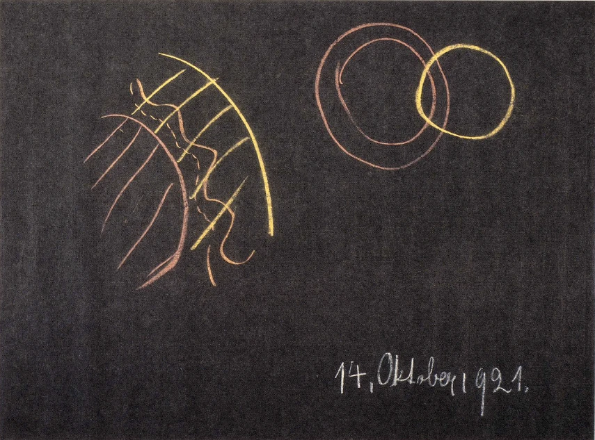

[ 1 ] ^row9zb

In den letzten Betrachtungen habe ich gezeigt, wie der Mensch ein Verhältnis zur Welt dadurch finden kann, daß er dieses Verhältnis sucht zum Geistigen, zum Seelischen und zum Leiblichen. Und ich habe Ihnen gezeigt, daß wenn wir im Ernste das geistige Wesen des Menschen zu unserem Bewußtsein bringen wollen, wir das nicht anders können als dadurch, daß wir den Blick hinaufwenden in die geistigen Welten. Denn tatsächlich spielen in unserem Menschengeiste die Taten und die gegenseitigen Beziehungen derjenigen Hierarchien, die immer von uns zusammengefaßt worden sind als Hierarchie der Angeloi, Archangeloi und Archai und so weiter. Und die Taten und Beziehungen dieser Wesenheiten sich zum Bewußtsein zu bringen, heißt zugleich des Menschen eigene Geistigkeit sich zum Bewußtsein bringen. ^847gsw

[ 2 ] ^jyutui

Von dem Seelischen konnte ich Ihnen ausführen, wie das Denken sich abspielt zwischen dem ätherischen Leibe des Menschen und dem physischen Leib, wie das Fühlen sich abspielt zwischen dem ätherischen Leibe des Menschen und seinem astralischen Leibe, wie das Wollen sich abspielt zwischen dem astralischen Leib und dem Ich des Menschen. Und dann zeigte ich Ihnen, wie das, was der Mensch heute seine Leiber nennen kann, nunmehr aufgefaßt werden muß, wenn man es in seiner wahren Gestalt sich zum Bewußtsein bringen will, als Keim für zukünftige Welten. So daß tatsächlich dasjenige, was im Weltensein der Zukunft sich gestalten wird, die Keime hat in den Menschenleibern, die wir an uns tragen: in unserem physischen Leib, den wir hier auf der Erde ablegen - aber indem er im Erdenbereich aufgelöst wird, wird er Keim für dasjenige, was die Erde wird, nachdem sie als Erde verschwunden sein wird. Unseren Ätherleib lernen wir kennen — kurze Zeit, nachdem wir durch die Pforte des Todes gegangen sind, löst er sich scheinbar im weiten Weltenall auf; aber er wird Keim für dasjenige, was die Erde werden soll in Zukunft. Und so ist es auch mit unserem astralischen Leib und mit dem, was unsere Ich-Hülle ist. Diese Ich-Hülle aber, so wie wir sie hier auf Erden haben als Menschen, haben wir in unser Wesen erst während dieses Erdendaseins eingegliedert bekommen. ^66l0as

[ 3 ] ^kly2pz

Nun leben wir heute, das heißt, wir leben schon durch lange Zeiten hindurch im intellektualistischen Zeitalter. Die Menschen begreifen, was in der Welt um sie herum ist, so wie man es eben heute begreift, durch den Intellekt, durch das verstandesmäßige Erkennen. Alles, was heute an den Menschen als Bildung, als Zivilisation herantritt, ist eingestellt auf diese äußere Erkenntnis. Und auch dann, wenn wir fühlen, so bleibt ja das Gefühl dumpf und traumhaft. Was auch im Fühlen dem Menschen klar wird, ist eben das, was die Welt heure aus ihrer autoritativen Wissenschaft heraus als eine äußere Erkenntnis liefert. So daß der Mensch heute von der Zeit an, da er der Schule übergeben wird, innerhalb unserer gewöhnlichen Zivilisation nur dasjenige als inneres Seelenleben erhält, was verstandesmäßige Beherrschung der Umwelt ist. Wie weit aber wirkt das, was verstandesmäßige Beherrschung der Umwelt ist? Ich könnte auch so sagen: Wie tief kommt das, was verstandesmäßige Beherrschung der Umwelt ist, in unser Seelenleben hinein? ^0s2gtm

[ 4 ] ^lwotu6

Nehmen wir einen Menschen, der heute mit sechs Jahren der Schule übergeben wird, jenen Schulen, in denen an die Menschen nur nach äußeren Methoden eine Beziehung zur äußeren Welt herangebracht wird. Nehmen wir an, dieser Mensch werde durch unsere höheren Schulen durchgeführt. Er kann dann sogar weiter irgend etwas lernen, kann die höheren Bildungsstufen durchmachen und all das in sich aufnehmen, wodurch man heute ein Führer der Menschheit auf irgendeinem Gebiete wird in geistiger Beziehung. Was nimmt denn ein solcher Mensch, der im Sinne der Bildung unserer heutigen Zeit sein Seelenleben gestaltet bekommt, was nimmt denn der eigentlich in diese seine Seele auf? Er nimmt nur das auf, was bis in sein Ich geht. Er nimmt nicht mehr auf als das, was bis in sein Ich geht. Er bekommt es dann zurückgestrahlt von denjenigen Gliedern seiner Menschenwesenheit, in die das Ich zwar eingesenkt ist, die aber nicht zur eigentlichen selbstbewußten Betätigung aufgerufen werden. Er nimmt von diesen wie Zurückstrahlungen auf seine Gedanken, seine Erinnerungsbilder, seine Gefühle, das, was er weiß über seine Willensimpulse. Alles übrige, was er erlebt, ist abgeschwächt, abgelähmt. Sein Seelenleben verläuft lediglich im Ich. Und alles das, was ihm vermittelt wird, wird ihm nur soweit vermittelt, daß es in sein Ich hineinkommt. ^q7j69p

[ 5 ] ^k277ke

Wie ist es nun, wenn an einen Menschen herantritt, was wir anthroposophische Geisteswissenschaft nennen? Wenn an einen Menschen herantritt, was wir anthroposophische Geisteswissenschaft nennen, dann sollte er eigentlich so etwas fühlen lernen, was ähnlich ausgesprochen werden kann wie: «... das Ich zu erkennen als ein Gebilde, das mit einer Gewalt, gegen die die Schwerkraft der Hauch einer Schneeflocke war, zu einem Zustande strebte, in dem nichts mehr von dem, was die moderne Kultur als Geistesgabe bezeichnete, eine Rolle spielte... .» Der Mensch sollte nämlich, indem er an anthroposophische Geisteswissenschaft herantritt, wirklich dazu kommen, sich zu sagen: An dich wird mit dieser anthroposophischen Geisteswissenschaft ein ganz besonderer Anspruch gemacht. Du kannst Dinge verstehen, die du als Ideen in deine Seele aufnimmst, von denen die anderen, die nur in der heutigen Bildung leben, sagen, sie seien phantastisch oder verrückt, denen also diejenigen, die in der heutigen Bildung leben, mit ihrer Ich-Kultur nicht beikommen. Sie kommen nicht an sie heran mit ihrer Ich-Kultur. Das Erden-Ich kann das nicht begreifen, was da aus Anthroposophie heraus als ein Begriff an den anderen gereiht wird, was da erzählt wird über Saturn-, Sonnen-, Mondenentwickelung, über die geistige, seelische, leibliche Wesenheit des Menschen. Man denke nur, wenn man einen heutigen richtigen Philosophen, der nicht bis zu diesem Grade verrückt oder «gescheit« geworden ist, daß er «den Darwin für eine Hebamme und den Affen für Kunstgewerbe anschaut», wenn man einem heutigen richtigen Philosophen zumutet, er solle verstehen, daß der Geist des Menschen, über den er so viel redet aber er redet nur Worte, der Philosoph von heute -, nur begriffen werden kann im Zusammenhange mit den höheren Hierarchien; daß die Seele des Menschen nur begriffen werden kann nach Denken, Fühlen, Wollen, wenn man zwischen die Glieder physischen Leib, Ätherleib, astralischen Leib und Ich hineinschaut! Und nun sollte man gar einem solchen Philosophen zumuten, daß er in den Leibeshüllen des Menschen, die er ja schon als phantastisch ansieht, Keime für Weltenzukünfte sche! Dazu kann man natürlich mit dem, was das heutige Ich überschaut, nicht kommen. Ist man nun doch in der Lage, irgend etwas vom seelischen Leben mit diesen grotesken Ideen verbinden, verknüpfen zu können — man braucht dazu gar nicht selbst Hellseher zu sein, sondern braucht nur die Dinge des Hellsehers hinzunehmen als Ideen -, dann tut man dies nun nicht im Ich, sondern im astralischen Leibe. Die Gedankenschatten, die man heute im Ich als Reflexion aus dem astralischen Leibe bekommt, die strengen den astralischen Leib nicht an. Die kann man mit der Ich-Kultur haben. Denn wenn das der astralische Leib ist (siehe Zeichnung, rot) und hier das Ich (grün), dann ist alles das, was der moderne Mensch erlebt, hier im Ich, und seine Gedanken sind nichts anderes als das, was der astralische Leib als Schattenbilder in das Ich hineinwirft (gelb). Man braucht sich dabei nicht anzustrengen. Man läßt das Ich walten, das man eben durch die Erdenorganisation bekommen hat. Man braucht sich wirklich nicht anzustrengen. Man konstruiert ein Mikroskop, legt darunter ein Präparat, verfolgt ein Präparat, ein zweites Präparat, guckt und stellt die Gedankenschattenbilder zusammen, macht einige Rechnungsoperationen, die ja auch so, wie sie als Schattenoperationen gegeben werden, in sich ablaufen. Man kann sich dabei in bezug auf sein inneres Miterleben der Welt ganz passiv verhalten. Man bildet dann diese Passivität weiter aus, indem man sich — aber jetzt nicht im Goetheschen Sinne - vom inneren Arbeiten auf das Schauen verlegt. Man geht nicht mehr gern zu Vortragsbetrachtungen, in denen man mitdenken muß, sondern lieber zu Vortragsbetrachtungen, in denen viel Experimente gemacht werden, und zwischen den Experimenten, in dem unangenehmen Geräusch, durch das die Experimente erklärt- werden, schläft man dann ein. Oder aber man geht gar ins Kino. Da braucht man schon gar nicht irgendwie aktiv zu sein. ^p2fby3

 ^j0mi15

[ 6 ] ^ha0imi

Das ist eben die Ich-Kultur. Sie wird immer weiter und weiter kommen. Aber da tritt anthroposophische Geisteswissenschaft auf, da kann man es nicht so machen. Ein Theologe der Gegenwart hat zwar gesagt, er würde die «Akasha-Chronik» selbst dann nicht lesen, wenn ich sie ihm in einem illustrierten Prachtexemplar spendieren würde. Aber er braucht nicht zu fürchten, daß er die «Akasha-Chronik» in einem illustrierten Prachtexemplar spendiert bekommen würde, denn man muß sie in einer Weise sich aneignen, daß man innerlich bildend mitarbeitet. Wenn man wirklich symbolisierend künstlerisch auch das, was man in der «Akasha-Chronik» findet, einmal fixieren würde dieser Theologe, der würde auch dann nicht in der Lage sein, mit einem solchen «illustrierten Prachtexemplar» der «Akasha-Chronik» irgend etwas anzufangen, weil er eben auf das «Illustrierte» den Hauptwert legte. - Nun ja. ^r4x5gw

[ 7 ] ^qzezeq

Bei anthroposophischer Geisteswissenschaft, da muß man innerlich mitarbeiten, sonst hört man natürlich nur Worte, die man ja in beliebiger Weise als Phantasterei ansehen kann. Aber dieses innerliche Mitarbeiten, das muß man lieben lernen. Zu dem muß man sich entschließen. Es ist unbequem; aber man merkt, wenn man sich dazu entschließt, daß es erfrischt, daß es den Menschen seelisch und leiblich frischer macht. ^yrgwpi

[ 8 ] ^j1qe91

Ich weiß, daß manche Menschen auch manches einwenden gegen dieses Frischerwerden. Aber die möchten gern das, was sie durch ein aktives Mitarbeiten des astralischen Leibes in einem schwer sich weiterringenden Verständnis sich erwerben sollen, sich eben nur durch das passive Denken erwerben, so wie jener Theologe wohl am liebsten haben würde, wenn man ihm die ganze «Geheimwissenschaft im Umriß» im Kino abspielen würde. Denn so ungefähr sind seine Begriffe, die er ja auch sonst in dem Aufsatz gebraucht, wo er von der «illustrierten Prachtausgabe» der «Akasha-Chronik» spricht. ^d54pud

[ 9 ] ^12lxth

Kurz, durch die anthroposophische Geisteswissenschaft kommt etwas in Regsamkeit, was nun nicht das bloße Ich ist, sondern was der astralische Leib ist. Es gibt allerdings auch solche Leute, die das dann spüren, wenn sie ein anthroposophisches Buch lesen. Da spüren sie so etwas; da quirlt in ihnen etwas. Nun sind sie darauf eingerichtet, sich innerlich nur passiv, als Gedankenschatten, fortzubewegen. Nun fängt da so etwas wie ein aktiver Verstand an zu quirlen. Da kommt es ihnen so vor, wie wenn sie innerlich Läuse hätten, und dann werden sie nervös über dieses innerliche Quirlen, und dann sagen sie: Das ist ungesund. Und dann klagen sie über diese schwierigen Dinge, die den Menschen in anthroposophischer Geisteswissenschaft dargeboten werden. Und insbesondere diejenigen, die dann solche innerlich merkwürdig affizierten Menschen als Bruder, Schwester, Tante, Onkel beobachten können, die machen sich dann die Klage zu eigen, daß Anthroposophie etwas ist, was die Menschen nervös macht. ^lf08d7

[ 10 ] ^w3qjz3

Aber wie steht es da nun, wenn wir jetzt fragen: Welches Verhältnis ist zwischen der Ich-Kultur, die der Mensch zunächst während der Erdenzeit aufnimmt, und derjenigen Kultur, die angeeignet werden kann durch anthroposophische Geisteswissenschaft? Das kann eine einfache schematische Zeichnung klarmachen. Nehmen wir also an, wir hätten hier die Erde (siehe Zeichnung, rot). Ihr würden vorangegangen sein Mond, Sonne, Saturn. Wir hätten hier als nächsten Planeten, der sich aus der Erde herausverwandelt, nachdem die Erde ihrem Untergang entgegengegangen ist, den Jupiter (grün). An dem Jupiter sind nun intensiv beteiligt diejenigen Glieder der menschlichen Wesenheit, jetzt als Keim, die physischer Leib, Ätherleib, astralischer Leibsind;aber das Ich nur unter einer bestimmten Voraussetzung. Wenn das Ich nämlich nichts aufnimmt, als was es aufnehmen kann durch die Erdenkultur, dann hört dieses Ich-Bewußtsein auch mit der Erde auf, dann ist der Mensch ein Erden-Ich geworden, und er hört auf, ein Erden-Ich zu sein mit der Erde. Er muß in andere Formen sich weiterentwickeln. ^1y29lm

[ 11 ] ^pxf45o

Wenn aber der Mensch sich hineinentwickelt hat bis in seinen astralischen Leib, wenn er seinen astralischen Leib in Aktivität gebracht hat, dann strahlt diese Aktivität auch zu seinem Ich zurück. Der Mensch hat dann eine Wesenheit von Ich und astralischem Leib, die innerlich tätig sind. Er fühlt nicht, als ob er - wie ich vorhin gesagt habe - innerlich Läuse hätte, sondern er fühlt, als ob er innerlich von starken, gesunden Lebenskräften durchzogen wäre, von solchen Lebenskräften, die ihn nun verbinden mit dem, was eben schon von seinen Leibeshüllen als Keim hinausgeht in zukünftige Erdenmetamorphosen, um in zukünftigen Erdenmetamorphosen sich weiterzuentwickeln. ^wyvvio

[ 12 ] ^gzu5l8

Anthroposophische Geisteswissenschaft muß durchaus als etwas Lebendiges betrachtet werden. Sie gibt dem Menschen nicht bloß eine "Theorie oder eine theoretische Weltanschauung, sie gibt dem Menschen die Lebenskraft, die ihn über das bloße Erdendasein hinausführen kann. ^si46a9

[ 13 ] ^06koap

Insbesondere nun, wenn wir eine solche Erkenntnis, wie wir sie in den letzten drei Vorträgen hier vor unserer Seele sich haben entrollen lassen, ganz ernst nehmen, wenn wir den Menschen hineinstellen nach Geist, Seele und Leib in das ganze Weltenwerden und etwas dabei fühlen an innerem menschlichem Gehalte, reicher werden dadurch, dann gliedern wir diesem Menschen etwas ein, was ihn hinausträgt über das Erdendasein. Denn es könnte durchaus so sein -— obwohl es hoffentlich nicht der Fall sein wird -, daß die Menschen, weil sie in der vorhin charakterisierten Weise müde davon werden, abweisen anthroposophische Geisteswissenschäft. Darin würde allerdings die menschliche Hülle sich auch weiterentwickeln, aber sie würde von anderen Wesen als von den Menschen in Anspruch genommen werden, und die Menschen würden hinuntersinken in ein niedrigeres Dasein als das ist, zu dem sie bestimmt sind. ^jpgi02

[ 14 ] ^yooe0a

Das ist es schließlich, was ein paar Menschen in der Gegenwart dazu bringt, ängstlich zu werden über des Menschen kosmische Zukunft, was ein paar Menschen dazu bringt, zu ahnen, daß der Mensch durch seine Schuld verlorengehen könnte im Weltenall. Und dazu muß nur noch manches andere kommen, daß die Menschen nicht etwa bloß einsehen: «Darwin war eine Hebamme und der Affe ein Kunstgewerbe», daß sie nicht bloß einsehen, daß man schließlich «unter Führung der Schulmedizin» redet von «Nervenschwäche, Ermüdbarkeit, Psychasthenie» und so weiter, daß sie nicht bloß dazu kommen, sich zu sagen: «Ich schreibe nichts mehr, man müßte mit Spulwürmern schreiben. Ich lese nichts mehr. Wen denn? Die alten ehrlichen Titaniden in Stullenpapier?» ^4imc9c

[ 15 ] ^um47db

Nun, trotz des Höllengelächters, das von manchen Seiten angestimmt wird, muß man eben sagen: Diejenigen, die keinen Glauben mehr haben an die «Titaniden mit den Ikaridenflügeln in Stullenpapier», diejenigen, die einsehen, daß man über all das, was keimhaft veranlagt ist in unserer Niedergangskultur, eigentlich nur «mit Spulwürmern schreiben» müßte, die dann fragen: Was soll man denn noch lesen, womit soll man sich denn beschäftigen? — die dann fragen können: Lebt man denn überhaupt noch? - denen sollte, wie gesagt, trotz des Höllengelächters, das von manchen Seiten in der Gegenwart angestimmt wird, anthroposophische Literatur in die Hand gegeben werden, und sie sollten auf irgendeine Weise, sofern das nur irgend vermocht wird, eine seelische Arzenei bekommen, damit sie die durch die Gegenwartskultur verursachten Hemmungen loswerden, welche sie hindern, das aufzunehmen, was die Seele heute unbedingt braucht. ^9b1rf6

[ 16 ] ^1dht0p

Es gehen viele Leute heute in der Welt herum, die mit sich nichts anzufangen wissen, denen ihr Leib zu schwer, innerlich zu krüppelig wird. Gerade sie müßten oftmals im vollen Ernste darauf hingewiesen werden, welch kraftende, gesundende Impulse in einem wirklichen Sich-Erarbeiten der Gedanken, der Ideen anthroposophischer Geisteswissenschaft liegen. ^utiszn

[ 17 ] ^0ni86q

Diese Dinge müssen schon durchaus, ich kann es immer nur wieder und wiederum sagen, mit hohem Ernste genommen werden. Man muß schon heute durchaus ein wenig einsehen können, wie es eigentlich liegt in unserer Zeit mit demjenigen, was so als die Konsequenzen hervorgehen kann aus den Richtungen, die die materialistische Kultur eingeschlagen hat. ^hy2vsz

[ 18 ] ^uqauvm

Möge nun auch gespürt werden, wie sehr es notwendig ist, daß heute aus Ursprungsquellen heraus eine Erneuerung unserer Kultur stattfindet! ^p3c7y1