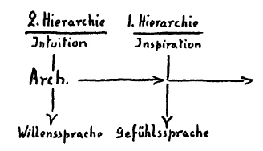
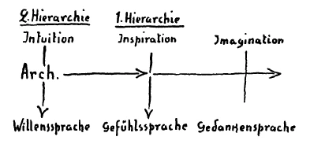
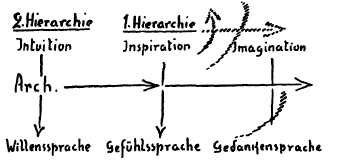

Der Michael-Gedanke Als Anruf Des Menschlichen Willens ^vvkmj3

Wenn Sie sich an verschiedenes erinnern, das ich hier im Laufe der letzten Betrachtungen vorgebracht habe, so werden Sie vor Ihre Seele hinstellen können die Beziehung der menschlichen Sprache, des Sprechenkönnens des Menschen zu denjenigen Wesen, die wir gewöhnt worden sind, in der geistigen Welt zur Hierarchie der Archangeloi, der Erzengel zu rechnen. Erinnern Sie sich, wie ich in einer der vorangehenden Betrachtungen ausgeführt habe, welche Bedeutung es für den Menschen hat, wenn er die Worte seiner Sprache so gestaltet, daß diese Worte nur zu rein materiellen Dingen Beziehung haben, daß also die Sprache gewissermaßen einen materialistischen Charakter annimmt, oder wenn er die Sprache so gestaltet, daß er im Sprechen einen gewissen Idealismus entwickelt, daß schon die Sprache ihn bei jedem Aussprechen eines Wortes empfinden läßt: er gehört einer geistigen Welt an, und was als Worte seiner Seele in seiner Sprache erklingt, das muß, weil es eben aus der Menschenseele kommt, irgendwelche Beziehung haben zu Geistern. Je nachdem das eine oder das andere der Fall ist, sagte ich Ihnen, kommt der Mensch zwischen dem Einschlafen und Aufwachen in die rechte oder unrechte Beziehung zu den Erzengelwesen, zu den Wesen, die wir als Archangeloi bezeichnen. Der Mensch verliert immer: mehr und mehr seinen notwendigen Zusammenhang mit diesen Archangeloi, wenn er den Idealismus aus seiner Sprache verschwinden läßt. Ich erinnere an diese Tatsache deshalb, weil ich eines wenigstens herausheben möchte, was die Beziehung des menschlichen Sprechens überhaupt zu der Hierarchie der Archangeloi vor Ihre Seele stellen kann. ^c462ul

Nun hat das menschliche Sprechen, die menschliche Sprache im Laufe der Menschheitsentwickelung eine Geschichte durchgemacht, wie im Grunde genommen alle Entwickelung, insofern sie den Menschen betrifft. Wir haben das für die verschiedensten Entwickelungstatsachen des Menschenwesens kennengelernt. Was ich nun heute auseinandersetzen möchte, das bezieht sich nicht auf die eine oder die andere Sprache. Die Zeitperioden, auf die wir in bezug auf die eine oder andere tiefste Entwickelung der Sprache verweisen müssen, sind so lang, daß selbst primitive Sprachen heute schon denselben Charakter tragen in bezug auf das, was wir heute auseinandersetzen wollen, wie zivilisierte Sprachen. So daß also heute nicht hingewiesen wird auf die Differenzen, die unter den einzelnen Sprachen bestehen, sondern auf jene Umwandlungen, auf jene Metamorphosen, welche das menschliche Sprechen überhaupt im Laufe der Menschheitsentwickelung auf Erden durchgemacht hat. ^mzvahz

Wenn wir heute das Verhältnis des Menschen zu seiner Sprache ins Auge fassen, so finden wir ja, daß wir eigentlich in den Worten der Sprache kaum mehr anderes haben als Zeichen für das, was außer uns ist und worauf mit den Worten der Sprache hingewiesen werden soll. ^flzj52

Sie wissen, wir haben im Laufe unserer anthroposophischen Betrachtungen auch auf ein intimeres Verhältnis des Wortes zur Sache hingewiesen. Aber solch ein intimes Verhältnis wird ja heute kaum mehr von den Menschen gefühlt. Die Worte sind mehr oder weniger nur äußere Zeichen für das, was mit ihnen gemeint ist. Wer fühlt denn zum Beispiel heute, wie in dem Worte «Blitz» tatsächlich etwas liegt, was, wenn das Wort ausgesprochen wird, seinem Laute nach von dem menschlichen Gemüte so erlebt werden kann, wie das Zucken des Blitzes durch den Raum erlebt wird. Man fühlt ja die Sache heute mehr oder weniger so, daß eben dieses Lautgefüge «Blitz» das Zeichen für die zuckende Lichterscheinung des Blitzes bedeutet. Das war aber nicht immer so, sondern wenn wir zurückgehen - wir brauchen dabei wohl nur in die älteren Zeiten des Griechentums zurückzugehen -, dann finden wir, daß das Verhältnis des Menschen zur Sprache nicht ein solches Zeichenhaftes, Gedankenhaftes war, sondern daß der Mensch selbst in der Tat an der Lautgestaltung seiner Worte mit seinem Gemüte beteiligt war. Für die nördlichen Sprachen brauchen wir nicht einmal so weit zurückzugehen. ^3poren

Heute ist das Gefühl dafür abgelähmt, daß das Wort «Pflug» so erlebt werden kann wie die Tätigkeit, die mit diesem Ackerinstrumente ausgeführt wird. Es ist das Wort ein Zeichen geworden. Aber vor verhältnismäßig kurzer Zeit -— wir brauchen vielleicht nur an kaum eineinhalb Jahrtausende zu denken -, da wurden die Worte noch in den nördlicheren Gegenden Europas so gefühlt, daß tatsächlich das Gefühl beim Pflügen ein ähnliches war, wie innerlich das Gefühl war bei dem Worte, das dazumal den Pflug bezeichnete. Es war also damals an der Empfindung vom Worte weniger der Gedanke beteiligt, sondern es war das Gefühl des Menschen daran beteiligt. ^woxpr0

Und wenn wir in ganz alte Zeiten der Menschheit zurückgehen, dann finden wir, daß nicht nur das Gefühl daran beteiligt ist, sondern daß der Wille intensiv bei der Wortbildung beteiligt ist. Aber wenn wir jene Zeit betrachten wollen, in der die Menschen vor allen Dingen ihr Willensverhältnis zu der äußeren Natur betrachteten, indem sie in der Sprache lebten, da müssen wir schon zurückgehen bis in die späteren atlantischen Zeiten. Es sind eben durchaus lange Zeitepochen, in denen sich die Sprache in der Weise, wie ich es eben jetzt angedeutet habe, entwickelt. Und in der Sprache lebt ja der Sprachgenius. Die Sprache unterliegt ja nicht der menschlichen Willkür in ihrer Entwickelung, sondern in der Sprache lebt der Sprachgenius. Und der Sprachgenius gehört im wesentlichen der Hierarchie der Archangeloi an. Indem der Mensch spricht, also sozusagen um die Erde herum eine Atmosphäre bereitet, in der die zur Sprache artikulierten Lautbildungen des Menschen leben, ist diese Sprachatmosphäre das Element der Archangeloi. Deshalb sind die Archangeloi die Volksgeister, wie Sie aus einem Vortragszyklus von mir wissen können. ^ypzujk

Es ist also eigentlich dasjenige, was in der menschlichen Sprachentwickelung auf Erden erscheint, innig zusammenhängend mit der Entwickelung der Archangeloi. Man möchte sagen: Was sich in der Sprachentwickelung ausdrückt, ist ein Bild der Archangeloientwickelung. Wir sind, wenn wir auch nur das, was irdisch ist, betrachten, durchaus nicht davon ausgeschlossen, die Entwickelung der höheren geistigen Wesenheiten kennenzulernen. Wir müssen nur in der richtigen Weise wissen, wie wir bestimmte Erscheinungen und Tatsachen auf gewisse höhere geistige Wesenheiten beziehen müssen. Wir müssen nur klar hineinschauen, wie in der Umwandlung der Sprachfähigkeit der Menschen auf Erden die fortlaufende Entwickelung der Archangeloi sich ausdrückt, sich offenbart. ^dbb9ll

Wenn wir nun in diese ganz alten Zeiten zurückgehen, in denen die Menschen ihr Willensverhältnis in der Sprache zum Ausdruck brachten, also in die letzten. Zeiten der atlantischen Entwickelung, da war die Sprache oder das, was in der Sprache als Wesen aus der Hierarchie der Archangeloi lebte, etwas anderes, als was später in dieser Beziehung vorhanden war. Machen wir uns einmal klar, wie die Sprachbildung in diesen uralten Zeiten der menschlichen Erdenentwickelung war. Da interessierte den Menschen noch nicht viel, wie sich das fühlen läßt zum Beispiel, wenn die Blumen blühen, wenn dieses oder jenes Wetter ist. Das interessierte ihn in anderer Beziehung, nicht aber in bezug auf jene Fähigkeit, die aus den Tiefen seiner Seele hervorsprießen läßt das Wort. Für die Wortbildung interessierte ihn, ob ihm zum Beispiel Gefahr drohte von dieser oder jener äußeren Tatsache, ob er etwas abzuwehren hatte, oder ob etwas auf ihn günstig wirkte, so daß er es in seine Lebensverhältnisse hereinbeziehen wollte, ob etwas für seine Gesundheit förderlich oder schädlich war. Kurz, ob sein Wille nach dieser oder jener Richtung angeregt wurde, das interessierte ihn. Was er unter dem Einfluß der äußeren Tatsachen veranlaßt wurde zu tun, das interessierte ihn, und danach waren die Worte gebildet. In jener alten Zeit waren die Worte durchaus Ausdrücke für die menschlichen Reaktionsvorgänge, für das, was sich der Mensch veranlaßt sah zu tun unter dem Einflusse der Welt. Willensausdrücke waren fast die einzigen Ausdrücke, die die urältesten Sprachen während der menschlichen Erdenentwickelung hatten. Und woher kam das? Das kam davon her, daß die Archangeloi zu der Sprache auf dem Wege der Intuition kamen. ^3ggzoo

Wenn Sie die Beschreibungen nehmen, die ich in meinen verschiedenen Büchern über das Wesen der Intuition gegeben habe, dann haben Sie mit dieser Intuition auch diejenige Tätigkeit geschildert, welche die Archangeloi ausübten, sagen wir, in den letzten Zeiten der atlantischen Entwickelung, um den Menschen die damalige Willenssprache zu übermitteln. Dann aber rückten diese Archangeloi in ihrer eigenen Entwickelung vorwärts. Ich habe ja auf die Entwickelung der in der geistigen Welt lebenden Führer des Menschen und der Menschheit in der kleinen Schrift «Die geistige Führung des Menschen und der Menschheit» hingewiesen. Heute möchte ich auf ein Gebiet kommen, das dort weniger berücksichtigt ist, auf das Gebiet der Sprache. ^xbzi5q

Das Fortschreiten der Archangeloi in bezug auf die Sprache liegt darin, daß sie in der älteren Fähigkeit der Intuition vor allen Dingen in den Welten höherer Hierarchien darinstanden, sich hingaben an die Welten höherer Hierarchien, so daß sie eigentlich mit der Sprache etwas bekamen, was das Wesen höherer Hierarchien war, als die Erzengelhierarchie ist. Die Erzengel gaben sich, solange die sprachbildende Kraft bei ihnen auf der Intuition beruhte, der nächsthöheren Hierarchie hin, den Kyriotetes, Dynamis, Exusiai. Da standen sie darinnen. Und aus dem, was sie erlebten durch ihr intuitives Darinstehen in dieser Hierarchie, konnten sie dem Erdenleben die sprachbildende Kraft einflößen. ^k3yygd

In der nächsten Epoche schritten die Archangeloi so vorwärts, daß ihre sprachbildende Kraft nicht mehr aus der Intuition floß, sondern aus der Inspiration. Sie gaben sich nicht mehr völlig der nächsthöheren Hierarchie hin, sondern was sie durch die Hingabe an diese höhere Hierarchie bekamen, war ihnen etwas anderes geworden als das, was sie als Sprache den Menschen vermittelten. Sie lauschten jetzt auf die Inspirationen der ersten Hierarchie, der Throne, Cherubim, Seraphim, und aus dieser Inspiration heraus flößten sie dem Erdenleben die sprachbildende Kraft ein. ^40ij02

Wenn wir in die ersten Zeiten der nachatlantischen Entwickelung, selbst noch bis ins Ägyptertum und Chaldäertum zurückgehen, so finden wir überall, wie der Quell, aus dem heraus die Erzengel schöpfen, um dem Menschen die Sprache zu vermitteln, die Inspiration ist. Da wird die Sprache so — sie macht eine Metamorphose durch -, daß vor allen Dingen die Worte Ausdruck werden für menschliche Sympathie und Antipathie, für menschliche Gefühle und Empfindungen überhaupt. An die Stelle der alten Willenssprache tritt eine Gefühlssprache. Und es ist vorzugsweise jener Zustand vorhanden, wo gefühlt wird an dem äußeren Vorgang oder dem äußeren Wesen dasjenige, was auch gefühlt wird, wenn aus den Tiefen der Menschenwesenheit durch die Sprachorgane die zum Worte artikulierten Laute kamen. ^0xhon0

So können wir sagen: Es ist ein bedeutungsvoller Vorgang in der Menschheitsentwickelung da. Die Hierarchie der Archangeloi ist zuerst Intuitionen unterworfen, und aus den Intuitionen herunter wird die Willenssprache durch diese Wesenheiten geschaffen. Die Archangeloi rücken vorwärts, sie sind dann unterworfen der Inspiration. Und aus dem, was sie durch die Inspiration der Wesen der ersten Hierarchie empfangen, entstehen die Gefühlssprachen. ^4nc750

 ^9p78xp

Es war ja eigentlich ein außerordentlich tiefes Gefühl, aus dem heraus Alerman Grimm, der Kunsthistoriker, diese Scheidewand zwischen Griechen und Römern gezogen hat. Herman Grimm hat nämlich behauptet: Wenn man heute in der Schule oder auf der Universität Geschichte lernt, ist man darauf angewiesen, daß man das, was man da lernt, auch versteht. Aber man versteht, wenn man heute Geschichte lernt, rückwärtsgehend in der Menschheitsentwickelung, die Geschichte nur bis zum Römertum. Cicero, Cäsar, die kann man noch verstehen, weil sie bis zu einem gewissen Grade dem heutigen Menschen schon ziemlich ähnlich sind, obwohl auch schon viel Unnatürliches in dem Verständnis liegt, das wir, sagen wir, Cäsar entgegenbringen. Würden wir nicht dazu dressiert, so würden sich für Cäsar wahrscheinlich nur die Zöglinge der Militäranstalten interessieren. Wir werden in dieser Beziehung furchtbar dressiert. Aber im ganzen und großen geht heute eben ein fortlaufender Strom zurück zum Römertum. Ein gewisses philiströses Element, das heute in der Kulmination ist, das aber allmählich in die Menschheit eingeschlichen ist, das finden wir eben schon, wenn wir bis zum Römertum zurückgehen. Aber derjenige, der ehrlich ist im Verständnis der Vergangenheit, so meint Herman Grimm, der kann sich nicht zuschreiben, daß er zum Beispiel den Perikles oder den Alkibiades versteht. Die versteht man so, wie man die Persönlichkeiten von Märchen versteht. Das Seelenleben dieser Persönlichkeiten kann erst wiederum verstanden werden gerade durch anthroposophische Vertiefung. Wir haben immer versucht, hineinzukommen in die Art und Weise, wie ein Grieche vorstellt. Das fühlt auch Herman Grimm. Er fühlt die Entfernung, die zwischen dem Seelenleben eines Griechen und eines modernen Menschen ist, der den Römern noch sehr nahesteht; dann kommt ein Abgrund. ^nwv3hm

Wie die Griechen in den heutigen Schulen geschildert werden, das ist etwas Furchtbares, denn da werden sie eben modernisiert. So sind sie nicht gewesen, ihr ganzes Seelenleben war anders. Man muß zu ganz andern Mitteln greifen, wenn man die Griechen charakterisieren will. Es hat sich am besten gezeigt an einem besonderen Fall, wie der urgelehrte Wilamowitz daran ging, die griechischen Tragiker zu übersetzen. Die ganze Affäre ist eigentlich schrecklich, denn es ist natürlich in den Wilamowitzschen Übersetzungen nichts von den griechischen Tragikern darin, rein gar nichts. Und doch gefällt es den modernen Menschen ungeheuer, sie sind ganz entzückt von den Wilamowitzscher: Übersetzungen. Aber die Personen, die da bei Wilamowitz auftreten, sind nicht die, die bei den griechischen Tragikern auftreten. ^b5oo5j

Also wenn wir nach Griechenland zurückkommen — das hat Herman Grimm mit einem sicheren Instinkt gefühlt -, da kommen wir in eine ganz andere Welt, gar nicht zu reden von den orientalischen Elementen in dieser Beziehung. Es ist ja der reine Hohn, wenn die moderne Menschheit überhaupt glaubt, aus den Deussenschen Übersetzungen etwas zu begreifen von dem, was im alten Orient sich abgespielt hat. Da muß man eindringen können in diese ganze Umwandlung und Umgestaltung des seelischen Wesens. ^bsvsfd

Und wenn man auf ein besonderes Element hinschaut, auf die Sprache, dann ist das eben so, daß bis ins Griechentum herein die Gefühlssprache geherrscht hat zum Beispiel unter den Philosophen bis zu Plato. Der erste philosophische Philister ist der große universelle Geist Aristoteles. Sie werden sich verwundern, daß ich die zwei Attribute hintereinander sage, aber man versteht Aristoteles nicht, wenn man ihn nicht als den ersten philosophischen Philister und als den universellen Geist zugleich auffaßt. Er ist groß in einer gewissen Beziehung, aber er ist in einer andern Beziehung eben der erste philosophische Philister, der aus den Worten die Gedankenkategorien herausklaubt. Das wäre den älteren Griechen gar nicht eingefallen, aus den Worten Gedankenkategorien herauszuklauben, denn sie hatten noch ein Gefühl dafür, daß die Worte etwas sind, was hereininspiriert wird in die Menschen. Sie fühlten die höheren Geister, indem die Sprache entstand. ^8u60tm

Bis in die Griechenzeit herein und für die äußere Menschheit die in bezug auf gewisse Dinge gewiß sehr zurück ist, aber in bezug auf geistige Dinge oftmals weniger zurück ist als die Philosophen -, für diese übrige Menschheit, die also in bezug auf die sprachbildende Kraft länger die Inspirationen behielt als die Philosophen, können wir wirklich sagen: Wir vernehmen noch überall in der sprachbildenden Kraft das inspirierende Element, das aber allerdings in der Seele der Erzengel lebt, bis zum Mysterium von Golgatha hin. Natürlich ist das approximativ. In der einen Gegend der Erde dauert es länger, in der andern kürzer. In der einen Gegend der Erde fühlen die Menschen noch, wie das Wort in ihnen so pulst, wie das Blut im Körper pulst; das fühlen sie in der Atemkraft. Und sie fühlen in der hinwehenden, das heißt in der den Körper durchwehenden Atemkraft den der Inspiration unterliegenden Archangelos. ^42gnk9

Dann kommen wir an die Zeitepochen heran, wo die Erzengel, indem sie dem Menschen die Sprache vermitteln, nicht mehr der Inspiration unterliegen, sondern der Imagination (siehe Schema). Und die Sprache wird zur Gedankensprache. Die Menschen sprechen immer mehr und mehr aus den Gedanken heraus, die Sprache kommt gewissermaßen an das abstrakte Element des Menschen heran. ^gactrx

Dem liegt etwas sehr Bedeutsames zugrunde. Die Intuitionen haben die Archangeloi empfangen von der zweiten Hierarchie; sie selber gehören zur dritten Hierarchie. Die Inspirationen haben sie empfangen von Seraphim, Cherubim und Thronen, von der ersten Hierarchie. Die Imagination - ja, da gibt es zunächst keine Hierarchie über die erste hinaus! Diese Imaginationen konnten sie zunächst nicht von den Hierarchien empfangen, die zum Beispiel noch bei Dionysius dem Areopagiten verzeichnet sind. Da gab es über die erste Hierarchie hinaus keine. Daher haben gewisse Erzengelwesen dazu greifen müssen, nun die Imaginationen, das heißt, die Bilder der sprachbildenden Kraft - denn das sind die Imaginationen — aus der Vergangenheit herzuholen, also Früheres fortzusetzen. Es hörte die unmittelbare quellende Kraft, Sprache zu bilden, auf. In die Sprache kam ein ahrimanisches Element herein, weil sie herübergenommen wurde aus einer früheren Stufe. Das ist etwas ungeheuer Bedeutungsvolles. Und dieses, was da die Archangeloi über sich im Oberen fühlten, das drückte sich in der Menschheit dadurch aus, daß die Sprache immer mehr und mehr sich abschliff, ablähmte, nicht mehr als etwas so Lebendiges vorhanden war wie in früheren Zeiten. ^erw152

 ^gc6f8j

Bedenken Sie, was für ein ungeheuer Bedeutsames sich in dieser Tatsache ausspricht. In das Menschenleben kommt etwas herein, was eigentlich eine höhere Hierarchie brauchte, als die erste Hierarchie ist. Man muß dieses nur in seiner ungeheuer umfassenden Bedeutung fühlen, und man wird darauf hingewiesen, wie eine Zeit herangekommen war, in der Götter über dasjenige hinauswachsen mußten, was in der ersten Hierarchie enthalten war. ^3u17lx

Nun gibt es eines, was die Götter bis zu jener Zeit nicht erreicht hatten, was auf Erden hier schon im Abbilde vorhanden war. Was die Götter noch nicht erreicht hatten, das ist das Durchgehen durch den Tod. Es ist das ein Faktum, auf das ich schon öfter hingewiesen habe. Die Götter, die in den verschiedenen Hierarchien über dem Menschen stehen, haben nur Verwandlungen, Metamorphosen von einer Lebensform in die andere kennengelernt. Das eigentliche Ereignis des Todes im Leben war vor dem Mysterium von Golgatha keine Göttererfahrung. Der Tod ist ins Leben hereingekommen durch die luziferischen und ahrimanischen Einflüsse, durch zurückgebliebene oder das Vorwärtsstürmen zu schnell treibende Götterwesen. Aber der Tod ist eigentlich nicht etwas, was als eine Lebenserfahrung der höheren Hierarchien vorhanden war. Das tritt ein als eine Erfahrung für diese höheren Hierarchien in dem Augenblick, als der Christus durch das Mysterium von Golgatha, das heißt, durch den Tod geht; als der Christus mit dem Schicksal der Erdenmenschheit sich so weit vereinigte, daß er mit dieser Erdenmenschheit das gemeinsam haben wollte, daß er den Tod durchgemacht hat. Es ist also dieses Ereignis von Golgatha nicht bloß ein Ereignis des Erdenlebens, es ist dieses Ereignis von Golgatha ein Ereignis des Götterlebens. Was sich auf der Erde abgespielt hat, und was im menschlichen Gemüt als eine Erkenntnis von dem Ereignis von Golgatha auftritt, das ist das Abbild von etwas ungeheuer viel Umfassenderem, Großartigerem, Gewaltigerem, Erhabenerem, das sich abgespielt hat in den Götterwelten selber. Und des Christus Durchgang durch den Tod auf Golgatha ist ein Ereignis, durch das die erste Hierarchie in ein höheres Gebiet hinaufreichte. Daher mußte ich Ihnen immer sagen: Die Trinität liegt eigentlich über den Hierarchien. Aber dazu ist sie erst im Laufe der Entwickelung gekommen. Entwickelung findet überall statt. ^u39v9t

Also mit Bezug auf diejenigen Hierarchien selbst, welche bei Dionysius dem Areopagiten verzeichnet sind, verlieren die Erzengel die Möglichkeit, die Imaginationen von oben zu bilden. Der Mensch verliert die Möglichkeit, seine Sprache lebendig fortzugestalten. In der Götterwelt geht etwas vor, dessen irdisches Abbild das Ereignis von Golgatha ist. Und deshalb hängt mit dem Ereignis von Golgatha unter vielem andern auch das zusammen, daß, wenn die Menschen nach und nach immer mehr und mehr den Christus-Impuls aufnehmen, sie durch den Christus-Impuls wiederum den lebendigen Sprachquell erhalten. ^o4oolv

Wir haben heute, man möchte sagen, die auslaufenden bloß natürlichen Sprachen. Und wenn man unbefangen genug ist, kann man in den auslaufenden natürlichen Sprachen, insbesondere je weiter man vom Osten nach dem Westen geht, vernehmen, wie diese Sprachen ein absterbendes Element in sich tragen, wie sie immer mehr und mehr zur Hülle werden. In Asien ist es noch weniger der Fall, gegen den Westen hin aber ist es immer mehr und mehr so, daß die Sprachen ein absterbendes Element in sich tragen. ^e4x66u

Eine Belebung des Sprachschöpferischen im Menschenwesen kann nur dadurch eintreten, daß die Menschen immer mehr den ChristusImpuls als ein Lebendiges wieder ergreifen, damit der Christus-Impuls gerade das Sprachschöpferische werde. Und unter all den Dingen, die man anführen muß, wenn man die Bedeutung des Christus-Impulses für die Menschheitsentwickelung darlegen will, ist auch dieses, daß die Menschheit in der Zeit, in der sie zur Freiheit aufrückte, herauskam aus dem göttlich-geistigen Durchströmt- und Durchwebtsein der Sprachen. Wäre die Sprache so geblieben, wie sie im alten Griechenland war, der Mensch hätte sich nicht zur Freiheit entwickeln können. Es brauchte einmal, ich möchte sagen, dieses Absurde, daß die Sprache nur zum Zeichen da ist, daß die Archangeloi die Möglichkeit verloren haben, die Imaginationen aus der Gegenwart zu bilden, daß sie aus der Vergangenheit sie bilden mußten. In dieser Zeit, an deren Beginn sich der Christus angekündigt hat, in der er niederschreiben ließ das Geheimnis seines Wesens und seiner Tätigkeit in den Evangelien, in dieser Zeit ist aber die Christus-Erkenntnis nicht vollständig unter die Menschen gekommen, weil sie nicht geistig genug, weil sie oftmals nur traditionell war. Erst wenn das Wort des Evangeliums belebt wird von einem Christus-Verständnis aus, das in der Gegenwart selber von dem fortwirkenden, immer auf den Menschen Einfluß habenden Christus kommt, erst dann wird auch die sprachbildende Kraft von diesem Christus-Impuls, von dem lebendigen Christus-Impuls ausgehen. ^fdoddq

Aber schreiben wir jetzt auf, was ich Ihnen hier angedeutet habe (siehe Schema). Machen wir uns ganz klar, daß da oben etwas vorgeht, wodurch Götter erhöht werden, daß da unten etwas vorgeht, wodurch die Menschen den Christus-Impuls immer mehr haben, aber auch immer mehr zur Freiheit vorrücken. Stellen wir uns nur vor, daß, indem der Mensch eine Erhöhung durchmacht, diese Erhöhung des Menschen auch eine Erhöhung der höheren Hierarchien ausmacht. Seien wir uns klar darüber, daß die Imaginationen der Archangeloi gegenwärtig lebendige Imaginationen werden, wenn die Archangeloi immer mehr hineinbekommen von dem Christus, der seinen Wohnplatz in den Herzen der Menschen auf der Erde gefunden haben wird, der als ein Impuls in die Imaginationen der Erzengel einzieht. ^ncigg8

 ^isvefh

Es wird dann eine ganz andere Art der sprachbildenden Kraft kommen. Eine besondere Art der sprachbildenden Kraft wird eben kommen. Von gewissen. andern Gesichtspunkten habe ich das in früheren Zyklen schon angedeutet, aber jetzt schreiben wir einmal einfach dasjenige, was ich Ihnen da auseinandergesetzt habe. ^79rzya

Der Mensch kann schildern, wie es oben bei den Himmeln vorgegangen ist in der Entwickelung, die da oben verlief, während unten auf Erden die Menschheitsentwickelung verlief. Aber der Mensch kann auch das Abbild beschreiben. Er kann das Vorrücken von der Willenssprache durch die Gefühlssprache zu den Gedanken- oder Zeichensprachen beschreiben. Und er kann wissen, daß dazwischen liegt das Aufsteigen - oder das Absteigen - der Archangeloi von Intuition zu Inspiration zu Imagination. Aber indem der Mensch auf sich selber schaut, was muß er ins Auge fassen, wenn er von der Entwickelung der Archangeloi und von dem, was in den höheren Hierarchien damit zusammenhängt, dahin deuten will? Er faßt die Entwickelung der Sprache oder des Wortes ins Auge, er fixiert, er erinnert sich. Ich will die Entwickelung einer bestimmten Strömung in der Menschheit ins Auge fassen, in die eine Götterströmung hineinverwoben ist. Ich gehe bis zum Ursprung zurück, bis zu den Urbeginnen. «Im Urbeginne war das Wort.» Wo war denn das Wort, als wir eine Willenssprache hatten als Menschheit? Ja, das Wort war bei Gott und mußte durch Intuition bei Gott gesucht werden. «Und das Wort war bei Gott.» Aber die Archangeloi mußten sich durch Intuition in das Wesen der zweiten Hierarchie hineinversetzen. Das Wesen, das sie da in sich selber überfließen ließen, das war das Wort: «Und ein Gott war das Wort.» ^uv4ekx

Wir sehen, wie innig dasjenige, was fortfloß in der Entwickelung, die ihre Kulmination im Mysterium von Golgatha hatte, zusammenhing mit dem Logos oder dem Wort. Aber das Ganze hängt ja zusammen mit dem universellen Ereignis der Menschwerdung und des Durchgehens durch den Tod von seiten des Christus. In der Zeit, in der man so sagte: «Im Urbeginne war das Wort, und das Wort war bei Gott, und ein Gott war das Wort», fühlte man das Wort vor allen Dingen im Seelischen weben. Nun kam durch das Mysterium von Golgatha eine Zeit, wo der Christus in einem Menschenleibe da war den Christus sah man durch das Wort -, wo das Wort eingezogen war in den physischen Menschen: «Und das Wort ist Fleisch geworden.» ^upiris

Tiefe Entwickelungswahrheiten, die man durch eine heiße Arbeit, welche in einer Beobachtung der geistigen Welt besteht, wiederfindet, liegen in demjenigen, was im älteren Schrifttum steht. Aber man muß sich nur klar sein darüber, dieses ältere Schrifttum muß mit jener Ehrerbietung erfaßt werden, durch die man sich sagt: Ich kann immer tiefer und tiefer hineindringen, wenn ich in den Dingen selber erst forsche. - Da kommt man hinein in die tiefere Bedeutung des älteren Schrifttums. Und steigt man hinein in die tiefere Bedeutung des alten Schrifttums, dann steigt man auch in das geistige Leben selber hinein. ^cf281f

Und wieviel gäbe es in dieser Beziehung in unserer heutigen Gegenwart für eine Michael-Kultur, für eine Kultur, welche sich anfeuern ließe von dem, was ich in den verflossenen Betrachtungen den MichaelGedanken genannt habe! Der Michael-Gedanke soll ja vorzugsweise lebendig werden durch ein Herbstfest. Die Blätter fallen, welk geworden, von den Bäumen, die Pflanzen werden welk, verdorren, das Leben mineralisiert sich. Dasjenige, was der Mensch im vorhergehenden Jahreslaufe gesehen hat als Sprießendes, Sprossendes, als Lebendiges, nimmt den Tod, das Untergehende in sich auf, das sich Mineralisierende. Da muß im Menschen die Michael-Kraft, die Willenskraft ersprießen, welche sich klar ist darüber, daß das Geistige dort Platz nimmt, wo das Physisch-Materielle abgelähmt wird und nach und nach erstirbt. Ein Fest der Impulsivität müßte als ein Abbild des in das welkende Naturgeschehen hineingestellten, seine Seele aber zu um so größerer Aktivität bringenden Menschen das herbstliche MichaelFest Ende September werden. Und wird es das, dann wird alle menschliche Tätigkeit befruchtet. ^2mk74s

Was kann man doch heute alles erfahren! Man braucht nur auf ganz kurze Zeiten zurückzugreifen. Da gibt es Erfahrungen in Hülle und Fülle, die einem die Menschen entgegenbringen. Auf allen Gebieten, zum Beispiel auf dem Gebiete der Sprache, sagen einem die Menschen: Ja, ich soll die Sprachen studieren, aber da kommt gar nichts dabei heraus, da steht alles so nebeneinander, da ist gar nichts Geistiges darin. ^gr5k2u

Also es ist wirklich so, gerade wenn Menschen in ihrer Jugend, sagen wir, vom Gymnasium kommen; nun ja, da sind sie noch nicht so weit erwacht, aber jetzt sollen sie nachdenken, jetzt sollen sie an die Universität gehen und sollen Sprachen studieren. Und nun überlegen sie sich, wie dann das fortgehen wird, was sie schon im Studium der Sprachen aufgenommen haben: da wird ihnen schwummelig vor den Augen vor dem, was ihnen da blüht. Ja, alle Ansätze sind dazu vorhanden, jene Wunder kennenzulernen, die man kennenlernt, wenn man hinaufschaut von der heutigen Gedankensprache durch die Gefühlssprache zu der Willenssprache, wenn man da das Göttliche, das Erzengelartige waltend und webend schaut, wenn man es schaut, wie es heute, ich möchte sagen, in den Leichnamen der Sprachen sich zeigt. Wenn da wiederum das Leben der Ürbeginne hineinflösse, das gäbe etwas Großartiges! ^q6jro2

Der Michael-Gedanke ist nicht so etwas, daß sich ein paar Leute vornehmen können: Wir machen halt so ein Herbstfest; das ist sehr schön, dann sind wir die ganz Fortschrittlichen. - Der Michael-Gedanke ist etwas, was mit den innersten und stärksten Impulsen des menschlichen Willens rechnen muß, und das Fest kann nur ein solches sein, was ebenso dem menschlichen Leben einen mächtigen Ruck gibt, wie in älteren Zeiten, wo man noch die festesbildenden Kräfte hatte, wo die Einsetzung des Weihnachtsfestes oder des Osterfestes den Menschen einen Lebensruck gab. ^6twzt8

 ^1x0eoh

