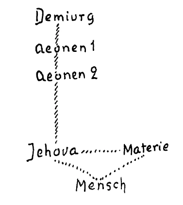
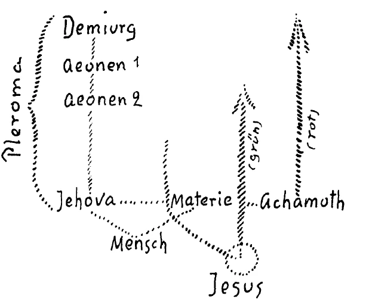
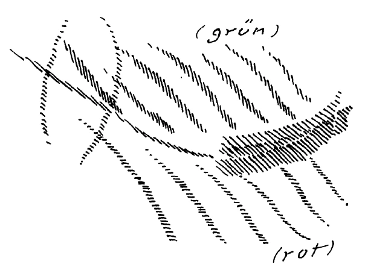

In der Gegenwart, in der sich vieles entscheidet und in der an die Menschheit sehr große Fragen gestellt sind, ist es notwendig, daß man auch bei der Betrachtung der zeitgenössischen Erscheinungen sich bis zum Geistigen hinauferhebt. Das Geistige ist ja nun einmal kein Abstraktes, sondern ein solches, das sich über dem Physischen erhebt und in das Physische seine Wirkungen hereinsendet. Und derjenige Mensch, der lediglich das Physische, meinetwillen auch das Physische durchgeistet sieht, der beobachtet immerhin nur einen Teil derjenigen Welt, in die der Mensch mit seinem Denken und Tun eingeschaltet ist. Das hatte durch Jahrhunderte hindurch eine gewisse Berechtigung. Diese Berechtigung ist aber für die Gegenwart und die nächste Zukunft nicht mehr vorhanden. Und so sehen Sie denn heute damit den Anfang gemacht, hinzuweisen auf Ereignisse unserer Gegenwart in ihrem unmittelbaren Zusammenhange mit Ereignissen, die sich eben in der geistigen Welt abspielen, und mit dem Physischen, das auf Erden geschieht. ^5hqoi5

Bevor dies aber möglich ist, müssen wir uns einiges von dem vergegenwärtigen, was geistig in der Menschheitsentwickelung vorhanden war und zu dem geschichtlichen Augenblicke der Gegenwart geführt hat. Durch lange Zeiten hindurch ist ja für die abendländische Zivilisation und für alles, was aus ihr herausgewachsen ist, eigentlich nur ein Stück der Weltentwickelung maßgebend gewesen. Das war in berechtigter Art der Fall. Es war durchaus berechtigt, daß in den Zeiten, in denen die Bibel mit ihrem Alten Testament eine Notwendigkeit war, der Ausgangspunkt von jenem Moment in der Weltentwickelung genommen wurde, da die Schöpfung des Menschen vergegenwärtigt wird durch das Eingreifen Jahves oder Jehovas. ^ss6v2a

In einer älteren Zeit des menschlichen Sinnens und Weltbetrachtens war dieser Augenblick der Weltentwickelung, in dem Jahve oder Jehova in dieselbe eingriff, eben nur ein späterer Augenblick, nicht derjenige, auf den man zurücksah als den eigentlich maßgebenden. Man ließ vielmehr in älteren Zeiten dem, was man die Weltschöpfung aus Jahve oder Jehova nennen kann gemäß dem Alten Testament, eine andere Entwickelung vorausgehen, eine Entwickelung, deren Inhalt viel geistiger gedacht wurde als alles das, was dann vorgestellt wurde im Zusammenhang mit der Bibel, so wie sie gewöhnlich verstanden wurde. Der Augenblick, der in der Bibel erfaßt wurde, die Menschenschöpfung durch Jahve oder Jehova, war eben für ältere Zeiten ein späterer Augenblick, und ihm ging eine andere Entwikkelung voraus, die Jahve oder Jehova selbst als dasjenige Wesen hinstellte, das erst später in die Weltentwickelung eingriff als andere Wesen. ^l7mof4

Man deutete noch in Griechenland zurück, wenn man nachsann über die ersten Stadien der Weltentwickelung, auf eine ältere Wesenheit, zu deren Begreifen etwas viel Geistigeres im Erkennen nötig war, als im Alten Testamente vorhanden ist, man deutete auf dasjenige Wesen zurück, das eben in Griechenland als der eigentliche Weltschöpfer, als der Demiurgos aufgefaßt worden ist. Der Demiurg war als ein Wesen vorgestellt, vorhanden in Sphären höchster Geistigkeit, vorhanden in solchen Sphären höchster Geistigkeit, in denen noch nichts gedacht zu werden brauchte von irgendeinem materiellen Dasein, das in Verbindung zu bringen ist mit derjenigen Art von Menschheit, als deren Schöpfer dann bibelgemäß Jahve oder Jehova angesehen wird. ^h8app8

Wir haben es also mit einer sehr erhabenen Wesenheit im Demiurg zu tun, mit einer Wesenheit als Weltschöpfer, deren Schöpferkraft im wesentlichen darauf geht, geistige Wesen, wenn ich mich so ausdrücken darf, aus sich hervorzutreiben. Stufenweise, gewissermaßen immer niedriger — der Ausdruck ist gewiß nicht ganz zutreffend, aber wir haben keinen anderen -, stufenweise immer niedriger waren die Wesenheiten, die der Demiurg aus sich hervorgehen ließ; Wesenheiten aber, welche weit entfernt davon gedacht waren, irdischer Geburt oder irdischem Tode zu unterliegen. ^4410ly

In Griechenland deutete man auf solche Weise daraufhin, daß man sie Äonen nannte, und man unterschied, ich möchte sagen, Äonen erster Art, Äonen zweiter Art und so weiter (siehe Schema). Diese Äonen waren diejenigen Wesen, die hervorgegangen waren aus dem Demiurg. Dann war in der Reihe dieser Äonen ein verhältnismäßig untergeordnetes Äonenwesen, also ein Äon untergeordneter Art, Jahve oder Jehova. Und Jahve oder Jehova verband sich - und nun kommt dasjenige, was zum Beispiel in den ersten christlichen Jahrhunderten von den sogenannten Gnostikern vorgetragen worden ist, wo aber immer eine Lücke in ihrem Verständnisse war, was vorgetragen worden ist wie eine Art Erneuerung des biblischen Inhaltes, aber, wie gesagt, es war immer eine Lücke des Verständnisses da —, Jahve oder Jehova, so nahm man an, verband sich mit der Materie. Und aus dieser Verbindung ging der Mensch hervor. ^lpqf1r

 ^ro6fcf

So daß also die Schöpfung Jahves oder Jehovas darinnen bestand — immer im Sinne dieser Gedanken, die noch bis in die ersten christlichen Jahrhunderte hereinragten -, daß er selbst, als ein Abkömmling niedrigerer Art von den hocherhabeneren Äonen bis hinauf zu dem Demiurg, sich mit der Materie verband und dadurch den Menschen zustande brachte. Alles das, was sich da gewissermaßen nun erhebt - für die ältere Menschheit durchaus verständlich, für die spätere Menschheit nicht mehr verständlich -, was sich da erhebt auf der Grundlage desjenigen, was uns im Erdenleben sinnlich umgibt, das alles faßte man zusammen unter dem Ausdrucke Pleroma (siehe Schema). Das Pleroma ist also eine Welt, von individualisierten Wesen bevölkert, die sich erhebt über der Welt des Physischen. Gewissermaßen auf der untersten Stufe dieser Welt, dieser Pleroma-Welt, erscheint der durch Jahve oder Jehova ins Dasein gerufene Mensch. Auf der untersten Stufe dieses Pleromas ersteht eine Wesenheit, die eigentlich nicht in dem einzelnen Menschen, auch nicht etwa in einer Völkergruppe, sondern in der ganzen Menschheit lebt, die aber eine Erinnerung hat an die Abstammung vom Pleroma, vom Demiurgen, und wiederum zurückstrebt nach der Geistigkeit. Es ist das die Wesenheit Achamoth, mit der man in Griechenland eben das Hinaufstreben der Menschheit nach dem Geistigen andeutete. So daß also durch Achamoth ein wiederum Zurückstreben zu dem Geistigen vorhanden ist (roter Pfeil). ^3cve68

Nun gliederte sich an diese Vorstellungswelt die andere an, daß der Demiurg dem Streben der Achamoth entgegengekommen ist und einen sehr frühen Äon herabgeschickt hat, der sich mit dem Menschen Jesus vereinigte, damit das Streben der Achamoth in Erfüllung gehen könne. So daß in dem Menschen Jesus ein Wesen aus der ÄonEntwickelung steckt, das von viel höherer geistiger Wesenheit, von höherer geistiger Art als Jahve oder Jehova gedacht wurde (grüner Pfeil). ^s092ye

 ^xf5doc

Und es entwickelte sich bei denjenigen, die in den ersten Jahrhunderten des Christentums diese Vorstellung hatten - und es hatten sie durchaus viele Menschen, welche mit tiefer Inbrunst und Ehrlichkeit zu dem Mysterium von Golgatha aufsahen -, es entwickelte sich im Zusammenhange mit dieser Vorstellung die Anschauung, daß den Menschen Jesus mit seiner Innewohnung eines uralten und damit urheiligen Äons ein großes Geheimnis umschwebt. ^39ch22

Die Ergründung dieses Geheimnisses wurde in der verschiedensten Weise gepflegt. Heute hat es nicht mehr sehr viel Bedeutung, tiefer über die einzelnen Formen nachzudenken, in denen in den ersten christlichen Jahrhunderten durch Griechenland hindurch, namentlich aber in Kleinasien und in den angrenzenden Gebieten vorgestellt wurde, wie dieses Äonwesen in dem Menschen Jesus wohnte. Denn die Vorstellungen, durch die man in der damaligen Zeit einem solchen Geheimnisse nahezukommen suchte, sind ja heute längst aus dem Bereiche dessen, was Menschen denken, verschwunden. Im Bereiche dessen, was Menschen heute denken, liegt das, was die Menschen sinnlich umgibt, was mit dem Menschen verbunden ist zwischen Geburt und Tod, und höchstens schließt eben der Mensch von dem, was er zwischen Geburt und Tod um sich hat, auf dasjenige, was geistig dieser physisch-natürlichen Welt zugrunde liegen könnte. Jenes unmittelbare Verhältnis, jenes innige Verhältnis von der Menschenseele zum Pleroma, das einstmals vorhanden war und das ausgesprochen wurde in derselben Weise als das Verhältnis des Menschen zur geistigen Welt, wie heute das Verhältnis des Menschen zu Baum und Strauch, zu Wolke und Welle ausgesprochen wird, das alles, was da in den Menschenvorstellungen vorhanden war, um sich eine Überschau, ein Bild von dem Zusammenhange des Menschen mit jener geistigen Welt zu machen, die den Menschen eben viel mehr damals interessierte als die physische Welt, das alles ist ja verschwunden. Das unmittelbare Verhältnis ist nicht mehr da. Und wir können sagen: Die letzten Jahrhunderte, in denen sich noch in der Zivilisation, von der dann die europäische, abendländische Zivilisation abhängig wurde, solche Vorstellungen gefunden haben, sind das 1., 2., 3. Jahrhundert und noch ein großer Teil des 4. nachchristlichen Jahrhunderts. Dann verschwindet aus dem, was menschliche Erkenntnis ist, die Möglichkeit, sich zur Pleroma-Welt zu erheben, und es beginnt eine andere Zeit. ^69egt2

Es beginnt die Zeit, die solche Denker hat, wie etwa einer der ersten unter ihnen Augustinus war oder Scotus Erigena; es beginnt die Zeit, die dann die Scholastiker hatte, die Zeit, in der die europäische Mystik blühte, eine Zeit, in der man auf dem Boden der Erkenntnis ganz anders sprach als in jenen alten Zeiten. Man sprach auf dem Boden der Erkenntnis dann so, daß man sich eben an die sinnlich-physische Welt wandte und aus dieser physisch-sinnlichen Welt die Begriffe, die Ideen herauszuholen versuchte über ein Übersinnliches. ^9iskol

Dasjenige aber, was eine Menschheit der früheren Zeit hatte, das unmittelbare Sichhinempfinden zur Geisteswelt, zu dem Pleroma, das war nicht mehr da. Denn der Mensch sollte eben in ein ganz anderes Stadium seiner Entwickelung eintreten. Es handelt sich gar nicht darum, nach den Werten die ältere Zeit oder die Zeit der mittelalterlichen Menschheitsentwickelung irgendwie zu bestimmen, sondern es handelt sich darum, zu erkennen, was für Aufgaben in den verschiedenen Zeitaltern die Menschheit, insofern sie die zivilisierte Menschheit war, hatte. Da kann man sagen: Es hatte eben jene ältere Zeit doch noch das unmittelbare Verhältnis zum Pleroma entwickelt. Sie hatten eben die Aufgabe, jene im Innern der Menschenseele sitzenden geistigen Erkenntniskräfte, die zum Geiste hingehenden Erkenntniskräfte, wiederum zu entwickeln. ^tatyuf

Dann mußte aus den Tiefen der Menschheit herauf eine Zeit kommen - wir haben oftmals davon gesprochen -, wo die pleromatische Welt verdunkelt wurde, wo der Mensch anfing, diejenigen Fähigkeiten zu üben, die er vorher nicht hatte, wo der Mensch anfing, seine eigene Ratio, seinen Rationalismus, sein Denken zu entwickeln. In jenen älteren Zeiten, wo das unmittelbare Verhältnis zum Pleroma war, hat man nicht das eigene Denken entwickelt. Alles war auf dem Wege der Erleuchtung, der Inspiration, der instinktiven übersinnlichen Haltung erlangt worden; die Gedanken, die die Menschen trugen, waren ihnen geoffenbarte Gedanken. Jenes Hervorquellen und Hervorsprossen des Denkens, jenes Formen von eigenen Gedanken und logischen Zusammenhängen, das kam eben erst in späterer Zeit auf. Aristoteles ahnte es, ausgebildet wurde es erst von der zweiten Hälfte des 4. nachchristlichen Jahrhunderts an. Aber man gab sich dann während des Mittelalters alle Mühe, gewissermaßen das Denken als solches auszubilden und alles dasjenige auszubilden, was mit dem Denken zusammenhängt. ^iji47y

Ein ungeheures Verdienst um die Gesamtentwickelung der Menschheit hat nach dieser Richtung hin das Mittelalter, namentlich die mittelalterliche Scholastik. Sie entwickelte die Praxis des Denkens in der Ideenbildung, in dem Ideenzusammenhang. Sie bildete eine reine Technik des Denkens aus, eine Technik, die jetzt schon wieder verlorengegangen ist. ^0hchqa

Dasjenige, was in der Scholastik als Denktechnik enthalten war, das sollten die Menschen wiederum sich aneignen. Aber man tut es in der Gegenwart nicht gern, weil in der Gegenwart alles darauf ausgeht, die Erkenntnis passiv zu empfangen, nicht sie sich aktiv zu erwerben, aktiv zu erobern. Die innere Tätigkeit und der Drang zur inneren Tätigkeit fehlen in der Gegenwart; diese hatte die Scholastik in der großartigsten Weise. Daher ist derjenige, der die Scholastik versteht, heute noch immer in der Lage, viel besser, viel eindringlicher, viel zusammenhängender zu denken, als etwa, sagen wir, in der Naturwissenschaft heute gedacht wird. Dieses Denken in der Naturwissenschaft ist Schematik, ist kurzatmig, dieses Denken ist inkohärent. ^0r3pr0

Und es sollten eigentlich die Menschen der Gegenwart an dieser Denktechnik und -praxis von der Scholastik lernen. Aber es müßte ein anderes Lernen sein als das, was man heute liebt, es müßte ein Lernen des Tätigen, des Aktiven sein und nicht bloß im Aneignen des fertig Vorgebildeten oder dem Experiment Abgelesenen bestehen. Und so war das Mittelalter die Zeit, in welcher der Mensch sich innerlich seelisch-denkerisch ausbilden sollte. Man möchte sagen: Die Götter haben das Pleroma zurückgestellt, ihre eigene Offenbarung zurückgestellt, weil, wenn sie weiter auf die europäische Menschheit hereingewirkt hätten, diese europäische Menschheit nicht jene großartige innere Aktivität der Denkpraxis entwickelt haben würde, die während des Mittelalters hervorgebracht worden ist. Und wiederum aus dieser Denkpraxis ist dasjenige hervorgegangen, was neuere Mathematik und derlei Dinge sind, die direkter scholastischer Abkunft sind. ^h5rjy1

So daß man sich die Sache so vorstellen soll: Die geistige Welt hat durch lange Jahrhunderte hindurch wie durch eine Gnade von oben der Menschheit die Offenbarung des Pleromas gegeben. Die Menschheit sah diese lichtvolle, diese in und durch Licht in Ideen sich offenbarende Welt. Vor diese Welt wurde gewissermaßen eine Decke gezogen. In Asien drüben blieben in der menschlichen Erkenntnis die dekadenten Reste desjenigen, was hinter der Decke war. Europa hatte gewissermaßen eine Decke, welche von der Erde senkrecht gegen den Himmel sich erhob, die etwa, ich möchte sagen, unten die Grundlage hatte in dem Ural, in der Wolga, über das Schwarze Meer hin, zum Mittelländischen Meer zu. Stellen Sie sich vor, daß da für Europa eine Tapetenwand riesiger Art errichtet wäre durch den Zug hindurch, den ich eben angedeutet habe, eine Wand, durch die man nicht durchsehen kann, wo hinten in Asien die letzten dekadenten Reste des Schauens des Pleromas sich entwickelten, in Europa aber nichts davon gesehen wurde und daher die innere Denkpraxis ohne Aussicht in die geistige Welt entwickelt wurde. Dann haben Sie eine Vorstellung von der Entwickelung der mittelalterlichen Zivilisation, die so Großes aus dem Menschen heraus entwickelte, die aber alles das nicht sah, was hinter der Tapetenwand war, welche entlang dem Ural, entlang der Wolga, entlang durch das Schwarze Meer bis zum Mittelmeer ging, die durch diese Tapetenwand nicht hindurchschauen konnte und der der Osten höchstens eine Sehnsucht war, aber keine Wirklichkeit. ^63xa11

Sie haben da nicht nur etwa symbolisch, sondern ganz in Realität angedeutet, was eigentlich die europäische Welt war, wie gewissermaßen unter dem Einflusse eines Giordano Bruno, Kopernikus, Galilei die Menschen sich sagten, sie wollten nun wenigstens die Erde kennenlernen, sie wollten den Boden, das Untere kennenlernen. Und dann fanden sie eine Himmelskunde, die der Erdenkunde nachgebildet ist, während die alte Erdenkunde nachgebildet war der Himmelskunde mit ihrem pleromatischen Inhalte. Und so entstand gewissermaßen in der Finsternis - denn das Licht ward durch die geschilderte Welt-Tapetenwand abgehalten - das neuere Erkennen und das neuere Leben der Menschheit. ^01pc3x

Es ist schon einmal so in der menschlichen Entwickelung, daß in gewissen Epochen, wo irgend etwas Bestimmtes herauskommen soll aus der Menschheit, andere Teile dessen, womit der Mensch zusammenhängt, verhüllt, verdeckt werden. Und im Grunde genommen entwickelte sich auf dem Boden der Erde hinter der 'Tapetenwand für das Irdische eben nur die dekadente Ostkultur. In Europa entwikkelte sich die in den ersten Anfängen steckenbleibende Westkultur. ^ullra9

Und in diesem Zustande ist im Grunde genommen die europäische Welt noch heute, nur daß sie versucht, durch allerlei Äußeres, Historisches sich zu informieren über dasjenige, was, mit Ausschluß aller Einsicht in das Pleroma, in der Welt des finsteren Daseins wie eine Wissenschaft, wie eine Erkenntnis, die aber keine ist, erworben worden ist. Man bekommt eine Möglichkeit, diese Dinge in ihrer Bedeutung für die Gegenwart zu durchschauen, wenn man einsieht, wie gewissermaßen östlich hinter der Tapetenwand die frühere Einsicht in das Pleroma immer mehr und mehr dekadent geworden ist, zurückgegangen ist, daß also eine hohe, aber instinktive, von der Menschheit erworbene Geistkultur in Asien drüben dekadente Formen angenommen hat; daß in Europa ein Weben und Leben der Menschenseele im Geiste heruntergerückt worden ist in die Sphäre des PhysischSinnlichen, die vorerst ja den Menschen in den mittelalterlichen Jahrhunderten allein zugänglich war. Und so entstand jenseits der Tapetenwand im Orient eine Kultur, die eigentlich keine ist, die in irdischphysischen Formen zauberisch nachbilden möchte, was im Weben des Geistes pleromatisch erlebt werden sollte. Das Walten und Weben der Geistwesen im Pleroma sollte gewissermaßen auf die Erde heruntergetragen werden im Stein, im Holzklotz, und in ihrer Wirkung aufeinander sollte gesucht werden etwas von solchen geistigen Wirkungen, die, wenn ich mich so ausdrücken darf, angepaßt sind dem Weben und Wesen von Geistwesen im Pleroma. Das, was eigentlich nur Götter untereinander tun, wurde gedacht als die Taten physischsinnlicher Götzen. Der Götzendienst trat an die Stelle des Götterdienstes. Und dasjenige, was nun ins Schlechte wirkende orientalische, nordasiatisch-orientalische Magie genannt werden kann, das ist die ins Sinnliche auf unrechtmäßige Weise versetzte Tatsachenwelt des Pleromas, zu der man einstmals den Seelenblick aufgerichtet hat. Die magische Zauberei der Schamanen und ihr Nachklang in Mittelund Nordasien - der Süden von Asien wurde ja auch angesteckt, hat sich aber verhältnismäßig freier erhalten davon -, das ist die dekadente Form der alten Pleroma-Anschauung. Physisch-sinnliche Zauberei trat an die Stelle der Teilnahme der menschlichen Seelenwirksamkeiten an den Götterwelten des Pleromas. Was die Seele tun sollte und ehemals getan hat, das wurde mit Hilfe von sinnlich-physischen Zaubermitteln versucht. Eine ganz ahrimanisierte Pleroma-Tätigkeit wurde gewissermaßen dasjenige, was auf der Erde getrieben wurde und was namentlich von den an die Erde angrenzenden, nächsten Geisteswesen getrieben wurde, wovon aber die Menschen angesteckt wurden. ^iwm5ji

Gelangt man also ostwärts vom Ural und der Wolga nach Asien hinüber, so haben wir, namentlich in der an die menschliche irdische Welt anstoßenden astralischen Welt, in den Jahrhunderten des zweiten Mittelalters, in den Jahrhunderten der Neuzeit bis heute eine ahrimanisierte Magie, welche ja namentlich von gewissen geistigen Wesenheiten ausgeübt wird, die in ihrer ätherisch-astralischen Bildung zwar über dem Menschen stehen, aber in ihrer Seelen- und Geistesbildung unter dem Menschen zurückgeblieben sind. Durch das ganze Sibirien hindurch, durch Mittelasien hindurch über den Kaukasus, da treiben sich überall in der unmittelbar an das Irdische angrenzenden Welt furchtbare ahrimanische, ätherisch-astralische Wesen herum, welche ins Astralische und Irdische heruntergesetzte ahrimanische Zauberei treiben. Und das wirkt ansteckend auf die Menschen, die ja nicht alles gleich selber können, die ungeschickt sind in den Dingen, die aber wie gesagt angesteckt werden, beeinflußt werden davon und somit unter dem Einflusse der an die Erde angrenzenden, unmittelbar an das Astralische grenzenden Welt stehen. Wenn so etwas geschildert wird, dann muß man sich ja klar sein, daß? dem, was man für alte Zeiten einen Mythos oder dergleichen nennt, immer großartige geistige Naturanschauungen zugrunde liegen. Und als man in Griechenland von den Faunen und Satyrn gesprochen hat, die sich in ihrer Tätigkeit hineinwoben in das irdische Geschehen, da hat man sich nicht, wie phantastische Gelehrte von heute es sich vorstellen, Wesen in der Phantasie konstruiert, sondern man hat in seiner geistigen Naturschau von jenen wirklichen Wesen gewußt, welche das unmittelbar an die irdische Welt angrenzende Astralterritorium überall eben als Faune und Satyrn bevölkerten. Jene Faune und Satyrn sind ungefähr um die Wende des 3., 4. nachchristlichen Jahrhunderts alle hinübergezogen in die Gebiete östlich vom Ural und der Wolga nach dem Kaukasus. Das wurde ihre Heimat. Dort haben sie ihre weitere Entwickelung durchgemacht. Vor dem Teppich, vor diesem kosmischen Teppich, ist nun dasjenige entstanden, was aus der menschlichen Seele heraus als Denken und so weiter, als eine gewisse Dialektik sich entwickelte. Wenn die Menschen festgehalten haben an den innerlichen strengen und reinen Denkformen, an dem, was man wirklich in sich entwickeln muß, wenn man die reinen Denkformen der Scholastik entwickeln will, dann haben sie eben dasjenige ausgebildet, was auszubilden war nach dem Ratschlusse der das Irdische leitenden Geistigkeit, dann haben sie vorbereitend gewirkt für das, was kommen muß in unserer Gegenwart und in einer nächsten Zukunft. Aber es war nicht überall jene Reinlichkeit vorhanden. Während im Osten, jenseits der Tapetenwand, wenn ich so sagen darf, der Trieb entstanden war, herunterzu- ziehen in das Irdische die Taten des Pleromas, zu verwandeln das Pleroma-Geschehen in irdische Zauberei und in ahrimanisierte Magie, vermischte sich westwärts der Tapetenwand mit dem Streben nach der Ratio, nach der Dialektik, nach der Logik, nach dem ideellen Begreifen der Welt des Irdischen, alles dasjenige, was menschliche Lustgefühle bedeutet, was menschliche Wohlgefühle am sinnlichen Dasein bedeutet. Es mischten sich herein in den reinen Vernunftgebrauch, der entwickelt worden ist, irdisch-menschliche, luziferische Triebe. ^kgwi3z

Dadurch aber entwickelte sich neben dem, was sich da als Streben nach Vernunft und ideeller Praxis entwickelte, unmittelbar angrenzend an die Erdenwelt, eine andere astralische Welt: Es entwickelte sich eine astralische Welt, die sozusagen mitten unter denen war, die so rein wie Giordano Bruno oder Galilei oder auch die Späteren strebten nach der Ausbildung des irdischen Denkens, nach einer irdischen Denkmaxime und Denktechnik. Sozusagen zwischendurch entstanden die Wesenheiten einer astralischen Welt, die jetzt all das in sich aufnehmen, namentlich auch in das religiöse Leben aufnehmen, was sinnliche Gefühle sind, denen dienstbar gemacht werden sollte das rationalistische Streben. Und so bekam allmählich das reine Denkstreben einen sinnlich-physischen Charakter. ^d6k8f6

Und vieles von dem, was dann schon in der zweiten Hälfte des 18. Jahrhunderts, aber besonders im 19, Jahrhundert als solche Denktechnik sich ausbildete, ist durchsetzt und durchwoben von dem, was in der astralischen Welt, die nun diese rationalistische Welt durchzieht, vorhanden ist. Die irdischen Lüste der Menschen, die raffiniert gedeutet werden sollten, raffiniert erkannt werden sollten durch eine herabgekommene Denktechnik, die entwickelten in den Menschen ein Element, das Nahrung war für gewisse Astralwesenheiten, welche darauf ausgingen, das Denken, das in so hoher Schärfe ausgebildet war, nun bloß zum Durchdringen der irdischen Welt zu verwenden. ^vgotjp

Es entstanden solche Theorien wie die marxistischen, die das Denken, statt es zu erheben in das Spirituelle, auf das bloße Verweben sinnlich-physischer Entitäten, sinnlich-physischer- Impulse beschränkten. ^89387s

Das war etwas, was immer mehr möglich machte, daß gewisse luziferische Wesenheiten, die in dieser Astralsphäre weben, eingreifen konnten in das Denken der Menschen. Das Denken der Menschen wurde ganz und gar durchsetzt von dem, was dann gewisse Astralwesenheiten dachten, von denen nun die westliche Welt ebenso besessen wurde wie die Nachkömmlinge der Schamanen im Östen. ^gyfhxe

Und so entstanden endlich Gestalten, die besessen waren von solchen Astralwesen, welche in scharfsinnig-irdisches Denken die menschlichen Gelüste eingeführt haben. Und es entstanden solche Wesen wie etwa diejenigen, die dann vom astralischen Plane aus die Lenins und ihre Genossen von sich besessen gemacht haben. ^9q9dbo

Und so haben wir einander gegenübergestellt zwei Welten: die eine ostwärts von Ural und Wolga und Kaukasus, die andere westwärts davon, die, ich möchte sagen, ein in sich abgeschlossenes Astralgebiet bilden. Wir haben das Uralgebiet, das daran anschließende Wolgagebiet, das Schwarze Meer, da wo die ehemalige Tapetenwand gestanden hat. Wir haben ostwärts und westwärts von Ural und Wolga ein Astralterritorium der Erde, in dem heute in einer intensiven Weise wie zu einer kosmischen Ehe zusammenstreben die Wesen, deren Lebensluft das luziferische Denken des Westens ist, und diejenigen Wesen, ostwärts von Ural und Wolga in dem daran anstoßenden Astralterritorium, deren Lebenselement die verirdischte Magie der einstmaligen Pleroma-Handlungen ist. Diese Wesenheiten ahrimanischer und luziferischer Art streben zusammen. Und wir haben da auf der Erde ein ganz besonderes Astralterritorium, in dem nun die Menschen darinnen leben, mit der Aufgabe, das zu durchschauen. Und wenn sie diese Aufgabe erfüllen, dann erfüllen sie etwas, was ihnen in der Gesamtentwickelung der Menschheit auferlegt ist, in großartiger Weise. Wenn sie aber den Blick davon abwenden, dann werden sie von alledem innerlich gemüthaft durchsetzt und besessen — besessen von jener brünstigen Ehe, die geschlossen werden soll im kosmischen Sinne von den asiatischen ahrimanisierten Wesenheiten und den europäischen luziferisierten Wesenheiten, die mit aller kosmischen Wollust einander entgegenstreben und eine furchtbar schwüle astralische Atmosphäre erzeugen und wiederum die Menschen von sich besessen machen. Und so ist allmählich östlich und westlich von Ural und Wolga ein Astralgebiet entstanden, unmittelbar über dem Erdboden sich erhebend, das darstellt das irdische Astralgebiet für Wesenheiten, welche die metamorphosierten Faune und die metamorphosierten Satyrn sind. ^jhfu09

 ^8eorj9

Wenn wir heute nach diesem Osten Europas hinüberschauen, sehen wir eben nicht nur Menschen, wenn wir das Ganze der Wirklichkeit sehen, sondern wir sehen gewissermaßen dasjenige, was im Laufe des Mittelalters und im Laufe der Neuzeit eine Art Paradies geworden ist für Faune und Satyrn, die ja ihre Metamorphose, ihre Entwickelung durchgemacht haben. Und wenn man in der richtigen Weise versteht, was die Griechen erschauten unter Faunen und Satyrn, so kann man auch hinschauen auf jene Entwickelung, auf jene Metamorphose, welche die Faune und Satyrn da durchgemacht haben. Diese Wesenheiten, die ja, ich möchte sagen, immer zwischen den Menschen herumgehen und ihre aus asiatischer ahrimanisierter Magie und europäischem luziferisiertem Rationalismus getriebene wollüstige Handwerkerei im Astralischen vollführen, aber die Menschen damit anstecken, diese verwandelten metamorphosierten Satyrn und Faune erschaut man so, daß sich nach dem unteren Körperlichen hin die Bocksform noch ganz besonders in ihnen verwildert hat, daß sie eine nach außen durch das Lüstige lichthaft erglänzende Bocksform haben, während sie nach oben hin ein ungemein intelligentes Haupt haben, ein Haupt, das eine Art von Glanz hat, das aber das Abbild alles möglichen luziferisierten, rationalistischen Raffinements ist. Gestalten zwischen Bären und Böcken, mit einem raffiniert ins Wollüstige, aber zu gleicher Zeit ins ungemein Gescheite gezogenen menschlich Physiognomischen sind diese Wesenheiten, welche das Paradies der Satyrn und Faune bewohnen. Denn ein Paradies der Satyrn und Faune ist diese Gegend im Astralischen in den letzten Jahrhunderten des Mittelalters und den ersten Jahrhunderten der Neuzeit geworden - ein Paradies der verwandelten Satyrn und Faune, die es heute bewohnen. ^7undh6

Unter all dem, was so geschieht, ich möchte sagen, tanzt nun die zurückgebliebene Menschheit mit ihren abgestumpften Begriffen herum und schildert nur das Irdische, während in das Irdische diejenigen Dinge hereinspielen, die wahrhaftig nicht weniger zu der Wirklichkeit gehören als die, welche man mit den sinnlichen Augen sehen und mit dem sinnlichen Verstande begreifen kann. ^tp8egy

Was sich nun zwischen Asien und Europa entwickelt, das ist erst zu verstehen, wenn man es in seinem astral-geistigen Aspekt versteht, das ist erst zu verstehen, wenn man dasjenige ansehen kann, was als dekadenter Schamanismus in Mittel- und Nordasien drüben aus einer Wirklichkeit geblieben ist, was dort als heutiger dekadenter Magismus wollüstig herüberstrebt, um sich gewissermaßen in einer kosmischen Ehe zu verbinden mit dem, was aus äußeren Gründen heraus den Namen Bolschewismus bekommen hat. Da, östlich und westlich vom Gebiete des Ural und der Wolga, wird eine Ehe angestrebt zwischen Magismus und Bolschewismus. Was sich da abspielt, das erscheint der Menschheit so unbegreiflich, weil es sich in einer merkwürdigen Mythosform abspielt, weil sich das Luziferisch-Geistige des Bolschewikentums verbindet mit den ganz dekadent gewordenen Formen des Schamanentums, die herankommen nach dem Ural und der Wolga und dieses Gebiet überschreiten. Von Westen nach Osten, von Osten nach Westen spielen da in dieser Weise Ereignisse ineinander, die eben die Ereignisse des Paradieses der Satyrn und Faune sind. Und was da hineinspielt aus dem Geistigen in die Menschenwelt, das ist das Ergebnis dieses lüsternen Zusammenwirkens der aus der alten Zeit hier eingewanderten Satyrn und Faune und desjenigen, was gewissermaßen die nur das Kopfliche, das dem Kopfe Angehörige entwickelnden Westgeister in sich hervorgebildet haben, die dann mit den aus Asien herübergekommenen Satyrn und Faunen sich verbinden wollen. ^sk5ugf

Ich möchte sagen, äußerlich dargestellt schaut es aus, wie wenn jene wolkenartig geistigen Gebilde sich zusammenballen, je weiter sie nach dem Osten gegen den Ural und die Wolga vordringen, wobei der andere Körper undeutlich bleibt — wie wenn diese Gebilde sich zusammenballen zu, man möchte schon sagen, wollüstig aussehenden, raffiniert aussehenden Köpfen; wie wenn sie immerfort zu Köpfen werden und die übrige Körperlichkeit verlieren. Dann kommen von dem Osten herüber, gegen die Ural- und Wolgagegend, die metamorphosierten Satyrn und Faune, deren Bocksnatur fast Bärennatur geworden ist und die, je mehr sie nach dem Westen herüberkommen, die Köpfe verlieren und in einer Art Ehe, einer kosmischen Ehe, begegnet ein solches den Kopf verlierendes Wesen einem von Europa herüberziehenden Wesen, das ihm den Kopf entgegenbringt. Und so entstehen diese metamorphosierten, mit dem übermenschlichen Kopf ausgestatteten Organisationen, so entstehen diese metamorphosierten Satyrn und Faune im Astralgebiet. Sie sind die Bewohner der Erde ebenso wie die physische Menschheit. Sie bewegen sich innerhalb der Welt, innerhalb der sich die physischen Menschen auch bewegen. Sie sind die Verführer und Versucher der physischen Menschen, weil sie die Menschen von sich besessen machen können, weil sie sie nicht nur durch Reden zu überzeugen brauchen, sondern sie von sich besessen machen können. Dann kommt es, daß die Menschen glauben, das, was sie tun, sei von ihnen selber, von ihrem Wesen getan, während in Wahrheit dasjenige, was die Menschen tun auf einem solchen Gebiete, oftmals nur deshalb getan wird, weil sie innerlich in ihrem Blute durchsetzt werden von einem solchen Wesen, das von Osten her den ins Bärenartige überführten Bocksleib und das im Westen ins Übermenschliche hinauf metamorphosierte europäische Menschenhaupt erlangt hat. ^htsn6f

Es gilt heute, diese Dinge mit derselben Kraft zu ergreifen, mit der einstmals Mythen geformt worden sind. Denn nur wenn wir bewußt ins Gebiet des Imaginativen hinaufgehen können, können wir heute verstehen, was wir verstehen müssen, wenn wir uns bewußt in die Entwickelung der Menschheit hineinstellen sollen und wollen. ^qug1je

 ^x25o2c

