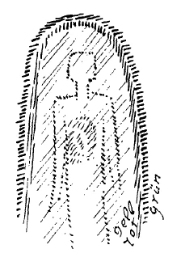
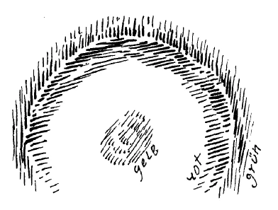
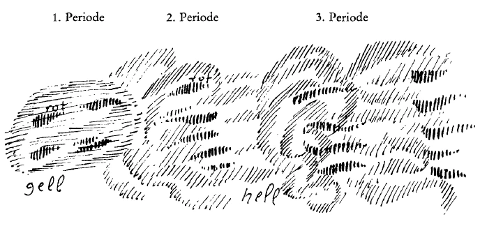

Es hat sich in der letzten Zeit bei sehr vielen, insbesondere bei wissenschaftlich vorgebildeten Mitgliedern der Anthroposophischen Gesellschaft der Glaube herausgebildet, daß zwischen dem, was in Anthroposophie als Welterkenntnis gegeben wird, und dem, was heute aus den Voraussetzungen namentlich der zweiten Hälfte des 19. Jahrhunderts als wissenschaftliche Welterkenntnis gegeben wird, diskutierend hin und her gesprochen werden soll. Ja, man glaubt wohl, daß, wenn man in einer gewissen Weise, wie man das so nennt, der Wissenschaft entgegenkommt, auf sie möglichst eingeht, dies für die Anthroposophie etwas außerordentlich Günstiges ergeben könnte. ^66r9ed

Gerade dadurch, daß wissenschaftlicher Betrieb in die Anthroposophische Gesellschaft hereingekommen ist, was ja in anderer Beziehung als eine außerordentlich erfreuliche Tatsache zu begrüßen ist, sind mit Bezug auf den angeführten Punkt außerordentlich viele Irrtümer entstanden. ^217dqy

Wir dürfen nicht vergessen, daß im Laufe des 19. Jahrhunderts die allgemeine Menschheitsbildung unter dem Einflusse dessen, was man da allmählich Wissenschaft genannt hat und heute noch nennt, einen Charakter angenommen hat, dem gegenüber die anthroposophische Welterkenntnis eben etwas ganz anderes ist. Man muß sich schon auf den Standpunkt stellen, daß derjenige, der einmal mit seinen Denkgewohnheiten hineingewachsen ist in das gegenwärtige Wissenschaftsleben, eigentlich unmöglich so ohne weiteres zur anthroposophischen Auffassung herüber kann. Daher muß man durchaus gewärtig sein, daß von dieser Seite her irgendeine Zustimmung zu der anthroposophischen Welterkenntnis kaum bald kommen kann. ^m0nx2f

Diejenigen Menschen, die entweder nicht mit ihren Denkgewohnheiten in den wissenschaftlichen Betrieb von heute hineingewachsen sind oder die als junge Menschen im Hineinwachsen auch gleich herauswachsen, die werden es sein, die hauptsächlich die Berechtigung anthroposophischer Welterkenntnis einsehen werden. ^6quqf0

Um das, was ich eben gesagt habe, einigermaßen zu beleben, möchte ich heute von einer ersten Perspektive mit Bezug auf den Weltenweg der Anthroposophie sprechen. Ich möchte, damit die Freunde, die weither gekommen sind, möglichst viel mitnehmen, diese drei Vorträge etwas aphoristisch gestalten. Ich möchte anknüpfen an allerlei Erscheinungen im Zivilisationsleben der Gegenwart, aber in der Hauptsache doch den Inhalt für diese Vorträge suchen in rein anthroposophischen Erörterungen. ^fkpbig

Wir wissen ja, welches die Tatsachen sind, die der Mensch durchlebt, wenn er durch die Pforte des Todes geht. Wir wollen heute, um gewissermaßen die physische Perspektive der Anthroposophie vor unsere Seele hinzustellen, nur die allererste Zeit des Lebens nach dem Durchgang durch die Todespforte zunächst einmal betrachten. Es ist oftmals erwähnt worden, wie der Mensch während seines ganzen Erdenlebens eine so enge Verbindung zwischen seinem physischen Leib und seinem Ätherleib oder Bildekräfteleib hat, daß diese Verbindung durch das ganze Erdenleben aufrechterhalten bleibt. ^g9at8s

Wenn der Mensch den gewöhnlichen Bewußtseinszustand seines Erdenlebens durch den Schlaf- und Traumzustand unterbricht, dann trägt er ja aus dem physischen und dem Bildekräfteleib den astralischen Leib und das Ich heraus. Die sind wiederum so eng verbunden, daß sie sich nicht trennen. Also: Die Trennung geschieht jedesmal bei einem normalen Leben im Verlauf von vierundzwanzig Stunden so, daß der physische Leib und der Äther- oder Bildekräfteleib auf der einen Seite und das Ich und der astralische Leib auf der anderen Seite sich trennen, während jede Seite ein eng verbundenes Ganzes bildet. ^sl65ir

Tritt nun der Mensch durch die Pforte des Todes, dann wird das anders. Dann wird das so, daß der physische Leib zunächst abgelegt wird und daß für eine ganz kurze Zeit eine Verbindung hergestellt wird zwischen dem Ich, dem astralischen Leib und dem Ätherleib, die während des Erdenlebens nicht vorhanden war. Diese Verbindung gibt die ersten ja nur durch Tage andauernden Erlebnisse, die der Mensch nach dem Tode durchmacht. Welches sind nun diese Erlebnisse? ^sevhvo

Sie bestehen darin, daß der Mensch, wie von sich abschmelzend, alles das sieht, was er durch seine Sinne und auch durch den Verstand, der die Wahrnehmungen der Sinne kombiniert, während des Erdenlebens aufgenommen hat. ^rr4ety

Während des Erdenlebens gewöhnen wir uns daran, in unserer Anschauung, wenn wir die Augen hinausrichten in die Welt, farbige Dinge und in Farben erglänzende Vorgänge vor uns sich abspielen zu sehen. Aber auch in unserer Erinnerung, in unserem Gedächtnis behalten wir die Eindrücke der Farben, wenn auch abgeschwächt, weiter zurück. Wir tragen sie mit durch unser Gedächtnis. So ist es auch mit den Eindrücken der anderen Sinne. Und wenn wir in der Selbstbeobachtung ehrlich sind, dann sagen wir uns ja: Eigentlich ist auch, wenn wir im stillen Kämmerlein sitzen und unsere Erinnerungen, das heißt unser Inneres, spielen lassen, das, was wir da von unserem Inneren her erleben, aus den schattenhaften Abbildern der äußeren Eindrücke zusammengesetzt. - Wir leben im gewöhnlichen Bewußtsein in diesen entweder unmittelbar lebendigen Eindrücken der Außenwelt oder in den schattenhaften Erinnerungen an sie. Was wir darüber hinaus haben, davon wollen wir dann morgen sprechen. Heute wollen wir uns nur recht stark das in das Bewußtsein hereinrufen, daß ja eigentlich während des ganzen Erdenlebens dieses Bewußtsein ausgefüllt ist von Farben und Farbvorgängen, die sich über die Dinge hin legen und breiten, von Tönen, von Wärme- und Kälteempfindungen, kurz, von den Eindrücken, die wir durch die Sinne bekommen, und von ihren schattenhaften Nachbildern im inneren Seelenleben, wie man wohl auch sagt, in der Erinnerung. Das wollen wir als eine Art von Ausgangspunkt zunächst betrachten. ^ju51pn

Alles das, was wir so erleben, schmilzt hinweg, wenn wir durch des Todes Pforte gehen. Innerhalb von wenigen Tagen hat sich sozusagen alles, was unsere Seele von der Geburt bis zum Tode erfüllt, aufgelöst im allgemeinen Kosmos. Man kann das nennen: Der Ätherleib oder Bildekräfteleib des Menschen trennt sich ab von dem Ich und dem astralischen Leib, nachdem er zuerst mit ihnen eine Verbindung eingegangen ist, die vorher im Erdenleben nicht vorhanden war. ^0vzu92

Nun wollen wir einmal uns genauer vor die Seele führen, wie dieses Erlebnis ist. Ich will dazu eine schematische Zeichnung machen. Nehmen wir einmal an, der physische Leib des Menschen wäre durch diese schematische Zeichnung charakterisiert; der Äther- oder Bildekräfteleib sei durch diese schematische Zeichnung (gelb schraffiert) charakterisiert. Wir erleben das, was ich damit charakterisiert habe, dieses zusammengehörige Gebilde von physischem und Ätherleib nur dann, wenn wir nach dem Aufwachen in dem Inneren stekken. Wir erleben es eigentlich also immer von innen. Und damit wir uns diese Sache möglichst genau ins Bewußtsein rufen, möchte ich die Zeichnung in folgender Weise gestalten. Ich werde meinetwillen grün andeuten den nach innen scheinenden Teil des Ätherleibes. Der physische Leib wird ja ohnedies im Tode abgelegt, den brauchen wir dabei weniger zu betrachten. Und ich werde das, was vom Ätherleib nach außen gerichtet ist, mit dieser roten Linie bezeichnen. ^w7oqul

 ^54fonj

Ich sagte eben, wir erleben dieses Gebilde des Ätherleibes nur nach dem Aufwachen von innen; also gewissermaßen nur das erleben wir, was im Grünen nach innen scheint. Wir erleben nicht dasjenige, was im Roten nach außen scheint. ^m67in0

Wenn wir durch die Pforte des Todes gegangen sind und mit unserem Ich und unserem astralischen Leib eine gewisse Verbindung mit dem Ätherleib eingehen, so geschieht diese Verbindung in der folgenden Weise. Sie müssen sich nun vorstellen, der ganze Ätherleib wendet sich so wie ein Handschuh, wenn Sie das, was sonst der Haut anliegt, mit allen Fingerlingen umkehren und so das Innere nach außen kehren. So daß ich jetzt das, was hier im Erdenzustande rot nach außen gezeichnet ist, als die innere Partie zeichnen muß, und das, was grün nach innen gezeichnet ist, muß ich grün nach außen zeichnen. Der ganze Ätherleib wendet sich in sich selber um. Aber dieses Umwenden, das ist verknüpft mit einem unermeßlich rasch vor sich gehenden Vergrößern des Ätherleibes. Er wächst, er wird riesengroß, er dehnt sich unermeßlich weit ins Weltenall hinaus, so daß ich die Zeichnung nun etwa so machen müßte (großer grüner Tafel 8 Kreis). ^07exat

Und während wir früher da drinnen waren mit unserem Ich und unserem astralischen Leib, sind wir jetzt (roter Kreis) dem sich ins Kosmische vergrößernden Ätherleib gegenüber, aber wir schauen ihn von seiner anderen Seite an. Dasjenige, was wir vorher ohne Bedeutung an uns getragen haben, das für uns äußerlich Rote, das ist jetzt nach innen gewendet. Was vorher nach innen gewendet war und was für uns allein Bedeutung hat während des Erdenlebens, das ist jetzt nach außen gewendet, das geht uns gar nichts mehr an, das zerstreut sich ins Weltenall. In diesem Grün aber — natürlich schematisch dargestellt - ist enthalten alles das, was wir während des Erdenlebens in uns als farbige, tönende und so weiter Welt gehabt haben. ^bjdvb6

 ^t1t8ui

Indem das Grün gewissermaßen durch die Wendung des Ätherleibes nach der anderen Seite geht, verlieren wir es vollständig, und wir bekommen eine ganz andere Welt als Eindruck. Wir dürfen uns gar nicht vorstellen, daß wir dieselbe Welt, die wir während des Erdenlebens gehabt haben, nach dem Tode noch haben können. Diese Welt geht fort. Sich etwa vorzustellen, daß wir nach dem Tode erleben könnten, meinetwillen in einer anderen Auflage, den Inhalt des Erdenlebens, das ist ganz falsch, das entspricht nicht den Tatsachen. Was wir durch die Wendung des Äther- oder Bildekräfteleibes erleben, das ist allerdings gegenüber dem Inhalte des Erdenlebens von einer gigantischen Größe, aber es ist eben etwas ganz anderes. Wir erleben zunächst dadurch, daß die Außenseite jetzt nach innen gewendet ist, in mächtigen Eindrücken, die aber anders sind als die Sinneseindrücke, die ganze Bildung unseres Erdenlebens. Wir erleben nicht die Röte der Rose, wir erleben aber, wie wir die Röte der Rose in uns als eine Vorstellung ausgebildet haben. Da fängt es an, nicht so ruhig zu sein, wie es im physischen Erdenleben ist. Da, im Erdenleben, sind in einem Rosengarten so hübsch die Rosen nebeneinander, und jede gibt Ruhe, und man fühlt sich webend da drinnen in der Ruhe. Jetzt wird der Rosengarten etwas ganz anderes, jetzt wird der Rosengarten zu Ereignissen in der Zeit. Und wie wir den Blick haben allmählich schweifen lassen von einer Rose zur anderen, wie wir die Vorstellung der ersten Rose, der zweiten, der dritten Rose und so weiter in unserem Innern gebildet haben, dieses, wie in lebendigem Werden, in blitzartigem Wellen und Weben eine Rose nach der anderen entsteht, aber nicht als Rosen, sondern als Vorstellungen, die sich abspielen, das tritt wie in einem Meer von Geschehen jetzt als unser Innenleben auf. Und so steht vor uns etwas, was wir eben während unseres Erdenlebens nicht gesehen haben: das Werden dieses Erdenlebens, die allmähliche Entstehung dieses Erdenlebens. Wir wissen, wie unsere Seele geworden ist von Kindheit auf. Das, was wir ganz unbeachtet gelassen haben während des Erdenlebens, das spielt sich jetzt in uns ab. Es ist, wie wenn wir aus uns herausgestiegen wären, ein Zweites geworden wären und zuschauen würden, wie wir als Erstes nach und nach die einfache Vorstellung der Kindheit, die kompliziertere des späteren Alters und so weiter gebildet haben. Wir sehen das Entstehen dieses ganzen Erdenwichtes nach seiner Innenseite. Wir sehen, wie sich von Stunde zu Stunde dieses Erdenleben, dieses Erdendasein bildet. Ja, wir gewinnen den Eindruck, daß eigentlich dieses ganze Erdenleben vom Kosmos herein gebildet wird. Denn alles das, was wir da wahrnehmen, wächst ins Unermeßliche, ins Kosmische hinaus, und wir werden dadurch, daß wir hinauswachsen, uns klar darüber, daß nun auch das, was im Erdenleben in uns gebildet worden ist, vom Kosmos herein gebildet wird. ^9bkn1l

Und jetzt bekommen wir allmählich eine gültige Anschauung darüber, wie es mit diesem menschlichen Erdenleben ist. Lehnen wir uns einmal an dasjenige an, was heute so ziemlich geglaubt wird mit Bezug auf dieses Erdenleben. Der Mensch ißt, und dadurch bekommt er die Stoffe, die draußen sind, in seinen eigenen Organismus hinein. Das ist eine nicht zu leugnende Tatsache. Er verändert auch diese Stoffe. Schon im Munde verändert er sie, dann um so mehr in seinem weiteren Organismus. Was da aufgenommen wird, das geht in den ganzen Organismus über, richtig in den ganzen Organismus über. Die Wissenschaft kommt noch und sagt: Aber wir verlieren auch nach außen immerfort Stoffe. - Wir brauchen nur daran zu denken, wie Sie sich Ihre Nägel abschneiden und Ihre Haare, wenn Sie noch keine Glatze haben. Sie können ja aus dem Abschuppen und so weiter überall wahrnehmen, wie der Mensch Materie verliert, Stoff verliert. Und es ist ja heute allgemein bekannt, daß der Mensch auf diese Weise, indem er fortwährend Stoffe verliert, im Laufe von ungefähr sieben Jahren sich vollständig neu aufbaut. ^05hadz

So daß also, wenn ich es drastisch ausdrücken will, alles das, was hier auf den Stühlen sitzt, insofern es den Stoff betrifft, vor acht oder neun Jahren überhaupt irgendwo in der Welt zerstreut war. Ich will zunächst so sagen: Was hier auf den Stühlen sitzt, das könnte sich also erst gesammelt haben im Laufe der letzten sieben bis acht Jahre. Wenn das auch noch hier sitzen sollte an Muskelfleisch und so weiter, was vor mehr als sieben oder acht Jahren in Ihnen allen war - Sie sind ja schon älter, Sie werden also schon mehrfach sich regeneriert haben -, so würden Sie alle nicht da sitzen. ^beotuv

Also von dem, was Sie zu Hause oder sonstwo als Ihr Muskelfleisch, als Ihr Blut und anderes in sich getragen haben vor sieben oder acht Jahren, von dem sitzt nichts da; das haben Sie nach und nach abgeschnitten, sich abgeschuppt und so weiter. ^93s3xc

Wenn die Wissenschaft nun aber materialistisch orientiert ist, wie sagt sie dann? Sie sagt ungefähr so: Während dieser letzten sieben Jahre haben wir ja alle gegessen. Das, was wir da nun gegessen haben, das sitzt hier, und dasjenige, was wir früher gegessen haben, das sitzt nicht mehr da. - Also zum Beispiel jeder von Ihnen, der hier sitzt, hat ein Herz, nicht wahr. Nun, die physische Materie dieses Herzens, so sagt Ihnen die Wissenschaft, die hat sich erneuert in den letzten sieben bis acht Jahren. Sie haben also durchaus gegenüber Ihrem Zustand vor, sagen wir, neun Jahren ein neues Herz. Ja, so ungefähr könnte man sagen, denkt man im Sinne der Gegenwart. ^nl02fv

Aber es ist nicht so. Diese Vorstellung besteht nur aus dem Grunde, weil die Leute das, was ich Ihnen eben auseinandersetzte, nicht kennen, gar nicht einbeziehen in den Bereich ihrer wissenschaftlichen Beobachtung und ihres wissenschaftlichen Denkens. Sie wissen nichts von jener Umkehr des Äther- oder Bildekräfteleibes, von dem, was da, nachdem wir durch die Pforte des Todes geschritten sind, uns zeigt, wie eigentlich nach und nach der ganze Wicht entstanden ist. Denn kennt man das, dann kommt man auch in die Lage, ganz anders hineinzuschauen in den menschlichen Organismus. Und dann lernt man erst die Wahrheit erkennen. ^drc6vn

Man kann glauben, daß aus dem Kohl, aus den Kartoffeln, aus dem sonstigen Gemüse, aus Kirschen, Pflaumen und so weiter, die man da im Laufe der letzten Jahre genossen hat, sich auch nach und nach diese Herzmaterie angesammelt hat. Das hat sie aber nicht, sondern im wesentlichen - hören Sie, daß ich sage, im wesentlichen — hat das Herz, das Sie in sich tragen, mit der aufgenommenen Materie der letzten sieben bis acht Jahre gar nicht so sonderlich viel zu tun, sondern das Herz, das Sie heute in sich tragen, ist im wesentlichen auf eine sehr geheimnisvolle Art entstanden aus dem Äther des Kosmos, den Sie im Lauf der letzten sieben bis acht Jahre zu der Herzdichte zusammengezogen haben. So daß nicht aus der physischen Materie der letzten sieben bis acht Jahre sich dieses Ihr Herz erneuert hat, sondern es hat sich aus dem Kosmos heraus erneuert. Aus dem Äther heraus haben Sie Ihr Herz und Ihre übrigen Organe erneuert. Sie haben tatsächlich sich zu einem neuen Menschen gemacht im Laufe der letzten Jahre nicht von der Erde herauf, sondern vom Kosmos herein. Das sieht man diesen Wirkungen des Ätherleibes nach dem Tode an, wie er gewirkt hat während des ganzen Erdenlebens, daß wir uns immer regeneriert haben aus dem Kosmos herein. ^679tse

Nun wird Ihr matertalistisches Gewissen - ein solches muß ja der Mensch auch haben - sagen: Aber gegessen haben wir ja doch. Wir haben doch die äußere Materie aufgenommen, und da haben sich innere Prozesse abgespielt. — Ja, diese inneren Prozesse haben aber mit Ihrem eigentlichen tieferen Menschenwesen nicht so viel zu tun, als Sie glauben. Diese Materie, die Sie durch Essen aufgenommen haben, die haben Sie schon auf den verschiedenen Wegen, auf denen der Mensch abgibt, wieder abgegeben. Die gehen allerdings durch den Organismus durch, vereinigen sich aber gar nicht im wesentlichen mit dem, was der Mensch ist, sondern sie bilden nur die Anregung. Wir müssen essen, damit da im Inneren Prozesse, Vorgänge entstehen, die uns anregen. Und indem sie uns anregen, aufstacheln, kommen wir in die Äthertätigkeit hinein, die aber mit dem Kosmos, nicht mit der Erde zusammenhängt. Das, was sich da abspielt mit den aufgenommenen, verdauten, durchs Blut verarbeiteten Speisen und so weiter, das sind Prozesse, die die Anregung bilden, daß sich ihnen ein Gegenprozeß entgegenstelle, der ätherische Prozeß. Mein altes Herz wird aufgestachelt durch die physische, umgewandelte Materie, die in mich hereinkommt. Aber das neue Herz mache ich mir aus dem Weltenäther heraus. ^db46lh

Jetzt können wir sogar die für das heutige Denken vielleicht etwas groteske Tatsache hinstellen: Sie sitzen jetzt alle da; was Sie in sich erneuert haben in den letzten sieben bis acht Jahren, das lebte nicht in dem Kohl und auf den Kartoffeläckern, sondern das lebte draußen im Weltenall in Sonne, Mond und Sternen, das kam von da herunter, und Sie bildeten sich aus dem Weltenall heraus neu. Damit haben wir hingedeutet auf einen Irrtum, der einfach aus dem heutigen Denken heraus entstehen muß. Man sucht nur die Beziehungen der menschlichen Regeneration zur physischen Erdenmaterie, nicht aber zum Äther. Und die Folge davon ist, daß, wenn man sich hineingewöhnt hat in die Vorstellungen, die einem in der gegenwärtigen Physiologie gegeben werden, man gar nicht anders kann, als eben alles, was von anthroposophischer Seite gegeben wird, wie eine Art Phantasterei anzusehen. Daher muß man sich klar sein darüber, wie Diskussionen heute unfruchtbar sind, wie man nur, wenn man beide Gebiete beherrscht, die heutige Wissenschaft und die Anthroposophie, sie gegenseitig durcheinander beleuchten kann, wie man aber nicht sich der Hoffnung hingeben darf - denn gibt man sich dieser Hoffnung hin, so geschieht es eigentlich zum Schaden der Anthroposophie! -, daß diejenigen, die eingewöhnt sind in die materiell gearteten Vorstellungen, so ohne weiteres durch eine Diskussion herübergezogen werden können. Darüber muß man ganz klare, präzise Begriffe haben. Dann wird man einschen, daß eben zunächst die ganze Art und Weise, wie man sich Anthroposophie aneignet, von den Menschen angeeignet werden muß, bevor sie überhaupt hineinkommen können in dieses anthroposophische Anschauen und Erkennen. ^fajnsd

Ich sagte, im wesentlichen ist es so, daß wir eigentlich unseren neuen Menschen regenerieren aus dem Kosmos herein. Wir finden im Kosmos nicht die Stoffe, die wir dann im Herzen finden, selbstverständlich nicht, denn da sind sie so dünn, daß sie mit physischen Erdenmitteln nicht nachweisbar sind. Da sind sie ätherisch. Aber was als dichte Herzmaterie auftritt in einem bestimmten Lebensalter, das ist eben erst verdichtet aus dem kosmischen Äther herein. Also das, was da heute sitzt, alles das war vor neun oder zehn Jahren noch draußen in den Himmeln, in den Sternen, und das, was geblieben ist, was also von der Materie sich hineingedrängt hat in dasjenige, was eigentlich aus dem Äther gebildet hat werden sollen, das ist die Veranlassung zum Kranksein. Wenn wir physische Materie, die zu alt ist, in uns tragen, dann bedeutet die eine Krankheitsursache. Und tiefe Einsichten in das Wesen der Krankheit gibt es, wenn man weiß, wie Materie, statt ausgestoßen zu werden, sich hält; denn alle Materie, die aufgenommen wird als physische Erdenmaterie, ist eigentlich dazu verurteilt, wieder ausgestoßen zu werden. Hält sie sich im Organismus, dann wird sie Krankheitsursache. _ ^znmsls

Sie sehen daraus auch, wie bis ins Praktische hinein diese wirklich reale Erkenntnis spielt, die wir nur dadurch gewinnen können, daß wir einen Einblick haben in das, was als erste Erlebnisse, kurz nachdem wir den physischen Leib ganz abgelegt haben, in uns auftritt. Es schmilzt also nach dem Tode von uns alles ab, was wir an Sinneseindrücken und Verstandesbearbeitung der Sinneseindrücke gehabt haben. Wir schauen die Welt ganz anders an. Mineralien, Pflanzen, Tiere sind so, wie wir sie vorher angeschaut haben, überhaupt nicht da. Wie Menschen werden, das ist da. ^o7elkh

Wir sind geschritten durch die Pforte des Todes. Wir sind dadurch von dem Schauplatz der Erde abgetreten. Wir sind auf den Schauplatz des Kosmos getreten: Eine andere Welt umgibt uns. Es ist, wie wenn wir aus einem kleinen Kämmerchen des Erdendaseins getreten wären in das majestätisch gewaltige Gemach des Kosmos, und wir fühlen uns ausgebreitet über den Kosmos, würden wahrhaftig in dem kleinen Erdengemach dann auch nicht Platz haben. Damit haben wir den Schauplatz des Kosmos also betreten. Und auf diesem Schauplatz des Kosmos müssen wir nun bleiben, bis wir wieder heruntersteigen zum Erdendasein, nur daß wir jetzt mit ganz neuen Welten in Zusammenhang treten, mit Welten, deren Wesen den höheren Hierarchien angehören. ^xyar1n

Diese Betrachtung, die man so unmittelbar in Anknüpfung an den Menschen gewinnt, muß aber ausgedehnt werden auf die ganze Natur. Und ich möchte Ihnen, was da zu geschehen hat, in der folgenden Weise charakterisieren. ^sfvn5x

Nehmen wir zum Beispiel an, eine bestimmte, sehr lange Zeit wären wir in der Evolution, in der Erdenevolution zurückgegangen. Wir würden da ganz andere Lebewesen, ganz andere Geschehnisse der Erde antreffen. Sie wissen, es hat Erdepochen gegeben, wo Riesentiere niederer Art gelebt haben, die heute nicht mehr leben. Die ganzen Arten sind ausgestorben, sind nicht mehr da. Einzelne Reste sucht der Paläontologe, der Geologe aus den Formationen der Erde heraus. Nehmen wir an, ich würde schematisch diese sehr alte Entwickelung, wo also meinetwillen Ichthyosaurier, Plesiosaurier, diese merkwürdigen Biester hier auf Erden gelebt hätten, zeichnen. Ja, diese Wesen waren dazumal auf der Erde nicht durch die physische Erdenmaterie, sie waren durch den Kosmos herausgebildet, durch den Äther. Und als die Zeit nahte, in der allmählich diese Biester ausstarben, da blieb, wenn ich so sagen darf, die ganze Äthermaterie zurück. (Siehe Zeichnung: gelb.) Jetzt waren keine Biester mehr da. Aber die ganze Äthermaterie, aus der sich diese Biester herausgebildet haben, die blieb zurück, so wie unser Ätherleib zurückbleibt. Und diese Äthermaterie, die war die Veranlassung, daß in der späteren Zeit sich wiederum im Erdendasein, nachdem diese Ätherbildung durch den Kosmos durchgegangen war, andere Wesen bildeten. Von denen blieb wiederum zurück das Ätherische. Daraus bildeten sich wiederum andere Wesenheiten. Und endlich entstand die Welt von Tieren, die heute da ist. ^tjwapu

 ^1a3k0c

Wenn Sie also hier drei aufeinanderfolgende Perioden haben, erste Periode, zweite Periode, dritte Periode, so haben Sie, sagen wir, aufeinanderfolgende Tierformen. Aber daß die folgende immer aus der vorhergehenden entstehen kann, dazu ist ein Durchgang durch den Kosmos mit Hilfe des Äthers notwendig, wie der Durchgang durch den Kosmos zwischen zwei Erdenleben für den Menschen notwendig ist. Und wenn wir zuletzt hier Wesenheiten haben (siehe Zeichnung: rot), so kann ja das wiederum in den Äther übergehen, und da kann in einer bestimmten Periode, aus dem Äther heraus gebildet, der Mensch auftreten. Aber immer ist der Einfluß auf dem Umwege durch den Kosmos geschehen. ^vum1s2

Nun kommt der rein materialistische Betrachter. Der sieht das alles, und jetzt glaubt er, das eine ist aus dem andern entstanden. Gewiß, auf der Erde schließt es sich auch an; aber eine Äthertätigkeit, eine kosmische Tätigkeit liegt dazwischen. ^8dttv7

Im 19. Jahrhundert ist es üblich geworden, nur auf das hinzuschauen, was sich auf der Erde folgt, nicht aber auf dasjenige, was kosmische Tätigkeit über das Irdische hinaus ist. Daher ist der Betrachtung geblieben: zuletzt der Mensch, vorher einfachere Formen, noch einfachere Formen und so weiter. Es ist das, was wir als die Entwickelung der Organismen durch die Naturwissenschaft bekommen können, die sich auf das Ätherische nicht einläßt. Diese Naturwissenschaft konnte nichts anderes bekommen, als was sie bekam. Gibt man ihre Voraussetzungen zu, daß man sich auf das Ätherische nicht einlassen soll, stellt man die Frage so, daß man nur dasjenige ins Auge fassen soll, was dem Erdendasein angehört, ja dann bleibt nichts anderes übrig, als die physische Evolutionsströmung hinzustellen. Das haben die Darwinisten, das hat Haeckel getan, und als Erdenwissenschaft mehr verlangen oder gar polemisieren wollen gegen das, was da als Erdenwissenschaft zustande gekommen ist, ist Unsinn. Denn erst, wenn man hinzufügt die Erkenntnis der ätherischen Welt, dann kann sich das ergeben, was dazu gehört. Sie sehen also, ein unmittelbares Polemisieren hat gar keinen Sinn; sondern will jemand auf dem Boden der Naturwissenschaft stehen bleiben, so kann er das. Und dem andern, der eben von irgendwelchen andern Bildungsprinzipien in dem, was auf der Erde ist, spricht, dem kann er immer sagen: Ja, das hat gar keine Bedeutung. Das ist nicht da, wird er sagen, wenn er sich an die bloß irdische Betrachtungsweise gewöhnt hat. ^5t5h03

Will man anders reden, dann muß man sich zunächst die Kenntnis der ätherischen Welt aneignen. Es bleibt also für eine gültige, für eine vernünftige Polemik gegenüber der heutigen Wissenschaft nur das übrig, daß man sagt: Auf deinem Gebiete, o Naturforscher, hast du ganz recht, da kann gar nichts anderes herauskommen, das leugnen wir dir nicht ab, das geben wir dir voll zu. Willst du aber mit uns reden über das, was wir meinen, ja, dann mußt du dich erst mit den elementaren Vorgängen im kosmischen Äther bekannt machen, dann können wir miteinander reden. Sonst steht man auf keinem Boden der Wirklichkeit, wenn man nicht von diesen Dingen ausgeht. ^bki8ml

Sehen Sie, ein Mitglied, das hier sitzt, hat eine kleine Botanik vom geisteswissenschaftlichen Standpunkt aus geschrieben. Es ist eine ganz absprechende Kritik in diesen Tagen in einem hiesigen Blatte erschienen. Nun, was kann man da sagen! Ich habe gesagt: Denken Sie sich einmal, Sie wären selber der Botaniker, der diese Kritik geschrieben hat, Sie hätten niemals etwas von Anthroposophie gehört und es käme Ihnen dieses Ihr Büchelchen in dieser zweiten Auflage zu Gesicht, dann würden Sie geradeso schreiben. Es ist ja ganz natürlich, daß Sie geradeso schreiben würden wie der! Daß Sie das nicht tun, sondern im Gegenteil das Büchelchen selbst geschrieben haben, davon ist ja die Veranlassung, daß Sie eben zuerst Anthroposophie aufgenommen haben. Man braucht sich ja nur einmal auf den Standpunkt des anderen zu versetzen, dann kann man doch alle diese gegnerischen Dinge selber schreiben. Aber sehen Sie, wenn man einen Menschen, der einmal mit allen seinen Denkgewohnheiten sich in eine Richtung hineinversetzt hat, anders haben will, wenn man ihn anthroposophisch haben will, das kommt mir fast so vor, wie wenn jemand, der ein blondes Töchterchen bekommen hat, plötzlich ein schwarzes haben wollte. Es geht doch nicht so ohne weiteres. Das, was der Mensch durch die heutige Wissenschaft geworden ist, ist doch nichts, was man so im Handumdrehen umändern kann. Da muß man eben durchaus real denken. ^osvfq7

Es gibt schon diese Zeit, die auf die Mitte des 19. Jahrhunderts gefolgt ist, der ganzen Seelenverfassung ein ganz bestimmtes Gepräge. Ich will Ihnen aus einer ganz anderen Ecke heraus dafür ein Beispiel geben. ^aedt1v

Sie wissen, daß es heute so etwas gibt, was man analytische Psychologie nennt, Psychoanalyse. Ich habe ja hier öfter schon gesagt, die Psychoanalyse bringt manches Schöne; aber sie geht erstens aus einer unvollständigen, dilettantischen Erkenntnis der menschlichen Physiologie hervor, sie ist also Dilettantismus. Dann geht sie hervor aus einer dilettantischen Erkenntnis des menschlichen Seelenwesens, der menschlichen Psychologie. Das ist auch Dilettantismus. Und weil meistens der eine gleich dem andern ist, so multiplizieren sich die Dinge, und Psychoanalyse ist eigentlich dadurch der Dilettantismus im Quadrat. - Wenn man d mit d multipliziert, bekommt man d?. Aber es wirkt doch dieses, wenn auch auf dilettantische Weise, wenn es weiter verfolgt wird. Und man kann auch begreifen, daß diese Sache aus der mangelhaften Physiologie und Psychologie allmählich herauskommen konnte. Aber das färbt doch ab auf die Seele der Menschen, dieses Denken färbt doch ab! ^rf1qsw

Heute haben wir.eine ungeheure Literatur darüber. Sie können eine große Bibliothek mit der psychoanalytischen Literatur anfüllen. Darinnen streiten sich die Leute ja auch schon wieder gräßlich, so daß, wenn Sie auf die Polemik eingehen, es manchmal recht interessant ist. Nun, es ist ja auch hier manchmal geredet worden von dieser Psychoanalyse. Man kann wirklich heute eine Bibliothek anlegen aus dem, was darüber geschrieben wird. Aber wenn soviel auf diesem Gebiete geschrieben wird, dann muß ja auch, wenigstens auf äußerliche Weise, viel darin studiert werden. Das färbt auf die Seelenverfassung der Menschen ab, die wird koloriert dadurch. ^5pokd8

Nun ist da etwas sehr Eigentümliches. Sehen Sie, im Jahre 1841, da gab es in Mitteleuropa auch schon eine psychoanalytische Literatur. Die bestand aber nur aus vierzehn Zeilen. Sie lauten: «In unserm modernen überfüllten Bewußtsein werfen wir viele Dinge umher, die wir nicht ausgestalten können, weil es uns an Zeit dazu gebricht. Sie bleiben in der Form von Aufgaben in uns, die wir bearbeiten könnten. Es sind, mit Tieck zu reden, ungeborene Seelen, die, nach Dasein verlangend, im Hintergrund unserer eigenen Seele wie in einem Limbus schweben.» ^n8zz4f

Sehen Sie, in diesen vierzehn Zeilen - wenn man die Zeilen länger macht, sind es noch weniger - liegt dem Prinzip nach die ganze Psychoanalyse darinnen. Damals nannte man es ungeborene Seelen, die im Hintergrunde der Seele in einem Limbus leben, die nach Dasein ringen. Jetzt nennt man es in den Tiefen der Seelen verborgene Provinzen, Seelenprovinzen und dergleichen mehr. Dazumal nahm man aber diese Sache als etwas so Unbedeutendes, daß man es sich in ein paar Zeilen notierte. Heute ist unsere Zivilisation dahin gekommen, ganze Bibliotheken darüber zu schreiben. Aber alles Wesentliche, alles Prinzipielle liegt in diesen vierzehn Zeilen. Aber dafür, daß man das bloß in vierzehn Zeilen hatte, waren die Bibliotheken mit anderem angefüllt, als sie heute angefüllt sind, und die Menschen, die lernen wollten, nahmen was anderes auf. ^i0f9j8

Wenn man heute irgendwie als junger Student Psychologie studiert, eine Dissertation schreiben soll, so kommt man ja gar nicht um die Psychoanalyse herum. Man muß sie studieren. Ja, das färbt ab auf die Seelen. Im Jahre 1841 war das Wesentliche in diesen vierzehn Zeilen ausgedrückt. Man betrachtete das nicht als etwas so Wichtiges, was eine so ungeheure Bedeutung für das menschliche Denken haben könnte. Und so ist es mit vielen Dingen gegangen. ^83zip7

Es bedeutet ja etwas Ungeheures, ob wir auf irgendein Gebiet von Tatsachen hinschauen oder ob wir nicht hinschauen. Dazumal, 1841, haben die Menschen die Psychoanalyse verschlafen. Es tauchte nur in einem einzigen Menschen, in Karl Rosenkranz, einmal dieser Gedanke auf, den ich Ihnen in den vierzehn Zeilen vorgelesen habe. Der träumte einmal davon. Träume gehen rasch vorüber, bilden keinen so großen Einfluß im Leben. Aber die Leute haben ihr Wachsein mit anderem ausgefüllt. Heute dagegen wird vieles verschlafen, weil man ja wachen muß für die Psychoanalyse und ähnliche Dinge. ^d50d65

Diese Sache muß man wirklich genau betrachten, dann wird man sich sagen können, wo angesetzt werden muß, um Anthroposophie in der Welt zur Geltung zu bringen. Jedenfalls kann nicht einfach polemisiert werden. Denn das Polemisieren, das ist ja fast so, wie wenn einer in einem Zimmer liegt und furchtbar schnarcht und gar nicht wach zu kriegen ist, und ein anderer wacht, und nun gibt sich der alle Mühe, daß der Schnarchende, der alles verschläft, verstehen ^e5bd1f

soll, was der andere sagt. Er kann ihn ja nicht verstehen. Ebensowenig ist es möglich, daß man sich im Geistesleben über zwei Gebiete verständigt, wenn jeder für das Gebiet des anderen schläft und nur für sein eigenes Gebiet wacht. ^a9jysg

Nun werden schon noch zahlreich diejenigen sein, die für die Anthroposophie schlafen. Die werden schon für die Anthroposophie nicht so schnell aufwachen. Aber man möchte, daß die Anthroposophen aufwachen für die anderen, so daß sie nicht bloß aus ihrem blinden Glauben, sondern aus einer wirklichen Einsicht in die Qualität des andern wissen, warum Anthroposophie das Umfassende ist und auch das mitumfaßt, was die anderen ja als das einzige betrachten, und wie Anthroposophie den Horizont erweitert, weil eben hinausgegangen wird über diejenigen Gebiete, die von den andern bloß auf einem engen Horizont betrachtet werden. ^czv4am

Damit habe ich Ihnen eine der Perspektiven dargestellt, diejenige Perspektive, die sich ergibt, wenn wir über das Nähere dessen fragen, was uns als Erdenwelt umgibt und was abschmilzt nach dem Tode. Es ist die physische Perspektive. Sie führte uns, um verstanden zu werden, in dasjenige hinein, was ihr unmittelbar benachbart ist, in das Ätherische. ^jem9th

Später wollen wir die seelische Perspektive betrachten, betrachten, wie sich der Mensch erweckt für die seelische Perspektive, um dann abzuschließen mit der Betrachtung der geistigen Perspektive der Anthroposophie. Das werden die drei Perspektiven der Anthroposophie sein. ^5a81kg

 ^qjrtp0

 ^5cf9hv

