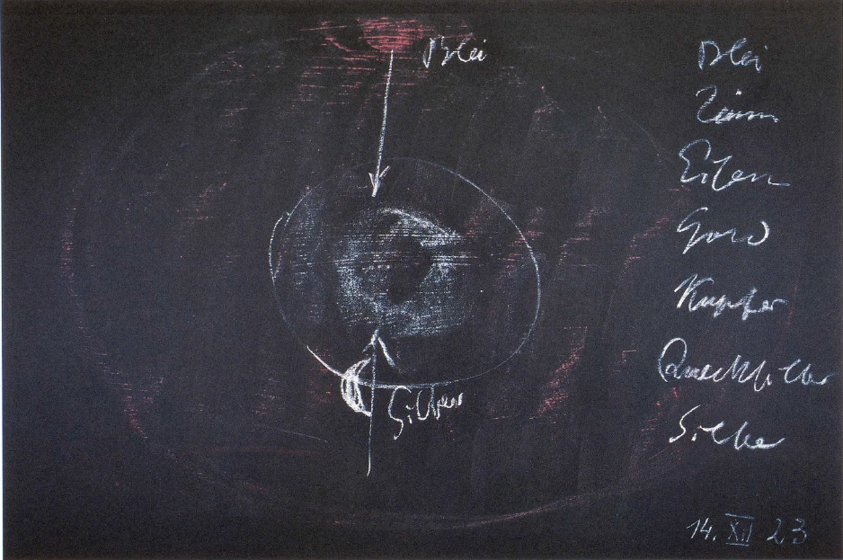
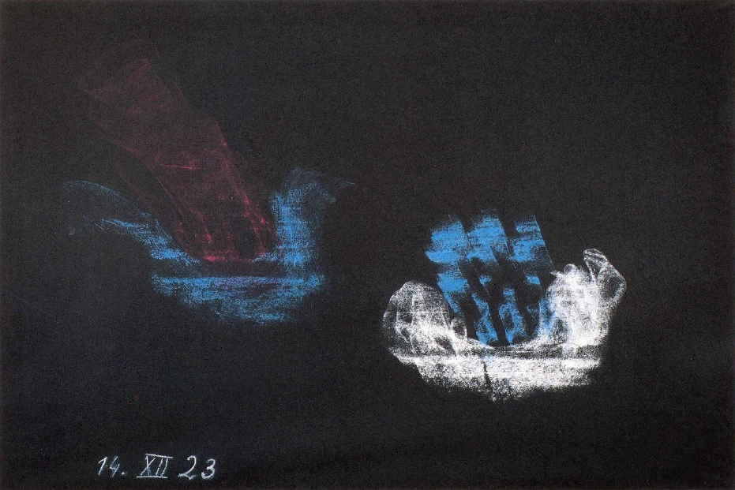

Stellen wir uns noch einmal vor die Seele, welche Bedeutung es hatte, daß jene Wahrheiten und Erkenntnisse, die, einbeschlossen waren in die Mysterien von Hybernia, in einem gewissen Sinne abgestumpft worden sind, das heißt zu keiner weiteren Wirkung gekommen sind bei ihrem Zug vom Westen nach Mitteleuropa - dem Osten, und daß an die Stelle des Spirituellen auch in Religionsdingen die äußere sinnenfällige Anschauung, wenigstens die Tradition, die Überlieferung von dieser sinnenfälligen Anschauung getreten ist. Das Bild, das sich uns ergeben hat am Ende der letzten Darstellung, dieses Bild wollen wir uns noch einmal vor die Seele hinstellen. Wir haben auf das Christus-Wesen hingedeutet in den Mysterien von Hybernia; wir haben auf es hingedeutet auch in der Zeit, in der dieses Mysterium von Golgatha abgelaufen ist. Da waren es die Initiatoren und ihre Schüler in Hybernia, welche, ohne daß in ihrer Mitte für ihre sinnliche Anschauung dieses Mysterium von Golgatha sich vollzogen hätte und ohne daß irgendeine Nachricht zu ihnen hätte kommen können, gleichzeitig als universelle Festlichkeit dieses Mysterium vollzogen haben, weil sie sich durch ihre Einsicht klar darüber waren, daß dieses Mysterium von Golgatha äußerlich gleichzeitig abläuft. ^lkv4m8

Es hatte sich also für die Initiatoren und ihre Schüler in Hybernia die Notwendigkeit ergeben, ein sinnlich wirkliches Ereignis nur auf eine geistige, auf eine spirituelle Art zu erleben. Und es war nicht nötig für jene Gesinnungen und Erkenntnisorientierungen, die in Hybernia üblich waren, mehr zu haben, als in der physischen Welt das Spirituelle. ^ajikxx

Damit ist aber offenbar, daß in Hybernia überhaupt auf das Spirituelle, auf das Geistige vor allen Dingen gesehen worden ist. Allerdings, in allen möglichen verborgenen Strömungen des geistigen Lebens hat sich dasjenige, was in Hybernia inauguriert worden ist, herüberverpflanzt durch die britischen Inseln, durch die Bretagne, durch das heutige Holland und Belgien nach Mitteleuropa, auch noch durch das heutige Elsaß nach Mitteleuropa. Und wenn auch nicht in der allgemeinen Zivilisation, so finden wir doch in den ersten Jahrhunderten der christlichen Entwickelung durch alle die eben gekennzeichneten Gegenden überall da und dort einzelne individuelle Menschen, die in der Lage waren, zu verstehen, was da herüberkam aus den Mysterien von Hybernia. Aber wie gesagt, allgemeine Zivilisation wurde das nicht. Und man muß schon mit intimer Erkenntnissehnsucht an diese Dinge herangehen, um, in den ersten christlichen Jahrhunderten noch zahlreiche, in den späteren Jahrhunderten, namentlich vom achten, neunten ab bis in das fünfzehnte und sechzehnte Jahrhundert immer spärlicher und spärlicher die einzelnen Persönlichkeiten zu finden, Persönlichkeiten auch, die eine wenn auch geringe Schülerzahl um sich versammelten, durch welche fortgepflanzt worden ist im Stillen, abseits von der großen Welt und ihrer Zivilisation, was eben im europäischen Westen auf der hybernischen Insel initiiert worden ist. ^euscls

Im allgemeinen breitete sich in Europa dasjenige aus, wozu man ein unmittelbares spirituelles Anschauen nicht brauchte, wofür man anknüpfen konnte an die bloße historische Überlieferung, die einfach erzählte, was als physische Ereignisse in Palästina im Beginne der Zeitrechnung geschehen ist. Und gerade von dieser Strömung geht dasjenige aus, was sich immer mehr und mehr so heranbildete, daß man eben nur dasjenige gelten ließ, was sich im physischen Leben abspielte. Immer weniger und weniger ahnte man eigentlich, welch ein kolossaler Widerspruch darin liegt, dasjenige, was - wie das Mysterium von Golgatha - nur durch das tiefste spirituelle Leben begreifbar sein kann, nur in einer äußerlichen, ans Sinnliche anknüpfenden Gestalt zu haben. Aber es wurde das einmal der notwendige Kulturentwickelungsgang in Europa. ^8ozn6f

Im Grunde genommen hatte sich ja das alles schon seit langer Zeit vorbereitet, und es konnte sich nur dadurch so ergeben, daß von dem alten Mysterienwesen, auch noch wie es in Griechenland war, viel, viel vergessen worden ist. Denn diese Mysterien von Griechenland, sie zerfielen ja eigentlich in zweierlei, in die einen, welche vorzugsweise sich damit beschäftigten, des Menschen Sinn hinaufzulenken nach den geistigen Welten, nach der eigentlichen Weltenlenkung und Weltenorientierung im Geiste, und in diejenigen, welche sich beschäftigten mit den Geheimnissen der Natur, mit den in der Natur waltenden, namentlich in den irdischen Gewalten liegenden Kräften und Wesenheiten. Ganz Einzuweihende gingen ja auch durch die beiden Arten von Mysterien. Und dann sagte man von ihnen, sie hätten sowohl die Geheimnisse des Vaters, die Zeusmysterien, in sich aufgenommen, wie auch die Geheimnisse der Mutter, die Geheimnisse der Demeter. Und wenn wir zurückschauen in diese Zeiten, so finden wir da noch neben einer in die höchsten Regionen, wenn auch schon mit einiger Abstraktheit, aber dennoch in die höchsten Regionen hinaufreichenden geistigen Anschauung eine in die Tiefen gehende Naturanschauung und vor allen Dingen, was besonders wichtig ist, die Verbindung von beiden. ^eeh2l5

Diese Verbindung von beiden, das, was heute wenig beachtet wird, daß der Mensch gewisse äußere Stoffe der Natur auch in sich trägt, gewisse andere Stoffe der Natur nicht in sich trägt, das wurde gerade in den chthonischen Mysterien in Griechenland im allertiefsten Sinne beachtet. Sie wissen ja, der Mensch trägt in sich organisiert das Eisen. Er trägt auch andere Metalle in sich; er trägt Kalzium, Natrium, Magnesium und so weiter, gewisse Metalle in sich. Aber er trägt gewisse Metalle gar nicht in sich, wenn man nur darauf Rücksicht nimmt, daß man diese Metalle finden sollte, indem man den Menschen mit den gewöhnlichen wissenschaftlichen Mitteln in bezug auf seine Stofflichkeit analysiert. Da trägt zum Beispiel in bezug auf diese äußere Untersuchung der Mensch kein Blei, kein Kupfer, kein Quecksilber, kein Zinn, kein Silber, kein Gold in sich. ^skuck5

Das war das große Rätsel der in die griechischen Mysterien Einzuweihenden, das in der Frage gipfelte: Wie kommt es, daß der Mensch zum Beispiel das Eisen in sich trägt, das Kalzium, das Natrium in sich trägt, daß er andere Stoffe, die sich auch in der äußeren Natur finden lassen, in sich trägt, daß er aber zum Beispiel das Blei, das Zinn nicht in sich trägt? Man war tief überzeugt davon, der Mensch sei eine kleine Welt, sei ein Mikrokosmos. Und dennoch, es schien so, als ob der Mensch diese Metalle: Blei, Zinn, Quecksilber, Silber, Gold nicht in sich trüge. ^9k4opt

Für die älteren Einzuweihenden in Griechenland kann man wirklich sagen, daß sie der Meinung waren: es scheint nur so. Denn sie waren doch von der Erkenntnis tief durchdrungen, daß der Mensch ein wirklicher Mikrokosmos ist, das heißt, daß er alles, was sich in der Welt offenbart, auch in sich trägt. ^di8v65

Sehen wir einmal in das Gemüt eines in Griechenland Einzuweihenden ein wenig hinein. Er wurde zum Beispiel so unterrichtet - ich muß etwas, was sich über lange Unterrichtszeiten ausdehnte, in ein paar Sätzen zusammenfassen, allein Sie werden mich verstehen -, daß ihm gesagt wurde: Sieh einmal, genau so, wie heute die Erde in sich überall das Eisen birgt, das Eisen aber auch im Menschen ist, so barg einmal zu einer Zeit, in welcher die Erde noch nicht Erde, aber in einem vorhergehenden planetarischen Zustande war, so barg da diese Erde, die noch Mond oder gar Sonne war, in sich auch Blei, Zinn und so weiter, und alle Wesen, welche an dieser vorhergehenden Gestaltung der Erde teilnahmen, nahmen auch an diesen Metallen und deren Kräften teil, so wie der heutige Mensch teilnimmt an der Kraft des Eisens. Aber bei jenen Umwandelungen, welche die ältere Gestaltung der Erde erfahren hat, blieb nur das Eisen als etwas, das noch in einer solchen Stärke und Dichtigkeit vorhanden ist, daß der Mensch sich mit ihm durchdringen kann. Die anderen Metalle, die genannt worden sind, sind zwar in der Erde enthalten, aber sie sind in der Erde nicht mehr in einer solchen Art enthalten, daß der Mensch sich mit ihnen unmittelbar durchdringen könnte. Aber sie sind enthalten in ungeheurer Dünnheit im ganzen Weltenraum, der den Menschen angeht. ^wdwpph

Wenn ich ein Stückchen Blei ansehe, so ist es das bekannte grauweiße Metall. Es hat eine bestimmte Dichtigkeit. Man kann es angreifen. Aber dieses selbe Blei, das in den Bleierzen der Erde vorkommt, das ist in unendlich feiner Verdünnung im ganzen zum Menschen gehörigen Weltenraum vorhanden und hat da seine Bedeutung. Es hat im Weltenraum die Bedeutung, daß es überall, auch wo scheinbar gar kein Blei ist, seine Kräfte ausstrahlt, und der Mensch doch mit diesen Kräften des Bleies in Berührung kommt, aber in Berührung jetzt nicht mehr kommt durch seinen physischen Leib, sondern nur durch seinen ätherischen Leib. Denn außerhalb der Bleierz-Arten der Erde ist das Blei eben in solcher Verdünnung vorhanden, daß es nur noch auf den ätherischen Leib des Menschen wirken kann. Auf den wirkt es aber auch in diesem im ganzen Weltenraum in unendlicher Verdünnung ausgebreiteten Zustande. ^imwc0h

Und dann lernte der Schüler der griechischen chthonischen Mysterien, daß ebenso, wie die Erde, die eigentlich unendlich reich ist an Eisen, die ein Planet ist, von dem ein Bewohner eines anderen Planeten sagen könnte, sie ist eisenreich — sie hat in diesem Eisenreichtum nur noch den Mars zu ihrem Verwandten -, daß geradeso, wie die Erde reich ist an Eisen, der Saturn reich ist an Blei. Was für die Erde das Eisen ist, ist für den Saturn das Blei. Und annehmen muß man — das lernte der Schüler der chthonischen Mysterien in Griechenland -, daß einstmals, als jene Trennung des Saturn von der allgemeinen planetatischen Gestalt, die die Erde einmal gehabt hat, wie es in meiner «Geheimwissenschaft » beschrieben ist, stattfand, daß diese besondere Verteilung mit Bezug auf das Blei auch damals geschehen ist, als von dieser allgemeinen Gestalt sich der Saturn abtrennte. Der Saturn hat sozusagen das Blei mit sich hinausgenommen und erhält es durch seine eigene planetarische Lebenskraft und durch seine eigene planetarische Wärme in einem solchen Zustande, daß er das ganze Planetensystem, zu dem auch unsere Erde gehört, durchdringen kann mit diesen fein verteilten Bleikräften. ^6srfbe

So daß man also sich vorzustellen hat: Die Erde, in den Weiten der Saturn, der aber erfüllend das ganze planetarische System mit dem feinen Blei, mit der feinen Bleisubstanz. Diese feine Bleisubstanz, sie wirkt auf den Menschen. Und auch davon können wir noch Spuren finden, daß der in Griechenland zu Initiierende davon Kunde erhielt, daß dieser Schüler verstehen lernte, wie dieses Blei wirkt. Er wußte: Unsere Sinne, namentlich der Sinn des Auges, würde den ganzen Menschen in Anspruch nehmen, ihn nicht zur Selbständigkeit kommen lassen. Der Mensch würde nur sehen, nicht über das Gesehene nachdenken können, nicht zurücktreten können von dem Gesehenen und sagen: Ich sehe. Er würde ganz vom Sehen überflutet sein, wenn nicht diese Bleiwirkung da wäre. Diese Bleiwirkung ist es, die den Menschen in sich selbständig macht, die ihn als Ich gegenüberstellt der Empfänglichkeit für die Außenwelt, die in ihm lebt. Und diese Bleikräfte sind es, die zuerst in den Ätherleib des Menschen eintreten, dann aber vom Ätherleib aus im Menschen den physischen Leib in einer gewissen Weise mit sich imprägnieren. Dadurch bekommt der Mensch die Fähigkeit der Erinnerungskraft, des Gedächtnisses. ^7r5by5

Und es war immer ein großer Augenblick, wenn solch ein Schüler, wie der griechische Schüler der chthonischen Mysterien, nachdem er solche Dinge verstehen gelernt hatte, zu folgendem geführt wurde. Es wurde ihm mit möglichster Feierlichkeit die Substanz des Bleies gezeigt. Dann wurde sein Sinn hinaufgelenkt zum Saturn. Dann wurde ihm die Verwandtschaft des Saturn mit dem irdischen Blei vor die Seele geführt. Dann wurde ihm gesagt: So, wie du dieses Blei siehst, so birgt es die Erde. Aber die Erde in ihrem jetzigen Zustande ist nicht imstande, dem Blei unmittelbar eine solche Form zu geben, daß dieses Blei im Menschen wirken könnte. Aber der Saturn mit seinem ganz anderen Wärmezustand, mit seinen inneren Lebenskräften, versprüht das Blei im planetarischen Raum, und dadurch bist du ein selbständiger Mensch, bist du ein erinnerungsfähiger Mensch. Denke daran, daß du ein Mensch bist nur dadurch, daß du heute noch weißt, was du vor zehn, vor zwanzig Jahren gewußt hast. Denke nur daran, wie dein Menschliches Schaden leidet, wenn du nicht in dir trägst, was du vor zehn, zwanzig Jahren in dir getragen hast. Deine Ichkraft würde zersplittert werden, wenn die Erinnerungskraft nicht in vollem Maße vorhanden wäre. Das verdankst du dem, was dir vom fernen Saturn entgegenstrahlt. Es ist die Kraft, die im Blei der Erde zur Ruhe gekommen ist und in diesem Ruhezustand nicht mehr auf den Menschen wirken kann. So macht es des Saturn Bleikraft, daß in dir Gedanken sich festsetzen, daß sie nach gewissen Zeiten wiederum heraufkommen aus den Tiefen der Seele, daß du mit der äußeren Welt dauernd, nicht bloß vorübergehend leben kannst. Du verdankst es dieser Blei-Saturnkraft, daß du nicht bloß heute die Gegenstände um dich herum siehst und sie morgen vergessen hast, sondern, daß du sie behalten kannst, daß du dasjenige, was du vor Jahren erlebt hast, wiederum in deiner Seele regsam werden lassen kannst; du kannst dein inneres Seelisches so gestalten, wie zeit deines irdischen Lebens dasjenige war, was du in deiner Umgebung erlebt hast. ^vh79pj

Das war zunächst ein gewaltiger Eindruck, den der Schüler dadurch bekam, daß ihm mit großer Feierlichkeit, aber mit einer ernsten, unsentimentalen Feierlichkeit eine solche Sache nahegebracht worden ist. Dann aber lernte er auch verstehen: Ja, wenn nur diese Blei-Saturnkraft wirken würde, wenn nur diese Blei-Saturnkraft dem Menschen die Ichfähigkeit, die Erinnerungsfähigkeit geben würde, dann würde der Mensch sich ja dem Kosmos vollständig entfremden. Wenn nur diese Saturnkraft da wäre, würde der Mensch zwar dasjenige, was er mit seinen physischen Augen gesehen hat, in seiner Erinnerungskraft aufnehmen können und es für das irdische Leben bleibend sein lassen, allein er würde sich entfremden dem Kosmos. Er würde gewissermaBen ein Eremit im Erdendasein werden, vom Saturn zur Erinnerungsfähigkeit inspiriert. ^m7p7qi

 ^fil4qn

Da lernte der Schüler erkennen, daß dieser Saturnkraft eine andere entgegengesetzt sein muß: das ist die Kraft des Mondes. Nehmen wir an, die beiden stünden gerade so, daß die Saturnkraft und die Mondenkraft von entgegengesetzter Seite, aber ineinanderfließend, an die Erde, also auch an den Menschen herankommen. Was der Saturn dem Menschen nimmt, gibt der Mond; was der Saturn dem Menschen gibt, nimmt der Mond. Und so, wie die Erde im Eisen eine Kraft hat, die der Mensch innerlich in sich verarbeiten kann, eine Kraft, die der Saturn in dem Blei hat, so hat der Mond diese selbe Kraft in dem Silber. ^1xqps0

Auch das Silber, wie es in der Erde ist, es ist bereits bei einem Zustande angelangt, durch den es in den Menschen nicht hineinkommen kann. Aber die ganze Sphäre, die der Mond einnimmt, ist tatsächlich durchzogen von fein verteiltem Silber. Der Mond wirkt, namentlich wenn sein Schein in der Richtung vom Löwen herkommt, so, daß der Mensch durch diese Silberkraft des Mondes die entgegengesetzte Wirkung hat von der Bleikraft des Saturn, daß er also dem Makrokosmos nicht entfremdet wird, trotzdem er aus dem Weltenall herein gnadevoll mit der Erinnerungskraft inspiriert wird. Und es war dann ein besonders feierlicher Augenblick, wenn der griechische Schüler hingeführt wurde, wenn sich in dieser Weise Saturn und Mond gegenüberstanden und zu sehen waren, und dann in der Feierlichkeit der Nacht dem Schüler klar gemacht worden ist: Siehe hinauf zu dem ringumgebenen Saturn. Ihm verdankst du dasjenige, was du als in dir geschlossener Mensch bist. Und schaue nach der anderen Seite zu dem silberstrahlenden Monde. Ihm verdankst du, daß du die Saturnkraft ertragen kannst, ohne daß du dich vom Kosmos herauslösest. ^q2bg6i

Sehen Sie, in dieser Weise — in unmittelbarer Anknüpfung an den Zusammenhang des Menschen mit dem Kosmos - wurde in Griechenland dasjenige getrieben, was in späterer Karikatur die Astrologie genannt worden ist. Da war es eine wirkliche Weisheit, denn da sah man ja in dem Stern nicht bloß den da oben stehenden Lichtpunkt oder Lichtfleck, da sah man im Stern die geistig-lebendige Wesenheit und das Menschenwesen auf Erden in Verbindung mit dieser geistig-lebendigen Wesenheit. Da hatte man eine Naturwissenschaft, die hinaufging bis in das Himmlische, die hinausreichte in die Weltenweiten. Und dann, wenn der Schüler solche Lichtblicke, Lichtausblicke erhalten hatte, wenn sich ihm das tief in die Seele eingeschrieben hatte, dann wurde er zum Beispiel in den wahren Mysterien von Eleusis, wie das ja überhaupt üblich war - Sie haben es bei meinen Schilderungen anderer Mysterien, auch der hybernischen Mysterien gesehen -, hingeführt vor zwei Bildsäulen. Und die eine dieser Bildsäulen stellte ihm dar eine väterliche Gottheit, jene väterliche Gottheit, welche umgeben war von den Zeichen des Planetarischen und Sonnenhaften; jene väterliche Statue, welche ihm zum Beispiel darstellte den strahlenden Saturn, aber so strahlend, daß der Schüler erinnert wurde: Ja, das ist die Bleistrahlung des Kosmos; wie er beim Mond erinnert wurde: Ja, das ist die Silberstrahlung des Mondes, und so bei jedem einzelnen Planeten. So daß ihm in der Statue, die das Väterliche darstellte, erschien, was an Geheimnissen hereinstrahlte von der planetarischen Umgebung der Erde, was verwandt war den einzelnen Metallen der Erde, die aber innerhalb der Erde schon unbrauchbar geworden waren für das menschliche Innere. ^aanvqj

Sieh, so wurde dem Schüler gesagt, da steht der Vater der Welt vor dir. Der Vater der Welt trägt im Saturn das Blei, im Jupiter das Zinn, im Mars das dem Erdenwesen verwandte Eisen - aber in einem ganz anderen Zustande -, in der Sonne das strahlende Gold, in der Venus das strahlend-strömende Kupfer, im Merkur das strahlende Quecksilber, im Monde das strahlende Silber. Du trägst in dir nur dasjenige vom Metallischen, was du dir aneignen konntest aus den planetarischen Zuständen, die die Erde früher einmal gehabt hat. Vom jetzigen Zustand kannst du dir nur das Eisen aneignen. Aber du bist als Erdenmensch nicht ein Ganzes. Das, was dir der Vater, der vor dir steht, zeigt in den Metallen, die nicht in dir selber heute aus dem Erdensein bestehen können, sondern die du heute vom Kosmos entnehmen mußt - in dem Vater hast du dein anderes, wenn du dich als Mensch nimmst, der durch planetarische Verwandlungen der Erde gegangen ist. Dann bist du erst ein ganzer Mensch. Hier auf Erden stehst du als Teil des Menschen. Das andere trägt der Vater um sein Haupt und in seinem Arm vor dich hin. Das, was hier vor dir steht, mit dem, was er trägt, das erst bist du. Du stehst auf der Erde. Aber diese Erde war nicht immer so, wie sie heute ist. Wäre sie immer so gewesen, du könntest als Mensch nicht auf ihr sein. Denn sie trägt in sich, wenn auch in einem abgestorbenen Zustande, auch das Blei des Saturn, das Zinn des Jupiter, das Eisen des Mars - eben in dem anderen Zustand -, das Gold der Sonne, das Silber des Mondes, das Kupfer der Venus, das Quecksilber des Merkur; sie trägt es in sich. Aber so wie sie es in sich trägt, so sind diese Metalle nur die Erinnerungen an die Art und Weise, wie einstmals schon das Silber während des Mondendaseins in der Erde gelebt hat, das Gold während des Sonnendaseins, das Blei während des Saturndaseins. Und was dir heute in den dichten metallischen Massen von Blei, Zinn, Eisen, Gold, Kupfer, Quecksilber, Silber erscheint - mit Ausnahme desjenigen Eisens, das du eigentlich kennst, das nicht das innerirdische Eisen ist, denn das ist marshaft -, das, was heute dir in diesen kompakten, dichten Metallen erscheint, das ergoß sich einstmals aus dem Kosmos in die Erde in einem ganz anderen Zustande. Diese Metalle, wie du sie heute von der Erde kennst, sind die Leichname der einstigen Metallwesen. Blei ist der Leichnam jenes Metallwesens, das während der Saturnzeit und später wiederum in einem anderen Grade während der Mondenzeit auf der Erde in ihrer alten Gestalt gespielt hat. Zinn hat mit dem Gold zusammen während der Sonnenzeit der Erde gespielt in einem ganz anderen Zustande — schaust du den im Geiste, dann wird dir diese Statue in dem, was sie dir entgegenträgt an Heutigem, zur wahrhaft väterlichen Statue. Und im Geiste, wie in einer realen Vision, wurde die Statue der wahren Mysterien in Eleusis lebendig und reichte der weiblichen Gestalt, die daneben stand, dasjenige, was dazumal die Metalle waren. Und die weibliche Gestalt nahm diese ehemalige Gestalt der Metalle entgegen in der Vision des Schülers und umzog sie mit demjenigen, was die Erde von sich aus, als sie Erde wurde, geben konnte. ^ne0ug0

So sah der Schüler diesen wunderbaren Prozeß, diesen wunderbaren Vorgang: Da strahlte einmal, so wie jetzt wiederum symbolisch, aus der väterlichen Statuenhand, da strahlte die Metallmasse, und dasjenige, was Erde war, trat, sagen wir zum Beispiel mit ihrem Kalk oder sonstigen Gestein entgegen dem, was da einstrahlte, und umgab das metallisch Einströmende mit irdischer Substanz, so wie die liebevoll von der einen mütterlichen Statue hinaufreichende Hand das jenige entgegennahm, was von der väterlichen Statue an metallischer Kraft der mütterlichen Statue gereicht wurde. Das war ein großer, gewaltiger Eindruck, denn man sah darinnen das Kosmische mit dem Irdischen zusammenwirken im Laufe der Äonen. Und man lernte dasjenige, was die Erde darbictet, in seiner richtigen Weise empfinden. ^vp422c

 ^v70phx

Sehen Sie sich einmal manches, was in der Erde metallisch ist, an. Sie haben es kristallisiert. Sie haben es umgeben mit einer Art von Kruste, mit dem, was aus der Erde ist. Das Metallische ist vom Kosmos herein; dasjenige, was von der Erde ist, das nimmt wie liebevoll auf das, was vom Kosmos hereinkommt. Sie sehen es überall draußen, wo sie an den Fundstätten der Metalle herumgehen und um die Metalle sich bekümmern. Und dasjenige, was da dem Metall entgegenkam, man nannte es die Mutter. Und die wichtigsten dieser irdischen Substanzen, die sich dem Himmlisch-Metallischen entgegenstellten, um sie aufzunehmen, nannte man die Mütter. ^19s43r

Das ist auch ein Aspekt für jene « Mütter», zu denen Faust hinuntersteigt. Er steigt zu gleicher Zeit hinunter in vorirdische Zeiten der Erde, um da zu seen, wie die mütterliche Erde das vom Kosmos herein väterlich Gegebene in sich aufnimmt. ^l5ioxz

Durch alles das wurde in dem Schüler der eleusinischen Mysterien innerlich erregt ein Mitfühlen mit dem Kosmos, eine innerliche Herzenserkenntnis dessen, was eigentlich in Wirklichkeit die Naturprodukte und Naturvorgänge auf Erden sind. ^gcvbal

Meine lieben Freunde, wenn sich der heutige Mensch anschaut diese Naturvorgänge, anschaut diese Naturprodukte - es ist ja alles tot, es ist ja alles Leichnam. Und wenn wir in der Physik oder Chemie herumhantieren, was tun wir anderes, als mit der Natur dasselbe machen, was schließlich der Anatom macht, wenn er im Seziersaal die Leiche zerschneidet, wo er das Tote von dem hat, dessen Bestimmung das Leben ist. So schneiden wir mit unserer Chemie, mit unserer Physik in die lebendige Natur hinein. Aber dem griechischen Schüler war eben eine andere Naturwissenschaft gegeben: die Naturwissenschaft des Lebendigen, die ihn das heutige Blei anschauen ließ wie den Leichnam des Bleies. Man muß zurückgehen in die Zeiten, wo das Blei gelebt hat. Da wurde ihm die geheimnisvolle Beziehung des Menschen zum Weltenall, die geheimnisvolle Beziehung des Menschen zu dem, was um ihn herum ist im Irdischen, klar. ^pm57vl

Und dann, wenn der Schüler solches durchgemacht hatte, wenn ihm solches seelisch vertieft worden war vor der väterlichen und der mütterlichen Statue, die die beiden einander entgegengesetzten Kräfte, die Kräfte des Kosmos, die Kräfte des Irdischen in seiner Seele vergegenwärtigten, dann wurde er sozusagen in das Allerheiligste geführt, auch in Griechenland. Da hatte er das Bild vor sich: die weibliche Gestalt, an ihrer Brust das Kind säugend. Dann wurde er eingeführt in das Verständnis der Worte: Und das ist der Gott Jakchos, der einst kommen wird. So lernte der griechische Schüler voraus das Christusmysterium verstehen. ^aclwc1

Wiederum war in spiritueller Art der Christus auch vor den in Eleusis zu Initiierenden hingestellt worden. Aber es durften in jener Zeit die Menschen zunächst diesen Christus nur als den Zukünftigen kennenlernen, als den, der noch Kind war, Weltenkind, das erst erwachsen werden sollte im Kosmos. Telesten wurden ja die zu Initiierenden genannt: solche, die nach dem Ende, nach dem Ziele der Erdenentwickelung hinschauen sollten. ^8psfpf

Und nun kam der große Umschwung. Es kam der Umschwung, der mit aller Schärfe eigentlich auch historisch ausgedrückt ist in dem Übergange von Plato zu Aristoteles. ^6ial17

Sehen Sie, es ist ein Eigentümliches, meine lieben Freunde. Als das vierte Jahrhundert herankam in der griechischen Kulturentwickelung, da spielte sich der erste Umschwung zu dem Abstraktwerden hin ab. Und er spielte sich so ab, daß zwischen Plato und Aristoteles, als Plato schon im höchsten Alter war, als Plato eigentlich am Ende seiner Laufbahn war, daß zwischen Plato und Aristoteles folgende Szene stattfand. Plato sagte - ich muß das in Worte kleiden, was natürlich in viel komplizierterer Weise sich abgespielt hat - etwa das Folgende zu Aristoteles: ^48ri9o

Dir hat manches nicht so richtig geschienen, wie es von mir dir und den anderen Schülern vorgetragen worden ist. Was von mir dir und den anderen Schülern vorgetragen worden ist, ist aber schließlich der Extrakt uralt heiliger Mysterienweisheit. Aber die Menschen werden im Laufe ihrer Entwickelung eine Form, eine Gestalt, eine innere Organisation annehmen, die sie nach und nach zu etwas allerdings Höherem führen wird, als wir jetzt haben im Menschen, die aber unmöglich macht, daß der Mensch entgegennimmt dasjenige, was Naturwissenschaft, in der Art, wie ich es heute geschildert habe, bei den Griechen war. - Das machte Plato dem Aristoteles klar. - Und deshalb will ich mich eine Zeitlang zurückziehen, sagte Plato, und dich dir selbst überlassen. Versuche in der Gedankenwelt, für die du besonders veranlagt bist, und die die Gedankenwelt der Menschen durch viele Jahrhunderte werden soll, versuche in Gedanken auszubilden, was du hier in meiner Schule aufgenommen hast. ^o1ahx1

Aristoteles und Plato blieben getrennt, und Plato führte damit einen hohen geistigen Auftrag gerade durch Aristoteles aus. ^99izuv

Sehen Sie, meine lieben Freunde, die Szene muß ich Ihnen so schildern, wie ich sie eben jetzt geschildert habe. Sehen Sie aber in die Geschichtsbücher, so finden Sie diese Szene auch geschildert, und ich will sie Ihnen jetzt erzählen, wie sie in den Geschichtsbüchern, aus denen die Menschen lernen, geschildert ist. Da wird sie so geschildert: Aristoteles war eigentlich immer ein etwas widerspenstiger Schüler des Plato, so daß Plato einmal gesagt hätte, Aristoteles sei zwar ein begabter Schüler, aber er sei so, wie das Pferd, das von irgend jemandem abgerichtet wird, und das dann seinen Lehrmeister mit dem Hufe schlägt. Und was sich da zwischen Aristoteles und Plato abgespielt hätte, führte immer mehr und mehr dazu, daß Plato sich zurückzog von Aristoteles und böse war und gar nicht mehr in die Akademie ging, um zu lehren. Das steht in den Geschichtsbüchern. ^2uft4l

Das eine steht in den Geschichtsbüchern; das andere, was ich Ihnen erzählt habe, ist die Wahrheit und trägt in sich den Impuls für etwas sehr Bedeutsames. Denn sehen Sie, es gab zweierlei Arten von Schriften des Aristoteles. Die einen enthielten eine bedeutsame Naturwissenschaft, jene Naturwissenschaft, die die Naturwissenschaft von Bleusis war, und die auf dem Umwege durch Plato an Aristoteles herangekommen ist; und die andere Art von Schriften enthält die Gedanken, die abstrakten Gedanken, die im Auftrage des Plato, ja im Auftrage dessen, was Plato wiederum als Aufgabe hatte aus den eleusinischen Mysterien, dem Aristoteles darzustellen oblag. ^1xpibp

Und auch einen zweifachen Weg nahm das, was Aristoteles eigentlich zu geben hatte. Das eine waren die sogenannten logischen Schriften, jene logischen Schriften, die die tragfähigsten Gedanken aus der alten eleusinischen Weisheit herausholten. Diese Schriften mit weniger Naturwissenschaft übergab Aristoteles seinem Schüler Theophrastus. Und auf dem Umwege durch Theophrastus und auf anderen Umwegen noch kamen sie über Griechenland und Rom herauf und bildeten das Mittelalter hindurch die Lehrweisheit für diejenigen, die eben in der Zivilisation tätig waren, für die Lehrer der Weltanschauungen in Mitteleuropa. ^hx5n55

Und was auf die Art gekommen war, wie ich es Ihnen das letzte Mal erzählt habe, was gekommen war dadurch, daß man zurückweisen mußte die Mysterienweisheit von Hybernia und nur an dasjenige anknüpfen konnte, was wiederum Tradition war des sinnlich sich Abspielenden im Beginne der Zeitrechnung, das verband sich mit dem, was ausgesondert wurde von der bei Aristoteles sich noch findenden Weisheit des Plato, bzw. Weisheit der eleusinischen Mysterien. Für das aber, was das eigentlich Naturwissenschaftliche war, was in sich noch den Geist trug der chthonischen Mysterien, die dann nur in die eleusinischen eingeflossen waren, was eine Naturwissenschaft war, die nach dem Himmel hinausreichte, die in die Weiten des Kosmos hinausschweifte, um das Irdische zu erklären, für diese Naturwissenschaft war in Griechenland die Zeit vorbei. Und so viel noch gerettet werden sollte von dieser Naturwissenschaft, so viel konnte nur auf die Art gerettet werden, daß Aristoteles der Lehrer des Alexander wurde, der seine Züge nach Asien hinüber machte, und der alles, was möglich war, einführte nach dem Oriente von aristotelischer Naturwissenschaft, die dann überging in die jüdischen, in die arabischen Schulen, von da aus über Afrika nach Spanien herüberkam und die in filtrierter Weise zum Teil in dasjenige hereinwirkte, was in Mitteleuropa so spielte, wie ich es Ihnen gezeigt habe, aus den hybernischen Mysterien heraus bei einzelnen einsamen Menschen. Theophrast hat den Kirchenlehrern des Mittelalters seinen Aristoteles gegeben. Alexander der Große hat nach Asien hinüber den andern Aristoteles getragen: jene eleusinische Weisheit, die in ungeheurer Abschwächung dann durch Afrika nach Spanien gekommen war und aufleuchtet im Mittelalter, trotz der allgemeinen Zivilisation sogar in einzelnen Klöstern gepflegt worden ist — zum Beispiel von dem, ich möchte sagen, in mythischer Form auf die Nachwelt gekommenen Basilius Valentinus. Das lebt da drinnen, das lebt, möchte ich sagen, unter der Oberfläche, während auf der Oberfläche eben diejenige Kultur lebt, von der ich Ihnen schon das letzte Mal gesprochen habe. Denn in alledem, was die allgemeine Zivilisation war, in alledem lebt nicht das, was eben auch noch zu Aristoteles Zeiten gelehrt werden konnte: Der Christus muß wirklich erkannt werden. ^e2ou28

Das dritte Bild, die weibliche Gestalt, die an der Brust das Kind trägt, das Jakchoskind, die muß auch verstanden werden. Das aber, was das Verständnis dieser dritten Gestalt bringen sollte, das muß in der Entwickelung der Menschheit erst kommen - so hatte ja oftmals, ohne es niederschreiben zu können, durch Verhältnisse, wie ich sie Ihnen eben jetzt dargestellt habe, gerade Aristoteles zu seinem Schüler, Alexander dem Großen, gesagt. ^q7xw7o

Und so sehen wir, wie in der Zeiten Schoß die Aufforderung liegt, in ihrer ursprünglichen Wirklichkeit zu verstehen, was dann durch die christlichen Maler so schön hingestellt wurde: die Mutter mit dem Kinde an der Brust, was aber nicht in voller Art verstanden worden ist, weder in der Raffaelischen Madonna noch in der östlichen Ikone, was noch auf das Verständnis wartet. ^eo6b26

Einiges von dem, was notwendig ist, um zu solchem Verständnis zu kommen, soll im Laufe der nächsten Zeit hier in diesen Vorträgen besprochen werden. Morgen werde ich den Weg zeichnen, der manche tiefen okkulten Geheimnisse über Arabien herüber nach Europa getragen hat, um damit eine gewisse historische Erscheinung festzulegen vor Ihren Seelen. Und in den Vorträgen, die ja die okkulte Grundlage des geschichtlichen Werdens der Menschheit darstellen sollen, und die zu Weihnachten vor den Delegierten gehalten werden, werde ich ja an der entsprechenden Stelle auch die ganze Bedeutung der Alexanderzüge in Verbindung mit dem Aristotelismus darzulegen haben. ^c61rtq