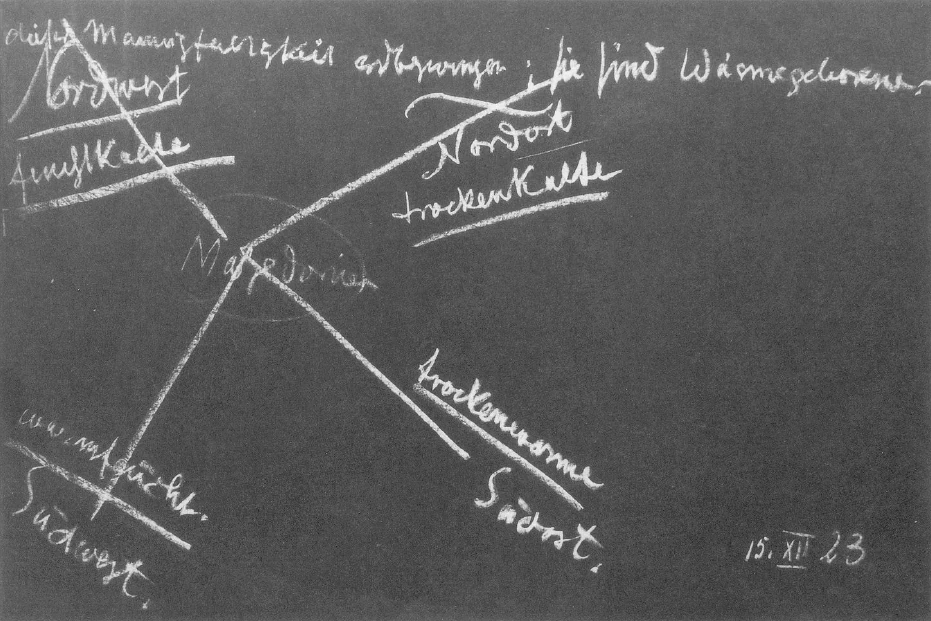

Aus dem, was ich gestern vorzubringen hatte, wird es vielleicht verständlich sein, wenn ich von Aristoteles, dem Zusammenfasser des gesamten Wissens, der gesamten Erkenntnis im Altertum im vierten vorchristlichen Jahrhunderte, sage, daß er, trotzdem er eigentlich nur eine Art logischen Systems über Mitteleuropa fließen ließ, dennoch auf dem Boden des griechischen und eigentlich des gesamten Mysterienwesens der damaligen Zeit stand. Ja, man wird sogar sagen müssen, daß derjenige, der solche Dinge wie Weltanschauungen nicht bloß mit dem Verstande, sondern auch mit dem Gemüte aufzunehmen in der Lage ist, herausfühlen kann aus den logischen Darstellungen des Aristoteles, daß ein gewisses inniges Verknüpftsein mit Naturgeheimnissen auch der aristotelischen Logik und Philosophie zugrunde liegt. Es war eben mehr das Schicksal des Aristoteles, ein logisches System über Europa auszugießen, als, wenn ich mich so ausdrücken darf, sein eigener Entwickelungsgang. Denn immerhin, man kann schon sagen, um die hier vorliegende eigentümliche Tatsache zu illustrieren: es wäre vielleicht undenkbar, daß Plato hätte der Lehrer Alexanders werden können, während Aristoteles es hat werden können. ^d4f7zf

Plato setzte gewiß in seiner Art nur die alten Mysterien in einer mehr ideellen Form fort. Aber gerade durch sein Ideelles wurde er die Persönlichkeit, die mehr hinwegführte von den Geheimnissen der Natur, während Aristoteles wiederum auf sie zurückführte, was Sie schon aus meinen ganz kurzen Darstellungen in meinen «Rätseln der Philosophie» ersehen können. Aber den vollen Tatbestand lernt man doch erst kennen, wenn man sich eine Vorstellung machen kann, wie der siebenjährige Unterricht, den Aristoteles dem Alexander gegeben hat, eigentlich seinem Inhalte nach war. Ich will in Kürze zusammenfassen, was, herausgehoben aus dem antiken Mysterienwesen, der Inhalt dieses Unterrichtes war. ^6pmbx1

Es war ja, wenn man überhaupt in jenen alten Zeiten in einer gültigen Weise über die Natur sprach, so, daß man unter der Natur nicht dasjenige verstand, was die heutige Naturwissenschaft versteht: die bloßen irdischen Erscheinungen, von denen man dann auf die außerirdischen Himmelserscheinungen äußerlich schließt; sondern man gliederte den Menschen an die Natur im allerweitesten Sinne an, und konnte das nur, wenn man auch den Geist in der Natur suchte, denn man ließ es sich in jenen alten Zeiten gar nicht beifallen, den Menschen etwa seelenlos und geistlos zu betrachten. Und so handelte es sich eigentlich bei dem Mysterienunterricht über die Natur immer darum, die Natur weit hinauszudehnen in das Kosmische, so weit, als der Kosmos dem Menschen durch seine Verwandtschaft mit ihm zugänglich sein konnte. ^5ad0oy

Nun, aller Unterricht, aller ernst genommener Unterricht in jenen alten Zeiten war ja nicht ein Appell an den menschlichen Verstand oder an das äußere Beobachtungsvermögen des Menschen. Was man sich heute unter Wissen vorstellt, das spielte eigentlich in jenen älteren Zeiten, auch noch zur Zeit des Aristoteles, keine beträchtliche Rolle. Und wenn die Geschichtsschreiber der einzelnen Wissenschaften heute ihr eigenes wissenschaftliches Denken darstellen wollen, so sollten sie eigentlich erst bei Kopernikus oder Galilei anfangen; denn was sie zurückgehend zu dem noch hinzuflicken, das ist ja durchaus nicht zutreffend. Und wenn sie gar gegen das griechische Wissen hin gehen, so ist es die reine Phantasie, die sie da geben: es ist eine Art Fortsetzung der Gegenwart nach früheren Zeiten, die aber niemals real war. Denn auch zu Aristoteles’ Zeiten und von Aristoteles selber wurde jeder Unterricht, der ernst genommen wurde, so gegeben, daß er verknüpft war mit einer Umänderung der ganzen Menschennatur, mit einem Appell nicht nur an das menschliche Denken und Beobachten, sondern an das ganze menschliche Leben. Der Mensch sollte durch Erkenntnis eben ein anderes Wesen werden, als er ohne die Erkenntnis ist. Das war ja das Wesentliche, worauf es in den Mysterien ankam, daß der Mensch durch die Erkenntnis ein ganz anderes Wesen wurde, als er vorher war. Und gerade zu Aristoteles’ Zeiten war es so, daß man diese Umwandelung des Menschen vor allen Dingen dadurch herbeizuführen versuchte, daß man zwei polarisch einander entgegengesetzte Empfindungen auf die menschliche Seele wirken ließ. ^fwur6k

Man ermahnte den Menschen, der unterrichtet werden sollte, der nach und nach zum Wissen, zur Erkenntnis kommen sollte, so recht menschlich sich hineinzufühlen in seine Naturumgebung. Sieh einmal - so sagte man etwa -, du atmest die Luft, aber du atmest die Luft, die im Sommer warm ist, im Winter kalt ist. Du atmest die Luft so, daß du deinen eigenen Atem in Dampfesgestalt, in Dunstgestalt im Winter wahrnehmen kannst. Er wird unsichtbar, wenn du warme Luft im Sommer atmest. ^iueycl

Und an solch eine Erscheinung wurde angeknüpft. Man knüpfte nicht zunächst etwa so an die Natur an, daß man sagte: Sieh einmal, da hat ein Körper diese oder jene Temperatur; ich erwärme ihn in einer Retorte, er macht diese oder jene Veränderung durch. Nein, man knüpfte an den Menschen an, an den Menschen, wie er sich drinnen fühlt in jenem Zusammenhange, der den Atmungsprozeß darstellt. Und man ließ allmählich den Menschen auf der einen Seite zum Erfühlen, zum Empfinden kommen der erwärmten Luft: Stelle dir recht vor, was das heißt, erwärmte Luft. Sie will hinauf, und du mußt fühlen, indem die erwärmte Luft an dich herankommt, daß dich eigentlich etwas in die Weiten tragen will. Und fühle im Gegensatz dazu das kalte Wasser, das kalte Wasser in irgendeiner Form; fühle es nur. Du fühlst dich darinnen eigentlich nicht heimisch. In der warmen Luft fühlst du dich heimisch, so heimisch, daß dich die warme Luft in die Weiten des Kosmos tragen will. Im kalten Wasser fühlst du dich fremd, nicht heimisch. Aber du fühlst, wenn du fortgehst vom kalten Wasser, und wenn du das kalte Wasser außer dir tun läßt, was es tun will: dann wird diese Tatsache für dich etwas; dann, wenn du das kalte Wasser außer dir tun lässest, was es tun will, dann bereitet es selber zum Beispiel die Schneekristalle, die niederfallen auf die Erde. Außerhalb der Schneekristalle, die Schneekristalle beobachtend, fühlst du dich an deinem richtigen Orte. Die warme Luft kannst du eigentlich nur in dir fühlen, und du möchtest dich mit der aufwärtsstrebenden warmen Luft in die Weltenweiten tragen lassen. Das kalte Wasser kannst du nur eigentlich außer dir fühlen, und du möchtest es, damit du eine Verwandtschaft mit ihm hast, eigentlich in seinen Ergebnissen durch deine Sinne betrachten. ^nb9gxm

Das waren die zwei polarischen Gegensätze, an die man dazumal herangebracht wurde: zu fühlen, daß eigentlich «draußen und drinnen vom Menschen» ein leerer Ausdruck ist. Draußen und drinnen will eigentlich gar nichts Besonderes besagen. Viel will besagen: warme Luftigkeit, kalte Wäßrigkeit. Das sind Gegensätze, durch die der Mensch ganz seinem innersten Wesen nach in die Welt hineingestellt wird. Denn «draußen » ist erst etwas dadurch, daß es kalt-feucht ist, «drinnen » ist etwas dadurch, daß es warm-luftig ist. Qualitativ fühlte man diesen Gegensatz, und qualitativ das Hineingestelltsein des Menschen. ^7lsbe6

Dann sprach man nicht mehr von Dingen, dann sprach man von dem Menschen selbst. Man sprach davon, daß das Warmluftige zu den Göttern hinführt, zu den Göttern in den Höhen, und daß das Feuchtkalte zu den unterirdischen Dämonen führt. Aber mit der Fahrt nach den unterirdischen Dämonen ist zu gleicher Zeit verbunden die Erkenntnis der Natur. Man muß nur mitbringen in die unteren Regionen das, was man erkundet und erlebt durch das Warmluftige in den Höhen, damit einem das Untere nichts anhaben kann. Und wenn man dann mit dieser inneren Empfindung für den Gegensatz des Warmluftigen und des Feuchtkalten, wenn man mit diesem Erlebnis an die Natur heranging, dann konnte man durch das weitere Erleben an den Naturgegenständen und Naturvorgängen tief hineinschauen in das Wesen des Weltenalls überhaupt. ^h8wbpp

Heute untersucht der Chemiker den Wasserstoff, schreibt dem Wasserstoff nach seinen Untersuchungen gewisse Eigenschaften zu. Dann beobachtet er die Weltenräume, sieht da etwas, was dieselben Eigenschaften offenbart wie der Wasserstoff im Laboratorium, und sagt, der Wasserstoff ist auch in den Weiten. Solch eine Unterweisung würde auch zu Aristoteles’ Zeiten noch eine Torheit gewesen sein. Aber man ging dazumal anders zu Werke. ^2ultwr

Wenn vertieft war das innere Erleben durch das, was ich eben angedeutet habe, dann führte man den Schüler zu der Beobachtung dessen, was nun wirklich in der aufstrebenden, sich in die Weltenweiten hinaus öffnenden Blume lebt. Pflanzenerkenntnis, das war dasjenige, wozu man den Schüler führte, Pflanzenerkenntnis: Schaue hinein in die sich öffnende Blumenkrone, beobachte, wie da das, was den Weiten der Welt entgegenstrahlt, auf dich einen Eindruck macht. ^y6se7h

Und indem der Schüler mit jenen vertieften Empfindungen, von denen ich Ihnen gesprochen habe, so über die sich öffnenden Blumen hinblickte, dann ging ihm eine innerliche Erkenntnis, eine innerliche Erleuchtung auf. Die Blumen draußen auf Erden wurden ihm zu Verkündern von Weltengeheimnissen in den Weiten. Die Blumen sprachen ihm von den Weltenweiten. Und in einer eindringlichen, aber nur andeutenden Weise führte der Lehrer den Schüler dahin, dieses Geheimnis, das von den Weiten der Welt einströmt in das Blumenwesen, aus sich selber heraus zu finden. Und so wurde der Schüler nach und nach dazu gebracht, auf die Frage des Lehrers: Was nimmst du denn da eigentlich wahr, wenn du hineinschaust in den sich öffnenden Blumenkelch, in die sich öffnende Blumenkrone, wo die Staubgefäße herauskommen und dir entgegenstrahlen, was nimmst du eigentlich wahr? - da wurde der Schüler dazu gebracht, zu sagen: Die Pflanzen erzählen mir, daß sie eigentlich durch die schwere, kalte Erde gezwungen sind, ihren Standort auf der Erde zu nehmen, daß sie aber eigentlich nicht aus der festen Erde gekommen sind, sondern in diese nur hineinbefestigt worden sind, daß sie in Wahrheit wassergeborene Wesen sind, und in dieser ihrer Lebendigkeit als wassergeborene Wesen im vorerlebten Zustand des Erdenseins - ich meine den in meiner «Geheimwissenschaft » beschriebenen Zustand, den Mondzustand - ihr wirkliches echtes Dasein gehabt haben. Sehen Sie, dazu wurde der Schüler gebracht, zu sagen: Das, was eigentlich die Geheimnisse des Mondes sind, der aus der Erde herausgegangen ist und noch etwas von dem vorirdischen Mondenzustande bewahrt, das spiegelt mir aus den Blumen entgegen. Denn die Blumen sagten dem Schüler nicht jede Nacht das gleiche. Wenn der Mond vor dem Löwen stand, sagten die Blumen etwas anderes, als wenn der Mond vor der Jungfrau oder vor dem Skorpion stand. Denn das, was der Mond bei seinem Umkreisen durch den Tierkreis erlebte, von dem erzählten die Blumen auf der Erde. Von den Geheimnissen des Weltenalls draußen erzählten die Blumen auf der Erde. Es war wirklich so, daß der Schüler durch das, was herangebracht wurde an ihn, aus seinem innersten Herzen heraus sagte: ^vehogu

Das konnte der Schüler fühlen, weil er ja vorher eingeführt worden war in dasjenige, was ihm das erkaltende Wasser gab. Er hatte das erlebt, und durch dieses Erlebnis kam er an der Blume zu dieser Erkenntnis. ^o69jeg

Und wenn der Schüler genügend vertraut geworden war mit dem Mondengeheimnis, das die Pflanzen, die aus der Erde heraussprossen, verrieten, dann wurde er weiter an die Metalle der Erde herangeführt, an die Hauptmetalle: Blei, Zinn, Eisen, Gold, Kupfer, Quecksilber, Silber, wie ich sie gestern in einem anderen Zusammenhange Ihnen vorgeführt habe. Und wenn er ein so vertieftes Empfindungsleben hatte, wie ich es jetzt angedeutet habe, dann erfuhr er gerade an den Metallen, indem er sich bekannt machte mit dem, was sie ihm geheimnisvoll sagten, die Geheimnisse des ganzen Planetensystems. Denn das Blei klärte ihn auf über den Saturn, das Zinn über Jupiter, das Eisen über Mars, das Gold über die Sonne, das Kupfer über die Venus, das Quecksilber über den Merkur, und wiederum das Silber über den Mond, insoferne der Mond nun nicht in engerer Verwandtschaft mit der Erde steht, sondern auch ein Angehöriger des ganzen Weltenalls ist. Und so wie der Schüler sich das Blumengeheimnis enthüllte, so enthüllte er sich das Metallgeheimnis. Es war also das Erste das Pflanzengeheimnis, das Zweite das Metallgeheimnis. ^otmw0o

Dieses Metallgeheimnis, das in den eleusinischen Mysterien durch das Ihnen gestern geschilderte mächtige Planiglobium der männlichen Statue gegeben worden ist, dieses Metallgeheimnis wurde in den Unterricht hineinverwoben auch noch zur Aristoteleszeit, und an diesem Metallgeheimnis enthüllte sich das Geheimnis der Planeten. Man empfand ja nicht so grob wie heute; man empfand, indem man an das Metall Blei herantrat, daß das Blei nicht nur in der bleigrauen Farbe dem ‚Auge erscheint, sondern dieses Bleigrau machte einen eigentümlichen Eindruck auf das innere Auge. Es löschte in einer gewissen Beziehung dieses Bleigrau des frischen Bleimetalles die anderen Farben aus, und man empfand ein Mitgehen mit der bleigrauen Metallität. Man kam in einen gewissen Bewußtseinszustand, und man kam hinein in das Erleben von etwas ganz anderem, als die Gegenwart ist. Man kam wirklich in eine Stimmung hinein, wie wenn die ganze Vorzeit der Erde vor einem aufstünde, indem das Gegenwärtige abgeblendet war durch das Bleigrau. Saturn-Natur enthüllte sich. ^wt1k6g

Beim Golde nimmt man, äußeren Analogien nach, an, daß die Alten in dem Golde einen Repräsentanten der Sonne gesehen haben. Das war wahrhaftig nicht bloß ein äußerliches Analogiespiel, daß man die Sonne als etwas Wertvolles am Himmel und das Gold als etwas Wertvolles auf der Erde angesehen hat. Es ist ja im Grunde genommen dem modernen Menschen nichts zu dumm, werin es sich darum handelt, die ‚Alten für dumm zu halten. Schaute man das Gold in seiner in sich geschlossenen glanzgelben Farbe, mit der Anspruchslosigkeit und dem Stolz nach außen, dann fühlte man in der Tat etwas, was man zunächst verwandt empfand der ganzen Blutzirkulation des Menschen. Man fühlte es der Qualität Gold gegenüber: da bist du drinnen, da fühlst du dich ein. Und durch diese Empfindung kam man dazu, die Natur des Sonnenhaften zu begreifen. Man fühlte die Verwandtschaft der Qualität Gold mit dem, was von der Sonne im Blute des Menschen wirkte. ^t1zh00

Und so nahm man durch die einzelnen Metalle das ganze Planetensystem wahr. Und es kam der Schüler dazu, das Denken über die Dinge, das nicht so abstrakt vorzustellen ist wie das heutige Denken, in der folgenden Weise anzuwenden: ^9o8ntg

In der Tat, die Metalle, wie sie in der Erde heute sind, kamen aus dem Kosmos in Luftesform und wurden nach und nach flüssig erst während des Mondendaseins. Sie kamen in Luftesform, als die Erde in ihrem alten Sonnenzustande war, erlangten die flüssige Form während des Mondendaseins und wurden erdbezwungen in die feste Form hinein eben während der Erdenzeit. Das war das zweite Geheimnis, das sich dem Schüler enthüllte. ^u71g5f

Das dritte Geheimnis, das sollte dem Schüler dadurch aufgehen, daß er beobachten lernte, wie über die Erde hin die Menschen, die Völker verschieden sind. Man gehe nach dem warmen Afrika mit seinem eigentümlichen Klima, man findet dort die Menschen schon äußerlich der Hautfarbe nach verschieden dem Menschen von Hellas. Man gehe nach Asien hinüber; wiederum findet man die Menschen verschieden. Und eine feine Empfindung hatten ja die Griechen für die äußeren Verschiedenheiten der Menschen. ^v73amx

Eine der interessantesten Schriften, die von Aristoteles auf die Nachwelt gekommen sind, ist die Schrift über die Physiognomik, worunter aber nicht bloß die Gesichtsphysiognomik verstanden wurde, sondern wo die Physiognomik des ganzen Menschen studiert wurde mit dem ‚Anspruch, daß man dadurch die wahre Natur des Menschen kennenlernt, wie der Mensch sein Haar gekräuselt oder glatt hatte, je nach den verschiedenen Klimaten, in denen er war, wie er nicht nur seine Hautfärbung, sondern den gesamten Ausdruck seines Menschenwesens änderte, je nachdem er unter diesem oder jenem Klima geboren wurde. ^rby00f

Lernte man die Spiegelung des Mondengeheimnisses in den Blumen, lernte man die Spiegelung der Planeten in den Metallen, so lernte man das eigentliche Menschengeheimnis auf Erden nun durch diesen dritten Unterricht kennen. Und darin leistete ja gerade die Naturwissenschaft der damaligen Zeit außerordentlich viel, die Mannigfaltigkeit der Menschennatur auf Erden auf sich wirken zu lassen und zur Beantwortung der Frage zu kommen: Welche Urgestalt des Menschen liegt eigentlich den Absichten der Götter zugrunde ? ^mulqmv

Und an den Gestaltungen, an der Physiognomik der Menschen über die Erde hin, so wie sie vorgeführt wurde, lebendig vorgeführt wurde, ging dem Schüler innerlich erst das Geheimnis des Tierkreises auf. Denn so, wie dieser Tierkreis auf die Elemente der Erde wirkt, wie dieser Tierkreis im Zusammenhange mit dem Planetensystem und mit dem Monde zu der entsprechenden Jahreszeit die Winde in dieser Richtung herträgt, zu der anderen Jahreszeit in jener Richtung, bald warme Lüfte über irgendeine Gegend bringend, bald kalte Schauer über eine Gegend hinfegend und dadurch in das menschliche Leben tief eingreifend, dafür suchten die damaligen Naturforscher die Ursprünge in den Einflüssen, die von den Tierkreissternen, modifiziert durch die Planeten und die Sonne und den Mond, auf die Erde einstrahlten. ^jy8hlv

Und von einem besonderen Interesse war es für die Naturgeschichte der damaligen Zeit, zu sagen: Da ist ein Mensch - schwarzes gekräuseltes Haar, angerötete Gesichtsfarbe, so und so gestaltete Nase und so weiter: das ist ein Mensch, der verweist mich auf das Zeichen des Löwen, wie der Löwe ausstrahlte seine Kräfte, abgeschwächt oder verstärkt durch die anderen Planeten, je nachdem sie in dieser oder jener Stellung waren. Das ist ein Mensch, der innerlich nach seinem Karma in seiner Leber diese oder jene Eigenschaften trägt. Solch eine Eigenschaft in der Leber, die zum Beispiel einen Anflug von Melancholie in das Seelenleben hineinbringt, sie wurde herbeigeführt dadurch, daß sich in einem gewissen Zeitpunkte Venus in ein gewisses Verhältnis brachte zu Jupiter, und das der Löwenstrahlung einen gewissen Charakter gab. Ich schaue in der besonderen Beschaffenheit des Temperamentes im Zusammenhange mit der Leberbeschaffenheit dieses kosmische Determiniertsein, dieses kosmische Bestimmtsein des Menschen. Ich dehne das aus auf die Qualitäten der Völker der Erde. Ich schaue in demjenigen, was der Mensch zusammen erlebt mit dem atmosphärischen Umkreis, das Geheimnis des Tierkreises. ^42vvp4

Und indem der Schüler so eingeführt wurde, ging aus seinem Herzen wiederum die Erkenntnis auf, die er etwa in die folgende Form kleidete: ^gvvho6

Aus dem Wärme-Äther, aus dem Wärme-Äther unter dem Einfluß der Tierkreiszeichen Geborene: sie sind Wärmegeborene. So fühlte sich der Mensch in seiner Physiognomie als der Wärmegeborene, der nur verändert worden ist während des Mondendaseins, während des Erdendaseins, aber doch die ursprüngliche Anlage in der alten Saturnzeit erlangt hat, so wie er die Metallität der Erde sonnengeboren-luftgeboren empfand, das Blumenhafte, das Pflanzenhafte mondgeboren-wassergeboren empfand. Das konnte er so empfinden, denn er war vorbereitet dazu dadurch, daß er die Dinge gewissermaßen anfaßte mit den Empfindungen, die in ihm erregt worden waren für das Warmluftige und für das Kaltwäßrige. ^ic2cpk

Man beobachtete den Menschen so, daß man die Empfindung bekam: er wirkt auf das Warmluftige in einer gewissen Mischung mit dem Kaltwäßrigen; man beobachtete in der Aristoteleszeit den Menschen, indem man auf seine Physiognomie ging, so, daß man sich die Frage beantwortete: wieviel gibt einem dieser Mensch für das Warmluftige, wieviel nimmt er einem an Kaltwäßrigem? Mit dem, was man so in der Seele ausgebildet hatte, schaute man den Menschen an, und man lernte nach und nach die ganze Natur so anschen. Das wurde die Vorbereitung für dasjenige, was dann über Afrika nach Spanien herüberkam und über einzelne Teile von Mitteleuropa sich ergoß als die alte Alchemie, die wirkliche Alchemie: alles in der Natur, in der Welt so anzusehen, jedes Blumenhafte, jedes Tierhafte, aber auch jede Wolke, jedes Dunstgebilde, Sand und Steine, Meer und Fluß, Wald und Wiese so anzusehen, wie sie den Eindruck machen nach dem Warmluftigen und dem Kaltfeuchten. ^cx463j

Und so bekam man in bezug auf die Natur ein feines Empfindungsvermögen für vier Qualitäten. Es bildete sich aus, indem man das Warmluftige empfand, die Empfindung für die Wärme, aber zu gleicher Zeit an der Luft, wie die Wärme war eben für das Luftige. Und es bildete sich aus an dem Kalten die Empfindung für das Feuchte und das Trockene. Für diese Unterscheidungen, für diese Differenzierungen bekam man ein feines Empfindungsvermögen, denn man stand mit seinem ganzen Menschen darinnen in dem, was die Welt gab, durch diese Empfindungsfähigkeiten. ^4kqsud

Auf dem Gesichtspunkte, auf dem nun des Aristoteles Schüler, Alexander der Große, stand, war es selbstverständlich gegeben, eigentlich zunächst die ganze Gegend, in der die beiden lebten, unter diesem Gesichtspunkte zu verstehen. Und als Alexander durchdrungen war von dem, was gerade aus einer solchen Empfindungsfähigkeit heraus kam, da empfand er eigentlich das ganze griechische Wesen, so wie es in Mazedonien sich offenbarte, unter den zwei Qualitäten des Feuchten und des Luftigen, und das setzte seine Stimmung in einer gewissen Zeit seines Lebens zusammen. Und was er aus, ich möchte sagen der besonderen Art einer Initiation, die er durch Aristoteles empfangen hatte, empfand als den Grundcharakter seiner unmittelbaren Welt, die er erlebte, das faßte er nur als eine Halbheit auf. Das kann doch nur die Hälfte der Welt sein, so sagte er sich. - Sie sehen, in dieser Zeit wurde alles Naturhafte ganz an den Menschen herangebracht, so daß der Mensch eigentlich dieses Naturhafte erlebte, und an dieses Naturhafte konnte nun folgender Unterricht geschlossen werden: ^xetcfd

Das hier hatte die Windrichtung Nordwest, wenn hier etwa Mazedonien wäre, das die Windrichtung Südwest, die Windrichtung Nordost, die Windrichtung Südost. ^jacll0

 ^w7j2v0

Nun, von selbst hatte Aristoteles’ Schüler, Alexander, empfinden gelernt namentlich an dem, was die klimatischen Einflüsse, was die Winde hertrugen von Nordwesten, das Feuchtkalte; an dem, was von Südwesten hergetragen wurde, das Warmfeuchte. Das war ihm die Hälfte der Weltempfindung. Im Unterrichte wurde es ihm ergänzt, und es ging ihm das auch innerlich auf, daß das dazugehörte: dasjenige, was vom Nordosten her wehte, strahlte das Trockenkalte, und was vom Südosten her strömte, das Trockenwarme. So hatte er aus den vier Windrichtungen her die Empfindung kennengelernt des Trockenkalten, des Trockenwarmen, des Warmfeuchten, des Kaltfeuchten. Als echter Mensch der damaligen Zeit wollte er die Gegensätze versöhnen: Hier in Mazedonien erlebt man nur das Kaltfeuchte, das Warmfeuchte; verbunden muß es werden mit dem Kalttrockenen, mit dem Feurigtrockenen, mit dem, was aus dem Norden von Asien herüberweht, mit dem, was aus dem Süden von Asien herüberweht durch Asien. ^qzga94

Daraus entstand dann jener unwiderstehliche Drang zu den asiatischen Zügen. Und an diesem Beispiel sollen Sie schen, daß es in der damaligen Zeit anders war als in der späteren Zeit. Denken Sie an eine Prinzenerziehung von heute, was da gelehrt wird; denken Sie sich solch einen Prinzen, der auf Heereszüge erzogen wird. Versuchen Sie sich klar zu machen, wie viel Verwandtschaft zwischen dem Physikunterricht, den irgendein Prinzenerzicher jemandem beibringt, und demjenigen ist, was dann erlebt wird auf dem Heereszuge: was da für eine Beziehung ist! Aus den Retorten schlüpft in der Regel nicht aus, was getan wird auf den Heereszügen. - An solchen Beispielen können Sie ganz besonders sehen, wie weit entfernt heute dasjenige ist, was Erkenntnis ist, was an den Menschen herangebracht werden soll, um seinen inneren Menschen zu formen, von dem, was der Mensch im äußeren Leben ist. Hier haben Sie noch eine Zeit, wo gerade aus der Erkenntnis heraus eine völlige Einheit erstrebt werden konnte zwischen dem, was den Menschen innerlich formt, gestaltet, und demjenigen, was macht, wie er selber in der Welt drinnen steht und in der Welt drinnen tut und handelt. Alte Geschichte geht schon aus der Schulstube hervor. Aber die Schulstube war eben mysterienverwandt, mysterienhaft, und das Mysterium bedeutete die Welt, und die Welt ergab sich als das Ergebnis dessen, was an Kräften im Mysterium war. Das gab den Impuls, nach Asien hinüberzutragen, was alte Naturwissenschaft war. In vielfach gesiebtem Zustande kam sie über Spanien durch Europa hindurch. Man merkt sie noch an dem, was Paracelsus geäußert hat, was Jakob Böhme, was Gichtel geäußert hat, was die verschiedenen Menschen geäußert haben, die dann wiederum angeknüpft haben an solche Geister wie Basilius Valentinus. Aber zunächst sollte siegen, was in bloße Gedankenform getaucht war, was in bloße Logik getaucht wat, und das andere sollte warten. ^t8dhco

Aber heute ist die Zeit, wo dieses andere seine Warte-Aufgabe erfüllt hat, wo es wiedergefunden werden muß als die Summe der Naturerkenntnisse. Alexander mußte zunächst diese Naturgeheimnisse im Grunde genommen drüben in Asien begraben, denn nur ihre Leichname wurden nach Europa herübergebracht. Aber nicht diese Leichname sollen galvanisiert werden, sondern das ureigene Lebendige soll heute wieder gefunden werden. Die nötige Begeisterung, die dazu gehört, wird sich freilich im wesentlichen nur dann ergeben können, wenn auch eine warme Empfindung für das vorhanden ist, was in der Zeitenwende einmal da war, und wenn man ein lebendiges Gefühl dafür entwickelt, daß jene ja nur im äußeren als Eroberungszüge ausschauenden Züge Alexanders dahin gingen, zu der einen Seite der Windrose die andere Seite der Windrose zu finden, dahin gingen, zu enträtseln zu dem, was nur halb die Erde sein konnte, die andere Hälfte. Und es war durchaus auch das Aufsuchen eines persönlichen Erlebnisses. Das persönliche Erlebnis bestand eben darin, daß eine gewisse innere Unbefriedigung und Unbehaglichkeit in dem Milieu des bloß Kaltfeuchten und Feuchtwarmen da war, und daß die andere Empfindung sich hinzu ergänzen sollte. ^zrihww

Inwiefern das eben im eminentesten Sinne auch eine große historische Bedeutung in der Entwickelung des ganzen Abendlandes hatte, das werde ich dann auseinanderzusetzen haben in den Vorträgen, welche in der nächsten Zeit während der Delegiertenversammlung gehalten werden sollen über die okkulte Grundlage des geschichtlichen Lebens der Menschen auf der Erde. ^r4v8a6