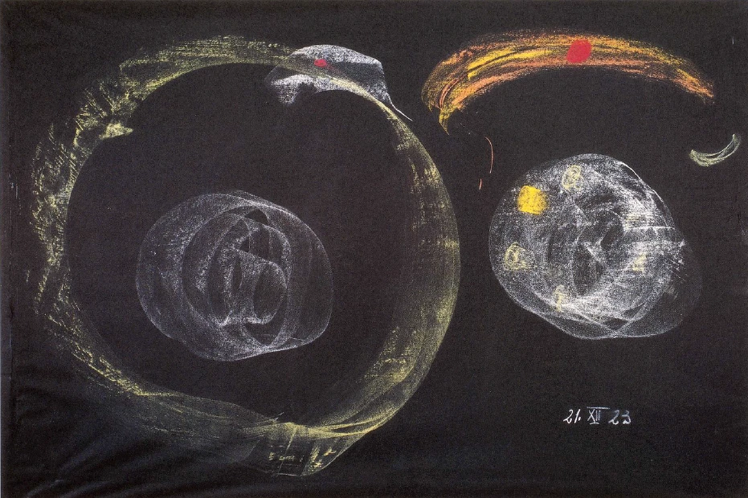
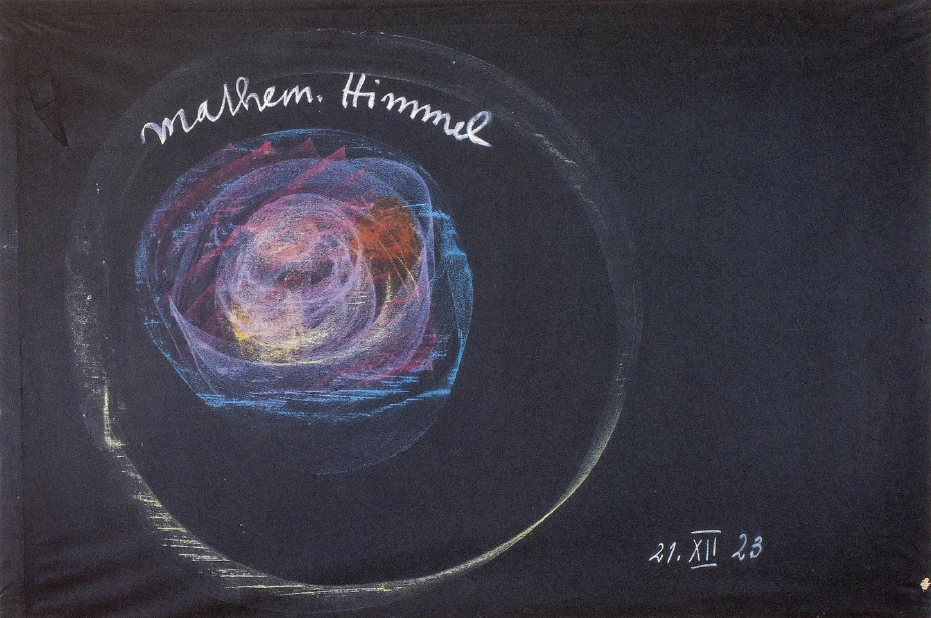

Ich habe ja im Laufe der letzten Wochen über mannigfaltige Mysteriengestaltungen hier vorgetragen. Wir haben insbesondere versucht, Einblicke zu gewinnen in diejenigen Mysterien, die als gewissermaßen die letzten großen Mysterien das menschliche Innere unmittelbar anknüpften an das Naturdasein, an den Geist des Naturdaseins. Es waren dies die Mysterien von Hybernia. Und wir haben gesehen, wie durch Blicke in den Menschen selbst, Blicke, die aber durchaus intim geistiger Natur, individuell persönlicher Natur sogar waren, die griechischen Mysterien in das Innere des Menschen eingedrungen sind. Man kann schon sagen: wie in der äußeren Natur die mannigfaltigsten Erdgegenden diese oder jene Vegetation tragen, so zeigen sich im Laufe der Menschheitsentwickelung auf den verschiedensten Gebieten der Erde die mannigfaltigsten Einflüsse von seiten der geistigen Welt auf die Menschen. ^82zxzp

Würden wir, was ja in historischer Beziehung in den nächsten Tagen geschehen soll, in den Orient hinübergehen, so würden wir noch manches andere an Mysteriengestaltung finden. Aber ich habe heute - weil ja noch nicht alle Besucher anwesend sind - mehr an das anzuknüpfen, was schon betrachtet worden ist, denn etwas Neues zu beginnen. ^w9aci1

Man kann sagen: Wenn man zurückblickt in der Menschheitsentwickelung, dann tritt einem mit aller Klarheit vor das imaginative Bewußtsein eine dreigliedrige Entwickelung. Ich sage: mit aller Klarheit vor das imaginative Bewußtsein, weil, wenn man die Epochen, von denen ich jetzt sprechen will, weiter nach vorn, nach früheren Zeiten ausdehnt, man ja natürlich eine größere Zahl bekommt als die Dreizahl, und ebenso, wenn man weiter in die Zukunft hineingeht. Aber wir wollen diese mittleren Stadien der Menschheitsentwickelung, die nicht erst durch Inspiration, sondern die schon mit aller Klarheit vor der Imagination auftreten, heute einmal von einem gewissen Gesichtspunkte aus ins Auge fassen. ^wwzrbo

Noch bis in die ägyptische Zeit herein war es eigentlich für die Menschheit so, daß gegenüber dem damaligen Bewußtsein sowohl der afrikanisch-europäischen Völker wie der asiatischen Völker es dasjenige gar nicht gab, was man heute Stoffe nennt. Nicht einmal die äußeren groben Stoffe gab es für das Menschheitsbewußtsein, geschweige denn jene Abstraktionen, welche wir heute als Kohlenstoff, Wasserstoff, Schwefel und so weiter bezeichnen. Diese Dinge gab es nicht, sondern alles, was sich draußen in der Natur ausbreitete, das wurde unmittelbar angesehen als Körper der göttlich-geistigen Wesenheiten, die sich durch die ganze Natur offenbaren. Wir gehen heute ins Gebirge, treten auf den Stein, heben wohl auch den Stein auf, wir sehen in ihm eine gleichgültige Substanz. Uns kommt etwas Ähnliches gar nicht zum Bewußtsein, wie es dem älteren Ägypter, dem alten Orientalen zum Bewußtsein gekommen ist. ^lg1889

Nicht wahr, wir werden heute nicht, wenn wir einem Menschen gegenüberstehen und etwa seine Finger erfassen, dasjenige, was wir da berühren am Menschenfinger, als etwas Gleichgültiges betrachten. Wir betrachten es als etwas, was zu seinem ganzen menschlichen Organismus gehört. Und wir können nicht anders, indem wir zum Beispiel das letzte Glied des Zeigefingers eines Menschen betrachten, als uns sagen: dies ist ein Teil eines Gesamtorganismus. ^p178rk

So war es bei den alten Ägyptern, so war es bei den alten Orientalen in ihrem Bewußtsein. Traten sie auf einen Stein, hoben sie einen Stein auf: es war ihnen dies nicht ein gleichgültiger Stein wie uns heute, es war ihnen dies überhaupt nicht gewöhnliche irdische Substanz, es war ihnen dies der Teil des göttlichen Leibes, als der ihnen die Erde erschien. Und so, wie wir heute uns verhalten in unserem Bewußtsein zu der Haut des Menschen, so verhielten sich die Alten gegenüber der äußeren Oberfläche der Erde. Wenn wir heute herantreten an einen Menschen und uns durch besondere Umstände zum Bewußtsein kommt, daß er uns an einen anderen Menschen erinnert, den wir schon kennen, der jetzt vielleicht nicht da ist, und wenn die Umstände ergeben, daß dieser Mensch, den wir da treffen, die Schwester oder der Bruder jenes anderen Menschen ist, dann kommt uns unmittelbar in den Sinn: da ist gemeinsames Fleisch und Blut bei den beiden Menschen vorhanden, die gehören in einer gewissen Weise körperlich zusammen. Und wenn der alte Grieche oder der alte Orientale seinen Blick hinaufrichtete zum Mars, Jupiter, Saturn, und er sah dann die Erde an, dann sah er in dieser Erde eben zunächst den göttlichen Leib des Erdengottes, aber er sah zu gleicher Zeit in dieser Erde die Schwester oder den Bruder, kurz das Geschwisterliche zu den Planeten, die draußen um die Erde herumkreisten, Jupiter, Mars, Saturn. ^x19y1o

Und so war etwas durchaus Seelisch-Geistiges im Empfinden des ganzen Kosmos und im Empfinden der Erde als eines Teiles dieses Kosmos bei den Alten vorhanden. Und Sie müssen sich nur recht tief in Ihrem Innern vorstellen, wie das etwas ganz anderes bedeutete für die Seele, als das, was der Mensch heute empfindet. Es heißt schon etwas, in der Erde den göttlichen Leib zu schauen, in der Erde das geschwisterliche Glied gegenüber allen anderen Planeten des Weltensystems zu sehen! Denn von Göttern erfüllt dachten sich die Alten das ganze Weltenall. Und von Göttern erfüllt war ihnen nicht nur die ganze Erde, von Göttern erfüllt war ihnen außer den planetarischen großen Weltenkörpern jedes einzelne Glied dieser planetarischen Wesenheiten. In Stein und Baum, in Fluß und Felsen, in Wolken und Blitz offenbarten sich irgendwelche geistig-göttliche Wesenheiten. Dieses Bewußtsein wurde erweckt in den weiten Kreisen der Bevölkerung über die Erde hin, und dieses Bewußtsein wurde vertieft in den mannigfaltigen Mysteriengestaltungen, die da und dort auf der Erde sich fanden. ^oubirv

Und wenn wir im griechischen Wesen heraufkommen bis zu jener Zeit, da die äußere politische Größe Griechenlands hinuntersank in eine Art von Volkschaos und aufkam das mazedonische Wesen, dann finden wir, wie in der Tat damals etwas hereinflutete in das menschliche Wissen, in die menschliche Erkenntnis, was wir das letzte Mal hier in Form des Aristotelismus kennengelernt haben, was wir kennengelernt haben als dasjenige, was sich in geistiger Beziehung Alexander der Große zu seiner Volksaufgabe gemacht hatte. Wenn wir da zu diesem Kulminationspunkt des Griechentums auf der einen Seite, auf der anderen Seite zum Sturz des Griechentums, zum mazedonischen Wesen kommen, so sehen wir gegenüber dem, was die äußere Geschichte, die eigentlich in Wirklichkeit eine Geschichtslegende ist, bietet, auf dem Untergrunde der Bewußtseine gerade der tieferen Geister einen Impuls, der herauskam aus denjenigen Mysterien, denen, trotzdem er äußerlich nie davon sprach, Aristoteles recht nahe stand. Es waren jene Mysterien, die gerade im tiefsten Sinne in voller Lebendigkeit vor ihren Zuhörern das Bewußtsein erweckten, daß die ganze Welt eine Theogonie, ein Götterwerden sei, daß man die Welt durchaus in illusionärer Weise sieht, wenn man glaubt, daß etwas anderes wird in der Welt, als Götter. Götter sind es, die die Wesenhaftigkeiten der Welt darstellen, Götter sind es, welche Erlebnisse in dieser Welt haben, Götter sind es, die Taten ausführen. Und das, was man sieht als Wolken, was man hört als Donner, was man wahrnimmt als Blitze, was man auf der Erde wahrnimmt als Fluß und Berg, was man wahrnimmt auf der Erde in den Mineralreichen, das sind die Offenbarungen, die Äußerungen des Werdens der Schicksale der Götter, die sich dahinter verbergen. Und auch dasjenige was äußerlich sich darstellt in der Wolke, in Blitz und Donner, in Baum und Wald, in Fluß und Berg, das ist nichts anderes, als was das Götterdasein, das überall ist, so offenbart, wie die Haut des Menschen das innerlich Seelenhafte dieses Menschen offenbart. Und wenn Götter überall sind, dann muß man unterscheiden — so lehrte man die Mysterienschüler im nördlichen Griechenland — zwischen den kleinen Göttern, die in den einzelnen Naturwesen und -Vorgängen sind, und den großen Göttern, welche sich darstellen als Wesenhaftes der Sonne, des Mars, des Merkur, und eines vierten, der nicht äußerlich durch ein Bild oder durch eine Gestaltung sichtbar gemacht werden kann. Das waren die großen Götter, die großen Planetengötter, jene großen Planetengötter, die so behandelt wurden, daß des Menschen Blick hinaufgelenkt wurde nach dem Weltenraum, daß sein Auge, aber auch sein ganzes Herz schauen sollte dasjenige, was in Sonne, Mars, Merkur lebte, was aber nicht nur draußen in diesem kleinen Kreise lebt im Weltenraum, was überall im Weltenraum lebt, was vor allen Dingen herankommt an den Menschen. ^hxsn3f

Und nachdem zuerst, ich möchte sagen ein majestätischer Impuls in dem Schüler der nordgriechischen Mysterien dadurch erweckt worden war, daß sein Blick hinaufgelenkt wurde auf die Planetenkreise selbst, wurde dann dieser Blick menschlich so vertieft, daß gewissermaßen das Auge vom Herzen ergriffen wurde, um seelisch zu sehen. Dann verstand der Schüler, warum auf dem Altar vor ihn hingestellt worden waren drei symbolisch gestaltete Krüge. ^7fnyxj

Wir haben einmal eine Nachbildung dieser Krüge hier in einer eurythmischen Faust-Vorstellung verwendet, und so, wie sie dazumal ausgesehen haben, diese Krüge, so haben sie ausgesehen in den samothrakischen, in den nordgriechischen Mysterien. Aber das Wesentliche war, daß mit diesen Krügen in ihrer ganzen symbolischen Gestaltung eine Weihehandlung, eine Opferhandlung vor sich gegangen ist. Eine Art Weihrauch wurde in diese Krüge getan, wurde entzündet, der Rauch strömte heraus, und drei Worte, von denen wir morgen noch sprechen werden, wurden mit mantrischer Gewalt von dem zelebrierenden Vater in den Rauch hineingesprochen, der von diesen Krügen aufdampfte, und es erschienen die Gestalten der drei Kabiren. Sie erschienen dadurch, daß der menschliche Atem, die Ausatmung durch das mantrische Wort sich gestaltete und seine Gestaltung mitteilte dem Aufsteigenden, Aufdampfenden der Substanz, die den symbolischen Krügen einverleibt worden war. Und indem der Schüler auf diese Weise lesen lernte in seinen eigenen Atemzügen, indem er lesen lernte, was in den Rauch diese eigenen Atemzüge hineinschrieben, lernte er zugleich lesen, was die geheimnisvollen Planeten aus dem weiten Weltenall herein zu ihm sprachen. Denn nun wußte er: wie der eine der Kabiren gestaltet wurde durch das mantrische Wort und seine Gewalt, so war in Wirklichkeit der Merkur; wie gestaltet wurde der zweite Kabir, so war in Wirklichkeit der Mars; wie gestaltet wurde der dritte Kabir, so war in Wirklichkeit Apollo, die Sonne. ^cz8t4j

Und wenn man jene Modejournalgestalten - verzeihen Sie, daß ich mich radikal ausspreche -, die man ja leider-meistens in Galerien aus der spätgriechischen Plastik sieht, und die man sehr verehrt, weil man keine Ahnung hat, aus was sie hervorgegangen sind, wenn man jene Modejournalgestalten eines Apollo, eines Mars, eines Merkur sich anschaut, sie aber anschaut mit jenem Goetheschen Blicke, mit dem Blick, den Goethe angewendet hat auf seiner italienischen Reise, um durch diese Modejournalgestalten die Ahnung zu bekommen, was eigentlich griechische Kunst war in jenen Hervorbringungen, die zugrunde gegangen sind mit so vielem, was in den ersten Jahrhunderten nach der Begründung des Christentums hinuntergestoßen worden ist in die furchtbare Verwüstung, die dazumal Platz gegriffen hat —, wenn man gewissermaßen hindurchschaut durch diese spätgriechischen plastischen Gestalten, die, ich möchte sagen, auf der einen Seite mit Recht, weil sie wegweisend waren, auf der anderen Seite mit Unrecht, weil sie eben Nachgeburten sind von Früherem, für groß gehalten werden, wenn man zurückschaut auf dasjenige, woraus sie entstanden sind, dann sieht man, wie in der älteren griechischen Zeit nachgebildet worden sind die Opfer-Offenbarungen, die auf eine solche Weise zustande gekommen sind in früherer Zeit in noch viel majestätischerer, großartigerer Weise, als später in Samothrake bei den Kabirenmysterien. Man sieht zurück auf jene Zeiten, in denen das mantrische Wort hineingesprochen worden ist in den Opferrauch, und die wahren Gestalten des Apollo, des Mars, des Merkur erschienen sind. ^he6twe

Das waren die Zeiten, in denen der Mensch nicht in abstracto gesagt hat: Im Urbeginne war der Logos, und der Logos war bei Gott, und ein Gott war der Logos - das waren die Zeiten, in denen der Mensch etwas ganz anderes sagen konnte, in denen der Mensch sagen konnte: In mir gestaltet sich die Ausatmung, und indem die Ausatmung sich in regelmäßiger Weise gestaltet, erweist sie sich selber als ein Nachbild kosmischen Schaffens, denn sie schafft mir aus dem Opferrauch Gestaltungen, die für mich die lebendigen Schriftzüge sind, die mir vertaten, was mir die planetarischen Welten sagen wollen. ^ej7ek7

Und wenn sich der Schüler der Kabirenmysterien auf Samothrake näherte den Pforten dieser Einweihungsstätten, dann hatte er durch seinen Unterricht das Gefühl: Ja, jetzt betrete ich dasjenige, was mir umschließt die magischen Handlungen des opfernden Vaters. Denn «Vater» nannte man die zelebrierenden Initiatoren dieser Mysterien. ‚Und was offenbarte dem Schüler die magische Kraft dieser zelebrierenden Väter? Durch das, was die Götter in den Menschen gelegt haben, durch die Gewalt der Sprache, schrieb der priesterliche Magier und Weise hinein in den Opferrauch jene Schriftzüge, die aussprachen die Geheimnisse des Weltenalls. ^z4y1vf

Deshalb sagte der Schüler, wenn er sich der Pforte näherte, in seinem Herzen: Ich trete ein in dasjenige, was mir umschließt einen gewaltigen Geist, was mir umschließt die großen Götter, jene großen Götter, welche auf der Erde durch die Opferhandlungen der Menschen die Geheimnisse des Weltenalls enthüllen. ^3um7wg

Das war eine Sprache, die da gesprochen wurde, und eine Schrift, die da geschrieben wurde, die wahrhaftig nicht bloß den Verstand des Menschen, sondern die den ganzen Menschen in Anspruch genommen haben. Und in den samothrakischen Mysterien war schon noch etwas von einem Wissen, das ja heute ganz verglommen ist. Der Mensch ist heute ja wohl mächtig, mit Wahrheit davon zu sprechen, wie sich ein Quarzkristall anfühlt, wie sich meinetwillen ein Stück Eisen anfühlt, wie sich ein Stück Antimon anfühlt, wie sich ein Haar anfühlt, wie sich die menschliche Haut anfühlt, wie sich ein tierisches Fell anfühlt, wie sich Seide, Samt anfühlt; das ist der Mensch heute mächtig, sich zu vergegenwärtigen durch sein Gefühl. In den samothrakischen Mysterien war noch etwas vorhanden, durch das der Mensch mit Wahrheit sagen konnte, wie sich Götter anfühlen lassen. Denn der Gefühls-, der Tastsinn war noch fähig dessen, wessen er in alten Zeiten durchaus fähig war: das Geistige anzufühlen, Götter zu ertasten. Und das Wunderbare ist eigentlich folgendes, ja man muß schon in ältere Zeiten zurückgehen, wenn man geradezu sprechen will davon, daß die Menschen sagen konnten mit Wahrheit: Ich weiß durch meine Fingerspitzen, wie sich Götter ertasten. Aber in den samothrakischen Mysterien bestand eine andere Kunst des Ertastens der Götter; sie bestand in folgendem. ^fk7oep

Indem der priesterliche Magier in den Opferrauch die Worte hineinsprach, indem er also das Wort ertönen ließ im Aushauche und sprach, fühlte er in dem hinausgehenden Atem, wie der Mensch sonst fühlt, wenn er die tastende Hand ausstreckt. Und wie man weiß, daß man mit der Fingerspitze in stets anderer Weise tastet, über den Stoff fährt, wenn man Samt anfühlt, wenn man Seide anfühlt, wenn man Katzenfelle anfühlt, wenn man menschliche Haut anfühlt, so empfand der samothrakische Priestermagier mit der ausgeatmeten Luft, und er empfand den Aushauch, den er gegen den Opferrauch hin strahlen ließ, wie ein Ausstrecken von etwas, was aus ihm selber herauskam: er empfand den Aushauch wie ein Tastorgan, das nach dem Rauche hin ging. Er fühlte den Rauch. Und er fühlte in dem Rauch die ihm entgegenkommenden großen Götter, die Kabiren, er fühlte in dem, wie der Rauch sich gestaltete, und wie die Gestalten, die sich da bildeten, von außen herankamen an den Aushauch, so daß der Aushauch fühlte: da ist Rundung, da ist Eckigkeit, da greift mir etwas entgegen. Die ganze göttliche Gestalt des Kabirs wurde ertastet mit dem in das Wort gekleideten Aushauch. Mit der Sprache, die aus dem Herzen kam, ertastete der samothrakische Weise die durch den Opferrauch zu ihm herabsteigenden Kabiren, das heißt die großen Götter. Und es war eine lebendige Wechselwirkung zwischen dem Logos im Menschen und dem Logos draußen in den Weltenweiten. ^v7o4rz

Und indem der einweihende Vater den Schüler hinführte vor den Opferaltar und nach und nach lehrte, wie man fühlen kann mit der Sprache, und indem der Schüler immer weiter vorschritt und sich in dieses Fühlen mit der Sprache hineinfand, kam der Schüler endlich zu jenem Stadium inneren Erlebens, in dem er zunächst ein deutliches Bewußtsein hatte, wie gestaltet ist Merkur, Hermes, wie gestaltet ist Apollo, wie gestaltet ist Ares, der Mars. Es war, wie wenn das ganze Bewußtsein des Menschen herausgehoben wäre aus seinem Leibe, wie wenn dasjenige, was der Schüler früher gewußt hat als den Inhalt seines Kopfes, oben gewesen wäre über seinem Haupte, wie wenn das Herz lokalisiert wäre an einem neuen Orte, indem es heraufgedrungen wäre aus der Brust in den Kopf. Und dann erstand in diesem über sich selbst wirklich hinausgegangenen Menschen dasjenige, was innerlich sich formte zu dem Worte: So wollen dich die Kabiren, die großen Götter. Von da ab wußte der Schüler, wie in ihm lebte Merkurius in seinen Gliedmaßen, die Sonne in seinem Herzen, der Mars in seiner Sprache. ^x7trw4

Sehen Sie, durchaus nicht nur natürliche Vorgänge und Wesenheiten wurden in der äußeren Welt in den alten Zeiten den Schülern vorgeführt. Was ihnen vorgeführt wurde, war weder etwas einseitig Naturalistisches, noch etwas einseitig Moralisches, sondern etwas, wo Moral und Natur in eins zusammenflossen. Und das war gerade das Geheimnis der samothrakischen Welt, daß der Schüler vermittelt bekam das Bewußtsein: Natur ist Geist, Geist ist Natur. ^w3eg4o

Aus jenen Zeiten, die ihren letzten Nachklang in dem samothrakischen Kabirendienste gefunden haben, stammt jene Einsicht, welche die irdischen Substanzen zusammenbringt mit dem ganzen Himmel. Man konnte eben nicht in alten Zeiten sagen, wenn man jenes rötlich-bräunliche Mineral sah mit dem Kupferglanz, wenn man unser heutiges Kupfer sah, man konnte eben nicht sagen, so wie man heute sagt: Das ist Kupfer, das ist ein Bestandteil der Erde-denn das konnte man sich nicht denken. Das ist für die Alten kein Bestandteil der Erde gewesen, sondern das ist die Tat der Venus in der Erde gewesen, was sich als Kupfer überall offenbarte. Die Erde hat nur solche Gesteine wie Sandstein, Kalk entstehen lassen, um aufzunehmen in ihrem Schoß, was der Himmel in die Erde gepflanzt hat. Und so wenig, wie wir heute sagen dürfen, wenn wir hier (es wird gezeichnet) den Erdboden haben und wir einen Pflanzensamen in den Erdboden säen: AusdemErdboden ist dieser Same herausgewachsen, so wenig durfte man, wenn man hier die Erdoberfläche hätte und in der Erde ein Kupfererz, damals sagen: Dies Kupfererz ist ein Bestandteil der Erde. Was man sagen mußte, ist: Die Erde hier mit ihrem Sandstein oder sonstigen Gestein, sie ist der Boden, und das, was da metallisch drinnen ist, das hat irgendein Planet in die Erde hereingepflanzt. Das ist Same, hereingepflanzt in die Erde durch einen Planeten. Alles das, was so auf Erden war, sah man an als hereinimpulsiert in die Erde vom Himmel aus. ^edx9r2

Wenn man heute die Erde hat und die Substanzen der Erde kennenlernt, dann beschreibt man ja alles so - sehen Sie sich irgendeine Mineralogie, eine Geologie an -, daß man die Erde beschreibt. So hat man in der alten Wissenschaft nicht beschrieben. Da schweifte der Blick hin über die Erde; aber indem man dann die Substanzen sah, mußte man zum Himmel hinaufsehen, und in dem Himmel, da sah man das Wesenhafte der Substanzen. Scheinbar nur liegt Kupfer, liegt Zinn, liegt Blei in der Erde. Sie aber sind die Samen, welche hereingepflanzt worden sind während der alten Sonnen- und Mondenzeit von dem Himmel in das irdische Dasein. ^d0cg07

So war aber auch noch die Lehre der Kabiren in den samothrakischen Mysterien. Das war schließlich schon das, was wenigstens als ‚Atmosphäre des Wissens auf Aristoteles und Alexander den Großen gewirkt hat. Und dann wurde der Anfang geschaffen zu etwas ganz anderem. ^j6xnr4

 ^hywx8x

Die Menschheit kam mit ihrer Einsicht nicht sogleich vom Himmel auf die Erde herunter, sondern die Menschheit machte erst ein Zwischenstadium durch in alten Zeiten. Und noch in den Nachklängen jener alten Zeiten, den samothrakischen Mysterien, hat man, wenn man die Metalle der Erde oder auch andere Substanzen der Erde, wie Schwefel oder Phosphor, beschreiben wollte, eigentlich den Himmel beschrieben, geradeso, wie man eine Pflanze beschreibt, wenn man die Wesenheit des Samens kennen will. Man kann doch nicht, wenn man ein Samenkorn vor sich hat, das Wesen dieses Samenkorns erkennen, wenn man nicht die Pflanze erkennt. Was wollen Sie denn mit solch einem Samenkorn, das so aussieht, wenn Sie nicht wissen, wie Anis ausschaut? Was wollen Sie denn, hätten die Alten gesagt, aus dem Kupfer machen, das in der Erde sich zeigt, wenn Sie nicht wissen, wie geistig-seelisch-leiblich die Venus ausschaut da oben am Himmel. ^4qplsx

Und aus der Himmelskunde wurde nach und nach, möchte man sagen, eine Umlaufskunde, eine Atmosphärenkunde, indem nicht mehr geschildert wurde, wenn man auf das Irdische hinsah, was die Sterne in ihrer Wesenhaftigkeit waren, sondern, indem man ein irdisches Wesen sah, sich sagte: Darinnen lebt erstens das, was wir in der festen Erde sehen, dann aber lebt da drinnen auch dasjenige, was wir in der nach der Tropfenform tendierenden Flüssigkeit sehen; dann lebt darinnen, was sich nach allen Seiten ausdehnen will, was luftförmig ist, was zum Beispiel im menschlichen Organismus in Atem und Sprache lebt. Und dann lebt darinnen das Feurige, welches das einzelne Wesen in sich auflöst, so daß aus den zerklüfteten, aufgelösten Bestandteilen Neues entstehen kann. Da leben die Elemente in jeder irdischen Gestaltung. ^zslz7l

Und indem früher in den alten Mysterien die Menschen hingeschaut haben auf das allerdings auch kosmische, aber zum Irdischen gestaltete Salzige, das sie in dem gesehen haben, was Mutter Erde der Metallität entgegengebracht hat, haben sie das Merkuriale gesehen in alledem, was aus dem Weltenall heraus das Metall werden soll. ^ejgiud

Ach, es ist so ungeheuer kindisch, wenn heute die Menschen anfangen, Beschreibungen zu geben von dem, was man sich noch im Mittelalter als Merkur vorgestellt hat! Es steht da doch immer wieder im Hintergrunde, daß mit Merkur auch im Mittelalter so etwas Ähnliches wie das Quecksilber gemeint sein könnte oder überhaupt irgendein einzelnes Metall. Es ist ja gar nicht so. Merkur ist jedes Metall, insofern dieses Metall unter dem Einfluß des ganzen Kosmos steht. Denn wie würde Kupfer, wenn nur der Kosmos in seiner Peripherie wie auf jedes Metall wirkte? Kupfer würde tropfig wie Quecksilber. Wie würde Blei, wenn nur der Kosmos wirkte? Blei würde tropfig, Quecksilber. Wie würde Zinn, wenn nur der Kosmos wirkte? Zinn würde tropfig. Jedes Metall, wenn nur der Kosmos wirkt, würde Quecksilber. Alle Metalle sind Merkur, insofern der Kosmos auf sie wirkt. Und das wirkliche heutige Quecksilber, das noch auf der Erde Tropfenform annimmt, was ist denn das? ^ddican

 ^5jgbl5

Nun, sehen Sie: die anderen Metalle, sagen wir Blei, Kupfer, Zinn, Eisen, die sind über die Tropfenform hinausgegangen. Als die ganze Erde noch unter dem Einfluß des sphärisch-kugeligen Kosmos stand, waren alle Metalle Merkur. Sie sind über die merkuriale Gestalt hinausgegangen, sie kristallisieren heute in anderen Gestalten. Nur das eigentliche, im heutigen Sinne eigentliche Quecksilber ist auf jener Stufe stehengeblieben. ^wo5ju8

Wie hätten die Alten und wie haben noch die mittelalterlichen Alchemisten zu dem heutigen Quecksilber gesagt? Sie haben gesagt: Kupfer, Zinn, Eisen, Blei sind die guten Metalle, die mitder Vorsehung fortgeschritten sind; Quecksilber ist der Luzifer unter den Metallen, denn es ist auf einer früheren Stufe der Gestaltung stehengeblieben. Und so war es eben in alten Zeiten, daß, indem man in dieser Weise von dem Irdischen gesprochen hat, man eben in Wahrheit von dem Himmlischen gesprochen hat. ^ju20d8

Von da aus kam man dann dazu, von demjenigen zu sprechen, was nun zwischen dem Umkreis und der Erde liegt. Zwischen dem Umkreis und der Erde liegt eben unten die Erde selbst, dann das wäßrige Element, das luftförmige Element und das feurige Element. Und so haben die Alten alles, was auf der Erde war, im Aspekt des Himmels gesehen; so hat eine mittlere Zeit, die erst zu Ende ging im ersten Drittel des vierzehnten Jahrhunderts, alles im Aspekt des Umkreises, des Atmosphärischen gesehen. Und da, im vierzehnten, fünfzehnten Jahrhundert, kam der große Umschwung. Da fiel der Mensch mit seiner Anschauung ganz auf die Erde herab. Da zerklüfteten auch in seinem Bewußtsein die Elemente Wasser, Luft, Feuer; sie zerklüfteten in Schwefel, Kohlenstoff, Wasserstoff. Der Mensch sah alles im irdischen Aspekt. ^2vgivz

Und damit beginnt dann die Zeit, auf die ich schon hingedeutet habe, als ich die hybernischen Mysterien besprochen habe: es beginnt die Zeit, wo der Mensch die Erde umfaßt mit seiner Erkenntnis, und der Himmel wird ihm Mathematik. Er errechnet die Größe der Sterne, die Bewegung, die Entfernung der Sterne und so weiter. Der Himmel wird ihm Abstraktion. ^k752e0

Aber es wurde eben nicht bloß der Himmel Abstraktion. Denn das Abbild des Himmels im lebenden Menschen ist sein Haupt. Und was der Mensch vom Himmel erkennen kann, lebt in seinem Haupte. Und da der Mensch vom Himmel nur die Mathematik, das heißt das Logische, Abstrakte kennenlernte, lebte von nun an in seinem Haupte nur das Logisch-Abstrakte, das Begrifflich-Ideelle. Und so gab es fortan keine Möglichkeit für den Menschen, in das Begrifflich-Ideelle das Spirituell-Geistige hereinzubekommen. Und da, wo man den Geist suchte, begann jener große Kampf zwischen dem, was der Mensch ertingen konnte mit seinen ideellen Hauptesinhalten, Gehirninhalten, und dem, was ihm die Götter offenbaren wollten vom Himmel herein. Am größten, am gigantischesten wurde dieser Kampf gekämpft in den wahren Gestaltungen desjenigen, was man die rosenkreuzerischen Mysterien im Mittelalter nennt. Da wurde empfunden als Vorbereitung zum wirklichen Wissen die Ohnmacht des modernen Menschen. Denn es war schon etwas, was empfunden werden konnte als etwas Gewaltiges gerade in den Kreisen der wahren rosenkreuzerischen Initiation. Das Gewaltige bestand darinnen, daß dem Schüler nicht abstrakt, sondern innerlich lebendig klar wurde: Du kannst als moderner Mensch ja nur in die Begriffswelt hinein. Aber damit verlierst du das lebendige Wesen dieser deiner Menschheit. ^a0mqzs

Und indem der Schüler dieses fühlte, daß dasjenige, was ihm gerade die neuere Zeit gab, ihn nicht hinführen konnte zu dem, was sein eigentliches Wesen ist, da war es dann, daß der Schüler fühlte: Du mußt entweder verzweifeln an der Erkenntnis, oder du mußt durchgehen durch eine Art von Abtötung des Hochmutes der Abstraktion. Und schon fühlte der Rosenkreuzerschüler, der wahre Rosenkreuzerschüler etwas Ähnliches, wie wenn ihm der Meister einen Schlag ins Genick gegeben hätte, um ihm anzudeuten, daß das Abstrakte des modernen Hauptes nicht geeignet ist, in die geistigen Welten einzutreten, und daß der Schüler zu leisten habe die Absage an die bloße Abstraktion, um in die geistige Welt einzutreten. ^7hgml3

Das war eigentlich ein großer vorbereitender Augenblick dessen, was man nennen kann die Rosenkreuzer-Initiation. ^7pcjlp