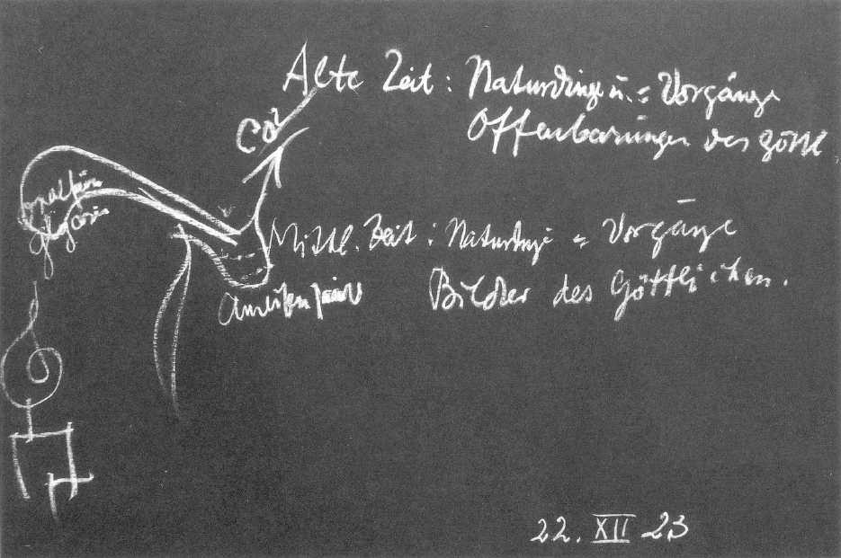

Das Mysterienwesen der verschiedenen Zeiten, es war in mannigfaltigen Gestaltungen über die verschiedenen Gegenden der Erde ausgebreitet, sagte ich gestern. Jede Gegend hatte nach ihrer Bevölkerung, nach den Bedingungen, die das Erdgebiet, das in Betracht kam, sonst aufwies, eine besondere Mysteriengestaltung. Nun kam aber eine Zeit, die für das ganze Mysterienwesen von einer außerordentlich großen Wichtigkeit ist. Das ist die Zeit, die einige Jahrhunderte nach der Begründung des Christentums für die Erdenentwickelung eintrat. ^tz7dwh

Man sieht ja schon aus meinem Buche «Das Christentum als mystische Tatsache», daß dasjenige, was auf Golgatha geschehen ist, in einer gewissen Weise alles zusammenfaßt, was in den verschiedensten Mysterien über die Erde verteilt war. Aber das Mysterium von Golgatha unterschied sich ja von all den anderen Mysterien, die ich Ihnen geschildert habe, dadurch, daß es sozusagen auf dem Schauplatz der Geschichte vor aller Welt dasteht, währenddem die älteren Mysterien eben wirklich im Dämmerdunkel des Tempel-Inneren sich abspielten, und von diesem Dämmerdunkel des Tempel-Inneren heraus ihre Impulse hinausschickten in die Welt. ^dzc1yx

Sehen wir in die orientalischen Mysterien, sehen wir zu den Mysterien hin, die ich Ihnen als die vorderasiatischen ephesischen Mysterien geschildert habe, sehen wir zu den griechischen Mysterien, sei es zu den chthonischen, sei es zu den eleusinischen, sehen wir zu den Mysterien hin, die ich gestern erwähnt habe, zu den samothrakischen Mysterien, oder sehen wir endlich zu den Mysterien hin, die ich charakterisiert habe als die hybernischen Mysterien, überall sehen wir, wie im Dämmerdunkel des Tempel-Inneren sich das eigentliche Mysterium abspielt und dann seine Impulse hinaussendet in die Welt. Wer das Mysterium von Golgatha wirklich begreift - man hat es ja dadurch nicht begriffen, daß man die Nachrichten, die von ihm erhalten sind, histotisch weiß-, der hat darinnen zugleich begriffen die Mysterien, die vorangegangen sind. ^zy41f1

Diese Mysterien, die dem Mysterium von Golgatha vorangegangen sind und in ihm gipfelten, sie hatten alle in bezug auf ihre Gefühlswirkungen eine Eigentümlichkeit. In den Mysterien ging viel Tragisches vor sich. Und wer die Einweihung zu den Mysterien erlangte, mußte durchmachen Leiden, Schmerzen. Nun, das habe ich ja des öfteren charakterisiert. Aber im ganzen kann man doch sagen, daß bis zum Mysterium von Golgatha hin derjenige, der durch eine Einweihung zu gehen hatte, der vorbereitend aufmerksam darauf gemacht wurde, daß er die mannigfaltigsten Überwindungen, Leiden, Schmerzen durchzumachen hatte, Tragisches durchzumachen hatte, - der hätte dennoch gesagt: Durch alle Feuer der Welt werde ich gehen, denn das führt hinein in jene Lichtregion des Geistes, in der man schaut, was man nur ahnen kann im gewöhnlichen Bewußtsein des Menschen auf Erden in einem bestimmten Zeitalter. Es war also im Grunde genommen Sehnsucht, Sehnsucht zu gleicher Zeit, die freudig war, die denjenigen befiel, der den Weg zu den alten Mysterien suchte - gewiß eine ernste Freude, eine tiefe Freude, eine erhabene Freude, aber Freude dennoch. ^wlddkl

Nun kam eine Zwischenzeit - wenn ich die Vorträge halte in den nächsten Tagen, werde ich ja diese Dinge von den historischen Gesichtspunkten aus zu charakterisieren haben - es kam eine Zwischenzeit, die endlich führte zu dem vierzehnten, fünfzehnten Jahrhundert, wo, wie Sie ja wissen, eine neue Epoche in der Menschheitsentwickelung begann. Eine Zwischenzeit kam. Und nachher kam dasjenige, was eine ganz andere Stimmung abgab beim Ausgangspunkte seines Weges für den, der da suchte nach dem Wissen in den höheren Welten. Es ist ja in der Tat so, daß, wenn wir in alte Mysterien nachträglich durch die Akasha-Chronik hineinschauen, wir doch freudige Gesichter finden, tiefgründige, aber im Grunde genommen freudige Gesichter. Wenn ich Ihnen eine Szene schildern würde, die man ja in der AkashaChronik nachträglich herausholen kann, eine Szene zum Beispiel in den kabirischen, samothrakischen Mysterien, dann müßte man doch sagen: die Persönlichkeiten, die da hineingingen in das Tempel-Innere der Kabiren, sie hatten vielsagende, tiefgründige Antlitze, aber etwas Freudiges. ^zmefz6

Dann kam eine Zwischenzeit. Und dann kam das, was nicht eigentliche Tempel hatte, aber doch einen moralischen Zusammenhalt, wie er schon war in den alten Mysterien. Und dann kam das, was oftmals als das rosenkreuzerische Wesen im Mittelalter bezeichnet wird. ^r88lv3

Wenn man aber in einer ähnlichen Weise, wie ich es jetzt eben getan habe für einen Gesichtspunkt, für die antiken Mysterien, wenn man diese Mysterienschüler des Rosenkreuzertums charakterisieren wollte, so müßte man sagen: die wichtigsten dieser Persönlichkeiten, die im Mittelalter nach der Erkenntnis, nach der Erforschung der geistigen Welt gingen, hatten wahrhaftig nicht freudige, hatten wahrhaftig tief tragische Gesichter. Das ist so sehr eine Wahrheit, daß man schon sagen kann: diejenigen, die nicht tief tragische Gesichter hatten, waren ganz gewiß keine echten Menschen in diesem Streben. Und es war allerdings aller Grund vorhanden, tragische Gesichter an sich zu tragen. ^cl24ck

Ich möchte Ihnen anschaulich machen an der Art und Weise, wie nach und nach die Menschen, die nach Erkenntnis gestrebt haben, zu den Geheimnissen der Natur und des Geistes anders stehen mußten, als man im Altertum in den alten Mysterien zu ihnen gestanden hat, in dieser Zeit, die dann hingipfelte zu dem Rosenkreuzertum des vierzehnten und fünfzehnten Jahrhunderts. ^s5ujqc

Ich habe ja schon gestern darauf aufmerksam gemacht: Naturerscheinungen, Naturvorgänge waren ja für den alten Menschen unmittelbar Göttervorgänge. So wie es niemandem einfallen würde, die Bewegung des menschlichen Auges für sich zu betrachten und nicht als die Offenbarung des Seelisch-Geistig-Leiblichen des Menschen, so wenig fiel es einem Menschen der alten Zeit ein, irgendeine Naturerscheinung abgesondert für sich zu betrachten. Er betrachtete sie als den ‚Ausdruck des Gottes, der sich offenbarte durch die Naturerscheinungen. Die Erdoberfläche, sie war dem alten Menschen ebenso die Haut des erd-göttlichen Wesens, wie die Menschenhaut eben die Haut des beseelten Menschenwesens für den heutigen Menschen ist. Man versteht gar nicht, wie die Seelenstimmung eines alten Menschen war, wenn man eben nicht weiß, daß er so sprach, wie ich es gestern erwähnt habe: von der Erde als einem Götterleib, und von den Beziehungen der anderen Planeten unseres Planetensystems wie von Brüdern und Schwestern. ^mwpid3

Dieses unmittelbare Verhältnis zu den Naturerscheinungen und Naturdingen, wo eben das einzelne Naturding, die einzelne Naturerscheinung die Offenbarung des Göttlichen für den Menschen war, diese Anschauung ging aber dann über in eine ganz andere, wo sozusagen für die Erkenntnis sich zurückgezogen hatte, was göttlich ist in den Naturerscheinungen. Denken Sie sich — wenn es sein könnte, daß das Furchtbare einträte -, irgendeiner von Ihnen würde sich irgendwo placieren, und es würde geschehen, daß man an ihm nur mehr den Leib sieht, so wie man die Erde sieht, für sich neutral, ohne Beseelung: es wäre ja schrecklich, etwas ganz Furchtbares! ^uiath3

Aber dieses Furchtbare ist für die Erkenntnis in der neueren Zeit eingetreten. Und dieses Furchtbare fühlten die Erkennenden des Mittelalters. Es ist so, wie wenn das Göttliche sich zurückgezogen hätte für das Erkennen aus den Naturerscheinungen und Naturvorgängen. Und während in der alten Zeit Naturdinge und Naturvorgänge Offenbarungen des Göttlichen sind, kommt diese mittlere Zeit, und da sind Naturdinge und -Vorgänge nur Bilder, nicht mehr Offenbarungen, sondern Bilder des Göttlichen. ^tukwm3

Aber der heutige Mensch hat nicht einmal mehr einen rechten Begriff, inwiefern Naturvorgänge und so weiter Bilder des Göttlichen sind. Ich möchte Ihnen an einem Beispiel, das auch heute natürlich jedem bekannt sein kann, der irgendwie ein bißchen Chemie gelernt hat, zeigen, wie bei denjenigen Menschen, die wenigstens noch drinnen standen in der Anschauung: Naturdinge und Naturvorgänge sind Bilder des Göttlichen, wie bei diesen Menschen der Betrieb der Naturwissenschaft war. ^dqjy6a

Nehmen Sie einen einfachen Versuch, der heute ja von dem Chemiker immer gemacht werden kann. Man nehme eine Retorte - ich will es ganz schematisch erklären -, gebe in die Retorte Oxalsäure hinein, die man aus dem Klee bekommen kann, und vermische diese Oxalsäure zu gleichen Teilen mit Glyzerin. Dann erhitze man diese Mischung von Glyzerin und Oxalsäure, und man bekommt - wie gesagt, ich zeichne schematisch - die hier weggehende Kohlensäure. Die Kohlensäure geht weg, und was hier übrig bleibt, das ist Ameisensäure. Die Oxalsäure verwandelt sich sozusagen unter Verlust der Kohlensäure in Ameisensäure. ^h6fvnd

 ^da1yxx

Nun, bitte sehen Sie sich dieses Schema an: Oxalsäure, Ameisensäure; Kohlensäure geht fort. Sie können nun, indem Sie im Laboratorium die Retorte vor sich haben, diesen Versuch anstellen. Sie können nun davorstehen wie ein heutiger Chemiker, der eben bei diesem Versuch abschließt. ^foc526

So war es bei dem mittelalterlichen Menschen vor dem dreizehnten, vierzehnten Jahrhundert nicht der Fall; sondern dieser Mensch blickte nun sogleich nach zweierlei hin. Er sagte: Oxalsäure, ja gewiß, am hervorragendsten ist sie im Klee, Kleesäure; aber Oxalsäure ist in gewissen Mengen im ganzen menschlichen Organismus, namentlich aber bei demjenigen Teil des menschlichen Organismus, der die Verdauungsorgane, Milz, Leber und so weiter umschließt. So daß, wenn Sie den menschlichen Organismus nehmen, Sie da, wo der Verdauungstrakt ist, vorzugsweise mit Vorgängen zu rechnen haben, die unter dem Einfluß der Oxalsäure stehen. ^pccg2b

Aber das ist so, daß nun auf diese Oxalsäure, die namentlich im menschlichen Unterleibe vorhanden ist und dort ihre Bedeutung hat, durch den menschlichen Organismus selber eine solche Wirkung ausgeübt wird, oder eine ähnliche Wirkung wie in der Retorte auf die Oxalsäure durch das Glyzerin. Eine Glyzerinwirkung geschieht hier. Und denken Sie sich das Merkwürdige: Unter dem Einfluß der Glyzetinwirkung geht in Lunge und Atmungsluft das Verwandlungsprodukt der Oxalsäure über: Ameisensäure. Und der Mensch atmet Kohlensäure aus, die dort herauskommt (siehe Zeichnung). Sie stoßen mit der Atemluft nach außen; damit stoßen Sie die Kohlensäure heraus. Sie können zunächst ganz gut das hier (die Retorte mit der erhitzten Mischung von Glyzerin und Oxalsäure) als den menschlichen Verdauungstrakt ansehen; das, wo die Ameisensäure abfließt, als die Lunge, und das hier als die ausgeatmete Luft, die Kohlensäure aus der Lunge. ^y887yd

Nun ist der Mensch keine Retorte. Die Retorte zeigt eben auf tote Weise, was im Menschen lebendig und empfindend vorhanden ist. Aber das ist richtig: Würde der Mensch niemals Oxalsäure entwickeln in seinem Verdauungstrakt, so würde er überhaupt nicht leben können, daß heißt, sein Ätherleib hätte gar keine Grundlage in seinem Organismus. Würde der Mensch aber nicht die Oxalsäure in Ameisensäure verwandeln, so hätte sein astralischer Leib keine Grundlage in seinem Organismus. Der Mensch braucht für seinen Ätherleib Oxalsäure, für seinen astralischen Leib Ameisensäure. Und er braucht nicht etwa diese Substanzen, sondern er braucht die Arbeit, die Tätigkeit im Innern, welche darinnen besteht, daß der Oxalsäure-Prozeß stattfindet, daß der Ameisensäure-Prozeß stattfindet. Das ist natürlich etwas, was die heutige Physiologie erst gewinnen muß, sie kann heute noch nicht so sprechen, denn sie spricht von dem, was im Menschen vor‚geht, als wenn es äußerliche Prozesse wären. ^e3htum

Das war das eine, was derjenige, der dazumal Naturwissenschaft getrieben hat und vor seiner Retorte gesessen ist, sich fragte: Wie ist irgendein äußerer Vorgang, den ich in einer Retorte oder in einer anderen chemischen Anordnung wahrnehme, wie ist dieser Vorgang im Menschen? ^bnojh1

Die zweite Frage war diese: Wie ist dieser Vorgang in der großen Natur draußen? Nun, für diesen Vorgang, wenn ich ihn als ein Beispiel wählen würde, würde sich der damalige Naturforscher gesagt haben: Ich wende nun den Blick hinaus auf die Erde, wo die Pflanzenwelt ausgebreitet ist. Allerdings - ausgesprochen, radikal, findet sich die Oxalsäure im Sauerklee, in den Kleearten überhaupt; aber in Wirklichkeit findet sich die Oxalsäure überall ausgebreitet in der Vegetation, wenn auch zuweilen in homöopathischer Dosis, aber sie ist überall da. Überall ist zugleich wenigstens ein Anflug, wenn auch manchmal ein homöopathischer Anflug von dem vorhanden, was zum Beispiel die Insektenart der Ameisen dadurch macht, daß die Ameisen noch herankommen an die Oxalsäure selbst im modernden Holze. Dieses Insektenheer, das dem Menschen oftmals so lästig wird, verwandelt das, was ausgebreitet ist als Oxalsäure über die Wiesen, über die Fluren, über den ganzen Vegetationsboden der Erde, in Ameisensäure. Und wir atmen tatsächlich die Ameisensäure, wenn auch in geringer Dosis, fortwährend aus der Luft ein, verdanken diese Ameisensäure, die in der Luft vorhanden ist, der Arbeit der Insekten an den Pflanzen, indem die Oxalsäure der Pflanzen in Ameisensäure umgewandelt wird. ^xzqbaw

So sagte sich der mittelalterliche Naturforscher: Im Menschen ist der Umwandlungsprozeß von Oxalsäure in Ameisensäure vorhanden. ‚Aber im Leben und Treiben der Natur ist ebenso dieser Umwandlungsprozeß vorhanden. ^rvwdc8

Diese zwei Fragen stellte sich der mittelalterliche Naturforscher bei jedem Vorgang, den er in seinem Laboratorium machte. Und nun war ihm etwas eigentümlich, diesem mittelalterlichen Naturforscher, was heute dem Menschen ganz abhanden gekommen ist. Heute denkt man, im Laboratorium kann ja jeder forschen, ob einer nun ein guter oder ein schlechter Mensch ist, darauf kommt es ja nicht an. Man hat die Formeln, man analysiert oder synthetisiert; das kann ja jeder machen. Damals, als in dieser Weise an die Natur herangegangen wurde, wo man die Natur genommen hat als Wirkung des Göttlichen, das heißt des Göttlichen im Menschen, wie ich es dargestellt habe, und des Göttlichen in der großen Natur, damals hatte man die Anforderung: Der Mensch, der so forscht, muß zu gleicher Zeit eine innere Frömmigkeit haben. Er muß in der Lage sein, seine Seele und seinen Geist hinrichten zu können zu dem Göttlich-Geistigen der Welt. Und man war sich klar darüber, denn es war eine Tatsache: Derjenige, der sich wie zu einer Opferhandlung vorzubereiten hatte zu seinem Experimentieren und wirklich innerlich warm geworden war von Übungen der Frömmigkeit für sein Experimentieren, der machte eben die Erfahrung, daß ihn das Experiment hineinführte auf der einen Seite in die Erforschung des Menschen, auf der anderen Seite hinausführte in die Erforschung der großen Natur. So daß man die innerliche Güte als Vorbereitung für das Forschen ansah, und man sah seine Laboratoriumsversuche so an, daß man die Fragen, die sie einem beantwortete, als von göttlichgeistigen Wesen gern beantwortet gehabt hätte. ^u3mume

Nun, damit habe ich Ihnen aber jenen Übergang charakterisiert, der stattgefunden hat von dem Geiste der alten Mysterien zu dem, was dann Mysterienwesen im Mittelalter hat sein können. Sehen Sie, traditionell hat sich ja manches von den alten Mysterien auch in das Mysterienwesen des Mittelalters herein bewahrt. Aber was die eigentliche Größe selbst der Spät-Mysterien, der von Samothrake oder von Hybernia war, was das eigentlich Große daran war, das konnte dennoch im Mittelalter nicht erreicht werden. ^nq0pw8

Traditionell hat sich so etwas ja bewahrt selbst bis in unsere Tage herein, was Astrologie genannt wird. Traditionell hat sich dasjenige bewahrt, was Alchemie genannt wird. Aber man weiß ja heute schon gar nicht, und man hat auch schon im zwölften, dreizehnten Jahrhundert kaum gewußt, welches die Bedingungen des wirklichen astrologischen Wissens und des wirklichen alchemistischen Wissens sind. ^55ub1d

Sehen Sie, durch Nachdenken oder durch empirisches Forschen, wie man es heute nennt, kann ja niemand zur Astrologie kommen. Diejenigen Menschen, die in die alten Mysterien eingeweiht waren, hätten Ihnen, wenn Sie sie gefragt hätten, ob man durch Forschung, durch Nachdenken zur Astrologie kommen kann, geantwortet: Du kannst zur Astrologie kommen durch Nachdenken, durch empirische Forschung genau ebenso gut, wie du die Geheimnisse eines Menschen durch empirische Forschung und durch Nachdenken erfahren kannst, wenn er sie dir nicht sagt. Nehmen Sie an, es gäbe etwas, was nur ein Mensch weiß, was niemand weiß, als dieser Mensch; und jemand würde behaupten, er machte Experimente, um hinter das zu kommen, was der Mensch weiß, oder er denkt nach darüber, was der Mensch weiß - nicht wahr, absurd wäre das! Aber über astrologische Dinge etwas zu erfahren durch Nachdenken, oder durch Experimente, oder durch Beobachtungen, hätte ein alter Mensch ebenso absurd gefunden, wie heute ein Mensch es absurd findet, wenn man erforschen will, was man nur dadurch erfahren kann, daß es einem einer sagt. Denn die alten Menschen haben gewußt: Die Geheimnisse der Sternenwelten kennen nur die Götter, oder wie man es später genannt hat, die kosmischen Intelligenzen. Die kosmischen Intelligenzen, die wissen die Geheimnisse der Sternenwelten, die nur können es einem sagen. Daher muß man den Erkenntnisweg machen, der einen dazu führt, sich mit den kosmischen Intelligenzen verständigen zu können. ^5mcfam

Wirkliche, wahrhaftige Astrologie beruht darauf, daß man in die Möglichkeit gelangt, die kosmischen Intelligenzen zu verstehen. Und wirkliche Alchemie? Wirkliche Alchemie beruht nicht darauf, daß man so forscht, wie der heutige Chemiker, eben auch experimentiert und nachdenkt, sondern Alchemie beruht darauf, daß man in den Naturprozessen die Naturgeister wahrnehmen kann, so daß man sich mit ihnen verständigen kann; daß einem die Naturgeister sagen, wie der Vorgang verläuft, was da eigentlich geschieht. Astrologie war in den ältesten Zeiten durchaus keine Spintisiererei und kein beobachtendes Forschen, sondern der Verkehr mit den kosmischen Intelligenzen. Alchemie war in den alten Zeiten durchaus kein beobachtendes Forschen, kein bloßes Nachdenken, sondern Verkehr mit den Naturgeistern. Das muß man zunächst wissen. Wäre man zu einem Ägypter der älteren Zeit, oder namentlich zu einem Chaldäer der älteren Zeit gekommen, so hätte einem der gesagt: Mein Observatorium habe ich dazu, um Zwiesprache halten zu können durch meine Instrumente und durch das, was ich aus meinem Geiste heraus mit Hilfe meiner Instrumente sprechen lasse - um Zwiesprache zu halten mit den kosmischen Intelligenzen. Und derjenige, der als frommer Naturforscher im Mittelalter vor die Retorte trat und an der Retorte auf der einen Seite naturwissenschaftlich das Innere des Menschen erforschte, auf der anderen Seite das Weben und Wesen der großen Natur, dieser mittelalterliche Forscher hätte gesagt: Ich experimentiere, weil durch das Experiment die Naturgeister zu mir sprechen. Der Alchemist war derjenige, der die Naturgeister beschwor. Alles, was später als Alchemie angesehen worden ist, ist eben dekadentes Produkt. Alles, was in älteren Zeiten Astrologie war, ist Ergebnis des Verkehrs mit den kosmischen Intelligenzen. ^zsm32q

Nun, in dieser Zeit, in den ersten Jahrhunderten nach der Entstehung des Christentums, da war eigentlich schon die alte Astrologie, das heißt der Verkehr mit den kosmischen Intelligenzen, dahin. Man hatte die Tradition noch. Wenn die Sterne in Opposition, in Konjunktion standen und dergleichen, da rechnete man, nicht wahr, und so weiter. Man hatte alles das, was einem geblieben war als Tradition aus den Zeiten, da die Astrologen ihren Umgang mit den kosmischen Intelligenzen hatten. Aber während in dieser Zeit, ein paar Jahrhunderte nach der Entstehung des Christentums, die Astrologie eigentlich schon dahin war, blieb die Alchemie eigentlich noch vorhanden. Der Umgang mit den Naturgeistern war noch durchaus in späteren Zeiten möglich. ^5hqizh

Und wenn wir jetzt hineinschauen in das, was im Mittelalter, sagen wir, im vierzehnten, aber sogar noch im fünfzehnten Jahrhundert ein wirklich rosenkreuzerisches alchemistisches Laboratorium war, da finden wir darinnen Instrumente, die verhältnismäßig manchmal sogar schon ähnlich sehen den heutigen Instrumenten, wenigstens kann man sich nach den heutigen Instrumenten schon Vorstellungen machen, was diese Instrumente der damaligen Zeit waren. Aber wenn wir dann geistig hineinschauen in diese rosenkreuzerischen Mysterien, so finden wir eigentlich überall drinnen, ich möchte schon sagen die ältere, noch ernstere und noch tiefer tragische Persönlichkeit, die dann zu dem Faust, namentlich zu dem Goetheschen Faust geworden ist. Und gegenüber dem, was in den rosenkreuzerischen Laboratorien steht als der Forscher mit dem tiefgründigen tragischen Gesichte, der eigentlich mit dem Leben nicht mehr fertig wird, gegenüber dem, was uns da entgegentritt, ist eigentlich der Goethesche Faust auch so etwas Ähnliches, wie jener - ich habe gestern mit einem radikalen Ausdrucke gesagt — Journalartikel-Apollo von Belvedere gegen den Apollo, wie er aus dem dampfenden Opferrauche am Kabiren-Altar sich gebildet hat. ^k7evkm

Man sieht im Grunde genommen, wenn man in diese alchemistischen Laboratorien des achten, neunten, zehnten, elften, zwölften, dreizehnten Jahrhunderts hineinschaut, in eine tiefe Tragik hinein. Und diese Tragik des Mittelalters, diese Tragik gerade der ernstesten Leute, die wird ja in keinem Geschichtsbuch in der richtigen Weise verzeichnet, denn man sieht nicht so recht in die Seelen hinein. ^j13adf

Alle diese wirklichen Forscher, die in dieser Art den Menschen und das Weltall als Natur an der Retorte suchen, alle diese Menschen sind gesteigerte faustische Naturen in dem älteren Mittelalter, denn sie fühlen eines tief: Wenn wir experimentieren, dann sprechen die Naturgeister zu uns, die Geister der Erde, die Geister des Wassers, die Geister des Feuers, die Geister der Luft. Sie hören wir in ihrem Raunen, in ihrem Lispeln, in ihren eigentümlich verlaufenden, summend beginnenden Lauten, die dann übergehen in Harmonien und Melodien, um in sich zurückzukehren. So daß Melodien ertönen, wenn Naturvorgänge stattfinden. Man hat eine Retorte vor sich; man vertieft sich, wie ich gesagt habe, als frommer Mann in dasjenige, was da vorgeht. Gerade bei diesem Vorgang, wo man die Metamorphose erlebt der Oxalsäure in die Ameisensäure, gerade da erlebt man, wie zunächst, wenn man den Vorgang nun frägt, einem das Naturgeistige antwortet, so daß man das Naturgeistige dann benützen kann für das innere Wesen des Menschen. Da beginnt zunächst die Retorte durch farbige Erscheinungen zu sprechen. Man fühlt, wie die Naturgeister des Irdischen, die Naturgeister des Wäßrigen aus der Oxalsäure aufsteigen, sich geltend machen, wie aber dann das Ganze übergeht in ein summendes Melodiegestalten, Harmonien, die dann wieder in sich zurückkehren. So erlebt man diesen Vorgang, der dann die Ameisensäure und die Kohlensäure ergibt. ^g5lfzk

Und lebt man sich so hinein in dieses Übergehen des Farbigen in das Tönende, dann lebt man sich auch hinein in dasjenige, was einem der Laboratoriumsvorgang über die große Natur und über den Menschen sagen kann. Dann hat man schon das Gefühl: es offenbaren die Naturdinge und Naturvorgänge noch etwas, was die Götter sprechen, sie sind Bilder des Göttlichen. Und man wendet es innerlich nutzbringend auf den Menschen an. In allen diesen Zeiten war ja noch im hohen Grade Heilkunde zum Beispiel mit dem Wissen der allgemeinen Weltanschauung innig verbunden. ^qlrvlv

Nun, sagen wir, mit solcher Anschauung hätte man die Aufgabe, Therapeutisches auszubilden. Man hat einen Menschen vor sich. Dieselben äußeren Symptom-Komplexe können ja die mannigfaltigsten Krankheitszustände und Krankheitsursachen zum äußeren Ausdruck bringen. Aber mit einer Methode, die etwa das aufnimmt - ich sage nicht, daß sie heute so sein kann wie im Mittelalter, sie muß natürlich heute anders sein —, kann man sich sagen: Wenn ein ganz bestimmter Symptom-Komplex auftritt, so ist der Mensch nicht imstande, genügend Oxalsäure in Ameisensäure umzuwandeln. Er ist irgendwie zu schwach geworden, um Oxalsäure in Ameisensäure umzuwandeln. Man kann ihm vielleicht mit einem Heilmittel beikommen, wenn man ihm nun irgendwie Ameisensäure beibringt, so daß man ihm von außen hilft, wenn er selber die Ameisensäure nicht erzeugen kann. ^cmjkun

Sehen Sie, Sie können nun zwei, drei Leute, bei denen Sie diagnostiziert haben, daß sie die Ameisensäure nicht erzeugen können, mit Ameisensäure behandeln, es hilft ihnen ganz gut. Dann bekommen Sie einen Menschen, da ist etwas Ähnliches vorhanden. Sie geben Ameisensäure - es hilft gar nichts. In dem Augenblick, wo Sie aber Oxalsäure geben, hilft es sogleich. Warum? Ja, weil der Kräftemangel eben an einem anderen Orte liegt, da, wo die Oxalsäure in Ameisensäure umgewandelt werden soll. In einem solchen Falle würde jemand, der im Sinne dieser mittelalterlichen Forscher gedacht hat, eben gesagt haben: Ja, der menschliche Organismus wird unter Umständen, wenn man ihm einfach unter gewissen Voraussetzungen Ameisensäure gibt, sagen: die befördere ich nicht in die Lunge, oder dergleichen, damit es in die Atemluft kommt und in die Zirkulation, sondern ich will an einem ganz anderen Orte angegriffen werden, ich will schon in der Sphäre der Oxalsäure angegriffen werden; die will ich mir selber umwandeln in die Ameisensäure. Ich verzichte auf die Ameisensäure, die will ich mir selber machen. ^2l695z

So sind eben die Dinge verschieden. Und um was es sich diesen alchemistischen Forschern handelte, die dieses Namens wert sind - denn natürlich ist mit diesen Dingen viel Schwindel, Dummheit und so weiter getrieben worden -, war immer dasjenige, was gesunde Natur des Menschen ist, in inniger Verbindung gedacht mit dem, was kranke Natur des Menschen war. ^aidlsv

Aber all das führte eben zu nichts anderem, als zu dem Verkehre mit den Naturgeistern. Der mittelalterliche Forscher hatte also diese Empfindung: Ich verkehre mit den Naturgeistern. Da gab es aber alte Zeiten, da verkehrten die Menschen mit den kosmischen Intelligenzen. Die sind mir verschlossen. ^l6pl9v

Ja, meine lieben Freunde, seitdem auch die Naturgeister sich von der menschlichen Erkenntnis zurückgezogen haben, seit Naturdinge und Naturvorgänge jene Abstraktionen geworden sind, als die sie dem heutigen Physiker und Chemiker erscheinen, seit jener Zeit entsteht jene Tragik nicht mehr, die im Mittelalter da war. Denn die Naturgeister, mit denen jene Menschen noch verkehrten, die reichten gerade hin, um die Sehnsucht nach den kosmischen Intelligenzen, zu denen die alten Menschen gekommen sind, zu erwecken. Aber man konnte den Weg zu den kosmischen Intelligenzen nicht mehr finden mit demjenigen, was gerade damals an Erkenntnismitteln aufgewendet werden konnte; man konnte nur den Weg zu den Naturgeistern finden. Und indem man die Naturgeister wahrnahm, die Naturgeister in die Erkenntnis herein bezog, empfand man so tragisch, daß man nicht zu den kosmischen Intelligenzen kommen konnte, von denen die Naturgeister selber wiederum inspiriert sind. Man nahm wahr, was die Naturgeister wissen; aber man konnte nicht durch sie hindurch bis zu den kosmischen Intelligenzen dringen. Das war die Stimmung. ^vp07fv

Und im Grunde genommen war der Umstand, daß die NaturgeisterErkenntnis den mittelalterlichen Alchemisten geblieben ist, und die Erkenntnis der kosmischen Intelligenzen verlorengegangen ist, die Ursache ihrer Tragik. Und es war auch wiederum die Ursache dazu, daß schon dieser mittelalterliche Naturforscher nicht mehr zu einer vollständigen Menschenerkenntnis kommen konnte. Aber er ahnte noch, wo eine vollständige Menschenerkenntnis war. Und man muß schon sagen: Es ist wie eine Reminiszenz an dasjenige, was mancher Laboratoriumsmann im Mittelalter fühlte, wenn der Goethesche Faust sagt: Da steh? ich nun, ich armer Tor, und bin so klug als wie zuvor - denn diese Lehre gaben im Grunde genommen gerade den Laboratoriumsmenschen die Naturgeister, zu denen sie vordrangen. Sie gaben aber auch keine rechte Seelenerkenntnis, diese Naturgeister. ^ycey7g

Heute ist eben schon vieles auch an Tradition verlorengegangen; es muß aber wiedergefunden werden. Ich möchte sagen, die Nachricht von den wiederholten Erdenleben hatte dieser Forscher auch. Er stand in seinem Laboratorium; die Naturgeister hatten gerade das Eigentümliche, daß sie von allem Möglichen sprachen in der Beziehung der Substanzen, in der Schilderung der Geschehnisse der Welt, daß sie aber ganz und gar niemals sprachen von den wiederholten Erdenleben; sie hatten kein Interesse an den wiederholten Erdenleben. ^vod1h9

Nun, meine lieben Freunde, ich habe Ihnen einige der Gedanken vor die Seele gestellt, die als Ausgangspunkte einer tragischen Grundstimmung bei diesen mittelalterlichen Naturforschern vorhanden waren. Und wir wollen auf diese eigentümliche Gestalt hinblicken, auf diesen rosenkreuzerischen Forscher, der in dem früh-mittelalterlichen Laboratorium steht, mit seinem ernsten, oftmals so tiefgründigen, aber kummervollen Gesichte, mit keiner Verstandesskepsis, aber mit einer tiefen Ungewißheit des Gemütes, mit keiner Lähmung des Willens, aber mit dem Bewußtsein: ^5fma2k

Ja, da entstanden unzählige Fragen in dem Gemüte dieses mittelalterlichen Naturforschers! Und ein schwacher Abglanz davon ist der erste Faust-Monolog mit dem, was ihm folgt. ^haimfe

Wir wollen uns morgen diesen ernsten Forscher mit tiefgründigem Gesichte, der eigentlich der Urvater des Goetheschen Faust ist, etwas genauer ansehen. ^7htjur