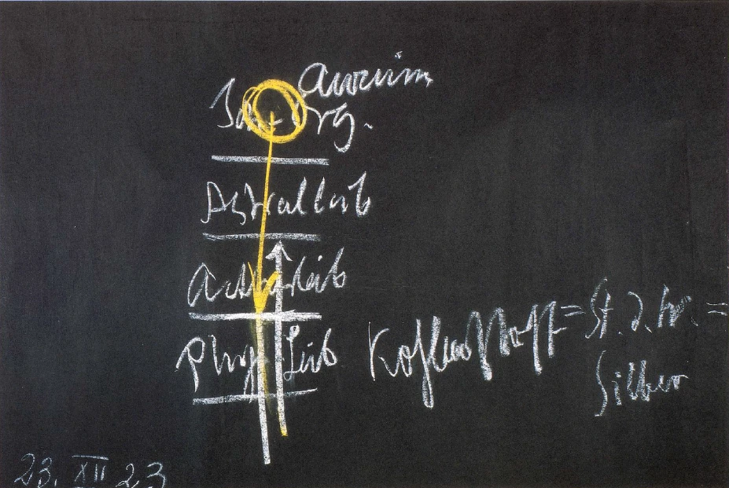

Wir wollen noch den letzten dieser Vorträge heute damit ausfüllen, daß ich, gewissermaßen zusammenfassend das Mysterienwesen, das ich für diese oder jene Gegend der Erde vor Ihnen entwickelt habe, dieses Mysterienwesen wenigstens von einem Gesichtspunkte aus in der Gestalt zeige, die es angenommen hat während des Mittelalters, etwa vom zehnten bis fünfzehnten Jahrhundert. ^356m8a

Ich spreche von diesem Zeitraum, nicht weil er ein besonders in sich abgeschlossener ist, sondern weil er gewissermaßen benutzt werden kann, um zu zeigen, welchen Stand das menschliche Seelenstreben in den zivilisiertesten Gegenden damals angenommen hat. Oftmals bezeichnet man ja eben dasjenige, was damals Geistesstreben war, als rosenkreuzerisches Mysterienwesen. Die Bezeichnung ist auch durchaus in einem gewissen Sinne berechtigt, aber man muß dann hinter dieser Bezeichnung nicht das vielfach Scharlatanhafte suchen, von dem in der Literatur die Rede ist, auch oftmals, ohne daß man aufmerksam darauf macht, wie scharlatanhaft die Dinge sind, von denen da berichtet wird, sondern man muß seine Blicke richten auf das tief ernste Erkenntnisstreben, das gerade in diesen Jahrhunderten in fast allen Gegenden Europas, Mittel-, West- und Südeuropas vorhanden war. Man muß sich klar darüber sein, daß der Faust, den Goethe geschildert hat, mit all dem tiefen Seelenstreben, mit all dem ernsten Streben im Grunde genommen eine Spätgestalt ist, die nicht mehr so tief in der Seele war wie mancher Forscher, der in den mittelalterlichen Laboratorien, von denen geschichtlich wenig gemeldet wird, zwischen dem zehnten und fünfzehnten Jahrhunderte arbeitete. Und ich erwähnte schon gestern, daß gerade bei den tieferen Forschern dieser Zeit ein tragischer Zug vorherrschend war. Denn das Eigentümliche war das Gefühl, daß man eigentlich nach dem Höchsten, was im Menschen schöpferisch tätig ist, streben müsse, daß man aber in einem gewissen Sinne nicht nur nicht nach diesem Höchsten streben kann, sondern daß es auch bedenklich ist von einem gewissen Gesichtspunkte aus, nach diesem Höchsten zu streben. ^xvmwdx

Ich sagte schon gestern, nicht eine theoretische, leichtgeschürzte Erkenntnis fand sich bei diesen Forschern in den alchemistischen Laboratorien zwischen dem zehnten und fünfzehnten Jahrhunderte, sondern etwas, was tief zusammenhing mit dem ganzen Menschen, mit dem innersten gefühlsmäßigen und von Erkenntnissehnsucht getragenen gefühlsmäßigen Erleben des Menschen - eine Herzens- und Gemütserkenntnis. ^v1tq0a

Und woher rührte diese? Nun, am besten wird es Ihnen erklärlich sein, wenn ich Ihnen diese tragische Skepsis der mittelalterlichen Forschung dadurch anschaulich mache, daß ich heute wiederum einmal hinweise auf die Gestaltung, welche menschliches Wissen einmal auf der Erde gehabt hat, auf die älteste Gestaltung. ^7nj8yg

Diese älteste Gestaltung des menschlichen Wissens, die ja eng mit dem Leben des einzelnen Menschen zusammenhing, war aber nicht so, daß die Menschen hinaufgeschaut hätten zu den Planeten und jene mathematische Größe, jene mathematischen Bewegungen gesehen hätten, die man heute da errechnet und erdenkt. Sondern jeder Planet, wie überhaupt alles, was im Felde des Himmels ausgebreitet ist, war ein lebendiges Wesen, nicht nur ein lebendiges, war ein beseeltes Wesen, nicht nur ein beseeltes, war ein durchgeistigtes Wesen. Und immer wiederum hat man gesprochen von den Familien der Planeten, von den Familien der Himmelskörper. Man hat schon gewußt: wie es eine Blutsverwandtschaft gibt zwischen den Mitgliedern einer Familie, so gibt es eine innere Verwandtschaft zwischen den Mitgliedern eines Planetensystems. Zwischen dem Menschlichen und demjenigen, was im Kosmos draußen sich offenbarte, war durchaus in der Erkenntnis ein Parallelismus vorhanden. ^pkhcpr

Nun möchte ich Ihnen auf einem Gebiete darstellen, wie man in urältesten Mysterien erkannte, wenn man hinaufsah zur Sonne. Es gab ja solche Mysterienstätten, die so eingerichtet waren, daß eine Art besonders zubereiteten Oberlichtes vorhanden war, so daß man zu bestimmten Tageszeiten im abgedämpften Lichte zur Sonne aufsah. Also Sie müssen sich vorstellen, daß die wichtigste Kammer in manchen urältesten Sonnenmysterien diejenige war, wo im Dache ein Oberlicht eingesetzt war. Das Fenster war abgeschlossen mit einem solchen Matezial - nicht im heutigen Sinne Glas -, daß im sehr dämmerig abgedämpften Lichte man die Sonnenscheibe zu einer bestimmten Zeit des Tages vor sich hatte. Der Schüler wurde nun vorbereitet, diesen Blick auf die Sonnenscheibe in der richtigen inneren Seelenverfassung in sich aufzunehmen. Er mußte sein Gemüt so empfänglich, so innerlich wahrnehmungsfähig machen, daß, wenn er sozusagen seine Seele durch sein ‚Auge der Sonnenscheibe im abgedämpften Lichte exponierte, das auf ihn einen Eindruck machte, den er wirklich dann sich vorstellen konnte. ^tgkjha

Gewiß, es schauen ja auch heute manche Leute durch gedämpftes Glas in die Sonne, aber sie sind nicht vorbereitet in ihrem Empfindungsvermögen, um den Eindruck, den die Sonne macht, wirklich so vorzustellen, daß die Seele ihn als besonderen Eindruck hat. Für die Schüler dieser Mysterien war dieser Eindruck der abgedämpften Sonnenscheibe, dieser Eindruck, der geholt wurde, nachdem lange Exerzitien vorangegangen waren, ein ganz bestimmter. Und der Mensch, der diesen Eindruck als Schüler der Mysterien-Initiatoren haben konnte, der konnte wahrhaftig diesen Eindruck nicht wieder vergessen. Mit diesem Eindruck hatte aber der Schüler auch etwas gewonnen, was ihm mehr Verständnis für gewisse Dinge geben konnte, als er sonst hatte. Und so wurde denn der Schüler, nachdem er vorbereitet war durch den majestätischen, großartigen Eindruck der Sonne, nun dazu geführt, die besondere Qualität der Substanz Gold auf sich wirken zu lassen. Und durch diese Vorbereitung, durch diese Sonnenvorbereitung war es wirklich so, daß der Schüler zu einem tiefen Verständnis der Qualität Gold kam. ^abcf1r

Wenn man in diese Dinge hineinschaut, kommt einem wirklich schmerzlich die Trivialität zum Bewußtsein, mit der heute in historischen Werken oftmals dargestellt wird, warum diese oder jene älteren Denker das Gold der Sonne zugeteilt haben, der Sonne und dem Golde dasselbe Zeichen gegeben haben. Man weiß eben heute nicht mehr, daß dasjenige, was in dieser Weise einmal gewußt worden ist, wirklich hervorgegangen ist aus langen Übungen und Vorbereitungen. Ich möchte sagen: das Hineinsenken des durchseelten Blickes in das abgedämpfte direkte Sonnenlicht bereitete den Schüler vor, das Gold der Erde zu verstehen. Und wie verstand er es? Nachdem er diese Vorbereitung hatte, fiel zunächst seine Aufmerksamkeit darauf, daß das Gold unempfänglich ist für dasjenige, was sonst für die Organismen Lebensluft ist, und wofür viele Metalle, die meisten anderen Metalle, durchaus empfänglich sind: Sauerstoff. Sauerstoff, Oxygen, verändert das Gold nicht. Diese Unempfänglichkeit, diese Hartnäckigkeit des Goldes gegenüber dem, wovon ja der Mensch sein Leben hat, das übte einen tiefen Eindruck aus auf den alten Mysterienschüler. Und so bekam er vom Golde den Eindruck: An das Leben kann zunächst das Gold nicht heran. An das Leben unmittelbar kann aber auch die Sonne nicht heran. Und es ist gut, daß weder Gold noch Sonne an das Leben unmittelbar heran können. Denn nun wurde der Schüler weitergeführt, und er kam nach und nach darauf, daß das Gold gerade dadurch, daß es gar keine Verwandtschaft zu der Lebensluft, zu dem Sauerstoff hat, wenn es in einer gewissen Dosierung in den menschlichen Organismus eingeführt wird, eine ganz besondere Wirkung auf den menschlichen Organismus hat. Eine ganz besondere Relation hat dieses Gold zum menschlichen Organismus, wenn es nur eben, wie gesagt, in der entsprechenden Dosierung eingeführt wird. Es hat keine Relation zum ätherischen Leib, keine Relation zum astralischen Leib unmittelbar, sondern eine unmittelbare Relation zu dem, was im menschlichen Denken liegt. ^jkdvil

Fassen Sie nur einmal ins Auge, wie weit das Denken vom menschlichen Leben abliegt, gerade in unserer heutigen Zeit! Man kann wie ein Klotz sitzen, wie ein Holzklotz, und man kann abstrakt denken, ganz lebendig abstrakt denken. Aber man kann auf der anderen Seite durch das bloße Denken eben nichts im Organismus bewirken; das Denken ist immer mehr und mehr für die Menschen ohnmächtig geworden. Aber das Denken wird von der Ich-organisation in Bewegung gesetzt. Und das Gold, in der richtigen Dosierung in den menschlichen Organismus eingefügt, dieses Gold, das bringt wiederum dem Denken Macht zurück. Das bringt dem Denken jene Macht zurück, daß das Denken in den astralischen Leib, ja in den Ätherleib hinunterwirken kann. Vom Denken aus wird der Mensch durch das Gold belebt. ^24p568

Das war eines der Geheimnisse urältester Mysterien, das GoldGeheimnis in Verbindung mit der Sonne. Die Verwandtschaft der Substanz Gold mit der kosmischen Wirkung der Sonne fiel dem Schüler auf eben in jenen älteren Zeiten, von denen ich Ihnen gesprochen habe. ^d4txe2

Und ebenso, in einer ähnlichen Weise, kam der Schüler älterer Mysterien darauf, wie, ich möchte sagen, der entgegengesetzte Pol des Goldes wirkt. Das Gold ist ein Impuls für die Belebung des menschlichen Denkens, so daß das menschliche Denken bis in den ätherischen Leib hinunter wirken kann. Und der entgegengesetzte Pol, welcher wäre es denn? ^12wgvz

 ^ylk7lm

Sehen Sie, wenn man den menschlichen Organismus hat in seinen Gliedern, Ichorganisation, Astralleib, Ätherleib, physischer Leib, kann man sagen: Durch das Gold wird die Ich-organisation fähig, bis hinunter in den Ätherleib zu wirken. Der Ätherleib kann dann auf den physischen Leib weiter wirken. Aber das Gold bewirkt, daß man tatsächlich die Gedanken bis in den Ätherleib hinein mächtig erhalten kann. ^2zaq58

Was ist der entgegengesetzte Pol? Nun, wenn wir eben eine diesem Pfeil hier entgegengesetzte Wirkung hervorrufen! Diese Wirkung aber, das ist eben diejenige, die sich uns darstellt, wenn gerade die Lebensluft, der Sauerstoff, das Oxygen, angezogen wird von etwas im Menschen oder von etwas in der Natur. Und so wie das Gold hartnäkkig gegen den Sauerstoff ist, ihn abstößt, ihn nicht will und dadurch zunächst keinen Einfluß auf den Ätherleib, auf den Astralleib hat, sondern nur auf die Gedankenwelt der Ich-organisation, so hat im Menschen dasjenige, was Kohlenstoff ist, eine unmittelbare Verwandtschaft zu der Lebensluft. Wir atmen ja Kohlensäure aus, wir machen Kohlensäure, verbinden Kohlenstoff mit Sauerstoff. Die Pflanze braucht Kohlensäure zu ihrem Leben. Der Kohlenstoff, er hat gerade die entgegengesetzte Eigenschaft vom Golde. ^etliaz

Nun, dieser Kohlenstoff spielte eine große Rolle in urältesten Mysterien. Denn man sprach auf der einen Seite vom Golde als ganz besonders wichtiger Substanz, wenn man den Menschen betrachten will, man sprach auf der anderen Seite vom Kohlenstoff. Und vom Kohlenstoff sprach man in den ältesten Mysterien so, daß man ihn nannte den Stein der Weisen. Und Gold und der Stein der Weisen waren sehr wichtige Dinge in diesen älteren Zeiten - Gold und der Stein der Weisen. Kohlenstoff war der Stein der Weisen. ^mjjc4d

Auf der Erde kommt der Kohlenstoff in einer Anzahl von Gestaltungen vor. Demant ist Kohlenstoff, harter Kohlenstoff. Graphit ist Kohlenstoff. Steinkohle ist Kohlenstoff. Anthrazit ist Kohlenstoff. Auf Erden kommt also der Kohlenstoff in der mannigfaltigsten Weise vor. Aber jetzt, durch die Methoden, die in den alten Mysterien üblich waren, lernte man erkennen, daß es noch andere Gestaltungen des Kohlenstofles gibt als diejenigen, die auf der Erde sind. Und sehen Sie, da gab es eben eine andere Vorbereitung für die Mysterienschüler als diejenige, von der ich schon gesprochen habe, die Sonnenvorbereitung: es gab die Mondenvorbereitung. ^687r8q

Beigegeben war gerade den Sonnenmysterien, ich möchte sagen eine Art Observatorium, wo nun der Mensch exponiert werden konnte seiner Seele und seinem physischen Auge nach den Gestaltungen des Mondes. Da mußte man nicht bloß im abgedämpften Lichte die Sonne zu einer bestimmten Zeit schauen, da mußte man tatsächlich durch Wochen den verschiedenen Gestaltungen, die die Mondenscheibe zur Nacht annimmt, das durchseelte Auge exponieren. Da bekam man wiederum einen bestimmten Eindruck in seiner Seele, durch den man jetzt erst Erkenntnisse bekam. So wie man die sonnenfähige Seele bekam durch das Exponieren gegenüber der Sonne, so bekam man die mondenfähige Seele durch das Exponieren gegenüber den Mondenphasen. ^w2y8v0

Jetzt lernte man erkennen, welche Metamorphose der Kohlenstoff durchmachen kann. Auf der Erde ist der Kohlenstoff entweder Kohle oder Graphit oder Demant oder Anthrazit. Auf dem Monde ist dasjenige, was auf der Erde entweder Demant oder Anthrazit oder Kohle ist, Silber. Das war das Geheimnis der alten Mysterien: Kohlenstoff ist auf dem Monde Silber. Kohlenstoff ist der Stein der Weisen, und er ist auf dem Monde Silber. Was in den alten Mysterien so tief an den Menschen herangebracht wurde als Erkenntnis, das war, daß irgendeine Substanz das, als was sie sich äußerlich darstellt, nur an diesem Orte, um diese Zeit so ist: Man war einfach Ignorant, wenn man nicht wußte, Kohlenstoff ist Kohle, Demant, Graphit nur auf der Erde; dasselbe, was auf der Erde Demant und Graphit ist, ist auf dem Monde Silber; und würde man ein Stück unserer gewöhnlichen schwarzen Kohle in diesem Momente hinaufbefördern können nach dem Monde, sie würde dort Silber. Diese, ich möchte sagen, radikale Metamorphosenanschauung bekam der Schüler in jenen älteren Zeiten. Und das liegt eigentlich jener scharlatanhaften Alchemie, von der heute vielfach gesprochen wird, nicht zugrunde, sondern das liegt der wirklichen älteren Alchemie zugrunde. Aber so etwas, wie diese ältere Alchemie es ist, kann eben nicht auf eine so abstrakte Wissensart errungen werden, wie man heute irgend etwas weiß. ^p12w4b

Heute beobachtet man, oder man denkt über die Dinge. So konnte Alchemie nicht errungen werden. Heute richtet man das Fernrohr nach einem Stern, bestimmt Parallaxen und dergleichen und rechnet und rechnet, oder etwa um seine Substanz kennenzulernen, wendet man das Spektroskop an und so weiter. Aber alles das, was man da kennenlernt, ist ja so unendlich abstrakt gegenüber dem, was man einmal kennenlernen konnte von den Sternen! Aber man konnte die alte Weisheit, die wirkliche Astrologie, nur kennenlernen, wenn man, wie ich schon gestern sagte, den lebendigen Verkehr hatte mit den Intelligenzen des Kosmos. Das war eben Erlangung eines Wissens, daß man sprechen konnte in seiner Seele, in seinem Geiste mit den Intelligenzen des Kosmos. Was das Aurum für den menschlichen Organismus bedeutet, das hängt mit dem Sonnengeheimnis zusammen. Dadurch, daß man in dieser Weise, wie ich es geschildert habe, die eigene Seele exponierte dem Sonnensein, dadurch kam man in Relation mit den Intelligenzen der Sonne selber. Die konnten einem sagen, wie es sich mit dem Aurum verhält. Und ebenso kam man in Zusammenhang mit den Intelligenzen des Mondes auf die Art, wie ich sie Ihnen geschildert habe. ^b8kk8r

Diese Intelligenzen des Mondes lernte man allerdings als diejenigen kennen, die einmal in alten Zeiten selber die großen Lehrer der Erdenmenschheit waren, als die Urweisheit auf Erden gelehrt worden ist. Da waren es dieselben Lehrer, die heute, ich möchte sagen, vom Monde herab ihre Kräfte, ihre Impulse wirken lassen. Sie haben sich zurückgezogen in einer bestimmten Zeit von der Erde nach dem Mondendasein, gewissermaßen von der Erde aus eine Kolonie im Monde gegründet mit der Abtrennung des Mondes von der Erde. ^5cwen3

Also mit dem, was hier (siehe Schema) das zweite war, das Kohlenstoff-Silber-Geheimnis, haben diejenigen Intelligenzen zu tun, die sogar einmal auf der Erde waren, und die heute Mondintelligenzen sind. Sehen Sie, in dieser Weise wußte man in älteren Zeiten. ^yx6oem

Ich will ein anderes Beispiel noch sagen. So wie von Sonne und Mond bekam man auch Eindrücke bei einer Seelenvorbereitung von den anderen Planeten. Und so ist es eines der Geheimnisse in den älteren Zeiten, das sich auf die Venus bezieht. Die Venus, man schaut sie heute an durch das Teleskop, und man rechnet sie anderen Sternen, anderen Planeten gleich. Geradeso, wie man mit dem menschlichen Organismus so vorgeht, daß man ein Stück Leber untersucht und dann wiederum ein Stück Gehirn, und da eigentlich nur den Zellenbau untersucht, als wenn es nicht zwei ganz radikal verschiedene Substanzen wären, Gehirnsubstanz und Lebersubstanz, so richtet man auch das Fernrohr hinaus und meint, Merkur, Venus und Mars und so weiter, das seien alles gleichartige Substanzen. In jener alten Zeit wußte man, indem man den Mond und die Sonne ins Auge faßte, kommt man noch aus mit dem, was unmittelbar zur physischen Erde, zum Irdischen, zum Wäßrigen, zum Luftförmigen, zum Feurigen Beziehung hat. Indem man bis zum Monde seine Beobachtungen in geistiger Art ausdehnt, kommt man bis zum Äther. Aber indem man seine Beobachtungen bis zur Venus ausdehnt, kommt man in eine geistige Welt, in eine rein astralische Welt hinein. Das, was als physische Venus erscheint, ist gewissermaßen nur das äußere Merkzeichen für etwas, was lebt und west im Astralischen, respektive im astralischen Lichte. Das physischeLicht ist bei der Venus etwas ganz anderes als zum Beispiel das physische Sonnenlicht. Das physische Sonnenlicht hat noch etwas Verwandtschaft mit dem, was auf der Erde als ein auf Erden entstehendes Licht leben kann. Das, was Venuslicht ist -es ist kindisch, es nur für ein reflektiertes Sonnenlicht zu halten -, leuchtet heraus schon aus der geistigen Welt. Und exponiert man diesem Lichte das eigene Seelenwesen, so lernt man erkennen, welche Intelligenzen mit der Venus verknüpft sind. ^7ijzee

Das sind Intelligenzen, welche in einem fortwährenden Gegensatz, ich möchte sagen, in einer fortwährenden Opposition leben zu den Intelligenzen der Sonne. Und eine große Rolle spielte in den alten Mysterien dieser Gegensatz zwischen den Venusintelligenzen und den Sonnenintelligenzen. Man sprach mit einem gewissen Rechte von einem fortdauernden Kampf der Venusintelligenz gegen die Sonnenintelligenz. Da gab es Ausgangspunkte solcher Kämpfe, in denen die Venusintelligenzen gegen die Sonnenintelligenzen zu kämpfen begannen. Da gab es Steigerungen, Kulminationen, da gab es Katastrophen, Krisen, und man hatte sozusagen in dem, was da zwischen einer Exposition und einer Katastrophe oder Krise lag, einen Abschnitt in dem großen Oppositionskampfe, der sich in der geistigen Welt abspielt, und der im äußeren Zeichen nur erscheint in der astrologischen, astronomischen Beziehung zwischen Venus und Sonne. In dem, was sich da abspielt, hatte man aufeinanderfolgende Phasen. Und kein Mensch kann verstehen, was auf Erden als die inneren Impulse der Geschichte lebt, wenn man nicht weiß, wie der Kampf zwischen der Venus und der Sonne ist. Denn dasjenige, was sich hier auf Erden als Kämpfe, was sich sonst abspielt in der Entwickelung der Zivilisation, das ist ein irdisches Abbild dieses Venus-Sonnen-Kampfes. ^nqgvo3

Das hat man in alten Mysterien gewußt. Solches Wissen war da, weil es eine Beziehung gab zwischen den Menschen und den Intelligenzen des Kosmos. ^a2dzu5

Nun kam die Zeit, von der ich Ihnen gesprochen habe, vom zehnten bis zum fünfzehnten Jahrhundert. Diese Forscher in den mittelalterlichen alchemistischen Laboratorien, sie konnten nach der Entwickelung der Menschheit nicht mehr hinaufgelangen zu den kosmischen Intelligenzen; aber sie konnten zu den Naturgeistern noch kommen. Indem diese alchemistischen Forscher zahlreiche solcher chemischen Versuche, wie ich Ihnen gestern im Beispiel einen gezeigt habe mit der Verwandlung der Oxalsäure in die Ameisensäure, anstellten, die ihnen enthüllen sollten das göttliche Walten und Wirken in den Naturprozessen und Naturdingen, konnten sie dies nur, indem zu ihnen im rechten Momente - ich habe gestern gesagt, wenn sie in der richtigen Weise durch Frommheit sich vorbereitet hatten — die Naturgeister sprachen. Sehen wir uns das jetzt ganz genau an, in welcher Lage solch ein Forscher war. ^43r4up

Solch ein Forscher stand in seinem Laboratorium. Er konnte sich sagen: Da trage ich herein in dieses mein Laboratorium die Substanzen, die Retorten, die Brennöfen. Ich mache die verschiedenen Experimente. Indem ich an die Natur durch meine Experimente die Fragen stelle, treten in mein Laboratorium für mein Anschauen die Naturgeister mit ihren Offenbarungen herein. — Denn das gab es noch bis zum fünfzehnten Jahrhundert, daß die Naturgeister herankamen an den richtig vorbereiteten rosenkreuzerischen Forscher; das gab es! Aber davon wußte er noch äußerlich, daß man in alten Zeiten nicht bloß zu den Naturgeistern, sondern zu den höheren kosmischen Intelligenzen gelangt war, zu jenen Intelligenzen, die einem sprachen von dem AurumGeheimnis im Zusammenhang mit der Sonne, von dem Silber-Geheimnis und dem Kohlenstoff-Geheimnis im Zusammenhang mit dem Monde, von dem historisch wichtigen Venus-Geheimnis und so weiter. Gewiß, aus Nachrichten, die da geblieben waren aus der Tradition, wußte das auch dieser mittelalterliche alchemistische Forscher. Aber das war nicht das besonders Wichtige. Derjenige, der überhaupt einmal berührt wird vom Spirituellen, dem sind historische Dokumente nicht so furchtbar wichtig, wie sie der heutigen materialistischen Zeit sind. Man ist ja immer wiederum erstaunt, wie unendlich wichtig es für manche Menschen ist, wenn so etwas wie neulich der Dinosaurus ^p4qq7m

in der Wüste Gobi gefunden worden ist. Das war ja ein wichtiges Stück, aber es sind das doch immer nur einzelne Brocken; während auf spirituelle Art wirklich in die Geheimnisse der Welt hineinzukommen ist. ‚Also die historischen Dokumente würden diesen mittelalterlichen Forscher ganz gewiß nicht besonders berührt haben. Aber auf eine andere Weise kam er hin zu einem Wissen, daß man früher einmal zu einer kosmischen Erkenntnis herangelangt ist, daß man jetzt nur herangelangen kann an die Naturgeister, die hinter den Elementen, dem Luftförmigen, dem Feurigen, dem Wasserförmigen stehen. Es war nämlich die Sache so: In gewissen Momenten, wenn gewisse Beobachtungen an der Natur gemacht oder Experimente über die Natur ausgeführt wurden, wenn man also an die Sphäre der Naturgeister herankam, dann waren gewisse Naturgeister da, die einem sagten: Es gab einmal Menschen, die mit den kosmischen Intelligenzen in Zusammenhang standen. - Das war das Quälende, das war das Bohrende, das war das Schmerzhafte für diese mittelalterlichen Forscher, daß ihnen die Naturgeister von einer Vorzeit sprachen, in der die Menschen mit den Intelligenzen des Kosmos in Zusammenhang standen. Und die Menschen mußten sich sagen: Von einer alten Zeit erzählen noch die Naturgeister, die hinunterverschwunden ist in den Abgrund des menschlichen Wissens und menschlichen Seins. - Und so war die Gabe der mittelalterlichen Alchemisten, an die Naturgeister heranzukommen, wirklich eine zweifelhafte. Auf der einen Seite kam man an das Geistige der Natur, an das Geistige der Luft, an das Geistige des Wassers, an Gnomen, Sylphen und Undinen heran in ihrer lebendigen Wirklichkeit. Auf der anderen Seite aber wiederum waren unter diesen solche Geister, die ihnen von Dingen erzählten, die sie niederschmetterten, weil sie ihnen zeigten, wie die Menschheit einmal nicht nur mit diesen Naturgeistern in Zusammenhang stand, sondern mit denjenigen Intelligenzen, mit denen diese Naturgeister heute noch in einem lebendigen Zusammenhang stehen, nicht mehr die Menschen. Das war das Gefühl dieser mittelalterlichen Alchemisten, das oftmals in einer viel grandioseren, tragisch grandioseren Weise zum Ausdruck gekommen ist als bei dem Goetheschen Faust, wo es schon so schön und grandios ist. ^oo4e6m

Aber der Ausspruch: nach dem Monde hin, nach dem silberglänzenden Mondenlichte, in dem sich der Faust baden will, dieser Ausspruch, der wurde mit noch größerer Tiefe von manchem Forscher zwischen dem zehnten und fünfzehnten Jahrhundert getan, wenn von Naturgeistern erzählt worden ist etwas von dem Kohlenstoff-SilberGeheimnis, das aber innig wieder zusammenhängt mit dem Menschen. Denn was war es, was man zu gleicher Zeit erfuhr in jenen älteren Zeiten? Man erfuhr ja nicht bloß, wie das Aurum mit der Sonne zusammenhängt, sondern wie das Aurum im Menschen wirkt, wie Argentum, Silber, und Kohlenstoff im Menschen wirken, und wie die anderen, mit den Planeten verwandten Metalle im Menschen wirken. Das aber empfand man in jenen älteren Zeiten in dem Kreisen des Blutes; in bewußter Weise empfand man das Durchwallen, Durchströmen des Blutes durch das Haupt, indem man die ganze Erde im Bilde empfand, wenn man wirklich empfand das Durchströmen des Blutes durch das Haupt. Und in der Sphäre, wo dasmenschliche Haupt.nichtabgeschlossen ist durch Knochen, sondern nach unten geöffnet ist, in diesemnach unten Geöffnetsein gegen das Herz zu, gegen die Brust zu, empfand man ein Abbild dessen, was von der Erde in der Atmosphäre gerade hinaufgeht. Und so empfand man in dem, was man aus dem Kosmos kennenlernte, gerade dasjenige, was sich innerlich im Menschen verwandelte. Und man folgte dem Planeten bei seinem Durchgang durch alle Organe. Da setzte sich dasjenige fest, was dann in der Mephistopheles-Zeile bei Goethe in so eindringlicher Weise dasteht: Blut ist ein ganz besonderer Saft. Denn dieses Blut in seiner Metamorphose spiegelt ab diese Metamorphosen, so großartig sie sind, vom Kohlenstoff nach dem Silber hin. Das alles lebt auch im menschlichen Blut. Und so betrachtete dieser mittelalterliche Forscher den Verlust der Erkenntnis der kosmischen Intelligenzen wie einen Verlust der eigenen Menschheit. Und es ist im Grunde genommen nur ein schwacher Abglanz, wenn der Faust erst das Buch des Makrokosmos aufschlägt und hinauf will nach den kosmischen Intelligenzen, und es wiederum zuschlägt, weil er das nicht kann, und sich nur an den Erdgeist hält; es ist im Grunde genommen ein schwacher Nachklang dessen, was in furchtbar tragischer Weise gerade die besten mittelalterlichen Forscher, deren Namen eben nicht auf die Nachwelt gekommen sind, in sich durchgemacht haben, indem sie hören mußten von den Naturgeistern, in deren Sphäre sie eindrangen durch ihr alchemistisches Forschen, daß es einstmals einen Zusammenhang des Menschen mit den kosmischen Intelligenzen gegeben hat. ^ipsnpc

Und wiederum, alles das hängt in einer tiefen Weise zusammen mit dem, was sich ausbilden mußte noch im alten Griechenland, als die Notwendigkeit vorlag, daß so etwas wie die gestern oder vorgestern erwähnten samothrakischen Mysterien, die Kabiren-Mysterien, abgeschwächt werden mußten bis zu der Philosophie des Aristoteles, die dann weiter gerade im Mittelalter eine so große Rolle gespielt hat, während unter der Oberfläche dessen, was Aristotelismus war, gerade bis hinein ins fünfzehnte Jahrhundert, aber auf tragische Art, dasjenige fortgewirkt hat, was ich Ihnen hier in einem kleinen Fragment skizzieren konnte. Es war schon so, daß hinter der mazedonischen Zeit ein Mysterienwesen auch noch bis nach Griechenland herein liegt — das Genauere wird dann in den nächsten historischen Vorträgen eben darzustellen sein -, ein Mysterienwesen, das tief hineinsah in die Geheimnisse der Weltsubstanzen, wie sie zusammenhängen mit den kosmischen Intelligenzen, ein Mysterienwesen, bei dem man erst herunterging von den kosmischen Intelligenzen zu den Naturgeistern. Es war der Blick wie gebannt, hinweggebannt von diesen kosmischen Intelligenzen, dafür aber hingerichtet nach den Naturgeistern. Das war die Krise, die in der Aristoteles-Alexanderzeit sich vollzogen hat. Überall kann man in dem, was sich da vollzogen hat, noch sehen, durchsehen im Aristotelismus, daß die Abstraktionen des Aristoteles fußen auf dem alten Mysterienwesen. Ich möchte sagen: Derjenige, der da weiß, wie es mit diesem Kohlenstoff-Silber-Geheimnis ist, und dann die Bemerkungen bei Aristoteles liest, die auf die Nachwelt gekommen sind - denn die wichtigsten sind ja nicht auf die Nachwelt gekommen -, dort liest, was über das Mondengeheimnis steht, der weiß sogleich Bescheid, wie der Zusammenhang ist mit diesen älteren Zeiten. ^ztua09

Doch das sind ja nun Dinge, die dann eine genauere Beleuchtung finden werden in den nächsten Vorträgen, die ich über die geschichtliche Entwickelung der Menschheit vom Gesichtspunkte der Anthroposophie aus halten möchte. ^kag8h8