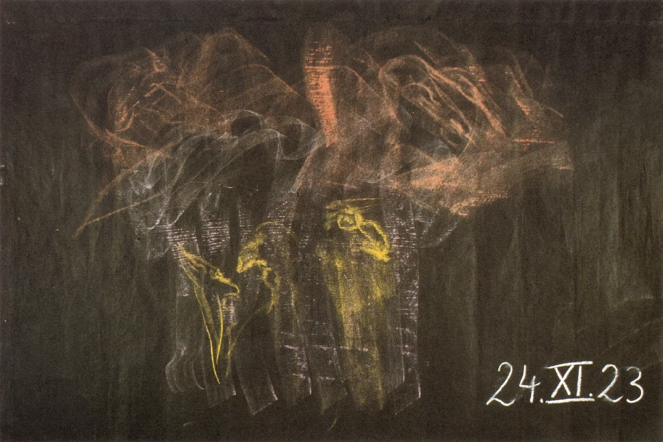

Wenn man von dem Seelischen, dem wir uns gestern in der Betrachtung ein wenig widmeten, den Übergang sucht zum Schaffen des Seelischen am physischen Menschen, und gerade zum Schaffen des Seelischen am physischen Menschen in bezug auf diejenigen Dinge, die auch gestern besprochen worden sind, so wird man nach zwei Richtungen hin geführt. Erinnerung weist ja zunächst die Seele zurück in früheres Erleben; Denken weist die Seele, wie ich gestern gezeigt habe, in das ätherische Dasein. Dasjenige, was dann den Menschen noch stärker ergreift als Erinnerung, was ihn so stark ergreift, daß die inneren Impulse in seine Körperlichkeit übergehen, das habe ich dann gestern genannt Geste, Gestenhaftes. Und indem wir das Gestenhafte betrachten, sind wir damit ja schon vorgerückt bis zu dem Offenbaren des Seelisch-Geistigen im Physischen. ^kygx9m

Nun ist ja das ganze Hereintreten des Menschen in das physische Erdenleben ein Ergreifen des Physischen durch das Geistig-Seelische. Und wenn wir uns zunächst an die Erinnerung halten, so besteht sie ja darin, daß früher im irdischen Dasein Erlebtes herübergetragen wird in ein späteres Lebensalter. ^ttc41c

Es frägt sich nun, können wir vom menschlichen Leben aus - so, wie die Erinnerung zurückweist nur auf Dinge im Laufe des Erdenlebens -, können wir vom menschlichen Leben aus weiter zurück weisen? Können wir zurückweisen auf dasjenige, was vor dem Eintritte des Menschen in das Erdenleben liegt? ^lut69m

Nun kommen wir da zu zwei Dingen: einmal zu dem, was der Mensch geistig-seelisch im vorirdischen Dasein durchgemacht hat. Überlassen wir das zunächst einer späteren Betrachtung. Aber es ist ja noch etwas anderes da, etwas mit der physischen Körperlichkeit Zusammenhängendes, das der Mensch als individuelles Wesen herein in die physische Körperlichkeit trägt. Es ist alles das, was wir aus gewohnten naturwissenschaftlichen Vorstellungen heraus als Vererbung bezeichnen. Der Mensch trägt in sich bis in seine Temperamentsanla‚gen hinein, die also schon stark ins Seelische heraufspielen, Eigentümlichkeiten, Impulse, die sich anschließen an dasjenige, was seinen physischen Vorfahren eigen war. ^7c9h8v

Allerdings, die heutige Menschheit geht mit solchen Dingen etwas oberflächlich, man könnte sogar sagen, etwas gedankenlos um. Ich habe gerade heute morgen ein Buch gelesen auf einer Fahrt, das über einen Herrscher aus einem bekannten, jetzt vergangenen Herrscherhause handelte, und das sich mit der Frage der Vererbung in diesem Herrscherhause befaßt. Da werden bis ins siebente Jahrhundert zurück Eigenschaften angegeben, die sich immer wiederum vererbten. Nur findet sich in diesem Buch dann bezüglich dieser Vererbung ein eigentümlicher Satz. Der lautet etwa folgendermaßen: In diesem Herrscherhause sind Leute, die auffällig zeigen, daß sie neigen zu Extravaganzen, daß sie neigen zu Paradoxien des Lebens, zu Ausschweifungen und so weiter, aber es gibt auch noch Mitglieder dieses Herrscherhauses, die all das nicht haben. Sie sehen: eine eigentümliche Art, zu denken! Denn man sollte eigentlich voraussetzen, daß jemand, der so etwas bemerkt, sich sagen müßte: Aus solchen Voraussetzungen kann man überhaupt nichts schließen. Wenn Sie aber durchgehen vieles von dem, was in der Gegenwart zu sogenannten sicheren Ansichten führt, da werden Sie vieles dergleichen finden. ^6mq0c2

‚Aber wenn auch die Anschauungen, die heute über die Vererbung herrschen, sich ziemlich oberflächlich ausnehmen, so muß man doch sagen: Der Mensch trägt einmal die vererbten Merkmale in sich. Das ist die eine Seite. Der Mensch hat ja oftmals auch zu kämpfen mit diesen vererbten Merkmalen. Er muß sich herausschälen gewissermaßen aus diesen vererbten Merkmalen, um zu demjenigen zu kommen, wozu er veranlagt ist durch sein Leben, bevor er das irdische Dasein betreten hat. ^g7ohy5

Das zweite, worauf wir verwiesen werden, das ist dasjenige, was der Mensch sich aneignet durch Erziehung, durch den Umgang mit seinen Mitmenschen, aber auch durch den Umgang mit der äußeren Natur. Aus den Gewohnheiten der Betrachtung untergeordneter Naturreiche heraus nennt man dieses die Anpassung des Menschen an die umliegenden Verhältnisse. Und Sie wissen ja, daß eine moderne Naturwissenschaft überhaupt für ein Lebewesen diese zwei Impulse, Vererbung und Anpassung, als das Allerwichtigste betrachtet. ^ju338c

Aber gerade wenn man in diese Dinge hineinkommt, dann fühlt man, wenn man unbefangen sich den Dingen hingibt, daß man ohne den Weg in die geistige Welt hinein über solche Dinge überhaupt keinen Aufschluß gewinnen kann. Und so wollen wir denn heute gerade diese Dinge, die einem im Leben auf Schritt und Tritt entgegentreten, im Lichte der Geist-Erkenntnis einmal erfassen. ^3wex8e

Da müssen wir zurückgreifen auf etwas, was uns in den vergangenen Betrachtungen wiederholt beschäftigt hat. Wir haben ja hinweisen müssen, auch wiederum in diesen Betrachtungen, auf den Austritt des Mondes aus dem Erdenplaneten. Man kann hinweisen darauf, daß der Mond einmal mit dem Erdenplaneten verbunden war und in einer bestimmten Zeit aus diesem Erdenplaneten herausgetreten ist, um diesen Erdenplaneten von der Ferne aus zu beeinflussen. Ich habe aber auch darauf hingewiesen, welch ein Geistiges hinter diesem Mondausgang liegt. Ich habe darauf hingewiesen, wie einmal auf der Erde geradezu übermenschliche Wesenheiten lebten, die die ersten großen Lehrer der Menschheit waren, und von denen dasjenige herrührt, was auf dem Grunde unseres menschlichen Denkens auf Erden als die Urweisheit bezeichnet werden kann, was sich überall als ein ursprünglicher Einschlag findet, tief bedeutsam ist, Ehrfurcht erregt, was selbst in den Trümmern, in denen es vorhanden ist, Ehrfurcht erregt, und was einstmals den Inhalt eben der Lehre übermenschlicher großer Lehrer am Ausgangspunkte der irdischen Menschheitsentwickelung bildete. ^xacs6y

Diese Wesenheiten haben ihren Weg gefunden hinauf in das Mondendasein, und sie sind nun heute mit dem Mondendasein verbunden. Sie gehören gewissermaßen zu der Bevölkerung des Mondes. Nun handelt es sich darum, daß der Mensch, wenn er durch die Pforte des Todes durchgegangen ist, ja etappenweise dasjenige durchmacht, was gebunden ist an die planetarische Welt, die zu unserer Erde gehört. Wir haben ja auch das schon betrachtet, daß der Mensch zunächst, wenn er durch das irdische Dasein durchgegangen ist, in den Bereich der Mondenwirkungen kommt, dann weiter in den Bereich der Venus-, Merkur-, Sonnenwirkungen und so fort. Heute mag uns zunächst interessieren, wie der Mensch da in den Bereich der Mondenwirkungen kommt. ^b29zq7

Ich habe schon darauf hingedeutet auch von diesem Orte aus, daß ja mit imaginativer Anschauung verfolgt werden kann das Leben des Menschen über die Todespforte hinaus, und daß tatsächlich dasjenige, was vom Menschen da ist, im Geistigen erscheint, nachdem er den physischen Leib abgelegt hat, den Elementen der Erde übergeben hat. Nachdem er seinen Ätherleib aufgenommen gesehen hat von der Äthersphäre, die mit unserer Erde verbunden ist, bleibt vom Menschen übrig das Geistig-Seelische, Ich, astralischer Leib, dasjenige, was sich an Ich und astralischen Leib dann angliedert. Aber wenn man mit imaginativer Anschauung dieses durch des Todes Pforte Gegangene betrachtet, stellt es sich immer noch in einer Gestalt dar. Es ist die Gestalt, die die physische Materie, die der Mensch in sich trägt, zur eigentlichen Form bringt. Diese Form bleibt der robusten physischen Körperlichkeit gegenüber wie ein Schattenbild, dem seelischen Empfinden und Wahrnehmen gegenüber aber von kräftigem, intensivem Eindruck. Verblaßt ist das Haupt des Menschen an dieser Gestalt für den seelischen Eindruck; stark ist das Übrige, das nach und nach dann beim Durchgang durch das Leben zwischen Tod und neuer Geburt sich verwandelt in das Haupt der nächsten Inkarnation. Aber etwas ist zu sagen über diese Gestalt, die da von der imaginativen Anschauung erblickt werden kann, nachdem der Mensch durch die Pforte des Todes gegangen ist: sie trägt einen gewissen physiognomischen Ausdruck. Sie ist ein getreues Abbild gewissermaßen der Art und Weise, wie der Mensch hier im physischen Erdenleben gut oder böse war. Hier im physischen Erdenleben kann der Mensch verbergen, ob in seiner Seele das Böse oder das Gute wirkt. Nach dem Tode kann er das nicht verbergen. Schaut man auf die Geistgestalt, die geblieben ist nach dem Tode, so trägt diese den physiognomischen Ausdruck desjenigen, was der Mensch auf der Erde war. ^bes2yt

Derjenige, der durch des Todes Pforte ein moralisch Böses mit der Seele verbunden trägt, der trägt einen physiognomischen Ausdruck, durch den er äußerlich, wenn ich so sagen darf, ähnlich wird den ahrimanischen Gestalten. Und es ist für die erste Zeit nach dem Tode durchaus so, daß alles Empfinden und Wahrnehmen des Menschen gebunden ist an dasjenige, was der Mensch in sich nachbilden kann. Wenn der Mensch nun an sich selber die Physiognomie Ahrimans trägt dadurch, daß er das moralisch Böse in seiner Seele durch des Todes Pforte geführt hat, dann kann er auch nur dasjenige, was Ahriman ähnlich ist, nachbilden, das heißt wahrnehmen, und er ist gewissermaßen seelisch blind gegen diejenigen Menschenseelen, die mit guter Stimmung, mit guter moralischer Stimmung durch des Todes Pforte hindurchgegangen sind. Das gehört sogar zu dem schärfsten Gericht, in das der Mensch eingeführt wird, nachdem er den Durchgang gefunden hat durch des Todes Pforte, daß er, insofern er böse ist, nur seinesgleichen sehen kann, weil er nur das in sich nachbilden kann, was die Physiognomie von auch bösen Menschen ist. ^2pgx7b

Nun kommt der Mensch, indem er durch des Todes Pforte getreten ist, in den Bereich des Mondes. Da gerät derjenige, der Böses durch des Todes Pforte trägt, in die Gegenwart von übersinnlichen, überphysischen Wesenheiten, aber immer auch solchen, die ihm physiognomisch ähnlich sind, also in die Nähe von ahrimanischen Gestalten. Dieses Durchgehen durch eine ahrimanische Welt bei gewissen Menschen hat eine ganz bestimmte Bedeutung im ganzen Zusammenhange des Weltgeschehens. Und wir werden begreifen, was da eigentlich geschieht, wenn wir nun den eigentlichen Sinn der Hinauswanderung der urweisen Lehrer nach der Mondenkolonie des Kosmos ins Auge fassen. ^6figul

Sehen Sie, mit der ganzen Weltentwickelung sind ja außer den Wesenheiten der höheren Hierarchien, die wir gewöhnlich mit den Namen Angeloi, Archangeloi und so weiter bezeichnen, durchaus auch diejenigen Wesenheiten verbunden, die in das ahrimanische und in das luziferische Reich gehören; diese Wesenheiten wirken im ganzen Weltenzusammenhange so, wie die normal sich entfaltenden. Die luziferischen Wesenheiten wirken fortwährend, indem sie dasjenige, was die Tendenz in sich trägt, zur physischen Materialität vorzuschreiten, abbringen wollen von dem Vordringen zur physischen Materialität. Im Bereiche des Menschen wirken die luziferischen Wesenheiten so, daß sie jede Gelegenheit benützen, um den Menschen hinwegzuheben von seiner physischen Körperlichkeit. Die luziferischen Wesenheiten haben das Bestreben, aus dem Menschen ein rein geistig-seelisch-ätherisches Wesen zu machen. Die ahrimanischen Gestalten haben das Bestreben, alles dasjenige von dem Menschen auszusondern, was ihn nach dem Seelisch-Geistigen, wie es nun einmal im Menschenreiche sich entwickeln muß, hinträgt. Sie möchten das Untermenschliche, dasjenige, was in den Trieben, Instinkten und so weiter liegt, was sich in der Körperlichkeit ausdrückt, ins Geistige verwandeln. Ins Geistige den Menschen verwandeln, das ist der Trieb sowohl der luziferischen wie der ahrimanischen Wesenheiten. Nur daß die luziferischen das Geistig-Seelische aus dem Menschen herausziehen wollen, so daß sich der Mensch nicht mehr kümmern würde um seine irdischen Verkörperungen, sondern als geistig-seelisches Wesen leben wollte. Die ahrimanischen Wesenheiten möchten sich am liebsten gar nicht um das GeistigSeelische des Menschen kümmern, sondern dasjenige, was ihm als Hülle, als Kleid, als Werkzeug im Physischen und Ätherischen gegeben ist, das möchten sie loslösen und in ihre Welt hineinbringen. ^4xd4re

So steht der Mensch auf der einen Seite gegenüber den Wesenheiten der normal sich entfaltenden Hierarchien, aber er steht, weil er einverwoben ist in das ganze, in das totale Dasein, auch gegenüber den luziferischen und ahrimanischen Gestalten. ^gxpvwj

Und nun handelt es sich darum, daß ja jedesmal, wenn die luziferischen Gestalten Anstrengungen machen, an den Menschen heranzukommen, dies damit verbunden ist, daß der Mensch eigentlich erdenfremd und erdenfern gemacht werden soll; dagegen, wenn die ahrimanischen Gestalten Anstrengungen machen, sich des Menschen zu bemächtigen, so möchten sie ihn immer irdischer und irdischer machen, obwohl sie die Erde in dichter geistiger Substanz und mit dichten geistigen Kräften eben auch vergeistigen wollen. ^mssqbu

Man muß, wenn man geistige Angelegenheiten bespricht, sich nun gewissermaßen solcher Ausdrücke bedienen, die vielleicht grotesk erscheinen gegenüber diesen geistigen Angelegenheiten. Aber wir müssen ja uns zunächst der Menschensprache bedienen. Daher gestatten Sie schon, meine lieben Freunde, daß ich für etwas, was sich im rein Geistigen vollzieht, eben gewöhnliche Menschenworte gebrauche. Sie werden mich ja verstehen. Sie werden hinaufheben das, was ich in dieser Weise ausdrücke, in das Geistige. ^82zse7

Gerade diejenigen Wesenheiten, die dem Menschen einstmals im Beginne des Erdendaseins als die großen Lehrer die Urweisheit gebracht haben, die haben sich nach dem Monde aus dem Grunde zurückgezogen, um, so weit es in ihrem Bereiche möglich ist, das Luzifetische und das Ahrimanische in das richtige Verhältnis zum Menschenleben zu bringen. Warum war das notwendig? Warum mußte von solchen erhabenen Wesenheiten, wie diese Urlehrer waren, die Tat gewählt werden, aus dem Irdischen, in dessen Bereich sie eine Zeitlang gewirkt hatten, herauszugehen, nach dem außerirdischen Monde hinzugehen, um das Luziferische und das Ahrimanische in das rechte Verhältnis zum Menschen der Möglichkeit nach zu bringen? ^gu7xq5

Sehen Sie, wenn der Mensch aus dem vorirdischen Dasein als seelisch-geistige Wesenheit heruntersteigt ins Irdische, so macht er ja jenen Weg durch, den ich in dem Kursus über «Kosmologie, Religion und Philosophie» beschrieben habe. Er hat ein bestimmtes geistig-seelisches Dasein; das verbindet er mit dem, was ihm in der reinen Vererbungslinie durch Vater und Mutter gegeben wird, mit dem physischembryonalen Dasein. Die beiden, das Physisch-Embryonale und das Geistige, dringen ineinander, vereinigen sich miteinander, und der Mensch kommt auf diese Weise in das Erdendasein herein. Aber in dem, was nun in der Vererbungslinie liegt, in dem, was von den Vorfahren übergeht an Vererbungsmerkmalen auf die Nachkommen, in dem ist dasjenige enthalten, was den ahrimanischen Wesenheiten gerade die Angriffspunkte auf die menschliche Natur gibt. In den Vererbungskräften liegen die ahrimanischen Kräfte. Und indem der Mensch in sich viel von diesen Vererbungsimpulsen trägt, hat er eine Körperlichkeit, an die das Ich nicht gut herankann. Das ist sogar das Geheimnis mancher menschlichen Wesenheiten, daß sie zu viel der Vererbungsimpulse in sich tragen. Man nennt das heute «erblich belastet sein». Das hat dann zur Folge, daß das Ich nicht voll in die Körperlichkeit hineindringen kann, daß das Ich nicht voll ausfüllen kann alle die einzelnen Organe der Körperlichkeit, und der Körper gewissermaßen eine Eigenwirkung entfaltet neben der Impulsivität des Ich, die eigentlich hineingehöfrt in diese Körperlichkeit. So daß es den ahrimanischen Mächten, indem sie ihre Anstrengungen machen, möglichst viel in die Vererbung hineinzulegen, gelingt, das Ich nur lose sitzen zu machen in der menschlichen Wesenheit. Das ist das eine. ^xxcbho

Aber der Mensch unterliegt ja auch der Anpassung an die äußeren Verhältnisse. Denken Sie nur, wie stark der Mensch der Anpassung an die äußeren Verhältnisse unterliegt, indem Sie betrachten, was für Einflüsse Klima und andere geographische Verhältnisse auf den Menschen haben. Dieser Einfluß der reinen Naturumgebung ist ja von außerordentlicher Bedeutung für den Menschen. Es gab sogar Zeiten, in denen dieser Einfluß der Naturumgebung in besonderer Weise durch die Leitung der weisen Führer der Menschheit benutzt worden ist. ^frp0dt

Wenn wir zum Beispiel hinschauen auf etwas ganz Merkwürdiges im alten Griechentum, auf den Unterschied der Spartaner und Athener, so müssen wir sagen: dieser Unterschied der Spartaner und Athener, der eigentlich in unseren gebräuchlichen Geschichtshandbüchern in einer recht äußerlichen Weise geschildert wird, er beruht auf etwas, das zurückgeht auf Maßnahmen alter Mysterien, die Verschiedenes wirkten für die Spartaner und die Athener. ^ebmuhx

In Griechenland gab man ja sehr viel auf Gymnastik. Die Gymnastik war das Hauptsächlichste in der Erziehung des Kindes, weil man auf dem Umwege durch die Körperlichkeit, indem man diese Körperlichkeit in einer bestimmten Weise lenkte und leitete, gerade in der griechischen Art auch auf das Geistig-Seelische wirkte. Aber in verschiedener Art geschah das bei den Spartanern, in verschiedener Art bei den Athenern. Bei den Spartanern war es so, daß es vor allen Dingen darauf ankam, die Knaben so sich entwickeln zu lassen, daß sie durch ihre gymnastischen Übungen möglichst dasjenige, was der Körper innerlich arbeitet, auch voll nur durch den Körper sich erarbeiteten. Daher wurde der spartanische Knabe angehalten, unbesehen der Witterung seine gymnastischen Übungen zu machen. ^kyjwsu

Anders war das bei den Athenern. Die Athener sahen viel darauf, daß die gymnastischen Übungen angepaßt wurden den Witterungsverhältnissen; sie sahen viel darauf, daß der Knabe, der seine gymnastischen Übungen machte, dem Sonnenlichte in entsprechender Weise ausgesetzt wurde. Den Spartanern war es gleichgültig, ob bei Regen oder Sonnenschein die Übungen durchgeführt wurden. Die Athener forderten, daß auf den Menschen Anregendes wirkte, insbesondere das Anregende der Sonnenwirkungen. ^ed7xq4

Der spartanische Knabe wurde so behandelt, daß seine Haut geradezu dicht gemacht wurde, damit alles, was er an sich entwickelte, vom inneren Körperlichen kam. Der athenische Knabe wurde in bezug auf seine Haut nicht nur mit Sand und Öl bearbeitet, sondern er wurde ausgesetzt der Sonnenwirkung. ^1kgjso

Dadurch ist übergegangen in den athenischen Knaben dasjenige, was von außen, von den Sonnenwirkungen in den Menschen hereinkommen kann. Der athenische Knabe wurde angeregt, gesprächig zu werden, der athenische Knabe wurde angeregt, sich in schönen Worten auszudrücken. Der spartanische Knabe wurde geradezu abgeschlossen durch alle möglichen Öleinreibungen, ja sogar durch Bearbeitung der Haut mit Sand und Öl, alles in sich zu entwickeln, es zu entwickeln unabhängig von der äußeren Natur. Dadurch wurde der spartanische Knabe dazu veranlaßt, alles, was an Kräften die menschliche Natur entwickeln kann, in das Innere zu treiben, nicht es herauszubringen. ^za7jav

Dadurch wurde er nicht gesprächig, wie der athenische Knabe; dadurch wurde er gerade dazu gebracht, mit Worten zu kargen, wenig auszusprechen, still zu sein. Und wenn er etwas aussprach, dann mußte es bedeutsam sein, dann mußte es Inhalt haben. Spartanische Redensarten — nur wenige wurden ausgesprochen — waren bekannt durch ihr Inhaltsvolles, athenische Redensarten durch das Schöne der Sprachformungen. Das hing zusammen mit der Anpassung des Menschen an die Umgebung durch das entsprechende Erziehungssystem. ^2muf5z

Sie können das auch sonst sehen in dem Verhältnis, das sich herstellt zwischen dem Menschen und seiner Umgebung. Menschen des Südens, an die überhaupt herantritt, was äußere Sonnenwirkung ist, sie werden gebärdenreich, sie werden auch gesprächig; es entwickelt sich bei ihnen eine Sprache, die Wohlklang hat, weil sie in ihrer Wärme-Entwickelung mit der äußeren Wärme-Entwickelung zusammenhängen. ^wbvk12

Menschen des Nordens, sie entwickeln sich so, daß sie nicht gesprächig werden, weil sie im Innern die Körperwärme als Impulse bei sich behalten müssen. Sehen Sie sich Menschen des Nordens an. Sie sind bekannt durch ihr Schweigen; sie sitzen ganze Abende miteinander zusammen, ohne daß sie sich gedrängt fühlen, viele Worte zu machen. Der eine frägt; der andere antwortet ihm mit einem Nein oder Ja nach zwei Stunden oder erst am nächsten Abend. Das hängt durchaus damit zusammen, daß diese Menschen des Nordens genötigt sind, stärkere innere Impulse für die Erzeugung des Wärmehaften in sich zu haben, weil das Wärmehafte nicht von außen an sie herandringt. ^v7ila7

Da haben wir dasjenige, was man Anpassung des Menschen an die äußeren Verhältnisse schon im Naturhaften nennen kann. Sehen Sie dann, wie das alles in der Erziehung, im sonstigen geistig-seelischen Leben wirkt. Gerade wie auf dasjenige, was in der Vererbung liegt, die ahrimanischen Wesenheiten ihren wesentlichen Einfluß haben, so haben auf dasjenige, was Anpassung ist, die luziferischenWesenheitenihren wesentlichen Einfluß. Da können sie an den Menschen heran, wenn der Mensch seine Beziehungen zur Außenwelt herstellt. Sie verstricken das menschliche Ich in die Außenwelt. Dadurch aber bringen sie dieses Ich oftmals in eine Verwirrung gegenüber dem Karma hinein. ^t7gt2r

Während also die ahrimanischen Wesenheiten den Menschen in eine Verwirrung hineinbringen in bezug auf sein Ich gegenüber seinen physischen Impulsen, bringen ihn die luziferischen Wesenheiten in eine Verwirrung hinein gegenüber seinem Karma. Denn dasjenige, was da von der Außenwelt kommt, liegt durchaus nicht immer im Karma, sondern muß erst ins Karma durch mancherlei Fäden und Verbindungen hineingefügt werden, damit es in der Zukunft einmal im Karma liegen kann. ^u8333a

So hängt mit dem menschlichen Leben das Ahrimanische, das Luziferische intim zusammen. Das muß geregelt werden; es muß geregelt werden in der Gesamtentwickelung des Menschen. Daher war es notwendig geworden, daß diese urweisen Lehrer der Menschheit von der Erde, auf der sie diese Regelung nicht hätten vornehmen können, weil sie nicht während des menschlichen Erdenlebens vorgenommen werden kann, und der Mensch außerhalb des Erdenlebens eben nicht auf der Erde ist - deshalb war es notwendig, daß diese urweisen Lehrer der Menschheit von der Erde weggehen mußten, auf dem Monde ihr Dasein weiterfanden. Denn jetzt, nachdem sie nach dem Monde gezogen waren - und hier komme ich dazu, eben die Menschensprache gebrauchen zu müssen für etwas, was man eigentlich in andere Wortbilder kleiden möchte, — kamen diese Wesenheiten, also diese urweisen Lehrer, dazu, während ihres Mondendaseins Verträge zu suchen mit den ahrimanischen und mit den luziferischen Mächten. Und dem Menschen wäre besonders schädlich das Auftreten der ahrimanischen Mächte in seinem Dasein nach dem Tode; wenn diese ahrimanischen Wesenheiten da wirklich auf ihn einen Einfluß nehmen könnten. Denn sehen Sie, wenn da der Mensch durch des Todes Pforte geht und irgend etwas Böses in den Nachwirkungen in seiner Seele trägt, so befindet er sich ja, wie ich Ihnen gesagt habe, ganz in ahrimanischer Umgebung, ja sogar in ahrimanischen Anschauungen. Er selber hat eine ahrimanische Physiognomie. Er hat nur eine Wahrnehmung für diejenigen menschlichen Wesenheiten, die auch eine ahrimanische Physiognomie an sich tragen. Das muß so bleiben, daß es bloß seelisches Erleben des Menschen ist. Könnte Ahriman jetzt eingreifen, könnte er den astralischen Leib beeinflussen, dann würde dies eine Kraft werden, die da Ahriman in den Menschen hineinimpulsieren könnte, die nicht nur nach und nach karmisch sich ausgleichen würde, sondern die den Menschen ganz nahe verwandt der Erde machen würde, die den Menschen in zu starken Zusammenhang mit dem Irdischen bringen würde. Das streben auch die ahrimanischen Mächte an. Sie möchten bei denjenigen menschlichen Wesen, bei denen es anginge, durch das, was sie an bösen Impulsen durch die Pforte des Todes tragen, nach dem Tode einsetzen, wo der Mensch noch in seiner Geistgestalt ähnlich ist der irdischen Gestalt. Da möchten sie diese Geistgestalt mit Kräften durchdringen, möglichst viele solche Wesenheiten nahe ans Erdendasein heranziehen und sozusagen eine ahrimanische Erdenmenschheit begründen. ^1easgp

Deshalb haben die urweisen Lehrer der Menschheit, die jetzigen Bewohner des Mondes, einen Vertrag geschlossen mit den ahrimanischen Mächten, der von den ahrimanischen Mächten eingegangen werden mußte aus Gründen, die ich noch später auseinandersetzen werde, einen Vertrag, daß sie in vollem Sinne des Wortes, so weit es nur möglich ist, den ahrimanischen Mächten einen Einfluß auf das menschliche Leben überlassen, bevor der Mensch zum irdischen Dasein heruntersteigt. Wenn der Mensch also im Heruntersteigen zum irdischen Dasein wiederum die Mondensphäre passiert, dann dürfen nach den Abmachungen zwischen den urweisen Lehrern der Menschheit und den ahrimanischen Mächten diese Mächte auf den Menschen einen bestimmten Einfluß haben. Und dieser Einfluß äußert sich eben darin, daß die Vererbung möglich geworden ist. Dagegen mußten, nachdem ihnen dieses Vererbungsgebiet gewissermaßen durch die Bemühungen der urweisen Lehrer der Menschheit zugewiesen worden war, die ahrimanischen Wesenheiten verzichten auf dasjenige, was in der menschlichen Entwickelung nach dem Tode lebt. ^g9ohrh

Umgekehrt wiederum ist ein Vertrag zustande gekommen mit den luziferischen Wesenheiten, daß diese luziferischen Wesenheiten nur einen Einfluß haben dürfen auf den Menschen, wenn er durch des Todes Pforte gegangen ist, und nicht, bevor er heruntersteigt zum irdischen Dasein. ^r0t28l

Dadurch kam eine Regelung in die außerirdischen Einflüsse des Ahrimanischen und des Luziferischen gerade durch die großen urweisen Lehrer der Menschheit zustande. Aber wir haben ja schon gesehen und brauchen uns die Sache nur zu überlegen, so tritt es gleich zutage: da wird der Mensch an die Natur herangeführt. Dadurch, daß die ahrimanischen Wesenheiten auf ihn wirken können vor dem Heruntersteigen auf die Erde, wird der Mensch ausgesetzt den Einwirkungen der Vererbungsimpulse. Dadurch, daß die luziferischen Wesenheiten auf ihn wirken können, wird der Mensch ausgesetzt denjenigen Impulsen, die in der physischen Umgebung liegen, im Klima und dergleichen, auch in der geistig-seelisch-sozialen Umgebung durch Erziehung, Leben und so weiter. Der Mensch kommt also mit seiner Naturumgebung in ein Verhältnis, und in diese Naturumgebung kann hineinwirken das Ahrimanische und das Luziferische. ^37c398

Nun möchte ich von einer ganz anderen Seiteher über das Dasein dieser ahrimanischen und luziferischen Wesenheiten gerade auch in der Naturumgebung sprechen. Ich habe bei der Besprechung des Michaelproblemes schon auf die Dinge hingewiesen. Jetzt will ich es noch genauer machen. Stellen Sie sich einmal vor jenen Wechsel in der uns umgebenden Natur, der dadurch eintritt, daß wir vor aufsteigenden Nebeln stehen können. Die wäßrigen Dünste der Erde steigen auf. Wir leben vielleicht sogar innerhalb der Atmosphäre, die erfüllt ist von diesem Aufsteigen der wäßrigen Dünste der Erde. In diesem Aufsteigen der wäßrigen Dünste der Erde entdeckt derjenige, der es zum geistigen Schauen gebracht hat, daß in dieser Naturerscheinung etwas leben kann, was Irdisches in zentrifugaler Richtung nach aufwärts trägt, hinaufträgt. ^2kkpld

Sehen Sie, nicht umsonst werden Menschen leicht melancholisch, wenn sie im Nebel leben, denn es ist etwas im Erleben des Nebeligen, was unseren Willen belastet. Wir erfahren Belastung des Willens im Nebeligen. ^a5kswu

Nun kann man unter anderen Übungen seine Imaginationen so herstellen, daß man von sich aus seinen Willen belastet. Man kann das durch Übungen machen, die darin bestehen, daß man durch innerliche Konzentration auf bestimmte körperliche Organe, Muskeln namentlich, eine Art inneren Muskelgefühls, Muskelspürens hervorruft. Wenn man so den Willen belastet, indem man dieses innerliche Muskelspüren hervorruft — es ist etwas anderes, wenn man geht und man spürt den Muskel, als wenn man durch Konzentration beim Stehen die Muskeln spannt —, wenn das eine ständige Übung wird, wenn es so gemacht wird, wie andere Übungen, die ich in «Wie erlangt man Erkenntnisse der höheren Welten?» beschrieben habe, dann belastet man den Willen durch seine eigene Tätigkeit. Und dann wird man ansichtig desjenigen, was im aufsteigenden Nebel vorhanden ist, was im aufsteigenden Nebel einen moros und melancholisch machen kann, dann wird man ansichtig, geistig-seelisch ansichtig, wie im aufsteigenden Nebel gewisse ahrimanische Geister leben. So daß man mit Geist-Erkenntnis sagen muß: im aufsteigenden Nebel erheben sich von der Erde in den Weltenraum hinaus ahrimanische Geister, die da auf diese Art ihr Dasein weiten in bezug auf das Irdische. ^n6ro14

 ^4qq7jo

Wieder etwas anderes ist es, wenn man — wozu man ja gerade hier am Goetheanum so viel schöne Gelegenheit hat - den Blick des Abends oder des Morgens wendet in die Weiten und sieht in den Weiten die Wolken, aber lagernd über diesen Wolken das Sonnenlicht. Vor einigen Tagen konnten Sie hier sehen, so in den späteren Nachmittagsstunden, wie geradezu eine Art roten Sonnengoldes in Wolken sich verkörperte und die verschiedensten Gestaltungen in einer ganz wunderbaren Art hervorrief. Es war derselbe Abend, an dem dann der Mond von einer besonderen Intensität seines Scheinens war. Aber auch sonst können Sie sehen, wie die Wolken dastehen und über den Wolken sich lagert, man möchte sagen, das Leuchten in einem wunderbar erglänzenden Farbenspiel. Natürlich kann man es überall sehen, aber ich weise eben auf das hin, was gerade hier in Dornach besonders schön gesehen werden kann. ^vaqoe1

In dem, was in der Atmosphäre sich an flutendem Lichte über die Wolken hinlagert, da leben nun ebenso die luziferischen Geister, wie im aufsteigenden Nebel die ahrimanischen Geister. Und im Grunde genommen ist es für denjenigen, der nun in der richtigen Weise bewußt mit Imagination so etwas anschauen kann, so, daß er, wenn es ihm gelingt, das gewöhnliche Denken mitgehen zu lassen mit den die Gestalten und Farben verwandelnden Wolken, wenn er sozusagen seinen Gedanken die Möglichkeit gibt, statt scharfe Umrisse zu haben, sich zu metamorphosieren, sich zu wandeln, wenn die Gedanken selber so weit und wieder eng werden, wenn sie mitgehen mit den Wolkengebilden, wenn sie Gestalt und Farben der Wolkenbildungen mitmachen: dann ist es so, daß der Mensch wirklich beginnt, dieses Farbenspiel über den Wolken, insbesondere des Abend- und Morgenhimmels, anzusehen wie ein Farbenmeer, in dem sich luziferische Gestalten bewegen. Und wenn beim Menschen durch den aufsteigenden Nebel Stimmungen der Melancholie angeregt werden, dann ist es hier so, daß seine Gedanken, damit aber auch sein Gemüt gewissermaßen in einer übermenschlichen Freiheit atmen lernen beim Anblicke dieses luzifetisch flutenden Lichtmeeres. Das ist eine besondere Beziehung, die der Mensch zu der Umgebung eingehen kann, denn da kann er tatsächlich bis zu dem Gefühle sich aufschwingen, daß sein Denken ist wie ein ‚Atmen im Lichte. Der Mensch fühlt das Denken wie ein Atmen, aber wie ein Atmen im Lichte. Gerade wenn Sie dies durchmachen wollen, werden Sie besser verstehen die eine Stelle in meinen Mysteriendramen, wo gesprochen wird von den Wesen, die Licht atmen dürfen. Der Mensch kann schon ein Vorgefühl bekommen von dem, was solche Wesen sind als Atmungswesen des Lichtes, wenn er so etwas, wie ich es beschrieben habe, durchmacht. ^9t8wby

So finden wir, wie das Ahrimanische und Luziferische auch eingegliedert ist den Erscheinungen der äußeren Natur. Und wenn wir auf die Vererbung und auf die Anpassungserscheinungen in der Menschenwesenheit hinschauen, so trägt in ihnen der Mensch sein geistig-seelisches Wesen an die Natur heran. Wenn wir solche Naturerscheinungen betrachten, wie den aufsteigenden Nebeldunst und die Wolken, überzogen von flutendem Lichte, dann sehen wir, wie ahrimanische und luziferische Wesenheiten mit dem Naturhaften sich verbinden. Aber das Herankommen des menschlichen Geistig-Seelischen in Vererbung und Anpassung an die Natur ist ja, wie ich Ihnen gezeigt habe heute, auch nur ein Herankommen an das Luziferische und Ahrimanische. Und so finden wir im Menschen, wenn wir auf sein Naturhaftes hinschauen, das Luziferische und Ahrimanische, und wir finden in denjenigen Naturerscheinungen, die etwas in sich tragen, was den Physiker nichts anzugehen braucht, wiederum das Luziferische und Ahrimanische. Und sehen Sie, das ist der Punkt, wo wir hingeführt werden können zu einer über das irdische Dasein hinausgehenden Wirkung des Naturhaften auf den Menschen. ^woxoxj

Halten wir zunächst heute das fest: wir finden Ahriman und Luzifer in der menschlichen Vererbung und in der menschlichen Anpassung. Wir finden Ahriman und Luzifer im aufsteigenden Nebel und in dem auf die Wolken herabflutenden und von ihnen aufgehaltenen, aufgefangenen Lichte. Und wir finden im Menschen ein Streben, Ausgleich, Rhythmus zu schaffen zwischen Vererbung und Anpassung. Wir finden aber auch in der Natur draußen das Bestreben, Rhythmus zu schaffen zwischen den beiden Gewalten, die ich jetzt im Naturhaften als die ahrimanischen und luziferischen aufgezeigt habe. ^zdpcue

Verfolgen Sie den ganzen Hergang im Naturhaften draußen, so haben Sie im Grunde ein wunderbares Schauspiel. Verfolgen Sie den aufsteigenden Nebel, verfolgen Sie darinnen, wie ahrimanische Geister in diesem aufsteigenden Nebel hinausstreben in die Weltenweiten. In dem Augenblicke, wo der aufsteigende Nebel oben sich zur Wolke ballt, müssen sie absehen von ihren Bestrebungen, müssen wiederum zurück auf die Erde. In der Wolke findet das anmaßende Aufwärtsstreben Ahrimans seine Grenzen. In der Wolke hört das Nebelhafte auf, damit aber auch das Heimische des Ahriman für das Nebelhafte. In der Wolke aber beginnt die Möglichkeit, daß sich das Lichthafte über die Wolke oben lagert: Luzifer, oben über die Wolken gelagert. ^3xs8az

Fassen Sie das in seiner vollen Bedeutung. Fassen Sie den aufsteigenden Nebel mit den gelbfahlen Ahrimangestalten, in sich zu Wolken geballt; in demjenigen, was sich als das flutende Licht über der Wolke bildet, die luziferischen Gestalten nach abwärts strebend, dann haben Sie in die Natur hineingezeichnet das Ahrimanische und das Luziferische. ^igw6g3

Und dann werden Sie auch begreifen, daß Zeiten, in denen man ein Gefühl hatte für dasjenige, was jenseits der Schwelle liegt, für das, was webt und lebt in der Leuchte-Wolke, was lebt und webt in dem sich aufballenden Nebel, daß in diesen Zeiten zum Beispiel die Maler in einer ganz anderen Lage waren als später. Da trug für sie auch das, was sie als das Geistige kannten, die Farbe, damit diese Farbe hinkam an ihre rechte Stelle auf die Leinwand. Der Dichter konnte sagen, indem er sich bewußt war, daß die Göttlichkeit, die Geistigkeit in ihm sprach: «Singe, o Muse, vom Zorn des Peleiden Achilles» oder: «Singe mir, 0 Muse, vom Manne, dem Vielgereisten»; so beginnen die Homerischen Dichtungen. Klopstock hat dann, da damals nicht mehr rege war der Sinn für das Göttlich-Geistige, an die Stelle gesetzt: «Singe, unsterbliche Seele, dersündigen Menschen Erlösung»; ich habe das öfter besprochen. So wie das der Dichter in alten Zeiten gesagt hatte - er konnte das in Worte kleiden und seine Dichtungen damit beginnen -, so hätten aber auch die alten Maler, selbst noch diejenigen der Leonardo- und Raffael-Zeit sagen können und haben es auch empfunden in ihrer Art: Male mir, o Muse, male mir, o göttliche Kraft, trage mir die Hände, trage mir die Seele in die Hände, damit du in meinen Händen den Pinsel führen kannst. ^4j6st1

Es handelt sich wirklich darum, daß man dieses Verbundensein des Menschen mit dem Geistigen in allen Lebenslagen begreift, und am meisten eben in den wichtigsten Lebenslagen. ^87o46z

Das halten wir also fest, daß wir auf der einen Seite in der Vererbung und Anpassung das Menschliche selbst an das Ahrimanische und Luziferische heranbringen, daß wir aber auch in einem Durchschauen der Natur das Luziferische und Ahrimanische an die äußere Natur heranbringen können. Dann fahren wir morgen in unseren Betrachtungen von diesem Gesichtspunkte aus fort. ^npay6v