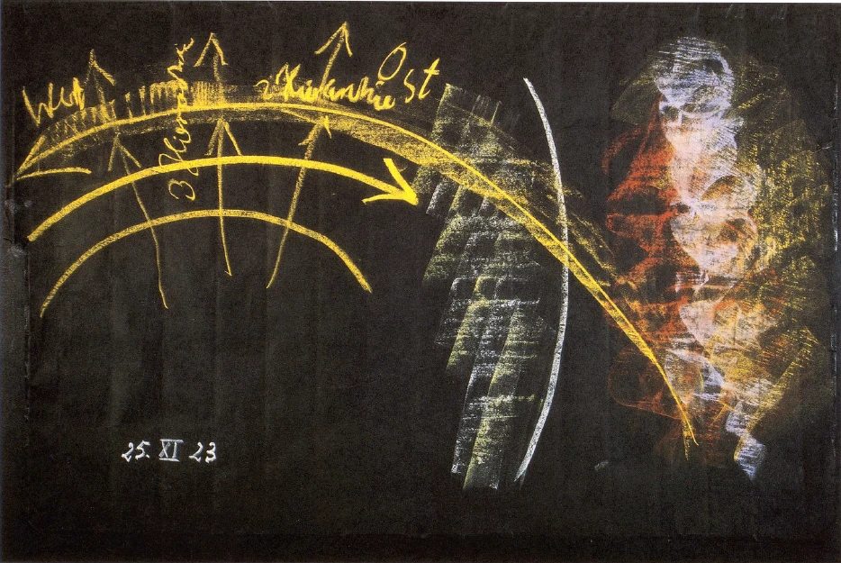
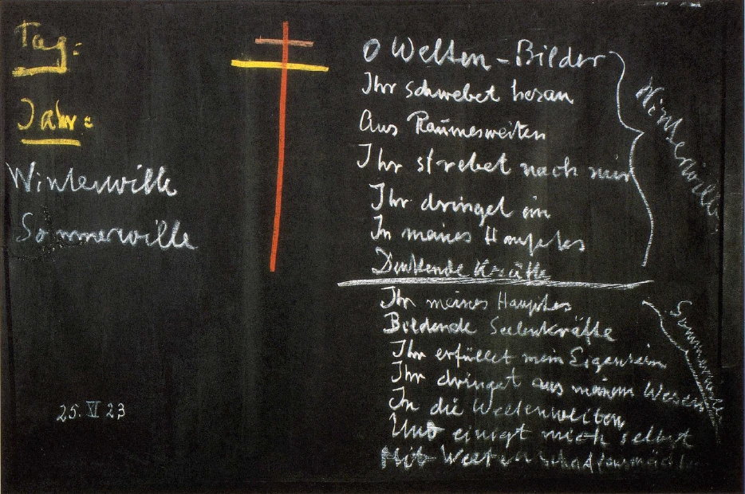

Ich sprach Ihnen davon, wie der Mensch in seinem Leben demjenigen unterliegt, was man gewohnt ist von naturwissenschaftlicher Seite her Vererbung zu nennen. Ich sprach Ihnen ferner davon, wie der Mensch den Wirkungen der Außehwelt, der Anpassung an die Außenwelt unterliegt, und wie alles, was in der Vererbung beschlossen ist, mit dem Ahrimanischen zusammenhängt und das, was Anpassung an die äuBere Welt im weitesten Sinne ist, mit dem Luziferischen. Ich sagte Ihnen aber auch, wie im Weltenall, das heißt innerhalb der geistigen Wesenhaftigkeiten, die dem Weltenall zugrunde liegen, dafür gesorgt ist, daß in richtiger Art das Luziferische und das Ahrimanische sich einreihen können in das menschliche Leben. Fügen wir zu dem, was gesagt worden ist, noch einiges heute hinzu, indem wir das vorgestern Auseinandergesetzte noch einmal ins Auge fassen. ^5t3m9u

Wir haben daran gedacht, wie die Erinnerung, alles GedächtnismäBige, als ein innerlich Seelisches den Menschen gestaltet. Wir sind ja als seelisches Wesen wirklich viel mehr, als wir denken, von unseren Erinnerungen gebildet. Die Art und Weise, wie unsere Erlebnisse Erinnerungen geworden sind, das hat eigentlich unsere Seele gestaltet; mehr als man denkt, ist man ein Ergebnis des Erinnerungslebens. Und wer nur einigermaßen Selbstbeobachtung so weit üben kann, daß er auf das Erinnerungsleben einzugehen vermag, der wird sehen, eine wie große Rolle durch das ganze Erdenleben hindurch namentlich die Eindrücke der Kindheit spielen. Die Art und Weise, wie wir gerade diejenige Kindheit verbracht haben, die dann gar keine große Rolle im bewußten Leben spielt, die Zeit, während welcher wir sprechen gelernt haben, gehen gelernt haben, während welcher wir die ersten Zähne, die vererbten Zähne bekommen haben, die Eindrücke während all dieser Entwickelungsmomente, die spielen durch das ganze Erdenleben hindurch eine große Rolle im menschlichen Seelenleben. Und manches von dem, was, ich möchte sagen charakterologisch betont, innerlich aufstößt an Gedanken, die mit Erinnerungen zusammenhängen - und alles, was wir nicht gerade unter äußeren Eindrücken in unseren Gedanken fassen, hängt ja mit Erinnerungen zusammen -alles, was in dieser Weise aufstößt, uns innerlich freudig, uns innerlich schmerzlich berührt, — es sind ja gewöhnlich leise Nuancen von Freude und Schmerz, die da begleiten die frei aufsteigenden Gedanken -all das, was an Erinnerungsleben in uns ist, das trägt ja unser astralischer Leib auch mit hinaus, wenn wir in den Schlafzustand übergehen. Und wenn man nun mit imaginativem Schauen den Menschen als seelisch-geistiges Wesen im Schlafe ins Auge faßt, so stellt sich ja die Sache in der folgenden Art dar. Da kann man schon sagen: Wenn Sie, schematisch gezeichnet, das als die menschliche Haut auffassen und sich vorstellen, daß innerhalb der menschlichen Haut der Ätherleib bleibt beim Schlafen und der physische Leib, und außerhalb der astralische Leib zunächst ist - das Ich werde ich später dazu zeichnen -und man beobachtet das gewissermaßen, indem man sich ihm gegenüberstellt, dann sieht man den astralischen Leib eigentlich aus den Erinnerungen bestehend. Nur sieht man, wie diese Erinnerungen, die im astralischen Leib da außerhalb des Menschen leben, durcheinander gewirbelt werden, möchte ich sagen. Es werden Erlebnisse, die der Zeit nach weit auseinanderliegen, die dem Raume nach weit auseinanderliegen, zusammengestellt; aus gewissen Erlebnissen wird manches ausgeschieden, so daß das ganze Erinnerungsleben während des Schlafes umgestaltet wird. Und wenn dann der Mensch träumt, so träumt er eben dadurch, daß ihm dieses umgewandelte Erinnerungsleben vor das Bewußtsein tritt. Und gerade an der Beschaffenheit des Traumes kann man jenes Durcheinanderwirbeln wahrnehmen, innerlich wahrnehmen, was von außen gesehen die imaginative Clairevoyance anschauen kann. ^6ctufd

Aber dabei stellt sich noch ein anderes ein. Dasjenige, was da als Erinnerungen figuriert vom Einschlafen bis zum Aufwachen, was also den hauptsächlichsten Inhalt des menschlichen astralischen Seelenlebens ausmacht, das vereinigt sich während des Schlafes mit den Kräften, die hinter den Naturerscheinungen sind. So daß man sagen kann: Das alles, was da als astralischer Leib in den Erinnerungen lebt, geht eine Verbindung ein mit den Kräften, die hinter den Mineralien, eigentlich im Innern der Mineralien, im Innern der Pflanzen, hinter den Wolkenerscheinungen und so weiter sind. ^z7rey9

Wer diese Tatsache durchschaut, für den ist es eigentlich, ich möchte sagen entsetzlich, wenn nun die Leute kommen und sagen: Hinter den Naturerscheinungen sind materielle Atome. Ja, mit diesen materiellen ‚Atomen vereinigen sich unsere Erinnerungen während des Schlafes nicht; aber mit dem, was wirklich hinter den Naturerscheinungen ist, mit den geistig wirksamen Kräften, vereinigen sich unsere Erinnerungen während des Schlafens; da drinnen ruhen unsere Erinnerungen während des Schlafens. ^4ivy9b

So daß wir wirklich sagen können: Unsere Seele taucht unter ins Innere der Natur mit ihren Erinnerungen während des Schlafens. Und Sie sagen nichts Unwahres, nichts Unwirkliches, meine lieben Freunde, wenn Sie folgendes aussprechen, wenn Sie aussprechen: Wenn ich einschlafe, da übergebe ich meine Erinnerungen den Mächten, die im Kristall, die in den Pflanzen, die in allen Naturerscheinungen geistig walten. ^hfo5dn

Ja, Sie können einen Spaziergang machen, am Wegesrand sehen die gelben Blüten, die blauen Blüten, das grüne Gras, die glänzende versprechende Ähre, und Sie sagen: Indem ich so während des Tages an euch vorübergehe, sehe ich euch von außen; in euer eigenes geistiges Innere werde ich versenken, während ich schlafe, meine Erinnerungen. Ihr nehmt auf dasjenige, was ich während des Lebens aus meinen Erlebnissen heraus in Erinnerungen umgewandelt habe, ihr nehmt auf diese Erinnerungen, wenn ich schlafe. - Und es ist vielleicht doch das schönste Naturgefühl, zum Rosenstrauch nicht nur ein äußerliches Verhältnis zu haben, sondern sich zu sagen: Ich liebe den Rosenstrauch besonders aus dem Grunde, weil der Rosenstrauch die Eigentümlichkeit hat - Räumliches spielt ja dabei keine Rolle, die Rose mag noch so weit entfernt sein, wir finden schon im Schlafe unseren Weg zu ihr -, weil der Rosenstrauch die besondere Eigentümlichkeit hat, gerade unsere ersten Kindheitserinnerungen aufzunehmen. Die Menschen lieben die Rose aus dem Grunde - sie wissen es nur nicht -, weil die Rosen die allerersten Kindheitserinnerungen aufnehmen. ^lq530t

Mit uns waren, während wir Kind waren, andere Menschen liebevoll; sie haben uns oftmals zum Lächeln gebracht. Das haben wir vergessen. Aber wir tragen es in unserer Gemütsstimmung in uns. Und der Rosenstrauch nimmt die Erinnerung, die wir selber vergessen haben, während des nächtlichen Schlafes in sein eigenes Inneres auf. Der Mensch ist eben mehr als er glaubt mit der natürlichen Außenwelt, das heißt mit dem Geist, der in der natürlichen Außenwelt waltet, verbunden. Und dieses Erinnern an die ersten Kindheitsjahre, das ist besonders noch dadurch höchst merkwürdig mit Bezug auf das menschliche Schlafen, weil aus den ersten Kindheitsjahren und aus den Jahren bis zum Zahnwechsel hin, bis zum siebenten Lebensjahr ungefähr, eigentlich während des Schlafes nur das Seelische aufgenommen wird. Wir haben wirklich das in uns als Menschen, daß das Geistige, das Innere der Natur von unserer Kindheit im Grunde gerade das Seelische aufnimmt. Es gilt natürlich auch anderes: jenes Seelische, das wir entwickelt haben während der ersten Kindheit, indem wir zum Beispiel grausam waren, das steckt auch in uns; das nimmt aber die Distel auf. Natürlich ist das alles vergleichsweise gesprochen. Aber es deutet auf eine bedeutsame Realität durchaus hin. Was vom Kinde nicht in das Innere der Natur aufgenommen wird, das wird uns gleich aus folgendem hervorgehen. ^u9f586

Sehen Sie, in den ersten sieben Lebensjahren ist eigentlich alles Körperliche vererbt. Die ersten Zähne sind ja durchaus vererbte Zähne, weil überhaupt alles Materielle, das wir in uns tragen in den ersten sieben Lebensjahren, im wesentlichen Vererbtes ist. Aber nach ungefähr sieben Lebensjahren wird ja die ganze materielle Substanz ausgestoBen, fällt ab, wird neu gebildet. Der Mensch bleibt als Form, als Geistgestalt. Sein Materielles stößt er jeweils aus; nach sieben bis acht Jahten ist alles weg, was vor sieben bis acht Jahren da war. Und so ist es, daß, wenn wir neun Jahre alt geworden sind, wir unseren ganzen Menschen erneuert haben. Wir bilden dann unseren Menschen nach den äußeren Eindrücken. ^1pfm3k

Und in der Tat, es ist sehr wichtig, gerade für das Kind in den ersten Lebensepochen, daß es in die Lage kommt, seinen neuen Körper, jetzt nicht den vererbten Körper, sondern den aus dem Innern heraus gebildeten Körper, nach guten Eindrücken der Umgebung, nach einer guten Anpassung bilden zu können. Während der Körper, den das Kind hat, wenn es zur Welt kommt, davon abhängt, ob ihm die vererbten Impulse in guter oder weniger guter Weise mitgegeben werden, hängt der spätere Körper, den es an sich trägt vom siebenten bis vierzehnten Lebensjahr, ganz stark von den Eindrücken ab, die das Kind aus seiner Umgebung aufnimmt. Jeweils nach sieben Jahren bilden wir unseren Körper neu. ^p0keio

Ja, aber sehen Sie, das ist das Ich, das da bildet. Wenn auch das Ich noch nicht einmal für die Außenwelt geboren ist beim Kinde mit dem siebenten Jahre - es wird ja erst später geboren -, so wirkt es dennoch, denn es ist natürlich verbunden mit dem Körper, und es ist das Ich, das da bildet. Und es bildet dasjenige, wovon ich gesprochen habe; es bildet das, was dann als Physiognomie und als Geste, als die äußere materielle Offenbarung des Seelisch-Geistigen beim Menschen herauskommt. Es ist ja überhaupt so, daß derjenige Mensch, der regsamen Anteil an der Welt hat, der sich für vieles interessiert, und dieses, woran er regsamen Anteil hat, innerlich auch regsam verarbeitet, daß ein solcher Mensch in seinem äußeren Gesichtsausdrucke, in seinen Gesten materiell wieder das offenbart, was er da mit Interesse aufnimmt, was er mit Interesse innerlich verarbeitet. Bei dem Menschen, der regsamstes Interesse an der Außenwelt hat, der regsam dieses Interesse an der Außenwelt innerlich verarbeitet, bei dem wird man an jeder Runzel im Gesichte im späteren Lebensalter sehen, wie er sich diese selbst geformt hat, und man wird viel lesen können, weil das Ich in der Geste, in der Physiognomie, im Ausdruck zum Vorscheine kommt. Bei einem Menschen, der blasiert oder interessenlos an der Außenwelt vorbeigeht, bei dem bleibt das ganze Leben hindurch das Gesicht mit demselben Ausdruck. Es prägen sich nicht die feineren Erlebnisse in Physiognomie und Geste ein. In manchem Gesichte kann man eine ganze Biographie lesen; in manchem kann man nicht viel mehr lesen, als daß der Mensch einmal Kind gewesen ist, was ja nichts Besonderes ist. ^0guu01

Das bedeutet aber außerordentlich viel, daß der Mensch also durch den Austausch des Materiellen nach jeweils sieben bis acht Jahren aus seiner Form heraus sein Aussehen erarbeitet. Das bedeutet sehr viel, dieses Arbeiten des Menschen an seinem Äußeren, an Physiognomie und Geste; das ist wiederum etwas, was der Mensch im Schlafe hineinträgt ins Innere der Natur. ^lzpqu0

Und wiederum, wenn man mit imaginativem Hellsehen hinschaut auf den Menschen und nun das Ich betrachtet, wie es draußen schlafend ist, so ist dieses Ich eigentlich bestehend aus Physiognomie und Geste. Es ist daher gerade bei denjenigen Menschen, die viel von ihrem Inneren in ihren Gesichtsausdruck oder in ihre Geste zu legen vermögen, ein glänzendes, ein strahlendes Ich da. Und dieses Erarbeiten der Geste, der Physiognomie verbindet sich wiederum mit gewissen Kräften im Innern der Natur. Und es ist schon so: wenn wir in der Lage waren, oftmals im Leben freundlich zu sein, liebenswürdig zu sein, dann ist die Natur geneigt, sobald das Liebenswürdigsein Gesichtsausdruck ‚geworden ist, dies während unseres Schlafes in ihr Wesenhaftes aufzunehmen. Unsere Erinnerungen nimmt sie auf in ihre Kräfte, unsere Gestenbildung nimmt sie auf in ihr Wesenhaftes, in die Naturwesen selber. So innig ist der Mensch im Zusammenhange mit der äußeren Natur, daß es für die äußere Natur eine ungeheure Bedeutung hat, was er in seinem Innern seelisch als Erinnerungen erlebt, wie er sein inneres Seelisches in Geste, in Physiognomie zum Ausdrucke bringt. Denn das lebt im Innern der Natur weiter. ^ab876r

Sehen Sie, ich habe im Abstrakten oftmals angeführt den Goetheschen Spruch, der eigentlich eine Kritik eines Spruches von Haller ist. Haller hat das Wort geprägt: «Ins Innre der Natur dringt kein erschaffner Geist. Glückselig, wem sie nur die äußre Schale weist.» Goethe sagt darauf: O du Philister! Ort für Ort sind wir im Innern. Nichts ist drinnen, nichts ist draußen; was drinnen ist, ist draußen, was draußen ist, ist drinnen — meint Goethe. Dich frage nur zu allermeist, ob du selbst Kern oder Schale seist. Goethe sagt, er höre diesen Ausdruck an die sechzig Jahre und fluche darauf, aber verstohlen, weil Goethe fühlte - er kannte natürlich noch nicht Geisteswissenschaft —, aber er fühlte: Wenn da irgendeiner sagt, den er nur als einen Philister anschauen konnte: ^gmv2pz

so weiß der eben nichts davon, daß der Mensch, einfach indem er ein Erinnerungswesen und ein Gesten- und Physiognomiewesen ist, fortwährend ins Innere der Natur eindringt. Wir sind nicht Wesenheiten, die nur am Tore der Natur stehen und vergebens anklopfen. Gerade durch dasjenige, was Innerstes ist in uns, stehen wir mit dem Inneren der Natur auch in innigster Beziehung. Weil aber das Kind bis zum siebenten Jahre einen ganz vererbten Körper hat, so geht nichts von dem Ich, von Geste und Physiognomie, ins Innere der Natur über. Wir beginnen erst mit dem Zahnwechsel ins Wesenhafte der Natur einzudringen. Daher werden wir auch erst nach dem Zahnwechsel reif, nach und nach über irgend etwas in der Natur nachzudenken. Vorher sind es Willkürgedanken, die im Kinde aufsteigen, die nicht viel mit der Natur zu tun haben, die reizvoll gerade dadurch sind, daß sie nicht viel mit der Natur zu tun haben. Wir kommen am besten an das Kind heran, wenn wir neben dem Kinde dichten, wenn wir die Sterne zu Augen des Himmels machen und so weiter, wenn die Dinge, die wir mit dem Kinde besprechen, möglichst weit von der äußeren physischen Wirklichkeit entfernt sind. ^ovgpyn

Erst vom Zahnwechsel ab wächst das Kind allmählich in die Natur hinein, so daß seine Gedanken nach und nach mit den Naturgedanken zusammenfallen können; und im Grunde ist das ganze Leben vom siebenten bis vierzehnten Jahre ein solches, daß das Kind hineinwächst in die Natur; denn da trägt es außer den Erinnerungen seiner Seele in die Natur auch noch die Geste, die Physiognomie hinein. Und das geht dann so durch das ganze Leben hindurch. Für das Innere der Natur werden wir als einzelne menschliche Individualität erst mit dem Zahnwechsel geboren. ^3bhe8b

Daher lauschen diejenigen Wesenheiten, die ich Ihnen als Elementarwesen bezeichnet habe, Gnomen und Undinen, so gerne, wenn ihnen der Mensch etwas erzählt von dem Kindesleben bis zum siebenten Jahre. Denn für diese Naturwesen wird der Mensch erst mit dem Zahnwechsel geboren. Das ist eine außerordentlich interessante Erscheinung. Vorher ist der Mensch für Gnomen und Undinen ein jenseitiges Wesen. Es ist für sie deshalb ziemlich rätselhaft, wieder Mensch da auftritt in einer gewissen Vollendung schon. Aber es würde schon ungeheuer belebend sein für die pädagogische oder pädagogisierende Phantasie, wenn der Mensch dadurch, daß er Geisteserkenntnis aufnimmt, sich wirklich versetzen könnte in diese Dialoge mit den Naturgeistern; wenn er in die Naturgeisterseele sich hineinversetzen könnte, um ihre Anschauungen zu erlangen gegenüber dem, was er ihnen erzählen kann von Kindern. Denn dadurch bildet sich gerade die schönste Märchenphantasie. Und wenn in alten Zeiten die Märchen so wunderbar konkret, inhaltsvoll geworden sind, so ist es, weil die Märchendichter mit Gnomen und Undinen reden konnten, aber nicht bloß von ihnen etwas hören konnten. Diese Naturgeister sind zuweilen sehr egoistisch. Die werden schweigsam, wenn man ihnen nicht auch etwas erzählt, worauf sie neugierig sind. Und dasjenige ist für sie die beste Erzählung, wenn man ihnen von den Taten der Babys erzählt. Dann erfährt man auch vielerlei von ihnen, was gerade in Märchenstimmung übergehen kann. Ja, sehen Sie, gerade für das praktische geistige Leben kann das außerordentlich wichtig werden, was dem Menschen heute ganz urphantastisch erscheint. Aber es ist so, daß tatsächlich diese Dialoge mit den geistigen Naturwesen durch die Umstände, die ich dargelegt habe, etwas außerordentlich Belehrendes nach beiden Seiten hin haben. ^jubhk6

‚Auf der anderen Seite aber wirkt natürlich das, was ich gesagt habe, in gewissem Sinne beängstigend, denn der Mensch schafft, wenn er schläft, fortwährend Abbilder seines innersten Wesens. Da hinter den Erscheinungen der Natur, hinter den Blumen des Feldes sind bis in die ätherische Welt herein Abdrücke von unseren guten und nichtsnutzigen Erinnerungen. Da wimmelt die Erde überall von dem, was in den Menschenseelen lebt. Und es ist schon so, daß in der Realität das menschliche Leben gar sehr mit solchen Dingen zusammenhängt. ^aul4x2

Wir finden also da zunächst die Naturgeister als Wesenhaftigkeiten, in die wir mit unserer Gestenwelt eindringen. Wir finden aber auch die Welt der Angeloi, Archangeloi, Archai. In diese wachsen wir ebenso hinein, in sie tauchen wir unter. Wir tauchen in die Taten der Engelwelt hinein durch unsere Erinnerungen. Wir tauchen in die Wesenhaftigkeiten der Engelwelt hinein durch unser von uns selbst geprägtes Physiognomisches und Gestenhaftes. Und es ist dieses sich Einleben ^m18dca

im Schlafe so, daß wir sagen können: Wenn wir uns herüberleben in die Natur, dann erscheint uns das Einleben in die Natur so: Dies ist wieder die Haut unseres Körpers (es wird gezeichnet); je weiter wir hinausgehen, kommen wir immer mehr von Angeloi- in Archangeloi-, in Archai-Regionen hinein in der radialen Richtung. Da kommen wir hinein in die dritte Hierarchie.Und wenn wir da hinein schlafend mit unseren Erinnerungen und unseren Gesten untertauchen wie in das flutende Meer der webenden Wesenheiten der Angeloi, Archangeloi und Archai, wenn wir da untertauchen, dann kommt von der einen Seite eine Strömung von geistigen Wesenheiten (siehe Zeichnung). Das ist die zweite Hierarchie: Exusiai, Kyriotetes, Dynamis. Und wenn wir anklingen lassen wollen an dasjenige, was äußerlich in der Welt ist, das, was wir eben dargestellt haben, dann geht diese Strömung so, daß uns der Lauf der Sonne von Ost nach West während des Tages ausdrückt den Weg, in dem die zweite Hierarchie durchkreuzt die dritte Hierarchie. Die dritte Hierarchie: Angeloi, Archangeloi, Archai ist wie auf- und abschwebend und sich «die goldnen Eimer» reichend — auf- und abschwebend. In dieser Darstellung ist dann die zweite Hierarchie wie mit der Sonne von Osten nach Westen gehend, - jetzt ist es nicht scheinbar, denn da gilt nicht die kopernikanische Weltanschauung, sondern es ist tatsächlich von Ost nach West gehend die Strömung, welche die Sonne durchläuft während des Tages. So daß der Mensch, indem er schaut — das heißt, wenn er schauen kann — hineinwächst während des Schlafes in diese dritte Hierarchie. Aber diese dritte Hierarchie ist fortwährend gnadevoll durchströmt von der Seite her von der zweiten Hierarchie. Und diese zweite Hierarchie macht sich auch in unserem Seelenleben durchaus geltend. ^1jqfd1

 ^mf64l8

Ich habe Ihnen vorgestern angedeutet, was es für eine Bedeutung hat, wenn wir auf in der Jugend Erlebtes wiederum zurückkommen. In dieser Beziehung können Sie eine tiefgehende Empfindung bekommen, wenn Sie die Mysterien wiederum in die Hand nehmen und da, jetzt vielleicht mit einem größeren Verständnis, als das einmal der Fall war, lesen können, was dort über die Erscheinung von Johannes Jugend dargestellt wird. Es ist schon so, daß der Mensch besonders sein Inneres regsam, intensiv wahrnehmbar für ihn selber machen kann, wenn er tätig auf sein Jugendliches zurückkommt. Ich habe Ihnen gesagt: Man nehme alte Schulbücher, in denen man einmal etwas gelernt hat oder meinetwillen auch nichts gelernt hat, wiederum zur Hand, man versetze sich in dieses Lernen oderNichtslernen hinein - es kommt ja nicht darauf an, ob man etwas gelernt hat oder nicht, sondern daß man sich in das, was man mit ihnen gemacht hat, hineinversetzt: man kann da schon eigene Erfahrungen haben. Für mich war es einmal vor ein paar Jahren von einer ungeheuren Bedeutung, mich in eine solche Situation der Jugend hineinzuversetzen, als ich eine Verstärkung der Kräfte des geistigen Erfassens brauchte. Ich war gerade elf Jahre alt und bekam ein Schulbuch. Das erste, was geschah - es ist mir zufällig passiert —, war, daß aus einer Unvorsichtigkeit das Tintenfaß umfiel und mir dabei zwei Seiten so verdorben hatte, daß ich die zwei Seiten nicht mehr lesen konnte. Das ist auch eine Tat. Diese Tat habe ich vor vielen Jahren oftmals wiedererlebt, dieses Schulbuch mit den verdorbenen Seiten, und mit all dem, was ich ausgestanden habe, denn das Schulbuch mußte aus einer armen Familie heraus wieder gekauft werden. Es war etwas Entsetzliches, was man alles an diesem Schulbuch mit seinem Riesentintenklecks - dazumal nannte man’s noch anders — alles erleben konnte! Also so etwas wieder rege machen. Wie gesagt, es handelt sich nicht darum, daß man just brav gewesen sein soll bei dem, was man wieder heraufholt, sondern daß es eben etwas ist, was intensiv erlebt worden ist. Wenn Sie versuchen, das tatsächlich mit aller inneren Intensität wiederum heraufzubekommen, dann werden Sie noch etwas anderes erleben. Sie werden mehr als im Traume, in einer wirklichen Anschauung, wenn Sie abgeschlossen von den Eindrücken des Tages in Ihrem Bette ruhen, eine Situation erleben. Während Sie bei Tag sich eine Szene, die Sie innerlich durchlebt haben, vor die Seele gerufen haben, erleben Sie, wenn die Nacht gekommen ist, wenn es um Sie herum finster ist, wenn Sie mit sich selbst sind, schauend wie im Raume die Situation, in der Sie entweder vorher oder nachher waren. Sagen wir also, Sie haben sich eine Szene vor die Seele gerufen, die Sie meinetwillen um elf Uhr einmal erlebt haben. Nachher sind Sie irgendwo hingegangen, wo Sie Menschen gegenübergesessen haben. Sie sitzen da, und die Menschen sitzen da herum. Sie haben etwas, was Sie innerlich erlebt haben, heraufgeholt. Was äußerlich dazumal um Sie herum war, tritt Ihnen dann ganz als räumliche Anschauung entgegen. Man muß nur auf solche Zusammenhänge hinschauen. Da können ganz bedeutsame Entdeckungen gemacht werden. Meinetwillen sagen wir, Sie haben als siebzehnjähriger junger Mensch jeden Mittag in einer Pension gegessen, wo die Leute gewechselt haben. Nun rufen Sie sich gerade eine Szene, die Sie innerlich erlebt haben, irgendwie herauf. Sie erleben es regsam durch. In der Nacht erleben Sie: Sie sitzen an dem Tisch, daherum sitzen diejenigen Leute, die Sie nur, weil sie wechselnd sind in einer Pension, selten gesehen haben. An einem Gesichte erkennen Sie: das ist ja dasselbe, was ich dazumal durchgemacht habe. Das äußerlich Räumliche tritt zu dem innerlich Seelischen hinzu, wenn Sie die Erinnerungen in dieser Weise tätig machen. ^u36hmq

Sehen Sie, das heißt aber dann tatsächlich mit dieser Strömung, die da von Ost nach West geht, leben. Denn Sie kommen immer mehr und mehr in das Gefühl hinein: Da in dem Geistigen, in das Sie eintreten im Schlafe, leben Sie nicht nur so, daß Sie im Geistigen aufgehen; sondern in diesem Geistigen, da geht dasjenige vor sich, was sich äußerlich spiegelt in dem Augenblicke, wo Sie um den Pensionstisch herum wiederum die Menschen sitzen sehen. Sie haben das längst vergessen, aber es ist da. Sie schauen hin, wie Sie auf diejenigen Dinge hinschauen, die oftmals als in der Akasha-Chronik stehend verzeichnet sind. In dem Augenblicke, wo Sie das vor sich haben, haben Sie erfaßt diese Strömung von Ost nach West: die Strömung der zweiten Hierarchie. In dieser Strömung der zweiten Hierarchie lebt etwas, was sich äußerlich im Tag abbildet. ^sj8aar

Nun ist der Tag durch das ganze Jahr hindurch variabel. Im Frühling wird er lang, im Herbst wird er kurz, im Sommer ist er am längsten, im Winter am kürzesten. Der Tag wird metamorphosiert während des Jahres. Das rührt von einer der Ostwest-Strömung entgegenkommenden Strömung her, die von West nach Ost geht. Und das ist die Strömung der ersten Hierarchie, der Seraphime, der Cherubime und Throne. Verfolgen Sie daher, wie sich der Tag ändert im Lauf des Jahres, gehen Sie vom Tag zum Jahr über, dann, meine lieben Freunde, dann kommen Sie hinüber in dasjenige, was Ihnen während des Schlafes begegnet als die entgegengesetzte Strömung. ^fu6qb4

 ^wvtnfk

In der Tat, es ist schon so, daß wir schlafend hineinwachsen in die geistige Welt in radialer Richtung, in der Richtung, die von West nach Ost geht, und in der Richtung, die von Ost nach West geht. Wie ich Ihnen gesagt habe, es werden räumliche Bilder vor unsere Seele hingestellt, wenn wir in regsamer Erinnerung etwas vor unsere Seele hinftreten lassen]. ^qjfxmr

So ist es aber auch, wenn wir uns unseres Willens bewußt werden. Das ist gerade das, was in die Geste, in die Physiognomie hineingeht: wenn wir uns unseres Willens bewußt werden. Besonders für Eurythmisierende müßte dasjenige, was ich jetzt sage, eine gewisse Bedeutung haben, obwohl die Eurythmie natürlich nicht die Absicht hat, das zur Geltung zu bringen, was ich jetzt sagen will. Es ist so, daß der Mensch, wenn er wirklich aus dem Innern heraus auch sein Äußeres immer mehr und mehr gestaltet, wenn sein Ich immer mehr und mehr zum Ausdrucke kommt in Physiognomie und Geste, dann bekommt er nicht nur vom Tag einen Eindruck. Denn das ist ein Eindruck vom Tag: vom inneren Erleben, vom regsamen inneren Erinnerungsleben überzugehen zu der Anschauung der räumlich äußerlichen Dinge. Man erlebt, was man mit siebzehn Jahren gelernt hat, wiederum, und man sieht dann die Leute, die in der Pension um einen herumgesessen sind, im Nachbilde wie in der Akasha-Chronik. Das ist Tag-Erleben! ^3v1qei

‚Aber man kann auch das Jahr erleben. Und zwar ist das dann möglich, wenn man achtgibt darauf, wie der Wille an einem wirkt; wenn man achtgibt darauf, wie man es verhältnismäßig leicht hat, den Willen zur Geltung zu bringen, wenn man es recht warm hat, während es schwer wird - einem feineren Aufpassen auf sich selber wird das schon klar -, seinen Willen durch den Körper strömen zu lassen, wenn man friert. Wer so recht einen Zusammenhang zwischen dem Willen und dem Warmhaben und Frieren innerlich erleben kann, der bekommt allmählich, wenn so etwas ausgebildet ist, die Möglichkeit, bei sich zu sprechen von einem Winterwillen und einem Sommerwillen. ^rbu9tx

Man findet nämlich, daß man am besten die Bezeichnung dieses Willens von den Jahreszeiten hernimmt. Achten wir zum Beispiel auf einen Willen, der einem gewissermaßen die Gedanken hinausträgt ins Weltenall, der es einem leicht macht, seinen Körper zu handhaben, so daß in der Handhabe, in der Geste des Körpers die Gedanken wie hinausgetragen werden in das Weltenall ... sie entschlüpfen einem aus den Fingerspitzen: man fühlt förmlich, wie man es leicht hat, den Willen zu entfalten. Man steht einem Baum gegenüber, es gefällt einem etwas besonders da oben: es werden, wenn der Wille in uns warm wird, die Gedanken bis an den Gipfel des Baumes hinaufgetragen - ja, manchmal gehen sie bis zu den Sternen, wenn man sich so recht in Sommernächten zugleich begabt findet mit warmem Willen. ^aw5o8m

Wenn der Wille innerlich erkaltet, dann ist es so, als ob alle Gedanken nur in unserem Kopfe getragen würden, als ob alle Gedanken nicht in die Arme könnten, nicht in die Beine könnten. Alles geht in den Kopf. Der Kopf erträgt die Willenskälte, und wenn die Willenskälte nicht überwältigend wirkt, so daß ein frostiges Gefühl eintritt, dann wird der Kopf warm durch seine innere Gegenwirkung, und er entfaltet dann Gedanken. ^8ftzyb

So daß man sagen kann: der Sommerwille führt uns hinaus in die Weiten der Welt. Der Sommerwille, der warme Wille trägt überallhin unsere Gedanken. Der Winterwille, der trägt die Gedanken in unseren Kopf, in unser Haupt herein. Man kann seinen Willen so unterscheiden. Und man wird dann den einen Willen, der uns überall hinträgt ins Weltenall, den wird man fühlen als verwandt mit dem Verlauf des Sommers; den Willen, der die Gedanken in unseren Kopf hineinträgt, den wird man fühlen als verwandt mit dem Winter. Man erlebt so, wie man sonst den Tag erlebt, so an dem Willen das Jahr. ^as8zja

Und sehen Sie, es gibt eine Möglichkeit, das, was ich Ihnen jetzt auf die Tafel schreiben werde, tatsächlich als Realität zu empfinden. Man kann, wenn man den Winter im Erlebnis des menschlichen Willens erlebt, ihn so erleben, daß man sagt: ^xiwkht

Sehen Sie, das ist aber nicht bloß abstrakt, sondern der Mensch kann es dahin bringen, wenn er seinen eigenen Willen mit der Natur verbunden fühlt, so zu fühlen, wenn der Winter kommt, als wenn ihm aus dem Raum wiederum zugetragen würde, was in ihm selber Erlebnisse sind, die er erst der Natur übergeben hat. Und man kann auf den Wellen, die hier angedeutet werden: ^0h5a7i

man kann da seine eigenen Erlebnisse, die schon in die Natur übergegangen waren, dabei empfinden. Das ist die Empfindung des Winterwillens. ^rci78d

Aber man kann auch den Sommerwillen, der unsere Gedanken hinausweitet in das Weltenall, empfinden: ^r9rew9

das heißt, die Gedanken, die zuerst im Haupte erlebt werden, gehen in den ganzen Körper über, erfüllen zunächst den Körper, dann aber dringen sie aus dem Körper hinaus — ^goj763

Das ist dasjenige, was der Soemmerwille, der dem Sommer verwandte Wille in uns, uns als sein Wesen ausdrücken läßt, so daß wir sagen können: Wenn wir empfinden, ich habe aus meinem Innern hervorgeholt das tätige Erinnern an irgend etwas lange Verlebtes - der Tag mit seiner Nacht bringt es mir wieder entgegen, indem er es ergänzt durch die äußere Raumesanschauung. Und das entspricht der Strömung von Ost nach West. So dürfen wir sagen: In uns wandelt sich Winterwille in Sommerwillen, Soemmerwille in Winterwillen. Wir sind verwandt nicht mehr dem Tag mit seinem Wechsel von Helligkeit und Finsternis, wir sind verwandt dem Jahr mit unserem Willen, dadurch der Strömung von West nach Ost der ersten Hierarchie: den Seraphimen, Cherubimen und Thronen. ^m1mwlw

Wir werden nun im weiteren sehen, wie der Mensch gehindert oder gefördert werden kann durch Vererbung und äußere Anpassung in bezug auf dieses Zusammengehen mit dem Inneren der Natur. Denn dasjenige, was ich Ihnen jetzt auseinandergesetzt habe, das bezieht sich darauf, daß der Mensch, wenn er möglichst wenig gehindert ist durch luziferische und ahrimanische Kräfte, in dieser Art, mit Vorstellung und Wille, hineinwächst ins Innere der Natur, aufgenommen wird von den Zeitenkräften, den Tagkräften, den Jahreskräften: dritte Hierarchie, zweite Hierarchie, erste Hierarchie. Aber einen wesentlichen Einfluß auf all das haben die ahrimanischen Kräfte, wie sie in der Vererbung auftreten, und die luziferischen Kräfte, wie sie in der Anpassung auftreten. Diese große Rätselfrage, die soll uns dann das nächste Mal beschäftigen. ^zhv3m4