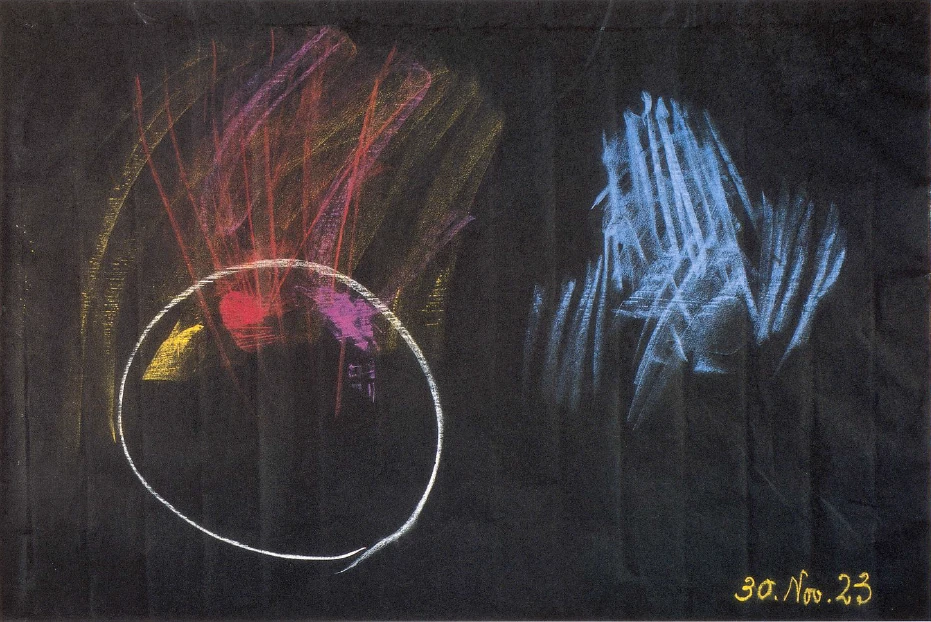

Die Fortsetzung der Betrachtungen, die wir das letzte Mal hier angestellt haben, führt uns heute zunächst zu etwas, das dann die beiden nächsten Vorträge vorbereiten soll. Es führt uns dazu, einen Blick zu werfen auf den Zusammenhang des Menschen, und zwar des ganzen Menschen mit unserem Erdenplaneten. Ich habe es ja oftmals in verschiedenen Zusammenhängen ausgesprochen, daß der Mensch einer ‚Art von Täuschung unterliegt, wenn er sich abgesondert vom Erdenplaneten ein totales, besonderes Dasein zuschreibt zunächst als physischer Mensch. Selbständig, individuell ist ja der Mensch als geistigseelisches Wesen. Zur Erde in ihrer organischen Ganzheit gehörig ist er als physischer Erdenmensch, und in gewisser Beziehung auch seinem ätherischen Leibe nach. ^q8i6og

Nun will ich heute zunächst schildern, wie dem übersinnlichen Schauen diese Zusammengehörigkeit des Menschen mit dem Erdendasein erscheinen kann. Ich will heute vorbereitend zunächst, ich möchte sagen in einer mehr erzählenden Form vorgehen. Nehmen wir einfach an, jemand träte mit dem imaginativen Bewußtsein, das ich ja öfter geschildert habe, einen Gang an durch die Uralpen, durch die Uralpen mit jenem Gestein, das namentlich in quarzigen, also kieselsäurehaltigen Mineralien und Gesteinen besteht, das sonst auch ähnliche Gesteine in sich enthält. Wir treten ja da, wenn wir ins Urgebirge kommen, an die härtesten Gesteine der Erde heran, aber auch an diejenigen Gesteine, die, wenn sie in ihrer besonderen ureigenen Ausbildung erscheinen, etwas in sich Reines haben, man möchte sagen, etwas, was nicht berührt ist von dem gewöhnlichen Alltäglichen der Erde. Es ist doch wirklich gut zu verstehen, wenn Goezhe einmal in einem schönen Aufsatze, der ja auch hier schon vorgebracht worden ist, von seinem Erfahren innerhalb des Urgebirges spricht, allerdings davon spricht, wie er sich in Einsamkeit fühlt, sitzend im Granitgebirge, die Eindrücke sich, man möchte sagen, eingeprägt hat von diesem hart und straff aus der Erde nach oben gewissermaßen sich türmenden Gestein. Und wie den dauernden Sohn der Erde spricht Goethe den Granit an, der da aus Quarz, also aus Kieselsäure, aus Glimmer und aus Feldspat besteht. ^7sh2ph

Wenn der Mensch mit dem gewöhnlichen Bewußtsein an dieses Urgebirgsgestein herandringt, dann ist es ja so, daß er allerdings zunächst es von außen bewundern kann, daß ihm auffallen seine Formen, die ganze wunderbar primitive Plastik, die aber außerordentlich vielsprechend ist. Wenn aber der Mensch dann mit dem imaginativen Bewußtsein an dieses fast härteste Gestein der Erde herantritt, dann dringt er gerade bei diesem härtesten Gestein unter die Oberfläche des Mineralischen. Er ist dann in der Lage, mit seinem Denken wie zusammenzuwachsen mit dem Gestein. Man möchte sagen: überall hinein in die Tiefen des Gesteins setzt sich die seelische Wesenheit des Menschen fort, und man tritt eigentlich im Geiste wie in einen heiligen Götterpalast. Das Innere erweist sich für die imaginative Anschauung wie durchlässig, und die äußere Grenze erweist sich so, wie die Mauern dieses Götterpalastes. Aber man hat zu gleicher Zeit die Erkenntnis, daß innerhalb dieses Gesteines eine innere Spiegelung alles desjenigen lebt, was im Kosmos außerhalb der Erde ist. Die Sternenwelt hat man noch einmal in einer Spiegelung innerhalb dieses harten Gesteins vor der Seele stehen. Man bekommt zuletzt den Eindruck, daß in jedem solchen Quarzgestein etwas vorhanden ist wie ein Auge der Erde selber für das Weltenall. Man wird erinnert an die Insektenaugen, diese Facettenaugen, die in viele, viele Abteilungen zerfallen, die dasjenige, was von außen an sie herandringt, in viele einzelne Teile zerlegen. Und man möchte sich vorstellen und muß sich eigentlich vorstellen, daß, so unzählige viele solche Quarz- und ähnliche Bildungen an der Oberfläche der Erde sind, das alles sind wie Augen der Erde, um die kosmische Umgebung innerlich zu spiegeln und eigentlich innerlich wahrzunehmen. Und man bekommt schon allmählich die Erkenntnis, daß jedes Kristallische, das innerhalb der Erde vorhanden ist, ein kosmisches Sinnesorgan der Erde ist. ^x18nfd

Das ist ja das Grandiose, das Majestätische der Schneedecke, aber noch mehr der fallenden Schneeflocken, daß in jeder einzelnen dieser Schneeflocken eine Spiegelung ist vom großen Teil des Kosmos; daß also eigentlich mit dem kristallisierten Wasser überall Spiegelungen von Teilen des Sternenhimmels auf die Erde herunterfallen. ^po34th

Ich brauche es ja nicht zu erwähnen, daß der Sternenhimmel auch bei Tag da ist, nur daß er, weil das Sonnenlicht stärker ist, bei Tagnicht erscheint. Wenn Sie irgendwo die Möglichkeit haben, in einen tiefen Keller zu steigen, über den sich ein Turm erhebt, der oben offen ist, so können Sie, weil Sie aus dem Finstern herausschauen und das Sonnenlicht Sie nicht beirrt, ja auch bei Tag die Sterne sehen. Solch eine Möglichkeit ist zum Beispiel vorhanden in einem Turm in Jena, wo man bei Tag die Sterne sehen kann. Das erwähne ich nur nebenbei, um Ihnen eben begreiflich zu machen, daß dieses Spiegeln der Sterne in den Schneeflocken, überhaupt in allem Kristallisierten, auch selbstverständlich bei Tag vorhanden ist. Und es ist nicht ein physisches Spiegeln, es ist ein geistiges Spiegeln. Der Eindruck muß innerlich vermittelt sein, den der Mensch davon bekommen kann. ^vfpge0

Das ist aber nun nicht alles. Aus dem, ich möchte sagen geistigen Sinneseindruck, den man da bekommt, wird ein Gemütseindruck, und zwar der, daß man, so imaginativ sich hineinlebend in die Kristalldecke der Erde, selber zusammenwächst mit alledem, was die Erde in dieser Kristalldecke vom Kosmos erlebt. Dadurch erweitert man das eigene Sein in den Kosmos hinaus, dadurch fühlt man sich als eins mit dem Kosmos. Und vor allen Dingen, jetzt wird es eine Wahrheit, eine tiefe Wahrheit für den imaginativ Betrachtenden, daß dasjenige, was wir unseren Erdenkörper nennen, mit allen seinen Einzelheiten einmal im Laufe der Zeit aus dem Kosmos heraus geboren worden ist. Denn die Verwandtschaft der Erde mit dem Kosmos tritt einem da im eminentesten Sinne vor das Seelenauge. So daß man durch dieses SichHineinleben in die Millionen Kristallaugen der Erde vorbereitet ist, die ganze innere Verwandtschaft der Erde mit dem Kosmos zu fühlen, sie im Gemüte zu erleben. ^9ye1qh

Dadurch aber fühlt man sich als Mensch dann wiederum mit der Erde verbunden. Denn - und das werde ich in den nächsten Tagen besonders ausführen — dieses Herausgeborenwerden der Erde aus dem Kosmos hat ja stattgefunden, als der Mensch selber durchaus noch ein primitives, nicht physisches, sondern geistiges Wesen war. Aber das, was die Erde dann durchgemacht hat, nachdem sie aus dem Kosmos herausgeboren war, das machte der Mensch in seiner eigenen Wesenheit mit der Erde durch. Mit der Erde ist es wirklich so, daß sie einstmals eine solch innere Verwandtschaft mit dem überall benachbarten Kosmos gehabt hat, wie das ganz junge, noch nicht geborene Menschenwesen mit dem Leibe der Mutter. Dann aber beginnt das Kind sich selbständig zu machen. So hat die Erde sich selbständig entwikkelt, nachdem sie erst in der ersten Saturnzeit mehr eins war mit dem Weltenall. Und dieses Sich-selbständig-Entwickeln, das hat dann der Mensch mitgemacht, so mitgemacht, daß man eben lernt sich sagen: Der Finger, den ich an mir trage, er ist ja nur so lange ein Finger, als er ein Stück meines Organismus ist; in dem Augenblick, wo ich ihn abschneide vom Organismus, ist er nicht mehr der Finger, verkümmert, verkommt er. — So braucht man sich den Menschen als physisches Wesen nur einige Meilen abgetrennt zu denken von dem Erden-Organismus — er verkümmert, wie der Finger, den ich abschneide. Und die Täuschung des Menschen, daß er als physisches Wesen gegenüber der Erde ein Eigensein habe, die kommt ja nur davon her, weil der Mensch auf der Erde frei herumgehen kann, während der Finger nicht über den übrigen Organismus spazieren kann. Wenn der Finger über den übrigen Organismus spazieren könnte, würde er sich gerade derselben Täuschung gegenüber dem Menschen hingeben, wie sich der Mensch gegenüber der Erde als physisches Wesen einer Täuschung hingibt. Gerade durch die höhere Erkenntnis wird einem nun diese Zugehörigkeit des physischen Menschen zu der Erde klar. ^ts218c

Das ist zunächst, ich möchte sagen die Bekanntschaft, die man durch das imaginative Bewußtsein macht mit dem Härtesten der Erdendecke. ^vsnjsx

Eine weitere Bekanntschaft kann man machen, wenn man etwas tiefer in die Erde hineinkommt, und wenn man in der Erde nun kennenlernt alles das, was Metalladern sind oder Metallstöcke oder irgend etwas Metallisches im Innern der Erde. Da dringt man unter die Oberfläche der Erde hinunter. Da aber kommt man, indem man an das Metallische herankommt, an ein ganz besonderes, sich von dem übrigen Irdischen absonderndes Wesen. Die Metalle haben etwas Selbständiges in sich. Die Metalle lassen sich selbständig erleben. Und dieses Erlebnis, das hat mit dem Menschen nun seht, sehr viel zu tun. ^jdz2iu

Selbst derjenige, der schon zu einer gewissen höheren Erkenntnis im imaginativen Schauen kommt, kennt sich noch nicht recht aus, wenn er das quarzige und andere Gestein des Urgebirges so erlebt, daß er, eins werdend mit den Millionen Augen der Erde, dadurch selber sich hinauslebt, hinausfühlt, hinausempfindet in den ganzen Kosmos. Wenn er aber dann herandringt an das Innere der Erde, können ja zunächst, ich möchte sagen, die ersten Impulse zu einem solchen Erleben dadurch gegeben werden, daß man wirklich sich anregen läßt von den wunderbaten tiefen Anregungen im Metallbergwerke. Aber hat man einmal die Impulse, dann braucht man eben nur das geistige Schauen, um überall das Metallische verfolgen zu können, auch wenn man nicht in die Erdbohrungen hineinkommt. ^9bp2y0

Aber das erste Gefühl von dem, was ich meine, sollte schon oder kann schon mit besonderer Innigkeit in Metallbergwerken erworben werden. Schon die Metallbergarbeiter — es ist ja jetzt nicht mehr so, aber vor wenigen Jahrzehnten war es noch so - die Metallbergarbeiter, die innig mit ihrem Beruf verwachsen sind, zeigen etwas von, ich möchte sagen tiefem Sinn für das Geistige im Metallischen. Denn die Metalle schauen nicht nur die Umgebung des Kosmos, sondern sie sprechen: sie sprechen auf geistige Weise, aber sie erzählen, sie sprechen. Und sie sprechen in der Art, daß diese Sprache, die sie sprechen, ganz ähnlich ist derjenigen, die man noch auf einem anderen Gebiete als Eindruck empfängt. ^qt8ujn

Sehen Sie, wenn man dahin gelangt, eine seelische Verbindung herzustellen mit Menschen, die in der Entwickelung sind zwischen dem Tode und einer neuen Geburt - ich habe es ja schon öfter hier ausgesprochen -, dann braucht man dazu eine besondere Sprache. Die Aussagen der Spiritisten sind ja kindisch auf diesem Gebiete; sie sind kindisch aus dem Grunde, weil die Toten nicht die Sprache der irdischen Menschen sprechen. Die Spiritisten geben sich der Meinung hin, daß der Tote so rede, daß man das aufschreiben kann, wie wenn man von einem auf der Erde lebenden Zeitgenossen einen Brief bekommt. Es ist zwar meistens schwülstiger, was da bei den spiritistischen Sitzun   gen herauskommt, aber manchmal schreiben ja auch auf Erden lebende Zeitgenossen solche schwülstige Dinge. So ist es eben nicht. Es ist erst notwendig, sich sozusagen ganz in jene Sprache hineinzufinden, die der Tote spricht, die gar keine Ähnlichkeit hat mit irgendeiner der Erdensprachen, die einen allerdings vokalisch-konsonantischen Charakter hat, aber nicht ähnlich ist der Erdensprache. Aber dieselbe Sprache, die nur mit dem Geistgehör wahrgenommen werden kann, dieselbe Sprache sprechen die Metalle im Innern der Erde. Und dieselbe Sprache, durch die man sich den Seelen selber nähern kann, die zwischen dem Tode und einer neuen Geburt leben, dieselbe Sprache erzählt die Erinnerungen der Erde, die Dinge, die die Erde durchgemacht hat bei ihrem Durchgang durch Saturn, Sonne, Mond und so weiter. Man muß sich von den Metallen erzählen lassen, was die Schicksale der Erde waren. Die Schicksale des ganzen Planetensystems, ich habe es schon erwähnt, die erzählt einem dasjenige, was der Saturn dem planetarischen Weltensystem, in dem wir sind, mitzuteilen hat. Was die Erde dabei durchlebt hat, davon sprechen die Metalle der Erde. ^ym5ha5

Die Sprache, welche also die Metalle der Erde sprechen, kann aber auch zwei Formen annehmen. Wenn diese Sprache sozusagen die gewöhnliche Form hat, dann kommt eben dasjenige zum Vorschein, was die Erde durchgemacht hat bei ihrem Werden von der Saturnzeit angefangen. Was Sie in meiner «Geheimwissenschaft» über dieses Werden finden, das ist zum größten Teile eben auf die Weise entstanden, wie ich es ja öfter beschrieben habe. Es ist durch unmittelbare Anschauung der Vorgänge auf geistige Weise entstanden. Das ist eine etwas andere Art des Erkundens der Erdenvorgänge, als diejenige, die ich jetzt meine. Denn die Metalle sprechen mehr — wenn ich mich so ausdrücken darf, es ist natürlich etwas sonderbar ausgedrückt -, die Metalle sprechen mehr von den persönlichen Erlebnissen der Erde, von dem, was die Erde als eine Person des Kosmos erlebt hat. Und so müßte ich, wenn ich die Erzählungen der Metalle, die man durch das geistige Eindringen in das Innere der Erde wahrnehmen kann, mehr berücksichtigen würde, auch noch hinzu schildern viele Details der Saturn-, der Sonnen-, der Mondenzeit und so weiter. So würde sich dann als erstes zum Beispiel ergeben, daß in diesen Gestaltungen des Saturn, die Sie ja in meiner «Geheimwissenschaft » beschrieben finden, Gestaltungen, die in Wärme-Differenzen bestehen, mächtige gigantische Wärmewesen zum Vorschein kommen, Wärmewesen, welche es schon während der alten Saturnzeit zu einer gewissen Dichtigkeit bringen. Also wenn ich mich grob ausdrücken wollte, könnte ich sagen: Wenn es geschehen könnte - es kann ja nicht geschehen - aber wenn es geschehen könnte, daß ein Erdenmensch diese Wesenheiten antrifft, er würde sie spüren, er würde sie angreifen können. Sie sind also zu einer gewissen Zeit, zu der mittleren Saturnzeit, nicht bloß geistige Wesen, sie sind Wesen, welche physisches Dasein zeigen; nur würde man Brandblasen bekommen, wenn man sie angriffe. Es wäre ein Irrtum, wenn man glauben wollte, sie hätten etwa eine ’T’emperatur von Millionen Graden; das ist nicht der Fall, aber sie haben innerlich eine solche Temperatur, daß man Brandblasen bekommen würde vom Angreifen. ^gdgh2p

Dann würde zu erzählen sein von der Sonnenzeit, wie da in den Gebilden, die ich für die Sonnenzeit in meiner «Geheimwissenschaft » beschrieben habe, andere Wesenheiten erscheinen, die wunderbare Verwandlungen, Metamorphosen zeigen. Und man bekommt schon von der Beschauung, von der Betrachtung dieser sich metamorphosierenden Wesenheiten den Eindruck, daß zum Beispiel jene Metamorphose, die die klassischen Schriftsteller, meinetwillen der Ovid, beschrieben haben, etwas zu tun haben mit diesem Erfahren der Mitteilungen der Metalle; gewiß nicht direkt, unmittelbar. Ovid war gewiß nicht derjenige, der die Sprache der Metalle unmittelbar selbst verstand, und was er in seinen «Metamorphosen» schildert, entspricht auch nicht vollkommen dem Eindrucke, den man empfängt; aber es ist in einer gewissen Weise hergeleitet. Und es kann sogar bis zu einem hohen Grad der Vorgang angedeutet werden, der dem zugrunde liegt. ^pz2iu9

Sehen Sie, es ist ja sogar Paracelsus, also eine Persönlichkeit, die viel später gelebt hat als diejenige, die ich jetzt meine, um das Wichtigste zu lernen, das er hat lernen wollen, nicht auf die Hochschule gegangen. Ich sage nicht, daß er nicht auf die Hochschule gegangen ist; das ist er schon auch, ich will gar nichts gegen das Gehen auf die Hochschule irgendwie einwenden. Aber um das Wichtigste zu lernen, was er hat lernen wollen, ist Paracelsus nicht auf die Hochschule gegangen, sondern er ist überall dahin gegangen, wo man ihm Bedeutungsvolleres hat sagen können. Und er ist schon noch zu solchen Menschen gegangen, wie zum Beispiel zu den Metallbergarbeitern und hat einen groBen Teil seines Wissens auf diesem Wege erlangt. ^7i2w1i

Derjenige, der, ich möchte sagen, mit der Technik des Wissens-Aneignens etwas bekannt ist, der weiß, wie ungeheuer lichtbringend zuweilen die einfache Bemerkung eines Landmannes ist, der es zu tun hat mit dem Säen und Ernten und mit all dem, was sich dabei zuträgt. Sie werden sagen: Ja, der versteht ja das nicht. Das braucht Sie ja nicht zu interessieren, ob der, der das sagt, es versteht; verstehen Sie es nur, wenn Sie ihm zuhören. Darauf kommt es an. Gewiß, in den wenigsten Fällen wird der, der das ausspricht, es auch verstehen; es ist ein Instinkt. Und noch Gründlicheres ist ja zu erfahren von Wesenheiten, die schon gar nichts von dem verstehen, was sie einem sagen: von den Käfern und Schmetterlingen, von den Vögeln und so weiter. ^3t0uyr

Nun, dasjenige, was namentlich in vorderasiatischen Bergwerken erkundet werden konnte an der Sprache der Metalle, das hat zum Beispiel Pyzhagoras auf seinen Wanderungen sehr, schr gut studiert, und von da aus ist vieles, vieles in das hineingedrungen, was dann griechisch-römische Kultur geworden ist. Und dann erscheint es in abgeschwächter Gestalt in so etwas wie inOvids «Metamorphosen». Das ist dann das eine, die eineForm der Sprache der Metalle im Innern der Erde. ^9pbnyy

Die andere Form - so grotesk es klingt, es ist eine Wahrheit - die andere Form ist diese, wo die Metallsprache beginnt, kosmische Poesie zu entwickeln, wo sie ins Dichterische übergeht. Da erscheint tatsächlich in der Sprache der Metalle kosmische Phantasie. Und dann tönt aus dieser kosmischen Dichtung heraus dasjenige, was die intimsten Beziehungen sind zwischen den Metallen und den Menschen. Solche intimste Beziehungen zwischen den Metallen und den Menschen, sie bestehen ja. Die groben Beziehungen, die die Physiologie kennt, beziehen sich ja eigentlich nur auf einige wenige Metalle. Man weiß, daß das Eisen eine große Rolle im menschlichen Blute spielt; aber von dieser Art von Metallen ist es eigentlich nur das Eisen. Dann spielen noch Kalium, Kalzium, Natrium, Magnesium eine gewisse Rolle, also eine gewisse Anzahl von Metallen. Aber eine größere Anzahl von wichtigen Metallen, wichtig für den Bau der Erde, wichtig für das Funktionieren der Erde, spielen für die grobe äußere Beobachtung scheinbar keine Rolle im menschlichen Organismus. Aber das isteben nur scheinbar. Wenn Sie in die Erde hineingehen, dort kennenlernen die Sprache der Metalle, dann lernen Sie auch erkennen, wie die Metalle wahrhaftig nicht bloß im Innern der Erde sind, sondern wie sie sind, allerdings in einer ungeheuer feinen Verteilung, wenn ich mich so ausdrücken darf, in einer überhomöopathischen Verteilung überall auch in der Umgebung der Erde. ^svgs6s

Und sehen Sie, im groben Sinne können wir kein Blei in uns haben; im feinen Sinne können wir nicht ohne Blei sein. Denn was wäre der Mensch, wenn Blei aus dem Kosmos, aus der Atmosphäre nicht auf ihn wirken würde, wenn Blei nicht in unendlich feiner Verteilung selbst mit dem Sonnenstrahl durch sein Auge in seine Haut dränge, wenn Blei nicht durch die Atmung in uns eindränge und in unendlich feiner Verteilung durch die Nahrungsmittel? Was wäre der Mensch, ohne daß das Blei in ihm wirkte? ^iulqqk

Der Mensch würde Sinneswahrnehmungen haben ohne das Blei; er würde die Farben wahrnehmen, er würde die Töne wahrnehmen, aber er würde in diesem Wahrnehmen der Farben, der Töne so leben, wie wenn er ein bißchen außer sich kommen würde, etwas ohnmächtig würde bei jeder Wahrnehmung. Der Mensch würde niemals zurücktreten gegenüber seinen Wahrnehmungen und sich besinnen können in Gedanken, in Vorstellungen auf dasjenige, was er wahrgenommen hat. Nähmen wir nicht Blei auf in, wie gesagt, überhomöopathischen Verdünnungen gerade in unser Nervensystem und am meisten in unser Gehirn, so würden wir hingegeben sein an alle Sinneswahrnehmungen wie an etwas außer uns. Wir würden nicht vorstellen können diese Sinneswahrnehmungen, würden auch nicht in uns die Gedächtnisvorstellungen ohne die Sinneswahrnehmungen bewahren können. Das macht das fein verteilte Blei in unserem Gehirn. ^xitcx7

Blei, in größerer Menge in den menschlichen Organismus eingeführt, gibt ja die schreckliche Bleivergiftung. Aber derjenige, der den Zusammenhang kennt, der kann gerade aus der Bleivergiftung ersehen, daß das Blei, weil es, in größerer Menge dem menschlichen Organismus zugeführt, außerordentlich schädlich wirkt, in feinster, überhomöopathischer Verteilung gerade dasjenige ist, was den Menschen in jedem Augenblick soviel absterben macht, als er nötig hat abzusterben, damit er ein bewußtes Wesen sein kann und nicht in fortwährendem Sprießen, Sprossen, Wachsen und Gedeihen sich fortwährend ohnmächtig mache. Denn im Sprießen, Sprossen, im Überwältigtsein von den reinen Wachstumskräften kommt der Mensch eben in Ohnmachten hinein. ^c2e77d

Es ist also so, daß der Mensch zu allen Metallen, auch zu denjenigen, von denen die grobe Physiologie nicht spricht, seine Beziehungen hat. Die Kenntnis dieser Beziehungen ist die Grundlage für eine wirkliche, echte, wahre Therapie. Und intim unterrichten über die Beziehungen der Metalle zum Menschen kann nur die Sprache, welche die poetische Sprache der Metalle in der Erde ist. So daß man sagen kann: Über das eigene Schicksal der Erde unterrichtet die gewöhnliche Sprache der Metalle; über die Heilbeziehungen der Metalle zum Menschen unterrichten die Metalle, wenn sie poetisch werden in ihrer Sprache, dichterisch werden. ^w52r3y

Das ist eigentlich ein merkwürdiger Zusammenhang. Vom kosmischen Aspekt aus ist die Medizin kosmische Poesie, wie überhaupt viele Geheimnisse der Welt darin bestehen, daß dasjenige, was auf einem Niveau der Welt etwas Krankhaftes ist oder zum Krankhaften führt, auf dem anderen Niveau ein Höchstes, ein Vollkommenstes, ein Schönstes ist.-Nun, das stellt sich dar, wenn die inspirierte Erkenntnis herandringt an die Metalladern der Erde, an das Metallische der Erde. ^pofpjz

Nun können wir aber noch in ein anderes Verhältnis zu den Metallen treten. Wir können in das Verhältnis zu den Metallen treten, das sich uns zeigt, wenn die Metalle den Naturkräften, zum Beispiel dem Feuer oder ähnlichen Naturkräften, unterworfen werden. Betrachten Sie nur einmal, wie merkwürdig der sogenannte Grauspießglanz, ein Erz, geformt ist. Er ist so zusammengesetzt aus einzelnen Spießen und zeigt durch diese seine Gestaltung, daß er gewissen Kraftrichtungen in seiner Bildung folgt, Kraftrichtungen, die da im Kosmos wirksam sind. Dieser Grauspießglanz, Antimonglanz, hat auch noch die Eigenschaft, daß er zum Beispiel bei gewissen Prozessen zum Antimonspiegel wird, wo er in einer eigenartigen Weise, wenn er, nachdem er einen Feuerprozeß, Wärmeprozeß durchgemacht hat, sich ansetzt an einem Glas, dann spiegelnd wird und eine besondere Kraft in diesem Spiegeln entwickelt. Er zeigt auch noch andere Eigenschaften, zum Beispiel Explosionen, wenn man ihn in einer gewissen Weise elektrisch behandelt und dann an die Kathode bringt. Alle diese Eigenschaften des Grauspießglanzes, die zeigen einem, wie eine solche metallische Substanz sich den Kräften der Erde, der Erdenumgebung gegenüber verhält. Das aber läßt sich bei allen Metallen beobachten. Es lassen sich alle Metalle im Feuer beobachten, und gerade im Feuer entwickeln sie sich ja so bei einer immer höheren und höheren Temperatur, daß sie zunächst in jenen überhomöopathischen Zustand übergehen, von dem ich gesprochen habe. Nur bleiben sie nicht bei ihrer hohen Temperatur, sondern sie nehmen eine ganz andere Form an. Es ist in dieser Beziehung ja das Allerschematischste, das man sich vorstellen kann, was sich unsere Physiker vorstellen. Der Physiker stellt sich vor, wenn er Blei schmilzt, so wird das Blei immer weicher. Das ist ja auch richtig zunächst; es wird immer weicher und weicher, die Temperatur wird immer höher und höher, es wird eben auch das Blei immer heißer und heißer, dabei immer flüchtiger und flüchtiger, man bekommt Bleidämpfe und so weiter. Daß da immerfort etwas sich absetzt, etwas sich ablöst, was überhaupt nicht mehr bis über eine gewisse Temperatur hinauf geht, das weiß man nicht. Gerade das Feinste, Überhomöopathische des Bleies geht fortwährend über in, ich möchte sagen das allgemeine unsichtbare Leben und ist dann dasjenige, was auf den Menschen wirkt. ^ld5yuh

 ^baoej1

Und es ist eigentlich fortwährend die Sache so. Wenn Sie sich die Erde vorstellen: da unten haben Sie die verschiedensten Metalle, aber in fein verteiltem Zustand sind diese Metalle auch überall da droben; ich möchte sagen, in einer feinen Weise verdunsten die Metalle. Da unten also unter der Erde sind die Metalle in Begrenzungskonturen, in einer in sich geschlossenen Gestalt, wenn wir weiter hinunter kommen allerdings in feuerig-üssiger Art; aber in der Umgebung der Erde sind sie in feinverteiltem Zustande, und da zeigen sie sich in einem fortwährenden Strahlen, so daß eigentlich ein Strahlen in den Weltenraum hinausgeht. Die Metalle strahlen in den Weltenraum hinaus. Aber das ist so, daß da eine innere Elastizität ist im Weltenraum. Die Kräfte, die da hinausdringen, dringen nämlich nicht, wie die Physiker es sich von Lichtstrahlen vorstellen, überall ohne Grenze hin, sondern sie gehen nur bis zu einer gewissen Grenze und kommen dann wieder zurück. Und man kann die Rückstrahlkräfte der Metalle so schauen, als ob sie von der Peripherie des Weltenalls zurückkämen, überall hinkämen. Und man merkt, daß diese zurückstrahlenden Kräfte tätig sind da, wo uns innerhalb des Menschenlebens eigentlich das Herrlichste, Wunderbarste entgegentritt: wenn das Kind gehen, sprechen und denken in der ersten Zeit des Erdenlebens lernt. ^7dng21

Namentlich die Art und Weise, wie das Kind vom Kriechen sich aufrichtet zum Orientieren in der Welt, das gehört zu dem Wunderbarsten, das man beobachten kann im Erdenleben, dieses Zu-sich-Kommen des Kindes, des Menschen. Da wirken innerlich in den Kräften, die ich ja oftmals geschildert habe für dieses Orientieren des Kindes, da wirken innerlich die Rückstrahlkräfte der Metalle. Und indem das Kind lernt, von seiner Horizontal-Lage im Kriechen sich aufzurichten, wird es durchstrahlt von der metallischen Rückstrahlungskraft. Die tichtet eigentlich das Kind auf. Durchschaut man diesen Zusammenhang, dann hat man zu gleicher Zeit einen anderen Moment. Das ist der, daß man den Zusammenhang des Menschen, wie er hier auf Erden lebt in seinem Tun, in seinem Wesen, mit seinem früheren Erdenleben kennenlernt. Es sind dieselben Fähigkeiten, zu durchschauen die Wirkungsweise der Metalle im Kosmos und die karmische Verbindung der aufeinanderfolgenden Erdenleben. Das eine kommt mit dem anderen, und das eine ist nicht ohne das andere da. Das sind dieselben Fähigkeiten. Und deshalb ist es, daß ich einmal in einem ganz anderen Zusammenhange vor Ihnen etwa sagte: In dieser Orientierungskraft, in diesem Sichaufrichten des Kindes vom Kriechen zum Gehen, zum Stehen, in diesem Sprechenlernen, Denkenlernen liegt dasjenige, was aus früheren Erdenleben hereinwirkt. Ich drückte es damals so aus: Wer einen Sinn hat dafür, der sieht in der Art, wie das Kind seine ersten Schritte macht, wie es auftritt, ob es die Neigung bekommt, mit den Zehen, ob es die Neigung bekommt, mit den Fersen zuerst aufzutreten, ob es die Knie in dieser oder jener Weise mehr oder weniger stark beugt - in all dem sieht derjenige, der dafür ein Auge hat, eine karmische Bestimmtheit aus einem früheren Erdenleben; das zeigt sich zunächst im Gange. Ich stellte es einmal dar. Das ist aus dem Grunde, weil mit der Fähigkeit, die Rückstrahlungskraft der Metalle zu schauen, auch die Fähigkeit auftritt, den Zusammenhang des Menschen in seinem gegenwärtigen Erdenleben mit früheren Erdenleben zu durch schauen. ^rmqq1x

Es ist schon so, daß es wirklich recht unbegründet ist, wenn die Leute sagen: Anthroposophie läßt sich nicht beweisen. Sie sind gewöhnt, so zu beweisen, daß überall die sinnliche Wahrnehmung als Beweis aufgezeigt wird. Das ist geradeso, wie wenn einer sagt: Was, du erzählst mir, daß sich die Erde frei im Weltenraum bewegt? Das ist doch nicht möglich; sie muß doch einen Untersatz haben, sie muß doch auf etwas draufliegen, sonst fällt sie ja herunter. - Ja, die Weltenkörper tragen sich eben gegenseitig. Und nur für die Verhältnisse auf der Erde kann man sagen, daß alles einen Untersatz haben muß. So kann man nur für die Wahrheiten, die dem gewöhnlichen Bewußtsein angehören, sagen, daß man Beweise entwickeln muß, so wie man eben verlangt, daß man beweisen soll. Die Wahrheiten, die sich auf den Geist beziehen, die tragen sich eben gegenseitig. Aber man muß nur auch spüren dieses gegenseitige Tragen. ^bm1idj

Vor Wochen habe ich Ihnen gesagt, wie man schaut aus der Art und Weise, wie das Kind, oder der Mensch überhaupt, geht, ob er die Zehen oder die Ferse zuerst aufhebt, stark oder leise auftritt, ob er das Knie stark beugt oder mehr in der Gewohnheit hat, stramm zu stehen und so weiter: daß man darinnen die Verwirklichung seines Karmas aus dem früheren Erdenleben sieht. Heute zeige ich Ihnen, wie die Rückstrahlekraft der Metalle einen befähigt, zu erkennen, wie die Erdenleben zusammenzuschauen sind. Daraus ersehen Sie zwei Wahrheiten, die sich gegenseitig tragen. Aber immer ist es ja so, daß wir einmal eine Wahrheit hören, dann kommen andere Dinge dazwischen, dann hören wir einmal wiederum dieselbe Wahrheit von einem anderen Gesichtspunkte aus, vielleicht noch ein drittes Mal, und so stützen sich die Wahrheiten der Anthroposophie, wie sich im Kosmos, ohne daß sie Untersätze haben, die Himmelskörper gegenseitig tragen und halten. Das muß schon so sein, wenn man aufsteigt von den Wahrheiten, die nur für das gewöhnliche Bewußtsein gelten, zu denjenigen Wahrheiten, die für sich selbst wesenhaft in der Welt dastehen. Und wesenhaft in der Welt steht dasjenige da, was eben gefaßt werden soll in anthroposophischer Erkenntnis. ^xa3uig

Da muß man eben zusammenhalten dasjenige, was zu den verschiedensten Zeiten gesagt wird, und was sich wirklich auch gegenseitig trägt, gegenseitig anzieht, gegenseitig sich wohl auch abstößt, damit aber das innere Leben der anthroposophischen Erkenntnis zeigt. Denn die anthroposophische Erkenntnis lebt durch sich. Die anderen Erkenntnisse, die heute gang und gäbe sind, leben durch ein anderes, durch ihre Untersätze, auf denen sie draufstehen. Sie tragen sich, die anthroposophischen Erkenntnisse, durch sich selbst. ^k2vssw

Meine lieben Freunde! Heute möchte ich nur noch verkündigen, daß wir nächsten Sonntag um 5 Uhr wieder eine eurythmische Vorstellung haben, und zwar wiederum eine solche, wie sie war während der Zeit, als wir in Holland waren, halb von Damen, halb von den jüngeren Freunden hier aufgeführt. Und wiederum wird ja der sehr löbliche Zweck damit verknüpft sein, das Erträgnis zu verwenden für das allmähliche Erbauen von eurythmischen Männerkostümen und so weiter, daß die Männer ihre ordentlichen Eurythmiekostüme bekommen und dann allmählich die Welt auch hineinwächst in eine Art Männer-Eurythmie. Das wird also am Sonntag um 5 Uhr sein. Morgen um 8 Uhr und Sonntag um 8 Uhr sind die beiden nächsten Vorträge. ^chwqc1