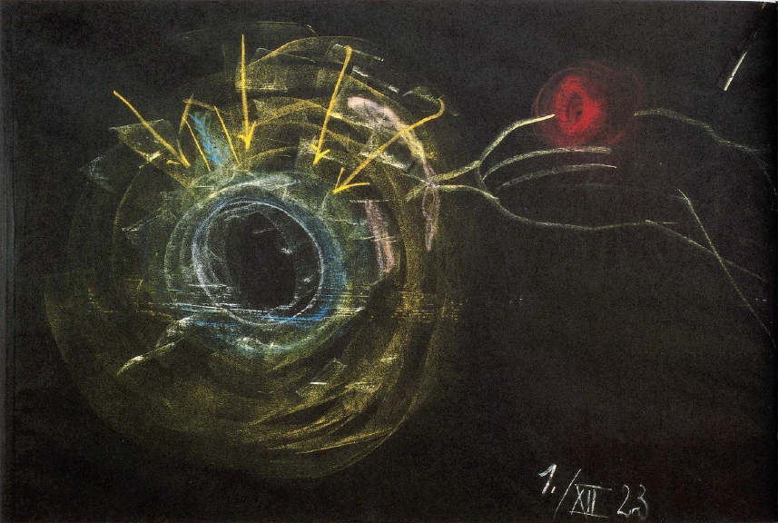
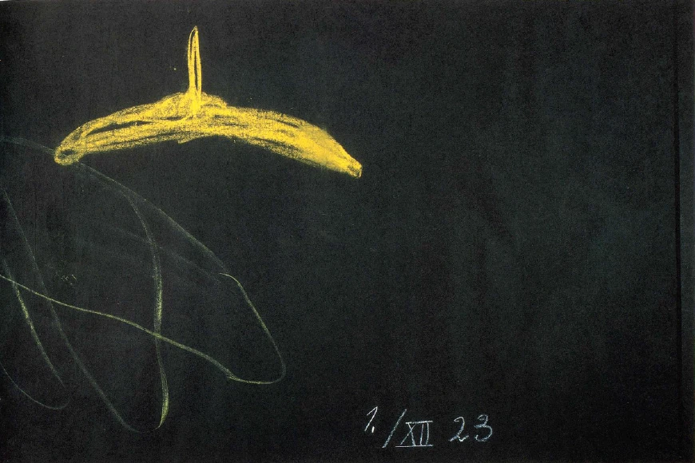

Durch dasjenige, was ich gestern sagte, ergibt sich die Möglichkeit, manche von jenen Ereignissen, die im Laufe der Erdenentwickelung geschehen sind und die jetzige Gestalt unserer Erde bewirkt haben, noch genauer zu besprechen. Sie erinnern sich, daß ich sagte, man kann schauend-erkennend in ein gewisses Verhältnis kommen zu der Metallität der Erde, zu all dem, was in der Erde wesenhaft dadurch ist, daß die Erde durchzogen ist von Metalladern, daß überhaupt diese Erde in sich trägt das Metallische, das verschiedenartige Metallische. Diese Verwandtschaft, in die man eingehen kann mit dem Metallischen der Erde, die gibt einem die Möglichkeit, zurückzuschauen auf das, was mit der Erde geschehen ist. ^uiugc6

Nun ist es ja ganz besonders interessant, auf dasjenige zu schauen, was mit unserer Erdenentwickelung sich vollzogen hat ungefähr in den Zeiten, die der atlantischen Entwickelung vorangegangen sind, die ich in einer etwas äußerlichen Weise das lemurische Zeitalter genannt habe, und auch noch auf dasjenige hinzuschauen, was in dem nächst vorangehenden Zeitenraum liegt, wo die Erde das Sonnenstadium wiederholte. Während der lemurischen Zeit hat sie das Mondenstadium wiederholt. Auf alle diese Ereignisse ist es interessant zurückzuschauen, denn man bekommt dadurch einen Eindruck davon, wie wandelbar alles im Gebiete des Erdendaseins ist. ^3w4rin

Wir sind ja gewohnt heute, die Erde gewissermaßen als abgeschlossen in der Form anzusehen, wie sie heute dem Menschen entgegenttritt. Wir leben als Menschen auf dem Kontinente, sind da umgeben von dem, was die Erde zu tragen vermag an Pflanzen, an Landtieren, an Lufttieren und so weiter. Wir wissen, daß wir selbst in einer Art von Luftmeer der Atmosphäre leben, die die Erde umgibt; daß wir aus diesem Luftmeer den Sauerstoff in uns aufnehmen, daß aber auch unser Verhältnis zum Stickstoff eine gewisse Rolle spielt. Aber wir stellen uns im allgemeinen vor, daß uns da eben der Luftkreis umgibt, bestehend aus Sauerstoff und Stickstoff. Wir schauen dann hin auf die Ozeane, auf die Meere und bekommen eben - weitere Einzelheiten brauche ich ja nicht zu erwähnen - ein Bild dessen, was wir als den Planeten vorstellen, den wir im Weltenall bewohnen. Nun sehen Sie, so wie da die Erde jetzt ist, war sie aber nicht immer, sondern sie hat sogar sehr starke, gewaltige Verwandlungen durchgemacht. Gehen wir zu den Zeiträumen, auf die ich eben jetzt hingedeutet habe, zurück, gehen wir nur ins lemurische Zeitalter und etwas weiter zurück, dann finden wir eine ganz andere Erdbeschaffenheit als jetzt. ^elwvxx

Gehen wir aus von dem Luftkreis, in dem wir jetzt leben, und den wir selber als unlebendig, als leblos ansehen. Schon dieser Luftkreis stellt sich uns als ein ganz anderes dar. Und wenn wir weiter zurückgehen, da haben wir auch in dieser ältesten Zeit der Erdenentwickelung schon so etwas zu beobachten, wie heute der feste Erdkern gewissermaßen ist, um den herum der Luftkreis ist. Solch eine ähnliche Zeichnung würde sich schon auch ergeben für diese älteren Zeiten; aber es kann gar nicht die Rede davon sein, daß für diese älteren Zeiten irgendwie so etwas da ist in der großen Sphäre, die ich gezeichnet habe, wie heute die von uns einzuatmende Luft. In der von uns heute einzuatmenden Luft spielen der Sauerstoff und der Stickstoff die hervorragendste Rolle; und eine geringere Rolle spielt da der Kohlenstoff, spielt da der Wasserstoff; eine noch unbedeutendere Rolle spielt der Schwefel oder gar der Phosphor. ^ioiopk

Nun ist es gar nicht möglich eigentlich, für diese älteren Zeiten von Sauerstoff, Stickstoff, Kohlenstoff, Schwefel und so weiter zu sprechen, einfach weil es das, was heute der Chemiker mit diesen Namen bezeichnet, für diese ältere Zeit gar nicht gibt. ^p52an8

Sehen Sie, irgendein Geistwesen der damaligen Zeit, dem ein heutiger Chemiker entgegentreten und von Kohlenstoff, Sauerstoff, Stickstoff und so weiter sprechen würde, das würde sagen: So etwas gibt es nicht. Denn so wahr es eine Möglichkeit gibt, von diesen Dingen heute zu reden, so wenig gab es eine Möglichkeit in der damaligen Zeit, von diesen Dingen zu reden. Sauerstoff, Stickstoff, Kohlenstoff, wie wir heute davon sprechen, sind als solche nur möglich, wenn die Erde eben eine bestimmte Dichte erreicht hat und solche Kräfte hat, wie sie sie heute hat. Sauerstoff, Stickstoff, Kalium, Natrium und so weiter, die gesamten weniger schweren sogenannten Metalle, die gab es in jener älteren Zeit gar nicht. Dagegen gab es in dieser Erdenumgebung, hier in diesem Umkreis, der dazumal das bildete, wofür wir heute den Luftkreis setzen, etwas, was ungeheuer feinflüssig war, so zwischen unserem heutigen Wasser und der Luft in der Mitte; feinflüssig war es, aber in seiner Feinflüssigkeit war es ähnlich dem Eiweiß. So daß eigentlich die Erde dazumal ganz umgeben war von einer Eiweiß-Atmosphäre. Das heutige Eiweiß im Hühnerei ist viel gröber, aber es läßt sich schon damit vergleichen. ^6k74os

Diese Erdenumgebung, die ist so geartet, daß, als später die Erde dichter wurde, da trennte sich heraus, differenzierte sich heraus aus dieser Umgebung, was wir heute als Kohlenstoff, Wasserstoff, Sauerstoff, Stickstoff und so weiter bezeichnen. Aber das war da drinnen nicht so, daß man sagen kann, diese damalige Eiweiß-Atmosphäre war daraus zusammengesetzt; denn es hatte diese einzelnen Stoffe nicht als Teile. Heute denkt man sich überhaupt bei allem: es sei zusammengesetzt; aber das ist ein Unsinn. Dasjenige, was man als gewisse höher geartete Substanzen kennt, das ist nicht immer aus dem zusammengesetzt, was dann erscheint, wenn man es analysiert; sondern die Dinge hören auf, in der höheren Substanz darinnen zu sein. Der Kohlenstoff ist da drinnen nicht Kohlenstoff, der Sauerstoff nicht Sauerstoff und so weiter, sondern das ist eine höher geartete Substanz. Und wie gesagt, eigenschaftlich kann ich sie als sehr, sehr flüssiges Eiweiß bezeichnen. Aber diese ganze, die Erde damals umgebende Substanz war durchdrungen vom Weltenall herein mit kosmischem Äther, der diese ganze Substanz belebte. So daß wir den kosmischen Äther uns vorzustellen haben als hereinragend in diese Substanz und sie belebend. ^r82no9

Dadurch, daß dieser kosmische Äther hereinragte, dadurch lebte diese Substanz. Sie lebte aber nicht nur, sondern sie differenzierte sich in eigentümlicher Weise. Da erschien an einer Stelle einmal ein größeres Gebilde, in dem man ersticken konnte; an einer anderen Stelle erschien ein größeres Gebilde, in dem man besonders regsam hätte aufleben können, wenn man als Mensch schon hätte da sein können und so weiter. Es waren da nicht chemische Elemente im heutigen Sinne drinnen, aber es entstanden solche Bildungen, die an die Wirkungen der chemischen Elemente von heute erinnern. Dann war das Ganze von Licht-Spiegelungen, Licht-Erglänzungen, Licht-Erstrahlungen, LichtErfunkelungen durchsetzt. Und endlich war das Ganze vom Weltenäther durchwärmt. ^hishg6

Das alles waren Eigenschaften der damaligen Erd-Atmosphäre, wenn ich den heutigen Ausdruck gebrauchen darf. Das erste, was nun aus dem Kosmos herein sich bildete, das ist das, was ich gestern beschrieben habe: die ersten Urgebirge. Die bildeten sich aus dem Kosmos herein. So daß die Quarze, die Sie draußen im Urgebirge finden in ihrer schönen Gestalt, in ihrer relativen Durchsichtigkeit, gewissermaßen vom Weltenall in die Erde herein gebildet sind. Deshalb ist es ja, daß, wenn sich heute der imaginativ Schauende in diese Urgebirgsgesteine, in diese heute härtesten Gestaltungen der Erde hinein versetzt, so sind sie ihm die Augen hinaus nach dem Weltenall. Aber das Weltenall hat auch diese Augen der Erde eingesetzt; sie sind danun drinnen. Das Weltenall hat sie der Erde eingesetzt. Nur war das Quarzige, das Kieselsäure-Ähnliche, das da in dieganze Atmosphärehereindrang undsich allmählich ablagerte als Urgebirge, nicht so hart wie heute. Das ist erst später, durch die späteren Verhältnisse, dieser Erhärtung, in der es heute dasteht im Urgebirge, anheimgefallen. Das alles, was sich da hereinbildete aus demWeltenall, war in der damaligen Zeit kaumhärter als Wachs. ^7tmorb

Also, wenn Sie heute ins Urgebirge gehen und einen Quarzkristall sehen, der so hart ist - ich habe heute an anderer Stelle gesagt: der Schädel würde zwar kaputtgehen, aber der Quarz nicht, wenn Sie daran stoßen -, so war das alles dazumal durch das Leben, das in alles hineinragte, weich wie Wachs, richtig weich wie Wachs, so daß man also sagen könnte: Als träufelndes Wachs aus dem Kosmos kommen die Urgebirgsgesteine. Und das alles ist durchsichtig, wie es aus dem Kosmos da herein sich schiebt, kann in seiner relativen Härte, in seiner Wachshärte eben nur beschrieben werden so, daß man den Tastsinn darauf anwendet: man würde es spüren, wenn man es angreifen könnte, wie man Wachs spürt. ^szlvkx

So also setzt sich das Urgebirge aus dem aus dem Kosmos hereingeträufelten Wachs ab, verhärtet sich dann. Kieselsäure hat Wachsform in der Zeit, in der sie sich aus dem Kosmos in die Erde herein versetzt. Und dasjenige, was heute mehr geistig vorhanden ist, und was ich Ihnen gestern beschrieben habe, daß man in diesem dichten Gestein, wenn man sich hineinversetzt, Bilder des Kosmos hat, das war dazumal ganz anschaulich da, und zwar so da, daß, wenn da solch eine Partie — verzeihen Sie, daß ich den Ausdruck gebrauche, aber er bezeichnet ja eigentlich das Richtige - Wachskiesel herankam in seiner Durchsichtigkeit, so konnte man in ihm etwas unterscheiden wie eine Art Pflanzenbild. Wer sich umgesehen hat in der Natur, der wird ja wissen, daß, man möchte sagen wie Merkzeichen an eine alte Zeit, so etwas sich schon heute in der mineralischen Welt findet. Man findet Gesteine, man nimmt sie in die Hand, man schaut sie an, und Sie haben in ihnen so etwas, wie wenn in ihrem Innern ein Pflanzenbild wäre. Das war aber dazumal etwas ganz Gewöhnliches, was in die Atmosphäre, in diese Eiweiß-Atmosphäre hereinkam, mitgeschoben gewissermaßen wie Bilder, die nicht nur gesehen wurden, sondern wie Bilder, die im Innern dieses Wachskörpers abphotographiert waren, aber körperlich abphotographiert waren — daß damit diese Bilder aus dem Kosmos hereingeschoben wurden. ^2dqogh

Und dann gestaltete sich das Eigentümliche heraus, daß das flüssige Eiweiß, das da war, diese Bilder ausfüllte; dadurch wurden sie wiederum etwas härter, etwas dichter; sie waren dann nicht mehr Bilder. Das Kieselige fiel von ihnen weg, zerstreute sich in die übrige Atmosphäre, und wir haben in der ältesten lemurischen Zeit die mächtigen schwimmenden, an unsere heutigen Algen erinnernden Pflanzenbildungen, die nicht im Boden eingewurzelt waren - ein solcher Boden war überhaupt noch nicht da -, die in diesem flüssigen Eiweiß, aus dem sie ihre eigene Substanz herausbildeten, mit der sie sich durchdrangen, die in diesem flüssigen Eiweiß drinnen schwammen, aber nicht nur schwammen, sondern die Sache war so, daß sie aufglänzten, möchte ich sagen, aufleuchteten, dann wieder vergingen, wieder da waren, wieder vergingen. Sie waren wandelbar; wandelbar bis zu dem Grade, daß sie entstanden und verschwanden. ^ufymls

Stellen Sie sich das recht vor. Es ist im Grunde genommen ein Bild, das von dem Heutigen, was wir in unserer Umgebung haben, sehr verschieden ausschaut. Wenn man als heutiger Mensch sich in die damalige Zeit versetzen könnte, sagen wir solch ein Schilderhäuschen irgendwo hinstellen könnte und sich da beobachtend hineinsetzen könnte, wie es heute unsere Freunde haben, die die Wache hier am Goetheanum leisten, und da hinausschauen könnte in jene alte Welt, da würde man überall sehen: da taucht auf ein Pflanzenbild, ein mächtiges Pflanzenbild, wie gesagt unseren heutigen Algen oder auch Palmen ähnlich, aber es schießt auf — es wächst nicht aus der Erde im Frühling heraus und vergeht im Herbste, sondern es schießt, in der Frühlingszeit erscheinend, heraus — die Frühlingszeit ist viel kürzer und dann erlangt es seine Mächtigkeit, dann verschwindet es wiederum im flüssig-eiweißähnlichen Elemente. Diesen Anblick des immer Ergrünenden und immer wiederum Vergrünenden würde ein solcher Beobachter haben. Und er würde nicht sprechen von den Pflanzen, die die Erde bedecken, sondern er würde sprechen von den Pflanzen, die wie Luftwolken aus dem Kosmos herein erscheinen, dicht werden, sich auflösen — ein Ergrünendes in der Eiweiß-Atmosphäre. Und man würde von dem, was unserem heutigen Sommer etwa entsprechen würde, sagen: Es ist die Zeit, in der die Erdenumgebung ergrünt. Man würde aber zu dem Grün mehr hinaufschauen als hinunterschauen. So daß man auf diese Art die Vorstellung bekommt, wie das Kieselige der Erd-Atmosphäre hereinzieht in das Irdische und die Pflanzenkraft, die eigentlich draußen im Kosmos ist, an sich heranzieht; wie die Pflanzenwelt aus dem Kosmos auf die Erde herunterkommt. Aber in der Periode, von der ich da spreche, ist es eben durchaus so, daß man sagen muß: Diese Pflanzenwelt, sie ist ein in der Atmosphäre Entstehendes und Vergehendes. ^0exdoz

 ^6zn9vo

 ^nudjq2

Und man muß noch etwas anderes sagen: Wenn man heute Mensch ist und eben durch die Verwandtschaft mit der Metallität der Erde sich zurückversetzt in jene Zeiten, dann ist es einem so, als ob das alles zu einem selber gehörte, als ob man etwas zu tun hätte mit dem, was dazumal in der Atmosphäre ergrünte und vergrünte. Wirklich, wenn man sich heute an seine eigene Kindheit erinnert, so ist das die Erinnerung an eine kurze Spanne Zeit. Aber wenn Sie sich an einen Schmerz, den Sie in der Kindheit durchgemacht haben, erinnern, so ist das etwas, was zu Ihnen gehört. So wird in diesem durch die Metallität der Erde angeregten kosmischen Zurückerinnern dieser Vorgang des Ergrünens und Vergrünens wie etwas, das zu Ihnen selbst gehört. Man war dazumal schon als Mensch mit der Erde, die in dieser wäßrigen Eiweiß-Atmosphäre lebte, verbunden, aber so, daß man als Mensch noch ganz geistig war. Aber man drückt ein Richtiges aus, wenn man sagt— es ist so, daß man zugleich die Vorstellung gewinnen muß -: Diese Pflanzen, die man da in der Atmosphäre sieht, die sind für die damalige Zeit Abscheidungen, Absonderungen des Menschlichen. Der Mensch setzt das aus seiner Wesenheit, die noch mit der ganzen Erde eines ist, heraus. Und er muß diese Vorstellung noch für etwas ganz anderes haben, was er da heraussetzt. Es geschieht nämlich auch folgendes. Alles, was ich bisher beschrieben habe, das ist dadurch bewirkt, daß schon früher das Kieselsäureartige in der Atmosphäre abgesetzt ist in der Wachsform, von der ich gesprochen habe. Aber sonst ist ja überall diese Eiweiß-Atmosphäre da. Auf die wirkt der Kosmos; auf die wirken die unendlich mannigfaltigen Kräfte, die vom Kosmos überall auf die Erde niederstrahlen, jene Kräfte, von denen unsere heutige Erkenntnis gar nichts wissen will. Daher ist unsere heutige Erkenntnis eben gar keine wirkliche Erkenntnis, weil das Mannigfaltigste, was auf der Erde vorgeht, eben nicht vorgehen würde, wenn es nicht überall von kosmischen Impulsen und kosmischen Kräften bewirkt wäre. Indem nun der heutige Gelehrte gar nicht von diesen kosmischen Kräften spricht, spricht er überhaupt nicht von der Wirklichkeit. Er nimmt ja nirgends Rücksicht auf dasjenige, was eigentlich lebt. Selbst in dem kleinsten Präparat, das man durch irgendein Mikroskop ansieht, leben nicht nur irdische, leben kosmische Kräfte. Und ohne daß man auf diese Rücksicht nimmt, hat man nicht die Wirklichkeit. ^9b4a6s

So wirkten also dazumal die kosmischen Kräfte auf dieses flüssige Eiweiß in der Erdenumgebung. Und diese kosmischen Kräfte wirkten auf manche Partien dieses Eiweißes so, daß sie es wie gerinnen machten, so daß man kosmisch geronnenes Eiweiß da überall sah. Das schwamm da drinnen: kosmisch geronnenes Eiweiß. Aber das waren nicht beliebige Wolken, dieses kosmisch geronnene Eiweiß, sondern das war Lebendiges in bestimmten Formen. Es waren eigentlich Tiere, die aus diesem geronnenen Eiweiß bestanden, das sich bis zu der Dichtigkeit von Gallerte, ja bis zu der Dichtigkeit unserer heutigen Knorpelmasse herausbildete. Solche Gallert-Tiere, die waren in dieser flüssigen Eiweiß-Atmosphäre. Sie hatten die Gestalt, welche im kleinen vorhanden ist bei unseren Reptilien, bei unseren Eidechsen und dergleichen; aber sie waren eben nicht von einer solchen Dichtigkeit, sondern sie waren in dieser gallertartigen Masse vorhanden, und sie waren in sich beweglich. Bald hatten sie lange Gliedmaßen, bald waren die Gliedmaßen wieder in sich zusammengezogen; kurz, alles an ihnen war so, wie es an der Schnecke ist, die ihre Fühler einziehen kann. ^0rkbp1

Nun sehen Sie, während dieses da draußen sich bildete, war aber in der Erde schon außer dem Kieseligen aus dem Weltenall abgesetzt dasjenige, was Sie heute als Kalkbestandteile der Erde finden. Wenn Sie nicht ins Urgebirge gehen, sondern wenn Sie einfach in den Jura hinausgehen, so haben Sie dieses Kalkgestein. Dieses Kalkgestein ist später, aber es ist auch aus dem Kosmos geradeso wie das Kieselige an die Erde herangekommen, so daß wir also als Zweites das Kalkige in der Erde hier haben. ^bhamp6

Aber dieses Kalkige sickert immerfort hinein, und im wesentlichen bewirkt dieses Kalkige, daß die Erde in ihrem Kern immer dichter und dichter wird. Und es gliedert sich dann dem Kalkigen in bestimmten Lokalitäten das Kieselige ein. Aber dieses Kalkige, das behält die kosmischen Kräfte. Der Kalk ist noch etwas ganz anderes als die grobe Materie, als die ihn die heutigen Chemiker vorstellen. Der Kalk enthält überall verhältnismäßig nicht herauskommende Gestaltungskräfte. ^1n1akd

Und nun ist es eigentümlich: wenn wir in eine etwas spätere Zeit gehen, als diejenige ist, die ich Ihnen da für das Hereinkommen des Ergrünens und Vergrünens beschrieben habe, da finden wir, daß diese ganze Eiweiß-Atmosphäre eigentlich ein fortwährendes Hinauf- und Hinabgehen des Kalkes hat. Es bildet sich Kalkdunst und wiederum Kalkregen. Die Erde hat eine Zeit, wo dasjenige, was heute bloß verdunstetes Wasser und herunterfallender Regen ist, kalkhaltige Substanz ist, die hinaufgeht und wieder heruntergeht, sich hebend und senkend. Und da entsteht das Eigentümliche: dieser Kalk, der hat eine besondere Anziehungskraft zu diesem Gallert, zu diesen Knorpelmassen. Die durchdringt er, die imprägniert er mit sich selber. Und durch die Erdenkräfte, die in ihm sind - ich sagte Ihnen, die Erdenkräfte sind in ihm -, löst er die ganze Gallertmasse auf, die sich da als geronnenes Eiweiß gebildet hat. Der Kalk nimmt dem Himmel das, was der Himmel in der Eiweiß-Substanz gebildet hat, weg und trägt es näher an die Erde heran. Und daraus entstehen dann allmählich die Tiere, die kalkhaltige Knochen haben. Das ist etwas, was in der späteren lemurischen Zeit sich ausbildet. ^o0dli4

So daß wir in den Pflanzen zuerst in ihrer ältesten Gestalt zu sehen haben reine Himmelsgaben, und in den Tieren und in aller tierischen Bildung etwas zu sehen haben, was die Erde, nachdem ihr der Himmel den Kalk gegeben hat, dem Himmel abgenommen hat - wirklich richtig wegstibitzt! - und zu einem Erdengebilde gemacht hat. Das sind die Dinge, die einem aus dieser ältesten Zeit so merkwürdig entgegentreten, und mit denen man sich durchaus verbunden fühlt, so, daß man nun auch diesen ganzen Vorgang als einen Vorgang des sozusagen in den Kosmos erweiterten Menschenwesens empfindet. ^2499bg

Solche Dinge klingen natürlich paradox, weil sie ja eine Wirklichkeit berühren, von der der heutige Mensch sich gewöhnlich keine Vorstellung macht, aber sie enthalten die volle Wahrheit. Nicht wahr, es ist heute einer absoluten Wirklichkeit entsprechend, wenn man aus dem Gedächtnis heraus sagt: Als ich ein neunjähriger Junge oder ein neunjähriges Mädchen war, da habe ich meinen Freund oder meine Freundin manchmal ordentlich durchgeprügelt. Das ist etwas, was innerlich aufsteigt. Man kann darüber erfreut sein oder nicht, man kann darüber Schmerz empfinden, aber es steigt eben innerlich auf. So steigt in diesem durch die Verwandtschaft mit dem Metallischen erweiterten Menschenbewußtsein, das ein Erdenbewußtsein wird, auf: Du hast, indem du deine ganze Wesenheit vom Himmel auf die Erde herein gebildet hast, beim Heruntergehen die Pflanzen von dir abgesondert. Die sind eine Absonderung von dir. Du hast auch das Tierwesen abgesondert; in der Form geronnener Gallerte oder Knorpelmasse hast du gewollt zunächst, daß es ein Absonderungsprodukt von dir werde. Da hast du aber merken müssen, wie schon vorangegangene Erdenkräfte dir das abgenommen haben und die Tierformen in einer anderen Gestalt, wo sie ein Ergebnis der Erdbildung ist, geformt haben. - Geradeso kann man das in einer kosmischen Erinnerung wie das eigene Erlebnis sehen, wie man das andere, das ich angeführt habe, als ein Erlebnis des kurzen Erdenlebens sehen kann. Man fühlt sich, wie gesagt, als Mensch damit verbunden. ^fwbmjz

Aber all das ist ja verknüpft mit mancherlei anderen Vorgängen. Ich schildere Ihnen sozusagen skizzenhaft hauptsächlichste Vorgänge. Da geschieht vieles andere. Während zum Beispiel das geschehen ist, was ich da beschrieben habe, ist die ganze Atmosphäre ja noch angefüllt mit fein verteiltem Schwefel. Dieser fein verteilte Schwefel verbindet sich mit anderen Substanzen, und aus diesem Verbinden des fein verteilten Schwefels mit anderen Substanzen entstehen dann, ich möchte sagen, die Väter oder die Mütter von all dem, was heute als Pyrit, als Bleiglanz, als Zinkblende und so weiter in den Erzen vorhanden ist. Also all das bildet sich in einer älteren Form, in einer weichen, noch dicht wachsartigen Form in der damaligen Zeit aus. Dadurch wird der Erdkörper von solchen Dingen durchdrungen. Und dann, wenn eben diese Erze, dieses Metallinische, aus der allgemeinen eiweißähnlichen Substanz herauskommt und die feste Erdkruste bildet, dann haben die Metalle ja darinnen tatsächlich nicht viel anderes zu tun, wenn nicht der Mensch mit ihnen etwas macht, als nachzudenken über das, was geschehen ist. Und das trifft man auch bei ihnen. Man findet sie in einem Zustande, wo sie einem für das innerliche Schauen alles vergegenwärti‚gen, was mit der Erde geschehen ist. Jetzt aber sagt man sich, indem man das wie das eigene kosmische oder wenigstens tellurische Erlebnis hat: Indem du das alles abgelöst hast von dir, indem du abgelöst hast dasjenige, was als die älteste Pflanzenform da war — was ja die späteren Pflanzenformgebilde geworden sind -, indem du abgelöst hast, was in der komplizierteren Weise als Tierwerdung dasteht - wie ich es beschrieben habe -, hast du abgelöst von dir dasjenige, was dich vorher verhindert hat, in deinem eigenen Menschenwesen ein Wollen zu haben. ^tjli0g

Das, was ich Ihnen hier alles beschrieben habe, das war notwendig, das mußte der Mensch abscheiden, wie er heute den Schweiß oder anderes abscheiden muß. Das mußte der Mensch abscheiden, damit er nicht mehr ein Wesen war, in dem bloß die Götter wollten, sondern damit er ein Wesen werden konnte mit eigenem Wollen, daß er ein eigenes, wenn auch noch nicht freies Wollen haben konnte. Das alles war also zur Vorbereitung der irdischen Natur des Menschen notwendig. ^jxgwey

Nun, indem vieles andere noch geschehen ist, verwandelte sich das alles. Natürlich, als dann die Erze da waren, abgesondert in der Erde, da verwandelte sich auch die ganze Atmosphäre. Sie wurde eine andere, sie wurde weit weniger schwefelhaltig. Der Sauerstoff bekam allmählich die Oberhand über den Schwefel, während in den alten Zeiten der Schwefel eine schr starke Bedeutung hatte für die Erden-Atmosphäre. Die ganze Erden-Atmosphäre wurde anders. In dieser erneuerten Umgebung konnte der Mensch anderes wiederum aus sich heraussetzen, anderes absondern. Was er jetzt absonderte, erscheint wie die Nachkommen der früheren Pflanzen und der früheen Tiere. Jetzt allmählich bildeten sich die späteren Pflanzenformen aus, die eine Art Wurzel faßten, aber in noch durchaus weicher Erdensubstanz. Und es bildeten sich heraus aus dem, was Reptilien, eidechsenähnliche Tiere waren, kompliziertere Tiere, solche Tiere, welche die heutige Geologie in Abdrücken und dergleichen noch findet. Von dem Allerältesten, von dem ich hier gesprochen habe, wird ja nichts mehr gefunden. Erst das, was dann in der späteren Epoche entstand, in der der Mensch - sozusagen ein zweites Mal - kompliziertere Gebilde aus sich heraussetzte, erst da war das, was ich Ihnen hier beschrieben habe, was, ich möchte sagen immerfort entstehende und vergehende Wolkengebilde waren, Ergrünendes, Vergrünendes, weichmassige tierähnliche Gestalten, die aber wirkliche Tiere waren, die bald sich zusammenzogen und ein Eigenleben hatten, bald wiederum sich verloren in einem allgemeinen Erdenleben, denn das war bei all diesen Wesenheiten der Fall. Aus all dem entstand etwas, was mehr in sich gefestigt war. ^7xm9r0

Und so kamen dann solche Tiere heraus, wie das eine, das ja für die damalige Zeit, wenn man es etwas schematisch zeichnen will, so aussah: es hatte ein sehr großes augenähnliches Organ mit einer Art von Aura; daran eine Art von Schnauze, die übrigens noch nach vorne verlängert war; dann so etwas wie einen Eidechsenkörper, aber mit mächtigen Flossen. So etwas entstand also wie ein Gebilde, das jetzt schon mehr Festigkeit in sich hatte. Wir haben solche Tiere, welche etwas haben wie, ich könnte ebenso gut sagen Flügel wie Flossen. Denn das Tier war ja nicht etwa ein Meerestier, Meer war dazumal noch nicht; es war eine weiche Erdmasse und das noch immer weiche Element des Umkreises, aus dem nur der Schwefel etwas entfernt war. Aber da drinnen flog oder schwamm - es war eine Tätigkeit zwischen Fliegen und Schwimmen - solch ein Tier. ^xy5pp1

Daneben gab es andere Tiere, welche nicht diese Art von GliedmaBen hatten, sondern Gliedmaßen, die schon mehr aus den Kräften der Erde selbst herausgeformt waren, die schon erinnerten an die Gliedmaßen der heutigen niederen Säugetiere und so weiter. ^0h8h8k

So würde sich einem Menschen, der, von heute ausgehend, statt durch den Raum durch die Zeit wandernd, zurückwandernd in jene Zeit, die das lemurische Zeitalter mit dem atlantischen verbindet, ein besonderer Anblick darbieten: solche riesigen fliegenden Eidechsen mit einer Laterne auf dem Kopf, die leuchtet und wärmt; unten etwas wie eine weiche, morastartige Erde, die aber etwas außerordentlich Anheimelndes hat, weil sie dem Besucher von heute eine Art von Geruch darbieten würde, der zwischen Moderduft und dem Duft der grünenden Pflanzen mitten drinnen steht. Etwas Verführerisches auf der einen Seite und außerordentlich Sympathisches auf der anderen Seite würde dieser Schlamm der weichen Erde darbieten. Und da drinnen wiederum, sich wie Sumpftiere fortbewegend, sind dann diese anderen Tiere, die schon mehr Gliedmaßen haben, die an die heutigen niedern Säugetiere erinnern, die aber so nach unten ausgeweitet sind, daß sie unten solche mächtige Dinge haben (es wird aufgezeichnet) - mächtigere natürlich als die Enten - Scheiben, mit denen sie in diesem Sumpf sich fortbewegen, aber auch wiederum auf- und abwiegen. ^ofyo1d

Sehen Sie, diese ganze Absonderung mußte die Menschheit durchmachen, damit dem Menschen selbständiges Fühlen vorbereitet werden konnte für sein Erdendasein. ^actni0

So haben wir eine erste vegetabilisch-animalische Schöpfung, die eigentlich in Absonderungsprodukten des Menschen besteht, und die das vorbereitete, daß er als irdisches Menschenwesen ein wollendes Wesen werden konnte. Wäre das alles in ihm geblieben, dann hätte das sein Wollen übernommen. Sein Wollen wäre ganz physisches Geschehen geworden. Dadurch, daß er das ausgesondert hat, ist das Physische von ihm fort, und das Wollen nimmt einen seelischen Charakter an. Ebenso nimmt durch diese zweite Schöpfung das Fühlen einen seelischen Charakter an. Und erst in der späteren atlantischen Zeit, so in der Mitte der atlantischen Zeit, da entstehen Säugetiere und diese Pflanzen, Pflanzen und Tiere, die schon den unseren ähnlich sind. Da wird auch die Erde schon so gestaltet, daß sie durchaus ähnlich ausschaut dem, was sie jetzt ist. Dadurch gibt es schon die chemischen Substanzen, die Substanzen, die der heutige Chemiker kennt. Dadurch kommt schon allmählich das zustande, was Kohlenstoff, Sauerstoff, was die alkalischen, die schweren Metalle sind und dergleichen. Das kommt schon da heraus. Damit aber kann der Mensch das Dritte absondern von sich, dasjenige, was er heute in seiner Umgebung als pflanzliche, tierische Welt findet. Und indem er dies absondert, indem diese ihn umgebende Schöpfung um ihn herum entsteht, wird er vorbereitet für sein Erdendasein zu einem denkenden Wesen. ^o6ecib

Man kann also sagen: Die Menschheit war damals nicht so getrennt, wie die Menschen heute sind, in einzelne Individuen, es war eine allgemeine Menschheit, geistig-seelischer Natur noch, in den Äther sich hereinsenkend. Denn mit dem aus dem Weltenall der Erde zuströmenden Äther kam eben diese allgemeine Menschheit aus dem Weltenall. Sie machte dann auch diejenigen Vorgänge dutch, die ich in der «Geheimwissenschaft » beschrieben habe: sie kam, ging wieder fort zu den anderen Planeten und kam wiederum zurück in der atlantischen Zeit. Das spielte sich noch nebenbei ab. Denn jedesmal, wenn so etwas abgesondert war, konnte die Menschheit nicht bei der Erde bleiben, mußte weggehen, um gewissermaßen die inneren Kräfte, die jetzt viel feinerer, seelischer Natur waren, erst zu verstärken. Dann kam sie wiederum herunter. Und so sind diese Vorgänge dasjenige, was eben genauer noch beschreibt das, was Sie in meiner «Geheimwissenschaft» lesen können. Diese Vorgänge sind also so, daß der Mensch, die Menschheit eigentlich dem Weltenall angehört und sich selbst die Erdenumgebung zubereitet, indem sie ihre Ausscheidungen, die die anderen Naturreiche sind, in den Erdenbereich hereinschickt. Da sind sie nun im Erdenbereich, da umgeben sie den Menschen. Und da kann der Mensch sagen: Indem er diese Ausscheidungen in den Erdenbereich hereingeschickt hat, hat er in sich allmählich dasjenige entwikkelt, was ihn als Erdenmenschen ausstattet mit Wollen, Fühlen, Denken. Denn das, was der Mensch heute ist, das auf organisch-physischer Grundlage während der Lebenszeit zwischen der Geburt und dem Tode ruhende denkende, fühlende, wollende Wesen, das hat sich ja erst in der Zeit entwickelt und das steht im Zusammenhange mit den Wesenheiten, die um der menschheitlichen Entwickelung willen sich im Laufe der Zeit aus dem Menschlichen herausgeschieden haben und in dieser Herausgeschiedenheit sich wiederum erst zu ihren heutigen Formen umgewandelt haben. ^aai3tp

Sie schen daraus: es ist schon so, daß man nicht bloß im allgemeinen abstrakt von diesem Verwandtwerden mit dem Metallinischen derErde spricht. Sondern wenn man verwandt wird mit diesem Metallinischen, das in sich die Erinnerung an die Erdengeschehnisse birgt, wie ich gesagt habe, ja dann ist es so, daß man wirklich etwas sagen kann, an was man sich da erinnert; daß man wirklich das findet, was ich Ihnen heute erzählt habe. ^81htii

Und wenn Sie sich nun denken, daß man zurückkommt in noch frühere Zeiten, so wird das alles noch flüchtiger, noch verschwebender. Betrachten Sie nur den grandiosen, den majestätischen Anblick, den ich Ihnen vorhin geschildert habe: diese wachsartig verfließenden Kieselsäurebildungen, in denen auftreten Bilder der Pflanzenwelt, die sich vollsaugen mit der weichen Albumine, mit der weichen Eiweiß-Substanz, die dadurch ein Grünendes und Vergrünendes in der Erdenumgebung darbieten - man schaut hinauf dazu. Denken Sie an diese Dinge, und Sie werden sich sagen können: Gegenüber den heutigen, aus fester Wurzel mit festen Blättern aus der Erde herauswachsenden Pflanzen oder gar gegenüber den heutigen Bäumen mit ihren erstarkten Stämmen, ist das alles flüchtiges Gebilde. Wie flüchtig ist das gegenüber einer heutigen Eiche, die zwar nicht selbst stolz ist auf ihre Eichigkeit, auf die aber stolz sind gewöhnlich die Umwohner, weilsie sich verwechseln in ihrer oftmaligen Schwäche mit der Eichigkeit der Eiche! Wenn Sie vergleichen diese Eichigkeit der heutigen Eiche mit diesen, ich möchte sagen, duftig entstehenden, duftig vergehenden, wie Schatten in der Atmosphäre auflebenden, sich verdichtenden, wieder verschwindenden Pflanzengebilden; oder wenn Sie vergleichen — nehmen wir gleich krasse Fälle - ein heutiges Nilpferd oder einen heutigen Elefanten in ihrer dicken Haut oder andere im Fleische lebende Wesenheiten mit den Wesenheiten der damaligen Zeit, die da als gerinnendes Eiweiß aus diesem allgemeinen Eiweiß herausgehen, dann vom Kalk erfaßt werden und in einer dadurch etwas dichteren Weise in Knochenandeutungen heruntergezogen werden ins Getierische der Erde - ich muß dieses mehr als Eigenschaftswort gebrauchen: ins «Getierische» der Erde -, wenn Sie sich das alles anschauen, wenn Sie sich die heutige Dichtigkeit, ich möchte sagen, die heutige Elefantitis der Erde anschauen gegenüber dem, was da einmal war, dann werden Sie nicht mehr zweifeln können, daß, wenn man noch weiter zurückgeht, man eben in ein noch Flüchtigeres kommt. ^wfehqk

Man kommt dann zurück in das, wo nur mehr wallende, webende, wesende Farbbildungen sind, die entstehen und vergehen. Und wenn Sie dann nehmen die Beschreibung der alten Sonne, des Vorgängers der Erde, oder des alten Saturn, wie ich sie in der «Geheimwissenschaft » gegeben habe, so werden Sie sagen: Das ist ja alles selbstverständlich, wenn man weiß, daß man da noch von dem, was hier ist, zu einem weiteren zurückzugehen hat. Da nimmt das Pflanzengebilde, das verschwebende Pflanzengebilde die Eiweiß-Substanz auf, wird selber wie ein Wolkengebilde. Noch früher haben wir es zu tun mit eigentlich nur in erscheinenden Farbenvorgängen sich bildenden Gestaltungen, wie ich sie für das Sonnendasein, für das Saturndasein beschrieben habe. ^bbjvxl

Und so kommen Sie allmählich, wenn Sie das Physische zurückverfolgen, eben von dem Elefantitischen zurück durch das feinere Physische zu dem Geistigen. Und Sie kommen da auf diese Weise, indem Sie gerade so recht aufmerksam auf das Konkrete gehen, zurück zu dem geistigen Ursprung alles dessen, was zum Irdischen gehört. Die Erde hat ihren Ursprung im Geistigen. Das ergibt eine wirkliche Anschauung. Und ich glaube, es ist auch eine schöne Idee, sich sagen zu können: Dringst du ins Innere der Erde, läßt du dir von den harten Metallen erzählen, an was sie sich erinnern, so werden sie dir erzählen: Wir waren einstmals so ins Weite hinausgedehnt, daß wir überhaupt nicht physische Substanzen waren, sondern im Geiste verschwebende, wesende, im Weltenall webende Farbigkeit. - Und so ist die Erinnerung der Metalle der Erde das, was auf den Zustand zurückgeht, wo ein jegliches Metall eine kosmische Farbe war, die die andere durchdrang; wo der Kosmos im wesentlichen eine Art innerer Regenbogen, eine Art Spektrum war, das dann sich differenziert hat und erst zum Physischen geworden ist. ^wg7zt0

Und da ist es, wo der bloße, ich möchte sagen, theoretisch mitgeteilte Eindruck, den man von der Metallität der Erde bekommt, übergeht in den moralischen Eindruck. Denn ein jedes Metall sagt einem zugleich: Ich stamme aus den Raumesweiten und Erdenfernen. Ich stamme aus dem Himmelsbereiche, und ich bin hier in das Innere der Erde zusammengezogen, hineingezaubert. Aber ich warte meiner Erlösung. Denn wieder werde ich einstmals mit meiner Wesenheit das Weltenall erfüllen. - Und wenn man so die Sprache der Metalle kennenlernt, dann erzählt eben das Gold von der Sonne, das Blei von dem Saturn, das Kupfer von der Venus, und dann sagen einem diese Metalle: Wie wir einstmals gereicht haben, das Kupfer bis zur Venus, das Blei bis zum Saturn, so sind wir heute hier verzaubert und werden wiederum da hinausreichen, wenn die Erde ihre Aufgabe erfüllt, daß nun der Mensch gerade dasjenige auf der Erde erreiche, was er nur auf der Erde erreichen konnte. Denn deshalb gingen wir in diese Verzauberung ein, damit der Mensch auf Erden ein freies Wesen werden konnte. Ist die Freiheit dem Menschen erkauft, dann kann auch unsere Entzauberung wiederum beginnen. ^ek9qff

Und diese Entzauberung ist schon lange im Grunde eingeleitet. Man muß sie nur verstehen. Man muß verstehen, wie die Erde in die Zukunft hinein sich weiter entwickeln wird, wieder mit dem Menschen. ^8aihzi