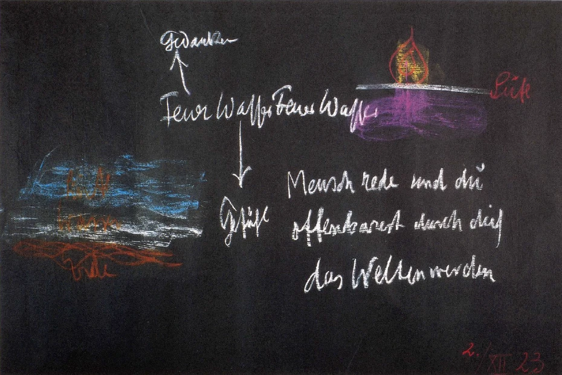
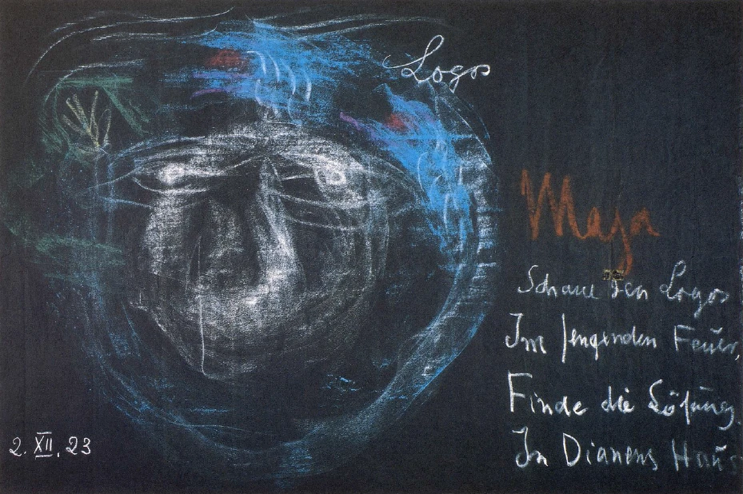

Wenn der Mensch heute vom Worte redet, dann meint er ja gewöhnlich nur das schwache, im Grunde gegenüber der Majestät des Weltalls wenig bedeutende Menschenwort. Aber wir wissen, daß das JohannesEvangelium beginnt mit den bedeutungsvollen Worten: «Im Urbeginne war das Wort - der Logos. Und das Wort war bei Gott. Und ein Gott war das Wort.» Und wer nachsinnt über diesen bedeutungsvollen Eingang des Johannes-Evangeliums, der wird sich fragen müssen: Auf was wird da eigentlich verwiesen, wenn im Urbeginne aller Dinge das Wort angesetzt wird? Was ist eigentlich mit diesem Logos, mit diesem Worte gemeint? Und wie hängt dies Gemeinte zusammen mit dem schwachen, gegenüber der Majestät des Weltenalls unbeträchtlichen Menschenworte? ^kz5i2n

Nun ist ja auch der Name des Johannes verknüpft mit der Stadt Ephesus. Und derjenige, der, ausgerüstet mit dem imaginativen Anschauen der Weltgeschichte, herantritt an diese bedeutungsvollen Worte: «Im Urbeginne war der Logos. Und der Logos war bei Gott. Und ein Gott war der Logos», der wird durch einen inneren Weg immer und immer wiederum verwiesen nach dem alten Tempel der Diana in Ephesus. Und für dasjenige, was als ein Rätsel aus den ersten Versen des Johannes-Evangeliums herausklingt, für das wird gerade der in die Weltgeheimnisse bis zu einem gewissen Grade Eingeweihte verwiesen auf die Mysterien des Artemis-, des Dianen-Tempels in Ephesus. So daß es ihm scheinen muß, als ob aus der Erkundung der Mysterien von Ephesus etwas fließen könnte für das Verständnis des Beginnes des Johannes-Evangeliums. ^tl656y

Schauen wir deshalb heute einmal, ausgerüstet mit demjenigen, was wir gerade in den letzten zwei Tagen hier als Betrachtungen vor unsere Seele haben treten lassen, in die Geheimnisse, in die Mysterien des Dianen-Tempels in Ephesus hinein, schauen wir hinein für die Zeit des etwa sechsten oder siebenten vorchristlichen Jahrhunderts oder noch früher, um zu sehen, was da in dieser den Alten so geheiligten Stätte getrieben worden ist. Da finden wir, daß der Mysterien-Unterricht in Ephesus allerdings zunächst verwies auf dasjenige, was in der menschlichen Sprache erklingt. Wir können erfahren, nicht aus einer historischen Darstellung, für deren Vernichtung hat ja der Barbarismus der Menschheit genügend gesorgt, wohl aber aus der dem geistigen Erkennen zugänglichen, gedanklich-ätherischen Chronik, in welcher die Ereignisse des Weltgeschehens aufgezeichnet sind, wie es zugegangen ist innerhalb dieser ephesischen Mysterien. ^o84wek

Da tritt uns immer wieder und wieder für das Schauen entgegen, wie der Schüler von dem Lehrer verwiesen worden ist zunächst auf die menschliche Sprache; wie er ermahnt worden ist, immer wieder und wieder ermahnt worden ist: Fühle in deinen eigenen Sprachwerkzeugen, was da eigentlich vorgeht, indem du sprichst. - Die Vorgänge im Sprechen sind nicht durch grobe Empfindung wahrzunehmen, denn sie sind fein und intim. Aber bedenken wir zunächst das Äußerliche des Sprechens. Und von diesem Äußerlichen des Sprechens wurde ja bei den ephesischen Mysterien im Unterrichte zunächst ausgegangen. ^y2ticb

Da wurde der Schüler aufmerksam gemacht, wie das Wort aus dem Munde erklingt. Es wurde ihm immer wieder und wiederum gesagt: Merke auf, was du empfindest, wenn das Wort aus dem Munde erklingt. - Und der Schüler sollte zunächst merken, wie gewissermaßen vom Worte etwas nach oben sich wendet, um den Gedanken desHauptes in sich aufzunehmen; und wie dann wiederum von demselben Worte etwas nach unten im Menschen sich wendet, um den Empfindungsgehalt des Wortes innerlich zu erleben. ^qp5e9e

Immer wieder und wieder wurde der Schüler darauf verwiesen, die äußersten Extreme des Sprechens sich durch die Kehle zu drängen und dabei das Auf- und Abwogende, das im Worte, das aus der Kehle dringt, wahrzunehmen ist, zu beobachten. Ich bin, ich bin nicht: eine positive, eine negative Behauptung sollte in einer möglichst artikulierten Weise der Schüler sich durch die Kehle dringen lassen und dann beobachten, wie gefühlt wird im: Ich bin - mehr das Aufsteigen, im: Ich bin nicht - das Abwärtsdringende. ^hb6es8

Aber nun wurde der Schüler mehr noch auf die intimen inneren Empfindungen und Erlebnisse des Wortes verwiesen, wie er wahrnehmen konnte: Vom Worte steigt etwas auf wie Wärme nach dem Kopfe hin, und diese Wärme, dieses Feuer, fängt den Gedanken ab. Und nach unten fließt etwas wie wäßriges Element; das ergießt sich nach unten, wie sich eine Drüsenabsonderung in den Menschen ergießt. Und so bedient sich der Mensch - wurde dem Schüler in den ephesischen Mysterien klar gemacht — so bedient sich der Mensch der Luft, um das Wort erklingen zu lassen; aber die Luft verwandelt sich im Sprechen in das nächste Element, in das Feuer, in die Wärme und holt den Gedanken von den Höhen des Hauptes herunter, verleibt sich ihm ein. Und wiederum, indem ein Wechselzustand eintritt: Hinaufsenden des Feuers, Hinuntersenden desjenigen, was im Worte liegt, träufelt gewissermaßen die Luft wie eine Drüsenabsonderung nach unten als Wasser, als Flüssiges. Dadurch wird das Wort dem Menschen innerlich fühlbar. Das Wort träufelt als flüssiges Element nach unten. ^toxdje

 ^l0425a

Und dann wurde der Schüler eingeführt in das eigentliche Geheimnis des Sprechens. Aber dieses Geheimnis hängt zusammen mit dem Geheimnis des Menschen. Dieses Geheimnis des Menschen ist heute für wissenschaftliche Menschen geradezu verbarrikadiert; denn die Wissenschaft setzt die unglaublichste Karikatur einer Wahrheit heute an die Spitze von allem Nachdenken: nämlich das sogenannte Gesetz von der Erhaltung der Kraft und des Stoffes. Im Menschen wird der Stoff fortwährend umgewandelt. Er bleibt nicht. Dasjenige, was als Luft aus der Kehle dringt, verwandelt sich im Herausdringen abwechselnd in das nächste, höhere Element, in das Wärme- oder Feuerelement - und wiederum in das Wasserelement: Feuer, Wasser - Feuer, Wasser. ^0r87xf

So wurde der Schüler zu Ephesus darauf aufmerksam gemacht: indem er spricht, dringt ein Wellenzug aus seinem Munde - Feuer, Wasser — Feuer, Wasser. Das aber ist nichts anderes, als das Hinauflangen des Wortes nach dem Gedanken, das Hinunterträufeln des Wortes nach dem Gefühle. Und so webt im Sprechen Gedanke und Gefühl, indem die lebendige Wellenbewegung des Sprechens als Luft zu Feuer sich verdünnt, zu Wasser sich verdichtet und so fort. ^nb3p5w

Feuer => Gedanke  Wasser => Gefühl Feuer Wasser ^1q67ek

Und das sollte der Schüler fühlen, wenn ihm im Mysterium zu Ephesus die große Wahrheit aus seinem eigenen Sprechen heraus vor die Seele geführt wurde: ^flqjq7

Ja, es war geradezu in Ephesus so, daß, wenn der Schüler zum Tore des Mysteriums hineinging, er immerzu ermahnt wurde mit diesem Spruch: ^u8uv1w

Und wenn er wieder herausging, wurde ihm der Spruch in der anderen Form gesagt: Das Weltenwerden offenbart sich durch dich, o Mensch, wenn du redest. Und der Schüler fühlte allmählich, wie wenn er mit seinem eigenen Leibe als einer Hülle das Weltengeheimnis, das aus seiner Brust tönt und im Sprechen lebt, umschließen würde. ^q0i675

Es wurde dies als Vorbereitung für das eigentlichetiefere Geheimnis an den Schüler herangebracht. Denn dadurch kam der Schüler in die Lage, das eigene menschliche Wesen als innerlich mit dem Weltengeheimnisse verbunden zu wissen. Das «Erkenne dich selbst» bekam einen heiligen Sinn dadurch, indem es nicht nur theoretisch gesprochen wurde, indem es innerlich feierlich gefühlt und empfunden werden konnte. ^zvafiy

Und dann konnte der Schüler, wenn er in dieser Weise gewissermaBen seinen Menschen geadelt und erhoben hatte, indem er ihn fühlte als eine Hülle, die das Weltengeheimnis umschließt, dann konnte er weiter eingeführt werden in dasjenige, was das Weltengeheimnis gewissermaßen hinaus ausbreitet über die Weiten des Kosmos. Und da gedenken wir desjenigen, was gestern vor unsere Seele getreten ist. ^xwzwq8

Ich habe Ihnen einen Weltwerdezustand geschildert, in dem das Folgende geschieht. Wir haben in diesem damaligen Zustand die Erde. Wir wissen, in der Erde ist vorhanden, schon als ein Wesentliches für die damalige Etappe des Erdenwerdens, alles das, was wir in dem unscheinbaren Kalk, den wir auch im Jura haben, antreffen. Im Kalkgebirge, in den Kalkeinsätzen der Erde haben wir das, was wir da beachten wollen. Und wir haben die Erde umgeben mit dem, was ich gestern genannt habe das flüssige Eiweiß. Und wir wissen, daß die kosmischen Kräfte in dieses flüssige Eiweiß so hereinwirken, daß in bestimmten Formen dieses flüssige Eiweiß gerinnt. Und wir haben gehört, während dieses Zustandes des Erdenwerdens findet in einem erhöhten Maße, in einem dichteren Maße das statt, was wir heute im Aufsteigen der Regendünste, im Herabkommen des Wassers haben. Das Kalkige steigt nach oben, durchsetzt das, was sich da in dem flüssigen Eiweiß verdichtet hat, mit Kalkigem, füllt es so aus, daß es Knochiges als Inhalt bekommt, und wir haben die Tierwerdung im Laufe des Erdenwerdens. Das Tier wird gewissermaßen durch die Geistigkeit, die im Kalkigen lebt, heruntergeholt aus der noch eiweißartigen Atmosphäre. ^1cfnro

 ^vco079

Aber ich habe auch noch etwas anderes gesagt. Ich habe gesagt: Der Mensch fühlt alles das, was da geschehen ist, wenn er sich mit der Metallität der Erde verbindet, wie sein eigenes Wesen, wie eine in ihm befindliche Erinnerung. Und für dieses Stadium fühlt er sich noch nicht als der kleine Mensch in seiner Haut eingeschlossen, sondern er fühlt sich als umfassend den ganzen Erdenplaneten. Wenn ich es grotesk schematisch zeichnen will, so müßte ich sagen: Der Mensch fühlt ja zunächst hauptsächlich sein Haupt als den Erdenplaneten umfassend. ^eyhobk

Die Vorgänge also, die ich schildern konnte, die fühlt der Mensch als Vorgänge in sich. Aber wie fühlt er sie in sich? Schen Sie, alles das, was ich Ihnen hier geschildert habe als Aufsteigen des Kalkigen, Verbinden des Kalkigen mit dem Eiweißgeronnenen, wieder Herunterkommen, Herunterholen des Tierwesens auf die Erde, das erlebt der Mensch in dieser Zeit so, daß er es hört. Der Mensch erlebt es ja innerlich. Sie müssen sich nur vorstellen, der Mensch erlebt es innerlich. Er hört es. Diese Bildung, die da entsteht, indem der Kalk das Eiweißgetinnsel ausfüllt, knochig, knorpelig macht, das, was da sich bildet, das ist etwas wie im Ohr Gefühltes, Gehörtes. Das Weltengeheimnis wird gehört. ^vphbar

Tatsächlich vernimmt man auch in der Erinnerung, in dieser metallinisch erzeugten Erinnerung, diese Vergangenheit der Erde so, als ob man dies, was ich beschrieben habe, erklingen hörte. Und in diesem Erklingen webt und lebt doch das Weltengeschehen drinnen. ^1gfn34

Ja, was ist denn das, was man da hört? Dieses Weltgeschehen, als was enthüllt es sich, als was offenbart es sich denn? Es offenbart sich als das Wort der Welt, als der Logos. Es erklingt der Logos, das Weltenwort in dem aufsteigenden und abwogenden Kalkigen. Und man vernimmt schon, wenn man diese Sprache in sich vernehmen kann, noch etwas anderes. Da wird einem das zu etwas durchaus Möglichem. ^f8pquw

Meine lieben Freunde, man steht vor einem menschlichen, vor einem tierischen Skelett. Das, was äußere Anatomie darüber sagt, ist ja etwas so Äußerliches, etwas so schändlich Äußerliches diesen Formen gegenüber. Was sagt man sich, wenn man in innerlichem Zusammenhang mit dem Natur- und Geisteswesen dieses Skelett anschaut? Man sagt sich: Schaue das doch nicht bloß an. Es ist entsetzlich, das bloß in seinen Formen anzuschauen, dasjenige, was da steht als Wirbelsäule mit den wunderbar gebildeten, aufeinandergeschichteten Wirbelknochen, mit den Rippen, die herauskommen und sich nach vorne beugen und biegen, mit der wunderbaren Artikulierung, wie sich die Wirbel umsetzen in die Schädelknochen, und der noch schwerer zu durchschauenden Artikulierung, wie sich die Rippen, die sich nur wie gleichförmige Bögen um die Brust herumschlingen, dann gewissermaßen scharf artikulierend ausbilden zu den Armknochen, zu den Beinknochen. Diesem Geheimnis des Skelettes gegenüber kann man gar nicht anders, als sich etwas ganz Bestimmtes zu sagen. Es ist tatsächlich so, daß man sich sagt: Höre doch das alles, schaue es dir doch nicht bloß an, höre das alles - höre, wie ein Knochen in den andern sich verwandelt. Das spricht ja. ^7eiau8

Wenn ich hier eine persönliche Bemerkung machen darf, so müßte es diese sein. Es tritt einem etwas ganz Wunderbares entgegen, wenn man mit einem Gefühl für diese Dinge ein naturhistorisches Kabinett oder Museum betritt. Denn das ist eine wunderbare Zusammenstellung von Instrumenten zu einem großartigen Orchester, das symphonisch in der wunderbarsten Weise erklingt, wenn Sie hineingehen in ein solches Museum. Ich mußte es einmal besonders tief empfinden, als ich das Museum in Triest besuchte, und da durch eine besondere Aufstellung von Tierskeletten, die instinktiv gemacht worden ist, tatsächlich hintereinander einem immer erklangen an dem einen Ende des Tieres die Mondengeheimnisse, an dem anderen Ende des Tieres die Sonnengeheimnisse. Und das Ganze war durchsetzt wie mit den erklingenden Sonnen und Planeten. Da fühlt man schon den Zusammenhang zwischen diesem im Kalk lebenden Knochensystem, dem Skelett, und demjenigen, was da aus dem webenden Weltenall dereinst dem Menschen, der selber noch eins war mit diesem Weltenall, herausklang, herausklang als das Weltengeheimnis, herausklang zugleich als sein eigenes Geheimnis. ^ihthtd

Die Wesen, die da entstanden zunächst, die tierischen Wesen, die sagten ja damit, was sie sind. Denn in dem Logos, in dem tönenden Weltengeheimnis lebte doch das Wesen dieses Tierischen. Es war ja nicht zweierlei, was man währnahm. Man nahm nicht da die Tiere wahr und dann auf irgendeine Weise das Wesen der Tiere. Das Werden und Weben der Tiere selber in ihrem Wesen, das war es, was sprach. ^xtgwp8

Sehen Sie, in der richtigen Weise, wie man es in diesem Altertum forderte, konnte eben der Schüler der ephesischen Mysterien das in seine Seele, in sein Herz aufnehmen, was da klar gemacht werden konnte für den Urbeginn, wo das Wort, der Logos, als Wesen der Dinge webte. Er konnte das aufnehmen, weil er vorbereitet war dazu dadurch, daß er seine Menschheit geadelt und gehoben hatte, indem er sich als Hülle fühlen konnte für den kleinen Abglanz dieses Weltengeheimnisses, das in seinem eigenen Sprach-Erklingen lag. Und nun fühlen wir, wie das Werden der Welt gewissermaßen von einem Niveau zu dem anderen übergegangen ist. Schauen wir uns das an. Wir haben hier in dem Kalkigen durchaus noch etwas, das ein Flüssiges war; es stieg als Dunst auf, träufelte als Regen herab. Das Kalkige war ein Flüssiges; indem es aufstieg, wandelte es sich in Luft, indem es abstieg, wandelte es sich in Erde. Wir haben hier Wasser, Luft, Erde. Es ist um ein Niveau tiefer als hier im menschlichen Abbilde: ^14zo84

Luft, Wärme, Wasser. Damals in diesem Urzustande webt das Wasser: das heißt, der noch flüssige Kalk verdünnt sich zu Luft, verdichtet sich zur Erde, wie sich heute in unserer Kehle die Luft zum Feuer, zur Wärme verdünnt, verdichtet zum Wasser. Dasjenige, was in der Welt lebte, ist von dem Wasser in die Luft aufgestiegen. Früher lebte es im Wasser, verdichtete sich zur Erde, verdünnte sich zur Luft. Es ist aufgestiegen zur Luft, verdünnt sich zur Wärme, verdichtet sich zum Wasser. Dadurch ist es möglich, daß wir Menschen dieses Weltgeheimnis im Kleinen umschließen. Als es noch groß war, als es die mächtige Maja der Welt war, da war es ein Niveau tiefer. Die Erde verdichtete alles. Der Kalk wurde dichter, und so weiter. Das hätten wir nicht bergen können, auch wenn es in Miniaturausgabe an uns herangekommen wäre. Wir konnten es nur bergen dadurch, daß es um ein Niveau höher gestiegen ist, vom Wasser in die Luft hinauf und damit in seinem Auf- und Abwogen in die Wärme und in das Wasser hinein, das jetzt das Dichtere ist. So wurde das, was große Welt war, das makrokosmische Mystezium, zum mikrokosmischen Mysterium der Menschensprache. Und auf dieses makrokosmische Mysterium, die Übersetzung in die Maja, in die große Welt, deutet der Beginn des Johannes-Evangeliums hin: «Im Urbeginne war der Logos. Und der Logos war bei Gott. Und ein Gott war der Logos». Denn das war dasjenige, was lebte und webte noch in der Tradition zu Ephesus, auch als der Evangelist, der Schreiber des Johannes-Evangeliums, in der Akasha-Chronik zu Ephesus lesen konnte dasjenige, wonach sein Herz dürstete: die richtige Einkleidung für das, was er als das Geheimnis des Weltenwerdens der Menschheit sagen wollte. ^n5f0dp

Aber wir können noch einen Schritt weitergehen. Wir können uns daran erinnern, daß wir ja gestern gesagt haben: Vorangegangen dem Kalkigen ist das Kieselige, das im Quarz erscheint. Da drinnen erschienen die Pfanzenformen, wie, ich sagte grünende, vergrünende Wolkengebilde. Und wenn man damals schon, sagte ich, hätte hinausschauen können in die Weiten des Kosmos, dann hätte man geschaut dieses Werden des Tierwesens und diese grünende und vergrünende Urpflanze. Aber das alles nahm man ja als ein Inneres wahr. Man nahm es als Eigenwesen des Menschen wahr. Neben dem, daß man hörte, wie etwas, was in einem selbst lebte, das Erklingen des tierischen Werdens, konnte man innerlich in einem gewissen Sinne gehen mit dem, was man da klingen hörte, wie wenn man im eigenen menschlichen Haupte, in der menschlichen Brust und dem Haupt, mit den Worten durch die Wärme hinaufgeht, um den Gedanken zu erfassen; so konnte man gehen mit demjenigen, was man hörte aus der Tierwerdung, nach demjenigen, was man erlebte in der Pflanzenwerdung. Und da war das Eigentümliche: das Weben und Wesen des Tierwerdens erlebte man im verdunsteten und heruntersickernden Kalk; und wenn man dann weiterspürte nach demjenigen, was im Kieseligen als das grünende und entgrünende, vergrünende Pflanzenwesen war, dann wurde das Weltenwort zum Weltengedanken, und die Pflanze im kieseligen Elemente fügte den Gedanken hinzu zu dem tönenden Worte. Man ging gewissermaßen um einen Schritt nach oben, und zu dem tönenden Logos wurde der Weltengedanke gefügt, so wie heute zu dem im Sprachlichen ertönenden Worte, indem das Sprachliche hinauswellt: Feuer, Wasser, Feuer, Wasser - im Feuer der Gedanke erfaßt wird. ^qc30o2

Meine lieben Freunde, wenn Sie heute nachsehen, wie man gerade denjenigen krankhaften Zuständen beikommt, die sich auf das Sinnessystem des Hauptes und überhaupt auf das Sinnessystem beziehen, so werden Sie die heilsamen Wirkungen der Kieselsäure erfahren. Und hier tritt Ihnen innerhalb der Weltengcheimnisse das Kieselsäure-Element als dasjenige entgegen, was in den ursprünglichen grünenden und vergrünenden Pflanzenformen gerade das gedankenhafte Element ist, von dem ich Ihnen aber auch sagen konnte: das ist ja die Wahrnehmung, die Sinneswahrnehmung der Erde gegenüber dem Weltengebäude. In einer wunderbaren Weise tatsächlich drückt sich im heutigen Menschen mikrokosmisch dasjenige aus, was im Makrokosmischen war, was Werden und Weben der Welt war. ^t1x5s3

Denken Sie sich nur einmal, wie da der Mensch lebte, lebte noch eins mit dem Kosmos, in Einheit mit dem Kosmos. Heute, wenn der Mensch denkt, muß er sich isoliert denken mit seinem Haupte. Da sind drinnen die Gedanken, da heraus kommen die Worte. Das Weltenall ist draußen. Die Worte können nur das Weltenall bedeuten; die Gedanken können nur das Weltenall abbilden. Es war nicht so, als der Mensch noch eins war mit dem Makrokosmischen; da erlebte er das Weltenall als in sich. Das Wort war zu gleicher Zeit die Umgebung; der Gedanke war dasjenige, was diese Umgebung durchsetzte und durchströmte. Der Mensch hörte, und das Gehörte war Welt. Der Mensch schaute auf von dem Gehötten, aber er schaute in sich selber auf. Das Wort war zunächst Ton. Das Wort war zunächst dasjenige, was nach Enträtselung rang. Im Tier-Entstehen offenbarte sich etwas, was nach Enträtselung rang. Wie eine Frage entstand das Tierreich innerhalb des Kalkigen. Ins Kieselige sah man hinein: da antwortete das Pflanzenwesen mit demjenigen, was es aufgenommen hat als das Sinneswesen der Erde, und enthüllte die Rätsel, die das Tierreich aufgab. Die Wesen selbst waren es, die sich gegenseitig enträtselten. Das eine Wesen, hier das Tierische, gibt die Frage auf, die anderen Wesen, hier das Pflanzliche, geben die Antwort darauf. Und die ganze Welt wird zur Sprache. Und man darf schon sagen: Das ist die Realität vom Beginn des Johannes-Evangeliums. Denn wir sind da zunächst zu einem Urbeginne desjenigen, was jetzt überhaupt da ist, zurückgekehrt. In diesem Urbeginne, in diesem Prinzip, war das Wort. Und das Wort war bei Gott. Und ein Gott war das Wort. Denn es war das schöpferische Wesen in alledem. ^8we8rk

Es ist wahrhaftig so, daß in dem, was da gerade den ephesischen Mysterienschülern gelehrt wurde von dem Urworte, dasjenige liegt, was dann zum Anfang des Johannes-Evangeliums geführt hat. Und man möchte schon sagen, daß das Hinschauen auf diese Geheimnisse, die im Schoße der Zeiten ruhen, unter Anthroposophen heute recht, zecht zeitgemäß ist. Denn sehen Sie, in einem gewissen Sinne, in einem sehr, sehr eigentlichen Sinne war eben doch das, was hier auf dem Dornacher Hügel als das Goetheanum stand, der Mittelpunkt des anthroposophischen Wirkens geworden. Das, was heute als Schmerz in uns lebt, muß als Schmerz weiterleben und wird es bei jedem, der eben fühlen konnte, was das Goetheanum sein sollte. Aber alles das, was in der physischen Welt sich abspielt, es muß ja für denjenigen, der aufstrebt in seiner Erkenntnis zum Geistigen, zugleich eine äußere Offenbarung, ein Bild werden von tieferem Geistigen. Und wenn wir das Schmerzliche auf der einen Seite hinnehmen müssen, so müssen wir ja gerade aber als Menschen, die nach geistiger Erkenntnis streben, auch wiederum das, was im Schmerz geschehen ist, zum Anlaß nehmen können, in eine Offenbarung hineinzuschauen, die tiefer und immer tiefer geht. Ist doch dieses Goetheanum eine Stätte gewesen, in der gesprochen hat werden wollen, immer wieder und wiederum auch gesprochen worden ist, über diejenigen Dinge, die zusammenhängen mit dem Beginne des Johannes-Evangeliums: «Im Urbeginne war das Wort. Und das Wort war bei Gott. Und ein Gott war das Wort». ^j49aid

Und dann ist dieses Goetheanum im Feuer aufgegangen. Und dieses furchtbare Bild des Goetheanum-Brandes kann vor uns stehen. Und aus dem Schmerze heraus kann sich gebären die Aufforderung, nun immer tiefer und tiefer zu sehen, hineinzuschauen in das, was für unsere Gedankenkraft noch immer dasteht: dieses in der Neujahrsnacht abbrennende Goetheanum. Aber das ist ein, wenn auch so schmerzliches, so doch in die Tiefe und immer größere Tiefe führendes Ereignis. Dasjenige, was darinnen hat ergründet werden sollen und was so, wie einiges von dem, was ich gestern und vorgestern gesagt habe, zusammenhängt mit dem Johannes-Evangelium, das bildete schon einen Einschluß in die versengenden und verzehrenden Flammen. Und es ist ein Wichtiges, ein wichtiger Impuls, meine lieben Freunde, den wir fassen können: Lassen wir doch diese Flammen zum Anlaß sein, durch sie hindurchzuschauen auf andere Flammen, auf jene Flammen, die einstmals den Tempel zu Ephesus verzehrt haben. Und lassen wir das die Aufforderung sein, einen Sinn zu haben für die Ergründung desjenigen, was im Johannes-Evangelium-Anfang liegt. Schauen wir, gerade aufgefordert durch diese schmerzlich heiligen Impulse, von dem Johannes-Evangelium zurück zu dem Tempel zu Ephesus, der auch einstmals gebrannt hat, und wir werden dann in den ja so schmerzlich sprechenden Goetheanum-Flammen eine Mahnung haben an das, was mit den versengenden Flammen des Ephesustempels in die Akasha hineingeströmt ist. ^t8kala

Haben wir denn nicht heute noch, meine lieben Freunde, wenn wir das Auge gerichtet haben in jener Unglücksnacht auf die versengenden Flammen dieses Goetheanum-Brandes, darinnen die schmelzenden Metalle von den Musikinstrumenten? Haben wir nicht darinnen diese so laut und so heilig sprechenden schmelzenden Metalle gerade der Musikinstrumente, die in die Flammen die merkwürdigsten Farben hineinzauberten? Vielsprechende Farben, Farben, die dem Metallischen nahestehen! Und durch das Verbinden mit dem Metallischen ersteht schon etwas wie Erinnerung im Irdischen. Dieses Erinnernde, wir haben es hier an das, was mit dem Tempel zu Ephesus verbrannte. Und zusammenschließen kann sich, wie diese beiden Brände, so die Sehnsucht, zu ergründen so etwas, wie: «Im Urbeginne war das Wort, und das Wort war bei Gott, und ein Gott war das Wort» — mit demjenigen, was immer wieder und wiederum dem Schüler zu Ephesus klar gemacht wurde: Studiere das Menschengeheimnis in dem kleinen Worte, in dem Mikrologos, damit du reif wirst, in dir zu empfinden das Geheimnis des Makrologos. ^1qlwvm

Der Mensch ist der Mikrokosmos gegenüber der Welt, die der Makrokosmos ist, aber er trägt auch die Weltengeheimnisse in sich. Und jenes Weltengeheimnis, das in den ersten drei Versen des JohannesEvangeliums liegt, wir ergründen es, wenn wir im rechten Sinne dasjenige, wozu sich auch, wie zu so vielem anderen, die GoetheanumFlammen wie zu Schriftzeichen verdichten, wenn wir das ins Auge fassen: ^66xobc

Die Feuer-Akasha vom Silvesterabend spricht schon sehr deutlich diese Worte neben vielem anderen. Und sie fordert uns auf, zu ergründen im Mikrokosmos den Mikrologos, damit der Mensch Verständnis gewinne für dasjenige, woraus er seinem Wesen nach selber ist: für den Makrokosmos durch den Makrologos. ^wqesur