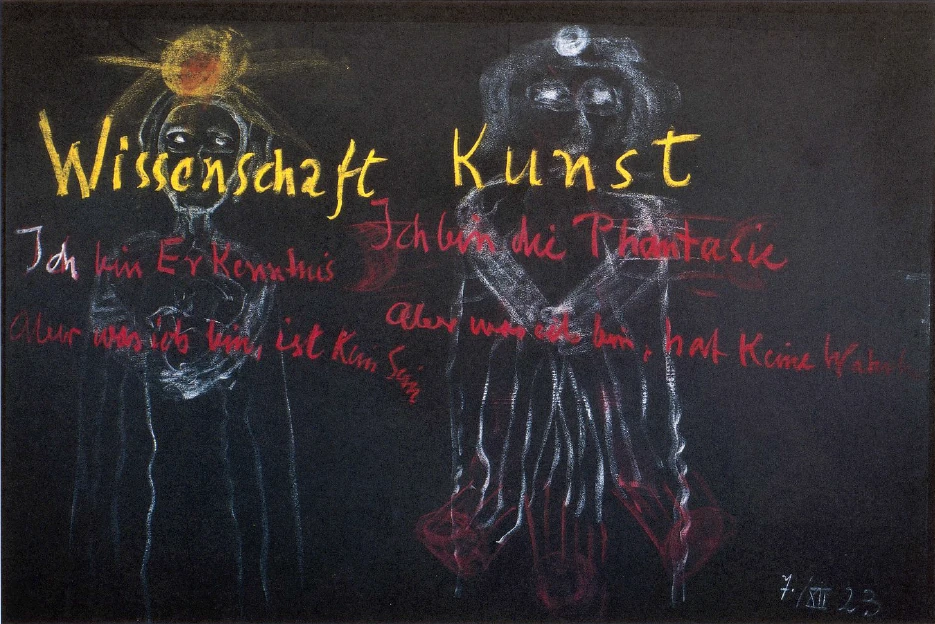

Das letzte Mal mußte ich Ihnen sprechen von den ephesischen Mysterien der Artemis, um Sie aufmerksam zu machen auf gewisse Zusammenhänge zwischen dem, was sich im Laufe der Menschheitsentwickelung als Erkenntnis ergeben hat, und demjenigen, was heute wiederum gefunden werden kann durch den Einblick, durch das Schauen in die geistige Welt. Heute möchte ich, um manches, was mit den angeschlagenen Themen zusammengehört, aufzubauen, von einer anderen Mysterienstätte sprechen, die auch im Ausgangspunkte des neueren Geisteslebens in einer gewissen Weise dadurch steht, daß sie diese neuere Geistesbewegung impulsiert hat, aber doch wiederum noch manches herübergenommen hat aus älteren Geistesbewegungen, in denen noch die Urweisheit der Menschen verankert war. Ich möchte Ihnen heute sprechen von jener Mysterienstätte und ihren tonangebenden Impulsen, die einmal bestanden hat auf der irischen Insel, in Irland, auf die auch hingedeutet ist in meinen Mysterien: von der Mysterienstätte Hyberniens. ^5bhcwu

Es ist verhältnismäßig viel schwieriger, aus dem, was ich öfter vor Ihnen in meinen Schriften die Akasha-Chronik genannt habe, heranzukommen gerade an die alte Mysterienstätte Hyberniens, der vielgeprüften Insel im Westen von England; es ist verhältnismäßig viel schwerer, im nachträglichen Schauen heranzukommen an die Bilder, die in der ewigen Chronik davon geblieben sind, als an andere Mystetienstätten. Denn man bekommt eigentlich, wenn man sich nähern will anschaulich gerade dieser Mysterienstätte, den Eindruck, daß die Bilder dieser Mysterienstätte mit außerordentlich starken Abstoßungskräften versehen sind, die einen zurückstoßen, und die sogar auch dann, wenn man, ich möchte sagen mit einem gewissen Mut an solche Dinge herangeht, durch den Mut nicht so stark zu dämpfen sind, wie das in anderen dergleichen Fällen ist, sondern die auch einem mutvollen Schauen Widerstand entgegensetzen, der sich äußert, ich möchte sagen sogar bis in eine Art Betäubung herein. So daß man nur mit Hindernissen des Erkennens herankommen kann an das, was ich nun beschreiben will. Sie werden in den nächsten Tagen schen, warum solche Hindernisse des Erkennens gerade da bestehen. ^skmzoy

Es gab natürlich auch in dieser Mysterienstätte einweihende Initiierte, die das alte Urwissen der Menschheit herübergenommen hatten, und die bis zu einem gewissen Grade, angeregt und impulsiert durch dieses Urwissen, zu einer Art eigenem Schauen hingelangen konnten. Und es gab Schüler, Einzuweihende, welche gerade in der besonderen Art, die dort gepflegt wurde, sozusagen an das Weltenwort herangebracht werden sollten. Nun, wenn man auf die Vorbereitung hinschaut, die zunächst den dort in Hybernia Einzuweihenden zugekommen ist, so bestand diese Vorbereitung in zwei Dingen. Das erste war, daß diese Vorzubereitenden an alle Schwierigkeiten des Erkennens überhaupt seelisch herangeführt wurden. Alles, was, ich möchte sagen Qual des Erkenntnisweges sein kann, jenes Erkenntnisweges, der noch nicht in die Tiefe des Daseins hineingeht, sondern der einfach darin besteht, daß man die gewöhnlichen Seelenkräfte, die man im alltäglichen Bewußtsein hat, so stark anstrengt, alsnur irgend möglich ist: die Schwierigkeiten, die sich auf diesem Erkenntniswege des gewöhnlichen Bewußtseinsergeben, die wurden diesen Schülern seclischnahegebracht. Sie mußten alle die Zweifel, alle die Plagen, all das innere Ringen und das oftmalige Scheitern dieses inneren Ringens, das Enttäuschtwerden durch, sagen wir, eine wenn auch noch so gute Logik und Dialektik, das alles mußten sie durchmachen. Sie mußten durchmachen alles, was man an Schwierigkeiten empfindet, wenn man nun schon wirklich einmal eine Erkenntnis errungen hat und diese dann aussprechen will. ^hsx2xg

Sie werden fühlen, meine lieben Freunde, das ist durchaus zweierlei: eine Wahrheit errungen haben und sie auszusprechen, zu formulieren. Man hat ja, wenn man in ernster Weise seinen Erkenntnisweg geht, immer das Gefühl, daß dasjenige, was man in die Worte drängen kann, eigentlich schon etwas nicht mehr ganz Wahres ist, etwas die Wahrheit mit allen möglichen Klippen und Fallen Einfassendes ist. ^zyj990

All das, was man da durchmachen kann, was eben nur derjenige kennt, der wirklich das Ringen nach Erkenntnis geübt hat, all das wurde diesen Schülern nahegebracht. ^2pqfdn

Und dann das Zweite, was ihnen nahegebracht wurde, das war, daß sie wiederum seelisch erfuhren, wie wenig eigentlich dasjenige, was auf diesem gewöhnlichen Bewußtseinswege Erkenntnis werden kann, wie wenig das irgendwie zuletzt doch zum menschlichen Glück beitragen kann, wie wenig Logik, Dialektik, Rhetorik zum menschlichen Glück beitragen können. Auf der anderen Seite aber wurde diesen Schülern klar gemacht, daß der Mensch eben doch, wenn er sich aufrecht erhalten will im Leben, herantreten muß an dasjenige, was ihm in einer gewissen Weise Freude, Glück bringt. Und so wurden sie getrieben auf der einen Seite bis nahe an einen Abgrund, und auf der anderen Seite auch bis nahe an den anderen Abgrund und immer veranlaßt zu zweifeln, als ob sie warten sollten, bis man ihnen eine Brücke baut über jeden einzelnen Abgrund. Und sie sind schon so stark in die Zweifel und Schwierigkeiten der Erkenntnis eingeweiht worden, daß sie eigentlich dann, wenn sie übergeleitet wurden von dieser Vorbereitung zu dem wirklichen Herantreten an die Weltengeheimnisse, sogar bis zu dem Entschluß kamen: Wenn es so sein muß, dann wollen wir verzichten auf Erkenntnis, dann wollen wir verzichten auf alles das, was den Menschen nicht Glück bringen kann. ^k2r3hs

Es war durchaus in diesen alten Mysterien so, daß eben die Menschen so starken Prüfungen unterworfen wurden, und daß sie tatsächlich bis zu Punkten gebracht wurden, wo sie in natürlichster, elementarster Art Gefühle entwickelten, die der gewöhnliche philiströse Verstand natürlich als unbegründet ansieht. Aber es ist leicht, zu sagen: Kein Mensch wird ja doch auf Erkenntnis verzichten wollen, selbstverständlich will man Erkenntnis haben, wenn sie auch noch so große Schwierigkeiten macht! - Das sagen eben die Leute, die diese Schwierigkeiten nicht kennen, und die nicht systematisch in diese Schwierigkeiten eingeführt worden sind wie die Schüler dieser Mysterien in Hybernia. Auf der anderen Seite sagt man wiederum leicht: man will auf das innere Glück ebenso verzichten, wie auf das äußere Glück, und nur einen Erkenntnisweg gehen. Aber dem, der die Dinge kennt, wie sie sind, dem erscheinen eben diese beiden Aussprüche, die einem so oft begegnen, als etwas durchaus Philiströses. ^mwb1l6

Dann also, wenn die Schüler bis zu dem angedeuteten Grade vorbereitet waren, dann wurden sie geführt vor zwei kolossale Bildsäulen, vor zwei große, gewaltige, majestätische Bildsäulen. Die eine war mehr majestätisch durch ihre äußere räumliche Größe, die andere war ebenso groß, aber sie war außerdem noch eindrucksvoll durch die besondere Art, wie sie war. Die eine Bildsäule war eine männliche Gestalt, die andere Bildsäule war eine weibliche Gestalt. ^l8sohx

An diesen Bildsäulen sollten sie erleben in ihrer Art das Herankommen des Weltenwortes. Gewissermaßen sollten ihnen diese beiden Bildsäulen die äußeren Buchstaben sein, mit denen sie beginnen sollten, das Weltengeheimnis, das sich vor den Menschen hinstellt, zu entziffern. ^4bc1js

Die eine Bildsäule, die männliche Bildsäule, sie war aus einem ganz elastischen Material. Und sie war so, daß sie an jeder Stelle eingedrückt werden konnte. Die Schüler wurden dazu veranlaßt, an jeder Stelle sie einzudrücken. Dadurch erwies sie sich innen als hohl. Also es war im Grunde genommen nur die Haut einer Bildsäule, aber aus durchaus elastischem Material, so daß, wenn sie drückten, sich die Form sofort wieder herstellte. Über dieser Bildsäule, über dem Kopf dieser Bildsäule, der besonders charakteristisch war, war etwas, was sich darstellte wie die Sonne. Der ganze Kopf war so, daß man sah, er sollte eigentlich ganz sein wie ein seelisches Auge; er sollte wie ein seelisches Auge mikrokosmisch darstellen den Inhalt des ganzen Makrokosmos. ‚Aber durch die Sonne sollte diese Manifestation des ganzen Makrokosmos in diesem Kolossalhaupte zum Ausdrucke kommen. ^rrvikf

Ich kann Ihnen natürlich hier in der Geschwindigkeit nicht die beiden Bildsäulen aufzeichnen, ich will es also nur schematisch tun. Das war also die eine Bildsäule, von der man den unmittelbaren Eindruck hatte: da wirkt der Makrokosmos durch die Sonne, gestaltet das menschliche Haupt, das weiß, wie die Impulse des Makrokosmos sind, das sich selbst innerlich und äußerlich gestaltet nach diesen Impulsen des Makrokosmos. ^ak4ly8

 ^9hzwa2

Die andere Bildsäule war so, daß zuerst die Augen des Schülers fielen auf etwas, das in einer Art von Leuchtekörpern angebracht war und einen Schein zeigte, nach innen gehend. Und in dieser Umrahmung sah dann der Schüler eine weibliche Gestalt, die überall unter dem Einflusse dieser Strahlungen stand. Und er bekam das Gefühl, daß das sn Haupt erzeugt werde aus diesen Strahlungen heraus. Das Haupt hatte etwas Undeutliches an sich. Diese Statue war aus einer anderen Substanz. Sie war aus einer Substanz, die plastisch war, also nicht elastisch, sondern plastisch und außerordentlich weich. Der Schüler wurde veranlaßt, auch da zu drücken. Alles, was er hineindrückte, blieb bestehen. Es wurden nur immer zwischen dem einen Male, wo der Schüler geprüft wurde an diesen Statuen, und dem nächsten Male die Eindrücke, die von den Schülern verursacht wurden, wiederum ausgebessert. So daß immer, wenn die Schüler zu der entsprechenden Zeremonie vor diese Statue geführt werden sollten, die Statue wieder intakt hergestellt war. Bei der anderen, bei der elastischen, stellte sich immer alles von selber wieder her. ^8872xr

Es war die zweite Statue so, daß man den Eindruck bekam: sie steht ganz unter dem Einfluß von Mondenkräften, die den Organismus durchdringen, und die aus dem Organismus das Haupt hervorwachsen lassen. Die Schüler bekamen einen außerordentlich mächtigen Eindruck von dem, was sie da erlebten. Diese Statue wurde ihnen immer wiederum ausgebessert. Und sie wurden oftmals, eine Gruppe von Schülern, in nicht zu großen Zeiträumen vor diese Statue geführt. Wenn sie vor diese Statue geführt wurden, herrschte rings herum zunächst bei den ersten Malen eine lautlose Stille. Sie wurden bis vor diese Statue von den schon Initiierten geführt, wurden dann verlassen, das Tor wurde hinter dem Tempel zugemacht; sie wurden ihrer Einsamkeit überlassen. ^aqw4j4

Dann kam eine Zeit, wo jeder Schüler für sich hineingeführt wurde und veranlaßt wurde zunächst, die Statue zu prüfen, um hier das Elastische zu fühlen, hier, an der anderen Statue, das Plastische zu fühlen, in dem seine Eindrücke bewahrt blieben. Dann wurde er allein für sich gelassen mit dem Eindruck desjenigen, was ja, wie ich schon andeutete, mächtig, ganz mächtig auf ihn wirkte. Und durch alles das, was er erst durchgemacht hatte auf dem Wege, den ich Ihnen ja gekennzeichnet habe, durchlebte der Schüler alle Schwierigkeiten der Erkenntnis, alle Schwierigkeiten der Glückseligkeit, will ich es nennen. Ja, solches zu durchleben bedeutet eben mehr, als in den Worten bloß ausgedrückt wird, in denen man es in der Weise, wie ich es jetzt tue, charakterisiert; solches Erleben bedeutete, daß man durch eine ganze Skala von Empfindungen durchging. Und diese Empfindungen machten es, daß der Schüler die lebendigste Sehnsucht hatte, indem er hingeführt wurde vor diese beiden Statuen, das, was ihm da als ein großes Rätsel erschien, in irgendeiner Weise in seiner Seele aufzulösen, dahinterzukommen, was dieses Rätselhafte eigentlich will: auf der einen Seite das Rätselhafte, daß man mit ihm überhaupt so etwas machte, auf der anderen Seite das Rätselhafte, das in den Gestalten selber lag und inder ganzen Art, wie man sich selber nur zu diesen Gestalten verhalten konnte. Das alles wirkte in tiefer, ungemein tiefer Weise auf die Schüler. Und sie waren vor diesen Statuen eigentlich, möchte man sagen, in ihrer ganzen Seele und in ihrem ganzen Geiste wie eine kolossale Frage. Sie kamen sich vor in ihrem Seelenerlebnis wie eine kolossale Frage. Alles war an ihnen Frage. Der Verstand fragte, das Herz fragte, der Wille fragte, alles, alles fragte. Der heutige Mensch kann von diesen Dingen, die in alten Zeiten anschaulich vorgeführt wurden, die heute nicht mehr in dieser Art zur Initiation anschaulich vorgeführt werden können und brauchen, immerhin lernen, welche Empfindungsskala man durchmachen muß, um sich der Wahrheit wirklich zu nähern, der Wahrheit, die dann in die Geheimnisse der Welt hineinführt. Denn wenn es auch für den heutigen Schüler das Richtige ist, diese Dinge in einem inneren, äußerlich unanschaulichen Entwickelungsweg durchzumachen, so bleibt doch das bestehen, daß auch der moderne Schüler dieselbe Empfindungsskala durchmachen sollte, diese Empfindungen durch innerliches meditatives Erleben in sich durchringen sollte. Also die Skala der Empfindungen selber kann an dem gelernt werden, was innerhalb des äußeren Kultusartigen in jenen alten Zeiten von den Menschen, die eingeweiht werden sollten, durchgemacht worden ist. ^f69s40

Dann, wenn dieses durchgemacht war, dann wollte man die Schüler zu einer Art von Probezeit führen, durch die beides zusammenwirken konnte: auf der einen Seite das, was sie überhaupt vorher in der Vorbereitung durchgemacht hatten auf dem gewöhnlichen Erkenntnis- und Glückseligkeitswege, und das, was in ihnen geworden war wie eine große Frage des Gesamtgemütes, ja, des Gesamtmenschen. Das sollte nun zusammenwirken. ^mx9i4p

Und jetzt, indem ihr Inneres dies zusammen empfand, indem in ihrem Inneren dies zusammen in seinen Wirkungen gegenwärtig war, jetzt wurden ihnen, soweit es in der damaligen Zeit möglich war, vorgetragen die Weltengeheimnisse über den Mikrokosmos, über den Makrokosmos, etwas von jenen Zusammenhängen, die wir gerade in diesen Vorträgen jetzt berührt haben, die auch den Inhalt bildeten der Artemis-Mysterien zu Ephesus. Ein Teil davon wurde hier während einer Art von Probezeit vorgetragen. Dadurch wurde aber das, was wie eine große Frage im Gemüte dieser Schüler war, noch weiter erhöht. So daß der Schüler wirklich, ich möchte sagen in dieser Frageform durch die ungeheure Vertiefung, die das Gemüt im Erleben und im Ertragen durchmachte, in diesem ungeheuren Erleben, herangeführt wurde an die geistige Welt. Er kam tatsächlich mit seinem Empfinden hinein in jene Region, die eben die Seele erlebt, wenn sie in sich fühlt: Jetzt stehe ich vor der die Schwelle behütenden Macht. ^vffws0

Es gab ja in den älteren Zeiten der Menschheit die verschiedensten Arten von Mysterien, und in der verschiedensten Weise wurden die Menschen herangeführt an das, was man empfinden muß, wenn man dann seine Empfindungen zusammendrängt in die Worte: Jetztsteheich an der Schwelle zur geistigen Welt. Ich weiß, warum diese geistige Welt für das gewöhnliche Bewußtsein behütet wird, und worinnen eigentlich das Wesen der behütenden Macht, des Hüters der Schwelle, liegt. ^9kkq10

Und wenn dann die Schüler diese Probezeit durchgemacht hatten, dann wurden sie neuerdings vor diese Statuen geführt. Und dann bekamen sie einen ganz merkwürdigen Eindruck. Dann bekamen sie einen Eindruck, der tatsächlich ihr ganzes Inneres aufrüttelte. Ich kann Ihnen den Eindruck nur dadurch vergegenwärtigen, daß ich Ihnen das, was in jener alten Sprache üblich war, eben in der heutigen deutschen Sprache wiedergebe. ^bcf4o1

Wenn die Schüler so weit gekommen waren, wie ich es Ihnen chatakterisiert habe, dann wurden sie wiederum, jeder einzeln, vor die Statuen geführt. Jetzt blieb aber der einweihende Priester, der Initiator, bei dem Schüler in dem Tempel drinnen. Und jetzt sah der Schüler, nachdem er erst wiederum in lautloser Stille hatte lauschen können auf dasjenige, was ihm die eigene Seele sagen konnte nach all diesen Vorbereitungen und Prüfungen, nachdem das längere Zeit gedauert hatte, wie aufsteigend seinen initiierenden Priester über dem Haupte dieser einen Gestalt zunächst. Und es erschien dann so, wie wenn die Sonne eben weiter rückwärts wäre, und in dem Raume, der da als Zwischenraum war zwischen der Statue und der Sonne, erschien der Priester, wie die Sonne bedeckend. Die Statuen waren sehr groß, so daß der Priester eigentlich in einer gewissen Kleinheit hier über der Statue nur dem Haupte nach erschien, gewissermaßen die Sonne bedeckend; mit dem anderen stand er unten. Dann kam wie aus einem Musikalisch-Harmonischen heraus wirkend — mit einem Musikalisch-Harmonischen begann die Zeremonie — die Sprache des Initiators. Und so, wie eben einmal der Schüler war in diesem Stadium, erschien es ihm so, wie wenn die Worte, die nun von den Lippen des Initiators ertönten, von der Statue gesagt wurden. Und zwar tönten ihm die Worte entgegen: ^i9hmzu

Auch das machte wiederum, wie Sie sich denken können, einen mächtigen Eindruck auf den Schüler. Denn er war dazu vorbereitet, jene Macht zu erleben, die ihm entgegentrat in dem Bilde dieser Statue, und die von sich sagte: Sich, wie das Sein mir fehlt. Ich bin das Bild der Welt. Ich lebe in deiner Erkenntnis. ^pxjhe0

Der Schüler war durch das, was in ihm vorbereitet war in bezug auf die Schwierigkeit des gewöhnlichen Erkenntnisweges, sozusagen nun auch vorbereitet, dieses Bild wie etwas zu nehmen, was ihn von diesen Schwierigkeiten erlöste, wenn er auch die Zweifel an der Erkenntnis in sich nicht besiegen konnte. Und er wurde dazu gebracht, das Gefühl zu haben, daß er diese Erkenntniszweifel nicht besiegen könne. Er war, indem das alles durch seine Seele durchgegangen war, innerlich bereit, sich gewissermaßen mit seiner ganzen Seele an dieses Bild anzuklammern, mit dem, was die Weltenmacht war, die durch dieses Bild symbolisiert wurde, zu leben, ihr sich sozusagen zu übergeben. Dazu war er bereit, indem er das empfand, was nun aus dem Munde des Priesters kam, was so erschien, wie wenn diese Statue eben der Buchstabe wäre, der diesen Sinn, der in den vier Zeilen hier liegt, vor den Schüler hinstellte. ^nnc3fb

Nachdem der Priester wiederum zurückgestiegen war, der Schüler wiederum in lautlose Stille versetzt war, der Priester hinausgegangen war, den Schüler allein gelassen hatte, kam nach einiger Zeit ein zweiter Initiator. Der erschien dann über der zweiten Statue. Und wiederum erklang nun wie aus Musikalisch-Harmonischem heraus die Stimme dieses Priester-Initiators, und die ergab die Worte, die ich Ihnen so wiedergeben kann: ^vafh7i

Und dem Schüler kam es jetzt nach allen Vorbereitungen vor, nachdem er ja dazu geführt war, das innerliche Glück, die innerliche Fülle zu ersehnen - ich müßte besser sagen statt Glück, weil das im Deutschen nicht die richtige Bedeutung gibt: freudvolle innerliche Fülle -, nachdem er durch alles das, was er erlebt hatte, dazu gekommen war, die Notwendigkeit zu empfinden, daß der Mensch zu dieser freudevollen inneren Fülle einmal komme, er war jetzt wiederum daran, indem er von der zweiten Bildsäule dieses hörte, nicht nur beinahe daran, sondern wirklich daran, nun auch die Weltengewalt, die durch diese zweite Bildsäule sprach, als diejenige zu betrachten, der er sich ergeben wollte. ^8gay1p

Wiederum verschwand der Initiator. Wiederum wurde der Schüler allein gelassen. Und während dieser einsamen Stille empfand eigentlich jeder — wenigstens scheint das so, daß jeder es empfand - etwas, was sich vielleicht in den folgenden Worten ausdrücken läßt: Ich stehe an der Schwelle zur geistigen Welt. Hier in der physischen Welt nennt man etwas Erkenntnis, aber das hat eigentlich keinen Wert in der geistigen Welt. Und daß man hier in der physischen Welt Schwierigkeiten damit hat, das ist nur das physische Abbild von der Wertlosigkeit der Erkenntnis, die man hier in der Welt erwerben kann, für die übersinnliche, für die geistige Welt. Und ebenso hatte der Schüler die Empfindung: Manches sagt einem hier in der physischen Welt, du sollst der inneren freudevollen Fülle entsagen, eine Art asketischen Weg gehen, um in die geistige Welt hineinzukommen. Das aber ist eigentlich Illusion, das ist eigentlich Täuschung. Denn das, was in dieser zweiten Bildsäule erscheint, sagt ausdrücklich von sich: Sieh, wie Wahrheit mir fehlt. ^bieux6

Also der Schüler war nahe daran, an der Schwelle der Erkenntnis zu der Empfindung zu kommen, man müsse die innere freudevolle Fülle der Seele, des Gemütes mit Ausschluß von dem erringen, was hier in der physischen Welt durch das schwache, an den physischen Leib gebundene Menschenstreben als Wahrheit ersehnt wird. Es hatte der Schüler schon die Empfindung, daß es jenseits der Schwelle eben anders aussehen müsse, als hier diesseits der Schwelle, daß vieles von dem, was hier diesseits der Schwelle wertvoll ist, wertlos wird jenseits der Schwelle, und daß sogar solche Dinge wie Erkenntnis und Wahrheit jenseits der Schwelle ein ganz anderes Gesicht darstellen. ^ilcwln

Das alles waren Empfindungen, die zum Teil in dem Schüler das Bewußtsein hervortiefen, er sei über manche Täuschungen und Enttäuschungen der physischen Welt hinausgelangt. Es waren aber auch Empfindungen, die bisweilen wiederum wie innerlich wirkende Feuerflammen waren. So daß man sich wie verzehrt von innerem Feuer, wie innerlich vernichtet fühlte. Und die Seele schwankte von der einen Empfindung zur anderen herüber und wiederum zurück. Und der Schüler wurde sozusagen auf der Erkenntnis-Glückswaage geprüft. Und während er so dieses Innerliche durchmachte, war es ihm, als ob die Bildsäulen selber sprechen würden. Er hatte nun etwas wie das innere Wort erlangt, und es war so, wie wenn die Bildsäulen selber sprechen würden. Und es sagte die eine Bildsäule: ^psxiqi

Und jetzt bekam der Schüler dieses ganze, man möchte sagen, schreckausstrahlende Gefühl: Was man an Ideen hat, ist ja alles eben nur Idee, da ist kein Sein darinnen. Strengt man den menschlichen Kopf an - so hatte der Schüler das Gefühl -, so kommt man zwar zu Ideen, aber nirgends ist ein Sein. Ideen sind Schein, kein Sein. Und die andere Bildsäule war wie sprechend; sie sagte: ^jbv48c

So stellten sich vor den Schüler hin die beiden Bildsäulen, wovon die eine ihm vergegenwärtigte, was die Ideen sind ohne Sein, und die andere, was die Bilder der Phantasie sind ohne Wahrheit. ^n772ev

Bitte, fassen Sie das in der richtigen Weise auf. Es kommt nicht darauf an, jetzt hier Dogmen zu geben, es kommt nicht darauf an, Sätze zu prägen, die irgendwie Wahrheiten oder Erkenntnisse ausdrücken, sondern es kommt darauf an, Erlebnisse der Schüler aus den Heiligtümern Hyberniens zu geben. Was diese Schüler erlebten, das zu geben, darauf kam es an. Nicht der Inhalt dessen, was da in diesen Sätzen steht, soll wie eine Wahrheit verkündet werden, sondern das, was in diesem Augenblicke der Initiation die Schüler der Mysterien Hyberniens erlebten, das sollte eben hingeschrieben werden. ^w976sx

Und das alles erlebte ja der einzelne Schüler in absoluter Einsamkeit. Sein innerliches Erleben wurde so stark, daß sein äußerliches Gesicht nicht mehr wirkte. Es wirkte nicht mehr. Nach einiger Zeit sah er die Statue nicht mehr. Aber er las wie mit Flammenschrift an dem Orte, wo er hinschaute, etwas, was ja nicht äußerlich-physisch da war, was er aber mit erschütternder Deutlichkeit sah. Er las da, wo er früher das Haupt der Erkenntnisstatue gesehen hatte, das Wort Wissenschaft, und da, wo er das Haupt der anderen Statue geschen hatte, las er das Wort Kunst. ^78ba6s

Und nachdem er dieses durchgemacht hatte, wurde er durch den Ausgang des Tempels zurückgeführt. Beim Tempel standen wiederum die beiden Initiatoren. Der eine nahm sein Haupt und richtete es gegen dasjenige, was ihm der andere Initiator zeigte: die Gestalt des Christus. Und dabei fielen Worte der Mahnung. Der eine Priester, der das Christusbild ihm vorwies, sprach zu ihm: ^dtu96d

Und der andere Priester sprach: ^5prnus

Das waren sozusagen die ersten zwei Akte der hybernischen Einweihung, der besonderen Art, wie in Hybernia die Schüler zu der wirklichen Empfindung des innersten Wesens des Christentums hingeleitet wurden. Und dies prägte sich nun ganz tief in die Seelen, in die Gemüter dieser Schüler ein. Und nun konnten sie, nachdem sie sich dieses eingeprägt hatten, an ihren weiteren Erkenntnisweg gehen. ^2kohld

Was von diesem zu sagen ist und gesagt werden kann, werden wir nun in den nächsten Tagen im Zusammenhange mit anderen Dingen betrachten. ^z1rl3f