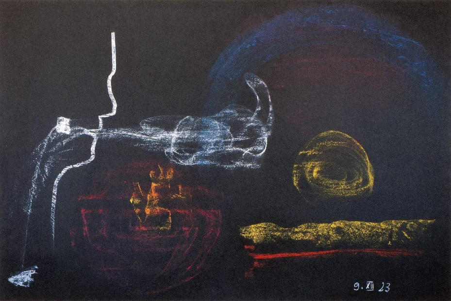

Ich mußte Ihnen verschiedenes erzählen von der Wesensart der hybernischen Mysterien, und Sie haben ja gestern gesehen, daß dieser eigentümliche Entwickelungsgang, den Menschen durchmachen konnten auf der irischen Insel, dazu geführt hat, daß diese Menschen einen Einblick gewannen zunächst einmal in das, was dem menschlichen Gemüte überhaupt möglich ist zu erleben durch die eigene innere Aktivität des Menschen. Sie müssen nur bedenken, durch alle die Vorbereitungen, die für diese zu Initiierenden getroffen wurden, war es möglich, daß wie durch einen Zauber Landschaftsbilder, wie sie sich sonst nur vor den menschlichen Sinnen ausbreiten, vor diese Sinne hingezaubert wurden, daß nicht etwa religiöse, phantastisch halluzinatorische Eindrücke damit gegeben wurden, sondern daß dasjenige, was man schon gewöhnt war, zu sehen, wie ein Schleier vor der Seele stand für das, wovon man sehr gut wußte, da ist etwas dahinter. Und ebenso war es mit dem Hineinblicken in das eigene menschliche Innere bei dem zauberhaften Sehen der traumhaften Sommerlandschaft. Da war also der Schüler vorbereitet darauf, Imaginationen zu haben, Imaginationen, die zunächst anknüpften an dasjenige, was der Schüler sonst mit den äußeren Sinnen sah. Aber er wußte schon, indem er diese Imaginationen vor sich hatte, daß er durch diese Imaginationen weiter durchdringen werde auf etwas ganz anderes. ^a0zm41

Ich habe Ihnen ja gezeigt, wie der Schüler durchdrang zum Schauen auf die Zeit vor dem irdischen Dasein und auf die Zeit nach dem irdischen Dasein, auf die Zeit nach dem Tode bis hin zu der Mitte zwischen dem Tode und einer neuen Geburt, und beim Schauen nach vorn auf die Zeit, die unmittelbar voranging dem Herabsteigen, bis wiederum zur Mitte zwischen dem Tode und einer neuen Geburt. Aber noch etwas anderes ergab sich. Indem der Schüler weitergeführt wurde, sich so recht zu versenken in das, was er durchgemacht hatte, war seine Seele gestärkt durch das Schauen des vorirdischen, des nachirdischen Lebens, hatte seine Seele Einblick gewonnen in die sterbende und wieder geboren werdende Natur, dann konnte er sich mit einer noch stärkeren inneren Kraft und Energie vertiefen in die Art, wie es war bei dem Erstarren, bei dem Aufgenommenwerden von den Weltenweiten, gewissermaßen bei dem Hinausverschweben bis in die blauen Ätherfernen, und wiederum, wie es dann war, wenn man sich ganz nur fühlte als Persönlichkeit in den Sinnen drinnen, wenn man sozusagen nichts vernahm von dem ganzen übrigen Menschen, sondern allein etwas vernahm von dem Dasein im Auge, von dem Dasein in dem ganzen Trakt des Hörens, des Fühlens und so weiter, wenn man also ganz Sinnesorgan war. ^7efbxr

Der Schüler hatte gelernt, mit starker innerer Energie diese Zustände wieder an sich zu beleben, und von diesen Zuständen aus dann dasjenige an sich herankommen zu lassen, was nun noch weiterging. Wenn er nun darauf hingewiesen wurde, ganz innerlich willkürlich, nachdem er alles, was ich geschildert habe, durchgemacht hatte, den Zustand der inneren Erstarrung wiederum herzustellen, so daß er gewissermaßen seinen eigenen Organismus fühlte wie eine Art Mineral, das heißt im Grunde als etwas recht Fremdes; wenn er sein Äußeres, sein Leibliches wie ein Fremdes fühlte, und die Seele gewissermaßen nur wie umschwebend und umhüllend dieses Mineralische, dann bekam er in dem Bewußtseinszustand, der sich daraus ergab, deutlich die Anschauung des der Erde vorangegangenen Mondendaseins. ^jyz2az

Und Sie erinnern sich, meine lieben Freunde, in diesem Augenblikke, wie ich geschildert habe in meiner «Geheimwissenschaft» und in den verschiedensten Vorträgen dieses Mondendasein. Was da geschildert wird, das lebte im Bewußtsein des Schülers auf; es war einfach für ihn da. Ihm erschien dieses alte Mondendasein wie ein planetarisches Dasein, das eigentlich zunächst nur den wäßrigen, den flüssigen Zustand hatte, aber nicht so, wie das heutige Wasser ist, sondern, ich möchte sagen mehr gelatineartig, wie Koaguliertes, möchte man sagen. Und er fühlte sich selbst darinnen. Aber er fühlte sich organisiert in dieser halbweichen Masse. Und er fühlte von seiner Organisation ausströmen die Organisation des ganzen Planeten. ^qh6ap7

Sie müssen sich nur den Unterschied klar machen, wie das Erleben in der damaligen Zeit war, und wie das Erleben heute ist. Heute fühlen wir uns in einem gewissen Sinne begrenzt durch unsere Haut, und wir sagen ja nicht anders, als daß wir als Mensch dasjenige sind, was innerhalb der Haut ist. Es ist natürlich ein gewaltiger Irrtum, denn sobald wir zu dem, was luftförmig im Menschen ist, kommen, ergibt sich sogleich das Unsinnige, sich abgegrenzt zu fühlen innerhalb seiner Haut. Ich habe es ja oft gesagt: die Luftmasse, die ich jetzt in mir habe, war vor kurzer Zeit noch nicht in mir, und die Luftmasse, die in einer kurzen Zeit in mir sein wird, ist draußen. So daß wir uns auch heute nur dann in der richtigen Weise als Mensch fühlen, wenn wir uns in bezug auf Luftförmigkeit nicht abgeschlossen denken von der äußeren Welt. Wir sind überall da, wo die äußere Luft ist. Es ist im Grunde genommen kein Unterschied, ob Sie jetzt ein Stück Zucker im Munde haben, das Sie dann im nächsten Augenblick im Magen haben und das dann einen gewissen Weg durchgemacht hat, oder ob irgendeine Luftmasse in diesem Augenblicke da draußen ist und im nächsten Augenblicke in Ihrer Lunge. Das Stück Zucker macht diesen Weg durch (es wird gezeichnet); die Luft macht eben diesen andern Weg durch die Luft- und Atmungsorgane durch. Und derjenige, der nun das hier nicht zu sich rechnet, der soll nur seinen Mund auch nicht zu sich rechnen, sondern soll seinen Körper erst beim Magen beginnen lassen. Also es ist schon dem gegenwärtigen Menschen gegenüber eigentlich ein Unsinn, sich innerhalb der menschlichen Haut als abgeschlossen zu denken. ^bqdpbg

Aber im Mondendasein war überhaupt gar keine Möglichkeit vorhanden, sich innerhalb der Haut für abgeschlossen zu halten. Solche Möbel, wie sie da herum sind, zu denen man hingeht und sie angreift, gab es dazumal nicht, sondern alles, was es gab, war eben Naturergebnis. Und wenn Sie das Organ ausstreckten, das Sie damals hatten, das im übrigen so war, daß man von etwas Ähnlichem reden kann wie heute von den Fingern, so konnte man diese einziehen, so daß sie ganz verschwanden, und konnte den Arm einziehen, man konnte sich ganz dünn machen und so weiter. Nun, heute, wenn Sie die Tafel angreifen, dann fühlen Sie nicht, daß diese Tafel zu Ihnen gehört. Griff man dazumal nach etwas hin, so fühlte man einfach, daß das zu einem gehörte, wie da die Luftmasse jetzt noch zu einem gehört. So daß tatsächlich die eigene Organisation gefühlt wurde als nur ein Stück der ganzen Planeten-Mondenorganisation. ^exd6xd

Und dies alles trat eben vor das Bewußtsein des hybernischen Schülers. Und er bekam dann auch den Eindruck, wie das Gallertartig-Flüssige nur ein Zustand ist der Mondenorganisation der Zeit nach; wie es gewisse Epochen gab in jener alten Mondenorganisation, wo innerhalb dieses Gelatineartigen etwas auftrat, was physisch viel härter war, als unsere harten Dinge von heute sind. Dennoch war es nicht mineralisch in dem Sinne, wie es beim heutigen Smaragd oder Korund oder Demant ist, sondern es war eben Hartes, Hornigkeit. Mineralisches gab es nicht in dem heutigen Sinne von Kristallisiertem und dergleichen, sondern das, was es an Mineralähnlichem, an Hartem, Hornartigem gab, das hatte durchaus solche Formen, denen man ansah, daß es abgesondert war von organisch Wirksamem, wie man auch heute nicht von der Kristallgestalt eines Kuhhorns spricht, sondern wie man weiß, daß das Kuhhorn nur dadurch da ist, daß es eben aus einer Organisation herausgetrieben ist, oder das Hirschgeweih oder Ähnliches. Es ist übrigens beim Knochen ja nicht anders; der ist aber Mineralisches. Also solches Mineralähnliche, das aufgebaut war aus dem Organischen heraus, das gab es dazumal. ^4wkllh

Und jene Wesenheiten, die dazumal ihre Menschheit schon zum Teil durchmachten, die nur einiges von dieser Menschheit noch zu vollenden hatten während des Erdendaseins, die sind eben diejenigen Individualitäten, von denen ich gesprochen habe als den großen weisen Urlehrern der Menschheit auf Erden, die heute auf der Mondenkolonie sich befinden. ^lhd0fg

Das alles ging dem hybernischen Schüler während dieses Zustandes der Erstarrung auf. Und wenn er in der gehörigen Weise, das heißt in der Weise, wie es plausibel erschien seinen Initiatoren, das alles durchgemacht hatte, dann wurde er daraufaufmerksam gemacht, er sollenun wiederum vorrücken, wiederholentlich vorrücken dazu, sein Erstarrtes ausfließen, ausströmen zu lassen bis zu den Ätherfernen, bis da, wo er fühlen konnte: die Wege der Höhen bringen mich hinaus in die Fernen des blauen Äthers bis an die Grenzen des Raumesdaseins. ^jols0c

 ^ufqhwg

Und dann, wenn er jetzt wiederholentlich dies durchmachte, dann fühlte er alles dasjenige, was da zu fühlen war, von der Erde aus sich gewissermaßen hinausbewegend nach den Ätherfernen. Aber indem er sich nach den Ätherfernen bewegte, nachdem die Höhen ihn aufgenommen und nach den blauen Ätherfernen gebracht hatten, fühlte er da draußen, wie gewissermaßen am Ende der Raumeswelt dasjenige eindrang, was ihn wiederum durchlebte, was wir heute das Astralische nennen würden, etwas, was innerlich erlebt wurde und was viel bedeutsamer, viel energischer sich mit der menschlichen Wesenheit dazumal verband, was aber allerdings nicht so stark wahrgenommen werden konnte, wie heute das Ähnliche wahrgenommen wird, aber welches sich so mit der menschlichen Seele verband, nur in einer energischeren, kraftvolleren, lebendigeren Weise, wie etwa heute sich das Gefühl mit dem menschlichen Inneren verbinden würde, wenn der Mensch sich dem einströmenden, erfrischend einströmenden Sonnenlichte aussetzen würde bis zu dem Grade, in dem es ihn innerlich durchdringt mit einem belebenden, ihm seine Organisation so recht in den Einzelheiten fühlbar machenden Elemente. Denn wenn Sie nur ein wenig achtgeben, so werden Sie ja fühlen können: wenn Sie sich in freier Weise der Sonne aussetzen, wenn Sie sich von der Sonne durchströmen lassen, aber nicht so, daß Ihnen die Sonne dabei unsympathisch wird, im inneren Fühlen unsympathisch wird, wenn Sie sich der Sonne aussetzen so, daß Sie gerade ihr Licht und ihre Wärme mit einem gewissen Behagen in Ihren Körper, in Ihren Organismus einströmen lassen, dann werden Sie fühlen: es wird Ihnen so, wie wenn Sie jedes einzelne Organ leise jetzt anders fühlen würden wie früher. Sie kommen förmlich in einen Zustand, in dem Sie sich innerlich beschreiben können. ^b0dqsu

Daß solche Dinge so wenig gewußt werden, ist ja nur ein Mangel in der Aufmerksamkeitsfähigkeit des heutigen Menschen. Wenn dieser Mangelan Aufmerksamkeitsfähigkeit heute nicht vorhanden wäre, würden die Menschen tatsächlich wenigstens traumhafte Andeutungen geben können von dem, was sich ihnen im innerlichen Erfühlen gezeigt hat im einströmenden Sonnenlichte. Und in Wirklichkeit war es auch so, daß man anders den Schüler unterrichtet hat über das Innere des menschlichen Organismus, als man das heute tut. Heute seziert man die Leiche und dazu macht man die anatomischen Atlanten. Dazu gehört nicht viel Aufmerksamkeit, obwohl ja zugegeben werden muß, daß manche Studenten auch diese Aufmerksamkeit nicht aufbringen; aber dazu gehört nicht viel Aufmerksamkeit. Aber der Schüler wurde ja einstmals so unterrichtet, daß er in die Sonne gestellt wurde, und daß er angeleitet wurde, nun sein Inneres in der Reaktion auf das behaglich einströmende Sonnenlicht zu erfühlen, und darnach konnte er schon aufzeichnen Leber, Magen und so weiter. Es gibt diese innere Verwandtschaft des Menschen mit dem Makrokosmos, wenn nur die Bedingungen dazu hergestellt sind. Sie können natürlich blind sein und können durch das Abfühlen dennoch die Form irgendeines Gegenstandes erfühlen. So können Sie auch, wenn ein Organ in Ihrem Organismus empfindsam gemacht wird für das andere durch die Aufmerksamkeit für das Licht, die Organe im Inneren beschreiben, so daß Sie wenigstens Schattenbilder davon in Ihr Bewußtsein aufnehmen können. Aber in einem hohen Grade wurde das gerade dem Schüler der hybernischen Mysterien eingepflanzt, daß er beim Hinausfluten in die blaue Ätherferne, bei dem Hereinfluten des Astrallichtes vor allen Dingen jetzt nicht sich fühlte; aber er fühlte in seinem Bewußtsein eine mächtige Welt, eine Welt, von der er sich nunmehr das Folgende sagte: Ich lebe ganz in einem Elemente mit anderen Wesenheiten. Dieses Element ist im Grunde genommen lauter Naturgüte. Denn von überall her fühle ich, wie hereinströmt in mich aus diesem Elemente, in dem — verzeihen Sie, daß ich eine später erst mögliche Redensart anwende — in dem ich schwimme, wie der Fisch im Wasser, aber selber eben nur bestehend aus ganz flüchtigen leichten Elementen, im ganzen planetatischen Elemente fühle ich, wie von allen Seiten herankommt das behaglich Einströmende. Der Schüler fühlte eigentlich überall in ihm das Astrallicht einströmen, ihn formend, ihn bildend. Dieses Element ist lautere Naturgüte, hätte er sagen können, denn es gibt mir überall etwas. Ich bin eigentlich umgeben von lauter Güte. Güte, Güte ist überall, aber naturhafte Güte, die mich umgibt. Aber diese naturhafte Güte ist nicht nur Güte, sie ist schöpferische Güte, denn sie ist es, die mit ihren Kräften zu gleicher Zeit macht, daß ich bin, und die mir die Gestalt gibt, die mich hält, insofern ich in diesem Elemente schwimme, schwebe, webe. Und so waren es im Grunde genommen naturhaftmoralische Eindrücke, die sich da ergaben. ^z02t3h

Wenn wir einen Vergleich mit etwas Heutigem ziehen wollten, so könnten wir nur sagen: Wenn es einem Menschen möglich wäre, daß er eine Rose vor sich hätte und an ihr riecht und aus innerer Wahrhaftigkeit und Ehrlichkeit heraus sagen könnte: Göttliche Güte, die sich im ganzen Erdenplaneten ausbreitet, strömt auch in die Rose, und indem die Rose ihr Element mitteilt meinem Riechorgan, rieche ich die im Planeten lebende göttliche Güte, - wenn sich heute ein Mensch mit innerer Ehrlichkeit ein solches sagen könnte beim Riechen des Rosenduftes, dann würde er ungefähr etwas wie einen schwachen Schatten nacherleben von dem, was dazumal als das ganze Lebenselement des einzelnen Menschen innerlich erfahren wurde. Und das, meine lieben Freunde, war das Erleben des Sonnendaseins, das unserer Erde vorangegangen ist. So daß der Schüler also erleben konnte das Sonnendasein, das Mondendasein, wie sie unserer Erde vorangegangen sind. ^wimy9x

Und weiter, wenn dann der Schüler dazu geführt worden war, sich nur in seinen Sinnen zu fühlen, etwas erlebt hatte wie das Abstreifen seines ganzen Organismus, so daß er eigentlich nur in seinem Auge, in seinem Gehörtrakte, in seinem ganzen Fühlen lebte, dann nahm er dasjenige wahr, was ich beschrieben habe in meiner «Geheimwissenschaft» als das Saturndasein, als das Dasein, wo man im Wärme-Elemente, in dem in sich differenzierten Wärme-Elemente schwebte und webte. Man war da so, daß man sich selber fühlte nicht als Fleisch und Blut, nicht als Knochen und Nerven, daß man sich fühlte bloß als ein Organismus aus Wärme, aber diese Wärme in anderer Wärme, als planetarische Saturnwärme. Wärme nahm man wahr, wenn die äußere Wärme einen anderen Grad hatte als die innere Wärme. Ein Weben in Wärme, ein Leben durch Wärme, ein Empfinden von Wärme an Wärme, das war ja das Saturndasein. ^5pu0js

Und das wurde von dem Schüler durchgemacht, wenn er in seine Sinne herausgerückt war. Und diese Sinne waren selber noch nicht so differenziert wie heute. Dieses Wahrnehmen der Wärme an der Wärme, das Leben durch die Wärme, das Leben in der Wärme, das war das Hauptsächlichste. Aber es gab Momente, wo man, indem man selber gewissermaßen als ein Wärmeorganismus sich einem anderen Wärmevorgang oder einem anderen Wärmequantum näherte, durch die Berührung etwas in sich fühlte wie ein Aufleuchten von Flammen, und man war jetzt in einem Elemente - nicht bloß Wärme, die da strömt, die da webt und wellt, man war in einem gewissen Momente etwas wie Flammendes, oder auch etwas, was wie eine webende Geschmacksempfindung war - Geschmack nicht nur wie auf der Zunge, die gab es ja dazumal natürlich nicht, sondern Geschmack, als den man sich selber fühlte, der aber an einem anderen sich entzündete, der auch einem anderen etwas von sich abgab und so weiter. In dem Schüler wurde rege gemacht das Saturndasein. ^hltiv9

Sie sehen also, in diesen hybernischen Mysterien war es durchaus so, daß der Schüler eingeführt wurde in dasjenige, was Vergangenheit des eigenen erdenplanetarischen Daseins ist. Er lernte das Saturn-, das Sonnen- und Mondendasein kennen wie die aufeinanderfolgende Metamorphose des Erdendaseins. ^qu9vm5

Und dann wurde er auch noch einmal wiederholentlich dazu angeregt, dasjenige zu durchleben, was ihn nun in sein Inneres führte; zuerst dieses wiederum zu erleben, was ich Ihnen geschildert habe als das Empfinden eines inneren Druckes, wie wenn man von dem Empfinden eines eigenen Zentrums gepreßt würde, wie wenn die Luft in einem verdichtet würde, so daß, wollte man den entsprechenden Zustand mit etwas beim jetzigen Erdenmenschen vergleichen, man ihn nur vergleichen könnte mit dem, daß er das Gefühl hat, er bringt seinen Atem nicht heraus, er preßt und drückt ihn nach allen Seiten. Das war ja der erste Zustand, und den sollte sich der Schüler jetzt durch äußere Willkür wiederum in der Seele wachrufen. Und wenn er das tat, wenn er tatsächlich dieses ins Träumenkommende hatte, wodurch er ja schon früher sogar fähig geworden war, das Naturdasein als Sommerlandschaft zu erträumen, wachend zu erträumen, wenn er in diesen Zustand gekommen war, dann hatte er in irgendeinem Augenblicke plötzlich ein ganz eigentümliches Erlebnis. Ich möchte sagen, ich muß Ihnen, damit ich überhaupt dieses Erlebnis charakterisieren kann, es von hinten herum charakterisieren, ich muß es in der folgenden Weise charakterisieren. Denken Sie sich einmal: Sie kommen heute als Erdenmensch in ein warmes Zimmer, Sie fühlen die Wärme; Sie kommen, wenn es 5 oder 10 Grad unter Null hat, hinaus, fühlen dort die Kälte; Sie fühlen den Unterschied von Wärme und Kälte, aber Sie fühlen das als etwas Körperliches. Das vereinigt sich nicht mit Ihrem Seelischen. Und es ist Ihnen nicht so als Erdenmensch, daß Sie, wenn Sie in ein warmes Zimmer kommen, just immer das Gefühl haben: hier in diesem Zimmer breitet sich etwas aus wie ein großer Geist, der einen mit Liebe umfängt. Sie empfinden diese Wärme als behaglich körperlich, Sie empfinden sie aber nicht als etwas Seelisches. Ebenso ist es bei der Kälte. Sie frieren, Sie frieren körperlich, aber Sie haben nicht das Gefühl: da draußen kommen überall durch die besonderen klimatischen Verhältnisse Dämonen an Sie heran, die Ihnen etwas so Frostiges zuraunen, daß Sie auch in der Seele erkalten. Es ist die physische Wärme nicht zu gleicher Zeit etwas Seelisches für Sie, weil Sie das naturhafte Seelische als Erdenmensch mit dem gewöhnlichen Bewußtsein nicht in aller Intensität empfinden. Als Erdenmensch kann man an einem anderen Menschen, an seiner Freundschaft, an seiner Liebe erwarmen; man kann an seiner Frostigkeit, vielleicht auch an seiner Philistrosität erkalten, aber man meint damit etwas Seelisches. Aber bedenken Sie nur, wie wenig heute der physische Erdenmensch geneigt ist, wenn er im Sommer in die warme, schwüle Luft hinaustritt, zu sagen: Die Götter lieben mich jetzt sehr! Oder wie wenig der heutige Mensch geneigt ist, wenn er in die Winterkälte hinaustritt, zu sagen: Aber jetzt fliegen nur diejenigen Sylphen durch die Luft, welche frostige Philister sind in der Sylphenwelt. Das sind Redensarten, die man heute gar nicht hört. ^1saxhl

Nun, sehen Sie, diese Empfindung, die ich damit andeuten will - ich sagte deshalb, ich muß die Sache von hinten herum erklären -, die war aber etwas, was sich gerade dem Schüler, wenn er dieses innere Pressegefühl durchmachte, als etwas Selbstverständliches ergab. Alles, was er als Wärme fühlte, fühlte er zugleich als Seelisches, aber eben wiederum auch wie physische Wärme, und das konnte er fühlen, weil er hineinversetzt war mit seinem Bewußtsein in das Jupiterdasein, das aus der Erde entstehen wird. Denn wir werden nur dadurch Jupitermenschen werden, daß wir das Physisch-Wärmehafte mit dem SeelischWärmehaften verbinden, so daß wir als Jupitermenschen dazu kommen werden, wenn wir einen Menschen oder ein Kind meinetwillen in Liebe streicheln, daß wir für das Kind zu gleicher Zeit ein wirklicher Wärme-Ausströmer sein werden. Es wird das gar nicht getrennt sein, Liebe und Wärme-Ausströmen. Man wird tatsächlich dazu kommen, die Wärme, die man erlebt, seelisch auch in der Umgebung auszuströmen. ^el3qr3

Dies - allerdings nicht in der Erdenwelt, sondern entrückt in einer anderen Welt - zu erleben, dazu wurde der Schüler der hybernischen Mysterien gebracht, und dadurch stellte sich ihm, natürlich nicht in der physischen Erdenwirklichkeit, im Bilde das Jupiterdasein dar. ^keg46u

Und die nächste Steigerung war dann diese, daß der Schüler fühlen sollte so recht jene innere Not, von der ich Ihnen gestern gesprochen habe, da der Schüler dazu kam, eigentlich die Notwendigkeit zu empfinden, das eigene Ich zu überwinden, weil es sonst der Quell des Bösen werden kann. Wenn der Schüler so recht diese innere Seelenverfassung in sich gegenwärtig machte, dann trat so etwas für ihn auf, daß er nicht nur seelische Wärme und physische Wärme als eins fühlte, sondern das, was er da als eins fühlte, diese seelisch-physische Wärme fing an zu leuchten, zeigte sich, wie sie anfängt zu leuchten. Das Geheimnis des Licht-Erglänzens, des seelischen Licht-Erglänzens ging dem Schüler auf. Dadurch ward er hineinversetzt in jene Zukunft, wo die Erde verwandelt sein wird in den Venusplaneten, in den zukünftigen Venusplaneten. ^v4a53o

Und dann, wenn der Schüler alles, was er früher erlebt hatte, zusammenströmend wie in seinem Herzen fühlte, so wie ich es Ihnen gestern beschrieben habe, dann trat das vor ihn, daß alles, was er überhaupt in seiner Seele erlebte, zu gleicher Zeit als Erlebnis des Planeten sich zeigte. Man hat einen Gedanken; der Gedanke bleibt nicht etwa innerhalb der Haut des Menschen, der Gedanke fängt an zu tönen; der Gedanke wird Wort. Dasjenige, was der Mensch lebt, bildet sich zum Worte. Das Wort breitet sich aus im Vulkanplaneten. Alles ist im Vulkanplaneten sprechend lebendiges Wesen. Wort tönt an Wort, Wort klärt sich an Wort, Wort spricht zu Wort, Wort lernt verstehen Wort. Der Mensch selber fühlt sich als die Welt verstehendes Wort, als die Worte-Welt verstehendes Wort. Indem dies im Bilde vor dem hybernisch Einzuweihenden hingestellt wurde, wußte er sich im Vulkandasein, in dem spätesten metamorphosischen Zustand des Erdenplaneten. ^juglff

So sehen Sie, die hybernischen Mysterien gehörten wirklich zu dem, was man befugt ist, in der Geisteswissenschaft die großen Mysterien zu nennen. Denn dasjenige, in das die Schüler eingeweiht wurden, das gab ihnen einen Überblick, eine Überschau über das menschliche vorirdische und nachirdische Leben. Es gab ihnen zu gleicher Zeit einen Überblick über das kosmische Leben, in das der Mensch einverwoben ist, aus dem heraus er im Laufe der Zeiten geboren wird. Der Mensch lernte also den Mikrokosmos, das heißt sich selber als geistig-seelischleibliches Wesen kennen im Zusammenhange mit dem Makrokosmos. Er lernte aber auch das Werden, Weben, Entstehen und Vergehen und das sich metamorphosierende Verwandeln des Makrokosmos kennen. Es waren diese hybernischen Mysterien große Mysterien. ^icc3tr

Und ihre eigentliche Blüte hatten sie in dem Zeitalter, das noch dem Mysterium von Golgatha voranging. Aber es war eben das Eigentümliche der großen Mysterien, daß in diesen großen Mysterien von dem Christus als dem Zukünftigen gesprochen wurde, wie später von den Menschen von dem Christus als dem durch vergangene Ereignisse Hindurchgeschrittenen gesprochen wurde. Und eigentlich wollte man nach der ersten Einweihung dem Schüler zeigen, indem man ihm beim Ausgange das Bild des Christus vorführte: alles das, was der Weltengang der Erde ist, tendiert hin nach dem Ereignis von Golgatha. Das wurde dazumal noch als ein Zukünftiges dargestellt. ^0es5oj

Auf dieser später durch so viele Prüfungen gegangenen Insel war in der Tat eine Stätte der großen Mysterien, eine Stätte der christlichen Mysterien vor dem Mysterium von Golgatha, in der in rechtmäßiger Weise auch der vor dem Mysterium von Golgatha wesende Mensch hingelenkt wurde mit seinem Geistesblick nach dem Mysterium von Golgatha. ^pahvrz

Und als dann das Mysterium von Golgatha eintrat, da wurden, während sich drüben in Palästina die merkwürdigen Ereignisse zutrugen, die wir eben beschreiben, wenn wir das Christus Jesus-Erleben auf Golgatha und seiner Umgebung darstellen, innerhalb der hybernischen Mysterien und ihrer Gemeinde, das heißt dem Volke, das hinzugehörte zu den hybernischen Mysterien, große Feste gefeiert. Und was sich in Palästina wirklich zutrug, das trug sich in hundertfältiger Weise bildhaft zu, ohne daß das Bild das Andenken an Vergangenes war, auf der hybernischen Insel. Auf der hybernischen Insel erlebte man in Bildern das Mysterium von Golgatha gleichzeitig, während sich das Mysterium von Golgatha historisch in Palästina zutrug. Wenn später in den Tempel- und Kirchenstätten das Mysterium von Golgatha im Bilde erlebt wurde, im Bilde dem Volke gezeigt wurde, dann waren das Bilder, die an etwas erinnerten, was auf der Erde vergangen war, was also aus dem gewöhnlichen Bewußtsein heraus wie ein historisch Gedächtnismäßiges geholt war. Auf der hybernischen Insel waren diese Bilder vorhanden, als sie noch nicht durch das historische Gedächtnis aus der Vergangenheit heraus geholt werden konnten, sondern als sie erst herausgeholt werden konnten nur aus dem Geiste selber. Auf der hybernischen Insel wurde geistig geschaut dasjenige, was sich für das leibliche Auge in Palästina im Beginne unserer Zeitrechnung abspielte. Und so erlebte eigentlich auf der hybernischen Insel die Menschheit das Mysterium von Golgatha geistig. Und das bedeutet die Größe alles dessen, was später gerade ausgegangen ist für die übrige Zivilisation von dieser hybernischen Insel, was aber verschwunden ist in der späteren Zeit. ^odga44

Und nun bitte ich Sie, auf eines aufmerksam zu sein. Derjenige, der nur die äußere Geschichte studiert, der kann vieles Großartige, Schöne, Herzerhebende, Sinnerleuchtende finden, wenn er historisch zurückschaut in die alte morgenländische Welt, wenn er historisch zurückschaut in das alte Griechenland, zurückschaut in das alte Rom; dann wiederum kann er mancherlei erleben, wenn er heraufkommt, sagen wir in die Zeit Karls des Großen etwa, das Mittelalter hindurch. ‚Aber sehen Sie sich nur einmal an, wie spärlich die äußeren historischen Nachrichten werden in der Zeit, die beginnt ein paar Jahrhunderte nach der Entstehung des Christentums und endet mit etwa dem neunten und zehnten nachchristlichen Jahrhundert. Prüfen Sie einmal die historischen Werke; in allen älteren ehrlicheren historischen Werken werden Sie da eigentlich überall nur ganz kurze Darstellungen, Weniges finden für diese Jahrhunderte. Dann erst wiederum beginnen die Dinge ausführlicher zu werden. ^li2ujv

Allerdings neuere Historiker, die sich gewissermaßen in einer etwas professoralen Art schämen, den Stoff so schlecht zu verteilen dadurch, daß sie das nicht schildern, was sie nicht wissen, die erfinden allerlei phantastische Konstruktionen, die nun in diese Jahrhunderte hineingesetzt werden. Aber das ist ja alles Unsinn. Stellt man äußerlich histotisch ehrlich dar, so wird es ziemlich dünn in der historischen Darstellung für diejenige Zeit, als das alte Rom zugrunde geht, dann die verheerenden Züge der Völkerwanderung kommen, die übrigens nicht einmal so furchtbar äußerlich auffällig waren, wie sich die heutigen Menschen das vorstellen, die nur auffällig waren gegenüber der sonstigen vorherigen und nachherigen Ruhe. Aber wenn Sie einfach heute berechnen, oder meinetwillen in der Vorkriegszeit berechnet hätten, wie viele Menschen, sagen wir von Rußland nach der Schweiz ziehen in jedem Jahre, so würden Sie mehr Menschen herausbekommen, als während der Zeit der Völkerwanderung dieselbe Strecke in Europa durchmessen haben. Alle diese Dinge sind relativ. So daß man eigentlich, wenn man in dem Stile fortreden wollte, den man auf die Darstellung der Völkerwanderung anwendet, man hätte sagen müssen: Bis in die Vorkriegszeit war überhaupt alles in Europa in einer fortwährenden Völkerwanderung, auch nach Amerika hinüber. Und die Auswanderungszüge nach Amerika hinüber waren zahlreicher als die Ströme der Völkerwanderung. Das macht man sich nur nicht recht klar. ^7zyh8a

Aber trotzdem ist es so, daß, während diese Zeit verfließt, die als die Völkerwanderungszeit und als die Nachzeit der Völkerwanderung beschrieben wird, die historischen Nachrichten spärlich werden. Man weiß nicht viel von ihr. Man wird wenig beschreiben von demjenigen, was zum Beispiel hier in dieser Gegend vorgegangen ist, was in Frankreich, in Deutschland vorgegangen ist und so weiter, man wird wenig davon beschreiben. Aber gerade da war es, wo noch die Nachklänge dessen, was erschaut worden war in den hybernischen Mysterien, dennoch über Europa, wenn auch nur in einem schwachen Nachklang, herüberströmten, wo überall die Wirkungen, die Impulse der großen Mysterien von Hybernia schon in die Zivilisation einströmten. ‚Aber nun begegneten sich zwei große Strömungen. Sehen Sie, alles, was ich jetzt sage, ist eigentlich nur als Terminologie gesagt, nicht um auf irgend etwas auch nur einen Schatten von Sympathie oder Antipathie fallen zu lassen, sondern um zu schildern die geschichtliche Notwendigkeit. Zwei Strömungen begegnetensich. Die eine, welcheauf dem Umwege durch Griechenland und Rom aus dem Oriente herüberkam, die da rechnete mit der immer mehr und mehr über die Menschheit hereinbrechenden, bloß auf den Verstand und die Sinne hinzielenden Begabung, wo da gewirkt wurde mit dem, was als historische Erinnerung vorhanden war von äußerlich sichtbaren, äußerlich erlebten Ereignissen. Von Palästina herüber durch Griechenland und Rom verbreitete sich die Nachricht, die dann von den Menschen in ihrem religiösen Leben aufgenommen wurde, die Nachricht über etwas, was sich in der sinnlich-physischen Welt durch den Gott Christus in Palästina abgespielt hatte. Das war berechnet auf das Verständnis der Menschen, das nur mehr angewiesen war auf dasjenige, was wir heute das gewöhnliche, auf den Verstand und die Sinne angewiesene Bewußtsein nennen. Und das breitete sich ja auch in der großartigsten Weise aus. Aber das verdrängte schließlich dasjenige, was vom Westen, von Hybernia herüberkam, und was als ein letzter Ausklang alter instinktiver Erdenweisheit rechnete mit den alten, nur in die neue Bewußtheit hereinleuchtenden spirituellen Weistümern der Menschheit. Etwas breitete sich von Hybernia über Europa aus, was nicht rechnete in bezug auf die Erleuchtung mit Weisheit auf sinnliche Anschauung, auf den Beweis für etwas dadurch, daß man zeigen konnte, das hat sich histotisch abgespielt. Sondern da breiteten sich aus Kulte, Weisheitslchren als hybernische Kulte, als hybernische Weisheitslehren, die da rechneten mit etwas, das den Menschen erleuchtet von der geistigen Welt aus, selbst dann noch, wenn es sich, wie das Mysterium von Golgatha, auf einem anderen Erdenfleck gleichzeitig in physischer Wirklichkeit abspielt. In Hybernia wurde auf die physische Wirklichkeit von Palästina auf geistige Art geschaut. ^0qu17b

Aber dasjenige, was nur anknüpfen konnte an physische Wirklichkeit, das überschattete jenes andere, das da rechnete auf spirituelle Erhebung des Menschen, auf spirituelle Verinnerlichung des Menschen, auf spirituelle Durchseelung des Menschen. Und allmählich gewann aus einer Notwendigkeit heraus, die ja öfter besprochen worden ist in bezug auf andere Gesichtspunkte, allmählich gewann das, was anknüpfte an das sinnlich-physische Dasein, die Oberhand über dasjenige, was anknüpfte an geistiges Schauen. Und die Nachrichten von dem im physischen Leibe auf der Erde wesenden Erlöser gewannen die Oberhand über die wunderbaren imaginativen Bilder, die von Hybernia 'herüberkamen und inKulten dargestellt werden konnten, über die großartigen imaginativen Bilder, die da kündeten von dem Erlöser als einer geistigen Wesenheit und darauf keine Rücksicht nahmen in der Darstellung ihres Kultus, in ihren Schilderungen, daß das auch ein historisches Ereignis war. Am wenigsten konnte man Rücksicht darauf nehmen in der Zeit, wo es noch nicht historisches Ereignis war, denn es waren die Kulte auch schon eingerichtet vor dem Mysterium von Golgatha. ^2fxblk

Und die Zeit brach an, in der die Menschen immer mehr und mehr nur zugänglich waren für das physisch Anzuschauende, in der sie sogleich, man möchte sagen, dazu kamen, die Dinge nicht mehr als Wahrheit zu nehmen, die nicht an physisch Angeschautes anknüpften. Und so wurde die Weisheit, die von Hybernia herüberkam, nicht mehr in ihrer Substantialität gefühlt. Und so wurde die Kunst, die von Hybernia herüberkam, nicht mehr in ihrer kosmischen Wahrheit gefühlt. So entstand immer mehr und mehr nicht eine hybernische Wissenschaft, sondern eine Wissenschaft, die nur anknüpfte auch an das ÄuBerlich-Sinnliche, und nicht hybernische Kunst, sondern eine Kunst — selbst die Raffaclische ist keine andere -, die da brauchte das SinnlichAnschauliche zum Modell, während die hybernische Kunst darauf ausging, das Geistige, das Spirituelle unmittelbar durch die Kunstmittel zu verwirklichen. ^17ixd5

So kam dann die Zeit, in der in gewissem Sinne eine Verfinsterung über das spirituelle Leben eingezogen war, in der man nur pochte auf den Verstand und die Sinne, und Philosophien begründete, die zeigen sollten, wie Verstand und Sinne irgendwie auf das Sein kommen oder zur Wahrheit gelangen könnten. ^7kcjnb

Und dann trat eben jenes Merkwürdige ein, daß die Menschen nicht mehr zugänglich waren den spirituellen Einflüssen. Und wo sollte man denn präziser, möchte ich sagen, schen, wie die Menschen mit ihrem Bewußtsein nicht mehr zugänglich waren spirituellen Einflüssen, als bei dem, was den Menschen so gegeben wurde - ich habe das in der Zeitschrift «Das Reich » dargestellt -, wie etwa die «Chymische Hochzeit des Christian Rosencreutz» den Menschen gegeben wurde. Ich habe dazumal darauf aufmerksam gemacht, wie merkwürdig es doch zugegangen ist mit dieser «Chymischen Hochzeit». Der Valentin Andreä ist der physische Schreiber dieser «Chymischen Hochzeit»; in dem Jahre unmittelbar vor dem Ausbruch des Dreißigjährigen Krieges ist diese «Chymische Hochzeit» hingeschrieben worden von Valentin Andreä. Aber kein Mensch, der die Biographie des Valentin Andreä kennt, wird im Zweifel darüber sein, daß der Valentin Andreä, der später ein philiströser Pastor geworden ist und salbungsvolle andere Bücher schrieb, nicht die «Chymische Hochzeit» geschrieben hat. Es ist ein bloßer Unsinn, zu glauben, daß der Valentin Andreä die «Chymische Hochzeit» geschrieben hat. Denn vergleichen Sie nur einmal die «Chymische Hochzeit» oder die «Reformation der ganzen Welt» oder die anderen Schriften von Valentinus Andreä - physisch war es schon dieselbe Persönlichkeit mit dem schmalzig Salbungsvollen, Fettig-Öligen, was der Pastor Valentin Andreä, der nur denselben Namen trägt, in seinem späteren Leben dann geschrieben hat. Das ist doch ein höchst merkwürdiges Phänomen! Wir haben einen jungen Menschen, der überhaupt noch kaum erst die Schulzeit vollendet hat, der schreibt solche Dinge nieder wie die «Reformation der ganzen Welt», wie die «Chymische Hochzeit Christiani Rosencreutz», und wir müssen uns anstrengen, den inneren Sinn dieser Schriften zu ergründen. Er selber versteht gar nichts davon, denn das zeigt er später: er wird ein salbungsvoller öliger Pastor. Das ist derselbe Mensch! Und man braucht nur dieses Faktum zu nehmen, so muß man plausibel finden, was ich dazumal dargestellt habe: daß eben die «Chymische Hochzeit » nicht von einem Menschen geschrieben ist, oder nur insofern von einem Menschen geschrieben ist, nun ja- wie der stetsangsterfüllte geheime Sekretär von Napoleon seine Briefe geschrieben hat. Aber Napoleon war immerhin ein Mensch, der stark mit seinen Füßen, mit seinen Beinen auf dem Boden stand, war eben eine physische Persönlichkeit. Derjenige, der die «Chymische Hochzeit» geschrieben hat, war nicht eine physische Persönlichkeit, und er hat sich dieses «Sekretärs» bedient, der eben dann später der ölige Pastor Valentin Andreä geworden ist. ^27belo

Denken Sie sich dieses wunderbare Ereignis, dem Dreißigjährigen Kriege ist es vorangegangen: ein junger Mensch, ein ganz junger Mensch gibt seine Hand einer geistigen Wesenheit, die niederschreibt so etwas wie die «Chymische Hochzeit»! Und was in diesem Falle nur in einem besonderen Exempel zutage tritt, das ist oftmals geschehen in jener Zeit. Die Dinge sind nur nicht so gut erkannt und aufbewahrt worden. Was überhaupt als Wichtiges der Menschheit gegeben worden ist in der damaligen Zeit, das ist den Menschen so gegeben worden, daß sie nicht fähig waren, mit ihrem Verstande es zu begreifen. Das war die fortflutende Spiritualität, die sich ihnen immer noch offenbarte, die die Menschen selber darstellen, aber nicht mehr in sich erleben konnten. ^dueby3

Und so ist es schon, daß in dieser Zeit, in der eigentlich, wenn die Bücher die entsprechende Dicke haben, lauter leere Seiten dastehen würden in den Geschichtsbüchern, daß in dieser Zeit die Menschheit wie in zwei Strömungen lebt: in derjenigen Strömung, die unten in der physischen Welt vor sich geht, wo die Menschen immer mehr und mehr nur daran glauben, was ihnen ihr Verstand sagt und was die Sinne sagen; aber darüber findet fortwährend eine durch den Menschen erfolgende, aber von den Menschen nicht verstandene spirituelle Offenbarung statt. Und eben zu den charakteristischsten Beispielen dieser spirituellen Offenbarung gehören solche Dinge, wie «Die Chymische Hochzeit Christiani Rosencreutz». ^vwxtv0

Das alles aber, was sich da offenbarte, ging ja trotzdem durch Menschenköpfe, wenn diese Menschenköpfe das auch nicht verstanden; es ging durch Menschenköpfe, schwächte sich ab, verzerrte sich. Großartig Poetisches, gewaltig Poetisches wurde solches Gesäusel und Geplapper, wie es manchmal die Verse in der «Chymischen Hochzeit Christiani Rosencreutz» sind. Und dennoch sind sie Offenbarungen von etwas Großartigem: gewaltige makrokosmische Bilder, gewaltige Erlebnisse zwischen dem Menschen und dem Makrokosmos, die majestätisch erscheinen. Wenn man mit heutigem Schauen die «Chymische Hochzeit» liest, lernt man diese Bilder der «Chymischen Hochzeit» verstehen; sie lösen sich auf, denn sie sind im Grunde genommen dennoch gefärbt von den Gehirnen, durch die das durchgegangen ist, und hinter ihnen erscheint das Grandiose. ^xcjif9

Solche Dinge sind eben ein Beweis dafür, daß im Unterbewußten das, was einstmals die Menschheit erlebte, eigentlich fortgelebt hat. Und ganz versickert eben ist es dann in den ersten Zeiten des verheerenden Dreißigjährigen Krieges. In der ersten Hälfte des siebzehnten Jahrhunderts fließt ein dasjenige, was einmal große, majestätische spirituelle Wahrheit war. Und nur noch die Mystiker bewahren den Gemütseindruck davon. Aber die eigentliche Substanz, die spirituelle Substanz geht ganz verloren. Der Verstand siegt zunächst, bereitet das Zeitalter der Freiheit vor. ^b8l1k9

Und heute blicken wir zurück auf diese Dinge und sehen gerade auf die hybernischen Mysterien zurück, ich möchte sagen mit einem recht vertieften inneren Seelenleben, denn sie sind im Grunde genommen die letzten großen Mysterien, jene letzten großen Mysterien, durch die sich aussprechen konnten die menschlichen und die kosmischen Geheimnisse. Und wenn man sie heute wieder ergründet, diese Geheimnisse, dann erscheinen einem erst die hybernischen Mysterien recht groß. Aber man kann sie eigentlich nicht durchschauen, wenn man die Dinge nicht zuerst auf selbständige Weise ergründet hat. Und selbst wenn man sie auf selbständige Weise ergründet hat, dann tritt noch etwas Besonderes ein. ^mcn4w9

Wenn man sich in der Akasha-Evolution den Bildern dieser hybernischen Mysterien nähert, dann empfindet man wie etwas, was zurückstoßend wirktauf einen. Esist, wie wenn man voneiner Kraftzurückgehalten würde, wie wenn man nicht herankäme mit der Seele. Und je näherman kommt, destomehr verfinstertsich das, dem manzueilen will mit der Seele, und man bekommt etwas wie eine seelische Betäubung. Man muß sich hindurcharbeiten durch diese seelische Betäubung. Man kann es nicht anders, als indem man alles das in sich aufleben läßt, was man schon weiß an Ähnlichem, an Selbstergründetem, an selbständig Erschautem. Und man merkt dann, warum das so ist. Man merkt dann, daß mit diesen hybernischen Mysterien wohl der letzte Ausklang eines Alten von den göttlich-geistigen Mächten der Menschheit gegeben war, daß aber in der Zeit, als die hybernischen Mysterien in das Schattenleben hinuntergezogen sind, sie zugleich geistig mit einem dichten Wall umgeben worden sind, so daß der Mensch sie nicht in passiver Weise ergründen kann, schauen kann, daß er sich ihnen nicht anders nähern kann, als indem er seine spirituelle Aktivität in sich erweckt hat, also ein richtiger Mensch der neueren Zeit geworden ist. Ich möchte sagen: der Zugang zu den hybernischen Mysterien ist zu gleicher Zeit verschlossen worden, damit die Menschen nicht in der alten Weise an die Mysterien herankommen können, sondern dazu veranlaßt werden, daß dasjenige, was in der Epoche der Freiheit von den Menschen innerlich gefunden werden muß, wirklich auch in Aktivität des Bewußtseins erlebt wird, nicht durch ein historisches, auch nicht durch ein hellscherisch historisches Schauen alter wunderbarer großer Geheimnisse, bevor man sich auf den Weg begeben hat, aus der eigenen inneren Aktivität heraus zu diesen Geheimnissen zu kommen. ^vm0kyq

Damit ist mit den großen Mysterien von Hybernia gerade am intensivsten angedeutet, wie ein neues Zeitalter beginnt in der Epoche, in der die hybernischen Mysterien in das Schattenland hinuntersinken. ‚Aber sie können auch heute wiederum von dem von innerer Freiheit getragenen Seelenwesen in ihrer ganzen Glorie und Majestät geschaut werden, denn durch wirkliche innere Aktivität kann man sich ihnen nähern, kann man überwinden das einem Entgegenschlagende, einen Betäuben-Wollende, das für die Seele dasteht vor dem, was sich hier bis in die spätesten Zeiten hinein den Einzuweihenden noch enthüllte von den großen alten Geheimnissen der einstigen, zwar instinktiven, aber deshalb nicht minder hohen spirituellen Weisheit, die sich einmal als eine Urkraft der Seele über die Menschheit der Erde ergossen hatte. Die schönsten, die bedeutendsten Denkmäler in der späteren Zeit an die Urweisheit der Menschen, an die Urgnade der göttlich-geistigen Wesenheiten, wie sie sich offenbarte im Urzustande der Menschheit, die schönsten geistig-seelischen Denkmäler für diese Zeit sind diejenigen Bilder, die sich uns enthüllen können, indem wir den Blick hintichten auf die Mysterien von Hybernia. ^7y0or7