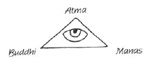

Esoterische Übungen sind die Technik des geistigen Lebens. ^n95dop

Maya = Maha-aya; ya oder ye = Sein; a= Negation; Maha-aya also: Großes Nicht-Sein. ^gcvyzh

Erst durch Luzifers und Ahrimans Einfluß sind wir physische Erdbewohner geworden; andernfalls würden unsere Iche in geistigen Regionen geblieben sein und unsere Körper auf der Erdoberfläche nur von jenen Regionen aus geleitet haben. ^207omz

Trotzdem Luzifer und Ahriman gegen das unmittelbare Wirken des göttlichen Geistes ankämpfen, sind sie doch so vom Geiste gewollt, denn nur durch solchen Widerstand kommt das Ich zur vollen physischen Objektivierung. ^tk1yyd

Wenn Ahriman nicht wäre, würden wir gar nicht das Grün der Pflanze als solches sehen, sondern nur das Geistwesen, das in der Pflanze dargestellt ist. Die einzelne Pflanze ist gleichsam wie ein Haar am Erdkörper. ^16wsj6

Erst durch Luzifer und Ahriman entsteht unser Egoismus. Aber es ist nötig, daß dieser in uns lebt und sich voll zum Ausdruck bringt; denn nur so kann sich alles Leben physisch völlig ausgestalten. Aber wir müssen uns bewußt werden, daß jedes Tun bei uns eine selbstische Färbung hat. Unser Mitleiden treibt uns zur Hilfeleistung, weil wir eben nicht mitleiden mögen. ^j50tkz

Es gibt keinen Punkt im Weltenraum, in dem nicht Kraft wäre. ^gzd3y3

Alle Äthergehirne der Menschen sind verschiedener als die Blätter eines Baumes. Die leuchtenden Punkte in ihm gleichen einer Photographie des Himmels, der voller Sterne ist. ^7dglhy

Im menschlichen Auge ist die Wirkung von Atma, Budhi und Manas ausgestaltet. ^zd84mf

 ^ea3yyq

Dieses Symbol wirkt auch nachts auf uns ein. Wir sollen dort die chaotischen Eindrücke des Tages möglichst fern halten. ^xji9dy

Wir sollen auch am Tage nicht bei alltäglichen Gelegenheiten, so beim Essen, über Theosophie schwatzen. Sie soll uns eine heilige Sache sein. ^atxt7b