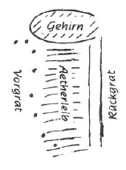

Der gewöhnliche Mensch hat physischen Leib und Ätherleib eng verbunden. Wenn er seinen physischen Leib gebraucht - sei es im Handaufheben oder im Denken -, versetzt er zu gleicher Zeit den entsprechenden Teil seines Ätherleibes in Bewegung. Das soll bei dem Esoteriker anders werden, der Zusammenhang soll lockerer werden. ^gpyn0j

Der Mensch hat ein Rückgrat, das mit dem Gehirn und den Sinnesorganen im Zusammenhang steht. Wenn er meditiert, schafft er sich in seinem Ätherleib gleichsam ein «Vorgrat», das ist die Reihe der Lotosblumen, die hinter dem Brustbein liegen. (Das Brustbein wird der Mensch des siebenten nachatlantischen Zeitalters nicht mehr haben.) ^pxl8r6

 ^h0xrkv

Durch die oben genannte Lockerung des physischen und Ätherleibes wird nun der Mensch einerseits fähig, schneller [eigene] Wunden zu heilen und so weiter; andererseits können auch Gebrechen des physischen Leibes, die zunächst zugedeckt bleiben dadurch, daß die enge Verbindung da war, dann zum Vorschein kommen. Ohne darin zu übertreiben, soll man doch all diesen kleinen Schmerzen und Leiden keine besondere Aufmerksamkeit schenken; das geht ja alles vorbei. In der Übergangszeit dieser Lockerung kann man sich wohl sehr unbehaglich fühlen. Schon das einfache Studium der Theosophie bewirkt diese Lockerung, während wissenschaftliche Entwicklung den Zusammenhang zwischen physischem Leib und Ätherleib noch stärker macht. ^5x7sti

Durch die Meditation bekommt also der Ätherleib die Neigung, sich vom physischen Leib loszulösen. Das kann man verstärken durch eine geeignete Diät. Durch die Diät bekommt umgekehrt der physische Leib die Tendenz, den Ätherleib aus sich herauszustoßen. Es ist das ein Hilfsmittel, das aber ohne hinzukommende esoterische Übungen gerade das Falsche bewirkt. Dann stößt nämlich der physische Leib den Ätherleib heraus, ohne daß dieser Sinnesorgane entwickelt hat. Er ist dann wie ein Blinder und schaut nur seine eigenen Phantastereien. ^jtyi0g

Indem die Hüllen des Menschen in dieser Weise eine Veränderung erleiden, wird auch sein Zusammenhang mit dem Makrokosmos verändert. Dieser Zusammenhang muß in der richtigen Weise wieder gepflegt werden, sonst geschieht Unheil — nicht nur im Menschen, sondern im ganzen Weltall. Wer zum Beispiel in einer ungeeigneten Gesellschaft den heiligen, unaussprechlichen Namen aussprechen würde, würde Schlimmeres als Erdbeben und vulkanische Ausbrüche sogar über die Gegend heraufbeschwören. Es ist daher ein ungeheurer Unterschied, wie die Rosenkreuzerformel ausgesprochen wird, sei es mit dem Namen, der bloß ein Deckname des höchsten Geisteswesens ist, oder ohne diesen. Nur die letztere Art des Aussprechens der Formel ist eine esoterische. ^fjxjxd