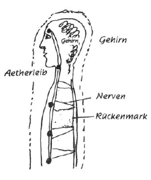

Der Esoteriker soll sich deutlich ins Bewußtsein bringen, was er eigentlich mit seinen Übungen, den uns gegebenen Exerzitien, tut. Wir haben des öfteren darüber gesprochen, daß das Streben des Esoterikers danach geht, den Ätherleib, überhaupt die vier Leiber untereinander, zu lockern. Dies kann nun auf zweierlei Weise geschehen, auf eine exoterische und eine esoterische. ^h1iwlx

Man kann den physischen Leib dazu veranlassen, daß er den Ätherleib hinausstößt, hinausquetscht, indem man den physischen Leib genügend präpariert durch Diät, Atemübungen etc. Unsere vegetarische Lebensweise hat ja im Grunde nur den Zweck, den physischen Leib in diesem Bestreben zu unterstützen. Dies sind die exoterischen Mittel zur Lockerung. Die esoterischen sind unsere Übungen, unsere Exerzitien. Und da muß gesagt werden, daß diese die Hauptsache sind, daß wir diese mit Hingabe und Ernst machen sollen, daß alles übrige nur Unterstützung dieser Hauptsache sein soll. In unserer materialistischen Zeit würde ja mancher in seiner materialistischen Sehnsucht gern die weitestgehenden Diätvorschriften befolgen, würde stundenlange Atemübungen machen, wenn er dadurch etwas erreichte; sich aber geistig anzustrengen durch Meditationen und Konzentrationen, das ist viel unbequemer, und dabei zeigt sich dann erst oft die geistige Trägheit. - Würden wir aber nur durch physische Einwirkungen unseren Ätherleib herausquetschen, so könnte der physische Leib ihm ja nichts mitgeben, und er würde leer in das Unbekannte hinaustreten. Da treten dann solche Zustände ein, daß wir zum Beispiel irgend etwas denkerisch nicht recht erfassen können, wenn wir etwas durchdenken wollen. Wir können mit unserem Äthergehirn uns des physischen nicht recht bedienen, weil wir ja nicht richtig in demselben darin sind. Es ist, als ob wir, im Wasser schwimmend, etwas ergreifen wollten, das uns immer ausweicht. Der vernünftige Esoteriker wird sich bei solchen Zuständen sagen, daß er hier erst einmal Ordnung schaffen muß durch geeignete Willenskonzentrationen und Gedankenübungen. Auch bei normaler Entwicklung wird ja manches eintreten, von dem wir uns sagen müssen, daß es ein vorübergehendes Leiden ist. Denn durch die Herausziehung des Ätherleibes geht es dem physischen Leibe erst ähnlich wie einer Pflanze, der man die Säfte eine Zeitlang entzieht. Sie vertrocknet. Und so vertrocknet - man sieht dies aber nicht physisch — auch der physische Leib zum Teil, und wo er Anlagen zu Erkrankungen hat, da kommen diese heraus. Wenn aber der Ätherleib sich in der richtigen Weise durchtränkt hat mit geistigen Wahrheiten, so bezieht er dadurch neue Kräfte, und diese wirken wiederum gesundend auf den physischen Leib. Man kann beobachten, daß dann beim physischen Leibe selbst Schnittwunden leichter heilen, überhaupt Wunden, wenn der Mensch sich mit spirituellen Wahrheiten durchdringt, ja wenn er nur theosophische Denkweise in sich wirken läßt. ^mmu3iq

 ^eibedg

Durch unsere Meditationen wirken wir also zunächst auf den Astralleib. Dieser ist der Erbauer unseres Nervensystems, das zum Rückenmark hin verläuft, oder, wie man heutzutage sagt, von ihm ausgeht. Nun sollen wir erreichen, daß im Ätherleib, durch Abdruck vom Astralleib, sich die Lotosblumen entfalten, die untereinander verbunden sind, und auf diese Weise sozusagen ein Vordermark schaffen. ^0qk1ln

Dieses Vordermark ist natürlich nur ätherisch-astral vorhanden und kann sich nur durch die Meditationen und Konzentrationen bilden. Deshalb sind sie das Wichtigste zu unserer esoterischen Entwicklung. Und von direkter Schädlichkeit ist nur der Alkoholgenuß für den Esoteriker. Alkohol muß auf alle Fälle vermieden werden. Es ist natürlich gut, wenn wir durch vegetarische Diät den Prozeß unterstützen, denn dieses Herausheben des Ätherleibes ist heutzutage durchaus nicht leicht. Viele unserer modernen Berufe sind direkt darauf angelegt, den Ätherleib fest in den physischen Leib hineinzutreiben; so daß es dem Hellseher oft direkt Schmerzen verursachen kann, wenn er so etwas sieht. Auch die Kost, wie sie in unseren großen Hotels heutzutage verabreicht wird, ist ganz dazu angetan, den Ätherleib fest in den physischen Leib zu treiben. ^sffltz

Durch die esoterische Arbeit an uns sollen wir uns ein neues Denken, neues Fühlen und neues Wollen aneignen. Wir müssen uns sagen, daß, wenn wir den kühnen Mut gefaßt haben, den Weg des Esoterikers zu gehen, wir einen Sprung über einen Abgrund machen müssen. Wir müssen einen einmal durchdachten Gedanken in unser Gefühl übergehen lassen und dieses dann ganz damit durchdringen, damit wir nicht leichtfertig etwas dahersagen, was wir eigentlich nicht erfaßt haben in seiner ganzen Tiefe. Ein Satz, den man heutzutage so oft von Menschen hören kann und der doch so mißbräuchlich wie wenige angewendet wird, ist der: Ich bin ein Christ. - Dem Esoteriker sollte klar sein, daß «ein Christ sein» ein fernes, fernes Ideal ist, nach dem er unablässig streben muß. Wie ein Christ leben heißt vor allem: was das Schicksal uns auch bringen möge, mit Gelassenheit hinzunehmen, nie ein Murren gegen die Götterarbeit zu haben, mit Freudigkeit hinzunehmen, was sie auch schicken. Das heißt sich den Satz in Fleisch und Blut übergehen lassen: «Sehet die Vögel unter dem Himmel, sie säen nicht, sie ernten nicht, sie sammeln nicht in die Scheunen, und es wird ihnen doch gegeben.» Dankbar hinnehmen, was uns gegeben wird, dann leben wir diesem Spruche gemäß. Wenn wir das nicht tun, so wird er in unserem Munde zur Blasphemie. Es sollte uns überhaupt klar sein, daß, wenn wir uns nicht genügend vorbereiten für den Sprung über den Abgrund in die geistigen Gebiete hinein, wir durch Worte und Gedanken solchen Schaden anrichten können, daß die Götter Welten zertrümmern müssen, um diesen Schaden wiedergutzumachen. Denn was verdorben ist, das muß zerstört werden, um neu gebildet zu werden. ^k6gpec

Aus dem Geistigen sind wir entstanden — Ex Deo nascimur. Und wenn wir den Sprung über den Abgrund tun, so drücken wir das aus [durch] In Christo morimur - in der festen Zuversicht, daß wir drüben im Heiligen Geiste wieder aufleben: Per Spiritum Sanctum reviviscimus. Weil wir aber den Namen des Heiligsten, das immer mit unserer Erdenentwicklung verbunden war, so heilig halten sollen, daß wir ihn nicht unwürdig aussprechen, gibt es eine esoterische Fassung des Rosenkreuzerspruches, in dem der Name weggelassen wird: ^8kc4nq