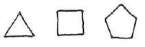
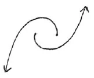
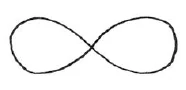

Aufzeichnung A ^ebjfq0

Unsere Meditationen sollen, wie das letzte Mal [17. Januar 1911] ausgeführt wurde, in dem Zeichen stehen: «Stetiger Tropfen höhlt den Stein». Als wirksame Vorbereitung für die Übungen haben wir das Studium der theosophischen Werke. Es ist besser, ein Werk fünfundzwanzigmal gelesen zu haben, als fünf Bücher jedes fünfmal; und wer ein Buch zwei- oder dreimal gelesen hat, darf sich gar nicht einbilden, es überhaupt gelesen zu haben. Wenn wir an einem bestimmten Tag des Jahres dieses oder jenes bei unserer Meditation erlebt haben, dann werden wir, wenn wir inzwischen wirklich studiert haben, an demselben Tag nach einem Jahr viel mehr erleben können. Es ist gut, dieselbe Übung durch lange Zeiten hindurch zu behalten, das ist viel besser als das fortwährende Abwechseln. ^2lsdew

Nicht nur unsere Gedanken sollen wir durch das Studium bereichern, sondern auch bestimmte Gefühle entwickeln. In einfachen Empfindungen kann man die Anknüpfungspunkte für etwas viel Tieferes finden. Zum Beispiel sollen wir einmal aufmerksam werden auf die Empfindung des Anfassens, zum Beispiel eines Gegenstandes, oder des Angefaßtwerdens, zum Beispiel bei der Hand gefaßt zu werden. Da können wir einen deutlichen Unterschied fühlen, wenn wir zum Beispiel uns vorstellen die Empfindung, die in uns erregt wird, wenn wir eine Schnecke anfassen oder wenn eine Schnecke uns, ohne daß wir es wissen, über die Hand kriecht. Wenn wir diese verschiedenen Gefühle gut ausbilden, dann können wir uns einen Begriff bilden von dem Unterschied zwischen der untersinnlichen und der übersinnlichen Welt. ^lk2xzw

Die ganze physische Welt mit all unseren diesbezüglichen Empfindungen ist eine Maja oder Illusion. Wir können sie uns vorstellen unter dem Bilde eines Feldes oder einer Ebene; über ihr ist die übersinnliche, unter ihr die untersinnliche Welt. Die übersinnliche Welt ist nun eine solche, daß sie in Zusammenhang gebracht werden kann mit dem Gefühl des Angefaßtwerdens, die untersinnliche dagegen mit dem Gefühl des Anfassens. ^a4u4k5

In der Rosenkreuzerlehre wurde die untersinnliche Welt immer die elementarische Welt genannt, die Welt der Elemente des Feuers, der Luft, des Wassers, der Erde. ^uybsbs

Zu dem Element der Erde dringt man durch, wenn man über Dreiecke, Vierecke, Fünfecke, geometrische Figuren überhaupt meditiert. Man soll das dann so machen, daß man sich diese Figuren mit dem Finger der einen Hand in das Innere der andern Hand schreibt, daß man dann jeden Gedanken an die Hand und das Schreiben fallenläßt und nur die Empfindung des Hineinschreibens in die Handfläche wie frei schwebend im Raum sich denkt und sich in diese Empfindung vertieft. So ergreift man allmählich das Element der Erde. ^ia61el

 ^ha1a72

Das Element des Wassers wird dadurch ergriffen, daß man sich einen fixen, materiellen Punkt denkt und einen andern, beweglichen Punkt, der sich in einem Kreise um den ersteren herumbewegt. Dann soll man sich das ebenso wieder in die Hand schreiben und so damit verfahren wie mit der ersten Figur. Den zweiten Punkt soll man als fortgesetzt weiter drehend denken. ^jscxfw

 ^lipflo

Bei dem Elemente Luft denke man sich zwei fixe Punkte, die voneinander wegfliehen wollen, aber vorher eine Art Halbkreis umeinander beschreiben und dann ins Unendliche auseinanderstreben. Wenn wir mit dieser Figur genau so vorgehen wie mit der vorangegangenen, dann ergreifen wir das Element Luft, fühlen nicht bloß die Luft an uns vorbeistreichen, sondern ergreifen sie wirklich. ^bf8t03

 ^s2pfhu

Bei dem Elemente Feuer denke man sich eine geschlossene Figur wie eine Schleife oder Achterfigur. Man soll besonders empfinden, daß in der Mitte ein Schnittpunkt sich befindet, wo die Kurve sich selbst berührt. ^zrjumg

 ^hn2is9

Diese Übungen soll man unausgesetzt und längere Zeit nacheinander fortsetzen. Sie sind nicht leicht; man muß sich erst eine gewisse Praxis aneignen erstens in dem Fühlen der Empfindungen im Raum, ohne die Hand in Anspruch zu nehmen, und zweitens in dem Festhalten der Figur. Dann aber führt diese Übung zum Erfassen der elementaren Welt; man lernt diese ergreifen. ^hr0tgs

Es ist aber eine Regel ohne Ausnahme, daß diese Übungen zugleich egoistisch machen. Deshalb sollte man sie niemals ausführen, ohne nicht zu gleicher Zeit allumfassendes Mitgefühl für alles, was Menschen freut und schmerzt, in der Seele zu entwickeln. ^31uuyj

Beim Aufsteigen in die übersinnliche Welt werden wir tatsächlich von höheren Wesen ergriffen, die sich unser als ihrer Werkzeuge bedienen, so wie wir uns unseres Auges, Ohres etc. bedienen. Die Gefahr bei diesem Erlebnis ist, daß man dabei, im schlechten Sinne des Wortes, immer selbstverlorener wird. Daher ist es nötig, zu gleicher Zeit Mut und Furchtlosigkeit auszubilden. Dann können wir uns ruhig in der geistigen Welt von geistigen Wesen ergreifen lassen, so daß wir fühlen: jetzt inspiriert uns ein Engelwesen, jetzt ein Erzengelwesen und so weiter. Imaginationen führen in die untersinnliche Welt, Inspirationen in die übersinnliche Welt. ^2f1yb8

Man sieht, wie in dem Rosenkreuzerweg diese zwei Richtungen, nach oben und nach unten, vereinigt sind. Es ist nötig, daß man als Hellseher streng unterscheiden lernt zwischen elementarischer Welt und übersinnlichen Wesen; zwischen dem, was hier in der physischen Welt als Einheit erscheint. Wer beides zusammen schauen würde, in einem Bild das Wesen und dasjenige, was sein elementarischer Ausdruck ist, der würde die gröbsten Fehler machen und alles durcheinanderwerfen. Es ist im Anfang nicht leicht, die beiden Gebiete zu trennen, weil das astralische und auch das devachanische Schauen beide gibt, aber man lernt allmählich, wenn man, aufsteigend, ein Wesen schaut, sofort herabzusteigen, um unterhalb der physischen Welt das Elementarische dieses Wesens zu finden, so wie man, wenn man einen Gegenstand schaut, sofort herabschauen kann, um seine Widerspiegelung im Wasser zu erblicken. ^zta9cs

Der Saturnzustand könnte nicht geschildert werden, wenn man nicht auf der einen Seite sich zu solchen Wesen erheben könnte wie den Geistern des Willens oder Geistern der Persönlichkeit, und auf der anderen Seite in das Element des Feuers durchdringen könnte. Ebenso muß man für den Sonnenzustand die Geister der Weisheit und die Erzengel erkennen und auch das Element Luft. In der Beschreibung (in der «Geheimwissenschaft») wird beides zusammen gegeben: wie die Throne die Saturnwärme ausströmen lassen und so weiter. Es ist aber notwendig, bei der Beobachtung, dies als eine Zweiheit zu empfinden. ^03ffa0

Man muß sich darauf vorbereiten, in der geistigen Welt Dinge zu sehen und zu hören, die man hier unten niemals gesehen oder gehört hat. Wer nur erwartet, ihm schon Bekanntes da drüben zu finden, wird niemals in die geistige Welt eindringen können. Das ist es auch, was in dem zweiten Satz von unserem Rosenkreuzerspruch ausgedrückt ist: In - - - morimur. Nur wenn das Sterben in Christo bei uns stattfindet, können wir durch den Heiligen Geist wiederum auferweckt werden. Das wiederum ist näher ausgedrückt in dem, was gewissermaßen ein Kommentar auf unseren zweiteiligen Spruch ist, der uns von den Meistern gegeben ist: ^b855sv

Aufzeichnung B ^frzilh

Wir haben schon das letztemal gesehen, daß wir uns nicht sehnen sollen nach neuen Übungen, sondern gerade, wenn wir täglich mit unentwegter Treue dieselben Übungen machen (Beispiel: «Steter Tropfen höhlt den Stein»), so werden sie befruchtend auf uns wirken. Es werden sich Empfindungen einstellen, die uns hinaufführen in die geistige Welt. ^r5tpi5

Ganz ähnlich verhält es sich mit dem Lesen theosophischer Bücher. Ein Theosoph glaube doch nicht, ein Buch wirklich zu kennen, wenn er es dreimal gelesen hat. Das ist so gut, als habe er es noch gar nicht gelesen. Und anstatt je fünf Bücher fünfmal zu lesen, soll er lieber ein Buch fünfundzwanzigmal lesen. Wir werden dann die Resultate schon an uns merken, sie fließen unbewußt ein in unsere Meditationen und bilden Marksteine auf unserem Weg in die geistigen Höhen. ^er0zia

Alle Dinge um uns, die ganze Welt der physischen sinnlichen Wahrnehmung müssen wir uns gewissermaßen vorstellen wie ein großes weites Feld (eine Fläche). Darüber breitet sich die übersinnliche, darunter die untersinnliche Welt aus. (Die sinnliche Welt und die gewöhnliche, an das Gehirn gebundene Gedankenwelt [Maja] als eine Fläche, ein Feld vorstellen, darüber die übersinnliche Welt [Hierarchien etc.], darunter die untersinnliche Welt, davon die oberste Sphäre die elementare Welt.) Wie unterscheiden sich die beiden? ^4pr1no

Der untersinnlichen Welt stehen wir gegenüber, als ergreifen wir sie, der übersinnlichen dagegen, als werden wir ergriffen. Denken wir uns zum Beispiel, daß wir eine Schnecke angreifen oder daß sie uns über die Hand kriecht, so haben wir den Unterschied. Stellen wir uns diese beiden verschiedenen Empfindungen recht oft vor, so werden wir schon den Unterschied finden zwischen der übersinnlichen und der untersinnlichen Welt. ^68ctj3

Wollen wir nun die untersinnliche Welt oder Elementarwelt begreifen lernen, so tun wir gut, uns geometrische Figuren wie das (Dreieck, Viereck) vorzustellen und darüber zu meditieren. Dann leben wir uns ein in das Erdige. Und zwar haben wir das folgendermaßen zu machen. ^masq80

 ^nr4uze

Wir zeichnen zuerst das Dreieck mit der einen Hand in die andere, dann übertragen wir die Bewegung in den frei schwebenden Raum, als ob sie uns nichts mehr anginge, aber indem wir doch dieselben Empfindungen in uns hervorrufen wie vorher, als wir die Figur in die Hand zeichneten. ^dwfc3r

Will man das Wäßrige in der Elementarwelt begreifen, so denkt man sich einen Punkt, um den ein anderer fortwährend im Kreise rotiert. Wieder zeichnet man ihn zuerst in die Hand, überträgt ihn dann in die freie Luft, aber so, daß man sich dabei sowohl die Bewegung vorstellt als auch die Empfindung, die dabei ausgelöst wurde. ^9oy6qv

 ^vi469f

Will man sich in das Luftförmige der Elementarwelt hineinleben, so muß man sich zwei Punkte vorstellen, die zuerst in einem Halbkreise umeinander herumgehen, sich dann aber fliehen und verlieren im Raume. ^69i11e

 ^q2mesk

Um sich endlich in das Feuer einzuleben, muß man sich vorstellen einen Punkt, der aber immer wieder berührt wird. ^dy00d6

 ^0kbk3n

Auch diese beiden letzten Symbole müssen erst in die Hand gezeichnet, dann in den frei schwebenden Raum übertragen werden. ^i43cm8

Wenn wir über diese Symbole in der angegebenen Weise meditieren, so werden wir schon merken, wie wir uns einleben in die Elemente, wie wir erkennen werden, welche Wesenheiten in ihnen leben. Zugleich aber werden wir empfinden, daß wir immer egoistischer werden. Es können diese Übungen nur dann zum Heile gereichen, wenn wir zugleich als Gegengewicht in uns das allgemeine Mitleid, das universelle Mitgefühl entwickeln, das uns jeden Schrei oder Ton der Klage, jeden Laut des Schmerzes in unserer Umgebung so empfinden läßt, als entspringe er unserer eigenen gequälten Brust. ^3yq0b7

Und wie die Gefahr des Egoismus groß ist beim Einleben in die untersinnliche Welt, so ist die Gefahr des Weltenverlorenseins nicht minder groß, leben wir uns hinauf in die übersinnliche Welt. Es ist tatsächlich so, daß wir besessen werden von höheren Wesenheiten, sie ziehen in uns ein, nehmen Besitz von uns, um durch uns zu wirken. Da kommt es nun darauf an, unser «Ich», unser eigenes Selbst zu bewahren, es sich nicht verlieren zu lassen. Dazu verhilft uns Mut, Starkmut, Furchtlosigkeit. Sich vorher vor irgendeinem uns möglicherweise treffenden Unglück fürchten ist ganz nutzlos. Im Gegenteil soll man sein Karma mit Mut und Furchtlosigkeit ertragen, es hilft nichts, sich davor zu fürchten. Von vornherein muß man sich vorstellen, daß man in der geistigen Welt etwas anderes vorfindet als in der physischen. Geistige Wesenheiten sind es, die uns da entgegentreten. Leben wir uns nun so hinauf, daß wir die geistigen Wesenheiten finden wollen in ihrem Element, so werden wir leicht irregeleitet. Wahr ist es, daß wir durch solche Übungen die früheren Planetenzustände begreifen und uns in sie hineinversetzen lernen. Aber nur solche Erlebnisse geben Förderung, bei denen die Intuition die Imagination weckt. Stellen wir uns zum Beispiel die Throne und die Geister der Persönlichkeit vor in ihrem Wirken auf dem alten Saturn und zugleich das Element des Feuers, so werden wir bei der Vorstellung des Saturn irregeführt werden. Nur dann werden wir ihn begreifen, wenn wir uns beide - die geistigen Wesenheiten und das Element - getrennt vorzustellen vermögen. Das Feuer als etwas Getrenntes, als Spiegelbild. Ebenso verhält es sich bei Sonne und Mond. Von oben her wirken die geistigen Wesenheiten, seien es die Angeloi oder Archangeloi. Sie wollen in den Menschen einziehen, Besitz von ihm ergreifen, um durch ihn auf Erden zu wirken. Wir sollen uns ihnen öffnen, aber ohne unser Ich daranzugeben. ^x6u8ku

(Das Hineinarbeiten in die übersinnliche Welt [ist] verbunden mit dem Gefühl des Ergriffenwerdens von den Hierarchien, die durch uns wirken wollen, das in die untersinnliche Welt [mit] dem Gefühl des Ergreifens; beides auseinanderhalten. Zum Beispiel wenn beim Hineinmeditieren in den Saturnzustand einem die Throne und die Geister der Persönlichkeit erscheinen im Verein mit dem Element des Feuers, so ist dies unrichtig und irreführend. Man muß deutlich beides als Getrenntes empfinden. Hinauf zu der Hierarchie, ein Hinuntertauchen in das Elementarreich und wieder zurück hinauf.) ^wlkwcd