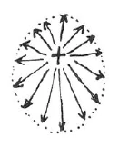
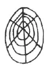

Aufzeichnung A ^rtgjmg

Meine lieben Schwestern und Brüder! Wir müssen uns klarmachen, daß ein großer Unterschied besteht zwischen dem äußeren, exoterischen Wissen und dem Wissen, das uns die Theosophie übermittelt. Wenn wir eine äußere Anschauung auf uns wirken lassen, so bilden sich in uns Vorstellungen, Begriffe; wir lernen die Sache, das, was wir anschauen, dadurch kennen, haben ein Wissen über sie. Verhält es sich nun ebenso mit dem theosophischen Wissen? Auch da, wenn uns erzählt wird von den vier Gliedern des Menschen oder von den planetarischen Zuständen der Erde, oder der Akasha-Chronik, bilden wir uns Begriffe, Vorstellungen über diese Dinge, aber es ist noch etwas anderes dabei. Während uns das exoterische Wissen nicht bereichert, nichts hinterläßt über den Tod hinaus, verhält es sich anders mit allem esoterischen Wissen. Es fließt in uns ein, in unsern Astralleib, bildet da gewisse neue Glieder; neue Fäden weben sich hinein in den Astralleib und bleiben mit unserer Wesenheit verbunden. - Wir wissen, daß der Astralleib den Menschen in Eiform umgibt. Da in ihm ein Ich wirkt, so strahlt er aus: ^nhh0zk

 ^hzx39j

Dahinein weben sich neue Fäden, neue Erkenntnisse, so daß wir ihn nennen können «Erkenntnisleib». Dieser Erkenntnisleib wird immer dichter, immer stärker werden und endlich Geistselbst sein. Dadurch, daß wir ihn ausbilden, ist auch allein eine planetarische Fortentwicklung der Erde möglich. Dieser Erkenntnisleib wird auf dem Jupiter schon so dicht sein wie unser Astralleib, auf der Venus wie unser Ätherleib; auf dem Vulkan endlich so physisch geworden sein wie unser Blut etwa. ^knr115

Wodurch kann denn dieses theosophische Wissen so fruchtbar werden, so daß sich im Astralleib der Erkenntnisleib herausbildet? Machen wir es uns an einem konkreten Beispiel klar. ^ixunov

Wir sind umgeben von der physischen, materiellen Luft. Wir atmen sie ein. Dadurch leben wir. Das ist in der Bibel bezeichnet durch die Worte: «Gott blies dem Menschen ein den lebendigen Odem, und er ward eine lebende Seele.» Aber das, was wir ausatmen, die Kohlensäure, kann kein Leben erhalten, es ist Todesluft. Dadurch, daß wir aus dem Schoße der Götter entlassen sind, ist der Tod eingetreten. Der Mensch hat von dem Baume der Erkenntnis gegessen, das heißt, mit Hilfe von Luzifer hat er seine Selbständigkeit, seine Freiheit errungen. Daher ist er aus dem Paradiese vertrieben worden, das heißt, er ist kein Luftmensch mehr, wie in der lemurischen Zeit, sondern er ist ein Wasser- und dann ein Erdenmensch geworden. Solange er auf Erden ist, wird Luzifer über ihn Gewalt haben. Aber das ist das Tragische bei dieser Wesenheit: über die Erde hinaus reicht Luzifers Macht nicht. Alle Schmerzen, alles Leid entstehen durch Luzifer und hängen zusammen mit dieser Tragik. ^zvtc7l

Auf dem Jupiter wird es auch kein exoterisches Wissen mehr geben. Wäre der Mensch im Paradiese geblieben, so hätte er auch noch gegessen vom Baume des Lebens. Durch die Einwirkung von Luzifer ist ihm der Baum des Lebens entzogen worden, und dadurch die Möglichkeit, viel tiefer zu sinken, als er es getan hat nach dem Genuß vom Baume der Erkenntnis. Nun aber wird der Baum des Lebens verwandelt in das Zeichen, das zwar zuerst den Tod bedeutet, aber ein um so höheres Leben in sich birgt, das der Mensch erringen kann, wenn er das Kreuz mit den roten Rosen sich zu eigen macht. ^98g7s5

Wie die Erde von einer Lufthülle umgeben ist, die der Mensch einatmet, so befindet sich in dieser Luft auch eine spirituelle Substanz, die in den Menschen einfließen will. Auf uns kommt es an, ob wir diese spirituelle Substanz wieder herauslassen als Todesluft, oder ob wir sie in Verbindung bringen mit unserem theosophischen Wissen und die Frucht einverweben unserem Astralleib. Aber nicht für uns allein ist das von Wichtigkeit, sondern für den ganzen Kosmos. Atmen wir diese spirituelle Substanz ein, ohne sie in uns fruchtbar zu machen, so nehmen wir dem Kosmos etwas, geben ihm aber nichts dafür zurück und hindern so die Evolution. Von uns hängt es ab, ob auf den Erden- der Jupiterzustand folgen kann, indem wir nämlich diese spirituellen Kräfte im Umkreise der Erde vermehren. ^8jp83b

Wenn wir hinblicken auf den Saturn, so wissen wir, daß unser physischer Leib da in seiner ersten Anlage entstand. Er ist entstanden aus den Gedanken der Götter, und diese Gedanken haben sich verdichtet zu dem, was wir heute sind. Es ist aber schon auf dem Saturn darauf gerechnet worden, daß der Mensch die Arbeit der Götter fortsetzen werde, und das tun wir, wenn wir die spirituelle Substanz unserer Umgebung in uns einfließen lassen, um aus ihr aufzubauen unseren Erkenntnisleib. ^w0spue

Das ist der Zweck des Mysteriums auf Golgatha gewesen, dem Menschen diese Gelegenheit zu bieten. Was ist es denn, was wir mit dieser spirituellen Substanz in uns aufnehmen? Es ist der Christus selber. Vor dem Mysterium von Golgatha war es nicht so. Da konnten die Menschen wohl sagen: Ex Deo nascimur. Die damals Einzuweihenden wurden so vorbereitet, daß sie zurückgingen auf das, was von den alten Göttern überliefert war. Aber wir wissen, daß mit dem Mysterium von Golgatha sich die Aura unserer Erde verändert hat, weil der Christus der Geist der Erde geworden ist. Er hat sich substantiell in diese Erdenaura ausgegossen und ist seitdem in ihr enthalten. Und wieder ist jetzt der Zeitpunkt da, wo diese ausgegossene Christus-Substanz sich verdichtet hat, so daß sie von den Menschen aufgenommen werden kann. In Christo morimur heißt daher nichts anderes, als sich in diese spirituelle Substanz versenken und den Christus ganz mit ihr aufzunehmen, so daß man sagen kann: «Nicht ich, sondern der Christus in mir.» ^73teoh

Eines dürfen wir aber nicht vergessen: wo viel Licht ist, da ist auch viel Schatten. Mit den neuen Weistümern, die unserer Zeit gegeben worden sind, werden sich auch viele Irrtümer einschleichen, da ist es denn unsere heilige Pflicht, alles, was wir hören, mit unserm gesunden Menschenverstand nachzuprüfen. Immer ist dies in aller Rosenkreuzer-Esoterik betont worden. Jedoch denen gegenüber, die da irren, sollen wir Toleranz walten lassen, sollen wir uns immer sagen: ist es wirklich die Wahrheit, die wir haben, so wird sie durch sich selber bestehen. Ist es aber Irrtum, so werde ich mir durch mein heißes Streben nach Wahrheit für die nächste Inkarnation die Sicherheit erringen, die Wahrheit zu finden. ^8wpb97

Aufzeichnung B ^40auhc

Erkenntnis auf dem physischen Plan wie alle Wissenschaft, Kunst, auch mediale spiritistische Erkenntnis ist luziferische Erkenntnis, die dem Tode geweiht ist, wie die ausgeatmete Luft getötet ist. Die theosophische Erkenntnis dagegen ist Substantielles, das den Erkenntnisleib aufbaut, das zukünftige Geistselbst auf dem Jupiter. ^z0kjh5

 ^n58far

Wie die Luft uns umgibt, so auch der spirituelle Umkreis, der seit dem Ereignis von Golgatha das Christus-Licht ist und sich nun so verdichtet hat, daß wir es aufnehmen können. Wir müssen es aufnehmen mit dem Erkenntnisleib, damit es nicht getötet wird, sondern in uns lebendig wirkt. Ein Rosenkreuzerspruch lautet: der Mensch ist unsterblich, wenn er es sein will. - Der Erkenntnisleib ist das Unsterbliche, das wir mitnehmen über den Tod hinaus. Die Rosenkreuzer-Esoterik hat jedes Wort so geprägt, daß es ausbildet die Kräfte des logischen Denkens, der Vernunft, und damit muß alles, was die Forschung aus den geistigen Welten mitteilt, erfaßt und geprüft werden. Kein blinder Glaube soll im Menschen walten; blinder Autoritätsglaube tötet das logische Denken und das Spirituelle im Menschen. Luzifer ist eine tragische Gestalt, sie weiß, daß ihre Macht über die Menschheit mit der Erde auch zu Ende ist. Aller Schmerz und alles Leid der Welt ist luziferisch. Der Mensch war früher im Luftkreis der Erde, erst durch Luzifer ist er dem wäßrigen und erdigen Element verfallen: dies liegt dem Bilde des Sündenfalls zu Grunde. Ohne Luzifer hätte der Mensch instinktiv den Erkenntnisleib seinen drei andern Gliedern einverwoben. Der Plan der Freiheit ist als zweiter Plan der Erdenentwicklung eingefügt. Am Sabbath ruhten die Götter - das ist wörtlich zu nehmen, da der Mensch nun selbst weiterarbeiten muß an seinen höhern Gliedern; den Erkenntnisleib muß er selbst durch die theosophischen Gedanken und Erkenntnisse aufbauen, genau so, wie die Götter auf dem Saturn unsern physischen Leib durch Gedanken und Vorstellungen schufen. Das Hellsehen der Jetztzeit ist das Auftauchen spiritueller Gebilde ins Bewußtsein der Menschen; der Mensch bildet sie durch Aufnahme des Christus-Lichtes in seinem Erkenntnisleib. Der Mensch durfte im Paradies nicht von dem Baume des Lebens essen, weil er dann auf der Erde mit seiner Erkenntnis immer in Luzifers Reich geblieben wäre. Nun, da der Baum des Lebens zum Kreuzesbaum geworden, zum toten Holz, aus dem das neue Leben - die Rosen - aufsprießt, nun soll er essen vom Baum des Lebens und trinken den Saft der Rosen. - In Christo morimur heißt: in der Meditation aufgehen in den spirituellen Umkreis der Erde. Christus brauchte nur einmal auf die Erde zu kommen, weil die Menschheit seitdem vorwärtsgeschritten ist und ihn anders wird schauen können in Zukunft. ^zf0qk0