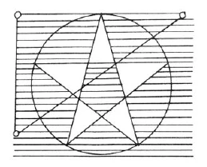

Aufzeichnung A ^jsl9w2

Meine lieben Schwestern und Brüder! Wie wir wissen, ist es unsere Pflicht, zu Anfang einer jeden esoterischen Stunde den Geist, den Regenten des Tages, der in der Weltenentwicklung an der Führung der Erde beteiligt ist, anzurufen. Spruch für Mittwoch. ^02ze5m

Heute wollen wir nur einiges Allgemeine geben; am nächsten Sonnabend Spezielleres. Heute soll betrachtet werden das, was man als den allein rechten und wahren Anfang des Hellsehens ansehen darf. ^6stjwv

Das Hauptgewicht bei aller Esoterik, bei aller inneren Entwicklung ist darauf zu legen, Windstille, innere Ruhe herzustellen und zu bewahren nach der eigentlichen Meditation. Nachdem wir die Formeln oder anderen Verrichtungen, die uns die Meister der Weisheit und des Zusammenklanges der Empfindungen für unsere Schulung gegeben haben, in unserer Meditation vorgenommen haben, sollen wir noch eine Weile in absoluter Ruhe verharren. ^yki5m1

Nichts von unserem alltäglichen Leben, keine Erinnerung daran, nicht einmal ein Gefühl unseres Körpers soll da hinein dringen. Körperlos müssen wir uns fühlen, wie leer; auch die Gedanken an unser eigenes Dasein müssen wir fallenlassen, nur den Tatbestand des eigenen Daseins sollen wir gelten lassen. Dabei aber nicht einschlafen, nicht in einen Traum- oder Schlafzustand verfallen. ^j3mkoj

Dann tritt der Zustand ein, in dem Hellsichtigkeit beginnen kann. Was in solchen Augenblicken vor unserem inneren Blick auftaucht, kommt aus der geistigen Welt. Es gibt Merkmale dafür, ob diese da auftauchenden Bilder rein geistig oder ob es Truggebilde sind. ^lowqml

Was wird geschehen, wenn der Ätherleib den physischen Leib verließe, auch nur für einen Augenblick? Der physische Leib würde sich zusammenziehen, er würde zusammenschrumpfen, runzelig werden; er hat die Tendenz, auf den kleinsten Raum sich zusammenzuziehen und sich schließlich in ein Nichts aufzulösen. Die Tendenz des Ätherleibes ist, sich auszubreiten in die Raumesweiten; er fühlt sich dann verbunden mit allen Kräften draußen im Raum. Er erfüllt den physischen Leib und breitet ihn aus, so weit eben, wie dieser ist. ^251jsn

Durch diese Tendenz des physischen Leibes, zusammenzuschrumpfen, bekommen wir im Alter Runzeln. Der physische Leib schrumpft zusammen, weil der Ätherleib darin nicht mehr ebenso wirkt wie in der Jugend. ^0mb2du

Etwas Ähnliches tritt mit unserem Ätherleib ein in unseren Meditationen. Der Ätherleib strömt und breitet sich aus im Raum und fühlt sich in allem darinnen. Dasselbe ist auch im Tode, wenn der physische Leib den Ätherleib entläßt, der Fall im ersten Augenblick; das kann auch Tage dauern. ^c58k1w

Ein seliges Gefühl ist es, wenn sich der Ätherleib wie aufgelöst im Raume fühlt. Und wäre der Astralleib nicht da, dann würde es so bleiben bis zur Neugeburt. Der Astralleib aber zieht den Ätherleib wieder zusammen durch seine Begierden, Triebe und Leidenschaften, und dadurch tritt der Mensch in Kamaloka ein. ^403ro8

In der Meditation nun soll dahin gestrebt werden - und das wird nach jahrelangen Mühen auch dahin gebracht —, daß das Innere des Menschen sich durchleuchtet fühlt. Er selbst wird zum Licht, zum Leuchter, der die Gegenstände in der geistigen Welt beleuchtet, die an ihn herantreten. Die Erscheinungen, die wir in solchen Momenten tiefster Seelenruhe haben, sind dann nicht wie solche des physischen Lebens, so daß wir sie von außen ansehen, etwa wie wenn wir am Horizont morgens die Sonne aufgehen sehen, sondern - um das Beispiel der Sonne beizubehalten - wir werden uns dann selbst in der Sonne, die da am Horizont unseres hellseherischen Bewußtseins aufsteigt, darinnenfühlen. Aufgeteilt im Raume fühlen wir uns da. ^vqsdhx

Jedoch Truggebilde entstehen dann vor uns, wenn wir persönliche Gefühle der Sympathie und Antipathie - besonders der Antipathie -, unrichtige Vorliebe für einzelne Menschen und so weiter mit in die Meditation hineinbringen. Wer im alltäglichen Leben lügt und unaufrichtig ist, bei dem strömt die Lüge mit seinem Ätherleib in den Raum. Das Lügenhafte wird von den Gebilden, die der Schüler da schaut, zurückgestrahlt, wie ein Spiegel das Bild unseres Antlitzes, das Echo unsere Stimme zurückwirft. Gleisnerische Gestalten, schöne Engelsgestalten erscheinen dann da, verursacht durch das Lügenhafte, das mit dem Ätherleib hinausströmt. Durch die Verwandtschaft dieser Gestalten mit unserer eigenen Lügenhaftigkeit wird diese immer mehr in uns befestigt, und wir können schließlich nicht mehr Wahrheit und Lüge unterscheiden. ^p1al1d

Nun meinen wohl manche, es müsse Mittel geben, um sich gegen diese Truggebilde zu schützen. Aber so wahr ich hier spreche und die Esoterik, hinter der die Meister der Weisheit und des Zusammenklanges der Empfindungen stehen, vertrete, so wahr ist es, daß es kein Mittel gibt, um mit einem Mal diese Trugbilder zu bannen, um zu verhindern, daß sie auftreten. Nur durch ganz allmähliche, ganz geduldige, stetige Arbeit an sich selbst, durch Überwindung der Lügenhaftigkeit und Unaufrichtigkeit in sich selbst, durch sich selbst, ist allmählich darauf hinzuwirken, daß jene Truggebilde nicht mehr erscheinen, dadurch, daß die Lüge sich eben nicht mehr widerspiegelt, weil sie nicht mehr da ist. ^61id9h

Wer ehrgeizig ist, wer mit falschem Ehrgeiz in die esoterische Schulung tritt, wer eine wüste Sehnsucht empfindet, so schnell wie möglich alle Wahrheiten der geistigen Welt zu erfahren, der bewirkt dadurch Irrtum in sich. Er wird empfänglich für alles Geklatsche und Gerede draußen in der Welt. Er beschäftigt sich gern mit den alltäglichen Schicksalen der Menschen und hört gern auf alle sensationellen Erörterungen und Erscheinungen. Er kann dann nicht mehr unterscheiden zwischen dem, was wahr, und dem, was nicht wahr ist. ^4lzw39

So hängen zusammen Ehrgeiz und Irrtum. In uns selbst müssen wir Ehrgeiz und ungesunde Sucht nach den höchsten Wahrheiten, Lüge und Unaufrichtigkeit bekämpfen, ein jeder in sich; zur höchsten Moralität en wir uns im täglichen Leben erheben, wenn wir zu richtigem Hellsehen kommen wollen, das nur ausgehen kann von richtig ausgeführten Meditationen. ^iy2k0i

Und damit diese richtig ausgeführt werden, dürfen wir nicht Gefühle und Gedanken des täglichen Lebens mit hineinbringen; man würde sonst die Äthersubstanz, die da ausstrahlen soll, verunreinigen. ^8zhpqn

Je länger und intensiver die Meditationen ausgeführt werden, desto intensiver wirken sie; doch muß man auch hierbei Vorsicht üben. Wer irgendwie merkt, daß ihm nicht wohl dabei ist, wer Schwindel oder dergleichen fühlt, der soll sie der Zeit nach nicht zu sehr ausdehnen, und er muß ernstlich darüber nachdenken, was er verkehrt gemacht hat. Nach der Meditation muß das Befinden ein ebensolches sein wie vor derselben. Wir sollen oft, recht oft über unser esoterisches Leben nachdenken. Wir sollen unsere Fehler erkennen, wir sollen uns ganz klar machen, wie schlecht wir sind. Aber nicht niederdrücken soll uns diese Erkenntnis unserer Schlechtigkeit. Das wäre sonst wieder krasser Egoismus; denn wir bewiesen durch dieses Niedergedrücktsein, daß wir uns besser dächten, als wir in Wahrheit sind, während wir doch die Fehler haben, die wir durch unser früheres Leben uns selbst angeeignet haben und die so zu unserem Karma wurden. Ganz klar unsere Fehler überschauen und dann an die Ausmerzung derselben gehen! ^pz0kpg

Objektiv denken lernen müssen wir; die da sagen, sie denken schon objektiv, befinden sich häufig in einem großen Irrtum, denn diese Annahme ist eben auch nur subjektiv; es ist Einbildung. ^7fmi7f

Ehrgeiz führt zum Irrtum, zu Aberglaube; dem dürfen wir nicht verfallen. Mit wachem, offenem Verstande, mit klarem Denken und scharfer Logik sollen wir allem gegenübertreten, was uns entgegenkommt, von welcher Seite immer es auch sei. Nicht schwören auf etwas, was uns zuerst wohl richtig scheint, selbst es kritisch erforschen, uns nicht blindlings einer Sache hingeben. So soll es auch in unserem esoterischen Leben sein; kein Autoritätsglaube wird verlangt. ^5snlt1

Und das lassen die Meister der Weisheit und des Zusammenklanges der Empfindungen, meine lieben Schwestern und Brüder, Euch sagen, daß Ihr auch den von ihnen gegebenen Weisheiten, dem gegenüber, was ich hier zu vertreten berechtigt bin, dem, was aus hellseherischem Bewußtsein heraus gegeben wird, so auch mir selbst gegenüber Eure vollen Verstandeskräfte aufrechterhalten und anwenden sollt. Mit gesundem Menschenverstand, mit Vernünftigkeit und vorurteilslosem Denken, wenn es nur weit genug ausgedehnt wird, soll an das, was hier gegeben und vertreten wird, herangegangen werden. Nicht schwören sollt Ihr auf dieses oder jenes, sondern selbst urteilen! ^48ryv9

Und so wollen wir noch einmal alles zusammenfassen, was diese Stunde, die wie alle esoterischen Stunden uns eine heilige sein soll, gebracht hat, in dem Spruch: ^v8viqd

Aufzeichnung B ^ceg9gw

Willenszucht und innere Durchleuchtung ^dcsj38

Wie wir wissen, ist es unsere Pflicht, zu Anfang jeder esoterischen Stunde den Geist, der der Repräsentant des Tages ist, insofern er in der Weltentwicklung an der Führung der Erde beteiligt ist, anzurufen (Spruch vom Mittwoch). ^taijyi

In dieser esoterischen Betrachtung soll vor unsere Seele treten, was uns in unserem Leben weiterhelfen kann. Wir wollen zunächst dasjenige betrachten, was man als den allein wahren und ersten Anfang des Hellsehens ansehen darf. Es ist schon darauf hingewiesen, daß die fruchtbarsten Augenblicke diejenigen sind, in denen nach der Meditation in unserer Seele eine vollständige Windstille herrscht. Nachdem wir die Formeln oder anderen Verrichtungen, die uns von den Meistern der Weisheit und des Zusammenklanges der Empfindungen für unsere Schulung gegeben worden sind, vorgenommen haben, sollen wir noch eine Weile in absoluter Ruhe verharren. Nichts von außen oder von unseren alltäglichen Gedanken und Gefühlen darf in unsere Seele hineinkommen: ganz frei muß die Seele sein von all derartigen Gefühlen, nur dann können hineinleuchten die Bilder der geistigen Welt. Selbst das Gefühl unseres eigenen Körpers müssen wir fallenlassen, nur der Gedanke soll noch vorhanden sein: «Ich bin da - ich bin vorhanden», doch kein traumhafter Dämmerzustand darf in diesem Augenblick eintreten. Ganz wach müssen wir uns erhalten. Nur dann, an einem so gereinigten Bewußtseinshorizonte können diejenigen Bilder aufsteigen, die als erste wahre Erlebnisse der geistigen Welt anzusehen sind. ^d806r1

Wie wir bereits wissen, tritt von dem Momente der geistigen Erkenntnis eine Empfindung ein, als ob wir uns erweitert fühlten, wie aufgehend im All. Das rührt von dem Hinausgehen des Ätherleibes her, ein Ereignis, wie es bei jeder Meditation bis zu einem gewissen Grade eintritt und nach dem Tode vollständig sich vollzieht. Bei der gänzlichen und teilweisen Trennung und Lockerung des Ätherleibes vergrößert sich dieser und dringt weit hinaus in den Raum. Dies Erlebnis ist begleitet von einem Gefühl der Seligkeit, und in diesem Gefühle würde der Mensch auch tatsächlich verharren können während dem [Leben zwischen dem] Tod und einer neuen Geburt, wenn nicht der Astralleib vorhanden wäre, der mit seinen Kräften, die noch verbunden sind mit allen Trieben, Begierden und Leidenschaften, den Ätherleib durchdringt und zusammenzieht. Dadurch tritt der Mensch nach dem Tode zunächst in das Kamaloka ein. Wäre dahingegen der Ätherleib nicht vorhanden, so würde der physische Leib sich zusammenziehen und zusammenschrumpfen, da er diese Tendenz des Zusammenschrumpfens hat, bis auf den kleinsten Raum, um schließlich in Nichts sich aufzulösen. Dies geschieht ja beim Altern, wo die Kräfte nachlassen und der Mensch Runzeln bekommt. ^7eo1n4

In jeder Meditation soll nun dahin gestrebt werden, und es wird auch nach jahrelangen Bemühungen dahin gebracht, daß das Innere des Menschen sich durchleuchtet fühlt. Er selbst wird zum Licht, zum Leuchter, der die Gegenstände in der geistigen Welt beleuchtet, die an ihn herantreten. Die Erscheinungen, die wir in solchen Momenten tiefster Seelenruhe haben, sind dann nicht mehr wie die des physischen Lebens, nicht so, daß wir sie von außen ansehen, wie etwa am Morgen, wenn wir die Sonne aufgehen sehen, sondern, um das Beispiel der Sonne beizubehalten, wir fühlen uns dann selber in der Sonne, die da am Horizonte unseres hellseherischen Bewußtseins aufsteigt, darinnen, aufgeteilt im Raume fühlen wir uns da. ^1mh2bb

Jedoch auch Trugbilder können so erstehen, besonders wenn wir Gefühle der Sympathie und Antipathie in unbegründeter Art für einzelne Menschen haben, die wir dann mitnehmen in die Meditation. Wer zum Beispiel im alltäglichen Leben unaufrichtig ist und lügt, bei dem strömt das Lügenhafte mit seinem Ätherleib in den Raum und wird von den Gebilden, die er erschaut, zurückgestrahlt wie in einem Spiegel, von dem unser Antlitz zurückstahlt. So können gleisnerische Gestalten in Form von schönen Engelerscheinungen entstehen, die durch das Lügenhafte verursacht sind, das mit dem Ätherleib hinausströmt. Es werden alle Wesen herangezogen, die Verwandtschaft haben zu den Gefühlen des Schülers, und sie verstricken ihn noch mehr in seine Schwächen und Laster, denn um uns im Raume sind viele Wesen, gute und böse, und wir rufen durch unsere Schulung die göttlichen Mächte und Kräfte an. ^x9q58x

Nun meinen wohl manche, es müßte Mittel geben, um sich gegen derartige Trugbilder zu schützen. Aber so wahr ich hier vor Ihnen stehe und spreche und die Esoterik vertrete, hinter der die Meister der Weisheit und des Zusammenklangs der Empfindungen stehen: so wahr ist es, daß es in Wahrheit kein Mittel gibt, um diese Trugbilder mit einem Male bannen zu können, um zu verhindern, daß sie auftreten. ^u2wk5z

Nur durch ganz allmähliche, stete Arbeit an sich selbst ist es möglich, darauf hinzuwirken, daß diese Trugbilder nicht mehr erscheinen; nur dadurch, daß wir in innerer Willenszucht an uns selber arbeiten, so daß die Lüge eben nicht mehr in uns vorhanden ist. Dann kann sie auch nicht durch unseren Ätherleib zurückgespiegelt werden. ^9ptqf8

Wer ehrgeizig ist, wer mit einem solchen Ehrgeiz in die esoterische Schulung eintritt, daß er zum Beispiel möglichst alle Wahrheiten erfahren möchte, eine wüste Sehnsucht danach entwickelt, der bewirkt ebenfalls den Irrtum in sich. Er wird dadurch empfänglich für alles Geklatsche und Gerede draußen in der Welt, er beschäftigt sich gern mit den alltäglichen Schicksalen der Menschen und hört gern auf alle sensationellen Erörterungen und Erzählungen hin. Er kann dann nicht mehr unterscheiden zwischen dem, was wahr, und dem, was unwahr ist. So hängen zusammen der Ehrgeiz und der Irrtum. - In uns selber müssen wir Ehrgeiz und Sucht nach den höchsten Wahrheiten bekämpfen, ein jeder für sich. Zur höchsten Moralität müssen wir uns im täglichen Leben erheben, wenn wir zu einem richtigen Hellsehen kommen wollen, das nur ausgehen kann von richtig ausgeführten Meditationen auf Grundlage eines streng gehandhabten moralischen Lebens. Um aber in richtiger Art zu meditieren, muß man alle Gedanken des täglichen Lebens ausschalten. Bringt man derartige Gedanken und Gefühle dennoch mit in die Meditation, so verunreinigt man dadurch die Äthersubstanz. — Je länger und intensiver die Meditation ausgeführt wird, um so stärker ist ihre Wirkung. Doch muß man auch hierbei Vorsicht üben. Wer irgendwie merkt, daß er sich dabei nicht wohl fühlt, wer zum Beispiel Schwindel oder dergleichen fühlt, der soll sie der Zeit nach nicht zu lange ausdehnen, und er müßte ernstlich darüber nachdenken, was er verkehrt gemacht hat. Nach der Meditation muß das Befinden ein ebensolches sein, wie vor derselben. ^tah2wp

 Ja, wir sollen oft, recht oft über unser esoterisches Leben nachdenken! Wir sollen unsere Fehler erkennen und uns ganz klar machen, wie schlecht wir noch sind. Aber nicht niederdrücken soll uns diese Erkenntnis unserer Schlechtigkeit, denn die Fehler, die wir uns durch unsere früheren Lebensläufe zubereitet haben, liegen in unserem Karma. Ganz klar sollen wir unsere Fehler überschauen und dann darangehen, sie auszumerzen. Objektiv denken lernen müssen wir dabei, wie wir es tun gegenüber einem Fremden. Das eignen wir uns gerade durch das Studium der Geisteswissenschaft an. Diejenigen, die nach kurzer Zeit schon sagen: «Ich denke nicht subjektiv, sondern ganz objektiv», befinden sich in einem großen Irrtum, denn diese Annahme ist eben selber noch ganz subjektiv. Es ist nichts anderes als Einbildung, da wir zunächst gar nicht objektiv denken können. ^2rqgei

Stellen wir es uns also noch einmal vor die Seele: Jeder Ehrgeiz, jede Unaufrichtigkeit gegenüber uns selbst führt unweigerlich zu Irrtum, zum Aberglauben. Dem dürfen wir nicht verfallen. Mit wachem, offenem Verstande, mit klarem Denken und scharfer Logik sollen wir allem gegenübertreten, was uns entgegenkommt, von welcher Seite auch immer, und vor allem uns selber. ^r3g98q

Das aber heißt: nicht auf etwas schwören, auch wenn es uns zunächst richtig erscheint, wenn wir es noch nicht selber kritisch erforscht haben, nie blindlings sich einer Sache hingeben. So wird auch hier, im esoterischen Leben, kein Autoritätsglaube verlangt, und das lassen Euch, meine lieben Schwestern und Brüder, die Meister der Weisheit und des Zusammenklanges der Empfindungen sagen: daß Ihr Euch den von ihnen gegebenen Weisheiten, daß Ihr Euch demjenigen gegenüber, was ich hier zu vertreten berechtigt bin, dem, was aus hellseherischem Bewußtsein heraus gegeben wird, so auch mir selber gegenüber, Eure vollen Verstandeskräfte aufrechterhalten und verwenden sollt. Mit gesundem Menschenverstand, mit Vorurteilslosigkeit und vernünftigem Denken, wenn es nur weit genug ausgedehnt wird, soll an dasjenige, was hier gegeben wird, herangegangen werden. Nicht schwören sollt Ihr auf dieses oder jenes, sondern selbst urteilen. Und so wollen wir noch einmal alles zusammenfassen, was diese Stunde, die wie alle esoterischen Stunden eine heilige für uns sein soll, gebracht hat, in dem Spruche: ^eofru0

Aufzeichnung C ^uhkpos

Die wichtigsten, für unsere Entwicklung bedeutsamsten Momente in unserem esoterischen Leben sind diejenigen nach unserer Meditation, wenn wir in unserer Seele sozusagen Windstille eintreten lassen, um den Inhalt der Meditation auf sie wirken zu lassen. Wir sollen anstreben, diese Momente mit der Zeit immer mehr auszudehnen. Denn durch dieses Uns-heraus-Heben aus dem Kreise unserer alltäglichen Gedanken und Gefühle, durch dieses Leermachen unserer Seele setzen wir uns mit einer Welt in Verbindung, aus der uns Bilder entgegentreten, von denen wir uns sagen müssen, daß sie uns neu sind, daß wir sie mit nichts aus unserem sonstigen Leben im Physischen vergleichen können. Ob sie richtig sind, das werden sie uns schon selbst sagen. Was tun wir nun eigentlich, indem wir diese Ruhe in unserer Seele herstellen? Wir tun dasselbe, was makrokosmische Wesenheiten im Momente unseres physischen Todes an uns ausführen. Wir haben schon oft davon gesprochen, daß die vier Glieder unserer Wesenheit fest ineinandergefügt sind. Hauptsächlich der physische und der Ätherleib stehen in einem besonderen Verhältnis zueinander. Was würde denn geschehen, wenn wir den Ätherleib aus dem physischen Leib entfernten? Die Kräfte des physischen Leibes haben das Bestreben, diesen mehr und mehr in sich zusammenzuziehen; er würde kleiner und kleiner werden, zu einer Kugel zusammenschrumpfen und schließlich in sich selbst verschwinden. Der Ätherleib dagegen hat das Bestreben, sich immer mehr auszudehnen. Dadurch gibt er im physischen Leibe diesem die Form. Außerhalb desselben dehnt er sich mehr und mehr aus über den Kosmos, und dieses Sichausdehnen ist mit einem Gefühl der Seligkeit verbunden. Nach dem Tode wird schließlich dieses Ausdehnen nur gehemmt durch den Astralleib, der den Ätherleib durch das, was an Trieben, Begierden und Leidenschaften in ihm ist, wieder zusammenzieht und dadurch Kamaloka herbeiführt. ^uoezaj

In den Momenten unserer Versenkung, die uns heilig sein sollen, führen wir nun selbständig diesen Zustand herbei, daß wir den Ätherleib herauslösen aus dem physischen Leibe, allerdings nicht für die Sinne wahrnehmbar; wir heben ihn aber doch in geistige Welten. Wir sollen in solchen Augenblicken unseren physischen Körper möglichst vergessen und nicht empfinden, sozusagen vergessen, daß wir leben, das heißt: nicht in dem Maße, daß wir einschlafen - das wäre falsch und schädlich -, sondern bei vollem Bewußtsein unseres Lebens dieses doch nicht beachten. Sodann sollen wir nichts von unserem täglichen Leben, Gefühlen etc. in unserer Seele lassen, besonders nicht unsere Sympathien und Antipathien, die oft so unberechtigt sind. Denn was tun wir damit? Dadurch, daß wir den Ätherstoff unserer Seele in die Ätherwelt ergießen, kommen wir mit den anderen Hierarchien in Verbindung, von denen gute und böse Wesenheiten in dieser Welt leben, und der Stoff, den wir in diese ergießen, zieht Stoffe an, die ihm ähnlich sind. Wenn wir unsere Fehler mit hineintragen, so gehen diese den Ätherkräften entgegen und werden uns zurückgespiegelt von diesen, aber nicht in ihrer wahren Form, sondern in oft verführerischen Gestalten, die uns blenden und unser Urteil verwirren und trüben. Wie ein unreinliches Zimmer Fliegen anzieht, so zieht ein mit Fehlern durchzogener Ätherleib Wesenheiten in jenen Welten an, die zum Truge neigen. Wenn ein lügnerischer oder ehrgeiziger Mensch diese Eigenschaften in seine Meditation mit hineinträgt, so kann es ihm geschehen, daß er sich dem Trug immer lieber hingibt, daß er Lug und Trug lieben lernt. ^rjqzja

Deshalb soll der Esoteriker doppelt auf seine Fehler achten. Er soll sich mit Mut und Bescheidenheit sagen, daß er ein schlechter Mensch ist und daß er sich bemühen will, seine Fehler abzulegen. Er darf aber nicht verzweifelt über dieselben sein und sich von dem Bewußtsein derselben niederschmettern lassen, denn das wäre Egoismus. Man muß sich sagen, daß es Karma ist, daß man so ist, und soll sich nicht wünschen, durch eine göttliche Gnade, die man nicht verdient, anders zu sein, sondern soll sich bestreben, durch eigene Erkenntnis anders zu werden. Das ist nicht bequem, aber man wird dadurch auf den richtigen Weg kommen. Man soll im Anfange seines esoterischen Lebens dieses Herausheben des Ätherleibes nicht so weit ausdehnen, daß man in seinem physischen Befinden gestört wird. Man soll den physischen Leib so wiederfinden, wie man ihn verlassen hat. Und wenn man Schwindel oder sonstige Erscheinungen empfindet, die man früher nicht hatte, so muß man die Versenkung abkürzen. ^d1zt8p

Es wird niemals in wahren esoterischen Schulen verlangt, daß man sich an eine Autorität hängt, im Gegenteil, der Esoteriker soll prüfen, was ihm gesagt wird, soll mit seiner Intelligenz es durchdringen, es vergleichen mit allem früher Gesagten, soll Ergänzungen suchen. Niemals wird von den esoterischen Schulen, die unter der Leitung der Meister der Weisheit und des Zusammenklanges der Empfindungen stehen, Glauben auf die Autorität hin verlangt werden. Wo ein solcher Glauben verlangt wird, ein Gelöbnis vom Schüler verlangt wird, da ist größte Vorsicht am Platze. Frei soll der Schüler prüfen und streben; und seine Erkenntnis wird ihn leiten. Es kann ihm auch kein Zaubermittel gegeben werden, um seine Fehler und Schwächen aufzuheben, Fehler und Schwächen, die ihm eine Trugwelt zeigen, statt die wahre geistige Welt. Nur durch langsame Arbeit und ehrliche Selbstprüfung kann der Schüler nach und nach ein anderer Mensch werden, der es erträgt, seine wahre Wesenheit mit all ihren Gebrechen ins Auge zu fassen, und bei ihrem Anblick den Mut und die Ruhe nicht verliert. Mit starker Kraft muß der Schüler die Umwandlung seines Wesens in die Hand nehmen. Nicht eine gierige Sehnsucht nach Wahrheit und Erkenntnis darf ihn erfüllen, sondern eine gesunde Sehnsucht nach Wahrheit, in der die Kraft liegt, diese auch zu schauen. ^l27qik

Wenn man gleich nach dem Erwachen des Morgens versucht, zurückzutauchen in die geistigen Welten, aus denen man kommt, indem man seine Seele leer macht und sich in seine Meditation versenkt, so kann man dadurch wieder den Anschluß und die Rückerinnerung an seine nächtlichen Erlebnisse in den geistigen Welten erreichen. ^rhmvua

Aufzeichnung D ^vbxq97

Es sollen uns in dieser Stunde Lehren gegeben werden, die wir schon manchmal bekommen haben, nämlich über die Art und Weise, wie wir uns bei der Ausübung unserer esoterischen Meditationen zu verhalten haben. So soll eben sowohl vorher wie auch besonders nachher völlige Seelenruhe in unserem Gemüte herrschen. Die äußeren Eindrücke müssen wir von uns abzuhalten versuchen; alles muß in uns schweigen, was von unserm inneren Gefühlsleben hervordringen will, und auch alles, was von außen auf unsere Gedanken einstürmen will. Nur dann, nur in einer solchen Seelenstimmung kann der Schleier zerreißen, der uns einen Blick in die übersinnliche Welt ermöglicht, die sich dann in einer Fülle von Bildern vor uns ausbreitet. Das Wichtigste aber, was der Schüler wissen muß, wenn er die Bilder vor sich sieht, das ist, daß dasjenige, was er da vor sich sieht, nicht immer ausdrückt, was es vorzustellen scheint. Obgleich es Realitäten sind, die sich dem Auge dann enthüllen, sind es doch nur zu oft gleisnerische, verführerische Gestalten, die wir uns aus unserer eigenen Seele erweckt und gewoben haben. ^oj8ung

Besonders dann treten solche Gestalten dem Menschen entgegen, wenn er als Esoteriker noch die Neigung zur Unwahrhaftigkeit, zur Lüge in sich hat, oder wenn er auch nur unaufrichtig ist, besonders aber, wenn Hochmut und Ehrgeiz ihn erfüllen; denn dann strahlt er unbewußt diese Gefühle mit herein in die Meditation. Diese seine Seelenempfindungen weben sich ein in die Gestalten, die vor ihm auftauchen, und es strahlt ihm dann sein eigener Seelenzustand in den ätherischen Bildern der übersinnlichen Welt entgegen. Hat jedoch der Schüler sein Gemüt geläutert und tritt er mit Demut an seine Meditation heran, so wird er schon bald erkennen, was er für Wahrheit zu halten hat. ^0g5chv

Noch auf eine andere Art kann der Mensch den Einblick in die übersinnliche Welt bekommen, nämlich dann, wenn er die Stufe erreicht hat, wo er aus seinem physischen Leib heraustreten kann. Das kommt durch die Loslösung des Ätherleibes vom physischen Leib zustande. Gewöhnlich glaubt man, wenn man einen Menschen so vor sich sieht, man sche nur den physischen Menschen; dem ist aber nicht so. Denn würden wir nur den physischen Menschen sehen, so würde sich etwas ganz anderes zeigen. ^4gum6a

Wir wissen, daß der Mensch zusammengesetzt ist aus physischem Leib, Ätherleib, Astralleib und Ich. Würde man den physischen Leib abstrahieren von dem Äther- oder Lebensleibe, dann würde jener verschrumpfen, sich ganz zusammenziehen und endlich ganz verschwinden. Denn der physische Leib hat die Tendenz in sich, sich zusammenzuziehen, wohingegen der Ätherleib das entgegengesetzte Bestreben hat, nämlich des SichAusdehnens. Im Augenblick nach dem physischen Tode weitet sich ja der Ätherleib in den Kosmos hinaus, und für den Menschen, der durch die Pforte des Todes geht, ist es ein Gefühl der größten Seligkeit, des größten Wohlbehagens, wenn er sich so in Raumesweiten hinein ergießt. Weil er aber noch das Verlangen nach dem Materiellen aus seinem vergangenen Leben in sich trägt, wird er wieder zum Irdischen zurückgezogen, und dann beginnt seine Kamalokazeit. ^lnf1cl

In einer ähnlichen Weise wie die soeben geschilderte kann der Mensch, der auf einer gewissen Stufe seiner esoterischen Entwicklung angelangt ist, seinen Ätherleib aus seinem physischen Leib herausheben. Wir sollen jedoch, besonders im Anfang, unsere Übungen nicht übertreiben; sie sollen nicht zu lange Zeit in Anspruch nehmen. Vor allem müssen wir uns davor hüten, daß sie uns dazu führen, schläfrig zu werden oder gar einzuschlafen; denn da könnte es geschehen, daß sich mehr oder weniger schlechte Wesen unser bemächtigen. In allem, was wir zu unserer Höherentwicklung vornehmen, müssen wir immer volle Bewußtheit walten lassen. ^k6m4yp

Heute gibt es viele okkulte Strömungen, die immer mehr Einfluß auf die Menschheit gewinnen, besonders wenn sie durch eine Art von Autorität anempfohlen werden. Was auch immer in dieser oder jener Weise an den Menschen herantreten mag, niemals soll er blindlings glauben, und wenn es auch von einer «Autorität» gesprochen wird. Immer und in allen Fällen soll der Mensch selbst prüfen, immer soll er seine Vernunft gebrauchen. Auch wir sollen an alles, was wir im Laufe der Jahre gelernt haben, mit unserm eigenen Verstande herantreten, mit unserer eigenen Logik prüfen, ob wir es mit diesem Verstande vereinigen können, oder ob wir es als unlogisch verwerfen müssen. ^15gx0w

Aufzeichnung E ^y3493r

In der Meditation geschieht mit dem Menschen dasselbe wie nach dem Tode. Nach und nach erst kann der Mensch erkennen, was für ein Großes und Gewaltiges er in der Meditation unternimmt; daß er das tiefe gewaltige Geheimnis des Todes durchbricht, wenn er sich in der rechten Weise seiner Meditation hingibt. ^q8jji9

Der physische Leib hat in sich die Tendenz der Zusammenziehung. Denken wir uns den Ätherleib heraus, so würde dieser physische Leib einschrumpfen, immer mehr bis auf den kleinsten Raum, und dann in sich selbst wie verschwinden. Der Ätherleib erhält ihn so, wie wir ihn schen. Und im Alter sind die Runzeln die Folge des Nachlassens der Kräfte des Ätherleibes. ^pjfqx2

Wachsein und Wachbleiben wird uns ans Herz gelegt. ^zinaac

Aufzeichnung F ^ldtij6

Der physische Leib hat die Tendenz, zusammenzuschrumpfen, der Ätherleib sich auszudehnen hinaus in den Kosmos. In der Meditation wird der physische Leib passiv gemacht wie nach dem Tode, die höheren Glieder erstrecken sich in die geistige Welt, die uns umgibt, erfüllt mit guten und bösen geistigen Mächten. Wenn wir Begierden und Leidenschaften, Sympathie und Antipathie, Eitelkeit, Ehrgeiz etc. mithineinnehmen in die Meditation - besonders wichtig ist der Moment nach der Meditation, die Ruhezeit der Seele -, dann ziehen wir die bösen Mächte an. — Der geistige Merkur ist angefüllt mit guten und bösen geistigen Mächten, überall, nur nicht dort, wo der Mensch seine Kräfte ausströmt; dort wird die geistige Welt zurückgedrängt. ^8wzn5r

Die Form der menschlichen Kraftausstrahlungen zeigt das Ausgesparte: ^kwgmvo

 ^iz2smq

Die höheren Hierarchien wirken hinein. Im Umkreis bis zum Kreis die höheren Geister der Form, Bewegung, Weisheit, Throne, Cherubim, Seraphim und die bösen Mächte. Die Archai wirken innerhalb des Kreises bis zum Pentagramm, den menschlichen Kraftströmungen entlang; die Erzengel innerhalb des Pentagramms bis zum Fünfeck; die Engel durchdringen den Menschen ganz. Der Ätherleib des Menschen hat die Eigenschaft, sich ausdehnen zu können bis zu den Sternen, ohne sich zu zerstückeln. Der Astralleib kann sich auch ausdehnen bis zu den geistigen Wesenheiten, ob gut oder böse, er wird aber passiver und läßt einen Teil dort zurück. Das Ich muß nun die Kraft erringen, diese Teile zusammenzuhalten durch Kraftlinien, die es sich erwirbt durch das Studium der Geistes- und Geheimwissenschaft. Alles mit dem Intellekt erfassen, kein blinder Autoritätsglaube, der untergräbt den Intellekt. Die Jetztzeit ist erfüllt mit der Möglichkeit, Irrtümern zu verfallen, dagegen soll man seinen gesunden Menschenverstand brauchen. Friede müssen wir halten mit den auf Irrwegen Wandelnden, aber unsere Urteilskraft gebrauchen. ^pwhtuo