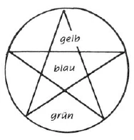
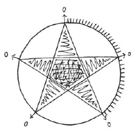
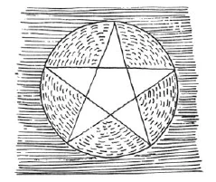
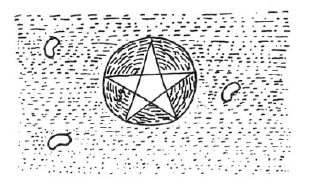

Aufzeichnung A ^vdklef

Meine lieben Schwestern und Brüder! Es obliegt uns, den Geist des Tages anzurufen, von dem wir hoffen dürfen, hoffen müssen, daß er uns bei unserem esoterischen Streben helfen wird. — Spruch für Sonnabend. ^yydb4o

Ferner: ^3llgya

In der letzten esoterischen Stunde [23. August] haben wir gesehen, daß sich der Ätherleib bei der Meditation hinausergießt in den Raum. Dieser geistige Raum ist erfüllt von allen möglichen Wesenheiten, guten und schlimmen, mit denen wir zusammenkommen, mit denen unser Ätherleib in Verbindung tritt. Da wirken herein in jeder Zeit andere Geister, und auch an allen Orten sind zu gleicher Zeit nicht dieselben Wesenheiten tätig. ^e4kk8y

Derjenige, der in Asien ist, hat Europa im Westen; in Europa hat er Asien im Osten. Die Bereiche anderer (verschiedener) Wesenheiten begrenzen seinen individuellen Geistraum an verschiedenen Orten. Aber immer ist im Geistraum - da, wo sich der einzelne Mensch aufhält - sozusagen eine leere Stelle - wie ausgespart von den geistigen Wesenheiten -, die der Mensch selbst ausfüllt. Da walten die Strömungen, die durch seine viergliedrige Wesenheit wirken. ^j4p7s9

Wenn wir das aufzeichnen wollten, wie diese Wesenheiten, die guten und die bösen, da im Raum wirken und wie gleichsam ausgespart ist der Raum, wo der Mensch ist, so käme folgende Zeichnung heraus, folgendes okkultes Zeichen oder Signum. ^jhyd5m

 ^hqb8y5

In dem Raum mit schräger Schraffierung wirken hauptsächlich die Geister der Form in der heutigen Zeit. Aber in den Menschen können sie nicht hineindringen. Da hinein wirken die drei niederen Hierarchien, die Engel, Erzengel und die Geister der Persönlichkeit. Den ganzen Raum dieses fünfeckigen Sternes können nur die Engel durchwirken. Wenn wir uns vergegenwärtigen wollen, wie weit die Erzengel hineinwirken können, so müssen: wir. dieses Fünfeck (blau) abteilen; das wir. im exoterischen Vortrag schon betrachtet haben. In dieses Fünfeck kommen sie nicht hinein, nur bis in die fünf Dreiecke (gelb). ^r6oam0

Wenn wir nun bezeichnen wollen das Gebiet, wie weit die Geister der Persönlichkeit hineinwirken können, so müssen wir einen Kreis um den fünfeckigen spitzen Stern ziehen. Wenn wir die Arme ausstrecken und uns eine Kreislinie denken, oben vom Kopf bis zu den Fingerspitzen und weitergeführt von hier bis zu den gespreizten Beinen respektive Fußspitzen ganz herum, so sind durch diese Linie die Partien abgeteilt, bis in welche die Geister der Persönlichkeit noch dringen können, also die Partien, die begrenzt sind von den ausgestreckten Armen, dem Kopf und dem betreffenden Teil der Kreislinie und so fort (grün). ^okcc6i

Die Geister der Form können schon gar nicht mehr an den Menschen selbst herankommen, gleichsam bis zur Kreislinie sind sie zurückgedrängt von den Kräften, die in der viergliedrigen Wesenheit des Menschen selbst arbeiten. Wenn nun der Ätherleib sich ausdehnt bei der Meditation, so ist er in allen diesen Wesenheiten und Tatsachen, die da noch außerhalb des Kreises sind, darinnen, bis zu den Sternen; er ist gleichsam ausgegossen über alles, ganz ohne jede Lücke, ohne jede Unterbrechung ist er da. Wenn man ihn verfolgte mit hellseherischem Blick, würde man nirgends sehien, daß er irgendwie.aufhörte, er ist'eben überall da. ^dqbe44

Wenn nun noch in dem Schüler Eigenschaften sind wie L genhaftigkeit, Unaufrichtigkeit, Ehrgeiz und so weiter, wie dies das letzte Mal besprochen wurde, so gehen diese Eigenschaften mit dem Ätherleib in den Geistraum. Und ist hier und da ein schlechtes Wesen, so fühlt sich das Schlechte in uns damit verwandt und angezogen dadurch. ^tfa1d4

Nun geht der Astralleib mit dem Ätherleib in den Geistraum. Da besteht die Tendenz, daß der intellektuelle, der denkerische Teil des Astralleibes sich aus der oberen Spitze heraus ausdehnt, der fühlende Teil rechts und links aus den mittleren Spitzen, der Willensteil nach unten aus den beiden übrigen Spitzen des Sternes. ^2bmh8p

Aber der Astralleib bleibt bei diesem Ausdehnen nicht so lückenlos wie der Ätherleib; einzelne Fetzen können sich abtrennen, die wir dann da im Raum sehen und verfolgen können. Haben wir eine Verwandtschaft in uns zu einem solchen schlechten Wesen, das da im Raum sich aufhält, so bleibt ein Teil unseres Astralleibes durch seine Wunschnatur an diesem Wesen haften und verbindet sich damit, löst sich von dem Astralleib selbst ab. Der Astralleib zerreißt in Fetzen, in viele einzelne Fetzen. So haben wir an den verschiedensten Orten Teile unseres Astralleibes weit verstreut im Raum, die sich uns als einzelne Wesenheiten in der Meditation zeigen, von denen wir dann aber nicht wissen, daß sie eigentlich zu uns gehören, und die dann zu Irrtum und Täuschung führen. Aber zwischen diesen einzelnen Teilen unseres Astralleibes bestehen Fäden; die sind unter sich verbunden und mit dem Pentagramm. Dieser Zusammenhang wird hergestellt durch das Ich des Menschen. ^wua85r

Vor dem Mysterium von Golgatha mußte ein Mensch schon arg schlimm gewesen sein, wenn er die Beherrschung über diese verstreuten Astralstücke verloren hätte. Andere Wesenheiten wirkten da mit in ihn hinein zu diesem Zweck. Nach dem Ereignis von Golgatha soll der Mensch selbst diese Herrschaft übernehmen von seinem eigenen Ich aus. ^f0hfs9

Auch schon recht weit vorgeschrittene Esoteriker können sich irren, indem sie diese Zusammenhänge nicht richtig erkennen. Um das zu verhindern, muß der Esoteriker sich einem hingebungsvollen Studium widmen. Dadurch, daß er durch das Studium ein Wissen erhält von all dem, was da im Geistraum ist, von der ganzen Entwicklung und all den Zuständen der Erde während der Saturn-, Sonnen-, Monden- und Erdentwicklung, von den Wesenheiten und Hierarchien, die hineingewirkt haben, um den Menschen zu schaffen und so zu bilden, wie er heute ist, dadurch kann sein Ich den Zusammenhang der einzelnen Teile seines Astralleibes beherrschen und ist dadurch vor Irrtum und Täuschung geschützt. ^zyh1wf

Nicht für sich selbst, aus Neugier oder dergleichen, soll der Esoteriker studieren, sondern er muß sich das hingebungsvollste Studium zur Pflicht machen um seiner und der Menschen- und Weltenentwicklung willen. Und wenn wir so durch intensives Studium unsere eigene Wesenheit erkannt haben, wenn wir dadurch wissen, wie und wodurch sie entstanden ist, dann bekommen wir ein heiliges Gefühl davon. Dieses Gefühl drücken wir dann aus in dem Satze: Aus Gott sind wir geboren - Ex Deo nascimur. ^x6lngk

Wenn wir uns mit tiefer Innigkeit mit diesem Gefühl durchdringen und die Ätherströmungen, von denen schon im exoterischen Vortrag die Rede war, das Verätherisieren des Blutes, wodurch Ätherströmungen vom Herzen zum Kopfe hinaufströmen, das Gehirn umglühen und umleuchten und die Zirbeldrüse in Tätigkeit setzen, aufleuchten lassen wie Flammen, in denen alles Persönliche untergeht, wenn wir empfinden, wie wir ganz aufgehen müssen in dem Gefühl, unser eigenes Selbst ganz hinopfern zu wollen, wie die Geister, wie sich Christus hingeopfert hat für die Weltenentwicklung, dann lernen wir dieses Gefühl ausdrücken in dem Satz: In Christus sterben wir - In Christo morimur. ^tazk5w

Und dann leuchtet in uns auf die Gewißheit, daß wir zum Geist aufsteigen, im Geiste auferstehen. Per Spiritum Sanctum reviviscimus. ^zy8pt1

Ex Deo nascimur. In Christo morimur. Per Spiritum Sanctum reviviscimus. So heißt der exoterische Spruch des Rosenkreuzers. ^jbgtkg

Wenn der Esoteriker diesen Spruch ausspricht, so hält er an bei dem, was ausdrückt das, was wir mit Christus bezeichnen; das Heiligste ist ihm dieses. Nicht einmal mit dem Wort will er bis dahinan gehen; er spricht das Wort nicht aus und läßt nur das Gefühl reden. Dann lautet es so, wenn der echte Rosenkreuzschüler in seiner tiefsten Meditation den Spruch ausspricht: ^6bkxby

Dann kam eine längere Auseinandersetzung bezüglich des bevorstehenden Kongresses in Genua. Jeder sollte selbst nachdenken und zu beurteilen suchen, was er hört an Esoterik, was die Meister der Weisheit und des Zusammenklanges der Empfindungen gaben, was Dr. Steiner selbst hier verträte. Darauf kommen, auf die okkulten Wahrheiten - zum Beispiel auf die zwei Jesusknaben -, könnte der Mensch wohl nicht, aber selbst darüber nachdenken sollte und könnte er. ^y62px6

Aber unrecht sei es, wenn eine bestimmte lebende Persönlichkeit als die Inkarnation dieser oder jener Wesenheit hingestellt würde - möge es nun auf Wahrheit beruhen oder nicht. Es sei eines der wichtigsten okkulten Gesetze, solche Verkündigungen über lebende Persönlichkeiten nicht zu machen in der Öffentlichkeit. Etwas anderes sei es in einer esoterischen Stunde, wo nachgefühlt und nachgespürt werden könne, wie dieses wirkt und wie es aufgenommen wird von den einzelnen. ^03cbha

Es ist heute eine Zeit, in der die Menschen besonders leicht in Irrtümer verfallen. Eine solche Verkündigung würde verursachen, daß das Denken des einzelnen Hemmungen erleidet. Die Menschen würden dadurch in ihrem Denkvermögen zurückgehen. ^599vvv

Ernstlich gewarnt muß werden vor solchen Veröffentlichungen, die zum Zweck der Propaganda gemacht werden, und ernstlich ablehnen muß man eine etwaige Aufforderung, an solcher Propaganda teilzunehmen, jedoch mit persönlicher vollster Toleranz und dem Gefühl des Friedens gegen die Persönlichkeiten, die diesen Irrtum begehen! ^61ndxf

Mit dem wahren Wissen müssen wir uns durchsetzen, dann lernen wir wissen und fühlen, daß wir aus dem Geiste kommen. ^m78k5p

Aufzeichnung B ^iv8835

Die drei unteren Hierarchien nur wirken direkt auf den Menschen. Die Engel bis hinein ins schraffierte Fünfeck des Pentagramms, das symbolisch den Menschen, speziell seinen Ätherleib darstellen soll. Die Erzengel nur bis in die fünf nicht schraffierten Spitzen und die Geister der Persönlichkeit bis an das Pentagramm heran, also in die übrigen Teile innerhalb des Kreises — also zum Beispiel bei ausgestreckten Armen in den Raum zwischen Kopfesscheitel und Fingerspitzen rechts und links, zwischen diesen Fingerspitzen und gespreizten Beinen, respektive Fußspitzen etc. Die höheren Reiche wirken nur bis an den Kreis heran. Dies bei allen Menschen. ^770xlb

Der Esoteriker nun dehnt seinen Ätherleib aus über das Pentagramm hinaus bis an die Planeten. Er bleibt aber ein zusammenhängendes Ganzes und trifft dort auf gute und böse Wesen. Anders ist es mit dem Astralleib, der sich mit dem Ätherleib ausdehnt. Wenn dieser ein Wesen oder ein Ding findet da draußen, das seine Wunschnatur an sich fesselt, so heftet ein Teil seines Astralleibes sich daran und trennt sich von dem Hauptteil des Astralleibes. So kann sich der Astralleib in viele Teile teilen. ^i4ko6f

Es besteht die Tendenz, daß der intellektuelle Teil, der denkerische Teil des Astralleibes, sich aus der oberen Spitze hinaus ausdehnt, der fühlende Teil rechts und links aus den mittleren zwei Spitzen, der Willensteil nach unten aus den beiden übrigen Spitzen. ^1gggry

Bei dieser «Aufteilung» des Astralleibes besteht die Gefahr, daß der Mensch das Gefühl des Zusammenhanges verliert, sein Ich nicht zusammenhalten kann, sondern dies in den verschiedenen getrennten Teilen zu empfinden meint. Die Verbindungsfäden zwischen den einzelnen Teilen zu erhalten, ist des Esoterikers wichtige Aufgabe; die wird gelöst durch den gesunden Menschenverstand, das heißt durch ruhiges logisches Denken, durch eingehendes Studium der allgemeinen und speziellen Lehren der Theosophie und durch verstandesmäßiges Durchdenken und Prüfen der Lehren. Dadurch erst macht er die Lehren sich ganz zu eigen und stärkt sein Ich. Nicht Hinnehmen auf Autorität hin. Letzteres würde eben das Ich mit sich nehmen, wohin es nicht mehr die Kontrolle über sich selbst besitzt. Eine solche Wirkung würde zum Beispiel die Mitteilung an unvorbereitete Menschen haben über frühere Verkörperungen jetzt lebender, bestimmt bezeichneter Persönlichkeiten, die Angabe der Inkarnation bestimmter Individualitäten in jetzige, öffentlich angegebene Menschen — ganz abgesehen davon, ob die Mitteilungen richtig sind oder nicht -, da die Hörer den Zusammenhang, die Wahrscheinlichkeit, den Sinn dieser Reinkarnation nicht nachfühlen oder einsehen können. Sie müßten auf Autorität hingenommen werden. Deshalb ist ernstlich zu warnen vor der Beteiligung an solchen Kundgebungen, die zum Zweck der Propaganda in der Öffentlichkeit unternommen werden. ^sr1e2e

Man muß das ernstliche Ablehnen einer etwaigen Aufforderung, an solcher Propaganda teilzunehmen, verbinden mit persönlicher Toleranz und Freundlichkeit gegen die Persönlichkeiten, die diesen Irrtum begehen. ^ayb4mo

Aufzeichnung C ^2yagcv

Wenn wir unsere esoterische Entwicklung in die Hand nehmen, so werden wir eine Empfindung bekommen, daß es geistige Strömungen gibt, die auf uns einen Einfluß gewinnen wollen, sei es im guten, sei es im bösen Sinn. Woher kommt das? ^og1vlh

Gehen wir bis in die früheste Weltentwicklung zurück, so wissen wir, daß vom Anbeginn geistige Wesenheiten an uns gearbeitet haben, höhere Wesenheiten, die von außerhalb wirkten; und auch solche, die bei der inneren Entwicklung unserer Erde mitgewirkt haben. Was geschieht nun, wenn der Mensch mit seiner esoterischen Entwicklung beginnt und sich in die erste Strophe: ^9ggdtp

in seiner Meditation versenkt? Was geschieht dann mit dem Ätherleib? Wir haben in der vorhergehenden Stunde gehört, daß der physische Leib die Tendenz hat, sich zusammenzuziehen, wenn der Mensch alt wird, weil der Ätherleib sich allmählich aus ihm herauszieht, und daß der Ätherleib die entgegengesetzte Tendenz in sich birgt des Sich-Ausdehnenwollens in den Makrokosmos bis zu den Sternen hinauf. Ein solches Sich-Ausdehnen findet nun in größerem oder kleinerem Maßstab bei der Meditation statt, auch wohl schon beim bloß exoterischen Studium der Geisteswissenschaft. Solange er mit dem physischen Leib verbunden ist, bleibt der Ätherleib aber durch dessen Form umgrenzt. Da wir nun wissen, daß der ganze Makrokosmos angefüllt ist mit geistigen Wesenheiten, mit den Wesenheiten der höheren Hierarchien sowohl als mit vielen anderen, guten und schlechten Wesenheiten, so können wir uns vorstellen, daß der Mensch völlig von ihnen eingeschlossen ist; nur der Raum, den er selbst einnimmt, ist ausgespart. ^krmepi

Es sind nicht immer dieselben Wesenheiten, die auf den Menschen einwirken, sie sind anders je nach dem Lande, Klima oder der Naturbeschaffenheit. ^oaera1

An dem nebenstehenden Schema wollen wir das eben Gesagte einmal vorzustellen versuchen. ^s2vwz5

 ^6e8l41

In dem Pentagramm sehen wir die Kraftströmungen, die dem ganzen Menschen zugrunde liegen und die ihn aufgebaut haben. Die äußere Umgebung müssen wir uns angefüllt denken mit Wesenheiten, die aus dem Kosmos auf ihn eindringen. Das mittlere Fünfeck bestimmt die Größe der Kräfte des physischen Leibes, und dahinein wirkt besonders die Hierarchie derjenigen Wesen, die wir die Angeloi oder Engel nennen. In den fünf Spitzen drückt sich der Ätherleib aus, und dahinein wirken die Archangeloi, die ihren Einfluß auf den Menschen ausüben. Was vom Kreis begrenzt ist, bedeutet den Astralleib, und in diesen hinein wirken die Archai, Urbeginne oder Geister der Persönlichkeit. Andere Hierarchien greifen von außen ein, die Geister der Form, der Bewegung, der Weisheit und des Willens, bis hinauf zu den Cherubim und Seraphim. ^f35swx

Der Mensch sendet fortwährend Gedanken aus seinem Astralleib hinauf zu seinem Gehirn. Wir wissen, daß durch das Zusammenwirken der drei Leiber ein vergeistigter Strom von unseren Gedanken ausgeht und in die Umgebung des Menschen hineinströmt. Dieser Strom wird da draußen aufgenommen oder angezogen von Wesenheiten, die, je nach der Art, wie die Gedanken sind, angezogen oder abgestoßen werden. Man muß es sich so vorstellen, daß gewissermaßen ein Teil des Astralleibes abgestoßen wird und sich dann in der Umgebung des Menschen verbindet mit der oder jener ihm sympathischen Wesenheit, die sich in seinem geistigen Umkreis befindet. Das kann nach allen Richtungen des Raumes zu den verschiedensten Wesenheiten hin geschehen. ^s43qj7

Wenn sich nun der Schüler nicht durch seinen gesunden Menschenverstand leiten läßt und sich mit solchen im Astralraum befindlichen Wesen verbindet, so wird er zu einer gewissen inneren Zerfahrenheit kommen. Ebenso kann das geschehen, wenn er nur auf blinden Glauben hin alles annimmt, das er nicht selbst untersucht hat, oder auch, wenn er sich nicht die Zeit nimmt, die esoterischen Lehren mit seinem Verstand zu begreifen. Er wird sich dann leicht selbst verlieren können, wenn er nicht seinen gesunden Menschenverstand beim Schauen in die geistigen Welten anwenden will, er wird stets falsch beobachten und falsche Schlüsse ziehen. ^t5vgpo

Blicken wir nun zurück auf einen bestimmten Punkt in der Weltentwicklung, nämlich auf die alte Sonne. Da treten in der Mitte der Sonnenentwicklung hohe geistige Wesenheiten aus ihr heraus, weil die feineren Substanzen ihrer Wesenheit sich nicht länger vereinigen können mit den schon «festeren» Bestandteilen, die sich in der Sonne befanden - die man für die damaligen Verhältnisse eben «fest» nennen könnte, die aber durchaus noch Äthersubstanz waren. Nur eine hohe Wesenheit trennte sich von denen, die da hinaustraten, und blieb auf der alten Sonne zurück und durchtränkte die Substanz der Sonne mit einer feinen geistigen Kraft. In den alten Mysterien wurde schon von dieser Kraft gesprochen; sie war bekannt als die Christus-Kraft. Es ist dieselbe Kraft, die sich in der späteren Erdentwicklung noch einmal opferte und auf der Erde zurückblieb, als unsere Sonne sich als Fixstern aus ihr herauszog. Eine Zeitlang blieb sie bei der Erde, dann ging sie hinüber zum Monde und spiegelte von da aus die Sonnenkraft auf die Erde herunter. ^x8fbxs

Dieses Sonnenkraftwesen war Jehova-Christus, dasselbe Wesen, das sich dem Moses offenbarte und ihm ankündigte, daß es einmal im Fleische unter uns wohnen würde. ^16ga6w

Seit der Taufe im Jordan und bis zum Ereignis auf Golgatha hat sich diese Christus-Kraft mit dem Menschen und mit der Erde verbunden; sie zieht noch heute in diejenigen Menschen ein, die ihre höhere Entwicklung in die Hand nehmen wollen. Der esoterische Schüler, der durch seine Meditationen seinen Ätherleib in Raumesweiten ausdehnt, verbindet diesen Ätherleib in seiner Ausstrahlung mit der feinen Christus-Substanz. Er empfindet nicht mehr sein Ich; und das Paulinische Wort wird dann zur Wahrheit: «Nicht ich, sondern der Christus in mir.» ^5t2d6n

Der Mensch soll diesen geistigen Keim in sich entwickeln, damit er wieder zu dem Geiste zurückkehre, aus dem er gekommen, nachdem er den geistigen Keim zur höchsten Vollendung gebracht hat. Dann wird man erkennen, mit welcher Ehrfurcht man in den Rosenkreuzerschulen das heilige Gebet sprach: ^nw7ral

Aufzeichnung D ^c02q0u

In dem ganzen Kosmos sind geistige Wesen vorhanden; sie füllen ihn gleichsam aus und sie durchdringen und umgeben daher auch den Menschen. Doch können wir unterscheiden dasjenige, was zum Menschen unmittelbar gehört, und dasjenige, was seine geistige Umgebung ist. Diese geistige Umgebung ist anders je nach dem Ort, wo der Mensch sich befindet. In Europa ist diese Umgebung anders als in Asien; in Asien hat man Europa im Westen; in Europa hat man Asien im Osten - das bedingt schon ein Anderssein. ^zdgzrn

Auf den Menschen selber wirken mehr oder weniger unmittelbar die Wesenheiten der dritten oder untersten Hierarchie ein; in seiner Umgebung wirken die Geister der Form bis hinauf zu den Cherubin und Seraphin auf ihn ein. In einer Figur ist es so darzustellen: ^y6wc00

Wenn man den Menschen und die Kräfte, die in ihm wirken, als weiße Fläche darstellt, dann entsteht der fünfstrahlige Stern, das Pentagramm. Die Engel dringen am meisten in den Menschen selber, in seinen physischen Leib ein, das ist in dem innersten Fünfeck dargestellt. Die Erzengel können nicht da hineindringen, sondern sie bleiben innerhalb der fünf äußeren Dreiecke, die das Fünfeck umgeben. Die Archai wirken in jener Partie, die nicht unmittelbar in dem Pentagramm liegt, sondern die angedeutet wird durch das, was sich zwischen dem Pentagramm und dem umschriebenen Kreis befindet. ^md7opr

 ^ajgl8r

In dem Zyklus («Weltenwunder, Seelenprüfungen, Geistesoffenbarungen») haben wir schon vernommen, daß das innere Fünfeck den physischen Leib darstellt, die fünf Dreiecke die Kräfte des Ätherleibes; der Raum zwischen diesen und dem Kreis gehört dem Astralleib an, während der Kreis selber als das Ich angesehen werden muß. Denkt man sich einen Kreisbogen von dem Kopf zu den ausgestreckten Armen gezogen, so sind das die Partien, die von den Archai bewirkt werden. Außerhalb des Kreises wirken die höheren Hierarchien, von den Geistern der Form angefangen. ^45jwig

Wir wissen schon, daß der physische Leib die Neigung hat, sich zusammenzuzichen, einzuschrumpfen, während der Ätherleib die Neigung hat, sich auszudehnen. In der Meditation und sogar beim fortgesetzten, ernsthaft betriebenen theosophischen Studium findet eine solche Ausdehnung im Raum mehr oder weniger statt und kann sich bis zu den Sternen und der Sonne erstrecken, ohne daß der Zusammenhang mit dem physischen Leibe unterbrochen wird. Mit dem Astralleibe ist es umgekehrt; er kann den Zusammenhang verlieren und sich teilweise absplittern. Das kann der Fall sein, wenn er sich an gewisse Dinge festklammert im Raume, die ihm sympathisch sind, oder wenn er angezogen wird von astralen Wesenheiten, sei es zum Guten oder zum Bösen. Wenn sich zum Beispiel eine schlechte Wesenheit in unserer Umgebung befindet (durch Q angedeutet, siehe Zeichnung $. 210), dann kann der Ätherleib, wenn er sich durch die in der Seele wirkenden Eigenschaften zu diesem Wesen hingezogen fühlt, sich bis dahin ausdehnen und das Wesen umfangen; beim Astralleib aber kann durch solche Ausdehnung ein Teil sich loslösen und dann das Wesen umgeben. So kann der Astralleib sich an mehrere Wesen seiner Umgebung zerspalten. In dieser Weise läßt er einen Teil seines Wesens zurück, aber zwischen den verstreuten, abgelösten Teilen bleibt ein Zusammenhang bestehen. Dadurch entsteht auch eine Spaltung des Bewußtseins, da das Bewußtsein mit dem Astralleib zusammenhängt. Man fühlt sich dann nicht mehr als eine einheitliche geschlossene Persönlichkeit, sondern wie in mehrere Personen gespalten. Darauf deutet das Wort des Evangeliums, als die Dämonen, von denen der Kranke besessen war, gefragt wurden, was ihr Name sei, und sie antworteten: «Legion». ^a1db9m

 ^4ga52j

Wer daher von einer zu starken Begierde nach okkulter Entwicklung getrieben wird, ohne sein Ich zu gleicher Zeit zu erkraften, läuft Gefahr, seinen Astralleib in dieser Weise zu zersplittern. Man ist dann auch nicht mehr fähig, zu erkennen, welches Wesen sich jenes Teiles des Astralleibes bemächtigt hat, ob ein gutes oder böses. Nur ernsthaftes Studium, vor allem, was in der «Geheimwissenschaft», den Zyklen und so weiter gegeben wird, macht das Ich so stark, daß es die einzelnen Teile (des Astralleibes) wieder verbinden kann, sei es untereinander oder unmittelbar mit dem eigenen Wesen. Wer sich genügend dem Studium hingegeben hat, wird sich nicht so leicht täuschen betreffs der Natur desjenigen Wesens, das man gerade vor sich hat. Die Irrtumsmöglichkeiten sind sonst sehr große und waren niemals so groß als gerade jetzt. Eines der schlimmsten Dinge, die man dabei tun kann, ist, auf diesen oder jenen Menschen als die Wiederverkörperung der einen oder anderen Persönlichkeit [öffentlich] hinzuweisen; denn das ist etwas, was nicht nachzuweisen ist, und es führt zum Zerstören des Intellekts, der gerade jetzt in Entwicklung begriffen sein soll. ^2m85hb