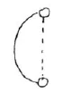

Aufzeichnung A ^vdm42o

Bevor mit der esoterischen Betrachtung begonnen werden kann, bin ich verpflichtet, hier etwas mitzuteilen, nämlich daß durch eines unserer Mitglieder aus dem engeren Kreise, wie durch einen richtigen Impuls getrieben, mir eine Broschüre überreicht worden ist, die mich veranlaßt, einiges zu sagen. Wie jeder von Ihnen weiß, bekommt jeder Schüler der Esoterik je nach seiner Veranlagung Übungen, die aus tiefer liegenden Gründen ganz genau durch ihren Aufbau und [die] Aufeinanderfolge der Worte dasjenige bewirken, was der Schüler für seine Entwicklung braucht. Und es ist von der größten Bedeutung, wie die Reihenfolge der Worte ist, ja auch, welches Wort gebraucht wird und wo es steht, damit dasjenige erreicht wird, was beabsichtigt ist. Viele von Ihnen haben als Morgenübung die Verse bekommen: ^4yall7

Nun habe ich hier eine Broschüre bekommen, die heißt ..., ^scoy1o

 in der sich das Folgende befindet: ^u2yndy

Es ist nun schwer, festzustellen, wie der Schreiber dieser Broschüre zu der Formel gekommen ist, denn sie gehört ausschließlich zu unserer esoterischen Schule. Es könnte sein, daß einer unserer Mitschüler die Unvorsichtigkeit hatte, sie Außenstehenden mitzuteilen. Wir könnten uns auch den andern Fall vorstellen - der sich auch vor mehreren Jahren tatsächlich einmal ereignet hat -—, daß jemand in einem Hotel oder in einer Pension über diese Zeilen meditiert hat, und im Zimmer nebenan war ein Mensch, der diese Gedanken hellsehend aufgefangen hat. In dem erstgenannten Fall sollten wir - eigentlich sollten wir es immer — solchen Dingen gegenüber das größte Mitleid walten lassen, denn als Esoteriker wissen wir, daß alles sich selbst straft, auch wenn nichts Böses beabsichtigt war. Daß diese Wirkung eintreten muß, das rührt eben davon her, daß jedes Wort der Formel in der sorgfältigsten Weise an seinen Platz gestellt worden ist, und wenn sie aus ihrem Zusammenhang gerissen werden, wird als Wirkung das Gegenteil eintreten. Durch die willkürliche Veränderung der Wortfolge, ja durch das Gebrauchen des positiven Wörtchens «ich» — während in der ursprünglichen Formel alles ganz fließend, wie objektiv gehalten ist, so daß alles durch das imaginative Bild wirken soll - hat man hier eine gegenteilige Wirkung erzeugt. Unsere Meditationen sollen immer aus unsern innern moralischen Impulsen hervorgehen; die Außenwelt und ganz besonders unser persönliches Ich sollen ganz ausgeschlossen sein. Ganz objektiv sollen wir in unseren Gedanken die Gottheit der Welt erfassen, wie sie die Welt mit ihrem göttlichen Licht durchströmt und durchdringt. Nicht unser Ich soll sich dabei aufdrängen, denn dann müßte die Wirkung sich in das Gegenteil wandeln. Ganz anders geartete geistige Wirkungen müßten dann auftreten, nämlich die luziferischen Wirkungen. ^5y3gqi

Bei der ersten Zeile ^ycmybm

kommt nicht der moralische Impuls heraus, der in aller Demut das Ich unterdrückt, das ganz hingegeben sein soll dem göttlichen Geiste der Welt, in dem man selbstvergessen ruht. ^g95zgi

Auch in den letzten Zeilen ^njvkv9

tritt das egoistische Prinzip stark hervor, denn in dem «Ich ruhe» wird etwas ganz anderes erlebt. ^9lp29j

Daran sieht man, wie außerordentlich genau und sorgfältig wir sein müssen, damit wir die Worte unserer Meditation ganz richtig auch in unseren Gedanken anwenden. ^oo2h7p

Wir werden jetzt zu einigen Bildern übergehen, die wir für unsere esoterische Schulung gebrauchen können, weil sie sehr stark wirken. Wir wissen, daß der Weg zu den höheren Welten zunächst durch die Imagination geht, dann kommt der Weg der Inspiration, dann der der Intuition. Die Bilder, die jetzt gegeben werden sollen, erkraften die Organe, die zum imaginativen Schauen führen. ^zj60rq

Wir haben in unseren theosophischen Lehren oft davon gehört, daß die Welt Maja ist, daß wir selber nichts als Maja sind, und wenn die äußere Wissenschaft auch jetzt schon beginnt, in dieser Art die Welt zu erklären, dann sollte es für uns erst recht kein leeres Wort mehr sein. ^zbmk4a

Betrachten wir diese Rose, sie zeigt sich uns mit der emporgerichteten Blüte, mit dem abwärts gerichteten Stengel. Und dennoch ist es kein wahres Bild, was man glaubt da wahrzunehmen. Die Wissenschaft hat uns gelehrt, daß dasjenige, was wir sehen, durch eine Kreuzung der Lichtstrahlen zustande kommt, so daß in unserem Auge das umgekehrte Bild der Rose entsteht, während wir das äußere Bild der Rose wahrnehmen mit der Blüte nach oben. Das ist das Spiegelbild der wirklichen Lichterscheinung in uns. Daraus sehen wir, daß dasjenige, was wir da draußen schauen, Maja ist, und dazu noch eine umgekehrte Maja, bei der das Untere oben ist. So ist es mit allem um uns herum; die ganze Welt, die wir an ihrer Oberfläche zu schauen glauben, und wir mit ihr - alles steht in der wirklichen Anschauung auf dem Kopf! Wenn wir die wahre Gestalt der Welt wahrnehmen wollen, so müssen wir nicht die Spiegelbilder aufsuchen, sondern die Wirklichkeiten dahinter schauen, bevor sie sich in der Außenwelt spiegeln. Alles, aber auch einfach alles ist umgekehrt, als wie wir es uns vorstellen. Was oben scheint, ist unten; was hinter uns scheint, ist vorne; was links scheint, ist rechts. Kurz, wir müssen fähig und willig sein, dieses zu erkennen, damit wir von der Maja loskommen. Wenn wir zum Beispiel Töne hören und glauben, daß sie von rechts kommen, dann kommen sie in Wirklichkeit von links her; sehen wir Gegenstände vor uns stehen, so sind in Wirklichkeit Kräfte da, die sich von hinten an uns drängen. So ist es auch mit dem Sternenhimmel. Wir schauen ihn vor uns, wenn wir emporblicken; in Wirklichkeit wird er durch hinter uns befindliche Kräfte vor unserem Auge zurückgespiegelt. ^8a4gpb

Wollen wir zum Wahren in der Welt kommen, dann müssen wir von den Geistern der Form aufsteigen zu den Geistern der Bewegung, damit diese uns behilflich sind, dasjenige, was als Spiegelbild von den Geistern der Form vor uns hingestellt ist, als die Umkehrung der Wirklichkeit zu schauen. Zur Übung darin kann die folgende Zeichnung als Symbol für uns wirken. Wenn wir die Rose mit der Blüte nach oben sehen, so führen wir sie in Gedanken nach unten und vollziehen damit eine Bewegung, die die Kräfte der Geister der Bewegung für uns symbolisieren kann. ^42vzv5

 ^x8rl3s

Eines aber gibt es im Menschen, was kein bloßer Sinnesschein ist, was keine Maja ist. Das ist das Wort, das aus dem Menschen erklingt, das lebendige Wort, der Logos. Das Wort kommt nicht von außen zu uns, es ist etwas Lebendes in uns, es ist unser eigentliches Wesen. Es strömt aus unserem Seelenleben heraus, wir sind es selbst mit all unseren Empfindungen, die wir das Wort nach außen über unsere Lippen strömen lassen. Und wenn wir das tief durchdenken, wie das Wort der Logos ist, wie alles, was in der Welt gesprochen wird, aus diesem Quell heraus gesprochen wird, dann werden wir tief unsere Verantwortlichkeit gegenüber dem Wort empfinden. — Darüber mehr in der nächsten Stunde. ^i1jf7i

Nur dasjenige wird die Erde überdauern und in den nächsten planetarischen Zustand übergehen, was die Menschen in ihren Worten gesprochen haben. Das, was wir von links her hören, kommt, wie gesagt, von rechts her, aber der Laut, den wir aussprechen, ist das einzige, was nicht anders ist, als es zu sein scheint. Es tönt aus unserem Innern, und es kommt auch wirklich aus unserm Innern. Aus ihm heraus sprechen zu uns die göttlichen Wesenheiten, der Logos. ^gpafwm

Aufzeichnung B ^1or7em

Bevor wir an die esoterische Betrachtung gehen, ist es notwendig, noch eines zu betonen. Viele von denen, die hier anwesend sind, haben zur Erlangung gewisser okkulter Kräfte und zur Stärkung der Seele eine Formel bekommen, wie solche eben nur gegeben werden im Zusammenklang mit den Meistern der Weisheit und des Zusammenklanges der Empfindungen. Nicht alle haben diese Formel, weil solche Dinge eben nicht für jeden gleich geeignet sein müssen. Derartige Formeln sind natürlich streng geheimzuhalten und dürfen nicht weitergegeben werden, weil das schwere karmische Folgen nach sich ziehen muß.“ Nun ist mir von jemandem (dessen Impuls ihn richtig zu mir geführt hat) eine Broschüre gebracht worden, in der diese Formel ^dam0yi

in etwas veränderter Gestalt zu lesen ist. Wir wollen auch nicht einmal in Gedanken streng urteilen, sondern nur Milde und Barmherzigkeit üben. Schon irgend jemand die Formel richtig niedergeschrieben zu geben, würde schlimme Folgen nach sich ziehen. Nun könnte die Formel aber auch auf solche Art hinauskommen, daß den Betreffenden gar keine Schuld träfe. Nehmen wir an, ein Mensch, der über ein gewisses Hellsehen verfügt, würde in einem Zimmer wohnen neben jemandem, der über diese Formel in der richtigen Weise meditiert, und würde sie einfach aus seinen Gedanken lesen. Das kann durchaus vorkommen. Dabei träfe natürlich den Meditierenden keine Schuld. ^ca8zld

Nun ist aber in so einer Formel jedes Wort sinnvoll und wissentlich an seinen Platz gesetzt von den Meistern der Weisheit und des Zusammenklanges der Empfindungen. Es ist betont im Anfangssatze, daß die Seele objektiv in diesen geistigen Weltinhalt eindringen soll und nicht mit dem, was mit den niederen Kräften des Ich durchzogen ist. In der umgeänderten Formel wird gerade das Gegenteil betont. Die vom niederen Ich durchzogene Seele dringt in die geistige Welt. Es heißt da: ^8qp19m

Weiter heißt es in der richtigen Formel, daß die Seele sich passiv hingibt, während es dort heißt: ^fi35nr

wo durch das Wort «lebe» auf etwas Aktives hingedeutet wird. Auch im Schlußsatz ist dieser Unterschied. In der richtigen Formel steht: ^b8bs35

während es dort heißt: ^udqthx

Gerade das Gegenteil ist ausgedrückt in der umgeänderten Formel. Wenn die Zeit kommt, in der die wahre Formel in ihrer richtigen Gestalt in dieser Art zu lesen sein wird, wird es noch früh genug sein, darüber und über seine Folgen zu sprechen. — ^yytuh8

Wir haben auch schon exoterisch gehört, daß es drei Wege gibt, um in die geistige Welt einzudringen: durch die Imagination, Inspiration und Intuition. Es sind uns in Verbindung mit unseren Meditationen etc. gewisse Imaginationen gegeben, die uns helfen sollen zur Erreichung unseres Zieles und zur Stärkung unserer Seele. Nun können wir aber auch Bilder dazufügen, die uns gewisse Kräfte geben. Gehen wir zurück auf ein Wort, das wir oft gehört haben, wohl auch als Wahrheit anerkannt, aber das wir uns doch nicht immer genügend ins Bewußtsein rufen, nämlich das Wort: «Die ganze Welt um uns herum ist Maja». Was heißt das streng genommen? Wir nehmen mit unseren Sinnen die Außenwelt wahr. Nehmen wir eine Rose, die vor uns steht. Sie sagt uns: Ich bin da; du nimmst mich wahr mit deinen Sinnen; du mußt mich vorstellen. - Ist dieser Vorgang aber auch richtig so? Nehmen wir die Rose so wahr, wie sie wirklich ist? Schon die äußere Wissenschaft kann uns darauf verhelfen. ^q6wejv

Wir wissen, daß die Sehnerven sich hinter dem Auge kreuzen. Dort rufen sie ein umgekehrtes Bild des Gegenstandes hervor, was nach außen projiziert den Gegenstand in der Gestalt zeigt, wie wir ihn draußen sehen. In uns entsteht das wirkliche Bild der Rose, nämlich umgekehrt, unten die Blüte, oben die Wurzel. Ist aber die äußere Welt Maja, so ist sie ein Spiegelbild ihrer wahren Gestalt. Es ist so, als ob wir uns das Spiegelbild einer Landschaft in einem stillstehenden Gewässer vorstellen. Alles um uns herum sehen wir in seinem Spiegelbilde. Alles müssen wir uns umgekehrt denken, den Menschen und seine ganze Umgebung. Also die Rose, die vor uns steht, muß ich hinter mir denken, die Wurzel nach oben, die Blüte nach unten. Wenn wir meinen, mit dem rechten Ohr zu hören, so ist das Maja. Die Kraft dringt von links auf uns ein und kommt uns im rechten Ohr zum Bewußtsein. Was vor uns zu liegen scheint, ist nur Maja, nur Spiegelbild einer Kraft, die hinter uns ist und sich durch uns offenbart und so die Dinge vor uns hinzaubert. Wie das wahre Bild der Dinge von innen heraus entsteht, so muß es auch mit der wahren Moral gehen. Denn die wahre Moral muß aus der inneren Überzeugung entspringen, nicht aber aus einem äußeren Antrieb. ^p5rqzb

Alles müssen wir umgekehrt denken. Den Sternenhimmel, der sich vor meinem Blick ausbreitet, muß ich hinter mir denken. Wir müssen noch weiter gehen: wo Finsternis herrscht, da ist gewaltiges geistiges Licht; nicht wo physisches Licht dem Auge erscheint, ist geistiges Licht. Damit hängt zusammen, was schon früher gesagt worden ist, daß der Mensch, wenn er anfängt zu schauen, er leicht als erstes in seinem eigenen Schatten das Licht seines Ätherleibes schen kann. ^i36a5g

Wenn wir also die Welt betrachten, nicht in ihrem Spiegelbilde der äußeren Maja, sondern uns bemühen, sie in ihrer wahren Gestalt zu sehen, so tun wir damit etwas ganz Bestimmtes. Wir versetzen dadurch gleichsam alles in Bewegung und bringen uns dadurch in Berührung mit der geistigen Hierarchie, die über den Geistern der Form steht, mit den Geistern der Bewegung. ^ae8ocg

Alles, was wir um uns sehen, ist, wie wir es sehen, Maja. Alles, was wir sehen, hören, fühlen etc. Nur eines ist uns von der Weltenweisheit gegeben worden, was wirklich real ist: das Wort, der Logos. Eines haben wir, was nicht von außen auf uns eindringt und als Maja sich uns zeigt, sondern was aus unserem Innern herausströmt, unser innerstes Wesen offenbarend: die Sprache, das Wort. Auch die Luft ist nicht real. Und so sollte uns dieses Göttergeschenk heilig sein und nicht mißbraucht werden und nichts anderes hinaustönen als in aller Aufrichtigkeit unseren Seeleninhalt. Denn wir finden im Akasha die Tatsache, daß alles sich auflösen und vergehen wird, und nur das, was die Menschen gesprochen haben, bleibt als ein Ewiges erhalten — formgebend für die nächste planetarische Gestaltung unserer Welt. Im Urbeginne war das Wort, und göttlich ist die Kraft des Wortes! ^eddzhz

Wir müssen nach und nach die Kraft bekommen, die Welt zu betrachten, wie sie ist, und dabei nicht uns selbst zu verlieren. ^e11dnu

Aufzeichnung C ^2vbjwk

Esoterische Übungen müssen genau und im Wortlaut geübt werden; diese Übungen sind aus der geistigen Welt heraus genommen und müssen genau so ausgeführt werden, wie sie vorgeschrieben sind. ^v4wt4w

Sobald man in diese Übungen, die eine ganz besondere Stimmung hervorbringen sollen, ein «ich» hineinbringt, so werden dadurch große kosmische [karmische] Wirkungen für den Betreffenden hervorgerufen. - (Das bezieht sich auf die beiden, respektive vier ersten Reihen des Spruches: ^ew2n6u

Es war dieser Spruch in einer Broschüre veröffentlicht; aber nicht ganz richtig, mit «ich» in den Sätzen; und darauf nahm Dr. Steiner Bezug.) ^id5ii7

Ebendasselbe gilt für ein Weitergeben der Übungen an andere; und noch ganz besonders, wenn sie dann durch Druckerschwärze vervielfältigt, also Allgemeingut der Menge werden. ^6jreft

Für die Erkenntnis der höheren Welten gibt es drei Stufen: ^w9yuso

1. imaginative Erkenntnis, ^a8r3zo

2. inspirierte Erkenntnis, ^pa09r5

3. intuitive Erkenntnis. ^iuk9el

Wenn wir bei der ersten Stufe anfangen, so ist es für die Seele sehr wertvoll, wenn wir imaginative Bilder in uns erwecken, die aus innerer Moralität herauskommen müssen. Einige solche Bilder wären folgende: ^030odb

Licht sich vorstellen; die Vorstellung vergeistigen, bis wir geistiges, farbig hinflutendes Licht uns als Weltsubstanz vorstellen können. ^26bgmv

Wärme fühlen, die in uns ganz intensiv als Liebe gefühlt wird und die die Welt durchstrahlt und als Gottesliebe empfunden werden kann. ^kmaya8

Oder auch, was ganz besonders wertvoll ist, sich die Vorstellung von dem Wesen der Dinge verschaffen und dabei empfinden, daß alles, was wir sehen, fühlen und mit den Sinnen wahrnehmen können, Illusion, Maja ist. ^2ppa3r

So zum Beispiel das, was sich oben befindet, nach unten denken und umgekehrt, zum Beispiel Blumen, Menschen, Sternenhimmel etc. Was rechts geschieht, links empfinden. Was vor uns sich abspielt, als ein Durchschneiden von Kräften und als eine Spiegelung hinter uns vorgehend ansehen. ^f3zpz3

Ferner Licht als Dunkelheit, ebenso umgekehrt. Zum Beispiel in dem Schatten des Menschen kann der Hellseher erblicken den Geist, den der Mensch als innere Leuchtkraft hat. ^ynnvo2

Alles, was lebt und webt, Gestalt angenommen hat, und alles, was wir mit unseren Sinnen wahrnehmen, haben die Geister der Form beseelt und mit ihrer Wesenheit durchdrungen. ^1hacfi

Weil aber alles, was in der Sinnenwelt existiert, eine Spiegelung des Geistigen ist; müssen wir"uns an die Geister.der Bewegung wenden und mit ihnen die Umdrehung zu dem eigentlichen Wesen und Ursprung der Dinge vollziehen. Dadurch wird auch in uns tiefste innerste Frömmigkeit erweckt. ^080gpb

Das einzige wirklich Reale in unserer Sinneswelt ist das Wort. Hinter dem Worte, den Urlauten steht der Logos. Das Wort der Ursprache ist das Urbild der schöpferischen Gottessprache. ^sg5rul

Jedes Wort strömt das Seelenhafte aus, von dem es ausgeht. So wie der Mensch es ausspricht, drückt sich seine ihm innewohnende Seele aus. Das Wort der Ursprache ist der Inhalt der Seelenhaftigkeit, die Welten schafft. Das, was Weltensprache ist, diese vielen Verschiedenheiten und Zersplitterungen sind durch die luziferischen Geister veranlaßt worden. ^1zzh7g