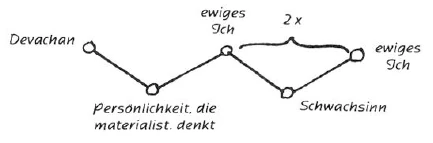
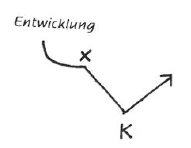
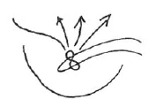

Aufzeichnung A ^upy9pp

Wenn wir hinuntertauchen in unser eigenes Innere, so werden wir dort viele Wesenheiten finden. Das mag uns zunächst merkwürdig erscheinen, aber je weiter wir kommen, je mehr wir hineinschauen lernen in die geistigen Welten, um so mehr werden wir sehen, daß eine Summe geistiger Wesenheiten an uns arbeitet, oft, um auszugleichen, wo wir Menschen in unserer Torheit Zerstörung anrichten. ^vy4aw9

Fragen wir uns einmal: woher kommt die Krankheit? Wir wissen, daß jede Krankheit neben ihrer physischen auch eine geistige Ursache hat, die in Unmoralität, Leidenschaften, oder sonstigen Verfehlungen in dieser, meist in der vorigen Existenz zu suchen ist. Die Überwindung jeder Krankheit gibt Kräfte frei, d.h. aber nicht: man soll eine Krankheit möglichst lange hinziehen, um schnell vorwärts zu kommen, sondern jeder muß an seiner Stelle das Seine tun, um bald gesund zu werden. Ist er aber drei Monate oder drei Wochen krank gewesen, so soll er das als Karma ansehen und mit Geduld und Gelassenheit ertragen. ^mx2fbn

Aber noch aus einem zweiten Grunde ist eine Krankheit etwas Wohltätiges. Seit der lemurischen Zeit, durch die Atlantis hindurch bis zum Mysterium von Golgatha, ist die Menschheit immer tiefer in die Materie gesunken. Und dadurch, daß wir unseren Trieben und Leidenschaften folgen, müßten wir immer tiefer sinken, immer mehr von den Zielen abgebracht werden, die uns von der Gottheit gesteckt sind. ^uc3lsu

 ^c1puqp

Da ist es die Krankheit, die diesen Impuls nach unten gewissermaßen abbiegt und uns wieder die Richtung nach oben gibt. Die heutige Schulwissenschaft verurteilt die theosophischen Lehren als Träumerei; aber man soll nur einmal ein Buch in die Hand nehmen, wie das Johannes-Evangelium oder irgendein theosophisches Buch, da wird man sehen, wie es belebend, erfrischend wirkt, während ein materialistisches oder monistisches Buch die Seele verdorrt, vertrocknet. Und weil durch dieses rein materialistische Denken nur Kräfte verbraucht werden, so wird die Folgeerscheinung in der nächsten Existenz sein, daß solche Leute mit einer Art Schwachsinn behaftet sein werden. Ihr Gehirn wird eine ganz schwammige, wäßrige Masse sein, sie werden denken wollen, können aber nicht. Dieser Schwachsinn ist eine Wohltat, die verhütet, daß diese Leute rettungslos hinuntersinken; denn dadurch, daß in einer Existenz Schwachsinn eintritt, das Gehirn also vor materiellem Denken bewahrt bleibt, kann das ewige Ich zweimal hintereinander im Devachan an dem Wesenskern arbeiten und ihn so beeinflussen, daß es wieder nach oben strebt. ^h1b2wi

 ^9gjdxx

Sie haben alle schon erfahren oder werden es noch tun, daß man sich in der Meditation ganz losgelöst fühlt, der Ätherkörper weitet sich, man fühlt sich hinausgetragen in ferne Weltengrenzen - plötzlich aber fühlt man sich wieder wie festgebannt an diese Welt, man kann nicht von ihr loskommen, man sitzt wie in einem Schraubstock. Das ist gut so. Es ist unser Karma aus den früheren Inkarnationen, das uns so festhält. Würden wir infolge der Übungen gleich hinaufsteigen in die geistige Welt, ohne unser Karma abgetragen zu haben, so würde die Folge ein tiefer Sturz sein. Der Anführer dieser Scharen, die uns fest an die Erde bannen, ist Mehazael. Ihn lernen wir kennen, wenn wir in unser Inneres steigen, ebenso wie Samael, Azazel und Azael. Wir werden dann wirklich erkennen, daß unser Inneres das Wirkungsfeld von Dämonen ist: «Und ihre Zahl ist Legion!» wie es in der Bibel heißt. Auf unserm esoterischen Wege sollen wir diese Wesen kennenlernen, damit wir verständig werden und ihnen nach und nach entwachsen. Azael wirkt so, daß er das, was durch die Stumpfheit gegenüber der geistigen Welt entsteht, ausgleicht. Wenn wir uns aneignen die Gelassenheit, dann übernehmen wir die Arbeit Azaels. Das aber ist Gelassenheit: nicht in Freude jubeln, noch in Schmerz klagen, sondern in allem die Realität karmischen Wirkens anerkennen. Wir sollen nicht nur theoretisch an die Karmaidee glauben, sondern in allem, was uns trifft, empfinden, daß Karma wirksam ist. Unter den Stufen der christlichen Einweihung ist dies die Geißelung, d.h. gelassen und ruhig gegenüberstehen allem Leid, allen Schmerzen des Lebens, die uns wie Geißelhiebe treffen, und wissen, daß sie karmisch bedingt sind. Das ist echte Gelassenheit. ^n839s0

Wir wissen, daß die physische Welt nur ein Spiegelbild ist der astralen Welt, aber so, daß in ihr alles umgekehrt erscheint. Eine unendlich wichtige Meditation, um uns das Wort: «Die Welt ist nur Maja» wirksam zu machen, ist folgende: ^fzs914

Alles, was wir um uns haben, ist eigentlich umgekehrt da. Was wir von oben nach unten sehen, ist eigentlich von unten nach oben da. Bei der Pflanze ist eigentlich die Wurzel oben, die Blüte unten. Der Sternenhimmel, den wir vor uns haben, ist das Resultat geistiger Wesenheiten, die in Wirklichkeit hinter uns wirksam sind. Was als Ton das linke Ohr empfängt, kommt von rechts. Wir müssen uns hineinleben in diese Tatsachen, auch bei den Gegenfarben: uns bei einem Menschen, der rote Stellen hat, vorstellen, sie wären grün, oder das, was hinausragt an den Gliedern, sich vorstellen als Hineinstülpung. Bei einer Pflanze stelle man sich das Grün vor als rötlich-lila, die braune Wurzel als dunkelblau. Alle diese Übungen soll man durchdringen mit Ehrfurcht und Andacht. Das ist überhaupt das Gefühl, in dem wir hoffen dürfen, uns der Gottheit der Welt zu nahen, durch bloßes Denken bleibt Gott nur Abstraktion. Durchglühen wir unser Denken mit Ehrfurcht, Andacht, Demut — dann dürfen wir hoffen, hineinzudringen in die geistige Welt. ^twgop2

Aufzeichnung B ^o074c4

Es kann selbstverständlich einem jeden passieren, daß er einmal erkrankt. Wenn auch nach den entsprechenden Heilmitteln gesucht werden muß, so soll doch der Esoteriker sich fragen, wo die Ursachen seiner Erkrankung liegen, und er wird dabei immer auf einen geistig-seelischen Grund für die Krankheit kommen, entweder eine moralische oder eine sonstige Verkehrtheit, bisweilen aus diesem, meistens aber aus einem vorigen Erdenleben. Warum aber hat der Mensch überhaupt Krankheiten? Weil in jedem Menschen Triebe sind, die ihn herunterziehen und die durch Krankheiten umgewandelt werden in aufwärtsgehende Triebe. ^wt6b3n

 ^r5uv7p

Wenn wir durch diese Kurve die Entwicklung des Menschen angeben, dann kommt durch eine gewisse Verkehrtheit in einem gewissen Moment (x) der Impuls nach abwärts. Diesem Impuls würde der Mensch folgen und dadurch gänzlich verlorengehen für diejenigen Welten, die das Ziel seines Daseins sind, wenn nicht der Schöpfer des Menschen in einem bestimmten Augenblick die Krankheit (K) auftreten ließe, die diesen Impuls in einen aufwärtsführenden umwandeln wird. Es gibt viele solcher abwärtsführenden Impulse im Menschen. Das ist ja auch nicht anders möglich, wenn man bedenkt, daß die ganze Entwicklung von der lemurischen Zeit bis zu dem Ereignis von Golgatha eigentlich nichts anderes als eine abwärtsgehende war und daß erst seit jener Zeit die Möglichkeit gekommen ist, die Menschen wieder hinauf zu führen. Und die seitdem verflossene Zeit ist natürlich eine sehr kurze im Vergleich zu den langen Zeiträumen, die vorher liegen. So gibt es auch noch niederwärtsführende Impulse in der Menschheit, die sich erst in der Zukunft offenbaren werden. Ein eklatantes Beispiel dafür ist die ganze materialistische Schulgelehrsamkeit. Diese macht den Menschen stumpf gegenüber den geistigen Welten, und die Materialisten, die jetzt als Autoritäten angeschen werden, werden in einem nächsten Leben wiedergeboren werden mit Gehirnen, die wie Brei sein werden, so daß sie nicht als Werkzeug der Gedanken dienen können. Aber das vollzieht sich nur, damit die abwärtsgehende Richtung in eine aufwärtsgehende verwandelt werde. Denn ein solcher Mensch erlebt dann zwei aufeinanderfolgende Perioden in der geistigen Welt - Devachan -, ohne ein solches Erdenleben dazwischen durchzumachen, das die in der ersten Devachanperiode erlangten aufwärtsführenden Impulse in niederwärtsführende umwandeln könnte. ^a7ori0

Für den Esoteriker wird es klar, daß unsere Gefühle, Gedanken, alles dasjenige, was wir beim Heruntersteigen in unser eigenes Innere finden, nicht wir selbst sind, sondern andere Wesen, die innerhalb unseres Wesens vorhanden sind. (Von diesen sagt das Evangelium: Ihr Name ist Legion.) In dem Augenblick, wo wir in unser Inneres herabsteigen, finden wir diese Wesen nach allen Seiten herausstrebend, Wesen wie jene, von denen wir das letzte Mal gesprochen haben, wie Samael, Azazel, Azael. ^jzdm6q

Aber es kann auch geschehen, daß der Esoteriker sich sagt: Wie ich mich auch anstrenge, ich bin zu schwach, um sogar meine Übungen richtig zu vollführen; immer kommen andere Gedanken dazwischen. Das rührt aber nur von jenen abwärtsführenden Impulsen her, die unser Karma ausmachen. Die sind es, die - wenn sie auch nicht zur Krankheit führen - wie eine Wand um uns herum aufrichten, wie ein Berg auf uns lasten und die verhindern, daß wir bald in die geistige Welt hineinkommen. ^o5zs5k

 ^85rbdz

Ein Mensch könnte zum Beispiel nach dem Eifer, den er bei seinen Übungen zutage fördert, in wenigen Tagen in die geistigen Welten eintreten, aber sein Karma verhindert es durch viele Jahre, und zwar mit Recht. Denn sonst würde er all seine Fehler und Mängel mit hineinnehmen in die geistige Welt. Wer aber andauernd mit Eifer und Hingabe meditiert - am besten über ein und denselben Gegenstand, das häufige Wechseln in den Übungen ist nur ein Zeichen von Schwäche -, wird eine bestimmte Erfahrung gewiß einmal durchgemacht haben - und wer sie noch nicht gemacht hat, wird sie später sicher einmal erleben -, nämlich ein gewisses Gefühl von Seligkeit, von Losgelöstsein vom Körper, als wie auf Flügeln durch den Raum getragen zu werden. Und wenn man dann zurückkehrt, dann fühlt man es, wie in einem Kerker zu sein, wie ein Gekettetsein an einem Ort, daß man wieder in die Grenzen seines Leibes eingeschlossen sein muß. Dieses Gefühl rührt auch von einer Schar von Geistern her, deren Anführer in derselben Nomenklatur wie vorhin Mehazael genannt wird. ^jz5dml

Diese vier Klassen von Wesen sind es, die wir in unserem Innern finden. Ihre äußere Gestalt, wie sie sich dem hellsehenden Blick zeigen, ist nicht so wichtig; wichtiger ist, wie wir sie empfinden. Diese Wesen sind es, wenn die Heiligen und Asketen von ihren Versuchungen in den Visionen reden. Und wenn sie das Gefühl beschreiben, wie mit glühenden Zangen angegriffen zu werden, dann reden sie von Mehazael. In der Esoterik arbeitet man in gewissem Sinne diesen Wesen entgegen. Wer sich zum Beispiel wirklich mit dem Karmabegriff durchdringt, ihn nicht bloß theoretisch erfaßt, kommt zu einer gewissen Gelassenheit gegenüber Freude und Leid und alledem, was ihm geschehen kann. Dadurch wirkt man auch Azael entgegen, der die Folgen des Stumpfsinnes gegenüber der geistigen Welt fortschaffen soll. Wer eine solche Gelassenheit sich erworben hat, ist nämlich schr aufmerksam in bezug auf seine Umgebung. Ein Stumpfsinn wie der der Lehrer, den wir schilderten, kann bei einem solch gelassenen Menschen nicht eintreten. Jener Stumpfsinn ist außerordentlich verbreitet in der heutigen Zeit. Die Studenten zum Beispiel, die so fleißig Diktat schreiben, tun das zumeist nur deshalb, weil sie es mechanisch verrichten können, nicht nachzudenken brauchen dabei und daher auch gleich nachher nicht wissen, was sie aufgeschrieben haben. - Und wer die christliche Einweihung durchmacht und gelangt zu jener Erscheinung, die da die Geißelung genannt wird, der arbeitet ebenfalls dem Azael entgegen. ^ufj3mk

Die Welt ist Maja, das soll für uns Inhalt und Bedeutung gewinnen. Sogar die Wissenschaft hat das hie und da schon entdeckt. Sie wird in den nächsten Jahren noch viel mehr okkulte Grundsätze entdecken, nur beachtet man es nicht. Johannes Müller, der am Anfang des neunzehnten Jahrhunderts lebte, hat schon entdeckt, daß die Welt sich uns eigentlich in ihrem Spiegelbild zeigt. Was vor uns ist, ist eigentlich hinter uns. Sehen wir die Sonne vor uns, dann wissen wir, daß hinter uns die geistige Sonne ist, die vor uns das Scheinbild der physischen Sonne aufruft. Sehen wir die Sterne über uns, dann sind unter uns die Wesen, die das Bild des Sternenhimmels durch uns hindurchprojizieren. - Die rote Gesichtsfarbe ist in Wirklichkeit hellgrün; wo Licht ist, ist Finsternis und so weiter, und so weiter. Sehen wir eine Blume, dann müssen wir sie umgekehrt denken: die dunkle Wurzel nach oben blau (?) gefärbt, die grünen Blätter rötlich-violett. ^b9sx79

Die Netzhaut ist nicht im Auge, wie der Materialist es sich denkt, aber schon der von den Materialisten hoch verehrte, aber sie weit überragende ausgezeichnete Physiologe Johannes Müller lehrte, daß die Netzhaut da draußen ist; die ganze Welt um uns herum ist die Netzhaut, und diejenige im menschlichen Auge ist nur eine Spiegelung derselben. Der ganze Mensch ist draußen im Raume ausgebreitet. ^7iyzxt

Das sind wirksame Imaginationen, wenn wir sie in der richtigen Weise vollführen und nicht versuchen, sie mit dem Verstande einzufangen. ^b7mfhi

Aufzeichnung C ^ri8v0f

Wenn der Mensch in sein inneres Wesen hineinsteigt, so findet er nicht nur sich selbst, sondern ganze Scharen von Wesenheiten, die in ihm eingeschlossen sind, und die er zu besiegen und zu befreien hat. Hat er eine schwere Krankheit oder sonst ein schweres Lebensschicksal zu bestehen, so soll er sich klarmachen, daß dies eine karmische Folge meist von der vorhergehenden Inkarnation ist, entstanden aus Unmoralität oder sonstigen menschlichen Schwächen, die dann in dieser Inkarnation dazu dienen, dem Menschen neue Impulse des Vorwärtsschreitens durch die Überwindung zu geben. Durch die verschiedenen Fehler, die der Mensch in früheren Inkarnationen gemacht hat, hat er die Tendenz, den Abgründen zu verfallen. Durch die Krankheit bekommt er einen neuen Impuls, der ihn vor dem Hinuntergleiten beschützt, ihm einen Anstoß gibt, sich nach oben zu den geistigen Mächten zu erheben. Trotzdem aber soll man alles tun bei Krankheiten, was ein vernünftiger Mensch tun kann, um sie loszuwerden. ^5pecz7

Menschen, die in diesem Leben Materialisten sind, werden im nächsten Leben schwachsinnig sein, ein zu weiches Gehirn haben, da sie in diesem Leben ihrer Seele zu wenig belebende Nahrung zugeführt haben. Würde die Schwachsinnigkeit nicht eintreten, dann würden diese Menschen rettungslos verloren sein, da ein gesundes Gehirn sie in der früheren Richtung weiterführen würde. ^g5xvn6

Oft erlebt der Esoteriker Momente größter Seligkeit, weil sein Ätherleib sich ganz ausgebreitet hat in die geistige Welt hinein, und er fühlt nachher beim Zurückkommen ein Geknechtetsein, ein Gefesseltsein. Wie mit eisernen Ketten fühlt er sich geschmiedet an seinen physischen Leib. Ungezählte Scharen von Wesenheiten bewirken dies, Scharen, die man nach ihrem Anführer Mehazael nennt. Der Esoteriker wird stets wissen, wenn er dies niederdrückende Gefühl des Gefesseltseins empfindet, daß ihm entgegengearbeitet wird von den Scharen des Mehazael, die ihn herunterziehen wollen. Oft fühlt er sich wie mit glühenden Zangen durch sie gezwickt und gepeinigt. In der christlichen Einweihung wird das durch die «Geißelung» bezeichnet. ^dzmz2s

Wir dürfen uns den Menschen nicht so vorstellen, daß er nur wäre sozusagen ein Bündel von Trieben, Leidenschaften und Affekten, sondern es ist so, daß in ihn eingeschlossen sind ganze Scharen von Wesenheiten. In den Evangelien wird von dieser Tatsache gesprochen. Für den Menschen, der diesen vier Scharen begegnet, den Scharen des Samael, Azazel, Azael und Mehazael, ist es ganz gleichgültig, ob er sie hellscherisch sieht oder nicht. Nur das ist wichtig, wie er sich ihnen gegenüber fühlt. Lernen können wir hieraus, daß unsere ganze Persönlichkeit Maja, Illusion ist, und daß wir unseren Stützpunkt allein finden in dem, was der geistigen Welt angehört, in unserer Individualität, unserem höheren Ich. ^jegfmk

Aufzeichnung D ^77twgq

Das letzte Mal hörten wir, daß wir beim Hinabsteigen in uns selbst Wesenheiten begegnen, die nicht Eigenschaften in uns, sondern real sind, Bündeln von Wesenheiten, die von unsren Hüllen umschlossen sind. Da war Samael, Azazel, Azael und dazu kommt Mehazael. Diesen begegnet man, wenn man nach beseligenden Momenten in der Meditation, wo man hinausgetragen wird in andre Welten, zurückkehrt in sein eigenes Wesen, in dem sich durch Inkarnationen hindurch angehäuft haben Unsummen von Fehlern, Lügen, Unmoralischem; diese müssen karmisch ausgeglichen werden. Wir bringen durch sie mit in die neue Inkarnation hinein den Impuls abwärts; und durch Krankheiten und Schicksalsschläge wird dieser Impuls abgestumpft und wieder hinaufgeführt. An diesem karmischen Ausgleich arbeitet Mehazael, wir empfinden ihn so bei der Rückkehr aus der Meditation, als ob man eingepreßt würde wie in einem Schraubstock. Auf dem christlichen Wege entspricht das der Geißelung. ^fto1y6

Ob wir auf dem esoterischen Weg rascher oder langsamer vorankommen, hängt von unserem Karma ab, wir fühlen den Widerstand in uns, der uns nicht in rechter Weise die Meditation verrichten läßt. Da ist gut, Nachsicht mit uns selbst zu haben. Wir müssen nicht den Egoismus und unglaublichen Hochmut haben, zu denken, wir wären solche hohe Individualitäten, daß wir in drei Wochen oder drei Monaten in die geistige Welt hinein könnten. Wir sollen nicht nur abstrakte Gedanken haben an der Außenwelt, sondern lebendige Kräfte entwickeln. Die Welt ist Maja, Spiegelbild geistiger Wirkungen, die von hinten durch uns hindurch wirken. ^ph5oyc