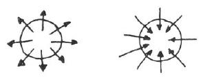
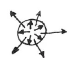

Aufzeichnung A ^79frl0

Durch unsere esoterischen Übungen wollen wir erreichen, uns ganz auf einen Gedanken zu konzentrieren und darnach eine Leere in uns eintreten zu lassen und abzuwarten, was uns als Resultat unserer Meditation zufließt. ‚Von der Stärke unserer darauf verwendeten Ausdauer hängt es ab, was wir da erreichen. Man könnte meinen, daß man durch Abwechslung der Übungen schneller vorwärtskommt, als wenn man lange dieselbe Übung hat; aber die tiefsten Esoteriker haben immer behauptet, daß sie am weitesten gekommen sind dadurch, daß sie mit großer Geduld und Ausdauer jahrelang dieselben Übungen gemacht haben. ^1woif7

Es kann vorkommen, daß ein Mensch nur einmal in seinem Leben Gelegenheit hat, mit jemandem zusammenzukommen, der ihm eine geistige Übung geben kann, den er aber dann auf dieser Erde nie wieder sieht. Diese Übung kann aber, wenn sie richtig gemacht und das Karma dieses Menschen günstig ist, für sein Leben ausreichen und ihm Früchte tragen, bis er schließlich im Geistigen seinen Lehrer findet. ^z7jpm1

Der Esoteriker wird bemerken, daß, indem er auf seine innere Entwicklung Kräfte verwendet, gewisse fehlerhafte Eigenschaften, die er früher schon hatte, schärfer hervortreten. Zu diesen Eigenschaften gehört zum Beispiel ein erhöhtes Kritiküben an anderen Menschen. Kritisieren tun ja alle Menschen. Der Esoteriker soll sich aber klar werden, woraus dieses Abkanzelnwollen der andern entsteht. Durch die Übungen erhöhen und verstärken wir unser Ich-Gefühl, unsere Egoität, und da ist dieses Kritisieren ein Uns-behaupten-Wollen den übrigen gegenüber, ein Etwas-Besonderes-sein-Wollen, ein Absonderungsbedürfnis. Der Esoteriker verliert das Interesse an vielen äußeren Dingen, für die er früher schr viel Aufmerksamkeit hatte. Das geht so weit, daß manche Esoteriker das Gefühl haben, nicht mehr so gut zu sehen wie früher. Die meisten beklagen sich auch über den Verlust ihres guten Gedächtnisses. Aus den letzten esoterischen Stunden wissen wir, daß dieses Nichtachtgeben auf die Umwelt fehlerhaft ist. Es kann eintreten, daß jemand seine Übungen nicht intensiv genug macht, um die innere Leere mit geistigem Inhalt auszufüllen, die er doch mit den früheren Interessen nicht mehr ausfüllen mag. Dadurch bekommt er dann ein drängendes Gefühl, eine treibende Unruhe, das Bedürfnis, seine innere Leere von außen her zu füllen. Dann fällt er nur zu leicht in die Versuchung, das Äußere zu bekritteln. Dieses Kritisieren ist in einer Weise verständlich und berechtigt, denn nachdem der Mensch sich von der äußeren Welt erst abschloß und jetzt wieder heraustritt aus sich, möchte er sich der Welt gegenüber behaupten. Darin liegt aber ein Egoismus, der ebenso wie das Kritisieren unterdrückt werden sollte. Wenn wir dies erreichen, werden sich die Kräfte, die wir sonst vergeudet hätten, nach innen wenden und unser Seelenleben befruchten. Das Absonderungsbedürfnis ist etwas ganz Berechtigtes für den Esoteriker, denn nur in der Einsamkeit kann er Fortschritte machen. Für die meisten der gewöhnlichen Menschen ist ja das Einsamkeitsgefühl ein Unerträgliches. Der Esoteriker soll sich aber Ertragsamkeit der Einsamkeit angewöhnen. Dadurch fördert er sein esoterisches Leben in starkem Maße. Ein Mensch, der Sehnsucht hat nach außen, nach Gesellschaft, zersplittert seine Kräfte in dieser Sehnsucht. Es ist, als ob diese Sehnsucht nach allen Seiten hin von ihm fort stiebte in den Raum hinein. Er sollte nun darauf achten, diese Kräfte lieber in sich zu sammeln, sie sozusagen nach innen abzubiegen. Er wird dadurch einen großen Gewinn haben. ^n9e72g

 ^86hqz8

Eine andere, scheinbar entgegengesetzte Eigenschaft muß der Esoteriker ebenfalls ausbilden. Entgegengesetzt ist sie der ersteren nur, wie der rechte Pendelschlag bei der Uhr dem linken entgegengesetzt ist: Einer resultiert aus dem andern, und doch sind sie sich gerade entgegengesetzt. So ist für den Esoteriker notwendig, daß er zwei Eigenschaften ins Gleichgewicht zueinander bringt wie Pendelschläge: Erstens die Ertragsamkeit der Einsamkeit, das heißt die Stärkung der Egoität, und zweitens die völlige Hingabe bis an die Grenze der Selbstaufgabe, des Vergessens seiner selbst, an das, was als Pflicht von außen an uns herantritt. ^r7ue5j

Wenn wir an dem Standpunkt angelangt sind, daß unser Herz lechzt nach Einsamkeit inmitten unserer Umgebung, daß diese uns eigentlich weh tut, wir unter ihr leiden und wir ihr trotzdem die volle hingebende Liebe entgegenbringen, dann haben wir die Vereinigung der sich scheinbar widersprechenden Eigenschaften erreicht. ^swsmp7

Eine dritte Eigenschaft, die wir üben sollen, ist das Schweigen über unsere esoterischen Erlebnisse. Bei unentwickelten Menschen ist das Gefühl, ein Geheimnis bewahren zu müssen, ein sie geradezu zersprengendes, und sich einmal so recht aussprechen zu können, ist ihnen eine kolossale Erleichterung. Der Esoteriker sollte aber bedenken, daß diese Kraft, die einen zu zersprengen droht, eine sehr starke sein muß, wenn man sie lieber innerlich aufstapelt. Deshalb heißt es auch: «Lerne schweigen und dir wird die Macht» — das heißt die Macht, in seinem eigenen Innern zu herrschen. Der okkulte Forscher kann zum Beispiel deutlich die Veränderung wahrnehmen, die Kraftzufuhr, die im Innern eines Menschen eintritt, der das Aussprechen eines Geheimnisses aus irgendeinem Grunde unterdrücken muß. Ein Mensch hat zum Beispiel etwas auf der Seele, das er seinem Freunde mitteilen möchte. Im Begriffe, zu diesem zu eilen, trifft er an der Türe einen anderen Bekannten, der ihn zu besuchen kommt. Diesem kann und will er seine Mitteilung nicht machen. Nachher ist es zu spät, zu dem Freunde zu gehen; er muß also die Mitteilungslust unterdrücken. Bei diesem Menschen, dem dies passiert ist, wird der Okkultist sehen, daß sich in der Seele desselben eine Kraft entwickelt hat, die vorher nicht da war, und die auch nicht entstanden wäre, wenn der Mensch seinen Wunsch erfüllt hätte, seine Mitteilung zu machen. Für den Esoteriker sollte der Spruch nicht gelten: «Wes das Herz voll ist, fließt der Mund über.» ^dxpeve

Bei einem Nicht-Esoteriker kann es ja manchmal gut und angebracht sein, sich auszusprechen, aber nicht für den Esoteriker. Er verspritzt durch das Mitteilen seiner innersten Gedanken und Gefühle Kräfte nach außen, die so notwendig für seine Seele gewesen wären. Jedesmal, wenn wir imstande sind, Gedanken und Gefühle zu verschweigen, besonders solche, die sich auf unsere esoterischen Erlebnisse und Schwierigkeiten beziehen, erlangen wir eine seelische Kraft, die uns nicht verloren gehen kann. Aber über allgemein Menschliches, über etwas, was dem Menschen von Nutzen sein kann, darüber soll man reden, nur über die eigenen Angelegenheiten nicht, die ja die andern auch gar nichts angehen. Dieses Mitteilungsbedürfnis, woraus entspringt es denn eigentlich? ^st619d

Selten haben wir das Bedürfnis, zu andern Menschen zu gehen, weil wir sie uneigennützig lieben, sondern meist, weil sie Eigenschaften haben, die uns etwas sind, etwas geben. Auch den Wunsch sollen wir fallen lassen, sozusagen von anderen Menschen auf Händen getragen zu werden. Im Gegenteil, wir sollen ihnen dankbar sein, wenn sie uns schlecht behandeln, weil wir unsere Kräfte der Ertragsamkeit daran üben können. Und dann sollen wir uns bemühen, trotzdem Liebe zu den Menschen zu empfinden. Wir werden dann schon merken, daß es die rechte ist. ^1tqgje

Etwas, das der Esoteriker auch sein lassen sollte, ist das Klagen. Worüber beklagt er sich denn? Meist darüber, daß, wenn er seine Meditation beginnt, von allen Seiten Gedanken auf ihn einstürmen. Er sollte aber dankbar hierfür sein, es als Fortschritt betrachten, daß er bemerkt, welche Realität die Gedankenwelt ist, daß sie sich so durchsetzen kann. Er soll nur seine Kraft ihr entgegensetzen, denn dadurch wird die Kraft wachsen. Ablauschen sollten wir es diesen Gedanken, wie sie es machen, sie als Vorbilder betrachten, wie wir uns konzentrieren können, sie verwenden als Muster, uns sagen: Mit der gleichen Intensität sollen wir uns in unsere Meditation vertiefen, dann werden wir geistige Kräfte, die uns stützen, an uns ziehen. —- Es wäre eine sehr bequeme Meditation, wenn vor derselben Engel oder sonstige geistige Wesenheiten kämen und uns die unerwünschten Gedanken wegfegten. ^roja75

Hat der Esoteriker alle diese Eigenschaften überwunden und auch gelernt, das Schweigen im richtigen Maße zu üben, so wird er zu etwas kommen, was die Mystiker stets schon die Pforte des Todes genannt haben, und zwar deshalb, weil der Mensch durch sein Schweigen und durch das Beherrschen seiner Eigenschaften so weit gekommen ist, daß er im selben Zustande sich befindet, wie ein Mensch, der vor dem Tode steht, in dem all seine Interessen von der äußeren Welt abgewendet sind. Er ist in sich selbst gekehrt oder nach dem Göttlich-Geistigen. Das ist es auch, was gemeint ist im zweiten Teil unseres Rosenkreuzerspruchs: In Christo morimur. In Christus sterben wir, indem wir uns ganz umwandeln und uns wieder dem Geistigen zuwenden. Ex Deo nascimur: Aus Gott werden wir geboren und müssen uns in dem Physischen verkörpern. Es ist nun unsere Aufgabe, uns so vorwärts zu entwickeln, daß wir sagen können: In Christo morimur. Wir wenden uns ab von allem Physischen und erheben uns zu dem Geistigen, welches immer der Heilige Geist genannt wurde, und werden in diesem von neuem geboren: Per Spiritum Sanctum reviviscimus. Und wie eine Auslegung dazu ist der Spruch, den uns der Meister der Weisheit und des Zusammenklanges der Empfindungen gegeben hat: ^5v12on

Aufzeichnung B ^iadgn2

Der Esoteriker muß sich gewöhnen, bestimmte Gefühle zu ertragen und Dinge zu tun und zu lassen, die der Exoteriker nicht tut, dazu gehört ^7myc37

1. das Einsamkeitsgefühl. Der Esoteriker muß lernen, dieses zu ertragen und sich selbst genug sein und leben können in dem, was in der eigenen Seele aufsteigt, ohne in dieser Einsamkeit sich unglücklich zu fühlen. ^cyc5il

Das Erste, was dann auftreten wird, ist, daß man alles ganz anders ansieht. Das Interesse wird sich vollständig ändern. ^tkcnhw

2. Das Zweite ist Hingabe, was der Esoteriker ausbilden muß. ^uxi0zt

3. Das Dritte ist Schweigen, gegenüber leichtfertiger Mitteilsamkeit. ^s5jcdr

Durch dieses Dreifache erlebt der Esoteriker die Wahrheit: Ich bin bis an die Pforte des Todes gekommen! ^vapi5g

Es wird viel vom Schüler geklagt über das Überfluten der Seele von Gedanken bei der Meditation. Dankbar sollten wir dafür sein, daß uns zum Bewußtsein kommen kann, daß Gedanken Realitäten sind, die stärker sind als wir. Man sollte nicht klagen, sondern sich freuen, wenn die Gedanken so sich zeigen; sie zeigen sich als Seelenkräfte. Durch das Schweigen werden bestimmte Kräfte in der Seele entwickelt. ^6zjeoc

 ^qnchl7

Kritik üben und ausdrücken setzt eine ganz bestimmte Eigenschaft voraus in der Seele, nämlich die, in seiner Egoität etwas gelten zu wollen, etwas vor dem anderen voraus zu haben. ^w02e8q

Vermag man viel von solchen Seelenerlebnissen anzuhäufen, ohne sie auszusprechen, so wird man an einen ganz bestimmten Punkt seiner Entwickelung kommen, den jeder Esoteriker kennt und der in allen mystischen Schriften als «bis an die Pforte des Todes gekommen» bezeichnet wird. ^9x5cid

Hingabe, wie wird sie geübt? Man kann lechzen nach Einsamkeit und doch jeden Augenblick bereit sein, dem anderen in Liebe sich hinzugeben, um des anderen Menschen willen und seiner liebenswerten Eigenschaften. ^3xsfva

Gewöhnlich geschieht es, daß ein Mensch den anderen aufsucht aus Egoismus. Er hat etwas von ihm. Der andere, den er aufsucht, hat Eigenschaften, die ihm gefallen. Er sucht seine Nähe also nicht um des anderen willen, sondern um seiner selbst willen. ^2ye7v3

Die Hingabe an die inneren Erlebnisse muß so stark sein, daß man sich selbst ganz vergißt, sich hingibt an das, was aufsteigt aus der Seele, so daß man objektiv die Kraft ansehen kann. ^5qnytf

Zuerst tritt beim Esoteriker das auf, daß die Egoität stärker wird. Absonderung, Verfremdung von den anderen Menschen strebt der Mensch an. - Wenn der Mensch die Sehnsucht nach Menschen in sich aufsteigen fühlt, so muß er sich sagen: durch die Sehnsucht sind nutzlos Kräfte nach außen verspritzt, die der Mensch sehr gut nach innen brauchen kann. ^r21psu

Ebenso ist es bei Mitteilsamkeit, nutzlos sind Kräfte verbraucht. Die Dinge, die uns im Innersten interessieren, die uns subjektiv interessieren, über die sollen wir schweigen; die Kraft, die da sonst verbraucht wird, nach innen gewendet, gibt eine starke Kraft für den Esoteriker. ^zxppfx

Einerseits müssen wir stark machen unsere Egoität, andererseits uns selbst vergessen. ^lkrxl6

Die Meditation soll der Esoteriker lediglich durch seinen Willen in den Mittelpunkt des Bewußtseins rücken, nicht durch Erinnerung etc. ^hzrsio