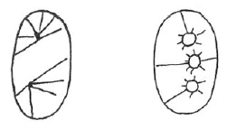

Aufzeichnung A ^syhx7m

Die esoterische Entwicklung muß zu verschiedenen Zeiten eine verschiedene sein, sonst hätten die aufeinanderfolgenden Inkarnationen keinen Sinn. Aber gewisse Dinge bleiben durch alle Zeiten hindurch dieselben. So finden wir zum Beispiel, daß die ägyptischen Esoteriker reden von: ^le99q0

dem Kommen an die Schwelle des Todes, ^ox3pr7

dem Gang in die Unterwelt, ^le8zeg

dem Erleben der vier Elemente, ^6pfv2o

dem Schauen der Sonne um Mitternacht, ^ss98us

der Begegnung mit den geistigen Wesen aus nächster Nähe. Was damit gemeint ist, kann jetzt nicht alles auseinandergesetzt werden; aber das Einfachste darüber wird jetzt gesagt werden. ^d5iy0h

Eine der Empfindungen, die das esoterische Leben uns bringen kann, ist diejenige, daß das Wachleben uns so vorkommt, als wäre es eigentlich nur ein Schlafleben. Das ist keine Stimmung, die wir fortwährend in uns hegen könnten, aber es soll auch niemals unsere Absicht sein, gewisse esoterische Stimmungen, die wir in bestimmten Augenblicken erleben, sich über das ganze Leben ausdehnen zu lassen. Wenn wir das täten, so würden wir ungeeignet werden, unseren Pflichten in der Außenwelt nachzukommen. Jeder Esoteriker soll zwar von Zeit zu Zeit eine Stimmung der Sehnsucht erleben, wenn er die Reiche der Natur um sich herum sieht, durchzudringen zu demjenigen, was dahinter liegt, was die wahre Wirklichkeit ist, wonach wir streben und im Verhältnis zu der alle gewöhnlichen Sinneseindrücke nicht mehr Wert haben als diejenigen aus dem Schlafe. Wer das haben möchte, um in solchen esoterischen Stimmungen fortwährend zu leben, der müßte sich zurückziehen in eine Art Mönchsleben. Das ist aber nicht jene Esoterik, die das Rosenkreuzertum anstrebt. Wer sich in solcher Art zurückziehen möchte, müßte sich dessen bewußt sein, daß er sich gewisse Privilegien aneignet in bezug auf seine Mitmenschen, damit er sich dadurch für mehrere Leben in der Außenwelt vorbereiten könne, daß aber, wenn alle Menschen so leben möchten wie sie, jeder Fortschritt in der Menschheitsentwicklung unmöglich gemacht würde. ^55l9lr

Unsere Übungen sind darauf angelegt, uns in die geistige Welt hineinzubringen; aber oft bemerken wir die Fortschritte, die wir dabei machen, nicht durch Unachtsamkeit. So kann man zu der Empfindung kommen: Von demjenigen, was als Denken, Fühlen und Wollen in uns als Kräfte ausgegossen ist, machen wir nur einen sehr schlechten Gebrauch, aber wir könnten, so wie wir sind, unmöglich in jenem Denken, Fühlen und Wollen leben, es würde uns zerschmettern, vernichten. Die Empfindung, vor einem Erlebnis zu stehen, das uns überwältigen will, nannten die Alten: das Kommen an die Schwelle des Todes. Denn da fühlt man: das, was ich jetzt erlebe, kann ich weder mit meinem Denken, noch mit meinem Fühlen, noch mit meinem Wollen bemeistern; jetzt fühle ich, wie es ist, gestorben zu sein. Dieses Erlebnis haben wohl die allermeisten von Ihnen schon öfter durchgemacht. Daß man nichts davon weiß, rührt nur von der Unaufmerksamkeit her. Man wird oft während des Meditierens das Gefühl gehabt haben, daß man einen Augenblick «fort war», und dann, zu sich kommend, denken: ich habe geschlafen. Wenn man sich die Mühe gibt, nachzugehen dem, was man in solchen Augenblicken durchlebt hat, dann würde man spüren, daß es vielleicht die gewaltigsten Erlebnisse waren, die man jemals durchlebt hat. ^wn5hd6

Eine andere Erfahrung ist diese. Sie braucht nicht notwendigerweise nach der ersten zu kommen. Man kann den Eindruck erhalten, diese zweite Erfahrung als erste durchlebt zu haben, weil man das erste Erlebnis verschlafen hat. Man kommt zu dem Gefühl, daß man in seinem Leibe drinnensteckt, daß man ihn mit sich trägt. So wie man, an jedem Arm mit einem Gewicht beladen, unterscheiden kann das Gewicht von den Muskeln des Armes, so lernt man seine Arme selber als Gewichte empfinden, die man mitschleppt. Dann kann man das Gefühl haben, daß man - nicht leiblich, aber um so mehr seelisch - gefesselt sitzt in einer Unterwelt. Das ist das «Gehen in die Unterwelt». In seinen Übungen fühlt man sich dann gleichsam ganz. wie gelähmt, nachher ein Gefühl, als ob man innerlich ganz von lauem Wasser übergossen würde. ^4yuzdw

Auch kann man die Empfindung haben, daß die schlechten Gedanken, die wir haben, nicht nur Gedanken sind, sondern etwas Wirkliches. Wenn wir von einer Persönlichkeit Schlechtes gedacht haben, dann sehen wir das wie einen Pfeil voranschießen, der diese Persönlichkeit schlimmer in seiner Seele verletzen kann, als ein physisch abgeschossener Pfeil es seinem Leibe tun könnte. Sobald wir einsehen, was wir damit ausrichten, bemerken wir, wie der Pfeil auf uns selber zurückfliegt und uns brennt wie Feuer, als wäre man in den «Flammen der Unterwelt». Das ist das «Gehen durch die Elemente». Es braucht nicht als Vision geschaut zu werden, man kann es an sich selber fühlen, wie wenn man gleichsam überall Brandwunden hätte. ^gwc2yu

Wenn wir so empfinden, dann schicken wir gleichsam Kräfte aus unserem Ätherleib, die aber nur bis zu der Grenze unserer Aura gehen können. Dort treffen sie aber die überall im Umkreis wirkenden Kräfte des Kosmos, die diese Kräfte sich umkehren lassen und nach bestimmten Mittelpunkten hin dirigieren, wo sie die übersinnlichen Organe zum Vorschein rufen. Es ist damit wie mit den physischen Augen: diese wurden aus indifferenten Organen durch das Licht gebildet. Solange das Licht daran arbeitete, konnte man noch nicht sehen; das wurde erst möglich, als sie fertig waren. So können wir auch unsere höheren Organe erst gebrauchen, nachdem sie in der geschilderten Art durch uns auferbaut worden sind. ^kmny1f

 ^as2whj

Aufzeichnung B ^nvg4u8

Alle Esoterik, alles esoterische Streben ist der Veränderung, dem Fortschritt unterworfen, das heißt, die Form ändert sich, das Wesen der Esoterik bleibt zu allen Zeiten dasselbe. Wäre das nicht der Fall, so hätte ja die Lehre von den wiederholten Erdenleben keinen Sinn, das heißt, der Mensch wird immer wieder auf die Erde geführt, damit er seine Erfahrungen macht und seine Seele reifer wird. Die Form, wie der Mensch in die höheren Welten [heute] eingeführt wird, hat eine ganz andere werden müssen. Der heutige Mensch mit seinem differenzierten Seelenleben hielte wohl schwerlich aus, was früher von einem Schüler der ägyptischen Mysterien verlangt wurde. Bei ihm geschah die Vorbereitung im Verlaufe weniger Wochen unter den Augen des Priesters. Gewaltmittel wurden angewendet, um zum Beispiel sein höchstes Mitleid zu erregen, seine Furchtlosigkeit auf die Probe zu stellen; er war sich völlig klar, daß sein Leben dabei auf dem Spiele stand. Anders ist es mit dem heutigen Menschen. Zwar steht auch er unter der Leitung eines Lehrers, aber durch die Kraft der ihm gegebenen Übungen, durch die eigene Arbeit an seiner Seele erhebt er sich in die höheren Welten. ^chd5f5

Der ägyptische Esoteriker, nach den Stufen seiner Entwicklung befragt, hätte sie folgendermaßen zusammengefaßt: ^7osdb1

Diese einzelnen Stufen zu schildern, ist sehr schwer; sie beruhen eben auf Erlebnissen der Seele, die jeder durchmachen muß. Nur ist nicht gesagt, daß die Reihenfolge immer dieselbe ist. Es kann sein, daß er die eine verpaßt, so daß die zweite an die Stelle der ersten tritt. Alles, was in der Seele vorgeht, ist sehr fein, sehr subtil. Der Mensch muß sich daran gewöhnen, auf diese intimen Stimmungen seiner Seele zu achten. ^nntv25

1. Wenn er hinhorcht auf das, was in seiner Seele vorgeht, so wird sich bald etwas zeigen wie eine Art Eingehüllt-, Eingeschläfertsein gegenüber der Außenwelt. So wird er sich sagen: All ihr schönen Fluren, all ihr lieblichen Täler, ich trage nach euch kein Verlangen. Eine Sehnsucht liegt in mir nach dem, was dahinterliegt! Wie eine Art Schlaf ist solche Stimmung, wie ein Absterben. Man kann nicht denken, nicht fühlen wie früher. Man kann nicht den kleinen Finger heben; auch der Wille ist tot. Alle Glieder werden schwer und gebrauchsunfähig. Die Seele befindet sich außerhalb des Körpers. Es ist, als ob die materielle Welt versinkt. Man fühlt sich von Gott und der Welt verlassen. ^81bp2e

Selbstverständlich darf dieses Gefühl nur vorübergehend da sein. Wir würden ja sonst völlig unbrauchbar werden für unser Berufsleben. Unser esoterisches Leben heutzutage wird aber so eingerichtet, daß es sich mit jeglichem Beruf verträgt. Gerade wenn er in solchen Stimmungen gelebt hat, soll der Mensch frisch, elastisch sein für sein äußeres Leben. Wer ganz seiner Entwicklung leben wollte, müßte sich schon zurückziehen als Mönch und dieses besondere Privileg sich auf viele kommende Erdenleben vorwegnehmen. ^1mas0q

Dieses Gefühl des Eingehülltseins gegenüber der Außenwelt hat der Esoteriker aller Zeiten genannt: durch die Pforte des Todes gehen. Es ist wirklich wie ein Vorgefühl des Sterbens. ^8ikbmo

2. Das zweite Gefühl, das Hinuntersteigen in die Unterwelt, tritt so auf, daß in einem das beschämende Gefühl entsteht von dem eigenen Unwert, daß man von den Fähigkeiten der Seele nicht den ausgiebigen Gebrauch macht, zu dem wir eigentlich fähig wären. Das Gefühl, das wir bekommen, ist, als ob unser Körper etwas Apartes wäre, das wir mit uns tragen müssen und das uns bisweilen so schwer wie Blei drückt. Zum Beispiel haben wir diese Empfindung an den Armen. Wir haben das Gefühl, als wäre unser Körper etwas Fremdes. Dann fühlen wir uns mit einem Male wie durchleuchtet [durchfeuchtet?], ^5mvg65

 wie mit lauwarmem Wasser übergossen. ^phdevo

3. Und dann ein drittes Gefühl: daß wir uns klar werden, daß unsere Gedanken Realitäten sind. Früher haben wir wohl einen Gedanken gehabt, dann ist ein zweiter gefolgt, und wir haben geglaubt, er hätte den ersten ausgelöscht. Jetzt fühlen wir bei einem bösen Gedanken, als ob ein tödlicher Pfeil abgeschossen wäre auf den, an den der böse Gedanke gerichtet war. Dieser Pfeil kommt aber zurück und richtet sich auf unsere eigene Seele und brennt in der Seele, und diese brandige Stelle bleibt unser ganzes Leben hindurch. Wir müssen sie früher oder später durch unser Karma gutmachen. Der Esoteriker beginnt imaginativ zu schauen, sieht das Feuer, das durch seine bösen Gedanken angezündet ist. Oft wird ihm sein, als ob sein eigener Körper durch hell lodernde Flammen verbrennt. Die Esoteriker aller Zeiten haben dies genannt: das Hindurchgehen durch die Elemente. Analog dem Feuer gibt es auch auf den anderen Stufen der elementarischen Welt entsprechende Erlebnisse. ^hofbyc

Viele klagen: Ich mache keine Fortschritte, merke nicht, daß ich weiterkomme. — Der Lehrer sieht oft, daß der Schüler sich unnütz quält. Es ist nur Mangel an Aufmerksamkeit, die er seinen intimen Seelenregungen entgegenbringt. Wir sollen ganz und gar leben in unseren Übungen, uns identifizieren mit dem Meditationsstoff, alles andere verbannen, jeden Gedanken an die Außenwelt, und dann noch einige Minuten leben in den Nachwirkungen. Durch alle diese Erlebnisse werden Kraftzentren gebildet, die innerhalb unseres Astralkörpers wirken, aber nur bis zum Umfang der Aura. Dort treffen sie sich mit den Kräften, die aus der geistigen Welt in uns einströmen, und es werden dadurch die Organe des Astralleibes, die Lotosblumen gebildet, die bewirken, daß, wenn der gereinigte Astralleib in den Ätherleib hineinwirkt, dessen Konfiguration sich verändert, ihn unabhängig vom physischen Körper und fähig macht zu den weiteren Stufen, die zum Sehen der Sonne um Mitternacht und dem Bekanntwerden der großen geistigen Welt des Kosmos führen. Dieses ist dann ungeheure Seligkeit. ^1eqw9n

Aufzeichnung C ^yqqkzp

Wir möchten gern die Stimmung des Meditierens auf unser gesamtes Leben ausdehnen. Das geht aber nicht, weil wir dann unbrauchbar für das physische Leben werden. Nimmt ein Mensch sich das Privilegium heraus, sein jetziges Leben ganz der Meditation zu weihen, also ein Kloster- oder Mönchsleben zu führen, so wird er im nächsten Leben um so mehr vor die Aufgabe gestellt, im praktischen Leben trotz vielleicht verstärkter geistiger Kräfte tätig zu sein. ^ff7rhy

Viele klagen, sie machten keine Fortschritte, sie merkten nichts an sich, nicht, daß sie weiterkommen. Der Lehrer sieht sehr oft, daß der Schüler sich unnütz Sorge macht; es ist nur der Mangel an Aufmerksamkeit, den der Schüler seinen subtilen Seelenregungen entgegenbringt. Doch diese Aufmerksamkeit ist unbedingt nötig für den Fortschritt. ^xspxde

Zu allen Zeiten haben Menschen esoterische Übungen gemacht, in den früheren Zeiten in den Mysterien. Auch in den alten Urkunden der Rosenkreuzer finden wir für diejenigen, die sich entwickeln wollten, die Form der Erfahrungen angegeben, und da, wie auch in allen, besonders in ägyptischen Mysterien, wird von ganz bestimmten Erlebnissen gesprochen. ^zyh6x5

Alle diese Gefühle müssen wir auch durchmachen, nur brauchen sie nicht in dieser bestimmten Reihenfolge aufzutreten. Früher wurden diese Gefühle und die dazugehörigen Übungen viel stärker betrieben, die heute, weil das Seelenleben differenzierter geworden ist, der Mensch nicht mehr aushalten würde. ^l9ojmp

Das erste Erlebnis: Das Überschreiten der Schwelle des Todes. Dieses macht sich in folgender Weise bei allen Mystikern bemerkbar. Der Mensch verfällt ganz momentan in Abwesenheit des Geistes. Seine Glieder werden schwer und gebrauchsunfähig. Seine Seele befindet sich außerhalb seines Körpers. Er fühlt sich von Gott und Menschen verlassen, und die materielle Welt entsinkt ihm während jener Augenblicke, wo wir wie ein Verbergen der eigentlichen Welt dann sehen, und fühlen ein starkes Verlangen nach jener wahren Welt. Wir können weder mit dem Willen noch mit dem Empfinden und dem Denken etwas anfangen. Dies müssen wir stark fühlen, aber nicht in diesem Gefühle zu stark drin bleiben, weil die physische Welt unsere Lehrschule ist, wo wir unsere geistige und physische Entwicklung durchzumachen haben. Das Gefühl des wirklichen Absterbens kann sekundenlang auftreten. Die Hauptsache dabei ist: auf das merken, was mit einem vorgeht. ^rrxlqm

Das zweite Gefühl, das Niedersteigen in die Unterwelt, tritt so auf, daß in einem das beschämende Gefühl entsteht von dem eigenen Unwert, daß man von den Fähigkeiten der Seele, die einem gegeben worden sind, nicht den ausgiebigen Gebrauch macht, den man eigentlich machen sollte, und auch dazu fähig wäre. Das Gefühl, das man bekommt, ist, als ob unser Körper etwas Apartes von uns ist, das wir mittragen müssen und das uns bisweilen so schwer wie Blei drückt, zum Beispiel die Arme. Wir bekommen das Gefühl, als wenn etwas Fremdes in unseren Körper hineingekommen ist, und fühlen uns dann bisweilen als wie mit lauem Wasser begossen. ^h00i4k

Das dritte Gefühl ist das Durchgehen durch die Elemente. Man erlebt die Realität der Gedanken und weiß, daß es Dinge sind. Wenn man jemandem schlechte Gedanken gesandt hat, so beruhigt man sich gewöhnlich damit, daß es eben nur ein Gedanke war. In Wirklichkeit ist dieses aber schlimmer als ein Schießen mit tödlichen Pfeilen auf dem physischen Plan. Man wird dann in imaginativen Bildern erleben, wie dieser Gedankenpfeil zurückschnellt und wie eine Flamme unsere Seele berührt, ihr gewissermaßen Brandmale aufdrückt, die wir in unserem Karma wieder gutmachen müssen. ^ijqk1r

Auch auf den anderen Stufen der Elementarwelt gibt es entsprechende Erlebnisse. ^t2fut1

Wir sollen ganz und gar leben in den uns gegebenen Übungen, nachher noch einige Augenblicke verweilen in den Nachwirkungen des Meditierens und dabei wissen, daß man ist und lebt in dem Nachwirken. Durch alle diese Erlebnisse werden Kraftzentren gebildet, die innerhalb unseres Astralkörpers wirken, aber nur bis zum Umfang der Aura. Dort treffen sie sich mit Kräften, die von außen, aus der geistigen Welt in uns hineinströmen, und es werden dadurch die Organe des Astralkörpers, die Lotusblumen gebildet, die bewirken, daß dann der gereinigte Astralleib in den Ätherleib hineinwirkt, dessen Figuration ändert und unabhängig von dem physischen Körper macht. Dadurch wird der Mensch fähig zu den weiteren Schritten, dem Sehen der Mitternachtssonne und dem weiteren Bekanntwerden mit der großen geistigen Welt des Kosmos. Dieses ist dann ungeheure Seligkeit. ^ocofy0

Aufzeichnung D ^142tgc

Wir möchten wohl oft gern die Stimmung des Meditierens auf unser gesamtes Leben ausdehnen. Das geht aber nicht, weil wir dann unbrauchbar würden für das physische Leben. Wenn ein Mensch sich das Privilegium herausnimmt, sein jetziges Leben ganz der Meditation zu weihen, also eine Art Kloster- oder Mönchsleben zu führen, so wird er im nächsten Leben um so mehr vor die Aufgabe gestellt, im praktischen Leben, vielleicht mit verstärkten geistigen Kräften, tätig zu sein. ^d24f64

Zu allen Zeiten haben Menschen esoterische Übungen gemacht, in früheren Zeiten in den Mysterien. In den alten Urkunden der Rosenkreuzer finden wir für diejenigen, die ihre Seelenfähigkeiten entwickeln wollen, die Form der Erfahrungen angegeben und da - ebenso wie in den alten ägyptischen, überhaupt allen alten Mysterien - wird immer von ganz bestimmten Erlebnissen gesprochen, die die Menschenseele durchzumachen habe. Da hat man immer gesagt, die Seele wird geführt an die Schwelle des Todes. Sie muß niedersteigen in die Elemente, sie muß den Gang machen durch die Elemente. ^q333bl

Alles dies muß der Schüler der Esoterik auch heute durchmachen. Es brauchen diese Erlebnisse nicht in dieser bestimmten Reihenfolge durchgemacht werden. Früher wurden die Übungen, die zu diesen Gefühlserlebnissen führten, viel stärker betrieben, die Gefühlserlebnisse traten mit eminenter Stärke auf, die heute, wo das Seelenleben soviel differenzierter geworden ist, der Mensch nicht mehr aushalten würde. ^jlkrgx

Das erste Erlebnis, das Überschreiten der Schwelle des Todes, wurde in den alten Mysterien so erlebt, daß der Mensch ganz momentan fühlte die Abwesenheit seines Geistes von seinem Körper. Er fühlte seine Glieder schwer, leblos werden, wie bei einem Leichnam. Sein Körper wurde gebrauchsunfähig, wie ein toter Körper. Er fühlte, Seele und Geist wirken nicht mehr innerhalb des Körpers, sie sind außerhalb desselben. Die ganze materielle Welt, in der er mit seinem Körper lebt, wahrnimmt, erlebt - sie entsinkt ihm, ist nicht mehr da. Aber es verbirgt sich ihm die wahre Welt, die Welt der Wirklichkeit. So ist der Mensch in diesen Momenten des Todes wie verlassen von Gott und Menschen, von der geistigen Welt und von der physischen Welt. Ganz, ganz verlassen empfindet er sich! Und ein starkes Verlangen nach jener wahren Welt steigt auf in der Seele! Aber er fühlt, er kann nicht mit den Seelenfähigkeiten, die er bisher gebraucht hat, hineinkommen in diese wahre Welt. Er kann mit seinem Denken, mit seinem Empfinden, mit seinem Willen nichts anfangen. ^46n2yt

All diese Erlebnisse hat der Schüler der Esoterik auch heute. Er muß auch fühlen, stark durchleben, wie sein Denken, das ihm bei seinem Erleben auf dem physischen Plan dient, stumpf, unbrauchbar ist für sein Streben nach dem Geistigen, wie da ein andres Denken erworben werden muß; er muß es erleben, wie sein Fühlen durchsetzt ist von Egoismus, wie er mit diesem Fühlen zurückgestoßen wird von der geistigen Welt, und wie sein Wille eine ihm verborgene Kraft ist, die er finden muß. Alle diese Erlebnisse müssen stark durchgemacht werden. Die ganze Wertlosigkeit des Denkens, Fühlens und Wollens, die uns für die physische Welt dienen, muß für das Erleben der geistigen Welt immer wieder ein Erlebnis der von außen auf die physische Leiblichkeit schauenden Seele werden. Allerdings muß daneben auch auftauchen das Bewußtsein, daß diese physische Welt doch ihren Wert hat, daß sie unsre Lehrschule ist und daß wir durch die richtige Erkenntnis des Wertes der physischen Welt erst dazu kommen können, überhaupt eine geistige Entwicklung durchzumachen. Wissen muß der Schüler, daß er die physische Welt und seinen physischen Körper als Instrumente, als Werkzeuge für seine Seelen- und Geistentwicklung ansehen lernen muß und daß er wirklich sich außerhalb derselben erleben kann in seinem wahren Wesen, wie ein Arbeiter, wenn er sein Werkzeug gebraucht, sich ja auch außerhalb desselben fühlt. Dies Gefühl kann bis zum wirklichen Absterben des Physischen gehen - das kann sekundenlang andauern. Es ist aber von größter Wichtigkeit, daß man da auch merkt, was dann eigentlich mit einem vorgeht. ^6t623y

Dann tritt auf das zweite Erlebnis; das ist auch ein Gefühls- und Erkenntniserlebnis: das Niedersteigen in die Unterwelt. Da lernt der Mensch noch weiter von sich selbst zurückzutreten. Vorher hat er auf seine Leiblichkeit geschaut. Jetzt schaut er auch auf sein Seelenwesen von außen. Und da tritt auf in ihm das Gefühl einer ungeheuren Scham. Er schämt sich vor der geistigen Welt seines eigenen Unwertes. Er lernt erkennen, daß die Fähigkeiten seiner Seele Göttergeschenke sind. Und er erkennt, daß er von diesen Göttergeschenken nicht den Gebrauch gemacht hat, den er hätte machen sollen nach der Absicht der Götter. Er fühlt, alle seine Egoismen in Affekten, Trieben und Leidenschaften haben seine Seele weit entfernt von der Welt der Götter. (Er schaut hinab in eine Welt von Wesen, die eine innige Beziehung haben zum Menschen, aber untersinnlicher Natur sind, und wenn wir in uns hineinschauen und uns selber wahrnehmen durch unsre Triebe, Instinkte etc., dann müssen wir unter diesen eine untersinnliche Natur ahnen. Unsre Triebe etc. sind Wirkungen dieser Wesenheiten.) Und hat er bis dahin nur seinen Körper wie entfernt von sich gefühlt, so fernt sich ihm jetzt auch das, was diese Seele gebraucht hat zu den Egoismen, was sie der Götterwelt entrissen hat dadurch. Im Erlebnis des Todes fühlt er oft seinen Körper wie Blei werden, jetzt ist es ihm, als ob etwas Fremdes hineingekommen wäre in diesen Körper; das fühlt er zum Beispiel in Armen und Händen besonders stark. Und das Schamgefühl übergießt ihn wie ein Sturz lauwarmen Wassers immer wieder von neuem. Wenn der Mensch, vielleicht lange Zeit hindurch, so hineinschauen gelernt hat in die Unterwelt, die seine eigene Seelenwelt ist, in der alle die dämonischen Wesenheiten weben und wesen, wenn er das Schamgefühl intensiv erlebt hat, dann tritt auf das dritte Erlebnis: das Durchgehen durch die Elemente. ^gkn18l

In diesem Stadium tauchten auf in der menschlichen Seele die Erkenntnisse, die sie haben muß, um ohne Gefahren den Weg zu finden in die geistige Welt. Zuerst erlebt der Mensch da die Realität der Gedanken. Er lernt erkennen, daß Gedanken Wesen, lebende Wesen sind. Wenn man im gewöhnlichen Leben jemandem schlechte Gedanken - Gedanken des Hasses, des Neides, der Lieblosigkeit — gesandt hat, dann scheint einem das nicht so schlimm. Man meint, das seien ja nur Gedanken. Nun lernt der Mensch erkennen, daß solche Gedanken etwas Schlimmeres sind als ein Schießen mit tödlichen Pfeilen auf dem physischen Plan. Man wird dann in imaginativen Bildern erleben, wie diese Pfeile zurückgeschnellt werden, so daß sie uns selber treffen. Sie berühren wie eine Flamme unsre Seele und drücken ihr Brandmale auf. Und der Mensch lernt erkennen, daß er solche Brandmale in sein Karma aufnehmen und selber wieder gut machen muß. Auch auf den andern Stufen unsrer Seelenwelt, für das Fühlen und für das Wollen gibt es entsprechende Erlebnisse in der Elementarwelt. (Der Mensch lernt erkennen den Wahrheitsgehalt des Wortes: /n meinem Denken leben Weltgedanken. In meinem Fühlen weben Weltenkräfte. In meinem Willen wirken Weltenwesen.) ^acj2fm

In der Meditationszeit muß die Seele ganz und gar leben in den gegebenen Übungen, dann muß sie nachher noch einige Augenblicke verweilen in den Nachwirkungen der Meditation und dabei wissen, daß sie ist und lebt in diesem Nachwirken. Durch alle diese Erlebnisse werden Kraftzentren gebildet, die innerhalb unsres Astralkörpers wirken bis zum Umfang der Aura. Dort, an der Peripherie der Aura treffen sie sich mit Kräften, die von außen, aus der geistigen Welt in uns einströmen und durch dies Hinauswirken von unserem eigenen Mittelpunkt aus und das Hineinwirken von außen werden die Organe des Astralleibes, die sogenannten Lotosblumen, ausgebildet, die dann bewirken, daß der gereinigte Astralleib in den Ätherleib hineinwirkt und dessen Figuration ändert und ihn unabhängig macht von dem physischen Körper. Dadurch wird der Mensch befähigt zu weiteren Schritten. Zunächst erlebt er das «Schauen der Sonne um Mitternacht» und wird dann bekannt mit der groRen Seelenwelt des Kosmos und der geistigen Welt, die er findet jenseits des Kosmos, in der Sphäre der Tierkreiskräfte. Und dies Sich-Ausdehnen hinein in diese Welten ist verbunden mit einer ungeheuren Seligkeit. ^6kxie1

Aufzeichnung E ^jtiu1v

Die alten Eingeweihten haben immer eine Schulung gehabt, die der unsrigen bis zu einem gewissen Grade ähnlich ist in bezug auf die Erfahrungen, die der Schüler durchmacht. Das ging damals schneller wie jetzt, konnte in einigen Wochen durchgemacht werden. Jetzt ist es Selbsteinweihung. Man kann oft eine und dieselbe Übung das ganze Leben durch machen, immer intensiver, und immer neue Erfahrungen dabei durchmachen. Es kommt darauf an, daß man genau acht gibt auf die ganz subtilen Erfahrungen, die man in der Seele durchmacht; sehr wenige von den Anwesenden werden nie solche Erfahrungen gehabt haben. Sie sind aber oft so schwach, so fein, daß man sie nicht beachtet. Doch bezeichnen sie den Fortschritt, den der Schüler macht. In «Wie erlangt man Erkenntnisse der höheren Welten?» sind viele Übungen angegeben, durch die man ohne Gefahr, auf sicherem Wege, langsam sich zu Erlebnissen in der höheren Welt fähig machen kann. Jetzt aber werden hier Mittel angegeben, um noch schneller vorwärts zu kommen. Die Erlebnisse in den alten Mysterien waren: 1. Das Schreiten bis an die Schwelle vor der Pforte des Todes. 2. Das Hinabsteigen in die Unterwelt. 3. Die Feuer-, Wasser-, Erde-, Luftprobe. 4. Das Schauen der Mitternachtssonne und das Begegnen, als Realität, der geistigen Wesenheiten, die hinter allem Materiellen, Phänomenalen verborgen sind. [...] ^gwfr3y