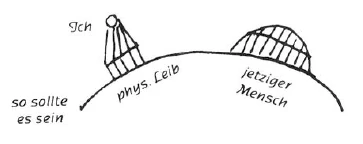
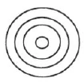

Aufzeichnung A ^qhhv87

Bei dem, was wir vorgestern besprochen haben, ist vor allen Dingen so notwendig und wichtig, daß der Esoteriker diese Dinge erfühlen lernt, sie nicht nur verstandesmäßig erfaßt. Bevor wir aber weiter darüber sprechen, wollen wir noch einiges erwähnen, was für den Esoteriker wichtig und von Wert ist. ^neq388

Wenn man in eine esoterische Strömung kommt, ist es ganz natürlich, daß man sich fragt: Wie bringe ich meine Seele vorwärts, wie entwickle ich sie nach aufwärts? Da ist es von der größten Wichtigkeit, daß wir fest auf einem esoterischen Mittelpunkte stehen, von dem aus wir in das Leben blicken, es uns von da aus bestrahlen lassen. Wir sollen uns öffnen gegenüber den zeitgemäßen Strömungen aus der spirituellen Welt heraus. Es hat absolut keinen Wert, mit anderen Richtungen zu liebäugeln, weil sie uns theosophisch erscheinen, uns oberflächlich mit ihnen zu beschäftigen. Das hindert direkt unsere Fortschritte. Viel besser wäre es, sich einer mehr oder weniger falschen Richtung anzuschließen, wenn wir meinen, daß sie uns mehr gibt; denn wir werden dann auch das uns Entsprechende von ihr haben. Der wahre Esoteriker muß von seinem festen, unverrückbaren Standpunkte mit wachen Augen dem Leben entgegensehen; denn dieses wird immer komplizierter werden. Diese Komplikationen werden durch luziferische Wesenheiten herbeigeführt, die beim Mysterium von Golgatha in der Entwicklung zurückgeblieben sind, d. h. sie haben die Folgen dieses Mysteriums nicht in sich aufgenommen. Was in den geistigen Welten jetzt geschieht, wirkt für den, der hineinschauen kann, vielfach erschütternd. ^9ayrjt

Das, was Luzifer uns brachte, daß wir in unseren physischen und Ätherleib einzogen und nicht darüber schweben blieben, war ja eigentlich gut für uns; denn unser Ich hat dadurch Erkenntniskraft und Gedächtnis errungen. Das Gedächtnis ist ja etwas, was allerdings auch etwas Zurückhaltendes ist. Wir würden ohne es aber in der Art, wie wir in unseren Körpern stekken, nicht auskommen können, würden vor allen Dingen Wirklichkeit und Illusion nicht unterscheiden. Nehmen wir an, wir würden an einen Menschen, den wir vor zwanzig Jahren gekannt hätten, denken und diesem Erinnerungsbilde gegenübertreten und es begrüßen, so müßten wir das eine Halluzination nennen. Dieser Art Halluzinationen würden wir uns aber hingeben, wenn wir etwas Zurückgebliebenes für etwas Zeitgemäßes halten würden, und das ist etwas, was in den nächsten Zeiten vielfach der Fall sein wird. Die luziferischen Wesenheiten, die beim Mysterium von Golgatha zurückblieben, haben sich sozusagen eine Vorhut geschaffen in gewissen Seelen, deren sie sich nach deren letztem Tode bemächtigt haben. Das sind Seelen, die zur Zeit von Tauler und Meister Eckhart gelebt haben im 13. Jahrhundert, und die der Gemeinschaft der Begarden angehörten. Die suchen nun die Gemüter zu verwirren in den nächsten Zeiten, und als Mittel benützen sie dabei die alten Religionen des Brahmanismus und Buddhismus. Die waren für ihre Zeit, als sie den alten Indern gegeben wurden, das Richtige, und besonders der Brahmanismus war eine viel spirituellere Religion, als das Christentum bis heute noch ist. Daß aber dieses nicht schon vorgeschrittener ist, daran ist schuld, daß die Europäer sich seit dem Mittelalter die Gelegenheit entgehen ließen, das ihnen Zukommende richtig zu entwickeln. Vor allen Dingen wird aber wie eine Flutwelle von China aus eine hohe geistige Kultur herüberdringen, die den Europäern sehr imponieren wird, weil sie eben durch ihr hohes Alter, das bis in die Atlantis zurückreicht, dem jetzigen Christentum weit überlegen ist. Was jetzt in China geschehen ist, ist vielleicht äußerlich politisch von Bedeutung, aber als Ausdruck einer viel weittragenderen geistigen Bedeutung muß der Esoteriker ein Buch ansehen von einem hervorragenden Chinesen: Ku Hung Ming, «Chinas Verteidigung gegen europäische Ideen», das auch ins Deutsche übersetzt ist. Ku Hung Ming ist ein bedeutender Kopf. Was er sagt, ist nicht falsch, und doch ist vieles darin, was dem Esoteriker zu denken geben sollte. Er sagt, daß christliche Missionare nach China kamen, um in eine alte, hohe Kultur hinein ihr Christentum zu bringen. Ist es ihnen gelungen? Nein. Etwas anderes ist dafür eingetreten. Die Missionare haben die chinesische Kultur nach Europa zurückgebracht, und seit der Französischen Revolution ungefähr sei Europa viel mehr verchinest, als es überhaupt ahnt. Dieser Chinese weiß genau, daß sein Volk das Gedächtnis der Menschheit verwaltet und daß diese Tatsache einen tiefen Eindruck auf den Europäer macht. Das Gedächtnis aber ist, wie gesagt, Luzifers Gabe. Wir sind durch ihn in unseren physischen Leib herabgestiegen, aus dem Paradiese der geistigen Welten vertrieben. Wir müssen nun diese Tat Luzifers wieder rückgängig machen, dürfen aber deshalb nicht denken, daß sie nicht notwendig gewesen wäre. ^olgjfv

 ^x5gzto

Man könnte ja fragen, warum wir denn hinuntersteigen mußten. Das wäre aber geradeso, wie wenn jemand, dem man vorschlüge, er solle sich an einen Ort begeben, um da etwas zu erfahren, antwortete, daß das ja nicht notwendig wäre, er bliebe lieber da, wo er ist. Dann macht er aber die Erfahrung nicht. Und wir hätten nie in der Art die Verfestigung unseres Ich erlangt, wenn wir nicht so in den physischen Leib gestiegen wären. ^1lxhcn

Nun sollen wir aber diesen immer mehr nur als Instrument ansehen. Wenn wir durch Meditation und Konzentration dahin gelangen, ihn zu verlassen und ihn so vor uns liegen sehen, so sind allerdings die Organe nicht in Tätigkeit. Die Augen sehen nicht, die Ohren hören nicht. Der Leib hat den Wert einer Pflanze, aber einer sehr hoch entwickelten, und so wie er da vor uns liegt, müssen wir uns sagen, daß wir uns vollständig abzugewöhnen haben, über den «niederen» physischen und den «niederen» ätherischen Leib zu sprechen; denn diese zwei sind in ihrer Organisation ein Wunderbau. Der physische Leib ist ein Tempel, den die unteren Götter uns bauten, und was Fehlerhaftes und Schlechtes daran ist, das haben ganz allein wir getan. Und wenn wir dann uns, die Bewohner dieses Tempels, anschauen, so werden wir gewahr, daß wir, das heißt unser geistiges Teil, die Gestalt eines Drachen, eines Wurmes hat. Wie manchen, der sich einbildet, er lebe selbstlos, nur seinen Mitmenschen, sieht der Hellseher mit den weit vorgeschobenen Kiefern und der zurückliegenden Stirne des Wurmes an als Zeichen seines Egoismus. Diese Wurmgestalt hat unsere Seele noch, und damit wir sie nicht immer sehen, haben gute Götter den Hüter der Schwelle davorgesetzt. Nun sollen wir uns aber vornehmen, daß wir diesen Drachen verwandelt den oberen Göttern entgegen- und hinaufbringen. Das soll unsere unausgesetzte Arbeit sein. Wenn der alte Ägypter bei seiner Einweihung durch den Tempel schritt, durch die Reihen der Sphinxe, so sagte er sich, daß dieser Tempel das physische Abbild der vollkommenen Wohnung des Gottes sei und daß er diese Göttlichkeit zu erreichen habe, um würdig im Tempel seines Leibes zu wohnen. ^93n4pu

Beim Heraustreten aus dem Körper verlieren also die Augen die Fähigkeit des Sehens. Sie sehen nicht mehr die physische Sonne, nicht das, was diese beleuchtet. Dafür beleuchtet der Mensch sich selbst seine Umgebung, nimmt Farben und Töne der geistigen Welt wahr. Sein geistiges Teil nimmt zu an Fähigkeiten. Wenn man das Hinaustreten übertreibt, so können allerdings die physischen Augen darunter leiden. Sie schen dann nicht mehr klar, sondern alles wie mit einer Aura umgeben. In England gibt es jetzt sogar gewisse Instrumente, um durch sie die Auren der Dinge zu sehen. Doch ist dies direkt schädlich für die Augen, und ein gesundes Austreten aus dem Körper hat solche Praktiken nicht nötig. ^jzvhwy

Der alte Atlantier hatte auch noch nicht das klare Schauen der Dinge. Er hatte es nicht nötig, denn die Sonne war noch durch dichte Nebelmassen verschleiert und war gegen Ende der Atlantis wie ein riesiger farbiger Kreis am ganzen Himmel zu sehen mit einem blassen, verschleierten Mittelpunkt. ^ue52rk

 ^rnfjzy

Im alten Ägypten erreichte man bei der Einweihung durch physische Mittel, daß der Schüler durch die Erde hindurch die Sonne auf der anderen Seite sah. Jetzt aber soll man nur durch geistige Übungen erreichen, die geistige Sonne zu sehen. ^22zet1

Aufzeichnung B ^e8fqy9

Es ist schon öfter ausgesprochen worden, daß unsere Gegenwart eine schr wichtige, aber zugleich sehr kritische Zeit ist, in der große geistige Strömungen in unsere physische Welt hinunterströmen. Sie müssen dazu dienen, dem Menschen gleichsam einen neuen Keim zu bringen, wodurch seine Entwicklung weiter vorwärts gehen kann. Und zu gleicher Zeit strömen Einflüsse herab, die aus der Vergangenheit stammen, solche, die die frühere Entwicklung zu einer fruchtbaren gemacht haben. Unsere Aufgabe jetzt als Esoteriker soll sein, uns wie in einem Mittelpunkt, wie in dem neuen Keim feststehend zu fühlen und durch keine einzige Nebenströmung uns mitreißen oder verwirren zu lassen. Es hat sich nun gerade in diesem Augenblick gleichsam eine neue Vorhut gebildet, die als Verstärkung der schon vorhandenen luziferischen Einflüsse dient. Es sind das diejenigen Geister, die jetzt nicht inkarniert sind, die aber Zeitgenossen waren von den Nachfolgern des Johannes Tauler und des Meister Eckhart, nämlich die Begarden, die selber damals einer mystischen Strömung angehörten und auch für ihre Zeit manches Gute getan haben, die jetzt aus der geistigen Welt heraus ihre Impulse schicken und als solche eine kräftige Vorhut bilden für die luziferischen Wesenheiten, die während des Ereignisses auf Golgatha zurückgeblieben sind, zurückbleiben mußten, um später wieder in die Entwicklung einzugreifen. Wir wissen schon durch frühere Mitteilungen, daß die luziferischen Wesen auch das Gute bringen, und unter diesem Gesichtspunkt muß darauf hingewiesen werden, wie wir diesen Wesenheiten unser Gedächtnis, unser ganzes Vorstellungsvermögen zu verdanken haben. Was wäre es, wenn wir alle Schicksalsfälle, alle Ereignisse unserer Jugend und der früheren Jahre vergessen würden oder wenn wir sie uns so vorstellen würden, als ob sie in der Gegenwart geschehen? Dann würden wir in Halluzinationen leben, dann würden wir in uns selber verwirrt werden. ^v8smfz

Das ist es aber, was die zurückgebliebenen luziferischen Geister in uns erregen wollen, die Erinnerung an die Vergangenheit wie etwas in der Gegenwart noch Daseiendes und Heilbringendes. Wenn die Lehre der alten Brahmanen oder des Buddhismus, die in ihrer Zeit die Entwicklung der Menschen förderte, jetzt noch genau so den Menschen übermittelt würde, dann würde das jetzt so sein, als ob die Erinnerung unserer Seele sich über die Zeiten hinweg in das Gegenwärtige versetzt hätte. Da würde man in Halluzinationen leben. Ein Esoteriker soll fest stehen in seinem Mittelpunkt, sich keiner einzelnen dieser Strömungen hingeben und besonders nicht mit ihnen liebäugeln, so wie jetzt nur allzu oft geschieht, wenn man alle Parteien «versöhnen» und in einer großen Brüderlichkeit zusammenhalten möchte. Immer wieder hört man, daß diese oder jene Persönlichkeit «so theosophisch» gesprochen, geschrieben oder gepredigt habe, oder daß diese oder jene Auffassung so sehr von Theosophie durchdrungen sei. Das ist nur sich irreführen lassen, sich aus dem Mittelpunkt zerren lassen, um zeitweilig mit einem anderen Strome mitzugehen. Es wäre besser für solche Esoteriker, wenn sie für eine Zeit oder für das ganze Leben mit einer solchen teilweise guten oder teilweise bösen Strömung weitergehen würden, als immerfort zwischen der einen oder anderen Auffassung hin- und herzupendeln. ^rzija2

Eines der charakteristischsten Dinge unserer Zeit ist dasjenige, was augenblicklich in China vor sich geht und was, so sonderbar es auch klingen möge, die Folge ist von früheren Versuchen von Christenmissionaren, um das Christentum nach China zu tragen. China besitzt noch eine echt atlantische Geisteswissenschaft, in der viel Großes enthalten ist, die aber zu einer abgeschlossenen Periode gehört und aus der das Chinesentum sich nicht erheben kann. Als die Folge von dem Gehen der Missionare nach China ist nicht das Christentum in China eingeführt worden, sondern die Folge war, daß die Europäer verchinesiert wurden. Es sind die Begriffe und Ideen der Chinesen in die Europäer hineingeflossen, von diesen nach Europa gebracht worden, und sie führen jetzt Europa ins Chinesentum hinein, so daß es zu einem Zentrum der größten Verwirrung in Begriffen und Auffassungen werden wird. ^fvjqc3

Die Chinesen haben zur Aufgabe, das Gedächtnis der Menschheit zu sein. Das, was sie an spirituellen Schätzen aus der Vergangenheit bewahrt haben, sollen sie jetzt der Menschheit zeigen, dafür sind alle Hindernisse jetzt hinweggeschafft. Es ist nicht an den Chinesen, Erinnerung von Halluzination zu unterscheiden, sondern das ist die Aufgabe der Europäer. Man wird in der nächstfolgenden Zeit sehen, daß die Europäer sich dadurch verwirren lassen, indem sie das, was sie so erfahren, als etwas Neues ansehen und einführen möchten. (Man sehe darüber das neue Werk: «Chinas Verteidigung gegenüber Europa» von Ku Hung Ming.) ^fz7oia

Und wenn dann noch ein veralteter Buddhismus und alles, was orientalisch gefärbt ist, mit nach Europa herüberkommt - und das Weitabliegende, der Orient übt gerade die größte Anziehung auf den Menschen aus -, dann werden Irrtum und Verwirrung zu einem Höhepunkt kommen, den wir noch kaum ahnen können. Der neue Keim, der jetzt in Europa am Hervorgehen ist, der als ein Keim betrachtet werden muß, nicht wie eine ausgewachsene Frucht, bildet den Mittelpunkt, an dem wir festhalten sollen. Alle anderen Strömungen müssen entschieden abgewiesen werden als nicht zu diesem aufsprießenden Keim gehörig, mit dem unsere Seele ihre weitere Entwicklung verbinden soll. ^jcmlf5

Mit diesem Geistesstrom sollen wir uns emporheben, und dann wird sich langsam vollziehen, was wir schon öfter geschildert haben, daß sich unser Ich zu einer Zweiheit bildet: das eine, das wir empfinden werden wie den an die Erde gebundenen, durch Erdenkräfte gebildeten Leib, den wir als getrennt von uns selber empfinden werden. Dieses Ich werden wir so empfinden, als ob es geringer geworden wäre; das andere als etwas Größeres als dasjenige, was wir bis jetzt in uns empfanden. Wir schauen unseren Leib dann außerhalb unser und können uns nicht mehr unserer Sinne bedienen, wenn sie auch noch immer vorhanden sind. Gesicht, Gehör, Gefühl, alles ist aus dem Leibe entwichen, und dennoch lebt er; aber es ist nur das Leben einer Pflanze. Dann kommt die Empfindung zu uns, daß der Leib etwas sehr Schönes wäre, wenn wir nur nicht darin zu wohnen brauchten. Durch die unteren Götter ist unser Leib in Vollkommenheit gebildet worden bis in die kleinsten Einzelheiten hinein, aber wir selber sind es, die durch unsere Unvollkommenheiten diesen Leib zu etwas Minderwertigem machen. Indem wir die Sache so betrachten, bekommen wir die Vorstellung, daß dasjenige, was da außerhalb unser ist als unser Leib, einem Drachen ähnlich ist mit einem Riesenrachen und einer fliehenden Stirn, und daß das dasjenige ist, was wir bis jetzt aus dem Götterwerke gemacht haben. Der Hüter der Schwelle verhindert uns, die Gestalt unseres Selbst zu schauen, aber sie ist deshalb doch immer da. ^ehq1q1

Den höheren Teil unseres Selbstes lernen wir dann als den geistigsten Teil betrachten, der aus sich heraus die Seelenkräfte schöpft, um sich mit göttlichem Licht zu füllen. In alten atlantischen Zeiten war die Atmosphäre in solcher Art von Nebel erfüllt, daß die Sonne nicht durch den Nebel hindurchscheinen konnte, und auch der Mensch hatte noch keine Augen so wie jetzt, um die Gegenstände zu unterscheiden. Erst allmählich drang durch diesen Nebel eine riesengroße, helle, von Farben durchzogene Scheibe, die den ganzen Dunstkreis füllte, und je nachdem die Scheibe mehr Licht ausstrahlte, wurden die Augen nach dem Lichte gebildet. So soll der geistige Teil unseres Wesens wie eine Sonne leuchtend werden und die spirituelle Umgebung mit Licht erfüllen, in welchem dann die Wesen sichtbar werden, die wir als die geistigen Hierarchien bezeichnen. Das ist, was die Ägypter nannten: das Schauen der Sonne um Mitternacht, das bei ihnen noch eine besondere Tat erforderte, weil sie es nicht in der oben gesagten Weise hervorrufen konnten, sondern dazu gebracht werden mußten, um in der Finsternis der Nacht durch die Erde hindurch die Sonne auf der anderen Seite zu schauen. Aber wir erfüllen uns selber mit der geistigen Sonne und strahlen sie dann wieder aus mit den Organen, die wir als die geistigen Augen bezeichnen könnten. Die Wesen, die wir dann schauen, sind die oberen Götter, und das ist, was genannt wird das Schauen der oberen und unteren Götter. ^qfmpr0

Man kann den physischen Augen Schaden zufügen, wenn man sie zu sehr dazu abrichten will, Übersinnliches zu schauen. Alle die Methoden, die jetzt hauptsächlich aus England kommen, die dazu führen, daß man die Auren der Menschen in gewisser künstlicher Art schauen kann, sind schädlich für das physische Auge, weil sie in der Augenpartie den Ätherleib heraustreiben. Man kann sogar blind dadurch werden. ^qroxdd