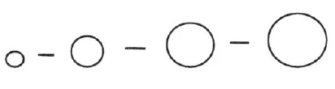
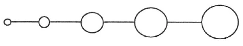

Aufzeichnung A ^6itee3

Noch in keiner Zeit war der Kampf gegen das okkulte Bestreben so stark wie in der jetzigen Zeit. Zwar wurde dagegen schon gekämpft mit Blut und Feuer, aber nie war der Kampf so heftig wie heute. Die Schwestern und Brüder können manches dazu beitragen, um diesen Kampf abzuschwächen, der nur durch Neid hervorgebracht wird. Sie können viel tun, wenn Sie von mir sprechen nicht als einem Führer, wie dies öfter geschieht bei jeder Gelegenheit. In Ihrem Herzen können Sie ja doch Gewißheit haben, wissen, wie Sie stehen, aber nach außen hin sollen Sie nicht von dieser Sache sprechen. ^3txvlz

Man kann im menschlichen Leben eine gewisse Periodizität beobachten, so wie man eine Periodizität in der äußeren Welt wahrnimmt. [Zum Beispiel:] Wir haben hier eine Tatsache, ein Ereignis in unserem Leben. Dies Ereignis geht vorüber. Dann geht es eine Zeitlang weiter, und dann wiederholt sich dieses Ereignis. ^wnidkf

 ^5ogoxm

So wie wir dieses Schema vor uns haben, sehen wir, daß die Kreise jedesmal größer werden. Man kann im gewöhnlichen Menschenleben beobachten, daß man sich bemüht, sich Ehrgeiz und Eitelkeit abzugewöhnen, auch Bequemlichkeit und Lässigkeit. Man kann im gewöhnlichen Leben schon einen gewissen Sieg errungen haben über diese Fehler und geht dann ein Stück weiter in seinem Leben. Dann auf einmal, wenn man eine Zeitlang eine esoterische Entwicklung durchgemacht hat, stehen diese Fehler aufs neue vor uns und, wie wir es aus dem Schema erkennen können, in viel größerem Maße als das erste Mal. Nun kann man auch wieder zu überwinden suchen diese Eitelkeit, diesen Ehrgeiz und so weiter, bis sie uns auch dann wieder entgegentreten in immer stärkerem Maße. Man kann aber auch stehenbleiben, nicht überwinden, und da wird man diese Eitelkeit und so weiter in sein esoterisches Leben als Gift hineinbringen. Um diese Fehler zu überwinden, wird uns die dreifache Kraft ein gutes Mittel sein. ^j3tioc

Wenn wir am Morgen aufstehen, wenn unser Ich und Astralleib wieder in unseren Ätherleib und physischen Leib hineinschlüpfen, so entsteht das Bewußtsein durch den Schock, der eben bei diesem Hereinschlüpfen hervorkommt. Ohne diesen Äther- und physischen Leib wäre kein Bewußtsein in dieser Welt vorhanden. Diese beiden Teile, die wir aber gebrauchen zum Bewußtsein, die gehören nicht uns selber; sie wurden uns vererbt durch unsere Voreltern. So kann uns beim Aufwachen auch der Gedanke kommen, daß uns diese Teile, die wir nur als freie Gabe erhalten haben, auch einmal entrissen werden könnten. Und dann können wir die Worte verstehen, die die Weisen immer aussprachen am Morgen: «Ich danke Dir, Gott, daß Du es mir ermöglichst, wieder aufzuwachen» und so weiter. Dasjenige, was es uns ermöglicht, am Morgen wieder in den physischen Leib unterzutauchen, das ist der Gottvater. Und daß wir in Dankbarkeit empfinden können dieses Untertauchen in den physischen Leib, dazu haben wir eine Kraft, indem wir die Worte aussprechen: Es webt mich. Ein sehr kräftiges Mantram haben wir in diesen Worten. Und ein großes Gefühl der Dankbarkeit muß uns durchziehen bei diesen Worten: Es webt mich. In ihnen haben wir einen großen Kraftquell, jedesmal wenn wir sie aussprechen. Aber nicht aussprechen soll sie derjenige, der dabei nicht ein großes Gefühl der Dankbarkeit in sich erzeugen kann. Jeden Morgen, wenn wir aufwachen, wird unser erster Gedanke ein Dankgebet sein an den Vatergott, der es uns ermöglicht, in diesen physischen Leib zurückzukehren. ^7zy1cq

Aber wir haben ein anderes noch. Wenn der Mensch das eine Leben hinter sich hat, so wird ihm etwas begegnen in der geistigen Welt. In der vorchristlichen Zeit begegnete ihm etwas anderes als in der christlichen Zeit. Das hat sich geändert. Das Bewußtsein kommt zustande dadurch, daß beim Hineinschlüpfen in den physischen Leib ein Schock erlebt wird und so das Bewußtsein aufwacht. Nach dem Tode haben wir keinen physischen Leib, und das Ich hat ja [ohne diesen] heute noch kein Bewußtsein. Dasjenige aber, das dem Ich das Bewußtsein erhält, das ist die Kraft des Sohnes, den wir antreffen können nach dem Tode in der spirituellen Welt. Und auch hier haben wir ein kräftiges Mantram. Das heißt: Es wirkt mich. Mit Andacht und Ehrfurcht sollen wir das aussprechen und uns so die Bewahrung des Bewußtseins erhalten zwischen Tod und neuem Leben. ^buiqxm

Aber dann muß auch das noch kommen, daß wir hinübergehen in die geistigen Welten, daß wir wieder aufwachen durch den Heiligen Geist, der uns hinüberleitet. Und da haben wir das Mantram: Es denkt mich. Mit tiefer Frömmigkeit muß dies ausgesprochen werden. Und so haben wir das Hoffen, die Liebe und den Glauben. ^qpmwwq

Die dreifache Liebe wird dann aufwachen im Menschen: die Liebe zur Wahrheit, die Liebe zum Leben, die Liebe zum Schaffen. ^jagzpi

Die Liebe zur Wahrheit, die treffen wir schon öfter an. Die Liebe zum Leben schon etwas weniger. Die Liebe zum Leben wird jeden Menschen in die rechte Lage zum andern Menschen stellen. Denn wie kann man richtig das Leben lieben, ohne daß man den anderen Menschen liebt? Aber jemandem aus Leidenschaft in allem nachgeben, das heißt nicht das Leben lieben. Denn nur das ist Liebe zum Leben, wenn man nicht aus Gutmütigkeit alles Unrecht gehen läßt; man muß auch manchmal aus Liebe nicht in allem nachgeben. — Die dritte Liebe, die ist schon sehr schwer zu finden, die Liebe zum Schaffen. Alles Schöpfen und Schaffen sollen wir lieben. Und wie wendet sich der Mensch doch gegen alles Schöpferische! Ja, wenn man zum Beispiel es unnütz findet, daß man solche Räume schafft wie diese, die uns jetzt umgeben, so wendet man sich gegen die schöpferische Liebe. ^67pe1g

Was ist es, was uns hindert bei der Liebe zur Wahrheit? Das ist die Eitelkeit. Und wer kann noch eitel sein, der die Liebe zur Wahrheit pflegt! Immer mehr müssen wir pflegen die Liebe zur Wahrheit. - Durch die Liebe zum Leben entfalten wir in uns das Mitleid, das Mitfühlen mit allem Leben. Und durch diese Liebe schmilzt der Egoismus. Wer rechte Liebe hat zu allem Leben, der kann nicht in Egoismus beharren. - Die Liebe zum Schaffen, zum Schöpferischen, die beseitigt alle Lässigkeit, alle Bequemlichkeit. ^gwjacj

Und so können wir sagen: Ich liebe die Wahrheit, ich liebe das Leben, ich liebe das Schöpferische. Wir können sagen: Ich liebe die Wahrheit durch den Vater, der da webt in mir. Ich liebe das Lebendige durch den Sohn, der da wirkt in mir. Ich liebe das Schöpferische, das da denkt durch den Heiligen Geist in mir, Oder wir können sagen: In: Gott Vater sind wir geboren. In Christus sterben wir, und durch den Heiligen Geist werden wir wieder auferstehen. Ex Deo nascimur. In Christo morimur. Per Spiritum Sanctum reviviscimus. Durch den Vatergeist sind wir in diesen physischen Leib hineingeboren, durch den Sohn sterben wir, und der Heilige Geist gibt uns die Gewißheit der Auferstehung. ^gu61ae

Und so wollen wir die Worte sprechen, die aus der Wahrheit heraus uns gegeben wurden: ^ta0ul8

Aufzeichnung B ^3iajzb

 ^0keot0

Das Gesetz der Periodizität oder der Kreislaufbewegung. Über Ehrgeiz und Eitelkeit, Bequemlichkeit und Lässigkeit. ^msutp2

Das Gesetz der Kreislaufbewegung, der Periodizität, besteht für die große Welt und ist auch für den Menschen maßgebend. ^vbiq5l

Wir wollen heute von vier Eigenschaften reden, die mehr oder weniger bei jedem Menschen zu finden sind: Ehrgeiz und Eitelkeit, Bequemlichkeit und Lässigkeit. ^g9k571

Diese Eigenschaften treten periodisch immer wieder und zwar mit verstärkter Heftigkeit auf und müssen immer wieder bekämpft werden. ^lagr6l

Es kann nun sein, daß jemand eine Zeitlang niedergekämpft hat diese Eigenschaften und auch eine Zeitlang ganz gut esoterisch gearbeitet hat und auch vorwärts gekommen ist. Nun denkt er, er hat Ehrgeiz und Eitelkeit, Lässigkeit und Bequemlichkeit überwunden, da aber treten sie plötzlich mit verstärkter Macht auf. Das Gesetz der Periodizität tritt in Kraft. Nun gilt es mit verstärkter Kraft sie wieder zu bezwingen. Es gilt eben unablässig bei der Seele zu wachen, und das kann wirksam nur geschehen, wenn man einen der Aspekte der Gottheit oder der göttlichen Dreiheit in sich aufnimmt; es sind die drei Aspekte: der Impuls des Vatergottes, des Sohnesgottes und des Heiligen Geistes. ^7n1eql

So haben wir als das Vaterprinzip das Schöpferische, das Schaffen, das mit Wachen und Schlafen, Einschlafen und Aufwachen des Menschen zusammenhängt. ^y5oaho

Beim Aufwachen handelt es sich darum, daß wir vorfinden das, was uns das Vaterprinzip gegeben hat, nämlich unseren physischen und unseren Ätherleib, und daß wir darin uns bewußt werden, wenn wir in ihn untertauchen beim Aufwachen. ^c8ohvd

Das Sohnesprinzip ist das Prinzip des Lebens; es hängt mit Leben und Tod zusammen. ^fn68ds

Der Impuls des Heiligen Geistes ist der Impuls der Wahrheit und drückt sich aus in ??? ^xxqt6a

So haben wir die dreifache Liebe in den drei Aspekten der Gottheit ausgedrückt: ^baysn4

1. Die Liebe zur Wahrheit, wer sie hat, in dem lebt der Heilige Geist ^6d95oo

2. Die Liebe zu allem Lebendigen, das Mitleid mit allem, was lebt, das ist das Sohnesprinzip ^ytm9e7

3. Die Liebe zum Schöpferischen, zum Vater. ^xj6d5t

Dieses Prinzip ist noch am wenigsten in der Menschheit ausgebildet, und es muß gesagt werden, daß aller Haß und alle Feindschaft davon kommt, daß gerade dieses Prinzip dem Menschen am fernsten liegt. ^snvy9e

Es werden uns nun die drei Mantrams zum Gebrauch gegeben. Es webt mich; Es wirkt mich; Es denkt mich. ^l4ml2n

Es denkt mich, das ist der Engel in mir. ^ymm6mn

Es webt mich, die Geister der Bewegung schaffen an uns. ^643ixz

Es wirkt mich, die Geister des Willens senken ihre Kräfte hernieder. ^ovoe6y

Das erste Mantram sollen wir beim Aufwachen wie ein Gebet uns sagen. ^dysh8r

Es webt mich, in ihm lebt für uns das Vaterprinzip, erfüllen dürfen uns diese Worte mit dem Gefühl der Dankbarkeit. ^ngww05

Es wirkt mich ist das Sohnesprinzip. Das Gefühl dafür ist Andacht und Hingabe. ^0vdf4d

Es denkt mich, der Heilige Geist. Das Gefühl der Frömmigkeit soll uns da durchdringen. ^9l9exn

E.D.N. - I.C.M. - P.S.S.R. ^fd9ist

1. Lässig und bequem sein heißt, das schöpferische Prinzip nicht lieben. ^k1hzyg

2. Egoistisch sein heißt, nicht Liebe haben zum Leben des Sohnes. ^lb6x4r

3. Die Wahrheit nicht lieben heißt, nicht lieben das Prinzip des Heiligen Geistes. ^l21fma

Unser Ich erstirbt in der geistigen Welt, wenn wir durch den Tod schreiten, aber, wenn wir untertauchen in der geistigen Welt in den Christus, dann werden wir aufwachen im Heiligen Geist. ^rjwldw

So ist das Urgebet der Menschheit unser Rosenkreuzerspruch: ^3jzcv6