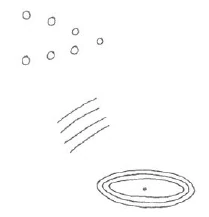
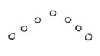

Aufzeichnung A ^vcbkj5

Immer wieder kommt es vor, daß angehende Esoteriker darüber klagen, daß sie bei ihren Übungen gestört werden durch allerlei eindringende Gedanken. Das sollte uns aber nicht wundern, denn die Gedanken sind das einzig Geistige des physischen Planes; wenn wir uns also zu einer geistigen Tätigkeit, wie die Meditation eine ist, bequemen, machen diese sich geltend. Man sollte auch nicht so sehr gegen diese Gedanken kämpfen wollen, das hat ganz und gar keinen Sinn; sie mögen tun, was sie wollen, die Gedanken. Das einzige, was man zu tun hat, ist Fortsetzen, Ausharren, seinen Willen in Tätigkeit versetzen, um immer wieder zu dem Inhalt der Meditation zurückzukehren. Auf diesen Willen kommt es viel mehr an als auf das Wie der Meditation. Wenn man immer wieder zum Inhalt der Meditation zurückkehrt, drängt man die Gedanken zurück und schafft dadurch gleichsam eine Sphäre um sich herum, innerhalb derer sie - die störenden Gedanken - nicht sind, und gerade diese Sphäre ist das Geeignetste, um übersinnliche Erlebnisse haben zu können. ^vnheaa

Eine andere Erfahrung des Esoterikers ist diese, daß er anfängt gewisse Eigenschaften an sich zu bemerken, die er früher nicht an sich kannte. Dann handelt es sich wiederum nicht darum, diese Eigenschaften zu bekämpfen - es wären auch keine besonderen Mittel dagegen anzuwenden -, sondern das einzige, was man zu tun hat, ist, die angegebenen Übungen mit Kraft fortzusetzen. Diese doch sind es, welche jene Eigenschaften so weit aus uns herausgetrieben haben, daß sie für uns bemerkbar geworden sind, und bei fortgesetzten Übungen werden sie von selber verschwinden. ^dm5moe

Nun wird man durch seine fortgesetzten Übungen vielleicht so weit gekommen sein, daß man dieses oder jenes übersinnliche Erlebnis hat, zum Beispiel Imaginationen schaut. Dann fragen die Anfänger immer wieder, ob das etwas Eingebildetes sei, was sie da geschaut haben, oder ob es eine Wirklichkeit auf geistigem Gebiet war. Diese Frage kann man dann stellen, wenn man urteilt nach der Art und Weise des physischen Planes - was ja im Anfang des esoterischen Weges auch kaum anders sein kann. Diese Frage hat nämlich nur einen Sinn auf dem physischen Plan; in der geistigen Welt ist das ganz und gar nicht dasselbe, worauf es ankommt. ^h1wd9l

Nehmen wir zum Beispiel an, jemand — es braucht gar nicht ein Meditant zu sein - habe seinen Doppelgänger gesehen. Es kann zum Beispiel so sein, daß er vorhatte, abends in eine Gesellschaft zu gehen, wo man beabsichtigte, ihn zu vergiften. Nun tritt er in ein halb abgedunkeltes Zimmer und sieht dort sich selbst. Unter dem Eindruck dieses Erlebnisses geht er nicht in die Gesellschaft, wird daher auch nicht vergiftet. Nun ist dabei die Gestalt, in die sich das Erlebnis kleidete, gar nicht dasjenige, worauf es ankommt. Das Bedeutsamste ist, daß das geistige Wesen, das den Menschen von Inkarnation zu Inkarnation begleitet, einen Eindruck auf ihn hat machen wollen. Es gibt ja ein solches Wesen, das zu der Hierarchie der Angeloi gehört und das in den Religionsbekenntnissen der Schutzengel des Menschen genannt wird. Dieses Wesen kann nicht, um den Menschen zu beeindrucken, seine Gedanken so beeinflussen, daß der Mensch gedankenmäßig gewußt haben würde: du sollst heute Abend nicht in jene Gesellschaft gehen. - Das kann deshalb nicht sein, weil unsere Gedanken, alle Gedanken außer denjenigen, die durch Geisteswissenschaft erzeugt werden, zum physischen Plan gehören und weil sie deshalb nicht vom Übersinnlichen aus beeinflußt werden können. ^ikzhn2

Nach dem Tode und schon während des Schlafes müssen wir unsere Gedanken ablegen, mit Ausnahme der genannten geisteswissenschaftlichen. Aber unsere Gefühle und Willensimpulse reichen schon aus sich heraus in das Übersinnliche hinein, und auf diese kann daher ein Eindruck gemacht werden. Das geschieht zum Beispiel in dem Sehen des Doppelgängers. Es kann aber auch sein, daß jemand seinen Doppelgänger sieht, nicht weil das Engelwesen ihn ihm zeigt, sondern weil, sei es auch nur für Augenblicke, sein Ätherleib frei geworden ist und er nun deshalb seinen physischen Leib vor sich sieht. Und auch das ist möglich, daß man seinen Doppelgänger sieht, einfach weil man sich den Magen verdorben hat und dadurch der Ätherleib - vielleicht nur in jenen Partien, die den Magen versorgen - für einen Augenblick frei geworden ist. Das muß also alles sorgfältig voneinander unterschieden werden. ^uzh0k4

Und es kann auch so sein, daß dieselbe Impression, die gemacht werden muß - wie im Vergiftungsfalle -, in verschiedener Weise gemacht wird. Der eine kann seinen Doppelgänger sehen, der andere kann in ein Zimmer treten, während in demselben Augenblick mit großem und physisch unerklärlichem Geräusch ein Gemälde von der Wand fällt. Das entspricht ungefähr dem, ob man das eine Mal eine Mitteilung in deutschen, das andere Mal in lateinischen Buchstaben schreiben würde. ^7fv7g6

Es hat daher keinen Sinn, zu fragen: ist dasjenige, was ich geschaut habe, real oder nicht? Und der esoterische Lehrer wird niemals Aufklärung geben über eine Imagination, die man nur einmal gehabt hat, sondern nur, wenn diese öfter zurückkehrt oder aus anderen Gründen wichtig ist. Es ist so, wie wenn jemand auf die Tafel schreiben würde BIN, und einer sagen würde: Ich sehe einen geraden Strich, dann zwei Bögelchen, wieder einen geraden Strich, dann drei verbundene Striche. Ein anderer aber, der lesen gelernt hat, sagt sofort: Da steht «bin». Es gibt aber kein eindeutiges Lesen von Imaginationen, sondern das muß man sich erst aneignen, wie sie zu lesen sind. ^8m5n1s

Oder es kann sein, daß einer ganz im Anfang seiner esoterischen Wege solche Art Figuren in der Luft sieht (Abbildung siehe S. 103). ^jl0q6i

Dann wird er vielleicht zu einem Augenarzt gehen, und der wird ihm sagen, daß das eine Krankheit der Augen sei. Von seinem Standpunkt aus hat der Arzt ja recht; für ihn ist der ganze Glaube an Theosophie eine Krankheit. Aber es rührt nur davon her, daß der Ätherleib anfängt, neue Bewegungen zu machen, diese auf den physischen Leib zeitweilig überträgt; dadurch schaut er diese Dinge. ^lsdm69

 ^2wmrbl

Manche Esoteriker können nun sagen: Dann wird also doch mein physischer Leib durch die Übungen geschädigt, wenn der Ätherleib so auf ihn einwirkt - und dann überkommt sie eine furchrbare Angst vor jedem kleinen Schmerz und Übel. Es ist aber gar keine Gefahr bei diesen Dingen; nach einiger Zeit wird der Ätherleib von selber diese Folgen wegnehmen. Es besteht auch dafür nur ein Mittel: ruhig ausharren! ^7ggdk7

Bisweilen kommt einer und sagt: Ich habe so schrecklichen Kopfschmerz über der Nasenwurzel, was soll ich dagegen tun? — Das Beste wäre, gar nichts dagegen zu tun, sondern ruhig mit den Meditationen fortzufahren. Dann werden die Schmerzen zuerst schlimmer werden, und man wird ein Gefühl bekommen, als ob der Kopf sich spalten würde, aber erstens wird er sich doch nicht spalten, und zweitens wird es möglich sein, daß man gerade durch diesen Schmerz die Wand durchbricht, die uns vom Übersinnlichen trennt. Nur durch Schmerz und Leiden können wir uns weiterentwickeln. ^l127k9

Oft auch sind die Krankheiten, die da auftreten, die karmische Folge von gewissen Entwicklungszuständen, die man schon in einem vorigen Leben durchgemacht hat und welche die Seele in diesem Leben nicht anders von sich weisen kann als durch Krankheit und Leiden. Oft wird man gewahr werden, wenn solch eine Krankheit vorüber ist, daß man weitergekommen ist in seiner Entwicklung. Als Karma soll man alles empfinden, was da kommt. ^jedqzd

Aufzeichnung B ^dw0pf4

(Nekrolog für Herrn Bittmann.) ^8lnhus

Es ergibt sich wieder und wieder, daß ein angehender Esoteriker mit den erdrückenden Erfahrungen seiner Meditation zu mir kommt. Besonders wird geklagt über das eine, das schon öfter erwähnt wurde, daß in dem Augenblick, wo die Meditation beginnt, die Gedanken wie Bienenschwärme den Meditanten umschwirren. Erinnerungen stellen sich ein, meistens trauriger Natur, die oft viele Zeitläufe zurückliegen. ^g3tj7t

Nun muß man sich darüber klar sein, daß jeder Esoteriker unter allen Umständen Fortschritte macht. Auch wenn die Gedanken ihn umschwirren und von der Meditation ablenken, so ist das ein Zeichen des Fortschrittes. Denn er muß sich klar sein, daß, wenn er seine Übungen macht, er immer mehr Kräfte im Geistigen bekommt. Nun sind aber Gedanken und Erinnerungen das einzig Geistige auf der Erde; wenn sie sich an den Menschen herandrängen, so ist das ein gutes Zeichen. ^m241hy

Nicht das Was ist die Hauptsache bei der Meditation, sondern das Wie. Darum soll man aushalten und immer wieder seinen Willen in Tätigkeit bringen. Der treue Wille ist die Hauptsache; und wenn auch die Meditation durchaus nicht gehen will, so wird der Wille gestärkt. Gerade in solchem Raume, aus dem die umherschwirrenden Gedanken erst weggetrieben sind, ergibt sich die beste Möglichkeit, zu einer Erscheinung aus der geistigen Welt zu kommen. ^rqrrrx

Oder andere kommen und sagen: Das und das haben wir erlebt - ist das eine Wahrheit oder eine Täuschung? Darauf ist schwer zu antworten. Natürlich ist es Wahrheit, Realität; aber man muß sich wohl hüten, dem zu große Bedeutung beizumessen. Diese Fragen haben überhaupt nur einen Sinn auf dem physischen Plan; in der geistigen Welt haben sie keinerlei Bedeutung. ^rvtm72

Andere klagen über heftigen Schmerz an der Nasenwurzel zwischen beiden Augen und fragen, was sie tun können. Ja, man muß das eben ertragen; sie sollen nur immer weiter meditieren. Dadurch wird der Schmerz verschlimmert werden; es ist, als würde einem der Kopf gespalten, aber erstens spaltet sich der Kopf nicht, und zweitens kann man dadurch die Wand durchbrechen, die uns vom Übersinnlichen trennt. ^a7d06z

Nur durch Schmerz und Leid kann man sich weiterentwikkeln. Oft sind die Krankheiten, die auftreten, die karmische Folge von Entwicklungszuständen, die man im früheren Leben durchgemacht hat, und die die Seele nicht anders von sich weisen kann als durch Krankheiten und Leiden. Oft wird man gewahr, wenn solche Krankheit vorbei ist, daß man weitergekommen ist in seiner Entwicklung. Als Karma soll man alles auffassen, was kommt. ^0ig0u6

Auch wenn besondere Eigenschaften auftreten, wie Egoismus, Eitelkeit etc., so soll man sie nicht bekämpfen, sondern ruhig weitermeditieren; man soll kein Mittel anwenden, sondern die Übungen mit Kraft weiterführen, denn sie werden solche Eigenschaften schon aus uns heraustreiben. ^fjrjo6

Etwas, das einem angehenden Esoteriker häufig passiert, ist, daß er seinen Doppelgänger sieht. Zum Beispiel so: er tritt in ein anderes Zimmer — und da steht er mit einem Male sich selbst gegenüber. Nehmen wir weiter an, daß er gerade an jenem Abend in eine Gesellschaft gehen wollte, in der er vergiftet werden sollte - karmisch kann das sehr wohl bedingt sein -, nun hat er diese Erscheinung des Doppelgängers, die ihn in den weitaus meisten Fällen doch wohl abhalten wird, in die Gesellschaft zu gehen. ^9g3j82

Wie ist das zugegangen? Ja, sehen Sie, jeder Mensch hat einen Angelos, der sein Leben von einer Inkarnation zur andern führt - in der Religion nennt man ihn Schutzengel -, der wollte ihn davor bewahren, ihn warnen. Wie sollte er das machen? Zu ihm sprechen, das konnte er nicht; besonders, wenn er noch nicht Esoteriker ist, da das Denken ja etwas rein Irdisches ist. Nur das spirituelle Denken: ist übersinnlich,. das; physische) Denken ist rein irdischer Natur. Fühlen und Wollen dagegen stehen in Zusammenhang mit den geistigen Welten; darauf sucht der Angelos einen Eindruck zu machen und schickt ihm eine Imagination. ^jwjr2n

Noch auf andere Weise kann der Doppelgänger karmisch bedingt sein. Zum Beispiel kann durch einen plötzlichen Schreck der Ätherleib gelöst werden - und der Mensch findet sich gegenüber seinem physischen Leibe. Oder auch ein ganz trivialer Grund kann vorliegen: jemand hat sich den Magen verdorben; der Ätherleib tritt gerade an dieser Stelle heraus und der Mensch sieht sich selbst. ^ddz26e

Die Form, in die sich das Ereignis kleidet, ist nicht die Hauptsache. Es kann ebensogut sein, daß jemand in ein anderes Zimmer tritt, in dem gerade mit donnerähnlichem Getöse ein Bild von der Wand stürzt. Es ist dasselbe, als ob man eine Mitteilung einmal auf deutsch, das andere Mal auf lateinisch schreibt. ^ue3nn5

Eine Imagination hat nur Wert, wenn sie öfters auftritt; der eine wird sie verstehen, der andere nicht. Es ist geradeso, als ob jemand allerlei Striche und Bogen an die Tafel schreibt: BIN. Für den einen sind es nur Striche, der andere liest daraus: bin. Es gibt aber kein eindeutiges Lesen von Imaginationen. ^n2tbp9

Oder jemand sieht so kleine Kreise; er weiß nicht, was er daraus machen soll. ^fu80sy

 ^78m7i6

Der physische Arzt ist der Meinung, das sei eine Augenkrankheit; für ihn ist ja schon der Glaube an die Theosophie eine Krankheit. In Wirklichkeit ist es nur ein Beweis, daß der Ätherleib: angefangen: hat, beweglich zu werden:und dies über: trägt auf den physischen Leib. Dadurch sieht er diese Dinge. Viele denken, der physische Leib leide doch bei der Entwicklung Schaden, sie fürchten sich davor. Es ist aber keine Gefahr vorhanden; nach einiger Zeit räumt der Ätherleib von selbst die Folgen weg; ^p7ggjr

Aufzeichnung C ^f2nhtu

Es ist kein schlechtes Zeichen, wenn allerlei Gedanken anstürmen während der Meditation, weil alles verstärkt wird, und es ist folglich ganz natürlich. Aber gerade dann ist es von höchster Wichtigkeit, daß wir sie auf Abstand halten; und in dem leeren Raum, den wir um unsere Meditation herum schaffen, haben wir durch das Weghalten von allem, was da heranstürmen will, die beste Aussicht, wirklich okkulte Erfahrungen eintreten zu sehen. Auch wächst unsere Kraft dadurch, denn von noch größerem Wert als die Meditation selbst ist der Wille durchzukommen, was auch geschieht, und nicht von etwas anderem Heil zu erwarten, sondern gerade streng und mit dem tiefsten Ernst unsere Meditation fortzusetzen. Dieser Wille, immer weiterzugehen, ist von größter Bedeutung. ^672fia

Auch gibt es manche Meditanten, die fragen, ob diese oder jene Imagination, die sie gehabt haben, wahr ist oder nicht. Aber so soll die Frage nicht gestellt werden, weil eine Imagination zwar wahr sein kann, aber das ist es nicht, worauf es ankommt; worauf es ankommt ist, zu begreifen, was gemeint ist, was hinter dieser Meditation [Imagination] steht. So kann man beispielsweise eines Tages seinen Doppelgänger sehen. Diese Imagination von sich selbst kann nun entweder durch den Schutzengel entstanden sein, um den Menschen beispielsweise davon abzuhalten, diesen Abend auszugehen, oder sie kann auftreten, weil durch die Übungen der Ätherleib einen Augenblick aus dem physischen. Leib teitt. Oder sie kann: von einem überladenen Magen kommen, wodurch der Äthermagen einen Augenblick aus dem Körper tritt. Es kommt hier also darauf an, es bis zur Empfindung weiterzuentwickeln, die gleichzeitig weiß, was die Imagination bedeutet. Auch kann es vorkommen, daß der Meditant allerlei Figuren sieht, und ein Arzt würde sagen, daß mit den Augen etwas verkehrt sei. ^r7dwn9

 ^dha9h1

Das kann auch der Fall sein, aber eben dadurch, daß der Ätherleib durch das Üben andere Formen annimmt und anders auf den physischen Leib einwirkt. ^8bpmo2

Einige klagen zum Beispiel, daß sie fürchterliches Kopfweh bekommen, aber es würde das beste sein, wenn sie gar nicht klagten, sondern einfach durchhielten, auch wenn es so kommt, daß das Haupt beinahe zu bersten scheint. Gerade durch die Kraft, durchzugehen, kommt man voran, und nach einiger Zeit hören solche Erscheinungen (es können auch unangenehme Wärme-, Hör- oder Geruchseindrücke sein) von selbst auf. Dann ist dadurch etwas überwunden, und es beginnt das wirkliche Erleben der ätherischen Welt. Aber die Esoteriker sind manchmal sehr furchtsam so etwas gegenüber, obwohl sie doch wissen, daß Angst etwas ist, was immer an uns herankommen will, wenn wir durch unsere Schulung gehen, und was wir gerade überwinden müssen, um so immer kräftiger zu werden. Wir wissen nun einmal, daß unser Weg aufwärts durch Leiden und Schwierigkeiten führt. Auch dürfen wir nicht die Wahrheit des Karma vergessen, ein Bewußtsein, was uns allezeit helfen muß, alles zu tragen. Man kann beispielsweise krank werden als Folge einer Entwickelung in einem vorigen Leben und durch dieses Ringen gegen die Krankheitskräfte kann ein Grad an Stärke wieder erreicht werden, den die Seele gewonnen hat in einem vorigen Leben. Immer weitergehen und alle Schwierigkeiten im rechten Licht sehen, ist die große Kraft, die uns aufwärts führt. Auch das Meditieren unseres Spruches mit den rechten Gefühlen: E.D.N. - I.C.M. - P.S.S.R. ^hjgbm4

Aufzeichnung D ^rxtdhb

Durch die esoterischen Übungen werden wir immer mehr dazu kommen, gewisse tägliche Verrichtungen automatisch zu machen. Wir müssen aber nicht die Herrschaft darüber verlieren. Die während der Meditation anstürmenden Gedanken müssen wir durch Willensstärke beiseite zu schieben trachten. In dem dadurch frei werdenden Raum werden am ehesten dann geistige Tatsachen hineinspielen können. Etwas, was früh schon erlebt werden kann, ist das Erlebnis des Doppelgängers. Es kann geschehen, daß man in ein dämmeriges Zimmer tritt und man sich seinem eigenen Bilde des physischen Leibes gegenüber sieht. Dann muß man unterscheiden, was dies bedeutet, es kann dreierlei bedeuten. Erstens: Es kann eine Warnung sein unsres Führers aus der Hierarchie der Angeloi, daß man zum Beispiel abends in eine Gesellschaft wollte, wo man vergiftet worden wäre; das Erlebnis hat einen davon abgehalten hinzugehen. Den Gedanken kann uns der Führer nicht schicken, denn die Gedanken gehören nur der physischen Welt an; die Gefühle und Willensimpulse gehören schon der geistigen Welt an. Zweitens kann man durch seine Konzentrationsübungen den Ätherleib so gelockert haben, daß man ihn, wenn auch nur für Momente, aus dem physischen Leibe herausheben kann, dann kann man seinen Doppelgänger erleben. Drittens kann man zum Beispiel Magenschmerzen haben, der Ätherleib geht aus dieser Partie des Leibes heraus, und man kann auch dann den Doppelgänger erleben. ^emmopd

Man muß dazu kommen bei den Erlebnissen, daß man weiß, was sie bedeuten, dann wird man nicht sagen können: man wisse nicht, ob es etwas Reales oder Einbildung sei. ^sz5qdy