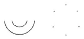
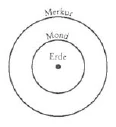
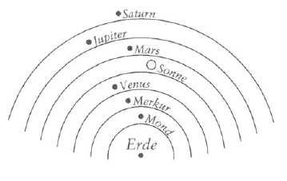
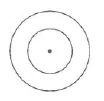
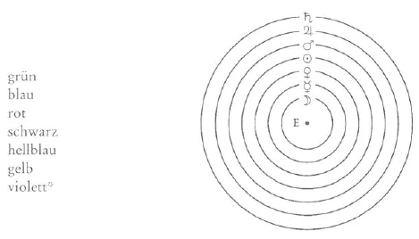
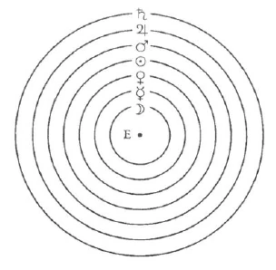
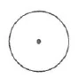
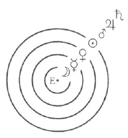

Aufzeichnung A ^65ozbe

Der Esoteriker kann nur dann Fortschritte machen, wenn er sich gewisse Dinge: immer ‚klarer bewußt macht, Er muß sich ganz tief und ernst durchdringen mit dem, was gestern im öffentlichen Vortrage besprochen wurde. Es muß für ihn zum wirklichen Erlebnis werden, daß, wie die Luft in unserer Lunge ein Teil der uns umgebenden Luftatmosphäre ist, die wir durch den Prozeß des Atmens in uns aufnehmen, ebenso das GeistigSeelische in uns zu der ganzen geistig-seelischen Umgebung gehört. Er muß sich auch ganz klar darüber werden, daß das Aufwachen und Einschlafen nichts anderes ist als ein Ein- und Ausatmen des Seelischen. Der Esoteriker muß immer mehr die Wirklichkeit der ihn umgebenden Welt verstehen. ^zaqglf

Nehmen wir an, ein Mensch im exoterischen Leben habe kein Bewußtsein von der ihn umgebenden Luft, er könne nur wahrnehmen die Mineralien, Pflanzen, Tiere, das Feste und Flüssige, die Berge usw. Er sähe vielleicht auch die Wolken und nähme Blitz und Donner oder ähnliches, was darinnen bestände, wahr, hätte aber kein Bewußtsein von der Luft, die dazwischen ist: Ein solcher Mensch wäre ähnlich, wie für den Okkultisten der Exoteriker sich ausnimmt, der von der ihn umgebenden geistigen Welt nichts weiß. Zunächst ist es ja in der jetzigen Zeitepoche das Richtige und in Übereinstimmung mit dem Sinn der Erdentwicklung, daß der Exoteriker das ihn umgebende Physische für die Wirklichkeit halte, in der er bewußt arbeiten soll. Der Esoteriker aber soll die physische Welt ganz anders auffassen. Worin besteht denn dieser Unterschied? ^uha4m7

Für den Exoteriker ist es das Richtige, daß er überall die physischen Dinge nach Ursache und Wirkung beurteilt, und die heutige Zeit ist durch die Naturwissenschaft dazu gekommen, daß sie gerade stolz darauf ist, überall in den äußeren Vorgängen Ursache und Wirkung nachzuweisen. Für den Esoteriker soll das anders werden. Wenn er zum Beispiel die Geschichte betrachtet, so soll sie sich ihm nicht so darstellen, daß die Tatsachen und Vorgänge als die Wirkung des einen vom andern auftreten, sondern diese physischen Vorgänge sind ihm nur Zeichen für geistiges Geschehen. Er muß lernen, diese Zeichen miteinander zu verbinden und durch dieses Verbinden sie richtig zu lesen. So wie ein Mensch nicht richtig lesen kann, wenn er nur die einzelnen Buchstaben kennt, aber ein Mensch, der richtig lesen kann, wenn er das Wort «aber» vor sich hat, nicht danach fragt, ob der Buchstabe b die Folge vom Buchstaben a ist, sondern die beiden sinnvoll verbindet, so müssen die einzelnen Zeichen der äußeren Geschichte, der äußeren Geschehnisse in richtiger Weise gelesen werden. Darin besteht das wahre Wesen des Esoterikers, daß er dies immer mehr lernt. Wir wollen dies an einem bestimmten Beispiel betrachten, und zwar an dem für den Menschen so schwer zu verstehenden Leben selbst. ^tu7oro

Wir wissen, daß im Leben des Menschen zwischen Geburt und Tod das Wesentliche das Bewußtsein ist, welches die einzelnen Erlebnisse verbindet. Wir haben ein Bewußtsein von dem Vergangenen in unserem Leben bis zurück zu jenem Zeitpunkt in unserer Kindheit, zu dem die Erinnerung reicht. Dieses Bewußtsein ist das Wichtige in unserem Leben. In gewissen anormalen Fällen verlieren die Menschen dieses Bewußtsein. Es ist zum Beispiel vorgekommen, daß ein Mensch, sagen wir in einer Stadt Mitteleuropas, auf den Bahnhof gegangen ist; hier hat er sich nach einer andern Stadt ein Billett genommen; hier angekommen, löst er sich wieder ein Billett für eine nächste Stadt, und so weiter; ja auch zu Schiff ist er gefahren. Nach einiger Zeit findet er sich in Nordafrika wieder. Alles, was zwischen dem Abfahrtsort und jetzt liegt, hat er vergessen, ja sogar sein ganzes Leben von der Geburt an - dabei hat er aber vollständig verständig und klug gehandelt beim Lösen der Billette, beim Weiterfahren von einem Platz zum andern, bis nach Marokko vielleicht verständiger als andere Menschen. Das zeigt zugleich, daß Verstand und Bewußtsein nicht eins sind. Es kann zum Beispiel ein Schüler in der Schule vieles lernen und mit dem Verstand erfassen, aber sein Bewußtsein ist nicht dabei. Er kann dann das Gelernte nicht benutzen, es ist, wie wenn jemand ein Werkzeug hat, das irgendwo unbenutzt liegt. - Wie verhält es sich nun bei solchen Menschen wie dem oben geschilderten, wo in anormalen Zuständen das zusammenhängende Bewußtsein verlorengeht? ^qn8h67

Wenn solche Fälle untersucht werden, so zeigt es sich, daß ein solcher Mensch schon vorher im Leben die Eigenschaft gehabt hat, die äußeren Dinge nicht genau zu beobachten. Für den heutigen Menschen liegt es ja sehr nahe, die Dinge daraufhin anzusehen, wie sie in seiner Seele Sympathie oder Antipathie hervorrufen. Manche Menschen — wie der oben Beschriebene — waren schon vorher so, daß sie zum Beispiel weite Reisen durch viele Länder machen konnten und überall nur das ihnen Sympathische oder Antipathische bemerkten. Das ist aber ein großer Mangel, denn wir sollen unser Ich-Bewußtsein gerade dadurch haben und stärken, daß wir alle Dinge und Vorgänge genau, teilnahmsvoll beobachten. Es ist sehr notwendig, dies ganz besonders auch Theosophen vorzuhalten, denn gerade sie sind leicht dazu geneigt, durch ihre theosophischen Interessen einseitig zu werden und das Interesse an vielen physischen Dingen zu verlieren; sie sollen aber alle Vorgänge und Dinge mit Interesse, Liebe und Teilnahme beobachten. Denn das Geistig-Seelische in uns, welches beim Aufwachen aus der geistigen Welt in den Körper eingeatmet wird, gelangt dadurch zum vollen Selbstbewußtsein, daß es die äußeren Vorgänge und Wesen mit Interesse und Liebe beobachtet. Dessen soll sich der Esoteriker immer mehr bewußt werden. Er soll sich klar werden darüber, daß dies die eine wichtige Seite des Lebens ist, dieses Geistig-Seelische, welches aus der geistig-seelischen Welt hereintritt in die physische Welt und an dieser sich zum Selbstbewußtsein entzündet. Der Esoteriker lernt dann diesen Teil seines Lebens kennen wie einen Buchstaben im Weltgeschehen. Wie ein Zeichen oder Buchstabe ist das Ich-Bewußtsein für den geistig-seelischen Kern des Menschen, aber dazu kommt nun etwas anderes. ^ln2sjw

Wir wissen, daß es heute eine Anzahl Menschen auf der Erde gibt; in einiger Zeit sind dann die Söhne und Töchter dieser Menschen da; vorher wieder waren andere da - die Eltern der heutigen. Wir wissen, daß durch diese Linie die Vererbung der Körper geht, die Vererbung der Kräfte und Eigenschaften. - Für den Esoteriker wird es immer mehr bewußte Realität, daß diese in der Vererbungslinie strömenden Kräfte die andere wichtige Seite des Lebens sind. Es verbindet sich das bei der Geburt oder Empfängnis aus den geistigen Welten kommende Seelische mit den Kräften der physischen Vererbungslinie. Es bilden also diese Kräfte den zweiten Buchstaben, und der Esoteriker wird immer mehr fähig, diese beiden Buchstaben seines Wesens nicht nur einzeln zu sehen, sondern richtig zu lesen. ^rbzfd8

Der Okkultismus gibt auch ein äußerlich aufzuzeichnendes Symbol für die Verbindung von zwei Buchstaben oder Zeichen. Wenn wir mit diesem [Symbol] das aus der geistigen Welt her eintretende Ich bezeichnen, so ist es also das Bewußtsein, welches sich bildet dadurch, daß es in der physischen Welt magnetisch die Kräfte der Vererbung angezogen, sich mit ihnen umgeben hat. Dies wird dargestellt durch den Kreis, der den Punkt zum Zentrum hat. ^3kba8b

 ^nv400r

Nun ist dieses Zeichen aber auch wirklich schon in der Welt vorhanden. Die Götter haben es hingezeichnet, und wir finden es am Himmel. Wenn wir die Erde als den oben gezeichneten ® [Punkt] ansehen, so ist der © [Kreis] die Bahn des Mondes, und wir müssen also sehen in dieser Himmelskonstellation ein von den Göttern geschriebenes Zeichen dafür, daß die Erde der Platz des sich entwickelnden Ich-Bewußtseins ist, während die Mondbahn mit dem physischen Mond, der der Erde seine wechselnden Zustände von Neumond, erstem Viertel, Halbmond und Vollmond zuwendet, das äußere Zeichen ist für die Kräfte, die in der Vererbungslinie wirken. Dadurch, daß die physische Sonne ihr Licht auf die Erde wirft und dieses Licht von den Gegenständen zurückstrahlt, kann sich im Seelischen des Menschen das Selbstbewußtsein entzünden. Würde die Sonne aufhören zu scheinen, auch nur einen Augenblick, so würde die Möglichkeit für ein selbstbewußtes Leben des Menschen aufhören. Und ohne die Kräfte des Mondes könnte die physische Vererbung nicht weitergehen. Wenn der Mond nur ein wenig aus seiner Bahn herausgeschoben würde, so würden die Kräfte, welche nötig sind für die physische Vererbung des Menschen, aufhören zu wirken. Die Menschen würden noch eine Weile mit den ihnen innewohnenden Kräften weiterleben - dann würde die physische Fortpflanzung aufhören. Und in der Tat wird ein Zeitpunkt in der Zukunft kommen, wo die Kräfte der Erde so stark geworden sind, daß die Erde den Mond wieder in ihren Körper aufnimmt. Dann können die Kräfte, die jetzt vom Monde auf die Erde wirken und die die Vererbung hervorbringen, nicht mehr sein. Der Mensch wird aufhören, ein Erzeuger [von Nachkommen] zu sein, und das physische Menschengeschlecht wird aufhören. ^urycks

Alles das muß dem Esoteriker immer mehr zur Realität werden. Er muß diesen · [Punkt] mit dem ○ [Kreis] richtig verstehen lernen in der beschriebenen Art. ^qkp5w4

So wie ein Mensch, der lesen kann, wenn er das Wort «ab» schreibt, nicht das ^5wi62h

b ^stl5wl

 und das ^v41n7o

a ^ykw62n

 in irgendeiner Weise nebeneinander stellt, sondern zuerst das ^yz3ahb

a ^ilicpm

 und dann das ^d3kzud

b ^riroep

 schreibt, so ist es auch mit diesen beiden Zeichen des Punktes und Kreises, die der Okkultist richtig zusammenstellt und die der Esoteriker dann lesen kann als das Zeichen für sein Wesen, in welchem das Geistig-Seelische zum Bewußtsein kommt durch die Verbindung mit den Kräften der Vererbung. ^nq0c5w

Aber es sind noch andere Kräfte tätig, um das Leben des Menschen, so wie es ist, zustande zu bringen. Gehen wir zurück in der Menschheitsgeschichte bis in die fernen Zeiten der Ägypter und Perser, so schen wir, wie überall die Menschen durch ihr Denken vorwärtskommen. Zu allen Fortschritten der Entwicklung hat der Mensch selbst beitragen müssen durch sein Denken, dadurch, daß er als verständiges Wesen auf der Erde lebte. Aber diese Kräfte kommen nicht aus dem Menschen selbst. Das könnte nur eine materialistische Wissenschaft glauben, welche den Menschen so gern ihre Phantasmen aufreden möchte. Aber auch vom Monde kommen diese Kräfte nicht. Sie kommen aus Regionen, die über die Mondenbahn hinausreichen, und wir müssen sie uns in unserem Zeichen darstellen durch einen zweiten Kreis, und auch das finden wir in unserem Kosmos von den Göttern hingestellt. Dieser zweite Kreis ist die scheinbare Bahn des Merkur (heutige Venus). In den geistigen Kräften, welche ihren physischen Ausdruck in dem Merkur finden, müssen wir das sehen, was den Menschen den Verstand verleiht. Merkur ^axeq53

 ^clonjj

Das muß der Esoteriker verstehen lernen. Während wir im gewöhnlichen Leben den Mond und den Merkur nur äußerlich anglotzen, soll er nicht bloß versuchen, diesen Merkur mit dem Verstande zu erfassen, sondern in ihm das äußere Zeichen für die geistigen Kräfte sehen, durch welche den Menschen der Verstand gegeben wird. Er soll hinaufschauen zu den Planeten mit einem Gefühl der Ehrfurcht und Dankbarkeit. Würden die Kräfte des Merkur aufhören, so würden die Menschen zwar Bewußtsein auf der Erde haben, aber sie würden ohne Verstand sein. Aber auch dieses ist noch nicht alles. Es müssen noch andere Kräfte hinzukommen, um das Leben und die Entwicklung des Menschen hervorzubringen. Hätte nur der Verstand gewirkt in all den vergangenen Menschheitsepochen, so würde doch kein Fortschritt stattgefunden haben. Die Menschen würden zwar gedacht haben, aber es würden keine neuen Gedanken in die Entwicklung‘ gekommen’ sein. In: Wahrheit:sehen wir aber; wie immer neue Gedanken in die Menschheit einfließen. Heute lernen Kinder in der Schule Dinge, die noch zu Zeiten des Pythagoras dem Denken der Menschen fremd waren. Ohne solche neuen Gedanken wären alle Erfindungen und Fortschritte unmöglich. Woher kommen nun diese Gedanken? Aus einer noch höheren Sphäre, die wir durch einen weiteren Kreis darstellen die scheinbare Bahn der Venus. Venus ist der physische Ausdruck für die geistigen Kräfte, durch welche der Verstand im Menschen befruchtet wird durch neue Ideen, die über das gewöhnliche Gehirndenken hinausgehen. ^yrzh0h

Es gibt nun aber weitere Kräfte, die zwar nicht unmittelbar auf die Erde und auf den Menschen wirken, aber mittelbar dadurch, daß sie auf die Venus strahlen: es sind die Marskräfte. Damit die Marskräfte, wenn sie auf die Venus und indirekt dadurch auf die Erde strahlen, nicht kriegerisch wirken, strömt auf den Mars aus dem noch weiteren geistigen Umkreis der Jupiter eine erhabene göttliche Kraft. Diese läßt sich in Worten noch weniger beschreiben; man kann sie bezeichnen als geistiges Licht, welches nicht wahrnehmbar ist physisch, welches der Mensch aber im Innern als Liebeskraft erleben kann, wenn er in Ehrfurcht und Dankbarkeit zu diesem Weltwesen hinblickt und sich der Gnade bewußt wird, die von da auf uns herabströmt. Dadurch, daß diese Liebeslichtkräfte auf den Mars wirken, wird verhindert, daß die Marskräfte kriegerisch auf Venus und Erde wirken. Und schließlich kommen aus einem noch höheren Umkreis Kräfte, aus der Saturnsphäre, von denen-wir-uns-einen Begriff bilden können, wenn wir an die Wärme des Enthusiasmus denken. Diese Wärmekräfte strömen auf den Jupiter und verbinden sich mit seinem Licht. Und nun müssen wir hier zwischen Venus und Mars die Sonnenbahn einzeichnen. Wir haben dann die drei Bahnen von Mond, Merkur und Venus zwischen Sonne und Erde; das sind die direkt wirkenden Kräfte, und die drei von außerhalb wirkenden, die des Mars, Jupiter und Saturn, die nur mittelbar durch die Venus auf die Erde wirken. ^5sfhi1

 ^rum54b

Von den geistigen Sonnenkräften aber bekommt der Mensch die Ich-Kraft, die Selbstbewußtheit, die sich mit den Mondenkräften und so weiter verbindet, um das ganze Wesen des Menschen zustande zu bringen. Wir haben aber zunächst zwei Sonnen, die geistige, die das Ich gibt, und die physische, die durch ihre Licht- und Wärmestrahlen die physische Erde belebt. Dann aber müssen wir eine dritte Sonne erfassen, nämlich die Vermittlerin der höchsten geistigen Kräfte, die die außersonnlichen Kräfte mit den innersonnlichen verbindet, die seit dem Mysterium von Golgatha auf die Erde ihre Gnadenkräfte sendet. Diese geistige Sonne ist das Christus-Prinzip, das, was der Mensch in sich erleben kann, wenn er den paulinischen Satz erfaßt: «Nicht ich, sondern der Christus in mir.» ^eyfncw

Diese dritte Sonne wurde den Einzuweihenden immer in den christlichen Einweihungsstätten offenbart. Eine große Tragik lag darin, daß ein Mann von dieser dritten Sonne wußte und sie doch nicht innerlich ganz erleben konnte, das war Julian Apostata. ^slt3ke

So haben wir also die Sphäre dieser dreifachen Sonne, außerhalb derselben die drei Kreise, welche die hohen indirekt wirkenden Kräfte darstellen und innerhalb des Sonnenkreises die drei, welche unmittelbar auf die Erde wirken. In jedem dieser sieben Kreise steht einer der sieben Himmelskörper, und so können wir das Rosenkreuz mit den sieben Rosen auch als Symbol für diese siebenfache Himmelsrose ansehen. Aus den drei innern Sphären strömt das herein auf die Erde, woraus des Menschen Wesen geboren wird: Ex Deo nascimur. ^kz3ap1

Die drei äußern Kreise bezeichnen die hohen, geistigen Kräfte, durch welche seine höhere Natur gegründet wird: Per Spiritum Sanctum reviviscimus. ^j7zfzt

Die Verbindung zwischen beiden bildet der mittlere Halbkreis, die Sonnenbahn der physischen, geistigen und der Christus-Sonne: In --- morimur. ^gsg9k0

Aufzeichnung B ^bqz2yj

Wenn der Esoteriker Fortschritte machen will, ist es gut, daß er sich einen Satz wie den: «Wie die Lunge die Luft einatmet, so atmet der physische und der Ätherleib morgens beim Erwachen den Geist ein» in seiner ganzen Bedeutung klar macht, meditativ darüber nachdenkt. Unser materialistisches Zeitalter will ja nur gelten lassen, was es sinnlich wahrnimmt, aber geradeso wie es den Geist leugnet, könnte jemand die Luft leugnen, weil diese schon mit der feineren Sinnlichkeit wahrgenommen wird. Der Esoteriker soll sich gewöhnen, die äußeren Geschehnisse nur als Buchstaben, als Zeichen eines Weltenwortes anzusehen. Der Esoteriker würde bei dem Worte «aber» zum Beispiel auch nicht fragen: Ist das b die Wirkung des a? - sondern er weiß, daß diese Zusammensetzung der Buchstaben nötig ist, um das Wort zu formen. So soll der Esoteriker weniger nach Ursache und Wirkung fragen, sondern sich sagen, daß die Dinge und Ereignisse nötig sind, um Weltenworte zu formen. ^se2tnb

Der Exoteriker ist ja nur zu geneigt, alles nur unter dem Gesichtswinkel von Sympathie und Antipathie zu betrachten. Er ist sehr schnell dazu bereit, nur das anzunehmen, das zu beachten, was ihm gefällt, und das andere womöglich gar nicht zu beobachten. Es gibt eine besondere Art Geisteskrankheit, die beobachtet worden ist: daß ein sonst ganz normal handelnder Mensch plötzlich von Ort zu Ort reist und schließlich an einem dieser Orte wie erwacht, sich auf sich selbst besinnt und sich an nichts erinnert, was in der Zeit seit seiner Abreise geschehen ist. Wenn man okkult nachforscht in der Vergangenheit eines so Erkrankten, kann man finden, daß er mit der größten Interesselosigkeit schon früher an vielen Dingen dieser Welt vorüberging und dadurch sein Ich in hohem Grade geschwächt hart. Es ist eine Schwächung, fast wie ein zeitweises Verlorengehen des Ich. ^nvbzfj

Der Theosoph neigt auch oft dazu, sich von der Außenwelt abzuwenden. Ein liebevolles Interesse für unsere Umgebung ist aber unbedingt notwendig, wenn man Fortschritte machen will. Deswegen braucht man das, was man theosophisch anstrebt, nicht zu vernachlässigen. ^pitz9t

Das Ich erfaßt sich also in der Erinnerung, und hohe Wesenheiten haben uns das Ich und die Erinnerung gegeben. Das sich in der Erinnerung erfassende Ich ist wie ein Buchstabe, den der Esoteriker lernen muß und den die Götter in den Weltenraum geschrieben haben. Die das Ich verleihenden hohen Wesenheiten haben ihren Sitz auf der Sonne; sie geben uns das, was von Inkarnation zu Inkarnation geht. Unseren physischen Körper erhielten wir von Kräften, die durch die Generationen herunter wirken, und diese Kräfte wirken auf uns von dem Kreise aus, der durch die Mondbahn beschrieben wird. Was so von Generation zu Generation geht, ist wie ein zweiter Buchstabe. Wir können das schematisch aufzeichnen. Das sich in der Erinnerung bewußt werdende Ich als Erde zeichnen wir als Punkt und darum herum die Mondbahn als Kreis. Wenn der Mond durch irgendeine Kraft an eine andere Stelle gerückt würde, was würde dadurch für die Erde entstehen? Die durch die Generationen wirkenden Fortpflanzungskräfte würden vertrocknen. Die Menschheit würde sich nicht mehr fortpflanzen und würde aussterben. Der wahre Esoteriker muß also voll ehrfürchtigen Dankes zu den Wesen aufblicken, die von außen durch die Mondkräfte auf ihn einwirken, und sich sagen, daß er ihnen seine Entwicklung durch die Generationen hindurch verdankt. Wenn der Mond einst dadurch, daß die Anziehungskräfte der Erde so stark geworden sind, in diese hineingeht, wie es in Zukunft geschehen soll, so wird die Menschheit am Ende ihrer physischen Entwicklung angekommen sein. ^tmzp6s

Von der Sonne aus erhalten wir die Kräfte, die unser Ich stärken, und wir sollen die Sonne nicht nur anglotzen, sondern die Gedanken in uns entstehen lassen: Du herrlicher Weltenkörper, durch dich, durch deine Sonnengnadenkräfte erhielt ich mein Ich und alle Kräfte, die mit ihm zusammenhängen. In scheuer Ehrfurcht danke ich dir! — Wir können die Sonnenkräfte als zweiten Kreis zeichnen. Damit aber das, was aus den Generationen, und das, was aus der Reihe der Inkarnationen kommt, zusammenkommen kann, daran wirken Kräfte mit, die noch über der Sonnenbahn liegen, die Merkurkräfte. Durch sie erhielten wir auch unseren Verstand, der an das Gehirn gebunden ist. Und wenn wir in die Richtung des Merkur blicken, und überhaupt immer, wenn wir unsere Verstandeskräfte brauchen, sollen wir uns mit Dank gegen diese Wesenheiten erfüllen, die ihn uns gegeben haben. ^yse5js

 ^yhr5e9

Aber es gibt noch etwas Höheres als den bloßen Verstand. Die Entwicklung würde nicht haben fortschreiten können, sie wäre immer auf dem gleichen Standpunkt geblieben, wenn nicht immer neue schöpferische Gedanken eingeflossen wären. Heutzutage lernen die Kinder in der Schule Dinge, welche die Pythagoreer in ihrer Weisheit noch nicht gewußt haben, und dieses fortwährend neu Einfließende stammt aus einer Sphäre über dem Merkur, von der Venus. Durch diese fließen die schöpferischen Gedanken, die sich zum Beispiel in Erfindungen äußern, in die Entwicklung. Dadurch nur ist der Fortschritt möglich. Dieses Denken geht nicht so durch den Verstand, ist nicht so an das Gehirn gebunden, sondern ist leichter, gefühlsmäßiger. ^9nigh4

Über die Sphäre der Venus hinaus liegen nun erhabene Kräfte, die nicht mehr direkt auf die Menschheit wirken. Sie wirken durch die Venuskräfte und befruchten diese. Es sind die Marskräfte. Damit diese nun in ihrem Zusammenwirken mit Venus nicht kriegerisch wirken, strömt von einem noch weiteren Umkreis, dem des Jupiter, eine erhabene göttliche Lichtkraft ein, das geistige Licht, das für den gewöhnlichen Menschen unwahrnehmbar und Finsternis ist. Der Esoteriker kann sich eine Empfindung dafür erwerben, wenn er in Dankbarkeit aufblickt zu diesen erhabenen Weltenwesen, die ihre Gnade auf uns herabströmen lassen. Und dieses innere geistige Licht, das man nur innerlich erfassen kann, empfindet man auch als Wärme, wenn man sich auf noch fernere Höhen konzentrieren kann, auf den Saturnumkreis, dessen Wesen Wärme herabströmen lassen durch die anderen Sphären. ^y6rp9x

Zwischen dem Zusammenwirken von Mars und Venus ist nun der Sonnenkreis der dritten Sonne. Diese dritte Sonne wurde in allen Mysterien gelehrt. Die erste ist die schöpferische physische, die uns ihre wärmenden Strahlen sendet. Die zweite ist die dahinterstehende geistige, die uns das Ich verlieh, und die dritte ist die hohe Trägerin des Christus-Prinzips, der Christus, der uns mit seinen Gnadensonnenkräften das höhere Ich verleiht. Von dieser dritten Sonne geht seit der Zeit des Mysteriums von Golgatha eine Verbindung zur Erde. Es ist die Sonne, von der der Paulinische Satz spricht: «Nicht ich, sondern der Christus in mir», der Christus, den jeder Mensch seitdem empfangen kann. Diese dritte Sonne wurde den christlich Einzuweihenden offenbar durch die Einweihung, und die Tragik in Julian Apostatas Geschick ist die, daß er die dritte Sonne kannte und sie nicht mit dem Christus identifizieren konnte. ^3pwhvp

 ^hr6us2

Dieser sieben Sphären sollen wir uns erinnern, wenn wir die sieben Rosen unseres Rosenkreuzes betrachten; sie sind ein Symbol dafür. Durch den Christus-Kreis werden die Wirkungen der Sphären in zwei Teile geteilt, in einen unteren aus vier Kreisen, dessen Kräfte von unten wirken, und einen oberen geistigen von drei Kreisen, die indirekt wirken. Für den geistigen oberen Teil gilt der Spruch: ‚Per Spiritum Sanctum reviviscimus — im Heiligen Geiste werde ich wiedergeboren, für den unteren: Ex Deo nascimur. Und die Verbindung zwischen beiden stellt Christus her: In --- morimur. ^1t94vi

Aufzeichnung C ^c6i801

Nur dann vermag der Esoteriker etwas zu erreichen in seiner okkulten Entwicklung, wenn er ernst und wahrhaftig stets danach trachtet, sich in der physischen Welt zu empfinden als seelisch-geistiges Wesen, aus einer seelisch-geistigen Welt. Es ist schon in dem gestrigen öffentlichen Vortrag auseinandergesetzt worden, wie wir empfinden sollen den Zustand des Einschlafens als ein Ausatmen und den Zustand des Erwachens als ein Einatmen des geistigen Wesens, geradeso wie wir ein- und ausatmen die Luft, die uns umgibt. So etwas muß der Esoteriker empfinden. Er muß sich dadurch unterscheiden in seinen Gefühlen von dem Exoteriker. ^ahkwgk

Der Mensch der heutigen Zeit schaut an die Tiere, die Pflanzen, die Mineralien, schaut herauf zur Sonne, zum gestirnten Himmel und will in allen Erscheinungen der Umwelt die Ursachen ergründen. Das ist auch in gewissem Sinn berechtigt und notwendig für unser Zeitalter. Der Esoteriker aber muß dahin gelangen, nicht nur die äußere Gesetzmäßigkeit in allen Dingen zu erkennen, sondern wenn er hinblickt auf Tiere, Pflanzen, Mineralien, hinauf zur Sonne und den Sternen, dann muß er sehen in allen diesen Erscheinungen den Ausdruck des dahinterstehenden Geistes. Er muß dazu kommen, die Worte lesen zu können, die hineingeschrieben sind in den Himmelsraum, zusammengefügt aus einzelnen Buchstaben, wie man auch ein Wort zusammenfügt aus einzelnen Buchstaben und ihm dadurch seine Bedeutung gibt. Okkulte Schriftzeichen sind überall zu finden im Weltenraum, und sie müssen entziffert werden. ^t47nr9

Stellen wir einmal ein solches okkultes Schriftzeichen vor uns hin. Da müssen wir zunächst einmal betrachten den Menschen als ein in sich gefestigtes, in sich bewußtes Ich. Jeder Mensch besitzt die Fähigkeit, sich bis zu einem gewissen Punkte zurückzuerinnern. Das geschieht dadurch, daß er sich seines Ich bewußt ist. Dies ist der normale Zustand des Menschen, dieses Bewußtsein seines Ich. Es gibt aber einen krankhaften Zustand, in welchem dem Menschen dieses Ich-Bewußtsein verlorengeht. Es ist vorgekommen, daß ein Mensch zum Beispiel sich ein Billett nimmt nach einer beliebigen Station. Das geschieht noch in ganz normalem Zustand. Dann aber reist er plötzlich von Station zu Station, um sich erst an einem Punkte von Afrika vielleicht wieder als sich selbst zu erkennen, sich selbst wieder zu finden. Diese Menschen haben tatsächlich ihr Ich eine Zeitlang verloren. Auf geisteswissenschaftlichem Wege ist das ganz genau zu sehen. Sie reisen von Stadt zu Stadt, oft in praktischerer Weise als andere Menschen. Die Verstandestätigkeit ist nicht ausgeschaltet, aber das Ich-Bewußtsein, der wichtige Bestandteil des Ich ist verlorengegangen. Dieses Ich-Bewußtsein kann man verstärken, wenn man allen Dingen, die uns in der Außenwelt entgegentreten, Interesse entgegenbringt. ^di8wht

Manche Theosophen zum Beispiel werden einseitig in ihren Bestrebungen. Das ist aber nicht das Rechte. Man darf nicht gleichgütig werden gegen die Dinge und Tatsachen um sich herum; alles soll man in sich aufnehmen. Viele Menschen empfinden gleich bei allem, was sie sehen, ein Gefühl der Sympathie oder Antipathie. Sie sagen gleich: Das gefällt mir, das nicht. Und was ihnen nicht gefällt, das beachten sie nicht. Wenn dies nur mit dem Verstand geschieht, so ist es weniger gefährlich. Dann bleibt es objektiv. Durch das Gefühl aber wird es subjektiv gefärbt. Wir sollen alles ansehen und beachten, auch das, was uns nicht gefällt und interessiert. Dadurch wird das Ich-Bewußtsein immer mehr und mehr verstärkt. ^kpmthk

Denken wir uns nun einmal dieses in sich selbst gefestigte Ich als diesen Punkt im Weltenraum: · Damit nun ein solches Ich sich in einem physischen Körper erleben, sich betätigen kann, müssen Kräfte hinzutreten, die wir uns denken als diesen ○ [Kreis] um den Punkt gezogen ⊙. Dieses Schriftzeichen hat der große Weltengeist schon seit langen, langen Zeiträumen hineingestellt in den Weltenraum: die Erde mit dem Mond. Von dem Monde strahlen dem Menschen zu die Kräfte der Fortpflanzung und Vererbung, die von Generation zu Generation gehen. Der Mond bewegt sich in einer ganz bestimmten Bahn um die Erde; erstes, zweites, drittes Viertel, Vollmond, Neumond. Und würde dieser Lauf nur einmal unterbrochen, der Mond aus seiner Bahn gerissen, so müßte das Menschengeschlecht untergehen. Am Ende der Erdenlaufbahn, wenn die Erde eine zu starke Anziehungskraft ausüben wird, wird sie den Mond wieder in sich aufnehmen, und die Menschen müssen [als physische Menschen] untergehen. So blicken wir voll Dankbarkeit hin auf den Mond, der hereinsendet in die Menschenentwicklung seine Kräfte, die sich uns zeigen als Generationskräfte. Wir müssen sehen in dem Mond, wie er sich um die Erde bewegt, ein Zeichen der okkulten Schrift, das von erhabenen Wesenheiten hineingestellt ist in den Weltenraum als niederster Ausdruck ihres hohen Wirkens. Mond und Erde aber müssen bestrahlt sein von der Sonne, die hineinstrahlt in das Menscheninnere und in der sich widerspiegelt das Menschen-Ich. ^d9kw8t

Und wenn wir hinaufblicken zur Sonne, so müssen wir sagen: O, du herrliches Gestirn am Firmament, das du deine Strahlen hineinsendest in das Innere des Menschen und zurückstrahlst dieses Innerste, das Ich des Menschen!— ^tqrrxz

Und noch andere Kräfte strömen uns zu von den Himmelskörpern. Vom Merkur fließen in die Menschheitsentwicklung die Verstandes-Kräfte. Und wenn wir weiterforschen, so müssen wir uns fragen: woher kommen die Kräfte, die dem Verstande das gaben, was wir den Fortschritt des Menschengeschlechtes nennen? Wie viele Gedanken sind als Erfindungen eingeflossen in die verschiedenen Epochen bis zu der unsrigen? Jetzt lernen die Kinder in der Schule das, was vor der griechisch-lateinischen Zeit noch gar nicht gelehrt werden konnte, den pythagoreischen Lehrsatz. Diese Kräfte, die langsam hinein weben und wirken in den menschlichen Verstand und die zum Ausdruck kommen in den Erfindungen aller Zeiten, sie kommen von der Venus. Und verstärkend und schöpferisch fließen in sie hinein die Kräfte des Mars. Diese Marskräfte gleichsam in die rechten Bahnen zu lenken, damit nicht der schöpferische Verstand allein herrscht, sendet liebevolle Strömungen herunter aus noch höheren Welten Jupiter. Und wenn sich die Liebe immer mehr und mehr verstärkt in der Menschenseele, so wird sie zur Wärme, die uns herunterfließt vom Saturn. Zwischen Mars und Venus nun steht die Sonne, aber nicht eine Sonne nur gibt es, sondern eine dreifache: eine physische Sonne, die dahinterstehende geistige und eine noch geistigere, die wir nennen den Christus. ^4sgnkg

So sehen wir sieben Gestirne im Weltenraum: Die sieben Rosen des Himmelsraumes, wie wir sie sehen in unserem Symbolum, dem Rosenkreuz, als sozusagen Achtes die dreifache Sonne. ^ceqcfw

Die in der letzten esoterischen Stunde hier ^msh9fg

 gegebenen mantrischen Sätze kann man meditieren in dem Sinne und mit den Empfindungen, die sich aus dem heute Gesagten ergeben haben. Diese geistigste Sonne, den Christus, immer mehr und mehr zu erfassen, ihn immer stärker in sich zu erwecken und zu empfinden, das muß die Aufgabe eines jeden Esoterikers sein. Es gab einen Eingeweihten der nachchristlichen Zeit, der nicht hinauf konnte zu diesem Christus, der ihn nicht erfassen konnte und dessen tragisches Ende dieser Tatsache zugrunde liegt. Es war Julian Apostata. ^ygqjuy

So müssen wir dahin gelangen, durch meditatives Nachdenken dessen, was in dieser Stunde gegeben ist, immer mehr und mehr zu verstehen die Worte unseres Rosenkreuzerspruches: Ex Deo nascimur - In Christo morimur — Per Spiritum Sanctum reviviscimus — und desjenigen Spruches, den uns gegeben die Meister der Weisheit und des Zusammenklanges der Empfindungen [und den wir] am Ende einer jeden esoterischen Stunde [hören]: ^s2nece

 ^xzdvah

Aufzeichnung D ^akl80j

Der Esoteriker soll alles, was gesagt wird, mit tiefem Ernst in seine Seele aufnehmen. So hat auch dasjenige, was gestern im öffentlichen Vortrag [über «Lebensfragen und das Todesrätsel»] gesagt wurde, eine sehr tiefe Bedeutung. Das dort angeführte Beispiel, daß der Mensch, so wie er die Luft einatmet, die die ganze Erde umgibt, er ebenso das Geistig-Seelische, das uns genauso von allen Seiten umgibt, einatmet beim Aufwachen und ausatmet beim Einschlafen, soll von dem Esoteriker tief durchdacht werden. Der exoterische Mensch fragt bei allem nach Ursache und Wirkung; die ganze heutige Wissenschaft beruht ja darauf. Unsere Zeit ist stolz darauf, so exoterisch wie nur möglich zu sein und alles in ein Verhältnis von Ursache und Wirkung zu bringen. Der Esoteriker soll sich aber anders benehmen. Er frägt nicht nach der Ursache oder der Wirkung der Erscheinungen, sondern nach ihrer Bedeutung und nach demjenigen, was sie im ganzen Weltall darstellen. Für den Esoteriker wird alles zu Zeichen, zu Buchstaben, zu Worten. Ebensowenig wie man beim Sehen oder Hören eines Wortes, zum Beispiel beim Worte «aber» danach frägt, ob das b die Wirkung ist des a, ebensowenig kann man das in Wirklichkeit bei anderen Erscheinungen tun. Der Esoteriker ist deshalb ein Esoteriker, weil er die Dinge als Buchstaben einer Schrift betrachtet, die er zu einem Ganzen zu verbinden sucht. ^p2wohe

So kann der Esoteriker zwei Erlebnisse haben, die für ihn Zeichen sind für etwas anderes. Das eine ist, daß wir uns bewußt sind, daß wir uns als Seele erleben dadurch, daß wir uns von einem bestimmten Zeitpunkt unseres Lebens ab zurückerinnern können, uns als Ich empfinden. Würde diese Erinnerung auslöschen, wie es in krankhaften Zuständen ja vorkommen kann, so würden wir als Ich, als Seele ausgelöscht sein. So kann es geschehen, daß jemand zum Beispiel eine Fahrkarte nimmt nach einer Stadt in Mitteleuropa. Unterwegs löscht sich seine Erinnerung an sich selbst aus; trotzdem kann ein solcher Mensch weiterreisen und kann vielleicht in einer viel gescheiteren Art sogar weiter handeln als im normalen Leben. Er kann so lange weiterreisen, bis er sich selber wiederfindet, zum Beispiel in einem Orte von Nordafrika. Es ist gleichsam ein Buchstabe in dem Weltenwort, das diese Seele darstellt, verlorengegangen. Und wenn man solchen Menschen nachgeht, um zu sehen, was noch weiter an diesem Worte fehlt, dann findet man gewöhnlich, daß sie schon im normalen Leben Mangel an Interesse hatten. Allseitiges Interesse für dasjenige, was um uns herum geschieht, soll der Esoteriker entwickeln. Er darf nicht auf dem Standpunkt stehenbleiben: das gefällt mir, und das gefällt mir nicht, das heißt auf dem Standpunkt der Sympathie oder Antipathie. Dieser Standpunkt ist nicht so gefährlich, wenn nur mit dem Verstande geurteilt wird, aber es wird gefährlich, wenn die Gefühle sich dazugesellen. ^ewgfhe

Das andere Erlebnis ist dieses, daß wir uns als Mensch stehen fühlen innerhalb der Generationenreihe. Vor uns war die Generation unserer Eltern, Großeltern und so weiter hier auf Erden, nach uns kommt diejenige unserer Kinder, Enkelkinder und so weiter. Diesem Strom der Generationen verdanken wir unseren Körper. Nehmen wir diese zwei Gedanken zusammen, dann können wir dies symbolisch so zeichnen: Der Mittelpunkt sei unser Ich, der Ring da herum dasjenige, wovon die Wirkung der Generationen ausgeht, die uns den Leib gegeben haben. ^h65vs5

 ^hebvuv

Dieses Zeichen nun haben die Götter für uns aufgeschrieben, und das können wir schauen, wenn wir die Erde mit dem sie umkreisenden Mond betrachten. Und für das Ich schauen wir hinauf zur Sonne, und wir wissen: ohne die Sonne könnte niemals ein Ich im Menschen sein, so wie ohne den Mond oder mit einem Versetzen des Mondes das Menschengeschlecht verkümmern müßte. ^azn1eu

Und wenn wir uns zum Merkur erheben - im Sinne der geistigen Hierarchien, das heißt okkult genommen -, dann sehen wir in ihm denjenigen, der die Erdentwicklung ermöglichte, indem er dem Menschen das Denken gab. Ohne dieses könnte der mit dem Ich und dem Leibe begabte Mensch nichts anfangen. Aber durch das Denken allein könnte nichts Neues in der Entwicklung entstehen, es könnte kein Fortschritt sein. Dazu sind Entdeckungen, neue Gedanken notwendig, und daß es solche gibt, das verdanken wir der Venus. Heute lernen schon die Kinder in der Schule, was früher als tiefste Weisheit galt, zum Beispiel das Theorem (des: Pythagoras; darin. besteht eben der Fortschritt. ^1ub97l

Nun steigen wir über die Sonnenwirkung hinauf zu demjenigen, was vom Mars kommt; das ist dasjenige, was - indem es sich mit Venus verbindet, die neuen schöpferischen Gedanken ermöglicht. Inspirationen für den Fortschritt der Menschheit gibt uns Mars. Daß aber diese Marskräfte in ihrem Zusammenhang mit den Venuskräften nicht zu kriegerischen Folgen führen, dafür sagen wir Dank dem Jupiter. Wer sich in die Jupiterkräfte einlebt, fühlt sich in einer Sphäre des Lichtes, das ihm die Weisheit schenkt. Und wenn er sich in dieses Licht vertieft, kann er in ihm kalte und warme Strahlungen unterscheiden. Das ist dann dasjenige, was ausgeht vom Saturn. ^77jo11

 ^1ory0x

Zwischen den beiden Reihen: Mond, Merkur, Venus und Mars, Jupiter, Saturn steht die Sonne in. ihrer Wirkung: Die:unteren Planeten wirken unmittelbar auf den Menschen und die Erdverhältnisse ein, die oberen wirken mittelbar. Mars wirkt, indem er sich mit der Venus verbindet, so wie durch das Schenken einer Inspiration, damit die Menschheit weiterkommen könne. Jupiter wirkt wie eine Gnade, die Marskräfte so beeinflussend, daß diese nicht kriegerisch werden; und Saturn gibt die Begeisterung. ^am19n7

Die Sonne steht mitten zwischen diesen beiden Reihen darinnen und hat auch eine doppelte, ja dreifache Natur. Es ist eines der Geheimnisse des Okkultismus, daß es drei Sonnen gibt. Die Sonne ist die Lichtbringerin, das ist die erste Sonne, deren Licht uns die physischen Gegenstände auf der Erde sichtbar macht. Und in diesem Lichte ist etwas Spirituelles enthalten, das von der zweiten Sonne herrührt, derjenigen Sonne, die uns das Ich geschenkt hat, wodurch wir eine Erinnerung haben, so daß wir ein in sich geschlossenes Seelenleben haben können. Aber dahinter liegt etwas noch Geistigeres, das ist die dritte Sonne, der Sonnengeist, Christus. Er ist es, der dem Ich, das durch die Erinnerung bloß besteht, die Möglichkeit gibt, indem es von Inkarnation zu Inkarnation schreitet, zum: ewigen Leben zu gelangen. Diese dritte Sonne hat sich seit dem Mysterium von Golgatha mit der Erde vereinigt. Die Wissenschaft darüber hat das Rosenkreuzertum bewahrt. Julian der Abtrünnige hatte noch eine Ahnung von den drei Sonnen. Daß er in der dritten, der geistigsten Sonne, den Christus nicht finden konnte, das wurde ihm. in derjenigen Zeit, in der er eben lebte, zum Verhängnis. ^ycimle

Nehmen wir, wie es sich gehört, Mond und Erde als eins zusammen, oder rechnen wir die Erde nicht mit, dann haben wir in den sieben Planeten die sieben Lichtrosen, die das Rosenkreuzertum vor uns hinstellt. Und mit Mond, Sonne und den übrigen Planeten verbindet es den dreiteiligen Rosenkreuzerspruch: ^pytte3

Ex Deo nascimur In Christo morimur Per Spiritum Sanctum reviviscimus. ^flcp60

Aufzeichnung E ^p75677

Okkultes Zeichen: ⊙ Vordermark mit Lotusblume Alles, was uns umgibt, ist äußerer Ausdruck eines dahinterstehenden Geistigen. Der Esoteriker muß dazu kommen können, die Worte zu lesen, die hineingeschrieben sind in den Himmelsraum, zusammengefügt sind aus einzelnen Buchstaben. Er muß lesen lernen diese okkulte Schrift. Okkulte Schriftzeichen sind überall zu finden im Weltenraum. Der Esoteriker hat die Aufgabe, sie zu entziffern. Ein solches okkultes Schriftzeichen, das die mannigfaltigste, die ungeheuerste Bedeutung hat, ist: 0. Wenn wir es in seiner einen Bedeutung entziffern wollen, müssen wir betrachten den Menschen als ein in sich geschlossenes, sich seiner selbst bewußtes Ich. Jeder Mensch besitzt die Fähigkeit, sich bis zu einem gewissen Punkt zurück zu erinnern. Das geschieht dadurch, daß er sich seines Ich bewußt ist in normaler Weise. Es gibt aber einen krankhaften Zustand, in welchem dem Menschen verloren geht dies Ich-Bewußtsein. Solche Menschen handeln scheinbar ganz vernünftig, machen in praktischer Weise eine Reise z. B., aber ganz ohne Zweck und Ziel, sie wissen nichts von sich, oft nicht einmal ihren Namen. Die Verstandestätigkeit ist nicht ausgeschaltet, wohl aber das Bewußtsein vom Ich. Das kommt ihnen dann ganz plötzlich wieder. Verstärken kann man das Ich-Bewußtsein, wenn man allen Dingen, die uns in der Außenwelt entgegentreten, ein liebevolles Interesse entgegenbringt. Nie darf man einseitig oder gar gleichgültig werden gegen Dinge, Tatsachen, Menschen um uns herum. Alles soll man in sich aufnehmen, aber ohne gleich bei allem ein Gefühl von Sympathie oder Antipathie zu haben. Nicht gleich sagen, das gefällt mir, das nicht und das letztere nicht beachten. Man soll alles zu erkennen trachten, ohne subjektive Gefühle dabei zu haben, alles auch, was uns nicht gefällt. Dadurch wird das Ich immer mehr verstärkt. ^o2654u

Denken wir uns nun dies in sich selbst gefestigte Ich als einen · [Punkt] im Weltenraum. Das Ich ist ein solcher Punkt. Damit es in einem Körper sich erleben kann, müssen Kräfte hinzutreten. Denken wir uns diese als einen O [Kreis] um den · [Punkt] herum ⊙. Schon seit langen, langen Zeiten hat der große Weltengeist dies Schriftzeichen hineingestellt in den Weltenraum als die Erde mit dem Mond. Von dem Monde strahlen dem Menschen zu die Kräfte der Fortpflanzung, Vererbung, alles, was von Generation zu Generation geht. Der Mond bewegt sich in einer ganz bestimmten Bahn um die Erde, als erstes, zweites, drittes Viertel, Vollmond etc. Würde nur einmal dieser Lauf unterbrochen, der Mond aus seiner Bahn gerissen, so müßte das Menschengeschlecht untergehen. Am Ende der Erdenlaufbahn, wenn die Erde eine zu starke Anziehungskraft ausüben wird, wird sie den Mond wieder aufnehmen, und die Menschen, als physische Menschen, müssen untergehen. ^bkc4o8

So blicken wir voll Dankbarkeit hin auf den Mond, der hereinsendet in die Menschenentwicklung seine Kräfte als Gravitationskräfte. Wir sehen in ihm ein Zeichen der okkulten Schrift, das von erhabenen Wesenheiten hineingestellt ist in den Weltenraum als niederster Ausdruck ihres hohen Wirkens. ^i113vn

Mond und Erde aber müssen bestrahlt sein von der Sonne. Die strahlt hinein in das Menscheninnere, und in ihr spiegelt sich wider das Menschen-Ich. Und wenn wir hinaufblicken zur Sonne, so müssen wir sagen: ⊙ du herrliches Gestirn am Firmament, daß du deine Strahlen hineinsendest in das Innere des Menschen und zurückstrahlst dieses Innerste, das Ich des Menschen - wir danken dir dafür. ^e1aewz

Und noch andere Kräfte strömen uns zu von den Himmelskörpern. Vom Merkur fließen herein in die Menschheitsentwicklung die Verstandeskräfte. Und wenn wir weiter forschen, so müssen wir fragen: woher kommen die Kräfte, die dem Verstande das geben, was wir den Fortschritt des Menschengeschlechts nennen? Wie viel Gedanken sind als Erfindungen eingeflossen in die verschiedenen Epochen bis zu der unsrigen. - Jetzt lernen die Kinder in der Schule das, was vor der griechisch-lateinischen Zeit noch nicht gelehrt werden konnte: den pythagoreischen Lehrsatz. -— Diese Kräfte, die langsam hineinwirken in den menschlichen Verstand und den Menschen zu Erfindungen treiben, kommen von der Venus, und verstärkt in die schöpferische Inspiration hineinfließend kommen sie vom Mars. Diese Marskräfte in die rechten Bahnen zu lenken, damit nicht der schöpferische Verstand allein herrscht, sendet liebevolle Ströme herunter Jupiter, aus noch höheren Welten. Und wenn sich die Liebe immer mehr und mehr verstärkt in der Menschenseele, so wird sie zur Wärme, die uns herunterfließt von Saturn. ^9zjlxi

Da sehen wir die sieben Rosen des Himmelsraumes und in ihrer Mitte ausstrahlend die achte Rose, die dreifache Sonne. Denn es gibt nicht nur die eine Sonne, die wir physisch wahrnehmen, hinter ihr steht die geistige Sonne, von der die physische Sonne nur das äußere Kleid ist, und hinter dieser steht eine noch geistigere Sonne, die wir nennen den Christus. Diese geistigste Sonne, den Christus immer mehr zu erfassen, ihn immer stärker in sich zu erwecken, das muß die Aufgabe jedes Esoterikers des Rosenkreuzes sein. ^27hv7d

Es gab seinen Eingeweihten der nachchristlichen Zeit, der nicht hinauf konnte zu dieser geistigsten, der dritten Sonne, dem Christus. Er konnte ihn nicht erfassen, und seinem tragischen Ende liegt diese Tatsache zugrunde. Das war Julian Apostata. ^d96edq

Aufzeichnung F ^6r6iwg

Der Exoteriker erkennt alles nach Ursache und Wirkung. Dem Esoteriker ist es wie ein Lesen in einer Schrift des Göttlich-Geistigen. So muß der Esoteriker unterscheiden lernen den Keim des Menschen und das, was als Geistiges darin. Das ist die zweifache Vererbung. Das, was durch die Generationen sich hindurchentwickelt, fortpflanzt, und das, was als Geistiges sich hindurchzieht. Der Kern des Menschen, der von dem, was ihm von den Vätern vererbt ist, umgeben ist, kann in dieser Schrift in Buchstaben ausgedrückt werden. Der Kern: ein Punkt, umgeben von einem Kreis [..] ^d5dh79