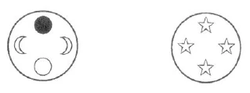

In unseren esoterischen Stunden müssen wir uns erheben zu den göttlichen Wesen um uns herum, und weil wir als Esoteriker wissen, daß sehr viele Stufen uns trennen von der göttlichen Wesenheit, worüber im exoterischen Leben so leichtfertig gesprochen wird, wenden wir uns zu den Göttern, die zwischen uns und den höchsten geistigen Regionen stehen, zu den Göttern der Tage. So stellen wir uns bewußt in das Zeit-Miterleben, Miterleben des Regierens der verschiedenen Götter an den verschiedenen Tagen. ^rmqd2h

Als Esoteriker muß vieles für uns anders werden, als es im gewöhnlichen Leben ist. Wir müssen beginnen, uns als Lebende zu fühlen im großen Meer des Seelisch-Geistigen um uns herum, und wissen, daß, ebenso wie wir physisch eins sind mit der umgebenden Welt durch die gemeinsame Luft, die wir einatmen, wir geistig-seelisch eingebettet sind in die geistige Welt um uns herum. Beim Erwachen des Morgens atmen wir in einem langen Atemzug den Geist, der wir selbst sind, ein, und beim Einschlafen wieder aus, zurück in die geistige Welt. Alles wird anders um uns herum; wenn wir das Sonnenlicht sehen, sehen wir es als Esoteriker nicht mehr nur physisch, sondern wir wissen, daß ohne das Sonnenlicht wir uns nicht als Ich fühlen könnten, daß das Sonnenlicht zugleich die icherzeugende Kraft in sich schließt. Und wenn wir auf den Mond sehen mit seiner wechselhaften Gestalt, dann wissen wir, daß damit zusammenhängt die Kraft, die uns befähigt, Nachkommen zu haben. Das Leben, das durch die Generationen geht, hängt mit dem Monde zusammen. Wir können das in Symbolen überall sehen. Wir sehen die Sonne auf- und untergehen. Und wir sehen die vier wechselnden Gestalten des Mondes und begegnen dem in dem Symbol mit den vier Rosen, was uns Symbol sein kann für die Sonnen-Ich-Kraft und die Mondes-Fortpflanzungskraft (Regenerationskraft). ^v3g6mc

 ^0dukjn

Aber dazu müssen wir lesen können und nicht mehr einfach die Dinge anstarren. Und dann sehen wir im Merkur den Boten, und wissen, daß durch seine Kraft unser Ich in Zusammenhang mit der Fortpflanzungskraft gebracht wird, daß der Bote, der okkulte Merkur, die Verbindung darstellt. Und so, denkend an die Sphäre, woraus wir jeden Morgen ebenso wie bei jeder Geburt kommen, können wir mit Ehrfurcht in uns tönen fühlen: E.D.N. - und dann wissen wir, daß hinter der physischen Sonne und der icherzeugenden Sonne noch eine dritte Sonne ist, die Christus-Kraft, womit wir uns verbinden können: I.C.M. - und dürfen dann auch hoffnungsvoll folgen lassen das P.S.S.R. ^7o1fd4