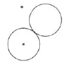

Aufzeichnung A ^2bprjj

Wenn wir als Esoteriker von Stufe zu Stufe immer höher rükken, so stellen sich in unserem Seelenleben mancherlei Veränderungen ein. Ich will heute sprechen von einer Schwäche, die sich beim Esoteriker bemerkbar macht gegenüber dem Exoteriker; das heißt eine Schwäche vom Standpunkte des Exoterikers aus, für den Esoteriker wird es eher eine Stärke sein. Es ist, was ich nennen möchte: die Robustheit der Gedankenbildung. Ich will ein Beispiel geben. ^e94jbl

William Crookes hat in seinem Leben viel nachgedacht. Er hat auf spiritistischem Gebiete vielleicht das Bedeutendste geleistet. Er hat nicht nur experimentiert, sondern auch sehr viel nachgedacht über Dinge, die sich im übersinnlichen Leben ergeben. Eines seiner interessantesten Probleme ist wohl das vom mikroskopischen Menschen. Er stellt sich den Menschen vor, wie er immer kleiner wird, immer kleiner, eine Art Homunkulus. Zuletzt ist er nur noch so groß wie ein Käfer, der auf einem Kohlblatt umherkriecht. Dieses Kohlblatt bedeutet für ihn die Welt, und die Ränder des Blattes sind für ihn wie hohe Berge. Sie erscheinen ihm höher als dem gewöhnlichen Menschen das Himalaja-Gebirge. Man hat sich auch einen Menschen vorgestellt, der sehr schnell lebt, dessen Lebensdauer, die für den heutigen Menschen hochgegriffen achtzig Jahre beträgt, nur zwei Monate umfaßt. Selbstverständlich muß für einen solchen Menschen das Weltbild ein ganz anderes sein, da sich ja alles das, was der gewöhnliche Mensch in einem ganzen Leben erfährt, auf zwei Monate zusammendrängt. Den Übergang von einer Jahreszeit zur andern lernt er gar nicht kennen. Das Wachstum der Blumen erscheint ihm so, wie wenn heute jemand Forschungen anstellt über die geologische Entwicklung der Erde. Die Sonne scheint für ihn kaum von ihrem Platz zu rücken. Man hat sich auch einen Menschen vorgestellt, der ganz langsam lebt, dessen Lebensdauer achtzigtausend Jahre beträgt. Der Gang der Sonne, den wir genau am Himmel verfolgen können, würde einem solchen Menschen erscheinen wie ein feuriger Kreis, so etwa, wie wenn man ein Stück glühende Kohle schwingt und einen geschlossenen Kreis erblickt. Die Blumen sprießen für ihn aus der Erde, um gleich wieder zu vergehen; ein Pilz schießt hervor und verschwindet sogleich. ^pu1xn2

Für den Esoteriker sind solche Bilder insofern von Interesse, weil er daran sieht, wie weit das heutige exoterische Denken hinausschwärmen kann. Von den drei Seelenkräften ist es ja das Denken, das am meisten ausschweifen kann. Der Esoteriker kann da nicht mit; es fehlt ihm solchem Denken gegenüber die Robustheit. ^vsl13i

Woher kommt das? Weil solche Bilder wie die vom mikroskopischen und vom schnellebigen Menschen nicht in der Notwendigkeit, der Gesetzmäßigkeit des Weltenseins liegen. Ganz gewiß sind die guten Götter mehr um des Menschen Leben besorgt gewesen als er selber; sie haben ihn aber nicht als mikroskopischen, sondern als makrokosmischen Menschen geschaffen, weil sich der allein dem Weltensein, wie es die Götter veranlagt haben, einfügte. Nun wäre es ja möglich, daß Herr William Crookes, wenn er einmal hätte ein Gott werden können, einen solchen mikroskopischen Menschen geschaffen hätte - die guten Götter haben es nicht getan, sie sind zu schwach gewesen. Der heutige Exoteriker aber ist stark. Er malt sich ein solches Gedankenbild aus wie das vom mikroskopischen Menschen. Er ist stärker in seinem Denken als die nächsthöhere Hierarchie, die Engel oder Angeloi, von denen es in einer alten Urkunde heißt: «Und sie verhüllten ihr Angesicht!» ^st007w

Warum tun sie das? Und wovor? Vor den Irrtümern der Menschen! Der Mensch ist von den Göttern als ein denkendes Wesen geschaffen, und das ganze Weltall ist so eingerichtet, weil er eben ein denkendes Wesen sein sollte. Wenn der Mensch aber glaubt, daß das Denken für sich allein bestehen könne, wenn er es hinausschweifen läßt, so muß er in Irrtum verfallen und den Zusammenschluß mit dem universellen Denken, dem Urquell des Denkens verlieren. Dann verhüllen die Engel ihr Angesicht. So tief sind diese religiösen Urkunden gefaßt; man muß sie nur verstehen. ^7rb2w1

Wenn die heutige Theologie: über ‚die Bibel spricht; so hat das gegenüber der Wirklichkeit ebenso viel Bedeutung, als wenn europäische Gelehrte, die kein Chinesisch verstehen, ihr Urteil abgeben würden über heilige chinesische Handschriften nach dem, was sie der Handschrift äußerlich ansehen können. So wenig Wert das hat, so wenig Wert hat die moderne Bibelforschung für die Menschheit. ^6p3sey

Daher enthalten ja auch die Übungen, die Euch, meine lieben Schwestern und Brüder, gegeben sind, solche Gedankenbilder, wie sie im großen Weltenplan enthalten sind. Und ein Esoteriker wird Vorstellungen wie die vom mikroskopischen und vom schnell oder langsam lebenden Menschen ablehnen. Sie verursachen ihm Schmerzen, er empfindet sie als etwas Ungesundes, als nicht in der Notwendigkeit des Weltenseins Liegendes. Gegenüber dem mikroskopischen Menschen wird er etwas empfinden wie ein Brennen; es wird ihm heiß, wie wenn alles in einen Punkt zusammenströmt. Dagegen bei allem, was sich weit ausdehnen will ins Weltenall, wenn er sich zum Beispiel den Menschen, der achtzigtausend Jahre alt wird, vorstellen will, da überkommt ihn ein Kältegefühl, es friert ihn. ^y25c17

Ein solches Kältegefühl kann man auch haben gegenüber den verschiedenen Philosophen. Bei Anaxagoras, auch in geringerem Maße bei Empedokles, hat man ein eisiges Gefühl. Leibniz gegenüber empfindet man ein Gefühl wohltuender Wärme; er ist — wenn der Ausdruck richtig verstanden wird - ein angenehmer Philosoph. ^w6qr08

Ein Gefühl von Brennen, von Heiß-Sein hat man auch, wenn man über einen Punkt meditiert. Das ist zugleich ein guter Prüfstein für die esoterische Entwicklung. Habe ich keine Mühe, mir einen Punkt vorzustellen, wie er den Schulkindern heute beigebracht wird, so ist es noch nicht das Richtige. Wenn der Esoteriker aber Mühe hat, wenn er ein heißes, brennendes Gefühl hat, so ist das ein Beweis, daß er in seiner Schulung fortgeschritten ist. ^ncqf2s

Ein solches Bild, wie es dem Weltengang entnommen ist, ist auch eine Schale, mit Öl gefüllt, in dem eine Flamme brennt und leuchtet. Die Schale steht fest, das Öl wird verzehrt. Wer sich in dieses Bild hineinversetzt, erhält dadurch ein wahres Bild von der menschlichen Wesenheit: die Schale ist der feste, physische Körper; das Öl, das sich verzehrt, der Ätherleib; die Flamme der Astralleib und das leuchtende Licht das Ich des Menschen. ^rs8h70

Diese menschliche Wesenheit ist ja je nach Klima und Ort eine sehr verschiedene, und mehr, als man für gewöhnlich denkt, wächst der Mensch zusammen mit den Geheimnissen seiner Umgebung. Es ist ein Unterschied, ob ein Mensch von Berlin nach Sizilien fährt oder nach hier (Kristiania). Man erlebt etwas anderes, wenn man nach Norden fährt. Da wird der Ätherleib immer größer, besonders im östlichen Norden, zum Beispiel Finnland. Im Süden ist dagegen der Ätherleib mehr zusammengepreßt. Wenn jemand von hier - Kristiania - nach Süden fährt, so muß sich sein Ätherleib zusammenziehen. Dadurch können starke Heilkräfte entfesselt werden. Selbstverständlich kommt es dabei darauf an, ob ihm von seiten des zu Heilenden [nicht] Widerstand entgegengesetzt wird, und auch auf das Karma beider kommt es an. ^j362dg

Aufzeichnung B ^dkjl1l

Es gibt für den Esoteriker Dinge, die er nicht kann, in denen er schwach ist gegenüber dem Exoteriker. Wir werden morgen von Dingen reden, die der Esoteriker sich anzueignen hat. - Der Esoteriker kann sein Denken nicht mehr herumschwärmen lassen wieder Exuteriker; Als Beispiel, wie das gemeint: ist, wird gesagt: Der Exoteriker denkt sich ein Menschlein aus, das Menschlein von Crookes, das wie ein Käferchen so klein ist, ein Mensch, der nur zwei Monate lebt, der aber in dieser Zeit Kind, Mann und Greis ist. Gegenüber solchem Ausgedachten sind die Götter schwach in ihrem Denken; sie können sich nur einen Menschen denken in der Größe und in der Art, wie er jetzt ist. Den mikrokosmischen Menschen, wie er da erdacht ist, statt den wirklichen makrokosmischen Menschen zu denken, das muß dem Esoteriker brennenden Schmerz machen. Das Kleine, das Gepreßte, das muß ihm Schmerz erzeugen; Feuer erzeugen dagegen muß ihm das Große, das Makrokosmische. ^5ficeh

All dieses unbestimmte Denken über das Weltenall wie das Fragen und Grübeln über das, was war vor dem Saturn, was war, ehe denn Gott da war etc., etc., das muß bei dem Esoteriker ungeheuere Kälte erzeugen. Sich den Punkt und den Kreis, oder einen Punkt oder einen Kreis zu denken, das fällt dem Esoteriker schwer, nicht so dem Exoteriker. Der Esoteriker erzieht eben auch seine Seele. ^9fooj5

 ^ojgh4i

Wir können auf diese Weise eine Ahnung bekommen, woher Irrtum und Böses in die Welt gekommen ist. Das Kennenlernen des Ätherleibes geschieht durch Aufmerksamkeit, durch Konzentration, das des Astralleibes geschieht durch Hingabe der Seele, durch Meditation, durch das Hinuntersteigen in seine Seele und das Resultat ist eine Erweiterung des Gedächtnisses. ^ajuee2

Ein gutes Meditationsmittel ist, sich vorzustellen eine Schale mit Öl und eine Flamme, die leuchtet und das Öl verzehrt. Das ist ein Symbolum für eine Vorstellung, die einer natürlichen Möglichkeit entspricht. Die Schale ist der physische Leib; das Öl ist der Ätherleib; die Flamme, die brennt und verzehrt das Öl, das ist der Astralleib; das Leuchten der Flamme, das ist das Ich. ^qxuzg9