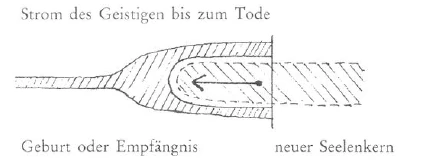
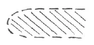
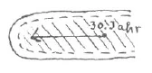
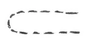

Aufzeichnung A ^to4g8k

Tagesspruch für Sonnabend. ^txkjvd

Meine lieben Schwestern und Brüder! ^no8bsm

Im gewöhnlichen Tagesbewußtsein wissen wir nichts von dem, was hinter dem ist, was wir empfinden, vorstellen, erdenken, erfühlen, erwollen. In dem, was der Hintergrund unseres Tagesbewußtseins ist, in diesem Lebenden, Webenden sind wir in unserem Traumleben. In den chaotischen Bildern unseres Traumes erstreckt sich ein Teil dieser Welt in unser Leben, von der wir sonst nichts wahrnehmen können. Wenn wir das machen könnten, daß wir nur halb aufwachten aus dem Traum, dann würden wir eine flutende Welle um uns erleben, in der unsere Seele von Anfang des Schlafes an gelebt hat. Und wenn wir dann ganz aufwachten, dann würden wir ein Bewußtsein, eine Erinnerung mitbringen in unser Tagesbewußtsein von dem lebenden, webenden Traumerleben während unseres Schlafes. Physisch unmöglich ist es, wie beschrieben, halb aufzuwachen; wir müssen gleich ganz in das Bewußtsein der Sinne hinein. Daher wissen wir nichts von jener anderen Welt. - Aber eigentlich träumen wir immer. Immer ist diese lebende, webende Traumwelt um uns und wir in ihr; wir wissen es nur nicht. Es ist eine Eigentümlichkeit des Traumes, daß man ihn sehr leicht vergißt, daß wir uns selten an denselben erinnern. Und diese Erinnerung vergessen wir viel leichter als die an irgend etwas im Tagesbewußtsein Erlebtes; wir können sie nicht wieder hervorholen. ^e9pwrj

Daß der Mensch träumt von etwas, das nur mit seinem äußeren Tagesbewußtsein zusammenhängt, kommt daher, daß er ja eigentlich nichts denkt, was über dieses Tagesleben hinausgeht. Erst wenn man seine Gedanken erfüllt mit Ideen, Empfindungen etc., die über das tägliche Leben hinüberreichen, kann man auch von anderem träumen, von etwas, das im Geistigen seinen Ursprung hat. Von diesem Geistigen, von dem, was hinter all seinem Denken, Fühlen und Wollen im physischen Leben ist, weiß der Mensch in seinem Tagesbewußtsein nichts. ^12dmqg

Noch von einer anderen Seite können wir dazu gelangen, ein Bewußtsein von diesem Geistigen zu erhalten. ^vooq88

 ^e79ajr

Bei der Geburt oder Empfängnis ergießt sich der geistige Strom in das Physische, baut auf, durchströmt und durchpulst allmählich den ganzen Organismus. Darinnen bildet sich im Laufe des Lebens der neue Seelenkern, der Keim für das nächste Leben, das, was über den Tod hinaus dauert. Aber weder von dem ursprünglichen Geistigen, das aus dem früheren Leben strömt und mit Geburt oder Empfängnis ins physische Dasein hineinströmt, noch von dem sich dann bildenden Seelenkern, der den Keim für das nächste Leben bildet, wissen wir etwas. Ja, wovon wissen wir dann etwas? - Unser Leben zerfällt in zwei Teile, in einen, der von der Geburt bis zu dem Augenblick reicht, an den wir uns als frühesten erinnern können, und den zweiten von diesem Augenblick an bis zum Tode. ^z864u1

 ^xnfzoy

Wenn man im dreißigsten Jahr steht und sich zurückerinnert bis zu diesem eben bezeichneten Zeitpunkt, dann kommt man dort an eine Grenze, an die Grenze des da einströmenden Geistigen. ^bagib0

 ^e7hry0

Und diese Grenze nimmt man wahr; durch das Anstoßen an diese Grenze wird man sich derselben bewußt. Solche Anstöße im Laufe des Lebens bleiben in unserem Gedächtnis und bilden unsere Erinnerungen. ^ha70u3

Da sammeln sich unsere Erinnerungen. Und das ist unser Bewußtsein im physischen Leben. ^9r1aia

Wie in der Pflanze der Kern zur neuen Pflanze sich entwikkelt, so arbeiten wir an den Kräften, die unser neues Leben späterhin gestalten. Wohl dem, der gute und schöne Erinnerungen aufgespeichert hat! Das Geistige aus dem früheren Leben, das den neuen Körper von der Geburt an durchströmt und durchzieht, vergeht allmählich während des Lebens. ^qqwp4i

Es ist oft die Rede davon gewesen, daß nach dem Tode zuerst das große Erinnerungstableau auftritt. Beim Verlassen des physischen Leibes gelangt man zuerst an diese Grenze, wo all die Erinnerungen aufbewahrt liegen; ^1722ff

 ^6tbd9n

die sehen wir dann als großes Tableau vor uns. Die Erinnerung von irgendeinem Erlebnis kann ein Leben lang vergessen gewesen sein, bis sie plötzlich wieder ins Bewußtsein heraufgeholt wird. Da war sie immer. Es ist, wie wenn man Salz in Wasser tut, und das fällt zu Boden, gleichsam Bodensatz. Das kann heraufgeholt werden durch Umrühren. So sind unsere Erinnerungen gleichsam «Bodensatz», den wir wieder heraufholen können. Wenn wir Selterswasser in ein Glas gießen, dann sehen wir kleine Perlen aufsteigen. Das Wasser, das eigentlich Reale, sehen wir nicht, sondern nur das, wo nichts ist, die Kohlensäureperlen. Das sehen wir, das erscheint uns als Realität. Da, wo «Nichts» an «Etwas» stößt, da nehmen wir dies «Nichts» als «Etwas» wahr. ^6b6j67

So werden wir uns also nur bewußt der Grenze zwischen neuem Seelenkern und dem alten Geistigen. Da, wo sie aneinander stoßen, werden wir etwas gewahr. Und das macht unser Tagesbewußtsein aus. Das Bewußtsein entsteht durch Berührung zwischen Vergangenheit und Zukunft. ^og1qt2

Nun können wir noch von einer dritten Seite daran herankommen, uns dieses Geistigen bewußt zu werden. Nicht nur die Menschen denken, und deren Gedanken und Erinnerungen bleiben als Bodensatz bestehen, sondern auch die geistigen Wesenheiten haben gedacht und denken noch. Das, was die hohen Hierarchien in lang vergangenen Zeiten gedacht haben, die Erinnerungen, die von diesen Gedanken zurückgeblieben sind, sind dasjenige, was wir hier als Berge, Wolken, Ströme, kurz als die Natur um uns herum wahrnehmen. Die physische Sonne ist die nachgebliebene Erinnerung des Sonnenführers, des Christus, des später bei dem Ereignis von Golgatha in die Erde eingezogenen Erdgeistes. Und was die hohen Wesenheiten auf dem Monde gedacht haben, die Erinnerungen daran, sind die Pflanzen, Tiere, auch der physische Leib des Menschen. Die geistigen Wesenheiten haben dort den Irrtum gedacht - das war dort am Platz —, aber sie haben ihn nicht getan. Wenn wir Menschen Gutes, Edles denken, 'so bleibt das bestehen; wir sehen es in der Ferne, in der Zukunft als unvergängliche Daseinswerte. Aber auch das, was wir an Lügenhaftem, Irrtümlichem, Lasterhaftem denken, bleibt bestehen, und wir sehen es in der Ferne vor uns stehen als Abfallprodukt, das dazu dient, Nahrung zu sein für die Keime, die aus dem Gutgedachten hervorgehen - wie wir uns jetzt ernähren von den Irrtumsgedanken der Geister der Mondenzeit. An sich ist dies Abfallprodukt unfruchtbar, es dient aber zur Nahrung für die aus dem Guten sich entwickelnden Keime, wie das Mineralreich jetzt den Boden abgibt für die Pflanzen und wie immer eins sich vom andern ernährt. Das Gute ernährt sich von dem Bösen wie ein sprossender Keim, der das Lasterhafte verzehrt und selbst ewig bleibt. ^8bh03f

Aber nur denken dürfen wir hier das Schlechte, das Böse, (dürfenjiesinicht zur Tat, zur Wirklichkeit kommen lassen, (denn dieses ist immer luziferisch und ahrimanisch. ^uinyce

Luzifer, der auf ähnlicher Stufe steht wie die Elohim auf dem Monde, will jetzt noch ebenso das Irrtumsdenken ausführen, wie es damals jene Wesenheiten taten, wie es damals am Platz war, jetzt aber verkehrt ist. Er kann den Irrtum aber nur im Menschen denken lassen. Daher hier Irrtum und Täuschung; dessen sollen wir uns immer mehr bewußt werden. ^n026qa

Da, wo «Erinnerungen» jener hohen Hierarchien sind, da werden wir etwas gewahr. Dadurch, daß wir mit unserer Hand, die ja auch aufgebaut ist aus dem, was «Erinnerung» der Götter ist, gegen eine Wand, die ebenfalls «Erinnerung» ist, stoßen, prallen die Grenzen dieser Realitäten aneinander, und dadurch werden wir uns dieses Gegenstandes bewußt. Also da, wo dieses Reale aufhört und nichts da ist, da empfinden wir Wirklichkeit, Realität, Materie im Tagesbewußtsein, und das andere als Nichts. Weder unsere Hand noch die Wand erfühlen wir, sondern nur das, was dazwischen ist, die Grenze. Der Tisch ist nicht Wirklichkeit, sondern ein Loch in der geistigen Welt, das ausgefüllt ist mit Holz. Nur wir in unserem gewöhnlichen Bewußtsein nehmen den Tisch als Wirklichkeit. ^ytwd79

Wenn wir durch Meditation uns so stark machen könnten, dieses Tagesbewußtsein so herabzudämpfen, der Nichtigkeit der Umwelt uns vollständig bewußt zu werden, dann würden wir uns mit unseren Seelen immer in der geistigen Welt erleben. Zu dieser Erkraftung unserer Seele wurden uns drei Meditationsverse gegeben. Es kommt darauf an, daß wir sie in der richtigen Weise meditieren, nicht einfach nur gleichsam die Worte sagen, sondern den Ausdruck hören, der hineingelegt werden muß, wenn sie in der rechten Weise auf unsere Seele wirken sollen. ^0zsl5n

Beim ersten Vers sind die zwei ersten Zeilen beschreibend, dann - Abwehr. Dann wieder beschreibend und zum Schluß Bitte. Anfänger können diesen Vers abends nach der Rückschau meditieren; diejenigen, die schon Übung haben, können ihn in jeder Mußestunde vornehmen.— ^ny0xhe

Beim zweiten Vers ist besonderes Gewicht zu legen auf die Frage in der vierten Zeile. Am Schluß ist ein Erflehen. - Für Anfänger morgens; für die andern zu jeder Mußestunde. ^tcyxgv

Noch ein dritter Vers ist uns gegeben, gleichsam zum Probieren, ein Rat von Zeit zu Zeit, um sich zu fragen, ob man die geistige Welt schon als Wahrheit und Realität empfindet. ^lo80kc

(Als der Doktor diese Worte erhalten hatte, fiel ihm auf, daß das Prädikat in der zweiten Reihe des dritten Verses eigentlich doch in der Mehrzahl stehen müßte. Dann erkannte er, daß Leuchtend Ich und Leuchte-Seele ein und dasselbe seien, daß es also schon richtig sei, daß das Wort schwebet in der Einzahl steht. Wenn man so etwas bekommen hat, dann muß man oft an demselben lernen, erst daran zu erkennen, was gemeint ist.) ^ugw87e

In drei Siebenzeilenstrophen sind diese Verse gegeben worden; das ist nicht Zufall oder vom Doktor so zurecht gemacht. Sondern alles, was inspiriert wird aus der geistigen Welt, offenbart sich in Zahlen. Die Worte sind bloß Mittel und Gelegenheit, durch die die Geister sich aussprechen. Die Wesenheit, die diese Verse einfließen ließ, hat hierdurch das Versprechen gegeben, zu helfen beim Erkennen des Unterschiedes vom Realen und Unrealen. Dadurch, daß wir wieder und wiederum diese Verse durch unsere Seele ziehen lassen, geben wir der Wesenheit, die diese Verse gab, Gelegenheit, zu unserer Seele zu sprechen; sie hilft uns dann, die rechte Wirkung der Verse in uns zu erzeugen - in jedem! ^w8772x

Kurz ausgedrückt sind diese Verse in dem Rosenkreuzerspruch: ^ods46h

Auch ist alles dieses enthalten in den Worten, mit denen wir unsere esoterischen Betrachtungen beschließen: ^osjlt6

Aufzeichnung B ^lgon9f

P.S.S.R. ^uum1a0

Leuchtend Ich und Leuchte-Seele - ^244avi

Schwebet über wahrem Werdewesen ^83whv8

Das Erdachte, das Erkannte ^9am2pn

Wird jetzt dichtes Geistessein. ^43r1ur

Und wie leichte Daseinsperlen ^3rgayf

Lebt im Meer des Göttlich-Wahren ^snvfej

Was den Sinnen Dasein täuscht. ^bypya0

Die Natur ist das Sinnen, das Gedächtnis der göttlichen Wesen von Sonne und Mond. Unser Denken, Fühlen, Empfinden sind anders, als sie scheinen. Unser Leben zwischen Geburt und Tod wechselt ab zwischen Schlafen und Wachen und Träumen. ^7mcavh

Zur I. Strophe: Eigentlich träumen wir immer, daher vergessen wir so leicht, was wir geträumt haben. Sinneseindrücke behalten wir so leicht; warum nicht den Traum? Weil wir immer träumen, nie aus dem Träumen herauskönnen. ^mpm51f

Zur II. Strophe: Was wir wachend wahrnehmen, ist eigentlich gar nicht da. - Was von den vorigen Inkarnationen kommt, geht in den physischen Leib; aber was wir jetzt in unser Leben aufnehmen, wird unsern Leib in der folgenden Inkarnation formen. Was wir äußerlich wahrnehmen, ist nicht das eine noch das andere, es ist nur der Zusammenstoß beider, wo sie aneinander kommen. ^ql4ubm

Zur III. Strophe: In einer Flache Selterswasser sehen wir die Kohlensäure, die Gasbläschen, nicht das Wasser; so wie dies Bläschen ist das, was wir äußerlich wahrnehmen. — Die Realität, die das Eigentliche ist, das bleibt uns verborgen. ^yhddgg

Wenn Haß da ist, stößt man in der geistigen Welt gegen etwas. ^b608l6