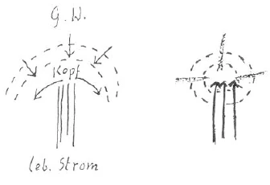

Ich möchte eine Einleitung vorangehen lassen. Durch diesen Aufruf (zur Teilnahme an dem in Aussicht gestellten esoterischen Unterricht) hat sich wieder bestätigt, wie wenig ernst diese Bewegung sogar von alten Mitgliedern genommen wird. Gleich nach dem Aufruf gab es wieder Diskussionen aller Art, und was dabei herausgekommen ist, ist etwas, was nicht hätte geschehen dürfen. Solange die Mitglieder mit ihrer Kritik fortfahren, die sich auf jede Handlung, die von höherer Stelle geschieht, bezieht, solange es Mitglieder gibt, die immer wieder ganz fremde Persönlichkeiten einführen, nicht aus Interesse für die Bewegung, aber aus irgendeinem persönlichen Interesse, ist es nicht möglich, die großen geistigen Wahrheiten hinzustellen, die jetzt gesagt werden müssen. Wenn man sieben Jahre in der Bewegung gestanden und die Lehren aufgenommen hat, dann sollten große Änderungen in unserer Lebensauffassung eingetreten sein, wobei man nicht mehr dieselbe Kritik anwendet wie früher, wo ganz andere Handlungen herauskommen sollen. Viele unserer Mitglieder sind schon mehr als sieben Jahre dabei, und man spürt nichts von einer Änderung in ihren Urteilen. In jedem Gebaren, in jeder Handlung sollte diese Wandlung zum Ausdruck kommen. Statt daß dieses eintritt, bleibt alles beim Alten. Würde mehr Kritik geübt an der Geisteswissenschaft und mehr Vertrauen entgegengebracht den Persönlichkeiten, die hingestellt wurden, um diese oder jene Arbeit zu verrichten, dann stünde es besser um die Bewegung. Statt dessen erlebt man Autoritätsglauben in Fülle. Man denke nur an die vielen, die abgefallen sind, wie sie vorher angebetet und verehrt wurden! Gesunde Kritik wäre besser am Platze gewesen in diesen Fällen. Abfall von der Bewegung sollte eigentlich unmöglich sein, und er ist der kräftigste Beweis für den Mangel an Ernst, der immer noch unter uns herrscht. Und dieser Ernst kann nicht tief genug empfunden werden, wenn wir auf die katastrophalen Zeitereignisse blicken. ^tzgarz

Schon in den exoterischen Vorträgen ist wiederholt gesagt worden, daß unser Kopf dem Verfall, dem Tode geweiht ist und daß aus dem übrigen Menschen der lebendige Strom heraufströmt, der das Tote wieder erwecken kann. Dazu aber müssen die: Menschen:nicht: abweisen, was: aus; der:geistigen Welt:sich heruntersenkt und was sich mit dem lebendigen Strom vereinen kann. Sonst muß dieser lebendige Strom wieder abwärts gehen, und der Kopf mit dem Gehirn bleibt ein toter Organismus. ^oj9bu0

 ^pf1c9g

Die Menschheit als Ganzes ist etwas anderes als der individuelle Mensch. Die Menschheit gehört zum Erdenorganismus und macht das Karma der Erde mit; der einzelne Mensch hat sein eigenes Karma. Das soll man richtig unterscheiden. Die Menschheit als solche erlebt heute die Begegnung mit dem Hüter der Schwelle, und das Überschreiten der Schwelle hat schon in den letzten Jahren seinen Anfang genommen. Das ist auch der Anfang der Spaltung der Menschheit, und das bedeutet eben der kritische Zeitpunkt, an dem wir jetzt angelangt sind. Die Kräfte, die früher aus den geistigen Wesen in die Menschheit strömten, sind jetzt verbraucht; wir sind auf uns selbst gestellt und müssen diese Kräfte jetzt aus unserem Unterbewußtsein heraufholen. Das Mysterium von Golgatha wäre umsonst geschehen, wenn die Menschen diese inneren Kräfte nicht anwenden, sondern sie abweisen würden. Das würde die ganze Zerstörung der Erdenentwicklung nach sich ziehen. Die Seelen würden zwar noch in die Leiber herabsteigen, aber sie würden sie nach dem dreiunddreißigsten Jahre verlassen, wenn sie nicht in früheren Jahren durch ihre Leiber den Strom des Geistigen aufgenommen haben. Solche Dreiunddreißigjährigen - die den Strom aufgenommen haben - sollen die Jüngeren unterrichten, damit in der Jugend schon der Keim für das Begreifen des Mysteriums von Golgatha gelegt werde. Und was diejenigen betrifft, die vor dem dreiunddreißigsten Jahre sterben werden, für diese wird auch gesorgt werden. ^64180y

Wenn dieses sich nicht erfüllen sollte, dann würden auf der Erde seelenlose Leiber herumgehen, die nur mit einem automatischen Verstande arbeiten können. Während der Kriegskatastrophe haben sich schon seelenlose Menschen gezeigt, und es werden immer mehr kommen, wenn nicht der Geist aufgenommen wird, der jetzt herunterdrängt. Diese seelenlosen Menschen sind eine willkommene Beute für dämonische Wesen, die diesen automatisch wirkenden Verstand für ihre Ziele anwenden werden. - Wenn nicht eine kleine Anzahl Menschen sich durchdringen läßt von der Bedeutung des Furchtbaren, das jetzt gesagt worden ist, wenn nicht der nötige Ernst aufgebracht werden kann, dann ist die weitere Entwicklung der Menschheit unmöglich. ^92kfb4

Ich werde Ihnen eine Wegzehrung geben, die Ihnen, meditierend, eine große Hilfe wird sein können, um die vielen Geheimnisse, die in dem Gesagten liegen, zu Ihrem Bewußtsein zu bringen [Es wurde an die Tafel geschrieben und konnte abgeschrieben werden:] ^gmxxx2

Wenn man sich ganz durchdringt mit diesen Worten, kommt man zu höherem Wissen. ^2lp54m

Das Fühlen ist eine Widerspiegelung des Träumens, und auch das Träumen spiegelt sich im Fühlen. ^plac4v

Zu dem gegebenen Spruch: Bewußt: nur Denken, deshalb Imaginieren links geschrieben. Die anderen noch unbewußt wirkend (Schlafen, Träumen in Wollen und Fühlen). ^bxbyh8

Zuerst wurden die drei mittleren Mantren Ich denke .. Ich fühle ... Ich will ... an die Tafel geschrieben; dann (neben Ich fühle ...) Ich träume ... (neben Ich will ...) Ich schlafe ... ^rm52ts

Dr. Steiner sagte: Im Fühlen träumt man noch; im Wollen schläft man überhaupt noch; es sei einzig und allein im Denken bis jetzt nur etwas möglich (Imaginieren), er habe es deshalb links geschrieben neben Ich denke ... . ^emayc3

Zu Beginn und Schluß wurde von Rudolf Steiner gesprochen: O Mensch, erkenne dich selbst ... ^3ewj2v