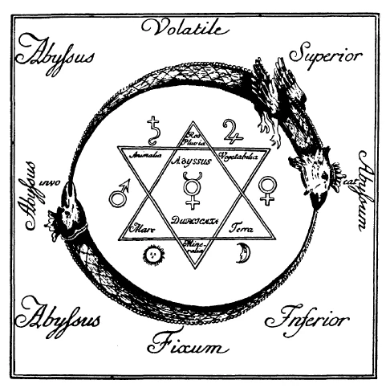

Die Geisteswissenschaft, die in die moderne Kulturströmung sich hineinleben will, will nichts Neues sein und unterscheidet sich gerade dadurch von vielerlei auftretenden Weltanschauungen und sonstigen Geistesrichtungen, die glauben, dadurch, daß sie behaupten, über diese oder jene Frage des Geisteslebens etwas Neues zu bringen, ihre Daseinsberechtigung darlegen zu können. Demgegenüber soll dasjenige, was man Geisteswissenschaft nennt, betonen, daß die Quellen ihrer Erkenntnisse und ihres Lebens zu allen Zeiten, da Menschen gedacht, Menschen gestrebt haben nach den höchsten Fragen und Rätseln des Daseins, in derselben Weise vorhanden waren. Das durfte ich schon öfters betonen auch in dieser Stadt, als ich die Ehre hatte, in früheren Vorträgen zu sprechen. ^j7o80n

Es muß nun ganz besonders reizvoll sein, von diesem Gesichtspunkte aus nicht nur die verschiedenen Religionsbekenntnisse, die verschiedenen Weltanschauungen, wie sie aufgetreten sind in der Entwickelung der Menschheit, zu betrachten, sondern auch Persönlichkeiten, die uns nahestehen, einmal von diesem Gesichtspunkte aus anzusehen. Denn soll etwas wahr sein in der Geisteswissenschaft, dann muß wenigstens ein Kern dieser Wahrheit sich finden bei all denjenigen, die ehrlich und energisch nach Erkenntnis und nach dem menschenwürdigen Dasein gestrebt haben. ^0xdw6m

Wenn nun heute von Geisteswissenschaft die Rede ist, dann machen sich von der einen oder andern Seite die mannigfaltigsten Urteile geltend, und derjenige, der nicht tiefer eingedrungen ist in das entsprechende Gebiet, der sich aus diesen oder jenen Vorträgen oder Broschüren eine oberflächliche Kenntnis verschafft hat, wird je nach seinem Standpunkt diese Geisteswissenschaft ansehen als Phantasterei oder Träumerei einiger weltfremder Menschen, die sich kuriose Vorstellungen machen über das Leben und seine Untergründe. Es muß durchaus zugegeben werden, daß, wenn man nicht genauer zusieht, ein solches Urteil begreiflich erscheinen kann, denn obzwar heute davon nicht die Rede sein kann, da wir ein spezielles Thema zur Voraussetzung haben, so soll doch hingewiesen werden auf einige der hauptsächlichsten Erkenntnisse dieser Geisteswissenschaft. Und schon, wenn diese genannt und charakterisiert werden, wird sich auf eine ganz ehrliche Weise bei unseren Zeitgenossen das Gefühl regen können: Ach, was ist denn das für ein kurioses Zeug! ^8tz0ix

Im Ganzen beruht ja Geisteswissenschaft, wenn sie ernst genommen wird, darauf, daß vorausgesetzt wird: dasjenige, was uns in der sinnlichen Welt umgibt, was wir mit unseren Sinnen wahrnehmen können, mit dem Verstande begreifen können, der an unsere Sinne gebunden ist, das ist nicht die ganze Welt, sondern hinter alldem, was sinnlich ist, liegt eine geistige Welt. Und diese geistige Welt ist nicht in einem unbestimmten Jenseits, sondern sie ist immer um uns herum, so wie die Farben- und Lichterscheinungen auch um den Blindgeborenen herum sind. Dazu aber, daß wir von etwas wissen, was um uns herum ist, gehört, daß wir ein Organ haben, um es wahrzunehmen. Und so wie der Blindgeborene Farbe und Licht nicht sehen kann, so kann auch in der Regel der Mensch in unserem Zeitalter mit seinen normalen Fähigkeiten die geistigen Tatsachen und Wesenheiten nicht wahrnehmen, die um uns herum sind. Wenn wir aber das Glück haben, einen Blindgeborenen zu operieren, dann gibt es für ihn den Augenblick der Erweckung des Auges, und was für ihn nicht da war, Licht und Farben, das flutet nun herein in sein Inneres. Das ist für ihn eben von seiner Operation ab eine wahrnehmbare Welt. So gibt es auf geistigem Gebiet eine höhere Erweckung, jene Erweckung, durch die ein Mensch ein Eingeweihter wird in die geistige Welt. Um mit Goethe zu sprechen: es gibt geistige Augen und Ohren, nur sind die Menschenseelen in der Regel nicht so weit, sie gebrauchen zu können. Wenn wir aber die Mittel und Methoden anwenden, durch die diese Kräfte zum Dasein kommen, dann geht etwas in uns vor auf einem höheren Gebiet wie für einen Blindgeborenen, der operiert wird, und dem dann hereinflutet die Welt der Farben und des Lichtes. Da wird der Mensch, wenn ihm geöffnet werden Augen und Ohren, ein Erweckter. Eine neue Welt ist um ihn herum, eine Welt, die immer da war, die er aber nur von dem Moment der Erweckung an wahrnehmen kann. Dann aber, wenn der Mensch so weit ist, lernt er verschiedene Erkenntnisse sich zu eigen zu machen, Erkenntnisse, welche das Leben aufhellen, Erkenntnisse, welche uns Kraft und Sicherheit für unser Arbeiten geben können, welche uns möglich machen, in das Wesen der Menschenbestimmung und in die Geheimnisse des Schicksals hineinzusehen. ^0siyhf

Und nur vorbereitend soll eine dieser Erkenntnisse besprochen werden, eine von jenen Erkenntnissen, die, wenn nicht verrückt, so doch absonderlich und träumerisch dem heutigen Menschen oftmals vorkommen müssen. Es ist die Erkenntnis, die nichts anderes ist als eine Belebung eines uralten Erkenntnisvorganges, seine Fortsetzung auf höherem Gebiet, eine Wahrheit, welche für ein niedrigeres Gebiet vor verhältnismäßig kürzerer Zeit erst errungen worden ist. Die Menschheit hat im allgemeinen für große Ereignisse der geistigen Welt ein kurzes Gedächtnis, und deshalb denkt man heute so wenig daran, daß im 17. Jahrhundert nicht nur Laien, sondern selbst Gelehrte daran geglaubt haben, daß aus Flußschlamm niedere Tiere, ja sogar Würmer und Fische sich entwickeln würden. Der große Naturforscher Francesco Redi war es, der zuerst darauf aufmerksam machte, daß kein Regenwurm, kein Fisch aus dem toten Flußschlamm herauswächst, wenn nicht vorher ein Regenwurm-, ein Fischkeim darinnen ist. Er hat den Satz ausgesprochen, daß Lebendiges nur von Lebendigem kommen kann, und daraus erkennt man, daß es nur eine ungenaue Betrachtungsweise ist, wenn man glaubt, es könne aus dem leblosen Flußschlamm. herauswachsen das Lebendige eines Fisches oder Wurmes. Genauere Betrachtung zeigt, daß wir zurückgehen müssen zu dem lebendigen Keim, und daß dieser lebendige Keim nur aus seiner Umgebung die Kräfte heranziehen kann, die da sind, um das zur größten Entfaltung zu bringen, was Lebendiges im Keime ist. ^i6fzsm

Das, was Redi gesagt hat, daß Lebendiges sich nur aus Lebendigem entwickelt, das gilt heute in der Wissenschaft als etwas Selbstverständliches. Als Redi damals den Satz ausgesprochen hat, entging er nur mit knapper Not dem Schicksale des Giordano Bruno. So geht es mit der Entwickelung der Menschheit. Erst muß eine solche Wahrheit so errungen werden, daß diejenigen, die sie zuerst aussprechen, verketzert werden, dann wird sie zur Selbstverständlichkeit, zum Gemeingut der Menschheit. Das, was Redi für die Naturwissenschaft getan hat, das soll für den Geist durch die Geisteswissenschaft heute geschehen dadurch, daß jener Satz, den Redi ausgesprochen hat für die Naturwissenschaft, übertragen wird aus den Erkenntnissen des erweckten Geistesauges und Geistesohres heraus auf das seelische Gebiet. Und da heißt dieser Satz: Geistig-Seelisches kann nur aus Geistig-Seelischem entstehen. — Das heißt, es ist eine ungenaue Betrachtungsweise, wenn wir einen Menschen ins Dasein treten sehen, zu glauben, daß alles, was ins Leben tritt, bloß aus Vater und Mutter und den Vorfahren herstammt. So wie wir zurückgehen müssen beim entstehenden Regenwurm zum lebendigen Regenwurmkeim, so müssen wir von dem Menschen, der sich herausentwickelt aus dem Keim zu einem bestimmten Wesen, zurückgehen zu einem früheren geistigen Dasein und müssen uns klar sein, daß dieses Wesen, das durch die Geburt ins Dasein tritt, von seinen leiblichen Vorfahren nur heranzieht die Kraft zu seiner Entfaltung, wie der Regenwurmkeim die Kraft aus der leblosen Umgebung heranzieht. Und in entsprechender Ausdehnung wird dieser Satz: Lebendiges kann nur aus Lebendigem kommen -, zu dem andern Satze: Das gegenwärtige Leben, das durch die Geburt ins Dasein tritt, führt nicht nur zu physischen Ahnen zurück, sondern führt durch die Jahrhunderte zurück auf ein früheres Geistig-Seelisches. —- Und wenn Sie sich tiefer darauf einlassen, werden Sie sehen, daß ganz wissenschaftlich gezeigt wird, daß es nicht nur ein, sondern wiederholte Erdenleben gibt, daß das, was jetzt zwischen Geburt und Tod in uns ist, die Wiederholung eines Geistig-Seelischen ist, das schon in früheren Daseinsstufen da war, und daß unser jetziges Leben wiederum der Ausgangspunkt für folgende Leben ist. Geistig-Seelisches kommt von Geistig-Seelischem, geht zurück auf Geistig-Seelisches, das da war vor der Geburt, das aus der geistigen Welt heruntersteigt und sich in physischen Verkörperungen auslebt. Wir sehen jetzt ganz anderes, wenn wir zum Beispiel als Erzieher gegenüberstehen einem Kinde, das stufenweise die Kräfte entfaltet. Wir sehen bei der Geburt, wie ein Unbestimmtes auf seinem Antlitze ist, wie aus seinem Inneren heraus immer bestimmter und bestimmter sich entfaltet, was nicht aus der Vererbung stammt, sondern was aus früheren Leben kommt. Wir sehen, wie dieses Zentrum des Geistig-Seelischen durch die Talente von der Geburt an immer weiter und weiter sich entfaltet. ^lv4yxi

Das hat heute Geisteswissenschaft zu sagen in bezug auf die wiederholten Erdenleben. Es mag heute eine Träumerei sein, wie es als eine Träumerei galt, was Francesco Redi im 17. Jahrhundert sagte. Aber was heute als Träumerei gilt, wird eine Selbstverständlichkeit werden in nicht gar zu ferner Zeit, und der Satz: Geistig-Seelisches kommt von Geistig-Seelischem —, wird Allgemeingut der Menschheit werden. ^inr673

Heute behandelt man die Ketzer nicht mehr so wie früher. Man liefert sie nicht mehr dem Scheiterhaufen aus, aber man betrachtet sie als Toren und Träumer, die aus beliebiger Phantasie heraus sprechen. Man macht sie lächerlich und setzt sich auf den hohen Stuhl der Wissenschaft und sagt, das sei mit wirklicher Wissenschaft nicht vereinbar, nicht wissend, daß es die wahre, echte Wissenschaft ist, die diese Wahrheit fordert. Und nun können wir hundert und hundert solcher Wahrheiten anführen, die uns zeigen würden, wie Geisteswissenschaft das Leben beleuchten kann, indem sie zeigt, daß ein unsterblicher Wesenskern im Menschen liegt, der durch den Tod in die geistige Welt zieht, und wenn er seine Bestimmung daselbst erfüllt hat, wiederum zurückkehrt ins physische Dasein, um neue Erfahrungen zu sammeln, die er dann wiederum durch den Tod hinaufträgt in geistige Welten. Wir würden sehen, wie die Bande, die geschlungen werden von Mensch zu Mensch, von Seele zu Seele auf allen Gebieten des Lebens, jene Züge des Herzens, die von Seele zu Seele gehen, die sonst nicht zu erklären sind, erklärt werden können dadurch, daß sie geknüpft worden sind in früheren Lebensverhältnissen. Und wie das, was wir heute knüpfen an inneren Geistesbanden, nicht aufhört, wenn der Tod über das Dasein hinzieht, sondern wie das, was als Lebensbande von Seele zu Seele zieht, unsterblich ist wie die menschliche Seele selber, wie das mitlebt durch die geistige Welt hindurch und wiederum aufleben wird in andern, zukünftigen Erdenverhältnissen und neuen Verkörperungen. Und nur eine Frage der Entwickelung ist es, daß die Menschen sich auch erinnern werden an ihre früheren Erdenerlebnisse, an das, was sie geistigseelisch durchgemacht haben in früheren Erdenleben und Daseinszuständen. ^z8tvni

Solche Wahrheiten werden sich in nicht zu ferner Zeit als notwendige Dinge einleben in das menschliche Leben, und die Menschen werden Kraft und Hoffnung und Zuversicht gewinnen aus solchen Voraussetzungen heraus. Heute können wir nur sehen, daß einzelne wenige Menschen in der Welt durch ihren gesunden Wahrheitssinn hingezogen werden zu dem, was geistige Forscher aus ihren Erlebnissen in der geistigen Welt heraus zu verkünden haben. Aber das, was geisteswissenschaftliche Erkenntnisse sind, wird Gemeingut der Menschheit werden und lebt sich hinein in ernstem Wahrheitssuchen. Und diejenigen, die die Pfade ernster Wahrheitssucher gegangen sind, haben immer in all dem, was sie der Menschheit geboten haben, die großen Weistümer und Erkenntnisse ausgestaltet, die heute die Geisteswissenschaft wiederbringt. ^78rk3t

Ein Beispiel soll vor unsere Seele hintreten in einer Persönlichkeit, die unserem neuzeitlichen Leben nahesteht: das Beispiel Goethes, und bei ihm wiederum dasjenige, was ihn als sein umfassendstes und größtes Werk beschäftigt hat sein ganzes Leben hindurch: sein «Faust». ^6pju49

Wenn wir an Goethe herantreten und versuchen mit dem, was Geisteswissenschaft geben kann, sein Streben zu beleuchten, so können wir eigentlich ziemlich früh anfangen. Man kann sagen, aus seiner ganzen Anlage heraus erkennt man bei Goethe, wie in ihm Seele und Geist war. Alles dasjenige, was hindrängt, hinter den Erscheinungen der sinnlichen Welt ein Geistiges zu suchen, das war in ihm eine frühe Anlage. Da sehen wir den siebenjährigen Knaben Goethe, der da hätte aufnehmen können aus seiner Umgebung gewöhnliche Vorstellungen, wie sie ein Knabe aufnehmen kann zu seiner ersten Seelenvorstellung. Das befriedigt ihn nicht; er erzählt es selber in «Dichtung und Wahrheit». Da sehen wir, wie der siebenjährige Knabe etwas ganz Merkwürdiges beginnt, um seine Sehnsucht nach dem Göttlichen zum Ausdruck zu bringen. Er nimmt ein Notenpult aus der Sammlung seines Vaters, macht daraus einen Altar, indem er darauflegt allerlei Mineralien und Pflanzen und sonstige Produkte der Natur, aus denen der Geist der Natur spricht. Ahnend baut sich die Knabenseele einen Altar, stellt darauf ein Räucherkerzchen, nimmt ein Brennglas, wartet, bis die Morgensonne aufgeht, sammelt mit dem Brennglas die ersten Strahlen der aufgehenden Sonne, läßt sie auf das Räucherkerzchen fallen, so daß der Rauch aufsteigt. Und im spätesten Alter erinnert sich Goethe daran, wie er als Knabe dem großen Gotte der Natur, der durch Mineralien und Pflanzen spricht, der uns in den Sonnenstrahlen sein Feuer sendet, seine frommen Gefühle hinaufsenden will. Das wächst mit Goethe heran. Wir sehen, wie er auf einer reiferen Stufe — aber doch aus sehnender Seele heraus, wie es lebt in Goethe -, nachdem er nach Weimar kommt, vom Herzog zu seinem Ratgeber berufen wird, wie da dieses Gefühl für den Geist, der aus allen Naturwesen spricht, in dem schönen Prosahymnus zum Ausdruck kommt. Da sagt er: «Natur, wir sind von ihr umgeben und umschlungen, unvermögend, aus ihr herauszutreten, und unvermögend, tiefer in sie hineinzukommen. Ungewarnt und ungebeten nimmt sie uns in den Kreislauf ihres Tanzes auf und treibt sich mit uns fort, bis wir ermüdet sind und ihrem Arme . entfallen ... Nicht wir haben getan, was wir tun, alles hat sie getan; sie denkt und sinnt beständig, schaut mit tausend Augen in die Welt.» Und wiederum später sagt er in dem schönen Buch über Winckelmann, «Antikes»: «Wenn die gesunde Natur des Menschen als ein Ganzes wirkt, wenn er sich in der Welt als in einem großen, schönen, würdigen und werten Ganzen fühlt, wenn das harmonische Behagen ihm ein reines, freies Entzücken gewährt: dann würde das Weltall, wenn es sich selbst empfinden könnte, als an sein Ziel gelangt, aufjauchzeni und den Gipfel des eigenen Werdens und Wesens bewundern.» So fühlte Goethe, wie alles, was draußen in der Natur lebt und webt, eine Auferstehung feiert aus der Menschenseele heraus, und wie eine höhere Natur, eine geistige Natur aus Geist und Seele des Menschen hervorgebracht wird. Aber nur langsam ringt sich Goethe zur völligen Klarheit in der geistigen Erkenntnis der Natur durch. Und wir sehen an nichts deutlicher und klarer, wie Goethe sein ganzes Leben ein Strebender war, der nicht gerastet und geruht hat, um die Erkenntnis immer wieder umzubilden, um zu höherer Stufe zu kommen, wir sehen das an nichts klarer und besser als an seinem Lebensgedicht, dem «Faust». ^bua2p7

In frühester Jugend hatte er begonnen, alles, was seine sehnende und ahnende Seele erfüllte, in sein Gedicht hineinzulegen; und als Greis im spätesten Alter, kurz vor seinem Tode, hat er dieses Gedicht, an dem er über fünfzig Jahre gearbeitet und in das er das Beste seines Lebens hineingelegt hat, vollendet. Der zweite Teil lag versiegelt bei seinem Tode da wie das große Testament, das er der Menschheit zu geben hatte. Es ist ein bedeutsames Dokument. Wir verstehen dieses Dokument nur, wenn wir Goethe ein wenig verfolgen, wie er selber sich zur Erkenntnis durchzuringen suchte. ^rk6gt0

 ^ucl2in

Da finden wir zum Beispiel den Studenten Goethe an der Leipziger Universität. Er soll eigentlich Jurist werden, aber das beschäftigt ihn nur untergeordnet. Ein unbesieglicher Drang nach den Geheimnissen der Welt, nach dem Geistigen, lebte schon dazumal in dem jungen Studenten. Deshalb tut er sich um in all dem, was Leipzig darbietet an Naturerkenntnis. Er sucht abzulauschen, was die Natur uns in ihren Erscheinungen zu sagen hat, abzulauschen der Welt die Rätsel ihres Daseins. Aber Goethe brauchte, um das, was die Naturwissenschaft ihm darbieten konnte, umzuprägen, umzuschmelzen in seiner Seele zu jenem alle Kraft seines Inneren durchlebenden und durchwebenden Drange, der nicht nach abstrakter Erkenntnis sucht, sondern nach warmer Herzenserkenntnis, ein großes Erlebnis, ein Erlebnis, das den Menschen wirklich zu jener Erkenntnis führt, die das Tor ist, zu dem wir ahnend hinschauen, das Tor, das zuschließt für den heutigen normalen Menschen das Unsichtbare, das Übersinnliche: das Tor des Todes. Der Tod ging am Ende seiner Leipziger Studentenzeit an ihm vorbei. Eine schwere Krankheit hatte ihn niedergeworfen, dem Tode nahegebracht. Stunden, Tage hatte er durchlebt, wo er sich sagen mußte, es könne jeden Augenblick jene geheimnisvolle Pforte durchschritten werden. Und der geheimnisvolle, ungestüme Drang des Erkennens erforderte höchsten Ernst des Erkenntnisstrebens. Mit der so ausgebildeten Erkenntnisstimmung kehrte Goethe in seine Vaterstadt Frankfurt zurück. Da fand er einen Kreis von Leuten, an deren Spitze eine Frau stand von großer, tiefer Begabung: Susanne von Klettenberg. Goethe hat ihr ein wundersames Denkmal gesetzt in den «Bekenntnissen einer schönen Seele». Er hat gezeigt, wie in der Persönlichkeit, der er dazumal geistig so nahegetreten ist, etwas lebte, was man nicht anders zu bezeichnen vermag als dadurch, daß man sagt: In Susanne von Klettenberg lebte eine Seele, welche suchte, das Göttliche in sich zu fassen, um durch das Göttliche in sich das die Welt durchlebende Geistige zu finden. - Goethe wurde dazumal eingeführt durch den Kreis, dem diese Dame angehörte, in Studien, die, wenn man sie heute als so recht moderner Mensch auf sich wirken läßt, einem verrückt erscheinen. Mittelalterliche Schriften waren es, in die sich Goethe hineinlebte. Derjenige, der sie heute in die Hand nimmt, kann nichts damit anfangen. Wenn man die merkwürdigen Zeichen sieht, die darin sind, frägt man sich: Was soll das gegenüber dem heutigen Wahrheitsstreben der Wissenschaft? — Da wirkte ein Buch: «Aurea catena Homeri», «Die goldene Kette des Homer». Wenn man es aufschlägt, findet man eine merkwürdige symbolische Abbildung: einen Drachen oben im Halbkreis, einen Drachen voller Leben, der angrenzt an einen andern Drachen, einen verdorrenden, in sich selber absterbenden Drachen. Allerlei Zeichen sind damit verknüpft: symbolische Schlüssel, zwei ineinander verschlungene Dreiecke und die Planetenzeichen. Das ist für unsere Zeitgenossen eine Phantasterei, gegenüber der heutigen Wissenschaft ist es eine Phantasterei, weil man nicht weiß, was man mit diesen Zeichen anfangen soll. Goethe spürt in seiner Ahnung, daß sie etwas ausdrücken, daß man etwas damit anfangen kann, wenn man sie betrachtet. Sie drücken nicht unmittelbar etwas aus, was man da oder dort finden kann in der Welt. Wenn man aber diese Zeichen auf sich wirken läßt, indem man sie sich so einprägt, daß man gleichsam taub und blind wird gegenüber seiner physischen Umgebung, nur diese Zeichen in sich wirken läßt, dann erlebt man etwas höchst Eigentümliches, dann erlebt man, daß die Seele in sich selber wie etwas verspürt, was früher geschlummert hat, wie ein geistiges Auge, das aufgeht. Und wenn man genügende Ausdauer hat, so ergreift man das, was man Meditation, Konzentration nennen kann, wodurch man seine Seele so zur Entwickelung bringt, daß man tatsächlich so etwas wie eine geistige Augenoperation durchmacht, durch die sich eine neue Welt erschließt. Für Goethe hat sich damals noch nicht eine neue Welt erschließen können, so weit war er noch nicht. Aber was in seiner Seele auflebte, war die Ahnung, daß es Schlüssel gibt für diese geistige Welt, daß man eindringen kann in diese geistige Welt. Diese Stimmung muß man sich vergegenwärtigen; die lebendige Empfindung, das lebendige Gefühl: da wird etwas in mir rege gemacht, wird etwas lebendig; es muß etwas geben, was in die geistige Welt hineinführt. Aber zu gleicher Zeit spürt er: er kann noch nicht hinein. Wäre Goethe jemals in seinem Leben identisch gewesen mit Faust, so würden wir sagen: Goethe war in derselben Lage, in der uns Faust entgegentritt im Anfang des ersten Teiles, da, wo Faust, nachdem er studiert hat die verschiedensten Gebiete menschlicher Wissenschaft, Bücher aufschlägt, worin solche Zeichen sind, und sich von einer geistigen Welt umgeben fühlt, aber nicht hinein kann in die geistige Welt. So fühlte sich Goethe niemals identisch mit diesem Faust: ein Teil von ihm war der Faust, er selber wuchs hinaus über das, was.nur ein Teil von ihm selber war. Und so wuchs das, was in Goethe über den Faust hinausging, wuchs dadurch, daß er, keine Unbequemlichkeit scheuend, immer weiter und weiter strebte und sich sagte: Hinter die Geheimnisse des Daseins kommt man nicht im Sprung, nicht durch Beschwörungen und Formeln, sondern indem man Schritt für Schritt in geduldiger, energischer Erkenntnis das, was immer in der physischen Welt einem entgegentritt, nach und nach wirklich geistigseelisch durchdringt. — Es ist leicht zu sagen: Es muß aufgehen in der Seele, was eine höhere Erkenntnis ist. — Aufgehen muß diese höhere Erkenntnis in der Seele, aber sie geht in wahrer Gestalt erst dann auf, wenn wir in Geduld und Ausdauer bestrebt sind, von Stufe zu Stufe kennenzulernen die wirklichen Erscheinungen der physischen Welt und dann hinter diesen Erscheinungen der physischen Welt das Geistige zu suchen. Mit dem aber, was Goethe mitnahm aus seiner Frankfurter Zeit, konnte er alles andere zusammenfassen, konnte er alles in anderem Lichte sehen. ^mgbo9y

Goethe kam von Frankfurt in diese Stadt, Straßburg. Wir könnten mancherlei anführen, was ihn hier höher geführt hat. Besonders charakteristisch ist aber, wie ihm dasjenige vor die Seele trat, was hier in dieser Stadt eine so große Bedeutung hat: das Münster, der Dom. Damals stellte sich vor Goethes Seele die Idee dieses wunderbaren Baues, und er begriff, warum jede einzelne Linie so ist, wie sie ist. Er sah mit geistigem Anschauen, mit dem durch seine Frankfurter Vertiefung gewonnenen Anschauen, jedes Dreieck, jeden einzelnen Winkel dieses bedeutsamen Baues als zum Ganzen gehörig, und in seiner Seele feierte die große Idee des Baumeisters eine Wiederauferstehung, und Goethe glaubte, wiederzuerkennen das, was als Gedanke, als Idee hineingeflossen war in dieses Bauwerk. Und so könnten wir vieles anführen, wo in Goethes Seele eine Ehe einging das, was als innere Anschauung diese Seele gewonnen hatte, und das, was sie an äußeren Weltvorgängen aufnahm. Deshalb ist es nicht weiter wunderbar, daß er, als er später nach Weimar kam, die Naturwissenschaft von einer neuen Seite aufnahm, die Botanik, die Zoologie, die Knochenlehre und so weiter, um jetzt alles wie Buchstaben zu betrachten, die zusammen das Buch der Natur ergeben, die hineinführen in die Geheimnisse des Daseins. So entstanden seine Studien über die Pflanzenentwickelung, über die Tierwelt, die er später noch so betreibt wie als Student, nur daß er überall den Geist hinter den sinnlichen Erscheinungen des Daseins suchte. So sehen wir, wie er gerade während seiner italienischen Reise die Kunst auf der einen Seite, die Naturwerke auf der andern Seite betrachtete, wie er die Pflanzenwelt betrachtete, um den Geist, der darinnen waltet, zu erkennen. Groß und schön sind die Worte, die er an seine Freunde schrieb, solcher Art geistige Naturwissenschaft treibend. Er sagte: Oh, hier tritt mir alles in neuer Weise entgegen; ich möchte nach Indien reisen, um das, was schon entdeckt, nach meiner Art anzuschauen. — Das heißt: wie es seine Entwickelung nach den Andeutungen, die wir geben konnten, von ihm gefordert hat. Und so sehen wir, wie er auch die Kunstwerke, die ihm da entgegentraten, betrachtet. Er schreibt in einem Briefe: «Soviel ist gewiß, die alten Künstler haben ebenso große Kenntnis der Natur und einen ebenso sicheren Begriff von dem, was sich vorstellen läßt und wie es vorgestellt werden muß, gehabt als Homer. Leider ist die Anzahl der Kunstwerke der ersten Klasse gar zu klein. Wenn man aber auch diese sieht, so hat man nichts zu wünschen, als sie recht zu erkennen und dann in Frieden hinzufahren. Diese hohen Kunstwerke sind zugleich als die höchsten Naturwerke von Menschen nach wahren und natürlichen Gesetzen hervorgebracht worden. Alles Willkürliche, Eingebildete fällt zusammen; da ist Notwendigkeit, da ist Gott.» Wie schon zu dem Knaben mit seinen sieben Jahren von dem selbsterrichteten Altare her der große Geist der Natur sprach, so sprach ihm der große Geist des Daseins der geistigen Welt aus diesen Kunstwerken heraus, die er als Einheit betrachtete. So kam Goethe immer mehr zu der Betrachtung des einzelnen in energischer, hingebungsvoller Arbeit. Dann konnte er den Augenblick ruhig erwarten, wo aus seinen Beobachtungen eine wirkliche Erkenntnis der geistigen Welt heraussprang, eine wahre Geisteswissenschaft, die uns dann entgegentritt, in künstlerischer Weise umgegossen und umgeschaffen, in seinem «Faust». ^qarvht

So haben die ersten Partien des «Faust», die entstehen, ganz die Stimmung eines Menschen, der die Geheimnisse des Daseins ahnt, der aber nicht in diese Geheimnisse hineinkommen kann. Da sehen wir, wie Faust jene Zeichen wirken läßt, die ihn vom Geistigen umgeben sein lassen, aber wir sehen, wie er noch nicht reif ist, dieses Geistige wirklich zu empfinden. Das sind die Sätze, wo Faust als die Nostradamus-Aura die Zeichen des Makrokosmos und des Erdgeistes auf sich wirken läßt, wo der Geist der Erde vor ihm erscheint. In wunderbar schönen Worten wird von Faust der Erdgeist charakterisiert. Wir sehen, wie er ahnt, daß das, was der Planet Erde ist, nicht einfach jene physische Kugel ist, als die sie von der Naturwissenschaft angesehen wird, sondern gerade so, wie der Leib eine Seele enthält, so der Erdenleib einen Geist. ^sb5har

Das ist das, was in der Erde lebt als der Geist der Erde, wie in uns unser Geist lebt. Aber Goethe kennzeichnet den Faust als noch nicht reif, seinen Geist als noch unvollendeten. Abwenden muß er sich von dem furchtbaren Zeichen wie ein furchtsam weggekrümmter Wurm. Der Erdgeist antwortet ihm: «Du gleichst dem Geist, den du begreifst, nicht mir.» In Goethes Seele lebte die Erkenntnis, wenn sie zunächst auch nur eine ahnende war, daß wir auf keiner Stufe uns befriedigt erklären dürfen, sondern von jeder Stufe aus höhere und immer höhere Stufen erstreben müssen, daß wir auf keiner Stufe sagen können, wir haben etwas erreicht, sondern von jeder Stufe aus immer höher streben müssen. Goethe führten in diese Geheimnisse hinein seine emsigen Studien von Erscheinung zu Erscheinung. Und nun sehen wir ihn wachsen. ^mk00ar

Denselben Geist, den er zuerst gerufen hat, und von dem er nur sagen konnte: «Schreckliches Gesicht!», läßt Goethe durch Faust anreden, nachdem Goethe selber eine höhere Stufe erreicht hatte nach der Italienreise, nach seiner Reise, die ich so charakterisiert habe, daß er die ganze Natur und Kunst mit seiner Anschauung durchdringen wollte. Jetzt ist Faust gestimmt, wie Goethe selber gestimmt war. Jetzt steht Faust vor demselben Geiste, den er also anredet: ^5pkdvc

Da ist Goethe und mit ihm Faust zu der Höhe gelangt, nicht mehr sich wegzuwenden von dem Geist, den er im Sprunge hat erreichen wollen. Jetzt tritt ihm der Geist als ein solcher entgegen, von dem er sich nicht mehr hinwegzuwenden braucht. Jetzt erkennt er ihn in allem Lebendigen, in allen Reichen der Natur: in Wald und Wasser, im stillen Busch, in der Riesenfichte, in Sturm und Donner. Und nicht nur da. Nachdem er ihm erschienen ist in der großen Natur draußen, erkennt er ihn auch in seinem eigenen Herzen: seine geheimen tiefen Wunder öffnen sich. ^meurw9

Das ist ein Fortschritt in Goethes Geist-Erkenntnis, und Goethe ruhte nicht, um weiterzukommen. Wir sehen dann, wie er, wohl angeeifert durch Schiller, sich zu vertiefen sucht, insbesondere in den neunziger Jahren des 18. Jahrhunderts. Sie brachten ihm dasjenige, was es ihm möglich machte, über die unbestimmte Charakteristik des Geistbewußtseins, daß in allem ein Geist lebt, hinauszukommen. Zu ergreifen diesen Geist, gelang ihm im Konkreten. Aber Goethe brauchte viele Vorbereitungen, bevor er imstande war, darzustellen das Leben des Menschengeistes in dem Sinne: Geistig-Seelisches kann nur aus GeistigSeelischem stammen. Daß aber Goethe den Versuch niemals versäumte, tiefer hineinzukommen, zeigt manches Werk, das er vor Vollendung des zweiten Teiles des «Faust» geschaffen hat. Bis zu welcher Höhe er gekommen ist, zeigt der zweite Teil des «Faust». Manche haben sich schon von ihm abgewendet, als sie in der «Pandora» den in sich vertieften Goethe kennenlernten. Auch heute erleben wir, daß man sagt: Der erste 'Teil des «Faust» ist voller Leben, atmet unmittelbare Natürlichkeit, der zweite Teil aber ist ein Produkt des Goetheschen Alters, voller Sinnbilder und Künsteleien. — Solche Leute ahnen gar nicht, was in ihm steckt, welche unendliche Weisheit in diesem zweiten Teile des «Faust» steckt, zu dem ein so reiches Leben wie das Goethes erst am Lebensabend kommen konnte, so daß er ihn als Testament hinterlassen hat. Deshalb begreifen wir auch, wenn Goethe gegenüber manchen Werken, die schon den Geist des «Faust» atmen, die Zeilen hinschreibt, von denen bekannt ist, daß er den Faust als eine ringende Seele darstellt, eine Seele, über die ein Neues hereingebrochen ist. Wir erkennen es an dem Ärger, den er ausgoß über diejenigen, die den «Faust» ein minderwertiges Werk des Alters genannt haben. Er sagt von ihnen: ^z7v2ez

Da hat Goethe einmal seine Stimmung in Worte gekleidet, die er empfand gegenüber denen, die glauben, daß nur dasjenige Gültigkeit habe, was Goethe in seinen jüngeren Jahren geleistet hat, die nicht hinaufsteigen wollen zu dem, was er in seinen reiferen Jahren geleistet hat. | ^qjjxu6

Nachdem Goethe seinen Faust hineingeführt hat in das Leben, das uns unmittelbar umgibt, ihn hat erleben lassen jene wunderbare Gretchen-Tragödie, führt er ihn hinaus in die Welt, die äußerlich die große Welt ist, zunächst in die Welt, die äußerlich die große ist: die Welt des Kaiserhofes. Da will Goethe nun zeigen, daß Faust nun wirklich auch geistig eindringen soll in die Geheimnisse dieser Welt. Dann aber sollte Faust nun eingeführt werden in die wirkliche geistige Welt, in die übersinnliche Welt. ^mi2ckz

Gleich im Anfange des zweiten Teiles sehen wir, wie Goethe den Faust umgeben sein läßt von allerlei geistigen Wesenheiten. Das soll ausdrücken, daß Faust nicht nur in eine äußere physische Welt geführt werden soll, sondern daß er auch durchleben soll, was derjenige durchleben kann, dessen geistiges Auge geöffnet ist, dessen geistiges Ohr wahrnehmen lernt. Daher zeigt uns Goethe im zweiten Teile Stufe für Stufe das Wesen der menschlichen Seele, der menschlichen Entwickelung. Was soll Faust erleben? Er soll erleben die Erkenntnisse der übersinnlichen Welt. Er soll eingeweiht werden in die Geheimnisse der übersinnlichen Welt. Wo ist diese übersinnliche Welt? ^9t4kho

Bei dieser Gelegenheit kann uns eigentlich erst, wenn wir den Geistgehalt des «Faust» in Betracht ziehen, die Frage nach dem Mephistopheles beschäftigen, jenem Geiste, der den Faust von Anfang an umgibt, der mitspielt bei allem, was Faust unternimmt. Aber erst im zweiten Teile, da, wo Faust hineingeführt werden soll in die geistige Welt, sehen wir, was für eine Rolle Mephistopheles spielt. Nachdem Faust durchgemacht hat die Ereignisse am «Kaiserhof», beginnt er das zu sehen, was in der sinnlichen Welt nicht mehr da ist: den Geist der Helena, die vor Jahrhunderten und Jahrhunderten gelebt hat. Sie soll für Faust gefunden werden. Sie kann nicht in der physischen Welt gefunden werden. Faust muß in die geistige Welt hinuntersteigen. Mephistopheles hat den Schlüssel zu dieser Welt, er kann aber nicht selbst in diese geistige Welt hinein, er kann sie verstandesmäßig beschreiben. Er kann sagen: Du wirst hinuntersteigen, man könnte auch sagen, du wirst hinaufsteigen. — Er beschreibt dann tatsächlich die geistige Welt, in die Faust eintauchen soll, um sie übersinnlich kennenzulernen, um darin den Geist zu finden, das Unsterbliche, das Ewige, das zurückgeblieben ist von Helena. Ein Wort ertönt, ein wunderbares Wort: zu den Müttern soll Faust hinuntersteigen. Was sind die «Mütter»? Man könnte stundenlang reden, wenn man genau charakterisieren wollte, was die Mütter sind. Wir brauchen hier nur zu sagen, daß die Mütter für die Geisteswissenschaft zu allen Zeiten das waren, was der Mensch kennenlernt, wenn sein geistiges Auge geöffnet wird. Wenn er in die physische Welt blickt, sieht er alle Dinge begrenzt. Wenn er in die geistige Welt eintritt, kommt er in etwas, woraus alle physischen Dinge so herauskommen, wie aus einem Wasserteich das Eis herauskommt. Wie einer, der das Wasser nicht sehen könnte, sagen würde: Nichts ist da als Eis, es türmt sich auf aus dem Nichts, — so sagt der, der den Geist nicht kennt: Nur physische Dinge sind da. — Er sieht nicht den Geist, der zwischen und hinter den physisch-sinnlichen Dingen ist, aus dem sich alle sinnlichphysischen Dinge herausbilden wie Eis aus Wasser. Da, wo der Urgrund der physischen Dinge ist, der nicht mehr durch die physischen Augen sichtbar ist, sind die Mütter. Mephistopheles ist die Wesenheit, die darstellen soll jenen Verstand, der nur kennt, was äußerlich im Raume ausgestaltet ist, die zwar weiß, daß es eine geistige Welt gibt, die aber nicht in sie eindringen kann. Mephistopheles steht da neben Faust, wie heute neben dem Geistesforscher steht der materialistische Denker, der da sagt: Ach, du Geisteswissenschafter, du Theosoph, du willst in eine geistige Welt hineinschauen? Da drinnen ist ja gar nichts, das ist ja alles erträumt. Das ist alles nichts. - Diesem Materialisten, der da fest bauen willauf das, was das Mikroskop, das Teleskop offenbart, der aber alles, was hinter den physischen Erscheinungen liegt, wegleugnen will, ruft der Geistesforscher zu: «In deinem Nichts hoff’ ich das All zu finden.» So steht der materialistische Denker dem spirituellen Menschen gegenüber, der den Geist gerade dort zu finden hofft, wo der andere nichts sieht. Ewig werden sich diese zwei Mächte gegenüberstehen. Und von Anfang steht Mephisto dem Faust so gegenüber als der Geist, der bis zur Tür führen kann, der aber diese Pforte nicht durchschreiten kann. Der Theosoph oder Geisteswissenschafter sagt nicht: Die materielle Wissenschaft ist nichts, ist unnötig. — Er sagt: Wir müssen diese Wissenschaft ernst nehmen, sie studieren, aber sie hat nur den Schlüssel, sie führt uns dahin, wo erst das wahre geistige Leben zu finden ist. ^i877z3

Faust steigt dann hinunter in das Reich der Mütter, in die geistige Welt; es gelingt ihm den Geist der Helena heraufzuführen. Aber er ist noch nicht reif, diesen Geist mit seiner eigenen Seele wirklich zu verbinden. Daher die Szene, wo in Faust die Leidenschaft sich regt, wo er mit sinnlicher Leidenschaft umfassen will das Urbild der Helena. Deshalb wird er da zurückgestoßen. So ergeht es jedem, der aus persönlichen, egoistischen Gefühlen sich der geistigen Welt nähern will. Er wird zurückgestoßen, wie Faust zurückgestoßen wird, als er vom Reiche der Mütter herauf den Geist der Helena geholt hat. Faust muß erst reif werden, erkennen lernen, wie sich wirklich zusammenfinden die drei Glieder der menschlichen Natur: der unsterbliche Geist, der von Leben zu Leben, von Verkörperung zu Verkörperung geht; der Leib, der zwischen Geburt und Tod sich auslebt; und die Seele, die zwischen beiden drinnen steht. Leib, Seele und Geist, wie sie sich verbinden, wie sie zusammengehören, das soll Faust kennenlernen. Das Urbild der Helena, das Unsterbliche, das Ewige, das von Verkörperung zu Verkörperung, von Leben zu Leben geht, hat Faust schon gesucht, aber unreif. Jetzt soll er heranreifen, um würdig zu werden, wirklich in die geistige Welt einzutreten. Dazu muß Faust kennenlernen, wie dieses Unsterbliche erst dann herantritt an den Menschen, wenn er sich im physischen Dasein in einem neuen Leben zwischen Geburt und Tod wiederum verkörpern kann. Deshalb muß Goethe zeigen, wie die Seele zwischen Geist und Körper lebt, wie sie sich hineinstellt zwischen den unsterblichen Geist und den Leib, der zwischen Geburt und Tod steht. Das zeigt uns Goethe im zweiten Teile des «Faust». ^jqfztg

Die Seele ist bei Goethe verborgen in jenem wundersamen Gebilde, über das die Goethe-Forscher nicht viel zu sagen wissen, in dem die Geistesforscher, die bewandert sind, erkennen das Urbild der Seele. Das ist nichts anderes als das wunderbare Gebilde des Homunkulus, des kleinen Menschleins. Das ist ein Bild der menschlichen Seele. Was hat diese Seele zu tun? Sie ist der Vermittler zwischen Leib und Geist, sie muß die Elemente des Leibes aus allen Reichen der Natur heranziehen, um sich mit ihnen in Verbindung zu bringen. Erst dann kann sie mit dem unsterblichen Geiste vereinigt werden. Daher sehen wir, wie Faust von diesem Homunkulus geführt wird in die klassische Walpurgisnacht bis zu den Naturphilosophen Anaxagoras und Thales, die nachgedacht haben, wie die Natur und das Lebendige entstehen. ^3ax6bn

Da wird jene wahre Entwickelungslehre gezeigt, die zurückgeht dazu, daß nicht nur ein Tierisches der menschlichen Entwickelung zugrunde liegt, sondern ein Seelisches, das die Elemente aus der Natur sammelt, um nach und nach den Leib aufzubauen. Daher wird dem Homunkulus der Rat gegeben: Vom untersten Reich mußt du beginnen, um zu höherem und höherem aufzusteigen. — An das mineralische Reich wird zunächst die Seele des Menschen verwiesen. Dann wird ihm gesagt: Du hast durch das Pflanzenreich durchzugehen. - Ein wunderbarer Ausdruck ist da: «Es grunelt so», um den Durchgang durch die Pflanzenwelt, das Saftig-Grüne, zu verzeichnen, Da sammelt die Seele alle Elemente der Naturreiche, um dann heraufzusteigen. Es wird ausdrücklich gesagt: «Und bis zum Menschen hast du Zeit.» Dann sehen wir, wie herantritt der Geist der Liebe, Eros, nachdem die Seele aus allen Reichen der Natur sich den Leib herangebildet hat. Da verbindet sie sich mit dem Geiste. Leib, Seele und Geist sind vereinigt. Hier verbindet sich das, was Seele des Homunkulus ist, was sie sich als Leib einorganisiert, mit dem Geist der Helena. Deshalb kann uns im dritten Akte des zweiten Teiles Helena leibhaftig entgegentreten. Die Wiederverkörperungslehre sehen wir künstlerisch-dichterisch in den zweiten Teil des «Faust» hineingeheimnißt. Nicht so kann man sich verbinden mit Helena, daß man in stürmischer Leidenschaft sie an sich heranzieht, sondern so, daß man wirklich die Geheimnisse des Daseins durchlebt, die wirkliche Wiederverkörperung durchlebt. ^ko0r4k

Goethe konnte im Sinne seiner Zeit noch nicht zum Ausdruck bringen, wie wir es heute können, die Idee der wiederholten Erdenleben. Aber er legte sie hinein in den zweiten Teil seines «Faust». Deshalb konnte er zu Eckermann sagen: Ich habe meinen «Faust» so geschrieben, daß er für das Theater paßt; daß die Bilder, die er darbietet, äußerlich sinnlich interessant sind für den, der nur äußerlich sinnlich sehen will. Für die Eingeweihten aber wird ersichtlich sein, daß Tiefstes in diesen zweiten Teil des «Faust» hineingeheimnißt worden ist. - So hat Goethe ausdrücklich darauf hingewiesen, daß man seine Lebensanschauung, seine Geistesanschauung in dieser Dichtung finden kann. Und so begreifen wir nun auch, daß Goethe uns veranschaulichen konnte in dieser Wiederverbindung des Faust mit der Helena das, was wahre Mystik ist. ^thc0bn

Faust verbindet sich mit der geistigen Welt. Da entsteht nicht ein gewöhnliches Kind, da entsteht Euphorion, der ebenso wahr ist, als er dichterisch ist. Ebenso wahr stellt er uns dar, was in unserer Seele auflebt, wenn sie sich mit der geistigen Welt verbindet. Wenn die Seele in die Geheimnisse der geistigen Welt eindringt, dann gibt es in der Seele einen Augenblick der Entwickelung, der von ungeheuer tiefer Bedeutung für diese Seele ist. Bevor die Seele zu weiterem gelangt, gelangt sie dazu, für kurze Augenblicke die Verbindung mit der geistigen Welt zu gewinnen, für ganz kurze Zeiträume zu wissen, was geistige Welt ist. Dann ist es so, wie wenn aus der geistigen Erkenntnis herausgeboren würde ein geistiges Kind. Aber dann kommen wieder die Momente des Lebens, wo uns dieses geistige Kind wie in die geistige Welt hinein verschwunden ist. Das muß man lebensvoll mit dem Herzen erfassen, dann fühlt man nach, wie der Euphorion, das geistige Kind des Mystikers, trotz aller dichterischen Lebenswahrheit, hinuntersinkt in die geistige Welt, in die Faust noch nicht ganz eintreten kann, wie er aber hinüberzieht etwas anderes noch. Das ist ein Erlebnis des Geistesforschers, des geistigen Suchers, wenn unsere Seele die Stunde hat, wo sie so recht empfindet ihr Verhältnis zur geistigen Welt, und wo die Erkenntnis erscheint wie ein Kind einer Ehe mit der geistigen Welt. Dann erlebt sie es tief, wenn sie in die Alltäglichkeit hinuntersinkt, und es ist, wie wenn es das Beste, was wir haben, mitnimmt. Es ist, wie wenn unsere eigene Seele entrinnen würde und mitzöge in die geistige Welt. Wenn man das gefühlt hat, fühlt man nachtönen die geistigen Worte des Euphorion, der hinuntergesunken ist, und der ruft aus der dunklen Tiefe: «Laß mich im düstern Reich, Mutter, mich nicht allein.» Diese Stimme kennt der wahre Mystiker, die Stimme, die von dem geistigen Kinde nach unserer Seele als seiner Mutter ruft. ^zu14ht

Aber diese Seele muß weiter. Loskommen muß sie von dem, was nur persönliche Leidenschaft ist. Unpersönlich müssen wir hingegeben sein können der geistigen Welt. So lange noch ein Eigennutz, ein Eigenwille da ist, können wir die geistige Welt nicht erfassen. Erst dann können wir diese geistige Welt erfassen, wenn alles Persönliche hinweggescheuert ist vor dem Höheren der geistigen Welt; erst dann können wir wirklich dauernd eintreten in die geistige Welt. Da aber kommen noch mancherlei Momente, wenn wir schon jenen Moment erlebt haben, der uns wieder zurückstößt in die physische Welt, Momente, die uns alle Mystik wegnehmen für lange Zeit. Das sind jene Momente, von denen wir uns sagen müssen: Ja, wenn wir schon alles überwunden haben von Eigennutz und Eigenwillen, es bleibt doch noch dieses oder jenes zurück, wie es im Faust zurückgeblieben ist, nachdem er schon gesagt hatte: Auf freiem Grunde stehe ich hier, ich will nur arbeiten, der Natur alles abgewinnen, nur für andere etwas tun. — So weit ist er aber noch nicht gekommen. Indem er auf die Hütte von Philemon und Baucis blickt, indem das seinen Blick stört, zeigt er: da ist noch nicht hinweg jener Egoismus, der durch den Anblick erfreut sein will. Er hat einen Besitz schaffen wollen, selbstlos, er kann aber noch nicht ertragen, was ihn verunziert: die Hütte des Philemon und der Baucis. Da naht sich ihm noch einmal der Geist des Bösen. Die Hütte wird abgebrannt. Da zeigt sich ihm das, was sich jedem zeigt, der die Entwickelung durchmacht: die Sorge, die an jeden herantritt, der noch eigennützige Bestrebungen in sich trägt, und die ihn nicht hinaufsteigen läßt in die geistige Welt. Da steht sie vor uns, die Sorge, da lernen wir sie erkennen in ihrer wahren Gestalt; dann ist sie etwas, was uns zum Letzten der wirklichen Geisteserkenntnis führen kann. Es soll nicht darauf hingewiesen werden, daß der Mensch weltfremd, weltfeindlich werden soll, sondern darauf, wie der Mensch in der Welt dasjenige kennenlernen soll, was ihn nicht loskommen läßt von der Welt. In weiser Selbsterkenntnis sollen wir die Sorge vor uns hintreten lassen, damit wir frei werden von dem Egoistischen der Sorge, nicht von der Sorge selbst, was veranschaulicht wird, indem die Sorge sagt, sie schleiche sich durch ein Schlüsselloch hinein. Wenn wir diese Sorge kennenlernen, nicht bloß fühlen, sondern ertragen lernen, dann erlangen wir jenen Entwickelungsgrad des Menschen, der uns das geistige Auge aufschließt. Dies wird veranschaulicht dadurch, daß Faust blind wird im hohen Alter, nicht mehr physisch-sinnlich sehen kann, sondern hineinschauen kann in die geistige Welt. «Die Nacht scheint tiefer, tief hereinzudringen.» Finster ist es äußerlich, aber inneres helles Licht, das Licht, das die Welt beleuchten kann, leuchtet auf, das Licht, in dem die Seele ist zwischen Tod und Geburt: das Reich der Mütter. Jetzt erst kann Faust die Wanderung antreten in die geistige Welt, da wo seine Himmelfahrt so schön geschildert wird. ^7q8ztz

Dann kann Goethe zusammenfassen, was aus Faust geworden ist, von dem ahnenden Streben jenes Menschen an, der an der Wissenschaft verzweifelt und sich abwendet, was er von jener Stufe aus geworden ist bis zur höchsten Geist-Erkenntnis. Er kann es zusammenfassen im Chorus mysticus, der schon durch seinen Namen anzeigt, daß er etwas Tieferes bedeuten soll. In diesem Chorus mysticus soll paradigmatisch in wenigen Worten noch einmal zusammengefaßt werden, was den Schlüssel darbietet zu allen Weltgeheimnissen, wie alles Vergängliche nur ein Gleichnis ist für das Unvergängliche. Das, was das physische Auge sehen kann, ist nur ein Gleichnis für das Geistige, Unsterbliche, von dem Goethe gezeigt hat, daß er sogar die Erkenntnis der Wiederverkörperung erlangt, wenn er in dieses Geistige eintritt. Das soll endlich gezeigt werden, daß, wenn der Mensch eintritt in das geistige Reich, dann alles das, was in der physischen Welt Ahnung, Hoffnung ist, dort eine Wahrheit ist. Was in der physischen Welt angestrebt wird, wird Erreichnis in der geistigen Welt. ^9mpvl5

Fast pedantisch möchte es aussehen, wenn ich hier etwas angebe, was man wissen muß, um die Schlußworte zu verstehen. ^glrku2

Goethe sprach etwas undeutlich im hohen Alter, weil er zahnlos war. Er diktierte den zweiten Teil seines «Faust» einem Schreiber. Da er immer noch etwas hatte von Frankfurter Mundart, sind manche Worte und Laute etwas undeutlich herausgekommen. So ist für manches ch ein g gesetzt worden vom Schreiber. So zum Beispiel wurde für «Erreichnis» «Ereignis» geschrieben. Goethe hat, als er die Schlußworte des «Faust» diktierte, gesprochen «Erreichnis». Das Unzulängliche wird hier etwas, was erreicht werden kann, ein Erreichnis, also mit zwei r und ch. Überall, in allen Goethe-Ausgaben finden Sie «Ereignis» geschrieben. So wenig wissen die Goethe-Forscher in den Sinn einzudringen. Dasjenige, was unzulänglich ist in der physischen Welt, wird in der geistigen Welt «Erreichnis». Was nicht beschrieben werden kann in der physischen Welt, wird getan in der geistigen Welt. Es wird dort zur lebendigen Tat. ^xa6bat

Und endlich erleben wir das Große, das Goethe im Schlußwort des zweiten Teiles des «Faust» zum Ausdrucke bringen darf: «Das ewig Weibliche». Oh, es ist eine Versündigung an Goethe, zu sagen, Goethe meint mit diesem Worte das weibliche Geschlecht. Goethe meint jenes Tiefe, was die Menschenseele darstellt dem Weltgeheimnis gegenüber, das, was sich sehnt als das Ewige im Menschen: Das ewig Weibliche, das. die Seele hinanzieht zu dem ewig Unsterblichen, der ewigen Weisheit, und das sich dem ewig Männlichen hingibt. Das ewig Weibliche zieht uns hinan zu dem, was ewiges Männliches ist. Es bezieht sich nicht auf etwas Weibliches im gewöhnlichen Sinne. Deshalb dürfen wir durchaus dieses ewig Weibliche im Manne und in der Frau suchen: Das ewig. Weibliche, das zum ewig Männlichen im Kosmos hinstrebt, um sich zu vereinigen, um eins zu werden mit dem die Welt durchwebenden, die Welt durchwirkenden Göttlich-Geistigen, nach dem der Faust strebt. — Dieses Geheimnis der Menschen aller Zeiten, nach welchem der Faust strebt von allem Anfange an, dieses Geheimnis, zu dem uns Geisteswissenschaft in einem modernen Sinne führen soll, drückt Goethe paradigmatisch wie monumental in jenen schönen Worten am Schlusse des zweiten Teiles des «Faust» aus, die er als mystischen Geistchor hinstellt, daß alles Physische, was uns in der sinnlichen Welt umgibt, Maja, Illusion, Täuschung ist, ein Gleichnis ist des Geistigen. Dieses Geistige aber sehen wir, wenn wir zu dem durchdringen, was es wie ein Schleier bedeckt. In diesem Geistigen sehen wir erreicht, was hier auf Erden nicht erreicht werden kann. Wir sehen das, was unbeschreiblich ist für den an die Sinne gebundenen Verstand, in wirkliche Tat umgewandelt, wenn der Geist des Menschen sich vereinigt mit der geistigen Welt. «Das Unbeschreibliche, hier ist’s getan.» Und wir sehen jenes Bedeutsame, wo die Seele sich vereinigt, zusammenlebt mit dem ewig Männlichen der großen Welt, das diese Welt durchlebt und durchwebt. Das ist das große Geheimnis, das Goethe ausdrückt mit dem Worte: ^1fy8nw

Goethe durfte sich sagen: Jetzt habe ich mein Lebenswerk getan. Es ist jetzt eigentlich gleichgültig, was ich die übrige Zeit, die ich noch zu leben habe, auf Erden vollbringe. — Goethe siegelte den zweiten Teil seines «Faust» ein. Und dieser zweite Teil wurde erst nach seinem Tode der Menschheit übergeben, und diese Menschheit wird alle Geisteswissenschaft zusammennehmen müssen, um einzudringen in die Geheimnisse dieses gewaltigen Werkes. ^chvbgf

Nur Skizzenhaftes konnte heute gegeben werden. Man könnte stunden- und wochenlang mit allen Mitteln der Weisheit hineinleuchten in das, was Goethe als Testament der Menschheit gegeben hat. Möge die Menschheit immer mehr eröffnen dieses Testament! Siegel für Siegel wird fallen, je mehr die Menschen den Willen haben werden, in die Geheimnisse des zweiten Teiles einzudringen. Verstummen werden die Stimmen derjenigen, die sagen: Ihr sucht da etwas, was Goethe gar nicht hineinlegen wollte in sein Werk. — Sie kennen die Tiefen der Goetheschen Seele nicht, die da so sprechen. Die allein erkennen sie, die das Höchste sehen in diesem Werk, und in dem, was Goethe zusammendrängt in den mystischen Chor, der so viele Betrachtungen schließen kann, die zum Geiste führen sollen. ^dx2bf2