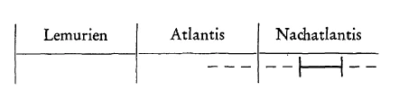

nach eurythmisch-dramatischen Darstellungen: «Zueignung», «Vorspiel auf dem Theater», «Prolog im Himmel» ^o6ssg8

Ich habe gestern und schon öfter davon gesprochen, daß der Goethesche Mephistopheles im Grunde genommen eine widerspruchsvolle Figur ist. Wir wissen auch schon, warum er eine widerspruchsvolle Figur ist. Es vereinigen sich in ihm, man könnte sagen, bunt durcheinander mephistophelische, also ahrimanische, und luziferische Charaktereigenschaften. Goethe wußte — so könnte man zunächst sagen — diese Charaktereigenschaften noch nicht auseinanderzuhalten. Wenn man auf der einen Seite ein Kunstwerk so hoch stellt, wie Sie gesehen haben, daß ich es mit dem «Faust» tue, so darf man wohl auch auf solche tatsächlichen Dinge aufmerksam machen. Merkwürdig bleibt es allerdings, daß man so wenig — in einzelnen Fällen ist es ja geschehen — die Widersprüche aus der Dichtung selber heraus eigentlich bemerkt. Es ist das auch ein Zeichen für die Art, wie heute vielfach Dinge aufgenommen werden, daß man nicht mit genügender innerer Teilnahme an die Dinge so herangeht, daß man das innere Leben und Weben bemerkt. Denn täte man es, so würde man zum Beispiel die inneren Widersprüche in der Mephistophelesfigur bald bemerken müssen. ^fdewim

Nehmen wir zunächst einen vielleicht nicht vollständigen, aber immerhin sehr starken Widerspruch, der gleich auffallen könnte, wenn man den Mephistopheles reden hört in der Szene, die eben an unserer Seele vorbeigezogen ist. ^y7891f

Nur tierischer als jedes Tier zu sein. Was für eine Empfindung muß man dabei haben, wenn Mephistopheles tadelt, daß der Mensch es so macht? Nun wird niemand dem Mephistopheles sehr tiefe, selbstlose Ziele zutrauen. Das kann er auch gar nicht, schon nach dieser ersten Szene im «Prolog im Himmel». Denn was will denn der Mephistopheles eigentlich? Er will doch den Faust haben, nicht wahr, will ihn doch für sich haben und wird daher doch im Grunde alles gut finden müssen — in seinem Sinne gut —, was der Faust tut, um mit ihm zusammenzukommen, um ihn zu erfassen, zu ergreifen. Erfassen heißt in diesem Falle ergreifen, nicht begreifen; es ist nicht begrifflich, abstrakt gemeint. «Kannst du ihn erfassen» — kannst du ihn ergreifen. Dazu wird ja doch Mephistopheles alles tun wollen. Da könnte es ihm nun sehr gelegen kommen, wenn Faust alle diejenigen Eigenschaften hätte, die ihn gerade in die Klauen des Mephistopheles brächten! ^0w2qjx

Schlagen wir einmal einen späteren Vers auf, wo Mephistopheles dem Faust selbst gegenübersteht, im Studierzimmer, wo Faust davon spricht, wie er sich zu Vernunft und Wissenschaft stellt. Faust geht ab; Mephistopheles bleibt in seinem langen Kleide zurück. Man kann sich denken, daß er jetzt doch wohl mit sich selber aufrichtig sein wird, dieser Mephistopheles. Da sagt er: ^g7tfyc

Also das könnte ihm gerade passen, wenn der Mensch Vernunft und Wissenschaft nicht im richtigen Sinne anwendet, sondern sie gebrauchte, um tierischer als jedes Tier zu sein. Da wird er just dem Herrn vorreden, nicht wahr: ^iyngj8

Ich sage, es ist nicht ein vollständiger Widerspruch, aber für die Empfindung ein starker Widerspruch. ^3cx7fh

In der Szene, die ich eben angeführt habe, wo Mephistopheles dem Faust im Studierzimmer gegenübersteht, da ist es ja klar, da redet er schon aufrichtig als Ahriman-Mephistopheles. Aber an der Stelle, die Sie heute gehört haben: ^nfyksc

da kommt ein luziferischer Zug hinein. Dem Luzifer kann das nicht passen, wenn der Faust recht sehr zur Aufstachelung der tierischen Leidenschaften die Vernunft gebraucht. Aber dem Ahriman würde es ja gerade recht sein müssen, wenn der Faust sich so verhielte, wie Mephisto es da tadelt. Da haben wir einen jedenfalls nicht halben Widerspruch, sondern schon dreiviertel Widerspruch! ^qha45b

Aber mit einer andern Stelle, was soll man denn mit der machen? ^e9fvt5

Wenn man das vergleicht mit der Szene, die wir vielleicht auch einmal aufführen können, wo sich der Mephisto zum Schluß so bemüht, die Seele zu kriegen, im zweiten Teil, als der Leichnam daliegt, wie soll man denn da überhaupt zurechtkommen? Der Teufel geht doch auf Seelen aus, und hier spricht er geradezu vom Gegenteil! Solche Widersprüche sind durchaus viele vorhanden. Ich wollte nur die zwei Beispiele nennen; das erste: ein dreiviertel Widerspruch, der sich in der Dichtung selber findet. Solche Widersprüche sind durchaus darauf zurückzuführen, daß die zwei Charaktereigenschaften, das Luziferische und das Ahrimanisch-Mephistophelische, durcheinanderkommen. ^o3af42

Nun kann für uns die Frage entstehen: Wie kommt es denn, daß Goethe geradezu den Ahriman-Mephistopheles dem Faust zur Seite stellt, alles Augenmerk auf den Ahriman-Mephistopheles hinlenkt und gewissermaßen den Luzifer noch ganz unterdrückt? — Das muß doch eine Frage sein. Denn dadurch, daß Goethe aus dem Impulse seiner Zeit heraus dazu verführt worden ist, den Mephistopheles gerade dem Faust an die Seite zu stellen, hat er auch luziferische Züge herübergenommen und dadurch gewissermaßen dem Mephistopheles-Ahriman alles angehängt, was auf die zwei verteilt sein sollte. Es muß also Gründe geben in der Zeit, mehr Augenmerk dem Mephistopheles zuzuwenden als dem Luzifer, Goethe geht, indem er die Faust-Sage behandelt, zurück bis dahin, wo das Mittelalter mit der neuen Zeit zusammenstößt. Und er hat im wesentlichen die Zeitimpulse in sich aufgenommen, die aus diesem Zusammenstoßen des Mittelalters mit der neuen Zeit entstanden sind. Wenn wir etwas weiter zurückliegende Dichtungen ins Auge fassen, Dichtungen, die weiter zurückliegenden Impulsen folgen, so finden wir eine entgegengesetzte Verwechslung. Wir können auch darüber einmal sprechen. Aber heute will ich nur darauf hindeuten. In Miltons «Verlorenem Paradies» finden Sie den entgegengesetzten Fehler gemacht. Da ist alles, was dem Ahriman-Mephistopheles zugeschrieben werden sollte, auf den Luzifer abgeladen, wenn auch nicht in einer so groben Weise, wie das im «Faust» geschehen ist. Wie gesagt, wir wollen darüber einmal sprechen. Das war mehr der Fehler, den das Mittelalter gemacht hat, mehr das Augenmerk nach dem Luzifer hin zu richten. Und der Fehler, den die neuere Zeit macht, ist, mehr das Augenmerk nach dem AhrimanMephistopheles hin zu richten. Jetzt leben wir in einer Zeit, in welcher das richtige Verhältnis zwischen den beiden Weltmächten Mephistopheles und Luzifer immer mehr und mehr von den Menschen eingesehen werden muß. Daher unsere Gruppe, unsere plastische Gruppe, die bestimmt ist für den Bau hier, und die Ahrimanisches und Luziferisches — Mephistopheles und Luzifer — in dem richtigen Verhältnis zueinander bildhaft zeigen soll. ^6qb3uv

Wenn Sie verstehen wollen, um was es sich eigentlich dabei handelt, so müssen Sie etwas ins Auge fassen, was heute noch dem Menschen ganz paradox erscheint, was aber einmal, wenn die Menschen Geisteswissenschaft wirklich nicht zurückweisen von dem Erdendasein, tief verstanden werden wird. Wir leben in der neueren Zeit unter ganz besonderen Impulsen, unter denen wir leben müssen. Es ist richtig, daß wir unter diesen Impulsen leben. Man muß nur diese Impulse erkennen. Man darf sie nur sozusagen nicht verkennen. Ich habe es oftmals selber ausgeführt, wie da im Beginne der neueren Zeit heraufkommen mußte die Kopernikanische Weltanschauung, wie sie berechtigt, tief berechtigt ist. Wir stehen zwar mit etwas andern Gefühlen dieser Kopernikanischen Weltanschauung gegenüber als die äußere Welt. Denn wenn man die Gefühle, mit denen die äußere Welt der Kopernikanischen Weltanschauung gegenübersteht, ins Auge faßt, so kommt man doch kaum zu einer andern Anschauung, als daß die Leute sagen: Nun, das Mittelalter und das Altertum, die waren dumm, und wir sind gescheit geworden, und als das Mittelalter und das Altertum dumm waren, da haben sie gedacht, die Sonne bewege sich, und haben allerlei Zyklen und Epizyklen konstruiert — Ptolemäische Weltanschauung —- und haben dann das geglaubt, haben nach dem Augenschein die Bewegungen der Himmelskörper angenommen. — In einem gewissen Sinne ist das sogar richtig für das Mittelalter, für das spätere Mittelalter namentlich, denn da waren schon Konfusionen hereingekommen in das, was als Ptolemäische Weltanschauung heraufgekommen ist. Aber die ursprüngliche Ptolemäische Weltanschauung war nicht so, sie war ein Teil der ursprünglichen alten Uroffenbarung, war in die Menschenseelen gekommen auf dem Wege durch die alten Mysterien und keineswegs durch das bloße äußere Anschauen, beruhte also auf Offenbarung. Mit dieser Offenbarung brach die neuere Zeit, und die neuere Zeit stellte sich die Frage: Wie muß man denn den Himmel anschauen, um ihn und seine Bewegungen kennenzulernen? -— Kopernikus hat zunächst die Rechnung aufgestellt, versucht, eine einfache Rechnung zu machen über die Bewegungen der Himmelskörper, um dann zu zeigen, wie die Orte, die man errechnet hat, wirklich mit der Stellung der Himmelskörper stimmen. Und so hat er auf dem Wege der Rechnung sein Kopernikanisches System erfunden, drei Sätze aufgestellt, die in Kopernikus’ Werken selber zu finden sind, über die Bewegungen der Himmelskörper im Verhältnis zu unserer Erde. Von diesen drei Sätzen hat man allerdings einen weggelassen, und dadurch ist die heutige konfuse Kopernikanische Weltanschauung zustande gekommen, die nicht die des Kopernikus selber ist. Der dritte war unbequem - den hat man weggelassen! Daher kennt heute derjenige, der aus den gebräuchlichen Büchern die Kopernikanische Weltanschauung bloß lernt, die Ansicht des Kopernikus keineswegs. Aber nun, das mußte so kommen. Zunächst mußte Kopernikus eine weitaus richtigere Lehre aufstellen, mit den drei Sätzen, dann mußte unsere Lehre kommen, die auf zwei Sätzen des Kopernikus beruht, und es wird erst, wenn die ganze Sache geisteswissenschaftlich wird durchdrungen werden, das Richtige zum Vorschein kommen. ^b86xhb

Dann kamen diejenigen, die mehr auf äußerliche Weise, nicht durch Rechnen, hinter die Bewegungen der Himmelskörper und ihre Gesetze zu kommen suchten. Das Fernrohr kam. Man lernte den Himmelsraum so untersuchen, wie man auf Erden die Dinge untersucht. Und auf diese Weise entstand die moderne Astronomie, die moderne Astrophysik, eine Wissenschaft, die ganz auf die Weise entsteht, daß man dasjenige in Gesetze faßt, was man beobachtet; das heißt, man will den Himmel dadurch erklären, daß man den Himmel beobachtet. Und was könnte natürlicher sein als dieses? Es müßte ja — so muß der moderne Mensch denken — derjenige schon ein ganz verrückter Kerl sein, der eigentlich etwas anderes wollte, als den Himmel dadurch kennenlernen, daß er den Himmel beobachtet. Das ist doch ganz selbstverständlich, nicht wahr. Und doch ist es nicht richtig, doch ist es eine von den großen Täuschungen. Es ist etwas, was in der Zukunft ganz anders werden wird. Man wird auch in der Zukunft, und zwar mehr noch als in der Gegenwart, den Himmel befragen; man wird kennenlernen wollen, was als Bewegungen in den Himmelskörpern lebt und webt, man wird genau lesen, studieren am Himmel; aber man wird eines wissen, was man heute noch nicht weiß, was heute dem Menschen ganz paradox erscheint, wenn man es ausspricht: Man erfährt nämlich über den Himmel gar nichts, wenn man ihn beobachtet. Die allerfalscheste Methode, den Himmel und seine Bewegungen kennenzulernen, ist, ihn so zu beobachten, wie man es heute macht. — Nicht wahr, ich sage etwas ganz Verdrehtes. Aber man muß schon sich zu den Verdrehungen anders verhalten, als sich der gute Christian von Ehrenfels dazu verhalten hat, auf den ich vor acht Tagen hingewiesen habe. Man wird den Himmel beobachten, immer eingehender und eingehender beobachten und sich von ihm sagen lassen seine Geheimnisse. Aber was werden diese Geheimnisse einer späteren Zukunft enthüllen? Sie werden das enthüllen, was hier auf der Erde vorgeht. Das werden sie enthüllen. Man wird zwar den Himmel beobachten, aber aus dem, was man am Himmel erkennt, wird man erklären, wie die Pflanzen auf der Erde wachsen, wie die Tiere auf der Erde entstehen, alles dasjenige, was auf der Erde sich bildet, was auf der Erde webt und lebt. Darüber wird einem Aufklärung geben dasjenige, was der Himmel offenbart. Es wird einem gar nicht mehr einfallen, den Himmel um den Himmel zu fragen, sondern man wird den Himmel fragen, um über die Erde Aufklärung zu finden. Und die bedeutsamsten Gesetze, die man kennenlernen wird vom Himmel, wird man dazu verwenden, um die Geheimnisse des irdischen Daseins zu enthüllen. Die alte Astrologie, die in ihrer Urbedeutung heute wenig mehr erkannt wird, die zum größten Teil zum Dilettantismus, ja zum Scharlatanismus geworden ist, wird in einer ganz neuen Form wieder aufleben. Man wird nicht nur irdische Schicksale suchen aus den Bewegungen der Sterne und aus den Gesetzen des Himmelsraums, sondern man wird die Gesetze des irdischen Lebens, dasjenige, was webt und lebt, aus den Gesetzen der Himmelskörper erklären. Man wird nicht eher wissen, warum das Salz in Würfeln kristallisiert, warum der Demant in Oktaedern kristallisiert und so weiter, bevor man dasjenige, was Formen hat hier auf der Erde, erklären wird aus den Stellungen der Himmelskörper. Und man wird nicht eher wissen das Geheimnis des Lebens der Tiere, der Pflanzen, der Menschen als Lebensgeheimnis, bis man erklären wird aus den Bewegungen der Himmelskörper, deren Wirkung das Leben ist, dasjenige, was hier auf der Erde webt und lebt. Aus dem Himmel erklärt sich die Erde. Allerdings, dasjenige, was man über den Himmel wissen wird, wird eine etwas andere Gestalt annehmen als das, was man heute zu wissen vorgibt. Man wird erforschen die Gesetze der Stellungen und Bewegungen der Himmelskörper. Aber dann wird man sich anregen lassen meditativ durch das, was man da erforscht, um gewissermaßen mit den Wesen, die in den Sternen leben, in eine Beziehung zu treten. Man wird sich sagen lassen von den Wesen, die da leben, was man wird wissen müssen für das Leben auf der Erde. ^d4ki6p

Das ist eine Zukunftsperspektive. Sie wissen nun, daß in einer ähnlichen Weise, wie Kopernikus, Galilei, Kepler, denen übrigens noch immer alte Anschauungen in ihren Sinn geflossen sind, versuchten, die Gesetze der Himmelsbewegungen durch die Beobachtung des Himmels zu gewinnen, und wie man es in ihrem Sinne fortgesetzt hat in der neueren Zeit, so ist versucht worden von Darwin, Lamarck, Haeckel, die Gesetze des irdischen Lebens zu finden. Und was wäre hier wiederum natürlicher, als daß man die Erde durch die Erde kennenlernt! Man reist herum, wie es Darwin gemacht hat, man mikroskopiert, wie es Haeckel gemacht hat, man rationalisiert, wie es Lamarck gemacht hat, über die Wesen der Erde und versucht zu erkennen die Gesetze, von denen das Leben auf der Erde beherrscht wird. Wiederum kann man als ein Verrückter gelten, wenn man das nicht als eine Selbstverständlichkeit ansieht. Die Zukunft wird das gar nicht als eine Selbstverständlichkeit ansehen! Wenn man den geraden, schönen Entwickelungsgang, den die neuere Biologie genommen hat von Darwin zu Haeckel und zu den Schülern Haeckels, ins Auge faßt, so findet man, daß er dazu geführt hat, namentlich über das Embryonalleben gewisse Gesetze zu bilden. Das sogenannte biogenetische Grundgesetz spielt eine große Rolle, daß nachlebt der Mensch im Embryonalleben die einzelnen Tiergattungen. Sie wissen, ich habe auf das biogenetische Grundgesetz öfter aufmerksam gemacht. Um dieses zu finden, wurden solche Beobachtungen angestellt, durch die man hoffte, etwas eben über das Leben der Lebewesen zu finden. Man kann sagen, die heutige Zeit arbeitet schon wiederum an der Aufdröselung dieser Anschauungen, nur bemerkt man es in Laienkreisen wenig. Die kopernikanische Astronomie wird schon stark von einzelnen Einsichtigeren bezweifelt. Und Haeckels Schüler, Oscar Hertwig, hat namentlich in seinen letzten Schriften Dinge geäußert, die dazu geeignet sind, alles das sehr in Frage zu stellen, was die Darwin-Haeckelsche Theorie an die Oberfläche gebracht hat. Wenn man sich unterrichtet aus dem, was innerhalb der Fachwissenschaft vorgeht, so bekommt man doch eine andere Ansicht, als wenn man sich nur unterrichtet nach dem, was in populären Vorträgen durch die üblichen — mauthnerisch darf ich nicht sagen, wie soll ich nur sagen? -, na ja, also was durch die üblichen Vortragenden dem Publikum dargeboten wird. Es geht schon heute viel in der eigentlichen Fachwissenschaft vor, und es bereitet sich schon das vor, was hier als Zukunftsperspektive angegeben wird. Nur wird man zur Geisteswissenschaft kommen müssen, damit das, was so vorgeht, nicht konfus werde, sondern wirklich sachgemäß werde. ^hlq2qt

Nun muß ich wiederum etwas sagen, was paradox ist. Durch die Beobachtung desjenigen, was auf der Erde vorgeht, lernt man gar nichts über die Erde kennen, das wird man einmal kennenlernen, wenn man es aus den Sternen abliest, was auf der Erde vorgeht. Was aber draußen im Himmelsraum eigentlich vorgeht, das lernt man kennen durch die Beobachtung zum Beispiel der Embryologie und so weiter. Man kann diese Beobachtung wiederum so behandeln, wie ich vorhin angedeutet habe, daß man die Himmelsbewegungen beobachtet, man kann in eine Beziehung zu den elementarischen Wesenheiten treten, die da regeln diese Bewegungen innerhalb des Erdengeschehens. So wie man den Himmel fragen wird, um die Erde zu erklären, so wird man die Erde fragen, um den Himmel zu erklären. Wie gesagt, es ist heute noch paradox, aber es wird kommen, auf irgendeine Weise wird es schon über diese Erde kommen, daß diese richtige Anschauung Platz greift. Die Astronomen werden mit den Mitteln ihrer Wissenschaft die Biologie begründen, und die Biologen werden mit den Mitteln ihrer Wissenschaft die Astronomie begründen. Und eine im echten Sinne mit den Mitteln der Astrologie begründete Biologie wird spirituelle Wissenschaft sein, und eine mit den Mitteln der echten Embryologie begründete Astrologie wird spirituelle Himmelskunde sein. Wenn Sie das bedenken, so müssen Sie sich sagen: Die Menschheit macht eben nicht eine gerade Entwickelungslinie durch, sondern geht gewissermaßen in Wellen, in einer Wellenlinie vorwärts, auf und ab. - Und damit in der rechten Weise vorbereitet werden konnte die richtige spirituelle Anschauung, die da kommen muß, mußte der Irrtum heraufkommen, derdarinnen besteht, daß man in der neueren Zeit den Himmel durch den Himmel, die Erde durch die Erde erklären will. Unter diesem Eindruck lebten die Menschen. ^0vpqpd

Aber nicht ganz lebte Goethe unter diesem Eindruck, nicht ganz. Goethe hatte ja in einer gewissen Weise den Darwinismus vordarwiniert, aber einen viel spirituelleren Darwinismus. Er ging nicht bloß auf die äußere sinnliche Aufeinanderfolge der Erscheinungen, sondern auf Urpflanze und Urtier. Und ich habe öfter hingewiesen auf das bekannte Gespräch zwischen Goethe und Schiller, wo Goethe, nachdem sie bei dem Botaniker Batsch in Jena gesehen hatten, wie die Pflanzen so nebeneinander betrachtet werden, und Schiller das unbefriedigend fand, mit wenigen Strichen die sogenannte Urpflanze hinzeichnete. Es gibt dieses Bild Goethes nicht. Ich habe versucht, in der Einleitung zu Goethes morphologischen Schriften in Kürschners National-Literatur, die ich geschrieben habe schon in den achtziger Jahren, diese Goethesche Urpflanze nachzuzeichnen. Sie können sie dort finden, wie ich sie nachgezeichnet habe. Schiller aber sagte: Das ist keine Realität, das ist eine Idee. — Goethe sagte: Dann sehe ich meine Idee mit Augen. — Er war sich klar darüber, daß das eine Anschauung für ihn ist, eine Erfahrung, nicht etwas Ausgedachtes, etwas Errationalisiertes. Und wenn man so Goethe kennenlernt, recht intim kennenlernt, sei es durch seine dichterischen Bestrebungen in Verbindung mit seinen wissenschaftlichen, sei es umgekehrt in seinen wissenschaftlichen in Verbindung mit seinen dichterischen — ich habe das gerade bei meiner Interpretation Goethes angestrebt -, so sieht man, wie Goethe sich nicht recht behaglich fühlt, den Himmel durch den Himmel, die Erde durch die Erde zu erklären, und wie fortwährend in seinen Ideen dieses Prinzip der neueren Zeit durchbrochen wird. Deshalb kann man so schwer Goethes Farbenlehre heute noch verstehen, denn, was Goethe will, ist eigentlich eine astronomische Erklärung des Farbengeheimnisses. Und wenn Sie ganz aufmerksam Goethes Morphologie lesen, so werden Sie sehen, wie da gewisse Dinge hereinspielen, die schon von den ersten Anfängen einer Astronomie herrühren. Insbesondere fühlt man das durch, wenn man die Aufsätze Goethes über die Spiraltendenz der Pflanzen ins Auge faßt. Nun, das würde auf Einzelheiten führen, auf die ich heute nur aufmerksam machen kann; ich will nur hinweisen darauf. ^5v2gvy

Werfen wir nun die Frage auf: Woher kommt es denn, daß diese neuere Zeit, die wir jetzt rechnen seit dem Zusammenstoß des Mittelalters mit der Neuzeit, seit dem Aufkommen des Kopernikanismus, des Galileismus, des Keplerismus, und die wir wiederum weiterverfolgen bis zum Darwinismus, zum Haeckelismus, zum Lamarckismus, wie kommt es denn, daß diese Zeit ins Auge faßt, den Himmel durch den Himmel, die Erde durch die Erde zu erklären, statt die Erde durch den Himmel und den Himmel durch die Erde? Wie kommt das? — Das kommt durch eine doppelte Verführung, indem Ahriman sowohl wie Luzifer die Menschen verführen. Im Mittelalter, als sich die Sachen vorbereitet haben, als man hinsteuerte nach dem Kopernikanismus, Darwinismus, da war es mehr eine luziferische Wirksamkeit, da waren es luziferische Impulse, die das vorbereiteten. Undalsder Kopernikanismusheraufgekommen war, da war es mehr die ahrimanische Verführung. Ahriman ist es, der im wesentlichen in den Menschei lebt, indem er diese UmkehrungderMenschen vollzieht, vonder ichgesprochen habe. Denn schließlich steht gerade die moderne Wissenschaft ganz unter ahrimanischem Einflusse. Und Goethe hat richtig gefühlt, als er den Ahriman dem Menschen nahe fühlte, den Mephistopheles, in der neueren Zeit. Für ihn war es weniger wichtig, das Verhältnis des Luzifer zum Menschen, als das des Ahriman zum Menschen ins Auge zu fassen. Darauf mußte sich sein ganz besonderes Augenmerk richten. Weniger kam ihm der luziferische Einfluß in Betracht. Denn Faust ist ja vom Anfang an so hingestellt durch die Geschichte, daß er der Mensch der neueren Zeit ist. Die verschiedenen Verirrungen der Theologie des ausgehenden Mittelalters rührten von Luzifer her. Faust aber tritt gleich so auf, daß er die Bibel unter die Bank legt und ein Weltmensch und Mediziner werden will, das heißt, die Erde durch die Erde erklären will, den Himmel durch den Himmel, nicht so, wie es bei den alten Theologen des ausgehenden Mittelalters der Fall war, daß man noch wie in einem letzten Atavismus die Wunder der Erde aus den Oftenbarungen der Theologie zu erklären versuchte, also vom Himmel her zu erklären versuchte. Ahriman trat an des Menschen Seite in der neueren Zeit. Diejenigen, die das zwar fühlten, aber die von der Notwendigkeit nicht durchdrungen waren, sondern nur von der Teufelsfurcht durchzogen waren, verlästerten daher den Faust, der nur folgte dem notwendigen Impulse der neueren Zeit. Und so kam denn die Faust-Dichtung des 16. Jahrhunderts zustande, die den Faust in die Hölle hinein verbrennen läßt, weil er dem Ahriman verfällt. Diejenigen, die noch unter dem Atavismus des Mittelalters standen, die haben gewissermaßen der Dichtung diese Form gegeben. Goethe stand nicht mehr unter dem Einflusse des Mittelalters. Daher konnte er seinen Faust nicht in die Hölle hinein verbrennen lassen. Aber die große Frage entstand bei ihm: Was denn eigentlich tun? ^l541io

Fassen wir die Sache einmal recht konkret. Was tut man denn eigentlich, wenn man die Erde durch die Erde erklärt? Fassen wir es bei einem Beispiel, das vielleicht, weil es ein bißchen der gewöhnlichen Wissenschaft entrückt ist, uns näher steht. Nehmen wir eine Mythe oder eine Dichtung und denken wir an einen Kommentator oder an einen Interpreten von der Art, wie ich sie oftmals getadelt habe - Sie erinnern sich! Nehmen wir an, so ein Kommentator, ein Interpret einer Mythe, einer Sage oder einer Dichtung, tritt vor uns hin und erklärt uns, wie er sagt, die Dichtung aus der Dichtung; er sucht die Gesetze der Dichtung in der Dichtung oder in der Mythe. Er kann sehr geistvoll sein. Es gibt durchaus sehr geistvolle Mythen- und Dichtungserklärer. Aber sie sündigen alle, denn so kann man nie eine Mythe und nie eine Dichtung erklären, daß man den Verstand auf sie anwendet. Ach, was haben die HamletErklärer alles geschrieben, um den «Hamlet» zu interpretieren! Was haben selbst die Faust-Erklärer alles geschrieben, um den «Faust» zu interpretieren! Was haben Theosophen alles getan, um allerlei Mythen zu interpretieren! Auf den Grund der Mythe, auf den Grund der Dichtungen kommt man nur, wenn man den Blick hinauszurichten versteht dahin, wo die Mythen und die Dichtungen her sind — aus dem Himmel herein. Das deutet schon wiederum auf jene Zukunftsperspektive. Das liegt uns näher, als bei der Wissenschaft darauf hinzuweisen. Mythen führt man an, indem man gleichsam durch sie illustriert, wenn man darauf gekommen ist, was die großen Zusammenhänge im himmlischen Weltenall sind; man läßt sie dann durch die Mythe spiegeln wenigstens. Und wenn man Einsicht hat in die kosmischen Gesetze, die da walten, dann wird man auch nicht zu verstandesmäßigen Kommentatorenkünsten kommen gegenüber Dichtungen; denn wenn man herausschält aus der Mythe und aus der Dichtung das, was solche verstandesmäßigen Erklärer gewöhnlich bekommen, was tritt denn da eigentlich auf? Ja, man kann da immer ein gewisses Bild vor sich haben, wenn so ein Mythenerklärer oder ein Dichtungskommentator auf die Art, wie es heute ist, auftritt. Da tritt etwas auf, wie der war, der da hervorgekommen ist in seiner Fledermausgestalt, wirklich so etwas fledermausartiges Graues, gegenüber dem lebendigen Leben, das in Dichtung und Mythe walter. Da macht man schon auch Bekanntschaft mit Ahriman-Mephistopheles. ^3rwju8

Das, was ich jetzt angeführt habe an einem solchen Beispiel, das könnte ausgedehnt werden über das ganze Treiben in der Wissenschaft, wobei ich diese Wissenschaft nicht tadle. Ich will Ihnen gerade die Notwendigkeit zeigen, daß es so ist. Ahriman mußte eine gewisse Zeit lang eingreifen, sonst wäre die Art und Weise, wie die Menschen in dem Mittelalter gewirkt haben, eine solche geworden, welche die Menschen allzuleicht hätte erschlaffen lassen. Die Menschen lieven sich gern die unbedingte Ruh, drum gibt ihnen die Welt den Teufel zu, der wirkt und lockt und muß als Teufel eben schaffen -,, der reizt und lockt und wirkt. Das ist notwendig, dieses Eingreifen des Ahriman. Und es ist ein völliger Unsinn, wenn man etwas gehört hat von Ahriman und Luzifer und nun fragt: Ist das vielleicht ein ahrimanischer Einfluß? Ist das ein luziferischer Einfluß? Man muß sich davor nur ja hüten! ^0bg0b0

Welche Rolle Ahriman spielt - Goethe verstand das! Warum aber mußte denn Ahriman eine solche Rolle in der neueren Zeit spielen? Warum mußte überhaupt Ahriman-Mephistopheles in die Sphäre des Menschen eintreten? Nicht wahr, wir wissen, es verläuft die Evolution so, daß wir die sogenannte lemurische Zeit haben, die atlantische Zeit, unsere nachatlantische Zeit. Wir wissen, in der lemurischen Zeit, da war des Menschen Ich, das heißt das Bewußtsein, noch recht wenig tätig, noch recht wenig betriebsam; es beginnt ja eigentlich erst hier. ^aci991

 ^5gzc8r

Aber erst nach und nach klärt sich der Mensch auf über dasjenige, was als Ich-Impuls in ihm lebt und webt. Nach und nach erst werden die Menschen sich klar darüber, wie sie stehen, indem das Ich in ihrer Seele wohnt, zu Luzifer und Ahriman, nach und nach werden sie sich erst klar, die Menschen. Wenn man dasjenige, was Prinzip sein muß der zukünftigen Zeit, ins Auge faßt, so stellt es sich ja dar, schematisch nur angedeutet: nach der Erde hinweisend, um die Geheimnisse des Himmels zu entdecken; nach dem Himmel hinweisend, um die Geheimnisse der Erde zu entdecken. Macht man die Sache verkehrt, macht man die Sache im Sinne unserer Zeit nur, so findet man nicht die Geheimnisse der Erde, sondern aus der Erde heraus kommt statt der Himmelsgesetze, statt der Himmelsgeheimnisse, die herauskommen sollten, das Ahrimanische, das an die Menschen herantritt, das versucht, an den Menschen heranzukommen. Es muß zurückgewiesen werden, weil in der Erde nicht gesucht werden muß verstandesmäßig das, was die Erde gibt, sondern das, was sie offenbart für den Himmel. Von dem Weltenraum herein kommt Luzifer; er muß weichen. Würde er an den Menschen herankommen, so würde das so sein, daß im Weltenraum draußen gesucht würde das, was in ihm nicht zu finden ist: die Geheimnisse des Himmels selber. Diese Beziehung wird man einsehen müssen. ^ot82ix

Man mußte einstmals einsehen, wie nahe zum Menschen Luzifer steht. Es ist den Menschen möglich gemacht worden, dieses einzusehen in einem Symbolum, das viel mehr ist als ein Symbolum, in einem Symbolum, das tief in die Geheimnisse der geistigen Welt hineinweist. Man kann, wenn man das, was Luzifer für den Gesamtmenschen ist, charakterisieren will, dies nicht intimer machen, als wenn man die Sache so hinstellt, daß an die Kräfte des Weibes herankommt Luzifer und mit Hilfe der spezifisch weiblichen Kräfte in die Welt hereinwirkt, und der Mann durch das Weib dann mit Hilfe Luzifers verführt wird. Dieses Symbolum mußte hingestellt werden vor die Menschheit, und es mußte dastehen, als der vierte nachatlantische Zeitraum da war, wo die Menschen zunächst begreifen sollten das Verhältnis Luzifers zum Menschen, wo sie es fühlen sollten, empfinden sollten dieses Verhältnis, es sich zum Bewußtsein bringen sollten. Durch nichts konnte man sich so sehr zum Bewußtsein bringen das Verhältnis Luzifers zum Menschen, als indem man den Anfang der Bibel studierte, wie die Schlange herantritt an das Weib, das Weib an seinen Kräften faßt und dadurch die Verführung, die Versuchung der Welt begann. Dieses bedeutsame Symbolum war das wirksamste für diesen vierten nachatlantischen Kulturzeitraum, wenn es auch schon früher dagewesen ist. Das Geheimnis des Luzifer ist in diesem Symbolum enthalten. ^3nqeu1

Der fünfte nachatlantische Zeitraum mußte den Menschen bewußt aufklären über das ahrimanisch-mephistophelische Geheimnis. Da mußte ein anderes Symbolum hintreten. So wie in dem Religionsbuche, das sich auf die geistige Welt bezieht, das Symbolum des luziferischen Verführers des Weibes an der Spitze steht, und der Mann dadurch mitverführt wird durch die Künste, die Luzifer mit Hilfe des Weibes ausführt, so mußte das Gegenbild im fünften nachatlantischen Zeitraum entstehen: Ahriman, der an den Mann herantritt, den Mann zunächst verführt, und mit Hilfe des Mannes die Frau. Wenn es auch vielleicht nicht so grandios gelungen ist im ersten Anhub der Faust-Dichtung, das tief Ergreifende der Gretchen-Tragödie beruht vielfach darauf, daß geradeso wie Adam auf dem Umwege durch Eva von Luzifer verführt wird, so das Gretchen auf dem Umwege durch Faust von AhrimanMephistopheles verführt wurde. Die innere Notwendigkeit der Sache trieb dazu, ein Weltbuch dem Theologiebuch gegenüberzustellen: den Verführten und die Verführerin; die Verführte und den Verführer; den Luzifer, den Ahriman. Das Verhältnis Luzifers zum Weibe auf der einen Seite, Ahrimans zum Manne auf der andern Seite. Dies ist ein tief bedeutungsvoller geistiger Zusammenhang. ^hh40r4

Und deshalb entstand wirklich aus einem inneren geistigen Impulse heraus dieses Weltbuch des «Faust» im Gegensatze zu dem 'Theologiebuch. Und die neuere Zeit ist dazu berufen, die Wege zu finden zwischen Ahriman und Luzifer. Denn alle Kräfte, durch die Luzifer in die Welt hereinwirkt, sind zwar nicht gleich, aber ähnlich den Kräften, durch die es Luzifer gelungen ist, die Frau zu verführen. Alle Kräfte, durch die Ahriman in die Welt hereinwirkt, sind ähnlich den Kräften, mit denen Ahriman den Mann verführt. Und wie wir uns richtig denken die luziferische Verführung, die uns die Bibel darstellt, in die lemurische Zeit hinein, so müssen wir den Ahriman suchen an einer Stelle der Bibel, die nicht mehr klargeworden ist, weil das ahrimanische Geheimnis in der Bibel noch nicht in derselben Weise enthüllt ist wie das luziferische Geheimnis. Wir müssen, während wir das luziferische Geheimnis in die lemurische Zeit versetzen, das ahrimanische Geheimnis, wie ich öfter ausgeführt habe, in die atlantische Zeit versetzen. Da hat die Bibel nur eine Andeutung, nicht ein so klares, weithin glänzendes Bild wie das von der Paradiesesversuchung. Da steht darinnen nur in der Bibel, daß bewirkt wurde durch die Impulse, die hereinkamen in das Erdendasein, daß die Göttersöhne Gefallen fanden an den Töchtern der Menschen. Das ist nur die Hindeutung auf dasjenige, was als ahrimanischer Impuls hereinkommt. ^w7nmv0

Goethes «Faust» hat schon eine gewisse historische Bedeutung. Und diese historische Bedeutung liegt in dem, was ich versuchte, Ihnen heute zu skizzieren. Man muß, wenn man auf das aufmerksam machen will, was Geisteswissenschaft der Menschheit werden will und werden soll, heute vielfach Paradoxes aussprechen, solches aussprechen, das vielen Menschen kurios erscheint. Aber wahr ist es doch. Wenn einstmals die Menschen so sein werden, daß ihre Wissenschaft wieder erinnern wird an die Uroffenbarung, indem sie aus dem Himmelsgeheimnisse das Erdenleben erklären, wenn die Erdenwissenschaft so sein wird, daß zum Beispiel aus der Gestaltung der Embryonalentwickelung erkannt werden die tiefsten Geheimnisse des Himmels, dann wird die Menschheit das richtige Verhältnis gefunden haben zu Ahriman und Luzifer, und dann wird in einer gewissen Weise dasjenige in der Menschheit sich ausleben, was dargestellt werden soll in unserer Hauptgruppe im Bau, in welcher der Repräsentant der Menschheit zwischen Ahriman und Luzifer in der richtigen Geste hingestellt wird. ^6nptij

Tiefer und immer tiefer wird man dasjenige aufzufassen haben, was in Goethes «Faust» ruht. Aber man wird eine autoritätslose Auffassung brauchen. Diejenigen Menschen, welche dadurch allein zu einer Erkenntnis kommen wollen, daß sie, wie eine Dame unserer Gesellschaft einmal gesagt hat, «immer ein Gesicht machen bis ans Bauch», um ihre innere Seelenstimmung auszudrücken, erreichen ihr Ziel nicht. Es war eine Dame, die nicht gewohnt war, deutsch zu sprechen, und daher diesen Sprachfehler gemacht hat. Doch kommt es nicht darauf an, es war eine richtige Bezeichnung. Sie wollte hinweisen auf diejenigen Menschen, denen jede Möglichkeit fehlt, Humor zu entwickeln in der Auffassung der Welt. Wenn man keinen Humor entwickeln kann, dann kann das unter Umständen recht schlimm werden. Das wird also schon kommen müssen, daß man sich in der Weise, wie ich es charakterisiert habe, in der Welt zurechtfinden muß. Diejenigen Menschen, die bloß in Sentimentalstimmung sich den Dingen der Welt werden nähern wollen, werden selbstverständlich es lieber haben, wenn sie auch ein solches Kunstwerk wie den Goetheschen «Faust» so auffassen können, daß sie bei jeder Zeile «ein Gesicht bis ans Bauch» machen. Die Menschen aber, die den «Faust» verstehen wollen, werden ihn autoritätslos auffassen müssen. Dann werden sie schon durch die Widersprüche sich hindurcharbeiten müssen, aber das Hindurcharbeiten durch die Widersprüche wird die Möglichkeit des Verständnisses bieten. Ein Kinderspiel ist gerade so etwas nicht wie der «Prolog im Himmel»! Wenn man gar zu sehr scheut eine gewisse Ironie und einen gewissen Humor der Welt gegenüber, dann verfällt man zu leicht dem größten Humoristen, der ein Genosse ist desjenigen, der uns in Goethes Mephistopheles gegenübertritt, der dem Herrn mehr zur Last ist als der Schalk, der ein etwas gefährlicherer Geist von der Sorte derer ist, die da verneinen können. ^6f8own

Anregen möchte ich dazu, daß solche Dinge, die schon eine Ausnahmestellung einnehmen in der geistigen Menschheitsentwickelung, wiederum tiefer erfaßt werden. Denn sie sind auch ein Weg, hineinzukommen in die Geheimnisse jenseits der Schwelle, wo alles anders ist als diesseits der Schwelle, wo alles so ist, daß man sich schon bekanntmachen muß damit, daß manches paradox klingt, was aus dem Bewußtsein derjenigen Tatsachen heraus gesprochen wird, die jenseits der Schwelle zur geistigen Welt liegen. Die heutige Zeit will nicht viel wissen von den Geheimnissen, die jenseits der Schwelle zur geistigen Welt liegen. Zwar sind die meisten Geister dieser heutigen Zeit immer überzeugt gewesen, daß wir es so herrlich weit gebracht haben. Nun, ich weiß nicht, wie weit sich die Menschen diese Überzeugung hindurchretten werden auch durch unsere uns zunächst liegende Zeit, die es so herrlich weit gebracht hat, und die doch nur in den Konsequenzen desjenigen lebt, was sie durch die Jahrhunderte geglaubt hat. Aber wenn auch für viele heute noch dasjenige paradox klingt, was verkündet wird aus dem Gebiete von jenseits der Schwelle, es muß immer mehr und mehr Verständnis sich für diese Geheimnisse des Daseins bilden. Und vieles von der gedeihlichen Entwickelung der Menschheit in die Zukunft hinein hängt davon ab, daß die Menschen Verständnis finden für dasjenige, was heute noch so vielfach paradox klingt. ^js4ods

Töricht mag es heute noch vor der Welt sein, zu sagen, die Erde müsse durch den Himmel, der Himmel durch die Erde erklärt werden. Wer hineinschaut in all das Menschengeschick Bezwingende, das sich offenbart von jenseits der Schwelle, der weiß, daß das, was so töricht vor den Menschen gilt und paradox, dennoch die Weisheit ist vor dem Geistigen und vor der Welt. Und es darf heute schon gesagt werden, ohne unbescheiden zu werden, weil man schon, wenn man es aus dem Bewußtsein der geistigen Welt heraus sagt, die nötige Demut, um es sagen zu dürfen, aufbringt, weil schon im Herzen diese Demut waltet, trotzdem man vielleicht Kraft anwenden muß, um das, was man am liebsten auch in der Geste der Demut vorbringen möchte, in der Geste der nötigen Kraft vorzubringen, die vielleicht den Anschein der Geste des Hochmuts erwecken könnte. Aber auch das könnte nur eine ahrimanische Auffassung so finden, wenn sie in diesem Falle verwechseln würde Demut und Hochmut. Davon dann ein andermal. ^apef3s