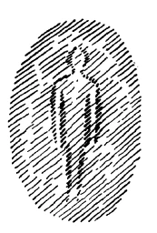

Wir wollen demnächst darstellen die Szene des zweiten Teiles von Goethes «Faust», welche vorangeht der Schlußszene, die ja schon dargestellt worden ist, wie Sie wissen. Diejenige Szene, die mit den heiligen Anachoreten beginnt: ^tcwm6d

sie wird von Goethe «Fausts Himmelfahrt» genannt, und die Szene, die nun vorangeht, wird gewöhnlich die «Grablegung» genannt. Wir werden aber beginnen schon da, wo im weiteren Sinne diese Grablegung Fausts dargestellt ist. ^sm4szv

Wenn man zu den verschiedenen Partien von Goethes «Faust» kommt, so muß man immer wieder und wiederum in ein gewisses Erstaunen verfallen über die unendliche Tiefe, die namentlich im zweiten Teil von Goethes «Faust» liegt, tief dadurch, daß man es mit einer durch die Geisteswissenschaft zu rechtfertigenden Sachlichkeit in der Darstellung der geistigen Welt zu tun hat. Und es ist das Merkwürdige, daß Goethe mit solcher Sachlichkeit dargestellt hat die geistige Welt in der Zeit, in der es die Geisteswissenschaft als solche noch nicht gegeben hat. Wir brauchen uns nicht erst lange zu befassen mit der Frage, die einmal an mich gestellt worden ist, als ich vor vielen Jahren einen Vortrag hielt über Goethes «Märchen von der grünen Schlange und der schönen Lilie», und mich eine theosophische Autorität der alten Schule fragte, ob ich denn meine, daß Goethe das alles gewußt habe, was da zur Rechtfertigung des tieferen Geheimnisses der Dichtung von der grünen Schlange und der schönen Lilie aus der Geisteswissenschaft heraus gesagt worden ist. Ich konnte nur erwidern, ob denn der Betreffende glaube, daß auch die Pflanze alles ganz genau weiß, was der Botaniker über sie ausmacht, um wachsen zu können in der richtigen Weise nach den botanischen Gesetzen. Wenn man eine solche Frage hört, so hat man gewöhnlich das Bewußtsein, wie gescheit sich der Fragende vorkommt. Aber wenn man eine solche Frage im Zusammenhange denkt, dann kommt man darauf, wie unendlich töricht die Menschen oftmals sind, welche sich gar so gescheit dünken. Also mit der Frage, ob etwa Goethe auch noch irgendwo Geisteswissenschaft so studiert hat, wie wir sie heute studieren können, brauchen wir uns nicht weiter zu befassen, wenn auch gerade Einwände von einem Gesichtspunkte, der diese Frage ins Auge faßt, sehr leicht gemacht werden können. Wir wollen vielmehr gleich an die Sache selber gehen. ^dkvu6l

Es werden uns dreierlei Gestalten zunächst vorgeführt außer denen, die man aus der übrigen Faust-Dichtung kennt. Es werden uns dreierlei Gestalten vorgeführt, welche zu tun haben mit dem Zeitraum, der verfließt zwischen dem Sterben des Faust und dem Aufstieg seiner Seele in die geistigen Regionen. Die erste Art der Gestalten, die uns vorgeführt wird, sind die Lemuren; die zweite Art der Gestalten, die uns vorgeführt wird, sind die Dickteufel mit kurzem, gradem Horn, und die dritte sind die Dürrteufel mit langem, krummem Horn; beide Arten von Teufeln sind «vom alten Teufelsschrot und -korne». ^8jxrr2

Nun können wir sagen: Welch spirituellem Instinkt, welcher tieferen Weisheit kann man ebensogut sagen, entspricht es, daß Goethe diese dreierlei Gestalten bei der Grablegung und vor der Himmelfahrt Fausts uns vorführt? Diese «Grablegung» wird ja so eingeleitet, daß Faust alt geworden ist in seiner Evolution, und zwar — wie Goethe selber angegeben hat — hundert Jahre geworden ist. Also wir haben es hier beim Beginne dieser Szene mit dem alten, hundertjährigen Faust zu tun, welcher noch immer an den Mephistopheles gekettet ist, aber so, daß Faust jetzt den Glauben haben kann, daß Mephistopheles sein Diener geworden sei. Faust hat den Entschluß gefaßt, ein Stück Land dem Meere abzuringen, zu kultivieren dieses Stück Land, und dadurch die Grundlage für ein der Menschheit segensreiches Gebiet zu schaffen, auf dem diese Menschheit, ein Teil der Menschheit, in Friede und Freiheit sich entwickeln kann. Dieses Land ist also gewissermaßen, da es durch die Arbeit des Faust dem Meere abgerungen ist, Faustens Schöpfung. Es soll noch fertiggestellt werden dadurch, daß ein Sumpf, der da ist, abgeleitet wird durch einen Graben, damit auch die Luft gereinigt werde, damit nicht durch verpestende Dünste des Sumpfes die Gesundheit der Menschen, die sich entwickeln sollen in Friede und Freiheit, gefährdet werde. Faust glaubt nun, Mephisto sei sein Aufseher geworden in segensreicher Arbeit und befehlige diejenige Schar, welche nunmehr das letzte Werk verrichten soll. Faust ist ja bereits erblindet, was schon in der vorhergehenden Szene dargestellt ist. Er sieht also nicht, was auf dem äußeren physischen Plan Mephistopheles anrichtet, und dadurch ist es begreiflich, daß er später die Worte «graben» und «Grab» verwechselt. Während Faust der Meinung ist, daß ein Graben, der den Sumpfinhalt nach dem Meere ableiten soll, um die Luft zu reinigen, angelegt werde, läßt Mephistopheles durch seine Lemuren das Grab des Faust schaufeln. Als Hundertjähriger erlebt also Faust noch den Betrug, wird verstrickt in das Lügengewebe des Mephistopheles, der das Grab graben läßt und durch den Namensanklang in Faust die Vorstellung betrügt, daß ein Graben gegraben wird. ^y6dzz6

Da sind schon sehr viele Geheimnisse darinnen. Ich möchte mich auf diese Dinge heute nicht einlassen, vielleicht kann das ein andermal besprochen werden. Aber ich möchte vorzugsweise, daß wir uns begreiflich machen, welcher Art diese dreierlei Wesen sind. Gleich im Beginne der Szene, um die es sich da handelt, die da spielt im Vorhof des Palastes, den sich Faust aufgerichtet hat, tritt Mephistopheles auf, wie gesagt als Aufseher der Arbeiterschar, die Faust versammelt zu haben glaubt, während Mephistopheles seine Lemuren ruft. Nicht in einer besonderen szenischen Bemerkung, sondern in der Szene selbst charakterisiert Mephistopheles die Lemuren: ^r7f5ox

Also beschrieben werden sie uns als Wesen, welche zusammengefügt sind nur aus Bändern, durch welche die Glieder des menschlichen Leibes zusammenhängen, anatomische Sehnen und Gebein. Also das, was nicht einmal zu Muskeln gekommen ist am menschlichen Organismus, das hält diese Gestalten zusammen, daraus sind sie zusammengeflickt. Sie sind nicht Vollnaturen, nicht Ganznaturen, sie sind Halbnaturen, da sie ja nur haben, was nicht Blut ist, nicht Muskeln ist, nicht Nerven ist, sondern was Sehnen, Bänder und Gebeine sind. Daraus sind sie zusammengeflickt. Weiter werden sie uns dadurch charakterisiert, daß sie später selber im Chore sich aussprechen. Und das, was sie aussprechen, zeigt uns zweierlei an. Erstens, wie sie eigentlich dazu kommen, dort eine Arbeit unter der Aufsicht des Mephistopheles zu verrichten; aber es spricht uns dieses zugleich wiederum etwas aus über ihre Natur. Die Lemuren äußern sich so, daß man in ihren schlotternden Tonfolgen hört: ^wgkgu3

Also die Lemuren sind zunächst auch in der Täuschung befangen: sie haben halb vernommen, daß sie ein weites Land sollen zugewiesen bekommen. Sie sollen nach des Mephistopheles Auffassung das Grab graben. Aber sie haben halb vernommen und nicht ganz vernommen, daß sie ein weites Land bekommen sollen. Dazu bringen sie zur Arbeit gespitzte Pfähle mit. ^ovonae

Es klingt in ihrer Halbnatur, die zusammengeflickt ist aus Sehnen, Bändern und Gebein, da klingt und klappert noch etwas nach von einem Ruf. Aber was der Inhalt des Rufes ist, was sie da eigentlich wirklich tun sollen, das haben sie vergessen. Sie sind wirklich damit charakterisiert. Man kann sagen, sie sind da, aber sie wissen nicht, warum sie da sind. Halb wissen sie es, warum sie da sind, sie haben etwas gehört, aber sie wissen nicht, was sie gehört haben. Sie haben einen Ruf vernommen, aber den haben sie wieder vergessen. So also stehen sie vor uns da, diese Lemuren, und der Mephisto weist sie sogleich zurecht. Er sagt: Das ist nichts mit dem weiten Land, das ihr habt haben wollen; verfahret nur nach eigenen Maßen, nach solchen Maßen, wie es angemessen ist demjenigen, der nur aus Beinen noch und Sehnen besteht: ^lg786u

Also der eine Lemur muß sich der Länge nach hinlegen, und nun weist er sie an, wie sie das Grab zu graben haben. ^ldudfd

Im nächsten Lemurenchor werden wir darauf verwiesen, daß noch in ihnen etwas steckt von einer halben Erinnerung daran, daß sie etwas waren einmal wie Menschen, daß sie von so etwas herkommen wie Menschen: ^35x3v9

— Das haben sie hinter sich, das ist halb bewußt ^18i3te

Also sie erinnern sich halb, daß sie herrühren von gestorbenen Menschen. Mit denen hat zunächst Mephisto versucht, sich abzufinden, die braucht er zunächst. ^1mqr9p

Nun bitte ich Sie, dabei sich zu erinnern, daß ich allerdings öfter schon gesagt habe, daß wir unseren physischen Leib nicht so ohne weiteres wesenlos an uns tragen und ihn nur wie eine leere Hülle abwerfen. Er ist nicht nur unsere Hülle, sagte ich oft, er ist unser Werkzeug. Er enthält die Kräfte, durch die wir verbunden sind der mineralischen Erde. Nun bitte ich Sie, das Folgende zu beachten: Wir sind mit dem, wie wir jetzt dastehen zwischen Geburt und Tod mit unserem physischen Leib, gebildet auf Saturn, Sonne, Mond und Erde. — Denken wir uns das alles, was uns eingepflanzt worden ist durch Saturn, Sonne, Mond und Erde, ich möchte sagen, summiert angedeutet durch alles das, was ich hier zeichne, und denken wir uns dasjenige, was uns in der Erde eingegliedert wird dadurch, daß wir in der Erde ein Ich als Werkzeug bekommen, daß als physisches Werkzeug dieses Ich eingegliedert wird. Denken wir uns das darinnen. ^9qcwnp

 ^ethuht

Während der Erdenzeit bekommt wiederum unser physischer Leib das, was in ihm verlangt worden war auf dem Saturn, was ausgebildet worden ist während der Sonnen- und Mondenzeit. Aber dadurch, daß in diesem das Ich darinnen arbeitet, wird eingegliedert dem Menschen dasjenige, was er nicht durch Saturn, Sonne und Mond hat, sondern nur durch die Erdenentwickelung, was äußerer physischer Ausdruck des Ich ist. Aus diesem geht im Tode das Ich heraus. Dasjenige, was uns von Saturn, Sonne und Mond geblieben ist, hat im Erdenleben keinen Bestand, das hat nichts mit den Kräften der Erdenentwickelung zu tun. Die physischen Kräfte der Erdenentwickelung würden niemals unsere Muskeln erzeugen, die mußten schon durch die physischen Kräfte der Mondenentwickelung erzeugt werden; sie würden niemals unsere Nerven und so weiter erzeugen. Aber während der Erdenentwickelung durch die Impulse des Ich sind allerdings die Knochen zustande gekommen, die Knochen sogar erst während der atlantischen Entwickelung, durch die Salzablagerungen im Atlantischen Meere sind zustande gekommen die Bänder, die Sehnen. Das alles ist eingegliedert nur durch die Erdenkräfte. Da tragen wir die Erde in uns, in unseren Knochen, Sehnen und Bändern. Darinnen lebt der Geist der Erde. Darinnen leben dieselben Kräfte, die in allem mineralischen Natur- oder technischen Walten der Erde vorhanden sind. In der Zusammenstellung unserer Knochen, Sehnen und Bänder lebt alles das, was aus mineralisch-physischen Naturwirkungen der Erde und technischen Wirkungen hervorgehen kann. Wenn wir nun durch die Pforte des Todes gehen, lassen wir unseren Saturn-, Sonnen-, Mondenteil zurück. Die werden dadurch, daß sie nicht bestehen können in der Erde, zerstört. Knochen, Sehnen, Bänder müssen die Kräfte der Erde selbst zerstören, gleichgültig, ob der Mensch verwest oder verbrannt wird; das macht dabei keinen Unterschied, das müssen die speziellen Kräfte der Erde zerstören. ^wewz2x

Indem also Faust gestorben ist, wird das, worinnen die speziellen Kräfte der Erde walten, der Erde übergeben, jener Erde, der auch übergeben sind alle gestorbenen Menschen, insofern sie aus Knochen, Sehnen und Bändern sind. Eine tiefe spirituelle Natureinsicht spricht sich in dieser Gestaltung, die Goethe dieser Szene gegeben hat, aus, eine unendlich tiefe Naturerkenntnis! Denn man soll nur nicht glauben, daß man schon erschöpft hat das, was von uns übrigbleibt, wenn man sagt: Nun, der physische Leib fällt ab von uns, und unser Seelisches — wie wir es immer beschrieben — geht weiter in die geistigen Welten. — Nein, es sind geheime spirituelle Kräfte im ganzen physischen Leib, die der Erde verbleiben. Nur kann die Erde nicht das halten, was sie nicht selbst erzeugt hat, sondern nur die Kräfte aus Knochen, Sehnen und Bändern behält sie. Begraben Sie den Menschen und lassen ihn verwesen, verbrennen Sie ihn- in dem Erdenkörper selbst bleibt, trotz Verwesung oder Verbrennung, immer für alle Zukunft das vorhanden, was als Kräfte in Knochen, Sehnen und Bändern wirkt! Unseren Knochenmann gewissermaßen, den übergeben wir der Erde, der bleibt da, bis die Erde selbst am Ziel ihrer Evolution angelangt sein wird. Unser Knochenmann wird aufgenommen von den Knochenmännern aller voranverstorbenen Menschen, tritt ein in die Gemeinschaft der vorangestorbenen Menschen. Es wäre eine oberflächliche Anschauung, zu sagen: Da ist alles vergänglich. - Nur die Form ist vergänglich. Die Kräfte, die darinnen. walten, sind in dem Erdenwirken enthalten. Und wenn Sie heute die physischen Erdenwirkekräfte nehmen, so sind, wenn Sie hineinsehen gerade in die Erde, die Kräfte darinnen, die hineingekommen sind dadurch, daß Menschen in der Erde begraben worden sind, oder daß sie sonst irgendwie zur Zerstörung gebracht worden sind, die Körper irgendwie zerstört worden sind. Die Kräfte, die den Menschen geformt haben, sind nun in der Erde darinnen, wirken in dem Erdeninneren, sind da, sind erhalten. ^98bqt3

So können wir sagen: Mephisto wird zunächst vor die Aufgabe gestellt, sich auseinanderzusetzen mit dem Wege des physischen Leibes, mit dem Wege, mit den Bahnen, die der physische Leib einschlagen will. - Da braucht er die Lemuren, ich möchte sagen, die nicht gespenstische, sondern untergespenstische Wesen sind, Phantomwesen, die mit dem Erdenleib immer vereinigt sind als die Reste der gestorbenen Menschen. Die braucht er. ^wwgw2s

Wissen Sie, was geschehen würde, wenn das vergehen würde, was uns seit der atlantischen Zeit eigen ist in Knochen, Sehnen und Bändern? Schon heute wäre die Erde nahe daran, und sie würde bald mehr daran sein, daß alle Menschen geboren werden würden mit sogenannten «englischen Gliedern», mit mark- und kraftlosen Gliedern. Rachitisch würden die Menschen geboren werden, denn die Erde hat nur einen gewissen Fonds von der Kraft, die in unseren Knochenbewegungen und Sehnenentwickelungen liegt. Und das, was wir wieder zurückgeben im Tode, geht immer auf einem geheimnisvollen Wege in die späteren Menschenkörper hinein. Rachitisch würden sonst die Menschen geboren werden. Und wenn man rachitisch geboren wird, so ist das ein Zeichen, daß man kein rechtes Verhältnis eingegangen ist in seinem Gesamtkarma zu jenen Kräften, welche die Erde immer wieder und wiederum gibt, und immer wieder und wiederum zurückerhält von den Knochen, Sehnen und Bändern der Menschheit. ^nhok4t

Also ein unendlich tiefer, spiritueller Naturgedanke ist darinnen ausgedrückt, daß Mephisto herbeigerufen hat diese untergespenstischen, diese reinen Phantomwesen, in deren Reihe auch Faustens Phantom eintritt. Wir müssen natürlich die Szene ganz geistig fassen. Die FaustErklärer haben immer geglaubt, es gehen da Knochenmenschen herum. Aber es sind nur die Kräfte, die in den Knochen, Sehnen und Bändern liegen, die übersinnlichen Kräfte. Die Szene ist durchaus geistig zu fassen, nur durch geistiges Schauen, nach Art des geistigen Schauens. Das also haben diese Lemuren an sich, was der Mensch an sich trägt dadurch, daß er ein Ich hat. Aber das Ich ist draußen. So auch alle Eigenschaften, die erst durch das Ich hereingekommen sind, sind weg, sind nur halb vorhanden, nur Nachklänge. Daher sind sie da und sind auch nicht da. Wir Menschen sind erst dann da, wenn wir in Knochen, Sehnen und Bänder unser Ich hineinsenden. Das haben sie nicht mehr. Wir verstehen erst das, was wir gehört haben, wenn wir durch Knochen, Sehnen und Bänder unser Ich hineinsenden. Sie haben nur den Nachklang; sie hören und wissen nicht, was sie hören; sie haben einen Ruf vernommen und haben ihn nur halb vernommen, haben ihn vergessen, weil das Gedächtnis in dem System liegt, das durch Knochen, Sehnen und Bänder zusammengestellt wird. Also indem Mephistopheles zunächst sich auseinandersetzen muß mit den Wegen, die der physische Leib des Faust macht, kommt er, der ein Geistwesen ist, aber auf der Erde seine Rechte geltend machen will, selbstverständlich in die Notwendigkeit, sich mit den Lemuren, so wie sie hier gemeint sind, befassen zu müssen, denn von ihnen könnte er das Geistige von Fausts physischem Leib erhaschen. Es liegt ja dem physischen Leib auch ein Geistiges zugrunde. Dieses Geistige könnte er erfassen. ^rxtbru

Nun erinnern wir an etwas, um das Ganze zu verstehen, was wir finden können in dem Kapitel des Buches «Wie erlangt man Erkenntnisse der höheren Welten?» da, wo von dem Hüter der Schwelle die Rede ist. Da werden Sie auseinandergesetzt finden, daß, wenn der Mensch eine höhere Entwickelung durchmacht nach dem Spirituellen hin, die einzelnen Kräfte, die sonst in ihm vereinigt sind beim gewöhnlichen menschlichen Erkennen, auseinandergehen. Ich habe sie dort nach den Fähigkeiten charakterisiert. Wollen, Fühlen und Denken gehen auseinander, werden jedes etwas für sich. Mephisto, der zurückgeblieben ist auf der Mondenentwickelung mit seinem eigenen Wesen, war bekannt noch mit der Mondenentwickelung. So müssen Sie ihn auffassen. Er, der Mephisto, ist in seiner praktischen Lebensauffassung bekannt mit der Mondenentwickelung. Aber auch in der atavistischen Anschauung des Mondes lag das, daß die Glieder des Menschen getrennt waren, noch nicht durch das Ich vereinigt waren. Wenn also Mephisto in seiner Art das Geistige des Faust erhaschen will, so muß er es eigentlich in der Dreiheit erhaschen. Er muß es erhaschen als das Geistige des physischen Leibes; da muß er sich mit den Lemuren auseinandersetzen. Dann muß er es erhaschen wollen als zweites Glied in dem Ätherleib, der sich bald nach dem Tode abtrennt. Das kennt er, da muß er es erhaschen wollen. Und dann muß er es erhaschen wollen in dem, was in die geistige Welt übertritt und sich vom Ätherleib gelöst hat. Das durch das Ich Zusammengeschlossene entspricht noch nicht seinem Reich, da ist er noch nicht zu Hause, der Mephisto, er hat noch die Getrenntheit. Also er muß instinktiv einen Wert darauf legen, das zu erreichen, was das Geistige ist des physischen Leibes; da muß er die Lemuren arbeiten lassen. Nun will er, weil er nur in Getrenntheit das Seelische kennt, von diesem Getrennten für sich erhaschen - er weiß nicht was -, den Ätherleib, der durch die untere Gliedhaftigkeit des Menschen herausgeht. Da stellt er die Dickteufel hin, die sollen ihm den Ätherleib erhaschen. Dann — weiß er nicht, wie es werden soll. Vielleicht kann er Faustens Geistiges beim dritten Glied erfassen, bei dem, was in die geistige Welt hinauf will? Da stellt er die Dürrteufel hin. Und so will er Faustens Geistiges erfassen. Aber er muß, ich möchte sagen, mit Teufelsinstinkt die Dreiheit zusammenführen, die ihm den physischen Leib direkt in seiner Geistigkeit — Ätherleib, Seelisch-Geistiges — übermitteln kann. ^d5mon9

Ätherleib - sehen Sie, mit dem Äther, der da vorhanden ist, kommt die Physik nicht so ganz zurecht, weil der Äther eine merkwürdige Eigenschaft hat, die ihn unterscheidet von der gewöhnlichen Materialität. Er ist nicht schwer, er hat kein Gewicht. Die gewöhnliche Erdenschwere, die kann den Äther nicht halten. Mephisto will ihn halten. Er will ihn durch geistige Wesenheiten halten. Weil er schon geistig geworden ist, der Äther, soll er auch durch geistige Wesen gehalten werden. Dazu braucht er die Dickteufel, die als geistige Wesen eine gewisse Schwere haben. Sie müssen daher dickbäuchige Gäuche sein mit riesig dicken Leibern - selbstverständlich klein, denn würden sie hochragend sein, dann würden sie zu stark in die oberen Regionen reichen. Sie müssen klein gestaltet sein, dick, das Geistige muß bei ihnen erdverwandt sein, das Geistige muß so sein, daß es dasjenige, was geistwärts ^kbzd5g

fliegen will, auf der Erde erhalten kann. Sie müssen also klein und ausgepicht sein, und alles dasjenige, was in ihnen physiognomischer Ausdruck des Menschentums ist, muß plump sein. Sie müssen gewaltige Kräfte in ihrem gewissermaßen untersetzten Körper haben. Daher haben sie diejenigen Gliedmaßen, welche mehr vergeistigt sind, klein; sie würden in Wirklichkeit auch kleine Hände, Stumpfe, Armstumpfe haben müssen. Es ist schwer darzustellen, kann nur dargestellt werden, wenn sich die Schauspieler möglichst bemühen, bloß den unteren Teil der Arme in Bewegung zu versetzen; das muß natürlich geübt und eingelernt werden. Aber auch die Nase, die geht ins Schwere, Sie ist entwickelt, die Nase, die zum Horn geworden ist bei den Teufeln, sie geht ins Schwere; sie ist also mit der Stirn zusammen zum schweren Organ, das den Menschen nicht mit der Luft verbindet, sondern das durch Eigenschwere wirkt, gestaltet. ^n2iyoz

Solche Wesen braucht Mephisto, damit sie ihm den Ätherleib, von dem wir wissen, welchen Weg er macht dadurch, daß er keine Erdenschwere hat, im übrigen Erdbereich zurückhalten können. Die muß er also anstellen, daß, wenn aus den unteren Regionen des Leibes des Faust der Ätherleib erscheint, sie diesen fassen können. Daher stellt er diese an: ^76cbkp

Das ist natürlich dieselbe Flammenstadt, die bei Dante vorkommt! ^q79yk9

Da kommen sie, die dicken Teufel zunächst mit kurzem, gradem Horne! Er beschreibt sie nun: ^q047u1

Also sie sind in der Verfassung, in der die Mondenwesen noch Feuer geatmet haben. Sie sind «wanstige Schufte mit Feuerbacken», die «so recht vom Höllenschwefel feist» sind. ^dheebk

Also alles ist unbeweglich; die Beweglichkeit ist ja schon halb geistig. Es ist alles an ihnen plump und ungelenk, alles so, daß sie den Geist zwingen in die Schwere hinein, weil sie den leichten Äther halten sollen. Und da postiert er sie: ^t0v5st

- ob da der Ätherleib herauskommt, den sie fangen sollen — ^llxelz

- er sieht es als die Seele an! — ^usau68

Also er will den ÄÄtherleib in Drachenform haben, nicht wahr. ^1dydu9

Er sagt sehr treffend nun, indem er die Dickteufel dahin postiert: ^w8vmg8

Wie soll er es auch wissen, denn er hat ja die drei Glieder der Seele; er weiß es nicht recht, an was er sich hinmachen soll! ^osccyz

Das ist ja die Region, wo der Ätherleib zunächst verlassen muß den Menschen. ^3izg3e

Da haben wir also die dicken Teufel mit kurzem, gradem Horn, die versuchen wollen, das Geistige so zu gestalten, daß es Erdenschwere entwickelt. ^z771of

Den dritten Teil, den will Mephisto bezwingen durch die Dürrteufel. Die müssen ganz dünne Kerle sein, wiederum schwer darzustellen! Ganz dünn, und alles geistig geworden, also Nase und Stirn zusammen zu einem Horn vereinigt, welches die Materie möglichst überwindet, in teuflischer Art überwindet, also krumm und lang, weil sie es erreichen sollen, recht geistig zu werden, die Erdenschwere ganz zu überwinden. Daher sind sie «Firlefanze», so wie Drehkreisel, bewegen sich rasch wie Drehkreisel. Sie müssen nun angestellt werden, um dasjenige, was in die geistige Welt geht — das Dritte -, zu fangen. Also sie sollen sozusagen den Kräften, die gerade aus der Schwere heraus sich entwickeln, nachsausen. Das, was sie nicht in die Erdenschwere hereinkriegen sollen, sollen sie also, wie ein Kreisel — der Schwere entgegengesetzt — entwickeln durch ihre langen, beweglichen Glieder, die eigentlich aus ihnen herauswachsen müßten. So sollen sie sich entwickeln. So stellt Mephisto sie an: ^e3s2ur

— strack heißt lang in diesem Falle, daß sie dünn und lang werden ^4m8b68

— also lange Klauen statt der Finger gehen heraus — ^jkzlel

- die Seele, die in die geistigen Welten geht — ^mhqjcz

- im Gegensatz zum Ätherleib: das Genie, das immer seelisch-geistig ist — ^kfs8q4

Da sehen Sie, wie nach dem, wie der Mensch konstituiert ist, die Funktion der Lemuren auf den physischen Leib, der Dickteufel auf den Ätherleib, der Dürrteufel für das Geistig-Seelische scharf, klar umrissen ist! ^vfslew

Nun naht die himmlische Schar, die himmlische Heerschar, also die Wesen, die den geistigen Welten angehören. Und die Sache ist so dargestellt, daß alle diejenigen, welche dienen können dem Mephisto — Lemuren, Dick- und Dürrteufel —, nichts erreichen. Die himmlische Heerschar kommt: ^cejppa

Das sind also Wesenheiten, die zwar auch nicht das Irdische mitgemacht haben, aber nicht Anspruch machen, in die Erdensphäre hereinzuwirken, sondern nur auf das Geistig-Seelische des Menschen wirken. Mephisto ist gerade deplaciert, er ist Geist geblieben, Mondengeist, und wirkt auf die Erde herein. Die sind in ihrem Gebiet geblieben. Sie müssen daher ihm vorkommen wie Menschen, die nicht einmal Menschen geworden sind, sondern die noch Vormenschen sind, unmündig sind, weniger als Kinder. ^ktq0zn

Und so weiter. Die tiefe Verwandtschaft als Geistwesen, die er mit den Engeln hat, kennt Mephisto natürlich sehr gut. Sie sind beide Geistwesen geblieben. Daher nennt er sie Teufel nach seiner Art, aber verkappte Teufel. ^apwu49

Nun beginnt der Kampf dieser Engelschar mit dem, was da unten an Dick- und Dürrteufeln sich bemüht um Fausts Seele. Der Mephisto steht da, muß diesen Kampf mitmachen. Er weist seine Teufel an, denn er wittert etwas. Was wittert er denn eigentlich? Ja, er kennt die Dreiheit als Seelisches. Aber das ist nicht fähig, die Ich-Einheit zu erfassen. Er glaubt nicht, daß beim Faust die Ich-Einheit so stark ist, daß sie die Dreiheit zusammenhält. Das ist sein großer Irrtum, Während er eigentlich immer von der Dreiheit der Seele redet, wird geltend gemacht in diesem Moment die Einheit des Seelischen von der geistigen Welt aus, die alles zusammenhält. Würde diese Einheit, diese Ich-Einheit nicht da sein, da würden die Lemuren das Geistige des physischen Leibes, ohne daß es im Zusammenhang geblieben wäre mit der Gesamtwelt, mit dem Gesamtkosmos, für sich an sich ziehen können, es würden die Dürrteufel die Seele fassen können, das Genie. Aber weil sie beim Erdenmenschen durch das Ich zusammengehalten werden zwischen der Geburt und dem Tod, geht zwar ein jedes seinen Weg: der Leib zur Erde, der Ätherleib in die Ätherregion, dasjenige, was Seele ist, in die geistige Region, aber sie bleiben füreinander bestimmt. Es bleibt ein Zusammenhang. Und sobald der Zusammenhang, der durch den Charakter des Ich hervorgerufen wird, da ist, kann der Teufel nichts machen. Aber er stellt sich ganz richtig an. ^wui53a

— die Dick- und Dürrteufel verspüren, daß da ein anderes Element kommt. ^nzq0s9

Die streuen nämlich Rosen als Symbolum der geistigen, von oben kommenden Liebe. ^xmoenz

Nun fangen sie an, weil er ihnen befiehlt: ^2lcy85

Nun pusten sie das fort, was da als Liebesqual um sie geht. Das ist ihnen heiße Glut, die sie nicht aushalten. Nun pusten sie, aber sie pusten zu stark, weil sie die rechten Maße nicht finden können. Sie sind nicht auf dasjenige eingelernt, was durch Erdenentwickelung gebildet wird. ^x0dk35

Er kennt sie auch nur, insofern er sie auf der Erde beobachtet; aus seinem eigenen Wesen kennt er sie auch nicht, die rechten Maße. Aber weil er so lange beim Faust war und gesehen hat, was der Faust bedarf, erkennt er wiederum für eine Weile die Maße der Menschen. ^lrzqwb

Ihm ist die Liebe nur Schmeichelei, er setzt alles ins rein Egoistische um. Und so sehen wir, wie durch diesen Kampf, der sich hier entspinnt, wie da in der Vorstellung — denn das Ganze spielt sich ab in der Vorstellung des Mephisto, der sich eine Weile zurückversetzt in seine alte Mondenzeit —, wie sich da für die Vorstellung des Mephisto die Möglichkeit zeigt, er könnte die Seele in der Dreiheit haben, während sie eigentlich durch die Einheit ihm entrissen ist. ^4386fo

Das Interessante ist, daß wir gerade in dieser Szene auch ein Bewußtsein finden von der inneren geistigen Evolution der Menschheit. Denken Sie doch an das, was ich oftmals gesagt habe, daß nur eine gewisse Beschränktheit glauben kann, wenn man zurückgeht, soweit als es Menschen gibt, hätten sie immer gleich ausgesehen; also seelisch denkt man sich namentlich die Römer, Griechen, Ägypter alle mehr oder weniger doch schon so wie die jetzigen Menschen, während große Entwickelungen durchgemacht worden sind. Die Menschen, die stets nur an die allerletzten Jahrhunderte denken, wissen nichts von dem, was die Menschen im Laufe der Jahrhunderte in der Evolution durchgemacht haben. Aber die geistigen Wesen merken das, weil sie geistig die Sache ansehen. Und daher ist es so schön, daß wir aus Mephistos Worten hier an Faust gerade das sehen, was er, Mephisto, der natürlich ein alter Bursche ist, die ganze Erdenentwickelung durchgemacht hat — Sie wissen, wie er an einer Stelle sagt, daß er einmal «kristallisiertes Menschenvolk» gefunden hat! - ja, Mephisto sieht da, wie es anders geworden ist: ^wtjq72

Also, was will er eigentlich? Faust ist gestorben. Die Seele will er haben, von der er nur die Dreiheit weiß. Wir erinnern uns, daß ja Faust mit Mephisto einen Vertrag geschlossen hat, der mit Blut sogar geschrieben ist, einen Vertrag. Was will nun Mephisto eigentlich, MephistoAhriman? Was will er denn? Er will sich auf seinen Vertrag berufen. Wenn er nun in dem Augenblick, wo die Seele herauskommt, den Vertrag zeigt, da, glaubt er, kann ihm die Seele nicht entschlüpfen. Nun, von diesem Punkte aus will ich lieber nicht weiter sprechen angesichts mancher schnöden Worte, die in dieser aufgewühlten Zeit wiederum gefallen sind. Nachdem schon unsere Freunde beschuldigt sind, über Verträge nicht recht zu denken, so will ich nicht jetzt eine Vertragstheorie entwickeln, die etwa wiederum ausgenützt werden könnte. Vielleicht könnte sogar gesagt werden, wenn ich nicht gerade in dieser Szene auf die Seite des Mephisto trete, sondern auf die Seite des Faust: Faust wäre in bezug auf seine Vertragsauffassung so ein rechter Pangermanist! - Ich will nicht weiter reden über die Misere, in die man da hineinkommen könnte, denn entweder müßte man für Mephisto-Ahriman Partei ergreifen, oder man würde der Gefahr sich aussetzen, weil Faust auf den blutgeschriebenen Titel nicht eingeht, uns als eine pangermanistische Auffassung das anzukreiden. Also schweigen wir lieber über all diejenigen tieferen Weisheiten, welche man entwickeln müßte, wenn man über Faustens und Mephistos Vertrag sprechen würde. Lassen wir das! ^gha0so

Aber die Evolution mit ihrem inneren Sinn, sie tritt uns entgegen bei den Worten des Mephisto, der darauf aufmerksam macht, daß die Zeiten sich ändern und mit ihnen die Impulse, die in der Menschheitsentwickelung sind. Früher, da verstand er sich noch ziemlich gut, die Seelen zu erhaschen, als die alten — heute nennt man es Aberglaube, aber wir wissen, es waren die etwas hellseherischen Zeiten -, als die alten Zeiten da waren. Da waren wirklich die Seelen noch in der Dreiheit leicht da; da konnte er wirklich die Seelen, wenn die Sache gut vorbereitet war — und schließlich, vorbereitet hat er sie ja bei Faust ganz gut -, noch erhaschen. Aber jetzt, wo der fünfte nachatlantische Zeitraum anrückt, und die Einheit der Seele hergestellt wird durch das Ich, da hat er noch nicht seine volle Schulung durchgemacht. ^sz17u0

Da ist er doch; aber empfohlen ist er nicht. Und so holt er sich denn die Helfershelfer, von denen er glaubt, daß sie ihm verhelfen können zu dem, was er will: die Seele in ihrer Dreiheit. Aber daß sie in der Dreiheit, in ihrer ursprünglichen Gestalt nicht mehr vorhanden ist, das läßt sie ihm entschlüpfen. ^mnmqwi

Es ist schon einmal mit diesem Mephisto -Ahriman eine kuriose Sache. Da kommen die Wesen, die der geistigen Welt angehören, in seine Sphären herunter, und - ja, er verliebt sich eigentlich in diese Wesen. Goethe schildert ganz recht eine Liebesszene zwischen Mephisto und den Engeln. Der Teufel hat Verstand. Und eine Liebschaft zwischen Mephisto und den Engeln ist wahrhaftig eine absurde Liebschaft, so nennt sie auch der Mephisto, es ist schon eine absurde Liebschaft. Aber wie kommt es denn, daß ihn diese absurde Liebschaft doch befallen kann? Daß überhaupt Liebesempfindungen in ihm entstehen? Hätte er nicht so lange an der Seite des Faust gelebt und den Faust betören wollen dadurch, daß er in Faust dergleichen Gefühle besonders verlockend angeregt hat, so würden sie auf ihn nicht übergegangen sein. Und so haben Sie hier wiederum eine tiefe Weisheit, eine wunderbare Weisheit. Der Teufel hat eigentlich keine erotische oder sonstige Liebe im irdischen Sinne. Die hat er nicht. Liebschaft ist natürlich für ihn absurd, denn wir wissen ja, daß die Erde der Kosmos der Liebe ist. Er ist aus dem Kosmos der Weisheit. Aber er ist deplaciert, er wandert auf der Erde herum und will immer die Erde seinem Reich einverleiben. Dadurch kommt er immer wieder in die Lage, sich selbst Eigenschaften, die auf der Erde entwickelt werden und die jetzt zu seiner Natur nicht mehr passen, einzuverleiben. Er muß, um in die Hoffnung kommen zu können, eine Seele zu erringen, diese Seele für den Teufel präparieren, das heißt, sie geeignet machen, die Eigenschaften, die Luzifer am Beginne eingepflanzt hat, zu erfassen. Aber dadurch wird er selber von dieser Eigenschaft angesteckt und macht sich wiederum unfähig, diese Seele halten zu können. Sie sehen hier im Großen bei dem Teufel ausgebildet dasjenige, was im Kleinen eintritt. Denken Sie sich einmal, der Mensch ist auch dazu veranlagt, Leidenschaften zu erregen, aber wenn er sie bis zu einem gewissen Punkte entwickelt, so zerstören sie ihm zu gleicher Zeit den Organismus. Man kann es also nur bis zu einem gewissen Punkte treiben. Der Teufel muß menschliche Eigenschaften gewissermaßen vampirisch in sich einsaugen, damit er in Faust die Leidenschaften erregen kann. Aber damit zerstört er in sich selber seine rechte Teufelsnatur. Dadurch ist es möglich, daß die absurde Liebschaft zu den Engeln entsteht, und er unaufmerksam wird und gar nicht merkt, daß ihm die Engel die Seele wegschnappen. Diese Umdüsterung des Bewußstseins, dieser Übergang des Bewußstseins in das Unterbewußte, das mußte schon bei ihm eintreten. ^38d48g

Da wir heute die Aufführung noch haben werden, kann ich nicht mehr sagen. Ich denke, es ist vorläufig genug gesagt, um das Verständnis gerade der in dieser Szene liegenden Dreiheit ein wenig zu vermitteln. Ich denke, wir sehen, gerade wenn wir uns einer solchen Betrachtung hingeben, wie unendlich tief dasjenige ist, von dem Goethe sagt, daß er esin den zweiten Teil des «Faust» hineingeheimnißt hat. ^dcfi30

Solche Leute, welche in sich die Vorstellung hervorrufen konnten davon, daß durch die Evolution der Menschheit spirituelle Weisheit geht, daß sie nur in unserer Zeit etwas zurückgetreten ist, daß diese spirituelle Weisheit oftmals nur noch wie ein Schatten ruht in allerlei berechtigten oder unberechtigten okkulten Gesellschaften, solche Leute wußten als Vereinzelte immer, welche tiefe Weisheit in Goethes «Faust» steckt, reale Weisheit, konkrete Weltenweisheit. Daher haben sie sich in diesem Sinne ausgesprochen. Und ein solcher hat zum Johannisfeste 1880 den Manen Goethes ein kurzes Gedicht gewidmet, ein Gedicht, in dem er ausdrücken wollte, wie sehr er sich eins fühlte mit ihm in spiritueller Weisheit, ein Mann, der durch die Gelehrsamkeit des materialistischen Zeitalters im Grunde doch eigentlich recht wenig von Goethe mehr in sich hatte, recht wenig Konkretes. Und da Geisteswissenschaft noch nicht geboren war, als dieser Mann schrieb, so hatte er nur ein dumpfes Gefühl, daß diese Geisteswissenschaft in Goethe wie ein Instinkt lebt. Der Faust-Kommentar, den er daher geschrieben hat, Oswald Marbach, ist nicht bedeutend geworden. Aber in dem Gedichte, das er zum großen Weisheits-Maurerfeste den Manen Goethes gewidmet hat — so hat man ja früher immer gesagt, wenn man zu dem unsterblichen Teile des Menschen gesprochen hat, Manen, worinnen derselbe Geist lebt, der in dem Manas lebt -, da zeigt sich, daß, gewissermaßen wie halb bewußt nur in einsamen Seelen, doch immer der Zusammenhang da war mit dem Großen, das in Goethes Dichtung gelebt hat. Und daher sagt dieser, der sich verbunden fühlte mit den Manen Goethes, mit der Individualität Goethes, zum Johannes-, zum Maurerfeste 1880: ^ktsmr0

Möge wieder eine Zeit kommen, in der solche Worte Wahrheit sein mögen und können! ^nycz9v