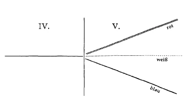

Ich werde nun heute und morgen, ausgehend von der Faust-Dichtung, versuchen, einiges zu sagen über gewisse Beziehungen des Menschen zu den geistigen Welten. Es darf angenommen werden von demjenigen, der wirklich sich mit dem Rüstzeug der Geisteswissenschaft vertieft in die Faust-Dichtung, daß Goethe eigentlich gerade in diesen letzten Szenen etwas von dem Tiefsten sagen wollte, was er in innerem Erlebnis sich errungen hatte durch sein langes Erdenleben als seine Weltanschauung. Weltanschauung in diesem Falle auch so gemeint, daß Goethe wie instinktiv, möchte ich sagen, wie als selbstverständliche Beigabe diese Szenen so gemacht hat, daß man wirklich aus ihnen herausfühlt seine Stellung auch zu der Menschheitsentwickelung, zu den Impulsen der Menschheitsentwickelung, soweit sie seiner Erkenntnis zugänglich waren. Wenn man geisteswissenschaftliche Ideen heranbringt an die Gestalten, die Goethe in seiner Faust-Dichtung geschaffen hat, dann muß das natürlich in einer ganz bestimmten Weise aufgefaßt werden. Es wäre durchaus falsch, wenn Sie glauben wollten, daß Goethe diese Ideen, von denen hier die Rede ist, zunächst zugrunde gelegt hat und dann, gewissermaßen wie man auf einen Kleiderrechen Kleider aufhängt, die Reden der Personen und ihre Charakteristik aufgehängt hätte. Das ist nicht der Fall. Wenn man also spricht, so wie wir jetzt sprechen wollen über diese Gestalten des Goetheschen «Faust», so muß man das in dem Sinne nehmen, daß Goethe gewissermaßen diese Gestalten von Angesicht zu Angesicht kannte und so charakterisierte, wie er sie charakterisieren konnte, daß aber Geisteswissenschaft mit vollem Rechte noch tiefer in die Sache eingehen kann. Nicht wahr, wenn Sie einem Menschen begegnen, den Sie gewissermaßen zum erstenmal sehen, so werden Sie auch nicht gleich darauf kommen, was alles in seiner Seele ist. Trotzdem ist dieses in seiner Seele. Wenn Sie nun nach der ersten Be gegnung mit diesem Menschen den Menschen beschreiben, so kann es sein, daß Sie nur einige Seiten beschreiben von dem Menschen, vielleicht etwas, was rein äußerlich ist, von ihm beschreiben. Aber es ist doch dieser Mensch, den vielleicht Sie selbst, wenn Sie ihn oft gesehen haben, oder ein anderer, der tiefer in die Seele zu sehen vermag, mit viel tieferen Ideen dann charakterisieren müßten. Wenn ich also zunächst, um das Bedeutsame heute und morgen aussprechen zu können, was im Zusammenhang mit der Faust-Dichtung ausgesprochen werden kann, wenn ich zunächst die Frage aufstelle: Was ist dieser Mephistopheles bei Goethe? — so ist das nicht so vorzustellen, als ob Goethe in seinem Bewußtsein auch die Ideen gehabt hätte, die ich Ihnen entwickeln muß, wenn ich von Mephistopheles spreche. Goethe hat eben den Mephistopheles charakterisiert, wie er ihn gekannt hat, aber deshalb bleibt doch der Mephistopheles, wie er in Wirklichkeit ist, eine bestimmte Gestalt, die man auch durch geisteswissenschaftliche Ideen charakterisieren kann; und es ist gerade das Bedeutsame, daß man durch diese geisteswissenschaftliche Charakteristik tiefer hineinschauen kann in die Individualität des Mephistopheles oder anderer in der Faust-Dichtung vorkommender Gestalten. ^bmfs1u

Im Sinne der Geisteswissenschaft muß man jedenfalls solch eine Gestalt, wie Mephistopheles es ist, sich vorstellen als in gewissem Sinne zurückgeblieben auf der alten Mondenentwickelung. Das ist die Voraussetzung gewissermaßen, die geisteswissenschaftliche Voraussetzung, daß Mephistopheles ein Wesen ist, das nicht mitgemacht hat in der entsprechenden Form die Entwickelung, die es hätte mitmachen können vom Monde, oder sagen wir vielleicht schon von der Sonne aus zur Erde, oder durch den Mond zur Erde. Aber wenn er uns auch entgegentritt - allerdings geistig-visionär entgegentritt -, wenn er uns auch entgegentritt, dieser Mephistopheles, in der irdischen Menschengestalt, so würden wir doch fehlgehen, wenn wir ihn auffassen würden so, daß wir etwa sagten: Er ist gegenüber der menschlichen Entwickelung auf dem Monde zurückgeblieben. — Er steht ganz entschieden höher auf der Erde, der Mephistopheles, als der Mensch auf der Erde steht, mit Bezug natürlich auf seine Entwickelung, nicht in bezug auf das Talent zum Bösen. Das können Sie ja, wenn Sie wollen, tieferstehend nennen, daß Mephistopheles dieses Genie zum Bösen hat. Aber er ist ein Wesen gewissermaßen einer höheren hierarchischen Ordnung, als der Mensch es ist, das ist schließlich selbstverständlich. Würden wir also zurückgehen zur alten Mondenentwickelung, so würden wir dort finden, daß der Mensch selbstverständlich in seiner Mondenentwickelung klar unter der Entwickelung des Mephistopheles steht, desjenigen Wesens, aus dem der Mephistopheles auf der Erde geworden ist. Also wir müssen ein höheres Wesen suchen in Mephistopheles, ein Wesen, das einfach mit höheren Fähigkeiten zurückgeblieben ist auf der Mondenentwickelung, als der Mensch sie jemals gehabt hat. Wie könnten wir uns, ich möchte sagen, durch eine Analogie noch klarmachen, wie solch ein Wesen eigentlich beschaffen ist? ^nvxxc7

Nehmen wir einmal an, wir blickten auf unsere jetzige Erdenentwickelung hin. Wir finden auch während unserer jetzigen Erdenentwickelung, daß Menschen weiter sind in ihrer Entwickelung als andere Menschen. Es gibt Menschen, die entschieden weiter sind in ihrer Entwickelung als andere Menschen, ja, wir sprechen während der Erdenentwickelung von gewissen Menschen, welche die Initiation durchgemacht haben, die also — während das im jetzigen Erdenzyklus für die Allgemeinheit noch nicht der Fall ist - schon in die Welt hineinschauen, die jenseits der Schwelle liegt. Natürlich gibt es auch eine entsprechend fortschreitende Entwickelung für solche vorgeschrittene Menschen. Aber auch diese Menschen können in einer gewissen Weise zurückbleiben auf den Stufen ihrer Erdenentwickelung und zum Jupiter sich so hinüberleben, daß sie gewissermaßen, wenn die Jupiterentwickelung akut wird, sagen: Ginge alles den Gang, den die regelmäßige Weltenentwickelung macht, dann würden wir jetzt auf dem Jupiter dieses oder jenes durchmachen, aber das wollen wir nicht, wir bleiben stehen auf dem Standpunkt, den wir während der Erdenentwickelung erlangt haben. — Der Standpunkt ist ein höherer vielleicht, als er von Menschen hat während der Erdenentwickelung erlangt werden können; der Standpunkt ist ein solcher, daß schon während der Erdenentwickelung die Jupiterentwickelung vielleicht vorausgenommen ist. Aber diese Wesen — Menschen sind es in diesem Fall — bleiben doch zurück auf dem Standpunkt, den sie auf der Erde gehabt haben, und stellen sich in diese Jupiterentwickelung so hinein mit einer Jupiterentwickelung, die sie schon während der Erdenzeit durchgemacht haben. Also sie sind zurückgeblieben gegenüber ihren eigenen Maßen, aber nicht zurückgeblieben gegenüber der allgemeinen Entwickelung. Sie machen die Entwickelung nur nicht so durch, wie sie die Menschen dann auf dem Jupiter durchmachen werden, sie bleiben Erdenwesen, Erdenmenschen, aber sie tragen schon von der Erde aus die Jupiterentwickelung in sich. ^n0xqxg

Sie müssen durchaus sich klar sein darüber, daß die verschiedenen Evolutionsvorgänge wirklich recht kompliziert sind, und daß es solche Evolutionsvorgänge, wie ich sie eben charakterisiert habe, tatsächlich auch gibt. Und übertragen Sie jetzt das, was ich gesagt habe von JupiterErde, auf Erde-Mond, dann bekommen Sie ungefähr die Vorstellung von dem, was zunächst der Mephistopheles ist, der in Goethes «Faust» auftritt. Er ist dadurch den ahriimanischen Hierarchien zuzuzählen, daß er die Erdenentwickelung des Menschen schon vorausgenommen hat während der alten Mondenzeit, aber jetzt sich so auf die Erde hereinstellt, daß er nicht Erdenvernunft, Erdenverstand, Erdenindividualität hereinbringt in die Erdenentwickelung, wie sie von der Erde gegeben werden, sondern wie er sie voraus auf dem alten Monde genommen hat, angenommen hat. Daher fühlt er sich im «Prolog im Himmel» so außerordentlich überlegen dem Menschen Faust. Er ist ihm auch überlegen, dem Menschen Faust, denn der Mensch Faust soll im Goetheschen Sinne ein richtiger Erdenmensch sein, der nur nicht in der Region der Stumpflinge zurückgeblieben ist, der aber ganz auf Erdenkräfte baut, auf Erdenimpulse baut das, was er in seiner Seele zu entwickeln hat. Faust ist Erdenmensch, Erdenkämpfer. Mephistopheles tritt ihm gegenüber als der Mondenmensch, der natürlich sich ihm ungeheuer überlegen fühlt, weil er noch in den geistigen Regionen des Mondes schon angenommen hat Vernunft und Wissenschaft, die sonst die Erdenmenschen auf der Erde haben. Daher kann natürlich Mephistopheles nur ein geistiges Wesen sein. Würde er Menschengestalt so wie ein anderer Mensch annehmen, dann müßte er auch der Erdenevolution sich anbequemen. Das tut er aber nicht. Da sehen wir also in Mephistopheles ein Wesen, welches außerordentlich hoch sich fühlen kann gegenüber dem Erdenmenschen. Da aber während der Erdenentwickelung erst die Möglichkeit auftritt, moralische Impulse zu haben - erinnern Sie sich an Vorträge, die wir gerade in diesen Wochen gehalten haben -—, da während der Erdenzeit die menschlich-moralischen Impulse erst auftreten, namentlich alles dasjenige da erst auftritt, was aus dem Impuls der Liebe hervorgeht, so hat Mephistopheles, der seine Mondenentwickelung festgehalten hat, diese Impulse der Liebe ohne weiteres nicht. Er hat sie ohne weiteres nicht. Er ist also ein geistiges Wesen, das zu einer Hierarchie gehört, die deshalb, weil sie sich zurückgehalten hat und auch in früheren Entwickelungsepochen sehr hoch gestiegen ist, eine gewisse Höhe aus ihrer ganzen Wesenheit hat. ^wnfiyg

Stellen wir diesem Mephistopheles gegenüber die höheren Engel. Nehmen wir an, so ein jetziger Engel stünde neben Mephistopheles, also ein Wesen, das jetzt Engel ist. Was ist das für ein Wesen, das jetzt Engel ist? Es ist ein Wesen, das hinuntersteigen muß während der Jupiterentwickelung, um während der Jupiterentwickelung die Dienste an der Jupitermenschheit zu leisten, welche andere Wesen — sagen wir zum Beispiel Erzengelwesen - an der heutigen Erdenmenschheit leisten. Das ist also ein Wesen, ein solches Engelwesen, das naturgemäß, weil es geistig ist, wenn es einfach neben Mephistopheles steht, in der Evolution weniger weit ist als Mephistopheles selber, respektive die Hierarchie, der er angehört. Die Engelwesen werden in bezug auf Intellektualität dasjenige erst während der Jupiterentwickelung erreichen können, was Mephistopheles durch seine Hierarchie -— wenn auch nicht durch sich selbst, falls wir ihn als einen Mondenmenschen ansehen, als einen Monden-Initiierten — schon auf dem Monde erlangt hat. Man könnte sagen, der unmittelbare Vorgesetzte des Mephistopheles ist sogar ein außerordentlich hochstehendes Wesen, wenn auch ein in der Evolution zurückgebliebenes Wesen, ein so hochstehendes Wesen, daß ein Wesen wie etwa von dem Range des Erzengels Michael sich unter dem Range des unmittelbaren Vorgesetzten des Mephistopheles fühlt. Diese Evolutionsvorgänge komplizieren die Rangordnungen der geistigen Wesen. Solch ein Wesen wie Mephistopheles hat sich während der Mondenentwickelung sehr weit entwickelt. Dadurch ist es voraus der gewöhnlichen Engelentwickelung, der normalen Engelentwickelung. Solch ein Wesen wie Mephistopheles ist aber Geist geblieben. Dadurch, daß es Geist ist, hat es etwas Verwandtes mit der gewöhnlichen Engelentwickelung. Engel sind ja auch Geister. So daß wir sagen können: Vom mephistophelischen Standpunkte aus ist es ganz richtig, wenn Mephistopheles davon spricht: «unmündiges Volk» — zu den Engeln. Sie sind ihm gegenüber wirklich ein unmündiges Volk, ein Volk, das es in der Entwickelung, auf die er besonderen Wert legt, nicht so weit gebracht hat wie er selber. ^jwk8nx

Nun gibt es natürlich auch wiederum alle möglichen Evolutionsstufen in der Hierarchie der Angeloi. Auch da können wir eine — gewissermaßen pedantisch-philiströs gesprochen — normale Evolutionsstufe für die Engelentwickelung annehmen. Aber wir müssen annehmen - das ist ja Tatsache —, daß auch gewisse Engel zurückgeblieben sind, daß sie sich also, wenn ich den Ausdruck bilden darf, verluziferisieren. Vor der normalen Entwickelung bleiben gewisse Engel zurück und verluziferisieren sich. Es sind solche, die nicht mitgehen, sondern auf früheren Stufen zurückbleiben. Die Engel, die sich so verluziferisierten, schon verluziferisiert hatten vor der lemurischen Erdenzeit, nehmen nun noch eine ganz besondere Stellung ein. Denn wodurch erlangten sie denn das, daß sie sich dazumal verluziferisieren konnten? Es stand — wenn ich mich jetzt populär, wenn auch vielleicht nur annähernd ausdrücken soll, weil es nicht anders sein kann -—, damals bevor, daß eben die Wesensgruppe, die Mensch war, ihre Mondenentwickelung durchmachte. Nun kam das, was man die luziferische Verführung nennt, durch geistige Wesenheiten, die sich luziferisiert hatten. Diese Luziferisierung führte gewisse Wesen dazu, während der lemurischen Entwickelung dasjenige für den Menschen zu bewirken, was Sie aus der «Geheimwissenschaft im Umriß» kennen. Dann führte wiederum die ahrimanische EntwickeJung dazu, während der atlantischen Zeit dasjenige zu bewirken, was Sie auch aus der «Geheimwissenschaft» und aus Vorträgen, die jetzt gehalten worden sind, kennen. So müssen wir also sagen: Von luziferischer Seite ging während der alten lemurischen Zeit ein gewisser Impuls aus, an dem für die Menschheit alle Wesen, die sich vorher luziferisiert hatten, beteiligt waren. Dieser Impuls besteht darinnen, daß der Mensch weiter in das Materielle heruntergestiegen ist während der Erdenentwickelung, als er in der fortschreitenden Entwickelung hätte sollen, daß seine Begierden, Triebe und Leidenschaften, man könnte sagen, in die materielle Entwickelung verstrickt worden sind. Es mußte ein Gegengewicht gegeben werden. Und dieses Gegengewicht wurde gegeben durch die ahrimanische Entwickelung, so daß der Mensch im Gleichgewicht schwebt zwischen der luziferischen und der ahrimanischen Entwickelung. Das alles aber, daß der Mensch also im Gleichgewicht schwebt zwischen der luziferischen und der ahrimanischen Entwickelung, ist doch in einem gewissen höheren Stile, in einem gewissen höheren Sinne wiederum der Plan der fortschreitenden Evolution, liegt im Plan der fortschreitenden Evolution. ^ohc1o4

Indem ich Ihnen das rekapituliert habe, können Sie sich sagen: Faust, dem rechten Erdenmenschen, werden gegenüberstehen luziferische und ahrimanische Gewalten. Und die ahrimanischen Gewalten, die ihm gegenüberstehen, zeigt Ihnen Goethe besonders in dem Mephistopheles, den er Faust an die Seite stellt als den Repräsentanten der ahrimanischen Gewalt. Wir hatten schon das besprochen, warum Goethe es unterlassen hat, deutlich herauszustellen, wie die luziferischen Impulse an den Faust herankommen. Aber überall - ich habe das angedeutet — schimmert das durch, daß Goethe eigentlich den Faust hineingestellt hat in die Mitte zwischen die mephistophelischen und die luziferischen Gewalten. Ich habe ausdrücklich wiederholt hervorgehoben, Goethe konnte sich zu seiner Zeit, weil es die Geisteswissenschaft noch nicht so gegeben hat wie heute, noch nicht ganz klar sein über das Verhältnis des Menschen Faust zu Ahriman-Mephistopheles und zu Luzifer. Aber er hatte ein gewisses instinktives Erkennen, daß Faust diesen zwei Impulsarten gegenübersteht. ^yevk7f

Nun fragen wir uns: Worin besteht denn eigentlich dasjenige, was, sei es Mephistopheles selber oder seien es die Verwandten des Mephistopheles, mit den Menschen wollten? - Was Mephistopheles mit den Menschen wollte, ist wirklich nichts anderes eigentlich als etwas, was die Menschen auf der Erde unmöglich gemacht hätte, richtig unmöglich gemacht hätte. Denn was auf der Erde erst eingetreten ist, das ist die Fortpflanzung durch die Geschlechter der Menschen, durch das Männlich-Weibliche. Mephistopheles als ein richtiger Monden-Initiierter, der nur zurückgeblieben ist, kann das absolut nicht leiden, und das ist dasjenige, was er eigentlich als seine Aufgabe betrachtet, aus der Welt zu schaffen die Möglichkeit, durch geschlechtliche Fortpflanzung eine Menschheit auf der Erde zu haben. Das soll es nicht geben auf der Erde. Also fassen wir das genau: Die normale Entwickelung des Menschen auf der Erde besteht ja darinnen, daß sich auf der Erde das Menschengeschlecht durch die Geschlechter fortpflanzt. Aber Mephistopheles wollte auf der Mondenentwickelung zurückbleiben. Er wollte das daher nicht haben, daß die Liebe zur Liebe der Geschlechter auf der Erde führt. Mephistopheles ist der Feind der Liebe der Geschlechter auf der Erde. Der ganz entschiedene Feind ist er. Er fühlt sich daher — und Goethe charakterisiert das ganz richtig — außerordentlich dazu berufen, alles dasjenige ad absurdum zu führen, was irgendwie zur Geschlechterliebe führt. Was er veranlassen will in der Beziehung des Faust zu Gretchen — lesen Sie nur mit Aufmerksamkeit die Gretchen-Szenen, da werden Sie überall spüren, er will da allerlei, was das Amt des AhrimanMepbistopheles ist. Aber die Liebe zwischen Faust und Gretchen, die wirkliche menschliche Erdenliebe, die will er nicht aufkommen lassen, weder bei Faust noch bei Gretchen will er sie eigentlich dulden. Dagegen ist er richtig im Spiele da, wo im Laboratorium der Homunkulus erzeugt wird. Und Sie wissen aus früheren Darstellungen, die ich aus dem «Faust» gegeben habe, daß der Homunkulus erzeugt wird, um aus der Natur heraus, ohne Geschlechterliebe, ein Hervorbringer eines Menschlichen — der Helena — zu werden. Das setzt sich Mephistopheles zur Aufgabe, nicht eine Menschheit im Sinne der fortschreitenden Entwickelung, die auf der Erde durch Geschlechterliebe hervorgeht, zu erzeugen, sondern auf einem andern Wege, durch die Kräfte, die dem Ahriman zugeteilt sind, eine Wesensart zu erzeugen, die nicht im Sinne des für die Erde bestimmten Menschengeschlechtes ist. Denn denken Sie einmal nur an anderes als an diesen Homunkulus, denken Sie an den Euphorion, denken Sie an die ganze Art, wie Helena wieder heraufkommt, da ist überall Mephistopheles im Spiele. Aber nirgends soll da irgend etwas von regulärer Geschlechterliebe in Betracht kommen. Also die Rolle, die Mephistopheles zugeteilt ist, ist schon ganz außerordentlich gut getroffen und kann von der Geisteswissenschaft aus durchaus gerechtfertigt werden. Es ist eine ungeheure Tiefe darinnen. ^xendyy

Und nun nehmen Sie das merkwürdige Wort, gleich als die himmlische Heerschar beginnt da zu sein: ^khaluo

Das traut er den Engeln schon zu, zu wissen, daß sie zugeschaut haben damals, als Mephistopheles mit seinen Genossen Vernichtung gesonnen hat menschlichem Geschlecht. Jetzt sagt er weiter etwas, indem er gewissermaßen die Sprache des Erdenmenschen annimmt: ^zzv1ol

— das Schändlichste ist eben diese Vernichtung des menschlichen Geschlechtes. Man nennt es das Schändlichste. ^0pj6e7

Um nun weiterzukommen mit dem Verständnisse — es ist natürlich außerordentlich schwer, an diese Dinge heranzugehen, denn Goethe wollte sein tiefstes menschlich-geistiges Fühlen und Empfinden und Erkennen darin ausdrücken -, um weiterzukommen hat man ungefähr die folgende Betrachtung nötig. Nicht wahr, Sie wissen, es gibt — für uns wenigstens — eine Geisteswissenschaft, wenn sie auch heute erst im Anfange ihrer Entwickelung ist. Sie wissen auch, es hat immer so etwas gegeben, wenn es auch in früheren Zeiten auf andere Weise erlangt worden ist, als wahre Erkenntnis der Welt, die über den Schein hinausgeht, die zur Wirklichkeit dringt. Nun wissen Sie auch, daß in einer gewissen Weise sorgfältig gewacht wurde, namentlich in älteren Zeiten, über das geistige Gut, das in den Mysterien bewahrt wurde und das auf wirkliche Welterkenntnis ging. Dieses Geistesgut wurde nur denjenigen — das wissen Sie — mitgeteilt, die ihre Reife dafür zeigten. Wenn man sich nun frägt, welcher Art war denn eigentlich diese besondere Art des Erkennens, diese besondere Art des Geistesgutes, welche da in den Mysterien mitgeteilt worden ist, so kommt man am besten zu Rande, wenn man versucht zu vergleichen unseren fünften nachatlantischen Zeitraum mit vorhergehenden Zeiträumen, dem griechisch-lateinischen, ägyptischchaldäischen und so weiter. Und wenn man sich an der Hand dieser Vergleichung frägt, wie hat sich die ganze Auffassung der Welt durch den Menschen geändert aus den früheren Zeitepochen, aus den früheren Kulturepochen in unsere Kulturepoche herein? Es ist wirklich wahr, daß sich Wichtiges, Bedeutungsvolles vollzogen hat in der Evolution der Menschheit, daß es eine fable convenue ist, wenn man glaubt, nur das brauche man zu wissen über die Entwickelung der Menschheit, was die triviale Geschichte, das, was man heute eben Geschichte nennt, mitteilt. Es waren die früheren Kulturzeitalter ganz anders, als man sie sich vorstellte nach der gewöhnlichen Geschichte, die eine fable convenue ist. Erinnern Sie sich nur einmal an die Tiefe eines solchen Spruches, wie ich ihn angeführt habe: ^l56ac4

Es liegt eine ungeheure Tiefe verballhornt in einem solchen Spruche, aber sie war einmal da, diese Tiefe. Die Menschen haben einmal, wenn auch durch die Ergebnisse des atavistischen Hellsehens, in diese Realitäten hineingesehen, auf die gedeutet wurde zum Beispiel auch in einem solchen Spruche. Aus diesem Wissen der Grundlage des Daseins ist herausgetreten der fünfte nachatlantische Zeitraum. Nach zwei Seiten hin ist er abgeirrt. Die eine Seite habe ich Ihnen gewissermaßen durch die Initiation des fünften nachatlantischen Zeitraums charakterisiert, die ich geschildert habe durch Baco von Verulam, durch Lord Bacon. Da haben wir die Sehnsucht, alles, was über das Sinnlich-Wahrnehmbare hinausgeht, als bloße Idole zu behandeln. Sie wissen, vier Arten von Idolen hat Bacon angenommen. Wir haben sie angeführt: Idola tribus, Idola specus, Idola fori, Idola theatri, vier Arten. Dadurch drückt sich durch Bacons Geist im Beginne des fünften nachatlantischen Zeitraums die eine Tendenz aus, alles, alles nur zu bauen auf eine Erkenntnis, die durch sinnliches Anschauen und durch Begriffe gewonnen ist, die sich wiederum aus der sinnlichen Anschauung ergeben. Alles, was über die sinnliche Anschauung hinausgeht, ist Idol, dessen Inhalt sich eigentlich in Worten erschöpft. Und das haben wir ja schon charakterisiert, das ist gewissermaßen die eine Strömung. ^d33lp7

Nehmen Sie nun einmal, schematisch ausgedrückt, die Strömung, welche sich ausdrückt durch so etwas wie: «O Sonn’, ein König dieser Welt», die noch in tiefe Grundlagen des Daseins hineingeht, nehmen Sie diese in ihrer Fortsetzung. Wenn sie durch sich nur sich entwickeln wollte von dem vierten in den fünften nachatlantischen Zeitraum hinüber, können wir sagen, so würde sie so gehen (siehe Zeichnung). Die Entwickelung, welche zu den Idolen führt, die geht unter diese Evolution hinunter (blaue Linie), sie erkennt nicht an, daß man in Wirklichkeit unmittelbar ein Geistiges findet, so wie man ein Sinnliches finder; sie schaltet das Geistige aus und betrachtet es nur als in den Wortidolen enthalten, diese Entwickelung wird also inauguriert mit Bacon. ^uukx1c

 ^mtbt2m

Welches wäre denn das Gegenbild dazu? Das Gegenbild dazu wäre eine Entwickelung, welche nur anerkennen würde, daß ein Geistiges, ein Seelisch-Geistiges vorhanden ist, welche das Physisch-Materielle nicht anerkennt. Das wäre das Gegenbild dazu. Wir könnten also fragen: Ist auch diese Entwickelung vorhanden? Gibt es ebenso, wie Bacon sagt, nur die sinnliche Wirklichkeit ist Wirklichkeit, das andere sind Wortidole, einen Ausdruck dafür, daß es nur ein Geistig-Wirkliches gibt und kein Materiell-Physisches, das in die Sinne tritt? Das gibt es in der Tat auch. Etwas später als Bacon lebt Berkeley, George Berkeley, und der stellt diese Linie der Entwickelung dar (rote Linie). Machen wir uns mit ein paar Worten klar, worin das Wesentliche der Weltanschauung Berkeleys liegt. ^shksg1

Berkeley ist der Anschauung, die sich ihm im wesentlichen aus seiner theologischen Weltanschauung heraus ergeben hat - er war zuletzt Bischof -, daß alles das, was außerhalb des Menschen ist und durch die Sinne wahrgenommen wird, nur so lange da ist, als es durch die Sinne wahrgenommen wird. Also Berkeleys Anschauung ist diese - nicht wahr, am Gegensatz kann man es vielleicht am besten charakterisieren -: Sie nehmen an, jetzt aus einer, ich möchte sagen, Anschauung heraus, die dem Berkeleyismus gegenüber naiv ist, Sie nehmen an das Folgende: Wenn Sie da hereinkommen, so sehen Sie, sagen wir, Herrn Bauer hier sitzen, aber Sie nehmen an, er hätte auch schon vorher hier gesessen, und Sie sehen ihn nachher. — Es gibt, wie gesagt, nicht den geringsten Beweis dafür, daß dasjenige, was Sie auf diesem Stuhle sitzen sehen, auch da war, bevor Sie es gesehen haben. Und wenn Sie wieder hinausgehen, so glauben Sie, der Herr bleibe hier sitzen und sitze da, während Sie ihm den Rücken wenden und hinausgehen. Berkeley ist der Ansicht: Es gibt keinen Beweis dafür, daß, sagen wir das, was Sie hier gesehen haben, noch da sitzt. So lange sitzt es da, als Sie hinschauen, denn das ist lebendig, das Bilden im Auge, und wie sollte das Bilden im Auge da sein, wenn Sie nicht hinschauen? Man kann die Baconsche Weltanschauung logisch vollständig beweisen. Man kann auch die Berkeleysche Weltanschauung logisch vollständig beweisen, denn es gibt keinen Widerspruch im Berkeleyismus, der logisch sich ergeben könnte, es ist durchaus logisch zu erhärten, wenn es auch dem naiven Bewußtsein nicht entspricht. Berkeley ist nämlich nicht der Ansicht, daß Sie, wenn Sie hereingehen, den Herrn Bauer schaffen, und wenn Sie hinausgehen, ihn wieder hinwegzaubern, dieser Ansicht ist er gerade nicht, aber daß das, was Sie sehen, erst mit Ihrem Schauen kommt und wieder weggeht mit Ihrem Schauen. Esse est percipi: Sein ist Wahrgenommenwerden. Und ein anderes Sein als das Wahrgenommenwerden in der umliegenden Welt gibt es nicht. Daher ist, wie Sie sich jetzt vorstellen können, für Berkeley alles das, was Sinnenwelt ist, überhaupt nur im Werden. Sie gucken hin, da ist es da; Sie gucken weg, da ist es weg, da ist es nicht mehr da. Das alles ist also nur in Ihren Anschauungen da. Wie gesagt: Esse est percipi, es gibt nichts außer dem Wahrnehmen, außer dem Wahrnehmungsprozeß. Aber hinter diesem Wahrnehmungsprozeß, der also gar nichts anderes ist als der Wahrnehmungsprozeß, da ist das göttlich-geistige Sein. Außer Ihrem Wahrnehmen hat es mit dem Herrn Bauer noch der Gott zu tun, der ihn hinsetzt, so wie er will. Und dieser Gott, wenn Sie hereingehen, erzeugt aus dem, was nur in ihm ist, in Ihnen das Bild des Herrn Bauer. Dann, wenn Sie weggehen, läßt er es wieder verschwinden. Diese Sinnenwelt gibt es also nicht, nur GeistigSeelisches gibt es. Sie alle, so wie Sie hier vor mir stehen, sind nur das Geschöpf meiner Augen. Außer dem, was das Geschöpf meiner Augen ist, gibt es noch die göttlich-geistige, seelisch-geistige Welt, die aber Sie ganz anders erhält und trägt, als Sie da als Geschöpf meiner Augen existieren. ^4m6vaq

Ich habe diese Anschauung nur charakterisiert. Sie ist wirklich philosophisch streng beweisbar. Aber sie ist dasjenige, was, man möchte sagen, von dem Baconismus die andere Hälfte der Welt gibt. Und in diesen zwei Richtungen, in der roten und blauen, pendelt alle Weltanschauung des fünften nachatlantischen Zeitraums. Entweder es verstrickt sich diese Weltanschauung in die bloße Anerkennung des Sinnlich-Wirklichen und erklärt sich dadurch selber ohnmächtig, in dem Sinnlich-Wirklichen ein reales Geistiges zu schauen, oder sie erschöpft sich in der bloßen Anerkennung des Geistig-Seelischen, sieht überall nur Gott und göttliche Gedanken und erklärt sich ohnmächtig, von dem Leben in Gott und in göttlichen Gedanken herunterzusteigen zur sinnlichen Wirklichkeit. Diese zwei Abirrungen gibt es durchaus im fünften nachatlantischen Zeitraum. Und wer das geistige Leben betrachtet, wie es sich außerhalb der Esoterik entwickelt, wird es laufend finden entweder auf der einen oder auf der andern, auf der roten oder auf der blauen Linie. Das äußere Exoterische liegt nicht auf dem, was ich hier gezeichnet habe als die weiße Linie. ^pcp04p

Man kann sagen, daß der Mensch des fünften nachatlantischen Zeitraumes in eine gewisse Spannung hineinkommt zwischen diesen zwei Anschauungen der Welt. Und intensiv hat Goethe diese Spannung gefühlt. Ich habe Ihnen hier, ich möchte sagen die theoretischen, die mehr philosophischen Impulse vorgeführt, aber bei denen ist es nicht geblieben. Alles Leben irrt ebenso zwischen dem bloß Geistig-Seelischen und dem bloß Sinnlich-Materiellen hin. Goethe empfand diese Spannung in eminentester Weise. Daß er das alles empfand, was in der Außenwelt lebt, ich möchte sagen unter dem Einfluß der Strömung der blauen Linie, werden Sie nicht wunderbar finden, denn so geht unsere wesentliche Entwickelung im fünften nachatlantischen Zeitraum überhaupt, möglichst zum Materiellen hin und zur bloßen Anerkennung des Materiellen. ^e3pmzd

Aber auch die andere Linie empfand Goethe schon. Er empfand sie tief, nur war es zu Goethes Zeiten wirklich noch nicht so, ich möchte sagen, bedenklich, den Materialismus materialistisch zu nennen wie heute. Es war damals noch nicht so bedenklich, auf das Abirrende der blauen Linie hinzuweisen, als es heute ist. Heute muß Geisteswissenschaft auf das Abirrende der blauen Linie hinweisen, und sie wird daher aushalten müssen alle Anpralle, alle furchtbaren Anpralle, die da kommen müssen, weil man immer nur zunächst mit Vorurteilen, ja mit Haß sich dem entgegenstemmt, was als Erkenntnis sich in die Welt begeben will. Und immer mehr und mehr wird der Materialismus heiliggesprochen werden, allerdings auf eine weltliche Art. Aber man kann doch sagen, heiliggesprochen werden wird der Materialismus. Wie nahe ist heute schon die materialistische Medizin daran, sakrosankt sich zu erklären, wie viele andere Bestrebungen sind heute daran, sich sakrosankt zu erklären im Sinne des Materialismus, im Sinne der Abirrung, die die blaue Linie anzeigt, der Abirrung von dem Geistig-Seelischen, das zu gleicher Zeit aber als seine Offenbarung das Sinnlich-Materielle enthält, das dann dazugehört, das eins ist mit ihm, und das geltend gemacht werden muß von dem, was wir Geisteswissenschaft nennen. Jene Verfolgungen, welche man die inquisitorischen Verfolgungen nennen könnte, die auf andern Gebieten früher schon waren, werden im Gebiete des Materialismus erst kommen, beginnen eigentlich erst jetzt so recht, beginnen jetzt, fangen jetzt erst an, sich geltend zu machen, wenn auch die Formen andere werden. Die Auflehnung gegen die materialistische Färbung der Erkenntnis wird nicht minder der Inquisition verfallen, der Inquisition der Zukunft, die in etwas andern Formen auftreten wird als die Inquisition der Vergangenheit, als frühere Bestrebungen den entsprechenden Inquisitionen verfallen sind. Man glaube nur nicht, daß alles das, was nach der blauen Linie abirrt, nicht ebensogut intolerant werden wird, wie Bestrebungen auf andern Gebieten intolerant wurden. ^mjgdgc

Nicht so deutlich trat die rote Linie früher schon hervor. Sie sonderte sich gleichsam erst in der fünften nachatlantischen Zeit und sogar etwas später ab als die blaue Linie, aber sie war in früheren Bestrebungen schon darinnen enthalten. In einer besonderen Form trat sie eigentlich erst auf und hat ihren bedeutendsten, ihren größten philosophischen Vertreter gerade in Berkeley. Doch hat sie genügend andere Vertreter. Sie trat in der fünften nachatlantischen Zeit hervor, aber gewisse Dinge blieben ihr aus den Formen, die sie schon hatte, und deshalb war es, daß es zu Goethes Zeiten schon bedenklich war, über die rote Linie ordentlich zu reden, während Goethe noch durchaus unbedenklich reden konnte über die blaue Linie. Über die rote Linie war es bedenklich zu reden. Denn was strebt denn eigentlich auf der Bahn dieser roten Linie? Da streben alle diejenigen Weltanschauungen, welche vermeiden, den Blick über die Welt, über die ganze Breite der Welt auszudehnen, und welche schwelgen möchten in einem allgemein Geistig-Seelischen, in einem Geistig-Seelischen, das ohnmächtig sein will gegenüber der sinnlichen Offenbarung; eine Weltanschauung, die zwar sprechen will über das Übersinnliche, aber die eigentlich nichts erkennen will. Da haben wir ein weites Gebiet, zu dem sich nach und nach fast alle Religionsbekenntnisse und alle Sekten gewendet haben, denn das ist das Eigentümliche, daß diese Weltanschauungen eigentlich verzichten darauf, die Welt zu begreifen, und nur über irgend etwas Übersinnliches im allgemeinen reden und redend schwelgen wollen. Sie wollen sich nicht die positive konkrete Erkenntniskraft aneignen, mit dem, was sie erlangen, mit dem, wovon sie reden, wirklich unterzutauchen in die Welt der Wirklichkeit. ^r7ooaz

Sie werden mich vielleicht besser verstehen, wenn ich versuche, in der folgenden Weise mich auszudrücken. Denken Sie einmal, wie heute das Leben für einen Durchschnittsmenschen verlaufen kann. Der steht, sagen wir, sechs Tage in der Woche in der Fabrik oder im Kontor oder wo immer. Da steht er innerhalb eines rein materiellen Getriebes, das aufgeht in der bloßen Sinnesbetrachtung, da mischt sich nichts Geistiges hinein heute, und immer weniger und weniger Geistiges mischt sich da hinein. Da betrachtet man im Gegenteil denjenigen, der etwas Geistiges hineinmischen will, als einen ganz tollen Kerl. Aber auf diesem Gebiete funktionieren alle die Kräfte, welche die heutige Wissenschaft erkennen will. Da funktionieren alle die menschlichen Zusammenhänge, über die sich die Erkenntnis hermachen will, kurz, da ist alles das an Gedanken und Begriffen entwickelt, was über die sich vor unseren Augen ausbreitende Wirklichkeit sich ergeht. Und dann nehmen wir an, nehmen wir zu seinem Besten an, daß dieser Mensch, der also die Woche über im Büro oder in der Fabrik mit dem rein materiell Erkennbaren sich beschäftigt hat oder der das rein materiell Erkennbare gelehrt hat - schließlich wird in den gewöhnlichen Schulen auch nichts anderes gelehrt als das materiell Erkennbare -, daß der Mensch - nehmen wir zu seinem Besten an aus gewisser Aufrichtigkeit - am Sonntag in die Kirche geht, und da hört er nun reden von dem, von dem heute in der Kirche geredet wird, geredet wird nach der Evolution, die sich seit Jahrhunderten ergeben hat. Versuchen Sie einmal, wenn Sie es können, ich meine, wenn Sie dazu genügend oft in der Kirche gewesen sind und Predigten angehört haben mit offenem Ohre, wenn Sie mit offenem Auge gesehen haben, was da vorgeht, fragen Sie sich einmal, ob in dem, was da gesprochen wird, etwas steckt, was geeignet ist, über die Welt aufzuklären, die sich um uns herum ausbreitet. Man gibt zwar vor, daß der Gott, von dem da geredet wird, der Welt zugrunde liegt, aber man spricht nicht, nirgends, von der Art und Weise, wie er durch seine Kräfte, durch seine Impulse in die Welt eingreift. Man hat eine eigene Weltanschauung für die Wochentage: blaue Linie; eine eigene Weltanschauung für die Sonntage: rote Linie. Nirgends, nirgends haben wir einen Zusammenhang zwischen beidem, wenn wir wirklich die Dinge durchschauen. Fragen Sie einmal: Was hat denn dasjenige, was gelehrt wird von der Kanzel herunter, für eine Beziehung zu der Chemie, zu der Physik, zu der Biologie? — Es wird gar keine Beziehung gesucht, sie wird sogar perhorresziert. ^vvb86n

Nehmen Sie dagegen die Geisteswissenschaft, so werden Sie gleich sehen, worauf es ankommt. Geisteswissenschaft spricht nicht so von der sinnlich-materiellen Welt wie die gewöhnliche Physik, die gewöhnliche Chemie, sondern sie spricht so von der physisch-sinnlichen Welt, daß in das, was sie von der physisch-sinnlichen Welt spricht, hereinfließen kann in allen Einzelheiten das, was sie nun über die geistige Welt sagt. Sie hat nicht eine Wochentagsansicht und eine Sonntagsansicht, sondern eine Ansicht, die über die geistige Welt sich ergeht und wie hinunterfließt in die Einzelheiten der physisch-sinnlichen Welt. Sie erklärt sich nicht ohnmächtig, wie der Berkeleyismus, vom Geistigen aus die Sinnenwelt zu erfassen, sie erklärt sich nicht ohnmächtig, wie der Baconismus, den Geist zu finden in der Sinnenwelt, sondern nur Idole zu finden. Woher kommt denn das? Nun, das haben wir schon begriffen. Es ist naturgemäß dem fünften nachatlantischen Zeitraum, daß die Evolution, die durch die blaue Linie schematisiert wird, entstand. Bacon konnten wir gewissermaßen den Inaugurator nennen. Es mußte der Mensch einmal untertauchen in die Materie, ich habe das oft auseinandergesetzt und auseinandergesetzt, daß die Geisteswissenschaft durchaus nicht Gegner des Materialismus ist, sondern versteht, warum die materielle Entwickelung erkannt wird in der fünften nachatlantischen Zeit. Aber sie kann nicht erkannt werden, ohne daß man sich inspirieren läßt durch einen solchen Geist wie Ahriman. Und lassen Sie diesen Materialismus der fünften nachatlantischen Periode noch so lange sich entwickeln in seinem ahrimanischen Sinne, er wird glauben müssen seinerseits — das können Sie versichert sein, und Sie werden es nicht sein, weil ich es Ihnen sage, sondern weil Sie es verstehen werden aus dem ganzen Geiste der Geisteswissenschaft heraus -, er wird festhalten müssen, dieser materialistischahrimanische Sinn, an dem, was sich Ahriman-Mephistopheles in tief verruchten Stunden gelobt hat, nichts zu tun haben zu wollen mit dem regelmäßigen Fortgang des Menschengeschlechtes auf der Erde. Daher wird diese Wissenschaft, die aus diesem Materialismus herausgewachsen ist, niemals zu einem Durchschauen kommen des Geheimnisses der Menschwerdung, des Rätsels der Embryologie und so weiter — niemals! Sie würde kommen können zu einem Verständnis der Entstehung solcher Wesenheiten, die auf dem Wege des Homunkulus sich bilden können. Aber niemals wird diese Wissenschaft dazu kommen. Nun ist das nur eine Evolutionsströmung. Aber vieles, vieles hängt mit diesem Ahrimanismus zusammen. Das Wissen ist nur ein Teil. Aber es läuft in der ganzen Kultur dieser Ahrimanismus. ^j6f23i

Die andere Strömung, die durch die rote Linie schematisiert wird, empfand Goethe auch tief, nur war es ihm nicht möglich, ich möchte sagen, so deutlich, so ganz deutlich die Gestalten hinzustellen für diese rote Linie, wie er sie hingestellt hat für die blaue Linie. Für die blaue Linie hat er den Mephistopheles und seine Dick- und Dürrteufel und die Lemuren hingestellt. Da stehen sie vor uns. Das hat er gewagt. Denn verleumdet werden diejenigen, die über die Lemuren und die Dick- und Dürrteufel sprechen, erst vom jetzigen Zeitalter ab, werden immer mehr verleumdet, wenn sie in dem Sinne der Geisteswissenschaft sprechen. Zu Goethes Zeiten war das noch gewissermaßen weniger bedenklich. Aber bedenklich war das andere, das Goethe auch durchschaute und recht gut durchschaute, war das, daß er wohl wußte, wenn diese rote Linie sich hereinstellt in unsere Gegenwart, wenn wirklich da eine Anschauung ist, die sich ohnmächtig erklärt und immer mehr und mehr ohnmächtig erklären wird, von der Anerkennung des Geistig-Seelischen zur Durchdringung der wirklichen Welt zu kommen, so beruht es darauf, daß gewisse luziferische Geister verhindern, daß Strömungen, die früher berechtigt waren, fortschreiten. Luziferische Wesenschaft verhindert gewisse Strömungen, religiöse und sektiererische Strömungen, fortzuschreiten. Und so können diese nicht durchdringen die Welt, bleiben in der bloßen Anerkennung des Geistig-Seelischen stecken, Der Berkeleyismus ist nur ein besonderer Ausdruck dafür. Das beruht auf einem luziferischen Zurückgehaltenwerden. Wie drückt es sich aus für Goethe zum Beispiel? Mephistopheles erinnert sich an sich und seine Geschwister, an diejenigen, die einstmals in tiefverruchten Stunden - das bedeutet in der Sprache des Mephistopheles etwas anderes — Vernichtung geschworen haben dem menschlichen Geschlecht, das heißt, nichts wissen zu wollen von der Art und Weise, wie die Menschheit die Erde bevölkert. Mephistopheles erinnert sich daran, daß eigentlich zu seinem Wesentlichen gehört, daß er in der ahrimanischen Zeit, bildlich gesprochen, in der bedeutsamen Sitzung seiner Geister war, die damals beschlossen haben, es solle niemals ein Mensch auf der Erde auf natürliche Art geboren werden, sondern die Kräfte, die als geschlechtliche auf der Erde existieren, sollen zu etwas ganz anderem benützt werden. Das haben diese ahrimanischen Wesenheiten beschlossen in der alten Zeit, ja nicht die Liebe der Geschlechter aufkommen zu lassen. Aber nun sagt Goethe, indem er sich selbstverständlich nicht identifiziert, aber hineindenkt in den Mephistopheles: Es gibt andere, die nicht von Mephistopheles inspiriert sind, aber auch inspiriert sind, nun, die sagen zwar nichts darüber, daß das Menschengeschlecht auf der Erde sich nicht auf gewöhnlich menschliche Weise fortpflanzen soll, aber sie fangen an zu beten, finden, daß diejenigen erst das wahrhaft heilige Leben führen, die nichts tun in dem Sinne der gewöhnlichen Fortpflanzung der Menschheit, die davon absehen, die nichts wissen wollen davon: die Asketen, die Heiligen, die gegenüber der Liebe der Geschlechter die bekannten langen Gesichter machen, von denen wir schon öfter gesprochen haben. — Solche vermutet, sieht, schaut Mephistopheles auf der andern Seite in der Engelschar darinnen. Da sieht er die Inspiratoren dieser andern, die anbeten im Grunde genommen dasjenige, was Mephistopheles und seine Geschwister beschlossen haben: ^ib8h1m

Daran heftet sich ja die Andacht. Die luziferisierten Inspiratoren der zurückgebliebenen Kirchengemeinschaften, Mönchsgemeinschaften, sektiererischen Richtungen, die luziferisierten Inspiratoren, stehen doch unter den andern Scharen darinnen. Nicht umsonst sagt der Mephistopheles zu dem einen langen Burschen, der ihm besonders gefällt: ^lrwxz3

Da hat Goethe vieles von dem hineingeheimnißt, was er auf der Seele hatte gegenüber der Weltanschauung, die mit der Pfaffenmiene einhergeht, gegenüber der Sonntagsweltanschauung, die er als luziferisch gedacht hat gegenüber der ahrimanischen. Mephistopheles fühlt sich verwandt denjenigen, die in ihre Andacht aufgenommen haben das, was Mephistopheles in seine Wissenschaft aufgenommen hat und in seinen Willen. ^c498s1

Wie wir zu denken haben über all diese Sachen rein geisteswissenschaftlich, davon können wir ja noch sprechen. Jetzt wollen wir aber im Goetheschen Sinne über diese Dinge sprechen. Und eine — wenn ich so sagen darf — Ur-Goethesche Empfindung ist das schon, was ich eben ‚ausgesprochen habe. So stehen zunächst die ahrimanische Welt - Lemuren, Dickteufel, Dürrteufel - und etwas luziferisch zunächst Angehauchtes sich gegenüber. Das drückt Goethe ganz klar aus. Luziferisch Angehauchtes steht gegenüber dem Mephistophelischen, wie gesagt, so kaschiert, als es nur möglich ist, daß diejenige Persönlichkeit es ausdrückt, na, der man so manches gestattet: der Teufel. Der darf von der «Pfaffenmiene» sprechen, von den «allerliebsten» Jungen und so weiter. In den Tatsachen steht sich also das gegenüber. Auf der einen Seite Mephistopheles, der gewissermaßen verpfändet hat Faustens Seele. Wodurch verpfändet? Dadurch, daß er den Faust durch alles Irdische getrieben hat, was unter die Sphäre hinuntergeht, die im Erdenwerden hereingekommen ist, und unter die Menschwerdung durch geschlechtliche Liebe heruntergeht. Dadurch hat er Anspruch auf die Seele des Faust, daß er ihn eingeführt hat in alles Ahrimanische. Was durch den Faust noch in die Gretchen-Liebe hineingekommen ist, dafür kann Mephistopheles wahrhaftig nichts, und das hat er genügend in sein Gegenteil verkehrt. Und nachher geht es recht ahrimanisch zu. Da werden nur ahrimanische Künste angewendet, um gewisse äußere Erscheinungen der Griechenwelt hervorzurufen. Was man durch ahrimanische Künste erreichen kann, wird erreicht zuerst im staatlichen Zusammenhange — sagen wir es ganz leise. Dann wird es gesucht im Werden des Menschen, im Zusammenhang mit der Evolution, aber mit der untermenschlichen und untertierischen Evolution, im Zusammenhange mit dem mechanisierten Homunkulus, historisch mechanisierten Homunkulus. Helena wird heraufgebracht auf eine Weise, wie es nicht im Erdensein der Menschheit liegt. Dann werden einige Erdenhandlungen hervorgebracht, na, das sind ja schließlich auch keine Erdengestalten, die da mithelfen, helfen als Eilebeute und Habebald. All das ist unter dem Einfluß ahrimanischer Künste schon sehr verpfändet, und verpfändet durch das einzige, was er haben kann von dem eigentlichen Erdensegen des Menschen. Also dadurch, daß er ihn durch die flache Unbedeutendheit führt - für das Erdendasein ist es nur flache Unbedeutendheit, aber es ist deshalb nicht etwas, wozu nicht ungeheure Vernunft und Wissenschaft gehört, wenn es auch flache Unbedeutendheit ist —, durch das ist die Seele ihm verpfändet. Dann verpfändet durch das andere, daß er von dem eigentlichen Erdensegen — nun, was denn hat? Der Mensch hat sein Ich auf der Erde bekommen, also erst sein Blut. Knochen, Sehnen, Bänder, was die geflickte Halbnatur macht, kann der Mephistopheles haben, aber den eigentlichen Erdensegen, das Blut, den Repräsentanten, den physischmateriellen Repräsentanten des Erdenmenschen, den möchte er zwar haben, aber den kann er ja nicht haben, Er ist auf dem Monde stehengeblieben. Von dem kann er nur haben den blutgeschriebenen Titel, nur dasjenige, was gewissermaßen in den abstrakten Vertrag hereinzubringen ist, was nicht zusammenhängt mit den Impulsen, die in der Realität sind, sondern was in der Abstraktheit, der Vertragsmäßigkeit bleibt. Das kann er nur herausziehen aus dem Blut, nicht den Impuls selber, sondern nur das kann Mephistopheles herausziehen. ^9jtxmk

Die Seele ist ihm verpfändet. Nun, in seiner Sprache sieht es so aus, als ob die andere Schar sie ihm einfach weggeschmuggelt hätte, listig weggenommen. Aber so ohne weiteres ist das nicht. Bis zu dem Tod, den wir gestern geschildert haben, hat schon der Mephisto den Faust noch immer ziemlich in seinen Krallen. Wenn Sie aber den Tod so anerkennen, wie wir ihn gestern gezeigt haben, nicht erst, wenn der Faust hinfällt, sondern wie der Tod so allmählich eintritt, dann ist dasjenige, was Faust da erlebt, und insbesondere als das wonnige Gefühl erlebt, das ich gestern am Schlusse beschrieben habe, nachdem sich die Seele vom Leibe gelockert hat, schon etwas in der geistigen Welt darinnen Erlebtes. Da gleitet Faustens Seele oder, wie Goethe zuerst geschrieben hat, Faustens Entelechie - wir werden morgen von dieser Entelechie sprechen — hinüber in die luziferische Sphäre und würde in der luziferischen Sphäre sich auflösen. Da hätte Faust ebensowenig davon, wie wenn er dem Mephistopheles verfallen würde. Denken Sie doch nur, was ihm da droht! ^kwn4cr

Aber diese Seligkeit würde zur Auflösung im All führen, zum Übergehen in die achte Sphäre! Faust hätte eben dies davon: er hätte die Auflösung in das All, was identisch wäre mit der Vernichtung. Und nun schlagen Sie die letzte Szene auf, von der ich gesagt habe, daß sie notwendig mit der vorhergehenden Szene verbunden ist, daß sie dazugehört, daß sie da sein muß. Da sehen wir in einem ganz andern Gebiete die Handlung fortgehen. Da kommen die Engel wiederum und bringen Faustens Entelechie, Faustens Unsterbliches. Aber indem sie diese Entelechie, dieses Unsterbliche bringen, sagen sie, wodurch sie diese Entelechie hierherbringen können. Die jüngeren Engel, so heißt es in der letzten Szene: ^5zk4ic

Die Engel heben also die Entelechie, die Seele des Faust nicht durch ihre eigene Natur, sondern dadurch, daß sie die Rosen der liebendheiligen Büßerinnen haben, aus der menschlichen Sphäre heraus, beziehungsweise aus dem heraus, wo Menschen hineingewachsen sind, die das menschliche Erdenleben durchgemacht haben, die wirklich aus dem Erdenleben heraus sich entwickelt haben. Goethe leitet die ganze Evolution von dem Mephisto, von den Engeln ab auf die menschliche Evolution, indem die Engel die Entelechie nicht durch ihre eigene Kraft nur retten, sondern sie dadurch retten, daß sie die Rosen empfangen haben aus den Händen liebend-heiliger Büßerinnen. Das ist der unendlich tiefe Gedanke. Da bringt Goethe seine Überzeugung hinein von der Bedeutung der fortlaufenden menschlichen Entwickelung, von der Bedeutung der Erdenentwickelung. Und daher muß er aus dem Menschenwesen heraus etwas finden, was das bloße Ahrimanisch-Mephistophelische überwindet. Mephistopheles steht da, die Lemuren befehligt er aus Knochen, Sehnen und Bändern zusammengeflickte Halbnaturen -, die Dickteufel, die Dürrteufel befehligt er. Ich habe auseinandergesetzt, was dies bedeutet: die untermenschliche Natur, die nie den Menschen hervorbtingen könnte, liegt in alldem nur, die Natur in einer Basis, aus der der Mensch nicht herauswachsen kann, liegt dadrinnen. Alles liegt dadrinnen, was die Weltanschauung begreifen kann, die auf der blauen Linie läuft, aber so darf dasjenige, was uns umgibt, nicht gefaßt werden. Dem Mephistopheles stehen von seiner Mondenzeit her nur zur Verfügung die Kräfte, welche befehligen Lemuren, Dick- und Dürrteufel, aber was die aus der Natur herausziehen, aus der Erdennatur, ist nur das Mephistophelische, und da kann noch anderes herausgezogen werden, was Mephistopheles nicht wissen kann, weil er nicht die Erdenentwickelung in seiner Art mitgemacht hat. Das wird herausgezogen, indem aus der nun wirklichen Heiligung der physischen Natur, der Veredelung der physischen Natur die Verwandtschaft mit den irdischen Kräften und Elementen gesucht wird. ^xgeu2f

- und so weiter. Da haben Sie das Durchbrausen der Natur, die zum Menschen gehört, die auch verbunden ist mit dem Luziferischen, mit dem Teuflischen, aber höher hinaufgeht. Da haben Sie diese Natur. Und die Engel haben auf der Erde die Aufgabe oder für die Erde die Aufgabe, mitzunehmen die Pflege des Menschengeschlechtes. Die Engel, die nicht zurückbleiben, sondern fortschreiten bis zu der Pflege des Menschengeschlechtes, wie es auf der Erde sein soll, betrachtet Goethe als die eigentlichen Erlöser. Erinnern Sie sich, welchen Auftrag der Herr den eigentlichen Engeln gibt: ^z0anxb

- da sollen sie Hilfe leisten, da sollen sie eingreifen, und sie tun es. Diejenigen Engel schreiten in der Engelschar wirklich vorwärts, die sich beschäftigen mit den liebend-heiligen Büßerinnen und von ihnen die Rosen nehmen. So wie der Mensch das ihm in der Erdenevolution Zugeteilte aufnimmt, so nehmen diese Engel, die nicht zurückbleiben auf der Mondenentwickelung, sondern mit der Erdenentwickelung mitgehen, die Kräfte entgegen, die da kommen von solchen Naturen, wie sie dargestellt sind in dem letzten Akt in den liebend-heiligen Büßerinnen. Das bringt sie weiter. Das ist Goethes Überzeugung, daß sich die Engel entwickeln über das Luziferische hinaus. Wie gesagt, ich wollte mit alldem das andeuten, was Goethes Gedanke ist, wie Goethe verbunden war mit all den großen Evolutionsgedanken in seiner Art. ^x95efr

Nun wollen wir morgen weitersprechen. Ich hoffe, daß Sie aus dem heute Auseinandergesetzten gesehen haben, wie Goethe Tiefen des Werdens und der Weltengeheimnisse aufsucht, um seinen «Faust» zu schaffen, und wie er sein Urteil abgeben wollte über die sich fortentwickelnden Weltanschauungsströmungen. Ja wahrhaftig, es liegt viel in diesem «Faust», sehr, sehr viel liegt in diesem Faust! Und man muß schon sagen: Unendliches könnte die Menschheit gewinnen, wenn sie versuchen würde, sich an alldem zurechtzufinden, was in diesen Goetheschen «Faust», um Goethes eigenen Ausdruck zu gebrauchen, hineingeheimnißt ist. Doch von alldem wollen wir dann morgen weiter reden und von einigen Zusammenhängen dieser Faust-Ideen mit den Ideen der Geisteswissenschaft. ^7uo1ci