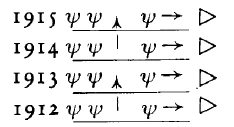

Wenn Sie die Betrachtung, die ich gestern hier angestellt habe, mit den andern Vorträgen, die ich vor einer Woche hier gehalten habe, zusammennehmen, dann werden Sie gewissermaßen einen wichtigen Schlüssel zu vielem in der Geisteswissenschaft bekommen. Ich will nur, damit wir uns orientieren können, die hauptsächlichsten Gedanken, die wir für unsere weiteren Betrachtungen brauchen, anführen. Ich habe vor etwa acht Tagen auf die Bedeutung der Vorgänge hingewiesen, die man vom Gesichtspunkt der physischen Welt aus Zerstörungsvorgänge nennt. Ich habe darauf hingewiesen, daß man eigentlich vom Gesichtspunkt der physischen Welt aus das Wirkliche nur in dem sieht, was entsteht, was sich gewissermaßen herausbildet aus dem Nichts und zu bemerkbarem Dasein kommt. Man spricht also von dem Wirklichen, wenn die Pflanze sich der Wurzel entringt, Blatt an Blatt bis zur Blüte hin entwickelt und so weiter. Man spricht aber nicht ebenso von dem Wirklichen, wenn man auf die Zerstörungsvorgänge blickt, auf das allmähliche Welken, auf das allmähliche Hinschwinden, auf das letztliche Hinströmen, man könnte sagen, zu dem Nichts. Für den, der nun die Welt verstehen will, ist es aber im eminentesten Sinne notwendig, daß er auch auf die sogenannte Zerstörung hinblickt, auf die Auflösungsvorgänge, auf dasjenige, was sich zuletzt für die physische Welt wie das Hineinströmen in das Nichts ergibt. Denn Bewußtsein in der physischen Welt kann sich niemals da entwickeln, wo bloß aufsprießende, sprossende Vorgänge vor sich gehen, sondern Bewußtsein beginnt erst da, wo-das auf der physischen Welt Ersprossene wiederum abgetragen, vernichtet wird. ^g5tn3m

Ich habe darauf hingewiesen, wie diejenigen Vorgänge, die das Leben in uns hervorruft, von dem Seelisch-Geistigen zerstört werden müssen, wenn Bewußtsein in der physischen Welt entstehen soll. Es ist in der Tat so, daß, wenn wir irgend etwas Äußeres wahrnehmen, unser SeelischGeistiges in unserem Nervensystem Zerstörungsprozesse anrichten muß, und diese Zerstörungsprozesse vermitteln dann das Bewußtsein. Immer, wenn wir uns irgendeiner Sache bewußt werden, müssen die Bewußtseinsvorgänge aus Zerstörungsvorgängen hervorgehen. Und ich habe darauf hingedeutet, wie der bedeutsamste, der für das Menschenleben bedeutsamste Zerstörungsvorgang, der Vorgang des Todes, gerade der Schöpfer des Bewußtseins ist für die Zeit, die wir nach dem Tode verbringen. Dadurch, daß unser Seelisch-Geistiges die volle Auflösung und Loslösung des physischen und Ätherleibes erlebt, das Aufgehen des physischen und Ätherleibes in der allgemeinen Physis und Ätherwelt, schöpft unser Geistig-Seelisches die Kraft - aus dem Todesvorgange schöpft unser Geistig-Seelisches die Kraft, zwischen dem Tod und einer neuen Geburt Wahrnehmungsvorgänge haben zu können. Das Jakob Böhme-Wort: So ist denn der Tod die Wurzel alles Lebens - gewinnt dadurch seine höhere Bedeutung für den ganzen Zusammenhang der Welterscheinungen. ^o0qlu9

Nun wird Ihnen oftmals die Frage vor die Seele getreten sein: Wie steht es denn eigentlich mit jener Zeit, die von der Menschenseele durchlaufen wird zwischen dem Tod und einer neuen Geburt? - Es ist oftmals darauf hingewiesen worden, daß für das normale Menschenleben diese Zeit eine lange ist im Verhältnis zu der Zeit, die wir hier im physischen Leibe zwischen der Geburt und dem Tode verbringen. Kurz ist sie nur bei denjenigen Menschen, welche ihr Leben in einer weltwidrigen Weise anwenden, welche, ich will sagen, dazu kommen, dasjenige nur zu tun, was in einem wirklich und wahrhaftigen Sinne verbrecherisch genannt werden kann. Da findet ein kurzer Zeitverlauf statt zwischen dem Tod und einer neuen Geburt. Aber bei Menschen, die nicht allein dem Egoismus verfallen sind, sondern ihr Leben in einer normalen Weise zwischen Geburt und dem Tode zubringen, findet gewöhnlich eine verhältnismäßig lange Dauer der Zeit statt zwischen dem Tod und einer neuen Geburt. ^ldobo7

Aber die Frage muß uns ja, ich möchte sagen, in der Seele brennen: Nach was richtet sich denn überhaupt das Wiederkommen einer Menschenseele zu einer neuen physischen Verkörperung? - Innig hängt die Beantwortung dieser Frage zusammen mit alledem, was man wissen kann über die Bedeutung der Zerstörungsvorgänge, die ich angeführt habe. Denken Sie nur einmal, daß wir mit unseren Seelen, wenn wir das physische Dasein betreten, hineingeboren werden in ganz bestimmte Verhältnisse. Wir werden hineingeboren in ein bestimmtes Zeitalter, zu bestimmten Menschen hingetrieben. Also in ganz bestimmte Verhältnisse werden wir hineingeboren. Sie müssen schon einmal recht gründlich ins Auge fassen, daß unser Leben zwischen der Geburt und dem Tode inhaltlich eigentlich angefüllt ist mit alledem, in das wir da hineingeboren sind. Was wir denken, was wir fühlen, was wir empfinden, kurz, der ganze Inhalt unseres Lebens hängt von der Zeit ab, in die wir hineingeboren sind. ^jkj89w

Aber nun werden Sie auch wiederum leicht begreifen können, daß dasjenige, was uns so umgibt, wenn wir ins physische Dasein hineingeboren sind, von den vorangegangenen Ursachen abhängig ist, von dem, was vorangehend geschehen ist. Nehmen Sie einmal an, wenn ich das schematisch zeichnen soll, wir werden in einen bestimmten Zeitpunkt hineingeboren und laufen durch das Leben zwischen Geburt und Tod. (Es wurde gezeichnet.) Wenn Sie dazunehmen, was Sie umgibt, so steht das nicht isoliert da, sondern ist die Wirkung von Früherem. Ich will sagen: Sie werden zusammengebracht mit Früherem, mit Menschen. Diese Menschen sind Kinder von andern Menschen, diese wieder von andern Menschen und so weiter. - Wenn wir nur diese physischen Generationsfolge-Verhältnisse betrachten, so werden Sie sagen: Ich nehme, während ich in das physische Dasein trete, etwas an von den Menschen, ich nehme während meiner Erziehung vieles an von den Menschen, die mich umgeben. - Diese haben aber auch wiederum sehr vieles angenommen von den Vorfahren, von den Bekannten und Verwandten ihrer Vorfahren und so weiter. Immer weiter hinauf, könnte man sagen, haben die Menschen die Ursachen zu suchen von dem, was sie selber sind. ^dix5v6

Wenn man dann die Gedanken weitergehen läßt, so kann man sagen, man kann also über seine Geburt hinauf eine gewisse Strömung verfolgen. Diese Strömung hat gleichsam alles das herangetragen, was uns umgibt in dem Leben zwischen Geburt und Tod. Und wenn wir diese Strömung weiterhin hinaufwärts verfolgen, so würden wir irgendwo dann zu einem Zeitpunkt kommen, wo unsere frühere Inkarnation lag. Wir würden also, indem wir die Zeit aufwärts verfolgen, vor unserer Geburt, eine lange Zeit haben, in der wir verweilt haben in der geistigen Welt. Während dieser Zeit hat sich auf Erden vieles abgespielt. Aber das, was sich abgespielt hat, hat herangetragen die Bedingungen, in denen wir leben, in die wir hineingeboren werden. Und dann kommen wir zuletzt in der geistigen Welt auch zu der Zeit, wo wir in einer früheren Inkarnation auf der Erde waren. Wenn wir über diese Verhältnisse sprechen, sprechen wir durchaus von Durchschnittsverhältnissen. Ausnahmen sind natürlich sehr zahlreich, aber sie liegen alle, ich möchte sagen, in der Linie, die ich vorhin angedeutet habe für Naturen, die schneller zur irdischen Verkörperung kommen. ^byjl7d

Wovon hängt es nun ab, daß wir, nachdem eine Zeit verlaufen ist, gerade hier wiederum geboren werden? Nun, wenn wir hinblicken zu unseren früheren Verkörperungen, so haben uns dazumal während der Erdenzeit auch Verhältnisse umgeben, diese Verhältnisse haben ihre Wirkungen gehabt. Da waren wir von Menschen umgeben, diese Menschen haben Kinder gehabt, haben auf die Kinder das übertragen, was ihre Empfindungen, ihre Vorstellungen waren, die Kinder wiederum auf die folgenden und so fort. Aber wenn Sie das geschichtliche Leben verfolgen, werden Sie sich sagen: Es kommt schon einmal im Laufe der Entwickelung eine Zeit, in der man an den Nachkommen nichts mehr richtig Gleiches oder auch nur Ähnliches erkennen kann mit den Vorfahren. Es überträgt sich das alles, aber der Grundcharakter, der in einer bestimmten Zeit da ist, erscheint in den Kindern abgeschwächt, in den Enkeln noch mehr abgeschwächt und so weiter, bis eine Zeit herankommt, wo nichts mehr von dem Grundcharakter der Umgebung vorhanden ist, in der man in der vorhergehenden Inkarnation war. So daß also der Zeitenstrom an dem Zerstören dessen arbeitet, was der Grundcharakter der Umgebung einmal war. Diesem Vernichten schauen wir zu in der Zeit zwischen dem Tod und einer neuen Geburt. Und wenn der Charakter des früheren Zeitalters ausgelöscht ist, wenn nichts mehr davon da ist, wenn das, worauf es uns in einer früheren Inkarnation angekommen ist, vernichtet ist, dann tritt der Zeitpunkt ein, wo wir wiederum ins irdische Dasein eintreten. So wie in der zweiten Hälfte unseres Lebens eigentlich unser Leben eine Art Abtragen unseres physischen Daseins ist, so muß zwischen dem Tod und einer neuen Geburt eine Art Abtragen der irdischen Verhältnisse stattfinden, ein Vernichten, ein Zerstören. Und neue Verhältnisse, neue Umgebung, in die wir hineingeboren werden, müssen da sein. Also wir werden wiedergeboren, wenn all dasjenige, um dessentwillen wir vorher geboren worden sind, vernichtet und zerstört ist. So hängt diese Idee des Zerstörtwerdens zusammen mit der aufeinanderfolgenden Wiederkehr unserer Inkarnation auf Erden. Und dasjenige, was unser Bewußtsein schafft im Momente des Todes, wo wir den Körper abfallen sehen von unserem Geistig-Seelischen, stärkt sich an diesem Moment des Todes, an diesem Anschauen des Zerstörtwerdens für das Anschauen des Vernichtungsprozesses, der da verlaufen muß in den Erdenverhältnissen zwischen unserem Tod und einer neuen Geburt. ^bobhzq

Jetzt werden Sie auch verstehen, daß derjenige, welcher gar kein Interesse hat für das, was ihn auf der Erde umgibt, der sich im Grunde genommen für keinen Menschen und für kein Wesen interessiert, sondern sich nur interessiert dafür, was ihm selbst gut bekommt, und sich einfach von einem Tag zum andern stiehlt, daß der nicht sehr stark zusammenhängt mit den Verhältnissen und Dingen auf der Erde. Er hat auch kein Interesse, ihre langsame Abtragung zu verfolgen, sondern er kommt sehr bald wieder, um das auszubessern, um jetzt wirklich mit den Verhältnissen zu leben, mit denen er leben muß, damit er lernt, ihre allmähliche Zerstörung zu verstehen. Wer niemals mit Erdenverhältnissen gelebt hat, versteht ihre Zerstörung, ihre Auflösung nicht. Daher werden diejenigen, welche ganz intensiv in dem Grundcharakter irgendeines Zeitalters gelebt haben, sich ganz vertieft haben in den Grundcharakter irgendeines Zeitalters, vor allen Dingen die Tendenz haben, wenn nicht sonst irgend etwas dazwischenkommt, das zur Zerstörung zu bringen, wohinein sie geboren worden sind, und wieder zu erscheinen, wenn ein völlig Neues hervorgetreten ist. Natürlich finden, ich möchte sagen, nach oben hin Ausnahmen statt. Und diese Ausnahmen sind insbesondere für uns wesentlich zu bedenken. ^o2g4nw

Nehmen wir an, man lebt sich hinein in eine solche Bewegung, wie die geisteswissenschaftliche Bewegung jetzt ist, in diesem Zeitpunkt, wo sie nicht stimmt mit alldem, was in der Umgebung ist, wo sie der Umgebung etwas völlig Fremdes ist. Da ist diese geisteswissenschaftliche Bewegung nicht dasjenige, in das wir hineingeboren sind, sondern erst das, woran wir zu arbeiten haben, von dem wir gerade wollen, daß es in die geistige Kulturentwickelung der Erde eintrete. Da handelt es sich dann darum vor allen Dingen, zu leben mit den dem Geisteswissenschaftlichen widerstrebenden Verhältnissen und wiederum zu erscheinen auf der Erde dann, wenn die Erde soweit geändert ist, daß nun wirklich die geisteswissenschaftlichen Verhältnisse das Leben der Kultur ergreifen können. Also hier haben wir die Ausnahme nach oben. Es gibt Ausnahmen nach unten und nach oben. Gewiß bereiten sich gerade die ernstesten Mitarbeiter der Geisteswissenschaft heute vor, möglichst bald wiederum in einem Erdendasein zu erscheinen, indem sie zugleich arbeiten im Verlaufe dieses Erdendaseins daran, daß die Verhältnisse verschwinden, in die sie hineingeboren sind. So sehen Sie gerade, wenn Sie den letzten Gedanken ergreifen, daß Sie gewissermaßen helfen den geistigen Wesenheiten, die Welt zu lenken, indem Sie sich dem hingeben, was in den Intentionen der geistigen Wesenheiten liegt. ^h84cec

Wenn wir heute die Zeitverhältnisse ins Auge fassen, so müssen wir sagen: Wir haben auf der einen Seite eminent das, was in die Dekadenz, in den Untergang hineingeht. — Es wurden gewissermaßen diejenigen, die ein Herz und eine Seele haben für das Geisteswissenschaftliche, hineingestellt in dieses Zeitalter, um zu sehen, wie es untergangsreif ist. Sie werden hier auf der Erde mit demjenigen bekanntgemacht, mit dem man nur auf der Erde bekannt werden kann, tragen aber das in die geistigen Welten hinauf, sehen nun den Untergang des Zeitalters und werden wiederkommen, wenn das ein neues Zeitalter hervorrufen soll, was gerade in den innersten Impulsen des geisteswissenschaftlichen Strebens liegt. So werden gewissermaßen die Pläne der geistigen Führer, der geistigen Leiter der Erdenevolution durch das gefördert, was solche Menschen, die sich mit etwas befassen, was sozusagen nicht Zeitkultur ist, in sich aufnehmen. ^m36fqp

Sie werden vielleicht die Vorwürfe kennen, die von den Menschen der heutigen Zeit Bekennern der Geisteswissenschaft sehr häufig gemacht werden, daß sie sich mit etwas befassen, was oftmals äußerlich unfruchtbar erscheint, was äußerlich nicht eingreift in die Zeitverhältnisse. Ja, es gibt wirklich die Notwendigkeit, daß sich auch Leute im Erdendasein mit dem beschäftigen, was zunächst für die weitere Entwickelung eine Bedeutung hat, aber nicht unmittelbar für die Zeit. Wenn man dagegen etwas einwendet, dann sollte man nur das Folgende bedenken. Denken Sie einmal, das wären aufeinanderfolgende Jahre: ^t4g148

 ^a4t6cd

Wir könnten dann weitergehen. Nehmen Sie an das wären aufeinanderfolgende Jahre und das hier wären die Getreidefrüchte w w der aufeinanderfolgenden Jahre. Und was ich hier zeichne, das wären immer die Münder >, welche diese Getreidekörner verzehren. Es kann nun einer kommen und sagen: Bedeutung hat nur der Pfeil, der von den Getreidekörnern in die Münder hineingeht, >, denn das unterhält die Menschen der aufeinanderfolgenden Jahre. - Und er kann sagen: Wer real denkt, der schaut nur auf diese Pfeile hin, die von den Getreidekörnern zu den Mündern gehen. —- Aber die Getreidekörner kümmern sich wenig um das, um diesen Pfeil. Sie kümmern sich gar nicht darum, sondern sie haben nur die Tendenz, jedes Getreidekorn zum nächsten Jahre hin zu entwickeln. Nur um diesen Pfeil + kümmern sich die Getreidekörner, denen liegt gar nichts daran, daß sie auch aufgegessen werden, darum kümmern sie sich gar nicht. Das ist eine Nebenwirkung, das ist etwas, was nebenher entsteht. Jedes Getreidekorn hat, wenn ich so sagen darf, den Willen, den Impuls, ins nächste Jahr hinüberzugehen, um dort wiederum ein Getreidekorn zu werden. Und gut für die Münder, daß die Getreidekörner dieser Pfeilrichrung } folgen, denn wenn alle Getreidekörner dieser Pfeilrichtung — folgten, dann hätte der Mund hier, im nächsten Jahr, nichts mehr zu essen! Wenn die Getreidekörner vom Jahre 1913 alle diesem Pfeil — gefolgt wären, dann hätten die Münder vom Jahre 1914 nichts mehr zu essen. Wenn jemand das materialistische Denken konsequent durchführen wollte, so würde er die Getreidekörner untersuchen darauf, wie sie chemisch beschaffen sind, damit sie möglichst gute Nahrungsprodukte abgeben. Damit würde man aber keine gute Betrachtung anstellen; denn diese Tendenz liegt gar nicht in den Getreidekörnern, sondern in den Getreidekörnern liegt die Tendenz, für die Weiterentwickelung zu sorgen und zu sorgen, sich zum nächstjährigen Getreidekorn hinüberzuentwickeln. ^iab2c8

So ist es nun aber auch mit dem Weltengange. Diejenigen folgen wirklich dem Weltengange, welche dafür sorgen, daß die Evolution weitergeht, und diejenigen, die Materialisten werden, folgen den Mündern, die nur auf diesen Pfeil hier sehen —. Aber diejenigen, die dafür sorgen, daß der Weltengang weitergeht, brauchen sich in diesem ihrem Streben nicht beirren zu lassen, die nächstfolgenden Zeiten vorzubereiten, ebensowenig wie sich die Getreidekörner beirren lassen, die nächstjährigen vorzubereiten, wenn auch die Münder hier nach den ganz andersgerichteten Pfeilen verlangen. ^1bxevd

Ich habe in den «Rätseln der Philosophie» am Schlusse auf dieses Denken hingewiesen, habe darauf hingewiesen, daß dasjenige, was man materialistische Erkenntnisse nennt, sich durchaus vergleichen läßt mit dem Aufessen der Getreidekörner, daß das, was im Weltengeschehen vorgeht, wirklich in der Welt vorgeht, mit dem Fortpflanzen sich vergleichen läßt, mit dem, was von einem Getreidekorn zum nächstjährigen geschieht. Daher ist das, was man wissenschaftliche Erkenntnis nennt, ebensowenig von Bedeutung für die innere Natur der Dinge, wie das Essen ohne innere Bedeutung ist für das Fortwachsen der Getreidefrüchte. Und die heutige Wissenschaft, die sich nur um die Art und Weise kümmert, wie man dasjenige, was man aus den Dingen wissen kann, in den menschlichen Verstand hereinbekommt, tut genau dasselbe, wie der Mann, der das Getreide zum Essen verwendet, denn das, was die Getreidekörner beim Essen sind, hat gar nichts zu tun mit der inneren Natur der Getreidekörner, ebensowenig hat die äußere Erkenntnis irgend etwas zu tun mit dem, was sich im Inneren der Dinge entwickelt. ^f7nvlp

Ich versuchte auf diese Weise, einmal einen Gedanken in die philosophische Betriebsamkeit hineinzuwerfen, von dem man gespannt sein wird, ob er verstanden werden wird, oder ob auch einem solchen sehr plausiblen Gedanken immer wieder und wiederum begegnet wird mit dem törichten: Ja, Kant hat doch schon bewiesen, daß die Erkenntnis nicht an die Dinge herankommen kann. — Er hat es eben nur von der Erkenntnis bewiesen, welche verglichen werden kann mit dem Verzehren der Getreidekörner, und nicht von der Erkenntnis, welche aufsteigt mit der fortschreitenden Entwickelung, die in den Dingen ist. Wir müssen uns aber schon bekanntmachen damit, daß wir in allen möglichen Formen, nur nicht in voreiligen Formen und nicht in agitatorischen Formen, nicht in fanatischen Formen unserem Zeitalter und dem Zeitalter, das kommt, immer wieder und wiederum wiederholen, was Prinzip und Wesen der Geisteswissenschaft ist, bis es eingebläut ist. Denn das ist gerade das Charakteristische unseres Zeitalters, daß Ahriman die Schädel so hart und dick gemacht hat, und daß sie sich nur langsam erweichen lassen. So muß schon niemand, ich möchte sagen, zurückbeben vor der Notwendigkeit, in allen möglichen Formen immer wieder und wiederum das zu betonen, was Wesen und Impuls der Geisteswissenschaft ist. ^yn2m5e

Nun aber blicken wir auf eine andere Folgerung, die gestern im Zusammenhang mit mancherlei Voraussetzungen hier geltend gemacht worden ist, die Folgerung, daß in unserer Zeit wachsen müsse die Ehrfurcht vor der Wahrheit, die Ehrfurcht vor dem Wissen, nicht vor dem autoritativen Wissen, sondern vor dem Wissen, das man sich erwirbt. Die Gesinnung muß wachsen, daß man urteilen solle nicht aus dem Nichts heraus, sondern aus dem angeeigneten Wissen über die Vorgänge der Welt. ^u2ue5y

Nun, indem wir hineingeboren werden in ein bestimmtes Zeitalter, sind wir abhängig von unserer Umgebung, ganz abhängig von dem, was in unserer Umgebung ist. Aber das hängt zusammen, wie wir gesehen haben, mit dem ganzen Strom der Entwickelung, mit dem ganzen Streben, das aufwärts führt, daß wir hineingeboren werden in Verhältnisse, die abhängig sind von den vorhergehenden Verhältnissen. Bedenken Sie nur, wie wir da hineinversetzt werden. Gewiß werden wir durch unser Karma hineinversetzt, aber wir werden doch in dasjenige hineinversetzt, was uns als etwas ganz Bestimmtes umgibt, als etwas, das einen bestimmten Charakter trägt. Und jetzt bedenken Sie, wie wir dadurch abhängig werden in unserem Urteil. Es tritt uns das nicht immer ordentlich vor Augen, aber es ist doch wirklich so. So daß wir uns sagen müssen, wenn es auch mit unserem Karma zusammenhängt: Wie wäre es denn, wenn wir nicht geboren wären zu einem bestimmten Zeitpunkte an einem bestimmten Ort, sondern fünfzig Jahre früher an einem andern Ort, wie wäre es dann? - Dann würden wir von den andern Verhältnissen unserer Umgebung ebenso die Form und die innere Richtung unserer Urteile bekommen haben, wie wir sie bekommen haben durch das, wo wir hineingeboren sind, nicht wahr? ^f3we7m

So daß wir wirklich bei einer genaueren Selbstbeobachtung darauf kommen, daß wir in ein gewisses Milieu, in eine gewisse Umgebung hineingeboren werden, in unseren Urteilen, in unseren Empfindungen von diesem Milieu abhängig sind, daß gleichsam dieses Milieu wieder erscheint, wenn wir urteilen. Denken Sie doch, wie es anders wäre, ich will nur sagen, wenn Luther im io. Jahrhundert geboren worden wäre und an einem ganz andern Ort! Also selbst bei einer Persönlichkeit, die einen ungeheuer starken Einfluß auf die Umgebung hat, können wir sehen, wie sie in ihre eigenen Urteile dasjenige aufnimmt, was aus dem Zeitalter heraus ist, wodurch die Persönlichkeit wirklich eigentlich die Impulse des Zeitalters wiedergibt. Und das ist für jeden Menschen so der Fall, nur daß eigentlich diejenigen, bei denen es am meisten der Fall ist, es am wenigsten bemerken. Diejenigen, bei denen es am meisten der Fall ist, daß sie nur die Impulse ihrer Umgebung wiedergeben, in die sie hineingeboren sind, die sprechen in der Regel am allermeisten von ihrer Freiheit, von ihrem unabhängigen Urteil, von ihrer Vorurteilslosigkeit und so weiter. Wenn wir dagegen geradezu Menschen erblicken, die nicht so gründlich abhängig sind wie die meisten Menschen von ihrer Umgebung, so sehen wir, daß sich gerade solche Menschen am allermeisten bewußt werden dessen, was sie abhängig macht von ihrer Umgebung. ^ckxax5

Und einer von denjenigen, die niemals den Gedanken der Abhängigkeit von ihrer Umgebung losbekamen, ist der große Geist, von dem wir jetzt wieder ein Stück vor unseren Augen haben vorbeiziehen sehen, ist Goethe. Er wußte im eminentesten Sinne, daß er nicht so wäre, wie er war, wenn er nicht 1749 in Frankfurt am Main geboren wäre und so weiter. Er wußte, daß gewissermaßen sein Zeitalter aus ihm spricht. Das bewegte und durchwärmte sein Lebensverhalten in ganz außerordentlicher Weise. Er wußte: dadurch, daß er im Hause seines Vaters gewisse Zeiten und Verhältnisse gesehen hatte, hat er sein Urteil geformt. Dadurch, daß er seine Studentenzeit in Leipzig verbracht hat, hat er sein Urteil geformt. Dadurch, daß er nach Straßburg gekommen ist, hat er sein Urteil geformt. Das machte es, daß er so heraus wollte aus den Verhältnissen und in ganz andere hinein wollte, daß er also in den achtziger Jahren, man möchte sagen, plötzlich in Nacht und Nebel verschwand und den Freunden erst etwas erzählte von seinem Verschwinden, als er schon über Berg und Tal weit davon war, nachdem man ihn nicht wieder zurückholen konnte bei den damaligen Verhältnissen. Er wollte heraus, damit anderes aus ihm sprechen konnte. Und wenn man viele Äußerungen Goethes gerade aus seiner Entwickelungszeit nimmt, so wird man überall dieses Gefühl, dieses Empfinden für die Abhängigkeit von dem Milieu bemerken. ^45zknf

Ja, aber was hätte denn Goethe dann anstreben müssen, wenn er in dem Moment, wo ihm das so recht zum Bewußtsein gekommen war, daß man eigentlich ganz abhängig ist von seiner Ungebung, wenn er seine Gefühle, seine Empfindungen für diese Abhängigkeit mit den Gedanken, die wir heute geäußert haben, in Zusammenhang gebracht hätte? Er hätte sagen müssen: Ja, das, was meine Umgebung ist, das ist abhängig von der ganzen Strömung bis zu den Vorfahren hin. Ich bleibe immer abhängig. Ich müßte mich denn schon in Gedanken, im Seelen-Erleben in eine Zeit zurückversetzen, wo gar noch nicht die heutigen Verhältnisse waren, wo ganz andere Verhältnisse waren, dann würde ich, wenn ich mich hineinversetzen könnte in diese Verhältnisse, zu einem unabhängigen Urteil kommen, nicht nur urteilen, wie meine Zeit über meine Zeit urteilt, sondern wie ich urteile, wenn ich mich ganz heraushebe aus meiner Zeit. ^3xg6w4

Dabei kann es natürlich nicht darauf ankommen, daß sich solch ein Mensch, der dies als Notwendigkeit empfindet, gerade in seine eigene frühere Inkarnation versetzt. Aber doch im wesentlichen muß er sich an einen Zeitpunkt hin versetzen, der mit einer früheren Inkarnation zusammenhängt, wo er in ganz andern Verhältnissen gelebt hat. Und wenn er jetzt sich zurückversetzt in diese Inkarnation, so wird er nicht abhängig sein wie früher, denn die Verhältnisse sind ganz andere geworden, die früheren Verhältnisse sind inzwischen zerstört, zugrundegegangen. Es ist natürlich etwas anderes, wenn ich mich jetzt zurückversetze in eine Zeit, deren ganze Umgebung, deren ganzes Milieu verschwunden ist. Was hat man denn da eigentlich? Ja, man muß sagen: Vorher lebt man im Leben darinnen, man genießt das Leben; man ist verwoben mit dem Leben. Mit dem Leben, das zugrunde gegangen ist, mit dem Leben einer früheren Zeit kann man nicht mehr verwoben sein, dieses Leben kann man nur noch geistig-seelisch durchleben. Dann würde man sagen können: «Am farbigen Abglanz haben wir das Leben.» ^4g0eax

Ja, was müßte denn dann geschehen, wenn ein solcher Mensch, der dieses fühlte, darstellen wollte dieses Herauskommen aus den Verhältnissen der Gegenwart und das Kommen zu einem objektiven Urteil, von einem Standpunkt aus, der heute nicht möglich ist? Da müßte er das so darstellen, daß er zurückversetzt wird in ganz andere Verhältnisse. Ob das nun genau die vorhergehende Inkarnation ist oder nicht, darauf kommt es nicht an, sondern auf Verhältnisse, die auf der Erde ganz andere waren. Und er müßte darnach trachten, nun seine Seele anzufüllen mit den Impulsen, die dazumal waren. Er müßte gewissermaßen in eine Art Phantasmagorie sich versetzen, sich identifizieren mit dieser Phantasmagorie und darin leben, in einer Art Phantasmagorie leben, die eine frühere Zeit darstellt. ^frsep2

Dahin strebt aber Goethe, indem er seinen «Faust» fortsetzt im zweiten Teil. Denken Sie, daß er seinen Faust zunächst in die Verhältnisse der Gegenwart gebracht hat. Da läßt er ihn durchleben alles dasjenige, was man in der Gegenwart erleben kann. Aber bei alldem hat er tief innen das Gefühl: Das kann ja trotzdem zu keinem irgendwie wahren Urteil führen, denn da bin ich immer angeregt von dem, was in meiner Umgebung ist; ich muß heraus, ich muß zurückgehen zu der Zeit, deren Verhältnisse bis in unsere Zeit hinein völlig verändert worden sind, die also nicht das Urteil beeinträchtigen können. — Deshalb läßt Goethe den Faust den ganzen Weg machen bis zurück in die klassische griechische Zeit und läßt ihn eintreten, zusammenkommen mit der klassischen Walpurgisnacht. ^0otyfn

Dasjenige, was er in der Gegenwart im tiefsten Sinne erleben kann, hat er dargestellt in der nordischen Walpurgisnacht. Nun muß er zurückgehen zu der klassischen Walpurgisnacht, denn von der nordischen Walpurgisnacht bis zu der klassischen Walpurgisnacht sind alle Verhältnisse andere geworden. Das, was das Wesentliche war der klassischen Walpurgisnacht, ist verschwunden, und neue Verhältnisse sind eingetreten, die symbolisiert werden durch die nordische Walpurgisnacht. Da haben Sie die Rechtfertigung des Zurückgehens des Faust in die griechische Zeit. Der ganze zweite Teil des «Faust» ist die Realisierung dessen, was man nennen kann: «Am farbigen Abglanz haben wir das Leben.» ^btpx7a

Zunächst der Durchgang noch durch die Verhältnisse der Gegenwart, aber diejenigen Verhältnisse, die schon die Zerstörung vorbereiten. Wir werden sehen dasjenige, was sich am «Kaiserhof» entwickelt, wo der Teufel an die Stelle des Narren tritt und so weiter. ^xw40rw

Wir sehen durch die Erzeugung des Homunkulus, wie erstrebt wird das Herauskommen aus der Gegenwart, und wie im dritten Akt des «Faust» nun eintritt die klassische Szene. Den Anfang hatte Goethe schon um die Wende des 18. Jahrhunderts geschrieben; die wichtigsten Szenen kamen erst 1825 dazu, aber die Helena-Szene war schon (800 geschrieben, und Goethe nennt sie eine «Klassische Phantasmagorie», um durch die Worte anzudeuten, daß er ein Zurücksichversetzen meint in Verhältnisse, die nicht die physischen, realen Verhältnisse der Gegenwart sind. ^7uggmx

Das ist das Bedeutsame an der Goetheschen Faust-Dichtung, daß sie, ich möchte sagen, ein Werk des Strebens ist, ein Werk des Ringens. Ich habe wirklich klar genug betont in den letzten Zeiten, daß es ein Unsinn wäre, die Goethesche Faust-Dichtung als ein abgeschlossenes Kunstwerk anzusehen. Ich habe genug getan, um zu zeigen, daß von einem abgeschlossenen Kunstwerke nicht die Rede sein kann. Aber als Werk des Strebens, als Werk des Ringens ist diese Faust-Dichtung so bedeutend. Dann erst kann man verstehen, was Goethe ahnend errungen hat, wenn man sich einläßt auf das, was als ein Licht fallen kann von unserer Geisteswissenschaft aus auf solch eine Komposition, und sieht, wie Faust hineinschaut in die klassische Zeit, in das Milieu des Griechentums hinein, wo innerhalb der vierten nachatlantischen Zeit ganz andere Verhältnisse waren als in unserer fünften nachatlantischen Zeit. Man bekommt wirklich die höchste Ehrfurcht vor diesem Ringen, wenn man sieht, wie Goethe in früher Jugendzeit begonnen hat, an diesem «Faust» zu arbeiten, wie er sich da überlassen hat alldem, was ihm dazumal zugänglich war, ohne daß er das eigentlich sehr gut verstanden hat. Wirklich, wenn man an den «Faust» herantritt, muß man schon diesen Gesichtspunkt der Geisteswissenschaft anlegen, denn die Urteile, die manchmal die äußere Welt bringt, sind zu töricht in bezug auf den «Faust». ^nvn1d0

Wie sollte es denn dem Geisteswissenschafter nicht auffallen, wenn immer wieder und wiederum die Menschen, die besonders gescheit sich dünken, herankommen und anführen, wie so großartig das Glaubensbekenntnis ausgesprochen wird von diesem Faust, und sagen: Ja, gegenüber alldem, was so viele Leute sagen über irgendein Gottesbekenntnis, müßte man sich immer mehr und mehr erinnern an das Gespräch zwischen Faust und Gretchen: ^7thkgv

Nun, Sie kennen das, was Faust da mit Gretchen verhandelt, und was immer dann angeführt wird, wenn jemand denkt, er müsse besonders hervorheben, was man nicht als religiöse Vertiefung ansehen solle, und was man als religiöse Empfindung ansehen solle. Nur bedenkt man dabei nicht, daß Faust in diesem Falle sein religiöses Bekenntnis für das sechzehnjährige Gretchen formte, und daß eigentlich all die gescheiten Professoren dann verlangen, daß die Menschen niemals in ihrer religiösen Auffassung über den Gretchen-Standpunkt hinauskommen. In dem Augenblick, wo man jenes Bekenntnis des Faust vor Gretchen als etwas besonderes Erhabenes hinstellt, verlangt man, daß die Menschheit sich niemals über den Gretchen-Standpunkt erhebe. Das ist eigentlich bequem und leicht zu erreichen. Man kann auch sehr leicht prunken damit, daß alles Gefühl sei und so weiter, aber bemerkt eben nicht, daß es der Gretchen-Standpunkt ist. ^fyrujl

Goethe seinerseits hat ganz anders gestrebt, seinen Faust zum Träger eines fortwährenden Ringens zu machen, wie ich es jetzt wiederum angedeutet habe mit Bezug selbst auf dieses Sich-Versetzen in ein völlig früheres Zeitalter, um die Wahrheit zu bekommen. Vielleicht gerade in derselben Zeit oder erwas früher, als Goethe diese «Klassischromantische Phantasmagorie» geschrieben hat, dieses Versetztsein des Faust in das Griechentum, da wollte er sich noch einmal klarmachen, wie eigentlich sein «Faust» verlaufen solle, was er im «Faust» alles darstellen wolle. Und da schrieb sich Goethe ein Schema auf. Es war von seinem «Faust» damals vorhanden: eine Grundlage, eine Anzahl der Szenen des ersten Teiles und wahrscheinlich auch noch die Helena-Szene. Da schrieb Goethe sich auf: ^wceis9

«Ideales Streben nach Einwirken und Einfühlen in die ganze Natur.» ^xe44fk

Goethe nahm also, als das Jahrhundert zu Ende ging, auf Anregung Schillers, wie er sagte, «den alten Tragelaphen, die barbarische Komposition» wieder auf. So bezeichnete er ja am Ende des Jahrhunderts seinen «Faust» mit Recht, denn es war Szene auf Szene geschrieben worden. Nun sagte er sich: Was habe ich eigentlich da gemacht? - Und er stellte sich vor die Seele diesen strebenden Faust: heraus aus der Gelehrsamkeit, näher hinein in die Natur. ^aokg8x

Da schrieb er sich auf: «Ich habe also hinstellen wollen ^pr0ddp

1. Ideales Streben nach Einwirken und Einfühlen in die ganze Natur. ^q898ko

2. Erscheinung des Geistes als Welt- und Tatengenius.» ^v2s082

So skizziert er sich die Erscheinung des Erdgeistes. ^tpeiur

Nun habe ich Ihnen dargestellt, wie nach der Erscheinung des Erdgeistes eigentlich der Wagner, der erscheint, nur ein Mittel zur Selbsterkenntnis des Faust, was im Faust selbst ist, ein Teil des Faust sein soll. Was streitet denn da in Faust? Was macht jetzt Faust, indem etwas in ihm streitet? Er merkt: Du hast bis jetzt nur in deiner Umgebung gelebt, in dem, was dir die äußere Welt dargebracht hat. - Das kann er am besten sehen an dem Stück, das in ihm ist, an Wagner, der ganz zufrieden ist. Der Faust ist eben daran, sich etwas zu erringen, um frei zu werden von dem, in das man hineingeboren ist, aber der Wagner, der will ganz bleiben das, was er ist, will bleiben in dem, was er äußerlich ist. Was sich äußerlich in der Welt auslebt von Generation zu Generation, von Epoche zu Epoche, was ist es? Es ist die Form, in die das menschliche Streben hineingeprägt wird. Da arbeiten die Geister der Form draußen an demjenigen, in das wir hinein sollen. Der Mensch aber muß immer, wenn er nicht in der Form ersterben will, wenn er wirklich weiterkommen will, über diese Form hinausstreben. «Streit zwischen Form und Formlosem», schreibt sich Goethe auch auf. ^6ancy8

«3. Streit zwischen Form und Formlosem.» ^wsmg0c

Aber nun sieht sich Faust die Form an: der Faust in dem Wagner da drinnen. Er will frei werden von dieser Form. Das ist ein Streben nach dem Gehalt dieser Form, einem neuen Gehalt, der aus dem Innern entspringen kann. ^4ug59j

Wir hätten ja auch, indem wir beschlossen haben, hier einen Bau aufzurichten für die Geisteswissenschaft, alle möglichen Formen uns anschauen, alle möglichen Stile studieren und dann ein neues Gebäude bauen können, wie es viele Architekten des 19. Jahrhunderts gemacht haben, wie wir es draußen überall finden. Da hätten wir, aus der Form, die gekommen ist in der Weltenentwickelung, nichts Neues geschaffen: Wagner-Natur. Aber wir haben es vorgezogen, eben den «formlosen Gehalt» zu nehmen. Wir haben gesucht aus dem, was zunächst formlos ist, was nur Gehalt ist, die lebendig erlebte Geisteswissenschaft zu nehmen, und sie in neue Formen zu gießen. ^mklcxq

Das tut Faust, indem er den Wagner abweist: ^n1yr7n

«4. Vorzug dem formlosen Gehalt», schreibt sich auch Goethe hin. ^3wlvok

Und das ist die Szene, die er hingeschrieben hat, indem Faust abweist den Wagner: ^apuena

«Vorzug dem formlosen Gehalt vor der leeren Form.» ^fsj1zp

Die Form wird aber im Laufe der Zeit leer. Wenn nach hundert Jahren wieder jemand genau einen solchen Bau aufführen würde, wie wir ihn heute aufführen, so wäre es wiederum eine leere Form. Das ist das, was wir berücksichtigen müssen. Daher schreibt Goethe: ^jow5w8

«5. Gehalt bringt die Form mit.» ^oc9m41

Das ist es, was ich möchte, daß wir so erleben! Das ist etwas, was wir mit unserem Bau wollen: Gehalt bringt die Form mit. Und: «Form», schreibt Goethe auf, «ist nie ohne Gehalt.» Gewiß ist sie nie ohne Gehalt, aber die Wagner-Naturen sehen den Gehalt nicht darinnen, daher nehmen sie nur die leere Form an. Die Form ist so berechtigt wie nur irgend möglich. Aber darin besteht gerade das Fortschreiten, daß die alte Form durch den neuen Gehalt überwunden werde. ^vzs7eg

«6. Form ist nie ohne Gehalt.» ^dm8ar1

Und jetzt ein Satz, den Goethe sich hinschreibt, um seinem «Faust» sozusagen den Impuls zu geben, ein höchst charakteristischer Satz. Denn die Wagner-Naturen, die denken darüber nach: Ja, Form, Gehalt - wie kann ich das zusammenbrauen - wie kann ich das zusammenbringen? — Sie können sich ganz gut einen Menschen denken in der Gegenwart, der ein Künstler sein will, und der sich sagt: Nun ja, Geisteswissenschaft, ganz schön. Aber das geht mich weiter nichts an, was diese vertrackten Köpfe da als Geisteswissenschaft ausdenken. Aber sie wollen sich ein Haus bauen, das, glaube ich, griechischen, Renaissance-, gotischen Stil enthält; und da sehe ich, was sie sich da hinein denken, in dem Haus, das sie sich bauen, wie der Inhalt der Form entspricht. - Man könnte sich denken, daß das kommen wird. Es muß ja auch kommen, wenn die Leute daran denken, Widersprüche auszumerzen, während die Welt gerade aus Widersprüchen zusammengesetzt ist, und es darauf ankommt, daß man die Widersprüche nebeneinander hinstellen kann. So schreibt Goethe sich auf: ^xz2bdi

«7. Diese Widersprüche, statt sie zu vereinigen, sind disparater zu machen.» ^9ik254

Das heißt, er will sie so darstellen in seinem «Faust», daß sie möglichst stark hervortreten: «Diese Widersprüche, statt sie zu vereinigen, disparater zu machen.» Und um das zu tun, stellt er zwei Gestalten noch einmal einander gegenüber, da wo einer ganz in der Form lebt und zufrieden ist, wenn er an der Form klebt, gierig nach Schätzen des Wissens gräbt und froh ist, wenn er Regenwürmer findet. Wir könnten in unserer Zeit sagen: Gierig nach dem Geheimnis des Menschwerdens strebt und froh ist, wenn er etwa herausfindet, daß das Menschenwesen entstanden ist aus einer Tierart, welche ähnlich ist unseren Igeln und Kaninchen. - Edinger, einer der bedeutendsten Philosophen der Gegenwart, hat kürzlich einen Vortrag darüber gehalten, daß das Menschenwesen entstanden ist aus einer Urform, welche ähnlich war unserem Igel und Kaninchen. Nicht wahr, daß die Menschenwelt abstammt vom Affen, vom Halbaffen und so weiter, darüber ist die Wissenschaft schon weg; es muß weiter hinaufgegangen werden, wo die Tierart schon früher absproßt. Da gab es einmal Vorfahren, die dem Igel, dem Kaninchen gleichen, und auf der andern Seite haben wir als Vorfahren den Menschen. Nicht wahr, weil der Mensch nun in gewissen Dingen seiner Gehirnbildung am ähnlichsten ist dem Kaninchen und dem Igel, muß er von etwas ähnlichem abstammen. Diese Tierarten haben sich erhalten, das andere ist natürlich alles ausgestorben. Also gierig nach Schätzen graben und froh sein, wenn man Kaninchen und Igel findet. Das ist das eine Streben, das Streben bloß in der Form. Goethe wollte es in Wagner hinstellen, und er weiß wohl, daß es ein gescheites Streben ist; die Leute sind nicht dumm, sie sind gescheit. Goethe nennt es: «Helles, kaltes, wissenschaftliches Streben.» «Wagner», setzt er hinzu. ^o5fl0z

«8. Helles, kaltes, wissenschaftliches Streben: Wagner.» ^mg5zax

Das andere, das Disparate, das ist nun, was man mit allen Fasern der Seele von innen heraus erarbeiten will, nachdem man es nicht in den Formen darinnen findet. «Dumpfes, warmes, wissenschaftliches Streben» nennt es Goethe; er stellt es entgegen dem andern und setzt dazu: «Schüler». Dem Faust tritt jetzt, nachdem ihm der Wagner entgegengetreten ist, auch der Schüler entgegen. Faust erinnert sich, wie er früher Schüler war, was er aufgenommen hat als Philosophie, Juristerei, Medizin und leider auch Theologie. Wie er zu dem gesagt hat, als er noch so war wie der Schüler: «Mir wird von alledem so dumm, als ging mir ein Mühlrad im Kopf herum.» Aber das ist ja vorbei. Auf diesen Standpunkt kann er sich auch nicht mehr zurückversetzen. Aber das hat doch alles auf ihn gewirkt. Also: ^gpp4jg

«9. Dumpfes, warmes, wissenschaftliches Streben: Schüler.» ^2aujgj

Und so geht es denn weiter. Von da ab sehen wir Faust eigentlich wirklich zum Schüler werden und dann sich noch einmal in all das hineinbegeben, wodurch man die Gegenwart aufnehmen kann. ^hamwtn

Den ganzen Rest des ersten Teiles, sofern er schon fertig war und noch fertig werden sollte, nennt Goethe nun: ^7u0zla

«10. Lebensgenuß der Person von außen gesehen; in der Dumpfheit und Leidenschaft, erster Teil.» ^efhwv0

So genau macht sich Goethe klar, was er da geschaffen hat. Nun will er sagen: Wie soll es weitergehen? Wie soll der Faust nun wirklich herauskommen aus diesem Lebensgenuß der Person in eine objektive Weltanschauung hinein? — Da muß er kommen zu der Form, aber die Form muß er jetzt mit seinem ganzen Wesen ergreifen. Und wir haben gesehen, wie weit er zurückgehen muß, dahin, wo ganz andere Bedingungen da sind. Da tritt ihm die Form dann entgegen als Abglanz. Da tritt ihm die Form entgegen so, daß er sie jetzt aufnimmt, indem er eins wird mit der Wahrheit, die dazumal berechtigt war, und abstreift alles dasjenige, was zugleich hat geschehen müssen in jener Zeit. Mit andern Worten: er versucht sich hineinzuversetzen in die Zeit, insofern sie nicht von Luzifer durchsetzt war. Er versucht zurückzugehen zu dem göttlichen Standpunkt des alten Griechenland. ^8txwt3

Und wenn man so sich in die Außenwelt einlebt, daß man mit seinem ganzen Wesen in diese Außenwelt hineingeht, aber nichts hineinnimmt von den Verhältnissen, in die man hineingewachsen ist, dann gelangt man zu dem, was Goethe im höchsten Sinne als Schönheit bezeichnet. Deshalb sagt er: «Tatengenuß». Jetzt nicht mehr: Genuß der Person, Lebensgenuß. Tatengenuß, Herausgehen, allmählich sich Entfernen von sich selber. Einleben in die Welt ist Tatengenuß nach außen und Genuß mit Bewußtsein. «ii. Tatengenuß nach außen und Genuß mit Bewußtsein: Schönheit, zweiter Teil.» ^vugoe1

Was Goethe nun in seinem Ringen nicht mehr hat erreichen können, weil seine Zeit noch nicht die Zeit der Geisteswissenschaft war, das skizziert er sich aber doch um die Wende des 18. zum 19. Jahrhundert. Denn ganz bedeutsame Worte hat Goethe am Schluß dieser Skizze, die er da hingeschrieben hat, und die in dem ersten Teil eine Rekapitulation desjenigen war, was er gemacht hatte. Er hatte schon vor, noch eine Art dritten Teil zu schreiben zu seinem «Faust»; es sind nur die zwei Teile geworden, die nicht alles ausdrücken, was Goethe wollte, denn er hätte dazu Geisteswissenschaft gebraucht. ^ptxrke

Was Goethe da hat darstellen wollen, das ist nun das Erleben der ganzen Schöpfung draußen, wenn man herausgekommen ist aus dem persönlichen Leben. Dieses ganze Erleben der Schöpfung draußen, in Objektivität in der Welt draußen, so daß von innen aus die Schöpfung erlebt wird, indem man das wahrhaft Innere nach außen getragen hat, das skizziert sich Goethe, ich möchte sagen, stammelnd mit den Worten: «Schöpfungsgenuß von innen» - das heißt nicht von seinem Standpunkt, indem er herausgetreten ist aus sich selber. ^3246wl

«12. Schöpfungsgenuß von innen.» ^8699hu

Mit diesem «Schöpfungsgenuß von innen» war Faust nun eingetreten nicht nur in die klassische Welt, sondern in die Welt des Geistigen. ^5x33yj

Dann steht noch etwas am Schluß, ein sehr merkwürdiger Satz, der hinweist auf die Szene, die Goethe hat machen wollen, nicht gemacht hat, aber doch hat machen wollen, die er würde gemacht haben, wenn er bereits in unserer Zeit gelebt hätte, die ihm aber vorgeleuchtet hat. Er schrieb: ^fl9778

«13. Epilog im Chaos auf dem Weg zur Hölle.» ^lowmyv

Ich habe sehr gescheite Leute darüber reden hören, was denn dieser letzte Satz: «Epilog im Chaos auf dem Weg zur Hölle» bedeute. Die Leute haben gesagt: Also hat Goethe wirklich im Jahre 1800 noch die Idee gehabt, daß Faust zur Hölle fährt und im Chaos, bevor er in die Hölle eintritt, einen Epilog hält? Er ist also erst viel, viel später darauf gekommen, Faust nicht in die Hölle kommen zu lassen! - Viele, viele sehr gelehrte Gespräche habe ich darüber gehört, wie manches Gespräch! Es bedeute, daß Goethe 1800 noch nicht frei war von der Idee, Faust doch zur Hölle fahren zu lassen. Aber daran dachten sie nicht, daß nicht Faust den Epilog hält, sondern selbstverständlich Mephistopheles, nachdem ihm Faust in den Himmel entronnen! ^gd44az

Den Epilog halten - wir würden heute sagen - Luzifer und Ahriman auf dem Weg zur Hölle; sie würden auf dem Weg zur Hölle besprechen, was sie mit dem strebenden Faust erlebt haben. ^7asjz0

Ich wollte Sie auf diese Rekapitulation und auf dieses Expos& Goethes noch einmal aus dem Grunde aufmerksam machen, weil es uns wirklich im eminentesten Sinne zeigt, wie Goethe mit alledem, was er in seiner Zeit gewinnen konnte, hinstrebte nach dem Weg, der geradewegs aufwärts in das Gebiet der Geisteswissenschaft führt. ^xmzeoy

Man wird den «Faust» nur in richtigem Sinne betrachten, wenn man sich sagt: Warum ist der «Faust» eigentlich im innersten Kern doch eine unvollkommene Dichtung geblieben, trotzdem er die größte Strebensdichtung der Welt ist, und Faust der Repräsentant der ganzen Menschheit dadurch ist, daß er herausstrebt aus seinem Milieu und sogar in ein früheres Zeitalter getragen wird? Warum ist dennoch dieser Faust eine unbefriedigende Dichtung geblieben? Aus dem Grunde, weil er eben erst das Streben darstellte nach dem, was die Geisteswissenschaft der menschlichen Kulturentwickelung einverleiben soll. ^80gwi5

Es ist gut, gerade auf diese Tatsache das Augenmerk zu richten und zu lenken, daß an der Wende des 18. zum 19. Jahrhundert eine Dichtung entstanden ist, in der die Gestalt, die den Mittelpunkt dieser Dichtung bildet, Faust, herausgehoben werden sollte aus all den beengenden Schranken, die den Menschen umgeben müssen, dadurch, daß er sein Leben in wiederholten Erdenleben durchläuft. Das Bedeutsame an Faust ist ja dieses, daß, so intensiv er aus seinem Volkstum herausgewachsen ist, er doch über das Volkstum hinausgewachsen und ins AllgemeinMenschliche hineingewachsen ist. Nichts von den engen Schranken des Volkstums hat Faust, sondern ganz hinauf strebt er zu dem AllgemeinMenschlichen so, daß wir ihn nicht nur finden als den Faust der neueren Zeit, sondern ihn finden im zweiten Teil als einen Faust, der als ein Grieche unter Griechen steht. Es ist ein ungeheurer Rückschlag in unserer Zeit, wo im Laufe des 19. Jahrhunderts man wieder angefangen hat, auf die Schranken der menschlichen Entwickelung das größte Gewicht zu legen, und in der «nationalen Idee» sogar eine Idee sieht, die irgendwie für unsere Epoche noch kulturtragend sein könnte. Wunderbar könnte sich die Menschheit hinaufranken zu einem Verständnis dessen, was Geisteswissenschaft werden soll, wenn man so etwas verstehen wollte, wie es in den «Faust» hineingeheimnißt ist. ^oqteq1

Goethe hat nicht umsonst zu Eckermann gesagt, als er den zweiten Teil seines «Faust» schrieb, daß er in den «Faust» viel hineingeheimnißt habe, was erst nach und nach herauskomme. ^q1xom1

Hermann Grimm, von dem ich Ihnen auch öfter gesprochen habe, hat darauf aufmerksam gemacht, daß man Goethe erst in einem Jahrtausend völlig verstehen wird. Ich muß sagen: Das glaube ich auch. - Wenn die Menschen sich noch mehr vertieft haben werden als in unserer Zeit, dann werden sie immer mehr und mehr noch verstehen von dem, was in Goethe liegt. Allerdings vor allen Dingen das, wonach er gestrebt hat, wonach er gerungen hat, was er nicht hat zum Ausdruck bringen können. Denn, würden Sie Goethe fragen, ob das, was er da in den zweiten Teil des «Faust» hineingelegt hat, auch in seinem «Faust» zum Ausdruck gekommen ist, er würde sagen: Nein! — Aber dessen dürfen | wir uns überzeugt halten, daß er unbedingt, wenn wir ihn heute fragen würden: Sind wir mit der Geisteswissenschaft auf dem Wege, den du dazumal angestrebt hast, wie er dazumal eben möglich war? - er sagen würde: Dasjenige, was Geisteswissenschaft ist, bewegt sich in meinen Bahnen. ^37au12

Und so wird es, da Goethe bis zum Griechentum seinen Faust zurückgehen ließ, um ihn als einen die Gegenwart Verstehenden zeigen zu dürfen, schon erlaubt sein, zu sagen: Ehrfurcht vor der Wahrheit, Ehrfurcht vor dem Wissen, das sich herausringt aus dem Wissen des Milieus, aus den Begrenzungen der Umgebung, das ist dasjenige, was wir uns erwerben müssen. Und es ist wirklich wie ein Mahnen der Zeitereignisse, die uns gerade zeigen, wie die Menschheit nach dem entgegengesetzten Extrem hinsteuert, darnach hinsteuert, die Dinge so kurzsinnig wie möglich zu beurteilen, und am liebsten heute nur bis zu den Ereignissen des Jahres 1914 gehen möchte, um all das, was wir heute so furchtbar erleben, zu erklären. ^27mlwv

Derjenige aber, der die Gegenwart verstehen will, muß diese Gegenwart von einer höheren Warte aus beurteilen, als diese Gegenwart selber ist. ^hth2ym

Das ist es, was ich wiederum als eine Empfindung in diesen Tagen habe in Ihre Seelen legen wollen, als eine Empfindung, von der ich Ihnen habe zeigen wollen, wie sie aus einem wirklich inneren, lebendigen Verständnis der Geisteswissenschaft folgt, und wie sie angestrebt worden ist von den größten Geistern der Vergangenheit, wie Goethe einer ist. ^0uyui1

Indem wir dasjenige, was in diesen Betrachtungen vor unsere Seele tritt, nicht bloß als etwas Theoretisches aufnehmen, sondern es nun in unseren Seelen verarbeiten, es leben lassen in den Meditationen unserer Seele, wird es ja erst lebendige Geisteswissenschaft. Möge es so mit diesem, mit vielem, ja mit allem, was als Geisteswissenschaft durch unsere Seele geht, von uns gehalten werden! ^dgh4tj