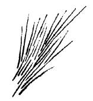

Was ich in den ersten beiden Vorträgen über allgemeine Prinzipien vorbrachte, durch welche die Heilkunde befruchtet werden kann durch die anthroposophische Forschung, das möchte ich heute nach der einen oder anderen Seite hin durch Einzelheiten ergänzen, durch solche Einzelheiten, die zugleich zeigen können, wie man, indem man von dieser Seite her durch Anthroposophie ins praktische Leben hineinwirkt, tatsächlich auch zu einer lebensfreundlichen, zu einer wirklichkeitsgemäßen Handhabung — wenn ich so sagen darf — des Lebens kommt. ^gcsv58

In den ersten beiden Vorträgen habe ich angedeutet, wie Anthroposophie genötigt ist, die gesamte menschliche Wesenheit zu gliedern in den physischen Leib, der für die äußeren Sinne wahrgenommen werden kann, der aber im Laufe des Erdenlebens wiederholt abgeworfen und neu gebildet wird; wie dann innerhalb dieses physischen Leibes lebt der sogenannte Äther- oder Lebensleib, der die Wachstumskräfte, die Ernährungskräfte in sich enthält, und den der Mensch mit der Pflanze gemeinschaftlich hat; wie wir aber dann beim Menschen weiter unterscheiden müssen den Träger des Empfindungslebens, des Lebens, das innerlich die äußere Welt spiegelt. Wir kommen damit zu dem astralischen Leib. — Ich sagte schon, man braucht sich an Ausdrücken nicht zu stoßen, sondern sie nur als das zu nehmen, als was sie hier erklärt werden. - Diesen astralischen Leib hat der Mensch nun mit dem Tiere gemeinschaftlich. Dann ragt aber der Mensch über die übrigen Naturreiche innerhalb seiner Erdenumgebung dadurch hinaus, daß er in sich trägt die Ich-Organisation. ^jkhj3x

Wenn wir nur im allgemeinen den Menschen so gliederten, dann würde eine solche Gliederung eigentlich ihrem Werte nach gar nicht eingesehen werden können. Wenn man aber dazu kommt, einzusehen, welche reale Bedeutung diese vier Glieder der menschlichen Natur haben, dann wird man nicht mehr eine bloße philosophische Begriffsauseinandersetzung oder nur eine Einteilung der am Menschen vorkommenden Erscheinungen darin finden; sondern dann wird man einsehen, daß mit einer solchen Gliederung etwas gewonnen ist für das Hineinschauen in die menschliche Wesenheit. Und man braucht ja nur auf eine alltägliche Erscheinung im menschlichen Leben hinzublicken, auf den Wechselzustand von Wachen und Schlafen, dann wird man schon finden, welche Bedeutung eine solche Gliederung hat. Alltäglich sehen wir den Menschen aus dem Zustande, in dem er von innen heraus seine Glieder bewegt und aus der Außenwelt die Eindrücke aufnimmt, um sie innerlich zu verarbeiten, übergehen in denjenigen Zustand, wo er schlafend regungslos daliegt, wo sein Bewußtsein hinuntersinkt — wenn nicht die Träume heraufgaukeln - in eine innere, unbestimmte Finsternis. Will man nämlich nicht annehmen, daß das, was im Menschen innerlich lebt, innerlich west als Wollen, Fühlen und Denken, beim Einschlafen ins Nichts vergeht, beim Aufwachen aus dem Nichts wieder zurückkehrt, dann wird man sich fragen müssen; Wie verhält sich denn der wachende Mensch zum schlafenden Menschen? ^ki4s7k

Da zeigt uns diejenige Anschauung, die in der Lage ist, auf diese höheren, übersinnlichen Glieder der menschlichen Wesenheit hinzublicken, daß dasjenige, was vom Menschen während des Schlafens im Bette liegt, nur den physischen Leib und den Äther- oder Lebensleib enthält, während der astralische Leib und die Ich-Organisation sich von den beiden anderen Gliedern getrennt haben. Sobald wir aber und ich kann diese Dinge natürlich hier nur andeuten als Ergebnisse geisteswissenschaftlicher, anthroposophischer Forschung, die so sicher stehen wie nur irgendein mathematisches oder naturwissenschaftliches Ergebnis - darauf gekommen sind, daß der Mensch sein Astralisches und seine Ich-Organisation, also sein eigentliches reales Geistig-Seelisches, während des Schlafes herausheben kann aus der physischen Organisation, dann kommt man auch auf ein anderes: daß dieses radikale, dieses totale Herausheben während des Schlafes teilweise, partiell, auch während des Wachens eintreten kann. Wir brauchen ja nur darauf hinzuschauen, wie es in der menschlichen Wesenheit immerhin Zustände gibt, die gewissermaßen das Schlafen anheben, aber es nicht bis zum völligen Schlafen bringen: Ohnmachtszustände, Bewußtlosigkeit, Betäubungszustände. Das sind Zustände, in denen die menschliche Wesenheit gewissermaßen das Schlafen anhebt, aber nicht bis zum völligen Schlafen kommt, wo sie so schwebt zwischen Schlafen und Wachen. Was liegt denn beim Menschen vor, wenn derartige Zustände eintreten? ^s87kt5

Um das zu verstehen, muß man völlig in die menschliche Wesenheit hineinschauen können. Dazu muß man dessen gedenken, was ich im letzten Vortrage als ein anthroposophisches Forschungsergebnis auseinandergesetzt habe. Ich sagte, daß es möglich geworden ist, die gesamte Organisation des Menschen zu gliedern nach dem Nerven-Sinnesorganismus, nach dem rhythmischen Organismus, der alle rhythmischen Vorgänge als Funktionen umfaßt, und nach dem Stoffwechsel-Gliedmaßenorganismus. Und ich sagte auch schon, daß der Stoffwechsel-Gliedmaßenorganismus polarisch entgegengesetzt ist dem Nerven-Sinnesorganismus, während der rhythmische zwischen beiden vermittelt. Wir können uns schematisch dieses Verhältnis durch die Zeichnung versinnlichen, in der mit A der Nerven-Sinnesorganismus, mit C der Stoffwechsel-Gliedmaßenorganismus angedeutet sein soll, während B den rhythmischen Organismus darstellen soll, der die beiden anderen verbindet, in beide hineingestellt ist. Natürlich ganz schematisch. Durch alle drei dieser Systeme der menschlichen Natur gehen hindurch diese vier Glieder der menschlichen Wesenheit: der physische Leib, der Äther- oder Lebensleib, der astralische Leib und die IchOrganisation. Aber die menschliche Wesenheit ist eben durchaus kompliziert. Und es ist nicht so, daß man unter allen Umständen sagen kann wie: im Schlafe geht der ganze astralische Organismus und die ganze Ich-Organisation aus dem physischen und dem ätherischen Organismus heraus. Sondern es kann so sein, daß der Nerven-Sinnesorganismus bis zu einem gewissen Grade von dem astralischen Leib und von der Ich-Organisation verlassen wird. Dann ist, weil der Nerven-Sinnesorganismus, wenn er auch den ganzen Menschen erfüllt, hauptsächlich im Haupt konzentriert, lokalisiert ist, dann ist im Gegensatz der menschliche Kopf genötigt, so etwas zu entwickeln, was gegen den Schlaf hinüberneigt. Aber der Mensch schläft nicht; denn sein Stoffwechsel-Gliedmaßensystem und sein rhythmisches System enthalten noch voll den astralischen Organismus und die Ich-Organisation. Diese beiden sind nur aus dem Haupte heraus. Dadurch wird im Kopfe ein dumpfer, ein Betäubungszustand, ein Ohnmachtszustand hervorgerufen. Der übrige Organismus aber funktioniert wie im Wachleben. ^ddqnoa

 ^y75mvq

Was ich Ihnen hier geschildert habe, das braucht für den Menschen nicht bloß als irgendein Zustand einzutreten, der durch das oder jenes von innen heraus bestimmt ist, sondern es kann dadurch eintreten, daß wir Äußeres auf den Menschen wirken lassen, indem wir ihm zum Beispiel eine gewisse Quantität Blei oder einer Bleiverbindung beibringen. Was den Betäubungszustand, den Schwindelzustand durch Abtrennen des astralischen Leibes und der Ich-Organisation vom Haupte bewirkt, also diesen partiellen Schlafzustand, das können wir dadurch hervorrufen, daß wir dem menschlichen Organismus eine gewisse Dosis Blei zuführen. Wir sehen daraus, daß diese äußere Substanz, das Blei, indem es in den menschlichen Organismus eingeführt wird, den astralischen Organismus und die Ich-Organisation aus dem Kopfe heraustreibt. Wir blicken damit tief hinein in die menschliche Organisation, in ihr Verhältnis zur Umwelt; wir sehen, wie der menschliche Organismus abhängig werden kann von dem, was er in dieser Weise aufnimmt. ^yv292x

Aber nehmen wir jetzt an, wir finden, daß der Mensch die entgegengesetzten Zustände von denjenigen zeigt, die ich soeben geschildert habe, daß er zeigt: sein astralischer Leib und seine Ich-Organisation stecken zu intensiv im Kopfe drinnen, wirken zu stark auf den Kopf. Worin sich das zeigt, kann uns klarwerden, wenn wir einmal prüfen, wie die Hauptesorganisation auf den ganzen menschlichen Organismus wirkt, wenn wir studieren, wie der Organismus sich überhaupt aufbaut. Wir sehen in ihm entstehen die ganz festen Teile, die Skeletteile; wir sehen weiter die weicheren Teile, die Muskeln und so weiter entstehen. Studieren wir die menschliche Entwickelung von Kindheit auf, so finden wir, daß derjenige Teil des Organismus, der uns zunächst durch seinen äußeren Bau zeigt, wie er nach der Verknöcherung hinneigt, der uns durch seine ganze Organisation zeigt, daß er in der Verknöcherung sein Wesentlichstes hat, das Haupt, durch die ganze Entwickelung hin die Kräfte ausstrahlt, welche skelettbildend sind und damit verhärtend, versteifend in der menschlichen Wesenheit wirken. Wir kommen allmählich darauf, welche Aufgaben die Ich-Organisation und der astralische Organismus im Menschen haben, indem sie den Kopf durchdringen: sie wirken so, daß der Mensch vom Kopfe aus im wesentlichen diejenigen Kräfte ausstrahlt, die ihn innerlich verhärten, die namentlich dahin wirken, daß er feste Teile aussondert aus seiner mehr flüssigen Organisation. Wirken nun im menschlichen Haupt der astralische Leib und die Ich-Organisation zu stark, dann wirkt vom Kopfe ausstrahlend ein zu starkes Prinzip der Verhärtung, des Sich-Versteifens. Und die Folge ist, was wir an der menschlichen Organisation beobachten, wenn wir alt werden, wo wir sozusagen die Anlage zur Knochenbildung im Entstehen in der Arteriosklerose, in der Verkalkung der Adern, in uns tragen. Das Versteifungs- oder Verhärtungsprinzip, das sonst in die Knochen hineinschießt, das schießt in der Sklerose in übermäßiger Weise in den Organismus hinein. Wir haben es zu tun mit einer starken Wirkung der Ich-Organisation und des astralischen Leibes; diese beiden setzen sich gewissermaßen zu tief in den Organismus hinein. ^6wtm35

Hier beginnt die Anschauung von dem astralischen Leib sehr wirklichkeitsgemäß zu werden. Denn bringen wir dem Organismus Blei bei und ist er normal, so drängen wir seinen astralischen und seinen Ich-Organismus aus dem Kopfe heraus. Stecken diese beiden aber zu stark im Kopfe drinnen, und bringen wir ihm dann die entsprechende Dosis Blei bei, so haben wir recht, daß wir die astralische und die Ich-Organisation etwas aus dem Kopfe herausbringen: wir bekämpfen die Sklerose. Hier sehen wir, wie wir durch äußere Mittel auf diesen Zusammenhang der menschlichen Wesensglieder wirken können: indem wir dem gesunden Organismus Blei beibringen, können wir dahin wirken, daß er krank, betäubt, ohnmächtig wird, indem aus seiner Hauptesorganisation der astralische Leib und das Ich sich abgliedern, wie sonst nur im Schlafe; stecken sie aber zu tief im Kopfe drinnen, wacht der Mensch zu stark, bewirkt er durch sein fortdauerndes zu starkes Wachsein, daß er sich innerlich verhärtet, dann kommt er in die Sklerose, und wir tun in diesem Falle recht, astralischen Leib und Ich aus dem Haupte etwas herauszutreiben. Wir sehen so die innere Wirkung des Heilmittels ein, indem wir gerade die verschiedenen Glieder der menschlichen Natur überblicken. ^8tq90j

Nehmen wir nun den entgegengesetzten Fall an: wir haben dieselben Erscheinungen in der Stoffwechsel-Gliedmaßenorganisation. Wenn der Mensch völlig schläft, sind der astralische Leib und die Ich-Organisation auch aus der Stoffwechsel-Gliedmaßenorganisation heraus. Aber ohne daß wir den astralischen Leib und das Ich aus dem Haupte heraustreiben, können wir sie aus dem Stoffwechsel-Gliedmaßensystem heraustreiben; denn wie wir durch Blei die astralische und die Ich-Organisation aus dem Kopfe herausbringen, Betäubungen und dergleichen hervorrufen, so können wir, indem wir eine gewisse Dosis Silber oder einer Silberverbindung dem Menschen beibringen, die astralische und Ich-Organisation aus dem Stoffwechsel-Gliedmaßensystem heraustreiben. Wir bekommen dann entsprechende Erscheinungen in der Verdauung, bekommen Verhärtung in den Abscheidungen, Störung im Verdauungssystem und so weiter. ^wtblvs

Nehmen wir aber an, wir haben im Organismus ein zu starkes Durchsetztsein unserer Verdauungsorgane durch den astralischen Leib und durch das Ich. Nun sind diese beiden, astralischer Leib und Ich, die eigentlichen Akteure, die tätigen Motore für die Verdauungsorganisation eben im Stoffwechsel-Gliedmaßensystem. Wenn sie zu stark wirken, sich gewissermaßen zu tief hineinsetzen, dann wird zuviel verdaut, zu stark verdaut. Wir bekommen eine zu schnelle Verdauung, bekommen die Erscheinung von Durchfällen und alles, was damit zusammenhängen kann; wir bekommen auch diejenigen Erscheinungen, die als Folgezustände einer solchen zu oberflächlichen, weil zu schnell vollzogenen Verdauung eintreten. ^0htqy3

Aber das ist mit noch etwas anderem verbunden, damit nämlich, daß die Stoffwechsel-Gliedmaßentätigkeit im Überschusse vorhanden sein wird. Im menschlichen Organismus wirkt aber alles zusammen. Ist die Stoffwechsel-Gliedmaßentätigkeit im Überschusse vorhanden, so wirkt sie zu stark, wirkt sowohl auf die rhythmische Organisation wie auf die Kopforganisation, namentlich aber auf die rhythmische; denn in dieser setzt sich die Verdauungsorganisation fort, das Verdaute wird in Blut verwandelt. Von dem, was da stofflich-substantiell in das Blut hineinkommt, hängt wiederum der Rhythmus im Blute ab. Wir bekommen, indem so etwas eintritt, daß der astralische Leib und das Ich zu stark wirken, Fiebererscheinungen, gesteigerte 'Temperatur. Wenn wir jetzt wissen, wir treiben den astralischen Leib und die Ich-Organisation aus dem Stoffwechsel-Gliedmaßensystem heraus, indem wir dem Menschen eine Dosis Silber zuführen, dann wissen wir jetzt weiter: wenn nun der astralische Organismus und die Ich-Organisation zu tief drinnenstecken im Stoffwechsel-Gliedmaßensystem, so können wir sie nun durch Silber oder eine Silberverbindung als Heilmittel aus diesem System herausbringen. ^on5o32

Daraus sehen Sie wieder, wie wir imstande sind, diese Zusammenhänge in der menschlichen Wesenheit beherrschen zu lernen. Und so versucht die Geisteswissenschaft, die ganze Natur «abzusuchen». Ich habe das letzte Mal gezeigt, im Prinzip, wie man das in bezug auf Pflanzenwesenheiten tun kann; ich habe heute gezeigt, wie man es in bezug auf zwei mineralische Substanzen, Blei und Silber, tun kann. Man lernt das Verhältnis des menschlichen Organismus in bezug auf seine Umgebung dadurch durchschauen, daß man erst aufmerksam wird, wie diese verschiedenen Substanzen, die in der Umwelt sind, von den verschiedenen Gliedern der menschlichen Wesenheit verarbeitet werden. ^09f6q5

Und nun wollen wir einmal versuchen, ein Beispiel uns vor die Seele zu rücken, das uns zeigen wird, wie es möglich ist, aus der inneren Einsicht in die Wirkungsweise der menschlichen Organisation vom pathologischen Zustand zum Durchschauen des Therapeutischen zu kommen. Dazu muß ich etwas vorausschicken. — Wir haben eigentlich immerfort eine Art Heilmittel in uns. Die menschliche Natur braucht immerfort eine Art Heilmittel, es ist selbstverständlich nicht ganz genau gesprochen, indem ich dies sage, aber Sie werden sogleich verstehen, was gemeint ist. Die menschliche Natur neigt nämlich dazu, daß die Ich-Organisation und der astralische Leib eigentlich zu stark in den physischen Leib und Ätherleib versinken möchten. Der Mensch möchte immer mehr oder weniger nicht hell, sondern dumpf in die Welt hinausschauen; er möchte auch nicht rührig sein, er möchte eigentlich ruhen, hat so eine Vorliebe für Ruhe. Er hat eigentlich immer die Krankheit des Ruhenwollens etwas in sich. Die muß ihm geheilt werden. Und wir sind nur gesund, wenn der menschliche Organismus fortwährend geheilt wird. Zu diesem Heilen ist das Eisen im Blute. Das Eisen ist dasjenige Metall, das immerfort auf den Organismus so wirkt, daß astralischer Leib und Ich sich nicht zu stark mit physischem Leib und Ätherleib verbinden. Wir haben eigentlich im Menschen fortwährend eine Therapie: die Eisentherapie; und wir haben in dem Moment, wo der Mensch zu wenig von dem Eisen in sich trägt, sogleich die Sehnsucht, ruhig zu werden, schlaff zu werden; und sobald der Mensch zu viel an Eisen in sich entwickelt, haben wir ein unwillkürliches Regsamsein, ein Zappeligsein. Das Eisen ist der Regulator des Zusammenhanges zwischen physischem Leib und ätherischem Leib einerseits und astralischem Leib und Ich-Organisation andererseits. Wenn also in diesem Zusammenhange irgend etwas gestört ist, so werden wir auch sagen können: Vermehrung oder Verminderung des Eisengehaltes im menschlichen Organismus wird das richtige Verhältnis wieder herstellen. ^4fls68

Nun betrachten wir einmal eine Krankheitsform, die von der Medizin nicht sehr geschätzt wird. Man kann ganz gut verstehen, warum. Sie ist nämlich zunächst so verworren, scheinbar, daß man nicht sogleich darauf kommt, worin sie besteht. Daher gibt es dafür auch alle möglichen Heilmittel, so daß, wenn jemandem ein solches empfohlen wird, man auch sagt: dafür hat ja schon jeder der Heilmittelerfinder ein Mittel erfunden. Es ist die Krankheit, die zwar von der Medizin, wie gesagt, nicht sehr geschätzt wird, aber die doch für die von ihr Betroffenen sehr unangenehm ist: die Migräne. Die Migräne scheint verworren zu sein, weil sie in der Tat im Grunde recht kompliziert ist. - Wenn wir den menschlichen Hauptesorganismus betrachten, so haben wir in ihm, zunächst mehr zentral gelegen, die Ausläufer der Sinnesnerven, die in einer wunderbaren Weise sich vernetzen und verstricken. Was mehr in der Mitte des Gehirns im menschlichen Haupte liegt, was die Organisation der Sinnesnerven nach innen ist, das ist eigentlich ein Wunderbau. Das ist im Grunde genommen dasjenige, was am vollkommensten in bezug auf die physische Organisation dasteht; denn da prägt sich das Ich des Menschen in seiner Wirksamkeit auf den physischen Leib am allerintensivsten aus. In jener Art, wie die Sinnesnerven nach innen gehen, sich miteinander verbinden, etwas wie eine innere Gliederung im ganzen Organismus bewirken, da strebt die menschliche Organisation über das Tierische weit, weit hinaus. Das ist ein Wunderbau. Und da ist es sehr leicht möglich, daß — weil gerade dort die menschliche Ich-Organisation, das höchste Glied der menschlichen Wesenheit, eingreifen muß, um diesen Wunderbau zu regulieren —, diese Ich-Organisation zeitweilig versagt, so daß die physische Organisation an dieser Stelle sich selbst überlassen ist. Es ist durchaus möglich, daß sich in dieser sogenannten weißen Substanz des Gehirns ergibt: die Ich-Organisation ist nicht mächtig genug, um sie zu durchdringen, um sie ganz durchzuorganisieren. Es fällt die physische und die ätherische Organisation aus der Ich-Organisation heraus, und so etwas wie Fremdorganisation gliedert sich dem menschlichen Organismus ein. ^ky2ts3

Nun ist die weiße Gehirnsubstanz umgeben von der grauen Gehirnsubstanz, von jener Substanz, die viel weniger fein gegliedert ist, die zwar von der gewöhnlichen Physiologie als die bedeutendere angesehen wird, aber es nicht ist, deshalb nicht ist, weil sie viel mehr mit der Ernährung zusammenhängt. Wir haben eine viel regsamere 'Tätigkeit in bezug auf Ernährung, in bezug auf innere Ansammlung von Stoffen in der grauen Gehirnsubstanz als in der weißen, die in der Mitte liegt, die viel mehr dem Geistigen zugrunde liegt. - Nun hängt aber im menschlichen Organismus alles zusammen, denn jedes Glied wirkt auf jedes andere. Und in dem Augenblick, wo das Ich beginnt, sich gewissermaßen von der mittleren Gehirnsubstanz, der weißen, zurückzuziehen, kommt die graue auch gleich in Unordnung. Der astralische Leib und der ÄÄtherleib können in die graue Gehirnsubstanz nicht mehr ordentlich eingreifen; dadurch entsteht im ganzen Inneren des Hauptes eine Unregelmäßigkeit. Die Ich-Organisation zieht sich vom Mittelgehirn, die astralische Organisation mehr vom Umfange des Gehirns zurück; die ganze Organisation des menschlichen Hauptes wird verschoben. Das mittlere Gehirn fängt an, weniger dem Vorstellen zu dienen, ähnlicher zu werden dem grauen Gehirn, eine Art Verdauung zu entwickeln, die es nicht entwickeln sollte; die graue Gehirnsubstanz fängt an, stärker Verdauungsorgan zu werden, als sie es sein sollte, sie sondert zu stark ab. Fremdkörpereinschlüsse, zu starke Absonderungen durchdringen das Gehirn. Alles aber, was in dieser Weise im Haupte sich ausorganisiert, wirkt wieder zurück auf die feineren Atmungsprozesse, namentlich aber auf die rhythmischen Prozesse der Blutzirkulation. Wir haben eine zwar nicht sehr tiefgehende, aber doch bedeutungsvolle Unordnung im menschlichen Organismus und müssen nun die wichtige Frage aufwerfen: Wie bringen wir in das eigentliche Nervensystem, in diese Fortsetzung der Nerven von außen nach innen, wieder die Ich-Organisation hinein? Wie treiben wir das Ich wieder dorthin, wovon es sich zurückgezogen hat: in die mittleren Gehirnpartien? ^a60p2u

Das erreichen wir, indem wir diejenige Substanz anwenden, deren Wirkungsweise ich in den zwei ersten Vorträgen dargelegt habe: indem wir dem Organismus Kieselsäure beibringen. Würden wir aber bloß Kieselsäure anwenden, dann würden wir bewirken, daß das Ich zwar in die mittlere Nerven-Sinnesorganisation des Hauptes untertaucht, aber wir ließen die Umgebung, das heißt die graue Gehirnsubstanz, so wie sie ist. Wir müssen deshalb zu gleicher Zeit den Verdauungsprozeß in der grauen Gehirnsubstanz so regeln, daß er nicht übersprudelt, daß er sich rhythmisch eingliedert in den ganzen normalen Zusammenhang der menschlichen Wesenheit. Daher müssen wir gleichzeitig dem Organismus das Eisen zuführen, das da ist, um diesen Zusammenhang immerfort zu regeln, um den rhythmischen Organismus in der richtigen Weise zum ganzen geistigen System des Menschen in Zusammenhang zu stellen. ^3npmti

Nun merken wir aber zugleich, daß wir zu Unregelmäßigkeiten in der Verdauung gerade im Großhirn neigen. Im menschlichen Organismus geschieht aber nichts, ohne daß etwas anderes auch beeinträchtigt wird. Und so treten im ganzen Verdauungssystem dann leise, feine Unordnungen ein. Indem wir nun wiederum die äußeren Substanzen im Zusammenhange mit dem menschlichen Organismus studieren, kommen wir darauf, daß Schwefel und Schwefelverbindungen so wirken, daß vom Verdauungssystem aus eine Regelung der ganzen Verdauung zustande kommt. ^g372aq

Jetzt haben wir die drei Gesichtspunkte erörtert, die bei der Migräne in Betracht kommen: Regelung der Verdauung, deren Unordnung sich zeigt in unregelmäßiger Verdauung im Großhirn; Regelung der Nerven-Sinnestätigkeit vom Ich aus durch die Kieselsäure; Regelung der in Unordnung gekommenen Rhythmik des Zirkulationswesens, indem wir Eisen anwenden. Wir durchschauen so den ganzen Prozeß. Er ist, wie gesagt, von der gewöhnlichen Medizin ein wenig verachtet; aber er ist ungeheuer anschaulich, wenn man den menschlichen Organismus wirklich durchschaut. Und wir kommen darauf, daß uns der Organismus selber befiehlt, ein Präparat herzustellen, das aus Kieselsäure, Schwefel und Eisen in einer bestimmten Weise zusammengesetzt ist. Wir erhalten dann das, was aus anthroposophischer Forschung heraus jetzt in der Welt als Migränemittel verbreitet wird, das aber zugleich überhaupt außerordentlich regulierend wirkt auf die Ich-Organisation, damit diese richtig in den Organismus eingreift, auf alles das, was gestörte Rhythmik in der Blutzirkulation herstellt, und auf alles das, was die Wirkung, die Ausstrahlung der Verdauung in den ganzen menschlichen Organismus in der richtigen Weise bewirkt. ^igq9ka

Wer nun den menschlichen Organismus kennt, der weiß, daß von diesen drei Seiten her eigentlich ungeheuer vieles kommt, was Unordnung im Organismus bedeutet, und daß schließlich die Migräne nur ein Symptom dafür ist, daß Ätherleib, astralischer Leib und Ich nicht ordentlich im physischen Leibe drinnen wirken. Es ist daher kein Wunder, daß unser Migränemittel überhaupt dazu geeignet ist, die Zusammenwirkung zwischen Ich, astralischem Organismus, ätherischem Organismus und der physischen Organisation zu regulieren. Wenn daher der Mensch fühlt, diese Glieder seiner Wesenheit wirken nicht ordentlich in ihm zusammen, dann wird unser Migränemittel — das eben nicht ein bloßes Migränemittel ist — unter allen Umständen ihm helfen können. Es ist ein Migränemittel, weil es eben gerade auf das hingeht, was sich in der Migräne in seinen radikalsten Symptomen zeigt, und ich konnte Ihnen gerade an diesem Mittel anschaulich machen, wie man nach anthroposophischen Prinzipien studiert, worin das Wesen einer Krankheit besteht und wie man dann, wenn man weiß, was auf die einzelnen Glieder der menschlichen Wesenheit so oder so wirkt, das Präparat zusammenstellt. ^4qu4rp

Bei den Heilmitteln, die auf diese Weise hergestellt werden, kommt es eben überall darauf an, daß man erkennt, welches das Verhältnis des menschlichen Organismus zur Umwelt ist. Aber da muß man ganz ernsthaftig darauf ausgehen, dieses Verhältnis seiner Wesenheit nach zu studieren. Ich habe das letzte Mal angeführt, wie man zu Pflanzenheilmitteln kommt, habe das Beispiel des Ackerschachtelhalms, des Equisetum arvense, angeführt. Man kann von jeder Pflanze sagen: sie wirkt in dieser oder jener Weise auf dieses oder jenes Organ. Aber wir müssen uns, wenn wir so etwas studieren wollen, auch dann darüber klar sein, daß eine Pflanze, die draußen irgendwo wächst, im Frühling etwas ganz anderes ist als im Herbst. Wenn wir im Frühling die sprießende, sprossende Pflanze haben, dann ist in ihr enthalten ein Physisches und ein Ätherisches, wie es der Mensch auch in sich trägt. Verwende ich dann irgend etwas Substantielles von diesen Pflanzen im menschlichen Organismus, dann werde ich insbesondere starke Wirkungen auf den physischen Leib und den ätherischen Leib haben können. Lassen wir jetzt die Pflanzen den Sommer hindurch draußen stehen und pflücken wir sie, wenn es gegen den Herbst zu geht, so haben wir die absterbende, die verdorrende und vertrocknende Pflanze. ^5adm02

Schauen wir jetzt zurück auf den menschlichen Organismus. Er sprießt und sproßt durch die Entwickelung seines physischen Leibes, sprießt und sproßt durch das, was der Ätherleib in ihm bewirkt. Durch den astralischen Leib wird abgebaut, durch die Ich-Organisation ebenfalls. Wir haben im Menschen fortwährend sprießendes, sprossendes Leben durch den physischen Leib und durch die ätherische Organisation. Würde nur dies im Menschen sein, er würde nicht ruhiges, besonnenes Bewußtsein entwickeln; denn je mehr wir die Wachstumskräfte anregen, je mehr es in uns sprießt und sproßt, desto unbesonnener werden wir. Und wenn wir gar die Ich-Organisation und den astralischen Organismus im Schlafe aus den beiden anderen Gliedern weg haben, dann sind wir ganz unbewußt, bewußtlos. Was den Menschen aufbaut, das macht ihn wachsend, macht, daß Ernährungskräfte in ihm die aufgenommenen Substanzen verarbeiten; das bringt es aber nicht dahin, daß empfunden und gedacht wird. Sondern damit empfunden und gedacht wird, muß abgebaut werden. Dazu sind der astralische Leib und die Ich-Organisation da. Sie bewirken einen fortwährenden Herbst im Menschen. Durch die physische Organisation und den ätherischen Leib ist fortwährend Frühling im Menschen, sprießendes, sprossendes Leben, aber keine Besonnenheit, kein Bewußtsein, nichts SeelenhaftGeistiges. Durch die astralische und die Ich-Organisation wird abgebaut; da wird der ätherische Leib in seinen Kräften zurückgestaut, da wird der physische Leib verhärtet, verdorrend gemacht. Aber das muß geschehen. Der physische Leib muß fortwährend hin- und herschwingen zwischen Aufbau und Abbau; der ätherische Leib muß fortwährend hindurch zwischen sprießenden und sprossenden Kräften einerseits und zwischen Kräften, die sich zurückziehen, andererseits. Draußen in der Natur finden wir die Kräfte sich abwechseln vom Frühling gegen den Herbst; die Natur läßt es Frühling und Herbst werden getrennt nach Zeiten. Im Menschen haben wir einen Rhythmus: indem er einschläft, wird es in ihm ganz Frühling, da sprießt und sproßt das physische und ätherische Leben; indem er erwacht, wird das physische und ätherische Leben zurückgedrängt, zurückgestaut, die Besonnenheit macht sich geltend: es wird Herbst und Winter. Daraus kann man sehen, wie äußerlich man eigentlich urteilt, wenn man nur nach äußeren Analogien geht. Wer würde denn nicht, wenn er auf Äußerliches sieht, das Aufwachen des Menschen, sein Übergehen zum Tagesleben als Frühling und Sommer schildern und das Einschlafen als das Hineingehen in die Winterfinsternis? Aber so ist es nicht in Wirklichkeit. Schlafen wir ein, dann fängt es in uns an, weil der astralische Leib und das Ich weg sind, zu sprießen und zu sprossen; da geht auf das Ätherische, das uns sonst in der Pflanze erfreut, da wird es Frühling und Sommer, wenn wir einschlafen; und könnten wir auf den physischen und Ätherleib zurückschauen und beobachten, was da vorgeht, wenn wir sie beide verlassen haben — dazu braucht man natürlich geistiges Wahrnehmungsvermögen; das kann man mit physischen Augen nicht sehen, denn mit ihnen würde man nur den regungslosen Leib sehen -, so würde man das Sprießen und Sprossen schildern können. Und beim Aufwachen würden wir mit geistigem Erkennen wahrnehmen, wie wir hineingehen in den Herbst. ^gkjdtf

Nehmen wir jetzt nun an, wir suchen nach Pflanzenheilmitteln. Wir pflücken den Enzian im Frühling. Der Enzian ist ein gutes Heilmittel gegen Dyspepsie. Pflücken wir ihn im Frühling, dann werden wir, wenn wir ihn in der richtigen Weise zu einem Heilmittel verwerten, auf das wirken können, was immerfort vorzugsweise von dem physischen und dem ätherischen Leib ausgeht. Haben wir gestörtes Wachstum, gestörte Ernährungskräfte, so werden wir Enzianwurzeln auskochen und die ausgekochte Substanz verwenden, um die Ernährungskräfte zu verbessern und die Störung zu bekämpfen. Verwenden wir aber die Enzianwurzeln, indem wir sie im Herbst ausgraben, wo der ganze Enzian daraufhin organisiert ist, gerade abzubauen, dem ähnlich zu werden, was der astralische Leib im Menschen bewirkt, dann wird nichts aus der Heilung; im Gegenteil, dann verstärken wir die Verdauungsunregelmäßigkeit. Wir müssen daher nicht nur irgendeine Pflanze kennen und von ihr sagen: sie ist für dies oder jenes ein Heilmittel, sondern wir müssen noch wissen, wann wir diese Pflanze pflücken müssen, um sie als Heilmittel zu verwenden. ^h5to3p

So müssen wir das ganze Werden der Natur überschauen, wenn wir Pflanzenheilmittel, die besonders wirksam sein können, verwenden wollen. Deshalb ist bei derjenigen Herstellung von Heilmitteln, wo man zu einer rationellen Therapie tatsächlich aus der Erkenntnis des Krankheitszustandes kommen muß, notwendig, daß man alles berücksichtigt, was sich ergibt auch aus dem Werden der Pflanzenwelt. Man muß also wissen, wenn man seine Präparate herstellt, daß man etwas anderes macht, wenn man die Pflanzen im Herbst sammelt und verwendet, und etwas anderes wiederum, wenn man sie im Frühling sammelt und verwendet. Das aber, was da nur getrennt durch große Zeiträume möglich ist, das ist schon auch in kleinen Zeiträumen möglich. Wenn wir die Präparate, die als Heilmittel dienen sollen, herstellen, so müssen wir lernen, was es heißt: Enzian in der ersten Maiwoche pflükken - Enzian in der letzten Maiwoche pflücken. Denn was der Mensch im Verlaufe von vierundzwanzig Stunden in sich trägt: Frühling, Sommer, Herbst und Winter, das ist draußen in der Natur über dreihundertfünfundsechzig Tage ausgedehnt; wir brauchen für den Menschen für den Zeitraum von vierundzwanzig Stunden das, was sich draußen in der Natur in dreihundertfünfundsechzig Tagen entwickelt. ^l8k7gd

Daraus sehen Sie, was es heißt: anthroposophische Prinzipien auf die Heilkunde anwenden. Wir haben heute eine sehr verdienstvolle Heilkunde, und ich habe, weil das besonders betont werden muß, wiederholt während dieser Vorträge gesagt: Was Anthroposophie der Heilkunde an Diensten leisten will, das soll durchaus nicht in Opposition treten gegen das, was von der heute anerkannten Heilkunde geleistet wird. Insofern dieses als berechtigt anerkannt wird, soll anthroposophische Heilkunde durchaus auf dem Boden der heutigen Medizin stehen. Mit jenen Bestrebungen, wo man in laienhafter Weise eigentlich bloß davon ausgeht, daß das, was man studieren soll, zuviel ist, und man nun allerlei pfuscherische Heilmittel auf leichte Weise erlangen möchte, mit denen kann Anthroposophie nicht mitgehen. Denn sie erkennt, daß die Wirklichkeit, wenn man sie geistig durchschaut, sich als viel komplizierter erweist, als man nach der physischen Wissenschaft ahnt. Daher wird das, was nach der einen oder anderen Seite auftritt, wo man wenig zu wissen braucht, um als Heiler zu gelten, vielleicht sehr beliebt werden können; denn das gibt sich so, daß man sagt: Man erspart sich das ärztliche Studium. — Das kann man nicht sagen! Anthroposophie kann den Leuten das ärztliche Studium nicht ersparen, im Gegenteil, sie muß noch vieles andere hinzufügen. Allerdings könnte das ärztliche Studium mit größerer Ökonomie getrieben werden; man könnte auf kürzere Zeit gebracht das lehren, was heute, weil es unübersehbar geworden ist, auf viele Jahre ausgedehnt wird. Aber es muß noch etwas dazukommen: das Durchschauen der menschlichen Wesenheit. ^s1j1ui

Nehmen Sie noch einmal, was ich in diesen Vorträgen schon gesagt habe, daß das Nerven-Sinnessystem durchdrungen ist von allen vier Gliedern der menschlichen Wesenheit, vom physischen Leib, ätherischen Leib, astralischer Organisation und Ich; und das StoffwechselGliedmaßensystem ist wiederum von allen vier Gliedern durchdrungen. Aber in verschiedener Weise sind beide von ihnen durchdrungen. Das Stoffwechsel-Gliedmaßensystem ist so davon durchdrungen, daß die Ich-Organiisation dem Willen nach wesentlich stärker wirkt. Alles, was Aktivität ist, was den Menschen und die ganze menschliche Organisation in Bewegung bringt, steckt in der Stoffwechsel-Gliedmaßenorganisation; alles, was den Menschen in Ruhe läßt und ihn ausfüllt mit inneren Erlebnissen, mit Vorstellungen, Gedanken und Gefühlserlebnissen, das steckt in der Nerven-Sinnesorganisation. Das stellt einen wesentlichen Unterschied dar, den Unterschied, daß in der Nerven-Sinnesorganisation der physische Leib und der Ätherleib viel wichtiger sind als das Ich und die astralische Organisation; und für die Stoffwechsel-Gliedmaßenorganisation sind insbesondere das Ich und die astralische Organisation wichtig. Wenn daher Ich und astralischer Leib zu stark im Nerven-Sinnessystem wirken, dann wird dasjenige im Menschen auftreten, was das Nerven-Sinnessystem in die übrigen Organisationsglieder der menschlichen Natur hineintreibt. Übersteigerung der Ich-Organisation und der astralischen Organisation im Nerven-Sinnesorganismus treiben diese ganze Nerven-Sinnesorganisation irgendwie in die Stoffwechsel-Gliedmaßenorganisation hinein. Da können die verschiedensten Wege gesucht werden, wie die NervenSinnesorganisation hineingetrieben wird in die Stoffwechsel-Gliedmaßenorganisation: immer entsteht das, was wir unter dem allgemeinen Namen Geschwulstbildung fassen können. Und Geschwulstbildungen lernen wir verstehen, wenn wir sehen, wie durch eine übertriebene Ich-Tätigkeit oder astralische Tätigkeit die Nerven-Sinnesorganisation in den übrigen Organismus hineingetfieben wird. ^ol7969

Nehmen wir umgekehrt an: In dem Stoffwechsel-Gliedmaßenorganismus treten Ich und astralische Organisation zurück; physische und ätherische Organisation werden zu stark, sie strahlen hinein in das Nerven-Sinnessystem, sie überfluten es mit den Vorgängen, die nur dem Stoffwechsel-Gliedmaßensystem angehören sollen: Entzündungszustände entstehen. Wir durchschauen, wie Geschwulstbildungen und Entzündungszustände als polarische Gegensätze auftreten. Wissen wir jetzt, wie wir die. Nerven-Sinnesorganisation, wenn sie irgendwo im Stoffwechsel-Gliedmaßensystem zu wirken anfängt, zurücktreiben können, dann kommen wir zu möglichen Heilungsprozessen. ^01lcws

Einer derjenigen Prozesse nun, wo die Nerven-Sinnesorganisation wirklich in einer furchtbaren Art irgendwo innerhalb der Stoffwechsel-Gliedmaßenorganisation auftreten kann, ist die Krebsbildung, die Karzinombildung. In ihr liegt also das vor, daß die Nerven-Sinnesorganisation in die Stoffwechsel-Gliedmaßenorganisation hineingeht und sich innerhalb dieser geltend macht. Im zweiten Vortrage sagte ich, wir sehen innerhalb des Stoffwechsel-Gliedmaßensystems so etwas auftreten wie an falscher Stelle gebildete Sinnes-Organanlagen. Das Ohr, wenn es an richtiger Stelle gebildet wird, ist normal; wird eine Ohranlage oder überhaupt eine Sinnesorgananlage — nur eben in der ganz spärlichen Anlage — an falschem Orte gebildet, so haben wir es mit einer Karzinombildung, mit einer Krebsorganisation zu tun. Dieser Neigung des menschlichen Organismus, an falscher Stelle Sinnesorgane bilden zu wollen, müssen wir entgegenwirken. Dazu muß man nun tief hineinschauen in die ganze Entwickelung, die in der Welt, im Kosmos, zum Menschen heraufgeführt hat. ^lqlmuf

Wenn Sie die anthroposophische Literatur durchgehen, so werden Sie eine ganz andere Kosmologie und eine ganz andere Weltentstehungslehre finden, als der Materialismus sie zeigt. Sie werden finden, daß unsere Erdenbildung eine andere, vorhergehende Bildung hatte, in welcher der Mensch noch nicht in seiner heutigen Form vorhanden war, aber doch - in einer gewissen Beziehung — das Tier geistig überragend vorhanden war. Nur waren seine Sinne damals noch nicht ausgebildet. Sie sind erst innerhalb der Erdentwickelung beim Menschen in ihrer letzten Ausbildung entstanden. Veranlagt sind sie am längsten; aber ihre letzte Ausbildung, wo sie so, wie sie heute sind, von der Ich-Organisation durchsetzt sind, haben sie erst während der Erdentwickelung erlangt. Das menschliche Ich schoß in Augen, Ohren und in die übrigen Sinne während der Erdentwickelung hinein. Wird daher die Ich-Entwickelung zu stark, so bildet sich im menschlichen Organismus nicht bloß der Sinn in normaler Weise, sondern es entsteht eine zu starke Neigung, Sinne zu bilden. Und die Karzinombildung tritt auf. Was muß ich tun, wenn ich hier heilend eingreifen will? Ich muß zu riüheren Zuständen der Erdentwickelung zurückgehen, wo auf der Erde noch nicht diejenigen Organismen vorhanden waren, wie sie heute da sind; ich muß irgendwo nachschauen, wo etwas ist, was der letzte Rest, das Überbleibsel, die Erbschaft von früheren Erdenzuständen ist. Da komme ich darauf, daß es diejenigen Pflanzen sind, die als Parasiten, als Viscumbildungen, als Mistelbildungen auf den Bäumen wachsen, die es nicht dazu gebracht haben, im Erdboden zu wurzeln, sondern auf Lebendigem wuchern müssen. Warum müssen sie das? Weil sie sich eigentlich entwickelt haben, bevor unsere Erde diese feste mineralische Erde geworden ist. Ich sehe heute in der Mistel das, was nicht reine Erdenbildung hat werden können; es muß auf der fremden Pflanze aufsitzen, weil das Mineralreich am letzten in der Erdentwickelung entstanden ist. Und in der Mistelsubstanz haben wir das, was in der entsprechenden Weise verarbeitet, sich als Heilmittel gegen die Karzinombildung darstellt, das die Sinnesorg>nbildung an falscher Stelle innerhalb des menschlichen Organismus austreibt. - Die Natur durchschauen, bedeutet, die Möglichkeit zu haben, dasjenige zu bekämpfen, was aus der normalen Entwickelung irgendwie im krankhaften Zustande herausfällt. Der Mensch wird zu stark Erde, indem er die Krebsbildung in sich hat; er bildet zu stark die Erdkräfte in sich aus. Diesen übertriebenen Erdkräften muß man diejenigen Kräfte entgegensetzen, die einem Zustande der Erde entsprechen, wo das Mineralreich und die heutige Erde noch nicht da waren. Deshalb arbeiten wir auf dem Boden anthroposophischer Forschung das Karzinommittel aus in einem bestimmten Viscumpräparat. Und es wird dadurch ganz zweifellos aus der Anschauung der Wesenheit dieser Krankheit das Heilmittel gefunden, das die gewöhnlichen Heilungsprozesse, die Operationsprozesse, allmählich unnötig machen wird. ^cznl6m

Damit habe ich Ihnen Details angegeben. Ich könnte dem noch vieles hinzufügen, denn unsere Heilmittel sind schon in großer Anzahl vorhanden. So könnte ich zum Beispiel folgendes zeigen: Indem es möglich ist, daß die Stoffwechsel-Gliedmaßenorganisation einstrahlt in der äußersten Peripherie in die Sinnesorganisation hinein, kommt dies in einer bestimmten Form von Erkrankung zum Ausdruck, und zwar im sogenannten Heuschnupfen. Da haben wir das Umgekehrte von dem, was ich vorhin gezeichnet habe: wenn die Nerven-Sinnesorganisation gewissermaßen hinunterrutscht in die Stoffwechsel-Gliedmaßenorganisation, so hat dies Geschwulstbildung zur Folge; geht die Stoffwechsel-Gliedmaßenorganisation dagegen in die Nerven-Sinnesorganisation hinein, so bekommen wir solche Erscheinungen, wie sie zum Beispiel im Heuschnupfen vorliegen. Bei diesem handelt es sich darum, jene zentrifugalen Prozesse, wo die Stoffwechsel-Gliedmaßentätigkeit zu stark nach der Peripherie des Organismus hingelenkt ist, zu paralysieren durch etwas, was die ätherischen Kräfte wiederum zurückdrängt. Wie versuchen das mit einem Präparat, das gewonnen wird aus solchen Früchten, die sich mit bestimmten Schalenbildungen umkleiden, wo durch die Schalenbildung das Ätherische im Stoffwechsel zurückgetrieben wird. Wir setzen in unserem Präparat den zu stark auftretenden zentrifugal wirkenden Kräften im Heuschnupfen andere, stark zentripetal wirkende Kräfte entgegen, die die ersteren bekämpfen. Man durchschaut ganz genau den pathologischen und den Heilungsprozeß. Und wir können ja darauf hinweisen, wie gerade die schönsten Erfolge mit unseren Heilmitteln auf solchen Gebieten zu verzeichnen sind, mit denen man kaum so leicht heute etwas anzufangen weiß. Auf dem Gebiete der Heuschnupfenbekämpfung zum Beispiel sind sehr schöne Erfolge gerade mit den Präparaten erzielt worden, die aus dem angegebenen Gesichtspunkte heraus gewonnen worden sind. ^3ip779

So könnten viele Details angeführt werden. Und sie würden zeigen, daß durch dieses charakterisierte Durchschauen der menschlichen Wesenheit, das der anthroposophischen Forschung möglich ist, die Brücke geschlagen wird zwischen Pathologie und Therapie. Denn, wie wirken denn schließlich das Ich und der astralische Organismus? Sie bauen ab. Dadurch, daß wir abbauen, sind wir geistig-seelische Wesen. Es ist immer eine reine Giftwirkung vorhanden, wenn etwas abgebaut wird; die Organe werden zerstört. Wuchern Organe, so müssen wir sie auch stark abbauen. Aber eine Abbautätigkeit im Menschen ist die astralische und die Ich-Tätigkeit. Haben wir die äußeren Gifte, gleichgültig ob metallische oder pflanzliche Gifte, so sind diese in ihrer Wirkung auf den menschlichen Organismus verwandt der Tätigkeit der astralischen und der Ich-Organisation. Wir müssen nur verstehen, wieviel in der ganzen normalen Tätigkeit im Menschen, dadurch daß das Ich und der astralische Leib in ihm wirken, auch Giftwirkungen stattfinden. In aller Denktätigkeit, in aller seelischen Entwickelung wirken wir auf den Leib in Giftwirkungen. Wir lernen verstehen die Ähnlichkeit der äußerlich sprießenden und sprossenden Kräfte in den Pflanzen, die wir auch essen können, ohne daß sie uns schaden, mit den physischen und ätherischen Kräften im Menschen; und wir lernen erkennen die Ähnlichkeit der Wirkung des Ich und des astralischen Leibes auf den menschlichen Organismus mit der Wirkung der Kräfte und Substanzen in jenen Pflanzen, die wir nicht essen können, weil sie uns schaden; die aber, weil sie in ihrer Wirkung ähnlich werden dem, was normale Abbautätigkeit im Menschen ist, in entsprechender Verwendung als Heilmittel wirken können. ^91fx2m

So lernen wir die ganze Natur einteilen einmal in das, was den Kräften unseres physischen und ätherischen Leibes ähnlich ist, in das also, was wir essen, wo wir das Wuchern, das Wachstum fördern wollen; und zweitens in das, wo wir abbauen, das heißt in die Giftwirkungen, die unserem astralischen Leibe und der Ich-Organisation ähnlich sind. Durchschauen wir so diese vier Glieder der menschlichen Wesenheit, den physischen Leib, den ätherischen Leib, die astralische Organisation und das Ich, dann schauen wir in ganz anderer Weise auf diesen polarischen Gegensatz hin zwischen Ernährungssubstanzen und giftwirkenden Substanzen. Dann schauen wir hinein in die Heilkräfte, wie sie in den Ernährungskräften innerhalb der Natur ausgebreitet sind. Dann wird uns das Studium der Krankheit eine Fortsetzung des Studiums der Natur. Durchschauen wir beides — Gesundheit und Krankheit - geistig, dann bereichert sich uns die ganze Naturanschauung. — Es gehört nur eines dazu, um solches Studium anzustellen. Heute liebt man es, Studien anzustellen, wenn der Gegenstand, um den es sich handelt, recht ruhig ist; man will den Gegenstand ja möglichst zur Beruhigung bringen, will einen ruhigen Zustand herstellen, so daß man möglichst lange Zeit hat, um das Ganze zu überschauen. Die Anthroposophie dagegen bringt bei ihrem Studium alles in Bewegung; alles ist Regsamkeit und Bewegung. Da muß alles geschaut werden mit Geistesgegenwart; da kann man nicht sich Zeit lassen, indem man die Dinge erst beruhigt. Aber dadurch kommt man dem Leben und der Wirklichkeit nahe. Und dazu gehört auch etwas, von dem ich immer sage, wie es vorhanden ist in unserem, von unserer lieben Mitarbeiterin, Frau Dr. Wegman, geleiteten Institut in Arlesheim: der Mut des Heilens. Dieser Mut des Heilens ist ebenso notwendig wie Kenntnisse im Heilen — der Mut, der nicht einen nebulosen, phantastischen Optimismus im Heilen gibt, aber der einen begründeten Optimismus gibt, der Sicherheit bietet, wo man sagt: hier liegt ein Krankheitsfall vor, man durchschaut ihn, man versucht zu heilen, und man tut das, was man kann. Dann wird auch das Mögliche herauskommen. Dann muß man allerdings, wenn man diese innere Sicherheit haben will, durchaus den Mut haben, die menschliche Wesenheit und die Natur in ihrem Flusse erkennend erfassen zu können. Und so können natürlich solche Heilmittel, wie sie bei uns entstehen, auch nur im Zusammenhange mit dem lebendigen Betriebe des Medizinischen entstehen. Der wird aber in der Weise versucht, wie ich es im ersten Vortrage schon dargelegt habe: Neben dem Goetheanum, das Erkenntnisse erstrebt, wie sie den einzelnen Menschen befriedigen wollen auf dem Gebiete der Anthroposophie für sein Seelenleben, steht — in bescheidener Weise noch, es wird noch vollkommener werden - wie immer die Heilstätte, neben der Mysterienstätte die Klinik, weil ein wirkliches Totalverhältnis der menschlichen Wesenheit zur gesamten Welt die gesundenden aber auch die kränkenden Prozesse umfaßt, und weil ein tiefes Hineinschauen in den Kosmos nur möglich ist, wenn man diejenigen Anlagen, die ins Krankhafte hineinführen, ebenso zu überblicken vermag wie die, die ins Gesunde hineinführen. Könnte das, was menschliche aufsteigende Organisation ist, nicht zurückgedrängt werden, könnte das, was wächst und sprießt und sproßt, nicht fortwährend gedämpft werden, so würde nie geistig-seelisches Wesen möglich sein. Dieselben Erscheinungen, die im Normalzustande des Menschen zur Krankheit werden, zur Zurückbewegung der Entwickelung, die müssen ja doch in einer gewissen Form da sein, um uns überhaupt zu geistigen, zu denkenden Wesen zu machen. Könnten wir als Menschen nicht krank werden, so könnten wir auch keine geistigen Wesen sein; denn nur dadurch sind wir geistige Wesen, daß wir die Möglichkeit zum Krankwerden in uns haben. Was im Denken, Fühlen und Wollen immer auftreten muß, tritt in einer abnormen Weise in der Krankheit auf. Unsere Leber und unsere Nieren müssen dieselben Prozesse durchmachen, die wir im Denken, Fühlen und Wollen durchmachen, die nur über das Ziel hinausschießen, wenn sie in zu großer Zahl auftreten. Könnten wir nicht krank werden — wir müßten Toren bleiben unser Leben lang! Der Möglichkeit, krank zu werden, verdanken wir die andere Möglichkeit, denkende, fühlende und wollende Menschenwesen zu werden. ^fjjv6s

Wenn wir diesen Zusammenhang durchschauen - und die Anthroposophie bringt ihn uns ganz besonders zum Bewußtsein —, dann wird uns gerade vom anthroposophischen Gesichtspunkte aus eine tiefe Herzensangelegenheit, im Zusammenhange mit der Vergeistigung des Menschen die Begleiterscheinungen, die diese Vergeistigung mit sich führen muß: die Krankheitserscheinungen, zu studieren. Und dann werden uns geistige Entwickelung und das, womit diese geistige Entwickelung bezahlt werden muß, nämlich das Kranksein des Menschen, zu zwei Polen einer und derselben Menschheit, und dann stellen wir uns in der richtigen Weise — auch mit unserem Gemüt und unserem Gefühl - zum Kranksein und zu den notwendigen Heilungsprozessen. ^7mnlbu

Das ist die innere, die gefühlsmäßige Seite, wie die anthroposophische Geisteswissenschaft die Heilkunde befruchten kann. Sie kann sie befruchten in der Erkenntnis, wie ich das gezeigt habe; sie kann sie aber auch dadurch befruchten, daß sie beim Arzte das Herz an die rechte Stelle zu versetzen vermag, so daß ärztliche Hingabe und ärztliche Opferwilligkeit gerade aus dieser inneren Verwandtschaft von Krankheit und geistiger Entwickelung sich ergeben. Anthroposophie hat überall die Möglichkeit, nicht nur unser Denken, unsere Intellektualität zu vertiefen, sondern auch unser Fühlen, unseren ganzen Menschen zu vertiefen. Das ist es, was ich als die Beantwortung der Frage, die ich als Thema aufgestellt habe, geben wollte: Was kann die Heilkunst durch eine geisteswissenschaftliche Betrachtung gewinnen? ^mo2ins

Sie kann das gewinnen, daß der Arzt wirklich in die Lage kommt, als heilender Mensch ein ganzer Mensch zu werden, nicht bloß einer, der mit dem Kopfe nur über die Krankheit nachdenkt, sondern einer, der das Kranksein aus der innersten Menschenwesenheit miterlebt und dadurch in Heilungsprozessen eine richtige, eine menschenwürdige Aufgabe, seine Mission sieht. Dem Arzte wird sein Beruf dadurch erst auf den rechten sozialen Fleck gerückt, daß er durchschaut, wie die Krankheiten die Schatten der geistigen Entwickelung sind. Um aber die Schatten in der rechten Weise zu erkennen, müssen wir auch auf das Licht hinsehen; auf die Natur und Wesenheit der geistigen Prozesse selber. Lernt der Arzt in der entsprechenden Weise auf diese geistigen Prozesse hinschauen, auf das Licht, das in der menschlichen Wesenheit wirkt, dann wird er auch die Schatten in der richtigen Weise zu beurteilen verstehen. Wo Licht ist, muß Schatten sein. Wo geistige Entwickelung ist, wie zum Beispiel innerhalb der Menschheit, da müssen die Krankheitserscheinungen als die Schattenbilder einer solchen Entwickelung auftreten. Sie kann nur derjenige bemeistern, der in richtiger Weise auch zum Lichte hinschaut. ^i7bf01

Das ist das, was Anthroposophie dem Arzte und der Heilkunst geben kann. ^dpgl2b