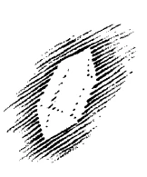

Gestern durfte ich davon sprechen, wie durch die Erkenntnis der übersinnlichen Wesenheit des Menschen Licht verbreitet werden kann über den gesunden und kranken Zustand dieses Menschen. Ich konnte zeigen, wie die physische, die ätherische, die astralische und Ich-Wesenheit im gesunden Menschen ganz bestimmte Relationen haben müssen, die allerdings nicht einem exakten, strikten Gleichgewicht entsprechen, sondern einem mehr labilen, wie aber dennoch von einer beträchtlichen Abweichung von dem gesunden Verhältnis dieser vier Glieder der menschlichen Natur das Werden der Krankheit im Menschen abhängt. Und ich habe zwei Beispiele zunächst herausgegriffen, an denen ich zeigen konnte, was sich einer geisteswissenschaftlichen Forschung, einer spirituellen Anschauung ergibt über die Krankheitsnatur aus der Erkenntnis des ätherischen Organismus, die da liefert eine bestimmte Einsicht zum Beispiel in das Karzinom, Cancer, und ich habe dann darauf hingewiesen, wie die Einsicht in das Wesen des astralischen Organismus dazu führen kann, so etwas wie den komplizierten Symptomkomplex von Morbus Basedow, der Basedowschen Krankheit, zu überblicken. ^5webyh

Wenn man nun weitergehen will aus dem Pathologischen ins Therapeutische hinein — und das wollen wir zunächst veranschaulichen an diesen beiden Beispielen —, so muß ich dazu zunächst etwas Prinzipielles noch geben, um zu zeigen, wie überhaupt eine Wirkung entsteht durch die Aufnahme äußerer Natursubstanzen in den menschlichen Organismus. ^9gjy1j

Das ganze Verhältnis der sogenannten Natur zum menschlichen Organismus begreift man nämlich erst, wenn man durchschaut, wie nicht nur dieser menschliche Organismus ein Physisch-Seelisch-Geistiges in physischem Leib, ätherischem Leib, astralischem Leib und IchOrganisation ist, sondern wenn man des weiteren begreift, was ich ja gestern schon für die Kieselsäure und Kohlensäure gezeigt habe, daß sich überall da, wo Natursubstanzen, Naturprozesse sich finden, als Grundlage dieser Natursubstanzen und Naturprozesse für die geistige Anschauung konkret ergreifbares Geistiges da ist. Aber man muß eben dann auch in das Konkret-Geistige eingehen. So wie man im Physischen unterscheiden muß zwischen einem Mineral und einer Pflanze, so muß man auch dasjenige, was die Wesen der Welt Geistiges, Spirituelles in sich tragen, in seiner Konkretheit erkennen. ^4df2mo

Nun kann ich die Dinge natürlich nur summarisch darstellen, aber ich möchte doch wenigstens auf Hauptkategorien eingehen. Nehmen wir zunächst die mineralische Natur. Wir nehmen ja aus der mineralischen Natur einen beträchtlichen Teil unserer Heilmittel, und auch dasjenige, was als spirituelle Grundlage der Medizin geschaffen werden kann, wird einen beträchtlichen Teil der Heilmittel aus dem Mineralreiche entnehmen müssen. ^l5cflg

Schauen wir uns um im ganzen Mineralreich und wir werden finden, daß dasjenige, was im Mineralreich vorhanden ist, das Geistige in sich so gebunden enthält, daß eine gewisse Verwandtschaft des Mineralischen gerade mit der menschlichen Ich-Organisation vorhanden ist, und zwar so: Man könnte glauben, wenn man dem Menschen irgendwie, sei es durch den Mund, sei es durch Injektion, Mineralisches beibringt, dann wirke das Mineralische hauptsächlich auf den menschlichen Organismus und mache ihn gesund oder krank. Nun ist es aber in Wirklichkeit so, daß das Physisch-Mineralische als solches, dasjenige, das der Chemiker untersucht, mit dem es der Physiker zu tun hat, in seinen Gedanken zu tun hat, eigentlich gerade als Physisches auf den menschlichen Organismus nicht wirkt, sondern so bleibt, wie es ist. Gerade das Physische zeigt für die geistige Anschauung, wenn es aus der Außenwelt in den menschlichen Organismus übergeführt wird, kaum eine beträchtliche Metamorphose. Dagegen wirkt das im Physischen vorhandene Geistige beim Mineralischen ganz besonders stark auf die Ich-Organisation des Menschen. So daß wir sagen können: Der Geist eines solchen Bergkristalls zum Beispiel, er wirkt besonders stark auf die Ich-Organisation des Menschen. So daß die IchOrganisation des Menschen, indem sie zum Beispiel das Kieselige in sich trägt, das Geistige der Kieselsäure, also des Quarzes, in sich beherrscht. Das ist das Bedeutsame. ^g9ynke

Gehen wir vom Mineralischen zum Pflanzlichen. Die Pflanzen haben nicht nur einen physischen Leib, sie haben auch dasjenige, was ich gestern als einen Ätherleib charakterisiert habe. Wenn wir nun wiederum Pflanzliches dem Menschen, sei es durch Injektion, sei es durch den Mund beibringen, so wirkt das Pflanzliche im allgemeinen die Dinge, die ich jetzt sage, sind summarisch im allgemeinen, es finden überall Ausnahmen statt, die können dann auch studiert werden, aber dies gilt im allgemeinen -, so wirkt alles Pflanzliche, das dem Menschen beigebracht wird, unmittelbar auf seinen astralischen Leib. Alles Tierische, also alle diejenigen Essenzen, irgendwie Flüssigkeiten, verarbeitete Stoffe, die wir aus dem Tierreich gewinnen und dem menschlichen Organismus beibringen, die wirken im menschlichen Organismus auf den ätherischen Leib. ^8okbbm

Das ist ganz besonders deshalb interessant, weil in der gestern erwähnten, spirituell fundierten Medizin schon für gewisse Krankheitsfälle Produkte aus dem tierischen Reiche genommen werden, zum Beispiel das Sekret der Hypophysis cerebri, des Gehirnanhanges, das mit Erfolg angewendet wird bei rachitischen Kindern oder bei Deformationen von Gliedmaßen im kindlichen Alter und dergleichen. Aber nicht nur dieses Sekret, auch andere Produkte des tierischen Organismus wirken auf den ätherischen Leib des Menschen, verstärken ihn oder schwächen ihn, kurz, haben da ihre hauptsächlichste Wirkung. ^oirbat

Dasjenige, was vom Menschen etwa direkt hinübergeimpft wird auf den anderen Menschen, das hat nur eine Bedeutung für die physische Organisation des Menschen. Es kommt lediglich bei dem eine bloß physische Wirkung in Betracht, was von einem Menschen auf den anderen hinübergeimpft wird. Das ist sehr interessant. Denn wenn zum Beispiel von einem Menschen zu dem anderen Blut hinübergebracht wird, so hat man bloß mit dem zu rechnen, was Blut auf den Organismus als physische Wirkung hervorbringen kann. ^em65jc

Das war besonders gut zu studieren in der Zeit, als der Übergang gemacht worden ist von der Pockenimpfung mit menschlicher Flüssigkeit zu der Kuhpockenimpfung, wo man direkt verfolgen konnte, wie die Wirkung vom physischen Leib bei dem früheren vom Menschen genommenen Impfstoff sozusagen hinaufrückte, dadurch daß man den tierischen Impfstoff verwendete, in den ätherischen Leib. ^dqcvao

So können wir sagen: Wir vermögen zu überschauen, wenn wir das spirituelle Anschauen in uns entwickeln, wie stufenweise die Natur auf den Menschen wirkt, wie der Mensch durch seine Ich-Organisation gewissermaßen den Geist des Mineralreiches in sich hereinzieht, wie er durch seine astralische Organisation den Geist des Pflanzenreiches in sich hereinzieht, durch seine ätherische Organisation den Geist, das Spirituelle des Tierreiches und durch seine physische Organisation lediglich das Physische des Menschen. Da können wir nicht mehr vom Geist sprechen. Schon bei der tierischen Organisation, die auf den Ätherleib wirkt, können wir nicht eigentlich mehr vom Geistigen, sondern nur vom Ätherischen im Tiere selber sprechen. ^e5bfns

Auf diese Zusammenhänge zu kommen, gibt wirklich eigentlich erst eine wahre Anschauung von der ganzen Art und Weise, wie der Mensch im gesunden und kranken Zustande in die Natur hineingestellt ist. Aber man bekommt auch ein innerliches Schauen von der Fortwirkung des Natürlichen im menschlichen Organismus. Und wenn man dann weiterzugehen hat, zu fragen hat: Wie hat man sich also zum Beispiel zu verhalten bei so etwas wie dem Karzinom, Cancer? — Wir haben gestern gesehen, der ätherische Leib entwickelt an der Stelle irgendeines Organs eine zu starke Kraft von sich aus. Die zentrifugalen Kräfte, das heißt, die in den Kosmos hinauswollenden Kräfte werden zu stark. Der astralische Leib und die Ich-Organisation sind nicht in der Lage, dem in genügender Art entgegenzuwirken. Nun wird man geleitet durch dasjenige, was man spirituell erkannt hat. Man sagt sich, jetzt kann man versuchen: entweder man muß den astralischen Leib stärker machen, dann muß man sich ans Pflanzenreich wenden, oder man muß den ätherischen Leib zurückdrängen in seiner Wirksamkeit, dann müßte man sich an das Tierreich wenden. ^iya05r

Uns hat nun zunächst die spirituelle Forschung dazu geführt, jenen Weg zu betreten, der an den astralischen Leib herangeht, um die Heilung des Karzinoms zu erreichen, so daß der astralische Leib in seiner Kraft verstärkt werde, ^zt70du

Wenn man sich nun für den astralischen Leib um ein Heilmittel bemühen will, so kann es sich nur darum handeln, es zunächst im Pflanzenreiche zu suchen. Im Pflanzenreiche — kann man nun sagen — hat sich dieses Heilmittel auch wirklich gefunden. ^iyiht5

Man hat uns vorgeworfen, daß dabei allerlei laienhafte Vorstellungen mitspielten und dergleichen, indem wir eine parasitäre Pflanze, die Mistel, die sonst in der Medizin höchstens bei der Heilung der Epilepsie und ähnlichen Erkrankungen verwendet wird, in besonders präparierter Weise anwenden, um den Weg zu betreten, der zur Heilung des Karzinoms führt. ^whnrkv

Aber die Mistel ist eben etwas ganz Besonderes. Wenn Sie sich jemals Bäume angesehen haben, welche diese merkwürdigen Rindenauswüchse haben, Stammauswüchse so wie Geschwülste, namentlich wenn Sie sie im Schnitt, im Durchschnitt angesehen haben, dann werden Sie bemerken, daß da etwas Eigentümliches eintritt. ^a4lzcq

 ^2cffbn

Die ganze Tendenz des Wachstums, die sonst eine vertikale Richtung hat, bekommt an der Stelle eine Ablenkung im rechten Winkel, eine Horizontalrichtung; es drängt alles so hinaus, wie wenn ein zweiter Stamm nach außen wachsen würde, und Sie bekommen etwas, was wie ein aus der Pflanze selber herausgeholtes Parasitäres ist. ^ieyi36

Studiert man es genauer, dann findet man, wenn der Baum einen solchen Auswuchs bekommt, daß dann das Folgende eintritt: Irgendwie ist der physische Leib des Baumes gehemmt. Es ist nicht überall genügend physische Materie hergegeben, um dem ätherischen Leib in seiner Wachstumskraft nachzukommen. Er bleibt zurück, der physische Leib. Der ätherische Leib, der sonst bestrebt ist, die physische Materie zentrifugal hinauszuschleudern in das Weltenall, der ist gewissermaßen, wenn hier der erste Auswuchs ist, von da ab alleingelassen für einen gewissen Teil. (Es wird gezeichnet.) Zu wenig physische Materie geht hindurch oder wenigstens Materie, die zu wenig physische Kraft hat. Die Folge davon ist, daß der Ätherleib die Wendung herunternimmt zu der mit stärkerer Kraft ausgerüsteten unteren Partie des Baumes. Es ist also im wesentlichen wiederum der Ätherleib, der stark wird. ^mx6s5j

 ^104jw4

Nun stellen Sie sich aber vor, das geschieht nicht, sondern es setzt sich hier die parasitäre Mistelpflanze auf, dann geschieht durch eine zweite Pflanze, die nun einen eigenen Ätherleib in sich trägt, dasselbe, was sonst mit dem eigenen Ätherleib des Baumes geschieht. Dadurch entsteht ein ganz besonderes Verhältnis der Mistel zu dem Baum. Der Baum, der direkt in der Erde fundiert ist, verarbeitet in sich die der Erde entnommenen Kräfte. Die Mistel, die an dem Baume aufgesetzt ist, verarbeitet dasjenige, was ihr der Baum gibt, benützt gewissermaßen den Baum als Erde. Sie also verursacht dasjenige künstlich, was bei den Auswüchsen ein Überwuchern der Ätherorganisation ist, wenn es ohne die Mistel auftritt. Die Mistel nimmt dem Baume dasjenige weg, was er nur hergibt, wenn er zu wenig physische Materie hat, wenn das Ätherische in ihm überwuchert. Ein überwucherndes Ätherisches zieht sich von dem Baum aus in die Mistel hinein. Dieses innerlich durchschaut, sagt uns — die Mistel in entsprechender Weise nun so verarbeitet, daß sie dieses dem Baum entrissene Ätherische wirklich auf den Menschen übertragen kann, was unter gewissen Umständen durch Injektionen geschieht -, dieses sagt uns: Die Mistel übernimmt als äußere Substanz dasjenige, was wuchernde Äthersubstanz beim Karzinom ist, verstärkt dadurch, daß sie die physische Substanz zurückdrängt, die Wirkung des astralischen Leibes und bringt dadurch den Tumor des Karzinoms zum Aufbröckeln, zum In-sich-Zerfallen. So daß, wenn wir die Mistelsubstanz in den menschlichen Organismus hineinbringen, wir tatsächlich die Äthersubstanz des Baumes in den Menschen hineinbringen, und die Äthersubstanz des Baumes also, auf dem Wege durch den Mistelträger in den Menschen übergeführt, wirkt verstärkend auf den astralischen Leib des Menschen. ^ir80gm

Das ist ein Weg, der sich nur ergeben kann, wenn wir Einsicht haben, wie der Ätherleib der Pflanze auf den astralischen Leib des Menschen wirkt, wenn wir Einsicht haben, wie eben das Geistige der Pflanze, das hier durch die parasitäre Pflanze aus dem Baum herausgezogen wird, auf das Astralische des Menschen wirkt. ^lx23v7

Sie sehen, auch im Konkreten bewahrheitet sich das, was ich gestern gesagt habe: Es handelt sich darum, daß wir, wenn wir Heilstoffe anwenden, nicht allein dasjenige anwenden, was der Chemiker denkt dabei, wovon der Chemiker spricht, sondern daß wir dasjenige anwenden, was Geistiges, Spirituelles in den Dingen drinnen ist. ^3hrsur

Nun, ich konnte Ihnen darstellen, daß bei Morbus Basedow der astralische Leib sich versteift, die Ich-Organisation diesen astralischen Leib nicht beherrschen kann. Der ganze Symptomkomplex stellt sich, wie ich gestern darstellte, als solches dar. Worauf wird es ankommen? Es wird darauf ankommen, daß man die Kraft der Ich-Organisation verstärkt. Hier handelt es sich darum, daß wir einmal den Blick auf dasjenige werfen, was im gewöhnlichen Verkehre des Menschen mit der Außenwelt eine geringe Rolle spielt. Der Mensch ißt ja manches, hat so manches zu seinen Nahrungsmitteln, aber gewisse Metalle zum Beispiel gehören nicht zu den Nahrungsmitteln. Kupfer oder Kupfererz zum Beispiel, Kupferglanz oder Cuprit gehört nicht zu den Nahrungsmitteln. ^5zda2h

Gerade diejenigen Substanzen, welche im gewöhnlichen Verkehre des Menschen mit der Natur nicht eine Rolle spielen, das sind diejenigen, die nun in ihrem geistigen Teil die größte Wirkung haben auf die mehr geistige Wesenheit des Menschen. Zum Beispiel finden wir gerade, daß der Kupferglanz, Kupfer und Schwefel, die denkbar stärkste Wirkung hat auf die Ich-Organisation des Menschen, die IchOrganisation wirklich verstärkt. ^8ws02v

Wenn man nun bei Morbus Basedow dem Menschen im entsprechenden Präparat Kupferglanz beibringt, dann stellt man dem Ihnen gestern beschriebenen, sich versteifenden astralischen Leib gegenüber eine diesen astralischen Leib beherrschende Ich-Organisation, denn der Kupferglanz kommt der Ich-Organisation mit seiner inneren Kraft zu Hilfe, und man stellt das Gleichgewicht her zwischen dem astralischen Leib und der Ich-Organisation, das notwendig ist. ^u5g76d

Ich habe diese Beispiele zunächst gewählt aus dem Grunde, um Ihnen innerlich zu zeigen, wie in jedem Produkt der Natur, das wir um uns herum haben, studiert werden kann: Wie wirkt das auf den physischen Leib des Menschen? Wie wirkt das auf den Ätherleib des Menschen? Wie wirkt das auf den astralischen Leib, auf die Ich-Organisation? ^sxq93e

Ich habe Ihnen an dem Beispiel der Mistel gezeigt, Viscum, entweder Viscum pini oder Viscum mali, wie die Mistel wirkt auf das Verhältnis des ätherischen Leibes zum astralischen Leibe, das ja besonders berücksichtigt werden muß bei einem therapeutischen Weg, der zur Bekämpfung des Karzinoms führt. ^9i4wlu

Ich habe Ihnen gezeigt, wie der Kupferglanz wirkt auf die IchOrganisation. Ich habe Ihnen gezeigt, was bei Morbus Basedow in Betracht kommt, so daß man sagen kann: Ist man in der Lage, hinzuschauen auf den Menschen auf der einen Seite, wie da ineinander webt und lebt physischer, ätherischer, astralischer Leib und Ich, wie das abnorm wird im kranken Zustande, durchschaut man dann auch dasjenige, was draußen in der Natur ist, so hat man zum Beispiel folgende Anschauung: Da ist die Ich-Organisation zu schwach bei Morbus Basedow. Draußen habe ich den Kupferglanz. Dieser Kupferglanz, mit der Ich-Organisation zusammengebracht, verstärkt sie wesentlich. Sehen Sie, wenn Sie so etwas in Betracht ziehen, so ergibt sich ja ein wunderbares Erkennen des Zusammenhanges zwischen Mensch und Natur. Die große, wunderbar wirkende Frage beantwortet sich uns: Warum nimmt der Mensch so viele Substanzen in seine Nahrungsmittel auf? Warum spielen andere eine so geringfügige Rolle? Im gesunden Menschen spielen die letzteren allerdings keine besondere Rolle, im kranken Menschen beginnen sie eine besondere Rolle zu spielen, weil gerade diejenigen Substanzen, die nicht in den Nahrungsmitteln enthalten sind, auf den geistigen Teil des Menschen besonders stark wirken; die nicht in der Nahrung wirkenden Mineralien, Pflanzen, auch tierischen Produkte, sie sind es, die zum Ich, zu der astralischen Organisation ihre besondere Verwandtschaft haben. ^2jsvv1

Und so handelt es sich wirklich bei diesen Dingen um das Hineinschauen in tiefe Geheimnisse der Natur. Dieses Hineinschauen in tiefe Geheimnisse der Natur, ich möchte sagen, in die Mysterien der Natur, führt eigentlich erst zu der Möglichkeit, die Anschauung des kranken Menschen unmittelbar zu verbinden mit der Anschauung des wirkenden Heilmittels. So wie ich weiß, der Magnet zieht das Eisen an, und wenn ich einen Magneten habe und Eisenfeilspäne in die Nähe bringe, werden die Eisenfeilspäne angezogen, wenn ich erkenne die Wirkung des Magnets auf die Eisenfeilspäne, so weiß ich, was geschieht. Kenne ich in derselben Weise die Art und Weise, wie spirituell der Kupferglanz ist, auf der anderen Seite dasjenige, was dem Menschen fehlt, wenn er die Symptome von Morbus Basedow hat, so ist das dasjenige, was heißt, Medizin zu durchdringen mit spiritueller Anschauung. ^t7suci

Erst dann, wenn man auf den ganzen Zusammenhang zwischen den vier Gliedern der menschlichen Wesenheit eingeht, wird man den Weg finden, diese Beziehungen, die ich nun schon angedeutet habe, zwischen außermenschlichen Substanzen, natürlichen Substanzen, und dem gesunden und kranken Menschen selber zu finden. Da muß man aber zunächst darauf hinschauen, wie sich diese vier Glieder der menschlichen Wesenheit, physischer Leib, ätherischer Leib, astralischer Leib und Ich, ganz verschieden verhalten in den zwei Wechselzuständen, in denen der Mensch in seinem Erdendasein lebt, in den beiden Zuständen von Wachen und Schlafen. Im Wachen haben wir unsere physische Organisation durchdrungen von der ätherischen Organisation. Darinnen breitet sich gewissermaßen, beide Organisationen innerlich ausfüllend, die astralische Organisation aus. Und das ganze durchdringt wiederum die Ich-Organisation, so daß wir uns, wenn wir uns schematisch das vorstellen wollen, sagen können: Den wachenden Menschen können wir in diesem Schema uns vorstellen, physische und ätherische Organisation, ihn ausfüllend, auch etwas über ihn hervordringend, die astralische und die Ich-Organisation, die ich hier mit anderer Farbe andeute. (Es wird gezeichnet.) ^djsx9r

 ^l3xbho

Haben wir dagegen den schlafenden Menschen vor uns, so haben wir im Bette liegend den physischen Leib und den ätherischen Leib. Der Mensch kommt nur dahin, in einer zwar nicht pflanzlichen Organisation, eine mineralische und pflanzliche Tätigkeit zu entwickeln, wie das die Pflanze tut. Wir haben im Bette liegen den physischen Leib und den ätherischen Leib. Dagegen haben wir den astralischen Leib und die Ich-Organisation außerhalb des physischen und des ätherischen Leibes. Und schematisch kann ich das so zeichnen, daß nunmehr der astralische Leib und die Ich-Organisation (rot) den Ätherleib und den physischen Leib wie eine Art Wolke, die sich aber ins Unbestimmte verliert, größer und größer wird, umgeben. Aber es ist nun nicht so, daß wir sagen können: Bei Tag, im Wachen, wirken in uns astralischer Leib und Ich-Organisation, und im Schlaf umgekehrt, ist das Ich und die astralische Organisation nicht in dem physischen Leib und Ätherleib; das ist nicht so. Wir können nur sagen: Im Wachen wirkt von innen aus nach allen Seiten, überallhin, wo die Organe respektive die Kräfte der Organe dynamisch das hinführen, Ich-Organisation und astralischer Leib im physischen Leib und Ätherleib. Im Schlafe wirken sie von außen. Gewissermaßen so, wie sonst die Wirkungen des Kosmos in unsere Sinne eindringen und zum Inhalte unseres Bewußtseins werden als Sinneswahrnehmungen und Ideen, so sind wir schlafend eingehüllt von unserem astralischen Leib und unserer Ich-Organisation. Die senken sich außer uns in den Geist des Kosmos ein und wirken durch Augen, durch Ohren, durch alles mögliche, was peripherisch menschliche Organisation ist. ^ifvhh1

 ^rcymmi

So haben wir den Unterschied zwischen Wachzustand und Schlafzustand dadurch charakterisiert, daß wir sagen können: Unser Ich und unser astralischer Leib wirken von innen aus nach allen Richtungen im Wachzustande. Unser Ich und unser astralischer Leib wirken von außen mit den spirituellen Kräften des Kosmos auf uns zurück im Schlafzustande. Wir haben also die Möglichkeit, einzusehen, daß sowohl von außen wie von innen Wirkungen auf unseren Ätherleib und in unserem physischen Leib durch unsere geistige Organisation stattfinden können. ^2oe0mj

Nun kommen wir, wenn wir dies durchschauen, darauf, wie wiederum zu diesen Vorgängen, die ja den Menschen konstituieren als schlafenden und als wachenden, in Beziehung stehen die spirituellen Essenzen der Naturprodukte. Zum Beispiel ist es eigentümlich, daß, wenn wir nun wiederum eine Substanz, die nicht in dem gewöhnlichen Nahrungsmittelsystem darinnen ist, das Blei, in irgendeiner Weise in uns aufnehmen, dieses Blei immer die Wirkung hat, daß es sozusagen zuerst den Menschen dazu drängt, seinen astralischen Leib nach außen zu fördern, geradeso wie es im Schlaf geschieht. Das Blei hat eigentlich die Wirkung, den Menschen in den Schlafzustand zu versetzen, astralischen Leib und Ich-Organisation nach außen zu drängen. Stellen Sie sich das nur lebhaft vor. Der Mensch will schlafen, wenn er Blei genießt. Es kommt aber nicht zum Schlaf in Wirklichkeit. Es kommt nur dazu, daß Ich und astralischer Leib herausbefördert werden. Aber das Blei verhindert zu gleicher Zeit, daß die Wirkungen von außen eintreten. Das Blei fördert den astralischen Leib und die Ich-Organisation zentrifugal nach außen, aber es verhindert die zentripetalen, die nach innen wirkenden Kräfte. Der Mensch kommt halb ins Schlafen, kann aber nicht ganz schlafen, weil die Wirkung von außen behindert wird durch den Bleigenuß. ^1tm40q

Die Folge davon ist, daß unter normalen Verhältnissen, wenn der gesunde Mensch Blei in sich bekommt, er nicht schlafend wird, sondern Schwindel ihn überfällt, er ohnmächtig wird, und alle diejenigen Zustände eintreten, die mit dem Nachlassen des Ich und der astralischen Organisation bei dem physischen Leib und Ätherleib eintreten müssen. ^fzminr

Nehmen wir aber an, in der menschlichen Organisation ist eine solche Anormalität eingetreten, daß, wenn der Mensch nun in Schlaf versetzt wird, oder sich in Schlaf versetzt, die Ich-Organisation und der astralische Leib zu stark sich einwurzeln in der äußeren Welt, das heißt, zuviel von der Spiritualität des außermenschlichen Kosmos aufnehmen, so daß also diese Wirkungen zu stark werden, daß der Mensch also jedesmal, wenn er in Schlaf kommt, zu starke Wirkungen von außen bekommt, zu starke geistige Wirkungen von außen bekommt, spirituelle Wirkungen. Dann verfällt er in die Sklerose. ^8w8nyb

Das ist die wirkliche Ursache der Sklerose, daß der Mensch, statt daß er sich innerlich durchorganisieren würde, zu starke Wirkungen von außen bekommt, und zwar dann, wenn er gerade im Schlafzustande ist. Zuweilen weigert sich der menschliche Organismus, wenn er älter wird und diese Wirkungen eintreten können, durch die Schlaflosigkeit gegen dieses zu starke Wirken von außen. Aber man kann ja nicht bei der Schlaflosigkeit verbleiben. Die Folge davon ist, daß, wenn man alt wird und doch schlafen muß, der im Alter heraustretende, aus physischem Leib und ätherischem Leib heraustretende astralische Leib und die Ich-Organisation zuviel Wirkungen von außen einnehmen und zu stark zurückwirken auf den Organismus. Was finden wir nun, wenn man alt wird und doch schlafen muß und der im Alter heraustretende astralische Leib und die Ich-Organisation zuviel Wirkungen von außen einnehmen und zu stark zurückwirken auf den Organismus? Wir finden, wenn wir dem menschlichen Organismus nunmehr Blei beibringen, so tritt nicht Schwindel und Ohnmacht ein, sondern es werden nur abgehalten die sklerotisierenden Kräfte unter Umständen, indem man das Blei zu einem entsprechenden Heilmittel präpariert, es werden die astralischen Kräfte von außen und die IchKräfte von außen, die sklerotisierenden Kräfte dadurch abgehalten, weil der Mensch dann auch Zustände durchmacht, in denen er nicht in den Schlaf kommt, sondern in denen nur durch das Blei sein astralischer Leib und die Ich-Organisation herausgetrieben werden, aber die zu starken Kräfte von außen abgehalten werden. ^ssaw7l

Man kommt auf diese Weise dazu, durch ein Durchschauen dessen, was das Verhältnis ist zwischen physischem Leib, Ätherleib, astralischem Leib und Ich, ganz durch und durch einzusehen, worauf Bleiwirkung beruhen kann, wie Bleiwirkung eine Gegenwirkung gegen sklerotisierende Wirkung sein kann. ^wolsxn

Das ist eben Durchschauen der menschlichen Organisation, Durchschauen der äußeren Natur nach ihren spirituellen Grundlagen, dadurch in die Möglichkeit kommen, die beiden in Wechselwirkung zu bringen und dadurch auf Gesundheit und Krankheit den entsprechenden Einfluß zu haben. ^hcykfa

Nun handelt es sich natürlich aber darum, daß man in die Lage kommen muß, die verschiedenen Wirkungen zu kombinieren. Ich habe Ihnen auseinandergesetzt, daß Kieselsäure zu den Sinnesorganen, zu der ganzen Peripherie des menschlichen Organismus Beziehung hat und wiederum zu der Ich-Organisation. Vom Blei haben wir jetzt auch kennengelernt, wie es zur Ich-Organisation eine bestimmte Beziehung hat. Dadurch, daß man nun in entsprechender Weise ein Heilmittel hervorbringt, das man präpariert in der gehörigen Art aus Kieselsäure und Blei zusammen, dadurch verstärkt man unter Umständen die zentrifugale Kraft des Bleis, oder man vermindert die zentripetale Kraft der Kieselsäure, so bekommt man ein Heilmittel, das eigentlich eine innere Lebendigkeit hat, die man durchschaut, von der man weiß, wie sie nun im menschlichen Organismus wirkt. ^7fm93q

Das ist das Wesentliche derjenigen Heilmittel, die auf Grundlage einer solchen spirituellen Fundierung der Medizin hergestellt werden können. Sie werden mit vollständigem Durchschauen desjenigen, was eigentlich stattfindet inner- und außerhalb des Menschen, hergestellt; und sie werden so hergestellt, daß es nun darauf ankommt, daß der Betreffende, der sie inauguriert, der sie in die Welt führt, die geistigen Zusammenhänge, die diesen Heilmitteln mitgegeben werden, überschaut. Es handelt sich also darum, daß man neben den Heilmitteln, bei denen man bloß auf die chemischen Kräfte sieht, die nun einmal in unserer materialistisch gearteten Chemie angeführt werden, auch solche herstellen kann, von denen man sagen kann: Da hinein in dieses Heilmittel ist die Spiritualität der Welt in dieser bestimmten Weise geleitet worden. ^q8iims

Das wird das Wesen der Heilmittel sein, die hergestellt werden, wenn der Medizin diese spirituelle Grundlage gegeben werden wird. Man wird wissen, bei diesen Heilmitteln kommt es darauf an, daß ihnen von ihrer Präparierung her nicht bloß dasjenige, was der Chemiker durchschaut, beigegeben ist, sondern daß ihnen die spirituellen Kräfte der Welt mitgegeben sind. Es wird unmittelbar der Geist selber, die Spiritualität, in der Therapie angewendet. Darauf kommt es an bei diesen Dingen. ^n23s4i

Sehen Sie, man kann in dieser Richtung noch weitergehen. Man kann ja, indem man in der Art, wie ich es gestern geschildert habe, die menschliche Organisation durchschaut, darauf kommen, streng exakt — hier kann ich es nur andeuten -, wie der physische und der Ätherleib dasjenige sind, was dem Menschen in der Vererbungsströmung mitgegeben wird, was also abstammt von Vater, Mutter, Großvater, Großmutter und so weiter, wie aber in der Ich-Organisation und im astralischen Leib dasjenige liegt, was aus der geistigen Welt herunterkommt, in den menschlichen physischen und Ätherleib sich einsenkt und wiederum durch die Pforte des Todes hinausgeht in die geistige Welt, was also als das Dauernde, das den physischen Leib Überdauernde, im Menschen lebt und west, sein eigentliches Unsterbliches. ^qb4su6

Aber wir dürfen, wenn wir wissenschaftlich sprechen, nicht bloß Unsterbliches sagen, sondern wir müssen zu dem Unsterblichen das andere dazu haben. Geradeso wie das, was im Ich und in der IchOrganisation und im astralischen Leib durch die Pforte des Todes geht, in die geistige Welt hineingeht, wie das in dieser Art den eigentlichen Kern der menschlichen Wesenheit darstellt, das aber dynamisch eingreift in seine physische und Ätherorganisation, so ist dieses auch vor der Geburt respektive Konzeption vorhanden. Es kommt aus der geistigen Welt, konstituiert, arbeitet, baut mit am physischen und Ätherleib. Wir müssen auch vom Ungeborensein sprechen. ^jux36g

Man ist in der Naturerkenntnis so weit abgekommen von der Wahrheit auf diesem Gebiete, daß man zwar aus gewissen religiös egoistischen Gründen heraus, weil der Mensch wissen möchte, wie es ihm nach dem Tode geht, von Unsterblichkeit spricht, weil der Mensch aber schon da ist, interessiert ihn das nicht, was vor der Geburt lag oder vor der Konzeption. Will man aber wissenschaftlich sprechen, so muß man ebensogut von Ungeborenheit sprechen wie von Unsterblichkeit, denn erst die Ungeborenheit und die Unsterblichkeit zusammen machen die Ewigkeit aus. ^8f1ll9

So können wir sagen: Dasjenige, was so dieser ewige Wesenskern des Menschen ist, der untertaucht durch Konzeption, Embryonalentwickelung, Geburt, in den physischen und Ätherleib, was wiederum verläßt diese physische und ätherische Organisation im Tode, das muß sich, indem es untertaucht in physische und ätherische Organisation, anpassen an diesen physischen und ätherischen Leib. ^h7iu5g

Das ist nun in der menschlichen Entwickelung nicht immer ohne weiteres vorhanden. Da findet durchaus ein innerer Kampf statt. Indem das Kind in die Welt tritt, kommt von der geistigen Welt her der astralische Leib und das Ich, aus der Vererbung von den Voreltern der physische Leib und der Ätherleib. Die müssen sich kämpfend ineinanderfügen. Diesen Prozeß des sich kämpfend Ineinanderfügens schauen Sie äußerlich an, in einer äußerlichen Offenbarung, indem Sie die verschiedenen Arten von Kinderkrankheiten anschauen. ^xkyqr4

Auf die Kinderkrankheiten wird erst das richtige Licht geworfen, wenn man sie so ansieht, daß der ewige Wesenskern des Menschen, die eigentliche spirituelle Grundlage, sich anzupassen hat demjenigen, was durch die Vererbung gegeben ist. Und insbesondere ist es so, daß wenn der ätherische Leib sich schwer anpaßt dem astralischen Leib und der Ich-Organisation, denen er sich doch anpassen muß, aber sich schwer anpaßt, so sehen wir eine Krankheit entstehen, die gerade davon herrührt, daß der ätherische Leib sich prädominierend geltend macht gegenüber dem herandrängenden Ich und der herandrängenden Astralorganisation. Und dieses prädominierende Geltendmachen des ätherischen Leibes, dieses gewissermaßen sich Entgegenstemmen, das drückt sich aus in der Rachitis. ^ipzw4z

Nun kommt man wiederum darauf, indem man zu dem Physischen das Spirituelle hinzuverfolgt, sich die Frage auf eine besondere Art beantworten zu können: Wie kann ich denn diesem ätherischen Leibe, der sich gewissermaßen stauend entgegenstellt dem astralischen Leibe, wie kann ich dem denn seine entgegenwirkende Kraft nehmen? Was benimmt ihm denn diese Kraft in der normalen Weise, wenn der Mensch aus der geistigen Welt in die physische Welt allmählich herantritt während seiner Embryonalzeit? ^o3deq4

Da kommt man dazu, zu studieren, wie der Mensch in der Embryonalzeit hereintritt aus der geistigen Welt in die physische Welt, und da findet man, daß eine besondere Relation besteht zwischen den Kräften, die im Phosphor oder in Phosphorverbindungen vorhanden sind, und denjenigen Kräften, die im Uterus vorhanden sind und im Uterus sich entgegenstellen der Embryonalentwickelung. Wären diese Kräfte im Uterus nicht vorhanden, so würde einfach bei jedem Menschen Rachitis eintreten. Der Uterus ist zu gleicher Zeit ein fortwährender Arzt gegen die Rachitis, indem er Kräfte in sich enthält, die im Organismus von derselben Art sind wie die Kräfte, die in der äußeren Natur in der Mineralsubstanz Phosphor oder in Phosphorverbindungen vorhanden sind. ^3sca47

So enthüllen sich die Mysterien, so daß, wenn man nun dem Menschen, der rachitisch geworden ist, eine Phosphorbehandlung angedeihen läßt, man die mangelnde Phosphorwirkung des Uterus in der Außenwelt nach der Geburt nachholt. ^lxh3bk

Und so kann man exakt tatsächlich, wenn man die innere spirituelle Natur desjenigen durchschaut, was am Menschen und im Wechselverkehr vom Menschen mit der Natur geschieht, dazu kommen, Krankheitsprozesse, die eben da sind, in der entsprechenden Weise durch ihre Gegenwirkung zu paralysieren. ^yc8pqb

Sehen Sie, das ist das Prinzip, das jener spirituellen Fundierung der Medizin zugrundeliegt, von der ich gestern gesprochen habe, die eine erste Bearbeitung durch das Buch von Frau Dr. Wegman und mir finden soll und die nicht auftreten will mit laienhafter Kritik der wissenschaftlichen Medizin, sondern nur dasjenige, was ebenso exakt wissenschaftlich sein kann, nur eben in die geistige Welt eindringt, hinzufügen will zu dem, was in richtiger Wissenschaftlichkeit da ist. ^4t3bhb

Und man kann sagen: Gerade derjenige, der recht gut bekannt ist mit den Grundlagen der heutigen wissenschaftlichen Medizin und der diese Grundlagen der heutigen wissenschaftlichen Medizin nur etwas weiterverfolgt, der kommt schon dazu, die Erweiterung nach der spirituellen Seite hin zu suchen. ^4h5ra6

Und in einer gewissen Beziehung sind für denjenigen Menschen, der nach dem Geistigen im Menschen sucht, die Krankheiten eigentlich, so unerwünscht und unerfreulich und unsympathisch sie natürlich vom Standpunkte des Lebens sind, sie sind für denjenigen, der spirituelle Aufklärung über den Menschen sucht, tatsächlich unendlich Licht verbreitend. Denn in der Krankheit zeigt sich, wie auf abnorme Weise, durch Verstärkung oder Schwächung dasjenige wirkt, was im Menschen fortwährend wirken muß, damit der Mensch überhaupt ein geistiges Wesen sein kann. ^njw0cs

Denken Sie nur, wenn der Mensch nicht in sich, ohne daß er Blei unmittelbar in sich hat, die Bleiwirkungen hätte, wäre er kein denkendes Wesen. Es würde sich fortwährend durch eine latente Sklerotisierung der Denkprozeß stumpf erweisen. Weiß man das, dann wirkt der Prozeß, der hier eintritt, den ich hier beschrieben habe, der der Sklerose entgegenwirkende Bleiprozeß, der wirkt wie erhellend auf die Art und Weise, wie das Denken im Menschen überhaupt zustande kommt. ^xgy9ov

Psychologie oder Seelenwissenschaft kann ungeheuer viel lernen von der Pathologie und von der Therapie. ^xv8gmx

Das eröffnet aber den Ausblick gerade darauf, daß durch die Verbindung von geistiger Betrachtungsweise mit Medizin unsere Weltanschauung wiederum zu einer etwas universelleren gemacht werden kann, als sie heute in ihrer Spezialisierung ist. ^4qxlrp

Nur noch ein paar Worte möchte ich zu dem, was ich gesagt habe, nachdem dieses übersetzt ist, am Schlusse hinzufügen. ^x650gy

Man kann auf die Entwickelung der Menschheit zurückblicken, namentlich auf die Entwickelung des Geistes, der die menschliche Zivilisation und die einzelnen Zivilisationen getragen hat, der auch hervorgebracht hat dasjenige, was man Erkenntnis, was man Wissenschaft nennt. ^bsoh3l

Sieht man zurück in sehr alte Zeiten, in Zeiten, die eigentlich heute auch nur mit dem Blicke der geistigen Forschung, wie ich ihn gestern charakterisiert habe, zu verfolgen sind, so hat man — ich habe das gestern schon angedeutet — Erkenntnisstätten, die nicht so waren wie unsere Schulen, zu suchen, sondern Erkenntnisstätten, in denen der Mensch erst herangeführt wurde an das Durchschauen der Natur, an das Durchschauen des Menschen, nachdem seine Seele vorbereitet worden ist dazu, auch in das Geistige des Äußerlichen hineinzuschauen. Jene Erkenntnisstätten, die man dann gewohnt worden ist, Mysterien zu nennen, sie waren eben nicht einseitig Schulen, sondern sie waren im Grunde genommen das zugleich, was heute getrennt auftritt in der Welt, sie waren religiöse Kultstätten, sie waren Pflegestätten der Künste, sie waren zur gleichen Zeit Pflegestätten der Erkenntnis auf den verschiedensten Gebieten des menschlichen Lebens. ^13hxz1

Diese alten Mysterien waren so eingerichtet, daß diejenigen, welche zu lehren hatten, zunächst nicht dasjenige bloß in abstrakten Begriffen vorbrachten, was sie den Menschen mitzuteilen hatten, sondern in Bildern, in Bildern, die aber in ihrer inneren Konfiguration die wirklichen Verhältnisse darstellten, die wirklichen Wirkungen in der Welt. Dadurch waren sie imstande, diese Bilder darzustellen in dem, was wir heute kultusartig nennen würden. ^1cjmoa

Das verzweigte sich dann nach einer gewissen Richtung hin dazu, dieses Bildhafte in der Weise zu gestalten, daß es die Schönheit in sich trug. Kunstartig wurde der Kultus nach bestimmten Richtungen hin. ^h2jfxk

Und dann, wenn man dasjenige, was nicht aus einer willkürlichen Phantasie gewonnen wurde, sondern aus jenen Bildern heraus, die abgeschaut wurden den Geheimnissen der Welt selber, in Ideen darstellte, so war das dazumal Wissenschaft. Dasselbe dargestellt so, daß es in seinen Bildern aufrief den Extrakt des menschlichen Willens als Frömmigkeit, war religiöser Kultus. Dasselbe dargestellt so, daß es den menschlichen Sinn entzückte und erhob, anmutig berührte, erhaben hinaufzog zum Schönen, war Kunst. Und die Kunststätte war unmittelbar vereinigt mit der Kultusstätte. Dasselbe dargestellt in Form von Ideen, war Erkenntnis, war Wissenschaft. ^lc4tb5

Das aber wendete sich nicht einseitig an den menschlichen Verstand, an die Sinnesbeobachtung, an das äußere sinnliche Experiment, das wendete sich an den ganzen Menschen nach Leib, Seele und Geist. Aber es drang auch vor bis zu denjenigen Tiefen in den Wesenheiten der Dinge, wo sich dasjenige offenbart, was Realität ist nach der einen Seite hin so, daß es göttlich zur Frömmigkeit stimmt, auf der anderen Seite so, daß es sich im wahrhaftigen Ideenzusammenhang ausdrückt. Diese Art, die Wahrheit, die Schönheit und auch das Moralische der Menschennatur zu verfolgen, nannte man, kann man heute noch nennen: den Weg zu den Initien, zu den Anfängen der Dinge. Denn man war sich bewußt, man lebte in den Anfängen der Dinge, indem man sie hineinzauberte, diese Anfänge, in die Kultushandlung, in die schöne Offenbarung, in die wahrhaftig gestaltete Ideenwelt. Und man nannte dann ein solches Sich-Stellen zu den Dingen der Welt Initiationserkenntnis, die Erkenntnis der Anfänge, aus denen heraus alle Dinge begriffen, alle Dinge durch unseren Willen erst behandelt werden können. Initiationswissenschaft, die in die Mysterien der Welt, in die Anfänge eindrang, das war dasjenige, was man eigentlich suchte. ^88q2w6

Es mußte eine Zeit in der Menschheitsentwickelung kommen, wo diese Initiationswissenschaft zurücktrat, wo der Mensch seine Geisteskraft dazu verwenden mußte, um mehr in sich selber real bewußt zu werden. Der Mensch bekam die alte Initiationswissenschaft wie träumend, wie instinktiv. Von einer Entwickelung des Menschen zur Freiheit war nicht die Rede. Eine Entwickelung zur Freiheit ist nur dadurch gekommen, daß der Mensch eine Zeitlang abgetrieben worden ist von den Anfängen, verloren hat eine Zeitlang die Initiationsanschauung und nicht an die Anfänge gegangen ist, sondern an dasjenige, was mehr die Enden sind, die äußere sinnliche Offenbarung, und dasjenige, was an den Enden mit dem Experiment erforscht werden kann. ^hyppuv

Heute ist wieder die Zeit gekommen, wo wir nach einer unermeßlich weiten, ich möchte sagen, Endenwissenschaft, Oberflächenwissenschaft, die auch nur ein äußerliches Verhältnis zur Kunst und zur Religion haben kann, die Initiationswissenschaft mit Bewußtsein wiederum suchen müssen, mit jenem Bewußtsein, das wir uns anerzogen haben an der exakten Wissenschaft, mit jenem Bewußtsein, das in dieser neueren Initiationswissenschaft nicht weniger exakt sein kann als in der exakten Wissenschaft. ^adwe3d

Da aber wird wiederum die Brücke hinübergeschlagen werden von demjenigen, was als Weltanschauung auftritt, um in der innerlichen Ideenbildung die menschliche Seele zusammenzubringen mit ihrem Ursprunge, zu demjenigen, was in der praktischen Handhabung desjenigen, was in der Idee geschaut wird, besteht. In den alten Mysterien war daher vereinigt mit demjenigen, was in dieser Weise Initiationsanschauung war, vor allen Dingen dasjenige, was sich auf das Heilen der Menschen bezog, die Kunst zu heilen. Denn das war auch eine Kunst, die Kunst zu heilen, die zugleich aufrief den Menschen dazu, in dem Heilungsvorgange einen Opfervorgang zu sehen. Sie wird wiederum eine engere Verbindung schließen müssen mit demjenigen, was in mehr oder weniger philosophischer Form als Weltanschauung auftritt, um die menschliche Seele in ihren inneren Bedürfnissen zu befriedigen. Das ist es, was, ich möchte sagen, in der Erkenntnis dessen, was die Zeit von uns fordert, gesucht wird in der anthroposophischen Bewegung. ^fl2uwx

Diese anthroposophische Bewegung, die ihren Mittelpunkt am Goetheanum in Dornach in der Schweiz hat, sie will nicht irgend etwas Willkürliches in die Welt setzen, sie will auch nicht etwas weltfremd Abstraktes, nebulos Mystisches nur leisten, sie will unmittelbar eingreifen in alles praktische Wirken, in alle praktische Betätigung des Menschen. Sie will wiederum dasjenige in vollbewußter Weise anstreben, was in alten, primitiven Zeiten instinktiv angestrebt worden ist. ^pw036x

Wenn das auch nur zunächst ein Anfang ist, so ist doch dasjenige, was in der engen Verbindung der Stätte, die nach Weltanschauung strebt im spirituellen Sinne, des Goetheanum mit der Klinik von Frau Dr. Wegman gegeben ist, das, was möglich macht, auch das wiederum herzustellen, was in alten Zeiten, als die Erkenntnis Mysterienerkenntnis war, eine Selbstverständlichkeit bedeutete: Die Medizin in engsten Zusammenhang zu bringen mit dem spirituellen Schauen. Und das ist dasjenige, was aus den Forderungen der Zeit heraus die anthroposophische Bewegung erfüllen möchte. Daher dürfen wir die Hoffnung haben, daß aus diesem Zusammenarbeiten von Weltanschaulichem und Klinischem, aus diesem Arbeiten nach den Initien hin, Leben entstehen kann und, neben einer den modernen Anforderungen entsprechenden Initiationserkenntnis, auch wiederum eine initiierte Medizin, eine Medizin als Initiationswissenschaft. Wie das in den Anfängen mit den ersten Schritten gesucht wird, das habe ich in diesen zwei Stunden versucht, mit wenigen Strichen anzudeuten. ^y0i1qw

Ich weiß, wie wenig getan werden kann mit solchen Andeutungen in wenigen Strichen. Um so dankbarer muß ich sein, daß es mir möglich geworden ist, durch die Liebenswürdigkeit von Mrs. und Dr. Larkins diese Andeutungen hier vor Ihnen zu geben. Ich danke daher Mrs. und Dr. Larkins für ihre so liebenswürdige Bereitwilligkeit, dieses Zusammensein zu ermöglichen. Ich danke Ihnen für Ihre Aufmerksamkeit, die ich zu würdigen weiß, da dasjenige, was ich Ihnen vorzubringen habe, wirklich nicht bloß ein theoretisch Angestrebtes ist, sondern etwas, woran man, wenn man es in der heutigen Zeit vertreten will, wirklich mit den innersten Fasern seines Herzens hängen muß. ^l89w7c