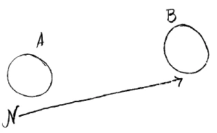

Emil Leinhas leitet die Versammlung ein. Anschließend melden sich verschiedene Redner, unter anderm Emil Grosheintz, zu Wort. Am Schluß beantwortet Rudolf Steiner einige der gestellten Fragen. ^8trwsl

Rudolf Steiner: Es sind also eine Anzahl von Fragen gestellt worden. Wir können ja die Diskussion nachher fortsetzen. Ich kann einiges von dem vornehmen, was hier an Fragen gestellt worden ist und möchte zunächst auf das letzte, das von Dr. Grosheintz Geäußerte zurückkommen. ^trrgdy

Es ist ja begreiflich, daß gerade in den letzten Jahrzehnten aus den verschiedenen sozialen Ideen heraus immer wieder das Bestreben auftauchte dahinterzukommen, wie groß eigentlich die von der Menschheit [gesamthaft] aufzubringende Arbeitsmenge sein müsse, wenn die Menschheit eben bei dieser Arbeitsmenge fortkommen soll. Natürlich würde die Arbeit dann am besten ökonomisch ausgenützt werden, wenn nur soviel Arbeit geleistet würde als notwendig ist für das, was die Menschheit konsumieren will. Und es ist ja sehr begreiflich, daß man über diese Dinge nur schätzungsweise Angaben machen kann. Aber in verschiedenen Kreisen, in denen man sich bemüht hat, hinter diese Frage zu kommen - es ist eben nicht besonders leicht —, hat man sich doch Vorstellungen machen können, um wieviel zuviel Handarbeit, das heißt einfache Arbeitskraft des Menschen, in der Gegenwart verschleudert wird. So genau kann man es natürlich nicht wissen, wenn man sich mit dieser Frage nicht dilettantisch, sondern sachgemäß beschäftigt, aber wir können wenigstens für einen Teil der menschlichen Arbeitskraft, für die körperliche Arbeit, das folgende sagen. Wenn man annehmen kann, daß jedermann nach seinen körperlichen Fähigkeiten körperliche Arbeit verrichten würde, dann würde nötig sein, daß jeder Mensch innerhalb der zivilisierten Welt - die «Wilden» sind dabei nicht berücksichtigt - täglich etwa 2½ bis 3 Stunden arbeitet. Das heißt also, wenn jeder Mensch täglich etwa 2½ bis 3 Stunden körperlich arbeitet, so würde die für die Menschheit notwendige Arbeitskraft aufgebracht werden. Selbstverständlich ist das eine Angabe, die eigentlich nur wie ein approximatives Prinzip richtunggebend ist, denn in der Praxis stellt sich natürlich die Notwendigkeit heraus, daß der eine mehr, der andere weniger körperlich arbeitet, zum Beispiel daß der eine, der besondere geistige Arbeit zu leisten hat, vielleicht nicht belastet wird mit körperlicher Arbeit; dann wird ein anderer mehr aufbringen müssen. Aber wenn Sie dagegen nun dasjenige ansetzen, was heute an körperlicher Arbeit geleistet wird, so kann man doch sagen, daß der weitaus größte Teil der Menschheit solange arbeiten muß, daß eben viel mehr herauskommt an aufgewendeter Arbeitskraft, als eigentlich aufgewendet werden müßte, wahrscheinlich — das ist wiederum eine approximative Angabe -, das Fünf- bis Sechsfache an körperlicher Arbeit. So sehen Sie, wieviel menschliche Arbeitskraft heute eigentlich verschwendet wird durch die Unökonomie, die besteht. Viel mehr als man glaubt, wird verschwendet. Das ist dasjenige, was heute herauskommen würde durch die [Verwirklichung der] Dreigliederung des sozialen Organismus und was diejenigen so wenig einsehen wollen, die eben keinen praktischen Sinn haben. ^qdz6j3

Wie wenig die Menschen heute praktischen Sinn haben, das zeigt sich auf Schritt und Tritt, insbesondere in den Beurteilungen, die dem Impuls der Dreigliederung des sozialen Organismus entgegengebracht werden. Was eben durchaus nicht begriffen werden will, das ist, daß heute gegenüber dem Zugrundegehenden es gilt, neue Geisteskräfte zu entwickeln; und deshalb, weil es nicht begriffen wird, müssen sich diese geistigen Kräfte heute, ich möchte sagen durch die Spalten der gesellschaftlichen Ordnung durchdrükken, wenn sie überhaupt zur Geltung kommen wollen. Denn aus dem, was ein Staat anordnen und organisieren kann, kann überhaupt keine Geistespflege hervorgehen. Es ist eine völlige Illusion, wenn man glaubt, daß durch Staatsverwaltung irgendeine Geistespflege hervorgehen könne. Alle Staatsverordnungen sind in bezug auf das Geistesleben zum Teil Geltungssucht, zum Teil Geschaftlhuberei, und dasjenige, was dann wirklich geistig geleistet wird, wird eben geleistet trotz dieser Verordnungen. Das heißt, grob gesprochen, wenn es heute noch Kinder gibt, die was lernen, so lernen sie nicht, weil der Staat da ist, sondern trotzdem der Staat da ist, weil noch immer eine ganze Menge in der Schule geschehen kann gegen die Schulgesetze. Und das, was im Sinne der Schulgesetze geschieht, das bringt die geistigen Kräfte nicht zur Entwicklung, sondern das verhindert die geistige Entwicklung. [In einem freien Geistesleben dagegen], da würden erst die Kräfte der Menschen bloßgelegt, vor allen Dingen dadurch, daß die Menschen, die in einem solchen freien Geistesleben herangebildet und dann ins Rechts- und Wirtschaftsleben hineingestellt werden, daß diese Menschen dann wirklich in den einzelnen Gebieten des Lebens Überblicke hätten, daß sie sich ökonomisch verhalten könnten und daß sie anordnen könnten dasjenige, was heute nicht angeordnet werden kann. Heute kann man ja tatsächlich verzweifeln, wenn man meinetwillen sieht, wie Geschäfte eingerichtet werden. Derjenige, der nur ein bißchen denken kann und genötigt ist, einmal die Art und Weise zu verfolgen, wie Geschäfte eingerichtet werden, der sieht ja sogleich, daß in diesen Fällen eigentlich die zehnfache Kraft verschwendet wird, weil nirgends genügend Wille vorhanden ist, die Kräfte ökonomisch zusammenzuziehen, die Kräfte ökonomisch zu verbinden, sondern weil man sich so breit als möglich an die Dinge heranmacht. Es handelt sich vor allen Dingen darum, durch das assoziative Leben die Menschen, die zusammengehen, wirklich zu erkennen - man muß sie erst erkennen, wenn man das wirtschaftliche Leben einrichten will. Gerade durch die Dreigliederung des sozialen Organismus wird erst diese Ökonomie möglich, und es wird die Verschwendung der Kräfte allmählich aufhören. ^9bbjeu

Es zeigen manche Fragen - gerade diejenigen, die mir hier übergeben worden sind -, wie schwer es doch eigentlich den Menschen wird, sich ganz in eine wirklichkeitsgemäße Denkweise hineinzufinden, wie sie zugrundeliegt dem Impuls der Dreigliederung des sozialen Organismus. Sehen Sie, die Menschen sind ja heute eigentlich so, wie wenn sie gar nicht mit ihren Füßen auf dem Boden stehen würden, sondern wie wenn sie immerfort über der Wirklichkeit schweben und die Köpfe hinaufrecken würden, damit sie möglichst wenig von der Wirklichkeit verspüren. Der Inder Rabindranath Tagore hat ein ganz niedliches Bild gebraucht für den heutigen westeuropäischen Kulturmenschen, indem er ihn verglich mit einer Giraffe, deren Kopf sich weit über ihren Körper streckt und sich loslöst von der übrigen Wirklichkeit des Menschen. Und so kommt es, daß man sich gar nicht vorstellen kann, wie aus einer wirklichen Lebenspraxis dieser Impuls der Dreigliederung des sozialen Organismus genommen ist und wie es niemals darauf ankommen kann, irgendwelche bloß theoretische Dummheiten zu machen auf diesen Gebieten. ^eikg34

Das möchte ich vorausschicken, wenn ich Ihnen nun die folgende Frage vorlese: ^t9ouda

Nun, ich müßte ja einen Vortrag halten, wenn ich die Frage entsprechend beantworten sollte. Ich will nur einiges andeuten: «Ließe sich innerhalb des dreigegliederten sozialen Organismus eine Form denken, die geeignet wäre, als Inhalt in sich aufzunehmen die Gefühle des Teiles der Menschen, die aus ihrer Natur heraus einem monarchischen Prinzip freiwillig Unterordnung und Vertrauen entgegenbringen?» Ich möchte wissen, wieviel von dem Inhalt dieses Satzes aus einem wahren, wirklichkeitsgemäßen Denken genommen ist! Wenn man sich auf den Impuls der Dreigliederung des sozialen Organismus stellen will, so muß man eben praktisch, das heißt wirklichkeitsgemäß denken. Nun muß man natürlich etwas Konkretes nehmen. Nehmen wir das ehemalige Deutsche Reich. Nehmen wir die letzten Jahrzehnte dieses ehemaligen Deutschen Reiches, dieser Menschen, die «aus ihrem Gefühl heraus oder aus ihrer Natur heraus einem monarchischen Prinzip freiwillig Unterordnung und Vertrauen entgegenbringen». Da möchte ich Sie fragen: Wo hat’s denn die gegeben? Gewiß, solche, die sich in dem Oberstübchen ihres Intellekts einigen Illusionen in dieser Beziehung hingegeben haben, die hat es ja gegeben. Aber nehmen Sie nun das «monarchische Prinzip» des ehemaligen Deutschen Reiches: Wer hat denn da regiert? Etwa Wilhelm II? Der hat wahrhaftig nicht regieren können, sondern es hat sich gehandelt darum, daß eine gewisse Militärkaste da war, welche die Fiktion aufrechterhalten hat, daß dieser Wilhelm II. etwas bedeute - er war ja nur ein Figurant mit Theater- und Komödienallüren, der allerlei Zeug der Welt komödienhaft vormachte. Es war eine Art Theaterspiel, aufrechterhalten durch eine Militärkaste, die nun nicht gerade aus bloßer «Natur» und aus «freiwilligem Unterordnen und Vertrauen» heraus, sondern aus ganz etwas anderem heraus handelte, aus allen möglichen alten Gewohnheiten, Bequemlichkeiten, aus der Anschauung, daß es eben so sein muß - eine Anschauung, die aber nicht sehr tief in der Menschenbrust wurzelte. So lag dieses Ganze, und es wurde mehr gehalten, als daß es wirklich regierte. Das hat sich ja gezeigt in der letzten Juliwoche 1914. Ich habe das in meinen «Kernpunkten» eben nur so angedeutet, daß ich sagte: es war da alles in die Nullität gekommen. Es ist aber durchaus tief aus den Tatsachen heraus begründet. Dann kam zu dem, was aus den Militärkasten heraus dieses Komödienspiel zusammenhielt, in den letzten Jahrzehnten das noch viel Widerlichere des Großindustriellen- und des Großhändlertums, was sich also summierte und was so durchaus innerlich aus verlogenen Impulsen heraus ja dieses monarchische Prinzip aufrechterhielt. ^oylsjc

Nun nehmen wir wiederum einen einzelnen konkreten Moment heraus, an dem man ersehen kann, was eigentlich in Wirklichkeit abgesehen von den konventionellen Lügen, die aus dem Vorurteil der Menschen heraus so etwas aufrechterhalten — das «monarchische Prinzip» heißt. An einem bestimmten Tage des Jahres 1917 Sie wissen es alle - wurde Theobald von Bethmann Hollweg abgesägt als deutscher Reichskanzler. Wenn man dieses Absägen bis in die Einzelheiten verfolgt, dann findet man, wer diesen Mann abgesägt hat - diesen Mann, der natürlich ziemlich lange vorher und ziemlich lange nachher auch noch eine fast monarchische Rolle in diesem unglückseligen Deutschland spielte. Wer hat denn nun eigentlich Theobald von Bethmann abgesägt? Sehen Sie, das war der dicke Erzberger - und nicht Wilhelm II., der hat dabei nicht die allergeringste Rolle gespielt. Das, was damals vorgegangen ist, was eigentlich der dicke Erzberger getrieben hat, wie der tatsächlich die monarchische Gewalt gerade in diesen Tagen ausgeübt hat, das wissen die allerwenigsten Menschen, weil die allerwenigsten Menschen sich kümmern um das, was wirklich vorgeht, sondern sich alles mögliche vorduseln lassen. ^kcfrgx

Wenn man also über so etwas nachdenkt wie das «monarchische Prinzip», dann muß man ja erst auf die konkreten Tatsachen kommen, dann muß man sich klar sein darüber, worinnen die Wirklichkeit besteht, ob es nun Monarchismus ist oder nicht. Glauben Sie, daß im heutigen England jene Persönlichkeit herrscht, die auf den Bildern, die wir zu sehen bekommen, wahrhaftig nicht einen sehr intelligenten Eindruck macht und die in den Regierungsverfügungen immer so genannt ist, daß es heißt: «Seiner Britischen Majestät Regierung»? Nein, schauen Sie sich heute an, wie ganz England hinter Lloyd George einherläuft und tatsächlich er die monarchische Gewalt ausübt. Sehen Sie bitte an, wie in den sogenannten Republiken die Dinge sind, sehen Sie sich an, wie in Wirklichkeit die Dinge ganz anders sind, als sie nach Wortschablonen, nach Begriffskarikaturen von den Menschen geglaubt werden. Darauf aber kommt es an, daß, wenn einmal Wahrheit an die Stelle der Lüge gesetzt werden soll, man auch die Fragen vom Boden der Wirklichkeit aus stellen muß. Deshalb kann wahrhaftig nicht, wenn von der Dreigliederung des sozialen Organismus gesprochen wird, die Frage aufgeworfen werden: Wäre da irgendein Lloyd George mit monarchische Allüren denkbar? Die Dreigliederung des sozialen Organismus sagt ja etwas ganz Bestimmtes über ihre drei Glieder, Geistesleben, Rechtsleben und Wirtschaftsleben. Da werden sich die Dinge schon ergeben; geradeso, wie die anderen Menschen drinnen in einem solchen Organismus die ihren Fähigkeiten angemessene Stellung bekommen, so werden es schon auch «Monarchen». ^dtggdw

Aber es scheint ja, als ob der Schwerpunkt dieser Frage in den letzten Zeilen liegen würde: «Wurden die Gedanken der Dreigliederung erstmalig dem alten Regime angeboten?» Ja - wem hätten sie denn angeboten werden sollen? Sie mußten doch denjenigen angeboten werden, welche irgend etwas machen konnten. Was dann herausgekommen wäre - das ist eine andere Sache. Es handelte sich ja darum, überhaupt von überallher Leute zu suchen, welche bei dem, was sie als reale Dinge ausführen, den Impuls der Dreigliederung zugrundelegen konnten. Ja, was hätte es denn genützt, als zum Beispiel der Friede von Brest-Litowsk in Aussicht war, irgendwie in die Welt hinauszuschreien in der damaligen Zeit: abstraktes Prinzip! Was hätte es denn genützt; es wäre ja nicht einmal gegangen. Es hätte sich darum gehandelt, daß in die realen Taten des Friedens von Brest-Litowsk diese Dreigliederungsidee hineingeflossen wäre; es hätte sich darum gehandelt, daß man diesen Frieden so geschlossen hätte, daß er unter dem Einfluß dieses Impulses geschlossen worden wäre. ^atahsg

Meine sehr verehrten Anwesenden, es war kurz nach dem Frieden von Brest-Litowsk, da kam ich nach Berlin und sprach einen Herrn, der in vieler Beziehung Ludendorffs rechte Hand war. Dazumal war denjenigen, die so etwas wissen konnten, schon klar, welche Verheerungen anrichten mußte der ganze Friedensschluß von Brest-Litowsk. Außerdem war klar, daß im Frühling eine große Frühjahrsoffensive losgehen werde. ^xkmnc9

Und ich reiste nach Berlin über Karlsruhe. Es war im Januar. Man wußte dazumal ganz gut, daß wenn es im ehemaligen Deutschland zum Krache käme, würde der Prinz Max von Baden Reichskanzler werden. Ich sprach auf dieser Reise auch mit dem Prinzen Max von Baden schon im Januar über die Dreigliederung ^7h9qrh

Par des sozialen Organismus, weil es sich darum gehandelt hätte, daß selbstverständlich in die unmittelbar konkreten, reellen Tatsachen hinein gewirkt hätte, was die Kraft der Impulse des dreigliedrigen sozialen Organismus ist. Vor dem Friedensschluß von BrestLitowsk, längere Zeit vorher, als wahrhaftig noch genügend Zeit war, trug ich die ganzen Ideen von der Dreigliederung des sozialen Organismus Herrn von Kühlmann so vor, daß ich bemerklich machte: Von Amerika herüber kommen die verrückten Völkerbundsideen, die verrückten Vierzehn Punkte, die absolut abstrakt sind, die die Welt in Nullität führen werden, und das Einzige, was wirklich von europäischer Seite getan werden könnte, wäre, dem entgegenzusetzen dieses große Weltprogramm von der Dreigliederung des sozialen Organismus. ^0d3y6i

Ich möchte gesehen haben, meine sehr verehrten Anwesenden, was es dazumal bedeutet hätte, wenn von autoritativer Stelle aus jemand den Mut gehabt hätte, dem Nullprogramm des Westens entgegenzusetzen ein wirkliches inhaltsvolles, ein realpolitisches Programm, wie es die Impulse der Dreigliederung des sozialen Organismus sind! Und wenn manche Leute mir auch sagten, denen ich die Sache vortrug: Nun, schreiben Sie darüber eine Broschüre oder ein Buch! -, [so mußte ich darauf antworten:] Wahrhaftig, darauf kommt es nicht an, daß die Dinge veröffentlicht werden, sondern wie sie in die Welt der Tatsachen eintreten, darauf kommt es an. ^l0qf82

Nun, das Gespräch, das ich mit Herrn von Kühlmann führte — das kann ja heute noch bewiesen werden, welches der Inhalt war, denn der Herr, der mit mir war, lebt ja Gottseidank noch und wird hoffentlich noch lange leben. Das Gespräch tönte aus darin, daß mir Herr von Kühlmann sagte auf seine Weise: Ich bin halt eine beschränkte Seele. - Herr von Kühlmann meinte selbstverständlich, daß er auch noch andere Staatsmänner um sich hat und daß er in seinen Entschließungen beschränkt ist; ich aber dachte in meiner Seele an eine andere Auslegung dieses Ausspruches. ^njs0b9

Nun, ich kam also im Frühjahr nach Berlin, sprach dann mit einem Herrn, der, wie gesagt, Ludendorff sehr nahestand, und wollte klarmachen, was für ein Unding es ist, jene Frühlingsoftensive zu unternehmen, von der er dazumal selbstverständlich so sprach, wie man sprechen durfte. Ich sagte: Selbstverständlich kann und darf man ins Strategische nicht eingreifen, wenn man selber nicht Militär ist, aber ich gehe aus von all den Voraussetzungen, die gar nicht in die Strategie hineinspielen. Ich nehme an, Ludendorff erreiche alles, was er sich nur zu erreichen vorstellen kann, oder aber, wenn das alles nicht erreicht wird, was Ludendorff sich vorstellt, wenn er das nicht erreicht, dann ist der Effekt des unglückseligen Krieges doch ganz derselbe. - Man konnte dazumal klar zeigen, daß der Effekt ganz derselbe sein müßte; und das ist ja später auch so geworden; es ist ja jetzt auch so. Da sagte mir der Herr, wobei ich fortwährend Angst hatte, daß er überhaupt auf seinen Stuhl wieder zurückkäme, von dem er aufgesprungen war, so nervös war er: Was wollen Sie? Der Kühlmann hatte die Dreigliederung in der Tasche, und mit ihr in der Tasche ist er nach Brest-Litowsk gefahren. Unsere Politiker sind gar nichts, unsere Politiker sind Nullen. Wir Militärs haben gar keine andere Verpflichtung, als zu kämpfen, zu kämpfen. Wir, wir kennen nichts anderes! ^oz8frs

Sie sehen, die Dinge sind dazumal wirklich dem alten Regime zuerst angeboten worden — es handelt sich ja nicht darum, ins Blaue hinein Ideen in die Welt zu setzen, sondern wirklich die Wege zu suchen, auf denen sie sich realisieren können, die Ideen. Dann, meine sehr verehrten Anwesenden, kam die Zeit, in der mir ja nur Gebiete der Welt zur Verfügung standen, in der es nach und nach eine recht unpraktische Frage geworden ist zu fragen, wie man sich Monarchen gegenüber verhalten sollte und was man da tun könnte in bezug auf die Dreigliederung - andere Gebiete stehen mir ja zunächst nicht zur Verfügung; ich werde ja noch nicht in das pseudo-monarchische England gelassen, in das hyper-monarchische Amerika und in das durch und durch republikanisch-monarchische Frankreich gelassen und so weiter. Derjenige, der auf dem Boden der Realität steht, der wird die höchst unpraktische Frage, wie man sich dem monarchischen Prinzip gegenüber verhalten sollte, ja wahrhaftig nicht weiter erörtern, denn dieses monarchische Prinzip wird ja nun nicht irgendwie dominieren können, es wird in ganz undurchschaubaren Ecken sitzen und wird ganz gewiß eine ernsthafte Diskussion in der nächsten Zeit nicht nötig machen - im Gegenteil, heute sind ganz andere Dinge diskussionsnotwendig. ^4ks0km

Und ich bitte Sie nur, meine sehr verehrten Anwesenden, in der Dreigliederungszeitung meinen Aufsatz zu lesen über «Schattenputsche», wo ich zu zeigen versuchte, wie unnötig das Echauffieren war der mehr links stehenden Seiten gegen die ganze Kapp-Komödie. Denn schließlich, so wie die Dinge dazumal standen, war die Linke nicht besser als die Rechte, und es war schon ganz egal, von welcher Seite heraus das Absurde gemacht wurde. Jetzt handelt es sich darum, die Realität einzig und allein darinnen zu suchen, die Dreigliederung in möglichst viele Köpfe hineinzubringen, die dann die Dreigliederungsidee tragen können. Das ist die einzige Realität. Man braucht dazu vielleicht sehr lange Zeit, wenn die Not nicht diese Zeit verkürzt. Man wird aber mehr Sorgfalt darauf verwenden müssen, in die fähigen Köpfe diese Dreigliederungsidee hereinzubringen. Daß sie jetzt noch nicht sehr in die führenden Köpfe hineingekommen ist, das bezeugt zum Beispiel die Tatsache, daß von deutscher Seite auch in Spa noch immer diejenigen als Führer figurieren, denen auch früher Führereigenschaften beigelegt worden sind und in deren Köpfe ja die Dreigliederungsidee ganz gewiß nicht hineingeht. Also Sie sehen, es handelt sich wirklich nicht darum, daß man jetzt die Gedanken dazu verschwendet, solche irreellen Fragen zu stellen, sondern es handelt sich wirklich darum, zu arbeiten im Sinne der Dreigliederungsidee, damit diese Dreigliederungsidee in möglichst viele Köpfe hineingeht. Es handelt sich heute nicht darum, daß darüber nachgedacht wird, wie die Menschen sich freiwillig nicht einmal einem Monarchen, sondern einem monarchischen Prinzip unterordnen, ihm Vertrauen entgegenbringen und so weiter; ob nun darüber nachgedacht wird oder nicht, das scheint mir höchst gleichgültig zu sein. Es ist ja völlig unnötig, sich solch irreellen Gedanken hinzugeben, wenn man es wirklich zu tun hat mit etwas, das ganz aus der Realität heraus arbeiten will. Die anderen Fragen werde ich nur noch ganz kurz berühren, da das zweifellos schon zu lange gedauert hat mit diesem Schlußwort: ^xemmkf

Nun, sehen Sie, es liegt diesen Fragen kein richtiges Hinschauen auf dasjenige zugrunde, was die Assoziationen sein werden. Gewiß, die Schwierigkeiten, die in der menschlichen Natur liegen, die werden Ja immer da sein. Der pure Glaube, daß man irdische Paradiese errichten kann, ist irrig. Gewisse Schwierigkeiten werden selbstverständlich immer da sein. Aber entschieden werden, ob irgendwie eine Erfindung aussichtsvoll ist oder nicht - das muß ja heute ebenso wie in Zukunft vom einzelnen Menschen geschehen. Nur ist heute der einzelne Mensch auf sich selber angewiesen, oder er ist angewiesen auf irgendwelche Traditionen. Während er, wenn Assoziationen vorhanden sind, eben in Zusammenhang steht mit alle dem, was assoziiert ist und sich an sein Urteil angliedert dasjenige, was aus den in den Assoziationen mit ihm in Verbindung stehenden Menschen herauskommen kann. Es wird also das Urteil, das zu fällen ist über solche Sachen, ja wesentlich unterstützt und getragen dadurch, daß die Menschen in Assoziationen drinnenstehen. ^ngqrgx

Ich habe in der letzten Zeit öfter an einem Beispiel gezeigt, wie man heute ein ganz gescheiter Mensch sein kann, ohne zu einem Urteil über die Tragkraft von diesem oder jenem zu kommen. Ich habe dann das Beispiel angeführt, daß es Leute gegeben hat in allen möglichen Parlamenten, an der Praxis Gebildete, die von der Mitte des 19. Jahrhunderts an eingetreten sind für die Goldwährung, indem sie behauptet und es mit Gründen belegt haben, daß die Goldwährung zum Freihandel führen werde und damit zu einer solchen Konfiguration des Handels, die sie sich als besonders günstig für die internationalen Menschheitsverhältnisse vorgestellt haben. Das Gegenteil ist davon eingetreten: Die Goldwährung hat gerade überall zu dem Schutzzollsystem geführt. Ich habe gesagt, ich behaupte damit nicht, daß die Menschen alle dumm waren, die nun vorausgesagt haben, daß die Goldwährung zum Freihandel führen werde, trotzdem sie dann eben überall zum Schutzzoll geführt hat. Es waren zum größten Teil sehr, sehr gescheite Menschen. Lesen Sie die Parlamentsreden durch, die in großer Zahl in den verschiedensten Parlamenten gehalten worden sind über die Goldwährung, dann werden Sie sehen, daß da sehr gescheite Dinge aufgefahren wurden über die Goldwährung. Aber das ganze Getriebe im öffentlichen Wirtschaftsleben war individualisiert, und der Einzelne war gar nicht in der Lage, größere Zusammenhänge zu überschauen. Er konnte noch so gescheit sein, er war nicht in der Lage, eigene Erfahrung zu sammeln. ^cd84kh

Diese Erfahrung, die kann eben nur dadurch kommen, daß man im ganzen Gewebe der Assoziationen drinnensteht, daß man weiß, wer über das, wer über jenes etwas weiß, ja, wer überhaupt etwas weiß als Individualität -, nicht bloß deshalb, weil der Betreffende von irgendeiner Stelle aus ernannt worden ist, sondern weil man in soundso vielen Fällen im Assoziationsgewebe drinnen mit ihm zu tun gehabt hat. Dieses Verbindende dieses Assoziationsgewebes, das ist etwas, was aus dem Vertrauen kommen muß. Und so kann man sagen: Ein Entweder-Oder gibt es überhaupt im Leben nicht. Aber dasjenige, was heute dem Menschen schwermacht zu erkennen, ob irgend etwas, was erfunden wird, fruchtbar wird im menschlichen Leben, das wird ja zum großen Teil im assoziativen Leben wegfallen. Man muß die Dinge im Großen denken. Es ist wirklich trostlos, wenn einem jemand etwa in der folgenden Form sagt: Nun ja, ich bin einverstanden; alles muß neu werden, alles muß andere Formen annehmen, und du gibst an, wie diese anderen Formen werden sollen. Aber sage mir nunmehr, wie wird denn dann mein Kramladen ausschauen, wenn diese Neugestaltungen eintreten. — Ja, meine sehr verehrten Anwesenden, es könnte vielleicht notwendig sein, ihm zu sagen, daß ein solcher Kramladen dann überhaupt nicht mehr in dieser Form bestehen würde. Dann wäre er natürlich wirklich mit der Antwort recht unzufrieden. Bei der Dreigliederung handelt es sich überall um etwas, was unmittelbar jeden Tag in Angriff genommen werden kann und was so schnell vorwärtskommen wird, als eben die dazu fähigen Menschen da sein werden. Das könnte sehr schnell gehen. ^xfgzw7

Nur, wenn man es praktisch in Angriff nehmen will, kann man nicht fragen: ^hdxop9

Ja, meine sehr verehrten Anwesenden, man kann, wenn es sich um so große Fragen wie in der Gegenwart handelt, wirklich nicht die Antwort aus einem ganz beschränkten Kreise nehmen; das ist unmöglich. Ich garantiere Ihnen, Sie werden schon, wenn die Dreigliederung des sozialen Organismus durchgeführt ist, auch ein Verhältnis zu ihrer Nähmaschine haben, das befriedigend ist. Denn man bedenkt gewöhnlich gar nicht, daß die Nähmaschine und ähnliches, meinetwillen auch zum Beispiel Haarkämme oder dergleichen, ja auch Produktionsmittel sein können, denn Produktionsmittel ist ja alles dasjenige, was mich instandsetzt, meinen Beruf auszuführen. Also, man kann nicht den Begriff Produktionsmittel so einschränken. Dasjenige, um was es sich handelt, das ist, daß man überhaupt nicht so eng denken soll. Denken Sie doch einmal, hier ist eine Kirche, hier ist die zweite Kirche - ich wähle ein Beispiel, das im Katholizismus üblich ist. Nehmen wir an, hier lebe der Pfarrer N (Es wird an die Tafel gezeichnet). Dieser Pfarrer liest täglich eine Messe, sonntags seine Vesper und so weiter; da zieht er sich seine Meßgewänder an. Diese Gewänder, die er da als Meßgewänder anzieht, die gehören alle der Kirche. Wenn jetzt der Pfarrer N. versetzt wird, etwa indem er sich verbessert von der Kirche A zu der Kirche B, dann nimmt er nichts von den Meßgewändern mit; das bleibt alles bei der Kirche A. Und dort, in der Kirche B, zieht er wieder die Meßgewänder an, die dieser Kirche gehören wenn man da von «gehören» sprechen kann, aber Sie wissen ja, was ich damit meine. ^7ujpwr

 ^jneo13

Bei den Meßgewändern haben Sie gleich ein ganz anderes Verhältnis zu den Dingen vorliegen, die mit dem Berufe zusammenhängen, als Sie es haben bei einer Näh- oder Schreibmaschine, die Sie mitnehmen, wenn Sie von einem Ort zum anderen wandern. Ich will nicht sagen, daß nun etwa für die Nähmaschine dieselbe Ordnung in der Zukunft eingeführt werden sollte, die für Meßgewänder gilt. Sie sehen, es gibt verschiedene Möglichkeiten, zu dem zu gelangen, was man braucht, um seine Arbeit auszuführen. Also man sollte wirklich nicht eng denken, wenn es sich heute um die großen Welteninhalte handelt. Man sollte nicht wegen der Sorge um seine Nähmaschine sein ganzes Denken über die Dreigliederung des sozialen Organismus in Verwirrung bringen. Noch kurioser ist die dritte Frage: ^7xnv9a

Nun, nicht wahr, das sind ja so furchtbar abstrakte Fragen, daß sie sich für den gar nicht ergeben, der den Gang der Ereignisse in der Wirklichkeit der Dreigliederung des sozialen Organismus einsieht. Lesen Sie meine «Kernpunkte» durch; in der Wirklichkeit der Dreigliederung gibt es ja unzählige Mittel, um so jemanden zum Zurücktreten zu zwingen. Und außerdem, man muß nur bedenken, daß sich ja mit it der Dreigliederung des sozialen Organismus — das ist das Wesentliche dabei - das ganze Verhältnis des Menschen zur Gesellschaft ändert. Man denkt, nicht wahr: Wie wird das überhaupt vor sich gehen, daß einer nun seinen Nachfolger ernennt? Man sollte sich solche aus der Wirklichkeit herausgerissene Fragen doch nicht so stellen. Man muß solche Fragen ganz im Konkreten stellen, aus dem Erleben der Tatsachen. Sagen wir einmal, einer wird unfähig, aus Schwachsinn unfähig, und er kommt aus Schwachsinn in die Lage, irgendeinen Betrieb nicht mehr leiten zu können. Nun, in den meisten Fällen wird, wer den Schwachsinn herankommen sieht und sich nicht mehr zurechtfindet, sich irgend jemanden anstellen, der ihm hilft. Dann wird aus diesem Verhältnis die Nachfolge schon hervorgehen. Wenn das nicht so da ist, was ich jetzt beschrieben habe, dann werden im konkreten Leben ganz andere, aber immer ganz bestimmte Verhältnisse sich gestalten. Also, wenn einer nicht gehen will, so wird ihm das Leben zeigen, daß er muß. Denn derjenige, der nicht fähig ist, wird eben niemanden mehr finden, der mit ihm wird arbeiten wollen, und er wird dann seinen Betrieb nicht mehr fruchtbar leiten können. ^c623lq

Also die Dinge nehmen sich im realen Leben ganz anders aus als eine theoretische Frage. Und darum handelt es sich gerade, daß man an die Dinge herangeht mit einem wirklichkeitsgemäßen Denken, das sich hineinversetzt in das wirkliche, praktische Leben. Wenn Sie heute in einer sozialistischen Versammlung über irgend solche Dinge reden hören, so wird überall von allem Möglichen und Unmöglichen geredet, weil man nirgends in der Wirklichkeit steht. Wie sollte auch das Proletariat, das man in dieser Weise hat heranwachsen lassen, ohne sich um es zu kümmern, das man an die Maschine gestellt hat, das das wirkliche Leben, die wirklichen Zusammenhänge nicht kennengelernt hat, wie sollte das Proletariat für etwas anderes Verständnis haben, als für ganz weltfremde Theorien? Aber darum handelt es sich, daß durch solche weltfremden Theorien eben die Welt zugrundegegangen ist und kein Neuaufbau entsteht. Darum handelt es sich, daß man mit allen möglichen Mitteln dazu kommt, auf die Wirklichkeit hinzudeuten und alles aus der Wirklichkeit zu erfassen. Das ist es, worauf es ankommt. ^a6ye1h