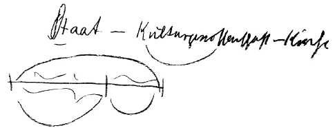

Paul Baumann leitet den Diskussionsabend durch einen Vortrag von «Soziale Erkrankung und Sozialismus» ein. Im Anschluß an diesen Vortrag führt Rudolf Steiner aus: ^hbamf5

Rudolf Steiner: Es ist nur ein Stimmungsbild, das geschaffen werden soll, aber auch zugleich etwas, woraus Sie sehen, wie weit bereits die Schamlosigkeit geht in bezug auf die Bekämpfung alles desjenigen, was von mir ausgeht, und wie diese Schamlosigkeit bereits in solche Schmierageblätter wie die Lorcher Nachrichten übergeht. Es ist das in Lorch, in Württemberg, erscheinende Blatt, «Der Leuchtturm», in dem ein Artikel erschienen ist, der heißt: «Die gestohlene Dreigliederung». Würde ein solches Blatt durch nichts anderes als durch einen solchen Artikel sich in seiner Schamlosigkeit enthüllen, so würde es sich gerade dadurch als ein schamloses Schmierblatt charakterisieren. Ich erwähne das, damit einiges von dem, was öfters gesagt worden ist, auch gerade in Anknüpfung an unsere Anhängerschaft, seine Beleuchtung findet, denn dieser «Leuchtturm», der neben anderem «den Kampf gegen Dr. Steiner und die Theosophie führt», ist von zahlreichen unserer Anthroposophen abonniert. Den Herausgeber dieses Blattes, der in Wirklichkeit Rohm heißt, habe ich öffentlich in einem Vortrag in Stuttgart in einer Art Vergleich als ein «Schwein» bezeichnen müssen. Ich möchte das hier ausdrücklich hervorheben, aber es stehen einem heute gegen das, was aus den übelsten Lügegründen heraus heute zusammengelogen wird, eben keine anderen Mittel zur Verfügung als Mittel dieser Art. ^2vmuip

Und dieser Rohm schreibt im «Leuchtturm» vom 1. Juni 1920 unter dem Stichwort «Die gestohlene Dreigliederung»: ^ce2vp5

Das Schriftchen, das ich vor acht Tagen durch Herrn Uehli überreicht bekommen habe, macht durchaus den Eindruck eines absoluten Blödsinns -— eines absoluten Blödsinns! Und wenn «Dreigliederung» dadurch gestohlen werden kann, daß man die Zahl «Drei» stiehlt, so kann Dreigliederung natürlich vielfach gestohlen werden. Eine Art von Dreigliederung ist allerdings auch in jenem Büchelchen, und sie heißt: Staat, Kulturreich, Kirche. So heißt dort die Dreigliederung, und die Sache mit dem Goldenen Schnitt läuft darauf hinaus — Sie wissen, der Goldene Schnitt besteht darin, daß sich das Ganze zum Großen verhält wie das Große zum Kleinen -, daß also der Staat als das Ganze zum Großen, zum Kulturreich, sich so zu verhalten hat wie das Kulturreich zur Kirche. Wir haben also wiederum den Einheitsstaat drinnen in dieser ganz blödsinnigen «Dreigliederung». ^zllmd9

 ^p4tstb

Weiter heißt es in dem Leuchtturm-Artikel: ^1dnm54

— jener Knapp, ein Individuum, das so ziemlich den übelsten Parteischattierungen der Gegenwart angehört, der sich, wie ich 5 5 5 glaube, in Zürich aufhält. Und weiter: ^qitohe

Kurz und gut: das ist alles erstunken und erlogen, kein wahres Wort ist daran. ^zwla0u

Es ist alles absoluter Unsinn. Denn es kann ja sein, daß irgendein Schwarmgeist, der selbst vielleicht Mitglied unserer Gesellschaft ist, dazumal das blödsinnige Manuskript in Stuttgart gezeigt bekommen hat; ich habe es jedenfalls nie gesehen, habe mich auch niemals darum gekümmert. Und es soll dann dieses blödsinnige Manuskript durch irgendeinen Schwarmgeist — so schreibt Frau Metzdorff-Teschner - nach Hamburg befördert worden sein. Nun, in Hamburg ist allerlei Schwarmgeisterei auch der Anthroposophischen Gesellschaft nicht ganz fremd. Das geht mich aber alles nichts an, und es ist auch ganz gleichgültig. ^nlc7fg

Bis jetzt haben Sie also gehört, daß die Dreigliederung, wie sie hier gepflegt wird, von der Frau Metzdorff-Teschner stammen soll. Der letzte Abschnitt im Leuchtturm-Artikel sagt noch folgendes: ^qnr6gh

Also Sie sehen, hier wird die grandiose, geniale Idee aufgewärmt: Der hat mir meine Uhr genommen - aber er hat dann eine ganz andere gehabt. Also Sie sehen, in dieser Weise wird heute gekämpft. Es ist natürlich schon notwendig, daß unsere Freunde in weitesten Kreisen wissen, mit welchen Mitteln heute in der Welt gekämpft wird. Es ist ja nicht einmal so interessant, daß es gerade gegen uns geht, sondern das Interessante ist schließlich, in welchem Sumpfe von Lügereien wir heute in der Welt drinnenstecken. Und Sie sehen, wie notwendig es ist, daß gegen diesen Sumpf von Lügereien wirklich ganz ernsthaft gekämpft werde. Vorläufig habe ich nur konstatieren können, daß es eine ganze Reihe von Mitgliedern der Anthroposophischen Gesellschaft in Stuttgart gibt, die jedesmal, wenn derartige Blätter mich mit Dreck bewerfen, sie allemal brav abonnieren. ^is6cri

Ich möchte nun übergehen auf die Beantwortung der Fragen, die noch gestellt wurden. Zunächst die Frage: ^8zn31r

Meine sehr verehrten Anwesenden, über den Punkt der Gewalt, der bloßen Machtentfaltung, möchte ich ein paar Worte sprechen. Es ist vielleicht nicht ohne Bedeutung, sich gerade heute auf dasjenige zu besinnen, was aus verschiedenen menschlichen Instinkten heraus an dieses Mittel der Gewalt zur Herstellung eines menschenwürdigen Zustandes appelliert. Denn es ist eigentlich ganz besonders interessant, sozialpsychologisch dieses Streben nach Lösung wichtiger Fragen durch die Gewalt zu verfolgen. Es ist namentlich ein fruchtbarer Gedanke, der leider nur viel zu wenig verfolgt wird, sich zu fragen: Woher kommen denn die schlimmsten Erscheinungen und Auswüchse gerade der unmittelbaren Gegenwart? — Diese Erscheinungen haben gelebt bis in unsere katastrophale Zeit herein, aber unter der Oberfläche, sie waren latente Leidenschaften, sie waren zurückgehaltene Sehnsuchten nach Gewalt. Sie waren niedergehalten, und der gesellschaftliche Zustand, der soziale Zustand, war etwas wie eine gewaltige Lüge. Diese Lüge, die durch die ganze zivilisierte Welt ging, die in den Untergründen niedergehalten war, die konnte nicht mehr zurückgehalten werden im Jahre 1914. Es brach das ganze Lügensystem, das unter einer dünnen Schicht vorhanden war, da hervor. Die schlafenden Menschen, ich meine die seelisch schlafenden Menschen, sie haben sich an diese obere Schicht gehalten; sie haben die für die Welt gehalten, für das Menschenleben gehalten, und sie haben denjenigen nicht geglaubt, die von dem sprachen, was eigentlich unter dieser Schicht verborgen war. Es ist ja heute auch wieder so. Wenn man heute von irgend etwas redet, was notwendig ist zu besprechen, dann kommen die Lügengeister und entladen ihre schlimmsten, schmutzigsten Lügengewebe auf dasjenige ab, was sich als Wahrheit in die Welt hineinstellen möchte. Es nützt aber nichts die Menschheit, die ernsthaftig teilnehmen will an irgend etwas, was zur Gesundung der sozialen Zustände geschaffen werden soll, muß mit offenen Augen hinsehen auf dasjenige, was sich eigentlich heute an die Oberfläche begibt. ^rgjfys

Und da möchte ich Ihnen ein kleines Beispiel aus der allerjüngsten Zeit mitteilen, aus dem Sie sehen können, was jetzt, wo die Geister gewissermaßen losgelassen sind, wo die Geister da, wo es geht, an die Macht appellieren, was da geschieht. ^vd4pjp

Rudolf Steiner verliest einen Zeitungsartikel, aus dem hervorgeht, wie unter General Lüttwitz mit Prügelstrafen und anderen Gewaltmaßregeln gegen die deutschen Mitbürger vorgegangen wurde. Es wird der Fall eines Mannes erzählt, der wegen Betretens eines kurz vorher verbotenen Weges angerufen, zu Boden geworfen, schließlich verhaftet und verprügelt wurde. Als zur Bestrafung der rohen Soldateska die höheren Instanzen angerufen wurden, bekam der Kläger die Antwort, daß die Soldaten die Erlaubnis hätten, gegen Personen, die sich ihnen widersetzen würden, so vorzugehen. Diese Antwort war vom Kommandeur selbst unterschrieben worden. ^t1nxdv

Rudolf Steiner: Sehen Sie, meine verehrten Anwesenden, so weit hat es die moderne Zivilisation gebracht. Sie wissen ja, daß in Ungarn die Prügelstrafe eingeführt worden ist, daß Polen die Prügelstrafe eingeführt hat. Sie sehen also, die Prügelstrafe wandert von Osten nach Westen. Und wenn die Menschheit so weiter schläft und sich weiter so verhält, wie sie sich gegenwärtig verhält, dann wird eben nicht zu verwundern sein, was wir alles noch werden erleben können. ^94ghzf

Aber, meine sehr verehrten Anwesenden, wir leben auch in einer Zeit, die sehr merkwürdige Diskussionen führt. Ich werde Ihnen eine kleine Probe von dieser Diskussionsart, in der wir heute drinnenleben, mitteilen. Es handelt sich darum, wie ein Publizist seine Regierung kritisiert. Sie wissen vielleicht aus jenen Zeiten, die das Schlafen großgezüchtet haben, wie man mit scharfen Ausdrücken aufgefahren ist, wenn man als Oppositionsmann die Regierung angegriffen hat. Nicht jede Opposition hat ja in so höflicher Weise die Regierung angegriffen wie zum Beispiel in gewissen Zeiten die österreichische radikale Opposition hat ja in so höflicher Weise gegen die Regierung schleuderte, diese unterzeichnete mit der Unterschrift «Euer Majestät allergetreueste Opposition». (Meiterkeit!) Aber seit einigen Jahrzehnten sind die Dinge anders geworden, und heute, in der Zeit, in der sich sehr viele Menschen nach der Gewalt, nach der Macht sehnen, diskutiert man öffentlich so, daß man die Leute, die in der Regierung sitzen, mit den schönen Namen bezeichnet: Mörder, Gauner, Schieber, Rechtsbrecher. ^ygxejf

Ein Zeitungsausschnitt über Gustav Noske, Oberpräsident von Hannover, wird von Rudolf Steiner verlesen. ^kpkl3m

Das sind heute die oppositionellen Worte, mit denen man die Regierung belegt in öffentlichen Blättern, und nichts regt sich, daß jene Regierenden irgendwie etwas dagegen tun können. Also machen wir uns bekannt mit dem Ton, der heute angeschlagen wird, wenn die Regierenden bezeichnet werden als Mörder, Gauner, Schieber, Rechtsbrecher aller Art. ^tfh231

Ich meine, die Tatsachen, die da und dort auftreten, sprechen nicht gegen das, was hier von dieser Stelle oftmals gesagt wurde, nämlich: daß wir mit einer recht starken Eile in den Niedergang hineingehen und daß im Grunde genommen die Zeit zum Schlafen für die Seelen nicht da sein sollte. Was die Instinkte, die nach Macht sich sehnen, zuwegebringen — das drückt sich in diesen Dingen aus, und das drückt sich zum Beispiel in dem durchaus nicht vereinzelten Falle Hesterberg aus, den ich vorhin verlesen habe. Und das drückt sich auch in manchem anderen aus, in Dingen, die heute aus allen Teilen der «gebildeten» Welt — «gebildet» setze ich in Gänsefüßschen -, aus allen Teilen der «gebildeten» Welt gemeldet werden. Und ich frage: Wer wagt da noch zu glauben, daß irgend etwas zu schwarz gefärbt sein könnte, was heute vom Niedergang spricht, nicht nur unseres wirtschaftlichen, sondern vor allen Dingen unseres moralischen Lebens. - Aber diese Dinge sprechen es eben durchaus aus, wie das Walten solcher Kräfte in jene ungesunden Zustände hineinführt, die Ihnen heute von Herrn Baumann so trefflich geschildert worden sind. Denn diese ungesunden Zustände drücken sich zum Beispiel in so etwas aus wie der Enquete, die in einer Volksschule Berlins angestellt worden ist, die von 650 Kindern besucht wird. Dabei haben sich die folgenden Verhältnisse ergeben: 161 von diesen 650 Kindern haben weder Schuhe noch Sandalen; 142 Kinder haben keine warmen Kleider; 305 Kinder haben gar keine Wäsche oder nur Fetzen; 379 leben in Wohnungen, wo kein einziges Zimmer geheizt wird; 106 stammen aus Familien, die nicht einmal das nötige Geld haben, um nur die rationierten Lebensmittel einzukaufen. 341 von 650 Kindern haben nie einen Tropfen Milch gehabt; 118 sind tuberkulös; 48 sind im Rückstand infolge Unterernährung. Von den 650 Kindern sind im Laufe eines Jahres 85 gestorben infolge von Entbehrungen und von Unterernährung. Da haben Sie das Hineinströmen desjenigen, was heutige Gesinnung ist, was heutiger Glaube ist in die physischen Gesundheitszustände, das heißt in die physischen Krankheitszustände. Da ist es wohl an der Zeit hinzuhorchen, wenn jemand davon spricht, daß ein Gefühl notwendig ist für das Gesunde, für dasjenige, was in sich den gesunden Atem des Lebens in physischer, in seelischer, in geistiger Beziehung hat. Und darauf kommt es an, daß wir uns wirklich einlassen auf dieses Erfühlen der Gesundheit und nicht irgendwelchen Dingen nachjagen wie der Sehnsucht nach Macht, die nun wahrhaftig da, wo die Menschen, die die ungesunden Instinkte heute in ihrem Innern tragen, losgelassen werden - gleichgültig, ob sie losgelassen werden als Diebe und Straßenräuber oder ob sie losgelassen werden als Beamte und Minister, die auch aus diesen Instinkten heraus nach Macht lechzen. Und aus diesen Instinkten nach Macht sind die ungesunden Zustände entstanden. Man muß eben erkennen, wie die Verfassung der Menschen heute ist und wie es notwendig ist, nicht nach Macht und dergleichen Dingen zu rufen, sondern lediglich nach den Voraussetzungen, in denen ein wirkliches Gefühl für Gesundung ist nach dem Geiste. ^b7l7pk

Zu den Ausführungen von Rudolf Steiner äußern sich unter andern Roman Boos und Paul Baumann. ^4a6aeg

Rudolf Steiner: Es liegt noch die Frage vor: ^7pm62j

Wenn man heute von den zunächst die Menschheit betreffenden Aufgaben spricht, so hat man eigentlich notwendig zu sprechen von Aufgaben, die die ganze Menschheit angehen. Denn wir stehen unmittelbar in dem Zeitpunkt, wo es notwendig ist, über die engen Landesgrenzen, über die Volksgrenzen hinwegzusehen auf die großen Aufgaben der Menschheit. Und wenn ich gesprochen habe von den verschiedenen Differenzierungen der Menschen über die zivilisierte Erde hin und gesagt habe, im Östlichen, was ich aber bisweilen bis nach Asien hinein meine, da sei vor allen Dingen die Heimat des Geisteslebens - jenes Geisteslebens, das allerdings in seiner Reinheit in alten Zeiten der Menschheitsentwicklung da zum Vorschein, zur Offenbarung gekommen ist und das dann in die Dekadenz gekommen ist und heute in der Dekadenz drinnen ist, das aber als Erbschaft eigentlich ebenso lebt in Mitteleuropa und in den westlichen Gegenden -, wenn ich gesagt habe, in mitteleuropäischen Gegenden seien vorzugsweise die Volksfähigkeiten des Juristischen, des Staatlichen seit dem alten Griechentum vorhanden -, wenn ich gesagt habe, in westlichen Gegenden seien seit dem Beginne der neuen Zeit vorzugsweise die Talente des wirtschaftlichen Denkens vorhanden -, so meine ich damit, daß aus der Natur dieser über die betreffenden Gebiete hin ausgebreiteten Völker herauskommt die besondere Veranlagung für das eine oder für das andere. ^3ncvu9

Heute aber haben wir die Aufgabe, zu appellieren an die Geisteswissenschaft, die ja dann hervorruft aus dem Menschen die universelleren Fähigkeiten, die dreifachen Fähigkeiten, zu appellieren an die Geisteswissenschaft, um nicht weiter die Dinge in dieser Einseitigkeit zu pflegen. Wir müssen uns heute erinnern, was stattfindet, wenn der Orientale einseitig bleibt, wir müssen uns erinnern, was stattfindet, wenn der Mensch der Mittelländer einseitig bleibt, und wir müssen uns erinnern, was stattfindet, wenn der Mensch der Westländer einseitig bleibt. Es kann eben die Entwicklung nicht vorwärtsgehen, wenn die Einseitigkeit fortbesteht. Daher sollte eigentlich nicht gefragt werden, was für eine Aufgabe die einzelnen Völker in der Zukunft haben. Nicht die Völker werden Aufgaben haben - die Menschheit wird Aufgaben haben! Nur um diese Aufgaben besser zu verstehen, nur um zu verstehen, wie diese Aufgaben sich vorbereitet haben im Laufe der Geschichte und wie das, was da oder dort besonders stark aufgetreten ist, jetzt vereinigt werden muß mit anderen Fähigkeiten der Menschen, nur um zu verstehen, wie das Heutige mehr universell aus dem Differenzierten der Menschheitsentwicklung herausgestaltet werden soll, ist es notwendig, sich einzulassen auf die besonderen Aufgaben der einzelnen Völker. Es ist im höchsten Grade wichtig, sich darauf einzulassen, denn gerade dasjenige, was in dieser Weise da ist und was überwunden werden muß, das muß man gründlich und genau kennenlernen. ^e3225i

Nun sind eben geblieben, ich möchte sagen «Volkssplitter» von mannigfaltiger Wesenheit zwischen denjenigen Völkern, die eigentlich sozusagen die Grundwesenheit eines der drei Weltterritorien ausmachen. ^bnwn3s

Es ist überhaupt nicht so ganz leicht, in anthropologischer Weise von dieser Grundwesenheit zu sprechen; erst die anthroposophische Betrachtung gibt in richtiger Weise die Kategorien her. Erst durch die anthroposophische Betrachtung können wir richtig sagen: Was sich im Osten entwickelt, hat diese Fähigkeiten; was sich im Westen entwickelt, hat diese Fähigkeiten; was sich in der Mitte entwickelt, hat diese Fähigkeiten. Gehen wir anthropologisch vor, das heißt schauen wir mehr auf das Blutsmäßige, dann kommen wir ja sogleich in Fragen hinein, die durchaus unpraktisch sind, die mit keiner besonderen Deutlichkeit irgend etwas Lebenspraktisches erkennen lassen. Wenn man etwa den Ausdruck «europäischer Osten» ersetzen wollte dadurch, daß man sagt «das russische Volk», so sagt man ja im Grunde genommen gerade etwas, was eigentlich wirklich gar keine lebenspraktische Bedeutung hat. Es handelt sich eben darum, daß man von ganz anderen Kategorien ausgehen muß als von diesen rein anthropologischen oder ethnographischen Kategorien. ^7w4pvx

Die kleinen Volkssplitter nun, sie haben natürlich die mannigfaltigsten Anlagen gerade aus der Art und Weise, wie sie entstanden sind. Beachten Sie einmal, sagen wir ein solches kleines Volk, wie es die Magyaren sind, die eine Art turanische Rassenwesenheit haben, die aber das Mannigfaltigste durchgemacht haben, die wie ein geographisches Dreieck an der Donau zusammengeschoben sind. Natürlich könnte man, wenn man eingehen wollte auf die Mission eines solchen Volkssplitters, alle möglichen schönen Missionen aufstellen. Aber man würde wiederum von ganz anderen Gesichtspunkten ausgehen müssen, wenn man zum Beispiel von den in einer gewissen Weise mit den Magyaren verwandten Bulgaren sprechen wollte. Die Bulgaren haben eine Slawisierungsmetamorphose durchgemacht; dem Blute nach sind sie verwandt den Magyaren, aber der Sprache und Ethnographie nach sind sie nicht verwandt mit den Magyaren, so daß da gewissermaßen das slawische Element seelisch auch der Sprache nach eingeimpft worden ist dem turanischen Blute. Da kommen wir natürlich in Gebiete, die von ganz anderen Gesichtspunkten aus betrachtet werden müssen, wenn wir auf diese nicht-anthroposophischen, anthropologischen Elemente eingehen. ^3n7xl0

Das einzige, was sich anthroposophischer Betrachtung in richtiger Weise ergibt, ist etwa dieses: Ganz abgesehen von gewissen durch die Geschichte nicht herbeigeführten Dingen, die bei solchen Volkssplittern mehr leben als bei den großen Völkern, lebt in solchen Volkssplittern sehr stark etwas von einem internationalen Element, wenigstens der Anlage nach. Und das kann man schon sagen: Wenn diese einzelnen Völker, diese kleinen Völker - vielfach sind es Randvölker und dergleichen -, wenn die nun verstehen würden, sich bekanntzumachen mit den großen Aufgaben der Menschheit, so würden sie das am allerleichtesten haben. Zum Beispiel wäre es etwas außerordentlich Schönes, wenn die Balten sich darauf einlassen würden, manche Fähigkeiten, die in ihnen liegen, gerade als internationale Aufgabe wirklich zur Entfaltung zu bringen. Sie haben stattdessen vielfach vorgezogen, die äußerste Reaktion bei sich zu kultivieren. Und sie haben es ja glücklich dahin gebracht, daß zum Beispiel in verhältnismäßig neuerer Zeit in einem baltischen Parlament noch der Antrag gestellt worden ist, die Sklaverei in vollem Umfange wieder einzuführen. Aber wie gesagt, gerade für ein Kosmopolitisches, alles Chauvinistische Abstreifende wären bei diesen Randvölkern, wenn sie nur diese Talente ausbilden würden, alle Vorbedingungen vorhanden. Nur leben wir heute in einer Zeit, wo sich der Mensch furchtbar gern umnebelt, wo sich der Mensch mit einer großen Sehnsucht, einer unbewußten, ungesunden Sehnsucht in eine nebulose Atmosphäre begeben möchte und wo er sich allerlei Illusionen vorzumachen beliebt. Da wird dann von der oder jener Mission gesprochen, die gerade nun dieses oder jenes kleine Volk haben soll. Nun, nicht wahr, es ist schon durchaus möglich, daß man, wenn man anthropologisch vorgeht, aus den Untergründen der Volksseele da manches findet. Aber es sollte gerade bei den kleinen Völkern dieses Talent zum Ausdruck kommen: zusammenfließen zu lassen die Begabungen, die vorhanden sind, für einen großen kosmopolitischen Stil, den wir so notwendig haben. ^hurq8i

Ich muß immer daran denken - vielleicht darf ich das hier sagen, es ist von mir öfter seit dem Anfang der Kriegskatastrophe ausgesprochen worden zu den verschiedensten Menschen -, ich muß immer denken, was es bedeutet hätte, wenn eine große, internationale, kosmopolitische Aufgabe vom Schweizer Volk von 1914 an ergriffen worden wäre. Dieses Ergreifen einer solchen großen Aufgabe in einem verhältnismäßig kleinen Lande, das würde in der geistigen Weltenentwicklung ungefähr so darinnenstehen können wie [ein Mittelpunkt], um den sich manches dreht, so wie sich heute die europäischen Valuten um die Schweizer Valuta drehen. Aber heute ist alles wie mit einem Nebel bedeckt, und die Leute lassen sich auf die Dinge nicht ein, die durchaus realen Wert in dem Augenblick haben, wo der Mensch sich darauf einläßt. Aber leider ist heute noch immer viel zu sehr die Gesinnung vorhanden, die da sagt: Welches ist die Aufgabe, die ich habe, weil ich diesem oder jenem Volke angehöre, weil ich in Hamburg oder in Breslau oder in Berlin oder in Wien oder in Rom geboren bin? Welche Mission ist mir gerade durch dieses zuteil geworden? — Wichtiger ist das andere: Welche Kräfte gibt mir das, daß ich da oder dort geboren bin, welche Kräfte gibt mir das zu der heute so notwendigen gemeinsamen, internationalen, kosmopolitischen Mission der ganzen Menschheit? Die Menschen möchten sich eben gerade etwas vormachen und sich so etwas fragen wie: Was habe ich für eine Mission? — Dann warten sie. Ungefähr so warten sie, ja, wie der Mann, der den Mund aufgemacht und gewartet hat, daß ihm die gebratenen Tauben hineinfliegen. ^a2olo4

Darum handelt es sich aber heute nicht, daß wir auf unsere Mission warten, sondern klar müssen wir uns sein: Wir stehen an einem Punkte der Menschheitsentwicklung, wo das Schicksal der Welt aus dem Menschen heraus geboren werden muß, wo aufhören muß die alte Rederei von der Mission desjenigen, was nicht unmittelbar elementar im Menschen geboren wird. Wir stehen an einem Punkt der Menschheitsentwicklung, wo der Mensch dazu berufen ist, aus sich heraus dem Schicksal einen Inhalt zu geben. Wenn wir nicht anfangen, heute diese passiven Redereien über dasjenige, was uns als Mission vorliegt, aufzugeben, oder wenn wir nicht aufgeben, immerfort zu appellieren: Ja, aber es müssen doch die Götter helfen, es kann doch nicht so gehen, es ist doch das oder jenes ungerecht, da müssen doch die Götter helfen -, wenn wir das nicht aufgeben, dann kommen wir im gegenwärtigen Entwicklungsmoment der Menschheit nicht weiter. Heute handelt es sich darum, daß wir uns klar sind, daß wir die Götter durch das Innere des Menschen - ich sage nicht im Innern des Menschen, sondern durch das Innere des Menschen - zu suchen haben und daß die Götter auf uns zählen, mitschicksalsbestimmend zu sein. ^1um9dp

Heute haben wir die Fragen nicht aus der Beobachtung von dem oder jenem, das da oder dort wurzelt, zu beantworten, sondern heute haben wir die Fragen vom Standpunkte des Willens zu beantworten. Die früheren Kontemplativfragen sind heute Willensfragen. Ist man früher zur Kontemplation gelangt, indem man sich vertieft hat in das, was dem Nachdenken sich ergeben hat, so haben wir heute okkult die Aufgabe: in unseren Willen jenen unsichtbaren und übersinnlichen Geist aufzunehmen, damit dasjenige in der Menschheit geboren werde, was über alle einzelnen Schranken hinausgeht. Die äußeren Staatsgebilde haben es dahin gebracht, daß man heute schon kaum die Grenzen überschreiten kann. Wenn wir immer und immer wiederum fortreden: Was hat dieser oder jener Volksteil für eine Aufgabe? -, dann errichten wir in unserem Geiste solche Grenzen und kommen nicht über diese Grenzen hinweg zum Ergreifen der Gesamtaufgabe der Menschheit. ^zu2zjm

Es ist im Grunde genommen - trotzdem es furchtbar ist - sogar weniger bedeutsam, wenn hier die Grenzen sind, die nun so schwer zu überschreiten sind, die Grenzen, um die so blutig gekämpft worden ist in der äußeren Räumlichkeit. Es ist furchtbar, aber es ist schlimmer für die Entwicklung der Menschheit, wenn wir uns unsere Köpfe so gestalten, daß wir fragen: Was hat dieser Volkssplitter für eine Mission? Was hat jener Volkssplitter für eine Mission? -— Wir müssen hinauskommen über die Grenzen. Wir müssen sie auslöschen. Wir müssen das gemeinsame Menschliche finden. Darum handelt es sich, daß wir uns vor allen Dingen willentlich auf diesen Boden des Gemeinsam-Menschlichen stellen. Da kann dann gesagt werden: Diejenigen, die nicht einem großen Volke angehören, die haben es besser, denn wenn sie sich besinnen auf die tiefsten Kräfte, dann werden sie vieles beitragen können zur Internationalisierung und Kosmopolitisierung der Menschheit. ^y5ktbv

Das ist vor allen Dingen die Aufgabe derjenigen, die man gewissermaßen die kleinen Staaten oder Randstaaten oder dergleichen nennen kann. ^3wn750