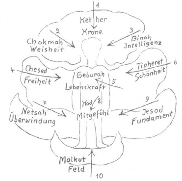

Nun, meine Herren, es bleibt uns noch von den letzten Fragen übrig die nach dem jüdischen Sephirothbaum. In diesem Sephirothbaum haben die Juden des Altertums ihre höchste Weisheit eigentlich eingeschlossen. Und zwar könnte man sagen: Sie haben darin eingeschlossen die Weisheit von der Beziehung des Menschen, von dem Verhältnis des Menschen zu der Welt. Wir haben ja öfter betont: Der Mensch besteht nicht nur aus dem sichtbaren Teile, den man mit dem Auge sieht, sondern der Mensch besteht auch noch aus unsichtbaren, übersinnlichen Gliedern. Wir haben diese übersinnlichen Glieder genannt den Ätherleib, den Astralleib, das Ich oder die Ich-Organisation. Nun, von allen diesen Dingen hat man schon in alten Zeiten, wenn auch nicht so, wie wir es heute haben, aber man hat davon gewußt aus dem Instinkt heraus. Dieses alte Wissen ist eben ganz verlorengegangen. Und heute glaubt man, daß so etwas wie dieser jüdische Lebensbaum, der Sephirothbaum, eigentlich eine Phantasie ist. Das ist aber nicht so. ^kard11

Nun wollen wir uns heute einmal klarmachen, was die alten Juden mit diesem Sephirothbaum eigentlich gemeint haben. Nicht wahr, sie dachten sich das so: Der Mensch steht da in der Welt, aber die Kräfte der Welt wirken von allen Seiten auf ihn ein. Wenn man den Menschen, wie er dasteht in der Welt (es wird gezeichnet), anschaut, so können wir ihn uns, schematisch gezeichnet, so vorstellen. Also so stellen wir uns den in der Welt stehenden stofflichen Menschen einmal vor. Diesen Menschen haben sich nun die alten Juden so vorgestellt, daß auf ihn von allen Seiten die Kräfte der Welt wirken. Hier zeichne ich einen Pfeil, der so bis ins Herz hineingeht: Also auf den Menschen wirkend die Kräfte der Welt; hier unten die Kraft der Erde. ^aioo0o

Nun haben die Juden gesagt: Zunächst wirken drei Kräfte auf den menschlichen Kopf - die habe ich in der Zeichnung mit diesen Pfeilen: 1, 2, 3 bezeichnet -, drei Kräfte auf die menschliche Mitte, auf die Brust, auf die Atmung und die Blutzirkulation hauptsächlich (Pfeile 4, 5, 6 der Zeichnung). Dann wirken drei Kräfte mehr auf die Gliedmaßen des Menschen (Pfeile 7, 8, 9), und eine zehnte Kraft, die wirkt von der Erde aus auf den Menschen (Pfeil 10, von unten). Also zehn Kräfte, stellten sich die alten Juden vor, wirken von außen auf den Menschen. ^am32mv

Betrachten wir zunächst die drei Kräfte, die sozusagen von den weitesten Partien, von den entferntesten Partien des Weltenalls kommen und auf den menschlichen Kopf wirken, den menschlichen Kopf eigentlich rund machen, wie ein Bild vom ganzen runden Weltenall machen. Diese drei Kräfte, also 1, 2, 3, sind die edelsten; die kommen sozusagen, wenn man mit einem späteren Ausdrucke sprechen will, mit einem griechischen Ausdruck zum Beispiel, von den höchsten Himmeln her. Die formen den menschlichen Kopf, indem sie ihn zu einem runden Abbilde des ganzen runden Weltenalls machen. ^brqggf

 ^6zir3q

Nun müssen wir aber gleich dabei einen Begriff entwickeln, welcher Sie stören könnte, wenn ich ihn einfach Ihnen sagen würde. Denn, sehen Sie, in diesen zehn Begriffen, die da die Juden an die Spitze ihrer Weisheit gestellt haben, da ist der erste da oben (1) ein solcher, der später furchtbar mißbraucht worden ist; denn später haben diejenigen Menschen, welchen es gelungen ist, die Macht an sich zu reißen, die Zeichen dieser Macht und auch die Worte für diese Macht in den äußeren Machtbereich heruntergezogen. Und so haben gewisse Menschen, welche sich die Macht der Völker angeeignet und auf ihre Nachkommen übertragen haben, sich angeeignet dasjenige, was man Krone nennt. Krone war früher, in alten Zeiten, ein Wort für das Höchste, was dem Menschen an Geistigkeit geschenkt werden kann. Und die Krone durfte nur derjenige tragen, der in dem Sinne, wie ich es Ihnen erklärt habe, durch die Einweihung gegangen ist, der also die höchste Weisheit errungen hat. Sie war ein Zeichen der höchsten Weisheit. Ich habe Ihnen ja auseinandergesetzt, wie die Orden ursprünglich alle etwas bedeutet haben, wie sie später angelegt worden sind aus Eitelkeit und nichts mehr bedeuten. Namentlich aber müssen wir so etwas gegenüber dem Ausdruck «Krone» in Betracht ziehen. Krone war für die Alten der Inbegriff von alldem, was sich an Übermenschlichkeit aus der geistigen Welt in die Menschen herniederzusenken hat. Kein Wunder, daß die Könige sich die Krone aufgesetzt haben. Die waren ja, wie Sie wissen, nicht immer weise und haben nicht immer die höchsten Himmelsgaben in sich vereinigt, aber sie haben sich das Zeichen aufgesetzt. Und man darf, wenn so etwas nach alten Sitten ausgesprochen worden ist, das nicht verwechseln mit dem, was daraus durch Mißbrauch geworden ist. Also das Höchste, die höchsten Weltengaben, die höchsten Geistesgaben, die sich auf den Menschen niedersenken können, die er vereinigen kann mit seinem Kopfe, wenn er viel weiß, das nannte man im alten Judentum Kether, die Krone. Nun, sehen Sie, das war also das Höchste. Das war dasjenige, was vom Weltenall herein geistig den Kopf formte. ^d12kfa

Und dann brauchte dieser Menschenkopf noch zwei andere Kräfte. Diese zwei anderen Kräfte kamen ihm von rechts und von links zu. Man dachte sich: Das Höchste kommt von oben herunter; von rechts und links kommen ihm die zwei anderen Kräfte, die beiden Weltenkräfte, die im ganzen Weltenall ausgebreitet sind. Nun, die eine, die wie durchs rechte Ohr hineingeht, nannte man Chokmah = Weisheit. Wir würden heute, wenn wir das Wort übersetzen wollten, sagen: Weisheit. Und auf der anderen Seite kam herein aus der Welt: Binah. Wir würden heute sagen: Intelligenz (2 und 3 der Zeichnung). Die alten Juden unterschieden zwischen Weisheit und Intelligenz. Heute betrachtet man einen jeden Menschen, der intelligent ist, auch so, als ob er weise wäre. Aber das ist ja nicht der Fall. Man kann intelligent sein und die größte Dummheit denken. Es werden die größten Dummheiten sehr intelligent ausgedacht. Namentlich wenn man in vieles von der heutigen Wissenschaft hineinsieht, muß man sagen, intelligent ist diese Wissenschaft eigentlich auf allen Gebieten, aber weise ist sie sicher nicht. Die alten Juden haben Chokmah und Binah, die alte Weisheit, von der alten Intelligenz schon früh voneinander unterschieden. Also den menschlichen Kopf, alles das eigentlich, was im Menschen zum Sinnessystem gehört, auch das, was an Nerven im Sinnessystem ausgebreitet liegt, all das bezeichnete man mit den drei Ausdrücken Kether, Chokmah, Binah - Krone, Weisheit, Intelligenz. ^vm589z

So wird, nach der Ansicht der alten Juden, der menschliche Kopf aufgebaut aus dem Weltenall herein. Es ist also ein starkes Bewußtsein vorhanden gewesen - sonst hätte man eine solche Lehre nicht ausgebildet -, daß der Mensch ein Glied im ganzen Weltenall ist. Wir können zum Beispiel beim menschlichen Körper fragen: Was ist mit der Leber? Nun, die Leber bekommt von der Blutzirkulation ihre Adern; sie bekommt ihre Kräfte von der menschlichen Umgebung. So haben die alten Juden gesagt: Der Mensch bekommt von der Weltumgebung die Kräfte, die dann, zunächst im Mutterleib und später auch, seine Kopfbildung bewirken. ^c89nmc

Nun, dann gibt es drei andere Kräfte (4, 5, 6 der Zeichnung); die wirken mehr auf den mittleren Menschen, auf den Menschen, in dem das Herz, in dem die Lunge ist. Sie wirken also auf den mittleren Menschen; sie kommen weniger von oben herunter, sie leben mehr in der Umgebung. Sie leben im Sonnenschein, der auf der Erde herumgeht, sie leben in Wind und Wetter. Da kommen diejenigen drei Kräfte in Betracht, die die alten Juden genannt haben: Chesed, Geburah, Tiphereth. Wenn wir das mit heutigen Ausdrücken sagen wollen, so könnten wir es ausdrücken als: Chesed = Freiheit; Geburah = Kraft; Tiphereth = Schönheit. ^gof5kj

Gehen wir hier vor allen Dingen von der mittleren Kraft aus, von Geburah. Ich habe Ihnen gesagt, ich will den Pfeil so zeichnen, daß er ins Herz geht! Die Kraft, die der Mensch hat, diese Herzhaftigkeit, Seelenkraft und physische Kraft zugleich, die wird angedeutet durch das menschliche Herz. Daher stellten sich die Juden vor: Wenn der Atem hineinkommt in den Menschen, wenn der Atem in das Herz läuft, da kommen von außen nicht nur diese physischen Atemkräfte in ihn, sondern es kommt die geistige Kraft, Geburah, die mit dem Atem verbunden ist. Wir würden also sagen, wenn wir es noch genauer ausdrücken wollten: die Lebenskraft, die Kraft, durch die er auch etwas kann = Geburah. Aber an der einen Seitevon Geburah ist dasjenige, was man Chesed nannte, die menschliche Freiheit. Und auf der anderen Seite Tiphereth, die Schönheit. Der Mensch ist ja tatsächlich in seiner Gestalt das Schönste auf der Erde! Der alte Jude hat sich vorgestellt: Höre ich den Herzschlag, so vernehme ich die Lebenskraft, die in den Menschen hineinkommt. Strecke ich die rechte Hand aus, so vernehme ich, daß ich ein freier Mensch bin; da kommt, wenn die Muskeln sich strecken, die Kraft der Freiheit. Die linke Hand, die mehr sanft sich bewegt, die mehr sanft greifen kann, die bringt dasjenige, was der Mensch in Schönheit macht. ^4ddvv8

Also diese drei Kräfte: Chesed = Freiheit, Geburah = Lebenskraft, Tiphereth = Schönheit, die entsprechen dem im Menschen, was mit dem Atem und mit der Blutzirkulation, all dem, was in Bewegung ist und sich immer wiederholt, zusammenhängt. Es gehört dazu schon auch die Bewegung des Schlafens, der Wechsel von Tag und Nacht. Das gehört auch zu der Bewegung; da gehört der Mensch auch mit dazu. ^csz3jb

Dann aber ist der Mensch außerdem ein Wesen, das seine Stellung im Raume ändern kann, das herumgehen kann, das nicht so wie die Pflanze immer an einem Ort bleiben muß. Das Tier kann ja auch schon herumgehen. Das hat der Mensch gemeinsam mit dem Tier. Das Tier hat nicht Chokmah, nicht Tiphereth, noch nicht Chesed, es hat aber schon Geburah = Lebenskraft. Und die drei, die ich da bezeichnet habe, die hat der Mensch gemeinschaftlich mit dem Tiere nur dadurch, daß er die anderen hat. ^ft4gr3

Dieses, daß man herumgehen kann, daß man nicht festgebannt ist an einen Ort, das nannten die Juden: Netsah, und das bedeutet, daß man den festen Stand der Erde überwindet, daß man sich bewegt (Pfeil 7 der Zeichnung). Netsah ist Überwindung. Nun, dasjenige, was mehr auf die Mitte des Menschen wirkt, da wo sein Schwerpunkt ist - es ist interessant, wissen Sie: das ist der Punkt, der etwa hier gelegen ist; er ist etwas höher im Wachen und senkt sich herunter im Schlafen, was auch bezeugt, daß beim Schlafen etwas draußen ist -, dasjenige, was in der Körpermitte wirkt, was beim Menschen auch die Fortpflanzung hervorbringt, was also mit der Sexualität zusammenhängt, das nannten die alten Juden Hod. Wir würden es heute bezeichnen mit dem Worte, das etwa ausdrücken würde Mitgefühl. Sie sehen, die Ausdrücke werden schon menschlicher. - Also mit dem Netsah ist die äußere Bewegung gemeint - wir gehen hinaus in den Raum -, mit Hod das innere Fühlen, die innere Bewegung, das innere Mitgefühl mit der Außenwelt, das ist alles Hod (Pfeil 8). Dann unter 9: Jesod; das ist nun dasjenige, auf dem der Mensch eigentlich steht, das Fundament. Der Mensch also fühlt sich da an die Erde gebunden; daß er auf der Erde stehen kann, ist das Fundament, ist Jesod. Daß er ein solches Fundament hat, rührt eben auch von den Kräften her, die von außen an ihn herankommen. ^2mh5tn

Und dann wirken die Kräfte der Erde selber auf ihn (Pfeil 10), nicht nur die umgebenden Kräfte, sondern die Kräfte der Erde selber wirken auf ihn. Das nannte man dann Malkuth. Wir würden es heute übersetzen: das Feld, auf dem der Mensch wirkt, die irdische Außenwelt; Malkuth - das Feld. Man kann schwer einen richtigen Ausdruck für dieses Malkuth prägen, man kann sagen: Reich, Feld; aber alle Dinge sind eigentlich mißbraucht worden, und die heutigen Namen bezeichnen eben nicht mehr dieses, was der alte Jude fühlte: daß da die Erde eigentlich auf ihn wirkt. ^3ubmdj

Wir brauchen uns nur vorzustellen, wir hätten hier die Mitte des Menschen; da setzt ein Oberschenkelknochen ein, auf jeder Seite des Menschen - das geht hier bis zum Knie, da wären die Kniescheiben. Auf diesen Knochen wirken alle diese Kräfte auch; aber daß er eigentlich so durchbohrt wird, daß er eigentlich eine Röhre ist, das kommt dadurch, daß die Erdenkräfte eindringen. Also all das, wo die Erdenkräfte eindringen, das bezeichnete der alte Jude mit Malkuth, das Feld. ^k5bnhn

Sie sehen also, man muß an den Menschen herankommen, wenn man von diesem Sephirothbaum sprechen will! Alle zehn zusammen, also: Kether, Chokmah, Binah, Chesed, Geburah, Tiphereth, Netsah, Hod, Jesod, Malkuth nannten die Juden die zehn Sephiroth. Diese zehn Kräfte sind dasjenige, wodurch der Mensch eigentlich mit der höheren, mit der geistigen Welt zusammenhängt. Nur die zehnte Kraft, Malkuth, ist eben in die Erde hineinversenkt. Also im Grunde genommen ist das hier der physische Mensch (auf die Zeichnung deutend), und diesen physischen Menschen umgibt der geistige Mensch, unten zunächst als die Erdenkräfte, dann aber als die Kräfte, die mehr schon nahen der Erde, aber doch noch aus der Umgebung hereinwirken: Netsah, Hod, Jesod. Das gehört also alles geistig zum Menschen dazu, wie diese Kräfte hereinwirken. Dann die Kräfte, die auf seine Blutzirkulation und Atmung wirken: Chesed, Geburah, Tiphereth. Und dann die edelsten Kräfte, die auf den Menschen wirken, die auf sein Kopfsystem wirken: Kether, Chokmah, Binah. So daß sich die Juden eigentlich so, wie ich es Ihnen hier farbig aufgezeichnet habe, den Menschen mit der Welt nach allen Seiten verbunden dachten. Der Mensch ist eben durchaus so, daß er auch ein Übersinnliches in sich enthält. Und dieses Übersinnliche, das haben sie sich so vorgestellt. ^ahh6eh

Nun können wir aber die Frage aufwerfen: Was haben denn außerdem, daß sie sich dadurch den Menschen in seinem Verhältnis zur Welt erklärt haben, die Juden eigentlich mit den zehn Sephiroth erreichen wollen? Denn jeder Judenschüler mußte die zehn Sephiroth lernen, aber nicht bloß so, daß er sie aufzählen konnte; da würden Sie sich eine ganz falsche Vorstellung machen, wenn Sie glaubten, der Unterricht in den alten Judenanstalten wäre so gewesen, daß das das Markante war, was ich Ihnen an die Tafel gezeichnet habe. Wenn man nur auf die Frage antworten will: Was ist der Sephirothbaum? -, da hätte man schnell fertig werden können; flugs hätten Sie es gewußt. Mit dem sind die Menschen heute zufrieden, daß man frägt: Was ist der Sephirothbaum? Da steht dies und das drinnen, was ich Ihnen jetzt gesagt habe. - Aber das ist dann nicht in der Beziehung zum Menschen! Sondern es werden dann eben nur zehn Worte und allerlei phantastische Erklärungen dafür gegeben! Aber in bezug auf den Menschen ist es das Richtige, was ich Ihnen gesagt habe. Aber damit war es nicht etwa abgetan in den Schulen, sondern der jüdische Zögling, der Wissenschaft lernen sollte in dem damaligen Sinne, der mußte viel mehr darüber lernen. ^r9c2ic

Denken Sie einmal, meine Herren, Sie hätten bloß gelernt, was das Alphabet ist und Sie wüßten, wenn Sie jemand frägt: Was ist A, B, C, D und so weiter? - also die Buchstaben A, B, C, D und so weiter. Sie hätten es bis dahin gebracht, daß Sie die zweiundzwanzig oder dreiundzwanzig Buchstaben hintereinander aufzählen können. Da würden Sie nicht viel anfangen können damit! Wenn irgendein Mensch nur die dreiundzwanzig Buchstaben aufzählen könnte, da könnte er nicht viel damit anfangen, nicht wahr? Geradeso aber würde ein alter Jude angesehen worden sein, der nur hätte sagen können: Kether, Chokmah, Binah, Chesed, Geburah, Tiphereth, Netsah, Hod, Jesod, Malkuth, also diese zehn Sephiroth hätte aufzählen können. Wer nur so geantwortet hätte, der hätte den Juden so geschienen wie einer, der sagen kann: A, B, C, D, E, F, G, H und so weiter. Man muß ja noch mehr lernen als das Alphabet, nicht wahr; man muß lernen, das Alphabet zum Lesen zu benutzen, muß lernen, wie man die Buchstaben zum Lesen benutzt. Nun, meine Herren, denken Sie sich einmal aus, wie wenig Buchstaben es gibt, und wieviel Sie in Ihrem Leben schon gelesen haben! Sie müssen das nur bedenken. Nehmen Sie sich irgendein Buch, nehmen Sie, ich will sagen, zum Beispiel Karl Marx’ «Kapital» und schauen Sie da nach, wenn Sie das Buch vor sich haben: nichts steht auf den Seiten als die zweiundzwanzig Buchstaben, gar nichts sonst! Es stehen nur die Buchstaben darin im Buch. Aber was dadrinnen steht, das ist viel, und das ist alles hervorgebracht dadurch, daß die zweiundzwanzig Buchstaben durcheinandergewürfelt sind: bald steht das A vor dem B, bald vor dem M, bald das M vor dem A, das L vor dem I und so weiter, und dadurch entsteht das ganze Komplizierte, das in dem Buche ist. Wenn einer nur das Alphabet kann, nimmt er das Buch in die Hand und sagt vielleicht: Mir ist alles klar, was in dem Buche steht: da steht A, B, C, nur verschieden eingereiht; ich weiß alles, was in dem Buche steht. - Aber alles, was da wirklich innerlich dem Sinne nach drinnensteht, das kann er nicht lesen, das weiß er nicht. Sie sehen, man muß lesen lernen mit dem, was die Buchstaben sind; man muß wirklich in seinem Kopf und in seinem Geist die Buchstaben so durcheinanderwürfeln können, daß Sinn daraus entsteht. Und so haben die alten Juden lernen müssen die zehn Sephiroth; die waren für sie Buchstaben. Sie werden sagen: Ja, das sind Worte. Früher aber wurden die Buchstaben auch mit Worten bezeichnet! Das ist nur von den Menschen, als die Buchstaben nach Europa gekommen sind, in Griechenland verloren worden. ^0zmvnv

Nicht wahr, als der Übergang von der griechischen zur römischen Kultur war, da geschah etwas sehr Bedeutsames. Die Griechen nannten ihr A nicht A, sondern Alpha, und Alpha heißt eigentlich: der geistige Mensch; und sie nannten ihr B nicht B, sondern Beta, das ist so etwas wie ein Haus. Und so hatte jeder Buchstabe einen Namen. Und der Grieche hätte sich gar nicht vorstellen können, daß der Buchstabe etwas anderes ist, als was man mit einem Namen bezeichnet. Dann erst, als der Übergang von der griechischen Kultur zu der römischen geschah, da sagte man nicht mehr Alpha, Beta, Gamma, Delta und so weiter, da bezeichnete man die Buchstaben nicht mehr mit ihren Namen, wo jeder Name darauf hinwies, was ein solcher Buchstabe bedeutet, sondern da sagte man: A, B, C, D und so weiter, da wurde das Ganze abstrakt. Gerade als das Griechentum untergegangen ist, in das Römertum eingegangen ist, entstand die große Kulturdiarrhöe in Europa. Da verlor man in einer riesigen Diarrhöe das Geistige auf diesem Weg vom Griechentum zum Römertum. ^5xv3me

Und sehen Sie, da war aber insbesondere das Judentum dann groß. Wenn die ihr Aleph aufschrieben, ihren ersten Buchstaben, so meinten sie damit den Menschen. Aleph ist das. Sie wußten: Überall, wo sie diesen Buchstaben für die sinnliche Welt hinstellten, da muß das, was sie durch diesen Buchstaben ausdrücken, auf den Menschen passen. Und so hatte auch jeder Buchstabe, der für die Ausdrücke der sinnlichen Welt war, einen Namen. Und die Namen jetzt: Kether, Chokmah, Binah, Chesed, Geburah, Tiphereth, Netsah, Hod, Jesod, Malkuth, das waren die Namen für die geistigen Buchstaben, für das, was man lernen mußte, um in der geistigen Welt zu lesen. Und so hatten die Juden ein Alphabet: Aleph, Beth, Gimel und so weiter - ein Alphabet, mit dem sie die äußere Welt, die physische Welt erfaßten. Aber sie hatten auch das andere Alphabet, wo sie nur zehn Buchstaben, zehn Sephiroth hatten, und mit dem erfaßten sie die geistige Welt. ^0geal3

Sehen Sie, meine Herren, wenn ich Ihnen die Namen so aufzähle, Kether, Chokmah, Binah, Chesed und so weiter, nun, das ist so wie A,B, C, D und so weiter. Aber solch ein alter Jude hätte dann, wie wir die Buchstaben durcheinanderwürfeln, zu sagen gewußt: Kether, Chesed, Binah. Und wenn er gesagt hätte: Kether, Chesed, Binah, wenn er so gewürfelt hätte, würde er gesagt haben: In der geistigen Welt bewirkt die höchste geistige Kraft durch die Freiheit die Intelligenz. - Und damit würde er die höheren Wesen bezeichnet haben, die nicht einen physischen Leib haben, bei denen die höchste Himmelskraft durch die Freiheit die Intelligenz bewirkt. ^h6xok5

Oder er würde gesagt haben: Chokmah, Geburah, Malkuth - das würde geheißen haben: Durch Weisheit bringen die Geister die Lebenskraft hervor, durch die sie auf die Erde wirken. - Er hat gewußt alle diese Dinge durcheinanderzuwürfeln wie wir die Buchstaben. So haben diese Schüler der alten Juden durch diese zehn Geistbuchstaben in ihrer Art die Geisteswissenschaft begriffen. Dieser Baum, der Sephirothbaum, war also für sie dasselbe, was für uns der Baum des Alphabets mit seinen dreiundzwanzig Buchstaben ist. Es ist mit diesen Dingen ganz merkwürdig gegangen, sehen Sie: In den ersten zwei Jahrhunderten nach der Entstehung des Christentums hat man von allen diesen Dingen gewußt. Aber als dann die Juden sich zerstreut haben in die Welt, ist diese Art zu wissen durch die zehn Sephiroth auch zerstreut worden. Einzelne Judenzöglinge, die man dann, wie Sie vielleicht wissen, Chachamim genannt hat, wenn sie die Schüler des Rabbiners geworden sind, diese Chachamim haben diese Dinge noch gelernt; aber auch da wurde eigentlich nicht mehr recht gewußt, wie man durch diese zehn Sephiroth liest. Es ist zum Beispiel noch im 12. Jahrhundert ein großer Streit entstanden über zwei Sätze; der erste Satz hieß: Hod, Chesed, Binah. Diesen Satz hat der Maimonides festgehalten. Sein Gegner dagegen behauptete: Chesed, Kether, Binah. Also über diese Sätze hat man sich schon gestritten. Man muß wissen: Diese Sätze sind aus dem Sephirothbaum heraus; der eine hat so, der andere so gelesen, die Dinge so und so zusammengesetzt. Aber man hatte gegen das Mittelalter diese Lesekunst eigentlich vergessen. Und das Interessante ist, daß später, in der Mitte des Mittelalters, ein Mann aufgetaucht ist, Raimundus Lullus - ein sehr interessanter Mensch, dieser Raimundus Lullus! ^w39d2y

Sehen Sie, meine Herren, einen solchen Menschen kennenzulernen, ist eigentlich außerordentlich interessant. Denken wir uns, es wäre unter Ihnen ein recht Neugieriger, der würde sich sagen: Jetzt habe ich von Raimund Lullus gehört; ich will jetzt einmal nachlesen über ihn! - Nehmen Sie zuerst das Lexikon, aber dann irgendwelche Bücher, wo etwas von Raimund Lullus drinnensteht: Ja, wenn Sie das lesen, was da von Raimund Lullus steht in den Büchern heute, dann können Sie sich den Bauch halten vor Lachen, denn das wäre der lächerlichste Mensch gewesen, den man sich nur denken kann! Da sagen nämlich die Leute: Dieser Raimundus Lullus, der hat zehn Wörter auf Zettel geschrieben, und dann hat er so etwas genommen, wie man es hat beim Hasardspiel, eine Art Roulette, wo man dreht, wo man die Geschichte durcheinanderwürfelt, da hätte er diese zehn Zettel immer durcheinandergewürfelt, und was herausgekommen wäre, das habe er aufgeschrieben, und das wäre seine Weltweisheit gewesen. Nun, wenn man so etwas liest, daß also einfach auf zehn Zettel Worte geschrieben und durcheinandergeworfen wurden, und der Mann dadurch etwas Besonderes finden wollte, so muß man sich den Bauch vor Lachen halten, denn das ist doch ein lächerlicher Mensch, der so etwas täte. ^9ywz00

Aber so war es nämlich bei Raimundus Lullus nicht. Er hat eigentlich das Folgende gesagt: Ihr könnt noch so weit mit all dem, was euch euer Erdenalphabet gibt, herumforschen, die Wahrheit, die könnt ihr trotzdem nicht finden. - Und nun hat er gesagt: Die Wahrheit zu finden, dazu taugt euer gewöhnlicher Kopf nicht. Dieser gewöhnliche Kopf, der ist so wie eine Roulette, wo man dreht, und wo nichts darinnen liegt, wo also nichts herausgesucht werden kann, um zu gewinnen. - Der Lullus hat seinen Mitmenschen gesagt: Ihr seid eigentlich alle Hohlköpfe geworden, euer Kopf ist nichts mehr, da ist nichts mehr drinnen. Und ihr müßt solche Begriffe, wie diese zehn Sephiroth, einmal in eure Köpfe hineintun; da müßt ihr lernen, eure Köpfe von einem der Sephiroth zum anderen zu drehen, bis ihr lernt, die Buchstaben zu gebrauchen. - Das hat ihnen der Raimundus Lullus wieder gesagt. Das steht auch in seinen Schriften. Er hat nur ein Bild dafür gebraucht, und das Bild, das haben die Philosophen ernst genommen und geglaubt, er meine wirklich eine Art Roulette, wo man so herumdreht, daß man die Zettel mischt, während diese Roulette, die er gemeint hat, eben das übersinnliche Erkennen im Kopfe sein soll! ^565l2s

Dieser Lebensbaum, dieser Sephirothbaum, der ist also das geistige Alphabet. Die Menschen, die mehr im Abendlande waren, in Griechenland, die hatten schon auch in den alten Zeiten ein geistiges Alphabet gehabt. Und in der Zeit, in der Alexander der Große gelebt hat und Aristoteles, wurden dort auf griechische Art auch zehn Begriffe gegeben. Die finden Sie heute noch überall in allen Logiken der Schulen aufgezeichnet: Sein, Eigenschaft, Beziehung und so weiter auch zehn solche Namen, nur eben, daß sie anders sind, weil sie für das Abendland geeignet sind. Aber im Abendlande hat man diese zehn griechischen Buchstaben des geistigen Alphabets ebensowenig verstanden, wie man verstanden hat diese vorher angeführten. ^rhltle

Aber sehen Sie, es ist schon eigentlich eine interessante Geschichte, die da stattfindet in der Menschheit. Drüben in Asien, da haben diejenigen, die noch etwas gewußt haben, lesen gelernt in der geistigen Welt durch diesen Sephirothbaum. Und in den ersten Jahrhunderten des Christentums haben die Menschen, die noch etwas gewußt haben von der geistigen Welt, nach dem aristotelischen Lebensbaum - drüben in Griechenland, in Rom und so weiter - lesen gelernt. Aber nach und nach haben alle - die vom Sephirothbaum und die vom Aristotelesbaum - vergessen, wozu diese Dinge eigentlich sind, konnten nurmehr die zehn Begriffe aufzählen. Und jetzt müssen wir einfach diese Dinge so gebrauchen, daß wir lesen lernen in der geistigen Welt, sonst wird man nach und nach vom Menschen gar nichts mehr wissen. Sehen Sie, ein sehr interessanter Satz ist der folgende. Wenn so ein jüdischer Weiser geschrieben hat oder gesagt hat: Geburah, Netsah, Hod -, so würde man heute so übersetzen müssen, daß man im Deutschen sagt die Worte: Die Lebenskraft brütet in den Nieren die Träume aus. - Aber wenn man heute sagt: Die Lebenskraft brütet in den Nieren die Träume aus -, so meint man physische Kräfte, physische Wirkungen. Aber der alte Jude hat, wenn er gesagt hat: Geburah, Netsah, Hod -, damit gemeint: Das, was der geistige Mensch im Menschen ist, das bewirkt dasjenige, was in den Träumen erscheint. Überall war es eine geistige Behauptung, die man durch das, was durch das Zusammenwürfeln der Buchstaben entstand, ausdrückte. ^a20i22

Es ist schon so, daß es nur durch die Geisteswissenschaft heute möglich ist, überhaupt einen Aufschluß über diese Dinge zu bekommen. Denn kein Mensch sagt Ihnen heute, daß diese zehn Sephiroth solche Buchstaben waren für die geistige Welt. Das können Sie sonst nirgends hören, das weiß eigentlich heute kein Mensch! So daß man sagen kann, die Sache liegt da so, daß die heutige Wissenschaft die meisten Sachen, die man schon einmal gewußt hat in der Menschheit, nicht mehr weiß, und sie müssen erst wiederum errungen werden. ^qxwhf7

Nehmen Sie nur diesen Buchstaben, den ich Ihnen hier aufgemalt habe: Aleph 8. Was bedeutet denn dieser Aleph für die Sinneswelt? Nun, da steht der Mensch. $o steht er, seine Kraft aussendend. Das ist dieser Strich (Zeichnung). Er hebt die rechte Hand hinauf: das ist dieser Strich; er streckt die andere Hand herunter: das ist dieser Strich. So daß dieser erste Buchstabe Aleph ausdrückt den Menschen. Und jeder Buchstabe drückte - auch noch im Griechischen irgend etwas aus, so wie der erste Buchstabe «den Menschen» ausdrückt. ^kquer2

Sehen Sie, meine Herren, die Leute haben heute gar kein Gefühl mehr dafür, wie die Dinge zusammenhängen. Den ersten Buchstaben für den Menschen nannte der Hebräer Aleph, die Griechen Alpha, und sie meinten damit das, was sich im Menschen geistig bewegt, was hinter dem physischen Menschen geistig ist. Nun haben Sie aber auch noch ein altes deutsches Wort. Zunächst wird es dann gebraucht, wenn der Mensch besondere Träume hat. Wenn ihn ein geistiger Mensch drückt, dann nennt man dies den Alpdruck, den Alp. Da sagt man, da komme über den Menschen etwas, was ihn besessen macht. Aber dann ist aus Alp Elp entstanden, und dann EIf, der EIf, die Elfe - diese geistigen Wesen, die Elfen; der Mensch ist nur ein verdichteter Elf. Dieses Wort Elf, das auf Alp zurückführt, das kann Sie noch erinnern an Alpha im Griechischen. Sie brauchen nur das a wegzulassen, dann haben Sie: Alph - ph ist dasselbe wie unser f -, ein Geistiges. Dadurch, daß das f dazugesetzt worden ist, sagt man: der Aleph im Menschen, der Alp im Menschen. Wenn Sie im Jüdischen, wie es üblich ist, überall die Selbstlaute weglassen, so bekommen Sie direkt Alph = EIf für den ersten Buchstaben. Die Menschen sprechen aus: Elf für diese geistige Wesenheit. Man redet von Elfen. Natürlich sagt man heute: Das sind Wesenheiten, welche die Alten erfunden haben aus ihrer Phantasie heraus. Wir glauben nicht mehr daran. - Aber die Alten haben gesagt: Ihr braucht ja nur auf den Menschen selber hinzuschauen, dann habt ihr den Alph, nur daß da der Alph im Körper drinnensteckt und nicht ein feines ätherisches Wesen ist, sondern ein dichtes körperliches Wesen ist im Menschen. - Aber die Menschen haben ja längst verlernt, überhaupt noch den Menschen aufzufassen. ^isu3in

Da erlebt man ja das Allerdrolligste, meine Herren. Denken Sie sich einmal, daß in der zweiten Hälfte des 19. Jahrhunderts folgendes aufgekommen ist - ich will gar nichts dagegen sagen, solche Dinge können geschehen -: Da wurde ein Tisch genommen, um den setzten sich die Leute herum, sagen wir acht Leute; sie legen die Hände, die sich dann mit den äußersten Enden berühren, auf die Tischplatte, und da fängt der Tisch zu tanzen an! Dann zählen sie die Tanzschritte des Tisches ab, formen daraus, auch aus Buchstaben, Worte. Das sind spiritistische Sitzungen. Was glauben die Menschen? Sie glauben: Na, wenn wir nachdenken, dann kommt nichts von wirklicher Erkenntnis heraus; die wirkliche Erkenntnis, die muß uns irgendwo zufallen. - Nun, in Wahrheit ist es ja so, daß die Menschen, die das sagen, von sich es allerdings sagen könnten, denn es sind meist solche, die gedankenlos sind, und die nicht nachdenken wollen, die gern möchten, daß ihnen die Wahrheit von irgendwoher zufällt ohne ihre eigene Arbeit. Daher setzen sich acht um den Tisch herum, dann lassen sie den Tisch aufschlagen, das erstemal A, das zweitemal B, dann C und so weiter, und daraus formen sie dann Worte - und das sind dann spiritistische Offenbarungen. Nicht wahr, da ist ihnen die Weisheit zugefallen; sie haben sie nicht selber errungen! ^ra4nmx

Aber sehen Sie, was sollte man denn zu solchen Menschen eigentlich sagen? Solche Menschen, die wollen die geistige Welt erkennen; das ist ja ihre ehrliche Absicht, die geistige Welt zu erkennen. Die Geister, die kann man nicht anschauen; man sieht und hört sie nicht, weil sie keinen Körper haben. Da denken sich die Leute: Da können sie ja den Tisch als Körper benützen, und da können sie sich auf diese Weise so ein bißchen verständlich machen. - Nebenbei bemerkt: Es kommen meistens sehr allgemeine Dinge heraus, die man so und so deuten kann! - Aber jedenfalls muß man zu diesen Menschen sagen: Da sitzt ihr, acht Menschen, um den Tisch herum; ihr wollt, daß ein Geist kommt, der sich hörbar macht: Ja, seid ihr denn nicht selber auch Geister? Ihr seid ja selber auch Geister, die ihr da herumsitzet! Schaut einmal auf euch selber hin und sucht in euch selber den Geist. Da werdet ihr noch einen viel größeren Geist finden können. Von euch werdet ihr nicht voraussetzen, daß ihr nur dann geschaut werdet, wenn ihr durch einen Tisch schlaget, sondern wenn ihr menschengemäß eure Glieder, eure Stimmen, vor allen Dingen eure Denkkräfte benützt! - Daher ist es ist in der Tat so und man braucht es nicht zu bezweifeln, wenn sich acht Menschen um den Tisch herumsetzen, daß der Tisch anfängt zu tanzen, weil ja die unterbewußten Kräfte auf den Tisch wirken -, die Sache ist schon so, aber heraus kommt doch nicht irgend etwas, was nicht in viel höherem Sinn herauskäme, wenn der Mensch sein eigenes Alpha oder Aleph in sich selber anstrengt. ^q99v4k

Aber die Menschen haben bei dem Übergang von dem Griechentum ins Römertum Aleph verlernt. Der erste Buchstabe bedeutet A ja, nur glauben, der erste Buchstabe bedeutet bloß A, das heißt ja Maulaffen feilhalten! Allein, da kommt ja nichts dabei heraus. Einer Ehefrau ist es einmal zu dumm geworden, daß ihr Mann immerfort Vorträge gehalten hat aus der Wissenschaft heraus. Er hatte viel gelernt und hat immer Vorträge gehalten. Das war ihr furchtbar zuwider. Und da sagte sie eines Tages zu ihm: Du willst immer Vorträge halten! - wenn du schon etwas halten willst, so halt das Maul! - Ja, eigentlich ist dasjenige, was Inhalt ist, ganz verlorengegangen. Die Griechen haben nicht ein A, ein Alpha, so gedacht, ohne an den Menschen zu denken. Sie wurden gleich an den Menschen erinnert. Und sie haben nicht ein Beta gehabt, ohne sich an ein Haus zu erinnern, worin der Mensch wohnt. Das Alpha ist immer der Mensch. Sie stellten sich etwas dem Menschen Ähnliches vor. Und bei Beta, da stellten sie sich etwas, was um den Menschen herum ist, vor. Da wurde dann das jüdische Beth und das griechische Beta das Umhüllende um das Alpha, das noch drinnen ist als geistiges Wesen. So würde auch der Körper das Beth, Beta sein, und das Alpha der Geist darinnen. Und nun reden wir heute vom «Alphabet» - das heißt aber für die Griechen: «der Mensch in seinem Haus», oder auch: «der Mensch in seinem Körper», in seiner Umhüllung. ^1dkdrt

Nun, meine Herren, es ist eigentlich furchtbar lustig. Nehmen Sie heute ein Lexikon in die Hand, dann lesen Sie nach in dem Alphabet die ganze Weisheit, die die Menschheit hat. Wenn einer - Sie werden es nicht tun - beim A anfängt und beim Z aufhören würde, dann würde er die ganze Weisheit in sich haben. Ja, aber nach was ist denn diese Weisheit im Menschen anzuordnen? Nach dem Alphabet, nach dem, was man vom Menschen wissen kann. Es ist sehr interessant: Die Menschen haben es dazu gebracht, alle Weisheit zu verbreiten, weil sie nicht mehr wußten, daß das eigentlich hindeutet auf das, was aus dem Alphabet kommt. - Übersetzt man Alphabet, so kommt heraus, wenn man es etwas anders ausdrückt: Menschenweisheit, Menschenwissen - wiederum mit einem griechischen Wort ausgedrückt: Anthroposophie, Menschenweisheit. Und so sagt es denn jedes Lexikon. Eigentlich müßte in jedem Lexikon Anthroposophie drinnenstehen, denn es ist nur nach dem Alphabet, nach der Menschenweisheit, «der Mensch in seinem Körper» angeordnet. Es ist also furchtbar lustig: Eigentlich stellt jedes Lexikon ein Totengerippe dar, wo in der alphabetisch angeordneten Wissenschaft die alte Weisheit verschwunden ist. Es ist alles Fleisch und Blut weg, alle Muskeln und alle Nerven sind heruntergefallen. Jetzt gehen Sie zum Lexikon; da ist nur noch das tote Gerippe von der alten Wissenschaft drinnen. - Jetzt muß wieder eine neue Wissenschaft entstehen, die nicht bloß das Totengerippe hat, wie das Lexikon, sondern wirklich alles wieder hat vom Menschen, Fleisch und Blut und so weiter: das ist die Anthroposophie! Daher möchte man am liebsten - trotzdem man sie heute braucht - alle diese Lexika zum Teufel schmeißen, weil sie das tote Gerippe sind von einer alten Wissenschaft. Neue Wissenschaft muß begründet werden! ^qktfoj

Sehen Sie, meine Herren, das ist dasjenige, was man gerade auch am Sephirothbaum lernen kann, wenn man ihn in der richtigen Weise begreift. Es ist sehr nützlich, daß Herr Dollinger diese Frage gestellt hat, denn sie hat uns wieder ein bißchen tiefer hineingeführt in die Anthroposophie. ^n6qq77

Das nächstemal dann am Mittwoch um neun Uhr. ^syaik9