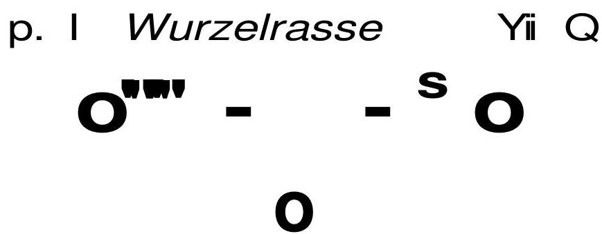

# PFINGSTEN, DAS FEST DER BEFREIUNG DES MENSCHENGEISTES, Berlin, Pfingstmontag, 23. Mai 1904

|21| Es war vorauszusehen, daß heute nur eine kleine Gemeinde sich versammeln würde. Ich habe dennoch beschlossen, diesen Abend abzuhalten, um denen, welche sich heute einfinden, einiges zu sagen in Anknüpfung an das Pfingstfest.

Bevor ich darauf eingehe, möchte ich Ihnen eines der Ergebnisse meiner letzten Londoner Reise mitteilen, das darin besteht, daß uns höchstwahrscheinlich im Herbst Frau Besant hier besuchen wird. Wir werden also Gelegenheit haben, die zu den bedeutendsten spirituellen Kräften der Gegenwart gehörende Persönlichkeit wieder zu hören. Die zwei nächsten öffentlichen Vorträge werden wir im Architektenhaus haben: heute über acht Tagen über Spiritismus und den folgenden über Somnambulismus und Hypnotismus. Dann werden die Montagsveranstaltungen wieder regelmäßig hier stattfinden. An den Donnerstagen der nächsten Zeit werde ich sprechen über Theosophische Kosmologie, über Vorstellungen, die die Theosophie zu geben hat über die Bildung des Weltgebäudes. Diejenigen, welche sich für diese Fragen interessieren, werden mannigfaltiges zu hören bekommen, was sie vielleicht noch nicht aus der gebräuchlichen theosophischen Literatur kennen. Die Vorträge über die Elemente der Theosophie möchte ich in einem späteren Zeitpunkte halten.

Was ich nun heute sagen werde, entstammt einer alten okkulten Tradition. Der Stoff kann natürlich heute nicht erschöpft werden. Manches wird sogar unglaubhaft erscheinen. Ich bitte daher, die heutige Stunde als eine Episode zu betrachten, in der nichts bewiesen, sondern einfach Dinge erzählt werden sollen.

Die Menschen feiern heutzutage ihre Feste, ohne so recht eine Ahnung davon zu haben, was solche Feste bedeuten. In den Zeitungen, die für einen großen Teil unserer gegenwärtigen Zeitgenossen die eigentliche Quelle der Bildung und Aufklärung bedeuten, kann man die mannigfaltigsten Artikel über solche Feste lesen, ohne daß |22| bei den Schreibern irgendein Bewußtsein vorhanden ist, was solch ein Fest zu bedeuten hat. Aber für Theosophen ist es notwendig, wieder auf die innere Bedeutung hinzuweisen. Und so möchte ich heute hinweisen auf die Anfangskeime eines solchen uralten Festes, auf den Ursprung des Pfingstfestes.

Das Pfingstfest ist eines der bedeutendsten und am schwersten verständlichen Feste. Im christlichen Bewußtsein erinnert es an die Ausgießung des Heiligen Geistes. Dieses Ereignis wird uns beschrieben als eine Wundergeschichte: über die Jünger und die Apostel Christi habe sich der Heilige Geist ergossen, so daß sie anfangen, in allen möglichen Zungen zu sprechen. Das heißt, daß sie zu jedem Herzen den Zugang fanden und je nach dem Verständnis der Menschen sprechen konnten. Das ist eine Bedeutung des Pfingstfestes. Wenn wir es aber gründlicher verstehen wollen, müssen wir viel tiefer gehen. Das Pfingstfest – als symbolisches Fest – hängt mit den tiefsten Mysterien, mit den heiligsten geistigen Gütern der Menschheit zusammen. Deshalb ist es so schwer, darüber zu sprechen. Wenigstens auf einiges möchte ich indessen heute doch hindeuten.

Wofür eigentlich das Pfingstfest Symbol ist, was dem Pfingstfest zugrunde Hegt, was es im tieferen Sinne bedeutet, das ist nur aufgeschrieben in einem Manuskript, das sich im Vatikan, in der Vatikanischen Bibliothek befindet und in der sorgfältigsten Weise behütet wird. In diesem Manuskript ist allerdings nicht von dem Pfingstfest, wohl aber von dem gesprochen, wofür das Pfingstfest nur das äußere Symbol ist. Dieses Manuskript hat wohl kaum jemand gesehen, der nicht in die tiefsten Geheimnisse der katholischen Kirche eingeweiht war oder es im Astrallichte zu lesen vermochte. Eine Kopie davon besitzt eine Persönlichkeit, welche von der Welt sehr verkannt worden ist, die aber heute für den Geschichtsbetrachter anfängt interessant zu werden. Ich könnte auch ebenso sagen «hat besessen» statt «besitzt», aber es entstände eine Unklarheit dadurch. Deshalb sage ich: eine Kopie besitzt der Graf von Saint-Germain, von dem wohl die einzigen Mitteilungen stammen, die es in der Welt davon gibt.

Ich möchte im Sinne der Theosophie nur andeutungsweise einiges darüber sagen. Wir werden da zu etwas geführt, was tief Zusammen|23|hängt mit der Evolution, mit der Entwickelung der Menschheit in der fünften Wurzelrasse. Der Mensch hat ja diejenige Form, die er heute an sich trägt, in der dritten Wurzelrasse, der alten lemurischen Zeit bekommen, sie weitergebildet durch die vierte Wurzelrasse, die Zeit der alten Atlantis, und ist dann mit dem Resultat in die fünfte Wurzelrasse eingetreten. Wer meine Atlantis-Vorträge gehört hat, wird sich erinnern, daß bei den Griechen noch eine lebhafte Erinnerung an jene Zeit vorhanden war.

Zur Orientierung müssen wir einen kurzen Einblick gewinnen in zwei Strömungen innerhalb unserer fünften Wurzelrasse, die als verborgene Kräfte in den Gemütern lebendig sind und vielfach miteinander streiten: die eine Strömung findet sich am reinsten und klarsten ausgeprägt in dem, was wir die ägyptische, indische und südeuropäische Weltanschauung nennen. Alles spätere Judentum und auch das Christentum enthält etwas davon. Das hat sich aber andererseits in unserem Europa wiederum vermischt mit der anderen Strömung, die in derjenigen Weltanschauung lebt, die wir im alten Persien finden und die wir - wenn wir nicht auf das hören, was uns die Anthropologen und Etymologen sagen, sondern wenn wir auf die Sache tiefer eingehen - wiederfinden können von Persien westwärts sich hinziehend bis zu den Regionen der Germanen.

Von diesen zwei Strömungen möchte ich behaupten, daß sie auf zwei wichtige, zwei große spirituelle Intuitionen hindeuten, die ihnen zugrunde liegen. Die eine ist am reinsten aufgegangen den uralten Rishis. Ihnen ging auf die Intuition höhergearteter Wesen: der sogenannten Devas. Wer eine okkulte Schulung durchgemacht hat, wer forschen kann auf diesem Gebiete, der weiß, was Devas sind. Diese rein spirituellen Wesenheiten, die im Astral- und Mentalraum leben, haben eine zweifache Natur, während die Menschen eine dreifache Natur haben. Denn der Mensch besteht aus Leib, Seele und Geist. Die Devanatur aber besteht - soweit wir sie verfolgen können - nur aus Seele und Geist. Sie mag noch andere Glieder haben, aber wir können sie selbst mit okkulter Schulung nicht verfolgen. Ein Deva hat in seinem Inneren unmittelbar den Geist. Der Deva ist ein seelenbegabter Geist. Was Sie beim Menschen nicht sehen können, nämlich |24| die Begierden, Triebe, Leidenschaften und Wünsche, die in ihm leben, die aber für den, der seine spirituellen Sinne erschlossen hat, wahrnehmbar sind als Lichterscheinungen, diese Seelenkräfte, dieser Seelenleib des Menschen, der für den Menschen sein Inneres ist und getragen wird von unserem physischen Leib, das ist der unterste Leib der Devas. Wir können ihn als ihren Körper ansehen. Die indische Intuition ging vorzugsweise auf die Verehrung dieser Devas. Der Inder sieht diese Devas überall. Er sieht sie als die schaffenden Kräfte, wenn er hinter die Kulissen unserer Welterscheinungen blickt. Diese Intuition liegt dem südlichen Weltanschauungsgürtel zugrunde. In der Weltanschauung Ägyptens kommt sie groß und gewaltig zum Ausdruck.

Die andere Intuition liegt der alten persischen Mystik zugrunde und führte zur Verehrung von Wesenheiten, die auch nur zweifacher Natur sind: den Asuras. Diese haben auch das, was wir Seele nennen; aber in großartiger, titanenhafter Weise haben sie ausgebildet den physischen Leib, der ein Seelenorgan einschließt. Die indische Weltanschauung, die an der Devaverehrung festhält, sieht diese Asuras als etwas Untergeordnetes an, während diejenigen, die sich zum nördlichen Weltanschauungsgürtel bekannten, mehr an den Asuras hingen, an der physischen Natur. Daher hatte sich auch hier besonders der Drang ausgebildet, die Welt der Sinneserscheinungen in materieller Weise zu beherrschen, die Welt der Wirklichkeit durch die bis ins Höchste gehende Vervollkommnung der Technik, durch physische Künste und dergleichen zu beherrschen. Heute gibt es keine Menschen mehr, die an der Asuraverehrung festhalten; aber viele unter uns gibt es noch, die etwas von dieser Natur in sich haben. Von daher rührt der Zug nach der materiellen Seite des Lebens und das ist der Grundzug des nördlichen Weltanschauungsgürtels. Wer sich zu rein materialistischen Grundsätzen bekennt, kann sicher sein, daß er in seiner Natur etwas hat, was von diesen Asuras herrührt.

Innerhalb der Bekenner der Asuras entwickelte sich dann ein eigentümliches Grundgefühl. Es sproßte zuerst im persischen Geistesleben auf. Die Perser bekamen eine Art Furcht vor der Devanatur. Furcht, Scheu und Grauen bekamen sie vor dem, was rein geistig-seelisch ist.

|25| Das bewirkte, daß wir heute den großen Gegensatz erblicken zwischen der persischen und der indischen Anschauung. In der persischen Weltanschauung wurde oft gerade das angebetet, was die indische Richtung als schlecht, als etwas Untergeordnetes betrachtete, und geradezu gemieden, was der Inder als verehrungswürdig betrachtet. Innerhalb des persischen Weltgefühles entstand also diese eigentümliche Grundempfindung gegenüber einer Wesenheit, die eigentlich Devanatur hat, die aber innerhalb dieser Weltanschauung gemieden, gefürchtet wird. Kurz, es ist das Bild des Satans, das in dieser Weltanschauung auftritt. Luzifer, der Geistig-Seelische, wird ein mit Schauder erfüllendes Wesen. Darin haben wir den Ursprung zu suchen von dem, was als Teufelsglaube existiert. Diese Grundempfindung ist auch in die moderne Weltanschauung übergegangen; namentlich im Mittelalter wurde der Teufel eine gefürchtete und gemiedene Figur. Luzifer wurde also förmlich gemieden.

Wir erhalten darüber Aufschluß in dem angegebenen Manuskript. Wenn wir im Sinne desselben den Gang der Weltentwicklung verfolgen, dann finden wir, daß in der Mitte der dritten, der lemurischen Rasse, die Menschen sich mit physischem Stoff bekleidet haben. Es ist eine falsche Vorstellung, wenn die Theosophen glauben, daß die Reinkarnation keinen Anfang und kein Ende habe. Die Reinkarnation hat in der lemurischen Zeit angefangen und wird im Beginne der sechsten Rasse auch wiederum aufhören. Es ist nur eine gewisse Zeitspanne in der irdischen Entwicklung, innerhalb welcher der Mensch sich wiederverkörpert. Vorausgegangen war ein überaus geistiger Zustand, der keine Wiederverkörperung nötig machte, und folgen wird wiederum ein geistiger Zustand, der auch keine Wiederverkörperung bedingt.

Die ursprüngliche Verkörperung in der dritten Rasse bestand darin, daß gleichsam der jungfräuliche Menschengeist, Atma-Buddhi-Manas, seine erste physische Verkörperung suchte. Es konnte damals die physische Entwicklung unserer Erde mit den tierartigen Wesenheiten noch nicht so weit vorgeschritten sein, die ganze tierisch-menschliche Wesenheit konnte damals noch nicht so weit sein, daß sie den Menschengeist hätte aufnehmen können. Aber ein Teil, eine gewisse Gruppe tierartiger Wesenheiten war schon so weit entwickelt, daß |26| sich der Same des Menschengeistes in diese tierischen Leiber senken konnte, damit sie dem Menschenleibe die Form geben konnten.

Ein Teil der Individualitäten, welche dazumal sich inkarnierten, bildeten den kleinen Stamm derjenigen, die sich später als sogenannte Adepten über die ganze Welt verbreiteten. Das waren die ursprünglichen Adepten, nicht diejenigen, die wir heute Initiierte nennen. Die, welche wir heute Initiierte nennen, machten damals noch keine Inkarnation durch. Es verkörperten sich damals aber nicht alle, die menschlich-tierische Körper hätten finden können, sondern nur ein Teil. Ein anderer Teil widersetzte sich dem Gang der Inkarnation aus bestimmten Gründen. Sie warteten damit bis in die vierte Rasse hinein. Die Bibel deutet jenen Zeitpunkt in verborgener und tiefsinniger Weise an: Die Söhne der Götter fanden, daß die Töchter der Menschen schön waren und sie verbanden sich mit ihnen.

Das heißt, es begann in jenem späteren Zeitpunkte eine Inkarnation von denjenigen, welche gewartet hatten. Wir nennen diese Gruppe «Söhne der Weisheit», und es scheint fast, als liege eine gewisse Vermessenheit und ein Stolz in ihnen. Von der kleinen Ausnahme der Adepten wollen wir jetzt absehen. Hätte sich dieser andere Teil damals auch inkarniert, so wäre der Mensch niemals zu dem klaren Bewußtsein gekommen, in dem er heute lebt. Der Mensch wäre in dumpfem Trancebewußtsein steckengeblieben. Er würde das Bewußtsein angenommen haben, das Sie heute bei Hypnotisierten, Somnambulen und so weiter finden können. Kurz, die Menschen hätten in einer Art Traumbewußtsein bleiben müssen. Aber eines hätte ihnen dann gefehlt, was außerordentlich wichtig, wenn nicht das Wichtigste war: das Freiheitsgefühl, die selbst eigene Entscheidung des Menschen über Gut und Böse aus seinem eigenen Bewußtsein, aus seinem Ich heraus.

Die Genesis bezeichnet diese spätere Inkarnation – in derjenigen Gestalt, die sie eben schon erhalten hat unter den Einflüssen, die von jener Empfindung herkommen, die ich charakterisiert habe dadurch, daß ich gesagt habe, daß vor dem Deva eine gewisse Scheu besteht –, die Genesis bezeichnet diese spätere Inkarnierung als den «Fall» des Menschen, den Sündenfall. Der Deva wartete und sank erst herunter, als die physische Menschheit schon eine Stufe weiter entwickelt war, |27| um dann erst Besitz zu ergreifen von dem physischen Leib, damit er dann ein reiferes Bewußtsein entwickeln könne, als das früher der Fall gewesen wäre.

So sehen Sie, daß der Mensch sich seine Freiheit dadurch erkauft hat, daß sich seine Natur verschlechterte, weil er mit der Inkarnierung wartete, bis seine Natur heruntergestiegen ist in die dichteren physiologischen Zustände. In der griechischen Mythologie hat sich ein tiefes Bewußtsein von diesem Tatbestand erhalten. Wäre der Mensch schon früher zur Inkarnation gekommen - das sagt der Mythos der Griechen -, dann wäre das eingetreten, was Zeus wollte, als sich die Menschen noch im «Paradiese» befanden: Er wollte sie glücklich machen, aber als unbewußte Wesen. Das klare Bewußtsein hätte dann einzig bei den Göttern gelegen und der Mensch wäre ohne das Gefühl der Freiheit geblieben. Die Auflehnung des Luzifergeistes, des Devageistes in der Menschheit, der heruntersteigen wollte, um sich aus der Freiheit heraus selbst emporzuentwickeln, ist symbolisiert in der Sage von Prometheus. Er aber muß für sein Bestreben büßen dadurch, daß fortwährend ein Adler - als Symbol der Begierde - an seiner Leber nagt und ihm dadurch die furchtbarsten Schmerzen verursacht.

Der Mensch ist also tiefer heruntergestiegen und muß nun das, was er durch magische Künste und Kräfte erreicht haben würde, mit dem erreichen, was ihm selbsttätig aus dem klaren Bewußtsein der Freiheit erfließt. Aber weil er tiefer heruntergestiegen ist, muß er auch Schmerzen und Qualen erdulden. Auch dies deutet die Bibel an mit den Worten: In Schmerzen sollst du Kinder gebären, im Schweiße deines Angesichtes sollst du dein Brot essen -, und so weiter. Das heißt nichts anderes als: der Mensch muß sich selbst mit Hilfe der Kultur wieder hochbringen.

Den Repräsentanten der in Freiheit durch Kämpfe zur Kultur strebenden Menschheit hat die griechische Mythologie in Prometheus symbolisiert. In ihm hat sie dargestellt den leidenden Menschen und zugleich den Befreier. Derjenige, der des Prometheus Befreiung herbeiführt, ist Herakles, von dem uns erzählt wird, daß er sich in die eleusinischen Mysterien einweihen ließ. Wer hinabstieg in die Unterwelt, war ein Initiierter, denn das Hinabsteigen in die Unterwelt ist |28| der technische Ausdruck für die Initiation. Diese Fahrt nach der Unterwelt wird uns von Herakles, Odysseus und von allen denjenigen gesagt, bei denen wir es mit Eingeweihten zu tun haben, die nun die Menschen innerhalb der gegenwärtigen Entwicklung zu dem Quell ursprünglicher Weisheit, zum spirituellen Leben führen wollen.

Wäre die Menschheit auf dem Standpunkte der dritten Rasse stehengeblieben, dann wären wir heute Traummenschen. Durch seine Devanatur hat der Mensch seine niedere Natur befruchtet. Aus seinem Selbstbewußtsein, seinem Freiheitsbewußtsein heraus muß er nun jenen Bewußtseinsfunken, den er sich damals in berechtigtem Übermut herunterholte, wieder entwickeln, also jene spirituelle Erkenntnis, die er in dem früheren unfreien Zustande nicht angestrebt hat. In der menschlichen Natur selbst liegt jene satanische Auflehnung, die als luziferisches Streben aber die Gewähr für unsere Freiheit überhaupt ist. Und aus dieser Freiheit entwickeln wir wieder spirituelles Leben. Dieses spirituelle Leben soll innerhalb der Menschheit der fünften Rasse wieder angefacht werden. Wieder soll von Initiierten dieses Bewußtsein ausgehen. Nicht ein traumhaftes, sondern ein klares Bewußtsein soll es sein. Die Herkulesse des Geistes, die Initiierten sind es, die die Menschheit vorwärtsbringen und ihr die verborgene Devanatur, die Erkenntnis des Geistigen enthüllen. Das ist auch das Streben aller großen Religionsstifter gewesen, der Menschheit wieder die Erkenntnis des Geistigen zu bringen, das sie im physiologischen Leben verloren hat. Die Atlantier hatten eine hohe physische Kultur, und unsere fünfte Rasse hat noch immer viel von dem materiellen Leben in sich. Diese materialistische Kultur unserer Zeit zeigt uns, wie sehr der Mensch sich verstrickt hat in die rein physisch-physiologische Natur, wie Prometheus in seine Ketten. Aber ebenso sicher ist es, daß der Geier, das Symbol der Begierde, der an unserer Leber nagt, beseitigt werden wird durch den spirituellen Menschen. Dahin wollen die Initiierten die selbstbewußte Menschheit führen durch solche Bewegungen, von denen die theosophische Bewegung eine ist, damit der Mensch in voller Freiheit wieder emporsteigen kann.

Den Zeitpunkt, den wir als den Augenblick des Einströmens spirituellen Lebens in die selbstbewußte Menschheit zu erfassen haben, |29| finden wir im Evangelium, im Neuen Testament, genau angedeutet. Im tiefsten Evangelium, das von der heutigen Theologie verkannt wird, im Johannes-Evangelium, da wo erzählt wird, daß Jesus das Laubhüttenfest besucht, wird dieser Zeitpunkt angedeutet. Der Stifter des Christentums spricht da davon, spirituelles Leben über die Menschheit auszugießen. Es ist das eine merkwürdige Stelle. Das Laubhüttenfest bestand ja darin, daß man zu einer Quelle ging, aus der Wasser floß. Dort entwickelte sich dann ein Fest, das darauf hindeutete, daß der Mensch sich wieder einmal besinnen solle auf das Spirituelle, auf die Devanatur und das geistige Streben. Das Wasser, das da geschöpft wurde, war eine Erinnerung an das Seelisch-Geistige. Nach wiederholten Absagen geht Jesus doch zu dem Fest. Und am letzten Tage des Festes geschieht folgendes (Joh.7,37): Am letzten Tage des Festes, der am herrlichsten war - so heißt es -, trat Jesus auf und sprach: «Wen da dürstet, der komme zu mir und trinke!» - Diejenigen, welche tranken, feierten ein Erinnerungsfest an das spirituelle Leben. Jesus aber verbindet noch etwas anderes damit und das deutet Johannes mit den Worten an: «Wer an mich glaubet, wie die Schrift saget, von der Leibe werden Ströme des lebendigen Wassers fließen. Das sagte er aber von dem Geiste, welchen empfangen sollen die, die an ihn glaubten, denn der Heilige Geist war noch nicht da; denn Jesus war noch nicht verklärt.»

Hier ist nun hingedeutet auf das Pfingstmysterium, hingedeutet darauf, daß die Menschheit zu warten hat auf diesen Heiligen Geist des spirituellen Lebens. Wenn der Zeitpunkt erreicht sein wird, daß der Mensch in sich selbst den Funken des spirituellen Lebens entzünden kann, wenn die physiologische Natur des Menschen aus sich selbst den Aufstieg versuchen kann, dann wird der Heilige Geist über die Menschen kommen, die Zeit des spirituellen Erwachens.

Der Mensch ist heruntergestiegen, bis in den physischen Leib hinein, so daß er im Gegensatz zur Devanatur aus drei Prinzipien besteht: aus Geist, Seele und Leib. Der Deva steht höher als der Mensch, aber er hat nicht die physische Natur zu überwinden wie der Mensch. Diese physische Natur muß wieder verklärt werden, so daß sie das spirituelle Leben aufnehmen kann. Des Menschen physiologisches Be |30| wußtsein, der physische Leib, wie er heute lebt, soll selbst den Funken des spirituellen Lebens in Freiheit in sich entzünden.

Das Christus-Opfer ist ein Beispiel dafür, daß der Mensch aus dem physischen Leben heraus das höhere Bewußtsein entfalten kann. Im physischen Leibe lebt sein niederes Ich; aber angefacht soll es werden, damit das höhere Ich sich entwickle. Dann erst können die Ströme lebendigen Wassers auch aus diesem physischen Leibe fließen. Dann kann der Geist erscheinen, dann kann der Geist sich ausgießen. Wie abgestorben muß so der Mensch als Ich für dieses physiologische Leben werden.

Hierin liegt das eigentliche Christliche und auch das tiefere Mysterium des Pfingstfestes. Der Mensch lebt zunächst in seinem niederen Organismus, in dem von den Wünschen durchdrungenen Bewußtsein. Er soll darin leben, denn nur dieses Bewußtsein konnte ihm die zielsichere Freiheit geben. Aber er darf nicht darinnenbleiben, sondern soll sein Ich herauf heben zu der Devanatur. Er soll in sich selbst den Deva zeitigen, den Deva gebären, der dann ein Heils-Geist sein wird, ein Heiliger Geist. Dazu muß er jedoch den irdischen Leib bewußt hinopfern, dazu muß er empfinden das «Stirb und Werde», damit er nicht bleibe «ein trüber Gast» auf dieser «dunklen Erde».

So stellt uns das Ostermysterium im Zusammenhang mit dem Pfingstmysterium erst eine Ganzheit dar: wie das menschliche Ich in dem großen Repräsentanten sich entäußert des niederen lebendigen Ichs, wie es dahinstirbt, um die physische Natur völlig zu verklären und sie wieder zurückzugeben den göttlichen Mächten. Die Himmelfahrt ist das Symbol dafür. Wenn der Mensch diesen physischen Leib verklärt hat, zum Geistigen zurückgebracht hat, dann ist er reif, daß sich das spirituelle Leben in ihn ergießt, daß er erleben wird das, was nach der Erklärung des größten Repräsentanten der Menschheit die «Ausgießung des Heiligen Geistes» genannt wird. Daher heißt es auch: «Drei sind, die da zeugen auf der Erde: das Blut, das Wasser und der Geist.» - Das Pfingstfest ist die Ausgießung des Geistes in die Menschheit.

Das größte Ziel der Entwicklung ist symbolisch im Pfingstfeste ausgedrückt, nämlich daß der Mensch aus dem intellektuellen Leben |31| wieder zu einem spirituellen Leben vordringen soll. Wie Prometheus durch den Herakles von seinen Leiden befreit wurde, so wird es der Mensch werden durch die Kraft des Geistes. Dadurch, daß der Mensch heruntergestiegen ist in die Materie, ist er zum Selbstbewußtsein gekommen. Dadurch, daß er wieder hinaufsteigt, wird er zum selbstbewußten Deva werden. Von denen, die die Asuras verehrten und die Devas als etwas Satanisches erkannten, die nicht im tiefsten Inneren vordringen wollen, ist dieser Herunterstieg als etwas Teuflisches dargestellt worden.

Auch das ist in der griechischen Mythologie angedeutet. Der Repräsentant der unfreien Bewußtseinszustände ist Epimetheus - der Nachdenkliche -, der nicht aus voller Freiheit zur Erlösung kommen will, also der Gegner des Prometheus. Er bekommt von Zeus die Pandorabüchse, deren Inhalt - Leiden und Plagen - auf die Menschheit beim Öffnen herabfällt. Nur als letzte Gabe bleibt darin die Hoffnung, daß er in einem künftigen Zustande auch zu diesem höheren, klaren Bewußtsein vordringen werde. Es bleibt ihm die Hoffnung auf Befreiung. Prometheus rät ab, das zweifelhafte Geschenk des Gottes Zeus anzunehmen. Epimetheus gehorcht seinem Bruder nicht, sondern er nimmt das Geschenk an. Das Epimetheus-Geschenk ist weniger wichtig als das seines Bruders Prometheus.

So sehen wir, daß die Menschen in zwei Strömungen dahinleben. Die einen sind diejenigen, die an dem Freiheitsgefühl festhalten und - trotzdem es gefährlich ist, das Spirituelle zu entwickeln - es doch in Freiheit suchen. Die anderen sind diejenigen, die durch dumpfes Dahinleben und blinden Glauben ihre Befriedigung finden und in dem luziferischen Streben der Menschheit etwas Gefährliches wittern. Diejenigen, welche die äußeren Formen der Kirche begründet haben, haben das tiefste luziferische Streben entstellt. Die uralten Lehren darüber sind in geheimen Manuskripten enthalten, die in verborgenen Räumen kaum jemand gesehen hat. Einigen wenigen, die sie im Astrallichte zu sehen vermögen, und sonst noch einigen Eingeweihten sind sie zugänglich. Es ist allerdings ein gefährlicher Weg, aber es ist der einzige, der zu dem erhabenen Ziele der Freiheit führt.

Der Geist des Menschen soll ein befreiter sein und kein dumpfer.

|32| Das will auch das Christentum. Heil, heilen hängt zusammen mit heilig. Ein Geist, der heilig ist, der heilt, der befreit von Leiden und Plagen. Gesund und frei ist der Mensch, wenn er entrissen ist der Knechtung durch das Physiologische, wenn er befreit ist von dem Physiologischen. Denn der befreite Geist ist allein der gesunde, an dessen Körper kein Adler mehr nagt.

So ist das Pfingstfest aufzufassen als ein Symbol der Befreiung des Menschengeistes, als das große Symbol des menschlichen Ringens nach Freiheit, nach einem Bewußtsein in Freiheit.

Wenn das Osterfest ein Auferstehungsfest in der Natur ist, so ist das Pfingstfest ein Symbol für das Bewußtwerden des Menschengeistes, das Fest derjenigen, die wissen und erkennen, und - davon durchdrungen - die Freiheit suchen.

Diejenigen spirituellen Bewegungen in der modernen Zeit, welche zur Wahrnehmung der geistigen Welt bei klarem Tagesbewußtsein - nicht in Trance, nicht im Hypnotismus - hinführen, die sind es, welche zur Erkenntnis eines solchen bedeutsamen Symbols führen. Das klare Bewußtsein, daß nur der Geist befreit, das ist es, was uns vereint in der Theosophischen Gesellschaft. Nicht das Wort allein, sondern der Geist gibt ihr ihre Bedeutung. Der Geist, der ausgeht von den großen Meistern, der durchfließt durch einige wenige, die sagen können: Ich weiß, daß sie da sind, die großen Adepten, welche die Begründer der spirituellen Bewegung sind, nicht der Gesellschaft, ergießt sich in unsere Gegenwartskultur und gibt ihr die Impulse für die Zukunft.

Lassen Sie einen Funken des Verständnisses für diesen Heiligen Geist wieder einfließen in das unverstandene Pfingstfest, dann wird es belebt werden und wieder Sinn bekommen. In einer sinnvollen Welt sollen wir leben. Wer gedankenlos Feste feiert, feiert sie als Anhänger des Epimetheus. Der Mensch muß sehen, was uns verbindet mit dem, was um uns ist, und auch mit dem, was unsichtbar in der Natur ist. Wir sollen wissen, wo wir stehen. Denn wir Menschen sind nicht zu einem traumhaften, halben, dumpfen Dahinleben, sondern wir sind zur freien, vollbewußten Entfaltung unserer ganzen Wesenheit bestimmt.

# DER GEGENSATZ VON KAIN UND ABEL, Berlin, 10. Juni 1904

|33| Schon das letzte Mal habe ich darauf hingedeutet, daß sich in der Geschichte von Kain und Abel eine ganze Summe von okkulten Geheimnissen verbirgt. Auf einiges möchte ich heute hinweisen, aber gleich von vornherein betonen, daß das Verhältnis von Kain und Abel - allerdings in seiner Tiefe erfaßt - eine Allegorie für außerordentlich tiefe Geheimnisse ist, und wir nur imstande sein werden, aus den Voraussetzungen, die wir haben, einiges zu erkennen.

Wenn wir die fünf Bücher Moses verfolgen, so werden wir darin so manches finden, das geradezu hinweist auf die Entwicklung der Menschheit seit der lemurischen Zeit. Die Erzählung zum Beispiel von Adam und Eva und ihren Nachkommen ist nicht etwa einfach und naiv hinzunehmen. Ich bitte dabei zu berücksichtigen, daß wir es namentlich in den fünf Büchern Moses, im Enoch, in den Psalmen und einigen anderen wichtigen Kapiteln des Evangeliums, in dem Hebräerbriefe, in einigen Paulusbriefen und in der Apokalypse, durchaus mit Schriften von Eingeweihten zu tun haben, so daß wir in diesen Schriften einen okkulten Kern zu suchen haben. In den okkulten Schulen wurde überall über diesen Kern gesprochen. Wer nicht gedankenlos - im höheren Sinn gedankenlos - die Bibel liest, dem wird manches auffallen. Und ich möchte Sie auf etwas aufmerksam machen, was sehr leicht übersehen werden kann, aber einfach wörtlich gelesen werden muß, um zu sehen, daß hier nichts umsonst steht, und daß leicht in der Bibel über etwas hinweggelesen werden kann.

Nehmen Sie den ersten Satz im fünften Kapitel des ersten Buch Moses: «Dies ist das Buch von des Menschen Geschlecht. Da Gott den Menschen schuf, machte er ihn in Ähnlichkeit Gottes: Männlich-weiblich schuf er sie, segnete sie und nannte ihren Namen <mensch>, in diesen Tagen, da er sie geschaffen hatte. Als Adam hundertdreißig Jahre gelebt hatte, zeugte er in seiner Ähnlichkeit, nach seinem Ebenbilde und nannte die Frucht auf den Namen <seth>.»

|34| Man muß wörtlich lesen. Adam selbst wird genannt ein Mensch schlechthin. Männlich-weiblich schuf Gott sie; noch nicht geschlechtlich, ungeschlechtlich. Und wie schuf er sie? In Gottes Ähnlichkeit.

Und außerdem im zweiten Satz: «Nach so und so viel Jahren» - es sind da lange Zeiträume vorzustellen - «zeugte Adam einen Sohn, Seth, nach seinem Ebenbild.» Im Anfang der adamitischen Zeit haben wir den Menschen nach Gottes Ebenbild, am Ende der adamitischen Zeit nach Adams Ebenbild, nach menschlichem Ebenbild. Früher war der Mensch dem Ebenbilde Gottes gemäß geschaffen. Später war er Adams Ebenbild.

Wir haben also im Anfange Menschen, die alle untereinander gleich sind, und alle sind sie nach dem Ebenbilde der Gottheit geschaffen. Sie pflanzten sich auf ungeschlechtlichem Wege fort. Wir müssen uns klar sein darüber, daß sie alle noch immer dieselbe Form haben, wie sie sie vom Ursprung her haben, so daß der Sohn dem Vater und der Enkel wieder dem Sohn ähnlich sehen. Was erst macht es, daß die Menschen sich ändern, sich differenzieren? Wodurch werden sie verschieden? Dadurch, daß an der Fortpflanzung zwei beteiligt sind. Der Sohn oder die Tochter, sie sehen auf der einen Seite dem Vater, auf der anderen Seite der Mutter ähnlich.

Denken Sie sich nun, Sie hätten eine ursprüngliche götterähnliche Rasse, und die pflanzte sich fort nicht dadurch, daß sie geschlechtlich, sondern ungeschlechtlich war: Der Nachkomme sieht immer der vorhergehenden Generation ähnlich. Es tritt keine Vermischung ein. Die Verschiedenheit trat erst auf, als die Seth-Zeit kam. Zwischen die Zeit von Adam und Seth aber fällt etwas anderes. Nämlich bevor der Übergang stattfindet von Adam zu Seth, werden zwei geboren, die wiederum wichtige Repräsentanten sind: Kain und Abel. Die stehen dazwischen, sind Übergangsprodukte. Sie sind noch nicht in der Zeit geboren, wo ausgesprochen der Charakter der geschlechtlichen Fortpflanzung vorhanden war. Das können wir entnehmen aus dem, was «Abel» und «Kain» heißt, «Abel» heißt auf Griechisch «Pneuma» und auf Deutsch «Geist», und wenn wir die sexuelle Bedeutung nehmen, so hat das einen entschieden weiblichen Charakter. «Kain» dagegen heißt fast wörtlich «das Männliche», so daß in Kain und Abel |35| einander gegenüberstehen das Männliche und das Weibliche. Noch nicht im rein Organischen: auf einer höheren, geistigen Stufe neigen sie zur Differenzierung.

Nun bitte ich Sie, das genau festzuhalten. Ursprünglich war die Menschheit männlich-weiblich. Später wurde sie geschieden in das männliche und das weibliche Geschlecht. Das Männliche, Materielle haben wir in Kain, das Weibliche, Geistige in Abel-Seth. Die Differenzierung hat stattgefunden. Das ist symbolisiert in den Worten: Kain war ein Bebauer des Bodens und Abel war ein Hirte (1. Moses 4,2).

«Boden» heißt in den urältesten Sprachen so viel wie physischer Plan, und die drei Aggregatzustände des physischen Planes sind: die feste Erde, das Wasser und die Luft. «Kain wurde ein Ackerbauer», heißt in seiner urältesten Bedeutung: er lernte leben auf dem physischen Plan, er wurde Mensch auf dem physischen Plane. Das war der Charakter des Männlichen. Er bestand darin, daß er stark und kräftig war, um die Scholle des physischen Planes zu bearbeiten, und dann zurückzukehren von dem physischen zu den höheren Planen.

«Abel war ein Hirte.» Als Hirte nimmt man das Leben, wie es einem der Schöpfer darbietet. Man arbeitet die Herden nicht aus, sondern hütet sie bloß. Dadurch ist er der Repräsentant jenes Geschlechtes, das den Geist nicht durch den selbständig arbeitenden Verstand erlangt, sondern den Geist als Offenbarung von der Gottheit selbst empfängt, ihn bloß hütet. Der Hüter der Herde, der Hüter dessen, was auf die Erde verpflanzt wird, das ist Abel. Derjenige, der selbst etwas erarbeitet, das ist Kain. Kain legt die Grundlagen für das Zitherspiel und sonstige Künste (1. Moses 4,21,22).

Nun kommt der Gegensatz, wie sie sich zur Gottheit verhalten. Abel empfängt das Geistige und bringt als Opfer das Beste, die höchste Frucht des Geistes dar. Gott wendet selbstverständlich - weil es ja das ist, was er selbst auf die Erde gepflanzt hat - mit Wohlgefallen seinen Blick auf das Opfer. Kain macht auf etwas anderes Anspruch. Er will sich mit den Produkten seines Verstandes an die Gottheit wenden. Das ist etwas, was der Gottheit ganz fremd ist, etwas, was der Mensch in seiner Freiheit sich errungen hat.

|36| Kain ist der zu den Künsten und Wissenschaften strebende Mensch. Zunächst hat das keine Verwandtschaft mit der Gottheit. Eine tiefe Wahrheit ist damit ausgedrückt. Wer im Okkulten Erfahrung hat, der weiß, daß die Künste und Wissenschaften, trotzdem sie die Menschen frei gemacht haben, nicht das waren, was die Menschen zu dem Geistigen geführt hat; sie waren es gerade, was die Menschen weggeführt hat von dem eigentlich Spirituellen. Die Künste sind etwas, was auf dem eigenen Grund und Boden des Menschen, auf dem physischen Plan erwachsen ist. Das kann der Gottheit zunächst nicht wohlgefällig sein. Daraus entspringt der Gegensatz, daß der «Rauch», der Geist, den Gott selbst in die Erde gepflanzt hat, von Abel zur Gottheit emporstrebt, und daß der andere, der «Rauch» von Kain, auf der Erde bleibt. Das Selbstständige bleibt auf der Erde, wie der Rauch des Kain.

Das ist auch der Gegensatz zwischen dem Weiblichen und dem Männlichen. Weiblich ist das, was inspiriert ist von dem, was von der Gottheit unmittelbar empfangen wird. Pneuma wird durch die Empfängnis errungen. Das, was Kain zu geben hat, ist menschliche Arbeit auf dem physischen Plan selbst. Das ist der Gegensatz zwischen dem weiblichen und dem männlichen Geist. Diese beiden stehen sich hier ursprünglich gegenüber.

Jeder Mensch ist nicht nur physisch, sondern auch geistig Mann und Weib zugleich; er ist empfangender, sich inspirierenlassender Geist und das das Inspirierte verarbeitende, kombinierende Intellektuelle zugleich. Jetzt trennte sich das – wir brauchen in dem Weiblichen und Männlichen weiterhin nur ein Symbol zu sehen –, jetzt ging das Inspirationsprinzip auf diejenigen über, welche auf dem Standpunkte des Abel waren, auf die, welche Hirten und Priester blieben. Auf die anderen ging das Inspirationsprinzip nicht über; sie wurden dem Weltlichen zugewandte Wissenschafter und Künstler und beschränkten sich rein auf den physischen Plan.

Das hätte nicht stattfinden können, ohne daß auch im Menschen eine Veränderung stattgefunden hat. Als der Mensch noch Mann-Weib war, da wäre es ihm nicht möglich gewesen, eine Trennung zu bewirken in spirituelle Weisheit und in intellektuelle Wissenschaft.

|37| Erst dadurch, daß der Mensch endgültig getrennt wurde in zwei Geschlechter, erst dadurch, daß die Menschheit geteilt wurde durch das Geschlechtliche, wurde das Gehirn auf den Standpunkt gebracht, daß es wirken konnte. Das Gehirn wurde männlich, die tiefere Wesenheit wurde das Weibliche. Der Mensch kann nur produzieren innerhalb seiner physischen Natur. Da bringt er etwas hervor, nämlich Nachkommen. Aber ein Geist, insofern er im Gehirn ist, ist männlich und produktiv auf den physischen Plan beschränkt. * Dafür haben wir in Kain und Abel die repräsentative Darstellung.

Dadurch nun, daß diese Spaltung eingetreten ist, ist es gekommen, daß in der Fortpflanzung des Menschengeschlechtes die Nachkommen nicht mehr bloß dem Vorfahren als solchem ähnlich sehen, sondern daß sie sich differenzierten. Ich bitte Sie, sich das Folgende vorzuhalten. Je größere Bedeutung das Sexuelle hat, desto mehr tritt Differenzierung auf. Wenn wir reine ungeschlechtliche Fortpflanzung vor uns hätten, so würden die nächsten Generationen den vorhergehenden ähnlich sehen. Eine Verschiedenheit in der Zeitfolge würde nicht stattfinden. Die Verschiedenheit entsteht nur dadurch, daß Vermischung stattfindet. Und wodurch wurde diese Vermischung möglich gemacht? Dadurch, daß das Männliche sich dem physischen Plane verschrieb. Kain wurde derjenige, welcher den Boden beackerte und veränderte. Diese äußere Verschiedenheit der Generationen wäre nicht in die Menschheit hineingekommen, wenn nicht ein Teil der Menschen heruntergestiegen wäre bis zum physischen Plan. Da war es nicht mehr wie früher, wo die Produktion von den höheren Planen heruntergestiegen ist. Jetzt wurde etwas verwoben in den Menschen dadurch, daß er sich etwas vom Physischen herausholte. Jetzt wird er ein Ebenbild dessen, was er auf dem physischen Plan erworben hat, und der Mensch trägt es hinauf zu den höheren Planen. Das Physische ist das Kainszeichen. Der physische Plan, in seiner Wirkung auf den Menschen, ist ihm als Kainszeichen aufgedrückt.

Jetzt ist der Mensch mit der Erde völlig verbunden, so daß ein Gegensatz zwischen Kain und Abel, ein Gegensatz zwischen Göttersohn und Sohn des physischen Planes ist, wobei die Söhne von Abel-

* Siehe unter Hinweise.

|38| Seth die Göttersöhne, die Söhne Kains, die Söhne des physischen Planes darstellen.

Sie werden nun begreifen, daß das Ereignis von Kain und Abel zwischen Adam und Seth hineinfällt. Es ist da ein neues Prinzip in den Menschen eingetreten, das Prinzip der Erblichkeit, der Erbsünde, des der vorhergehenden Generation Unähnlichseins.

Göttersöhne sind aber noch geblieben. Nicht alle Abels sind aus der Welt gescharrt. Und nun sehen wir, was auf die Erde gekommen ist dadurch, daß Kain auf die Frage: «Wo ist dein Bruder Abel?» antwortet: «Bin ich denn der Hüter meines Bruders?» – Das hätte früher niemals ein Mensch gesagt. Das sagt nur ein Verstand, der gleichsam wie akustisch [?] auf das Spirituelle reagiert. Jetzt mischt sich das Prinzip des Kampfes, das Prinzip des Gegensatzes in das Prinzip der Liebe; jetzt ist der Egoismus geboren: «Bin ich denn der Hüter meines Bruders?»

Die Abels, die geblieben sind, die waren die Göttersöhne; sie blieben dem Göttlichen verwandt. Aber sie mußten sich jetzt hüten, einzugehen in das Irdische. Und damit begann das Prinzip, das für denjenigen, der sich dem Göttlichen geweiht hat, zum Prinzip der Askese wird. Eine Sünde wird es, wenn er sich verbindet mit denjenigen, welche sich der Erde geweiht haben. Eine Sünde ist es, wenn «die Göttersöhne Gefallen finden an den Töchtern der Menschen aus dem Geschlechte des Kain».

Daraus ging ein Geschlecht hervor, das gewöhnlich in den öffentlichen Büchern des Alten Testamentes nicht einmal erwähnt, sondern nur angedeutet wird: ein Geschlecht, das für physische Augen nicht wahrnehmbar ist. Es wird in der okkulten Sprache «Rakshasas» genannt und ist ähnlich den «Asuras» der Inder. Es sind das teuflische Wesen, die wirklich vorhanden waren und verführend auf die Menschen wirkten, so daß das menschliche Geschlecht selbst herabkam. Diese «Poussade» der Göttersöhne mit den Töchtern der Menschen gab ein Geschlecht, welches besonders verführend wurde für die vierte Unterrasse der Atlantier, die Turanier, und zum Untergange des Menschengeschlechtes führte. Einiges wird hinübergerettet in die neue Welt. Die Sintflut ist die Flut, welche Atlantis vernichtet hat.

|39| Die Menschen, die verführt waren von den Rakshasas, waren nach und nach verschwunden.

Jetzt muß ich etwas sagen, was Ihnen jedenfalls sehr eigenartig erscheinen wird, was aber unendlich wichtig ist zu wissen, was von einer ganz besonderen Bedeutung ist und ein okkultes Geheimnis durch viele Jahrhunderte hindurch war für die Außenwelt, und was für den Verstand der meisten unglaublich erscheinen wird, aber trotzdem wahr ist. Ich kann Ihnen die Versicherung geben, daß jeder Okkultist sich oft überzeugt in dem, was wir die Akasha-Chronik nennen, ob das so ist. Aber es ist so.

Diese Rakshasas sind vorhanden, sie sind wirklich vorhanden gewesen - tätig, aktiv - als Verführer der Menschen. Sie haben gewirkt auf die menschlichen Leidenschaften bis zu dem Zeitpunkte, wo sich in Jesus von Nazareth der Christus inkarnierte und in einer menschlichen Leiblichkeit das Buddhiprinzip selbst gegenwärtig geworden ist auf der Erde. Nun mögen Sie das glauben oder nicht: das hat eine kosmische Bedeutung, das hat eine Bedeutung, die hinausreicht über den irdischen Plan. Die Bibel drückt das nicht umsonst so aus: Christus ist in die Vorhölle hinabgestiegen. - Da waren nicht mehr menschliche Wesen, er hatte es mit geistigen Wesen zu tun. Die Wesen der Rakshasas kamen dadurch in einen Zustand der Lähmung und Lethargie. Sie wurden gleichsam im Zaume gehalten, so daß sie unbeweglich wurden. Dies konnten sie nur dadurch werden, daß ihnen von zwei Seiten her entgegengewirkt wurde. Das wäre nicht möglich gewesen, wenn in Jesus von Nazareth nicht zwei Naturen vereinigt gewesen wären: auf der einen Seite der alte Chela, der ganz verbunden war mit dem physischen Plan, der auch auf dem physischen Plane wirken konnte und durch seine Kräfte ihn im Gleichgewicht halten konnte und auf der anderen Seite der Christus selbst, ein reines Geistwesen. Das ist das kosmische Problem, das dem Christentum zugrunde Hegt. Es ist damals auf okkultem Felde etwas geschehen; es ist dies die Bannung der Feinde des Menschentums, nachklingend in der Sage des Antichrist, der gefesselt wurde, aber wieder erscheinen wird, wenn ihm nicht das christliche Prinzip in seiner Ursprünglichkeit wieder entgegentritt.

|40| Der ganze Okkultismus des Mittelalters strebte darnach, die Wirkung der Rakshasas nicht heraufkommen zu lassen. Diejenigen, welche auf höheren Planen sehen können, haben schon längst vorhergesehen, daß der Zeitpunkt, wo es geschehen kann, am Ende des 19. Jahrhunderts, an der Wende des 19. zum 20. Jahrhundert, eintreten kann. Nostradamus, der in einem Turm arbeitete, der oben offen war, der auch Hilfe in der Pest brachte, war imstande, die Zukunft vorherzusagen. Er schrieb eine Anzahl prophetischer Verse, in denen Sie den Krieg von 1870 und manches über Marie-Antoinette als bereits erfüllte Prophezeiungen nachlesen können. In diesen Centurien des Nostradamus steht auch folgendes (Centurie 10,75): Wenn das 19. Jahrhundert zu Ende sein wird, wird einer der Hermesbrüder von Asien erscheinen und wird die Menschheit wieder vereinen. - Die Theosophische Gesellschaft ist nichts anderes als eine Erfüllung dieser Prophezeiung des Nostradamus. Die Entgegenwirkung gegen die Rakshasas und die ursprünglichen Mysterien wieder aufzurichten, ist ein Bestreben der Theosophischen Gesellschaft.

Sie wissen, daß Jesus Christus nach dem Tode noch zehn Jahre auf der Erde geblieben ist. Die «Pistis-Sophia» enthält die tiefsten theosophischen Lehren, sie ist viel tiefer als Sinnetts «Esoterischer Buddhismus». Jesus war immer und immer wieder inkarniert. Ihm fällt die Aufgabe zu, das Mysterienprinzip wieder zu beleben. Dahinter steckt nicht eine kulturgeschichtliche oder physische Tatsache, sondern die Tatsache, die ich Ihnen, als dem Okkultisten wohlbekannt, auseinandergesetzt habe: der Kampf gegen die Rakshasas. Sie sehen, hier liegt ein großes und wichtiges okkultes Geheimnis verborgen.

Sie können mich nun fragen: Warum wird das in allegorischer Form gesagt und nicht in offener Sprache? - Ich muß hier darauf aufmerksam machen, daß diejenigen, welche große Lehrer der Menschheit waren, wie Moses, die indischen Rishis, Hermes, Christus, die ersten christlichen Lehrer, auf dem Standpunkte des Prinzips der Reinkarnation gestanden haben. Und diese allegorische Art der Mitteilung hat einen guten Sinn. Wenn zum Beispiel die Druidenpriester von «Nebelheim», von dem «Riesen Yrrdr» und so weiter erzählten, so war das natürlich keine Volksdichtung. Der Druidenpriester wußte viel |41| mehr: der Menschengeist, dem ich heute die Märchen einpräge, wird, wenn er sich wieder inkarnieren wird, dazu vorbereitet sein, die Wahrheit in einer vollkommeneren Form zu erfassen. Alle diese Märchen sind unter der Voraussetzung gemacht, daß der Geist sich wieder inkarniert, um dann eben später die Wahrheit um so leichter zu erfassen. Diesen Märchen liegt nicht der Glaube, sondern die Erkenntnis, die Erfahrung der Reinkarnation zugrunde. Sogar die Verleugnung der Reinkarnation - vom dritten Jahrhundert des Christentums an - ist unter der Voraussetzung der Reinkarnation geschehen, weil man die Menschen so recht herunterziehen wollte in Kama-Manas, ungefähr so viel, bis alles Geistige durch die Inkarnation durchgegangen ist. Daher hatte das Christentum 1500 Jahre kein Wissen von der Reinkarnation. Wollten wir die Reinkarnationslehre weiter vorenthalten, so würden wir den Menschen ein zweites Mal diese Kenntnis vorenthalten. Das wäre aber eine große Sünde, eine Versündigung an der Menschheit. Die einmalige Vorenthaltung war aber schon notwendig, denn das eine Leben zwischen Geburt und Tod mußte den Menschen auch wertvoll gemacht werden.

# DIE MYSTERIEN DER DRUIDEN UND DROTTEN, Berlin, 30. September 1904 (Notizen)

|42| Unsere mittelalterlichen Erzählungen - Parzival, Tafelrunde, Hartmann von Aue - zeigen uns alle, obgleich gewöhnlich nur dem äußeren Sinn nach verstanden, esoterische Gestaltungen mystischer Wahrheiten. Wo ist der Ursprung- zu suchen? Vor der Verbreitung des Christentums müssen wir den Ursprung suchen. In das Christentum hinein ist organisch gewachsen, was in Irland, Schottland ... [Lücke] gelebt hat. Wir werden an einen bestimmten Mittelpunkt geführt, von dem dieses Geistesleben ausgegangen ist. Das geistige Leben [Europas] ging aus von einer Zentralloge in Skandinavien. Drottenlöge. Druiden = Eiche. Deshalb spricht man äußerlich, daß die alten Deutschen unter Eichen ihre Weisungen empfingen.

Drotten oder Druiden waren uralte germanische Eingeweihte. In England bestanden sie bis zu Zeiten der Königin Elisabeth. Alles was wir in der Edda lesen können und in der uralten germanischen Sagenwelt finden können, geht zurück bis in die Tempel der Drotten oder Druiden. Der Dichter ist immer ein Druidenpriester. Die Sagen stellen nicht irgendein Symbol oder eine Allegorie dar, - dies auch, aber noch anderes.

Beispiel: Wir kennen die Sage Baldurs, wissen, daß Baidur die Hoffnung der Götter ist, daß er vom Gotte Loki getötet wird mit dem Mistelzweig. Der Gott des Lichtes getötet 1 Diese ganze Erzählung hat tiefen Mysteriensinn, den jeder, der eingeweiht wurde, nicht nur lernte, sondern zu erleben hatte.

Mysterien. Einweihung: Der erste Akt war benannt das Aufsuchen des Leichnams Baldurs. Es wurde gedacht, daß Baidur immer lebendig ist. Das Aufsuchen bestand in einer völligen Aufklärung über die Natur des Menschen. Denn Baidur war der Mensch, wie er verlorengegangen ist. Einstmals lebte nicht der Mensch von heute, sondern ein anderer, der nicht differenziert war, nicht hinuntergedrückt bis zum Erleben der Leidenschaften, in einer feineren flüchtigen Materie. Baidur, der leuchtende Mensch. - Bei wirklichem Verständnis sind |43| die Dinge, die uns als Symbol erscheinen, in höherem Sinne zu nehmen. Dieser Mensch, der nicht untergetaucht ist in das, was wir heute Materie nennen, ist Baidur. Er wohnt in einem jeden von uns. Der Druidenpriester mußte in sich selbst diesen höheren Menschen suchen. Ihm wurde klargemacht, worin diese Differenzierung besteht, von den hohen zu den niederen ... [Lücke].

Das Geheimnis aller Einweihung ist, den höheren Menschen in sich zu gebären. Was der Priester schneller durchmacht, werden die Menschen in langer Entwicklungssreihe durchmachen. Damit diese Druiden Führer der übrigen Menschen sein konnten, dazu mußten sie diese Einweihung empfangen.

Der tiefer gestiegene Mensch muß nun die Materie überwinden und jenen höheren Zustand wieder erreichen. Diese Geburt des höheren Menschen verläuft in allen Mysterien in einer bestimmten gleichen Weise. Den in der Materie untergegangenen Menschen hatte man wieder zu beleben, durch eine Reihe von Erfahrungen mußte man gehen, wirkliche Erfahrung, die wie kein sinnliches Erlebnis auf diesem Plan sein kann.

Die Etappen. Die erste war, daß man vor den sogenannten Thron der Notwendigkeit geführt wurde. Man stand vor dem Abgrund; erfuhr wirklich an dem eigenen Leibe, wie es sich in den niederen Naturreichen lebt. Der Mensch ist Mineral und Pflanze, aber erfahren kann der gegenwärtige Mensch heute nicht, kann nicht erleben, was die elementaren Stoffe erleben, und doch rührt das Eherne, Zwingende in der Welt davon her, daß wir auch Mineralien, Pflanzen sind.

Die nächste Stufe führte den Menschen vor alles das, was im Tierreich lebt. Alles, was an Leidenschaften, Begierden lebt, mußte man durcheinanderwogen und -wirbeln sehen. Der Mensch mußte das anschauen, weil die Einweihung den Zweck hat, hinter die Kulissen des Weltendaseins zu schauen. Der Mensch weiß nicht, daß durch seine physische Hülle nur verdeckt wird, was durch den astralen Raum wirbelt. Der Schleier der Maja ist eine wirkliche Hülle und wer eingeweiht wird, muß dahintersehen - die Hüllen fallen, klar [schauen] wird der Mensch. Das ist ein besonderer Moment: der Priester wurde |44| gewahr, daß sie [die Hüllen] eingedämmt hatten Triebe, die, wenn sie losgelassen würden, furchtbar wären.

Die dritte Stufe führte zur Anschauung der großen Natur. Das ist eine Stufe, die der Mensch ohne Vorbereitung noch sehr schwer begreiflich findet. Daß da okkulte gewaltige Mächte ruhen und in diesen Naturkräften sich die Weltenleidenschaften ausdrücken, das ist etwas, was den Menschen aufmerksam macht, daß es Kräfte gibt, die er nicht einmal so erlebt wie sein eigenes Leid.

Die nächste Prüfung nennt man die Übergabe der Schlange durch den Hierophanten. Man kann dies nur durch die Wirkungen erklären, die von hier ausgehen. Die Tantalussage erklärt sie uns. Die Gunst, im Rate der Götter zu sitzen, kann mißbraucht werden. Es bedeutet eine Wirklichkeit, die den Menschen gewiß über sich selbst hinaushebt, aber an Gefahren bindet, die nicht übertrieben sind im Tantalidenfluch. In der Regel sagt der Mensch, er vermag nichts gegen die Naturgesetze. Diese sind Gedanken. Mit dem Gedanken, der nur ein schattenhafter Gehirngedanke ist, kann man nichts machen; mit dem schaffenden Gedanken, der die Weltendinge baut und konstruiert, dem produktiven, fruchtbaren, haben wir anstelle des passiven denjenigen, der durchsetzt ist mit spiritueller, geistiger Kraft. Eine Raupe ausgeblasen, ist Hülle der Raupe; vom [produktiven] Gedanken durchsetzt, ist sie die lebendige Raupe. In den Hüllengedanken wird wirkende, schaffende Kraft gegossen, so daß der Priester imstande ist, nicht nur die Welt anzuschauen, sondern als Magier in ihr zu wirken. Die Gefahr ist, Mißbrauch zu treiben. Er kann ... [Lücke].

Auf dieser Stufe erhält der Okkultist eine gewisse Macht, durch die er selbst höhere Wesenheiten zu täuschen in der Lage ist. Er muß Wahrheiten nicht nur nachsprechen, sondern erfahren; entscheiden, ob etwas wahr oder falsch ist. Das heißt: die Übergabe der Schlange durch den Hierophanten. [Sie bedeutet auf geistigem Gebiet dasselbe, was im Physischen der Ansatz eines Rückenmarks bedeutet. In der Tierheit kommen wir durch die Fische, Amphibien und so weiter hinauf bis zum Gehirn der Wirbeltiere und des Menschen. Vgl. unter Hinweise.] Im Geistigen gibt es ebenso ein Rückgrat, wo es sich entscheidet, ob man ein geistiges Gehirn bekommt. Diesen Prozeß macht |45| der Mensch durch auf dieser Stufe der Entwickelung. Er wird hinausgehoben aus Kama und versehen mit dem geistigen Rückgrat, um in die Wirbel des geistigen Gehirns gehoben zu werden. Die Windungen des Labyrinths sind auf dem geistigen Plan dasselbe, was die Windungen des Gehirns sind. Der Mensch erhält Einlaß in das Labyrinth, in die Windungen innerhalb der höheren Plane.

Dann mußte er Verschwiegenheit schwören, ein blankes Schwert lag vor ihm und den stärksten Eid mußte er schwören. Das hieß, daß der Mensch nunmehr schweigen würde über seine Erlebnisse gegenüber dem, der nicht eingeweiht war wie er. Diese eigentlichen Geheimnisse können unmöglich ohne weiteres mitgeteilt werden. Er [der Eingeweihte] hatte aber die Möglichkeit, die Sagen so zu gestalten, daß sie der Ausdruck des Ewigen sind. Konnte man in dieser Weise sich aussprechen, hatte man natürlich über seine Mitmenschen eine große Gewalt. Wer eine solche Sage formt, prägt etwas in den menschlichen Geist ein. Was man so spricht, wird wieder vergessen und nur das allerwenigste überdauert den Tod. Ewige Wahrheiten überdauern am längsten den Tod. Vom niederen Wissenschaftlichen überdauert sehr wenig den Tod. Das Ewige ja, und erscheint wieder in einer neuen Inkarnation.

Der Druidenpriester sprach aus einem höheren Plan heraus. Waren seine Erzählungen der Ausdruck höherer Wahrheiten, wenn auch einfach, so drangen sie tief in die Seelen hinein. Er hatte einfache Menschen vor sich, aber die Wahrheiten drangen in die Seelen hinein und sie hatten etwas einverleibt, was wieder in neuen Inkarnationen geboren wird. Damals haben die Menschen Märchenwahrheiten erlebt; so haben wir heute einen präparierten Geistkörper und wenn wir heute höhere Wahrheiten begreifen, so ist es, weil wir präpariert sind.

So hat diese Zeit, die im Jahre 60 aufhörte, das Geistesleben Europas vorbereitet, den Boden abgegeben, auf dem sich das Christentum hat aufbauen können. Ihre Lehren haben sich erhalten, und wer sucht, findet noch den Zugang zu dem, was in diesen Logen gelehrt wurde.

Nachdem er [der Druidenpriester] seinen Schwur auf das Schwert abgelegt hatte, mußte er ein bestimmtes Getränk trinken, und zwar aus |46| einem Menschenschädel. Dies hatte die Bedeutung, daß der Mensch hinausgewachsen war über das Menschliche. Dieses Gefühl mußte der Druidenpriester gegenüber dem niederen Leibe haben. Was in dem Leibe lebte, mußte er so objektiv, so kalt empfinden, daß er ihn nur als ein Gefäß betrachtete. Dann wurde er eingeweiht in die höheren Geheimnisse und wie er wieder hinaufstieg in die höheren Welten. Baidur ... [Lücke]. Er wurde in einen Riesenpalast geführt, der überdeckt war mit funkelnden Schwertern. Ein Mann trat ihm entgegen, der sieben Blumen hinauswarf. Himmelsraum, Cherubim, Demiurg. - So wurde er ein wirklicher Sonnenpriester.

Viele lesen die Edda und wissen nicht, daß sie eine Erzählung ist von dem, was sich in den alten Drottenmysterien wirklich ereignet hat. Eine ungeheure Macht lag in den Händen der alten Drottenpriester, über Leben und Tod. Es ist eine Wahrheit, daß alles im Laufe der Zeiten korrumpiert wird. Es war einst das Höchste, Heiligste. In den Zeiten, wo das Christentum sich ausbreitete, war vieles ausgeartet und es gab viele schwarze Magier, so daß das Christentum wie eine Erlösung war.

Das alleinige Studium dieser alten Wahrheiten veranschaulicht fast den ganzen Okkultismus.

Kein Stein wurde in dem Druidentempel auf den anderen gelegt wie heute, sondern genau nach astronomischen Maßen. Türen waren nach Himmelsmaß gebaut. Menschheitsbauer waren die Druidenpriester. Ein schwaches Abbild davon hat sich in den Anschauungen der Freimaurer erhalten.

Lernt man die astrale Materie durchschauen, sieht man die Sonne um Mitternacht: 1. Einweihung.

Übergabe der Schlange: 2. Einweihung.

Der Gang in dem Labyrinth: 3. Einweihung.

# DIE PROMETHEUSSAGE, Berlin, 7. Oktober 1904

|47| Ich habe das letzte Mal versucht, Ihnen zu zeigen, wie die Einweihung in den alten Druidenlogen geschah. Heute möchte ich etwas ausführen, was damit zwar verwandt ist, was vielleicht aber doch scheinbar etwas weiter abliegt. Aber wir werden sehen, wie wir das Verständnis unserer Menschheitsentwicklung immer mehr und mehr in seiner Tiefe kennenlernen werden.

Sie haben wohl aus meinen verschiedenen Freitagsvorträgen ersehen, daß die Sagenwelt der verschiedenen Völker einen tiefen Gehalt hat, und daß die Mythen der Ausdruck von tiefen esoterischen Wahrheiten sind. Nun möchte ich heute sprechen von einer der interessantesten Sagen, von einer Sage, die im Zusammenhange steht mit der ganzen Entwickelung unserer fünften Wurzelrasse. Dabei werden Sie zu gleicher Zeit sehen, wie der Esoteriker immer drei Stufen des Verständnisses der Sagenwelt durchmachen kann.

Zunächst leben die Sagen in irgendeinem Volke, und sie werden exoterisch, äußerlich-wörtlich genommen. Dann beginnt der Unglaube an diese wörtliche Auffassung der Sagen, und es versuchen die Gebildeten eine symbolische, eine sinnbildliche Deutung der Sagen. Hinter diesen zwei Deutungen stecken aber noch fünf andere Deutungen; denn jede Sage hat sieben Deutungen. Die dritte ist diejenige, wo Sie in der Lage sind, die Sagen wiederum in einer gewissen Weise wörtlich zu nehmen. Allerdings müssen Sie erst die Sprache verstehen lernen, in der die Sagen verfaßt sind. Heute möchte ich über eine Sage sprechen, deren Verständnis nicht so leicht zu erlangen ist, über die Prometheus-sage.

In einem Kapitel im zweiten Bande der «Geheimlehre» von H. P. Blavatsky werden Sie etwas darüber finden, und daraus auch ersehen, welch tiefer Gehalt in dieser Sage steckt. Dennoch ist es nicht immer möglich, in gedruckten Schriften die letzten Dinge zu sagen. Heute können wir noch ein wenig über die Ausführungen in der «Geheimlehre» von H. P. Blavatsky hinausgehen.

|48| Prometheus gehört der griechischen Sagenwelt an. Er und sein Bruder Epimetheus sind die Söhne eines Titanen, Japetos. Und die Titanen selbst sind die Söhne der ältesten griechischen Gottheit, von Uranos und seiner Gemahlin, der Gaia. Uranos würde, ins Deutsche übersetzt, bedeuten «der Himmel» und Gaia «die Erde». Ich bemerke noch ausdrücklich, daß Uranos im Griechischen dasselbe ist wie Varuna im Indischen. Ein Titan also, ein Nachkomme der Söhne des Uranos und der Gaia, ist Prometheus und ebenso sein Bruder Epimetheus. Der jüngste der Titanen, Kronos, die Zeit, hat seinen Vater Uranos entthront und sich selbst der Herrschaft bemächtigt. Dafür wurde er wiederum von seinem Sohn Zeus entthront und mit allen Titanen in den Tartaros, den Abgrund oder die Unterwelt verstoßen. Nur der Titan Prometheus und sein Bruder Epimetheus hielten zu Zeus. Sie standen damals auf der Seite des Zeus und kämpften gegen die anderen Titanen.

Nun wollte Zeus aber auch das Menschengeschlecht, das übermütig geworden war, vertilgen. Da machte sich Prometheus zum Anwalt des Menschengeschlechts. Er sann darauf, wie er dem Menschengeschlecht etwas geben könne, womit es sich selbst retten könne und nicht mehr bloß angewiesen sei auf die Hilfe des Zeus. So wird uns erzählt, daß Prometheus den Menschen den Gebrauch der Schrift und der Künste gelehrt habe, namentlich aber den Gebrauch des Feuers. Dadurch aber hat er den Zorn des Zeus auf sich geladen. Er wurde wegen dieses Zornes des Zeus an den Kaukasus angeschmiedet und mußte dort lange Zeit große Qual erdulden.

Es wird uns ferner noch erzählt, daß nunmehr die Götter, Zeus an der Spitze, den Hephaistos, den Gott der Schmiedekunst, veranlaßt haben, eine weibliche Bildsäule zu verfertigen. Diese weibliche Bildsäule war mit allen Eigenschaften ausgestattet, welche die äußere Dekoration des Menschengeschlechts der fünften Wurzelrasse sind. Diese weibliche Bildsäule war die Pandora. Pandora wurde veranlaßt, Gaben an die Menschheit heranzubringen, zunächst an den Bruder des Prometheus, an den Epimetheus. Zwar warnte Prometheus den Bruder, diese Gaben anzunehmen; dieser ließ sich aber dennoch bereden und nahm die Gaben der Götter an. Es wurde alles auf die Menschheit |49| ausgeschüttet, nur eines wurde zurückbehalten: die Hoffnung. Diese Gaben sind zum größten Teile Plagen und Leiden für die Menschheit; nur die Hoffnung wurde in der Büchse der Pandora zurückbehalten.

Prometheus wird also angeschmiedet am Kaukasus, und an seiner Leber nagt fortwährend ein Geier. Hier duldet er. Er weiß aber etwas, was eine Bürgschaft für seine Rettung ist. Er weiß ein Geheimnis, das selbst Zeus nicht weiß, das dieser aber wissen will. Er verrät es indessen nicht, trotzdem Zeus den Götterboten Hermes zu ihm schickt.

Nun wird uns im Laufe der Sage seine merkwürdige Befreiung erzählt. Es wird erzählt, daß Prometheus nur befreit werden kann durch das Eingreifen eines Eingeweihten, eines Initiierten. Und ein solcher Initiierter war der Grieche Herakles; Herakles, der die zwölf Arbeiten verrichtet hat. Die Verrichtung dieser zwölf Arbeiten ist die Leistung eines Initiierten. Es sind die zwölf Initiationsprüfungen, symbolisch ausgedrückt. Außerdem wird von Herakles gesagt, daß er sich in die Eleusinischen Mysterien habe einweihen lassen. Er vermag Prometheus zu retten. Es mußte sich aber noch jemand opfern, und es opferte sich für Prometheus der Kentaur Chiron. Der litt da schon an einer unheilbaren Krankheit. Er war halb Tier, halb Mensch. Er erleidet den Tod und Prometheus wurde dadurch gerettet. Das ist die äußere Struktur der Prometheussage.

In dieser Sage liegt die ganze Geschichte der fünften Wurzelrasse, und es ist in ihr wirkliche Mysterienwahrheit eingeschlossen. Diese Sage wurde in Griechenland wirklich als Sage erzählt. Aber auch in den Mysterien wurde sie wirklich dargestellt, so daß der Mysterienschüler das Schicksal des Prometheus vor sich sah. Und in diesem sollte er die Vergangenheit und Zukunft der ganzen fünften Wurzelrasse sehen. Das Verständnis hierfür können Sie nur erlangen, wenn Sie eines berücksichtigen.

In der Mitte der lemurischen Rasse war erst das [erreicht], was man als die Menschwerdung bezeichnet; Menschwerdung in dem Sinne, wie wir heute Menschen haben. Diese Menschheit wurde geführt von großen Lehrern und Führern, die wir als die «Söhne des Feuernebels» |50| bezeichnen. Heute wird die Menschheit der fünften Wurzelrasse auch geführt von großen Eingeweihten, aber unsere Eingeweihten sind anderer Art als die damaligen Führer der Menschheit.

Diesen Unterschied müssen Sie sich jetzt klarmachen. Es ist ein großer Unterschied zwischen den Führern der zwei vorhergehenden Rassen und den Führern unserer fünften Wurzelrasse. Auch die Führer jener Rassen waren vereinigt in einer weißen Bruderloge. Diese hatten aber ihre vorherige Entwicklung nicht auf unserem Erdbplaneten durchgemacht, sondern auf anderen Schauplätzen. Sie waren auf die Erde herabgestiegen schon als reife höhere Menschen, um die Menschen, die noch in ihrer Kindheit waren, bei ihrer ersten Entstehung zu unterrichten, sie die ersten Künste zu lehren, die sie brauchten. Diese Lehrzeit dauerte durch die dritte, vierte, ja bis in die fünfte Wurzelrasse herein.

Diese fünfte Wurzelrasse hat ihren Ursprung genommen von einem kleinen Häuflein Menschen, die ausgesondert worden waren aus der vorhergehenden Wurzelrasse. Sie wurden herangezogen in der Wüste Gobi und verbreiteten sich dann strahlenförmig über die Erde. Der erste Führer, der den Impuls gegeben hat zu dieser Menschheitsentwicklung, das war einer der sogenannten Manus, der Manu der fünften Wurzelrasse. Dieser Manu gehört noch zu jenen Führern des Menschengeschlechts, die zur Zeit der dritten Wurzelrasse herabgestiegen sind. Das war noch einer der Führer, die ihre Entwicklung nicht nur auf der Erde durchgemacht haben, sondern die ihre Reife hereingebracht haben auf unsere Erde.

Erst in der fünften Wurzelrasse beginnt die Entwicklung von solchen Manus, die Menschen wie wir selbst sind, die wie wir ihre Entwicklung nur auf der Erde durchgemacht haben, die sozusagen von der Pike auf sich auf der Erde entwickeln. Wir haben also Menschen, die höhere Führer- und Meisterpersönlichkeiten schon sind, und solche, die sich bemühen, Führer- und Meisterpersönlichkeiten zu werden; so daß wir innerhalb der fünften Wurzelrasse Chelas und Meister haben, die zur früheren Rasse gehören, und Chelas und Meister, die alles durchgemacht haben, was Menschen von der Mitte der lemurischen Zeit an durchgemacht haben. Einer der Meister, die die |51| Führung der fünften Wurzelrasse haben, ist dazu ausersehen, die Führung der sechsten Wurzelrasse zu übernehmen. Die sechste Wurzelrasse wird die erste sein, die von einem Erdenbruder als Manu geleitet sein wird. Die früheren Meister, die Manus der anderen Welten, geben dem Erdenbruder die Führung der Menschheit ab.

Mit dem Aufdämmern unserer fünften Wurzelrasse fällt zusammen alles das, was wir die Entwicklung der Künste nennen. Die Atlantier hatten noch ein ganz anderes Leben. Erfindungen und Entdeckungen hatten sie nicht. Sie arbeiteten in ganz anderer Weise. Ihre Technik und ihre Kunst waren ganz anders. Erst mit unserer fünften Wurzelrasse entwickelte sich das, was wir in unserem Sinne Technik und Künste nennen. Die wichtigste Erfindung ist die Erfindung des Feuers. Machen Sie sich das einmal klar. Machen Sie sich klar, was heute in unserer ausgebreiteten Technik, Industrie und Kunst von dem Feuer abhängt. Ich glaube, der Techniker wird mir Recht geben, wenn ich sage, daß ohne das Feuer gar nichts von der ganzen Technik möglich wäre, so daß wir sagen dürfen, mit der Erfindung des Feuers war die grundlegende Erfindung, der Impuls für alle anderen Erfindungen gegeben.

Dazu müssen Sie noch nehmen, daß man unter dem Feuer in der Zeit, als die Prometheus­sage entstand, alles dasjenige verstand, was irgendwie mit Wärme zusammenhing. Man verstand darunter auch die Ursache des Blitzes. Die Ursachen aller Wärmeerscheinungen wurden zusammengefaßt unter dem Ausdruck des Feuers. Das Bewußtsein davon, daß die Menschheit der fünften Rasse unter dem Zeichen des Feuers steht, das drückt sich zunächst in der Prometheus­sage aus. Und Prometheus ist nichts anderes als der Repräsentant der ganzen fünften Wurzelrasse.

Sein Bruder ist Epimetheus. Zunächst übersetzen wir uns einmal die zwei Worte: Prometheus heißt auf deutsch der Vordenkende, Epimetheus heißt der Nachdenkende. Da haben Sie die zwei Tätigkeiten des menschlichen Denkens klar auseinandergelegt in den nachdenkenden Menschen und in den vordenkenden Menschen. Der nachdenkende Mensch ist derjenige, welcher die Dinge dieser Welt auf sich wirken läßt und dann hinterher denkt. Ein solches Denken ist |52| das kama-manasische Denken. Von einem gewissen Gesichtspunkt aus gesehen heißt Kama-Manas-Denken: zuerst die Welt auf sich wirken lassen und dann hinterher denken. Der Mensch der fünften Wurzelrasse denkt heute noch hauptsächlich wie Epimetheus.

Insofern aber der Mensch nicht das, was schon da ist, auf sich wirken läßt, sondern Zukunft schafft, Erfinder und Entdecker ist, insofern ist er ein Prometheus, ein Vordenker, Niemals würden Erfindungen gemacht werden können, wenn der Mensch nur Epimetheus wäre. Eine Erfindung wird dadurch gemacht, daß der Mensch etwas schafft, was noch nicht da ist. Zuerst ist es im Gedanken da, und dann wird der Gedanke umgesetzt in die Wirklichkeit. Dieses ist das Prometheusdenken. Dieses Prometheusdenken ist innerhalb der fünften Wurzelrasse das manasische Denken. Kama-manasisches und manasisches Denken gehen wie zwei Ströme nebeneinander her in der fünften Wurzelrasse. Allmählich wird das manasische Denken immer weiter und weiter ausgebreitet.

Dieses manasische Denken der fünften Wurzelrasse hat noch eine besondere Eigentümlichkeit. Das verstehen wir, wenn wir zurückblicken auf die atlantische Wurzelrasse. Diese hatte mehr ein instinktives Denken, welches noch in Verbindung war mit der Lebenskraft. Die atlantische Wurzelrasse war noch imstande, aus der Samenkraft sich eine Bewegungskraft zu bilden. Wie heute der Mensch in den Kohlenlagern eine Art Reservoir hat an Kraft, die er in Dampf verwandelt zur Fortbewegung der Lokomotiven und Lasten, so hatte der Atlantier große Lager von Pflanzensamen, welche Kräfte enthielten, die er umwandeln konnte in Fortbewegungskraft, von der getrieben wurden jene Fahrzeuge, die in Scott-Elliots Broschüre über die Atlantis beschrieben werden. Diese Kunst ist verlorengegangen. Der Geist des atlantischen Menschen bezwang noch die lebendige Natur, die Samenkraft. Der Geist der fünften Rasse kann nur die leblose Natur, die im Stein, in den Mineralien liegenden Werdekräfte besiegen. So ist das Manas der fünften Wurzelrasse gefesselt an die mineralischen Kräfte, wie die atlantische Rasse gebunden war an die Lebenskräfte. Alle Prometheuskraft ist gefesselt an den Felsen, an die Erde. Daher ist auch Petrus der Fels, auf den Christus baute. Es ist dasselbe wie der |53| Fels des Kaukasus. Der Mensch der fünften Rasse hat auf dem rein physischen Plan seine Entwicklung zu suchen. Er ist gefesselt an unorganische, an mineralische Kräfte.

Versuchen Sie einmal, sich einen Überblick darüber zu verschaffen, was es heißt, wenn man von dieser Technik der fünften Rasse spricht. Wozu ist sie da? Wenn Sie sich einen Überblick verschaffen, so werden Sie sehen, daß - so großartig und gewaltig auch die Resultate sind -, wenn die Verstandeskraft, das Manasische angewendet wird auf das Unorganische, das Mineralische, daß trotzdem im großen und ganzen es der menschliche Egoismus ist, das menschliche persönliche Interesse, wozu alle diese ganzen Kräfte der Erfindungen und Entdeckungen der fünften Wurzelrasse zuletzt angewendet werden.

Gehen Sie von der ersten Entdeckung und Erfindung aus und gehen Sie herauf bis zum Telephon, bis zu unseren neuesten Erfindungen und Entdeckungen, so werden Sie sehen, wie zwar große und gewaltige Kräfte durch diese Erfindungen und Entdeckungen uns dienstbar gemacht worden sind, aber wozu dienen sie? Was holen wir mit Eisenbahn und Dampfschiffen aus fernen Ländern? Wir holen uns Nahrungsmittel, wir verlangen durch das Telephon Nahrungsmittel. Im Grunde ist es das menschliche Kama, das nach diesen Erfindungen und Entdeckungen in der fünften Wurzelrasse verlangt. Das ist das, was man sich in objektiver Betrachtung einmal klarlegen muß. Dann wird man auch wissen, wie jener höhere Mensch, welcher hineinversetzt wird in die Materie, in der Tat während der fünften Wurzelrasse an die Materie gefesselt ist dadurch, daß sein Kama die Befriedigung innerhalb der Materie verlangt.

Wenn Sie im Esoterischen sich umsehen, so werden Sie finden, daß die Prinzipien des Menschen in Beziehung stehen zu ganz bestimmten Organen des Körpers. Ich werde Ihnen dieses Thema noch genauer ausführen; heute will ich nur anführen, mit welchen Organen unsere sieben Prinzipien in einer bestimmten Beziehung stehen.

Zunächst haben wir das sogenannte Physische. Das steht in einer okkulten Beziehung zu dem oberen Teil des menschlichen Gesichts, zur Nasenwurzel. Der physische Bau des Menschen, der einmal angefangen hat — früher war der Mensch ja bloß astral und baute sich |54| hinein in das Physische -, nahm seinen Ursprung von dieser Partie aus. Die Physis ging aus und baute zuerst an der Nasenwurzel, so daß der Esoteriker die Nasenwurzel dem eigentlichen Physisch-Mineralischen zugeteilt erkennt.

Das zweite ist Prana, der Ätherdoppelkörper. Ihm ist esoterisch zugeteilt die Leber. Dieses Organ steht zu ihm in einer gewissen okkulten Beziehung. Dann kommt Kama, der Astralkörper. Der hat wieder seine Tätigkeit entwickelt beim Aufbau der Ernährungsorgane, die ihr Sinnbild im Magen haben. Würde der Astralkörper nicht diese ganz bestimmte Ausprägung haben, die er im Menschen hat, dann würde auch nicht dieser menschliche Ernährungsapparat mit dem Magen diese bestimmte Form haben, die er heute hat.

Wenn Sie den Menschen betrachten, erstens in seiner physischen Grundlage, zweitens in seinem Ätherdoppelkörper und drittens in seinem Astralkörper, so haben Sie die Grundlage, die, wie Sie sehen, gefesselt ist an das, was die mineralische Fessel der fünften Wurzelrasse ausmacht.

Durch die höheren Körper hebt sich der Mensch schon wieder heraus aus dieser Fessel und steigt zu Höherem hinauf. Kama-Manas arbeitet sich schon wieder herauf. Da befreit sich der Mensch schon wieder von der reinen Naturgrundlage. Deshalb gibt es eine okkulte Beziehung von Kama-Manas zu dem, wodurch der Mensch aus der Naturgrundlage herausgehoben, abgeschnürt wird. Dieser okkulte Zusammenhang ist der zwischen dem niederen Manas und der sogenannten Nabelschnur. Gäbe es kein Kama-Manas in der menschlichen Gestalt, dann würde der Embryo nicht in dieser Weise von der Mutter abgeschnürt werden.

Gehen wir zum höheren Manas, so hat es eine ebensolche okkulte Beziehung zum menschlichen Herzen und zum Blut. Buddhi hat eine okkulte Beziehung zu dem menschlichen Kehlkopf, zu dem Schlund und zu dem Kehlkopf. Und Atma hat eine okkulte Beziehung zu etwas, was den ganzen Menschen ausfüllt, nämlich zu dem im Menschen enthaltenen Akasha.

Das sind die sieben okkulten Beziehungen. Wenn Sie sich diese vorhalten, so haben wir als die wichtigsten für unsere fünfte Rasse her|55|vorzuheben diejenigen zu dem Ätherdoppelkörper und zu Kama. Und wenn Sie das dazunehmen, was ich vorhin gesagt habe von der Beherrschung des Prana durch die Atlantier - die Lebenskraft ist das, was den Ätherdoppelkörper durchzieht -, so werden Sie sich sagen können, daß der Atlantier in einer gewissen Beziehung noch um eine Stufe tiefer stand. Sein Ätherdoppelkörper hatte noch die ursprüngliche Verwandtschaft mit allem Ätherischen der Außenwelt, und er beherrschte dadurch das Prana der Außenwelt. Dadurch, daß der Mensch eine Stufe höher gestiegen ist, ist die Arbeit eine Stufe tiefer geworden. Das ist ein Gesetz: daß wenn auf der einen Seite Aufstieg erfolgt, auf der anderen Seite ein Abstieg erfolgen muß. Wärend der Mensch früher an Kama gearbeitet hat von Prana aus, muß er jetzt mit Kama auf dem physischen Plane arbeiten.

Nun werden Sie verstehen, wie tief die Prometheusage diesen okkulten Zusammenhang symbolisiert. Ein Geier nagt dem Prometheus an der Leber. Kama ist symbolisiert in dem Geier, das eigentlich wirklich die Kräfte der fünften Rasse verzehrt. Der Geier nagt dem Menschen an der Leber, an der Grundlage, und so nagt diese Kraft der fünften Rasse an der eigentlichen Lebenskraft des Menschen, weil der Mensch gefesselt ist an die mineralische Natur, an den Petrus, den Fels, den Kaukasus. Damit mußte der Mensch seine Prometheus-Ähnlichkeit bezahlen. Deshalb muß der Mensch seine eigene Natur bezwingen, damit er nicht mehr angeschmiedet ist an das Mineralische, an den Kaukasus.

Nur diejenigen, welche während der fünften Wurzelrasse als menschliche Eingeweihte entstehen, können dem gefesselten Menschen die Befreiung bringen. Herakles, ein menschlicher Eingeweihter, muß selbst zum Kaukasus dringen, um den Prometheus zu befreien. Aber so werden die Initiierten den Menschen herausheben aus der Fesselung und opfern muß sich, was dem Untergang geweiht ist.

Opfern muß sich der Mensch, der noch im Zusammenhang ist mit dem Tierischen: der Kentaur Chiron. Der Mensch der Vorzeit muß geopfert werden. Das Opfer des Kentauren ist für die Entwicklung der fünften Rasse ebenso wichtig wie die Befreiung durch die Eingeweihten, durch die Initiierten der fünften Rasse.

|56| Man sagt, daß in den griechischen Mysterien den Leuten die Zukunft prophezeit wurde. Darunter verstand man aber nicht ein vages, abstraktes Erzählen dessen, was in der Zukunft geschehen sollte, sondern die Angabe derjenigen Wege, die den Menschen in die Zukunft hineinführen, was der Mensch zu tun hat, um sich in die Zukunft hinein zu entwickeln. Und was sich als Menschenkraft entwickeln sollte, das wurde vorgestellt in dem großen Mysteriendrama Prometheus*.

Man hat sich nun vorzustellen unter den drei Göttergeschlechtern Uranos, Kronos und Zeus drei aufeinanderfolgende führende Wesenheiten der Menschen. Uranos heißt der Himmel, Gaia die Erde. Wenn wir zurückgehen hinter die Mitte der dritten Rasse, der Lemurier, dann haben wir noch nicht den Menschen, den wir jetzt kennen, sondern einen Menschen, den die Geheimlehre «Adam Kadmon» nennt, den Menschen, der noch ungeschlechtlich ist, den Menschen, der vorher noch nicht der Erde angehörte, der noch nicht die Organe entwickelt hat zum irdischen Schauen, der noch dem Uranischen, dem Himmel angehörte. Durch die Vermählung des Uranos mit der Gaia entstand der Mensch, der in die Materie herabstieg und damit zu gleicher Zeit in die Zeit einrückt. Kronos (= Chronos, die Zeit) wird der Herrscher des zweiten Göttergeschlechts von der Mitte der lemurischen Zeit an bis herein in den Anfang der atlantischen Zeit. Die führenden Wesenheiten symbolisierten die Griechen zuerst unter dem Uranos, später unter dem Kronos, und dann gingen sie über auf Zeus. Zeus aber ist noch einer derjenigen Führer, welche ihre Schule nicht auf der Erde durchgemacht haben. Er ist noch einer, der zu den Unsterblichen gehört, wie eben die ganzen griechischen Götter noch zu den Unsterblichen gehörten.

Die sterbliche Menschheit soll sich während der fünften Rasse auf eigene Füße stellen. Diese Menschheit wird repräsentiert durch den Prometheus. Sie erst brachte die menschlichen Künste und die Urkunst des Feuers. Auf sie ist Zeus eifersüchtig, da die Menschen heranwachsen zu ihren eigenen Eingeweihten, die in der sechsten Wurzelrasse die Führung in die Hand nehmen werden. Das muß sich aber die Menschheit erst erkaufen. Daher muß ihr Ureingeweihter die ganzen Leiden zunächst auf sich nehmen.

|57| Prometheus ist der Ureingeweihte der fünften Wurzelrasse, derjenige, der nicht nur in die Weisheit, sondern auch in die Tat eingeweiht ist. Er macht die ganzen Leiden durch, und er wird befreit durch denjenigen, der heranreift, um die Menschheit allmählich frei zu machen und sie hinauszuheben über das Mineralische.

So stellen uns die Sagen die großen kosmischen Wahrheiten dar. Deshalb sagte ich Ihnen auch im Eingang: derjenige, der zur dritten Deutung aufsteigt, vermag sie wieder wörtlich zu nehmen... [Es folgen einige unklare Sätze, vgl. unter Hinweise.] Bei der Prometheus-sage haben Sie das Fressen des Geiers an der Leber. Das ist ganz wörtlich zu nehmen. Der Geier frißt wirklich an der Leber der fünften Wurzelrasse. Es ist der Kampf des Magens mit der Leber. In jedem einzelnen Menschen wiederholt sich während der fünften Wurzelrasse dieser prometheische Leidenskampf. Vollständig wörtlich ist das zu nehmen, was hier in der Prometheus-sage ausgedrückt ist. Wäre dieser Kampf nicht da, dann wäre das Schicksal der fünften Rasse ein ganz anderes.

Es gibt also drei Ausdeutungen der Sagen: erstens die exoterisch-wörtliche, zweitens die allegorische – der Kampf der menschlichen Natur –, drittens die okkulte Bedeutung, wo wieder eine wörtliche Interpretation der Mythen eintritt. Daraus können Sie ersehen, daß diese Sagen alle – wenigstens alle diejenigen, welche eine solche Bedeutung haben – aus den Mysterienschulen herrühren und nichts anderes sind als die Wiedergabe dessen, was in den Mysterienschulen als das große Drama des Menschheits-Schicksals dargestellt worden ist. Wie ich Ihnen bei den Druidenmysterien zeigen konnte, daß [die Sage von] Baidur nichts anderes darstellt als das, was im Inneren der Druidenmysterien sich vollzogen hat, so haben Sie im Prometheus das, was der griechische Mysterienschüler im Inneren der Mysterien erlebt hat, um Kraft und Energie zum Leben in der Zukunft zu gewinnen.

# DAS MYSTERIUM DER ROSENKREUZER, Berlin, 4. November 1904

|58| Wir haben schon verschiedene Mythen besprochen, deren Bilder esoterische Wahrheiten enthalten. Solche Mythen wurden früher den Menschen gegeben, um ihnen gewisse Wahrheiten - solange sie noch nicht reif waren für die esoterischen Wahrheiten selbst - zuerst in bildlicher Form zu überliefern. Diese Bilder bemächtigten sich des Kausalkörpers und bereiteten so die Menschen vor, in späteren Inkarnationen die esoterischen Wahrheiten selbst zu verstehen.

Nun möchte ich Ihnen heute eine solche esoterische Darstellung zeigen, welche erst vor weniger Jahrhunderten gegeben wurde und jetzt noch mannigfaltig fortlebt. Das ist die folgende.

Im Beginne des 15. Jahrhunderts erschien in Europa eine Persönlichkeit, welche im Morgenlande in gewisse Geheimnisse eingeweiht worden war. Es war dies Christian Rosenkreut^. Ehe die damalige Inkarnation des Christian Rosenkreutz zu Ende gegangen war, hatte er eine Anzahl von Persönlichkeiten - die kaum die Zahl zehn überstieg - in den Gegenstand, in den er eingeweiht worden war, auch eingeweiht, soweit dies mit europäischen Menschen damals möglich war. Diese kleine Bruderschaft, die sich die Bruderschaft der Rosenkreuzer - Fraternitas rosae crucis - nannte, trug durch eine größere, mehr äußerliche Bruderschaft einen gewissen Mythus in die Welt hinaus.

Christian Rosenkreutz selbst hatte damals im tiefsten Inneren der Rosenkreuzermysterien gewisse Geheimnisse dargestellt, wie sie nur wahrgenommen werden konnten von Menschen, die die notwendige Vorbereitung erfahren hatten. Aber, wie gesagt, in der kleinen Bruderschaft waren es nicht mehr wie zehn; das waren die eigentlich eingeweihten Rosenkreuzer. Was von Christian Rosenkreutz gelehrt worden ist, konnte nicht vielen Menschen mitgeteilt werden; aber es wurde dann eingekleidet in eine Art von Mythus. Seit seiner ersten Begründung im Anfang des 15. Jahrhunderts ist dieser Mythus vielfach in Bruderschaften erzählt und interpretiert worden. Erzählt |59| wurde er in größerem Rahmen, interpretiert aber nur im engeren Kreis, denjenigen, die reif dafür waren.

Dieser Mythus hatte ungefähr folgenden Inhalt:

Es gab eine Zeit, da schuf einer der Elohim den Menschen; einen Menschen, den er Eva nannte. Mit Eva verband sich der Elohim selbst und es wurde von Eva Kain geboren. Darauf schuf der Elohim Jahve oder Jehova den Adam. Adam verband sich ebenfalls mit Eva und aus dieser Ehe ging Abel hervor.

Wir haben es also bei Kain mit einem unmittelbaren Göttersohn zu tun und bei Abel mit einem Sprößling des als Mensch geschaffenen Adam und der Eva. Nun geht der Mythus weiter.

Die Opfergaben, welche Abel dem Gotte Jahve darbrachte, waren dem Gotte angenehm. Aber die Opfergaben des Kain nicht, denn Kain war nicht auf direktes Geheiß von Jahve entstanden. Die Folge davon war, daß Kain den Brudermord beging. Er erschlug Abel. Deshalb wurde er von der Gemeinschaft mit Jahve ausgeschlossen. Er ging in entfernte Gegenden und wurde dort der Stammvater eines eigenen Geschlechts.

Adam verband sich weiterhin mit Eva und zum Ersatz von Abel wurde Seth geboren, der auch in der Bibel vorkommt. So entstanden zwei Menschengeschlechter: das erste von Eva und dem Elohim abstammend, das Geschlecht Kains; und das zweite von den bloßen Menschen abstammend, die auf Geheiß des Jahve sich verbunden haben.

Von dem Geschlecht des Kain stammen alle ab, die auf der Erde Künste und Wissenschaften ins Leben gerufen haben, zum Beispiel Methusael, der die Schrift, die Tau-Schrift erfunden hat und Tubal-Kain, der die Bearbeitung der Erze und des Eisens lehrte. So entstand in dieser Linie, direkt von dem Elohim abstammend, die Menschheit, die sich in Künsten und Wissenschaften ausbildet.

Aus diesem Geschlecht der Kains ging auch hervor Hiram. Der war der Erbe alles dessen, was innerhalb der verschiedenen Generationen der Kainssöhne an Wissen, Kunst und Technik aufgespeichert worden war. Hiram war der bedeutendste Baukünstler, den man sich denken kann.

|60| Aus der anderen Linie, aus dem Geschlechte Seths stammte Salomo, der sich auszeichnete in alledem, was von Jahve oder Jehova herrührte. Er war ausgestattet mit der Weisheit der Welt, mit alledem, was die ruhige, klare, abgeklärte Weisheit bei den Jehovasöhnen liefern kann. Dies war eine Weisheit, die man wohl mit Worten aussprechen kann, die dem Menschen tief ins Herz gehen, ihn erheben kann, aber nicht eine solche, welche das unmittelbare Objekt angreifen und etwas Wirkliches an Technik, Kunst und Wissenschaft hervorbringen kann. Es war eine Weisheit, die eine unmittelbare inspirierte Gabe des Gottes ist, nicht eine von unten herausgearbeitete, aus der menschlichen Leidenschaft, aus dem Menschenwollen hervorquillende Weisheit. Die fand sich bei den Kainssöhnen, bei denen, die unmittelbar von dem anderen Elohim abstammten. Das waren die strengen Arbeiter, die alles selbst erarbeiten wollten.

Nun beschloß Salomo einen Tempel zu bauen. Er bestellte dazu als Baumeister den Sprößling der Kainssöhne: Hiram. Es war zu der Zeit, da die Königin von Saba, Balkis, nach Jerusalem kam, weil sie von dem weisen Salomo gehört hatte. Und sie war in der Tat, als sie ankam, entzückt von der erhabenen, klaren Weisheit und Schönheit des Salomo. Er warb um sie und erlangte auch ihr Jawort. Da hörte diese Königin von Saba auch von dem Tempelbau. Nun wollte sie auch den Baumeister Hiram kennenlernen. Als sie ihn sah, machte sein bloßer Blick auf sie einen ungeheuren Eindruck und nahm sie ganz gefangen.

Nun entspann sich etwas wie Eifersuchtstimmung zwischen Hiram und dem weisen Salomo. Die Folge davon war, daß Salomo gern etwas gegen Hiram getan hätte; aber er mußte ihn behalten, damit der Tempel fertig gebaut werden konnte.

Es kam nun folgendes. Der Tempel war bis zu einer ganz bestimmten Stufe fertig. Nur eines fehlte noch, was das Meisterstück des Hiram sein sollte: nämlich das Eherne Meer. Dieses Meisterstück Hirams sollte darstellen den Ozean, in Erz gegossen, und den Tempel schmücken. Alle Erzmischungen waren in wunderbarer Weise von Hiram veranlagt worden und alles war zu dem Guß vorbereitet. Nun machten sich aber drei Gesellen ans Werk, die Hiram beim Tempel|61|bau für unfähig befunden hatte, zu Meistern ernannt zu werden. Sie hatten ihm deshalb Rache geschworen und wollten die Ausführung des Ehernen Meeres verhindern. Ein Freund Hirams, der davon erfuhr, teilte Salomo diesen Plan der Gesellen mit, damit er ihn vereiteln würde. Aber Salomo ließ aus Eifersucht gegen Hiram der Sache ihren Lauf, weil er Hiram verderben wollte. Die Folge war, daß Hiram zusehen mußte, wie der ganze Guß zerstob, weil die drei Gesellen einen ungehörigen Stoff der Masse zugefügt hatten. Er versuchte noch durch Zugießen von Wasser das aufschäumende Feuer zu löschen, aber es wurde dadurch nur schlimmer. Während er schon nahe daran war, an dem Zustandekommen des Werkes zu verzweifeln, erschien ihm Tubal-Kain selbst, einer seiner Ahnherren. Dieser sagte ihm, er solle sich ruhig in das Feuer hineinstürzen, er sei durch das Feuer nicht verwundbar. Hiram tat es und gelangte bis zum Mittelpunkt der Erde. Tubal-Kain führte ihn zu Kain, der dort im Zustande der ursprünglichen Göttlichkeit war. Hiram wurde nun in das Geheimnis der Feuerschöpfung eingeweiht, in das Geheimnis des Erzgusses und so weiter. Er erhielt von Tubal-Kain noch einen Hammer und ein Goldenes Dreieck, das er am Halse zu tragen habe. Dann kehrte er zurück und war nun imstande, das Eherne Meer wirklich herzustellen, den Guß wieder in Ordnung zu bringen.

Hierauf gewinnt Hiram die Hand der Königin von Saba. Er aber wird von den drei Gesellen überfallen und getötet. Doch ehe er starb, gelang es ihm noch, das Goldene Dreieck in einen Brunnen zu werfen. Als man nun nicht weiß, wo Hiram ist, wird er gesucht. Salomo selbst ist ängstlich und will hinter die Sache kommen. Man fürchtete, die drei Gesellen könnten das alte Meisterwort verraten und es wurde daher ein neues verabredet. Die ersten Worte, die fallen, wenn man Hiram wieder findet, sollten das neue Meisterwort sein. Als Hiram nun aufgefunden wurde, konnte er noch einige Worte sprechen. Er sagte: Tubal-Kain hat mir verheißen, daß ich einen Sohn haben werde, der viele Söhne haben wird, die die Erde bevölkern und mein Werk - den Tempelbau - zu Ende führen werden. Dann bezeichnete er noch den Ort, wo das Goldene Dreieck zu finden sei. Es wurde zu dem Ehernen Meer gebracht und beide an einem besonderen Ort des Tem|62|pels, im Allerheiligsten, aufbewahrt. Sie können nur von denen gefunden werden, die Verständnis dafür haben, was diese ganze Tempellegende von dem Tempel des Salomo und seinem Baumeister Hiram zu bedeuten hat.

Nun wollen wir einmal von der Legende selbst übergehen zu einer Interpretation.

Diese Legende stellt dar das Schicksal der dritten, vierten und fünften Unterrasse unserer fünften Wurzelrasse. Der Tempel ist der Tempel der Geheimbruderschaften, respektive dasjenige, was die ganze Menschheit der vierten und fünften Unterrasse baut, und das Allerheiligste ist der Aufenthaltsort der Geheimbruderschaften. Diese wissen, was das Eherne Meer und das Goldene Dreieck bedeuten.

Wir haben es also zu tun mit zweierlei Menschengeschlechtern: mit demjenigen, welches - durch Salomo repräsentiert - im Besitz göttlicher Weisheit ist, und mit dem Kainsgeschlecht, den Abkömmlingen Kains, die sich auf das Feuer verstehen und es zu behandeln wissen. Dieses Feuer ist nicht das physische Feuer, sondern das im Astralraum brennende Feuer der Leidenschaften, Triebe, Begierden.

Wer sind nun die Kainsöhne? Die Kainsöhne sind - also im Sinne dieser Legende - die Söhne derjenigen Elohim, welche unter der Klasse der Elohim während der Mondepoche ein wenig zurückgeblieben sind. In der Mondepoche haben wir es mit Kama zu tun. Dieses Kama oder Feuer wurde damals durchdrungen mit Weisheit. Nun gab es zwei Arten von Elohim. Die einen Elohim blieben nicht stehen bei der Ehe zwischen Weisheit und Feuer; sie gingen darüber hinaus. Und als sie den Menschen formten, waren sie nicht mehr durchdrungen von Leidenschaften, so daß sie ihn mit ruhiger, abgeklärter Weisheit ausstatteten. Das ist die eigentliche Jahve- oder Jehovareligion, die Weisheit, die ganz leidenschaftslos war. Die anderen Elohim, bei welchen noch die Weisheit mit dem Feuer der Mondperiode verbunden war, sind diejenigen, welche die Kainsöhne schufen.

Daher haben wir in den Söhnen Seths die religiösen Menschen mit der abgeklärten Weisheit und in den Kainsöhnen die, welche das |63| impulsive Element haben, die sich entflammen und Enthusiasmus entwickeln können für Weisheit. Diese zwei Geschlechter schaffen durch alle Rassen hindurch, durch alle Zeiten. Aus der Leidenschaft der Kainsöhne sind alle Künste und Wissenschaften entstanden, aus der Abel-Seth-Strömung alle abgeklärte Frömmigkeit und Weisheit, ohne Enthusiasmus.

Diese zwei Typen waren immer vorhanden und das hat sich so fortgeführt bis zur vierten Unterrasse unserer Wurzelrasse.

Dann kam die Begründung des Christentums. Dadurch wurde die frühere Frömmigkeit, die nur eine Frömmigkeit von oben war, eine Frömmigkeit, die vollständig kamafrei war. Sie wurde getaucht in das Element, das eben durch Christus auf die Erde kam. Christus ist nicht bloß die Weisheit, er ist die inkarnierte Liebe: ein hohes göttliches Kama, das zu gleicher Zeit Buddhi ist; ein rein flutendes Kama, das nichts für sich will, sondern alle Leidenschaften in unendlicher Hingabe nach außen richtet, ein umgekehrtes Kama ist. Buddhi ist umgekehrtes Kama.

Dadurch bereitet sich innerhalb des Typus der Menschen, die fromm sind, innerhalb der Söhne der Weisheit eine höhere Frömmigkeit vor, die nun allerdings enthusiastisch sein kann. Das ist christliche Frömmigkeit. Sie wird zunächst veranlagt in der vierten Unterrasse der fünften Wurzelrasse. Diese ganze Strömung ist aber noch nicht in der Lage, sich mit den Kainssohnen zu verbinden. Sie sind zunächst noch Gegner. Würde nämlich das Christentum unbedingt schnell alle Menschen ergreifen, so würde es sie zwar mit Liebe erfüllen können, aber das einzelne menschliche Herz, das individuelle menschliche Herz wäre nicht dabei. Es wäre keine freie Frömmigkeit, es wäre nicht das Gebären des Christus in sich selbst als Bruder, sondern bloß als Herrn. Dazu müssen noch durch die ganze fünfte Unterrasse hindurch die Kainsöhne wirken. Sie wirken in ihren Initiierten und bauen den Tempel der Menschheit, aufgebaut aus weltlicher Kunst und weltlicher Wissenschaft.

So sehen wir während der vierten und fünften Unterrasse das weltliche Element immer mehr und mehr sich entwickeln, die ganze weltgeschichtliche Entwicklung auf den physischen Plan heraustreten.

|64| Mit dem weltlichen Element des Materialismus entwickelt sich das persönliche, der Egoismus, der zum Kampf aller gegen alle führt. Wenn auch das Christentum da war, so war es in gewisser Weise doch Geheimnis von wenigen. Aber es bewirkte, daß den Menschen während der vierten und fünften Unterrasse aufging: ein jeglicher ist gleich vor Gott. Das ist christlicher Grundsatz. Aber die Menschen können dies nicht ganz verstehen, solange sie im Materialismus und Egoismus befangen sind.

Die Französische Revolution hat dann die Konsequenz der christlichen Lehre im weltlichen Sinne vollzogen. Die spirituelle Lehre des Christentums: alle Menschen sind gleich vor Gott, wurde durch die Französische Revolution in eine rein weltliche Lehre übertragen: alle sind hier gleich. Die neue Zeit hat das noch mehr ins Physische übersetzt.

Vor der Französischen Revolution erschien bei einer Hofdame der Königin Marie-Antoinette, der Madame d'Adhemar, eine Persönlichkeit, die alle wichtigen Szenen der Revolution voraussagte, um davor zu warnen. Es war der Graf von Saint-Germain, dieselbe Persönlichkeit, die in früherer Inkarnation den Orden der Rosenkreuzer gestiftet hat. Er vertrat damals den Standpunkt: die Menschen müßten in ruhiger Weise von der weltlichen Kultur zu der wahren Kultur des Christentums geführt werden. Die weltlichen Mächte wollten sich aber die Freiheit im Sturm, in materieller Weise erobern. Zwar sah er die Revolution als notwendige Konsequenz an, aber er warnte doch davor. Er, Christian Rosenkreutz, in der Inkarnation vom 18. Jahrhundert, als Hüter des innersten Geheimnisses vom Ehernen Meer und vom heiligen Goldenen Dreieck, trat warnend auf: die Menschheit sollte sich langsam entwickeln. Doch schaute er, was vor sich gehen würde.

Das ist der Gang, den die Menschheitsentwicklung, von innen her betrachtet, während der vierten und fünften Unterrasse unserer Wurzelrasse durchmacht. Der menschliche Kulturbau, der große Tempel Salomos wurde gebaut. Aber dasjenige, was ihn eigentlich krönen soll, muß noch ein Geheimnis bleiben. Das kann nur ein Initiierter bauen. Dieser Initiierte wurde mißverstanden, verraten, getötet. Die |65| ses Geheimnis kann noch nicht herauskommen. Es bleibt das Geheimnis von wenigen [Initiierten] des Christentums. In dem Guß des Ehernen Meeres und dem heiligen Dreieck liegt es verschlossen. Es ist kein anderes als das Geheimnis des Christian Rosenkreutz, der vor Christi Geburt in einer sehr hohen Inkarnation verkörpert war und damals einen merkwürdigen Ausspruch getan hat.

Lassen Sie mich nun noch mit einigen Worten die Szene ausmalen, wie jener Christian Rosenkreutz vor der Französischen Revolution diese Äußerung wieder getan hat. Er sagte: Wer Wind sät, wird Sturm ernten. - Dies hatte er schon damals gesagt, bevor es dann von Hosea gesagt und aufgeschrieben wurde. Aber es ist von Christian Rosenkreutz herrührend.

Dieser Ausspruch: Wer Wind sät, wird Sturm ernten -, ist der Leitspruch der vierten und fünften Unterrasse unserer Wurzelrasse und sollte bedeuten: Ihr werdet den Menschen frei machen, es wird sich das inkarnierte Buddhi selbst mit dieser eurer Freiheit verbinden und die Menschen gleichmachen vor Gott. Aber der Geist (Wind bedeutet Geist = Ruach), er wird zunächst zum Sturm werden (Kampf aller gegen alle).

Zunächst war das Christentum das des Kreuzes geworden, das sich hindurchentwickeln mußte durch die rein weltliche Sphäre, den physischen Plan. Nicht gleich von Anfang an war Christus am Kreuz das Symbol des Christentums. Aber als das Christentum immer mehr politisch wurde, da wurde das Symbol der gekreuzigte Gottessohn, leidend auf dem Kreuze des Weltenleibes. Das bleibt es äußerlich durch den ganzen Rest der vierten und weiter durch die fünfte Unterrasse hindurch.

Zunächst ist das Christentum gebunden an die rein materielle Kultur der vierten und fünften Unterrasse und nur dazwischen [?] besteht das eigentliche Christentum der Zukunft, das im Besitze der Geheimnisse von dem Ehernen Meer und dem Goldenen Dreieck ist. Dieses Christentum hat ein anderes Symbol; nicht mehr den gekreuzigten Gottessohn, sondern das Kreuz, von Rosen umwunden. Das wird das Symbol des neuen Christentums der sechsten Unterrasse sein. Aus dem Mysterium der Rosenkreuzerbruderschaft wird sich dieses |66| Christentum der sechsten Unterrasse entwickeln, das das Eherne Meer und das Goldene Dreieck kennen wird.

Hiram ist der Repräsentant der Initiierten der Kainssöhne der vierten und fünften Unterrasse. Die Königin von Saba - jede weibliche Figur bedeutet in der esoterischen Sprache die Seele - ist die Seele der Menschheit, die zu entscheiden hat zwischen der abgeklärten, aber nicht die Erde erobernden Frömmigkeit und der die Erde erobernden Weisheit, das heißt, der durch Überwindung der Leidenschaften der Erde verbundenen Weisheit. Sie ist die Repräsentantin der wahren Menschenseele, die zwischen Hiram und Salomo mittendrin steht, und sich mit Hiram in der vierten und fünften Unterrasse verbindet, weil er noch den Tempel baut.

Das Eherne Meer ist jener Guß, der entsteht, wenn in der entsprechenden Weise Wasser mit Erz vermischt ist. Die drei Gesellen machen es falsch, der Guß wird zerstört. Aber indem Tubal-Kain dem Hiram die Mysterien des Feuers enthüllt, ist Hiram imstande, Wasser und Feuer in der richtigen Weise zu verbinden. Dadurch entsteht das Eherne Meer. Es ist das, was das Geheimnis der Rosenkreuzer ist. Es entsteht, wenn das Wasser der ruhigen Weisheit sich verbindet mit dem Feuer des astralen Raumes, dem Feuer der Leidenschaft. Dadurch muß eine Verbindung Zustandekommen, die «ehern» ist, die getragen werden kann in die folgenden Zeitalter, wenn hinzukommt das Geheimnis von dem heiligen Goldenen Dreieck, das Geheimnis von Atma-Buddhi-Manas. Dieses Dreieck, mit all dem, was es im Gefolge hat, wird der Inhalt des erneuerten Christentums der sechsten Unterrasse sein. Das wird vorbereitet durch die Rosenkreuzer und dann wird das, was im Ehernen Meer symbolisiert wird, verbunden sein mit der Erkenntnis von Reinkarnation und Karma. Dies ist die neue okkulte Lehre, die dem Christentum wieder eingefügt wird. Atma-Buddhi-Manas, das höhere Selbst, ist das Geheimnis, das offenbar werden wird, wenn die sechste Unterrasse dazu reif sein wird. Dann wird Christian Rosenkreutz nicht mehr als Warner dazustehen brauchen, sondern es wird alles, was Kampf bedeutet hat auf dem äußeren Plan, den Frieden finden durch das Eherne Meer, durch das heilige Goldene Dreieck.

|67| Das ist der Gang der Weltgeschichte in die künftige Zeit hinein. Was Christian Rosenkreutz mit seiner Tempellegende durch die Bruderschaften in die Welt tragen ließ, ist das, was sich die Rosenkreuzer zur Aufgabe gestellt haben: nicht bloß religiöse Frömmigkeit zu lehren, sondern auch Wissenschaft nach außen; aber nicht nur die äußere Welt kennenzulernen, sondern auch die spirituellen Mächte und von beiden Seiten hineinzugehen in die sechste Runde.

# DER MANICHÄISMUS, Berlin, 11. November 1904

|68| Wir haben ja wunschgemäß etwas über Freimaurerei zu sprechen. Diese kann man aber nicht verstehen, bevor nicht die ursprünglichen Geistesströmungen betrachtet werden, die mit der Freimaurerei in der Weise in Zusammenhang stehen, daß die Freimaurerei sozusagen aus ihnen hervorgegangen ist. Eine noch wichtigere Geistesströmung als die der Rosenkreuzer war die des Manichäismus. Wir müssen also eigentlich zuerst über diese viel wichtigere Bewegung sprechen und können dann später einmal auch auf die Freimaurerei ein Licht werfen.

Was ich dazu zu sagen habe, hängt zusammen mit verschiedenen Dingen, die in das gegenwärtige und zukünftige Geistesleben hineinspielen. Und um Ihnen zu zeigen, daß man, wenn man in diesen Gebieten tätig ist, immerfort auf etwas Bezug nehmen muß, wenn auch versteckt, so möchte ich nur einleitend darauf hinweisen, daß ich bei wiederholter Gelegenheit das Faust-Problem als ein besonders wichtiges für das neue Geistesleben bezeichnet habe. Und darum ist auch im ersten Heft des «Luzifer» die moderne Geistesbewegung mit dem Faust-Problem in Zusammenhang gebracht. So wie ich es in meinem «Luzifer»-Aufsatz gebracht habe, ist nicht ohne eine gewisse Begründung auf das Faust-Problem angespielt.

Um die Dinge, um die es sich dabei handelt, in Zusammenhang zu bringen, müssen wir also zunächst ausgehen von einer Geistesrichtung, die uns geschichtlich zuerst entgegentritt etwa im 3. Jahrhundert. Es ist dies jene Geistesrichtung, die ihren großen Bekämpfer im heiligen Augustinus gefunden hat, trotzdem er, bevor er zur katholischen Kirche übergetreten ist, Anhänger dieser Richtung war. Wir müssen sprechen über den Manichäismus, der durch eine Persönlichkeit begründet wurde, die sich selbst als Mani bezeichnete und etwa im 3. Jahrhundert nach Christi Geburt lebte. Ausgegangen ist die Bewegung von einer Gegend, die damals beherrscht wurde von den Königen Vorderasiens; sie ist also von den Gegenden des westlichen Kleinasien ausgegangen. Dieser Mani begründete eine Geistesströ |69| mung, die ja zuerst eine kleine Sekte umfaßte, die aber zu einer mächtigen Geistesströmung wurde. Die mittelalterlichen Albigenser, Waldenser und Katharer sind die Fortsetzung dieser Geistesströmung, zu der auch der ja noch für sich zu besprechende Templerorden und ebenso - durch eine merkwürdige Verkettung der Verhältnisse - das Freimaurertum gehören. Hier hinein gehört das Freimaurertum eigentlich, obgleich es sich mit anderen Strömungen, zum Beispiel dem Rosenkreuzertum verbunden hat.

Die äußere Geschichte, die uns von Mani erzählt wird, ist höchst einfach.*

Es wird gesagt, daß in den Gegenden Vorderasiens ein Kaufmann lebte, der außerordentlich gelehrt war. Er verfaßte vier bedeutsame Schriften: erstens die Mysteria, zweitens die Capitola, drittens das Evangelium, viertens den Thesaurus. Ferner wird erzählt, daß er bei seinem Tod diese Schriften hinterlassen habe seiner Witwe, die eine Perserin war. Diese Witwe wiederum hinterließ sie einem Sklaven, den sie losgekauft und freigelassen habe. Der sei der besagte Mani gewesen, der dann aus diesen Schriften seine Weisheit gezogen habe, aber außerdem in die Mysterien des Mithrasdienstes eingeweiht gewesen war. Er hat dann diese Bewegung des Manichäismus ins Leben gerufen. Man nennt den Mani auch den «Sohn der Witwe» und seine Anhänger die «Söhne der Witwe». Er selbst aber, Mani, bezeichnete sich als «Paraklet», als den von Christus der Menschheit versprochenen Heiligen Geist. Nun ist das so aufzufassen, daß er sich bezeichnete als eine Inkarnation jenes Heiligen Geistes; nicht etwa meinte er, daß er der alleinige Heilige Geist sei. Er stellte sich vor, daß dieser Heilige Geist in Wiederverkörperungen erscheint und bezeichnete sich als eine solche Wiederverkörperung des Geistes.

Die Lehre, die er verkündigte, wurde von Augustinus, als dieser zur katholischen Kirche übergetreten war, in der lebhaftesten Weise bekämpft. Augustinus stellte seine katholische Anschauung der manichäischen Lehre gegenüber, die er durch eine Persönlichkeit vertreten läßt, die er Faustus nennt. Faustus ist im Sinne des Augustinus der Kämpfer gegen das Christentum. Hier liegt der Ursprung des goethe-

* Siehe unter Hinweise. |70| sehen Faust mit seiner Anschauung des Bösen. Der Name «Faust» geht zurück bis auf diese alte augustinische Lehre.

Man erfährt von der manichäischen Lehre gewöhnlich, daß sie sich vom abendländischen Christentum unterscheide durch ihre andere Auffassung des Bösen. Während das katholische Christentum der Ansicht sei, daß das Böse beruhe auf einem Abfall vom göttlichen Ursprung, auf einem Abfall ursprünglich guter Geister von Gott, so lehre der Manichäismus, daß das Böse ebenso ewig sei wie das Gute; daß es keine Auferstehung des Leibes gebe und daß das Böse als solches kein Ende nähme. Es habe also keinen Anfang, sondern sei gleichen Ursprungs mit dem Guten, und habe auch kein Ende.

Wenn Sie in dieser Weise den Manichäismus kennenlernen, so erscheint er allerdings wie etwas radikal Unchristliches und wie etwas ganz Unverständliches.

Nun wollen wir der Sache auf den Grund gehen nach den Traditionen, die von dem Mani selbst herrühren sollen und prüfen, um was es sich da eigentlich handelt. Einen äußeren Anhaltspunkt zu dieser Prüfung gibt uns die Legende des Manichäismus, eine ebensolche Legende, wie ich Ihnen neulich als Tempellegende erzählt habe. Alle solche Geistesströmungen, die mit Einweihungen zusammenhängen, drücken sich exoterisch aus in Legenden. Nur ist die Legende des Manichäismus eine große kosmische Legende, eine Legende von übersinnlicher Art.

Da wird erzählt, daß einstmals die Geister der Finsternis anstürmen wollten gegen das Lichtreich. Sie kamen in der Tat bis an die Grenze des Lichtreiches und wollten das Lichtreich erobern. Sie vermochten aber nichts gegen das Lichtreich. Nun sollten sie – und hier liegt ein besonders tiefer Zug, den ich zu beachten bitte –, nun sollten sie bestraft werden von dem Lichtreich. Aber in dem Lichtreich gab es nichts irgendwie Böses, sondern nur Gutes, Also hätten die Dämonen der Finsternis nur mit etwas Gutem bestraft werden können. Was geschah also? Es geschah folgendes. Die Geister des Lichtreiches nahmen einen Teil ihres eigenen Reiches und mischten diesen in das materielle Reich der Finsternis hinein. Dadurch, daß nun ein Teil des Lichtreiches vermischt wurde mit dem Reich der Finsternis, da |71| durch sei in diesem Reich der Finsternis gleichsam ein Sauerteig, ein Gärungsstoff entstanden, der das Reich der Finsternis in einen chaotischen Wirbeltanz versetzte, wodurch es ein neues Element bekommen hat, nämlich den Tod. So daß es sich fortwährend selbst aufzehrt und so den Keim zu seiner eigenen Vernichtung in sich trägt. Weiter wird erzählt, daß dadurch, daß dies geschehen ist, gerade das Menschengeschlecht entstanden sei. Der Urmensch sei eben gerade das, was vom Lichtreich her gesendet worden sei, um sich mit dem Reich der Finsternis zu vermischen und das, was im Reich der Finsternis nicht sein soll, zu überwinden durch den Tod; es in sich selbst zu überwinden.

Der tiefe Gedanke, der darin liegt, ist der, daß von Seiten des Lichtreiches das Reich der Finsternis überwunden werden soll nicht durch Strafe, sondern durch Milde; nicht durch Widerstreben dem Bösen, sondern durch Vermischung mit dem Bösen, um das Böse als solches zu erlösen. Dadurch, daß ein Teil des Lichtes hineingeht in das Böse, wird das Böse selbst überwunden.

Dem liegt die Auffassung vom Bösen zugrunde, die ich oftmals als die theosophische auseinandergesetzt habe. Was ist das Böse? Es ist nichts anderes als ein unzeitgemäßes Gutes. Um ein Beispiel anzuführen, das von mir schon öfters angeführt wurde: Nehmen wir an, daß wir es mit einem ausgezeichneten Klavierspieler und einem ausgezeichneten Klaviertechniker zu tun haben, die beide vollkommen sind in ihrer Art. Zuerst muß der Techniker das Instrument bauen und es dann abgeben an den Spieler. Wenn dieser ein guter Spieler ist, wird er es in entsprechender Weise benützen und so sind beide gleichsam das Gute. Wenn aber nun der Techniker anstelle des Spielers in den Konzertsaal gehen und da herumhämmern wollte, dann wäre er am unrechten Ort. Das Gute würde so zum Bösen. So sehen wir, daß das Böse nichts anderes ist als das Gute am unrechten Ort.

Wenn das, was in irgendeiner Zeit außerordentlich gut ist, sich weiter erhalten, starr werden wollte und nun das schon Fortgeschrittene beeinträchtigen würde in seinem Gange, so wird es jetzt zweifellos ein Böses, weil es dem Guten widerstreben würde. Nehmen wir an, die leitenden Kräfte der Mondenepoche, der lunarischen Epoche, |72| wenn sie dort vollkommen waren in ihrer Art und ihre Tätigkeit hätten abschließen müssen, würden sich noch länger in die Entwicklung mischen. Dann müßten sie in der irdischen Entwicklung das Böse darstellen. So ist das Böse nichts anderes als das Göttliche, denn in der anderen Zeit war das, was zur Unzeit das Böse ist, der Ausdruck des Vollkommenen, des Göttlichen.

In diesem tiefen Sinne haben wir die manichäische Anschauung aufzufassen, daß das Gute und Böse im Grunde genommen von derselben Art, im Grunde genommen gleich in ihrem Anfang und gleich in ihrem Ende sind. Wenn Sie diese Anschauung so auffassen, werden Sie verstehen, was eigentlich der Mani anregen wollte. Auf der anderen Seite müssen wir aber zunächst erklären, warum sich Mani selbst den « Sohn der Witwe » nannte und warum sich seine Anhänger « Söhne der Witwe » nannten.

Wenn wir zurückgehen in die ältesten Zeiten, die vor unserer jetzigen Wurzelrasse liegen, da war die Art und Weise, wie Menschen erkannten, Wissen erwarben, eine andere. Sie werden aus meiner Schilderung der atlantischen Zeit, und jetzt, wo das nächste «Luzifer»-Heft erscheint, auch aus der Schilderung der lemurischen Zeit ersehen, daß damals alles Wissen - zum Teil bis in unsere Zeit hinein - beeinflußt ist von demjenigen., was über der Menschheit steht. Ich habe öfters schon erwähnt, daß erst der Manu, der erscheinen wird in der nächsten Wurzelrasse, ein wirklicher Menschenbruder sein wird, während die früheren Manus übermenschlich, eine Art göttliche Wesen waren. Erst jetzt reift die Menschheit heran, um einen eigenen Menschenbruder als Manu zu haben, der von der Mitte der lemurischen Zeit an alle Stadien mit durchgemacht hat. Was geschieht also eigentlich während der Entwicklung der fünften Wurzelrasse? Es geschieht das, daß diese Offenbarung, die Offenbarung von oben, die Leitung der Seele von oben sich allmählich zurückzieht und die Menschheit den eigenen Wegen überläßt, so daß sie ihr eigener Leiter wird.

Die Seele wurde nun in aller Esoterik (Mystik) die «Mutter» genannt; der Unterweiser der «Vater». Vater und Mutter, Osiris und Isis, das sind die zwei in der Seele vorhandenen Mächte: der Unterweiser, derjenige, der das unmittelbar einfließende Göttliche darstellt, |73| Osiris, ist der Vater; die Seele selbst, Isis, konzipiert, empfängt das Göttlich-Geistige, sie ist die Mutter. Während der fünften Wurzelrasse zieht sich nun der Vater zurück. Die Seele ist verwitwet, soll verwitwet sein. Die Menschheit ist auf sich selbst angewiesen. Sie muß in der eigenen Seele das Licht der Wahrheit suchen, um sich selbst zu lenken. Alles Seelische wurde von jeher mit weiblichen Sinnbildern zum Ausdruck gebracht. Deshalb wird dieses Seelische - welches heute im Keim vorhanden ist und später vollständig entwickelt sein wird -, dieses sich selbst lenkende Seelische, das den göttlichen Befruchter nicht mehr vor sich hat, das wird von dem Man! als «Witwe» bezeichnet. Und deshalb bezeichnete er sich selbst als den «Sohn der Witwe».

Mani ist es, der diejenige Stufe der menschlichen Seelenentwicklung vorbereitet, die das eigene seelische Geisteslicht sucht. Alles, was von ihm herrührt, war ein Berufen auf das eigene Geisteslicht der Seele und das war zugleich ein entschiedenes Aufbäumen gegen alles, was nicht aus der Seele, aus der eigenen Beobachtung der Seele kommen wollte. Schöne Worte rühren von dem Mani her und sind das Leitmotiv seiner Anhänger zu allen Zeiten gewesen. Wir hören: Ihr müßt abstreifen alles dasjenige, was äußere Offenbarung ist, die ihr auf sinnlichem Wege erhaltet! Ihr müßt abstreifen alles, was äußere Autorität euch überliefert; dann müßt ihr reif werden, die eigene Seele anzuschauen!

Augustinus dagegen vertritt das Prinzip - in einem Gespräch, in dem er sich zum Gegner jenes Manichäers Faustus macht -: Ich würde die Lehre Christi nicht annehmen, wenn sie nicht auf die Autorität der Kirche begründet wäre. - Der Manichäer Faustus sagt aber: Ihr sollt auf Autorität hin keine Lehre annehmen; wir wollen eine Lehre nur annehmen in Freiheit. - Das ist das Aufbäumen des auf sich selbst bauenden Geisteslichtes, das dann auch in der Faust-Sage in so schöner Weise zum Ausdruck gebracht wurde.

Wir haben diesen Gegensatz auch in späteren Sagen im Mittelalter einander gegenübergestellt. Auf der einen Seite die Faust-, auf der anderen Seite die Luther-Sage. Luther ist der Fortsetzer des autoritativen Prinzips, Faust dagegen ist der, der sich aufbäumt, der sich auf |74| das innere Geisteslicht stützt. Wir haben die Luther-Sage: er wirft dem Teufel das Tintenfaß an den Kopf. Was sich ihm als Böses vorstellt, wird beiseitegestellt. Und auf der anderen Seite haben wir das Bündnis des Faust mit dem Bösen. Es wird von dem Lichtreich der Funke nach dem Reich der Finsternis gesandt, um eindringend in die Finsternis, die Finsternis durch sich selbst zu erlösen, durch Milde das Böse zu überwinden. Wenn Sie es in der Weise fassen, so werden Sie auch sehen, daß dieser Manichäismus sehr wohl zurechtkommt mit der Auffassung, die wir ausgesprochen haben, von dem Bösen.

Wie müssen wir uns das Zusammenwirken des Guten und des Bösen vorstellen? Wir müssen es uns aus dem Zusammenklingen von Leben und Form erklären. Wodurch wird das Leben zur Form? Dadurch, daß es einen Widerstand findet; daß es sich nicht auf einmal - in einer Gestalt - zum Ausdruck bringt. Beachten Sie einmal, wie das Leben in einer Pflanze, sagen wir der Lilie, von Form zu Form eilt. Das Leben der Lilie hat eine Lilienform aufgebaut, ausgestaltet.

Wenn diese Form ausgestaltet ist, überwindet das Leben die Form, geht in den Keim über, um später als dasselbe Leben in einer neuen Form wiedergeboren zu werden. Und so schreitet das Leben von Form zu Form. Das Leben selbst ist gestaltlos und würde sich nicht in sich selbst wahrnehmbar ausleben können. Das Leben der Lilie zum Beispiel ist in der ersten Lilie, schreitet weiter zur zweiten, dritten, vierten, fünften. Überall ist dasselbe Leben, das in einer begrenzten Form erscheint, webend ausgebreitet. Daß es in begrenzter Form erscheint, das ist eine Hemmung dieses allgemein flutenden Lebens. Es würde keine Form geben, wenn das Leben nicht gehemmt, wenn es nicht aufgehalten würde in seiner nach allen Seiten hin strömenden Kraft. Gerade von dem, was zurückgeblieben ist, was ihm auf höherer Stufe stehend wie eine Fessel erscheint, gerade aus dem erwächst im großen Kosmos die Form.

Immer wird das, was das Leben ist, umfaßt als Form von dem, was als Leben in einer früheren Zeit vorhanden war. Beispiel: die katholische Kirche. Das Leben, das in der katholischen Kirche lebt von Augustinus bis ins 15. Jahrhundert, ist christliches Leben. Das Leben darinnen ist Christentum. Immer wieder kommt dieses pulsierende |75| Leben heraus (Mystiker). Die Form, woher ist die Form? Die ist nichts anderes als das Leben des alten römischen Reiches. Das, was in diesem alten römischen Reich noch Leben war, ist erstarrt zur Form. Was da zuerst Republik, dann Kaiserreich war, was da gelebt hat in seinen äußeren Erscheinungen als römischer Staat, das hat sein zur Form erstarrtes Leben abgegeben an das spätere Christentum bis hin zur Hauptstadt, so wie eben früher Rom die Hauptstadt des römischen Weltreiches war. Sogar die römischen Provinzialbeamten sind durch die Presbyter und Bischöfe fortgesetzt worden. Was früher Leben war, wird später Form für eine höhere Stufe des Lebens.

Ist es nicht mit dem Menschen geradeso? Was ist das Menschenleben? Die manasische Befruchtung ist heute des Menschen inneres Leben, das in der Mitte der lemurischen Zeit gepflanzt wurde. Die Form ist das, was samenartig herübergekommen ist aus der lunarischen Epoche. Damals, in der Mondenzeit, war kamische Entwicklung das Leben des Menschen; jetzt ist sie die Hülle, die Form. Immer ist das Leben einer vorhergehenden Epoche die Form einer späteren Epoche. In dem Zusammenklingen von Form und Leben ist zugleich das andere Problem gegeben: das des Guten und Bösen; dadurch, daß das Gute einer früheren Zeit vereint ist mit dem Guten einer neuen Zeit. Und das ist im Grunde genommen nichts anderes als eben das Zusammenklingen des Fortschreitens mit seiner eigenen Hemmung. Das ist zugleich die Möglichkeit des materiellen Erscheinens, die Möglichkeit, zum offenbaren Dasein zu kommen. Das ist unser Menschendasein innerhalb der mineralisch-festen Erde: Innenleben und das zurückgebliebene Leben der früheren Zeit zur hemmenden Form verhärtet. Das ist auch die Lehre des Manichäismus über das Böse.

Wenn wir uns von diesem Gesichtspunkt aus weiter fragen: Was will nun der Mani und was bedeutet sein Ausspruch, der Paraklet, der Geist zu sein, der Sohn der Witwe? Nichts anderes bedeutet das, als daß er vorbereiten will diejenige Zeit, in welcher in der sechsten Wurzelrasse die Menschheit durch sich selbst, durch das eigene Seelenlicht geführt werden wird und überwinden wird die äußeren Formen, sie umwandeln wird zu Geist.

|76| Eine über das Rosenkreuzertum hinübergreifende Strömung des Geistes will Mani schaffen, eine Strömung, die weitergeht als die Strömung der Rosenkreuzer. Diese Strömung des Mani strebt hinüber bis zur sechsten Wurzelrasse, die seit der Begründung des Christentums vorbereitet wird. Gerade in der sechsten Wurzelrasse wird das Christentum erst in seiner vollen Gestalt zum Ausdruck kommen. Dann erst wird es wirklich da sein. Das innere christliche Leben als solches überwindet jegliche Form, es pflanzt sich durch das äußere Christentum fort und lebt in allen Formen der verschiedenen Bekenntnisse. Wer christliches Leben sucht, wird es immer finden. Es schafft Formen und zerbricht Formen in den verschiedenen Religionssystemen. Nicht darauf kommt es an, die Gleichheit überall zu suchen in den äußeren Ausdrucksformen, sondern den inneren Lebensstrom zu empfinden, der überall unter der Oberfläche da ist. Was aber noch geschaffen werden muß, das ist eine Form für das Leben der sechsten Wurzelrasse. Die muß früher geschaffen werden, denn sie muß da sein, damit sich das christliche Leben hineingießen kann. Diese Form muß vorbereitet werden durch Menschen, die eine solche Organisation, eine solche Form schaffen werden, damit das wahre christliche Leben der sechsten Wurzelrasse darin Platz greifen kann. Und diese äußere Gesellschaftsform muß entspringen aus der Mani-Intention, aus dem Häuflein, das der Mani vorbereitet. Das muß die äußere Organisationsform sein, die Gemeinde, in der zuerst der christliche Funke wird so recht Platz greifen können.

Daraus werden Sie entnehmen können, daß dieser Manichäismus zunächst bestrebt sein wird, vor allen Dingen das äußere Leben rein zu gestalten; denn es soll Menschen herbeiführen, die ein geeignetes Gefäß in der Zukunft abgeben werden. Daher wurde auf unbedingte reine Gesinnung und auf Reinheit ein so großes Gewicht gelegt. Die Katharer waren eine Sekte, die wie meteorartig auftrat im 12. Jahrhundert. Sie nannten sich so, weil Katharer die «Reinen» heißt. Es waren Menschen, die hinsichtlich ihrer Lebensweise und ihres moralischen Verhaltens rein sein sollten. Sie mußten die Katharsis innerlich und äußerlich suchen, um eine reine Gemeinde zu bilden, die ein reines Gefäß sein soll. Das ist es, was der Manichäismus anstrebt. Weni |77| ger handelt es sich um die Pflege des innerlichen Lebens - das Leben wird auch in anderer Weise fortfließen -, sondern mehr um die Pflege der äußeren Lebensform.

Nun werfen wir einen Blick auf das, was sein wird in der sechsten Wurzelrasse. Da werden das Gute und das Böse einen weitaus anderen Gegensatz noch bilden als heute. Was in der fünften Runde für die ganze Menschheit eintreten wird, daß die äußere Physiognomie, die sich jeder schafft, ein unmittelbarer Ausdruck dessen sein wird, was Karma bis dahin aus dem Menschen geschaffen hat, das wird, wie ein Vorklang zu diesem Zustand, in der sechsten Wurzelrasse innerhalb des Geistigen eintreten. Bei denjenigen, bei denen das Karma einen Überschuß an Bösem ergibt, wird innerhalb des Geistigen das Böse ganz besonders hervortreten. Auf der einen Seite werden dann Menschen da sein von einer gewaltigen inneren Güte, von Genialität an Liebe und Güte; aber auf der anderen Seite wird auch das Gegenteil da sein. Das Böse wird als Gesinnung ohne Deckmantel bei einer großen Anzahl von Menschen vorhanden sein, nicht mehr bemäntelt, nicht mehr verborgen. Die Bösen werden sich des Bösen rühmen als etwas besonders Wertvollem. Es dämert schon bei manchen genialen Menschen etwas auf von einer gewissen Wollust an diesem Bösen, diesem Dämonischen der sechsten Wurzelrasse. Nietzsches «blonde Bestie» ist zum Beispiel so ein Vorspuk davon.

Dieses rein Böse muß herausgeworfen werden aus dem Strom der Weltentwicklung wie eine Schlacke. Es wird herausgestoßen werden in die achte Sphäre. Wir stehen heute unmittelbar vor einer Zeit, wo eine bewußte Auseinandersetzung mit dem Bösen durch die Guten stattfinden wird.

Die sechste Wurzelrasse wird die Aufgabe haben, das Böse durch Milde so weit als möglich wieder einzubeziehen in den fortlaufenden Strom der Entwickelung. Es wird dann eine Geistesströmung entstanden sein, welche dem Bösen nicht widerstrebt, trotzdem es in seiner dämonischsten Gestalt in der Welt auftreten wird. Verfestigt wird sich haben in denen, die die Nachfolger der Söhne der Witwe sein werden, das Bewußtsein, daß das Böse wieder einbezogen werden muß in die Entwickelung, daß es aber nicht durch Kampf, sondern nur |78| durch Milde zu überwinden ist. Dieses kräftig vorzubereiten, das ist die Aufgabe der manichäischen Geistesströmung. Sie wird nicht absterben, diese Geistesströmung, sie wird in mannigfaltigen Formen auftreten. Sie tritt in Gestalten auf, die sich manche denken können, die aber heute nicht ausgesprochen zu werden brauchen. Würde sie sich lediglich auf die Pflege der inneren Gesinnung beziehen, so würde diese Strömung nicht das erreichen, was sie soll. Sie muß sich ausdrücken in der Begründung von Gemeinden, die vor allen Dingen den Frieden, die Liebe, das Nichtwiderstreben dem Bösen [durch Kampf] als das Maßgebende ansehen und zu verbreiten suchen. Denn sie müssen ein Gefäß, eine Form schaffen für das Leben, das sich auch ohne sie fortpflanzt.

Nun werden Sie begreifen, warum Augustinus, der bedeutendste Geist der katholischen Kirche, der in seinem «Gottesstaat» geradezu die Form der Kirche ausbildete, die Form für die Gegenwart geschaffen hat, warum er notwendigerweise der heftigste Gegner der Form sein mußte, die die Zukunft vorbereitet. Da stehen sich zwei Pole gegenüber: Faustus und Augustinus. Augustinus, der auf die Kirche baut, auf die gegenwärtige Form; Faustus, der aus dem Menschen heraus den Sinn für die Form der Zukunft vorbereiten will.

Das ist der Gegensatz, der sich entwickelt im 3. und 4. Jahrhundert nach Christus. Er bleibt vorhanden und findet seinen Ausdruck in dem Kampf der katholischen Kirche gegen die Tempelritter, Rosenkreuzer, Albigenser, Katharer und so weiter. Sie alle werden ausgerottet vom äußeren phyischen Plan, aber ihr Innenleben wirkt weiter. Später kommt der Gegensatz in abgeschwächter, aber immer noch heftiger Form wieder zum Ausdruck in zwei Strömungen, herausgeboren aus einer abendländischen Kultur selbst, als Jesuitismus (Augustinismus) und Freimaurerei (Manichäismus). Die auf der einen Seite den Kampf führen, sind sich dessen alle bewußt, die Katholiken und Jesuiten der höheren Grade; die aber auf der anderen Seite, die im Geiste des Mani den Kampf führen, bei denen sind sich die wenigsten dessen bewußt, nur die Spitze der Bewegung ist sich dessen bewußt.

So stehen sich in den späteren Jahrhunderten gegenüber Jesuitismus (Augustinismus) und Freimaurerei (Manichäismus). Das sind die |79| Kinder der alten Geistesströmungen. Daher haben Sie sowohl im Jesuitismus wie im Freimaurertum eine Fortsetzung derselben Zeremonien bei den Einweihungen wie in den alten Strömungen. Die Einweihung der Kirche im Jesuitismus hat die vier Grade: coadjutores temporales, scholares, coadjutores spirituales, professi. Die Grade der Einweihung in der eigentlichen okkulten Freimaurerei sind ähnlich. Sie laufen einander parallel, verfolgen aber ganz verschiedene Richtungen.*

* Siehe unter Hinweise.

# WESEN UND AUFGABE DER FREIMAUREREI VOM GESICHTSPUNKT DER GEISTESWISSENSCHAFT - ERSTER VORTRAG, Berlin, 2. Dezember 1904

|80| Heute möchte ich einen kurzen Einblick geben in verschiedene Riten und Orden in der Freimaurerei, wie schon besprochen. Natürlich kann ich Ihnen nur das Allerwesentlichste der Freimaurerei mitteilen, weil das Gebiet ein so umfassendes ist und so unendlich viel Unwesentliches an der Sache daranhängt.

Die Grundlage für das ganze Freimaurertum haben wir ebenfalls in der Tempellegende von Hiram-Abiff oder Adonhiram zu sehen, von der ich Ihnen bereits bei Gelegenheit der Besprechung des Rosenkreuzerordens gesprochen habe. Das Ganze, was man Geheimnis und Tendenz der Freimaurerei nennt, spricht sich in dieser Tempellegende aus. Wir werden zu einer Art von Genesis, von Abstammungslehre des Menschen geführt. Lassen wir also die wesentlichen Züge dieser Tempellegende nochmals vor unserer Seele vorüberziehen.

Einer der Elohim verband sich mit Eva, und aus dieser Ehe eines der göttlichen Schöpfer mit Eva ging Kam hervor. Dann schuf ein anderer Elohim – nämlich Jehova oder Adonai – den Adam, welcher vorzustellen ist als der ursprüngliche Mensch unserer dritten Wurzelrasse. Dieser Adam verband sich nun mit Eva, und aus dieser Ehe ging Abel hervor. So haben wir am Ursprung des Menschengeschlechtes zwei Ausgangspunkte: Kain, den direkten Sprossen eines der Elohim und Eva, und Abel, welcher sozusagen mit Hilfe eines göttlich geschaffenen Menschen, des Adam, der eigentliche Jehova-Mensch ist.

Die ganze Auffassung, die der Schöpfungsgeschichte der Tempellegende zugrunde liegt, geht davon aus, daß Jehova eine Art von Feindschaft hat gegen alles, was von den anderen Elohim und ihren Sprossen, den Feuersöhnen, kommt – so nennt man in der Tempellegende die Nachkommen des Kain –, und daß er Unfrieden stiftete zwischen Kain und seinem Geschlecht und Abel und seinem Geschlecht. Die Folge davon war, daß Kain den Abel tötete. Das ist die Urfeindschaft, die besteht zwischen denen, die ihr Dasein als eine Art |81| von Göttergabe haben und denen, die alles selbst erarbeiten. Daß Abel dem Gotte Jehova Tiere opfert, Kain aber Früchte der Erde, das zeigt auch in der Bibel den Gegensatz zwischen dem Kainsgeschlecht und dem Abelgeschlecht. Kain muß durch schwere Arbeit der Erde die Früchte, dasjenige, was notwendig ist für den Menschen, abringen, Abel nimmt das, was schon lebt, was schon vorbereitet ist zum Leben. Kains Geschlecht schafft sozusagen aus dem Unlebendigen das Lebendige. Abel nimmt das schon Lebendige, dem das Leben schon eingehaucht ist. Das Abelopfer ist dem Gotte angenehm, Kains Opfer aber nicht.

So sehen wir, daß in Kain und Abel zwei Menschheitsarten charakterisiert werden. Die eine Art ist die, welche das von Gott Zube-reitete nimmt, die andere Art - die freie Menschheit - ist die, welche den Erdengrund beackert und sich müht, Lebendiges dem Unlebendigen abzugewinnen. Als solche Kainssöhne sehen sich diejenigen an, die diese Tempellegende verstehen und im Sinne dieser Legende leben wollen. Vom Geschlechte Kains stammen alle ab, welche die eigentlichen menschlichen Künste und Wissenschaften geschaffen haben: Tubal-Kain, der eigentliche ursprüngliche Baumeister und Gott der Schmiede und Werkzeuge; und auch jener Hiram-Abiff oder Adonhiram, der Held der Tempellegende. Dieser Hiram wird berufen durch König Salomo, der durch seine Weisheit berühmt ist, also zum Geschlecht der Abelkinder gehört, die ihre Weisheit als Gabe von Gott eingeflößt bekommen haben. So haben wir am Hofe von Salomo den Gegensatz wieder erneuert: Salomo der Weise und Hiram der freie Arbeiter, der seine Weisheit sich menschlich erarbeitet hat.

Salomo beruft an seinen Hof Balkis, die Königin von Saba, und als sie am Hofe erscheint, erblickt sie in ihm etwas wie eine Statue, aus Gold und Edelsteinen geschaffen. Wie von den Göttern der Menschheit geschenkt, so erscheint er monumentartig der Königin Balkis. Als sie das große Werk, den salomonischen Tempel, bewundert, will sie auch den Baumeister kennenlernen und lernt ihn auch kennen. Durch einen bloßen Blick, den der Baumeister ihr zuwirft, lernt sie den ganzen Wert von Hiram kennen. Salomo faßt sogleich eine Art von Eifersucht auf Hiram. Diese steigert sich besonders, als Balkis, |82| die Königin, verlangt, daß man ihr alle Arbeiter vorführe, welche sich am Tempelbau beteiligt haben. Salomo erklärt es für unmöglich; Hiram dagegen gewährt es. Er steigt auf einen Hügel, macht das mystische Tau-Zeichen und daraufhin strömen alle Arbeiter herbei. Der Wille der Königin ist erfüllt.

Salomo ist deshalb auch abgeneigt, den Verfolgern des Hiram zu widerstreben, ihnen entgegenzutreten. Ein syrischer Maurer, ein phönizischer Zimmermann und ein hebräischer Grubenarbeiter waren Hiram feindlich gesonnen. Denn diese drei Gesellen konnten von Hiram-AbirT durchaus nicht das Meisterwort erfahren. Das Meisterwort ist dasjenige, was die Gesellen fähig gemacht hätte, wirklich selbständig zu bauen. Dieses Meisterwort ist ein Geheimnis, das nur den Fähigen zuteil wurde. Sie faßten daher den Entschluß, ihm etwas anzutun.

Die Gelegenheit dazu fand sich, als Hiram-AbirT sein Meisterstück, das Eherne Meer, gießen wollte. Die Bewegung des Wassers sollte in der Form festgehalten werden. Das bewegte Meer sollte lebendig, kunstvoll festgehalten werden in der starren Form. Das ist das Wichtige. Die drei Gesellen hatten sich verabredet, am Guß etwas zu machen, so daß er, statt in die Form zu rinnen, in der Umgebung herum sich verbreitete. Hiram wollte daraufhin durch Zugießen von Wasser den Feuerguß aufhalten, wodurch aber das Metall in die Luft sprühte und als Feuerregen unter furchtbarer Gewalt wieder herunterfiel. Hiram konnte da auch nichts machen. Aber plötzlich erscholl eine Stimme: Hiram! Hiram! Hiram! - Diese Stimme forderte ihn auf, sich in das Feuermeer zu stürzen. Er tat es und sank immer tiefer, bis zum Mittelpunkt der Erde, wo der Ursprung des Feuers ist. Da traf er zwei Gestalten an: den Stammvater Tubal-Kain und Kain selbst. Kain war bestrahlt von den Strahlen Luzifers, des Lichtengels. Nun übergab Tubal-Kain dem Hiram seinen Hammer, der die Zauberkraft hatte, alles wieder herzustellen, und sagte zu ihm: Du wirst einen Sohn haben, der wird ein Volk von Wissenden um sich haben, und du wirst Stammvater sein derer, die aus dem Feuer kommen, das weisheitsvoll und gedankenvoll macht. - Das Eherne Meer wurde nun durch den Hammer wieder hergestellt.

|83| Hiram hatte dann die Königin Balkis wieder vor der Stadt getroffen. Sie wurde seine Gemahlin, aber er konnte die Eifersucht Salomos und die Rache der drei Gesellen nicht bannen. Die drei Gesellen erschlugen ihn. Nur das Dreieck, auf dem das Meisterwort eingegraben war, konnte er noch retten, indem er es in einen tiefen Brunnen versenkte. Dann wurde er begraben und auf seinem Grabe ein Akazienzweig gepflanzt. Der Akazienzweig verriet das Grab dem Salomo. Man fand auch das Dreieck. Es wurde verschlossen und vergraben. Nur wenige (27) wissen den Ort. [Es wurde verabredet:] Das erste Wort, das nach der Auffindung des Leichnams falle, sollte das neue Meister wort sein. Das neue Meisterwort ist dasjenige, welches das der Freimaurer geworden ist. Sie führen ihren Ursprung mit einem gewissen Recht auf diese Tempellegende zurück, auf jene alten Tage, in denen der König Salomo den Tempel auferbaut hat als bleibendes Denkmal dessen, was das Geheimnis der fünften Wurzelrasse darstellt.

Nun müssen wir verstehen, was in der Freimaurerei für die Menschheit erworben, gelernt werden kann. Das ist nicht so leicht. Mancher, der etwas von den komplizierten Einweihungsriten der Freimaurerei erfährt, mag sich fragen: Ist das nicht etwas ungemein Triviales und Lappalienhaftes, was da als Einweihungszeremonie vorgeht?

Ich will Ihnen jetzt das am Aufnahmeritus bei der Johannesmaurerei vorführen. Denken Sie sich, es hätte sich jemand entschlossen, Johannesmaurer zu werden. Es gibt da drei Grade: Lehrling, Geselle und Meister. Nach diesen drei Graden beginnen die höheren Grade, welche in die okkulten Erkenntnisse hineinführen. Ich will Ihnen nun schildern, wie jemand in den Lehrlingsgrad aufgenommen wird. Wenn er zum ersten Mal in den Freimaurertempel geführt wird, dann wird er von dem Bruder Aufseher zunächst in ein dunkles, finsteres Gemach geführt. Da wird er einige Minuten allein gelassen, wo er sich seinen Gedanken zu überlassen hat. Dann werden ihm alle metallenen Gegenstände, was er an Gold, Silber und anderen Metallen bei sich hat, abgenommen, am Knie das Kleid aufgerissen, dann am linken Fuß der Absatz abgetreten. In diesem Zustande wird er in ein anderes Gemach, zu den versammelten Brüdern geführt. Dann wird ihm eine Schnur um den Hals gehängt und, nachdem ihm seine Brust ent|84|blößt worden ist, wird ihm ein gezücktes Schwert vor die Brust gehalten. In diesem Zustande tritt er vor den Meister. Der Meister fragt ihn, ob er noch dabei beharren will, aufgenommen zu werden. Dann wird er noch in ernster Weise ermahnt, und in der weiteren Vorbereitung wird ihm die Bedeutung des Absatzabtretens erklärt und so weiter. Drei Dinge soll er abstreifen. Hat er diese drei Dinge an sich, so kann er niemals Freimaurer werden. Es wird ihm gesagt: Hast du irgendeinen Grad von Neugierde auf etwas, so verlasse sofort das Haus. Als zweites wird ihm gesagt: Scheust du dich, alle deine Fehler und Mängel zu erkennen, so verlasse sofort das Haus. Und als drittes wird ihm gesagt: Kannst du dich nicht aufschwingen dazu, über alle Ungleichheit der Menschen hinwegzuschauen, so verlasse sofort das Haus. Diese drei Dinge werden von jedem auf das strengste gefordert.

Dann wird ihm eine Art von Rahmen vorgehalten, durch den er durchgeworfen wird, gleichzeitig wird ein unangenehmes Geräusch erzeugt, so daß er mit recht schlimmen Gefühlen durch den Rahmen durchsegelt. Dabei wird ihm zugerufen, daß er in die Hölle fällt. In dem Augenblicke, wo er niederfällt, wird eine Falltür zugeworfen, so daß er die Suggestion hat, als wenn er in einer ganz merkwürdigen Umgebung wäre. Es wird ihm dann eine kleine Einritzung in die Haut gemacht, so daß Blut herausfließt, gleichzeitig werden gurgelnde Laute von den Umstehenden produziert, so daß er die Meinung bekommt, als ob er viel Blut verliere. Dann kommen drei Hammerschläge des Meisters. Was er nun innerhalb der Loge nach diesem Zeitpunkte hört, muß er in strengster Weise als Geheimnis betrachten. Würde er etwas davon verraten, würde sich seine Zugehörigkeit zur Freimaurerei so verwandeln wie der Trunk, der ihm gereicht wird: süß von einer Seite, bitter von der anderen. Der Trunk ist in einem kunstvollen Gefäß, so daß er einerseits süß und durch Drehung des Gefäßes bitter werden kann. Das soll symbolisieren, wie die Wirkung des Verrates für ihn werden kann.

Nachdem dies geschehen ist, wird er in einen Raum, der nur spärlich erhellt wird, vor eine Treppe geführt. Diese Treppe ist so eingerichtet, daß sie sich bewegt, so daß man glaubt, recht tief hinuntergestiegen zu sein, während man in Wirklichkeit nur wenig hinunterge|85|stiegen ist. Ebenso ist es, wenn er fällt. Er fällt nur wenig, glaubt aber, in einen tiefen Brunnen gefallen zu sein. Wenn er da ist, wird ihm angezeigt, daß das eine wichtige Etappe für ihn ist. Außerdem wurden ihm vor der Treppe seine Augen verbunden. Dann werden zu dem Bruder Aufseher die Worte gesprochen: Bruder Aufseher, findest du den Bewerber würdig, in die Freimaurerei einzutreten? - Wenn er bejaht, so wird er gefragt: Was erwartest du von dem Eintritt für ihn? Er hat zu antworten: Licht! - Dann wird dem Kandidaten die Binde abgenommen und er befindet sich in einem erhellten Raum. Nun kommt die Grundfrage: Kennst du deinen Meister? Er antwortet: Ja, er hat eine gelbe Jacke und eine blaue Hose. - Mit der blauen Hose ist die Stellung gemeint. Dann erhält er die drei Signaturen der Lehrlingschaft: Zeichen, Griff und Wort. Das Zeichen ist ein Symbol, in ähnlicher Weise wie die okkulten Zeichen... [Lücke]. Der Griff besteht darin, daß ihm der besondere Handgriff gezeigt wird, mit dem er die Menschen zu begrüßen hat. Die Griffe sind anders beim Gesellen und anders beim Meister. Das Wort ist auch je nach dem Grad verschieden. Es kommt mir nicht zu, die «Worte» zu sagen.

Dann ist der Betreffende zur Lehrlingschaft zugelassen. Beim Eintritt wird er noch gefragt: Wie alt bist du? Er antwortet: Noch nicht sieben Jahre. - Er muß noch sieben Jahre der Lehrlingschaft durchmachen, und dann geht es weiter zum Gesellengrad.

Wenn jemand so weit ist, daß er zur Meisterschaft aufrücken kann, dann ist die Einweihung etwas schwieriger. Das Wesentliche besteht aber darin, daß das, was in der Tempellegende enthalten ist, an dem Betreffenden wirklich vollzogen wird. Wer ein Meister werden will, wird in eines der Gemächer der Loge geführt, wo er sich in einen Sarg legen und das Schicksal des Baumeisters Hiram durchzumachen hat. Dann werden ihm Zeichen, Griff und Wort mitgeteilt. Als Wort dasjenige Wort, das bei der Auffindung des Leichnams des Hiram als Meisterwort gesprochen worden ist. Die Erkennungszeichen bei dem Meister sind ungeheuer kompliziert. Das Erkennen geschieht durch viele Formen und Bewegungen.

Die Freimaurermeister nennen sich «Kinder der Witwe». So leitet sich diese Gemeinschaft der Meister unmittelbar von den Manichäern |86| ab. Ich werde noch zu sprechen haben über den Zusammenhang des Manichäertums mit den Freimaurern.

Die Aufgabe der Freimaurerei hängt mit der Aufgabe unserer ganzen fünften Wurzelrasse zusammen. Nun können Sie natürlich von dem Standpunkte eines heutigen rationalistischen Menschen alles, was ich über die Einweihung eines Lehrlings gesagt habe, die verschiedenen Handlungen und Zeremonien wie Firlefanz, Maskerade und Komödie auffassen. Aber das ist es nicht. Alle Dinge, die ich gesagt habe, sind Vorgänge, äußerlich-symbolisch, aber in einer gewissen Beziehung Abbilder von alten okkulten Vorgängen, die sich in den Mysterien vollzogen haben, und zwar direkt auf dem astralen Plan. Solche Vorgänge also, wie sie sich symbolisch bei den Freimaurern vollziehen, vollziehen sich in den Mysterientempeln auf dem astralischen Plan. Auch die Meistereinweihung, das Hineinlegen in den Sarg und so weiter, ist tatsächlich etwas, was sich auf dem höheren Plane abspielt. Das vollzieht sich aber in der Freimaurerei bloß symbolisch.

Man kann nun fragen: Wozu denn das? - Der Freimaurer soll sich bewußt sein, daß auf dem physischen Plane so gearbeitet werden soll, daß man den Zusammenhang mit den höheren Welten aufrecht erhält. Es ist ein Unterschied, ob Sie in einer Gemeinschaft sind, die etwas gibt auf Symbole, die zu einer höheren Gemeinschaft führen, oder ... [Lücke]. Der Maurer hat vielleicht keine anderen Gedanken als der gewöhnliche Mensch, aber der Maurer hat andere Gefühle. Das Gefühl ist mit den symbolischen Vorgängen verbunden, und es ist nicht gleichgültig, ob eine solche Empfindung, ein solches Gefühl hervorgerufen wird oder nicht, weil sie einem gewissen Rhythmus auf dem astralen Plan entspricht.

Der Sinn der ersten Handlung - Abnehmen der metallenen Gegenstände - ist: Der Mensch soll nichts an sich haben, was er nicht selbst erarbeitet hat. Eine Empfindung davon zu haben, ist wichtig und wesentlich für denjenigen, der schon auf das Bedeutungsvolle der Symbolik aufmerksam gemacht wurde. Er soll auch eine bleibende Erinnerung an das Zerreißen der Beinkleider am Knie haben. Er soll daran denken, daß er sich so ins Leben hineinstellen soll, als wenn er |87| ganz nackend vor die Menschheit hintreten sollte. Ebenso soll das Abtreten des Absatzes, der Ferse, ihn bleibend daran erinnern, daß - obgleich er stark sein wird in der Maurerei - er doch noch eine Achillesferse hat. Alle folgenden Handlungen haben im Grunde genommen eine solche Bedeutung, vor allen Dingen im Zusammenhang mit jenem unheimlichen Gefühl, das hervorgerufen wird, wenn auf die Brust ein scharf geschliffenes kaltes Schwert gehalten wird. Das ist ein Gefühl, welches durch längere Zeit hindurch sich 2u einer Suggestion verdichtet, so daß er sich in wichtigen Momenten erinnert, daß er eine Art von Kaltblütigkeit haben soll. Kaltblütigkeit soll dadurch suggeriert werden. Die volle Verantwortung übernehmen für das, was man tut, soll dadurch symbolisiert werden, daß man ihm eine Schnur um den Hals legt, die immer zusammengezogen werden kann. Die Geistesgegenwart soll suggeriert werden dadurch, daß diese Prozeduren mit Falltüren, mit Treppen und so weiter hervorgerufen werden. Das sind gewisse Vorgänge, die in den Mysterien aber völlig anders vollzogen werden, weil sie sich im Astralraum vollziehen.

Der Lehrling muß dann einen Eid leisten. Alles ist dabei schauerlich, finster, der Raum nur mit einigen Flämmchen beleuchtet. Diesen Eid bitte ich, in seiner ganzen Tragweite sich vorzuhalten: «Ich schwöre, daß ich nichts dem Worte, dem Zeichen, dem Griffe nach jemals verraten werde von dem, was mir von diesem Zeitpunkt ab innerhalb dieser Loge mitgeteilt wird. Sollte ich etwas verraten, so gestatte ich jedem der Brüder, der etwas davon erfährt, mir die Kehle durchzuschneiden und die Zunge herauszureißen.» Das ist der Schwur, den die Lehrlinge leisten. Noch furchtbarer ist der Gesellenschwur, der gestattet, die Brust aufzuschneiden, das Herz herauszureißen und den Vögeln vorzuwerfen. - Der Schwur des Meisters ist so schauerlich, daß er nicht wiederholt werden kann.

Diese Dinge sind dazu da, um einen gewissen Rhythmus von Empfindungen im Astralkörper hervorzurufen. Das hat dann zur Folge, daß der Geist des Menschen in einer bestimmten intuitiven Weise beeinflußt wird. Diese Beeinflussung des Geistes in intuitiver Weise war in alten Zeiten - die Freimaurerei ist wirklich uralt - der eigentliche Zweck der freimaurerischen Einweihung.

|88| Die Freimaurer waren in alten Zeiten wirklich Maurer. Sie verrichteten alles das, was zur Maurerei gehört. Sie waren die Tempelbauer, die Erbauer der öffentlichen Gebäude in Griechenland. In Griechenland nannte man sie Dionysiacs. Das waren diejenigen, die im Dienste des Dionysos Tempel und öffentliche Gebäude bauten. In Ägypten waren es die Pyramidenerbauer, im alten römischen Reich die Erbauer von Städten. Im Mittelalter waren es die Erbauer von Domen und Kathedralen. Sie bauten vom 13. Jahrhundert ab auch unabhängig von der Geistlichkeit. Seit jener Zeit kam dann erst der Ausdruck Freimaurer auf. Vorher waren sie im Dienste der religiösen Gemeinschaften. Sie waren eigentlich die Baumeister.

Gehen wir von dem Gedanken aus, daß sie die Erbauer der Pyramiden, der Mysterientempel, die Erbauer der Kirchen waren. Nun werden Sie sich leicht überzeugen können – namentlich wenn Sie Vitruv lesen –, daß die Art und Weise, wie man ehedem die Baukunst studierte, ganz verschieden war von der unsrigen. Man studierte nicht wie heute, so daß man die Dinge berechnete, sondern was man übermittelt erhielt, waren bestimmte Intuitionen, die durch Symbole ausgedrückt waren. Wenn Sie im «Luzifer» nachlesen, wie die Lemurier bauten, wie sie es im Griff hatten, dann bekommen Sie eine Ahnung davon, wie damals gebaut wurde. Wie in alten Zeiten gebaut worden ist, das kann man heute nicht mehr nachmachen. Staunend und bewundernd stehen wir vor chinesischen Bauten, vor Bauten der Babylonier und Assyrer, und wissen doch, daß sie die Mathematik unserer Zeit nicht gekannt haben. Wir haben das wunderbare Werk der Ingenieurkunst in dem Mörissee in Ägypten; ein See, der gebaut worden ist, um das Wasser aufzufangen und wenn man es brauchte, durch künstliche Kanäle über das Land hinzuleiten. Er ist nicht mit unserer heutigen Ingenieurkunst gebaut worden. Auch die wunderbare Akustik, die in die alten Bauten hineingebaut worden ist, konnte man ausführen in einer Weise, wie die heutige Baukunst es noch nicht wieder kann. Man konnte also auf intuitive, nicht nur rationell-verstandesmäßige Art bauen.

Diese ganze Art der Baukunst stand in einem Verhältnis zu der Erkenntnis des ganzen Weltalls. Wenn Sie die ägyptischen Pyramiden |89| in ihren Abmessungen nehmen, so stehen sie in Zusammenhang mit gewissen Abmessungen des Himmelsraums, Sternenentfernungen im Himmelsraum. Die ganze Konfiguration des Himmelsraumes wurde nachgebildet in solchen Gebäuden. Es war ein Zusammenhang des einzelnen Baues mit dem Himmelsdom. Jenen geheimnisvollen Rhythmus, der sich im Sternenanblick darbietet, wenn wir nicht bloß mit sinnlichen Augen sehen, sondern mit dem intuitiven Blick, der sich den höheren Verhältnissen, den rhythmischen Verhältnissen eröffnet, den bauten die ursprünglichen Baumeister in ihre Bauten hinein, weil sie aus dem Weltenall heraus bauten.

Diese Art und Weise der Baukunst wurde damals vermittelt, so ähnlich wie in gewissen wilden Völkern man heute noch einen ganz anderen Unterricht erhält in ärztlicher Kunst, als der unsrige ist. Unser Unterricht ist Verstandesunterricht. Bei den wilden Völkerschaften wird der Arzt nicht so ausgebildet wie bei uns, sondern dadurch, daß bestimmte okkulte Kräfte bei ihm ausgebildet werden. Er muß sich einer körperlichen Zucht unterwerfen, die für nervöse und wehleidige Menschen unserer Kultur sich wie etwas Schauderhaftes ausnimmt. Sie erzieht in ihm Unempfindlichkeit für Lust und Schmerz, und wer unempfindlich ist gegenüber diesen, der hat zugleich okkulte Kräfte in sich entwickelt. Die ursprüngliche Größe in der Ausbildung des Astralkörpers war imstande, zu jener großen Kraft hinzuführen, die man als die eigentliche königliche Kunst bezeichnet hat, die schon den großen Symbolen der Himmelsabmessung entnommen ist.

So bekommen Sie einen Begriff von dem, was Freimaurerei war, und Sie werden einsehen, daß sie entwachsen mußte ihrer eigentlichen Aufgabe. Sie hat ihre Bedeutung verlieren müssen in dem Maße, als die Welt rationalistisch wurde. Ihre Bedeutung hat sie gehabt in der Zeit, als die vierte Unterrasse noch entwickelt wurde. Die fünfte Unterrasse brachte es mit sich, daß die Maurerei ihre Bedeutung verlor. Jetzt sind die Freimaurer nicht mehr Maurer. Alle können jetzt aufgenommen werden. Für die Okkultisten haben die Symbole eine reale Bedeutung. Ein Symbol, das bloß Symbol, bloß Abbild ist, hat keine Bedeutung; nur ein solches, das Wirklichkeit werden kann, in |90| Kraft übergehen kann. Wenn ein Symbol auf den Geistesmenschen so wirkt, daß dadurch intuitive Kräfte freiwerden, so ist es ein wirkliches Symbol. Heute sagen die Maurer, wir haben Symbole, die bedeuten das und das. Ein okkultes Symbol ist aber ein solches, das den Willen des Menschen ergreift und in den Astralkörper übergeht. In dem Maße, wie unsere Kultur eine Verstandeskultur geworden ist, verlor die Freimaurerei ihre Bedeutung.

Von Beziehungen zum Manichäismus ... [Lücke], Dann gibt es noch die Hochgrade, die bis zu neunzig, bis zu sechsundneunzig Graden gehen, die erst beim vierten Grad beginnen. Von den drei unteren hat sich die Bedeutung allmählich zurückgezogen in die höheren Grade. Etwas wie eine Art von Bodensatz ist geblieben in dem, was man den «Royal Arch» nennt, den es auch heute noch in der Freimaurerei gibt. Über diese Lichtseiten und einige Schattenseiten wollen wir dann noch sprechen.

# WESEN UND AUFGABE DER FREIMAUREREI VOM GESICHTSPUNKT DER GEISTESWISSENSCHAFT - ZWEITER VORTRAG, Berlin, 9. Dezember 1904

|91| Letztes Mal habe ich über Freimaurerei gesprochen und möchte auch heute etwas darüber sagen. Ich bitte dabei zu berücksichtigen, daß ich in einem etwas anderen Falle bin als gegenüber den anderen Materien, die wir abgehandelt haben und die ich noch abhandeln werde, weil ich eigentlich nur über dasjenige zu sprechen pflege, worüber ich ein irgendwie geartetes Wissen eigener Natur habe; während ich hier von vornherein betonen muß, daß ich als Nichtfreimaurer über die Freimaurerei allein vom theosophischen Standpunkte sprechen kann, und daß in Wahrheit über dasjenige, was Freimaurerei wirklich ist, ein Freimaurer sprechen müßte. Er würde es ja nicht tun; aber das ist aus anderen Gründen nicht gut möglich zu erörtern. Gleichzeitig bitte ich, die Dinge, die ich ausspreche, mit Reserve aufzunehmen.

Wenn ich sagte, daß über die Freimaurerei in ihrem innersten Wesen nur ein Freimaurer sprechen könnte, so bitte ich zu berücksichtigen, daß es wahrscheinlich trotz alledem einen solchen Freimaurer auf dem europäischen Kontinent gar nicht gibt. Das mag Ihnen etwas sonderbar erscheinen, aber es ist so. Die Freimaurerei ist schon seit dem 18. Jahrhundert in einem ganz eigentümlichen Stadium, und alles, was ich das letzte Mal erzählt habe, bitte ich so aufzufassen, daß wahrscheinlich die Dinge sich so verhalten würden, wenn die Freimaurerei noch so wäre wie im 16., 17. Jahrhundert. Da dies aber nicht der Fall ist, so ist die Freimaurerei sozusagen nur eine Art Hülse, zu der der richtige Inhalt fehlt. Sie ist zu vergleichen mit einer versteinerten Pflanze, die eigentlich nicht mehr dasjenige ist, was die Pflanze bildet, sondern nur eine Art Schale oder Kruste, die von etwas anderem gebildet wird.

Die gewöhnliche, sogenannte Johannesmaurerei kommt für das, was wir zu besprechen haben, gar nicht in Betracht, denn diese Johannesmaurerei mit ihren drei Graden - Lehrling, Geselle und Meister - hat ihren Anfang genommen durch die Charta in Köln im |92| Jahre 1535. Sie ist eigentlich im Grunde genommen heute nichts anderes als eine Vereinigung zur gegenseitigen Anregung in bezug auf etwas höhere Bildung und Schulung, eine Vereinigung dafür, daß sich die Mitglieder gegenseitig stützen und anregen. Allerdings sind diese drei ersten Grade sozusagen nur noch übriggebliebene Reste der ursprünglichen drei Freimaurergrade. Und wenn es heute noch geschehen würde wie früher - es geschieht nicht -, so würden Lehrling, Geselle und Meister so eingeweiht werden, wie ich es das letzte Mal beschrieben habe. Vorschrift ist es durchaus, daß sie so eingeweiht werden. Aber nur ein kleiner Teil weiß, daß diese Vorschriften bestehen, und ein noch kleinerer Teil weiß die Bedeutung dieser Vorschriften. Alles das, was ich gesagt habe über die Wirkung der Zeremonien auf der Astralebene ist etwas, was der Johannesmaurerei absolut unklar ist.

Nun haben sowohl die großbritannischen wie auch die deutschen Johanneslogen diese drei Grade, die ich genannt habe. Und sie sind eigentlich alle in dem Zustande, den ich eben beschrieben habe. Aber es ist doch eine Möglichkeit vorhanden, schon innerhalb dieser drei Grade, einfach dadurch, daß die Symbole da sind, sozusagen auf den Grund der tieferen Weisheit zu sehen. Ein Beweis dafür mag Ihnen sein, daß ein Maurer, den Sie dem Namen nach sehr gut kennen, in einer Weise auch zu seinen Logenbrüdern gesprochen hat, die im Grunde genommen den Keim von seinem theosophischen Bewußtsein zeigt; daß er in gewissem Sinn theosophische Worte gesprochen hat, die er aber doch anwenden konnte in der damaligen Zeit in einer Freimaurerloge. Dieser Maurer ist Goethe.

Sie werden als Theosophen sogleich etwas ungeheuer Verwandtes finden, wenn ich Ihnen zwei Strophen aus dem Freimaurergedicht lese, das bestimmt war für seine Logenbrüder:

Doch rufen von drüben
Die Stimmen der Geister
Die Stimmen der Meister:
Versäumt nicht zu üben
Die Kräfte des Guten.

|93| Hier winden sich Kronen
In ewiger Stille,
Die sollen mit Fülle,
Die Tätigen lohnen!
Wir heißen euch hoffen.

Da spricht Goethe von den Meistern und er spricht das innerhalb der Loge, weil er - trotzdem er weiß, daß die, die um ihn sitzen in der Loge, keine Ahnung haben von der Tiefe der Worte -, weil er doch auch weiß, daß durch das Milieu, das eine Freimaurerloge hat, durch die Umgebung von Symbolen, Schwingungen erzeugt werden, die auf den Astralkörper wirken, und daß sie dadurch doch eine gewisse Wirkung haben. Das ist etwas, auf das auch heute noch diejenigen bauen, welche wissen, daß im Bewußtsein der Maurer sehr wenig davon vorhanden ist.

Etwas mehr Bewußtsein haben diejenigen, die über die ersten drei Grade hinaus zu den höheren Graden geführt werden. Der erste dieser Grade ist der Grad der königlichen Kunst, der Royal Arch-Grad. Dieser Grad ist dadurch charakterisiert, daß das betreffende «Kapitel» oder die «Vereinigung» schon eine ganz bestimmte Organisation hat, schon mit einer tieferen Bedeutung erfüllt ist. In diesem Grad können nämlich in den Versammlungen, namentlich in denjenigen, wo ein Neuer in die Geheimnisse eingeweiht werden soll, niemals mehr als zwölf sogenannte Genossen anwesend sein; so daß sie wirklich - in der Art, wie das bei okkulten Bruderschaften der Fall ist - etwas repräsentieren, was nicht sie selbst sind, sondern etwas, was geheimnisvoll unter ihnen lebt. Sie sollen nicht Personen sein, sondern Eigenschaften repräsentieren.

Den Ersten, der dasjenige repräsentiert, was das Wichtigste im Kreise der Zwölf sein soll, nennt man Zerubabel. Er ist ein Führer gleich der Sonne. Von ihm strahlt das Licht aus, das auf die anderen übergehen soll. Er muß der Klügste sein und sollte auch einigermaßen in das Wesen und die Bedeutung der geheimen Wissenschaften eingeführt sein. Bei den heutigen Kreierungen in den Royal Arch-Grad ist das selten der Fall. Ich erzähle also eigentlich den Idealfall, der in |94| höchst seltenen Fällen - wenn geeignete Leute da sind - eintreten kann.

Dann schließen sich die zwei nächsten Genossen an: der Hohepriester Jeschua und der Prophet Haggai, die zusammen mit Zerubabel den Großrat bilden. Dann kommen der erste und der zweite Hauptgast, dann die beiden Schreiber Esra und Nehemia. Der nächste ist dann der Ziegeidecker oder Logenschließer, und dann kommen die sogenannten minderen Gäste. Nicht mehr als zwölf können es überhaupt sein. Diese Zwölf stellen die zwölf Zeichen des Tierkreises dar. Das Ganze soll darstellen, ein Abbild des Ganges der Sonne durch die zwölf Zeichen des Tierkreises. Das erinnert schon an das, was ich Ihnen geschildert habe, daß die Maurer ausgegangen sind von der Nachbildung astronomischer Weltgesetze in einzelnen Bauten, im Dom, in Kathedralen und so weiter.

Der Zusammenkunftsort - wobei es wiederum nicht immer so sein muß - ist ein viereckiger Raum, überwölbt von einem Gewölbe, welches blau ist und mit Sternen bedeckt, eine Art Sternenraum wirklich darstellt. Die Aufstellung der Teilnehmer bei der Zeremonie muß eine ganz bestimmte sein. Die zuletzt Eingetretenen, die Neophyten, stehen im Norden, weil sie die Wärme noch nicht vertragen können. Im Osten steht Zerubabel. Im Westen stehen der Hohepriester Jeschua und der Prophet Haggai. Und im Süden stehen sie so, daß sie ein Seil um sich geschlungen haben; jeder hat dreimal das Seil um sich geschlungen. Es sind drei bis vier Dezimeter Abstand, dann wird das Seil um den nächsten geschlungen und so weiter.

Derjenige, der eingeführt wird in diesen vierten Grad der Maurerei, der der erste der höheren Grade ist und in manchen Gegenden heute noch einen Begriff gibt von dem, was die Tempellegende wirklich bedeutet, der muß drei Vorhänge passieren. Bei jedem der drei Vorhänge wird ihm eines der Geheimnisse mitgeteilt. Es wird dabei auch immer der geheime Sinn bestimmter Verse aus den Büchern Mosis mitgeteilt. Dann, wenn er die drei Vorhänge passiert hat, wird ihm mitgeteilt das Geheimnis des Tau-Zeichens, und dann wird ihm das sogenannte heilige Wort, das Meisterwort, gesagt, an dem sich die betreffenden Mitglieder des vierten Grades erkennen. Es wird ihm |95| dann vor allen Dingen im ersten Unterricht klargemacht, wie alt die Freimaurerei ist. Das erfahren die Johannesmaurer gewöhnlich nicht, oder wenn sie es hören, haben sie nicht das geringste Verständnis für so etwas. Es wird nämlich die Geschichte der Maurerei in der folgenden Weise erzählt: Der erste wirkliche Maurer war Adam, der erste Mensch, der, als er aus dem Paradies gestoßen wurde, eine außerordentliche Kenntnis der Geometrie besaß und der erste Maurer deshalb war, weil er als erster Mensch unmittelbar von dem Licht abstammt. Der eigentliche, tiefere Ursprung liegt aber überhaupt vor der Entstehung der Menschen. Der Ursprung liegt im Lichte, und das Licht geht der Menschheit voran.

Das ist außerordentlich tief und weist für den, der es verstehen kann, auf dasjenige, was die theosophische Weisheit wieder eröffnet hat, indem sie die Entstehung des Irdischen durch die zwei ersten Wurzelrassen bis zur dritten schildert. Wer nun in der Maurerei dieses aufnimmt, nimmt etwas ungeheuer Bedeutungsvolles in sich auf. Aber bei den wenigsten ist das der Fall, weil die Maurerei heute sozusagen entartet ist. Das kommt davon her, daß man schon vom 16. Jahrhundert an wenig verstand von der eigentlichen Bedeutung der Maurerei, nämlich davon, daß ein Tempel so gebaut sein soll, daß seine Abmessungen eine Nachbildung großer himmlischer Verhältnisse sind, daß ein Dom so gebaut sein soll, daß er in seiner Akustik etwas wiedergibt von der Sphärenharmonie, wodurch die Akustik gerade kommt.

Von dieser ursprünglichen Schau hat man allmählich das Bewußtsein verloren. So kam es, daß in der ersten Hälfte des 18. Jahrhunderts, als in England Desaguliers die Maurerei wieder vereinigte, man kein rechtes Bewußtsein davon hatte, daß das Wort wörtlich zu nehmen ist, daß es sich wirklich um Werkmaurerei handelt, daß ein Maurer wirklich derjenige war, der nach den Himmelsgesetzen bauen konnte Kirchen und Tempel und höhere Gebäude, denen er nicht irdische, sondern himmlische Verhältnisse einfügte.

Diese intuitive Schau und Wiedergabe in der Maurerei ging verloren; das Bewußtsein davon, daß es etwas anderes ist, in einem Hause zu sprechen, das die Sprache in einer ganz bestimmten Weise akustisch zurückwirft und dadurch anders wirkt, ging verloren. Diejenigen, |96| welche die großen Dome im Mittelalter gebaut haben, das waren die großen Freimaurer. Sie waren sich dessen bewußt, daß es davon abhängt, daß das Wort, das der Priester spricht, in der richtigen Weise von den einzelnen Wänden zurückgeworfen wird, daß dadurch die ganze Gemeinde in einem Lautmeer lebte, das in sinn- und bedeutungsvollen Schwingungen wogte, die eine noch größere Bedeutung hatten für den Astralkörper als für das physische Ohr. Das ist alles verlorengegangen und mußte in der neuen Zeit verlorengehen. Das ist der Sinn dessen, wenn ich sagte, daß heute nur noch eine Hülse vorhanden ist von dem, was die Freimaurerei früher bedeutete.

Außer diesen Johannesgraden existieren auch noch die Hochgrade. Und zwar haben namentlich die größeren Gemeinschaften von Großbritannien, Amerika, Italien, Ägypten und im Orient - namentlich diejenigen, welche man die orientalische Maurerei, die Memphis-Maurerei nennt -, diese Hochgrade mit ziemlicher Vollständigkeit. Auch in Deutschland, wo man in der Memphis-Misraim-Maurerei eine Abteilung hat, die in Zusammenhang mit der Maurerei in der ganzen Welt ist, werden die Hochgrade bearbeitet. Nur ist in Deutschland innerhalb der Johannesmaurerei so wenig Bewußtsein vorhanden von der eigentlichen Bedeutung der Hochgrade, daß die Johannesmaurer in Deutschland überhaupt die Hochgrade für einen Unsinn ansehen. Der deutsche Großorient ist daher gezwungen, überhaupt nur die Johannesmaurerei als Maurerei eigentlich gelten zu lassen.

Es sind in bezug darauf große Unterschiede zwischen der deutschen und der englischen oder großbritannischen Maurerei. In der großbritannischen Maurerei ist es so, daß durch den Toleranzvertrag vom Jahre 1813 eine Art von Ausgleich zustandegekommen ist zwischen der Johannesmaurerei mit ihren drei Graden und den Hochgraden, so daß man als Lehrling in die Johannesmaurerei eintreten und dann aufsteigen kann in den vierten, fünften, sechsten Grad, also in die Hochgrade. Die Johannesgrade werden einem in England angerechnet; das ist in Deutschland nicht der Fall. Der deutsche Großorient des Memphis- und Misraim-Ordens bearbeitet daher die drei untersten Grade selbst. Der Orient-Freimaurer muß also von vornherein die ersten drei Grade erworben haben, er muß sich auch verpflichten, |97| bis zum 18. Grade mindestens aufzusteigen- Nicht früher darf er ruhen. Ein deutscher Johannesmaurer wird also nicht zu den Hochgraden der Orientmaurer zugelassen werden können. Diese Orientmaurerei ist eine stufenweise Schulung im Okkultismus. Wie ich das letzte Mal gesagt habe, ist sie ein Abbild für die Schulung der höheren Grade - an den Royal Arch-Grad gliedern sich diese an -, in der man eine Art astraler Schulung durchmacht, die bis zum 18., 20. Grade geht. Dann kommt dasjenige, wo man eine Art mentaler Schulung durchmacht, eine Schulung, die zu einer Art von Leben auf dem Mentalplan führt. Das sind dann die Grade bis in die sechziger, siebziger Grade hinein, und dann kommt die höchste Schulung oder die tiefste okkulte Schulung, die noch vorgenommen werden kann durch den Großorient bis zum 96, Grad.

Es gibt in Deutschland nur wenige, die zum 96. Grad aufgestiegen sind. Aber trotz allem liegt hier etwas vor, was Ihnen gleich beweisen wird, wie wenig die Maurerei heute noch hat von dem, was sie einst war. Das Interessanteste dabei ist, daß diejenigen, welche bis zum 96. Grad graduiert sind, durchwegs nicht durch die maurerische Schulung durchgegangen sind, daß überhaupt kaum irgend jemand sich findet, der die ganze Schulung irgendwie durchgemacht hat. Es gibt also einige, die haben höhere Grade. Es wird ihnen erteilt der 3., der 33., der 96. Grad. Aber die, welche sie haben, haben sie nicht durch die Schulung in der Maurerei erlangt, sondern in anderen okkulten Schulen, und sie haben sich herbeigelassen, in der Maurerei ihre Schulung zum Heile der Maurerei zur Geltung zu bringen. Wenn jemand den 96. Grad hat, so hat er ihn nicht in der Maurerei durchgemacht. Man rechnet geradezu darauf, daß der Maurerei die okkulte Schulung anderer Schulen zugute kommt.

In diesem Sinne ist auch aufzufassen als eine Art ideales Dokument das Manifest, welches der Großorient des Memphis- und Misraim-Ritus herausgegeben hat. Ich will es Ihnen vorlesen und einige Erklärungen daran knüpfen. Das, was da gesagt wird, ist auch nicht so aufzufassen, als ob es heute durchgeführt werden könnte. Heute wird von vornherein darauf aufmerksam gemacht, daß kein Maurer - auch nicht einer des 96. Grades - die Verantwortung übernehmen möchte, |98| die Vorschriften an irgendeinem Maurer durchzuführen, weil er sie selbst nicht durchgemacht hat.

«Von den Geheimnissen der okkulten Hochgrade unseres Ordens. Ein Manifeste des Großorientes.» «Eines der Geheimnisse, die unser Orden in seinem höchsten Grade besitzt, besteht darin, daß er dem gehörig vorbereiteten Bruder die praktischen Mittel liefert, den wahren Tempel Salomos im Menschen aufzurichten, das <verlorene wort=""> wiederzufinden, das heißt, daß unser Orden dem eingeweihten und auserwählten Bruder die praktischen Mittel liefert, die ihn in den Stand versetzen, sich schon in diesem irdischen Leben Beweise reiner Unsterblichkeit zu verschaffen.»

Das ist einer derjenigen Punkte, der als wichtigster Punkt existiert. Der nächste Punkt ist auch ein solcher, wie er in allen okkulten Schulen existiert: keine Geisterbeschwörungen und spiritistischen Praktiken. Spiritistische Praktiken sind strengstens ausgeschlossen.

«Dieses Geheimnis ist eines der wahren maurerischen Geheimnisse und eben ausschließlich im Besitze der okkulten Hochgrade unseres Ordens. Es ist auf unseren Orden durch mündliche Überlieferung von den Vätern aller wahren Freimaurerei, den &lt; weisen Männern des Ostens), überkommen und wird auch von uns nur wieder mündlich weitergegeben.»

Das ist die Praxis der okkulten Gesellschaften.

«Selbstverständlich hängt aber der Erfolg dieses praktischen Unterrichts zur Erlangung dieses Geheimnisses wiederum ganz vom Kandidaten selbst ab.»

«Denn was nützt es, einem Schüler, der schwimmen lernen will, die besten, erprobtesten und ausführlichsten Anleitungen zum Schwimmen zu geben, wenn er, einmal ins Wasser gelegt, nicht selbst Hände und Füße bewegt. Oder was nützt es, einem Malschüler die umfangreichste Anleitung zum Malen zu geben und ihm die feurigsten Farbentöne vorzumalen; wenn er nicht selbst den Pinsel in die Hand nimmt und selbst die Mischung der Farben zu erzielen sucht, wird er nie ein Künstler werden.» |99| «Diejenigen Brüder, welche nun dieses Geheimnis gefunden hatten, bewahrten es als ein köstliches, selbsterrungenes Eigentum, und um von den Alltagsmenschen nicht verkannt oder gar verspottet zu werden, verbargen sie es unter Symbolen, so wie wir das heute noch tun.»

Diese Symbole sind für die Maurer heute nicht mehr lesbar. Diese Symbole sind nun keine willkürlich gewählten äußeren Symbole. Es sind nicht Dinge, durch die jemand die Sache so darstellt wie ein Professor, der sagt; Ich will Ihnen etwas graphisch darstellen. - Diese Symbole sind den Dingen selbst entnommen, die die Natur selbst schreibt. Der, welcher sie erkennt, welcher wirklich sie zu lesen imstande ist, kommt mit dem Inneren der Dinge in Verbindung, es führt ihn in die Sache selbst hinein. Es gibt die Sache selbst und nicht bloß symbolisiert. In der Maurerei ist niemand, der die Anleitung geben kann, zu den Dingen selbst zu kommen.

«Diese Symbole sind nun keine willkürlich gewählten Bilder, und beruhen nicht auf irgendeinem Zufall, sondern sie sind begründet in den Eigenschaften Gottes und des Menschen, und wir müssen sie als Urbilder betrachten. Wir werden aber nie die Form, das Gefäß, das Ritual, die Symbole für den Inhalt nehmen, sondern in der Form den geistigen Inhalt suchen,» - diese Worte zeigen ,., [Lücke], weil das Symbol selbst die Sache darstellt - «und nachdem wir denselben» - den geistigen Inhalt - «gefunden und in uns aufgenommen haben, aus dem geistigen Inhalt die absolute Notwendigkeit der Form, des Rituals, der Symbolik erkennen.»

«Unsere Hochgrade geben daher dem Bruder die Möglichkeit, einen sicheren Beweis für die Unsterblichkeit des Menschen zu erlangen.» - Das würden sie auch tun, wenn sie bearbeitet würden. - «Das ist und war die große Sehnsucht, seitdem denkende Menschen existieren. Der Mensch bedarf dieser Überzeugung von seinem Fortleben nach dem Tode, um in diesem Leben wahrhaft glücklich sein zu können. Es haben daher auch die Mysterien aller Religionen und Weisheitsschulen sich mit dieser Frage als ihrer höchsten und vornehmsten Aufgabe beschäftigt. Das Kächentum beschäftigt sich naturgemäß auch mit der Lösung dieser Frage (vom verlorenen Wort&gt;, dem <verlorenen> |100| nen ewigen Lebern, sie verweist den Suchenden aber immer auf den Weg der Gnade und stellt es stets als ein Geschenk und nicht als etwas Selbstzuerwerbendes oder Erworbenes hin. Unser Orden stellt es jedoch in die Möglichkeit eines jeden einzelnen Suchenden, mittels praktischer Mittel sich mit dem Weltbewußtsein, der Urschöpferkraft, bewußt und selbst gewollt schon in diesem Leben zu vereinen.»

Das heißt also, den Einblick in diejenige Welt und die Vereinigung mit ihr zu ermöglichen, die sonst nur durch die Pforte des Todes eröffnet werden kann.

Sie sehen aus alledem, daß das, was zum Tiefsten der Welt gehört, in der Freimaurerei ursprünglich vorhanden war, aber in der leeren Hülse, die sie heute ist, nicht mehr da ist. Sie müssen sich fragen: Warum? Nun: Der Sinn, der sich in der Tempellegende ausspricht, der Sinn der Werkmaurerei, mußte, wie alle intuitive Erkenntnis, verlorengehen, weil die fünfte Unterrasse die eigentliche Verstandesrasse geworden ist. Die Intuition mußte zunächst eine Weile ruhen in der Welt, und die Art und Weise, wie die Freimaurerei wirkt, ist intuitiv. Ich verweise Sie auf Vitruv und auf die wahre symbolische Anweisung zum Bauen. Diese kann aber nur derjenige befolgen, der die Intuition dafür hat. Heute sind diese symbolischen Anweisungen durch verstandesmäßige, rationelle ersetzt. Der Verstand mußte eine Weile die eigentliche Entwicklungsetappe der Menschheit bilden deshalb, weil alles, was mittlerweile an uns herangekommen ist an großen Errungenschaften der Natur, eingefügt werden mußte in den ganzen Organismus des menschlichen Schaffens.

Verstehen Sie nur einmal, was es heißt: das ganze Mineralreich wird während unserer jetzigen Runde einbezogen in den Fortschritt unserer Entwicklung. Es wird einbezogen so, daß der Mensch allmählich mit seiner eigenen Geistigkeit die ganze Natur noch einmal durchorganisiert. Das ist der Sinn des Ehernen Meeres, daß alles in der mineralischen Natur wirklich durchorganisiert ist.

In der Industrie arbeitet die Menschheit, um die Organisation [ev.: eigene Geistigkeit?] in die mineralische Natur hineinzuarbeiten. Wenn Sie eine Maschine betrachten ... [Lücke].

|101| So schafft also der Mensch wirklich durch seinen eigenen Geist das ganze Mineralreich um und um. Diese Umarbeitung der Natur, diese Umarbeitung des Mineralischen wird vollendet sein, wenn unsere Runde zu Ende gegangen sein wird. Dann wird die ganze mineralische Natur umgewandelt sein. Der Mensch wird ihr sein Gepräge gegeben haben, so wie er einer Menge von Metall ein Gepräge gibt, wenn er zum Beispiel eine Uhr arbeitet. Wenn dann wieder ein neuer Kreislauf eintritt, kann das Mineralreich eingesaugt, absorbiert werden.

Um auf diesem Gebiete die Entwicklung vollständig fertig zu machen, muß diese ganze Denkweise, die jetzt - seit dem 16. Jahrhundert - die Menschheit ergriffen hat, bis ins Atom hinein sich fortpflanzen. Erst dann, wenn das verstandesmäßige Denken das Atom ergriffen hat, kann die Maurerei wieder aufleben. Auf der ersten Stufe wird die äußere Form ergriffen. Die nächste Stufe wird die sein, wenn der Mensch bis ins mineralische Atom gelernt hat zu denken, daß er imstande ist, das was im Atom lebt, zu verwenden und in den Dienst des Ganzen zu stellen. Allerdings, heute erst und vielleicht erst seit fünf Jahren hat das menschliche Denken diejenige Richtung angenommen, welche die Naturkraft bis hinein ins Atom verfolgt, und zwar muß derjenige, der das ganz genau verstehen will, die letzte Phase der verschiedenen elektrischen Stadien verfolgen. Interessant in dieser Beziehung, aber auch nur in ganz äußerlichen Andeutungen, ist die Rede, die der englische Premierminister Balfour gehalten hat über unsere gegenwärtige Weltanschauung. Was er da gesagt hat [über die neue elektrische Theorie], ist etwas ungeheuer Bedeutsames. Es ist da hingedeutet auf den ungeheuer wichtigen Wendepunkt in der Entwicklung des menschlichen Denkens. Er ist sich bis zu einem gewissen Grade dessen bewußt und spricht dies auch an einer Stelle aus. So sehen wir, wie in dem naturwissenschaftlichen Bewußtsein aufdämmert etwas von dem, was in die Zukunft hineinspielt. Der Okkultist weiß das seit 1879. Ich betone das, obwohl ich es nicht weiter begründen kann. Der Okkultist weiß, daß das kommen wird: ein neuer Ausgangspunkt aus dem Atom heraus in die mineralisch-physische Welt hinein. Das wird das sein, was in der sechsten Unterrasse in die Welt hineinkommen wird, und wodurch auch die Maurerei |102| wieder aufleben kann. Der Okkultist hat in der Maurerei etwas ganz Merkwürdiges, etwas Beispielloses, denn sie hat das Uralte als Einrichtung. Sie gehört zu den ältesten Überlieferungen, die sich mit genau spezialisierter Gliederung mit fast hundert Graden erhalten hat, trotzdem sie ihren Inhalt fast ganz verloren hat, trotzdem keiner der der Freimaurerei Angehörigen in Europa einen richtigen Begriff davon zu bilden imstande ist. Trotzdem: Die Sache ist da, so daß einer nur nötig haben wird, die ganze Hülse mit neuem Inhalt zu füllen. Die Sache ist da und wartet, um belebt zu werden.

Stichworte aus der anschließenden Besprechung:

Maurerei von Memphis, Orientalischer Orden und der Großorient-orden. Auf einem Okkultistenkongreß wurde darüber gesprochen, ob die okkulten Lehren veröffentlicht werden können oder nicht. Dadurch hat sich herausgestellt, daß zwei Richtungen existieren, eine linksstehende und eine rechtsstehende, eine freisinnige und eine konservative.

# WESEN UND AUFGABE DER FREIMAUREREI VOM GESICHTSPUNKT DER GEISTESWISSENSCHAFT - DRITTER VORTRAG, Berlin, 16. Dezember 1904

|103| Es ist wichtig, über die Hochgradmaurerei zu sprechen, weil diese Lehrart sich wieder besondere Aufgaben setzt, und in der nächsten Zeit manches davon besprochen werden wird. Wir haben es im wesentlichen zu tun mit einem besonderen Ritus, nämlich mit dem, den man als vereinigten Ritus von Memphis und Misraim bezeichnet. Ich habe schon darauf hingewiesen, daß dieser Memphis- und Misraim-Ritus eine hohe Anzahl von Graden hat, daß fünfundneunzig Grade durchgemacht werden müssen, und gewöhnlich die höchsten Leiter eines Großorients – namentlich des Großorients von Deutschland und von Großbritannien und Amerika – den 96. Grad haben. Diese Grade sind so, daß sie etwa bis zum Ende der achtziger Grade in einer Weise eingeteilt sind, wie ich es gleich auseinandersetzen werde.

Etwa vom 87. Grad angefangen, beginnen die eigentlichen okkulten Grade, in die nur diejenigen eingeweiht werden können, welche sich dem wirklichen Okkultismus widmen. Immer mache ich den Vorbehalt, daß es auf dem Kontinente wohl niemand gibt, der wirklich diese Grade alle durchgemacht hat, oder der wirklich eine okkulte Freimaurerschulung durchgemacht hat. Aber das schadet bei der Maurerei nicht besonders viel, weil sie ihre Aufgabe erst wieder erhalten wird und dann werden auch die Organisationen da sein, die Hülle wird da sein, die man braucht, um das zu erreichen, was erreicht werden soll.

Nun muß ich verschiedene Freimaurerströmungen und ihre Tendenz angeben, wenn ich auch nur in Kürze etwas andeuten will. Zunächst ist einmal zu berücksichtigen, daß die ganze Hochgradmaurerei zurückführt auf eine Persönlichkeit, die vielfach genannt wird, aber auch sehr viel verkannt wird. Namentlich ist sie verkannt worden von den Geschichtsschreibern des 19. Jahrhunderts, die keine Ahnung davon haben, in welch schwierige Lagen der Okkultist im Leben kommen kann. Es handelt sich um die Persönlichkeit des von wenigen |104| erkannten, viel berüchtigten Cagliostro. Der sogenannte Graf Cagliostro, in dem sich eine Individualität verborgen hat, welche nur den eingeweihtesten Okkultisten in ihrer wahren Eigenart bekannt ist, versuchte zunächst in London die Freimaurerei auf eine neue Stufe zu stellen. Denn sie war schon im letzten Drittel des 18. Jahrhunderts ziemlich auf dem Standpunkte, auf dem ich sie charakterisiert habe. In London gelang es dazumal nicht. Er versuchte es dann in Rußland und auch im Haag. Überall mißlang es aus ganz bestimmten Gründen.

Dann aber gelang es ihm, in Lyon aus einer Reihe dort lebender Freimaurer eine Philaletenloge zu begründen mit okkultem Inhalt, und zwar die Loge, welche genannt wurde Loge zur «Triumphierenden Weisheit». Der Zweck dieser Loge ist von Cagliostro angegeben worden. Was Sie aber darüber lesen können, ist nichts anderes als etwas von unverständigen Leuten Geschriebenes. Dasjenige, was darüber gesagt werden kann, sind ja eigentlich auch nur Andeutungen. Es handelte sich bei Cagliostro um ein zweifaches: erstens um den Unterricht zum Zwecke der Herstellung des sogenannten Steines der Weisen; zweitens um die Eröffnung des Verständnisses für das mystische Fünfeck, für das mystische Pentagramm. Nun kann ich Ihnen nur andeutend sagen, was diese zwei Dinge zu bedeuten haben. Es kann viel gespottet werden darüber, aber sie sind nicht nur symbolisch zu nehmen, sondern beruhen auf Tatsachen.

Der Stein der Weisen hat einen bestimmten Zweck, der von Cagliostro angegeben wurde: er sollte das menschliche Leben auf 5527 Jahre verlängern. Das erscheint dem Freigeist lächerlich. Tatsächlich ist es aber möglich, durch besondere Schulung das Leben ins Unermeßliche zu verlängern dadurch, daß der Mensch lernt, nicht mehr in seinem physischen Körper zu leben. Derjenige, der sich aber vorstellen wollte, daß den Adepten kein Tod im gewöhnlichen Sinne des Wortes treffe, der würde sich etwas Falsches darunter vorstellen. Auch wer glaubt, daß ein Adept nicht von einem Ziegelstein getroffen und erschlagen werden kann, auch der würde sich etwas Falsches vorstellen. Das würde allerdings nur dann gewöhnlich eintreten, wenn der Adept es zuläßt. Nicht um den physischen Tod handelt es sich, sondern um Folgendes. Der physische Tod desjenigen, der für sich selbst den Stein |105| der Weisen erkannt und ihn herauszusetzen verstanden hat, ist für ihn nur ein scheinbares Ereignis. Für die anderen Menschen ist er ein wirkliches Ereignis, das einen großen Abschnitt in seinem Leben bedeutet. Für den, der in der Weise, wie Cagliostro es mit seinen Schülern gewollt hat, es versteht, den Stein der Weisen zu benützen, ist der Tod nur ein scheinbares Ereignis. Er bildet nicht einmal einen besonders wichtigen Abschnitt im Leben; er ist nämlich etwas, was nur für die anderen da ist, die etwa den Adepten beobachten können, und die sagen, daß er stirbt. Er selbst stirbt aber in Wirklichkeit gar nicht. Die Sache ist vielmehr so, daß der Betreffende gelernt hat, überhaupt nicht in seinem physischen Körper zu leben; daß er gelernt hat, alle diejenigen Vorgänge, die im Momente des Todes im physischen Körper plötzlich vor sich gehen, nach und nach während seines Lebens vor sich gehen zu lassen. Es hat sich mit dem Körper des Betreffenden alles schon vollzogen, was sich sonst im Tode vollzieht. Dann ist der Tod nicht mehr möglich, denn der Betreffende hat längst gelernt, ohne den physischen Körper zu leben. Er legt den physischen Körper in ähnlicher Weise ab, wie man einen Regenmantel auszieht, und zieht einen neuen Körper an, wie man einen neuen Regenmantel anzieht.

Nun, einen kleinen Begriff werden Sie sich wohl daraus bilden können. Das ist der eine Unterricht, den Caligostro überlieferte – der Stein der Weisen –, der den physischen Tod zu einer Bedeutungslosigkeit herabsinken läßt.

Das zweite war die Erkenntnis des Pentagramms. Das ist die Fähigkeit, die fünf Körper des Menschen voneinander zu unterscheiden. Wenn jemand sagt: Physischer Körper, Ätherkörper, Astralkörper, Kama-Manas-Körper, Kausalkörper, so sind das bloß Worte oder, wenn es hoch kommt, abstrakte Begriffe. Damit ist aber noch nichts getan. Der Mensch, der heute lebt, kennt in der Regel kaum den physischen Körper; erst derjenige, der das Pentagramm kennt, lernt die fünf Körper kennen. Einen Körper erkennt man nicht, wenn man in ihm lebt, sondern erst dann, wenn man ihn als Objekt hat. Das ist dasjenige, was einen Durchschnittsmenschen unterscheidet von dem, der durch eine solche Schule gegangen ist, daß für ihn die fünf Körper |105| der Weisen erkannt und ihn herauszusetzen verstanden hat, ist für ihn nur ein scheinbares Ereignis. Für die anderen Menschen ist er ein wirkliches Ereignis, das einen großen Abschnitt in seinem Leben bedeutet. Für den, der in der Weise, wie Cagliostro es mit seinen Schülern gewollt hat, es versteht, den Stein der Weisen zu benützen, ist der Tod nur ein scheinbares Ereignis. Er bildet nicht einmal einen besonders wichtigen Abschnitt im Leben; er ist nämlich etwas, was nur für die anderen da ist, die etwa den Adepten beobachten können, und die sagen, daß er stirbt. Er selbst stirbt aber in Wirklichkeit gar nicht. Die Sache ist vielmehr so, daß der Betreffende gelernt hat, überhaupt nicht in seinem physischen Körper zu leben; daß er gelernt hat, alle diejenigen Vorgänge, die im Momente des Todes im physischen Körper plötzlich vor sich gehen, nach und nach während seines Lebens vor sich gehen zu lassen. Es hat sich mit dem Körper des Betreffenden alles schon vollzogen, was sich sonst im Tode vollzieht. Dann ist der Tod nicht mehr möglich, denn der Betreffende hat längst gelernt, ohne den physischen Körper zu leben. Er legt den physischen Körper in ähnlicher Weise ab, wie man einen Regenmantel auszieht, und zieht einen neuen Körper an, wie man einen neuen Regenmantel anzieht.

Nun, einen kleinen Begriff werden Sie sich wohl daraus bilden können. Das ist der eine Unterricht, den Caligostro überlieferte – der Stein der Weisen –, der den physischen Tod zu einer Bedeutungslosigkeit herabsinken läßt.

Das zweite war die Erkenntnis des Pentagramms. Das ist die Fähigkeit, die fünf Körper des Menschen voneinander zu unterscheiden. Wenn jemand sagt: Physischer Körper, Ätherkörper, Astralkörper, Kama-Manas-Körper, Kausalkörper, so sind das bloß Worte oder, wenn es hoch kommt, abstrakte Begriffe. Damit ist aber noch nichts getan. Der Mensch, der heute lebt, kennt in der Regel kaum den physischen Körper; erst derjenige, der das Pentagramm kennt, lernt die fünf Körper kennen. Einen Körper erkennt man nicht, wenn man in ihm lebt, sondern erst dann, wenn man ihn als Objekt hat. Das ist dasjenige, was einen Durchschnittsmenschen unterscheidet von dem, der durch eine solche Schule gegangen ist, daß für ihn die fünf Körper |106| Objekte geworden sind. Der gewöhnliche Mensch lebt ja auch in diesen fünf Körpern. Aber er lebt darinnen, er kann nicht heraustreten und sie anschauen. Höchstens seinen physischen Körper kann er anschauen, wenn er an seinem Leibe heruntersieht oder ihn im Spiegel sich beschaut. Die Schüler Cagüostros würden, wenn sie richtig seine Methode befolgt hätten, dazu gekommen sein, wozu einzelne Rosenkreuzer gekommen sind, die im Grunde genommen in einer Schule waren, die dieselbe Tendenz hatte. Sie waren in einer Schule der großen europäischen Adepten, die dahin führte, daß die fünf Körper Wirklichkeiten wurden, nicht bloß Begriffe blieben. Das nennt man das «Pentagramm-Kennen» und «Moralische Wiedergeburt».

Ich will nicht sagen, daß die Schüler des Cagliostro es nicht zu etwas gebracht haben. Sie haben es im allgemeinen dahin gebracht, den Astralleib zu begreifen. Cagliostro war äußerst geschickt, ihnen eine Anschauung vom Astralleib beizubringen. Lange bevor die Katastrophe über ihn hereinbrach, war es ihm gelungen, außer der Schule in Lyon auch Schulen in Paris, Belgien und Petersburg und einigen anderen Orten Europas zu errichten, aus denen später wenigstens einigermaßen solche Leute hervorgegangen sind, die den Grundstock abgegeben haben für diejenigen, welche es bis zum 18., 19., 20. Grade der Hochgradmaurerei gebracht haben. So hat immerhin der Graf Cagliostro, bevor er in den Kerkern von Rom sein Leben beendigen mußte, einen bedeutenden Einfluß auf die okkulte Maurerei in Europa genommen. Die Welt sollte über Cagliostro im Grunde genommen gar nicht urteilen. Ich deutete schon an, daß es im allgemeinen so ist, wenn die Leute über Cagliostro sprechen, wie wenn der afrikanische Hottentotte von der Einrichtung der Hochbahn spricht, weil es nicht einzusehen ist, in welchem Verhältnis die äußeren, scheinbar unmoralischen Taten zu den Weltereignissen standen.

Ich bemerkte schon früher, daß die Französische Revolution hervorgegangen ist aus den geheimen Vereinigungen der Okkultisten und daß, wenn man die Strömungen weiter verfolgt, man sie verfolgen könnte bis in die Schule der Adepten hinein.

Es ist möglich, daß das, was geschildert ist als Roman von Mabel Collins in dem Buch «Flita», schwer zu verstehen ist. Sie schildert da |107| in einer sehr grotesken Weise, wie ein Adept an einem verborgenen Orte das Weltenschachbrett vor sich hat und die Figuren spielen läßt, und wie er sozusagen das Karma eines Kontinentes auf einem sehr einfachen Kärtchen bestimmte. Das ist nicht unmittelbar so, wie es da geschildert wird, sondern etwas viel Grandioseres als dies geht in der Tat vor sich, wovon das in «Flita» Geschilderte nur ein verzerrtes Abbild ist.

Nun, die Französische Revolution ist durchaus aus solchen Dingen hervorgegangen. Bekannt ist eine Geschichte, die in Büchern der Gräfin d'Adhemar enthalten ist. Da wird gesagt, daß vor dem Ausbruch der Französischen Revolution die Gräfin d'Adhemar, eine Hofdame der Marie-Antoinette, den Besuch erhielt eines Grafen von Saint-Germain. Er wollte sich melden lassen bei der Königin und um Audienz bei dem König bitten. Der Minister Ludwig XVI. aber war der Feind des Grafen Saint-Germain; er konnte daher nicht an den König herankommen. Der Königin hat er aber mit großer Schärfe und Genauigkeit geschildert, was für große Gefahren bevorstehen. Aber seine Warnungen sind ja leider nicht beachtet worden. Er hat dazumal das große Wort gesprochen, das auf Wahrheit beruht: «Wer Wind sät, der wird Sturm ernten», und er setzte hinzu, daß er dieses Wort schon vor Jahrtausenden gesagt und es dann Christus wiederholt hat. Das war ein Wort, das für jeden Außenstehenden unverständlich ist.

Aber der Graf Saint-Germain hatte recht. Nur noch ein paar Züge will ich hinzufügen, die durchaus richtig sind. In Büchern über den Grafen Saint-Germain können Sie lesen, daß er 1784 am Hofe des Landgrafen von Hessen gestorben ist, der dann einer der vorgerücktesten deutschen Freimaurer gewesen ist. Er hat ihn bis zu seinem Tode gepflegt. Die Gräfin d'Adhemar erzählt aber in ihren Memoiren, daß er lange nach dem Jahre 1784 ihr erschienen sei, daß sie ihn noch sechsmal lange nach dieser Zeit gesehen habe. In Wahrheit ist er damals im Jahre 1790 bei einigen Rosenkreuzern in Wien gewesen und hat das gesagt, was auch richtig war: daß er sich auf fünfundachtzig Jahre nach dem Orient zurückzuziehen habe, und nach fünfundachtzig Jahren werden jene seine Tätigkeit in Europa wieder wahrnehmen kön|108|nen. 1875 ist das Gründungsjahr der Theosophischen Gesellschaft. Diese Dinge hängen alle in einer bestimmten Weise zusammen.

Auch in der Schule, die der Landgraf von Hessen begründet hat, handelte es sich wesentlich um diese zwei Dinge: um den Stein der Weisen und um die Erkenntnis des Pentagramms. In einer etwas veränderten Gestalt lebt nun die damals von dem Landgrafen von Hessen begründete Maurerei fort. Nämlich diese ganze Maurerei, wie ich sie geschildert habe, nennt man die des ägyptischen Ritus, des Ritus von Memphis und Misraim. Dieser führt seine Entstehung zurück auf den König Misraim, der von Assyrien - vom Oriente - herübergezogen war, und nach der Eroberung Ägyptens in die ägyptischen Mysterien eingeweiht wurde. Das sind Geheimnisse, die noch aus der alten Atlantis stammen. Von da ab gab es eine fortdauernde Tradition. Die neue Freimaurerei ist nur eine Fortsetzung dessen, was damals in Ägypten begründet worden ist.

Bevor ich auf Einzelheiten eingehe, möchte ich sagen, daß die Hochgradmaurerei eine solche ist, die sich auch intimer ganz wesentlich unterscheidet von der gewöhnlichen Johannesmaurerei. Die gewöhnliche Johannesmaurerei beruht nämlich auf einer Art demokratischem Prinzip, und wenn das demokratische Prinzip in Erkenntnisdingen gehandhabt werden soll, so ist es selbstverständlich, daß es dazu führt, daß die versammelten Brüder im wesentlichen nichts anderes machen, als daß jeder seine Meinung vorbringt. Die Wahrheit ist aber nichts, worüber man Meinungen haben kann. Eine Wahrheit weiß man, oder man weiß sie nicht. Es kann niemand sagen, daß die drei Winkel im Dreieck 725 Grad haben statt 180.

Wenn die Menschen zusammensitzen und reden, so reden sie über ihre Meinung, auch unter Umständen über die höchsten Dinge. Aber alles das ist auf dem Plane der Täuschung und ebenso unzutreffend wie dasjenige, was der sagt, der nicht weiß wie groß die Winkelsumme im Dreieck ist, der nur eine Meinung davon hat. Ebenso wie man nicht diskutieren kann, ob die Winkelsumme eines Dreiecks so oder so viel Grade hat, ebensowenig kann man diskutieren über höhere Wahrheiten. Deshalb ist das demokratische Prinzip in Erkenntnisdingen unmöglich, weil es auf keiner Unterlage beruht. Das, was die Hoch|109|gradmaurerei von der Johannesmaurer ei unterscheidet, das ist: daß man stufenweise die Wahrheit erkennen kann. Wer erkannt hat, der kann nicht mehr verschiedener Meinung sein. Man hat erkannt, oder man hat nicht erkannt. Die sechsundneunzig Grade haben also eine gewisse Berechtigung.

An der Spitze steht das sogenannte souveräne Sanktuarium, das identisch ist mit dem, was man bei der Maurerei den Großorient nennt, der im Besitze der eigentlichen okkulten Erkenntnisse ist und den Weg kennt und die Sprache dessen, was im Manifest der Maurer- rei gelesen werden kann, und das ermöglicht, die Stimme der «Weisen Männer des Ostens» zu hören. Wenn er diese Stufe erreicht hat, so ist er allerdings imstande, die Stimme der weisen Meister zu vernehmen. Bis dahin muß man sich aber durchgearbeitet haben, so daß man im Besitze eines ganz bestimmten Wissens ist, ferner im Besitze ganz bestimmter innerer Qualitäten, innerer Eigenschaften, die sich durchaus nicht bloß decken mit den gewöhnlichen bürgerlichen Tugenden, sondern etwas viel Intimeres und Bedeutungsvolleres sind. Ich bemerke, daß [im Verhältnis] zu alledem, wovon hier die Rede ist, das, was in theoretischer und praktischer Beziehung in theosophischen Büchern mitgeteilt wird, nur ein elementarer Teil ist, so daß das Theoretische der Hochgradmaurerei weit über das hinausgeht, was in der populären Theosophie verbreitet werden kann. Das, was da verbreitet werden kann, beruht auf der Erlaubnis [von Seiten] der Adepten, bis zu einem gewissen Grad in der Popularisierung der Erkenntnis zu gehen. Aber es ist nicht möglich, alle Erkenntnisse zu verbreiten.

Es ist richtig, daß die Menschheit über manche Entdeckung in der nächsten Zeit sehr erstaunt sein wird. Aber sie werden etwas verfrüht kommen und deshalb manches Unheil stiften. Die Theosophische Gesellschaft hat im wesentlichen die Aufgabe, auf solche Dinge vorzubereiten. Zum Beispiel war das, was ich eingangs bezeichnet habe als die Erkenntnis des Steines der Weisen, schon einmal viel verbreiteter als es heute ist, und zwar schon zu einer gewissen Zeit der atlantischen Bevölkerung. Da war wirklich die Möglichkeit, den Tod zu überwinden, etwas, was gang und gäbe war. Ich möchte nur bemerken, daß |110| ich nicht gern gerade jetzt schon diese Wahrheit habe drucken lassen wollen. Daher sind im «Luzifer» an der Stelle, wo das stehen soll bei der Besprechung der atlantischen Zeit, Punkte gemacht für das, was noch nicht mitgeteilt werden kann. Ganz kann es auch nicht ausgesprochen werden. In der «Theosophical Review» ist von Seiten eines sehr vorgeschrittenen Mediums eine ganz ähnliche Mitteilung verzeichnet worden, die genau dieselbe Sache in einer etwas anderen Form enthält. Die Überwindung des Todes in der atlantischen Zeit ruht natürlich im Gedächtnisse der Individualitäten, ohne daß sie es wissen. Es sind heute viele Menschen wiedergeboren, die in einer früheren Inkarnation jene Zeit durchgemacht haben, und die durch ihr eigenes Gedächtnis auf solche Erkenntnisse hingeführt werden. Das wird ja zunächst zu einer Art Überschätzung gewisser medizinischer Entdeckungen führen. Man wird glauben, daß die naturwissenschaftliche Medizin solche Entdeckungen gemacht hat. In Wahrheit werden die Menschen durch ihr Gedächtnis aus der atlantischen Zeit her darauf geführt.

Gewisse Dinge werden reif werden in der nächsten Zeit, und deshalb wird darüber gesprochen werden. Das macht notwendig, daß man einsieht die Notwendigkeit des stufenweisen Aufrückens in der Erkenntnis. Dieses stufenweise Aufrücken wird daher mit Recht betont von denjenigen, welche heute den Misraim- und Memphis-Ritus wieder aufleben lassen wollen. Wenn dies auch in den nächsten Jahren mißglückt, so darf man nicht glauben, daß Mißerfolge in solchen Dingen etwas zu bedeuten haben. An der Spitze der amerikanischen Misraim-Bewegung steht ein Mann, dessen bedeutsamer Charakter eine gewisse Garantie bildet für die Standhaftigkeit im Vorrücken. Das ist der ausgezeichnete Maurer John Yarker.

Was für eine Gestalt die Sache in Großbritannien und Deutschland annehmen wird, ist heute schwer zu sagen. Sie werden einsehen, daß man für solche Dinge mit dem betreffenden Menschenmaterial rechnen muß, und daß daher auch die deutsche Bewegung - wenn sie mit solchen Dingen zu tun haben soll - mit dem rechnen muß, was in dieser Richtung darin ist. Wenn wirkliche Okkultisten an solchen Dingen beteiligt werden sollen, so müssen sie von der einen oder anderen |111| Richtung engagiert sein. Sie werden sich nicht immer an diesen Dingen beteiligen können. Auch die Meister, wenn sie so etwas vorschreiben, werden sich nach großen umfassenden Gesetzen zu richten haben.

Wenn Sie also etwas über deutsche Misraim-Memphis-Richtung hören, so dürfen Sie nicht glauben, daß dies heute schon eine Bedeutung für die Zukunft hat. Es ist nur der Rahmen, in den einmal ein gutes Bild hineingesetzt werden kann. Dieser deutsche Misraim-Orden steht unter der Oberleitung eines gewissen Reuß, der wohl die eigentliche Führung in Großbritannien und Deutschland heute inne hat. Dann wirkt auch in dieser Richtung der bekannte Carl Kellner. Die eigentliche schriftstellerische Arbeit liegt wohl in der Hand des Dr. Fran^Hartmann, der mit der Feder diesem Misraim-Ritus am allermeisten dient. Das ist das, was Ihnen in diesem oder jenem Fragment von da oder dort zuströmen kann von dieser Bewegung.

Ich kann nun nur im allgemeinen eine Charakteristik geben von dem, um was es sich hier handelt. Der Lehrarten dieses Misraim-Ritus sind vier. Die sechsundneunzig Grade können somit in vier verschiedenen Lehrarten oder Disziplinen erreicht werden. Diese vier Disziplinen, durch die man aufsteigt, sind: Erstens die sogenannte symbolische Lehrart oder Disziplin. Dadurch können gewisse Symbole als Tatsachen erkannt werden. Es wird der Betreffende eingeführt in die okkulten Naturgesetze, durch die ganz bestimmte Wirkungen in zyklischen Bewegungen in der Menschheit hervorgerufen werden.

Die zweite Lehrart oder Disziplin ist die sogenannte philosophische. Es ist die ägyptisch-hermetische. Sie ist eine mehr theoretische Lehrart. Die dritte Lehrart ist die sogenannte mystische, die mehr auf innerlicher Entwicklung beruht und die, wenn richtig angewendet, vor allen Dingen zur entsprechenden Handhabung des Steines der Weisen führen würde, nämlich zur Überwindung des Todes. Das ist im wesentlichen auch angedeutet in dem einen Satz, den ich Ihnen vorgelesen habe und der besagt, daß sich in der Freimaurerei jeder überzeugen kann von der Unsterblichkeit. Es kommt aber, wie die Kabbala sagt, darauf an, ob er das verlangt oder nicht. Die vierte Lehrart ist die kabbalistische. Sie besteht darin, daß man die Prinzi |112| pien der Weltordnung in ihrer Wahrheit und Wirklichkeit erkennt, die zehn Grund... [Lücke].

Auf jedem der vier Wege kann man zu den höheren Erkenntnissen durch den Misraim-Ritus aufsteigen. Es ist aber wohl niemand innerhalb der Freimaurerei da, der heute die Verantwortung übernehmen würde, jemandem wirkliche Anleitung zu geben, weil die Betreffenden die Dinge nicht selbst durchgemacht haben, sondern die ganze Sache ein Provisorium ist und nur einen Rahmen schaffen soll für etwas, das noch kommen soll. Es ist möglich, daß dieser Rahmen ausgefüllt wird mit okkultem Wissen. Okkultes Wissen soll in die Formen gegossen werden, die da sind. Daß Formen da sind in der Welt, das ist wichtig. Wenn Sie geschmolzenes Metall haben und keine Form, so können Sie mit ihm nichts anderes anfangen, als es zu einem Klumpen herauslaufen zu lassen. So ist es auch mit den geistigen Strömungen. Es ist wichtig, daß diese Formen da sind, in die man das geistige Metall wird hineingießen können. Das ist symbolisiert im Ehernen Meer. Das wird erkannt werden, wenn dasjenige, was jetzt nur scheinbar vegetiert, Gestalt für die Öffentlichkeit erlangt.

Letztes Mal habe ich Ihnen aus einer Rede des englischen Premierministers Balfour vorgelesen. Es ist da bereits aufmerksam darauf gemacht, daß gewisse Dinge heute physikalische Wahrheiten sind, die uralte okkulte Erkenntnisse sind. Wenn Sie in Blavatskys «Geheimlehre» nachlesen, werden Sie dort eine Stelle finden über die Elektrizität, welche buchstäblich dasselbe besagt wie das, worauf die Physiker jetzt nach und nach kommen. Was Sie aber finden, ist eine bloße Ahnung von dem, um was es sich handelt. Es handelt sich um das physikalische Atom. Bis vor vier, fünf Jahren ist von aller äußeren - nicht der okkultistischen - Wissenschaft dieses verkannt worden. Man hat es für eine raumerfüllende Masse gehalten. Heute fängt man an, dieses physikalische Atom als dasjenige zu erkennen, was es wirklich ist. Man kommt darauf, daß dieses physikalische Atom sich so verhält zur Kraft der Elektrizität, wie sich ein Klumpen Eis verhält zum Wasser, aus dem es gefroren ist. Wenn Sie sich Wasser vorstellen, das zu Eis gefriert, so ist das Eis auch Wasser. Und so ist das physikalische Atom nichts anderes als gefrorene Elektrizität. Wenn Sie dies |113| ganz begreifen und die Mitteilungen, die bis vor weniger Jahren in sämtlichen wissenschaftlichen Schriften über die Atome enthalten waren, durchgehen und sie für Blech ansehen, dann werden Sie ungefähr die richtige Vorstellung gewinnen. Erst seit dieser kurzen Zeit kann sich die Physik eine Vorstellung bilden von dem, was das physikalische Atom ist. Es verhält sich nämlich wie ein Eisklumpen zu der Wassermenge, aus der er gefroren ist. Das physikalische Atom ist kondensierte Elektrizität. Die Rede von Balfour betrachte ich als etwas außerordentlich Wichtiges.

Es ist ... [Lücke] etwas, was seit dem Jahr 1875 [1879?] herausgebracht ist. Die Tatsache ist bei den Okkultisten schon seit Jahrtausenden bekannt. Nun fängt man an zu wissen, daß das physikalische Atom kondensierte Elektrizität ist. Aber es handelt sich noch um ein zweites: zu wissen, was Elektrizität selber ist. Das ist noch unbekannt. Sie wissen nämlich eines nicht: wo das Wesen der Elektrizität gesucht werden muß. Dieses Wesen der Elektrizität kann nicht gefunden werden durch irgendwelche äußere Experimente oder durch äußere Anschauung. Das Geheimnis, welches gefunden werden wird, ist, daß Elektrizität genau dasselbe ist - wenn man auf einem gewissen Plan zu beobachten versteht -, was der menschliche Gedanke ist. Der menschliche Gedanke ist dasselbe Wesen wie die Elektrizität: das eine Mal von innen, das andere Mal von außen betrachtet.

Wer nun weiß, was Elektrizität ist, der weiß, daß etwas in ihm lebt, das in gefrorenem Zustande das Atom bildet. Hier haben Sie die Brücke vom menschlichen Gedanken zum Atom. Man wird die Bausteine der physischen Welt kennenlernen, es sind kleine kondensierte Monaden, kondensierte Elektrizität. In dem Augenblicke, wo die Menschen diese elementarste okkulte Wahrheit von Gedanke, Elektrizität und Atom erkannt haben werden, in dem Augenblicke werden sie etwas erkennen, was das Wichtigste sein wird für die Zukunft und für die ganze sechste Unterrasse. Sie werden mit den Atomen bauen können durch die Kraft des Gedankens.

Dies wird die geistige Strömung sein, die wieder hineingegossen werden muß in die Formen, die seit Jahrtausenden von den Okkultisten geschaffen worden sind. Aber weil die menschliche Rasse die Ver |114| Standesentwicklung durchmachen mußte und absehen mußte von der eigentlichen inneren Arbeit, sind sie Hülsen geworden, aber als Formen geblieben, und es wird die richtige Erkenntnis hineingegossen werden müssen.

Der okkulte Forscher gewinnt die Wahrheit von der einen Seite, der physische Forscher von der anderen Seite. Ebenso wie die Maurerei aus der Werkmaurerei, aus dem Dom- und Tempelbau hervorgegangen ist, ebenso wird man künftig bauen müssen mit den kleinsten Bausteinen, mit den kondensierten Elektrizitätsmengen. Das wird eine neue Maurerei nötig haben. Dann wird sich die Industrie nicht mehr so abspielen können wie jetzt. Sie wird so chaotisch werden und nur auf reinen Kampf ums Dasein hinarbeiten können, solange man nicht weiß... [Lücke]." Dann würde möglich sein, daß in Berlin jemand mit der Droschke in der Stadt fahren kann, während in Moskau stattfindet das Unheil, das er von Berlin aus verursacht hat. Und kein Mensch würde eine Ahnung davon haben, daß dieser Mensch das verursacht hat. Die drahtlose Telegraphie ist ein Anfang davon. Was ich ausgeführt habe, ist Zukunft. Nur zwei Möglichkeiten sind vorhanden: Entweder die Dinge gehen chaotisch weiter, so wie die Industrie und Technik bisher vorgegangen ist. Dann führt es dazu, daß der, welcher im Besitze dieser Dinge ist, großes Unheil anrichten kann, oder es wird in die moralische Form der Maurerei gegossen.**

* Im Stenogramm ist hier eine Lücke; in einer Ausschrift in Klartext findet sich als Ergänzung: [was als Gedanke in diese Hülsen hineingegossen werden muß. Weiß man das aber],
** Dieser letzte Satz lautet in den Notizen von Marie Steiner-von Sivers: «Diese Dinge gehen entweder chaotisch so weiter wie bisher Industrie und Technik, oder harmonisch, wie es das Ziel der Maurerei ist, dann wird die höchste Entwicklung erreicht.»

|115| Frage: Warum die katholische Kirche der Freimaurerei so gegnerisch gegenübersteht?

Antwort: Die katholische Kirche will nicht das, was in der Zukunft kommen soll. Pius IX. war eingeweiht in die Freimaurerei. Im Kapitel von Clermont hat er versucht, eine Verbindung zwischen den Jesuiten und der Freimaurerei herzustellen. Das ist nicht gelungen, und daher ist die alte Feindschaft zwischen diesen beiden geblieben. Unsere Jesuiten wissen wenig von diesen Dingen, und auch die vom Klerus wissen nicht, um was es sich handelt. Der wirkliche Klerus ... [größere Lücke].

Die Trappisten müssen schweigen, denn man weiß, daß durch das Schweigen für das nächste Leben eine bedeutende Fähigkeit, begeistert zu reden, veranlagt wird. Das ist allerdings nur bei der Erkenntnis der Wiederverkörperung verständlich.

# DER DEN GEHEIMGESELLSCHAFTEN ZUGRUNDE LIEGENDE GEDANKE VON EVOLUTION UND INVOLUTION, Berlin, 23. Dezember 1904

|116| Ich habe bisher in einer Reihe von Vorträgen über Geheimschulen, geheime Verbindungen gesprochen, und es scheint mir jetzt doch das Richtige zu sein, wenn ich diesen ganzen Zyklus von Vorträgen über geheimwissenschaftliche Vereinigungen abschließe, bevor wir das nächste Mal zu etwas anderem übergehen. In acht Tagen werde ich sprechen über die Bedeutung derjenigen Festtage, die sich im Kirchenjahr an Weihnachten anschließen; vor allen Dingen über das minder bedeutende Fest Neujahr und das bedeutsame Fest der Epiphanie [werde ich sprechen], also über die Feste, welche sich an das Weihnachtsfest anschließen. Heute will ich also einen mehr abschließenden Vortrag halten.

Sie könnten die Frage stellen: Worin besteht die tiefere Bedeutung solcher geheimwissenschaftlicher Vereinigungen und deren ganzer Zweck in bezug auf die Weltentwicklung? Wenn ich darauf antworten soll, so wäre es das, daß sie zusammenhängen mit der ganzen Art und Weise, wie die Wesen überhaupt sich entwickeln, wie die Wesen in der Welt einen Fortschritt machen. Wenn Sie sich entwickeln wollen, so wissen Sie, daß dazu verschiedene Übungen nötig und vorhanden sind. Sie haben gehört von Hathajoga, von Rajajoga und anderen Übungen; Sie haben gehört von verschiedenen geheimwissenschaftlichen Verbindungen, die auf die verschiedenste Weise ihre Leute eingeweiht haben und so weiter.

Dies alles, so könnte jemand sagen, wäre doch auch zu erreichen ohne solche geheime Verbindungen. Nun aber kann ich Ihnen darauf erwidern - und Sie werden im Laufe der Stunde einsehen, daß das so ist -, daß es ohne solche Verbindungen in der Welt nicht abgehen kann. Aber es ist unmöglich - um es geradeheraus zu sagen - in dem Stile, wie zum Beispiel das Manifest der Freimaurer gehalten ist, das |117| ich Ihnen vor vierzehn Tagen vorgelesen habe, in der Öffentlichkeit zu sprechen.

Man kann zu dem, was man gewöhnlich unter Unsterblichkeit versteht, nicht gelangen, ohne Anteil zu nehmen an den Geheimwissenschaften. Allerdings, die Ergebnisse der Geheimwissenschaften dringen in der verschiedensten Weise in die Welt hinaus. In den Religionen ist ein großer Teil des Geheimwissens vorhanden, und alle diejenigen, welche in einer Religionsgemeinschaft mit innerer Anteilnahme leben, nehmen auch teil an diesem Wissen und bereiten sich vor, der vollen Unsterblichkeit teilhaftig zu werden. Aber es ist noch etwas anderes, sich im konkreten Erleben mit vollem Bewußtsein das Wissen dieser Unsterblichkeit und das Gefühl der Zusammengehörigkeit mit der geistigen Welt zu erhalten.

Sie alle haben schon sehr oft gelebt; aber nicht alle haben ein Bewußtsein davon, daß sie so und so oft gelebt haben. Dieses Bewußtsein werden Sie sich nach und nach erringen, und es hängt davon ab, ob man sein Leben mit vollem Bewußtsein führt. Nicht das war der Sinn des Geheimwissens, den Menschen ein dumpfes Fortleben, sondern ein volles, klares, von Bewußtsein erfülltes Fortleben im Geist als Erkenntnis zu vermitteln. Und da gibt es ein großes Gesetz, nämlich ein Gesetz, das besagt, wovon das Fortschreiten des Bewußtseins in allen künftigen Lebensstadien abhängt. Es trägt nämlich alles dasjenige zur Entwicklung des Bewußtseins bei, was der Mensch nicht für sich selbst allein zur Erlangung dieses Bewußtseins leistet. Es ist dies scheinbar ein paradoxer Satz: Alles dasjenige trägt zur Erhaltung [Entwickelung?] des Bewußtseins eines Wesens bei, was dieses Wesen leistet, ohne daß das Wesen es abgesehen hat auf die Entwicklung des eigenen Bewußtseins.

Denken Sie sich zum Beispiel einmal, ein Baumeister baut ein Haus. Er baut dieses Haus nicht für sich, sondern er stellt sich die Aufgabe, dieses Haus zu bauen aus einem Grunde, der gar nichts mit ihm selbst zu tun hat. Daß das in den seltensten Fällen der Fall ist, wissen Sie. Scheinbar arbeiten sehr viele Menschen nicht für sich; aber in Wirklichkeit arbeiten sie doch für sich.

Nehmen Sie einen Rechtsanwalt. Scheinbar arbeitet er für seine |118| Klienten. Ein Teil seiner Arbeit wird selbstlos sein können; aber der eigentliche Grundnerv der Sache liegt in der Erlangung des Lebensunterhaltes. Soviel nämlich bei seiner ganzen Geschäftsführung lediglich bestimmt ist für seinen eigenen Lebensunterhalt, so viel wie ein Geschäft nur das Mittel ist zu dem Zwecke, das Leben zu erhalten, so viel geht unweigerlich als geistiger Gewinn verloren. Dagegen trägt alles dasjenige, was hineingebaut wird in die Objektivität, was verknüpft wird mit einem anderen, dazu bei, unser Bewußtsein in der künftigen Entwickelung zu erhalten. So ist das wohl klar.

Nehmen Sie nun die Freimaurer. In der ursprünglichen Anlage haben sie gerade den Leuten das eingeschärft: Baut solche Gebäude, die gar nichts beitragen, gar nichts zu tun haben mit dem eigenen Unterhalt. - Dasjenige, was bis zuletzt noch geblieben ist von der alten guten Freimaurerei, das sind gewisse Wohltätigkeitsanstalten. Es zeigt sich auch jetzt - nachdem das geheime Wissen, das lebendige Verwurzeltsein in der uralten Weisheit, den Logen abhanden gekommen ist - an den noch erhaltenen Wohlfahrtseinrichtungen eine wenn auch leere, so doch durch die Tradition noch vorhandene und weitergepflegte Humanität. Das ist aber etwas, was zur Freimaurerei gehört hat: selbstlos tätig sein! Was die Freimaurerei ursprünglich getan hat, war, daß sie ihre Mitglieder angehalten hat, zu arbeiten im Dienste der Menschheit, hineinzubauen in die objektive Welt.

Wir leben jetzt in derjenigen Runde, die wir die mineralische nennen können. Und unsere Aufgabe darin ist, diese ganze mineralische Welt durch und durch mit unserem eigenen Geist zu durchsetzen. Fassen Sie das einmal genauer. Sie bauen ein Haus. Sie nehmen die Bausteine von irgendeinem Steinbruch. Sie hauen sie so zu, daß sie in das Haus hineinpassen und so weiter. Was verbinden Sie mit dem rohen Stoff, den Sie aus dem Mineralreich herausnehmen? Sie verbinden den rohen Stoff mit dem menschlichen Geist. Wenn Sie eine Maschine bauen, so haben Sie Ihren Geist in die Maschine hineingelegt. Die einzelne Maschine geht zwar zugrunde, sie wird zu Staub, sie wird einmal zermalmt sein. Keine Spur wird mehr davon vorhanden sein. Aber das, was sie geleistet hat, geht nicht spurlos vorüber, |119| sondern geht bis in die Atome hinein. Jedes Atom trägt eine Spur Ihres Geistes und wird diese Spur forttragen. Es ist nicht gleichgültig, ob ein Atom einmal in einer Maschine darinnen gewesen ist oder nicht. Dadurch, daß ein Atom in der Maschine darinnen gewesen ist, ist das Atom verändert worden. Und diese Veränderung, die Sie dem Atom dadurch beigebracht haben, geht ihm nie wieder verloren. Das andere ist, daß Sie dadurch, daß Sie das Atom verändert haben, Ihren Geist mit der mineralischen Welt verbunden haben, daß Sie dadurch dem allgemeinen Bewußtsein einen bleibenden Stempel aufgedrückt haben. Geradesoviel wird von uns mit hineingenommen in die andere Welt.

Es ist also so, daß alle Geheimwissenschaft aus der Erkenntnis besteht, wie man außer sich selbst selbstlos handeln muß, um in sich selbst die größte Erhöhung seines Bewußtseins zu haben. Bedenken Sie, daß diejenigen, welche das sehr klar wußten, so weit selbstlos waren, daß sie dafür gesorgt haben, daß ihr Name nicht auf die Nachwelt gekommen ist. Ein Beispiel dafür ist die «Theologia deutsch». Niemand weiß, wer sie geschrieben hat. Außen steht nur darauf: «Der Frankfurter.» Der sorgte also dafür, daß auch nicht einmal sein Name erraten werden konnte. Er hat so gearbeitet, daß er lediglich in die objektive Welt etwas hineingefügt hat, ohne selbst auf Ehre oder auf die Erhaltung des Namens irgendwelchen Anspruch zu erheben. Um dies mit etwas anderem zu vergleichen, sei erwähnt: Die Meister sind in der Regel nicht gerade historische Persönlichkeiten, sie inkarnieren [inkorporisieren] sich manchmal, wenn es notwendig ist, in historische Persönlichkeiten; aber es ist bis zu einem gewissen Grade ein Opfer. Der Grad ihres Bewußtseins ist nicht mehr vereinbar mit einem Wirken für sich selbst. Und ein Wirken für sich selbst ist schon die Erhaltung des bloßen Namens.

Diese Regel ist eine schwierig einzusehende. Aber Sie werden es nun begreifen, daß die Freimaurer darauf hinzielen, möglichst viel in der Welt so zu tun, daß ihre Taten eingegraben sind in den großen Domen, in gesellschaftlichen Einrichtungen und Organisationen, oder daß ihre Taten da sind in Wohltätigkeitsanstalten. Denn die selbstlosen Taten sind die eigentlichen Begründer der Unsterblichkeit:

|120| Diese ist der Reflex der selbstlosen Taten in der Außenwelt. Es brauchen keine sehr großen Taten zu sein. Wenn jemand in selbstloser Weise jemandem einen Pfennig schenkt, so ist das eine Tat, die in derselben Weise aufzufassen ist. Aber es kommt nur soviel in die Unsterblichkeit hinüber, als Selbstlosigkeit dabei ist. Und die wenigsten sind selbstlos. Wenn es einem zum Beispiel ein Wohlgefühl verschafft, so kann das Wohltun sehr egoistisch sein. Das Wohltun entspringt häufig den selbstischen Interessen. Wenn ein Armer, der unter uns wohnt, keinen Braten zur Weihnachtszeit hat, und ich fühle das Bedürfnis, ihm auch etwas zu geben, damit ich mich bei meinem Braten gerechtfertigt fühle, so ist das eben egoistisch.

Im Mittelalter konnte man von vielen Domen und Bildern nicht sagen, dieser oder jener hat sie gebaut oder gemalt. Erst in unserer Unterrasse fängt man an, einen so großen Wert mit einem einzelnen menschlichen Namen zu verbinden. Die früheren Zeiten haben einen geringeren Wert auf die einzelnen menschlichen Namen gelegt. Die Zeiten waren noch spiritueller. Und die Spiritualität ist auf die Wirklichkeit gerichtet, während unsere Zeit auf den Schein gerichtet ist, das unmittelbar Zeitliche erhalten wissen will.

Damit wollte ich Ihnen nur zeigen, worauf es solchen Geheimgesellschaften ankam. Es kam ihnen darauf an, sich selbst, soweit sie Persönlichkeiten waren, vollständig auszuschalten, und das, was sie taten, in der Wirkung ausleben zu lassen. Und nun werden Sie auch den Kernpunkt des Geheimnisses erkennen. Es handelt sich viel weniger darum, daß irgend etwas geheimgehalten wird; es handelt sich darum, seinen Anteil geheimzuhalten. Dadurch, daß jemand seinen Anteil geheimhält, sichert er sich die Unsterblichkeit. Die Regel heißt also klar und deutlich: So viel du selbst in die Welt hineinlegst, so viel gibt dir die Welt an Bewußtsein wieder zurück. - Das hängt mit den allergrößten Weltgesetzen zusammen.

Sie alle haben eine Seele und Sie alle haben einen Geist. Diese Seele und dieser Geist sind einmal zu den höchsten Vollendungsstufen berufen. Aber Sie waren auch schon da, bevor Ihr physischer Körper da war; ja, Sie waren da, bevor Sie in der ersten physischen Inkarnation vorhanden waren. In physischer Inkarnation waren Sie in |121| den vorhergehenden Rassen erst zur Zeit der hyperboräischen und polarischen Rasse vorhanden. Vorher aber waren Sie rein seelische Wesen. Und als seelische Wesen waren Sie ein Teil der Weltenseele, und als Geist waren Sie ein Teil des allgemeinen Weltengeistes. Der Weltengeist und die Weltenseele waren um Sie ausgebreitet, so wie jetzt die Natur. So wie jetzt die Mineralwelt, die Pflanzenwelt, die Tierwelt um Sie herum sind, so war um Sie herum die Seelenwelt und die Geisteswelt ausgebreitet. Und was dazumal draußen war, das ist jetzt Ihre Seele: Sie haben das, was zuerst äußerlich war, verinnerlicht. Was heute Ihr Inneres ist, das war einmal draußen ausgebreitet. Das ist aber jetzt Ihre innere Seele geworden. Und einmal war auch der Geist so ausgebreitet. Und das, was jetzt um Sie herum ausgebreitet ist, das wird Ihr inneres Leben werden. Das, was heute Mineralreich ist, das saugen Sie auf, und es wird Ihr Inneres werden. Das Pflanzenreich wird Ihr Inneres werden; das saugen Sie auf. Sie erscheinen mit dem, was in der Natur Sie umgibt, als mit Ihrem Inneren.

Nun werden Sie begreifen, wie das mit dem ersten Beispiel zusammenhängt: Sie bauen die Kirche für andere, nicht für sich selbst. Sie können eine große, schöne und herrliche Welt aufsaugen, wenn Sie sie groß, schön und herrlich machen. Etwas für das höhere Selbst zu tun, ist nicht selbstisch, weil man es nicht bloß für sich tut. Dieses höhere Selbst wird ja vereinigt sein mit allen übrigen höheren Selbst, so daß es gleichzeitig für alle ist.

Das ist es, was die Freimaurer wußten. Der Freimaurer wußte, wenn er mitbaute an der Vergeistigung der mineralischen Welt - und «bauen» heißt nichts anderes als die mineralische Welt vergeistigen -, daß dies einstmals der Inhalt seiner Seele sein wird. Das ist das Bedeutsame: Gott hat uns einstmals die Natur gemacht, die uns umgibt als mineralische, pflanzliche und tierische Natur. Diese werden wir aufnehmen. Wir können nichts dafür, daß sie da ist, wir können sie uns nur aneignen. Aber was wir selbst in der Welt verfertigen, das ist das, was durch uns selbst unser künftiges Sein darstellen wird.

Die mineralische Welt als solche nehmen wir wahr; was wir aus ihr machen, das werden wir künftig sein. Was wir aus der Pflanzenwelt |122| machen, das werden wir künftig ebenfalls sein. Ebenso ist es mit der Tierwelt und ebenso mit der Menschenwelt. Gründen Sie eine Wohltätigkeitsanstalt oder tragen Sie etwas dazu bei, so werden Sie das, was Sie dazu beitragen, sein. Tut der Mensch nichts, was er auf diese Weise in seine Seele von außen wieder einsaugen könnte, so bleibt sie leer. Daher muß in der Menschheit die Möglichkeit da sein, daß so viel wie nur möglich die drei Reiche oder die vier Reiche der Natur - denn der Mensch gehört auch dazu - durchgeistigt werden. Das ist die Aufgabe der Geheimgesellschaften aller Zeiten gewesen: Geist in alle Außenwelt zu bringen.

Sie begreifen, daß das so sein muß. Nehmen Sie ein Kind, das beginnt lesen und schreiben zu lernen. Die Gerätschaften sind zunächst um das Kind ausgebreitet. Heute beginnt das Kind lesen zu lernen. In ihm ist noch nichts da, doch der Lehrer, die Fibel und alles sonstige ist da. Nun geht das so fort, bis das, was außen war, in das Kind hineinkommt. Und das Kind bekommt die Fähigkeit, zu lesen. So ist es auch mit der Natur. Wir werden das, was in der Natur um uns herum ausgebreitet ist, später in uns haben. Wir sind Seelen, stammen von der Weltenseele und haben sie, als sie um uns herum ausgebreitet war, eingesogen. Der Geist ist auch so eingesogen worden, und die Natur wird von uns ebenso eingesaugt werden, um als wirkende Fähigkeit in uns zu bleiben.

Das ist der große Gedanke, der den Geheimgesellschaften zugrunde liegt, daß alles Fortschreiten auf Involution und Evolution beruht. Involution ist das Einsaugen, Evolution ist das Ausgeben. Zwischen diesen beiden wechseln alle Weitenzustände. Jetzt atmen Sie die Natur ein, indem Sie sie sehen, hören, riechen, schmecken. Was Sie sehen, geht nicht spurlos an Ihnen vorüber. Das Auge geht zugrunde, der Gegenstand geht zugrunde; aber das, was Sie gesehen haben, bleibt. Jetzt werden Sie verstehen, daß in gewissen Zeiten es notwendig sein kann, daß ein Verständnis für solche Dinge vorhanden ist. Wir gehen einer Zeit entgegen, in der, wie ich neulich schon andeutete, das Verständnis bis ins Atom hinein kommen wird. Man wird begreifen - auch in der populären Meinung -, daß das Atom nichts anderes ist als geronnene Elektrizität. Der Gedanke selbst ist aus derselben Substanz.

|123| Man wird in der Tat so weit kommen, noch ehe die fünfte Unterrasse zu Ende geht, daß man imstande sein wird, bis ins Atom hineinzuwirken. Wenn man nur erst die Stofflichkeit zwischen dem Gedanken und dem Atom begreifen kann, so wird man auch bald das Hineinwirken ins Atom verstehen. Und nichts wird mehr für gewisse Wirkungsarten verschlossen sein: Ich werde hier stehen und unbemerkt auf einen Knopf, den ich in der Tasche trage, drücken können, um einen Gegenstand in weiter Ferne, sagen wir in Hamburg, in die Luft zu sprengen, so wie Sie jetzt schon drahtlos telegraphieren können, indem Sie hier eine Wellenbewegung hervorbringen und sie an einer anderen bestimmten Stelle in bestimmter Weise zum Ausdruck bringen können. Das wird in dem Momente eintreten können, wo die okkulte Wahrheit, daß Gedanke und Atom aus derselben Substanz bestehen, im praktischen Leben durchgeführt sein wird.

Es ist unmöglich, sich auszudenken, was in einem solchen Falle geschehen würde, wenn die Menschheit dann nicht bis zur Selbstlosigkeit gelangt wäre. Nur durch das Erringen der Selbstlosigkeit wird es möglich sein, die Menschheit vom Rande des Verderbens zurückzuhalten. Der Untergang unserer gegenwärtigen Wurzelrasse wird herbeigeführt werden durch den Mangel an Moralität. Die lemurische Rasse ist durch Feuer zugrunde gegangen, die atlantische durch Wasser; unsere wird zugrunde gehen durch den Krieg aller gegen alle, das Böse, durch den Kampf der Menschen untereinander. Die Menschen werden sich selbst im gegenseitigen Kampf vernichten. Und es wird das Trostlose sein - trostloser als andere Untergangsarten -, daß die Menschen selbst die Schuld daran tragen werden.

Ein kleines Häuflein wird sich hinüberretten in die sechste Wurzelrasse. Dieses kleine Häuflein wird zur vollständigen Selbstlosigkeit sich entwickelt haben. Die anderen werden alles Raffinement in der Durcharbeitung und Dienstbarmachung der physischen Naturkräfte anwenden, aber ohne den nötigen Grad der Selbstlosigkeit erlangt zu haben. Sie werden den Kampf aller gegen alle inaugurieren, und das bildet den Grund des Untergangs unserer Wurzelrasse.

Namentlich in der siebenten Unterrasse wird dieser Kampf aller gegen alle sich in der furchtbarsten Weise austoben. Starke, gewaltige |124| Kräfte werden ausgehen von Entdeckungen, die den ganzen Erdball zu einer Art selbstfunktionierendem elektrischem Apparat umgestalten werden. Auf eine Weise, über die nicht gesprochen werden kann, wird das kleine Häuflein geschützt werden.

Jetzt werden Sie sich noch klarer vorstellen können, als wie es nach dem, was ich das letzte Mal darüber habe aussprechen können, der Fall war, warum gesucht wird die gute Form und wieso das Freimaurertum zu dem Bewußtsein kommt, einen Bau aufführen zu müssen, der der Selbstlosigkeit entspricht. Leichter kann man sich mit guten alten Formen in die Zukunft hinüberretten, hinüberretten zu dem kleinen Häuflein der neuen Menschheit, als aus dem Chaos heraus.

Man kann heute leicht spotten über die leeren Formen, aber sie haben doch eine große Bedeutung. Sie sind angepaßt der Struktur unserer Entwicklung. Zuletzt haben wir es dabei doch zu tun mit notwendigen Stufen in der menschlichen Natur und der seelischen Fortentwicklung. Bedenken Sie: Wir sind in der fünften Unterrasse der fünften Wurzelrasse; noch zwei Unterrassen der fünften Wurzelrasse haben wir durchzumachen. Dann kommen sieben Unterrassen der sechsten Wurzelrasse und sieben Unterrassen der siebenten Wurzelrasse, die wir noch durchzumachen haben. Das gibt zusammen sechzehn Stufen künftiger Entwicklung. Diese sechzehn Stufen haben die Menschen noch zu durchlaufen. Derjenige, der noch etwas erfährt über die Zustände, die da möglich sind, ist in gewissem Grade eingeweiht. Die Grade entsprechen in gewisser Weise den Geheimnissen zukünftiger Rassen.

Auf unserem Globus haben Sie sieben Wurzelrassen, und jede Wurzelrasse hat sieben Unterrassen. Das macht also zusammen neunundvierzig Zustände. Auf dem nächsten Globus haben Sie wieder neunundvierzig Zustände. So bekommen Sie für die Erforschung der Geheimnisse der nächsten Entwicklungsphasen bestimmte Stufen. Nichts anderes sollten die Hochgrade der Freimaurerei ursprünglich sein als ein Ausdruck für je eine künftige Entwicklungsstufe der Menschheit. Damit ist tatsächlich etwas gegeben in der Freimaurerei, was sehr schön gewesen ist, nämlich, daß derjenige, der einen Grad erreicht hatte, wußte, wie er sich hineinzustellen hat in die Zukunft, |125| so daß er eine Art Pionier sein konnte. Er wußte auch, daß der, welcher höhere Grade hatte, mehr wirken kann. Man kann also diese Einteilung nach Graden sehr gut machen, denn sie entspricht den Tatsachen.

Wenn also in diese Formen wieder ein neuer Inhalt mit einem neuen Wissen hineingegossen werden könnte, so wäre das sehr gut. Dann würde die Freimaurerei auch wieder durchdrungen werden von wirklichem Geist. Zum Ganzen gehört aber Inhalt und Form. Heute liegt die Sache aber so, wie ich gesagt habe: Die Grade sind da, aber niemand hat die Grade wirklich erlangt. Trotzdem ist es nicht unnötig, daß sie da sind. Sie werden künftig wieder belebt werden.

Die fünfte Unterrasse ist eine reine Verstandesrasse, eine Rasse des Egoismus. Wir sind jetzt auf dem Höhepunkt des Egoismus. Der Verstand ist das Egoistischste, und der Verstand ist das Grundmerkmal unserer Unterrasse. Wir müssen also durch den Verstand emporsteigen zur Spiritualität, die früher dagewesen ist ... [Lücke].

Das Geheimnis des Geheimnisses also ist, daß der Mensch sein Ego geheimzuhalten versteht, daß er nicht sein Ego, sondern seine Taten als das Maßgebende betrachtet. Sein Tun und die Überwindung des Ego durch die Tat, das ist das eigentliche Geheimnis des Geheimnisses. Das Ego soll geheimbleiben in der Tat. Das gehört zum ersten Grad: die Ausmerzung des Ego aus dem fortlaufenden Karma. Dasjenige, was vom Karma auf das Ego zurückfällt, wird dadurch vom Karma ausgelöscht. Nation, Rasse, Geschlecht, Stand, Religionsbekenntnis, alle diese Dinge sind etwas, was arbeitet an dem menschlichen Egoismus. Erst wenn der Mensch alle diese Dinge überwunden hat, wird er egoismusfrei werden können.

In dem Astralkörper können Sie eine ganz bestimmte Farbe nachweisen für jede Nation, für jede Rasse, für jedes Zeitalter. Überall finden Sie da eine Grundfarbe, die der Mensch als Angehöriger dieser Einteilung, dieser Differenzierungen hat. Diese gilt es erst abzustreifen. Die Theosophische Gesellschaft arbeitet an dem Ausgleich der Farben der Astralleiber ihrer Mitglieder. Sie sollen gleichfarbig werden, gleichfarbig in bezug auf diese Grundfarbe. Diese Grundfarbe bildet ein bestimmter Stoff ... [Lücke].

|126| Um diesen Ausgleich herzustellen, dazu werden tatsächlich blutige Kriege gehören, dann solche, die sich als volkswirtschaftliche Kriege abspielen, als Ausbeutungskriege, als Geld- und Industrieunternehmungen, als Überwältigungen, wobei man immer mehr und mehr imstande sein wird, tatsächlich durch bestimmte Vorrichtungen Menschenmassen in Bewegung zu setzen, sie einfach zu zwingen. Der Einzelne wird mehr und mehr Macht bekommen über bestimmte Menschenmassen. Denn der Gang der Entwicklung ist nicht der, daß wir demokratischer werden, sondern daß wir brutal aristokratisch werden, indem der Einzelne immer mehr Macht gewinnen wird. Wenn da nicht die Veredlung der Sitten stattfindet, so muß das zu den brutalsten Dingen führen. Das wird auch kommen, so wie die Wasserkatastrophe für die Atlantier gekommen ist.

# ÜBER DEN VERLORENEN UND WIEDERZUERRICHTENDEN TEMPEL im Zusammenhang mit der Kreuzesholz- oder Goldenen Legende - erster Vortrag, Berlin, 15. Mai 1905

|129| Wir werden uns heute mit einer großen Allegorie auseinandersetzen und einen Gegenstand behandeln, der in den Geheimlehren gewöhnlich genannt wird das Bild oder die Lehre von dem verlorengegangenen und wiederzuerbauenden Tempel. In früheren Vorträgen habe ich auseinandergesetzt, warum man in der Geheimlehre ausgeht von solchen Bildern; heute werden wir sehen, welche Unsumme von Vorstellungen durch dieses Bild eine Abkürzung erhalten. Ich werde dabei auch ein Thema berühren müssen, das von Seiten derer, die von Theosophie wenig oder gar nichts wissen, sehr mißverstanden wird. Es gibt Leute, welche nicht verstehen, daß Theosophie und Praxis zusammengehören, daß sie das ganze Leben hindurch zusammen wirken müssen. Ich werde also zu sprechen haben von den Beziehungen zwischen der Theosophie und der ganzen Praxis des Lebens. Denn im Grunde genommen müssen wir bei dem Thema von dem verlorengegangenen und wiederaufzurichtenden Tempel von der alltäglichsten Arbeit mitsprechen.

Ich werde dabei allerdings in der Lage eines Professors sein, der seine Schüler für einen Tunnelbau vorbereiten will. Wenn man einen Tunnel bauen will, so ist das ja etwas eminent Praktisches. Es kann wohl jemand sagen, ein Tunnel ist leicht zu bauen. Da fängt man einfach an, auf der einen Seite in den Berg hineinzugraben, meißelt das Loch weiter aus, bis man auf der anderen Seite wieder herauskommt. - Daß so etwas zu glauben eine Torheit wäre, das sieht jeder ein. Nur auf anderen Gebieten des Lebens will man das nicht immer einsehen. Wer einen Tunnel bauen will, muß selbstverständlich zunächst einmal die höhere Mathematik beherrschen. Dann lernt man, wie es technisch zu machen ist. Ohne die praktischen Ingenieurwissenschaften, ohne die Kunst des ganzen Nivellements, würde man nicht imstande sein, |130| eine Richtung beim Hineinbauen in den Berg einzuhalten. Dann muß man die Grundbegriffe der Geologie kennen, die verschiedenen Lagerungen der Gesteine, die Richtung der Wasser- und Metalladern im Berge und so weiter. Es wäre eine Torheit zu glauben, daß man ohne diese Vorkenntnisse einen Tunnel zu bauen in der Lage wäre und daß ein gewöhnlicher Maurer einen ganzen Tunnel bauen könnte.

Eine ebensolche Torheit wäre es, wenn man vom Standpunkt des gewöhnlichen Lebens aus glaubte, an den Bau der menschlichen Gesellschaft herangehen zu können. Diese Torheit wird aber nicht nur von vielen Menschen, sondern auch mit unzähligen Büchern begangen. Jeder glaubt sich heute berufen, zu wissen und bestimmen zu können, wie man die soziale Ordnung, wie man den Staat am besten reformieren könnte. Die kaum etwas gelernt haben, schreiben ausführliche Bücher, wie die beste Gesellschaftsform gestaltet sein soll und fühlen sich dann auch dazu berufen, Reformbewegungen ins Leben zu rufen. So gibt es Reformbewegungen auf allen möglichen Gebieten. Aber alles, was da gemacht wird, ist genau so, wie wenn einer mit Hammer und Meißel einen Tunnel durchstechen wollte. Alles das kommt aus dem Nichtwissen dessen, daß es große Gesetze gibt, welche die Welt beherrschen und aus dem Geistesleben hervorgehen. Das eigentliche Malheur unserer Zeit ist dieses Nichtwissen, daß es für den Bau des menschlichen Staats- und Gesellschaftsorganismus ebenso große Gesetze gibt wie für den Tunnelbau, die man erst kennen muß, um das Nötigste, das Alltäglichste im Gesellschaftsorganismus zu vollbringen. Ebenso wie man beim Tunnelbau erst das Zusammenwirken aller Naturkräfte kennen muß, so muß, wer auch nur daran denken will, mit Sozialreformen anzufangen, die Gesetze des sozialen Zusammenwirkens kennen. Er muß sich beschäftigen mit dem Wirken von Seele auf Seele, und herantreten an den Geist. Daher ist die Theosophie dasjenige, was jeder praktischen Tätigkeit im Leben zugrunde liegen muß. Die Theosophie ist die eigentliche Praxis des Lebens; und erst derjenige, der ausgeht von den theosophischen Prinzipien und von da übergeht in die Praxis des Lebens, kann sich berufen fühlen, im sozialen Leben wirken zu können.

Daher müßte die Theosophie in alle Zweige des Lebens hinein|131|dringen. Staatsmänner, Sozialreformer und so weiter sind nichts ohne die theosophischen Grundlagen, ohne die theosophischen Prinzipien. Daher ist heute alle Arbeit auf diesem Gebiete, alles was heutzutage baut am sozialen Körper, äußerstes Stückwerk, vollkommenes Chaos für den, der die Dinge überschaut. Für einen, der die Sache versteht, nimmt sich das, was die Sozialreformer heute tun, so aus, wie wenn einer Steine behaut, sie aufeinanderhäuft und dann glaubt, daß daraus von selbst ein Haus würde. Erst muß einmal ein Plan von dem Haus gemacht sein. Ebenso ist es aber, wenn man behaupten wollte, daß sich die Dinge im sozialen Leben von selber gestalten. Man kann nicht die Gesellschaft reformieren, ohne die Gesetze der Theosophie zu kennen.

Diese Gesinnung, welche in Gemäßheit eines Planes arbeitet, nennt man Freimaurerei. Nichts anderes wollten die mittelalterlichen Freimaurer, welche mit der Geistlichkeit verhandelten und Verträge abschlossen, wie man zu bauen hat, nichts anderes wollten sie, als das äußere Leben so zu gestalten, daß es - mit dem gotischen Dom zusammen - ein Abbild des großen geistigen Baues der Welt ist. Nehmen Sie den gotischen Dom. Er zeigt eine Fülle von tausend und abertausend Einzelheiten, ist aber gebaut nach einer Idee, die viel umfassender ist als der Dom an sich. Zur vollen Einheit muß das göttliche Leben hineinströmen, wie das Sonnenlicht durch die farbigen Scheiben in den Raum dringt. Und wenn der mittelalterliche Prediger auf der Kanzel dann so sprach, daß Gotteslicht in die Herzen seiner Zuhörer eindrang, wie das Licht durch die bunten Scheiben in die Kirche dringt, dann standen die Schwingungen, die entstanden durch das Wort des Predigers, im Einklang mit dem großen göttlichen Leben. Und im Dome selbst setzte sich fort das Leben einer solchen Predigt, die aus dem geistigen Leben geboren war. Ebenso sollte das ganze äußere Leben umgestaltet werden zum Tempel der Erde, zum Abbild des ganzen geistigen Baues der Welt.

Wenn wir noch weiter zurückgehen, dann finden wir, daß gerade diese Denk- und Gesinnungsweise die urälteste des Menschengeschlechts ist. Ein Beispiel sei angeführt, um zu zeigen, wie die Gesinnung beschaffen ist, die ich meine. Unsere Zeit ist die Zeit des |132| chaotischen Zusammenwirkens der Menschen. Jeder will, was er im Sinne hat. Dieser Zeit ging eine andere voran, die der alten Priesterstaaten. Ich habe öfters gesprochen von den Unterrassen unserer fünften Wurzelrasse. Die erste war die alte indische Kultur, die zweite die persisch-medische, die dritte die babylonisch-assyrisch-chaldäisch-ägyptisch-semitische, die vierte die griechisch-lateinische. Wir sind jetzt in der fünften.

Erst die vierte und fünfte Unterrasse sind gebaut auf die Klugheit des Menschen, des einzelnen Menschen. Ein großes Denkmal für die Überwindung der alten Priesterkultur durch die Klugheit des einzelnen Menschen haben wir in der Kunst: in der Laokoongruppe. In dem Priester Laokoon, von Schlangen umwunden - die Schlangen als Symbol der Klugheit -, ist dargestellt, wie die Weltklugheitskultur überwindet die alte Priesterkultur, in der man andere Ansichten hatte von Wahrheit und Weisheit und von dem, was geschehen soll. Es war die Überwindung der dritten durch die vierte Unterrasse. Noch in einem anderen Symbol wird das dargestellt: in der Sage vom trojanischen Pferd. Die Klugheit des Odysseus hat das trojanische Pferd gebaut, wodurch die trojanische Priesterkultur gestürzt wurde.

Das Hervorgehen des alten römischen Staates aus der uralten trojanischen Priesterkultur schildert die Sage von Äneas. Dieser war einer der ausgezeichnetsten Verteidiger Trojas, der dann herübergekommen ist nach Italien. Dort wurde von seinen Nachkommen der Grund zum alten Rom gelegt. Sein Sohn Ascanius gründete Alba Longa und es werden nun von der Geschichte vierzehn Könige bis zu Numitor und Amulius aufgeführt. Numitor wird von seinem Bruder Amulius des Thrones beraubt, sein Sohn wird getötet und seine Tochter Rhea Silvia zu einer Priesterin der Vesta bestimmt, damit das Geschlecht des Numitor aussterbe. Und als Rhea Silvia die Zwillinge Romulus und Remus geboren, befiehlt Amulius, sie in den Tiber zu werfen. Die Kinder werden gerettet, von einer Wölfin gesäugt und von dem königlichen Hirten Faustulus auferzogen.

Von sieben Königen Roms wird dann in der Geschichte gesprochen: Romulus, Numa Pompilius, Tullus Hostilius, Ancus Martius, Tarquinius Priscus, Servius Tullius, Tarquinius Superbus.

|133| Diese ersten sieben Könige Roms hatte man früher nach der Darstellung des JLivius als reale einzelne Persönlichkeiten angenommen. Heute wissen die Historiker, daß diese sieben Könige niemals existiert haben. Es handelt sich also um eine Sage, aber was dieser zugrunde liegt, davon haben die Geschichtsschreiber keine Ahnung. Die Grundlage der Sage ist folgende:

Der Priesterstaat Troja gründete eine Kolonie, die Priesterkolonie Alba Longa (Alba — Priestergewand). Es war eine Kolonie für einen Priesterstaat und Amulius ist dessen letzte Priesterdynastie. Von da geht eine jüngere Priesterkultur aus, die dann abgelöst wird durch eine Weltklugheitskultur. Die Geschichte meldet nichts mehr von dieser Priesterkultur. Der Schleier, der sich über die Priesterkultur der ersten römischen Geschichte ausbreitet, wird durch die Theosophie gelüftet. Die sieben römischen Könige stellen nichts anderes dar als die sieben Prinzipien, wie wir sie aus der Theosophie kennen. So wie der menschliche Organismus aus den sieben Gliedern besteht — Sthula-Sharira, Linga-Sharira, Kama-Rupa, Kama-Manas, höheres Manas, Buddhi, Atma —, so dachte man sich auch den gesellschaftlichen Organismus, wie er in der Zeit sich aufbaut, in einer siebengliedrigen Folge. Und nur wenn er nach dem Gesetz der Siebenzahl aufgebaut ist, die aller Natur zugrunde liegt, kann er gedeihen. Der Regenbogen hat auch sieben Farben, rot, orange, gelb, violett, grün, blau, indigo. Ebenso sind es sieben Töne: Prim, Sekund, Terz, Quart, Quint und so weiter und auch die Gewichtszahlen der Atome in der Chemie befolgen die Regelmäßigkeit der Siebenzahl. Und das geht durch die ganze Welt. Deshalb war es selbstverständlich für die Hüter der alten Weisheit, daß auch der Bau der menschlichen Gesellschaft nach einem solchen Gesetz geregelt sein müsse. Sieben Etappen, sieben Glieder, sind diese sieben römischen Könige nach einem ganz genauen Plan. So wurde damals auch nicht anders eine Geschichtsepoche inauguriert. Es wurde ein Plan aufgestellt, weil man das Gegenteil für einen Unsinn gehalten haben würde, und ein Gesetz darüber geschrieben. Dieser Plan war anfangs wirklich da. Jeder wußte es, daß die Weltgeschichte nach einem ganz genauen Plan gerichtet war. Ein jeder wußte: Wenn ich im dritten Abschnitt der vierten Epoche bin, so habe ich mich nach dem und |134| dem zu richten. - So hatte man noch im alten Rom anfangs einen Priesterstaat mit einem Plan als Grundidee der Kultur, der aufgezeichnet war in den Büchern, die man die Sibyllinischen Bücher nennt. Diese sind nichts anderes als der ursprüngliche Plan, welchem das Gesetz der siebengliedrigen Epoche zugrunde liegt, und in dem im Anfange des römischen Reiches noch nachgesehen wurde, wenn es nötig war.

Man nahm als Vorbild zum Grundbau den physischen Körper. Das ist nicht so vernunftlos. Heute ist man geneigt, den physischen Körper als etwas Untergeordnetes zu betrachten. Man sieht mit einer gewissen Verächtlichkeit auf das Physische herunter. Das ist aber nicht berechtigt, denn unser physischer Körper ist das Erhabenste an uns. Nehmen Sie ein einziges Stück Knochen. Betrachten Sie nur einmal richtig einen Oberschenkelknochen, so können Sie sehen, wie wunderbar er zusammengesetzt ist. Der beste Ingenieur, der größte Techniker könnte so etwas Vollkommenes nicht herstellen, wenn ihm dieses Problem gestellt würde, wie mit dem geringsten Materialaufwand die größtmöglichste Tragfähigkeit zu erreichen ist. Und so ist der ganze menschliche Körper in der vollkommensten Weise zusammengesetzt. Dieser physische Körper ist wirklich das Vollkommenste, das man sich denken kann. Der Anatom wird auch immer mit größter Bewunderung vom menschlichen Herzen sprechen, das in wunderbarer Weise funktioniert, obwohl der Mensch sein ganzes Leben lang beinahe weiter nichts tut, als Herzgifte zu sich zu nehmen. Vor allem Alkohol, Tee, Kaffee und so weiter üben in unglaublicher Weise Attacken auf dieses Herz aus. Aber so wunderbar ist dieses Herz gebildet, daß es bis ins hohe Alter hinein dem widerstehen kann.

Der physische Leib, dieser niederste Körper hat also das größte Maß an Vollkommenheit. Unvollkommener dagegen sind die höheren Körper, die es in der Entwicklung der Vollkommenheit noch nicht so weit gebracht haben: der Ätherkörper und der Astralkörper, der fortwährend verstößt gegen unseren physischen Körper durch die Attacken unserer Begierden, Leidenschaften und Wünsche. Dann folgt als viertes das eigentliche Baby, das menschliche Ich, welches als irrendes Irrlicht erst von der Zukunft erwarten muß, in sich solche |135| Gesetze zu bekommen, die ihm eine Richtschnur bieten, wie sie der physische Körper längst schon hat.

Wenn wir nun einen sozialen Bau gliedern, so muß dasjenige da sein, was den Grundbau fest macht. Daher läßt die Sage Romulus, den ersten römischen König, der das erste Prinzip darstellt, als den Gott Quirinus in den Himmel erhoben werden. Der zweite König, Numa Pompilius, das zweite Prinzip, entspricht der gesellschaftlichen Ordnung; er brachte Gesetze für das allgemeine Leben. Der dritte König, Tullus Hostilius, entspricht den Leidenschaften. Unter ihm beginnt das, was die Attacken gegen die göttliche Natur richtet, was Unfrieden, Streit, Krieg hervorruft, wodurch Rom groß wurde. Unter dem vierten König, Ancus Martius, beginnen die Künste, das, was aus Kama-Manas hervorgeht.

Nun können die vier niederen Prinzipien nicht aus sich heraus die höheren, das fünfte, sechste und siebente Prinzip erzeugen. Auch das wird in der römischen Geschichte dargestellt. Der fünfte römische König, Tarquinius Priscus, ist nicht aus dem römischen Gliederbau herausgeboren, sondern als etwas Höheres aus der Kultur der Etrusker in die römische Kultur hineinversetzt. Der sechste König, Servius Tullius, entspricht dem sechsten Gliede des menschlichen Zyklusgesetzes, der Buddhi. Ihm ist es möglich, Kama, das sinnlich-physische Korrelat von Buddhi zu regeln. Er stellt den Gesetzeskanon dar. Der siebente König, Tarquinius Superbus, das erhabenste Prinzip, ist der, welcher fallen muß, weil es nicht möglich ist, die Erhabenheit, den Schwung der gesellschaftlichen Ordnung aufrechtzuerhalten.

In der römischen Geschichte finden wir es ausgedrückt, daß dem Bau des Staates ebenso ein Plan zugrunde liegen muß, wie jedem anderen Bau in der Welt. Daß die Welt ein Tempel ist, daß das gesellschaftliche Leben ebenso gegliedert und organisiert sein muß, auch Säulen haben muß wie ein Tempel und daß die großen Weisen die Säulen dieses Tempels sein müssen: diese Gesinnung ist es, die die uralte Weisheit durchdringt. Das ist keine Weisheit, die man bloß lernt, sondern die man hineinbaut in die menschliche Gesellschaft. Die sieben Prinzipien wurden richtig gehandhabt. Nur wer das ganze Wissen, die ganze Weisheit in sich aufnimmt, kann arbeiten am Bau der |136| Gesellschaft. Wir würden als Theosophen nur wenig leisten, wenn wir es nicht weiter brächten, als den Menschen zu betrachten, wie er sich aus diesen und jenen Gliedern zusammensetzt. Nein, erst dann erfüllen wir unsere Pflicht, wenn wir selbst [im Alltäglichen] ausführen die Prinzipien der Theosophie. Man muß sie handhaben, so daß jeder Handgriff, jede Fingerbewegung, jeder Schritt im Leben Ausdruck, Siegelabdruck des Geistes ist. Dann bauen wir an dem Tempel, der verlorengegangen ist.

Dazu gehört aber, daß man sich bewußt wird dessen, was ich neulich gesagt habe, wie notwendig es ist, von dem Großen und Umfassenden der Weltgesetze etwas in uns aufzunehmen. In unseren Denkgewohnheiten muß leben die Weisheit, die uns von dem Großen in das Einzelne führt, ebenso wie auch beim Hausbau nicht schon ein Stein auf den anderen gesetzt wird, bevor der ganze Plan des Hauses fertig ist. Diese Forderung muß gestellt werden, wenn unsere Welt nicht ein Chaos sein soll. Wir werden als Theosophen erkennen, daß das Gesetz in der Welt herrschen muß, wenn wir erkennen, daß jeder Schritt, jede Handlung ein Siegelabdruck der geistigen Welt ist. Dann bauen wir an dem Tempel. Das ist die Bedeutung des Tempelbaues: was wir uns vornehmen zu tun, muß gesetzmäßig sein.

Immer mehr ist der Menschheit verlorengegangen das Wissen, daß der Mensch sich hineinbauen soll in den großen Weltentempel. Menschen können heutzutage geboren werden und sterben, ohne eine Ahnung davon zu haben, daß sich in uns Gesetze ausleben, daß alles was wir tun, von den Gesetzen der Welt beherrscht wird. Unsere ganze gegenwärtige Zeit ist eine verlorene Zeit, weil die Menschen nicht wissen, daß sie nach Gesetzen zu leben haben. Daher haben die Priesterweisen der alten Zeiten auf Mittel gesonnen, um von den großen Gesetzen der geistigen Welt etwas hinüberzuretten in die neue Kultur. Es war sozusagen ein Kniff der großen Weisen, daß sie die gesetzmäßige Ordnung in viele Zweige des Lebens hineingeheimnißt haben, ja sogar bis in das Spiel hinein, dessen sich die Menschen bedienen zu ihrer Erholung nach des Tages Last. In den Karten, in den Figuren des Schachspiels und in der Gesetzmäßigkeit, in der man spielt, finden wir einen Abklatsch, wenn auch nur einen schwachen, |137| von dem, was ich die gesetzmäßige Ordnung genannt habe. Wenn Sie sich mit jemandem zum Kartenspiel hinsetzen wollen, so wird es nicht gehen, wenn Sie nicht die Gesetze, die Art und Weise wie man spielt, kennen. Und dieses ist wirklich ein Abklatsch großer Weltgesetze. Was man in der Kabbala die Sephirot nennt, was wir die sieben Prinzipien in ihrer verschiedenen Gestaltung nennen, das finden Sie auch in der Art und Weise, wie die Karten beim Spielen aufeinandergelegt werden müssen. Bis in die Reize des Spiels haben die Weisen die großen Gesetze hineinzulegen verstanden, damit die Menschen wenigstens spielend einen Abklatsch haben von der Weisheit. Für denjenigen, der wenigstens Karten spielen kann, gehen seine gegenwärtigen Inkarnationen nicht ganz verloren. Das sind so Geheimnisse, wie die großen Weisen in die Räder der Zeitläufe eingreifen. Sagt man den Menschen, daß sie sich nach den großen Gesetzen richten sollen, so tun sie es nicht. Wenn man aber die Gesetze in Dinge hineinlegt, wo sie es gar nicht merken, so kann man manchmal noch einen Tropfen dieser Gesinnung in sie hineingießen. Wenn Sie diese Gesinnung haben, dann bekommen Sie eine Vorstellung davon, was in der großen Allegorie vom verlorenen Tempel symbolisiert ist.

In den geheimen Orden, zu denen auch der Freimaurerorden gehört, hat man in der Tempellegende etwas geschaffen, was mit diesem verlorengegangenen und wiederaufzurichtenden Tempel zusammenhängt. Die Tempellegende ist sehr tief, aber auch die heutigen Freimaurer haben gewöhnlich keine Ahnung davon. Auch ein Freimaurer wird sich heute von der Mehrzahl der Menschen nicht groß unterscheiden; auch er nimmt gewöhnlich nicht sonderlich viel mit in das neue Leben. Aber wenn er die Tempellegende in sich leben läßt, so nützt es schon viel. Denn wer die Tempellegende aufnimmt, nimmt etwas auf, was sein Denken in einer gewissen Weise gesetzmäßig formt. Und auf das gesetzmäßige Denken kommt es an. Diese Tempellegende ist folgende:

Einstmals vermählte sich einer der Elohim mit Eva und darauf ging Kain hervor. Ein anderer Elohim, Adonai oder Jehova-Jahve, schuf darauf den Adam. Dieser vermählte sich seinerseits wieder mit Eva und aus dieser Ehe ging Abel hervor. Adonai stiftete Unfrieden zwi |138| sehen denen, die zur Familie des Kain, und denen, die zur Familie des Abel gehörten, was zur Folge hatte, daß Kain den Abel erschlug. Aber aus der neuen Verbindung des Adam mit Eva ging das Seth-Geschlecht hervor.

So haben wir also zweierlei Menschengeschlechter. Die einen sind die ursprünglichen Abkömmlinge des Elohim, die Kainssöhne, man nennt sie auch die Söhne des Feuers. Sie sind diejenigen, die die Erde bebauen, aus der unlebendigen Erde heraus schaffen und sie umgestalten durch die Kunst der Menschen. Enoch, einer der Kainsnachkommen, hat den Menschen die Kunst gelehrt, Steine zu behauen, Häuser zu bauen, die Gesellschaft zu organisieren, bürgerliche Gesellschaften zu gründen. Ein anderer der Nachkommen Kains ist Tubal-Kain, der die Metalle bearbeitete. Aus diesem Geschlecht stammte auch der Baumeister Hiram-Abiff.

Abel war ein Viehhirte. Er hielt an dem fest, was er vorfand und nahm die Welt, wie sie war. Das ist immer schon der Gegensatz zwischen den Menschen. Die einen halten an der Welt fest, wie sie ist, die anderen wollen aus dem Unlebendigen ein neues Lebendiges durch die Kunst formen. Andere Völker haben den Ahnherrn dieser Söhne des Feuers in der Prometheusssage hingestellt. Die Söhne des Feuers sind es, welche aus den umfassenden Weltgedanken heraus Weisheit, Schönheit und Güte in die Welt hineinbauen sollen, um die Welt zum Tempel zu gestalten.

Der König Salomo war ein Abkömmling aus dem Geschlechte des Abel. Er konnte selbst den Tempel nicht bauen; ihm fehlte die Kunst. Deshalb berief er den Baumeister Hiram-Abiff, den Abkömmling aus dem Geschlechte des Kain. Salomo war von göttlicher Schönheit. Und als die Königin von Saba zu ihm kam, glaubte sie ein Bild von Gold und Elfenbein zu sehen. Sie kam, um sich mit ihm zu vermählen.

Jehova nennt man auch den Gott der Form, den Gott, der das Lebendige zur lebendigen Macht geschaffen hat im Gegensatz zu dem anderen Elohim, der schafft, um aus Leblosem das Lebendige hervorzuzaubern. Wem gehört die Zukunft? - das ist die große Frage der Tempellegende. Würden sich die Menschen nach der Jehova-Religion entwickeln, so würde alles Leben in der Form ersterben. Man nennt |139| das in der okkulten Wissenschaft den Übergang in die achte Sphäre. Jetzt aber ist der Zeitpunkt gekommen, daß der Mensch selbst das Tote zum Leben erwecken muß. Das geschieht durch die Kainsöhne, durch diejenigen, welche sich nicht auf das verlassen, was vorhanden ist, sondern selbst in Formen schaffen. Die Kainsöhne formen selbst am Bau der Welt.

Als die Königin von Saba den Tempel sieht und fragt, wer der Baumeister sei, sagt man ihr, es sei Hiram. Und als sie ihn dann sieht, erscheint er ihr sogleich als derjenige, der eigentlich für sie bestimmt ist. Nun wird König Salomo eifersüchtig; ja, er verbindet sich mit drei Gesellen, welche unfähig waren, Meister zu werden, um das größte Meisterwerk Hirams, das «Eherne Meer», zu vereiteln. Ein Guß sollte dieses, sein größtes Meisterwerk hervorbringen. Menschlicher Geist sollte sich mit dem Metall verbinden. Von den drei Gesellen war der eine ein syrischer Bauhandwerker, der zweite ein phönizischer Zimmermann und der dritte ein hebräischer Grubenarbeiter. Die Verschwörung gelingt: sie machten den Guß zunichte, indem sie Wasser zugössen. Es sprühte alles auseinander. Aus Verzweiflung will sich nun der Baumeister selbst in die Glut des Feuers stürzen. Da hörte er eine Stimme aus dem Mittelpunkt der Erde. Sie kam von Kain selbst, der ihm zurief: hier habe er den Hammer der göttlichen Weltenweisheit, mit dem könne das Ganze wieder hergestellt werden. Und Kain gab ihm den Hammer. - Der Geist des Menschen ist dasjenige, was der Mensch hineinbaut in den Astralkörper, wenn er ihn nicht so behält, wie er ihn erhalten hat. - Diesen Bau soll Hiram jetzt aufrichten. Es wird ihm aber nach dem Leben getrachtet. Das wollen wir das nächste Mal weiter ausführen.

Bis hierher wollte ich die Legende führen, um zu zeigen, wie in den ursprünglichen okkulten Bruderschaften der Gedanke lebte, daß der Mensch eine Aufgabe hat; die Aufgabe, die leblose Welt aufzubauen und sich nicht zu begnügen mit dem, was schon da ist. Weisheit ist dadurch, daß sie in die leblose Welt einflößt, zur Tat geworden, damit die Welt ein Abglanz der urewigen Geistigkeit sei.

Weisheit, Schönheit, Stärke sind die drei Grundworte aller Freimaurerei. Die äußere Welt so umzugestalten, daß sie ein Kleid des |140| Geistigen ist, das ist die Aufgabe. Das verstehen heute selbst die Maurer nicht mehr und glauben, daß der Mensch an seinem eigenen Ich arbeiten solle. Sie halten sich für besonders klug, wenn sie sagen, im Mittelalter wären nicht die Werkmaurer die freien Maurer gewesen. Aber gerade die Werkmaurer waren es immer gewesen, denn das äußere Bauwerk sollte ein Abbild des Geistigen werden, des Tempels der Welt, der aus der intuitiven Weisheit aufgebaut werden soll. Dieser Gedanke wurde früher den großen Bauwerken zugrunde gelegt und bis in die Einzelheiten hinein verfolgt.

An einem Beispiel will ich Ihnen die Überlegenheit der Weisheit über den Verstand zeigen. Nehmen wir einen alten gotischen Dom und beachten wir die wunderbare Akustik. Heute kann man sie nicht mehr nachmachen, weil jenes tiefe Wissen darüber verlorengegangen ist.

Der berühmte Mörissee in Ägypten ist ebenso ein Wunderwerk des menschlichen Geistes gewesen. Er war nicht ein natürlicher See, sondern künstlich angelegt nach den Intuitionen der Weisen, damit das Wasser, wenn es reichlich floß, aufgespeichert und bei Wassermangel ins ganze Land gesendet werden konnte. Das war ein Wunderwerk der Kanalisation.

Wenn der Mensch so nach derselben Weisheit schaffen wird, wie die göttlichen Kräfte die Natur geschaffen haben, als sie das Physische in weiser Art aufbauten, dann wird der Tempel aufgebaut. Nicht darauf kommt es an, wieviel wir im einzelnen aus unserer Weisheit heraus zu schaffen vermögen, sondern die Gesinnung müssen wir nur haben, die weiß, daß nur aus der Weisheit der Tempel der Menschheit aufgebaut werden kann.

Wenn wir heute so durch die Städte gehen, dann ist dort ein Schuhladen, daneben eine Apotheke, neben dieser eine Käsehandlung und neben der Käsehandlung ein Geschäft mit Spazierstöcken. Wenn wir uns nicht just etwas kaufen wollen, was geht uns dann das an? - Wie wenig setzt das äußere Leben einer solchen Stadt fort, was wir fühlen, denken und empfinden! Wie ganz anders war dies im Mittelalter. Wenn da der Mensch durch die Straßen ging, sah er die Fassaden der Häuser im Stile der Gesinnung und dem Charakter der Bewohner gebaut. Jedes Türschloß drückte aus, was der Mensch, seinem Geiste |141| entsprechend, in Liebe geformt hatte. Gehen Sie zum Beispiel durch eine Stadt wie Nürnberg: da finden Sie noch den Grundstock dessen, wie es damals war, und dann nehmen Sie im Gegensatz dazu die moderne Abstraktion, die den Menschen nichts mehr angeht. Das ist die materialistische Zeit und ihr chaotisches Schaffen, zu der man allmählich aus einer früheren spiritualistischen Zeit überging.

Der Mensch ist herausgeboren aus einer Natur, an der einst die Götter geformt haben, so daß alles sich in den großen Weltenbau, in den großen Tempel, hineinfügte. Es gab einst eine Zeit, in der Sie kein Stück auf dieser Erde hätten ansehen können, ohne sich sagen zu müssen: Göttliche Wesenheiten haben diesen Tempel gebaut bis zu der Stufe, da der physische Körper des Menschen zu Ende gebaut war. Dann nahmen die höheren Prinzipien (die psychischen Kräfte) von ihm Besitz und dadurch kam die Unordnung, das Chaos in die Welt hinein. Wünsche, Begierden, Leidenschaften haben Unordnung in den Tempel der Welt hineingebracht. Erst wenn aus des Menschen Willen heraus wieder Gesetzmäßigkeit sprechen wird, in einer höheren und schöneren Weise wie einstmals die Götter an der Natur geschaffen haben, erst wenn der Mensch den Gott in sich selbst erstehen lassen wird, so daß er wie ein Gott an dem Tempel bauen kann, dann wird er den verlorengegangenen Tempel wiedergewinnen.

Wenn wir denken würden, daß nur die bauen sollten, die bauen können, so wäre das nicht richtig. Nein, auf die Gesinnung kommt es an, selbst wenn man sehr viel weiß. Hat man aber die Gesinnung, in dieser Richtung zu denken, und geht dann an soziale, an technische und juristische Reformen, dann baut man an dem verlorengegangenen und wiederzuerrichtenden Tempel. Fängt man aber Reformen, und mögen sie noch so gut gemeint sein, ohne diese Gesinnung an, so richtet man nur weiteres Chaos an. Denn der einzelne Stein ist nichts nütze, wenn er nicht in den ganzen Plan hineinpaßt. Reformieren Sie an der Justiz, der Religion oder sonst etwas, solange man nur das Einzelne sieht ohne die Gesinnung zum Ganzen zu haben, ist es nur ein Niederreißen.

Deshalb ist die Theosophie nicht nur Theorie, sondern Praxis, das |142| Allerpraktischste in der Welt. Zu glauben, daß die Theosophen Einsiedler seien, die nicht an der Welt bauen, ist ein Irrtum. Könnten wir es dazu bringen, daß die Menschen an Sozialreformen auf theosophischer Grundlage herangehen, so würden viele rascher und sicherer alles das erreichen, was sie wollen. Denn ohne daß etwas gegen die Einzelbewegungen gesagt werden soll, im einzelnen getrieben führen sie doch zu nichts anderem als zu Fanatismus. Alle einzelnen Reformbestrebungen - Friedensapostel, Abstinenzler, Vegetarier, Tierschützler und so weiter - nützen erst, wenn sie alle zusammengehen. Ihr Ideal können sie eigentlich nur in einer großen allgemeinen Bewegung haben, die in der Vereinigung zu dem Alltempel führt.

Dies ist die Idee, die der Allegorie vom verlorenen und wieder-zuerrichtenden Tempel zugrunde liegt.

## Notizen aus der Fragenbeantwortung

Frage: Wie war das mit den Kainsöhnen und Abelsöhnen?

Antwort: Die Kainsöhne sind die unreiferen; die Abelsöhne sind die überreifen. Die Abelsöhne wenden sich zu den höheren Sphären, wenn sie diese Inkarnationen hinter sich haben. Die Abelsöhne sind die Solarpitris; die Kainsöhne sind die reifsten Mondpitris.

Frage: Warum haben sich so viele mystische und maurerische Vereinigungen gebildet?

Antwort: Alle höhere Arbeit ist nur in einer Vereinigung zu leisten. Die Tafelrunde des Artus hat in der Regel zwölf umfaßt.

Frage: Kennen Sie das Werk von Albert Schaffle?

Antwort: Albert Schaff le hat ein Werk über Soziologie geschrieben, und die Darstellung, die er gibt, ist viel freimaurerischer, als das, was aus den Freimaurerlogen hervorgeht.

# ÜBER DEN VERLORENEN UND WIEDERZUERRICHTENDEN TEMPEL im Zusammenhang mit der Kreuzesholz- oder Goldenen Legende - zweiter Vortrag, Berlin, 22. Mai 1905

|143| Noch einige Betrachtungen über den verlorengegangenen Tempel. Als das größte Symbol haben wir den Salomonischen Tempel anzusehen. Es handelt sich zunächst einmal darum, dieses Sinnbild zu verstehen. Aus der Bibel kennen Sie ja den Hergang, wie er entstanden ist. Wir haben es dabei nicht mit bloßen Sinnbildern zu tun, sondern tatsächlich mit äußeren Wahrheiten, in denen aber zugleich eine tiefe weltgeschichtliche Symbolik zum Ausdruck kommt. Und diejenigen, die den Tempel bauten, waren sich bewußt, was sie dabei zum Ausdrucke bringen wollten.

Warum der Tempel gebaut wurde, wollen wir uns vor Augen führen. Und Sie werden sehen, daß jedes Wort, das die Bibel darüber bringt, ein tief bedeutsames Sinnbild ist. Sie müssen dabei nur daran denken, in welcher Zeit der Bau stattgefunden hat. Halten wir uns vor allem das biblische Wort vor Augen, was der Tempel sein soll. Jahve richtet an David das Wort: «Ein Haus für meinen Namen.» - Also ein Haus für den Namen «Jahve». Und nun machen wir uns klar, was der Name «Jahve» bedeutet.

Das alte Judentum ist sich zu einer gewissen Zeit über das Heilige des Namens «Jahve» klargeworden. Was heißt das? Das Kind lernt in einer bestimmten Zeit seines Lebens das Wort «Ich» gebrauchen. Vorher betrachtet es sich als eine Sache. So wie es andere Sachen benennt, so benennt es auch sich selbst mit einem objektiven Namen. Erst später lernt es das Wort «Ich» gebrauchen. Für große Geister ist der Augenblick, in dem sie zum ersten Mal im Leben das «Ich» in sich erfahren, sich zum ersten Mal dessen bewußt werden, etwas Bedeutungsvolles. Jean Paul erzählt dieses Geschehnis von sich. Er stand als kleiner Knabe einmal an einer Scheune im Hofe; da erlebte er zum ersten Mal sein Ich. Und so klar und feierlich war ihm dieser |144| Augenblick, daß er davon sagt: «Wie in das verhangene Allerheiligste habe ich da in mein Innerstes hineingeblickt.»

Die Menschen haben sich durch viele Rassen hindurch entwickelt und haben sich bis zur atlantischen Zeit alle so objektiv aufgefaßt; erst während der atlantischen Rasse entwickelte sich der Mensch dahin, daß er zu sich «Ich» sagen konnte. Die alten Juden haben das in eine Lehre gefaßt.

Der Mensch ist durch die Reiche der Natur hindurchgegangen. Das Ich-Bewußtsein ging zuletzt in ihm auf. Astral-, Äther- und physischer Leib und das Ich bilden zusammen das pythagoräische Quadrat. Und das Judentum fügte zu diesem das göttliche Selbst hinzu, das von oben herunter zu uns kommt, im Gegensatz zu dem Ich von unten. So war aus dem Viereck ein Fünfeck entstanden. So empfand das Judentum den Herrn seines Volkes, und etwas Heiliges war es daher, den «Namen» auszusprechen. Während andere Namen, wie zum Beispiel Elohim oder Adonai mehr und mehr populär wurden, durfte nur der gesalbte Priester im Allerheiligsten den Namen «Jahve» aussprechen. Zur Zeit Salomos war es, daß das alte Judentum zur Heiligkeit des Jahve-Namens kam, zu diesem «Ich», das im Menschen wohnen kann. Die Aufforderung Jahves an die Menschen müssen wir als eine solche nehmen, die den Menschen selbst zu einem Tempel des heiligen Gottes gemacht wissen wollte. Jetzt haben wir eine neue Auffassung von der Gottheit erhalten, die nämlich: den Gott, der in der Brust des Menschen, im tiefsten Heiligtum des menschlichen Selbst verborgen ist, zum moralischen Gott zu machen. Der menschliche Leib wurde so zu einem großen Sinnbild für das Allerheiligste.

Und nun sollte ein äußeres Sinnbild errichtet werden, weil der Mensch ein Haus Gottes ist. Ein Symbol, die Versinnbildlichung des eigenen menschlichen Leibes, sollte der Tempel sein. Daher wurden die Bauleute gerufen - Hiram-Abiff -, die die weltlichen Künste verstanden haben, die den Menschen selbst zu einem Gott umgestalten konnten. Zwei Bilder in der Bibel sind damit verbunden: das eine ist die Arche Noah, das andere der Salomonische Tempel. Beide sind in einer Weise dasselbe und doch wieder grundverschieden.

|145| Die Arche Noah ist erbaut worden, damit sich der Mensch hinüberretten konnte in den jetzigen Zustand seines Daseins. Vor Noah lebte der Mensch in der atlantischen und lemurischen Zeit. Da hatte er noch nicht das Schiff gebaut, mit dem er über die Wasser des Astralen in das irdische Dasein kommen konnte. Von den Wassern des Astralen ist der Mensch gekommen, die Arche Noah trägt ihn hinüber. Die Arche stellt das Gebäude dar, welches die unbewußten göttlichen Kräfte gebaut hatten. Es gibt Abmessungen, wonach die Maße der Arche übereinstimmen mit den Maßen des menschlichen Körpers und mit den Maßen des Salomonischen Tempels auch wieder.

Aus der Arche Noah ist der Mensch hinausgewachsen, und nun soll er selbst das höhere Ich mit einem Haus umgeben, das durch seinen Geist, durch seine Weisheit, durch salomonische Weisheit geschaffen worden ist.

Wir treten ein in den Salomonischen Tempel. Das Tor ist schon charakteristisch. Das Viereck galt als ein altes Symbol. Der Mensch ist nun heute aus dem Zustand der Vierheit in den der Fünfheit getreten als der fünfgliedrige Mensch, der sich seines höheren Selbstes bewußt wird. Der innere göttliche Tempel ist so geformt, daß er den fünfgliedrigen Menschen umschließt. Das Quadrat ist heilig. Das Tor, die Bedachung und die Seitenpfosten geben zusammen ein Fünfeck. Wenn der Mensch erwacht aus der Vierheit, das ist, wenn er in das Innere hineingeht – das Innere ist das Wichtigste des Tempels –, da sieht man eine Art Altar; wir erblicken zwei Cherubim, welche wie zwei schützende Geister über der Bundeslade, dem Allerheiligsten, schweben; denn das fünfte Prinzip, welches noch nicht heruntergestiegen ist, soll von den beiden höheren Wesenheiten – Buddhi und Atma – in Schutz genommen werden. Das ist der Eintritt in die manasische Entwicklung des Menschen.

Das ganze Innere ist mit Gold ausgekleidet, weil das Gold von jeher das Symbol der Weisheit ist. Nun tritt die Weisheit in das manasische Stadium. Palmblätter finden wir als das Friedenssymbol. Das stellt eine gewisse Epoche des Menschen dar und ist hier als etwas hingestellt, was erst später, im Christentum, zum Ausdruck gekommen |146| men ist. Jetzt hatten es die Tempelleiter in sich bewahrt und auf diese Art etwas für später Beschlossenes hier ausgedrückt.

Später, im Mittelalter, lebte die Idee des Salomonischen Tempels von neuem in den Tempelrittern auf, die den Gedanken des Tempels hinübertragen wollten in das Abendland. Aber man hat die Tempelritter damals nicht verstanden. (Gegen Jacob von Molay, Großmeister.) Wenn wir die Tempelritter verstehen wollen, müssen wir tief in die Geschichte der Menschheit hineinschauen. Was man in den Prozeßakten den Templern vorgeworfen hat, beruht nur auf einem großen Mißverständnis. Die Tempelritter sagten damals: Alles, was wir bisher erlebt haben, ist eine Vorbereitung zu dem, was der Erlöser gewollt hat. Denn sie sagten: Es gibt eine Zukunft des Christentums, eine neue Aufgabe. Und wir haben die Aufgabe, die verschiedenen Sekten des Mittelalters und die Menschen überhaupt auf jenes Zukünftige vorzubereiten, wo das Christentum in einer neuen Klarheit erstehen wird, in dem, was der Erlöser eigentlich gewollt hat. Wir haben das Christentum in der vierten Unterrasse aufgehen sehen, in der fünften wird es sich weiterentwickeln, aber in der sechsten soll es erst die wiederauferstandene Glorie feiern. Das haben wir vorzubereiten. Wir müssen die Seelen der Menschen so lenken, daß ein echtes, wahres, reines Christentum zum Ausdruck kommt, in dem der Name des Höchsten seinen Wohnsitz hat.

Jerusalem sollte der Mittelpunkt werden und von dort aus das Geheimnis über das Verhältnis des Menschen zu Christus in alle Welt strömen. Was als Symbol in dem Tempel dargestellt war, sollte eine lebendige Wirklichkeit werden. Von den Templern wurde gesagt, und man machte es ihnen zum Vorwurf, daß sie einen gewissen Sternendienst, ebenso einen Sonnendienst errichtet hätten. Dahinter aber Hegt ein großes Mysterium. Das Meßopfer war früher nichts anderes als ein großes Mysterium. Die Messe zerfiel in zwei Teile, in die sogenannte kleine Messe, an der alle teilnehmen durften, und war diese zu Ende, und die breite Masse hatte sich entfernt, so erfolgte die große Messe, die nur für diejenigen bestimmt war, die die okkulte Schulung durchmachen wollten, die den «Pfad» betreten wollten. In dieser großen Messe vollzog sich zuerst die Abbetung des Apostoli|147|kums; dann wurde gezeigt die Entwicklung des Christentums in der ganzen Welt, und wie das Christentum mit dem großen Gang der Weltentwicklung zusammenhängt.

Die Tatsachen der Erde waren nicht immer die gleichen wie heute, sondern unsere Erde war einstmals verbunden mit der Sonne und mit dem Monde. Die Sonne hat sich gleichsam abgespalten und unsere Erde dann von außen beschienen; dann hat der Mond sich abgespalten. So war die Erde früher eine ganz andere Art von Wohnplatz für den Menschen. Damals war der Mensch physisch noch ganz anders. Das ganze Leben des Menschen auf der Erde wurde aber anders, als Sonne und Mond sich von der Erde trennten. Da gab es erst Geburt und Tod; da trat erst die Reinkarnation auf; da erst stieg die menschliche Ichheit, die Individualität, in den physischen Körper hinab und reinkarnierte sich in fortlaufender Folge. Das wird einst wieder aufhören. Die Erde wird sich wieder mit der Sonne verbinden, und dann wird der Mensch seine weitere Entwicklung auf der Sonne verleben können. Wir haben so eine gewisse Stufenleiter, wie der Mensch mit der Sonne zusammengeht. Solche Dinge hängen mit dem Fortschreiten der Sonne über das Himmelsgewölbe zusammen.

Nun wird in der Welt alles, was geschieht, in den folgenden Stadien noch einmal kurz wiederholt. Alles hat sich wiederholt, auch die Entwicklung der Globen in der ersten, zweiten und dritten Wurzelrasse. Dann ereignete sich, daß der Mensch in die Inkarnation stieg. Von der zweiten zur dritten Wurzelrasse hat sich die Sonne abgespalten, in der dritten der Mond. Nun entwickelt sich die Erde von der dritten bis zur sechsten Wurzelrasse, wo dann die Sonne wieder mit der Erde verbunden sein wird. Dann wird eine neue Epoche beginnen, wo der Mensch auf einer viel höheren Stufe angelangt sein und sich nicht mehr inkarnieren wird.

Als Religion kam diese Lehre über den Gang der Entwicklung in die Welt hinaus in Gestalt der Geschichte von der Arche Noah. Was in der Zukunft geschehen soll, wurde in der Lehre vorausgenommen. Die Vereinigung der Sonne mit der Erde ist vorausverkündet in der Erscheinung des Christus auf der Erde. Mit solchen Lehren und so weiter ist es immer so: einige Zeit lang ist das, was |148| geschieht, eine Wiederholung des Vergangenen. Dann beginnt die Lehre eine Vorverkündigung für die Zukunft zu sein. Die einzelnen Unterrassen hängen nun mit Bezug auf die Entwicklung der Bewußtseinsstufen der Völker zusammen mit dem Gang der Sonne am Himmelsgewölbe. Wenn Sie sich ein Stück des Tierkreises aufzeichnen, so bekommen Sie ein Bild für den Gang der Sonne über das Himmelsgewölbe.

Sie wissen, daß die Zeit, in welcher die dritte Unterrasse von der vierten abgelöst wurde, mit dem Zeichen des Widders oder des Lammes zusammengebracht wird. Das assyrisch-babylonische Zeitalter faßte das für seine Zeit Bemerkenswerte in dem Stierzeichen zusammen, das vorhergegangene persische Zeitalter wird markiert vom Sternbild der Zwillinge. Und würden wir noch weiter zurückgehen, so würden wir in der Zeit der Sanskritkultur zum Krebs kommen. Diese Zeit, in welcher die Sonne am Tage des Frühlingsanfanges im Krebs aufging, wurde eine Umkehrzeit der Menschheit. Atlantis war versunken und die erste Unterrasse der fünften Wurzelrasse aufgegangen. Diese Umkehr wurde mit dem Krebs bezeichnet. Das nächste Zeitalter beginnt dann, als die Sonne in den Zwillingen aufgeht. Der weitere Gang der Geschichte führt uns in die vorderasiatisch-ägyptische Kultur, als die Sonne im Stier aufgeht. Und als die Sonne noch weiter vorrückt, beginnt die vierte Unterrasse, die die griechische Sage mit dem Widder, mit dem Lamm in Zusammenhang bringt. (Die Jasonsage vom Herüberholen des Widderfelles.) Auch noch in den ersten Zeiten des Christentums wurde der Heiland selbst als Lamm dargestellt. Er nennt sich selbst das Lamm.

Wir haben die Zeit der ersten bis vierten Unterrasse verfolgt. Die Sonne schritt am Himmel vor, und jetzt, wo wir selbst an einem kritischen Punkt sind, treten wir in das Zeichen der Fische ein. Dann wird die Zeit kommen, in der Zeit der sechsten Unterrasse, wo die Menschen innerlich so gereinigt sein werden, daß sie selbst für das Göttliche ein Tempel sein werden. Dann wird die Sonne in das Zeichen des Wassermanns treten. So geht die Sonne, die eigentlich nur der äußere Ausdruck unseres eigenen geistigen Lebens ist, ihren Gang am Himmelsgewölbe. Wenn die Sonne im Frühlingsanfang im |149| Wassermann aufgehen wird, dann wird sie erst in ihrer vollen Klarheit verstanden werden.

So verlief die große Messe, bei der die Uneingeweihten entfernt worden waren. Denen, die geblieben waren, legte man dar, daß das Christentum, das als Saat angefangen hat, in der Zukunft noch etwas ganz anderes als Frucht bringen soll und daß mit dem «Wassermann» Johannes gemeint war, der wie ein Senfkorn das Christentum als Saat ausstreute. Aquarius oder Wassermann heißt dasselbe wie Johannes, der mit Wasser taufte, um die Menschen vorzubereiten, daß sie die Feuertaufe des Christus empfangen können. Daß ein «Johannes-Aquarius» kommen wird, der den alten Johannes erst zur Wahrheit machen und einen Christus verkünden wird, der den Tempel wiedererneuert, wenn der große Zeitpunkt gekommen sein wird, wo der Christus neuerdings zur Menschheit sprechen wird, diesen Zeitpunkt dann zu verstehen, das wurde in den Tiefen der Mysterien der Templer gelehrt.

Und weiter sagten die Templer: Jetzt sind wir an einem Zeitpunkt, wo die Menschen noch nicht reif sind, die große Lehre zu verstehen, noch müssen wir sie auf den Täufer Johannes vorbereiten, der mit Wasser tauft. - Das Kreuz wurde vor den hingestellt, der Templer werden wollte, und ihm wurde gesagt: Du sollst dieses Kreuz jetzt verleugnen, um es später zu verstehen, erst ein Petrus werden, erst wie Petrus, der Fels, der den Herrn verleugnet hat, die Lehre verleugnen. Das wurde als eine Vorschule dem zukünftigen Templer beigebracht. Fassen wir einmal dieses Lernen des Petrus-Stadiums ins Auge.

Man versteht so wenig in den weiteren Kreisen von dem allem, daß man selbst die Buchstaben am Kreuz nicht in der richtigen Weise zu deuten imstande ist. Plato spricht davon, daß die Weltenseele an das Kreuz des Weltenleibes gekreuzigt sei. Das Kreuz symbolisierte die vier Elemente. Das Pflanzen-, Tier- und Menschenreich sind mit den vier Elementen aufgebaut. Am Kreuze steht: Jam = das Wasser = Jakobus; Nour = das Feuer, das sich auf Christus selbst bezieht; Ruach — die Luft, Symbol für Johannes; und das vierte Jabeschah = Erde, Fels, für Petrus.

|150| J
Jabeschah Petrus: Erde

N
Nour
Jesus: Feuer

R
Ruach
Johannes: Luft

j
Jam Jakobus: Wasser

Am Kreuze steht also dasselbe, was in den Namen der [drei] Apostel ausgedrückt ist, während mit dem einen Namen «J.N.R.J.» Christus selbst gemeint ist. «Erde» ist das, wohin zunächst das Christentum selbst gebracht werden sollte, zu jenem Tempel, wohin sich der Mensch selbst gebracht hat, um für das Höhere eine Umhüllung zu sein. Aber dieser Tempel ... [Lücke im Text, siehe Hinweise].

Zweimal «kräht der Hahn», der das Symbol für des Menschen niederes und auch für sein höheres Ich ist. Das erste Mal «kräht der Hahn», wenn der Mensch heruntersteigt und sich im Stofflichen materialisiert; das zweite Mal, wenn er wieder heraufsteigt, wenn er den Christus verstehen gelernt hat, wenn der Wassermann erschienen ist. Das wird in der sechsten Unterrasse sein. Dann wird der Mensch im Geiste begreifen, was er werden soll. Das Ich wird dann eine gewisse Stufe überschritten haben, wenn im höchsten Sinne das verwirklicht ist, was der Salomonische Tempel darstellt, wenn der Mensch selbst ein Tempel für «Jahve» ist.

Vorher aber hat der Mensch noch drei Stadien der Läuterung durchzumachen. Das Ich ist in einer dreifachen Umhüllung: erstens im Astralkörper, zweitens im Ätherkörper, drittens im physischen Körper.

|151| Indem wir im Astralkörper sind, haben wir zum ersten Mal das göttliche Ich verleugnet, beim Ätherkörper zum zweiten Mal, und das dritte Mal beim physischen Körper. Der erste Hahnenschrei ist die dreifache Verleugnung durch die dreifache Umhüllung des Menschen. Und wenn er dann durch die drei Körper hindurchgegangen ist, wenn das Ich seine größte sinnbildliche Verwirklichung in Christus gefunden hat, dann ruft der Hahn zum zweiten Mal.

Dieses Sich-Hinaufringen zum eigentlichen Verständnis des Christus - erst das Petrus-Stadium durchmachen -, diese tiefen Ideen konnte keiner der Templer, die damals gefoltert wurden, den Richtern klarmachen.

Die Templer kamen also zuerst dahin, als wenn sie das Kreuz abgeschworen hätten. Nachdem dem Templer dies alles dargestellt worden war, zeigte man ihm eine symbolische Gestalt des göttlichen Wesens in einer ehrwürdigen Mannesgestalt mit einem großen Barte. (Symbol des Vaters.) Wenn die Menschen sich hinaufentwickelt und eigene Führer in den Meistern erhalten haben werden, wenn diejenigen da sein werden, die die Menschen führen können, dann wird vor den Menschen als das Wort des führenden Vaters, der Meister stehen, der die Menschen zum Begreifen des Christus hinführt.

Und dann wurde den Templern gesagt: wenn sie dies verstanden haben, dann sind sie reif, an dem großen Tempel der Welt mitzubauen. Sie müssen mitwirken daran, alles so einzurichten, daß der große Bau ein Wohnplatz ist für unsere eigentliche tiefere Ichheit, unsere innere Bundeslade.

Wenn wir das alles überschauen, so haben wir Bilder, die eine große Bedeutung haben. Und derjenige, in dessen Seele diese Bilder Leben gewinnen, wird immer mehr zum Schüler jener großen Meister heranreifen, die diesen Bau des Menschheitstempels vorbereiten. Und solche großen Vorstellungen wirken als Kräfte in unserer Seele, daß wir dadurch die Läuterung durchmachen, die uns zum lebendigen Leben im Geiste führen soll.

Diesen Zug des Mittelalters, der bei den Tempelrittern erscheint, finden wir auch in zwei Tafelrunden, der des Königs Artus und derjenigen des Heiligen Grals. Das alte Weltliche war in König Artus' |152| Tafelrunde zu finden, während das eigentlich Geistliche der christlichen Ritterschaften in denjenigen vorbereitet werden sollte, die das Geheimnis des Heiligen Grals hüteten. Merkwürdig ist es, wie objektiv und ruhig die Menschen des Mittelalters über die aufgehende Macht (Frucht) und äußere Form des Christentums gedacht haben.

Wenn Sie die Lehren der Templer verfolgen, so ist da etwas im Mittelpunkte, was als etwas Weibliches verehrt wurde. Dieses Weibliche nannte man die göttliche Sophia, die göttliche Weisheit. Manas ist das fünfte Prinzip, das geistige Selbst des Menschen, das aufgehen soll, dem ein Tempel errichtet werden sollte. Und wie das Fünfeck vom Eingang des Salomonischen Tempels den fünfgliedrigen Menschen charakterisiert, ebenso charakterisiert dieses Weibliche die Weisheit des Mittelalters. Dante hat mit seiner «Beatrice» nichts anderes als diese Weisheit zur Darstellung bringen wollen. Nur der versteht Dantes «Göttliche Komödie», der sie von dieser Seite betrachtet. Daher finden Sie auch bei Dante dieselben Symbole, die bei den Templern, den christlichen Ritterschaften, den Gralsrittern und so weiter zum Ausdruck kommen. Alles was geschehen soll, wird schon lange vorher von den großen Eingeweihten vorbereitet, die dasjenige, was in der Zukunft geschehen soll, in der Weise sagen, wie es in der Apokalypse geschehen ist, damit die Seelen vorbereitet werden für dieses Geschehen.

Zweierlei Strömungen haben wir nach der Sage beim Eingang des Menschengeschlechtes in die Welt: Die Kainskinder, die einer der Elohim mit Eva gezeugt, die Kinder der Welt, bei denen wir die großen Künste und äußeren Wissenschaften finden. Das ist die eine Strömung, die geächtet wurde und dann durch das Christentum geheiligt werden soll, wenn das fünfte Prinzip in die Welt gekommen ist. Die andere Strömung sind die Gotteskinder, die den Menschen gebracht haben bis zur Erfassung des fünften Prinzips. Es sind die, die Adam geschaffen hat. Dann wurden die Kainssöhne aufgerufen, um jetzt dasjenige in einer Hülle einzufassen, was die Gottessöhne, die Abel-Seth-Kinder geschaffen hatten.

In der Bundeslade ist der heilige Name des Jahve geborgen. Aber das, was die Welt umgestalten soll, was für das Allerheiligste die Um|153|hüllung schaffen soll, das soll wieder hergestellt werden durch die Kainssöhne. Gott hat des Menschen Leib geschaffen, darin geht des Menschen Ich auf und zerstört zunächst diesen Tempel. Der Mensch kann sich nur retten, wenn er sich zuerst das Haus baut, das ihn hinüberträgt über die Wasser der Leidenschaften, wenn er sich die Arche Noah baut. Dieses Haus muß der Mensch wieder aufrichten. So baut am Äußeren, was als die Kainskinder in die Welt gekommen ist, und was die Gotteskinder gebracht haben, das baut am Inneren.

Beim Aufgang unserer Rasse machten sich schon diese zwei Strömungen geltend ... [Lücke im Text, siehe Hinweise].

Dann erst verstehen wir die Theosophie, wenn wir sie als Testament auffassen, das, was als der Salomonische Tempel aufgezeichnet und was als Zukünftiges zu erwarten ist, vorzubereiten. Vorbereiten sollen wir den neuen Bund anstelle des alten Bundes. Der alte ist der Bund des schöpferischen Gottes, wo das Göttliche am Menschen-tempel schafft. Der neue ist derjenige, wo der Mensch selbst den Weisheitstempel um das Göttliche herumhüllt, wo er ihn wieder herstellt, damit dieses Ich eine Zuflucht auf dieser Erde findet, wenn es befreit aus der Materie auferstehen wird.

So tief sind die Symbole, und so war die Erziehung, die die Templer der Menschheit angedeihen lassen wollten. Die Rosenkreuzer sind nichts anderes als die Fortsetzer des Templerordens; sie wollten nichts anderes als die Tempelritter und was auch die Theosophie will: sie alle arbeiten am großen Tempel der Menschheit.

# ÜBER DEN VERLORENEN UND WIEDERZUERRICHTENDEN TEMPEL im Zusammenhang mit der Kreuzesholz- oder Goldenen Legende - dritter Vortrag, Berlin, 29. Mai 1905

|154| Nachdem wir schon einige Male über das Christentum und seine Entwicklung in der Gegenwart und Zukunft gesprochen haben, sind wir soweit gekommen, daß wir heute auch einmal die Bedeutung des Kreuzsymboles - nicht so sehr geschichtlich als tatsächlich - zu betrachten haben.

Sie wissen ja, was für eine umfassende sinnbildliche Bedeutung das Kreuzsymbol für das Christentum hat; und heute möchte ich nun gerade den Zusammenhang des Kreuzsymboles mit der weltgeschichtlichen Bedeutung des Salomonischen Tempels beleuchten.

Es gibt ja eine sogenannte heilige Legende über die ganze Entwicklung des Kreuzes, und zwar haben wir darin weniger das Kreuzeszeichen oder die allgemeine Weltsymbolik des Kreuzes vor Augen, als viel mehr jenes bestimmte, besondere Kreuz, von dem der Christ spricht, jenes Kreuz eben, an dem der Christus Jesus gekreuzigt worden ist. Nun wissen Sie aber auch, daß das Kreuz ein allgemein menschliches Symbol ist, und es sich nicht nur im Christentum, sondern in den religiösen Anschauungen und Sinnbildern aller Völker findet, so daß seine Bedeutung eine allgemein menschliche sein muß. Was uns aber heute besonders interessiert, das ist, wie das Kreuzsymbol diese grundlegende Bedeutung im Christentum erhalten hat.

Die christliche Legende über das Kreuz ist folgende; von ihr gehen wir aus:

Das Holz oder der Baum, aus dem das Holz des Kreuzes genommen worden ist, ist nicht einfach Holz, sondern - so erzählt die Legende - war ursprünglich ein Sproß vom Baume des Lebens, der für |155| Adam, den ersten Menschen, abgeschnitten worden ist. Durch Adams Sohn Seth wurde dieser Sproß in die Erde gepflanzt, und dieser junge Baum hat drei Stämme getrieben, die miteinander verwachsen sind. Später habe sich Moses den berühmten Stab auch aus diesem Holz gearbeitet. Dann spielt in der Legende dasselbe Holz wiederum eine Rolle im Zusammenhang mit dem Jerusalemtempel des Königs Salomo. Es sollte nämlich beim Tempelbau als ein wichtiger Pfeiler verwendet werden. Aber da stellte sich etwas Eigentümliches heraus. Es zeigte sich, daß er in keiner Weise hineinpassen wollte. Er ließ sich in den Tempel nicht einfügen und so legte man ihn denn als Brücke über einen Fluß. Hier kam er wenig zur Geltung, bis jene Königin von Saba kam, die, als sie darüberging, sah, um was es sich bei diesem Brückenholz handelte. Sie hat auch hier wiederum zuerst gefunden, was dieses Brückenholz bedeutet, das da zwischen den zwei Gebieten, dem diesseitigen und dem jenseitigen Ufer, zum Überschreiten des Flusses lag. Sodann wurde aus diesem Holz das Kreuz gezimmert, an dem der Erlöser gehangen hat, und dann hat es seine verschiedenen weiteren Wanderungen angetreten.

Sie sehen also, daß es sich in dieser Legende um etwas handelt, was mit der Entstehung und Entwicklung des Menschengeschlechts zusammenhängt. Adams Sohn Seth soll jenen Sproß dem Baum des Lebens entnommen haben, der dann drei Sprosse trieb. Diese drei Sprosse symbolisieren die drei Prinzipien, die drei ewigen Mächte der Natur, Atma, Buddhi, Manas, die zusammengewachsen sind und jene Dreiheit bilden, die die Grundlage von allem Werden und aller Entwicklung ist. Sehr charakteristisch ist es, daß Seth, jener Sohn Adams, der an die Stelle des von Kain getöteten Abel getreten ist, diesen Sproß in die Erde einpflanzt.

Sie wissen, daß wir es einerseits zu tun haben mit der Kainsströmung und andererseits mit der Strömung der Abel-Seth-Nachkommen. Die Kainsöhne, die die äußere Welt bearbeiten, pflegen vorzüglich die Wissenschaften, die Künste. Sie sind es, die aus der äußeren Welt die Bausteine zu dem Tempel herbeitragen. Durch ihre Kunst sollte der Tempel gebaut werden. Die Nachkommen aus dem Geschlechte von Abel-Seth sind die sogenannten Gottessöhne, die das |156| eigentliche Spirituelle der Menschennatur pflegen. Diese beiden Strömungen waren immer in einer Art Gegensatz. Auf der einen Seite haben wir das weltliche Treiben der Menschen, das Ausgestalten jener Wissenschaften, die der menschlichen Behaglichkeit oder dem äußeren Leben überhaupt dienen; auf der anderen Seite stehen die Gottesöhne, die sich mit der Ausgestaltung der höheren Attribute der Menschen beschäftigen.

Wir müssen uns dabei klarmachen, daß diejenige Anschauung, aus der die heilige Kreuzeslegende hervorgegangen ist, streng unterscheidet zwischen dem, was durch Wissenschaft und Technik bloß äußeres Bauen am Weltentempel ist, und dem, was als religiöse Durchtränkung, als religiöser Einschlag für die Heiligung des ganzen Menschheitstempels wirkt. Erst dadurch, daß dieser Menschheitstempel eine höhere Aufgabe erhält, daß sozusagen das äußere Gebäude, das nur einer bloßen Nutzlichkeit dient, sich zum Ausdruck des Gotteshauses gestaltet, wird das äußere Gebäude eine Umhüllung für das spirituelle Innere, in dem die höheren Aufgaben der Menschheit gepflegt werden. Erst dadurch, daß die Stärke zum Streben zur göttlichen Tugend, daß die äußere Form zu der Schönheit, daß das Wort, das dem äußeren Verkehr der Menschen dient, in den Dienst der göttlichen Weisheit gestellt wird, also erst dadurch, daß das Weltliche zum Göttlichen umgeformt wird, erreicht es seine Vollendung. Sind die drei Tugenden Weisheit, Schönheit und Stärke die Hüllen des Göttlichen, dann wird der Tempel der Menschheit vollendet sein. So stellte sich die Anschauung, welche im Sinne dieser Legende wirkt, die Sache vor.

Wir müssen uns also ganz im Sinne der Legende vorstellen, daß bis zum Erscheinen des Christus Jesus auf Erden zwei Strömungen vorhanden waren. Die eine, die den weltlichen Tempel baute, die die Taten der Menschen ausprägte, damit dann später das göttliche Wort, das durch den Christus Jesus auf die Erde gekommen war, aufgenommen werden konnte. Ein Wohnhaus sollte bereitet werden der Erscheinung des göttlichen Wortes auf der Erde. Daneben sollte sich einstweilen das Göttliche selbst als eine Art von Nebenströmung in der zweiten Strömung durch die Zeiten heraufentwickeln. Daher unterschied man die Menschensöhne, das Kainsgeschlecht, die das |157| Weltliche vorbereiten sollten, von den Gottessöhnen, den Söhnen des Abel-Seth, die das Göttliche pflegten, bis beide Strömungen die Ehe miteinander eingehen konnten. Christus Jesus vereinigte diese beiden Strömungen. Der Tempel sollte erst äußerlich errichtet werden, bis dann in Christus Jesus der erschien, der ihn in drei Tagen von neuem aufrichten konnte. Auf der einen Seite haben wir also die Strömung der Kainssöhne und auf der anderen Seite die Strömung der Nachkommen von Abel-Seth, welche beide die Entwickelung der Menschheit vorbereiten, damit dann der Gottessohn die beiden Seiten vereinigen, die beiden Strömungen zu einer einzigen machen konnte. Das ist in tiefsinniger Weise in der heiligen Legende zum Ausdruck gekommen.

Seth selbst ist derjenige, der jenen Sproß, den er für Adam dem Baume des Lebens entnommen hat, in die Erde pflanzte und einen dreisprossigen Baum züchtete. Was bedeutet dieser dreisprossige Baum? Zunächst nichts anderes als die Dreiheit Atma, Buddhi, Manas, die dreifache höhere Natur des Menschen, die in die niederen Prinzipien eingepflanzt wird. Aber im Menschen ist sie zunächst wie verschleiert; der Mensch ist zunächst durch seine drei Körper, den physischen, ätherischen und astralischen Körper, wie eine äußere Umhüllung der eigentlichen göttlichen Dreiheit Atma, Buddhi, Manas. Sie müssen sich also vorstellen, daß die Dreiheit von physischem, ätherischem und astralischem Leib wie eine äußere Darstellung der oberen Kräfte Atma, Buddhi, Manas ist. Und so wie der Künstler äußere Formen gestaltet, eine bestimmte Idee in Farben darstellt, so stellen auch diese drei Hüllen gleichsam ein Kunstwerk dar. Wenn Sie sich vorstellen, daß die höheren Prinzipien wie die Idee eines Kunstwerkes sind, so haben Sie halbwegs eine Vorstellung von dem, was das Leben dieser drei Körper ausmacht.

Nun wohnt ja der Mensch in seiner physischen, ätherischen und astralischen Hülle mit seinem Ich, durch das er diese dreifache Natur so umwandeln soll, damit die drei höheren Prinzipien hier auf der Erde ihren entsprechenden Wohnplatz erhalten und sich heimisch fühlen können. Dafür sollte der alte Bund sorgen. Er sollte durch die Künste des Kainsgeschlechtes Menschensöhne in die Welt bringen |158| und durch diese Menschensöhne sollte alles Äußere geschaffen werden, was dem physischen, ätherischen und astralischen Leibe dient. Was ist das alles?

Was dem physischen Leib dient, ist zunächst alles, was durch die technischen Künste eingerichtet wird zur Befriedigung des physischen Leibes und zu seiner Behaglichkeit. Was wir dann an gesellschaftlichen, staatlichen Einrichtungen und Organisationen haben in bezug auf das Zusammenleben der Menschen, was sich auf Ernährung und Fortpflanzung bezieht, dient zum Aufbau des Lebensleibes. Und auf den Astralkörper wirkend haben wir das Gebiet der sittlichen Vorschriften, der Ethik, was die Triebe und Leidenschaften in Ordnung bringen, die astralische Natur regeln und auf eine höhere Stufe heben soll.

So bauten die Kainssohne den ganzen alten Bund hindurch diesen dreistufigen Tempel auf. Er ist, so wie er sich zusammensetzt aus unseren äußeren Einrichtungen - Sie können dabei an unsere Wohnungen, Werkzeuge, an das Gesellschafts- und Staatswesen, die sittlichen Einrichtungen denken -, in allem diesem ist er der Bau der Kainssohne, der den unteren Gliedern der menschlichen Natur dient.

Daneben arbeitete die andere Strömung, welcher die Göttersöhne, ihre Schüler und ihre Nachfolger vorstehen. Von dorther haben wir die Diener der göttlichen Weltordnung, die Diener der Bundeslade. In ihnen haben wir etwas, was als eigene Strömung hergeht neben den Dienern der Welt. Sie nahmen eine besondere Stellung ein. Erst als der Salomonische Tempel errichtet war, sollte ja die Bundeslade hineingestellt werden, das heißt, alles andere sollte gleichsam hingeordnet werden zu der Bundeslade, sich um sie gruppieren. Alles was früher weltlich war, sollte ein äußerer Ausdruck, ein Bau werden für das, was die Bundeslade für die Menschheit bedeutet. Derjenige wird sich am besten den Tempel Salomos vorstellen, der sich ihn vorstellt als etwas, was äußerlich, als Physiognomie zum Ausdruck bringt, was die Bundeslade als Seele sein soll.

Was die äußeren drei Körper des Menschen belebt hat, ihnen das Leben gegeben hat, ist von den Göttersöhnen entlehnt dem Baum |159| des Lebens. Das ist sinnbildlich ausgedrückt in jenem Bauholz, das später zum Kreuz Christi verwendet worden ist. Den Göttersöhnen war es zuerst gegeben. Was taten sie damit? Was bedeutet im tieferen Sinn das Kreuzesholz? Es Hegt eine ungeheuer tiefe Bedeutung in dieser heiligen Legende vom Kreuzesholz.

Welche Aufgabe hat denn überhaupt der Mensch bei seiner irdischen Entwickelung? Er soll seine jetzigen drei Körper, die er erhalten hat, um eine Stufe höher hinauf heben. Also, er soll den physischen Körper hinauf heben in ein höheres Reich und er soll auch den Äther- und Astralleib hinauf heben in ein höheres Reich. Diese Entwicklung obliegt dem Menschen. Das ist ihr eigentlicher Sinn: unsere drei Körper zu drei höheren Gliedern der ganzen göttlichen Weltordnung zu machen.

Höher als dasjenige, was der Mensch zunächst physisch hat, liegt ein anderes Reich. Welchem Reich aber gehört der Mensch seiner physischen Natur nach an? Seiner physischen Natur nach gehört er auf der gegenwärtigen Stufe seiner Entwicklung dem Mineralreich an. Die physischen, chemischen, mineralischen Gesetze herrschen in unserem physischen Leib. Aber auch seiner geistigen Natur nach gehört er dem Mineralreich an, denn er begreift mit seinem Verstande nur das Mineralreich. Das Leben als solches lernt er erst allmählich begreifen. Gerade deshalb leugnet die offizielle Wissenschaft das Leben, weil sie noch in dieser Entwickelungsphase ist, daß sie nur das Tote, das Mineralische begreift. Sie ist dabei, dieses in der feinsten Weise zu begreifen. Daher begreift sie auch den menschlichen Körper nur insofern, als er ein Totes, ein Mineralisches ist. Sie behandelt ihn im Grunde wie ein totes Produkt, mit dem man arbeitet wie mit einem Stoff im chemischen Laboratorium. Man führt andere Stoffe in ihn ein, wie man in eine Retorte Stoffe einführt. Auch wenn der Arzt, der heute ganz in der mineralischen Wissenschaft erzogen ist, an dem menschlichen Körper herumoperiert, ist es so, als wenn dieser nichts anderes wäre als ein maschinelles Produkt.

Wir haben es also in zweifacher Beziehung mit dem Leib des Menschen auf der Stufe des mineralischen Reiches zu tun: der Mensch ist seinem physischen Leib nach in dem Mineralreich verwirklicht und |160| er begreift mit dem bloßen Verstande auch nur das Mineralreich. Das ist eine notwendige Durchgangsstufe für den Menschen. Wenn er aber nicht bloß auf den Verstand, sondern auf die Intuition, die spirituelle Kraft sich verläßt, dann werden wir uns klar sein, daß wir einer Zukunft entgegengehen, in der unser toter, mineralischer Leib entgegenarbeitet einem Lebendigen. Und unsere Wissenschaft muß da vorangehen, muß vorbereiten, was mit dem leiblichen Wesen in Zukunft geschehen soll. Sie muß in der nächsten Zukunft selbst etwas werden, was das Lebendige in sich enthält, sie muß das, was auf der Erde lebt, als etwas Lebendiges begreifen. Denn in einem tieferen Sinne ist es wahr, daß die Gedanken der Menschen es sind, die das Künftige vorbereiten. Mit Recht sagt daher ein alter indischer Spruch: Was du heute denkst, das wirst du morgen sein.

Das ganze Weltensein entspringt nicht aus dem toten Stofflichen, es entspringt aus dem lebendig Gedanklichen. Was äußerer Stoff ist, ist ein Ergebnis des lebendig Gedanklichen, so wie das Eis ein Ergebnis des Wassers ist. Die stoffliche Welt ist gleichsam gefrorene Gedanken. Wir müssen sie wiederum auflösen in ihre höheren Elemente, indem wir das Leben in den Gedanken ergreifen. Wenn wir das Mineralische in das Lebendige hinauf leiten können, wenn wir den Gedanken der ganzen Menschennatur umgestalten, dann erreichen wir, daß unsere Wissenschaft eine Wissenschaft des Lebens und nicht des toten Stoffes wird. Wir rücken damit das unterste Prinzip - zunächst in unserem Verständnis und später auch in Wirklichkeit - hinauf in das nächste Reich. Und so rücken wir ein jedes Glied der menschlichen Natur - das ätherische und das astralische ebenfalls - um eine Stufe höher hinauf.

Was der Mensch einstmals gewesen ist, das nennen wir in der theosophischen Sprache die drei Elementarreiche. Diese gehen unserem mineralischen Reich, in dem wir heute leben, voran, das heißt, dem Reich, in dem unsere Wissenschaft sich erschöpft und in dem unser physischer Körper lebt. Die drei Elementarreiche sind verflossene Stadien. Erst in ihren Anfängen sind aber die drei höheren Reiche, die sich auf dem Mineralreich aufbauen: das Pflanzenreich, das Tierreich und das Menschenreich.

|161| Diese drei Reiche muß das unterste Prinzip des Menschen noch ebenso durchlaufen, wie es heute das mineralische Reich durchläuft. So wie der Mensch heute seiner physischen Natur nach im Mineralreich wohnt, so wird er später im Pflanzenreich wohnen und dann zu noch höheren Reichen aufsteigen. Heute stehen wir unserer physischen Natur nach im Übergangsstadium vom Mineral- zum Pflanzenreich, unserer ätherischen Natur nach im Übergang vom Pflanzenzum Tierreich und unserer astralischen Natur nach im Übergang vom Tierreich zum Menschenreich. Und erst mit dem, was wir als Ansatz haben aus der Weisheitsregion, wo wir mit unserer eigenen Natur hinausragen aus dem, was astralische Natur ist, da ragen wir über die drei Reiche hinaus in das göttliche Reich hinein.

So ist also der Mensch in einem Aufstieg begriffen. Aber nicht eine äußere Einrichtung, nicht ein äußerer Bau bewirkt das, sondern das Lebendige selbst, das in uns erwacht, das nicht bloß die äußeren Bausteine zusammensetzt, sondern gestaltend, wachsend wirkt. Diese Kraft des Lebens muß in die Entwicklung eingreifen und sie muß zunächst des Menschen Innerstes ergreifen; sein religiöses Leben muß von dem Lebendigen ergriffen werden. Deshalb war es wie eine Vorbereitung, was die Kainsöhne während des alten Bundes für die unteren Glieder der Menschennatur geleistet haben und wie ein prophetischer Hinweis auf die Zukunft war es, was die Propheten, die Hüter der Bundeslade, geleistet haben. Das Göttliche sollte aber nun heruntersteigen in die Bundeslade, in die Seele, um als Allerheiligstes in dem Tempel selbst zu wohnen.

Diese lebendigen Kräfte, die verwandelnd und umgestaltend wirken, die in der Umgestaltung der Natur lebendig wirkenden Kräfte, sie waren schon dem ersten Menschen, Adam, mitgegeben worden vom Baum des Lebens. Aber sie waren anvertraut denjenigen, die sich nicht mit dem äußeren Bau beschäftigten, den Gottessöhnen, den Söhnen von Abel und Seth. Durch das Christentum sollten nun diese Kräfte Allgemeingut werden. Die beiden Strömungen sollten sich miteinander verbinden. Und christlich ist heute im Grunde genommen alles, was von der Anschauung ausgeht, daß kein Äußeres, kein Tempel, kein Haus, keine Gesellschaftseinrichtung entstehen |162| sollten, die nicht durchglüht sind von innerem Leben, von der lebendigmachenden anstelle der bloß zusammensetzenden mineralischen Kraft.

Der erste Versuch, der gemacht wurde, um die niedere Natur des Menschen hinaufzuleiten zur höheren, war, wie wir gesehen haben, der Salomonische Tempel. Das Fünfeck war als das große Symbol am Eingang zu sehen, denn zum fünften Prinzip sollte der Mensch streben, das heißt, die menschliche Natur sollte sich aus den niederen Prinzipien zu dem Höheren hinaufentwickeln, sollte ihre einzelnen Glieder veredeln.

Und hier kommen wir zu jener tiefen Bedeutung, die das Kreuz hat und die bewirkte, daß es als Symbol jene grundsätzliche und tatsächliche Bedeutung im Christentum gefunden hat. Was ist das Kreuz? Drei Reiche sind es, zu denen die Menschennatur hinaufstrebt: das Pflanzenreich, das Tierreich und das Menschenreich. Heute ist der Mensch im Mineralreich verwirklicht, dazu gehört Pflanze, Tier, Mensch. Fassen Sie das so auf, wie es in allen Weisheitsbekenntnissen heißt, daß der Mensch als seelisch-geistiges Wesen ein Teil der Allseele ist, dessen, was zum Beispiel Giordano Bruno die Weltseele genannt hat. Vielleicht wie ein Tropfen der Weltseele, die wir als großes Meer uns denken, ist die einzelne Seele. Nun hat schon Plato davon gesprochen, daß die Weltenseele an den Weltenleib gekreuzigt worden ist.

Die Weltenseele, wie sie sich im Menschen ausprägt, ist heute ausgespannt im mineralischen Reich. Sie soll sich darüber erheben, sich hinaufgestalten zu den drei höheren Reichen. Dazu muß sie in den nächsten drei Runden noch verkörpert werden im Pflanzen-, Tier- und Menschenreich. Die vierte Runde ist nichts anderes als die Verkörperung der Menschenseele im Mineralreich, die fünfte Runde diejenige im Pflanzenreich, die sechste diejenige im Tierreich, und erst die siebente Runde ist die Verkörperung im eigentlichen Menschenreich, wo der Mensch ganz ein Ebenbild der Gottheit sein wird. Bis dahin hat er noch dreimal den Weltenleib zu seiner Hülle zu nehmen.

Blicken wir auf diese Menschenzukunft hin, so stellt sie sich uns als eine dreifache Stofflichkeit oder Materialität dar: als pflanzliche, tie|163|rische und menschliche. Diese menschliche ist aber nicht diejenige Stofflichkeit, die wir heute haben, denn das ist die mineralische, denn der Mensch ist ja heute erst in dem mineralischen Zyklus angelangt. Erst wenn das unterste Reich das Menschenreich sein wird, wenn es keine niederen Wesen mehr geben wird, wenn der Mensch alle Wesen erlöst haben wird durch die Kraft seines eigenen Lebens, dann wird er in der siebenten Runde angelangt sein, wo Gott ruht, weil der Mensch selbst schafft. Dann ist der siebente Schöpfungstag da, wo der Mensch ein Ebenbild Gottes geworden sein wird. Das sind die Stufen in der Schöpfungsgeschichte.

Nun sind heute Pflanze, Tier und Mensch, wie sie vor uns dastehen, erst die Keime zu dem, was sie werden sollen. Die Pflanze ist heute erst eine sinnbildliche Hindeutung auf etwas, was in höherer Glorie und Klarheit erst im nächsten menschlichen Entwickelungszyklus erscheinen soll. Und wenn der Mensch die Tierheit überwunden, abgestreift haben wird, dann wird er etwas sein, wovon er heute auch erst nur eine Andeutung ist. So sind Pflanzen-, Tier- und Menschenreich die drei stofflichen Reiche, die der Mensch noch zu durchlaufen hat; sie sind sein Weltenleib und die Seele hat an diesen Weltenleib gekreuzigt zu sein.

Nun machen Sie sich einmal den Gegensatz zwischen Pflanze, Tier und Mensch klar. Die Pflanze ist das genaue Gegenbild des Menschen. Es hat dies eine sehr tiefe, sinnvolle Bedeutung, wenn wir die Pflanze als das genaue Gegenbild des Menschen und den Menschen als die umgekehrte Pflanzennatur auffassen. Die äußere Wissenschaft beschäftigt sich mit solchen Dingen nicht, sie nimmt die Dinge, wie sie sich den äußeren Sinnen darbieten. Die Wissenschaft aber, welche mit Theosophie etwas zu tun hat, betrachtet die Bedeutung der Dinge in ihrem Zusammenhang mit der ganzen übrigen Entwicklung. Denn jedes Ding ist, wie Goethe sagt, nur als ein Gleichnis aufzufassen.

Die Pflanze hat ihre Wurzel im Boden und entfaltet die Blätter und Blütenorgane der Sonne zu. Die Sonne hat heute in sich die Kraft, die mit der Erde einmal verbunden war. Die Sonne hat sich ja von unserer Erde getrennt. Die ganze Sonnenkraft also ist etwas, womit unsere Erde einst durchsetzt war. Da lebte die Kraft der Sonne in der Erde.

|164| Die Pflanze sucht heute noch, indem sie ihre Blütenorgane der Sonnenkraft entgegenhält, jene Zeiten auf, in denen die Sonnenkraft mit der Erde verbunden war. Sonnenkraft heißt Ätherkraft der Pflanze. Indem die Pflanze ihre Fortpflanzungsorgane der Sonne entgegenhält, zeigt sie ihre tiefe Verwandtschaft mit der Sonne; ihr Fortpflanzungsprinzip ist okkult verknüpft mit der Sonnenkraft. Das Haupt der Pflanze dagegen, das in dem Dunkel der Erde steckt, ist zugleich verwandt mit der Erde. Erde und Sonne sind zwei Gegenpole in der Entwicklung.

Der Mensch ist die umgekehrte Pflanze; sie hat die Geschlechtswerkzeuge der Sonne zugekehrt, den Kopf nach unten. Beim Menschen ist es genau umgekehrt: er trägt den Kopf nach oben, den höheren Welten zugewandt, um den Geist aufzunehmen, die Geschlechtsorgane hat er nach unten. Das Tier steht mitten darinnen, steht zwischen Pflanze und Mensch. Es hat die halbe Wendung erst gemacht und bildet so gewissermaßen einen Querriegel zu der Richtungslinie von Pflanze und Mensch. Es trägt sein Rückgrat in horizontaler Richtung, dadurch die Linie, die durch Pflanze und Mensch gebildet wird, in Kreuzesform durchschneidend. Denken Sie sich das Pflanzenreich nach unten wachsend, das Menschenreich nach oben und das Tierreich so waagerecht wachsend, dann haben Sie aus Pflanzen-, Tier- und Menschenreich das Kreuz gebildet.

Mensch

Tier

Pflanze

Das ist das Kreuzsymbol.

Es stellt die drei Lebensreiche dar, in die der Mensch einzutreten hat. Pflanzen-, Tier- und Menschenreich sind die drei nächsten stofflichen Reiche. Aus dem Mineralreich wächst das ganze heraus; es ist |165| heute die Grundlage. Das Tierreich steht wie eine Art von Stauung zwischen dem Pflanzen- und dem Menschenreich und die Pflanze ist eine Art Gegenbild des Menschen. Damit hangt es zusammen, daß des Menschen Leben, dasjenige, was im Menschen physisch lebt, seine beste Verwandtschaft findet mit dem, was in der Pflanze lebt. Das könnte in vielen Vorträgen tief begründet werden, heute kann ich das nur andeuten. Wenn der Mensch seine physische Lebenstätigkeit erhalten will, so kann er es am besten durch die Pflanzennahrung, weil er dann aufnimmt, was ursprünglich mit der physischen Lebenstätigkeit der Erde eine Verwandtschaft hat. Die Sonne ist die Trägerin der Lebenskraft und die Pflanze ist das, was der Sonnenkraft entgegenwächst. Und der Mensch muß dieses, was in der Pflanze lebt, mit seiner Lebenskraft vereinigen. So sind seine Ernährungsstoffe okkult mit der Pflanze gleich. Das Tierreich stellt eine Stauung, eine Zurückstauung dar. Es unterbricht daher in Kreuzesform den Fortgang der Entwicklung, um einen neuen Ansatz zu beginnen.

Mensch und Pflanze sind einander entgegengesetzt, aber miteinander verwandt. Das Tierische aber - und was im Astralleib zunächst zum Ausdruck kommt, ist das Tierische - ist eine Durchkreuzung der zwei Prinzipien des Lebens. Der menschliche Ätherleib wird auf einer höheren Stufe die Grundlage abgeben für den unsterblichen Menschen, der nicht mehr dem Tode unterworfen sein wird. Der Ätherkörper löst sich heute noch mit dem Tode des Menschen auf. Je mehr der Mensch sich aber vervollkommnet und läutert von innen heraus, desto mehr erhält er an Beständigkeit, desto weniger geht er zugrunde. Alles, was in bezug auf diesen Ätherkörper gearbeitet wird, trägt zu seiner Unsterblichkeit bei. In diesem Sinne ist es richtig: je natürlicher die Entwicklung und je mehr sie auf die Kräfte des Lebens hingelegt wird - es ist damit nicht hingedeutet auf das Genitalische und das Leidenschaftliche des Tieres -, desto mehr bemächtigt sich des Menschen die Unsterblichkeit.

Das Tierische ist ein Strom, der das menschliche Leben unterbricht, es war jene Verzögerung, die notwendig war zur Umkehr des Lebensstromes. Der Mensch mußte sich eine Zeitlang mit dem Tierischen verbinden, weil die Umkehr stattfinden mußte. Aber er muß |166| sich davon wieder freimachen und wieder in den Strom des Lebens einlenken.

Beim Beginn unserer Menschwerdung war uns die Kraft des Lebens mitgegeben. Das ist symbolisch ausgedrückt in der Legende damit, daß Adams Sohn Seth von dem Baum des Lebens den Sproß nimmt, den die Göttersöhne dann weiter kultivieren, jene dreifache Menschennatur, die veredelt werden soll. Dann formt sich Moses seinen Stab aus diesem Holz des Lebens. Dieser Mosesstab ist nichts anderes als das äußere Gesetz. Was ist aber äußeres Gesetz?

Äußeres Gesetz ist vorhanden, wenn derjenige, der einen äußeren Bau aufrichten soll, einen Plan hat - das sind die gesetzmäßigen Zusammenhänge auf dem Papier -, und dann werden die äußeren Bausteine seinem Plane gemäß behauen und aufeinandergefügt. Auch das, was als Gesetz einem Staatenplan zugrunde liegt, ist äußeres Gesetz. Die Menschen stehen unter dem Stabe des Moses. Auch der, der aus Furcht oder aus Hoffnung auf Belohnung die Sittengesetze befolgt, befolgt nur das äußere Gesetz. Aber auch derjenige befolgt nur das äußere Gesetz, der die Wissenschaft nur in einer äußeren Weise betrachtet. Denn was hat er anderes als äußere Gesetze! Alle Gesetze, die wir in der Wissenschaft kennenlernen, sind solche äußeren Gesetze. Durch diese können wir aber nicht jenen Übergang zu der höheren Menschennatur finden, sondern nur das Gesetz des alten Bundes befolgen, das ist der Stab des Moses. Aber ein Vorbild sollte dieses äußere Gesetz sein für das innere Gesetz. Der Mensch soll lernen, dem Gesetz im Inneren zu folgen. Es muß dieses innere Gesetz der Impuls des Lebens werden beim Menschen, aus dem inneren Gesetz heraus muß er lernen, das äußere Gesetz zu befolgen. Nicht der verwirklicht das innere Gesetz, der einen Bauplan anfertigt, sondern der, der aus innerlichem Impuls heraus den Tempel baut, so daß also die Seele übergeht in die Zusammenfügung der Bausteine. Nicht der lebt in dem inneren Gesetz, der den staatlichen Gesetzen nur folgt, sondern der, dem sie Impuls seines Lebens sind, weil sie mit seiner Seele verwachsen sind. Und nicht derjenige ist ein sittlicher Mensch, der die Sittengebote aus Furcht oder wegen Belohnung befolgt, sondern der, welcher sie befolgt, weil er sie liebt.

|167| Solange die Menschen nicht reif waren, die Gesetze innerlich aufzunehmen, solange in dem Gesetz der Stab des Moses vorhanden ist, der die Menschen unter ein Joch zwang, so lange lag das Gesetz in der Bundeslade. Bis dann das paulinische Prinzip, das Prinzip der Gnade über die Menschen kam und er die Möglichkeit bekam, frei zu werden vom Gesetz. Darin liegt die Tiefe der paulinischen Auffassung, daß sie einen Unterschied macht zwischen Gesetz und Gnade. Wenn das Gesetz von Liebe durchglüht ist, wenn sich die Liebe mit dem Gesetz verbunden hat, dann ist es die Gnade. So ist der paulinische Unterschied zwischen Gesetz und Gnade aufzufassen.

Nun können wir die Legende vom Kreuz auch noch weiter verfolgen. Als Brücke zwischen zwei Ufern wird das Holz verwendet, weil es als Pfeiler in den Salomonischen Tempel nicht taugte. Dies war eine Vorbereitung. Die Bundeslade war im Tempel, aber das fleischgewordene Wort war noch nicht da. Als Brücke über einen Fluß wird das Kreuzesholz gelegt, aber erst die Königin von Saba erkannte den Wert des Holzes für den Tempel, der im Bewußtsein der ganzen Menschenseele leben soll. Nun wird dasselbe Holz verwendet, um das Kreuz, an dem der Erlöser hängt, daraus zu zimmern. Derjenige, der die beiden früheren Strömungen vereinigt, der die weltliche und die spirituelle Strömung ineinanderlaufen läßt, der Christus ist selbst vereint mit dem lebendigen Kreuz. Daher kann er das Holz des Kreuzes tragen als etwas, was er auf seinen Rücken nimmt, als etwas, was außer ihm lebt. Er ist selbst vereint mit dem Holz der Brücke, daher kann er das tote Holz auf sich nehmen.

Der Mensch ist jetzt eingezogen in die höhere Natur. Früher lebte er in der niederen Natur. Im Sinne des Christentums lebt er jetzt in der höheren Natur und das Kreuz - die niedere Natur - trägt er wie ein Fremdes weiter durch seine innere lebendige Kraft. Jetzt wird die Religion lebendige Kraft in der Welt, jetzt hört das Leben in der äußeren Natur auf, das Kreuz wird völlig Holz. Der äußere Leib wird nun zum Vehikel der inneren lebendigen Kraft. Da vollzieht sich das große Geheimnis: das Kreuz wird auf den Rücken genommen.

Schön und bedeutsam hat auch unser großer Dichter Goethe in dem «Märchen von der grünen Schlange und der schönen Lilie» die Idee |168| der Brücke zum Ausdruck gebracht da, wo er eine Brücke bauen läßt, indem die Schlange sich wie eine lebendige Brücke über den Fluß legt. Alle tiefer Eingeweihten haben dieses selbe Symbol für ein und dieselbe Sache.

So haben wir die heilige Legende vom Kreuz in ihrer tiefen inneren Bedeutung kennengelernt. Wir haben gesehen, wie der Umschwung vorbereitet wurde, welcher sich durch das Christentum vollzogen hat und sich durch die Verchristlichung der Welt immer mehr und mehr vollziehen muß in der späteren Zeit. Wir haben gesehen, wie das Kreuz, insofern es Abbild der äußeren drei Körper ist, abstirbt, wie es nur eine äußere Verbindung zwischen den drei niederen und den drei höheren Reichen, zwischen den beiden Ufern, die durch den Strom getrennt sind, herstellen kann - Pfeiler im Salomonischen Tempel konnte das Kreuzesholz nicht werden -, bis es der Mensch als sein eigenes Symbol erkennt. Erst dann, wenn er sich selbst opfert, seinen eigenen Körper zum Tempel macht und fähig wird, das Kreuz selbst zu tragen, ist die Verbindung der zwei Strömungen ermöglicht.

Daher haben auch die christlichen Kirchen das Kreuzeszeichen schon in ihrer Anlage. Damit soll ausgedrückt sein, daß das lebendige Kreuz hineingeheimnißt ist in den äußeren Tempelbau. Jene zwei Strömungen aber, auf der einen Seite das göttlich Lebendige und auf der anderen Seite das weltlich Mineralische, haben sich in eins zusammengefügt in dem am Kreuze hängenden Erlöser, wo die höheren Prinzipien im Erlöser selbst, die niederen im Kreuze liegen. Und daß fortan dieser Zusammenhang ein organischer, ein lebendiger sein soll, drückt besonders tief der Apostel Paulus aus. Ohne das, was wir heute durchgenommen haben, kann man die Schriften des Apostel Paulus nicht verstehen. Ihm war es klar, daß jener alte Bund zu Ende gehen muß, welcher einen Gegensatz zwischen dem Menschen und dem Gesetz errichtet. Erst wenn der Mensch das Gesetz mit sich vereinigt, es auf seinen Rücken nimmt, es trägt, dann wird es keinen Widerspruch mehr geben zwischen der inneren Menschennatur und dem äußeren Gesetz. Dann ist das erreicht, was das Christentum erreichen will. |169| «Die Sünde ist durch das Gesetz in die Welt gekommen.» Das ist ein tiefer Ausspruch des Paulus. Wann ist die Sünde in der Welt? Wenn eben ein Gesetz da ist, das übertreten werden kann. Wenn aber das Gesetz so mit der menschlichen Natur vereinigt ist, daß das, was der Mensch tut, das Gute ist, dann kann es keine Sünde geben. Nur so lange widerspricht der Mensch dem Kreuzgesetz, als es nicht in ihm lebt, solange es äußerlich ist. Daher sieht Paulus den Christus am Kreuz als die Überwindung des Gesetzes und die Überwindung der Sünde an. Ein Fluch ist es, am Holze des Kreuzes zu hangen, das heißt, dem Gesetze zu verfallen. Sünde und Gesetz gehören zusammen nach dem alten Bund, Gesetz und Liebe gehören zusammen nach dem neuen Bund. Es ist ein negatives Gesetz, welches verbunden ist mit dem alten Bund; ein positives Gesetz, das lebt, ist aber das Gesetz des neuen Bundes. Der hat das Gesetz des alten Bundes überwunden, der es mit seinem eigenen Leben vereinigt hat. Der hat es aber auch geheiligt.

Das ist gemeint mit jenen paulinischen Worten, die im Galater-Brief (3. Kapitel, 11-13) zu lesen sind: «Daß aber durch das Gesetz niemand gerecht wird vor Gott, ist offenbar, denn der Gerechte wird seines Glaubens leben. Das Gesetz aber gründet sich nicht auf den Glauben, sondern der Mensch, der es tut, wird dadurch leben. Christus aber hat uns losgekauft von dem Fluch des Gesetzes, da er ward ein Fluch für uns, denn es steht geschrieben: Verflucht ist jedermann, der am Holze hängt.»

Mit dem Wort «Holze» verbindet Paulus die Begriffe, die wir heute behandelt haben. So müssen wir immer tiefer eindringen in dasjenige, was die großen Eingeweihten gesagt haben. Nicht dadurch nähern wir uns dem Christentum, daß wir es sozusagen unseren Anforderungen anpassen, anpassen dem dem Höheren abgeneigten materialistischen Verstande von heute, sondern dadurch, daß wir uns immer mehr und mehr in die Höhen des Geistigen erheben. Denn das Christentum ist aus der Einweihung heraus geboren, und erst dann werden wir es verstehen und daran glauben können, daß unendliche Tiefen in dem Christentum enthalten sind, wenn wir nicht mehr der Meinung sind, wir müßten dem heutigen Verstand das Christentum |170| annähern, sondern wenn der dem Höheren abgeneigte materialistische Verstand sich wieder zum Christentum erhebt. Der heutige Verstand muß sich vom Mineralisch-Toten zum Lebendig-Geistigen erheben, wenn er das Christentum verstehen will.

Ich habe diese Anschauungen vorgetragen, um zum Begriffe des neuen Jerusalem zu kommen.

## Fragenbeantwortung

Frage: Ist diese Legende schon sehr alt?

Antwort: In den Mysterien war diese Legende schon ausgebildet, aber nicht aufgeschrieben. Die antiochischen Mysterien waren Adonismysterien. Darin wurde gefeiert die Kreuzigung, die Grablegung und die Auferstehung als äußeres Abbild der Einweihung. Es tritt da schon die Klage der Frauen am Kreuze auf, die bei uns wiedererschienen sind in Maria und Maria von Magdala. Da ist eine Version verknüpft worden, die ähnlich war in der Legende, die ähnlich auch bei den Apis- und Mithrasmysterien und dann auch bei den Osirismysterien zu finden ist. Was da noch apokalyptisch ist, ist im Christentum erfüllt. So wie Johannes die Zukunft in seiner Offenbarung darstellt, so ähnlich verwandeln sich die alten Apokalypsen in neue Legenden.

* Die Legende ist mittelalterlich-historisch, aber schon in aller Ausführlichkeit in den Gnostikern aufgeschrieben. Auch der weitere Weg des Kreuzes ist da angegeben. Aber auch in der mittelalterlichen Legende sind dafür Andeutungen. Die mittelalterlichen Legenden zeigen weniger klar den Weg zum Mysterienwesen. Aber wir können sie alle zurückverfolgen. Diese Legende knüpft an die Adonismysterien, an die antiochische Legende. Da wurde die Kreuzigung, Grablegung

* Der erste Text stammt aus der Nachschrift Seiler, der zweite aus der Nachschrift Reebstein. |171| und Auferstehung äußeres Abbild der inneren Einweihung. Auch die klagenden Frauen treten schon dort auf und da ist eine Version verknüpft, die sehr ähnlich der Osiris-Legende ist. Alles was in diesen Legenden apokalyptisch ist, das ist im Christentum erfüllt. Die Königin von Saba ist die tieferblickende, die die eigentliche Weisheit erkennt.

# ÜBER DEN VERLORENEN UND WIEDERZUERRICHTENDEN TEMPEL im Zusammenhang mit der Kreuzesholz- oder Goldenen Legende - vierter Vortrag, Berlin, Pfingstmontag, 5. Juni 1905

|172| Zu den Allegorien und Symbolen, von denen wir in diesen Stunden sprechen wollten, gehört auch das Sinnbild von dem sogenannten verlorenen und wiederzugewinnenden Wort. Von dem verlorenen und wiederzugewinnenden Tempel haben wir gesprochen. Um so besser werden wir heute daran anknüpfen können eine kurze Betrachtung über das verlorene und wiederzufindende Wort, insofern nämlich dieses Thema ein wenig zusammenhängt mit der sinnbildlichen Bedeutung des Pfingstfestes. Zwar habe ich schon vor einem Jahr manches von den Dingen, die ich heute vorbringen werde, zum Vortrag gebracht. Da aber auch einige unter uns sind, die vielleicht den vorjährigen Vortrag nicht gehört haben, so dürfte es nicht unnötig sein, von neuem auf diese Dinge hinzuweisen, vor allem weil wir imstande sind, jedes Jahr eine solche Angelegenheit zu betrachten und gründlicher und eingehender zu behandeln. Manches, was im Vorjahr nicht möglich gewesen ist zu sagen, ist heute vielleicht möglich, da wir manches hinzugelernt haben.

Das Pfingstfest hängt nämlich mit dem Sinnbild zusammen, das man sowohl in der Kirche wie auch in der Freimaurerei als das Symbol vom verlorenen und wiederzugewinnenden Wort bezeichnet. Damit berühren wir aber christliche Mysterien von einer wirklich außerordentlichen Tiefe. Wir berühren damit noch einmal, und zwar gründlicher als das vor acht Tagen der Fall sein konnte, die Sendung und Mission des weisen Salomo und die ganze zukünftige Bedeutung der christlichen Wahrheit.

Das Pfingstfest hängt zusammen mit der Auffassung des innersten |173| Wesens des Menschen, wie sie auch im ursprünglichen Christentum vorhanden war, die aber dem Christentum, das in den verschiedenen Kirchen des Abendlandes lebt, nach und nach verlorengegangen ist. Das Pfingstfest ist das Fest, welches den Menschen jedes Jahr aufs neue an seine Befreiung, an das, was wir die Freiheit der Menschenseele nennen, erinnern soll.

Wie ist der Mensch in Wirklichkeit zu dem gekommen, was wir seine Freiheit nennen, das heißt, zu seiner Möglichkeit, zwischen Gut und Böse zu unterscheiden, in Freiheit das Gute oder auch das Böse zu vollbringen? Sie wissen, daß der Mensch eine lange Entwickelungsreihe durchgemacht hat, bevor er auf der Stufe angelangt ist, auf der er heute steht, und daß wir die Mitte der Entwicklung überschritten haben. Ungefähr in der Mitte der atlantischen Rasse, die unserer Rasse voranging, liegt auch die Mitte der ganzen menschlichen Entwicklung. Jetzt haben wir diese Mitte bereits überschritten und dadurch sind wir die ersten Missionare der zweiten Hälfte, die ersten Sendboten eines aufsteigenden Bogens. Während die Menschheit bis in die atlantische Zeit hinein auf dem absteigenden Bogen, in einer Art absteigenden Entwicklung begriffen war, bis sie sich am tiefsten hineinversenkte in das materielle Leben, steigt sie jetzt wieder hinauf zur geistigen Entwicklung.

Was wir Menschen vor der Mitte unserer Erdenentwickelung nicht besaßen, war die Wahlfreiheit zwischen Gut und Böse. Bei den untergeordneten Naturreichen können wir auch nicht von Gut und Böse sprechen. Lächerlich wäre es, davon zu sprechen, ob sich das Mineral kristallisieren will oder nicht. Es kristallisiert sich, wenn die Bedingungen dazu vorhanden sind. Lächerlich wäre es auch zu fragen, ob die Lilie blühen will oder nicht, oder auch beim Löwen zu fragen, ob er freiwillig davon absehen will, andere Wesen zu fressen und zu töten. Erst beim Menschen und erst in unserer Entwickelungsphase sprechen wir von dem, was wir Wahlfreiheit nennen. Ein Unterscheidungsvermögen zwischen Gut und Böse schreiben wir nur dem Menschen zu. Und wie der Mensch nun dieses Unterscheidungsvermögen erhielt, das wird in der Bibel dargestellt in dem großen Symbol des Sündenfalles, in dem Verführungsakt, wo der Eva der Teufel oder |174| Luzifer erscheint und sie überredet, von dem Baum der Erkenntnis zu essen. Dadurch ist die Wahlfreiheit über den Menschen gekommen und damit hat er den zweiten Teil seines Entwicklungsweges beschritten. So wenig wie wir beim Mineral, bei der Pflanze und beim Tier nach Gut und Böse fragen können, so wenig können wir beim Menschen vor jener Mitte der Weltentwicklung nach Freiheit, nach Gut und Böse fragen. Damit hängt ein anderes zusammen.

In aller Esoterik wird unsere gegenwärtige Welt und was damit zusammenhängt, als der Kosmos der Liebe bezeichnet. Und diesem Universum der Liebe ist der Kosmos oder das Universum der Weisheit vorangegangen. Das wollen wir in einem etwas tieferen Sinne betrachten.

Sie wissen, kosmologisch ging unserer Erdenentwicklung die Mondenentwicklung voran. Ein noch weiterer Vorfahr unserer Erde war die Sonne, ein noch weiterer der Saturn. Der Mensch hat diese drei Entwicklungsphasen durchgemacht: Saturn, Sonne, Mond. Unsere Erde hat bis jetzt drei Zyklen durchgemacht, in denen sie wiederholt hat in der ersten Runde die Saturnentwicklung, in der zweiten Runde die Sonnenentwicklung und in der dritten Runde die Mondenentwicklung. Eine jede solche Runde beginnt damit, daß der Planet in einer außerordentlich feinen Stofflichkeit, dem Mentalstoff sich entwickelt. In einem solchen Stoff war die Erde vorhanden, als sie ihre vierte Runde, also den gegenwärtigen Zyklus begann. Nun begann sie zunächst wieder die drei vorhergehenden Runden zu wiederholen: den Zyklus Saturn im Arupa, den Zyklus Sonne im Rupa, und dann im Astralen die Mondrunde oder den Mondenzyklus.

Unsere Erde machte also frühere materielle Zustände noch einmal durch, ehe sie die jetzige physische Dichtigkeit erreichte. Vor unserem jetzigen Zustand war sie astral. Den astralen Globus bezeichnen wir auch als eine Art Kosmos der Weisheit. Jeder Kosmos (Globus) ist wiederum eingeteilt in sieben Perioden. So haben wir in unserem Globus sieben Rassenzyklen: die polarische, die hyperboräische, die lemurische, die atlantische und dann die arische Rasse, in der wir sind. Die sechste und siebente Rasse werden noch kommen. Dann |175| wird die Erde wieder in den astralen Zustand übergehen. Diese Rassenzyklen stellen sieben aufeinanderfolgende Perioden unserer physischen Entwicklung auf der Erde dar. Ebenso stellt sich uns die astrale Vorgängerin in sieben aufeinanderfolgenden Perioden dar, die diesen sieben Rassen entsprechen. Es ist aber nicht ganz richtig, hier von Rassen zu sprechen. Die Formen, die damals gelebt haben, kann man nicht gut Rassen nennen. Immer von Rassen zu sprechen, geht im Gebrauch der Analogie zu weit. Es waren andere Formen, die sich bildeten. In der esoterischen Sprache nennt man diese vorhergehenden astralen Perioden das Reich der Weisheit, und ihre Formen nennt man die sieben Perioden der Weisheit, in der die sieben Könige der Weisheit, die sieben Könige der Dynastie Salomos geherrscht haben. Denn in jeder dieser Perioden lebte ein Wesen ähnlicher Art, wie die Seele Salomos, wie die Seele es war, die in Salomo inkarniert war. Dieser Kosmos der Weisheit wurde abgelöst von dem eigentlich irdischen Kosmos, dem Kosmos der Liebe.

Nun seien wir uns klar darüber, was nach unserer ganzen Vorstellung während der Erdgestaltung geschah. Als die Erde sich zu gestalten begann, war sie noch vereinigt mit der Sonne und dem, was wir jetzt Mond nennen. Mit diesen zwei Körpern bildete die Erde einen einzigen Körper. Zuerst trennte sich die Sonne von der Erde ab. Dadurch wurde das ganze Leben auf der Erde ein anderes. Während vorher nicht die Rede sein konnte von Tod, weil fortgesetztes materielles Leben da war, trat jetzt der Tod ein. Etwa in der Form, wie wir ihn bei einem aus Zellen zusammengesetzten Pflanzenkörper kennen. Solange die Pflanze aus einer einzigen Zelle besteht, tritt kein Zerfallen ein, wenn das nächste geboren wird. Anders ist es, wenn ein ganzer Organismus zusammengesetzt ist. Dieser zerfällt in seine Teile, und der einzelne Teil ist nicht mehr das ganze Leben. Solch ein Tod trat erstmals ein, als die Sonne sich von der Erde ablöste. Als Folge der Mondablösung entstand die Spaltung der Geschlechter in der Mitte der lemurischen Rasse. Die Abtrennung des Mondes bewirkte die Teilung des Männlich-Weiblichen in nur Männliches und nur Weibliches. Dadurch bekamen die Menschen auch die Gestalt, die sie jetzt in der Welt haben.

|176| Was ist nun während dieser wichtigen kosmischen Ereignisse, als zuerst die Sonne und dann der Mond sich abspalteten, geschehen? Wenn wir uns das einmal klarmachen wollen, wird es gut sein darauf hinzuweisen, daß damals die Erde von einer sehr dünnen, aber schon physischen Materie in eine immer dichtere und dichtere sich verwandelte. Die erste physische Materie, in der alle Menschen auf der Erde vorhanden waren, war Äthermaterie, eine sehr feine Materie, feiner als unser Gas.

Wir unterscheiden auf unserer Erde jetzt drei Stoffarten: die festen, die flüssigen und dann die gasförmigen Körper, die man früher Luft genannt hat. Dann unterscheiden wir esoterisch die vier Ätherarten: erstens den Feueräther, der bewirkt, daß die Körper mit Wärme durchzogen werden können; zweitens den Lichtäther; drittens den chemischen Äther, der bewirkt, daß die Atome sich nach gewissen Zahlengesetzen mischen – die Wahlverwandtschaft der Atome –, und viertens den physischen oder Lebensäther. Vier Ätherarten also, die die Erde beleben. Im wesentlichen hat sich die Erde in diesen Ätherarten zunächst entwickelt. Dann hat sie sich aus diesem Äther heraus verdichtet. Diese Verdichtung geschah erst während der lemurischen Epoche. Vorher hat man es mit der Äthererde zu tun, die noch ganz anderen Kräften zugänglich war als unsere heutige physische Erde. Dies möchte ich Ihnen einmal klarmachen.

Wenn ich sage, daß diese Äthererde verschiedenen Kräften zugänglich war, dann seien Sie sich klar, daß auch alle Wesen, was an Pflanzen, Tieren und Menschen lebte, in ihrem Innersten diesen Kräften zugänglich waren. Der Äther ist dem zugänglich, was wir in der esoterischen Sprache bezeichnen als das «Wort», das «Weltenwort». Ich kann Ihnen auch an einem Vorgange der Einweihung klarmachen, wie der Äther zu dem steht, was wir das «Wort» nennen. Wie Sie wissen, besteht der Mensch aus dem physischen, dem Äther- und Astralleib, und dann aus dem eigentlichen Ich. Der Ätherleib wird sichtbar, wenn man sich den physischen Körper fortsuggeriert. Aber der Mensch vermag, so wie er heute ist, auf seinen physischen Körper gar nicht einzuwirken. Er kann nicht das kleinste Blutkörperchen bewegen. Von hohen kosmischen Kräften wird der physische Körper |177| beherrscht. Heute sind es höhere Wesenheiten, die hier Macht ausüben können; der Mensch wird es später können. Wenn die Menschen die Kräfte ihres eigenen physischen Körpers werden beherrschen können, von denen der Materialist als von Naturkräften spricht, dann wird er ein Gott geworden sein. Ihm heute dieses zuzusprechen, wäre Götzendienst, denn in Wahrheit haben wir es mit hohen Wesenheiten zu tun, die den physischen Körper beeinflussen.

Wenn die Menschen die Feueräthermaterie beherrschen können, können sie alles Physische beherrschen. Wenn sie das menschliche Physische beherrschen, dann können sie auch das übrige Physische beherrschen. Diese Kraft bezeichnet man als Vaterkraft, als den «Vater». Alles also, wodurch eine Wesenheit mit unserer Erde in Zusammenhang steht, wodurch sie die physische Materie beherrschen kann. Wenn ein Mensch bis in den physischen Leib hinein solche Vaterkräfte auszuüben vermag, so bezeichnet man dies als Atma. So wird Atma dem Physischen zugeteilt.

Das zweite Wesensglied ist der Ätherleib, der entspricht dem Sohnesprinzip oder dem Logos, dem «Wort». Wie der physische von Atma, so kann dieser Ätherleib von Buddhi bewegt, innerlich gestaltet, in Vibrationen von dem Sohnesprinzip versetzt werden.

Das dritte Glied ist der Astralleib. Anfangs können wir auch ihn nicht beherrschen, und noch die wenigsten haben heutzutage eine bedeutende Macht über ihren Astralleib. In dem Maße, wie der Mensch von innen heraus den Astralleib beherrschen kann, nennen wir ihn mit Manas begabt.

In der Mitte der lemurischen Zeit begann der Mensch an seinem Astralleib zu arbeiten. Wenn Sie einen Menschen betrachten könnten, der auf der Stufe steht, wo die lemurische Rasse begann, also zweigeschossig, so finden Sie, daß dessen Körper von außen aufgebaut wird. Seit der Mitte der lemurischen Zeit beginnt nun der Mensch selbst an seinem Astralleib zu arbeiten. Alles was der Mensch von seinem Ich aus hineinarbeitet, was er durch Pflichten und Gebote zur Überwindung der rohen Begierden und Leidenschaften tut, trägt bei zur Veredelung des Astralleibes. Wenn er dann ganz durchdrungen sein wird mit der Arbeit des eigenen Ich, dann können wir ihn nicht |178| mehr Astralleib nennen, dann ist er Manas geworden. Wenn der ganze Astralleib in Manas verwandelt ist, kann der Mensch beginnen in den Ätherleib hineinzuarbeiten, ihn in Buddhi zu verwandeln. Was er da hineinarbeitet, ist nichts anderes als das individualisierte Wort, das die christliche Esoterik auch den «Sohn» oder «Logos» nennt. Wenn der Astralleib zu Manas wird, nennt sie dies den «Heiligen Geist», und wenn der physische Leib Atma geworden ist, nennt sie dies «Vater».

Was hier im kleinen mit dem Menschen geschieht, geschah auch im großen mit der Welt draußen. Diese Weltgeheimnisse vollzog man schon in den Mysterien bei der Einweihung, man vollzog so etwas, was die Menschen allgemein erst in einer fernen Zukunft sein werden. Schon in den ägyptischen Mysterien konnte nur der eingeweiht werden, der seinen ganzen Astralleib durchgearbeitet hatte, so daß der Astralleib vollständig von dem Ich aus geleitet werden konnte. Ein solcher Mensch stand so vor dem Einweihungspriester: er hatte keinen Einfluß auf den physischen Leib und auch keinen auf den Ätherleib; aber sein Astralleib war sein eigenes Geschöpf. Nun wurde ihm gezeigt, wie er auf den Äther- und auf den physischen Leib einwirken kann. Der physische Leib wurde in einen lethargischen Zustand versetzt - drei Tage und drei Nächte mußte er in diesem Zustand bleiben -, und während dieser Zeit war der Ätherleib herausgehoben. Und da der Einzuweihende mächtig geworden war in bezug auf den Astralleib, so konnte er nun die Macht gewinnen, auf den Ätherleib einzuwirken. Was er im Astralischen hatte, konnte er lernen in den Ätherleib hineinwirken zu lassen. Das waren die drei Tage der Grabllegung und Auferstehung in einem Ätherleib, der ganz and gar durchsetzt ist von dem, was man den Heiligen Geist nennt. Man nannte einen solchen Eingeweihten einen mit dem Logos, dem «Wort» begabten Menschen. Dieses «Wort» ist nichts anderes als die Weisheit, Manas, das in den Astralleib hineingearbeitet ist. Niemals kann die Weisheit in den Ätherleib kommen, wenn nicht vorher der Astralleib damit durchdrungen ist.

Für die Erde war es ebenso. Bevor nicht die ganze Erde im Astralen so weit gebracht war, konnte dieser Vorgang nicht eintreten. Der Zu |179| stand, in dem der Einzuweihende sein mußte in den ägyptischen Mysterien, entspricht dieser Zeit des astralen Globus, von dem ich gesprochen habe, daß er der unmittelbare Vorgänger der Erde ist. Das ist der Globus der Weisheit. Da wird von den kosmischen Mächten hineingearbeitet alle Weisheit. Und dieses Hineinversetzen der Weisheit in den Erdglobus selbst, das macht es möglich, daß nach der Spaltung der Sonne und des Mondes von der Erde, von oben, von höheren Sphären wieder etwas hineingearbeitet wird, wie bei der Einweihung im kleinen. So vollzog sich der Prozeß im großen, wie er sich im kleinen bei der Einweihung vollzog.

Siebenmal ist der astrale Erdglobus von den Weisen in der Art des Salomo regiert worden. Dann umgab sich die Erde von außen mit dem Ätherleib und kristallisierte, konstituierte irdische Materie. Da wurde das «Wort» hineingelegt. Dieses Wort ist dann wie begraben in der irdischen Materie, aber es muß wieder auferweckt werden. Dies ist auch der schöne Sinn in dem Mythos von dem Gotte Dionysos. Die heilige Weisheit unseres Erdenvorgängers ist hineingelegt in alle Erdenwesen unserer irdischen Welt. Nehmen Sie dies so tief, als es Ihnen möglich ist. Nehmen Sie den menschlichen Ätherleib, wie ihn jeder Mensch hat. Wenn Sie ihn als Hellseher ansehen, so hat er ungefähr die Form wie der physische Leib. Wenn der Mensch stirbt, löst sich der physische Leib auf und der Ätherleib auch; der physische Körper im Physischen und der Ätherleib im allgemeinen Weltenäther. Dieser Ätherleib ist aber sehr kunstvoll gebaut worden für die Menschen von der Weisheit, die ihn vorher hineingesetzt hat vom astralen Globus. Dieser Ätherleib zerstübt nach dem Tode. Nur der Ätherleib, der von innen aufgebaut ist, der ist ein lebendiger, ein ewig bleibender. Es ist der Ätherleib des Chela, und der löst sich nach dem Tode nicht auf. Wenn Sie den heutigen Kulturmenschen sterben sehen, sehen Sie den Ätherleib noch einige Zeit, dann löst er sich auf. Beim Chela bleibt er. Der Verzicht des Chela auf Devachan besteht darin, daß der Chela sich auf der Astralebene aufhält und dort von seinem Ätherleib Gebrauch macht. Bei gewöhnlichen Menschen muß bei der Wiedergeburt ein neuer Ätherleib geformt werden; daß einer gebaut werden kann, das wird im Devachan erreicht. Der Äther|180|leib, den sich der Chela von innen heraus aufgebaut hat, geht nicht mehr verloren, wohl aber der von der kosmischen Weisheit von außen aufgebaute, denn der löst sich wieder auf. So ist es auch mit dem Ätherkörper der Pflanzen und Tiere. Was heute noch Ätherleib ist, ist aufgebaut worden aus den kosmischen Kräften, die auf diesem Astralglobus unserer Erde in sie hineingeflossen sind. Diese Weisheit, die Sie in der astralen Erde finden, wird in der Mythe von Dionysos ausgedrückt.

Nun hatte sich in der lemurischen Epoche das Dichtere herauszubilden. Da mußte das Vaterprinzip hineingearbeitet werden. Das ist das letzte, was sich unserer Erdenstofflichkeit bemächtigte. Was da hineingearbeitet ist, ist tief verborgen in der physischen Welt. Zuerst arbeitete sich der Heilige Geist in die Astralmatte hinein. Dann arbeitete der mit der astralen Materie verbundene Geist in die Äthermatie hinein, das ist der Sohn; und dann kommt der Vater, der die physische Dichtigkeit beherrscht. So wird in dreifacher Stufe der Makrokosmos aufgebaut: Geist, Sohn und Vater, und der Mensch, indem er sich wieder hinaufarbeitet, geht von dem Geist durch den Sohn zum Vater. Alles das geschieht unter Führung in der Entwicklung auf der Erde.

Bis zur lemurischen Zeit war das einzige die äußere Entwicklung. Da war diese Dreieinigkeit eingezogen in unsere physische Entwicklung. In der arischen Epoche kam in die Vorstellung der Menschen als Religion dasjenige hinein, was sich früher vollzogen hatte und wiederholte sich stufenweise.

Wir sind in der fünften Unterrasse der arischen Wurzelrasse. Vier andere Unterrassen gingen voran. Die erste Unterrasse ist die alte indische. Diese ehrwürdige alte Rasse wurde geführt von den heiligen Rishis. Von denen können wir uns nur eine schwache Vorstellung machen. Von ihrer Religion haben wir Kenntnis aus den Nachrichten, die uns von den Veden überkommen sind. Viel größer und gewaltiger war die Lehre der Rishis als unsere heutige Überlieferung davon. Erst während der dritten Unterrasse sind Aufzeichnungen gemacht worden, die uns in den Veden erhalten sind. Die ursprüngliche Religion der Rishis hatte große Traditionen von den göttlichen Vorfahren der |181| Menschen, den Astralinitierten der Dynastie Salomos. Die großen Intuitionen, die nicht bloß Kunde und Kenntnis bringen von den Gesetzen der Erde, sondern von den Urbildern, die selbst diese Weisheiten geschaffen haben, diese Urbilder lebten im Geist der alten indischen Rishis. Das war die erste Religion, die des Heiligen Geistes.

Die zweite Religion wurde gepflegt in Vorderasien. Da verehrte man als Wiederholung dessen, als zum ersten Male der Sohn seinen Einfluß auf die Erde geltend machte, das zweite Prinzip. Da tritt zugleich beim Sohnesprinzip das Herunterstoßen gewisser Wesenheiten auf. Es gibt keine höhere Entwickelung, ohne daß andere heruntergestoßen werden in die Tiefe. Das Mineral-, das Pflanzen- und das Tierreich sind auf diese Weise heruntergestoßen worden. Das ist die große Tragik, daß, wer sich höher entwickelt, eine ungeheuere Verantwortlichkeit auf sich nimmt. Jeder Heilige bedingt, daß eine große Anzahl Wesen heruntergestoßen werden. Wenn ein solches Herunterstoßen nicht stattfände, so gäbe es keine Entwickelung. Damit ein Mensch selbst höher entwickelt wird, muß er fortgesetzt Wesen hinunterstoßen. Darum ist alle Entwickelung schlecht und verwerflich, wenn sie aus Eigennutz geschieht; sie ist nur berechtigt um der Entwickelung der anderen Wesen willen. Nur wer die Hinuntergestoßenen wieder hinauf holen will, ist der Entwickelung fähig. So war jene Entwickelung, die auf der Erde auftrat, und die schon auf anderen Weltkörpern vorbereitet worden war, jene Entwickelung zur Begabung des Ätherleibes mit dem Logos, dem Wort, verknüpft mit dem Herunterstoßen anderer, mit der Erdenentwickelung zusammenhängender Wesen. Diese stellte man sich vor als Widersacher, als luziferisches Prinzip. So haben wir gerade in der persischen Religion diese Zweiheit: neben dem Prinzip des Guten das Prinzip des Bösen auftretend. Arbeitet der Mensch, und überhaupt ein Wesen, manasisch in sich hinein, so ist das ein Gutes. Immer aber stellt sich ihm das Böse entgegen. Ormuzd und Ahriman, das sind die Namen für das Gute und Böse in der persischen Religion.

Die dritte Stufe tritt uns bei den Chaldäern, den Babylonierern, den Assyrern, den Ägyptern entgegen, bei denen geistig eine Wiederholung der dritten Stufe der Gottheit vorhanden ist. Daher tritt uns hier |182| und seit jener Zeit bei allen Völkern die Dreiheit, die Dreieinigkeit der Gottheit entgegen. Die zweite Unterrasse hatte noch keine dreieinige Gottheit, und die erste schon gar nicht. Nun wird in diesem Dreifachen nach und nach der Aufstieg für die ganze Menschheit vorbereitet. Die Eingeweihten machen den Weg vorher ... [Lücke].

In den drei ersten Unterrassen waren es religiöse Widerspiegelungen dessen, was in den makrokosmischen Vorgängen gewirkt hatte. Nun kommt ein neuer Aufbau: erst Weisheit, dann Sohn und dann Vater. Das Aufleuchten der Weisheit geschah in der vierten Unterrasse, in dem semitischen Volk, das aus der dritten Unterrasse heraus in die vierte hineinwächst, und aus ihm wächst dann das Christentum heraus. Bei den Eingeweihten des jüdischen Volkes finden wir den ganzen Hergang gewesener Vorgänge der Erde, alle Vorgänge, die sich im großen im Überirdischen abgespielt haben, noch einmal wiederholt in dem Elemente des Intellektes. Dort entwickelt sich das, was wir den unteren Geist nennen, Kama-Manas, das wieder mit anderer Kraft begabt werden muß. Diese Begabung, dieser Einschlag ist Christus selbst, das fleischgewordene Wort, das auf das zukünftige Wort hindeutet, wo alle Menschen imstande sein werden, ihren Ätherleib vom Astralleib aus zu beherrschen, wenn sie im Ätherleibe das Wort so bewegen, daß es in ihnen ein lebendiges wird. Die Möglichkeit dieser Entwicklung in der Zukunft ist in der Erscheinung des fleischgewordenen Wortes in der vierten Unterrasse vorausgenommen. Damit der Logos in dem Ätherkörper mkarniert werden kann, muß die ganze Menschheit die Herrschaft über den Äther erlangt haben. Das ist als ein Urimpuls von dem im Fleische inkarnierten Christus ausgegangen. Wenn der Mensch durch die Kraft des Sohnes hindurchgegangen sein wird, dann kommt er zum Vater.

Nun müssen die Stufen wieder hinaufgestiegen werden, durch die nach und nach von der ganzen Menschheit das erreicht wird, was gleichsam bei Christus im Fleisch erschienen war. In dem Geiste, der sich im Judentum entwickelt hat, mußte das höhere Manas entfacht werden. Daher beginnt die neue Ära mit dem Herunterkommen des Heiligen Geistes, der die Menschen dazu führen wird, daß in der sechsten Unterrasse das, was heute in dem Christentum nur angedeu |183| tet ist, das Christus-Prinzip, seine Vollendung findet. «Niemand kommt zum Vater denn durch mich», sagt der Sohn. Er sandte der Menschheit den Geist, der sie vorbereiten sollte für die Zeit, wo Gut und Böse sich in der sechsten Unterrasse scheiden werden. Niemals hätte der Mensch diesen Impuls entwickelt, ohne jenen anderen Einschlag, den wir das sogenannte böse Prinzip genannt haben. Der Mensch mußte einen freien Willen bekommen, dann konnte sein Verstand zu einer Entscheidung zwischen Gut und Böse aufgerufen werden. Dieser Einschlag des Herabsteigens des Geistes vollzieht sich am Pfingstfest.

Geist, Sohn und Vater sind in der Erde wie begraben: im physischen Körper der Vater, im Ätherkörper der Sohn und im Astralkörper der Geist. Aber der Mensch hat sein «Ich» ausgebildet, ist selbstbewußt geworden. Nun muß er lernen, herunterzuwirken bis auf das Physische. Das wird in der Zukunft sein. In der gegenwärtigen Zeit arbeitet der Mensch in seinen Astralleib hinein. Das Symbol dafür ist die Ausgießung des Heiligen Geistes in die Köpfe derjenigen, die die Führer der Menschheit sein sollen. Was diesen Geist aufgenommen hat, ist etwas im Menschen, was mit diesem Geist verwandt ist.

Ehe der Sohn wirksam werden konnte - das war in der hyperboräischen Zeit -, mußte von dem allgemeinen Geistprinzip ein Teil abgespalten, heruntergestoßen werden und andere Bahnen wandeln. Das ist in der Schlange ausgedrückt, dem Symbol der Erkenntnis, dem Luzifer-Prinzip. Dieser Funke des Geistes war es, der den Menschen zu einem freien Wesen machte und ihn befähigte, aus eigenem Antrieb das Gute zu wollen. Dieser Geist, der zu den Menschen heruntergekommen ist am großen Pfingstfeste, ist verwandt mit jenem Geist, welcher heruntergestoßen wurde, und der auch im Prometheus verkörpert ist, welcher den Funken wieder angefacht hat, damit unser Ich sich entschließen kann, dem Geiste zu folgen, wie es später dem Sohne und noch später dem Vater folgen wird. Der Mensch konnte zwar böse werden, aber andererseits konnte er nur auf Kosten dessen, daß er böse werden konnte, zur Götterwelt wieder hinaufgeführt werden, aus der er stammt. Das ist der Zusammenhang des Pfingst|184|festes mit dem luziferischen Prinzip. Daher ist das Pfingstfest auch das Prometheus- und Freiheitsfest.

Jetzt werden Sie auch den Zusammenhang der sieben salomonischen Könige der Vorerde - von denen König Salomo in der Bibel wie der Nachkomme erscheint - mit den Kainssohnen einsehen. Die Weisheit wurde zuerst der Menschheit von außen überliefert. Dann sollte sie aus dem Inneren quellen. Salomo baute den Tempel, aber nur mit Hilfe des Hiram-AbirT. Mit diesem Kainssohne im Bunde eignete er sich die Künste an, die zum Aufbau des Tempels notwendig sind. So laufen die Strömungen, die getrennt in der Welt gehen, wieder zusammen.

Als die Sonne sich von der Erde abspaltete, wurde das Wort in der Erde begraben. Es wird wieder auferstehen, wenn die Erde bis zur sechsten Wurzelrasse wird vorgeschritten sein. Der Mensch wird dieses Wort aus der Erde auferwecken. Aber in ihm muß vorher der Geist leben, der das Wort in ihm selbst erklingen läßt. Das haben die Apostel beim Pfingstfest errungen. In «Licht auf den Weg» steht: «Erwirb dir das Wissen, und dir wird die Sprache» - die Sprache kommt mit dem echten Wissen, das herunterkommt wie der Feuer-funke auf die Apostel beim heiligen Pfingstfeste. Wenn das innere Wort kommt, das mit dem heiligen, göttlichen Worte Verwandtschaft hat und das sich in alles Ätherische hineinsenkt, um es zu beleben, dann redet der Mensch nicht mehr aus sich selbst, sondern aus dem göttlichen Geiste heraus. Dann ist er Bote der Gottheit und verkündet aus freiem Willen das innere Wort der Gottheit.

So wurde das innere Wort bei den Aposteln lebendig; so wirkte es aus ihnen heraus. Das feurige Wort verkündeten sie und fühlten sich als Boten der Gottheit. Deshalb schwebt der Heilige Geist in Form feuriger Zungen über ihnen. Sie bereiten die Menschheit vor zum Empfang des Logos. Der große Initierte Christus Jesus ging voran. Der Heilige Geist folgte und befruchtete die Astralkörper, daß sie reif wurden, ihren Ätherleib unsterblich zu machen. Ist dies erreicht, dann ist das Christus-Prinzip in die Menschheit eingezogen. Das meinten auch die Eingeweihten, die etwa wie Heraklit davon sprachen: Wenn du dem Irdischen entflohen, zum freien Äther em |185| porsteigst - im Unsterblichkeitsglauben -, wirst ein unsterblicher Geist du sein, dem Tode - dem Physischen - entronnen.

Ein jeder Mensch wird in der Mitte der sechsten Wurzelrasse diesen Punkt erreichen. Jetzt aber unterliegt er noch dem Tode, weil sein Ätherleib noch nicht Unsterblichkeit erlangt hat. Im Christentum ist das Geheimnis enthalten, wie der Mensch sich nach und nach hinaufentwickeln kann zu der Auferstehung des Ätherleibes. Hier hängt dieses dritte der großen Feste mit den zwei anderen christlichen Festen zusammen.

Ich wollte hier einmal die unendliche Tiefe des Pfingstfestes auseinandersetzen und zeigen, wie der Mensch nach und nach das lebendige Gefühl für die Umwelt bekommt, daß er verwandt ist mit allen Dingen, die um ihn herum sind und mit allem, was um ihn herum vorgeht. In der Benennung der Wochentage finden Sie niedergelegt, was um uns herum vorgegangen ist.

Der Mensch begeht das Pfingstfest am besten, wenn er sich klarmacht, welche tiefen Wahrheiten die Weisen in ein solches Fest wie das Pfingstfest hineingelegt haben. Und ein Fest begehen, heißt eigentlich: Im Geiste sich mit dem Weltengeist verbinden.

# DER LOGOS UND DIE ATOME IM LICHTE DES OKKULTISMUS, Berlin, 21. Oktober 1905 (Notizen)

|186| Eine Grundempfindung muß uns durchdringen, wenn wir wahres Verständnis für Theosophie haben wollen: daß wir nämlich in der theosophischen Strömung die Seele erweitert erhalten, das Herz umfassender, gehobener fühlen zu höheren Aufgaben, zum Mitwirken an den Angelegenheiten der Welt, wovon man keine Ahnung hat, wenn man nicht etwas weiß vom Okkultismus.

Es wird oft gesprochen von der großen Absicht, durch die theosophische Bewegung hinzulenken die Menschheit auf jenen Punkt, wo in der Zukunft eine neue Menschenrasse aufgehen wird, wo nicht mehr unser jetziger Verstand die Hauptrolle spielen wird in der Welt, sondern wo er befruchtet von Buddhi sein wird. Wir müssen mitarbeiten an dieser großen Weltenströmung und haben dadurch eine große Verantwortlichkeit gegenüber der theosophischen Bewegung. Die Aufgabe des Theosophen erstreckt sich in die ferne Zukunft. Wir begeben uns nicht in ein Wolkenkuckucksheim dabei, sondern was wir erfahren über eine solche ferne Zukunft, das ist in uns kräfte- weckend, das ist in uns etwas erzeugend, was wir auch für den Alltag gebrauchen können. Anders handelt jemand, der auch nur zehn Minuten des Tages diese großen Weltenperspektiven durch den Kopf ziehen läßt, als der, der im Alltag aufgeht. Er kann etwas hineinbringen in die Gegenwart, was neu, produktiv und originell ist. Auf dem Hineinbringen von Originellem in die Menschheit beruht alle Entwickelung.

Wir wollen ausgehen von etwas, was sich an das Wirken der Devas anschließt, Devas sind Wesen, welche auf einer höheren Stufe stehen als der Mensch und die imstande sind, auf höheren Stufen des Daseins zu wirken. So finden wir die Devas, wenn wir als Seher die höheren Plane betreten. Wir finden Devas auf dem Astralplan, auf dem Rupaplan, auf dem Arupaplan und weiter hinauf. Was bedeutet das Wirken der Devas für die Welt, in welcher wir selbst sind? Wir gehen bei |187| Beantwortung dieser Frage davon aus, daß wir uns fragen: Was ist der Zweck unseres menschlichen Daseins, dieser fortdauernden Reinkarnationen? Der Mensch käme umsonst und zwecklos in die Welt herein, wenn er nicht bei jeder Hereinkunft eine besondere Lektion lernen, eine besondere Aufgabe erfüllen könnte. Jedesmal muß sich die Erde so weit geändert haben, daß der Mensch eine Situation antrifft, die er bei seiner früheren Verkörperung noch nicht angetroffen hat.

Okkult rechnet man eine Verkörperung aus einer männlichen und einer weiblichen bestehend. Zwischen 2600 bis 3000 Jahren liegen zwei solche zusammengehörige Verkörperungen. Die Erfahrungen, die der Mensch auf der heutigen Stufe der Evolution in der Welt macht, sind so verschieden bei Mann und Weib, daß es sehr notwendig ist, diese zu machen.

Die Veränderungen, die zwischen zwei Inkarnationen eines Menschen in der Welt bewirkt werden, diese Veränderungen sind für einen außerhalb der theosophischen Welt stehenden Menschen eigentlich ziemlich unbegreiflich. Tatsächlich finden aber die Menschen nicht nur moralisch, sondern auch physisch ganz andere Verhältnisse. Für den, der okkult zurückblickt, haben sich in den letzten dreitausend Jahren auch die physischen Verhältnisse wesentlich verändert. In der Zeit der alten Griechen, der Griechen Homers, 800 vor Christus, da würden wir vorhergehende Inkarnationen von uns durchschnittlich antreffen. Damals waren ganz andere geographische und klimatische Verhältnisse, eine wesentlich andere Pflanzenwelt und auch eine andere Tierwelt. In diesen Reichen gehen [ständig] wesentliche Veränderungen vor. Ein äußerer Ausdruck für diese Veränderungen ist das Fortschreiten der Sonne am Himmelsgewölbe. Zwölf Sternbilder haben wir und die Sonne rückt mit dem Frühlingsanfangspunkt immer von einem zum andern vor. Vor 8000 Jahren ging die Sonne zum erstenmal im Sternbild des Krebses auf. Die Zeit, während der die Sonne durch ein Sternbild durchgeht, diese Zeit, die da verfließt, dauert etwa 2600 Jahre. Das ist auch die Zeit zwischen zwei Inkarnationen des Menschen. Ungefähr um die Wende des 18. zum 19. Jahrhundert rückte die Sonne aus dem Sternbild des Widders in das Sternbild der |188| Fische vor, so daß sie jetzt im Frühjahr im Sternbild der Fische aufgeht.*

Die Menschen, die noch Sinn für Okkultismus hatten, wußten etwas von dem Zusammenhang im Leben des Menschen mit diesen Veränderungen am Firmament. Früher, ehe die Sonne in das Zeichen des Widders trat, herrschte in Asien der Stierdienst (Mithras, Apis). Dann folgte die Verehrung des Widders, die damit beginnt, daß die Sage von Jason und dem Goldenen Vlies entsteht. Christus nennt man das «Lamm Gottes». Noch weiter zurück findet man das persische Symbol, die Zwillinge. Dies hängt zusammen mit der damaligen [persischen] Kultur [und ihrer Anschauung] des Guten und des Bösen.

Wenn die Sonne unter anderen Verhältnissen auf die Erde herein scheint, sind auch immer andere Verhältnisse da. Daher führt das Erstehen der Sonne in einem neuen Sternbild auch jedesmal eine neue Inkarnation herbei. Oben am Himmel das Fortschreiten der Sonne, unten auf der Erde eine Veränderung der klimatischen Verhältnisse, der Vegetation und so weiter.

Wer bewirkt das? Der Theosoph muß es fragen, denn Wunder gibt es für den Theosophen nicht. Es gibt Tatsachen auf höheren Planen, aber keine Wunder. Gegenüber der Frage des Zusammenhangs des Menschen mit den Erscheinungen auf der Erde muß man einen höheren Standpunkt einnehmen.

Nach dem Tode ist der Mensch in Kamaloka. Wir fragen nicht: Haben die Tiere und Pflanzen Bewußtsein, sondern wir fragen: Wo haben sie ihr Bewußtsein? - Wir wissen, daß die Tiere ihr Bewußtsein in Kamaloka, auf dem Astralplan, haben, die Pflanzen auf dem Rupaplan, die Mineralien auf dem Arupaplan. Der Mensch hat sein Bewußtsein auf dem physischen Plan. Man nehme an, der Mensch käme jetzt nach Kamaloka. Dann ist er an demselben Orte, wo die Tiere ihr Bewußtsein haben. Dann steigt er hinauf in das Devachan, wo die Pflanzen ihr Bewußtsein haben. Auf der heutigen Evolutionsstufe ist der Mensch nicht imstande, auf das Reich der Tiere oder auf das Pflanzenreich einen Einfluß auszuüben. Diesen Einfluß hat er aber

* Siehe unter Hinweise. |189| wohl in den unteren Partien des Devachanplanes. Seine Genossen sind dort alle, die ein devachanisches Bewußtsein haben. Das sind Kräfte, Wesenheiten, die aus dem Devachan heraus schaffen, die das Wachsen und Gedeihen der Pflanzenwelt bewirken. Vom Devachanplan aus wird das ganze Leben der Pflanzen dirigiert. Von dort aus tut der Mensch mit beim Schaffen und Umwandeln der Pflanzen. Es erwachsen ihm dort Kräfte, so daß er tatsächlich auf die Vegetation einen Einfluß gewinnt. Aber zum Regieren dieser Tätigkeit sind nun die Devas da. Er wird gelenkt von ihnen, so daß er mitarbeiten kann an der Transformation der Pflanzenwelt. Die Kräfte, die der Mensch heute in einer Inkarnation gesammelt hat, die benutzt er im Devachan zur Umgestaltung der Pflanzenwelt. Wie sich während der Devachanzeit des Menschen Daseinskräfte ändern, so ändert er mit die Vegetation auf der Erde. Vom Devachan aus ändert der Mensch tatsächlich die Umgebung, die um ihn erwächst.

Die sich lange aufhalten im Devachan, arbeiten auch mit an der Veränderung der physischen Kräfte. Wenn man eine Million Jahre zurückgeht in Deutschland, findet man noch vulkanische Gebirge; die Alpen als niedrige Hügelwellen. Die spätere Veränderung ist durch die Menschen vom Arupaplan aus herbeigeführt worden, damit sie später eine ihnen passende physische Konfiguration in Europa vorfinden. Das Wirken des Menschen im Weltenall ist dasjenige von innen gesehen, was wir in der Umwelt von außen sehen.

Jetzt kommen wir dazu, wie in anderer Gestalt auf noch höheren Planen umgestaltend gewirkt wird in der Welt.

Man liest oft vom Herabströmen des Logos und fragt sich, wie das [vorzustellen] ist, wie man zu einer Vorstellung kommen kann über den Logos, zu einer Vorstellung, die etwas mehr ist als ein bloßes Wort. Wir wollen uns nun den Zusammenhang des Logos mit dem Kleinsten vor Augen führen. Eine Beschreibung - nicht Spekulationen - gebe ich Ihnen von Ergebnissen uralter okkulter Forschungen, wie sie überliefert wurden, namentlich in den okkulten Schulen Deutschlands ausgebildet worden sind, besonders vom 14. Jahrhundert an.

Wenn man über das Atom nachdenkt, so fällt uns ein, daß das |190| Atom ein sehr kleines Ding ist. Jedem ist klar, daß das kleine Ding, das man Atom nennt, niemals von irgendeinem Mikroskop, selbst wenn es sehr vollkommen ist, gesehen worden ist. Die okkulten Bücher geben aber Beschreibungen der Atome, Bilder von Atomen. Wo sind diese Bilder hergenommen? Wie kann man nun als Okkultist etwas über die Atome wissen?

Nun, stellen Sie sich vor, wenn es möglich wäre, das, was ein Atom ist, zum Wachsen zu bringen, so daß es immer größer und größer werden würde, bis es so groß ist wie die Erde, dann würde man eine sehr komplizierte Welt finden. Innerhalb dieses kleinen Dinges würde man viele Bewegungen und mancherlei Erscheinungen wahrnehmen. Man halte diesen Vergleich fest, daß das Atom so vergrößert wäre wie die Erde. Wenn es wirklich möglich wäre, das Atom so zum Wachsen zu bringen, so könnten wir alle einzelnen Vorgänge darin beobachten. Nur der Okkultist ist imstande, das Atom so zum Wachsen zu bringen und es im Inneren zu betrachten.

Betrachten wir zweitens alles menschliche Treiben auf der Erde, von den untersten Bildungsstufen des Menschen angefangen, mit seinen Trieben und Leidenschaften, aufsteigend zu sittlichen Idealen, Religionsgemeinschaften und so weiter, so sehen wir, daß die Menschen gleichsam Fäden zwischen sich spinnen, die sich von Mensch zu Mensch schlingen und immer höhere und höhere Gemeinschaften entstehen: die Familie, der Stamm und weiter ethnische und staatliche Gemeinschaften, und schließlich Religionsgemeinschaften. In diesen kommt schon zum Ausdruck die Wirkung der höheren Individualitäten. Solche Gemeinschaften sind aus der Quelle und dem Born der einheitlichen Weltenweisheit heraus entstanden durch einen Religionsstifter. Die Religionen stimmen alle [im tieferen] überein, weil sie Stifter haben, die zu der großen Loge gehören.

Es gibt eine besondere weiße Loge, welche zwölf Mitglieder hat, von denen sieben besonders wirken, und von diesen werden dann Religionsgemeinschaften begründet. Solche waren Buddha, Hermes, Pythagoras und so weiter. Der große Plan der ganzen Menschheitsentwicklung wird tatsächlich spirituell ausgebaut in der weißen Loge, die so alt wie die ganze Menschheit ist. Ein gleichmäßiger Plan der |191| Führung des ganzen Menschheitsfortschrittes tritt uns da entgegen. Alle anderen Gemeinschaften sind nur Verzweigung; auch Familien-gemeinschaften und so weiter sind alle verknüpft mit dem großen Plan, der uns hinaufführt in die Loge der Meister. Da wird gesponnen und gewoben der Plan, nach dem sich die ganze Menschheit entwickelt.

Verfolgen wir alles das, was weiter geschieht. Da müssen wir erst einen Spezialplan, nämlich den Plan unserer Erde, kennenlernen. Betrachten wir die vierte Erdenrunde, in der wir stehen. Sie ist dazu bestimmt, das Reich des Minerals immer mehr und mehr menschlich umzuwandeln. Man bedenke, wie der menschliche Verstand die mineralische Welt schon umgewandelt hat, bis zu der Umwandlung hinauf, die wir im Kölner Dom sehen, bis zur technischen Maschine. Unsere Menschheit hat die Aufgabe, die ganze mineralische Welt zu einem reinen Kunstwerk umzugestalten. Die Elektrizität weist uns schon hin in okkulte Tiefen des Stoffes.

Wenn der Mensch die mineralische Welt neu aufgebaut hat aus seinem Inneren heraus, dann wird das Ende unserer Erde gekommen sein; dann ist die Erde ans Ende der physischen Entwicklung gelangt. Der Spezialplan, nach dem das Mineralreich umgewandelt wird, lebt in der Loge der Meister. Heute ist dieser Plan schon fertig, so daß, wenn man diesen einsieht, man sehen kann, was für Wunderbauten, Wundermaschinen und so weiter aus dieser mineralischen Welt noch entstehen werden. Wenn die Erde am Ende des physischen Globus angelangt sein wird, wird die ganze Erde eine innere Struktur, ein inneres Gefüge haben, das der Mensch selbst ihr gegeben hat, so daß sie ein Kunstwerk geworden ist, nach dem Plane der Meister der weißen Loge. Ist das geschehen, dann geht die Erde in ihren astralen Zustand über. Das ist etwas Ähnliches, wie wenn die Pflanze anfängt zu verwelken. Das Physische vergeht; alles geht ins Astrale hinein. Bei dem Hineingehen in die astrale Welt geht das Physische immer mehr zusammen, wird ein immer kleinerer Kern, der umgeben ist vom Astralischen, in den Rupa- und dann in den Arupazustand übergeht und dann verschwindet in einen schlafähnlichen Zustand.

|192| Was ist dann vom Physischen übrig? Wenn die Erde in den Arupa-zustand übergegangen ist, so ist darin noch ganz zusammengedrängt ein kleiner Abdruck der ganzen physischen Entwicklung von dem, was unter dem Plane der Meister aufgebaut, gleichsam eine ganz kleine Miniaturausgabe dessen, was die mineralische Erde einstmals war. Dies ist das, was [vom Physischen] herübergeht. Das Physische ist da nur als diese kleine Miniaturausgabe früherer Entwicklungen vorhanden, das Arupa aber groß. Wenn dies herübergeht aus dem Devachanzustande, vermehrt es sich in unzählige gleiche Dinge nach außen. Und wenn die Erde wieder in den physischen Zustand herübergeht, dann besteht sie aus unzähligen solcher kleinen Kugelchen, welche ein Abdruck sind dessen, was die Erde früher war. Aber alle sind verschiedene geartete Kugelchen, führen jedoch auf dasselbe zurück. So wird die neue physische Erde der fünften Runde aus solchen unzähligen kleinen Teilen bestehen, welche alles das enthalten, was die Meister als Ziel der mineralischen Welt, als Plan in ihrer Loge haben. Jedes Atom der fünften Runde enthält den ganzen Plan der Meister. Heute arbeiten die Meister das Atom der fünften Runde im großen aus. Alles was in der Menschheit vorgeht, das wird zusammengedrängt in ein Resultat: das ist das Atom der fünften Runde.

Daher, wenn wir den Ölick richten auf das Atom, das heute besteht, und gehen zurück in der Akasha-Chronik, dann sehen wir, daß das Atom von heute einen Wachstumsprozeß durchmacht. Es wächst immer mehr und mehr; es geht immer mehr und mehr auseinander ... [Lücke im Text] ... und es enthält die in der dritten Runde durcheinanderwogenden Kräfte der Menschheit. Daran können wir den Plan der Meister der dritten Erdenrunde betrachten. Was erst ganz außerhalb ist, das wird ganz innerhalb, und im kleinsten Atom sehen wir ein Spiegelbild des Planes der Meister. Diese kleinen Spezialplane sind nichts anderes als ein Stück des ganzen Menschheitsplanes. Wenn man das so betrachtet, daß der Plan der einen Runde das Atom der nächsten Runde ist, dann sieht man das Gefüge des großen Weltenplanes. So geht der große Weltenplan hinauf in immer höhere Stufen, zu Wesenheiten, die immer höhere Pläne des Weltenbaues haben.

|193| Wenn wir diesen Plan betrachten, so haben wir den dritten Logos. So schlüpft der Logos fortwährend hinein in das Atom. Erst ist er draußen und wird zum Anordnungsplan für das Atom, und dann wird das Atom ein Abbild dieses Planes. Der Okkultist zeichnet einfach den Plan aus der Akasha-Chronik über die früheren Runden auf und erforscht so das Atom.

Woher haben nun höhere Wesen diesen Plan? Darauf bekommen wir eine Antwort, wenn wir bedenken, daß es noch höhere Stufen der Entwicklung gibt, wo die Pläne entworfen werden. Da wird die Weltentwicklung vorgezeichnet. Hingewiesen wird auf die höheren Stufen bei den Alten, zum Beispiel bei Dionysius, dem Schüler des Apostels Paulus, und auch bei Nicolaus Cusanus. Er erkannte: Höher als alles Wissen und Erkennen ist das Nichterkennen. Aber dieses Nichtwissen ist ein Überwissen und dieses Nichterkennen ist ein Übererkennen.

Wenn wir nicht mehr auf das sehen, was wir als Gedanken und Begriffe von der Welt erhalten, sondern uns zu dem wenden, was hinaufsprießt, zu der Kraft im Inneren, dann finden wir etwas noch Höheres. Die Meister können den [dritten] Logos spinnen, weil sie noch höher gestiegen sind, als es die Natur des Denkens ist. Wenn die höheren Kräfte entwickelt sind, dann erscheint das Gedachte bei solchen Wesenheiten als etwas anderes. Es ist dann so wie bei uns das ausgesprochene Wort. Der Gedanke, der für den Meister die innerste Wesenheit ausmacht, kann selbst der Ausdruck einer höheren Wesenheit sein, wie das Wort der Ausdruck des Gedankens ist. Wenn wir selbst den Gedanken ansehen als das Wort eines noch höheren Wesens, dann nähern wir uns dem Begriff des Logos. Das Wissen, aus dem Gedanken herausgeholt, steht auf einem noch höheren Plan.

Auf dem einen Ende der Welt befindet sich das Atom. Es ist ein Abbild des aus der Tiefe des Geistes der Meister hervorgegangenen Planes, der der Logos ist.

Wenn wir nun die Umgestaltung der Menschheit selbst in der großen Weltenperiode suchen, dann werden wir wieder hineingeführt in die Welt.

|194| Wie der Mensch heruntergestiegen ist, hinabgetaucht bis auf den physischen Plan, so ist es auch mit der ganzen Welt. Was das menschliche Selbst vorwärtsbringt, das liegt um den Menschen herum in der Welt.

Dann aber werden wir heruntergeführt in die niederen Pläne, die aber selbst die höheren Pläne enthalten ... die Loge der Meister.

Bei den Meistern lebt heute der Geist der Erde, und dieser Geist der Erde wird sein das physische Kleid des nächsten Planeten. Das Kleinste was wir tun, wird seine Wirkung im kleinsten Atom des nächsten Planeten haben. Dies Gefühl gibt uns erst einen vollen Zusammenhang mit der Loge der Meister. Das soll einen Mittelpunkt der Theosophischen Gesellschaft geben, weil wir wissen, was die Wissenden wissen.

Wenn Goethe vom Erdgeist spricht, so spricht er eine Wahrheit. Der Erdgeist, er webt an dem Kleide des nächsten Planeten. «In Lebensfluten - im Tatensturm» webt der Geist [der Erde] das Kleid der nächsten planetarischen Gottheit.

Zur Ergänzung:

Zwei Jahre später, wiederum zur Generalversammlungszeit, sprach Rudolf Steiner im Vortrag Berlin, 21. Oktober 1907 (Bibl.-Nr. 101) noch einmal über das Atom in dem Sinne, wie von einem Planeten geistig auf den anderen herübergewirkt wird, wie also «vom Mond auf die Erde und wiederum von der Erde auf ihren Nachfolger, den Jupiter» herübergewirkt wird.

Der in Frage kommende Auszug lautet:

Sie alle wissen, daß die Erde geführt wird in einer gewissen Beziehung von der sogenannten weißen Loge, in der hochentwickelte Menschen-Individualitäten und Individualitäten noch höherer Art vereinigt sind. Was tun die da? Sie arbeiten; sie führen die Erdenentwickelung; während der Führung der Erdenentwickelung arbeiten sie einen ganz bestimmten Plan aus. Das ist tatsächlich der Fall, daß während der Entwickelung eines jeden Planeten von den führenden Mächten ein bestimmter Plan ausgebildet wird. Während sich die Erde entwickelt, wird in der sogenannten weißen Loge der Erde der Plan für das Einzelnste dessen aufgestellt, wie sich der Jupiter entwickeln muß, der die Erde ablöst. Der ganze Plan wird in allen Einzelheiten |195| entwickelt. Und darin besteht der Segen und das Heil der Fortentwicklung, daß im Einklang mit diesem Plan gehandelt wird.

Wenn nun eine planetarische Entwicklung zu Ende geht, wenn also unsere Erde am Ende ihrer planetarischen Entwicklung angelangt sein wird, dann werden auch die Meister der Weisheit und des Zusammenklanges der Empfindungen fertig sein mit dem Plan, den sie für den Jupiter auszuarbeiten haben. Und jetzt am Ende einer solchen Planetenentwicklung geschieht etwas höchst Eigentümliches.

Dieser Plan wird durch eine Prozedur zu gleicher Zeit unendlich verkleinert und unendlich vervielfältigt. So daß von dem ganzen Jupiterplan unendlich viele Exemplare, aber ganz «en miniature», vorhanden sind. So war es auch auf dem Monde: der Plan der Erdenentwickelung war da, unendlich vervielfältigt und verkleinert. Und wissen Sie, was das ist, dieser verkleinerte Plan, was da im Geistigen ausgearbeitet worden ist? Das sind die wirklichen Atome, die der Erde zugrunde liegen. Und die Atome, die dem Jupiter zugrunde liegen werden, sie werden wiederum der ins Kleinste umgesetzte Plan sein, der jetzt in der führenden weißen Loge ausgearbeitet wird. Nur wer diesen Plan kennt, kann auch wissen, was ein Atom ist.

Wenn Sie dieses Atom, das der Erde zugrunde liegt, nach und nach erkennen wollen, so werden Ihnen zur Erkenntnis dieses Atoms eben diejenigen Weisheiten entgegentreten, die von den großen Magiern der Welt ausgehen.

Nun können wir natürlich über diese Dinge nur andeutungsweise sprechen, aber wir können wenigstens etwas geben, was uns einen Begriff gibt von dem, um was es sich hier handelt.

Die Erde ist in gewisser Weise zusammengesetzt aus diesen ihren Atomen. Ein jedes Wesen, Sie selbst alle sind zusammengesetzt aus diesen Atomen. Und Sie stehen dadurch in Einklang mit der ganzen Erdenentwickelung, daß Sie in unendlicher Zahl den verkleinerten Erdenplan in sich tragen, der früher ausgearbeitet worden ist. Dieser Erdenplan konnte auf dem vorhergehenden planetarischen Zustand unserer Erde, dem Monde, nur dadurch ausgearbeitet werden, daß führende Wesenheiten gewirkt haben in Einklang mit der ganzen planetarischen Entwicklung durch Saturn, Sonne, Mond hindurch.

|196| Nun handelte es sich aber darum, den unendlich vielen Atomen das mitzugeben, was sie in die richtigen Verhältnisse bringt, sie in der richtigen Weise zusammenordnet. Ihnen das mitzugeben, war den führenden Geistern des Mondes nur möglich, wenn sie die Erdenentwickelung in eine ganz bestimmte Bahn lenkten, was ich öfter schon gesagt habe.

Als die Erde nach der Mondentwicklung wieder hervortrat, da war sie eigentlich noch nicht «Erde», sondern Erde plus Sonne plus Mond; ein Körper, den Sie erhalten würden, wenn Sie die Erde mit Sonne und Mond zusammenrührten und einen einzigen Körper daraus machten. Das war die Erde zunächst. Dann trennte sich zuerst die Sonne und damit auch alle diejenigen Kräfte, die für den Menschen zu dünn und geistig waren und unter deren Einfluß er sich viel zu schnell vergeistigt haben würde. Wenn der Mensch nur gestanden haben würde unter dem Einfluß der Kräfte, die in diesem Sonnen-Monden-Erdenkörper zusammen enthalten waren, dann hätte er sich nicht bis in die physische Materialität herunterentwickelt und er hatte dann nicht jenes Selbst-, jenes Ich-Bewußtsein erlangen können, das er erlangen mußte. ...

# DAS VERHÄLTNIS DES OKKULTISMUS ZUR THEOSOPHISCHEN BEWEGUNG, Berlin, 22. Oktober 1905

|199| Ich möchte noch einmal bekanntgeben, daß ich mir gestatten werde, morgen früh einen Vortrag zu halten über gewisse gegenwärtige okkulte Fragen im Zusammenhang mit der Freimaurerei. Und das soll geschehen, nach altem okkultem Usus, getrennt für Herren und Damen. Um zehn Uhr wird der Vortrag für Herren stattfinden, um halb zwölf Uhr für Damen. Sie werden vielleicht fragen, warum dieser Usus besteht, der erst in der theosophischen Weltanschauung überwunden werden wird. Das wird sich aus dem Inhalt der Vorträge ergeben, und ich möchte mir noch erlauben zu bemerken, daß morgen Abend der Besant-Zweig seine ordentliche Versammlung haben wird um acht Uhr.

Nun möchte ich also über das Verhältnis des Okkultismus zur theosophischen Bewegung und einige andere damit zusammenhängende Fragen sprechen. Es ist oft und oft darüber gesprochen worden, ob die theosophische Bewegung, insbesondere insofern sie sich in der Theosophischen Gesellschaft zum Ausdruck bringt, eine okkulte Bewegung sei, oder ob man von allem Okkultismus in der theosophischen Bewegung absehen müsse.

Die theosophische Bewegung als solche, insofern sie sich in der Theosophischen Gesellschaft zum Ausdruck bringt, kann keine okkulte Bewegung sein. Eine okkulte Bewegung hat andere Voraussetzungen, als diejenigen sind, die in der Theosophischen Gesellschaft zum Ausdruck kommen können. Okkulte Gesellschaften hat es zu allen Zeiten gegeben. Diese hatten vor allen Dingen eines notwendig: nämlich, daß sie durch die ganze Art ihres Strebens eine Art von hierarchischer Gliederung hatten. Das heißt, daß die Mitglieder einer solchen Gesellschaft, einer solchen Bruderschaft, nach Graden ge

* Im Anschluß an die Generalversammlung der Deutschen Sektion der Theosophischen Gesellschaft. |200| ordnet waren. Jeder Grad, vom ersten bis hinauf in die neunziger Grade, hatte seine ganz bestimmte Aufgabe. Innerhalb jeder Grades gab es ganz bestimmte Aufgaben. Niemand konnte vorher in einen höheren Grad befördert werden, bis er die Aufgaben des niederen Grades erfüllt hatte.

Ich kann nur ganz im allgemeinen andeuten, warum das so ist. Da müssen wir nämlich überhaupt über die Aufgaben solcher okkulten Bruderschaften sprechen. Die verehrten Freunde, die über solche Dinge mich schon öfter haben sprechen hören, werden mich heute um so besser verstehen. Okkulte Bruderschaften sind Führerbruderschaften der Menschheit. Sie haben die Aufgabe, die Dinge der Zukunft vorzubereiten. Alles was in der Zukunft geschehen soll, bereitet sich ja schon in der Gegenwart vor, findet in der Gegenwart seinen Ausdruck als Idee, als Plan und wird dann in der Zukunft verwirklicht. Selbst wenn Sie auf dem äußeren physischen Plan die Entwicklung des Menschengeschlechtes ansehen, so werden Sie doch finden, daß Dinge, die später eine Verwirklichung erfuhren, viel früher in Köpfen und Seelen von führenden Persönlichkeiten und Individualitäten als Idee aufkeimten und nach Ausdruck rangen. Nehmen Sie zum Beispiel die Dampfmaschine: Sie werden finden, wenn Sie die Sache zurückverfolgen, wie sich die Dampfmaschine aus den einfachsten Tatsachen heraus entwickelt hat; wie schon der mit kochendem Wasser gefüllte Kochtopf die Idee der Dampfmaschine enthält, die sich dann von dieser einfachsten Form bis zum kompliziertesten Mechanismus fortsetzt.

Das sind aber Kleinigkeiten gegenüber dem großen Menschheitsbau, den wir vor uns haben. Die wichtigsten Dinge setzen viel größere und viel bedeutungsvollere Perspektiven voraus. Sie setzen voraus, daß dasjenige, was in weiter ferner Zukunft geschehen soll, in gewisser Weise heute schon vorbereitet wird. Wie kann so etwas geschehen? Dadurch, daß man es in der Hand hat, heute schon die Kräfte in die Welt hineinzulegen, welche in der Zukunft wirksam werden sollen. Alles was in der Zukunft hier auf dem physischen Plan geschehen wird, das bereitet sich bereits viel früher, als es hier auf dem physischen Plane geschieht, auf dem Astralplane und auf |201| dem Devachanplane vor; so daß tatsächlich ferne, zukünftige Ereignisse, ihrer Kraft nach, in den höheren Planen und Welten verfolgt werden können. Aber der Mensch kann nicht gut in die Zukunft hineinwirken, wenn er nicht, aus der Kenntnis der wirkenden Kräfte heraus, diese Wirkung vorbereitet. Der Mensch ist ein selbstbewußtes Geschöpf und muß sein Geschick selbst in die Hand nehmen. Deshalb hat es immer fortgeschrittene Brüder unseres Menschengeschlechtes gegeben, welche nicht bloß auf dem physischen Plane sehen können, sondern auch auf höheren Planen.

Versuchen wir zu begreifen, was das heißt: auf höheren Planen voraussehen. Nehmen wir an, Sie haben einen Teich mit Wasser. Sie können voraussehen, daß der Teich, wenn die Temperatur sinkt, eingefroren sein wird, daß darauf Schlittschuhläufer und so weiter sein können. In ähnlicher Weise haben wir es mit dem Verhältnis des sogenannten astralen Planes zum physischen Plane, das heißt, zu unserer Welt zu tun. Wenn man nämlich die Vorgänge auf dem astralen Plane verfolgt, dann kann man in der Tat mit Hilfe des astralen Ereignisses dasjenige sehen, was in späterer Zeit, gleichsam als Verdichtung davon, da sein wird. Und so kann man aus den astralen Ereignissen dasjenige ersehen, was später auf dem physischen Plane verdichtet auftritt. Nichts anderes sind die physischen Begebenheiten als so verdichtete Ereignisse, die sich vorher in den höheren Welten zugetragen haben.

Ein Beispiel: Im ganzen Altertum gab es Mysterien. Diese hatten die Aufgabe, einzelne Menschen aufzunehmen und sie einzuweihen in die Geheimnisse des Daseins, oder - wie Johannes der Apokalyptiker sagt - zu zeigen, was «in Kürze», das heißt, in der Zukunft geschehen soll. In solchen Tempelstätten wurden diejenigen Schüler, die in den ersten Grad aufgenommen werden sollten, unterrichtet. Es gab dann auch einen Unterricht für höher und immer höher entwickelte Schüler. Die erste Stufe war die, daß die Betreffenden ihren Astralleib lauteten. Dies bestand darin, daß sie nicht bloß die gewöhnliche bürgerliche Ethik sich zu eigen machten. Die bürgerliche Ethik wurde vorausgesetzt; das was hier in Betracht kommt, mußte in strenger Pflichterfüllung befolgt werden. Wenn der Schüler dann |202| mehr und mehr zu höheren Idealen aufstieg, aus den Leidenschaften und Trieben des gewöhnlichen Lebens hinaufstieg zu den Wünschen, die über allem Kleinlichen des Menschen stehen, und seine Lust und Unlust so reinigte, daß die großen, weltumfassenden Angelegenheiten des Menschengeschlechtes die seinigen wurden, wenn er über sich hinaus mitfühlte und mitempfand, dann war er auf dem Wege, das, was man die Reinigung des Astralkörpers nannte, zu vollziehen. Dann durfte er auch in die dichteren Leiber eingreifen. Er durfte an seinem Ätherkörper arbeiten, er durfte nicht nur die weiche, biegsame und schmiegsame astrale Materie in seinem Geist- und seinem Seelenkörper umgestalten, sondern er durfte hineinarbeiten in seinen Ätherleib. Dann war er das, was man einen Chela nennt. Ein solcher Chela ist derjenige, der nicht nur höhere Pflichten anerkennt, der nicht nur die Reinigung so weit vorgenommen hat, daß er die menschlichen Pflichten zu den seinigen gemacht hat, sondern so weit ist, daß er hinausgewachsen ist über die niederen und höheren Angelegenheiten der einzelnen Völker, selbst der einzelnen Bekenntnisse. Sein Blick ist auf das Leben der ganzen Menschheit gerichtet. Und durch den nunmehr durchorganisierten Ätherkörper wird er ein Teilnehmer an den großen Angelegenheiten des Erdenbaues. Dazu mußte folgendes geschehen.

Es mußte der Chela alle die Kräfte lahmlegen, welche ihn an der Arbeit an seinem Ätherleib hinderten. Wenn Sie einen Menschen vor sich haben, so hat er ja den physischen Körper, Ätherkörper und Astralkörper. Der Chela hat seinen Astralkörper geläutert und darf hineinarbeiten in seinen Ätherleib. Sie werden begreifen, warum der Mensch diese Reinigung seines Astralleibes durchführen muß. Was geschieht denn, wenn der Astralleib gereinigt ist? Was dringt da ein in den Ätherleib? Dasjenige, was im Astralleib veranlagt ist. Die Dinge, die im Astralleibe leben, drücken sich dem Ätherleib ein. Solange Sie am Astralleib arbeiten, können Sie die Fehler immer wieder umarbeiten: die Astralmaterie ist dünn und weich; Sie können das immer wieder ins Gleichgewicht bringen. Hat ein Mensch aber als Chela den Ätherleib zu entwickeln begonnen, dann drücken sich diese Eigenschaften in den Ätherleib ein, und dieser ist viel dauernder.

|203| Der Mensch würde dadurch, daß er das irdisch Fehlerhafte dauerhaft macht, zu einem gefährlichen Mitgliede der Menschheit werden. Daher die immerwährende Betonung der notwendigen Reinigung. Dieser Ätherleib wird durch die Kräfte, die auf ihn wirken, beeindruckt. Denken Sie ihn sich getrennt von dem physischen Körper, so hat er eine ganz andere Elastizität. Wenn er darinnen steckt, so hält er diesen in der Form; aber er ist, solange er darinnen weilt, zunächst zu schwach, um das in sich hineinzudrücken, was als Astralität durch die Katharsis durchgegangen ist.

Daher hat man das Altertum hindurch folgendes machen müssen. Man mußte jene die Elastizität des Ätherleibes verhindernden Kräfte zunächst beseitigen. Das geschah dadurch, daß der ganze physische Leib in einen lethargischen Zustand gebracht wurde. Der Mensch lag da, und der Ätherleib wurde herausgeholt aus dem physischen Leibe. Der physische Körper blieb dann wie tot liegen und der Ätherleib wurde nach seinen eigenen Kräften geformt. Das ist die Grablegung. Der Betreffende wurde drei bis dreieinhalb Tage in lethargischen Zustand versetzt. Und dann konnte er am Ätherleib arbeiten. Und dann, nachdem er den Ätherleib dem Astralleib entsprechend geformt hatte, kehrte er zurück in den physischen Leib. Dann hatte er das innere Leben in sich erweckt, dann war er ein Auferstandener, und er bekam einen neuen Namen.

Das war eine Handlung auf dem Astralplan. Alles das, was ich beschrieben habe, ging auf dem Astralplan vor sich; der physische Leib hatte dabei nichts zu tun. Dieses Ereignis wiederholte sich in allen alten Mysterien. Jeder Eingeweihte kannte es. Stellen Sie es sich nun verdichtet vor, herabgeholt auf den physischen Plan, so daß etwas geschehen ist mit diesem Ereignis, das sich früher nur astral zugetragen hat. Vergleichsweise so, wie wenn Sie zum Beispiel da, wo Sie früher Wasser hatten, jetzt ein Stück Eis haben. Viele solche astralen Ereignisse müssen zusammenfallen, zusammenfließen, damit die physische Verdichtung einst möglich wird. Dadurch, daß durch die Erscheinung Christi dasjenige auf dem physischen Plane sich ereignete, was vorher oft und oft in den Mysterienstätten auf dem astralen Plane sich abgespielt hatte, ist das Mysterium von Golgatha historisch mög|204|lieh geworden, es hat herabgeholt werden können auf den physischen Plan. An diesem Beispiel lernen wir begreifen, wie in okkulten Bruderschaften tatsächlich die Zukunft vorbereitet wird.

Wenn wir uns nun fragen: Was geschieht denn da eigentlich? - so ist zu antworten: Gewiß, in Gedanken, in der Idee kann man sehr vieles erfassen. Aber die Idee hat keine Wirklichkeit. Die Idee ist nichts anderes als das, was auf den physischen Plan von den höheren Planen heruntergeholt wird. Was der Mensch darüber denkt, ist aber das Wirkungsloseste dabei, weil dieses nur auf dem physischen Plane vorhanden ist. Anders ist es, wenn dieser Idee etwas entgegengebracht wird, das auch aus den höheren Sphären stammt. Nehmen Sie zum Beispiel die Lehre der Sphärenmusik des Pythagoras, wie er sie seinen Schülern beigebracht hat. Die Philosophen suchen die okkulte Musik des Pythagoras als ein ganz einfaches System darzustellen. Der Verstand kann das schnell auffassen. Aber ihm kam es darauf an, daß der Schüler erst dann dazu kam, wenn sein Gemüt, seine Stimmung dafür vorbereitet waren. So ist es auch unmöglich, demjenigen, der keinen Sinn hat für Bilder, die dem Astralischen entstammen, das Bild der Sixtinischen Madonna von Raffael in seinem tieferen Sinne erklären zu wollen. Das Gefühl, das Gemüt muß sich an ihm hinaufranken. Dasjenige, was sonst in der Idee kalt läßt, erscheint ihm hier im Bild künstlerisch lebensvoll als der göttliche Weltgedanke, als dasjenige, wonach die göttlichen Kräfte die Welt geschaffen haben, und eine einfache Linie wird zu etwas Heiligem! Dadurch daß die Gedanken sich um das Element des Göttlichen herumschlingen, wird der Gedanke entgegengebracht göttlicher Einwirkung. So handelt es sich bei einer solchen Schulung darum, den Menschen gradweise darauf vorzubereiten, wie er sich den großen Weltgedanken nähern kann, wie er sie zu empfangen hat. Dann verbindet er allmählich mit dem Eindringen in diese großen Weltgedanken jene wirksame, aber sonst okkulte Kraft, welche im Astralen schon vorher die Zukunft für den physischen Plan vorbereitet. Hat der führende Menschenbruder vielleicht Schüler bei sich, welche an solchen geistdurchdrungenen Ideen hängen, dann sind diese eine Kraft, die auch ihm vorwärts hilft in seinem Wirken für die äußere Welt; es entstehen die großen spiri |205| tuellen Zentralstätten des geistigen Wirkens. Sie sehen also, daß tatsächlich dasjenige, was ich Okkultismus genannt habe, mit dem Fortschritt der Menschheit sehr viel zu tun hat. Und in unserer Zeit haben wir eine ganz besonders wichtige Aufgabe. Versuchen wir mit ein paar Worten nur hinzudeuten darauf, wie wir zu dieser unserer Aufgabe gekommen sind.

Wir stehen innerhalb der großen Wurzelrasse der Menschheit, welche diese Erde bevölkert, seitdem aus den Fluten des Meeres emporgestiegen ist der Boden, den wir heute bewohnen. Seitdem die atlantische Rasse allmählich zu verschwinden begonnen hat, seitdem ist die große arische Wurzelrasse diejenige, welche herrschend ist auf der Erde. Wenn wir uns selbst betrachten, so sind wir hier in Europa die fünfte Unterrasse der großen arischen Wurzelrasse. Die erste Unterrasse lebte in urferner Vergangenheit im alten Indien. Und die heutigen Inder sind Nachkommen jener ersten Unterrasse, deren Geistesleben noch vorhanden ist in den uralten Veden der Inder. Die Veden sind indessen nur Nachklänge der alten Rishikultur. Damals ist ja noch keine Schrift dagewesen; da gab es nur Tradition. Dann kamen die zweite, die dritte und die vierte Unterrasse. Die vierte Unterrasse hat das Christentum aufgenommen. Dann sehen wir, daß um die Mitte des Mittelalters die fünfte Unterrasse sich gebildet hat, zu der wir und die angrenzenden Völker gehören.

Die alten Inder der ersten Unterrasse lebten unter anderen Bedingungen als wir und waren im Grunde genommen auch anders organisiert. Selbst die heutigen Nachkommen, die heutigen Inder, sind wesentlich anders organisiert als unsere europäischen Völker. Wer als Okkultist die Unterschiede untersucht, der findet, daß im alten indischen Volke der Ätherkörper viel weniger an den physischen Körper gefesselt ist, sich nicht so dicht in den physischen Körper hineinversenkt hat, sondern daß er viel leichter vom Astralkörper zu beeinflussen ist. Damit hängt es zusammen, daß die indische Rasse leicht etwas vom Astralkörper auf den Ätherkörper überleiten kann, daß diese indische Rasse leicht in den Ätherkörper hineinarbeiten kann. Das heißt nichts anderes, als daß durch okkulte Schulung der Inder leichter zu gewissen höheren Anschauungen kommen kann. Je leich|206|ter der Ätherkörper beeinflußt werden kann durch den Astralkörper, desto leichter ist es mit Bildern, ohne abstrakte Begriffe, auf den Ätherkörper einzuwirken. Um so leichter ist es dem, welcher im Astralen die Jogaschulung durchmacht, durch Bildvorstellungen zu den höheren Gebieten in Beziehung zu kommen. Diese wirken auf den Ätherkörper, der noch weich ist, ein. Man hat da nicht nötig, in strengen Begriffen zu arbeiten, sondern mit höchst einfachen Bildvorstellungen kann man an der Seele eines indischen Menschen arbeiten, und er wird zu sehr hohen Entwicklungsstufen kommen können.

Durch die verschiedenen Unterrassen hindurch hat sich das Menschengeschlecht geändert. Unser Ätherkörper ist heute viel stärker unter dem Einfluß des physischen Körpers, als dies bei den alten Indern der Fall war. Und so kommt es, daß wir viel stärker und innerlicher arbeiten müssen, um den Ätherleib zu beeinflussen. Wir können nicht zu halb traumhaften Vorstellungen greifen. Wir müssen alles einer scharfen Konzentration unterziehen, an unserem Inneren arbeiten durch starke seelische Konzentrierung in das reine Übersinnliche, nicht bloß durch bildhafte Begriffe. Eine solche Vorstellung, die eine starke Konzentration unseres inneren Wesens bewirkt, kann dann viel kräftiger auf den an den physischen Körper gefesselten Ätherleib wirken. Damit der Astralleib auf den Ätherleib wirken konnte, mußte er in früheren Zeiten aus dem Ätherleibe heraus sein. Jetzt aber kann der Ätherleib auch innerhalb des physischen Leibes vom Astralleib aus beeinflußt werden. Würden wir dasselbe Experiment machen, das in den alten Mysterienstätten üblich war, und die Lethargie herbeiführen, so würden wir imstande sein, auf den Ätherleib einzuwirken. Aber wenn das Erdenbewußtsein, die Beweglichkeit des Denkens wieder zurückkehrten, würde diese sogleich wieder dasjenige auslöschen, was der Astralleib in den Ätherleib eingedruckt hat. Wir müssen den Ätherleib stark beeinflussen, wenn wir wollen, daß er das, was wir ihm eingeprägt haben, beibehält. Die okkulte Aufgabe ist heute eine andere geworden, sie ist jetzt mehr eine innerliche.

Und so sehen Sie auch, wie im Laufe der Zeit große Unterschiede in den einander folgenden okkulten Schulen auftreten. Das Joga-System der Inder ist etwas anderes als die Schulung der Rosenkreuzer.

|207| Die Rosenkreuzerschulung ist berechnet auf das, was ich Ihnen jetzt auseinandergesetzt habe. Außerdem tritt noch etwas anderes ein. Es mußte, damit überhaupt ein solcher Fortschritt geschehen konnte, auf die Verstandeskraft eingewirkt werden. Viel mehr als früher wurde der Verstand angespannt, der dann, durch die Kraft der inneren Konzentration, sein Hinübergeführt werden zum Erfassen des Übersinnlichen entwickeln kann. Es mußte in der neueren Zeit also viel mehr in Begriffen gelehrt werden; es mußte Gewicht gelegt werden auf die Verstandesausbildung und auf das abstrakte Vorstellungsvermögen.

Vergleichen Sie einmal die Wandlungen in der Kultur von der alten indischen bis zu unserer Zeit. Im alten Indien haben Sie eine hohe Intuition und eine geringe äußere Auswirkung der Zivilisation; jetzt, in unserer Zeit, ist es umgekehrt. Das bewirkt, daß auch die Stellung des Okkultismus allmählich eine ganz andere wird; das bewirkt, daß vieles von dem, was früher geheimgehalten wurde, heute allgemeines Wissensgut geworden ist. Viele, viele solche Erkenntnisse und Begriffe waren früher innerhalb der okkulten Bruderschaften bewahrt worden, und es kam der Mensch an diese Dinge erst heran, wenn er sein ganzes Herz umgewandelt hatte. Heute hat der Okkultist dies nicht mehr in der Hand. Er muß vieles von dem, was man früher für spätere Stufen der Schulung aufbewahrt hatte, jetzt als schon durch die Kultur der Außenwelt offenbar geworden, erkennen. Damit muß der Mysterieneingeweihte rechnen. Und so mußten viele Wahrheiten, die in den okkulten Schulen gelehrt worden sind, allmählich herausgetragen werden auf den physischen Plan.

Schon das, was in den heutigen Elementarschulen gelehrt wird, würde uns hinwegführen von dem Geistigen, wenn nicht von einer anderen Seite her okkulte Hintergründe dazuträten. In früheren Zeiten wußte der Schüler, daß hinter dem, was er in der Schule und der Gelehrtenwelt als Lehrstoff erhielt, noch etwas Höheres ist, und daß er selbst vielleicht einst zu diesem höheren Wissen würde kommen können. Er wußte, daß er ein Glied ist innerhalb eines geistigen Organismus. Heute nimmt man in der demokratischen Welt viele Begriffe auf, die nicht zu solcher Einsicht führen. Daher mußte dem Bau des äußeren demokratischen Wissens gleichsam die Spitze der |208| Pyramide hinzugefügt werden. Das elementare Wissen von den in der Welt verborgenen Kräften war nun gegeben worden. Es fehlte noch die zu einer geistigen Weltanschauung führende Spitze. Und um diese zu geben, mußte eine weltumfassende Bewegung begründet werden. Die theosophische Bewegung war als eine solche gedacht. Daher entschloß man sich in gewissen Bruderschaften, als die Popularisierung der bisher verborgenen Weistümer immer weiter und weiter vor sich gegangen war, der Welt so viel von den hinter ihr stehenden Geheimnissen mitzuteilen, als nötig war, um das Wissen der äußeren Welt mit dem umfassenden okkulten Wissen der Bruderschaften in Einklang zu bringen.

Hier stehen wir an dem Punkte, wo wir den Zusammenhang der theosophischen Bewegung und der Theosophischen Gesellschaft mit dem Okkultismus sehen können. Die Theosophische Gesellschaft ist keine okkulte Bewegung, keine okkulte Bruderschaft, denn sie ist auf demokratischer Grundlage errichtet, wo ein jeder gleichwertiges Mitglied mit den andern ist. Doch etwas anderes ist es, wie man die Aufgabe der Theosophischen Gesellschaft erfassen soll. Die Aufgabe der Gesellschaft ist auf dem physischen Plan. Will man diese voll erfassen, so muß man hinaufsehen können in die höheren Welten. Aber darum handelt es sich nicht, daß der Theosoph schon hinaufsehen kann in die höheren Welten, sondern es handelt sich darum, daß innerhalb der Bewegung auch okkulte Kräfte entwickelt werden, damit die Theosophische Gesellschaft eine Stätte sein könne, von welcher der Okkultismus ausstrahlen kann und zur Sprache kommt. Es ist etwas anderes, ob eine Gesellschaft eine okkulte Bruderschaft ist, oder ob sie sich sagt: Wir sind zwar keine okkulte Bruderschaft, aber in unserer Gesellschaft kommt der Okkultismus wieder zur Sprache.

Heute, wo im Grunde genommen die ganze Menschheit sehnsüchtig aufschaut zu den höheren Welten, ohne die Wege dahin zu finden, heute muß dementsprechend ein noch weiterer Teil der okkulten Kenntnisse popularisiert werden. Und diese Aufgabe hat der Okkultismus innerhalb der Theosophischen Gesellschaft. Immer haben geistige Bewegungen befruchtend gewirkt auf die Entfaltung der Kultur auch auf dem physischen Plan. Ihr äußerer Ausdruck ist nichts ande |209| res als die irdische Verwirklichung dessen, was geistig vorbereitet worden war. Was ist es denn anderes, wenn wir zum Beispiel die Werke von Michelangelo und Leonardo da Vinci ins Auge fassen? In diesen Werken haben Sie in Farben und Formen etwas Geistiges an die Wand hingezaubert: durchsetzt ist das Bild von dem, was zuerst als Spirituelles in der Seele des Künstlers lebte. Das Spirituelle geht voraus demjenigen, was später als sein Ausdruck in der materiellen Welt erscheint.

Und die materialistische äußere Kultur ist nur der Abdruck der materialistisch gewordenen inneren Gesinnung der Menschen. Seit 1850 breitet sich in den zivilisierten Staaten die rein materialistische Städtekultur aus. Wir sehen das Große, das sie auf dem physischen Plan geleistet hat; wir sehen aber auch, was sie nicht hat leisten können. Im Künstlerischen zum Beispiel hat sie keinen wirklich neuen Stil hervorgebracht, den einen ausgenommen: und das ist der Stil des Warenhauses. Dieser ist etwas, was im Verhältnis zu unserer äußeren Zivilisation innerlich wahr ist. Alles andere, was aus alten Zeiten übernommen wird, hat keine Beziehung zur Jetztzeit. Erst wenn wir eine Gesellschaft gebildet haben, deren Mitglieder ergriffen sind von einer spirituellen Kraft, wie sie früher im Christentum gelebt hat, und wie sie in den besten christlichen Seelen noch als Sehnsucht lebt und wiedergewonnen werden kann, dann werden wir wieder eine spirituelle Kultur haben. Und eine solche Kultur wird wieder Künstler auf allen Gebieten des Lebens hervorbringen. Lassen Sie die Theosophie in den Seelen der Menschen leben, dann wird sie wieder als Stil, als Kunst aus den Seelen herausströmen, sie wird da sein auch für unsere Augen und Ohren. Es wird die Welt wieder ein äußerer Ausdruck sein können des Spirituellen, wenn es heute in einer solchen Gesellschaft schon dargelebt wird.

In diesem Sinne könnte die Theosophische Gesellschaft der Gestaltung der ferneren Kultur dienen. Sind wir beieinander, so müssen wir uns klar sein, daß wir wie Zellen sind, die sich zusammenschließen müssen zur Ausgestaltung einer künftigen Kultur. In unseren Seelen werden diejenigen Kräfte vorbereitet, welche künftig die Welt so umbilden werden, daß sie ein physischer Abdruck werden wird |210| unserer heutigen Stimmungen und Lebensanschauungen. Alles was heute offenbar wird und sich manifestiert, ist ehemals okkult gewesen. Wie heute die Elektrizität eine offenbare Kraft ist, so war sie einst eine okkulte Kraft. Und was heute noch okkult ist, das ist dazu bestimmt, eine treibende Kraft für die Zukunft zu werden. Genau ebenso wie vor Jahrmillionen dieser unser Menschenkörper vorbereitet worden ist aus Kräften, die in unserer Umgebung sind, so bereitet sich heute in uns ein höherer Körper vor, ein Körper der Zukunft; doch erst in einer fernen Zeit wird dieser Körper der Zukunft der unsrige sein.

Verfolgen wir einmal ein wenig unseren Entwicklungsweg zurück. Was war einst da? Ein dumpfes Menschenbewußtsein - ringsum die Welt, die anders ausgesehen hat als die unsrige —, das wie ein traumhafter Spiegel war. Ein träumendes Bewußtsein hatten die Menschen. Und auch als die Entwicklung ihres Gemeinwesens weiterschritt, hatten sie keine Parlamente, die auf Meinungsaustausch beruhen; nichts Derartiges hatten sie. Es spiegelte sich bloß alles in dem Bewußtsein, das im Menschen aufstieg. Und die heutigen Körperorgane, wodurch sind sie entstanden? Dadurch, daß jene Kräfte an den Menschen gearbeitet haben. So wie die Tiere in den finsteren Höhlen von Kentucky ihre Sehkraft verloren, weil sie sie nicht brauchten, so organisierten die äußeren Kräfte auch dasjenige, was wir als Auge und als Ohr haben. Diese sind durch die Schall- und Lichtkräfte ausgebildet und aus unserem Organismus herausentwickelt worden. Aus dem, was jetzt in uns lebt, wird sich unser geistiger Organismus in der Zukunft entwickeln. Diejenigen Dinge, die als Ausdruck unserer spirituellen Kultur vor uns stehen, die Kirchen und so weiter, die Kulturwerke, die uns Schönheit und Wahrheit vermitteln, sie werden sich einprägen in unsere höheren Wesensglieder. Und wenn diese sich einst entfalten werden zu einem selbst eigenen Leben, dann wird das, was als Schönheit und Wahrheit in der äußeren Kultur lebt, in unserem Inneren aufsteigen. Was Augen und Ohren jetzt wahrnehmen, das sind Bausteine für die Organisierung einer höheren Zukunft. Betrachten wir die Welt von diesem Gesichtspunkt aus, dann gewinnt das menschliche Innere eine ganz andere Bedeutung.

|211| Wir stehen damit vor einer Tatsache, die in einfacher Weise begreiflich machen kann, was man Joga oder innere Schulung nennt. Aus den Worten, die ich gesprochen habe, werden Sie entnehmen können, daß dasjenige, was die Welt einst geschaffen hat, was in der Welt gewirkt und gekraftet hat, früher von unserem Inneren aufgenommen worden ist. Was heute in mir ist, war einstmals außer mir: das ist der Grundgedanke der okkulten Schulung. Ehe unser physischer Körper war, war schon unser Ätherleib vorhanden. Unser Ätherleib wiederum ist ein Gebilde, das von unserem Astralleibe geformt worden ist. Und davon geht die Jogaschulung aus. Wer sich auf die Jogaschulung einläßt, steigt hinab in seinen Ätherleib und weiß, daß er im Ätherleib die Kraft findet, die einst vor Jahrmillionen ihn aufgebaut hat. Langsam hat sich der physische Körper herausgehoben aus der Grundlage des Ätherleibes.

Nur in großen Zügen kann ich beschreiben, wie das Hinuntersteigen in den Ätherleib vor sich geht. Da gibt es gewisse Strömungen im Ätherleibe, welche die Vorboten sind für die physischen Körperorgane. Die Nervenstränge des sympathischen Systems, das bis in den Rücken verläuft, die Nervenknoten des sympathischen Nervensystems, das sind Teile, die ätherisch vor Urzeiten herausgebildet wurden. Das ist ein Vorgang, der sich abgespielt hat in grauer Vorzeit. Dann, nachdem der Mensch weiter und weiter vorgeschritten ist, gab es eine Zeit, wo sich herausbildete innerhalb dieses Körpers, der nun in sich die Anlage zum physischen Nervensystem hatte, das Gebilde, welches uns fähig macht zur Entfaltung der inneren Körperwärme, zur Bereitung des warmen Blutes. Das ist wiederum ein späteres Gebilde aus dem Ätherkörper, der dann schon stark von den Kräften des Astralleibes beeinflußt war. Und aus dem, was wir hernach als Grundlage des Gehirns vorfinden, hat sich der Rückenmarksstrang herausgebildet wiederum aus dem Ätherleibe heraus, als dem anderen Pol des Ätherleibes, der sich auf der einen Seite zum Gehirn herausbildete, auf der anderen Seite zur inneren Blutwärme. Das ist in der Vergangenheit geschehen. An dieser Bildung des Menschen haben nicht nur die Naturkräfte gearbeitet, sondern auch höhere geistige Wesenheiten.

|212| Wenn nun der Jogi stufenweise hinuntersteigt in diesen Ätherleib, dann dringt er hinein in die Zeiten der Vergangenheit, wo seine geistige Ursprungsform von diesen Kräften und Wesenheiten beeinflußt worden ist und dasjenige hervorgebracht hat, was heute in uns lebt. Wenn der Mensch so hinuntergestiegen ist in das Leben, dann kann er beim Hinabstieg jenen Punkt noch einmal erreichen. Er steigt vom Kopfe abwärts in die unteren Gebiete hinunter, die in den ältesten Zeiten aufgebaut worden sind, und dann wieder zurück in seinen Kopf. Das ist eine Beschreibung des okkulten Erkenntnisweges, wenn auch nur eine spärliche Beschreibung. Weiteres kann in den okkulten Schulen gegeben werden. So bildete der Schüler der Mysterienweisheit die Fähigkeit aus, in die früheren Zeiten hineinzublicken; dann kommt die Zeit, wo er die okkulte Pilgerschaft unternehmen kann. Er erreicht dies auf dem Wege einer bestimmten Übung, durch die er sein persönliches Selbst überwindet und dadurch aufhört, dass kleine gebundene Ich zu sein. Erst dann kann er den Aufstieg in das Universum vollziehen. Noch einmal steigt er hinunter, indem er die Weltkraft so mitnimmt, in das Meer der Vergangenheit. In aufsteigender Linie kann er allmählich hinaufkommend dann im einzelnen den Weg verfolgen, den er so zurückgelegt hat. Langsam und allmählich lernt der Mensch hinunterschreiten in das Meer seiner Bildekräfte, und zuletzt kommt er an einen Punkt, der in der Nähe des Ursprungs liegt. So muß es den Menschen ergangen sein, denen zuerst das Auge erstand, um den Blick ins Weltall zu lenken. Dann geht dem Schüler auf der Zusammenfluß des Ich mit dem großen Welten-Ich. Und nun muß er lernen, zu sagen zu dem kleinen Ich: Ich bin nicht du.

Es ist ein wichtiger Moment, wo er sich klarmacht, was dies heißt: Ich bin nicht du. - Das ist ein Moment, wo man anfängt zu begreifen, daß es höhere Kräfte in der Natur gibt als das Denken, daß es außer ihm etwas gibt, was man nicht mit den Gedanken der Gegenwart ausdrücken kann, was aber bewirkt, daß bei zwei Menschen, die über dasselbe sprechen können, die Rede des einen klar aber öde, die des anderen durchpulst ist von dem warmen Licht, das die Zukunft schaffen wird.

|213| Wenn der Schüler so weit ist, dann kann er in noch anderer Weise lernen, als er bis jetzt lernen konnte. Er erlebt da etwas ganz Besonderes. Ihm tritt in der übersinnlichen Welt ein geistiges Wesen entgegen: er trifft diejenige Individualität, welche mit ihm früher schon einmal verbunden war. Das ist ein großes wichtiges Mysterium, daß sich gewisse Stufen unseres Daseins wiederholen. Wir steigen bewußt auf vom Manas zu den höheren Kräften. Wir sind einst aus geistigen Welten heruntergestiegen, und damals hat dasselbe Wesen etwas in uns hineingesenkt, dem wir jetzt wieder begegnen auf der jenem Punkte in der Vergangenheit entsprechenden Stufe, auf welcher es damals mit uns war. Es ist der Lehrer, der sogenannte Guru. Wir trafen ihn damals zum ersten Mal; jetzt treffen wir ihn wieder, wenn wir das, was er in unsere Seelen versenkt hat und wir unbewußt empfangen haben, bewußt auffassen können. Und steigen wir dann weiter hinunter, so treffen wir die Geister, die mitgebaut haben an uns vor Äonen. Wir treffen die zwölf Geister: die Geister des Willens, die Geister der Weisheit, die Geister der Form, die Geister der Bewegung, die Geister der Persönlichkeit oder des Egoismus, die Geister des Feuers oder der Wärme, die Geister der Dämmerung oder des Zwielichts und so weiter. Das alles bietet sich unserem Geistessinn dar bei diesem Abstieg in das Universum, auf dieser Pilgerfahrt. Und das allein macht es uns möglich, einen Blick in die Zukunft zu tun, das macht es uns möglich vorauszunehmen, was «in Kürze» geschehen soll, wie der Apokalyptiker sagt.

Dies ist die Aufgabe des Okkultismus. Sie ist zu lösen, weil diese Lösung notwendig ist. Bewegungen, welche idealistisch sind, welche ethisch sind, gibt es genug. Die Bewegung aber, die man Theosophie nennt, unterscheidet sich von anderen dadurch, daß der Okkultismus bewußt in dieser Bewegung zu Wort kommt.

Damit ist das Verhältnis des Okkultismus zur Theosophie klargelt. Die Theosophische Gesellschaft kann nie eine okkulte Bruderschaft sein wollen. Was ihr Kraft geben muß zur Erfüllung ihrer Aufgabe, was ihr das Leben geben muß, das können nur Dinge sein, die aus dem Okkultismus herausströmen. Deshalb wird die Theosophische Gesellschaft gedeihen, wenn man Verständnis haben wird für |214| die Pflege okkulter Lehren und okkulten Lebens. Das ist noch keine Forderung, daß die Mitglieder selbst Okkultisten sein sollen. Wenn aber die Theosophische Gesellschaft vergessen sollte, daß in ihr dieses Blut pulsiert, dann mag sie eine interessante Gesellschaft sein, aber das, was mit ihr gewollt worden ist von den erhabenen Mächten, die an ihrem Ausgangspunkt gestanden haben, wird sie nicht leisten.

Wer dies versteht, wird der Theosophischen Gesellschaft nimmermehr den okkulten Charakter nehmen wollen. Doch wird, wer so in der Theosophischen Gesellschaft steht, in eine zwiespältige Lage gebracht. Er wird das Ohr richten müssen nach der Seite, von woher die okkulten Wahrheiten zu uns strömen, und auf der anderen Seite die Aufmerksamkeit auf das äußere exoterische Leben der Gesellschaft richten. Trennen muß man diese Dinge streng voneinander; niemals dürfen sie miteinander vermischt werden. Aber man darf auch nicht, wenn man von der äußeren Theosophischen Gesellschaft spricht, von den okkulten Persönlichkeiten, die am Ausgangspunkt stehen, sprechen. Niemals mischen sich diejenigen Mächte, welche auf dem höheren Plane leben, und die der Menschheitsentwicklung wegen außerhalb des physischen Leibes leben, in diese Angelegenheiten ein. Niemals geben sie etwas anderes als Impulse. Wenn wir in sachlicher Weise für die Ausbreitung der Theosophischen Gesellschaft wirken, stehen uns immer die großen Individualitäten, die wir Meister nennen, zur Seite; wir dürfen uns an sie wenden und sie durch uns sprechen lassen. Wenn es sich um die Verbreitung des okkulten Lebens handelt, dann sprechen die Meister. Handelt es sich nur um die Organisation der Gesellschaft, dann überlassen sie das denjenigen, die auf dem physischen Plane leben. Das ist der Unterschied zwischen der okkulten Strömung und dem Rahmen der theosophischen Organisation. Lassen Sie mich den Unterschied dessen, was als innerer spiritueller Strom geht, und was sich auslebt durch die einzelnen Persönlichkeiten, so ausdrücken, wie es vielleicht am besten ausgedrückt werden kann: Wenn es sich um das spirituelle Leben handelt, dann sprechen die Meister, handelt es sich um die bloße Organisation, dann ist Irrtum möglich, denn da schweigen die Meister.

# FREIMAUREREI - UND MENSCHHEITSENTWICKELUNG I, Berlin, 23. Oktober 1905

(Nur vor Männern)

|215| Ich habe Sie gebeten, zu einer kleinen Besprechung über okkulte Fragen zu kommen aus dem Grunde, weil man der Ansicht sein muß, daß derjenige, der sich an der theosophischen Bewegung beteiligt, sich nicht nur über die äußeren Dinge, die in Programmen ausgesprochen sind, klar sein muß, sondern auch darüber, wozu diese theosophische Bewegung führen kann. Nun sind diejenigen okkulten Strömungen, die in der theosophischen Bewegung leben, in der Tat in gewisser Beziehung verwandt mit früheren okkulten Strömungen. Namentlich eine derselben, die noch in die Gegenwart hereinreicht, soll es sein, an die wir heute anknüpfen: die Freimaurerei.

Sie wissen, daß es in der Freimaurerei, wenigstens bis zum Ende des 17. Jahrhunderts, streng verpönt war, irgendwelche weiblichen Mitglieder zu haben. Das hatte damals seinen guten Grund. Wenn nämlich einmal in der Weltentwicklung der Grund wegfallen wird, warum die Freimaurer keine weiblichen Mitglieder hatten, dann wird auch die Zeit gekommen sein, daß die Arbeit der Freimaurerei auf dem physischen Plane abgelöst wird von der theosophischen Arbeit. Vorläufig ist die theosophische Arbeit eine Vorbereitungsarbeit. An der theosophischen Arbeit werden Männer und Frauen in gleichem Maße teilnehmen.

Wenn ich nun kurz sagen möchte, warum die Frauen von der Freimaurerei ausgeschlossen sein sollten, so könnte ich das nur so sagen, daß man seine Geheimnisse nicht gerade dem Gegner verrät; daß man ihm nicht gerade seinen Feldzugsplan schickt. Das tut man in keiner Kriegsführung. Und es wird sich uns zeigen, daß es sich in der Freimaurerei in einer gewissen Beziehung um eine Gegnerschaft gegen die Frauenwelt handelt.

Die Freimaurerei ist die Fortsetzung uralter Geheimbünde und Bruderschaften. Solche Geheimbünde, wenigstens in der Form, in der sie fortleben in der Freimaurerei, haben ihren Ursprung genom |216| men gleich beim ersten Aufgehren der vierten Unterrasse unserer fünften Wurzelrasse, also derselben Unterrasse, aus der später das Christentum entsprungen ist.

Sie wissen, daß man die äußere Abfassung der Bibel nur ein paar Jahrhunderte vor Christi Geburt zurückverlegt, und das mit Recht. Aber Tradition war die biblische Offenbarung jahrtausendelang schon vorher. Früher war es nicht Usus, daß man solche Sachen aufschrieb, sondern daß man sie von Mund zu Mund fortpflanzte. Daher hat es etwas für sich, anzunehmen, daß die Geheimnisse, die von Moses der Priesterschaft anvertraut worden sind, erst später aufgeschrieben wurden.

Nun fällt in die Zeit, in der die Bibel als Dokument aufgetreten ist in der Weltgeschichte, auch die äußere Abfassung und das Auftreten dessen, was man die freimaurerische Legende nennt.

In der Weltentwicklung ist es immer als ein Gesetz zu betrachten, daß das, was früher geschehen ist, später kurz wiederholt wird. Jeder Mensch wiederholt im Mutterleibe die Stadien, die die Rasse bereits durchlaufen hat. Jeder Planet wiederholt in den ersten Stadien die bereits durchlaufenen Entwicklungsstufen. Immer wird kurz wiederholt, was früher schon da war. So ist es auch mit den Rassen. Deshalb sind die erste, zweite, dritte Unterrasse unserer fünften Wurzelrasse die Wiederholung früherer irdischer Verhältnisse, nur auf einem bestimmten höheren Gebiete. Was von der lemurischen Rasse angefangen durch die Atlantis hindurch sich entwickelt hat, wurde auf einem gewissen höheren Gebiete in unseren drei Unterrassen wiederholt. So daß wir also eine Wiederholung dessen haben, was vorher in der lemurischen Zeit auf einem untergeordneten Gebiet vorhanden war. Es war dies - bevor die Zweigeschlechtlichkeit entstand - eine Art Doppelgeschlechtlichkeit; eine Eingeschlechtlichkeit, insofern als im Einzelwesen beide Geschlechter vertreten waren. Dann folgte erst die Trennung in die zwei Geschlechter. Also Männlich-Weibliches wurde dann erst ein Männliches und Weibliches. Auf geistigem Gebiete wiederholt sich nun etwas Ähnliches in unserer Wurzelrasse. Tatsächlich hat diejenige Erkenntnis, diejenige Weisheit, die dem alten, dem vorvedischen Indien eigen war, etwas Männlich-Weibliches und |217| dadurch zugleich etwas, was ganz unabhängig war von irgendeiner Zweiheit, von irgendeinem äußerlichen Prinzip. Dann kam die Kultur der zweiten Unterrasse. Diese ist eine im eminentesten Sinne zweigeschossige geistige Kultur. Daher tritt da der Dualismus auf: Ormuzd und Ahriman, Gut und Böse. Das alles mischt sich in die Erkenntnisse hinein.

Nun wollen wir uns einmal klar werden, wie das gekommen ist. Das ist so gekommen, daß zunächst, bevor es ein männliches und weibliches Geschlecht gab, eine Zweigeschlechtlichkeit in dem einen Individuum vorhanden war. Wir müssen nun fragen: Was war in dem einen Individuum das Befruchtetwerdende und was war das Befruchtende? In der alten griechischen Mythologie wird Zeus dargestellt mit mächtigen Frauenbrüsten. Es drückt sich darin eine Wahrheit aus, die in den alten Mysterien bekannt war und die uns auch die Urkunden lehren, daß das Geschlecht – wenn ich es so nennen darf –, das unserem unmittelbar vorangegangen ist, äußerlich-physisch nicht dem männlichen, sondern dem weiblichen Geschlecht ähnelte. So daß wir also vor der äußeren Trennung beide Geschlechter in einem Individuum haben, das äußerlich – im physischen Ausdruck und im ganzen Empfinden und Wesen – weiblich war. Wir haben es also am Ursprünge des Menschengeschlechtes zu tun mit einem nach der weiblichen Seite hingeneigten, zweigeschlechtlichen Individuum. Das männliche Geschlecht ist erst später hervorgegangen. Nun müssen wir uns klar sein, daß in diesem Individuum, das die beiden Geschlechter in sich selbst hat, auch ein Befruchtendes, ein männlicher Same da war. Das Weib hatte den Mann in sich. Wenn wir uns das klarmachen, daß das Weib den Mann in sich hatte, dann können wir uns auch nach unseren gewöhnlichen naturwissenschaftlichen Begriffen vorstellen, daß die Fortpflanzung gesichert war. Daß dies damals durch das Weib geschehen ist, das wollen wir einmal festhalten.

Nun trat die Zeit ein, in welcher die Dinge auseinandergehen sollten. Welchen Charakter hatte nun im Weibe eigentlich das Befruchtende, das, was die Weibnatur da auf dem physischen Plan befruchtete? Das, was auf das Weibliche als Same wirkte, das war das Männliche; und das war das Geistige, die Weisheit. Das Weib gab den |218| Stoff, der Geist gab die Form. Ausgestaltung auf dem physischen Plan ist verwirklichte Weisheit. Im Weibe wirkte die Weisheit. Nun differenzierten sich die beiden, indem die zwei Dinge, die früher zusammengewirkt hatten, als zwei getrennte Pole auftraten. Was früher in ein einziges Organ des Menschen zusammengedrängt war, trennte sich, und dadurch entstand eine Zweiheit in der Menschenbildung. Diese Zweiheit entstand so, daß zunächst in dem einen Individuum die Fruchtbarkeit, die Möglichkeit, daß das weibliche Ei sich fortpflanzte, aufhörte. Das weibliche Ei verlor die Möglichkeit, aus dem eigenen Körper befruchtet zu werden. So haben wir es zu tun mit einem unfruchtbar gewordenen Weiblichen und einem darüberstehenden Geistigen. Es geschah durch Abspaltung der physischen Organe die Trennung der beiden Geschlechter, und die Möglichkeit der Befruchtung wird nun durch das andere Geschlecht gegeben. Zwei Individuen entstehen, das eine mit physischer Weiblichkeit und das andere mit physischer Männlichkeit: Die Weisheit hat beim Manne weiblichen, beim Weibe männlichen Charakter.

Die Trennung ist ein genauer Vorgang, den man verfolgen kann. Wir müssen uns aber da mit Andeutungen begnügen. Wir haben es also mit männlich gefärbter Weisheit im Weibe und weiblich gefärbter Weisheit im Manne zu tun. Diese weiblich gefärbte Weisheit ist passiv, ist geeignet aufzunehmen, zu hören, zu schauen, aufzunehmen, was ringsherum ist. Die männlich gefärbte Weisheit, die aktive Weisheit, bringt hervor. Daher haben wir eine zweifache Weisheit: die weibliche Weisheit, die aktiv ist und die natürlich auch auf die Männer übertragen wird; so daß es auch genügend Männer gibt, die die weibliche Weisheit übernehmen. Unten schreitet das Geschlecht fort, und oben haben wir es mit einer aktiven Intuition zu tun, die vom Weibe stammt und mit einer passiven Erkenntnis, die entschieden männlichen Charakter trägt.

Das stellt die alte Mysterienlehre dar als den Gegensatz der Abelsöhne oder Göttersöhne und der Kainssöhne oder Menschensöhne. Abel repräsentiert die weibliche aktive Intuition. Daher ist er nicht imstande, etwas von außen aufzunehmen, das verarbeitet werden soll. Er nimmt auf das Göttliche, das ihn durchströmt, das in sein Intuitives |219| einfließt. Das symbolisiert der «Tierhüter»: Er hegt und pflegt das Leben, wie Intuition das göttliche Weisheitsleben pflegt. Kain hat die männliche Weisheit, die von außen aufnimmt. Sie nimmt sich des Erdbodens an, um zu ackern; das Material ist draußen. Er wird der «Ackerbauer». Was vollbringt nun diese Kainsweisheit, diese Kains-Wissenschaft, da sie als passive Wissenschaft nur aufnehmend ist? Was vollbringt sie?

Es gibt nun eine sehr interessante wichtige Legende, in der diese Wahrheiten für die Freimaurerei symbolisch zum Ausdruck kommen. Das ist die Tempellegende. Und daß es diese gibt, hat folgenden Grund.

Die Bibel selbst, das Alte Testament, ist hervorgegangen aus der weiblichen, der intuitiven Weisheit, sie trägt deren Grundcharakter. Das Alte Testament ist weibliche Weisheit. Die männliche Weisheit brachte es nicht zur Intuition. Sie beschränkte sich auf das Bauen und Arbeiten; sie nahm Steine und machte Gebäude, sie nahm Metalle und machte Gerätschaften. Die Tempellegende stellt das so dar:

Einer der Elohim befruchtete die Eva, und da entstand Kain. Nachher schuf Jehova – ein anderer der Elohim, auch Adonai genannt – den Adam. Und Adam erzeugte mit Eva den Abel. Diese Legende stellt nun die Kainsweisheit der biblischen Weisheit entgegen, so daß wir beim Aufgehen der vierten Unterrasse zwei einander entgegenstehende Strömungen haben: die Bibel als weibliche Weisheit und die Tempelweisheit als die männliche Opposition dagegen. Das was der Mann [die männliche Weisheit?] wollte, wurde der weiblichen Weisheit schon in der vorchristlichen Zeit entgegengestellt. Das weitere ist so, daß Kain seinen Bruder Abel erschlägt. Das steht auch in der Tempellegende. Jehova machte Streit zwischen Kains Geschlecht und Abels Geschlecht, und Kain tötete den Abel. Das heißt nichts anderes ... [Hier folgen in der Nachschrift einige sehr unklare Sätze.]

Was war die Folge davon, daß diese Kainsweisheit entstand? Die Folge davon war, daß das Fruchtbare, das sich durch die eigene Weisheit fortpflanzte, getötet wurde. Indem Kain den Abel tötete, tötete männliche Erkenntnis in ihm das, was durch die Götter hervorgebracht worden war: die Möglichkeit der Fortpflanzung aus sich |220| selbst. Das heißt, es wird dadurch, daß auf den Mann die Erkenntnis übergeht, der Abel in ihm ertötet.

Das ist ein Vorgang im Menschen selbst. Durch die männliche Erkenntnis wird die hervorbringende Kraft, wird Abel getötet. Nun stehen einander feindlich gegenüber die Nachkommen des Kain und das Geschlecht derer, die an die Stelle des Abel gesetzt werden, die Nachkommen des Seth. Die Nachkommen des Kain sind diejenigen, welche ihre männliche Weisheit verwenden auf den Bau der äußeren Welt; die passive Weisheit wird zum Bau der äußeren Welt verwendet. Nicht die göttliche Weisheit strömt auf sie hernieder. Aus dem Freien muß sie mauern an der Welt. Sie hat keine göttliche Intuition. Durch Probieren, durch Erfahrung entsteht das Zusammenfügen der rein mineralischen Produkte der Erde. So wird aus diesem Kainsgeschlechte Tubal-Kain geboren, und so wird später Hiram-AbirToder Adon-Hiram aus diesem Geschlecht geboren.

Ich habe mir vorbehalten ...*

Unter den Abeliten finden Sie den stärksten Repräsentanten in Salomo. In der dritten Unterrasse hatten sie ihre Repräsentanten alle in den Priestern. Die alte Priesterweisheit war die intuitive Weisheit. Diese Weisheit, die vorher im Weibe als Befruchtung gewirkt hat, war umgewandelt auf einer höheren Stufe zu der geistigen Weisheit. Und aus dieser Priesterweisheit ist die Bibel hervorgegangen. Eine weibliche Weisheit ist die Bibel auf diese Weise geworden. Diese weibliche Weisheit ist imstande, über das Göttliche große Offenbarungen zu geben; zu sagen, wie es sich mit den Engeln und Geistern verhält. Zu schaffen auf der Erde ist Sache der Kainsöhne. Darum ist auch Tubal-Kain der Urvater der Schmiede. Daher muß Salomo den Hiram-AbirT berufen, der ihm den Tempel bauen kann. Er baut dem König Salomo, dem Nachfolger der alten Priesterweisheit, den Tempel, ihm, dem Salomo, der die Priesterweisheit umsetzt in äußere Macht. Es ging das Königtum als äußere Institution aus der Priesterherrschaft hervor.

Salomo ließ also den Hiram-Abiff kommen. Und so wird der Salomonische Tempel gebaut. Nun kommt aber die Königin von Saba

* Siehe unter Hinweise. |221| an den Hof des Königs Salomo, und es wird dort eine Art Verlobung zwischen beiden gefeiert. Es wird ihr auch der Tempel gezeigt, und sie verlangt den Baumeister dieses herrlichen Tempels kennenzulernen. Als sie den Baumeister dieses herrlichen Tempels kennenlernt, da geht in ihr etwas ganz Eigentümliches vor. Ein Blick von Hiram-AbifT fiel auf sie, und das wirkte in ihr entzündend. Und das zweite, was vorging, war das Folgende. Als sie die Arbeiter sehen will und wie das alles vor sich geht auf dem physischen Plan, da nimmt Hiram-Abiff das Tau-Zeichen, hält es in die Luft empor, und die Arbeiter laufen alle zusammen wie die Ameisen. Sie wird dadurch dem Salomo abtrünnig. Einige Gesellen des Hiram-Abiff, die Hiram nicht zu Meistern machen wollte, kommen dem Salomo zu Hilfe. Und diese wollten nun das Meisterstück des Hiram, den Guß des Ehernen Meeres, verhindern. Statt daß ein Kunstwerk entstand, strömten nun die Feuerströme nach allen Seiten auseinander. Hiram bemühte sich, das Ganze durch Wasser zu dämpfen; aber er brachte es dadurch erst recht in Verwirrung. Ein Feuerregen sprüht hernieder und alle kommen hinein. Auch Hiram-Abiff. Eine Stimme ruft ihm aber zu, keine Angst zu haben, denn daraus werde sein größter Erfolg hervorgehen. Nun wird er von einer Gestalt nach dem Mittelpunkt der Erde geführt. Da trifft er Kain selbst, zu dem er durch Tubal-Kain - den Schöpfer der Schmiedekunst - geführt worden ist. Da wird ihm nun eine wichtige Weisheit offenbart. Es wird ihm gesagt: Erkenne du nun den eigentlichen Jehova, der die Ursache ist, daß du da bist. Aber Jehova haßt die Feuersöhne und will sie vernichten; er will seine eigene Hervorbringung vernichten. Aber ihr habt nichts zu fürchten. Dir wird ein Sohn geboren werden, den du nicht selbst sehen wirst, aus dem aber ein Geschlecht hervorgehen wird, aus dem eine neue Feueranbetung auf der Erde entstehen wird. - Mit dem Hammer, der ihm von Tubal-Kain gegeben wird, ist er daraufhin imstande, das projektierte Eherne Meer zustande zu bringen und sich dadurch noch mehr die Zuneigung der Königin von Saba zu erwerben. Dieser erscheint bei einem Spaziergang ein Vogel in der Luft, der das mystische Tau-Zeichen zeigt. Daran erkennt die Amme der Königin, daß unter diesem Zeichen des Tau die Zukunft der Weisheit verborgen ist. Bei |222| einem Feste, bei dem sich Salomo berauscht hatte, zieht ihm die Königin von Saba den Verlobungsring wieder von der Hand. Hiram-Abiff aber wird von den Gesellen überfallen und getötet. Er ist nur noch imstande, das verborgene Wort auf ein goldenes Dreieck zu schreiben und dieses zu verbergen. Es wird später gesucht und eingeschlossen in einen Stein, der Würfelgestalt hat. Auf diesem Stein, der das verborgene Wort verhüllt, stehen die Zehn Gebote.

Das ist die Tempelweisheit, welche die männliche Wissenschaft der weiblichen Weisheit entgegengesetzt hat. Das sind Dinge, die nur erklärt, die nur auf ihren okkulten Gehalt hin untersucht zu werden brauchen, um den tiefen Gehalt zu erkennen.

Denken Sie sich, Hiram-Abiff wird zum Urvater seines Geschlechts geführt. Da erhält er eine Instruktion: es wird ihm gesagt, Jehova ist ein Feind der Feuersöhne. Welches sind die Feuersöhne? Das sind die, welche erst entstehen konnten durch die Trennung der Geschlechter, durch die Einwirkung des physischen Mannes auf ein physisches Weib. Das Feuer ist die Wirkungskraft des männlichen Samens. Im männlichen Samen lebt das Feuer im okkulten Sinne. Diese Grundkraft mußte Jehova schaffen, damit das Geschlecht fortgepflanzt werden konnte. Jehova schuf die Feuersöhne, was nur möglich war auf Grund dieses Feuers. Daher ist er der Feind des Neuen. Er war es, der die alte Art der Fortpflanzung fortlebte. Es war also ein Ausfluchtsmittel, was da geschaffen worden ist, und daher hatte er sich wieder den Priestern zugewendet und hat sie zu seinen Verkündigern gemacht. Er hat seine Macht und die Herrlichkeit der eigenen Weisheit durch die Priesterweisheit verkündigen lassen. Durch die Priesterweisheit ist die Weisheit Jehovas verkündigt worden.

Hiram-Abiff ist also dazu berufen, das Eherne Meer, das heißt, die Verwandlung des Mineralreiches durch die Kunst zu übernehmen. Auch wird ihm gesagt, daß ihm ein Sohn geboren werden wird, der, wenn er ihn auch nicht selbst sehen kann, ein neues Geschlecht hervorbringen wird. Dieser Sohn ist nichts anderes als das neue Geschlecht, das einmal treten soll an die Stelle des alten, des jetzigen; das neue Geschlecht, bei dem es nicht mehr nötig ist, daß beide Geschlechter sich miteinander verbinden, sondern wiederum die Fortpflanzung durch |223| das eine menschliche Individuum bewirkt werden kann. Da wird auf eine ferne Zukunft hingewiesen. Die alte weibliche Kultur wurde abgelöst von der männlichen. Das Weibliche als physische Gestalt wird absterben. Dann muß das Männliche eine Kraft in sich haben, ein Individuum aus sich selbst hervorzubringen. Und wo sitzt diese Kraft?

Früher war Männliches und Weibliches in einem Individuum. Und als diese beiden sich trennten, entstand ein Herauswinden des heutigen Individuums. Es entstand der obere Teil. Das was [heute] oberer Teil ist, war damals mit den Sexualorganen vereinigt. Das was heute Sexualorgan ist, ist die Hälfte der damaligen [Hervorbringungs-]Kraft. Daher ist auch die Kraft, die im Kehlkopf sitzt, die andere Hälfte. Die Sprache bringt heute noch nichts hervor. Sie muß erst durchdrungen werden von der Kainsweisheit und muß dann so hervorbringen. Wenn der Mensch die Kraft erlangt haben wird, daß sein Kehlkopf so weit sein wird, daß sein Wort schaffend wird, so daß er durch das Wort seinesgleichen hervorbringen wird, dann wird die ganze produktive Kraft übergehen auf das männliche Geschlecht. Es wird dann auf die Menschen übergehen, was einstmals durch die Götter geschaffen wurde. Wann ist das Wort verlorengegangen? Als die Zweigeschlechtlichkeit entstand. Es ist vergraben, verborgen. Die Kainsöhne haben es nur bei ihrem Urvater gehabt. Hiram-Abiff sollte wenigstens die Prophetie davon erhalten. Er wurde aber gleich darauf getötet.

Das Wort ist vergraben, aber es ist da. Wäre es nicht vergraben, so wäre der Mensch selbstschöpferisch, wie der Elohim selbstschöpferisch ist. Daher ist das «Wort» in der Freimaurerei nicht das richtige, sondern das falsche «Wort». Das richtige Wort ist verborgen. Die Zehn Gebote sind eingegraben auf dem Stein, der das verborgene Wort enthält. Was sind die Zehn Gebote? Das sind die Gesetze der sittlichen Weltordnung. Die halten den äußeren Verkehr aufrecht, wie er jetzt ist unter dem Einfluß von Menschen aus beiden Geschlechtern. Solcher Gebote bedarf es nicht, wenn es keine zwei Geschlechter mehr gibt. Es ist diejenige Menschenordnung, die unter dem Einfluß der beiden Geschlechter entstanden ist.

So haben wir in dem Freimaurertum die Bewahrung des Andenkens an das verlorengegangene Wort, das errungen werden soll inner|224|halb derjenigen, die in der Freimaurerei arbeiten, und das nur dann errungen werden kann, wenn die passive männliche Weisheit in sich selbst die Aktivität erweckt. Deshalb sagt die Freimaurerei: Alles, was nicht aus der eigenen über die Welt verbreiteten Wissenschaft hervorgebracht wird, stammt noch aus den alten Zeiten weiblicher Priesterherrschaft. Diese wollen wir nicht bloß übernehmen [überwinden?], sondern auch einen neuen Wirbel des Daseins beginnen; wir sollen selbst der männlichen Kainserkenntnis die Intuition geben. Das würde unmöglich sein, wenn man dem Manne die Kraft nehmen würde dadurch, daß man das Weib zum Mitwisser des Geheimnisses machte. In dem Augenblick, wo vor Frauen gesprochen würde, würde das Ganze unwirksam sein müssen.

Es ist also eine Notwendigkeit gewesen, daß das ganze weibliche Geschlecht von der Freimaurerei ausgeschlossen war. Es hängt das damit zusammen, daß das Organ des Wortes mit der Geschlechtlichkeit, der Sexualität zusammenhängt. Deshalb mutiert auch der Mann, wenn er geschlechtsreif wird. Das Mutieren ist nichts anderes als der Ausdruck der alten Zusammengehörigkeit von Sprachorgan und Geschlechtsorgan. Jetzt werden Sie auch fassen, was der Freimaurer sagt: Es ist überhaupt nur der Mann dazu berufen, das verlorengegangene Wort auszusprechen und es umzugießen; nur der männlich gebaute Kehlkopf ist imstande, dasjenige zu sagen und zu wissen, was durch das verlorengegangene Wort wieder erreicht werden kann. Wenn wir es so auffassen, wird man begreifen, daß man es dem Weibe nicht gestattete, das Neue durch den Mund zu führen. - Es ist komisch, von Gelehrten als Grund angeführt zu sehen: die Frauen werden nicht aufgenommen, weil sie alles ausklatschen. - Der weibliche Kehlkopf ist als ein Rudiment stehengeblieben. Der männliche Kehlkopf ist es aber, der sich zum Zukunftsorgan bildet.

Sie sehen, daß es sich um tiefe und bedeutsame Zusammenhänge handelt, und daß der Ausdruck «Maurer» in einem möglichst wörtlichen Sinne zu nehmen ist. Daher waren die Maurer in der griechischen und römischen Zeit die Erbauer dessen, was Schönheit ausdrücken soll. Dome, Tempel und andere bedeutende Bauwerke wurden von diesen Baumeistern erbaut.

|225| Die Sache ist nun so, daß selbstverständlich ein Teil dessen, was geleistet worden ist durch den Freimaurerbund, doch wieder von der alten Priesterweisheit her genommen werden mußte. So haben Sie wieder eine Mischung von weiblicher Weisheit und männlichem Streben. Im Grunde genommen ist das Geheimnis der Freimaurerei dasjenige, was noch nicht enthüllt ist, was noch gar nicht da ist, was man also auch nicht verraten kann, da es noch nicht da ist. Es ist dasjenige, was ausgesprochen werden wird, wenn einmal dem Worte die Produktionskraft innewohnen wird.

Das sind einige Worte, welche dem Okkultisten den Gedanken der Freimaurerei klarmachen werden. Noch bis ins 18. Jahrhundert hinein hat man gewußt, daß die Dinge so sind. Erst als man den Zusammenhang mit den höheren Welten verloren hatte, verlor man auch in der Freimaurerei das Bewußtsein dessen, was man verloren hatte. Und doch wieder nicht. Man verwässerte die Maurerei, man sagte, man wisse nicht mehr die Bedeutung. Man muß sich aber klar sein darüber, daß alles, was da existiert als Symbole, der alten Priesterweisheit entstammt, und daß das, was in den Symbolen darinnensteckt, erst noch herauskommen muß. Die eigentliche weibliche Weisheit geht allmählich ganz verloren. Daher hat man die sogenannten Hochgrade, die Bewahrer der weiblichen Weisheit, verschwinden lassen. Übriggeblieben ist nur noch das, was man die Johannesmaurerei nennt, die sich nur noch mit weltlichen Dingen beschäftigt und nur davon etwas versteht.

Das ist aber doch auch wieder ganz natürlich, denn es mußte ja, indem der Materialismus sich entwickelte, die Priesterweisheit verlorengehen. Was kann nun geschehen? Die alte Weisheit ist fort. Wir sollen im Äußeren leben. Was ist die Folge davon? Dies, daß erst dann wieder etwas Besseres hineinkommen kann, wenn eine Weisheit kommt, die wiederum ungeschlechtlich ist, die nicht mehr zusammenhängt mit der weiblichen und männlichen Weisheit, nicht mehr mit dem weiblichen Bibeltum, nicht mehr mit der männlichen Tempellegende. Dieser Weisheit begegnen wir in der Theosophie. In dieser Weisheit verstehen sich beide Geschlechter. Da arbeitet am Weibe der Mann, der im Weibe ist, und da arbeitet am Mann dasjenige, was |226| wiederum ungeschlechtlich ist. Da begegnen sich in der Erkenntnis des höheren Planes das Männliche und das Weibliche. Es ist also ganz natürlich, daß die eigentliche okkulte Grundlage als Freimaurerei gebracht worden ist, und daß ein neuer Ansatz gemacht worden ist. So etwas nennt man einen «Wirbel»:

So schlingen sich wirklich die Dinge in unserer Zeit zusammen. So müssen wir das ineinanderlaufend denken. Daher hat sich die Theosophie weder gestützt auf die Bibellegende, noch auf die Tempellegende, sondern den Weisheitskern in allem aufgesucht, der wieder hergestellt werden muß, ungeschlechtlich. Nun sehen Sie, wie die Theosophie das Friedenstiftende, das Harmonie-Herbeiführende ist.

Wie ist in unserer Wurzelrasse dies zusammengefügt? Unsere Wurzelrasse wiederholt, was früher schon da war. Den Gegensatz dessen, was in der lemurischen Zeit schon da war, brachte sie zum deutlichen Ausdruck auf geistigem Gebiet. Opposition mußte sich deshalb herausstellen, weil das weibliche Geschlecht früher war und in absteigender Linie ist, während das männliche Geschlecht in aufsteigender Linie ist und die Samenkraft in sich sucht, die das Weib in sich hat. Wenn wir in den unteren Regionen bleiben, so müssen wir durch den Okkultismus genau unterscheiden: Wer Rassenmensch der Atlantier ist, braucht nicht zugleich auch Seelenmensch der Atlantier zu sein. So ist auch die Seele nicht an das Geschlecht gebunden. Die Seelen des weiblichen Geschlechts bewegen sich hindurch, bis sie die von den Männern sich selbst gemachten Körper mitbewohnen können und ein Geschlecht auf der Erde sein wird.

Solange die Männer noch dem Weiblichen in Opposition gegenüberstanden, mußten sie schweigen. Der Zusammenhang der Geschlechter wurde dadurch vorbereitet, daß im 18. Jahrhundert die Adoptionslogen gegründet wurden. Im Jahre 1775 wurde die erste |227| gegründet. Da wurde eine Maurerei getrieben, welche andere Symbole als die männliche Maurerei hatte. Dadurch aber, daß solche Adoptionslogen der männlichen Freimaurer auch Frauen aufnahmen, wurde der Zusammenhang der Geschlechter vorbereitet. Mitglied einer solchen Adoptionsloge war auch die Begründerin unserer Gesellschaft. Da spielt also auch die Sache hinein, die als Anfang der Theosophie bezeichnet werden muß. Die Theosophie ist also eine Weltaufgabe, die mit okkulten Strömungen zusammenhängt und aus dem Freimaurertum heraus arbeiten muß. Es könnte sogar noch einmal aufgeweckt werden und uns helfen können.

Aber das ist der tiefere Gedanke: daß auf theosophischem Gebiete diese einseitige männliche Bestrebung überwunden werden muß. Es gibt schon im ganzen Mittelalter eine großartige Vorbereitung für das Erzeugen des anderen Geschlechts im Manne auf geistige Weise. Der Mann erzeugt durch Konzentration in sich zuerst als Gedanke, was später in ihm als Sein entstehen soll. Daher entstand im ganzen Mittelalter als Vorbereitung dazu der Marien-Kultus. Der ist nichts anderes als die Konzentration zur Erzeugung des Weiblichen im Männlichen, während beim Weibe der Jesus-Kult dem gleichen Zweck dient. Der Marien-Kult hat aus dieser Grundlage seinen Ursprung.

Nun werden Sie einsehen, welche Verwirrung eintreten mußte, als ein Orden auftrat, der mit alle dem brach und die weibliche Weisheit wieder zurückerobern will. Es geht um die Herrschaft der Welt, die erobert werden soll. Will jemand die alte Weisheit lassen, wie sie ist, so muß er die Welt für die alten Kräfte erobern. Einen solchen Orden gibt es: Es ist der Jesuitenorden. Er hat sich bewußt diese Aufgabe gestellt. Daher stehen sich so schroff gegenüber Jesuiten und Freimaurer.

# FREIMAUREREI UND MENSCHHEITSENTWICKELUNG II, Berlin, 23. Oktober 1905

(Nur vor Frauen)

|228| Die Dinge, die wir heute besprechen wollen, sind bisher nicht vor Frauen besprochen worden. Daher ist es eigentlich eine Kühnheit, wenn ich heute darüber zu Ihnen spreche. Aber gewisse okkulte Strömungen machen es nötig.

Innerhalb dieser Strömungen gibt es manche Dinge intimer Art, die bis vor kurzem nicht vor Frauen besprochen werden durften, weil die okkulten Bruderschaften - die den Zweck hatten, diese intimen Dinge zu pflegen - das strenge Gebot hatten, keine weiblichen Mitglieder aufzunehmen. Das, was sie in der Welt zu tun hatten, sollten sie nicht unter Mitarbeit des weiblichen Elementes machen. Bis vor kurzem ist dieses Gebot pünktlich eingehalten worden. Heutzutage nun ist die einzige Möglichkeit, einen Ausgleich zwischen den zwei Geschlechtern zu schaffen, nur in der Theosophischen Gesellschaft gegeben. Hier ist auch allein die Stätte, wo über diese Dinge vor Frauen gesprochen wird.

Wir fragen nun: Warum hat diese Trennung der Geschlechter stattgefunden, die in den Freimaurerlogen zu einem so grotesken Ausdruck gekommen ist? - Wenn man verstehen will, warum eigentlich diese Spaltung gepflogen worden ist, so muß man das mit einem etwas grotesken Vergleich ausdrücken: Wenn sich zwei Mächte bekriegen, so würde es sehr töricht sein, wenn der eine Feldherr dem anderen, feindlichen, seinen Feldzugsplan verraten wollte, bevor der Krieg beginnt. Genauso würde es bedeuten, dem Feinde die Waffen auszuliefern, wenn man in der Freimaurerei die Frauen herangezogen hätte. Denn um einen Krieg handelt es sich bei den Freimaurern, und zwar um den Krieg gegen den weiblichen Geist, um eine scharfe Opposition gegen den weiblichen Geist als solchen. Dieser Kampf war notwendig, ja, die okkulte Freimaurerei ist geradezu zu diesem Zweck gegründet worden. Daher war es Usus, über die okkulten Dinge vor den Geschlechtern getrennt zu reden. Es muß erst eine Form ge |229| funden werden, in der von diesen Dingen zu Frauen gesprochen werden kann.

Die Gründung der Freimaurerei geht in ferne Vergangenheit zurück. Sie entstand beim Beginn der vierten Unterrasse unserer jetzigen fünften Wurzelrasse. Zu derselben Zeit wurde auch erst das Alte Testament niedergeschrieben, welches uns Aufschluß über diese Dinge gibt. Es wird gesagt, daß höhere Geister dem Moses die Offenbarungen gemacht haben, die er dann niedergeschrieben haben. Die Kenntnis der höheren Tatsachen war aber schon viel früher vorhanden und wurde von Geschlecht zu Geschlecht mündlich, von Priestermund zu Priestermund, weitergegeben, bis sie von Esra - dem die Niederschrift dieser Dinge zugeschrieben wird - schriftlich dokumentiert worden ist. Als das Alte Testament nun anfing, durch die Priesterschaft eine Macht zu werden, da entstand in der Bruderschaft der Freimaurer aus einer bestimmten Ursache heraus eine gewaltige Opposition gegen dieses Priesterbuch, die Bibel. Sie ist sicher immer dagewesen, und sie war notwendig. Wir müssen uns klarmachen, warum?

Seien wir uns einig darüber, daß alles, was auf dem physischen Plan vor sich geht, zuerst in einer gewissen Weise frühere Tatsachen wiederholen muß. Es findet auf der Erde stets eine Wiederholung der Ereignisse früherer Zeiten statt. Der Mensch muß vor der Geburt die Stadien durchmachen, die er in seinem dumpfen Tierbewußtsein früher durchgemacht hat. So war zum Beispiel auch die Renaissancezeit des Mittelalters eine Wiederholung der alten griechischen Zeit. Auch bei den planetarischen Vorgängen finden wir solche Wiederholungen. Bevor die Erde das wurde, was sie heute ist, mußte sie erst die Wiederholung früherer Zustände durchmachen, ehe sie in der vierten Runde ein selbständiger Planet, eben unsere Erde wurde. So wiederholen sich, wenn neue Tatsachen in der Welt auftreten sollen, immer die früheren Stufen in einer neuen Form. So hat der Geist der Menschen in der fünften Wurzelrasse eine Wiederholung der lemurischen Rasse durchgemacht, wo der Mensch noch eingeschlechtlich war und dann zweigeschlechtlich wurde, was einen großen Einfluß auf seine geistige Entwicklung hatte. In der dritten Unterrasse der fünften |230| Wurzelrasse, der babylonisch-ägyptischen Zeit, hat sich nun nach und nach wiederholt auf dem Gebiete des geistigen Lebens, was in der lemurischen Zeit mit dem physischen Menschen vorgegangen ist.

Bevor es Männliches und Weibliches gab, war beides vereinigt, dann traten die zwei Geschlechter auseinander. Dieselbe Sache haben wir in der fünften Wurzelrasse in bezug auf die geistige Entwicklung.

III. Wurzelrasse: Spaltung der physischen Entwicklung in männlich und weiblich, in zwei Geschlechter.

V. Wurzelrasse: Spaltung der geistigen Entwicklung in männlichen Geist und weiblichen Geist; in Jehovadienst oder Priesterschaft und Freimaurerei.

In der ersten Unterrasse, in der indischen Kultur ist noch alles erhaben über den physischen Plan. Die uralte indische Weisheit, die aus der ersten Unterrasse der fünften Wurzelrasse stammt, hängt geistig vor allem zusammen nicht mit dem heutigen physischen Plan, sondern mit den Zuständen früherer Zeit, wo der Mensch noch männlich-weiblich war. Daher wird dort auch noch gar nicht Bezug genommen auf die Tatsache der Geschlechter. Von einem dualistischen Prinzip ist in ihr nicht die Rede; dieses trat erst in der folgenden Unterrasse auf. Die Veden sind aus viel späterer Zeit. Bei der zweiten Unterrasse tritt schon eine gewaltige Spaltung auf. Das, worin sich diese Spaltung äußert, das stellt uns das Alte Testament in einem wunderbaren Bilde dar. Sehr schön und deutlich steht es in der Genesis: Bevor Jahve den Menschen geschaffen hat, schuf er auf der Erde Früchte, Tiere und so weiter und zuletzt schuf er den Menschen, Adam, und diesen teilte er dann in zwei Geschlechter.

|231| Diese Darstellung beruht auf okkulter Erkenntnis der physischen Tatsachen. Nun stellt selbstverständlich alle okkulte Weisheit einen Zusammenhang dar zwischen physischen Tatsachen und der späteren geistigen Weisheit. Denn die physischen Tatsachen sind aus der göttlichen Weisheit hervorgegangen, und die Weisheit geht später wieder aus dem physischen Leben, aus dem Menschen hervor. Es ist ein Zusammenhang da zwischen Weisheit, Erkenntnis und dem physischen Leben.

Die ganze befruchtende und fruchtbringende Kraft, die einen neuen Menschen hervorbringt, war früher in einem Geschlecht vereinigt. Dann wird der Mensch geteilt in männlich und weiblich. Welchem Geschlecht kommt der eigentliche Anspruch auf die Zeugungskraft zu? Es ist das Weibliche. Daher wird in der ältesten griechischen Mythologie Zeus, der als Vater der Menschheit verehrt wurde, mit einer Frauenbüste, mit einer weiblichen Büste dargestellt. Zeus als übermenschliches Wesen war dem weiblichen Geschlecht näher. Das weibliche Geschlecht war also das erste, das frühere, und hatte damals in sich die Kraft, das ganze menschliche Individuum hervorzubringen. Diese hervorbringende Kraft war vorhanden in dem eingeschlechtlichen Menschen, der in seiner physischen äußeren Form sich eben mehr der Form des Weibes näherte. In diesem eingeschlechtlichen Menschen war das Befruchtende die Weisheit, das Geistige selbst, und eine spätere Wiederholung davon ist die Befruchtung des weiblichen Geistes mit inspirierter Weisheit. Dieser Mensch der eingeschlechtlichen Zeit war das Ergebnis des im Weibe gegebenen Stoffes und der Befruchtung mit dem göttlichen Geiste.

Nun müssen Sie sich klarmachen, was das war, wodurch das Weib den Menschen hervorbringen konnte. Physisch haben wir zunächst das Weib, das befruchtet wird von oben. Was das Befruchtende war, war der göttliche Geist im Weibe. Als die Spaltung der Geschlechter stattfand, trat die Differenzierung so ein, daß sich zunächst für das weibliche Geschlecht die geistigen Befruchtungsorgane in Weisheitsorgane verwandelten. Die männliche Kraft, die das Weib in sich hatte, die verwandelte die schöpferische Kraft in die Organe der Weisheit. So blieb dem Weibe die Hälfte der hervorbringenden Kraft; dem |232| Manne blieb die schöpferische physische Kraft. Durch diese Trennung entstanden physisch das Rückenmark und das Gehirn mit den Nervensträngen, dargestellt in dem Baum des Lebens und dem Baum der Erkenntnis. Das Organ der Weisheit ist ausgebildet in den Rückgratringen mit dem Rückenmark und dessen Ausdehnung im Gehirn. Von da an ist eine Zweiheit im Menschen: Das sind die zwei Bäume in der biblischen Urkunde, der Baum der Erkenntnis und der Baum des Lebens.

Nun passen sich die neuen Wesen dieser Umwandlung an. Nicht alle früheren weiblichen Individuen haben nachher die weibliche Form angenommen. In dem einen Teil trat die weibliche Seite, die Möglichkeit, Menschen hervorzubringen, zurück, und es bleibt ihm als Ersatz die Kraft der Befruchtung in einer ganz anderen Weise zurück. Die physische Natur hatte sich gespalten in ein Befruchtendes und ein zu Befruchtendes. Ebenso hat sich auch die geistige Natur gespalten. Bei den weiblichen Individuen hat der Geist männlichen Charakter und Färbung; beim Manne hat das Geistige einen weiblichen Charakter. Das ist noch das Weib im Manne.

Die biblische Legende stellt das sehr genau dar. Es wird bekanntlich dem zweigeschlechtlichen Menschen verboten, vom Baume der Erkenntnis zu essen. Die Kraft, die Jehova in den Menschen gelegt hatte, war: seine Weisheit im Weibe wirken zu lassen. «Du sollst nicht essen vom Baume der Erkenntnis», heißt soviel wie: Du sollst nicht die befruchtende Kraft abtrennen und selbständig machen. - Denn dadurch geht dem Weibe die Jahvekraft, die befruchtende Kraft, verloren. Als das Weib vom Baume der Erkenntnis aß, legte es den Grund dazu, selbständig in der Weisheit zu werden und somit aufzuhören, ein unselbständiges Werkzeug Jehovas zu bleiben, wie dieser es geplant hatte. So aber verlor es mit der Jehovakraft die Kraft, sich selbst mit Weisheit zu befruchten. Es setzte diese Kraft aus sich heraus, indem es [von dem Baume der Erkenntnis] aß und dem Manne von dem Apfel gab. So wurde das Weib vom Manne abhängig. Es war Luzifer, der den Menschen auf diesen Weg brachte, um ihn selbständig zu machen. Dem widersetzte sich Jehova und erließ deshalb das Verbot, vom Baume der Erkenntnis zu essen. Das |233| Weib aber ist und gibt dem Manne. Der ist auch, und dann folgt die Strafe, von Jehova verhängt. Neue Leiber müssen entstehen, die das Karma des vorigen Lebens austragen, der Tod und das Geborenwerden kommen in die Welt. Das Weib ist nun nicht mehr durch sich selbst fruchtbar, sondern ist unfruchtbar geworden. Und damit, daß die Befruchtung von außen kommt, ist auch die Möglichkeit eines solchen Todes in die Welt gekommen.

Im Bilde der biblischen Paradieses-Erzählung wird uns dieser tiefe Zusammenhang dargestellt. Alte Priestertraditionen waren Inhalt dieser Bilder geworden, alte Priesterweisheit war in diesen Bildern anschaulich verkörpert. Das Weib ist dann unfruchtbar geworden in bezug auf geistige Weisheit, indem es nach physischer Erkenntnis verlangte. Es gab dem Manne, er aß auch, sie wurden schuldig und aus dem Paradiese, zu dessen Entstehung sie nichts getan hatten, vertrieben. Das ist die alte Priestertradition über die Entstehung der Geschlechter. Es Hegt eine tiefe Kenntnis vom Zusammenhang der tatsächlichen Vorgänge darinnen.

Was war nun geschehen dadurch, daß das Weibliche sich vom Männlichen abspaltete? In welchem Geschlechte hat sich der Schatten der produktiven geistigen Weisheitskraft mehr erhalten, im männlichen oder im weiblichen? Wir haben gesehen, daß die weibliche Weisheit eigentlich einen männlichen Charakter hat: das ist das Schaffende, das Produktive, die Intuition, das was originell ist, was hervorbringt. Dieselbe göttliche Kraft, die früher befruchtend im Weibe gewirkt hat, um den physischen Menschen hervorzubringen, wirkt nun befruchtend auf die Erkenntnis des göttlichen Wesenskernes im Menschen. Um diesen Vorgang zu fördern, wirken die Religionen durch Wort und Bild.

Das weibliche Wesen wird physisch unfruchtbar, das heißt, es kann keine Nachkommen aus sich heraussetzen wie ehedem. Der männliche, passive Geist ist derjenige, der geistig unfruchtbar ist, aber der Mann ist der, der physisch befruchten kann. Geistig läßt er sich nun befruchten durch alles das, was in der Welt ist. Er wird nun geistig befruchtet, um selbst physisch befruchten zu können. Die ganze Welt dringt zunächst auf ihn ein. Er wird befruchtet geistig, das Weib |234| physisch. Das Weib dagegen ist geistig selbst befruchtend; der Mann wird geistig befruchtet. Dadurch, daß man draußen alles sammelte und kombinierte, wurde die männliche Weisheit befruchtet. So entstand die Männerweisheit, die darauf bedacht war, die weltliche Weisheit zu sammeln. Die war wirklich zunächst nicht vorhanden, wie die früher von oben einströmende. Sie mußte erst gesammelt werden aus der Erkenntnis der physischen Welt. Die weibliche Weisheit dagegen ging faktisch auf die Priesterschaft über. Die Priesterweisheit wurde das Gut, welches ursprünglich von der alten weiblichen Weisheit herstammte. Jehova konnte das menschliche Geschlecht ja nur dadurch erhalten, daß er es in die zwei Geschlechter spaltete. Es entstanden zwei Oppositionen: Freimaurerei und Priesterherrschaft, die symbolisiert sind durch Kain und Abel.

Nun ist ein Unterschied zwischen der weiblichen Priesterweisheit und dem männlichen Streben. Das wird uns dargestellt in der Legende von Kain und Abel. Abel war ein Hirte; er beschäftigte sich mit dem Leben, das schon da ist: Er ist das Symbol der angestammten göttlichen Kraft, die im Menschen als Weisheit wirkt, die er sich nicht selbst erwirbt, die in ihn einströmt. Kain schafft Neues aus dem heraus, was die Umwelt bietet: Er repräsentiert die passive männliche Weisheit, die erst befruchtet werden muß von außen; die in die Welt hinausgeht, um zu sammeln und zu schaffen aus der gesammelten Weisheit. Kain erschlug den Abel; das heißt: die männliche Weisheit wehrt sich gegen die weibliche Weisheit, denn sie fühlt, daß sie die physische Weisheit erobern und umformen muß.

Diese Opposition nun aufzunehmen, das setzten sich die alten Freimaurer als Ideal vor. Sie wollten der weiblichen Weisheit, die auf die Priesterschaft übergegangen war, entgegenarbeiten durch die männliche Weisheit. Die Bibel in ihren großen Bildern war anzusehen als die auf die Priesterschaft übertragene intuitive weibliche Weisheit; der wollten sie entgegensetzen die vom Manne selbst erworbene Weisheit. Dieser Kampf gegen die Priesterweisheit war der Ausdruck der Opposition der Freimaurer. Man mußte dabei diejenigen, die mitwirkten, freihalten von einem jeglichen Einflüsse weiblicher Weisheit. Es hatte dieser Kampf zu tun mit der physischen Entwicklung, und |235| es war deshalb notwendig für die Freimaurer, sich von jedem Verkehr mit dem weiblichen Geschlechte fernzuhalten in bezug auf ihre Arbeit. Sie wußten, daß ihre Opposition gegen den weiblichen Geist nur durchgeführt werden könnte, wenn sie nicht gestört würden durch weibliche Gedanken. Man mußte das Positive hinstellen und überhaupt vermeiden, daß ein störendes Element dazwischen kam.

Das Freimaurertum schuf nun als Gegensatz zur Bibellegende die Tempellegende. Diese sollte das Kampfesschwert gegen die Priesterschaft darstellen. Diese Tempellegende wollen wir uns nun vor die Seele stellen. Sie hat folgenden Inhalt:

Ursprünglich schuf einer der Elohim den Kain, indem er sich selbst mit Eva verband. Dem stellte entgegen der Elohim Jahve den Adam. Dieser verband sich mit Eva, und daraus ging Abel hervor. Kain erschlug den Abel, Jehova machte darauf das Geschlecht des Kain Untertan dem Geschlecht des Abel.

Das heißt: ursprünglich wandte sich die weltliche Weisheit gegen die Priesterweisheit und unterlag, denn in Seth wurde das Abelprinzip fortgesetzt, und alle weltliche Weisheit wurde der Priesterweisheit unterworfen.

Nun wird erzählt, wie die Nachkommen des Kain die Erde eroberten, wie sie die Künste ausbildeten. Musik, Künste und Wissenschaften wurden von ihnen gepflegt. Tubal-Kain (1. Moses 4,21-22), der Meister von Erz und Eisenwerk, Jubal, von dem die Pfeifer und Geiger hergekommen sind, Hiram, der Erbauer des Salomonischen Tempels (1. König, 7,13), zählten zu Kains Nachkommen.

Da - mit Hiram - wären wir an der Grenze zwischen der dritten und vierten Unterrasse angelangt, wo die Priesterherrschaft überging in die Königsherrschaft. Es entstand das Königtum von Gottes Gnaden, dessen Repräsentant der König Salomo war. Salomo hatte seine Macht nicht erhalten durch Arbeit auf dem physischen Plan, sondern durch das, was von Gottes Gnaden gekommen ist. Die Priesterweisheit ging über auf die Königsherrschaft. So wird diese als die Nachfolgerin der Priesterherrschaft angesehen, die unfähig war, aus sich selbst heraus für die Menschheit das für den Erdenfortschritt Notwendige zu tun. Aus den Abkömmlingen Kains mußte derjenige, der |236| den Tempel bauen sollte, geholt werden, weil er selbstrarbeitete Gedanken besaß.

Die Legende erzählt nun weiter, daß die Königin von Saba, Balkis, verlobt war mit König Salomo. Sie kam zu ihm und staunte den Tempelbau an, er ihre Weisheit. Sie verlangte den Baumeister selbst zu sehen, denn sie konnte nicht begreifen, daß durch Menschenweisheit dieser wunderbare Bau entstanden sei. Hiram kam und machte schon allein durch seinen Blick einen mächtigen Eindruck auf sie. Nun verlangte sie auch die Arbeiter am Tempel zu sehen. Als Salomo sagt, daß das nicht gehe, da macht Hiram das mystische Tau-Zeichen in die Luft, und alsbald strömen die Arbeiter herbei. In dem mystischen Tau-Zeichen liegen die Kräfte, durch welche die Kainsöhne arbeiten auf dem physischen Plan.

Drei Gesellen des Hiram sind unzufrieden, weil er sie nicht zum Meistergrad befördert hat. Sie beschließen, dem Hiram zu schaden. Sie wollen sein Hauptwerk zerstören. Er will nämlich das Eherne Meer ausführen: das ist ein großes Kunstwerk, das aus einem flüssigen Elemente, aus geschmolzenem Erz, gegossen werden soll. Das ist ein Symbol des großen Kunstwerkes, zu dem das ganze Mineralreich umgearbeitet werden soll: die Aufgabe unseres Manvantaras. Die drei Gesellen tun folgendes: sie bringen den Guß des Ehernen Meeres in Unordnung. Hiram versucht durch Zugießen von Wasser den Guß wieder in Ordnung zu bringen: da zerstöbt alles in einem feurigen Sprühregen. Als Hiram verzweifelt sich verloren glaubt, wird er durch eine Gestalt, in der er Tubal-Kain erkennt, in den Mittelpunkt der Erde geführt. Dort wird ihm gesagt: Jehova oder Adonai ist nichts anderes als ein Feind der Feuergeister. Er will die Feuergeister vernichten. Dir aber wird ein Sohn geboren werden, den du zwar selbst nicht sehen wirst, der aber ein neues Geschlecht auf die Erde bringen wird. - Nun gibt ihm Tubal-Kain einen Hammer, womit er den Guß des Ehernen Meeres zu Ende führen kann. Die drei Gesellen aber ermorden ihn. Vor seinem Tod haucht er noch ein Wort aus, das er auf ein goldenes Dreieck schreibt, und versenkt es. Man versteht das Wort nicht. Dies Wort ist das verlorene Wort der Freimaurer. Hiram wird beerdigt, ein Akazienzweig wird auf sein Grab gepflanzt. Das Drei|237|eck wird noch einmal ausgegraben, aber niemand weiß es zu würdigen. Es wird wieder versenkt und ein Würfel darauf gesetzt, auf welchem die Zehn Gebote geschrieben stehen.

Was heißt nun: Jehova haßt die Feuersöhne? - Es sind diejenigen Menschen, die auf dem Wege der Eingeschlechtlichkeit hervorgebracht sind (Kain). Die Weisheit ist in ihnen mit Kama, dem irdischen kamischen Feuer vermischt. Diejenigen, die sich dem weiblichen Priestertum zugewendet haben, sind die Abelsöhne. Hiram wird verheißen: Du wirst einen Sohn haben, der ein neues Geschlecht begründen wird. Du wirst ihn zwar nicht kennen. - Dieses neue Geschlecht soll herbeigeführt werden, wenn das verlorene Wort wieder seine Kraft erhält, wenn es in neuer Weise entsteht. Dieses Wort wieder entstehen zu lassen, daran arbeitet die okkulte Tradition, die im Freimaurertum verkörpert ist. Sie arbeitet daran, daß im männlichen Elemente zu dem Passiven das Aktive hinzutreten kann, daß sie selbst das Befruchtende wieder erlange im Geiste, um aus dem Passiven ein Aktives zu machen, damit die Kainsöhne aus sich selbst etwas hervorbringen können.

Die folgende Tradition bildete sich aus: Die weibliche war die ursprüngliche Kraft. Sie hat der Welt alles gegeben, was an Weisheit in der Welt war. Sie hat aber einen Teil der physischen Produktionskraft verloren und auf das Männliche übertragen. Nun vergeistigt sich wieder alles und bei der Vergeistigung sucht die männliche Kraft die Herrschaft an sich zu reißen. Das männliche Element des Denkens sucht das Weibliche zu überdauern. Es wird aber eine Zeit kommen, wo wieder Geschlechtslosigkeit eintreten wird, und es handelt sich bei dem Kampfe darum, welches von den beiden Geschlechtern diese Geschlechtslosigkeit zuerst erobert. Das Freimaurertum strebt danach, daß das männliche Geschlecht, besser gesagt der männliche Geist, das Weibliche überdauern möge, die Geschlechtslosigkeit erobern möge.

Es gibt nun einen okkulten Zusammenhang zwischen der Kraft der Sprache und der geschlechtlichen Produktionskraft. Das «Wort» hat alles hervorgebracht. Es lebte ursprünglich im Menschen. Dann hat der Mensch es verloren. Er kann nicht mehr selbständig schaffen, weil |238| ihm das Wort fehlt. Nur der kann es wissen, der bei der Schöpfung zugegen war. Tubal-Kain wußte es und gab es dem Hiram. Dies Wort muß derjenige an sich reißen, der wieder Hervorbringungskraft haben will. Die wirkliche produktive Kraft muß sich mit dem Wort vereinigen. Das Wort wird den Menschen der Zukunft hervorbringen. Dann wird der Sohn des Hiram wirklich zu sehen sein. Das Feuer, die göttliche Kraft, wird dann in neuer Weise erstehen. Ein neues Geschlecht wird das alte ablösen. - In der alten hebräischen Sprache gibt es ein Wort, ein Mantram, von dem gesagt wird, daß es, genügend stark ausgesprochen, die Welt hervorbringt. So wird der Mensch, wenn das Wort genügend gesteigert ist, durch die Sprache selbst den geistigen Menschen hervorbringen. Jetzt begreifen wir, was im Baume der Erkenntnis dargestellt ist: Die Schlange ist das, was sich im Rückgrat als Rückenmark hinaufwindet. Die Erkenntnis im Physischen ist die, die aus dem Nervensystem entspringt. «Es wird Feindschaft sein zwischen dir und dem Weibe, zwischen ihrem Samen und deinem Samen» : damit ist die Feindschaft zwischen dem Samen des Physischen, der physischen Erkenntnis, und dem Samen des Geistigen, der geistigen Erkenntnis gemeint. Das Geistige, das Weib, zermalmt zwar der Schlange den Kopf, aber erst, nachdem diese es in die Ferse gestochen hat. Es ist das, was aus dem Mittelpunkt der Erde zu den Füßen dringt.

Bei der Mannesreife wird die Sprachkraft eine andere. Das wurde als Vorbote angesehen für den neuen Sohn des Hiram (2. Chronik 2,13). Darauf hinzuwirken, diesen Sohn aus dem männlichen Geschlechte zu erzeugen, der durch die Kraft des Kehlkopfes entstehen soll, das war das Ideal, das sich die Freimaurer gestellt hatten. Alles was auf Erden später im Physischen entstanden ist, hat seinen Ursprung im Geistigen. Im Urbeginne wirkte nur das, was vom göttlichen Geiste auf der Erde entstand. Dann entstand auf der einen Seite die weibliche Bilder- und Priesterweisheit, auf der anderen Seite die bildlose Kainsweisheit. Und es ist interessant, daß, als gesucht wurde ein bildlicher Inhalt für die Kainsweisheit, daß da die männliche Weisheit eine Anleihe macht bei der weiblichen Weisheit: die Tempellegende und der ganze Inhalt der Freimaurerei stammt aus der |239| alten Priesterweisheit, der Offenbarung von Oben. Das wurde in Symbole gehüllt. Aber die Symbole wurden nach und nach nicht mehr verstanden. Alles Okkulte verschwand nach und nach aus der Freimaurerei. Die drei Johannesgrade sind ganz auf den physischen Plan berechnet.

Da wir gesehen haben, warum diese geistigen Strömungen nebeneinander hergingen, so werden wir auch die Bedeutung der theosophischen Bewegung verstehen. Sie bereitet auf geistigem Gebiet vor, was später auf dem physischen Plan geschehen wird: die Wiedervereinigung der Geschlechter. Auch die geteilte Weisheit muß wieder in die eine göttliche Weisheit zusammenfließen. Im Menschen muß durch die theosophische Weisheit ein Ausgleich gefunden werden zwischen der religiösen Priesterweisheit und der freimaurerischen Weisheit. Die Weisheit der Zukunft muß geholt werden aus dem höheren Menschen heraus, der in beiden Menschen gleich lebt, dem weiblichen und dem männlichen. Das zu entwickeln, worauf es ankommt, worauf der physische Plan gar keinen Einfluß mehr hat, das ist der Zweck der theosophischen Bewegung.

Die Theosophie ist tatsächlich die männlich-weibliche Weisheit, die für beide Geschlechter gleich gültige Weisheit. Durch die Lehre von der Reinkarnation erkennt man, daß dasjenige, was bei jeder neuen Wiederverkörperung zum Ausdruck kommt, nicht die Persönlichkeit des jeweiligen Erdenlebens ist, sondern daß der Kausalkörper, die Entelechie, sich geschlechtslos aufbaut. Wenn wir uns dieser bewußt werden, so lebt in uns geistig auf, was über dem Geschlechtlichen steht, was unabhängig ist von dem, worauf sich die Gegnerschaft der beiden Strömungen gegründet hat. So ist die Theosophie die ausgleichende Bewegung, und sie allein kann den Ausgleich herbeiführen. Erst in der Theosophie kann man von einem Okkultismus sprechen, der beide Geschlechter gleichmäßig angeht. Nur von da aus kann man sich einen wirklichen Ausgleich zwischen beiden Geschlechtern denken. Nur die theosophische Bewegung kann das vollziehen. Alles andere ist eine Nachwirkung der früheren Zweigeschlechtlichkeit.

Das Freimaurertum stellt sich die Aufgabe, das Zukünftige vorzubereiten. Deshalb wurde schon im 18. Jahrhundert abgesehen von dem |240| früheren vollständig ausschließenden Prinzip. Und 1775 wurde eine erste sogenannte «Adoptionsloge» gegründet: eine Frauenloge, weil man das Gesetz des Ausgleichs der Geschlechter erkannte. Und so wurde ein Zusammenhang hergestellt zwischen Männern und Frauen, indem eine Frauenloge gegründet wurde. Aber jedes Mitglied einer Frauenloge mußte von einem Manne in einer Männerloge adoptiert sein. Einer solchen Adoptionsloge gehörte auch H. P. Blavatsky an. Aus der Freimaurerei selbst heraus wurde also jener theosophische Versuch gemacht. Dies zeigt Ihnen, daß dem, was richtig ist, stets ein Versuch vorangeht; nur der Grund, warum ein solcher Versuch gemacht wird, kann nicht gleich verstanden werden. Aber man kann auch nicht verlangen, daß das, was in der Welt als Grundkraft ist, gleich immer wirklich verstanden wird: es kann sein, daß man die eine oder die andere Strömung bevorzugt. Deshalb werden die beiden Strömungen wohl noch lange nebeneinander herfließen. Es könnte, um ein ruhiges Ausgleichen zu bewirken, nötig sein, in die Freimaurerei hineinzugießen, was sie hinüberführt zur theosophischen Bewegung-

Nun werden Sie auch begreifen, warum die Kirche im Mittelalter ein ganz bestimmtes Ideal entwickeln mußte. Die Freimaurerei schuf ihr Ideal der Zukunft, die Kirche schuf ihr Ideal der Zukunft. Mit der Freimaurerei hatte sie nichts zu tun. Als Ideal lebte in der Kirche der Christus, also ein männliches Ideal. Dieses männliche Ideal konnte der okkulten Strömung innerhalb der Kirche nicht genügen. Der Mann brauchte zu dem Passiven auch das Aktive, er mußte das, was ihm selbst fehlte, sich hinzudenken. Er brauchte als Konzentrationsmittel etwas, was ihn ergänzte. Mann war er schon, das Weib mußte er hinzudenken. Der Okkultist, der etwas von den Dingen verstand, der nicht Freimaurer war, mußte das Weib denken. So entstand aus dem Mönchstum bewußt der Marienkultus. Dieser kam als dritte Strömung zu der Kirche, das heißt zu dem Priestertum und dem Freimaurertum hinzu.

Alle drei Strömungen hatten im Grunde genommen dasselbe Ziel: das Unabhängigwerden der Menschen von den Geschlechtern. Aber die Art der Arbeit, um das Ziel zu erreichen, war eine verschiedene.

|241| Der christliche Okkultist suchte in dem Weibe das männliche Prinzip, um es sich einzuverleiben.

Man muß sich klar sein darüber, daß der wahre innere Mensch unabhängig ist vom Geschlechte, welches trennt; daß er daher durch beide Geschlechter hindurchgeht in den verschiedenen Verkörperungen. Und nun müssen Sie bedenken, daß bei der Freimaurerei der Kampf auf dem äußeren physischen Plan geführt wurde, damit alle Individualitäten, die sich in weiblichen Körpern inkarnieren, allmählich zum Männlichen hinübergeführt werden sollen, so daß das Männliche länger dauert als das Weibliche. Es soll das Weibliche überdauern, weil dieses das Frühere war. Das schwebte der Maurerei als Ideal vor; aber das war eine Einseitigkeit.

Was schwebt nun der Theosophie als Ideal vor? Das Ideal der Theosophie ist: durch die Weisheit, die von den höheren Planen kommt, auch auf dem physischen Plan ein menschliches Geschlecht herbeizuführen, welches über der Geschlechtlichkeit steht. Daher ist die Theosophie auch eine Weisheit, die nicht in Religionen differenziert ist, sich nicht auf eine besondere Religion stützt, sondern zurückgreift auf die uralte Weisheit, die die Welt geschaffen hat und die an die Stelle derjenigen Weisheit tritt, welche als Priesterweisheit in den verschiedenen Religionen differenziert ist. Sie mußte das tun, weil die Priesterweisheit eine im Laufe der Zeit vollendete Aufgabe erfüllt hat. Theosophie aber will die Zukunft erobern, das was noch entstehen soll gegenüber dem, was früher war. Sie ist in gewisser Weise eine Fortsetzung der alten Priesterweisheit, der Mysterien, und steht dabei doch in einem gewissen Gegensatz zu ihr.

Gegner der theosophischen Bewegung würden diejenigen sein, welche starr an der alten Priesterweisheit hängen wollten, welche versuchen würden, sie zu konservieren, sie sozusagen einzubalsamieren in ihrer alten Gestalt. Der höhere Plan für die Weltengestaltung ist: sie hinüberzuführen in den neuzeitlichen Geist, der die Zukunft zu schaffen hat. Die allererste Morgenröte zur Bildung einer neuen Weisheit, die da kommen soll, ging auf in einer Zeit, die das neuzeitliche Geistesleben hereinbrachte in die Menschheitsentwicklung im 15. Jahrhundert durch die Rosenkreuzer. Es handelte sich darum, daß |242| ein neuer Einschlag in die Welt kam. Ihr Thema lautete: die alte Priesterweisheit muß in ein Neues übergehen.

Es gab auch Mächte, welche die Welt für die alte Priesterweisheit zurückerobern wollten. Deshalb wurde ein Orden gegründet zu dem Zwecke, die Erde für die alte Priesterweisheit wieder zu gewinnen. Dieser Orden [der Jesuitenorden] wählte im Gegensatz zu dem Marienkultus das Männerideal. Er benutzte die okkulten Kräfte, um etwas wie einen Wall aufzurichten, um alles selbständig ausströmende Leben niederzuhalten, um das festzuhalten, was sich heraufranken will an dem Kreuz, Er vertritt das männliche Prinzip: er vertritt das Kreuz allein ohne die Rosen. Ein anderer Orden aber fügte dem Kreuze die Rosen hinzu, aus denen neues Leben sprießt.

Da haben wir zwei neuzeitliche Strömungen. Die eine hat das Alte in die Gegenwart hineingesetzt und will dadurch den Fortschritt mit aller Gewalt hemmen. Die andere hat das alte Kreuz mit Rosen umgeben, hat ein neues Reis hineingesenkt: das Kreuz von Rosen umrankt. Diese beiden Strömungen gingen nebeneinander: der eine Orden mit dem Kreuz ohne die Rosen; der andere, welcher die Rosen am Kreuz verehrt - ein Neues, das kommen soll. Das sind die Rosenkreuzer. Auf dieser Strömung baut sich die theosophische Bewegung auf; sie entstammt dem neuen, grünenden Reis der Rose, das in die Zukunft hinein wachsen soll.

So haben wir gesehen, wie dieser Kampf entstand, zu dem die Frauen nicht zugelassen wurden. Unsere Aufgabe ist es, die Kluft zwischen den Freimaurern und den Rosenkreuzern zu überbrücken. Die Arbeit ist schwer, aber sie muß getan werden. Sie besteht darin: zur Erkenntnis des höheren übergeschlechtlichen Menschen zu gelangen. Es ist schwer, sich dazu durchzuringen, aber es ist möglich, und es wird gelingen, es wird zur Wirklichkeit werden.

# DIE BEZIEHUNG DER OKKULTEN ERKENNTNISSE ZUM ALLTÄGLICHEN LEBEN, Berlin, 23. Oktober 1905 (abends)

|243| Heute möchte ich einiges sagen, was als Fortsetzung mancher Fragen, die in diesen Tagen Ihnen vor die Seele getreten sind, gelten kann. Heute möchte ich manches ausführen, was vielleicht durch Bemerkungen in den vorhergehenden Tagen angeregt sein dürfte. Es ist so viel gesprochen worden über die Beziehungen des Okkultismus zur Theosophie, der Esoterik zur Theosophie und so weiter, aber noch nichts von der Beziehung der Theosophie zum alltäglichen Leben. Ich habe schon vor acht Tagen angedeutet, daß ich gerade über dieses Thema noch einige Worte sprechen möchte. Und zwar möchte ich heute einmal die Aufmerksamkeit auf weniger hohe Gesichtspunkte hinlenken, sondern davon sprechen, wie die okkulten Erkenntnisse in das Leben des Alltags unmittelbar hineinspielen und wie tatsächlich durch die theosophische Weltanschauung unser Blick nicht bloß über weite Zeiten und Räume hingelenkt wird, sondern wie wir auch durch die Begriffe des Okkultismus über die alltäglichsten Fragen einen ganz anderen Aufschluß gewinnen können, als das ohne solche Begriffe möglich wäre. Wir werden dann sehen, wie irrtümlich die Meinung ist, der wir so oft begegnen, nämlich daß der Okkultismus etwas Unpraktisches und dem gewöhnlichen Alltagsleben ungemein Fernstehendes sei.

Und eine andere Frage werden wir noch berühren. Es ist die Frage: Wie kann derjenige, der es noch nicht dazu gebracht hat - was jedem Menschen in Zukunft aber beschieden sein wird -, Einblicke in die höheren Welten zu tun, wie kann er sich von dem Standpunkte, den jeder Mensch mit einer normalen Bildung einnimmt, die Überzeugung davon verschaffen, daß die theosophischen Lehren Wahrheit sind und die Bestrebungen der Theosophie eine wirkliche Berechtigung haben? Die Beweise brauchen durchaus nicht bloß aus der okkulten Beobachtung gewonnen zu sein, ja, sie können gar nicht eher daraus gewonnen werden, bevor sie nicht aus einem anderen Gebiete geholt |244| sind, dem des alltäglichen Lebens. Das bereitet uns vor, uns auch die Überzeugung von den höheren Gebieten des Daseins zu verschaffen. Was sich immer zugetragen hat, das trägt sich auch heute noch zu in unserem alltäglichen Leben.

Wenn wir den Menschen zurückverfolgen bis in die frühesten Zeiten seines Entstehens, so finden wir, daß er seinen Ursprung aus einer viel feineren, geistigeren Materie genommen hat als die ist, aus der er heute besteht. Der heutige Mensch zeigt uns der Form nach in der Hauptsache drei Körper: den physischen Körper, den Äther- und den Astralkörper. Der Ätherkörper ist eine Art Urbild des physischen Körpers. Der Astralkörper, die aurische Hülle, die den Menschen umgibt und durchdringt, ist dasjenige Gebilde, in welchem sich das Gemütsleben, das Instinkt- und Leidenschaftsleben sowie jeder Gedanke Ausdruck verschafft. Aus dem noch undifferenzierten Astralkörper hat sich im Grunde genommen der ganze Mensch im Laufe der Zeit herausgebildet. Wenn wir genügend weit zurückgehen, bis zu frühen Urepochen der Menschheit, dann finden wir, daß die physische und ätherische Substanz, die den heutigen Menschen durchsetzt, aufgelöst ist in dem ursprünglichen Astralkörper des Menschen, wie ein Samenkorn in der Erde.

Der heutige Mensch ist sozusagen verdichtet aus der astralen Grundsubstanz. Dieser Vorgang findet heute noch alltäglich statt. Wenn zwei Menschen sich gegenüberstehen, so sind es zunächst die beiden Astralkörper, die sich gegenüberstehen in Liebe oder Haß, Wohlwollen oder Mißfallen, Zorn oder Güte, abstoßend oder anziehend. Das alles sind Erscheinungen, die sich zwischen den Astralkörpern abspielen. Der Verkehr zwischen den Menschen ist ein fortwährender Austausch von Zuständen und Verhältnissen der Astralkörper. Wenn ich einem anderen Menschen gegenüberstehe, dann erfährt mein physischer Körper keine große Veränderung, auch der Ätherkörper nicht, wohl aber der Astralkörper. Wenn ein Mensch zu mir etwas sagt, das haßerfüllt ist, so gehen die haßerfüllten Ströme in meinen Astralkörper ein und verändern denselben. Ich muß dasjenige, was von ihm ausströmt, in meinen eigenen Astralkörper aufnehmen, und dieser bekommt dann ganz andere Eigenschaften, je nach |245| dem mir von dem anderen Liebe, Geduld oder Zorn und Ungeduld zuströmt.

Zwischen dem Erzieher und dem Kinde spielt sich etwas ganz Ähnliches ab. Es ist ein großer Unterschied, ob ein Erzieher liebevoll oder ob er ein engherziger Egoist ist. In dem kindlichen Astralkörper haben wir etwas, was anders aussieht als der Astralkörper des Erwachsenen. Der Astralkörper des Kindes ist licht und hell, er zeigt sich uns als etwas Jungfräuliches im Vergleich zu dem Astralkörper, wie er sich im Laufe des Lebens entwickelt. Was ist der Astralkörper des Kindes? Wie eine undifferenzierte Lichtwolke erscheint er, die erst nach und nach gestaltet wird. Es ist noch wenig in ihn eingegraben, was ihn mehr und mehr in sich bestimmt macht, so daß noch alles mögliche aus ihm geboren werden kann. Er wird geformt durch die Vorstellungen, die das Kind aus der Umgebung aufnimmt. Sie gehen in ihn ein und färben ihn und machen ihn anders.

Je nachdem, was für Vorstellungen das Kind aufnimmt, ob von materialistischen oder idealistischen Gesichtspunkten ausgehend, strömen andere Gebilde in den Astralkörper des Kindes ein und formen ihn. Es tritt dann immer mehr eine Erfüllung der Seele mit solchen Vorstellungen ein. Wenn das Kind lieblos behandelt wird, tritt das Echo dieser Lieblosigkeit im Astralkörper des Kindes in Erscheinung. Er schließt sich dann wie mit einer Haut gegen die Außenwelt ab. Das alles zeigt uns, daß tatsächlich ein fortwährendes Umbilden des Astralkörpers stattfindet und daß der Verkehr mit den Menschen auf dieses Umbilden einen großen Einfluß hat.

Das Kind hat also noch einen gleichförmigen, aber eine unendliche Fülle von Möglichkeiten enthaltenden Astralkörper. Nehmen Sie den Astralkörper eines Kindes an, der einem idealistischen Erzieher gegenübersteht, der selbst eine harmonische Seele hat und mit Hingabe in die Welt hineinblickt und empfänglich ist für deren Schönheit und Erhabenheit, einem Erzieher, der imstande ist, in sich selbst ein Abbild der Schönheit der Welt zu schaffen. Ein solcher Erzieher wird auch die Eigenschaft entwickeln, auf die Anlagen der kindlichen Seele einzugehen. Er bildet dann im Kinde weiche und empfängliche |246| Gebilde aus und sendet in diese Ströme hinein, die von dem eigenen Astralstoff des Kindes aufgelöst werden. Ein solcher in sich selbst harmonisch gebildeter Erzieher sendet dem Kinde fortwährend harmonische Ströme zu. Wie selbstverständlich fließt dann die Charaktereigenschaft des Erziehers in das Kind über, und damit fließt auch über alle jene Weltharmonie, die er in Form der Schönheit aus der Umgebung entnommen hat. Was er Großes aufnimmt, als edler Mensch und guter Beobachter, das sendet er als Erzieher in die Natur des Kindes und bringt diese dadurch zu harmonischer Entwicklung.

Nehmen wir dagegen an, der Erzieher stehe dem Kinde als egoistischer, pedantischer Mensch gegenüber, als Mensch mit engen, eigensinnigen Vorstellungen und Begriffen. Diese Eigenschaften rufen in seinem eigenen Astralleibe Gebilde hervor, die ihn wie in einer festen Kruste eingeschlossen erscheinen lassen, ihn zu einem durch und durch festen, schwerbeweglichen Gebilde machen. Dann sendet er Strahlenströme aus, die fest in sich geschlossen sind, so daß es dem Astralkörper des Kindes unmöglich ist, sie aufzulösen. Sie verletzen höchstens wie ein Pfeil den Astralkörper des Kindes, können aber nicht aufgelöst werden und gehen einfach durch denselben hindurch.

Oder nehmen Sie etwas noch Alltäglicheres an. Zwei Menschen sprechen miteinander. Man kann zwei solche Menschen sehr gut in bezug auf die Wirkungen ihrer Astralkörper aufeinander durch das gegenseitige Aufeinandereinsprechen beobachten.

In der astralen Substanz, im Astralen bildet sich immer etwas Neues. Ich will Ihnen dies in folgender Weise begreiflich machen. Der Mensch baut durch seine Vorstellungen fortwährend Gebilde in den Astralkörper hinein. Diese zeigen sich in den mannigfaltigsten Formen. Die astrale Substanz, die zwischen den einzelnen Gebilden unbenutzt bleibt, nennt man eine intermediäre Astralsubstanz, im Gegensatz zu derjenigen, die sich zu Gebilden gestaltet hat. Diese intermediäre Astralsubstanz ergänzt sich fortwährend aus der Astralsubstanz unserer Umgebung, strömt fortwährend ein und aus, wird fortwährend erneuert. Aber die Gebilde bleiben fest, die der Mensch durch die Art seiner Empfindungen, Gedanken und Willensentschlüsse ausgebildet hat.

|247| Nehmen wir also an, zwei Menschen stehen vor uns und führen ein gewöhnliches Gespräch miteinander. Der eine von ihnen hat starre, feste Begriffe ausgebildet, die auch sehr feste Gebilde in der Astralsubstanz erzeugt haben. Der andere spricht auf ihn ein und versucht, ihm etwas klarzumachen. Worauf beruht dieses einem anderen etwas klarzumachen? Es beruht darauf, daß er seinen eigenen Begriff in die astrale Substanz des anderen Menschen hineinsendet. Dieser Begriff, dieser Gedanke strömt dann zunächst in die fremde Astralsubstanz hinein. Dort muß er sich erst durch die Zwischensubstanz auflösen und sich entsprechend den bereits vorhandenen Formen wieder erzeugen und umgebildet werden.

Nehmen wir nun an, der eine versuche dem anderen etwas klarzumachen, zum Beispiel, was sich auf Reinkarnation bezieht. Der andere hat sich aber über Reinkarnation bereits einen festen Begriff gebildet. Nehmen wir an, er sei ein befangener Mensch und habe sich den Begriff gebildet, daß sie etwas Törichtes und Unsinniges sei. Dieser Gedanke hat in seiner Astralsubstanz geschwebt. Nun kommt der Gedanke des ersten und löst sich in der intermediären Astralsubstanz des anderen auf, müßte sich aber in die bei ihm bereits bestehenden Gedankenformen umbilden können. Das geht aber nicht, weil sein Begriff zu starr, zu fest ist. Er kann den ihm zugesandten Gedanken nicht in seine Gedankenform umbilden, und deshalb versteht er ihn nicht.

Je mehr sich ein Mensch die Beweglichkeit der Begriffe erhält, so daß diese immer von der sie umgebenden Zwischensubstanz aufgelöst werden können, desto mehr Verständnis wird er dem anderen Menschen entgegenbringen. Davon rührt es her, daß es so schwierig ist, akademisch gebildeten Leuten theosophisches Leben zu vermitteln. Die auf der Universität aufgenommenen Begriffe erzeugen starre, feste, in sich abgeschlossene Gebilde, die nicht leicht auflösbar sind. Mit solchen Gebilden erfüllt, kommt der Akademiker gewöhnlich zum theosophischen Vortrag und ist dann unfähig, theosophisches Leben zu erfassen. Ganz anders würde es sein, wenn er so erzogen wäre, daß er sich bei allen Begriffen sagte: Ja, es könnte möglicherweise auch anders sein, denn wir haben ja nur einen geringen Grad |248| von Erfahrung, und manches, was wir jetzt für richtig halten, wird in der Zukunft noch korrigiert werden müssen. - Würde er das tun, dann wäre die Seele noch aufnahmefähig.

Nehmen wir noch einen anderen Fall. Ein Mensch steht einem anderen mit Gefühlen der Verehrung gegenüber. Wie nimmt sich für den Beobachter, der mit astralen Sinnen begabt ist, die Verehrung aus? Verehrung heißt, solche Gedanken aussenden, welche sich in die Substanz des fremden Astralkörpers hineinsenkt und sie gleichsam aufsaugt. Wenn Sie nämlich einen verehrenden Gedanken haben, so kommt dieser dadurch zum Ausdruck, daß Sie selbst die Verehrung als ausströmende Wärme dem anderen entgegenbringen. Diese von Ihnen ausströmende Wärme hat in der astralen Welt ihr Spiegelbild, das sich in bläulicher Farbe als die Gedankenform der Verehrung und Devotion zeigt. Das warme, verehrende Gefühl erzeugt eine Gedankenform, die bläulichen Charakter trägt.

Was ist es aber, was bläulich erscheint? Das können Sie erkennen, wenn Sie in den unendlichen finsteren Weltenraum hinausschauen. Er erscheint Ihnen blau infolge der erleuchteten Atmosphäre. Ebenso erscheint Ihnen [im Astralen durch den Gedanken der Verehrung] etwas, was vorher finster ist, und nun umleuchtet ist von dem warmen, hellen Gefühl der Verehrung, auch in dieser bläulichen Farbe. Man umschließt einen dunklen Raum mit dem Gefühl der Verehrung und der dunkle Kern erscheint dann als bläulich, ähnlich wie Ihnen in der Flamme ein blauer Kern erscheint, der vom Licht umzogen ist. So ist es auch mit dem Verehrungsgedanken. Er ist ein von Wärme durchflossener leerer Raum. Sendet man den Gedanken der Verehrung einem anderen entgegen, so bietet man ihm dadurch die Gelegenheit, sein eigenes Wesen in diesen leeren Raum einströmen zu lassen. So spielt sich der Ausgleich zwischen dem Verehrenden und dem Verehrten ab.

Stehen Sie einem anderen dagegen gegenüber mit dem Gefühle des Neides, dann lebt in Ihnen eine andere Gedankenform, die Sie ihm entgegenbringen. Sie senden dann die rote Gedankenform des Egoismus, der Selbstliebe aus. Diese umschließt ihrerseits wieder eine andere Gedankenform, die voll ist von der Vorstellung des eigenen Selbstes, |249| die vielleicht durch Ehrgeiz erzeugt wurde. Dieser drückt sich nicht in einem leeren Raum, in einem Hohlgebilde aus, sondern in einer ganz erfüllten Form, in die nichts mehr hinein kann. Sie ist rings umschlossen von dem Gefühl der Kälte und hat die entgegengesetzte Gedankenform, nämlich ringsherum einen bläulichen Kreis, in der Mitte einen roten Kern. Die Kälte der blauen Farbe stößt alles zurück, was hinein will, und die eitle rote Gedankenform bleibt wie sie ist. Sie nimmt nichts an. So steht der Neidische, der nicht verehren kann, dem anderen gegenüber.

Sie sehen, was sich in unserem Astralleibe abspielt, ist nichts anderes als das Ergebnis des Alltagslebens. Was sich im Astralkörper abspielt, kann nur der sehen, der darauf trainiert ist. Aber die Wirkungen dieser Vorgänge im Astralkörper sind im Physischen fortwährend da, und von diesen kann sich jeder durch das Leben überzeugen. Jeder kann folgende Probe machen, indem er sich sagt: Ich lasse es ganz dahingestellt, ob die Mitteilungen des Okkultisten wahr oder falsch sind. Aber ich will sie unbefangen prüfen. Ich kann so leben, als ob diese Mitteilungen auf Richtigkeit beruhten. Ich kann mich dann meinen Mitmenschen gegenüber dementsprechend verhalten, und wenn ich das vorsichtig tue, dann werde ich ja sehen, ob das Leben mir in jedem einzelnen Falle bestätigt, was der Okkultist sagt. Und das Leben wird Ihnen das in jedem Fall bestätigen. Sie werden einen ungeheuren Gewinn davon haben.

Wer sich das durchdenkt und zum Beispiel sich als Erzieher nicht nur mit seinen pädagogischen Begriffen und Ideen durchdringt, und nicht nur durch das wirkt, was er sagt, sondern auch durch das, was er fühlt, empfindet und denkt, wer sich durchdringt mit dem Bewußtsein, daß zwei Astralkörper aufeinander einwirken und weiß, was bei dem Gegenüberstehen dieser Astralkörper vor sich geht, der weiß auch, daß er die Pflicht hat, sich immer besser und besser zu machen. In dem Grade, wie er besser wird, wirkt er auch besser auf die Anlagen des Kindes ein. Er tötet nicht die Anlagen, sondern holt sie heraus.

Es bedeutet noch etwas ganz anderes, als nur zu wissen, daß es eine Wahrheit, eine Wirklichkeit ist, was uns durch die Verehrung eines |250| anderen Menschen, der verehrungswürdig ist, entgegengebracht wird; es bedeutet noch etwas anderes, zu erleben: wenn wir unzählige solcher Gedankenformen, umhüllt von Warme, anderen Menschen zusenden, so wachsen wir durch die Größe des anderen Menschen. Es ist das noch etwas ganz anderes, als solche Dinge nur äußerlich mit dem Verstande zu erfassen, als nur zu wissen, was sie darstellen. So lernen wir im Okkultismus das Leben mit größerem Ernst erfassen, lernen erkennen, daß das, was nicht handgreiflich ist, was nicht mit Sinnen wahrgenommen werden kann, doch eine Wirklichkeit hat. Wir lernen die ganze Tragweite und Bedeutung unserer seelischen Welt verstehen und würdigen.

Es mag vielleicht der eine oder andere sagen, das sind ja schematische Umgestaltungen. Nein, das sind sie nicht! Wir müssen ganz anders durchdrungen werden von der Tragweite unserer Taten und von der Verantwortlichkeit, die uns das Leben auferlegt. Das alleralltäglichste Leben ist es, was auf diese Weise vom Okkultismus beeinflußt werden kann. Derjenige, der weiß, was infolge von Gedanken und Gefühlen in der unsichtbaren Welt erfolgt, der bringt es schließlich dahin, daß es ihm ebenso wichtig wird, einem anderen Menschen kein böses Gefühl entgegenzusenden, wie es ihm wichtig ist, ihn nicht mit Flintenkugeln zu traktieren. Er weiß, daß es ebenso schlimm ist für den astralen Menschen, einen Haßgedanken auf ihn zu werfen, wie es für den physischen Menschen schädlich ist, wenn ein Ziegelstein auf ihn geworfen wird.

Verstehen kann man dies sehr bald; fühlen und erleben werden es diejenigen, welche in solchen Zusammenkünften sich zusammenfinden, wie es die theosophischen sind. Sie bringen dann daraus einen neuen Quell des Lebens mit. Sie können sich sagen, daß es für die anderen eine einfache Wirklichkeit gibt, für uns eine dreifache. Der andere fühlt die Wirklichkeiten nur aus der Sinnenwelt und denkt sich nichts Böses dabei, wenn er sagt: Gedanken sind zollfrei! - Wer aber durch die theosophische Weltanschauung durchgegangen ist, der kann nicht mehr sagen, Gedanken sind zollfrei, sondern der ist überzeugt, daß er dafür verantwortlich ist, was er den anderen Menschen gegenüber denkt und fühlt. Dieses Verantwortungsgefühl tragen Sie |251| als schönste Frucht der theosophischen Weltanschauung in die Welt hinaus. Wenn wir auch noch Anfänger, Probierer sind, so wirken wir doch schon aus der verborgenen, okkulten Welt heraus in die sichtbare hinein. Wir verschönern und verbessern die Welt von den verborgenen Gebieten des Daseins aus.

Das ist die eine Seite, wie wir das Leben verstehen. Aber es gibt noch andere. Der Mensch lebt nicht allein als Individuum in der Welt, er gehört auch einer Familie, einem Stamm, einem Volk, also einer Gesamtheit an. Er ist eigentlich nur seinem physischen und seinem Ätherkörper nach so abgegrenzt. Ich habe schon gesagt, daß ein Astralkörper fließende Grenzen hat, daß die Zwischensubstanz fortwährend geneigt ist, Strömungen von außen aufzunehmen und sich zu erneuern. Wenn wir aber bedenken, daß wir einem Volk, einem Stamm, einer Familie angehören, dann bekommt die Sache noch einen weiteren Gesichtspunkt.

Wenn wir den Astralkörper des einzelnen Menschen betrachten, so unterscheidet sich fast jeder von dem Astralkörper des anderen der Grundfärbung nach. Er hat eine gewisse Schattierung, die sich nach außen als Temperament äußert. Das Temperament kommt also in einer gewissen Grundfarbe zum Ausdruck. Der Mensch steht auf diese Weise zu seiner ganzen Umgebung in Beziehung, indem sich der Charakter der Familie, des Stammes oder Volkes, denen er angehört, in der Grundfarbe ausprägt.

Man kann da als Okkultist interessante Beobachtungen machen, wenn man zum Beispiel eine Stadt wieder besucht, die man vielleicht vor zehn Jahren gesehen hat. Wenn man die jungfräulichen Astralkörper der Kinder betrachtet, so findet man, daß diese außer der persönlichen Grundfarbe noch eine andere Grundfarbe haben. Hat man nun bei dem ersten Besuch diese jungfräulichen Astralkörper der Kinder genau angeschaut und vergleicht sie mit denen jener Kinder, die nach zehn Jahren in der Stadt leben, so findet man, daß sich deren Aussehen verändert hat. Es gibt etwas in der menschlichen Individualität, das so fortschreitet wie die Entwicklung der Stadt, des Stammes oder Volkes. Das kommt davon her, daß die Strömungen von einem Kollektiv-Astralkörper, der mich von außen umgibt, fort|252|während mit meinem eigenen in Wechselwirkung steht, der in diesem Kollektiv-Astralkörper lebt. Daher haben wir auch ein Volkstemperament, das sich in dem gemeinsamen Astralkörper des Volkes ausdrückt.

Jedes Volk und jede andere Gemeinschaft hat einen solchen Astralkörper, und dieser strömt in die Astralkörper der einzelnen Menschen ein. Das ist der Grund, weshalb eine gewisse Disharmonie entstehen kann zwischen den einzelnen Menschen und der Aufgabe des ganzen Volkes. Es gehen nämlich nicht immer alle Entwicklungsanlagen in der Welt den gleichen Gang. Das Umfassendere eilt sehr häufig demjenigen voraus, was weniger umfassend ist.

Betrachten wir zum Beispiel ein Volk. Ein Volk ist nicht ein beliebig in der Welt zusammengewürfeltes Gebilde, nicht etwas, was durch Zufall erzeugt wurde, sondern jedes Volk hat seine bestimmte Aufgabe im Entwicklungsgang der Menschheit. Wer ein Volk von einem höheren Gesichtspunkt aus betrachtet, der kann sich sagen, daß jedes Volk eine bestimmte Aufgabe hat und daß auch seinem Volke eine bestimmte Aufgabe zu erfüllen obliegt. Er kann sich sagen: Ich gehöre diesem Volke an, so daß ich mit ihm der gemeinschaftlichen Volksaufgabe dienen muß, und ich kann ihr so dienen, weil in mir eine Astralität lebt, welche dem ganzen Volke angehört. Diese Bestimmung des Volkes ist auf dem Astralplane deutlich ausgedrückt, sie ist ein bestimmter Gedanke, etwas, das auf Planen, die höher sind als der Astralplan, lebt. Um die Gedanken der Weltordnung zu studieren, muß man über den astralen Plan hinaufsteigen zu dem mentalen Plane.

Die vierte Unterrasse zum Beispiel, aus der unsere Rasse hervorgegangen ist, entwickelte sich aus einem kleinen Kreise von Menschen in Asien und bildete sich zu der hebräisch-griechisch-lateinischen Rasse aus. Diese hatte die Aufgabe, die erste Mission des Christentums vom Völkerstandpunkte aus zu erfüllen. Der Gedanke dieser Rasse war der, das Christentum in seiner ersten Etappe über Europa und die angrenzenden Gebiete zu verbreiten. Das ist ein Völker-gedanke.

In früheren Zeiten galt der umfassende Gedanke von Reinkarna|253|tion und Karma. Dann trat ein Umschwung ein und die Menschen wurden in der Vorstellung erzogen, daß das eine physische Leben von Wichtigkeit sei. In der griechischen Kunst tritt das deutlich hervor, indem sie den Sinn für die äußere Form ausgebildet hat. Darin lag die Veredelung des physischen Planes für die äußeren Sinne. In dem römischen Volke kam dann das Recht zur Entwicklung, welches sich unmittelbar auf dem physischen Plan auslebt. Das Christentum endlich durchdringt dieses Recht mit einer Moral, so daß ein einziges Erdenleben eine solche Wichtigkeit erlangt, daß eine ganze Ewigkeit davon abhängig gemacht wird. Das ist ein einseitiger Gedanke, aber er war richtig und notwendig. Die katholischen Völker haben die Mission der Verbreitung des Christentums übernommen und sie nach dem Norden Europas getragen, wodurch die germanischen Völker eine neue Mission empfingen.

Wir sehen also, daß ein Volksgedanke lebt im ganzen Volke, und jeder einzelne gehört diesem Gedanken zu. Was früher auf dem Gebiete der plastischen Kunst an schönen Formen der Sinnenwelt in der griechischen Kunst ausgebildet worden ist, was als Recht ausgebildet und später zur Moralität vertieft wurde, das haben wir in unserer Zeit zum Nutzen der Bürger herausgebildet zum technischen Leben. Städte wurden gegründet, sie wuchsen und blühten und bildeten so eine eigene Kultur heraus, die Kultur des Bürgertums. Aus dieser ging dann eine Nutzlichkeitsmoral hervor, die den Anstoß gab zur Entwicklung einer einseitigen Wissenschaft, die den Höhepunkt in unserer jetzigen Zeit erreicht haben dürfte.

Hierin können wir das Wirken eines devachanischen Prinzips erkennen. Das ist das Umfassende bei diesen Veränderungen im Laufe der Entwicklung, das uns zeigt, in welcher Weise ein Volksgedanke wirkt. Wie dieser Gedanke zum Ausdruck kommt, das hängt von dem gemeinsamen Astralkörper des Volkes ab, von dem Volkstemperament. Die Kunst zum Beispiel wäre bei einem anderen Volke als dem griechischen in einer ganz anderen Weise zum Ausdruck gekommen.

Obgleich nun der Volksgedanke in jedem einzelnen lebt, so geht der einzelne doch nicht im Volksgedanken auf. Er bringt daneben |254| noch seine Persönlichkeit zum Ausdruck. Hier zeigt sich uns nun etwas ganz Merkwürdiges und Eigentümliches. Leichter ist es zunächst für den Menschen, sich in die Gedankenwelt seines Volkes, in seine devachanische Bestimmung hineinzufinden, als den Ausgleich zwischen den eigenen Gefühlen und den Gefühlen dieses Volkes zu bewirken. Es ist das nicht so leicht, namentlich für solche, welche schon eine gewisse höhere Bildung und Gesittung errungen haben. Auf den niederen Entwicklungsstufen ist dieser Ausgleich der Gefühle zwischen Mensch und Volk eher möglich, weil da immer eine größere Einordnung des individuellen Empfindens in das allgemeine Volksempfinden stattfindet. Auf je niedrigerer Stufe der einzelne steht, um so stärker kommt das Volksempfinden, der Volksgedanke bei ihm zum Ausdruck, in ähnlicher Weise, wie das Tier ein Abdruck der Tiergattung ist.

Wenn der Mensch sich aber entwickelt, so hebt er seinen eigenen Astralkörper heraus, er wird differenzierter, bestimmter. Und dann ist es möglich, daß sein Astralkörper diejenige Form der Mentalität aufzunehmen imstande ist, welche über der Stufe der Mentalität seines Volkes liegt. Wenn man das, was von dieser höheren Stufe herunterleuchtet, verstandesmäßig oder gedanklich erfaßt, so kann man leicht die Ideale ergreifen. Manchmal kommt es auch vor, daß die Gefühle des Astralkörpers eines Menschen nicht so weit entwickelt sind wie seine Gedanken. Die Gedanken eines Volkes können so mächtig auf die Gedanken eines einzelnen einwirken, daß sie ihn ergreifen, bevor er sich sonst genügend entwickelt hat.

Individuen, bei denen dies zutrifft, sind ideale Schwärmer, sind die Märtyrer für den Fortschritt eines Volkes. Sie sind es deshalb, weil sie selbst dem vorauseilen, was ihr sonstiger Astralkörper tatsächlich ist, weil sie ihre ganze edlere Seele dem einen Ideale in selbstloser Weise zuwenden. Wenn, solche Menschen dann mit Tod abgehen, dann tritt ihre unentwickelte Astralität mit, um so größerer Stärke hervor; dann tritt das, was nicht in dem Ideale des Volkes war, in Wirkung, denn sie haben es in Zukunft nur mit ihrer eigenen Entwicklung zu tun. Wenn ein solcher Mensch, der im Leben ein großer und edler Idealist war, der sich dem Ideale seines Volkes gewidmet hat, |255| gestorben ist, wird er übertönt von dem in ihm noch vorhandenen persönlichen Element. Dann treten die niedrigen Eigenschaften seines Astralkörpers ganz hervor. Nehmen Sie nun an, ein solches Menschenwesen ist zum Märtyrer geworden. Er hat Edles geschaffen, ist aber von seinem Volke mißhandelt worden, wie manchmal solche fortgeschrittenen Naturen mißhandelt werden. Dann wird er gewöhnlich zwar trotzdem während seines Lebens kühn und mutig seinem Ideale nachgehen, nicht nach rechts und nicht nach links schauen. Ist er aber gemartert oder gar getötet worden wegen seines Ideals, dann treten unmittelbar nach seinem Tode die Rachegedanken auf. In Kamaloka bleibt dann übrig, was er als Persönliches zurückgedrängt hatte.

Ein Volk, das auf diese Weise seine Idealisten behandelt, schafft sich schlimme Kräfte in Kamaloka, die auf das Volk zurückwirken. Rußland hat sich solche schlimmen Kräfte geschaffen. Seit Jahren hat es gewisse edle Persönlichkeiten mit der Knute mißhandelt. Die niedrigen Kräfte dieser Persönlichkeiten sind nun in Kamaloka wirksam als Feinde dessen, was in Rußland lebt, als Feinde derer, für die sie sich im Leben geopfert haben. Man konnte sehen, daß solche Märtyrer, die jüngst verstorben waren, jetzt kämpften auf Seite der Japaner gegen ihr eigenes Volk. Dies ist eine Tatsache, welche uns verständlich wird, wenn wir in die tiefer wirkenden Kräfte des Seelenlebens hineinsehen. Die Erscheinungen der Zukunft werden uns klar, wenn wir sie von diesem Standpunkte aus betrachten.

Wir leben als Mitglieder germanischer Völkerschaften, eingeschlossen im Osten von slawischen, im Westen von englisch-amerikanischen Völkerschaften. Beide, die amerikanischen und die slawischen Völkerschaften sind aufgehende Rassen, welche in der Zukunft ihren Zweck zu erfüllen haben, Rassen, die erst am Anfang ihres Volksgedankens stehen. Der Grundcharakter der slawischen Völker drückt sich aus in der spirituellen Veranlagung. Versuchen Sie die slawische Kultur zu verstehen, und Sie werden finden, daß sie zu einer spirituellen Kultur hinneigt, daß sich da etwas Spirituelles herauf lebt. Diese slawischen Völker mußten sich zunächst mit den im Osten liegenden Volksstämmen auseinandersetzen, mit den Chinesen und Japanern. Das sind |256| Überbleibsel früherer Völkerschaften der Atlantier, wie überhaupt alle Mongolen die Überreste der spätatlantischen Kultur sind. Sie haben Astralkörper, welche selbst schon zur Spiritualität neigen. Mit diesen haben sich die slawischen Völker auseinanderzusetzen.

In Amerika haben wir etwas Ähnliches. Der Materialismus ist da auf die Spitze getrieben und radikal ausgebildet in allen Anschauungen des Volkes. Das führte in der neueren Epoche dazu, den Geist selbst in materieller Weise aufzufassen. Während bei den slawischen Völkern einzelne Persönlichkeiten auftreten, wie Tolstoi, die schön und groß, aus der spirituellen Seele heraus, die Entwickelung anzuregen versuchen, bemüht sich das amerikanische Volk, das Seelische und Geistige in materieller Weise zu fassen. Daher finden wir bei ihm einen stark materiellen Spiritualismus und Spiritismus. Der Geist wird bei ihnen in genau derselben Weise gesucht, wie sie nach physischen Wahrheiten suchen. Aber gerade in der Art des Suchens liegt der Unterschied. Versuchen Sie das Geistige mit Augen zu schauen, so wird es psychisch und diese psychische Seite hat sich in Amerika stark entwickelt.

Die amerikanischen Völker haben sich mit einem anderen Volks- element auseinanderzusetzen, das von der Atlantis herstammt und mit psychischen Anlagen begabt ist. Dieses Volkselement lebt in den Negervölkern. Die Art und Weise, wie diese beiden Völker zusammenwachsen, ist charakteristisch. Das Psychische hat sich mit dem Psychischen auseinanderzusetzen, das Spirituelle mit dem Spirituellen. So haben wir einen spirituellen Volksgedanken im Osten und einen psychischen im Westen.

Wir haben Wissenschaft und Kunst auf dem äußeren Plane erlebt, nun soll auch der Geist wieder emporgehoben werden. Das kann auf zweifache Art geschehen: entweder auf die spirituelle oder auf die psychische Weise. Die spirituelle Weise ist Fortschritt, die psychische ist Rückschlag.

Sie sehen, wie hier die Welt verständlich wird, wenn wir sie von der okkulten Grundlage aus betrachten. Wiederum braucht man nicht zu sagen, wir können uns von diesen Dingen nicht überzeugen. Man nehme nur das, was sich wirklich abspielt. Man wird probeweise zu |257| der Überzeugung geführt werden, wenn man das psychische Weltbild und die psychische Forschung mit dem Weltbilde des Okkultismus vergleicht. Versuchen wir das Weltbild des Okkultismus zu verstehen, dann wird uns auch immer mehr die Erscheinungswelt begreiflich. Eine solche okkult-spirituelle Weltanschauung läßt uns keine Lücke im Begreifen der Welt. Daraus werden wir dann den Glauben an die okkulte Welt gewinnen, von der die Okkultisten berichten und durch diesen erziehen wir in uns ein Element, das uns höher heben wird. Das ist kein blinder Glaube, sondern ein probierender Glaube. Mit jedem Erfahrungszuwachs wird dieser Glaube stärker und berechtigter, immer fester und sicherer. Und wenn der Glaube diese Sicherheit in sich selbst erzeugt hat, erzeugt er auch die Anlage zum Wissen. Immer hat man probiert, bevor man zum Wissen aufgestiegen ist. Wer das Wissen haben will vor dem Forschen, gleicht dem, der die Frucht haben wollte vor dem Samen. Das Wissen soll von uns selbst erworben werden. Wüßten wir schon, so brauchten wir nicht zu forschen. Das, was den Forschern an Gewißheit und Sicherheit fehlt, muß die Gewißheit und Sicherheit des Glaubens ergänzen. So müssen sie zusammenwirken, und so werden sie zuletzt in Einheitlichkeit erzeugen, was uns als Einheitliches entgegentreten muß: die Frucht der Erfahrung, das Wissen.

Hören wir die Okkultisten und sagen wir dazu weder ja noch nein. Betrachten wir es aber als Grundlage unseres eigenen Lebens und unserer Lebenshaltung; betrachten wir es so, als ob ihre Forschungen brauchbare Leiter für unser Leben wären, dann werden wir finden, daß sie uns Führer sein werden durch das Leben und zuletzt hinleiten zu einem inneren Wissen und einem Leben, das uns durchströmt, dann werden wir finden, daß sie uns Führer von Vertrauen sein werden zur Forschung, zur Befriedigung und zum harmonischen Leben in sich selbst.

# DIE KÖNIGLICHE KUNST IN EINER NEUEN FORM, Berlin, 2. Januar 1906

(Vor Männern und Frauen gemeinsam)

|258| Heute möchte ich über einen Gegenstand zu Ihnen sprechen, der sehr vielen Mißverständnissen ausgesetzt ist und über den außerordentlich viele Irrtümer in der Welt verbreitet sind. Die meisten von Ihnen wissen, daß ich bei Gelegenheit unserer diesjährigen Generalversammlung über dasselbe Thema bereits gesprochen habe, und daß ich damals, einem alten okkulten Usus zufolge, vor Männern und Frauen getrennt vortrug. Aus bestimmten Gründen, die vielleicht aus dem Vortrage selbst noch klarer werden können, habe ich heute von diesem alten okkulten Usus Abstand genommen, und zwar deshalb, weil gerade die Gründe, die mich heute und auch damals bewogen haben, über diesen Gegenstand zu Ihnen zu sprechen, damit zusammenhängen, daß über kurz oder lang - hoffentlich über kurz - mit diesem alten Usus überhaupt gebrochen werden wird.

Ich sagte: viele Mißverständnisse sind über diesen Gegenstand verbreitet. Ich brauche aus meinem eigenen Leben nur auf eine Tatsache hinzuweisen, die Ihnen zeigen wird, daß es wirklich heute nicht gerade leicht ist, über geradezu abenteuerliche und abergläubische Vorstellungen hinauszukommen, die in bezug auf diese Sache existieren; und andererseits brauche ich nur darauf hinzuweisen, wie leicht es möglich ist, sich diesen außerordentlichen Dingen gegenüber ganz unglaublich zu blamieren.

Die Tatsache aus meinem Leben möchte ich einfach erzählen. Sie werden sie vielleicht kaum für glaublich halten, und dennoch ist sie wahr. Es sind jetzt vielleicht siebzehn oder achtzehn Jahre her, da war ich in einer Gesellschaft von Universitätsprofessoren und einigen recht begabten Dichtern. Unter den Professoren befanden sich auch einige Theologen von der Theologischen Fakultät der Universität des betreffenden Ortes. Es waren Katholiken. In dieser Gesellschaft wurde nun allen Ernstes folgendes erzählt. Von einem dieser Theologen, der ein sehr gelehrter Herr war, ging das nicht unbegründete Gerücht, |259| daß er abends nicht mehr ausgehe, weil er glaube, daß da die Freimaurer herumgehen. Der Betreffende vertrat ein ausgebreitetes Fach. Aber nicht er war der Erzähler, sondern ein anderer. Der erzählte nun, daß während seiner Anwesenheit in Rom eine Anzahl von Mönchen eines bestimmten Ordens – es waren elf, zwölf oder dreizehn – sich anheischig gemacht haben, folgendes Geschehen zu beeiden.

In Paris hätte einmal ein sehr bedeutender Bischof eine Predigt gehalten, in welcher er über die furchtbare Gefahr des Freimaurerordens in der Welt sprach. Daraufhin trat nach der Predigt ein Mann zu ihm in die Sakristei und sagte, er wäre Freimaurer und er möchte ihm Gelegenheit geben, sich eine Versammlung des Bundes einmal anzusehen. Der Bischof willigte ein und sagte sich: Ich will mir aber einige geweihte Reliquien mitnehmen, damit ich geschützt bin. – Nun wurde ein Ort verabredet. Der Betreffende führte den Bischof in die Loge, wo ihm ein verborgener Platz angewiesen wurde, von dem aus er jedoch alles beobachten konnte, was sich da abspielte. Er setzte sich in Positur, hielt vor sich hin seine geweihten Reliquien und harrte der Dinge, die da kommen sollten. Was er nun sah, wurde in der folgenden Weise erzählt; ich betone, daß unter denen, die damals in der Gesellschaft waren, einige dabei waren, die die Sache als diskutabel ansahen.

Die Loge wäre eröffnet worden – sie hätte in Wirklichkeit den Namen «Satansloge» getragen, während sie nach außen hin einen ganz anderen Namen hatte –, und es wäre eine merkwürdige Gestalt erschienen. Nach altem Usus – woher er den Usus wußte, hat er nicht erzählt – sei sie nicht gegangen; Geister gehen ja bekanntlich nicht, sondern sollen nach manchen Auffassungen gleiten. Diese merkwürdige Gestalt hätte die Sitzung eröffnet. Was dann vorgegangen wäre, wollte der Bischof absolut nicht erzählen, es wäre zu furchtbar gewesen. Er hätte aber die ganze Kraft der Reliquien angerufen, und da sei es wie Donnergepolter durch alle Reihen gegangen, der Ruf erscholl: Wir sind verraten – und der, der die Sitzung gehalten hatte, verschwand. Kurz, es war ein glänzender Sieg der bischöflichen Kräfte über das, was da vermutlich getan werden sollte.

|260| Das wurde also [in der Gesellschaft] als eine ganz ernsthafte Sache diskutiert. Daraus mögen Sie ersehen, daß es in unserer Zeit Menschen gibt, die vielleicht gelehrtere Herren waren als manche andere, die große Namen haben, und die dennoch auf dem Standpunkt stehen, daß derartige Vorgänge sich in der Freimaurerei ereignen können.

Die Sache ist nun so, daß in der Mitte der achtziger Jahre ein französisches Buch erschienen ist, das in ganz grausiger Weise die Geheimnisse der Freimaurerei darstellt, allerdings mehr grausig als geheimnisvoll. Namentlich wurde in demselben darauf hingewiesen, wie die Freimaurer Teufelsmessen halten. Dieses Buch wurde in Szene gesetzt von einem französischen Journalisten namens Leo Taxil. Er hat besonders viel Staub aufgewirbelt dadurch, daß er dann noch eine Miss Vaughan als Zeugin ins Feld führte. Die Folge davon war, daß die Kirche die Freimaurer mit ihren nächtlichen Umtrieben für so gefährlich hielt, daß sie es für nötig fand, einen Weltbund gegen die Freimaurer ins Leben zu rufen. In Trient wurde eine Art Konzil abgehalten. Es war kein wirkliches Konzil, es wurde aber das zweite Trienter Konzil genannt. Es war von zahlreichen Bischöfen und Hunderten von Priestern beschickt; ein Kardinal präsidierte. [Der Kongreß wurde ein großer Erfolg für Taxil.] Dann wurden aber doch Gegenschriften verfaßt und daraufhin erklärte Herr Taxil, daß der ganze Inhalt seiner Bücher sowie die darin angeführten Personen eine Erfindung von ihm seien.

Sie sehen, es gibt genug Gelegenheiten, sich bei solchen Dingen eine große Blamage zuzuziehen. Dies war eine der schlimmsten Blamagen, die sich eine in der Welt weitverbreitete Körperschaft zugezogen hat. Daraus müssen Sie wenigstens den einen Schluß ziehen, daß man eigentlich recht wenig über die Freimaurerei weiß. Denn wüßte man sonderlich viel, könnte man sich leicht darüber unterrichten, so wäre es selbstverständlich, daß solches Zeug nicht geredet und getan werden könnte.

In weiteren Kreisen des Publikums herrscht ja heute diese oder jene Meinung über die Freimaurerei. Es ist heutzutage ja auch gar nicht so schwer, sich eine Meinung zu bilden, da doch eine ziemlich reiche Literatur besteht, die zum Teil von solchen geschrieben ist, die viele |261| Dokumente erforscht haben, zum Teil aber auch Dinge enthält, von denen der Freimaurer sagen würde, daß sie von Verrätern in die Außenwelt gekommen seien. Wer sich mit dieser Literatur einigermaßen beschäftigt, wird sich von dem, um was es sich da handelt, einen gewissen Begriff machen. Indessen, einen richtigen Begriff davon zu bekommen ist ganz ausgeschlossen, und zwar deshalb, weil heute in noch erhöhterem Maße richtig ist, was Lessing, der selbst im Freimaurerbund war, gesagt hat. Als er nämlich aufgenommen worden war, fragte ihn der Meister vom Stuhl: Nun sehen Sie doch selbst, daß Sie in keine Dinge eingeweiht werden, die besonders Staats- oder religionsfeindlich sind? - Und Lessing antwortete: Ja, ich muß geschehen, solche Dinge habe ich nicht erfahren. Ich wäre allerdings froh, wenn ich so etwas erfahren hätte, denn dann hätte ich doch wenigstens etwas erfahren.

Das ist der Ausspruch eines Menschen, der mit richtigem Verstande die Sache ansehen konnte und der gestand, daß er durch das, was da getrieben worden ist, gar nichts erfahren hat. Sie können daraus aber wenigstens den Schluß ziehen, daß diejenigen, die außerhalb der Mau-rerei stehen, nichts wissen, daß aber auch diejenigen, welche innerhalb stehen, nichts Erhebliches wissen; sie kommen gewöhnlich zu dem Resultat, daß sie nichts besonderes profitiert haben. Und dennoch wäre es durchaus falsch, eine solche Schlußfolgerung zu ziehen.

Nun gibt es noch eine andere Meinung, die indessen nicht viel mit dem eigentlich Freimaurerischen zu tun hat. Es gibt eine Schrift, 1875 erschienen, worin der Verfasser behauptet, daß der erste Freimaurer Adam gewesen wäre. Man kann allerdings bei dem Suchen nach dem Stifter einer Genossenschaft kaum weiter zurückgehen als bis auf den ersten Menschen.

Andere behaupten, daß die Freimaurerei eine alte ägyptische Kunst sei, kurz, dasjenige, was man immer die «Königliche Kunst» genannt hat, und auch diese wird von einigen bis in die urältesten Zeiten zurückgeführt. Endlich sind viele Riten - so nennt man die Art und Weise, wie sich die Freimaurer symbolisch betätigen - mit ägyptischen Namen belegt, so daß Sie schon in diesen Namen den Hinweis darauf haben, daß es sich um etwas handelt, was aus der alten ägyptischen |262| Kultur herrührt. Jedenfalls ist die Meinung in und außerhalb der Maurerei verbreitet, daß sie etwas Uraltes ist.

Nun ist die Maurerei etwas, was den Menschen schon zum Nachdenken veranlassen kann. Selbst an den Namen knüpfen sich zwei voneinander ganz verschiedene Auffassungen. Die eine behauptet - und das ist keine sehr große Partei innerhalb der Freimaurer -, daß alle Maurerei aus der Werkmaurerei, aus der Kunst, Gebäude zu erstellen, hervorgegangen sei; während die andere Partei das für eine kindlich-naive Auffassung erklärt und behauptet, daß die Freimaurerei in Wahrheit immer eine seelische Kunst gewesen sei und die von der Werkmaurerei hergenommenen Symbole - wie zum Beispiel Schurzfell, Hammer, Kelle, Meißel, Zirkel, Lineal, Winkelmaß, Senkblei, Wasserwaage und so weiter - als Sinnbilder für die innere Arbeit am Menschen selbst zu betrachten seien. So daß unter dem Ausdruck «Maurerei» nichts anderes als das Bauen an dem inneren Menschen, die Arbeit an der eigenen Vervollkommnung zu verstehen sei. Wenn Sie heute mit einem Freimaurer sprechen, so können Sie erleben, daß man Ihnen sagt, es sei eine kindlich-naive Anschauung, zu glauben, daß die Freimaurerei jemals etwas zu tun gehabt hätte mit Werkmaurerei. Es habe sich vielmehr niemals um etwas anderes gehandelt als um das Bauen an dem Wundertempel, der der Schauplatz der menschlichen Seele ist, um die Arbeit an dieser Menschenseele selbst, die vervollkommnet werden soll, und um die Kunst, die man dazu anwenden muß. Dies alles sei dann, um es nicht vor profanen Augen bloßzustellen, in diesen Symbolen ausgedrückt worden.

Von unserem heutigen Gesichtspunkte aus aufgefaßt, sind beide Anschauungen ganz und gar falsch. Und zwar aus dem Grunde, weil bezüglich der ersten Anschauung, der heutige Mensch - wenn er davon spricht, daß die Freimaurerei aus der Werkmaurerei hervorgegangen sei - sich das nicht mehr so bedeutsam denkt als es eigentlich gedacht werden muß; und weil die zweite Anschauung, daß die Symbole nur dazu da sind, um als Sinnbilder der Arbeit an der Seele zu dienen - auch wenn sie von der Majorität des Freimaurerbundes wie etwas unumstößlich Sicheres hingestellt wird -, im richtigen Sinne aufgefaßt, ein Unsinn ist. Viel richtiger ist es, daß die Freimaurerei |263| mit der Werkmaurerei zusammenhängt, indessen nicht in der Art und Weise, wie man die Maurerei und Baukunst heute auffaßt, sondern in wesentlich tieferem Sinne.

Es gibt innerhalb der Maurerei heute überall zwei Richtungen. Die eine ist vertreten durch die weitaus größere Anzahl derjenigen, die sich heute Maurer nennen. Und dieser weitaus größte Teil behauptet nun, daß alle Maurerei umfaßt werde durch das, was sie die sogenannte symbolische oder Johannesmaurerei nennen, die äußerlich zunächst dadurch charakterisiert wird, daß sie in die drei Grade zerfällt: den Lehrlings-, den Gesellen- und den Meistergrad; über das Innerliche werden wir gleich noch etwas zu sagen haben. Neben dieser Johannesmaurerei gibt es noch eine große Anzahl von Maurern, die behaupten, daß diese Johannesmaurerei nur ein Niedergangsprodukt der allgemeinen, großen maurerischen Idee sei. Ein Abfall von dieser großen maurerischen Idee sei es, wenn behauptet wird, es umfasse die Maurerei nur diese drei symbolischen oder Johannesgrade, während doch das Wesentliche, die große Bedeutung der Maurerei in den sogenannten Hochgraden liege, die am reinsten bewahrt seien in dem sogenannten schottischen oder angenommenen Ritus, in welchem in gewisser Beziehung konserviert werde das, was man den ägyptischen Ritus, den Misraim- oder Memphisritus nennt.

So haben wir zwei einander entgegenstehende Richtungen: die Johannesmaurerei und die Hochgradmaurerei. Die Johannesmaurer behaupten, daß die Hochgradmaurerei nichts weiter sei als ein Firlefanz, gegründet auf menschliche Eitelkeit, die sich darin gefällt, etwas Besonderes, geistig Aristokratisches für sich zu haben durch das Hinaufsteigen von Grad zu Grad, und damit groß zu tun, im Besitze des 18., 20. oder noch höheren Grades zu sein.

Sie haben jetzt schon ein ziemliches Bündel von Dingen kennengelernt, die geeignet sind, Mißverständnisse herbeizuführen.

Die Hochgradmaurerei führt sich zurück auf die alten Mysterien, auf die Einrichtungen, wie sie von unserer Theosophie, soweit es möglich ist, beschrieben worden sind und beschrieben werden: auf Einrichtungen, wie sie in uralten Zeiten bestanden haben und auch heute noch bestehen, und die den Menschen das höhere übersinnliche |264| Wissen bewahrten. Dieses dem Menschen zugängliche übersinnliche Wissen wurde jenen, die Zugang gewinnen konnten zu diesen Mysterienstätten, vermittelt, indem in ihnen gewisse übersinnliche Kräfte entwickelt wurden, die die Anschauung der übersinnlichen Welt ermöglichten. Innerhalb dieser Urmysterien - sie sind heute anders geworden und wir wollen darüber jetzt nicht sprechen - waren auch die Urkeime enthalten für alle spätere Geisteskultur. Denn, was in diesen Urmysterien vorgeführt worden ist, war nicht dasjenige, was heute die menschliche Kultur ausmacht.

Wenn Sie die heutige Kultur erfassen wollen, und sich in sie vertiefen, so werden Sie finden, daß sie in drei Gebiete zerfällt: in das Gebiet der Weisheit, das Gebiet der Schönheit und das Gebiet der Stärke. In diesen drei Worten ist in der Tat der ganze Umfang der Geisteskultur enthalten. Man nennt sie daher auch die drei Säulen der menschlichen Kultur. Sie sind dasselbe wie die drei Könige in Goethes Märchen von der grünen Schlange und der schönen Lilie: der goldene, der silberne und der eherne König. Damit hängt es zusammen, daß man die Freimaurerei die «Königliche Kunst» nennt. Heute sind diese Kulturgebiete voneinander getrennt. Die Weisheit ist im wesentlichen in dem enthalten, was wir Wissenschaft nennen; die Schönheit ist im wesentlichen in dem inkarniert, was wir die Kunst nennen; und was man, freimaurerisch gesprochen, die Stärke nennt, ist enthalten in dem gegliederten, organisierten sozialen Zusammenleben der Menschen in dem Staate. Das alles faßt der Maurer zusammen als das Verhältnis des Willens zu diesen drei Gliedern: Weisheit, Schönheit, Stärke.

Was sie den Menschen geben sollten, floß in uralten Zeiten den Mysterienkandidaten aus der Anschauung der Mysteriengeheimnisse zu. Wir blicken da auf eine Zeit zurück, in der es Religion, Wissenschaft und Kunst noch nicht getrennt gegeben hat, sondern wo sie noch vereinigt waren. In der Tat, wer übersinnlich, astral anzuschauen vermag, hat die drei Glieder nicht getrennt vor sich: Weisheit, Schönheit und der Umkreis der Willensimpulse sind für ihn eine Einheit. Auf den höheren Gebieten des Schauens gibt es keine abstrakte Wissenschaft. Es gibt nur eine solche, die in Bildern, in dem lebt, was |265| nur ein schattenhaftes Dasein in der Welt hat, und schattenhaft in der Imagination zum Ausdruck kommt. Nicht beschrieb man das, was in abstrakter Weise in Büchern, in dieser oder jener Schöpfungsurkunde zu lesen ist [über den Ursprung der Welt und des Menschen], sondern man führte es in lebendigen Bildern, farbenprächtig und tönend, an dem Auge des Schülers vorbei. Und was er da als Weisheit empfand, das war zu gleicher Zeit Kunst und Schönheit, war das, was in einem noch viel höheren Maße die Gefühle erregte, die wir haben, wenn wir vor erhabenen Kunstwerken stehen. Wahrheits- und Schönheitstrieb, Weisheits- und Kunsttrieb und auch das religiöse Moment haben sich gleichzeitig entwickelt. Das Künstlerauge schaute auf zu dem, was sich [in den Mysterien] abspielte, und der, welcher fromm sein wollte, fand in diesen höheren Vorgängen, die vor seinen Augen sich abspielten, den Gegenstand seiner religiösen Inbrunst. Religion, Kunst, Wissenschaft waren eins.

Dann kam die Zeit, in der sich diese Einheit in drei Kulturgebiete trennte, die Zeit, in der der Verstand seine eigenen Wege ging. In der Zeit, wo die Mysterien, die ich eben geschildert habe, ihre Bedeutung verloren, entstand die Wissenschaft. Sie wissen, daß die abendländische Philosophie und Wissenschaft, die eigentliche Wissenschaft mit Thaies beginnt. Das ist die Zeit, als sie sich aus der einstigen Fülle des Mysterienlebens heraus entwickelte. Da begann auch das, was man im abendländischen Sinne als Kunst auffaßt: aus den Mysterien heraus entwickelte sich dann die griechische dramatische Kunst. Während man es in Indien bis zum ägyptischen Kultus zu tun hatte mit der leidenden und sterbenden Gottheit, hat man es bei den großen griechischen Tragödiendichtern – bei Äschylos, Sophokles und so weiter – mit einzelnen Personen zu tun, welche Abbilder sind der großen Gottheit, durch welche der Mysterienschüler in seinen Dramen die leidende, kämpfende, darbende Gottheit rekonstruiert und so den Gott den schauenden Menschen vorführt in seinen menschlichen Abbildern.

Wer verstehen will, was Aristoteles mit der Reinigung, der Katharsis meinte, der muß den Begriff aus dem Astralen, aus den Geheimnissen der Mysterien heraus erklären. Die Ausdrücke, die er [als Er|266|klärung] für die Tragödie gebraucht, sind ein schattenhafter Abglanz dessen, was der Schüler in den Mysterien lernte. Erinnern Sie sich, wie Lessing nachforschte über die Seelenkräfte der Furcht und des Mitleids, die durch die Tragödie erregt werden sollen. Das hat seit Lessing den Gegenstand für manche große und gelehrte Diskussion abgegeben. In Wahrheit wurden diese Gefühle in [dem Mysterienschüler] erregt, wenn ihm der Gott in seinem Weltengange vorgeführt wurde. Da wurden die Leidenschaften, die in der Menschenseele vorhanden sind, geradezu aufgerüttelt, herausgeholt, wie man ein Fieber herausholt, und bis zu ihrem Höhepunkt gebracht. Dadurch trat die Reinigung ein, um dann zur Wiedergeburt schreiten zu können. Das alles trat in schattenhaften Abbildern in den alten griechischen Tragödien auf. Ebenso wie die Wissenschaft, so hat sich auch die Kunst aus diesen alten Mysterien heraus entwickelt.

Auf diese alten Mysterien leiten die Hochgradmaurer ihren Ursprung zurück. In ihren Hochgraden haben sie nichts anderes als eine Nachbildung der Hochgrade der Mysterien, in welche die Mysterienschüler nach und nach eingeweiht worden sind. Nun können wir es auch begreifen, warum sich die Johannesmaurerei so sehr darauf versteift, daß es solche Hochgrade nicht mehr geben soll. Tatsächlich haben innerhalb der Freimaurerei in den letzten Jahrhunderten die Hochgrade mehr oder weniger ihre Bedeutung verloren. Was sich in den letzten Jahrhunderten in der Kultur abgespielt hat, ist zum großen Teil ohne Impuls von dieser Seite gekommen. Aber es gab eine Zeit, in welcher gerade von dem, was die Freimaurerei sein soll, die großen Kulturimpulse ausgegangen sind. Um das zu verstehen, müssen wir ein klein wenig tiefer hineinschauen in ein Zeitalter, auf das ich hier schon öfter hingewiesen habe, heute aber in freimaurerischem Sinne hinweisen möchte: nämlich auf das 12. Jahrhundert unserer europäischen Kulturentwickelung.

Damals spielte für die ganze moderne Kultur der Okkultismus, der unter den mannigfaltigsten Namen auftrat, eine viel größere Rolle, als man sich das heute überhaupt denken kann. Aber alle diese verschiedenen Namen tun heute nichts mehr zur Sache, und ich will Ihnen auch sagen, warum. An einem Beispiel aus der Freimaurerei selbst |267| will ich Ihnen zeigen, warum diese Namen nichts Wesentliches zum Verständnis der Sache beitragen.

Das, was ich nun erzähle, kann jeder, der Lehrling in der Freimaurerei wird, schon erleben, und da diese Dinge wenigstens dem Namen nach bekannt sind, so kann ich das wohl auch sagen.

Ein üblicher Brauch ist das sogenannte «Decken». Wenn die Loge eröffnet wird, der Meister seinen Platz eingenommen hat und der Türaufseher an der Türe steht, dann ist die erste Frage des Meisters: Bruder Aufseher, ist die Loge gedeckt? - Der Maurer, die diesen Ausdruck: «Ist die Loge gedeckt?» - verstehen, sind wahrscheinlich sehr wenige. Da aber die Sache einfach ist, so kann ich Ihnen die Erklärung dieses Ausdrucks schon geben. Damals, in der Zeit, von der ich spreche, hieß Freimaurer sein soviel wie in heftigster Opposition zu stehen gegen alles, was die äußere, offizielle Macht hat. Daher war es notwendig, daß das Wirken des Freimaurerordens mit außerordentlich großer Vorsicht gepflegt wurde. Gerade aus diesem Grunde war es damals notwendig, daß die Freimaurerei unter verschiedenen Namen auftrat, die harmlos erschienen. Man nannte sich unter anderem auch Johannesbrüder und so weiter. Heute ist ein großer Teil dessen verwirklicht, was dazumal die Freimaurerei angestrebt hat. Heute ist sie selbst offiziell eine Macht in der Welt.

Wenn Sie mich fragen, worin eigentlich die Freimaurerei besteht, so muß ich Ihnen mit abstrakten Worten sagen: sie besteht darin, daß ihre Mitglieder einige Jahrhunderte die Ereignisse vorherdenken, die die Welt voranbringen sollen; daß sie die hohen Ideale der Menschheit in ganz bewußter Weise ausarbeiten, so daß diese Ideale nicht bloß abstrakte Ideen sind.

Wenn heute ein Maurer von Idealen redet und man ihn fragt, was er mit den höchsten Idealen meint, so sagt er: Die höchsten Ideale sind Weisheit, Schönheit und Stärke -; was aber bei genauerer Betrachtung meist nichts als Phrase ist. Wenn dazumal oder auch heute, von denen, die davon wirklich etwas verstehen, die Rede ist von diesen Idealen, so ist bei solchen Menschen von etwas ganz Bestimmtem die Rede; von etwas so Bestimmtem, das sich zum Verlaufe der Ereignisse in den nächsten Jahrhunderten so verhält, wie der Gedanke |268| eines Baumeisters, der eine Fabrik baut, zu dieser Fabrik, wenn sie gebaut ist.

Damals [im 12. Jahrhundert] war es gefährlich, dasjenige [im voraus] zu wissen, was seither geschehen ist. Daher war es auch notwendig, harmlos klingende Namen als Decknamen zu benützen. Und davon kommt auch dieser Ausdruck: Ist diese Loge gedeckt? - was soviel heißt wie: Sind nur solche hier anwesend, die wirklich Bescheid wissen in diesen Dingen, die der Zukunft der Menschheitsentwicklung durch die Freimaurerei einverleibt werden sollen? - Denn jeder mußte sich sagen, treten wir in die Öffentlichkeit, dann darf uns niemand als Maurer erkennen. Diese früher notwendige Vorsichtsmaßregel hat sich bis in unsere Zeit hinein erhalten. Ob viele Maurer wissen, was damit gemeint ist, ist fraglich. Die meisten meinen, es sei irgendeine formelle Redensart, oder legen sie in mehr oder weniger geistreichem Sinne aus. So könnte ich Ihnen noch unzählige Beispiele anführen, welche Ihnen zeigen würden, wie äußere Verhältnisse dazu geführt haben, praktische Maßregeln anzuwenden, aus denen man sich heute bemüht, tiefsinnige symbolische Auslegungen herauszuholen.

Nun aber zu dem eigentlichen Kern dessen, was man dazumal im 12. Jahrhundert gewollt hat. Das ist ausgedrückt in der symbolisch tief bedeutsamen Sage vom Heiligen Gral, von jenem wundersamen Gefäß, das aus dem fernen Morgenlande stammen und die Kraft haben soll, Menschen zu verjüngen, Totes zum Leben zu rufen und so weiter.

Was ist nun der Heilige Gral - jetzt freimaurerisch gesprochen - und was ist dasjenige, was der ganzen Sage zugrunde liegt? Wir kommen am leichtesten dazu, zu erkennen, was der Sage zugrunde liegt, wenn wir uns vergegenwärtigen ein Symbol gewisser freimaurerischer Vereinigungen, das in denkbar plumpster Weise heute mißverstanden wird. Es ist ein Symbol, das aus dem Geschlechtsleben entnommen ist. Es ist durchaus wahr, daß gerade dasjenige, was zu den tiefsten Geheimnissen der Freimaurerei gehört, aus dem Geschlechtsleben hergenommene Symbole hat, und daß viele, die heute solche Symbole zu deuten versuchen, nur ihrer eigenen schmutzigen Phantasie folgen, wenn sie diese Symbole in geistig unreinem Sinne auffassen. Es ist sehr wahrscheinlich, daß die Ausdeutung dieser Geschlechtssymbole |269| in nächster Zeit keine geringe Rolle spielen wird, und daß gerade dies in nächster Zeit zeigen wird, wie schlimm es den alten freimaurerischen, großen Geheimnissen in der heutigen Zeit ergeht, und auf der anderen Seite, wie notwendig es in dieser heutigen Zeit ist, die reine, edle und tiefe Grundlage der freimaurerischen Symbole hehr und unangetastet zu erhalten.

Diejenigen, die meinen neulichen Vortrag bei der Generalversammlung angehört haben, wissen, daß es mit der eigentlichen ursprünglichen Bedeutung dieser Symbole zusammenhängt, warum man bis vor kurzer Zeit keine Frauen zur Maurerei zugelassen hat, und warum bis vor kurzem über solche Dinge nur getrennt zu Männern und Frauen gesprochen werden konnte. Andererseits wissen Sie auch, daß diese Symbole zusammenhängen - und das betone ich noch ganz besonders - mit den zwei durch die ganze Welt gehenden und auch bis in die höchsten geistigen Gebiete hinaufragenden großen Strömungen, die uns als das Gesetz der Polarität auch in den Kräften des Männlichen und Weiblichen entgegentreten. Innerhalb derjenigen Kultur, die für uns in Betracht kommt, drückt die freimaurerische Sprache in dem weiblichen Prinzip auf geistigem Gebiete - auf dem geistigen Gebiete, welches für die Kulturentwickelung zunächst in Betracht kommt - das Priesterprinzip aus. Die Priesterherrschaft wird durch das Weibliche ausgedrückt. Das männliche Prinzip ist dagegen alles dasjenige, was der Widerpart dieser Priesterherrschaft ist, so aber, daß dieser Widerpart nicht minder das Heiligste, das Edelste, das Größte und Geistigste in der Welt zu vertreten hat. Zwei Strömungen sind es also, mit denen wir es zu tun haben: eine weibliche und eine männliche Strömung. Den Repräsentanten der weiblichen sieht der Maurer in Abel, den der männlichen in Kain.

Damit kommen wir auf den Grundgedanken der Maurerei, der nun allerdings alt, uralt ist. Die Maurerei ist in alten Zeiten als Widerpart der Priesterkultur entstanden. Nun müssen wir uns aber auch dasjenige, was unter Priesterkultur verstanden worden ist, in der richtigen Weise klarmachen.

Das, worum es sich hier handelt, hat nichts mit kleinlicher Opposition gegen Kirchen oder Glaubensbekenntnisse zu tun. Priesterart |270| kann nämlich bei vollkommenstem Laientum auftreten. Aber auch dasjenige, was heute als Wissenschaft auftritt und in vielen geistigen Zünften herrscht, ist nichts anderes als das, was man, maurerisch ausgedrückt, das Priesterelement nennt; und anderes wiederum ist im tiefsten Sinne maurerisch. Wir müssen uns also die Dinge in ihrer ganzen Tiefe vorstellen, wenn wir sie richtig erkennen wollen. Daß das, was in der Wissenschaft auftritt, vielfach dasjenige ist, was der Maurer als Priesterelement bezeichnet, möchte ich Ihnen an einem Beispiele klarmachen.

Wer wird heute, wenn er Mediziner ist, nicht furchtbar hohnlachen, wenn man ihm von dem Heil wert der Quelle von Lourdes redete? Andererseits, welcher Mediziner wird es nicht als selbstverständlich betrachten, daß es für gewisse Leute das Rationellste ist, wenn sie nach Wiesbaden oder Karlsbad gehen? Ich weiß, daß ich etwas furchtbar Ketzerisches ausspreche; ich vertrete aber nicht das Priesterprinzip und auch nicht die Medizin; aber es wird schon eine Zeit kommen, wo man unbefangen über beide urteilen wird. Und wenn es heute eine wirkliche Medizin gäbe, so gehörte zu den Dingen, die der Arzt verordnet, auch mit der Glaube an die Heilkraft. Dann wären aber die Gründe, aus welchen er jemanden nach Karlsbad schickt, dieselben wie die, wenn ein anderer jemanden nach Lourdes schickt. Nennen Sie es auf der einen Seite die größte Frömmigkeit, auf der anderen Seite den krassesten Aberglauben: es ist letzten Endes dieselbe Sache.

Was einem solcherart verstandenen Priesterprinzip zugrunde liegt, können wir bezeichnen als ein den Dingen nicht bis auf den Grund Gehen, als ein Hinnehmen der Dinge, wie sie sich von irgendwoher in der Welt darbieten, und mit diesem Gegebenen zufrieden sein. Das Symbol für dasjenige, wofür der Mensch nichts kann, das eigentliche Sinnbild für das, was dem Menschen im wahrsten Sinne des Wortes geschenkt wird, das ist vom Geschlechtsleben hergenommen worden. Da ist der Mensch produktiv. Aber was sich in dieser Produktionskraft ausdrückt, hat nichts mit menschlicher Kunst, nichts mit menschlichem Wissen zu tun und nichts mit menschlichem Können. Da ist ausgeschlossen, was sich in den drei Säulen der «König|271|liehen Kunst» zum Ausdrucke bringen läßt. Wenn daher gewisse Freimaurer die geschlechtlichen Symbole vor das Menschengeschlecht hinstellen, so wollen sie damit sagen: Darin drückt sich die menschliche Natur aus, nicht wie der Mensch sie gemacht hat, sondern so, wie sie ihm von den Göttern gegeben worden ist. Dies findet seinen Ausdruck in Abel, dem Jäger und Hirten, der das Opfertier, das Opferlamm opfert, also das, wozu er selbst nichts getan hat um es hervorzubringen, was ohne ihn geworden ist.

Kain dagegen, was opfert er? Er opfert das, was er selbst erarbeitet hat, was er an Früchten des Feldes gewonnen hat, indem er den Erdengrund beackert. Er opfert dasjenige, wozu menschliche Kunst, Wissen und Weisheit nötig war; dasjenige, was man überschauen können muß, wo einem klar sein muß, was man selbst gemacht hat, was sich in geistigem Sinne auf die Freiheit, auf die Selbstbestimmung des Menschen gründet. Das muß man sich erkaufen mit der Schuld, damit, daß man zunächst das von der Natur oder von den göttlichen Mächten geschenkte Lebendige tötet, so wie Kain den Abel getötet hat.

Durch die Schuld geht der Weg zur Freiheit. Alles, was hervorgebracht wird in der Welt - und woran der Mensch höchstens tätig sein kann durch seine Zutat ~, alles, was dem Menschen von den göttlichen Mächten geschenkt wird, was da ist, ohne daß er selbst dabei rastlos Hand anzulegen braucht, das ist uns zunächst in den Reichen der Natur gegeben, über die wir keine Herrschaft haben, in den Reichen der Natur, deren Kräfte der menschlichen Mitwirkung entzogen sind: im Pflanzen-, Tier- und Menschenreiche, insofern es sich in diesen Reichen um das physische Hervorbringen handelt. Alle Fortpflanzungskraft in diesen Reichen ist uns von der Natur geschenkt. Insofern wir das Lebendige zu unserem Gebrauche hinnehmen, indem wir die Welt, die sich aufbaut aus dem Lebendigen, zu unserem Wohnplatze machen, opfern wir das gegebene Opfertier, wie Abel das ihm gegebene Opfertier opferte.

Das Symbol dieser drei Reiche ist das Kreuz. Der untere Balken symbolisiert das Pflanzenreich, der mittlere, der Querbalken, das Tierreich, der obere das Menschenreich.

|272| Die Pflanze ist mit der Wurzel in den Erdboden hineingesenkt und richtet in der Blüte dasjenige nach aufwärts, was der Mensch nach abwärts gerichtet hat. Was in der Blüte zum Vorschein kommt, ist das Sexuelle, das Geschlechtliche der Pflanze. Der nach abwärts gerichtete Teil, die Wurzel, ist der in die Erde versenkte Kopf der Pflanze. Das Tier ist die halbgewendete Pflanze und trägt das Rückgrat horizontal zu dem Erdboden. Die ganz umgewendete Pflanze, so daß das Untere nach oben gerichtet ist, ist der Mensch.

Mensch

Tier

Pflanze

Diese Anschauung liegt allen Mysterien des Kreuzes zugrunde. Und wenn uns die Theosophie zeigt, wie der Mensch im Laufe seiner Entwicklung durch die verschiedenen Reiche, durch das Pflanzen-, Tier- und Menschenreich hindurchgehen muß, dann ist das dasselbe, was *Plato* mit den schönen Worten ausdrückt: Die Weltenseele ist an das Kreuz des Weltenleibes geschlagen. - Die Menschenseele ist ein Funke der Weltenseele, und der Mensch als physischer Mensch ist zu gleicher Zeit Pflanze, Tier und physischer Mensch. Indem die Weltenseele sich auseinandergespalten hat in die einzelnen Funken der Menschenseelen, ist sie gewissermaßen an das Weltenkreuz geschlagen worden, an das, was in den drei Reichen - Pflanzen-, Tier- und Menschenreich - zum Ausdruck kommt. In diesen Reichen wirken Kräfte, die der Mensch nicht meistert. Will er Meister werden, dann muß er ein neues Reich zu seinem Ureigensten machen, das nicht im Kreuze ausgedrückt ist.

Wenn ich über diesen Gegenstand rede, dann wird oft gefragt: Wo bleibt denn das Mineralreich? - Das Mineralreich ist nicht im Kreuze symbolisiert. Denn es ist dasjenige Reich, in welchem sich der Mensch schon heute in heller, lichter PGarheit äußern kann, wo er die Kunst des Wagens und Zählens, der Geometrie und Arithmetik, kurz alle |273| die Dinge, die der unorganischen Natur angehören, auf das Unorganische, das mineralische Reich anwenden lernt.

Wenn Sie einen Tempel vor sich haben, so wissen Sie, daß ihn der Mensch aufgerichtet hat mit Richtmaß, Zirkel, Dreieck, Senkblei und Wasserwaage und endlich mit den Gedanken, die die unorganische Natur dem Architekten in der Geometrie und Mechanik überliefert hat. Und wenn Sie den ganzen Tempel durchdringen, so werden Sie finden, daß dieser Tempel, sofern er unlebendig ist, aus menschlicher Freiheit und Kopfarbeit hervorgegangen ist. Das können Sie aber nicht sagen, wenn Sie eine Pflanze oder ein Tier der menschlichen Betrachtung unterwerfen.

So sehen Sie, daß das, was der Mensch meistert, worin er Meister sein kann, bis heute das Reich des Unlebendigen ist. Und alles, was der Mensch aus dem unlebendigen Reiche in Harmonie und Ordnung überführt, ist das Symbol seiner königlichen Kunst auf Erden. Was er mit dieser seiner königlichen Kunst in dieses Mineralreich hineingegangen, das ist der Ausfluß und die Inkarnation der göttlichen Weisheit zunächst gewesen. Gehen Sie zurück in die Zeit der alten Chaldäer, der alten Ägypter, wo man nicht bloß mit dem Verstande gebaut hat, sondern alles mit hohen Empfindungen durchdrang, da hat man die Bemeisterung der unorganischen Natur als «Königliche Kunst» empfunden. Und deshalb hat man diese Bemeisterung der Natur dann als «freie Maurerei» bezeichnet. Mag dies zunächst als Phantasie erscheinen, es ist aber mehr als das.

Stellen Sie sich einmal den Augenblick, den Zeitpunkt unserer Erdenentwickelung vor, wo noch kein Mensch Hand angelegt hatte an die Gestaltung der unorganischen Natur, wo der ganze Erdball dem Menschen überliefert war, so wie er aus der Natur entlassen worden ist! Und was ist dann geschehen? Blicken Sie zurück auf den Bau der ägyptischen Pyramiden, wie da Stein auf Stein durch Menschenwerk zusammengefügt worden ist. Durch menschliches Denken ist das, was die Natur geformt hat, in neue Formen verwandelt worden. So hat die menschliche Weisheit die Erde umgebildet. Das empfand man als die eigentliche Mission des freien, des bauenden Menschen auf der Erde. Durch die mannigfaltigen Werkzeuge haben des Menschen |274| sehen Kräfte seit den Urzeiten bis in unsere Zeit hinein, wo die menschliche Kraft ohne mechanische Vermittlung bis in die fernsten Fernen wirken kann, die allmähliche Umgestaltung des Mineralischen aus menschlicher Weisheit heraus bewirkt. Und das ist die erste Säule, die Säule der Weisheit.

Etwas später sehen wir die zweite Säule einsetzen: die Säule der Schönheit, der Kunst. Durch die Kunst wird ebenfalls der menschliche Geist in den unlebendigen Stoff ergossen, wodurch wieder eine Beseelung (Besiegung) des in der Natur befindlichen Unlebendigen stattfindet. Versuchen Sie einmal sich zu vergegenwärtigen, wie, allmählich übergehend, die Weisheit in der Kunst die leblose Natur bemeistert, und Sie werden sehen, wie Stück um Stück desjenigen, was ohne Betätigung des Menschen da ist, durch den Menschen selbst umgestaltet wird. Stellen Sie sich meinetwegen in phantastischer Weise den Moment vor, in dem die ganze Erde von menschlicher Hand umgestaltet sein wird, in dem die ganze Erde ein weisheitsvolles und schönheitsstrahlendes Kunstwerk geworden sein wird, aufgebaut von Menschenhand, ersonnen von Menschenweisheit! Phantastisch mag es erscheinen; es ist aber mehr als das. Denn es ist die Mission des menschlichen Geschlechtes auf Erden, den Erdball künstlerisch umzugestalten. Das haben Sie ausgedrückt in der zweiten Säule, der Säule der Schönheit.

Dazu können Sie nehmen als die dritte Säule die Gestaltung des Menschengeschlechts im Staats- und Völkerleben und Sie haben die Ausbreitung des Menschengeistes innerhalb der Welt; Sie haben sie auch hier im Reiche des Unlebendigen.

Darum haben die mittelalterlichen Menschen des 12. Jahrhunderts, rückblickend auf die alte Weisheit, sich gesagt, dass die Weisheit der alten Zeiten aufbewahrt ist in Marmordenkmälern, die Weisheit der Gegenwart aber noch in der menschlichen Brust ruht. Sie tritt dann beim Künstler heraus und wird durch die Arbeit seiner Hände zum Kunstwerk. Was der Künstler empfindet, prägt er dem ungeformten Stoffe ein, meißelt es aus dem toten Stein heraus. In dem toten Stein lebt dann zwar nicht, aber erscheint das Seeleninnere des Menschen. Alles in der Kunst ist dieser Mission gewidmet. Gleichgültig ob der |275| Bildhauer den Marmor meißelt, ob der Maler Farben, Licht und Schatten verteilt, es ist immer eine Bemeisterung der unlebendigen, der unorganischen Natur. Und auch der Staatsmann formt die Natur [?]... immer haben Sie - soweit nicht dasjenige in Betracht kommt, was Pflanzen-, Tier- und Menschenkraft ist - es mit dem eigenen Geiste des Menschen zu tun.

So blickte der mittelalterliche Denker des 12. Jahrhunderts zurück auf die alte chaldäische okkulte Weisheit, auf die griechische Kunst und Schönheit, und auf die Stärke in dem Staatsgedanken des Römischen Reiches. Das sind die drei großen weltgeschichtlichen Säulen: Weisheit, Schönheit, Stärke. Goethe stellte sie dar in seinem «Märchen» durch die drei Könige: durch den goldenen die okkulte Weisheit; durch den silbernen die Schönheit, wie in Griechenland; durch den ehernen die Stärke, die im römischen Staatsgedanken ihren weltgeschichtlichen Ausdruck fand und dann in die Organisation der christlichen Kirche überging. Und das Mittelalter mit seinem Chaos durch das Treiben der Völkerwanderung und seinen gemischten Stilen kommt in dem ungestalten gemischten König, der aus Gold, Silber und Erz gebildet ist, zum Ausdruck. In ihm ist durcheinandergeworfen, was auf die verschiedenen Kulturen des Altertums verteilt war. Erst später müssen sich wieder die einzelnen Kräfte aus dem Chaos heraus zu einer höheren Stufe entwickeln.

Diese einzelnen Kräfte auf eine höhere Stufe überzuführen aus Menschenkräften heraus, setzten sich diejenigen zur Aufgabe, die im Mittelalter den Heiligen Gral als ihr großes Symbol ansahen. Der Heilige Gral sollte etwas wesentlich Neues sein, obgleich er in seiner Symbolik zunächst an uralte, sagenhafte Überlieferungen mit ihren Sinnbildern anknüpft.

Was ist nun der Heilige Gral? Für denjenigen, der diese Sage richtig versteht, bedeutet er - und das läßt sich sogar literarisch nachweisen - folgendes.

Bisher hat der Mensch lediglich das Unlebendige in der Natur bemeistert. Die Verwandlung der lebendigen Kräfte, die Verwandlung dessen, was in der Pflanze sproßt und wächst, was in der tierischen [und menschlichen] Fortpflanzung erscheint, Hegt außerhalb seiner |276| Macht. Diese geheimnisvollen Kräfte der Natur muß der Mensch unangetastet lassen. Da kann er nicht eingreifen. Was durch diese Kräfte entsteht, kann von ihm nicht völlig durchschaut werden. Der Künstler kann zwar einen Zeus in wunderbarer Schönheit schaffen, aber er kann diesen Zeus nicht ganz durchschauen. In Zukunft wird der Mensch eine Stufe erreichen, wo er auch das kann. So wahr es ist, daß der Mensch die Herrschaft über die unlebendige Natur errungen hat, die Schwerkraft beherrscht mit Wasserwaage und Senkblei, die Richtungskräfte der Natur beherrscht mit demjenigen, was ihm in der Geometrie und Mechanik zur Verfügung steht, so wahr ist es, daß er in Zukunft durch sich selbst beherrschen wird das, was er heute nur als Geschenk der Natur oder der göttlichen Mächte hat: das Lebendige.

Indem Abel in der Vergangenheit das, was er aus göttlicher Hand empfangen hatte, opfert, opfert er auch auf dem Gebiete des Lebendigen nur das, was er von der Natur empfangen hat. Kain dagegen hat das geopfert, was er durch eigene Arbeit der Erde als Früchte seines Fleißes abgerungen hat. Deshalb tritt in dieser Zeit [im Mittelalter] eine wesentlich neue Richtung in der Maurerei auf. Und diese Richtung ist die, die man mit dem Sinnbilde des Heiligen Gral bezeichnet: die Kraft der Selbstopferung. Schon öfter habe ich gesagt: Harmonie innerhalb der Menschheit wird nicht dadurch geschaffen, daß man sie predigt, sondern dadurch, daß man sie begründet. Wo wirkliche Kräfte in der Menschennatur erweckt sind, gibt es keine Unbrüderlichkeit mehr. In dem, was in den Freimaurersymbolen zum Ausdruck kommt, haben Majorität und Minorität keine Bedeutung. Streit kann es da nicht geben, denn es handelt sich nur um Können oder Nichtkönnen. Keine Majorität kann entscheiden, ob das Senkblei oder die Wasserwaage benutzt werden soll; da muß die Sache entscheiden. Darin sind alle Menschen brüderlich, da finden sich alle zusammen. Darüber kann kein Streit sein, wenn jeder den Weg des Objektiven geht, den Weg, der in der Erwerbung der höheren Kräfte besteht. So ist der Bund [der Freimaurer] selbstverständlich ein Bund der Brüderlichkeit, der sich in ausgedehntestem Maße auf das den Menschen Gemeinsame in der unlebendigen Natur stützt.

|277| Es sind aber nicht mehr alle Kräfte in der unlebendigen Natur vorhanden. Manches, was einst da war, ist wiederum verschwunden, weil in dem Zyklus der Natur, in dem wir uns gegenwärtig befinden, und den wir Erde nennen, die materielle Erkenntnis im Vordergrunde steht und die intuitive verlorengegangen ist. Nur auf eine Tatsache möchte ich hier hinweisen: es ist in der Baukunst völlig abhanden gekommen, wirklich akustische Gebäude erstellen zu können. Diese Kunst hat man aber früher verstanden. Wer ein Gebäude nur äußerlich zusammenkonstruiert, wird niemals eine Akustik zustandebringen. Wer aber intuitiv denkt, mit seinem Denken in höheren Gebieten wurzelt, wird den akustischen Bau herzustellen vermögen. Diejenigen, die das wissen, die wissen auch: ebenso wie die Schwerkraft, wie Licht und Elektrizität von den Menschen in der unlebendigen Natur erobert worden sind, so werden auch diejenigen Kräfte in der Zukunft erobert werden müssen, über die wir heute noch gar keine Herrschaft haben, was die äußere Natur betrifft.

Wenn auch unsere Zeit noch nicht dahin gekommen ist, in der äußeren lebendigen Natur herrschen zu können, wenn auch jene Kulturepoche noch nicht erreicht ist, wo auch die lebendigen, die lebengebenden Kräfte gemeistert werden, so gibt es doch heute schon die Vorschule dazu, die inauguriert wurde durch jene Bewegung, die man die Loge vom Heiligen Gral genannt hat. Die Zeit wird aber kommen, und es ist ein ganz bestimmter Zeitpunkt, wo die Menschen, abweichend von ihrer heutigen Neigung, einsehen werden, daß man über innere tiefere Seelenkräfte nicht durch Majoritätsbeschlüsse entscheiden kann, daß es unmöglich ist, über das umfangreiche Gebiet der Liebe, über das, was man empfindet, was man fühlt, durch Abstimmung etwas auszumachen. Diejenige Kraft, die in allen Menschen einheitlich lebt und die sich im Intellektuellen ausdrückt in jener großen Einheit, über die es keinen Streit geben kann, nennt man Manas. Und wenn es die Menschen so weit gebracht haben werden, daß sie nicht nur dem Verstande nach zusammenstimmen, sondern auch in ihrem Empfinden und Fühlen, in ihrem tiefsten Seelenleben harmonieren, daß sie sich finden in dem, was edel und gut ist, in Liebe sich zusammenfinden im Objektiven, im Gemeinsamen, so wie sie sich |278| heute schon streitlos zusammenfinden in dem, daß zwei mal zwei vier und drei mal drei neun sind, dann ist die Zeit gekommen, wo die Menschen auch das Lebendige werden bemeistern können. Einigkeit, objektive Einigkeit im Empfinden und Fühlen, ein wirklich über die Menschheit ausgegossenes objektives Leben in der Liebe, das ist die Voraussetzung für die Bemeisterung des Lebendigen.

Diese Bemeisterung des Lebendigen war einmal vorhanden – so sagen diejenigen, welche im 12. Jahrhundert die Bewegung des Heiligen Gral begründet haben –, sie war vorhanden bei den Göttern, die den Kosmos schufen und sich herabsenkten, um dem Menschen die Keimanlage für diese göttlichen Kräfte zu geben, die sie selber hatten: so daß der Mensch heute ein werdender Gott ist, da sich in seinem Inneren etwas befindet, das hinaufstrebt, dahin, wo einst die Götter gestanden haben. Heute ist der Verstand, der Intellekt die herrschende Kraft; die Liebe [Buddhi] wird es in Zukunft werden, und in noch fernerer Zeit wird der Mensch die Atmastufe erreichen.

Diese Gesamtkraft (Gemeinsamkeitskraft), die dem Menschen Macht gibt über dasjenige, was durch das Kreuz

symbolisiert wird, sie wird – insofern es sich um diese Kraft bei den Göttern handelt – ausgedrückt durch ein Symbol, nämlich durch das Dreieck mit der Spitze nach unten. Und insofern sich diese Kraft in der Menschennatur ausdrückt, wie sie samenhaft zu der göttlichen Kraft hinaufstrebt, wird sie symbolisiert durch ein Dreieck, dessen Spitze nach oben geht. Die Götter haben sich aus dem Menschen herausgehoben und sich von ihm entfernt; aber sie haben in ihm zurückgelassen das Dreieck, das sich in ihm weiterentwickeln wird. Dieses Dreieck ist auch das Symbol des Heiligen Gral.

Die Kraft bei den Göttern  ^7  /V  Das Symbol des
Die Kraft bei den Menschen  A  V*  Heiligen Gral *

* Siehe hierzu unter Hinweise auf Seite 346.

|279| In der Form des Dreiecks drückte der mittelalterliche Okkultist das Symbol des Heiligen Grales aus, das Sinnbild für die Erweckung der Meisterschaft im Lebendigen. Dazu bedarf es keiner gemeinsamen Kirche, die in starrer Organisation sich um den Erdball schlingt; eine solche kann wohl der einzelnen Seele etwas geben; sollen aber alle Seelen zusammenklingen, so muß in jeder einzelnen die Kraft des Gral erweckt werden. Demjenigen, der in sich diese Kraft des Gral erwecken will, nützt es nichts, wenn er sich zu den offiziellen kirchlichen Mächten wendet, ob sie ihm vielleicht etwas sagen könnten, sondern er muß nicht viel fragen und aus sich selbst heraus diese Kraft erwecken. Von der Dumpfheit geht der Mensch aus und steigt auf durch den Zweifel zu der Kraft. Dieser Pilgerweg der Seele wird ausgedrückt in der Gestalt des Parzival, der zum Heiligen Gral pilgert. Das ist eine der mannigfaltigen, tieferen Bedeutungen der Gestalt des Parzival.

Was nützt es meinem Wissen, wenn eine noch so große Körperschaft durch ihre obrigkeitlichen Organe die Wahrheit der Mathematik verkündigt? Will ich Mathematik verstehen lernen, so muß ich mich selbst damit beschäftigen und mir das Verständnis dafür aneignen. Und was nützt es, wenn eine Körperschaft die Kraft des Kreuzes enthält? Will ich die Kraft des Kreuzes, die Bemeisterung des Lebendigen anwenden, dann muß ich sie mir selbst erringen. Das kann mir ein anderer nicht sagen, nicht durch Worte mitteilen; er kann es mir höchstens im Symbole zeigen, das leuchtende Symbol des Gral geben, nicht aber in Verstandesformeln sagen.

Die erste Erfüllung dieses mittelalterlichen Okkultismus würde somit dasjenige sein, was sich in den mannigfaltigsten Bewegungen in Europa geltend macht: das Streben nach Individualität in der Religion, das Loskommen von der starren, einheitlichen Kirchenorganisation. Sie können es schwerlich erkennen, was alles in dieser Richtung Wolfram von Eschenbachs «Parzival» zugrunde liegt. Was erst in der Reformation zum Ausdruck gekommen ist, das Hegt schon alles im Symbol des Heiligen Gral. Wer eine Empfindung für die große Bedeutung dessen hat, was uns in dieser Symbolik entgegentreten kann, der wird den großen, tiefen Kulturwert einer solchen Symbolik |280| einsehen. Nicht aus dem laut Tönenden, nicht aus dem Tumultuarischen heraus wird das Große in der Welt geboren, sondern aus dem Intimen, dem Stillen. Nicht mit Kanonendonner wird die Menschheit in der Entwicklung vorwärts gebracht, sondern aus der Kraft dessen, was intim in solchen geheimen Gesellschaften geboren wird, aus der Kraft dessen, was in solchen weltumspannenden Symbolen ausgedrückt ist, an denen sich die Menschheit aufrichtet.

Durch unzählige Quellen ist seit jener Zeit in die Herzen der Menschen eingeflossen dasjenige, was jene gedacht haben, die in der Mitte des 12. Jahrhunderts in die Mysterien des Heiligen Gral eingeweiht waren, die sich vor der Welt unter Decknamen verbergen mußten, aber eigentlich die Vorbereiter, der Sauerteig der Kultur in den letzten vierhundert Jahren waren.

So leben in den okkulten Gesellschaften die Bewahrer großer Geheimnisse und derjenigen Kräfte, die fortwirken in der Menschheitsentwicklung. Nur andeuten kann ich, was da eigentlich vorliegt; denn die Sache selbst geht tief, tief in das okkulte Gebiet hinein.

Für diejenigen, welche wirklich den Zugang zu solchen Mysterien gewinnen, ergibt sich als praktische Konsequenz ein freier Überblick über dasjenige, was [in der Zukunft] in der Welt geschieht.

Langsam und allmählich greifen in den gegenwärtigen Entwicklungszyklus der Menschheit die organischen, die lebendigen Kräfte ein. Es wird eine Zeit kommen, so phantastisch es auch dem heutigen Menschen erscheinen mag, wo der Mensch nicht mehr nur Bilder malen, nicht mehr nur leblose Skulpturen anfertigen wird, sondern wo er imstande sein wird, dasjenige lebendig zu erschaffen, was er heute nur malen, mit Farbe und Meißel gestalten kann.

Was aber weniger phantastisch erscheinen wird, ist die Tatsache, daß schon heute im Wirken des sozialen Lebens die erste Morgenröte der Verwendung der lebendigen Kräfte beginnt: das eigentliche Geheimnis, das sich um den Gral herumschlingt. Das letzte Ereignis auf sozialem Gebiet, das durch die alte Maurerei herbeigeführt wurde, war die Französische Revolution, in der mit den Ideen Gleichheit, Freiheit, Brüderlichkeit konsequent die Grundidee der alten Maurerei auf sozialem Gebiete in die Öffentlichkeit kam. Die das wissen, wissen |281| auch, daß durch unzählige Kanäle die Ideen, die vom Gral ausgegangen sind, verbreitet wurden und die eigentlich wirkenden Kräfte in der Französischen Revolution waren.

Nur als ein mißglückter, als ein unmöglicher Versuch, als letzter, ich möchte sagen, verzweifelter Kampf innerhalb der zu Ende gehenden Menschheitswelle steht das da, was man heute Sozialismus nennt. Er kann ein wirklich positives Resultat nicht herbeiführen. Was durch ihn erreicht werden soll, kann nur durch das lebendige Wirken erreicht werden; die Säule der Stärke genügt nicht. Der Sozialismus kann nicht mehr durch unlebendige Kräfte bemeistert werden. Die Ideen der Französischen Revolution, Freiheit, Gleichheit, Brüderlichkeit waren die letzten Ideen, die aus dem Unlebendigen flössen. Unfruchtbar, dem Sterben geweiht ist alles dasjenige, was noch in demselben Geleise bleibt. Denn das heute in der Welt bestehende große Übel, das ungeheure Elend, das mit so furchtbarer Gewalt zum Ausdruck kommt in dem, was man die soziale Frage nennt, kann nicht mehr mit dem Unlebendigen gemeistert werden. Dazu bedarf es einer königlichen Kunst; und diese königliche Kunst ist es, die inauguriert worden ist in dem Symbol des Heiligen Gral.

Der Mensch muß durch diese königliche Kunst etwas in seine Hand bekommen, was ähnlich ist derjenigen Kraft, die in der Pflanze sproßt, derjenigen Kraft, die der Magier verwendet, wenn er die Pflanze, die vor ihm steht, schneller wachsen macht. In ähnlicher Weise muß von dieser Kraft ein Teil verwendet werden zum sozialen Heil. Diese Kraft, die beschrieben worden ist von solchen, die etwas von den rosenkreuzerischen Geheimnissen wissen, wie zum Beispiel von Bulwer in seinem Zukunftsroman «Vril», ist gegenwärtig aber noch in elementarem Keimzustande. Sie wird in der Freimaurerei der Zukunft der eigentliche Inhalt der höheren Grade sein. Die königliche Kunst wird in der Zukunft eine soziale Kunst sein.

Wiederum - ich möchte sagen, wegen des Umfassenden, Umspannenden der Idee - muß ich etwas sagen, was Uneingeweihten phantastisch erscheinen wird. Ewig, unvergänglich ist dasjenige, was der Mensch als die von seiner Seele ausgehende Form dem Stoffe auf unserem Erdenrund aufprägt. Wenn auch äußerlich der geformte StorT |282| zerfällt, unvergänglich ist dasjenige, was die königliche Kunst seit uralten Zeiten in Pyramiden, Tempeln und Kirchen geformt hat. Was der Menschengeist im Stoff geformt hat, das bleibt als fortwirkende Kraft in der Welt vorhanden. Das wird dem vollständig klar, der in solche Dinge eingeweiht wird. Der gotische Dom von Köln zum Beispiel vergeht; daß aber die Atome einmal in dieser Form da waren, ist von weittragender Bedeutung. Diese Form selbst ist das Unvergängliche, das fortan im Fortentwickelungsgange der Menschheit so mitwirkt wie die lebendige Kraft, die in der Pflanze ist, im Fortentwickelungsgang der Natur! Der Maler, der heute ein Bild malt, der sein Seelenblut in den toten Stoff hineinprägt, er schafft auch etwas, was in mehr oder weniger kurzer Zeit in tausend Atome zerstoben sein wird. Daß er es aber geschaffen hat, daß in den Stoff etwas aus seiner Seele eingeflossen ist, daß überhaupt etwas geformt worden ist, das hat einen unvergänglichen, bleibenden Wert, das hat Ewigkeitswert.

Auch die Staaten und alle anderen Gemeinschaften der Menschen entstehen und vergehen vor unseren Augen. Aber was die Menschen aus ihrer Seele heraus als solche Gemeinschaften gebildet haben, das sind die von den Menschen hineingelegten Ideen mit Ewigkeitswert, mit ewig fortwirkender Bedeutung. Und wenn dieses Menschengeschlecht in neuer Form einst wieder auf der Erde erscheinen wird, dann wird es die Früchte dieser Elemente von Ewigkeitswert erblicken.

Wer heute den Blick zum Sternenhimmel hinaufrichtet, der erblickt eine wunderbare Harmonie. Diese Harmonie ist geworden, sie war nicht immer da. Genau ebenso wie wir heute Stein auf Stein legen, wenn wir einen Dom bauen, Farbe neben Farbe setzen, wenn wir Bilder malen, Gesetz nach Gesetz ausprägen, wenn wir Gesellschaften organisieren, so haben einst auch bildende Wesenheiten gearbeitet an dem, was uns heute als Kosmos entgegentritt. Nicht Mond noch Sonne würden leuchten, kein Tier und keine Pflanze würde sich fortpflanzen, wenn nicht alles, was uns im Kosmos entgegentritt, von Wesen bearbeitet worden wäre, wenn nicht Wesen vorher gewesen wären, welche ebenso gearbeitet haben, wie wir heute an der Umfor |283| mung des Kosmos arbeiten. Wie wir heute am Kosmos durch Weisheit, Schönheit, Stärke bauen, so haben einst auch die Wesenheiten, die nicht zum jetzigen Menschenreich gehören, am Kosmos gebaut.

Eine Harmonie ist immer das Ergebnis von Disharmonien früherer Zeiten. Wie die Steine zum griechischen Tempel geformt worden sind, wie sie dadurch in andere Formen überflössen und aus der verwirrenden Mannigfaltigkeit der geordnete Bau wurde, wie das Farbendurcheinander auf der Palette im Bilde sinnvoll zusammengestellt ist, so war das ganze Materielle chaotisch in anderen Verbindungen, bevor es der bildende Geist zu diesem Kosmos geformt hat. Auf neuer Stufe wiederholt sich dasselbe, und am klarsten selbst im Kleinsten wirkt nur derjenige richtig, der das Größte überschaut. Alles was in der Welt für den Fortschritt des Menschengeschlechts wirklich Bedeutung gehabt hat, ist mit Umsicht und Einsicht, mit Einweihung in die großen Gesetze des Weltenplanes entstanden. Was der Tag schafft, ist vergänglich. Unvergänglich aber ist dasjenige, was aus der Erkenntnis der ewigen Gesetze in den Tag hineingeschaffen wird. Aus der Erkenntnis der ewigen Gesetze in den Tag hineinschauen, das bedeutet soviel wie frei maurern.

So sehen Sie, daß in der Tat dasjenige, was uns entgegentritt in Kunst, Wissenschaft und Religion, soweit es nicht ein Geschenk der Götter ist und sich im Symbol des Kreuzes ausdrückt, hervorgegangen ist aus freier Maurerei. Aus ihr ist entsprungen, was wirklich gebaut worden ist in der Welt. Daher hängt die Maurerei zunächst mit alledem zusammen, was Menschenhand in der Welt geformt hat, was aus dem rohen, unlebendigen Stoff die Kultur geschaffen hat. Gehen Sie auf das zurück, was die Kulturepochen im großen erzeugt haben, sehen Sie sich zum Beispiel *Homers* Dichtungen an! Was ist in ihnen enthalten? Das, was die Eingeweihten den Menschen gelehrt haben als die großen, weltumspannenden Ideen. Die großen Künstler haben nicht ihren Stoff erfunden, sie haben viel mehr das, was die ganze Menschheit umspannt, in Formen gebracht. Ist ein *Michelangelo* denkbar ohne die christlichen Gedankenkräfte? Versuchen Sie in ähnlicher Weise dasjenige, was tiefe, wirklich einschneidende |284| Bedeutung in der Kultur erlangt hat, auf seinen Ursprung zurückzuverfolgen, und Sie werden überall zurückgeführt werden auf dasjenige, was von der Initiation, von der Einweihung ausgegangen ist.

Alles muß schließlich durch eine Schule gehen. Die letzten vier Jahrhunderte waren auch eine Schule für die Menschheit: die Schule der Gottverlassenheit, in der es nur ein menschliches Probieren, von einem gewissen Standpunkte aus ein Zurückgehen auf das Chaos gibt. Heute probiert ein jeder, ohne daß er den Zusammenhang mit den höheren Welten kennt, mit Ausnahme derjenigen, die wieder den Zusammenhang mit den geistigen Welten gesucht und gefunden haben. Heute lebt fast jeder ganz für sich, ohne daß er etwas von dem wirklichen, alles durchdringenden gemeinsamen Aufbau merkt. Das hat auch die furchtbare Unbefriedigtheit auf allen Gebieten hervorgebracht.

Was uns not tut, ist eine Erneuerung des Gralsrittertums in einer modernen Form. Derjenige, der dem nähertreten kann, wird dadurch die wirklichen Kräfte kennenlernen, welche heute im Entwicklungsgang der Menschheit noch verborgen sind.

Dasjenige, was heute zahlreiche Menschen, die die alten Symbole nehmen und sie nicht verstehen, in den Geschlechtssymbolen in mißverständlicher Weise hinstellen, kommt dem richtigen Verständnis des freimaurerischen Gedankens nicht nahe. Das Verständnis ist in dem zu suchen, was gerade die bloße Naturkraft ablöst: das Lebendige in ähnlicher Weise zu bemeistern und zu durchdringen, wie der Geometer das Unlebendige mit Lineal, Zirkel, Wasserwaage und so weiter bemeistert und durchdringt; das Lebendige so zu schaffen, wie derjenige, der einen Tempel baut, die unlebendigen Steine zusammenfügt. Das ist der große Zukunftsgedanke der Maurerei.

Es gibt in der Freimaurerei ein uraltes Symbol, das sogenannte Tau:

T

Dieses Tau-Zeichen spielt in der Freimaurerei eine große Rolle. Es ist im Grunde genommen nichts anderes als das Kreuz, an dem der |285| obere Balken weggelassen ist. Das Mineralreich ist weggelassen, um überhaupt das Kreuz zu bekommen; der Mensch beherrscht es bereits. Läßt man das Pflanzenreich in Aktion treten, so erhält man das nach oben gerichtete Kreuz... * Das, was aus der Erde, aus der Seele heraus als Macht über die Erde sich entfaltet, ist das Symbol der zukünftigen Maurerei.

Wer meinen vorigen Vortrag über die Maurerei gehört hat, wird sich erinnern, wie ich damals anführte, daß in der freimaurerischen Legende von Hiram-Abiff erzählt wird, daß er an einem bestimmten Punkte mit dem Tau-Zeichen eingriff. Die Königin von Saba wünschte, daß er die Arbeiter, die am Tempelbau beschäftigt waren, nochmals zusammenrufe. Auf Salomos Wink erschienen niemals die in sozialer Gemeinschaft zusammenwirkenden Leute. Auf das Tau-Zeichen hin - von Hiram-Abiff erhoben - erschienen die Leute von allen Seiten. Dieses Tau-Zeichen symbolisiert eine ganz neue Macht, die auf die Freiheit gegründet ist und in der Erweckung einer ganz neuen Naturkraft besteht.

An die Bemerkung, mit der ich das letzte Mal schloß, darf ich wohl jetzt nochmals anknüpfen. Ich sagte Ihnen, wozu die so große Bemeisterung der unlebendigen Natur führt. Ohne viel Phantasie kann man sich das, worum es sich handelt, mit einem Beispiel vor Augen führen: Die drahtlose Telegraphie wirkt in die Ferne von der Aufgabestelle zur Aufnahme-Empfangsstelle. Man kann da, wenn man will, den Apparat in Bewegung setzen und auf große Entfernungen Wirkungen auslösen und sich dadurch verständigen. Eine ähnliche Kraft, wie sie bei dieser drahtlosen Telegraphie wirkt, wird dem Menschen in späterer Zeit auch ohne Apparat zur Verfügung stehen, wodurch es ihm möglich sein wird, in weiter Entfernung große Verheerungen anzurichten, ohne daß man den Ausgangspunkt dieser Zerstörungen wird entdecken können. Wenn dann der Höhepunkt dieser Entwicklung erreicht sein wird, dann wird es schließlich dazu kommen, daß sie sich überschlägt.

Was durch das Tau ausgedrückt wird, ist eine Triebkraft, die nur

* Siehe unter Hinweise auf Seite 347. |286| in Bewegung gesetzt werden kann durch die Macht der selbstlosen Liebe. Sie wird selbst dazu verwendet werden können, Maschinen zu treiben, welche aber stillstehen werden, wenn egoistische Menschen sie bedienen.

Vielleicht ist Ihnen bekannt, daß Keely einen Motor konstruiert hat, der nur ging, wenn er selbst dabei war. Er hat damit den Leuten nichts vorgemacht, denn er hatte in sich selbst jene treibende Kraft, die aus dem Seelischen hervorgeht und Mechanisches in Bewegung setzen kann. Eine Antriebskraft, die nur moralisch sein kann, das ist die Idee der Zukunft; die wichtigste Kraft, die der Kultur eingeimpft werden muß, wenn sie sich nicht selbst überschlagen soll. Das Mechanische und das Moralische werden sich durchdringen, weil dann das Mechanische ohne das Moralische nichts ist. Hart vor dieser Grenze stehen wir heute. Nicht bloß mit Wasser und Dampf, sondern mit spiritueller Kraft, mit spiritueller Moral werden in Zukunft die Maschinen getrieben werden. Diese Kraft ist symbolisiert durch das Tau-Zeichen und wurde schon poetisch angedeutet durch das Bild des Heiligen Gral. Wie der Mensch nicht mehr nur angewiesen ist darauf, zu benützen, was ihm die Natur freiwillig hergibt, sondern wie er die Natur formt und umgestaltet, wie er zum Werkbaumeister des Unlebendigen geworden ist, so wird er zum Werkbaumeister des Lebendigen werden.

Als etwas, das erobert werden muß, steht das alte geschlechtliche Symbol am Ausgang der Maurerei. Wie wenn ein mit wild wachsendem Gras bedeckter, aus dem Felsen herausgeschlagener Stein hingestellt würde neben eine wunderbar ausgestaltete Statue eines Bildhauers, so können Sie das alte Geschlechtssymbol der Maurerei neben die neue Symbolik der zukünftigen Maurerei hinstellen. Das haben diejenigen, die einigermaßen eingeweiht waren in die königliche Kunst, gewußt. Zum Beispiel hat dies Goethe im zweiten Teil des «Faust» in der Episode des Homunkulus in wunderbarer Weise zum Ausdruck gebracht. Darin liegen noch viele Mysterien, die erst gehoben werden müssen.

Diese Dinge sollen darauf hinweisen, daß die Menschheit vor einer neuen Entwicklungsepoche der okkulten königlichen Kunst steht.

|287| Am wenigsten wissen diejenigen, die heute offiziell das Freimaurertum vertreten, was dieses zukünftige Freimaurertum sein wird. Am wenigsten wissen sie, daß etwas ganz Neues anstelle der alten, von ihnen so vielfach mißverstandenen Symbole treten wird, und daß diese eine ganz neue Bedeutung erhalten werden.

So wahr es ist, daß in der Vergangenheit alles wirklich Große aus der königlichen Kunst hervorgegangen ist, so wahr ist es, daß alles wirklich Große der Zukunft aus der Pflege der königlichen Kunst hervorgehen wird. Gewiß, heute kann jeder Schuljunge den pythagoräischen Lehrsatz beweisen, entdecken konnte ihn nur Pythagoras, weil er Meister in der königlichen Kunst war. So ist es auch mit der Zukunft der königlichen Kunst. So sehen Sie, daß die maurerische Kunst an einem Wendepunkt der Entwicklung steht und daß sie im engsten Zusammenhange ist mit dem, was in der Gralsloge tätig war und was als Heil erscheinen kann in den furchtbaren Kämpfen, die uns heute umgeben.

Diese Kämpfe sind erst im Anfang. Die Menschheit weiß nicht, daß sie auf einem Vulkane tanzt. Aber sie tanzt auf einem Vulkan. Es beginnen diejenigen Revolutionen auf unserer Erde, die eine neue Phase der königlichen Kunst notwendig machen. Diejenigen, welche nicht gedankenlos dahinleben, werden wissen, was sie zu tun haben; werden wissen, daß sie mitzuwirken haben an der Entwicklung unserer Erde. Darum muß in gewisser Weise diese uralte königliche Kunst in einer neuen Form geschildert werden und das Uralte begleiten. In diesem Uralten liegt trotzdem eine unversiegliche Kraft. Die den neuen freimaurerischen Gedanken erfassen, werden wieder Funken schlagen aus den alten freimaurerischen Symbolen. Dann wird sich auch zeigen, daß das Herumstreiten über Johannes- oder Hochgradmaurerei keine Bedeutung hat gegenüber dem Bestreben der wahren Maurerei.

Dazu ist notwendig - was uns zum Ausgangspunkte wieder zurückführt - die Frage zu beantworten: Was war die königliche Kunst bisher? - Diese königliche Kunst war bisher die Seele unserer Kultur. Und diese unsere Kultur hat zwei Grundeigenschaften. Einerseits ist sie aufgebaut auf diejenigen Kräfte in der menschlichen Seele, welche |288| sich mit dem Unlebendigen beschäftigen, und andererseits auf diejenigen Kräfte unter den Menschen, die vorzugsweise dieses Bemeistern des Unlebendigen sich zu ihrer Aufgabe machen, einfach vermittels der durch ihren Organismus hervorgerufenen Kräfte: das sind die Männer. Daher war die königliche Kunst bisher eine Männerkurist. Die Frauen waren daher ausgeschlossen und konnten nicht daran teilnehmen. Abgesondert, getrennt wurden die Arbeiten in den Logen verrichtet – wie im Einzelnen, darauf kommt es nicht an – von dem, was sich auf die Familie, die Fortpflanzung der reinen Naturgrundlage des Menschengeschlechtes bezieht. In der Freimaurerei wurde daher ein Doppelleben geführt: die großen Ideen, die in der Loge zum Ausdruck kamen, durften nicht verquickt werden mit dem, was im Zusammenhange mit der Familie steht. Die Logenarbeit, als sich auf das innerste Seelenleben beziehend, lief neben der Pflege des Zusammenlebens in der Familie einher. Im Kampfe lag die eine Strömung mit der anderen. Ausgeschlossen waren die Frauen von der Maurerei. Das hörte in dem Augenblicke auf, als die Freimaurerei nicht mehr nach rückwärts schaute, sondern den Blick vorwärts richtete. Denn gerade dasjenige wurde als weibliche Strömung bezeichnet, was von außen [?] zufloß; dasjenige wurde von der Maurerei als etwas Priesterliches bezeichnet, was von Natur aus da war. Und das sah das Maurerische bisher als das Feindliche an.

Der Mann ist seiner Natur nach der Repräsentant der im Unlebendigen schaffenden Kraft, während die Frau die Repräsentantin der lebendig schaffenden, das Menschengeschlecht aus der Naturgrundlage heraus fortentwickelnden Kräfte darstellt. Dieser Gegensatz muß überwunden werden.

Was in der Zukunft bewirkt werden soll, wird nur bewirkt werden können, wenn dasjenige in der Welt überwunden ist, was sich auf die alten Symbole stützt, die gerade im Geschlechtlichen ausgedrückt sind. Die heute veraltete Freimaurerei hat deshalb diese Symbole, weil sie gerade damit sagen will: dies müssen wir überwinden; aber es muß dieses Geschlechtliche bestehen bleiben draußen in den Institutionen, die sich auf das Natürliche beziehen; nur abgesondert kann man das überwinden.

|289| Der Baumeister, der Künstler, der Staatsmann, sie alle haben nichts zu tun - in ihrer Denkweise selbstverständlich, ich bitte das zu erwägen - mit der Naturgrundlage der Geschlechtlichkeit. Sie arbeiten alle mit dem Verstande, mit dem Intellekt, an der Bemeisterung der unlebendigen Kräfte. Das wird ausgedrückt in den freimaurerischen Symbolen. Diese Naturgrundlage in ferner Zukunft zu überwinden, die Kräfte des Lebendigen zu bemeistern - wie seit den fernen Zeiten der lemurischen Rasse der Mensch angefangen hat, die unlebendigen Kräfte zu bemeistern -, das wird in neuen Symbolen zum Ausdruck kommen. Dann wird nicht bloß im Gebiet des Leblosen, sondern auch im Gebiete des Lebendigen die Naturgrundlage überwunden werden.

Wenn wir das bedenken, dann erscheinen uns die alten geschlechtlichen Symbole gerade als dasjenige, was im weitesten Sinne überwunden werden muß, und dann finden wir in dem Gedanken der Vereinigung von männlichen und weiblichen Geisteskräften dasjenige, was in Zukunft das Schaffende, das eigentlich Wirkende sein soll. Das äußere Ereignis für diesen Fortschritt in der Freimaurerei ist daher der Eintritt des weiblichen Geschlechtes.

Es gibt einen sinnigen Brauch in der Freimaurerei, der auf diese Sache Bezug hat. Wer in die Loge eingeführt wird, bekommt zwei Paar Handschuhe: das eine Paar, damit er es selbst anziehe, das andere Paar dagegen soll er derjenigen anziehen, die er am liebsten hat. Damit soll angedeutet werden, daß sich beide nur mit Handschuhen anfassen sollen, damit sinnliche Regungen nichts zu tun haben mit dem, was die Freimaurerei angeht. Auch in einem anderen Symbol ist dieser Gedanke ausgedrückt: Das Schurzfell ist das Symbol für die Überwindung des Sexuellen. Das wird zugedeckt mit dem Schurzfell. Wer diese tiefe Idee in der Freimaurerei nicht erkennt, wird auch keine Ahnung davon haben können, was das Schurzfell eigentlich bedeutet. Mit der Freimaurerei im engeren Sinn kann man das Schurzfell nicht in Verbindung bringen.

Wir haben also auf der einen Seite die Überwindung des Natürlichen durch den frei schaffenden Geist, auf der anderen Seite aber auch die Trennung durch die Handschuhe. Die Handschuhe werden |290| wir aber schließlich auch ausziehen können nach Überwindung des Niederen, mit Aufwendung der unmittelbaren freien geistigen Kraft beider Geschlechter. Dann wird wirklich erst dasjenige, was sich heute in der Geschlechtlichkeit äußert, schließlich überwunden sein. In einem freien, durchaus freien menschlichen Schaffen, in einem Zusammenwirken von Mann und Frau an dem großen Menschheitsbau werden die Handschuhe nicht mehr ausgeteilt werden, weil sie sich frei die Hände reichen können, weil jetzt Geist zu Geist spricht, nicht Sinnlichkeit zu Sinnlichkeit. Das ist die große Zukunftsidee.

Wenn heute jemand anknüpfen will an die alte Maurerei, so ist er nur dann auf der Höhe des freimaurerischen Gedankens für die Gestaltung der Zukunft des Menschengeschlechts, wenn er in diesem Sinne wirkt und trotz des Alters dieses Ordens Verständnis hat für das, was die Zeiten von uns fordern. Wenn es möglich sein wird, Verständnis zu finden für das, was man das Geheimnis der königlichen Kunst nennt, so wird zweifellos die Zukunft uns die Wiedergeburt der alten, guten, herrlichen, heute aber heruntergekommenen Freimaurerei bringen.

Einer der Wege, auf denen der Okkultismus in die Menschheit dringen wird, wird die wiedererstehende Freimaurerei sein. Gerade dadurch zeichnet sich das Allerbeste aus, daß es am meisten den Fehlern seiner Tugenden ausgesetzt ist. Und kann man auch heute die Freimaurerei nur als eine Karikatur der großen königlichen Kunst bezeichnen, so dürfen wir doch nicht verzagen in dem Bemühen, die in ihr schlummernden Kräfte wieder aufzuwecken: eine Arbeit, die uns obliegt auf einem Gebiete, das mit der theosophischen Bewegung parallel läuft. Wenn wir die Frage, die auf uns lastet, nicht pfuschermäßig betrachten, sondern wirklich aus den Tiefen des Weltwirkens erfassen wollen, wenn wir erfassen wollen, was in den Seelen der Geschlechter, im Kampfe der Geschlechter heute zum Ausdruck kommt, dann werden wir sehen, daß aus diesen Kräften die bildende Kraft für die Zukunft fließen muß.

Das alles, was man heute herumredet, ist nichts. Beantworten kann man diese Fragen nicht, wenn die Antwort nicht aus den Tiefen geschöpft wird. Was als soziale oder als Frauenfrage heute in der Welt |291| existiert, ist nichts, wenn es nicht aus den Tiefen der Weltenkräfte erkannt und mit ihnen in Einklang gebracht wird.

So wahr es ist, daß große Taten in der Vergangenheit aus der Maurerei herausgeholt worden sind, so wahr ist es, daß die künftigen großen praktischen Taten aus den Tiefen der zukünftigen maurerischen Ideen herausgeholt werden müssen.

# ÜBER GOETHE UND SEIN VERHÄLTNIS ZUM ROSENKREUZERTUM, 1906

|294| In das Rosenkreuzer-Mysterium Goethes einzudringen gibt es zwei Wege, einen exoterischen und einen esoterischen oder okkulten. Der esoterische ergibt sich durch Studium derjenigen Dichtungen Goethes, die ein äußerer Ausdruck seiner rosenkreuzerischen Gesinnung und seines diesbezüglichen Wissens sind.

Dahin gehören:

1. Das Gedicht «Geheimnisse». Es stellt dar das Mysterium der Loge der 12 mit dem 13. an der Spitze. Der Inhalt ist eine Hindeutung auf die Erlebnisse im Vorhof der rosenkreuzerischen Parcival-Einweihung (Gral-Initiation).

2. Die Grundlage im «Faust». Homunkulus ist der Astralleib; der Gang zu den «Müttern» ist die Darstellung der Aufsuchung des «goldenen Dreiecks» und des «verlorengegangenen Wortes».

3. Die Stellen im «Wilhelm Meister», die «Wanderung und Wandelung der Seele» darstellend bis zur Erweiterung des Bewußtseins zum kosmischen Schauen (Kontemplation der kosmischen Vorgänge. Makariens Vision ist solche Kontemplation).

4. Das Märchen von der grünen Schlange und der schönen Lilie stellt dar die alchimistische Initiation, in der von Christian Rosenkreutz gestifteten Form: das was in richtiger Schrift - nicht nach der mangelhaften Tradition der Logen - geschrieben wird der 030 Grad (vulgär in Maurersprache der 30. Grad). Dieses Märchen enthält in symbolischer Sprache alle Geheimnisse dieses Grades, wie die Herkules-Sage alle Geheimnisse des Royal-Arch-Grades enthält, der in richtiger Schrift geschrieben wird 013 Grad und welcher auch der 4. genannt wird.

5. Wichtiges über Rosenkreuz-Initiation enthält auch das Gedicht «Pandora».

|295| Die Mittel, um auf esoterisch-okkultem Wege in Goethes Rosenkreuzertum einzudringen, werden gegeben bei der Einweihung (Initiation) in den wirklichen 020 Grad, der auch - um das Geheimnis zu verhüllen - so geschrieben wird 6 3 Grad und gelesen $6 \times 3 = 18$. Grad (Rose-Croix). Da wird auf okkultem Wege gezeigt, daß Goethe zwischen seinem Leipziger und Straßburger Aufenthalt eine Initiation erhalten hat, welche aber erst allmählich fruchtbar in ihm geworden ist, und die es ihm ermöglichte, eine ganz bestimmte rosenkreuzerische Mission zu erfüllen. Man kann darüber mehr nicht niederschreiben; mündlich könnte man noch einiges darüber sagen: noch mehr nur in einer wahren rosenkreuzerischen Loge des 63 = 6 x 3 = 18. Grades.

Dieser Text liegt nur in der Handschrift von Marie Steiner-von Sivers vor. Vermutlich wurde er von Rudolf Steiner niedergeschrieben für Edouard Schürt um 1906 herum, da sich diese Niederschrift bei Marie Steiner unmittelbar anschließt an diejenige eines von Rudolf Steiner für Schure 1906 niedergeschriebenen Textes «Zeichen und Entwicklung der drei Logoi in der Menschheit» (abgedruckt in «Nachrichten der Rudolf Steiner-Nachlaß Verwaltung» Nr. 14, Michaeli 1965, sowie in «Die Apokalypse des Johannes», Bibl.-Nr. 104, 6. Auflage GA 1979).
