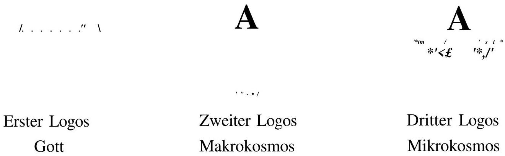
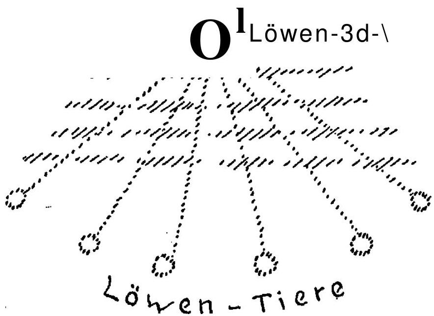
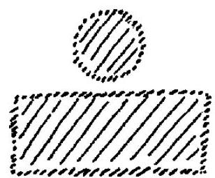
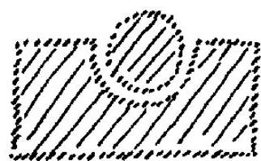
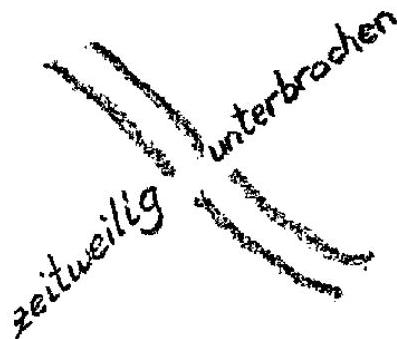

# RUDOLF STEINER GESAMTAUSGABE VORTRÄGE

VORTRÄGE VOR MITGLIEDERN DER ANTHROPOSOPHISCHEN GESELLSCHAFT

---

---

RUDOLF STEINER

Kosmogonie

Populärer Okkultismus
Das Johannes-Evangelium
Die Theosophie
anhand des Johannes-Evangeliums

Eine Zusammenfassung von achtzehn Vorträgen,
gehalten in Paris
zwischen dem 25. Mai und 14. Juni 1906,
und Notizen aus fünfundzwanzig Vorträgen,
gehalten in Berlin, Leipzig und München
zwischen dem 19. Februar und 6. November 1906

2001

RUDOLF STEINER VERLAG
DORNACH / SCHWEIZ

---

Nach einer Inhaltszusammenfassung und nach Notizen von Hörern herausgegeben von der Rudolf Steiner-Nachlaßverwaltung
Die Herausgabe besorgte Wolfram Groddeck

1. Auflage, Gesamtausgabe Dornach 1979
2., neu durchgesehene und ergänzte Auflage,
Gesamtausgabe Dornach 2001

Frühere Veröffentlichungen
und Veröffentlichungen in Zeitschriften
siehe zu Beginn der Hinweise

Bibliographie-Nr. 94
Alle Rechte bei der Rudolf Steiner-Nachlaßverwaltung, Dornach/Schweiz
© 1979 by Rudolf Steiner-Nachlaßverwaltung, Dornach/Schweiz
Printed in Germany by Konkordia Druck, Bühl
ISBN 3-7274-0940-1

---

Zu den Veröffentlichungen
aus dem Vortragswerk von Rudolf Steiner

Die Gesamtausgabe der Werke Rudolf Steiners (1861-1925) gliedert sich in die drei großen Abteilungen: Schriften - Vorträge - Künstlerisches Werk (siehe die Übersicht am Schluß des Bandes).

Ursprünglich wollte Rudolf Steiner nicht, daß seine frei gehaltenen Vorträge - sowohl die öffentlichen als auch die für die Mitglieder der Theosophischen, später Anthroposophischen Gesellschaft - schriftlich festgehalten würden, da sie von ihm als «mündliche, nicht zum Druck bestimmte Mitteilungen» gedacht waren. Nachdem aber zunehmend unvollständige und fehlerhafte Hörernachschriften angefertigt und verbreitet wurden, sah er sich veranlaßt, das Nachschreiben zu regeln. Mit dieser Aufgabe betraute er Marie Steiner-von Sivers. Ihr oblag die Bestimmung der Stenografierenden, die Verwaltung der Nachschriften und die für die Herausgabe notwendige Durchsicht der Texte. Da Rudolf Steiner nur in ganz wenigen Fällen die Nachschriften selbst korrigiert hat, muß gegenüber allen Vortragsveröffentlichungen sein Vorbehalt berücksichtigt werden: «Es wird eben nur hingenommen werden müssen, daß in den von mir nicht nachgesehenen Vorlagen sich Fehlerhaftes findet.»

Über das Verhältnis der Mitgliedervorträge, welche zunächst nur als interne Manuskriptdrucke zugänglich waren, zu seinen öffentlichen Schriften äußert sich Rudolf Steiner in seiner Selbstbiographie «Mein Lebensgang» (35. Kapitel). Der entsprechende Wortlaut ist am Schluß dieses Bandes wiedergegeben. Das dort Gesagte gilt gleichermaßen auch für die Kurse zu einzelnen Fachgebieten, welche sich an einen begrenzten, mit den Grundlagen der Geisteswissenschaft vertrauten Teilnehmerkreis richteten.

Nach dem Tode von Marie Steiner (1867-1948) wurde gemäß ihren Richtlinien mit der Herausgabe einer Rudolf Steiner Gesamtausgabe begonnen. Der vorliegende Band bildet einen Bestandteil dieser Gesamtausgabe. Soweit erforderlich, finden sich nähere Angaben zu den Textunterlagen am Beginn der Hinweise.

---

---

# INHALT

## KOSMOGONIE

*Achtzehn Vorträge, gehalten in Paris vom 25. Mai bis 14. Juni 1906,
nach einer Zusammenfassung von Edouard Schure, ergänzt durch Hörernotizen*

---

**ERSTER VORTRAG, Paris, 25. Mai 1906.** 17

Die Geburt des Intellekts und die Aufgabe des Christentums. Die Leibeshüllen und das Ich. Die Ablösung der Nahehe durch die Fernehe. Die vergeistigte Liebe als Grundprinzip des Rosenkreuzertums.

---

**ZWEITER VORTRAG, Paris, 26. Mai 1906.** 22

Vorchristliche und christliche Bruderschaften. Die Mission der Manichäer. Der Darwinismus, eine Teilwahrheit. Atlantis. Zwei Ströme der Entwicklung. Wahre Moral entspringt der Erkenntnis.

---

**DRITTER VORTRAG, Paris, 27. Mai 1906.** 27

Der Stein der Weisen. Ein- und Ausatmung bei Mensch, Tier und Pflanze. Die Mistel, ein Überrest der Mondenepoche. Die Geschlechtertrennung.

---

**VIERTER VORTRAG, Paris, 28. Mai 1906.** 31

Die Zirbeldrüse, Relikt eines einstigen Wahrnehmungsorgans. Der Traum, ein Rudiment des alten Hellsehens. Vom Ursprung der Mythen. Das Bewußtsein der Menschheitszukunft. Entwicklung der Erde vom Kosmos der Weisheit zum Kosmos der Liebe.

---

**FÜNFTER VORTRAG, Paris, 29. Mai 1906.** 36

Die Seele sammelt die Früchte des Erdenlebens für den Geist. Der Leib als Instrument der Seele. Bekanntwerden früherer Mysteriengeheimnisse. Der Ätherleib des Mannes ist weiblich, der Ätherleib der Frau männlich, der Astralleib beider zweigeschlechtlich. Methodische Unterschiede der östlichen und der abendländischen Initiation.

---

**SECHSTER VORTRAG, Paris, 30. Mai 1906.** 42

Die sieben Stufen der alten Einweihung. Vorbeugung gegen Gefahren der okkulten Entwicklung. Die höheren Grade der Initiation.

---

---

SIEBENTER VORTRAG, Paris, 31. Mai 1906. 48

Mittelalterliche Bruderschaften sehen im Johannes-Evangelium noch eine Einweihungsurkunde. Die spirituelle Wirkung der ersten vierzehn Verse. Der Übergang von den Mysterien des Altertums zur christlichen Einweihung in der Auferweckung des Lazarus. Die Hochzeit von Kana und die Mission des Alkohols. Die Verklärung auf dem Berge Tabor.

ACHTER VORTRAG, Paris, 1. Juni 1906. 53

Der christliche Grundcharakter der Goetheschen Naturanschauung. Die sieben Grade der christlich-gnostischen Einweihung.

NEUNTER VORTRAG, Paris, 2. Juni 1906. 59

Organe für das bewußte Erleben der Astralwelt. Goethe über die Wahrnehmung von Farben und Licht. Im Astralen erscheint die Wirkung vor der Ursache. Menschliche Leidenschaften als Tiergestalten. Das Rückerleben nach dem Tode. Folgen von Selbstmord und gewaltsamem Tod. Die Lüge, ein astraler Mord. Schwarze Magie und Vivisektion.

ZEHNTER VORTRAG, Paris, 6. Juni 1906. 66

Der achtgliedrige Pfad des Buddha und die Seligpreisungen des Matthäus-Evangeliums in ihrem Zusammenhang mit der sechzehnblättrigen Lotusblume. Die sechs Tugenden. Goethes Fragment «Die Geheimnisse». Die drei Menschheitstypen der griechischen Kunst.

ELFTER VORTRAG, Paris, 7. Juni 1906. 72

Auswirkungen der Einweihung auf gegenwärtige und nachtodliche Bewußtseinszustände. Der Zusammenhang der Inkarnationsfolge mit dem kosmisch bedingten Rhythmus der Kulturepochen.

ZWÖLFTER VORTRAG, Paris, 8. Juni 1906. 78

Das Reich der geistigen Hierarchien. Die sieben Regionen des Devachan. Gralslegende und Lohengrinsage.

DREIZEHNTER VORTRAG, Paris, 9. Juni 1906. 85

Atlantis und Lemurien. Der Wandel der menschlichen Leibesgestalt. Die drei Logoi.

VIERZEHNTER VORTRAG, Paris, 10. Juni 1906. 93

Die menschliche Bewußtseinsevolution. Der Gang der Entwicklung durch jeweils sieben Zustände des Bewußtseins, des Lebens und der Form.

---

FÜNFZEHNTER VORTRAG, Paris, 11. Juni 1906. 97
Die planetarische Evolution. Umgestaltung der Erde durch den Menschen. Frühere planetarische Zustände.

SECHZEHNTER VORTRAG, Paris, 12. Juni 1906. 105
Erdbeben, Vulkane und menschlicher Wille. Wirkungen vergangener planetarischer Epochen. Die Wochentage. Das Erdinnere und sein Zusammenhang mit der christlichen Einweihung.

SIEBZEHNTER VORTRAG, Paris, 13. Juni 1906. 111
Die sieben Geheimnisse. Das Geheimnis des Todes. Jehova, Luzifer, Christus. Erlösung und Befreiung.

ACHTZEHNTER VORTRAG, Paris, 14. Juni 1906. 118
Die Apokalypse. Das Künftige ist keimhaft in den Urbildern enthalten. Die sieben nachatlantischen Kulturen dienen der Vorbereitung der sechsten und siebenten Erdepoche.

# POPULÄRER OKKULTISMUS, ERSTER VORTRAG, Leipzig, 28. Juni 1906. 129
Wahrnehmung des Ätherleibes als leuchtendes Kraftgebilde. Die seelische Konfiguration in den Färben der Aura. Die Entwicklung der Wesensglieder in den ersten drei Lebensjahrsiebenten. Im Ich berührt sich das Ewige mit dem Zeitlichen.

ZWEITER VORTRAG, Leipzig, 29. Juni 1906. 133
Keine räumliche Trennung zwischen der physischen Welt und den höheren Welten. Die Wesen des Astralplans. Die Tätigkeit des Astralleibes im Wachbewußtsein und während des Schlafes. Wandlungen im Traumleben durch Geistesschulung. Dem inneren Hören erschließt sich die geistige Welt.

DRITTER VORTRAG, Leipzig, 30. Juni 1906. 141
Das Lebenstableau. Erlebnisse des Toten in der astralischen Welt. Folgen eines unnatürlichen Todes. Das Sinnesdasein, eine Schule, durch die der Mensch zum Geiste gelangen soll.

---

VIERTER VORTRAG, Leipzig, 1. Juli 1906. 145
Die Gegenbilder des Physisch-Mineralischen bilden den Kontinent des Devachan. Das flutende Leben als zweite devachanische Region, Empfindung und Gefühl als dritte Region. Die Akasha-Chronik in der vierten Region, des Menschen wahres Wesen in der fünften Region.

FÜNFTER VORTRAG, Leipzig, 2. Juli 1906. 145
Wiederverkörperung von Formen und Arten in der Natur. Die Persönlichkeit, irdischer Ausdruck der ewigen Individualität. Karma, das große Gesetz der Weltengerechtigkeit. Das Opfer des Christus geschah für die ganze Menschheit.

SECHSTER VORTRAG, Leipzig, 3. Juli 1906. 147
Die Bilder des Lebenstableaus werden zu Kräften, die sich dem Astralleib einprägen. Der Kausalleib. Nachtodliche Folgen der Vivisektion. Langsame Auflösung der Astralleichname. Erfahrungen wandeln sich im Devachan zu Fähigkeiten um. Der Rückweg zur Erde. Bildung des neuen Astralleibes und Ätherleibes. Mahadevas und Lipikas.

SIEBENTER VORTRAG, Leipzig, 4. Juli 1906. 154
Die im Ätherleib veranlagten Neigungen und Gewohnheiten werden im folgenden Erdenleben zu organbildenden Kräften. Astrale Verwesungsstoffe der Hunnen und Mongolen schufen in Europa den seelischen Nährboden für den Aussatz.

ACHTER VORTRAG, Leipzig, 5. Juli 1906. 156
Das Vorstellungsleben der einen wirkt auf die moralische Verfassung der anderen Inkarnation. Pessimismus und Optimismus. Frühes oder spätes Altern als Folge der Einstellung zu den Mitmenschen in einer vergangenen Verkörperung. Weiterbildung der Leibeshüllen zu höheren Wesensgliedern. Karma der Generationen. Die Arbeit der Toten am Tier- und Pflanzenreich. Die Lebensvorschau.

NEUNTER VORTRAG, Leipzig, 6. Juli 1906. 160
Wechsel von Regen und Sonnenschein erst nach dem Untergang der Atlantis. Die physisch-ätherische Konstitution des Atlantiers. Die Stadt mit den goldenen Toren. Das Tao.

ZEHNTER VORTRAG, Leipzig, 7. Juli 1906. 164
Mit der Bildung der Lunge zog die Seele in den Leib des Lemuriers ein. Ausscheidung des Tierreichs aus der Menschheit. Mondenaus-

---

tritt und Geschlechtertrennung. In der vorangehenden Sonnenzeit standen die Naturreiche und der Mensch auf der Stufe des Pflanzendaseins. Die Bedeutung des Kreuzes in den alten Mysterien.

## ELFTER VORTRAG, Leipzig, 8. Juli 1906. 168

Der Wandel der Seelenverfassung im Durchgang durch die Kultur-epochen. Die Aufgabe der gegenwärtigen fünften und der sechsten Kultur. Unterschiedlicher Geltungsbereich des ptolemäischen und des kopernikanischen Weltsystems. Überwindung der Zweigeschlechtigkeit. Die Phantasie. Magie des Wortes. Zwei Haupt-erfordernisse der okkulten Entwicklung: die große Einsamkeit und die Devotion.

## ZWÖLFTER VORTRAG, Leipzig, 9. Juli 1906. 171

Sechs Nebenübungen. Wahrnehmung der Auren in der Imagination. Die Lotusblumen. Der Gegensatz zwischen medialem und geschultem Hellsehen.

## DREIZEHNTER VORTRAG, Leipzig, 10. Juli 1906. 174

Der Stein der Weisen. Die Stufen der östlichen Schulung. Die christliche Einweihung und der rosenkreuzerische Schulungsweg. Die «Philosophie der Freiheit» und «Wahrheit und Wissenschaft» dienen der Ausbildung eines sinnlichkeitsfreien Denkens.

## VIERZEHNTER VORTRAG, Leipzig, 11. Juli 1906. 177

Die sieben Grade der christlichen Einweihung. Mit ihr hängt die Erforschung des Erdinneren zusammen. Okkulte Tatsachen in den großen Dichtungen der Menschheit. Der Mensch und das Schicksal der Erde.

## DAS JOHANNES-EVANGELIUM

Notizen aus drei Vorträgen,
gehalten in Berlin zwischen dem 19. Februar und 5. März 1906

## ERSTER VORTRAG, Berlin, 19. Februar 1906. 187

In den ersten vierzehn Kapiteln schildert der Verfasser des Johannes-Evangeliums seine Erlebnisse in der Astralwelt. Die Verwandtschaft des Christus mit dem Gottmenschen. Der Aufstieg in die devachanische Welt.

## ZWEITER VORTRAG, Berlin, 26. Februar 1906. 201

Die Tätigkeit des Astralleibes am physischen Leib während des Schlafes. Böse und gute Elementarwesen. Der christliche Einweihungsweg.

---

DRITTER VORTRAG, Berlin, 5. März 1906. 207
Die Erweckung des höheren Selbstes. Erwähnung der Reinkarnation in den Evangelien. Die okkulte Bedeutung der Worte am Kreuz.

# DIE THEOSOPHIE ANHAND DES JOHANNES-EVANGELIUMS, ERSTER VORTRAG, München, 27. Oktober 1906. 227
Als erstes wurde die Kirche von der materialistischen Gesinnung erfaßt. Der wahre Sinn der biblischen Schöpfungsgeschichte. Die höheren Wesensglieder des Menschen und ihr kosmischer Ursprung.

ZWEITER VORTRAG, München, 28. Oktober 1906. 236
Das Bilderbewußtsein des Atlantiers. Erste Verinnerlichung des Empfindungslebens in der lemurischen Zeit. Vergeistigung des Astralleibes zum Geistselbst und des Ätherleibes zum Lebensgeist. Höchstes Zukunftsziel, der Geistesmensch.

DRITTER VORTRAG, München, 31. Oktober 1906. 246
Aufnahme von Manas und Vorbereitung von Budhi in der nachatlantischen Epoche. Den geistigen Vorgängen entsprechen physische Veränderungen am Menschen.

VIERTER VORTRAG, München, 2. November 1906. 255
Die Bewußtseinswelten der Naturreiche und des Menschen. Die Arbeit des Ich an den drei unteren Wesensgliedern. Erfahrungen auf höheren Bewußtseinsstufen. Nathanaels Begegnung mit dem Christus. Gruppen- und Individualseelen in der Mithras-Einweihung.

FÜNFTER VORTRAG, München, 3. November 1906. 263
In Ägypten verfällt Manas der Wunsch- und Begierdenwelt. Die Aufgabe des althebräischen Volkes. Knochenbildung und Bewußtseinsevolution. Das Passahlamm. Moses ist der Sendbote des Manas, Christus der Bringer der Budhi. Das Gleichnis vom Weinstock.

SECHSTER VORTRAG, München, 4. November 1906. 273
Die Hochzeit zu Kana, eine prophetische Vorschau der Menschheitszukunft. Drei Wege zur Wahrheit: die östliche, die christlich-

---

gnostische und die rosenkreuzerische Einweihung. Der östliche Weg für den Europäer ungeeignet. Die sieben Stufen der Yogaschulung und der christlich-gnostischen Einweihung.

SIEBENTER VORTRAG, München, 5. November 1906 . . . 283

Das Verhältnis des Rosenkreuzerschülers zum Lehrer. Der Wert der «Philosophie der Freiheit» für die Ausbildung des reinen Denkens. Die sinnliche Welt wird zum Gleichnis. Die okkulte Schrift. Alles höhere Leben beruht auf Rhythmus. Die Jungfrau Sophia und der Heilige Geist.

ACHTER VORTRAG, München, 6. November 1906 . . . 293

Das Einzelbewußtsein, Spiegelbild des Erdenbewußtseins. Christus, der Herr des Karma. Fünf Bewußtseinssphären in der östlichen Weisheit. Die Reinigung des Tempels als Sinnbild einer künftigen Evolution. Das Nikodemusgespräch.

Ergänzungen zum Text . . . 301

Hinweise

Zu dieser Ausgabe . . . 307

Hinweise zum Text . . . 310

Personenregister . . . 319

Übersicht über die Rudolf Steiner Gesamtausgabe . . . 320

---

---

# Kosmogonie

Achtzehn Vorträge, gehalten in Paris
vom 25. Mai bis 14. Juni 1906,
nach einer Zusammenfassung von Edouard Schure,
ergänzt durch Hörernotizen

---

---

# KOSMOGONIE, Erster Vortrag, Paris, 25. Mai 1906

Es ist noch nicht lange her, daß öffentliche Vorträge über okkulte Wahrheiten gehalten werden. Einstmals wurden diese Wahrheiten nur in Geheimgesellschaften denen entschleiert, die bestimmte Grade der Einweihung durchschritten und versprochen hatten, für die Dauer ihres ganzen Lebens die Gesetze des Bruderbundes zu beobachten.

Heute tritt die Menschheit in eine einschneidende Krise. Man hat damit begonnen, diese Wahrheiten der Öffentlichkeit zu enthüllen. Innerhalb von zwanzig Jahren wird eine gewisse Anzahl von ihnen bereits Gemeingut sein. Woher kommt das? Der Grund ist der, daß die Menschheit in eine neue Phase eingetreten ist. Diese Phase näher zu erklären, wird Gegenstand dieses Vortrags sein.

Im Mittelalter wurden die geheimen Wahrheiten hauptsächlich durch die Rosenkreuzer gepflegt. Aber jedesmal, wenn diese Wahrheiten nach außen drangen, wurden sie mißverstanden oder entstellt. Im 18. Jahrhundert nahmen sie eine dilettantische und marktschreierische Form an. Zu Beginn des 19. Jahrhunderts wurden sie vollständig verdrängt durch die auf Sinnesbeobachtung begründeten Wissenschaften. Erst jetzt tauchen sie wieder auf, und sie werden in den nächsten Jahrhunderten eine wichtige Rolle im Hinblick auf die künftige Entwicklung der Menschheit spielen. Um diese Rolle richtig zu verstehen, muß man zu den Jahrhunderten zurückgehen, die dem Christentum vorausgingen, und den zurückgelegten Weg ins Auge fassen.

Es genügt schon, eine sei es auch nur annähernde Kenntnis vom Mittelalter zu haben, um sich Rechenschaft von dem Unterschied zu geben, der zwischen dem Menschen jener Epoche und dem heutigen Menschen besteht. Weit weniger als heute entwickelt auf dem Gebiete der Wissenschaft, war der Mensch damals im Bereich des Gefühls und der Eingebung überlegen. Er lebte weniger in der sichtbaren Welt als in der jenseitigen, die er noch wahrzunehmen vermochte. Es gab unter den damaligen Menschen noch einzelne, die wirklich in direkte

---

Verbindung mit der astralen und geistigen Welt treten konnten. Mochte sich die Menschheit des Mittelalters auch noch so mangelhaft auf der Erde eingerichtet haben, ihr Haupt hatte sie noch im Himmel.

Waren die Städte damals auch unbequem, so spiegelten sie doch dem Menschen viel besser seine innere Welt wider. Nicht nur die Kathedralen, sondern auch die Häuser und die Tore erinnerten den Menschen durch ihre Symbole an seine Glaubensinhalte, seine Gefühle, seine Sehnsüchte, an die Welt seiner Seele.

Heute wissen wir viele Dinge, und die Beziehungen unter den Menschen haben sich ins Unendliche vervielfacht; aber wir leben in unseren Städten wie in lärmenden Fabriken, in einem schrecklichen Babel, wo uns nichts mehr an unsere innere Welt erinnert. Die innere Welt spricht zu uns nicht mehr durch die Kontemplation, sondern durch die Bücher. Von Menschen der unbefangenen Eingebung sind wir zu Intellektuellen geworden.

Man muß hinter das Mittelalter zurückgehen, um den Ursprung dieser intellektuellen Strömung zu finden. Das Zeitalter, wo dieser menschliche Intellekt noch auf seiner Kindheitsstufe steht, das Zeitalter, wo die Umlagerung sich vollzieht, geht ungefähr auf das Jahrtausend vor unserer Zeitrechnung zurück. Es ist das Zeitalter des Thäies, des Pythagoras, des Plato, des Buddha. Damals erscheinen zum erstenmal die Philosophie und die Wissenschaft, das heißt, die Wahrheit wird der Vernunft in logischer Form dargeboten. Was vorher existierte, war die Wahrheit, dargeboten in Gestalt von Religion und Offenbarung, wahrgenommen von ihren Verkündern und empfangen von der Masse. Jetzt geht die Wahrheit in die individuelle Intelligenz über, sie will anschaulich erläutert und begriffen sein.

Was war damals im Inneren des Menschen vorgegangen, um diese Bewegung zu rechtfertigen, die sein Bewußtsein sozusagen von einer Seinsebene seines Wesens auf eine andere Seinsebene, vom intuitiven auf den logischen Plan verlagerte?

Wir stoßen da auf eines der fundamentalen Gesetze der Geschichte, auf ein Gesetz, das dem Gegenwartsbewußtsein noch nicht bekannt ist. Man kann es so formulieren: Die Evolution der Menschheit vollzieht sich so, daß sie die Seelenglieder des mensch-

---

liehen Wesens nacheinander aus diesem hervorgehen und sich entwickeln läßt. Welches sind diese Wesensglieder?

Der Mensch hat zunächst einen physischen Leib. Ihn hat er gemeinsam mit dem Mineralreich. Das ganze Mineralreich findet sich in der Chemie des Körpers. Er hat sodann einen Ätherleib, der sozusagen seine Lebenskraft ist und den er gemeinsam hat mit den Pflanzen. Aus ihm erzeugen sich fortlaufend die Ernährungsvorgänge, die Wachstums- und die Fortpflanzungskraft. Er besitzt außerdem einen Astralleib. In ihm entzünden sich die Gefühle, die Leidenschaften, die Möglichkeit, zu genießen und zu leiden. Diesen Leib hat der Mensch gemeinsam mit den Tieren. Er wurde von den Rosenkreuzern und manchen ihrer Nachfolger, wie Paracelsus, Astralleib genannt, weil er tatsächlich in einer Beziehung zu den Sternen steht, die auf einer gewissen Anziehungskraft beruht.

Endlich gibt es im Menschen etwas, was man nicht mehr einen Leib nennen kann, sondern was sein innerstes Sein darstellt und ihn von allen anderen Wesen unterscheidet, vom Stein wie von der Pflanze und vom Tier, und das ist dasjenige, was er sein Ich nennt. Es ist der göttliche Funke in ihm. Die Inder nennen es Manas. Die Rosenkreuzer nennen es das Unaussprechliche. Tatsächlich ist alles Leibliche nur ein Fragment, Stück einer anderen Leiblichkeit. Dagegen gehört das Ich des Menschen nur sich selbst an. Ich bin Ich – das kann es allein von sich sagen. Es ist dasjenige, was die anderen «Du» nennen, es ist dasjenige, was man mit nichts anderem auf der Welt verwechseln kann. Durch dieses Ich, das durch nichts anderes ausgedrückt, mit nichts anderem vertauscht werden kann, erhebt sich der Mensch über alle anderen irdischen Wesen, über die Tierwelt und über die ganze Schöpfung. Und es ist auch das einzige, was ihn mit dem unendlichen Ich, mit Gott, verbindet.

Das ist der Grund, warum im verborgenen Heiligtum der Hebräer der Ministrant an bestimmten Tagen zum Hohepriester sprach: Schem-Ham-Phorasch, das heißt: Wie ist sein Name, der Name Gottes? – Und der Hohepriester antwortet: Jod-He-Vau-He, oder in einem Wort: Jehova, was bedeutet: Gott, Natur und Mensch, oder: Das unaussprechliche menschlich-göttliche Ich.

---

Die Wesensglieder des Menschen, die wir eben charakterisiert haben, sind sämtlich dem Menschen in fernen Epochen seiner ungeheuren Entwickelung gegeben worden, aber sie entwickelten sich nur langsam und eins nach dem anderen.

Die besondere Aufgabe der Periode, die ungefähr tausend Jahre vor der christlichen Zeitrechnung begonnen hat und die sich im Lauf der zweitausend Jahre, die der Geburt des Christus folgten, fortsetzt, bestand also darin, die Entwicklung des menschlichen Ich im Sinne der Intellektualität zu beschleunigen.

Aber über dem intellektuellen Plan befindet sich der geistige. Das ist derjenige, den die Menschheit in den folgenden Jahrhunderten erreichen wird. Es ist auch derjenige, nach welchem die gegenwärtige Weltenstunde hintendiert. Und es ist tatsächlich der Christus und das Christentum, wodurch die Samen zu dieser künftigen Entwicklung ausgestreut worden sind.

Aber bevor wir von diesem geistigen Plan sprechen, haben wir noch an eines der Mittel, an eine der Kräfte zu erinnern, durch welche die Menschheit in ihrer großen Mehrheit von der Sphäre des astralen Schauens zur Sphäre der Intellektualität fortgeschritten ist. Dies geschah durch eine neue Art der Eheschließung. Einst vollzogen sich die Heiraten innerhalb desselben Stammes oder derselben Sippschaft, was also lediglich eine Ausweitung der Familie darstellte. Manchmal vollzogen sie sich sogar zwischen Bruder und Schwester. Gegen die neuere Zeit hin empfanden die Menschen das Verlangen, ihre Frauen außerhalb der Sippschaft, des Stammes oder der bürgerlichen Gemeinschaft zu suchen. Die Fremde, die Unbekannte wurde die Geliebte. Die Liebe, einst eine natürliche und soziale Funktion, wurde persönlicher Wunsch und die Heirat freie Wahl. Das zeigt sich schon in gewissen griechischen Mythen wie im Raub der Helena und mehr noch in den skandinavischen und germanischen Mythen wie der Siegfriedsage und dem Gudrunlied. Die Liebe wurde ein Abenteuer und die Frau eine Eroberung in der Ferne.

Dieser Übergang von der patriarchalischen zur freien Eheschließung entspricht nun der neuen Entwicklung der intellektuellen Fähigkeiten, des menschlichen Ich. Er vollzog sich zur gleichen Zeit

---

wie die momentane Verdunkelung der astralen Fähigkeiten des Schauens und des direkten Lesens in der astralen und geistigen Welt.

Hier geschieht nun der Einschlag des Christentums. Die menschliche Brüderlichkeit und die Verehrung des Einen Gottes sind ohne Zweifel wesentliche Züge des Christentums, aber sie bilden doch nur seine äußerliche und soziale, aber nicht seine innerliche und spirituelle Gestalt. Die neue Errungenschaft des Christentums auf dem Gebiet der Mystik, der Innerlichkeit und des Übersinnlichen besteht darin, daß es die vergeistigte Liebe geschaffen hat, das Ferment, das den Menschen von innen her verwandelt, den Sauerteig, der die Welt emporhebt. Der Christus ist gekommen, um zu sagen: Wenn du nicht verlassest deine Mutter, dein Weib und alle leibliche Bindung, kannst du nicht mein Jünger sein. - Das bedeutet nicht die Aufhebung aller natürlichen Bande, aber die Ausdehnung der Liebe außerhalb der Familie auf alle Menschen, die Verwandlung der Liebe in eine lebendige und schöpferische Kraft, in eine Kraft der Umwandlung.

Diese Liebe, welche von den Rosenkreuzern zum Prinzip ihrer okkulten Bruderschaft gemacht, von ihrer Zeit aber nicht verstanden wurde, ist dazu bestimmt, den Grundgehalt der Religion, des Kultus, ja sogar der Wissenschaft zu verändern.

Der Weg der Menschheit geht vom unbewußten Spiritualismus - vor dem Christentum - über den Intellektualismus - die Gegenwart - zum bewußten Spiritualismus, in dem sich vereinigen, konzentrieren und verstärken die astralen und intellektuellen Fähigkeiten durch die Stärke der Liebe zum Geist und der vergeistigten Liebe. Und ebenso ist die Theologie dazu bestimmt, zur Theosophie zu werden.

Was ist in Wirklichkeit die Theologie? Eine Kunde von Gott, von außen auferlegt in Form von Dogmen wie eine Art übernatürlicher Logik, aber dem Menschen von außen her gegeben.

Und was ist die Theosophie? Die Kunde von Gott, sich entfaltend wie eine Blume auf dem Grunde der menschlichen Seele. Gott zum Unterschied von der Welt, wiedergeboren auf dem Grunde der Herzen. Ein solches Christentum, verstanden im Sinne der Rosenkreuzer, ist gleicherweise die mächtigste Entfaltung der individuell-

---

len Freiheit und der universellen Religion durch die Bruderschaft der freien Seelen. Die Tyrannei der Dogmen ist alsdann ersetzt durch den Strahlenglanz der göttlichen Weisheit, die Intelligenz, Liebe und Tat in einem ist.

Die Wissenschaft, die daraus entspringen wird, wird ihre Maßstäbe weder an der abstrakten Vernunft noch an äußerer Unterwerfung finden, sondern an ihrer Fähigkeit, die Seelen erwecken und erblühen zu lassen.

Da haben wir den Unterschied zwischen der Logik und der Sophia, zwischen der Wissenschaft und der göttlichen Weisheit, zwischen der Theologie und der Theosophie.

So ist der Christus immer der Mittelpunkt der esoterischen Evolution des Abendlandes. Gewisse moderne Theologen, besonders in Deutschland, haben versucht, den Christus als einen einfachen, naiven Menschen darzustellen. Das ist ein ganz großer Irrtum. Das höchste Bewußtsein, die tiefste Weisheit wohnt in ihm, und gleichzeitig die höchste göttliche Liebe. Wie sollte er ohne ein solches Bewußtsein eine zentrale Offenbarung innerhalb unserer ganzen planetarischen Evolution sein? Wie sollte er dazu eine solche Macht besessen und sein ganzes Zeitalter überflügelt haben? Und dieses ganze, seiner Zeit überlegene Bewußtsein, woher sollte es ihm gekommen sein?

# KOSMOGONIE, Zweiter Vortrag, Paris, 26. Mai 1906

Vor und nach der Begründung des Christentums hat es okkulte Bruderschaften gegeben. Auch jetzt gibt es noch Bruderschaften, in welchen okkultes Leben gepflegt wird. Der Unterschied zwischen den vorchristlichen und nachchristlichen okkulten Bruderschaften besteht darin, daß die vorchristlichen im wesentlichen die Aufgabe hatten, die geheiligten Überlieferungen zu bewahren, während den christlichen in erster Linie zum Ziel gesetzt wurde, die Zukunft vorzubereiten. Die okkulte Wissenschaft ist nämlich keine abstrak-

---

te, tote Wissenschaft, sondern eine tätige und lebendige. Die okkulten Bruderschaften sind fähig, ins Leben einzugreifen, und die Teilnahme am Entwicklungsgang der Menschheit ist ihre Aufgabe.

Der christliche Okkultismus geht zu einem bedeutenden Teil auf die Manichäer zurück, deren Überlieferung lebendig geblieben ist. Ihr Begründer Manes hat drei Jahrhunderte nach Christus gelebt. Auch Augustinus, der Kirchenvater, hatte ursprünglich der Gemeinschaft der Manichäer angehört. Ein Kernpunkt der manichäischen Lehre ist der Satz vom Guten und vom Bösen. Für die landläufige Anschauung bilden das Gute und das Böse zwei absolute, miteinander unvereinbare Gegensätze, von denen das eine das andere ausschließt. Dagegen ist das Böse nach der Ansicht der Manichäer ein integrierender Bestandteil des Kosmos, es arbeitet an dessen Evolution mit und muß zuletzt durch das Gute absorbiert, verwandelt werden. Den Sinn von Gut und Böse, von Lust und Schmerz in der Welt zu studieren, ist die große, einzigartige Mission der Manichäer.

Um die Entwicklung der Menschheit zu begreifen, ist es notwendig, sie von weitem und aus der Höhe zu betrachten und in ein umfassendes Ganzes einzuordnen. Nur unter dieser Bedingung können wir uns eine hohe, ideale Vorstellung davon bilden. Und es wäre ein großer Irrtum, zu glauben, man könne des Ideals bei dieser Unternehmung entraten. Ein Mensch ohne Ideal ist ein Mensch ohne Energie. Das Ideal spielt im Leben dieselbe Rolle wie der Dampf in der Maschine. Der Dampf schließt gewissermaßen auf kleinem Raum eine unendliche Fülle von kondensiertem Raum ein, daher seine intensive Ausdehnungskraft. Von gleicher Art ist aber auch die magische Kraft des Gedankens im Leben. Erheben wir uns also zum gedanklichen Ideal der Menschheit in ihrer Gesamtheit, erfühlen wir den Faden, der ihre Evolution durch die Epochen hindurch leitet.

In gleicher Weise suchen Weltanschauungssysteme wie dasjenige von Darwin diesen durchlaufenden Faden. Man braucht die Größe des Darwinismus nicht zu leugnen. Aber er erklärt nicht die innere Entwicklung des Menschen; er sieht nur dasjenige, was sich auf das Äußerliche bezieht. Es verhält sich damit ebenso wie mit jeder rein physischen Erklärung, welche die spirituelle Wesenheit des Men-

---

sehen mißachtet. So schreibt die evolutionistische Hypothese, die sich rein auf physische Tatsachen stützt, dem Menschen einen tierischen Ursprung zu, weil sie beim fossilen Menschen eine niedrige, zurückgebliebene Stirn konstatiert hat. Dagegen sieht der Okkultismus, für den der physische Mensch nur der Ausdruck des ätherischen Menschen ist, die Sache ganz anders an. Tatsächlich hat der Ätherleib des Menschen etwa die gleiche Form wie sein physischer Körper, über den er nur leicht hinausragt. Aber je weiter man in der Geschichte zurückgeht, desto mehr herrscht ein Mißverhältnis zwischen dem Ätherkopf und dem physischen Kopf, desto größer ist der Ätherkopf. So erscheint er tatsächlich in einer Periode der Erdentwicklung, die der unsrigen vorangegangen ist. Die damals lebenden Menschen hießen Atlantier. In der Tat beginnen die Geologen, die Spuren der alten Atlantier zu entdecken: Mineralien, Pflanzen von diesem alten Erdteil, der im Ozean versunken ist, der seinen Namen trägt. Noch hat man nicht Spuren vom Menschen gefunden, aber das wird nicht auf sich warten lassen. Sogar in der Zeitschrift «Kosmos», die für die Ideen Haeckels eintritt, ist ein Aufsatz von Theodor Arldt erschienen, in dem aus den Spuren von Fauna und Flora hypothetisch auf die Existenz eines versunkenen Erdteils Atlantis geschlossen wird. Okkulte Forschung ist prophetisch, und die Naturforschung folgt ihr nach.

Bei den europäischen Rassen, die auf die Atlantier gefolgt sind, hat die Stirnpartie des Kopfes begonnen, sich weiter zu entwickeln. Aber bei den Atlantiern lag der Punkt, wo sich das Bewußtsein konzentrierte, außerhalb der Stirn, im Ätherkopf. Heute finden wir ihn im Inneren des physischen Kopfes, ein wenig oberhalb der Nase.

Was die germanische Mythologie mit dem Namen Niflheim oder Nebelheim - Wolkenheim - bezeichnet, das ist das Land der Atlantier. Die Erde war zu dieser Zeit in der Tat wärmer und noch umhüllt von einer konstanten Dampfhülle. Der atlantische Kontinent ging unter durch eine Reihe von sintflutartigen Wolkenbrüchen, in deren Verlauf die Erdatmosphäre sich lichtete. Erst dann entstanden blauer Himmel, Gewitter, Regen und Regenbogen. Aus diesem Grunde sagt die Bibel, daß, nachdem die Arche des Noah gelandet

---

war, der Regenbogen zum neuen Zeichen des Bundes zwischen Gott und dem Menschen wurde.

Das Ich der arischen Rasse konnte erst zum Selbstbewußtsein kommen durch die Zentralisierung des Ätherleibes im physischen Gehirn. Erst da fing der Mensch an, zu sich selbst «Ich» zu sagen. Die Atlantier sprachen von sich selbst in der dritten Person. Der Darwinismus hat große Irrtümer begangen bezüglich der Differenzierung, die er zwischen den tatsächlich auf der Erde sich findenden Rassen festsetzte. Die höheren Rassen stammen nicht von den niederen ab, sondern im Gegenteil: die niederen Rassen sind Entartungsscheinungen der höheren Rassen, die ihnen vorangegangen sind. Nehmen wir einmal an, wir sahen zwei Brüder, von denen der eine intelligent und schön, der andere häßlich und beschränkt ist. Was würde man von einem Menschen sagen, der glauben würde, daß der intelligente Bruder von dem idiotischen abstamme? Auf dieser Linie liegt der Irrtum des Darwinismus in bezug auf die Rassen. Der Mensch und das Tier haben einen gemeinsamen Ursprung. Die Tiere sind eine Dekadenzerscheinung von einem gemeinsamen Vorfahren, von dem der Mensch den höheren Entwicklungsgrad darstellt.

Das braucht uns nicht hoff artig zu machen, denn nur den niederen Reichen ist es zu danken, daß die höheren sich entwickeln konnten.

Der Christus, der den Aposteln die Füße wäscht (Joh.-Ev. 13) ist das Sinnbild der Demut des Initiierten vor den unter ihm Stehenden. Der Eingeweihte dankt seine Existenz nur den Nichteingeweihten. Daher die tiefe Demut der wahrhaft Wissenden vor denen, die nicht wissen. Es ist die tiefe Tragik der kosmischen Entwickelung, daß eine Menschenklasse sich erniedrigen muß, damit eine andere emporsteigen kann. In diesem Sinne kann man das schöne Wort des Paracelsus würdigen: Ich habe alle Wesen betrachtet: Steine, Pflanzen, Tiere, und sie sind mir wie zerstreute Buchstaben erschienen, im Verhältnis zu denen der Mensch das lebendige und vollständige Wort bildet.

Im Laufe der menschlichen und tierischen Evolution stammt das Untere vom Oberen ab; das, was fällt und stirbt, fällt ab vom Lebendigen. Man behauptet, Lebendiges entstehe aus Totem. In Wirklichkeit entsteht aber das Tote aus dem Lebendigen. Steinkohle, Kalk-

---

schalen und anderes sind Absonderungen des Lebendigen. Wir sehen ja auch beim Menschen, daß zuerst Knorpel da sind und dann Knochen. Unsere Knochen sind Verhärtingen aus einem weicheren Knorpelgerüst. So sind auch die Steine Verhärtingen aus einem lebendigen Erdorganismus. Heute hat der Mensch noch etwas in sich, was er zurücklassen wird. Und damit kommen wir wieder zum Manichäismus.

Wie früher die Tierheit im Menschen war, so sind es jetzt die beiden Gegensätze Gut und Böse, Wahrheit und Unwahrheit in ihm. Diese Widersprüche, die Art, wie sich diese Elemente in ihm mischen, bilden sein Karma, sein Schicksal. Einst wird er das Böse als objektive Gebilde hinter sich lassen. Das finden wir in allen apokalyptischen Darstellungen. Und heute schon erzieht der Manichäismus seine höherentwickelten Jünger so, daß sie Erlöser der Hinuntergestoßenen werden. Wer könnte leugnen, daß es schon heute eine Entwicklung gibt, die zum Egoismus treibt, und eine andere, die zur Selbstlosigkeit führt? Ebenso wie sich der Mensch von der Tierheit befreit hat, wird er sich vom Bösen befreien. Aber noch nie ist er durch eine heftigere Krise hindurchgegangen als zur gegenwärtigen Stunde.

Wer aller Herr ist, muß aller Diener werden. Das muß als große Notwendigkeit kommen. Die wahre Moral entspringt aus der Erkenntnis der großen Weltgesetze. Die großen Ideen sollen die Spannkraft erzeugen, die im kleinen unsere Ideale vorwärtstreibt. In stillen Augenblicken unseres Lebens müssen wir uns zu den großen Evolutionsideen erheben.

---

# KOSMOGONIE, Dritter Vortrag, Paris, 27. Mai 1906

Einer der tiefsten Grundsätze des Okkultismus fußt auf dem großen Gesetz der Analogien, wonach die Natur uns offenbart, was in uns selbst vorgeht.

Um für dieses Gesetz ein durchschlagendes und zugleich typisches Beispiel zu geben, das aber der offiziellen Wissenschaft völlig unbekannt ist, führen wir dasjenige vom Stein der Weisen an. Es war den Rosenkreuzern bekannt. In einem deutschen Journal vom Ende des 18. Jahrhunderts ist von diesem Stein der Weisen die Rede. Man spricht da von ihm wie von einem wirklich existierenden Gegenstand, und es heißt da: Jedermann berührt ihn oft, ohne ihn zu kennen. - Das ist buchstäblich wahr.

Um dies zu verstehen, ist es nur notwendig, in die Werkstatt der Natur tiefer einzudringen, als es die heutige Wissenschaft tut.

Jedermann weiß, daß der Mensch Sauerstoff einatmet und beim Ausatmen Kohlensäure von sich gibt. Dies hat in der Yogaschulung eine sowohl physische wie eine geistige Bedeutung. Der Mensch kann zu seiner Erhaltung nicht Kohlensäure einatmen. Er würde daran sterben, während die Pflanzen die Kohlensäure zum Leben brauchen. Die Pflanzen liefern dem Menschen den Sauerstoff, von dem er lebt. Die Pflanzen erneuern die Luft und machen sie geeignet, vom Menschen eingeatmet zu werden. Und die Menschen und Tiere liefern wiederum den Pflanzen die Kohlensäure, die diese zu ihrer Erhaltung ihrerseits brauchen. Was macht die Pflanze mit der Kohlensäure, die sie einatmet? Sie baut damit ihren eigenen Körper auf. Nun wissen wir, daß die Steinkohle der Leichnam der Pflanze ist. Die Steinkohle ist also kristallisierte Kohlensäure.

Das rote Blut, das die Kohlensäure aufgenommen hat, verwandelt sich in «blaues» Blut, aber das blaue Blut muß immer wieder erneuert werden durch den Sauerstoff. Denn das Blut könnte sich nicht der Kohlensäure bedienen, um den Körper aufzubauen.

Die Yogaübungen sind eine besondere Schulung, die den Menschen befähigt, aus dem roten Blut ein aufbauendes Element für

---

seinen Körper zu machen. Auf diese Weise baut der Yogi mittels des Blutes seinen Körper auf, wie die Pflanze den ihrigen durch die Kohlensäure.

Wir sehen also, daß die Fähigkeit der Verwandlung, die in der Natur vorhanden ist, repräsentiert wird durch die Steinkohle, die eine kristallisierte Pflanze ist. Und der Stein der Weisen, im weitesten Sinne des Wortes, bezeichnet diese Verwandlungsfähigkeit.

Das Gesetz der Rückverwandlung gilt für alle Wesen, ebenso wie das Gesetz des Aufstiegs. Die Mineralien sind degenerierte Pflanzen, die Pflanzen sind Vorfahren der Tiere. Die Tiere und der Mensch haben einen gemeinsamen Vorfahren. Der Mensch ist aufgestiegen, das Tier ist heruntergestiegen. Was den geistigen Teil des Menschen betrifft, so stammt er von den Göttern. In dieser Hinsicht ist der Mensch ein gefallener Gott, und der Ausspruch von Lamartine ist buchstäblich wahr: «Der Mensch ist ein gefallener Gott, der sich an die Himmelswelten erinnert.»

Es gab eine Epoche, wo alles Leben auf der Erde halb pflanzenhaft, halb tierisch war. Die Erde selbst war lebendig und stellte eine Art Riesentier dar. Der Boden war wie eine ungeheure Torfmasse, auf der Riesenwälder wuchsen, die später zur Steinkohle geworden sind. Diese Epoche entspricht derjenigen Zeit, da Erde und Mond noch ein Gebilde waren. Der Mond stellt das weibliche Element der Erde dar.

Es gibt Wesen, die auf einer niedrigeren Stufe der Entwickelung zurückgeblieben sind. Die Mistel zum Beispiel ist ein Zeuge dieser Weltenzeit, ein Überrest der parasitären Pflanzen, die auf der Erde wie auf einer Pflanze lebten. Da her stammen ihre speziellen okkulten Eigenschaften. Sie waren den Druiden bekannt, die sie als eine heilige Pflanze betrachteten. Die parasitären Mistel ist ein Überbleibsel aus der Mondenzeit des Erdenplaneten. Sie ist ein Schmarotzer, weil sie nicht gelernt hat, wie die anderen Pflanzen direkt auf mineralischem Boden zu leben.

Ähnlich verhält es sich mit der Krankheit. Sie ist ein Rückfall, verursacht durch parasitäre Elemente im Organismus. Die Druiden und die Skalden kannten die Beziehungen zwischen der Mistel und

---

dem Menschen. Einen Nachklang davon findet man in der Baldurlegende. Der Gott Baidur wird getötet durch die Mistel, weil die Mistel ein feindliches Element aus der vorhergehenden Epoche darstellt, das dem menschlichen Leib nicht mehr angemessen ist. Die anderen Pflanzen, die dem Zeitalter angepaßt waren, hatten dem Menschen dagegen Freundschaft geschworen.

Indem die pflanzliche Erde mineralisch wurde, erwarb sie durch die Metalle eine neue Eigenschaft: das Licht widerzuspiegeln. Ein Gestirn wird am Himmel erst sichtbar, wenn es mineralisch geworden ist. Es gibt also im Universum viele andere Welten, die unser physisches Auge nicht wahrnehmen kann und die allein von Hellsehern wahrgenommen werden können.

Die Erde ist ebenso mineralisch geworden wie der physische Körper des Menschen. Für den Menschen aber ist es charakteristisch, daß in ihm eine Bewegung in doppelter Richtung herrscht. Wenn nämlich der physische Mensch herabgestiegen ist, so ist der geistige Mensch aufgestiegen. Paulus hat dieser Wahrheit Ausdruck gegeben. Er erklärt, daß es ein Gesetz für den Leib gibt und ein anderes für den Geist. Demzufolge erscheint der Mensch als ein Ende und zugleich als ein Anfang.

Der Knotenpunkt, zugleich der Wendepunkt in der menschlichen Entwicklung, das ist die Zeit der Trennung der Geschlechter. Es gab eine Zeit, in der die beiden Geschlechter im menschlichen Wesen vereinigt waren. Die Möglichkeit eines solchen Zustandes hat sogar Darwin anerkannt. Durch die Trennung der Geschlechter ist dieses neue, gewaltige Element in die Welt getreten: die Liebe. Die Anziehungskraft der Liebe ist eine so machtvolle und geheimnisvolle Tatsache, daß beispielsweise tropische Schmetterlinge von verschiedenem Geschlecht, die man aus den Tropen nach Europa gebracht hat und die zweihundert Meilen voneinander entfernt waren, sofort, nachdem sie freigelassen waren, einander entgegenflogen und sich auf halbem Wege trafen.

Etwas Ähnliches geschieht zwischen der Menschenwelt und der göttlichen Welt wie zwischen dem Menschenreich und dem Pflanzenreich. Der Mensch atmet Sauerstoff ein und Kohlensäure aus.

---

Wie das Pflanzenreich Sauerstoff ausatmet, so atmet die Menschenwelt Liebe aus - seit der Trennung der Geschlechter -, und von diesen Ausströmungen der Liebe leben die Götter.

Warum atmen das Tier und der Mensch Liebe aus? Der Okkultist sieht im heutigen Menschen ein in voller Evolution befindliches Wesen. Der Mensch ist ein gefallener Gott und ein werdender Gott in einem.

Die Reiche der Himmel nähren sich von der Ausströmung der menschlichen Liebe. Das Griechentum drückte diese Tatsache im Mythos von Nektar und Ambrosia aus. Indessen stehen die Götter dermaßen hoch über dem Menschen, daß sie ihn, ihrer eigenen Natur nach, eigentlich erdrücken würden. Aber es gibt etwas zwischen dem Menschen und den Göttern, eine Art Zwischenstufe, so wie die Mistel eine Zwischenstufe ist zwischen Pflanze und Tier: Das ist Luzifer und das luziferische Wesen überhaupt.

Die Götter haben nur ein Interesse an der Liebefähigkeit der Menschen. Während Luzifer in Schlangengestalt den Menschen verführen will, nach Wissen und Erkenntnis zu suchen, widersetzt sich ihm Jehova. Aber Luzifer ist ein gefallener Gott, der nur durch den Menschen aufsteigen kann, indem er ihm die Begierde nach persönlicher Erkenntnis eingibt. Er widersetzt sich daher dem Willen des Gottes, der den Menschen nach seinem Bilde geschaffen hatte.

Das Rosenkreuzertum erklärt die Rolle Luzifers in der Welt. Wir werden später darauf zurückkommen. Hier sei nur der folgende Sinnspruch aus der Rosenkreuzerweisheit erwähnt: «O Mensch, bedenke, daß durch dich hindurch eine aufwärtssteigende und eine abwärtsfallende Strömung geht.»

---

# KOSMOGONIE, Vierter Vortrag, Paris, 28. Mai 1906

Jeden denkenden Menschen muß eine Erscheinung interessieren, welche die äußere Wissenschaft nicht zu erklären weiß: das Traumleben. Was ist, vom Okkulten aus gesehen, der Traum? Er ist das Überbleibsel eines Zustandes, der auf eine vorgeschichtliche Periode zurückgeht. Um uns einen Begriff davon zu verschaffen, wollen wir einige andere Erscheinungen betrachten: Organe, die eigentlich nicht mehr zum physischen Leben notwendig sind, die rudimentären Charakter haben, und von denen die Naturwissenschaft nicht weiß, wozu sie da sind.

Es handelt sich einmal um einen Muskel der Ohrmuschel, der beim Menschen stark verkümmert ist, zum anderen um die sogenannte Nickhaut, eine Art drittes Augenlid. Ferner gibt es den sogenannten Wurmfortsatz am Blinddarm, der nicht nur keine Aufgabe zu erfüllen hat, sondern auch zu Krankheiten führen kann. Den Okkultisten interessiert nun besonders die Zirbeldrüse, die sich im Gehirn befindet und die Form eines kleinen Tannenzapfens hat. Die Naturwissenschaft meint, daß diese Organe einmal eine Aufgabe gehabt haben und dann degeneriert sind. Das ist in einem gewissen Sinne der Fall, nur dürfen wir uns das nicht einfach im darwinistischen Sinne vorstellen. Die Zirbeldrüse ist das Relikt eines Organes, das beim Vormenschen von größter Wichtigkeit war, eines Wahrnehmungsorganes. Es war eine Art Außenhirn, das zugleich als Antenne für Auge und Ohr diente. Dieses Organ hat es beim Vormenschen in einer früheren Periode gegeben, zu einer Zeit, da die Erde noch halb flüssig, halb dampfförmig und mit dem Monde verbunden war. In diesem teils flüssigen, teils gasförmigen Element schwamm der Mensch wie ein Fisch und lenkte sich mit Hilfe jenes Organs. Seine Wahrnehmungen hatten einen hellseherischen, bildhaften Charakter. Die warmen Strömungen riefen in ihm einen Eindruck von hellem Rot und starkem Wohlklang hervor. Die kalten Strömungen erweckten grüne und blaue Farben, silberglänzende und flüssige Klänge.

Die Zirbeldrüse spielte also beim Urmenschen eine ganz ent-

---

scheidende Rolle. Aber mit der Mineralisierung der Erde erschienen andere Wahrnehmungsorgane, und bei uns hat die Zirbeldrüse keinen ersichtlichen Zweck mehr.

Vergleichen wir mit diesem Organ das Phänomen des Traumes. Der Traum ist eine rudimentäre Funktion unseres Lebens, anscheinend ohne Nutzen und Zweck; aber in Wirklichkeit ist er eine absterbende Funktion, eine Funktion, die einmal eine ganz andere Art bewirkt hat, die Welt wahrzunehmen.

Bevor die Erde mineralisch wurde, war sie nur für das astrale Hellsehen wahrnehmbar. Alle Wahrnehmung ist relativ und ist nur ein Symbol. Die zentrale Wahrheit ist dem göttlichen Menschen wahrnehmbar, aber sie ist unaussprechlich. Es ist dasjenige, was Goethe so wunderbar ausgedrückt hat in den Worten: «Alles Ver-gängliche ist nur ein Gleichnis.»

Die astrale Vision – und das ist auch noch der Traum von heute – ist eine Allegorie und zugleich ein Symbol.

Betrachten wir Beispiele von Träumen, die durch physische und körperliche Ursachen hervorgerufen werden:

Ein Student träumt, daß ein Kamerad ihm beim Eintritt ins Kolleg einen Stoß gegeben hat, daß ein Duell die Folge ist und daß er von einem Schuß getroffen wird. Er erwacht und sieht, daß die Ursache des Traumes ein umgestürzter Stuhl ist.

Man hört im Traum den Schritt eines trabenden Pferdes – eine Gehörwahrnehmung, hervorgerufen durch das Ticken einer Uhr.

Eine Frau träumt von einem Pastor, der predigt und der Flügel hat – es ist ein Hahn, der kräht und Kikeriki macht.

Gibt es so Traumwahrnehmungen, die vom Körper kommen, so gibt es auch andere, die von der astralen und von der geistigen Welt kommen. In solchen Wahrnehmungen liegt der Ursprung der Mythen.

Die Gelehrten führen heutzutage den Ursprung der Mythen auf die dichterische Umdeutung von Naturerscheinungen zurück. Wer aber die Entstehung der Mythen im Volk studiert, der sieht, daß sie nicht auf solche Weise entstanden sind. Die Mythen und Legenden sind alle ursprünglich astrale Bilder, welche die Tradition entstellt, umformt und weiterbildet.

---

Hier ein Beispiel: die Legende von der Mittagsfrau. Wenn die Landleute, die in der Ernte arbeiten, in der drückenden Sommerhitze über Mittag nicht nach Hause gehen und auf der Erde schlafen, um sich auszuruhen, erscheint ihnen eine Frau, die ihnen eine Reihe von Rätseln vorlegt. Wenn der Schläfer oder die Schläferin sie auflösen kann, erwachen sie befreit; wenn nicht, so tötet sie die Frau, zerteilt sie mit einer Sichel. Die Legende fügt hinzu, daß das Phantom durch ein rückwärts aufgesagtes Vaterunser beschworen werden kann.

Die Geheimwissenschaft belehrt uns, daß diese Mittagsfrau eine Astralform ist, eine Art Inkubus, der im Schlaf erscheint und den Menschen bedrückt. Das rückwärts aufgesagte Paternoster ist eine Spiegelung davon, daß in der Astralwelt alles in umgekehrter Reihenfolge, wie in einem Spiegel, sich reflektiert. Ludwig Laistner bemerkt in seinem Buch «Das Rätsel der Sphinx», daß die Legende von der Sphinx sich ursprünglich bei allen Völkern findet. Er beweist außerdem, daß alle diese Legenden einer Art Hellschlaf entstammen, der Realitäten wahrnimmt, und daß die Sphinx ein eigentlicher Dämon ist.

Der Traumzustand oder die Wahrnehmung der realen Welt in einem astralen Bild – das ist der Ursprung aller Mythen. Die Mythen sind die Astralwelt, geschaut in symbolischen Visionen.

Historisch gesehen verschwindet die Mythenschöpfung, wenn das logische und intellektuelle Leben sich entfaltet. Der Mensch der Gegenwart lebt nur durch seine Sinne und durch seinen Verstand, welcher die Sinneswahrnehmungen verarbeitet. Der Mensch der Zukunft wird leben durch den zum vollen Wachbewußtsein erwachten Intellekt, und zu gleicher Zeit in der astralen und geistigen Welt. Daher wird im Rosenkreuzertum gelehrt: Erst mußt du ein klar denkender Mensch sein, dessen helles Tagesbewußtsein völlig intakt bleibt; dann kannst du dir das astrale Bewußtsein hinzuerwerben. Damit stehen wir an der Eingangspforte zu einer großen, bedeutsamen Menschheitszukunft.

Die Trance der hypnotisierten Person und des Mediums ist nur ein atavistisches Phänomen, gebunden an die Herabdämpfung des Bewußtseins. Der Hellseher, der Initiierte, ist nicht ein Gleich-

---

gewichtsgestörter, ein Visionär; er besitzt schon den Bewußtseinsgrad der Menschen der Zukunft, er ist ebenso solide verankert mit der Erde wie der nüchterne Erdenmensch, und seine Vernunft ist ebenso klar, ebenso sicher. Aber sein Blick schaut in zwei Welten.

Es ist ein Gesetz der Evolution, daß bestimmte Organe absterben müssen, damit sich neue Organe entwickeln. So war es auch mit der Zirbeldrüse. Sie steht im Zusammenhang mit dem Lymphsystem. Sie war einst ein äußeres Wahrnehmungsorgan, das man beim Embryo im Mutterleibe als Öffnung noch finden kann, und beim neugeborenen Kinde erinnert die weiche Stelle oben am Schädel noch an die einstige menschliche Konstitution.

Der Traum spielt für unser heutiges Bewußtsein eine analoge Rolle wie die Zirbeldrüse für die Physiologie des menschlichen Körpers. Er ist der letzte Rest eines rudimentär gewordenen Hellsehens.

Ein anderes Problem, das dem Neophyten in den okkulten Bruderschaften zum Bewußtsein gebracht wurde, erwächst aus der Frage, warum es in der Welt überhaupt eine aufsteigende und eine absteigende Entwickelung gibt. Warum existiert das Böse? Das ist eine schwierige Frage, die weder die Wissenschaft noch die Religion in Wahrheit gelöst hat. Von ihrer Lösung hängt aber auch das ganze Erziehungsproblem ab. Das Böse ist nichts Absolutes, es ist ein Mittel zur Entwicklung der individuellen Wesenhaftigkeit und der Freiheit.

Der Materialist gibt nicht zu, daß die Gedanken, die wir an der Natur heranbilden, zuvor in dieser enthalten sind. Er glaubt, daß wir sie in sie hineinlegen.

Die Rosenkreuzer des Mittelalters stellten ein Glas Wasser vor den Neophyten und sagten zu ihm: Damit dieses Wasser im Glas sein kann, muß es jemand hineingetan haben. Ebenso verhält es sich aber mit den Ideen, die wir in der Natur finden. Sie müssen hineingelegt worden sein durch die göttlichen Geister, die Gehilfen des Logos.

Die Gedanken, die wir aus der Welt ziehen, finden sich in Wahrheit in ihr. Alles, was wir schaffen, ist notwendigerweise darin eingeschlossen.

---

Es ist eine falsche Idee mancher Mystiker, den Wert des physischen Leibes herabzusetzen. Er hat denselben Wert wie der Astralleib, er soll der Tempel der Seele werden.

Betrachten wir die wunderbare Struktur des Schenkelknochens, des Knochens, der den ganzen Körper stützt und dessen Flächen derart miteinander verknüpft sind, daß sie mit der kleinstmöglichen Stoffmasse die größtmögliche Festigkeit erreichen. Kein Ingenieur könnte ein solches Wunder bewirken. Im Vergleich zum physischen Leib ist der Astralleib, der Entstehungsherd unserer Leidenschaften, roh und ungeformt.

Die physische Welt ist der Ausdruck einer inkarnierten Weisheit, der göttlichen Weisheit.

Die Rosenkreuzer lehren, daß die Erde einst ein Planet der Weisheit war, während die heutige Erde der Planet der Liebe genannt werden könnte. Die Aufgabe des Menschen ist es, für dasjenige, was noch unvollkommen in ihm ist, das gleiche zu tun, was die göttliche Weisheit ihrerseits für seinen physischen Leib getan hat. Er muß seinen Astralleib und die Umwelt veredeln.

Die Involution ist dasjenige, was in uns eingezogen ist ohne unser Bewußtsein und ohne unseren Willen, unter dem Einfluß der göttlichen Weisheit. Die Evolution ist alles, was wir daraus hervorgehen lassen sollen für die äußere Welt durch unser Bewußtsein und unseren Willen.

Warum arbeitet der Mensch an der Umgestaltung der Natur? Die Götter haben die Felsen geschaffen, die Menschen die Pyramiden. Die Pyramide wird im Laufe der Jahrhunderte zugrunde gehen, aber die Idee, welche die Pyramide geschaffen hat, wird sich weiterentwickeln. Was heute die Kathedrale ist, wird ebenfalls eine andere Form annehmen. Der Grund, auf dem Raffael gemalt hat, wird zu Staub zerfallen; aber die Seele Raffaels und die Ideen, die seine Gemälde repräsentieren, werden immer lebendig sich weiter entwickelnde Kräfte sein. Die Kunst von heute wird die Natur von morgen sein und in ihr wieder aufblühen. So wird aus der Involution die Evolution.

Hier liegt der Kreuzungspunkt des Göttlichen und Menschlichen

---

und die doppelte Macht, die Gott zum Menschen führt und den Menschen zu Gott aufsteigen läßt.

In dieser Sicht wird der Okkultismus zur lebendigen Kraft, die alle künftigen Blütezeiten in sich enthält.

# KOSMOGONIE, Fünfter Vortrag, Paris, 29. Mai 1906

Man sollte sich von vornherein darüber im klaren sein, daß vor einer größeren Verbreitung der Geheimwissenschaft, das heißt seit etwa zehn Jahren, eine gewisse theosophische Literatur irrtümliche Ideen verbreitet hat über das Ziel, das die Geheimwissenschaft verfolgt. Man hat behauptet, daß das angestrebte Ziel die Unterdrückung des Körpers durch Askese sei. Man hat die Idee verbreitet, daß die äußere Wirklichkeit eine Illusion sei, die überwunden werden müsse. Man hat sich auf den indischen Begriff der Maja berufen. Da liegt mehr als eine Übertreibung vor. Es handelt sich vielmehr um einen wirklichen theoretischen Irrtum, dem durch die Wissenschaft wie durch die Praxis der Geheimwissenschaft widersprochen wird.

Wie viel richtiger ist da das griechische Bild, das die Seele mit einer Biene vergleicht. Gleich wie die Biene aus dem Bienenstock ausschwärmt und den Blütensaft erbeutet, um ihn zu destillieren und daraus den Honig zu bereiten, ebenso dringt die aus dem Geist entsprungene Seele in die äußere Wirklichkeit ein und sammelt darin die Früchte, um sie dem Geist zu überbringen.

Es handelt sich in der Geheimwissenschaft nicht darum, die Wirklichkeit zu verachten, sondern sie zu begreifen und zu nützen. Der Leib ist nicht das Kleid, sondern das Instrument der Seele. Die okkulte Wissenschaft ist nicht die Wissenschaft, die den Leib unterdrückt, sondern sie lehrt gerade, sich seiner für höhere Zwecke zu bedienen. Hätte man die Natur eines Magneten begriffen, wenn man ihn einfach als ein Stück Hufeisen beschreiben würde? Nein. Aber

---

man begreift ihn, wenn man sagt: Das ist ein Stück Eisen, das in sich die Kraft birgt, andere Eisenteile anzuziehen. - Die sichtbare Wirklichkeit ist ganz durchsetzt von einer tieferen Wirklichkeit, die die Seele zu durchdringen sucht, um sie zu beherrschen.

Die höhere Weisheit wurde während Tausenden von Jahren als tiefes Geheimnis im Schoß der okkulten Bruderschaften bewahrt. Man mußte ihnen angehören, um auch nur die Anfangsgründe der okkulten Wissenschaft kennenzulernen. Und um in sie einzutreten, mußte man durch Prüfungen schreiten und einen Schwur leisten, die geoffenbarten Wahrheiten nicht zu mißbrauchen. Aber die Bedingungen der menschlichen Natur, insbesondere des menschlichen Verstandesbewußtseins, haben sich gänzlich verändert, schon seit dem 16. Jahrhundert und besonders seit hundert Jahren, unter der Wirkung der wissenschaftlichen Entdeckungen. Durch die Wissenschaft ist eine bestimmte Zahl von Wahrheiten aus dem Reich der Natur und des sinnlich Wahrnehmbaren, die einstmals nur den Eingeweihten bekannt waren, Gemeingut geworden. Was heute die Wissenschaft kennt, war einstmals ein Mysterium. Die Eingeweihten haben schon immer gekannt, was mit der Zeit alle Menschen wissen sollten. Deswegen hat man sie auch Propheten genannt.

Man muß hinzufügen, daß das Christentum eine große Veränderung in der Einweihung gebracht hat. Die Einweihung ist nach Jesus Christus nicht mehr dieselbe wie vorher. Wir können sie nur verstehen, wenn wir uns Rechenschaft geben von der menschlichen Natur und uns an dieser Stelle ins Gedächtnis zurückrufen, welches die sieben Wesensglieder des Menschen sind.

Die sieben Wesensbestandteile des Menschen sind:

Erstens der physische Leib. Das ist der dem leiblichen Auge sichtbare Mensch, der natürliche Mensch, der einzige, den die Wissenschaft heute gut kennt. Der rein physische Mensch entspricht der mineralischen Welt. Er ist eine Zusammenfassung von allen physischen Kräften des Universums.

Zweitens der Ätherleib. Wie kann man ihn verstehen? Wir wissen, daß die Hypnose ein anderes Bewußtsein weckt, nicht nur in dem hypnotisierten Subjekt, sondern auch in dem Hypnotiseur, der

---

seiner Versuchsperson alles, was er will, suggerieren kann. Er kann bewirken, daß sie einen Stuhl für ein Pferd hält, aber er kann ihr auch suggerieren, daß der Stuhl nicht da ist oder daß in einem Zimmer voller Leute niemand ist. Der Eingeweihte kann nach Belieben diese Fähigkeit auf sich selbst anwenden und sich dazu bringen, den physischen Körper der Person, die er vor sich hat, sich abzusuggerieren. Alsdann bemerkt er anstelle des physischen Leibes nicht eine Leere, sondern den Ätherleib. Dieser Leib ist ähnlich dem physischen Leibe, jedoch etwas von ihm verschieden. Er entlehnt von ihm die Form, geht aber etwas über ihn hinaus. Er ist mehr oder weniger leuchtend und fließend. Seine Organe erscheinen als Strömungen von verschiedenen Farben, und anstelle des Herzens finden wir ein wahres Knäuel von Kräften, einen Wirbel von Strömungen. Der Ätherleib ist also ein wirklicher, ätherischer Doppelgänger des physischen Leibes.

Diesen Leib hat der Mensch gemeinsam mit den Pflanzen. Er ist nicht das Produkt des physischen Leibes, wie die Empiriker glauben könnten, sondern er ist im Gegenteil der Erbauer des ganzen physischen Organismus. Für die Pflanze wie für den Menschen ist er die Wachstumskraft, die Kraft des Rhythmus und der Reproduktion.

Drittens der Astralleib. Er hat nicht die Form des ätherischen und des physischen Leibes. Er nimmt eine eiförmige Form an und überragt den physischen Leib wie eine Wolke, eine Aura. Der Astralleib kann in allen Farben des Regenbogens erscheinen, je nach den Leidenschaften, die ihn beseelen. Jede Leidenschaft hat ihre astrale Farbe. Außerdem ist der Astralleib gewissermaßen die Synthese des physischen und ätherischen Leibes, und zwar auf folgende Weise: Der Ätherleib hat immer einen dem Geschlecht des physischen Leibes entgegengesetzten Charakter. Der Ätherleib eines Mannes ist weiblichen, der einer Frau männlichen Geschlechts. Der Astralleib ist beim Mann wie bei der Frau doppelgeschlechtlich. Er ist also in dieser Beziehung eine Synthese der beiden anderen Leiber.

Viertens das Ich, Manas im Sanskrit, Jehova im Hebräischen, ist die vernunftbegabte und bewußte Seele; es ist die unzerstörbare menschliche Individualität, die das Wissen vom Aufbau der anderen

---

Wesensglieder in sich birgt. Es ist das unaussprechbare, gleicherweise menschliche und göttliche Ich. Es ist die Einheit der vier Elemente, die Pythagoras unter dem Zeichen des Tetragramms verehrt hat.

Die menschliche Evolution besteht in der Verwandlung der unteren Leibesglieder mit Hufe des Ich in vergeistigte Leiber. Der physische Leib ist das älteste und infolgedessen vollendetste Glied im heutigen Menschen. Die gegenwärtige Phase der menschlichen Evolution hat zur Aufgabe die Verwandlung des Astralleibes.

Bei dem zivilisierten Typus des Menschengeschlechts teilt sich der Astralleib in zwei Partien, eine niedere und eine höhere. Die niedere bleibt noch chaotisch und dunkel, die höhere ist leuchtend und schon durchdrungen von den Kräften des Manas, das heißt geordnet und regelmäßig.

Sofern der Initierte seinen Astralleib von allen tierischen Leidenschaften gereinigt und ihn vollkommen leuchtend gemacht hat – das ist die erste Phase seiner Einweihung –, ist er bei der Katharsis, der Reinigung, angekommen. Erst dann kann er an seinem Ätherleib arbeiten und mittels dessen dem physischen Leib sein Siegel aufdrücken. Der Astralleib hat an sich keinen Einfluß auf den physischen Leib. Er ist darauf angewiesen, durch den Ätherleib hindurch zu wirken.

Die Aufgabe des Schülers besteht also darin, zur Umwandlung des Astralleibs und Ätherleibs zu gelangen und in der Folge zur vollständigen Herrschaft über den physischen Leib. Auf diese Weise wird er ein Meister und verwandelt die drei niederen Wesensglieder seiner Natur in die drei höheren:

- Fünftens: Manas.
- Sechstens: Budhi.
- Siebentens: Atma.

Wir stoßen hier auf ein wunderbares Gesetz der menschlichen Natur, welches zeigt, daß das Ich und das Manas im Mittelpunkt der menschlichen Entwicklung stehen. Die Herrschaft, welche das Manas nach unten über den Astralleib und den Ätherleib ausübt, überträgt sich nach oben – das heißt auf die Glieder des oberen, göttlichen Menschen – durch den Erwerb neuer Fähigkeiten.

---

So verwandelt sich zum Beispiel der Einfluß vom Manas auf seinen Ätherleib in Licht und Kraft für sein geistiges Wesen: Budhi. Der Einfluß, den er auf seinen physischen Leib ausübt, verwandelt sich in Licht und Kraft für seinen göttlichen Geist: Atma.

So gipfelt also die ganze menschliche Entwicklung in der Verwandlung der unteren Wesensglieder durch das höhere Ich. Und unsere gegenwärtige Entwicklungsstufe hat zur Aufgabe die Umwandlung des Astralleibes, die Hand in Hand geht mit der Beherrschung des Empfindungslebens und seiner Reinigung.

Der Astralleib des heutigen Menschen ist dunkel in seiner unteren Partie, hell und farbig in seiner oberen Partie. Die untere Partie ist noch nicht umgewandelt durch das Ich, die obere ist von ihm durchdrungen und umgewandelt worden. Wenn der Mensch seinen Astralleib ganz durchgearbeitet hat, so sagt man, daß er ihn in Manas verwandelt hat.

Erst dann beginnt die Arbeit am Ätherleib. Dazu muß man wissen: Was sich im Astralleib ereignet, ist vorübergehender Art. Was sich im Ätherleib vollzieht, hinterläßt dort eine dauerhafte Spur und drückt sich außerdem wie ein Siegel auf dem physischen Leib ab.

Die höhere Einweihung besteht in der Kontrolle aller Vorgänge des physischen Leibes, in ihrer vollkommenen Beherrschung, so daß man sie nach Belieben in der Hand hat.

In dem Maße, wie der Eingeweihte an diesem Punkte ankommt, besitzt er Atma, wird er ein Magier und erwirbt er Macht über die Natur.

Der Unterschied zwischen der östlichen und der westlichen Einweihung besteht in der Methode, mit welcher der Lehrer den Schüler zur Arbeit an dessen Ätherleib anleitet. Um uns darüber klar zu werden, ist es notwendig, die verschiedenen Zustände des Menschen während des Schlafens und während des Wachens zu betrachten.

Während des Schlafens ist der Astralleib teilweise vom Körper getrennt und untätig, während der Ätherleib in seiner vegetativen Arbeit fortfährt.

Beim Tode trennt sich der Ätherleib mit dem Astralleib vollkommen vom physischen Leibe. Im Ätherleib, als dem Träger des

---

Gedächtnisses, sitzt die Erinnerung an das Leben, so daß in dem Augenblick, wo er sich loslöst, die Sterbenden ihr Leben wie in einem einzigen Tableau lesen. Der Ätherleib wird, wenn er vom physischen Leib getrennt ist, sehr viel regsamer, weil er nicht mehr von seiner Beziehung zum Physischen gestört wird.

Die orientalische Initiation bestand nun darin, den Ätherleib und den Astralleib des Schülers während eines lethargischen Zustands, der gewöhnlich drei Tage dauerte, von dem Schüler zu trennen. Während dieses Zeitraums lenkte der Hierophant den Ätherleib des Schülers, übertrug auf ihn gewisse Impulse, flößte ihm seine Weisheit ein, übertrug sie auf ihn als einen mächtigen und unauslöschlichen Eindruck.

Beim Erwachen fand der Eingeweihte in sich diese Weisheit, weil der Ätherleib das Gedächtnis des Menschen in sich schließt; und er bewahrte diese Weisheit - es war diejenige der okkulten Lehre, aber geprägt von dem unauslöschlichen, persönlichen Abdruck des Hierophanten. Nach dieser Einweihung sagte man von dem, der die Einweihung durchgemacht hatte, daß er zweimal geboren sei.

Man ging so zu Werk, weil es schwierig gewesen wäre, auf eine andere Weise die höheren Wahrheiten mitzuteilen.

Anders verhält es sich mit der abendländischen Einweihung. Sie unterscheidet sich von der östlichen darin, daß die eine sich im Schlafzustand vollzieht und die andere im Zustand des Wachens, das heißt, daß sie die Trennung zwischen Ätherleib und physischem Leib vermeidet. In der abendländischen Einweihung bleibt der Einzuweihende unabhängig, und der Lehrer ist nur ein Erwecker. Der abendländische Lehrer will weder herrschen noch bekehren, sondern allein erzählen, was er geschaut hat.

Welches ist nun die Art und Weise, wie man auf ihn zu hören hat? - Es gibt in Wirklichkeit drei Arten zu hören: hören, indem man sich dem Wort als einer unfehlbaren Autorität unterwirft; hören, indem man sich auflehnt gegen das, was man hört; schließlich das einfache Hinhören ohne knechtischen und blinden Glauben, gewissermaßen ohne systematische Opposition, indem man einfach die Ideen auf sich wirken läßt und ihre Wirkungen beobachtet. So muß

---

in der abendländischen Einweihung die Haltung des Schülers seinem Lehrer gegenüber sein.

Was nun den Lehrer betrifft, so weiß er, daß er, um der Meister zu sein, der Diener sein muß. Es handelt sich für ihn nicht darum, die Seele seines Schülers nach seinem Bilde zu modeln, sondern ihr Rätselvolles zu ahnen und aufzulösen. Was er lehrt, ist nicht eine Glaubenslehre, oder viel mehr, es ist eine Lehre, die aber nur Wert hat, indem sie der inneren Entwicklung dient. Jede Wahrheit, die nicht gleichzeitig eine Lebenskraft ist, ist eine unfruchtbare Wahrheit. Deshalb ist es notwendig, daß jeder Gedanke Zugang zur Seele finde. Er tut dies nicht, wenn er nicht vom Gefühl durchströmt ist; sonst ist er ein totgeborener Gedanke.

# KOSMOGONIE, Sechster Vortrag, Paris, 30. Mai 1906

Zuerst einmal muß festgehalten werden, daß der Yoga oder die Einweihung kein stürmisches Ereignis ist, sondern eine langsame Schulung, eine ganz intime Veränderung. Man stellt sich oft vor, daß sie in einer Reihe von äußeren Verrichtungen und asketischen Übungen besteht. Nichts davon trifft zu. Alles muß sich in den Tiefen der Seele abspielen.

Sprechen wir zuerst von den praktischen Regeln dieser Schulung. Man hat oft gesagt, daß der Anfang der Einweihung gefährlich sei und daß derjenige, der sie unternimmt, sich ernsten Gefahren aussetze. Daran ist etwas Wahres, und wir wollen versuchen, es wissenschaftlich auseinanderzusetzen.

Die Einweihung ist eine Art Geburt der höheren menschlichen Seele, die in jedem Menschenwesen verborgen ist. Sie birgt für die niedere Seele oder, genauer gesagt, für den Astralleib ähnliche Gefahren wie die der physischen Geburt; wobei die Ähnlichkeit darin besteht, daß die göttliche Seele sich von der Leidenschaftsseele unter

---

Schmerzen trennt wie das Kind vom Schoß seiner Mutter, aber mit dem Unterschied, daß die geistige Geburt sehr viel länger dauert.

Nehmen wir noch einen anderen Vergleich. Die höhere Seele ist eng gebunden an die tierische Seele. Ihre Verbindung untereinander ist es, die die Leidenschaften mäßig, sie vergeistigt und beherrscht nach dem Grade der Vernunft und des Willens. Diese Verbindung hat einen Vorteil für den Menschen. Aber er bezahlt diesen Vorteil mit dem Verlust seiner Hellsichtigkeit. Stellen wir uns eine Flüssigkeit von grüner Farbe vor, die chemisch aus Blau und Gelb zusammengesetzt ist. Wenn es Ihnen gelingt, sie chemisch zu trennen, werden Sie zum Beispiel sehen, daß die gelbe Flüssigkeit sich auf dem Grund absetzt, während die blaue an die Oberfläche aufsteigt. Ebenso verhält es sich beim Menschen, wenn der Einweihungsweg die tierische Seele von der geistigen Seele trennt. Für die höhere Seele erfolgt daraus die Hellsichtigkeit, aber die allein gelassene tierische Seele überliefert sich nun, sofern sie noch nicht durch das Ich gereinigt ist, ohne Kontrolle dem Exzeß der Leidenschaften. Man kann diese Tatsache häufig bei Medien konstatieren. Das Wachsein gegenüber dieser Gefahr wird manchmal in der Einweihung bezeichnet durch das Wort: der Hüter der Schwelle.

Das ist der Grund, weshalb die erste Forderung, die man an den Schüler stellt, die ist, daß er ein fester Charakter und ein Herrscher über seine Leidenschaften sei. Den Einweihungsübungen gehen deswegen eine strenge Zucht und gewisse Bedingungen voraus, deren erste Ruhe und Zurückgezogenheit sind. Die gewöhnliche Moral genügt nicht, denn die bezieht sich nur auf das Betragen des Menschen in der äußeren Welt. Die Einweihung bezieht sich aber auf den inneren Menschen.

Wollte man nun einwenden: die Frömmigkeit genügt -, so würden wir antworten: Die Frömmigkeit ist eine schöne und notwendige Sache, aber sie hat nichts mit okkulter Übung zu tun. Frömmigkeit ohne Weisheit ist unschöpferisch.

Es handelt sich für den Okkultisten, den wirklichen Eingeweihten, darum, die Richtung seines Lebenslaufes zu ändern. Der Mensch der Gegenwart wird in seinen Handlungen durch die Sin-

---

neseindrücke, das heißt durch die äußere Welt, bestimmt und getrieben. Aber alles, was an Raum und Zeit gebunden ist, ist ohne Bedeutung. Man kann es übergehen.

Welches sind nun die Mittel zu diesem Zweck?

Erstens: Seine Gedankenkraft auf ein einziges Objekt richten und sie darauf ruhen lassen. Das nennt man: die Gedankenkontrolle erwerben.

Zweitens: Ebenso handeln in Hinsicht auf alle Tätigkeiten, seien sie groß oder klein, sie beherrschen, sie regeln, sie unter die Kontrolle des Willens bringen. Alle müssen hinfort von einer inneren Initiative ausgehen. Das ist die Kontrolle der Handlungen.

Drittens: Das seelische Gleichgewicht. Man muß im Schmerz und in der Freude Mäßigung walten lassen. Goethe hat gesagt, daß die Seele, die liebt, bald «himmelhoch jauchzend», bald «zum Tode betrübt» sei. Der Okkultist muß mit demselben seelischen Gleichmut die größte Freude und den größten Schmerz ertragen.

Viertens: Die Positivität. Der seelische Zustand, der darin besteht, daß man das Gute in allem sucht. Eine persische Legende erzählt: Als Christus einst mit seinen Jüngern an einem übelriechenden Hundekadaver vorbeiging, wandten sich seine Jünger mit Abscheu weg. Er aber sagte, nachdem er das widerliche Schauspiel betrachtet hatte, einfach: Welche schönen Zähne hat das Tier!

Fünftens: Die Unbefangenheit. Die geistige Offenheit für jede neue Erscheinung; die Fähigkeit, sich niemals durch das Vergangene in seinem Urteil bestimmen zu lassen.

Sechstens: Das innere Gleichgewicht, das aus allen diesen vorbereitenden Übungen entspringt. Man findet sich nunmehr reif zur inneren Schulung der Seele. Man ist bereit, sich auf den Weg zu machen.

Siebentens: Die Meditation. Man muß sich blind und taub machen in bezug auf die äußere Welt und die Erinnerungen an sie, bis zu dem Grad, daß ein Kanonenschuß uns nicht aus der Fassung bringen würde. Das ist die Vorbereitung zur Meditation. Hat man sich innerlich leer gemacht, so ist man fähig, das in sich zu empfangen, was von außen kommt. Es gilt alsdann, die tieferen Seelen-

---

schichten zu erwecken durch bestimmte Ideen, die geeignet sind, die Seele zur Quelle aufsteigen zu lassen.

In «Licht auf den Weg» finden sich vier Lehren, die geeignet sind, als Gegenstände der Meditation, der inneren Konzentration verwendet zu werden. Es sind sehr alte Grundsätze, die von den Eingeweihten seit Jahrhunderten angewendet werden und deren Sinn tief und mannigfach ist.

Erste Lehre: Bevor das Auge sehen kann,
Muß es der Tränen sich entwöhnen.

Zweite Lehre: Bevor das Ohr vermag zu hören,
Muß die Empfindlichkeit ihm schwinden.

Dritte Lehre: Eh¹ vor den Meistern kann die Stimme sprechen,
Muß das Verwunden sie verlernen.

Vierte Lehre: Und eh* vor ihnen stehen kann die Seele,
Muß ihres Herzens Blut die Füße netzen.

Diese vier Lehren haben eine magische Gewalt. Aber um sie lebhaft zu empfinden, ist es nötig, sie in sich leben zu lassen und sie unermüdlich zu lieben, so wie eine Mutter ihr Kind liebt.

Die erste Übung hat die Kraft, den Atherleib zu entwickeln, insbesondere seinen oberen Teil, der dem Kopf entspricht.

Nachdem so der obere Teil des Ätherleibs behandelt worden ist, ist es notwendig, einen tieferen Wesensteil zu entwickeln: das Blut- und Atmungssystem, das Herz und die Lungenflügel. Einstmals, in verflossenen Epochen der Erdentwicklung, lebte der Mensch im Wasser und atmete durch Kiemen wie heutzutage die Fische. Die heiligen Schriften der Völker haben den Moment, wo der Mensch begonnen hat, die Himmelsluft einzuatmen, vermerkt. Die Genesis sagt: «Gott blies dem Menschen seinen Odem ein.» Der Schüler muß sein Atmungssystem verändern und reinigen. Alle Entwicklung geht vom Chaos zur Harmonie, vom Arrhythmischen zum Rhythmischen. Der Mensch muß seine Instinkte harmonisieren.

In den alten Zeiten wurden die verschiedenen Grade der Einweihung durch besondere Namen bezeichnet:

---

Erster Grad: der Rabe. Er bezeichnet den, der sich an der Schwelle befindet. Der Rabe erscheint in allen Mythologien. In der Edda flüstert er in das Ohr Wotans, was er in der Ferne sieht.

Zweiter Grad: der Geheimschüler oder Okkultist.

Dritter Grad: der Krieger (Kampf, Streit).

Vierter Grad: der Löwe (Stärke).

Fünfter Grad: der Initiierte trägt den Namen des Volkes, dem er angehört: Perser oder Grieche, weil seine Seele auf sein ganzes Volk sich ausgedehnt hat.

Sechster Grad: Sonnenheld oder Sonnenläufer, weil sein Lauf ebenso harmonisch, ebenso rhythmisch geworden ist wie der Lauf der Sonne. Die Sonne repräsentierte die rhythmische, lebendige Bewegung des Planetensystems. Die Ikarus-Legende bezieht sich auf die Einweihung. Ikarus hat zu früh, ohne genügende Vorbereitung, versucht, die Sonne zu erreichen und ist abgestürzt.

Siebenter Grad: der Vater, weil er nun fähig geworden ist, Schüler heranzuziehen und der Beschützer aller Menschen zu sein; und weil er der Vater des neuen Menschen ist, zum zweiten Mal geboren in der erweckten Seele.

Im Laufe der Meditation reinigt der Gedanke die Luft. Es ließe sich sogar chemisch nachweisen und demonstrieren, daß Kohlensäure in geringerer Menge ausgeatmet wird.

Der neue Atmungsrhythmus verursacht eine Veränderung im Blut. Der Mensch ist bis zu dem Grade gereinigt, daß er selbst das Blut aufbauen kann ohne Hilfe der Pflanzen. Auf längere Sicht verändert die Meditation die Natur des Blutes. Der Mensch atmet alsdann weniger Kohlensäure aus, weil er Kohlensäure in sich zurückhält und sie zum Aufbau des Körpers verwendet. Er atmet nur reine Luft aus. So wird der Mensch fähig, von seinem eigenen Atem zu leben. Er vollzieht auf diese Weise eine alchimistische Verwandlung.

Welches sind nun die höheren Stufen der Einweihung?

Erste Stufe: Der Eingeweihte findet in der Seele völlige Stille. Alsdann steigt in ihm auf die astrale Vision, wo alles auf symbolische Weise Bild der Realität ist. Diese astrale Vision, wahrgenommen während des Schlafes, ist noch unvollkommen.

---

Zweite Stufe: Die Träume hören auf, chaotisch zu sein und werden regelmäßig. Man fühlt die wahre Beziehung zwischen der Symbolik der Träume und der Realität, man wird Meister auf dem Astralplan. Nun entzündet sich das Astrallicht, das aus dem Inneren kommt, in der Seele, die lernt, die anderen Seelen gleichsam als Realitäten zu sehen.

Dritte Stufe: Die Kontinuität des Bewußtseins stellt sich zwischen dem Wachzustand und dem Schlafzustand ein. Während einstmals das Astralleben sich in den Träumen des leichten Schlafes spiegelte, erscheint es nun im Tiefschlaf in anderen Wahrnehmungen, die reine Hörvorgänge sind und sich in feierlicher Form manifestieren. Die Seele hört alsdann das innere Wort aller Wesen in Form einer wunderbaren Harmonie, und diese Harmonie manifestiert das wirkliche Leben.

Piaton und Pythagoras haben diese Harmonie die Sphärenharmonie genannt. Das ist keine poetische Metapher, sondern eine tiefe Schwingung der innersten Seele unter den Klangwellen, die von der Weltseele ausgehen.

Goethe, der schon in seiner Jugend in der Periode zwischen Leipzig und Straßburg eingeweiht wurde, kannte diese Sphärenharmonie. Er hat sie besungen am Anfang des «Faust», wo der Erzengel Raphael diese Worte spricht

Die Sonne tönt nach alter Weise
in Brudersphären Wettgesang,
Und ihre vorgeschriebene Reise
Vollendet sie mit Donnergang.

Im tiefen Schlaf vernimmt der Eingeweihte diese Töne als Trompetengeschmetter und Donnerrollen.

---

# KOSMOGONIE, Siebenter Vortrag, Paris, 31. Mai 1906

Das Christentum spielt in der Geschichte der Menschheit eine einzigartige, einschneidende und wesentlichste Rolle. Es ist sozusagen das zentrale Moment, der springende Punkt zwischen der Involution und der Evolution. Und deshalb strahlt auch ein so glanzvolles Licht aus ihm hervor.

Nirgends aber glänzt dieses Licht so lebendig wie im Johannes-Evangelium. Tatsächlich erscheint es hier allein in seiner ganzen Kraft. Zweifellos sieht die zeitgenössische Theologie dieses Evangelium nicht so an. Vom historischen Gesichtspunkt aus betrachtet sie es als nicht gleichwertig, sozusagen als apokryph gegenüber den drei Synoptikern. Allein schon die Tatsache, daß man seine Entstehung dem zweiten Jahrhundert zugeschrieben hat, hat dazu geführt, daß die Theologen der kritischen Schule es als ein Werk der mystischen Poesie und der alexandrinischen Philosophie betrachten.

Ganz anders spricht die Geheimwissenschaft vom Johannes-Evangelium. Durch das ganze Mittelalter hindurch gab es eine Reihe von Bruderschaften, die in ihm ihr Ideal und die Hauptquelle der christlichen Wahrheit sahen. Diese Bruderschaften nannten sich Brüder des heiligen Johannes, die Albigenser, die Katharer, die Templer und die Rosenkreuzer. Sie alle betätigten sich in praktischem Okkultismus und beriefen sich auf dieses Evangelium als auf ihre Bibel, ihr Brevier. Man kann sogar annehmen, daß die Legende vom Gral, von Parzival und von Lohengrin von diesen Bruderschaften ausgegangen ist und daß sie der populäre Ausdruck ihrer Geheimlehren war.

Alle Brüder dieser verschiedenen, unter sich verwandten Orden haben sich selbst als die Vorläufer eines individuellen Christentums betrachtet, dessen Geheimnis sie besaßen und dessen volle Entfaltung künftigen Zeiten vorbehalten war. Dieses Geheimnis fanden sie einzig und allein im Johannes-Evangelium. Sie fanden darin eine ewige Wahrheit, die sich allen Zeiten angleicht, eine Wahrheit, welche vom Grund aus die Seele neugestaltet, die es in ihr tiefstes Inneres aufnimmt. Man las das Johannes-Evangelium nicht wie ein lite

---

rarisches Erzeugnis, sondern sah darin ein Mittel zur Einweihung. Um uns davon Rechenschaft zu geben, lassen wir die Frage seines historischen Wertes zunächst auf sich beruhen.

Die ersten vierzehn Verse dieses Evangeliums waren für die Rosenkreuzer Gegenstand einer täglichen Meditation und einer geistigen Übung. Man schrieb ihnen eine magische Wirkung zu, und diese haben sie in der Tat für den Okkultisten. Solcher Art war ihre Wirkung. Indem man sie täglich zur selben Stunde unermüdlich wiederholte, gelangte man dazu, im Traumbewußtsein die Vision von all den Ereignissen zu haben, die im Evangelium erzählt werden, und sie innerlich zu erleben.

Auf diese Weise bedeutet für die Rosenkreuzer das Leben des Christus die Auferstehung des Christus auf dem Grund jeder Seele durch die Geistesschau. Sie glaubten im übrigen gleicherweise an die innerlich-reale wie an die historische Existenz des Christus. Denn den inneren Christus erkennen, heißt zu gleicher Zeit auch den Christus erkennen, der äußerlich dagewesen ist.

Ein moderner materialistischer Geist konnte einwenden: Beweist die Tatsache, daß die Rosenkreuzer solche Träume hatten, auch die reale Existenz des Christus? - Darauf antwortet der Okkultist: Gäbe es nicht das Auge, um die Sonne zu sehen, so würde die Sonne nicht existieren; aber wenn es die Sonne am Himmel nicht gäbe, gäbe es ebensowenig ein Auge, um sie zu sehen. Denn die Sonne ist es, die das Auge im Laufe der Zeiten gebildet hat und die es geformt hat, um das Licht wahrzunehmen. So konnte der Rosenkreuzer sich sagen: Das Johannes-Evangelium hat deinen inneren Sinn erweckt, aber ohne einen lebendigen Christus könntest du es nicht in dir leben lassen.

Das Wirken des Christus Jesus kann nur in seiner vollen Tiefe erkannt werden, wenn man den Unterschied zwischen den antiken Mysterien und dem christlichen Mysterium erkennt.

Die antiken Mysterien vollzogen sich in den Tempelschulen. Die Eingeweihten waren Erweckte. Sie lernten, auf ihren Ätherleib zu wirken; sie waren alsdann «Zweimalgeborene», weil sie die Wahrheit auf zweierlei Art sehen konnten: unmittelbar durch den Traum und

---

durch die astrale Vision, mittelbar durch Gefühl und Logik. Die Einweihung, die man durchmachte, bedeutete dreierlei: Leben, Tod und Auferstehung. Der Schüler brachte drei Tage im Grabe, in einem Sarkophag im Tempel, zu. Sein Geist war vom Körper befreit. Aber am dritten Tag kehrte sein Geist auf den Ruf des Hierophanten aus der Welt des Kosmos, wo er das Leben des Universums kennengelernt hatte, in seinen Körper zurück. Er war verwandelt und neugeboren. Die größten griechischen Schriftsteller haben mit Enthusiasmus und heiliger Ehrfurcht von diesen Mysterien gesprochen. Plato sagte sogar, daß nur ein Eingeweihter die Bezeichnung «Mensch» verdiene. Aber diese Einweihung findet in Wahrheit in dem Christus ihre Krönung. In Christus konzentriert sich die Einweihung des Gefühlslebens, wie das Eis verdichtetes Wasser ist. Was man in den antiken Mysterien gesehen hatte, verwirklicht sich geschichtlich durch den Christus auf dem physischen Plan. Der Tod der Eingeweihten war nur ein partieller Tod in der Ätherwelt gewesen. Der Tod des Christus war ein vollständiger Tod auf dem physischen Plan.

Man kann die Auferweckung des Lazarus als ein Schwellenmotiv, als eine Art Übergang von der antiken zur christlichen Einweihung betrachten. Im Johannes-Evangelium erscheint Johannes selbst erst nach dem Bericht vom Tod des Lazarus. Der Jünger, den Jesus lieb hatte, ist auch der höchste Eingeweihte. Es ist derjenige, der durch Tod und Auferstehung gegangen und durch die Stimme des Christus selbst auferweckt worden ist. Johannes – das ist der nach seiner Einweihung aus dem Grabe erstandene Lazarus. Johannes hat den Tod des Christus erlebt. So ist der mystische Weg, den die Tiefen des Christentums enthüllen.

Die Hochzeit zu Kana, deren Bericht man gleichfalls in diesem Evangelium liest, umschließt eines der tiefen Geheimnisse der Geistesgeschichte der Menschheit. Es bezieht sich auf die Worte des Hermes: Alles ist oben wie unten. Auf der Hochzeit zu Kana wird das Wasser in Wein verwandelt. An diese Tatsache knüpft sich ein symbolischer universeller Sinn: Im religiösen Kultus soll das Wasseropfer zeitweise durch das Weinopfer ersetzt werden.

Es gab in der Geschichte der Menschheit eine Zeit, in welcher der

---

Wein noch unbekannt war. Zur Zeit der Veden kannte man ihn kaum. Nun, solange die Menschen keine alkoholischen Getränke tranken, war die Vorstellung von vorhergehenden Daseinsstufen und von der Vielzahl von Erdenleben überall verbreitet, und niemand zweifelte daran. Seitdem die Menschheit Wein zu trinken begann, verdunkelte sich die Idee der Reinkarnation ganz schnell und verschwand schließlich aus dem allgemeinen Bewußtsein. Sie wurde nur bewahrt durch die Eingeweihten, die sich des Weingenusses enthielten. Denn der Alkohol hat auf den menschlichen Organismus eine besondere Wirkung, insbesondere auf den Ätherleib, in dem das Gedächtnis seinen Sitz hat. Der Alkohol verschleiert das Gedächtnis, verdunkelt es in seinen inneren Tiefen. Der Wein schafft Vergessenheit, sagt man. Dabei handelt es sich nicht um ein oberflächliches, momentanes Vergessen, sondern um ein tiefes und dauerndes Vergessen, um eine Verfinsterung der Gedächtniskraft im Ätherleib. Daher verloren die Menschen, als sie sich anschickten Wein zu trinken, nach und nach ihr ursprüngliches Gefühl für die Wiederverkörperung.

Nun hatte aber der Glaube an die Wiederverkörperung und an das Karmagesetz einen mächtigen Einfluß nicht nur auf die Persönlichkeit, sondern auch auf ihr soziales Empfinden. Er ließ sie die Ungleichheit der menschlichen Lebensumstände hinnehmen. Wenn der unglückliche ägyptische Arbeiter an den Pyramiden arbeitete, wenn der Hindu der untersten Kaste an den gigantischen Tempeln im Herzen der Berge baute, sagte er sich, daß ein anderes Dasein ihn für die tapfer ertragene schwere Arbeit entschädigen würde, wenn er gut war; er sagte sich, daß sein Meister schon durch ähnliche Prüfungen hindurchgegangen war, oder daß er später durch noch härtere Prüfungen hindurchgehen müsse, wenn er an der Gerechtigkeit zweifelte und übel gesinnt wäre.

Als aber das Christentum herannahte, sollte die Menschheit durch eine Epoche hindurchgehen, in der sie sich ganz auf ihre Erdenaufgabe einstellte. Sie sollte an der Verbesserung dieses Lebens wirken, an der Entwicklung des Intellekts, an der verstandesmäßigen wissenschaftlichen Erkenntnis der Natur. Das Bewußtsein von

---

der Wiederverkörperung sollte demgemäß für zweitausend Jahre verlorengehen. Und das Mittel, das zu diesem Zweck angewendet wurde, war der Wein.

Das ist der tiefe Grund der Verehrung des Bacchus, des Gottes des Weines, der Trunkenheit, einer volkstümlichen Form des Dionysos der alten Mysterien, der an sich einen ganz anderen Sinn hatte. Das ist auch der symbolische Sinn der Hochzeit zu Kana. Das Wasser spielt seine Rolle beim alten Opferdienst, der Wein beim neuen. Die Worte des Christus: «Selig, die nicht sehen und doch glauben», beziehen sich auf die neue Ära des Menschen, wo der Mensch, ganz seinen Erdenaufgaben hingegeben, weder die Erinnerung an frühere Inkarnationen noch die direkte Schau in die geistige Welt haben soll.

Der Christus hinterläßt uns in der Szene vom Berg Tabor, in der Verklärung vor Petrus, Jakobus und Johannes, ein Vermächtnis. Die Jünger sahen Ihn zwischen Elias und Moses. Elias repräsentiert den Weg zur Wahrheit, Moses die Wahrheit selbst und der Christus das Leben, das beides vereinigt. Deshalb kann er von sich sagen: «Ich bin der Weg, die Wahrheit und das Leben.»

So gipfelt und vereint sich alles in Christus, erhält alles von Ihm sein Licht und seine Stärke, verwandelt sich alles in dem Christus. Er geht die Vergangenheit der menschlichen Seele zurück bis zur Quelle und sieht ihre Zukunft voraus bis zur Vereinigung mit Gott. Denn das Christentum ist nicht allein eine Kraft der Vergangenheit, sondern auch eine Kraft für die Zukunft. Mit den Rosenkreuzern lehrt die neue Geisteswissenschaft den inneren Christus in jedem Menschen und den zukünftigen Christus in der ganzen Menschheit.

---

# KOSMOGONIE, Achter Vortrag Paris, 1. Juni 1906

Seit den Ursprüngen des Christentums und der Zeit der Apostel hat es die christliche Einweihung immer gegeben, und sie ist stets dieselbe geblieben während des Mittelalters und bis auf unsere Tage, bei den zahlreichen religiösen Orden ebenso wie bei den Rosenkreuzern. Diese Einweihung besteht aus geistigen Übungen, die gleiche und unveränderliche Symptome hervorrufen. Die Gesellschaften, die sie in tiefem Geheimnis verwirklichen, sind der wahre Herd allen spirituellen Lebens wie auch allen religiösen Fortschritts der Menschheit.

Die christliche Einweihung ist in gewisser Hinsicht schwieriger als die Einweihung der Antike. Das hängt zusammen mit dem Wesen und der Mission des Christentums, das in die Welt kam zu der Zeit, in welcher der Mensch den tiefsten Abstieg in die Materie vollzog. Dieser Abstieg muß ihm ein neues Bewußtsein verleihen, aber aus dieser Tiefe, aus dieser materiellen Dichte aufzusteigen, fordert von ihm eine größere Anstrengung und macht die Einweihung schwieriger. Deshalb fordert der christliche Meister von seinem Schüler einen höheren Grad von Demut und von Devotion.

Die christliche Einweihung hat immer in sieben Stufen bestanden. Vier davon entsprechen vier Stationen des Kalvarienberges. Es sind folgende:

- Erstens: Die Fußwaschung
- Zweitens: Die Geißelung
- Drittens: Die Dornenkrönung
- Viertens: Die Kreuztragung
- Fünftens: Der mystische Tod
- Sechstens: Die Grablegung
- Siebentens: Die Auferstehung

Die Fußwaschung ist eine vorbereitende Übung rein moralischer Natur. Sie bezieht sich auf die Szene, wo Christus vor dem Osterfest den Jüngern die Füße wäscht (Joh.-Ev. 13). «Wahrlich, wahrlich, ich sage euch: Der Knecht ist nicht größer denn sein Herr, noch der Apostel größer denn der, der ihn gesandt hat.» Die Theologie gibt

---

diesem Akt eine rein moralische Interpretation und sieht darin lediglich ein Beispiel tiefer Demut und absoluter Unterwerfung des Meisters unter seine Schüler und unter sein Wirken. Das sehen auch die Rosenkreuzer darin, aber in einem viel tieferen Sinn, der die Evolution aller Wesen in der Natur einbezieht. Es ist eine Anspielung auf das Gesetz, daß das Obere das Produkt des Unteren ist. Die Pflanze könnte zum Stein sagen: Ich stehe über dir, denn ich habe das Leben, das du nicht hast, aber ohne dich könnte ich nicht existieren, denn aus dir ziehe ich die Säfte, die mich ernähren. - Und das Tier konnte zur Pflanze sagen: Ich stehe über dir, denn ich habe Empfindung, Leidenschaften, Willensregungen, die du nicht hast, aber ohne die Nahrung, die du mir gibst, ohne deine Blätter, Gräser und Früchte, könnte ich nicht leben. - Und der Mensch müßte zu den Pflanzen sagen: Ich stehe über euch, aber ich verdanke euch den Sauerstoff, den ich atme. Er müßte zu den Tieren sagen: Ich habe eine Seele, die ihr nicht habt, aber wir sind Brüder und Gefährten, und wir ziehen uns empor in der allgemeinen Evolution. - Der esoterische Sinn der Fußwaschung ist also, daß der Christus Jesus, der Messias, der Sohn Gottes, nicht sein könnte ohne die Apostel.

Der Schüler, der über dieses Thema während Monaten und manchmal jahrelang meditiert hat, erlebt die Vision der Fußwaschung auf dem astralen Plan während des Schlafes. Alsdann kann er aufsteigen zum zweiten Grad der christlichen Einweihung:

Die Geißelung: Auf dieser Stufe lernt der Mensch der Geißel des Lebens zu widerstehen. Das Leben bringt uns Leiden aller Art: physische und moralische, intellektuelle und geistige. In dieser Phase empfindet der Schüler das Leben wie eine schreckliche und unaufhörliche Tortur. Er muß sie ertragen mit einem vollkommenen Gleichmut der Seele und stoischem Mut. Er darf keine Furcht mehr kennen, sei sie physischer oder moralischer Art. Ist er furchtlos geworden, dann sieht er im Traum die Szene der Geißelung. Im Verlauf einer anderen Vision sieht er sich selbst anstelle von Christus gegeißelt. Dieses Ereignis ist von bestimmten körperlichen Symptomen begleitet und überträgt sich durch eine Steigerung des ganzen Empfindungsvermögens auf das gesamte Lebens- und Liebegefühl.

---

Ein Beispiel dieser in das Verstandesleben übertragenen überscharfen Empfindungsfähigkeit findet sich im Leben Goethes. Nach langen osteologischen Studien über das Skelett des Menschen und das Skelett der Tiere wie auch nach vergleichenden Beobachtungen kam Goethe zum Schluß, daß der Zwischenkieferknochen beim Menschen existieren müsse. Vor ihm leugnete man, daß sich im Oberkiefer des Menschen der Zwischenkieferknochen finden lasse. Er erzählt selbst, daß er einen Freudensprung machte und in eine Art Ekstase geriet, als er entdeckte, daß dieser Knochen tatsächlich im menschlichen Kiefer existiert, sichtbar noch durch eine Naht. Er nennt es selbst eines der wundersamsten Ereignisse seines Lebens. Dasselbe Gefühl hatte Goethe während seiner Italienreise, als ihm angesichts der Überreste eines Schöpsenschädels jene andere Idee kam, die noch wunderbarer für die menschliche Evolution war – eine Idee, die man gleicherweise esoterisch und darwinistisch nennen könnte: daß nämlich das menschliche Gehirn, Zentrum der Vernunft – vorgelagert ist ihm das Kleinhirn, Zentrum der Willensbewegungen –, eine Blüte und eine Entfaltung des Rückenmarks ist, wie die Blüte eine Entfaltung und Synthese der Wurzel und des Stengels ist. Wodurch machte Goethe diese wunderbaren Entdeckungen, die ihm allein schon die Unsterblichkeit sichern würden? Gewiß durch seinen hohen Verstand, aber auch durch seine lebendige und tiefe Sympathie mit allen Wesen und mit der ganzen Natur. Diese Empfindsamkeit ist eine Verfeinerung und Erweiterung der Lebens- und Liebeskräfte. Sie entspricht dem zweiten Grad der christlichen Einweihung und ist das Resultat der Prüfung der Geißelung. Der Mensch erwirbt ein Gefühl der Liebe für alle Wesen, das ihn im Inneren der Natur leben läßt.

Die Dornenkrönung: Hier muß der Mensch lernen, der Welt zu trotzen, moralisch und intellektuell, Verachtung zu ertragen, wenn man das, was ihm am teuersten ist, angreift. Er muß aufrecht bleiben können, wenn alles ihn zu Boden drückt; ja sagen können, wenn alle Welt nein sagt. Das gilt es zu lernen, bevor man weitergeht. Ein neues Symptom bietet sich jetzt dar, die Unterscheidungsgabe oder viel mehr die Fähigkeit, augenblicklich drei Kräfte auseinanderzuhalten, die beim Menschen immer miteinander verbunden sind:

---

Wollen, Fühlen, Denken. Man muß lernen, sie nach Belieben zu trennen oder zu vereinigen. Solange zum Beispiel ein äußeres Ereignis uns vor Begeisterung außer uns bringt, sind wir nicht reif, denn dieser Enthusiasmus, ausgelöst durch das Ereignis, kommt nicht von uns und kann sogar einen erschütternden Einfluß auf uns ausüben, dessen wir nicht Herr sind. Die Begeisterung des Schülers soll ihren Ursprung einzig in den Tiefen des mystischen Lebens finden. Es gilt also leidenschaftslos zu bleiben gegenüber jedem Ereignis, welcher Art es auch sei. Einzig auf diese Weise erlangt man die Freiheit. Diese Trennung zwischen Gefühl, Verstand und Willen ruft im Gehirn eine Veränderung hervor, die charakterisiert ist durch die Dornenkrönung. Damit sie sich gefahrlos vollziehen kann, ist es nötig, daß die Persönlichkeitskräfte genügend geschult und vollkommen ausgeglichen sind. Verhält es sich nicht so, oder hat der Schüler einen schlechten Führer, kann diese Veränderung den Wahnsinn entzünden. Der Wahnsinn beruht nämlich auf nichts anderem als dieser Spaltung, die sich außerhalb des Willens vollzieht, ohne daß die Einheit durch innere Willenskraft wieder hergestellt werden kann. Im Gegensatz dazu übt der Schüler, diese Spaltung verschwinden zu lassen, wenn er es will. Ein Blitz von seinem Willen stellt das Band zwischen den Organen und Funktionen seiner Seele wieder her, während der Riß bei dem Verrückten unheilbar werden und eine Schädigung im Zentralnervensystem herbeiführen kann.

Im Verlauf der Etappe, die man in der christlichen Einweihung die Dornenkrönung nennt, tritt ein furchteinflößendes Phänomen auf, das die Bezeichnung «Hüter der Schwelle» trägt und das man auch die Erscheinung des Doppelgängers nennen könnte. Das geistige Wesen des Menschen, gebildet aus seinen Willensströmungen, seinen Wünschen und seinen Verstandesfähigkeiten, erscheint alsdann dem Eingeweihten als Bild im Traumbewußtsein. Und dieses Bild ist manchmal abstoßend und Schrecken einflößend, denn es ist ein Ergebnis seiner guten und schlechten Eigenschaften und seines Karma; von diesem allem ist es die bildhafte Personifikation auf dem Astralplan. Das ist der schlimme Fährmann im Totenbuch der Ägypter. Der Mensch muß ihn besiegen, um sein höheres Ich zu

---

finden. Der Hüter der Schwelle, ein Phänomen des hellsichtigen Schauens bis in die ältesten Zeiten hinein, ist der eigentliche Ursprung all der Mythen über den Kampf des Helden mit dem Ungeheuer, des Perseus und des Herakles mit der Hydra, des heiligen Georg und des Siegfried mit dem Drachen.

Der vorzeitige Eintritt der Hellsichtigkeit und die plötzliche Erscheinung des Doppelgängers oder des Hüters der Schwelle kann denjenigen, der nicht alle Vorbereitungen befolgt und alle dem Schüler auferlegten Vorsichtsmaßnahmen wahrgenommen hat, zum Wahnsinn führen.

Die Kreuztragung bezieht sich wiederum symbolisch auf eine seelische Tugend. Diese Tugend, die darin besteht, die Welt gewissermaßen im Bewußtsein zu tragen, wie Atlas die Welt auf seiner Schulter trug, könnte man nennen: das Gefühl der Einswerdung mit der Erde und mit allem, was sie in sich birgt. Man nennt es in der östlichen Einweihung: das Ende des Gefühls der Trennung.

Die Menschen, insbesondere der moderne Mensch, identifizieren sich im allgemeinen mit ihrem Körper. Spinoza nennt in seiner «Ethik», die erste fundamentale Idee des Menschen: die Idee des Körpers in Tätigkeit. Der Schüler muß den Gedanken in sich pflegen, daß sein Körper in der Gesamtheit der Dinge nicht wichtiger ist als irgendein anderer Körper, sei es nun der eines Tieres, ein Tisch oder ein Stück Marmor. Das Ich endet nicht an der Haut: es ist eins mit dem ganzen Weltenleben wie unsere Hand mit dem Ganzen unserer Leiblichkeit. Was wäre die Hand für sich allein? Ein Fetzen! Was wäre der menschliche Körper ohne die Erde, auf der er steht, ohne die Luft, die er atmet? Er würde sterben, denn er ist nur ein kleines Teilchen dieser Erde und ihrer Atmosphäre. Aus diesem Grunde muß der Schüler sich in jedes Wesen versenken und mit dem Geist der Erde einswerden.

Wiederum ist es Goethe, der eine grandiose Beschreibung dieser Stufe im ersten Teil seines «Faust» gegeben hat, wo der Erdgeist, den Faust beschwört, ihm erscheint und spricht:

In Lebensfluten, im Tatensturm
Wall' ich auf und ab,
Webe hin und her!

---

Geburt und Grab,
Ein ewiges Meer,
Ein wechselnd Weben,
Ein glühend Leben;
So schaff ich am sausenden Webstuhl der Zeit
Und wirke der Gottheit lebendiges Kleid.

Sich mit allen Wesen eins fühlen, bedeutet nicht, seinen Körper verachten, sondern ihn wie einen äußeren Gegenstand tragen, so wie der Christus sein Kreuz trug. Der Geist soll den Leib tragen, wie die Hand den Hammer hält. Alsdann kommen dem Schüler die okkulten Kräfte zum Bewußtsein, die in seinem Körper schlummern. So kann er im Verlauf seiner Meditation die Stigmata auf seiner Haut hervorrufen. Das ist dann das Zeichen, daß er reif ist für die fünfte Stufe, wo sich ihm in einer plötzlichen Erleuchtung enthüllt:

Der mystische Tod: Während er den größten Leiden ausgesetzt ist, sagt sich der Schüler: Ich erkenne, daß die ganze Sinneswelt nur eine Illusion ist. Er hat wahrhaftig das Gefühl, zu sterben und in die Finsternis hinunterzusinken. Dann aber sieht er, wie die Finsternisse zerreißen und ein neues Licht erscheint: das Astrallicht erglänzt. Das ist das Zerreißen des Vorhangs im Tempel. Dieses Licht hat nichts gemein mit dem Licht der Sonne. Es sprüht hervor jenseits der Dinge und des Menschen. Die Empfindung, die es verursacht, ähnelt in nichts derjenigen des äußeren Lichtes. Gebrauchen wir, um uns eine Vorstellung davon zu verschaffen, den folgenden Vergleich: Man stelle sich vor, man entferne sich von einer lärmenden Stadt und dringe in einen dichten Wald ein. Nach und nach verstummen die Geräusche, und die Stille wird vollkommen. Schließlich fängt man an zu bemerken, was jenseits der Stille ist, den Nullpunkt zu überschreiten, wo jeder äußere Laut erstorben ist. Der Laut kehrt von der anderen Seite des Lebens für das innere Ohr zurück. So nimmt sich die Erfahrung aus, welche die Seele erlebt, wenn sie in die Astralwelt eindringt. Sie steht in Berührung mit der inneren Eigenschaft der Dinge, die sie kennt – so wie man jenseits der Null in eine wachsende Reihe negativer Zahlen eintritt.

---

Man muß alles verloren haben, um alles wieder zu gewinnen, auch seine eigene Existenz. Aber in dem Moment, wo man alles verliert, scheint es, daß man sich selbst abstirbt und außerhalb seiner selbst zu leben beginnt. Das ist der mystische Tod. Hat man ihn hinter sich gebracht, so ist der Zeitpunkt gekommen für:

Die Grablegung: Da fühlt der Mensch sich durchdrungen von dem Gefühl, daß ihm sein eigener Körper fremd geworden ist und daß er völlig eins ist mit dem Planeten. Er ist mit der Erde verschmolzen und findet sich wieder im Leben des Planeten.

Die Auferstehung: Es ist ein unaussprechliches Gefühl, das man unmöglich beschreiben kann, es sei denn als «im Innersten des Heiligtums». Denn für diese letzte Stufe fehlen alle Worte, fehlt jeder Vergleich. Auf dieser Stufe angekommen, empfängt man die Gabe der Heilung. Man muß aber hinzufügen, daß derjenige, der sie erhält, gleichzeitig auch die gegenteilige Fähigkeit erhält: krank zu machen, denn das Negative begleitet stets das Positive. Daher die große Verantwortung, die mit dieser Fähigkeit verbunden ist und die man so charakterisieren kann: das schöpferische Wort entströmt der Seele im Feuer.

# KOSMOGONIE, Neunter Vortrag, Paris, 2. Juni 1906

Was hat man unter dem Astralplan, der anderen Welt, zu verstehen? Man unterscheidet im Okkultismus drei Welten: Erstens die physische Welt - die Welt in der wir leben. Zweitens die Astralwelt. Sie enthält einen Bereich, der dem Fegefeuer entspricht. Drittens die geistige oder, nach der Bezeichnung im Sanskrit, die devachanische Welt. Sie entspricht dem christlichen Himmel.

Es gibt auch noch andere Welten diesseits und jenseits von diesen, mit denen wir uns aber in diesen Vorträgen nicht beschäftigen wollen. Sie befinden sich außerdem jenseits aller menschlichen Wahrnehmung. Nur die allergrößten Eingeweihten können eine entfernte

---

Ahnung von ihnen haben. Hier wollen wir uns nur mit der planetarischen Evolution innerhalb unseres Sonnensystems beschäftigen.

Der physische Plan schließt uns in die kurze Daseinsspanne ein, die zwischen Leben und Tod verläuft. Zwischen zwei Verkörperungen bewegen wir uns auf dem Astralplan und im Devachan. Aber der Wesenskern des Menschen bleibt unveränderlich. Er wird wiedergeboren, doch nicht in alle Ewigkeit, denn der Rhythmus von Verkörperung und Wiederverkörperung hat einmal begonnen und wird auch wieder enden. Der Mensch hat einen Ursprung und ein Ziel.

Die Astralwelt ist kein Ort, sondern ein Zustand. Sie umgibt uns, wir lassen uns ständig von ihr auf dieser Erde umspülen. Wir leben in ihr wie die Blindgeborenen, die sich tastend vorwärtsbewegen. Gebt ihnen das Augenlicht durch eine Operation: sie werden weiter in den gleichen Räumen sein, aber sie werden darin zum ersten Mal Farben und Formen wahrnehmen.

Ebenso öffnet sich die Astralwelt durch die Hellsichtigkeit. Es ist dies ein anderer Bewußtseinszustand. In den wissenschaftlichen Arbeiten Goethes findet sich eine bemerkenswerte Stelle über das Wesen des Lichts, betrachtet als Sprache der Natur. «Eigentlich», so äußert er sich, «unternehmen wir umsonst, das Wesen eines Dinges auszudrücken. Wirkungen werden wir gewahr, und eine vollständige Geschichte dieser Wirkungen umfaßte wohl allenfalls das Wesen jenes Dinges. Vergebens bemühen wir uns, den Charakter eines Menschen zu schildern; man stelle dagegen seine Handlungen, seine Taten zusammen, und ein Bild seines Charakters wird uns entgegentreten.

Die Farben sind Taten des Lichts, Taten und Leiden. In diesem Sinne können wir von denselben Aufschlüsse über das Licht erwarten. Farben und Licht stehen zwar untereinander in dem genauesten Verhältnis, aber wir müssen uns beide als der ganzen Natur angehörig denken; denn sie ist es ganz, die sich dadurch dem Sinne des Auges besonders offenbaren will.

Eben so entdeckt sich die ganze Natur einem andern Sinne. Man schließe das Auge, man schärfe das Ohr, und vom leisesten Hauch bis zum wildesten Geräusch, vom einfachsten Klang bis zur höchsten Zusammenstimmung, von dem heftigsten leidenschaftlichen

---

Schrei bis zum sanftesten Worte der Vernunft ist es nur die Natur, die spricht, ihr Dasein, ihre Kraft, ihr Leben und ihre Verhältnisse offenbart, so daß ein Blinder, dem das unendlich Sichtbare versagt ist, im Hörbaren ein unendlich Lebendiges fassen kann.

So spricht die Natur hinabwärts zu andern Sinnen, zu bekannten, verkannten, unbekannten Sinnen; so spricht sie mit sich selbst und zu uns durch tausend Erscheinungen. Dem Aufmerksamen ist sie nirgends tot noch stumm; ja, dem starren Erdkörper hat sie einen Vertrauten zugegeben, ein Metall, an dessen kleinsten Teilen wir dasjenige, was in der ganzen Masse vorgeht, gewahr werden sollten.»

Versuchen wir nun also die Astralwelt zu beschreiben. Da muß man sich an eine ganze andere Art des Sehens gewöhnen.

Das erste, worüber man sich Rechenschaft geben muß, das ist, daß sie uns alles, was existiert, wie in einem Spiegel zeigt, daß also alles umgekehrt ist. Liest man also die Zahl 365 im Astrallicht, so muß man sie von hinten her lesen: 563. Spielt sich ein Ereignis vor uns ab, so geschieht es in der umgekehrten Reihenfolge, die es auf der Erde hat. In der Astralwelt kommt die Ursache nach der Wirkung, während in unserer Welt die Wirkung nach der Ursache kommt. In der Astralwelt erscheint die Wirkung als die Ursache. Das beweist, daß die Wirkung und die Ursache identische Dinge sind, wirksam im umgekehrten Sinn, je nach der Lebenssphäre, in der wir uns befinden. Das Hellsehen löst also auf experimentellem Wege das teleologische Problem, das keine Metaphysik durch den abstrakten Gedanken lösen konnte.

Eine andere Anwendung dieser gegensätzlichen Entsprechung der Dinge auf dem Astralplan besteht darin, daß sie den Menschen lehrt, sich selbst zu erkennen. Die Gefühle und die Leidenschaften drücken sich auf diesem Plan durch pflanzliche und tierische Formen aus. Wenn der Mensch beginnt, seine Leidenschaften auf dem Astralplan wahrzunehmen, sieht er sie in tierischen Gestalten, aber diese Gestalten, die von ihm ausgehen, sieht er im umgekehrten Sinne: als ob sie ihn anspringen würden. Das kommt daher, daß er im Zustand des Bild-Erlebens schon außerhalb seiner selbst ist; anders könnte er nicht sich selbst sehen. Hier allein, auf dem Astralplan,

---

lernt der Mensch sich wahrhaft erkennen, indem er die Bilder seiner Leidenschaften betrachtet im Bilde von Tieren, die sich auf ihn stürzen. So erscheint ein Haßgefühl, das man gegen ein Wesen der Außenwelt gehegt hat, als ein Dämon, der sich auf uns stürzt.

Diese astrale Kenntnis, die man von sich selbst erhalt, stellt sich in anormaler Weise bei denen ein, die an seelischen Krankheiten leiden, durch die sie sich ohne Unterlaß von tierhaften Wesen, von verzerrten Gestalten verfolgt sehen. Sie ahnen nicht, daß, was sie sehen, nur der Reflex ihrer Emotionen und Leidenschaften ist.

Die echte Initiation verursacht keine psychische Störung, aber der vorzeitige, plötzliche Einbruch der Astralwelt in den menschlichen Organismus kann den Wahnsinn hervorrufen. Denn im Zustand des Hellsehens löst sich der Mensch von seinem physischen Körper. Von daher können Gefahren für Verstand und Gehirn desjenigen erwachsen, dem das seelische Gleichgewicht und die nötige Schulung fehlen.

Der ganze rosenkreuzerische Einweihungsweg beruhte auf einer Schulung, die gerade darauf abzielte, den Menschen sich selbst gegenüber objektiv zu machen, ihm ein objektives Ich heranzubilden. Sie beginnt damit: sich selbst objektiv zu sehen. Diese Vorstellung seiner selbst erlaubt es, daß der Astralleib sich aus dem physischen Leib herauslöst.

Was ereignet sich im Augenblick des Todes? Wenn nach dem Tod der Atherleib, der Astralleib und das Ich des Menschen sich vom physischen Leib abgelöst haben, bleibt in der physischen Welt einzig der Leichnam zurück. Kurz darauf bilden der Atherleib und der Astralleib noch ein Ganzes. Der Atherleib drückt in den Astralleib die ganze Erinnerung an das zurückgelegte Leben ab, dann löst er sich langsam in sein Element auf, und der Astralleib geht allein in die Astralwelt ein.

Der Astralleib birgt nun in sich alle im Leben erzeugten Wünsche, ohne die Mittel, sie zu befriedigen, da ein physischer Leib nicht mehr vorhanden ist. Das erzeugt in ihm das Gefühl eines verzehrenden Durstes. Daher rührt in der griechischen Mythologie das Bild von den Qualen des Tantalus. Man hat auch die Empfindung von einer Feuersglut, in die man getaucht ist. Dem entspricht die Gehen-

---

na, das Fegefeuer. Die Idee vom Feuer, vom Purgatorium, über das die Materialisten spotten, drückt wahrheitsgemäß den subjektiven Zustand des Menschen nach dem Tode aus. Im Gegensatz dazu gibt der Durst nach nicht vollbrachter Tat der Seele ein Kältegefühl. Der tatsächliche Zustand drückt sich aus in der Kälte, die der Seele entströmt. Es ist die Kälte, die geboren ist aus den auf Erden nicht verwirklichten Taten. Dies verspüren auch die Spiritisten in ihren medialen Sitzungen. Die an diesen Astralleib gebundene Seele muß sich von ihren physischen Relikten lösen und sich neue Organe erwerben, um in der Astralwelt leben zu lernen.

Deshalb beginnt sie nun, ihr Leben von rückwärts her aufzurollen: vom Ende her bis zur Kindheit. Erst dann, wenn sie im Rückblick auf ihr Leben bis zur Geburt durch das reinigende Feuer durchgegangen ist, ist sie reif für die geistige Welt, für Devachan. Das ist der Sinn des Christus-Wortes zu den Aposteln: «Wahrlich, ich sage euch: es sei denn, daß ihr euch umkehret und werdet wie die Kinder, so werdet ihr nicht in das Reich der Himmel kommen.»

Wenn der Mensch herabsteigt, um sich auf der Erde zu inkarnieren, wird er durch sein eigenes Verlangen getrieben, und dies Verlangen hat seinen guten Grund. Es ist die Absicht, zu lernen. Wir lernen durch alle unsere Erfahrungen, und wir bereichern unseren Erfahrungsschatz. Aber damit der Mensch auf der Erde lernen kann, wird er notwendigerweise durch den Sinnengenuß angezogen.

Wenn nun die Seele, nach dem Tode auf dem Astralplan angekommen, ihr Leben nach rückwärts durchlebt, handelt es sich im Gegenteil darum, den Sinnengenuß hinter sich zu lassen und einzig die Erfahrung zu verarbeiten. Ihr Durchgang durch den Astralplan ist also eine Reinigung, durch welche sie das Hängen an den physischen Genüssen verliert.

Das ist die Reinigung im Kamaloka der Inder, im verzehrenden Feuer. Der Mensch muß sich abgewöhnen, einen Körper zu haben.

Der Tod erzeugt in ihm zuerst die Wirkung einer ungeheuren Leere. Bei gewaltsamem Tod und bei Selbstmord sind diese Gefühle der Leere, des Durstes und des Brennens noch viel schrecklicher. Der Astralleib, nicht dazu vorbereitet, außerhalb des physischen Leibes zu leben, reißt

---

sich unter Schmerzen von ihm los, während beim natürlichen Tode der reif gewordene Astralleib sich leicht löst. Beim gewaltsamen Tod, der nicht vom Willen des Menschen verursacht ist, ist die Loslösung immerhin weniger schmerzhaft als im Fall des Selbstmords.

Es kann auch während des Lebens eine Art geistigen Todes vorkommen, der durch die verfrühte Trennung von Geist und Körper verursacht wird, wenn Astralplan und physischer Plan durcheinander geraten. Nietzsche ist ein Beispiel dafür. In seiner Schrift «Jenseits von Gut und Böse» hat Nietzsche, ohne es zu wissen, den Astralplan auf den physischen Plan heruntergeholt. Daraus entstand eine Verwirrung und Umkehrung aller Begriffe und in der Folge Irrtum, Wahnsinn und Tod.

Der dämmerhafte Zustand einer großen Zahl von Medien ist ein analoges Phänomen. Unfehlbar verliert das Medium die Orientierung zwischen den verschiedenen Welten und kann nicht mehr zwischen Wahr und Falsch unterscheiden.

Die Lüge auf dem physischen Plan wird zur Zerstörung auf dem Astralplan. Die Lüge ist ein Mord auf dem Astralplan. Dieses Phänomen ist der Ursprung der schwarzen Magie. Das Gebot auf dem physischen Plan: Töte nicht! - laßt sich daher für den Astralplan übersetzen: Lüge nicht! - Auf dem physischen Plan ist die Lüge nur ein Wort, eine Vorstellung, eine Illusion. Sie kann viel Unheil anrichten, aber sie zerstört nichts. Auf dem Astralplan sind alle Gefühle, alle Gedanken sichtbare Gebilde, lebendige Kräfte. Auf dem Astralplan führt die Lüge einen Zusammenstoß zwischen der falschen und der wahren Form herbei; sie töten sich gegenseitig.

Der weiße Magier will den anderen Seelen das geistige Leben geben, das er in sich selbst trägt. Der Schwarzmagier dürstet danach, zu töten, Leere um sich her zu schaffen in der Astralwelt, weil diese Leere um ihn her das Feld für ihn schafft, auf dem er seine egoistischen Leidenschaften entfalten kann. Dazu bedarf er der Kraft, derer er sich bemächtigt, indem er die Lebenskraft alles Lebendigen an sich reißt, das heißt, indem er tötet.

Deshalb lautet das erste Gesetz der schwarzen Magie: Man muß das Leben besiegen. Daher lehrt man in gewissen schwarzmagischen

---

Schulen die Schüler die abscheuliche, grausame Praktik, lebenden Tieren Messerstiche zu versetzen, mit genauer Angabe der Körperstelle des Tieres, die in dem, der das Opfer vollzieht, diese oder jene Kraft erwachsen läßt. Äußerlich gesehen, kann man Gemeinsamkeiten zwischen der schwarzen Magie und der Vivisektion konstatieren. Die heutige Wissenschaft ist infolge ihres Materialismus auf die Vivisektion angewiesen. Die Gegenströmung gegen die Vivisektion entspringt tief moralischen Gründen. Aber man wird in der Wissenschaft so lange nicht zur Abschaffung der Vivisektion gelangen, als die Medizin nicht das höhere Schauen wiedergewonnen hat. Nur weil sie die Hellsichtigkeit verloren hat, hat die Medizin zur Vivisektion ihre Zuflucht nehmen müssen. Wenn wir aufs neue die Astralwelt erobert haben werden, die sich von uns zurückgezogen hat, wird die Hellsichtigkeit dem Arzt gestatten, sich auf geistige Weise in den inneren Zustand der kranken Organe zu versenken, und die Vivisektion wird als überflüssig unterlassen werden.

Die Erkenntnis des Lebens in der Astralwelt wird uns zu der grundlegenden Erkenntnis führen, daß die physische Welt das Produkt der astralen Welt ist.

Man kann ein Beispiel unter tausenden anführen. Es ist genommen aus der Wechselbeziehung der menschlichen Sünden und der Ereignisse in der Astralwelt, ebenso wie der Rückwirkung der in der Astralwelt verursachten Sünden auf die Erdenwelt: die Epidemien, die hauptsächlich im Mittelalter wüteten. Der Aussatz ist das Resultat des Schreckens, der durch die Einfälle der Hunnen und der asiatischen Horden in der europäischen Bevölkerung ausgelöst wurde. In der Tat waren die mongolischen Völkerschaften, Nachkommen der Atlantier, Träger von Niedergangskeimen. Die Berührung mit ihnen rief zuerst als moralischen Defekt die Furcht im menschlichen Astralleib hervor; die Substanz des Astralleibes zersetzte sich, und dieses Feld der seelischen Zersetzung wurde eine Art Nährboden, auf dem sich die Bakterien entwickelten, die auf der Erde Krankheiten wie den Aussatz hervorriefen.

Was wir heute von uns auf den Astralplan abwälzen, erscheint morgen auf dem physischen Plan. Was wir so auf dem Astralplan

---

säen, ernten wir auf Erden in künftigen Zeiten. Wir ernten demnach heute die Früchte der engstirnigen materialistischen Mentalität, die unsere Vorfahren auf dem Astralplan gesät haben.

Man kann daraus die fundamentale Bedeutung geistiger Wahrheiten ersehen. Würde die Wissenschaft die Gaben der Geisteswissenschaft, und sei es nur als Hypothesen, annehmen, die Welt würde sich verändern. Der Materialismus hat den Menschen in derartige Finsternisse versinken lassen, daß es eines unerhörten Kraftaufwandes bedarf, um die Menschheit daraus herauszuziehen. Der Mensch gerät unter den Einfluß von Erkrankungen des Nervensystems, die sich zu wahren psychischen Epidemien auswachsen. Was wir auf der Erde Gefühl nennen und was sich auf dem Astralplan findet, das kommt auf die Erde zurück als Realität, als tatsächliches Ereignis. Vom Astralplan kommen die nervösen Störungen, welche die Menschen erschöpfen.

Aus diesem Grunde hat die okkulte Bruderschaft sich entschlossen, offen aufzutreten und die verborgenen menschlichen Wahrheiten zu enthüllen. Denn die Menschheit geht durch eine Krise, und sie bedarf der Hilfe, um die Gesundheit, das Gleichgewicht zurückzuerobern. Und diese Gesundheit, dieses Gleichgewicht, sie können nur durch die Geisteswissenschaft zurückgewonnen werden.

# KOSMOGONIE, Zehnter Vortrag, Paris, 6. Juni 1906

Dem Okkultisten geht es niemals darum, Dogmen aufzustellen. Er erzählt, was er gesehen hat, was er erforscht hat auf dem astralen Plan und auf dem geistigen Plan, oder was Meister, die als solche von ihm erkannt sind, ihm enthüllt haben. Er hat nicht den Ehrgeiz, zu bekehren, sondern er will den in ihm selbst erweckten Sinn auch bei anderen erwecken und sie fähig machen, ebenfalls zu schauen.

Es soll hier die Rede sein von dem astralischen Menschen, wie er dem hellsichtigen Schauen erscheint. Der Astralmensch umschließt

---

die ganze seelische Welt der Empfindungen, der Leidenschaften, Emotionen und Triebe. Sie zeigen sich für den inneren Sinn in Formen und Farben. Der Astralleib selbst ist ein wolkenähnliches eiförmiges Gebilde, das den Menschen umfließt und einhüllt. Wir können es innerlich wahrnehmen.

Beim physischen Menschen handelt es sich darum, den Stoff und die Form ins Auge zu fassen. Der Stoff erneuert sich innerhalb von sieben Jahren, die Form bleibt erhalten. Denn hinter dem Stofflichen steht ein übersinnlicher Baumeister. Dieser Baumeister ist der Ätherleib. Ihn sehen wir nicht, wir sehen nur sein Werk, den Leib. Das physische Auge sieht im Organismus nur, was abgeschlossen und nicht das, was im Zustand des Werdens ist.

Das Gegenteil ist der Fall, wenn man die Imagination vom Astralleib hat, das heißt von seinem eigenen Astralleib. Wir empfinden ihn von innen durch unsere Leidenschaften und die verschiedenen Seelenregungen.

Die Fähigkeit des Hellsehers besteht nun darin: von außen sehen zu lernen, was wir im gewöhnlichen Leben von innen fühlen. Dann übertragen sich Empfindungen, Leidenschaften und Gedanken in lebendige und sichtbare Formen. Es ist das, was die Aura rings um die physische Hülle bildet, eine Lichtform.

Auf die gleiche Weise, wie der Ätherleib den physischen Leib aufbaut, gestalten die Gefühle den Astralleib. Alles, was in der Aura lebt, drückt sich darin aus. Jede menschliche Aura hat ihre speziellen Nuancen, ihre vorherrschenden Farben. Über dieser Grundfarbe spielen alle anderen Farben; so hat zum Beispiel das melancholische Temperament eine blaue Färbung. Aber in die Aura ergießen sich von außen her so viele verschiedene Eindrücke, daß der Beobachter sich leicht täuschen kann, besonders bei Beobachtung seiner eigenen Aura.

Der Hellseher sieht seine eigene Aura umgekehrt, also das Äußere als das Innere und das Innere als das Äußere, weil er von außen sieht. Was sieht er nun?

Alle Religionsgründer waren vollendete Hellseher und geistige Menschheitsführer, und ihre moralischen Grundsätze wurden zu

---

Lebensregeln, die durch astrale und geistige Wahrheiten bestimmt waren. Daraus erklären sich die Ähnlichkeiten aller Religionen. Eine solche Ähnlichkeit existiert beispielsweise zwischen dem achtgliedrigen Pfad des Buddha und den acht Seligpreisungen des Christus. Beiden liegt nämlich die Wahrheit zugrunde, daß der Mensch jedesmal, wenn er eine Tugend entwickelt, auch eine neue Wahrnehmungsfähigkeit ausbildet. Warum aber sind es gerade acht Stufen? Deshalb, weil es, wie der Hellseher weiß, acht Möglichkeiten zur Ausbildung von Hellseherorganen gibt.

Die Wahrnehmungsorgane des Astralleibes heißen im Okkultismus Lotusblumen, heilige Räder, Chakrams. Das sechzehnspeichige Rad oder die sechzehnblättrige Lotusblume befindet sich in der Gegend des Kehlkopfes. In sehr alten Zeiten drehte sich diese Lotusblume in einer bestimmten Richtung, nämlich entgegengesetzt der Bewegung der Uhrzeiger, das heißt von rechts nach links. Beim heutigen Menschen steht dieses Rad still; es dreht sich nicht mehr. Aber beim Hellseher fängt es tatsächlich wieder an sich zu bewegen, und zwar in umgekehrter Richtung, von links nach rechts. Nun waren acht von sechzehn Blättern einst sichtbar. Die acht dazwischenliegenden waren verborgen. In der Zukunft sollen sie alle sichtbar werden. Denn die ersten acht sind der unbewußten höheren Wahrnehmung zu verdanken, die acht neuen der bewußten, die aus der persönlichen Anstrengung entspringt. Und es sind genau diese acht neuen Blätter, welche die Seligpreisungen des Christus zur Entwicklung bringen.

Der Mensch besitzt noch eine andere Lotusblume, die mit den zwölf Blättern. Sie hat ihren Sitz in der Herzgegend. Einst waren nur sechs Blätter sichtbar. Die Erwerbung von sechs Tugenden wird die sechs anderen Blätter in der Zukunft zur Entfaltung bringen. Diese sechs Tugenden sind: Gedankenkontrolle, Initiativkraft, seelisches Gleichgewicht, Positivität, die erlaubt, jedem Ding die beste Seite abzugewinnen, eine von Vorurteilen freie Gesinnung und schließlich die Harmonie des Seelenlebens. Alsdann werden sich die zwölf Blütenblätter in Bewegung setzen. In ihnen drückt sich der heilige Charakter der Zwölfzahl aus, den wir wiederfinden in den zwölf Aposteln, in den zwölf Gefährten des Artus – und jedesmal handelt es sich um

---

Schöpfertum, um Tätigkeit. Und so verhält es sich, weil alles auf der Welt sich in zwölf verschiedenen Nuancen entwickelt. In Goethes Gedicht «Die Geheimnisse», in dem das Ideal der Rosenkreuzer sich ausspricht, finden wir dafür ein neues Beispiel. Nach einer Erklärung des Dichters, die Goethe selbst jungen Leuten gegeben hat, repräsentiert jeder der zwölf Ritter des Rosenkreuzes eine religiöse Strömung.

Man findet gleicherweise diese Wahrheiten in den Zeichen und Symbolen, denn diese Symbole sind nicht willkürliche Erfindungen, sondern entsprechen Realitäten. Zum Beispiel das Symbol des Kreuzes, wie dasjenige der Swastika, ist die Darstellung des vierblättrigen Chakram des Menschen. Und die zwölfblättrige Lotusblume findet ihren Ausdruck im Symbol des Rosenkreuzes und der zwölf Gefährten. Der Dreizehnte unter ihnen, der unsichtbare Gefährte, der sie alle eint, das ist die Wahrheit, das einende Band aller Religionen. Jeder Neubeginn, jede neue religiöse Offenbarung, ist ein «Dreizehnter», der eine neue Synthese der zwölf Nuancen der geistigen Wahrheit gibt.

Aus dieser Wahrheit sprießen die Riten und kultischen Zeremonien der Religionen hervor. Auf dem Grunde aller Riten und aller durch die Hellseher eingerichteten Kulte ist es die göttliche Weisheit, die spricht. Durch sie drückt sich die Astralwelt in der physischen Welt aus. Der Ritus repräsentiert wie in einem Abglanz das, was sich in den höheren Welten ereignet. Diese Tatsache findet sich im Ritus der Freimaurer ebenso wie in den Religionen Asiens. Bei der Geburt einer neuen Religion gibt ein Eingeweihter die Grundlagen, auf denen das Ritual des äußeren Kultus sich aufbaut. Mit der Menschheitsevolution entwickelt sich der Ritus, lebendiges Bild der geistigen Welt, bis hin zu den Sphären der künstlerischen Produktion. Denn die Kunst geht gleicherweise aus der Astralwelt hervor – und der Ritus wird Schönheit. Das geschah bekanntlich zur Zeit der griechischen Kultur.

Die Kunst ist ein astraler Vorgang, dessen Ursprung vergessen worden ist. Ein klares Beispiel dafür finden wir in den Mysterien und bei den Göttern der Griechen. In den Mysterien schildert der Hierophant die menschliche Entwicklung in ihren drei Phasen: Tier Mensch, eigentlicher Mensch und Gottmensch – der wahrhafte Über-

---

mensch und nicht der falsche Übermensch Nietzsches. In diesen drei Typen vermittelte er den Einzuweihenden ein lebendiges Bild, wie er es aus dem Astrallicht empfing. Zugleich fanden diese drei übersinnlichen Typen ihren Ausdruck in der Dichtung und in der bildenden Kunst durch folgende drei Symbole: erstens den tierischen Typus, den Satyr; zweitens den menschlichen Typus, Hermes oder Merkur; drittens den göttlichen Typus, Zeus, Jupiter. Jeder von ihnen, mit allem was ihn umgibt, repräsentiert einen ganzen Menschheitszykius. Auf diese Weise übertrugen die Schüler der Mysterien in die Kunst, was sie im Astrallicht gesehen hatten.

Der Höhepunkt des Menschenlebens liegt gegenwärtig um das fünfunddreißigste Jahr herum. Warum ist das so? Warum beginnt Dante seine Reise mit fünfunddreißig Jahren, in der Mitte des Menschenlebens? Weil zu diesem Zeitpunkt der Mensch, dessen Aktivität bis dahin auf die Ausarbeitung der leiblichen Hüllen konzentriert war, zu den geistigen Regionen aufsteigt und seine Aktivität darauf verwenden kann, schauend zu werden. So wird auch Dante mit fünfunddreißig Jahren hellsehend. Zu diesem Zeitpunkt hören die physischen Kräfte auf, den geistigen Einfluß für sich in Anspruch zu nehmen. Diese vom Leiblichen frei gewordenen Kräfte können sich jetzt in Hellsichtigkeit verwandeln.

Wir berühren hier ein tiefes Mysterium: das Gesetz der Umbildung der Organe. Die ganze Entwicklung des Menschen geht durch eine Umbildung der Organe hindurch. Was bei ihm den höheren Stand erreicht hat, ist das Resultat des verwandelten niedrigsten. So müssen auch die Fortpflanzungsorgane verwandelt werden.

Mit der Trennung der Geschlechter hat sich auch der Astralleib geteilt: in eine untere Partie, die den physischen Fortpflanzungsorganismus hervorbringt, und eine obere Partie, die den Gedanken, die Imagination, das Wort entzündet.

Das Fortpflanzungsorgan, die Zeugungskraft, und das stimmliche Organ, das schöpferische Wort, bildeten einst ein Ganzes. Man begreift das einigende Band dieser zwei Pole da, wo sie noch ein einziges Organ bildeten. Der negative tierische Pol und der positive göttliche Pol waren einst vereinigt und haben sich getrennt.

---

Der dritte Logos ist die schöpferische Macht des Wortes, wie sie zu Beginn des Johannes-Evangeliums zum Ausdruck kommt. Sein Widerhall ist das menschliche Wort. In den alten Mythen und Legenden hat diese Tatsache einen tiefen Ausdruck gefunden in der Beschreibung des hinkenden Vulkan. Seine Aufgabe war, das heilige Feuer zu hüten. Er hinkt, weil der Mensch bei der Einweihung etwas von seinem physischen Körper einbüßen muß – der untere Teil des Körpers kommt aus einer Vergangenheit, die verschwinden muß. Die niedere menschliche Natur muß fallen, um sich in der Folgezeit zu einem um so höheren Grad zu erheben. So hat sich der Mensch im Laufe seiner Entwicklung in ein Unteres und ein Oberes gespalten.

Auf gewissen Bildern des Mittelalters sieht man den Menschen durch eine Linie in zwei Teile gespalten. Die linke obere Partie und der Kopf sind über dem Strich, die rechte obere Partie und die untere Körperpartie sind unter dem Strich. Diese Linie zeigt die Vergangenheit und die Zukunft des menschlichen Körpers an. Die Lotusblume mit zwei Blütenblättern befindet sich unter der Stirn an der Nasenwurzel. Das ist ein noch nicht entwickeltes Astralorgan, das sich eines Tages zu zwei Fühlern oder Flügeln entwickeln wird. Ein Symbol dafür sieht man schon in den zwei Hörnern, die sich auf der Stirn des Moses finden.

Von oben nach unten gesehen, vom Kopf zum Fortpflanzungsorgan, ist der Mensch zusammengesetzt und je zur Hälfte wesensgleich, das ist das Produkt der Vergangenheit. Von links nach rechts ist er symmetrisch: das ist Gegenwart und Zukunft. Aber diese beiden symmetrischen Partien haben nicht den gleichen Wert.

Warum sind wir für gewöhnlich Rechtshänder? Die rechte Hand, die von den beiden diejenige ist, die heute am aktivsten arbeitet, ist dazu bestimmt, sich später zurückzubilden. Die linke Hand ist das Organ, das überleben wird, wenn die zwei Flügel an der Stirn sich entwickelt haben werden. Das Gehirn der Brust wird das Herz sein, das ein Bewußtseinsorgan sein wird. Und es wird drei Organe für die Fortbewegung geben.

Bevor der Mensch sich aufrichtete, gab es eine Zeit, wo er auf allen vieren ging. Das ist der Ursprung des Rätsels, das die Sphinx

---

aufgab. Sie fragte: Welches Wesen geht in seiner Kindheit auf allen vieren, in der Mitte seines Lebens auf zwei, im Alter auf drei Beinen? Ödipus antwortet ihm: Das ist der Mensch, der in der Tat als Kind auf allen vieren geht und als Greis sich auf einen Stock stützt. In Wirklichkeit bezieht sich das Rätsel und seine Lösung auf die Entwicklung der ganzen Menschheit: Vergangenheit, Gegenwart und Zukunft, wie man sie in den alten Mysterien kannte. Vierfüßig in einer verflossenen Epoche seiner Evolution, hält sich der Mensch heute aufrecht auf zwei Beinen. In der Zukunft wird er fliegen und wird sich tatsächlich dreier Hilfsmittel bedienen: Die zwei Flügel, die sich aus der zweiblättrigen Lotusblume entwickeln, werden das Organ seines Bewegungswillens sein, und außerdem das umgewandelte Werkzeug der linken Brustseite und der linken Hand. Solcherart werden die Werkzeuge der zukünftigen Fortbewegung sein.

Ebenso wie die rechte Seite und die rechte Hand werden die gegenwärtigen Zeugungsorgane sich zurückbilden, und der Mensch wird, wie wir es weiter oben gesehen haben, seinesgleichen durch das Wort hervorbringen. Sein Wort wird im Ätherkörper seinesgleichen formen.

# KOSMOGONIE, Elfter Vortrag, Paris, 7. Juni 1906

Was gewöhnlich nach dem Sanskrit als Devachan bezeichnet wird, ist der lange Zeitraum, der zwischen dem Tode eines Menschen und einer neuen Geburt verfließt. Nach dem Tode lernt die Seele zuerst auf dem Astralplan, die an ihren Körper gebundenen Instinkte sich abzugewöhnen. Sie geht dann über in das Devachan, wo sie ein langes Leben zwischen zwei Inkarnationen verbringt. Wie die Astralwelt ist die Welt des Devachan kein Ort, sondern ein Zustand. Sie umgibt uns auch noch in diesem gegenwärtigen Leben, aber wir nehmen nichts davon wahr. Um den devachanischen Zustand ver-

---

gleichsweise zu begreifen, ebenso die Einwirkungen des Devachan im Erdenleben und im Leben des Kosmos, wird es das Beste sein, noch einmal vom Schlafzustand auszugehen.

Der Schlaf ist für die weitaus größte Mehrheit der Menschen ein rätselhafter Zustand. Im Schlaf bleibt der Ätherleib des Menschen mit dem eingeschlafenen Körper verbunden und setzt seine vegetative und erneuernde Arbeit fort. Aber der Astralleib und das Ich des Individuums lösen sich von dem eingeschlafenen Körper, um ein selbständiges Leben zu führen.

Während des Tages verzehrt unser ganzes bewußtes Leben den physischen Leib. Vom Morgen bis zum Abend verbraucht der Mensch seine Kraft, der Astralleib übermittelt dem physischen Leib Empfindungen und Eindrücke, die diesen verbrauchen und erschöpfen. In der Nacht betätigt sich der Astralleib dagegen auf eine ganz andere Weise. Er übermittelt keine Eindrücke mehr von außen, sondern er verarbeitet diese Eindrücke und schafft Ordnung und Harmonie, wo das Leben des Tages Unordnung und Disharmonie durch das Chaos der Wahrnehmungen geschaffen hatte. Am Tage verhält sich der Astralleib also passiv; da ist er Empfänger und Übermittler. In der Nacht ist seine Rolle aktiv, nämlich ordnend und aufbauend, um die verbrauchten Kräfte zu ersetzen.

Die Beschaffenheit des Menschen in seinem gegenwärtigen Zustand bringt es mit sich, daß sein Astralleib nicht zu gleicher Zeit diese nächtliche Aufbauarbeit leisten und wahrnehmen kann, was um ihn in der Astralwelt vorgeht. Wie kann man den Astralleib von seiner Arbeit entlasten, um ihn für das Leben in der Astralwelt frei zu machen?

Das Verfahren des Adepten zur Befreiung seines Astralleibes besteht darin, daß er die Gefühle und Gedanken pflegt, die schon durch sich selbst einen bestimmten, dem physischen Körper mitteilbaren Rhythmus besitzen, und auf der anderen Seite alle diejenigen Gefühle und Gedanken zu vermeiden, die Unordnung und Zerrüttung in ihn hineintragen. Er verschmäht es, sich extremen Freude- und Schmerzgefühlen zu überlassen und gibt ein Vorbild für völliges seelisches Gleichgewicht.

---

Ein oberstes Gesetz beherrscht die Natur, das ist der Rhythmus. Wenn der Mensch die zwölfblättrige Lotusblume entwickelt hat, die sein astrales und geistiges Wahrnehmungsorgan darstellt, kann er über seinen Körper verfügen und ihm einen neuen Rhythmus geben, der die Ermüdungserscheinungen in ihm aufhebt. Dank diesem Rhythmus und dieser Wiederherstellung der Harmonie hat der Astralleib nicht mehr nötig, während der physische Leib schläft, seine Wiederaufbauarbeit zu vollziehen, ohne welche der physische Leib zerfallen würde.

Das ganze Tagesleben besteht durchweg in einer Zerrüttung unseres physischen Leibes. Alle Krankheiten haben ihren Ursprung in Ausschweifungen des Astralleibes. Wer zum Beispiel im Übermaß ißt, erweckt in seinem Astralleib Begierden nach Genüssen, die auf seinen physischen Leib zerstörend zurückwirken. Er ruiniert seinen Leib, um sich chaotisierende Genüsse zu verschaffen. Das ist der Grund, warum gewisse Religionen das Fasten vorschreiben. Durch das Fasten wird der Astralleib weniger belastet, er wird ruhiger und löst sich teilweise vom physischen Leibe. Seine Schwingungen werden besänftigt und verschaffen dem Ätherleib einen regelmäßigen Rhythmus. Das Fasten ermöglicht also dem Ätherleib, seinen Rhythmus zu bewahren. Es bringt das Leben, nämlich den Ätherleib und die Form, das heißt den physischen Leib in Harmonie und stellt damit zugleich die Harmonie zwischen der Welt und dem Menschen her.

Jetzt wollen wir sehen, welche Rolle der Astralleib während des Schlafes spielt. Wo befindet sich während dieser Zeit das Ich des Menschen? Genau gesprochen im Devachan. Aber im Schlaf haben wir keinerlei Bewußtsein. Es gilt, den traumerfüllten Schlaf vom Tiefschlaf zu unterscheiden. Der traumerfüllte Schlaf entspricht dem Astralbewußtsein. Der traumlose Tiefschlaf, der sich nach den ersten Träumen einstellt, entspricht dem Devachanzustand. Daran erinnern wir uns nicht, weil dieser Zustand dem gewöhnlichen physischen Gehirn nicht bewußt wird. Der Eingeweihte besitzt die Kontinuität des Bewußtseins während des Wachzustandes, des Schlafes mit Träumen und des traumlosen Schlafes. Er verbindet diese drei Zustände im Ganzen seines Daseins.

---

Untersuchen wir jetzt die Situation des Menschen nach seinem Tode im Devachan. Nach einer bestimmten Zeit löst sich der Ätherleib in den Kraftströmungen des Lebensäthers auf. Was ist nun die Aufgabe des Astralleibes und des Bewußtseins? Es handelt sich für Ich und Astralleib darum, sich einen neuen Ätherleib für die nachfolgende irdische Existenz aufzubauen. Der Aufenthalt im Devachan ist zum Teil dem Erwerb dieser Fähigkeiten gewidmet. In der Tat ist die Substanz des Ätherleibes wie diejenige des physischen Leibes nicht von Dauer. Diejenige des physischen Leibes wechselt dauernd, in der Weise, daß sie im Verlauf von sieben Jahren vollständig erneuert wird. Ebenso erneuert sich die Äthersubstanz, obwohl ihre Form und ihre Struktur einheitlich unter der Obhut des höheren Ich bleibt. Beim Tode kehrt diese Substanz vollständig in die Ätherwelt zurück, und ebensowenig wie beim physischen Leib bleibt etwas davon von einer Inkarnation zur anderen erhalten. Die aufeinanderfolgenden Inkarnationen vollziehen sich also mit jedesmal völlig neuen Ätherleibern, und das ist der Grund, warum die Physiognomie und die Leibesform von einer Inkarnation zur anderen derart wechseln. Sie hängen nicht vom Willen des Individiums ab, sondern von seinem Karma, von seinem Gefühlsleben und seinen unbewußten Willenstrieben.

Ganz anders verhält es sich bei einem Geistesschüler, der eine Einweihung durchmacht. Er entwickelt seinen Ätherleib schon hier unten in der Weise, daß er ihm Dauer verleiht und ihn befähigt, nach dem Tode in das Devachan einzutreten. Er ist genügend fortgeschritten, um schon hier auf der Erde im Schoß seiner Ätherkräfte den Lebensgeist zu erwecken, der eines seiner drei unvergänglichen Wesensglieder bildet. Dieser zum Lebensgeist umgewandelte Ätherleib wird im Sanskrit Budhi genannt. Hat der Schüler diesen Lebensgeist erlangt, hat er es nicht mehr nötig, zwischen zwei Inkarnationen seinen Ätherleib vollständig umzubilden. Er verbringt dann eine wesentlich kürzere Zeit im Devachan. Daher zeigt er von einer Inkarnation zur anderen dieselbe Grundveranlagung, das gleiche Temperament, den gleichen Grundcharakter. Wenn der okkulte Meister es dazu gebracht hat, nicht nur seinen Ätherleib, sondern

---

auch noch seinen physischen Leib bewußt zu lenken, entsteht ebenfalls ein geistiges Wesensglied, das man im Sanskrit Atma nennt, das heißt Geistesmensch. Auf diesem Grade angekommen, behält der Eingeweihte bei jeder Inkarnation auf der Erde die Züge seiner physischen Erscheinung bei. Er bewahrt sein Gesamtbewußtsein beim Übergang vom Erdenleben zum himmlischen Leben und von einer Inkarnation zur anderen. Daher stammt die Legende von den Eingeweihten, die tausend oder zweitausend Jahre leben. Das heißt, daß es für sie weder ein Kamaloka noch ein Devachan gibt, sondern ein durchgehendes Bewußtsein jenseits von Toden und Geburten.

Man macht manchmal bezüglich der Wiederverkörperung folgenden Einwand: Wenn der Mensch seine Aufgabe auf der Erde erfüllt hat, so kennt er sie; warum muß er dann wiederkommen? - Der Einwand wäre richtig, wenn der Mensch auf dieselbe Erde wieder käme. Aber da er in der Regel erst im Laufe von zweitausend Jahren wiederkommt, findet er eine neue Natur, eine neue Erde und Menschheit, denn sie haben sich entwickelt, und so kann er jedesmal Neues lernen und eine neue Mission erfüllen.

Diese Perioden der Erneuerung der Erde, welche für die Zeit der Wiederverkörperungen bestimmend sind, werden selbst wiederum bestimmt durch den Durchgang der Sonne durch die Tierkreiszeichen. Acht Jahrhunderte vor Christus hatte die Sonne ihren Frühlingspunkt im Zeichen des Widders. Einen Widerschein davon sehen wir in der Legende vom Goldenen Vlies und in der Bezeichnung «Lamm Gottes» für den Christus. 2160 Jahre früher befand sich der Frühlingspunkt der Sonne im Zeichen des Stieres. Das hat seinen Einfluß auf die Kulte, so auf den des Apisstieres in Ägypten oder den Mithraskult in Persien. Wiederum 2160 Jahre früher befand sich der Frühlingspunkt in den Zwillingen, was sich in der Kosmogonie des alten Persien und in den gegensätzlichen Gestalten von Ormuzd und Ahriman widerspiegelt. Als die atlantische Zivilisation zu Ende geht und die Zeit der Veden sich ankündigt, hat die Sonne ihren Frühlingspunkt im Krebs, dessen Zeichen man folgendermaßen schreibt: &amp;C). Damit ist das Ende einer Periode und der Beginn einer neuen bezeichnet.

---

Die Völker haben immer ein Bewußtsein von der Wichtigkeit der Beziehungen gehabt, die sie mit den Konstellationen verbinden. In der Tat unterliegen die großen Menschheitsperioden dem Einfluß der himmlischen Umschwünge, dem Gang der Erde in Beziehung zu Sonne und Sternen.

Diese Tatsache erklärt den Unterschied der Epochen und gibt den Verkörperungen, die sich in jeder dieser Epochen vollziehen, einen neuen Sinn. Denn 2160 Jahre bilden den Zeitraum, der nötig ist für je eine männliche und eine weibliche Inkarnation, das heißt für die zwei Aspekte, unter denen sich der Mensch den ganzen Erfahrungsschatz einer Epoche erwirbt.

Was ist es, das auf der Erde eine neue Flora und eine neue Fauna hervorbringt? Das sind die Devas und die Gestalten des Devachan.

Darwin sucht die Erdenevolution durch den Kampf ums Dasein zu erklären, womit in Wirklichkeit nichts erklärt ist. Für den Okkultisten sind es die formenden Wirkungen aus dem Devachan, welche die Flora und die Fauna ändern. Je weiter der Mensch fortgeschritten ist, desto mehr kann er an dieser Arbeit teilnehmen. Die Tätigkeit des Menschen ist von um so größerem Einfluß auf die Formen der Natur, als er sein Bewußtsein entwickelt hat. Der Initierte kann in der Welt arbeiten, wo die neuen Pflanzen ihren Ursprung nehmen. Denn das Devachan ist das Gebiet, wo die Vegetation Form gewinnt. Im Kamaloka, der Astralwelt, arbeitet der Mensch am Aufbau des Tierreiches. Das Kamaloka ist in der Mondensphäre, während das Devachan mit der Sonne zusammenhängt.

So ist der Mensch mit allen Naturreichen verknüpft. Plato spricht vom Symbol des Kreuzes, indem er sagt, daß die Weltseele in Kreuzesform auf den Weltenleib geheftet sei. Was bedeutet dieses Kreuz? Es ist die Seele, die durch alle Naturreiche hindurchgeht. In der Tat hat die Pflanze, im Gegensatz zum Menschen, ihre Wurzel oder, wenn man so will, ihr Haupt, Trägerin der Ernährungskräfte, unten, und wendet im Gegensatz dazu ihre Fortpflanzungsorgane keusch nach oben, der Sonne zu. Das Tier nimmt in einer meist horizontalen Lage eine Mittelstellung ein. Der Mensch und die Pflanze sind

---

vertikal gerichtet und bilden zusammen mit dem horizontal gerichteten Tier ein Kreuz, das Weltenkreuz.

In künftigen Zeiten wird die Teilnahme des nach dem Tode in den höheren Welten weilenden Menschen am Aufbau der niederen Reiche eine bewußte sein. Das Bewußtsein wird die Beziehungen in der Weise dirigieren, daß einer neuen Flora immer eine neue menschliche Kultur entspricht. Die göttliche Mission des Geistes ist es, die Zukunft zu schmieden. Es wird dann weder Wunder noch Zufall geben. Flora und Fauna werden in Freiheit Ausdruck der verwandelten menschlichen Seele sein.

Die Arbeit auf der Erde vollzieht sich von zwei Seiten her: durch die Devas, die Götter, und durch den Menschen.

Wenn wir eine Kathedrale bauen, arbeiten wir im Mineral. Die Gebirge zu beiden Seiten des Nil sind das Werk der Götter, die Tempel an seinen Ufern sind das Werk der Menschen. Und beide haben das gleiche Ziel: die Verwandlung der Erde.

Später wird der Mensch lernen, alle Reiche der Natur mit demselben Bewußtsein zu formen, mit dem er jetzt das Mineralreich formt. Er wird die Lebewesen formen und wird die Arbeit der Götter auf sich nehmen. So wird er die Erde ins Devachan verwandeln.

# KOSMOGONIE, Zwölfter Vortrag, Paris, 8. Juni 1906

Das Devachan - oder der Sitz der Götter - entspricht dem christlichen Himmel und der Geisteswelt der Okkultisten. Es versteht sich von selbst, daß man diese Regionen - die nur scheinbar außerirdisch sind, da sie in lebendiger Beziehung zu unserer Welt stehen, die aber außerhalb der Reichweite unserer physischen Sinne sind - nur in Symbolen und Gleichnissen beschreiben kann, denn unsere Sprache taugt nur für die Welt der Sinne.

Das Devachan umfaßt sieben Grade oder sieben verschiedene Regionen, die sich in aufsteigender Ordnung staffeln. Es handelt sich

---

nicht um Stockwerke oder genaue Orte, sondern um Zustände der Seele und des Geistes. Das Devachan ist überall. Es umgibt uns wie die Astralwelt, nur sehen wir es nicht. Der Eingeweihte erwirbt durch Übungen aufeinander folgend die nötigen Fähigkeiten, um es zu sehen. Betrachten wir, wie es sich nach und nach demjenigen öffnet, der sich neue Wahrnehmungsfähigkeiten erwirbt.

Auf der ersten Stufe der Hellsichtigkeit werden die Träume regelmäßiger, sie lassen bestimmte Gestalten erscheinen, sinnvolle Worte hören; sie erhalten mehr und mehr einen Sinn, den man entziffern kann und der sich auf das wirkliche Leben bezieht. Man träumt beispielsweise, daß das Haus eines Freundes brennt, und man erfährt nachher, daß er eben krank geworden ist. Diese ersten Einblikke in das Devachan lassen es einem Himmel ähnlich erscheinen, der von Wolken durchzogen ist, die sich gruppieren und nach und nach lebende Formen annehmen.

Mit der zweiten Stufe der Hellsichtigkeit nehmen die Träume sehr bestimmte Konturen an. Das sind die geometrischen und symbolischen Formen der großen Religionen, die heiligen Zeichen aller Zeiten, die sozusagen die Sprache des schöpferischen Wortes sind, die heiligen Hieroglyphen der kosmischen Sprache: das Kreuz, Zeichen des Lebens; das Pentagramm oder der Fünfstern, Zeichen des Wortes; das Hexagramm oder der Sechsstern, zwei ineinandergekehrte Dreiecke, Zeichen des Makrokosmos, gespiegelt im Mikrokosmos und so weiter. Aber diese Zeichen, die wir in abstrakten Linien darstellen, erscheinen hier farbig, lebendig und blitzartig auf einem Grund von Licht. Sie sind gleichwohl nicht das Kleid lebendiger Wesen, sondern bezeichnen sozusagen die Normen und Gesetze der Schöpfung. Von ihnen sind die Tiergestalten geformt, die die ersten Eingeweihten gewählt haben, um die Sonnenumschwünge in den Konstellationen des Tierkreises darzustellen. Die Eingeweihten haben ihre Schauungen in diesen Zeichen überliefert, zum Beispiel in dem des Krebses, das einen Wirbel aus zwei entgegengesetzten Linienzügen darstellt. Die ältesten Schriftzeichen im Sanskrit, in Ägyptisch, Griechisch, Runenzeichen, von denen jedes stets eine eigene Bedeutung hat, gehen alle ursprünglich auf geistige Formen zurück.

---

Auf dieser Stufe seiner Hellsichtigkeit ist der Schüler jedoch immer noch auf der Schwelle zum Devachan. Es handelt sich darum, über sie hinauszudringen und den Durchgang zu finden, der von der Astralwelt zur ersten Stufe der devachanischen Welt führt. Alle Geheimschulen haben diesen Weg gekannt, und sogar das Christentum der ersten Jahrhunderte hat, obwohl es nicht auf die alten Arten der Einweihung zurückging, gleichwohl eine esoterische Zeichensprache besessen, deren Spuren wir wiederfinden.

So erwähnt die Apostelgeschichte den Dionysius, der ein eingewiechter Schüler des Paulus war und ein esoterisches Christentum lehrte. Später hat Johannes Scotus Eriugena am Hofe Karls des Kahlen noch im 9. Jahrhundert ein esoterisches Christentum begründet. Dieses ist dann nach und nach durch das Dogma verdeckt worden. Dringt man aber in das Devachan ein, so sieht man die Beschreibung, die Dionysius davon gegeben hat, bestätigt.

Die rhythmische Atmung nach dem Yogasystem ist eines der Mittel, das angewendet wird, um in die Welt des Devachan einzutreten. Das sichere Zeichen, daß dieser Eintritt stattgefunden hat, ist, daß das Bewußtsein durch eine Erfahrung geht, die in der Vedantaphilosophie bezeichnet wird durch die Worte: tat tvam asi = das bist du.

Der Mensch sieht im Traum seine eigene Körpergestalt von außen. Er sieht seinen Körper ausgestreckt auf seinem Bett, aber wie eine leere Hülle. Rings um diese hohle Form leuchtet der Astralleib wie ein eiförmiger Lichtschein; er erscheint wie eine Aura, von der man den Körper zurückgezogen haben würde, während der Körper wie eine leere Hohlform erscheint. Es ist eine Schauung, bei der die Verhältnisse umgekehrt sind wie bei einem photographischen Negativ. Man gewöhnt sich an diesen Anblick hinsichtlich aller Dinge. Man sieht gewissermaßen die Seele der Kristalle, der Pflanzen, der Tiere in Form eines Strahlenkranzes, während ihre physische Substanz wie eine Hohlform, ein Leerraum erscheint. Aber nur die Naturgegenstände können so erscheinen, nichts von dem, was durch Menschenhand geschaffen ist.

Auf dieser ersten Stufe des Devachan sieht man also das Astralbild der physischen Welt; es ist das, was man das Festland des

---

Devachan nennt, die Negativform der Täler, der Gebirge, der physischen Kontinente.

Indem man sich im Meditieren mit angehaltenem Atem übt, gelangt man zur zweiten Stufe des Devachan. Die Hohlräume, welche die physische Substanz bildet, füllen sich mit einem System von geistigen Strömungen. Es sind die Strömungen des universellen Lebens, welche alles durchziehen, es ist der Ozean des Devachan. Hier taucht der Initiierte in die sprudelnde Quelle allen Lebens ein. Er sieht dieses Leben wie ein ungeheures Flußnetz, dessen Kanäle alles durchziehen. Zugleich durchdringt ihn eine fremdartige und ganz neue Empfindung. Er fühlt, wie er anfängt in den Metallen zu leben. Reichenbach, der Autor des Buches über das Od, hatte dieses Phänomen bei den sensitiven Personen entdeckt, von denen er in Papierstücke eingewickelte Metalle erraten ließ.

Die Wesenheiten, denen man in dieser Region begegnet, sind diejenigen, die Dionysius Areopagita die Erzengel oder Beleber der Metalle nennt*; sie entsprechen dem zweiten Grad der Hellsichtigkeit.

Man gelangt zur dritten Stufe des Devachan, wenn man sein Gedankenleben von jeder Verbindung mit der physischen Welt löst, wenn man sich im Gedankenleben erfühlen kann ohne Gedankeninhalt. Der Meister sagt zu seinem Schüler: Lebe so, daß du dein Verstandesdenken ohne Gegenstand in Tätigkeit setzest! - Dann öffnet sich eine neue Welt. Nachdem man die Kontinente und die Flüsse des Devachan gesehen hat, das heißt die Astralseele der Dinge und die Lebensströmungen, nimmt man die Luft, die devachanische Atmosphäre wahr. Diese Atmosphäre ist ganz verschieden von der unsrigen. Ihre Substanz ist lebendig, tönend, voller Empfindung, als ob sie fühlte. Sie antwortet auf jede unserer Gesten, unserer Handlungen, unserer Gedanken durch Schwingungen, Lichterscheinungen, Töne. Alles was auf der Erde geschieht, wirkt sich hier aus in Form von Farbe, Licht und Ton. Sei es, daß man hier während des Schlafes lebt, sei es nach dem Tode - immer kann man dort das Echo von dem, was auf der Erde geschieht, verfolgen. Man kann zum Beispiel eine Schlacht beobachten: man sieht nicht die Schlacht selbst, noch ihr Hinundherschwanken, man hört weder die Schreie der Kämpfer, noch die Kano

* Siehe Hinweis.

---

nenschüsse. Vielmehr äußern sich Kämpfe und Leidenschaften als Blitz und Donner. So trennt uns das Devachan nicht von der Erde, aber er zeigt sie uns wie von außen. Man empfindet nicht mehr den Schmerz und die Freude als etwas, was sich in uns abspielt. Man betrachtet sie objektiv wie ein Schauspiel. Es ist eine neue Lehrzeit für Mitgefühl und Erbarmen. Das Devachan ist eine Schule, wo man lernt, die Leiden und Freuden dieser Welt von einem höheren Gesichtspunkt aus zu betrachten, wo man alle Kräfte aufbietet, um die Leiden in Freude, die Stürze in neue Aufschwünge, den Tod in Auferstehung zu verwandeln.

Das hat nichts zu tun mit passiver Kontemplation und einem mehr oder weniger egoistischen Himmelsglück, wie es gewisse religiöse Autoren ausgemalt haben, die meinen, daß die Leiden der Verdammten zum Glück der Auserwählten gehören. Es handelt sich um einen lebendigen Himmel, wo der unbegrenzte Wunsch nach Sympathie und Tätigkeit, der in der menschlichen Seele veranlagt ist, nach unbegrenzten Wirkungsfeldern und unendlichen Ausblicken drängt.

Auf der vierten Stufe des Eindringens in das Devachan erscheinen die Dinge in der Gestalt ihrer Urformen. Das ist nicht mehr der negative Aspekt, sondern der ursprüngliche Typus, der sich da enthüllt. Das ist die Werkstatt der Welt, die alle Formen in sich einschließt, aus denen die Schöpfung entsprungen ist. Das ist die Ideenwelt Platos, das Reich der Mütter, von dem Goethe spricht und aus dem er das Phantom der Helena aufsteigen läßt. Was auf dieser Stufe des Devachan erscheint, ist dasjenige, was der Inder die Akasha-Chronik nennt. In unserer neuzeitlichen Sprache würden wir es das Astralbild aller Weltereignisse nennen. Alles, was durch den Astralleib der Menschen hindurchgegangen ist, ist hier in einer unendlich subtilen Substanz, die eigentlich eine negative Materie ist, festgehalten.

Um die Berechtigung dieser Bilder, die im Astrallicht der Erde schwimmen, zu begreifen, muß man sich vergleichender Analogien bedienen. Die menschliche Stimme spricht Worte aus und formt dadurch Tonwellen, die durch andere Ohren in andere Gehirne dringen, um dort Bilder und Gedanken hervorzurufen. Jedes dieser Worte ist eine Tonwelle von ganz eigenartiger Form, die, wenn wir

---

sie sehen könnten, sich von jeder anderen unterscheiden würde. Denken wir uns nun, diese Worte könnten erstarren und gefrieren wie eine Wasserwoge durch eine plötzliche ungeheure Kälte. In diesem Falle würden diese Wortgebilde in Form gefrorener Luft zur Erde fallen, und man könnte jedes von ihnen an seiner Form erkennen. Das wären dann kristallisierte Worte.

Und nun denken wir uns anstelle eines Verdichtungsprozesses das Umgekehrte. Wir wissen, daß jeder Körper aus einem mehr festen in einen mehr immateriellen Zustand übergehen kann: vom festen zum flüssigen und zum gasförmigen Zustand. Die Verfeinerung des materiellen Zustandes kann einen Grad erreichen, der, wenn man ihn überschreitet, bei einer negativen Materie endet; man nennt ihn Akasha. In ihr drücken sich alle Ereignisse in einer endgültigen Weise ab, und man kann sie alle wiederfinden, selbst diejenigen aus der tiefsten Vergangenheit.

Die Bilder der Akasha-Chronik sind nicht unbeweglich. Sie entfalten sich beständig wie lebende Bilder, wo die Dinge und Personen sich bewegen und manchmal sogar sprechen. Würde man die Astralgestalt Dantes aufrufen, so spräche sie in seinem Stil, wie aus seiner einstigen Lebenssphäre heraus. Das sind die Bilder, die fast immer in spiritistischen Sitzungen erscheinen und für den Geist des Verstorbenen gehalten werden. Das ist irreführend.

Man muß lernen, die Blätter dieses Buches mit lebenden Bildern zu entziffern und die unzähligen Rollen dieser Chronik des Weltalls zu entfalten. Man gelangt dazu nur, indem man die äußere Erscheinungsform von der Wirklichkeit, den Abdruck des Menschen von der lebendigen Seele unterscheidet. Das erfordert tägliche Übung und eine lange Schulung, um Irrtümer in der Auslegung zu vermeiden. Denn es könnte beispielsweise geschehen, daß man angesichts des Erscheinungsbildes Dantes exakte Antworten erhält, aber sie stammen nicht von der Individualität Dantes, die sich fortschreitend weiter entwickelt, sondern vom alten Dante, wie er der Athersphäre seines Zeitalters verhaftet ist.

Die fünfte Stufe ist die der himmlischen Sphärenharmonie. Die oberen Regionen des Devachan zeichnen sich dadurch aus, daß alle

---

Töne dort klarer, leuchtender, volltönender sind. Man vernimmt dort in einer grandiosen Harmonie die Stimme aller Wesen, und das ist dasjenige, was Pythagoras die Sphärenmusik nennt. Es ist das innere Sprechen, das lebendige Wort des Weltalls. Jedes Wesen nimmt nun für den hellhörig gewordenen Hellseher eine besondere Klangfarbe an, gewissermaßen eine tönende Aura. Da nennt jedes Wesen dem Okkultisten seinen Namen. In der Genesis nimmt Jehova den Adam bei der Hand, und Adam benennt alle Wesen mit Namen. Auf der Erde ist das Individuum verloren unter der Menge der anderen Wesen. Dort hat jedes seine eigene Klangfarbe, und trotzdem taucht der Mensch zugleich in alle Wesen unter, wird eins mit seiner Umgebung.

Auf dieser Stufe wird der Schüler der Schwan genannt. Er hört die Töne, durch welche der Meister zu ihm spricht, und übermittelt sie der Welt. Der singende Schwan des Apollo läßt die Klänge vom Jenseits hören. Man sagt, daß er vom Land der Hyperboräer kommt, das heißt von jener Welt, in der sich die Sonne bei ihrem Untergang vom Himmel birgt.

Wir sind an dem Punkt angekommen, wo man von der anderen Seite her von der Sternenwelt Abschied nimmt. Man liest die Akasha-Chronik nicht mehr von der Erdenseite, sondern von der Himmelsseite her; sie wird zur okkulten Sternenschrift. Man sieht in das Innere der Sternensphäre hinein, und man empfindet die Ursprungsquelle des Universums, des Logos.

Wir finden in den Mythen Erinnerungen an diesen Grad des Schwans, ganz besonders im Mittelalter durch die Sagen vom Gral, die der Widerhall von Erfahrungen in der devachanischen Welt sind. Alle Heldentaten, die dort berichtet werden, werden verrichtet durch die Gralsritter, welche die großen Impulse verkörpern, die auf Anordnung der Meister die Menschheit durchziehen.

Der Zeitpunkt, zu welchem die Gralslegende unter dem Einfluß der großen Eingeweihten entstand, ist derjenige, wo die Herrschaft des Bürgertums beginnt und wo von Schottland aus in England und von dort aus in Frankreich und Deutschland die Gründung der großen freien Städte sich ausbreitet. Der frei gewordene Mensch sehnt

---

sich unbewußt nach der Wahrheit und nach dem göttlichen Leben. In der Sage von Lohengrin repräsentiert Elsa die menschliche Seele, die Seele des Mittelalters, die nach Entfaltung strebt und die im Okkultismus immer durch eine weibliche Gestalt dargestellt wird. Der Ritter Lohengrin, der zu ihrer Befreiung aus einer unbekannten Welt, von der Burg des Heiligen Gral, kommt, stellt den Meister dar, der die Wahrheit bringt. Er ist der Bote des Eingeweihten, symbolisch herangetragen durch den Schwan. Der Bote der großen Eingeweihten heißt «Schwan». Man darf weder nach seinem Ursprung noch nach seinem wahren Namen fragen. Man darf nicht an den Zeichen seiner Hoheit zweifeln. Man muß ihm aufs Wort glauben und an seinem Antlitz den Strahl der Wahrheit erkennen. Wer diesen Glauben nicht hat, ist nicht fähig, ihn zu begreifen, und nicht würdig, ihn zu hören. Daher das Verbot Lohengrins an Elsa, seinen Ursprung und seinen Namen zu erfragen. Der Schwan ist der Chela, der den Meister herbeiführt.

Der Bote des Meisters auf dem physischen Plan ist der eingeweihte Schüler, der zum fünften Grad aufgestiegen ist und den der Meister in die Welt sendet. So drückt diese Legende aus, was sich in den höheren Welten ereignet. In die Mythen und Legenden läßt der Logos, das Sonnen- und Planetenwort, sein Licht hineinscheinen.

# KOSMOGONIE, Dreizehnter Vortrag, Paris, 9. Juni 1906

Versuchen wir heute, uns in der Betrachtung der menschlichen Entwicklung bis zum Logos zurückzuversetzen, der unsere Welt geschaffen hat, und gehen wir zu diesem Zweck die Schritte dieser Evolution bis zu einem bestimmten Punkt zurück.

Die gegenwärtige esoterische Wissenschaft reicht geschichtlich zurück bis zum Steinzeitalter, während dessen der Mensch in Höhlen lebte und keine andere Waffe kannte als behauene Steine. Sein Leben war einfach, sein Horizont beschränkt, seine Gedankenwelt

---

auf die Verteidigung seines Lebens und auf die Nahrungssuche begrenzt.

Die Geheimwissenschaft gelangt jenseits dieses Steinzeitalters zu einer anderen Menschheitsepoche: zu derjenigen der Menschen, die den Erdteil Atlantis bewohnten. Diese unterschieden sich von der nachfolgenden Menschheit schon durch ihr physisches Aussehen. Der prähistorische Mensch – die Tatsache ist bekannt – zeigt noch eine unentwickelte vordere Stirnpartie. Denn die Entwicklung der vorderen Stirnpartie geht parallel derjenigen des Gehirns und des Gedankens. Das physische Gehirn war einstmals wesentlich kleiner als die Ätherpartie, die es von allen Seiten überragte. Im Laufe der Entwicklung haben sich die Größenverhältnisse des physischen und des ätherischen Kopfes einander angenähert. Ein bestimmter Punkt des Äthergehirns, der sich heute innerhalb des Schädels befindet, war damals noch außerhalb. Es gab einen Zeitpunkt in der Entwicklung der Atlantier – sie dauerte mehrere Millionen Jahre —, wo dieser Punkt sich ins Innere des Schädels zurückzog. Dieser Moment ist von grundlegender Wichtigkeit, denn von dem Zeitpunkt an, wo der Mensch anfing zu denken, Kenntnis von sich selbst zu nehmen, «Ich» zu sich zu sagen, begann er auch zu kombinieren, zu rechnen, wozu er vorher nicht fähig gewesen war. Dafür besaßen die ersten Atlantier ein getreueres, weniger dem Irrtum unterworfenes Gedächtnis. Ihr ganzes Wissen beruhte nicht auf der Kenntnis der Beziehungen der Tatsachen untereinander, sondern auf der Erinnerung an die Tatsachen. Sie wußten durch das Gedächtnis, daß ein bestimmtes Ereignis immer eine Reihe anderer nach sich zog, aber sie kannten nicht die Ursache dieser Ereignisse und konnten nicht darüber nachdenken. Der Begriff der Kausalität existierte bei ihnen erst in einem embryonalen Stadium.

Mit dieser mächtigen Kraft des Gedächtnisses verbanden sie eine andere, nicht weniger kostbare: die Kraft des Willens. Der heutige Mensch kann nicht mehr unmittelbar durch seinen Willen auf die Lebenskräfte wirken. Er kann beispielsweise nicht mehr durch seinen Willen das Wachstum der Pflanzen beschleunigen. Der Atlantier konnte es, ja er zog aus den Pflanzen eine Ätherkraft, die er zu ge

---

brauchen wußte. Er tat das aus Instinkt, ohne die Hilfe der Kenntnisse und der exakten Methoden, die wir heutzutage als den Geist der Wissenschaft ansprechen. In dem Maße, als sich beim Atlantier die Verstandeskraft im Verein mit der Überlegung, Berechnung und dem Denken einstellte, nahmen seine instinktiven und hellseherischen Fähigkeiten ab.

Wenn wir noch weiter in der Geschichte der Atlantier zurückgehen, kommen wir zu einer sehr weit zurückliegenden Epoche, wo sie fähig wurden, sich durch die Sprache, das heißt durch artikulierte Laute auszudrücken. Dieser Zeitpunkt entspricht demjenigen, wo der Mensch lernte, aufrecht zu gehen. Denn die Sprache kann nur bei Wesen mit aufrechter Haltung erscheinen. Man muß sich aufrechthalten können, um artikulierte Laute auszusprechen.

Vor dem atlantischen Kontinent und der großen Rasse der Atlantier, aus der alle Rassen Europas und Asiens hervorgegangen sind, gab es einen anderen Kontinent und eine andere, noch mehr in die Tierheit versunkene menschliche Rasse: diejenige der Lemurier. Die Wissenschaft läßt sie nur als eine Hypothese gelten. Gewisse Inseln südlich von Asien und nördlich von Australien sind gleichwohl Zeugnisse für sie, denn sie sind die metamorphosierten Überbleibsel des alten lemurischen Kontinents.

Die Temperatur war in dieser Zeitepoche wesentlich höher als in unseren Tagen. Die Atmosphäre war von Dampf erfüllt, ein Gemisch aus Luft und Wasser, durchzogen von unzähligen Strömungen. Wir begegnen da rudimentären menschlichen Wesen, die nicht durch den Mund, sondern durch Kiemen atmen.

In der menschlichen Evolution bilden sich die Organe ständig um und verändern ihre Natur und Tätigkeit. So ging der primitive Mensch auf allen vieren und hatte weder artikulierte Laute zum Sprechen noch Ohren zum Hören. Er hatte jedoch, um sich in dem halb flüssigen, halb luftförmigen Element, das ihn umgab, bewegen zu können, ein Organ, das ihm als Apparat diente, um sich auf dem Wasser treiben zu lassen und schwimmen zu können. Als die Elemente sich trennten und der Mensch sich auf der festen Erde aufrecht hielt, bildete dieses Organ sich um in Lungenflügel, seine Kiemen in

---

Ohren, die Vordergliedmaßen in Arme und Hände, in freie Arbeitswerkzeuge. Außerdem erwarb er sich das artikulierte Sprechen.

Diese Umbildung war für die Menschheit von entscheidender Bedeutung. Wir lesen in der Genesis: «Gott der Herr blies dem Menschen den lebendigen Odem in seine Nase. Und also ward der Mensch eine lebendige Seele.» Diese Stelle beschreibt den Entwicklungsmoment, wo die Kiemen des Menschen sich in Lungenflügel verwandelten und wo er anfing, die äußere Luft zu atmen. Mit der Fähigkeit des Atmens empfing er eine innere Seele und durch sie die Möglichkeit, sich in sich selbst zu erfühlen, die Möglichkeit, allmählich zu erfühlen, wie das Ich in der Seele lebte.

Der durch seine Lunge atmende Mensch sah, wie sein Blut an Stärke gewann. Jetzt konnten Seelen, die durch das Ich-Prinzip individualisiert waren und höher standen als die Gruppenseele der Tiere, sich in ihm inkarnieren und so die ganze Entwicklung in ihre vollmenschlichen, später göttlichen Phasen hinüberleiten. Diese Seelen hätten sich nicht inkarnieren können, bevor die Körper Luft atmen. Denn die Luft ist ein seelisches Element. Der Mensch hat also zu dieser Zeit buchstäblich die göttliche Seele, die ihm vom Himmel zukam, eingeatmet. Die Worte der Genesis, im Sinne der Evolution des Menschengeschlechts verstanden, sind also wörtlich zu nehmen. Atmen heißt, sich vergeistigen. Daher sind die Übungen des alten Yoga gekommen. Sie gründen sich auf dem Atmungsrhythmus und haben zum Zweck, den Körper durchlässig zu machen für den ihm innewohnenden Geist. In der Tat verbinden wir uns durch die Atmung mit der Weltseele. Die Luft, die wir atmen, ist das körperliche Kleid dieser höheren Seele, so wie das Fleisch unseres Körpers das Kleid für unser niederes Wesen ist.

Diese Änderungen im Atmungssystem bezeichnen den Übergang vom alten Bewußtsein, das nur Bilder widerspiegelte, zum gegenwärtigen Bewußtsein, das vom Körper her seine Sinneswahrnehmungen empfängt und daher seinen objektiven Charakter erhält. Das imaginative Bilderbewußtsein konnte von sich aus nicht ein Objekt abbilden, sondern es gab sich einen inneren Gehalt durch eine in ihm liegende plastische Kraft. Je weiter wir in die Vergangen-

---

heit der Menschheit zurückgehen, desto mehr sehen wir die Seele des Menschen nicht in ihm, sondern um ihn. Wir kommen zu einem Punkt, wo die Empfindungswerkzeuge nur erst keimhaft existieren und wo der Mensch die äußeren Gegenstände nur durch Anziehung oder Abstoßung, durch Sympathie oder Antipathie wahrnimmt. Dieses Wesen, das noch nicht ein Mensch ist in dem Sinne, wie wir ihn verstehen, sondern erst ein Menschenkeim, dirigiert seine Bewegungen nach diesen Anziehungen oder Abstoßungen. Es hat noch keine Vernunft, und die Zirbeldrüse, die einstmals ein wichtiges Organ war, bildet für sich allein sein Gehirn.

In der Tatsache dieses Bilderbewußtseins findet sich die Antwort auf alle die philosophischen Diskussionen über die Objektivität und Realität der Welt und die Widerlegung der rein subjektivistischen Philosophien wie derjenigen von Berkeley. Das Universum und der Mensch sind zugleich subjektiv und objektiv. Diese beiden Pole von Sein und Leben sind notwendig für die Evolution. Das universale Subjekt wird zum objektiven Universum, und der Mensch schreitet zuerst vor vom Subjektiven zum Objektiven durch die gradweise fortschreitende Beschaffenheit seines physischen Körpers. Alsdann kehrt er vom Objektiven zum Subjektiven zurück durch die Höherentwicklung seiner Seele (Manas), seines Lebensgeistes (Budhi), seines Geistesmenschen (Atma).

Das Bewußtsein, das wir im Traumzustand haben, ist ein atavistisches Überbleibsel des einstmaligen Bilderbewußtseins.

Eine Besonderheit dieses Bilderbewußtseins ist, daß es schöpferisch ist. Es erschafft in seiner eigenen Wesenheit Formen und Farben, die in physischer Wirklichkeit nicht existieren.

Das Gegenstandsbewußtsein ist analytisch. Das subjektive Bewußtsein ist plastisch, es hat eine magische Gewalt.

Wir haben also gesehen, wie das objektive und analytische Bewußtsein des Menschen dem subjektiven und plastischen Bewußtsein nachfolgte. Der Vorgang, durch welchen die Seele, die zuerst den Menschen wie eine Wolke umgab und in der Folgezeit den physischen Leib durchdrang, läßt sich vergleichen mit dem Entwicklungsgang der Schnecke, die zuerst aus ihrer eigenen Körpersub-

---

stanz ihr eigenes Schneckenhaus absondert und dann sich in dasselbe zurückzieht. In gleicher Weise durchdrang die Seele den Körper, den sie zuvor modelliert hatte und für den sie von außen her die Sinneswerkzeuge präpariert hatte. Die Sehkraft, mit der unser Auge heute begabt ist, ist dieselbe Kraft, die einstmals von außen auf das Auge einwirkte, um es aufzubauen. Die Umkehrung der Wirkenskraft der Seele, die, einstmals von außen wirkend, zu einer innerlich wirkenden wird, ist immer durch eine Hieroglyphe bezeichnet worden, nämlich durch zwei Wirbel von entgegengesetzter Richtung. Die erste Bewegung, nach innen, drückt sich in der einen, die zweite, von innen nach außen, drückt sich in der anderen Richtung aus.

*25^ Dieses Zeichen - es ist dasjenige des Krebses im Tierkreis - bezeichnet immer das Ende einer Zielrichtung und den Beginn einer neuen im entgegengesetzten Sinn.

In der Mitte der dritten Erdperiode, der lemurischen, finden wir den Punkt, wo die Seele einzieht in das Haus, das sie sich selbst erbaut hat und wo sie beginnt, den Leib von innen her zu beseelen. Gehen wir hinter diesen Punkt zurück, haben wir es lediglich mit einer astralen Menschheit zu tun, die ebenfalls auf einer astralen Erde lebt. In einer noch weiter zurückliegenden Phase sehen wir den Menschen und die Erde nur noch im rein devachanischen Zustand. Der Mensch hat da kein Bilderbewußtsein mehr, sondern es sind kosmische Gedanken, die ihn durchziehen.

Je weiter wir in der parallellaufenden Entwickelung von Erde und Menschheit zurückgehen, desto mehr finden wir beide im flüssigen und embryonalen Zustand, desto näher sind sie auch dem geistigen Zustand. Heute, wo wir den tiefsten Punkt der abwärtsgehenden Entwickelung erreicht haben, haben Erde und Mensch den äußersten Grad von Verfestigung erreicht und sind im Begriff, durch Betätigung des individuellen Willens, zum geistigen Zustand wieder aufzusteigen.

Was ist nun der Sinn dieser ganzen Entwickelung? Wo befanden sich die Wesen, als sie im Anfangszustand nichts als Keime waren? Von wo ist das Menschengeschlecht ausgegangen? Wer hat es erschaffen?

---

Hier gilt es nun, die Schwelle zu überschreiten, die uns einen Lebensgrad und eine Macht der Offenbarung enthüllt, die dem menschlichen und planetarischen Leben übergeordnet ist. Diese Macht ist der Logos.

Worin unterscheidet sich das gesamte menschliche und planetarische Leben vom Leben des Logos?

Diese Frage scheint von uns zunächst einen Sprung ins Unbekannte, in ein Universum anderer Ordnung zu erfordern. Und dennoch gibt es in unserer Welt analoge Phänomene, die uns die Schöpfermacht des Logos begreifen oder wenigstens erfühlen lassen können.

Nehmen wir an, eine menschliche Intelligenz könnte die Summe alles dessen umfassen, was ihr zugänglich ist; sie habe ein geordnetes Wissen von allen irdischen und planetarischen Phänomenen. Sie könnte wieder aufleben lassen alle Entwicklungsformen. Aber sie könnte nicht mit dieser Fähigkeit allein zurückgehen zu der Stufe vor der Erscheinung des Menschen und des Planetensystems im Universum. Sie würde im Bereich dessen bleiben, was wissenschaftlich festgestellt worden ist durch den Menschen; unsere Verstandeskraft überschreitet diese Grenze nicht.

Aber wir können uns zu einer anderen Bewußtseinsstufe erheben als diejenige ist, die nur die Verstandeserfahrungen reproduziert. Es gibt gewisse Zustände einer schöpferischen Aktivität, wo der menschliche Geist zum Schöpfer wird und Neues, noch niemals Gesehenes schaffen kann. Solcherart ist zum Beispiel der Seelenzustand des Bildhauers im Moment der Konzeption, wo er blitzartig vor seinem Geist die Form einer Statue sieht, deren Vorbild er niemals gesehen hat, sondern die er erschafft. Solcherart ist auch der Seelenzustand des Dichters, der in einem Entwurf, in einer schöpferischen Vision seines Geistes ein Werk konzipiert.

Diese Schaffenskraft empfängt ihre Inspiration nicht von einer verstandesmäßigen Vorstellung, Idee, sondern von einem spirituell inspirierten Gefühl. Betrachten wir die Henne, die ihr Ei bebrütet. Sie ist ganz von ihrem Brutgeschäft absorbiert und empfindet dabei ein Wohlgefühl, wo sie, wie im Traum, das Ausschlüpfen des kleinen geflügelten Kuchleins erlebt. Dieses Wohlgefühl des Schaffens findet

---

sich auf allen Stufen der kosmischen Entwicklung, und überall entbindet es eine entsprechende Wärme. Wenn man sich die kosmische Intelligenz vorstellt als die Welt der Gedanken, die dem höheren Ich (Manas) zugänglich sind, bemerkt man sofort diese Kraft der Wärme, die das Universum durchdringt, gleichsam hervorgehend aus der schöpferischen Quelle allen Lebens (Lebensgeist: Budhi). Und durch sie kann man vorfühlen diese Welt der Schöpferkraft, die vor der unsrigen war und sie einhüllt. Man erhebt sich alsdann von Manas zu Budhi und von Budhi zu Atma.

Das Wort, welches das Ich im Menschen, dem Mikrokosmos, entzündet, ist der dritte Logos.

Man stelle sich in der Folge die Kraft des höheren Ich im Menschen, des Manas vor, ausgedehnt auf das ganze Universum wie eine Wärmequelle, die das Leben entzündet, und man gelangt zum zweiten Logos, der das makrokosmische Leben entzündet und von dem die menschliche Seele einen Widerschein empfängt in ihren schöpferischen Aktivitäten (Budhi).

Ihre gemeinsame Quelle ist der erste Logos, die unergründliche Gottheit, das Zentrum jeder Manifestation.

Zu allen Zeiten hat der Okkultismus diese drei Logoi durch folgende Zeichen abgebildet:

Man hat sie zusammengefaßt in der Zahl: $7-7-7^{\wedge}$ der esoterischen Ziffer der drei Logoi. Die exoterische Zahl ist die Multiplikation dieser drei im Entwickelungsplan liegenden Siebenheiten, nämlich 343.

---

# KOSMOGONIE, Vierzehnter Vortrag, Paris, 10. Juni 1906

Wir haben gestern rückläufig die Vergangenheit des Menschen vom Gesichtspunkt seiner Leibesgestalt betrachtet. Kommen wir heute auf seine vergangenen Bewußtseinszustände zurück.

Man legt sich oft die Frage vor: Sind die Menschen die einzigen Wesen auf der Erde, die ein Selbstbewußtsein besitzen? Oder auch: Welche Beziehung besteht zwischen unserem menschlichen Bewußtsein und dem der Tiere, der Pflanzen, der Metalle? Haben diese Wesen insgesamt ein Bewußtsein?

Denken Sie sich ein kleines Insekt, das über den Körper des Menschen spazieren und nichts von ihm sehen würde als einen Finger. Es hätte weder vom körperlichen Organismus noch von der Seele des Menschen eine Vorstellung. Genau in derselben Lage sind wir gegenüber der ganzen Erde und den anderen Wesen, die darauf leben. Ein Materialist hat keine Vorstellung von der Erdenseele; fehlt ihm doch dafür die Wahrnehmung seiner eigenen Seele. Wenn entsprechend das kleine Insekt nichts von der Seele des Menschen verspürt, so ist der Grund dafür, daß es selbst keine Seele hat, um sie zu erfühlen.

Die Erdenseele steht weit über der Seele des Menschen, und der Mensch weiß nichts von ihr. In Wirklichkeit haben alle Wesen ein Bewußtsein, aber der Mensch unterscheidet sich von ihnen darin, daß sein Selbstbewußtsein heute vollkommen auf den physischen Plan bezogen ist.

Außerhalb des Wachzustandes, der diesem physischen Plan entspricht, kennt er andere Bewußtseinszustände, die ihn den Bewußtseinszuständen anderer Reiche annähern. Während des traumlosen Schlafes lebt das menschliche Bewußtsein auf dem Devachanplan, wie es beim Bewußtsein der Gewächse fortwährend der Fall ist. Wenn eine Pflanze leidet, so bringt dieses Leiden eine Veränderung im devachanischen Bewußtsein hervor. Das Bewußtsein des Tieres, das dem Traumbewußtsein ähnelt, ist auf dem Astralplan beheimatet, das heißt, daß das Tier ein Astralbewußtsein von der Welt hat, wie der Mensch im Traum.

---

Diese drei Bewußtseinszustände sind sehr verschieden. Auf dem physischen Plan macht man sich keine Vorstellungen und Begriffe als mittels der Sinnesorgane und der äußeren Realitäten, mit denen sie uns in Beziehung setzen. Auf dem Astralplan bemerkt man die Umgebung nur in Form von Bildern, wobei man sich zugleich mit ihr ganz verbunden fühlt.

Warum fühlt sich der Mensch im Wachbewußtsein auf dem physischen Plan getrennt von allem, was nicht er selbst ist? Der Grund ist der, daß er alle seine Eindrücke von einer Umgebung empfängt, die er mit deutlicher Unterscheidung außerhalb seines Körpers sieht. Im Gegensatz dazu nimmt man auf dem Astralplan nicht mit den Sinnen wahr, sondern durch die Sympathie, die einen ins Herz von allem, dem man begegnet, dringen läßt. Das Astralbewußtsein ist nicht eingeschlossen in einen verhältnismäßig geschlossenen Bezirk. Es ist gewissermaßen flüssig, fließend. Auf dem Felde des Devachan ist das Bewußtsein so flüchtig, wie es nur ein Gas sein kann. Es gibt da keine Ordnung, die sich mit derjenigen des physischen Bewußtseins vergleichen ließe, in das nichts dringt, es sei denn auf dem Umweg über die Sinne.

Was war nun der Zweck dieser Einengung des Bewußtseins anstelle des imaginativen Bewußtseins? - Ohne sie hätte der Mensch niemals «Ich» zu sich sagen können. Der göttliche Keim, der im Menschen ist, konnte im Laufe der Entwicklung nur in ihn eindringen durch die Verdichtung seines physischen Leibes. Und dieser göttliche Geist - wo war er vor der Verfestigung der Erde und des Bewußtseins? Die Genesis sagt es uns: «Der Geist Gottes schwebte über den Wassern.» Dieser göttliche Geist, dieser Ich-Funke, war noch auf dem Astralplan, wo alle Arten von Bewußtsein ihren Urstand haben wie die Wogen im Ozean.

Im oberen Devachan, über der vierten Stufe - man nennt sie Arupa [= formlos] -, da wo diese Antimaterie beginnt, die man die Akasha nennt, da hat das Bewußtsein der Mineralien seinen Sitz. Man muß sich eine wahrheitsgemäße Anschauung erwerben, was das Mineral eigentlich ist, und muß herausfinden, welches moralische Band uns mit ihm eint. Die Rosenkreuzer des Mittelalters ließen ihre Schüler

---

die Keuschheit des Minerals bewundern. Stellt euch vor, sagten sie, daß der Mensch nach Gedanke und Gefühl ganz Mensch bleibend, so rein geworden wäre, so wunschlos wie das Mineral - er wäre im Besitz einer unfehlbaren spirituellen Kraft. - Wenn man sagen kann, daß die geistigen Wesenheiten der verschiedenen Mineralien sich im Devachan befinden, kann man umgekehrt auch sagen, daß die geistige Wesenheit des Minerals vergleichbar ist einem Menschen, der nur mit einem devachanischen Bewußtsein leben würde.

Man braucht deshalb den anderen Wesenheiten das Bewußtsein nicht abzusprechen. Alle diese Bewußtseinsgrade hat der Mensch auf der absteigenden Linie seiner Entwicklung durchschritten. Ursprünglich war er ähnlich den Mineralien, in dem Sinne, daß sein Ich in einer höheren Welt Zuhause war und ihn von oben her führte. Aber die Entwicklung hat zum Ziel, ihn von der Abhängigkeit von Wesen, die auf höherer Bewußtseinsstufe als der seinen stehen, zu befreien und ihn dahin zu bringen, daß er auf höheren Daseinsstufen voll bewußt bleibt.

Alle diese Bewußtseinsebenen kreuzen sich heute im Menschen:

Erstens: Das mineralische Bewußtsein. Es ist das des Tiefschlafs (der heutige Mensch verliert es).

Zweitens: Das pflanzliche Bewußtsein. Es ist dasjenige des gewöhnlichen Schlafzustandes.

Drittens: Das Bewußtsein der Tiere, das dem Traumbewußtsein entspricht.

Viertens: Das physische Gegenstandsbewußtsein. Dies ist der normale Wachzustand, während die zwei vorhergehenden atavistische Relikte sind.

Fünftens: Ein Bewußtsein, das den dritten Grad wiederholt, dabei aber die erworbene Gegenständlichkeit beibehält. Die Bilder haben bestimmte Farben und unterscheiden sich von dem, der sie wahrnimmt; die subjektive Anziehung oder Abstoßung verschwindet. Auf dieser neuen imaginativen Bewußtseinsstufe behält die in der physischen Welt erworbene Vernunft ihre Rechte.

Sechstens: Jetzt ist es nicht mehr der Traum, sondern der Schlaf, der zu einem neuen Bewußtseinszustand aufsteigt. Wir nehmen nicht

---

mehr allein Bilder wahr, sondern wir dringen in das Sein der Wesen und der Dinge ein und nehmen ihre innere Klangfülle wahr. Auf dem physischen Plan geben wir jedem Ding einen Namen, aber dieser Name bleibt außerhalb des Dinges. Nur wir selbst können uns von innen her bestimmen, indem wir sagen: Ich - dieser unaussprechliche Name der bewußten Individualität. Das ist die Grundtatsache jeder Psychologie. Durch dieses Wort unterscheiden wir unsere Persönlichkeit vom ganzen übrigen Universum. Wenn wir aber mit unserem Bewußtsein die Welt der Töne erreichen, sagt uns jedes Ding seinen unaussprechlichen Namen. Durch die Hellhörigkeit nehmen wir den Ton wahr, der das innerste Wesen jedes Dinges ausdrückt und aus ihm eine Note im Universum macht, verschieden von allen anderen.

Siebentens: Noch eine Stufe weiter, und der Tiefschlaf wird bewußt. Dieser Zustand läßt sich nicht beschreiben, weil er jeden Vergleich übersteigt. Man kann lediglich sagen, daß er existiert.

Das sind die sieben Bewußtseinszustände, durch die der Mensch hindurchgeht. Er wird noch andere durchschreiten. Dabei gibt es immer einen Hauptzustand in der Mitte, drei nach der Vergangenheit und drei nach der Zukunft, wobei letztere auf eine gehobenere Art die drei unteren wieder hervorbringen. Der Reisende, der vorwärtschreitet, ist immer in der Mitte seines Blickfeldes.

Jeder Bewußtseinszustand entwickelt sich im Laufe von sieben Lebenszuständen, und jeder Lebenszustand im Laufe von sieben Formzuständen. Sieben Formzustände bilden dann immer einen Lebenszustand; sieben Lebenszustände machen zusammen eine planetarische Entwicklung aus, wie zum Beispiel diejenige unserer Erde.

Die sieben Lebenszustände führen zur Bildung von sieben Reichen, von denen gegenwärtig vier sichtbar sind: das Mineralreich, das Pflanzenreich, das Tierreich und das Menschenreich.

Den Durchgang durch einen Lebenszustand nennt man eine Runde.

Der Mensch geht also in jedem Bewußtseinszustand durch 7 mal 7 Formzustände; das bedeutet 7 mal 7 mal 7 Metamorphosen oder 343 Metamorphosen, die ebensoviele Stufen der menschlichen Natur bedeuten.

---

Könnte sich jemand die 343 Formzustände auf einer einzigen Tafel vorstellen, so hätte er ein Bild vom dritten Logos.

Könnte er sich die 49 Lebenszustände vorstellen, so hätte er ein Bild vom zweiten Logos.

Könnte er sich die sieben Bewußtseinszustände vorstellen, so hätte er einen Begriff vom ersten Logos.

Die Entwicklung besteht in einer wechselseitigen Betätigung aller dieser Formen. Um von einer Form zur anderen überzugehen, dazu bedarf es eines neuen Geistes - das ist die Wirkung des Heiligen Geistes. Um von einem Lebenszustand zum anderen überzugehen, bedarf es einer neuen Kraft - das ist die Wirkung des Sohnes. Um von einem Bewußtseinszustand zum anderen überzugehen, dazu bedarf es eines neuen Bewußtseins - das ist die Wirkung des Vaters.

Der Christus Jesus hat in die Menschheit einen neuen Lebenszustand eingeführt und wurde in Wahrheit der fleischgewordene Logos. Mit der Erscheinung des Christus ist eine neue Kraft in die Welt eingetreten, zur Vorbereitung einer neuen Erde, die in einer neuen Beziehung zu den Himmelswelten steht.

# KOSMOGONIE, Fünfzehnter Vortrag, Paris, 11, Juni 1906

Versucht man eine Vorstellung von der planetarischen Entwicklung zu geben, so muß man nicht zu Abstraktionen, sondern zu Bildern seine Zuflucht nehmen. Denn dem Bild eignet eine belebende, schöpferische Kraft, die dem bloßen Begriff nicht innewohnt. Was in der einen Welt symbolisch erscheint, entspricht einer Wirklichkeit in einer höheren Welt.

Wir wissen, daß unsere Erde, bevor sie zu ihrem gegenwärtigen Zustand gelangte, eine Phase durchschritten hat, die man mondartig oder einfach Mond nennt. Aber dieser alte Mond, der unserer Erde vorhergehende Zustand, bezieht sich auf etwas ganz anderes als auf

---

unseren gegenwärtigen Satelliten oder auf irgendeinen anderen Planeten, den die Astronomie jemals entdecken könnte. Die Himmelskörper, die der Mensch heute sieht, sind diejenigen, die sich mineralisiert haben. Unser Auge kann nur die Gegenstände sehen, die mineralische Substanz enthalten und das Licht reflektieren, das heißt, die einen physischen Körper besitzen. Wenn der Okkultist vom Mineralreich spricht, so spricht er nicht von Steinen, sondern von der Sphäre, in der sich heute das menschliche Bewußtsein entwickelt. Viele Gelehrte betrachten ein Lebewesen als eine einfache Maschine und verwerfen den Gedanken an eine Lebenskraft. Diese Denkart kommt daher, daß unser Organismus das Leben nicht direkt wahrnehmen kann. Dagegen sagt der Okkultist, daß der Mensch heute in der mineralischen Welt lebt.

Betrachten wir das Auge. Das ist ein komplizierter physischer Apparat, eine Art Dunkelkammer, die als Fenster die Pupille hat und als Lupe die Linse. Der ganze Körper ist aus einer Summe physischer Apparate geformt, die ebenso delikat wie kompliziert sind. Das Ohr ist wie ein Spinett mit einer Klaviatur, und die Fibern stehen anstelle der Saiten. Und entsprechend verhält es sich bei jedem Sinnesorgan.

Das Bewußtsein des modernen Menschen ist nur wach in bezug auf seinen physischen oder mineralischen Leib. Aber ist es erst einmal auf dieser Daseinsebene erwacht, so muß es nichtsdestoweniger nach und nach auch in den anderen Bezirken des Menschenwesens erscheinen: in demjenigen, der durch die Lebenskräfte bestimmt wird - die pflanzliche Natur des Menschen -, in demjenigen, der hauptsächlich bestimmt wird durch die Kräfte der Empfindungsfähigkeit - die animalische Natur des Menschen - und schließlich in der eigentlichen menschlichen Natur.

Gegenwärtig kennt der Mensch nur das, was mineralischer Natur im Universum ist. Den Instinkt und das Empfindungsleben beim Tier, die Wachstumskraft bei der Pflanze kennt er nicht nach den ihnen innewohnenden eigenen Gesetzen, sondern nur nach ihrer physischen Erscheinung. Man stelle sich vor, eine Pflanze existiere nur in ihrer übersinnlichen Substanz, verlöre also ihre mineralische Substanz, so wäre sie für uns unsichtbar.

---

Aber wenn der Mensch auch nur das Mineral kennt, so hat er dieses wenigstens in seiner Gewalt. Er bearbeitet, modelliert, schmilzt, berechnet es. Er gestaltet aufs neue das Antlitz der Erde. Noch ist er nur fähig, dieses Antlitz mit Hilfe mechanischer Mittel zu bearbeiten. Gehen wir in vorgeschichtliche Zeiten zurück, wo noch keine menschliche Hand die Erde angetastet hatte, da finden wir sie, wie sie aus der Hand der Götter hervorging. Aber seitdem der Mensch vom Mineralreich Besitz ergriffen hat, verändert sich die Erde, und man kann den Zeitpunkt voraussehen, wo ihr Antlitz ganz und gar von der menschlichen Hand geprägt sein wird und nicht mehr von der Hand der Götter.

Eine bestimmte Form war von Anfang an jedem Ding durch die Götter vorgeschrieben. Für das Mineral ist dieses Vermögen der Formgestaltung von den Göttern auf die Menschen übergegangen. In den alten Überlieferungen hat man gelehrt, daß der Mensch diese Arbeit an der Umgestaltung der Erde vollbringen solle mit dem dreifachen Ziel, Weisheit, Schönheit und Tugend zu verwirklichen. Auf dieser dreifachen Basis soll der Mensch aus der Erde einen Tempel errichten. Dann werden die Wesen, die im Laufe der Entwicklung später erschienen sind als der Mensch, das Menschenwerk betrachten, wie wir das aus der Hand der Götter hervorgegangene Mineralreich betrachten. Die Kathedralen, die Maschinen – sie sind nicht umsonst geschaffen. Der Kristall, den wir heute aus der Erde hervorholen – ihn haben die Götter geformt, wie wir unsere Monumente errichten und unsere Maschinen konstruieren. Ebenso wie sie in der Vergangenheit aus einer chaotischen Masse die mineralische Welt geschaffen haben, ebenso sind unsere Kathedralen, unsere Erfindungen, ja unsere Einrichtungen überhaupt Samenkörner, aus denen eine künftige Welt hervorgehen wird.

Nach der Verwandlung der mineralischen Welt lernt der Mensch diejenige der Pflanzen zu verwandeln. Das ist ein höherer Grad des Könnens. Ebenso wie der Mensch heute Gebäude erbaut, wird der Mensch Pflanzen erschaffen und formen können, indem er an der Pflanzensubstanz arbeitet. Ja, in der Folgezeit wird der Mensch noch höher steigen, indem er nicht nur lebende, sondern sogar be-

---

wußte Wesen bilden wird, und er wird sein Vermögen auf das Tierreich ausdehnen. Wenn der Mensch imstande sein wird, sich selbst durch seinen bewußten Willen neu zu erschaffen, wird er auf einer höheren Stufe das verwirklichen, was er heute in der mineralischen Sinneswelt vollbringt.

Der Keim zu dieser Reproduktion seiner selbst, befreit von aller Sinnlichkeit, ist das Wort. Das erste Bewußtsein ist dem Menschen mit dem ersten Atemzug zuteil geworden. Das Bewußtsein wird seine Vollendung erreichen, wenn er imstande sein wird, in sein Wort dieselbe schöpferische Kraft einfließen zu lassen, mit der heute sein Gedankenleben begabt ist. Gegenwärtig vertraut er nur seine Worte der Luft an. Wenn er sich zu einem höheren schöpferischen Bewußtsein erhoben hat, wird er der Luft Bilder mitteilen können. Das Wort wird dann in vollem Sinne eine lebendige Imagination sein. Indem er diesen Bildern Körperhaftigkeit verleiht, wird er das Wort zum körperhaften Träger des Bildes machen. Wenn wir nicht mehr einfach unsere Gedanken in den Gegenständen verkörpern, wie zum Beispiel in der Fabrikation einer Uhr, werden wir den Bildern körperhafte Substanz verleihen. Die Uhr zum Beispiel wird lebendig sein wie eine Pflanze.

Und wenn der Mensch verstehen wird, das Leben auf das Höchste, was in ihm ist, zu übertragen, werden diese Bilder ein eigenes, wirkliches Leben erlangen, vergleichbar der tierischen Existenz. Dann wird der Mensch letzten Endes sich selbst reproduzieren können. Am Ende der Umwandlung der Erde wird die ganze Atmosphäre widerhallen von der Kraft des Wortes. So muß der Mensch sich entwickeln, bis er fähig geworden ist, seine Umgebung nach dem Bild seines inneren Wesens zu modellieren. Der Eingeweihte geht ihm nur auf diesem Wege voran. Es ist einleuchtend, daß die Erde selbst heute noch nicht solche menschlichen Leiber hervorbringen kann, wie sie es am Ende ihrer Entwicklung können wird. Zu diesem Zeitpunkt werden die Körper so weit sein, daß sie als Ausdruck dessen gelten können, was man den Logos nennt. Der große Missionar, der allein in einem menschlichen Leib, gleich dem unsrigen, diese Macht des Logos, dieses «Das Wort ward Fleisch» offenbart hat, das ist der Christus. Er erscheint in der Mitte unserer Evolution, um uns ihr Ziel aufzuzeigen.

---

Fragen wir uns nun: Unter welcher Form lebte der menschliche Geist, bevor er mittels der Atmung in uns Einzug hielt? - Die Erde ist die Wiederverkörperung eines vorhergehenden Planeten, den man im Okkultismus den Mond nennt. Auf diesem Mond gab es noch kein reines Mineral. Er bestand noch aus einer holzähnlichen Substanz, einem Mittelding zwischen Mineral und Pflanze. Seine Oberfläche hatte nicht die Härte des Minerals, höchstens könnte man sie mit dem Torf vergleichen. Es wuchsen auf dieser Weltkugel halb pflanzenhafte, halb molluskenhafte Wesen, und ein drittes Reich bewohnte sie, ein Zwischenreich zwischen dem Menschen und den gegenwärtigen Tieren. Dies waren gerade diejenigen Wesen, die mit einem traumhaften imaginativen Bewußtsein begabt waren. Man kann sich die Materie, aus der sie zusammengesetzt waren, vorstellen, wenn man sie vergleicht mit derjenigen, die heute die Nervenmasse der Krebse oder die Nerven überhaupt darstellt. In der Tat ist es die Verdichtung dieser Materie, aus der die gegenwärtige Gehirnmasse hervorgegangen ist. Aber während sie damals, auf dem Monde, in einem gallertartigen Zustand leben konnte, muß sie nun auf der Erde von einer schützenden Beinhülle umgeben sein: dem Panzer der Krustentiere oder der Schädelkapsel. So sind alle Substanzen, aus denen wir zusammengesetzt sind, aus dem Makrokosmos hervorgegangen. Und diese universelle Vorbereitung war notwendig, damit das Ich sich in den Menschen hineinsenken konnte.

Aber wir haben gesehen, daß der Mensch erst imstande war, den Keim seines Ich auf der Erde zu empfangen, als er die ihn umgebende Luft atmen konnte. Was atmete er nun auf dem Monde?

Je weiter wir in der Entwicklung zurückgehen, desto mehr erhöht sich die Temperatur. Auf der Atlantis war alles in heiße Dämpfe gehüllt. In diesen alten Zuständen wird die Luft erst heiß, dann feurig: das Feuer nimmt die Stelle der Luft ein. Die Lemurier haben noch Feuer geatmet. Darum heißt es in den okkulten Schriften, daß die Menschen zuerst durch die Feuergeister belehrt worden seien. Als der physische Mensch auf der Erde Fuß faßte, wurde die Luft sein Lebenselement. Aber der Mensch verdirbt diese Luft, indem er sie in Kohlensäure verwandelt, und so drückt der Atmungsprozeß

---

die Verdichtung unseres Erdballs noch um einen Grad herunter. Die Tätigkeit der Pflanzen stellt das Gleichgewicht her. Immerhin bewirkt der physische Leib, der es nötig hat, sich den Sauerstoff der Luft anzueignen, daß die Kohlensäure auf der Oberfläche der Erde sich vermehrt und infolgedessen die menschlichen Körper blutarm werden. Eine Zeit wird kommen, wo der physische Körper verschwunden sein wird und Mensch und Erde astraler Natur sein werden. Denn die physische Natur zerstört sich durch ihre eigenen Kräfte. Bevor sich aber diese Umwandlung vollendet, wird sich eine kosmische Nacht dazwischenfügen, ähnlich derjenigen, welche den Übergang vom alten Mond zu unserer gegenwärtigen Erde darstellte.

Die Atmosphäre des Mondes enthielt Stickstoff, wie heutzutage die irdische Atmosphäre Sauerstoff enthält, und das Vorwalten des Stickstoffs ist es, was das Ende der Mondperiode und den Anfang der kosmischen Nacht bewirkt hat. Was auf der Erde an die letzten Existenzbedingungen des Mondes erinnert, das sind die Stickstoffverbindungen. Daraus erwächst auf der Erde eine destruktive Wirkung, denn diese Stickstoffverbindungen sind hier nicht an ihrem Platze. Es sind schädliche Rückstände aus den Lebensbedingungen eines anderen Weltalters. Die Verbindung von Kohlenstoff und Stickstoff hatte auf dem Mond ungefähr die gleiche Wirkung wie auf der Erde diejenige von Kohlenstoff und Sauerstoff (siehe Hinweis).

Der Tiermensch, der auf dem Monde lebte, ist also der Vorfahren des physischen Erdenmenschen, wie die Feuergeister dieser Monopoche die Erzeuger des gegenwärtigen Menschengeistes sind. Was sich auf dem Mond im Feuer inkarnierte, das inkarniert sich auf der Erde in der Luft.

Aber wo finden wir beim gegenwärtigen Menschen eine Erinnerung an die Tätigkeit dieser Feuergeister? - Auf dem Mond hatten die Lebewesen kein warmes Blut. Was hat die Blutwärme und im Verfolg das Aufleben der Leidenschaften verursacht? Das Feuer ist es, das die Wesen auf dem Monde eingeatmet haben und das nun auf der Erde in ihrem Blute wieder Leben gewinnt. Und der Geist der Luft umgibt heute mit einem leichten Sinneskleid diesen Körper, der

---

das Erbe des Mondzustandes bewahrt: die Blutwärme, das Gehirn, das Rückenmark, die Nerven.

Diese Beispiele zeigen uns, daß man sehr sorgfältig die Verwandlung der Substanzen studieren muß, um eine Umwandlung zu begreifen, wie sie sich vollzog im Laufe der Entwicklungsphasen, die der Erde vorangingen. Würden wir weiter zurückgehen, so würden wir sehen, daß unser Planet in vorhergehenden Zuständen einen rein gasförmigen Körper hatte, und, noch weiter zurück, einen Körper von reiner Klangstofflichkeit. Von diesem Klang, der das Weltenwort selber ist, nimmt die menschliche Entwicklung ihren Ausgang, um in der Folgezeit zum Licht, zum Feuer, zur Luft fortzuschreiten. Erst im vierten Zustand wird der menschliche Geist bewußt. Von diesem Zeitpunkt an kommt ihm die Orientierung, die ihm vormals durch das Wort gegeben worden war, aus seinem Inneren, und sein Bewußtsein wird sein eigener Führer. Sein ureigentliches Wesen realisiert sich im Ich. Die Bewußtwerdung des Ich, das bedeutet die Verwirklichung des Christus-Prinzips im Menschen.

Würden wir zurückgehen bis zur ersten elementaren Form, so würden wir vom Wort, vom flutenden Ton aufgenommen werden. Mit der zweiten Elementarstufe würden wir hinüberwechseln zum flutenden Licht. Die dritte Elementarstufe würde uns mit Wärme durchdringen. Endlich würden wir auf der vierten Elementarstufe, in der irdischen Atmosphäre, das Selbstbewußtsein erscheinen sehen, das dem Menschen erlaubt, Ich zu sich zu sagen. (Siehe die schematische Darstellung auf S. 104.)

---

Schematische Darstellung zum fünfzehnten Vortrag

Logos

|  |   |
| --- | --- |
|  i | Flicßcnöc'i Licht  |
|  / | k/cirmc - Feuer  |
|   | Lufh - m» nercih'jche Formen  |
|   | PHcittzlichoFonncii pflanzliche» Ucbcn  |
|   | Tier>icho Formen Ti'cr/5chcs Leben  |
|   | A^ciuch/i'chc Foj-men Alenschlichei Leben  |

A\en*ch

---

# KOSMOGONIE, Sechzehnter Vortrag, Paris, 12. Juni 1906

In einer vorhergehenden Stunde sind wir in der menschlichen Evolution zurückgegangen bis zur Geschlechtertrennung. Dieser Punkt der Entwicklung ist das Ergebnis einer langen kosmischen Vorbereitung. Nach der Nacht, welche die alte Mondenentwicklung von der Erdenentwicklung schied, erschien die Erde zunächst gemischt aus den Kräften der heutigen Sonne und des heutigen Mondes. Sie bildeten einen einzigen Körper, der sich nach und nach differenzierte und die drei Körper, die wir heute kennen, aus sich gebar. Die Trennung in die Geschlechter ist das Ergebnis der Teilung in die Monden- und in die Erdenkräfte. Die weiblichen Reproduktionskräfte sind unter dem Einfluß des Mondes geblieben. Der Mond bleibt gebunden an dasjenige, was auf der Erde beim Menschen und bei den Tieren das Fortpflanzungsleben regelt. So enthüllen uns die Kenntnisse, die uns der Okkultismus verschafft, welche Wirkenskräfte im Planetensystem im Spiele sind.

Als die Sonne noch mit der Erde und mit dem Mond verbunden war, gab es weder Pflanzen noch Tiere noch Menschen im eigentlichen Sinn des Wortes. Einzig das Pflanzenreich existierte, jedoch in einer ganz anderen Art als heute. Es hat eine besondere Beziehung zu den Sonnenkräften bewahrt, entsprechend der Beziehung des Tieres zum Monde und des Menschen zur Erde. Solange die Sonne mit der Mond-Erde verbunden war, richteten die Pflanzen ihre Blüten hin zum Mittelpunkt des Planeten. Als sie sich entfernte, orientierten sie sich nach ihr und richteten ihre Blüten zu ihr hin. Wir haben gesehen, daß die Pflanzen eine dem Menschen entgegengesetzte Haltung einnehmen, indem sie sich zwar, wie er selbst, vertikal aufrichten, aber in umgekehrter Richtung, während das Tier sich in der Mitte zwischen der Orientierung des Menschen und derjenigen der Pflanzen befindet: Seine Wirbelsäule verläuft horizontal. In dem Maße, als sich die drei Himmelskörper trennten, haben die drei Naturreiche auf der Erde die Verhaltensweise angenommen, die wir kennen: das Pflanzenreich zur Zeit der Sonnentrennung, das Tierreich zur Zeit der

---

Mondentrennung. In der ursprünglichen Zusammensetzung der Kräfte war im Keim alles enthalten, was in der Folgezeit in physischem Aspekt zutage trat. Man stelle sich eine Substanz vor, die bis zu einem hohen Hitzegrad gebracht und dann erkaltet ist; man sieht dann, wie alle Elemente, die sie enthielt, Form annehmen.

Zur Zeit des alten Mondes finden wir gleichfalls die Sonnenkräfte, die in einer bestimmten Epoche in einem außerhalb dieses Mondes befindlichen Gestirn konzentriert sind. Der Mond drehte sich um diese alte Sonne, und zwar so, daß er ihr immer die gleiche Seite zuwandte. Die Mondrotation um die Erde ist eine Fortsetzung dieser Bewegung, wie sie einstmals um die alte Sonne vollführt wurde. Diese beiden Gestirne verbanden sich am Anfang und am Ende dieser kosmischen Periode auf dieselbe Weise wie sich die Erde, der Mond und die Sonne am Anfang der Erdperiode miteinander verbanden und sich am Ende wiederum vereinigen werden. Niemals hätte die Wirksamkeit dieser beiden alten Gestirne in der Evolution zutage treten können, wenn sie nicht nach der Trennung ihre Kräfte umgeschmolzen hätten. Was der Mond entwickelt hat, während er außerhalb der Sonne war, das sind die Kräfte, die es erlaubten, daß später ein dritter Körper erschien. Denn während dieser Trennung konnte der Mensch dasjenige in sich entwickeln, was dazu führen sollte, daß er physische Gestalt annahm und auf Erden ein Gegenstandsbewußtsein, das Wachbewußtsein, auszubilden vermochte.

Die Periode, die dieser Mondentwickelung vorausging, heißt die Sonnenentwickelung. Bis zu diesem Punkt der Entwicklung gibt es nämlich ausschließlich reines Sonnenleben. Die Geheimwissenschaft sieht in der Sonne einen Fixstern, der vormals ein Planet war, ebenso wie sie in der Erde einen Planeten sieht, der dazu bestimmt ist, künftig die Sonne eines Weltsystems zu werden. Während der Sonnenentwickelung hat der Mensch nur ein Bewußtsein ähnlich dem traumlosen Schlaf.

Der Sonnenperiode ging noch ein anderer Zustand voraus; die Sonne selbst war noch kein Planet. Der Mensch kannte hier nur ein tiefes Trance- oder tiefes Schlafbewußtsein. Er war noch nicht das Lichtgeschöpf, das er auf der alten Sonne werden sollte. Er vibrierte

---

einfach als ein Ton in der reinen Harmonie dieser Saturnperiode, mit der im übrigen der heutige Saturn nichts zu tun hat.

Nach unserer Erdperiode mit dem wachen physischen Bewußtsein wird ein fünfter Zustand anbrechen, ein imaginatives Astralbewußtsein, im Verlauf einer Entwicklung, die man die Jupiterentwicklung nennt. Dann wird die Venusentwicklung folgen, in der bewußt werden wird, was heute der unbewußte Tiefschlaf ist. Endlich folgt die Vulkanentwicklung, die dem höchsten Bewußtseinszustand entspricht, den ein Eingeweihter erreichen kann.

Aber die Beziehungen der Erde und der Planeten hören damit nicht auf. Unsere gegenwärtige Erdepoche läßt sich in zwei Abschnitte teilen. Im ersten hat sich herausgebildet, was bewirkt, daß unser Blut rot ist. Was ist es, das uns dieses rote Blut gegeben hat? – Zur Zeit der Trennung, die sich zwischen der Erde und der Sonne vollzog, wurde der aus leichtflüssigen Substanzen bestehende Weltkörper von den gleichfalls flüssigen Strömungen des Planeten Mars durchzogen. Vor diesem Durchgang des Mars existierte keine Spur von Eisen auf der Erde. Das Eisen war das Resultat dieses Durchgangs. Alle Substanzen, die Eisen enthalten, wie unser Blut, unterliegen dem Einfluß des Mars. Mars hat die Substanz der Erde gefärbt, und sein Einfluß hat das Erscheinen des roten Blutes ermöglicht. Aus diesem Grunde nennt man die erste Hälfte der Erdentwicklung die Marsentwicklung.

Das Eisen war zu jener Zeit eine flüssige Substanz. Erst in der Folgezeit sind die Metalle hart geworden. Das einzige Metall, das sich noch nicht verfestigt hat, ist das Quecksilber. Wird es fest sein, so wird die Seele des Menschen unabhängig vom physischen Körper geworden sein und die astrale Imagination wird zum Bewußtsein werden können. Dieses Geschehen ist gebunden an die Kräfte des Merkur, welche die zweite Erdperiode beeinflussen, in dem Maße, als sie sich verdichten und verfestigen. Die Erde ist Mars und Merkur zugleich. Das haben die Eingeweihten in die Sprache einfließen lassen, indem sie die Tage der Woche mit den Namen der Planeten bezeichneten, die zu unserer Evolution gehören: Mars und Merkur haben ihren Platz zwischen Mond und Jupiter.

---

Das Erdinnere. Die physikalische Wissenschaft kennt lediglich erst die Erdrinde, die mineralische Schicht, die im Grunde nur eine dünne Haut auf der Oberfläche der Erde ist. In Wirklichkeit ist die Erde zusammengesetzt aus einer Folge konzentrischer Schichten, die wir jetzt beschreiben wollen.

Erstens: Die mineralische Schicht enthält die Metalle, deren Substanz sich im physischen Körper von alle dem befindet, was auf der Oberfläche lebt. Diese Schicht, die gleichsam eine Haut um das lebende Wesen Erde bildet, hat nur eine Stärke von einigen Meilen.

Zweitens: Die zweite Schicht versteht man nur, wenn man sich durchringt zu der Idee einer Materie, die derjenigen, die wir kennen, entgegengesetzt ist. Es ist ein negatives Leben, der Gegensatz zum Leben. Alles Leben erstirbt hier. Eine Pflanze, ein Tier, das man da hinein versenkte, würde unmittelbar vernichtet werden, aufgelöst in der Masse. Diese zweite halbflüssige Umhüllung, welche die Erde umgibt, ist in Wahrheit ein Todesbezirk.

Drittens: Die dritte Schicht ist ein Bezirk umgekehrten Bewußtseins. Jedes Leid erscheint hier als eine Freude, jede Freude als ein Leid. Ihre Substanz, aus Dämpfen bestehend, verhält sich hinsichtlich unserer Gefühle in der gleichen negativen Art wie die zweite Schicht hinsichtlich des Lebens.

Streichen wir diese drei Schichten in Gedanken, so finden wir die Erde wieder in dem Zustand, in dem sie war, bevor der Mond sich von ihr trennte. Kann man sich durch Konzentration bis zu einer bewußten astralen Vision erheben, so sieht man diese zwei Schichten in Tätigkeit: die Zerstörung allen Lebens auf der zweiten, die Umwandlung der Gefühle auf der dritten Schicht.

Viertens: Der vierte Kreis heißt Wasser-Erde, Seelen-Erde, Form-Erde. Er besitzt eine bemerkenswerte Eigentümlichkeit. Man stelle sich einen Würfel vor, der seiner Substanz nach umgekehrt erschie: da, wo diese Substanz war, wäre nichts; der durch den Würfel eingenommene Raum wäre leer, aber um ihn herum wäre diese Substanz, die substantielle Form. Daher kommt dieser Name Form-Erde. Hier ist dieser Wirbel von Formen, anstatt eine negative Leere zu sein, eine positive Substanz.

---

Fünftens: Diese Schicht heißt Erde der Wachstumskräfte. Sie enthält die Ursprungsquelle des irdischen Lebens, eine Substanz knospender, reichlich sich vermehrender Energien.

Sechstens: Die sechste Schicht ist die Feuer-Erde, eine Substanz, die aus purem Willen besteht, Element des Lebens, der Bewegung, ohne Unterlaß durchzogen von Impulsen, von Leidenschaften, ein wahrhaftes Reservoir von Willenskräften. Würde man einen Druck auf diese Schicht ausüben, so würde sie Widerstand leisten und sich verteidigen.

Sieht man in Gedanken von diesen drei neuen Schichten ab, so kommt man zu dem Zustand, in dem die Weltkugel sich befand, als Sonne, Mond und Erde zusammen noch einen Körper bildeten. Die folgenden Kreise sind nur der bewußten Beobachtung nicht nur des traumlosen Schlafes, sondern sogar des Tiefschlafs oder der Trance zugänglich.

Siebentens: Dieser Kreis ist der Spiegel der Erde. Ähnlich einem Prisma zerlegt er jedes Ding, das sich darin spiegelt, und läßt das Gegenbild dazu erscheinen. Sieht man durch einen Smaragd, erscheint er rot.

Achtens: In diesem Kreise erscheint alles zerstückelt und bis ins Unendliche wiedererzeugt. Nimmt man eine Pflanze oder einen Kristall und konzentriert sich auf diesen Kreis, so erscheint darin Pflanze und Kristall ins Unendliche vervielfacht.

Neuntens: Diese letzte Schicht besteht aus einer mit moralischer Aktivität ausgestatteten Substanz, aber ihre Moralität ist entgegengesetzt derjenigen, die sich auf der Erde entfalten muß. Denn ihr Wesen, die mit ihr verbundene Gewalt, das ist: die Trennung, die Zwietracht und der Haß. Hier in der Danteschen Hölle befindet sich Kain, der Brudermörder. Diese Substanz ist entgegengesetzt allem, was unter Menschen gut und schön ist. Die Bemühung der Menschheit zur Verbreitung der Brüderlichkeit auf der Erde vermindert in entsprechendem Maße die Macht dieser Sphäre. Es ist die Macht der Liebe, die in dem Grade, wie sie sich vergeistigen wird, sogar den Leib der Erde umbilden wird. Diese neunte Schicht ist der substantielle Ursprung von dem, was auf der Erde als

---

schwarze Magie erscheint, das heißt als Magie, die auf den Egoismus begründet ist.

Alle diese Schichten sind miteinander verbunden durch Strahlen, die den Mittelpunkt der Erde mit ihrer Oberfläche verbinden. In der äußeren Schicht, im Schoß der festen Erde, finden sich in ziemlich großer Zahl gewisse unterirdische Räume, die mit der sechsten Schicht, der Feuer-Erde, in Verbindung stehen. Dieses Element der Feuer-Erde steht in enger Verwandtschaft mit dem menschlichen Willen. Sie ist es, die jene entsetzlichen Eruptionen hervorgebracht hat, die der lemurischen Epoche ein Ende bereitet haben. Die Kräfte, die den menschlichen Willen speisen, gingen zu dieser Zeit durch eine Krise, welche die Entfesselung jener Feuergewalt herausforderte, in welcher der lemurische Kontinent unterging. Im Laufe der Entwicklung senkte sich diese sechste Schicht immer mehr gegen den Erdmittelpunkt, und aus diesem Grunde wurden die vulkanischen Eruptionen weniger zahlreich. Aber sie finden immer noch statt unter der Einwirkung des menschlichen Willens, der magnetisch auf die Erdschicht wirkt und sie in Unordnung bringt, wenn er schlecht und irregeleitet ist. Gereinigt vom Egoismus kann der menschliche Wille im Gegenteil dieses Feuer besänftigen. Insbesondere die materialistischen Epochen sind begleitet und gefolgt von Erdkatastrophen, Erdbeben und so weiter. Eine stärkere Befolgung der fortschreitenden Entwicklung ist die einzige Alchimie, die nach und nach den Organismus und die Seele der Erde verwandeln könnte.

Folgendes Beispiel zeigt die Relation zwischen dem menschlichen Willen und den Erdbewegungen: Bei den Menschen, die infolge von Erdbeben oder vulkanischen Eruptionen starben, kann man im Laufe ihrer folgenden Inkarnation ganz andere Eigenschaften beobachten. Sie bringen bei ihrer Geburt große spirituelle Veranlagungen mit, denn sie sind durch ihren Tod in Beziehung getreten zu einem Element, das ihnen das wahre Gesicht der Dinge und das Illusionäre eines bloß materiellen Lebens gezeigt hat.

Man hat auch eine Beziehung beobachtet zwischen bestimmten Geburten und den Erdbeben- und Vulkankatastrophen. In Katastrophenzeiten inkarnieren sich gerne materialistische Seelen, die

---

sich sympathisch angezogen fühlen durch die vulkanischen Phänomene wie durch die konvulsivischen Bewegungen der böswilligen Erdseele. Und ihrerseits können diese Geburten neue Katastrophen herbeiführen. Denn umgekehrt haben die schlimmen Seelen einen erregenden Einfluß auf das Erdfeuer. Die Entwicklung unseres Planeten ist eng verbunden mit der Entwicklung der menschlichen Kräfte und der Zivilisationen.

# KOSMOGONIE, Siebzehnter Vortrag, Paris, 13. Juni 1906

Es gibt sieben Lebensgeheimnisse, von denen man bis heute außerhalb der okkulten Bruderschaften noch niemals gesprochen hat. Erst in der gegenwärtigen Zeitepoche ist es möglich, exoterisch davon zu sprechen. Man nennt sie auch die sieben unaussprechlichen oder namenlosen Geheimnisse.

Wir wollen versuchen, vom vierten Geheimnis zu sprechen, dem [Geheimnis der Geburt und] des Todes.

Dies sind die Geheimnisse:

Erstens: Das Geheimnis des Abgrunds.

Zweitens: Das Geheimnis der Zahl. Man kann es in der pythagoreischen Philosophie studieren.

Drittens: Das Geheimnis der Alchimie. Dieses kann man durch die Werke von Paracelsus und Jakob Böhme begreifen.

Viertens: Das Geheimnis [der Geburt und] des Todes.

Fünftens: Das Geheimnis des Bösen, das berührt wird in der Apokalypse.

Sechstens: Das Geheimnis des Wortes, des Logos.

Siebentens: Das Geheimnis der Gottseligkeit; es ist das zutiefst verborgene Geheimnis.

Erinnern wir uns, daß wir auf dem Planeten, der unserer Erde voranging, auf dem alten Mond, drei Naturreiche unterschieden haben,

---

die von den Reichen auf der Erde ganz verschieden sind. Unser Mineralreich existierte noch nicht. Es ist geboren aus der Verdichtung, aus der Kristallisation, dem Mineralisch-Pflanzlichen des Mondes. Unsere Pflanzenwelt ist aus dem Pflanzlich-Tierischen der Mondenentwicklung entsprossen. Und was gegenwärtig die Tierwelt ist, entstammt dem, was auf dem Monde der Tiermensch war. Wir sehen also, daß jedes dieser Mondreiche auf der Erde einen Abstieg zur Materialisation hin durchmachte. Ebenso verhält es sich mit den Wesen, die auf dem Mond über dem Tiermenschen standen: den Feuergeistern. Die Menschen jener Zeit atmeten jenes Feuer, wie wir heute die Luft atmen. Deshalb ist das Feuer in den Legenden und Mythen gewissermaßen die erste Manifestation der Götter geblieben. Goethe macht im «Faust» eine Anspielung darauf, wenn er sagt:

Ein bißchen Feuerluft, die ich bereiten werde,
Hebt uns behend von dieser Erde.

Diese Feuergeister des alten Mondes verkörpern sich innerhalb der Erdenentwicklung in der Luft. Sie sind also auch in eine dichtere Materialität herabgestiegen, in die Luft, die wir gegenwärtig einund ausatmen. Sie sind diese Luftsubstanz, die um uns und in uns lebt und die Erde mit ihrer Atmosphäre einhüllt.

Wenn diese Geister nun also bis zum Luftelement herabgestiegen sind, wenn die Mondenreiche auf diese Art eine Involutions-Entwickelung durchgemacht haben, so ist es zu dem Zweck geschehen, daß der Mensch, dank ihrer Tätigkeit, sich bis zur Vergöttlichung emporheben könne. In der Tat hat eine doppelte Bewegung innerhalb eines jeden der beiden Mondenreiche stattgefunden: die unterste Partie ist herabgestiegen, während die uns nächststehende aufgestiegen ist. So hat sich der Tiermensch in zwei Gruppen gespalten, von denen die eine, unter dem Einfluß der Atmung und der Tätigkeit der zu Luftgeistern umgebildeten Feuergeister, an der Herausformung ihres Gehirns arbeitete, während die zurückgebliebene Gruppe zum Tierreich hinabstieg. Diese Spaltung findet sich wieder bis hinein in die Konstitution des Menschen selbst, dessen untere Partie sich dem Tier nähert, während die obere Partie dem Geistigen

---

zustrebt. Je nachdem das eine oder andere Merkmal mehr oder weniger ausgeprägt war, bildeten sich nach und nach zwei verschiedene Menschenarten heraus: die eine, entsprechend ihrer niedrigeren Natur, vornehmlich an die Erde gebunden, die andere, höher entwickelte, losgelöst von der Erde. Die erstgenannten fielen in die Tierheit zurück. Die anderen konnten den göttlichen Funken in sich aufnehmen, das Ich-Bewußtsein. So ist die Beziehung, die tatsächlich zwischen Mensch und Tier besteht, und insonderheit zum Affen. Das physische Korrelat zu dieser geistigen Entwicklung wurde das Wachstum, die Entfaltung des menschlichen Gehirns, das zu einem Tempel wurde, in dem die Gottheit Wohnung nehmen konnte.

Aber wenn nur diese Entwicklung sich vollzogen hätte, hätte doch noch etwas gefehlt. Es hätte Mineralien gegeben, Pflanzen, Tiere, ja Menschen mit entwickeltem Gehirn, fähig, die gegenwärtige Menschenform zu erreichen. Aber etwas wäre auf dem Mondenstandpunkt stehengeblieben. Auf dem alten Mond gab es weder Geburt noch Tod.

Man stelle sich das menschliche Wesensgefüge vor ohne den physischen Leib: es gäbe keinen Tod, die Wesenserneuerung würde sich auf eine andere Art vollziehen als durch die gegenwärtige Geburt. Teile des Astralleibs, des Ätherleibs würden sich durch Austausch erneuern, aber die Zusammensetzung bliebe konstant. Das Zentrum bliebe unveränderlich, die Oberflächen allein wären der Ort des Austauschs mit der äußeren Umgebung. So war es auf dem Mond: der Mensch machte lediglich Metamorphosen durch, weder Geburt noch Tod, sondern eine unaufhörliche Umgestaltung. Aber in diesem Stadium war er noch nicht zum Selbstbewußtsein gelangt. Die Götter, die ihn gebildet hatten, waren um ihn, hinter ihm, aber nicht in ihm. Sie waren ihrerseits das, was der Baum ist für den Zweig oder was das Gehirn ist für die Hand. Die Hand bewegt sich, aber das Bewußtsein von der Bewegung ist im Gehirn. Der Mensch war ein Zweig am göttlichen Baum, und wenn seine Entwicklung auf der Erde diesen Zustand nicht geändert hätte, wäre sein Gehirn nur eine Blüte an diesem göttlichen Baum gewesen, seine Gedanken würden sich auf dem Spiegel seiner Physiognomie gezeigt haben, aber er hätte nichts gewußt von

---

seinen eigenen Gedanken. Unsere Erde wäre eine Welt von Wesen gewesen, begabt mit Gedanken, aber nicht mit Selbstbewußtsein, eine Welt von Statuen, die durch die Götter, und namentlich durch Jahve oder Jehova beseelt waren. Was ist geschehen, um die Lage der Dinge zu verändern, und wie ist der Mensch zur Unabhängigkeit gelangt?

Gibt es in einer Schule mehrere Klassen, so gibt es Kinder, die alle durchlaufen, und andere, die nicht bis dahin gelangen. Die Götter von der Gefolgschaft des Jahve waren soweit, in das menschliche Gehirn herabsteigen zu können. Aber andere Geister, die auf dem Monde zu den Feuergeistern zählten, hatten ihre Entwicklung nicht beendet, und anstatt auf der Erde in das Gehirn des Menschen einzudringen, verbanden sie sich mit seinem Astralleib. Dieser Astralleib besteht aus Instinkten, Wünschen, Leidenschaften. Hier hinein zogen sich solche Feuergeister zurück, die ihr Entwicklungsziel auf dem Monde nicht erreicht hatten. Sie erlangten eine Wohnstätte in der tierischen Natur des Menschen, wo die Leidenschaften entstehen, und gleichzeitig gaben sie diesen Leidenschaften einen höheren Schwung. Sie ließen den Enthusiasmus in das Blut und in den Astralleib einströmen. Die Jehovagötter hatten die reine, kalte Form der Idee gegeben; aber durch diese Geister, die man luziferische nennen kann, wurde der Mensch fähig, sich für die Ideen zu begeistern und leidenschaftlich für oder gegen sie Partei zu nehmen. Wenn die Jehovagötter das menschliche Gehirn modelliert haben, so haben die luziferischen Geister dieses Gehirn mit den physischen Sinnen verknüpft durch die Verzweigungen der Nerven, die in die Sinnesorgane endigen. Luzifer lebt in uns ebenso lange wie Jehova.

Alles, was durch die Sinne fließt und dem Menschen ein objektives Bewußtsein von seiner Umgebung gibt, verdankt er den luziferischen Geistern. Verdankt er den Göttern das Gedankenleben, so verdankt er Luzifer, daß er dessen bewußt wird. Luzifer lebt in seinem Astralleib und betätigt sich in seinem durch die Nerven vermittelten Sinnesleben. Deshalb spricht die Schlange in der Genesis: Eure Augen werden aufgetan werden. - Man kann diese Worte buchstäblich nehmen, denn im Laufe der Zeit haben die luziferischen Geister die Sinne des Menschen erschlossen.

---

Durch die Sinne individualisiert sich das Bewußtsein. Ohne den Bezug auf die Sinneswelt waren die Gedanken des Menschen nichts als Reflexe von der Gottheit, Akte des Glaubens, nicht des Wissens. Die Widersprüche zwischen dem Glauben und der Wissenschaft kommen von diesem doppelten Ursprung des menschlichen Gedankens her. Der Glaube wendet sich zu den ewigen Ideen, zu den Urmüttern, die sich von den Göttern ableiten; die Wissenschaft, die Kenntnis der äußeren Welt durch die Sinne, kommt von den luziferischen Geistern. Der Mensch ist geworden, was er ist, indem er das luziferische Prinzip mit der göttlichen Vernunft verbunden hat. Diese Verbindung zweier entgegengesetzter Prinzipien in ihm gibt ihm die Möglichkeit zum Bösen, aber gleichzeitig auch das Mittel, sein Selbstbewußtsein zu erlangen, kritisch zu prüfen und frei zu sein. Nur einem Wesen, das zur Individualisierung veranlagt ist, konnte durch diesen Gegensatz der Elemente in seinem Inneren geholfen werden. Hätte der Mensch, als er in die Materie hinabstieg, nur die von Jehova verliehene Form empfangen, so wäre er unpersönlich geblieben.

Luzifer ist also das Prinzip, das es dem Menschen erlaubt, wahrhaft ein von den Göttern unabhängiger Mensch zu werden. Der im Menschen sich offenbarende Christus oder der Logos ist das Prinzip, das ihm erlaubt, wiederum zur Gottheit aufzusteigen.

In vorchristlicher Zeit waltete im Menschen das Jehovaprinzip, das ihm seine Form verlieh, und das Luziferprinzip, das ihn individualisierte. Er war geteilt zwischen dem Gehorsam gegenüber dem Gesetz und der Auflehnung des Individuums. Doch das Christusprinzip kam, um zwischen den beiden das Gleichgewicht herzustellen, indem es lehrte, im Inneren des Individuums selbst das Gesetz zu finden, das zuerst von außen gegeben worden war. Das erklärt Paulus, der von der Freiheit und von der Liebe das christliche Prinzip recht eigentlich ableitet: das Gesetz hat den alten Bund regiert wie die Liebe den neuen. - Wir finden also beim Menschen drei Prinzipien, die untrennbar und zu seiner Entwicklung notwendig sind: Jehova, Luzifer, Christus.

Aber Christus Jesus ist nicht bloß ein unbestimmtes Prinzip in der Welt. Er ist ein Wesen, das nur einmal, in einem geschichtlich

---

bestimmten Moment erschienen ist. In menschlicher Gestalt hat er durch sein Wort und Leben einen Zustand der Vollendung enthüllt, den alle Menschen am Ende der Zeiten durch ihren eigenen freien Willen erreichen werden. Er ist erschienen auf dem Höhepunkt einer furchtbaren Krise, als die herabsteigende Entwicklungslinie der Menschheit im Begriffe war, ihren tiefsten Punkt in der Materialisierung zu erreichen.

Sollte das Christus-Prinzip in den Menschen zur Erweckung kommen, war es notwendig, daß es auf der Erde in einem Menschen zur Erscheinung kam und daß der Christus gelebt hat.

Das Karma und der Christus sind der Inbegriff der ganzen Evolution. Das Karma ist das Gesetz von Ursache und Wirkung in der geistigen Welt; es ist die Spirale der Entwicklung. Die Christus-Kraft schaltet sich in die Entwicklung dieser karmischen Linie als richtunggebende Achse ein. Diese Kraft findet sich seit der Ankunft des Christus auf der Erde im Grunde jeder menschlichen Seele.

Aber wenn man im Karma nichts anderes sieht als eine dem Menschen auferlegte Notwendigkeit, sein Unrecht wieder gutzumachen und seine Irrtümer abzubüßen durch eine unversöhnliche Gerechtigkeit, die von einer Verkörperung zur anderen wirkt, so unterstützt man den gelegentlichen Einwand, daß das Karmagesetz die Erlöserrolle des Christus aufhebe. In Wirklichkeit ist das Karma auf der einen Seite eine Erlösung des Menschen durch sich selbst, durch sein eigenes Bemühen, durch seinen stufenweisen Aufstieg zur Freiheit im Laufe der Wiederverkörperungen, und anderseits dasjenige, was den Menschen dem Christus annähert. Denn die Christus-Kraft ist der Grundimpuls, der den Menschen in Freiheit zur Umwandlung des unversöhnlichen Gesetzes führt, und die Quelle dieses Impulses ist die Person und das Beispiel des Christus Jesus. Nicht mehr ist es nötig, im Karma ein Verhängnis zu sehen; vielmehr ist es als das notwendige Mittel zu verstehen, um die höchste Freiheit, das Leben in Christus, zu erreichen – eine Freiheit, die man nicht erreicht, indem man der Ordnung der Dinge mißtraut, sondern indem man sie begreift. Das Karma hebt weder die Gnade noch den Christus auf, es findet sie im Gegenteil der ganzen Evolution zugeordnet.

---

Ein anderer Einwand ist der, den man machen kann vom Gesichtspunkt der östlichen Weisheit. Die Idee eines Erlösers, der den Menschen zu Hilfe kommt, so sagt man, unterdrückt die logischen Verknüpfungen des Karma und setzt an die Stelle des großen universellen Entwicklungsgesetzes das unvermittelte Eingreifen einer wundersamen Gnade. Es ist nur gerecht, daß derjenige, der die Fehler begangen hat, auch ihre Schwere trägt.

Das ist jedoch ein Irrtum. Das Karma ist das Gesetz von Ursache und Wirkung für die geistige Welt, wie die Mechanik das Gesetz von Ursache und Wirkung in der materiellen Welt ist. In jedem Moment des Lebens stellt das Karma etwas dar wie die Bilanz eines Geschäftsmannes, die exakte Ziffer von Soll und Haben. Mit jeder Handlung, sie sei gut oder schlecht, vermehrt der Mensch sein Soll oder sein Haben. Wer einen Akt der Freiheit nicht zugeben möchte, würde einem Kaufmann gleichen, der nicht das Risiko einer neuen Geschäftsunternehmung eingehen möchte und sich immer auf dem gleichen Stande der Geschäftsbilanz halten würde.

Eine rein logische Auffassung von Karma würde es verbieten, einem Menschen im Unglück zu helfen. Aber gerade da würde der Fatalismus sich als falsch erweisen, und die Hilfe, die wir einem anderen aus freien Stücken erweisen, eröffnet einen neuen Abschnitt in seinem Schicksal. Unsere Schicksale sind gewoben aus solchen Impulsen, solchen Gnadenerweisungen. Wenn wir aber die Idee einer individuellen Hilfe akzeptieren, können wir dann nicht auch verstehen, daß jemand, der sehr viel mehr vermag als wir, nicht nur einem einzelnen helfen kann, sondern allen Menschen, ja einen neuen Impuls in die ganze Menschheit hineintragen kann? Nun, solcherart ist die Tat eines Mensch gewordenen Gottes, die nicht geschah, um den Gesetzen des Karma zu widersprechen, sondern um zu ihrer Erfüllung zu verhelfen.

Das Karma und der Christus ergänzen sich wie das Mittel zur Erlösung und der Erlöser. Durch das Karma wird die Tat des Christus ein kosmisches Gesetz, und durch das Christus-Prinzip, den geoffenbarten Logos, erreicht das Karma sein Ziel, nämlich die Befreiung der Seelen zum Selbstbewußtsein und ihre Wesensgleichheit

---

mit Gott. Das Schicksalsgesetz ist die stufenweise Erlösung, der Christus ist der Erlöser.

Wenn die Menschen sich mit diesen Ideen durchdringen würden, würden sie fühlen, daß sie zueinander gehören, und würden das Gesetz begreifen, das in den okkulten Bruderschaften herrscht: daß jeder für den anderen leidet und lebt.

Wir werden in der Zukunft einen Punkt erreichen, wo das Prinzip der äußeren Erlösung für jeden Menschen zusammenfallen wird mit der Tätigkeit des Erlösers im Menscheninneren.

Nicht die Offenbarung, sondern die Wahrheit macht die Menschen frei: «Ihr werdet die Wahrheit erkennen, und die Wahrheit wird euch frei machen.»

Der Weg unserer Entwickelung führt zur Freiheit. Wenn der Mensch all das in sich erweckt haben wird, was prophetisch im Christus-Prinzip enthalten ist, wird er frei geworden sein. Denn wenn die Notwendigkeit das Gesetz der materiellen Welt ist, so herrscht die Freiheit in der geistigen Welt. Die Freiheit erobert man nur schrittweise, und sie wird im Menschen in ihrer Totalität nicht früher zur Erscheinung kommen als zu dem Zeitpunkt seiner Entwicklung, wenn seine Natur wahrhaft durchgeistigt sein wird.

# KOSMOGONIE, Achtzehnter Vortrag, Paris, 14. Juni 1906

Wir haben im Laufe dieser Vorträge zu wiederholten Malen gesagt, daß das Christentum den entscheidenden Mittelpunkt der menschlichen Entwicklung bildet. Alle Religionen haben ihr Daseinsrecht und waren Teiloffenbarungen des Logos, aber keine hat das Gesicht der Welt so verändert wie das Christentum. Man kann diesen Einfluß zum Beispiel in dem Evangelienwort erfühlen: «Selig sind, die nicht gesehen und doch geglaubt haben.» Die nicht gesehen haben, das sind diejenigen, die keine Kenntnis von den Mysterien hatten.

---

Durch das Christentum wurde ein wesentlicher Teil der alten Mysterien öffentlich, so die Hauptgebote der Moral, die Unsterblichkeit der Seele durch die Auferstehung oder Wiedergeburt.

Vor dem Christentum konnte man die übersinnliche Wahrheit sehen in den Offenbarungen, den Riten, den dramatischen Vorführungen der Mysterien. Nun aber durfte man daran glauben dank der göttlichen Person des Christus. Zu allen Zeiten gab es aber einen Unterschied zwischen der den Eingeweihten bekannten esoterischen Wahrheit und ihrer exoterischen Form, wie sie der großen Masse angepaßt war und durch alle Religionen hindurch zum Ausdruck kommt. Ebenso verhält es sich mit dem Christentum. Was in den Evangelien geschrieben steht, das ist die gute neue Botschaft, verkündet für die Allgemeinheit. Aber es gab eine tiefere Lehre, und diese ist beschlossen in der Apokalypse in der Form von Symbolen.

Es gibt eine Art, die Apokalypse zu lesen, die man erst zu unserer Zeit öffentlich bekanntgeben kann. Aber man hat sie im Mittelalter in den okkulten Schulen der Rosenkreuzer gepflegt. Man schätzte die historische Seite des Buches gering, das heißt die Art seiner Abfassung, die Frage nach seinem Verfasser, kurz, all das, was heute einzig und allein das Hauptinteresse der Theologen bildet, die in diesem Buch lediglich historische Tatbestände herausfinden wollen. Die heutige kritische Theologie kennt nur die äußere Schale dieses Buches und ignoriert den Kern. Die Rosenkreuzer hielten sich an seine prophetische Seite, seine ewige Wahrheit.

Der Okkultismus beschäftigt sich allgemein nicht mit der Geschichte eines einzigen Jahrhunderts oder einer einzigen Periode, sondern mit der inneren Geschichte der menschlichen Evolution im Ganzen. Wenn er untertaucht in die ersten Manifestationen unseres Planetensystems, wenn er zurückgeht bis zum pflanzlichen und tierischen Zustand des Menschen, dehnt sein Gesichtskreis sich aus über Millionen von Jahre bis zu einer künftigen vergöttdchten Menschheit. Alsdann wird die Erde selbst Substanz und Form gewechselt haben. Aber wie läßt sich die ferne Zukunft erraten? Ist Prophetie möglich? Sie ist möglich, weil alles, was physisch geschehen soll, bereits im Keim, im Schoß der Urbilder existiert, deren

---

Gedanken den Plan unserer Evolution bilden. Nichts erscheint auf dem physischen Plan, das nicht zuvor in großen Linien auf dem Gebiet des Devachan vorgesehen und vorgeformt war. Nichts geschieht in der Tiefe, was nicht vorher in der Höhe existiert hat. Das ist die Art und Weise, wie sich die Dinge verwirklichen. Sie hängt ab von der Freiheit und der Initiative der Individuen.

Das esoterische Christentum beruht nicht auf einem vagen und sentimentalen Idealismus, sondern auf einem konkreten Ideal, das aus einer Kenntnis der höheren Welten geschöpft ist. Es ist jene Kenntnis, die der Verfasser der Apokalypse hatte, der große Seher von Patmos, der die Zukunft der Menschheit in christlicher Perspektive aufgezeigt hat.

Versuchen wir diese Zukunft nach den Gesetzen der Weltentstehung zu betrachten, wie wir sie im Vorhergehenden dargelegt haben. Bei den Rosenkreuzern enthüllte man dem Schüler zuerst einige Schauungen aus der Vergangenheit und einige aus der Zukunft. Dann überantwortete man ihm zur Deutung dieser Schauungen das Buch der Apokalypse. Machen wir es ebenso und betrachten wir, wie der Mensch allmählich das geworden ist, was er ist, und welche Zukunft sich vor ihm öffnet.

Wir haben zum Beispiel vom alten atlantischen Kontinent gesprochen und von den Atlantiern, deren Ätherleib weit mehr entwickelt war als der physische Leib und die erst am Ende ihrer Kultur ein erstes Ich-Bewußtsein hatten. Die aufeinanderfolgenden nach-atlantischen Kulturen waren:

Erstens: Die vorvedische Kultur im Süden Asiens, in Indien. Das war der Beginn der arischen Kulturen.

Zweitens: Die Epoche des Zarathustra, umfassend die Kultur des alten Persien.

Drittens: Die ägyptische Kultur, die Epoche des Hermes, an die sich anschließen die chaldäischen und semitischen Kulturen. Die ersten Samenkörner des Christentums wurden in dieser Zeitepoche in den Schoß des hebräischen Volkes versenkt.

Viertens: Die griechisch-lateinische Kulturepoche, welche die Geburt des Christentums erlebt.

---

Fünftens: Eine neue Epoche bereitet sich zur Zeit der Völkerwanderung und der Eroberungszüge vor. Das Erbe der griechisch-lateinischen Kultur wird von den Rassen des Nordens übernommen: den Kelten, den Germanen, den Slawen. Es ist die Epoche, in der wir jetzt noch leben. Es ist eine langsame Umbildung des griechisch-lateinischen Kulturerbes durch das kraftvolle Element der neuen Völker, unter dem mächtigen Impuls des Christentums, mit dem sich der Sauerteig des Ostens vermischt hat, der durch die Araber nach Europa gebracht wurde. Das eigentliche Ziel dieser Kultur-epoche ist, den Menschen völlig dem physischen Plan anzupassen, indem seine Vernunft, sein praktischer Sinn entwickelt wird und sein Intellekt in die physische Materie untertaucht, um sie zu begreifen und zu beherrschen. Unter dieser harten Arbeit, dieser erstaunlichen Errungenschaft, die heute an ihr Ende gelangt ist, hat der Mensch augenblicklich die höheren Welten vergessen, aus denen er stammt. Indem wir unsere geistige Verfassung beispielsweise mit derjenigen der Chaldäer vergleichen, ist leicht einzusehen, was wir gewonnen, was wir verloren haben. Wenn ein chaldäischer Magier den Himmel betrachtete, der für uns lediglich ein Problem der Himmelsmechanik darstellt, so hatte er dabei eine ganz andere Idee, ein ganz anderes Gefühl, ja man könnte sagen, ein ganz anderes Erlebnis als wir. Da wo der moderne Astronom nichts als eine seelenlose Maschine sieht, empfand der Magier die tiefe Harmonie des Himmels als eines göttlichen, lebendigen Wesens. Betrachtete er Merkur, Venus, den Mond oder die Sonne, so sah er nicht nur das physische Licht dieser Himmelskörper, er nahm ihre Seelen wahr als solche von lebenden Wesen, und er fühlte die eigene Seele in Zusammenhang mit diesen großen Seelen des Firmaments. Er nahm ihre Einflüsse als Anziehung und Abstoßung wahr, gleichsam als ein wunderbares Konzert göttlicher Willensströmungen, und die Symphonie des Kosmos tönte in ihm als harmonischer Widerhall des menschlichen Mikrokosmos zurück. So war die Sphärenmusik eine Realität, die den Menschen mit dem Himmel verband. - Die Überlegenheit des modernen Gelehrten wurzelt in seiner Kenntnis der physischen Welt, der stofflichen Materie. Die Geisteswissenschaft

---

ist herabgestiegen auf den physischen Plan. Den kennen wir gut. Jetzt aber handelt es sich darum, die Kenntnis des Astralplans und der Geisteswelt durch Hellsichtigkeit wiederum zu erlangen.

Dieser Abstieg in die Materie war notwendig, damit die fünfte Epoche ihre Mission erfüllen könne. Astrales und geistiges Hellsehen mußte verschleiert werden, damit der Intellekt auf dem Felde der Sinneswelt durch genaue, minuziöse, mathematische Beobachtung der physischen Welt sich entwickeln konnte.

Aber wir müssen die Naturwissenschaft durch die Geisteswissenschaft ergänzen. Hier ein Beispiel: Man stellt gewöhnlich die Himmelskarte des Ptolemäus derjenigen des Kopernikus gegenüber, wobei man die erstgenannte für irrtümlich erklärt. Das ist falsch. Beide sind gleicherweise wahr. Nur bezieht sich die Karte des Ptolemäus auf den Astralplan, und auf diesem Plan ist die Erde im Mittelpunkt der Planeten, und die Sonne ist selbst ein Planet. Die Karte des Kopernikus bezieht sich auf den physischen Plan, da steht die Sonne im Zentrum. Alle Wahrheiten sind relativ, je nach Zeit und Ort. Das System des Ptolemäus wird in einer folgenden Epoche rehabilitiert werden.

Nach unserer fünften Epoche wird eine andere kommen, die sechste, die sich zu der unsrigen verhält wie die spirituell gesinnte Seele zur rational eingestellten Seele. Diese Epoche wird die Genialität, die Hellsichtigkeit, den schöpferischen Geist zur Entwicklung bringen. Wie wird das Christentum in dieser sechsten Epoche aussehen? Für den alten Priester der vorchristlichen Zeit bestand eine Harmonie von Wissenschaft und Glauben. Wissenschaft und Religion waren ein und dieselbe Sache. Indem der Priester das Firmament betrachtete, wußte und fühlte er, daß die Seele ein Wassertropfen war, der vom himmlischen Ozean herabgefallen und durch die unermeßlichen Lebensströmungen, die den Raum durchziehen, auf die Erde herabgeführt worden war. Heute, wo der Blick sich auf den physischen Plan gesenkt hat, bedarf der Glaube einer Freistatt, einer Religion. Daher kommt die Trennung von Wissenschaft und Glauben. Die gläubige Verehrung der Person des Christus, des Menschengottes auf der Erde, ist für eine gewisse Zeit an die Stelle der Geheimwissenschaft

---

und der Mysterien getreten. Aber in der sechsten Epoche werden die beiden Strömungen sich vereinigen. Die mechanische Wissenschaft des physischen Planes wird sich zur Höhe spiritueller Schöpferkraft emporheben. Das wird dann die Gnosis oder geistige Erkenntnis sein. Dieser sechsten, von der unsrigen radikal verschiedenen Epoche, werden große, umwälzende Katastrophen vorausgehen. Denn diese Epoche wird ebenso spirituell sein, wie die unsrige materialistisch war, aber diese Umbildung kann nur durch physische Umwälzungen vonstatten gehen. Wiederum wird alles, was sich im Verlaufe der sechsten Epoche gestalten wird, die Möglichkeit einer siebenten Epoche herbeiführen, die das Ende dieser nachatlantischen Kulturen bilden und völlig andere Lebensbedingungen als die unseren kennen wird. Diese siebente Epoche wird enden mit einer Revolution der Elemente, ähnlich derjenigen, die dem atlantischen Kontinent ein Ende setzte, und der Zustand, der dann in Erscheinung tritt, wird ein Zustand sein, dessen Spiritualität durch die zwei letzten nachatlantischen Perioden vorbereitet sein wird.

Insgesamt umfassen diese arischen Kulturen also sieben große Epochen. Wir sehen langsam die Gesetze der Entwicklung sich entfalten. Der Mensch trägt immer zuerst in sich, was er in der Folgezeit um sich herum sieht. Alles, was gegenwärtig um uns existiert, ist in einer vorhergehenden Evolution von uns ausgegangen, damals, als unser Wesen noch verbunden war mit der Erde, dem Monde und der Sonne. Dieses kosmische Wesen, von dem miteinander der gegenwärtige Mensch samt allen Naturreichen entsprungen ist, wird in der Kabbala Adam Kadmon genannt. In diesem Menschentypus waren alle die vielfältigen Ausgestaltungen vom Menschen enthalten, die gegenwärtig die Völker und die Rassen repräsentieren.

Was der Mensch heute als sein Seeleninneres besitzt, seine Gedanken, seine Gefühle, wird sich ebenfalls nach außen offenbaren und wird seine Umwelt werden. Die Zukunft ruht in der Brust des Menschen. An ihm liegt es, die Wahl zu treffen, eine Zukunft zum Guten oder zum Schlechten daraus zu machen. Ebenso wie es wahr ist, daß der Mensch einst dasjenige, was heute die Tierwelt bildet, hinter sich gelassen hat, wird dasjenige, was heute an Schlechtem in

---

ihm ist, eine Art degenerierter Menschheit bilden. Wir können gegenwärtig noch mehr oder weniger das Gute oder Böse, das in uns ist, verbergen. Ein Tag wird kommen, wo wir es nicht mehr können, wo dieses Gute oder dieses Böse unauslöschlich auf unserer Stirne geschrieben sein wird, auf unserem Leib und sogar auf dem Angesicht der Erde. Dann wird sich die Menschheit in zwei Rassen spalten. Wie wir heute Felsen oder Tieren begegnen, werden wir alsdann Wesen von reiner Bosheit und Häßlichkeit begegnen. In unseren Tagen liest nur der Hellseher die Güte oder die moralische Häßlichkeit in den Wesen. Wenn aber die Gesichtszüge des Menschen Ausdruck seines Karma sein werden, werden die Menschen sich von selbst teilen, je nach der Strömung, der sie offensichtlich angehören: je nachdem in ihnen die niedere Natur besiegt sein oder ob sie über den Geist triumphieren wird. Diese Unterscheidung beginnt allmählich schon wirksam zu werden.

Sofern man aus der Vergangenheit die Zukunft begreifen und daran arbeiten will, um das Ideal dieser Zukunft zu verwirklichen, sieht man also die Linien sich abzeichnen. Eine neue Rasse wird sich bilden, die das Bindeglied sein wird zwischen den gegenwärtigen Menschen und den vergeistigten Menschen der Zukunft. Man muß aber unterscheiden zwischen der Entwicklung der Rassen und derjenigen der Seelen. Es ist der Freiheit einer jeden Seele anheimgestellt, sich zu dieser äußeren Form einer Rasse hinzuentwickeln, deren Charakter dem Guten entspricht, das sie verkörpert. Nur aus der Freiheit des Willens und durch die Anstrengung der seelischen Individualität wird man dieser Rasse angehören. Die Zugehörigkeit zu einer Rasse wird für eine Seele nicht mehr zwangsläufig sein, sondern das Ergebnis ihrer Entwicklung.

Der Sinn der manichäischen Lehre ist, daß die Seelen sich von jetzt an dazu vorbereiten sollen, das Böse, das in der sechsten Epoche in voller Stärke in Erscheinung treten wird, in Gutes zu verwandeln. In der Tat wird es nötig sein, daß die menschlichen Seelen stark genug sein werden, um das Böse, das zutage kommen wird, durch eine spirituelle Alchimie vom Guten abzuwenden.

Wenn dann die Entwicklung unseres Erdplaneten die vorher-

---

gehenden Phasen seiner Entwicklung im umgekehrten Sinne durchlaufen wird, wird sich zuerst eine Vereinigung der Erde mit dem Mond vollziehen, alsdann eine Verbindung, Wiedervereinigung dieses gemischten Weltkörpers mit der Sonne. Die Wiedervereinigung mit dem Mond wird dann mit dem Höhepunkt des Bösen auf der Erde zusammenfallen. Im Gegensatz dazu wird die Vereinigung des Erdkörpers mit der Sonne den Anbruch der Glückseligkeit, die Herrschaft der Auserwählten bezeichnen.

Der Mensch wird das Zeichen der sieben großen irdischen Phasen an sich tragen. Das Buch mit den sieben Siegeln, von dem die Apokalypse spricht, wird geöffnet sein. Das Weib, mit der Sonne bekleidet, das den Mond unter den Füßen hat, bezieht sich auf die Zeit, wo die Erde aufs neue mit der Sonne und dem Monde vereinigt sein wird. Die Posaunen des Jüngsten Gerichts werden ertönen, denn die Erde wird im devachanischen Zustand angelangt sein, wo nicht mehr das Licht, sondern der Ton herrschen wird. Das Ende der Erdenentwickelung wird im Zeichen des Christus-Prinzips stehen, das die ganze Menschheit durchdringen wird. Dem Christus ähnlich geworden, werden die Menschen sich um ihn versammeln wie die Scharen um das Lamm, und als Frucht dieser Entwicklung wird das Neue Jerusalem erstehen, das die Krönung der Welt darstellt.

---

---

# Populärer Okkultismus

Notizen aus vierzehn Vorträgen,
gehalten in Leipzig vom 28. Juni bis 11. Juli 1906

---

---

# POPULÄRER OKKULTISMUS, Erster Vortrag, Leipzig, 28. Juni 1906

Zweck dieser Vorträge ist eine Einführung in die theosophische Weltanschauung in ihrem Zusammenhang. Dabei werden wir Fragen zu behandeln haben wie die Ursache des Todes, die Ursache des Leidens, den Ursprung des Bösen und so weiter. Ausgehend vom Menschen, seinem Wesenskern, werden wir das große Gesetz von Reinkarnation und Karma betrachten sowie den Ursprung des Menschen, der Erde und des Sonnensystems. Ferner, wie die großen Wahrheiten, speziell im Christentum und in den einzelnen Religionen, zum Ausdruck kommen. Es ist die Wahrheit vom Wesen des Menschen, wie sie der Okkultismus allezeit verstanden hat. Der Okkultismus, die Weisheit von den verborgenen Wesenheiten, betrachtet den Menschen so, daß der sichtbare Teil seiner Wesenheit, der physische Leib, das erste Glied bildet, das als materielles Gebilde wie andere leblose Gegenstände betrachtet wird. Das zweite Glied ist der Ätherleib, welcher unsichtbar und feiner als der physische Leib ist. Er ist das Ebenbild des physischen Leibes in den oberen Partien des Menschen, in den unteren ist er anders gestaltet. So wie ein Blindgeborener die Angaben eines Sehenden für Phantastereien hält, geradeso geht es denen, die den Ätherleib hellsehend wahrnehmen. Von denen sind es bis jetzt etwa dreihundert bis vierhundert unter allen Menschen, die diese Fähigkeit haben. Aber die Anlage dazu schlummert in allen Menschen; darum wird das in hundert Jahren etwas anders sein. Riesenfortschritte stehen in nächster Zeit bevor, auch auf technischem Gebiet. Die gegenwärtige Theosophie ist ja nur der elementare Teil des Okkultismus, mehr darf heute noch nicht gelehrt werden.

Durch innere Schulung wird die Entwicklung des geistigen Sehvermögens erreicht. Wer schon Hellsehen besitzt, sieht den Ätherleib folgendermaßen: Er muß dazu seine Aufmerksamkeit vom physischen Leib ganz abwenden und sich diesen gleichsam wegssuggerieren. Suggestion, Hypnotismus, abnorme Seelenzustände, abgedämpftes Bewußtsein, positive und negative Suggestion, die schädlich sind für den, an dem sie ausgeübt werden, damit hat die

---

hier gemeinte Theosophie nichts zu tun. Wer seine höheren Seelenkräfte entwickelt hat, ist imstande, die ganze sinnliche Wirklichkeit eines vor ihm befindlichen Menschen oder Gegenstandes durch seine Willenskraft aus dem Gesichtsfelde hinauszuwerfen. Anstelle des physischen Körpers ist dann derselbe Raum eingenommen von einer menschenähnlichen Gestalt, die aus einem innerlich leuchtenden Kraftgebilde besteht und dem heutigen Menschen sehr ähnlich ist. Nur ragt dieser Ätherleib etwas über den Kopf hinaus. Bei den Pflanzen, Tieren und bei den Kindern ragt er ziemlich weit über den physischen Leib hinaus.

Das dritte Glied ist der Astralleib. Zunächst müssen wir diesen mehr von innen betrachten, dann erst von außen. Wenn ein Mensch vor einem steht, greift man mit der Hand den physischen Leib an. Vom Ätherleib soll einmal abgesehen werden. Da wo man am Körper Muskeln, Knochen, Nerven sieht, ist auch eine Summe von Begierden, Schmerzen, Freuden, Idealen, Leidenschaften. Alle diese sind ebenso wirklich wie jene. Das ist der Astralleib von innen angeschaut.

Von außen gesehen ist der Astralleib für den gewöhnlichen Menschen überhaupt nicht da. Wenn aber der Mensch sich seelisch schult, dann lernt er auch den Astralleib als einen seelischen Menschen erleben; dies nennt man die Aura. Eine wilde Leidenschaft durchzieht den Astralleib wie eine rote, trübe Wolke, ein reines Ideal hat weiß-goldene Ausstrahlungen. Die alten Maler, die dem Hellsehen noch näherstanden, haben diese Aura in den verschiedensten Strahlungen gemalt. Menschen mit viel Sympathie und Nächstenliebe zeigen eine grünliche Aura. Fromme Gefühle, religiöse Inbrunst umleuchten die Menschen mit blauen Umstrahlungen. Diese Aura ist nur der äußere Ausdruck für die inneren Triebe, Begierden und so weiter. Die äußere Form der Aura ist ganz anders als die des physischen Leibes, sie bettet den Menschen ein wie eine Eiform. Diese Lichterscheinung umstrahlt und umschwebt den menschlichen Leib.

In einigen Jahrzehnten werden diese Wahrheiten für die Erziehung des Menschen, für die Pädagogik, von größtem Wert sein.

---

Wenn erst die Geisteswissenschaft Einlaß in unser Erziehungssystem gefunden haben wird, wird unendlich viel gewonnen sein. Sie ist für das äußere Leben unendlich wichtig.

Betrachten wir einmal das Kind im Hinblick auf diese drei Leiber. Sie entwickeln sich bei ihm nicht gleichzeitig. Vom ersten bis zum siebenten Jahr entwickelt sich der physische Leib, die beiden anderen Leiber sind noch nicht frei, sie wirken innerlich auf den physischen Leib. Nur auf den physischen Leib kann man deshalb in dieser Zeit erziehend einwirken, die beiden anderen Wesensglieder müssen sich erst entwickeln. Eine verständige Erziehung wird von einer vorzeitigen Einwirkung auf diese beiden anderen Leiber absehen. Vom ersten bis siebenten Jahr braucht das Kind sichtbare, wahrnehmbare Bilder, Vorbilder. Die sichtbare Umgebung des Kindes sollte rein sein bis in die Gedanken hinein. Denn die Umgebung hat einen viel größeren Einfluß auf die Entwicklung des Kindes, als gewöhnlich angenommen wird. Selbst für gute und böse Gedanken hat das Kind eine Empfindung. Man muß die Sinne des Kindes schärfen. Über die Eindrücke der Sinne hinaus ihm Begriffe beibringen zu wollen, hilft nichts. Die Phantasie des Kindes sollte angeregt werden. Deshalb darf man dem Kinde nicht ganz fertige Dinge als Spielsachen geben. Es sollte sich selbst etwas zusammensetzen, ein Gebilde machen und so weiter. Dadurch wird das Kind geweckt und die Kräfte des physischen Leibes werden entwickelt. Also keine kunstvollen Spielsachen!

Im siebenten Jahr geht eine besondere Veränderung im Kinde vor sich: ein Teil des Ätherleibes wird nun frei, und deshalb sollte von jetzt ab auf den Ätherleib eingewirkt werden. Was wirkt auf den Ätherleib? Beobachten wir zunächst, was beim Tod des Menschen vor sich geht. Es bleibt der physische Leib allein liegen, Ätherleib und Astralleib trennen sich von ihm und steigen auf. Im Schlafe ist es anders. Beim schlafenden Menschen ist der Ätherleib mit dem physischen Leib verbunden im Bett, und nur der Astralleib löst sich heraus. Im Augenblick des Todes geschieht für den Menschen etwas außerordentlich Merkwürdiges: das ganze verflossene Leben liegt vor dem Gedächtnis ausgebreitet und zieht an ihm vorüber.

---

selbe kommt zuweilen in höchster Lebensgefahr vor, zum Beispiel bei Ertrinkenden, Abgestürzten und so weiter, die wieder zum Leben erwacht sind. In solchen Momenten tritt ihnen auch ihr ganzes vergangenes Leben vor die Seele. Was geschieht da? Es lockert sich der Ätherleib vom physischen Körper. Ein ähnlicher Vorgang vollzieht sich, wenn ein Glied «einschläft» oder wenn man es abbindet. Der Hellseher sieht beispielsweise, wenn jemand sich den Finger abbindet, wie der Ätherleib des Fingers herunterhängt und gelockert ist. Bei einem Hypnotisierten ist dieser Zustand sehr gefährlich, weil bei ihm das Äthergehirn zu beiden Seiten des Kopfes schlaff heraushängt. Warum liegt in besonderen Augenblicken das ganze Leben vor dem Menschen? Weil der Ätherleib der Träger des Gedächtnisses ist. Wird er vom physischen Leib frei, so kann er in diesem Augenblick seinen eigenen Bewegungen folgen, und das Gedächtnis ist freier als sonst. Im normalen Zustand erfüllt er den physischen Leib wie eine verdichtete Lichtwolke. Bis zum Tode stört der physische Leib fortwährend die feinen Kräftewirkungen des Ätherleibes.

Vom siebenten Jahre an hat nun das Kind die Kräfte des Ätherleibes frei, und man sollte deshalb vom siebenten bis zum vierzehnten Lebensjahre auf das Gedächtnis einwirken. Da der Ätherleib uns alles in Bildern darstellt, wird man dem Kind Bilder und Vergleiche geben und mit Märchen und schönen Erzählungen wirken. In dieser Zeit nimmt das Kind alles auf die Autorität seiner Eltern und Erzieher hin an.

Erst vom vierzehnten bis zum einundzwanzigsten Jahr wird der Astralleib frei. Mit der Geschlechtsreife fängt er an, sich herauszuentwickeln, bei den Mädchen etwas früher als bei den Knaben. Der Astralleib ist der Träger des Verstandes, des bewußten Urteils. Das ist dann der Zeitpunkt, durch Ausbildung der Urteilsfähigkeit auf den Astralleib einzuwirken. Strebt man dies früher an, so versündigt man sich am Kinde, denn das fügt ihm Schaden zu. Es wird die Zeit kommen, wo man die Wissenschaft vom Geiste pädagogisch anwenden wird.

Seinen physischen Leib hat der Mensch gemein mit allem Mineralischen, seinen Ätherleib mit allen Pflanzen, seinen Astralleib mit

---

allen Tieren. Aber über alle diese Wesenheiten ragt der Mensch empor durch das Ich-Bewußtsein, durch das kleine Wörtchen «Ich», das aber einzig in seiner Art ist. Denn «Ich» ist der einzige Name, den jeder nur zu sich selbst sagen kann. Das ist eine Tatsache von größter Bedeutung. In der althebräischen Religion durfte «Ich», dieses «okkulte Wort», nur vom höchsten Eingeweihten, dem Hohenpriester, ausgesprochen werden. Das war ein feierlicher kultischer Moment. Da wartete das ganze Volk auf das Aussprechen des Wortes: «Jahve» (Ich) - und ein heiliger Schauer durchlief die andächtige Menge. Jahve: der im Inneren sprechende Gott. Das Wort Jahve (Qehova) galt als der unaussprechliche Name. Das ist die Stimme, mit welcher der Gott im Menschen zu sprechen beginnt. Niemals kommt dieses Wort von außen in uns hinein. Beim Wort Ich berührt das Ewige das Zeitliche. Damit haben wir die vier Glieder der menschlichen Wesenheit kennengelernt: den physischen Leib, den Ätherleib, den Astralleib und den Wesenskern des Menschen, das Ich. Beim Tode trennen sich Ätherleib, Astralleib und Ich vom physischen Leib. Ätherleib und Astralleib lösen sich dann allmählich auf, bis das Ich in das Devachan eintritt, wo es bleibt bis zu einem neuen Erdenleben.

# POPULÄRER OKKULTISMUS, Zweiter Vortrag, Leipzig, 29. Juni 1906

Gestern wurde angestrebt, die Wesenheit des Menschen aufzuzeigen, soweit die drei Leiber und der Wesenskern in Betracht kommen. Den Aufstieg des Menschen in die übersinnlichen Welten wollen wir jetzt betrachten. Deshalb müssen wir einen Blick in das tun, was man die drei Welten nennt, und erst, wenn wir die Eigentümlichkeiten dieser drei Welten beschrieben haben, können wir Karma, Reinkarnation und so weiter besprechen. Die physische Welt, die wir mit den Sinnen wahrnehmen, ist die erste, diese bewohnt der Mensch. Dann haben wir eine zweite, die astralische Welt, und dann die dritte, die geistige

---

Welt oder Devachan. Deva heißt Gott und Chan heißt Gebiet, Wohnung; Devachan bedeutet also Gottesgebiet. Insofern der Mensch ein geistiges Wesen ist, hat er Anteil an der geistigen Welt. Die physische Welt braucht man nicht zu beschreiben, die kennt jeder genau. In erzählender Form sollen die astralische und die devachanische Welt geschildert werden.

Das erste, was man sich klarmachen muß, ist, daß die anderen Welten nicht an anderen Orten sind, sondern daß sie uns ebenso umgeben wie die physische Welt und diese durchdringen. Darum wandert der Mensch nach dem Tode auch nicht nach anderen Orten, sondern die Art und Weise seiner Anschauung und seines Bewußtseins ändert sich. Genau wie bei einem Blindgeborenen, der plötzlich sehend geworden ist und der ja auch nicht in eine andere Welt versetzt ist, dem sich viel mehr nur ein neuer Sinn erschlossen hat, so verhält es sich beim Menschen, wenn er stirbt oder eingeweiht wird. Dann ist um ihn herum nicht eine neue, ganz andere Welt, es sind nur die Sinne für die physische Welt ausgeschaltet, dagegen nimmt er nun wahr, was ihm vorher entgangen, was ihm bis dahin verborgen geblieben war.

Betrachten wir zunächst die Astralwelt. Das ist die Welt, in welcher der Mensch jede Nacht und auch zunächst nach dem Tode sich befindet. Wenn er aufhört, seine Sinne der physischen Welt zu öffnen, können ihm die Sinne für diese Astralwelt aufgehen. Wird der Mensch hellsehend, dann ist er zunächst in der astralischen Welt, und er nimmt wahr, was als Ätherleib und Astralleib beschrieben worden ist. Die Astralwelt unterscheidet sich außerordentlich von der physischen. Wer in sie eintritt, steht vor einem verwirrenden Anblick von Erscheinungen. Was man wahrnehmen kann, ist so anders, daß man sich erst daran gewöhnen muß, darin zu schauen. Man wird falsch lesen, wenn man ebenso lesen will wie in der physischen Welt. Alles wird dort wie im Spiegel gesehen, verkehrt oder entgegengesetzt. Die Zahl 365 würde in der Astralwelt 563 sein. Das ist besonders im Anfang sehr verwirrend. Wenn man es mit Zeitumständen zu tun hat, so rechnet man in der physischen Welt alles von vorne nach dem Ende zu. In der Astralwelt ist es umgekehrt. Ein Menschenleben wird zum

---

Beispiel in der Astralwelt nicht von der Geburt bis zum Tode verfolgt, sondern vom letzten Lebensaugenblick an rückwärts. Hier in der physischen Welt sieht man zuerst das Ei und dann das herauschlüpfrende Huhn, in der Astralwelt zuerst das Huhn und dann das Ei. Das wichtigste ist aber, daß in der Astralwelt alle die Bilder unserer moralischen Eigenschaften, wie Lust und Unlust, Schmerz und Freude, Haß und Liebe, als auf uns zueilend erscheinen. Der Hellseher bemerkt sie alle auf sich zuströmen.

Für einen Unerfahrenen ist das ein großer Wirrwarr. Er kann erleben, daß allerlei tierische Gestalten auf ihn zukommen, auch schreckliche Menschengestalten und so weiter. Es gibt Menschen, die solche Erlebnisse erzählen. Sie sind wirklich in einer sehr bedauernswerten Lage, wenn durch eine Erkrankung ihnen die astralische Welt in unregelmäßiger Weise sichtbar geworden ist. Wenn man anfangt ernsthaft zu meditieren, sich zu schulen, dann entwickelt sich das Hellsehen regelmäßig, und dann weiß man, um was es sich in der Astralwelt handelt. Bei jenen anderen Menschen aber hat sich der Blick in die Astralwelt durch eine Gehirnerkrankung oder dergleichen unregelmäßig geöffnet. Schreckliche Gestalten, die sie auf sich zukommen sehen, die sich auf sie stürzen, sind in Wahrheit ihre eigenen Leidenschaften, die von ihnen ausgehen und die in der Astralwelt sich im Spiegelbild zeigen. Weil in der Astralwelt alles umgekehrt ist und sie das Lesen darin nicht verstehen, stürmt alles auf sie ein. Da erscheint alles im Bild. Losbrechender Jähzorn kann zum Beispiel im Bilde eines Tigers sich darstellen, der sie angreift. So ist es mit allen diesen wilden Gestalten. Denn jede Begierde, jede Leidenschaft wird zum Dämon. Der ungeschulte Mensch weiß aber nichts damit anzufangen und hält das Geschaute für eine Einbildung, eine Phantasterei, doch das ist es durchaus nicht. Es ist ein Bild, ein Spiegelbild.

Woher kommt es, daß manche Menschen das heute erleben müssen? Das liegt an unserer materialistischen Zeit. Werfen wir einmal einen Blick zurück in das 13., 14. Jahrhundert und vergegenwärtigen wir uns eine deutsche Stadt jener Zeit. Da war alles aus dem Schönheitssinn der damaligen Seelen gebildet. Da drückt noch jedes Haus, ja jedes Türschloß, jeder Schlüssel etwas besonderes aus,

---

jedes Ding hatte sein eigenes Gepräge und war mit Liebe gefertigt. Die es schufen, taten es aus einem Gefühl, das noch heute auf uns wirkt. Das ist in unserer Zeit ganz anders. In einer modernen Stadt spricht das, was wir sehen, nicht unser Gefühl an, nichts berührt uns, höchstens die in den Läden ausliegenden Dinge, wie Bücher und so weiter, ziehen unsere Aufmerksamkeit auf sich. Nichts Heiliges, nichts Religiöses ist mehr in der Außenwelt ausgebreitet. Damals gab es noch sehr wenige Bücher, aber in den wenigen fand man etwas für seine Seele. Bedenken Sie, was heute alles gelesen wird: Dinge, welche die Sensation, die Sinnlichkeit erregen. Wenn nun die Seele von außen nichts mehr bekommt, so trägt sie doch tief in sich die Sehnsucht nach dem Religiösen. Diese schließt sie tief in sich ein. Damit soll aber nicht gesagt sein, daß wir etwas vom Mittelalter zurückersehnen. Bei Menschen, die gar nichts mehr von den höheren Welten hören, aber tief im Inneren den lebhaften Drang danach empfinden, kann diese religiöse Sehnsucht plötzlich durchbrechen, so daß sie sich als religiöse Leidenschaft im Spiegelbild zeigt, wie ich es oben angedeutet habe. Denn alles, was in der physischen Welt vorhanden ist als, wie man so sagt, reale Wirklichkeit, zeigt sich in der astralischen Welt in Bildern. Sie sehen in der Astralwelt nicht unmittelbar Schmerz oder Freude, sondern Sie sehen den Schmerz als dunkel gefärbte Gestalt, die Freude dagegen in einer hellen, gelben, freundlichen Gestalt. Sie lernen diese Bilder nach und nach verstehen. Bei diesem Schauen ist absolut nichts Willkürliches oder Unbestimmtes, sondern Sie lernen sehr bald, wie Schmerz und Freude von einer bestimmten Art auch stets als Bilder bestimmter Art erscheinen.

Daher lernt der Schüler auf dem Astralplan erst allmählich lesen und lernt die Bilder kennen. Helle Bilder deuten immer auf etwas nach der sympathischen Seite hin, dunkle Bilder und Farben immer auf etwas nach der antipathischen Seite hin. Die bildliche Anschauung: das ist das Wesentliche in der astralischen Welt. Goethe, der bis zu einem gewissen Grade astralisch schauen konnte, charakterisiert diese Eigenschaft der Astralwelt am Schlüsse seines «Faust» sehr schön: «Alles Vergängliche ist nur ein Gleichnis ...»

---

Der Astralplan enthält aber nicht bloß die Spiegelbilder der physischen Welt, sondern auch Wesenheiten, die der Mensch auf dem physischen Plan nie kennenlernen kann. Unser Geist ist heruntergestiegen bis zum physischen Plan und hat sich sozusagen mit Fleisch umkleidet, umhüllt. Auf dem Astralplan findet man aber auch Wesen, die sich nie mit Fleisch umkleidet haben. Diese huschen fortwährend zwischen unseren physischen Gestalten umher, nur nimmt sie der gewöhnliche Mensch nicht wahr. Sie sind deshalb keine Erfindung, kein Märchen. Jeder, der die Astralwelt bewußt erlebt, nimmt sie wahr. Und noch andere Wesen umgeben den Menschen, nämlich seine eigenen Gedanken. Stellen wir uns die Wirkung eines Gedankens vor. Der Gedanke ist zum Beispiel zunächst in der Seele: Dieser Mensch ist ein schlechter Kerl. - Dieser Gedanke nimmt in der Astralwelt Gestalt an. Jeder Gedanke, der von Ihnen ausgeht, nimmt dort Gestalt an. Die Gedanken sind auf dem Astralplan Wirklichkeiten. Jeder Gedanke, den wir in die Welt setzen, nimmt, wie das Kind im Mutterleibe physische Materie annimmt, Astralstoff an. Wenn wir also einen Gedanken haben, so umkleidet sich dieser mit astralischer Materie, verdichtet sich zu bestimmten Formen. Es gibt Wesenheiten, für welche die Gedanken der Menschen eine willkommene Gelegenheit sind, sich zu verkörpern, sich einen astralischen Leib zu verschaffen. Diese Wesenheiten haben eine Gier, sich astralisch zu materialisieren. Diese wichtige Tatsache weist auf unsere Verantwortung hin, die wir im Leben haben. Nehmen wir einen Raum, in dem Männer beim Dämmerschoppen sitzen. Was sind ihre Gedanken? Einfach aus Mitteilungssucht reden sie, ihre Gedanken sind ohne jeden Wert. Ein solcher Raum ist nachher für den Hellseher sehr merkwürdig bevölkert. Die Wollust am einfachsten Schwatzen, die Mitteilungssucht, die nicht aus der Absicht entspringt, andern etwas Edles mitzuteilen, gibt nämlich recht schlimmen Wesenheiten Gelegenheit, sich zu verkörpern, die dann auch allerlei greuliches Zeug treiben, weil sie sich in solcher Masse verkörpern.

Im Okkultismus sagt man: Auf dem physischen Plan ist eine Lüge eben eine Lüge, auf dem Astralplan aber ist sie ein Mord. Dies verhält sich nämlich so: Erzählen Sie etwas, so erzeugen Sie eine

---

entsprechende Gedankenform. Aber auch die Tatsache, von der erzählt wird, strahlt eine Gedankenform aus. Wenn nun Ihre Gedankenform der anderen entspricht, wenn sie mit ihr übereinstimmt, dann strömen die beiden Formen auf dem Astralplan zusammen und verstärken sich. Damit haben Sie das Leben dieser Wesenheit verstärkt. Aber bei einer Unwahrheit stimmt die Gedankenform, die von Ihrer Aussage ausströmt, nicht überein mit derjenigen, die von der Sache selbst ausgeht. Die Formen platzen aufeinander und zerstören sich. So wirkt die Unwahrheit, die Lüge, lebenzerstörend und tötend auf andere. Im okkulten Sinne von Moral sprechen, heißt nicht nur sie predigen, sondern sie begründen durch Tatsachen der höheren Welten. Schopenhauer sagte mit Recht: Moral predigen ist leicht, Moral begründen schwer.

Ein kurzer Aufenthalt des Menschen in der Astralwelt verläuft im Schlaf. Wenn der Mensch schläft, was geschieht da mit ihm? Sein physischer und Ätherleib bleiben im Bett, Astralleib und Ich treten heraus. Den Astralleib sieht der Hellseher während der Nacht in reger Arbeit. Der Mensch verbraucht am Tage seine physischen Kräfte in der Arbeit und so weiter. Deshalb ermüdet er. Diese Kräfte müssen wieder ersetzt werden. Und diese Arbeit besorgt der Astralleib während der Nacht. Was aber tut er am Tage? Da nimmt er die physische Welt wahr. Ist im Schlaf der Astralleib aus dem physischen und Ätherleib herausgegangen, dann sieht und hört der Mensch nichts. Denn durch den Astralleib nimmt der Mensch wahr. Auge, Ohr und alle Sinnesorgane sind nur die Werkzeuge des wahrnehmenden Astralleibes. Da setzt er beispielsweise alle Schwingungen der Luft in Tonempfindungen um. Während der Nacht ist ihm diese Arbeit erspart, er schafft dann für den physischen und vor allem für den Ätherleib neue Kräfte. Er muß aus dem physischen Leib heraussteigen, um diese Arbeit des Wiederherstellens des Gleichgewichtes leisten zu können. Wenn der Mensch viele Träume hat, dann wird diese Arbeit gleichsam unterbrochen. Daher sind unruhige Träume gesundheitsschädlich.

Welche Veränderungen gehen im Schlaf bei dem vor, der allmählich hellsehend wird? Die Nacht wird für einen solchen Menschen etwas ganz anderes. Der gewöhnliche Mensch verliert beim Ein-

---

schlafen sein Bewußtsein, um es beim Aufwachen wieder zu erhalten. Er kann nicht wahrnehmen, was astral vorgeht, weil ihm die Organe dazu fehlen. Für den Hellseher wird die Nacht zu etwas ganz anderem. Er wird nicht bewußtlos wie der gewöhnliche Mensch. Der nicht Geschulte erlebt die Astralwelt im Traume in chaotischer Weise. Für den Geschulten wird sie regelmäßig in ihrer Erscheinung. Zunächst werden es flüchtige, auf und ab wogende, aber regelmäßig sich bildende Wahrnehmungen sein. Nehmen wir an, ein Mensch schläft ein, und ein traumartiges Bild, eine braunrötliche Gestalt steigt auf, die menschliche, jedoch verzerrte Züge hat, die aber allmählich Ähnlichkeit annimmt mit den Zügen eines Freundes. Der Mensch wacht darüber auf und fragt sich: Was ist das? Der Freund ist doch in New York, denkt er - und hält das Bild für eine reine Einbildung. Nach einiger Zeit erfährt er, daß sein Freund in Gefahr, etwa bei einem Unglücksfall dabei war, der aber noch glücklich vorüberging. Er forscht nach, und es wird ihm klar, daß jener nächtliche Eindruck kam, als sein Freund in jene Gefahr geriet. Bildlich hatte sich dieses Ereignis vor seine Seele gestellt.

Mit solchen Erfahrungen kann das Hellsehen anfangen. Es werden dann die regelmäßigen Gestalten immer häufiger, und diese neue Welt gewinnt immer mehr Gestalt. Dem Hellseher ist das Innere des Menschen nicht mehr verschlossen. Wenn Sie hellsehend werden, dann werden Sie die Aura des Menschen, das Bild seines Seelenlebens sehen, das ihn umschwebt. Die Seelen der Menschen werden offen vor Ihren Augen liegen. Wie Sie die Hautfarbe und die Hand des Menschen sehen, werden Sie dann die Bilder des Seelenlebens vor sich haben.

Bisher sprach ich nur von Bildern. Wogen denn nur Bilder auf und ab? Ist denn die Astralwelt stumm? In der Tat, so ist es zunächst für den Hellseher. Diese astralische Welt ist zunächst eine stumme. Aber es kommt eine Zeit, wo diese Bilder anfangen zu tönen, Stimmen aus der geistigen Welt lassen sich hören. Pythagoras spricht von der Sphärenmusik. Das war keine Phantasterei von ihm: der Weg, den ein Stern macht, wird zu einem Ton für den Hellseher. Auch Goethe wußte davon. Im «Faust» heißt es:

---

Die Sonne tönt nach alter Weise in Brudersphären Wettgesang, und ihre vorgeschriebene Reise vollendet sie mit Donnergang ...

und weiter:

Tönend wird für Geistesohren schon der neue Tag geboren ...

Freilich, die Gelehrten sagen, das habe Goethe bildlich gemeint. Aber nach einer gewissen Entwicklung fängt der Hellseher an, Töne zu hören. Goethe meint die geistige Wesenheit der Sonne. Und wenn die Alten die Sterne bezeichneten, so meinten sie mit den Namen, die sie ihnen gaben, den Geist der Planeten. Das, was man als Sonne sieht, ist nur der physische Leib der Sonne, und Goethe wußte recht gut, daß es einen Sonnengeist gibt. Wenn der Hellseher nach einer bestimmten Zeit zunächst Töne wahrnimmt, so nimmt er noch später das «innere Wort» wahr. Die Gabe, das innere Wort zu hören, nennt man Inspiration, so wie man die Gabe, die Bilder der Astralwelt wahrzunehmen, Imagination nennt. In der Imagination wird geschaut, in der Inspiration wird gehört. Wenn Jakob Böhme und Paracelsus von Inspiration redeten, so meinten sie diese Gabe. Und so spricht man auch davon, daß die religiösen Urkunden inspiriert sind. Die sie geschrieben haben, waren Inspirierte, das heißt Eingeweihte, die das innere Wort hatten. Wenn der Mensch das Schauen entwickelt, dann erschließt sich ihm die Astralwelt. Im inneren Hören erschließt sich ihm die Devachanwelt, die geistige Welt.

---

# POPULÄRER OKKULTISMUS, Dritter Vortrag, Leipzig, 30. Juni 1906

Gestern haben wir von der astralischen Welt gesprochen. Heute soll uns das Leben des Menschen nach dem Tode in dieser astralischen Welt beschäftigen. Wir werden die verschiedenen Zustände des Menschen nach dem Tode charakterisieren. Damit wird der Grund gelegt sein für das Verständnis der Wiederverkörperung und des Karma. Wir sahen, wenn der Mensch stirbt, tritt folgendes ein: Der physische Leib bleibt als Leichnam zurück. Während im Schlaf der Ätherleib mit dem physischen Leib verbunden bleibt, gehen im Augenblick des Todes Ätherleib, Astralleib und Ich heraus. Nach dem Eintritt des Todes entrollt sich vor der Seele des Abgeschiedenen das ganze Erdenleben in allen Einzelheiten in Bildern. Dieser Vorgang dauert etwa drei Tage, bis die nächste Trennung eintritt, nämlich die des Ätherleibes von Astralleib und Ich. Man spricht aus diesem Grund okkult von zwei Leichnamen. Der Ätherleib bleibt nach einiger Zeit als ein zweiter Leichnam zurück.

Wenn diese zweite Trennung stattgefunden hat, hört die Erinnerungsfähigkeit – jedoch nicht für immer – auf, und ein neuer Zustand beginnt für den Menschen. Wie ist nun dieser Zustand? Der Mensch erlebt sich jetzt in der Welt, die er jede Nacht im Schlaf betritt. Aber es unterscheidet sich jener Zustand nach dem Tode sehr stark von dem Schlafzustand. Er wird in theosophischen Büchern zuweilen so beschrieben, als ob auch er eine Art von Schlafzustand wäre. Dies ist aber nicht der Fall. Vielmehr hat der Mensch bald nach dem Tode ein Bewußtsein in der astralischen Welt. Trotzdem besteht der Ausspruch «Der Schlaf ist der Bruder des Todes» ganz zu Recht. Dieser neue Zustand heißt das Leben im Kamaloka. Im Schlaf arbeitet, wie wir gesehen haben, der Astralleib am physischen und Ätherleib, um deren Kräfte zu ersetzen. Diese Arbeit unterdrückt das Bewußtsein des Menschen während des Schlafes und hindert ihn, wahrzunehmen in der Astralwelt. Nach dem Tode ist er dieser Arbeit enthoben, er braucht keine Ermüdung mehr zu beseitigen, und deshalb dämmert ihm ein Bewußtsein der astralischen Welt auf. Diese Kraft verwende

---

te er sonst zum Wiederaufbau des physischen Leibes. Nun wird diese Kraft frei und ist als Bewußtsein vorhanden. In dem Moment, wo der Astralleib nichts auszubessern hat, nimmt er die Bilder der Astralwelt auf. Auch daran können Sie sehen, warum gesunder Schlaf angestrebt werden soll. Betrachten Sie das physische Leben hier auf dieser Welt, wie jeder sucht, seine Sinne zu befriedigen. Was der Mensch genießt, das wird im Seelischen genossen, das Organ des Genießens aber ist physisch. Hat der Mensch Freude am Essen, so ist es der Gaumen, den die Seele zum Genießen braucht. Nach dem Tode lebt die Sehnsucht nach den Genüssen weiter, die Organe des Genießens aber fehlen nun. Die Seele dürstet nach leckerer Speise, aber das Organ dazu fehlt. Die Sehnsucht kann nicht mehr befriedigt werden. Die Seele ist wie ein Wanderer, der unter brennendem Durst vergeblich nach Wasser sucht und keine Möglichkeit findet, den Durst zu stillen. Dies ist kein Dauerzustand, nach und nach schwindet das Sehnen. Verschiedene Religionen haben diesen Zustand als ein Leben im Fegefeuer bezeichnet. Und alte Maler haben ihn zuweilen bildlich dargestellt durch Feuergluten. In der Tat: die Seele leidet brennenden Durst. Der weitere Verlauf ist der, daß der Mensch seine letzten Begierden empfindet und sein ganzes Leben rückläufig durchlebt bis zu seiner Geburt, als er noch keine Begierden hatte. Danach betritt der Mensch das Devachan. Ganz deutlich weist darauf hin jene Stelle in den Evangelien: Ihr könnt nicht in das Reich Gottes kommen, wenn ihr nicht werdet wie die Kindlein.

Stückweise muß sich der Mensch von allem frei machen, was ihn mit der sinnlichen Welt verbunden hat. Kamaloka ist der Zustand, in dem sich der Mensch frei macht von allem, was ihn an die Sinnenwelt kettet. Es wird ganz beeinflußt von dem Sinnenleben, das man in der physischen Welt geführt hat. Ist einer vollständig in den Sinnen aufgegangen, so wird sein Kamalokaleben lang und schwer sein. Gewöhnlich aber nimmt das Kamalokaleben den dritten Teil der Dauer des Erdenlebens in Anspruch. In Bildern, als Wesenheiten, die uns quälen, tritt dem Menschen im Kamaloka das vergangene Leben vor die Seele. Hier kehrt sich alles um: Was Befriedigung gewesen ist, tritt als Entbehrung auf. Heiße Sinnlichkeit bringt das

---

Gefühl grauenhafter und kältender Wesen. Doch immer bleibt der brennende Durst bestehen. Je mehr der Mensch vor dem Tode vom physischen Leben losgelöst, je leichter also sein Sterben gewesen ist, um so leichter wird er sich von der sinnlichen Welt entwöhnen. Am schwersten wird dieses Entwöhnen dem Selbstmörder. Denn dieser tauscht sich: Er bedenkt nicht, daß er die Trennung vom sinnlichen Leben gewaltsam vollzog und daß ihn deshalb eine unsägliche Gier nach seinem physischen Leibe erfaßt, die ihn in der Nähe der physischen Welt festhält. Ähnlich, wenn auch in abgeschwächter Form, ergeht es dem, der durch einen Unglücksfall plötzlich sein Leben verloren hat. Auch ein solcher Todesfall hinterläßt die Gier nach dem physischen Leib, aber später findet dann ein Ausgleich im Devachan statt. Wenn die Seele die irdischen Wünsche abgelegt hat, tritt sie ein in den Devachan-Zustand.

Geisteswissenschaft lehrt nicht die Abkehr vom Leben. Der Geisteswissenschafter kann folgenden Vergleich gebrauchen: Die Seele ist einer Biene gleich, die hinausfliegt auf die Fluren, um Honig zu suchen und zurückzubringen. Hier auf Erden sammelt die Seele den Honig des Lebens, den sie nach dem Tod zum Altar der Gottheit bringt. Ohne Leben im Sinnlichen würde die Seele dazu niemals fähig sein. Wenn der Mensch sich verkörpert hat und anfängt zu sehen, nimmt er zunächst einfach mit den Augen wahr. Allmählich erwächst ihm daraus der geistige Genuß. Physisches Wohlgefallen setzt sich in geistigen Genuß um. Der Wilde, der erst wenige Verkörperungen durchlaufen hat, freut sich nur an der Buntheit der Farben und den einfachsten Sinneseindrücken. Mit jeder Verkörperung verfeinern sich die Sinne. Würde der Mensch an den Farben nie sinnlichen Genuß gehabt haben, würde er sich nie zum geistigen Genuß aufschwingen können. Darum ist der Sinnesgenuß ein notwendiger Umweg. An der Schönheit der sinnlichen Welt sollen wir uns freuen. Ähnlich führt auch die sinnliche Liebe allmählich zur höchsten, reinsten, geistigen Liebe. Alles Erleben soll die Seele umsetzen und dann zum Altar der Geistigkeit hinauftragen. Denn nichts, gar nichts geht verloren. Die Sinnlichkeit ist die Schule, ohne die der Mensch nie zur Geistigkeit kommen würde. Die Erde ist kein Jammertal, sie ist ein

---

Sammelplatz, und die Menschen sind ausgesandte Boten - Gottes Engel, sagt die Bibel -, um Honig zu sammeln.

Der Mensch ist in Umwandlung begriffen. Denken Sie an Ihre Kindheitsjahre! Wie viele Vorstellungen und Begriffe kamen an Sie heran, wieviel haben Sie in sich aufgenommen! Und wie haben sich Ihre Vorstellungen und Begriffe gewandelt vom zehnten bis zum zwanzigsten Jahr! Eine viel schwächere Umwandlung erfährt das Temperament. Ein heftiges Kind wird auch im Alter noch heftig geblieben sein. Das Temperament ist dem Menschen körperlich aufgeprägt. Anders in Gesichtsausdruck, Haltung und Gang zeigt sich der Choleriker, der Sanguiniker, der Melancholiker, der Phlegmatiker. Nun ist aber nicht die Hauptsache, sich Begriffe anzueignen, sondern der Mensch muß vor allem anstreben, an seinem Temperament etwas verändern zu können. Solche Schulung wurde in den Geheimschulen gelehrt. Die ganze Richtung der Lebensführung wurde in den Geheimschulen geändert. Auf eine Willensänderung kam es an.

Was der Mensch hier an geistigen Verhältnissen und Banden knüpft, das dringt bis zum Devachan nach dem Tode. Man nehme an, zwei Menschen schließen innige Freundschaft, diese nimmt immer mehr geistigen Charakter an. Aber das physische Leben bleibt dabei doch ein gewisses Hemmnis. Im Devachan kommt diese Freundschaft dann zu vollem, reinem Ausdruck.

Alles, was der Mensch aus dem Erdenleben herausgesogen hat, wird innerlich einverleibt, einverseelt, vergeistigt. Dadurch schafft sich der Mensch für seine nächste Verkörperung bis in den Leib hinein den Ausdruck dessen, was er sich erarbeitet hat. Im Morgenland gilt der Spruch: Was du heute denkst, das bist du morgen. - So arbeiten wir in jeder Verkörperung für die nächste. Das nächste Mal werde ich zeigen, was der Mensch im Devachan durchlebt. Dieses Devachanleben ist kein Traumzustand, der Mensch schläft nicht durch die geistige Welt hindurch. Sein Bewußtsein ist ein sehr viel höheres und lebendigeres als hier. Alles tritt in lichterem Glanz auf. Seine Freunde sind ihm dort nicht entschwunden, es ist nur ein anders geartetes, und zwar viel innigeres, geistiges Einssein. Das Devachan ist ein ungleich wirklicherer Zustand als der des Erdenlebens.

---

# POPULÄRER OKKULTISMUS, Vierter Vortrag, Leipzig, 1. Juli 1906

Heute soll das Devachan geschildert werden, und zwar die Summe der Erlebnisse, die der Mensch dort hat zwischen dem Tod und einer neuen Geburt. Man darf nicht denken, daß diese Welt räumlich irgend woanders wäre. Sie ist immer um uns herum. Nur hat der gewöhnliche Mensch nicht die Organe, um die Tatsachen in ihr wahrzunehmen. Auch muß man bedenken, daß unsere Sprache, unsere Ausdrücke nur für die physische Welt geprägt sind. Daher kann man die höheren Welten nur in Vergleichen beschreiben. Da, wo in der physischen Welt ein Gegenstand ist, findet man im Devachan den betreffenden Raum als Hohlraum, und wo im Physischen nichts ist, ist im Devachan ein Leuchtendes, Strahlendes, Tönendes und so weiter. Man könnte dies mit einem photographischen Negativ vergleichen. In den Hohlraum würde ganz genau der physische Gegenstand hineinpassen. Merkwürdig ist, daß es sich nur bei Naturgegenständen so verhält, während vom Menschen künstlich geformte Gegenstände im Devachan als Positiv da sind. Alles, was aus festen mineralischen Stoffen aufgebaut ist, also auch das, was an den Pflanzen, Tieren und am Menschen mineralisch ist, das ist in der ersten Region des Devachan im Negativ, als Hohlraum vorhanden. Dies ist gleichsam die feste Grundlage des Devachan: der Kontinent des Devachan. Die Gegenbilder des Physisch-Mineralischen bilden also das kontinentale Gebiet des Devachan.

Alles, was hier Leben ist, was Pflanzen und Tiere zu wachstumsfähigen Wesen macht, das läßt sich im Devachan vergleichen mit dem Ozean. Dies ist die zweite Region desselben. Dort findet man flutendes, strömendes Leben. Und eine große Regelmäßigkeit ist in diesem strömenden Leben, in diesen Ozeanen des Devachan. Man könnte es mit dem Blutumlauf im Körper des Menschen vergleichen.

Die dritte Region ist die Luft, die Atmosphäre des Devachan. In ihr ist alles, was hier Empfindung und Gefühl genannt wird. Wie hier der Wind weht, so kann man dort Schmerzenströme wahrnehmen. Ein jegliches Verhängnis wird hörbar, das hier im Physischen

---

stattfindet. Eine Schlacht zum Beispiel stellt sich dem Hellseher, der im Devachan wahrnimmt, als ein furchtbares Gewitter dar, das sich in Blitz, Donner und Sturm entlädt.

In der vierten Region findet man alle fruchtbaren und wertvollen Ideen, die von Menschen jemals gedacht worden sind. Wie hier der Sternenhimmel uns umgibt, so findet man dort eine wunderbare Sternenschrift. Man kann sie als die sogenannte Akasha-Chronik lesen. Alle Vorstellungen, die mit menschlichen Handlungen verknüpft sind, sind dort für ewig eingeschrieben und können abgelesen werden. Man findet aber noch größere Schriftzüge im Devachan. Jedem Tier, jeder Pflanze, jedem Kristall liegt ein Gedanke zugrunde. Alles das ist im Devachan eingegraben.

In der fünften Region des Devachan findet der Mensch sein wahres Wesen. «Tat tvam asi - das bist du», das große Mittelpunktswort der Vedantaphilosophie, tönt ihm dort entgegen.

Im Kontinentalgebiet des Devachan überwindet der Mensch nach und nach das Wichtignehmen des eigenen Körpers. Er lernt selbstlos sein eigenes physisches Dasein mit allem anderen physischen Dasein vergleichen. Mit jeder Verkörperung wird der Mensch ein wenig selbstloser. Das erste Gebiet des Devachan ist die hohe Schule dieser Vervollkommnung. Im zweiten, im Ozeangebiet des Devachan, erlebt der Mensch bei seinem Durchgang durch dasselbe jedesmal die Einheit allen Lebens. Erst nach und nach kann mit dem Einzug der theosophischen Gesinnung auch die Einsicht von der Einheit, die in allen Dingen liegt, einziehen. Von diesem dahinströmenden All-Leben bleibt uns auch nach der neuen Verkörperung eine leise Ahnung. Im dritten Gebiet, in der Atmosphäre des Devachan, nimmt der Eingeweihte, und der Mensch zwischen Tod und neuer Geburt, alles Leid und alle Freude wahr in Form von wunderbaren atmosphärischen Erscheinungen, und in Tönen von Blitz und Sturm. Weil der Mensch selbst dann außerhalb dieser Seelenregungen ist, sieht er sie objektiv an und kann ihre volle Bedeutung erkennen. Bereichert mit dieser Anschauung, mit dieser devachanischen Erfahrung kehrt er dann in ein neues Erdenleben zurück. Wenn der Mensch in seiner inneren Entwicklung an einem bestimmten Punkt

---

angelangt ist, erhält er die Rückerinnerung an seine vergangenen Erdenleben. Dies ist nur eine Frage der Entwickelung. Auf dieser Stufe wird schließlich jeder ankommen. Durch die häufige Wiederholung der Devachanerlebnisse werden deren Bilder so tief eingeprägt, daß die Kraft der Erinnerung ausreicht.

# POPULÄRER OKKULTISMUS, Fünfter Vortrag, Leipzig, 2. Juli 1906

Wir mußten zuvor die höheren Welten im allgemeinen kennenlernen, um heute klar herausarbeiten zu können, was Wiederverkörperung und Karma ist. Man versteht unter Wiederverkörperung den Durchgang des Menschengeistes durch verschiedene Erdenleben. Dieses Gesetz der Wiederverkörperung ist im Grunde genommen dasselbe, das sich auch in der übrigen Natur findet. Nehmen Sie eine einfache Substanz, zum Beispiel Kochsalz. Das «verkörpert» sich, kristallisiert sich immer von neuem in Würfeln. Wir können da von einer Wiederverkörperung der Form sprechen. Ähnlich können wir dieses Gesetz in der Pflanzenwelt beobachten. Die Blumen vergehen, aber ihre Arten bleiben bestehen, sie zeigen sich im nächsten Jahr wiederum als gleichgeartete Blumen. Hier liegt eine Wiederverkörperung der Arten vor. Dasselbe findet sich im Tierreich.

Beim Menschen spricht man nicht von der Art, sondern von der Individualität. Da erhält sich nicht die Art durch Entstehen und Vergehen hindurch, sondern die Individualität, der eigentliche Wesenskern des Menschen. Dieser erscheint in einer immer neuen Persönlichkeit. Die jeweilige Persönlichkeit ist nur der Ausdruck der ewigen Individualität. Nicht immer herrschte auf Erden die Reinkarnation, und sie dauert auch in die Zukunft hinein nicht ewig, sondern hat eine bestimmte Dauer.

Hat nun die Wiederholung der Erdenleben einen Wert, eine Bedeutung? Man muß sich nur klar darüber sein, was Reinkarnation und Karma eigentlich sind. Dieses Gesetz ist eng verknüpft mit dem

---

ganzen Entwicklungsprozeß der Menschheit auf der Erde. Sehen wir zurück in das alte Griechenland: Wie waren damals die Verhältnisse so anders, und wie gründlich hat sich die ganze äußere Art des Lebens in diesen zwei Jahrtausenden geändert! Im allgemeinen ist das Antlitz der Erde, der gesamten Kultur jedesmal gänzlich verändert, wenn der Mensch seine nächste Wiederverkörperung durchmacht. Immer dann tritt eine neue Inkarnation für den Menschen ein, wenn dieser etwas Neues auf der Erde zu vollbringen hat. In zwölf mal 2160 Jahren absolviert die Sonne einen vollen Kreislauf um den ganzen Tierkreis. Die alten Völker haben noch den Zusammenhang gekannt, der zwischen dem menschlichen Leben und diesem Gang der Sonne durch die zwölf Sternbilder besteht. In uralten Zeiten wurde in Persien das Bild der Zwillinge verehrt; es folgte eine Zeit, in welcher man den Stier verehrte. Diese Verehrung fand ihren historischen Ausdruck im Mithras- und Apiskult. Danach kam die Zeit, wo man das Lamm, den Widder verehrte. Je 2160 Jahre fallen auf jedes dieser Bilder. Man rechnet durchschnittlich, daß zwei Inkarnationen in diesen Zeitraum von 2160 Jahren fallen; eine davon ist weiblich, die andere männlich.

Was wir uns in einem Leben als Wissen und Erkenntnis angeeignet haben, das kommt im nächsten Leben als Fähigkeiten heraus. Karma ist das Gesetz von Ursache und Wirkung in den verschiedenen Lebensläufen. Für die physische Welt wird das Gesetz von Ursache und Wirkung allgemein anerkannt, nicht aber für das geistige Leben. Und doch sollte man ebenso nach den verschiedenen Ursachen der Lebensverhältnisse der Menschen fragen. Karma ist das große Gesetz der Weltengerechtigkeit. Aber man darf Karma nicht fatalistisch verstehen. Es brauchen nicht alle Ereignisse Folgen aus der Vergangenheit zu sein. Es kommen auch neue Dinge an den Menschen heran, die dann in späteren Leben ihren Ausgleich finden. Man kann die Wirkung des Karmagesetzes mit der Technik des Kaufmanns vergleichen, der ein Kontobuch führt. Die Vertreter des Bekenntnis-Christentums wenden gegen das Karmagesetz ein, der Tod Jesu sei ein stellvertretendes Sühneopfer gewesen – die Theosophie aber lehre Selbsterlösung und Sündenausgleich durch Karma,

---

darauf könne die christliche Religion nicht eingehen. Aber dieser Einwand beruht auf einem Mißverständnis. Ebenso ist es ein Mißverständnis, wenn eingewendet wird, wenn jemand in Not sei, dann dürfe ich ihm nicht helfen, denn ich dürfe in sein Karma nicht eingreifen. Nehmen Sie an, ein Mensch gelangt an den Punkt, wo er sich selbst nicht mehr helfen kann. Dann helfen Sie ihm, und durch diese Hilfe verbessern Sie sein Schicksal. Oder Sie können zwölf Menschen helfen, dann sind Ihnen zwölf Dankbarkeit schuldig. Diesen zwölf wird es nicht einfallen, zu sagen, der kann uns gar nicht helfen, Karma erfordert, daß wir uns selbst helfen. Aber die Hilfe, die ein anderer leistet, schreibt sich in das Karma ein und wird später ausgeglichen. So kann ein mächtiger, großer Geist nicht bloß einem Menschen oder tausend helfen, sondern der ganzen Menschheit in dem Augenblick, wo sie es braucht. Darin bestand die Tat des Christus Jesus auf Erden. Sie ist eine Hilfe für alle Menschen und schrieb sich ein in das Karma aller Menschen und ist eine Wirkung für alle Menschen. Indem die Geisteswissenschaft solches lehrt, ist sie die beste Dienerin des Christentums. Sie vermittelt das wahre Verständnis des Christentums. Sie hat aufklärende Arbeit zu leisten, damit der Weg gefunden werde.

# POPULÄRER OKKULTISMUS, Sechster Vortrag, Leipzig, 3. Juli 1906

Wir wollen heute den Menschen von seinem Tod bis zu einer neuen Geburt verfolgen und sehen, wie das, was vom verflossenen Leben stammt, sich in das nächste hineinverpflanzt. Nach dem Tod läßt der Mensch seinen physischen Leib als Leichnam zurück und übergibt ihn der Erde. Ätherleib, Astralleib und Ich ziehen aus ihm heraus. In diesem Augenblick unmittelbar nach dem Tode steht das ganze verflossene Leben von der Geburt bis zum Tod wie in einer langen Bilderreihe gleichzeitig vor der Seele. Dieses Erinnerungstableau gleicht aber nicht ganz den Erlebnissen selbst, die man hier gehabt hat. Denn

---

da waren die Erlebnisse mit Gefühls- und Gemütseindrücken verknüpft, die Seele war innerlich interessiert daran. Jetzt aber treten alle diese Erlebnisse wie eine Summe äußerer, objektiver Erfahrungen vor die Seele. Alles Leid und alle Freude, die einst damit verbunden waren, schweigen nun. Wie etwas Fremdes steht dieses Lebensbild vor der Seele. Die Stimmungen fehlen. Mich und meine Angehörigen sehe ich dann in einem objektiven Bilderpanorama. So lange bleibt dieses Bild vor der Seele, bis der Ätherleib sich vom Astralleib trennt. Der Ätherleib wird dann der zweite Leichnam, den der Mensch zurückläßt. Dieser Ätherleib löst sich für sich allmählich im allgemeinen Weltenäther auf. Wenn man als Hellseher einen Menschen mit rohem Empfindungsleben in diesem Zustand beobachtet, wird man bemerken, daß er lange Zeit braucht, bis sein Ätherleib aufgelöst ist. Bei einem Idealisten dagegen geht es schnell. Fast gar keine Auflösung aber wird man sehen, wenn man einen Geheimschüler oder gar einen Eingeweihten nach dem Tode beobachtet.

Nach der Auflösung des Ätherleibes besteht der Mensch aus Astralleib und Ich. Die Bilder des Lebenspanoramas sind von großer Bedeutung, denn sie werden nun zu Kräften, die sich dem Astralleib einprägen. Sie verwandeln sich so, wie wenn sie eine Art von Nahrung für ihn wären. Aus dieser Summe von Kräften wächst der Kausalkörper heraus, der das fünfte Glied des Menschen ist. Dieser ist es, den der Mensch während der Devachanzeit und durch alle Verkörperungen hindurch beibehält. Als der Mensch sich zum ersten Mal verkörperte – mit so gearteten Verhältnissen haben wir es ja jetzt nicht mehr zu tun –, bestand er nur aus vier Gliedern: physischer Leib, Ätherleib, Astralleib und Ich. Der Kausalkörper war erst ganz keimhaft vorhanden. Ihn trug er mit bis zur nächsten Verkörperung. Und mit jeder Verkörperung ist der Kausalkörper gewachsen. Die Bilder der Erinnerung prägen sich jedesmal dem Kausalkörper ein, bereichern ihn und machen ihn mannigfaltiger. Nach dem Durchgang durch Kamaloka hat der Mensch Ich und Kausalkörper und ist umkleidet mit seinem astralischen Leibe. Vorher muß er sein ganzes verflossenes Leben zurückleben in jeder kleinsten Handlung bis in alle Einzelheiten. Er muß haltmachen bei jedem

---

Erlebnis dieses verflossenen Lebens und es rückläufig noch einmal erleben. Dann erst kann er in das Devachan eingehen.

Daß man so sein vergangenes Leben in allen Einzelheiten zurücklebt, das hat den Sinn, daß man jetzt erst seine eigenen Handlungen wahrhaft kennenlernt, indem man deren Wirkungen an sich selber erlebt. Denn nun stellt sich für den Menschen bei jeder Handlung der Seelenzustand ein, den derjenige gehabt hat, gegen welchen die Handlung sich gerichtet hat. Sie erleben die Schmerzen und Freuden, die sie anderen Menschen bereitet haben, von innen aus. Nichts von dem, was man anderen zugefügt hat, gibt es, das nicht in Kamaloka eigenes Erlebnis wird. Hier gilt der Satz: Was du säest, das wirst du ernten.

Nehmen Sie für dieses rückläufige Erleben ein Beispiel: die Vivisektion. Diese hängt eng zusammen mit der materialistischen Richtung der gegenwärtigen Wissenschaft. Einem Arzt aus dem Mittelalter würde es sehr töricht vorgekommen sein, das Leben zu studieren, indem man den lebendigen Körper zerschneidet und das Leben vernichtet. Damals waren noch viele Menschen und besonders Ärzte hellseherisch, und sie sahen deshalb durch den physischen Leib hindurch. Die Schauenskraft ging aber verloren, und weil nun die Menschen nicht mehr in das Innere des Organismus hineinschauen konnten, begannen sie ihn zu zerschneiden und zu sezieren. Wer jedoch viviseziert, der schneidet in lebendiges Leben. Nach dem Tode macht sich Karma, das Gesetz von Ursache und Wirkung geltend. Die Absicht, die zur Vivisektion führt, kommt dabei weniger in Betracht. Der Vivisektor hat die Folgen seiner Taten an sich selbst zu erleben. Alle einzelnen Schmerzen, die er den Tieren zugefügt hat, muß er in Kamaloka nun selbst aushalten und durchmachen. Die wissenschaftliche Absicht wird erst später in sein Karma verwoben.

Dieses rückläufige Erleben bewirkt, daß alles Böse, das der menschlichen Persönlichkeit anhaftet, ausgeschieden wird. Wenn dieser Vorgang beendet ist, läßt der Mensch den Astralleib als den dritten Leichnam zurück und lebt mit Ich und Kausalkörper weiter. Der abgelegte Astralleib ist für die weiteren Zustände des Menschen eigentlich unnötig. Werfen wir noch einmal einen Blick auf die Wir

---

kungen des Kamalokalebens auf die Seele. Hat jemand einem anderen ein Leid zugefügt, dann erlebt er es in Kamaloka an sich selbst: er erlebt die Wirkung, die es auf den anderen ausgeübt hat. Indem er dies durchlebt, ist er für später gewarnt. Diese Erfahrungen, die der Mensch in Kamaloka macht, sind bleibend und prägen sich der Seele in starker Schrift ein. Den Astralleichnam aber läßt er zurück. Diese astralischen Leichname sind für den Hellseher immer auf dem Astralplan zu schauen. Sie lösen sich nämlich nur langsam auf. Später betritt die Seele dann die devachanische Welt. Dort ist der Mensch fähig, alles dasjenige zu verarbeiten, was er in Kamaloka aufgenommen hat, was er sich eingeschrieben hat.

Alle Erfahrungen, die wir gemacht haben, werden im Kontinentalgebiet des Devachan zu Kräften. In der Atmosphäre des Devachan erlebt der Mensch, was als Gefühl und Gemüt einst in ihm aufgetreten ist. Nachdem er die Gemütswirkungen seiner eigenen Taten erkannt hat, strömen diese Gemütserlebnisse in ihn hinein und werden zu Fähigkeiten. Alle Erfahrungen eines Erdenlebens treten in späteren Erdenleben wieder auf als Fähigkeiten und Talente. In diesem Vorgang der Umwandlung der Erlebnisse in Fähigkeiten liegt für den Menschen ein Gefühl rückhaltloser Seligkeit. Es ist wie das ins Geistige umgesetzte Gefühl der brütenden Henne, ein Wärmegefühl, welches neues Leben weckt, das den Menschen dort durchströmt.

Wenn alles, was im Kausalleib aufgespeichert ist, sich zu Fähigkeiten umgewandelt hat, tritt der Mensch den Rückweg zur Erde an. Diese sich erdwärts Zurücklebenden hellseherisch zu beobachten, ist außerordentlich interessant. Bei ihnen nimmt der Hellseher glockenförmige Gebilde wahr, die mit unglaublicher Schnelligkeit im Astralplan dahinschießen nach allen Seiten. Diese Gebilde sind dadurch entstanden, daß ein aus dem Devachan zurückkehrender Mensch sich mit neuer Astralmaterie umgibt. Es handelt sich um ein Anschießen der Astralmaterie um den Wesenskern des Menschen, das man mit folgendem vergleichen könnte: In einem Kasten seien Eisenfeilspäne, und darunter befindlich ein Magnet. Diese Späne ordnen sich nach den Kraftlinien des Magneten. Wie der Magnet zieht der aus dem Devachan zurückkehrende Mensch aus den ver-

---

schiedensten Richtungen des Astralplanes die Astralmaterie an, und diese ordnet sich, wie es seinem Wesen gemäß ist, an. Dieser Zustand des Herumschießens vor einer neuen Verkörperung dauert nur eine kurze Zeit, die sich meistens nach Stunden bemißt. Die Glockenform ist die allgemeine, darinnen finden sich alle Farbennuancen. In diesem Zustand besteht der Mensch aus dem Ich nebst Kausalkörper und bildet sich nun aus der Astralmaterie einen neuen Astralleib, der genau dem entspricht, was sich der Mensch im Devachan ausgebildet hat. Seine ganze Veranlagung erhält so eine den umgewandelten Erfahrungen entsprechende Färbung.

Danach muß sich der neue Ätherleib angliedern. Bei der Astralmaterie ist es so, als ob sie ganz von selbst anschiebe und sich angliedere. Bei der Äthermaterie ist es anders. Da gibt es Wesenheiten, die zunächst mit der Individualität des Menschen nichts zu tun haben. Sie helfen bei der Bildung des Ätherleibes. Man nennt sie Mahadevas. Sie haben auch sonst eine gewisse Bedeutung bei den Menschen. Der Mensch ist nicht so sehr Herrscher seiner Leiblichkeit, wie er glaubt. In seinen drei Leibern wohnen auch noch andere Wesenheiten wirksam darin. Nur in seinem vierten Glied, im Ich, ist der Mensch ganz allein zu Hause. Zu solchen Wesenheiten, die im Menschen leben, gehören auch die Mahadevas, sie haben Einfluß auf den Ätherleib und vermögen dem Menschen den richtigen Ätherleib zu geben. Von anderen Wesenheiten wird er sodann zu dem Elternpaar geleitet, nach den Vererbungsverhältnissen zu derjenigen Familie und dem physischen Menschenkeim, die zu den Fähigkeiten und Eigenschaften des sich wiederverkörpernden Menschen am besten passen. Nur in den seltensten Fällen fügt sich der neu verkörperte Mensch gänzlich in seinen neuen physischen Leib ein, wodurch oft viele innere Zwiespälte entstehen. Es kann immer nur ein annähernd passender physischer Leib gefunden werden in unserer gegenwärtigen Zeit. In dem Augenblick, wo der geeignete Ort der Verkörperung gefunden ist, leiten die Lipikas, elementarische Wesenheiten, den Menschen zu einer geeigneten Familie hin, und erst im Augenblick der Befruchtung geschieht die Umkleidung des Astralleibes mit dem Ätherleib. Wie die Mahadevas in Beziehung stehen zum

---

Ätherleib, stehen die Lipikas in Beziehung zum physischen Leib. Alle diese Vorgänge dauern für gewöhnlich nur Augenblicke. In den ersten Wochen nach der Empfängnis ist im Menschenkeim nur der Kausalleib tätig und wirksam. Ungefähr in der siebenten Woche beginnt der Atherleib mit seiner Wirksamkeit, und vom siebenten Monat ab tritt der Astralleib mit seinen Kräften an den Menschen heran.

# POPULÄRER OKKULTISMUS, Siebenter Vortrag, Leipzig, 4. Juli 1906

Gestern sprach ich von dem Weg, den der menschliche Wesenskern nach dem Tode macht, und von dem Rückweg in ein neues Erdenleben. Zunächst tritt also nach dem Tode das Bildertableau des Ätherleibes auf, dann folgt eine Art kurzer Schlaf zustand. In diesem Schlafzustand werden die Bilder des Erinnerungstableaus verarbeitet zu dem Kausalleibe. Dieser selbst macht sich geltend als Strahlen, die aus den übrigen flammenartigen Gebilden herausstrahlen nach der blauen und Indigofarbe hin. Wenn der Astralleib als dritter Leichnam zurückgeblieben ist, lebt dieser noch eine Zeitlang für sich weiter. Er wird dann von der Astralwelt aufgesogen. Solche «Astralschemen» - Spektren - werden oft von den Medien bei spiritistischen Sitzungen zitiert. (Siehe Anhang.) Nach längerer Vorbereitung geht der Mensch in das Devachan ein, um jetzt seine Erfahrungen in Fähigkeiten umzuwandeln. Nachdem er durch die ersten beiden Regionen des Devachan gegangen ist, kommt er in das atmosphärische - dritte - Gebiet desselben. Dort erlebt er alles, was an Lust und Leid, an Leidenschaften und Trieben sich darleben kann; dies ist die «Luft» des Devachan. Sie ist für den geistigen Menschen ein ebenso belebendes Element wie hier der Sauerstoff für den physischen Menschen. Wenn der Mensch so sein ganzes Leben alchimistisch umgestaltet hat, kehrt sein Kausalkörper und sein Ich in die Erdensphäre zurück. Es bilden sich die geistigen Menschenkeime aus, die als glockenförmige Gebilde geschildert wurden, welche dadurch entstehen, daß ihnen die

---

Astralmaterie gleichsam anschießt nach den inneren Kraftlinien der Fähigkeiten dieses geistigen Menschenkeims. Keines dieser Gebilde ist dem anderen gleich an Farbe und Gestalt, darin drücken sich die verschiedenartigen Individualitäten aus. Der ganze Charakter ist in ihnen vorgebildet und prägt sich in Farbe und Form aus. Die Bildung des neuen Ätherleibes vollzieht sich, wie wir gesehen haben, nicht durch Anschießen von Äthermaterie, sondern nur durch die Arbeit der sogenannten Mahadevas. Dieses Anziehen des neuen Ätherleibes geschieht, wenn das glockenförmige Gebilde schon den Weg zum Embryo gefunden hat. Eine vollständige Verbindung des Ätherleibes mit dem physischen Menschenkeim aber findet erst in der siebenten Woche nach der Empfängnis statt. Bis dahin sind zwar die Leiber verknüpft, aber die Verbindung ist nicht bis zum Keim gedrungen. (Siehe Anhang.) Wesenheiten, die man die Lipikas nennt, leiten den Menschen zu dem Elternpaar und in die Familienverhältnisse, in denen sich das Karma am besten ausleben kann.

Nun wollen wir besprechen, wie Karma im einzelnen wirkt. Fassen wir die Taten des Menschen ins Auge, so sehen wir, daß hinter den Taten immer eine bestimmte Charakterveranlagung steht. Was äußerlich als Tat geschieht, kann, bei verschiedenen Motiven, ein und dasselbe sein. (Siehe Anhang.) Im äußeren günstigen oder ungünstigen Schicksal lebt sich zunächst die Tat und ihre Folgen aus. Auch der Charakter, die Neigungen und die Gewohnheiten prägen sich im Karma aus. Diese Eigenschaften des Menschen bleiben dem Ätherleib eingebildet und werden im folgenden Leben im physischen Leibe verarbeitet. Sie wandeln sich um in solche Kräfte, die als organbildende im nächsten Leben im physischen Leibe auftreten. Da also die Eigenschaften des Ätherleibes so auf den physischen Leib des nächsten Lebens einwirken, hängt die gesunde oder schwache Organisation des Menschen in dem einen Leben von seinen Neigungen und Gewohnheiten im vorigen Leben ab. Der Mensch kann auf diese Weise in diesem Leben die Art seines folgenden beeinflussen, indem er edle Neigungen und Gefühle in sich heranerzieht und so den Leib seiner nächsten Verkörperung stark und gesund macht. Die Ursachen der Krankheiten sind in der Tat moralische.

---

Dieser Umwandlungsprozeß der moralischen Kräfte dauert aber oft sehr lange. Untergehende Völker und Rassen haben in ihren Astralleibern eine Art von Fäulnisprozeß. Die einfallenden Hunnen und Mongolen brachten Furcht und Schrecken für die europäischen Völker mit durch die Art ihrer dekadenten Astralmaterie. Furcht und Schrecken sind aber ein sehr geeigneter Nährboden für solche verwesenden Astralstoffe. Diese niedergehenden Kräfte teilten sich den Ätherleibern der europäischen Bevölkerung mit, und die Folge war die furchtbare Krankheit des Aussatzes im Mittelalter. Wer mutig und furchtlos ist, dem können solche verwesenden Astralstoffe, wie sie Hunnen und Mongolen in sich trugen, nichts anhaben.

Da sich die sittlichen Eigenschaften in künftigen Generationen leiblich ausleben, wirkt man, wenn man sittlich lebt, nicht nur für sich selbst, sondern geradezu für die Gesundheit der kommenden Generationen.

# POPULÄRER OKKULTISMUS, Achter Vortrag, Leipzig, 5. Juli 1906

Wir wollen heute die Betrachtungen über die Wirkungen des Karmagesetzes fortsetzen. Wiederholen wir das Gesagte: Die Handlungen des vorigen Lebens drücken sich in diesem aus als äußere Lebensschicksale. Die Neigungen, die Temperamentsanlage und so weiter des vergangenen Lebens bilden sich um zu der physischen, gesundheitlichen Konstitution in diesem Leben. Wieder ein anderer Zusammenhang ergibt sich uns, wenn wir das Vorstellungsleben des Menschen betrachten. Dieses Vorstellungsleben ist Tätigkeit unseres Astralleibes. Die Art dieses Vorstellungslebens wirkt ein auf den Ätherleib im nächsten Leben, das heißt auf die bleibende moralische Gesinnung des Menschen. Betrachten wir die Stimmung eines Schopenhauer, der Pessimist gewesen ist. Das Leben pessimistisch oder auch optimistisch anzusehen, ist eine Eigenschaft des Ätherleibes, und beim Pessimismus ist diese Haltung dadurch verursacht, daß ein solcher Mensch in seinem vorigen Leben unbefriedigende oder un-

---

glückliche Erfahrungen gemacht hat. (Siehe Anhang.) Wenn jemand viele abfällige Urteile über seine Mitmenschen fällt, so recht ein Kritikaster ist, so drückt sich diese Neigung des einen Lebens im nächsten Leben in einer gewissen Verfassung des physischen Leibes aus, und zwar darin, daß der Betreffende früh altert und überhaupt wenig Jugendlichkeit zeigen wird. Das ist überhaupt eine gute Vorbedingung für das nächste Leben: allen Menschen nicht abstoßend, sondern liebevoll entgegenzutreten.

Wie steht nun die Vererbung im Einklang mit der Tatsache der Wiederverkörperung und des Karma? Manche werden die Wiederverkörperung mit dem Einwand widerlegen wollen, daß sie etwa darauf hinweisen, es gäbe Familien, in denen die Angehörigen mehrerer Generationen Musiker sind, und sie werden alles auf Vererbung zurückführen. Ein geistreicher Theosoph hat einmal den Ausspruch getan: Es ist nicht wahr, daß die Kinder den Eltern ähnlich sind, vielmehr sind die Eltern den Kindern ähnlich. - Beleuchten wir, was dieser Ausspruch sagen will. (Siehe Anhang.)

Im Anfange seiner Entwicklung hat der Mensch einen Astralleib, an dem sein Ich noch gar nicht gearbeitet hat. Im Laufe der Inkarnationen beginnt das Ich in den Astralleib hineinzuarbeiten. Dadurch wird dieser vollkommener. Die Fähigkeit, Wahrheit und Irrtum zu unterscheiden, ist erst eine Errungenschaft der späteren Inkarnationen. Alles im Leben muß erst durch Erfahrungen erlernt werden. Nur durch Irrtum entwickelt sich das richtige Urteil. Auch die mathematischen Wahrheiten ergeben sich daraus, daß das Gegenteil falsch ist. Fortwährend arbeitet der Mensch von seinem Ich aus an seinem Astralleib. Es ist für den Hellseher ein großer Unterschied, den Astralleib eines entwickelten oder eines unentwickelten Menschen anzuschauen. Infolge dieser Durcharbeitung des Astralleibes findet sich in allen Seelen der Menschen ein Teil, der noch von den niederen Trieben und Leidenschaften erfüllt ist, und ein vom Ich geistig umgearbeiteter Teil. Franz von Assisi hatte zum Beispiel seinen Astralleib ganz verwandelt und umgearbeitet. Das, was vom Astralleib durch das Ich umgearbeitet ist, bezeichnet der Okkultist mit dem orientalischen Ausdruck Manas.

---

Viel schwerer als den Astralleib zu bearbeiten, ist es, in den Ätherleib hineinzuarbeiten, weil dieser viel schwieriger zu durchdringen ist. Diese Undurchdringlichkeit ist teils das Werk des Menschen selbst, insofern es von früheren Taten herrührt, teilweise aber auch das Werk anderer, höherer Wesenheiten, die bei der Bildung des Ätherleibes tätig waren. Je mehr der Mensch in den Ätherleib hineinarbeitet, desto mehr wird er, was man nennt ein religiöser und weiser Mensch.

Ein Okkultist muß mit der Methode vertraut sein, nicht nur, wie man den Astralleib durcharbeitet, sondern auch wie man in den Ätherleib hineinarbeitet. Bewußt gestaltet der Geheimschüler den Ätherleib um, so daß er die Fähigkeit erlangt, auf die Kräfte des Ätherleibes einen harmonisierenden Einfluß zu haben. Bei den Eingeweihten äußert sich diese Einwirkung auf den Ätherleib in der Weise, daß er in gewissen Phasen seines Lebens über Kräfte verfügen kann, die er sonst nicht haben würde. Budhi nennt man das, was so entsteht durch das Hineinarbeiten des Ich in den Ätherleib, und einen Menschen, der es so weit gebracht hat, nennt man einen Chela. In einem gewissen Zeitpunkt wird sich der Chela seiner früheren Erdenleben bewußt. (Siehe Anhang.)

Zu allerletzt, auf einer sehr hohen Stufe der Entwickelung, bekommt der Mensch auch seinen physischen Leib in die Gewalt. Ein solcher Eingeweihter wird ein Meister genannt. So viel der Mensch von seinem physischen Leib in die Gewalt bekommt, so viel ist in diesem Atma. Dieses Mysterium des Hineinarbeitens in den physischen Leib und das sich daraus ergebende Aufleuchten von Atma kann hier nicht behandelt werden.

Beim gegenwärtigen Menschen hat das Ich auf den physischen Leib geringen Einfluß, auf den Ätherleib etwas mehr, aber noch wenig, und auf den Astralleib den größten Einfluß. Alles, was vom Menschen-Ich im vorigen Leben noch nicht durchgearbeitet worden ist, wirkt auf dem Wege der gewöhnlichen Vererbung weiter und tritt ihm im neuen Leben als Karma entgegen: beim Menschen unserer Zeit also vom Astralleib ein geringerer oder größerer Teil, vom Ätherleib das meiste und vom physischen Leibe gewöhnlich alles. Könnte man nachforschen, so würde man bei einem Eingeweihten,

---

bei einem Meister, folgendes finden: Wenn er geboren wird, dann sieht er der Familie nur äußerlich etwas ähnlich, er gleicht viel mehr in seiner ganzen Erscheinung der vorigen Inkarnation, weil er schon in den physischen Leib hineinarbeiten konnte. Am stärksten herrscht die Vererbung da, wo keine ausgesprochenen Individualitäten sich inkarnieren. Wo die Persönlichkeiten stark differenziert und ausgeprägt sind, da findet man wenig Ähnlichkeiten. Nehmen wir einen menschlichen Wesenskern mit bestimmten Fähigkeiten an, der vor Jahrhunderten inkarniert war und nun einer neuen Verkörperung zustrebt. Vermöge seiner Eigenschaften muß er sich hingezogen fühlen zu Eltern, deren physische Eigenschaften am meisten seinen Kapazitäten entsprechen. Er sucht sich die Familie aus, die ihm durch ihre leibliche Beschaffenheit und Wesensart den geeignetsten physischen Leib geben kann, den er gerade braucht, um seine Fähigkeiten ausleben zu können. Ein großer Musikergeist braucht eine Vorfahrenreihe, die ihm einen Leib geben kann, in dem er am besten ein Organ für seine Betätigung finden kann. Dies ist der Sinn des zunächst paradoxen Ausspruches: Die Eltern sind den Kindern ähnlich.

Es entsteht noch die Frage: Hat der Mensch in Kamaloka und Devachan nichts anderes zu tun, als für sich selbst zu arbeiten? Im Gegenteil, er arbeitet auch an der übrigen Welt. Daß der Mensch immer wieder zu neuen Verkörperungen schreitet, ist nicht sinn- und zwecklos, denn jedesmal hat sich die Erde wesentlich verändert. Nur wenn er etwas Neues lernen kann, kommt er wieder auf die Erde. Was auf dem physischen Plan vor sich geht, hat seinen Ursprung in den geistigen Welten. Wer hat die Stadt Leipzig geschaffen mit ihrer Kultur, ihren Häusern, Straßen und so weiter? Das hat der Menschengeist getan. Wer hat die Veränderungen der Flora in Mitteleuropa in den letzten tausend Jahren hervorgerufen? Das ist von geistigen Wesenheiten ausgegangen. Das Materielle ist eben der äußere Ausdruck rein geistiger Vorgänge. Aus dem Devachanplan spinnen sich die Fäden bis zu uns herunter. Die Pflanzenwelt entwickelt sich nicht von selbst, sie wird vom Devachan aus geleitet, von devachanischen Wesenheiten. Und das Tierreich? Ebensowenig wie sich die Steine der Häuser von selber hinlagern, ebensowenig verändert sich die Tier-

---

weit von selbst. Alles, was sich innerhalb der Tierwelt verändert, wird vom Astralplan aus getan, wenigstens was die Tiere mit warmem Blut anbelangt. Die Naturwissenschaft führt die Veränderungen in der Tierwelt auf die Anpassung an die äußeren Lebensbedingungen zurück. Aber es ist ein Notbehelf, wenn man dafür das Wort Anpassung hinsetzt, denn es handelt sich um die Arbeit geistiger Wesenheiten. Die äußere Naturwissenschaft kann die wahren Ursachen dieser Veränderungen niemals entdecken, das kann nur die Geisteswissenschaft. Es gibt Wesenheiten, die es mit der Umgestaltung der Pflanzen- und Tierwelt unserer Erde zu tun haben. Auch der Mensch arbeitet, während er in Kamaloka und Devachan ist, daran mit. Nichts geschieht durch «Wunder», alles ist durch gesetzmäßige Wirksamkeiten bestimmt. So wie der Menschengeist auf dem physischen Plan von kleinen Zelten und Hütten allmählich bis zu Gemeinden und Staaten gestaltet hat, so bildet er auch im Devachan die uns umgebende Fauna und Flora mit um. Wir haben uns selbst das Nest bereitet, in das wir hineingeboren werden. Im Kamaloka allerdings arbeitet der Mensch an den verschiedenen Tierarten.

Ehe der Mensch sich verkörpert, hat er eine Vorschau auf sein kommendes Erdenleben. Ist dies Leben schwer, dann kann er dabei einen starken Schock bekommen und wird dadurch unter Umständen zum Idioten, weil sein Ätherleib sich sträubt, in den physischen Leib hineinzusteigen, und dessen Kraftpunkt infolgedessen sich nach außerhalb des Gehirns verschiebt.

# POPULÄRER OKKULTISMUS, Neunter Vortrag, Leipzig, 6. Juli 1906

Es wird uns in den folgenden Vorträgen die Entwicklung des Menschen und der Erde selbst und des ganzen Sonnensystems beschäftigen, ferner die Methoden der okkulten, inneren Trainierung, insbesondere der Unterschied zwischen orientalischer und abendländischer Einweihung, dann die christliche Einweihung, wie sie seit

---

Johannes üblich ist, dem Verfasser des Johannes-Evangeliums und der Apokalypse.

Die okkulte Forschung über die Entwicklung des Menschen geht weit hinter die Zeiten zurück, von denen uns Geschichte und Naturwissenschaft berichten. Woher weiß der Okkultist diese längst vergangenen Dinge? Er erfährt und erforscht sie aus der Akasha-Chronik. Diese lebendige Chronik der geistigen Welt enthält die Dokumente und Tatsachen, von denen wir sprechen werden. Sie stehen mit den Forschungsergebnissen der Naturwissenschaft vollständig im Einklang. Auch die äußere Naturwissenschaft fängt jetzt an, sich mit der Atlantis zu beschäftigen. Für die okkulte Forschung war diese Atlantis stets vorhanden und bekannt. Wichtig ist, daß das, was mit Augen gesehen werden kann, der modernen Naturwissenschaft allerdings besser bekannt ist als Früheres, dafür aber die alte Wissenschaft der Mysterien über umfassendere, gewaltigere Wirklichkeiten Bescheid wußte. Was die moderne Naturwissenschaft noch nicht zugibt, nämlich daß auch der Mensch schon in Atlantis gelebt hat, das bringt der Okkultismus als eine Tatsache vor. Unsere Vorfahren, die Völker, die auf unserem Kontinent leben, stammen alle von den Atlantiern ab. Freilich sah der atlantische Mensch, den damaligen Erdenverhältnissen angepaßt, ganz anders aus als der heutige Mensch. Atlantis hatte ein ganz anderes Klima, und daher eine ganz andere Verteilung von Luft und Wasser. Es war ein Nebelland. Den Wechsel von Regen und Sonnenschein gab es deshalb damals noch nicht. Es war alles in Wolken eingehüllt, nur der Feuchtigkeitsgrad wechselte. Erst als die Wasserfluten sich verlaufen hatten und die Atlantis untergegangen war, entstand der Wechsel von Regen und Sonnenschein, was wir auch im Alten Testament nachlesen können. Dort ist vom Regenbogen die Rede, den Noah nach der Sintflut gesehen hat.

Die religiösen Urkunden können von vier Gesichtspunkten aus betrachtet werden. Erstens: Naiv und wörtlich genommen. Zweitens: Vom Standpunkt der Wissenschaft aus, die sich für klüger hält als die Verfasser dieser Urkunden. Drittens: Allegorisch-symbolisch in der Auslegung. Diese Art der Auslegung kann sehr geistreich sein, aber sie ist vielfach willkürlich. Viertens: Vom okkulten Stand-

---

punkt aus, indem man die Tatsachen, die in der eigentümlichen Sprache derartiger Dokumente verfaßt sind, wiederum exakt auffaßt und dadurch wieder ein wörtliches Verständnis gewinnt. So ist zum Beispiel der Regenbogen des Noah kein Symbol, sondern der Ausdruck dafür, daß nach dem Untergang der Atlantis und dem Abziehen der Nebel ein Regenbogen erst möglich war. In der alten Atlantis konnte es ja noch keinen Regenbogen geben. Noah ist als der Führer, Manu, anzusehen, der die Völker aus der untergehenden Atlantis herauszuführen hatte. In diesem Zeitpunkt geschah es, daß zum erstenmal der Regenbogen entstand. Auf diese Weise lernt man die Bibel wieder wörtlich nehmen, und zugleich lernt man, vorsichtiger zu sein gegenüber dem, was andere kritisieren. Es gilt der Satz: Wo du dich heute als Kritiker dünkst, wirst du dich später als Lehrling fühlen, wenn das Wissen und das Verständnis gewachsen sind. - Ebenso liegt ein tiefer Sinn und eine uralte Wahrheit in den Sagen und Märchen. Die germanische Sage zum Beispiel spricht von «Niflheim». Damit ist das Nebelland Atlantis gemeint. «Nibelungen-Land» ist eine Umgestaltung des Wortes Niflheim, Nebelheim.

Die Tier- und Pflanzenwelt war ebenso wie der Mensch auf der Atlantis ganz anders geartet als heute. Hohe Stirnen gab es damals noch nicht; sie waren weit nach hinten abgeflacht. Das Verhältnis von Ätherleib zum physischen Leib war beim Atlantier so, daß der erstere, besonders am Kopf, weit herausragte. Die Fortentwicklung des Menschen seither bestand darin, daß der Ätherkopf in den physischen Kopf hineingerückt ist. Der alte Atlantier hatte noch nicht die Fähigkeit des abstrakten Denkens, auch nicht die Kraft, bestimmt zu sich «Ich» zu sagen. Dafür waren bei ihm andere Fähigkeiten in hohem Maße entwickelt, zum Beispiel das Gedächtnis. Er hatte geringe Verstandeskraft, aber sein Wille war stark und wirksam. Er konnte zum Beispiel durch einen bestimmten Willensimpuls das Wachstum der Pflanzen fördern. Die Kraft seines Willens wirkte magisch. Die Atlantier lebten in einem Zustand dämmerhaften Hellsehens. Sie sahen nicht die Dinge so, wie wir sie heute als materielle sehen, sondern in übersinnlichen Bildern. Darum waren auch alle ihre Geistesprodukte bildliche Mythen.

---

Die Kultur der Atlantier war überhaupt ganz anders geartet. Die Atlantier beherrschten die Lebenskraft, zumal in den älteren Zeiten. Auf diese Weise bildeten sie sich ihre Fortbewegungsmaschinen, mit denen sie sich vom Boden erheben und über ihn hinwegbewegen konnten. Diese Art von Gleitflugzeugen trieben sie mit der Lebenskraft an, die in den Pflanzen verborgen liegt. Diese Fahrzeuge der Atlantier wurden mit Getreidekörnern gespeist, ähnlich wie unsere Eisenbahnen mit Steinkohlen. Auf technischem Gebiete wird die Zukunft in dieser Beziehung manches Beachtenswerte bringen. Auch die Wohnungsverhältnisse waren damals ganz andere. Da die Atlantier die Lebenskraft beherrschten, konnten sie aus den Bäumen, die sie nach Belieben biegen konnten, eine Art Wohngrotten bauen, zu deren Bau sie nur lebendige Gebilde, keine toten Stoffe verwendeten. Der Atlantier stand der Natur unendlich viel näher als der heutige Mensch. Seine Kultur war eine sehr hohe. Es gab eine Stadt, in der die höchsten Eingeweihten lebten und von der die alten Mysterien sprachen als von der Stadt mit den goldenen Toren. Auch die Art des Unterrichtens war damals anders. Man wirkte durch die mächtige Kraft des Willens suggestiv auf die Schüler. Der Atlantier hatte noch ein unmittelbares Gefühl für das lebendige Aufleuchten des Göttlichen in allen Naturerscheinungen. Der Atmungsprozeß war für ihn noch etwas Heiliges, Religiöses. Alle diese religiösen Empfindungen strömten im Menschen in ein Grundgefühl zusammen. Der äußere Laut dafür kann heute nicht mehr ausgesprochen werden, aber bei den Chinesen ist noch etwas ähnliches enthalten in dem Wort TAO. Das Zeichen für diesen Laut finden Sie in dem griechischen Buchstaben Tau wieder und in dem alten Kreuzeszeichen, das heute noch in der Freimaurerei eine Rolle spielt.

Der Vorgänger des Atlantiers war der Lemurier. Lemurien stellt einen noch früheren Entwicklungszustand der Menschheit dar. Die Erdverhältnisse waren damals infolge der viel heißeren Temperatur ganz andere als heute. Auch damals schon war der Mensch vorhanden. Damit kommen wir auf die Verwandtschaft zwischen Tieren und Menschen. Etwa in der Mitte der lemurischen Zeit hat die Vereinigung, der Zusammenfluß der menschlichen Seele mit dem Leibe

---

stattgefunden. Die Seele lebte schon in Spätlemurien und in der Atlantis im menschlichen Leibe. Vorher aber gab es eine Zeit, in welcher der Mensch noch nicht imstande war, seine Seele in einem physischen Leibe zu haben. Damals lebte die Menschenseele noch ganz in den höheren Welten, auf dem astralen Plan. Davon wollen wir morgen sprechen.

# POPULÄRER OKKULTISMUS, Zehnter Vortrag, Leipzig, 7. Juli 1906

Wir haben den Entwicklungsgang der Menschheit zurückverfolgt bis in die Atlantis hinein und wollen nun zur Betrachtung von Lemurien übergehen und von den lemurischen Menschengestalten reden. Diese Menschen repräsentieren als erste den eigentlichen Menschen, bei dem der Körper von einer Seele durchdrungen ist. Betrachten wir zunächst die Beschaffenheit des lemurischen Kontinentes und die jenes Menschentypus, der ihn bewohnte. In der lemurischen Zeit war alles erfüllt von einer wasserartigen Masse, aus der Inseln herausragten, die sämtlich vulkanisch waren. Typisch für Lemurien ist das Wechselvolle in der Natur, in den Formen und im Leben. Da herrschte ein rasches Sich-Verwandeln der einzelnen Gestalten und Arten. Die Seeleneigenschaften der Atlantier waren bei den Lemuriern noch stärker ausgeprägt, insbesondere der Wille, der den allergrößten Einfluß auch auf die Gestaltung des physischen Leibes hatte. Dieser selbst bestand nur aus gallertartigen, durchsichtigen Stoffen, in die das, was heute Knochen und Muskeln sind, erst hineingebaut werden mußte. Ein Organ, das heute eine sehr große Rolle spielt, die Lunge, befand sich damals erst in den allerersten Anfängen. Das ist sehr bedeutsam, denn mit der Ausbildung der Lunge hängt die Beseelung des Menschen zusammen. Diese Beseelung geschah nicht in einem Augenblick, sondern sie dauerte sehr lange Zeitepochen.

Welche Beziehungen hatte nun die Menschenseele, bevor sie den damaligen physischen Leib beseelte, zu diesem Leibe, der nach unseren heutigen Begriffen sehr mißgestaltet war? Es waren dieselben

---

Beziehungen, die sie heute zu ihm im Schlafe hat: sie war außerhalb des Leibes, umschwebte ihn auf einer Erde, die damals noch von mächtigen Lebensströmungen durchzogen war. Der Lemurier befand sich dauernd in einem schlafartigen Zustand, der sich mit unserem Traumbewußtsein vergleichen läßt, in dem eine lebhafte Bilderwelt sich darstellt. Nur in dieser Weise konnte er wahrnehmen; er wußte die Bedeutung der einzelnen Bilder und kannte dadurch das Seelische der Dinge.

Ein großer Entwickelungsaugenblick war der, als er zum erstenmal seinen Körper zum Wahrnehmen benützte. Die Bewegung des Menschen bestand in einem Schweben. In seiner Leibeshöhle besaß er ein besonderes Organ dafür, eine Art von Schwimmblase. Aus dieser Schwimmblase entwickelte sich dann unter dem Einfluß der ihn umschwebenden Seele die Lunge allmählich heraus. In dem Maße, als der Mensch mit der Lunge zu atmen begann, zog seine Seele in den Körper ein. Mit der Atemluft atmete der Mensch tatsächlich seine Seele ein. Dieser Vorgang wird wiederum wörtlich richtig in der Genesis im Sechstagewerk geschildert durch den Satz: Und Gott blies dem Menschen seinen Odem ein, und er ward eine lebendige Seele.

Äußerlich sah der Mensch in jener Zeit etwa aus wie ein sehr weichkörperiger Lindwurm – Schlange trifft nicht ganz die Wirklichkeit. Seine Genossen waren Kröten, Fische, Frösche und so weiter, kurz, eine urtümliche Reptilien- und Amphibienwelt, deren heutige Nachkommen allerdings nicht mehr damit verglichen werden können, denn es sind dies ganz herabgekommene Nachkommen. Säugetiere gab es damals noch keine. Weder von jenen Tieren noch vom damaligen Menschen sind heute noch Reste aufzufinden.

Wie hat man sich nun das Verhältnis von Tier und Mensch zu denken? – Die Lehre von der Abstammung vom Affen darf als überwunden gelten, sie stützt sich auf einen falschen Gedankengang. Denken Sie sich einen moralisch verkommenen und einen sittlich hochstehenden Menschen. Die Behauptung, der Mensch stamme vom Affen ab, ist ähnlich wie: der Vollkommene stamme vom Unvollkommenen ab. Sie brauchen ja gar nicht voneinander abzustammen, sondern sie können einen gemeinsamen Vater haben und Brüder sein. Der eine ent

---

wickelt sich hinauf, der andere geht in die Dekadenz. So ist auch das Verhältnis zwischen Affe und Mensch anzusehen. Die menschliche Gestalt war im Beginne der Atlantis noch affenartig, und in Lemurien nahm die Seele Besitz von einem noch viel unvollkommeneren Körper. Dieser Körper hat sich dann heraufentwickelt. Die affenartigen Gestalten aber sind teilweise in Dekadenz geraten und zu den heutigen Affen geworden. Die Affen sind deshalb die in Dekadenz geratenen leiblichen Brüder der Menschen. In der atlantischen Zeit fand also eine Verästelung statt, eine Abzweigung innerhalb der Menschenart: der eine Hauptstamm entwickelte sich zum heutigen Menschen hinauf, der andere zum heutigen Affen hinab. So sind alle Tiere, die um uns leben, in die Degeneration ausgestoßene Menschen. Nur dadurch, daß sich gewisse Wesenheiten opfern, ist der Aufstieg anderer möglich. Das Höhere stoßt das Niedrigere aus, um noch höher hinauf zu können. Später findet dann ein Ausgleich für die Ausgestoßenen statt.

In diesem Zusammenhang müssen wir ein kosmisches Ereignis von größter Bedeutung anführen, ohne das die Einverleibung der Seele gar nicht hätte stattfinden können. Es ist dies der Austritt des Mondes aus der Erde. Der Mond spaltete sich aus der Erde heraus und bildete einen Nebenplaneten. Vorher waren Mond und Erde ein Planet. Also Erdenentwickelung und Menschenentwicklung hängen eng zusammen. Was der Astronom vom Monde sieht, ist nicht der ganze Mond, denn zu jedem Ding in der Welt gehört auch eine Seele. So hat auch der Mond seine Seele. Der Mond ging mit allen seinen Kräften, mit seiner ganzen astralischen Aura aus der Erde heraus. Diese astralische Aura des Mondes steht in engem Zusammenhang mit allem, was man Befruchtung und Fortpflanzung nennt. In den altgriechischen Mysterien wußte man das noch. In der lemurischen Zeit war der Beginn der Zweigeschlechtlichkeit; vorher waren die Menschen Zwitter. Es gab noch keinen Zeugungs- und Befruchtungsakt, die Vermehrung geschah auf eine Weise, wie sie sich bei gewissen niederen Lebewesen erhalten hat. Die Geschlechtertrennung fällt mit der Mondentrennung zusammen. Dies gilt für alle Lebewesen. Es schieden sich damals gewisse Kräfte aus der Erde aus, welche dem Menschen die Möglichkeit gegeben hatten, ohne ein anderes Wesen Nachkommen hervor-

---

zubringen. Diese Kräfte wurden durch die Mondentrennung ausgeschieden. Damals kreiste Erde plus Mond um die Sonne. Nur hat der Mond die damalige Bewegung des Erden-Mondplaneten beibehalten, indem er sich nicht so wie die Erde um die eigene Achse dreht. Wie der heutige Mond der Erde, seiner «Sonne», nur immer dieselbe, nie die Rückseite zuwendet, so war es auch damals mit dem Erden-Mondplaneten, welcher der Sonne nur immer dieselbe Seite zeigte. Sonne, Mond und Planeten sind auch von Wesenheiten bewohnt.

In noch früherer Zeit waren Sonne, Mond und Erde ein Körper, und alles, was heute Menschen, Tiere und Pflanzen sind, lebte damals noch mit der Sonne zusammen. Zu dieser Zeit war der Mensch noch von ganz ätherischer Gestalt und ganz feiner Materie und lebte eine Art von Pflanzendasein. Erst später bildeten sich Tier- und Menschenformen; alle Geschöpfe standen noch auf der einen Stufe des Pflanzendaseins. Diese Sonnenpflanzen waren natürlich ganz anders beschaffen als die heutigen Pflanzen. Aber man kann doch davon sprechen, daß sie mit ihrer Blüte der Sonne, das heißt dem Mittelpunkt des Planeten zustrebten und die Wurzel nach oben streckten. In dem Augenblick, als die Sonne aus der Erde ausgeschieden wurde, drehten sich die Pflanzen vollständig um, ihre Blüte wieder der Sonne zuwendend. Von da ab streckte sich die Blüte nach oben und die Wurzel nach unten. Die Tiere machten nur eine Drehung im rechten Winkel, als der Mond aus der Erde herausging. Der Mensch drehte sich ganz um, so daß er eine umgedrehte Pflanze ist, wie die Pflanze ein umgekehrter Mensch. Die Lebensseele geht durch die drei ~J-* Naturreiche hindurch. Daher sagt Plato: Die Weltenseele ist an das Weltenkreuz geheftet. Und auch die Menschenseele ist ans Kreuz geheftet, indem sie durch die drei Naturreiche hindurch muß. Dies ist die Bedeutung des Kreuzes in den alten Mysterien. Der ganze Bildungsprozeß ist in weltgeschichtlicher Hinsicht um des Menschen willen vorhanden. Lebendiges kann nur aus Lebendigem entstehen, aber Lebendiges scheidet Unlebendiges aus. Alles Leblose ist aus Lebendigem entstanden. Die Mineralien sind Ablagerungen aus Lebendigem. Das Lebendige aber stammt vom Geistigen. Es ist also der Geist der Ursprüngliche, von dem alles stammt. Und der Mensch ist das Erstgeborene der

---

Schöpfung. Er hat die Tiere, Pflanzen und Mineralien ausgeschieden. Das Niedere geht immer aus dem Höheren hervor.

Morgen wollen wir dann von den Bedingungen sprechen, wie der Mensch zu höheren Erkenntnisstufen kommt.

# POPULÄRER OKKULTISMUS, Elfter Vortrag, Leipzig, 8. Juli 1906

Die menschliche Seele kann sich entwickeln, ihr heutiger Zustand kann durch Trainierung, insbesondere des Ätherleibes, verändert werden. Menschen, die den übrigen in ihrer inneren Entwicklung vorauseilen, nennt man Eingeweihte. Der Weg, den sie gehen und lehren, ist der der Geheimschülerschaft. Unsere Wurzelrasse, die ari sche, stammt von der höchstentwickelten Unterrasse der Atlantier, der ursemitischen, ab, die zuletzt ungefähr in der Gegend des heutigen Irland wohnte. Als letzter Rest der untergehenden Atlantis kann die von Plato erwähnte Insel Poseidonis angesehen werden. Manu, eine Führergestalt der Atlantier, führte die reifsten Menschen nach dem Osten. Von dort aus wanderten sie in die Gegend des heutigen Indien. Es entstand eine uralte Kultur. Diese urindische Kultur liegt weit vor der Zeit, in der die Veden entstanden sind. Sie hatte noch etwas Traumhaftes, rein Innerliches. Die Seelenverfassung des alten Inders war unserer heutigen ganz entgegengesetzt. Ihm galt alles Äußere, Sichtbare als Maja, als Illusion, und die Wirklichkeit war nur das Brahman und was vom Brahman erfaßt werden konnte.

Eine nächste Kultur entstand weiter westwärts. Diese zweite Kultur ist die urpersische, deren Inaugurator und Hauptführer der große Zarathustra oder Zoroaster war. Die Perser brachten Geist und Materie schon in Einklang und begannen mit der Bearbeitung und Umgestaltung der materiellen Welt durch den Menschengeist.

Eine dritte Kultur entstand noch weiter im Westen, es war die ägyptisch-chaldäisch-babylonische. Hier richtet sich der Blick des Menschen noch mehr auf die materielle Welt, die äußeren Wissenschaften treten auf, das Studium der Naturkräfte und deren Gesetze.

---

Von jeher hat diese alte Urwissenschaft über unsere Erde folgendes gesagt: Die Erde ist auch ein Wesen, das der Wiederverkörperung unterliegt. Sie hat frühere Stufen durchgemacht und wird in Zukunft weitere Verkörperungen haben. Man spricht von sieben planetarischen Zuständen oder «Planeten», durch die sich die Erde hindurchentwickelt. Mit den Namen dieser «Planeten» sind nicht unsere jetzigen Planeten gemeint, sondern vergangene beziehungsweise zukünftige Zustände der Erde. Es sind eben diese Zustände verwandt mit denen der Planeten, nach welchen sie genannt werden. Die erste Verkörperung der Erde wird «Saturn» genannt. Dann folgt die «Sonne», darauf der «Mond». «Mars» und «Merkur» nennt man die erste und zweite Hälfte der Erdenentwickelung. Die noch folgenden Zustände sind «Jupiter» und «Venus». Diese sieben Verkörperungen der Erde stehen in innigem Zusammenhang mit der Entwicklung des Menschen und spiegeln sich deshalb sogar im alltäglichen Leben in den Namen der Wochentage:

|  Samstag |  |  | - Saturn  |
| --- | --- | --- | --- |
|  Sonntag |  |  | - Sonne  |
|  Montag |  |  | - Mond  |
|  Dienstag | Tiustag | - Mardi | - Mars  |
|  Mittwoch | Wotanstag | - Mercredi | - Merkur  |
|   | Wednesday |  |   |
|  Donnerstag | Donarstag |  | - Jupiter  |
|  Freitag | Freyatag | - Vendredi | - Venus  |

So war die Sternenwelt eng mit dem alltäglichen Leben verknüpft. Die alten Ägypter konnten genau die Überschwemmungen des Nil und dann seinen Rückgang nach dem Erscheinen des Hundsternes feststellen und danach ihren Ackerbau einrichten.

Eine vierte Kulturepoche ist die griechisch-lateinische. Die alten Griechen und Römer glaubten nicht nur an die Gesetze der Weisheit, sondern sie versuchten, den Dingen diese Weisheit einzuprägen. Dadurch entstanden ihre Kunstwerke. Mitten in diese Kultur fällt die Tat des Christus, das Mysterium von Golgatha.

Wir selbst leben in der fünften Kulturperiode der fünften Wur-

---

zelrasse des fünften Erdenzeitraums. Dies ist die germanisch-englisch-amerikanische Kultur. Ihre Hauptaufgabe ist die Eroberung des physischen Planes. Die nachfolgende sechste Kulturperiode wird die Aufgabe haben, die äußere Kultur wieder mehr zum spirituellen Leben hinaufzuführen und das ist das, worauf die Theosophie hinarbeitet. Die Zukunftsaufgabe der gesamten Kultur besteht darin, mit dem Geist wieder in Verbindung zu kommen. Jede Epoche hat ihre besonderen Aufgaben. Die gegenwärtige Wissenschaft hat das Weltsystem des Ptolemäus als falsch beiseite gelegt und Galilei und Kopernikus als richtig anerkannt. Für den astralen Plan ist aber das ptolemäische System richtig, da man dort von ganz anderen Perspektiven auszugehen hat. Die sechste Kulturperiode ruht noch in keimhaftem Zustand im Osten Europas. Sie wird die Trägerin der spirituellen Kultur der Zukunft sein.

Es wird eine Zeit kommen, wo der Mensch die Zweigeschlechtlichkeit überwunden haben wird. Niedere Fähigkeiten, sexuelle Triebe, werden in höhere Umgewandelte werden. Nicht um Vernichtung der Triebe kann es sich handeln, sondern um deren Veredelung. So ist zum Beispiel die Phantasie ein Ergebnis der Geistveredelung, sie ist eine Wirkung der bereits geläuterten Leidenschaften. Die Höherentwicklung der Phantasie führt zur hellseherischen Imagination. Wie jetzt schon die Eingeweihten, so werden in Zukunft alle Menschen den Seeleninhalt ihrer Mitmenschen wahrnehmen können. Heute kann das Wort geistige Erlebnisse durch die Luft weitergeben, später wird man durch das Wort lebendige Wesenheiten hervorbringen, und schließlich wird das Wort selbst schöpferisch sein: da werden die Menschen Magier des Wortes sein.

Die Angaben über die okkulte Schulung stammen aus einer tief begründeten Wissenschaft. Grundlegend dafür sind zwei Eigenschaften, die der Mensch haben muß. Er muß fähig sein, zu ertragen, was man große Einsamkeit nennt, und er muß eine gewisse Grundstimmung der Devotion sich erringen. Was das erste anbelangt, so ist eine Einsamkeit mitten im tätigen Leben für einige Minuten am Tage gemeint, an denen man sich der Meditation und Konzentration hingibt. Schon das gibt der Seele innere Kraft. Im Anfang wird sich innere Lee

---

re und Traurigkeit einstellen, diese muß aber überwunden werden. Alle Menschen, die viel geleistet haben, gebrauchten diese innere Einsamkeit zu ihrer Sammlung. Das zweite Haupterfordernis ist die Devotion, das ehrfurchtsvolle Hinaufschauen zu einem Höheren. Wer hinaufsteigen will, der muß zuerst unten sein und sich unten fühlen.

Die indische Geheimschulung verlangt eine völlige Unterwerfung des Schülers unter seinen Guru. Die rosenkreuzerische Einweihung ist für den gegenwärtigen Menschen des Abendlandes die richtige. Vorher entstand die christliche Einweihung. Alle drei Arten der Einweihung sind im Grunde genommen Ausdruck derselben einen Initiation, aber die Methoden müssen sich mit den Zeiten umgestalten.

# POPULÄRER OKKULTISMUS, Zwölfter Vortrag, Leipzig, 9. Juli 1906

Es muß eines jeden Menschen völlig freier Wille sein, okkulte Höherentwicklung der Seelenkräfte anzufangen. Wer aber die höhere geistige Entwickelung durchmachen will, der muß auch die notwendigen Bedingungen einhalten und sich ihnen fügen.

Der Schlaf ist der Ausgangspunkt für die Betrachtung der Entwicklung geistiger Sinne. Vom schlafenden Menschen sind physischer und Ätherleib im Bett, Astralleib und Ich sind außerhalb derselben. Wenn nun der Mensch anfängt, im Schlafe schauend zu werden, dann werden dem Körper für eine gewisse Zeit Kräfte entzogen, die bisher die Wiederherstellung an physischem und Ätherleib besorgt haben. Sie müssen auf andere Weise ersetzt werden, soll nicht eine große Gefahr für den physischen und den Ätherleib entstehen. Geschieht dies nämlich nicht, dann kommen diese mit ihren Kräften sehr herunter, und amoralische Wesenheiten bemächtigen sich ihrer. Daher kann es vorkommen, daß Menschen zwar das astrale Hellsehen entwickeln, aber unmoralische Menschen werden. Wie lange die Vorübungen dauern, das ist ganz individuell. Es kommt eben ganz darauf an, auf welcher Entwickelungsstufe der Mensch bei Beginn seiner Schülerschaft schon steht. Darum muß

---

der Lehrer zuerst den inneren Seelenzustand des Schülers durchschauen. Die Vorbereitungszeit ist deshalb oft sehr verschieden.

Wichtig ist folgender Satz: Man kann eine Wesenheit und eine Sache um so mehr sich selbst überlassen, je mehr Rhythmus man hineingebracht hat. So muß der Geheimschüler auch in seine Gedankenwelt eine gewisse Regelmäßigkeit, einen Rhythmus hineinbilden. Dazu ist notwendig:

Erstens: Gedankenkontrolle, das heißt, der Schüler darf nur die Gedanken in sich hineinkommen lassen, die er selbst haben will. Diese Übungen erfordern viel Geduld und Ausdauer. Aber wenn man sie nur fünf Minuten lang täglich treibt, sind sie schon von Bedeutung für das innere Leben.

Zweitens: Initiative in den Handlungen. Diese sollen etwas sein, was ursprünglich aus der eigenen Seele selbst herauskommt.

Drittens: Innere Gelassenheit. Man entwickelt dadurch ein viel feineres Mitgefühl.

Viertens: In allen Dingen und Vorgängen die positive Seite suchen und finden. Ich erinnere dabei an die schöne Legende von Christus und dem toten Hund.

Fünftens: Unbefangenheit und Vorurteilslosigkeit. Man soll sich stets die Möglichkeit offen lassen, neue Tatsachen anzuerkennen.

Sechstens: Inneres Gleichgewicht und innere Harmonie.

Wenn der Mensch diese Eigenschaften alle in sich ausbildet, dann kommt ein solcher Rhythmus in sein inneres Leben, daß der Astralleib die Regeneration im Schlafe nicht mehr zu verrichten braucht. Denn es kommt durch diese Übungen in den Ätherleib ein solches Gleichgewicht, daß er sich selbst beschützen und wiederherstellen kann. Wer die okkulte Schulung ohne die Ausbildung dieser sechs Eigenschaften beginnt, der läuft Gefahr und ist nachts den schlimmsten Wesenheiten ausgesetzt. Wer aber die sechs Eigenschaften eine Zeitlang geübt hat, der darf damit beginnen, seine astralischen Sinne zu entwickeln, und er fängt dann an, mit Bewußtsein zu schlafen. Seine Träume sind nicht mehr willkürlich, sondern sie gewinnen Regelmäßigkeit; die Astralwelt steigt vor ihm auf. Nun hat er die Fähigkeit, alles Seelische seiner Umgebung in Bildern wahrzunehmen. Er be

---

kommt ein Verhältnis zu der seelischen Wirklichkeit. Dieses Bilderbewußtsein nennt man die Imagination. Zuerst gewinnt der Schüler die Imagination im Schlaf, später aber muß er imstande sein, zu jeder beliebigen Tageszeit diesen Zustand hervorzurufen. Er lernt die Erfahrungen des Schlafes ins Wachbewußtsein herüberzunehmen. Aber erst dann ist diese Fähigkeit für den Okkultisten wertvoll, wenn er die Auren der Lebewesen vollbewußt schauen kann.

Die erste Stufe ist also die Imagination. Mit ihr hängt die Ausbildung der sogenannten Lotusblumen zusammen, der heiligen Räder oder - indisch - Chakrams, die an ganz bestimmten Stellen des Körpers liegen. Man unterscheidet sieben solcher astralen Organe. Die erste, die zweiblättrige Lotusblume, ist in der Gegend der Nasenwurzel; die zweite, die sechzehnblättrige, liegt in der Höhe des Kehlkopfes; die dritte, die zwölfblättrige, in der Höhe des Herzens; die vierte, die acht- bis zehnblättrige, in der Nähe des Nabels; die fünfte, die sechsblättrige, etwas tiefer unten; die sechste, die vierblättrige, die mit allem, was Befruchtung ist, zusammenhängt, ist noch weiter unten; von der siebenten kann nicht ohne weiteres gesprochen werden. Diese sechs Organe haben für die seelische Welt dieselbe Bedeutung wie die physischen Sinne für die Wahrnehmung der Sinnenwelt. Ein Bild dafür ist die sogenannte Swastika. Durch die genannten Übungen werden sie zuerst heller, dann beginnen sie sich zu bewegen. Beim heutigen Menschen sind sie unbeweglich, beim Atlantier waren sie noch beweglich, beim Lemurier noch sehr lebhaft bewegt. Aber sie drehten sich damals in entgegengesetzter Richtung als heute beim okkult Entwickelten, wo sie sich in der Richtung des Uhrzeigers drehen. Eine Analogie zu dem traumhaft hellseherischen Zustand der Lemurier ist die Tatsache, daß sich auch bei den heutigen Medien mit atavistischem Hellsehen noch immer die Lotusblumen in der Richtung drehen, wie einst in der atlantischen und lemurischen Zeit, nämlich gegen den Uhrzeiger. Das Hellsehen der Medien ist ein unbewußtes, ohne Gedankenkontrolle, das des echten Hellsehers aber bewußt und von den Gedanken genau überwacht. Die Mediumschaft ist sehr gefährlich, die gesunde Geheimschulung aber gänzlich ungefährlich. (Siehe Anhang.)

---

# POPULÄRER OKKULTISMUS, Dreizehnter Vortrag, Leipzig, 10. Juli 1906

Sie erinnern sich, daß ich Ihnen darlegte, wieviel bei der Entwicklung des Menschen davon abhing, daß der Mensch begann, durch die Lungen zu atmen. Seine höhere Schulung hängt nun auch mit einem Atmungsprozeß zusammen. In der Yoga-Schulung bringt der Schüler einen gewissen Rhythmus in seine Atmung, indem er Einziehen, Anhalten des Atems und Ausatmen in eine gewisse Anzahl von Sekunden bringt. Die Art und Weise dieser Atemübungen kann aber nur vom Lehrer dem Schüler angegeben werden. Durch die Übungen zur bewußten Regelung des Atemprozesses wird nichts Geringeres getan, als der Anfang zur Alchimie gemacht; dies nennt man «das Aufsuchen des Steines der Weisen». Noch an der Wende vom 18. zum 19. Jahrhundert haben die Rosenkreuzer etwas davon gewußt, und es war noch manches davon öffentlich zu lesen. Der Okkultist weiß, daß der Mensch durch seine Kohlensäureausatmung fortwährend die Luft verpestet und Leben tötet, mehr sogar, als durch das Fleischessen Leben getötet wird. Und je materieller die Zeitalter wurden, desto schlechter war die ausgeatmete Luft, desto mehr frische Luft braucht der Mensch. Der indische Yogi atmete weniger schlechte Luft aus. Die schlechte Luft, die von den Menschen ausgeatmet wird, wird von den Pflanzen wiederhergestellt, die Sauerstoff abgeben und den Kohlenstoff aufsaugen. Den Pflanzen verdankt somit Tier und Mensch sein Leben. In den Steinkohlen geben dann die Pflanzen auch den Kohlenstoff wieder an die Menschen ab. Die Pflanze ihrerseits ist so eingerichtet, daß sie mit Hilfe des Kohlenstoffs aufgebaut wird. Dieser Prozeß bildet eine vollständige und wunderbare Einheit. Genauso wie der Mensch einmal Pflanze war, so wird er in ferner Zukunft auch wieder Pflanze werden in einem gewissen Sinn, nämlich mit vollem Ich-Bewußtsein. Dann wird der Mensch das, was heute noch die Pflanzen für ihn besorgen, in sich selbst herstellen, und er wird sich seinen Ätherkörper aus dem Kohlenstoff in bewußter Weise aufbauen. Dahin zielt die Regelung des Atmungsprozesses. Der Kohlenstoff ist der Stein der Weisen. Je mehr der Mensch nach der Weisheit atmet, um so

---

reiner und brauchbarer wird die Luft um ihn herum. Die Chemie wird sich bald mit dieser Frage beschäftigen. Wer eine Zeitlang rhythmisch geatmet hat, bekommt Gewalt über seine astralischen Sinne. Der Europäer muß sehr vorsichtig mit Atemübungen sein und sie erst spät nach entsprechender Anweisung beginnen.

Die zweite Stufe der orientalischen Schulung besteht darin, eine Zeitlang die äußeren Eindrücke auszuschalten, sich zu konzentrieren und seine Seele vom Ewigen erfüllt sein zu lassen. Es gibt für diese Übungen gewisse ewige Bilder und Sätze. In der Bhagavad-Gita stehen solche Weisheitssätze, auch in ägyptischen Weisheitsbüchern und in christlichen Schriften, zumal im Johannes-Evangelium. Wenn der Mensch so weit gekommen ist, die innere Windstille in sich herzustellen, dann werden durch die Vertiefung in solche Sätze neue Kräfte in ihm lebendig. Er muß aber diese Sätze nicht bloß verstehen, sondern es muß in ihm eine Liebe zu ihnen erwachen. Dasselbe gilt von magischen Figuren wie Pentagramm und so weiter. Man kann über sie Meditationen anstellen.

Auf einer gewissen hohen Stufe der Entwickelung bringt es der Schüler soweit, daß sich das Erlebnis einstellt: es bleibt bei völliger Leere des Bewußtseins die Funktion des Denkens ohne Gedankeninhalt noch vorhanden. Der Schüler lernt in der Meditation bewußt zu sein und diese Funktion zu üben, in der Art, daß er sich keinen Inhalt für sein Denken gibt. Dies ist ein Anfang, und die geistige Welt kann danach beginnen, in ihn einzufließen. Der Inspirationsprozeß beginnt.

Darauf folgt dann die Stufe der Intuition, die aber erst nach entsprechend langer okkulter Schulung erreicht werden kann. Schließlich lebt der Schüler bewußt in den höheren Welten. Der orientalische Geheimschüler muß sich bedingungslos unter die strenge Zucht des Guru stellen, wenn er die Geheimschulung durchmachen will. Er muß sein Leben danach einrichten und vieles tun, was er erst später verstehen lernt. Wenn er sich so an den Guru angeschlossen hat, dann beginnt sich der Astralleib zu verändern; die astralen Sinnesorgane, die Lotusblumen bilden sich aus. Michelangelo hat an seinem Moses die zweiblättrige Lotusblume als zwei Hörner wiedergegeben. Zu

---

nächst werden da zwei Lichtstrahlen bemerkbar, die immer breiter werden und dann anfangen, sich zu bewegen. Die sechzehnblättrige Lotusblume ist wie ein Rad mit sechzehn Speichen, sie liegt am Kehlkopf und dreht sich nach rechts. Die zweiblättrige befähigt uns, den Willen auszubilden; die sechzehnblättrige, in fremde Gedanken einzudringen; die zwölfblättrige, das Gefühlsleben zu erkennen; die vierblättrige hängt mit der Regenerations- und mit der Produktivkraft des Menschen zusammen. (Siehe Anhang.)

Anders ist es bei der christlichen Form der Einweihung. Bei ihr spricht man von sieben ganz bestimmten Stufen: erstens Fußwaschung, zweitens Geißelung, drittens Dornenkrönung, viertens Kreuzigung, fünftens mystischer Tod, sechstens Grablegung, siebentens Auferstehung.

Die Gedanken und Bilder, deren hingebungsvolle Meditation die christliche Einweihung bewirkt, sind im Johannes-Evangelium enthalten. Wer die ersten vierzehn Verse des Johannes-Evangeliums durch viele Monate in seiner Seele erlebt, der erfährt, daß sie wie Zauberkräfte wirken. Schließlich erlebt der Schüler etwas ganz Merkwürdiges: Alles, was im Johannes-Evangelium steht, tritt als astrale Bilder auf. Denn es ist geschrieben, um meditiert zu werden.

Die dritte Schulungsart, die aber für die gegenwärtige Menschheit die geeignetste ist, weil der Wissenschaft am meisten gewachsen, ist die rosenkreuzerische. Sie geht von Christian Rosenkreutz aus, jener großen Individualität, die seit ihrer Einweihung immer wieder inkarniert war. Ihre Schulung ist die allerfreieste, ich habe sie an verschiedenen Orten schon geschildert. Auf diesem Wege ist der Lehrer nur der Anreger, er gibt nur Ratschläge. Aber gerade in dieser Schulung ist am meisten Gefahr, daß der Schüler durch seine volle Freiheit zu leicht die devotionale Stimmung verliert und sich dadurch selbst Steine in den Weg legt. Der Lehrer ist hier der Diener des Schülers, und dessen Devotion soll ein freies Geschenk sein. In der Gegenwart verlangt die rosenkreuzerische Schulung vom Schüler besonders ein ausgebildetes Denken, vor allem ein sinnlichkeitsfreies Denken. Dazu ist «Die Philosophie der Freiheit» und «Wahrheit und Wissenschaft» geschrieben worden. In diesen Büchern ist noch nichts von

---

eigentlicher Theosophie enthalten. Sie können aber als Stützpunkte und Wegweiser für den europäischen Zögling dienen.

# POPULÄRER OKKULTISMUS, Vierzehnter Vortrag, Leipzig, 11. Juli 1906

Heute möchte ich noch über die christliche Einweihung und über das Erdinnere sprechen. Zu berücksichtigen ist dabei, daß die christliche Einweihung von allen durchgemacht wurde, die das Christentum aus einer okkulten Tiefe heraus lehren sollten, zum Beispiel auch von den Priestern der ersten christlichen Jahrhunderte. Diese Einweihungen haben sich noch lange erhalten, sind aber allmählich etwas verändert worden, und nur in bestimmten engen Kreisen wurden diese strengen Übungen noch durchgemacht. Man glaube nicht, daß die Strenge dieser Übungen jedem zugemutet werden kann, aber wer sich ihnen unterwirft, wird auch zu einer hohen Stufe der Erkenntnis auf christlichem Wege gelangen. Christus ist in dieser Hinsicht gleichsam der Urguru für alle christlichen Schüler auf diesem Wege.

Angelus Silesius sagt einmal:

Wird Christus tausendmal in Bethlehem geboren

Und nicht in dir: du bleibst noch ewiglich verloren.

So etwas entstammt inneren Erlebnissen. Ahnlich auch im Johannes-Evangelium, wo es heißt: «Aber Jesus ging zum Tempel hinaus.»

Das ist ein astralisches Erlebnis und bedeutet das Heraustreten des Astralleibes aus dem physischen. Ein Ersatz für den strengen Guru des Orients ist in der christlichen Einweihung die Forderung der christlichen Demut, des Sich-Fügens nicht unter einen einzelnen Menschen, sondern unter den Christus Jesus.

Die erste Stufe ist die Fußwaschung. Man kommt zu ihr, indem man monatelang in folgenden Vorstellungen zu leben versucht: Die Pflanze kann nicht leben ohne das unter ihr stehende Mineralreich. Könnte sie sprechen, sie müßte sagen: Du Steinreich, du bist zwar

---

niedriger als ich, aber dir verdanke ich mein höheres Dasein. Und wenn der Mensch sich im Leben umsieht, so muß er sich eingestehen: Habe ich es im Geistigen weit gebracht, so müssen dafür andere für mich arbeiten. Wir müssen uns deshalb in Demut und Dankbarkeit zu denen hinunterneigen, die unter uns stehen. «Wer da will der Erste sein, der wird der Letzte sein im Himmelreich», lautet ein Wort des Evangeliums. Diese Übung führt schließlich zum inneren Bilde der Fußwaschung. Christus wäscht den Aposteln die Füße, um ihnen den Tribut seines Dankes darzubringen. Wer in diesen Demutvorstellungen lebt, der merkt, daß ihm in Form eines Astral-traumes das Bild der Fußwaschung erscheint. Dadurch wird das im Johannes-Evangelium Geschilderte zum Eigenerlebnis.

Dann kann man zur zweiten Stufe übergehen. Der Schüler muß im Leben unbedingt alle Leiden und alle Hindernisse aufrecht ertragen lernen und ruhig bleiben, auch wenn alles auf ihn einstürmt. Und wieder tritt dann im Traume auf dem astralen Plane ein Bild auf, das der Geißelung. Nicht nur schaut der Schüler das Bild, sondern er fühlt am ganzen Körper brennende Schmerzen, sogar an den Nägeln und an den Haaren.

Wenn dies sich eingestellt hat, geht man zur dritten Stufe über. Hier muß der Schüler nicht nur Schmerzen ertragen, sondern er muß in die Lage kommen, daß er Hohn und Spott ruhig über sich ergehen läßt. Als Traumerlebnis zeigt sich die Dornenkrönung mit einem eigentümlichen, vorübergehenden Kopfschmerz.

Zur vierten Stufe zu gelangen ist sehr schwer. Der Geheimschüler muß ein Gefühl dafür ausbilden, daß der eigene Leib für ihn genau denselben Wert hat wie die Dinge um ihn herum, er muß ihn als etwas Fremdes betrachten lernen, er muß dazu gelangen, zu empfinden: Nicht ich gehe hin, sondern ich trage meinen Leib dahin. Der Schüler lebt dann nicht mehr in seinem Leibe, sondern er tragt ihn wie einen Gegenstand, wie das Kreuzesholz. Diese Übungen führen zu der Vision, daß sich der Schüler selbst gekreuzigt sieht. Und äußerlich sogar offenbart sich diese Einweihungsstufe, indem sich die sogenannten Blutsmale einstellen. Der Schüler erhält dann, entsprechend den Wundmalen der Kreuzigung, an den betreffenden Stellen

---

seines Leibes richtige Stigmata, die sich vorübergehend zeigen können. Diese inneren und äußeren Erlebnisse stellen sich ein nach entsprechender Versenkung.

Die fünfte Stufe ist der mystische Tod. Jetzt wird der Schüler auf dem Astralplan wirklich hellsehend. Das andere waren Symptome des Anfangs. Der Schüler macht einen Augenblick ein Erlebnis durch, wie wenn alles verschwinden würde, wie wenn er dem Nichts gegenüberstände. Diese Finsternis ist das Gegenbild der allgemeinen Finsternis, die bei Christi Tod über das ganze Land hereinbrach. Dann spaltet sich die Finsternis; das ist das Zerreißen des Vorhanges im Tempel und das Durchgehen Christi durch die Hölle. Auch das wird auf dieser Stufe durchgemacht. Wer nicht bis dahin vordringt, weiß noch nicht wirklich, was das Böse ist. Der Schüler der fünften Stufe steigt hinunter in diese Tiefen des Daseins. Das ist das Hinabsteigen in die Hölle.

Mit der sechsten Stufe, der Grablegung, empfindet er die gesamte Erde als seinen Leib, und seinen eigenen Leib als ein Stück von ihr. Er wird mit dem ganzen Erdenplaneten eine Einheit. Der Schüler ist dann wie hineingelegt in den ganzen Erdenplaneten, zugedeckt und darin begraben, er wird selbst nun eins mit dem planetarischen Geist.

Die siebente Stufe, die Auferstehung, kann nicht weiter geschildert werden, denn alles, was sie an Größe und Erhabenheit bedeutet, kann keine Seele, die mit ihrem Denken noch an das Gehirn gebunden ist, begreifen. Macht der Geheimschüler diese sieben Stufen durch, dann wird das Christentum in ihm lebendig. Er erlebt das Johannes-Evangelium als Wirklichkeit.

Zum Abschluß soll noch von der Gestaltung des Inneren der Erde gesprochen werden. Diese Erforschung des Erdinnern hängt nämlich mit den christlichen Einweihungsstufen zusammen. Man kann gerade durch die christliche Einweihung einen wahren Begriff von den inneren Zuständen der Erde bekommen.

Vom okkulten Standpunkt aus besteht ein Zusammenhang zwischen Menschenleben, Erdschichten, Erdbeben und Vulkanausbrüchen und so weiter. Es stehen noch gewaltige Veränderungen in dieser Richtung bevor. Die Ansicht der Naturwissenschaft, das Erdinnere sei glutflüssig, ist nicht richtig. Die bestimmte Substanz, die Sie aus

---

der äußeren Anschauung kennen, weil Sie darauf treten, das ist die äußerste, physisch-substantielle Schicht der Erde. Man nennt sie die mineralische Erde. Die Naturwissenschaft kommt nicht einmal bis zur Mitte dieser Schicht. Jedes Erlebnis der christlichen Einweihung führt nun zum Eindringen in eine bestimmte Schicht des Erdinnern. Der dritte Einweihungsgrad läßt zum Beispiel ein Eindringen in die dritte, der siebente in die siebente Schicht zu und so weiter.

Was in der zweiten Schicht ist, läßt sich mit keinem chemischen Stoff der obersten Schicht vergleichen, das ist schon eine ganz andere Materie. Die physische Wärme nimmt nur in der ersten Schicht zu. Die Substanz der zweiten Schicht hat Eigenschaften, die bewirken, daß, wenn etwas Lebendes damit in Verbindung gebracht würde, dieses Leben in dieser Substanz sofort getötet werden würde. Jede Pflanze würde in ihr sofort mineralisch, das Leben würde aus ihr herausgetrieben. Man nennt diese Schicht auch die lebenzerstörende.

Die dritte Schicht ist eine Substanz, welche die seelische Empfindung in ihr Gegenteil umwandelt. Sie verwandelt Freude in Schmerz, und Schmerz in Lust. Sie reagiert auf die Gefühle der Lebewesen, sie hat als Materie diese Eigenschaft und heißt die Empfindungsschicht.

Die vierte Schicht entspricht in gewissem Sinn dem ersten Gebiet des Devachan, denn auch dort erscheinen die physischen Dinge in ihrem Negativ. Im Devachan ist es so, daß anstelle des physischen Dinges eine Art von Aura da ist, ein Negativ, ein Hohlraum-Lichtbild, in welchem drinnen nichts zu sehen ist, und das von innen heraus einen gewissen Ton von sich gibt. Die vierte Schicht des Erdinnern hingegen ist substantiell das, was den Erdendingen Form gibt. Es sind dort gleichsam die umgekehrten Formen; es läßt sich das vergleichen mit Petschaft und Siegelabdruck. Diese vierte Schicht wird deshalb die Formschicht genannt.

Die fünfte Schicht ist voll wuchernden Lebens. Hier ist das Leben nicht in die Form eingeschränkt.

Die sechste Schicht, die Wasserschicht, ist substantiell eindrucksfähig und besteht ganz aus Wille und Empfindung. Sie antwortet auf Willensimpulse, sie schreit gleichsam, wenn sie gepreßt wird. Weil

---

dieses innere Leben mit dem Feuer zu vergleichen ist, nennt man diese Schicht die Feuererde.

Die siebente Erdschicht wird dann in der siebenten Einweihungsstufe erreicht. Wie das Auge auf gewisse Einwirkungen Gegenwirkungen in sich hervorbringt, so ist es auch in der siebenten Schicht. Ihre Substanz verwandelt alle Eigenschaften in ihr Gegenteil, indem sie sie umkehrt. Deshalb heißt diese Schicht «der Erdenreflektor».

Die achte Schicht, die ebenfalls auf der siebenten Einweihungsstufe wahrnehmbar wird, hat nicht bloß irgendwelche physische Eigenschaften, sondern auch moralische, sie verwandelt alle moralischen Eigenschaften, welche die Menschen entwickeln, in ihr Gegenteil. Alles, was auf Erden verbunden ist, das wird dort getrennt und zerstreut. Alle moralischen Gefühle, wie Liebe, Mitleid, sind dort in ihr Gegenteil verwandelt, in Härte, Brutalität und so weiter. Man nennt diese Schicht den Zersplitterer.

Die neunte Schicht ist das Erdgehirn. Dort wirkt das Böse magisch. Schwarzmagische Kunst steht damit in Verbindung. Der weiße Pfad wird dort schwarz.

Es ist viel schwieriger, das Erdinnere zu erforschen, als den Astral- und Devachanplan. Diese Erforschung gehört wirklich zum Allerschwierigsten. Was Sinnett in seinem Buch: «Esoterischer Buddhismus» über das Erdinnere sagt, ist nicht richtig. Statt daß er selbst als Hellseher forschte, gebrauchte er ein Medium. Nur in der eigentlichen Rosenkreuzerschule vermag man vom Erdinnern zu sprechen. Und in den besten Zeiten des Christentums hat man das Erdinnere ähnlich betrachtet. Die nordischen Mysterien, die Trotten- und Druidenmysterien haben auch ziemlich ausführlich davon gesprochen. In poetischer Weise spricht auch Dante in seiner «Göttlichen Komödie» vom neunteiligen Erdinnern. Die achte Schicht finden Sie dort als Kainsschicht, weil durch Kain das Böse, das Zersplitternde in die Welt gekommen ist.

Überhaupt findet man in den großen Dichtungen wie in der Odyssee, im Parzival und so weiter okkulte Tatsachen geschildert. In der Erzählung vom armen Heinrich wird zum Beispiel hingewiesen auf die Einflüsse der verwesenden Astralstoffe der in Dekadenz

---

geratenen Völker des frühen Mittelalters. Die Geheimlehre hat bewußt und unbewußt die großen Dichter stets beeinflußt. Im Lichte der Theosophie wird uns nicht nur die ganze Welt ungeheuer tief, sondern auch die großen Dichtungen der Menschheit. Da kann man so recht das Göttliche aufsuchen und erkennen.

Es war eine Eigenschaft des lemurischen Zeitalters, daß damals die oberen Schichten der Erde nur sporadisch entwickelt waren, gleichsam nur als Inseln, so daß von der Feuerschicht viel nach außen drang. Die Feuerschicht ist die Grundlage der anderen Schichten. Der damals noch stark wirkende Wille des lemurischen Menschen vermochte noch magisch einzuwirken auf diese Feuerschicht. Die wogenden Bewegungen der Erde hingen noch mit dem Willen des Menschen zusammen. Darum kam es zum Untergang des lemurischen Kontinents aus der Feuerschicht heraus. Die Menschen waren zu tief gesunken, besonders in Spätlemurien. Fürchterliche Verirrungen hatten um sich gegriffen. Und so wirkten denn diese verderblichen Willensregungen auf die Feuerschicht: Lemurien ging, wie Sodom und Gomorrha, durch eine Feuerkatastrophe zugrunde, verbunden mit Erdbeben und Vulkanausbrüchen. Der Wille wirkt eben auf die Feuerschicht. So besteht ein Zusammenhang zwischen dem Inneren des Menschen und dem Inneren der Erde. Der Erdenzersplitterer, die Kainsschicht, erfährt durch eine fortdauernde sittliche Entwicklung des Menschen eine Umwandlung. Was der Mensch auf der Erde tut, das gestaltet nach und nach den ganzen Erdenplaneten um. Und wenn die weiße Magie einmal hervorragend fortgeschritten ist, dann wird der Erdkern auch anders. Die schwarzen Magier werden ausgeschieden werden auf eine Art von Mond, wenn unser Planet einmal vergeht.

Wenn nun heute ganz bestimmte böse Willensimpulse zusammenwirken, dann wirken sie auf die Feuerschicht, und es kann dann sein, daß sich die Erschütterung der Feuerschicht fortsetzt auf die Wasserschicht, und durch die anderen Schichten hindurch, bis zur obersten. Dadurch kommen Erdbeben, Vulkaneruptionen, Seebeben und so weiter zum Ausbruch. Wenn die Menschheit dafür sorgt, daß es auf Erden moralisch besser wird, wird es auch langsam besser werden in bezug auf die Erdkatastrophen. Mit dem Fortschritt der Menschheit

---

hängen die Fortschritte des Erdenplaneten zusammen; was uns das Erdinnere zeigt, ist nur ein Beispiel dafür. Man hat untersucht, in welcher Beziehung das Karma des einzelnen Menschen zum Karma der Gesamtheit steht, hat erforscht, wie sein zukünftiges Schicksal verlaufen könnte, und gefunden, daß solche Menschen [die durch ein Erdbeben umkommen] gewöhnlich in der nächsten Verkörperung als besonders spirituelle Persönlichkeiten auftreten, oder wenigstens die Anlage zu spirituellem Leben mitbringen. Sie haben die Nichtigkeit des Materiellen eindringlich und rasch erfahren, es war der letzte Ruck, den sie noch brauchten, um sich dem Geist zuzuwenden. Ähnlich hat der Feuertod der Märtyrer in der nächsten Inkarnation besonderen Idealismus zur Folge. Interessant sind auch die Zusammenhänge zwischen Geburten und Erdbeben. In den meisten Fällen findet sich, daß die Menschen, die unmittelbar nach der Zeit eines Erdbebens geboren werden, sich als besonders materiell gesinnte Menschen erweisen. Die Kraft, durch die der Mensch aus dem Devachan wiederum herunterkommt, hat etwas zu tun mit der Feuerschicht. Der Mensch bringt die Feuerschicht insofern in Bewegung, als sein ihn zur Verkörperung führender Wille bei seiner Geburt besonders niederer, sinnlicher Art ist. Die Erde war im Beginne ihrer Entwicklung ein Wesen, das einer Umwandlung fähig ist, und dementsprechend ist es das Menschentum. Der Mensch hat der Erde Schicksal an sein eigenes gebunden. Sie können sich denken, wie im Hinblick darauf das Verantwortungsgefühl des Okkultisten wächst in bezug auf die geistigen Strömungen, die in die Menschheit gebracht werden. Die theosophische Bewegung steht in Beziehung zu einem ganz bestimmten Ziel der Erdenentwickelung. Sie hat die allgemeine Menschenverbrüderung zu bringen. Ihr Ziel soll deshalb sein: den Erdenzersplitterer, die achte Schicht, zu verbessern; es erstrebt, vom Erdenzentrum zu retten, was zu retten ist. Hier gilt: Steter Tropfen höhlt den Stein. Selbst die kleinste Wirkung geht nicht verloren. Der Mensch, der danach strebt, seine Seele umzuwandeln, so daß die Kraft, die aus dem Okkultismus herauskommt, wirksam wird, der wirkt an diesem Werke mit und wird dann auch das alltägliche Leben ganz anders nehmen. Das wahre Studium des Okkultismus besteht

---

darin, daß der Geistesschüler erkennend eindringt in das gewöhnliche, natürliche Leben. Der Okkultismus kann auf allen Gebieten fruchtbar werden und segensreich wirken. Jede Seele muß und wird schließlich zur Wahrheit gelangen. Und so vertraut der Okkultismus auf das Echo, das er in den Seelen finden wird.

---

# Das Johannes-Evangelium

Notizen aus drei Vorträgen,
gehalten in Berlin am 19., 26. Februar und 5. März 1906

---

---

# DAS JOHANNES-EVANGELIUM, Erster Vortrag, Berlin, 19. Februar 1906

Heute und das nächste Mal will ich über das Johannes-Evangelium sprechen. Ich möchte dabei bemerken, daß die Auseinandersetzungen, die wir über das Johannes-Evangelium hören wollen, allerdings mehr oder weniger nur für solche Teilnehmer ganz verständlich sein werden, die sich mit der Geisteswissenschaft schon etwas beschäftigt haben. Es würde aber die Sache natürlich zu sehr ins Weite führen, wenn wir hier auch alle anderen Dinge besprechen wollten, die etwa für Nichttheosophen in Betracht kommen könnten.

Sie wissen vielleicht, daß in der letzten Zeit in bezug auf die Auffassung der neutestamentlichen Schriften, der Evangelien, eine gewisse Auffassung sich herausgebildet hat, die das Johannes-Evangelium eigentlich als historische, geschichtliche Urkunde entwertet hat. Man sagt in theologischen Kreisen, wenigstens in Kreisen der «Fortschrittlichen», daß als Urkunde über das Leben des Stifters des Christentums nur die drei ersten Evangelien, die synoptischen Evangelien, in Betracht kommen können. Synoptisch werden sie genannt, weil man den Inhalt zusammenfaßt und sich auf theologische Weise ein Gesamtbild über das Leben des Christus Jesus bilden will. Dagegen versuchen moderne Theologen, das Johannes-Evangelium als eine Art von Dichtung aufzufassen, als eine Bekenntnisschrift, als die Schrift eines Menschen, der seine Gemütseindrücke, sein inneres religiöses Leben schildert, wie er es empfangen hat durch den Einfluß des Christentums. So daß wir eine Andachtschrift, ein inbrünstiges Bekenntnis in dem Johannes-Evangelium zu sehen hätten, aber nichts, was irgendwie in Betracht kommen könne für die wirklichen christlichen Tatsachen.

Nun wird aber für jeden, der sich in die neutestamentlichen Schriften vertieft, eine innere Tatsache unbedingt feststehen. Das ist diese, daß aus dem Johannes-Evangelium unmittelbar Leben fließt, eine Überzeugung und ein Wahrheitsquell von etwas anderer Art als aus anderen Religionsschriften. Eine Gewißheit fließt aus ihm, zu der man eigentlich keine äußeren Tatsachen braucht. Das ist so ein

---

Gefühl, das die Menschen überkommt, wenn sie an das Johannes-Evangelium herantreten und dabei ein Empfinden für inneres seelisches Leben, für geistige Vertiefung haben. Man kann nicht recht durch etwas anderes als durch geisteswissenschaftliche Vertiefung ins klare kommen über dasjenige, was hier eigentlich vorliegt. Oft und oft habe ich zu Ihnen darüber gesprochen, wie man zu den Religionsurkunden ein Verhältnis bekommt durch die Geisteswissenschaft, durch spirituelle Vertiefung.

Jeder von Ihnen weiß, daß das erste Verhältnis, das man zu religiösen Schriften hat, das des naiven Menschen ist, der die Tatsachen so, wie sie geschildert werden, hinnimmt, der sie nicht weiter kritisiert, der das Brot des religiösen Lebens aus diesen Urkunden empfängt und damit befriedigt ist.

Zahlreichen neuzeitlichen Menschen, die diesen naiven Standpunkt eingenommen hatten und dann «gescheit» geworden sind, die aufgeklärt worden sind, fielen die Widersprüche in den Evangelien auf. Dann sagten sie sich von den Evangelien und vom Glauben los. Sie erklärten: Wir können es nicht mit unserem Gewissen, mit unserem Wahrheitsgefühl vereinigen, in diesen Schriften Erkenntnisse zu finden und bei dem Glauben an diese Schriften zu bleiben. - Das ist die Stufe der «Gescheiten», die zweite Stufe.

Dann kommt die dritte Art, wie sich Menschen zu den religiösen Schriften verhalten. Sie beginnen, die Religionsschriften sinnbildlich auszulegen. Sie fangen an, Symbole, Allegorien darin zu sehen. Diesen Weg haben gerade in letzter Zeit Freidenker gewählt. Bruno Wille, der Herausgeber des Blattes «Der Freidenker», hat neuerdings diesen Weg eingeschlagen. Er ist dazu übergegangen, die Christus-Mythe wie die Bibel überhaupt einer sinnbildlichen Auslegung zu unterziehen. Ein notwendiger Entwicklungsweg, den der Mensch durchmachen muß, ein innerer Wendepunkt, kann dabei nicht herauskommen. Wer weniger geistreich ist, wird diese Schriften auch weniger geistreich ausdeuten. Andere, die geistreicher sind, werden auch mehr Geistreiches herausziehen. Dabei wird vieles hineingelegt, was ganz der menschlichen Geistreichigkeit entspricht und ihr entspringt. Das dritte ist also ein halb gläubiger, aber willkürlicher Standpunkt.

---

Dann kommt ein ganz anderer Standpunkt, und das ist der, wo man erkennen lernt, daß es Tatsachen der höheren Welt gibt, daß es außer unserer sinnlichen Welt noch andere, nämlich geistig-seelische Dinge gibt, und daß die religiösen Mitteilungen eben gar nicht Mitteilungen aus der sinnlichen Welt sind, sondern Darstellungen von Tatsachen einer höheren Welt. Wer dann diese Tatsachen der unmittelbar hinter unserer Welt liegenden astralen und der noch tiefer liegenden devachanischen oder mentalen Welt kennenlernt, der kommt dann wieder zu einem neuen, höheren Verständnis der religiösen Urkunden. Und es ist unmöglich, das Johannes-Evangelium ohne eine solche Erhebung zu einer höheren Welt zu verstehen. Nicht eine Dichtung, nicht eine aus bloß religiöser Inbrunst hervorgegangene Schrift ist das Johannes-Evangelium, sondern es stellt dar Mitteilungen aus höheren Welten, die der Schreiber dieses Evangeliums empfangen hat. Die Sache liegt ungefähr so - ich will Ihnen den Tatbestand kurz schildern. Was dafür als Beweis vorzubringen ist, will ich heute nicht heranziehen. Vielleicht werde ich mich das nächste Mal darauf einlassen. Derjenige, welcher das Johannes-Evangelium geschrieben hat, lernte die Tatsachen, die sich zu Beginn unserer Zeitrechnung um den Stifter des Christentums abspielten, und dessen Wirken durch sein Erleben in höheren Welten kennen.

Nun ein Beispiel zu dem Unterschied zwischen bloßem Kennen und dem Erkennen. Wir haben neulich einmal hier angeführt, daß ein Mensch neben uns sein kann, daß wir ihn sehen können, wie er ist, aber daß wir ihn deshalb noch nicht zu erkennen brauchen. Ich habe in diesem Zusammenhang die Anekdote von jener Sängerin erwähnt, die auf einer Abendunterhaltung zwischen Mendelssohn und einem ihr Unbekannten saß. Sie unterhielt sich sehr gut mit Mendelssohn, aber der andere, der sehr artig war, der war ihr zuwider. Sie fragte daher hinterher: Wer war denn der dumme Kerl zu meiner Linken? - Das war doch der berühmte Philosoph Hegel! - war die Antwort. Wenn der Dame vorher gesagt worden wäre, bei einer Abendunterhaltung werde der große Philosoph Hegel zu sehen sein, würde sie vermutlich allein aus diesem Grunde der Einladung gefolgt sein. Da er aber jetzt unbekannt neben ihr saß, war er

---

der dumme Kerl. Das ist der Unterschied zwischen Sehen und Verstehen, zwischen Kennen und Erkennen.

Denjenigen, der das Christentum gestiftet hat, konnte man nicht ohne weiteres erkennen, wenn man nur den gewöhnlichen, auf das Sinnliche gerichteten Verstand hatte. Dazu gehörte das, was die christlichen Mystiker vielfach in so großen und schönen Worten zum Ausdruck gebracht haben. Das meinte auch Angelus Silesius, wenn er sagt:

Wird Christus tausendmal in Bethlehem geboren
Und nicht in dir: du bleibst noch ewiglich verloren.

Es gibt ein inneres Christus-Erlebnis, es gibt eine Möglichkeit, dasjenige zu erkennen, was uns äußerlich entgegentritt in den Ereignissen, die sich zwischen den Jahren 1 und 33 in Palästina abgespielt haben. Derjenige, der aus höheren Welten hereingekommen ist in diese Welt, muß wiederum aus einer höheren Welt verstanden werden. Und der ihn am tiefsten schildert, mußte sich erheben zu den beiden höheren Welten, die hier in Betracht kommen, zu der astralen und zu der devachanischen oder mentalen Welt. Diese Erhebung des Johannes, wenn wir sie so nennen dürfen, war die Erhebung in die zwei höheren Welten. Diese stellt uns das Johannes-Evangelium in seinen Mitteilungen dar.

Die ersten zwölf Kapitel des Johannes-Evangeliums enthalten die Erlebnisse des Johannes in der astralen Welt. Vom dreizehnten Kapitel ab sind es die Erlebnisse des Johannes in der devachanischen oder mentalen Welt, so daß sich derjenige, der das niedergeschrieben hat, von Christus sagt – die Worte sind ganz vergleichsweise zu nehmen –: Hier auf dieser Erde hat Er gelebt, hier hat Er aus Kräften heraus gewirkt, die göttlich sind, aus okkulten Kräften heraus. Er hat Kranke geheilt, Er hat alles, vom Sterben bis zum Auferstehen, durchgemacht. Diese Dinge mit dem bloßen Verstande zu begreifen, ist unmöglich. Hier auf der Erde gibt es keine Wissenschaft, keine Weisheit, durch die man verstehen kann, was da geschehen ist. Aber es gibt eine Möglichkeit, hinaufzusteigen in die höheren Welten. Da wird man die Weisheit finden, durch die man den, der hier auf der

---

Erde gewandelt hat, verstehen kann. So erhob sich der Schreiber des Johannes-Evangeliums hinauf in die beiden höheren Welten und ließ sich einweihen. Es war eine Einweihung, und seine Einweihung schildert der Schreiber des Johannes-Evangeliums, die Einweihung in die astralische Welt und die Einweihung in die devachanische oder Mentalwelt.

In alten Zeiten, in denjenigen Gebieten, in denen der menschliche Körper noch dazu geeignet war, wurde eine solche Einweihung in der folgenden Weise bewerkstelligt. Der betreffende Mensch mußte eine Art von Schlafzustand durchmachen. Alles, was sonst bei einer heutigen europäischen Einweihung, die jahrelang dauert, weil das alles nicht durchgemacht werden kann von einem Europäer, was jetzt erzählt wird, alles das, was bei einer europäischen Einweihung durch lange Meditations- und Konzentrationsübungen erreicht wird, das wurde früher, ebenfalls nach bestimmten vorhergehenden Meditations- und Konzentrationsübungen, aber in kurzer Zeit, von einigen erreicht. Ich bemerke ausdrücklich, daß für denjenigen, der wirklich die Einweihung empfangen will, doch einmal diese zwei wichtigen Erlebnisse in irgendeiner Form kommen müssen, wo er durchmacht das, was jetzt zu beschreiben ist, wenn auch auf etwas andere Weise. Durch eine Art von Schlafzustand muß der Mensch durchgehen. Um zu wissen, was eigentlich Schlaf seinem Wesen nach ist, halten wir uns nochmals vor die Seele, was vorgeht, wenn der Mensch schläft. Es sind dann seine höheren Leiber von den niederen Leibern abgetrennt. Der Mensch besteht ja zunächst aus dem physischen Leib, den Sie mit Augen sehen können. Das zweite Glied ist der sogenannte Ätherleib. Das ist dasjenige Wesensglied, das den physischen Körper umschließt, das viel feiner ist als der physische Leib, und in dem Strömungen und Organe von wunderbarer Mannigfaltigkeit und Prächtigkeit tätig sind. Im Ätherleib sind auch die gleichen Organe vorhanden wie im physischen Körper. Auch der Ätherleib hat Gehirn, Herz, Augen und so weiter. Sie stellen diejenigen Kräfte dar, welche die entsprechenden physischen Organe erst geschaffen haben. Das ist ungefähr so, wie wenn Wasser in einem Gefäß abgekühlt wird, so daß es zu Eis wird. So müssen Sie sich die Entstehung des physischen Organs

---

durch die Verdichtung des Ätherischen vorstellen. Der Ätherleib ragt nur wenig über den physischen Leib hinaus.

Der dritte Leib ist der Astralkörper. Er ist der Träger von Begierden, Wünschen, Leidenschaften und so weiter. Er durchdringt den physischen Körper in Gestalt einer Wolke. Farben sind da, heftige Leidenschaften in Form von zuckenden Blitzen. Die Eigenschaften des Temperamentes durchgleiten den Körper in Lichtpunkten mehr oder weniger hell. Der ganze innere Mensch prägt sich nach außen in einer Lichtform aus. Das ist das eigentliche Ich des Menschen, der Träger des höheren, des eigentlichen Wesenskernes. Wenn der Mensch des Nachts schläft, also beim gewöhnlichen Schlaf, liegen im Bett der physische Körper und der Ätherleib. Diese sind fest miteinander verbunden. Getrennt von ihnen ist der Astralleib mit allem anderen, was noch zum Menschen gehört. Solange der Mensch nicht etwas Besonderes unternimmt, bleibt er unbewußt, wenn sein Astralleib aus dem physischen Leib heraus ist. Er bleibt unbewußt, wie der Mensch in der sinnlichen Welt unbewußt bleibt ohne Augen und Ohren. Sie könnten noch so lange leben in der physischen Welt - wenn Sie nicht Augen hätten, würde es keine Farben, wenn Sie keine Ohren hätten, keine tönende Welt geben. So ist es, wenn der Astralleib außer dem Körper ist. Er ist dann ausgedehnt in der seelischen Welt, aber er sieht sie nicht, er nimmt sie nicht wahr, weil er noch keine astralen Sinne hat. Diese müssen erst nach und nach ausgebildet werden. Solange der Mensch nicht Übungen macht, so lange bleibt er in der höheren Welt bewußtlos. Macht er sie aber, dann kann er in dieser höheren Welt Bewußtsein erlangen. Wenn sein Astralleib Organe bekommt, fängt er an, die astralische Welt ringsherum zu sehen. Diejenigen, die öfter diese Vorträge gehört haben, wissen, daß es sieben solche astralen Sinne gibt. Man nennt sie die heiligen Räder, Chakrams oder Lotusblumen. Zwischen den beiden Augen, zwischen den Augenbrauen befindet sich die zweiblättrige Lotusblume. In der Nähe des Kehlkopfes ist die sechzehnblättrige Lotusblume veranlagt, in der Nähe des Herzens die zwölfblättrige. Bilden sich diese Organe nach und nach aus, so wird der Mensch sehend in der astralischen Welt.

---

Dieses astralische Schauen ist etwas ganz anderes als das physische Sehen. Sie können sich eine Vorstellung davon machen, wie das astralische Schauen ist, wenn Sie sich erinnern, wie das Traumleben verläuft. Sinnbilder sind es, die wir im Traume erleben. So sind auch die astralen Wahrnehmungen Sinnbilder, richtige Symbole. Da wird der Mensch ein Symbol-Sehender. Für das, was in der physischen Welt unmittelbar vorgeht, verliert er in der astralischen Welt das Bewußtsein, aber in Sinnbildern kann er solche Tatsachen des Christus Jesus-Lebens erfahren, wie sie Johannes aus seinem Erleben in der Astralwelt heraus schildert. Darstellungen dieser Art bilden den Inhalt der ersten zwölf Kapitel des Johannes-Evangeliums. Mißverstehen Sie mich nicht! Ich weiß, viele werden sagen: Wenn das astrale Erlebnisse sind, dann ist das doch nichts Wirkliches, und was uns von dem Stifter des Christentums gesagt wird, hat dann doch keine Gültigkeit. - Das ist nicht richtig. Es wäre das gleiche, wie wenn man leugnen wollte, daß ein Mensch aus Fleisch und Blut ein Genie ist, weil man das Genie nicht sehen kann. Wenn man auch die Wahrheit über den Christus Jesus erst auf dem Astralplan erkennen lernt, so hat sich sein Leben doch auf dem physischen Plan tatsächlich abgespielt. Wir haben es mit dem Symbol auf dem astralischen Plan und mit der äußeren Wirklichkeit auf dem physischen Plan zu tun. Nichts wird von der Tatsächlichkeit weggenommen, wenn wir sie im tieferen Sinne verstehen, im Sinne des Johannes-Evangeliums.

Der Einweihung in den astralen Plan muß das vorangehen, was man Meditation nennt. Das ist die Versenkung der Seele in sich selbst, ich habe es hier öfter geschildert. Um zu einem meditativen Erleben zu kommen, muß sich der Mensch zunächst blind und taub machen gegenüber allen sinnlichen Eindrücken. Nichts darf ihn stören, Kanonen muß man losschießen können, ohne daß er in seinem inneren Erleben etwas davon vernimmt. Das gelingt einem nicht so ohne weiteres, aber durch ständiges Üben kann man die entsprechende Fähigkeit erwerben. Der Mensch hat sich auch für das, was er schon erlebt hat, unempfänglich zu machen, das Gedächtnis muß ausgelöscht werden. Rein mit sich selbst beschäftigt muß die Seele werden, dann können aus ihrem Inneren die ewigen Wahrheiten aufsteigen, ewige

---

Wahrheiten, die geeignet sind, nicht bloß unser Verstehen zu wecken, sondern die in unserer Seele wie verzaubert schlummernden Fähigkeiten zu entbinden. Diese großen, ewigen Wahrheiten werden dem Menschen je nach der Reife aufgehen, die er durch sein Karma erlangt hat: dem einen, wie Subba Row sagt, in sieben Inkarnationen, dem anderen in siebzig Jahren, einem anderen in sieben Jahren, anderen in sieben Monaten, sieben Tagen oder in sieben Stunden.

Johannes gibt nun auch dasjenige an, was ihn in einen solchen seelischen Zustand versetzt hat, was ihn hineingeführt hat in das Wahrnehmen auf dem astralischen Plan. Die Formel, die er als Meditationsformel gebraucht hat, steht am Anfang seines Evangeliums: «Im Urbeginne war das Wort, und das Wort war bei Gott, und ein Gott war das Wort. Dieses war im Urbeginne bei Gott. Alles ist durch dasselbe geworden, und außer durch dieses Wort ist nichts von dem Entstandenen geworden. In ihm war das Leben, und das Leben war das Licht der Menschen. Und das Licht schien in die Finsternis, aber die Finsternis hat es nicht begriffen.»

In diesen fünf Sätzen liegen die ewigen Wahrheiten, die in der Seele des Johannes die großen Gesichte herauszaubern. Das ist die Meditationsformel. Derjenige, für den das Johannes-Evangelium geschrieben ist, darf es nicht nur lesen wie irgendein anderes Buch. Er muß die ersten fünf Sätze als Meditationsformel betrachten, dann lebt er Johannes nach, dann sucht er dasselbe zu erleben, was Johannes erlebt hat. Das ist der Weg, ihm nachzuleben, so ist es gemeint. Johannes sagt: Tut, was ich getan habe, lasset in euren Seelen die großen Sätze «Im Anfang war das Wort» und so weiter wirken, und ihr werdet bewahrheitet finden, was in meinen zwölf ersten Kapiteln gesagt ist.

Das ist etwas, was einzig und allein zum Verständnis des Johannes-Evangeliums beitragen kann. So ist es gemeint, und so soll es benutzt werden. Was nun das «Wort» bedeutet, das habe ich auch schon öfter erwähnt. Im Anfang - fassen wir das richtig, was das heißt. «Im Anfang» ist keine gute deutsche Übersetzung. Die Übersetzung müßte eigentlich lauten: Aus den Urkräften sproßte das Wort heraus. Das heißt es: da kam das Wort heraus, aus den Urkräften heraus. Im Anfang heißt also: aus den Urkräften heraus.

---

Wenn der Mensch in diesen Schlafzustand kommt, dann ist er nicht mehr in der sinnlichen Welt. Er geht in eine seelische Welt hinein, und in dieser seelischen Welt erlebt er die Wahrheit über die sinnliche Welt. Da geht ihm die Wahrheit der sinnlichen Welt auf. Er geht aus den abgeleiteten Worten der sinnlichen Welt zu den Urkräften zurück und steigt zu den Worten der Wahrheit auf. Jede Wahrheit hat sieben Bedeutungen. Für den sich versenkenden Mystiker hat sie hier aber diese Bedeutung: Die Erkenntnis, das Wort, das da aufgeht, ist nicht etwas, was gestern und heute gilt, sondern dieses Wort ist ewig. Dieses Wort führt zu Gott, weil es bei Gott selbst immer war, weil es das Wesen selbst ist, das Gott in die Dinge hineingelegt hat.

Es gibt aber noch ein anderes Verständnis, und das erwirbt man sich, wenn man jeden Tag immer wieder zurückkehrt zu dem bedeutsamen Wort: «Im Urbeginne war das Wort.» Wenn man anfängt, es nicht nur mit dem Verstande, sondern mit dem Herzen zu verstehen, so daß das Herz ganz eins wird mit diesem Wort, dann geht die Kraft auf, dann beginnt schon der Zustand, von dem Johannes spricht. Er schildert das mit großer Anschaulichkeit: «Alles ist durch dasselbe geworden, und außer durch dieses Wort ist nichts von dem Entstandenen geworden.»

Was finden wir in diesem Wort? Wir finden das Leben. Was erkennen wir durch das Leben? Durch das Licht? Ganz wörtlich müssen wir die religiösen Urkunden auffassen, wenn wir zu einer höheren Erkenntnis aufsteigen wollen. Wohin scheint das Licht, wenn der Mensch dazu kommt? In die Finsternis der Nacht. In diejenigen kommt es hinein, die schlafen. Es kommt in jedem hinein, der schläft. Aber die Finsternis hat es nicht begriffen – bis die Fähigkeit entstand, es auf dem astralen Plan wahrzunehmen. So ist auch der fünfte Satz wörtlich zu verstehen. Das astralische Licht scheint hinein in die Finsternis der Nacht, aber die Menschen sehen gewöhnlich nicht das Licht, sie müssen erst sehen lernen.

Da für den Schreiber des Johannes-Evangeliums dies alles Wirklichkeit wurde, ging ihm auch das Licht auf, wer der war, dessen Schüler und dessen Apostel er war. Hier auf Erden hat er ihn gesehen. Nun hat er ihn auf dem astralen Plane wieder entdeckt, und er

---

hat erkannt, daß der, welcher auf Erden im Fleisch gewandelt ist, von dem, was in seinem eigenen tiefsten Inneren lebt, nur durch ein Etwas unterschieden war. In jedem einzelnen Menschen lebt ein Gottmensch. In ferner Zukunft wird dieser Gottmensch aus jedem einzelnen auferstehen. So wie der Mensch heute vor uns steht, ist er in seinem äußeren Ausdruck mehr oder weniger ein Abdruck des inneren göttlichen Menschen, und dieser innere göttliche Mensch arbeitet fortwährend an dem äußeren Menschen.

Ich habe bereits am letzten Donnerstag darauf aufmerksam gemacht, wie man sich das schon an der Oberfläche klarmachen kann. Sehen Sie sich ein Kind an. Sie mögen vielleicht sagen, in diesen naiven Zügen liege der Vater, die Mutter, ein Oheim oder ein Ahne. Aber alles, was innen ist, drückt sich in den Gesichtszügen aus, drückt sich in den Gesten der Hand, in den ganzen Bewegungen des Kindes aus. Es arbeitet sich heraus das, was in dem Kinde schlummert. Dann kommt endlich das Eigene heraus, die Physiognomie wird ein Abdruck der eigenen Seele, während vorher mehr der Gattungstypus zum Ausdruck kam. Im Wilden schlummert die eigene Seele gewöhnlich noch und hat nur ein spärliches Dasein. In vielen Inkarnationen arbeitet sich aber das Individuelle heraus, die Seele bekommt mehr Macht über den physischen Körper, die Physiognomie bekommt den Abdruck oder den Ausdruck des Inneren. Im Unreifen drückt sich wenig von der Gewalt der Seele aus. Reifer wird der Mensch, und reif ist er, wenn das innere Wort ganz Fleisch geworden ist, wenn das Äußere ein genauer Abdruck des Inneren geworden ist, so daß das Fleisch ganz durchgeistigt ist. Das hat er aber erst jetzt verstanden, nachdem ihm klar vor das astrale Auge getreten ist das höhere Selbst. Das stand auf dem astralen Plane vor dem Seelenauge des Johannes, und er erkannte: Das bin ich. Ich habe es heute nur auf dem astralen Plane erlebt, es wird aber allmählich herunterrücken, wie es bei dem geschehen ist, dem ich gefolgt bin. - Es ist die tiefe Verwandtschaft des Christus Jesus mit dem Gottmenschen, der in jedem Menschen veranlagt ist. Das ist das tiefe innere Erlebnis des Johannes. Das innere Selbst lebt im Menschen unbewußt, und es wird der Seele erst durch die geschilderten Vorgänge bewußt.

---

Was heißt das: Etwas wird uns bewußt? Kann etwas in uns bewußt werden, das bloß in unserem Inneren lebt? Solange es bloß in unserem Inneren lebt, ist es uns nicht bewußt. Was subjektiv ist, was der Mensch in sich trägt, dessen ist er sich nicht bewußt. Ich möchte einen groben Vergleich gebrauchen, um das zu verdeutlichen. Sie alle haben ein physisches Gehirn, aber Sie sehen es nicht. Man müßte es herausschneiden, dann könnten Sie es sehen. Derselbe Grund, nur in einer etwas anderen Weise, liegt vor dafür, daß Sie Ihr höheres Ich nicht sehen. Es ist das Ich in Ihnen drinnen. Es muß aber heraus, wenn Sie es wahrnehmen sollen, und das kann nur auf dem astralischen Plan geschehen. Wenn es herausgeht und vor Ihnen ist, dann ist in geistiger Beziehung dasselbe geschehen, wie wenn Sie auf einen Teller ein physisches Gehirn legen und es zum Objekte Ihrer sinnlichen Anschauung machen würden.

Diesen Vorgang schildert der Schreiber des Johannes-Evangeliums: Das eigene höhere Ich tritt vor ihn, das eigene höhere Ich, das in seiner Vollendung den Christus darstellt. Wenn Sie das wissen, dann erst werden Sie gewisse Andeutungen, gewisse Wahrheiten der ersten Kapitel des Johannes-Evangeliums verstehen können. Einzelnes werden Sie sehr gut verstehen, wenn Sie nur das nehmen, was ich bis jetzt schon gesagt habe. Man bezeichnet in der okkulten Sprache dasjenige, worin zunächst dieses Ich wohnt, den physischen Körper, den es sich aufgebaut hat, um darin zu wohnen, als den Tempel. So daß man sagt: Die Seele wohnt in dem Tempel.

Es ist nun keine ganz schmerzlose Prozedur, wenn die Seele zum ersten Male aus dem Tempel des Leibes herausgehen soll, so daß sie draußen sichtbar ist. Dieses Verlassen des Leibes ist nicht schmerzlos. Alles, was diesen höheren Zusammenhang mit dem physischen Leibe bildet, das sind nicht so leicht zu lösende Fesseln, was Sie sich ungefähr so vorstellen können: Nehmen Sie an, Sie sind mit einem Gegenstande durch Fesseln verbunden und reißen ihn los – Sie werden schmerzliche Eindrücke durch dieses Zerreißen haben. Das ist durchaus ein Vorgang wie ein Zerreißen, wenn der Astralleib herausgeht aus dem physischen Leib, wenn er wahrnehmbar herausgeht. Das Heraustreten beim Schlaf ist etwas anderes, da nimmt der

---

Mensch überhaupt nichts wahr. Tritt er aber bewußt heraus, dann werden die Schmerzen wahrnehmbar.

Wenn der Mensch nun anfängt, astral bewußt zu werden, dann treten ihm die Dinge auf dem Astralplan im Spiegelbild entgegen. 165 dürfen Sie nicht 165 lesen, sondern 561, also wie im Spiegelbild geschrieben. Alles erscheint im Astralplan umgekehrt. Sogar die Zeit ist umgekehrt. Wenn Sie einen Menschen auf dem Astralplan verfolgen, so gehen Sie zunächst aus von dem Orte, wo er ist. Dann können Sie zurückgehen bis zu seiner Geburt. Rückwärts können Sie ihn verfolgen; auf dem physischen Plane - vorwärts, auf dem astralen Plane - zurück. So erscheint uns das Heraustreten aus der physischen Körperlichkeit. Es ist, wie wenn wir den Tempel des Leibes verlassen würden und gepackt würden von allen Seiten. Das ist der Vorgang, den Johannes schildern will, der darin besteht, daß er aus sich herausgetreten ist, um den Christus, sein eigenes höheres göttliches Selbst, vor sich zu erleben. Die Menschen, die um ihn herum sind, sind so, daß sie streng, wie mit Fesseln, ihren Astralleib an ihren physischen Leib gefesselt haben. Wäre Johannes so geblieben wie sie, dann wäre er weiterhin an den physischen Leib gefesselt.

Nun lesen Sie, wie dieser Vorgang bildlich, symbolisch im Johannes-Evangelium Kapitel 8, Verse 58 und 59, geschildert ist: «Jesus sprach zu ihnen: Wahrlich, wahrlich, ich sage euch: ehe denn Abraham ward, bin ich. - Da hoben sie Steine auf, daß sie auf ihn würfen. Aber Jesus verbarg sich und ging zum Tempel hinaus, mitten durch sie hindurchstreichend», durch die Hindernisse. Damit endet das achte Kapitel. Das ist der Vorgang des Heraustretens des Astralleibes aus dem physischen Leibe. Gewöhnlich dauert solch ein Vorgang, ein letzter Akt, der zu diesem Heraustreten führt, um den Menschen völlig sehend zu machen, drei Tage. Wenn diese drei Tage um sind, dann erlangt der Mensch ein ebensolches Bewußtsein auf dem astralen Plan wie früher auf dem physischen Plan. Dann vereinigt er sich mit der höheren Welt.

Man nennt in der okkulten Sprache diese Vereinigung mit der höheren Welt die Hochzeit der Seele, die mit den Mächten der höheren Welt geschlossen ist. Wenn man herausgetreten ist aus dem phy

---

sischen Leib, dann steht der physische Leib einem gegenüber wie dem Kinde, wenn es Bewußtsein haben könnte, bei der Geburt gegenüberstehen würde die Mutter, aus der es herausgeboren ist. So steht der physische Leib einem gegenüber, und es kann ganz gut der astralische Leib zum physischen Leibe sagen: Dies ist meine Mutter. Wenn er seine Hochzeit gefeiert hat, dann kann er das sagen, dann blickt er zurück auf die früher vorhanden gewesene Vereinigung. Nach drei Tagen kann das geschehen. So ist der okkulte Vorgang für den Astralplan. Kapitel 2, Vers 1, heißt es: «Und am dritten Tage ward eine Hochzeit zu Kana in Galiläa; und die Mutter Jesu war da.» Das ist der bildliche Ausdruck für das, was ich eben gesagt habe. Am dritten Tage geschah das.

Wenn der Mensch aus dieser Welt in die astrale Welt eingetreten ist, befindet er sich in einem Gebiete, aus dem ihn ein weiterer Aufstieg in eine noch höhere Welt, in die mentale oder devachanische Welt führt. Dieser Eintritt in die mentale oder devachanische Welt muß mit einem völligen Entwerden, einer Tötung der niederen Natur erkauft werden. Der Mensch muß durchgehen durch den dreitägigen Tod und dann auf erweckt werden. Ist er auf dem Astralplan sehend geworden, sind ihm die Bilder auf dem Astralplan entgegengetreten, dann ist er auch reif geworden, wissend zu werden auf dem mentalen oder devachanischen Plan. Das ist so, daß man dann schildern kann seine Auferweckung auf dem devachanischen Plan. Das bewußte, gedankliche Sich-Finden auf dem höheren Plan für sein eigenes Selbst - das ist die Auferweckung des Lazarus.

Auch diese Auferweckung des Lazarus schildert Johannes. Zuvor hat er gezeigt, daß man durch diesen ganzen Vorgang in die höhere Welt eintreten kann, daß dies die Tür ist zu den höheren Welten. In Kapitel 10, Vers 9, heißt es: «Ich bin die Tür; so jemand durch mich eingeht, der wird selig werden und wird ein- und ausgehen und Weide finden.» Das ist die Auferweckung dessen, was in Schlaf gehüllt war und nun auf erweckt wird auf dem Devachanplan. Johannes macht sie durch. Johannes ist Lazarus, und Johannes will nichts anderes sagen als das, was in seinen ersten zwölf Kapiteln beschrieben ist: Als astrales Erlebnis hat er geschildert, daß er auf erweckt war auf dem astralen

---

Plan. Dann geschah die Einweihung für den devachanischen Plan. Drei Tage hat er im Grabe gelegen, und dann hat er die Auferweckung empfangen. Die Auferweckung des Lazarus ist die eigene Auferweckung des Johannes, der das Evangelium geschrieben hat.

Lesen Sie alles nach bis zu dem Kapitel über die Auferweckung des Lazarus, ob Johannes schon irgendwo vorkommt, ob irgendwo eine Andeutung von ihm zu finden ist. Sehen Sie Lazarus und Johannes an. Von Johannes heißt es: «Es war aber einer unter seinen Jüngern, der zu Tische saß an der Brust Jesu, welchen Jesus lieb hatte.» Und gerade bei Lazarus finden Sie auch das Wort, daß der Herr ihn lieb hatte. Es ist dieselbe Individualität. Sie wird nicht erwähnt vor der Erweckung. Erst nachher tritt sie auf, nachdem sie «vom Tode auferweckt» worden ist.

Das sind die Geheimnisse, die im Johannes-Evangelium schlummern. Der Jünger, den der Herr lieb hatte – das ist derjenige, den er selbst eingeweiht hat. Der Schreiber des Johannes-Evangeliums war derjenige, den der Herr lieb hat. Und wodurch war er imstande, das zu schreiben? Er war dadurch dazu imstande, daß er zuerst auf dem astralen Plan und dann auf dem Devachanplan eingeweiht worden ist. Wenn Sie so die Auffassung des Johannes-Evangeliums vertiefen, dann wird erst das Johannes-Evangelium in seiner wahren Tiefe verstanden werden, dann wird es zu einer der größten Urkunden, die jemals geschrieben worden sind. Es ist die Schilderung der Einweihung in die Tiefen des Seelenlebens. Geschrieben ist es darum, damit jeder das, was darin steht, nachleben kann. Und das kann man. Satz für Satz, Wort für Wort kann der Mensch in sich selbst bei seiner Erhebung auf den höheren Plan das finden, was im Johannes-Evangelium geschildert ist. Nicht eine Biographie des Christus Jesus ist es, sondern eine Biographie der sich entwickelnden Menschenseele. Und was geschildert ist, das ist ewig, und immer kann es sich in der Brust eines jeden Menschen ereignen. Ein Muster und Vorbild ist diese Schrift. Deshalb hat sie auch jene lebendige und erweckende Kraft, die den Menschen nicht nur zum Christen macht, sondern ihn die Auferweckung zu einer höheren Wirklichkeit nachvollziehen läßt. Nicht eine Bekenntnisschrift ist das Johannes-Evangelium,

---

sondern eine Schrift, welche Kraft und selbständiges höheres Leben wirklich gibt. Das sprießt aus diesem Johannes-Evangelium, und wer es so aufnimmt, daß er es nicht bloß verstehen will, sondern es leben will, der hat dieses Johannes-Evangelium in der richtigen Weise verstanden.

Nur mit wenigen Worten konnte ich auf das hindeuten, was darin enthalten ist. Das nächste Mal wollen wir auf Einzelheiten eingehen. Sie werden dann sehen, wie jeder einzelne Satz Ihnen eine Bestätigung sein kann für das, was wir heute in allgemeinen Umrissen über das Johannes-Evangelium gesagt haben. Sie werden dann nach und nach sehen, inwiefern sich dieses Johannes-Evangelium nicht bloß an den Intellekt des Menschen richtet, sondern an seine sämtlichen Seelenkräfte, und wie aus dem Johannes-Evangelium tatsächlich Seeleninhalte hervorsprießen.

# DAS JOHANNES-EVANGELIUM, Zweiter Vortrag, Berlin, 26. Februar 1906

Das letzte Mal habe ich über die ersten zwölf Kapitel des Johannes-Evangeliums gesprochen. Wir haben gesehen, daß das Lazaruswunder die Einweihung eines Menschen in die geistige Welt darstellt. Das Johannes-Evangelium ist so aufzufassen, daß jeder Satz in die höhere Welt weist. Wenn wir es in uns lebendig machen, lernen wir die christliche Einweihung kennen. Wer andere Formen der Schülerschaft kennt, wer weiß, daß es auch solche andere Einweihungswege gibt, der weiß auch, daß derjenige, der heute die Schülerschaft anstrebt, durch andere Methoden herauf geleitet wird, wie sie ja auch den meisten von Ihnen bekannt sind. Diejenigen, die schon dem geistigen Leben nähergetreten sind, wissen, daß es noch eine esoterische Seite unserer geisteswissenschaftlichen Bestrebungen gibt.

Die christliche Einweihung besitzt Ähnlichkeit mit anderen Einweihungswegen, aber heute kann man diesen Weg nicht nachvollziehen. Wer ihn beschreiten will, muß dies an der Hand eines kundigen

---

Lehrers tun, aber angesichts unserer heutigen normalen Lebensbedingungen fragt es sich, ob dieser Weg überhaupt noch möglich ist. Lassen Sie uns das Lazaruswunder noch einmal ins Gedächtnis rufen, und zwar nur in bezug auf die christliche Einweihung.

Gehen wir vom gewöhnlichen Schlaf zustand aus. Was geschieht mit dem Menschen, der schläft? - Wir haben es beim Menschen zu tun mit dem physischen Leib, dem Ätherleib, dem Astralleib und dem Ich. Was geschieht nun im okkulten Sinne mit dem Menschen im Schlaf? - Da bleibt im Bette der physische und der Ätherleib, und der Astralleib hebt sich mit dem Ich heraus und schwebt beim unvollkommenen Menschen in der Form eines Ringes, später in der Form des physischen Leibes über diesen. Der Astralleib ist nicht untätig, er hat etwas zu tun. Wenn der Mensch wach ist, durchwebt das Astralische den physischen Körper. Wenn es herausgetreten ist, dann arbeitet es am physischen Leibe, es hegt und pflegt ihn. Der Astralleib verhält sich zum physischen Leib so wie der Arbeiter zur Maschine, aber mit dem Unterschiede, daß der Arbeiter hier in der Maschine darin ist, er durchseelt die verschiedenen Teile, die er in Bewegung bringt. Aber dieses Gleichnis vom Arbeiter an der Maschine trifft besser zu, wenn der Mensch im Schlafe liegt: Es wirkt der Astralleib von außen. Und was tut er? Er gleicht durch seine Arbeit am physischen Leibe die Schäden aus, welche dieser während des Tages erleidet. Man ersieht daraus, welchen Nachteilen Menschen ausgesetzt sind, die einen schlechten Schlaf haben. Auf den Astralleib selbst haben Wesenheiten Einfluß, die dem dritten Elementarreich angehören. Wesenheiten aus dem zweiten Elementarreich machen sich über den Ätherleib des Menschen her, und solche, die dem ersten Elementarreich angehören, verschaffen sich Zugang zum physischen Leib, um ihn zu zerstören. Nur wenn der Astralleib während des Schlafes am physischen Körper arbeitet, werden die Zerstörungsvorgänge ausgeglichen.

Die bloße physische Erkenntnis ist hier ohne Einfluß. Wenn der Mensch aber anfängt, an sich geistig zu arbeiten, dann muß er auch für die Tätigkeit des Astralen am Physischen die nötigen Vorbedingungen schaffen. Die Meditation wirkt sich auf die Arbeit des astra

---

lischen Leibes am physischen und Ätherleib in der Nacht aus. Es dürfen nur gute Wesen Zugang zum Menschen finden. Wer die Einweihung sucht, muß sich die größtmögliche Ruhe verschaffen. Dazu gehört, daß er alle Aufregungsmittel, namentlich Alkohol meidet. Zu den Voraussetzungen eines jeden höheren Strebens zählt die Gedankenkontrolle, ein sittlich einwandfreies Leben und eben das Bestreben, sich nicht jeder Gemütsbewegung, weder dem Schmerz noch der Freude, hinzugeben, sondern ein seelisches Gleichgewicht zu bewahren. Damit wird auch die Möglichkeit herbeigeführt, daß gute Wesen tätig sind, wenn der Astralleib während des Schlafes am physischen und Ätherleib arbeitet.

Bei der Einweihung, wie sie im Johannes-Evangelium beschrieben ist, geht der Astralleib zusammen mit dem Ätherleib aus dem physischen Leib heraus. Dieser bleibt dann wie im Tode zurück. Das liegt zugrunde, wenn geschildert wird, daß Lazarus drei Tage im Grabe lag. Das Lazaruswunder ist also das Bild einer Einweihung. Es handelt sich darum, den Astral- und Ätherleib wieder in den physischen Leib zurückzuführen. Das vollbringt der Meister. Der Mensch ist jetzt ein Auferweckter, der sich an die Erlebnisse in den höheren Welten erinnern kann. Das ist bei jedem Menschen möglich. Was aber in alten Zeiten eine Prozedur von dreieinhalb Tagen war, vollzieht sich heute auf andere Weise. Das Ergebnis ist das gleiche, doch wird es mit anderen Methoden erreicht.

Der Schüler des christlichen Einweihungsweges hatte sieben Prüfungen durchzumachen. Das waren nicht nur physische, sondern geistige Erlebnisse. Wer sie durchgemacht hatte, wußte, daß außerhalb des Leibes reale Erfahrungen möglich sind. Auf der ersten Stufe erfährt der Schüler, wie der Mensch das geworden ist, was er heute ist. Das wurde durch das folgende Gleichnis bewirkt: Die Pflanze muß einen mineralischen Boden haben. Das Mineralische steht zwar tiefer als die Pflanze, aber die Pflanze muß sich niedersenken und sagen: Dir, Stein, der du zwar niedriger bist als ich, verdanke ich mein Dasein, mein Leben. — Hoher als die Pflanze steht das Tier. Es atmet Sauerstoff ein und Kohlenstoff aus, sonst kann es nicht leben. Die Pflanze atmet den Sauerstoff aus. Das Tier muß zur Pflanze sa

---

gen: Zu dir, Pflanze, neige ich mich in Demut, denn ohne dich könnte ich nicht sein. - Und so verhält sich der höher stehende Mensch zum niedriger stehenden. Auch er muß zu diesem sagen: Ohne daß du da bist, bin ich nicht. - Mit diesem Gefühl muß man sich ganz durchdringen und sich in Demut neigen. Aus seinem tiefsten Erleben heraus muß der Mensch sich beugen können vor denen, die niedriger sind als er. Das ist die Fußwaschung, die erste Stufe der christlichen Einweihung: Christus neigt sich vor den Jüngern und wäscht ihnen die Füße. Was hier durchlebt wird, stellt ein Symbol der höheren Welt dar. Wer geistig in dieser höheren Welt leben kann, wer das geschilderte Gefühl ausgebildet hat wie Lazarus, der erlebt die Fußwaschung in der höheren Welt. Wer die Erniedrigung in der physischen Welt erlebt, der erlebt in einer höheren Welt die Fußwaschung. Dieses Erlebnis zeigt ihm an, daß er die erste Stufe auf dem Wege zur Einweihung erreicht hat. Auch im Körperlichen drückt sich das aus: er hat ein Gefühl, als wenn ihm alle Muskeln neu gestärkt würden. Stahlen der Muskeln nach dem Gefühl der Erniedrigung, das entspricht der ersten Stufe.

Die zweite Stufe der christlichen Einweihung sind Geißelung und Backenstreiche. Der Mensch muß lernen, das, was ihm früher weh getan hat, ruhig zu ertragen, die Schmerzen der Welt auf sich zu nehmen. Das drückt sich ebenfalls in der höheren Welt aus: diese Seelenstärke symbolisiert sich als Geißelung und wie wirkliche Schläge. Dann fühlt der Schüler eines Tages eine Art Stechen am ganzen Leibe, ein Zeichen, daß er bestanden hat. Das ist ein reales Erlebnis, das der Mensch durchmacht, der aus eigener Erfahrung den Weg geht. Die hohen Mystiker haben das erfahren. Ein solcher Mensch hat also die zweite Stufe erreicht.

Die dritte Stufe ist die Dornenkrönung. Sie ist damit verbunden, daß man nicht nur Schmerzen, sondern sogar Verachtung von seinen Mitmenschen erträgt. Man muß Festigkeit erringen, um die Auslöschung zu ertragen, wenn niemand mehr da ist, der einem Mut und Stärke geben kann, als man selbst, wenn einem gar kein Wert mehr beigemessen wird und man doch innerlich aufrecht bleibt. So muß das erlebt werden. Das lebt sich aus in der geistigen Welt wie

---

die Dornenkrönung: der Mensch sieht sich selbst mit der Dornenkrone. Am physischen Leib werden Schmerzen am Kopf empfunden. Das Gehirn macht Veränderungen durch, ein Vorgang, der auch später während des Wachzustandes bemerkbar wird.

Der vierte Grad ist die Kreuzigung. Das wird dadurch erlebt, daß der Mensch lernt, seinen eigenen Leib wie einen fremden Gegenstand zu empfinden, etwa wie ein Stück Holz. Er verbindet sein Ich nicht mehr mit seinem Leibe. In der geistigen Welt sieht er sich mit dem Kreuz auf dem Rücken. Damit ist die vierte Stufe erreicht. Physisch drückt sich dies als Stigmatisierung aus: die Wundmale treten auf. Bei gewissen Heiligen ist das keine Sage, sondern es bezeichnet, daß sie diese vierte Stufe erreicht haben. Solche Heiligen sind Kreuzträger.

Ist der Mensch so weit gediehen, so gelangt er zur fünften Stufe. Das ist der mystische Tod. Dem Schüler scheint die ganze Welt wie mit einem Schleier verdeckt zu sein. Alles um ihn her hat seinen alten Wert verloren. Während er sich so in der Finsternis fühlt, zerreißt plötzlich der Vorhang, und der Mensch beginnt, die geistigen Urziele zu schauen. Er blickt in eine ganz neue Welt hinein. Zugleich lernt er erkennen, was auf dem Grunde der menschlichen Seele liegt. Er wird ein Zweiter neben sich und sieht auf sein niederes Ich herab, das er getrennt von sich erschaut. Sein Leib ist die Mutter, die er unter sich stehen sieht, und das verwandelte niedere Ich ist der Jünger, der Zeugnis davon ablegt, daß der Christus lebt. Nun kann das höhere Ich zu dem niederen Ich sagen: «Siehe, das ist deine Mutter!»

Wenn der Mensch diese fünfte Station durchgemacht hat, kann er zur sechsten, der Grablegung und Auferstehung, fortschreiten. Alles, was zum Planeten gehört, wird zum Leib des christlichen Mystikers. Er fühlt auf dieser Stufe, als ob die ganze Erde zu ihm gehört. Der Mensch hat aufgehört, ein Sonderwesen zu sein, er ist eins mit dem ganzen Erdenleben. Mit ihm ist er innerlich durch die Grablegung verbunden. Das Grab wird zur Quelle seiner Erfahrung: Mensch und Tier, Pflanze und Stein um ihn umher werden durchsichtig. Er hat sein Sondersein verloren, aber er hat das Leben der ganzen Erde, ihr höheres Leben, in sich aufgenommen.

---

Die siebente Stufe wird die Himmelfahrt genannt. Sie bedeutet die völlige Aufnahme in die geistige Welt.

Das Johannes-Evangelium ist eine Schilderung dieses christlichen Einweihungsweges. Wer es als einen äußeren Bericht nimmt, versteht es nicht. Es ist erst zu verstehen, wenn der Mensch es innerlich durchlebt. In diesem Sinne sagt Angelus Silesius:

Wenn du dich über dich erhebst und läßt Gott walten
So wird in deinem Geist die Himmelfahrt gehalten.

Wie kein Wesen das äußere Sonnenlicht sehen kann, wenn ihm nicht die Augen aufgeschlossen sind, so kann niemand das Geheimnis von Golgatha verstehen, wenn er es nicht innerlich erlebt. Erst wenn der Mensch zu einem solchen inneren Erleben gelangt, wird er einsehen, warum die Zeitrechnung in zwei Teile, vor und nach Christus, zerfällt.

Das Christentum erlangt erst seine wahre Bedeutung, wenn es als innerer Weg durchgemacht wird. Das Johannes-Evangelium ist eine Schrift, die Satz für Satz erlebt werden kann. Und wer es erlebt hat, weiß, daß äußere Kritik gar keine Bedeutung hat. In dem Augenblick verschwindet jede Kritik, jeder Zweifel schwindet, wenn der Mensch weiß: du sollst das, was geschrieben steht, durch und durch erleben. Jede Zeile kann innerlich durchlebt werden. Der christliche Geist ist ein solcher, der in den Tiefen erlebt werden muß. Der, welcher selbst gesehen hat, wie die Dinge sich zugetragen haben, weiß es, daß er die Wahrheit spricht, und sagt es aus. Er ist ja der auferweckte Lazarus.

---

# DAS JOHANNES-EVANGELIUM, Dritter Vortrag, Berlin, 5. März 1906

Die Betrachtungen, die wir einzeln über das Johannes-Evangelium anstellten, haben uns tief, sehr tief in das Wesen der christlichen Weltanschauung hineingeführt und uns auch gelehrt, welche tiefe mystische Kraft in der wirklichen Durchdringung der christlichen Urkunde liegt. Wir haben gesehen, daß das Johannes-Evangelium nicht bloß so gelesen werden soll wie eine äußere Geschichte, wie eine Nachricht oder eine Mitteilung, sondern daß es gelesen werden soll wie eine Lebensschrift, so daß jeder Satz, wenn wir ihn lebendig aufnehmen, in uns etwas verwandelt.

Wir haben die sieben Stufen des geistigen Aufstiegs in diesem Johannes-Leben betrachtet. Heute möge ein kleiner Nachtrag uns zeigen, wie tief solche Dinge doch zu nehmen sind. Ich möchte Ihnen an einzelnen Beispielen zeigen, daß es wirklich nicht etwas Untergelegtes ist, was ich als einen so tiefen Sinn versuchte herauszuschälen aus dem Johannes-Evangelium, sondern daß wir mit den Mitteln der sogenannten Geheimlehre, mit den Mitteln des Okkultismus erst manche Dinge, die sonst dunkel und unverständlich erscheinen müssen, verstehen lernen. Ich darf Sie zunächst einmal an etwas erinnern, was ich schon öfter vorgebracht habe, nämlich daran, welches die sieben Einweihungsstufen waren gerade in derjenigen Zeit, in welche die Geburt des Christentums hineinfiel.

Wir haben die christliche Einweihung letztes Mal kennengelernt. Aber nicht nur ist durch das Christentum eine innere Einweihung möglich geworden, sondern es gab zu allen Zeiten, seitdem es Menschen in unserem Sinne auf der Erde gibt, die Möglichkeit, ein Eingeweihter zu werden, höhere Stufen des menschlichen Daseins zu erklimmen. Durch das Christentum sind alle diese Dinge noch mehr verinnerlicht worden. Der Mensch kann viel, sehr viel erreichen, seitdem das Christentum uns Urkunden gegeben hat, wie das Johannes-Evangelium eine ist, die er nur in sich wirken zu lassen braucht, in sich lebendig werden zu lassen braucht, um hinaufzusteigen zu gewissen Höhen. Solche Urkunden aber, wie sie das Christentum

---

den Menschen in die Hand gegeben hat, gab es eigentlich vor der Entstehung des Christentums nicht. Da mußte man in geheime Einweihungstempel oder Kultstätten eingeführt werden, und nach den verschiedensten Völkern waren die untersten Stufen der Einweihung verschieden. Sie können sich aber denken, daß man dann über alle nationalen Eigentümlichkeiten hinauskommt. Die höheren Stufen waren deshalb bei allen Völkern, auch des Altertums, gleich.

Ich möchte die sieben Einweihungsstufen noch einmal nennen, wie sie in der persischen Mithras-Einweihung vorhanden waren. Das war eine Einweihungsart, die in ganz Vorderasien, auch über Griechenland und Rom hinaus, sogar bis in die Gegend des Donaugebietes, gepflegt worden ist. Sie wurde noch lange über die Zeit hinaus ausgeübt, in der das Christentum entstanden ist. Lange konnte man diese sieben Stufen durchmachen, auch in den Geheimkulten und Tempeln Ägyptens, die oft in Felsen hineingebaut waren. Sie waren niemandem zugänglich als denjenigen, die als geläuterte Schüler und Eingeweihte nach strenger Prüfung damit bekannt geworden waren. Zuerst gab es den Grad des «Raben». Als Rabe trug der Einweihungsschüler diejenigen Kenntnisse, die in der sinnlichen Außenwelt gewonnen werden können, in das geistige Leben hinein. In den Mythen und Sagen hat sich der Begriff des Raben erhalten. Da gibt es die Raben des Wotan, die Raben des Elias, und auch in der deutschen Barbarossa-Sage sind die Raben die Vermittler zwischen dem im Berge verzauberten Kaiser und der Außenwelt. In den Mithras-Mysterien war also die Bezeichnung Rabe die Umschreibung für einen Einweihungsgrad.

Der zweite Grad war der des «Okkulten». So hießen diejenigen, welche schon einige wichtige, wesentliche okkulte Geheimnisse ausgeliefert erhielten.

Der dritte Grad war der des «Streiters». Das waren Eingeweihte, in denen das höhere Selbst schon bis zu einem solchen Grade erfüllt wird, daß ihnen Sprüche von der Art, wie Sie sie in der zweiten Abteilung von «Licht auf den Weg» finden können - «Tritt zur Seite im kommenden Kampfe, und so du auch streitest, sei du nicht der Streiter» -, verständlich werden. Diese Sprüche verstehen kann erst ein im dritten Grade Eingeweihter. Damit soll nicht gesagt werden,

---

daß sich nicht jedermann ein gewisses Verständnis aneignen kann. Jeder hat ein höheres Selbst, und wenn der Mensch imstande ist, sein niederes Selbst zu verleugnen und das, was er als niederes Selbst ist, in den Dienst des höheren Selbst zu stellen, so kann er in gewisser Weise sagen: So du auch streitest, bist du nicht der Streiter. - Aber erst dann, wenn der Mensch einen bestimmten Entwicklungsgrad erlangt hat, weiß er genau, was dieser Satz bedeutet. Dann fallen sogar Interessen ab, die man sonst als höhere Interessen bezeichnet. Sie werden bloße niedere Interessen und bloße Diener des Streiters.

Der vierte Grad ist dann erreicht, wenn völlige innere Harmonie und Ruhe, Ausgeglichenheit und Kraft erlangt ist. Man nennt diese Stufe der Einweihung den Grad des «Löwen». Ein solcher Eingeweihter hat das okkulte Leben soweit in sich verwirklicht, daß er nicht nur mit Worten, sondern auch mit Taten für das Okkulte eintreten darf.

Indessen geht das Bewußtsein eines Menschen, der durch diese vier Stufen hindurchschreitet, immer weiter und weiter. Es identifiziert sich mit immer größeren und größeren Menschengruppen. Es haben alle diese Ausdrücke noch eine geheime Bedeutung. Nehmen Sie den Ausdruck «der Okkulte». Der Mensch, wie er gewöhnlich vor uns steht, um was handelt es sich bei ihm? Es handelt sich bei ihm um das, was in ihm ist. Als Rabe, als ein im ersten Grade Eingeweihter, sucht er zu überwinden, was nur in ihm ist; dann werden seine Interessen weiter. Was die Menschen seiner nächsten Umgebung sind, was diese empfinden, was sie wollen, das wird zu gleicher Zeit seine Empfindung und sein Wille. Die Ausdrücke sind geprägt worden in Zeiten, in denen es noch menschliche Gemeinschaften gab, die man als Sippen, als erweiterte Familien betrachtete. Was sagte man sich zum Beispiel von einer Sippe, von einer gemeinsamen Familie? Man sagte sich, das sind die Glieder einer Seelenfamilie bis zu einem gemeinschaftlichen Vorfahrenpaar hinauf. So betrachtete man eine solche Sippe als die Glieder eines verborgenen Ichs, als die Glieder einer Seelenfamilie.

Jeder, der im zweiten Grade eingeweiht war, der Okkulte, hatte sein Ich veredelt bis zu dem Ich seiner Gemeinschaft, so daß er de

---

ren Interessen zu den seinigen machte. Das Okkulte einer Menschengemeinschaft vermochte in ihm zu leben. So wurde eine solche Menschengemeinschaft, deren Ich der einzelne Eingeweihte zu seinem Ich machte, die Wohnstätte für ihn. Der Streiter kämpfte für die größere Gemeinschaft. Im alten Palästina bezeichnete man denjenigen, der sich aufgeschwungen hatte, einen ganzen Stamm, das Bewußtsein eines ganzen Stammes, das Ich eines ganzen Stammes in sich aufzunehmen, als einen «Löwen». Der Löwe aus dem Stamme Juda, das ist ein Ausdruck für denjenigen, der auf einer solchen Einweihungsstufe angekommen war, daß er das Ich des ganzen Stammes aufgenommen hat.

Der Eingeweihte des fünften Grades hatte seine Persönlichkeit soweit überwunden, daß er die Volksseele in sich aufnehmen konnte. In ihm lebte der Volksgeist. In Persien nannte man einen solchen Eingeweihten «Perser», in Griechenland würde man einen solchen Eingeweihten einen «Griechen» genannt haben, wenn es Gebrauch gewesen wäre. Was bedeutet also dieser Grad? Alles Einzelne ist für ihn geschwunden, und sein Bewußtsein ist identisch geworden mit dem Ganzen. Das ist ein höheres Bewußtsein.

Heute ist es nicht so. Wir gehen heute durch die Zerklüftung aller Gemeinschaften ganz anderen Stufen der Einweihung entgegen. Aber es hatte noch Bedeutung, als das Christentum entstand, wo von Seelen, im fünften Grade eingeweiht, die Rede ist. Davon können Sie sich im Johannes-Evangelium überzeugen. Ich bitte Sie, im Johannes-Evangelium zu lesen Kapitel 1, Vers 45:

«Philippus findet Nathanael und spricht zu ihm: Wir haben den gefunden, von welchem Moses im Gesetz und die Propheten geschrieben haben, Jesum, Josephs Sohn von Nazareth. Und Nathanael sprach zu ihm: Was kann von Nazareth Gutes kommen? Philippus spricht zu ihm: Komm und siehe es! Jesus sah Nathanael zu sich kommen und spricht zu ihm: Siehe, ein rechter Israeliter, in welchem kein Falsch ist.»

Nathanael ist hier als ein Eingeweihter im fünften Grad bezeichnet. Er hat also kennengelernt dasjenige, was für uns Menschen die Kraft des Lebens ausmacht, den Baum des Lebens. Früher schon

---

genießt man die Frucht von dem Baume der Erkenntnis. Die Frucht vom Baume der Erkenntnis genießt man, wenn man überhaupt zu sich «Ich» zu sagen vermag. Wenn aber das Höhere, das Geistige im Menschen erwacht, dann kann es dazu kommen, daß der Gott den Menschen behüten will. Sorge des Jehova war, daß die Menschen, nachdem sie von dem Baum der Erkenntnis genossen, nicht auch noch von dem Baume des Lebens genießen, wozu sie noch nicht reif sind. Der im fünften Grade Eingeweihte lernt aber das, was die Sorge gering macht und was über allen Tod und über alle Vergänglichkeit erhebt: das ist das geistige Element.

Wie kann dieses geistige Element sich im Menschen festsetzen? Dieses geistige Element ist für jeden, der tiefer in die Theosophie eindringt, etwas, was die ganze Welt durchflutet. Für denjenigen, der in den höheren Welten zu schauen vermag, drückt sich alles dasjenige, was zunächst ein innerer Entwicklungszustand ist, auch auf den höheren Planen, zuerst auf dem astralen Plan, als ein Bild aus. Wenn nun der Mensch den fünften Grad der Einweihung erlangt hat, dann sieht er immer ein Bild auf dem astralen Plan, das er früher nicht gesehen hat, nämlich das Bild eines Baumes, das Bild eines sich verästelnden weißen Baumes. Man nennt dieses Bild auf dem astralen Plan, das Sie als ein Sinnbild für die Einweihungsstufe des fünften Grades der Einweihung nehmen wollen, den Lebensbaum. Von dem, der es erreicht hat, wird gesagt, daß er unter dem Lebensbaume saß. So saß auch der Buddha unter dem Bodhibaum und Nathanael unter dem Feigenbaum. Das sind Ausdrücke für die Bilder auf dem astralen Plan. Das, was da gesehen werden kann, sind Spiegelungen für innere, jetzt auch körperlich innere Dinge. Dieser Bodhibaum ist nichts anderes als das astrale Spiegelbild des menschlichen Nervensystems. Der Mensch, der den Blick nach innen zu richten vermag durch die Einweihung, der sieht in die astrale Außenwelt sein Innenleben bis auf das Körperliche hineingespiegelt. Sie sehen, was hier gesagt werden soll, in diesem Kapitel des Johannes-Evangeliums: Nathanael soll angeredet werden als ein Sachverständiger. Es soll darauf hingewiesen werden: wir verstehen uns. «Jesus spricht zu ihm: Ehe denn dich Philippus rief, da du unter dem Feigenbaum

---

warst, sah ich dich.» Das heißt: Wir sind Brüder des fünften Einweihungsgrades. Es ist eine Erkennungsszene der Eingeweihten. «Nathanael spricht zu ihm: Rabbi, du bist Gottes Sohn, du bist der König von Israel.» Sie sehen, die Erkennung ist vollzogen. Jesus antwortet ihm gleich darauf, daß er sich erweisen werde nicht nur im fünften Grade eingeweiht, sondern noch als ein anderer. Er sagt: «Du glaubest, weil ich dir gesagt habe, daß ich dich gesehen habe unter dem Feigenbaum; du wirst noch Größeres denn das sehen!»

Weiter möchte ich Sie hinlenken auf das Gespräch mit Nikodemus, welches Sie finden können im dritten Kapitel. Da wird das bedeutsame Wort gesprochen: «Wahrlich, wahrlich, ich sage dir: es sei denn, daß jemand geboren werde aus Wasser und Geist, so kann er nicht in das Reich Gottes kommen.» Was heißt das: von neuem geboren werden und das Reich Gottes sehen? - Das heißt, sein höheres Selbst auf erweckt haben, das heißt, so geboren werden, daß der ewige Wesenskern erwacht ist. Was heißt eintreten in das Himmelreich? Das heißt, nicht nur die Spiegelung des Devachan hier sehen, wie es sich durch die physischen Augen darstellt, sondern unmittelbar dieses Reich sehen. Das kann nur derjenige, der nicht bloß für diese physische Welt geboren ist, sondern der zum zweiten Male geboren wird.

Nehmen Sie das, was ich schon einmal als Vergleich gebraucht habe, das aber mehr ist als ein Vergleich. Nehmen Sie es in gewissem Grade wörtlich. Geboren werden heißt: übergehen von dem Embryonalzustand zu dem Zustande, in dem man mit Sinnen die Außenwelt wahrnimmt. Derjenige, welcher nicht den Embryonalzustand durchmachen würde, könnte niemals reif sein, geboren zu werden. Wer diesen Zustand kennt, der weiß auch, daß das gewöhnliche Leben ein Embryonalzustand für das höhere Leben ist. Das führt uns tief hinein in die Bedeutung des gewöhnlichen Lebens. Sehr leicht könnten diejenigen, welche den Blick richten auf die geistige Welt, die Überzeugung gewinnen, daß es eine solche geistige Welt gibt, und daß der Mensch ein Bürger dieser geistigen Welt ist; sie könnten diese physische Welt mißachten und glauben, der Mensch könnte nicht schnell genug diese Welt verlassen, sich abtöten, um bald in die geistige Welt zu kommen. Das ist nicht die richtige Erkenntnis. Das ist ge

---

radeso unsinnig, wie wenn man den menschlichen Keim nicht ausreifen lassen wollte, sondern ihn mit zwei Monaten holen wollte, damit er hier leben könne. Genau ebenso muß man für das höhere Leben reifen, reif werden. Das ist derjenige, der sein höheres Selbst ausgebildet hat. Hier in dieser physischen Welt ist die Ausbildungsstätte. Der, welcher das Ich hier ausgebildet hat, ist reif, einzutreten in die Reiche der Himmel, das heißt, wiedergeboren zu werden. Der Mensch muß durch Geburt und Tod immer wieder hindurchgehen, bis er sein volles Maß der Reife erlangt hat, um dann Eintritt zu erhalten in das geistige Reich selbst, so daß er dann keine physischen Organe mehr braucht. Daher müssen wir es einsehen, daß alles das, was unsere Augen und Ohren und die anderen Sinne hier leisten, Leistungen sind für das höhere Leben.

Gewiß, wir haben oft und oft davon gesprochen, daß der Mensch höhere Sinne heranbilden muß, daß er die Chakrams oder heiligen Räder ausbilden muß, die ihn befähigen, in die geistige Welt zu kommen und sie zu sehen. Aber wodurch erlangt er diese heiligen Räder? Durch seine Arbeit hier auf dem physischen Plan. Hier ist die Zubereitungsstätte dafür. Was wir hier arbeiten, das bereitet uns die Organe für eine höhere Welt vor. So wie im Leibe der Mutter vorbereitet wird der Mensch, so wird im Leibe der großen Weltenmutter - und da sind wir, wenn wir unser physisches Leben führen -, im Leibe der großen Mutter vorbereitet dasjenige, was uns fähig machen muß, zu schauen und zu handeln in den höheren Welten. Es ist daher vollständig berechtigt, von einer höheren Welt zu sprechen und sie höher zu schätzen als unsere niedere Welt. Aber wir dürfen diesen Ausdruck nur in technischem Sinne nehmen. Alle Welten sind im Grunde genommen gleichberechtigte Ausgestaltungen des höchsten Prinzipses. Keine Welt dürfen wir so ansehen, daß wir sie verachten. So kommen wir dazu, daß wir uns richtig zu den niederen und richtig zu den höheren Welten verhalten. Das bildet die Voraussetzung für das dritte Kapitel des Johannes-Evangeliums.

Wir müssen uns klar sein darüber, daß Jesus zu Nikodemus von einer richtigen Wiedergeburt spricht, und daß er ihn vor allen Dingen mahnen will, daß das gewöhnliche Leben unter diesem

---

Gesichtspunkte als ein höheres Leben geboren werden soll und so betrachtet werden muß. Wer intimer liest und genauer betrachtet dieses Kapitel, der wird sehen, daß es sich um eben dies handelt.

Am meisten haben gewisse Kreise einzuwenden gegen die Theosophie, weil sie die Wiederverkörperung lehrt, das allmähliche Heranreifen des Menschen zu der Wiedergeburt durch die wiederholten Erdenleben hindurch. Es wird gesagt, daß das Christentum nichts wisse von dieser Lehre der Wiedergeburt. Zunächst gibt es gerade im Johannes-Evangelium ein deutliches Zeichen dafür, daß Jesus, wenn er mit seinen Jüngern intim sprach, die Wiederverkörperung lehrte. Man kann nämlich mit dem neunten Kapitel – Heilung eines Blindgeborenen am Sabbath – nur dann einen Sinn verbinden, wenn man die Lehre von der Wiederverkörperung zugrunde legt. Man muß bedenken, daß er in der Sprache, die damals üblich war, sprach. Es war dazumal in Griechenland nicht üblich, anders zu sprechen als von der Kraft, die den Menschen im Innersten durchsetzt und im Innersten vorwärtsbringt. Die menschenbildende und menschenentwickelnde Kraft: das war für die Griechen der Gott, und auch bei allen Völkern der damaligen Zeit. Einen bloß äußeren Gott, einen Gott im Jenseits, kannten solche Zeiten noch gar nicht. Deshalb bezeichnete man vor allen Dingen das, was im Menschen lebt, als den Gott im Menschen. Wenn man also von dem Gotte Abrahams, Isaaks und Jakobs spricht, dann ist das höhere Selbst gemeint. Sie verstehen das Alte Testament nur, wenn Sie wissen, daß der Gott so aufzufassen ist. Auch Jesus spricht, wenn er zu seinen Jüngern intim spricht, von dem im Menschen lebenden Gott: «Seine Jünger fragten ihn und sprachen: Meister, wer hat gesündigt, dieser oder seine Eltern, daß er blind geboren ist? – Jesus antwortete: Es hat weder dieser gesündigt noch seine Eltern, sondern daß die Werke Gottes offenbar würden an ihm.»

Diese drei Sätze sprechen klar genug. Es hat weder er gesündigt, also der physische Teil nicht, und auch seine Eltern nicht; daher gilt auch nicht das jüdische Gesetz, daß Gott die Sünden der Väter bis zum soundsovielten Gliede heimsucht. Aber die Werke des Gottes im Menschen sollen sichtbar werden, das heißt des Selbstes im Men-

---

sehen, das durch alle Verkörperungen hindurchgeht. Es sind so klar wie nur möglich die Worte, die Jesus in dieser Weise zu seinen Jüngern gesprochen hat. Sie kennen ja die orthodoxe Auslegung. Denken Sie nur einmal, wenn jemand voraussetzen wollte, was hier gesagt werden sollte: Gottes Herrlichkeit solle an einem Blinden offenbar werden. - Das setzt voraus, daß man veranstaltet hätte, daß einer blind geworden wäre, damit Jesus ihn kurieren kann, damit Gottes Herrlichkeit offenbar werden kann. Ist das mit einem vertieften Christentum verträglich? Nein. Denn das würde das Christentum im moralischen Sinne herabwürdigen. Theosophisch interpretiert, hat dieses Bild einen großen, einen schönen und herrlichen Sinn.

So war es immer, wenn Jesus mit den Jüngern intim sprach. Daß das so war, das enthüllt sich vor allen Dingen bei einer Szene, die wir die Verklärungsszene nennen. Die steht aber nicht im Johannes-Evangelium. Sie finden diese Verklärungsszene bei Matthäus im siebzehnten Kapitel, bei Markus im neunten Kapitel; bei Johannes finden wir sie nicht. Das einzige, was wir bei Johannes finden, das darauf Bezug haben könnte, ist die Stelle im zwölften Kapitel, Vers 28: «Vater, verkläre deinen Namen! Da kam eine Stimme vom Himmel: Ich habe ihn verklärt und will ihn abermals verklären.» Und weiter, Vers 31: «Jetzt geht das Gericht über die Welt; nun wird der Fürst dieser Welt ausgestoßen werden. Und Ich, wenn Ich erhöhet werde von der Erde, so will Ich sie alle zu mir ziehen. Das sagte er aber, um zu deuten, welches Todes er sterben würde. Da antwortete ihm das Volk: Wir haben gehört im Gesetz, daß Christus ewiglich bleibe; und wie sagst du denn: des Menschen Sohn muß erhöhet werden? Wer ist dieser Menschensohn? Da sprach Jesus zu ihnen: Es ist das Licht noch eine kleine Zeit bei euch. Wandelt, dieweil ihr das Licht habt, daß euch die Finsternis nicht überfalle. Wer in der Finsternis wandelt, der weiß nicht, wo er hingehet. Glaubet an das Licht, dieweil ihr es habt, auf daß ihr des Lichtes Kinder seid.»

Bei allen Evangelisten finden Sie die Verklärungsszene, bei Johannes nicht. Das wird uns tiefer in diese Szene hineinführen. Machen wir uns den Sinn der Verklärungsszene ganz klar. Was geschieht da? Jesus geht mit drei Jüngern, mit Petrus, Jakobus und Johannes, auf den

---

Berg, das heißt ins innere Heiligtum, da wo man eingeweiht wird in die höheren Welten, wo man also in okkulter Sprache spricht. Wenn gesagt wird: Der Meister ging mit seinen Jüngern auf den Berg —, so heißt das, er ging an den Ort, wo er ihnen das Gleichnis auslegte. Die Jünger wurden entrückt in einen höheren Bewußtseinszustand. Sie sehen darin, was nicht vergänglich, sondern ewig ist. Moses und Elias erscheinen, und Jesus selbst unter ihnen. Was heißt das? In der Geheimwissenschaft heißt das Wort Elias dasselbe wie EL – das Ziel, der Weg. Moses ist das geheimwissenschaftliche Wort für Wahrheit. Indem also Elias, Moses und in der Mitte Jesus erscheint, so haben Sie darin die urchristliche Wahrheit: Ich bin der Weg, die Wahrheit und das Leben. Jesus selbst sagt – das ist eine urchristliche mystische Wahrheit –: «Ich bin der Weg, die Wahrheit und das Leben.»

Alledem liegt zugrunde, daß hier das Ewige gegenüber dem Zeitlichen vor Augen geführt wird, daß die Jünger hineinsehen in eine Welt, die jenseits dieser Welt liegt. Da sagten sie hinterher zu dem Meister: Das alles sollte doch erst geschehen, wenn Elias wiedergekommen ist. – Also sie sprachen mit ihm so, als ob es selbstverständlich wäre, daß es eine Wiederverkörperung gibt, wie auch an verschiedenen Stellen des Evangeliums die Lehre von der Wiederverkörperung besprochen wird. Johannes fragt: Bist Du der wiedererstandene Elias. – Da sagt ihm der Meister: «Elias ist wiedergekommen.» – Johannes der Täufer ist Elias. – «Die Menschen haben ihn nur nicht erkannt.» – «Saget es aber niemandem, bis ich wiederkomme.» – Da haben Sie die allgemeine, weisheitsvolle, religiöse Wahrheit der Wiederverkörperung ausgesprochen im intimen Gespräch zwischen dem Meister und seinem Schüler. Zu gleicher Zeit ist es eingesetzt wie eine Art Testament: Saget es niemandem, bis ich wiederkomme. – Diese Wiederkehr deutet auf eine sehr viel spätere Zeit, auf die Zeit, wenn alle Menschen durch ihr höheres Verständnis den Christus wiedererkennen werden. Wenn das der Fall ist, dann wird er ihnen wiedererscheinen.

Diese Zeit wird gerade durch die theosophische Weltanschauung vorbereitet. Der Christus wird wiedererscheinen in der Welt. Für diese Zeit aber soll die Lehre von Wiederverkörperung und von Karma als populäre Lehre aufgespart werden. Jetzt aber sollten die

---

Menschen von der Lehre von Reinkarnation und Karma nichts wissen, dadurch sollten sie veranlaßt werden, das Leben zwischen Geburt und Tod als etwas besonders Wertvolles und Wichtiges zu nehmen. Alle Stadien der Lebenserfahrung müssen durchgemacht werden von den Menschen. Bis zu Christi Zeit war es so, daß man allgemein sprach von Wiederverkörperung. Das Leben zwischen Geburt und Tod war nur eine vorübergehende Episode. Nun sollte der Mensch aber lernen, dieses Leben hier auf der Erde als etwas Wichtiges zu betrachten. Eine radikale Ausgestaltung dieser Lehre war die Lehre von der ewigen Strafe und der ewigen Belohnung. Das ist eine ganz radikale Ausgestaltung. Worauf es ankam, war das, daß jede Menschenindividualität, jeder Menschengott, durchgehen sollte durch eine Inkarnation, in der er nichts weiß von Reinkarnation und Karma, durch eine Inkarnation, in der er das Leben zwischen Geburt und Tod aber als eminent wichtig erkenne.

Wenn Sie die theosophischen Bücher durchgehen, so werden Sie finden, daß die Zeit zwischen zwei Inkarnationen fünfzehn bis achtzehn Jahrhunderte ist. Das ist ungefähr die Zeit zwischen Jesu Geburt und unserer Zeit. Die zu jener Zeit gelebt haben, erscheinen jetzt wieder. Sie können also jetzt die neue Lehre wieder aufnehmen. Daher ist die theosophische Weltanschauung auf dem Berge Tabor vorbereitet durch den Christus Jesus. Wenn wir die Weltgeschichte im großen betrachten, dürfen wir nicht glauben, daß es sich um Wahres und Falsches handelt, das wir kritisieren können. Nicht um absolut Wahres und absolut Falsches kann es sich handeln, sondern darum, was den Menschen frommt. Wenn ich hier säße und hätte eine Schar Knaben, nicht älter als zehn Jahre, und würde sie Mathematik lehren, so wäre das, was ich lehrte, Wahrheit - und doch wäre es eine Torheit. Ich muß den Menschen geben, was den Menschen frommt für eine gewisse Entwicklungsepoche. Es ist also nicht richtig für uns als Späterlebende, einen Maßstab anzulegen und zu sagen, das Christentum hat Falsches gelehrt. Nein, man mußte, um den physischen Plan zu erobern, das eine Leben wichtig nehmen. Gewiß, große geistige Wahrheiten haben die chaldaischen Priesterweisen ins Dasein gebracht. Ein ungeheures Wissen von der geistigen

---

gen Welt haben sie heruntergebracht, aber sie lebten mit primitivsten Werkzeugen, ohne die Kenntnis der alltäglichen Naturkräfte. Der physische Plan war erst zu erobern. Um dieses zu tun, mußte die ganze Gefühlswelt darauf abgestimmt werden. Das Christentum hat die Menschheit darauf vorzubereiten gehabt, um die physische Welt zu erobern. Das war gesetzmäßig bestimmt, das ist das Testament vom Berge Tabor. So bewirkt das, was diesem Testament zugrunde liegt, etwas Wunderbares.

Wer tiefer dringt, der wird noch auf allerlei kommen. Wenn wir religiöse Urkunden verstehen wollen, die aus solchen Zeiten stammen, die nicht materialistisch gedacht haben, sondern wirkliche Kenntnis vom geistigen Leben gehabt haben, müssen wir wissen, daß die Denkungsart eine ganz andere war, daß der Mensch, wenn er vom Menschen redete, in ganz anderer Weise geredet hat.

Jetzt muß ich Ihnen etwas sagen, was für den Verstand leicht, für die Seelenauffassung aber schwer zu begreifen ist für die heutigen Menschen. In der damaligen Zeit, als das Evangelium entstand, war das Morgenrot des Christentums. Da hat man noch Namen gebraucht, wie ich es jetzt bezeichnen will. Da hat man sich nicht an den physischen Organismus gewendet. Ein Mensch jener Zeit hat immer durch den physischen Organismus das Geistige, das Höhere, durchblicken gesehen. Er hat unter einem Namen nicht das, was wir heute darunter verstehen, empfunden, sondern sinnvoll hat man benannt. Denken Sie sich, man hat jemand Jakobus geheißen. Jakobus heißt eigentlich Wasser. Wasser ist der geheimwissenschaftliche Ausdruck für das Seelische, so daß, wenn ich jemand als Jakobus bezeichne, ich damit sage, daß das seelische Element durch seinen Körper durchscheint. Sinnvoll bezeichne ich ihn damit als einen zum Wasser Gehörigen. Wenn ich also einem als Eingeweihten diesen Namen Jakobus gebe, so ist er mir das Sinnbild für das Wasser (hebräisch = Jam). Jakobus ist nichts anderes als der wissenschaftliche Name für einen Eingeweihten, der die Kraft des okkulten Wassers im besonderen beherrscht.

Das waren die drei Jünger, mit ihrem Einweihungsnamen bezeichnet, die mitgenommen wurden nach dem Berge Tabor: Jakobus

---

bedeutet das Wasser, Petrus bedeutet die Erde - der Fels (hebräisch = Jabbaschah), Johannes bedeutet Luft (Ruach). Johannes bezeichnet also den, der zum höheren Selbst gekommen ist. Das führt Sie tief hinein in die Geheimlehre. Versetzen Sie sich hinein in die Zeit, in der die Menschen nur die niederen Prinzipien hatten, also in die dritte Wurzelrasse, in die lemurische Zeit der Erde. Da haben die Menschen noch nicht Luft geatmet, sondern durch Kiemen. Die Lungen sind erst später entstanden und damit auch die Lungenatmung. Dieser Vorgang fällt zusammen mit der Befruchtung durch das höhere Selbst. Luft ist nichts anderes als nach hermetischem Grundsatz das Untere für das Obere, für das höhere Selbst. Bezeichne ich einen als Johannes, so ist er ein solcher, der das höhere Selbst zur Erweckung gebracht hat, einer, der die okkulten Kräfte der Luft beherrscht. Jesus ist der, welcher die okkulten Kräfte des Feuers (Nur) beherrscht. So haben Sie in den vier Namen die Repräsentanten für Erde, Wasser, Luft und Feuer. Das sind die Namen der vier, welche nach dem Berge Tabor hinaufgehen.

|  Jam | Jakobus  |
| --- | --- |
|  Nur | Ruach  |
|  Jesus | Johannes  |
|  Jabbaschah | Petrus  |

Denken Sie sich einmal diese vier beisammen auf dem Berge der Verklärung, dann haben Sie zu gleicher Zeit die Eingeweihten, welche die vier Elemente beherrschen - die Herren der vier Elemente: Feuer, Wasser, Luft, Erde. Was geschieht also? Es geschah dazumal, daß der geistige Beweis geliefert wurde, daß durch die Jesus-Erscheinung die ganze Kraft der Elemente in einer Weise erneuert wird, daß das Leben, das durch die Elemente pulsiert, einen neuen,

---

wichtigen Punkt in der Entwicklung durchmacht. Das ist okkult die Verklärung. Wenn nun jemand in dieser Weise die Verklärung durchmacht, daß er in sich hat die Stufen von Wasser, Erde und Luft und selbst aufsteigt zu den Kräften des Feuers, dann ist er ein Wiederauferweckter, ein solcher, der die Kreuzigung durchgemacht hat. Daher ist diese Szene bei den anderen Evangelisten in Wahrheit nichts anderes als eine Vorbereitung der eigentlichen tieferen Einweihungsszene, der Kreuzigung selbst. Dagegen erscheint uns bei Johannes alles vorbereitet. Die Vorbereitungsszene erscheint überhaupt nicht, sondern der Tod auf dem Berge Golgatha. Jam - Nur - Ruach - Jabbaschah = INRI - das ist die Bedeutung der Worte, die am Kreuze stehen.

So können Sie tiefer und tiefer hineingehen, und Sie werden nie auslernen in den religiösen Schriften. Manchmal, wenn man so etwas hört, ist es wie eine erzwungene Erklärung. Aber jeder Schritt, den Sie tiefer hinein machen, wird Ihnen den Beweis liefern, daß es sich nicht um etwas Erzwungenes handelt. Gerade bei den trivialen Erklärungen werden Sie sehen, daß man damit die «Tiefe» zwangsweise abweisen will. Aber die Tiefe liegt in diesen Schriften. Wer etwas weiß, der kann immer zu sich sagen: Wahrscheinlich wird noch viel mehr darinnen sein, ich werde noch viel lernen müssen. - Das ist die Ehrerbietung, die wir den religiösen Schriften entgegenbringen können.

Diese Ehrerbietung ist das Beste, da sie dann die Kraft wird, die wir aus den Tiefen gewinnen. Nur hinzudeuten vermag ich auf einen wichtigen Satz. Er steht im Johannes-Evangelium, neunzehntes Kapitel, 33. Vers: «Als sie aber zu Jesus kamen und sahen, daß er schon gestorben war, brachen sie ihm die Beine nicht ... Denn solches ist geschehen», heißt es dann im 36. Vers, «daß die Schrift erfüllet würde: <ihr bein="" sein="" zerbrechen.="" sollt="" ihm="">» Sie wissen, daß das anklingt an eine Moses-Stelle. Auch dort hat es schon, richtig verstanden, einen tiefen Sinn. Noch kurz diese Stelle möchte ich erklären, die von tiefer Symbolik ist.

Wenn Sie unsere ganze Welt überblicken, so werden Sie sich sagen, daß der Mensch, so wie er jetzt im Fleische inkarniert ist, zunächst keine Kraft hat über das Leben und keine Kraft hat über das, was über

---

dem Leben steht. Was er beherrscht, ist die leblose Kraft, die unorganische Kraft. Der Mensch kann nicht eine Pflanze wachsen machen, sie nicht schneller wachsen machen. Die okkulten Kräfte dazu müßte er sich erst aneignen. Er vermag schon gar nicht über dasjenige, was noch höher ist als die Lebenskraft, eine Herrschaft auszuüben. Was der Mensch zu beherrschen vermag, ist draußen die unlebendige Welt. Da übt er seine Herrschaft aus, in dem Werke des Alltags, in den Stoffen, die ihm die Natur gibt. Er macht Kunstwerke, Bilder des Allerhöchsten, aber das Leben kann er ihnen nicht einhauchen. Er kann das Leben nur nachbilden. Er kann nur im Leblösen die Ahnung des Lebens erwecken, selbst in den höchsten christlichen Kunstwerken. Dies ist tatsächlich der Fall, weil der Mensch seine astrale und ätherische Kraft mit dem festen, dichten physischen Leib umgeben hat. Dadurch hat er dieses Verhältnis zur äußeren Umwelt bekommen, daß er nur Herr ist über das Leblöse. Der Mensch muß sich seiner eigenen physischen Werkzeuge bedienen, und diese sind nur Herr über das Leblöse. Die höheren Kräfte, die nicht an das Physische gebunden sind, müßten erwachen, dann würde der Mensch wieder Herr werden über das Leben. Die Menschen können Herr werden über die physischen Kräfte, nicht aber über das Leben selbst.

Das hängt damit zusammen, daß des Menschen Körper einst weich und biegsam war, jetzt aber fester und fester geworden ist. Wenn Sie zurückgehen in der Entwicklung, dann werden Sie sehen, daß der Mensch ganz anders geworden ist. Das Knochensystem war noch nicht vorhanden in der lemurischen Zeit. Das hat sich erst später herausgebildet. So ist das Knochensystem das letzte, was aufgetreten ist im menschlichen Organismus. Es wird dem Menschen so lange eigen sein, bis er wiederum sich vergeistigt hat, bis er wiederum die inneren Kräfte erweckt hat und die Lektion gelernt hat, die er in seinem bis zum Knochensystem verdichteten Körper durchzumachen hat. Der Christus Jesus in seiner kosmischen Mission ist derjenige Geist, der in einem solchen Leib verkörpert ist, um den Menschen wieder den Weg zu zeigen aus dieser Welt hinaus in eine höhere Welt. Er ist der Führer, der Weiser in eine solche höhere Welt. Dabei ist das, was den Weg finden soll in diese höhere Welt,

---

symbolisiert in dem Festen, in dem Knochengerüst des Menschen. Als der Mensch noch anders war, noch nicht so weit war bis zum festen Knochensystem, da brauchte er nicht einen Messias. Aber gerade für diese Epoche braucht er den Messias, den Erlöser.

So ist es klar, daß für das jetzige Menschengeschlecht nicht in Betracht kommen die Kräfte in Jesus, die mit der höheren Welt zusammenhängen. Die Ausdrucksweise ist nun diese, daß man nennt das Knochengerüst = das Äußere, Wasser = Ätherkörper, Blut = Astralkörper, und dann Geist. Daher können Sie lesen bei Johannes: Drei sind, die da zeugen: Blut, Wasser und Geist. - Daher kann herausrinnen aus dem Leibe des Christus das Blut und das Wasser. Die kommen für den gegenwärtigen Menschheitszyklus nicht in Betracht. Dagegen ist dasjenige, was das Ganze halten muß, was den Menschen hinauf zu dem Throne des Ewigen bringen muß, worin die Lektion gelernt werden muß, in Unversehrtheit zu erhalten. Das ist das Knochengerüst, das Symbol für das Leblose in der Natur. Das hat jetzt durch das Knochensystem den Christus mit dem gegenwärtigen Menschheitszyklus zusammengebracht. Es ist das, was zusammengehalten werden muß bis zu der Zeit, wo die Menschheit die höheren Stufen erreicht hat. Wir könnten es noch verfolgen bis zu der entsprechenden Stelle der Bücher Moses. Aber das kann ein anderes Mal geschehen.

Ich wollte heute noch eine Ergänzung, eine nachträgliche Andeutung geben, die Ihnen zeigen wird, daß das Johannes-Evangelium nie auszuforschen ist; die Ihnen zeigen wird, wie es Kraft und Leben enthält. Indem wir es in uns aufnehmen, gibt es uns selbst Kraft und Leben. Dadurch wird es zu der Hauptschrift für alle diejenigen, die immer tiefer und tiefer in das theosophische Christentum eindringen wollen. Wenn daher die Theosophie für das Christentum wird wirken sollen, dann wird sie vor allen Dingen an dieses Johannes-Evangelium anzuknüpfen haben. Dann allerdings - darüber müssen Sie sich klar sein -, wenn ich das Johannes-Evangelium vollständig erläutern wollte, müßte ich einen ganzen Winter zu Ihnen darüber sprechen. Ich müßte Zeile für Zeile durchnehmen, und dann würden Sie erst sehen, wie tief die Worte sind, die dem Johannes zugeschrie-

---

ben werden, das heißt demjenigen, der schon durch seinen Namen andeutet, daß er ein Künder des höheren Selbst ist. Er ist Vertreter der Luft, der die höheren Kräfte beherrscht und aus den Anschauungen des höheren Selbst sein Johannes-Evangelium geschrieben hat.

Eitel und vergeblich wäre es, mit den Kräften des niederen Menschenverstandes das Johannes-Evangelium ergründen oder kritisieren zu wollen. In unserer Zeit feiert der Verstand große Triumphe, aber für den Verstand ist das Johannes-Evangelium nicht geschrieben. Erst der, welcher den niederen Verstand überwunden hat und ihn dann hinleiten kann in die Höhen der Geisteskräfte, wie sie Johannes hatte, der kann das Johannes-Evangelium auch verstehen. Das Richtige wird nicht sein, wenn die Theosophie sich entschließt, ein verstandesmäßiges Kritisieren des Johannes-Evangeliums zu beginnen, sondern wenn sie sich ganz und gar in die Tiefen desselben versenkt, um es selbst zu verstehen. Dann werden wir sehen, daß für uns ein neuer Geist des Christentums - nicht nur der Geist des vergangenen, sondern eines zukünftigen Christentums - aus dem Johannes-Evangelium hervorgehen kann, und wir werden etwas verspüren von den tiefen Wahrheiten eines der schönsten und bedeutsamsten der christlichen Aussprüche, der uns anzeigen soll aus dem Munde des Schöpfers des Christentums selbst, daß das Christentum nichts ist, was in der Vorzeit gelebt hat, sondern daß dieselbe Kraft noch lebt, denn - wahr ist, was der Christus gesagt hat: «Ich bin bei euch alle Tage bis ans Ende der Zeiten.»

---

---

# Die Theosophie anhand des Johannes-Evangeliums

Notizen aus acht Vorträgen,
gehalten in München vom 27. Oktober bis 6. November 1906

---

---

# DIE THEOSOPHIE - ANHAND DES JOHANNES-EVANGELIUMS, Erster Vortrag, München, 27. Oktober 1906

In einer Reihe von Vorträgen wollen wir einmal in einer Art systematischer Ordnung ein Gesamtbild aufnehmen theosophischer Gesinnung und Weltauffassung und desjenigen, was darin als Grundlage für unsere geisteswissenschaftliche Arbeit gelten kann. Und dabei wollen wir diese theosophischen Betrachtungen an das Johannes-Evangelium anlehnen. Es wird sich ganz natürlich ergeben, daß nach einigen Vorträgen Licht hineinkommt in das allermerkwürdigste Schriftstück der Welt. Denn das ist dieses Johannes-Evangelium. Lassen Sie mich heute einmal darauf hinweisen, was das Johannes-Evangelium eigentlich ist.

Da müssen wir uns zunächst eine Grundlage schaffen, um das tiefsinnige erste Kapitel zu verstehen. Wenn man das Evangelium liest, kann man erbaut sein über die Größe der Bilder, aber man kann als Gegenwarts Mensch nicht mehr so recht darauf kommen, was mit diesem Evangelium eigentlich gemeint ist. Früher galt es als eine Urkunde dafür, wie der wirkliche Christus Jesus auf Erden gelebt hat und was da eigentlich in Palästina geschehen ist. In der mehr protestantischen und in der modernen Forschung überhaupt hat man später zu bemerken geglaubt, daß das Evangelium des Johannes den drei anderen Evangelien zu widersprechen scheint. Die drei ersten, die Synoptiker, wurden daher zusammengefaßt. Das vierte Evangelium will man als gleichwertig nicht gelten lassen, da es viel später entstanden ist. Es enthielte nichts Geschichtliches, sondern sei eine Art poetischer Wiedergabe, ein Gedicht, in dem der Schreiber das niedergelegt hat, was er sich von dem Leben des Christus Jesus gedacht hat. Das ist der Standpunkt des sogenannten Gläubigen der Gegenwart. Mit einem gewissen Recht hat daher der berühmte Theologe Bunsen gesagt: «Wenn das Johannes-Evangelium nichts anderes ist als der poetische Erguß eines einzelnen, dann fällt mit diesem das ganze Christentum.» Es liegt dieser ganzen Forschung zugrunde die Unfähigkeit der letzten vier bis fünf Jahrhun

---

derte, überhaupt dahinterzukommen, was mit dem Johannes-Evangelium gemeint ist.

Der Mensch und die Anschauungen haben sich geändert, und der heutige Mensch kann sich gar nicht denken, daß man die Welt auch von anderem Standpunkte aus ansehen könne. Was dem Menschen der Gegenwart so recht verständlich ist, das ist Sinnes- und Verstandeserkenntnis. Früher dagegen wußte man noch, daß es auch eine andere Art von Erkenntnis gibt. Man wußte, daß es noch andere Sinne und andere Erkenntnisquellen gibt. Die heutige materialistische Forschung steht in bezug auf diese Erkenntnis dem orthodoxen Bibelgläubigen schroff gegenüber. Das gilt auch für die mosaische Schöpfungsgeschichte. Die Gläubigen nehmen sie wörtlich, und die moderne Forschung sagt: Das ist niemals wörtlich zu nehmen; wir haben es dabei mit langen, langen Zeiträumen zu tun. - Der Bibelgläubige und der Naturforscher verstehen sich gar nicht. Man hat eine Art Ausgleich gesucht, man hat versucht, die ganze Schöpfungsgeschichte sinnbildlich zu verstehen, zu sagen, sie sei nur symbolisch gemeint. Wie hat man vor fünfhundert Jahren in den Kreisen der Kirche die Schöpfungsgeschichte aufgefaßt? Kein Mensch in der Kirche hat ursprünglich gesagt: das hat sich materiell sichtbar vor unseren äußeren Augen so abgespielt. Dem mittelalterlichen Theologen wäre das grotesk erschienen. Die Auffassung von dem Wörtlichnehmen der sieben Schöpfungstage ist erst durch den Materialismus hereingekommen.

Als eine Art gesetzmäßiger Notwendigkeit flutete die materialistische Weltanschauung über unsere Erde dahin, und das erste, was diese Welle ergriff, war die Religion. Zuerst wurde nicht die Wissenschaft erfaßt von der materialistischen Anschauung, zunächst war es die Kirche. Was früher spirituell aufgefaßt wurde, in das wurde die materialistische Gesinnung hineingelegt. Jetzt bekämpft die Wissenschaft etwas, was die materialistische Weltauffassung hineingebracht hat.

Ein Beispiel dafür bietet die Auffassung des Abendmahls. Im 12. Jahrhundert ging es wie eine große Erschütterung durch die Kirche, als man anfing, das Abendmahl so aufzufassen, als ob sich Wein in wirkliches Blut und Brot in wirklichen Leib verwandeln könne. Die spirituelle Lehre der Transsubstantiation wurde vergessen.

---

So ging Stück für Stück der spirituelle Sinn verloren. Der Theologe des 6. und 7. Jahrhunderts wußte noch, was mit der Schöpfungsgeschichte gemeint ist. Wenn es heißt: «Adam fiel in einen tiefen Schlaf», so wird damit auf eine Traumvision hingewiesen, durch die Adam das Sieben-Tage-Werk als astralen Vorgang erlebte.

Was in der Vorzeit war, die Sinne konnten es nicht mehr erreichen. Aber in einem höheren geistigen Zustande konnten es jene erreichen, die mit der Seele schauten. Aber es erscheint ihnen dann im Bilde. So waren es astrale Bilder, was Adam in den sieben Schöpfungstagen da im Traume sah; er sah zurück auf die Ursprungswelt, aus der er gekommen ist.

Also man schrieb den religiösen Urkunden höhere Erkenntnisquellen zu. Die Bekämpfung der Bibel beruht auf Mißverständnissen. Das Johannes-Evangelium wörtlich zu nehmen im materialistischen Sinne, heißt, es mißverstehen. Das soll nicht heißen, daß man es symbolisch zu nehmen hat. Dasjenige, was im Johannes-Evangelium steht, kann ebensowenig in dieser physisch-sinnlichen Welt erlebt werden wie das Werk der sieben Tage, die Schöpfungsgeschichte, sondern nur in anderem Bewußtseinszustand. Der Schreiber des vierten Evangeliums stellt dar dasjenige, was er nicht innerhalb, sondern außerhalb des physischen Leibes in einem anderen Bewußtseinszustand wahrgenommen hat. Die drei anderen Evangelien lassen das Wörtlichnehmen noch zu, das Johannes-Evangelium nicht mehr. Es ist wahrer als wahr, es enthält die tiefste Wahrheit des Christentums. Es sieht in Christus Jesus den Mittelpunkt der Weltentwickelung. Für Johannes ist der in Jesus verborgene Christus eine überragend hohe Persönlichkeit, die man nur verstehen kann, wenn man sich zu einer höheren Erkenntnis aufschwingt. Um das zu verstehen, was im Johannes-Evangelium lebt, dazu ist es nötig, die tiefsten Geheimnisse des Daseins zu erkennen. Um den Menschen und den Führer der Menschheit zu verstehen, muß man das Wesen des Kosmos erfassen. Das Johannes-Evangelium beginnt mit den Worten, denen das ganze Weltengeheimnis zugrunde liegt. Das eigentümlichste dieser Worte ist, daß sie nicht nur an unser Verständnis appellieren, sondern auch von magisch mentaler Wirkung

---

sind. Sie geben uns ein Bild, wie der Mensch und der Kosmos zusammenhängen.

Das Johannes-Evangelium muß erlebt werden. Man muß die ersten Worte als Meditationsstoff nehmen, in sich leben lassen. Das ist geistiger Lebensstoff. Man muß sich sagen: Das ist für mich ein Stoff, mit dem ich fünf Minuten täglich leben will. Diese Worte werden Ihre Geistesaugen und -ohren öffnen; die Zaubergewalt dieser Worte, die Kräfte sind, werden Sie erleben, und zwar in astralen Bildern. Lassen Sie mich Ihnen vor die Seele rücken, was der Schreiber des Johannes-Evangeliums als Impuls empfunden hat, was er hat sagen wollen. Zuerst war er einer, der seiner Seele nach ein Neugeborener war, einer, der erweckt worden war durch die Gewalt der Erkenntnisse, die in den Sätzen liegt:

«Im Urbeginne war das Wort, und das Wort war bei Gott, und ein Gott war das Wort.

Dieses war im Urbeginne bei Gott.

Alles ist durch dasselbe geworden, und außer durch dieses ist nichts von dem Entstandenen geworden.

In diesem war das Leben, und das Leben war das Licht der Menschen.

Und das Licht schien in die Finsternis, und die Finsternis hat es nicht begriffen.»

Das ist der erste Teil der Meditation. Und dies ist der zweite Teil:

«Es ward ein Mensch, gesandt war er von Gott, mit seinem Namen Johannes.

Dieser kam zum Zeugnis, auf daß er Zeugnis ablege von dem Lichte, auf daß durch ihn alle glauben sollten.

Er war nicht das Licht, sondern ein Zeuge des Lichtes.

Denn das wahre Licht, das alle Menschen erleuchtet, sollte in die Welt kommen.

Es war in der Welt, und die Welt ist durch es geworden, aber die Welt hat es nicht erkannt.

In die einzelnen Menschen kam es (bis zu den Ich-Menschen kam

---

es), aber die einzelnen Menschen (die Ich-Menschen) nahmen es nicht auf.

Die es aber aufnahmen, die konnten sich durch es als Gottes Kinder offenbaren.

Die seinem Namen vertrauten, sind nicht aus Blut, nicht aus dem Willen des Fleisches, und nicht aus menschlichem Willen, sondern aus Gott geworden.

Und das Wort ist Fleisch geworden und hat unter uns gewohnet, und wir haben seine Lehre gehört, die Lehre von dem einzigen Sohn des Vaters, erfüllt von Hingabe und Wahrheit.»

Wenn Sie die Valeurs dieser Worte nehmen, nicht bloß ihre lexikalische Bedeutung, dann haben sie einen unendlichen Wert. So muß es zum Beispiel heißen: «Bis zu den Ich-Menschen kam es» - statt: «Er kam in sein Eigentum.»

Wenn Sie diese Worte lesen, dann haben Sie einen kurzen Abriß der Theosophie des Johannes und derjenigen, die auch wir lehren. Wollen wir also versuchen, uns zum Verständnis der allerersten Worte hinaufzuranken. Dazu ist eine kurz gehaltene Übersicht der elementaren Grundbegriffe der Theosophie nötig.

Es gibt Wesenheiten, die über dem Menschen stehen und die keinen physischen Körper mehr brauchen. Das sind: die Engel, die Erzengel, Urbeginne oder Anfänge, Gewalten, Mächte, Herrschaften, Throne, Cherubim, Seraphim.

Vers 1: «In den Urbeginnen war das Wort, und das bekam Leben, und weil es schöpferisch war, war es ein Gott.» Alles, alles ist kristallisiertes göttliches Wort, gesprochenes Wort. Jetzt hat der Mensch das Wort; später wird er seinesgleichen hervorbringen durch das Wort. Die Urbeginne sind die Wesenheiten, die am Anfang der Erdenentwickelung schon auf der Stufe standen, auf welcher der Mensch am Ende der Erdenentwickelung angelangt sein wird.

Dadurch, daß Johannes diesen Impuls empfinden konnte, hatte er in großen astralen Visionen das erlebt, was in diesen Sätzen steht. Das war aber erst das zweite in seiner Seele, das erste war die Erwekkung dieser Kräfte. Das dritte war nun das folgende. Wir wollen es

---

an einem Beispiele zu verstehen suchen. Sie haben zum Beispiel in einer gewissen Nacht einen Traum; er zeigt Ihnen einen Menschen, den Sie noch nie gesehen haben. Der Traum gibt Ihnen die Gewißheit, daß dieser Mensch Ihnen nicht gleichgültig ist; nach kurzer Zeit lernen Sie ihn kennen. - So war es Johannes ergangen mit dem Erleben des Christus. Er hatte im Traumeszustand die astralen Visionen gehabt von dem, was in Palästina Geschichte wurde. Was seine Erlebnisse in höheren Welten waren, seine Schauungen, das wurde im irdischen Erleben dann Erfahrung.

Die Meditation wäre so zu machen, daß der Mensch eines Morgens beginnt, sich die ersten Worte des Johannes-Evangeliums täglich durch die Seele ziehen zu lassen. Er wird nach Monaten, nach Jahren, nach Jahrzehnten in seiner Seele etwas erleben von dem, was in diesen Worten enthalten ist. Namentlich ist die Übersetzung dieser Worte wichtig: «Bis zu den Ich-Menschen kam es, aber die Ich-Menschen nahmen es nicht auf.» Wenn Sie diese Worte durchgehen, haben Sie darin einen kurzen Abriß der Theosophie im Johannes-Evangelium: die Theosophie, die wir lehren. Daher ihre ungeheure Wirkung. Nur wer erst diese seelisch-geistigen Kräfte in sich wachruft, der wird das erleben.

Versuchen Sie zum Verständnis der allerersten Worte des Johannes-Evangeliums zu kommen. Dazu ist eine kurzgehaltene Übersicht über die allerelementarsten Begriffen der Theosophie nötig.

Versuchen wir es, indem wir von unten beginnen. Wenn wir den Menschen betrachten, wie er heute vor uns steht, so kann man sagen: Dasjenige, wovon man heute etwas weiß, das ist der physische Leib, ein Glied nur der menschlichen Wesenheit. Schon der physische Menschenleib ist von anderen höheren Wesensgliedern durchdrungen; daher sieht er so aus, wie er uns jetzt erscheint. Wäre er nicht so durchzogen von anderer Wesenhaftigkeit, er wäre nur ein physikalischer Apparat, den nichts von innen bewegt, dem nichts wehe tut. Allein das physische Auge ist gleich einem physikalischen Apparat. Sie müssen sich die Möglichkeit, daß der Mensch wächst und daß ihm etwas wehe tut, lebhaft vor Augen halten, dann erkennen Sie, wie der physische Leib mit zwei anderen Gebilden durchsetzt ist:

---

Das eine macht, daß der Mensch wächst, sich fortpflanzt und sich nährt; es geschieht dies durch seinen Ätherleib. Das andere ist, daß er empfindet, daß er Triebe, Begierden und Leidenschaften hat, die ihm von seinem Astralleib kommen. Damit der physische Leib wachsen kann, braucht er den Ätherleib. Damit er empfinden kann, braucht er den Astralleib.

Wasserstoff allein kann nicht Wasser darstellen; er braucht dazu den Sauerstoff. Trennen sich wieder Wasserstoff und Sauerstoff, so haben wir nicht mehr Wasser; der Zusammenhang ist hier wie dort nötig. Wird der Mensch von seinen zwei anderen Leibern getrennt, so verfällt der physische Leib augenblicklich.

Empfindungsleib, Ätherleib, physischer Leib, diese drei Wesensglieder gehen bis zum Tier hinab. Seinen Fleischleib hat der Mensch gemein mit der Erde, dem Mineral; seinen Ätherleib mit den Pflanzen, seinen Astralleib mit den Tieren. Wir können auch sagen: Alles, was Wachstum und Fortpflanzung bedingt, ruht im Ätherleib; Triebe, Lust und Schmerzempfindungen im Astralleib.

Im Tode bleibt der physische Leib zurück, Äther- und Astralleib bleiben zunächst zusammen, und bald trennt sich auch noch der Ätherleib vom Astralleib. Im Schlafe ist der Mensch im vollsten, buchstäblichsten Sinne also Pflanze: sein Leib ist allein noch in Betrieb gehalten von dem vegetativen Leben, dem Ätherleib. Normalerweise ist der Mensch im Schlaf ohne Bewußtsein und ohne Willen oder Begierden. Die wenigen, die im Schlafe ihr Bewußtsein aufrechterhalten, sind Vorzügler der Menschheit; sie repräsentieren heute schon einen Zustand, den einmal in späterer Zukunft alle Menschen erreichen werden: sie sind die prädisponierten, prädestinierten Führer und Propheten der Menschheit.

Wie sind Träume möglich? Wie kommen sie zustande? Im Astralleib liegt eine verborgene Anlage. Wenn diese Fähigkeit voll ausgebildet wird, so tritt Bewußtsein ein.

Zum physischen Leibe, zum Äther- und Astralleibe kommt noch eines hinzu. Es gibt ein Wort, das sich von allen anderen unterscheidet, weil man es nur zu sich selbst sagen kann. Es ist das Wort «Ich». Diese Tatsache ist von höchster Bedeutung. Ein schönes Beispiel

---

von der Bedeutsamkeit dieses Wortes gibt uns die Erzählung Jean Pauls. Er schildert uns, wie er als ganz junger Knabe unter der Tür seines Elternhauses stand, als plötzlich das Bewußtsein in ihm aufblitzte: Ich bin ein Ich! - Es ist ein Vorgang im verhangenen Allerheiligsten des Inneren, den reine Naturen besonders stark als ein Mysterium empfinden. Die Tragweite dieses Mysteriums empfanden die Priester und Weisen aller Zeiten. Es liegt auch dem zugrunde, was man bei den alten Hebräern den unaussprechlichen Namen Gottes nannte. «Joph» sagte der Hohepriester einmal im Jahr, wenn er ausdrücken wollte, wie das Unaussprechliche ertönt. Joph ist das Ich. Zusammen mit den vorher genannten Leibern bildet das Ich das, was als die pythagoräische Vierheit bekannt ist.

Der Hellsichtige kann die höheren Leiber bei vollem Bewußtsein sehen. Etwas anderes ist es um die Hypnose. In diesem Zustand sieht der Hypnotisierte das, was der Hypnotiseur will. Der Hypnotisierte unterliegt einer positiven oder negativen Suggestion, je nachdem ihm glauben gemacht wird, daß etwas wirklich da ist, daß er etwas empfindet, zum Beispiel den süßen Geschmack einer Birne, während er in eine Kartoffel beißt, oder daß etwas nicht da ist, zum Beispiel keine Leute, keine Gegenstände in der Stube und so weiter.

Diesen letztgenannten Zustand kann man sich bewußt hervorbringen, um sich den Ätherleib sichtbar zu machen. Es ist eine höhere Art der Aufmerksamkeit. Durch einen energischen Willensentschluß suggeriert man sich den physischen Leib weg und überzeugt sich dann, daß der Raum, den vorhin der physische Körper einnahm, nicht leer ist, sondern ausgefüllt mit einem herrlichen, mit nichts Irdischem vergleichbaren Lichtstoffe, und in der Herz- und Lungengegend sieht man wunderbare Bewegungen dieses Lichtstoffes, das ist der Ätherleib des Menschen. Der bewußt Hellsehende sieht den Ätherleib ein wenig über den Menschenleib hervorragen. Beim Pferde ist er sehr viel weiter herausstehend.

Das dritte, was der Hellseher sehen kann, wenn auch der Ätherleib wegssuggeriert ist, das ist der Astralkörper, der dann als elliptische Wolke in Erscheinung tritt. Da sieht man die Triebe und Begierden in Form von farbigen Lichtbildungen, das helle Gelb einer ent

---

wickelten Intelligenz und klaren Denkens, und das schone Blau der Frömmigkeit und selbstloser Aufopferungsfähigkeit.

Zu diesen drei für den Hellseher sichtbaren Erscheinungen kommt noch ein viertes hinzu, das bei allen Menschen sehr verschieden gebildet ist. Im Raum hinter der Nasenwurzel sieht man im Astralkörper eine Art Hohlkugel von bläulicher Farbe, ähnlich dem Kern einer Lichtflamme, der durch die gelbe Lichthülle blau erscheint. Beim unentwickelten Menschen ist es ein kleines bläuliches Oval; beim entwickelten Menschen wird es als blauer Schein sichtbar.

Freundschaft, Liebe, Religiosität erscheinen in Grün, Blau, Blau-rot; alles fortwährend und intensiv bewegt, während der Ätherleib rotiert.

Fragen wir uns nun, unter welchen Einflüssen diese vier Bestandteile der menschlichen Wesenheit sich gebildet haben, so ist die Antwort, daß der physische Leib, der nur das Leben der Erde widerspiegelt, aus den Kräften der Erde zusammengesetzt ist. Auf ihn hat die Erde Einfluß. Der Ätherkörper ist wie die Pflanzen nicht nur von der Erde, sondern auch von der Sonne abhängig; er strebt der Sonne zu. Unser Astralleib aber ist abhängig von den Kräften der Sternenwelt, daher sein Name. Ganz mit Recht sagt Paracelsus: Nichts ist im Himmel und auf der Erde, das nicht auch im Menschen ist, und Gott, der im Himmel und auf der Erde ist, der ist auch im Menschen. - In der Nacht lebt der Mensch in den Sternen, in den Kräften, aus denen er aufgebaut wurde. Sein Astralleib erlebt während des Schlafes die Bahnen, in denen sich die Sterne bewegen und halten. Aus diesem Astralleib, dem aus den Sternen herausgeborenen Leib, wird nun das Ich geboren.

Was man als Grundton der Gestirnbewegungen im Weltenall vernehmen kann, nennt man die Pythagoräische Sphärenmusik. Diesen Grundakkord der Sternenbahnen und des Weltenalls, diesen Ton bezeichnet und meint der Schreiber des Johannes-Evangeliums, wenn er vom Weltenwort spricht. So wird in unserem Bewußtsein ein erstes Verstehen des tiefen mystischen Sinnes dieser Worte aufzudämmern beginnen. Es wird uns immer tiefer und tiefer in die wahre okkulte Bedeutung dieser wunderbaren Urkunde hineinführen.

---

DIE THEOSOPHIE

# ANHAND DES JOHANNES-EVANGELIUMS, Zweiter Vortrag, München, 28. Oktober 1906

Daß im Johannes-Evangelium etwas gegeben ist, was nur auf höheren Bewußtseinsebenen zu erleben möglich ist, haben wir gestern gesehen. Ehe er derartiges erleben kann, muß sich der Mensch erst höher entwickeln.

Der Mensch ist eben ein in Entwicklung begriffenes Wesen. Wir können es von untergeordneten zu immer höheren Zuständen verfolgen. Das zeigt schon der Unterschied zwischen einem Wilden und einem zivilisierten Europäer, oder zwischen einem gewöhnlichen Menschen und einem Genie wie Schiller, Goethe oder Franz von Assisi. Jedem Menschen steht eine unbegrenzte Entwicklungsmöglichkeit offen. Um das zu verstehen, wollen wir an den gestrigen Vortrag anknüpfen und uns anhand eines Schemas die theosophischen Grundlehren über die Entwicklung der menschlichen Wesensglieder klarmachen:

(Während der folgenden Ausführungen wird das nachstehende Schema an die Tafel gezeichnet, beginnend von links unten.)

IV. Ich

|  III. a Empfindungsseele | III. b Verstandesseele | III. c Bewußtseinsseele  |
| --- | --- | --- |
|  III. Astralleib, Empfindungsleib | V. Manas, Geistselbst |   |
|  II. Ätherleib, Lebensleib | VI. Lebensgeist, Budhi |   |
|  I. Physischer Leib | VII. Geistesmensch, Atman |   |

Wir haben also gesehen, daß der Mensch seinen physischen Leib gemeinsam hat mit allen leblosen Wesen, den Ätherleib mit allem Pflanzlichen unserer physischen Welt und den astralen Leib mit allen tierischen Lebewesen seiner Umgebung. Wir haben dann gesehen, daß der Mensch hinsichtlich seiner Entwicklung sich von allen Wesen dadurch unterscheidet, daß er Ich zu sich sagen kann.

Das Ich ist keineswegs ein ganz einfaches Gebilde. Genauer gesehen ist es auch wiederum etwas Gegliedertes. Das Tier empfindet, hat Begierde und Leidenschaft, die Pflanze nicht; das Tier deshalb, weil es

---

eben schon einen Astralleib besitzt. In diesem entwickelt sich beim Menschen das Ich. Dieses Ich ist aber schon längst an der Arbeit gewesen, bevor der Mensch davon ein klares Bewußtsein bekam. Darüber belehrt uns genauer ein Blick in die Menschheitsentwicklung.

Die Erde war nicht immer so wie heute. Ihr Antlitz hat sich wiederholt umgebildet, die heutigen Kontinente waren nicht immer da. Während der vorletzten Erdperiode war da, wo heute der Atlantische Ozean wogt, ein Kontinent, die Atlantis. In uralten Sagen haben sich Spuren davon erhalten und die Kunde ihres Unterganges. In der Bibel ist die Sintflut damit gemeint. Die andersgearteten Urväter, deren Nachkommen wir selbst sind, haben das erlebt. In dieser alten Atlantis herrschten ganz andere Luft- und Wasserverhältnisse als jetzt. Das Ganze war in einen dichten Nebel gehüllt. Im Worte Nebelheim, Niflheim haben wir noch einen Anklang daran. Nicht gab es Regen und nicht Sonnenschein; statt Regen nur Nebelströmungen, statt Sonne nur diffuses Erhellen. Erst nach langen Zeiträumen schlug der Nebel sich nieder als Wasser. Die Sonne drang nur ein klein wenig, wie eine schwache Ahnung, durch den steten Nebel. In solcher Umgebung lebte der Mensch auch ein ganz anderes Seelen- und Geistesleben als heute. Erst gegen das Ende der atlantischen Periode, etwa in der Gegend des heutigen Irland, zeigt der Mensch zum ersten Male das Ich-Bewußtsein, kann der Mensch klar und logisch denken. Im Nebel hatte es keine Möglichkeit gegeben, die Gegenstände so abzugrenzen wie heute. Ein Bewußtsein, wie wir es haben, lernt der Mensch erst an seiner Umgebung entwickeln. In demselben Maße als die Gegenstände aus dem Nebel heraustauchten, lernte das physische Auge sehen; in demselben Maße entwickelte sich auch die Bewußtseinsseele und innerhalb derselben das von sich selbst wissende Ich. Sprechen konnte der Mensch schon damals.

Gehen wir noch weiter zurück in die ersten Zeiten der Atlantis, so finden wir, daß der Mensch wesentlich anders aussah. Kein äußeres Anschauen hatte er damals, sondern eine andere Wahrnehmungsart, in Bildern. Um diesen Bewußtseinszustand zu begreifen, stellen Sie sich einen recht lebhaften Traum vor, der etwas von Ihrer Umgebung widerspiegelt. Als Beispiel mag folgender Traum dienen.

---

Ein Student träumt, er stünde an der Tür des Hörsaals, ein anderer streift ihn absichtlich, was ein schweres Vergehen ist, das nur durch ein Duell gesühnt werden kann. Er fordert ihn, sie fahren in den Wald, das Duell beginnt, der erste Schuß kracht. Da wacht unser Student auf - er hat den Stuhl neben seinem Bett umgestoßen. Wäre er wach gewesen, so hätte er bemerkt, daß ein Stuhl umfiel. Weil aber seine Bewußtseinsseele im Schlafe herabgedämmert war, hat er mit einer tieferen, weniger entwickelten Seelenkraft wahrgenommen. Die dramatische Handlung des Traumes ist eine bildliche Umgestaltung eines äußeren Vorgangs.

In ähnlicher Weise verliefen die Bewußtseins Vorgänge bei den alten Atlantiern. Wohl waren die Bilder geregelter, geordneter, aber sie besaßen keine klare Wahrnehmung ihrer Umgebung. Das Empfindungsleben drückte sich recht charakteristisch aus in feinen Tast- und Farbwahrnehmungen. Nahm der Frühatlantier eine warme Nebelströmung wahr, die sich ihm in roter Farbenempfindung symbolisierte, so wußte er, daß sich etwas Sympathisches ihm nahe. Oder wenn er einem anderen, ihm unsympathischen Menschen begegnete, zeigte das sich ihm auch an durch eine ganz bestimmte Empfindung, die zum Bilde wurde, zum häßlichen Farbton. Doch die Wärme zum Beispiel symbolisierte sich ihm in einer schönen roten Wolke. So geschah es in mannigfachen Graden und Variationen. Der Frühatlantier hatte also bildliche Wahrnehmungen. Wir haben solche nurmehr beim Schmerz, der ja offenbar nur in uns ist, so viel er auch von der Außenwelt verursacht wird und laut werden kann. Auch unser Schmerz wird innerlich seelisch erlebt, und ist also als solcher doch wahrer als die äußeren Tatsachen.

Der Atlantier entwickelte indessen schon geordnete Vorstellungen. Nicht so der Lemurier. Der atlantischen Periode geht nämlich voran die lemurische. Der Mensch konnte noch keine Sprache äußern. Er war lediglich in der Lage, das, was auch das Tier empfindet, mehr zu verinnerlichen. So entwickelte sich bei ihm das, was wir die Empfindungsseele nennen. Den Kontinent Lemurien, der durch die Gewalten des Feuers unterging, haben wir uns zu denken zwischen Afrika, Australien und Asien.

---

Nun aber zurück zu unserem Schema: III a Empfindungsseele, III b Verstandesseele, III c Bewußtseinsseele sind alle drei Umwandlungen, veredelte Umgestaltungen aus dem Astralleib. Erst gegen Ende der atlantischen Zeit wird der Mensch fähig, in bewußter Weise an sich zu arbeiten. Was tut er nun?

Bisher haben die kosmischen Kräfte den Menschen in seiner Entwicklung hinaufgehoben. Jetzt fängt der Mensch an, seine Entwicklung mit Bewußtsein selbst in die Hand zu nehmen, an sich selbst zu arbeiten, sich zu erziehen. An welchem Leibe beginnt er nun seine Arbeit? Es ist wichtig, hier auf die Reihenfolge streng zu achten. Zuerst war und ist der Mensch imstande, an seinem und in seinen Astralleib hineinzuarbeiten. Und auf dieser Fähigkeitsstufe steht im großen ganzen der Mensch der Gegenwart auch heute noch. Im allgemeinen können wir vom heutigen Menschen sagen: Er verwendet seine Erlebnisse und Erfahrungen dazu, seinen Astralleib umzugestalten. Später werden wir sehen, daß eine höhere Entwicklungsstufe darin besteht, in die niederen Leiber hineinzuarbeiten. Bleiben wir zunächst bei der ersten: bei der Fähigkeit, den Astralleib umzuwandeln.

Vergleichen wir zu diesem Zweck den Kulturmenschen mit dem Wilden. Der Wilde folgt zuerst hemmungslos seinen Trieben, Begierden und Leidenschaften, jedem Gelüste. Er kann aber dann beginnen an seinem Selbst mitzuarbeiten. Zu gewissen Trieben sagt er: bleibe; zu anderen: hebe dich von hinnen. So hört etwa der Menschenfresser auf mit seiner Gewohnheit, seinesgleichen zu fressen; er verläßt damit eine gewisse Kulturstufe und wird ein anderer. Oder er lernt logisch handeln, lernt zum Beispiel pflügen. Dadurch wird sein Astralleib immer mehr gegliedert. Früher bestimmten äußere Mächte den Menschen, jetzt tut er es selbst. Der Astralleib eines Hottentotten kreist in wilden dunkelroten Wirbeln, bei einem Menschen wie Schiller in hellen grünen und gelben, bei Franz von Assisi in wundervollem Blau. So wird an dem Astralleib gearbeitet. Das nun, was ganz bewußt in den Astralleib vom Ich hineingearbeitet wird, nennt man Geistselbst oder Manas. Mit dem bewußten Hineinarbeiten des Ich beginnt etwas ganz Eigenartiges. Vorher jedoch, ehe man zur Bildung dieses Manas kommt, bleibt im Astralleib jener Teil, den auch das Tier

---

hat, ganz unverändert. Trotz Zunahme an Verstand kann der Astralleib im wesentlichen unverändert, etwa voll tierischer Begierden bleiben. Es gibt aber Einflüsse, die den Empfindungsleib sehr wohl umwandeln: bewußte Religiosität und Kunst. Aus diesen saugen wir Kraft zur Selbstüberwindung und Veredlung, das ist eine viel stärkere Macht als bloße Moral. So viel hat der Mensch von Manas oder Geist selbst, als er in seinen Astralleib hineingearbeitet hat. Dieses ist nicht etwas Äußerliches, es ist ein Umwandlungsprodukt dessen, was früher Empfindungsseele war.

Solange ich bloß an meinem Empfindungsleib arbeite, verwende ich meine Errungenschaften, um diesen meinen Astralleib umzuarbeiten. Mehr kann alle Moral der Welt nicht leisten, ebenso alle Intellektualität. Arbeitet aber wahre Religiosität in mir, so drückt sich diese stärkere Kraft durch den Astralleib hindurch und wirkt bis in den nächstniederen, den Ätherleib hinein. Das ist natürlich eine viel stärkere Leistung, wie wenn das Ich bloß Astralisches umarbeitet, denn das Rohmaterial des Ätherleibes ist ja viel größer, widerstandsfähiger als der feinere astrale Leib. Das Ergebnis dieser Umwandlung nennen wir den Lebensgeist oder Budhi. Der Lebensgeist ist also der vergeistigte Lebensleib. Ein solcher, der es darin zur höchsten Stufe gebracht hatte, wurde im Orient ein Buddha genannt. Diese ungeheure moralische Kraft geht vom Bewußtsein aus, wenn die drei Seelen durch ein starkes Ich regiert werden. Für die Menschheit im allgemeinen sind das Vorbereitungsstufen. In voller bewußter Weise arbeitet erst der Chela in seinen Ätherleib hinein. Der Chela geht darauf aus, bis in seinen Ätherleib hinein alles zu vergeistigen. Die Chelaschaft ist abgeschlossen, wenn er Budhi ganz in seinen Lebensleib hat hineinströmen lassen, so daß der Lebensleib, den er vom Ich aus veredelt, zum Lebensgeist geworden ist.

Auf der dritten Stufe erreicht der Mensch das höchste uns vorläufig erreichbare Prinzip. Er ist imstande, bis in seinen physischen Leib hinunterzuwirken. Damit kommt er über den Grad des Chela hinaus und wird «Meister». Wenn auf der zweiten Stufe Budhi seinen Ätherleib durchglüht, so bekommt der Mensch, außer moralischen Grundsätzen, seinen Charakter in seine Gewalt. Sein Tempe

---

rament, seine Gedächtniskraft, seine Gewohnheiten kann er ändern. Der heutige Mensch beherrscht alles dieses nur ganz unvollkommen. Um die Aufgabe des Chela zu begreifen, vergleichen Sie sich, so wie Sie gegenwärtig sind, mit sich, als Sie zehn Jahre alt waren. Wie viel haben Sie seitdem an Kenntnissen hinzugelernt, und wie wenig hat Ihr Charakter sich geändert! Der Inhalt der Seele hat sich ganz gründlich geändert, die Gewohnheiten und Neigungen aber nur sehr gering. Wer als Kind jähzornig, vergeßlich, neidisch, unaufmerksam war, der ist es oft auch noch als Erwachsener. Wie sehr haben sich unsere Vorstellungen und Gedanken, wie sehr wenig unsere Gewohnheiten geändert! Das gibt Ihnen einen Anhalt, um abzuschätzen, wie viel zäher, fester, schwerer bildsam der Ätherleib gegenüber dem Astralleib ist. Umgekehrt, wie viel fruchtbarer und folgenreicher eine am Ätherleib erzielte Verbesserung!

Als Beispiel für das verschiedene Tempo der Umwandlungsmöglichkeit kann der Satz gelten: Was Sie gelernt und erfahren haben, das hat sich verändert wie der Minutenzeiger der Uhr, Ihre Gewohnheiten wie der Stundenzeiger. Lernen ist leicht, abgewöhnen schwer. An den Schriftzügen von damals kann man Sie jetzt noch erkennen, die gehören nämlich auch zu den Gewohnheiten. Leicht ist es, Ansichten und Erkenntnisse, schwer Gewohnheiten zu ändern. Dieses so zähe Ding, Gewohnheit, nach und nach zu ändern, das ist die Aufgabe des Chela. Das bedeutet, ein anderer Mensch zu werden, indem man sich einen anderen Ätherleib schafft, also Lebensleib in Lebensgeist verwandelt. Damit bekommt man die Wachstumskräfte in seine Hand. Gewohnheiten gehören zu den offenbaren Wachstumskräften. Zerstöre ich sie, so wird Wachstumskraft, vis vitalis, zu meiner Verfügung frei, zu meiner Bewußtseinsdirigierung. Christus sagt: «Ich bin der Weg, die Wahrheit und das Leben.» - Christus ist die Personifikation der Kraft, die den Lebensleib ändert.

Nun zur dritten Stufe. Es gibt etwas, was noch schwerer unter die Gewalt des freien Willens zu bekommen ist als unsere Gewohnheiten, als Seelenregungen: das ist der physische Leib in seiner animalischen und vegetativen, mechanischen oder reflektorischen Abhängigkeit. Es gibt eine Stufe menschlicher Entwicklung, in der kein Nerv sich

---

betätigt, kein Blutkügelchen rollt ohne des Menschen bewußten Willen. Diese Selbstumwandlung greift in Verhältnisse und Zustände hinein, die lange, lange vor Atlantis und Lemurien fixiert wurden, dementsprechend also am gewohnheitshärtesten, am schwersten reversierbar sind: in kosmische Urzustände. In dieser Arbeit entwickelt der Mensch Atman, den Geistesmenschen. Die Anlage dazu ist heute in jedem Menschen vorhanden. Dieser ganze Kreislauf hängt ab von der Erlangung des vollklaren Ich-Bewußtseins.

Die stärksten, mächtigsten Gesetze sind diejenigen des Atmungsprozesses. Der ganze Geistesmensch hängt ab von der Lungenatmung, denn sie ist der äußere Ausdruck des allmählichen Einziehens des Ich. In der alten atlantischen Zeit kam diese Anlage dann heraus durch das Ich-Sagen. In Lemurien atmete der Mensch nicht durch Lungen, sondern durch kiemenartige Organe. Auch ging er nicht wie heute, sondern schwebte oder schwamm in dem mehr flüssigen Element, wo Wasser und Luft noch ungetrennt waren. Zur Gleichgewichtserhaltung hatte er ein der Fisch-Schwimmblase analoges Organ. Je mehr die Luft allmählich sich absonderte, desto mehr wandelte diese Schwimmblase sich um zu unserer heutigen Lunge. Parallel der Lungenentwicklung geht die Erarbeitung des Ich-Bewußtseins. Das liegt noch in dem Wort: «Und Gott blies dem Menschen seinen Odem ein, und er ward eine lebendige Seele.» Atman heißt nichts anderes als «Atem». Die Regulierung des Atems ist daher eines der stärksten Hilfsmittel in der Yogaarbeit, die alle Leibesfunktionen beherrschen lehrt. Hiermit blicken wir in eine Zukunft, in der die Menschen sich von innen heraus umgestaltet haben werden.

Bewußtes Arbeiten in den Ätherleib ist also Chelaschaft.

Bewußtes Arbeiten in den physischen Leib: Meisterschaft.

Der Mensch empfindet das Emporwachsen in diese zwei Stufen als eine Erschließung neuer Welten, neuer Umgebungen, vergleichbar nur mit den Empfindungen des Kindes, wenn es bei der Geburt aus dem dunklen warmen Mutterschoße in die kalte helle Welt heraustritt. Der Moment des Erzeugens von Budhi wird in allen Mysterien zweite Geburt, Neugeburt, Erweckung genannt. Wie früher der Mensch eine Welt des Inneren verließ, von der nur Nachklänge im

---

Traum vorhanden sind, so betritt er eine neue Welt als Erweckter - dieselbe Welt auf höherer Stufe. Zu jenen alten Zeiten nahm der Mensch die Welt wahr mit Hilfe seiner eigenen Innenbilder. Auf der künftigen Stufe des höheren Hellsehens tritt der Mensch aus sich heraus und sieht hinter die Wesenheit der Dinge, er sieht ihre Seelen. Es ist ein Hellsehen, das sich nach außen richtet und das «An sich» der Dinge heraushebt. Der Seher dringt zum Beispiel hinter die Oberfläche der Pflanze, des Steins hinunter. Dieses nach außen gerichtete Hellsehen erhellt bei voller Verstandeswachheit nicht nur den Urgrund seiner eigenen Seele, sondern auch den der Wesenheiten und Dinge außerhalb seiner selbst. So geht die Entwicklung vor sich.

Der heutige Mensch lebt im manasischen Zustand, das heißt, er vermag wohl an seinem astralen, jedoch noch nicht an seinem Ätherleib, und am allerwenigsten an seinem physischen Leibe Wesentliches zu ändern. Der Mensch nimmt daher von einem anderen nur so viel auf, als seiner Entwicklungsstufe entspricht. «Du gleichst dem Geist, den du begreifst, nicht mir!» dieses Wort gilt auch hier.

Nach der christlichen Terminologie entsprechen sich die Bezeichnungen:

|  Vater | Sohn-Wort | Geist, Heiliger Geist  |
| --- | --- | --- |
|  Atman | Budhi | Manas  |

Aus welchem Grunde wird Budhi das «Wort» genannt? Damit treten wir an den Rand eines der großen Mysterien heran, und wir werden sehen, welch hohe Bedeutung in der Bezeichnung «Wort» liegt.

Wir haben gesehen, daß der Mensch seinen Lebensleib durchgeistigt mit der Budhi. Was bewirkt der Lebensleib im Menschen? Wachstum und Fortpflanzung, alles, was das Lebewesen vom Mineral unterscheidet. Welches ist die höchste Äußerung des Lebensleibes? Die Fortpflanzung, das Wachstum über sich selbst hinaus. Was wird nun aus dieser letzten Äußerung des Lebensleibes, wenn der Mensch den Weg zurück zur Vergeistigung bewußt zurücklegt? Worin verwandelt sich diese Fortpflanzungskraft, was wird aus ihr, wenn sie geläutert, durchgeistigt ist? - Im menschlichen Kehlkopf

---

haben Sie die Läuterung, die Umwandlung der Fortpflanzungskraft, und in dem artikulierten Vokallaut, im menschlichen Wort das umgewandelte Fortpflanzungsvermögen. Analog dem Gesetz «Alles ist unten wie oben» finden wir den entsprechenden Vorgang auch im Physischen: den Stimmbruch, die Mutation zur Zeit der Geschlechtsreife. Alles, was Geist wird, geht vom Wort oder vom Inhalt des Wortes aus. Das ist das allererste Hereinscheinen von Budhi, wenn aus der menschlichen Seele der erste artikulierte Laut dringt. Ein Mantram wirkt deshalb so bedeutsam, weil es ein geistig artikuliertes Wort ist. Ein Mantram ist deshalb für den Chela das Mittel, um hinunterzuwirken in die Tiefen seiner Seele.

So haben wir im Physischen die Kraft des Fortpflanzungsvermögens, durch welche das Leben über den Eigenleib hinaus erzeugt und weitergegeben wird, zu etwas Dauerndem wird. Und wie die physischen Zeugungsorgane leibliches Leben, so geben die wortzeugenden Organe - Zunge und Kehlkopf, Odem - geistiges Leben weiter wie Zündungsapparate. Im Physiologischen ist der enge Zusammenhang zwischen Stimme und Zeugung offensichtlich. Er tritt uns entgegen im Nachtigallensang, im Balzen, Stimmwechsel, Stimmzauber, im Gesang, Gurren, Krähen, Röhren. Wir können geradezu den Kehlkopf das höhere Geschlechtsorgan nennen. Das Wort ist Zeugungskraft für neue Menschengeister, der Mensch erreicht im Worte eine vergeistigte Schöpferkraft. Heute beherrscht der Mensch die Luft mit dem Wort, indem er sie rhythmisch-organisch gestaltet, erregt, belebt. Auf höherer Stufe vermag er das in dem flüssigen und zuletzt in dem festen Element. Dann haben Sie das Wort umgestaltet zum Schöpferworte. Der Mensch wird in seiner Entwicklung das erreichen, denn es war ursprünglich so da. Der Lebensleib, hervorgeströmt aus dem Worte des Urgeistes, - das ist wörtlich zu nehmen. Deshalb wird Budhi das «Wort» genannt, was nichts anderes heißt als: Ich bin.

Gott
physischer Leib
Lebens
Wort
Atherleib
Lebensleib
Licht
Astralleib
Empfindungsleib
entspricht den
drei Reichen

---

So sehen wir in geometrischer Klarheit die johanneischen Wunderwerte: «Im Urbeginne war das Wort, und das Wort war bei Gott, und ein Gott (Schöpfer) war das Wort. In diesem war das Leben, und das Leben war das Licht der Menschen.» Der Astralleib, der sternenleuchtend ist, der wird zum Wortlicht; der Urgott, das Leben und das Licht, das sind die drei Grundbegriffe des Johannes-Evangeliums. Johannes mußte sich bis zu Budhi hinaufentwickeln, um erfassen zu können, was in dem Christus Jesus sich offenbarte. Die anderen drei Evangelisten waren nicht so hoch entwickelt. Johannes gibt das Höchste, er war ein Erweckter. Johannes heißen alle, die erweckt sind. Das ist ein Gattungsname, und die Auferweckung des Lazarus im Johannes-Evangelium ist nichts anderes als die Beschreibung dieser Erweckung. Der Schreiber des Johannes-Evangeliums, wir werden später seinen Namen hören, nennt sich nie anders als «der Jünger, den der Herr lieb hat». Das ist die Bezeichnung für die intimsten Schüler, für diejenigen, bei denen es dem Lehrer und Meister gelungen ist, den Jünger zu erwecken. Die Beschreibung einer solchen Erweckung gibt der Verfasser des Johannes-Evangeliums in der Auferweckung des Lazarus: «der Herr hatte ihn lieb», er konnte ihn erwecken.

Nur wenn wir in tiefster Demut uns solchen religiösen Urkunden haben wie das Johannes-Evangelium eine ist, dürfen wir hoffen, bis zum wörtlichen Verständnis zu gelangen, und wenigstens einen kleinen Teil seines heiligen Inhaltes unserem Verständnis zu erschließen.

---

# DIE THEOSOPHIE, Dritter Vortrag, München, 31. Oktober 1906

Im vorhergehenden Vortrag warfen wir einen Blick auf das Wesen der menschlichen Natur. Heute fahren wir in dieser Betrachtung fort. Haben wir den Sinn der Menschheitsentwicklung kennengelernt, so verstehen wir den Johanneischen Hauptgedanken besser. Dieser Entwicklungsgang der Menschheit ist das Thema der Eingangskapitel. Es will erstens sagen: dieser Christus Jesus ist es, den ich euch begreiflich machen will. Zweitens: der Entwicklungsgang der ganzen Menschheit wird in ganz bestimmter Weise von diesem Christus beeinflußt. Von Christus ab wurde der Entwicklungsgang des einzelnen Menschen auch ein ganz anderer. Wir müssen die Parallele zwischen dem Entwicklungsgang der ganzen Menschheit und dem des einzelnen Menschen recht deutlich begreifen.

Im Menschen liegen die drei höchsten Wesensglieder heute noch unentwickelt. Die Durcharbeitung dieser Glieder tritt, je höher ihre Natur ist, um so später an den Menschen heran. Werfen wir einen Blick auf die Evolution der Menschheit auf Erden durch die verschiedenen Rassen hindurch. Die Hauptrassen der Urzeit sind die polarische, die hyperboräische, die lemurische. In der ersten Hauptrasse wird entwickelt der physische Leib, in der zweiten Hauptrasse der Ätherleib, in der dritten der Astralleib, Empfindungsleib. Soweit ist der Mensch in der lemurischen Zeit gediehen.

Während der atlantischen Zeit, der vierten Hauptrasse, wird aus dem Empfindungsleib die Empfindungsseele herausgebildet, ferner die Verstandesseele und endlich, ganz gegen das Ende der Atlantis, die Bewußtseinsseele mit dem Ich, womit die fünfte Hauptrasse anhob, unsere jetzige Rasse. Vor dem Erwachen der Bewußtseinsseele waren die Hauptfähigkeiten des Menschen Sprache und Gedächtnis. Kombinieren, logisch schließen und rechnen konnte er noch nicht. Erst mit dem aufdämmernden Bewußtsein beginnt die fünfte Hauptrasse, deren Mission ist, Manas, das Geistselbst, den Menschen einzugliedern, es auszubilden. Beim Aufgehen des Manas entwickelt sich die erste

---

Unterrasse dieser unserer Wurzelrasse. Es ist die indische vorvedische Kultur. Ihr folgt die persische, dann als dritte die chaldäisch-ägyptisch-hebräische, und als vierte die griechisch-lateinische. Wir selbst gehören zur fünften Unterrasse. Wir machen die fünfte Stufe der Manas-Entwickelung durch. Uns folgen wird die sechste Unterrasse mit noch anderen, höheren Aufgaben der menschlichen Entwicklung.

Diesen allen ist die Aufgabe gemeinsam, das Manasprinzip zum Ausdruck zu bringen. Jede der Rassen tut dieses in besonderer Weise. Im einzelnen geschieht es etwa so:

In der ersten Unterrasse hatte der Empfindungsleib oder Astralleib die allgemeine manasische Einfühlungsarbeit zu leisten. Unser heutiger physischer Leib umfaßt eine mannigfache komplizierte Summe von Organsystemen. In dem Zeitalter, in dem wir leben, umfaßt er das Knochen- und Muskelsystem. Die gesamten Sinnesapparate sind von den Kräften des physischen Leibes gebildet. Der Ätherleib bewirkt alles Vegetative, alle Organe, die der Ernährung, Verdauung, Fortpflanzung dienen. In diesen leiblichen Komplex baut der Astralleib das Nervensystem hinein. Alle unbewußten Bewegungen, alle Reflexe hängen von dem sympathischen Nervensystem ab, das sich symmetrisch zu beiden Seiten des Rückenmarks erstreckt. Den Teil, der sich in der Bauchhöhle ausbreitet, nennen wir den Solarplexus. In der lemurischen Zeit war das sympathische Nervensystem das eigentliche astralische Wahrnehmungsorgan. Es war damals von anderer Beschaffenheit und diente dem Hellsehen. Unter der Einwirkung der Empfindungsseele gliederte sich das Rückenmark ein, das dann unter dem Einfluß der Verstandesseele zum Gehirn wurde, indem sich die zwei Stränge des Rückenmarks an ihren Enden gleichsam aufplusterten und erweiterten. Das Vorderhirn bildete sich erst gegen Ende der atlantischen Epoche aus. Parallel mit dieser Entwicklung ging eine andere, nämlich die höhere Ausbildung der Atmung und Blutzirkulation, der Ernährungs- und Wachstumsvorgänge.

Das Stärkste am Menschen war beim Anbruch der fünften Wurzelrasse der Empfindungsleib, so daß in der ersten Unterrasse, der indischen, Manas in den Empfindungsleib hineingesenkt wird. Die Führer dieser Epoche suchten das alte Hellsehen in sich wieder zu

---

erwecken. Die höheren Verstandeskräfte, die noch nicht stark genug waren, wurden ausgeschaltet. So wurde mit Hilfe des sympathischen Nervensystems ein traumartiges Hellsehen ausgebildet. Manas senkte sich in das sympathische Nervensystem und damit in den Empfindungsleib. Auf diese Weise wird die ganze herrliche Traumwelt des alten Indiens begreiflich, das große und weite, aber dämmrige und dumpfe Erfassen des Brahman, das Außer-sich-Sein des alten Yogasystems.

In der zweiten Unterrasse steigt das Manas höher hinauf, steigt in die Empfindungsseele. Die Urperser stellen uns dieses dar. Bei ihnen lebt das Geistselbst oder Manas in der Empfindungsseele. Der erste Ausdruck davon ist das Sich-Entgegentreten von Welt und Seele, von Welt und Ich. Das ist ausgedrückt in dem Gegensatz der Geistgestalten von Ormuzd und Ahriman. Der Mensch sucht den dadurch entstandenen Zwiespalt durch die Arbeit zu überwinden. Das Chaos, die ungeordnete Materie, soll überwunden werden von dem guten Gott, der hinführt zum Geistigen.

Die dritte Unterrasse lebt sich dar in den ägyptischen, assyrischen, israelitischen Völkern. Das Manas oder Geistselbst steigt bis in die Verstandesseele hinauf. Manas in ihr sucht nunmehr die Welt um sich herum verstandesmäßig zu begreifen. Oder mit anderen Worten: der Mensch trachtet Manas im Kosmos zu finden. Daraus ergeben sich die weisheitsvollen Systeme der chaldäischen Astrologie, die Kombinationen zwischen den ewigen Gesetzen, welche den Kosmos und die Menschenschicksale leiten und bewegen. Hinauf zu den Sternen blickt der chaldäische Priesterweise, und es entsteht jenes wunderbare Wissen von den Planetenbewegungen. In besonderem Maße gilt aber das Walten von Manas bei dem einen Volke, dem auserwählten. Die Israeliten wenden das manasische Prinzip so an, daß das Volk selbst nach dem Verstande eingerichtet, als geschlossene Volksgemeinschaft geschaffen wird. Die Gesetzgebung des Moses, sie ist ein Abbild der Sternenweisheit der chaldäischen Priester.

In der vierten Unterrasse, der griechisch-lateinischen, dringt das Geistselbst hinauf bis in die Bewußtseinsseele. Eben das ist das Erwachen des Bewußtseins, daß es sich selbst gleichsam am Schöpfe

---

packt. Das voll erwachte Bewußtsein legt nunmehr nicht nur seinen Verstand und sein Gemüt in die Welt, wie in Jehovas Gesetz, sondern in Hellas legt es sein ganzes Ich in seine Götter hinein, in reine Menschenbilder. Rom aber schafft sich sein idealisiertes Ich in seinem Staate wieder. Die griechischen Götter und der römische Staat sind also das Abbild dessen, was das Ich in sich hat und nun objektiv zu machen sucht.

Die fünfte Unterrasse, das ist unsere anglo-germanische Rasse, die zum Ausdruck bringen soll das Geistselbst im Geistselbst, Manas in Manas. Das heißt, der Mensch wird begreifen lernen, was das Geistselbst eigentlich ist; der Mensch wird drinnenstehen in Manas. Manas wird endlich in sich selbst wirken. Heute begreifen nur wenige Menschen eigentlich das Manas. Das Denken mit dem Denken zu begreifen, das Denken im Denken zu erhaschen, die Ewigkeitsschlange fertig zu runden, das ist die Aufgabe der fünften Unterrasse. Das Denken ist das Organ, wo sich zunächst das menschliche Wesen wie an einem Zipfel ergreift. Dies im Menschen anzuregen, ist der Zweck meines Buches «Die Philosophie der Freiheit».

Die sechste Unterrasse ist die künftige. Das Geistselbst dringt bis in Budhi hinauf; da scheint in Manas, wie ein Licht von oben, Budhi in den Menschen herein. Zuerst aber ist Budhi noch eine Gabe von oben. Diesem Hereinleuchten von Budhi entspricht der christliche Begriff der Gnade. Der Anfang des Einfließens geht bis in die vierte Unterrasse zurück. Diesen Zeitpunkt haben wir als den Anfang des Christentums zu bezeichnen. Und derjenige, der Budhi in die irdische Menschenwelt hereingebracht hat, ist der Christus Jesus. Und der Christus Jesus erschien als der Hereinbringer jener bisher völlig fremden Macht.

Zusammenfassend sei gesagt: Was der Mensch sich während der fünf Rassen angeeignet hat, das ist Manas - Manas, das Geistselbst. Ihm kommt wie eine Gabe von oben Budhi entgegen, das entspricht der christlichen Grundidee der Gnade. Dieses also ist das Thema des Johannes-Evangeliums. Doch wie wurde dazu der Ansatz gemacht? Zwei Dinge müssen, mußten zusammenkommen, um Budhi wirklich wirkend werden zu lassen: erstens, die Menschen mußten als

---

Träger der bisherigen Entwicklung nun ein aus Manas gebildetes Organ für Budhi haben. Sie mußten durstig sein nach Budhi, durstig, über den Verstand hinauszukommen. Gehirnentwickelung endet ohne Zusammenhang mit den höheren Gliedern immer in einer Sackgasse, sie kommt über manasische Entwicklung, über astrale Dinge nicht hinaus.

Es gab solche Menschen, die aus dem Manas heraus der Budhi ein hochentwickeltes Seelenorgan entgegenbrachten. Das muß so sein. Es mag noch so viel Licht scheinen, wenn kein Auge da ist, wird es nicht wahrgenommen. So ist es auch mit Budhi. Es gab einen Namen für alle die Menschen, die ein solches Organ entwickelt hatten, die durstig waren nach der Budhi, einen Gattungsnamen: Johannes. Er ist auch besonders anwendbar auf den Täufer. Christus und Budhi ist dieselbe Strömung in geistiger Beziehung.

Wir müssen nun auch das andere bedenken: Manas gestaltet auch den physischen Menschen um. Allmählich erstarkten die Organe, allmählich gliederte sich das erstarkende Rückenmark ein, und es bildeten sich immer neue Kraftzentren. Diesen geistigen Vorgängen mußten wie immer leibliche entsprechen. Die Aufgabe der fünften Haupttrasse war die Etablierung von Manas, dem entsprechend im Körper: die Bildung des Gehirns. Es steht bevor in der sechsten Haupttrasse: Etablierung von Budhi; Vollendung des Herzens als eines völlig willkürlichen Muskels. In der siebenten Haupttrasse: Etablierung von Atman; Vollendung des Atmens.

Wir sahen, wie das Herz und die Atmungsorgane sich bildeten. Im Zirkulationssystem ist mit dem Herzen vorgebildet die Budhi-Entwickelung. Das Herz steht nämlich erst am Anfange seiner Entwicklung. Vor dem Herzen steht die Anatomie wie vor einem Rätsel, denn es macht in ihre Theorie ein Loch. Das Herz ist ein quergestreifter Muskel, wie alle willkürlichen Muskeln es sind, dabei ist das Herz aber ein unwillkürlicher Muskel. Damit verhält es sich nun so, daß es eben zu einem willkürlichen bestimmt ist, und zwar in der Zukunft, wenn Budhi ausgebildet ist. Das Herz ist für die Zukunft organisiert, es wird dann ein überaus wichtiges Organ sein. Wie jetzt Manas im Menschen durch die Blutzirkula

---

tion genährt wird, so wird dann Manas im Herzen und vom Herzen aus wirken.

Betrachten wir die geschichtliche Entwicklung vor und nach dem Hereinleuchten von Budhi. Richten wir vor allem unser Augenmerk auf das Blut. Das Blut wird vom Nervensystem beeinflusst. Erst indem die manasische Entwicklung weiterdringt, wird das Verhältnis zum Blut anders. In der Urzeit aller Völker haben wir die ganz besondere Erscheinung der sogenannten Nahehe. Wir haben die kleinen Volksgruppen, die alle innerhalb der Blutsverwandtschaft heiraten. Bei jedem Volke treffen wir aber den Übergang zur Fernehe, so daß eine intensive Blutmischung eintritt. Frühere Völkergruppen waren also stammverwandt; sie hatten einen gemeinsamen Ahnherrn, der besondere Verehrung genoß, zum Beispiel bei den deutschen Stämmen der Stammvater Tuisto.

Die Sagen bewahren uns in getreuer Weise die Konflikte auf, die durch das Brechen der Blutsbande entstanden. Das Blut solcher in Nahehe lebender Volksgemeinschaften wurde beeinflußt durch die unteren Partien des Nervensystems. Dadurch war dem Menschen das Hellsehen und das intuitive Unterscheiden von Gut und Böse gegeben; er hatte einen sicheren moralischen Instinkt. Mit dem Augenblick, wo der Mensch aus der Nahehe heraustritt, tritt für ihn die Unmöglichkeit ein, sich von innen heraus, aus dem Sympathikus heraus, in das Hellsehen zu vertiefen. Mit der Fernehe hört die instinktive Führung auf und das äußere Gesetz beginnt. Der ursprüngliche moralische Instinkt verschwand mit der Fernehe; das äußere Gesetz mußte eintreten. Aus der Nacht des alten Instinktes heraus dämmerte ein moralisches Sternenlicht. Dann kam die mosaische Gesetzesreligion als Hüter der Moral. Diese wird endlich abgelöst durch ein neues Licht, das Christus-Licht, die spirituelle Führung.

Was der moralische Instinkt für den einzelnen Stamm war, das ist Budhi oder das Christus-Prinzip für die ganze Menschheit. In Christus ist dieser Vorgang Fleisch geworden. Christus kam, als die Stammesblutsbande genügend gelockert waren, so daß der Stammesgott nunmehr zu einem Gott aller Menschen sich wandeln kann,

---

Blutsbrüderschaft zur Pflicht gegen jeden Mitmenschen, Stammestreue zu Selbst- und Gottestreue erweitert werden konnte und sollte. Was das Sonnenlicht der Materie, was die intelligible Wahrheit dem Verstande, das ist das Christus-Licht in der Budhi, der von oben kommenden Gnade. Durch Budhi ist das Frühere nun nicht mehr maßgebend, weder der durch die Blutsbande gegebene Moralinstinkt noch das Priestergesetz, weder Moses noch überhaupt Stammesautoritäten, deren letzte Jehova war. Nun gilt der Satz: «Wer nicht verläßt Vater und Mutter und Bruder um meinetwillen, der kann nicht mein Jünger sein.» Das heißt, wer nicht vergibt die alten Stammesprinzipien, und die Blutsliebe nicht auf alle Menschen überträgt, der kann nicht Christus nachfolgen. Die alten Stammesgötter hatten unauflösliche Ehen mit ihren Völkern geschlossen, mit ihren Völkern mußten sie vergehen. Der Christus stellt in der Welt dar einen ganz neuen Geist, der in die Menschheit einzog, und dieser Geist verband sich mit der Menschenseele, die durch die ganze Evolution hindurchgeht. Die den Namen Johannes trugen, die führenden Menschen jener Zeit, waren so weit, mit größter Stärke die brennende Sehnsucht zu empfinden nach etwas, das oberhalb der bloßen Gesetzmäßigkeit und Gerechtigkeit liegt, das heißt, sie dürsteten nach dem neuen Menschensohne. Wer diese Sehnsucht befriedigte, das war der Christus, der Bräutigam der Menschheitsseele überhaupt, die Menschheit war die Braut. So ist Christus oder Budhi in der Tat der einig geborene Sohn Gottes: «Er muß wachsen, ich aber muß abnehmen», war der Ausspruch Johannes des Täufers.

Eines der größten Symbole für dieses Hochzeitsfest ist die Hochzeit zu Kana in Galiläa, einem Orte, wo allerlei Völker in buntem, internationalem Gemisch zusammenströmten. Wir sehen, wie dort ein Hochzeitsfest gefeiert wird. «Und die Mutter Jesu war auch da», so heißt es. Nie wird im Johannes-Evangelium die Mutter Jesu «Maria» genannt, ebensowenig wie der Schreiber des Johannes-Evangeliums, der Jünger, den der Herr lieb hatte, «Johannes» genannt wird. Die Mutter Jesu ist nämlich die Menschenseele, und diese muß erst ausreifen, bis Christus in ihr wirken kann. Darum die Worte: «Weib, was habe ich mit dir zu schaffen. Meine Stunde ist

---

noch nicht gekommen.» Niemals hätte eine so hohe Individualität wie Christus sonst so zu seiner leiblichen Mutter gesprochen.

Das vierte Kapitel des Johannes-Evangeliums zeigt uns Jesus mit der Samariterin am Jakobsbrunnen. Hier haben Sie Jakob, den Repräsentanten der Stammesgottheit; den Brunnen: die alte Tradition, aus der geschöpft werden muß und die nicht befriedigt. «Spricht nun das samaritische Weib zu ihm: <wie die="" eint="" eintest="" du="" ein="" esh="" esh?="" jude="" kenne="" kranz="" mir="" noch="" pr="" run="" schöpfen="" schöpfen.="" tinnen,="" un="" von="" yale="" yule="" zue="" zue,="" zum="" zumeritisch="" zumeinschaft="" zumeinschaft,="" und="" weib?="" wie="" without="">&gt; (Denn die Juden haben keine Gemeinschaft mit den Samaritern.)» Hier haben Sie das alte Gesetz. Aber an die Stelle dessen, was durch das Stammesblut floß, sollte ein neues Lebensprinzip treten: die Budhi. «Wer aber des Wassers trinkt, das ich ihm gebe, den wird ewiglich nicht dürsten; sondern das Wasser, das ich ihm geben werde, das wird in ihm ein Brunnen des Wassers werden, das in das ewige Leben quillet.»

Der Menschengott vermählte sich der Menschenseele, die Budhi senkte sich in Manas hinab, und fortan konnte die Menschheit das Bewußtsein von Gut und Böse aus einem anderen Quell, dem Quell des «lebendigen Wassers», und nicht mehr aus dem Brunnen des Vaters Jakob, der mosaischen Gesetzgebung, schöpfen. Denn in diesem Sinne und in keinem anderen ist das Gespräch des Christus Jesus am Brunnen mit dem samaritischen Weibe zu verstehen.

Wer war Christus? Und was hat er für die Evolution getan? Das sind die großen Fragen, an deren Beantwortung wir allmählich herantreten wollen. Manches ist jetzt vielleicht noch schwierig zu begreifen, darum müssen erst allmählich Töne angeschlagen werden, die noch stärker nachklingen werden.

---

# Schema für die Unterrassen (Kulturepochen)
der fünften Runde der Erdenentwickelung

Erste Unterrasse Geistselbst durchdringt den Empfindungsleib
Zweite Unterrasse Geistselbst durchdringt die Empfindungsseele
Dritte Unterrasse Geistselbst durchdringt die Verstandesseele
Vierte Unterrasse Geistselbst durchdringt die Bewußtseinsseele
Fünfte Unterrasse Geistselbst durchdringt das Geistselbst, Manas
Sechste Unterrasse Geistselbst durchdringt den Lebensgeist, Budhi

Soweit strahlt Budhi hinein.

Für die nächste, die sechste Runde, hätte Budhi alles das zu tun, was Manas in der fünften tat; auf ihr blieb Ende der fünften Hauptrasse und der vierten Unterrasse der Weltenzeiger stehen. In der siebenten Runde wäre dann Atman auszubilden.

# Schema für die Hauptrassen (Hauptzeitalter)

Erstes Hauptzeitalter bildet aus den physischen Leib
Zweites Hauptzeitalter bildet aus den Ätherleib
Drittes Hauptzeitalter bildet aus den Empfindungsleib, Astralleib
Viertes Hauptzeitalter bildet aus das Ich-Bewußtsein
Fünftes Hauptzeitalter bildet aus Manas, Geistselbst

---

# DIE THEOSOPHIE - ANHAND DES JOHANNES-EVANGELIUMS, Vierter Vortrag, München, 2. November 1906

Wir sind vorgestern in unserer Betrachtung dahingekommen, festzustellen, welche großen Gesichtspunkte im Johannes-Evangelium liegen. Heute wollen wir von den Beziehungen des Menschen zu der uns hier auf dieser Erde umgebenden Welt reden. Der Mensch sieht gewöhnlich sich selbst als ein viel zu einfaches Wesen an. In Wirklichkeit ist er aber ein sehr kompliziertes Gebilde. Eine Eigenart des Gegenwartsmenschen ist die Bequemlichkeit, die bis in unser Vorstellungswesen herauf wirkt. Die Wahrheit ist etwas Einfaches nur für jenen, der sich zuerst durch die Mannigfaltigkeit durchgerungen hat. Sie ist wie ein Faden, an dem viele, viele Perlen aufgereiht sind.

Aus den öffentlichen Vorträgen haben wir bereits entnommen, wie der Mensch verwandt ist mit dem ihn umgebenden Kosmos, mit der ihn umgebenden irdischen Natur. Durch seinen physischen Leib ist er verwandt mit der mineralischen, sogenannten leblosen Welt, durch seinen Ätherleib mit der ganzen Pflanzenwelt, der Vegetation, durch seinen Astralleib mit allen tierischen Wesen. Erst durch das Ich-Bewußtsein erhebt er sich über die anderen drei Reiche. Ohne diesen Werdegang gründlich zu verstehen, und ohne zu verstehen, was eine Einweihung oder Erweckung ist, können wir nicht in die Tiefen des Johannes-Evangeliums dringen.

Betrachten wir die drei Reiche der Natur um uns. Der Kristall hat kein Selbstbewußtsein, kein Ich in der physischen Welt. Diese Behauptung beruht auf klaren Erkenntnissen, die aus der okkulten Forschung stammen. Doch nur hier auf dieser Erde haben der Stein, die Pflanze, das Tier kein Selbstbewußtsein. Es taucht ja die Frage auf: bewußt sei doch alles? Wie das zu verstehen ist, kann uns erst durch okkultes Studium klarwerden. Gehen wir zunächst vom Bewußtsein des Menschen aus. Das Wesen des Menschen in seiner Viergliedrigkeit beruht darauf, daß er sein Bewußtsein in dieser physischen Welt hat, daß er seine vier Glieder in dieser Welt hat. Machen wir uns dies durch ein Schema klar:

---

|   | In der physischen Welt | Astralwelt | Rupa-Devachan | Arupa-Devachan  |
| --- | --- | --- | --- | --- |
|  Mineral | Physischer Leib | Ätherleib | Astralleib | Ich  |
|  Pflanze | Physischer Leib
Ätherleib | Astralleib | Ich |   |
|  Tier | Physischer Leib
Ätherleib
Astralleib | Ich |  |   |
|  Mensch | Physischer Leib
Ätherleib
Astralleib
Ich |  |  |   |

Das Tier hat seine drei Leiber hier, sein Ich in der Astralwelt; das Tier hat darum keine individuelle Seele, sondern eine Gruppenseele. Wenn Sie des Menschen zehn Finger betrachten, sind sie alle belebt, aber nicht selbständig - sie sind nur ein Glied an dem ganzen Leibe. So wie wir das Ich der Finger in uns suchen müssen, so müssen wir in die astralische Welt hinaufgehen, um die gemeinsame Seele der Tiere zu finden. Die einzelnen Löwen sind Glieder des Löwen-Ich, der Löwen-Seele. Alle Löwen sind astralisch verbunden, von jedem geht ein Faden in die Astralwelt, wo das Ich sich befindet.

---

Für den Materialisten ist das unglaublich; der Geistesforscher muß aber sagen: es ist wahr! Man kann der Gruppenseele der Tiere genau solch eine Evolution zuschreiben, wie dem menschlichen Ich in der physischen Welt. Wenn wir Gruppen von Tieren auf dem Astralplan verfolgen, dann sehen wir dort ihre Entwicklung so vor sich gehen, wie die des Menschen auf dem physischen Plan als Individuum.

Die Pflanze hat ihren Astralleib in der Astralwelt, den physischen und Atherleib in der physischen Welt und das Ich im unteren Devachan. Was ist aber die Wesenheit einer solchen Pflanzengruppe? Es haben gleichartige Pflanzen ihr Ich, ihre Gruppenseele im Devachan. Der Mensch im traumlosen Schlaf ist genau in derselben Lage wie die Pflanze ihr ganzes Leben lang. Die ganze Pflanzenwelt der Erde ist ein schlafendes Wesen; die Pflanze führt ein Traumleben.

Betrachten wir den schlafenden Menschen: Im Bette liegt der physische und Atherleib, der Astralleib befindet sich auf dem Astralplan und das Ich im traumlosen Schlaf im Devachan. Gehen wir zum Mineral über. Es hat seinen physischen Leib in der physischen Welt, seinen Atherleib in der Astralwelt, den Astralleib in Rupa-Devachan, und das Ich ganz oben in Arupa-Devachan.

Unterer Devachan, Rupa: die Welt der geistigen Gestalten
Oberer Devachan, Arupa: die Welt, die noch nicht gestaltet ist

Das Mineral denkt, fühlt und will wie der Mensch, nur nicht auf dem physischen Plan, sondern im Devachan. Es erstreckt nur seine leblosen Teile in die physische Welt. Das Verhältnis vom Mineral zu seiner Seele ist dasselbe, wie beim Menschen dasjenige von seinen Nägeln und Knochen zu seinem Ich. Ein Insekt, das über einen Fingernagel kröche und ihn für leblos hielte, weil es das ganze Individuum nicht überschaut, wäre mit einem Menschen zu vergleichen, der einen Kristall für leblos hielte. Der Kristall ist also ein Gegenstand, der einem Wesen zugehört, das hinaufreicht bis in die geistige Welt; so ist der Zusammenhang seiner physischen Erscheinung mit der geistigen Welt.

Der Mensch hat seine vier Wesensglieder auf dem physischen Plan. Was am Menschen physischer Natur ist, bleibt physischer Leib, hat

---

aber im Devachan für sich ein Bewußtsein, von dem der Mensch allerdings nichts weiß, das indessen in seinen Gliedern spukt. Ein anderes Bewußtsein hat der Ätherleib, das sich im unteren Devachan auslebt. Endlich hat auch der Astralleib ein ihm eigenes Bewußtsein auf dem Astralplan. So daß der Mensch also ein sehr kompliziertes Wesen ist. Folgendes Schema mag uns zur Erläuterung dienen:

|  Oberer Devachan | Physischer Leib  |
| --- | --- |
|  Unterer Devachan | Ätherleib  |
|  Astralplan | Astralleib  |
|  Physischer Plan | Ich  |

Sein Ich ist heimisch in der physischen Welt; das kann ihm niemand streitig machen. Weiter lebt im Menschen und gehört zu ihm dasjenige von seinem Astralleib, das ein unbewußtes Bewußtsein hat und heimisch ist auf dem Astralplan. Ferner besteht ein unbewußtes Bewußtsein des Ätherleibes auf dem unteren Devachanplan, und ein solches vom Ich im oberen Devachanplan. Das Wichtigste nun ist, daß der Mensch vom Ich aus in die anderen Körper hineinarbeitet, und daß dadurch erst die verschiedenen Bewußtseine ihm bewußt werden.

Eine eigentümliche Verbindung des Menschen mit den verschiedenen Welten gibt es, die ein höchst wichtiges Mysterium ist. Lernt man das erkennen, dann weiß man allmählich, was eine Einweihung ist. Wenn der Mensch von seinem Ich aus hineinarbeitet in seinen Astralleib, dann steigt er hinauf zum Astralplan und wird ein Genosse aller astralischen Wesenheiten. Alles das, was ein Astralbewußtsein hat, ist rings um ihn. Wenn er mit seinem Ich in seinen Ätherleib hineinarbeitet, dann steigt er zugleich hinauf in die unteren Partien des Devachan; es tauchen dann um ihn herum ätherische Wesenheiten auf. Das ist ein großer und gewaltiger Moment: Er sieht das Licht nicht nur als Licht, sondern als den Träger lichtvoller Wesenheiten; mit den physischen Sonnenstrahlen dringen heran Engelwesenheiten, die das Licht als Leib haben. Das ist ein Ergebnis der Einweihung.

Wenn der Mensch noch höher hinaufsteigt oder hinuntersteigt – erinnert sei an das Goethe-Wort:

---

«Versinke denn! Ich könnt¹ auch sagen: steige!
's ist einerlei ...»

- dann ist der Augenblick da, wo er zunächst mit dem Urvater der Welt eins wird. Dann kann er sagen: «Ich und der Vater sind eins.» Dann tauchen Wesenheiten auf - noch höhere als die geschilderten. Nun stellen Sie sich eine Persönlichkeit vor, welche so hoch eingeweiht ist, daß sie in ihren eigenen Leibern bewußt die Natur der höheren Wesen trägt, wie dies Johannes an dem Christus Jesus erlebt. In dem Einen Christus Jesus sieht der Schreiber des Johannes-Evangeliums die Wesenheiten der drei Welten. Und er läßt Philippus zu Nathanael sagen (Joh. 1, 45-51)

«Wir haben den gefunden, von welchem Moses im Gesetz und die Propheten geschrieben haben, Jesum, Josephs Sohn von Nazareth.

Und Nathanael sprach zu ihm: Was kann von Nazareth Gutes kommen? - Philippus spricht zu ihm: Komm und sieh es!

Jesus sah Nathanael zu sich kommen und spricht von ihm: Siehe, ein rechter Israeliter (also Eingeweihter im fünften Grad), an welchem kein Falsch ist.

Nathanael spricht zu ihm: Woher kennest du mich? Jesus antwortete und sprach zu ihm: Ehe denn dich Philippus rief, da du unter dem Feigenbaum wärest, sah ich dich.»

Dies unter dem Baume-Sein ist der okkulte Ausdruck für die Einweihung, das Geheimnis der Vervielfältigung und Erweiterung der Bewußtseine. Jetzt erst erwidert Nathanael:

«Meister, Du bist Gottes Sohn» - also ein noch höherer Eingeweihter -, «und ein König in Israel.

Jesus antwortete und sprach zu ihm: Du glaubest, weil ich dir gesagt habe, daß ich dich gesehen habe unter dem Feigenbaum; du wirst noch Größeres denn das sehen.

Und er spricht zu ihm: Wahrlich, wahrlich sage ich euch: Von nun an werdet ihr den Himmel offen sehen und die Engel Gottes hinauf- und herabfahren auf des Menschen Sohn.»

Das heißt: dasjenige sehen, was seine vier Bewußtseine durchleuchtet. Der Mensch wird eine Leiter, auf welcher man sehen kann die Engel Gottes hinauf- und herabfahren.

---

Auch in dieser physischen Welt gibt es höhere Wesenheiten als den Menschen. Der Mensch hatte früher, ehe er auf den physischen Plan herabstieg, zur Zeit als der «Blut-Rubikon» noch nicht überschritten war, eine Gruppenseele auf dem Astralplan. Der ganze Stamm lebte da in dieser Gruppenseele. Ebenso werden die Tiergruppenseelen später herabsteigen und sich individualisieren. Hier berühren wir ein hohes Mysterium, welches zu den sieben Geheimnissen gehört, die man die unaussprechlichen nennt.

Eines dieser Geheimnisse ist das Geheimnis der Zahl. Wahr ist es, daß ganze Gruppen von Menschen eine Seele hatten. Das Geheimnis lautet: Aus dem Einen fließt es und wird zur Zahl: zahlreich wie die Körner der Ähren. Beim Herabsteigen einer solchen Gruppenseele geschieht dasselbe wie beim Samenkorn: ein Korn wird in die Erde gelegt, und es entsteht daraus die Ähre mit den vielen Körnern.

Aber alles in der Welt ist in einer bestimmten Weise nur einmal vorhanden. So ist auch diese Menschheit, wie sie jetzt ist, nur einmal da. Nichts in der Welt wiederholt sich in gleicher Weise. In den Tiergruppenseelen haben wir solche zu sehen, die später Individualseelen werden, aber unter ganz anderen Verhältnissen als die Menschen, in einer ganz anderen Beschaffenheit. Gibt es nun auch Seelen, die schon Individualseelen waren und die dann wieder hinaufstiegen auf den Astralplan und zu Gruppenseelen geworden sind? -Ja, solche Seelen gibt es. Sie entstehen dann, wenn sich um einen Eingeweihten eine Anzahl von Menschen kosmisch zusammenfinden und wie die Glieder eines gemeinsamen Leibes werden. Eingeweihte werden so zu Volksseelen. So hatte das jüdische Volk, das auserwählte Volk, eine die Einzelnen verbindende gemeinsame Seele, die einmal Mensch war und wieder hinaufgestiegen und zur Volksseele geworden ist. Im Schöße des Vaters Abraham konnte sie ruhen.

Denken Sie sich nun, der Mensch mache als Einzuweihender seine Entwicklung schneller durch. Er geht dann als Einzelseele denselben Weg, den jene Volksseele gemacht hat: Er wird Gruppenseele. Der Einzelne geht auf in einem solchen erweiterten Bewußtsein. Er ist dann in Wahrheit als Eingeweihter an kosmischem Werte gleich einer ganzen Volksseele. Das können Sie noch an den alten Benen-

---

nungen sehen. Man nannte diese Stufe der Entwicklung mit dem Namen des ganzen Volkes, zum Beispiel Israeliter.

In der persischen Mithras-Einweihung wurden sieben Stufen unterschieden. Der Eingeweihte des ersten Grades trug die Bezeichnung der Rabe. Er ist der Bote zwischen der physischen und der astralischen Welt. Dem Sinnbild des Rabens ist bis in die ältesten Zeiten hinein Bedeutung beigelegt worden. Im Alten Testament wird der Prophet Elias von den Raben versorgt. Raben sind die Boten Wotans, die täglich über das Erdenrund fliegen und ihm berichten, was sie wahrgenommen haben. Auch der Kyffhäuserberg, in dem Barbarossa schlummert, wird von Raben umkreist, die ihm Nachricht geben sollen, wenn die Stunde des Erwachens für ihn gekommen ist.

Der zweite Grad ist der des Okkulten. Dieser darf schon im inneren Heiligtum leben.

Der Eingeweihte des dritten Grades, der Streiter, darf die okkulte Weisheit, die er in sich aufgenommen hat, in der Welt vertreten. Ein solcher Streiter ist Lohengrin. Auf diesen Grad wird in dem Buch von Mabel Collins «Licht auf den Weg» angespielt.

Der vierte Grad ist der des Löwen. Das ist die Bezeichnung für einen Initiierten, der mit seinem Bewußtsein bis zur Stammesseele aufgestiegen ist. Daher stammt der Ausdruck: Löwe aus dem Stamme Juda.

Im Eingeweihten des fünften Grades ist das Bewußtsein des Volkes selbst erwacht. Er trägt den Namen seines Volkes; in der Mithras-Einweihung heißt er also der Perser.

Der Eingeweihte des sechsten Grades ist der Sonnenheld. Er kann so wenig von seiner Bahn abweichen wie die Sonne selbst.

Die siebente Stufe ist die des Vaters. Es ist die Vereinigung mit dem Urgeist.

Der «Perser» trägt also den Namen des ganzen Volkes; seine Individualseele wird zur Volksseele. Das Bild, das diese Stufe der Einweihung zum Ausdruck bringt, ist das Sitzen unter dem Baume. Diese Ausdrucksweise werden Sie überall in der okkulten Sprache finden. Buddha sitzt zum Beispiel unter dem Bodhi-Baume. Der Baum stammt von dem einen Samenkorn und ist zu den vielen geworden. So

---

ist der Vorgang beim Eingeweihten; er hat die Fähigkeit erlangt, sich in jede einzelne Seele hineinzuversetzen. Wie wird nun also bei den Israeliten ein solcher genannt worden sein? «Israeliter» natürlich. Wie wir gesehen haben, erkennt Jesus den Nathanael als einen Eingeweihten des fünften Grades, als den, der ein Volksbewußtsein erlangt hat. Nathanael erkennt in Christus den höher Eingeweihten: «Rabbi, du bist Gottes Sohn.» Christus ist ein Eingeweihter des siebenten Grades, der sein Bewußtsein bis zum Vater erweitert hat: «Ich (oder das Ich-Bin) und der Vater (oder das Göttliche) sind Eines.» Er ist das Leben und das Licht der Menschen, denn er hat sein hohes Bewußtsein bis in den physischen Leib hereingebracht.

Manche werden denken, eine solche Auslegung werde in das Evangelium hineinspintisiert. Viele, und meistens heutige Theologen, meinen, die Bibel müsse «schlicht» ausgelegt werden, womit eigentlich bequem gemeint ist. Das Evangelium ist aber nicht in der heute üblichen Weise und für Menschen geschrieben, die gewohnt sind, ein Buch höchstens einmal zu lesen und dann wieder aus der Hand zu legen. Das Evangelium ist für eine Zeit geschrieben, wo der Inhalt ein Lebensbuch darstellte, das wieder und immer wieder gelesen wird. So muß es gelesen und aufgenommen werden, denn erst dann wird man erkennen lernen, daß in jeder dieser hohen Wahrheiten immer eine noch höhere, und in jeder Erkenntnis eine noch tiefere Erkenntnis enthalten ist, und daß selbst der Weiseste in der Erkenntnis der religiösen Urkunden und in ihrem vollen Verständnis niemals auslernt. Früher trat man an diese Schriften so heran, daß man einen Satz lernte; danach hat man ihn oft und oft in der Seele leben lassen, und wenn man dann das Glück, die seltene Gelegenheit hatte, einem Eingeweihten zu begegnen, so ließ man ihn sich noch von diesem erklären. Denn religiöse Urkunden, und ganz besonders das Johannes-Evangelium, sind geschrieben aus der Tiefe der Weisheit heraus, und können daher nicht tief genug erfaßt werden. Die Weisheit ist aber nicht da für die Bequemen. Die Weisheit ist da für diejenigen, die da suchen und forschen.

Die ersten fünf Einweihungsstufen macht der Einzuweihende durch, während er auf dem Astralplan hinauf- oder hinuntersteigt. Dies ist ganz einerlei, denn hier gilt der hermetische Satz: Es ist oben

---

alles so wie unten. Alles im Geistigen hat sein Gegenbild im Physischen. Steigen Sie so bis zum Astralplan, dann sind Sie in einer Volksseele darinnen, denn diese lebt auf dem astralischen Plan.

Die sechste Stufe bedeutet so viel wie die anderen fünf zusammen: da steigt der Mensch in seinem Ätherleib auf und bewirkt dessen Entwickelung. Ein Volk entsteht immer aus dem anderen dadurch, daß der Astralleib anders wird; überall stehen hinter der Volksseele astralische Wesenheiten. Der Ätherleib der Menschheit und der des Einzelnen bleibt aber unverändert von Volk zu Volk; ein neuer Ätherleib entsteht erst bei dem Aufstieg von Rasse zu Rasse. Selbst der physische Leib ist der Veränderung unterworfen. Die alten Atlantier hatten einen ganz anderen und die ersten Lemurier hatten überhaupt noch keinen wirklichen physischen Leib. Der Sonnenheld umfaßt in seinem Bewußtsein eine ganze Menschenrasse wie einzelne Atome. Er ergreift mit seinem Bewußtsein die ganze Rasse. - Die siebente Stufe, die Vater-Einweihung, führt über die Rasse hinaus zur ganzen Erdenmenschheit, zu allen Völkern und Rassen des ganzen Planeten. Christus Jesus ist der Repräsentant dafür; er trägt die ganze Menschheit in sich. Darum heißt im Johannes-Evangelium die Menschheit die Braut, der eingeweihte Menschensohn der Bräutigam. Christus Jesus ist derjenige, der im Extrakt das Bewußtsein der ganzen Menschheit umfaßt. Damit sind wir dort angelangt, wo wir den vorigen Vortrag bei der Betrachtung der Hochzeit zu Kana abgeschlossen haben.

# DIE THEOSOPHIE, Fünfter Vortrag, München, 3. November 1906

Sie kennen die Stelle im Johannes-Evangelium: «Denn das Gesetz ist durch Mose gegeben, die Gnade und Wahrheit ist durch Jesum Christum geworden.» Betrachten Sie ferner, wie der Christus Jesus seine Sendung in Gegensatz bringt zu den Geschehnissen in der Wüste: «Eure Väter haben Manna gegessen in der Wüste und sind gestorben.

---

Ich gebe euch ein anderes Brot, ich bin das Brot des Lebens.» Moses gab das Brot in der Wüste, Christus gibt das Brot des Lebens.

Erinnern wir uns noch einmal daran, wie die vier Glieder der menschlichen Wesenheit sich zu verschiedenen Zeiten herausbildeten. Das Ich tritt als Bewußtsein erst gegen Ende der atlantischen Zeit auf. Erst in unserer fünften Wurzelrasse treten auf die manasischen Fähigkeiten, und zwar tritt Manas in der urindischen Epoche innerlich im Empfindungsleib auf. In einer höheren Form tritt Manas bei den Urpersern in die Empfindungsseele. Bei den Chaldäern und Ägyptern tritt Manas in die Verstandes- oder Gemütsseele.

Machen wir uns klar, was das heißt. Anders als die heutigen Astronomen betrachteten die chaldäisch-babylonischen Priesterweisen die Sterne. Sie sahen in ihnen lebendige, geistbeseelte Welten. Wenn sie vom Planeten Merkur sprachen, so meinten sie damit nicht bloß ein Materielles, sondern den Merkurgeist – so wie wir das tun, wenn wir einen Menschen mit Namen benennen. Die Bewegung der Sterne, ihre Sternenschrift war ihnen der Ausdruck von etwas Geistigem. Das ist manasische Erkenntnis, ein Durchdringen des Weltenraumes mit Gedanken.

Was ihre chaldäischen Vorgänger auf himmlische Zusammenhänge beschränkten, das zogen die ägyptischen Weisen in den Dienst mehr und mehr indisch werdender Angelegenheiten und animalischer Bedürfnisse; sie stellten die manasische Wesenheit in den Dienst der Materie.

Beachten Sie das wohl. Ein Beispiel dafür ist die Anlage des künstlichen Mörissees. Die Ägypter legten damit ein Reservoir zur Regulierung der Nilflut an. Die Bebauung ganz Ägyptens erfolgte nach manasischer Kenntnis. Manasisch, das ist: rein geistig. Manasische Wesenheiten wurden in den Dienst höchster menschlicher Bedürfnisse gestellt. Eben das ist der Charakter der Verstandesseele, daß sie die manasische Weisheit benutzt und damit äußere Bedürfnisse und Wünsche zu befriedigen sucht.

Heute ist diese Entwicklung, «die ägyptische Finsternis», die Manasverfinsterung, noch viel weiter gediehen. Aber ist es so entscheidend, ob der Mensch sein Getreide zwischen zwei Steinen

---

mahlt oder ob er es per Kabel in New York bestellt? Kama Manas nennt man in der Theosophie eine solche Verbindung höheren Bewußtseins mit tierischen, irdischen, materiellen Zwecken. Die alten Religionen hatten auf die Errungenschaften all unserer Technik, unseres Verkehrs und Handels mit sehr gemischten Gefühlen herabgeblickt. Eine Verunreinigung heiliger Dinge sahen sie darin, wenn der Mensch sein höheres Geistesvermögen in den Dienst der niederen Naturbedürfnisse stellte. Schlimmer war dies, als wenn das Tier seinen Instinkt, der ja zu nichts Besserem taugt, zur Befriedigung seiner Bedürfnisse benutzt. Es wurde empfunden als ein Abfall, ein Mißbrauch des zu höheren Aufgaben berufenen Manas, ein Abfall des Geistes von sich selbst. Dieser Abfall drückt sich in einer merkwürdigen Benennung aus: «Ägypten». Hiermit ist nicht nur das Land gemeint, sondern die Bezeichnung ist das Symbol für solchen Abfall; denn in Ägypten geschah es zuerst im großen Stile. Das Wort Ägypten ist also nicht nur als die Bezeichnung des Landes hier gemeint, sondern des bestimmten seelischen Zustandes, der Manas-blendung, wo die höhere Natur in den Dienst der niederen gestellt wird. Das soll keine Kritik sein, sondern eine Schilderung von Tatsachen der geistesgeschichtlichen Evolution.

Dieses Stadium mußte durchschritten werden, Manas mußte während drei Unterrassen untertauchen in niedere Kräfte, um dann aufzuerstehen aus seiner eigenen Natur. Innerhalb Ägyptens erwuchs aber auch das Volk, das berufen war, Manas sozusagen rein zu machen, zu einem höheren Bewußtsein zu erheben. Das israelitische Volk wurde zum Träger der Aufgabe berufen, Manas aus dem eigenen Volk herauszuarbeiten. Und der große Missionar dafür ist Moses. Die Israeliten sind nach Ägypten verpflanzt worden, wo sie die Anregung für Manas empfingen. Der Auszug aus Ägypten ist zugleich der Auszug von Manas in die höhere Wirklichkeit.

Um dies zu erreichen, mußte etwas geschehen, was umgestaltend auf das Ich einwirkt. Moses wird zunächst der Gesetzgeber Israels. Die Zehn Gebote mußten damit beginnen, daß auf das bewußte Ich hingearbeitet wird. Gott muß sich ankündigen als der Ausdruck des Ich im Menschen.

---

Im dritten Kapitel des zweiten Buches Mose wird erzählt, wie Moses, als er die Schafe Jethros hütet, einen brennenden Dornbusch erblickt, aus dem die Stimme Jahves ertönt: «Ich bin der Gott deines Vaters, der Gott Abrahams, der Gott Isaaks und der Gott Jakobs.» Das ist die Geburt des Manas im Selbstbewußtsein. Moses spricht zu Gott: «Wer bin ich, daß ich zu Pharao hingehe und führe die Kinder Israel aus Ägypten?» Gott erwidert ihm: «Ich will mit dir sein. Und das soll dir das Zeichen sein, daß Ich dich gesandt habe: Wenn du mein Volk aus Ägypten geführet hast, werdet ihr Gott opfern auf diesem Berge.» Moses fragt weiter: «Wenn ich zu den Kindern Israel komme und spreche zu ihnen: Der Gott eurer Väter hat mich zu euch gesandt, und sie sagen werden: Wie heißt sein Name? was soll ich ihnen sagen?» Und Gott erwidert ihm: «Ich bin der Ich-Bin. Also sollst du den Kindern Israel sagen: Ich-Bin hat mich zu euch gesandt.» Das ist die Geburt des klaren Selbstbewußtseins, das früher dumpf war.

Jetzt wird es sich darum handeln, den Gott in seiner Geistigkeit zu begreifen; den Gott, der sich im Inneren ankündigt, auch wirklich heilig zu halten. Das Gesetz gilt nämlich schon etwas Höherem. Der Gott Jehova spricht zu dem Volke: «Ich bin der Herr, dein Gott, der dich aus Ägypten geführt hat. Du sollst keine anderen Götter haben neben mir.» Das Volk machte sich aber doch ein Bild und betete das goldene Kalb an, obwohl ihm geboten war, sich kein Bild zu machen, und keinen Namensmißbrauch zu treiben. Gott wollte aber der bildlose Gott, der gestaltlos ist, für sie sein.

Wollen wir diesen ganzen Vorgang noch genauer begreifen, so muß jetzt auf ein anderes hingewiesen werden. Das Ich hat nämlich eine lange Entwickelungsgeschichte in der Menschheit. Damit das Ich entstehen konnte, mußte der sich ihm entgegen entwickelnde Menschenkörper sich in vieler Hinsicht umbilden.

Bei den alten Atlantiern war noch ein Teil des Ätherkopfes außerhalb des physischen Kopfes. Diesem Teil entspricht unser Vorderhirn. Der Kopf mußte dem ätherischen Leib entgegenwachsen, er mußte der Geistigkeit entgegenreifen. Das war die Voraussetzung für die Einkehr des Selbstbewußtseins. Die Selbstständigkeit bildete sich in

---

dem Moment der physischen Evolution heraus, als sich im Menschen zuerst ein Knochensystem ablagerte. Die Standfestigkeit, welche der Mensch damit erhalten hat, hängt mit seiner Anlage zur Geistigkeit zusammen. Und wenn wir auf die Zukunft des Menschen schauen, wird es uns um so klarer, wie wichtig die Bildung dieses Knochensystems war. Wie wird sich das Menschengeschlecht umgestalten - in seinem Leibe, nicht in seiner Seele? Immer mehr wird es sich verfestigen. Ähnlich wie die Auster ihre Schale beherrscht, wird der Mensch seinen Leib, sein Werkzeug, von außen beherrschen. Um das zu verstehen, brauchen Sie nur vom Zustand des Schlafes auszugehen, in dem die Seele von außen den physischen Organismus beherrscht. In zukünftigen Zeiten wird die Seele bewußt den Körper als ihr Instrument von außen beherrschen. Die Knochenbildung ist daher die Anlage zu etwas Großem, Herrlichem. Daher die alten Religionsvorschriften: Bewahret euer Knochensystem. Zerbrecht eure Knochen nicht. - Den symbolischen Ausdruck dafür gab das in Ägypten eingesetzte Opfer zur Erinnerung an die dort erfolgte Rettung bei der Erwürgung der ägyptischen Erstgeburt. Zum äußeren Zeichen soll ein Lamm genossen werden, und bezeichnend sind daher die Worte: «Und sollt kein Bein an ihm zerbrechen!» So wird an der Stelle, wo die Befreiung durch Manas einsetzt, diese Wichtigkeit der Knochenbildung nachdrücklich angedeutet in der Ritualvorschrift für das Passahlemm. - Und bei dem großen Lamm, dem Repräsentanten der Menschheit, bei dem Christus Jesus wurden, was sonst bei allen Gekreuzigten üblich war, die Beine nicht gebrochen. «... daß die Schrift erfüllet würde: <ihr bein="" sehr="" ihm="" zeibrechen="" sollt="">.»

Die Juden wurden also aus Ägypten herausgeführt. Sehen wir, ob unsere Auffassung in der Bibel des genaueren bestätigt wird. Jawohl, wörtlich! Das ist eine der großen Errungenschaften der Geisteswissenschaft, die Angaben der religiösen Urkunden über alte symbolische Handlungen in ihrer Wörtlichkeit lesen zu können. Das Volk Israel zieht in die Wüste. Was ist die Wüste? Wenn das Ich in sich selbst sich versenkt, um den Gott in sich zu suchen, dann muß es in die Wüste, in die Einsamkeit, und diese Wüste muß der Mensch nach Erwachen des Manas in sich selbst dann wieder beleben. Als

---

die Kinder Israel murrten, weil sie dem Hungertode nahe waren, verhieß ihnen der Herr, daß sie am anderen Morgen Brot die Fülle haben sollten. Am anderen Morgen «lag's in der Wüste rund und klein wie der Reif auf dem Lande». Da fragten die Israeliten einander: «Man hu - was ist das?» Das ist die Frage, die sich der Mensch vorlegt, wenn er etwas erkennen soll. Sie nannten die Speise, die vom Himmel kam, Manna. Es ist das gleiche Wort wie Manas. Gewiß werden die Philologen manches gegen diese Erklärung einwenden, aber es verhält sich doch so. Die Aufgabe des jüdischen Volkes war es, reines Manas in die Zukunft hinüberzutragen.

Um das besser zu verstehen, müssen wir an den Rand eines Mysteriums treten, des vierten unter den sieben unaussprechlichen Mysterien. Gestern haben wir vom Mysterium der Zahl gesprochen, heute wollen wir das vierte streifen, dasjenige von Geburt und Tod.

Geburt und Tod, was sind sie im okkulten Sinne? Man muß sich das einmal klarmachen. Sind sie immer notwendig mit dem Leben verknüpft? Denken wir uns zurück in vorlemurische Zeiten, ehe der Mensch in die grobe physische Materie hinunterstieg.

Vollem uriieb

Er hatte eine Art Licht- und Feuerleib, war in Äthermaterie verkörpert. Seine Zeitgenossen auf Erden sind Wesen, die etwas über dem Tiere stehen, in physischen Leibern. In dem tierischen Leibe bildet sich eine Art von Höhlung. Der Äthermensch steigt in die Höhlung und füllt den physischen Leib. Der Lichtmensch hatte sich zum Luftmenschen verdichtet, der nun in den physischen Leib einzog. Das ist der Moment, der in der Schöpfungsgeschichte dargestellt wird mit den Worten: «Und Gott blies ihm ein den lebendigen Odem, und er ward eine lebendige Seele.» Mit dem Atem ziehen wir

---

tatsächlich unseren Ätherleib ein. Der Äthermensch hatte sich bis zur Luft verdichtet, als seine Verbindung mit dem Erdenleib vollzogen werden konnte, und er fuhr in die Lungen. Mit jedem Atemzug ziehen wir tatsächlich unseren Ätherleib in uns ein.

Die ganze Art und Weise des Lebens war beim Frühlemurier anders als bei dem der späteren Zeit. Aus seinem Ätherleib sonderten sich fortwährend Teile heraus, und neue Äthersubstanz zog hinein: Erneuerung und Ausscheidung fand statt. Es fanden auch fortwährende intensive Veränderungen darin statt, entsprechend der höheren Feinheit des Ätherleibes; fortwährend geschah dieses ohne den schroffen Wechsel von Geburt und Tod. Es gab also nicht Geburt und Tod, nur eine Transformation trat ein. Das Sterben und Geborenwerden konnte erst stattfinden nach dem Einzug des Ätherleibes in die Materie.

Geburt und Tod ist, genau gesprochen, Änderung eines Bewußtseinszustandes. Tod kann und muß auch nur da eintreten, wo eine Seele in einem ihr eigentlich fremden Leibe wohnt und fremde Organe benutzt. Der frühere Lebensinhalt der Seele löst sich dann auf, wenn der physische Leib abgelegt wird. Zwei ganz verschiedenen Gesetzen und Welten unterliegen diese beiden Leiber, gehört doch der Leib der Erde, die Seele dem Astralen an. Der obere Geistes mensch, der in dem Leibe wohnt, erhält diesen bei seinem Eintritt in die Welt, und die Erde nimmt ihn ihm wieder weg. Es ist, wie wenn ich im Erdenland zur Miete wohne: das Mietshaus untersteht den Eigentumsvorschriften und Gesetzen - so der Erdenleib. Durch ihn kann der Mensch nach außen schauen. Dieses Schauen nach außen ist Erkenntnisbedingung; darum ist Geburt und Tod mit dem Aufkommen der Erkenntnis unzertrennlich. Die Bibel besagt das mit den Worten: «Eure Augen werden aufgetan, und ihr werdet wissen, was gut und böse ist.»

So ist denn seit Lemurien Manas vorbereitet worden, entgegenorganisiert worden dem, was sich in den unteren Reichen ausbildete. Durch die Sinne zieht Manas ein in den physischen Leib; durch Manas ist der Tod bedingt, ohne Manas gäbe es keinen Tod. Das ist die Stelle, die im Johannes-Evangelium lautet: «Eure Väter haben

---

Manna gegessen und sind gestorben.» Am Brote des Lebens kann man nicht sterben. Christus ist es, der wieder die Ätherentwicklung bringt. Der Christus-Impuls ist das Eindringen von Budhi.

Manas ist also ein Durchgangspunkt, der stattfand, als in Lemurien der Ätherleib in den physischen Leib fuhr. Budhi wird durch Christus in den Ätherleib, aber von innen hineingebracht. Dieses Prinzip des Von-innen-heraus-Belebens bringt das Christentum. «Ich bin das Brot des Lebens.» Solange in der Welt geherrscht hat die Gebundenheit an den physischen Leib, das Prinzip der Vererbung, hat der Mensch keine Möglichkeit, über den Tod hinauszublicken. Das geschieht aber in dem Augenblick, wo sein Lebensleib, sein Ätherleib von innen heraus durch Budhi belebt werden kann, wo Manas Budhi aufnimmt. Moses ist also der Sendbote für Manas, Christus der Bringer für Budhi. Der Eingeweihte kann auf dieser Stufe außerhalb seines Leibes sein.

Nun fragen wir uns noch eines: Ein Volk wird zum Träger der Manas entwickelung gemacht, das ganze Volksbewußtsein wird verdichtet in dem einen Eingeweihten. Als das jüdische Volk nahe daran war, seine Mission zu verscherzen, sagte der Herr: Ich werde sie vertilgen, dich aber, Moses, will ich zu einem großen Volke machen. - Diese Stelle ist wörtlich zu nehmen, es ist eine höhere Einweihung des Moses. Damit wird dem Moses seine Sendung so übertragen, daß er zum Eingeweihten mit einem Volksbewußtsein gemacht wird.

Ein weiterer tief bedeutungsvoller Umstand ist die Rolle, die das Blut in dem Manasprozeß spielt, denn im Blut muß sich der obere Vorgang natürlich abspiegeln. Moses nimmt das Opferblut und sprengt es über das Volk. Dies ist das Zeichen für die Wahrheit des Bundes durch die Blutsverwandtschaft. Wenn Manas das Blut aufgenommen hat und Budhi auch, dann verstehen wir die Stelle, die im Johannes-Evangelium lautet: «Wer mein Fleisch isset und mein Blut trinket, der bleibet in mir und Ich in ihm.» Will Christus auf die Menschheit wirken können, so muß er durch sein Blut einen Bund mit ihr schließen. Es mußte der Mensch, wenn Christus ihm Budhi einpflanzen soll, Christi Blut im Abendmahl empfangen.

---

Nun müssen wir noch einige kosmisch-menschliche Wahrheiten betrachten - die Welt ist wirklich sehr kompliziert. Die Wesenheiten, die heute Steine, Pflanzen, Tiere sind, stehen in einem nahen Zusammenhange mit dem Menschen. Der Mensch ist nicht das späteste Geschöpf der Schöpfung, sondern das früheste. Absehen wollen wir heute von früheren Erdverkörperungen und uns mit dem Menschen beschäftigen.

Als die Erde aus dem Pralaya hervortrat und sich bis zur Äthererde verdichtete, bestand sie eigentlich aus lauter Athermenschen-leibern und kann bildlich verglichen werden mit der Form einer Riesenbrombeere. Der Mensch war damals ein ganz vergeistigtes Wesen, durchaus nur mit einem Ätherleib begabt.

Der nächste Zustand besteht darin, daß sich die Äthermenschen gleichsam in zwei Strömungen teilen, eine aufsteigende und eine absteigende. Aus der absteigenden gehen die Tiere hervor. Wie wenn wir zwei Brüder haben, von denen der eine mehr, der andere weniger als der Vater wird, so teilen sich die Menschen in zwei Gruppen, die Menschen und degenerierte Menschen, die Tiere. Später wurden aus diesen zwei Gruppen drei: die Pflanzen kamen hinzu. Dann teilt sich eine vierte Gruppe ab, das Mineral.

Immer wenn sich ein neues Wesensglied ansetzt, dann entwickelt der Mensch in sich eine andere, neue Naturanlage. Im Moment, wo sich das Tier abzweigt, entsteht im Menschen astrales Empfinden, im Moment, wo sich die Pflanze abzweigt, ätherisches Wachstum. Im Moment, wo sich die Steine abzweigen, bildet der Mikrokosmos Knochen. Jedesmal wenn sich eine neue Wesensart entwickelt, entsteht beim Menschen ein entsprechendes Korrelat, so daß man von jedem Tier, von jeder Pflanze, von jedem Mineral sagen kann, was ihnen im Menschen entspricht. Der Löwe ist auch im Menschen, aber überwunden. Daher die Entsprechungen und Analogien zwischen Körperorganen und Erdengegenstand, es sei Löwe, Tollkirsche oder Asbest. Paracelsus sagt: Draußen in der Erdenwelt, da sind lauter Buchstaben, der Mensch ist ihr zusammenhängender innerer Sinn, ihr Wort. Die ganze Natur ist nur der auseinandergelegte Mensch; im Menschen ist das Wort davon gebildet.

---

Die vom Entwicklungsstrome der Menschheit Abgetriebenen sind nicht ohne alle Entwickelung geblieben; im Gegenteil, sie haben gewisse Entwicklungsziele sogar früher erreicht als der nicht spezialisierte Mensch. Zum Beispiel: es bereitet sich die künftige Härte des Menschenleibes vor; die hat die Holzpflanze längst erreicht in ihrer inferioren Art. Auch stellen gewisse Gifte einen Entwicklungsvorsprung dar dem Menschen gegenüber. Gift, das in einer Pflanze angetroffen wird, hat der Mensch auch einmal in sich gehabt. Hätte der Mensch sich in demselben Sinne entwickelt wie diese Stoffe, dann könnte er zum Beispiel das Arsen aus sich absondern. Wenn er an Cholera erkrankt, so stellen sich die gleichen Symptome ein, wie wenn er Arsen genommen hätte. Deshalb nannte Paracelsus den Cholerakranken einen Arsenikus.

Wie das Holz, wie die Gifte, so ist ein der Menschenentwicklung vorausgeeilter Stoff der Pflanzensaft, der Wein. Das kann man noch genauer betrachten. Der Wein, der Saft, der durch die Weinrebe fließt, ist eine einseitige Entwicklung des Blutes. Was das Blut atmet, gibt Kohlensäure, Alkohol. Alkohol ist sozusagen Zukunftsblut. Der Kohlensäure ausatmende Pflanzensaft steht dem heutigen Blut gegenüber wie Zukunftsblut. Aus der kosmischen Erkenntnis heraus erleben wir die Verwandtschaft zwischen Wein und Blut. Christus darf zum Wein sagen: Dies ist mein Blut. - Denn Christus ist der Repräsentant der künftigen Menschheit. Seine Lehre selbst ist ein lebendiger Quell, zu dem sich die Menschheit hinaufentwickelt. Denken wir an das Gleichnis vom Weinstock und den Reben, an das Gleichnis der Verwandlung von Wasser in Wein. Der Weinstock stellt nur dar eine Entwicklungsvorausnahme, analog der antizipierten Verhärtung des Holzes. So wie heute die Pflanze ihre wässerigen Säfte in Wein verwandelt, so kann der Mensch es heute nicht, er wird aber später sein Blut verwandeln.

Von hier aus fällt Licht auf das Mysterium der Verwandlung von Wasser und Wein auf der Hochzeit zu Kana. Warum gerade zu Kana in Galiläa? Galiläa (= el gojim) ist das Land der Vermischten, der nicht Rasseechten. Dort war Rassenmischung von je stark geschehen, also die Aufhebung trennender Völkerschranken; dort fand

---

gerade statt die Hochzeit verschiedenen Blutes. Die Mutter Jesu, heißt es, ist auch dabei, ebenso wie später am Kreuz. Nie wird sie im Johannes-Evangelium «Maria» genannt. Im Gegenteil, die beiden anderen Frauen unter dem Kreuz werden ausdrücklich mit dem Namen «Maria» genannt, und die eine von ihnen, Maria, als Schwester der Mutter Jesu bezeichnet. Jesu Mutter ist nicht Maria.

# DIE THEOSOPHIE, Sechster Vortrag, München, 4. November 1906

Wir schlössen gestern damit, daß wir versuchten, ein Licht auf das zu werfen, was im Johannes-Evangelium erzählt wird über die Hochzeit zu Kana, und wir haben es als besonders wichtig hervorgehoben, daß da gesagt wird «die Mutter Jesu war da». Johannes nennt sowohl hier wie an allen anderen Stellen, wo er die Mutter Jesu erwähnt, diese nie anders; nie nennt er sie Maria, ebensowenig wie er sich selbst Johannes nennt, sondern nur immer den «Jünger, den der Herr lieb hatte». Wir sahen, daß mit der Hochzeit in Galiläa gemeint ist die Verbindung der Menschen miteinander über die Blutsschranken hinaus. Ferner heißt es da, wo die Kreuzigung Christi geschildert wird: «Es stund aber bei dem Kreuze Jesu seine Mutter und seiner Mutter Schwester Maria, des Kleophas Weib, und Maria Magdalena.» Nach der Darstellung des Schreibers des Johannes-Evangeliums hat also die Mutter Jesu nicht Maria geheißen, denn sonst müßten ja zwei Schwestern denselben Namen getragen haben. Es sei auch auf die Worte hingewiesen: «Weib, siehe, das ist dein Sohn! Darnach spricht er zu dem Jünger: Siehe, das ist deine Mutter! Und von der Stunde an nahm sie der Jünger zu sich.»

Heute wollen wir die Bausteine herbeitragen zum richtigen Verständnis des Folgenden. Erinnern wir uns noch einmal, daß Johannes oder besser der Schreiber des Johannes-Evangeliums ein Eingeweih-

---

ter war; daß ein wirklich Initiierter dieses Evangelium geschrieben hat, einer, der den Himmel offen sah und genaue Kenntnisse der astralen und der devachanischen Welt hatte. Johannes gibt auch an, wie man zur Erlangung eines solchen Zustandes kommt: durch Meditation der Eingangsworte. Läßt man diese immer wieder in der Seele leben, dann werden sie zu Zauberworten, durch die man allmählich hinaufkommt zum Verständnis des Johannes-Evangeliums. Johannes will uns sagen: Wenn ihr den christlichen Weg gehen wollt, dann müßt ihr euch, in der Weise, wie ich es hier erzähle, hinauf heben zum Devachan, und dann werden euch die Taten des Christus Jesus und alles, was mit ihm zusammenhängt und mit ihm geschehen ist, so erscheinen, wie ich es euch darstelle. Ein Lebensbuch, das am eigenen Leib Erlebtes darstellt, will das Johannes-Evangelium sein. Wir können das Evangelium nicht eher verstehen, bis wir die Vorgänge nicht mehr als bloße historische Tatsachen, sondern als Dinge ansehen, die von Johannes mit dem höheren Schauvermögen und dessen Sinnen gesehen worden sind. Die Hochzeit zu Kana ist zwar auch ein reales Ereignis, aber die Tatsachen werden zu Symbolen. Der gewöhnliche Mensch sieht diese Hochzeit mit ihrem Weinwunder anders an als ein Erweckter wie Johannes. Ihm wird sie die prophetische Vorhersage für den ganzen zukünftigen Entwickelungsgang der Menschheit, alles dessen, was durch Christus geschehen soll.

Wir leben heute in der fünften Unterrasse der fünften Hauptrasse. Was sich in Palästina abspielte, fällt in die vierte Unterrasse, die griechisch-lateinische. Aus der dritten Unterrasse war das jüdische Volk hervorgegangen, das sich zu seiner Mission in Ägypten vorbereitet und von dort ausgezogen war. Ihm entstammte Jesus. Die dritte Hauptrasse spielt nun in die vierte hinein, die vierte in die fünfte, die fünfte in die sechste. So daß wir drei Epochen zu unterscheiden haben. In der esoterischen Sprache nennt man sie drei Schöpfungstage.

V

- Viarto.Rosse - r-ünffeRasse - JechstciRcjsse

---

Am dritten Tage aber war eine Hochzeit zu Kana: Der Schreiber des Johannes-Evangeliums sieht da dasjenige, was erst in der Zukunft, in der sechsten Rasse geschehen wird: die Vermählung des Manas, das sich im Gesetz ausdrückt, mit Budhi, der Gnade, der Freude, die große Hochzeit des ganzen manasischen Elementes mit Budhi. Das kann erst voll eintreten, wenn die Aufgabe des Christentums ganz gelöst ist. «Wer nicht verlasset Vater und Mutter und Bruder und Schwester um meinetwillen, der kann nicht mein Jünger sein», das heißt, von den engen Gemeinschaften muß die Liebe herausgeholt und zu allgemeiner Menschenliebe gemacht werden, sie muß sich von dem, was blutsverwandt ist, zu dem wenden, was geistesverwandt ist. So haben wir also in der Hochzeit zu Kana dasjenige verbildlicht, was einst geschehen soll. «Und am dritten Tage» heißt es nicht zufällig, sondern das ist wörtlich als Weltentag zu nehmen. Jede Zahl, jedes Wort, alles ist im Johannes-Evangelium höchst bedeutungsvoll.

Man muß eigentlich staunen, wenn die meisten Theologen den Jehova als Christi «Vater» ansprechen. Bei Lukas steht schlicht und deutlich da, wo der Erzengel Gabriel Maria (Sophia) die Geburt Jesu verkündigt: «Fürchte dich nicht, du hast Gnade bei Gott gefunden, der Heilige Geist wird über dich kommen und die Kraft des Höchsten wird dich überschatten ...» und nie steht etwas anderes. Der Vater des Christus also ist der «Heilige Geist». Das entspricht nicht etwa bloß dem Johannes-Evangelium, sondern einer alten Tradition. Christus sagt: «Ich und der Vater sind eins.» Ich und der Heilige Geist sind eins, bedeutet das.

Nun ergibt sich die Frage: Wer war die Mutter Jesu? Um das zu erkennen, ist das Wissen von dem Wesen der Einweihung notwendig. Dann erst werden wir klar sehen, daß wir es hier mit Vorgängen in höheren Welten zu tun haben. Dadurch werden wir uns zugleich vorbereiten zum Verständnis des Johannes-Evangeliums vom 13. Kapitel an.

Hier wollen wir nun die Lehre von der Einweihung in einiger Ausführlichkeit einfügen. Denn nicht bloß um das Johannes-Evangelium handelt es sich uns hier, sondern um Theosophie. Die Lehre von den Einweihungen lehrt uns eben die «Mutter Jesu» kennen,

---

was sie ist und was der «Heilige Geist» ist. Es herrscht heute vielfach die irrige Vorstellung, als ob es nur einen Weg zur Einweihung gebe. Das ist nicht richtig. Vom Berge gibt es nur eine Aussicht, aber verschiedene Wege können zum Gipfel führen. Ebenso verhält es sich mit der Wahrheit. Auch zu ihr gibt es verschiedene Wege. Welcher Weg für Sie der passendste ist, das hängt davon ab, an welcher Stelle des Bergfußes Sie stehen. Der «Berg» war immer der Ausdruck für den Aufstieg, so zum Beispiel der Gipfel des Berges bei der Speisung der Fünftausend.

Es gibt drei verschiedene Wege zur Einweihung, entsprechend den Unterrassen unseres Hauptzeitalters. Die Unterrassen lösen einander keineswegs einfach zeitlich ab, sondern leben lange Zeit noch nebeneinander. Der Unterschied ist innerlich viel stärker als äußerlich. Zum Beispiel: ein Inder kann sich heute noch ungleich leichter als der Europäer hineinversenken mit Abspaltung seines Denkens in sein sympathisches Nervensystem. Wollte ein Europäer, namentlich ein Mann, den orientalischen Pfad gehen, so benötigte er dazu, schon um das bloß Physische zu ermöglichen, starker Mittel, die seinen ganzen Knochenstatus und seine Körperkonstitution auflockern müßten, was nicht ohne dauernden Schaden abgehen würde. Somit ist ein solcher Versuch dem Europäer gar nicht zu raten, und ein gutes Resultat damit zu erreichen fast unmöglich. Die Einweihung selbst ist nichts anderes als eine vollständige Umänderung der inneren Natur. Für den heutigen Europäer ist der rosenkreuzerische Pfad, der seit dem 14. bis 15. Jahrhundert gepflegt wird, der beste.

Die drei Wege der Einweihung sind die folgenden: der indisch-orientalische Yogaweg, der christlich-gnostische Weg bis zum 15. Jahrhundert, der christlich-rosenkreuzerische Weg seit dem 15. Jahrhundert. Der erste ist nicht für Europäer. Der zweite ist für den Menschen der mittleren Zone geeignet, er ist für uns gehbar, aber der rosenkreuzerische Weg, der vom 14. Jahrhundert ab eingeschlagen wurde, ist zweckmäßiger. Der christlich-gnostische Weg bringt zwar für den einzelnen die Wahrheit, aber der Schüler wird nicht imstande sein, ihn innerhalb des modernen Lebens konsequent durchzuführen und Antworten zu geben auf die mannigfachen Ein-

---

wände der heutigen Wissenschaft und Kultur, so wie er es mit Hilfe des rosenkreuzerischen Weges zu tun vermag.

Der orientalische Yogaweg kennt eine Reihe von Stufen, auf denen man sich zunächst vorbereiten muß. Die sieben Stufen können nebeneinander geübt werden, aber der Mensch muß sich streng unter einen sogenannten Guru stellen. Dieser weiß Bescheid über den Zustand seiner inneren Entwicklung. Der Weg des Inders geht gleich hinauf in die Astralwelt. Im Anfange ist da der Schüler sehr hilflos, daher die strenge Unterwerfung unter den Guru, weil ihm die eigene Korrekturmöglichkeit seiner Irrtümer mangelt bei der Wahrnehmung einander hart widersprechender Tatsachen.

Die erste Stufe ist Yama, das heißt Unterlassen. In der physischen Welt korrigiert den Schüler bei allen seinen Wahrnehmungen und Behauptungen die physische Welt, die Wirklichkeit korrigiert ihn. So ist es aber nicht mehr in der astralischen Welt. Da stürmen die Eindrücke auf ihn ein in Bildern und Farben, in Formen und Gebilden, die in fortwährendem wogenden Wechsel und in unaufhörlicher Bewegung sind. Dazu kommt noch, daß das, was die eigene Seele denkt und will, auch zu Wesenheiten wird, und der Schüler dann eigenes und anderes Astrales noch nicht zu unterscheiden vermag. Darum muß er in der astralischen Welt von innen heraus die Richtung haben, um sicher stehen zu können. Denn wie tritt diese Welt auf? Bei einer Pflanze zum Beispiel steigt es wie eine lila Flamme auf. Die Eigenschaften der Dinge lösen sich in Farben auf, heben sich ab von den Dingen, der Astralraum ist erfüllt von hin und her wogenden Farben, Eigenschaften und Tönen. Diese Farben und Töne müssen hingehen zu den astralischen Wesenheiten und sie ausfüllen. Es erscheint Ihnen dann etwa irgendein Elementargeist in leuchtender gelber Farbe. Um da zu unterscheiden und wissen zu können, um was es sich handelt, ist Sicherheit notwendig. In dem Momente nun, wo diese Elementargeister Sie zu etwas hinleiten wollen, treten starke Kräfte auf in des Menschen innerer Natur: die eigene Seele des Menschen drückt sich darin aus, und daher treiben sie ihn dahin, wohin die Seele will. Um den hilflosen Schüler nun richtig zu leiten, muß er in der Seele des Guru leben, mit seinen Augen sehen, daher die Notwendigkeit der strengen Autorität des

---

Guru. Bei allem, was er unternimmt, zum Beispiel sogar bei einem Hauskauf, hat der Schüler den Guru zu fragen. - Bei Ausübung des Yama muß man das Unterlassen üben. Unterlassen muß man: das Töten, das Stehlen, das Lügen, das Begehren, den Genuß geistiger Getränke und Ausschweifungen. Diese Forderungen sind für den Europäer viel schwerer zu erfüllen, als es aussieht, denn es ist bei den jetzigen Zeit-, Lebens- und Kulturbedingungen in Europa kaum mehr möglich zu wissen, ob der Schüler diese Bedingungen erfüllen kann. Er tötet zum Beispiel mit jedem Atemzug, wenn er seine Atmung nicht regelt. Er hat sein Vermögen irgendwo bei einer Bank liegen in irgendeinem Unternehmen: was weiß er, was damit geschieht? Der Begriff «Unterlassen» ist für den Schüler sehr streng zu fassen, denn es handelt sich darum, daß überhaupt niemand durch uns geschädigt wird. Die einzige Möglichkeit zur teilweisen Einhaltung dieser Bedingungen ist: immer mehr bedürfnislos zu werden.

Die zweite Stufe, Niyama, schreibt das Beachten der Kultussymbole vor. Die indische Schulung verlangt streng, daß der Schüler Zeremonien mitmacht, sich einem Ritual unterwirft. Dabei muß sich im Bilde vor einem abspielen, was man innerlich durchmacht. Ein Beispiel für ein solches Ritual ist im katholischen Meßopfer gegeben, das mit seinen vier Teilen die Ausdrucksform ist für das, was auch in den alten Mysterien vorging. Es besteht aus dem Evangelium (die Verkündigung), der Opferung des niederen Selbst, der Wandlung in das höhere Selbst, der Kommunion: Vereinigung mit dem Göttlichen. Was auf dem Astralplan wirklich geschieht, geschieht da im Bilde auf dem physischen Plan. Daß man das im Bilde anschaut, hat Bedeutung. Sie nehmen das Bild auf, und eines Nachts kann den Schüler die astralische Welt dann aufnehmen und sie wird eine Kraft in ihm. Sehet in Bildern erst dasjenige an, was auf den höheren Planen sich vollziehen soll.

Die dritte Stufe, Asana, ist die richtige Körperstellung. Der heutige europäische Kulturmensch hat kaum noch eine Ahnung von der Bedeutung der richtigen Körperstellung. Es gehen gewaltige Strömungen fortwährend durch die Welt und durch den menschlichen Körper, und diese Ätherströmungen sind auf den Menschen von wichtigem Einfluß. Das wußte man im alten Indien, auch wieviel für den Schüler

---

von der richtigen Körperstellung abhängt. Das Tier hat eine waagrechte Stellung gegenüber der Erdachse, die Pflanze eine vertikale. Ziehen wir eine Linie von der Blüte durch die Wurzel, so treffen wir den Mittelpunkt der Erde. Wir haben in der Pflanze das Bild dessen, was sich uns im Bau des Menschen zeigt, nur in umgekehrter Richtung; was dem menschlichen Kopf entspricht, das hat sie unten in der Wurzel, die Fortpflanzungsorgane hält sie keusch der Sonne entgegen. Die waagrechte Stellung des Tieres und die aufrechte Stellung von Mensch und Pflanze ergeben ein Kreuz, daher das Wort Platos: Die Weltenseele ist auf dem Weltenleibe gekreuzigt. - Wie diese Linien im Kosmos verlaufen, so gehen die Strömungen durch alle Organe. Der indische Yogaschüler mußte seine Glieder in eine bestimmte Richtung legen, damit die Weltenströmungen in ihm wirken können; beim europäischen Menschen ist dies nicht möglich.

Viertens: Pranayama. Das ist die Lehre vom richtigen Atmen. Der Mensch tötet eigentlich fortwährend durch seinen Atmungsprozeß. Wir atmen Sauerstoff ein, vermengen ihn mit Blut und atmen Kohlensäure aus, die für Menschen und Tiere giftig ist. Wir würden sterben, wenn nicht die Pflanzen die Kohlensäure atmeten, den Kohlenstoff behielten und den Sauerstoff wieder ausatmeten. Dieser Kreislauf ist von eminenter Bedeutung und macht die Existenz der Menschen und Tiere erst möglich.

|  Mensch | Pflanze  |
| --- | --- |
|  Tier | atmet aus Sauerstoff, atmet ein  |
|  atmet aus Kohlensäure | Kohlensäure, und baut sich aus  |
|  atmet ein Sauerstoff. | Kohlenstoff ihren Körper auf.  |

Pranayama, der rhythmisierte Atmungsprozeß, soll nach und nach den Tötungsprozeß überwinden. Der Mensch wird nicht nur sein Bewußtsein, sondern sein ganzes Leben erweitern. Im Blut ist Kohlenstoff, der mit dem eingeatmeten Sauerstoff zu Kohlensäure verbrennt, diese wird ausgeschieden; die Pflanze trennt die Bestandteile, sie atmet Sauerstoff aus, und der Mensch nimmt ihn auf. So beginnt der Kreislauf von neuem. In der Zukunft wird der Mensch den Kreislauf in sich selbst vollziehen. Wenn der Mensch imstande

---

sein wird, aus Kohlenstoff seinen eigenen Leib aufzubauen, dann hat er seinen Zukunftszustand erreicht. Der Kohlenstoff, die Kohle entspricht dem, was die okkulte Literatur den Stein der Weisen, lapis philosophorum, nannte. Wer die Rosenkreuzerei kennt, der weiß, was der Ausspruch bedeutet, daß der Mensch sich aus Kohlenstoff einen durchsichtigen Körper aufbauen wird, gleich dem aus der Kohle sich bildenden Diamanten. Das wird geschehen.

In der Zukunft wird der Mensch imstande sein, sein blaues Blut durch die Lymphdrüsen, die dann eine sehr wichtige Rolle spielen werden, umzubilden, und sich damit, wie jetzt mit dem brauchbaren roten Blut, seinen Körper zu gestalten. Die Zirbeldrüse wird in der Zukunft ein innerlicher Apparat sein für den Prozeß der Umwandlung des verbrauchten Blutes in brauchbares Blut.

Eng damit verknüpft ist die Rhythmisierung des Atmens. Der Atmungsprozeß birgt daher die zukünftige Umgestaltung des menschlichen Organismus. In dem Augenblick, wo der Mensch hinunterarbeitet in seine niederen Leiber, steigt er auf zu höheren Planen.

Fünftens: Pratyahara, das heißt rechtes Leben. Der Mensch muß fähig werden, rein im Inneren der Seele zu leben; er muß Vorstellungen in sich haben können, die ganz und gar unabhängig sind von der äußeren Welt. Das Ideal der Meditation ist: blind und taub werden können für seine Umgebung.

Sechstens: Dharana, Sammlung der Gedanken, vollständig Herr werden innerhalb seiner Vorstellungswelt, so daß der Mensch keine Eindrücke hat, als solche, die er will. Kann er dann aus einer Reihe von Vorstellungen nur eine herausnehmen und lange, lange darin leben, dann nennt man diesen Prozeß, in welchem er ruhend verbleibt mit dem ganzen Bewußtsein: Dhyana.

Siebentens: Ist das erreicht, dann muß man auch noch diese eine Vorstellung fallen lassen, und doch bewußt bleiben mit seiner ganzen Seele. Man behält die Form des Vorstellens bei, ohne einen Inhalt. Damit hat der Schüler die höchste Stufe, Samadhi, erreicht, das völlige Aufgehen in einen Gedanken. Jetzt kann die geistige Welt in ihn einströmen.

Durch die indische Yogaschulung gelangt man in der okkulten

---

Entwicklung zur selben Stufe, wie durch den christlich-gnostischen Weg. Noch heute gibt es Menschen, welche den christlich-gnostischen Weg gehen. In diesem unterscheidet man sieben Stationen.

Erstens: Die Fußwaschung. Der Schüler hat durch eine lange Zeit ein ganz bestimmtes Gefühl auszubilden, und dieses hat in der Seele zu leben: klar werden muß ihm das Gesetz, daß kein Aufstieg des einen ohne ein Hinunterstoßen des anderen möglich ist. Für einen Eingeweihten gibt es soundso viele Verbrecher. Wenn einer sich mehr Wissen und Erkenntnis erringt, ist es darum seine erste Pflicht, sich hinunterzuneigen und die anderen nachzuziehen. Wie beim Menschen, so ist es in der Natur. Die Pflanze hätte zur Erde zu sprechen: Du leblose Erde, in Demut – das muß die Grundstimmung des Schülers sein – neige ich mich zu dir, denn dir verdanke ich mein Sein. – Christus selbst gibt uns in der Fußwaschung ein Beispiel dafür, indem er uns das Gefühl der innersten Demut darin vor Augen führt. Bildet der Schüler dieses Gefühl in sich aus, dann treten zwei Erlebnisse bei ihm auf, ein äußeres Symptom und ein inneres astrales Erlebnis. Das äußere Symptom ist: der Schüler hat die ganz bestimmte Empfindung, wie wenn Wasser seine Füße umspült; er nimmt den Zustand einer Fußwaschung wahr. Innerlich erlebt der christliche Schüler das Bild davon als eine reale Vision.

Zweitens: Die Geißelung. An den Menschen treten heran Schmerzen und Qualen, die ihn niederdrücken wollen. Er muß sich sagen: All das mußt du aufrecht ertragen lernen. Wenn das lange genug geübt ist, treten wieder zwei Symptome auf. Das äußere: stechende Schmerzen am ganzen Leibe, wie von einer Geißelung herrührend. Es ist ein Beweis dafür, daß die Übung bis in den Ätherleib gewirkt hat. Das innere, astrale Erlebnis ist das Bild der Geißelung.

Drittens: Die Dornenkrönung. Der Schüler muß den Hohn und Spott ertragen lernen, mit dem sein Allerheiligstes überschüttet wird. Kopfschmerzen von wochenlanger Dauer sind das äußere Symptom dafür, innerlich ist es das astrale Bild der eigenen Dornenkrönung.

Viertens: Die Kreuztragung und Kreuzigung. Der eigene Leib wird etwas Fremdes. Er wird wie ein Stück Holz, wie das Kreuz, das Christus trug. Das Persönliche muß vollständig schwinden. Frei

---

werden von seinem Leibe, ganz frei muß der Schüler werden. Innerlich erlebt er das Bild der Kreuzigung, äußerlich erscheinen die Stigmata an den Stellen der Wundmale Christi. Die Seitenwunde erscheint an der rechten Seite der Brust.

Fünftens: Der mystische Tod. Ein hohes Erlebnis, eine sehr hohe Stufe ist dieses, die Erfahrung eine äußerst bedeutungsvolle. Die Erkenntnis tritt auf: das Anschauen der Dinge war alles Illusion. Furchtbare Finsternis ergießt sich in den Raum, die ganze Welt versinkt. Man lernt nur eines kennen: die wahre Gestalt alles Bösen, all der Qualen und Leiden dieser Welt. Das ist der Abstieg zur Hölle. Hat man das erschöpfend durchgemacht, so kommt der Moment, wo der Vorhang zerreißt. Man sieht nun eine neue Gestalt der Welt, sieht die Welt von der anderen Seite.

Sechstens: Die Grablegung. Alles auf der Welt wird für den Schüler so, wie zu seinem eigenen Leibe gehörend. Er wird eins mit der Erde, die ganze Erde wird der Leib, den man hat. Man wird in die Erde hineingelegt, und die Erde deckt einen zu.

Siebentens: Auferstehung und Himmelfahrt. Dieser Aufstieg kann nicht mehr beschrieben werden mit Worten der menschlichen Sprache und in seiner Glorie kaum geahnt werden.

Nun wollen wir heute nur noch das Schema der dritten Einweihungsart geben, der christlich-rosenkreuzerischen Schulung, die für den modernen Menschen die günstigste ist. Dann erst, wenn wir auch diese Art erfaßt haben, können wir begreifen, was bei der Einweihung im Menschen vorgeht, und was Johannes, besser gesagt der Schreiber des Johannes-Evangeliums, beschreibt. Auch der rosenkreuzerische Weg hat sieben Stufen:

Erstens: Studium.

Zweitens: Imagination.

Drittens: Erlernen der okkulten Schrift.

Viertens: Lebensrhythmus.

Fünftens: Entsprechen von Mikrokosmos und Makrokosmos.

Sechstens: Kontemplation, innere religiöse Beschauung in dem Makrokosmos.

Siebentens: Gottseligkeit.

---

Das ist der dritte Weg, um auf den Bergesgipfel hinaufzukommen. Ein reales Ereignis, das Sie im Johannes-Evangelium beschrieben finden, ist das Herabfahren des Geistes als Taube auf Jesus. Damit ist zugleich die höhere Geburt gemeint, wo das empfangen wird, was man den Menschensohn nennt. Das Johannes-Evangelium 1, 18, birgt noch etwas Geheimnisvolles: «Gott hat niemand bisher mit Augen geschaut. Der eingeborene Sohn, welcher im Inneren des Weltenvaters ist, er ist der Führer zu diesem Schauen geworden.» Das ist wörtlich zu nehmen. Das Johannes-Evangelium enthält den Niederschlag astralischer Schrift. Sie wissen, auf dem Astralplan zeigt sich alles umgekehrt, darum müssen Sie umgekehrt lesen lernen.

# DIE THEOSOPHIE - ANHAND DES JOHANNES-EVANGELIUMS, *Siebenter Vortrag, München, 5. November 1906*

Heute sollen die Einweihungsstufen der sogenannten rosenkreuzerischen, abendländischen okkulten Schulung uns beschäftigen. Alles was da angeführt wird, ist durchaus nicht als allgemeine Lebensvorschriften aufzufassen, sondern kann nur die Aufgabe desjenigen sein, der sich dieser Schulung ganz freiwillig unterwirft und sich damit zunächst heraushebt aus der allgemeinen Menschheit, um später dann das Errungene weitergeben zu können. Hat er sich zur Schülerschaft entschlossen, so sollte für ihn keine Möglichkeit mehr bestehen, an dieser Schulung, an der Art ihrer Vorschriften, an dem Gebaren des okkulten Lehrers Kritik zu üben. Er muß sich den Erfahrungen des Lehrenden anvertrauen. Ist ihm dieses nicht möglich und hegt er irgendeine Spur von Mißtrauen oder Unzufriedenheit gegenüber seinem Lehrer, dann ist es besser, das Band zwischen sich und dem Lehrer zu zerschneiden. Denn nur eine auf Vertrauen begründete, die Autorität des Lehrers anerkennende Zuneigung kann die richtige Beziehung des Schülers zum Lehrer herstellen, die dem Schüler gedei-lich sein soll. Es bleibt dem Schüler jederzeit der freie Wille, die okkul-

---

te Schulung zu lassen. Will man sich ihr aber unterziehen, so muß man sich auch klar darüber sein, daß die betreffenden Regeln aus einer festbegründeten Wahrheit heraus im Sinne der am weitesten fortgeschrittenen Individualitäten gegeben sind, jener, die wir als die großen Lehrer der Menschheit anzusehen haben, und daß man nur dann vorwärtskommen kann, wenn man die Regeln befolgt. Klar sein muß man sich auch darüber, daß dieser Weg mit seinen Anweisungen schon von vielen Hunderten erprobt und mit Erfolg gegangen worden ist.

Bei den drei Wegen, die wir nun besprochen haben, ist das Verhältnis des Schülers zum Lehrer je ein verschiedenes. In der indischen Yogaschulung ist das Verhältnis zwischen Schüler und Guru ein sehr strenges: absolute, vollständige Unterwerfung unter den Guru ist unbedingte Voraussetzung. Da beim Beschreiten des indischen Weges der Schüler sich in den höheren Welten noch nicht auskennt, ist es notwendig, daß er von seinem persönlichen Guru geführt wird.

Anders ist das Verhältnis bei der christlichen Schulung. Da ist der Lehrer der Führer zu dem großen Guru, dem Christus Jesus. Ein persönlicher Zusammenhang, ein persönliches Gemütsverhältnis zu dem Christus Jesus ist für den Schüler unbedingt notwendig. Kann er nicht mit der ganzen Kraft seiner Seele an den Christus Jesus und an das, was Er für die Menschheit getan und dargelebt hat, glauben, so kann er den christlichen Weg nicht gehen.

Bei der rosenkreuzerischen Schulung ist das Verhältnis das freie ste und leichteste. Der Lehrer ist der treue Freund, der Führer innerhalb der engeren Grenzen des okkulten Erlebens seines Schülers. Er bekümmert sich nicht um dessen tägliches Tun und Lassen, er vertraut ihm und läßt ihm volle Freiheit. Es gibt nirgends einen Zwang oder einen Befehl, nur ein Rat wird erteilt. Aber ein freundschaftliches Vertrauensverhältnis zwischen Lehrer und Schüler muß da sein. Ohne dieses verbliebe die Schulung im Bereich des Manasischen, ohne dieses könnte Budhi überhaupt nicht eingepflanzt werden. Die Kraft, die durch das Vertrauensverhältnis erzeugt wird, ist notwendig bei der okkulten Schulung. Ohne sie können die im Schüler schlummernden Kräfte nicht geweckt werden.

---

Da der rosenkreuzerische Weg als erste Stufe das Studium angibt, könnte vielleicht gedacht werden, diese Schulung sei nicht für jeden Menschen. Das ist jedoch nicht richtig; sie ist für jeden Menschen da, auch für den allereinfachsten. Denn unter diesem Studium versteht man populäre Theosophie, alles das, was Sie hier in diesen Vorträgen und in meinen oder in anderen geisteswissenschaftlichen Schriften hören und lesen; das ist schon ein solches Studium. Es ist die elementare okkulte Lehre, die dem Menschen gegeben wird. Frei soll er dadurch werden von den Vorurteilen des Lebens, von der Suggestion der Wissenschaft, die den modernen Menschen vollständig beherrscht und schon viel Unheil angerichtet hat, ihm den unbefangenen Blick ins Freie versperrt, den Weg zur Vorurteilslosigkeit, den er finden muß, um ein klares Urteil zu haben. Im Abendlande ist kein freies Denken mehr üblich, sondern da ist alles Suggestion, aufgestelltes Dogma durch Macht und Autorität. Sogar bis in die einfachen Begriffe hinein haben wir diese suggestive Beeinflussung: die Suggestion durch die Gelehrten, die Suggestion durch die Wissenschaft, die Suggestion, die von dem einzelnen ausgeht. Unser modernes Leben wird beherrscht durch die Familie, durch die Beziehung der Geschlechter zueinander. Der Theosoph aber soll tiefer eindringen in vorbereitendes, logisches, sinnlichkeitsfreies Denken. Er soll sich in solche Gedankengänge möglichst versenken. Zu diesem Zweck, zur Schulung solcher Denkweise wurden die beiden Schriften «Wahrheit und Wissenschaft» und «Philosophie der Freiheit» von mir geschrieben, damit man sich in solche Gedankengänge vertiefe. Es kommt dabei weniger darauf an, den betreffenden Inhalt zu verstehen, als in diesen Gedankengängen zu leben. Ein freies, scharfes, vernünftiges Denken ist notwendig, weil es dem Schüler eine gewisse Selbstständigkeit verleiht, aber dieses Denken ist auch ein sicherer Führer für die höheren Welten. Neues, anderes tritt uns in den verschiedenen Welten entgegen; was aber in allen Welten das gleiche bleibt, das ist das Denken. Überall gibt es andere Wahrnehmungen, andere Erlebnisse, aber die Logik ist in allen Welten gleich. Das ändert sich erst auf dem Budhiplan. Es tritt jetzt eine merkwürdige Veränderung im Schüler auf. Seine Gedanken erweitern sich, erfassen andere Weltenkreise. Die Gedanken, die der

---

Mensch gewöhnlich hier faßt, sind nichts Mentales, beziehen sich nur auf den physischen Plan. Sie sind nur die Schattenbilder der mentalen Realität. Jetzt nähert er sich ihrer Wirklichkeit.

Nächst dem Studium haben wir als zweites die Imagination. Jeder muß sie einmal durchmachen. Der Mensch macht sich allmählich frei von der trockenen sinnlichen Anschauung der Dinge. Er versucht in ihnen nur den Ausdruck zu sehen für etwas, was dahinter steht und fängt an, die Welt im Goetheschen Sinne nach dem Wort zu betrachten: «Alles Vergängliche ist nur ein Gleichnis.» Diese vertiefte Denkweise muß der Schüler systematisch durchführen. Die Dinge müssen ihm zu Gleichnissen, zu Symbolen werden. Wenn wir die Rose betrachten, so ist sie uns das Sinnbild für eine gewisse Form der Schönheit, die Herbstzeitlose das Bild einer feinen melancholischen In-sich-Abgeschlossenheit.

Und so liegt jedem Ding eine Bedeutung zugrunde. Gleichnisse sind die Dinge nämlich in Wirklichkeit. Die ganze sinnliche Welt ist eine Einbildung, die geistige Welt ist das Reale. Es muß eine Wechselwirkung zwischen den Menschen und der geistigen Welt bestehen und erzielt werden. Wir müssen unsere Gedankenbilder, unser Seelenleben flüssig erhalten, nicht starre Formen uns bilden. Schon in Lucifer-Gnosis ist darauf hingewiesen worden, daß sich durch eine andauernde, liebevolle Betrachtung die Eigenschaften aus den Dingen herauslösen und dann den Raum durchfluten und durchströmen. So scheint zum Beispiel aus einer Pflanze etwas wie eine Flammenbildung heraufzusteigen; dahinter steht das Geistige. In diesen strömenden, flutenden Farben- und Geschmacksempfindungen, die hier auf dem physischen Plan kein Korrelat haben, hat der Mensch sich nun zurechtzufinden, und dann ist er so weit, daß die Unterweisung in der okkulten Schrift einsetzen kann.

Als drittes ist zu lernen das Lesen der okkulten Schrift. Das hilft uns, die mannigfachen Erscheinungen richtig aufzureihen wie Perlen an einer Schnur. Die okkulte Schrift ist nicht willkürlich erdacht, sondern stellt die Strömungen dar, welche die Welt durchfließen. Etwas, das in der geistigen Wirklichkeit eine große Rolle spielt, sind zwei ineinandergerollte Spiralen, die einen Wirbel bilden. An der

---

Nasenwurzel befindet sich die Anlage zu der zweiblättrigen Lotusblume, die sich in der Zukunft zu einem höheren Wahrnehmungsorgan entwickeln wird. Diesem ätherischen Organ entspricht ebenfalls das Zeichen des Wirbels. Es ist dem Zeichen des Krebses ähnlich, in dem die Sonne bei Anbruch der atlantischen Rasse stand. Wir haben noch im Kalender diese und die anderen Zeichen der Sternbilder. Ein sehr wichtiges okkultes Schriftzeichen ist der Merkurstab mit der Schlange daran. Es ist die Urform des Konsonanten S. Wer die okkulte Schrift kennt, kann die betreffenden Zeichen als Gedankenform hervorrufen; er hat dann in gewissen Fällen Macht über Andere. Im Johannes-Evangelium 8, 3-11, wird über Christus und die Ehebrecherin berichtet: Christus schrieb mit dem Finger Zeichen der okkulten Schrift auf die Erde, um die richtigen Gedankenformen bei der anklagenden Menge zu erzeugen, und sie zu der im Augenblick richtigen Tat zu veranlassen. «Wer ohne Schuld ist, der werfe den ersten Stein auf sie.» Er übergibt ihre Schuld dem Karma, der ausgleichenden Gerechtigkeit. Christus wollte sagen: jede Tat trägt ihren Lohn in sich. «Gehe hin und sündige hinfort nicht mehr.» Eine Unterweisung im Sehen dieser okkulten Zeichen erhält Moses in seinem Gespräch mit Gott (2. Mose, 3 und 4). Da lernt Moses die okkulte Schrift kennen und wird ausgerüstet mit der Macht, die ihn

„i/v
""W
"***"
"''?'''"

„"-% / %*%*/ / *Mf,

befähigt, seine Aufgabe zu erfüllen. Daß er einen Stab werfen mußte, der zur Schlange wurde, bedeutet, daß er die okkulte Schrift lernte.

Stellen wir uns einen Wirbel vor und denken uns seine beiden Teile in Rot und Blau, halten wir diese Vorstellung fest und führen sie zum eigenen oder zu einem fremden Herzen, so schauen wir die beiden ätherischen Strömungen, welche dem roten und dem blauen Blut zugrunde liegen.

Ein viertes ist der Lebensrhythmus. Auf ihm beruht alles höhere Leben. Natur und Kosmos kennen lauter rhythmische Gesetze. Die Sternenbahnen, jede Blume, selbst das intime Tierleben kennen exakten Rhythmus. Könnten Sie sich denken, daß ein Veilchen im August blüht, statt im März? In der Natur ist der Rhythmus überall

---

vorhanden. Aber je näher wir dem Menschen kommen, desto mehr verwandelt sich der Rhythmus in ein Chaos. Ein wahres Glück ist noch der wöchentliche Stundenplan unserer Schulkinder. Der Mensch soll sich einen gewissen Rhythmus selbst bringen, einen neuen Kosmos schaffen. Dies geschieht durch täglich sich wiederholende Handlungen, Meditationen zu einer bestimmten Tageszeit, auch durch eine Regelung des Atmungsprozesses.

Das fünfte ist die Entsprechung von Makrokosmos und Mikrokosmos. Wenn der Mensch in sich etwas findet, was einer Tatsache im Makrokosmos entspricht, dann lernt er sich erst wirklich kennen. Woher kann der Mensch wissen, wann sich die Sonne von der Erde gelöst hat? Das kann er erfahren, wenn er sich in das Innere seines Auges vertieft. Ein anderer Zeitpunkt ist der, als der Mensch begann, Ich zu sich zu sagen. Das geschah in der Atlantik, zur Zeit der Ursemiten, dadurch daß sich ein bestimmter Punkt im physischen Kopf mit einem anderen im Ätherkopf deckte. Die Erde war noch mit dichtem Nebel bedeckt, und gewisse Verhältnisse draußen und im Inneren des Menschen entsprachen sich. Eine wichtige Übung besteht darin, daß sich der Schüler auf eine bestimmte Stelle zwischen den Augenbrauen konzentriert und sich dabei einer Vorstellung hin gibt, die ihm von seinem Lehrer gegeben wird.

Auf einer sechsten Stufe, der Kontemplation, geht der Schüler aus sich heraus und erweitert sein Bewußtsein über die ganze Welt. Das höhere Selbst ist außer uns, wir müssen es in allen Wesen suchen, denn alles sind wir. Es spricht auch aus dem Jupiter und der Venus. Es gibt Theosophen, die das Göttliche nur in sich suchen wollen. In Wahrheit ist es aber die niedere Persönlichkeit, die aus ihnen spricht. Ein solcher ging einmal umher und sagte immer: Ich bin Atman, ich bin Atman. - Das war auch das einzige, was er wußte. Das In-sich-Hineinbrüten führt zu nichts. Alles sind wir, und wir müssen uns in alle Wesen versenken. Das Versenken in das eigene Innere ist nur der Umweg dazu.

Wenn man soweit gekommen ist, daß man sich in alle Wesen hineinversetzen kann, dann ist man auf der siebenten Stufe angelangt, der Gottseligkeit. Das ganze Wesen der Welt bekommt eine geistige Physiognomie. Alles, was der Mensch um sich herum sieht, wird zum

---

Ausdruck von etwas Höherem. Wie die Tranen nicht nur salzige Tropfen von einer bestimmten chemischen Zusammensetzung sind, sondern Ausdruck seelischen Erlebens, so ist die Pflanzendecke der Erde Ausdruck der Erdenseele, die eine Wirklichkeit ist. Die einen Blumen erscheinen uns als freudig blickende Augen, die anderen als Tränen des Erdgeistes, die er weint über die viele Traurigkeit, die im Kosmos herrscht. Es ist wahr, was Goethe den Erdgeist sagen läßt:

In Lebensfluten, im Tatensturm
Wall' ich auf und ab,
Webe hin und her
Geburt und Grab,
Ein ewiges Meer,
Ein wechselnd Weben,
Ein glühend Leben:
So schaff ich am sausenden Webstuhl der Zeit
Und wirke der Gottheit lebendiges Kleid.

So haben wir das Gerippe der rosenkreuzerischen Schulung kennengelernt.

Welcher Schulung Sie sich unterziehen, ist nicht entscheidend. Sie können auf allen drei Wegen Ihre Seelenkräfte entwickeln und Erkenntnisse der übersinnlichen Welt erlangen. Nur ist es natürlich gut, wenn man bei der Wahl des Weges Rücksicht darauf nimmt, auf welcher Seite man selbst am Fuße des zu erklimmenden Berges bereits steht.

Was erreicht nun der Schüler, wenn ihn die Einweihung auf den Gipfel dort oben hingebracht hat? Ein sehr Reales. Erinnern Sie sich an die Schilderung der menschlichen Wesenheit. Zur Zeit des Christus Jesus hatte die Mehrzahl der Menschen einen Teil des Astralleibes, einen Teil des Ätherleibes entwickelt. Anders war es bei den Eingeweihten. Wenn der Chela die nötigen Stufen durchschritten hatte, wurde er zur Einweihung zugelassen. Durchgearbeitet mußte er seinen ganzen Astralleib haben. Nichts war mehr in seinem Astralleib, das er nicht beherrschte. Im allgemeinen herrschen die Leidenschaften über den Menschen, nicht der Mensch über die Leidenschaften.

---

Der Mensch muß Herr seiner Begierden und Leidenschaften sein, wenn er Schüler werden will. Dann muß er an seinem Ätherleibe arbeiten, er muß die Eigenschaften seines Temperaments umwandeln und es soweit bringen, daß er bewußt seine Bewegungen, seinen Gang, seine Schrift ändern kann. Nicht nur handelt es sich also darum, moralisch zu werden, sondern man muß ein ganz anderer Mensch werden.

Wenn der ganze Astralleib vom Ich durchgearbeitet ist, dann ist er zu Manas, zum Geistselbst geworden, ist in dieses umgewandelt. Die Umwandlung des Ätherleibes heißt Budhi, er ist Lebensgeist geworden. - Wenn der Eingeweihte den physischen Leib zur Umwandlung erfaßt, dann wirkt er auf den Planeten ein und macht sich zum Mittelpunkt kosmischer Kräfte; dann entwickelt er in sich Atman, den Vater, den Geistesmenschen.

Erst ist es eine unbewußte Arbeit, die der Mensch an seinem Ätherleibe und seinem Astralleibe verrichtet. Diese vollzieht sich im allgemeinen Entwicklungsgang der Menschheit. Der Chela beginnt diese Arbeit bewußt in die Hand zu nehmen. Es wird bei unablässigem Üben ein bestimmter Moment erreicht, wo der ganze astralische Leib umgewandelt ist. Dann kann sich alles, was im astralischen Leibe ist, in den Ätherleib hinein abdrücken. Dann erst darf dieses geschehen, früher nicht, denn früher kämen schlimme Eigenschaften hinein. Das Erworbene geht dann mit dem Kausalleib durch alle Inkarnationen hindurch. Die Verewigung, Verlebendigung alles dessen, was der Astralleib enthält, ist ein ungeheuer wichtiger Vorgang. Das kann er in keinem Kamaloka abwerfen, das trägt er für immer in sich. Deshalb ist die vorherige Reinigung sehr notwendig.

Das Abdrücken dessen, was der Astralleib enthält, in den Ätherleib, wurde in der alten Einweihung so vollzogen, daß der Schüler in eine Krypta gebracht und dort in eine Art Sarg gelegt wurde. Manchmal wurde er auch an eine Art Kreuz gebunden und in einen lethargischen Zustand versetzt, bei dem der Ätherleib zugleich mit dem Astralleib aus dem physischen Leib heraustrat. Etwas ähnliches, nämlich das Heraustreten eines Teiles des Ätherleibes, geht beim Einschlafen eines Gliedes vor sich; man kann dann den betreffenden Teil

---

des Ätherleibes aus dem Körper heraushängen sehen. Die Einweihung selbst nahm ein besonders hoher Initiierter vor. Vieles andere noch wurde da nach vorgeschriebenen Regeln gemacht. Solch ein Schlaf war etwas anderes als ein gewöhnlicher Schlaf. Es blieb bloß der physische Leib in dem sogenannten Sarg zurück, und der Ätherleib und Astralleib gingen heraus; es war also eine Art Tod. Dies war notwendig, daß man den Ätherleib frei bekam, denn nur dann kann sich der Astralleib in den Ätherleib abdrücken. Dreieinhalb Tage dauerte dieser Zustand. Wenn der Novize dann von dem Initiator wieder hingelenkt wurde zu dem physischen Leib, so wurde ihm noch eine letzte Formel eingeprägt, mit der er aufwachte. Das waren die Worte: «Eli, Eli, lama sabachthanü», das heißt: «Mein Gott, mein Gott, wie hast Du mich verherrlicht!» Zugleich schien ihm ein bestimmter Stern, in der ägyptischen Einweihung der Sirius, entgegen. Jetzt war er ein neuer Mensch geworden. Man nannte nun den ganz vergeistigten Astralleib aus einem ganz bestimmten Grunde mit einem ganz besonderen Namen: «Jungfräulich» nannte man diesen Astralleib, die «Jungfrau Sophia». Und den Ätherleib, der aufnimmt, was die Jungfrau Sophia in sich trug, nannte man den «Heiligen Geist». Und das, was aus beiden entstand, das war der «Menschensohn». Der Verkündigung und Geburt des Jesus von Nazareth liegen diese Mysterieninhalte zugrunde.

Dieses innere Erlebnis wurde im Bilde auch so dargestellt, daß der Heilige Geist als die Taube über dem Kelch schwebt. Das ist der Moment, der im Johannes-Evangelium 1,32, beschrieben wird: «Und Johannes zeugete und sprach: <ich auf="" beh="" blieb="" die="" diea="" ein="" ein,="" für="" hmmel="" laube="" laub="" man="" vom="" van="" von="" zb="">.» Denken Sie sich das auf dem astralen Plan erlebt, so haben Sie ein wirkliches Ereignis. Derjenige, der diese großen Dinge darleben durfte außerhalb der Mysterien in der physischen Welt, der durfte als Initiator andere einweihen. Johannes-Evangelium 11, 1-45: die Auf erweckung des Lazarus ist nichts anderes als eine Initiation, an Lazarus vollzogen.

Wir können das Johannes-Evangelium nicht tief genug nehmen. So ist auch die Namengebung etwas außerordentlich Wichtiges. Die Namengebung, um die es sich in der Bibel handelt, ist genommen

---

von der inneren Wesenheit der Menschen. Ein Beispiel dafür sind die Namen der zwölf Apostel. Sie weisen hin auf die Beziehung zwischen ihnen und dem Herrn, dem Christus, der das Haupt ist und als Zeichen den Widder oder das Lamm hat. Johannes bedeutet der die Budhi Verkündende. Sie können den Menschen in zwölf Teile einteilen, der ganze Mensch ist eine Zwölfheit. Der Mensch so, wie er jetzt ist, entstand allmählich. Jedesmal, wenn die Sonne in ein neues Sternbild trat, entwickelte sich ein neues Organ im Menschen. Als die Sonne im Zeichen des Löwen stand, bildete sich zum Beispiel das Herz aus. Wenn der Mensch höher aufsteigt, involviert er in sich eine Gruppenseele. Das nun, was die Teile des Menschen sind, finden Sie wieder in den Namen der zwölf Apostel, da sind sie hineingeheimnißt. Was in einem gewöhnlichen Leib die zwölf Wesensbestandteile sind, bedeuten die zwölf Apostel im Kollektivleib Christi. Der Teil, der das Ich darstellt, in welchem der Egoismus herrscht, der dem Christus den Tod bringt, der ist genannt Judas Ischariot. Hinzugesetzt wurde bei dieser Namengebung noch, daß er den Beutel hatte, das Geld, das niedere Habsuchsprinzip.

Welche Bedeutung diese Namengebung hat, sehen Sie auch noch darin, daß eben derjenige, der in dem großen Weltenplan der geistige Repräsentant der Menschheitsentwicklung ist, den Namen «der Menschensohn» erhält. Sein Vater ist der «Heilige Geist» und seine Mutter «die Jungfrau Sophia». Wieder finden Sie das im Johannes-Evangelium 19, 25 - 27, in der Szene unter dem Kreuz: «Weib, siehe, das ist dein Sohn!» «Siehe, das ist deine Mutter!» Der Schreiber des Johannes-Evangeliums, der Jünger, den Christus selbst eingeweiht hat, nahm die Weisheit zu sich und schrieb das Johannes-Evangelium, das die Weisheit des Christentums enthält.

Diese Dinge, das dürfen wir nicht vergessen, sind zugleich Tatsachen, aber als solche der Ausdruck tiefer geistiger Zusammenhänge.

---

# DIE THEOSOPHIE, Achter Vortrag, München, 6. November 1906

In diesen Vorträgen haben wir kennengelernt den Aufstieg des Menschen zum Gipfel der Erkenntnis und Weisheit. Gezeigt habe ich Ihnen, daß eine Art von Vorherverkündigung des Ereignisses von Palästina sich oft und oft bei der Einweihung in die Mysterien vollzogen hat. Die Einweihungszeremonien gipfelten in einem dreitägigen todesähnlichen Schlafe, durch welchen der Einzuweihende, wenn er aufwachte, in sich selbst dasjenige gefunden hat, was man den höheren Menschen nennt. Selig – das heißt mit der Seele durchdrungen – ist derjenige, der die geistigen Welten schaut. Und nunmehr sollte selig werden, wer da glaubt und nicht schaut. Es sollte der Zeitpunkt kommen, wo als geschichtliche Tatsache vor den Augen der Menschheit sich abspielte, was früher innerhalb der Mysterien in der Seele des einzelnen Menschen sich vollzogen hatte. Um das zu verstehen, wollen wir nun zunächst von den Wirkungen der Einweihung sprechen.

Der Alltagsmensch, der von des Tages Last und Arbeit ermüdet in den Schlaf sinkt, befindet sich in einem pflanzenähnlichen Zustand. Er empfindet nichts, er weiß nichts von sich. Während dieser Zeit arbeitet der Astralleib am physischen Leibe, um dessen verbrauchte Kräfte wieder auszubessern. Wenn der Mensch noch einen Nachklang seiner Nachterlebnisse im Äther- und im physischen Leibe hat, so sagen wir: sein Schlaf war von Träumen belebt. Meist sind aber beim Durchschnittsmenschen in der Erinnerung diese Bilder verschwommen und unverständlich.

Anders beim Schüler. Wir unterscheiden das helle Tagesbewußtsein, das Traumbewußtsein und den traumlosen Schlaf. Wenn der Schüler die ihm aufgegebenen Übungen geduldig ausführt, so kommt die Zeit, wo in die chaotische Wirrnis der Träume Ordnung hineinkommt. Der Schüler fängt an, die wirkliche Welt des Schlafes kennenzulernen. Nicht mehr abgerissene Reminiszenzen bringt er herüber in das Tagesbewußtsein, sondern er erreicht die Kontinuität des Be

---

wußtseins, das ständige Bewußtsein. Es kündigt sich dies allmählich an. Anfangs hat der Schüler beim Erwachen ein Gefühl wie ein Schwimmer, der aus dem Wasser auftaucht und sich an Dinge erinnert, die nie auf der Erde vorkommen. Aus dem Meer des Astralen tauchen immer mehr Einzelheiten auf. Zunächst entwickelt sich dieses Wahrnehmungs- und Erinnerungsvermögen des Schülers sehr langsam. Später wird er gewahr, wie er das Erlebte hinübernehmen kann in das Tagesbewußtsein, in den Wachzustand. Das, was er die ganze Nacht hindurch wahrgenommen hat, die Welt, in der er gelebt hat, deren Ereignisse kann er jetzt herübernehmen in diese physische Welt. Es beginnt nun für ihn die Zeit, wo ihm jede Pflanze zum Ausdruck einer geistigen Wesenheit der Erde, zum wirklichen Glied eines großen Erdengeistes wird. Er ist als Erdenmensch der Bewohner dieser Welt, und als Geistesmensch der Bewohner einer geistigen Welt. Es leben und weben in seiner Seele geistige Ströme, geistige Wesen, die auftreten und ihm nun bewußt werden. Sein Bewußtsein wächst zusammen mit dem der anderen. Er weiß, daß sein Bewußtsein nur ein Teil des Erdenbewußtseins ist. Denken Sie sich diese Erde als ein lebendiges Wesen mit einem eigenen Bewußtsein, und nun denken Sie sich das Einzelbewußtsein als Spiegelbild des einen großen Erdenbewußtseins. Es ist eine Illusion, zu glauben, daß der Mensch ein Bewußtsein hat, das nur ihm eigen ist. Auf dem Wege erst ist der Mensch, eins zu werden mit der Erde und ihrem Bewußtsein, also ein Erdensohn zu werden; der Chela ist es in erhöhtem Maße. Der Repräsentant dieses einen großen Erdenbewußtseins ist der Christus Jesus. Als das Fleisch und Blut gewordene Wort stellt er dar das Verkörperte zukünftige Ideal des Erden- und Menschheitsbewußtseins, zu dem sich die Menschen einmal alle durchringen werden. Der Christus Jesus führt uns in diese Zeit hinein, indem er als der Erstgeborene dieses Bewußtsein wirken läßt, so daß die Menschen diesen Zustand rascher erreichen. Besonders sicher kann ja derjenige zu den Gipfeln führen, der selbst den Gipfel schon erreicht hat und die anderen zu sich heraufholt. Derjenige, der am Kreuze hing, trug das Erdenbewußtsein in seiner eigenen Brust.

Das ganze Johannes-Evangelium redet in einer merkwürdig imaginierenden Sprache. Greifen wir ein Beispiel heraus. Was bedeutet

---

das: Der Jünger, den der Herr lieb hat? - Denken Sie einmal, daß der Schreiber des Johannes-Evangeliums von sich selbst sagt «den der Herr lieb hat», und «der an der Brust Jesu liegt». Dieser Jünger ist der äußere Repräsentant des Herzens, des Budhiorgans. Was das Herz im menschlichen Leibe ist, das ist inmitten der zwölf Jünger der Johannes.

Nehmen wir das dreizehnte Kapitel: die Fußwaschung (13,1-20). Was bedeutet diese Fußwaschung? Der Mensch ist ein zweifach gebundenes Wesen, er ist ein Doppelwesen: mit seinem Haupt der Sonne und mit seinen Füßen der Erde zugewendet. Was muß noch rein werden am Menschen? Der der Erde zugeteilte Teil, der muß noch gereinigt werden vom Repräsentanten der vollendeten Menschheit (13, 8-10). Petrus, das heißt der Fels, ist der der Erde zugewandte Teil. Soll dieser auch rein werden, so muß er von Christus gewaschen werden. Darum die Worte Christi: «Wird dein Erdenteil nicht gewaschen, so hast du keinen Teil an mir.» Auf die Erwiderung des Petrus: «Herr, nicht die Füße allein, sondern auch die Hände und das Haupt», spricht Christus zu ihm: «Wer gewaschen ist, der bedarf nichts denn die Füße waschen, sondern ist ganz rein. Und ihr seid rein, aber nicht alle.» Christus wußte wohl, wer ihm den Tod bringen sollte: Judas Ischariot, der Repräsentant des egoistischen Prinzips.

Und weiter, Vers 18: «Der mein Brot isset, der tritt mich mit Füßen.» Wie kann Jesus, er, der das Erdenbewußtsein hat und als seinen Leib die ganze Erde fühlt, diese Worte sagen? Er kann es. Versetzen Sie sich in das Bewußtsein der Erde wie in das eines Menschen. Hätte die Erde ein Bewußtsein, so würde sie zu dem Menschen sprechen «Der mein Brot isset, der tritt mich mit Füßen». Christus hat dieses Bewußtsein, Christus als der Repräsentant des ganzen Erdenbewußtseins darf das sagen.

Was wird sich dann erfüllen, wenn einstmals jene Liebe, die er dargelebt hat, in die ganze Menschheit übergreift und die Menschen alle Brüder geworden sind? Dann wird eines da sein als Vorbild. Die Menschen haben die Güter der Erde untereinander verteilt, aber eines, das, was die äußere Hülle der Erde ist, die Lufthülle, kann

---

nicht geteilt werden, und wie dieser «Rock» der Erde nicht geteilt werden kann, so werden später auch die Güter gemeinsam sein. Symbolisch ist das auch ausgedrückt bei der Kreuzigung Christi in der Verteilung seiner Kleider unter die Kriegsknechte (Joh.-Ev. 19, 24). Der Rock des Christus Jesus als Umhüllung des Erdenbewußtseins ist ungenäht und aus einem Stück. Das Oberkleid, das in vier Teile geteilt wird, repräsentiert durch diese Teilung die vier Hauptkontinente, der unteilbare Rock, das ist der unteilbare Luftkreis. Das Erhabene, das dem Christentum zugrunde liegt, das Moralische und das geistig Kosmische, das so großartig im Johannes-Evangelium ausgedrückt ist, das ist darin beschlossen, daß in allen Äußerungen des Christus Jesus darauf hingedeutet wird: so wird man leben in der Zukunft, wie der Christus Jesus es dargestellt hat.

Was der Christus Jesus getan hat, als er den Spruch erfüllt hat: «Ich bin das Brot des Lebens» (Joh.-Ev. 6, 48), diese Speisung der Fünftausend, ist nicht nur ein Ereignis der damaligen Gegenwart, sondern eines von tiefer, dauernder Bedeutung. Die Erde ist der Leib des Christus Jesus: die wenigen Samenkörner, die Jünger, sie werden vervielfältigt. Das sind die Dinge, durch welche das Christentum so groß ist, weil Physisches und Moralisches so wunderbar übereinstimmen. Der wunderbarste Monismus ist im Christentum wiedergegeben durch die Art, wie Johannes es gibt.

Auch zwischen Christentum und Karma ist kein Widerspruch zu finden. Das Christentum trat in einem Zeitpunkt auf, an dem es der am Tode krankenden Menschheit etwas zu bieten hatte, das damals Leben brachte und jetzt noch lebt. Es ging dem Christentum eine Zeit voran, wo die Lehre von der Reinkarnation allgemeines Menschengut war. Der Mensch sah damals sein Gegenwartsleben nur als etwas Vorübergehendes an: der ägyptische Sklave, den das härteste Geschick traf und tief niederbeugte, sagte sich: Es ist ein Dasein unter vielen. Hierin fand er Trost und Kraft und Hoffnung für Gegenwart und Zukunft. Er sagte sich: Mein Leben ist jetzt dunkel, später wird es hell sein. - Oder: Durch eigene Schuld habe ich mir dieses zugezogen, nun will ich es tragen und besser machen.

Eine hohe geistige Kultur finden wir damals unter verschiedenen

---

Völkern bei einer primitiven äußeren Kultur, die sich einfachster Werkzeuge bediente. Damals hing der Mensch noch nicht so an der Erde. Dazu mußte die Menschheit erst erzogen werden. Die Eroberung des Materiellen, alles, was wir heute in unserem Umkreis haben, wäre nicht möglich geworden, wenn der Mensch nicht gelernt hätte, die Erde liebzugewinnen. Dazu mußte ihm der Überblick über seine wiederholten Erdenleben entzogen werden. Es ist die weise christliche Pädagogik, daß das eine Leben für eine Zeitlang in den Mittelpunkt gestellt wurde. Das mußte einmal so sein, um die Reinkarnationswahrheit dann später dem Menschen auf höherer Stufe wiederzugeben. Darum spricht in seinen Reden für das Volk Christus nicht darüber, aber im intimen Kreise mit seinen Jüngern spricht er davon, daß es das Karma gibt.

In der moralischen Welt hängt alles wie Ursache und Wirkung zusammen, und das Richten gehört zu dem, was ausgeübt wird durch das tiefste und reinste Erdenwesen. In okkulten Schriftzügen ist alles das, was der Mensch getan hat, eingeschrieben in die Akasha-Chronik. Hat man das in der Zukunft einst erfaßt, so wird man nicht mehr weltlich strafen. Der Christus zeigt, wie in Zukunft die Gerichtsbarkeit gehandhabt wird, in Kapitel 8, Vers 1-11, des Johannes-Evangeliums: Es ist die Geschichte von der Ehebrecherin. Was Christus da sagt und tut, will zeigen, daß in der Erden-Akasha-Chronik all das eingeschrieben ist, was der Mensch getan hat. Das ist die unmittelbare Übergabe der Rechtsprechung an das sich selbst erfüllende Karmagesetz. Das lebendige Bewußtsein der Akasha-Chronik der Erde ist Christus selbst, darum wird ihm vom Vater das Gericht übergeben, und er hat Macht, die Sünden zu vergeben und auf sich zu nehmen (Joh.-Ev. 5, 21, 22, 23): «Denn wie der Vater die Toten auferweckt und macht sie lebendig, also auch der Sohn macht lebendig, welche er will. Denn der Vater richtet niemand, alles Gericht hat er dem Sohn gegeben, auf daß sie alle den Sohn ehren, wie sie den Vater ehren. Wer den Sohn nicht ehrt, der ehrt den Vater nicht, der ihn gesandt hat.»

In Christus lebt das ganze Erdenkarma der Menschen, er ist das lebendig verkörperte Erdenkarma. Darum die Lehre des Christen-

---

tums von dem persönlichen lebendigen Verhältnis jedes einzelnen Menschen zu Christus, welches zugleich das Bewußtsein gibt, daß Christus die Sünden vergibt, daß irgendwo der Ausgleich im Christus Jesus zu suchen ist. Die Erlösung ist bei ihm zu suchen, die Erdengerechtigkeit stellt er dar. So werden Sie jeden Satz im Johannes-Evangelium begreifen können, wenn Sie es in dieser subtilen Weise studieren und sich wieder und wieder darin versenken, um tiefer in das Johannes-Evangelium einzudringen, wenigstens in den Teil, den Sie theosophisch begreifen können.

Der Mensch steigt langsam auf zu dem höheren Bewußtsein. Erst unterscheidet er noch: ich habe Schmerz, ich habe Lust. Ist der Mensch darüber hinausgedrungen, so steigt er auf durch die Einweihung vom physischen Alltagsbewußtsein zum zweiten, zum Astral-bewußtsein, wo die astrale Welt wie in lebendigen Bildern auftritt. Man unterscheidet in der östlichen Weisheit fünf solche Bewußtseinsstufen: Erstens das physische Alltagsbewußtsein = Jagrat; zweitens das Traumbewußtsein = Swapna; drittens das Devachan-bewußtsein = Sushupti; viertens das Turiyabewußtsein; fünftens das Nirvanabewußtsein.

Bei der ersten und zweiten Stufe kann man noch nicht mehr tun, als sich erinnern an das im Traum Erlebte; da hat man noch nicht die Erkenntnis, die bei der dritten Stufe, dem Devachanbewußtsein, einsetzt. Diese Stufe ist erreicht, wenn man außer der astralen auch die rein geistige Welt erlebt. Kann man damit sein Tagesbewußtsein erfüllen und so die Welt geistig durchsetzt sehen, dann hat man Turiya erlangt. Nimmt man das Urwesen der Welt wahr, so hat man Nirvana erreicht.

Wenn Christus sagt: «Ehe denn Vater Abraham ward, bin ich», so weist er darauf hin, daß ein höheres Bewußtsein in ihm lebt. Als die Menge ihn steinigen will, geht er «zum Tempel hinaus» (Joh.-Ev. 8, 58, 59), das heißt, er erhebt sich zu einem Bewußtsein, das seinen Verfolgern nicht zugänglich ist.

Wer höhersteigt, muß alle Glieder läutern und das hinauswerfen, was ihn hinunterzieht. Christus als Repräsentant des Erdenbewußtseins, das sich läutert und aufsteigt, treibt das Unreine aus: die

---

Wechslergesinnung, der Schachergeist, die Geldgier werden ausgetrieben sein. Das ist der Sinn der Reinigung des Tempels, die zugleich ein Sinnbild für die Menschheitszukunft ist. Nach der Vertreibung der Wechsler und Händler sagt Jesus: «Brechet diesen Tempel, und am dritten Tage will ich ihn aufrichten.» «Er aber redete von dem Tempel seines Leibes», heißt es weiter (2, 14-21). In diesen Worten haben Sie den Hinweis auf die drei kommenden Weltentage, von denen wir schon gesprochen haben. Der Christus Jesus spricht hier von der Evolution der ganzen Erde. Die alte Ordnung soll vergehen, und am dritten Weltentage wird ein Leib kommen, der nicht mehr das Niedere enthält.

Erinnern wir uns zugleich daran, daß der Chela, wenn er zur Meisterschaft vorrückt, dreieinhalb Tage ins Grab gelegt wird. Der Tempel des Leibes wird ihm abgebrochen und dann wieder aufgerichtet. So geschieht es da für den einzelnen, und für die ganze Menschheit ist es geschehen durch Christi Tod und Auferstehung. Sie müssen spüren im Johannes-Evangelium das Leuchten der Sätze nach vielen Seiten hin, denn tief und vielseitig sind diese Sätze, die das ganze Weltengeheimnis umschließen.

In der Einweihung wird die Seele vom Leibe getrennt, aber diese ist bewußt in den höheren Welten. Nikodemus kommt zu Christus «bei der Nacht», also außerhalb des Tagesbewußtseins (3,1-21). Christus sagt ihm: «Es sei denn, daß jemand geboren werde aus Wasser» - das heißt aus der astralen Welt, die man wie Fluten erlebt - «und aus Geist» - dem Devachan - «so kann er nicht in das Reich Gottes kommen», so erlebt er nicht die geistige Welt. Er spricht hiervon, solange das Alltagsbewußtsein nichts zu sagen hat, nämlich während der Einweihung. Jedes Wort im Johannes-Evangelium bedeutet etwas Tieferes, und es gibt kein Ende in der Erklärung dieses Evangeliums.

Der Zweck dieser Stunden war, daß Sie sehen, wie man dieses merkwürdige Buch verstehen muß. Die Art, wie man es benützen soll, hat dabei hervortreten sollen. Hoffentlich ist es mir etwas gelungen, es Ihnen nahezubringen.

«Ich habe euch noch viel zu sagen, aber ihr könnt es jetzt nicht tragen», muß auch ich hier sagen. Christus Jesus ist aus der Mutter

---

Sophia geboren, Johannes, das heißt Lazarus, der Schreiber des Johannes-Evangeliums, hat sie zu sich genommen, und wir müssen ihre Verkörperung, die der Jungfrau Sophia, studieren, um dann dort die Mittel zu finden, den innerlichen Christus in uns zu bilden. Wenn wir die einzelnen Verse meditativ benützen, dann werden wir die Taten erleben, auf die sie Bezug nehmen, und dann werden wir verstehen den unergründlich tiefen Sinn dieses Evangeliums. Es gibt wieder, wie sich das größte Ereignis der Weltgeschichte, das Ereignis von Palästina, in den höchsten geistigen Zustanden, in denen Johannes es gesehen hat, ausnimmt.

Das Johannes-Evangelium zu verstehen ist allein möglich durch die Geistesforschung und die geisteswissenschaftliche Weltanschauung. Wir sollen uns immer mehr bewußt werden, wie wir uns zu dem Verständnis des Geistes hinzuarbeiten haben, der auf Erden der tiefste ist. Christus stellt uns ein Wesen dar, wie es sonst keines auf der Erde gegeben hat. Am Ende der Erdentage ist das «Wort» wieder der letzte Ausdruck für die geistige Wesenheit des Christus. Christus wird sich dann in allen Menschen verkörpern. Im Fleische konnte ihm dazu die Möglichkeit, sich zu verkörpern, nur ein höheres Wesen geben. Niemals könnten Sie die Sonne sehen, wenn Sie kein Auge hätten. Wer aber hat das Auge des Menschen gemacht? Die Sonne hat es gemacht. Christus ist die Sonne, welche die Menschenseele in sich aufnehmen soll mit Hilfe dessen, wodurch wir den Christus schauen. Das Johannes-Evangelium ist dieses Auge. Dieses aber könnte nicht sehen ohne den wirklichen Christus Jesus, der dieses Auge erst dem Jünger geöffnet hat, den der Herr lieb hatte, den er selbst erweckt hat, der sein intimer Schüler war. So rückt im Johannes-Evangelium unser Gefühl hinauf im Denken, Fühlen und Wollen auf den Wegen, die uns die Geist-Erkenntnis eröffnet.

---

# Anhang

Ergänzungen zum Text

Ergänzendes zum Vortrag vom 3. Juli 1906
(Seite 154)

Glauben die Spiritisten, die wirklichen Verstorbenen zu sehen, so sind sie zwei möglichen Irrtümern ausgesetzt. Der eine kann der sein, daß sie in Wirklichkeit ein Akashabild vor sich haben, der andere der, daß sich aus dem Ätherleib des Mediums ein Schemen bildet bis zu einer luftigen Erscheinung, die manchmal auch der Nicht-Hellsehende wahrnehmen kann. Man hat es nicht mit einer echten Individualität, sondern mit einem Schemen zu tun.

Hier möchte ich eine spiritistische Geschichte einflechten. Ein bekannter Spiritist, der immer in Wut geriet, wenn er etwas von Reinkarnation, von Wiederverkörperung hörte, versuchte einmal, Frau Blavatsky nach ihrem Tode in seinen Zirkel hineinzubannen und fragte sie, wie sie jetzt über Reinkarnation dächte. Frau Blavatsky habe geantwortet, von Reinkarnation sei keine Rede, sie hätte die Menschen vollständig irregeführt, und nun seien Scharen da, die auf diese Wiederverkörperung umsonst warteten; sie bereue, diese Sache behauptet zu haben.

Nun kann dieses Experiment in gewisser Weise ganz gut auf Wahrheit beruhen. Wir müssen annehmen, daß das geschah, als Frau Blavatsky nicht mehr im Kamaloka war. Ihr Schemen kann durchaus in einen spiritistischen Zirkel hineingezogen worden sein. In der Tat hatte Frau Blavatsky, als sie die «Entschleierte Isis» schrieb, ungefähr in den Siebziger jähren, noch an keine Wiederverkörperung und an kein Karma geglaubt; sie hielt es damals für unmöglich. Erst später kam sie zu dieser Anschauung. Ihre in Devachan übergegangene Individualität, ihr Wesenskern, hat diese Anschauung mitgenommen.

---

men, und an dem Schemen haftete der Irrtum. Die Frau Blavatsky von jener Zeit hätte zu Lebzeiten das gleiche geantwortet. Der Spiritist hatte es nicht mit dem Wesenskern von Frau Blavatsky zu tun, sondern mit dem Schemen.

(Seite 155, oben)

In dem Moment, wo dieses astralische Gebilde in einen werdenden Menschenkeim eintritt, ist es eine Zeitlang nicht voll sichtbar für den Hellseher. Es ist in der Mitte unterbrochen. Denken Sie sich das ungefähr so:

Beim gewöhnlichen Menschen verdunkelt es sich bis zum 16., 17., 18. Tage und wird von da an wieder heller. Beim Chela bleibt dieses astralische Gebilde in allen Stadien leuchtend.

(Seite 155, unten)

Nehmen wir zum Beispiel an, ein Mensch errichtet ein Hospital, mit dem Wunsch, Hilfe zu bringen. Ist dies erreicht, läßt er es auf sich beruhen und kümmert sich nicht mehr um diese Tat. Das Gleiche tut ein anderer, sagen wir aus Ehrgeiz, um vielleicht einen Orden zu erhalten. Die Ausgangspunkte zu diesen Taten sind ganz verschieden, aber die Hilfe, die sie brachten, ist genau dieselbe.

Ergänzendes zum Vortrag vom 5. Juli 1906

(Seite 157, oben)

Schopenhauer zum Beispiel war in seiner Philosophie Pessimist. Ein solcher sieht alles in Schwarz, alles ist für ihn schlecht in der Welt eingerichtet. Nun hat Schopenhauer eigentümlicherweise viel unter

---

Todesangst gestanden. Das ist darauf zurückzuführen, daß er in seinem vorigen Erdenleben furchterweckende Taten begangen hat.

(Seite 157, Mitte)

Es mag vielleicht paradox klingen, aber falsch ist es nicht, wenn wir es nur recht verstehen. Wir haben es in einem Fall mit einem geistigen Wesenskern zu tun, der vor etwa 1200 Jahren auf der Erde war, und der sich nun von neuem verkörperte. Dennoch sieht er der Familie, in die er hineingeboren wurde, ähnlich. Dies kann uns klar werden, wenn wir auf das Wesen des Menschen zurückgreifen. Wir haben also erstens den physischen Leib, zweitens den Ätherleib, das feine Luftgebilde, drittens den Astralleib, die feine Geistwolke, die den menschlichen Leib umgibt, über ihn hinausragt und Farben und Bewegungen zeigt, und viertens das Ich, das verbunden ist mit dem fünften Wesensglied, dem Kausalleib, welcher, je mehr er sich entwickelt, leuchtender und leuchtender wird. Wir haben also zunächst diese fünfgliedrige Menschenwesenheit vor uns. Um zu sehen, wie sie gebildet ist, müssen wir einmal ein Wesen betrachten, das erst mit seinen Verkörperungen beginnt.

(Seite 158)

Wenn ein Chela stirbt, wird er verhältnismäßig bald wiedergeboren. Hat er schon in früheren Leben viel in seinen Ätherleib hineingearbeitet, so hat er jetzt die Fähigkeit, sein Gedächtnis frischer zu erhalten. Er hat aber deshalb noch nicht das Hellsehen oder eine besondere Weisheit von Geburt an, sondern erst von einem bestimmten Zeitpunkt in seinem Leben an, ab dem 16., 17. Jahre, selten früher. Je tiefer er eingeweiht war, desto früher wird er sich bewußt, daß er in seinen Ätherleib hineinarbeiten kann. Kommt dieses Bewußtsein noch früher, also vor der Geschlechtsreife, dann kann er sogar die Geschlechtsreife hinausrücken, so daß er in diesem unschuldigen Jugendzustande bleiben und dadurch sehr viel bedeutsamer in seinen Ätherleib hineinwirken kann, als es später der Fall wäre.

---

Ergänzendes zum Vortrag vom 9. Juli 1906
(Seite 173)

Frage: Inwiefern hat die Schulung Einfluß auf die Ernährung (Diät)? Oder umgekehrt: Hat irgendeine Diät Einfluß auf das Seelenleben?

Rudolf Steiner: Es hängt tatsächlich etwas davon ab, wie der Mensch sich ernährt. Zum Beispiel: Es gibt eine gewisse Stufe der okkulten Entwicklung, auf welcher der Mensch die Lehre von Reinkarnation nicht mehr als Theorie ansieht, sondern an sich erkennt. Er sieht dies hellseherisch an sich selbst und an anderen Menschen. Kein Mensch kann jemals zu dieser Erkenntnis kommen, der noch einen Tropfen Alkohol genießt. Andere Kräfte kann der Mensch durch Schulung erlangen, aber diese niemals. An diesem Beispiel sehen Sie, wie die Nahrung auf Geist und Seele wirken kann. Die höhere Entwicklung hängt außerdem auch mit gewissen anderen Dingen zusammen, die der Mensch seinem Leibe zuführt. Durch die Schulung selbst kann ihm aufgehen, daß die innere Harmonie durch eine geeignete Nahrung gefördert werden kann. Man kann auch aus irgendwelchen moralischen Gründen Vegetarier werden, zum Beispiel, um kein Tier zu töten. Auch das ist ein berechtigter Standpunkt. Jedenfalls muß ein Gleichmaß zwischen Geist, Seele und Körper angestrebt werden. Vor allen Dingen darf die okkulte Schulung nur in voller Bewußtheit vor sich gehen.

Ergänzendes zum Vortrag vom 10. Juli 1906
(Seite 176)

Die altindische Bezeichnung für die vierblättrige Lotosblume ist Swastika. Bei Menschen mit Phantasie fängt sie an sich zu drehen, von rechts nach links. In mehreren östlichen Ländern spielt die Swastika als Symbol eine ähnliche zentrale Rolle wie im christlichen Abendland das Kreuz. Alles, was ich Ihnen jetzt auseinandergesetzt habe, ist keine Abstraktion, sondern entspricht einer Realität. Derartige Symbole haben eine sehr tiefe Bedeutung. Es hat aber gar

---

keinen Wert, wenn in irgendwelchen theosophischen Schriften das TAO-Zeichen oder die Schlange oder die Swastika verwendet werden.

Damit habe ich Ihnen ungefähr den Weg und die Bedeutung der morgenländischen, unter strenger Leitung eines Guru stehenden Führung gezeigt. Weil das orientalische Bewußtsein etwas Traumhaftes an sich hat, hat der indische Mensch eine solche Führung nötig; die feine Konstitution des morgenländischen Menschen bedingt das. Er muß das lange Zeit innerlich alles durchmachen, bis er sich einmal selber führen kann. In der Vedanta-Philosophie sind die größten Gedanken niedergelegt. Aber der Inder würde nicht beginnen können mit dem Studium von Philosophen wie zum Beispiel Fichte, Schelling, Hegel; er braucht zunächst eine äußere Stütze, bis sein Führer ihm zum Genossen wird.

---

---

# HINWEISE, Der vorliegende Band GA 94 der Gesamtausgabe umfaßt Aufzeichnungen von vier Vortragszyklen Rudolf Steiners, die im 1906 in Paris, Leipzig, Berlin und München gehalten worden sind.

# KOSMOGONIE, Paris, 25. Mai bis H.Juni 1906

Die russische Theosophin Elena Fjodorovna Pisareva hatte im Jahr 1904 Rudolf Steiner und Marie von Sivers auf ihr Landgut Podborki, in der Nähe von Kaluga, eingeladen. Der für den Sommer 1905 geplante Besuch mußte wegen der unsicheren politischen Zustände in Rußland zunächst auf 1906 verschoben und später ganz abgesagt werden. Stattdessen, so berichtete Marie Steiner-von Sivers, baten die russischen Freunde darum, einen Vortragszyklus in Paris veranstalten zu dürfen, wo es immer eine zahlreiche russische Kolonie gegeben hatte. «Rudolf Steiner sagte zu; es war zugleich das Jahr, in dem die Theosophen ihren allgemeinen Kongreß in Paris abhielten. Unser Zyklus hatte ursprünglich nichts mit dem Kongreß zu tun. ...».

Die Vorträge für die russischen Freunde fanden in der Rue Raynouard 5 statt, wo eine möblierte Wohnung gemietet worden war. Sophie Stinde berichtet in einem Brief an Ludwig Kleeberg: «Immer größer wurde der Kreis der Zuhörenden. Mit vierzehn fingen wir in unserer Wohnung an – Russen und Deutsche –, und bald waren es über sechzig, so sprach es sich herum und so begierig war man, den großen Mann, <le maitre="" prophet,="" le="" le="" waitre="">, zu sehen und zu hören. Dann bekamen wir den Logenraum nach dem Kongreß, und die Zahl der Zuhörer aus allen Ländern wuchs auf siebzig und darüber hinaus; mit ihr wuchs die Begeisterung. Es waren lauter hochstehende intelligente und teils berühmte Leute wie Edouard Schure und der russische Dichter und Philosoph Minski, die zu Füßen ihres endlich gefundenen Meisters saßen.»

Textunterlagen: Edouard Schure verdanken wir die Aufzeichnungen von den Vorträgen, die erstmals 1928 veröffentlicht wurden mit dem Titel «Esquisse d'une cosmogonie psychologique». Im Vorwort schrieb Schure darüber: «Ich hatte bei dem ersten Vortrag Dr. Steiners keine Notizen gemacht, aber der Vortrag hatte mich so im Lebendigen getroffen, daß ich, als ich nach Hause kam, das Bedürfnis empfand, ihn schriftlich wiederzugeben – ohne ein einziges Glied in der Kette der lichtvollen Gedanken vergessen zu haben. Die Verinnerlichung war so vollständig gewesen, daß ich damit keinerlei Schwierigkeit hatte. Aber, durch eine ungewollte und unmittelbare Verwandlung,

---

entstand aus dem deutschen Text, der sich in mein Gedächtnis eingegraben hatte, der französische Wortlaut. Der gleiche Vorgang wiederholte sich bei allen achtzehn Vorträgen und formte sich zu einem Heft, das ich als einen seltenen und kostbaren Schatz aufbewahrte. ... Einige Mitglieder der französischen Gruppe dieser Gesellschaft haben den Wunsch ausgedrückt, sie in einem Band erscheinen zu lassen. Ich komme diesem Wunsch umso lieber nach, als diese wertvollen Vorträge ein zentrales Moment im Denken Rudolf Steiners darstellen, ein spontaner Wurf einer genialen geistigen Schöpfung in ihrer einmaligen Vollendung.»

Dem Druck in der Gesamtausgabe liegt die Übersetzung aus dem Französischen von Hermann Fackler zugrunde, die für die 2. Auflage 2001 durchgesehen und an einigen Stellen korrigiert wurde.

Neben den Aufzeichnungen Schures gibt es noch Kurznotizen von Mathilde Scholl, aus denen an einigen wenigen Stellen Ergänzendes aufgenommen werden konnte.

# POPULÄRER OKKULTISMUS, Leipzig, 28. Juni bis 11. Juli 1906

Seit November 1905 hatte Rudolf Steiner auf Bitten des damaligen Zweigleiters Gottlieb Rudolf Jahn und seiner späteren Nachfolgerin Elise Wolfram in Leipzig mehrere öffentliche Vorträge und am 25. April 1906 einen Vortrag für die dortigen Mitglieder gehalten. «Populärer Okkultismus» ist der erste dort gehaltene größere Vortragszyklus, an welchem etwa 60 Menschen teilnahmen, die Hälfte davon Leipziger Mitglieder. In einer Vorbemerkung zur Erstveröffentlichung der Notizen aus diesem Leipziger Zyklus in «Was in der Anthroposophischen Gesellschaft vorgeht. Nachrichten für deren Mitglieder» (vgl. unten) schrieb Marie Steiner: «Es sind nur kurze Notizen über einen schon 1906 in Leipzig unter dem Titel <populärer okkultismus=""> gehaltenen Zyklus von zwölf [vierzehn] Vorträgen. Doch historisch interessant für diejenigen, die selbst als Vortragende heute zu einer neuen Generation sprechen, welche voll Sehnsucht die Vermittlung geistigen Wissens verlangt. Daher methodisch-didaktisch als Leitfaden wertvoll.»

Textunterlagen: Dem Erstdruck im Nachrichtenblatt lag die Nachschrift von Alice Kinkel zugrunde, die dann auch für die 1. Auflage in der Gesamtausgabe übernommen wurde. Eine später aufgefundene weitere Nachschrift - von unbekannter Hand - enthält eine Anzahl zusätzlicher Ausführungen, die in der Kinkel-Nachschrift fehlen. Diese Zusätze sind in der 2. Auflage 2001 in den Anhang Seiten 303-307 aufgenommen. Durch die zweite Nachschrift wurden auch einige kleinere Verbesserungen im Text möglich. Abweichende Formulierungen gegenüber der früheren Auflage sind also auf diese Nachschrift zurückzuführen.

---

# DAS JOHANNES-EVANGELIUM, Berlin, 19. Februar bis 5. März 1906

Nachdem Rudolf Steiner mehrere Wochen auf Vortragsreise in verschiedenen deutschen Städten gewesen war, nahm er am 19. Februar 1906 mit drei Vorträgen über das Johannes-Evangelium die kontinuierliche Arbeit an den Montagabenden im Berliner Besant-Zweig wieder auf.

**Textunterlagen:** Es liegen Aufzeichnungen vor von Marie Steiner-von Sivers, Franz Seiler und Bertha Lehmann (Reebstein). Dem gedruckten Text liegt im wesentlichen die Nachschrift Franz Seiler zugrunde, dem Ergänzendes aus den beiden anderen Mitschriften eingefügt wurde.

# DIE THEOSOPHIE ANHAND DES JOHANNES-EVANGELIUMS, München, 27. Oktober bis 6. November 1906

Dieser Vortragszyklus fand in den Räumen des Münchner Zweiges I, Adalbertstrasse 55 p., statt. Im Jahresbericht 1906 des Münchner Zweiges heißt es, daß außer den beiden Logen viele auswärtige Mitglieder teilgenommen haben. «Es waren allabendlich über 70 Zuhörer anwesend, die mit größter Begeisterung Herrn Dr. Steiners Ausführungen über das Johannes-Evangelium folgten.»

**Textunterlagen:** Es liegen Aufzeichnungen vor von Marie Steiner-von Sivers, Ludwig Kleeberg und Alice Kinkel. Für die 2. Auflage 2001 wurden alle diese Aufzeichnungen geprüft und einige Textstellen anhand der jeweils ausführlichsten Mitschrift verbessert.

Der Titel des Bandes wurde vom Herausgeber gewählt in Anlehnung an die französische Ausgabe des Pariser Zyklus von Edouard Schure.

**Titel der Vorträge:** Alle Vorträge wurden von Rudolf Steiner frei gehalten, ohne Ankündigung eines bestimmten Titels. Die Titel der einzelnen Zyklen gehen auf die jeweiligen Erstausgaben zurück.

Für die 2. Auflage 2001 wurden, neben den oben erwähnten Ergänzungen und Verbesserungen, die Hinweise ergänzt und eine Personenregister erstellt.

**Veröffentlichung in Zeitschriften:**

Notizen aus dem Zyklus «Populärer Okkultismus» in «Was in der Anthroposophischen Gesellschaft vorgeht» 1946, 23. Jahrgang, Nrn. 36-47.

---

Notizen aus den Vorträgen Berlin 19., 26. Februar, 5. März 1906 in «Beiträge zur Rudolf Steiner Gesamtausgabe» Nr. 56.

Notizen aus dem Zyklus «Die Theosophie anhand des Johannes-Evangeliums» unter dem Titel «Theosophie und Johannes-Evangelium» in «Was in der Anthroposophischen Gesellschaft vorgeht» 1945, 22. Jg., Nrn. 7-16.

## Hinweise zum Text

Werke Rudolf Steiners, innerhalb der Gesamtausgabe (GA) werden in den Hinweisen mit Bibliographie-Nummer angegeben. Siehe auch die Übersicht am Schluß des Bandes.

## I Kosmogonie

Zu Seite:

19 Sehern - Harn - Phorasch:
Vgl., den Aufsatz von Hans Ludwig Held «Von Golem und Sehern. Eine Studie aus der hebräischen Mystik» in der Zeitschrift «Das Reich», 1. Jg., 3. und 4. Buch, 2. Teil, Seite 515 ff.

Jod-He-Vau:

21 Wenn du nicht verlassest: Luk. 14, 26; Matth. 10, 37; Mark. 10, 29.

23 Manes: Nach orientalischen Quellen um 215 in Mardinu (Babylonien) als Sohn eines vornehmen Persers geboren. Reisen nach Indien und Turkestan. Unter Bahram I. um 273 gekreuzigt. Vgl. die Vorträge Berlin, 11, November 1904, in GA 93; Nürnberg, 25. Juni 1908, in GA 104; München, 31. August 1909, in GA 113.

Auch Augustinus ... hatte ursprünglich der Gemeinschaft der Manichäer angehört: Vgl. «Geisteswissenschaftliche Erläuterungen zu Goethes Faust, Band I: Faust der strebende Mensch», GA 272, Vortrag vom 4. April 1915; «Bausteine zu einer Erkenntnis des Mysteriums von Golgatha», GA 175, 14. Vortrag.

24 ist ein Aufsatz von Theodor Arldt erschienen: «Kosmos» 1905, Heft 10: «Das Atlantisproblem».

25 zum neuen Zeichen des Bundes: 1. Mos. 9, 18 f.

das schöne Wort von Paracelsus: «Dan das wil ich bezeugen mit der natur: der sie durchforschen wil, der muß mit den fußen ire bücher treten, die geschrift wird erforschet durch ire buchstaben, die natur aber durch lant zu lant: als oft ein lant als oft ein blat. also ist ein codex naturae, also muß man ire bletter umbkeren.» Paracelsus «Paragranum», Gesamtausgabe der medizinischen Werke, herausgegeben von K. Sudhoff, Band 11, München 1924, Die vierte Defension, S. 145f.

27 In einem deutschen Journal: Karl Arnold Kortum (1745-1828) veröffentlichte in der Zeitung «Reichsanzeiger» vom 8. Oktober 1796 eine Abhandlung über den Stein der Weisen.

---

28 Alphonse de Lamartine, 1790-1869.
«Der Mensch ist ein gefallener Gott»: Vgl. A. de Lamartine, «La chute d'un ange», 2 Bde., 1838.

29 Paulus hat dieser Wahrheit Ausdruck gegeben: I. Kor. 2, 14-15; I. Kor. 15, 44-45.

32 «Alles Vergängliche ist nur ein Gleichnis»: «Faust» II, Vers 12104f.

33 Ludwig Laistner, 1845-1896: «Das Rätsel der Sphinx. Grundzüge einer Mythen-geschichte», 2 Bde., Berlin 1889.

44 himmelhoch jauchzend, zum Tode betrübt: In «Egmont», Dritter Aufzug.
Eine persische Legende erzählt: Siehe Goethe, Noten und Abhandlungen zu besseren Verständnis des West-östlichen Divans, <allgemeines>.

45 Mabel Collins (Mrs. Kenningdale Cook), 1851-1927, bekannte englischen Theosophin: «Licht auf den Weg», aus dem Englischen übersetzt von Oskar von Hoffmann. Siehe Rudolf Steiners Erläuterungen zu «Licht auf den Weg» in GA 264.
Die Genesis sagt: 1. Mos. 2, 7.

47 diese Worte: «Faust» I, Vers 243-246.

50 Plato sagte sogar: «Phaidon» 69c.

52 Die Worte des Christus: Joh. 20, 29.
Deshalb kann er von sich sagen: Joh. 14, 6.

55 im Leben Goethes: Siehe «Goethes Naturwissenschaftliche Schriften», herausgegeben und kommentiert von Rudolf Steiner in Kürschners «Deutsche National-Litteratur» (1883/97), 5 Bände, GA la-e, Nachdruck Dornach 1975. Band I «Bildung und Umbildung organischer Naturen», S. 277-319.
Dasselbe Gefühl hatte Goethe: A.a.O., S. 316ff.

57 Spinoza nennt in seiner «Ethik»: «Die Ethik», übersetzt von J. Stern, Leipzig o. J. (1887). Zweiter Teil. Über die Natur und den Ursprung des Geistes. Dreizehnter Lehrsatz: «Das Objekt der Idee, die den menschlichen Geist ausmacht, ist der Körper, oder eine gewisse Daseinsform der Ausdehnung, die in Wirklichkeit existiert, und nichts anderes.»
im ersten Teil seines «Faust»: «Faust», Verse 501-509.

60 eine bemerkenswerte Stelle: «Goethes Naturwissenschaftliche Schriften», a.a.O., Band III, S. 77 - 78, «Beiträge zur Optik. Zur Farbenlehre», <vorwort>.

61 das ideologische Problem: Teleologie ist die philosophische Weltanschauung, die den Begriff des Zweckes zum obersten Prinzip macht.

62 Gehenna: Tal bei Jerusalem. Siehe 2. Könige 23,10.

63 der Sinn des Christus-Wortes: Matth. 18,2.

64 Friedrich Nietzsche, 1844-1900. «Jenseits von Gut und Böse»: 1885/1886. Siehe hierzu Rudolf Steiner «Friedrich Nietzsche, ein Kämpfer gegen seine Zeit» (1895), GA 5.</vorwort></allgemeines>

---

68 acht Seligpreisungen: Matth. 5,3-10.
69 Nach einer Erklärung des Dichters: «Die Geheimnisse. Fragment von Goethe.» Morgenblatt für gebildete Stände. 27. April 1816.
70 Warum beginnt Dante: «Die Göttliche Komödie», Erster Teil, Erster Gesang 1.
76 Lamm Gottes: Joh. 1,29; 1,36; 1. Petr. 1,19; Off. Kap. 5, 6, 8, u. a.
77 Devas: Götter der Devachan-Welt.

Plato spricht vom Symbol des Kreuzes: «Timaios», Kap. VIII p 36 B. Rudolf Steiner führt diesen Ausspruch häufig an, und zwar in der Formulierung des ihm persönlich bekannt gewesenen Wiener Philosophen Vincenz Knauer aus dessen Werk «Die Hauptprobleme der Philosophie in ihrer Entwicklung und teilweisen Lösung von Thaies bis Robert Hamerling», Wien und Leipzig 1892, Seite 96 (zur Bibliothek Rudolf Steiners gehörend und von ihm unterstrichen): «Der Mythus berichtet hierüber im <timaios>, Gott habe diese Weltseele in Kreuzesform durch das Universum gelegt und darüber den Weltleib ausgespannt.»

80 Dionysius Areopagita: In der Apostelgeschichte 17,34 als Schüler des Paulus erwähnt. Unter seinem Namen erschienen Ende des 5. Jahrhunderts in Syrien die «Schriften von der himmlischen Hierarchie» und «Von der kirchlichen Hierarchie», die im 9. Jahrhundert von Scotus Erigena aus dem Griechischen ins Lateinische übertragen wurden. Deutsche Ausgabe «Des heiligen Dionysius Areopagita angebliche Schriften», übersetzt von J. G. V. Engelhardt, Sulzbach 1823.

Johannes Scotus Erigena, um 810-877. Vgl. Rudolf Steiners «Die Rätsel der Philosophie in ihrer Geschichte als Umriß dargestellt», GA 18.

tat tvam asi: Berühmte Formel des Veda.

81 Karl Freiherr von Reichenbach, 1788-1869, Industrieller und Naturphilosoph. Befaßte sich mit Untersuchungen über das Od, eine von ihm eingeführte Bezeichnung für eine sinnlich nicht wahrnehmbare Kraft, die vom Menschen ausstrahlt und auf die besonders veranlagte Personen reagieren. «Der sensitive Mensch und sein Verhalten zum Od», 2 Bde. 1854-55.

81 Erzengel oder Beleber der Metalle: Edouard Schure hat hierzu eine Fußnote gemacht: «En allemand, archange se dit Erzengel; or, Erz signifie mineral.»

82 Reich der Mütter: «Faust» II, Erster Akt, Finstere Galerie, Verse 6212-6305.

84 Auf dieser Stufe wird der Schüler der Schwan genannt: Als «Schwan» wird der Initiierte des dritten Grades bezeichnet. Vgl. z. B. die Vorträge in Berlin, 4. Oktober 1905 (GA 93a) sowie Berlin, 25. März 1905 und Köln, 3. Dezember 1905 (GA 92); ferner Berlin, 29. März 1906 (GA 54). Möglicherweise liegt hier bei den Aufzeichnungen von Schure eine Verwechselung vor.

85 Chela (Tscheia): Sanskrit, Adept oder Geistesschüler.

88 in der Genesis: Siehe Hinweis zu S. 45.

89 George Berkeley, 1685-1753, englischer Bischof und Philosoph. Er leugnete die Existenz von «Dingen» außerhalb unserer Vorstellung. «Sein» bedeutet nach seiner Lehre wahrgenommen oder erkannt werden. Hauptwerk «Treatise

---

concerning the principles of human knowledge», 1710, deutsch von Überweg, 3. Auflage 1920. Vgl. Rudolf Steiners «Die Rätsel der Philosophie in ihrer Geschichte als Umriß dargestellt», GA 18.

92 der dritte Logos: Vgl. die Aufzeichnungen Rudolf Steiners, geschrieben für Edouard Schure in Barr im Elsaß, September 1907, enthalten in Rudolf Steiner/ Marie Steiner-von Sivers, Briefwechsel und Dokumente 1901-1925, GA 262, sowie in GA 89.

94 Die Genesis sagt: 1. Mos. 1, 2.

96 Bewußtseinszustände, Lebenszustände, Formzustände: Vgl. Rudolf Steiner «Vor dem Tore der Theosophie», GA 95, 9. Vortrag; «Die Apokalypse des Johannes»; GA 104, 10. Vortrag, sowie GA 89.

102 In der Nachschrift von Mathilde Scholl hat dieser Abschnitt folgenden Wortlaut: Die Stickstoffverbindungen, die Zyanverbindungen, sind so zerstörend für die Erde, weil sie nur auf dem Monde das Normale waren. Eines der schwersten Gifte ist Zyan, eine Verbindung von Kohlenstoff mit Stickstoff. Diese Verbindung bedeutete auf dem Monde ungefähr dasselbe wie auf der Erde die Verbindung des Kohlenstoffs mit dem Sauerstoff.

105 In einer vorhergehenden Stunde: Im elften Vortrag dieses Zyklus..

107 die Tage der Woche: Vgl. Rudolf Steiner «Grundelemente der Esoterik», GA 93a, 26. Vortrag; «Vor dem Tore der Theosophie», GA 95, 9. Vortrag; «Die Theosophie des Rosenkreuzers», GA 99, 7. Vortrag, sowie GA 89.

108 Das Erdinnere: Vgl. Vortrag vom 16. April 1906, in «Ursprungsimpulse der Geisteswissenschaft», GA 96; Vortrag Berlin am 21. April 1906, in «Das christliche Mysterium», GA 97.

111 die sieben unaussprechlichen Geheimnisse: Siehe den Vortrag vom 18. Oktober 1903 (Bericht im «Vahan») und Brief Rudolf Steiners an Günther Wagner in «Über die astrale Welt und das Devachan», in GA 88.

112 eine Anspielung darauf: « Faust » I, Vers 2069 f.

114 in der Genesis: 1. Mos. 2, 5.

115 Das erklärt Paulus: Rom. 7, 22; 8, 2; 10, 4; 13, 10; Gal. 3, 13; Phil. 3, 9.

118 die Wahrheit macht die Menschenfrei: Joh. 8, 32.

in dem Evangelienwort: Joh. 20, 29.

## II Populärer Okkultismus

136 «Alles Vergängliche ...»: Siehe Hinweis zu S. 32.

138 Schopenhauer sagte mit Recht: Motto der «Preisschrift über die Grundlage der Moral, nicht gekrönt von der königlich dänischen Societät der Wissenschaften zu Kopenhagen, am 30. Januar 1840».

140 «Die Sonne tönt nach alter Weise ...»: «Faust» I, Verse 243 ff.

---

140 «Tönend wird für Geistesohren»: «Faust» II, Verse 4667 ff.
142 Stelle in den Evangelien: Matth. 18, 3.
144 Gottes Engel: Matth. 22, 30; Mark. 12, 25; Luk. 20, 36.
161 Dort ist vom Regenbogen die Rede: Mos. 9, 8-17.
167 Daher sagt Plato: Siehe Hinweis zu S. 77.
168 Unsere Wurzelrasse: Der aus der theosophischen Literatur stammende Begriff «Wurzelrasse» (root-race) wurde von Rudolf Steiner später durch «Hauptzeitalter der Erdenentwicklung» ersetzt. Diese sieben Hauptzeitalter sind:
1. die polarische Zeit («Wurzelrasse»)
2. die hyperboräische Zeit
3. die lemurische Zeit
4. die atlantische Zeit
5. die nachatlantische Zeit
6. Hauptzeitalter (zukünftiges)
7. Hauptzeitalter (zukünftiges)

Diese sieben «Wurzelrassen» (Hauptzeitalter) gliedern sich in je sieben «Unterrassen» (sub-races), von Rudolf Steiner später «Kulturepochen» genannt:

Die nachatlantische Zeit:
1. Indische Kulturepoche («Unterrasse»)
2. Persische Kulturepoche
3. Ägyptisch-chaldäisch-babylonische Kulturepoche
4. Griechisch-lateinische Kulturepoche
5. Germanisch-anglo-amerikanische Kulturepoche
6. Kulturepoche (zukünftige)
7. Kulturepoche (zukünftige)

die von Plato erwähnte Insel Poseidon: «Kritias» 113 C/121 C.

174 es war noch manches davon öffentlich zu lesen: Siehe Hinweis zu S. 27.
176 Christian Rosenkreutz: Siehe hierzu Rudolf Steiner «Das esoterische Christentum und die geistige Führung der Menschheit» (1911/12), GA 130.

$\sqrt{7} \text{il}$ Die christliche Einweihung und das Erdinnere: Siehe Hinweis zu S. 108.

177 Angelus Silesius sagt einmal: Johannis Angeli Silesii Cherubinischer Wandersmann, Glatz 1675. Nach der Ausgabe letzter Hand hg. von Wilhelm Bölsche, Jena 1905. I. Buch, Spruch 61.

im Johannes-Evangelium: Joh. 8, 59.

178 ein Wort des Evangeliums: Matth. 19, 30; Mark. 10, 31; Luk. 13, 30.
181 Alfred Percey Sinnett, 1820-1903. «Die esoterische Lehre oder Geheimbuddhismus», deutsch Leipzig 1884.

---

III Das Johannes-Evangelium

188 Bruno Wille, 1860-1928, gründete 1900 den Giordano-Bruno-Bund. Vgl. Rudolf Steiner «Mein Lebensgang» (1923/25), GA 28, Kap. XXIX, sowie «Beiträge zur Rudolf Steiner Gesamtausgabe» Nr. 79/80

189 Anekdote von jener Sängerin: Es handelt sich um die mit der Familie Mendelssohn befreundete Therese Devrient geb. Schlesinger (1803-1882). «Jugenderinnerungen», Kap. <aus der="" ehe="" jungen="">.

190 Das meinte auch Angelus Silesius: Siehe Hinweis zu S. 177.

194 Subba Row (Rao), 1865-1890. Seine Aufsätze in der Zeitschrift «Theosophie» erschienen unter dem Titel «Esoteric Writing», 2. Aufl. Madras 1931.

196 am letzten Donnerstag: Öffentlicher Vortrag in Berlin am 15. Februar 1906 «Wiederverkörperung und Karma», in «Die Welträtsel und die Anthroposophie», GA54.

200 Von Johannes heißt es: Joh. 13,23.

202 Elementarwesen, Elementarreiche: Vgl. insbesondere Rudolf Steiner «Das Hereinwirken geistiger Wesenheiten in den Menschen» (13 Vorträge Berlin 1908), GA 102, 10. und 12. Vortrag; «Die Apokalypse des Johannes», GA 104,2., 3. und 10. Vortrag; «Geistige Hierarchien und ihre Widerspiegelung in der physischen Welt» (10 Vorträge Düsseldorf 1909), GA 110, 2. und 3. Vortrag; «Zufall, Notwendigkeit und Vorsehung» (8 Vorträge Dornach 1915), GA 163, 6. Vortrag.

205 Siehe, das ist deine Mutter: Joh. 19,27.

206 sagt Angelus Silesius: A. a. O., 4. Buch, Spruch 56.

208 Mabel Collins, «Licht auf den Weg»: Siehe Hinweis zu S. 45.

212 Gespräch mit Nikodemus: Joh. 3, 5.

214 «Seine Jünger fragten ihn»: Joh. 9, 2-3.

216 Jesus selbst sagt: Joh. 14,6.

219 Das sind die Namen der vier:

|  Jam | 0^{BB} | Wasser, Meer  |
| --- | --- | --- |
|  Nur | 111 | Feuer (aramäisch)  |
|  Ruach | nil | Luft, Hauch, Geist  |
|  Jabbaschah | TVtöl? | Erde, Felsen  |

220 an eine Moses-Stelle: 2. Mos. 12, 46.

222 Daher können Sie lesen bei Johannes: 1. Brief Joh. 5, 7 (wörtlich): «Denn drei sind, die da zeugen: der Geist, das Wasser und das Blut.» das kann ein anderes Mal geschehen: Siehe den Vortrag vom 14. August 1908, in GA 105.

223 «Ich bin bei euch»: Matth. 28,20.

---

IV
Die Theosophie anhand des Johannes-Evangeliums

227 Christian Karl Josias Bunsen, 1791-1860, 1857 Freiherrn, preußischer Diplomat und Theologe. «Geschichte der Bücher und Herstellung der urkundlichen Bibeltexte», Leipzig 1866 S. 77.

228 «Adam fiel in einen tiefen Schlaf»: 1. Mos. 2, 21.

233 die Erzählung Jean Pauls: «Nie vergeß ich die noch keinem Menschen erzählte Erscheinung in mir, wo ich bei der Geburt meines Selbstbewußtseins stand, von der ich Ort und Zeit anzugeben weiß. An einem Vormittag stand ich als ein sehr junges Kind unter der Haustür und sah links nach der Holzlege, als auf einmal das innere Gesicht: ich bin ein Ich, wie ein Blitzstrahl vom Himmel vor mir fuhr und seitdem leuchtend stehen blieb. Da hatte mein Ich zum ersten Mal sich selber gesehen und auf ewig. Täuschungen des Erinnerns sind hier schwerlich denkbar, da kein fremdes Erzählen sich in eine bloß im vergangenen Allerheiligsten des Menschen vorgefallene Begebenheit, deren Neuheit allein so alltäglichen Nebenumständen das Bleiben gegeben, mit Zusätzen mengen konnte.» Jean Pauls Lebensbeschreibung «Aus Jean Pauls Leben». «Jean Pauls sämtliche Werke», Berlin 1862.

235 sagt Paracelsus: «und das ist ein groß, das sie bedenken sollen, nichts ist im himel noch auf erden das nicht sei im menschen, dan das sind die himlischen kreften die sich bewegen werden; dan got der im himel ist der ist im menschen.» Aus «paramiri liber quartus de matrice», Ausgabe Sudhoff Band 9, S. 220.

241 «Ich hin der Weg, die Wahrheit und das Leben»: Joh. 14, 6.

242 «Und Gott blies dem Menschen seinen Odem ein»: Siehe Hinweis zu S. 45.

243 «Du gleichst dem Geist»: «Faust» I, Vers 512.

251 der Stammvater Tuisto: «Celebrant carminibus antiquis, quod unum apud illos memoriae et annalium genus est, Tuistonem deum terra editum, ei filium Mannum originem gentis conditoremque.» (In alten Liedern - das ist die einzige Art ihrer Überlieferung und Geschichte — feiern sie [die Germanen] den Gott Tuisto, einen Sohn der Erde. Ihm schreiben sie einen Sohn Mannus zu, den Stammvater und Begründer des Volkes.) Cornelius Tacitus, de origine et situ Germanorum, 2.

252 «Wer nicht verläßt»: Siehe Hinweis zu S. 21.

252 «Er muß wachsen»: Joh. 3, 30.

Die Hochzeit zu Kana: Joh. 2, 1-11.

255 Aus den öffentlichen Vorträgen: In München hatte Rudolf Steiner öffentlich am 29. und 30. Oktober und 1. November 1906 über die Themen «Wie begreift man Krankheit und Tod?», «Kindererziehung im Lichte der Theosophie» und «Blut ist ein ganz besonderer Saft» gesprochen. - Die in Berlin bzw. in Köln über die gleichen Themen gehaltenen Vorträge sind in GA 55 «Die Erkenntnis des Übersinnlichen in unserer Zeit und deren Bedeutung für das heutige Leben» enthalten.

258 an das Goethe-Wort: «Faust» II, Vers 6275 f.

---

259 «Ich und der Vater sind eins»: Joh. 10,30.

«Blut-Rubikon»: «Den Rubikon überschreiten» sagt man von einem folgenschweren Schritt, wie es Cäsars Übergang über den oberitalienischen Fluß Rubikon (Rubico) im Jahre 49 v.Chr. war, durch den der Bürgerkrieg ausgelöst wurde.

261 Elias von den Raben versorgt: 1. Könige 17, 4 und 6.

die Boten Wotans: Hugin (Gedanke) und Munin (Gedächtnis).

in dem Barbarossa schlummert: Die Sage, wonach der Kaiser nicht gestorben ist, sondern im Kyffhäuser oder im Untersberg schlummert, bezieht sich eigentlich auf den Enkel Barbarossas, Friedrich II., wurde aber vom Volk auf Friedrich I. Barbarossa übertragen. Die Raben fliegen um den Berg, bis das Goldene Zeitalter anbricht, in dem Barbarossa wieder das Reich regieren wird.

Mabel Collins: Siehe Hinweis zu S. 45.

Löwe aus dem Stamme Juda: 1. Mos. 49, 9; 1. Makk. 3, 4.

263 die Stelle im Johannes-Evangelium: Joh. 1, 17.

263f «Eure Väter haben Manna gegessen»: Joh. 6, 49-51.

264 ägyptische Finsternis: 2. Mos. 10, 22

265 nicht nur das Land gemeint: 3. Mos. 18, 3; 4. Mos. 14, 9; Jos. 5, 9; Jes. 19 und 20; Klagel. 5, 6 u. a.

266 Der Gott Jehova spricht zu dem Volke: 2. Mos. 20, 1-3

Das Volk machte sich aber doch ein Bild: 2. Mos. 32, 1-35.

267 Erwürgung der ägyptischen Erstgeburt: 2. Mos. 12, 1-51.

daher die Worte: Siehe Hinweis zu S. 220.

267f Als die Kinder Israel murrten: 2. Mos. 16, 1-30.

268 Man hu: K171p

«Und Gott blies ihm ein den lebendigen Odem»: Siehe Hinweis zu S. 45.

269 «Eure Augen werden auf getan»: 1. Mos. 3, 5.

269f «Eure Väter haben Manna gegessen»: Siehe Hinweis zu S. 263f.

270 «Ich bin das Brot des Lebens»: Joh. 6, 48.

Als das jüdische Volk nahe daran war: 2. Mos. 32, 9-10.

270 Moses nimmt das Opferblut: 2. Mos. 24, 6-8,

«Wer mein Fleisch isset»: Joh. 6, 56.

271 Paracelsus sagt: Siehe Hinweis zu S. 25.

272 Deshalb nannte Paracelsus den Cholerakranken einen Arsenikus: «Daraus entspringt, daß ihr nicht sollen sagen, das ist Cholera, das ist Melancholia, sondern

---

das ist Arsenikus, das ist Aluminosum; also auch der ist Saturnin, der ist Martis, nicht der ist melancholise, der ist cholerae. Dan ein Teil ist des Himels, ein Teil ist der Erden und in einander vermischt wie Feuer und Holz, da jedweder seinen Namen verlieren mag; dan es sind zwei Ding in einm.» Aus «Paragranum», Gesamtausgabe der medizinischen Werke, herausgegeben von Sudhoff, München-Berlin 1922-33, Band 8, S. 74.

Gleichnis vom Weinstock und den Reben: Joh. 17, 1-6.

Hochzeit zu Kana: Siehe Hinweis zu S. 252.

273 wo die Kreuzigung Christi geschildert wird: Joh. 19, 25-27.

275 «Wer nicht verlasset»: Siehe Hinweis zu S. 21.

Bei Lukas steht: Luk. 1, 35.

«Ich und der Vater sind eins»: Siehe Hinweis zu S. 259.

276 Speisung der Fünftausend: Matth. 14, 15-21; Mark. 6, 35-44; Luk. 9, 12-17; Joh. 6, 5-13.

279 Daher das Wort: Siehe Hinweis zu S. 77.

282 das Herabfahren des Geistes als Taube: Joh. 1, 32.

285 Budhiplan: Welt der Vorsehung.

Mentales: Mentalwelt, Devachan, geistige Welt.

286 Alles Vergängliche: Siehe Hinweis zu S. 32.

Schon in «Lucifer-Gnosis» ist darauf hingewiesen worden: In der Zeitschrift «Lucifer-Gnosis» erschien ab Oktober 1905 (Nr.29) die Aufsatzfolge «Die Stufen der höheren Erkenntnis». Die angeführte Darstellung findet sich in GA 12 im Kapitel «Die Imagination».

289 «In Lebensfluten, im Tatensturm»: «Faust» I, Verse 501-509.

290 Kausalleib: Extrakt des Äther- und Astralleibes, den der Mensch von Erdenleben zu Erdenleben weiterträgt. Vgl. Vortrag Leipzig am 3. Juli 1906, S. 149f. in diesem Band; ferner die Fragenbeantwortung zum Vortrag Heidelberg am 3. Februar 1907, in «Das christliche Mysterium», GA 97.

291 «EU, Eli, lama sabachthani»: Matth. 27,46; Mark. 15, 34. «Sabachthani» meistens übersetzt mit «verlassen». Ähnlich lautender Ausdruck «Shevachthani» gleich «erhöht» oder «verherrlicht». Vgl. «Das Matthäus-Evangelium», GA 123, 12. Vortrag.

296 Speisung der Fünftausend: Siehe Hinweis zu S. 276.

299 «Ich habe euch noch viel zu sagen»: Joh. 16, 12.

300 Helena Petrowna Blavatsky, 1831-1891.

---

# PERSONENREGISTER, Angelus Silesius 177, 190, 206
Arldt, Theodor 24
Augustinus 23
Berkeley, George 89
Blavatsky, H.P. 300
Böhmejakob 111,140
Buddha 18
Bunsen, Christian 227
Collins, Mabel 45*, 208*
Dante 70, 83, 109, 181,
Darwin, Charles 25, 29, 77
Eriugena, Johannes Scotus 80
Franz von Assisi 157
Galilei, Galileo 170,
Goethe, Johann Wolfgang von 32, 44, 47, 55, 57, 60, 69, 82, 112, 136, 139, 140
Hegel, Georg Wilhelm Friedrich 189
Jean Paul 233
Kopernikus, Nikolaus 122, 170
Laistner, Ludwig 33

Lamartine, Alphonse de 28
Mendelssohn, Felix 189
Michelangelo Buonarroti 175
Nietzsche, Friedrich 64
Paracelsus 19, 25, 111, 140, 235
Plato 18, 47, 50, 77, 82, 167
Ptolemäus 122, 170
Pythagoras 18, 39, 47, 84, 139
Raffael 35
Reichenbach, Karl von 81
Row, Subba 194
Schopenhauer, Arthur 138, 156
Sinne«, A.P. 181
Spinoza, Baruch 57
Steiner, Rudolf, Werke:
- Wahrheit und Wissenschaft (GA 3) 176
- Die Philosophie der Freiheit (GA 4) 176
- Die Stufen der höheren Erkenntnis (GA 12) 286
Thaies 18
Wille, Bruno 188

---

RUDOLF STEINER GESAMTAUSGABE

Gliederung nach: Rudolf Steiner - Das literarische und künstlerische Werk.
Eine bibliographische Übersicht (Bibliographie-Nrn. kursiv in Klammern)

A. SCHRIFTEN

I. Werke

Goethes Naturwissenschaftliche Schriften, eingeleitet und kommentiert von Rudolf Steiner, 5 Bände, 1884-1897, Neuausgabe 1975, (la-e); sep. Ausgabe der Einleitungen, 1925 (1)
Grundlinien einer Erkenntnistheorie der Goetheschen Weltanschauung, 1886 (2)
Wahrheit und Wissenschaft. Vorspiel einer &lt;Philosophie der Freiheit), 1892 (3)
Die Philosophie der Freiheit. Grundzüge einer modernen Weltanschauung, 1894 (4)
Friedrich Nietzsche, ein Kämpfer gegen seine Zeit, 1895 (5)
Goethes Weltanschauung, 1897 (6)
Die Mystik im Aufgange des neuzeitlichen Geisteslebens und ihr Verhältnis zur modernen Weltanschauung, 1901 (7)
Das Christentum als mystische Tatsache und die Mysterien des Altertums, 1902 (8)
Theosophie. Einführung in übersinnliche Welterkenntnis und Menschenbestimmung, 1904 (9)
Wie erlangt man Erkenntnisse der höheren Welten? 1904/05 (10)
Aus der Akasha-Chronik, 1904-08 (11)
Die Stufen der höheren Erkenntnis, 1905-08 (12)
Die Geheimwissenschaft im Umriß, 1910 (13)
Vier Mysteriendramen: Die Pforte der Einweihung - Die Prüfung der Seele -. Der Hüter der Schwelle - Der Seelen Erwachen, 1910-13 (14)
Die geistige Führung des Menschen und der Menschheit, 1911 (15)
Anthroposophischer Seelenkalender, 1912 (in 40)
Ein Weg zur Selbsterkenntnis des Menschen, 1912 (16)
Die Schwelle der geistigen Welt, 1913 (17)
Die Rätsel der Philosophie in ihrer Geschichte als Umriß dargestellt, 1914 (18)
Vom Menschenrätsel, 1916 (20)
Von Seelenrätseln, 1917 (21)
Goethes Geistesart in ihrer Offenbarung durch seinen Faust und durch das Märchen von der Schlange und der Lilie, 1918 (22)
Die Kernpunkte der Sozialen Frage in den Lebensnotwendigkeiten der Gegenwart und Zukunft, 1919 (23)
Aufsätze über die Dreigliederung des sozialen Organismus und zur Zeitlage, 1915-21 (24)
Drei Schritte der Anthroposophie - Philosophie, Kosmologie, Religion, 1922 (25)
Anthroposophische Leitsätze, 1924/25 (26)
Grundlegendes für eine Erweiterung der Heilkunst nach geisteswissenschaftlichen Erkenntnissen, 1925. Von Dr. R. Steiner und Dr. I. Wegman (27)
Mein Lebensgang, 1923-25 (28)

II. Gesammelte Aufsätze (29-36)
III. Veröffentlichungen aus dem Nachlaß (38-47)

B. DAS VORTRAGSWERK

I. Öffentliche Vorträge (51-84)
II. Vorträge vor Mitgliedern der Anthroposophischen Gesellschaft (91-270)
III. Vorträge und Kurse zu einzelnen Lebensgebieten (271-354)

C. DAS KÜNSTLERISCHE WERK

Originalgetreue Wiedergaben von malerischen und graphischen Entwürfen und Skizzen Rudolf Steiners in Kunstmappen oder als Einzelblätter. Entwürfe für die Malerei des Ersten Goetheanum - Schulungsskizzen für Maler - Programmbilder für Eurythmie-Aufführungen - Eurythmieformen - Entwürfe zu den Eurythmiefiguren — Wandtafelzeichnungen zum Vortragswerk, u.a.
