# URSPRUNGSIMPULSE DER GEISTESWISSENSCHAFT, Berlin, 29. Januar 1906

Es zeigt sich immer wieder, wie schwer es unseren Zeitgenossen ist, theosophisches Leben zu verstehen. Deshalb seien einige Gedanken im allgemeinen darüber ausgesprochen. Theosophie ist etwas, von dem sich jeder, der sich zu ihr hingezogen fühlt, die Vorstellung macht, daß sie in bezug auf das geistige Leben seine tiefste Sehnsucht befriedigen müsse. Wollen wir uns aber die theosophische Grundidee, wie sie in der Gegenwart richtig ist, vor die Seele halten, unser ganzes Bewußtsein erfüllen mit dem Gedanken, daß das Geistige etwas Wirkliches ist, dann müssen wir es endlich dazu bringen, daß wir die Würde der Person unseres Nächsten anerkennen. Das Persönliche lassen wir gelten, denn wir würden es uns als Mensch, der eine empfindende Seele im Leibe hat, nicht gestatten, das äußere Persönliche unseres Mitmenschen in absichtlicher Weise zu verletzen, wir würden es uns nicht gestatten, ihn anzugreifen in seiner persönlichen Freiheit. Aber so weit sind wir noch nicht, noch lange nicht, daß wir diese Toleranz ausdehnen auf das Allerinnerste des Menschen, weil wir noch lange nicht – höchstens theoretisch, aber noch nicht praktisch – wissen, daß Empfindung und Gedanke, das Geistige überhaupt, ein Wirkliches ist. Das ist Ihnen allen doch klar. Und auch das ist heute schon allen Menschen klar, daß es etwas höchst Wirkliches, höchst Reales ist, wenn ich jemandem mit meiner Hand einen Schlag versetze. Aber nicht so leicht glauben die Menschen, daß es etwas Wirkliches ist, wenn ich jemandem einen schlechten Gedanken zusende. Das müssen wir uns bewußt machen, daß der schlechte Gedanke, mit dem ich meinem Mitmenschen entgegentrete, der Gedanke der Antipathie, des Hasses, für seine Seele ebenso ist wie ein Schlag für das Gesicht des Menschen. Und eine abträgliche Empfindung, eine Empfindung des Hasses und der Unliebe, mit der ich dem Mitmenschen gegenüberstehe, sie sind wirklich wie die gewöhnliche äußere Verletzung, die man einem Menschen zufügt. Erst wenn man sich dessen bewußt ist, wird man Theosoph.

---

Durchdringen wir uns ganz mit diesem Bewußtsein, sind wir uns klar darüber, daß der Geist in uns selbst eine Wirklichkeit ist, dann haben wir den theosophischen Gedanken erfaßt, und dann folgt für uns etwas, was die eigentliche Konsequenz, die wichtige Folge einer solchen geistigen Auffassung ist. Zunächst werden sich die Menschen einer gebildeten Gesellschaft nicht schlagen, sie werden sich nicht äußerliche Verletzungen zufügen. Aber mit welchen Gedanken, mit welchen Meinungen die Menschen unserer gebildeten Gesellschaft nebeneinander sitzen, davon brauche ich Ihnen nicht zu erzählen. Sie wissen es. Die Theosophische Gesellschaft hat die Aufgabe, Sympathie und Unverletzlichkeit der Person zum Bewußtsein zu bringen. Wenn in unserer Zeit, wo es den Leuten vorzugsweise darauf ankommt, Meinungen, Ansichten zu haben, sieben Mitmenschen zusammen sitzen, dann haben sie dreizehn Meinungen, und infolge der dreizehn Meinungen wollen sie sich am liebsten in dreizehn Parteien spalten. Das ist die Folge der Meinungsverschiedenheit, und an die Stelle dieser Meinungsverschiedenheit hat die theosophische Bewegung im tiefsten Inneren die Bruderschaftsidee zu setzen. Wir begreifen die Theosophie, diese Bruderschaftsidee, erst dann vollständig, wenn wir imstande sind, zusammenzusitzen in einer Bruderschaft bei der größtmöglichen Verschiedenheit der weiteren Gedanken. Wir wollen nicht bloß die Person unseres Nächsten achten und schätzen und ihr so gegenübertreten, daß wir sie in ihrer vollsten Menschenwürde anerkennen, sondern wir wollen ins tiefste Innere der Seele hinein unseren Mitbruder als Seele anerkennen. Dann müssen wir aber mit ihm zusammen sitzen und zusammenbleiben, auch wenn die größte Verschiedenheit der Meinungen vorhanden ist. Niemand darf wegen Meinungsverschiedenheit aus der theosophischen Gemeinschaft, aus der theosophischen Bruderschaft austreten. Das gerade ist der Vorzug der Theosophen, daß sie brüderlich zusammenbleiben, auch wenn sie nicht einer Meinung sind. Ehe wir uns nicht brüderlich zusammenfinden, sind wir nicht in der Lage, einen theosophischen Grundgedanken durchzuführen. Dadurch wird es uns erst möglich, heraufzuholen aus den Seelen die tiefsten Geheimnisse, die in ihnen schlummern, die tiefsten Fähigkeiten, die wie schlafend auf dem Grunde

---

unserer Seele leben, wenn wir uns klar darüber sind, daß wir zusammen wirken können mit unseren Mitmenschen, auch dann, wenn wir noch so grundverschiedene Meinungen haben.

Nicht umsonst ist, wie ich öfter gesagt habe, im letzten Drittel des 19. Jahrhunderts die Theosophische Gesellschaft begründet worden. Die Art und Weise, wie sie das Geistige sucht, unterscheidet sich doch wesentlich von anderen Bestrebungen, die ebenfalls anstreben, Beweise für die Unsterblichkeit des Menschen zu erlangen. Es ist eine große Verschiedenheit in dem Suchen nach dem Ewigen, wie es in der Theosophischen Gesellschaft gefunden wird, und dem Suchen nach dem Ewigen in anderen auf den Geist gerichteten Strömungen. In Wahrheit ist die theosophische Bewegung nichts anderes als die populäre Ausgestaltung der die Welt im geheimen umspannenden okkulten Bruderschaften der verflossenen Jahrtausende. Ich habe schon erwähnt, daß die hervorragendste, die größte Bruderschaft Europas im 14. Jahrhundert begründet worden ist als die Rosenkreuzer-Bruderschaft. Diese Rosenkreuzer-Bruderschaft ist eigentlich die Quelle, die Ausgangsstätte für alle sonstigen Bruderschaften, welche die Kultur Europas erhalten hat. In diesen Bruderschaften wurde streng geheim die okkulte Weisheit gepflegt. Wenn ich Ihnen charakterisieren soll, was die in diesen verschiedenen Bruderschaften vereinigten Menschen erlangen wollten, so müßte ich Ihnen sagen: jene hohen und erhabenen Weisheitslehren und jene Weisheitsarbeit, welche in diesen okkulten Bruderschaften, von denen die Rosenkreuzer-Bruderschaft die hervorragendste war, gepflegt wurden. Die Lehren und Arbeiten, die da gepflegt wurden, brachten den Menschen dahin, daß er sich seines ewigen Wesenskernes bewußt wurde. Sie brachten den Menschen dahin, daß er den Zusammenhang fand mit der höheren Welt, mit den Welten, die über uns liegen, und hinblickte zu der Führung unserer älteren Brüder, zu der Führung derjenigen, die unter uns leben und die eine Stufe erlangt haben, die Sie alle zu einer späteren Zeit erlangen werden. Wir nennen jene die älteren Brüder aus dem Grunde, weil sie, vorauseilend der allgemeinen Entwicklung, diesen hohen Standpunkt früher erlangt haben: also die Gewißheit des ewigen Wesenskernes, die Erweckung desselben, so daß der

---

Mensch das Ewige erschauen kann wie der gewöhnliche Mensch die Sinnenwelt. Um dies zu erreichen, muß er den älteren Brüdern, die überall unter uns leben, nacheifern. Diese älteren Brüder oder Meister, die großen Führer der Menschheit, sind selbst immer die obersten Leiter und obersten Vorsteher der okkulten erhabenen Weisheit gewesen, durch die der Mensch seines ewigen Wesenskernes bewußt wird. Diejenigen, welche sich in eine solche okkulte Bruderschaft aufnehmen lassen wollten, wurden bis in die Mitte des verflossenen 19. Jahrhunderts strengen Prüfungen und Proben unterworfen. Nur derjenige konnte in einer solchen Bruderschaft Aufnahme finden, von dem man sich klar war, daß er durch seinen Charakter eine Garantie abgab, daß die hohe Weisheitslehre niemals zu niedrigen Zwecken mißbraucht werden kann. Ferner mußte er durch seine Intelligenz die Gewähr leisten, daß er das, was ihm in den okkulten Bruderschaften gegeben wurde, in der richtigen Weise und im richtigen Sinne verstand. Nur wenn jemand diese Bedingungen erfüllte, wenn er eine vollständige Garantie abgab, daß er in der Lage und in der notwendigen Stimmung war, um die höchsten Lehren des Lebens entgegenzunehmen, konnte er in eine solche Bruderschaft aufgenommen werden.

So wenig die Menschen es auch glauben wollen: Alles wirklich Große, was geschehen ist bis zur Französischen Revolution und bis ins 19. Jahrhundert hinein, ist von diesen okkulten Bruderschaften ausgegangen. Die Menschen wußten gar nicht, wie sie von den Strömen, die von den okkulten Bruderschaften ausgingen, beeinflußt wurden. Soll ich Ihnen eine Szene schildern, wie diese Bruderschaften auf okkulte Weise in der Welt wirkten? Nehmen wir folgende Szene. Ein hochbegabter, wichtiger Mann bekommt etwas unvermittelt den Besuch eines scheinbar unbekannten Menschen. Dieser unbekannte Mensch weiß es dahin zu bringen, daß sich zwischen ihm und jener wichtigen Persönlichkeit, vielleicht einem Staatsmann, ein Gespräch entspinnt. Alles das auf die natürlichste Weise und ganz «zufällig», wobei zufällig unter Anführungszeichen zu setzen ist. Das Gespräch enthält nicht bloß eine beliebige Sache, denn im Laufe des Gespräches werden Dinge gesagt, die sich ganz unvermerkt einleben

---

in das Gemüt, in den Intellekt des Betreffenden, der besucht wird. Von einer solchen Unterredung, die vielleicht nur drei Stunden dauert, geht dann eine völlige Umwandlung des Betreffenden vor sich. So sind - Sie mögen es glauben oder nicht - manche große, bedeutsam auf die Welt wirkende Ideen in die Gemüter hineinverpflanzt worden. So sind in Voltaire die großen Ideen angeregt worden, ohne daß er vielleicht eine Ahnung davon hatte, wem er gegenüberstand als einer scheinbar höchst unbedeutenden Erscheinung, die ihm aber Wichtiges zu sagen hatte. So wurden in Rousseau einige so empfangene Grundgedanken niedergelegt; auch in Lessing.

Diese Art und Weise von Wirkungen, die von okkulten Bruderschaften ausgingen, verlöschen im Laufe des 19. Jahrhunderts immer mehr und mehr. Das 19. Jahrhundert war notwendigerweise das Jahrhundert des Materialismus. Die okkulten Bruderschaften hatten sich zurückgezogen. Die großen Meister der Weisheit und des Zusammenklanges der Empfindungen zogen sich, wie man das mit einem technischen Ausdruck bezeichnet, nach dem Orient zurück. Sie hörten auf, auf das Abendland zu wirken. Nun geschah im Abendlande etwas ganz besonders Wichtiges. Halten wir uns das vor, um uns über die Bedeutung der theosophischen Weltbewegung klar zu werden.

Es war im Jahre 1841, da erkannten die, welche Mitglieder der verborgensten Gesellschaft waren, daß in Europa Wichtiges vor sich gehen sollte. Es war notwendig, um die Sturmflut des Materialismus einzudämmen, daß man einen Strom von geistigem Leben in die Menschheit hineinleitete. Damals war es, als zunächst unter den Okkultisten selbst eine gewisse Meinungsverschiedenheit sich geltend machte. Die einen sagten: Die Menschheit ist noch nicht reif, geistige Tatsachen und Erfahrungen jetzt schon zu empfangen, wir wollen das System des Schweigens einhalten. - Das waren die konservativen Okkultisten. Dieses System hat viel für sich, denn die Verbreitung okkulter Wahrheiten hat große Gefahren. Die anderen sagten: Die Gefahr des Materialismus ist zu groß, es muß etwas dagegen getan werden -, so daß wenigstens die elementarsten Dinge der Menschheit mitgeteilt werden. Aber - in welcher Form? Die Menschheit hatte vollständig verlernt, den Geist in der wahren Gestalt zu erfassen, ver-

---

lernt, wirklich sich hinaufzuheben zu den höheren Welten, vollständig verlernt den Begriff davon, so daß es eine solche Welt überhaupt nicht mehr für sie gibt. Wie soll man einer solchen Menschheit, die nur einen Sinn für das Materielle hat, beibringen, daß es etwas Geistiges gibt? Warum war es so notwendig, der Menschheit ein Bewußtsein von der geistigen Welt beizubringen?

Da berühren wir eines der wichtigen Geheimnisse, die in unserer Gegenwart schlummern. Ich habe schon hier und da darauf hingewiesen, warum es eigentlich eine theosophische Bewegung gibt, wozu sie notwendig ist. Wer hineinschauen kann in die geistige Welt, der weiß, daß alles, was äußerlich materiell existiert, seinen geistigen Ursprung hat, aus dem Geistigen stammt. Es gibt nichts Stoffliches, das nicht aus dem Geistigen stammte. So kommt denn auch das, was die Menschen äußerlich als Gesundheit und Krankheit haben, von ihrer Gesinnung, von ihren Gedanken. Es ist durchaus wahr das Sprichwort: Was du heute denkst, das bist du morgen. - Sie müssen sich klar sein, daß, wenn ein Zeitalter schlechte, verdorbene Gedanken hat, die nächste Generation und das nächste Zeitalter dies physisch zu büßen hat. Es ist die Wahrheit des Spruches: Es werden die Sünden der Väter im so und so vielen Glieden sich rächen. Nicht ungestraft haben die Menschen des 19. Jahrhunderts angefangen, so derb materiell zu denken, so wegzuwenden ihren Verstand von jeglichem Geistigen. Was dazumal die Menschen gedacht haben, das wird sich erfüllen. Und wir sind nicht so weit davon entfernt, daß merkwürdige Krankheiten und Epidemien in unserer Menschheit auftreten werden! Was wir Nervosität nennen, wird spätestens in einem halben Jahrhundert schlimme Formen annehmen. So wie es einst Pest und Cholera und im Mittelalter Aussatz gegeben hat, so wird es Epidemien des Seelenlebens geben, Erkrankungen des Nervensystems in epidemischer Form. Das sind die wirklichen Folgen des Umstandes, daß es den Menschen an dem geistigen Lebenskern fehlt. Wo ein Bewußtsein von diesem Lebenskern als Mittelpunkt vorhanden ist, da wird der Mensch gesund unter dem Einfluß einer gesunden, einer wahren, weisen Weltanschauung. Aber der Materialismus leugnet die Seele, leugnet den Geist, höhlt den Menschen aus, weist ihn hin auf

---

seine Peripherie, auf seinen Umkreis. Gesundheit gibt es nur, wenn des Menschen tiefinnerster Wesenskern geistig und wahr ist. Die wirkliche Krankheit, die auf die Aushöhlung des Inneren folgt, das ist die geistige Epidemie, vor der wir stehen.

Um den Menschen nun ein Bewußtsein von ihrem geistigen Wesenskern zu geben, haben wir eine Theosophische Gesellschaft. Zur Gesundung der Menschheit ist sie vor allen Dingen berufen, und nicht dazu, daß der eine oder der andere dieses oder jenes weiß. Ob Sie wissen, daß es Reinkarnation und Karma gibt - ich meine, ob Sie das bloß wissen —, darauf kommt es nicht an, sondern darauf, daß diese Gedanken ganz und gar zum Blut der Seele, zum geistigen Wesenskern werden, denn sie sind gesund. Ob wir sie beweisen oder nicht beweisen, ob wir eine Wissenschaft begründen können, welche strikt in mathematischer Weise Reinkarnation und Karma darlegt, darauf kommt es nicht an. Es gibt nur einen Beweis für die geisteswissenschaftlichen Lehren, und das ist das Leben. Die geisteswissenschaftlichen Lehren werden sich als wahr erweisen, wenn ein gesundes Leben unter ihrem Einfluß entstehen wird. Dies wird der wahre Beweis für die theosophischen Lehren sein. Wer einen Beweis für die Theosophie haben will, muß das Theosophische erleben; dann erweist es sich als wahr. Jeder Schritt und jeder Tag muß uns nach und nach den Beweis für die geisteswissenschaftlichen Lehren bringen.

Aus diesem Grunde entstand also eine Theosophische Gesellschaft. Aber wie soll man einer materialistischen Menschheit des 19. Jahrhunderts beibringen, daß es einen Geist gibt? Da entstand zunächst die spiritistische Bewegung. Sie entstand gerade deshalb, weil man nicht glaubte, der Menschheit beibringen zu können, daß es etwas Geistiges gibt; man mußte den Geist zeigen, mit Augen sehen. In Stuttgart fragte einer, warum die Theosophie nicht dazu kommen könne, Haeckel handgreiflich den Beweis zu liefern, daß es Geist gibt. Sie sehen, handgreiflich soll man zeigen, was Geist ist! Das versuchte man zunächst durch den Spiritismus. Jahrzehntelang wurde es versucht, bis in die sechziger, siebziger Jahre hinein. Nun ergab sich aber doch eine sehr fatale Tatsache. Diese Tatsache wollen wir

---

uns einmal vor die Seele führen. Sie können daran ersehen, welches der Unterschied ist zwischen der theosophischen Art, sich in die höheren Welten zu erheben, und einer jeden anderen. Wir sprechen hier nicht einen Augenblick über Wahrheit oder Unwahrheit der Erscheinungen des Spiritismus. Es ist klar, daß es Erscheinungen gibt, welche Wesenheiten aus anderen Welten in unsere Welt hineinrufen, so daß auch für diejenigen, welche nur Sinnliches zugeben, ein tatsächlicher Beweis geschaffen werden kann. Über die Torheit sind wir hinaus, daß jemand sagt, es sei viel Schwindel im Spiritismus. Es gibt ja auch falsches Geld, es gibt aber auch richtiges Geld.

Über die Wahrheitsfrage wollen wir uns aber nicht weiter unterhalten. Was hat aber ein Mensch, der an einer spiritistischen Seance teilnahm, erfahren? Wir nehmen an - alles andere ist ausgeschlossen -, daß wir es mit wahren Offenbarungen zu tun haben. Wenn man ihm die Erscheinung eines Verstorbenen vorgeführt hat, so hat er einen klaren Beweis von der Unsterblichkeit der Menschenseele erlangt. Er hat einen materiellen Beweis gehabt, er konnte sich überzeugen, daß die Toten noch da sind in irgendeiner Welt und daß sie sogar hineingerufen werden können in unsere Welt. Aber daran zeigt es sich eben, daß es auf das Wissen nicht ankommt, daß das Wissen die Hauptsache nicht ausmacht. Nehmen wir einmal an, Sie alle würden auf diese Weise überzeugt, daß wir einen Verstorbenen durch eine spiritistische Seance hineinbringen in diese Gesellschaft. Sie wüßten dann, daß die menschliche Seele unsterblich ist. Nun ist aber die Frage diese: Hat ein solches Wissen eine wirkliche Bedeutung im höheren Sinne für das wahre höhere menschliche Leben? Das hat man zunächst geglaubt. Man hat geglaubt, man bringe die Leute eine Stufe höher, wenn sie wissen, daß es eine Unsterblichkeit gibt. Aber hier ist der Punkt, wo die geisteswissenschaftliche Weltauffassung ganz bestimmt abweicht von einer solchen, die nur einen klaren, sichtbaren Beweis für die Unsterblichkeit liefert.

Hier eine Art Vergleich: Ich habe ja schon öfter erzählt von allen möglichen höheren Welten, ich habe geschildert, wie es ausschaut in der Astralwelt und wie im Devachan, und Sie wissen, daß der Mensch nach dem Tode zunächst in die Astralwelt und dann in die Devachan-

---

weit einzutreten hat. Nehmen wir nun an, es könnten hier viele sitzen, die sagen: Was uns der erzählt, das können wir nicht glauben, das ist uns zu unwahrscheinlich! - Diejenigen, welche das nicht glauben, weggehen und nicht wiederkommen, würden eigentlich ganz allein ihre Meinung zu beweisen haben. Diejenigen aber, die, trotzdem sie das nicht glauben, wiederkommen, bei denen macht es nichts. Bei denen, die wiederkommen, würde ich sagen: Glaubt mir gar nichts, ihr braucht nichts zu glauben, es kommt nicht darauf an! Ihr könnt es sogar für Schwindel halten, oder glauben, daß ich euch etwas erzähle, was aus einem möglichst phantastischen Reiche stammt - hört es aber an und nehmt es auf! - Das ist es, worauf es ankommt. Denken Sie sich, ich würde Ihnen die Karte von Kleinasien aufzeichnen. Da könnte einer kommen und erklären: Was der da aufzeichnet an Flüssen und Gebirgen, das ist Unsinn. - Da würde ich ihm sagen: Ich mache mir gar nichts daraus, daß du mir nichts glaubst. Nimm es aber auf, schaue es dir an und behalte es im Gedächtnis. Wenn du dann nach Kleinasien kommst, dann wirst du finden, daß es richtig ist, und du wirst dich dann auskennen. - Das ist die Hauptsache - auch beim Astronomen -, mit der Landkarte in der Hand in die höheren Gebiete zu gehen; das ist das Wesentliche, worauf es ankommt. So verhält es sich auch mit dem Wissen von einer höheren Welt: Wir können nur dann in diese höhere Welt hineinkommen, wenn wir etwas von der Natur dieser höheren Welt in uns aufnehmen. Wenn hier das Astrale geschildert wird, dann müssen Sie etwas aufnehmen von der Art und Weise jener schwingenden und bewegten Welt des Astralen, und wenn von Devachan die Rede ist, so müssen Sie etwas aufnehmen von der Eigenart dieser, der unsrigen so entgegengesetzten Welt. Wenn Sie sich nur verbinden mit diesen Gedanken und sich hinauf leben in diese höheren Gebiete, dann werden Sie ein Gefühl bekommen von dem Zustande des Bewußtseins, den wir haben, wenn die astrale Welt um uns herum ist, von dem Zustande des Bewußtseins, wenn die devachanische Welt um uns herum ist. Wenn Sie nachleben die Zustände, welche der Seher hat, wenn er sich in diese Welten erhebt, dann haben Sie noch etwas anderes, als wenn Sie einen handgreiflichen Beweis davon haben, daß Sie irgend

---

etwas erleben können. Das ist der Unterschied zwischen der geisteswissenschaftlichen Methode und allen anderen Arten, sich Gewißheit vom Geistigen zu verschaffen.

Durch die Theosophie versuchen wir uns hinaufzuheben in die höheren Welten, uns fähig zu machen, das Geistige unmittelbar zu empfinden, so daß wir in der physischen Welt schon einen Hauch der höheren Welten empfinden. Die spiritistische Anschauung, die ich vorhin geschildert habe, sucht die geistige Welt herunterzutragen in die physische, sie vor uns hinzustellen, wie wenn sie materiell wäre. Der Theosoph sucht die menschliche Welt hinaufzuheben in die geistige Sphäre. Der Spiritist sagt: Sollen mir die Geister bewiesen werden, so müssen sie zu mir herunterkommen. Sie müssen mich sozusagen kitzeln, dann werden sie mir wahrnehmbar für den Tastsinn. - Der Theosoph geht zu ihnen hinauf, er sucht sich ihnen zu nähern; er sucht sich in der Seele so zu bilden, daß er das Geistige verstehen kann.

Sie können sich einen Begriff davon machen, wenn Sie einen einfachen Vergleich nehmen. Schon bei einigen höheren geistigen Wesenheiten, die im Fleische inkarniert sind, ist es unter den jetzigen Umständen schwer, sich zu ihnen hinaufzuheben. Versetzen Sie sich einmal in die Lage, wenn der Christus Jesus heute in der Gegenwart erschiene! Was glauben Sie, wie viele es gäbe, welche ihn gelten ließen? Ich will gar nicht sagen, daß manche nach der Polizei laufen würden, wenn einer aufträte mit der Prätention, mit der einstmals der Christus Jesus aufgetreten ist. Es hängt aber davon ab, ob die Menschen reif dafür sind, das, was neben ihnen lebt, zu sehen.

Noch ein anderer Vergleich: Eine Sängerin war zum Abendessen eingeladen, sie kam aber etwas zu spät. Ihr Stuhl war leer geblieben zwischen zwei Herren. Der eine war der ihr befreundete Felix Mendelssohn, der andere ein Herr, den sie nicht kannte. Mit Mendelssohn unterhielt sie sich sehr gut, der Herr zu ihrer Linken war sehr artig zu ihr, erwies ihr allerlei Höflichkeiten, die ihr aber zuwider waren. Deshalb fragte sie Mendelssohn: Wer ist denn der dumme Kerl, der neben mir sitzt? - Das ist der berühmte Philosoph Hegel, antwortete Mendelssohn. - Wäre sie eingeladen worden, um Hegel zu sehen, so hätte sie

---

sich sicher anders verhalten. So aber, da sie ahnungslos neben ihm saß, meinte sie, er wäre ein dummer Kerl.

Glauben Sie mir, es ist auch durchaus möglich, daß Ihnen eine Meisterpersönlichkeit in den Weg tritt und Sie dieselbe für einen dummen Kerl halten. Diese höheren Individualitäten, wenn sie im Fleische inkarniert sind, kann der Mensch nur erkennen, wenn er sich dazu fähig gemacht hat. Wenn der Christus Jesus heute zu uns herunterstiege und würde sich nicht so zeigen, wie die Leute ihn sich vorstellen, so würden sie ihn nicht erkennen. Das ist es, was Theosophie will, sie will den Menschen entwickeln, umwandeln, ihn fähig machen, die höheren Welten zu erkennen. Und da ist für unser heutiges Kulturbewußtsein eine Schwierigkeit vorhanden. Es kommt darauf an, daß das, was in der höheren Welt lebt, nicht zu uns heruntersteigen soll, sondern daß wir zu ihm hinaufsteigen. Wir sollen uns fähig machen, zu den höheren Welten hinaufzusteigen. Das gibt uns allein die Fähigkeit, wenn wir hier mit dem Tode abgehen, in einer würdigen Weise die höheren Welten zu erreichen. Derjenige kann sich wirklich in Kleinasien auskennen, der die Karte hat, die Karte, die aus dem Leben heraus gebildet ist. Wer hier die Dinge schon kennengelernt hat, die seiner dort warten, der tritt in eine bekannte Welt ein, der weiß, was es da gibt.

Das bloße Wissen, daß es eine solche Welt gibt, macht aber gar nicht so viel aus. Hier stehen wir am Rande eines großen Geheimnisses und einer anderen Tatsache von großer Wichtigkeit, und aus dieser Tatsache heraus haben die europäischen und die amerikanischen Okkultisten in den siebziger Jahren beschlossen, von der spiritistischen Taktik abzugehen und die theosophische Bewegung in die Wege zu leiten. Die große Okkultistenkonferenz, die damals in Wien abgehalten wurde, hat den wichtigen Anstoß zur Änderung der Taktik gegeben.

Um die spiritistische Bewegung einzuleiten, war es notwendig, daß man bestimmte Prozeduren machte. Diese Prozeduren, die in den gebildeten Ländern gemacht wurden, waren von amerikanischen Okkultisten oder Logen ausgegangen. In diesen Logen beschloß man den spiritistischen Weg. Er bestand darin, daß man bestimmten Zirkeln die Möglichkeit bot, durch eine Art Galvanisation bestimmter

---

Toter, handgreifliche Beweise für die Unsterblichkeit zu geben. Das heißt, es wurden auf dem astralen Plan zunächst die astralen Leichname bestimmter Toter hineingeschickt in die spiritistischen Zirkel, in die physische Welt. Sie sollten die Unsterblichkeit beweisen. Man kann nun fragen: Kommt es den Okkultisten der Erde zu, die Toten erscheinen zu lassen? - Gewiß, für den, welcher okkult arbeitet, gibt es die Grenze zwischen tot und lebendig nicht. Er kann die Verstorbenen aufsuchen in der astralen Welt und im Deva-chan. Wenn er will, so kann er auch wirklich - was ich ja erzählt habe - in spiritistischen Zirkeln den Beweis für die Unsterblichkeit führen. Diese Tatsache bitte ich zu merken und zu beachten. Wer nicht bewandert ist in diesen Dingen, für den konnte es nicht ganz verständlich sein. Für die Okkultisten war es aber anders. Es zeigte sich, daß diese Art, sich von der Unsterblichkeit zu überzeugen, nicht nur wertlos, sondern in gewisser Beziehung außerordentlich schädlich war. Diese Art, ohne daß der Mensch besser wurde, einen handgreiflichen Beweis für die Unsterblichkeit in der Sinneswelt zu erhalten, war nicht allein wertlos, sondern sogar recht schädlich, und zwar aus folgenden Gründen.

Denken Sie sich, daß die Menschen, die auf diese Art den Beweis von der Unsterblichkeit erlangt haben, abkommen von der Sehnsucht, in die geistige Welt hinaufzuleben; sie waren Materialisten auch in bezug auf die geistige Welt geworden. Ihrem Wissen nach waren sie Spiritualisten, ihren Denkgewohnheiten nach waren sie nichts weiter als Materialisten. Sie glaubten an eine geistige Welt, meinten aber, daß sie mit sinnlichen Mitteln gesehen werden solle und nicht mit geistigen. So erwies es sich, daß die, welche mit solchen materialistischen Denkgewohnheiten nach Kamaloka kamen, noch ungewohnter waren, die Dinge drüben zu erkennen als die Materialisten. Die Materialisten glauben gewöhnlich in einer Traumwelt zu sein; das ist das Gewöhnliche, wenn man herüberkommt. Der Materialist glaubt zu träumen, und er glaubt jeden Moment, er müsse aufwachen. In Kamaloka sieht sich der Mensch: er träumt, er schläft, er will aufwachen.

Bei dem, der sich umständlich eine Überzeugung von der geistigen

---

Welt verschafft hat, und der nun bemerkt, daß die geistige Welt doch ganz anders aussieht, ist es nicht bloß so, daß er sich in einer Traumwelt befindet, sondern der Unterschied zwischen dem, was er geglaubt hat, daß die geistige Welt sei, und dem, wie sie ihm jetzt erscheint, wirkt auf ihn wie ein Bleigewicht. Bedenken Sie, daß die Menschen, wenn sie herüberkommen nach Kamaloka, ohnehin schon genug auszustehen haben, besonders wenn sie nicht die Befriedigung ihrer Lüste haben, wie zum Beispiel Feinschmecker, denen diese Befriedigung nur möglich ist, wenn sie ihre Zunge oder ihre Sinne haben, und die haben sie ja nicht mehr; dann ist es ähnlich, wie wenn sie einen brennenden Durst hätten, oder wie wenn sie in einem kochenden Ofen wären. Das ist ein etwas anderes Gefühl als das Gefühl des brennenden Durstes, aber doch so ähnlich. Wenn Sie das alles bedenken, was der Mensch drüben zu erleben hat und was durchgemacht werden muß, so kann man es in die Worte zusammenfassen: Er muß sich angewöhnen, ohne Körper leben zu können. - Das ist für den, der stark am Sinnlichen hängt, schwer. Für den, der sich aus dem Sinnlichen herausgerissen hat, ist es gar nicht so schwierig. Wer nichts getan hat, um seine Seele emporzubringen, nichts getan hat, um seine Seele höher zu entwickeln, der empfindet diesen Unterschied zwischen dem, was geistig ist, und dem, was sinnlich ist, wie einen Gewichtsunterschied, wie ein Bleigewicht, das an ihm hängt. Es ist wirklich wie ein Gewichtsunterschied. Das Geistige bedingt eine ganz andere Art und Weise von Wahrnehmung als das Sinnliche, und nun erwartet der Betreffende, daß das Geistige wieder materiell und konkret sein soll; und dort in der geistigen Welt findet er, daß das Astrale ganz andersgeartet ist. Dann kommt ihm der Unterschied wie ein Gewicht vor, das ihn wieder hineinzieht in die physische Welt. Und das ist das schlimmste.

Aus diesen Gründen sind die Meister der Weisheit abgekommen von jener Art und Weise, wie in den fünfziger, sechziger Jahren und Anfang der siebziger Jahre die höhere Welt zur Gewißheit erhoben werden sollte. Die bisherige Art wurde aufgegeben und man entschied sich für den theosophischen Entwicklungsweg als Zugang zur geistigen Welt. Im wesentlichen führt er zurück auf zwei Grund-

---

tatsachen. Die eine ist diese, daß es im eminentesten Sinne notwendig ist, einen geistigen Kern [andere Nachschrift: geistiges Zentrum] zu bilden, um die Menschheit vor dem Hereinbrechen geistiger Epidemien zu bewahren. Die andere ist die, ihr die Möglichkeit zu geben, sich in eine höhere Welt hineinzuleben, sich hinaufzuentwickeln, und nicht die höhere Welt zu sich herunterziehen zu wollen. Nicht die höhere Welt soll zu uns heruntergezerrt werden, sondern wir sollen in die höhere Welt hinaufgehoben werden. Dies im richtigen Sinne erfaßt, gibt eine Idee, eine Empfindung von der eigentlichen Aufgabe der theosophischen Bewegung. In diesem Sinne stellt uns die theosophische Bewegung die Aufgabe, daß wir uns immer höher entwickeln sollen, um in die geistige Welt hineinzuwachsen. Dann, glaube ich, wird uns von selbst die Bruderschaftsidee im eminentesten Sinne zufließen. Wir werden dann nicht mehr auseinanderstreben. Nur so lange gehen die Menschen auseinander, als sie materialistisch auf diesem physischen Plane ganz allein sein wollen. In Wahrheit sind wir nur getrennt, so lange wir auf dem physischen Plane sind. Sobald wir uns hinaufleben in die höhere Welt, merken wir schon die geistige Bruderschaft; die geistige Einheit kommt uns zum Bewußtsein.

Ich habe diese geistige Bruderschaft öfter, wenigstens in Verstandesideen, vor Sie hinzustellen versucht. Sie drückt sich so schön aus in den Worten: Das bist du. - Stellen wir sie uns einmal vor die Seele. Ich habe schon einmal gesagt: Wenn Sie meine Hand abhacken, sie ist in kurzer Zeit nicht mehr meine Hand. Sie kann nur meine Hand sein, wenn sie an meinem Organismus ist, sonst ist sie keine Hand mehr, sie verdorrt. Eine solche Hand sind Sie als Mensch auch am Erdenorganismus. Denken Sie sich einige Meilen von der Erde erhoben: Sie können da nicht als physischer Mensch leben, Sie hören auf als Mensch zu leben. Sie sind bloß ein Glied unserer Erde, wie meine Hand ein Glied meines Körpers ist. Die Illusion, daß Sie selbständige Wesen sind, entsteht nur dadurch, daß Sie herumspazieren auf der Erde, während die Hand angewachsen, ist. Das tut aber nichts. Goethe meinte etwas ganz Wirkliches, wenn er vom Erdgeist spricht. Er meint, daß die Erde eine Seele hat, deren Glieder wir sind. Er spricht von etwas Wirklichem, wenn er den Erdgeist sprechen läßt:

---

In Lebensfluten, im Tatensturm
Wall ich auf und ab,
Webe hin und her!
Geburt und Grab,
Ein ewiges Meer,
Ein wechselnd Weben,
Ein glühend Leben,
So schaff ich am sausenden Webstuhl der Zeit
Und wirke der Gottheit lebendiges Kleid.

So ist schon der physische Mensch ein Glied des Erdenorganismus und Teil eines Ganzen. Und nun bedenken Sie es geistig und seelisch: da ist es genau so. Wie oft habe ich betont, daß die Menschheit nicht leben könnte, wenn sie sich nicht auf Grund der anderen Reiche weiter entwickelt hätte. Ebenso kann der höher entwickelte Mensch nicht sein ohne den niedriger entwickelten. Ein Geistiges kann nicht sein ohne diejenigen, die zurückgeblieben sind, wie ein Mensch nicht sein kann, ohne daß Tiere zurückgeblieben sind, wie ein Tier nicht ohne Pflanze, eine Pflanze nicht ohne Mineral sein kann. Am schönsten ist dies ausgedrückt im Johannes-Evangelium nach der Fußwaschung: Ich könnte nicht sein ohne euch ... - Die Jünger sind eine Notwendigkeit für Jesus, sie sind sein Mutterboden. Das ist eine große Wahrheit. Wenn Sie in eine Gerichtsstube hineinsehen - ein Richter sitzt am Richtertisch und fühlt sich erhaben über den Angeklagten. Der Richter könnte aber auch nachdenken und sich sagen, daß er vielleicht in einem früheren Leben mit ihm zusammen war und seine Pflicht ihm gegenüber versäumt hat, weshalb der Angeklagte so geworden ist. Wenn sein Karma untersucht würde, so würde sich vielleicht ergeben, daß der Richter eigentlich derjenige sein sollte, der auf der Anklagebank sitzt. Die ganze Menschheit ist ja ein Organismus. Reißen Sie eine einzelne Seele heraus, so kann sie nicht bestehen, sie verdorrt. Ein einheitliches Band schlingt sich um uns alle. Das wird uns klar werden, wenn wir versuchen, uns in diese höhere Welt hineinzuleben, uns wirklich zu erheben und in uns den geistigen Wesenskern zu erleben. Wenn in uns ein geistiger Wesens-

---

kern lebt, wird er uns zur Bruderschaft führen. Sie ist schon da auf den höheren Planen. Auf der Erde ist davon nur ein Abbild; ein Bild dessen, was auf den höheren Planen vorhanden ist, ist die Bruderschaft auf unserer Erde. Wir verleugnen das, was schon in ans ist, wenn wir auf der Erde nicht die Bruderschaft unter uns pflegen.

Das ist die tiefere Bedeutung der Bruderschaftsidee. Daher müssen wir immer mehr und mehr versuchen, die theosophischen Gedanken so zu verwirklichen, daß wir bis in die tiefste Seele hinein unseren Mitmenschen verstehen, daß wir bei der größten Verschiedenheit der Meinungen brüderlich miteinander weilen. Das ist die richtige Zusammengehörigkeit, die richtige Bruderschaft, wenn wir nicht verlangen, daß der andere sich mit uns deshalb vertragen soll, weil er dieselbe Meinung hat, sondern wenn wir jedem Menschen das Recht zugestehen, seine eigene Meinung zu haben. Dann wird in dem Zusammenwirken der Gipfel der Weisheit errungen werden. Das ist eine tiefere Auffassung unseres ersten theosophischen Grundsatzes. Fassen wir unsere Idee der Bruderschaft so, daß wir uns sagen: Wir gehören unter allen Umständen zusammen, und wenn jemandes Meinungen auch noch so verschieden von den unseren sind - Meinungsverschiedenheiten können nie ein Grund sein, uns zu trennen. Erst dann verstehen wir uns ganz, wenn wir uns ganz gelten lassen. Freilich sind wir noch weit von dieser Auffassung der theosophischen Bruderschaft entfernt, und nicht früher kann sie wirken, bis in diesem Sinne, in diesem Stile der theosophische Gedanke Wurzel gefaßt hat.

---

# ERDINNERES UND VULKANAUSBRÜCHE, Berlin, Ostermontag, 16. April 1906

Entsprechend unserer Ankündigung soll der heutige Vortrag an ein erschütterndes Ereignis anknüpfen, das sich in diesen Tagen zugetragen hat: an den Ausbruch des Vesuv. Selbstverständlich kann es sich nicht darum handeln, speziell über die Einzelheiten dieses Naturereignisses zu sprechen, sondern es wird unsere Aufgabe sein, ein geisteswissenschaftliches Verständnis für derartige Naturerscheinungen im allgemeinen zu wecken. Ich möchte also einige Bausteine zusammentragen, um ein solches Verständnis zu ermöglichen. Dabei will ich im voraus bemerken, daß es auch unter Okkultisten zu den schwierigsten Aufgaben gerechnet wird, über den geheimnisvollen Bau und die Zusammensetzung unseres Erdenplaneten zu sprechen. Es ist eine bekannte Tatsache - und wer nur ein wenig über okkulte Zusammenhänge im Bilde ist, wird auch schon davon gehört haben -, daß es leichter ist, etwas von der astralen und der mentalen Welt, von Kamaloka und Devachan zu erleben und in das gewöhnliche Tagesbewußtsein hereinzubringen, als in die Geheimnisse unseres eigenen Erdenplaneten einzudringen. In der Tat gehören diese Geheimnisse zu den sogenannten inneren Geheimnissen, die einem höheren, dem zweiten Grad der Initiation vorbehalten sind. Vom Inneren der Erde wurde öffentlich überhaupt noch nicht gesprochen, ja, bisher nicht einmal innerhalb der theosophischen Bewegung. Daher möchte ich von vornherein betonen, daß dieser heutige Vortrag absolut nicht für Neulinge auf theosophischem Felde berechnet ist. Nicht etwa wegen irgendwelcher Schwierigkeiten für ein rein begriffliches Verständnis - denn sein Inhalt wird vielleicht leichter zu begreifen sein als manches andere —, sondern deshalb, weil jemand, der nicht genügend über die geisteswissenschaftlichen Forschungsmethoden orientiert ist, sogleich wieder fragen wird: Woher weißt du denn das alles? - Ich werde nur eine ungefähre Skizze der Tatbestände geben und zugleich auf die Wege hinweisen, die zur Erforschung dieser Zusammenhänge führen. Gewiß wird es Hörer geben, die nicht

---

gewohnt sind, Außergewöhnliches zu erfahren und denen deshalb die heutigen Mitteilungen phantastisch erscheinen könnten. Doch bitte ich zu bedenken, daß man niemals alles begreifen kann. Es handelt sich hier nun einmal um Dinge, die zu den vorgeschrittensten Partien des Okkultismus gehören.

Ich werde also in die Notwendigkeit versetzt sein, vom okkulten Standpunkte aus über das Innere unserer Erde zu sprechen. Über dieses Innere unserer Erde gibt bekanntlich die physische Wissenschaft nur sehr geringe Auskunft. Sie hat im Laufe der letzten Jahrzehnte, fast alle fünf Jahre einmal, immer wieder neue Theorien über die Entstehung von Vulkanen, über das Zustandekommen von Erdbeben und über die vulkanische Tätigkeit überhaupt aufgestellt. Was heute gesagt werden soll, würde diese physische Wissenschaft mit einer leichten Handbewegung als etwas abtun, was überhaupt nicht zur Wissenschaft gehört. Ich möchte Ihnen aber einleitungsweise nur einmal charakterisieren, wie sich für den Okkultisten dieser Einwand der physischen Wissenschaft ausnehmen würde.

Die äußere Wissenschaft setzt sich zur Aufgabe, diese verheerenden Ergießungen einer inneren Erdsubstanz auf die Oberfläche heraus, diese furchtbaren Erschütterungen, die ab und zu Tausende und aber Tausende von Menschenleben vernichten, rein mechanisch zu begreifen. Entweder stellt man sich ein glutflüssiges Erdinneres vor, etwa nach Art eines überhitzten Ofens, oder der Ursprung vulkanischer Erscheinungen wird in Oberflächen Herde vermuten, die nicht tief in das Erdinnere hinabreichen. Dies letztere wird namentlich in neueren Theorien vertreten. Alles das, was die äußere Wissenschaft darüber zu sagen hat, können Sie in populären naturwissenschaftlichen Vorträgen hören, oder einer verbreiteten, mehr oder weniger guten Literatur entnehmen. Was nun etwa vom Standpunkt der Geophysik gegen eine Betrachtungsweise, wie sie hier angewandt werden soll, geltend gemacht werden könnte, läßt sich mit einem ganz alltäglichen Vorkommnis vergleichen. Nehmen wir einmal an, jemand habe einer Persönlichkeit, die ihm eine Freude bereiten wollte, eine Zimmereinrichtung zu verdanken. Ein dritter könnte nun beschreiben, mit welcher Liebe und Sorgfalt die betreffende Persönlichkeit

---

lichkeit die einzelnen Möbelstücke ausgewählt hat, wie diese Auswahl auf bestimmte Ideen zurückging und so weiter. Ein anderer Betrachter könnte jedoch einwenden: Warum sollen hier Ideen maßgeblich sein? Die Möbel sind doch beim Tischler angefertigt worden, also auf ihn zurückzuführen. - Beide haben recht, sowohl der eine Betrachter, der beschreibt, wie die Möbel vom Tischler angefertigt wurden, wie der andere, der weiß, was in der Seele des Schenkers vorging, welcher dem Tischler den Auftrag zur Herstellung der Möbel gegeben hat. So hat die Naturforschung in ihrer Art durchaus recht, nur sollte sie sich dazu aufschwingen, zuzugeben, daß zwei ganz verschiedene Gesichtspunkte möglich sind. Es handelt sich hier gewiß nicht um Ablehnung der naturwissenschaftlichen Tischlerei-Erkenntnis, sondern darum, die Ideen, nach denen alles gebildet und bewirkt worden ist, also das Geistige, anschaulich zu machen.

Nun möchte ich ohne weitere Umschweife von dem Inneren der Erde sprechen. Das kann natürlich nur schematisch geschehen. Sie können sich wohl denken, daß dieses Erdinnere von verschiedenen Stellen der Erdoberfläche aus betrachtet, jeweils ein wenig anders aussehen wird. Es ist also nur eine schematische Darstellung möglich. Für den Geistesforscher ist ein Planet durchaus nicht jenes tote Produkt, als das ihn die Naturwissenschaft hinstellt. Er ist belebt und von Seele und Geist durchdrungen, so wie der menschliche Leib nicht allein dasjenige ist, was die Anatomie uns liefert. Wie dieser Menschenleib durchseelt und durchgeistigt ist, so ist auch der ganze Erdenkörper durchseelt und durchgeistigt. Und wie das Blut nicht nur dasjenige ist, was der Chemiker an diesem Blute feststellen kann, so sind gewisse Substanzen und Materialschichten in unserer Erde keineswegs bloß das, was der Metallurg, der Kristallograph, der Chemiker an ihnen feststellen kann. Ebensowenig wie die Nerven bloß dasjenige sind, was man anatomisch erkennen kann, sondern wie das, was anatomisch festzustellen ist, eine ganz besondere Bedeutung als Ausdruck eines Seelischen besitzt, so entspricht auch allem, was unsere Erde zusammensetzt, etwas Seelisch-Geistiges.

Im übrigen kann die physikalische Forschung nur bis zu einer sehr geringen Tiefe in das Erdinnere vordringen. Wie wenig bedeuten die

---

paar tausend Meter, in die man hinunterdringen kann. Die Naturforschung kann nur die alleräußerste Schale des Erdkörpers behandeln. Der hellseherischen Forschung sind dagegen nicht bestimmte Grenzen gesetzt, wenn sie unseren Erdkörper durchforscht. Tatsächlich ist es ihr möglich, in den Erdenplaneten bis zu seinem Mittelpunkt einzudringen. Auch für die hellseherische Forschung besteht die Erde aus Schichten, und es stellt sich heraus, daß diese Schichten stufenweise wahrnehmbar werden.

Diejenigen, welche die Vorträge über das Johannes-Evangelium gehört haben, werden sich erinnern, daß es sieben Stufen der christlichen Einweihung gibt. Diese bestehen erstens in der Fußwaschung, zweitens in der Geißelung, drittens der Dornenkrönung, viertens der Kreuztragung, fünftens im mystischen Tod, sechstens in der Grablegung, siebentens in der Auferstehung. In der Tat tritt für jede dieser Einweihungsstufen in bezug auf die Erforschung der Erde etwas besonders Merkwürdiges zutage, nämlich für jede dieser Einweihungsstufen erweist sich eine jeweils um einen Grad tiefer liegende Schicht unserer Erde als durchsichtig, so daß derjenige, welcher die erste Stufe der Einweihung erreicht hat, zunächst die erste Schicht der Erde durchschauen kann. Wer die zweite Stufe erreicht hat, durchschaut eine zweite Schicht, die ganz anders aussieht. Derjenige, der die Dornenkrönung erlebt hat, sieht eine dritte Schicht. Dann kommt die Stufe der Kreuztragung, welche die vierte Schicht sichtbar macht. Die fünfte Stufe, der mystische Tod, erschließt eine weitere Schicht. Dann kommt die sechste Stufe, die Stufe der Grablegung. Die siebente Schicht entspricht der Auferstehung, so daß Sie sieben aufeinanderfolgende Schichten haben. Dann liegen jenseits dieser sieben Schichten für diejenigen Stufen, auf die sich der Mensch erhebt, wenn er diese sieben Stufen der Einweihung absolviert hat, noch zwei weitere Schichten des Erdenplaneten, eine achte und eine neunte Schicht des Erdeninneren, so daß wir unser Erdinneres aus neun übereinanderliegenden Schichten aufgebaut haben. Ich habe diese Schichten im wesentlichen gleich breit gezeichnet (siehe Zeichnung); sie sind es in Wirklichkeit nicht, sondern sie sind verschieden breit. Aber die Breite der Schichten wird uns heute weniger interessieren können.

---

,,,,,,,,,,

'£&gt;

Wir wollen versuchen, diese neun aufeinanderfolgenden Schichten ein wenig zu beschreiben. Die oberste Schicht ist diejenige, in welcher alles dasjenige enthalten ist, was die Naturwissenschaft einzig und allein kennt, alles, was an festem Gestein oder Material zu festem Gestein vorhanden ist. Alles Mineralische ist in dieser obersten Schicht enthalten, alles, was als Materie die feste Erdrinde bildet.

Dann kommt die zweite Schicht. Diese unterscheidet sich äußerlich von der darüberliegenden im wesentlichen dadurch, daß sie in einem verhältnismäßig weichen, flüssigen Zustand ist. Alles, was sie enthält, ist derart, daß man sie im Okkultismus die Schicht der flüssigen oder weichen Erde nennt. Die äußere Schicht heißt feste oder mineralische Erde. Alles das, was diese zweite Schicht der Erde enthält, sind Dinge, von denen die gewöhnliche Physik keine Ahnung haben kann, denn es ist zunächst nicht möglich, auf der Oberfläche unserer Erde Zustände herbeizuführen, in denen das, was innerhalb dieser Schicht als Substanz vorhanden ist, überhaupt enthalten sein könnte. Das kann gar nicht an der Oberfläche der Erde enthalten sein, denn es bedarf jenes ungeheuren Druckes, der von der obersten

---

Schicht ausgeübt wird, um das in der zweiten Schicht Enthaltene zusammenzuhalten. Würden Sie die obere Schicht hinwegnehmen, so würde das, was darunterliegt, in einer unglaublichen Geschwindigkeit in den ganzen Weltenraum zerstieben. Das ist die zweite Schicht.

Die dritte Schicht nennt man den Erdendampf. Es ist eine Schicht, die noch schwerer zu charakterisieren ist als die zweite. Sie können sich dampfförmiges Wasser vorstellen. Außer seinem dampfförmigen Zustand ist es noch durch und durch belebt. Wir haben also eine Schicht, die im wesentlichen belebt ist, während die beiden anderen Schichten der Erde, also die erste und zweite Schicht, als solche nicht eigentliches Leben haben. Nur hat die zweite Schicht eine ungeheure Ausdehnungsmöglichkeit, eine Zersplitterungstendenz. Die dritte Schicht besitzt dagegen ein in jedem Punkte vorhandenes Leben.

Die vierte Schicht ist nun so beschaffen, daß alle diejenigen Dinge, die in den drei übergeordneten Schichten vorhanden sind und immerhin mehr oder weniger etwas von unseren gewöhnlichen Stoffen haben, keine Stofflichkeit mehr aufweisen, wie sie auf der Erde angetroffen werden kann. In dieser Schicht sind also die Substanzen so, daß sie für keinen äußeren Sinn wahrnehmbar werden. Sie sind in einem astralischen Zustand. Alles, was in den drei obersten Schichten der Erde existiert und doch noch in einer gewissen Weise mit dem auf der Erdoberfläche Befindlichen verwandt ist, das ist hier im astralischen Zustande vorhanden. Wir können in dem Sinne, wie es in der Bibel heißt, sagen: «Der Geist Gottes schwebte über den Wassern.» Nennen wir diese Schicht die Wassererde, wie sie auch im Okkultismus bezeichnet wird. Diese Wassererde ist zu gleicher Zeit der Ursprung, der Urquell alles auf der Erde befindlichen Stofflichen, alles äußerlichen Stofflichen, gleichgültig ob dieses im Mineral, in der Pflanze, im Tier oder im Menschen enthalten ist. Dieses Stoffliche, das jedes irdische Wesen in sich trägt, ist, bis ins Astralische verflüchtigt, in dieser Wassererde vorhanden. Sie müssen sich vorstellen, daß von allen unseren physischen Kräften auch astralische Urkräfte vorhanden sind, daß diese astralischen Urkräfte sich ins Physische verdichten und daß diese Urkräfte in der vierten Schicht, in der Wassererde, enthalten sind.

---

Die fünfte Schicht nennt man die Fruchterde. So heißt sie aus ganz besonderem Grunde. Die Naturforscher oder überhaupt die Menschen fragen danach: Wie ist das Leben entstanden? - Nicht nur bei populären Vorträgen, sondern auch in naturwissenschaftlichen Schriften wird das immer wieder diskutiert. Doch nur diejenigen, welche auf dem Gebiete der Geistesforschung blutige Dilettanten sind, stellen diese Frage. Für die Geistesforschung kann sich die Frage, wie das Lebendige entstanden ist, gar nicht stellen, sondern lediglich die Frage: Wie ist das Tote entstanden? - Ich habe Ihnen das schon einmal an einem Vergleich begreiflich zu machen versucht. Schauen Sie sich die Steinkohle an: sie ist jetzt nichts weiter als Stein, und dennoch, wenn Sie Jahrmillionen in unserer Erdentwickelung zurückverfolgen könnten, dann würden Sie feststellen, wie das, was da in der Steinkohle ist, von riesigen Farnwäldern herstammt, die verkohlt sind. Was ist also die Steinkohle? Aus ganzen Wäldern ist sie entstanden; ganz und gar lebendig war die heute tote Steinkohle.

Könnten Sie sich den Meeresboden anschauen, so würden Sie mancherlei Kalkgebilde finden. Wenn Sie Meerestiere beobachten würden, so könnten Sie sehen, daß diese Tiere fortwährend Kalk absondern. Diese Kalkschale ist das, was als festes Material bleibt. Sie haben hier wiederum das Tote als Produkt des Lebendigen. Hätten Sie die übersinnlichen Wahrnehmungsorgane entwickelt, um entsprechend weit in der Erdentwickelung zurückzugehen, so würden Sie finden, daß alles Tote vom Lebendigen kommt, daß auch der Bergkristall und der Diamant, überhaupt alles Tote, vom Lebendigen herstammt. In der äußeren Natur ist das Versteinern ein ähnlicher Prozeß wie die Entstehung des Knochensystems in uns. Sie wissen, es gibt auch Fische, die noch kein Knochensystem haben. Beim Menschen finden Sie in früheren Zuständen auch noch keine Knochen, nur Knorpel. Alles Knochensystem ist eine Art von beginnendem Leblosen im Menschen. Es ist derselbe Prozeß der Verdichtung.

So haben Sie sich auch den lebendigen Erdenkörper vorzustellen. Der ganze Erdenkörper ist ein lebendiger Organismus. Die richtige Frage ist also: Wie ist das Tote, das Leblose, entstanden? - Es ist eine der unsinnigsten Fragen: Wie ist das Lebendige aus dem Toten ent-

---

standen? - weil das Lebendige zuerst war und das Tote sich als Versteinerung, als Verhärting abgesondert hat. So gab es einst auf unserem ganzen Erdkörper Leben, und das Leben, das damals vorhanden gewesen ist, als es noch kein Totes gab, war ursprünglich lebendige Materie. Das ist noch enthalten in dieser Fruchterde. Sie lebt nicht nur so, wie die früheren Dinge, ein Leben, das dem jetzigen Leben ähnlich ist. Hier in der Fruchterde ist ursprünglichstes Leben vorhanden, wie es auch auf der Erdoberfläche vorhanden war, als es dort noch nichts Lebloses gab. So haben wir uns also die fünfte Schicht, die Fruchterde, vorzustellen.

Die sechste Schicht ist die Feuererde. Ebenso wie die Fruchterde alles Leben enthält, so enthält die Feuererde alles Triebartige. Alles dasjenige enthält sie in seinen ursprünglichen Quellen, was tierisches Leben ist, Leben, das Lust und Leid haben kann. Es mag Ihnen sonderbar vorkommen, aber wahr ist es, daß diese Feuererde empfindet, sobald sie ausgedehnt wird. Das kann beobachtet werden. Es ist eine richtig empfindende Schicht der Erde. Alles was auf der Erde vorhanden ist und die ganze Erde erfüllt hat, ist in bestimmten Schichten vorhanden. Ebenso wie das Tote aus dem Lebendigen stammt, so stammt alles bloß Lebendige aus dem Seelischen. Nicht stammt das Bloß-Lebendige aus dem Körperlichen. Das Empfinden, das Seelische, ist das erste, und aus diesem entsteht das Körperliche. Alles, was materiell ist, geht auf Seelisches zurück.

Die siebente Schicht wird der Erdspiegel, auch Erdrefraktor oder -reflektor genannt, und zwar aus einem ganz besonderen Grund. Nun kommt etwas, was sich vielleicht am allerschwersten vorstellen läßt. Wer nicht bekannt ist mit dem, was man die sogenannten sieben unaussprechlichen Geheimnisse des Okkultismus nennt, dem wird es grotesk erscheinen, was diese siebente Schicht des Erdinneren enthält. Sie birgt in sich alle Naturkräfte, ins Geistige umgesetzt. Ich möchte mich so verständlich machen: Denken Sie sich Magnetismus, Elektrizität, Wärme, Licht oder irgendeine Naturkraft, aber diese ins Geistige übertragen. Ein Magnet zieht beispielsweise Eisen an. Das ist eine unorganische Wirkung. Denken Sie sich diese ins Geistige umgesetzt so, als ob der Magnet aus einer inneren Seelensympathie das Eisen

---

anziehen würde, und denken Sie sich die elektrische Leitung ins Geistig-Moralische umgewandelt so, als ob unsere Naturkräfte nicht mechanische, gleichgültige Kräfte wären, sondern moralische Wirkungen hätten. Die Kräfte der Erwärmung, der Abstoßung, der Anziehung stellen Sie sich als seelisch-moralisch vor, denken Sie sich dieselben so, als ob sie den Menschen eine Wohltat erweisen wollten und dabei eine seelische Empfindung hätten. So stellen Sie sich die ganze Natur zunächst moralisch vor.

Aber nun denken Sie sich die ganze Natur unmoralisch. Also alles, was Sie als moralisch in der Menschennatur vorstellen können, denken Sie sich ins Gegenteil verkehrt. Dann haben Sie dasjenige, was in diesem Erdspiegel erscheint. Also, es gibt dort zum Beispiel nichts von dem, was man hier auf der Erde als das Gute bezeichnet, sondern im Gegenteil, alle diejenigen Wirkungen sind dort am stärksten, die das Gegenteil dessen sind, was die Menschen als gut bezeichnen. Solche Eigenschaften haben die materiellen Bestandteile dieser Schicht unserer Erde. Sie hatte davon ursprünglich noch viel mehr, aber sie werden im Laufe der Entwicklung der Moral immer besser, so daß die moralische Entwicklung unserer Erde eine völlige Umsetzung der Kräfte in diesem Erdspiegel vom Unmoralischen ins Moralische bedeutet. Der moralische Prozeß in der menschlichen Gesellschaft hat nicht nur Bedeutung für diese Gesellschaft selbst, sondern auch für den ganzen Planeten. Sie kommt dadurch zum Ausdruck, daß sich die Kräfte dieser Schicht in moralische Naturkräfte verwandeln. Wenn unser Menschengeschlecht so weit sein wird, daß es die höchste Moral erzeugt haben wird, dann wird alles Antimoralische in diesem Erdspiegel überwunden und in Moralisches verwandelt sein. Das ist der Sinn dieser siebenten Schicht.

Den achten Teil des Erdinneren bezeichnet man mit verschiedenen Namen. In der Pythagoreischen Schule des Altertums trug diese achten Stufe den Namen Zahlenerzeuger. In der Rosenkreuzerschule wird sie der Zersplitterer genannt. Diese achten Schicht, die sich nun wieder aus einer Anzahl Kräften zusammensetzt, hat eine höchst merkwürdige Eigenschaft, die sich nur auf eine eigenartige Art herausfinden läßt. Wenn der Geistesschüler einen Grad erreicht hat, wie er in der

---

christlichen Einweihung erst nach der Auferstehung erlangt wird, dann muß er, um überhaupt eine Vorstellung von dem zu bekommen, was hier vorgeht, folgendes tun. Er muß zum Beispiel eine Blume nehmen und diese sich geistig genau vorstellen, dann sich auf diesen Ort im Erdeninneren konzentrieren, und zwar so, als ob er durch die Blume hindurch in diesen Ort hineinsehen würde. Dann zeigt sich durch die Blume hindurch alles verhundertfacht und vertausendfacht. Deshalb der Name Zersplitterer. Wenn Sie etwas Formloses nehmen, etwa ein Stück Holz, so ist das nicht der Fall. Wenn Sie dagegen eine Pflanze, ein Tier oder auch einen Menschen nehmen, so erscheinen sie Ihnen dann in unzähligen Exemplaren. In ähnlicher Weise erscheint Ihnen auf diese Weise aber auch ein Kunstwerk vervielfältigt. Also nicht ein bloßes Stück ungeformter Materie, aber ein Kunstwerk, gleichgültig welcher Art es auch ist, wenn es nur materiell ist: das erscheint in unzähligen Exemplaren vervielfältigt. Das ist eine Eigenheit dieser Schicht; deshalb wird sie eben Zersplitterer oder in der Pythagoreischen Schule Zahlenerzeuger genannt, letzteres deshalb, weil sie in vielfacher Zahl zeigt, was auf der Erde in einem einzigen Exemplar vorhanden ist.

Dann kommt die neunte Schicht, welche unmittelbar den Erdmittelpunkt umgibt. Das ist für den heutigen Menschen, selbst für den schon vorgeschrittenen Geistesschüler, außerordentlich schwer zu durchschauen. Man kann nur sagen, daß man gewahr werden kann, wie bestimmte Teile des Erdinneren eine gewisse Beziehung zu einzelnen Organen des menschlichen und tierischen Leibes haben. Vor allem finden Sie da Kräfte, die an den Umkreis verlegt sind. Das sind Kräfte, deren Wirkensweise schwer zu beschreiben ist. Sie stehen in einem lebendigen Zusammenhang mit dem menschlichen Gehirn und weiter nach innen mit menschlichen Hirnfunktionen. Noch weiter nach innen liegen in dieser Sphäre solche Kräfte, die einen Zusammenhang mit den menschlichen und tierischen Fortpflanzungskräften besitzen.

Auf diese Weise haben wir den Aufbau unserer Erde, wie er sich der hellseherischen Beobachtung darstellt und wie er in allen okkulten Schulen, seit es überhaupt solche Schulen gibt, gelehrt worden ist.

---

Was Sie hier aufgezeichnet rinden, ist ein Mysterium, das in allen okkulten Schulen wirklich gelehrt wird.

Nun bestehen aber die mannigfaltigsten Verbindungen zwischen den einzelnen Schichten, genau wie im menschlichen Leibe die einzelnen Organe durch das Blut und die Nerven auf das mannigfaltigste verbunden sind. Von der Mitte gehen Verbindungen in die verschiedensten Richtungen aus. Namentlich gehen zwei deutlich aufeinander senkrecht stehende Kräfterichtungen genau durch den Mittelpunkt der Erde. Es sind nicht Stränge, sondern Kraftrichtungen. Dann sind noch mannigfaltige andere Richtungen zu bemerken. Wichtig für die Betrachtung sind folgende Tatsachen. Wenn wir die oberste Schicht durchforschen, finden wir sie durchbrochen von einem Hohlraum innerhalb dieser äußersten Schicht. Dieser Hohlraum steht durch eine Art von Kanal mit der fünften Schicht in Verbindung, die man die Fruchterde nennt.

Wenn es sich nun um eine solche Naturkatastrophe wie einen Vulkanausbruch handelt, so sind die tieferen Erdschichten, die ich hier aufgezeichnet habe, beteiligt. Das gilt sowohl für Vulkanausbrüche wie für Erderschütterungen. Das Material der obersten Schichten wird durch die Kräfte, die von der Fruchterde nach dem erwähnten Hohlraum hin ausgehen, in Bewegung gesetzt. Wir haben es mit Wirkungen zu tun, die ihren wesentlichen Ursprung in der fünften Schicht unseres Erdinneren haben. Beteiligt ist aber noch das, was wir die Feuererde nennen, indem diese in Unruhe gerät. Sie ist ja eigentlich in fortwährender Unruhe, wird aber besonders unruhig in den Zeiten, in denen so abnorme Erscheinungen wie Erdbeben oder Vulkanausbrüche stattfinden. Nun steht diese Fruchterde – sie ist dasjenige, aus dem alles Leben hervorgegangen ist – im Zusammenhang mit allem Lebendigen. Die Feuererde aber steht im Zusammenhang mit dem, was empfindet, mit dem, was Lust und Leid erfährt, mit dem niederen Seelischen, seinen Leidenschaften und Trieben.

Auf das ganze große Gebiet kann ich nur ein paar Lichtblicke eröffnen, einiges, das den Zusammenhang dessen, was auf der Erde vorgeht, mit den Unruhen der Feuer- und Fruchterde zu erhellen vermag. Als der heutige Mensch auf unserer Erde zum erstenmal mit einem

---

höheren Seelischen befruchtet wurde und anfing, Mensch zu sein, da waren noch mächtige Triebe unter dem Einfluß der Frucht- und Feuererde am Werk. Das alles stürmte und wütete in ganz anderer Weise, als das heute der Fall sein kann. Die Menschen der lemurischen Rasse waren in einer mächtigen Tätigkeit. Dieser ganze lemurische Kontinent, der sich in der Gegend zwischen dem heutigen Australien, Asien und Südafrika ausbreitete, ist durch vulkanischeruptive Katastrophen, durch ein starkes Wüten des Frucht- und Feuerelementes der Erde, untergegangen. Das hing mit dem zusammen, was sich in den dazumal noch ganz und gar in Trieben und Instinkten lebenden Menschen abspielte. Es war damals noch ein intimer Zusammenhang zwischen den Trieben, Begierden und Leidenschaften und den Kräften der vulkanischen Tätigkeit. Das Ende des lemurischen Kontinents wurde durch den grandiosen Egoismus der letzten lemurischen Rassen herbeigeführt, die eine schwarze Magie ausübten, von welcher wir heute keine Vorstellungen mehr haben können.

Ebenso hängt der Untergang der Atlantis, das was als die Sintflut beschrieben ist, mit der Moral der atlantischen Völker zusammen. Von alledem sind aber nur noch Spuren vorhanden. Trotzdem können wir bis zu einem gewissen Grade einen richtigen Zusammenhang zwischen dem Leben der Menschen und solchen Erscheinungen in der Natur nachweisen. Allerdings muß man bei dem Nachweis solcher Zusammenhänge höchst vorsichtig sein, denn natürlich können sich hier leicht Phantasien einschleichen. Es darf also nur auf okkult erforschten Tatsachen gefußt werden. Die Okkultisten versuchen festzustellen, was bei dem Ausbruch des Vesuv im Jahre 79 nach Christus, bei dem Erdbeben in Kalabrien, bei dem Erdbeben zur Zeit Christi oder bei dem Erdbeben in Lissabon im Jahre 1755 vorlag. Bei diesen Naturkatastrophen ist eine große Anzahl von Menschen zugrunde gegangen. Die Menschen, die dabei ums Leben gekommen sind, brauchen das in ihrem früheren Leben nicht verschuldet zu haben. Es gehört aber zum Karma der betreffenden Menschen, daß sie diesen Untergang erleiden. Das ist das eine, weshalb man das Karma der Untergegangenen untersucht. Das andere

---

ist das Folgende: In den theosophischen Handbüchern finden Sie häufig Kamaloka und Devachan in einer Weise beschrieben, daß es lediglich wie eine Folge, wie eine Auswirkung des vorangegangenen Erdenlebens erscheint. Tatsächlich aber wirken die Toten noch in dieses Erdenleben herein. Bei Veränderungen auf der Erde, bei Kultur- und Naturerscheinungen spielen die toten Menschen eine Rolle. Denken Sie sich einmal, Sie wären in den ersten Jahren des Christentums und nun wieder in dieser jetzigen Zeit geboren worden. Da haben sich in Europa die Fauna und die Flora in gewaltiger Weise geändert. Viele Tiere und Pflanzenarten sind ausgestorben und durch andere ersetzt. Das alles wird im Sinne der Geistesforschung nicht durch Übernatürliches erklärt, sondern es wirken die Kräfte, welche der Mensch hat, wenn er nicht im Körper ist, bei den Naturkräften tatsächlich mit, so daß die Menschen mit den in Devachan oder Kamaloka befindlichen Kräften in ihr künftiges Leben hineinwirken. Wenn Sie in jetziger Zeit andere Tiere antreffen als vor Jahrtausenden, so sind sie also durch die Mitwirkung der Menschen entstanden. So sind in gewisser Weise die Menschen an dem, was wir Naturkraft nennen, beteiligt. Die Toten arbeiten an der Umgestaltung der Natur fortwährend mit, so daß wir in den Naturerscheinungen vielfach den Ausdruck für dasjenige zu sehen haben, was die toten Menschen in diese Welt hineinarbeiten.

So einfach liegt die Sache bei den Vulkanausbrüchen und den Erdbeben nicht. Dennoch haben sie etwas mit den noch nicht wiederverkörperten Menschen zu tun. Sie stehen in ganz deutlicher Beziehung zu den Seelen, die verkörpert, inkarniert werden sollen in der Zeit, in der solche Erdbeben stattfinden. Als Okkultist hat man also zweierlei Aufgaben zu lösen, erstens die Frage, was mit den Menschen geschieht, die bei den Erdbeben umkommen, und zweitens die Frage, was das für Menschen sind, die in der Zeit des Erdbebens geboren werden, um herabzukommen in diese sichtbare Erde. Beide Untersuchungen geben ein Bild von dem Zusammenhang zwischen den Kataklysmen und dem, was wir als moralisch und intellektuell innerhalb der Menschheit zu beobachten haben. Es stellt sich heraus, daß die Menschen, welche bei einem solchen erschütternden Ereignis

---

zugrunde gehen, abgesehen von allen ihren übrigen karmischen Veranlagungen, durch Tatsachen karmischer Art mit Seelen an dem Ort, wo ein Erdbeben stattfindet, zusammengeführt werden. Alle Seelen, die durch solche Erschütterungen zugrunde gehen, finden dadurch die Möglichkeit, einen letzten Punkt zu überwinden, der ihnen in ihrem Karma noch im Wege liegt, um von einem Materialisten zu einem Idealisten zu werden und zur Erkenntnis des Geistigen zu kommen.

Diejenigen, die unter solchen Umständen geboren werden, sind dagegen merkwürdigerweise Seelen, bei denen eine bestimmte Anziehungskraft zu Trieben, Instinkten und Leidenschaften besteht und die zu richtigen Materialisten geboren werden. Diejenigen, die unter dem Einfluß eines solchen Ereignisses geboren werden, entwickeln sich zu Materialisten, und zwar zumeist zu praktischen, zu solchen, die es im Leben in bezug auf ihre Moral sind. Es hängt die Naturkraft mit dem zusammen, was die Menschen als ihre Kraft in Devachan entwickeln, und die Kräfte, welche als Reaktion von Feuer- und Fruchterde bei solchen Katastrophen auftreten, haben einen inneren Bezug auf solche Seelen, die bestimmt sind, im nächsten Leben eine praktisch-materialistische Gesinnung zu haben. Es sind also die unter den Auspizien von Vulkanausbrüchen geborenen Seelen die eigentlich materialistischen, die ungläubigen Menschen, diejenigen, die nichts von einem geistigen Leben wissen wollen.

Das sind die zwei Tatsachen, die man wirklich konstatieren kann, so daß Sie also leicht daraus entnehmen können, wie der Fortschritt in der Entwicklung der Erde in dieser Richtung sein wird: Je mehr der wirkliche Materialismus zurückgedrängt wird, desto weniger werden tatsächlich solche Katastrophen in unserer Erde auftreten. Es besteht nämlich diese Anziehung zwischen dem Materialismus und dem, was in der Feuer- und Fruchterde vorhanden ist, so daß unsere Erde ruhiger und harmonischer werden wird in demselben Maße, wie die Menschheit vom Materialismus frei wird.

Nun besteht aber eine merkwürdige Entwicklung in bezug auf den Materialismus in den letzten Jahrhunderten. Sie wissen, daß ich immer wieder betont habe, daß das Mittelalter spiritueller war als

---

unser Zeitalter. Die Mehrzahl der Menschen hat, wenigstens innerhalb Europas, spiritueller empfunden. Die neuere Zeit mit dem heraufkommenden Materialismus brachte zahlreiche Vulkanausbrüche. Der Vesuv ist der einzige Vulkan auf dem europäischen Festland, der noch tätig ist. Vergleichen Sie einmal die Zahl der Vesuvausbrüche: besonders schwere Ausbrüche wurden in den Jahren 79, 203, 472, 512, 652, 982, 1036, 1139 ... 1872, 1885, 1891 ... 1906, verzeichnet.

Aus diesen Zahlen möge jeder dasjenige nehmen, was er aus ihnen entnehmen mag. Ich kann nur betonen, daß die Popularisierung der okkulten Lehren aus viel tieferen Gründen entstanden ist, als die Menschen gewöhnlich glauben. Diejenigen, die sie eingeleitet haben, wußten durchaus, was geschehen soll, nämlich eine intensive spirituelle Entwicklung der Menschheit im Einklang mit den großen kosmischen Vorgängen. Den Laien mag das alles unbedeutend erscheinen, was in der geisteswissenschaftlichen Bewegung an großen umfassenden Gedanken nicht nur über das Menschheitsgeschehen, sondern über das Weltengeschehen beschlossen ist. Scheinbar haben wir es mit einer Lehre zu tun, aber in Wirklichkeit handelt es sich um etwas von ungeheurer Tiefe und Bedeutung für den ganzen Kosmos.

Das sind Dinge, die man immer wieder und wieder betonen muß. Also noch einmal: Ich habe versucht, für diejenigen, die ein wenig gewohnt sind, spirituelle Mitteilungen so aufzunehmen, wie es der Sache entspricht, einmal etwas zu behandeln, was sonst kaum so leicht zur Sprache kommen wird, auch in unserer theosophischen Bewegung nicht. Ich habe versucht, auf einige Punkte hinzuweisen, die mit den tiefsten Geheimnissen des Okkultismus zusammenhängen. Sie sind geeignet, in innerlicher Weise Geschehnisse moralisch begreiflich erscheinen zu lassen, wie wir sie in den letzten Tagen erlebt haben. Etwas muß man sich freilich immer wieder vor Augen halten. Hüten Sie sich, wenn solche umfassenden Zusammenhänge in Betracht kommen, vor jeglicher Phantastik, die sich an derartiges anheften könnte. Nur das darf in Betracht kommen, was sich auf die guten Methoden stützen kann, die sich nicht erst seit Jahrtausenden,

---

sondern schon seit Entstehen des Okkultismus bewährt haben. Was wirklich innerhalb der Einweihung seinen Ursprung hat, was zu solchen Geheimnissen Zugang hat, und nur das, was auf wirklicher Forschung beruht, darf hier in Betracht kommen. Auf wirklicher Forschung beruht es, was ich Ihnen heute über die Bedeutung solcher Ereignisse gesagt habe: ihre Bedeutung sowohl für den Menschen, der zugrunde geht, wie auch für den Menschen, der zur Zeit dieser Ereignisse geboren wird, der also aus seinem eigenen Drang heraus genötigt wird, sich zu verkörpern. Das sind Zusammenhänge, die uns tief hineinsehen lassen in die menschliche Natur.

Der Okkultist darf nicht davor zurückschrecken, auch Unglaubliches zu sagen. Und so möchte ich zum Abschluß noch etwas Unglaubliches mitteilen, was aber ganz sicher erforscht ist. Bei dem berühmten Ausbruch des Vesuv, durch den im Jahre 79 Herkulanum und Pompeji verschüttet wurden, hat sich etwas Bemerkenswertes zugetragen. Bekanntlich ist dabei der berühmte römische Schriftsteller Plinius der Ältere zugrunde gegangen. Dessen Schicksal okkult zu verfolgen, ist außerordentlich bedeutsam, doch soll in unserem jetzigen Zusammenhang nicht auf sein individuelles Karma eingegangen werden, sondern auf etwas anderes. Sie wissen alle, was man unter «Akasha-Chronik» versteht. Es ist Ihnen bekannt, daß man sich mit Hilfe der Akasha-Chronik in bestimmte Zeitpunkte zurückversetzen kann, so auch in den Zeitpunkt des ersten Vesuvausbruches. Da stellt sich nun etwas Merkwürdiges heraus. Ich habe im Verlauf des Vortrags über die Eigentümlichkeit der achten Schicht gesprochen, die man den Zersplitterer oder Zahlenerzeuger nennt. Diese Schicht hat nun auch für den physischen Leib des Menschen eine große Bedeutung. Was man gewöhnlich den menschlichen Leib nennt, geht nach dem Tode physisch-stofflich zugrunde. Es löst sich in den obersten Schichten der Erde auf, nicht aber die Kraftsumme, die den physischen Leib in der Form hält. Diese können Sie in der siebenten Schicht, dem sogenannten Erdspiegel, finden. Wenn Sie also in der Akasha-Chronik den Moment festhalten, in dem ein Mensch auf der Erde eben gestorben ist, und dann den Verbleib seiner einzelnen Wesensglieder verfolgen, werden Sie sehen, wie der physische Lekh-

---

nam zugrunde geht, wie aber die physische Form als bleibend im Erdspiegel, in der siebenten Schicht, zu finden ist. Da sind die Dinge aufbewahrt, die in der Akasha-Chronik erforscht werden können. Tatsächlich ist dies eine Art von Reservoir für die Formen, die vorhanden bleiben. Die Materie geht zugrunde, aber die Form bleibt aufbewahrt.

Wenn Sie nun eine solche aufbewahrte Menschenform verfolgen, so sehen Sie, daß sie eine Zeitlang in dieser siebenten Schicht verbleibt. Dann wird sie in der achten Schicht, dem Zersplitterer oder Zahlenerzeuger, in der Tat zersplittert. Es entsteht wirklich genau dasselbe, was ich Ihnen vorhin für die bloße Betrachtung beschrieben habe für die Blume. Dieser Formleib eines Menschen wird Ihnen viele Male geteilt erscheinen. Er tritt dann wieder beim Aufbau späterer Menschen in Erscheinung. Also wohlgemerkt, der Mensch, wie er unter uns lebt, hat nicht bloß seine Individualität, sein Innerstes; er trägt auch andere Menschen der Form nach in sich, in seiner Mitte im Körper. Und tatsächlich ist es möglich, den Einfluß aufzuzeigen, den die zersplitterte leibliche Form des PHnius auf das Denken materialistischer Naturforscher gehabt hat, welche diese zersplitterte Form in sich aufgenommen haben.

So geheimnisvoll sind die Zusammenhänge, die sich uns ergeben, wenn wir in die Konstitution der Erde eindringen. Sie werden es jetzt begreiflich finden, daß in gewisser Beziehung auch das Äußere, der Aufbau unserer Körper, von solchen vorhergehenden Ereignissen karmisch abhängig ist. Ein Geschehen wie der Untergang des Plinius wirkt auf den Aufbau späterer Gehirne nach, wirkt nicht auf die Seelen nach, sondern auf die leiblichen Formen. Das sind besonders feine Vorgänge, die sehr wichtig sind, wenn man die Zusammenhänge zwischen Mensch und Erde verstehen will.

Zu den Geheimnissen der Rosenkreuzer, über deren tiefe Weisheit ich zu Ihnen schon früher gesprochen habe, gehörten Erkenntnisse von der Art, wie ich sie Ihnen heute mitgeteilt habe. Die Rosenkreuzer sahen die Erde nicht als leblosen Klumpen an, wie es die modernen Naturforscher tun. Auch Goethe, der große Dichter und Theosoph, wußte, daß die Erde nicht etwas Totes, Lebloses ist. Es

---

war keine poetische Redensart, sondern ein Bild für eine geistige Wirklichkeit, wenn er den Erdgeist sprechen ließ:

In Lebensfluten, im Tatensturm
Wall ich auf und ab,
Webe hin und her!
Geburt und Grab,
Ein ewiges Meer,
Ein wechselnd Weben,
Ein glühend Leben,
So schaff ich am sausenden Webstuhl der Zeit
Und wirke der Gottheit lebendiges Kleid.

Für Goethe war diese Erde das äußere Kleid göttlicher Mächte. Von ihrem Wirken wollte ich Ihnen heute einiges schildern.

---

# VERGANGENE UND KÜNFTIGE GEIST-ERKENNTNIS, Berlin, 7. Mai 1906

Am Vorabend des Tages, den wir den «Weißen Lotustag» nennen, erinnern wir uns an die große Persönlichkeit, der wir den Anstoß zur theosophischen Bewegung zu verdanken haben. Vor fünfzehn Jahren am 8. Mai hat Frau Blavatsky den physischen Plan verlassen. Nicht von einem Todestag sprechen wir, sondern von einem zweiten, einem anderen Geburtstag, wenn wir des Tages gedenken, an dem die Individualität, die im letzten Drittel des 19. Jahrhunderts so Bedeutungsvolles im physischen Leib für die Menschheit geleistet hat, zu anderen Sphären gerufen worden ist, um von dort aus weiter zu wirken. Dieser Tag soll in uns die Gefühle und Empfindungen erregen, durch die wir uns aufschwingen, jene Art des Wirkens immer mehr zu spüren, zu welcher der Mensch aufgerufen wird, wenn er nicht mehr auf dem physischen Plan weilt. Diese Wirkung kann um so bedeutungsvoller sein, je geeignetere Werkzeuge er auf dem physischen Plan vorfindet. Solche Werkzeuge sollen die Glieder der theosophischen Bewegung werden. Was sie dazu instand setzt, sind solche geisteswissenschaftlichen Wahrheiten, wie Sie sie das ganze Jahr über in sich aufnehmen.

Die Individualität, die in einer unvergleichlichen Selbstlosigkeit zuerst die großen Botschaften zu verkünden hatte, an welche die theosophische Bewegung anknüpft, soll uns an diesem Tag jedes Jahr etwas nähertreten. Zwar sind noch nicht viele unter uns, welche eine Ahnung davon haben, was Helena Petrowna Blavatsky der Welt eigentlich bedeutet hat und noch bedeuten wird. Was aber tut das? Im 1. Jahrhundert nach Christus lebte in Rom Tacitus, ein Geschichtsschreiber von unvergleichlicher Bedeutung. Er wußte von der geistigen Bewegung, auf welcher unsere ganze abendländische Kultur begründet wurde, ein Jahrhundert nach deren Entstehung nichts anderes zu sagen, als daß es fern drüben an den Grenzen des Römischen Reiches eine unbedeutende Sekte gebe, die ein gewisser Jesus, ein Nazarener, begründet haben solle.

---

Können wir uns dann wundern, wenn heute Gelehrte, Professoren und weite Kreise der Gebildeten von der Mission der Frau Blavatsky nichts wissen oder doch die mißverständlichsten Vorstellungen und Vorurteile haben? Das Große, das in die Welt tritt, muß nach gewissen Gesetzen Widerspruch erregen, Vorurteil und Mißverständnis hervorrufen. Denn das wird sich immer und immer wiederholen, daß das Kleine, Unbeträchtliche, von dem großen Zukunftssichereren nur ganz allmählich und langsam überwunden werden kann. Was durch Helena Petrowna Blavatsky in die Welt gekommen, ist kein Ereignis, das man nach kurzem Zeitraum bemessen kann. Das ist ein Ereignis, dem gegenüber unsere Worte von heute zu schattenhaft geworden sind. Nicht nur das Verstehen der Welt, nicht nur die Auffassung der Dinge, sondern das ganze Fühlen und Empfinden der Menschheit wird in ein neues Stadium treten, wenn sich das verwirklicht, was in der Mission von Frau Blavatsky veranlagt war. Wir wollen uns einmal den Umschwung des Empfindens vor die Seele stellen, der bei einigen heute und bei vielen noch in der Zukunft eintreten wird.

Ich möchte, um uns zu verständigen, ein Bild vor Ihre Seele malen. Gehen wir weit zurück in die Zeiten des Griechentums. Was aus jener Zeit an wunderbaren Bildwerken, an Schöpfungen der Dichtkunst und aus den Wissenschaften geblieben ist, die göttlichen Töne Homers, die tiefdringenden Gedanken Platos, die geistige Lehre des Pythagoras, alles das faßt sich uns zusammen, wenn wir einen Blick hinein tun in das, was wir die griechischen Mysterien nennen. Eine solche Mysterienstätte war Schule und Tempel zugleich. Sie entzog sich den Blicken derer, welche die Wahrheit nicht würdig in ihre Seele aufnehmen konnten, und ließ nur diejenigen ein, die sich vorbereitet hatten, mit heiligen Gefühlen der Wahrheit gegenüberzutreten. Wenn solche in die Stätte, aus der alle Kunst, Dichtung, Wissenschaften hervorgegangen sind, eingelassen wurden, dann durfte der Zuschauer, der noch nicht in die hellseherische Kraft eingeweiht war, im Bilde sehen – der aber, dem die schlummernden Geisteskräfte schon erweckt waren, sah es in Wirklichkeit –, wie der Gott in die Materie herabstieg, dort sich verkörperte und nunmehr in den

---

Reichen der Natur bis zur Auferstehung ruht. Einem solchen Mysterienschüler wurde klar, daß alle Reiche der Natur, das Mineral-, Pflanzen- und Tierreich, im Grunde den schlummernden Gott in sich enthalten und daß der Mensch berufen ist, in sich selbst die Auferstehung dieses Gottes zu erleben, seine Seele als einen Teil der Gottheit zu empfinden. Überall draußen kann der Mensch etwas wahrnehmen, aus dem er die schlummernde Gottheit auferwecken soll. In der eigenen Seele fühlt er aber selbst den Gottesfunken, fühlt sich selbst als die Gottheit und erlangt die Gewißheit seiner Unsterblichkeit, seines Wirkens und Webens in dem unendlichen All. Nichts ist zu vergleichen mit der Erhabenheit, welche der Mysterienschüler an solchen Stätten empfand. Da war alles zugleich vorhanden: Religion, Kunst, Erkenntnis. An den Gegenständen seiner frommen Verehrung empfand er Religion, an den Werken der Kunst entzündete sich seine heilige Bewunderung, und die Welträtsel selbst enthüllten sich ihm in schönen, zur Frömmigkeit aufrufenden Bildern. Einige der Größten, die dies erlebt hatten, sagten aus: Nur dadurch, daß er eingeweiht wird, hebt sich ein Mensch über die Vergänglichkeit und über das Irdische hinaus zum Ewigen. Eine Wissenschaft und eine Kunst, die eingetaucht waren in das heilige Feuer religiöser Gefühle, stellen etwas dar, was nicht schöner als mit dem Wort «Enthusiasmus», das heißt: In Gott sein -, bezeichnet werden könnte.

Wenn wir uns dieses Bild vor die Seele gestellt haben und nun den Blick in unsere Zeit schweifen lassen, dann sehen wir nicht nur, daß wir alles getrennt erleben - Schönheit, Weisheit und Frömmigkeit -, sondern unsere abstrakt und verstandesmäßig gewordene Kultur, die das lebendige Feuer von damals verloren hat, erscheint uns wie etwas Schattenhaftes.

Darum sahen gewisse hervorragende Repräsentanten unseres Geisteslebens, die sich unverstanden und einsam fühlten, in jene großen Zeiten unendlicher Vergangenheit zurück, in denen der Mensch noch den Umgang mit den Geistern und Göttern selbst gepflegt hatte. Das wußten sie, und in der Stille der Nacht sehnte sich mancher zurück in die Mysterien von Eleusis. Sie waren der letzte wunderbare Ausläufer der griechischen Mysterien. Ein tiefer deutscher Denker, einer

---

von denen, die sich in die Rätsel des Daseins versenkt hatten, gibt uns die Stimmung wieder, die ihn überkam, wenn seine Gedanken zurückgingen in die alten Stätten griechischer Weisheit - die Stimmung eines Geistes Wanderers. Es war Hegel, jener mächtige Meister des Gedankens, der denkend die Bilder zu erfassen suchte, welche einst die Schüler der Mysterien geschaut hatten. Von ihm stammt die Dichtung.

Eleusis
An Hölderlin

Um mich, in mir wohnt Ruhe. Der geschäft'gen Menschen
Nie müde Sorge schläft. Sie geben Freiheit
Und Muße mir. Dank dir, du meine
Befreierin, o Nacht! - Mit weißem Nebelflor
Umzieht der Mond die Ungewissen Grenzen
Der fernen Hügel. Freundlich blinkt
Der helle Streif des Sees herüber.
Des Tags langweil'gen Lärmen fernt Erinnerung,
Als lägen Jahre zwischen ihm und jetzt.

So spricht der sinnende Denker, der tief hineinschaut in die Weltenrätsel, der das alles in eigener Brust nur mit Gedanken erfassen kann und nun zurückblickt zu den Mysterien von Eleusis. Er fährt fort:

Dein Bild, Geliebter, tritt vor mich,
Und der entfloh'nen Tage Lust. Doch bald weicht sie
Des Wiedersehens süßern Hoffnungen.
Schon malt sich mir der langersehnten, feurigen
Umarmung Szene; dann der Fragen, des geheimem,
Des wechselseitigen Ausspähens Szene,
Was hier an Haltung, Ausdruck, Sinnesart am Freund
Sich seit der Zeit geändert; - der Gewißheit Wonne,
Des alten Bundes Treue, fester, reifer noch zu finden,
Des Bundes, den kein Eid besiegelte:
Der freien Wahrheit nur %u leben,
Frieden mit der Satzung,

---

Die Meinung md Empfindung regelt, nie, nie einzugehn!

Nun unterhandelt mit der trägen Wirklichkeit der Wunsch,
Der über Berge, Flüsse leicht mich zu dir trug.
Doch ihren Zwist verkündet bald ein Seufzer und mit ihm
Entflieht der süßen Phantasien Traum.

Mein* Aug' erhebt sich zu des ew'gen Himmels Wölbung,
Zu dir, o glänzendes Gestirn der Nacht!
Und aller Wünsche, aller Hoffnungen
Vergessen strömt aus deiner Ewigkeit herab.
Der Sinn verliert sich in dem Anschau'n,
Was mein ich nannte, schwindet.
Ich gebe mich dem Unermeßlichen dahin.
Ich bin in ihm, bin alles, bin nur es.
Dem wiederkehrenden Gedanken fremdet,
Ihm graut vor dem Unendlichen, und staunend faßt
Er dieses Anschau'ns Tiefe nicht.
Dem Sinne nähert Phantasie das Ewige,
Vermählt es mit Gestalt. - Willkommen, ihr,
Erhab'ne Geister, hohe Schatten,
Von deren Stirne die Vollendung strahlt!
Erschrecket nicht. Ich fühl', es ist auch meine Heimat,
Der Glanz, der Ernst, der euch umfließt.

So ruft dieser Denker nach den Geistern, die in Wahrheit den Schülern von Eleusis erschienen sind. Dann ruft er sie selbst, die Göttin Ceres, die im Mittelpunkte der Mysterien wirkte. Denn Ceres ist nicht nur die Göttin der irdischen Fruchtbarkeit, sondern auch die Befruchterin des geistigen Lebens.

Ha! Sprängen jetzt die Pforten deines Heiligtums,
O Ceres, die du in Eleusis throntest!
Begeist'rungstrunken fühlt' ich jetzt
Die Schauer deiner Nähe,
Verstände deine Offenbarungen,
Ich deutete der Bilder hohen Sinn, vernähme

---

Die Hymnen bei der Götter Mahle,
Die hohen Sprüche ihres Rats.

Doch deine Hallen sind verstummt, o Göttin t
Geflohen ist der Götter Kreis in den Olymp
Zurück von den entheiligten Altären,
Geiloh'n von der entweihten Menschheit Grab
Der Unschuld Genius, der her sie zauberte.
Die Weisheit deiner Priester schweigt.
Kein Ton der heil'gen Weih'n
Hat sich zu uns gerettet, und vergebens sucht
Der Forscher Neugier mehr, als Liebe
Zur Weisheit. Sie besitzen die Sucher und verachten dich.
Um sie zu meistern, graben sie nach Worten,
In die dein hoher Sinn gepräget war'.
Vergebens! Etwa Staub und Asche nur erhaschen sie,
Worein dein Leben ihnen ewig nimmer wiederkehrt.
Doch unter Moder und Entseeltem auch gefielen sich
Die Ewigtoten, die Genügsamen! - Umsonst, es blieb
Kein Zeichen deiner Feste, keines Bildes Spur.
Dem Sohn der Weihe war der hohen Lehren Fülle,
Des unaussprechlichen Gefühles Tiefe viel zu heilig,
Als daß er trock'ne Zeichen ihrer würdigte.
Schon der Gedanke faßt die Seele nicht,
Die, außer Zeit und Raum in Ahnung der Unendlichkeit
Versunken, sich vergißt und wieder zum Bewußtsein nun
Erwacht. Wer gar davon zu andern sprechen wollte,
Sprach' er mit Engelzungen, fühlt der Worte Armut.
Ihm graut, das Heilige so klein gedacht,
Durch sie so klein gemacht zu haben, daß die Red' ihm Sünde deucht,
Und daß er bebend sich den Mund verschließt.
Was der Geweihte sich so selbst verbot, verbot ein weises
Gesetz den ärmeren Geistern, das nicht kund zu tun,
Was sie in heil'ger Nacht gesehn, gehört, gefühlt,
Daß nicht den Bessern selbst auch ihres Unfugs Lärm

---

In seiner Andacht stört', ihr hohler Wörterkram
Ihn auf das HeiPge selbst erzürnen machte, dieses nicht
So in den Kot getreten würde, daß man dem
Gedächtnis gar es anvertraute, daß es nicht
Zum Spielzeug und zur Ware des Sophisten,
Die er obolenweis verkaufte,
Zu des beredten Heuchlers Mantel, oder gar
Zur Rute schon des frohen Knaben, und so leer
Am Ende würde, daß es nur im Widerhall
Von fremden Zungen seines Lebens Wurzeln hätte.
Es trugen geizig deine Söhne, Göttin,
Nicht deine Ehr' auf Gaß' und Markt, verwahrten sie
Im innern Heiligtum der Brust.
Drum lebtest du auf ihrem Munde nicht.
Ihr Leben ehrte dich. In ihren Taten lebst du noch.

Auch diese Nacht vernahm ich, heil'ge Gottheit, dich.
Dich offenbart oft mir auch deiner Kinder Leben,
Dich ahn' ich oft als Seele ihrer Taten!
Du bist der hohe Sinn, der treue Glauben,
Der, einer Gottheit, wenn auch alles untergeht, nicht wankt.

Es war in der neueren Zeit notwendig, daß die Macht des Gedankens
auf der einen Seite in einer ideellen, auf der anderen Seite in einer
mehr materialistischen Weise zum Ausdruck kam. Auch Hegel ver-
stand man nicht mehr, und er gehört zu den verschollenen Geistern
der Menschheit überhaupt. Alles wurde in der zweiten Hälfte des 19. Jahrhunderts von dem Geiste des Materialismus durchdrungen,
und auch heute herrscht in den weitesten Kreisen dieser Geist. Wenn
er die Oberhand behalten sollte, so würde er die Menschheit in ihren
Kulturerscheinungen vollständig zur Versteinerung führen.

Eine merkwürdige Gesinnung kam in der zweiten Hälfte des 19. Jahrhunderts zur Herrschaft. Noch im 18. Jahrhundert hatte
Lessing gesagt, daß ein Glaube nicht gerade deshalb unsinnig sein
muß, weil er im reinen unschuldigen Kindesalter der Menschheit
aufgetreten ist. Diesen Glauben, der sich bei allen Völkern als Grund-

---

läge der Kultur findet, stellt aber der Materialist als kindhafte, phantastische Vorstellungen hin, und einzig in dem, was das naturwissenschaftliche Denken geschaffen hat, sieht man noch etwas, was dem männlich reif gewordenen Geist entspricht. Das praktische Leben ist ein Drängen und Hasten nach materiellen Gütern zur Befriedigung rein physischer Bedürfnisse geworden, und Dinge, die noch weit schlimmer sind, drohen in der Folge aufzutreten. Die Wissenschaft mit ihrer Devise: Wie wir es dann so herrlich weit gebracht - dünkt sich zugleich ungeheuer erhaben über alles, was früher von der Menschheit hervorgebracht worden ist, um den Zusammenhang mit der Welt zu gewinnen: die chaldäischen und babylonischen Priesterweissheiten, die Lehren des Pythagoras und anderer. Von dem großen Plato wird gesagt, man kenne sich in dem verworrenen Zeug nicht aus, das er hinterlassen habe. Den «Timaios» nennt man unverständlich, aber man sucht nicht den Grund, warum man es nicht versteht. Hier mögen wir uns an Lichtenbergs Wort erinnern: Wenn ein Kopf und ein Buch zusammenstoßen und es hohl klingt, braucht das nicht am Buch zu liegen. - In der Praxis hat der Materialismus auch noch die Heuchelei gezeitigt, die sich vor allem nicht gestehen will, daß allein das rein materielle Streben das Leben beherrscht. Kaum jemals ist so viel von Idealen geredet und so wenig verstanden worden als in dieser Zeit.

In diese Zeit hinein fällt die Mission von Helena Petrowna Blavatsky. Man darf wohl sagen, ohne damit die Bedeutung ihrer Persönlichkeit irgendwie herabzusetzen, daß ihrer Seele eine Arbeit auferlegt wurde, die für diese Seele eigentlich zu groß war. Wenn man das Rätsel lösen will, warum gerade diese Frau dazu berufen war, die Botschaft der Theosophie der Welt zu bringen, so kommt man zu dem Ergebnis: Sie bot die einzige Möglichkeit, wodurch sich die führenden Geister den Menschen des Abendlandes verständlich machen konnten. Die Persönlichkeiten, die offizielle Stellungen bekleideten, hatten auch nicht das allergeringste Verständnis für das, was von geistigen Tatsachen für die Menschheit notwendig war. Selbst der Begriff des Geistes war verlorengegangen, und wenn man von Geist sprach, so bedeutete das nur noch ein leeres Wort. Diese merkwür-

---

dige Frau mit den sonderbaren psychisch-spirituellen Anlagen von Jugend an war berufen, der Welt eine Botschaft zu bringen, die kein Gelehrter zu bringen imstande war. Von frühester Zeit an sah sie die Welt als etwas anderes an, als es die Bildung des 19. Jahrhunderts vorschrieb. Sie konnte in allem, was uns umgibt, geistige Wesenheiten wahrnehmen, die für sie ebenso wirklich waren wie etwas, was handgreiflich ist. Und von früher Jugend an war ihr eines eigen: die große Verehrung eines erhabenen Geistes. Ohne diese große Verehrung dringt kein Menschenwesen jemals zur Erkenntnis. Mag jemand einen noch so scharfen Verstand oder eindringende Vernunft besitzen, oder gar dämmerhafte Hellseherkräfte entwickelt haben - zu echter, wahrer Erkenntnis dringt man nicht vor ohne das, was man die große Verehrung nennt. Denn die wahre Erkenntnis können uns nur diejenigen Wesen geben, welche in ihrer Entwicklung der Menschheit weit vorangeeilt sind. Jeder gibt zu, daß die einzelnen Menschen verschieden weit entwickelt sind. In unserer materialistischen Zeit gesteht man das vielleicht nicht so gerne ein, doch gewisse Unterschiede lassen sich nicht abstreiten. Aber der Meinung sind wohl die meisten, daß ihre Erkenntnis schon die höchste sei. Daß es noch höhere Wesenheiten, über Goethe und Franz von Assisi hinaus, gibt, das wird man nicht so schnell zugeben. Dennoch ist das die Grundbedingung für wirkliche Erkenntnis. Keiner erreicht sie, der nicht diese große Verehrung hat, welche der nivellierenden Anschauung unserer Zeit ganz abhanden gekommen ist.

Diese große Verehrung bedingt für den Menschen eine wichtige Tatsache. Wir alle kommen von geistigen Welten her, aus einem ursprünglichen Leben im Geiste. Der eigentlich göttliche Teil unserer Seele stammt von einem göttlichen Urgründe ab. Einmal gab es für einen jeden von uns einen Zeitpunkt, wo überhaupt erst das Hinausschauen von der seelischen in die Sinneswelt in uns erweckt worden ist. In uralten Zeiten hatten alle Menschen ein dumpfes, aber hell-seherisches Bewußtsein. Aus der Seele stiegen ihnen Bilder auf, die auf eine sie umgebende Wirklichkeit hinwiesen. Erst später nahm das Sinnesbewußtsein, wie wir es heute haben, einen Anfang. Zu einem jeden von uns trat in einem bestimmten Moment der Entwicklung -

---

wie es für die Eva sinnbildlich in der Geschichte vom Paradies geschildert wird - die Schlange der Erkenntnis und sagte in einer weit zurückliegenden Verkörperung die Worte: Deine Augen werden aufgetan werden, du wirst das Gute und das Böse in der sichtbaren Außenwelt erkennen. - Die Schlange war immer das Sinnbild für die großen geistigen Lehrer. Ein jeder hatte einen solchen fortgeschrittenen Lehrer, er war einmal mit einem solchen zusammen, der ihm die Worte entgegentönen ließ: Du wirst einmal die sinnliche Umwelt erkennen.

Einem solchen Lehrer begegnet der Mensch, welcher die große Verehrung hat, noch einmal im Leben, wenn ihm die geistigen Sinne geöffnet werden. Man nennt das im Okkultismus das «Wiederfinden des Guru», des großen Lehrers, den jeder suchen muß und den er nur finden kann, wenn er die große Verehrung hat und zugleich weiß, daß es etwas gibt, was über die Menschheit des Durchschnitts hinausgeht.

Diese große Verehrung und das Bewußtsein von der Existenz der großen Lehrer lebte in Frau Blavatsky, und deshalb war sie berufen, der Menschheit etwas von diesen großen Lehrern zu überliefern. Der Guru waltet im Verborgenen und nur der vermag ihn zu erkennen, der selbst den Weg zu ihm gefunden hat. So hat Helena Petrowna Blavatsky die richtige Empfindung mitgebracht, um der Menschheit der Gegenwart etwas ganz Neues zu geben.

Daß die Eroberung eines solchen Neuen mit manchen Schwierigkeiten verknüpft ist, ermußt der, der ein wenig hineingesehen hat in die Stätten, wo die Wahrheit vertreten wird. Dann kommt für den Menschen, der selbst etwas vom Suchen der Wahrheit versteht, die Zeit, da er gegenüber den großen Persönlichkeiten das Kritisieren verlernt. Er schaut nicht mehr auf ihre Alltäglichkeiten hin. Nur die Menschen, die keine Ahnung von der Stellung großer Persönlichkeiten in der Welt haben, klammern sich an diese Alltäglichkeiten. Wer aber die Zusammenhänge durchschaut, ist dankbar dafür, was diese Persönlichkeiten gebracht haben. Dies ist auch der einzig mögliche Standpunkt gegenüber einer Persönlichkeit, wie es Frau Blavatsky war. «Bewundert viel und viel gescholten», trat auch diese

---

Helena unter die Menschen, und es ist wohl kaum über irgend jemanden so Unsinniges und Törichtes gesagt und geschrieben worden wie über Helena Petrowna Blavatsky — außerdem selbstverständlich über alle diejenigen, die von gleicher Größe wie sie waren. Gelehrte haben die sonderbare Behauptung getan: Sie hat ein großes Werk geschrieben - die «Geheimlehre», in der die Dzyanstrophen stehen. Von ihnen wird gesagt, daß sie uralte Überlieferungen darstellten. Die Gegner behaupten jedoch, Frau Blavatsky habe diese Strophen erfunden und der Welt weisgemacht, das seien uralte Überlieferungen. Bis zu solcher Torheit versteigt sich wirklich nur Gelehrsamkeit. Denn nehmen wir nur für einen Augenblick an, Helena Petrowna Blavatsky hätte wirklich diese Strophen erfunden, und vertiefen wir uns einmal darin. Wenn wir uns nur eine Weile, vielleicht zwei bis drei Jahre, damit beschäftigen, dann finden wir, daß uns alle Gelehrsamkeit und alle Entdeckungen zwar noch interessieren; aber gegenüber den großen Offenbarungen, die in diesen Dzyanstrophen enthalten sind, erscheint tatsächlich alles, was die moderne Wissenschaft in der Gegenwart geleistet hat, als das Allertrivialste, Glauben Sie nicht, daß dann eigentlich die Verehrung für Helena Petrowna Blavatsky noch mehr wachsen könnte? Allerdings demjenigen, der eine kleine Spanne von zwei bis drei Jahren verwendet, um in den tiefen Sinn dieser Strophen einzudringen, wird es gleichgültig sein, ob diese Strophen vor Tausenden von Jahren geschrieben oder im letzten Drittel des 19. Jahrhunderts von Helena Petrowna Blavatsky verfaßt worden sind. Wenn man nachdenkt, muß man sich sogar sagen, daß das Wunder im zweiten Fall nur noch größer wäre. Um so törichter findet man dann den Einwand der Kritiker, die nur zeigen, daß sie von dem ganzen kein Sterbenswörtchen verstanden haben. Da haben Sie etwas von den großen Hindernissen, die sich Helena Petrowna Blavatsky entgegentürmten. Dann reden die Menschen davon, sie habe diesen oder jenen Fehler gehabt. Eine Empfindung für ihre wirkliche Bedeutung wird in solchen Menschen kaum leben können.

Nun hat Frau Blavatsky der Menschheit Erscheinungen der okkulten Welten mitgeteilt. Wer diesen Gang in die okkulten Welten kennt,

---

wie ihn Helena Petrowna Blavatsky beschritten hat, weiß auch, welche Gefahren damit verknüpft sind. Wenn man bedenkt, wie leicht schon die Leidenschaften durch die Sinnenwelt erregt werden können, und welche Abgründe der erlebt, der in die okkulten Welten so hineinsehen mußte, wie es nötig war, um ein Buch wie die «Geheimlehre» zu schreiben, der fragt nicht mehr nach den Äußerlichkeiten, die sich an diese bedeutsame Persönlichkeit und ihre Umgebung knüpfen. Am Widerstand der Welt ist selbst diese starke Natur fast zerschellt. Gerade weil ihr so viel Unverständnis und falsche Autorität gegenüberstanden, können wir angesichts der Empfänglichkeit und Sensibilität ihrer okkulten Kräfte verstehen, daß sie als eine in gewisser Weise gebrochene Persönlichkeit an ihrem Lebensabend anlangte. Aber was sie der Welt gebracht hat, soll in der Menschheit leben und Zukunft haben.

Die Stimmung, die ich aus den Worten eines der größten Söhne der neueren Zeit heraus vor Ihre Seelen hinmalen wollte, diese Stimmung der Sehnsucht muß sich immer mehr verbreiten. Sie wird Befriedigung finden können an dem, was Frau Blavatsky der Welt bringen sollte und was immer mehr und mehr ausgestaltet werden soll. Gerade dann ehren wir diese Persönlichkeit am meisten, wenn wir sie als Anregerin betrachten. Herrschen wollte sie nur als treue Schülerin der großen geistigen Gewalten, die hinter ihr standen, und nur der wirkt im Sinne der theosophischen Strömung, der im Sinne dieser geistigen Gewalten wirkt. Das Geistesleben, das schattenhaft geworden ist, wird wieder Leben gewinnen, wenn immer mehr das verstanden wird, was Helena Petrowna Blavatsky mit solchem Mut, solcher Energie und Kühnheit in die Welt bringen wollte. Und es ist möglich, ein tieferes Verständnis für das zu gewinnen, was ein solcher Lotustag sein kann, wenn wir hinwegsehen über allen historischen Klatsch und uns bemühen, auf das Wesentliche zu sehen.

Das ist das richtige Verständnis der theosophischen Bewegung, wenn wir uns zum Bewußtsein bringen, daß der lebendige Geist von Helena Petrowna Blavatsky durch uns fortwirken soll, zum Heil und Fortschritt der Menschheit. Dann werden wir nicht nur in träger Sentimentalität sagen, daß dieser Geist unsterblich ist und einen neuen

---

Geburtstag feiert, sondern wir werden selbst dazu beitragen, daß er lebt und wirken wird da, wo er wirken soll. Denn das ist wohl der einzige persönliche Wunsch der Gründerin gewesen, daß die Glieder der theosophischen Bewegung zum lebendigen Ausdrucksmittel für den Geist werden, den sie in selbstloser Art ganz in den Dienst dieser geistigen Bewegung gestellt hat, und je mehr die Mitglieder diesen Geist der Selbstlosigkeit verstehen und je mehr sie begreifen lernen, daß es eine Pflicht zur Erkenntnis gibt, desto mehr verwirklichen sie den Geist von Helena Petrowna Blavatsky. Man hört immer die Menschen sagen: «Die Hauptsache ist Liebe und Mitleid». Gewiß sind Liebe und Mitleid die Hauptsache, aber nur die Erkenntnis kann Liebe und Mitleid fruchtbar machen. Es gibt eine Bequemlichkeit, und sie ist gar nicht selten, auch unter denen, die glauben, daß sie nach dem Geiste streben. «Liebe» zu sagen, das kann man in einer Sekunde lernen. - Erkenntnis zum Heil und Segen der Menschheit zu erwerben, dazu gehört eine Ewigkeit. Und dieses Bewußtsein in uns aufnehmen, daß die Erkenntnis die Grundlage alles wirklichen geistigen Wirkens ist, das muß immer mehr der Sinn der theosophischen Bewegung werden. Deshalb kommt es darauf an, der Begründerin unserer Bewegung in rastloser Erkenntnis nachzustreben - Stück für Stück, ohne sich durch eine Bequemlichkeit beirren zu lassen, die nicht lernen will, sondern alles in einem Tage erfassen möchte. Das kann gerade an den Werken und dem Wirken von Helena Petrowna Blavatsky studiert werden, und deshalb ist alles Reden eitel, das aus einer müßigen Bequemlichkeit hervorgeht. Das aber, was wir lernen sollen, indem wir es betreiben als eine Fortsetzung dessen, was sie selbst auf dem physischen Plan begonnen hat, das ist das Streben nach geisteswissenschaftlicher Erkenntnis.

---

# ERZIEHUNGSPRAXIS AUF DER GRUNDLAGE SPIRITUELLER ERKENNTNIS, Berlin, 14. Mai 1906

Öfter schon habe ich hier die Gelegenheit ergriffen, das Vorurteil zurückzuweisen, als ob die theosophische Weltanschauung der Praxis des Lebens völlig fern stehe. Wir haben im Gegenteil oft Veranlassung gehabt, daraufhinzuweisen, wie die Theosophie in das praktische Leben tief hineinführen soll, weil sie die Gesetze dessen kennenlehrt, was fortwährend das Leben um uns gestaltet. Wer nur das kennt, was die Gesetze des äußeren Lebens sind, dem ist nur ein kleiner Teil des Lebens bekannt. Der weitaus größte Teil gehört nämlich zu den verborgenen Dingen des Lebens, verborgen für die äußeren Sinne. Nun wird gewiß in nicht gar zu ferner Zukunft die Menschheit immer mehr einsehen, daß man die verborgenen Welten studieren muß, um mit dem Leben zurechtzukommen, denn die materialistische Gesinnung würde zu einer Krisis auf allen Gebieten führen, vor allem auf gesundheitlichem Gebiet wie auch im Erziehungssystem, wo sich die Frage erhebt: Wie sollen die Menschen die zukünftige Generation heranbilden? - Und nicht zuletzt in allen gesellschaftlichen, politischen und Kulturfragen würde der Materialismus eine Krisis herbeiführen: Das Leben würde sich so gestalten, daß man eines Tages nicht mehr wissen würde, wie man sich noch helfen soll. Zur Erläuterung dessen, was ich meine, möchte ich einiges über Erziehungsfragen sagen, die wenigstens jeden interessieren müssen.

Wer sich vom materialistischen Standpunkt mit der Erziehungsfrage befaßt, wird sehr leicht zu den aUerverkehrtesten Maßregeln kommen. Denn er wird nie bedenken, wie streng gesetzmäßig das ganze Leben verläuft, und er berücksichtigt daher nicht, daß es ins Leben tief eingreifende Zeitabschnitte gibt. Man kann sich einfach nicht denken, warum zum Beispiel die Epoche der Kindheit, die mit dem sechsten bis achten Jahre abläuft, sich so grundwesentlich unterscheidet von der des Mädchen- und Knabenalters, also der Zeit vom siebenten oder achten Jahre ungefähr bis zur Geschlechtsreife.

---

Wer aber keine Ahnung hat, was in dieser Zeit mit dem Menschen geschieht, kann sich auch nicht vorstellen, wie wichtig es ist, diese Zeitabschnitte genau zu beobachten. Es ist nicht gleichgültig, ob man weiß, was der Mensch in diesen drei Epochen ist: in der ersten, die bis zum sechsten bis achten Jahre geht, in der zweiten, die bis zum vierzehnten oder fünfzehnten Jahre reicht, und dann wieder in der folgenden Zeit, die nächsten sieben bis acht Jahre hindurch. Das sind drei Altersstufen im Leben des Menschen, die ganz genau studiert werden müssen, nicht nur im äußeren Sinne, sondern vom Standpunkt des Okkultismus aus, der sich mit den für die äußeren Sinne verborgenen Welten befaßt. ~ Sie wissen, daß der Mensch nicht nur aus diesem physischen Leibe besteht, sondern aus dem physischen Leibe, dem Ätherleibe, der dem physischen zugrunde liegt und ihm ähnlich gestaltet ist, und dann dem Astralleib, der sich für den Hellseher als eine Wolke ausnimmt, in der die beiden erstgenannten Körper eingebettet sind. In diesen eingehüllt haben wir den Ich-Träger. Diese drei Körper wollen wir einmal beim werdenden Menschen betrachten.

Wenn Sie sich eine richtige Vorstellung davon bilden wollen, so müssen Sie sich klarmachen, daß vor den Zeitabschnitten, in denen der Mensch äußerlich gesehen werden kann, noch der Zeitabschnitt vor der Geburt liegt, wo der Mensch im Leibe der Mutter lebt. Sie müssen rein physisch unterscheiden zwischen dem Leben vor der Geburt und den folgenden Zeiträumen und sich klarmachen, daß der Mensch nicht leben könnte, wenn er zu früh geboren würde, zu früh in die äußere sichtbare Welt treten würde. Er könnte in der äußeren Welt nicht leben, weil seine Sinnesorgane, mit denen er mit der äußeren Welt in Verkehr tritt, noch nicht genügend ausgebildet sind. Während der Mensch bis zu seiner Geburt vom Mutterleib umschlossen ist, werden seine Organe - Augen, Ohren, und alles was er braucht, um in der physischen Welt zu leben - ausgebildet. Bevor seine Organe innerhalb der schützenden Hülle eines anderen physischen Körpers genügend vorbereitet sind, kann der Mensch nicht mit der physischen Welt in Berührung treten. Die Geburt ist der Zeitpunkt, in welchem der Mensch soweit reif ist, daß er ohne

---

eine schützende Hülle mit der Umwelt in Berührung treten kann. Dasselbe ist dann aber noch lange nicht mit dem Ätherleib und Astralleib der Fall. Sie sind noch nicht so weit, daß sie ebenfalls mit der Umwelt in unmittelbare Berührung treten können. Ein ganz ähnlicher Prozeß, wie er vor der Geburt des Menschen mit dem physischen Leibe vor sich geht, geht mit dem Ätherleib in dem Zeitraum von der Geburt bis ungefähr zum siebenten Jahre vor sich. Erst dann, kann man sagen, wird der Ätherleib geboren. Und erst mit dem vierzehnten bis fünfzehnten Jahre wird der Astralleib geboren, der alsdann eine freie, selbständige Tätigkeit gegenüber der Umwelt entfalten kann.

Sie müssen sich also klar darüber sein, daß bis zum siebenten Jahre an den Ätherleib, und bis zum vierzehnten Jahre an den Astralleib keine besonderen Anforderungen gestellt werden dürfen. Wenn man den Ätherleib eines Kindes der brutalen Umwelt aussetzen würde, so wäre das gerade so, als ob man ein Kind im fünften Monat des Embryonalzustandes der Außenwelt übergeben würde, obwohl es nicht mit der gleichen Vehemenz zutage treten würde. Entsprechendes gilt für den Fall, daß Sie vor dem vierzehnten Jahre den Astralleib der Umwelt aussetzen. Darüber müssen Sie sich klar sein: Bis zum siebenten Jahre ist erst der physische Körper so weit geboren, daß die Umwelt einen vollen Einfluß auf ihn ausüben darf. Der Ätherkörper ist bis zum siebenten Jahre so sehr mit sich selbst beschäftigt, daß man ihn schädigen würde, wenn man auf ihn besonders einwirken würde. Bis zu diesem Zeitpunkt sollte also nur auf den physischen Leib eingewirkt werden. Vom siebenten bis zum vierzehnten Jahre darf die Erziehung des Ätherleibes in die Hand genommen werden, und erst vom fünfzehnten Jahre ab kann man auf den Astralleib von außen durch die Erziehung wirken.

Auf den physischen Leib des Menschen einwirken, heißt, dem Kinde äußere Eindrücke zu vermitteln. Durch die äußeren Eindrücke wird der physische Leib herangebildet. Daher ist auch das, was bis zum siebenten Jahre versäumt worden ist, später kaum noch nachzuholen. Bis zum siebenten Jahre ist der physische Leib in einem solchen Stadium begriffen, daß er durch äußere sinnliche Eindrücke

---

herangebildet werden sollte. Wenn das Auge des Kindes bis zum siebenten Jahre nur Schönes sieht, bildet es sich so heran, daß es das ganze Leben hindurch ein Empfinden für das Schöne behält. Später kann der Schönheitssinn nicht mehr auf die gleiche Weise entwickelt werden. Was Sie dem Kinde im ersten Jahrzehnt sagen oder was Sie tun, ist viel weniger wichtig, als die Art, wie man seine Umgebung gestaltet und was das Kind sieht und hört. Die inneren Wachstumskräfte müssen bis dahin durch die äußeren Eindrücke herangefördert werden. Der frei gestaltende Geist des Kindes formt aus einem Stück Holz, das ein paar Punkte und Striche für Augen, Nase und Mund hat, eine menschliche Figur. Wenn das Kind aber eine möglichst schön geformte Puppe bekommt, so hat es etwas, woran es gebunden ist; daher haftet dann die innere Geisteskraft an dem, was schon da ist und wird nicht zur eigenen Tätigkeit herausgefordert - sie ist gebunden -, und damit geht die gestaltende Phantasiekraft für das spätere Leben überhaupt fast verloren.

So ist es weitgehend mit allen Eindrücken der Sinneswelt. Was Sie selbst in der Umgebung des Kindes sind, was das Kind unmittelbar sieht oder hört, darauf kommt es an. Es wird ein guter Mensch, wenn es um sich gute Menschen sieht. Es ahmt die Dinge, die es um sich herum wahrnimmt, nach. Gerade auf die Nachahmungskraft, auf die Wirkung des Beispiels muß man den allergrößten Wert legen. Daher wird das richtige sein: möglichst viel vormachen, damit das Kind möglichst viel nachmachen kann. In diesem Sinne muß also auf die Pflege des physischen Leibes in der Zeit vom ersten bis siebenten Jahre der Hauptwert gelegt werden. Auf die höheren Leiber kann man in diesem Alter noch nicht durch Erziehungsmaßnahmen wirken, überhaupt nicht durch bewußte Erziehung; sondern auf diese Leiber wirken Sie, solange sie noch ganz mit sich selbst beschäftigt sind, durch das, was Sie eben sind. Ein kluger Mensch wird durch seine Klugheit in dem Kinde selbst die Klugheit zum Wirken bringen. Im übrigen hat sich der Erzieher zu bemühen, in der Umgebung eines Kindes ein möglichst geschlossener Mensch zu sein, möglichst hohe und gute Gedanken zu haben - wie ein gesunder Leib der Mutter gesund auf den Körper des Kindes wirkt.

---

Mit dem siebenten Jahre beginnt die Zeit, wo Sie den Ätherleib durch vorsätzliche Maßnahmen erziehen können. Dabei kommen zwei Dinge in Betracht: Gewohnheiten und Gedächtnis, die mit der Entwicklung des Ätherleibes zusammenhängen. Je nachdem der Mensch diese oder jene Gewohnheiten hat oder das eine oder andere in sein Gedächtnis aufnimmt, bildet er seinen Ätherleib. Daher soll man versuchen, dem heranwachsenden Menschen eine feste Lebensgrundlage zu geben, die in guten Gewohnheiten wurzelt. Wer jeden Tag etwas anderes tut, nicht eine sichere Basis für seine Handlungen hat, der wird ein charakterloser Mensch werden. Einen Grundstock von Gewohnheiten herauszubilden, ist daher der Zeit vom siebenten bis vierzehnten Jahre vorbehalten. Auch auf das Gedächtnis muß in dieser Zeit eingewirkt werden. Es ist also erforderlich, daß das Kind gediegene Gewohnheiten und einen Schatz von gedächtnismäßigem Wissen erhält. Tatsächlich ist es nur ein Fehler der materialistischen Zeit, zu glauben, daß das Kind möglichst früh zu eigenem Urteil angehalten werden müsse. Man sollte im Gegenteil alles tun, um das Kind davor zu schützen. In dieser Zeit soll sich das Kind die Dinge noch auf Autorität hin aneignen. Die Menschen, die um ein Kind herum sind, sollen in dessen zweitem Jahrseebent nicht lediglich durch Beispiel, sondern direkt durch die Unterweisung auf das Kind einwirken. Nicht immer mit dem «warum» und «weil», sondern dadurch, daß alles auf Autorität gebaut ist, werden starke Gedächtnisschätze ausgebildet. Daher muß das Kind von Menschen umgeben sein, auf die es bauen kann, zu denen es Vertrauen hat und die in dem Kinde den guten Glauben an die eigene Autorität wachrufen. Erst nach diesem Lebensabschnitt soll das Kind zur Urteilskraft und zur selbständigen Erkenntnis geführt werden. Durch das vorzeitige Freimachen von der Autorität nehmen Sie dem Ätherleib die Möglichkeit zu gründlicher Ausbildung. Daher ist es am besten, wenn man dem Kind im zweiten Jahrseebent nicht Beweise und Urteile, sondern Beispiele und Gleichnisse vermittelt. Urteile wirken nur auf den Astralleib, und dieser ist dafür noch nicht frei. Man sollte dem Kinde möglichst viel von großen Persönlichkeiten erzählen. Die Anschauung solcher historischer Persönlichkeiten soll auf das Kind ein-

---

fach so wirken, daß es diesen Gestalten nacheifert. Auch die Frage nach dem Tode und der Geburt ist viel besser durch das Beispiel zu beantworten. Wer die Natur heranzuziehen vermag, wird sehen, was er gerade damit bewirken kann. Man führt dem Kind etwa die Raupe vor Augen und zeigt ihm, wie sie sich zur Puppe einspinnt und wie sich aus dieser Puppe schließlich der Schmetterling entfaltet - das ist ein wunderschönes Beispiel für die Entstehung des Kindes aus der Mutter heraus. So kann viel erreicht werden, wenn der Natur selbst Vergleiche entlehnt werden.

Ebenso wichtig ist es, dem Kinde nicht sittliche Grundsätze, sondern sittliche Gleichnisse einzuschärfen. Deutlich zeigen das einige Aussprüche des Pythagoras. Statt zu deklamieren: Du sollst, wenn du irgend etwas unternehmen willst, dich nicht mit Dingen befassen, deren Erfolglosigkeit du von vornherein absehen kannst! - sagte Pythagoras kurz und bündig: Schlage nicht mit dem Schwert ins Feuer 1 - Das ist ein besonders gutes Beispiel dafür. Und für die Unterweisung: Du sollst dich nicht in das hineinmischen, wofür du noch nicht reif bist! - wandte er den Satz an: Enthalte dich der Bohnen! - Das hatte neben der rein physischen auch eine moralische Anwendung. Wenn man im alten Griechenland über irgend etwas entscheiden wollte, verteilte man schwarze und weiße Bohnen und zählte dann ab, wieviel Bohnen von der einen und der anderen Farbe abgegeben wurden. Auf diese Weise wurden auch Wahlen vorgenommen. In diesem Sinne sagte Pythagoras statt: Ihr seid noch nicht reif, euch in öffentliche Angelegenheiten zu mischen! - einfach: Enthaltet euch der Bohnen!

An die bildende Kraft der Phantasie wird auf diese Weise appelliert, und nicht an die Kraft des Verstandes. Je mehr Sie sich des Bildlichen bedienen, desto mehr wirken Sie auf das Kind. Nichts Schöneres konnte daher die Mutter Goethes tun, als ihrem Sohne schöne moralische Erzählungen zu erzählen. Niemals hielt sie ihm Moralpredigten. Manchmal wurde sie mit ihrer Erzählung nicht fertig; dann dichtete er sich selbst das Ende dazu.

Besonders nachteilig ist es für den werdenden Menschen, wenn er vor dem vierzehnten Jahre dazu gedrängt wird zu kritisieren, auf

---

das eigene Urteil zu bauen, wenn er die wohltätige Macht der um ihn herum weilenden Autoritäten verliert. Es ist sehr schlimm für ihn, wenn keine Persönlichkeiten da sind, zu denen er aufblicken kann. Der Ätherleib verkümmert, wird schwach und siech, wenn er sich nicht an großen Beispielen heraufranken kann. Und dann wirkt es ganz besonders schlimm, wenn er sich vor der Zeit ein eigenes Glaubensbekenntnis aneignet und über die Welt urteilen will. Dazu ist er erst reif, wenn sich sein Astralkörper frei entfaltet. Je mehr man ihn davor behüten kann, vorzeitig zu urteilen und zu kritisieren, desto besser ist es für ihn. Der Erzieher handelt daher klug, wenn er versucht, vor dem Freiwerden des Astralleibes die Wirklichkeit an den Geschehnissen selbst begreiflich zu machen, und den jungen Menschen nicht zu einem festgelegten Bekenntnis auffordert, wie dies durch die materialistische Bildung immer mehr geschieht. Das Chaos unter den Glaubensbekenntnissen würde schnell verschwinden, wenn dies innegehalten würde. Die Urteilskraft, der Verstand sollen möglichst spät herangezogen werden, erst dann, wenn der Sinn für das Individuelle erwacht, mit dem Herauskommen des Astralleibes. Vorher soll sich der Mensch nicht für das Individuelle entscheiden; da soll es eine Gegebenheit sein, an wen er glaubt. Aber in den Jahren, die jetzt kommen, findet das Individuelle seinen stärksten Ausdruck in der Beziehung der beiden Geschlechter zueinander, wenn das eine Individuum zu dem anderen sich hingezogen fühlt.

So sehen Sie: wenn man die drei Leiber des Menschen richtig studiert, bekommt man in der Tat die allerpraktischste Grundlage für eine richtige Erziehung und Entwicklung des Menschen. Die Geisteswissenschaft ist also nichts Unpraktisches, nichts in den Wolken Schwebendes, sondern etwas, das uns die beste Anleitung gibt, ins Leben einzugreifen.

Das ist es gerade, was die heutige geisteswissenschaftliche Vertiefung so notwendig macht, weil die Menschen sonst in eine Sackgasse geraten würden. Man tadelt heute die früheren Zeiten, weil die Kinder nicht frühzeitig aufgerufen wurden, um über Gott und die Welt zu entscheiden. Das war aber nur ein ganz gesunder Instinkt. Heute muß man das wieder mehr und mehr bewußt erreichen. Das instinktive

---

Erkennen von früher ist verschwunden, damit aber auch eine gewisse Sicherheit für einzelne Dinge des Lebens. Nun darf das Menschen-geschlecht jedoch nicht plötzlich zugrunde gerichtet werden [?]. Wenn man auf dem Erziehungsgebiet, in der Medizin, Rechtswissenschaft und so weiter radikal den Grundsätzen des Materialismus gefolgt wäre, dann würde unsere menschliche Ordnung wohl schon längst in die Brüche gegangen sein. Man konnte aber nicht alles zerstören: ein Teil von früher ist geblieben [?]. Weil der Materialismus die Menschen notwendig in eine Sackgasse hineinfuhren würde, darum ist die geisteswissenschaftliche Bewegung notwendig.

Lehrer, die wirklich noch eine Empfindung für die Kindesseele haben, ersticken einfach unter dem Schulschematismus und den Vorschriften, die eine Karikatur dessen sind, was in Wirklichkeit da sein sollte, und die herausgeboren sind aus dem Aberglauben, daß man es nur mit dem physischen Leibe zu tun hätte. Davor schützt auch nicht religiöse Gläubigkeit. Es kommt vielmehr darauf an, daß die Menschen für das Spirituelle einen Sinn bekommen, für das, was über das Sinnenleben wirklich hinausgeht. Deshalb werden auch nicht die Leute das Richtige finden können, die sich in bezug auf die Erziehungsgrundsätze an äußere Formeln halten. Sie klammern sich an das traditionelle kirchliche Dogma, wollen aber nichts von der Entwicklung des Geistes wissen. Damit haben wir es vor allem zu tun. Was heute not tut, das muß aus spirituellen Welten kommen. Denn was der Materialismus gezeitigt hat, ist nur geeignet, die Menschen am physischen Leibe und den höheren Leibern krank zu machen. Eine schwere Krisis wäre unausbleiblich, wenn nicht eine geistige Vertiefung der Menschheit Platz greifen würde. Es gibt manches, das wie mit Fingern auf die wichtigen Entscheidungen, die sich heute innerhalb unserer Menschheit vollziehen, hindeutet. Man muß die Dinge innerlich betrachten, äußere Formen machen es nicht aus. Die Sehnsucht und das Hinneigen nach dem Geiste läßt sich bei den Menschen nicht töten. Einem Teil der Menschen, die eine solche Sehnsucht haben, kam der Spiritismus entgegen. Da will man den Geist auf eine materielle Art beweisen. Bemerkenswert ist nun, wie sich die katholische Kirche dazu verhält, die es doch eigentlich nur mit Spirituellem

---

zu tun haben sollte: eine jede äußere Handlung ist hier die Abspiegelung von etwas Spirituellem. Aber es ist merkwürdig, was sich gerade jetzt zugetragen hat: daß nämlich in kirchlichen Kreisen jemand nach einem äußeren Beweis für das Geistige sucht. Jetzt ist ein Buch von JLapponi, dem Leibarzt des Papstes erschienen, der darin geradezu für den Spiritismus eintritt. Das ist deshalb so sonderbar, weil die Menschen, an die sich diese Publikation wendet, offensichtlich gar nicht mehr spirituell gesinnt sind; sie brauchen einen handgreiflichen Beweis für das Vorhandensein einer geistigen Welt. Es ist schon des Nachdenkens wert, wenn der Leibarzt des Papstes für den Spiritismus eintritt. Da ist die Sehnsucht nach der geistigen Welt vorhanden, aber kein Verständnis für die eigene Lehre von der geistigen Welt.

So schleicht sich der Materialismus in die Religionen hinein, die im Grunde ganz und gar nicht materialistisch sein sollten. Daher können Sie sehen, wie bedeutsam eine Bewegung ist, die an die wirkliche Erkenntnis des Geistes im Menschen appelliert, die dem Leben indessen nicht asketisch und fremd gegenübersteht, sondern jeden Augenblick die praktische Bedeutung dieses Geistigen erst recht begreiflich macht.

Aber nun sollen wir auch nicht fragen: Wie kann ich in mir schnell alle möglichen okkulten Kräfte ausbilden? - oder: Wie kann ich mich einspinnen, um nur mit der Wirklichkeit nicht in Berührung zu kommen? - Wer so fragt, ist ein Egoist und nichts anderes als ein geistiger Feinschmecker. Wenn man alles nur genießen will, was einem geistig gefällt, so verhält man sich nur etwas raffinierter als ein anderer, der mit dem Feinschmecken beim Frühstück anfängt. Wem der leibliche Geschmack verdorben ist, der kommt manchmal zu den raffiniertesten geistigen Gerichten. Der ist im richtigen Sinne Theosoph, der sich bemüht, das Leben zu begreifen und dem Leben zu dienen, und die Eltern sind theosophisch gesinnt, die ihre Aufgabe darin sehen, das Kind bei jedem Schritt, den es tut, in seiner Entwicklung zu fördern. Sagen Sie nicht: Wie können wir das in unserer Zeit? - Da muß man wiederum wissen: Es kommt darauf an, bewußt festzuhalten, daß die Seele das Ewige ist. Der Mensch ist bereit, an ein ewiges Leben zu glauben, in das er nach seinem Tode möglichst sofort eingehen möchte. Wer aber wirklich davon überzeugt ist, daß die Seele

---

ein Ewiges ist, für den bedeutet die Zeit vom zweiten bis achttzigsten Jahre nur einen Unterschied von achtundsiebzig Jahren, und was ist das gegen die Ewigkeit? Dann glaubt man an die Ewigkeit des Daseins, und das muß man auch fühlen und Geduld haben. Wir müssen uns angewöhnen, im Dienst der ganzen Menschheit zu wirken. Es kommt daher gar nicht darauf an, ob wir das, was wir uns aneignen, wirklich gleich anwenden können; sondern vor allem müssen wir immer danach streben, es anzuwenden, und irgendein kleines Feld dafür findet schließlich jeder. Wenn aber jeder nur herumkritisiert, so wird niemals etwas zustande kommen. Besser ist es, ein ganz klein wenig zu tun und uns nicht zu beklagen, daß wir das Gelernte nicht anwenden können, anstatt überhaupt nichts zu tun. Das ist das, was wir uns als praktisches Gesetz in die Seele schreiben sollten. Unser Leben wird ganz von selbst anders, wenn wir uns so in die Geisteswissenschaft hineinarbeiten, und ohne daß der Mensch etwas merkt, gestaltet er die Welt um, wenn er Theosoph wird. Die Hauptsache und das Klügste, was wir tun können, ist, die Geisteswissenschaft erst einmal in ihrem Wesenskern erfassen und dann möglichst intensiv danach zu leben. Dann führen wir sie ins Leben ein; das andere wird sich schon von selbst gestalten. Eine Mutter, ein Lehrer, die Theosophen sind, werden ganz von selbst anders handeln, als ein Mensch, der davon keine Ahnung hat. Wer da weiß, was für ein Gebilde der Mensch ist, der wird auch ganz instinktiv das verschiedenartige Werden beim sich entwickelnden Menschen beobachten. Vor allem würde durch echte theosophische Vertiefung eine solche Heuchelei aufhören, daß die Großen erst alles mögliche Allotria treiben und dann mit todernsten Grundsätzen in die Kinderstube treten. Das kommt eben daher, daß die Menschen keinen Glauben an den Geist haben.

So haben wir wieder einen Einblick gewonnen, daß Geisteswissenschaft etwas ist, was der Lebenspraxis angehört, und daß es eines der unsinnigsten Vorurteile ist, wenn Gegner sagen, sie bringe vom Leben ab. In Wahrheit führt sie ins Leben hinein. Heute fühlt sich noch jeder, der ein braver Spießbürger ist, erhaben, wenn er über die Theosophie reden kann, aber es wird eine Zeit kommen, in der man

---

anders urteilen wird. Man wird einmal einsehen, wo die wahre Lebensfreudigkeit liegt. Die Zukunft wird kommen, wo man sagen wird: Das waren die großen Reaktionäre, die es mit einer unmöglich in die Zukunft hineinführenden Zeitströmung hielten, die nichts wissen wollten von der großen Praxis des Lebens, welche den Menschen neue Erkenntnisse des Geistes ankündigt, wie sie uns durch die theosophische Weltanschauung gegeben werden, Erkenntnisse, die sich in uns befestigen und immer praktischer werden sollen durch die angefachte und in uns lebendig wirkende theosophische Gesinnung.

---

# DIE GEISTIGE ERKENNTNIS ALS HÖCHSTES BEFREIUNGSWESEN, Erster Vortrag, Berlin, 1. Oktober 1906

## Der Anteil des Menschen an den höheren Welten

Ich freue mich, Sie nach so langer Zeit wieder begrüßen zu können, sowohl die Mitglieder des Zweiges als auch die anderen, die sich im Laufe des verflossenen Jahres nach und nach hier zusammengefunden haben. Wir wollen hoffen, daß die diesjährige Winterzeit unsere Arbeit und unsere geistige Bewegung wiederum ein Stück vorwärtsbringen wird und daß wir imstande sein werden, unser Einleben in die geistige Welt wieder etwas zu vertiefen.

Lange haben wir uns nicht gesehen, aber auch diese Zeit gehört in gewisser Weise zugleich allen denen mit, mit denen wir nicht äußerlich zusammengewesen sind. Denn die Mitglieder des hiesigen Zweiges haben im eminentesten Sinne ein tiefes Interesse daran, daß diese geistige Bewegung nicht nur in die eigenen Herzen einziehe, sondern sich auch in der Welt verbreite. Was wäre alles theosophische Streben anderes als ein verfeinerter Egoismus, wenn wir es nicht ebenso gerne sehen würden, daß andere draußen in der Welt von dieser Bewegung hören und an ihr Anteil nehmen, als es uns lieb ist, selbst an ihr teilzunehmen.

Der Vortragende durfte in der letzten Zeit in einem größeren Umkreis und zu den verschiedensten Menschen sprechen, und es kann uns befriedigen, wenn Angehörige aller Gesellschaftskreise und Klassen die Sehnsucht nach dem geistigen Leben verspüren, wie sie im Bestehen der theosophischen Bewegung zum Ausdruck kommt.

Einen kurzen Rückblick können wir vielleicht am Ausgangspunkt unserer Winterbetrachtungen diesem Umkreise widmen. Die Reise, die mir gestattet war, zur Verbreitung der theosophischen Bewegung zu unternehmen, führte über Leipzig, Stuttgart, Baden-Baden, Elsaß, Schweiz, Bayern. Vorträge konnten von mir gehalten werden in Leipzig, Stuttgart, Baden-Baden, Kolmar, Straßburg, Freiburg im Breisgau, Heidelberg, Basel, Bern, St. Gallen, Regensburg, Nürnberg.

---

berg, Weimar. Unter diesen Vorträgen waren auch längere Zyklen. Der Leipziger Zyklus umfaßte vierzehn Vorträge. Der Stuttgarter Zyklus dauerte mehr als vierzehn Tage, wobei sich die dort anwesenden Interessenten für die theosophische Bewegung täglich zu versammeln hatten. Gerade solche Zyklen in den anderen Städten haben sich vielleicht als das Wirksamste erwiesen, um der theosophischen Geistesbewegung einen tieferen Eingang in unsere Zeit zu verschaffen. Wenn man in diese oder jene Stadt kommt und einen oder zwei Vorträge zur Anregung halten darf, ist es nicht so leicht, die theosophische Bewegung in genügend intensiver Weise auszubreiten. Wer aber vierzehn Tage hindurch in dieses Geistesleben eingeführt wird, bekommt eine Ahnung davon, daß ihm da eine neue Welt aufgeht. Wenn man einzelne Vorträge hält, dann sieht man deutlich, daß das Interesse an dem Geistesleben und eine tiefe Sehnsucht fortlebt und das Bedürfnis dafür vorhanden ist. Aber es sind unendlich viele Hindernisse, die dem Menschen entgegenstehen und ihn davon abhalten, der Geisteswissenschaft näherzutreten und mit ihr zu leben. In das, was wir Theosophie zu nennen gewöhnt worden sind, muß man sich schon tiefer einlassen. Dann erst geht dem Herzen etwas auf, was eine Ahnung, ein Gefühl, eine Empfindung dafür erweckt, daß man es hier mit einer wirklichen, realen höheren Welt zu tun hat. Anfangs wird doch eigentlich alles das, was hier dem Menschen entgegentritt, nicht nur als etwas Unbegreifliches, sondern als etwas Phantastisches genommen, und die Leute ringen sich schwer durch von dem verbreiteten Standpunkt, das, was in der Theosophie vorgetragen wird, als Träumerisches und Phantastisches anzusehen, bis zu der Einsicht, daß man es in unserer geistigen Bewegung mit etwas zu tun hat, was im tiefsten Sinne der wahren Welt zugrunde liegt. Viele glauben, daß die Leute, die von solchen Dingen reden, dem praktischen Leben ferne stehen. Nach und nach lebt man sich aber in den Standpunkt ein, der zu gewinnen ist, und man lernt dann auch, daß man es mit der wahren Lebenspraxis zu tun hat, die nicht im Wolkenkuckucksheim, sondern in den tieferen Schichten lebt, und die Kraft, Erkenntnis und Wahrheit vermittelt. Wir werden dadurch befähigt, die großen Aufgaben, die dem Menschen in der Welt

---

obliegen, wahrhaft zu lösen. Das sind Vorurteile, wenn die Theosophie als etwas genommen wird, was lebensfeindlich, lebensverneinend sein soll. Man kann hören: Die Theosophie ist ja etwas, was die Welt in einem recht schönen Licht darstellt, was hohe Ideale vermittelt, was aber doch vom Leben abführt, was dem wahren Lebensgenuss und der wahren Lebensfreude entfremdet. - Es wurde sogar schon behauptet: Schon ist es, was die Theosophen reden, aber es ist nicht bekömmlich.

Diese Art von Vorurteilen wird sich vielleicht am langsamsten abschleifen. Es wird leicht Menschen geben, die verstehen, was die theosophische Literatur und die theosophischen Vorträge an Lehren vermitteln. Schwerer windet man sich heraus aus anerzogenen Empfindungen und eingelebten Gefühlen, als aus angelernten Vorurteilen. Empfindungen und Gefühle sind viel schwieriger zu überwinden als Gedanken, die man abstreifen soll. Man kann sogar die Erfahrung machen, daß jemand sagt: Gewiß, wir wollen uns der Theosophie widmen, aber wir wollen auch denen, die etwas vom Leben haben wollen, das Leben nicht vergällen. Man müsse zum Beispiel bedenken, daß die Jugend sich auch am Leben freuen soll. Da kommt es freilich darauf an, an was man sich freut, es kommt darauf an, die Frage etwas tiefer zu stellen; daß es sich nämlich darum handeln könnte, schönere und edlere Gegenstände der Freude zu suchen und sie zu einem edleren Leben heranzubilden. Dann werden wir dem Leben einen neuen Inhalt geben und nicht nötig haben, der Jugend die Lebensfreude zu vergällen, wenn wir ihr eine neue Art von Freude, eine neue Art von Genuß verschaffen. Die Menschen können sich oft nicht vorstellen, daß jemand die Genüsse fade finden könnte, welche die Leute heute kurzweilig finden: in die Kinematographen zu gehen und mit Unterhaltungen, die nichts zu tun haben mit dem wahren Leben, die Zeit zu verbringen. Vielleicht könnte es noch Zeiten geben, in denen man von den trivialen Volksbelustigungen von heute wie von einem Wolkenkuckucksheim sprechen wird.

Es dürfte selten sein, daß jemand einen anderen wegen dessen Unfähigkeit, zu genießen, beneidet, aber auch das kommt vor. In einer Stadt haben wir einen kleinen theosophischen Kreis. Einer unserer

---

Theosophen, der sich für die Geisteswissenschaft stark interessiert und sich auch auf eine gewisse theosophische Lebensweise eingelassen hat, lebt in einer ständigen Gemeinschaft mit einem anderen, der sich ebenfalls von der Geisteswissenschaft angesprochen fühlt, aber noch nicht von dem Genuß von Spanferkeln loskommen kann, der also die Spanferkel gar zu gern isst. Wenn er dann vor einem Spanferkel sitzt, bekommt er Gewissensbisse darüber, daß er immer noch an diesem Genuß hängt. Dann meint er, der andere habe es gut, der habe keinen Geschmack mehr an Spanferkeln. Bei diesem anderen haben sich die Bedürfnisse eben gewandelt. So könnte es einmal soweit kommen, daß man die, welche nicht mehr das alltägliche Vergnügen suchen, als die eigentlichen Vorbilder betrachten wird und bei ihnen das Gute sucht.

Viel tiefer liegen die Vorurteile, die dem Menschheitsfortschritt von der Seite entgegenstehen, die auf Klugheit, Gescheitheit, Gelehrtheit fußt. Sie können in einer Zeitschrift einen Artikel finden, in welchem von Volksepidemien gesprochen wird. Ein bekannter Forscher, der sich mit Psychiatrie beschäftigt und mit Fragen, die zwischen Seelenkunde und Psychiatrie liegen, läßt sich über Volksepidemien aus und schildert eine Erscheinung, die zweihundert Jahre, bis gegen Ende des Mittelalters dauerte, wo tatsächlich in weiten Kreisen wie ein Kultus übertriebene Askese getrieben wurde, wo die Leute sich zu Boden warfen, sich geißelten, sich quälten, wo sich ihre übertriebene Phantasie in merkwürdigen Exzessen erging. Man kann das als Krankheit ansehen. Der Psychiater bezeichnet es als Hysterie, die epidemisch aufgetreten ist. Er sagt dann, solche Hysteriker sind oft zugänglich für Suggestionen, die nicht mehr durch unser Denken kontrolliert werden können. Wenn ein Mensch einen anderen sieht, der sich den Arm verletzt hat, wird er Mitleid haben und helfend zugreifen. Was im normalen Menschen vorgeht, braucht man nicht besonders zu schildern. Aber es gibt auch Personen, die selbst den Schmerz im Arme fühlen, abnorm fühlen, wenn der andere sich verletzt. Das ist eine suggestive Wirkung, die sich sehr summieren kann, die den Menschen ganz und gar zu einer Kontrollosigkeit bringen kann, so daß er ein ungeordnetes Seelenleben führt, das allen Eindrücken von

---

außen her hingegeben ist. Wenn ein materialistischer Seelenkundiger nun von einer solchen Erscheinung spricht, die ganze Volkskreise erfasst, dann zeigt er die öffentliche Suggestion auf, die von einzelnen Kreisen - damals von den Klöstern - ausgeht und sich weit verbreitet. Es entsteht eine Art von Zeitkrankheit. Die Leute sind nicht geneigt zu fragen, wenn ihnen etwas derartiges entgegentritt: Wie habe ich das aufzunehmen? - Sie stehen ganz unter dem Eindruck der Suggestion. Ein solcher Seelenkundiger redet ganz ernsthaft darüber, aber eines merkt er nicht: daß ein freier Mensch, der sich in sein Selbst vertiefen kann, eine andere Art von epidemiischer Volkskrankheit einsieht und scharf abgrenzen kann. Sie hat heute zahlreiche, auch gebildete und gelehrte Kreise ergriffen und äußert sich darin, daß unter gewissen positiven und negativen Suggestionen gelebt wird. Kommen Sie einem solchen Menschen mit geisteswissenschaftlichen Wahrheiten, dann wirken diese wie eine negative Suggestion auf ihn. Er kann sie nicht verstehen, sie sind etwas, was er nicht vertragen kann. Als positive Suggestion wirken zahlreiche materialistische Vorurteile, die heute verbreitet sind. Was Sie in der medizinischen, theologischen und juristischen Fakultät finden, was ist es? Suggestionen, die auf bestimmte Kreise wirken, die sich bis zu dem Punkte steigern, daß man sie mit demselben Recht, wie jene Volkskrankheit, als eine Art von Krankheit bezeichnen kann.

Ein bedeutender Biologe hat in einer sehr verbreiteten Zeitschrift etwas ganz Merkwürdiges geschrieben. Es ist merkwürdig - vielleicht nicht so sehr für den, der nur einzelnes liest. Für den aber, der das Ganze verfolgt, ist es etwas, was ihm bei fünfundneunzig Prozent der gesamten gelehrten Welt entgegentritt, und er findet, daß in Zukunft ebenso von einer Art Gelehrten-Irreseins, Gelehrten-Schwachsinns gesprochen werden kann wie über die Hysterie. Da wird in jenem Aufsatz gesagt: Wenn eine Billardkugel rollt, auf eine andere stößt und diese weiterstößt, so kann ich mir nicht vorstellen, daß da gar nichts von der ersten in die zweite übergeht. Dieser Gelehrte nennt das eigentümliche Gespenst, das von der ersten Billardkugel heraussteigt, um in die zweite hineinzukriechen und die zweite unter dem Einfluß der ersten in Bewegung zu setzen, die «Materia movens». Der Be

---

treffende glaubt ungeheuer klug zu sein, steht aber nur unter der materialistischen Suggestion, die auf ihn genau so wirkt, wie die Volkshysterie im 16. Jahrhundert auf die große Masse gewirkt hat. Bedenken Sie nun, wie um den Menschen herum solche Suggestionen leben können, denen er unterworfen ist. Unendlich ist die Zahl solcher Suggestionen. Wenn sie in großer Anzahl auftreten - und man kann eine große Anzahl aufführen -, dann lassen sie sich zu einem Bilde zusammenfügen, das genau so ein Krankheitsbild der heutigen Gelehrsamkeit darstellen würde, wie man in ausgedehntem Maße von Dementia praecox spricht.

Da haben Sie das Maß von Unfreiheit, in dem derjenige lebt, der unter dem Eindruck der Suggestion steht. Ein klein wenig hat sich gegenüber dem Mittelalter geändert. Inwiefern, kann nur der Theosoph verstehen. Im Mittelalter redete man, wenn etwas anderes aus dem Menschen sprach als das, was er selbst war, von Besessenheit. Heute lacht man über die Besessenheit und betrachtet sie als eine Art Erkrankung. Diese Form der Besessenheit, wie sie im Mittelalter auftrat, ist in der letzten Zeit etwas zurückgetreten. Sie tritt nur noch in einzelnen Kreisen auf. Dafür aber ist eine andere Form von Besessenheit, von wirklicher, echter Besessenheit, viel verbreitet. Die mittelalterliche Besessenheit ist eine astrale Besessenheit, die heutige ist eine mentale Besessenheit. Im Mittelalter waren die Menschen besessen von Wesenheiten, die sich, wenn man sie in der Geistesforschung untersucht, auf dem astralen Plan befanden. Die Wesenheiten aber, welche heute in den Gelehrten stecken und von denen sie besessen sind, sind auf dem mentalen Plane, auf dem Devachanplan. Sie äußern sich in der Welt, die man als die allein wirkliche betrachtet, nur als Gedanken, und man spricht ihnen daher auch nur ein Gedankendasein zu. Genau ebenso wie die Welt der Gefühle, der Empfindungen, Leidenschaften, Triebe und Begierden des Menschen nicht bloßer Ausfluß eines körperlichen Daseins ist, sondern etwas Selbstständiges, Wahres, Wirkliches für sich, so ist auch die Gedankenwelt eine Wirklichkeit für sich. Nur so, wie der Mensch seine Gedanken hat, sind sie keine Wirklichkeit. Diese menschlichen Gedanken sind nur die Schattenbilder der wirklichen Gedanken, wie die menschlichen

---

Leidenschaften und Gefühle nur die Schattenbilder von etwas ganz anderem sind. Oft haben wir es hier besprochen, wie die Dinge zusammenhängen. Wir wissen, daß das, was wir an dem Menschen mit den physischen Sinnen beobachten können, eben der physische Leib, nur ein Glied der menschlichen Wesenheit ist. Wir wissen, daß Muskeln und Nerven, Knochen und Blut nur ein Teil dieser menschlichen Wesenheit sind. Was wir so die Bestandteile, die Elemente des physischen Leibes nennen, gehört der physischen Welt an. Ebenso gehören aber einer anderen Welt, nämlich der astralen Welt, die menschlichen Gefühle und Gedanken an.

Hier macht nun die zeitgenössische Logik mit ihren Vorurteilen ganz merkwürdige Sprünge. Die Zeitgenossen kommen gar nicht darauf, daß ihr eigenes Denken, ihre eigene Logik ihnen eigentlich sagen müßten, wie unmöglich die Konsequenzen sind, die sie fortwährend ziehen, und daß sie öffentliche Suggestionen in ihre Gedankengänge hineinbringen. Es ist ungeheuer leicht und es genügen ganz triviale Gedanken, so daß eine Zuhörerschaft einem fünf Minuten lang recht geben muß, indem man ihr einen «zwingenden Gedankengang» vorlegt. Daß aber ein Schutt von altem Leben und alten Empfindungen sich darüber lagert, wird nicht gemerkt. So ist es beim «zwingenden Gedankengang».

Ein Blindgeborener, der unter uns ist, hätte von seinem Standpunkt aus recht, uns als Phantasten anzusehen, wenn wir ihm von Licht und Farbe reden. Das ist nie eine Wahrheit für ihn gewesen. Er wird einwenden: Die Dinge lassen sich nur tasten. Er braucht nicht zu glauben, was wir ihm sagen. Dennoch hat er Unrecht. Aber nicht darum handelt es sich, daß er unrecht hat, sondern daß ihm das Organ für die Wahrnehmung von Licht und Farbe fehlt. In dem Augenblick, wo er das Organ bekommt, ist eine neue Welt um ihn herum da. Niemals wird eine wahre Theosophie eine andere Welt annehmen, sie wird sie nur in einer anderen Weise auffassen. Was die Theosophen höhere Welten nennen, ist hier um uns, genauso wie die Welt der Farben für den Blinden. Der Blindgeborene, der operierbar ist, kann den Gebrauch der physischen Augen erhalten. Nichts anderes behauptet die Theosophie, wenn sie sagt, daß es möglich ist, die inneren Augen

---

auszubilden. So wie das kunstvolle Auge gewoben werden konnte, so ist es auch möglich, aus dem, was in den Menschen an Leidenschaften, Instinkten und Gefühlen lebt, Organe zu weben, Wahrnehmungsorgane, durch die neue Welten um den Menschen wirklich aufgehen. So ist es möglich, den Menschen dazu zu erziehen und zu entwickeln, daß er selbst in diese anderen Welten hineinzuschauen vermag, wie sonst in die physische Welt. In diesem Sinne redet die Theosophie von einer astralen Welt, die innerhalb der äußeren Welt so wirklich ist wie die Farbenwelt innerhalb der Welt des Tastsinnes.

Gegen solche Welten sollte niemand etwas einwenden, der nichts von ihnen weiß. Grundsätzlich müßte es für jeden Menschen feststehen, daß er nur über das etwas behaupten darf, worüber er etwas weiß, und daß er niemals über das etwas sagen sollte, worüber er nichts weiß. Daher sind alle Urteile, welche der Geisteswissenschaft entgegengebracht werden, die von der Voraussetzung ausgehen: Das sind Welten, von denen man nichts wissen kann -, ein heilloses logisches Unding. Es darf nie das Urteil gefällt werden: Es gibt eine Welt für mich nicht, weil ich nichts von ihr weiß! - Das zur Charakteristik dessen, was uns an Vorurteilen entgegengebracht wird. Das sind die wissenschaftlichen Suggestionen der Gegenwart. Und wie viele Leute stehen unter diesen wissenschaftlichen Suggestionen! Wie schwer hat man es heute, gegen diese Suggestionen anzukämpfen! Ein geisteswissenschaftlicher Vortrag wird einmal gehört und dann werden den Leuten wieder Hunderte und Tausende von Dingen vor das Auge gebracht, die ihnen als höchst bedeutsame Tatsachen hingestellt werden, aber immer verwoben mit dem, was nicht der materialistischen Wissenschaft, sondern der materialistischen Deutung der Wissenschaft entspringt.

Wie schwer es ist, mit der Vernunft gegen diese Suggestionen zu kämpfen, kann nur der wissen, der tiefer in das Geistesleben hineinschaut. So ist gerade das populäre wissenschaftliche Treiben etwas, was sich äußerst abträglich auswirkt, weil es mit einer autoritativen Unfehlbarkeit auftritt, die erst künftige Zeiten in dem richtigen Lichte werden beurteilen können. Der heutige Mensch hat noch keine Ah-

---

nung davon, in welchem Grade er den Suggestionen unterliegt, die von den Autoritäten ausgehen. Betrachten Sie das, was ich sage, nur als Charakteristik, und bedenken Sie, wie paradox es doch ist, wenn Völker kämpfen, um eine Autorität abzuschütteln, während sie neuen zum Opfer fallen. Wenn der Mensch früher seinen Suggestionen unterlag, wenn sein Ich an dasjenige hingegeben war, was in ihm wirkte, so waren das wahre Wesen, welche der sieht, der in die höheren Welten hineinschauen kann. Die Gedanken der Menschen verhalten sich zu gewissen Wesenheiten einer sogenannten devachanischen Welt wie der Schatten zu einem wirklichen Gegenstand. Die Gedankenbilder, die Sie haben, sind die Schattenbilder, die aus der devachanischen oder mentalen Welt geworfen werden. Der Gedanke, der in Ihnen lebt, ist nichts als ein solches Schattenbild - abgeschlossen in sich. Den sieht der Seher, der seine höheren Sinnesorgane ausgebildet hat, im Zusammenhang mit einer Wesenheit. Sehen Sie an der Wand das Schattenbild, so werden Sie es nur verstehen können, wenn Sie es auf seinen Gegenstand beziehen. So ist es auch mit Ihren Gedanken. Ohne etwas anderes, auf das sie zurückweisen, sind Ihre Gedanken Schatten. Sie beziehen sich auf Wesenheiten, die in einer höheren Welt ebenso wirklich sind wie diese Hand hier. Wie diese Hand hier einen Schatten an die Wand wirft, so werfen die höheren Wesenheiten ihre Schatten in diese Welt. Und diese Schatten sind Ihre Gedanken. Der Mensch, wie er vor uns steht, ist eigentlich der Schauplatz von Vorgängen, die sich außerhalb des Physischen abspielen. Als physisches Wesen ist er zunächst eine abgeschlossene Wesenheit. Als solche lebt er in einer abgeschlossenen Welt. Um den Menschen als physisches Wesen zu verstehen, müssen wir in der physischen Welt bleiben. Wollen Sie zum Beispiel das Blut als physische Substanz untersuchen und verstehen, so müssen Sie in der physischen Welt bleiben. Wollen Sie aber verstehen, was Gefühle, Empfindungen und Leidenschaften sind, so müssen Sie entweder Redensarten machen oder diese Dinge auf Wesenheiten beziehen, die hinter der physischen Welt sind, auf eine Welt, die sich zu dieser verhält wie die Farbenwelt zur Tastwelt. Und die Gedankenwelt müssen Sie in ähnlicher Weise zu verstehen suchen.

---

So sehen Sie, wie der Mensch an den höheren Welten Anteil hat, wie der Astralleib in diese Welten hineinragt, und wie die Devachanwelt wiederum eine Art Schattenbild in diese Welt hineinwirft. Wenn der Mensch von diesen höheren Welten nichts weiß, so ist er ihnen wie ein Sklave hingegeben, der gegenüber demjenigen, der an den Ketten zieht, machtlos ist. Wie die physische Persönlichkeit nur dadurch frei wird, daß sie ihren Willen in sich selbst zu entfalten, dem anderen frei gegenüberzutreten vermag, so kann die astralische Wesenheit des Menschen nur dadurch frei werden, daß sie ihren Zusammenhang mit der ganzen astralischen Welt erkennt. Solange der Mensch nur in den gewöhnlichen Empfindungen lebt, zieht ihn die astrale Wesenheit wie am Gängelbande: er ist immer von ihr besessen. Frei wird er, wenn er sie erkennt. Wie wir die physische Welt um uns herum erkennen, so müssen wir diesen Wesenheiten gegenüberstehen, geistiges Auge gegen geistiges Auge, und wissen, mit wem wir es zu tun haben. Ebenso ist es bei der menschlichen Gedankenwelt. Dies führt zur wirklichen Freiheit, zum Durchschauen unserer Umgebung. Um im richtigen Maße zu erkennen, müssen wir auf das sehen, was hinter dem Physischen steht. Der Anfang muß damit gemacht werden, daß Sie diese Dinge studieren, daß die Welt diese Dinge studiert.

Mit einem gewissen Recht wird von vielen wieder eingewendet: Was hilft es uns, wenn dieser oder jener uns von jenen Welten erzählt, wenn wir nicht selbst hineinschauen können? - Das ist eben der erste Schritt, um in die höheren Welten selbst hineinzuschauen. Warum ist es der erste Schritt? Weil sich die physische Welt dem Einsichtigen dann als etwas anderes zeigt als das, was sie dem materialistischen Geiste ist. Ein Vergleich kann es uns klarmachen, zu welchem anderen Standpunkt gegenüber der physischen Welt der Theosoph kommen soll, ein Vergleich, der von der gewöhnlichen Schrift hergenommen werden soll. Diese Schrift kann einer ansehen, der nicht lesen kann, und ein anderer, der lesen kann. Beide sehen dasselbe, es ist kein Unterschied in dem, was sie sehen. Der, welcher nicht lesen kann, wird sagen: Ich sehe Striche, die hinunter- und hinaufgehen, größere und kleinere Striche. Die kann er dann beschreiben.

---

Der aber, der lesen kann, findet darin einen Sinn. Der beschreibt nicht die Form der Buchstaben, sondern findet darin eine Bedeutung. So ist es mit der ganzen Welt in der geisteswissenschaftlichen Anschauung. Nehmen Sie dagegen die Wissenschaft von heute: sie beschreibt die Welt so, wie der, welcher nicht lesen gelernt hat, das geschriebene Wort beschreibt. Für den anderen werden alle Dinge in der Welt zu Buchstaben, sie erhalten Bedeutung, er lernt lesen. Es ist nicht falsch, wenn einer, der nicht lesen kann, die Form der Buchstaben beschreibt. Viele erklären: Ihr seid Phantasten, weil ihr in dem Wort oder in der Welt noch eine besondere Bedeutung seht. - Das ist selbstverständlich nicht anzufechten, denn das ist die alltägliche Anschauung der Dinge. Darüber hinaus gibt es aber eine Anschauung, in der jede Blume ein Buchstabe wird, jede Blumengattung als ein Wort und die Welt als eine große Schrift betrachtet werden kann. Die Welt enthält etwas, was sich im Physischen gar nicht erschöpft. Die Zeichen dafür haben aber keinen Mund, darum muß die Bedeutung hineingelegt werden. Im Devachan geht dem, der die Pflanzenschrift lesen lernt, eine ganz neue Welt auf. Auch jedes Tier in der Welt können Sie als Buchstaben betrachten. Sie werden nach und nach diese Buchstaben zu entziffern vermögen. Wenn Sie die Tiere in ihren Lebensäußerungen verstehen, so stehen Sie ihnen gegenüber wie einer, der lesen kann, und nicht wie einer, der es macht wie die materialistische Wissenschaft, die nur die Buchstaben beschreibt. Lernen Sie das Tier als Wort zu erkennen, so blicken Sie hinter die physische Welt in eine ganz andere, in die astrale Welt. Lernen Sie die Pflanzenwelt als Buchstaben zu betrachten, dann erlangen Sie die Fähigkeit, in die Mentalwelt hineinzuschauen. Das ist nichts Unwirkliches, sondern im Gegenteil etwas, was ganz und gar auf dem Boden der Wirklichkeit steht und uns eigentlich erst den reichen Sinn des Lebens erkennen lehrt: Es verhält sich in der Tat auch so, daß uns die richtige Bedeutung einer spirituellen Welterkenntnis erst aufgeht, wenn wir sie mit dem Lesen vergleichen. Was hätte es für einen Zweck, wenn ich hier an der Tafel etwas hinmalte und beschriebe, ohne daß es etwas bedeutete? Einen Sinn erhält es dadurch, daß man seine Bedeutung erkennt. Und so ist es auch mit der Welt.

---

Man lernt allmählich erkennen, warum die Welt da ist, was sie dem Menschen sein kann und was der Mensch selbst in ihr ist.

Mit alldem wollte ich Ihnen nicht etwas Neues sagen. Diejenigen, die öfter etwas über Theosophie gehört haben, wissen das alles. Ich habe es Ihnen gesagt, um Ihnen eine Handhabe gegen die Behauptung 2u geben, die Theosophie sei nicht wissenschaftlich, und um Sie gegen Einwände zu rüsten, die sich auf Logik berufen wollen. Nur die Logik, die 2u kurz ist, hat Einwände gegen die Geisteswissenschaft. Die Logik, die bis in die letzten Winkel des Logischen sucht, wird gegen ihre absolute Vernünftigkeit nichts einwenden können. So muß es klar werden, daß die, welche vom wissenschaftlichen Standpunkt aus gegen die Theosophie vorgehen, das nicht aus logischen Gründen tun, sondern aus Suggestionen heraus. Wenn man von diesen Suggestionen frei wird und weiß, daß die Gedanken nichts sind als Schattenbilder von devachanischen Wesenheiten, und wenn man dann erlebt, wie ein Professor unter Einflüssen aus der mentalen Welt behauptet, daß eine Billardkugel von Materia movens bewegt wird, die sich auf die andere Billardkugel überträgt - dann kann man hinter die Kulissen blicken und sehen, daß er von anderen Wesenheiten beeinflußt wird.

Die Welt bebt in gewisser Beziehung. Sie stellt uns große Aufgaben. Fragen sind da, die aus den ernsten Erfordernissen der Zeit hervorgehen. Die soziale Frage, die schon so viel Blut gekostet hat, wird mit den Suggestionen unserer heutigen Zeit nicht zu lösen sein. Auch die Parteien, welche die soziale Frage lösen wollen, stehen unter solchen Suggestionen. Sie sind von mentalen Wesenheiten besessen. Wer hinter das Physische zu blicken vermag, sieht hinter manchem Parteigänger den Dämon, der hinter ihm steht. Niemals wird es anders gehen als bei Robert Owen, der als edler Mensch und Menschenfreund, als guter Kenner der sozialen Verhältnisse in England eine Art Musterwirtschaft einführen wollte, indem er gute und schlechte Arbeiter heranzog und in größerem Rahmen eine soziale Gemeinschaft zu begründen versuchte. Er ging von dem begreiflichen Vorurteil aus, die Menschen seien von Natur gut, man brauche sie nur in auskömmliche Verhältnisse hineinzusetzen. Schaffe man solche

---

Verhältnisse, dann würden sie auch ein Dasein entfalten, wie sie es selbst wünschten. Aber gerade dieser Menschenfreund mußte sich schließlich gestehen, daß man in seinen Bemühungen für den sozialen Fortschritt nicht mit praktischen Maßregeln beginnen könne, sondern nur mit der Lehre, mit der Aufklärung.

Wer in die geistige Welt hineinschaut, erkennt die Zusammenhänge, die dem physischen Plan zugrunde liegen. Er sieht die Menschen, wie sie zusammenleben: im tiefsten Elend die einen, arm und gedrückt von Arbeit und Not, die anderen schlemmend im Überfluß, dieses oder jenes genießend. Man kann sich leicht ausmalen, wie das zu ändern sei, wenn man bloß auf dem physischen Plane bleibt. Das tun die meisten, die sich heute berufen fühlen, zu reformieren. Sie befinden sich nicht in der gleichen Lage wie der mit Erfolg operierte Blindgeborene, dem sich die Welt um ihn plötzlich in Farben darbietet, denn sonst würden sie hinter allem Physischen die mannigfachsten Wesenheiten sehen. Wenn sie ihre gutgemeinten Reformpläne zu verwirklichen versuchen, dabei aber die geistigen Wesenheiten außer acht lassen, dann wird es in fünfzig Jahren noch viel schlimmer sein, als es jemals zuvor gewesen ist. Alle heutigen sozialen Ideale würden in fünfzig Jahren der astralen Welt grotesk widersprechen, wenn nicht diese astralische Welt, die menschlichen Leidenschaften, Begierden und Wünsche zugleich eine Änderung erführen. Ein allgemeines Elend, eine furchtbare Weltgärung, ein schrecklicher Kampf ums Dasein würde an die Stelle des heutigen schon furchtbaren Kampfes treten. Man braucht nur etwas in die geistige Welt hineinzuschauen, dann sieht man, worum es sich da handelt. Die Menschen sind nicht nur Leiber, die man mit Nahrung versehen muß, die Menschen sind auch Geister, und sie sind in Berührung mit anderen Geistern. Ihnen zum Bewußtsein zu bringen, daß sie Genossen höherer Welten sind, ist die Aufgabe der okkulten Weltanschauung. Sie können sich einen Menschen vorstellen, und auf diesem Menschen ein paar Käfer herumkrabbelnd: diese Käfer werden keine Vorstellung davon haben, daß dieser Mensch, diese Wesenheit etwas anderes darstellt als sie selbst. Sie beschreiben die Form, beispielsweise die Nase. So beschreibt der Mensch den Himmel, den

---

Mars, die Sonne, den Merkur und die anderen Sterne. Ebenso wie der Käfer, der keine Ahnung hat, daß die Nase zu einer Seele gehört, beschreibt der heutige Astronom den Merkur, den Mars, die Sonne. Er beschreibt sie so, wie er sie sieht, wie ein Käfer auf dem Weltenkosmos. Erst dann wird man wieder real beschreiben lernen, wenn man erkennen wird, daß die Sterne beseelt sind, daß überall Geist ist, daß das ganze Weltall beseelt ist. Nichts anderes bezweckt die geisteswissenschaftliche Weltanschauung; so logisch ist sie. Die Vorurteile, die nichts anderes sind als Suggestionen, machen es schwer, allen Menschen heute zum Bewußtsein zu bringen, worum es sich in dieser geistigen Weltanschauung eigentlich handelt.

In diesem einleitenden Vortrage sollte einmal gezeigt werden, welche Widerstände diejenigen finden, welche geisteswissenschaftlich denken und die Geisteswissenschaft vor der Welt vertreten. Jeder von Ihnen kann in die Lage kommen, gegenüber Anschauungen, die ihm von außen her begegnen, Festigkeit zeigen zu müssen. Das gehört zur Arbeit der Zweige, ihren Mitgliedern zu dieser Festigkeit zu verhelfen. Sie sollten soweit innerlich gefestigt sein, daß sie trotz allem, was ihnen in der Welt entgegentritt, die Gewißheit der geistigen Welt in sich selbst erleben und dadurch gegen jeden Widerspruch gewappnet sind. Nicht der Umfang des theosophischen Wissens, sondern das innere Bewußtsein, das innere Leben und die innere Gewißheit machen es aus. Nicht zu kämpfen brauchen wir gegen das, was uns in der Welt entgegentritt. Viele Vertreter anderer Richtungen kommen her und wollen mit uns diskutieren, wollen die Weisheit vorbringen, die sich die Theosophie selbst sagen kann. Sie sagen immer wieder solche Dinge, die der Theosophie lange schon abgelegt hat. Er charakterisiert, aber kritisiert nicht. Er treibt nicht in gewöhnlichem Sinne Propaganda, denn das kann nicht unsere Aufgabe sein. Nur wer freiwillig zur Theosophie kommt, soll wohl aufgenommen werden. Propaganda und Agitation zu treiben, ist nicht die Aufgabe der Theosophie. Daher ist es auch nicht ihre Aufgabe, andere zu widerlegen. Man sucht den Standpunkt der Geisteswissenschaft selbst zu charakterisieren. Der andere muß sich in ihn einleben. Die Agitation – wenn man einen öffentlichen Vortrag dazu rechnet – besteht darin,

---

daß man erzählt: dies und das hat die Theosophie zu bieten; und der, welcher dann dazu kommen soll, wird auch herankommen. Der Theosoph hat nicht Meinungen und Ansichten zu vertreten. Er erzählt Tatsachen der höheren Welt, und über Tatsachen streitet man nicht. Wer als Theosoph die geisteswissenschaftliche Weltanschauung verbreitet, verbietet es sich, seine eigene Meinung zu sagen. Was wir als Theosophen verkündigen, ist die uralte Weisheit, zu der alle Weisen vorgedrungen sind. Es gibt nicht zwei, welche verschiedener Meinung sind, wenn sie auf dem höheren Gebiete angekommen sind. Es kann höchstens einer davon nicht weit genug sein. - Das ist eine Att von Gesinnung, die der Theosoph in sich ausbilden kann. Nicht aufdringlich soll er damit sein, aber er soll sie bestimmt in sich erleben, um sie ebenso bestimmt vor die Welt hinzutragen. Derjenige, der weiß, wird auch für das, was als Wissen in ihm liegt, die Worte finden.

So sollte heute einmal die theosophische Gesinnung und so sollten die anderen Gesinnungen, die ihr gegenüberstehen, charakterisiert und nicht kritisiert werden. Wenn wir diese Gesinnung mehr und mehr ausbilden, dann werden wir das beste Mittel haben, um in der Welt theosophisch zu wirken. Mehr und mehr werden wir unsere Umgebung verstehen und diese Umgebung geistig erforschen. Das ist theosophisches Wirken.

Zum Schluß noch ein Beispiel, das zu denen gehört, welche die Leute schockieren, sobald man sie öffentlich ausspricht. Diese Dinge sind einfach wahr und können mit den Mitteln unserer geistigen Forschung gefunden werden. Ich möchte Ihnen eine Zeiterscheinung schildern und Sie werden sehen, wie man seine Umgebung verstehen lernt, wenn man das, was die Geistesforschung bieten kann, wirklich durchdringt. Was jetzt gesagt wird, sollen Sie nicht gar zu schief auffassen, denn man wird sich daran gewöhnen müssen, daß es noch Dinge gibt, von denen wir keine Ahnung haben. Wer hat vor fünfzig Jahren eine Ahnung davon gehabt, daß es einen Stoff gibt, von dem ein kleines Körnchen genügt, um uns gesundheitlich zu schädigen? Vor fünfzig Jahren hat kein Mensch etwas davon gewußt. Es gibt eben Dinge, die wirken, bevor der Mensch von ihnen etwas weiß und sie kennt. Radium heißt dieser Stoff. Beim Radium sind es die phy

---

sischen Instrumente, die dem Menschen gefehlt haben. Bei geistigen Dingen sind es die geistigen Instrumente.

In der sozialistischen Bewegung gibt es Leute, die außerordentlich radikal sind, die am liebsten alles kurz und klein schlagen möchten. Es gibt auch solche mit einem gewissen konservativen Sinn. Man findet da alle möglichen Richtungen. So gibt es innerhalb der sozialistischen Bewegung eine Organisation, die als geschlossene Gruppe immer eine ganz merkwürdig homogene, gleichartige Gesinnung und ein gleichartiges Vorgehen gezeigt hat. Das waren die am wenigsten Radikalen. Im Grunde genommen ist es ein Stand, ein Gewerbe, von dem die sozialistische Gewerkschaftsbewegung ausgegangen ist, nämlich die Buchdrucker. Sie haben als erste eine Art Gesetzmäßigkeit innerhalb der sozialistischen Bewegung entwickelt. Tarife wurden für das Verhältnis zwischen Arbeiter und Arbeitgeber abgeschlossen. Es ist sogar so weit gekommen, daß bei den Buchdruckern eine Zeitung existiert, deren Redakteur gar kein Sozialist ist, weil er von der sozialistischen Partei herausgeworfen wurde. Man sieht daran, wie gemäßigt diese Gruppe ist.

Nun ist die Frage möglich: Kann man diese Dinge ihrer geistigen Ursache nach ebenso erforschen, wie man die Wirkung des Radiums physisch erforscht? Ja, das kann man. Staunen Sie nicht so sehr darüber, was die geisteswissenschaftliche Forschung uns als Antwort auf die Frage gibt, warum es innerhalb der sozialistischen Bewegung eine solche Gruppe gibt. Das ist die Wirkung des Bleies auf die menschliche Seele. Was in unserer Umgebung ist, das Kleinste und das Größte, stellt den Körper eines Geistigen vor. Gold, Silber, Kupfer, alles was da lebt, ist Körper für etwas Geistiges. Auch Blei ist der äußere Körper für eine gewisse Geistigkeit. Und wer mit Blei hantiert, hat es nicht nur mit Blei im chemischen Sinne, sondern auch mit dessen Geistigkeit zu tun. Blei greift nicht nur die Lunge an, sondern hat auch eine ganz bestimmte Wirkung auf den übrigen Menschen. Da haben Sie den Ursprung für die eigentümliche Gesinnung innerhalb dieses Standes.

Noch ein anderes Erlebnis, das mir gerade vor ein paar Tagen passiert ist. Es kam ein guter Bekannter zu mir, der sich nicht erklären

---

konnte, warum er bei seiner wissenschaftlichen Tätigkeit ohne besondere Schwierigkeiten Analogien zu finden und Kombinationen aufzustellen vermag, und zwar in einem Ausmaß, wie es selbst unter Gelehrten äußerst selten ist. Eine derartige Fähigkeit geht auf eine leichte Beweglichkeit des Mentalleibes zurück. Nun wollte ich auch herausfinden, wie dieses Phänomen zustande kommt. Nach einiger Zeit konnte ich dem Manne sagen, wahrscheinlich habe er viel mit Kupfer zu tun. Tatsächlich bestätigte sich dies, denn der Betreffende ist Waldhornbläser. Das geringe Maß von Kupfer war es, das bei ihm eine solche Wirkung auslöste.

Nun bedenken Sie einmal, was der Mensch, ohne es zu wissen, für ein Wesen ist, das allen möglichen Einflüssen unterworfen ist! Von der Suggestion habe ich vorhin gesprochen. Jetzt sehen wir den Einfluß der ganzen um den Menschen herumliegenden geistigen Welt. Und was ist die Theosophie? Sie ist das Hineindringen in die geistige Welt und deren Gesetze. Und was bedeutet dieses Hineindringen in die geistige Welt? Es bedeutet Freiheit, denn nur Erkenntnis gibt Freiheit. Wenn man etwas weiß, so kann man sich in ein richtiges Verhältnis dazu bringen. So ist die geistige Erkenntnis der höchste Befreiungsprozeß, den wir überhaupt in uns durchmachen können. Die wirkliche Entwicklung ist dasjenige, was uns durch die Geisteswissenschaft gelehrt werden soll. Nur wenn die Menschen frei werden wollen, werden sie an die Geist-Erkenntnis herankommen. Wenn sie aber nicht nur von gesellschaftlichen Vorurteilen abhängig sein wollen, sondern auch von alledem, was sie mit ihrem Denken überhaupt nicht überblicken, dann werden sie heute noch nicht an die Geisteswissenschaft herankommen, und wir werden begreifen, daß sie nicht herankommen können. Diejenigen, welche noch von der Mode und so weiter abhängig sind, werden nicht sehr geneigt sein, den Einfluß der Metalle um sie herum einzusehen. Aber ein Anfang muß gemacht werden, ein kleiner Anfang zu einer großen, sehr großen Sache. Nur einen kleinen Blick auf das, wozu die Geisteswissenschaft ein Anfang sein möchte, wollte ich heute werfen.

---

# DIE GEISTIGE ERKENNTNIS ALS HÖCHSTES BEFREIUNGSWESEN, Zweiter Vortrag, Berlin, 8. Oktober 1906

## Die Aufgabe der geisteswissenschaftlichen Bewegung

Vor acht Tagen betrachteten wir die geisteswissenschaftliche Weltanschauung, insofern sie dem gegenwärtigen Menschen einleuchtend sein kann. Zunächst geht dieser Mensch natürlich von seiner sinnlichen Beobachtung und vom Verstand aus, oder auch von der modernen Wissenschaft, der ebenfalls sinnliche Beobachtung und Verstand zugrunde liegen. Wir zeigten, wie die Geisteswissenschaft in der Lage ist, allen Einwänden zu begegnen, die unsere Vernunft aus dem wissenschaftlichen Gewissen der Gegenwart heraus etwa aufwerfen könnte. Ziel und Zweck dieser Betrachtung sollte nicht mißverstanden werden. Sie wurde nicht deshalb angestellt, damit wir hinausgehen und uns in Diskussionen mit denen einlassen, die sich noch nicht mit der Geisteswissenschaft befaßt haben. Darum kann es sich nicht handeln. Wer noch kein Verhältnis zur Geisteswissenschaft besitzt und auch nicht den Willen dazu hat, es zu gewinnen, wird zuerst zu lernen haben, sich damit zu beschäftigen. Also es geht nicht darum, daß wir in einer Diskussion Argumente parat haben sollen, sondern darum, daß jeder in sich selbst, in seiner eigenen Seele diejenigen Einwände machen kann, die ihm aus der populären Wissenschaft der Gegenwart und aus dem sonstigen modernen Leben aufstoßen können. Er soll vor allem eine gewisse Sicherheit in sich selbst gewinnen. Das war Ziel und Zweck unserer vorigen Betrachtungen.

Es kann nie und nimmer die Aufgabe der geisteswissenschaftlichen Bewegung sein, die bloße Neugierde oder Wißbegierde zu befriedigen. Zwar trifft es zu, daß in den weitesten Kreisen des theosophischen Betriebes bis in unsere Tage herein vielfach diese Neugierde, oder sagen wir es nobler, diese Wißbegierde die Grundlage war, welche die Menschen mit den theosophischen Bestrebungen in Berührung brachte. Aber alle, die lediglich aus bloßer Neugierde kommen, werden sich nach einiger Zeit doch enttäuscht fühlen. Nicht weil die

---

Geisteswissenschaft nicht die ausgiebigsten Mittel hätte, die menschliche Wüßbegierde bis in die tiefsten Tiefen des Daseins zu befriedigen, sondern weil das Wissen, um das es sich in der theosophischen Bewegung handelt, nur dann dem Menschen frommt, wenn es ein tätiges Wissen wird, ein Wissen, durch das er handelnd eingreift, das er im täglichen Leben anwendet; wenigstens muß er den Trieb haben, dieses Wissen ins Leben hineinzustellen.

Wenn der Mensch an die Geisteswissenschaft herankommt, gerät er leicht in einen Zwiespalt. Diesen Zwiespalt müssen Sie sich klar vor die Seele stellen. Von zweierlei Art sind viele Menschen, die zur Theosophie kommen. Die einen sagen: Ich will helfen, ich will ein wertvolles Glied der Gesellschaft sein - und sie verstehen darunter, die theosophische Bewegung soll ihnen die Mittel geben, gleich morgen anzufangen. Die anderen machen sich vielleicht nur die Illusion vor, helfen zu wollen. In Wahrheit aber wollen sie nur ihre Neugierde befriedigen, etwas für sie Sensationelles erfahren. Beide Gruppen werden nicht die richtigen Mitglieder innerhalb der Theosophischen Gesellschaft werden. Denn diejenigen, die gleich morgen helfen wollen, bedenken nicht, daß man erst lernen und etwas können muß, um zu helfen. Ihnen muß gesagt werden: Ihr müßt Geduld haben, in euch selbst diejenigen Kräfte und Mittel zu entwickeln, durch die ihr zu Helfern für eure Mitmenschen heranreift. In dieser Weise müssen sich die einen bescheiden. Die anderen aber, die nur ihre Neugierde befriedigen wollen, müssen sich klarmachen, daß kein einziges der Mittel und keine einzige der Fähigkeiten, die ihnen gegeben werden, unter einem anderen Gesichtspunkte angenommen werden sollten, als in der Absicht, ein dienendes Glied der ganzen Menschheitsentwicklung zu werden. Dafür ist eine lange Zeit notwendig. Die Theosophische Gesellschaft soll zuerst das feste Bewußtsein und das Wissen von der Ewigkeit und dem geistigen Dasein erzeugen. Wer dieses Bewußtsein in sich trägt, der sagt sich: Es ist Zeit, ich kann Geduld haben, ich entwickle mich ruhig. Ich werde nicht gleich von meinem jetzigen unvollkommenen Standpunkt aus alles Mögliche unternehmen wollen, um die Menschheit zu reformieren und so weiter.

---

Geduld auf der einen Seite und auf der anderen der Wille, ein dienendes Glied in der ganzen Menschheitsentwicklung zu werden, das sind die zwei Dinge, zwischen welchen die Methode der Theosophischen Gesellschaft ist. Und man darf nicht nur auf das eine sehen, sondern man muß auf beides achten. Man muß beides, Geduld und den Willen zum Wirken, in sich vereinigen, aber nicht als ein arithmetisches Mittel zwischen beiden, sondern man muß diese beiden getrennt in der Seele entwickeln. Verwechseln Sie diese zwei Dinge nicht! Es ist etwas ganz anderes, ein arithmetisches Mittel oder diese beiden Dinge getrennt in der Seele zu haben.

Im Sinne dieser zwei Erfordernisse wurde die theosophische Weltanschauung vor einigen Jahrzehnten ins Leben gerufen und der Menschheit zugänglich gemacht. Das Wissen, das wir im Laufe der Jahre aufgenommen haben, alles das, was in dieser Zeit schon gesagt worden ist, lassen wir nochmals durch die Seele ziehen, denn je öfter man dies tut, desto besser ist es. Das Wissen soll sich in eine lebendige Kraft des Wollens verwandeln. Daher werden die älteren Mitglieder manches nochmals hören, was sie schon vernommen haben, vielleicht in einem anderen Zusammenhang, vielleicht auch nur zur Auffrischung des Gedächtnisses. Unter diesem Aspekt ist die theosophische Weltanschauung vor einigen Jahrzehnten ins Leben gerufen worden. Was war sie früher? Sie war das, was man eine Geheimlehre oder okkulte Lehre nennt, also etwas, was im engeren Kreise von besonders zugelassenen Menschen getrieben wird. Nach strengen Prüfungen des Wollens, Fühlens und Denkens wurden die Schüler in früheren Zeiten zu diesen geschlossenen Zirkeln, den esoterischen oder okkulten Bruderschaften, zugelassen. Von diesen Bruderschaften gingen jene Wirkungen aus, die in der Zukunft von einem größeren Kreise von Menschen ausgehen sollen. Immer mehr Menschen werden künftig aufgerufen, diese Wirkungen auszuüben. Ein kleiner Kreis von Auserlesenen, von Erwählten, übte die Wirkung immer aus, zu der die theosophische Bewegung befähigt werden soll. Ob es die Jünger des Hermes oder die Schüler der Eleusinien, die ägyptischen oder die christlich-gnostischen Geheimschulen oder in Europa die Rosenkreuzer waren, immer gingen von den engbegrenzten Bru

---

derschaften gewaltige Wirkungen aus. Wenn auch der heutige Mensch in seiner verstandesmäßigen Wissenschaft nichts oder so gut wie nichts davon weiß, so ist es doch eine Tatsache, daß von solchen Bruderschaften alle Geisteskultur und durch diese wieder alle materielle Kultur ausgegangen ist.

Schon einmal ist es hier auseinandergesetzt worden, daß alle materielle Kultur, alles, was der Mensch mit dem Hammer, der Säge, dem Beil oder sonstwie schafft, den Grund in der Geisteskultur hat. Sie können das Kleinste, das Größte daraufhin betrachten. Nehmen Sie eines der großen Bauwerke der Gegenwart, den Simplontunnel oder den Gotthardtunnel. Die wenigsten Menschen denken daran, daß man den Simplontunnel oder den Gotthardtunnel niemals hätte bauen können, wenn nicht ein Leibnif^ gelebt hätte. Wenn es nicht die Differentialrechnung gegeben hätte, so hätte niemand solche Bauwerke aufführen können. Der Gedanke, der diese Denker einst dazu geleitet hat, diese feinen Rechnungen auszuführen, hat das alles erst materiell möglich gemacht. Alles, was auf dem physischen Plane geschieht, führt zuletzt zum Gedanken zurück. Es ist eine arge Illusion, wenn jemand glaubt, daß es in der materiellen Kultur etwas gäbe, das nicht zuletzt auf den Geist, auf den Gedanken zurückführt. Was Sie auch nehmen, auf dem Gebiete der Kunst, auf dem Gebiete der Technik, der Industrie oder des Handels, das Praktischste, Trivialste, Alltäglichste, es führt zuletzt auf dasjenige, was sich in der Seele des Menschen abgespielt hat.

Woher kommen die großen Impulse des Gedankens, des geistigen Schaffens? Da berühren wir nun das Gebiet, durch das uns klar werden kann, wie die okkulten Bruderschaften in den verflossenen Jahrhunderten und Jahrtausenden wirkten. Nehmen wir ein Beispiel. Der materialistische Denker von heute würde allerdings auf dieses Beispiel nicht kommen. Ein feuriger, enthusiastischer Jüngling des 18. Jahrhunderts, mit einer Anlage zum Großen, brauchte nur einen Anstoß durch ein Ereignis, das wie ein Zufall, wie etwas höchst Unbedeutendes aussieht. Er begegnet wie zufällig einer anscheinend gleichgültigen Persönlichkeit. Diese spricht zu dem Jüngling Worte, die scheinbar auf ihn keinen besonderen Eindruck machen. Ich sage:

---

scheinbar, denn es geht doch in der Seele dieses enthusiastischen Jünglings etwas vor. Die Begegnung, in deren Verlauf diese scheinbar unbedeutenden Worte gesprochen wurden, hatte doch eine Bedeutung. Was ist da eigentlich geschehen? In ein unbedeutendes Ereignis, das scheinbar vom Zufall beherrscht ist, hüllt sich etwas von höchster kultureller Bedeutung. Diejenigen Brüder, welche die eigentlichen höchsten Hüter des Weisheitsschatzes der Menschheit sind, befinden sich in dieser Welt. Sie gehen vielleicht unter uns herum, wir können ihnen begegnen. Aber für die gewöhnliche Menschheit tragen sie eine Tarnkappe. Sache der anderen ist es, sie zu erkennen. Sie selbst geben sich nie zu erkennen. In den verflossenen Jahrhunderten war es noch schwerer, sie zu erkennen, als heute. Darauf kam es auch nicht an, daß man sie erkannte. Was aber das Wesentliche war, das war ihr Wirken. Denken Sie sich eine solche Bruderschaft von verborgenen Eingeweihten. Einer dieser Brüder tritt wie durch einen Zufall an den Jüngling heran. Aber solche Zufälle werden durch die Weisheit der Welt herbeigeführt. Durch einige unbedeutende Worte wird etwas in dem Jüngling entzündet, was kulturell das denkbar Wichtigste ist. Dieser Jüngling heißt Jean-Jacques Rousseau. In einem scheinbar zufälligen Ereignis wurde so der Keim dazu gelegt, daß es einen Rousseauismus geben konnte und daß durch ihn starke Impulse in das Kulturleben einflössen. Die Impulse, die von den Schriften Rousseaus ausgingen, sind nichts Zufälliges, auch nicht etwas, was sich der Betrachtungsart der äußeren Kulturhistorie erschließt, sondern sie sind das leise Fortgehen des Stromes der Weisheit, wie sie in der Bruderschaft bewahrt wird. In der Bruderschaft wird beschlossen, was der Menschheit frommt. Die Brüder sind Weise, sie sind Propheten. Sie wissen, was für die Menschheit erforderlich ist. So senden sie, wenn es notwendig ist, einen der ihren hinaus in die Welt, um der Entwicklung einen neuen Einschlag zu geben.

Ein anderes Beispiel ist hier schon erzählt worden. Es betrifft den deutschen theosophischen Philosophen Jakob Böhme und steht in jeder Böhme-Biographie. Als Knabe stand Jakob in der Schusterlehre. Eines Tages waren der Meister und die Meisterin ausgegangen. Sie

---

hatten ihm verboten, etwas zu verkaufen, er sollte nur Wache halten. Da kam eine Persönlichkeit in den Laden, die auf ihn einen starken Eindruck machte. Der Fremde wollte etwas kaufen, Jakob aber durfte ihm nichts verkaufen. Als der Fremde schon hinausgegangen war, hörte Jakob seinen Namen rufen. Er trat hinaus, und der Mann sagte zu ihm: Jakob, du bist jetzt klein, aber du wirst einst groß werden. Du wirst ein Mensch werden, über den die Welt in Erstaunen geraten wird. - Dieser Mann hat den Anstoß zu dem gegeben, was in Jakob Böhmes Schriften enthalten ist.

Noch besser werden Sie verstehen, worum es sich hier handelt, wenn wir ein anderes Beispiel nehmen, das Sie noch tiefer in die Geheimnisse der Bruderschaften hineinführen kann. Man denke sich: Ein unbekannter Mensch - unbekannt in der äußeren Welt, wohlbekannt den Eingeweihten - schreibt einen Brief an einen hochvermögenden Geheimen Rat oder an den Minister. Der Brief behandelt vielleicht eine ganz gleichgültige Angelegenheit, vielleicht die Bewilligung einer unwichtigen Nebensache. Wenn diesen Brief nun ein Eingeweihter lesen würde - es sind absolute Tatsachen, die ich hier erzähle -, der ihn ganz anders zu lesen verstände als ein gewöhnlicher Mensch, so würde dieser noch etwas ganz Besonderes daran erkennen. Es kann nämlich sein, daß man in einem solchen Brief beispielsweise jedes dritte Wort vom Anfang oder jedes vierte Wort vom Schluß weglassen muß. Dann bleiben gewisse Worte übrig, die einen sehr bedeutungsvollen Sinn darstellen, etwas, was auf den ganzen Willen dessen einwirkt, an den der Brief gerichtet ist. Dieser hat vielleicht nur gelesen, daß er etwas Unrat wegschaffen lassen sollte. In Wahrheit aber steht in dem Briefe etwas äußerst Wichtiges. Nun können Sie sagen: Das hat der Mann aber doch nicht gelesen. - Das ist aber nicht richtig. Das äußere Ich-Bewußtsein hat es nicht gelesen, aber darin liegt eben das Geheimnis eines solchen Schlüssels, daß die richtigen Worte, die noch übrigbleiben, sich in den Ätherleib, in das Unterbewußtsein einprägen, so daß der Betreffende es tatsächlich doch aufgenommen hat.

So können Impulse gegeben werden, um Menschen danach handeln zu lassen, und so ist es möglich, auf geheimnisvollem Wege Direk-

---

tiven zu vermitteln, ohne irgendwie erkannt zu werden. Das ist aber nur ein triviales Beispiel gegenüber Dingen von mächtiger Bedeutung, die es in der Welt gibt. Der Eingeweihte kann in jeder Gestalt wandeln. Er hat die Mittel, um nicht auf das Alltagsbewußtsein, sondern auf die anderen Glieder des menschlichen Bewußtseins zu wirken.

Sie kennen den deutschen Mystiker Cornelius A-grippa von Nettesheim. Sein Lehrer war Johannes Tritheim, Abt von Sponheim. Dieser hat Bücher geschrieben, die dem heutigen materialistischen Bewußtsein entweder als romantisch oder als etwas sehr Barockes erscheinen, jedenfalls als etwas, was man in gewisser Weise gleichgültig hinnimmt. Man glaubt von diesen Schriften, sie seien auch in der Zeit des Johannes Tritheim von Sponheim gleichgültig hingenommen worden. Doch es gibt auch einen Schlüssel zum Lesen dieser Bücher. Wenn man gewisse Dinge vom Anfang und andere vom Ende fortläßt, so bleibt wieder ein Rest, und dieser Rest gibt in den Büchern des Tritheim von Sponheim einen großen Teil dessen wieder, was heute als elementare Theosophie vorgetragen wird. Beim Lesen dieser Schriften liest man also tatsächlich im Unterbewußtsein mit, was heute als Theosophie gegeben wird. Jahrhunderte hindurch haben viele Menschen Theosophie in ihre Seele aufgenommen, ohne daß sie es gewußt haben. Dies sind bedeutsame Einflüsse im Kulturleben gewesen, die sich an solche Vorgänge, wie sie vor acht Tagen hier besprochen wurden, nämlich die Wirkungen von Kupfer und Blei, anreihen lassen.

An diesen Beispielen können Sie sehen, wie durch die Jahrtausende hindurch von okkulten Bruderschaften in der Welt gewirkt wurde, zum Heile der Menschheit. Das war richtig für die Vergangenheit, aber es ist nicht mehr richtig für die Zukunft. Diejenigen Eingeweihten, die den Sinn und die Bedeutung der Entwicklung verstehen, werden deshalb sagen: Nicht das, was in der Vergangenheit geschehen ist, ist auch in der Zukunft richtig. - Es wäre eine schlechte Inspiration, welche jederzeit nur in der Vergangenheit die Wahrheit suchte und sie nicht im lebendigen Sein erleben würde, wodurch sich diese Wahrheit immer wieder für die Zukunft umgestaltet. Ein wahr-

---

haft Inspirierter geht nicht bloß zu den ältesten Lehrern der Menschheit in die Schule, sondern gestaltet die Wahrheiten, die er empfängt, für jede Epoche lebendig um. Was sich bei jedem in der Seele regen muß als Einwand gegen diese alte Form des okkulten Wirkens, ist der Begriff der Freiheit, der Begriff ihres Wertes und der Würde des Menschen. Die Menschen sind ja unfrei, wenn in der geschilderten Weise auf sie gewirkt wird. Die Freiheit ist aber, wie öfters gezeigt worden ist, nicht etwas, was fertig ist, sondern etwas, was der Mensch im lebendigen Entwickelungsgang immer mehr erringt. Freiheit ist das Ziel der Menschheitsentwicklung und nicht etwas, was der Menschheit in die Wiege gelegt worden ist. Und die Freiheit beruht auf Erkenntnis. Kein anderes Mittel gibt es, wodurch die alten Wirkungen, die von den Bruderschaften ausgegangen sind, überwunden werden können, als die Verbreitung des okkulten Wissens selbst. Das liegt der theosophischen Bewegung zugrunde: den Menschen dadurch frei zu machen, daß er die spirituellen Wahrheiten lernt, welche früher den okkulten Bruderschaften vorbehalten waren. Nichts wußte damals die Welt, und kaum weiß sie heute etwas von dem, was über den physischen Plan hinausgeht. Erst wenn sie die Dinge lernt, die über den physischen Plan hinausgehen, wird sie imstande sein, die geheimnisvollen Wirkungen und Kräfte, die zwischen Mensch und Mensch, zwischen Volk und Volk spielen, wirklich selbst zu beherrschen. Das ist die Aufgabe der Zukunft und damit eigentlich auch die Aufgabe der theosophischen Bewegung.

So stellt sich die Geisteswissenschaft gegenüber allen übrigen Bewegungen in der Gegenwart als etwas ganz anderes dar. Viele Zeitfragen dringen heute an den Menschen heran. Zu diesen Fragen, die ihm durch die Tatsachen aufgedrängt werden, gehört vor allem die soziale Frage, die in den verschiedensten Formen auftritt. Dazu gehören die persönlichen Freiheitsrechte, die nationale und die Rassenfrage und die Kolonialprobleme. Alle diese Fragen, zu denen noch als wichtigste die Erziehungsfrage hinzukommt, erfahren eine besondere Beleuchtung, eine andere Beleuchtung, als dies sonst in der Gegenwart geschehen kann, durch die geisteswissenschaftliche Erkenntnis. Warum ist das so? Durch ein kleines Beispiel soll dies klar-

---

gemacht werden. Es gibt heute eine gewisse Bewegung in der Psychiatrie, von der die Laien noch nicht viel wissen. Aber da alles durch die Zeitungsartikel in die Welt dringt, wird der eine oder der andere davon schon einige Notiz genommen haben. Es greift tatsächlich in wichtige Angelegenheiten ein. Sehen Sie sich einmal die neuesten Erscheinungen des Büchermarktes an. Da finden Sie ein interessantes Büchlein über Robert Schumanns Krankheit. Ein Psychiater, ein Irrenarzt, hat sich, wie auch über andere Persönlichkeiten, über Robert Schumann hergemacht und nachgewiesen, daß er von derjenigen Krankheit befallen war, die man in der Irrenkunde Dementia praecox nennt, vorzeitigen Schwachsinn. Vielleicht wissen Sie auch, daß nicht nur Robert Schumann, sondern auch andere menschliche Größen auf ihre geistige Verfassung hin untersucht worden sind, Goethe, Heine und noch eine ganze Reihe. Es gibt sogar zwei Schriften, die in gewisser Beziehung nicht uninteressant sind, obwohl sie sogar die Christus Jesus-Persönlichkeit darauf hin untersucht haben. Das alles kann in unserer materialistischen Zeit geschehen. Ein solcher Irrenarzt sagt: Wenn ein abnormer Ausdruck des Geistes stattfindet, so liegt dem eine bestimmte abnorme Organisation des Menschen zugrunde. - Nun ist sich der heutige Irrenarzt auch über eines klar: Durch das, was er geistige Mittel nennt, kann man auf eine solche Krankheit nicht einwirken. Was damit gemeint ist, werden Sie sogleich sehen. Man hat eine Zeitlang geglaubt, wenn jemand, sagen wir, von einer bestimmten Form des Wahnsinns befallen ist, die sich in abnormen Religionsvorstellungen auslebt, könne man ihn davon abbringen, indem man ihm vernünftige Begriffe beibringt, also durch Zureden und durch Vorhalten vernünftiger Argumente. Der Wahnsinn tritt ja manchmal in ganz besonderer Form auf. Da bildet sich zum Beispiel jemand ein, er wird verfolgt. Der Irrenarzt sieht das als ein Symptom an. Verfolgungswahn ist für ihn also nur ein Symptom, in Wirklichkeit liegt eine Abnormität im Gehirn vor. Man kann den Betreffenden dadurch, daß man ihm klar macht, er werde gar nicht verfolgt, nicht von seinen Wahnideen abbringen, denn die Organisation des Gehirns läßt sich ja nicht umändern. Soweit hat der Irrenarzt tatsächlich recht. Der

---

Geistesforscher will den anderen nicht von einem dilettantischen Gesichtspunkte aus richten. Wenn Sie auch mit vernünftigen Vorstellungen an den Betreffenden herankommen, so werden Sie ihn doch nicht von dem Wahn abbringen. Dieser wird höchstens andere Formen annehmen.

Nehmen wir Hölderlin an. Das ist ebenfalls ein Fall, der von den Irrenärzten aufs Korn genommen worden ist. Hölderlin ging an der Sehnsucht nach dem alten Griechenland zugrunde. Der Irrenarzt sagt: Er litt an einer Gehirnkrankheit und alles andere ist äußeres Symptom. Die Gehirnkrankheit war vielleicht schon durch eine erbliche Anlage da. So wäre es unmöglich, von dem, was man heute Geistesleben nennt, auf die Konstitution des Organismus, zunächst auf die Konstitution des Gehirns, zurückzuwirken. Sie sehen, diese Forschungen der modernen Psychiatrie führen ins Bodenlose. Der physische Leib wird als etwas Gegebenes hingenommen, und das Geistige ist nur wie ein Dunst, der vom physischen Leibe ausgeht. Selbst die höchsten geistigen Fähigkeiten, selbst die Leistungen unserer Genies, insofern sie abnorm sind, werden von solchen materialistischen Forschern auf eine abnorme Gehirntätigkeit zurückgeführt. So wird es Ihnen der Irrenarzt, der Psychiater sagen. Was Sie ihm auch immer entgegnen – er wird dabei bleiben, daß alles Geistesleben von der physischen Organisation abhängig ist. Soweit die positive Behauptung geht, ist sie richtig, denn das, worum es sich eigentlich handelt, kennt man in diesen Kreisen gar nicht; das ist völlig unbekannt.

Da kommen wir auf eine Sache, die Sie sich recht gut einprägen mögen. Sie enthält ein außerordentlich wichtiges Geheimnis, was aber vielleicht nicht von jedem für ein wichtiges Geheimnis genommen wird. Tatsächlich ist ursprünglich das Organ des Menschen, das seine Tätigkeit ausführt, von dieser Tätigkeit selbst aufgebaut: Das Gehirn ist ursprünglich von Gedanken aufgebaut. Das Blut entwickelt das Gefühlsleben. Ohne warmes Blut gibt es kein Gefühlsleben. Tatsächlich ist aber das Blut ursprünglich von dem Gefühlsleben aufgebaut. Damit haben wir einen ganz neuen Gesichtspunkt gewonnen. Nun sagen wir uns: Gewiß, mit dem, was heute der

---

Mensch durch sein Gehirn an diesen oder jenen Vorstellungen hervorbringt, können wir sein Gehirn nicht ändern. Aber hinter diesem Gehirn stehen die anderen Gedanken, welche die materialistische Wissenschaft gar nicht kennt und die das Gehirn erst aufgebaut haben. Diese Gedankenwelt muß man eben kennenlernen, sie ist die schöpferische Gedankenwelt. So daß man zwischen den gewöhnlichen Gedanken und einer die Welt durchflutenden - wirklich durchflutenden - Gedankenwelt zu unterscheiden hat. Weil das Gehirn aus der Gedankenwelt geboren ist, ist der menschliche Geist imstande, nicht nur solche Gedanken hervorzubringen, welche der Gedankenwelt des Gehirns entsteigen, sondern auch an jener Gedankenwelt teilzuhaben, die hinter der physischen Organisation waltet. Dadurch lernt man das Gedankenleben beherrschen. Man heilt also auch nicht mit logischen Gründen, sondern dadurch, daß man viel tiefer in die geistigen Gebiete hineindringt. Es ist möglich, wenn die Gedanken aus der wirklichen geistigen Welt herausgeholt werden, rein vom Gedanken aus den physischen Organismus zu verändern und den kranken Organismus wieder gesund zu machen.

So haben wir es mit einem Doppelsein des Geistes zu tun. Wir haben den Geist, der uns zunächst an der Oberfläche in den Naturerscheinungen, in Kunst und Wissenschaft und in den ökonomischen Erzeugnissen der Technik und der Industrie erscheint. Dieser Geist ist ein Erzeugnis des physischen Lebens. Aber hinter diesem steht sein Schöpfer, und der ist wieder Geist. Durch ein Bild machen Sie sich das klar. Sie denken sich, ich hätte hier Wasser, das ich durch eine bestimmte Prozedur so abkühle, daß es Eis wird. Wenn wir einen Teil des Eises so erwärmen, daß es wieder zu Wasser wird, dann haben wir ein dreifach Verschiedenes: das ursprüngliche Wasser ringsherum, das Eis und das, was wiederum zu Wasser wird. So betrachten Sie das menschliche Gehirn. Der Geist, der die ganze Welt ausfüllt, hat sich zum Gehirn verdichtet wie das Wasser zum Eis, und vom Gehirn werden wieder die Gedanken abgeschieden wie das Wasser von dem erwärmten Eis. So können Sie alles Materielle im Grunde genommen wie eine Verdichtung des Geistes auffassen, wie eine Zusammenziehung des Geistes, und das Geistige, das in der

---

Welt erscheint, können Sie betrachten als hervorgegangen aus dem Physischen. Der Materialismus sieht nur die verdichtete Materie und hat vergessen, daß hinter der materiellen Welt das Geistige steht, daß über den Dingen ein Geistiges existiert, das die Materie hervorbringt. Die theosophische Bewegung soll wieder zu dem Geiste hinführen, der hinter dem Materiellen steht.

Jetzt können wir auch an einen Gedanken anknüpfen, den wir das letzte Mal ausgesprochen haben. Ich sprach zu Ihnen von der Schrift. Wir schreiben irgend etwas auf, sagen wir das Wort «Geist». Wer nicht einen Begriff vom Geist hat, wird dieses Wort sicher nicht aufschreiben. Aber es könnte ein anderer kommen, der keinen Begriff vom Geiste hat, der überhaupt nicht lesen kann, und könnte beschreiben: Da ist eine krumme Linie, die abwärts geht, dann wieder eine krumme Linie aufwärts, dann wieder abwärts und so weiter. Kein Mensch könnte darauf kommen, daß das «Geist» heißt, denn wer so beschreibt, der kann nicht lesen. Aber so beschreibt heute die Wissenschaft die Tatsachen. Damit dieses Wort da hingeschrieben werden konnte, war ein Sinn notwendig, der sich in dem, was hier steht, ausgegossen hat. Der Schreiber kann weggehen, ein anderer kann kommen und aus dem, was materiell hier steht, erkennen, was der Schreiber ursprünglich gemeint hat. So ist es auch mit dem ursprünglichen Geist gegenüber unserer physischen Welt. Diese physische Welt ist eine Schrift, nichts anderes als eine Schrift. Die gewöhnliche AUtagswissenschaft beschreibt die einzelnen Dinge der Welt so, wie ich es gezeigt habe. Der Okkultist weiß aber, daß diese einzelnen Dinge, abgesehen davon, daß man sie äußerlich beschreiben kann, noch etwas bedeuten; daß man sie lesen kann, weil sie die Schriftzeichen des Geistes sind. Wenn man diese Welt so als Schriftzeichen des Geistes betrachtet, wenn man alles Äußere - Mineralien, Pflanzen, Tiere und Menschen - als Schriftzeichen des Geistes anschaut, dann kommt man durch das Lesen der physischen Welt von selbst in die geistige Welt hinein.

Dieses Lesen ist allerdings nicht ganz einfach. Um ein Beispiel für dieses Lesen zu zeigen, sei das Folgende angeführt. Der Chemiker nimmt Blut, analysiert es und sagt, es bestehe aus diesen und jenen

---

Bestandteilen. Dann ist er fertig, und er weiß, was Blut ist. Das Lesen im geisteswissenschaftlich-okkulten Sinne zeigt Ihnen aber, daß das Blut in der Form, wie wir es haben, nicht hätte zustande kommen können, wenn nicht dahinter die Erscheinungen stünden, welche wir die astralen nennen. Der Geist der Welt wirkt durch die astralen Erscheinungen auf den Stoff. Niemals könnte es in der physischen Welt Blut geben, wenn nicht hinter der physischen Welt die astralische stünde. Alles mögliche könnte da sein, das Blut aber ist nur dadurch möglich, daß die astrale Welt dahinter vorhanden ist. So lesen Sie im Blute das Astrale, wie Sie in diesen Zeichen das Wort «Geist» lesen. Das Lesen der Schriftzeichen, die hier im Physischen gegeben sind, führt zum Schauen im Astralen.

Das ist überhaupt der richtige Weg, um in die geistige Welt hineinzukommen: sich recht sinnvoll in die uns umgebende Welt zu vertiefen. Bequemer ist es, auf manche andere Weise in die geistige Welt hineinzukommen, sicherer ist es aber durch das Studium der Erscheinungen, die uns umgeben. Anders spricht ein Mineral, anders eine Pflanze, anders ein Tier, anders ein Mensch - weil alle diese Wesen eben verschiedene Schriftzeichen sind. Wenn Sie sie sinnvoll betrachten, so bringen sie Ihnen Kundschaft aus der geistigen Welt. Daher werden Sie in den rosenkreuzerischen Anweisungen zu einer okkulten Schulung in erster Reihe das Studium unserer Welt angegeben finden, das hingebungsvolle, sinnvolle Betrachten der Welt. Als wir unsere theosophische Bewegung begannen, haben manche gesagt: Was uns der erzählt, kann man auch in jedem naturwissenschaftlichen Buch lesen. Er redet von Abstammung, vom Kampf ums Dasein und so weiter - aber wir wollen doch von den Dingen hören, die in der geistigen Welt vorgehen. - Von diesen Dingen ist vielleicht viel mehr darin, als die Leute, welche es verlangt haben, vertragen könnten. Aber der Ausgangspunkt soll von einem sicheren Verständnis unserer unmittelbaren Wirklichkeit genommen werden, nicht von einem bloßen Beschreiben, sondern von dem sinnvollen Verstehen.

Betrachten Sie das Folgende als eine wichtige Grundwahrheit - und die rosenkreuzerische okkulte Schulung hat das immer als eine Grundwahrheit betrachtet -: Hier in der Sinnenwelt sieht es so aus,

---

wie es die äußeren physischen Sinne wahrnehmen können. In der astralischen Welt sieht es wieder anders aus, ganz anders. Und in der devachanischen Welt sieht es wieder ganz anders aus. So verhält es sich in bezug auf das Wahrnehmen. Nun gibt es das Denken, mit dem man die Wahrnehmungen der physischen Welt, der astralischen Welt und der devachanischen Welt begreift. Die Gedanken und Gesetze der Logik sind für alle drei Welten dieselben. Was richtig gedacht ist, ist auch richtig im Devachan, ist richtig auf dem astralischen wie auf dem physischen Plan. Lernen Sie richtig denken auf dem physischen Plan, so haben Sie in diesem richtigen Denken einen sicheren Führer durch alle Welten. Aber es handelt sich darum, bedeutungsvoll, sinnvoll, tief denken zu lernen. Daher sollte es sich niemand ersparen, in diese sinnliche Welt mit den Gedanken einzudringen und sie zu betrachten als Schriftzeichen, die Kunde bringen von einer höheren, geistigen Welt.

In erster Linie geht es bei dem großen Prozeß der Befreiung der Menschheit also darum, eine sinnvolle Lehre von der Bedeutung der physischen Erscheinungen zu bekommen. Durch dieses Tor wird man in die geistige Welt hineingeführt. Es ist gewiß eine entsagungsvolle Arbeit, aber der Mensch muß sie auf sich nehmen. Wenn er sie wirklich auf sich nimmt, wenn er auf diesem Wege allmählich zum Geistigen aufsteigt und die Dinge von der geistigen Welt aus zu erfassen lernt, dann wird er ein Mitarbeiter an den großen Kulturaufgaben. Das kann er nur als freier Mensch werden. In dem Augenblick, wo man auf einer anderen Basis als derjenigen der Freiheit die Kultur der Zukunft aufbauen wollte, würde man nichts anderes schaffen als totgeborene Produkte, indem man die Vorstellungen der Vergangenheit in die Zukunft hineinträgt. Das wird der große Unterschied gegen früher sein, daß nicht Grundsätze und nicht Institutionen wirken, sondern Menschen. Zwar haben in der Vergangenheit wirklich auch nur Menschen gewirkt. Aber diese waren nur ein kleiner Kreis, und ihre Grundsätze gingen auf die Allgemeinheit über. Manche lobten diese Grundsätze und meinten, sie wären etwas Ursprüngliches. Da redeten dann die Leute von etwas, was sie von Prinzipien ableiteten. Es war aber nichts anderes als der von den Eingeweih-

---

ten herrührende Impuls. Solche Impulse wurden dann fortgesponnen; das konnte lange dauern. Nehmen wir als Beispiel eine alte Einweihung, die des Heraklit. Er faßte die von ihm gefundenen Wahrheiten in äußere Formeln, die von unzähligen Leuten fortgesponnen wurden. Sie glaubten, sie dächten ursprünglich; das war aber nicht der Fall. Ursprünglich lernt man nur denken, wenn man hinter die Dinge schaut und ihre reale Bedeutung begreifen kann.

So hoffe ich, daß Sie ein wenig empfunden haben, wie sich der Mensch in den Kulturprozeß hineinreihen soll, wie er zwischen der einen Säule, der Geduld, hindurchwandern kann, indem er lernt und nicht zu früh eingreifen will, und zwischen der andern Säule, dem Willen, ein dienendes Glied im Entwickelungsgang der Menschheit zu sein. Das kann er, wenn er immer mehr durch die Sinne die Dinge auf sich wirken läßt und so zum schöpferischen Geist vordringt. Das muß man fühlen, in sich erleben, dann ist man Theosoph. In einem weit höheren Maße müssen die Menschen in der Zukunft frei werden, als sie es in der Vergangenheit waren, und vor allem auch in einer viel größeren Anzahl. Es ist noch nicht lange her, da gab es in Mitteleuropa nur wenige Menschen, die wirklich frei waren. Kleine Zentren waren es, aus denen die Kultur herausstrahlte. Auf die anderen ging sie dann in der Gestalt von Anschauungen und Meinungen über, so daß sie glaubten, alles übrige sei irrig. Auch Rousseau glaubte, er gäbe nur seine Meinungen, sein Innerstes wieder, während er doch von ganz woandersher beeinflußt war.

Die Eingeweihten wußten, daß das Leben zwischen Geburt und Tod, das in die sinnlichen Erscheinungen eingeschlossen ist, von Kräften beherrscht wird, die im Tode nicht aufhören, die im Tode geradeso da sind wie im physischen Leben, die auch vor der Geburt da waren und während des physischen Lebens nur eine andere Form annehmen. Daher konnten die Eingeweihten der Welt Impulse geben, weil sie in das hineinschauen konnten, was hinter dem Tod ist. Das Glas, das hier steht, kann sich niemals selbst bewegen. Ebensowenig bewegt sich das, was zwischen Geburt und Tod eingeschlossen ist, von selbst. Die Kräfte, die dasjenige bewegen, was zwischen Geburt und Tod eingeschlossen ist, sind immer da; sie sind das Ewige. Die

---

Eingeweihten kennen sie und ein großer Teil der Menschheit muß sie in der Zukunft kennenlernen.

Das nehmen Sie als eine Empfindung auf, denn diese Empfindung ist wichtig. Ohne sie kommen Sie nicht im Okkultismus vorwärts. Von ihr hängt es ab, ob Sie sich als richtiges Glied in die theosophische Bewegung einreihen. Diese Empfindung führt Sie aber auch mit einer gewissen Sicherheit durch etwas hindurch, was Sie rings um sich wahrnehmen. Wir nehmen in der Kultur ein Chaos wahr, das ist richtig. Theoretisch ist im Materialismus das Chaos. Es ist etwas Ungeheuerliches, wenn der Mensch heute ein Buch aufschlägt und ihm lauter unzusammenhängende Einzelerkenntnisse geboten werden. Lauter Einzelheiten und überall Chaos, auch draußen im sozialen Leben.

Was wird der tun, der nicht im theosophischen Leben steht? Er macht Vorschläge, wie man es besser machen kann. Wie viele soziale Rezepte hat die Menschheit schon erlebt. Dadurch aber unterscheidet sich die theosophische Bewegung von allen den anderen, daß sie mit keinen Rezepten aufwartet, daß sie nichts angibt, wie die Sachen besser zu machen sind. Das ist nicht Zukunftskultur, wenn man sich bemüht, Rezepte zu finden; das ist nicht Zukunftskultur, wenn man darüber diskutiert, wie man den Weltfrieden herstellt. Programme aufzustellen ist Sache der Vergangenheit. Die Zukunft liegt darin, daß Menschen da sind, die aus sich heraus in der richtigen Weise handeln. Die Theosophie schreibt nicht vor, was das Rechte ist, sondern sie zeigt dem Menschen, wie er dazu kommt, das Richtige zu tun. Die Theosophie wird niemals sagen, wenn dreißig Menschen beisammen sind: Diese dreißig leben friedlich zusammen, wenn sie diese oder jene Konstitution haben. Sie zeigt vielmehr jedem Einzelnen, wie er in sich selbst eine Entwicklungsstufe erreichen soll, auf der er ganz von selbst die richtige Ordnung findet, wenn er mit anderen in Wechselwirkung kommt. Das ist die theosophische Aufgabe in der Bewegung der Zukunft.

Wir haben in verschiedenen Vorträgen unsere Weltlage, namentlich Krieg und Frieden, ferner die Frauenfrage und die soziale Frage von großen Gesichtspunkten aus betrachtet. Durch das Freiwerden

---

des Menschen, durch das Herausreißen des Menschen aus dem Zwang der Umgebung wird er zu gleicher Zeit in die höheren Welten hinaufgeführt, denn wahre Befreiung ermöglicht erst den Eintritt in die höheren Welten. Niemals kann der Mensch unter Zwang in die höhere Welt eintreten. Jetzt sehen wir das Gute selbst des Chaos. Hätte sich nicht unsere ganze Kultur in ein Chaos verwandelt, so könnten sich die einzelnen Persönlichkeiten nicht aus sich selbst frei entfalten. Sie wären immer an die Umgebung gefesselt. Es mußte die alte Ordnung zerreißen und in ein Chaos verwandelt werden. Wir stehen in dieser Beziehung vor großen Umwälzungen, und niemand darf hoffen, daß er in der Welt anders reformieren kann als durch die Entwickelung der Seelen. Alles andere wäre dilettantische Prophetie.

So versuchten wir in diesen zwei Stunden, in der vorigen und in der heutigen, den Sinn der geisteswissenschaftlichen Bewegung als einer Kulturbewegung zu erfassen. Das nächste Mal wollen wir sehen, wie sich das Karma der Menschen innerhalb der ganzen Kulturbewegung auswirkt und wie die einzelnen karmischen Zusammenhänge des Menschen sind. Mit anderen Worten, wir wollen sehen, was der Mensch aus einer Inkarnation in die nächste hinübernimmt und wie er im Fortgang von Inkarnation zu Inkarnation am Weltprozeß teilnimmt. Das ist die Aufgabe, vor der wir in acht Tagen stehen werden.

---

# KARMA UND EINZELHEITEN DER KARMISCHEN GESETZMÄSSIGKEIT, Berlin, 15. Oktober 1906

Wir werden heute über Karma und Einzelheiten der karmischen Gesetzmäßigkeit sprechen. Sie wissen, daß man unter Karma das große Gesetz von Ursache und Wirkung im geistigen Leben versteht und daß dieses Karmagesetz für die Geisteswissenschaft zunächst insofern in Betracht kommt, als es auf die wiederholten Erdenleben angewendet wird. Wir sprechen von Reinkarnation und Karma als von zwei zusammengehörigen Dingen. Nun wird dieses Karmagesetz, wie Sie wohl wissen, vielfach ein wenig äußerlich aufgefaßt, so als ob es sich lediglich um eine Art Belohnung und Bestrafung handeln würde, die sich von einer Inkarnation in die andere hinzieht, so daß der Mensch, wenn ihm irgend etwas Böses oder Schlimmes in diesem Leben widerfährt, sich unbedingt sagen müßte: Dies habe ich wegen irgendeiner Verschuldung im vorhergehenden Leben verdient. - Oder: Wenn ich dies oder jenes tue, wird mir im nächsten Leben der entsprechende Lohn oder die entsprechende Strafe zuteil werden. - So einfach liegt die Sache aber nicht. Wer dieses Gesetz von Karma verstehen will, muß sich schon tiefer auf die Natur des Menschen und auf seine ganze Wesenheit einlassen.

Von den Gegnern der Geisteswissenschaft erfährt das Gesetz von Karma und Reinkarnation, das Gesetz von den wiederholten Erdenleben, die heftigsten Angriffe, angefangen von der Redensart: Ich habe von einem Erdenleben genug - man möchte dieses Leben nicht so und so oft leben -, bis zu der Behauptung, daß es eine Lehre sei, welche zu Tatenlosigkeit, zu Resignation gegenüber einem blinden Schicksal führe. Wir werden auf solche Gegnerschaft genau eingehen und bei jedem Einwand finden können, was zu erwidern ist, wenn wir uns auf den ganzen Hergang von Karma einlassen. Dazu müssen wir uns daran erinnern - obwohl wir es schon oft gehört haben -&gt; was der Mensch im tieferen Sinne ist.

Wie wir wissen, besteht der Mensch zunächst aus dem physischen

---

Leib, den man mit Augen sehen und mit Händen greifen kann, den die physische Wissenschaft durchforscht und durchsucht, den die Anatomie zergliedert, den man im gewöhnlichen Leben kennt. Diese physischen Leib betrachten viele materialistisch denkende Menschen als das einzige, was überhaupt von der menschlichen Wesenheit existiert. Als zweites Glied dieser Wesenheit haben wir den Äther- oder Lebensleib zu betrachten. Es ist das derjenige Leib, der aus einer wesentlich anderen Substanz besteht als der physische Leib. Es genügt nicht einmal zu sagen, daß die Materie, der Stoff, aus dem dieser Ätherleib besteht, wesentlich dünner sei als der Stoff des physischen Leibes. Vielmehr haben wir es mit einer völlig anderen «Stofflichkeit» zu tun. Es ist eine tätige, eine Kraftmaterie. Diese Äthermaterie, die nichts mit dem zu tun hat, was man in der Physik Äther nennt, hat etwas Schöpferisches, sie ist das eigentlich Aufbauende. Sie stellen sich den Ätherleib am besten so vor, daß er ungefähr dieselbe Form hat wie der physische Leib, aber vollständig durchscheinend ist, wenn auch nicht ganz durchsichtig – selbst für hellsichtige Menschen nicht. Er ist durchlässig; wenn er allein da wäre, könnte man also durch ihn durchgehen, zugleich ist er aber schöpferisch, so daß die physischen Organe des Menschen aus ihm heraus gebaut sind. Herz, Lunge, Leber und so weiter sind aus diesem Ätherleib heraus geschaffen. Vom materialistischen Standpunkt aus könnte gesagt werden: Da müßte beim Kinde der Ätherleib ganz klein sein. Das ist auch durchaus der Fall. Sie dürfen sich nicht daran stoßen, denn wir haben ihn mehr als Kraft zu betrachten, die unter Umständen einen kleineren Raum einnehmen kann als das, was sie dann schafft. Wir haben es hier also mit dem schaffenden Leben zu tun, mit einem schaffenden Leib, der dem physischen, im Räume tastbaren Leib zugrunde liegt. Dieser Ätherleib ist der Träger der Gewohnheiten des Menschen. Er ist vor allem der Träger des Gedächtnisses und des Temperamentes, überhaupt von alledem, was bleibende seelische Eigenschaften im Menschen sind. Wenn wir vom Seelischen des Menschen sprechen, so meinen wir nicht zuletzt das Temperament und die ursprüngliche Charakteranlage. Das drückt sich der Form nach im Ätherleibe aus.

---

Das dritte menschliche Wesensglied ist der Astralleib. Er erfüllt uns und umgibt den Menschenleib wie eine lichte Aura, in der die Triebe, Begierden und Leidenschaften sichtbar werden. Das ist oftmals beschrieben worden.

Ein viertes Wesensglied ist das, was im eigentlichen Selbstbewußtsein, im Ich, zum Vorschein kommt. Die anderen Glieder der menschlichen Wesenheit sind erst keimhaft veranlagt und haben ihren Sitz in diesem Ich.

Im Hinblick auf die karmische Entwickelung interessieren uns vorzugsweise die eben genannten Glieder der menschlichen Wesenheit. Da müssen wir uns eines vor allen Dingen, eine Tatsache des Lebens, vorhalten, die wichtig ist. Wenn Sie auf Ihr verflossenes Leben zurücksehen und sich bis in Ihre Kindheit zurückversetzen, dann werden Sie sich sagen können, Sie haben vieles, vieles gelernt. Es gab eine Zeit, in der Sie noch nicht schreiben und lesen konnten und nichts vom Weltgeschehen, von Geschichte, Literatur und vielen anderen Dingen gewußt haben. Jetzt wissen Sie das alles, es ist Ihnen zum Eigentum der Seele geworden. Aber noch etwas anderes ist Ihnen bekannt. Sie wissen, daß man viel lernen kann und damit doch nicht viel an seiner ursprünglichen Charakter- und Temperamentsanlage ändert. Es gibt Menschen, die im Lauf ihres Lebens ungemein viel gelernt und ihre Seele mit allem möglichen Wissensinhalt gefüllt haben, die sich aber trotzdem sagen müssen: Damals bin ich jähzornig gewesen – und heute bin ich es noch. – Oder aber: Ich war von jeher ein phlegmatischer Mensch und bin es geblieben. Einst hatte ich diese und jene Gewohnheit, heute habe ich sie noch immer. – Es gibt allerdings auch Menschen, die an sich selbst und an ihren seelischen Charakteranlagen viel umgeändert haben. Vielleicht gibt es keinen Menschen, der überhaupt nichts an seinen Anlagen umgewandelt hätte. Wenn Sie auf die Kindheit zurückblicken, so werden Sie sich am Ende doch sagen müssen, daß Sie seither manches umgeändert haben. Aber Sie werden zugleich feststellen, daß sich Beobachtung und Lernen zur Wandlung der charakterlichen Anlagen wie der Minutenzeiger der Uhr zum Stundenzeiger verhalten. Die Umänderung von Charakter und Temperament rückt langsam wie der Stunden-

---

zeiger der Uhr vor, und das Aufnehmen von Beobachtungen des Lebens geht schneller, etwa so wie der Minutenzeiger. Das hängt davon ab, daß alles, was man lernt, sich schnell in der Seele aufnehmen läßt, daß es den Astralleib zum Träger hat und sich im Astralleib ausdrückt. Wenn Sie etwas grundsätzlich Neues hören, werden Sie von einem Gefühl durchdrungen werden, das jetzt an Sie herantritt und morgen wieder vergessen ist. Oder wenn Sie einen Schmerz erleben, der mit der Zeit wieder aus dem Bewußtsein versinkt - das sind die Dinge, die man im Astralleib aufleuchten sieht, die aber wieder aus dem Astralleib verschwinden. Alles das hat den Astralleib zum Träger.

Was also im Leben vorübergehend in uns aufleuchtet und wieder verschwindet, haftet im Astralleib. Was jedoch zum bleibenden Lebensstock des Menschen gehört, insofern es sich seelisch ausdrückt, alles was in die Gewohnheit eingeht, so daß der Mensch es sich durch lange Zeit des Lebens hindurch, vielleicht auf immer merkt, alles, was mit dem Temperament zu tun hat, das ist im Ätherleib, der dichter ist als der Astralleib. Wenn es dem Menschen gelingt, eine Gewohnheit, eine Temperamentseigenschaft zu ändern, wenn er zum Beispiel eine gewohnheitsmäßige Nachlässigkeit ablegt und ein achtsamer Mensch wird, so zeigt sich das im Ätherleib und nicht bloß im Astralleib. Wenn ein Mensch viel lernt und es so aufnimmt, daß es nach und nach ganz sein seelisches Eigentum und Bestandteil seines Inneren wird, so daß er es nicht nur weiß, sondern im tieferen Sinne besitzt, so ändert er damit die Konfiguration seines Ätherleibes. Wenn jemand einen moralischen Grundsatz aufnimmt und sich immer wieder sagen muß: Der Grundsatz besteht, daher befolge ich ihn - dann haftet er doch nur im Astralleib. Wenn er aber so in ihn einzieht, daß er nicht mehr anders kann, dann haftet er im Ätherleib. Das Übergehen vom Astralleib in den Ätherleib vollzieht sich im Leben langsam und allmählich.

Nun wollen wir von der Betrachtung dieser Wesensglieder dazu übergehen, dasjenige, was Karma ist, im Zusammenhang zu überblicken. Was sich innerhalb des gleichen Erdenlebens nur langsam vollzieht, also der Übertritt von etwas, was zunächst bloß im Astral-

---

leib vorhanden ist, in den Ätherleib hinein, vollzieht sich karmisch von einer Inkarnation zur anderen in folgender Weise: Wer sich bemüht hat, moralisch richtig zu urteilen, und der in diesem Bestreben vielleicht auch noch von anderen gefördert worden ist, findet in seinem nächsten Leben die Früchte dieser Bemühungen als eine ursprüngliche Anlage seines Ätherleibes, als eine Art Gewohnheit, als Charakteranlage vor. Was jetzt im Astralleib lebt, wird im nächsten Leben Eigentum des Ätherleibes. Wenn Ihnen ein Mensch mit einer löblichen Gewohnheit begegnet, wenn diese Gewohnheit immer wieder in seinem Leben zum Ausdruck kommt, dann deutet das darauf hin, daß er im früheren Leben entsprechende Vorstellungen aufgenommen oder sich selbst vor Augen geführt hat. Neigungen und Gewohnheiten rühren von Vorstellungen, Gedanken und Begriffen her, die man sich in den vorhergehenden Leben gebildet hat. Wenn Sie das beachten, können Sie schon für das nächste Leben Vorsorge treffen, so daß Sie eine bestimmte Organisation des Ätherleibes für das nächste Leben veranlagen können. Sie können sich sagen: Ich werde in diesem Leben versuchen, mir immer und immer wieder zu sagen, daß dieses oder jenes gut und richtig ist. - Dann wird der Ätherleib Ihnen zeigen, daß es selbstverständlich gut und richtig ist, den entsprechenden Grundsätzen zu folgen.

Besonders wichtig ist hier ein Begriff, der seine karmische Beleuchtung erfahren kann. Das ist der Begriff des Gewissens. Was aus dem Gewissen eines Menschen aufsteigt, ist ebenfalls etwas Erworbens. Der Mensch hat nur dadurch einen Gewissensschatz, einen Instinkt für das Gute, Richtige und Wahre, daß er sich in seinen verflossenen Leben, in seinen Lebenserfahrungen, in seinen Grundsätzen dieses Gewissen erst zurechtgezimmert hat. Sie können für eine Befestigung und Erhöhung dieses Gewissens sorgen, wenn Sie sich vornehmen, jeden Tag Ihre moralischen Anschauungen ein wenig zu vertiefen. Moralische Anschauungen werden zum Gewissen in dem nächsten und übernächsten Leben.

So sehen Sie, daß dasjenige, was uns der Minutenzeiger des Lebens zeigt, zu dem wird, was der Stundenzeiger im nächsten Leben ist. Es muß nur eine gewisse Wiederholung der Grundsätze und An-

---

schauungen in einem Leben herrschen, dann befestigen sie sich für das nächste Leben. Was im Ätherleibe eines Lebens auftritt, zeitigt die Früchte für den physischen Leib des nächsten Lebens. Gute Gewohnheiten, gute Neigungen, gute Charaktereigenschaften bereiten Gesundheit, physische Tüchtigkeit, physische Kraft, also einen gesunden physischen Leib für das nächste Leben vor. Ein gesunder physischer Leib in einem Leben weist darauf hin, daß der betreffende Mensch sich diesen physischen Leib in einem früheren Leben durch selbst erworbene Gewohnheiten und Charakteranlagen vorbereitet hat. Insbesondere besteht ein starker Zusammenhang zwischen einem ausgebildeten Gedächtnis in einem Leben und dem physischen Leibe im nächsten Leben.

Nehmen wir als Beispiel einen Menschen, der alles gleich wieder vergißt, und einen anderen, der ein treues Gedächtnis hat. Man braucht sich nur in bewußter Weise die erlebten Dinge ins Gedächtnis zu rufen und dies konsequent zu üben, dann wird man schließlich merken, daß man nicht nur für die Dinge ein gutes Gedächtnis bekommen hat, für welche man sich besonders trainiert hat, sondern daß dieses Gedächtnis auch noch zu einer ganz anderen Kraft wird. Und das kommt bei der spirituellen Entwicklung in Betracht. Es bildet sich das Überschauen des Vergangenen in ganz besonderer Weise aus. Wer das Gedächtnis gewissenhaft ausbildet, wird mit physischer Festigkeit, mit Gliedern, die ihm wirklich dienen können, wiedergeboren, um im nächsten Leben das zu vollführen, was er innerlich seelisch will. Ein Körper, der nicht ausführen kann, was die Seele will, rührt von einem vorhergehenden Leben her, in dem keine Sorgfalt darauf verwendet wurde, ein gesundes, gutes Gedächtnis auszubilden, sondern in dem man es bei der Schlamperei der Gedächtnislosigkeit und Vergeßlichkeit belassen hat.

Wir führen heute nur einzelne Erscheinungen an, aber Sie können sich denken, wie umfangreich dieses ganze Gebiet ist, von dem wir sprechen. Der wahre Okkultist wird sich dabei niemals auf Spekulationen einlassen. Was von mir angeführt wird, das sind keine Theorien, sondern Dinge, die an bestimmten Fällen geprüft worden sind. Dem, was hier gesagt worden ist, liegen also bestimmte Forschungsergebnisse.

---

nisse zugrunde. Wenn soeben geschildert wurde, daß ein fester physischer Organismus, welcher der Seele gehorcht, auf ein gutes Gedächtnis im vorigen Leben zurückzuführen ist, dann sind so und so viele Fälle untersucht worden, und die entsprechenden Angaben beruhen auf den bei dieser Untersuchung festgestellten Tatsachen. Es sollen eben nur Tatsachen erzählt werden.

Nun drängt sich das, was sich im Ätherleibe ausbildet, im nächsten Leben in den physischen Leib hinein, so daß sich nicht nur gute Neigungen und Charaktereigenschaften und tüchtige Lebensgewohnheiten in einem gesunden physischen Leibe im nächsten Leben auswirken, sondern daß sich auch untüchtige Eigenschaften, schlechte Gewohnheiten, verderbte Neigungen in der nächsten Inkarnation in einem kranken Organismus zum Ausdruck bringen. Das ist nicht so aufzufassen, als ob eine ganz bestimmte Krankheit von einer bestimmten Eigenschaft herrühre, sondern gewisse Krankheitsdispositionen, gewisse Krankheitsanlagen führen immer auf ganz bestimmte Charakter- und Temperamentseigenschaften im vorhergehenden Leben zurück. Ein Mensch, der ein Leben mit verdorbenen Charaktereigenschaften hinter sich hat, besitzt in diesem Leben also einen Organismus, der leichter physischen Krankheiten ausgesetzt ist als der eines anderen. Ein Mensch, der mit gesunden Charaktereigenschaften, mit einem tüchtigen Temperament ausgestattet war, wird mit einem Leib wiedergeboren, der sich allen möglichen Epidemien aussetzen kann, ohne angesteckt zu werden, und umgekehrt.

Sie sehen also, daß die Dinge in der Welt kompliziert nach dem Gesetz von Ursache und Wirkung zusammenhängen. Um eines anzuführen, sei ein Fall erwähnt, der bestimmten geistigen Forschungsresultaten entspricht. Es mag zunächst schockierend wirken, aber in einem theosophischen Zweige darf man das schon sagen. Jemand hatte in seinem Leben einen ganz egoistischen Erwerbssinn, eine wahre Gier nach äußerem Reichtum entwickelt. Dabei handelte es sich nicht etwa um jenes gesunde Streben nach Reichtum, das der altruistischen Absicht entspringen kann, in der Welt zu helfen und eine selbstlose Tätigkeit zu entwickeln – das ist etwas anderes –, sondern es ist von dem egoistischen Erwerbssinn die Rede, der eine

---

bestimmte Konstitution des Ätherleibes bedingt und das Erwerbsstreben über das notwendige Maß hinaus ausbildet. Ein solcher Mensch wird sehr oft im nächsten Leben mit einem physischen Leib geboren, welcher die Anlage zu Infektionskrankheiten zeigt. Es ist in zahlreichen Fällen okkult festgestellt, daß Leute, die durch bestimmte Epidemien im jetzigen Leben leicht infizierbar sind, in ihrem früheren Leben mit einem krankhaft gesteigerten Erwerbssinn ausgestattet waren.

Auch anderes können wir im einzelnen anführen. So gibt es zwei Eigenschaften, die einen deutlich erkennbaren Einfluß auf die karmische Gestaltung des folgenden Lebens haben. Da ist zunächst einmal von dem starken Einfluß zu sprechen, den der bleibende Charakterzug des liebevollen, wohlwollenden Begegnens gegenüber seinen Mitmenschen ausübt. Es gibt Menschen, die bei ihren Mitmenschen alles wohlwollend aufnehmen, die ihre Umgebung liebevoll behandeln und sie teilnehmend erfassen. Bei manchen geht diese Liebe weit über die reine Menschenliebe hinaus. Sie lieben die Natur und die ganze Welt. Je mehr sich dieser Sinn des Umfassens ausgebildet hat und eine Gewohnheit der Seele geworden ist, also am Ätherleibe haftet, um so mehr hat der Mensch in einem nächsten Leben die Anlage zum Jungsein: er erhält sich lange jung. Wer also spät altert, sich lange jung und beweglich erhält, dessen Leben führt zurück auf ein früheres Erdenleben oder gar auf mehrere frühere Leben, die er in Liebe zur Umgebung verbracht hat. Um so mehr bleibt der Mensch in einer folgenden Inkarnation physisch jung, je mehr er seiner Umgebung gegenüber die Liebe ausprägt. Wer zu Antipathie gegenüber seinen Mitmenschen neigt, kommt zu einem frühen Altern. Ein Leib, der physisch früh die Zeichen des Alters zeigt, führt auf das Leben eines Kritikasters, auf ein Leben von Abneigung und Mißwollen zurück. So sieht man, daß man auf sein Leben einwirken kann, indem man bewußt in Karma eingreift. Wer in diesem Leben Liebe entfalten kann, darf versichert sein, daß er im nächsten Leben einen Leib haben wird, der junge Züge zeigt. Alle jene Menschen, die heute in einem frühen Alter Kritiken unter dem Strich schreiben, werden im nächsten Leben Leute sein, die fast mit

---

Runzeln geboren werden. Das ist ein radikaler Ausspruch, aber ihm liegt eine starke Wahrheit zugrunde.

So zeigen uns die karmischen Gesetze den Zusammenhang zwischen der Gesundheit und dem geistigen Leben. Daß dieser Zusammenhang allerdings nicht so mit zwei Schritten zu erreichen ist, sondern daß man schon ins einzelne gehen muß, wird niemand bestreiten. Ebensowenig kann der Satz bezweifelt werden, daß eine moralische, aufrichtige, gewissenhafte Seele der künftige Erbauer eines gesunden Leibes ist. Aber man darf das nicht von heute auf morgen erwarten und auch nicht glauben, daß der, welcher mit seelischen Fehlern behaftet ist, von heute auf morgen geheilt werden kann. Man sollte auch einsehen, daß man vom Egoismus zu einer selbsdosen Lebensweise aufsteigen muß, die nicht gleich die Früchte ihres Tuns einheimsen will. Was zur Gewohnheit wird, kann aber auch schon in diesem Leben auf den physischen Körper zurückwirken. Ein Beweis dafür ist die okkulte Entwicklung, welche nicht nur in bewußter Weise auf den Astralleib, sondern auch auf den Ätherleib Einfluß gewinnen kann. Wer eine okkulte Entwicklung durchmacht, lernt nicht nur seinen Astralleib, sondern auch seinen Ätherleib und seinen physischen Leib zu beeinflussen. Durch Umwandlung des gewohnheitsmäßigen Verhaltens kann aus einem jähzornigen Menschen ein sanfter, aus einem mit Affekten behafteten ein gleichmütiger, harmonischer Mensch werden. Der Okkultist muß seine Gewohnheiten in verhältnismäßig kurzer Zeit ändern. Die wahre Entwicklung setzt voraus, daß das, was man lernt, nicht bloß Lehre bleibt, sondern in den Ätherleib hineingeht. Dann erreicht der Okkultist auch, daß es in den physischen Leib hineingeht. Er lernt den Herzschlag, den Pulsschlag und den Atem zu beherrschen. In der okkulten Entwicklung wird das abgekürzt, was sich im gewöhnlichen Leben auf viele Inkarnationen verteilt. Das Karma wird also abgekürzt.

Manches, was wir in diesem Winter noch besprechen werden, wird uns verständlicher und durchsichtiger werden, wenn wir gewisse intimere karmische Zusammenhänge kennen werden, zum Beispiel den Unterschied zwischen einem schönen und einem häßlichen Menschen. Was liegt karmisch bei einem schönen Menschen vor? Da

---

kommt etwas in Betracht, was zunächst unglaublich erscheint, aber es ist so. Die Schönheit des physischen Leibes ist vielfach, nicht immer, aber sehr oft eine Folge von erduldetem Leiden im vorhergehenden Leben. Leiden im vorhergehenden Leben – physisches Leiden und auch Seelenleiden – werden zur Schönheit in einem nächsten Leben, zur Schönheit des äußeren physischen Leibes. Es ist wirklich in diesen Fällen so, daß man einen Vergleich gebrauchen darf, den ich schon Öfter angewendet habe. Wodurch entsteht die schöne Perle in der Perlmuschel? Eigentlich durch eine Krankheit, sie ist das Ergebnis einer Erkrankung. So ungefähr gibt es auch im karmischen Zusammenhang einen Prozeß, der den Zusammenhang von Krankheit, Leiden, mit der Schönheit darstellt. Diese Schönheit ist vielfach mit Leiden und Krankheit erkauft.

Auch die Weisheit ist vielfach mit Schmerz erkauft. Es ist nicht uninteressant, daß heute durch eine äußere Forschung in mannigfaltiger Weise bestätigt wird, was die Okkultisten seit Jahrtausenden gesagt haben: Daß die Weisheit mit Schmerzen und Leiden, mit einem entsagungsreichen, ernsten Leben im vorhergehenden Dasein zusammenhängt. Es lohnt sich gelegentlich durchaus, die äußere wissenschaftliche Forschung zu befragen. Da ist in letzter Zeit ein Buch über die Mimik des Denkens erschienen. Das Buch soll zeigen, wie sich in der Physiognomie des Menschen die Art und Weise malt, wie sein Denken gestimmt ist. Der Verfasser, der, wie man klar sieht, nicht viel vom Okkultismus weiß, hat doch durch äußere Beobachtung herausgefunden, daß man in der Physiognomie des Denkers einen Abdruck durchgemachter Schmerzen erkennen kann. Die gegenwärtige Wissenschaft ist im Begriff, Stück für Stück die uralte okkulte Weisheit zu bestätigen. Das wird in den nächsten Jahren noch viel mehr der Fall sein, als sich irgendein Gelehrter träumen läßt.

Nun werden Sie noch leichter einsehen, daß wir uns nicht in einem blinden Glauben oder Autoritätsgefühl gegenüber gewissen Erscheinungen der Geistesgeschichte bewegen können. Wenn wir mit dem Verständnis des Karmagesetzes zum Beispiel einer solchen Erscheinung gegenüberstehen, wie es Schopenhauer ist, der über seine ganze

---

Weltanschauung eine pessimistische Stimmung ausgegossen hat, dann muß derjenige, der tiefer sieht, nicht glauben, daß dieser Pessimismus die menschliche Grundstimmung [überhaupt] darstellt. Es ist viel mehr eine Grundstimmung seiner Seele, die karmisch in ihm vorbereitet und durch eine gewisse Konstitution seines Ätherleibes bewirkt worden ist. Diese pessimistische Stimmung eines Denkers ist nur zu verstehen, wenn man sie karmisch verfolgt. Eine so geartete Persönlichkeit hat in einem früheren Leben – das ist eine ganz konkrete Erklärung – nicht Gelegenheit gehabt, viel Gutes zu tun. Dagegen war dieser Mensch durch seine Lebensstellung und durch den Beruf dazu verurteilt, mancherlei Böses zu tun und Unrichtiges zu vollbringen. Und dieses Böse und Unrichtige, zu dem er in seinem früheren Leben nicht karmisch, sondern durch seinen Beruf verurteilt war, kommt ihm zurück als ein gewisses antipathisches Gefühl gegenüber der Welt, die ihm jetzt entgegentritt. Das ist die Wiederholung seiner eigenen von ihm vollbrachten Taten. Wenn Sie Karma verstehen wollen, dürfen Sie sich nicht bloß auf den fatalistischen Standpunkt stellen, daß alles vorherbestimmt ist. Zu dem, was der Mensch jetzt tut, braucht er nicht durch die vorhergehenden Leben verurteilt zu sein. Das gleicht sich oft erst im nächsten Leben aus. Die Taten sind also nicht immer die Früchte von früheren Leben, sondern finden gegebenenfalls erst ihren Ausgleich in einem künftigen Leben. Solche Taten sind gemeint, wenn von der Ursache der pessimistischen Grundstimmung bei Schopenhauer gesprochen wird.

Alles was der Mensch als seine eigenen individuellen Taten vollbringt, die ganz und gar aus seiner Person hervorgehen – nicht diejenigen, die er durch seine Volksgemeinschaft, seine Familiengemeinschaft und seinen Beruf auszuführen hat –, wollen wir einmal streng abgrenzen. Zwei Hofräte können dasselbe tun, weil sie Hofräte sind, das scheiden wir aus. Aber sie können auch etwas höchst Verschiedenes an Taten vollbringen, weil sie zwei verschiedene Menschen sind. Und das betrachten wir jetzt. Was als Tat von einer Persönlichkeit ausfließt, was sie so vollbringt, das kommt ihr als ihr äußeres Schicksal im nächsten Leben entgegen. Befindet sich ein Mensch in einer glücklichen Lebenslage, ist ihm ein günstiges Schicksal zuteil

---

geworden, so führt das auf die von ihm als Persönlichkeit vollbrachten, richtigen, gescheiten und guten Taten eines früheren Lebens zurück. Ist ein Mensch in einer schlechten Lebenslage, mißglückt ihm vieles, lebt er in ungünstigen Verhältnissen - gemeint ist die äußere Lage, nicht die Beschaffenheit des physischen Körpers -, so geht das ebenfalls auf persönlich vollbrachte Taten des vorangehenden Lebens zurück. Was der Mensch durch seinen Beruf und seine Familienzugehörigkeit vollbracht hat, das lagert sich im Temperament und im Charakter ab* Das Schicksal des Menschen ist also durch seine persönlichen Taten im vorhergehenden Leben bedingt. Umgekehrt kann sich ein Mensch ein günstiges oder ungünstiges Schicksal im nächsten Leben durch gute, kluge und richtige Taten herbeiführen.

Wer mit bestimmten Persönlichkeiten zusammengeführt wird, hat die Bedingungen dazu in einem vorhergehenden Leben selbst geschaffen. Er hat etwas mit diesen Menschen zu tun gehabt und sie nun selbst in seine Nähe geführt. Als Beispiel ein Fall aus der Zeit der Femgerichte. Ein Femgericht war mit einer Exekution verbunden. Der Betreffende wurde vor vermummte Richter gestellt, die das Urteil auch gleich ausführten. Hier ein Fall, wo ein Mensch verurteilt und getötet worden ist. Das Schicksal ist bis in die früheren Inkarnationen hinein okkult untersucht und verfolgt worden. Dabei stellte sich heraus, daß der von den fünf Richtern Getötete einst als Häuptling diese fünf Menschen hatte umbringen lassen. Seine einstige Tat hatte wie mit magnetischer Kraft diese fünf Menschen wieder in sein Leben hineingestellt, und sie vollzogen an ihm die Rache. Es ist das ein radikaler Fall, aber ihm liegt eine allgemeine Gesetzmäßigkeit zugrunde. Sie können nicht mit einem Menschen zusammenkommen, der in Ihr Leben eingreift, wenn Sie ihn sich nicht auf Grund früherer Beziehungen selbst in Ihr Leben hineingebracht haben. Es kann allerdings der Fall sein, daß der Mensch durch allgemeine Verhältnisse, durch Beruf oder Familienzusammengehörigkeit mit Menschen zusammengeführt wird, mk denen er früher noch nie zusammen war. Dann aber wird durch das gegenseitige Verhalten ein Zusammen treffen im nächsten Leben begründet, das nunmehr mit dem äußeren Schicksal und Leben der Beteiligten zu tun hat. Sie sehen, daß solche

---

karmischen Vorstellungen vielfach kompliziert und nicht so einfach zu erklären sind. Es ist wichtig, diese Dinge im einzelnen zu studieren, weil wir nur dadurch das Leben wirklich verstehen.

Es muß auch immer wieder darauf hingewiesen werden, daß die richtig erfaßte Karmaidee zur Erlösungslehre, wie sie sich im Christentum findet, in keinen Gegensatz gebracht werden darf. Zwar habe ich für viele von Ihnen diese Vereinbarkeit der christlichen Erlösungslehre mit der Karmaidee schon dargelegt, aber es sind ja auch neue Zuhörer da. Man findet viele Mißverständnisse. Sie rühren vielfach daher, daß viele über die Theosophie reden, die nicht viel davon verstehen. So wird behauptet, Karma bedeute schlechthin, daß der Mensch alle Wirkungen seiner Taten auf sich nehmen müsse. Wenn er etwas verbrochen habe, so könne er sich nur selbst von seinen Sünden erlösen. Von diesem Gesichtspunkte aus erklären viele Theosophen, daß es mit dem Erlösungsgedanken durch den Christus Jesus nichts auf sich hätte. Es könne die Theosophie nicht eine Erlösung durch ein anderes Wesen annehmen, denn der Mensch müsse sich ja selbst erlösen. Christliche Theologen bekämpfen das wiederum, indem sie sagen: Wir glauben an die Erlösung durch Christus Jesus, ihr aber glaubt an 6ic Selbsterlösung. Das vereinigt sich nicht recht.

Indessen ist Karma eine Art von Lebenskonto, das man ganz gut mit einem kaufmännischen Konto vergleichen kann. Auf der einen Seite stehen die Sollposten und auf der anderen die Habenposten. Sie werden addiert und die Bilanz wird gezogen. Es wäre ein sonderbarer Kaufmann, der sagte: Ich will keine Geschäfte mehr machen, damit meine Bilanz nicht verschoben wird. - So wie in jedem Moment des kaufmännischen Lebens ein neues Geschäft vollzogen werden kann, so kann in jedem Moment durch eine neue Tat ein neues Karma herbeigeführt werden. Wenn jemand meint: Das Leiden hat ein Mensch sich selbst zugezogen, er hat es selber verdient, also darf ich ihm nicht helfen -, so ist das Torheit. Das ist gerade so, als ob man zu einem Kaufmann, der bankrott ist, sagte: Zwanzigtausend Mark würden dir helfen, aber wenn ich sie dir gäbe, würde ich ja in dein Kontobuch störend eingreifen. - Das wäre sicher nicht der Fall. Die geliehene Summe würde nur in das Kontobuch eingeschrieben

---

werden. So ist es auch mit dem Leben. Es muß nur ausgeglichen werden, aber es muß nicht immer von einem selbst ausgeglichen werden. Karma besagt nicht das Selbstausgleichen, sondern nur das Ausgeglichenwerden durch eine Tat. Nun nehmen Sie an, Sie seien ein reicher, mächtiger Mann, der nicht nur einem, sondern zweien helfen kann. Dann können Sie in das Karma von zweien eingreifen. Gerade weil Karma besteht, können Sie in das Lebenskonto dieser beiden eingreifen. So gibt es Menschen, die drei, vier, fünf, ja sogar Hunderten helfen können. Solche Menschen werden nicht sagen: Ich darf den anderen nicht helfen, weil ich in ihr Karma eingreife. - Sie werden ihnen viel mehr helfen.

Eine solche Hilfe kann nun ein im höchsten Sinne mächtiges Wesen, das einmal in der Welt aufgetreten ist, jenen Menschen, die sich zu ihm rechnen, angedeihen lassen. Das ist der Christus Jesus. Dadurch, daß die Erlösung durch eine gewisse Art von Übel herbeigeführt ist, widerspricht sie nicht dem Karmagesetz. Die Erlösung durch Christus Jesus ist vollständig vereinbar mit dem Karmagesetz, ebenso wie die Hilfe des Reichen bei dem bankrotten Kaufmann. Die Mißverständnisse rühren davon her, daß die Theosophen das Karma nicht gründlich verstanden und die Theologen sich nicht darum gekümmert haben. Gerade durch das Wesentliche und Wichtige der Tat eines einzelnen hohen Wesens wird verbürgt, daß das Karmagesetz besteht. Wenn diese Dinge einmal in der Zukunft richtig verstanden werden, wird sich erst herausstellen, wie wenig die Theosophie Gegnerin irgendeines Bekenntnisses ist, das auf einem wahren Grund gebaut ist, und wie sehr sie erst zu einem wahren Verständnis eines solchen Bekenntnisses führt. Wenn Sie so das Karmagesetz in einigen Fällen überschaut haben, werden Sie fühlen, daß man in eine ganz tiefe Notwendigkeit innerhalb des geistigen Lebens hineinschaut. Richtig erfaßt hat das Karmagesetz freilich erst derjenige, der es nicht bloß zur theoretischen Erkenntnis macht, sondern in die ganze Empfindungs- und Gefühlswelt seines Seins aufnimmt. Dann ergießt sich innere Sicherheit und Harmonie über das ganze Leben. Und diejenigen, die immer und immer wieder behaupten, das Karmagesetz führe zur Untätigkeit und Lethargie, es bewirke, daß man sich

---

in sein Schicksal ergäbe, es führe nicht zur Lebensfroheit und dergleichen, die haben es noch nicht versucht, mit dem Karmagesetz zu leben. Mit dem Karmagesetz zu leben, heißt Lebensmut und Hoffnung in die Seele eingießen.

Vor allen Dingen muß das Karmagesetz Licht auf unsere Zukunft werfen. Weniger müssen wir an die Vergangenheit denken als an die Zukunft. Wir haben vielfach angeführt, daß der Mensch weit in die Zukunft hineinwirken kann dadurch, daß er im Sinne des Karmagesetzes in seinem Astralleibe die künftige Konfiguration des Ätherleibes und im weiteren Verfolg die künftige Gestaltung des physischen Leibes vorbereitet. Wenn Sie das überschauen, werden Sie die ungeheure Wichtigkeit dieses Zusammenhanges ersehen, Sie werden ermessen, welche Vertiefung der Erziehungsgedanke, namentlich der Volkserziehungsgedanke unter dem Karmagesetz erfahren wird. Wird heute darauf hingewirkt, daß die Menschen im Sinne des Karmagesetzes leben und ihr zukünftiges Leben vorbereiten, dann bereiten sie zu gleicher Zeit die künftigen Volksgemeinschaften vor. Was in der Zukunft leben wird, sind ja die wiederverkörperten Menschen der Gegenwart. Gesunde Rassen in der Zukunft, und namentlich gesunde Führer der zukünftigen Rassen werden entstehen, wenn im Sinne des Karmagesetzes vernünftig in die Zukunft hinein gelebt wird. Denn wenn der einzelne Mensch sich vervollkommnet, so wirkt er damit auf die Völker- und Rassenorganismen der Zukunft zurück.

Wie nun der eigentliche Mechanismus dieses Karma ist, das wäre zunächst auseinanderzusetzen. Damit ist die Frage gemeint, welche Kräfte wirksam sind, wenn die astralen Eigenschaften des jetzigen Lebens sich ins nächste Leben hinein auf den Ätherleib übertragen und welche Kräfte bewirken, daß die im Ätherleib veranlagten Eigenschaften des jetzigen Lebens - Gewohnheiten und Neigungen - sich auf die physische Disposition des nächsten Lebens übertragen. Noch schwieriger ist die Frage zu beantworten: Welche Kräfte wirken da, wo der Mensch sich auf Grund seiner gegenwärtigen Taten im nächsten Leben mit Äußerem umgibt; wo er nicht nur die Menschen, mit denen er etwas zu tun hat und zu tun gehabt hat, um sich herum sammelt, sondern sich auch in diejenige Naturumgebung, in die

---

Pflanzen- und Tierwelt, in die Volks- und Gesellschaftsordnung, die er selbst zubereitet hat, hineinstellt? Wie sind diese Kräfte, die das alles wieder an den Menschen heranbringen? Wie kommt es zustande, daß zwei Menschen, die in einem früheren Leben etwas miteinander zu tun hatten und von denen der eine in Amerika und der andere in Europa wiedergeboren wird, dennoch zusammengeführt werden? Das sind die großen Fragen, die zu beantworten wir uns das nächste Mal bemühen wollen. Kurz, wie gestalten die Verhältnisse des einen Lebens die Verhältnisse des nächsten Lebens? Da wir viele Gäste haben werden, wird sich diese Frage auch für eine Betrachtung auf der Generalversammlung eignen. Es werden natürlich das nächste Mal diejenigen, die bei diesen Vorträgen zugegen waren, im Vorteil sein. «Die Technik des Karma» wird der Titel des nächsten Vortrages sein.

Damit hätten wir auf heute und das nächste Mal eine wichtige Lebensfrage verteilt. Ich bitte zu berücksichtigen, daß das, was gesagt worden ist, herausgegriffene Fälle waren, die auf wirklichen, positiven okkulten Tatsachen beruhen. Alles, was heute als karmischer Zusammenhang aufgedeckt worden ist, führt also auf die wirkliche Erforschung des Karma bestimmter Menschen, einzelner Individuen zurück. Karma und seine Betrachtung lehrt uns auch die Grundlage kennen, wie wir schon in diesem Leben den Zusammenhang zwischen Krankheit und einzelnen Seeleneigentümlichkeiten, namentlich der Erweckung gewisser Seelenkräfte, zu bewerten haben. So wird für die, welche hier die Vorträge über Karma in sich aufnehmen, manches in eine genauere Beleuchtung rücken, was in allgemeinen Umrissen im Architektenhaus über den Zusammenhang von Krankheit und Tod, Leiden und Übel gegeben wird. Namentlich soll in diesem Winter hier und dort darauf Rücksicht genommen werden, wie sich die geisteswissenschaftliche Weltanschauung ins Leben hineinstellt. Auf diese Weise werden wir mehr den Impuls und die Einsicht gewinnen, daß die Geisteswissenschaft nichts ist, was als unpraktisch hingestellt werden darf, sondern daß sie ins unmittelbar praktische Leben eingreift.

---

# DIE BEZIEHUNG DER MENSCHLICHEN SINNE ZUR AUSSENWELT, Berlin, 19. Oktober 1906

Wenn wir am Vorabend unserer Generalversammlung zusammengekommen sind, dürfte es – auch im Hinblick auf die nächsten Tage, die hoffentlich recht anregend verlaufen werden – ganz angemessen erscheinen, unser Zusammensein schon heute mit einem Vortrag für unsere auswärtigen Gäste und damit natürlich auch für &amp;. Berliner Mitglieder zu eröffnen. Dabei darf ein solcher Vortrag, der außerhalb des Programms als freie Gabe eingefügt wird, auch etwas geben, was sich dem normalen Verlauf der theosophischen Vorträge weniger gut einreihen würde; etwas für den fortgeschrittenen Theosophen und zugleich für denjenigen, der am Anfang steht. Der letztgenannte muß allerdings versuchen, sich erst zu den Dingen, um die es sich handelt, hinaufzuranken. Nur wenn er sich ernster und intensiver darauf einläßt, wird er ganz mitkommen können. Anderseits sollte auch für diejenigen etwas geboten werden, welche von den aus den höheren Welten uns zugänglichen Partien etwas hören wollen.

Als Thema werden wir die Beziehung der menschlichen Sinne zur Außenwelt, zu dem, was uns geistig und physisch in der Welt umgibt, behandeln. Dabei kommen wir auf etwas zu sprechen, was auch in unseren Kreisen noch viel zu wenig gewürdigt wird, die Frage nämlich, wie wir uns eigentlich das Verhältnis der vier Glieder der menschlichen Wesenheit vorzustellen haben.

Zu den allerersten Mitteilungen der Geisteswissenschaft gehört es, daß der Mensch aus dem physischen Leib, einem Ätherleib, einem Astralleib besteht sowie aus einem Leib, den wir in unseren Betrachtungen immer den Ich-Leib genannt haben. In dem Ich-Leib finden sich die Keime zu einer noch höheren Entwickelung des Menschen eingegliedert. Das alles wird dem Theosophen durch elementare Werke und durch das, was er in den ersten Vorträgen allmählich hört, mitgeteilt. Häufig wird aber gesagt, von diesen vier Bestandteilen der Menschennatur sei zunächst der Ich-Leib der höchste, der

---

Astralleib sei weniger hoch, der Ätherleib noch weniger hoch, und der physische Leib sei der tiefststehende.

Atma
Budhi
Manas
Kama-Manas
Astralleib
Ätherleib
Physischer Leib

Wie diese Dinge zueinander stehen, kann jeder in meiner «Theosophie» nachlesen. Uns interessieren die unteren vier Bestandteile, die man das pythagoreische Viereck nennt. Was man mit Ich oder Kama-Manas bezeichnet, gilt vielfach als höchstes Wesensglied, der Astralleib, der Ätherleib und der physische Leib als die niederen Wesensglieder. Diese Betrachtungsweise ist indessen sehr einseitig und es ist oftmals von mir betont worden, daß dies nicht richtig ist. In seiner Art ist der physische Leib das Vollkommenste, und er ist auch das Älteste, was der Mensch hat. Betrachten Sie diesen physischen Leib in allen seinen Teilen, studieren Sie ihn mit den Mitteln der Wissenschaft! Sie brauchen nur einmal gründlich darüber nachzudenken, und Sie werden sich sagen müssen: Dieser physische Leib ist in allen seinen Teilen wunderbar weisheitsvoll aufgebaut, das Weisheitsvollste, was überhaupt in der Welt bekannt ist. Es gibt nichts in dieser Welt, soweit sie mit physischen Mitteln erforscht werden kann, was vollkommener wäre als der physische Leib des Menschen. Ob Sie einen ganzen Sternenkosmos betrachten, oder sich in ein noch so kunstvoll zusammengefügtes menschliches mechanisches Kunstwerk vertiefen, etwas Vollkommeneres als den physischen Leib werden Sie nicht entdecken. Wenn Sie das menschliche Herz mit den Aufgaben, die ihm zugewiesen sind, als einen reinen physischen Apparat studieren oder auch nur ein Stück Knochen mit all den wunderbaren Balken, werden Sie es bestätigt finden. Nehmen Sie

---

nur ein Stück Oberschenkelknochen. Der hat Balken, die so und so gehen:

Der gescheiteste Ingenieur könnte kein Gerüst herstellen, das so vollkommen wäre wie dieses, das vom Kosmos aufgebaut ist, um den menschlichen Oberkörper zu tragen. So ist es auch mit dem menschlichen Gehirn und so mit all den Organen, die zum physischen Leib des Menschen gehören. Wenn Sie die ganze Natur studieren, nichts gibt es, was an Vollkommenheit diesem physischen Leibe gleicht.

Warum ist dieser physische Leib so vollkommen? Der Mensch ist nicht gleich so gewesen, wie er heute ist. Er ist so geworden, er hat eine lange Entwickelung durchgemacht. Was heute als Mensch vor Ihnen steht, was also aus diesen vier Gliedern besteht, hat nicht nur eine lange Entwickelung auf diesem äußeren Erdenplaneten hinter sich. Dieser ging ein anderer Planet, welcher der Vorgänger unserer Erde war, voran. Das war der alte Mond. Diesem ging die alte Sonne voran, und der Sonne der alte Saturn. Stellen Sie sich das so vor, wie der Mensch durch seine Verkörperungen hindurchgeht. Auch die Erde ist durch ähnliche Zustände hindurchgegangen. Vier solcher Zustände können wir verfolgen. Da schauen wir auf unermeßlich lange Zeiten zurück, auf Zeiträume, von denen sich ein Erdenmensch gar keine Vorstellung machen kann. Aber überall war schon etwas von diesem physischen Leib des Menschen vorhanden. Auf dem uralten Saturn gab es schon die erste Anlage zum physischen Leib. Damals war noch nichts von dem gegenwärtigen Ätherleib, noch nichts von dem Astralleib, geschweige denn von dem Ich des Menschen vorhanden. Daraus geht hervor, daß dieser physische Leib yier Stadien durchgemacht hat. Einmal trat er als einfacher physischer Leib, gleichsam wie ein Grundgerüst, auf dem uralten Planeten Saturn heraus. Dann ging er durch eine Verwandlung hindurch und trat in einen Dämmerzustand, in ein Pralaya ein. Dann trat dieser physische Leib auf der alten Sonne, die etwas ganz anderes als die heutige Sonne ist, wieder hervor, aber auf einer höheren Stufe. Jetzt erst kam der Ätherleib hinzu. Der Ätherleib ist also wesentlich jünger als der phy

---

sische Leib. Unter dem Einfluß dessen, was vom physischen Leib schon da war, was also jetzt auf einer zweiten Stufe der Vollkommenheit herauskam, entwickelte sich nunmehr der junge Ätherleib. Damals, als auf der Sonne der physische und der Ätherleib zusammen vorhanden waren, war noch nichts vom Astralleib da. Dieser kam erst in der dritten Inkarnation der Erde, auf dem alten Monde, dazu. Da machte der physische Leib des Menschen also seine dritte Stufe der Vollkommenheit durch, der Ätherleib erst seine zweite Stufe. Auf dem Mond sitzt der physische Leib gleichsam in der dritten Klasse, der Ätherleib in der zweiten Klasse, der Astralleib in der ersten Klasse. Das Ich kommt erst auf der Erde hinzu und hat noch gar nichts durchgemacht. Der physische Leib ist, wenn er auf der Erde erscheint, schon zum vierten Mal da. Wenn drei weitere Planeten absolviert sein werden, dann wird der Ich-Leib des Menschen so weit sein, wie heute der physische Leib ist. Wenn zwei weitere Planeten absolviert sein werden, wird der Astralleib auf der gleichen Vollkommenheitsstufe stehen wie der heutige physische Leib. Und wenn ein weiterer Planet absolviert sein wird, dann wird der Ätherleib den gleichen Vollkommenheitsgrad erlangt haben, den der physische Leib heute besitzt.

Man kann sich auch durch ganz triviales Nachdenken davon überzeugen, daß der Astralleib viel unvollkommener ist als der physische Leib. Der physische Leib in seiner Weisheit würde niemals so grobe Fehler begehen wie der Astralleib. Denken Sie sich nur, was die im Astralleib lebenden Triebe, Begierden und Leidenschaften treiben, was für Gelüste sie entwickeln. Das Herz muß sich jahrzehntelang gesund erhalten, trotzdem der Astralleib Genüsse hat, die das Herz benachteiligen. Das ist beispielsweise der Fall, wenn wir Kaffee oder Tee trinken und so weiter. Das Herz will diese Genüsse nicht haben, wohl aber der Astralleib. Der Astralleib tut das, was dem physischen Leib auf seiner Stufe widerstrebt. Auf dem Planeten, den wir Venus nennen, wird der Astralleib so weit sein, daß er sich so weisheitsvoll betragen wird wie der physische Leib, wenn er nicht gestört wird.

Wir müssen also den physischen Leib als das am sorgfältigsten ausgearbeitete und am vollkommensten aufgebaute Glied des mensch-

---

liehen Wesens betrachten. Jedesmal, wenn der physische Leib eine planetarische Stufe passiert hat, hat er auch immer etwas gelernt und ist immer vollkommener geworden. Wenn Sie sich den physischen Menschen anschauen, sehen Sie, daß er aus verschiedenen Organen besteht. Darüber denken die Menschen aber nicht viel nach, wie diese Organe zustande gekommen sind. Die Anatomie, die Wissenschaft beschreibt den Menschen so, daß er aus diesen oder jenen Organen besteht, daß er eine Leber, ein Herz hat, eine Nase zum Riechen, die Ohren zum Hören, die Augen zum Sehen. Und die Wissenschaft beschreibt diese Organe auch im einzelnen. Aber sie tut dabei etwas ganz Besonderes, das sich nur mit dem Folgenden vergleichen läßt.

Denken Sie einmal, man würde einen alten Tisch und einen neuen Tisch nebeneinanderstellen und man würde die beiden Tische ganz trivial beschreiben. Vier Füße hat der eine, eine Platte hat der eine, so gefärbt ist der eine - vier Füße hat auch der andere, eine Platte hat der andere, so gefärbt ist der andere und so weiter. Die Beschreibungen können ganz richtig sein, und dennoch - worauf es ankommt, darauf geht man in dieser Beschreibung nicht einmal ein: nämlich daß der eine ein alter und der andere ein neuer Tisch ist. So können Sie auch die Augen und die Ohren beschreiben. Sie können schildern, wie sie heute ausschauen. Sie können die äußere Ohrmuschel beschreiben, den Gehörgang bis zum Hörnerven und so fort. In derselben Weise können Sie das menschliche Auge beschreiben. Es wird sich beides sehr schön ausnehmen, und es könnte so erscheinen, als ob diese Beschreibungen gleichwertig wären. Sie sind es im höchsten okkulten Sinne nicht. Sie sind aus dem Grunde nicht gleichwertig, weil diese zwei Organe - Augen und Ohren - ganz verschiedene Entstehungszeiten haben.

Würden Sie bis zum alten Saturn zurückgehen und da jene allererste Anlage des physischen Menschenleibes untersuchen, wo noch nicht von dem späteren Ätherleib, Astralleib und Ich die Rede sein kann, würden Sie jenen eigentümlichen physischen Leib, wie er in jenen uralten Zeiten war, untersuchen, dann würden Sie vergeblich nach den allerersten Anlagen der Augen suchen. Sie würden sie nicht rinden können, denn sie waren dazumal noch nicht in der ersten An-

---

läge vorhanden. Dagegen würden Sie im Saturnleibe bereits die Anlagen zum menschlichen Ohr finden. Da haben Sie diesen Altersunterschied, der Ihnen begreiflich sein wird, wenn Sie sich überlegen, daß der physische Leib eben so viele Stufen durchgemacht hat, wie es planetarische Verkörperungen gegeben hat. Auf der ersten Stufe ist er soweit gekommen, daß er die Ohren ihrer Anlage nach vollständig ausbildete. Sie waren sogar eigentlich schon vorgebildet, als der Mensch aus ganz anderen Welten zum Saturn herüberkam. Mit der Anlage zum Hören ist der Mensch schon in diese Evolutions-kette eingetreten. Er hat dann auf diesem ersten Planeten die Anlage zu dem, was man den Wärmesinn nennen könnte, hinzugefügt, man kann auch sagen, zum Wärmegefühl. Man spricht im allgemeinen von einem Hautsinn. Da ist aber zweierlei genau zu unterscheiden. Zuerst ist er Tastsinn, der Hartes und Weiches wahrnimmt; dann ist er aber auch Wärmesinn, der Wärme und Kälte wahrnimmt. Von diesem Wärmesinn sprechen wir jetzt. Es ergibt sich also folgende Stufenfolge. Zuerst haben wir das Gehör und dann das Gefühl, den Wärmesinn. Dieser Wärmesinn wurde auf der Planeteninkarnation der Erde ausgebildet, die wir Saturn nennen. Ein solcher Sinn wird natürlich auf den verschiedenen Stufen der Evolution umgestaltet. Wenn er das erste Mal auftritt, ist er etwas ganz anderes, als das, wozu er sich später umgestaltet. Jener uralte Gehörsinn, mit dem der Mensch in die planetarische Entwicklung eingetreten ist, war ein ganz eigentümlicher Gehörsinn. Man könnte ihn am besten charakterisieren, wenn man sagen würde: Dieser physische Menschenleib war im Grunde genommen nur ein großes Ohr. Ganz Ohr war damals der Mensch, als er seine planetarische Entwicklung begann. Der Mensch unterschied sich als physischer Leib kaum von seiner übrigen Umgebung. Er tönte, und es tönte alles mit. In seinem ganzen Leibe vernahm er, was als die Töne der Welt draußen lebte. Wie eine Saite mitschwingt, wenn eine andere angeschlagen wird, so war für jeden Ton, der in der Welt erklang, eine verwandte Schwingung im menschlichen physischen Leib. Es klang alles mit.

Und nun besteht die Fortentwicklung der Sinne darin, daß sie sich spezialisieren. Während der Mensch zuerst ganz Ohr war, trat

---

jetzt zu ihm der Wärmesinn hinzu. Da differenzierte sich, was früher einheitlich war, in zwei Gebilde. Das drückte sich auch körperlich aus. Bestimmte Organe traten auf, die nur das Gehör, und andere, die nur die Wahrnehmung der Wärme vermitteln. So verändert sich mit jedem neuen Auftreten des physischen Leibes der ganze Mensch. Seine Sinne spezialisieren sich, und er wird immer mehr aus einem einfachen ein ungeheuer kompliziertes Wesen. Mit der Anlage zum Gehör trat der Mensch also in die Saturnentwicklung ein. Auf dem Saturn legte er sich den Wärmesinn zu. In der auf den Saturn folgenden Sonnenentwicklung erwarb der Mensch den Gesichtssinn. Die Anlage zum Gesichtssinn während der Sonnenzeit ist also die dritte Etappe, mit der sich die anderen Sinne in der entsprechenden Weise umgestalten, so daß der Mensch auf der Sonne ein hörendes, fühlendes und eine Art sehendes Wesen ist.

Nun verfolgen wir die Evolution weiter und kommen zum Mond. Die Sonne ist zuvor wieder in ein Pralaya eingetreten. Sie geht dann neuerdings als Mond auf. Auf dem Monde entwickelt sich zu den drei übrigen Sinnen, die der Mensch hat, noch der Geschmackssinn hinzu. Jetzt hat der Mensch von den gegenwärtigen Sinnen vier entwickelt. Dabei spezialisieren sich die anderen, das heißt, sie verteilen sich auf die einzelnen Organe. Sie können es förmlich verfolgen, wie sich dieser physische Leib als Organ für die Außenwelt erschließt. Dabei hatte sich das sympathische Nervensystem bereits auf der Sonne ausgebildet. Während des Lebens auf dem alten Monde geht die Entwicklung der anderen Organe ebenfalls stufenweise weiter, doch wollen wir uns auf die Sinne beschränken. Auf dem Mond kommt also der Geschmackssinn dazu, und auf der Erde der jüngste der Sinne, der Geruchssinn. Wenn Sie heute die Sinne studieren, so können Sie sich sagen, der Geruchssinn ist der jüngste Sinn, der sich am Menschen zuletzt gebildet hat. Der Geschmackssinn war schon in der Mondenentwicklung da und ist einmal umgebaut worden. Jede Umbildung ist eine Vervollkommnung. Der Geruchssinn ist der unvollkommenste. Der Geschmackssinn hat schon einmal seine Fehler korrigiert. Der Gesichtssinn hat seine Fehler schon zweimal, der Wärmesinn schon dreimal korrigiert. Der Gehörsinn ist aber der vollkom

---

menste, weil er bereits vier Umbildungsformen hinter sich hat und die fünfte auf der Erde erfuhr.

So müssen Sie diesen Menschenleib als ein sehr kompliziertes Wesen auffassen und sich klar sein, daß vieles notwendig war, um nach und nach den physischen Leib des Menschen aufzubauen. Man muß das relative Alter der verschiedenen Teile dieses Leibes kennen, wenn man sich ein Urteil darüber bilden will. Und so stehen die Sinne, auch in bezug auf ihren Vollkommenheitsgrad, wiederum in verschiedenen Verhältnissen zu anderen Wesenheiten. Ein Sinnesorgan, das vollkommener ist, das sich öfter umgebildet hat, steht in Beziehung zu ganz anderen Welten als ein solches Sinnesorgan, das nur wenige Umbildungen erfahren hat.

Bleiben wir also zunächst beim Gehörsinn stehen. Dieser Sinn ist durch eine ganze Reihe von Stufen hindurchgegangen. Er war auf dem Saturn bereits als Anlage vorhanden, als der Mensch in seine Evolution eintrat. Was geschah also? Die physische Saturnentwicklung führte den Gehörsinn ein Stück weiter und fügte dazu die erste Anlage zum Wärmesinn. Nun kam die Sonnenentwickelung, zum physischen Leib kam der Ätherleib. Damit war ein neues Glied der menschlichen Natur eingefügt, und das arbeitete mit an der Umgestaltung der Sinne. Vom Mond an arbeitet der Astralleib mit, und von der Erdenentwickelung an arbeitet der Ich-Leib mit. Aber durch diesen ganzen Zusammenhang ist noch etwas anderes bedingt. Weil der Geruchssinn erst auf der Erde in die Reihe der Sinne eingetreten ist, hat das Ich auf den Geruchssinn noch keinen Einfluß. Er steckt noch ganz in der bloß physischen Entwickelung darin. Erst auf den Geschmackssinn hat der Ätherleib des Menschen einen Einfluß. Auf den Gesichtssinn hat der Astralleib des Menschen einen Einfluß, auf den Wärme-, den Gefühlssinn der Ich-Leib. Und was sich als erster Ansatz von Manas im Menschen ausgebildet hat, als erste Anlage zu diesem höheren geistigen Selbst, hat einen Einfluß auf den Gehörsinn. Tatsächlich hat also dasjenige, was zur höheren Natur des Menschen gehört, heute erst auf den Gehörsinn Einfluß. Von alledem was sich die niederen vier Sinne erobern, wird der ewige Seele noch nichts einverleibt. Erst was in Worten ausdrückbar ist, was der Mensch

---

in Worte kleiden kann - das Wort braucht lediglich gedacht zu sein, und es wird doch innerlich gehört -, zählt zum ewigen, unvergänglichen Teil des Menschen. Alle Gedanken, die in Worte kleidbar sind, die Gefühle, die so deutlich im Menschen leben, daß sie sich durch Worte aussprechen könnten, alle die Impulse, die der Mensch wirklich bezeichnen kann, die nicht als dunkle Triebe in ihm leben, sondern so klar sind, daß sie in Worte umsetzbar sind, alles das gehört dem ewigen Teil des Menschen an. Das Wort ist daher etwas, was zur ewigen Grundlage des Menschen gehört. Wenn man also überhaupt anfängt, vom Ewigen zu sprechen, muß man im wörtlichsten Sinne vom Worte reden. Damals, als die Erde in ihre Evolution eintrat, als die Erdenevolution auf dem Saturn anfing, war diese erste Anlage zum Worte da. Nur auf der Erde ist diese Anlage herausgekommen. Ganz wörtlich ist der Satz zu nehmen: «Im Anfang war das Wort.» Solche Evangelienstellen sind nicht nur sinnbildlich zu verstehen, sondern ihr Sinn muß so herausgearbeitet werden, daß sie wörtlich verstanden werden können. Auch von dem, was im Menschen ewig ist, ist das Wort der Anfang. Daher ist auch das Wort, das hörbare Wort, das erste vom Menschen, was beim zukünftigen Weltaufbau brauchbar ist. Alles, was die übrigen Sinne produzieren, ist für die Evolution, welche die Erde noch durchmachen soll, gar nicht brauchbar.

Sagen und Mythen enthalten oft die tiefsten Weisheiten. Oder weiß die Sage etwa nicht, daß das, was durch den Geruchssinn produziert wird, für die Erdenevolution zunächst nicht brauchbar ist? Daß erst, wenn weitere Planetenentwicklungen durchschritten sein werden, das, was im Geruchssinn enthalten ist, brauchbar sein wird? Deshalb ist der Vater aller Hindernisse derjenige, welcher einen unangenehmen Gestank zurückläßt: Der Teufel ist nachträglich durch einen unangenehmen Geruch wahrnehmbar, den er zurückläßt. So finden sich in der Sagenwelt die tiefsten Weisheiten, nur muß man verstehen, sie im höchsten Sinne wörtlich zu nehmen.

Die Betrachtung über die Sinne und ihren Zusammenhang mit der Welt kann uns noch weiter führen. Heben wir einen dieser Sinne heraus, nehmen wir den Gesichtssinn. Er ist der mittlere der Sinne.

---

Nun folgen Sie mir einmal in etwas recht Subtiles hinein. Sie wissen, daß der Astralleib, in dem die inneren Triebe, Begierden und Leidenschaften des Menschen leben, für den Hellseher als Lichtleib sichtbar wird. In diesem Lichtleib erscheinen die mannigfaltigsten Figuren und Farben. Jede Leidenschaft, jeder Trieb hat eine bestimmte Farbe. Das alles, sogar die Grundstimmung prägt sich in diesem Lichtleib aus. Wenn Sie bei einem Menschen, der sehr nervös ist, den Lichtleib ansehen, so haben Sie denselben ganz geschwängert mit aufglitzern-den und leuchtenden Punkten. Das alles glänzt auf und verschwindet und spielt in den verschiedensten Farben.

Wenn ein furchtbarer Affekt vorliegt, so rinden Sie solche Strahlen:

Ein Mensch, der einen verhaltenen Groll hat, hat in sich Figuren wie Schlangen.

Es ist das aber schwer zu zeichnen, da es wie etwa der Blitz fortwährend in Bewegung ist. Innerlich ist also Zorn oder Groll oder Nervosität da, wenn die Seele innerlich zappelt. Was der Mensch da innerlich erlebt, ist sein Seelenzustand. Äußerlich wird dieser Seelenzustand für den Hellsehenden als Lichterscheinung sichtbar.

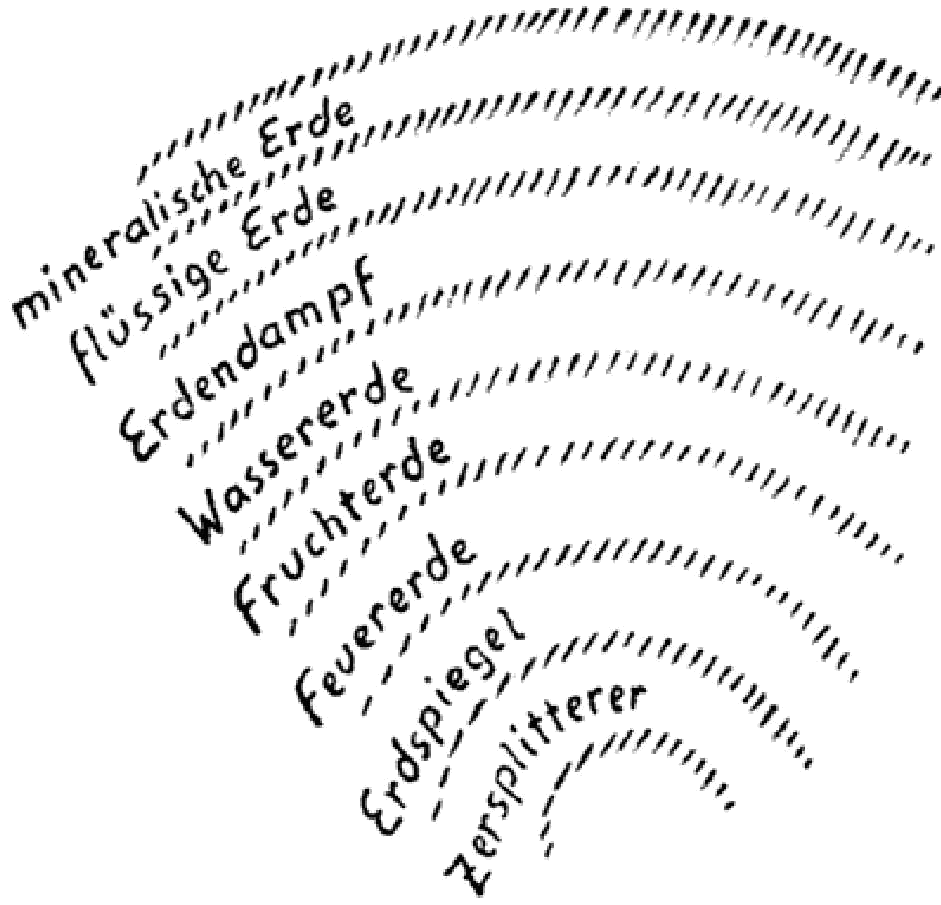

Das physische Auge erblickt um sich herum Lichter, Farben. Wie der Hellseher die Aura am astralischen Leib rot, blau, gelb und grün wahrnimmt, so sieht das physische Auge um sich herum Rot, Blau, Gelb und Grün. In beiden Fällen ist die Ursache genau die gleiche.

---

Wie hinter dem Rot im Astralleib eine Begierde lebt, so steckt hinter dem Rot der Blume eine Begierde als das «Ding an sich». Eine in der Blume waltende Begierde ist das Rot in der Blume. Was der Gesichtssinn tut, wenn er diesen Punkt überschreitet, ist nicht anders, als wenn Sie einen Rock umkehren, ihn auf die andere Seite wenden. Während in der Aura sich des Menschen astrale Natur ausprägt, lebt hinter der ganzen Farben- und Lichtwelt, hinter der Welt des Gesichtssinnes, die äußere astrale Natur. Niemals gäbe es in der Welt Farben, wenn nicht die Dinge ganz und gar durchdrungen wären von astralen Wesenheiten. Was in der Welt als Farben erscheint, rührt von den Astralwesen her, die sich äußerlich durch die Farbe kundtun. Durch die Umwendung des Inneren nach außen geht die Wesenheit von dem höheren auf den niederen Plan herunter. Sie können das Folgende durch Meditation erreichen: Wenn Sie eine grüne Fläche, etwa ein Laubblatt, vor sich haben und jetzt aus sich herausgehen, um die Sache von der anderen Seite anzuschauen, dann würden Sie die astrale Wesenheit sehen, die hinter der grünen Farbe ist und die sich durch die grüne Farbe anzeigt. So müssen Sie sich vorstellen: Indem Sie in die Welt hinausschauen und diese Welt mit Farben überdeckt sehen, haben Sie hinter diesen Farben die astralischen Wesenheiten zu vermuten. Wie Sie aus Ihrem Inneren die Farben Ihrer Aura für den Hellseher erscheinen lassen, so ist die Farbendecke der Welt der Ausdruck für die kosmische Aura. Alles Farbige in der Welt ist eine umgewandte Aura. Könnten Sie Ihre Aura umwenden wie einen Rock, so würden Sie Ihre Aura auf der umgekehrten Seite ebenfalls physisch sichtbar sehen. Das gilt für den Gesichtssinn, und damit sehen Sie, daß der Gesichtssinn in inniger Beziehung zur astralischen Welt steht.

Wenn Sie den Gefühlssinn, den Wärmesinn nehmen, so steht dieser wiederum in einer universellen Beziehung zu den unteren Partien der Astralwelt. Während der Gesichtssinn sich mehr in Relation zu den höheren Partien der Astralwelt befindet, steht der Gefühls- oder Wärmesinn wiederum in einer ebensolchen Beziehung zu den unteren Partien der Astralwelt, mehr mit dem Gebiete, in dem die astrale Welt schon in die Ätherwelt übergeht. Der Gehörsinn steht in unmittelbar-

---

barer Beziehung zur physischen Welt, und das, was Sie als Gehörsinn wahrnehmen, sind Schwingungen der physischen Luft.

Das ist nun etwas, was ich Sie bitte, nur in der subtilsten Weise und richtig aufzufassen. Wollen Sie etwas sehen, so muß hinter der Farbe, die Sie erblicken, ein Astralwesen stehen. Auch hinter der Wärme, die Sie fühlen, muß ein Astralwesen stehen. Wollen Sie etwas hören, so sind Sie - weil der Gehörsinn der vollkommenste Sinn ist - vollständig in die physische Welt gekommen, und Sie können ein physisches Wesen hören. Erst im Worte ist die geistige Welt richtig heruntergestiegen bis zur physischen Welt. Wenn wir von oben anfangen, können wir daher sagen: Die Erscheinungen des Gehörsinnes liegen ganz auf dem physischen Plan, die der Wärme steigen schon höher, die des Gesichtssinnes sind auf dem astralen Plan, und die Erscheinungen, die wir durch die unvollkommensten Sinne wahrnehmen, gehören den höheren Partien der geistigen Welt an. Und das, was bis in die physische Welt herunterlangt, ist nur das Unvollkommenste. So ist dasjenige, was der Geruchssinn erfassen kann, was er herunterbringt in die physische Welt, das Unvollkommenste. Macht sich das selbständig, dann sondert es sich aus dem Weltengang, aus der Evolution heraus. Was sich im Geruchssinn kundtut, dürfte heute nur im innigen Zusammenhang mit den höchsten Welten auftreten. - Nehmen wir also diejenigen Wesenheiten, die sich einmal - gerade als auf der Erde der Geruchssinn angefangen hatte sich zu entwickeln - aus der Evolution herausgegliedert und sich selbständig gemacht haben. Das sind Wesen, die sich vorzugsweise durch den Geruchssinn bemerkbar machen. Daher ist es ein schöner Zug der Sage, daß die abgefallenen Engel für den Geruchssinn in unangenehmer Weise wahrnehmbar sind. Weil sie abgespalten sind in der Evolution, sind sie für den Geruchssinn wahrnehmbar.

Wenn man sich also fragt, was eigentlich jenseits der Haut liegt, welche die menschlichen Sinnesorgane einschließt, so muß man sich sagen: Da liegen tatsächlich die verschiedenen höheren Plane und deren Wesenheiten.

Nun stellt sich mit all diesem die physische Forschung in einen wunderbaren Einklang. Bedenken Sie nur, wie ein Auge entsteht!

---

Das Auge bildet sich ursprünglich von außen her. In der Haut des Wesens, das ein Auge bekommt, entsteht zunächst eine kleine Einsenkung. Es findet dann eine Vertiefung dieser Einsenkung statt,

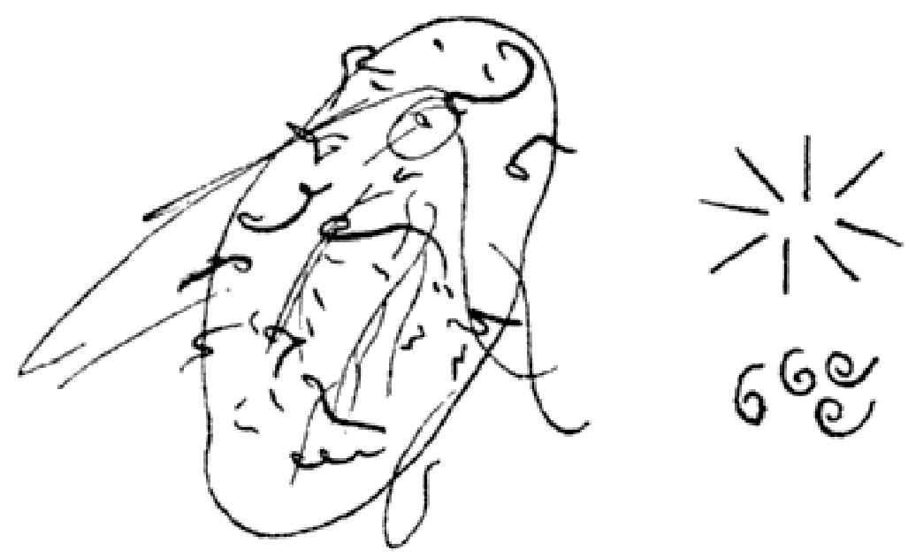

so daß es nach einiger Zeit so aussieht. Das füllt sich dann mit einer Art Flüssigkeit und schließt sich endlich zu. So schiebt sich das

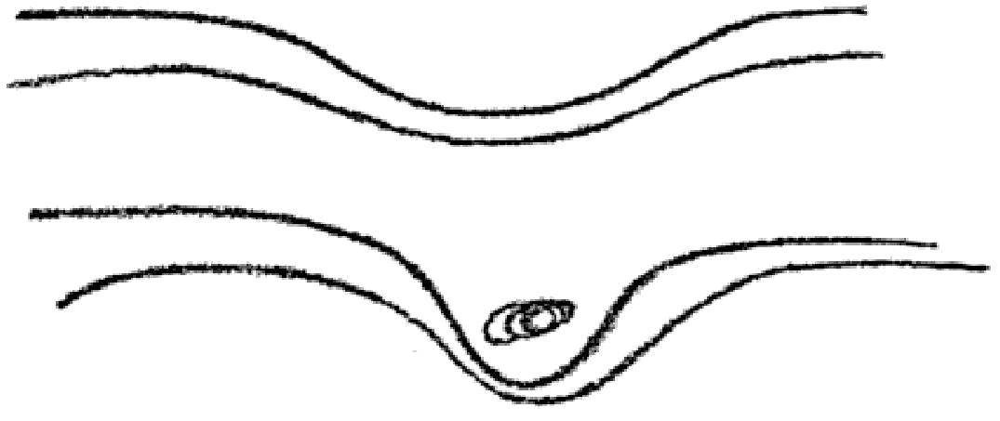

Auge tatsächlich von außen hinein. Die menschlichen Organe bilden sich nicht von innen heraus, sondern schieben sich von außen hinein. So ist es bei allen menschlichen und tierischen Organen. Einstülpen ist der Fachausdruck. Bei den Tieren, welche ein Rückenmark haben, hat sich ursprünglich eine Rinne gebildet, und in diese Rinne gliederte sich das Rückenmark von außen hinein. So gliedern sich auch die Sinne von außen hinein.

Was bewirkt es nun, daß das Auge sich so hineinstülpt? Das ist die Arbeit der im Lichte wirkenden Wesenheiten. Die im Lichtstrahl wirkenden Wesenheiten sind es, die das Auge aus dem Organismus heraus bilden, also jene Wesenheiten, die astral hinter der äußeren Erscheinung stehen und von denen wir gesagt haben, daß wir sie sehen würden, wenn wir unser Bewußtsein umwenden könnten. Sie sind es, welche das Auge in den physischen Organismus hineingebohrt haben. So ist das Auge von Lichtwesen gebildet. Ebenso sind die anderen Organe von Wesenheiten der verschiedenen Welten gebildet.

---

Indem Sie sich in Ihrer Haut fühlen, können Sie sich so fühlen, wie wenn die Wesen von den verschiedenen Seiten an Ihrem Leibe mitgearbeitet hätten. Als der Mensch in seiner allerersten Entwicklung auf dem Saturn angelangt war, konnten an seinem Gehörorgan nur höchste Wesenheiten arbeiten. Das Hören haben ihn höhere und auch niedrige Wesenheiten gelehrt, bis auf der Erde auch die Wesenheiten, die in der äußeren Luft verkörpert sind, begannen, an seinem Gehörorgan mitzuarbeiten. Mit dem Gehörorgan hört der Mensch die bewegte Luft; das ist dasjenige, worin der Ton liegt.

Wenn wir uns das so recht in die Seele prägen, wird uns in einer ganz tiefen Weise klar werden, warum die Luft in der Schöpfungsgeschichte eine so besondere Rolle spielt, warum sie dem Menschen erst eingeblasen werden mußte, damit sie diese Rolle auch in bezug auf sein Gehörorgan spielen konnte: «Der Schöpfer blies dem Menschen den lebendigen Odem ein, und er ward eine lebendige Seele.» Der Mensch ist selbst durch das Wort, durch den Ton geschaffen in seiner höchsten Spitze. Daraus ersehen Sie auch die Verwandtschaft, die zwischen dem Menschen und seiner ganzen Umwelt durch seine Sinne besteht. Betrachten Sie sein Gesicht, so können Sie sich sagen: Am Gesicht haben die Wesen gearbeitet, welche auf dem Astralplan leben. Sie leben im Lichtstrahl. Der Lichtstrahl besteht aus einem physischen und einem astralen Teil. Denken Sie sich nun, daß ein Lichtstrahl irgendwo auffällt. Wenn dies geschieht, dann ist in diesem Lichtstrahl das äußere physische Licht enthalten und zugleich die in dem Lichtstrahl lebenden astralen Wesenheiten. Stellen Sie sich nur einmal so auf, daß Sie den Lichtstrahl aufhalten. Stellen Sie sich so auf, daß die Sonne auf Ihren Rücken scheint. Wenn Sie das tun, halten Sie das physische Licht auf, aber die astralischen Wesenheiten halten Sie nicht auf. Die astralische Wesenheit ist dann vor Ihnen, in Ihrem Schatten. In Ihrem Schatten, der so nach vorn fällt, lebt eine astralische Wesenheit. Und diese astralische Wesenheit, die in dem Schatten lebt, ist nichts anderes als ein Nachbild -, ein Nachbild wovon? Sie ist ein Nachbild des Leibes, und was darin lebt, das formt sich nach der Seele. Das ist eine der Methoden, allmählich die eigene Seele zu sehen. Daher haben primitive Völkerschaften nicht

---

mit Unrecht gesagt, daß im Schatten die Seele lebe. In zahlreichen Sagen können Sie es finden: Im Schatten geht die Seele fort. Für ein astrales Schauen wird die Seele im Schatten erst sichtbar, der Form nach.

Jetzt werden Sie auch ermessen, welche tiefere Bedeutung es hat, wenn Chamisso von Peter Schlemihl als dem Mann ohne Schatten redet. Peter Schlemihl hat mit dem Schatten seine Seele verloren. Lesen Sie mit diesem Gedanken im Hintergrund einmal die Novelle des Chamisso, dann wird Ihnen aufgehen, daß hinter mancher solcher Geschichte noch etwas viel Tieferes steckt.

In der Tat wird Ihnen immer mehr klar werden, daß der Mensch, der von diesen Dingen nichts weiß, mehr oder weniger wie ein Blinder durch die Welt geht. Der Mensch, der nichts von den geistigen Welten weiß, hat nicht einmal eine Ahnung davon, was er in seinem Schatten mit sich zieht. Alle jene subtilen Dinge, die uns umgeben, werden den Menschen erst wieder durch die geisteswissenschaftliche Erkenntnis eröffnet werden. Die Welt ist voller Rätsel für den, der sie empfinden will. Wenn der Mensch diese Rätsel empfindet, wird er die geisteswissenschaftliche Weltanschauung nicht mehr als etwas Überflüssiges oder als eine Träumerei von ein paar Phantasten ansehen, sondern er wird erkennen, daß die Wirklichkeit, die uns umgibt, uns erst durch die geisteswissenschaftliche Anschauung zugänglich wird. Wir dürfen nicht müde werden, dasjenige, was uns umgibt, zu studieren. An dem komplizierten Gebilde, das der Mensch ist, haben viele Geister mitgearbeitet. Daher weist dieses Gebilde so verschiedene Grade der Vollkommenheit auf. Erst dadurch hat das physische Ohr sich das Recht erobert, auf der physischen Stufe zu hören, weil es viele Stufen durchgemacht hat. Wer als Chela die Venusstufe unter einem Meister vorausnimmt, kann seine Mitmenschen auf dem physischen Plane auch in der Lichtwirkung wahrnehmen; dann geht auch die Lichtwirkung herunter auf den physischen Plan.

Der Entwickelungsgang ist ganz regelmäßig. Ebenso wie der Gehörsinn auf den physischen Plan herabgestiegen ist, steigt auch der Gesichtssinn auf den physischen Plan herunter, bis zum wirklichen Hellsehen. Das ist logisch durchaus zu verstehen. Wer denken will, kann es schon einsehen, und niemand kann es durch bloßes Denken

---

widerlegen. So ist es mit allen Dingen in der Geisteswissenschaft. Bekämpfen werden die Geisteswissenschaft nur diejenigen, die nicht denken wollen, beziehungsweise das Denken nur auf dasjenige anwenden, was sie gewohnt sind zu denken. Es kann ja auch Menschen geben, die sagen: Ich will nicht Eisenbahn fahren -, aber deshalb läßt sich doch die Realität der Eisenbahn nicht ableugnen. Ebenso kann es Menschen geben, die sagen: Mit den höheren Welten ist es nichts.. Aber deshalb lassen sich die höheren Welten doch nicht ableugnen: sie sind vorhanden.

Wir haben von den Sinnesorganen des Menschen gesprochen und versucht, in die Umwelt hineinzuleuchten. Dabei haben wir gefunden, daß die Sinnesorgane nur dadurch da sind, daß andere Wesen sie aufbauen. Ebenso hätten wir von dem inneren Wesen, welches sich auf der Umgebung aufbaut, sprechen können. Die physische Wissenschaft ist nicht in der Lage, diese Dinge zu verstehen. Sie kann wohl zeigen, welche Strukturunterschiede zwischen dem Auge und dem Ohr vorhanden sind, aber niemals kann sie den Altersunterschied zwischen dem Auge und dem Ohr zeigen. Das kann ganz allein die okkulte Wissenschaft, die hinter die äußeren Erscheinungen sieht. Ebenso hätten wir zeigen können, wie die Leber ein viel jüngeres Organ ist als die Milz. Es würde sich da herausgestellt haben, daß die Milz bereits da war, als der Ätherleib mit dem physischen Leib verbunden wurde, während die Leber erst mit dem Astralleibe, mit den menschlichen Leidenschaften hinzutrat. Das ist etwas, was wiederum in der Sage von Prometheus in wunderbarer Weise zum Ausdruck kommt. Der Geier, der an der Leber des am Felsen festgeschmiedeten Prometheus nagt, hat eine tiefe Bedeutung.

So könnten Sie die großen Wahrheiten, die in den Sagen enthalten sind, auf eine neue Weise studieren. In den alten Sagen und Mythen liegt tiefe Weisheit. Die Mythen sind nicht durch die «dichtende Volksphantasie» entstanden, das ist ein Aberglaube der Gelehrten. Die Gelehrten sind die abergläubischsten Leute, die es überhaupt gibt. Die Gespenstergläubigen sind nicht so abergläubisch wie die Gelehrten. Es ist ein Aberglaube, daß es eine blind wirkende Volksphantasie gebe. In Wahrheit stammen die großen Mythen von den

---

Eingeweihten, die das gewußt haben, was jetzt der Menschheit in den großen theosophischen Wahrheiten wieder zugänglich gemacht wird.

So hat es auch in den alten Zeiten auf dem Grund und Boden, auf dem wir stehen, Gesellschaften gegeben, in denen Theosophie gelehrt wurde. Und von dort aus gingen Abgesandte hinaus und verkündigten dem Volke in Mythen, was sie im engeren Kreise vernommen hatten. So ist der Mythos eine Einkleidung von geistigen Wahrheiten, und wer sich darum bemüht, kann sie wieder daraus erkennen. Es sind nur untergeordnete Mythen, die nicht auf die großen Eingeweihten zurückgehen. Die echten Mythen stammen von den Eingeweihten als deren Schöpfung. Wenn Sie das festhalten, werden Sie sehen, daß in den Mythen der verschiedensten Völker eine Wunderschrift aufgezeichnet ist. Lernen Sie erst die Mythen lesen und schauen Sie tief hinein in die Seelen der vorhergegangenen Völker, derjenigen Völker, die sozusagen von innen schufen. Und wenden Sie die Mythen um, wie wir vorhin den Astralplan umgewandet haben, so haben Sie, ihrem Begriffe nach, die heutige Naturwissenschaft.

In der Naturwissenschaft treten Ihnen dieselben Wahrheiten entgegen - die Evolutionswahrheiten, die in den Mythen enthalten sind. Daher kommt die merkwürdige Übereinstimmung des tiefer verstandenen Entwickelungsgedankens mit den urältesten Lehren der Menschheit. Die mythischen Dinge sind von innen gesehen - die Naturwissenschaft sieht sie von außen, aber es sind dieselben Dinge. Das ist ein Hinweis auf die erstaunliche Tatsache, daß in den richtig verstandenen wissenschaftlichen Tatsachen die Wahrheiten wieder erscheinen, die in den ältesten Religionsbekenntnissen gefunden werden. Man braucht darüber nicht erstaunt zu sein, wenn man weiß, daß die Naturwissenschaft eine umgewandte Mythologie ist. Deshalb muß sie in ihrer Struktur dem gleichen, was schon einmal da war. - Das war eine Betrachtung über das Verhältnis der Sinne zu der uns umgebenden Welt.

Morgen um zwei Uhr wollen wir über theosophische Fragen sprechen, die nicht so weit hergeholt sind, aber doch auch ins praktische Leben eingreifen.

---

# DER ERKENNTNISPFAD UND SEINE STUFEN, Erster Vortrag, Berlin, 20. Oktober 1906

## Der rosenkreuzerische Geistesweg

Heute soll ein Bild des Erkenntnispfades gegeben werden, und es soll auch gezeigt werden, welches die Früchte dieses Pfades sind. Sie kennen einige Hauptgesichtspunkte, die dabei in Betracht kommen. Aber auch für diejenigen, die schon einschlägige Vorträge über den Erkenntnispfad gehört oder den «Lucifer», namentlich das zweiunddreißigste Heft gelesen haben, wird sich etwas Neues bieten, wenn wir den Erkenntnispfad so besprechen, wie es nur im intimen Kreise von Schülern der Geisteswissenschaft geschehen kann. Dabei wird es sich hauptsächlich darum handeln, diesen Erkenntnispfad zu besprechen, insofern er durch die rosenkreuzerische abendländische Geistesströmung vorgezeichnet ist, die seit dem 14. Jahrhundert die europäische Kultur an unbekannten Fäden geistig lenkt und leitet.

Die rosenkreuzerische Bewegung wirkte bis zum letzten Drittel des 19. Jahrhunderts ganz im Verborgenen. Was wirkliche Rosenkreuzerei war, konnte in keinem Buche gelesen werden, durfte auch nicht Öffentlich ausgesprochen werden. Erst seit etwa dreißig Jahren sind einige der rosenkreuzerischen Lehren durch die theosophische Bewegung der Außenwelt bekanntgemacht worden, nachdem sie früher nur in streng geschlossenen Bünden gelehrt worden waren. Die elementarsten Lehren sind in dem, was man heute Theosophie nennt, vielfach enthalten – aber nur die elementarsten. Erst nach und nach ist es möglich, die Menschen tiefer hineinschauen zu lassen in die Weisheit, die seit dem Ende des 14. Jahrhunderts in jenen Rosenkreuzerschulen in Europa gepflegt worden ist.

Zunächst wollen wir uns klarmachen, daß es nicht nur eine Art von Erkenntnispfad gibt, sondern es kommen drei Arten in Betracht. Das ist jedoch nicht so aufzufassen, als ob es drei Wahrheiten gäbe. Die Wahrheit ist eine einzige, so wie sich allen, die auf dem Gipfel eines Berges stehen, die gleiche Aussicht eröffnet. Aber es gibt verschiedene Wege, um auf den Gipfel des Berges zu gelangen. Wäh-

---

rend des Aufstiegs hat man von jedem Punkt aus einen anderen Ausblick. Erst wenn man oben ist - und man kann den Gipfel von verschiedenen Seiten aus ersteigen -, hat man den freien vollen Ausblick nach der eigenen Perspektive. So ist es auch mit den drei Erkenntnispfaden. Der eine ist der orientalische Yogaweg, der zweite der christlich-gnostische Weg, der dritte der christlich-rosenkreuzerische Weg. Diese drei Wege führen zu der einzigen Wahrheit.

Es gibt drei verschiedene Pfade, weil auf unserem Erdenrund die Menschennaturen verschieden sind. Man hat drei Typen von menschlichen Naturen zu unterscheiden. Wie es nicht richtig wäre, wenn jemand, um auf den Bergesgipfel zu kommen, nicht den nächsten, sondern einen von ihm weit abliegenden Fußpfad wählen würde, so wäre es auch nicht gut, wenn ein Mensch einen anderen als den ihm angemessenen geistigen Pfad einschlagen wollte. Darüber herrschen heute auch innerhalb der theosophischen Bewegung, die sich erst noch aus ihrem Anfangsstadium herausentwickeln muß, vielfach recht verworrene Vorstellungen. Man denkt vielfach, daß es nur einen einzigen Erkenntnispfad gäbe, und meint, dies sei der Yogaweg. Nun ist aber der orientalische Yogaweg weder der einzige Erkenntnispfad, noch ist er für Menschen, die innerhalb des europäischen Kulturgebietes leben, auch nur der günstige. Wer die Sache nur von außen betrachtet, kann freilich kaum die Einsicht haben, worum es sich hier handelt, weil die menschliche Natur doch im Grunde genommen bei den verschiedenen Rassen nicht so verschieden erscheint. Wenn man aber mit okkulten Kräften die große Verschiedenheit der Menschentypen betrachtet, kommt man darauf, daß etwas, das für die Orientalen, vielleicht auch für ganz einzelne Menschen in unserer Kultur gut sein mag, durchaus nicht für alle richtig ist. Es gibt auch Menschen, aber nur wenige innerhalb der europäischen Verhältnisse, die den orientalischen Yogaweg gehen können. Für die allermeisten Europäer ist er aber ungangbar. Er bringt Illusionen und auch seelische Zerstörung mit sich. Mögen sie auch äußerlich, selbst in den Augen des heutigen Wissenschaftlers, nicht so verschieden erscheinen - die östliche und die abendländische Natur sind total verschieden. Ein morgenländisches Gehirn, eine morgenländische Phantasie und ein

---

morgenländisches Herz, sie wirken ganz anders als die Organe des Abendländers. Was man einem Menschen zumuten kann, der unter östlichen Verhältnissen aufgewachsen ist, darf man nie und nimmer einem Abendländer zumuten. Nur wer glaubt, daß Klima, Religion und soziales Leben keinen Einfluß auf den menschlichen Geist hätten, könnte meinen, es sei einerlei, unter welchen äußeren Verhältnissen jemand eine okkulte Schulung durchmacht. Weiß man aber, welchen tiefgehenden geistigen Einfluß alle diese äußeren Umstände auf die menschliche Natur haben, so versteht man, daß sich der Jogaweg nur für wenige Europäer und eigentlich nur für solche eignet, die sich gründlich und radikal aus den europäischen Verhältnissen herausreißen, daß er aber für Menschen unmöglich ist, welche innerhalb der europäischen Kultur stehenbleiben.

Menschen, die heute noch innerlich aufrichtige und ehrliche Christen sind, die noch von gewissen Hauptsätzen des Christentums durchdrungen sind, mögen den christlich-gnostischen Weg wählen, der nicht sehr verschieden von dem kabbalistischen Weg ist. Für die Europäer ist aber im allgemeinen der rosenkreuzerische Weg der einzig richtige Pfad. Heute soll dieser europäische Rosenkreuzerweg besprochen werden, und zwar die verschiedenen Verrichtungen, die dieser Weg den Menschen vorschreibt, und auch das, was dem Menschen als Frucht winkt, wenn er diesen Erkenntnispfad geht. Niemand soll glauben, daß dies nur ein Weg für wissenschaftlich gebildete Menschen oder gar für Gelehrte sei. Der einfachste Mensch kann ihn beschreiten. Wenn man aber diesen Weg geht, wird man sehr bald in der Lage sein, jedem Einwand der europäischen Wissenschaft gegen den Okkultismus zu begegnen. Das war eine der Hauptaufgaben der rosenkreuzerischen Meister: diejenigen, die den Erkenntnispfad gehen, so auszurüsten, daß sie das okkulte Wissen verteidigen und diesen Pfad auch der Welt gegenüber durchführen können. Der einfache Mensch, der nur ein paar populäre Vorstellungen aus der modernen Wissenschaft oder auch gar nichts davon besitzt, aber einen ehrlichen Wahrheitsdrang in sich hat, wird den Rosenkreuzerweg ebenso gehen können wie der Gebildetste und Gelehrte.

Zwischen den drei Erkenntnis wegen bestehen große Unterschiede.

---

Der erste betrifft das Verhältnis des Schülers zu dem okkulten Lehrer, der allmählich der Guru wird oder das Verhältnis zum Guru vermittelt. Die Eigentümlichkeit des orientalischen Jogaweges bringt es mit sich, daß dieses Verhältnis das denkbar strengste ist. Der Guru ist unbedingte Autorität für den Schüler. Wenn das nicht der Fall wäre, könnte diese Schulung nicht den richtigen Erfolg haben. Eine orientalische Yogaschulung ist ohne eine strenge Unterwerfung unter die Autorität des Guru gar nicht möglich. Bei dem christlich-gnostischen und bei dem kabbaistischen Weg wird schon ein etwas loseres Verhältnis zu dem Guru auf dem physischen Plan vorausgesetzt. Der Guru führt den Schüler zu dem Christus Jesus hin, er ist der Vermittler. Und bei dem Rosenkreuzerweg wird der Guru immer mehr der Freund, dessen Autorität auf innerer Zustimmung beruht. Ein anderes Verhältnis als ein streng persönliches Vertrauensverhältnis ist hier nicht möglich. Würde auch nur ein klein wenig Mißtrauen zwischen Schüler und Lehrer entstehen, so würde das Band, das zwischen beiden bestehen muß, zerrissen werden und jene Kräfte, die zwischen Lehrer und Schüler spielen, würden nicht mehr wirken. Über die Rolle seines Lehrers wird sich der Schüler mitunter falsche Vorstellungen machen. Leicht wird es ihm vorkommen, als ob er da oder dort den Lehrer unbedingt sprechen, als ob er oft mit ihm physisch zusammen sein müßte. Zwar ist es manchmal eine dringende Notwendigkeit, daß der Lehrer an den Schüler physisch herantritt, aber das ist nicht so oft der Fall, wie der Schüler glauben mag. Die Wirkung, die der Lehrer auf den Schüler ausübt, kann dieser anfangs nicht in der richtigen Weise beurteilen. Der Lehrer hat Mittel, die sich erst allmählich dem Schüler enthüllen. Manches Wort, von dem der Schüler glaubt, es sei zufällig gesprochen, ist von großer Bedeutung. Es wirkt unbewußt in der Seele des Schülers wie eine Richtkraft fort, die ihn lenkt und leitet. Übt der Lehrer die okkulten Einflüsse richtig aus, dann ist auch das reale Band zwischen ihm und dem Schüler da. Dazu kommen dann die auf liebevoller Teilnahme beruhenden Wirkungen in die Ferne, die dem Lehrer immer zur Verfügung stehen und die sich dem Schüler erst später immer mehr enthüllen, wenn er Eingang in die höheren Welten findet. Aber un-

---

bedingt notwendig ist das absoluteste Vertrauen, sonst ist es besser, das Band 2wischen Lehrer und Schüler zu lösen.

Nun sollen die Regeln, welche innerhalb der rosenkreuzerischen Schulung eine gewisse Rolle spielen, kurz Erwähnung finden. Die Dinge brauchen nicht genau so aufzutreten, wie sie hier aufgezählt werden. Je nach der Individualität, dem Beruf, dem Lebensalter des Schülers wird der Lehrer aus den verschiedenen Gebieten dies oder jenes herauszunehmen und es in dieser oder jener Weise anzuordnen haben. Nur eine Übersicht soll hier zur Kenntnisnahme gegeben werden.

Was bei der Rosenkreuzerschulung in hohem Grade notwendig ist, wird gewöhnlich bei aller okkulten Schulung nicht genügend beachtet. Es ist ein klares und logisches Denken - oder wenigstens das Streben danach. Zunächst soll alles verworrene oder vorurteilsvolle Denken ausgemerzt werden. Der Mensch hat sich daran zu gewöhnen, die Zusammenhänge in der Welt nach großen, selbstlosen Gesichtspunkten zu denken. Dazu ist der beste Weg, wenn man als schlichter Mensch diesen Rosenkreuzerpfad durchmachen will, das Studium der elementaren Lehren der Geisteswissenschaft. Es ist kein berechtigter Einwand, zu sagen: Was nützt es mir, die Lehren über die höheren Welten, über die Menschenrassen und Kulturen, über Karma und Reinkarnation zu studieren, da ich das alles doch nicht selbst sehen und wahrnehmen kann. - Es ist dies kein richtiger Einwand, denn gerade das Beschäftigen mit diesen Wahrheiten reinigt das Denken und diszipliniert es so, daß der Mensch reif für die anderen Maßnahmen wird, die zum okkulten Pfad führen. Der Mensch denkt im gewöhnlichen Leben meistens sehr ungeordnet. Die Richtlinien und Abschnitte der menschlichen Entwicklung und der planetarischen Evolution, die großen Gesichtspunkte, die von den Wissenden erschlossen werden, bringen das Denken in geordnete Formen. Alles dies ist ein Teil der rosenkreuzerischen Schulung. Man nennt dies das Studium. Daher wird der Lehrer dem Schüler anheimgeben, sich in die elementaren Lehren über Reinkarnation und Karma, über die drei Welten, die Akasha-Chronik, die Evolution der Erde und die Menschenrassen hineinzudenken. Der Umfang der elementaren

---

Geisteswissenschaft, wie sie heute verbreitet wird, ist für den schlichten Menschen die beste Vorbereitung.

Denen aber, welche schärfer in das Denken hineingehen mögen, um sich noch intensiver auf das eigentliche Grundgerüst der menschlichen Seele einzulassen, seien zum Studium solche Bücher empfohlen, die gerade dazu geschrieben worden sind, um das Denken in disziplinierte Bahnen zu bringen. Die Bücher, die zu diesem Zwecke geschrieben worden sind - wenn auch in ihnen nicht das Wort Theosophie steht —, sind meine beiden Bücher «Wahrheit und Wissenschaft» und «Die Philosophie der Freiheit». Man schreibt ja solche Bücher, damit sie einen Zweck erfüllen. Diejenigen, welche auf Grund einer energischen Schulung des logischen Denkens an das weitere Studium herankommen wollen, werden gut daran tun, ihren Geist einmal dem «seelischen und geistigen Turnen» zu unterwerfen, welches diese Bücher erfordern. Das gibt ihnen den Grund, auf welchem das Rosenkreuzerstudium aufgebaut ist.

Wenn man den physischen Plan beobachtet, nimmt man gewisse Sinneseindrücke wahr, Farben und Licht, Wärme und Kälte, Geruch und Geschmack, Druck- und Tastempfindungen und die Gehörseindrücke. Man verbindet mit alledem die Gedanken- und Verstandestätigkeit. Der Verstand, der Gedanke gehört noch zum physischen Plan. Das alles können Sie auf dem physischen Plan wahrnehmen. Anders sind die Wahrnehmungen auf dem Astralplan, sie sehen ganz anders aus. Und wieder anders sind die Wahrnehmungen auf dem Devachanplan, geschweige in den noch höheren Geistgebieten. Der Mensch, der noch nicht einen Einblick in die höheren Welten erlangt hat, kann sich jedoch eine bildliche Vorstellung davon machen. Durch Bilder eine Anschauung von diesen Welten zu geben, wird auch in der mir geläufigen Darstellungsweise versucht. Wer dann in die höheren Gebiete aufsteigt, sieht selber, wie sie auf ihn wirken. Auf jedem Plan macht der Mensch neue Erfahrungen. Aber eines gibt es, das durch alle Welten hindurch bis hinauf zum Devachan dasselbe bleibt, das sich nicht ändert: Das ist das logisch geschulte Denken. Erst auf dem Buddhiplan hat das Denken nicht mehr die gleiche Geltung wie auf dem physischen Plan. Da muß ein anderes Denken eintreten.

---

Aber für die drei Welten unterhalb des Buddhiplanes, für den physischen, astralen und devachanischen Plan, gilt überall das gleiche Denken. Wer sich also durch das Studium in der physischen Welt ordentlich im Denken schult, wird in den höheren Welten in diesem Denken einen guten Führer haben und nicht so leicht straucheln wie der, welcher mit verworrenem Denken in die Geistgebiete aufsteigen will. Daher lehrt die Rosenkreuzerschulung die Menschen, sich in den höheren Welten frei zu bewegen, indem sie dieselben dazu anhält, ihr Denken zu disziplinieren. Wer in diese Welten hinaufgelangt, lernt zwar Wahrnehmungsweisen kennen, die es auf dem physischen Plan nicht gibt, aber er wird sie mit seinem Denken beherrschen können.

Das zweite, das der Schüler auf dem rosenkreuzerischen Erkenntnispfade lernt, ist die Imagination. Sie wird dadurch vorbereitet, daß der Schüler selbst allmählich lernt, in solche bildlichen Vorstellungen einzudringen, die im Sinne des Goetheschen Wortes «Alles Vergängliche ist nur ein Gleichnis» die höheren Welten darstellen. So wie der Mensch gewöhnlich durch die physische Welt geht, nimmt er die Dinge auf, wie sie sich seinen Sinnen darstellen, aber nicht das, was dahinter ist. Er wird wie mit einem Bleigewicht in die physische Welt hinabgezogen. Der Mensch wird von dieser physischen Welt erst frei, wenn er lernt, die Dinge um sich herum als Sinnbilder zu nehmen. Deshalb muß er ein moralisches Verhältnis zu ihnen zu gewinnen suchen. Der Lehrer wird ihm auch dafür manche Anleitungen geben, um äußere Erscheinungen als Symbole für Geistiges zu betrachten, aber der Schüler kann auch selbst viel dazu tun. Zum Beispiel kann er eine Herbstzeitlose und ein Veilchen betrachten. Wenn ich in der Herbstzeitlose das Symbol für ein melancholisches Gemüt sehe, habe ich sie nicht nur so aufgefaßt, wie sie mir äußerlich entgegentritt, sondern als Sinnbild für eine Eigenschaft. Im Veilchen mag man dagegen das Sinnbild für ein stilles, frommes Gemüt erblicken. So gehen Sie von Gegenstand zu Gegenstand, von Pflanze zu Pflanze, von Tier zu Tier und betrachten sie als Sinnbilder für Geistiges. Dadurch machen Sie Ihr Vorstellungsvermögen flüssig und lösen es von den scharfen Konturen des sinnlichen Wahrnehmens los.

---

Man kommt etwa dazu, in jeder Tiergattung das Sinnbild für eine Eigenschaft zu erblicken. Man nimmt das eine Tier als Symbol der Stärke, ein anderes als Symbol der Schlauheit. Nicht flüchtig, sondern ernst und auf Schritt und Tritt müssen wir solche Dinge zu verfolgen suchen.

Im Grunde spricht die ganze menschliche Sprache in Symbolen. Die Sprache ist nichts anderes als ein Sprechen in Symbolen. Jedes Wort ist ein Symbolum. Auch die Wissenschaft, die den Glauben hat, einen jeden Gegenstand nur objektiv zu bezeichnen, muß sich der Sprache bedienen, und ihre Worte wirken sinnbildlich. Wenn Sie von Lungenflügeln sprechen, so wissen Sie, daß das keine Flügel sind, aber Sie pflegen sie doch so zu bezeichnen. Für den, der auf dem physischen Plan bleiben will, wird es gut sein, sich nicht zu stark in dieser Symbolik zu verlieren, aber der fortgeschrittene Schüler wird sich auch nicht darin verlieren. Wenn man nachforscht, empfindet man, welche Tiefe ursprünglich in der menschlichen Sprache liegt. Solche tiefe Naturen wie *Paracelsus* und *Jakob Böhme* verdanken ihre Entwicklung mit dem Umstände, daß sie sich nicht scheuten, im Gespräch mit Bauern und Landstreichern die imaginative Bedeutung der Sprache zu studieren. Da wirkten die Worte Natur, Geist, Seele noch ganz anders. Sie wirkten stärker. Wenn draußen auf dem Lande die Bauersfrau der Gans eine Feder ausrupfte, nannte sie das Innere die Seele der Feder. Solche Symbole in der Sprache muß der Schüler selbst finden. Dadurch löst er sich von der physischen Welt los und lernt es, sich zur Imagination zu erheben. Es hat eine starke Wirkung, wenn so die Welt dem Menschen zum Gleichnis wird. Wenn der Schüler das lange genug übt, wird er entsprechende Wirkungen bemerken. Beim Anschauen einer Blume wird sich zum Beispiel nach und nach etwas von der Blume loslösen. Die Farbe, die zuerst nur an der Oberfläche der Blume haftete, steigt wie eine kleine Flamme auf und schwebt frei im Räume. So gestaltet sich die imaginative Erkenntnis heraus. Es ist dann bei allen Dingen so, als ob sich ihre Oberfläche loslöste. Der ganze Raum erfüllt sich mit der Farbe, die flammenartig im Räume verschwebt. Auf diese Weise scheint sich die ganze Lichtwelt aus der physischen Wirklichkeit

---

herauszuziehen. Wenn sich ein solches Farbenbild herauszieht und frei im Räume schwebt, fängt es bald an, an etwas zu haften. Es drängt zu etwas hin, es bleibt nicht beliebig irgendwo stehen; es faßt eine Wesenheit ein, die nun selbst als geistige Wesenheit in der Farbe erscheint. Was der Schüler aus den Dingen der physischen Welt als Farbe herausgezogen hat, umkleidet die geistigen Wesenheiten des astralen Raumes.

Hier ist der Punkt, wo der Rat des okkulten Lehrers eingreifen muß, weil der Schüler sonst leicht den Boden verlieren kann. Dies könnte aus zwei Gründen geschehen. Der eine ist der folgende: Durch eine bestimmte Erfahrung muß jeder Schüler hindurchgehen. Die Vorstellungen, die sich aus den physischen Dingen herausschälen - es sind nicht nur Farben, sondern auch Geruchs- und Gehörvorstellungen -, zeigen sich in merkwürdigen häßlichen, vielleicht auch schönen Gestalten, Tiergesichtern, Formen von Pflanzen, auch häßlichen Menschenantlitzen. Dieses erste Erlebnis stellt ein Spiegelbild der eigenen Seele dar. Die eigenen Leidenschaften und Triebe, das noch in der Seele ruhende Böse tritt vor den vorgeschrittenen Schüler wie in einem Spiegel im Astralraum auf. Da braucht er den Rat des okkulten Lehrers, der ihm sagt, daß das nichts Objektives ist, sondern ein Spiegelbild seiner eigenen inneren Wesenheit.

Daß er auf diesen Rat des Lehrers angewiesen ist, werden Sie begreifen, wenn noch etwas über die Art, wie solche Bilder auftreten, gesagt wird. Oft ist betont worden, daß im Astralraum alles umgekehrt ist, daß alles in Spiegelbildern auftritt. Der Schüler kann daher leicht durch Gaukelbilder irregeführt werden, namentlich wenn es sich um Spiegelungen seines eigenen Wesens handelt. Das Spiegelbild einer Leidenschaft tritt nicht nur so auf, daß es wie ein Tier ausschaut, das auf ihn zukommt - das wäre noch das geringste -, sondern man muß hier noch mit anderem rechnen. Nehmen wir an, in dem Menschen wäre eine verborgene recht böse Leidenschaft. Als Spiegelung erscheint ein solcher Trieb oder eine Begierde sehr häufig in verlockender Gestalt, während sich gerade gute Eigenschaften manchmal gar nicht verlockend ausnehmen. Wieder liegt hier etwas vor, was die Sage wunderbar dargestellt hat. Sie finden ein Bild da

---

für in der Herkulesmythe. Als Herkules seinen Weg antritt, stehen die bösen und die guten Eigenschaften vor ihm. Das Laster kleidet sich in die verführerische Gestalt der Schönheit, die Tugend aber in das Gewand der Anspruchslosigkeit.

Es kommt nun noch etwas anderes hinzu. Selbst wenn der Schüler bereits in der Lage ist, die Dinge objektiv zu sehen, so ist noch immer die andere Möglichkeit vorhanden, daß sich seine innere Willkür wie eine Kraft äußert, welche die Erscheinungen lenkt und leitet. Er muß es dahin bringen, daß er dies durchschaut und versteht, denn der Wunsch hat einen starken Einfluß auf dem astralen Plan. Alles, was als dirigierende Kraft hier in der physischen Welt wirkt, ist nicht vorhanden, wenn man in die imaginative Welt kommt. Wenn Sie sich auf dem physischen Plan einbilden, Sie hätten etwas getan, was Sie in Wahrheit nicht getan haben, dann werden Sie sich bald davon überzeugen, daß es sich nicht so verhält, indem Ihnen die Tatsachen auf dem physischen Plan entgegentreten. So ist es aber nicht im Astralraum. Da gaukeln Ihnen die eigenen Wünsche Bilder vor, da müssen Sie von einem Wissenden Anleitung haben, wie diese imaginativen Bilder zusammenzusetzen sind, um ihre wahre Bedeutung zu erkennen.

Das dritte in der Rosenkreuzerschulung ist das Lernen der okkulten Schrift. Was ist diese okkulte Schrift? Es gibt gewisse Bilder, Symbole, die durch einfache Linien hergestellt oder durch Farben aneinander gefügt werden. Solche Symbole stellen eine ganz bestimmte okkulte Zeichensprache dar. Um ein Beispiel zu erwähnen, sei das Folgende gesagt. Es gibt in der höheren Welt einen Vorgang, der sich auch in die physische Welt hinein auswirkt: das Drehen des Wirbels. Sie können das Drehen des Wirbels beobachten, wenn Sie einen Sternnebel, beispielsweise den Orionnebel, ansehen. Da sehen Sie eine Spirale. Nur ist das auf dem physischen Plan. Aber Sie können das auch auf allen Planen betrachten. Es stellt sich so dar, daß sich ein Wirbel in einen anderen hineinschwingt. Das (a) ist eine Figur, die auf dem Astralplan bei allen möglichen Bildungen vorkommt. Wenn Sie diese Figur verstehen, begreifen Sie durch sie auch, wie eine Menschenrasse sich in eine andere verwandelt. Beim Entstehen der ersten

---

Unterrasse unserer gegenwärtigen Hauptrasse stand die Sonne gerade im Zeichen des Krebses. Damals schlang sich also eine Rasse in die andere hinein; deshalb hat man für den Krebs das okkulte Zeichen (b). So sind die Tierkreiszeichen alle okkulte Zeichen. Man muß nur ihre Bedeutung kennenlernen und verstehen.

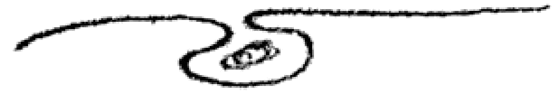
0.

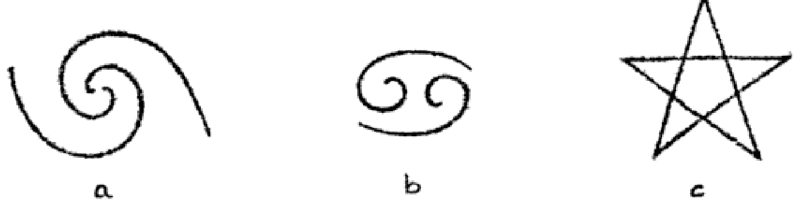

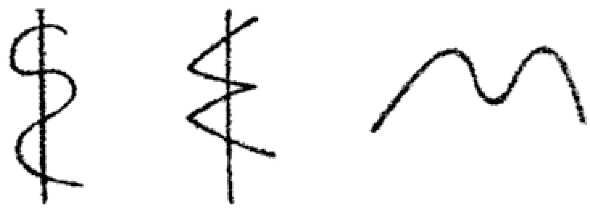

Ein solches Zeichen ist auch das Pentagramm (c). Der Schüler lernt, mit diesem Zeichen besondere Empfindungen und Gefühle zu verbinden. Sie sind das Gegenbild von astralen Vorgängen. Diese Zeichensprache, die als okkulte Schrift gelernt wird, ist nichts anderes als die Wiedergabe der Gesetze höherer Welten. So ist das Pentagramm ein Zeichen, das Verschiedenes ausdrückt. Wie der Buchstabe B bei den verschiedensten Worten verwendet wird, so können auch die Zeichen der okkulten Schrift mannigfache Bedeutungen haben. Das Pentagramm, das Hexagramm, der Winkel und andere Figuren lassen sich zu einer okkulten Schrift zusammensetzen, und diese ist wieder ein Wegweiser in den höheren Welten. Das Pentagramm ist das Zeichen für den fünfgliedrigen Menschen, ferner das Zeichen der Verschwiegenheit, aber auch das Zeichen, das der Gattungsseele der Rose zugrunde liegt. Wenn Sie die Blütenblätter der Rose im Bilde verbinden, bekommen Sie das Pentagramm heraus. Wie das B in den Worten Band und Beben jeweils etwas anderes besagt, so bedeuten also auch die Zeichen in der okkulten Schrift Unterschiedliches. Man lernt sie in der richtigen Weise anordnen. Das sind die Wegweiser auf den astralen Plan. Geradeso wie sich ein Analphabet zu einem Leser auf dem physischen Plan verhält, verhält sich jemand, der nur die Bilder als solche sieht, zu einem solchen, der die okkulte Schrift gelernt hat. Auf dem physischen Plan sind

---

die Schriftzeichen vielfach willkürlich, ursprünglich waren sie aber Abbilder der astralen Zeichensprache. Nehmen Sie ein uraltes astrales Symbol, den Hermesstab mit der Schlange. Das ist in unserer Schrift

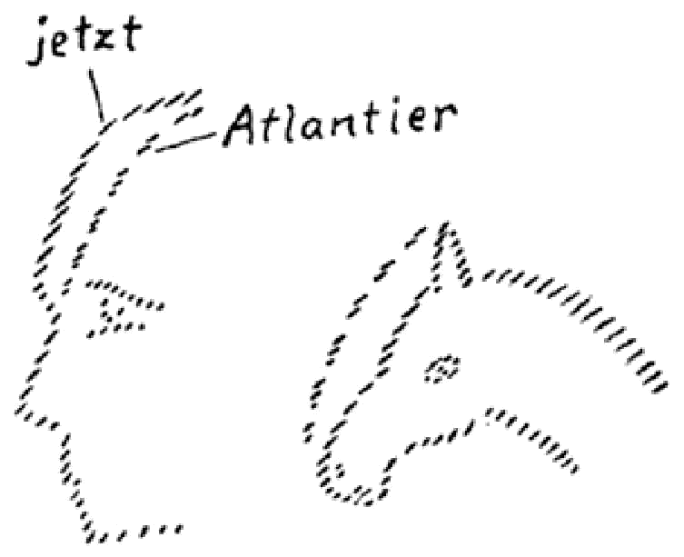

zum Zeichen $E$ geworden. Oder nehmen Sie das Zeichen $W$, welches die Wellenbewegung des Wassers bezeichnet. Es ist das Seelenzeichen des Menschen, zugleich das Zeichen für das Wort. Das $M$

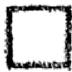

ist nichts anderes als die nachgebildete Oberlippe. Im Laufe der Entwicklung ist das alles mehr willkürlich geworden. Auf den okkulten Planen herrscht dagegen Notwendigkeit. Da kann man diese Dinge leben.

Das vierte ist der sogenannte Lebensrhythmus. Einen solchen Rhythmus kennen die Menschen im profanen Leben sehr wenig. Sie leben egoistisch darauf los. Höchstens für die Kinder in der Schule bedeutet der Stundenplan noch einen gewissen Lebensrhythmus, denn da wiederholt sich der Ablauf der täglichen Schulstunden von Woche zu Woche. Aber wer tut das im gewöhnlichen Leben? Dennoch steigt man zu einer höheren Entwicklung nur dadurch auf, daß man Rhythmus, Wiederholung in sein Leben hineinbringt. In der ganzen Natur herrscht Rhythmus. Im Gang der Planeten um die Sonne, im jährlichen Erscheinen und Verblühen der Pflanzen, bis ins Tierreich, bis ins sexuelle Leben der Tiere hinein ist alles rhythmisch geregelt. Erst dem Menschen ist es gestattet, damit er frei handeln kann, auch ohne Rhythmus zu leben. Aber er muß aus freien Stücken wieder Rhyth-

---

mus in das Chaos hineinbringen. Ein guter Rhythmus besteht darin, täglich zu bestimmten Zeiten okkulte Verrichtungen vorzunehmen. Deshalb muß der Schüler seine Meditations- und Konzentrationsübungen zur selben Stunde vollziehen, so wie die Sonne zur selben Zeit im Frühling ihre Kräfte zur Erde hinuntersendet. Das ist ein solches Rhythmisieren des Lebens. Ein anderes ist das, was nach Anweisung des okkulten Lehrers als Rhythmisierung des Atmungsprozesses auftritt. Das Einatmen, Atemhalten und Ausatmen muß für eine kurze Zeit des Tages in einen Rhythmus gebracht werden, der von den Erfahrungen der okkulten Lehrer bestimmt ist. So wird durch den Menschen ein neuer Rhythmus an die Stelle des alten gesetzt. Eine solche Rhythmisierung des Lebens gehört zu den Vorbedingungen für ein Aufsteigen zu den höheren Welten. Aber niemand kann das ohne die Anleitung eines Lehrers tun. Es sollte hier nur zur Kenntnis gebracht werden, worum es sich grundsätzlich handelt.

Das fünfte ist dasjenige, was man das Lernen der Entsprechung zwischen dem Mikrokosmos und Makrokosmos nennt. Es besteht darin, daß der Lehrer dem Schüler Anleitung gibt, seine Gedanken auf bestimmte Körperteile zu konzentrieren. Diejenigen, welche den Vortrag über die Beziehung der Sinne zu den höheren Welten gehört haben, werden sich erinnern, daß die ganze Welt an dem Zustandekommen des physischen Leibes beteiligt ist. Das Auge ist vom Licht geschaffen, von den Geistern, die im Lichte wirken. Jeder Punkt des physischen Leibes steht im Zusammenhang mit einer bestimmten Kraft im Kosmos. Betrachten wir den Punkt an der Nasenwurzel. Es gab eine Zeit, da der ätherische Kopf über den physischen Leib weit herausragte. Noch bei den Atlantiern war an der Stirn ein Punkt, wo der ätherische Kopf über den physischen herausstand, wie es noch jetzt beim Pferde und anderen Tieren der Fall ist. Beim Pferde ragt auch heute der Ätherkopf weit heraus. Beim heutigen Menschen ist der genannte Punkt im Ätherkopf und im physischen Kopf zur Deckung gebracht, und das gibt ihm die Fähigkeit, solche Teile des physischen Gehirns zu entwickeln, welche es ihm ermöglichen, zu sich Ich zu sagen. Das Organ, welches den Menschen dazu

---

jetzt

"'.Atlant ier

befähigt, zu sich Ich zu sagen, hängt mit einem ganz bestimmten Vorgang während der atlantischen Erdenentwickelung zusammen. Nun weist der okkulte Lehrer seinen Schüler an: Lenke deine Gedanken und konzentriere sie auf diesen Punkt 1 Dann gibt er ihm ein Mantram. Dadurch wird in diesem Teile des Kopfes eine Kraft geweckt, die einem bestimmten Vorgang im Makrokosmos entspricht. Auf solche Weise wird eine Korrespondenz zwischen dem Mikrokosmos und dem Makrokosmos hervorgerufen. Durch eine entsprechende Konzentration auf das Auge wird auch die Erkenntnis der Sonne erlangt. Man findet so die ganze Organisation des Makrokosmos geistig in seinen eigenen Organen.

Wenn der Schüler das genügend lange geübt hat, darf er dazu übergehen, sich in die Dinge, die er so aufgefunden hat, hineinzuversenken. Zum Beispiel kann er in der Akasha-Chronik jenen Zeitpunkt in der atlantischen Epoche aufsuchen, in welchem an der Nasenwurzel der Punkt zustande gekommen ist, auf den er sich konzentriert hat. Oder er findet die Sonne, indem er sich auf das Auge konzentriert. Diese sechste Stufe, das Versenken in den Makrokosmos, nennt man die Kontemplation. Das gibt dem Schüler die Welterkenntnis, und dadurch erweitert er seine Selbsterkenntnis über die Persönlichkeit hinaus. Das ist etwas anderes als jenes beliebte Schwatzen von Selbsterkenntnis. Man findet das Selbst nicht, wenn man in sich hineinschaut, sondern wenn man aus sich hinausschaut. Es ist dies das gleiche Selbst, welches das Auge geschaffen hat, das die Sonne her-

---

vorgebracht hat. Wenn Sie den Teil des Selbst, welcher dem Auge entspricht, suchen wollen, so haben Sie ihn in der Sonne zu suchen. Was draußen außer Ihnen ist, müssen Sie als Ihr Selbst wahrnehmen lernen. Das Hineinschauen nur in sich führt zur Verhärting in sich selbst, zu einem höheren Egoismus. Wenn die Menschen sagen: Ich brauche nur mein Selbst sprechen zu lassen -, so haben sie keine Ahnung von der Gefahr, die darin liegt. Selbsterkenntnis darf nur geübt werden, wenn der Schüler des weißen Pfades sie mit Selbstentäußerung verbindet. Wenn er zu jedem Dinge sagen lernt: Das bin ich - dann ist er reif zur Selbsterkenntnis, wie es Goethe in den Worten Fausts ausspricht:

«Du führst die Reihe der Lebendigen
Vor mir vorbei und lehrst mich meine Brüder
Im stillen Busch, in Luft und Wasser kennen.»

Überall sind draußen die Teile unseres Selbst. Das ist zum Beispiel auch in der Dionysos-Mythe dargestellt. Daher legt die Rosenkreuzerschulung auch so viel Wert auf eine objektive und ruhige Betrachtung der äußeren Welt: Willst du dich selbst erkennen, dann schau dich im Spiegel der äußeren Welt und Wesen an! Viel deutlicher wird dir aus dem Auge des Mitmenschen sprechen, was in deiner Seele ist, als wenn du dich in dir selbst verhartest und in die eigene Seele versenkst! - Das ist eine wichtige und wesentliche Wahrheit, die keiner, der den weißen Pfad beschreiben will, außer acht lassen darf. Es gibt in der Gegenwart viele Menschen, die ihren gewöhnlichen Egoismus in einen raffinierten Egoismus verwandelt haben. Sie nennen es theosophische Entwickelung, wenn sie ihr gewöhnliches, alltägliches Selbst so hoch wie möglich steigern. Sie möchten das Persönliche ja recht hervorholen. Die wirkliche okkulte Erkenntnis zeigt dem Menschen dagegen, wie sich sein Inneres aufschließt, wenn er sein höheres Selbst in der Welt erkennen lernt.

Wenn der Mensch in der Kontemplation diese Gesinnung herangebildet hat, wenn sein Selbst über alle Dinge ausfließt, wenn er die Blume, die ihm entgegenwächst, so fühlt wie den Finger, den er sich selbst entgegenbewegt, wenn er weiß, daß die ganze Erde und die

---

ganze Welt sein Leib ist, dann lernt er sein höheres Selbst erkennen. Dann spricht er zur Blume wie zu einem Glied seines eigenen Körpers: Du gehörst zu mir, du bist ein Teil meines Selbst. - Allmählich empfindet er das, was man den siebenten Grad der Rosenkreuzerschulung nennt: die Gottseligkeit. Sie stellt sich als das notwendige Gefühlselement ein, das den Menschen in die höheren Welten hinaufgeleitet, wo er über die höheren Welten nicht bloß denken darf, sondern in diesen Welten fühlen lernt. Dann zeigen sich ihm die Früchte, wenn er so bestrebt ist, unter der fortdauernden Anleitung seines Lehrers zu lernen, und er braucht nicht zu fürchten, daß sein okkulter Weg in einen Abgrund führen könnte. Alle Dinge, die als Gefahren der okkulten Entwicklung geschildert werden, kommen nicht in Frage, wenn diese in die richtigen Wege gelenkt wird. Geschieht das, so wird der okkulte Pfadsucher ein wirklicher Helfer der Menschheit.

Während der Imagination stellt sich die Möglichkeit ein, daß der Mensch einen gewissen Teil der Nacht in bewußtem Zustande durchmacht. Sein physischer Leib schläft wie sonst, aber ein Teil seines Schlafzustandes wird von sinnvollen, inhaltsvollen Träumen belebt. Diese sind die erste Ankündigung seines Eintrittes in die höheren Welten. Allmählich führt er seine Erlebnisse in das gewöhnliche Bewußtsein hinüber. Er sieht dann in seiner ganzen Umwelt, auch hier im Saal zwischen den Stühlen oder draußen in Wald und Flur, die astralen Wesenheiten.

Drei Stufen erreicht der Mensch während der imaginativen Erkenntnis. Auf der ersten Stufe erkennt er die Wesenheiten, die hinter den physischen Sinneseindrücken stehen. Hinter der roten oder blauen Farbe steht eine Wesenheit, hinter jeder Rose; hinter jedem Tier steht die Gattungs- oder Gruppenseele. Er wird taghellsehend. Wenn er nun noch eine Weile wartet und seine Imagination ruhig übt, sich auch in die okkulte Schrift vertieft, so wird er auch taghellhörend. Das dritte ist dann, daß er alle die Dinge kennenlernt, die man in der astralen Welt findet, die den Menschen herunterziehen und zum Bösen verleiten, die eigentlich nun dazu bestimmt sind, ihn hinaufzuführen. Er lernt Kamaloka kennen.

---

Durch dasjenige, was den vierten, fünften und sechsten Teil der Rosenkreuzerschulung bildet, den Lebensrhythmus, die Beziehung des Mikrokosmos zum Makrokosmos, die Kontemplation des Makrokosmos, erreicht der Mensch drei weitere Stufen. Auf der ersten Stufe gelangt er zum Erkennen der Verhältnisse des Lebens zwischen dem Tode und einer neuen Geburt. Das tritt ihm in Devachan entgegen. Das nächste ist die Möglichkeit, zu sehen, wie die Formen sich ineinander umwandeln, die Transmutation, die Metamorphose der Formen. Der Mensch hatte zum Beispiel nicht immer seine heutige Lunge: er besitzt sie erst seit der lemurischen Zeit. In der vorangegangenen hyperboräischen Zeit hatte er wieder eine andere Form, davor hatte er eine andere Form, weil er sich im Astralzustand befand, und eine andere vorher, weil er in Devachan war. Man sagt auch: der Mensch lernt auf dieser Stufe die Verhältnisse zwischen den verschiedenen Globen kennen, das heißt, er erfährt, wie ein Globus oder Formzustand in den anderen übergeht. Als letztes, bevor er in noch höhere Welten übergeht, erschaut er die Metamorphose der Lebenszustände. Er erkennt, wie die verschiedenen Wesenheiten durch die verschiedenen Reiche oder Runden hindurchgehen, wie ein Reich ins andere übergeht. Dann muß er zu noch höheren Stufen aufsteigen, die aber heute keine Besprechung mehr erfahren können.

Was hier ausgeführt worden ist, wird Ihnen einstweilen zum Verarbeiten genug Material geben. Diese Dinge müssen wirklich erarbeitet werden. Es ist dies der erste Schritt, um in die Höhe zu kommen. Daher ist es gut, einmal in geordneter Weise den Pfad vorgezeichnet zu bekommen. Es mag sein, daß man auf dem physischen Plan, auch ohne eine Landkarte zu haben, reisen kann. Auf dem Astralplan ist es aber notwendig, sich eine solche Landkarte geben zu lassen. Betrachten Sie diese Mitteilungen als eine Art von Landkarte, und sie wird Ihnen nützlich sein, nicht nur in diesem Leben, sondern auch wenn Sie die Pforte zu den höheren Welten durchschreiten. Wer diese Dinge durch die Geisteswissenschaft aufnimmt, wird nach dem Tode gute Dienste von dieser Landkarte haben. Der Okkultist weiß, wie kläglich es den Menschen oft ergeht, wenn sie drüben auf der anderen Seite ankommen und keine Ahnung

---

davon haben, wo sie eigentlich leben und was das ist, was sie da erleben. Diejenigen, die durch die geisteswissenschaftlichen Lehren hindurchgegangen sind, kennen sich aus und wissen die Dinge selbst zu charakterisieren. Wenn der Mensch nicht zurückschrecken würde, den Erkenntnispfad zu betreten, so würde ihm dies in der anderen Welt großen Nutzen bringen.

---

# DER ERKENNTNISPFAD UND SEINE STUFEN, Zweiter Vortrag, Berlin, 21. Oktober 1906

## Imaginative Erkenntnis und künstlerische Imagination

Unter den verschiedenen Anweisungen, die der okkulte Lehrer dem Schüler gibt, wurde an zweiter Stelle die Imagination genannt. Sie besteht darin, daß der Mensch nicht so durch das Leben geht, wie das in der Alltäglichkeit geschieht, sondern im Sinne des Goetheschen Spruches «Alles Vergängliche ist nur ein Gleichnis», so daß ihm hinter jedem Tier und jeder Pflanze etwas aufgeht, was dahintersteht. In der Herbstzeitlose wird er dann zum Beispiel ein Bild des melancholischen Gemütes erblicken, im Veilchen ein Bild stiller Frömmigkeit, in der Sonnenblume ein Bild kraftstrotzenden Lebens, von Selbstständigkeit, von Ehrgeiz. Wenn der Mensch in diesem Sinne lebt, dann schwingt er sich zur imaginativen Erkenntnis auf. Er sieht dann aus einer Pflanze etwas wie eine kalte Flamme aufsteigen, ein Farbenbild, welches ihn in den Astralplan einführt. So wird der Schüler dahin geführt, Dinge zu sehen, die ihm die geistigen Wesen aus anderen Welten vorführen. Gesagt wurde aber schon, daß der Schüler dem okkulten Lehrer streng folgen muß, weil nur dieser ihm sagen kann, was subjektiv, was objektiv ist. Und der okkulte Lehrer kann dem Schüler die notwendige Festigkeit geben, die die Sinnenwelt von selbst gibt, weil sie die Irrtümer fortwährend korrigiert. In der Astralwelt dagegen ist es anders. Da ist man leicht Täuschungen unterworfen; da muß einem der Erfahrenere zur Seite stehen.

Eine Reihe von Anweisungen gibt der Lehrer dem Schüler, der den rosenkreuzerischen Weg gehen will. Zunächst gibt er ihm eine bestimmte Anweisung, wenn er angefangen hat, die Stufe der imaginativen Entwicklung zu erreichen. Er sagt ihm: Bemühe dich zuerst, nicht bloß einzelne Tiere zu lieben, nicht bloß zu einzelnen Tieren ein bestimmtes Verhältnis zu gewinnen, bei diesem oder jenem Tier das oder jenes zu erfahren, sondern versuche, für ganze Tiergruppen eine lebendige Empfindung zu haben, dann wirst du eine Vorstellung davon bekommen, was die Gruppenseele ist. Die einzelne

---

Seele, die beim Menschen auf dem physischen Plan ist, diese Seele ist bei den Tieren auf dem Astralplan. Das Tier kann nicht hier auf dem physischen Plan zu sich Ich sagen.

Oft wird die Frage gestellt: Hat das Tier keine solche Seele wie der Mensch? - Es hat eine solche Seele, aber die Tierseele ist oben auf dem Astralplan. Das einzelne Tier verhält sich zu der Tierseele so, wie sich beim Menschen die einzelnen Organe zu seiner Seele verhalten. Tut man einem Finger weh, so ist es die Seele, die dies empfindet. Alle Empfindungen der einzelnen Organe gehen zu der Seele hin. Das ist bei einer Tiergruppe in gleicher Weise der Fall. Alles, was das einzelne Tier empfindet, empfindet in ihm die Gruppenseele. Nehmen wir zum Beispiel alle verschiedenen Löwen: Die Empfindungen der Löwen führen alle zu einer gemeinschaftlichen Seele hin. Auf dem astralen Plan haben alle Löwen eine gemeinschaftliche Gruppenseele. So haben alle Tiere auf dem Astralplan ihre Gruppenseele. Wenn man dem einzelnen Löwen einen Schmerz bereitet, oder wenn er eine Wollust empfindet, so setzt sich das bis auf den Astralplan fort, wie der Schmerz des Fingers sich bis zu der Menschenseele fortsetzt. Der Mensch kann sich zum Verständnis der Gruppenseele erheben, wenn er sich eine Form zu gestalten vermag, die alle einzelnen Löwen enthält, so wie ein allgemeiner Begriff die einzelnen dazugehörigen Gebilde enthält.

Die Pflanze hat ihre Seele in der Rupapartie des Devachanplanes. Dadurch, daß der Mensch lernt, eine Gruppe von Pflanzen zu übersehen und zu der Gruppenseele der Pflanzen ein bestimmtes Verhältnis zu gewinnen, lernt er, zu den Gruppenseelen der Pflanzen auf dem Rupaplan einzudringen. Wenn ihm nicht mehr die einzelne Lilie, die einzelne Tulpe etwas Besonderes ist, sondern wenn ihm die Individuen zusammenwachsen zu lebendigen, verdichteten Imaginationen, die zu Bildern werden, dann erlebt der Mensch etwas ganz Neues. Es kommt darauf an, daß das ein ganz konkretes, in der Phantasie individuell gestaltetes Bild ist. Dann erlebt es der Mensch, daß ihm die Pflanzendecke der Erde, daß irgendeine mit Blumen besäte Wiese ihm ein ganz Neues wird, daß die Blumen für ihn eine wirkliche Offenbarung des Geistes der Erde werden. Das ist die Offenbarung dieser verschiedenen pflanzlichen Gruppenseelen. Wie die

---

Tränen des Menschen zum Ausdruck der inneren Traurigkeit der Seele werden, wie die Physiognomie des Menschen ein Ausdruck der Seele des Menschen wird, so lernt der Okkultist das Grün der Pflanzendecke als den Ausdruck von inneren Vorgängen, von wirklichem geistigem Leben der Erde betrachten. So werden gewisse Pflanzen für ihn wie die Tränen der Erde, aus denen die innere Trauer der Erde herausquillt. Wie bei jemand, der mitbebt und mitempfindet mit den Tränen der Mitmenschen, so gießt sich bei dem Schüler ein neuer, imaginativer Inhalt in seine Seele.

Diese Stimmungen muß der Mensch durchmachen. Macht er die entsprechende Stimmung gegenüber der Tierwelt durch, dann rankt er sich hinauf auf den Astralplan. Wenn er sich in die geschilderte Stimmung gegenüber der Pflanzenwelt versetzt, dann rankt er sich hinauf bis auf die untere Partie des Devachanplanes. Dann beobachtet er die Flammenbildungen, die von den Pflanzen aufsteigen. Die Pflanzendecke der Erde wird dann überdeckt mit einer Summe von Gebilden, den Inkarnationen der Lichtstrahlen, die auf die Pflanzen niedergehen.

Man kann in dieser Weise auch bis zum toten Stein gehen. Es gibt eine Grundempfindung bei der Steinwelt. Nehmen wir den lichtdurchglänzten Bergkristall. Wenn man sich denselben anschaut, wird man sich sagen: In einer Art stellt dies ein Ideal für den Menschen selbst dar. Wie der physische Körper des Menschen ein physisch Materielles darstellt, so ist auch der Stein ein physisch Materielles. Aber es gibt eine Zukunftsperspektive, zu der der okkulte Lehrer den Schüler hinleitet. Heute noch ist der Mensch durchzogen von Trieben und Begierden, von Leidenschaften. Das durchtränkt die physische Natur. Aber ein Ideal steht vor dem Okkultisten. Er sagt sich: Die tierische Natur des Menschen wird allmählich geläutert und gereinigt bis zu einer Stufe, auf welcher dieser menschliche Leib ebenso innerlich keusch und wunschlos vor uns stehen kann wie das Mineral, das nichts begehrt, in dem kein Wunsch rege wird, wenn etwas in seine Nähe kommt. Keusch und rein ist die innere materielle Natur des Minerals. - Diese Keuschheit und Reinheit ist die Empfindung, die den Schüler bei dem Anblick der Gesteinswelt durchziehen soll. Je

---

nachdem wie die Gesteinswelt sich in den verschiedenen Formen und Farben zeigt, sind diese Empfindungen spezifiziert, aber die Grundempfindung, die durch das Mineralreich zieht, ist die Keuschheit.

Heute hat unsere Erde eine ganz bestimmte Konfiguration, eine ganz bestimmte Form. Gehen wir in der Evolution der Erde zurück. Einst hatte sie eine ganz andere Gestalt. Versetzen wir uns in die Atlantis und noch weiter zurück. Da kommen wir zu immer höheren Temperaturen, bei denen die Metalle umherrannen, wie heute das Wasser dahinrinn. Alle Metalle sind dadurch zu diesen Gängen in der Erde geworden, daß sie zuerst in Bächen dahingeflossen sind. Genau wie das Blei heute fest und das Quecksilber flüssig ist, so war das Blei einmal flüssig, und so wird das Quecksilber einst ein festes Metall werden. So ist die Erde wandelbar, aber der Mensch hat diese verschiedenen Evolutionen immer mitgemacht. In den Zeiten, von denen wir gesprochen haben, war der physische Mensch noch nicht da. Aber der Ätherleib und der Astralleib waren da, sie konnten in noch höheren Temperaturen leben. Mit der Abkühlung bildeten sich allmählich die Hüllen und gliederten sich um den Menschen herum.

Während sich in der Erdenevolution immer etwas Neues am Menschen gebildet hat, hat sich auch entsprechend Neues draußen in der Natur um ihn her gebildet. Zuerst entstand die Anlage des menschlichen Auges auf dem Sonnenplaneten. Der Ätherleib bildete sich als erstes heraus, und dieser hat wieder das menschliche physische Auge gebildet. Wie ein Stück Eis aus dem Wasser heraus gefriert, so sind die physischen Organe aus dem feineren Ätherleib heraus gebildet. Innen im Menschen bildeten sich die physischen Organe, draußen wurde die Erde fest. In jeder Zeit geht die Bildung eines Organs im Menschen und draußen in der Natur die Bildung bestimmter Konfigurationen parallel. Während im Menschen das Auge veranlagt wurde, bildete sich im Mineralreich der Chrysolith. Daher kann man sich denken, daß dieselben Kräfte, die draußen die Natur des Chrysoliths zusammenfügen, im Menschen das Auge bilden.

Wir können uns im einzelnen nicht mit allgemeinen Redensarten begnügen, daß der Mensch der Mikrokosmos und die Welt der Makrokosmos ist, sondern der Okkultismus hat den wirklichen Zusammen-

---

hang zwischen dem Menschen und der Welt nachgewiesen. Als sich in der atlantischen Zeit das physische Organ für die Verstandeskombination bildete, da verfestigte sich draußen das Blei; es ging aus dem flüssigen in den festen Zustand über. Es sind dieselben Kräfte, die bei der Verfestigung des Bleis und dem Verstandesorganismus walten. Man versteht den Menschen erst, wenn man die Zusammenhänge zwischen dem Menschen und den Naturkräften erkennen kann. Es gibt innerhalb der sozialistischen Bewegung eine besondere Gruppe, die sich von der allgemeinen Sozialdemokratie durch eine große Mäßigung unterscheidet. Es sind die Gemäßigten, die immer viel von Verstandeskombinationen gehalten haben. Diese besondere Gruppe in der sozialistischen Bewegung bilden die Buchdrucker. Das kommt daher, daß die Buchdrucker mit Blei zu tun haben. Die Tarifgemeinschaft zwischen Arbeiter und Prinzipal wurde zuerst bei den Buchdruckern ausgearbeitet. Das Blei bewirkt diese Seelenstimmung, wenn es in kleinen Mengen aufgenommen wird.

Ein anderes Beispiel kann aus der Erfahrung angeführt werden, wo in ähnlicher Weise die Einwirkung der Natur eines Metalls auf einen Menschen zu beobachten war. Einem Menschen war es aufgefallen, wie leicht er bei allen möglichen Dingen Analogien herausfindet. Man konnte schließen, daß er viel mit Kupfer zu tun habe. Das war der Fall! Er war Waldhornbläser im Orchester, hatte es also mit einem Instrument zu tun, das viel Kupfer enthält.

Wenn einmal die Beziehung der äußeren toten Welt zum menschlichen Organismus studiert wird, so wird man finden, daß eine Beziehung zwischen dem Menschen und der Umwelt in der verschiedensten Weise besteht, zum Beispiel die Beziehung der Sinne zu den Edelsteinen. Es gibt gewisse Beziehungen, die in der Evolution der Sinne begründet sind, zu den Edelsteinen. Eine Beziehung zum Auge haben wir schon beim Chrysolith gefunden. So gibt es eine Beziehung zum Gehörorgan beim Onyx. Er steht in einem merkwürdigen Verhältnis zu den Schwingungen des Ich-Lebens im Menschen. Die Okkultisten haben ihn immer dazu in Beziehung gebracht. Er stellt zum Beispiel das Leben dar, das aus dem Tode hervorgeht. So wird in Goethes «Märchen» der tote Hund durch die Lampe des Alten in

---

einen Onyx verwandelt. In dieser Intuition Goethes liegt das Ergebnis eines okkulten Wissens. Damit hängt die Beziehung des Onyx zum Gehörorgan zusammen. Eine okkulte Beziehung besteht ferner zwischen dem Geschmacksorgan und dem Topas, dem Geruchssinn und dem Jaspis, dem Hautsinn als Wärmesinn des Menschen und dem Karneol, der produktiven Vorstellungskraft und dem Karfunkel. Dieser wurde als das Symbol der produktiven Vorstellungskraft verwendet, die beim Menschen zu gleicher Zeit entstanden ist wie der Karfunkel in der Natur.

Die okkulten Symbole sind tief aus der wirklichen Weisheit herausgeholt. Wo man nur in die okkulte Symbolik hereinsteigt, da findet sich echte Erkenntnis. Wer die Bedeutung eines Minerals erkennt, findet zu den oberen Partien des Devachanplans Zugang. Wenn man einen Edelstein sieht und durchfühlt, was uns der Edelstein zu sagen hat, so findet man den Zugang zu den Arupapartien des Devachanplanes. So weitet sich der Blick des okkulten Schülers, so gehen ihm immer mehr und mehr Welten auf. Er darf sich nicht mit dem allgemeinen Hinweis begnügen, sondern er muß Stück für Stück den Zugang zu dem Weltenganzen finden.

Auch in der deutschen Literatur kann man sehen, wie sich eine instinktive Intuition gegenüber den mineralischen Kräften bei solchen Dichtern zeigt, die Bergleute waren, zum Beispiel bei Novalis, der Bergbauwissenschaft studiert hatte. Körner hat vielfach zu den Typen seiner okkulten Persönlichkeiten Bergleute gewählt. Bei dem Dichter Ernst Theodor Amadeas Hoffmann, diesem merkwürdigen Geist, der sich zuweilen in die Geheimnisse der Natur künstlerisch vertieft hat, vor allem in der Erzählung «Die Bergwerke zu Falun», wird man manches nachklingen fühlen, was die okkulten Beziehungen des Gesteinreichs zum Menschen andeutet und was auch zeigt, wie die okkulten Gewalten in merkwürdiger Weise in die künstlerische Imagination hereingreifen.

Das Mysterium ist die eigentliche Geburtsstätte der Kunst. Die Mysterien waren im astralen Raum wirklich, lebendig. Da hatte man eine Synthesis von Wahrheit, Schönheit und Frömmigkeit. In hohem Maße war das bei den ägyptischen Mysterien und denen in Asien

---

der Fall, auch in den Mysterien Griechenlands, besonders in den Eleusinien. Da sahen die Schüler wirklich, wie sich die geistigen Mächte in die verschiedenen Formen des Daseins herniedersenkten. Es gab damals keine andere Wissenschaft als die, welche man also schaute. Es gab keine andere Frömmigkeit als die, welche in der Seele aufstieg, wenn man in den Mysterien schaute. Auch gab es keine andere Schönheit als die, welche man erblickte, wenn die Götter herabstiegen.

Wir leben in einer barbarischen Zeit, in einer chaotischen Zeit, in einer stillosen Zeit. Alle großen Kunstepochen waren aus dem tiefsten Geistesleben heraus schaffend. Wer die griechischen Götterbilder betrachtet, der sieht genau drei verschiedene Typen: Erstens gibt es den Zeustypus, wozu auch Pallas Athene und Apollo gehören. Darin charakterisierten die Griechen ihre eigene Rasse. Es war eine bestimmte Ausgestaltung des Augenovals, der Nase, des Mundes. Zweitens kann man den Kreis beobachten, der mit dem Typus des Merkur benannt werden darf. Da stehen die Ohren ganz anders, die Nase ganz anders, das Haar ist wollig und kraus. Drittens gibt es den Satyrtypus, wobei wir eine ganz andere Form der Mundwinkel finden, eine andere Nase, Augen und so weiter. Diese drei Typen sind in der griechischen Plastik klar ausgestaltet. Der Satyrtypus soll eine uralte Rasse darstellen, der Merkurtypus die darauf folgende Rasse und der Zeustypus die fünfte Rasse.

Früher haben die geistigen Weltanschauungen alles durchdrungen und durchtränkt. Im Mittelalter war noch eine Zeit, wo dies auch beim Handwerk zum Ausdruck kam, wo jedes Türschloß eine Art Kunstwerk war. Da trat uns in der äußeren Kultur noch dasjenige entgegen, was die Seele geschaffen hat. Die moderne Zeit ist da ganz anders. Nur einen Stil hat die neue Zeit hervorgebracht, nämlich das Warenhaus. Das Warenhaus wird für unsere Zeit ebenso charakteristisch sein, wie die gotischen Bauten, zum Beispiel der Kölner Dom, für das Mittelalter des 13. und 14. Jahrhunderts. Die Kulturgeschichte der Zukunft wird mit dem Warenhaus ebenso zu rechnen haben wie wir mit den gotischen Bauten des Mittelalters. Das neue Leben lebt sich aus in diesen Formen. Durch die Ausbreitung der geisteswissenschaft-

---

liehen Lehren wird die Welt wieder mit einem geistigen Inhalt erfüllt werden. Wenn sich dann später das geistige Leben in äußeren Formen auslebt, dann werden wir einen Stil haben, der dieses geistige Leben ausdrückt. Was in der Geisteswissenschaft lebt, muß sich später in den äußeren Formen ausprägen. So müssen wir die Mission der Geisteswissenschaft als eine Kulturmission betrachten.

---

# ERNÄHRUNGSFRAGEN UND HEILMETHODEN, Berlin, 22. Oktober 1906, vormittags

Heute soll vom geisteswissenschaftlichen Standpunkt aus über etwas gesprochen werden, dem ein eminent großer Wert beigemessen werden kann, wenn es in der richtigen Weise aufgefaßt wird. Es sollen einige Gesichtspunkte über Ernährungs- und Heilweise angegeben werden. Mehr noch als bei irgendeiner anderen Auseinandersetzung müssen Sie dabei allerdings berücksichtigen, daß es sich nur um das Herausgreifen ganz aphoristischer Einzelheiten aus einem unendlich weiten Gebiete handelt und daß es sehr schwierig ist, heute schon darüber in einer allgemein verständlichen Sprache zu sprechen. Es kann deshalb auch nur annähernd darüber gesprochen werden, weil man es in einem solchen erweiterten Kreise nicht mit lauter Ein-geweihten zu tun hat, die in der Lage wären, jedes Wort auch wirklich seinem Wahrheitswert nach zu empfinden.

In okkulten Schulen, deren Angehörige bereits auf einer höheren Stufe stehen, kann man sich auf eine ganz bestimmte Ausdrucksform einigen, so daß ein gewisses Wort einen entsprechenden Gefühls-impuls zum Ausdruck bringt. Alle derartigen Dinge, wie sie heute angedeutet werden können, haben im gewöhnlichen Leben oft eine andere Bedeutung. Aber es soll doch versucht werden, auch heute schon über solche Fragen zu sprechen, haben sie doch zugleich einen praktischen Wert. Diejenigen werden freilich nicht viel davon haben, die nicht glauben, daß die Wirkungen, die aus Ursachen in der geistigen Welt erzeugt werden, viel stärker sind als die Wirkungen der äußeren physischen Welt. Daß in dem, was als Geist bezeichnet werden muß und was eine starke Wirkung in der Welt ausübt, Kräfte enthalten sind, ähnlich wie in Elektrizität, Magnetismus und so weiter, wird mancher theoretisch zugeben. Aber von realer Bedeutung wird das erst, wenn jeder dafür ein tieferes Gefühl und Verständnis aufbringt. Die Geisteswissenschaft kommt gegenüber dem heutigen Kulturleben in mancherlei Lagen. Vor allem wird sie sowohl von denen mißverstanden, die konservativ in den alten Geleisen weiter-

---

leben wollen, als auch von den zahlreichen Menschen, die auf den verschiedensten Lebensgebieten durch Reformen tätig sein wollen. Alle diese verschiedenen Gruppen von Menschen kommen an die Geisteswissenschaft heran und finden es eigentlich selbstverständlich, daß nicht sie zur Geisteswissenschaft kommen, sondern daß die Geisteswissenschaft zu ihnen komme. Wohl mag es leicht verständlich sein, daß beispielsweise ein radikaler Tierschutzfreund seine Kräfte und Erfahrungen nicht der geisteswissenschaftlichen Bewegung zur Verfügung stellt, sondern wütend wird, wenn nicht alle Theosophen gleich in die Tierschutzbewegung eintreten. Sie können das auf allen möglichen Spezialgebieten erleben. Das ist auch ganz natürlich. Da aber die theosophische Bewegung ein Universelles ist, verhält sie sich zu den verschiedenen Einzelbewegungen wie der Plan eines Baumeisters zu dem, was die Zimmerleute, Maurer, Handwerker und so weiter an dem Hause zu leisten haben. Die letztgenannten sind einzelne Arbeiter. Wer aber den ganzen Bau leitet, muß von den Arbeitern verlangen, zu ihm zu kommen, damit sie ihre speziellen Anweisungen von ihm erhalten. Deshalb kann sich die Geisteswissenschaft auch nicht darauf einlassen, wenn andere Bewegungen, Homöopathen, Antialkoholiker und andere, fordern, daß die Geisteswissenschaft zu ihnen komme, sondern alle die Spezialgebiete müssen sich eingliedern in die geisteswissenschaftliche Bewegung, die eine Grundreform auf allen Gebieten des Lebens anstreben muß, aber von innen heraus.

Insbesondere wird die Stellung der Theosophie gegenüber der Wissenschaft sehr leicht mißverstanden. Nicht nur die Wissenschafter glauben, die Theosophie wäre ihre Feindin und wolle von der Wissenschaft nichts wissen. Auch manche Freunde der Theosophie sind dieser Ansicht. Namentlich der wissenschaftlich gebildete Arzt, der im Sinne der offiziellen Anforderungen tätig ist, wird leicht zu dem Vorurteil kommen, die Theosophie arbeite nicht mit wissenschaftlichen Methoden und gehe daher nicht mit der Wissenschaft Hand in Hand. Und doch ist das nicht der Fall.

Sie hören heute von vielen Leuten Schlagworte über Schlagworte. Daß es Spezialisten gibt, ist in gewisser Weise durchaus berechtigt.

---

Nicht die Vertreter der Spezialgebiete, sondern vor allem ihre Nachbeter gebrauchen solche Schlagworte. Eines von diesen Schlagworten möchte ich gleich an die Spitze stellen. Man hört vielfach, daß das Publikum sich geradezu hypnotisieren läßt, wenn der Ausdruck «Gift» gebraucht wird. Es erscheint sehr einleuchtend, wenn gesagt wird: Ein Gift darf nicht in den Körper kommen! - Man spricht dann gerne von «Naturheilkunde». Was hat man überhaupt unter Natur zu verstehen? Und was unter Gift? Natur umfaßt auch die Wirkung, die das Gift der Belladonna auf den menschlichen Organismus ausübt, denn es ist eine rein natürliche Wirkung. Natur schließt selbstverständlich alle Wirkungen ein, die unter Naturgesetzen stehen. Und was ist ein Gift? Wasser ist ein starkes Gift, wenn es der Mensch eimerweise vertilgt, denn es wirkt dann in hohem Grade zerstörend. Und Arsenik ist eine sehr gute Sache, wenn Sie es in bestimmten Kombinationen verwenden. Deshalb ist ein wirklich intimes Studium des menschlichen Organismus und der Dinge in der Natur draußen notwendig.

Schon Paracelsus hat in seiner schlagenden Sprache darauf hingewiesen, wie bestimmte Vorgänge des menschlichen Körpers mit solchen in der äußeren Natur zusammenhängen, so Cholera mit Arsenik. Deshalb nannte er auch einen Cholerakranken einen Arsenicus, weil er wußte, daß bei Arsenik und Cholera dieselben Faktoren wirksam sind, und weil er zugleich erkannte, wie die Dinge zusammen harmonieren. Da haben wir es mit einem Naturprozeß zu tun, den man erst durchschauen muß.

Ein anderes, was hindernd in den Weg tritt, wenn es sich um eine Verständigung mit der Wissenschaft handelt, ist die materialistische Denkweise, welche alle Fragen, um die es hier geht, in ein schiefes Licht gebracht hat. Erinnern Sie sich daran, was über die Wirkungen gewisser Metalle auf den menschlichen Organismus gesagt wurde. Nun könnte jemand behaupten, die Geisteswissenschaft sei reinster Materialismus, wenn sie erklärt, daß die Kräfte in den Mineralien und MetaUen materielle Wirkungen auf den menschlichen Organismus ausüben. Doch die Geisteswissenschaft weiß zugleich, daß das Materielle in einer bestimmten Beziehung zum Geiste steht. Wer wirklich

---

eine spirituelle Weltanschauung vertritt, hat erkannt, daß es sich bei solchen Stoffen eben nicht um bloße Materie handelt, sondern daß darin ebenso wie in einem von Haut umgebenen Wesen Geist und Seele lebt. In diesem Sinne spricht der Theosoph von dem Geist, der im Gold, im Quarz, im Arsenik oder im Gift der Belladonna verkörpert ist. Für den Okkultisten ist die Welt voll von geistigen Wesenheiten. Die im Blei verkörperte Geistigkeit hat jene Beziehung zum menschlichen Organismus, von der Sie gestern hörten. Für die Theosophen handelt es sich nicht um das Aufsuchen von irgendwelchen sonderbaren geistigen Wesen, die gar nichts mit unserer Welt zu tun haben, sondern um solche, die in jedem Stück Metall, wie überhaupt in allem, was uns umgibt, enthalten sind. So durchgeistigt die geisteswissenschaftliche Weltanschauung den Stoff. Geistige Analogien sind etwas, was auf wirklicher spiritueller Forschung beruht.

Nicht um eine Gegnerschaft gegen die Fachwissenschaft handelt es sich hier. Es muß Spezialisierung geben, und man darf über die äußeren Tatsachen nicht hinweggehen. Aber es ist unmöglich, aus einem Spezialwissen heraus einen Gesamtstandpunkt über die Welt zu erhalten. Auch der Arzt muß als Persönlichkeit etwas von den höheren Welten wissen. Er wird dann seine Arbeit ganz anders einrichten, als ein solcher, der nichts von den großen Zusammenhängen weiß. Dann wird man auch die Symptome anders werten. Eine einzelne Beobachtung oder ein Erlebnis wird man vielleicht für etwas ganz Geringfügiges halten, wenn sich das aus einem Überblick über das Ganze ergibt. Wie jeder, der an der Kultur arbeitet, bestimmte Voraussetzungen mit sich bringen muß, so wird die Zukunft auch geisteswissenschaftlich gebildete Ärzte verlangen. Nicht nur um das empirische Vermögen handelt es sich, sondern noch um etwas ganz anderes. Als Beispiel sei hier Hahnemann, der Begründer der Homöopathie angeführt. Zwischen Paracelsus und Hahnemann besteht ein großer Unterschied. Der Arzt des 16. Jahrhunderts war noch bis zu einem gewissen Grade hellsehend. Das war damals noch eine weitverbreitete Eigenschaft. Hahnemann war das nicht mehr. Er konnte nur die Wirkung der Heilmittel durch die Sinneserfahrung erproben.

---

Für die hier gemeinte Beziehung des Menschen zu Wesen und Gegenständen der Natur gibt es ein Analogon, nämlich das Verhältnis der Geschlechter zueinander, das vorzugsweise durch Sympathie bestimmt wird. Es ist ein geheimnisvoller Zug, der die Geschlechter zueinander drängt, eine Kraft, die innerhalb des Lebendigen wirkt. Es ist nicht als irgend etwas Mystisches im schlechten Sinne des Wortes aufzufassen, daß sich der eine Mann zu dem einen Weibe hingezogen fühlt. Wer sich zum okkulten Weltbetrachter ausbildet, hat ein ähnliches Verhältnis zu allen lebenden Dingen um sich herum, das ein universales genannt werden kann. So wie es ein spezifisches Verhältnis zwischen dem einen Mann und dem einen Weibe gibt, so gibt es ein spezifisches Verhältnis zwischen einem solchen Menschen und den Phänomenen seiner Umgebung. Wer diese Kräfte in sich ausgebildet hat, erlangt das Wissen, das ihn erkennen läßt, welches Verhältnis ein bestimmtes Ding zum Menschen hat. Daraus ergibt sich auch eine Erkenntnis der Wirkung der Heilkräfte.

Paracelsus brauchte nicht erst zu probieren, ebensowenig wie der Magnet zu probieren braucht, der das Eisen anzieht. Er konnte sagen, daß im Roten Fingerhut diese oder jene Heilkraft wohnt. Ein solches Wissen wird erst dann wiederkommen, wenn der Arzt erkennen wird, daß es nicht nur auf den intellektuellen Verstand, sondern auf die innere Lebenshaltung ankommt; wenn er weiß, daß er selbst ein ganz anderer Mensch werden muß. Wenn er Temperament, Charakter, die ganze Anlage seiner Seele umgewandelt hat, dann kann er erst jene Schau- und Erkenntniskraft gegenüber den Kräften der Welt entfalten, welche den Menschen harmonisieren. Das wird in gar nicht so ferner Zukunft möglich sein. Die geisteswissenschaftliche Weltanschauung hat vor allem gewisse Prinzipien anzugeben, und einige davon sollen sich an diese allgemeine Betrachtung anschließen. Wer will, kann daran viel gewinnen.

Vier Momente kommen dabei in Betracht. Das erste ist, daß ein gewisser Zusammenhang besteht zwischen dem, was man Verdauung, und dem, was man Denktätigkeit nennt. Mit anderen Worten: was die Verdauung auf einem niederen Gebiete ist, das ist die Denktätigkeit auf einem höheren Gebiete. Beide stehen im Organismus

---

des Menschen, so wie er sich auf dem physischen Plane darlebt, in einem innigen Kontakt, Etwas Konkretes über diesen Kontakt soll jetzt angeführt werden. Zur Denktätigkeit gehört es, daß man logisch folgern kann, das richtige Folgern des einen Begriffes aus einem anderen. Dieses Folgern innerhalb der Gedankentätigkeit ist etwas ganz Bestimmtes. Man kann gewisse Übungen machen, um diese Denktätigkeit in ein bestimmtes Gleis zu bringen. Dasselbe, was Sie in dieser Denktätigkeit seelisch bewirken, wenn Sie solche logischen Übungen ausführen, bewirkt in der Verdauung eine bestimmte Substanz, und zwar der Kaffee. Das ist keine phantastische Annahme, sondern man kann diese Tatsache belegen. Was Sie dem Magen mit dem Kaffee antun, das bewirken Sie beim Denken, wenn Sie praktische logische Übungen machen. Wenn Sie Kaffee trinken, fördern Sie in einer gewissen Weise die logische Folgerichtigkeit im Denken. Und wenn man sagt, der Genuß des Kaffees bedeute eine Steigerung derjenigen Tätigkeit, die für die Stärkung des Denkens erforderlich sei, so ist das wohl zutreffend. Aber der Kaffee fördert eben nur auf eine unselbständige Weise das folgerichtige Denken: er wirkt wie durch einen Zwang. Sie fühlen in sich eine gewisse Unselbständigkeit, etwas wie eine Wirkung von außen. Will der Mensch folgerichtig denken, dabei aber unselbständig bleiben, so mag er viel Kaffee trinken. Wenn er aber die Denktätigkeit selbständig vollziehen will, dann muß er sich gerade von den Dingen freimachen, die auf das Untere wirken; er muß die Kräfte in sich ausbilden, die von der Seele ausgehen. Dann wird er auch die Erfahrung machen, daß nach entsprechenden Übungen auch der Magen wieder in Ordnung kommt oder in Ordnung bleibt.

Eine andere Sache: Der geordneten Denktätigkeit gegenüber steht dasjenige Denken, das nicht bei einem Gedanken stehenbleiben kann, das haltlose Denken. Es wirkt zerstreuend und ist durch eine Art bestimmt, die nicht einen Gedanken mit dem anderen zusammenhalten kann. Auch dieses Denken hat sein Korrelat in der Wirkung eines bestimmten Stoffes auf die Verdauung, und dieser ist im Tee enthalten. Der Tee wirkt in der Tat im Unteren wieder so, wie das alle Gedankenflüchtigkeit Bewirkende im Oberen. Daraus können

---

Sie entnehmen, daß gewisse schädliche Wirkungen des Tees unter Umständen recht verheerend sein können. Glauben Sie aber nicht, daß jemand, der sein ganzes Leben hindurch Tee trinkt, schließlich innerlich ganz zerrissen sein müßte. Wenn er durch den Tee nicht in einer derartigen Weise nachteilig beeinflußt wird, ist das nur ein Beweis, daß sein Organismus genügend Widerstandskraft besitzt.

Ebenso wie die Verdauung der Denktätigkeit entspricht, so entspricht die Herz- und Bluttätigkeit dem Willens- und Begierdenleben; so daß alles, was durch gewisse Stoffe, durch gewisse Arten von Ernährungsmitteln als Wirkung auf das Blut ausgeübt wird, eine Entsprechung in der Willenstätigkeit bewirkt. Das ist besonders zu beobachten, wenn man auf das Umgekehrte sieht. Heute hören Sie vielfach, es sei ein längst überwundener Standpunkt, daß man jemanden durch Gedanken heilen könne; daß zum Beispiel eine Person, die von religiösem Wahnsinn oder auch von Verfolgungswahn befallen ist, nicht durch entsprechende entgegengesetzte Gedanken geheilt werden könne. Was da äußerlich zum Ausdruck kommt, ist nämlich nur ein Symptom, und wenn man dieses äußere Symptom beseitigen könnte, so würde die Krankheit sich auf ein anderes Organ legen und in neuer Gestalt wieder hervortreten. Was die materialistische Heilkunde erforscht hat, weiß der Okkultismus längst. Und nie würde es einem Okkultisten einfallen, eine Wahnvorstellung durch eine Gegenvorstellung heilen zu wollen. Etwas anderes ist es aber, wenn durch die Mittel des Okkultismus viel tiefer eingegriffen wird, nämlich auf das, was als eigentliche Ursache zugrundeliegt. Nehmen Sie einmal an, ein Mensch wäre in der Willens- und Begierdensphäre erkrankt, dann liegt das an gewissen Störungen bestimmter Organe. Dabei kommt nicht nur das Herz in Betracht, sondern manches andere, was damit zusammenhängt. Dann wird der materialistische Arzt sagen: Was sich da kundgibt, kann ich nicht dadurch heilen, daß ich dem Kranken richtige Vorstellungen beibringe. Aber Sie müssen sich eines vorhalten: Im Organismus hat man nicht nur zwei Dinge zu unterscheiden, nicht nur die materielle Grundlage und das, was sich dadurch auslebt; es gibt noch ein drittes Element, das der Okkultist kennt. Wohl steht hinter der unmittelbaren Seelentätigkeit auf dem

---

physischen Plan, also hinter dem, was sich durch Willensimpulse äußert, in der Tat eine organische Tätigkeit. Aber hinter dieser organischen Tätigkeit existiert das dritte: Das Organ ist aufgebaut vom Geiste, es ist aus einem Geistigen entstanden. Und auf dieses Geistige, das hinter dem Organ als dessen Erzeuger vorhanden ist, muß gesehen werden. Wenn Sie beispielsweise einem religiös Wahnsinnigen eine richtige Vorstellung beibringen wollen, haben Sie damit gar nichts getan. Wenn Sie aber so auf ihn einwirken, daß Sie den Erzeuger der Organtätigkeit treffen - und das ist der Ätherleib -, dann können Sie etwas bei ihm bewirken, nicht durch Vorstellungen, sondern indem Sie etwas tun, was scheinbar in gar keinem Zusammenhang mit dem Vorstellungsleben steht.

Um das zu begreifen, gehen wir einmal von dem Begriff einer religiösen Wahrheit aus. Sie können der Vorstellung der religiösen Wahrheit so gegenübertreten, daß Sie dieselbe begreifen. Dann ist für den Verstand das Nötige getan. Aber wenn Sie noch so viele Vorstellungen einsehen, sie sind für Ihr organisches Leben - das Leben für den Ätherleib wie für den physischen Leib - absolut unwirksam. Deshalb ist es auch unwirksam, wenn Sie einem Kranken durch Überzeugung richtige Vorstellungen beibringen wollen, denn auf seine Willenstätigkeit hat das gar keinen Einfluß. Denken Sie sich aber diese Wahrheit nicht bloß verstandesmäßig wirksam, sondern sagen Sie dem Menschen: Du mußt das nicht nur einmal begreifen, sondern du mußt diese Vorstellungen jeden Tag von neuem auf dich wirken lassen; das muß sich Tag für Tag rhythmisch wiederholen, muß von ganz bestimmten Gefühlen und Bildern begleitet sein. Es einmal zu tun, hat nichts zur Folge. Geschieht es aber eine längere Zeit hindurch regelmäßig, dann wirkt es bis in die organische Konstitution hinein. Das ist das, was man Konzentration und Meditation nennt. Also durch eine Stunde wirkt man nicht auf den Menschen. Wenn Sie ihm aber Anweisungen geben und er sie viele Wochen hindurch täglich ausführt, dann wirken Sie schon ein wenig auf den Menschen, denn Sie erreichen das, was hinter dem Organ als dessen Erbauer steht. Der Okkultismus befindet sich auf keinem anderen Boden als die wissenschaftliche Heilweise, aber er weiß viel mehr.

---

Heute kann man diese Vorstellungen freilich noqh nicht öffentlich verkünden.

Im weitesten Umfang hängt die Atmungstätigkeit mit dem Gefühls- und Sinnesleben zusammen. Aus diesem Ursprung heraus können Sie wieder über viele Dinge Aufschluß erhalten, wenn Sie sich klar werden, was alles mit der Atmungstätigkeit zusammenhängt und wie dadurch das Gefühls- und Sinnesleben beeinflußt werden kann. Die Atmungstätigkeit setzt voraus, daß dem Blut genügend Sauerstoff zugeführt wird und daß die organischen Stoffe dadurch erhalten werden. Ein Mensch, der an geistigen Dingen Freude hat, der einen geistigen Inhalt besitzt, der ihm eine frohe Stimmung vermittelt und der dauernd auf ihn wirkt, ein solcher Mensch beeinflußt seine Organe vom Geiste her gesundend.

Wenn wir nun noch einmal auf Verdauung und Denktätigkeit zurückkommen, so werden wir finden, daß insbesondere auf diesem Gebiet viel zu tun ist. Man sollte sich darüber klar sein, daß die Menschheit immer mehr zu einer bewußten Ernährungsweise übergehen muß. Wer heute auf diesem Gebiet Erkenntnisse sammelt, begeht freilich oft noch einen bestimmten Fehler. Dieser besteht darin: Der Mensch will zuviel von dem lernen, was er «Natur» nennt; er will ganz und gar nur der Natur folgen. Paracelsus sagt demgegenüber: Man soll nicht ein Knecht der Natur sein. Zwar soll der Arzt durch der Natur Examen gehen, aber er muß ein Künstler sein, er muß die Natur fortsetzen. - Und die wirklichen Heilmittel sieht Paracelsus nicht in dem, was man der Natur unmittelbar entnimmt, sondern in Neuprodukten, die aus dem Geiste der Natur heraus geschaffen werden. So erwartet Paracelsus eine Epoche der Medizin, welche derartige Neuprodukte als eigentlich wirksame Heilmittel verwendet. Um eine Fortsetzung der Natur auf diesem Gebiete handelt es sich einzig und allein.

Wenn heutzutage die Leute begründen wollen, warum eine gemischte Kost für den Menschen das Richtige sein soll, dann pflegen sie zu argumentieren: Pflanzenfresser seien die Wiederkäuer, diese hätten einen besonders veranlagten Magen und entsprechende Verdauungswerkzeuge. Fleischfresser seien die Raubtiere, deren Ver

---

dauungswerkzeuge und deren Gebiß auf den Fleischgenuss ausgerichtet seien. Des Menschen Zähne und VerdauungsWerkzeuge seien nun ein Mittelding zwischen denen der Wiederkäuer und denen der Raubtiere. Deshalb weise die Natur selbst den Menschen auf eine gemischte Kost hin. - Aber alles in der Welt ist ja gerade im Fluß, im Werden und Wachsen. Nicht wie der Mensch heute ausschaut, sondern wie er anders werden kann, darum handelt es sich. Wird der Mensch zur Pflanzennahrung übergehen, so werden die Organe zurückgehen, die mehr der Fleischnahrung entsprechen, und es werden die Organe ausgebildet werden, die für die Pflanzennahrung notwendig sind. Man muß in Betracht ziehen, wie es einmal war und wie es in der Zukunft werden kann. Man gibt daher dem Menschen nicht die richtige Nahrung, wenn man sie auf seinen gegenwärtigen Status abstellt, sondern erst dann, wenn man seinen inneren Werdegang ins Auge faßt. Durch Statistiken und äußere Tatsachen erfassen Sie nur den äußeren Status, Sie erfassen aber nicht die Richtung, in der sich der Mensch bewegen muß. Man muß die Welt auch ein wenig im großen betrachten.

Fassen Sie einmal den Nationalcharakter des russischen Bauern, wie er heute ist, und den des Engländers ins Auge. Der russische Bauer wird das Ich so wenig wie möglich betonen. Bei dem Engländer ist das Gegenteil der Fall. Das findet schon einen rein äußerlichen Ausdruck in der Schreibweise. Der Engländer schreibt das Ich groß. Geht man diesem Sachverhalt weiter nach, so findet man, daß in England fünfmal so viel Zucker konsumiert wird als in Rußland. Hier zeigt sich also wiederum die gegenseitige Entsprechung von Verdauungstätigkeit und Denktätigkeit. Der Vorgang, welcher in der Verdauung durch Zuführung einer größeren Menge von Zucker bewirkt wird, hat im oberen Menschen sein Korrelat in einer stärkeren Selbständigkeit der Denkfunktion.

Nun werden Sie sich denken können, daß man in diese Verhältnisse gegebenenfalls auch korrigierend eingreifen kann. Ein Mensch kann seine Ernährung so einrichten, daß er nur kurze Zeit zum Verdauen braucht, während ein anderer vielleicht lange Zeit damit zubringt. Das läßt uns wieder tief in den menschlichen Organismus hineinschauen. Wenn nämlich der eine Mensch Reis ißt und schnell mit

---

seiner Verdauung fertig ist, dann bleiben gewisse Kräfte übrig, die ihm alsdann für seine Denktätigkeit zur Verfügung stehen. Ein anderer Mensch, der zum Beispiel Wildente ißt und entsprechend längere Zeit zur Verdauung braucht, kann durchaus klug sein; aber wenn er Gedanken produziert, denkt in Wirklichkeit sein Bauch. Der eine kann ein schwacher Denker sein, aber selbständig denken, der andere ein starker Denker, aber unselbständig denken. Daraus können Sie wiederum eine Lehre ziehen.

Um noch etwas anderes zu berühren: Die denkbar größte Sorgfalt muß darauf gerichtet sein, daß dem Körper nicht zuviel und nicht zuwenig Eiweißstoffe zugeführt werden. Da muß unbedingt das richtige Maß gefunden werden. Denn innerhalb der Verdauung entsprechen die Eiweißstoffe demjenigen, was in der Denktätigkeit bei der Erzeugung von Vorstellungen vor sich geht. Dieselbe Tätigkeit, welche die Fruchtbarkeit des Denkens bewirkt, wird im unteren Organismus durch die Eiweißstoffe hervorgerufen. Werden diese dem Menschen nicht in ausgewogener Menge zugeführt, dann erzeugen sie einen Überschuß von solchen Kräften, die in der unteren Leibestätigkeit dem entsprechen, was in der oberen die Vorstellung bildet. Nun soll aber der Mensch immer mehr Herr seiner Vorstellungen werden. Darum soll die Zufuhr von Eiweißstoffen in gewissen Grenzen bleiben, sonst wird er von einer Vorstellungstätigkeit überwältigt, von welcher er gerade frei werden sollte. Das hatte *Pythagoras* im Sinne, wenn er seinen Schülern die Lehre gab: Enthaltet euch der Bohnen!

Freilich kommen dann Leute und sagen: Seht euch den Reisesser an! Das ist ein schwacher Denker. - Ja, dann ist eben ein solcher Mensch bei seinem Reis noch nicht entwickelt, aber es handelt sich nicht darum, daß man nur die Regeln kennt und meint, jeder brauche sie nur auszuführen. Wenn das Untere zum Oberen nicht stimmt, wird man auch dadurch Unheil anrichten können. Nehmen Sie einen Menschen, der sich vor kurzem dem Vegetarismus zugewandt hat. Dann verläuft bei diesem neuen Vegetarier die Tätigkeit im Unteren in einer ganz bestimmten Weise. Gewisse Kräfte wandeln sich von materiellen in geistige um. Werden sie aber nicht verwendet, so wir-

---

ken sie nachteilig und können sogar die Gehirntätigkeit beeinträchtigen. Wer sich nicht anders beschäftigt als etwa ein Bankier oder ein gewöhnlicher Stubengelehrter, kann sich dabei sehr schädigen, falls er nicht spirituelle Vorstellungen aufnimmt durch jene Kräfte, die durch seine vegetarische Lebensweise aufgespart werden. So muß der Vegetarier auch zugleich zu einem spirituellen Leben übergehen, sonst soll er lieber Fleischesser bleiben, sein Gedächtnis könnte Störungen erleiden, gewisse Gehirnpartien könnten geschädigt werden und so weiter. Es genügt nicht, sich von Früchten zu ernähren, damit einem die höchsten Gebiete des geistigen Lebens erschlossen werden.

Eine andere Entsprechung im Organismus ist folgende. Der Fortpflanzungsfähigkeit entspricht im oberen Organismus das sogenannte Visionäre, also in gewisser Weise auch die imaginative Seelentätigkeit. Darum wurde von manchen Orden eine gewisse Askese verlangt, doch liegt darin zugleich eine Quelle von ungeheuren Gefahren. Diese können nur durch ein reines inneres Leben abgewendet werden, durch ein festes Vertrauen in die eigene Individualität und durch das Vermögen, in allen Lebenslagen immer gefaßt zu bleiben. Gibt man sich keinen Affekten und keinen äußeren Einwirkungen hin, so steht man sicher auf diesem Gebiete und wird schädliche Einwirkungen abwenden können.

Bei der weißen Magie kommt nicht nur ein reines, sondern auch ein starkes und sicheres Leben in Frage, eine feste Beherrschung des inneren Lebens, die Fähigkeit, in allen Situationen die Fassung zu bewahren. Besitzen Sie auf der einen Seite wirklich so viel Selbstbeherrschung, daß nichts Sie verblüffen kann, stehen Sie innerlich sicher begründet da, dann werden Sie auch Abstürze leichter überwinden können.

Eine neue Ära kann beginnen, wenn man sich entschließen wird, in allen diesen Dingen die theosophische Weisheit zur Richtschnur zu nehmen. Man wird in der Zukunft beispielsweise studieren müssen, wie man gewisse Kräfte, welche der Organismus hergibt, planvoll umwandeln kann in solche, die für die geistige Erkenntnis verwendet werden können. Im Laboratorium wird einmal ein Stoff

---

produziert werden, der höherwertig sein wird als die Milch. Heute wäre es schon durchaus möglich, ein Nahrungsmittellaboratorium zu begründen und dadurch auch Einfluß auf die Ernährung der Völker zu gewinnen. Aber die Zeit wird kommen, da Schüler der Geisteswissenschaft chemisch arbeiten werden im Einklang mit der werdenden Natur, nicht mit der gewordenen Natur. Goethe sagt in diesem Sinne:

«Werdend betrachte sie nun, wie nach und nach sich die Pflanze, Stufenweise geführt, bildet zu Blüten und Frucht.»

Nehmen Sie diese wenigen Gesichtspunkte hin, die aus einem weiten Gebiet herausgenommen sind, und betrachten Sie sie so, daß man sie ausbauen muß. Dann werden Sie schon sehen, wie Sie aus diesen Dingen geistige Nahrung herausziehen können und welche praktische Bedeutung sie für Sie zu gewinnen vermögen.

---

# DIE TECHNIK DES KARMA, Berlin, 22. Oktober 1906, abends

Man versteht die Wege des Karma besser, wenn man die Schicksale der menschlichen Seele zwischen dem Tode und einer neuen Geburt betrachtet. So sollen uns heute mancherlei Ausblicke des Weges beschäftigen, den die Seele zwischen dem Tode und einer neuen Geburt zurückzulegen hat. Es soll ein Bild von den Schicksalen der Seele nach dem Tode aufgerollt werden. Und da man sich mit seinen Gedanken erst nach und nach in diese Gebiete hineinlebt und hineingewöhnt, so kann es nur nützlich sein, wenn man sich solche Gedanken öfter durch die Seele ziehen läßt.

Wenn wir das Schicksal der Seele nach dem Tode betrachten wollen, müssen wir uns vor allen Dingen klarmachen, daß alsdann ein ganz neues Verhältnis zwischen dem inneren Menschen und den umliegenden Welten eintritt. Es ist immer gut, wenn man eine Parallele zwischen Tod und Schlaf zieht. So wie der Mensch vor uns steht, ist er aus verschiedenen Gliedern zusammengesetzt. Da haben wir zunächst den physischen Leib vor uns. Ihm liegt wie ein Urbild der Ätherleib zugrunde. In gewisser Beziehung ist dieser Ätherleib der Schöpfer des physischen Leibes. Es hat eine relative Berechtigung, zu sagen, daß der Ätherleib dem physischen Leibe gleicht. Namentlich in seiner Kopfpartie, der oberen Partie, ist der Ätherleib eine Art Doppelbild des physischen Leibes. Der Ätherleib ist der Träger des Temperamentes, aber auch der Träger der Vorstellungen, die sich in der Seele festlegen. Wenn eine Vorstellung bleibendes Eigentum des Menschen wird, so daß sie immer verfügbar ist, dann hat sie sich dem Ätherleib eingeprägt. Der Ätherleib ist der Träger des Gedächtnisses, und der dichteste Teil des Ätherleibes ist der Träger des Gewissens. Das dritte Wesensglied des Menschen ist der Astralleib, der Träger der Begierden und Leidenschaften, der Wünsche, die durch seine Bedürfnisse im Menschen auftauchen. Eine feste Grenze zwischen dem Äther- und dem Astralleib besteht nicht. Das vierte Glied der menschlichen Wesenheit ist das Ich. In ihm ist die Anlage zu

---

dem unsterblichen Menschen, dem Geistesmenschen oder Atma, dem Lebensgeist oder Buddhi und dem Geistselbst oder Manas.

Wenn der Mensch schlafend im Bette liegt, so bleiben der Ätherleib und der physische Leib miteinander verbunden. Herausgehoben ist der Astralleib. In der Nacht versinken Schmerzen und Freuden, auch alle anderen Empfindungen, weil der Astralleib vom physischen Leibe getrennt ist und deshalb keine Wahrnehmung davon da sein kann. Anders ist es, wenn der Mensch durch die Pforte des Todes hindurchschreitet. Wir haben es da mit dem vom Ätherleib eben verlassenen physischen Leibe zu tun. Während im Schlafe der Ätherleib den physischen Leib nicht verläßt, verläßt er den physischen Leib im Tode.

Der physische Leib löst sich nach dem Tode durch die Verwesung oder Verbrennung auf, und seine Teile werden an die physische Welt zurückgegeben. Dann bleiben noch eine Zeitlang der Astralleib und Ätherleib miteinander verbunden. Das ist ein wichtiger Augenblick im Leben nach dem Tode: In dem Moment, wo der Ätherleib sich vom physischen Leibe loslöst, aber noch mit dem Astralleibe verbunden ist, tritt das ganze Leben wie ein Erinnerungstableau vor die Seele des Menschen. Das ist deshalb der Fall, weil der Ätherleib eben der Träger des Gedächtnisses ist. Solange der Ätherleib mit dem physischen Leib verbunden bleibt, ist das Gedächtnis an die Kräfte des physischen Leibes gebunden. Wenn nun der Ätherleib nach dem Tode aus dem physischen Leibe herausgehoben ist, dann tritt das alles gleichzeitig wie ein Erinnerungstableau in der Seele auf.

Es ist zunächst schwierig, sich im gewöhnlichen Bewußtsein vorzustellen, wie ein so langer Zeitraum in einem einzigen Augenblick von der Seele überschaut werden kann. Aber noch ein anderes Moment ist wesentlich. In der physischen Welt ist jedes Erlebnis für den Menschen mit Schmerzen und Freuden, mit Lust und Unlust verknüpft. Und wenn der Mensch sich im gewöhnlichen physischen Leben erinnert, was er erlebt hat, dann tauchen Lust und Unlust in der Erinnerung wieder auf. Nach dem Tode sind aber Schmerz und Leid ausgelöscht. Es sind objektive Bilder, die uns nicht wehe tun, Bilder, die keine persönlichen Empfindungen in uns hervorrufen. Ein solches

---

Erinnerungstableau kann auch sonst im Leben einmal ausnahmsweise auftreten, zum Beispiel bei Leuten, die dem Ertrinken nahe sind oder sich sonst in einer Lebensgefahr befinden. Man führt für solche Dinge am besten solche Zeugen an, die gar nichts wissen wollen von einer eigentlichen geistigen Forschung, zum Beispiel das Zeugnis des Wiener Kriminalanthropologen Benedikt. Der erzählt in seinen Lebenserinnerungen, daß er einmal bei einer Bergpartie dem Tode nahe war und daß in diesem Augenblick sein ganzes Leben durch seine Seele zog. Diese Erscheinung kommt davon her, daß mit dem Ätherleib etwas Bestimmtes vorgeht, wenn der Mensch einen gewaltigen Lebensschock bekommt.

Wir kennen das Gefühl einer eingeschlafenen Hand. Das beruht darauf, daß der Ätherleib sich gelockert hat. Der Hellseher kann dann sehen, wie schlaff, wie ein Handschuh, die Finger, die eingeschlafen sind, von der Hand herunterhängen. Etwas Derartiges ist auch der Fall, wenn man einen Menschen hypnotisiert. Da sieht der Hellseher den Ätherkopf rechts und links aus dem physischen Kopf heraushängen. Wenn der Mensch einen so gewaltigen Lebensschock erleidet wie beim Ertrinken, dann wird sein ganzer Ätherleib aus dem physischen Leibe herausgehoben. Das bewirkt dann, daß ein solches Erinnerungstableau auftritt.

Wenn die Seele nach dem Tode eine Zeitlang in diesem Erinnerungsbild gelebt hat, folgt ein zweites Sterben. Es löst sich aus dem Ätherleib der Astralleib mit dem Ich heraus. Der Ätherleib geht, ebenso wie der physische Leib in die Elemente der physischen Welt übergeht, in den Weltenäther oder in die Welt des allgemeinen Weltenlebens über. Wenn der Ätherleib sich heraushebt, hat er eine Zeitlang noch die Form des physischen Leibes. Man kann den Ätherleib wie eine Art Spuk sehen, der sich in der Nähe des Grabes oder sonst irgendwo aufhält, wo der betreffende Mensch gewesen ist. Er hat die Tendenz, in der Nähe des physischen Leibes zu bleiben.

Wir müssen nun das Schicksal des Astralleibes mit dem Selbstbewußtsein des Menschen verfolgen. Eine gewisse Art des Bewußtseins tritt auf, bald nachdem der Ätherleib sich von dem Astralleib getrennt hat. Dies Bewußtsein ist viel stärker als ein lebhaftes Träu

---

rnen. Es erlebt die Wirklichkeit der astralen Welt. Man nennt diesen Zustand Kamaloka, das heißt wörtlich: Ort der Begierden. Es ist aber kein Ort gemeint, der jenseits der physischen Welt ist. Die astrale Welt ist innerhalb unserer physischen Welt. Die Welten unterscheiden sich nur dadurch, daß die eine Welt durch eine andere Art von Organen erkennbar ist als die andere. In der Astralwelt lebt jetzt der Mensch, der von seinem Astralleibe umgeben ist. Es ist ein eigentümliches Leben, das er nun durchmacht. Wir werden uns darüber am besten klar, wenn wir uns vor die Seele führen, wie der Mensch bis dahin gelebt hat.

Nehmen wir an, ein Durchschnittsmensch der heutigen Zeit habe eine Leibspeise, er habe seine Lust an dieser Speise. Diese Lust an der Speise hat er nicht etwa im physischen Leibe. Der nimmt nur die Speise auf, das sind physische Vorgänge. Diese physischen Vorgänge können sich als chemischer Prozeß zutragen. Das ist aber nicht der Genuß an der Speise. Den Genuß enthält die Seele des Feinschmekkers. So ist es bei allen Freuden und Schmerzen, welche die Seele erlebt. Um den Genuß an einer Speise zu haben, braucht der Mensch natürlich das physische Werkzeug, um diese Speise in sich aufzunehmen. Wenn die Seele sich an schönen Farben oder anderen Dingen erquickt, ist es notwendig, daß ein physisches Auge da ist, damit die Freude an der Farbe in die Seele einziehen kann. Das, was verlangt in der Seele, durch die Sinne befriedigt zu werden, ist Kama. Im Kamaloka lechzt die Seele noch nach dem Genuß, aber ihr fehlen nach dem Tode die Organe, um die Begierden zu befriedigen. Da kommt in die Seele eine Empfindung besonderer Art. Man kann sie mit dem vergleichen, was in der Seele vorgeht, wenn man durch eine Wüste geht, in der kein Quell ist, während man einen brennenden Durst hat. Der Zustand nach dem Tode ist also dadurch bedingt, daß die Organe zur Befriedigung der Begierden fehlen. Da erlebt der Mensch einen brennenden Durst, und zwar so lange, bis alle Begierde geschwunden ist. Je mehr er sich in diesem Leben davon befreit hat, durch die Sinne befriedigt zu werden, je mehr er sich das Schöne, das Gute der Welt, das Reine, die leibfreien Ideen angeeignet hat, desto schneller geht die Kamalokazeit vorüber. Hat er sich gar in die geistige Welt eingelebt, hat er seine Seele mit den Vorstellungen und

---

Gedanken durchdrungen, die hinter der Sinnenwelt stehen, dann ist seine Kamalokazeit kurz.

Auf dem Astralplan verläuft alles rückwärts, und die Dinge stellen sich umgekehrt, also im Spiegelbild dar, zum Beispiel muß die Zahl 641 da als 146 gelesen werden. Eine Leidenschaft, die man erzeugt, kommt in Gestalt eines Bildes auf den Menschen zu, etwa als wildes Tier. Ein solches Bild geht aber in Wahrheit von dem Menschen selber aus.

So durchlebt der Mensch das hinter ihm liegende physische Leben noch einmal, rückwärts. Die Dinge, die vor dem Tode geschehen sind, lebt er zurück. Dieses Rückwärtsleben führt ihn bis in die Kindheit zurück. Dadurch wird er schließlich von allem, was ihn an das physische Dasein gebunden hat, frei. Das Wort erfüllt sich: «Wenn ihr nicht werdet wie die Kindlein, könnt ihr nicht ins Himmelreich eingehen.» Er ist angelangt an dem Punkt, wo er war, ehe er sich inkarnierte. Er wird wiederum, wie er als ein Kind war. Damit ist er reif, in das Devachan zurückzukehren.

Zwei Begriffe müssen wir uns aneignen. Wir müssen eine Empfindung in Betracht ziehen, die im Moment des Sterbens mit starker Intensität auftritt. Gleichzeitig mit dem Erinnerungsbilde empfindet der Mensch, daß er immer größer und größer wird. Die Bilder, die ihn umgeben, welche die Bilder des vergangenen Lebens sind, vergrößern sich ebenfalls. Indem der Mensch sich noch im Ätherleib befindet, wächst er sozusagen in seine Umgebung hinein. Wenn der im Ätherleib befindliche Mensch ein Ereignis erlebt hat, das sich fünfzig Meilen entfernt abgespielt hat, dann ist das so, als ob er sich bis zu dem Schauplatz des Ereignisses ausdehnte. Wenn er einmal in Amerika war, fühlt er sich hinauswachsen bis nach Amerika. Im Ätherleib empfindet der Mensch das Immer-größer-Werden. Im Astralleib fühlt er sich dagegen aufgestückelt in verschiedene einzelne Teile. Er empfindet den astralischen Leib keineswegs als eine räumliche Einheit. Es gibt zum Beispiel Gallwespen, deren Vorder- und Hinterleib nur durch einen ganz dünnen Stiel verbunden sind. Das ist ein Beispiel dafür, wie auch in der physischen Welt zwei zueinandergehörige Teile nur durch eine Verbindung von sehr geringer Ausdehnung zusammen-

---

gehalten werden. In der astralischen Welt kann es nun vorkommen, daß sogar überhaupt keine Verbindung zwischen zwei Teilen da ist und dennoch der eine Teil zum anderen gehört und diese Zugehörigkeit durchaus empfunden wird. Im Astralleib kann sich der Mensch an den verschiedensten Orten zugleich befinden. Wenn ein Mensch, der durch das Kamaloka hindurchgeht, in seinem Erdenleben einmal einem anderen einen physischen oder seelischen Schmerz zugefügt hat und im Rückwärtserleben zu diesem Zeitpunkt gelangt, dann fühlt er sich in dem anderen darin und erlebt dessen Schmerz in seinem eigenen Astralleibe. Alle Erlebnisse und Taten des vorangegangenen Erdenlebens werden in diesem Empfindungsspiegel zum zweitenmal vorgefunden. Das ist auch ein Teil des Kamalokalebens.

Fassen wir noch einmal zusammen, was über die nachtodlichen Erlebnisse gesagt wurde. Das erste ist, daß alles im Erdendasein Erlebte vorüberzieht, ohne daß der Mensch Lust und Leid empfindet. Als zweites macht der Mensch in einem rückläufigen Lebenslauf die Leiden durch, die er selbst verursacht hat. Zwei Dinge sind es, die dem Menschen bleiben. Die Substanz des Ätherleibes geht aus ihm heraus, aber die Kräfte des Ätherleibes bleiben; gleichsam als Rückstand bleibt der Extrakt aller Erlebnisse. Dieser Extrakt durchtränkt sich mit dem, was er an Taten verübt hat. Die Erlebnisse aus Kamaloka nimmt er mit und trägt sie ins Devachan hinauf. Der Stoff, dessen sich der Mensch vor seinem Eintritt in das höhere Leben entledigen muß, löst sich nun heraus. Der Astralplan ringsumher ist wie durchsetzt mit astralen Leichnamen. Das ist das, was der Mensch nicht mitnehmen kann ins Devachan. Der astrale Leichnam löst sich in der astralen Welt auf.

Wenn man verstehen will, was der Mensch im Devachan tut, dann muß man sich zunächst vor Augen halten, wie das Leben hier auf der Erde abläuft. Die Art und Weise, wie die Erlebnisse hier auf der Erde verarbeitet werden, ist so beschaffen, daß nur der allergeringste Teil aus diesen Erlebnissen herausgezogen wird; aus jedem Geschehnis könnte man viel mehr herausziehen. Das wird am klarsten, wenn wir uns die Sache umgekehrt betrachten. Man erinnere sich zum Beispiel, wie man schreiben gelernt hat. Das war mit den verschie

---

densten Erlebnissen verbunden. Diese Erlebnisse drängen sich alle zu einem einzigen zusammen, der Fähigkeit des Schreibens. Was sich zuerst äußerlich in der Welt abgespielt hat, verwandelt sich in eine Fähigkeit. In allen Erlebnissen ist eine solche Möglichkeit, eine solche Gelegenheit beschlossen: sie können sich später in Fähigkeiten verwandeln. Nach dem Tode geschieht eine solche Umwandlung. Wenn der Mensch wieder geboren wird, erscheint dann vieles als Fähigkeit, als Anlage. Er kehrt mit immer reicheren Anlagen wieder. Das ist im Devachan die Grundempfindung: daß sich alle Erlebnisse in Fähigkeiten verwandeln. Das gibt das Gefühl der Seligkeit. Ein Strom von Seligkeit durchzieht dann den Menschen. Man kann diese Empfindung mit der vergleichen, die ein Huhn seelisch durchströmt, wenn es ein Ei ausbrütet. Jedes Hervorbringen empfindet ein Wesen als Seligkeit. Je höher die Produktion ist, desto höher ist die Seligkeit, die empfunden wird. Dieses Devachangefühl ist keine Illusion. Die Beziehungen, die sich in dieser Welt angesponnen haben, sind im Devachan viel intensiver als hier. Die Schranken von Raum und Zeit fallen weg. Man kann in dieser Welt tatsächlich im anderen Menschen aufgehen. Das Verhältnis der Mutter zum Kinde arbeitet sich aus dem animalischen Gefühl heraus zum moralischen Verhältnis. Alles, was animalisch ist, fällt in der Kamalokazeit wie Schuppen ab, und alles Geistige durchdringt die beiden Wesen im Devachan. Alle hier angesponnenen Verhältnisse sind in größerer Intensität im Devachan verwandelt. Wenn der Mensch im Devachan alles entwickelt hat, was notwendig ist, dann ist er reif zu einer neuen Geburt.

In der Astralwelt existieren die verschiedensten Gebilde. Man lernt die mannigfachsten Bewohner des Astralplanes kennen. So gibt es Gebilde, die mit riesiger Schnelligkeit durch den Astralraum eilen; wie Glockengebilde durchschwirren sie die Astralwelt. Es sind die wieder zur Geburt zurückkehrenden Menschen. Wenn der Mensch im Devachan alle Erlebnisse in Fähigkeiten umgewandelt hat, steigt er wieder nieder in die astrale Welt. Wie der Magnet Eisensplitter anzieht, so gliedert sich der Mensch bei der Rückkehr in den Astralraum den Ätherleib für sein neues Erdenleben an. Das geschieht mit Hilfe anderer geistiger Wesen. Dann wird der Mensch gleichzeitig

---

hingeleitet zu dem Elternpaar, welches für seine neue Inkarnation annähernd geeignet ist. Nur der bestmögliche Leib kann ihm angegliedert werden. Nun geschieht die Eingliederung in den physischen Leib nicht bloß nach diesem einen Gesichtspunkt, sondern auch der Ort und die Umgebung wird bestimmt, woraus sich der Mensch entwickelt. All dies wird bestimmt durch die Handlungen, welche die Menschen im vorhergehenden Leben vollführt haben. Was sich von Astralsubstanz herangliedert, das sind die Fähigkeiten, die er erworben hat. Die Vorstellungen, die zu einem festen Bestandteil seiner Seele geworden sind, wirken sich in der Gestaltung des Ätherleibes aus. Der Ätherleib bedingt wiederum die Beschaffenheit des physischen Leibes.

Wie kommt es nun, daß der Mensch gerade die Situation antrifft, in die er bei seiner neuen Inkarnation hineingeführt wird? Da müssen wir noch von geheimnisvollen Wirkungen sprechen, die sich um den Menschen abspielen. Wenn der Mensch einen Gedanken hegt, einen Wunsch, eine Empfindung hat, dann sind dies zunächst Erlebnisse im astralen Leibe. Seine Empfindungen, seine Gedanken, die in der Aura zum Ausdruck kommen, stellen zugleich Formen auf dem Astralplan dar. Was der Mensch im physischen Leben in der Seele erlebt, hat eine entsprechende Form im Astralraum. Physische Erlebnisse sind nicht nur auf dem physischen Plan vorhanden, sondern sie setzen sich fort auf dem Astralplan. Alles was der Mensch in seiner tiefsten Seele erlebt, hat ein Spiegelbild auf dem Astralplan. Was aber eine Eigenschaft des Ätherleibes ist, setzt sich fort auf dem Devachanplan. So wie jeder Gedanke eine Form auf dem Astralplan erzeugt, so ruft jede Eigenschaft des Ätherleibes ihr Gegenbild auf dem Devachanplan hervor. Auch Handlungen haben in höheren Welten ihr Gegenbild, und zwar auf dem Budhiplan. Die Gedanken haben also ein Gegenbild auf dem Astralplan, die Gewohnheiten auf dem Devachanplan, die Handlungen auf dem Budhiplan.

Gedanken
Neigungen
Handlungen

Astralplan
Devachanplan
Budhiplan

---

Der Mensch bevölkert fortwährend den Astralplan mit Gedankenformen, den Devachanplan mit Formen seiner Neigungen, den Budhiplan mit Abdrücken seiner Handlungen. All dies umgibt uns auf den höheren Planen fortwährend. Das ist die eine Seite. Nun gibt es dazu noch eine andere Seite. Man denke sich, man habe irgendeinem Menschen etwas getan, eine Handlung zugefügt, die ihn geschädigt hat. Während der Kamalokazeit erlebt man das an sich selbst. Was man dann mitnimmt als den Schmerz, den man im anderen erlebt hat, wird eine Kraft, die eingeschrieben wird auf dem Budhiplan. Die Entfaltung dieser Kraft wird dadurch vorbereitet, daß sie auf dem Budhiplan eingetragen ist. Der Mensch wird zu alledem hingeleitet, was auf dem Budhiplan eingeschrieben ist. Durch die Erfahrungen, die ihm in Kamaloka zuteil geworden sind, verbindet er sich wieder mit den Folgen seiner Handlungen auf dem Budhiplan. Weil der Mensch jetzt noch nicht auf dem Budhiplan leben kann, vermag er dies nicht selbst zu tun. Er muß Führer haben. Das sind die Lipikas, die Schicksalsgötter. Sie geleiten den Menschen in sein Schicksal hinein, weil er selbst noch nicht imstande ist, es zu ergreifen.

---

# ZEICHEN UND SYMBOLE DES WEIHNACHTSFESTES, Berlin, 17. Dezember 1906

Das Weihnachtsfest, das zu begehen wir uns jetzt anschicken, bekommt durch die geisteswissenschaftliche Weltanschauung wieder eine tiefe Bedeutung und ein neues geistiges Leben. Im geistigen Sinne ist das Weihnachtsfest ein Sonnenfest, und als Sonnenfest wollen wir es heute kennenlernen. Zum Beginne wollen wir die schönste Apostrophe an die Sonne anhören, diejenige, welche Goethe seinem Faust in den Mund legt:

Des Lebens Pulse schlagen frisch lebendig,
Ätherische Dämmerung milde zu begrüßen;
Du, Erde, warst auch diese Nacht beständig
Und atmest neu erquickt zu meinen Füßen,
Beginnest schon mit Lust mich zu umgeben,
Du regst und rührst ein kräftiges Beschließen,
Zum höchsten Dasein immerfort zu streben. -

In Dämmerschein liegt schon die Welt erschlossen,
Der Wald ertönt von tausendstimmigem Leben;
Talaus, talein ist Nebelstreif ergossen,
Doch senkt sich Himmelsklarheit in die Tiefen,
Und Zweig und Äste, frisch erquickt, entsprossen
Dem duftigen Abgrund, wo versenkt sie schliefen;
Auch Färb an Farbe klärt sich los vom Grunde,
Wo Blum und Blatt von Zitterperle triefen,
Ein Paradies wird um mich her die Runde.

Hinaufgeschaut! - Der Berge Gipfelriesen
Verkünden schon die feierlichste Stunde;
Sie dürfen früh des ewigen Lichts genießen,
Das später sich zu uns hernieder wendet.
Jetzt zu der Alpe grüngesenkten Wiesen
Wird neuer Glanz und Deutlichkeit gespendet,
Und stufenweis herab ist es gelungen; -

---

Sie tritt hervor! - und, leider schon geblendet,
Kehr ich mich weg, vom Augenschmerz durchdrungen.

So ist es also, wenn ein sehnend Hoffen
Dem höchsten Wunsch sich traulich zugerungen,
Erfüllungspforten findet flügelorTen;
Nun aber bricht aus jenen ewigen Gründen
Ein Flammenübermaß, wir stehn betroffen:
Des Lebens Fackel wollten wir entzünden,
Ein Feuermeer umschlingt uns, welch ein Feuer 1
Isfs Lieb? ist's Haß? die glühend uns umwinden,
Mit Schmerz und Freuden wechselnd ungeheuer,
So daß wir wieder nach der Erde blicken,
Zu bergen uns in jugendlichstem Schleier.

So bleibe denn die Sonne mir im Rücken!
Der Wassersturz, das Felsenriff durchbrausend,
Ihn schau ich an mit wachsendem Entzücken.
Von Sturz zu Sturzen wälzt er jetzt in tausend,
Dann abertausend Strömen sich ergießend,
Hoch in die Lüfte Schaum an Schäume sausend.
Allein wie herrlich, diesem Sturm ersprießend,
Wölbt sich des bunten Bogens Wechseldauer,
Bald rein gezeichnet, bald in Luft zerfließend,
Umher verbreitend duftig kühle Schauer!
Der spiegelt ab das menschliche Bestreben.
Ihm sinne nach, und du begreifst genauer:
Am farbigen Abglanz haben wir das Leben.

Diese gewaltigen Worte legt Goethe seinem Repräsentanten der Menschheit in den Mund gegenüber der am Morgen heraufstrahlen-den Sonne. - Doch nicht um diese Sonne, die jeden Morgen neu erwacht, handelt es sich bei dem Fest, von dem heute die Rede sein soll. Wir wollen die Wesenheit der Sonne in viel tieferem Sinne auf uns wirken lassen. Und das, was diese Sonne sein soll, das soll das Leitmotiv zu unserer heutigen Betrachtung bilden.

---

Wir werden jetzt jene Worte hören, die den tiefsten Sinn des Weihnachtsmysteriums widerspiegeln. Diese Worte ertönten vor den andachtsvoll lauschenden Schülern der Mysterien aller Zeiten, bevor sie in die Mysterien selbst eintreten durften:

Die Sonne schaue
Um mitternächtige Stunde.
Mit Steinen baue
Im lebenlosen Grunde.

So finde im Niedergang
Und in des Todes Nacht
Der Schöpfung neuen Anfang,
Des Morgens junge Macht.

Die Höhen laß offenbaren
Der Götter ewiges Wort,
Die Tiefen sollen bewahren
Den friedensvollen Hort.

Im Dunkel lebend
Erschaffe eine Sonne.
Im Stoffe webend
Erkenne Geistes Wonne.

Viele, die heute nur noch den Weihnachtsbaum kennen mit seinen Lichtern, viele haben heute den Glauben, daß der Weihnachtsbaum eine aus alter Zeit überkommenen Einrichtung sei. Doch das ist nicht der Fall. Der Weihnachtsbaum ist viel mehr eine der jüngsten europäischen Einrichtungen. Selbst der älteste Christbaum ist kaum älter als hundert Jahre. Doch so jung der Baum ist, so alt ist die Weihnachtsfeier.

Die Weihnachtsfeier ist ein Fest, das in den ältesten Mysterien aller Religionen allenthalben bekannt war, das immer gefeiert wurde. Es ist kein bloßes äußeres Sonnenfest, sondern es ist ein Fest, welches die Menschheit hinführt zu einer Anschauung oder wenigstens einer Ahnung von den Quellen des Daseins. Es ist ein Fest, das begangen

---

wurde alljährlich, wenn die Sonne ihre geringste Kraft der Erde zusandte, ihre geringste Wärme spendete, von den höchststehenden Eingeweihten in den Mysterien. Aber auch von denjenigen wurde es gefeiert, die noch nicht teilnehmen konnten an der ganzen Feier, die nur den äußeren bildlichen Ausdruck erleben durften von den höchsten Mysterien. Und diese Mysteriengeheimnisse haben sich durch alle Zeiten hindurch erhalten und haben Gewand angenommen bei allen Völkern, je nach den verschiedenen Glaubensbekenntnissen. Weihnachtsfeier heißt das Fest der Weihe-Nacht, dieser Weihe-Nacht, die begangen wurde in den großen Mysterien. Das sind diejenigen Veranstaltungen gewesen, wo der Initiator in solchen Persönlichkeiten, die dazu genügend vorbereitet waren, den höheren Menschen im Inneren auferstehen ließ; oder, wenn wir ein heutiges Wort gebrauchen wollen: in denen der lebendige Christus im Inneren geboren wurde.

Nur diejenigen, die nichts davon wissen, daß neben den chemischen und physikalischen Kräften auch geistige wirken, und daß ebenso wie die chemischen und physikalischen Kräfte in ihrem Wirken ihre bestimmten Zeiten im Kosmos haben, so auch die geistigen - nur diese können glauben, daß es gleichgültig sei, wann die Erweckung des höheren Selbstes stattfinde. Die großen Mysterien bestanden darin, daß der Mensch jenes Ereignis erlebte, wo er die wirkenden Kräfte in farbigem Glänze, in hellem Lichte erblicken durfte, wo er die Welt um sich her sehen durfte angefüllt mit geistigen Eigenschaften, mit geistigen Wesenheiten, wo er schauen durfte die Geisterwelt um sich herum, wo er erlebte das Größte, das ein Mensch erleben kann. Für alle, alle wird dieser Zeitpunkt einmal kommen! Alle werden ihn einmal erleben, wenn auch vielleicht erst nach vielen Verkörperungen - aber der Augenblick wird kommen für alle, wo der Christus in ihnen auferstehen wird, wo neues Sehen, neues Hören in ihnen erwachen wird.

Diejenigen, die als Mysterienschüler vorbereitet wurden für die Erweckung, wurden zunächst belehrt, was diese Erweckung im großen Weltenall bedeutet. Dann erst wurden die letzten Handlungen zur Erweckung vorgenommen. Und diese Handlungen wurden vor-

---

genommen dann, wenn die Finsternis am größten ist, wenn die äußere Sonne am tiefsten steht: zur Weihnachtszeit, weil diejenigen, welche die geistigen Tatsachen kennen, wissen, daß zu diesem Zeitpunkt durch den Weltenraum Kräfte ziehen, die solcher Erweckung günstig sind. In der Vorbereitung wurde dem Schüler gesagt, daß der, welcher wirklich wissen will, nicht nur das wissen darf, was sich seit Jahrtausenden auf dem Erdenrund zugetragen hat, sondern daß er den ganzen Gang der Menschheit überblicken lernen muß. Und wissen muß er auch, daß die großen Feste in den Jahreslauf von den führenden Individualitäten eingeordnet sind, und daß sie gewidmet sein müssen der Aufschau zu den ewigen großen Wahrheiten.

Über Millionen von Jahren wurde bei solcher Gelegenheit der Blick geleitet. Schaue hin auf jenen Zeitpunkt, wurde dem Schüler gesagt, wo unsere Erde noch nicht so war wie jetzt, wo es noch keine Sonne, keinen Mond gab, sondern beide noch vereinigt waren mit der Erde, wo die Erde noch einen Körper bildete mit der Sonne und mit dem Monde. Auch damals war der Mensch schon da, doch hatte er noch keinen Körper; er war ein geistiges Wesen, und auf diesen geistig-seelischen Menschen schien nicht von außen ein Sonnenlicht. Das Sonnenlicht war in der Erde selbst. Es war kein solches wie das heutige Sonnenlicht, das von außen auf die Wesen und Dinge fällt, sondern es war ein solches, das geistige Kraft in sich hatte, das zu gleicher Zeit im Inneren eines jeglichen Menschen erglänzte. Dann kam der Zeitpunkt, wo die Sonne sich heraushob aus der Erde. Sie trennte sich von ihr, und ihr Licht fiel von außen auf die Erde herab. Die Sonne hatte sich zurückgezogen von der Erde. Im Inneren des Menschen war es jetzt finster geworden.

Das war der Beginn seiner Entwicklung zu jenem Zukunftszeitpunkt hin, wo er das innere Licht leuchtend wiederfinden soll im Inneren. Der Mensch mußte mit seinen äußeren Sinnen die Dinge der Erde erkennen lernen. Er entwickelt sich dahin, wo im Inneren wieder glüht und leuchtet der höhere Mensch, der Geistes mensch. Vom Lichte durch die Finsternis zum Lichte – das ist der Gang der Entwicklung der Menschheit.

Nachdem die Schüler so vorbereitet worden waren, führte man sie

---

zur Erweckung an jenem Zeitpunkte, an dem sie als eine auserlesene Schar im Inneren das erleben sollten, was die übrige Menschheit erst in ferner Zukunft erleben soll: wo sie das geistige Licht durch die geöffneten geistigen Augen erblicken. Und dieser heilige Augenblick sollte dann sein, wenn das äußere Licht am schwächsten war, an dem Tage, wo die äußere Sonne am wenigsten scheint. Dann, an diesem Tage, wurden die Schüler der Mysterien vereinigt, und das innere Licht eröffnete sich ihnen. Und diejenigen, die noch nicht teilnehmen konnten an dieser Feier, sollten wenigstens ein äußeres Abbild erleben, das ihnen sagen sollte: Auch für euch wird der große Zeitpunkt kommen. Heute seht ihr ein Abbild. Später werdet ihr erleben, was ihr jetzt im Bilde seht.

Das waren die kleinen Mysterien. Die zeigten im Abbilde, was der Einzuweihende später erleben sollte. Und das wollen wir heute miterleben, was in den kleinen Mysterien um die mitternächtige Stunde sich zutrug. Es war dasselbe allenthalben: in den ägyptischen Mysterien, in den Eleusinischen Mysterien, in den Mysterien Vorderasiens, in den babylonisch-chaldäischen ebensowohl als in den Mysterien des persischen Mithrasdienstes und den indischen Brahmamysterien. Überall erlebten die Schüler dieser Mysterienschulen dasselbe um die mitternächtige Stunde der Weihe-Nacht.

Schon zeitig am Vorabend versammelten sie sich. In stillem Denken mußten sie sich klarmachen, was dies wichtigste Ereignis bedeute. Sie saßen in tiefem Schweigen im Dunkeln beieinander versammelt. Wenn dann die Mitternacht herankam, hatten sie schon stundenlang so gesessen im dunklen Räume. Gedanken der Ewigkeit durchzogen ihr Inneres. Dann, gegen Mitternacht, erhoben sich geheimnisvolle Töne, sie durchfluteten den Raum, im Anschwellen und Abschwellen. Die Schüler, die diese Töne hörten, wußten: Das ist die Sphärenmusik. Tiefe, weihevolle Andacht erfüllte ihre Herzen. Dann wurde es schwach hell. Das Licht ging aus von einer schwach erhellten Scheibe. Diejenigen, die das sahen, wußten, daß diese Scheibe die Erde vorstelle. Die erhellte Scheibe wird dann dunkler und dunkler, bis sie zuletzt ganz schwarz ist. Zugleich wurde es im Raum ringsum heller. Diejenigen, die das sahen, wußten, daß das schwarze

---

Rund die Erde darstelle. Die Sonne, die sonst aber die Erde durchleuchtet, ist verhüllt. Die Erde kann die Sonne nicht mehr sehen. Dann bildete sich um die Erdscheibe, nach außen verlaufend, Kreis um Kreis in Regenbogenfarben. Diejenigen, die das sahen, wußten: das ist die Iris. Dann erhob sich um Mitternacht allmählich, anstelle des schwarzen Erdkreises, ein violett-rötlich leuchtender Kreis; auf dem stand ein Wort. Dies Wort war verschieden, je nach den Völkern, deren Glieder dies Mysterium erleben durften. In unserer heutigen Sprache würde das Wort lauten «Christos». Diejenigen, die das sahen, wußten: das ist die Sonne. Sie erschien ihnen in der mitternächtigen Stunde, wenn die Welt ringsum im tiefsten Dunkel ruht. Den Schülern wurde klargemacht, daß sie jetzt in Bildern erlebt hätten das, was man in den Mysterien nennt: die Sonne um Mitternacht schauen.

Derjenige, der wirklich eingeweiht ist, lernt die Sonne um Mitternacht wahrhaftig schauen, denn in ihm ist das Materielle ausgelöscht. Nur die Sonne des Geistes lebt in seinem Inneren und überstrahlt alle Dunkelheit der Materie.

Seligster Moment ist dieser Moment in der Menschheitsentwicklung, wo der Mensch erlebt, daß er losgelöst von der Dunkelheit in ewigem Lichte lebt. Und dieser Moment wurde im Bilde also dargestellt in den Mysterien, Jahr für Jahr, um die mitternächtige Stunde in der Weihe-Nacht. Dieses Bild stellte dar, daß es neben der physischen Sonne eine Geistessonne gibt, die ebenso wie die physische Sonne aus dem Dunkel, aus der Finsternis heraus geboren werden muß. Um den Schülern das noch klarer zu machen, wurden sie, nachdem sie den Aufgang der Sonne, des Christos, erlebt hatten, in eine Höhle geführt, in der scheinbar nichts vorhanden war als Stein, erstorbene, leblose Materie. Dort sahen sie aus den Steinen Ähren erstehen, als Zeichen des Lebens, als symbolische Andeutung, daß aus dem scheinbaren Tode das Leben ersteht, daß geboren wird in totem Gestein das Leben. Es wurde ihnen dann gesagt: So wie die Sonnenkraft von diesem Tage an, nachdem sie scheinbar erstorben war, neu erwächst, so erhebt sich immerdar aus dem ersterbenden Leben das neue.

---

Es ist dasselbe Ereignis, das im Johannes-Evangelium angedeutet wird in den Worten: «Er muß zunehmen, ich aber muß abnehmen.» Der Johannes, der Vorherverkündiger des kommenden Christus, des geistigen Lichtes, dessen Höhetag im Jahreslauf in die Mitte des Sommers fällt, dieser Johannes muß abnehmen, und in seinem Abnehmen wächst zugleich die Kraft des kommenden Lichtes, die immer stärker und stärker wird, je mehr der Johannes abnimmt. So bereitet sich das neue, das kommende Leben vor im Samenkorn, das verfaulen und vergehen muß, um die neue Pflanze erstehen zu lassen. - Das sollten die Schüler empfinden: daß im Tode das Leben ruht, daß aus dem Faulen, Verwesenden heraus die neuen herrlichen Blüten und Früchte erstehen, daß die Erde voll ist von Geburtskraft. Sie sollten glauben lernen, daß in diesem Zeitpunkt im Inneren der Erde etwas vor sich geht: die Überwindung des Todes durch das Leben. Das Leben, das im Tode vorhanden ist, das wurde ihnen gezeigt im überwindenden Lichte. Das empfanden, das erlebten sie, als sie im Dunkel das Licht erstehen, erstrahlen sahen. Nun schauten sie in der Steinhöhle das sprießende Leben, das aus dem scheinbar Toten in Pracht und Fülle ersteht.

So erzog man in den Schülern heran diesen Glauben an das Leben, so ließ man in ihnen ersprießen das, was der Glaube an das größte Menschenideal genannt werden darf. So lernten sie hinauf schauen zu diesem höchsten Menschheitsideal, zu jenem Zeitpunkt, wo die Erde ihre Entwicklung vollendet haben wird, wo das Licht in der ganzen Menschheit erstrahlen wird. Die Erde selbst wird dann in Staub zerfallen, aber eine geistige Essenz der Erde wird bleiben mit allen Menschen, die im Inneren durch das geistige Licht leuchtend geworden sind. Und die Erde und die Menschheit werden dann erwachen zu einem höheren Dasein, zu einer neuen Daseinsphase.

Als das Christentum im Laufe der Entwicklung entstand, trug es in sich dieses Ideal im höchsten Sinne. Man empfand, daß der Christos, als der unsterbliche Geist der Erde, als Träger nicht nur des materiellen, sprießenden Lebens, sondern als Träger der geistigen Wiedergeburt, als das große Ideal aller Menschen auftreten solle, daß er

---

um die Weihnacht geboren ward, in der Zeit der größten Finsternis, als Zeichen, daß aus der Finsternis der Materie ein höherer Mensch in der Menschenseele geboren werden kann. - Bevor man von einem Christos sprach, sprach man schon in den alten Mysterien von einem Sonnenhelden; man verband mit ihm dasselbe Ideal wie das Christentum mit dem Ghristos. Sonnenheld wurde der Träger des Ideals genannt. Wie die Sonne ihren Gang im Laufe des Jahres vollendet, wie sie in ihrem Lichte zunimmt und abnimmt, wie ihre Wärme sich scheinbar der Erde entzieht und dann wieder von neuem erstrahlt, wie sie in ihrem Tode das Leben enthält und neu ausströmt, so ist der Sonnenheld durch die Kraft seines geistigen Lebens Herr geworden über Tod und Nacht und Finsternis.

In den persischen Mithrasmysterien unterschied man sieben Einweihungsgrade. Zuerst den Grad der «Raben», die nur bis zur Pforte des Einweihungstempels vordringen konnten. Sie werden die Vermittler zwischen der äußeren Welt des materiellen Lebens und der inneren Welt des geistigen Lebens; sie gehören nicht mehr der materiellen und noch nicht der geistigen Welt an. Diese Raben finden wir allenthalben wieder; sie spielen überall dieselbe Rolle als Boten, die hin und her gehen zwischen den zwei Welten und Kundschaften übermitteln. Auch in unseren deutschen Sagen und Mythen finden wir sie: die Raben des Wotan, die Raben, die um den Kyfflhäuser fliegen. - Der zweite Grad, der Grad des «Okkulten», führte den Jünger von der Pforte hinweg in das Innere des Einweihungstempels. Dort reifte er entgegen dem dritten Grade, dem des «Streiters», der hinaustrat vor die Welt, um die okkulten Wahrheiten, die er im Inneren des Tempels erleben durfte, zu verkünden. Den vierten Grad, den Grad des «Löwen», errang sich der Mensch, dessen Bewußtsein sich nicht auf einen einzelnen Menschen, sondern auf einen ganzen Stamm erstreckte. So wurde der Christus «der Löwe aus dem Stamme Juda» genannt. - Im fünften Grade befindet sich der Mensch, dessen Bewußtsein sich noch mehr erweitert, der in seinem Bewußtsein ein ganzes Volk umfaßt. Dieser Mensch hatte keinen eigenen Namen mehr. Er wurde mit dem Namen des Volkes bezeichnet, dem er angehörte. Man redete so vom «Perser», vom

---

«Israeliten». Wir verstehen so zum Beispiel, daß Nathanael ein «echter Israeliter» genannt wurde, weil er den fünften Grad der Einweihung erlangt hatte. - Der sechste Grad war der Grad des «Sonnenhelden», und wir müssen uns klarmachen, was dieser Name bedeutet. Wir werden dann verstehen lernen, daß ein Schauer der Ehrfurcht durch die Seele eines Schülers der Mysterien gehen mußte, der etwas wußte von einem Sonnenhelden und der im Weihnachtsfeste das Geburtsfest eines Sonnenhelden erleben konnte.

Alles im Kosmos geht seinen rhythmischen Gang. Alle Gestirne ebenso wie die Sonne folgen einem großen Rhythmus. Würde die Sonne nur einen Moment diesen Rhythmus verlassen, nur einen Moment aus ihrer Bahn gehen, so würde das eine Revolution von ganz unerhörter Bedeutung im ganzen Weltall zur Folge haben. Der Rhythmus beherrscht die ganze Natur, die leblose bis zum Menschen hinauf. Er ist in der Pflanzenwelt da: das Veilchen, die Lilie blühen zur selben Zeit. Die Tiere haben ihre Brunstzeit zu bestimmten Zeiten des Jahres. Erst beim Menschen wird die Sache anders: der Rhythmus, der bis zum Tier hinauf durch den Gang der Jahreszeiten hindurch in den Kräften des Wachstums, der Fortpflanzung und so weiter herrscht - beim Menschen hört er auf!

Der Mensch soll eingebettet werden in Freiheit, und je höher zivilisiert der Mensch ist, um so mehr ist dieser Rhythmus im Abnehmen. Wie das Licht zur Weihnachtszeit verschwindet, so ist der Rhythmus schließlich scheinbar ganz aus dem Leben des Menschen verschwunden, ein Chaos herrscht. Dann soll aber der Mensch diesen Rhythmus aus eigener Initiative aus seinem Inneren heraus gebären. Er soll sein Leben aus eigenem Willen so gestalten, daß es in rhythmischen Grenzen abläuft. Fest und sicher wie der Lauf der Sonne sollen sich die Ereignisse seines Lebens abspielen in Regelmäßigkeit. Und ebenso wie es undenkbar ist, daß der Lauf der Sonne sich ändere, ebenso undenkbar soll es sein, daß der Rhythmus eines solchen Lebens unterbrochen werden könne.

Im Sonnenhelden fand man die Verkörperung eines solchen Lebensrhythmus. Durch die Kraft des in ihm geborenen höheren Menschen gewann er die Kraft, den Rhythmus seines Lebenslaufes selbst

---

zu beherrschen. Dieser Sonnenheld war auch der Christus Jesus für die ersten zwei Jahrhunderte. Daher wurde sein Geburtsfest verlegt in die Zeit, in der seit Urzeiten begangen wurde das Geburtsfest des Sonnenhelden. Daher auch alles, was mit der Lebensgeschichte des Christus Jesus verknüpft wurde, daher auch die mitternächtige Messe, welche die ersten Christen in Höhlen begingen in Erinnerung an das Sonnenfest. In dieser Messe leuchtete um die Mitternacht aus dem Finstern heraus ein Lichtmeer als Erinnerung an den Aufgang der Geistessonne in den Mysterien. Daher läßt die Erzählung den Jesus geboren werden in einem Stalle, als Erinnerung an die Steinhöhle, aus der heraus - in den erwachsenden Ähren, den Sinnbildern des Lebens - das Leben geboren wurde.

Wie das irdische Leben aus dem toten Gestein, so wurde herausgeboren aus dem Niederen das Höchste, der Christus Jesus. An sein Geburtsfest wurde geknüpft die Legende von den drei Priesterweisen, den drei Königen aus dem Morgenlande. Sie brachten dem Kinde Gold, das Symbol der äußeren, weisheitsvollen Macht, Myrrhen, das Symbol des Sieges des Lebens über den Tod, und endlich Weihrauch, das Symbol des Weltenäthers, in dem der Geist lebt.

So fühlen wir in dem Sinn des Weihnachtsfestes etwas herüberklingen aus den ältesten Zeiten der Menschheit. Und das ist zu uns herübergekommen in der besonderen Färbung des Christentums. In seinen Symbolen finden wir Sinnbilder für die ältesten Symbole der Menschheit. Auch der Lichterbaum ist ein solches Symbol. Er ist uns ein Sinnbild für den Paradiesesbaum. Dieser Paradiesesbaum stellt innerhalb des Paradieses das Belebende und Erkennende dar. Das Paradies selbst stellt dar die ganze umfassende materielle Natur. Die Darstellung der geistigen Natur ist der Baum inmitten derselben, der die Erkenntnis umschließt, und der Baum des Lebens. Errungen werden kann die Erkenntnis nur auf Kosten des Lebens.

Eine Erzählung gibt es, die den Sinn dessen gibt, was der Baum der Erkenntnis und der Baum des Lebens bedeuten: Seth stand vor dem Tore des Paradieses und begehrte Einlaß. Der Cherub, der den Eingang hütete, ließ ihn herein. Das will sagen: Seth wurde ein Eingeweihter. Als Seth nun im Paradiese war, fand er, daß der Baum

---

des Lebens und der Baum der Erkenntnis fest ineinander verschlungen waren. Der Erzengel Michael - der vor Gott steht - erlaubte ihm, daß er drei Samenkörner nehmen dürfe von diesem verschlungenen Baume.

Dieser Baum steht da als prophetischer Hinweis auf die Zukunft der Menschheit: wenn die ganze Menschheit die Erkenntnis gefunden hat und eingeweiht sein wird, dann wird sie nicht nur den Baum der Erkenntnis in sich tragen, sondern auch den anderen Baum, den des Lebens. Der Tod wird dann nicht mehr sein. Vorläufig aber darf nur der Eingeweihte von diesem Baum die drei Samenkörner nehmen, diese drei Körner, die da bedeuten die drei höheren Glieder des Menschen.

Als Adam starb, gab Seth diese drei Körner ihm in den Mund, und es erwuchs aus dem Grabe Adams heraus ein flammender Busch, der die Eigenschaft hatte, daß sich aus dem Holz, das von ihm abgeschnitten wurde, immer neue Triebe und Blätter entwickelten. Innerhalb des Flammenkreises des Busches aber steht geschrieben: «Ehjeh asher ehjeh», das heißt: Ich bin, der da war, der da ist, der da sein wird. - Das bedeutet dasjenige, was durch alle Inkarnationen durchgeht: die Kraft des sich immer wieder erneuernden, werdenden Menschen, der herniedersteigt aus dem Lichte zur Finsternis und hinaufsteigt aus der Finsternis zum Lichte.

Jener Stab, mit dem Moses seine Wunder verrichtet hat, ist geschnitten aus dem Holz dieses Busches. Das Tor des Salomonischen Tempels ist aus ihm bereitet. Hinausgetragen wurde dieses Holz in den Teich Bethesda, und der Teich erhielt von ihm jene Kraft, von der uns erzählt wird. Und von demselben Holz ist geformt das Kreuz des Christus Jesus, das Holz des Kreuzes, das uns zeigt das absterbende, das im Tode vergehende Leben, das aber die Kraft in sich hat, neues Leben hervorzubringen. Das große Weltensymbolum steht da vor uns: das Leben, das den Tod überwindet. Das Holz dieses Kreuzes, das ist erwachsen aus den drei Samenkörnern des Paradiesesbaumes.

Auch im Rosenkreuz ist jenes Symbolum ausgedrückt, jenes Ersterben des Niederen, und daraus hervorsprießend die Auferstehung

---

des Höheren, in den roten Rosen, was Goethe ausgedrückt hat in den Worten:

Und so lang du das nicht hast,
Dieses: Stirb und werde!
Bist du nur ein trüber Gast
Auf der dunklen Erde.

Ein wunderbarer Zusammenhang zwischen dem Baum des Paradieses und dem Kreuzesholz! Ist auch das Kreuz ein Symbolum für Ostern, empfangen wir doch auch für die Weihnachtsstimmung aus ihm eine Vertiefung. Wir empfinden in ihm, was in der Christus-Idee in dieser Geburtsnacht des Christus Jesus im neuen, quellenden Leben uns entgegenströmt. Angedeutet sehen wir diese Idee in den lebenden Rosen, die diesen Baum hier schmücken. Sie sagen uns: der Baum der Weihe-Nacht ist noch nicht zum Holze des Kreuzes geworden, aber die Kraft, zu diesem Holz zu werden, beginnt in ihm ihren Aufstieg zu nehmen. Die Rosen, die aus dem Grün erwachsen, sind ein Symbol des Sieges des Ewigen über das Zeitliche.

In dem pythagoreischen Quadrat finden wir das Symbol, das die Vierheit des Menschen deutet: den physischen Leib, den Ätherleib, den Astralleib und das Ich.

Für die höhere Dreiheit des Menschen steht das Dreieck als Symbol für das Geistselbst, den Lebensgeist und den Geistesmenschen.

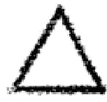

Das, was darüber steht, ist das Symbol für Tarok. Diejenigen, die eingeweiht waren in die ägyptischen Mysterien, verstanden das Zei-

---

chen zu lesen. Sie verstanden auch das Buch Thoth zu lesen, das aus achtundsiebzig Kartenblättern bestand, in welchen alle Weltgeschehnisse vom Anfang bis zum Ende, von Alpha bis Omega A O, ver-

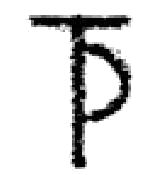

zeichnet waren und die man lesen konnte, wenn man sie in der richtigen Reihenfolge verband und zusammensetzte. Es enthielt in Bildern das Leben, das zum Tode erstirbt und wieder aufsprießt zu neuem Leben. Wer die richtigen Zahlen und die richtigen Bilder miteinander vereinen konnte, der konnte in ihm lesen. Und diese Zahlenweisheit, diese Bilderweisheit, wurde seit Urzeiten gelehrt. Sie spielte noch im Mittelalter eine große Rolle, zum Beispiel bei Raimundus Sy doch heute ist nicht mehr viel davon vorhanden.

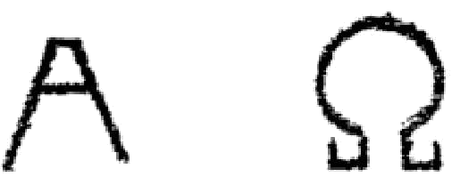

Darüber steht das Taozeichen, jenes Zeichen, das uns an die Gottesbezeichnung unserer uralten Vorfahren erinnert. Bevor Europa, Asien, Afrika Kulturland war, lebten diese alten Vorfahren in der Atlantik, die in Fluten untergegangen ist. In den germanischen Sagen lebt noch die Erinnerung an diese Atlantik in den Sagen von Niflheim, dem Nebelheim. Denn Atlantik war nicht von reiner Luft umgeben. Große, mächtige Nebelmassen umwogten das Land, ähnlich wie man sie heute sieht, wenn man im Hochgebirge durch Wolken und Nebelmassen zieht. Sonne und Mond standen nicht klar am Himmel, sie waren für die Atlantik umgeben von Regenbogenringen - von der heiligen Iris. Damals verstand der Mensch noch viel mehr die Sprache der Natur. Was heute im Plätschern der Wellen, im Rauschen des Windes, im Säuseln der Blätter, im Grollen des Donners zum Menschen spricht, aber nicht mehr von ihm verstanden wird, das war dem alten Atlantier damals verständlich. Er empfand aus allem heraus ein Göttliches, das zu ihm redete. Innerhalb all dieser spre

---

chenden Wolken und Wasser und Blätter und Winde ertönte den Atlantiern ein Laut: Tao - das bin ich. - In diesem Laut lebte das eigentliche Wesen, das durch die ganze Natur geht. Atlantis vernahm ihn. Dieses Tao drückte sich später aus in dem Buchstaben T. Auf ihm steht ein Kreis, das Zeichen der alles umfassenden göttlichen Vaternatur.

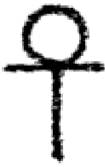

Endlich alles, was das Weltall durchsetzt und was da ist als der Mensch, ist bezeichnet in dem Symbol des Pentagramms, das uns von der Spitze des Baumes heruntergrüßt. Der tiefste Sinn des Pentagramms darf jetzt nicht besprochen werden. Es zeigt uns den Stern der sich entwickelnden Menschheit. Es ist der Stern, das Symbol des Menschen, dem alle Weisen folgen, so wie ihm in Vorzeiten die Priesterweisen folgten. Es ist der Sinn der Erde, der große Sonnenheld, der geboren wird in der Weihe-Nacht, weil das höchste Licht aus der tiefsten Finsternis herausstrahlt.

Der Mensch lebt hinein in eine Zukunft, wo das Licht in ihm geboren werden soll, wo abgelöst werden soll ein bedeutungsvolles Wort durch ein anderes, wo es nicht mehr heißen wird, daß die Finsternis das Licht nicht begreifen kann, sondern wo die Wahrheit hinaustönen wird in den Weltenraum und wo die Finsternis das Licht, das uns entgegenstrahlt in dem Stern der Menschheit, begreifen wird, wo die Finsternisse weichen und das Licht begreifen, das heißt, von ihm ergriffen werden. Und das soll uns aus der Weihnachtsfeier entgegentönen aus unserem Inneren. Dann wird das Weihnachtsfest in seiner tiefen, uralten Bedeutung erst richtig gefeiert werden von uns, denn dann weist es uns darauf hin, daß aus dem Inneren des Menschen hervorleuchten wird das geistige Licht, hinausstrahlen wird in alle Welt. Und als ein Fest des höchsten Ideals der Menschheit werden wir das Christfest feiern können. Es wird dann wieder eine Bedeutung für uns haben, es wird wieder lebendig werden in unserer Seele, und auch der Weihnachtsbaum wird dann wieder als Symbol

---

des Paradiesesbaumes eine richtigere Bedeutung haben, als sie ihm selbst in der sinnvollsten Weise heute gegeben wird. In unserer Seele wird aber die Feier der Weihe-Nacht entstehen lassen die freudevolle Zuversicht: Ja, auch ich werde in mir dasjenige erleben, was man nennen muß die Geburt des höheren Menschen, auch in mir wird stattfinden die Geburt des Heilandes, die Geburt des Ghristos.

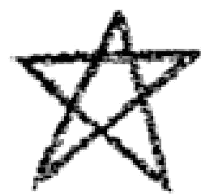

---

# DAS VATERUNSER - EINE ESOTERISCHE BETRACHTUNG, Erster Vortrag, Berlin, 28. Januar 1907

Was ich heute sagen will, bezieht sich auf die Frage: Inwiefern zeigen uns an ganz bestimmten Beispielen die Religionsbekenntnisse ihre geisteswissenschaftliche, oder sagen wir, geheimwissenschaftliche Grundlage? - Nur einen ganz kleinen, aber dafür unendlich wichtigen Abschnitt aus diesem Kapitel über die geheimwissenschaftliche Grundlage der Religionen möchte ich Ihnen heute erzählen. Sie werden sehen, daß es sich um eine allen, auch den naivsten Menschen unserer Kultur bekannte Tatsache handelt, eine geistige Tatsache, innerhalb welcher die tiefsten geheimwissenschaftlichen Wahrheiten und Gründe verborgen sind, die man nur suchen muß, um zu sehen, wie weisheits- und geheimnisvoll die Verkettungen innerhalb des Geisteslebens der Menschheit sind.

Das, wovon wir ausgehen wollen, sei die Frage nach dem christlichen Gebet. Sie alle kennen das, was man heute das christliche Gebet nennt. Es ist öfter auch schon hier besprochen worden, und mancher hat sich wohl gefragt: Wie verhält sich dieses christliche Gebet zur geisteswissenschaftlichen Weltanschauung? - Durch diese Weltanschauung haben die Mitglieder der geisteswissenschaftlichen Bewegung in den letzten Jahren etwas gehört von einer anderen Form der Erhebung des Menschen, der menschlichen Seele, zu den göttlich-geistigen Weltmächten, von der Meditation, von jener Art, in sich einen geistigen Inhalt zu erleben, irgend etwas von dem, was uns gegeben ist von den großen führenden Geistern der Menschheit oder von dem geistigen Inhalt der großen Kulturen, in die sich der Mensch versenkt, und was ihm die Mittel gibt, für eine kurze Zeit in seiner Seele mit den göttlich-geistigen Strömungen in der Welt zusammenzufließen.

Wer meditiert, und sei es in der einfachsten Art, durch irgendeine der von den geistigen Führern der Menschheit stammenden Meditationsformeln, wer meditiert und sich also im Geiste irgendeine der

---

Formeln, irgendeinen der bedeutenden Gedankeninhalte gegenwärtig sein läßt - Sie wissen, es kann nicht jeder Gedankeninhalt sein, sondern es muß ein solcher sein, der von den Meistern der Weisheit und des Zusammenklangs der Empfindungen gegeben wird -, wer meditiert und diese Formeln in seinem Herzen leben läßt, der durchlebt ein Zusammenfließen mit der höheren Geistigkeit, es durchströmt ihn eine höhere Kraft. Er lebt in ihr. Er schafft zunächst Kraft, um seine gewöhnlichen Geisteskräfte daran zu stärken, zu heben, zu beleben, und wenn er genügend Geduld und Ausdauer hat und diese Kraft vielleicht bis zur moralischen und intellektuellen Stärkung in sich hat einfließen lassen, dann kommt auch der Zeitpunkt, wo tiefere, in jeder Menschenseele schlummernde Kräfte geweckt werden können durch einen solchen Meditationsinhalt. Von der einfachsten moralischen Stärkung und Kräftigung bis zu den höchsten Gebieten des hellseherischen Vermögens gibt es alle möglichen Stufen, welche durch ein solches Meditieren erreicht werden können. Für die meisten Menschen ist die Erreichung höherer Stufen hellseherischer Fähigkeiten nur eine Frage der Zeit, der Geduld und Energie. Dieses Meditieren wird gewöhnlich als eine mehr morgenländische Art, sich zu seinem Gotte zu erheben, angesehen. Im Abendlande, namentlich innerhalb der christlichen Gemeinschaft, kennt man an seiner Stelle das Gebet, das Gebet, durch das sich der Christ zu seinem Gotte erhebt, durch das der Christ versucht, in seiner Art Eingang zu gewinnen in die höheren Welten.

Nun müssen wir uns vor allen Dingen klarmachen, daß dasjenige, was heutzutage vielfach als Gebet angesehen wird, keineswegs im urchristlichen Sinne und am wenigsten im Sinne des Stifters der christlichen Religion, des Christus Jesus selbst, als Gebet gelten würde. Im wirklichen christlichen Sinne ist es nimmermehr ein Gebet, wenn irgendein einzelner Mensch sich von seinem Gotte etwas erbetet, was seine eigenen persönlichen und egoistischen Wünsche befriedigen soll. Wenn irgend jemand die Erfüllung persönlicher Wünsche erfleht oder erbetet, so kommt er natürlich sehr bald dahin, ganz außer acht zu lassen die Universalität und das Umfassende in der Gewährung dessen, was durch das Gebet erstrebt wird. Er setzt voraus, daß die Gottheit

---

gerade seine Wünsche besonders befriedige. Ein Bauer, der diese oder jene Frucht angebaut hat, braucht vielleicht Regen, ein anderer neben ihm braucht Sonnenschein. Der eine betet um Regen, der andere um Sonnenschein. Was soll da die göttliche Weltordnung und Fürsorge tun? Gar nicht daran zu denken, was die göttliche Weltordnung und Fürsorge tun soll, wenn zwei Heere einander gegenüberstehen und ein jedes von ihnen betet, daß sie ihm den Sieg verleihen soll, und ein jedes seinen Sieg als den einzig gerechten ansieht. Da wird man gleich sehen, wie wenig ein solches den persönlichen Wünschen entspringendes Gebet an Universalität und allgemeiner Menschlichkeit in sich hat und wie selbst die Gewährung von Seiten eines Gottes nur der einen Partei der Bittenden entsprechend sein kann. Man läßt eben, wenn man in solcher Weise betet, dasjenige Gebet außer acht, durch das der Christus Jesus die Grundstimmung angegeben hat, die in jedem Gebet vorherrschend sein soll, jenes Gebet, das heißt: «Vater, laß diesen Kelch an mir vorüberziehen, doch nicht mein, sondern dein Wille geschehe.» Dies ist die christliche Grundstimmung des Gebetes. Was auch immer erfleht und erbetet wird, diese Grundstimmung muß als heller Zwischenton in der Seele des Betenden leben, wenn er christlich beten will. Dann wird dasjenige, was Gebetsformel ist, bloß ein Mittel für den Menschen, sich hinaufzuheben in höhere geistige Gebiete, um den Gott in sich fühlen zu können. Dann wird aber auch diese Gebetsformel den Ausschluß eines jeden egoistischen Wunsches und Willensimpulses bewirken im Sinne der Worte: «Nicht mein, sondern dein Wille geschehe.» Sie wird ein Aufgehen, ein Sich-Hineinversenken in diese göttliche Welt ergeben. Wird dann diese Gemütsstimmung als die wirkliche Gebetsstimmung erreicht, dann ist das christliche Gebet genau dasselbe — nur mit einer mehr gefühlsmäßigen Färbung —, was die Meditation ist. Und nichts anderes war dieses christliche Gebet ursprünglich, als was die Meditation ist. Die Meditation ist nur mehr gedankenmäßig, und es wird durch sie versucht, durch die Gedanken der großen Führer der Menschheit den Zusammenklang mit den göttlichen Strömungen, die durch die Welt gehen, zu erreichen. Im Gebet wird dasselbe in einer mehr gefühlsmäßigen Art erreicht.

---

So also sehen wir, daß sowohl im Gebet wie in der Meditation dasjenige gesucht wird, was man die Vereinigung der Seele mit den durch die Welt gehenden göttlichen Strömungen nennen kann, dasjenige, was auf der höchsten Stufe die sogenannte Unio mystica, die mystische Vereinigung mit der Gottheit, ist. Davon ist der Anfang im Gebet, davon ist der Anfang in der Meditation. Niemals könnte sich der Mensch mit seinem Gotte vereinigen, niemals mit den höheren geistigen Wesenheiten in Verbindung kommen, wenn er nicht selbst ein Ausfluß dieser göttlich-geistigen Wesenheit wäre.

Der Mensch ist, wie wir alle wissen, zweifacher Natur. Er hat zunächst jene vier Glieder der menschlichen Wesenheit, die wir schon oft hier angeführt haben: den physischen Leib, den Äther- oder Lebensleib, den Astralleib und das Ich. Innerhalb des Ich hat er dann die Anlage für die Zukunft: Manas, Buddhi, Atma oder das Geistselbst, den Lebensgeist und den Geistesmenschen.

Wenn wir die Verbindung dieser zwei Wesenheiten richtig erkennen wollen, so müssen wir uns ein wenig zurückversetzen in die Zeit der Menschheitsentstehung. Sie alle wissen aus den früheren Vorträgen, daß der Mensch, so wie er heute ist, den Zusammenklang darstellt aus den zwei Wesenheiten: den drei Anlagen für die Zukunft, Manas, Buddhi, Atma, den oberen drei Gliedern, und den unteren vier Gliedern, physischer Leib, Ätherleib, Astralleib und Ich; und daß er als ein solcher Mensch sich herausgebildet hat in einer urfernen Vergangenheit, die wir das lemurische Zeitalter der Erde nennen.

Wenn wir zurückgehen durch unsere heutige Epoche zur griechisch-lateinischen, zur ägyptisch-assyrisch-chaldäischen bis zur persischen und indischen Kultur, dann kommen wir, wenn wir immer weiter und weiter zurückgehen, allmählich zu jener großen atlantischen Flut, die in den Sintflutsagen aller Völker angedeutet ist, und wir kommen dann zu jenen Vorfahren, die in dem Lande gelebt haben, das zwischen Europa und Amerika gelegen war und das wir Atlantis nennen. Weiter zurückgehend, kommen wir noch zu Vorfahren, die in uralten Zeiten in einem Lande gelebt haben, das damals zwischen Australien und Indien lag. Erst in der Mitte dieser Epoche hat sich das, was wir die obere Dreiheit des Menschen nennen, Geistselbst, Lebensgeist

---

und Geistmensch, mit dem vereinigt, was wir die vier niederen Glieder der menschlichen Natur, physischen Leib, Ätherleib, Astralleib und Ich, nennen.

Wir werden uns die Sache in der richtigen Weise vorstellen, wenn wir sie uns so denken: Damals gab es in der lemurischen Epoche auf dieser Erde als höchstes Wesen noch nicht einen physischen Menschen in unserem Sinne, sondern es gab nur eine Art höchste tierische Hülle unseres heutigen Menschen, ein Wesen oder eine Summe von Wesenheiten, die damals aus den vier niederen Gliedern der menschlichen Natur bestand. Dasjenige, was die höhere menschliche Wesenheit ist, das, was ewig ist in der menschlichen Natur, was sich durch die drei Anlagen: Manas, Budhi, Atma in Zukunft weiter und weiter entwickeln wird, das ruhte bis dahin im Schöße der Gottheit. Wollen Sie sich jene Tatsache vorstellen, wie sie sich zu jener Zeit zutrug, wenn auch in etwas trivialer, so doch anschaulicher Weise, dann stellen Sie sich vor, daß alle die Menschen, die heute in der ganzen Menschheit leben, bis zu jenem Momente sich Leiber aufgebaut hatten, die es ihnen ermöglichten, die menschliche Seele aufzunehmen, vergleichbar dem Schwämme, der das Wasser aufzunehmen vermag.

Denken Sie sich ein Gefäß mit Wasser. In diesem Wasser können Sie nimmermehr unterscheiden, wo der eine Tropfen aufhört und der andere anfängt. Denken Sie sich nun aber eine Anzahl kleiner Schwämmchen in diese Wassermasse hineingetaucht, so wird jedes dieser Schwämmchen einen Teil der Wassermasse aufsaugen. Was vorher in dem Gefäß als einheitliche Wassermasse war, ist jetzt auf viele Schwämmchen verteilt. So war es damals mit den menschlichen Seelen, wenn wir diesen trivialen Vergleich gebrauchen dürfen. Vorher ruhten sie unselbständig in dem Schöße des göttlichen Urgeistes, ohne Individualität, wurden dann aber aufgesaugt von den Menschenleibern und dadurch individualisiert wie das Wasser durch die Schwämmchen.

Was damals von den einzelnen Leibern, den vier unteren Gliedern, aufgesaugt wurde, ging weiter bis in unsere Zeit, immer weiter sich entwickelnd, geht auch noch weiter in die Zukunft hinein und wird sich immer weiter und weiter entwickeln. Es wurde in der sogenann-

---

ten Geistes- oder Geheimwissenschaft immer die obere Dreiheit genannt, und als Schema für diesen in der Mitte der lemurischen Rasse entstandenen Menschen wurde, namentlich in der pythagoreischen Schule, das Dreieck und das Viereck gewählt, so daß sich für den zusammengesetzten Menschen nachstehendes Schema ergibt.

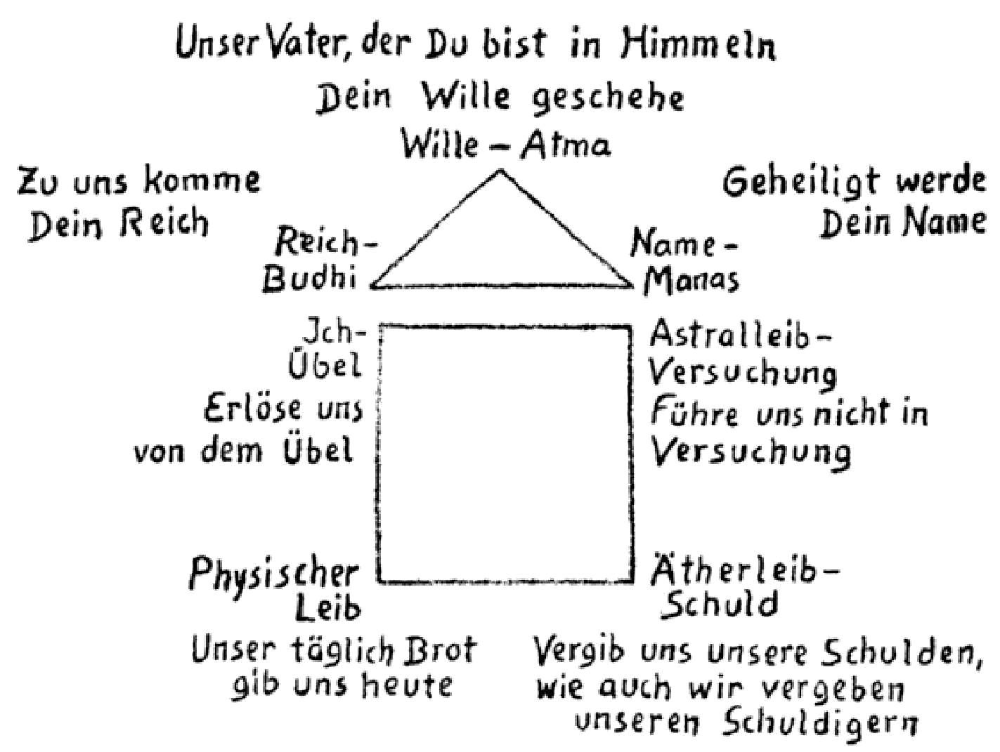

Nun kann man aber, wie Sie sich jetzt leicht vorstellen werden, dieses Obere, dieses Ewige, das durch alle Inkarnationen hindurchgeht, von zwei Gesichtspunkten aus betrachten. Man kann es einerseits als den urewigen Bestand der Menschheit betrachten, andererseits aber auch als Teil der göttlichen Wesenheit, den sie damals abgegeben hat als ein Stück oder einen Tropfen ihres eigenen Inhalts, und der nun versenkt ist in das viergliedrige menschliche Gefäß, so daß, was heute in uns Menschen ruht, ein in Selbständigkeit indi

---

vidualisierter Tropfen der Gottheit ist* So kommen Sie dazu, einzusehen, daß Sie die drei höheren Glieder der menschlichen Natur, das Ewige derselben, nicht bloß als die drei höchsten Prinzipien der Menschennatur betrachten können, sondern auch als drei Prinzipien in der Gottheit selbst. Die Sache ist also so, daß das, was die drei höchsten Glieder der Menschennatur sind, gleichzeitig die drei niederen Glieder der dem Menschen nächststehenden Gottheit darstellen. Wenn Sie die Prinzipien jener Gottheiten, die dazumal den Seelentropfen an die Menschheit abgegeben haben, aufzählen wollten, so müßten Sie, während Sie beim Menschen mit dem physischen Leibe anfangen, mit dem Äther-, dem Astralleib und dem Ich fortfahren, und von Manas bis zu Atma hinaufgehen, mit Manas anfangen, mit Budhi und Atma fortfahren und hinaufgehen zu den Prinzipien, die noch über dem Atma Hegen und von denen sich der heutige Mensch erst eine Vorstellung machen kann, wenn er ein Schüler der Ein-geweihten wird. So also sehen Sie, daß wir die drei Prinzipien des Menschen, die er in sich schließt als seinen Inhalt, auch als drei göttliche Prinzipien anschauen können.

Nun wollen wir sie heute einmal nicht als menschliche, sondern als göttliche Prinzipien erfassen und ihrer Natur nach beschreiben. Jenes höchste Prinzip, das im Menschen das Atma ist, das er am Ende seiner irdischen oder sagen wir seiner jetzigen planetarischen Laufbahn ausbilden wird, können wir im Sinne der Geistes- oder Geheimwissenschaft dadurch charakterisieren, daß wir seine Urwesenheit mit etwas vergleichen, das dem heutigen Menschen nur andeutungsweise bekannt ist: nämlich mit dem, was der Mensch als Wille in sich hat. Willensartiger Natur, eine Art Wollen ist der Grundcharakter dieses höchsten göttlichen Prinzips im Menschen. Was beim Menschen heute am schwächsten ausgebildet ist in seiner inneren Wesenheit, der Wille, das wird in der Zukunft, wenn der Mensch immer höher und höher steigen wird, sein vorzüglichstes Prinzip sein.

Heute ist der Mensch im wesentlichen ein erkennendes Wesen, und sein Wille ist eigentlich noch nach den mannigfaltigsten Seiten hin eingeschränkt. Der Mensch kann die Welt um sich herum, bis zu einem gewissen Grade, in ihrer Universalität begreifen. Denken Sie aber, wie

---

wenig er von dem, was er begreifen kann, auch zu wollen vermag, wie wenig er Macht über das hat, was er erkennen kann. Was er aber heute noch nicht hat, das wird ihm die Zukunft bringen: Sein Wille wird immer mächtiger werden, bis er sein großes Ziel erreicht haben wird, welches man in der Geisteswissenschaft das große Opfer nennt. Dieses besteht in jener Macht des Willens, wo das Wesen, das da will, imstande ist, sich ganz hinzugeben, nicht nur das Wenige hinzugeben, was der Mensch mit seinen schwachen Gefühls- und Willensmächten hinzugeben vermag, sondern das ganze Sein hinzugeben, als eine bis ins Stoffliche hineingehende Wesenheit sich ausfließen zu lassen.

Sie werden eine Vorstellung bekommen von dem, was damit gemeint ist, von dem großen Opfer, der höchsten Ausprägung des Willens in der Gottnatür, wenn Sie sich folgendes vorstellen: Denken Sie sich, Sie stünden vor einem Spiegel, und Ihr Bild schaut Sie aus diesem Spiegel an. Dieses Bild ist eine Illusion, die Ihnen vollständig gleicht. Denken Sie ferner, Sie wären dadurch gestorben, daß Sie Ihr eigenes Sein, Ihr Fühlen, Denken, Ihr Wesen hinopfern, um dieses Bild zu beleben, dieses Bild zu dem zu machen, was Sie selbst sind. Sich selbst aufzuopfern und sein Leben an das Bild abzugeben, das ist es, was die Geisteswissenschaft zu allen Zeiten die Emanation, das Ausfließen, genannt hat. Wenn Sie das tun könnten, dann würden Sie sehen, daß Sie nicht mehr da sind, weil Sie alles abgegeben haben zur Auf erweckung des Lebens und des Bewußtseins im Bilde.

Wenn der Wille auf solcher Stufe angelangt ist, daß er zu vollbringen imstande ist, was man das große Opfer nennt, dann schafft, schöpft er ein Universum, groß oder klein, und dieses Universum ist ein Spiegelbild, das seine Aufgabe durch das Wesen des Schöpfers selbst bekommt. Dadurch haben wir charakterisiert, was der schöpferische Wille in der göttlichen Wesenheit ist.

Dasjenige, was wir als zweites Prinzip zu charakterisieren haben in der Gottheit, sofern sie in die Menschheit eingeflossen ist, das ist durch diesen Vergleich auch schon gegeben: es ist das Spiegelbild selbst. Versetzen Sie sich so lebhaft in eine Gottheit, die, welterschaffend, der Mittelpunkt des Universums ist. Wenn Sie sich hier in

---

diesem Räume einen Punkt denken und statt der Wände, deren sechs da sind, umgeben von einer im Inneren spiegelnden Hohlkugel, dann werden Sie sich als Mittelpunkt nach allen Seiten gespiegelt sehen. Sie haben das Bild einer Gottheit als Willensmittelpunkt, die sich nach allen Seiten spiegelt, und dieser Spiegel ist das Bild der Gottheit selbst und das Universum zugleich. Denn, was ist ein Universum? Es ist nichts anderes als ein Spiegel des Wesens der Gottheit.

Daß aber das Universum lebt und webt, das rührt daher, weil die Gottheit emaniert, wenn sie das große Opfer bringt, wenn sie ihr Universum spiegelt, wie wir es soeben bei dem Beispiel der Belebung des Spiegelbildes betrachtet haben. Das ganze Universum ist belebt von dem universellen Willen, der sich in unendlicher Mannigfaltigkeit ausdrückt. Diesen Prozeß der unendlichen Vermannigfaltigung, der unendlichen Vervielfältigung, diese Wiederholung der Gottheit nennt man in aller Geheim- oder Geisteswissenschaft, im Gegensatz zum Willen, das «Reich». Der Wille ist also der Mittelpunkt, der Spiegel des Willens ist das Reich, so daß Sie den Willen mit Atma, dem Geistmenschen, das Reich, oder das Spiegelbild des Willens, mit der Buddhi oder dem Lebensgeist vergleichen können.

Nun ist dieses Reich ein solches, daß es in einer unendlichen Mannigfaltigkeit das Wesen des Göttlichen wiedergibt. Sehen Sie sich einmal dieses Reich in seinem Umkreis an, insofern es unser Reich ist, unsere Mannigfaltigkeit, unser Universum, sehen Sie es sich an in seinem sichtbaren Teil, in den Mineralien, Pflanzen, Tieren und Menschen. In jedem einzelnen dieser Wesen ist das Reich manifestiert, und man ahnt das heute noch in dem Ausdruck unserer Sprache, insofern als man diese großen Gebiete unseres Universums Reiche, also Mineralreich, Pflanzenreich, Tierreich nennt. Wenn man aber auch die Einzelheiten betrachtet, so sind auch alle Einzelheiten göttlicher Natur. In allen spiegelt sich die Natur gerade so, wie sich in der Hohlkugel der Mittelpunkt spiegeln würde. So auch sieht derjenige, der im Sinne der Geheimforschung die Welt ansieht, in jedem Mineral, jeder Pflanze, jedem Tier und jedem Menschen den Gott gespiegelt, einen Ausdruck und Abdruck des Göttlichen.

In unendlich abgestuften Wesenheiten und in unendlicher Mannig-

---

faltigkeit erscheint im Reiche die Gottheit, und man unterscheidet die einzelnen Wesenheiten im Sinne der Geheimwissenschaft — wenn man auf dieser hohen Stufe steht, daß man sie als Ausflüsse des Göttlichen betrachten kann - dadurch, daß ihnen ihr «Name» gegeben wird. Der Name ist dasjenige, was der Mensch dann als die einzelne Wesenheit denkt, er ist dasjenige, wodurch die einzelnen Glieder dieser großen Mannigfaltigkeit voneinander unterschieden werden. Er ist das dritte der drei höchsten menschlichen Prinzipien, die herausfließen aus dem Göttlichen, und würde dem Manas oder dem Geist selbst entsprechen. Die Geheimwissenschaft der verschiedenen Religionen hat also gelehrt, naiv gelehrt, was ausgeflossen ist aus der Gottheit und eingeflossen ist in euch und zu eurem ewigen Bilde wurde.

Wollt ihr euch in dem finden, wozu ihr euch am Ende erheben sollt, da werdet ihr finden, daß es willensartiger Natur ist.

Wollt ihr euch erheben zu dem, was der Träger dieses Willens, dieses Atma ist, zu der Bud^hi - im Göttlichen stellt es dar das Reich.

Und wollt ihr euch erheben zu dem, was ihr erkennt an Namen, Begriffen oder Ideen der Dinge - im Göttlichen stellt es sich dar als Name.

Was wir jetzt hier durchgenommen haben, ist eine uralte Lehre, die sagt, daß aus Name, Reich und Wille jenes Glied der Gottheit besteht, das als der ewige Teil in die menschliche Natur eingeflossen ist. So haben wir das, was man die höhere Dreiheit des Menschen nennt, als einen Teil des Göttlichen erkannt.

Um unsere Betrachtung zu vervollständigen, lassen Sie uns jetzt noch einen Blick auf die niederen vier Glieder des vergänglichen Menschen werfen. Von den höheren drei Gliedern wissen wir, daß sie eigentlich von dem andern Aspekte aus betrachtet werden können, indem wir sie als Glieder der Gottheit betrachten. Die vier niederen Glieder der menschlichen Wesenheit können wir in ähnlicher Weise als Glieder der vergänglichen Welt betrachten und als Glieder des Menschen.

Betrachten Sie den physischen Leib. Er ist aus denselben Stoffen und denselben Kräften zusammengesetzt wie ringsherum die scheinbar leblose Welt. Dieser physische Leib könnte nicht bestehen, wenn

---

nicht fortwährend Stoff und Kraft aus der ihn umgebenden physischen Welt in ihn einfließen würden und ihn immer und immer wieder von neuem aufbauten. Eigentlich ist der physische Körper für alles, was wir in ihm haben, eine fortwährende Durchgangsstation. Aus und ein fließen die Stoffe, die eigentlich ebenso das äußere Universum ausmachen, wie sie zeitweise in uns sind. Öfter ist es hier schon erwähnt worden, daß im Laufe von sieben Jahren der ganze stoffliche Zusammenhang des Menschenleibes sich erneuert. In keinem von Ihnen sind heute die Stoffe, die vor zehn Jahren in ihm waren. Der Mensch erneuert immer wieder den Stoff seines physischen Körpers. Das, was damals in uns war, ist heute ganz woanders, draußen in der Natur verteilt, und anderes ist in uns eingezogen. Das Leben des Körpers bedingt ein fortwährendes Ein- und Austreten des Stoffes.

Wie wir die drei höheren Glieder der Menschennatur als Teile der Gottheit betrachtet haben, so können wir die vier Teile der niederen Menschennatur als Teile der göttlichen Natur ansehen.

Den physischen Leib können wir als Teil des stofflichen Teiles unseres Planeten betrachten; seine Substanz ist von unserem stofflichen Planeten genommen und geht wieder zu diesem zurück. Wenn wir den Ätherleib betrachten, so müssen wir ihn ebenfalls als ein Glied dessen ansehen, was uns hier umgibt, und ebenso den Astralleib.

Betrachten wir den Lebensleib oder den Ätherleib und den Astralleib einmal im Zusammenhang. Sie wissen, daß der Astralleib der Träger von allem ist, was an Trieben, Begierden und Leidenschaften im Menschen lebt, der Träger von allem, was als Freude und Leid, Lust und Schmerz in der Menschenseele auf und ab wogt, daß der Lebens- oder Ätherleib aber die mehr bleibenden, die länger andauernden seelischen Eigenschaften bewahrt, darstellt und der Träger von ihnen ist.

Ich habe schon öfter vor Ihnen die Entwicklung des Lebens- oder Ätherleibes und des Astralleibes mit dem Stunden- und dem Minutenzeiger einer Uhr verglichen. Ich habe darauf aufmerksam gemacht, daß, wenn ihr euch erinnert an das, was ihr gewußt und erlebt habt als achtjähriges Kind, und an das, was ihr jetzt wisset und erlebt habt, ein großer Unterschied wahrzunehmen sein wird. Unendlich viel

---

habt ihr gelernt, viele Vorstellungen aufgenommen; von dem, was ihr damals tatet, ist vieles in den Erlebnissen von Freude und Leid an eurer Seele vorübergezogen; nicht nur an ihr vorübergezogen, sondern durch sie hindurchgegangen. Aber vergleicht ihr jetzt das damit, was euer Temperament, euer Charakter, eure bleibenden Neigungen sind, dann werdet ihr darauf kommen, daß, wenn ihr mit acht Jahren ein jähzorniges Kind wart, ihr es wahrscheinlich im jetzigen Lebensalter noch sein werdet. Die meisten Menschen behalten so ihr ganzes Leben lang das, was als Grundlage ihres Wesens in ihnen liegt. Es ist hier schon öfter betont worden, daß die Geheimschulung nicht in theoretischem Lernen besteht, sondern darin, daß man auf die sonst so stationären Gebilde des Ätherleibes die Evolution richtet. Mehr hat der Schüler getan, wenn er eine von diesen Eigenschaften seines Temperaments, seiner Grundneigung umgeändert und dadurch den Stundenzeiger der Uhr etwas schneller vorwärtsgerückt hat, als es sonst geschehen wäre. Alles dasjenige, was sich so langsam entwickelt – die bleibenden Neigungen, die bleibenden Temperaments-eigenschaften, die bleibenden Gewohnheiten –, ist im Äther- oder Lebensleib verankert. Alles das, was sich vergleichsweise so rasch ändert wie der Minutenzeiger der Uhr, ist im Astralleib verankert.

Wenn ihr das jetzt auf des Menschen Umgebung, auf unser Leben in der Außenwelt anwendet, dann werdet ihr sehen, daß ihr durch dasjenige, was eure Gewohnheiten, Temperamente, bleibenden Neigungen sind, mit eurem Zeitalter, eurem Volke, eurer Familie zusammenhängt. Gerade diejenigen Eigenschaften, welche der Mensch als bleibende, stationäre in sich hat, wird man nicht nur in ihm, sondern in allen finden, mit denen er in irgendeiner Weise zusammengehört, also in seiner Familie, seinem Volke und so weiter. Die einzelnen Angehörigen eines Volkes sind daran zu erkennen, daß sie gemeinsame Gewohnheiten und Temperamente haben. Dieser Grundstock von Neigungen und Gewohnheiten des Menschen, der geändert werden muß, wenn er eine höhere spirituelle Entwicklung durchmachen soll, ist dasjenige, was sein höheres Wesen ausmacht. Man sagt daher von einem solchen Menschen, daß er ein heimatloser Mensch sei, weil er

---

den Ätherleib, durch den er sonst mit dem Volke verbunden ist, ändern muß.

Wenn wir uns also das Zusammenleben mit den Gemeinschaften betrachten, in die wir hineingeboren sind, dann finden wir die Eigenschaften, durch die wir einer Familie, einem Volke angehören, durch die wir etwas Verwandtes mit den Angehörigen dieses Volkes fühlen, auch den Eigenschaften ähnlich, die in unserem Zeitalter leben. Denken Sie sich, wie wenig Sie sich würden verstehen können, wenn heute ein Angehöriger des alten griechischen Volkes vor Sie hintreten würde. Sein Ätherleib ist schon zu sehr verschieden von dem Ätherleibe des gegenwärtigen Menschen. Durch die gemeinschaftlichen Eigenschaften im Ätherleibe verstehen sich die Menschen. Dasjenige aber, wodurch sich die Menschen herausheben aus dem, was sie gemeinschaftlich haben, dasjenige, wodurch sie in der Familie, im Volke ein Besonderes sind, doch wieder ein Einzelwesen für sich, und nicht bloß Franzose, nicht bloß Deutscher, nicht bloß Familienangehöriger, sondern ein besonderes Glied des Volkes, der Familie und so weiter, das herauswachsen kann aus der Summe der Merkmale seines Geschlechts, das ist im Astralleib verankert, davon ist der Astralleib der Träger. Der Astralleib enthält also mehr das Individuelle, das Persönliche.

Der Mensch kann also, wenn er durch seinen Äther- oder Lebensleib Fehler begeht, mehr ein Sünder werden im Kreise seiner Mitmenschen, mehr die sozialen Pflichten versäumen, die von Mensch zu Mensch spielen und das menschliche Gesellschaftsleben möglich machen. Diejenigen Sünden aber, die mehr individueller Natur sind, durch die der Mensch nur als besondere Persönlichkeit fehlt, das sind Verfehlungen, die durch die Eigenschaften des Astralleibes herbeigeführt werden.

In aller Geheimwissenschaft hat man von jeher dasjenige, was Fehler gegen die Gemeinschaft ist, was aus dem fehlerhaften Ätherleibe fließt, als «Schuld» bezeichnet. Das gewöhnliche, triviale Wort «Schulden» hat einen ganz ähnlichen Ursprung wie das moralische Wort «Schuld», das das bezeichnet, was man dem andern moralisch schuldig geworden ist. Die Schuld ist also etwas, was auf fehlerhafte

---

Eigenschaften des Ätherleibes zurückzuführen ist. Das aber, was als fehlerhafte Eigenschaft dem Astralleib anhaftet, das nennt man «Versuchung». Versuchung ist dasjenige, wodurch der einzelne eine persönliche Sünde auf sich nimmt. Nun bleibt noch die Verfehlung des Ich, der eigentlichen Persönlichkeit. Diese Verfehlung des Ich, dasjenige, wodurch das Ich im besonderen fallen kann, ist angedeutet, in der Paradiesesmythe: dazumal, als des Menschen Seele heruntergestiegen ist vom Schöße der Gottheit und zum ersten Male in den irdischen Leib eingezogen ist, also aufgenommen worden ist von dem irdischen Leib wie der Tropfen Wasser von dem Schwämmchen, ist seine höhere Seele zur Ichheit geworden.

Diese höhere Seele, diese Ichheit kann innerhalb des Ich-Fehler begehen. Der Mensch kann nicht nur durch fehlerhafte Eigenschaften des Äther- und Astralleibes fallen, sondern es gibt eine Grundmöglichkeit, zu sündigen, die herbeigeführt wird dadurch, daß der Mensch überhaupt zur Selbständigkeit gekommen ist. Der Mensch mußte ja, um allmählich in bewußter Weise zur Freiheit und Selbständigkeit aufzusteigen, durch Selbstsucht und Egoismus durchgehen. Er ist herabgestiegen als Seele, die ein Glied der Gottheit war, die nicht in Egoismus verfallen kann. Niemals bildet sich ein Glied in einem Organismus ein, eine Selbständigkeit zu sein. Würde sich zum Beispiel ein Finger dies einbilden, er würde sich abreißen und verdorren. Diese Selbständigkeit, zu der der Mensch sich entwickeln muß und die erst ihre volle Bedeutung dann haben wird, wenn die Grundeigenschaft der Selbständigkeit die Selbstlosigkeit ist, würde niemals haben entstehen können, wenn sie nicht ausgegangen wäre von der Selbstsucht.

Die Selbstsucht zog ein in den menschlichen Leib, und dadurch wurde der Mensch ein selbstsüchtiges, egoistisches Wesen. So sehen wir, wie das Ich allen Trieben und Neigungen des Leibes folgt. Der Mensch frißt seinen Nebenmenschen auf, er folgt allen möglichen Trieben und Begierden, er ist ganz verstrickt in das irdische Gefäß wie der Tropfen Wasser in das Schwämmchen.

Dasjenige, was der Mensch dadurch, daß er ein solches Ich-Wesen, ein eigentlich selbständiges Wesen geworden ist, sündigen konnte,

---

wird angedeutet in der Paradiesesmythe. Während er früher aus dem Allgemeinen geschöpft hat, wie der Tropfen, der noch im Wasser ist, der seine Kraft aus der gemeinschaftlichen Wassermasse herausschöpft, so hat er jetzt alle Antriebe in sich selber. Dies bezeichnet man durch das Hineinbeißen in den Apfel in der Paradiesesmythe; und nicht umsonst - denn alle wirklichen Wortbedeutungen, sofern sie der Geheimwissenschaft angehören, haben einen tiefen inneren Zusammenhang -, nicht umsonst heißt im Lateinischen Malum «das Übel» und «der Apfel». Das Wort «Übel» wird in der Geheimwissenschaft niemals für etwas anderes angewendet als für eine Verfehlung aus dem Ich heraus.

Übel ist also Verfehlung aus dem Ich heraus, Schuld ist die Verfehlung, die der Ätherleib im sozialen Leben begeht im Zusammenleben mit den Menschen. Versuchung ist dasjenige, was den Astralleib treffen kann, insofern er individuell, persönlich fehlerhaft ist. Die Verfehlung des Äther- oder Lebensleibes ist also Schuld; die Verfehlung des Astralleibes ist also Versuchung; die Verfehlung des Ich ist also Übel.

Wenn wir das Verhältnis der vier niederen Glieder der menschlichen Natur zur Umwelt, zum planetarischen Umleib betrachten, so sehen wir, daß der physische Leib fortwährend physischen Stoff als Nahrungsstoff aufnimmt und dadurch seine Existenz aufrechterhält. Wir sehen, daß das Leben des Lebens- oder Ätherleibes in der Endlichkeit dadurch zustande kommt, daß der Mensch mit seinen Mitmenschen, in deren Gemeinschaft er hineingewachsen ist, diese Gemeinschaft aufrechterhält. Wir sehen, daß der Astralleib sich dadurch aufrechterhält, daß er der Versuchung nicht unterliegt. Und wir sehen endlich, daß das Ich sich dadurch aufrechterhält und seine Entwicklung durchmacht in der richtigen Weise, wenn es dem nicht unterliegt, was man das Übel nennt.

Jetzt denken Sie sich einmal diese ganze Menschennatur, die niedere Vierheit und die höhere Dreiheit, vor Ihre Seele gerückt, so daß Sie sich sagen können: In dem einzelnen Menschen lebt ein göttlicher Tropfen, und der Mensch ist in seiner Entwicklung zu dem Göttlichen hin, zur Ausprägung seiner tiefsten innersten Natur. - Hat er einmal diese tiefste innerste Natur ausgeprägt, dann hat er durch

---

allmähliche Entwickelung sein eigenes Wesen in dasjenige verwandelt, was im Christentum der «Vater» genannt wird. Was verborgen in der menschlichen Seele ruht, was als das große Ziel der Menschheit vorschwebt, das ist der «Vater im Himmel». Will der Mensch sich zu dem hin entwickeln, dann muß er die Kraft haben, seine höhere Dreiheit und seine niedere Vierheit zu dem Punkte zu entwickeln, daß sie in richtiger Weise den physischen Leib erhalten: Der Äther- oder Lebensleib muß mit den Menschen so leben, daß ein Ausgleich stattfindet mit dem, was als Schuld in ihm lebt, der Astralleib darf nicht in der Versuchung untergehen und der Ich-Leib nicht im Übel. Hinaufstreben muß der Mensch durch die drei höheren Glieder zu dem Vater im Himmel, durch den Namen, durch das Reich und durch den Willen. Der Name muß als ein solcher empfunden werden, daß er geheiligt werde. - Siehe die Dinge um dich herum an, sie sind in ihrer Mannigfaltigkeit ein Ausdruck der Gottheit! Sagst du ihren Namen, so faßt du sie als Glieder in der göttlichen Weltordnung. Was du auch in deiner Umgebung haben magst, gelte als heilig; und in dem Namen, den du ihm gibst, sieh etwas, das es zu einem Glied der göttlichen Wesenheit macht. Heilig halte es, wachse hinein in das Reich, das ein Ausfluß der Gottheit ist, und entwickle dich hinauf zu jenem Willen, der ein Atma, aber zu gleicher Zeit ein Glied der Gottheit sein wird.

Nun denken Sie sich einen Menschen, der in der Meditation sich ganz versenkt in diesen Sinn der Entwicklung, und diesen Sinn, diese sieben Glieder der Entwicklung in sieben Bitten in einem Gebet zusammenfassen soll. Wie wird er da sagen?

Um auszudrücken, was durch dieses Gebet erreicht werden soll, wird er, bevor er die sieben Bitten ausspricht, sagen: «Vater unser, der du bist in dem Himmel.» Damit wird auf den tiefsten Seelengrund der menschlichen Natur hingedeutet, auf das innerste Wesen des Menschen, das dem geistigen Reiche gemäß der christlichen Esoterik angehört. Die drei ersten Bitten beziehen sich auf die drei höheren Glieder der Menschennatur, auf den göttlichen Inhalt des Menschen: «Dein Name werde geheiligt. Dein Reich komme zu uns. Dein Wille geschehe -.»

---

Nun gehen wir über von dem geistigen Reiche zu dem irdischen Reich: «Dein Wille geschehe wie im Himmel also auch auf Erden.» Die vier letzten Bitten beziehen sich auf die vier niederen Glieder der Menschennatur.

Was werden wir von dem physischen Leibe sagen, damit er unterhalten wird im planetarischen Leben? «Gib uns heute unser täglich Brot.»

Was werden wir sagen von dem Äther- oder Lebensleib? «Vergib uns unsere Schulden, wie auch wir vergeben unseren Schuldigern.» Der Ausgleich dessen, was durch die Verfehlungen des Äther- oder Lebensleibes geschieht.

Was werden wir sagen in bezug auf den Astralleib? «Führe uns nicht in Versuchung.»

Und was werden wir sagen in bezug auf das Ich? «Erlöse uns von dem Übel.»

So sehen Sie in den sieben Bitten des Vaterunsers nichts anderes als den Ausdruck dafür, daß die menschliche Seele, wenn sie sich in der richtigen Weise dazu erhebt, von dem göttlichen Willen die einzelnen Teile des Menschen in eine solche Entwicklung zu bringen erflieht, daß der Mensch seinen richtigen Lebensweg durch das Universum findet, daß er alle Teile seiner Natur in der richtigen Weise entwickelt. Das Vaterunser ist also ein Gebet, durch das sich der Mensch in den Momenten, wo er es braucht, erheben soll zu dem Sinn der Entwicklung seiner siebengliedrigen Menschennatur, und die sieben Bitten sind dann, wenn sie auch im naivsten Menschen auftreten, der sie gar nicht verstehen kann, Ausdruck der geisteswissenschaftlichen Anschauung der Menschennatur.

Alles, was an Meditationsformeln jemals in großen Religionsgesellschaften existiert hat, ist aus der Geheimwissenschaft entsprungen. Sie können alle wirklichen Gebete hernehmen und Wort für Wort zergliedern, niemals werden Sie finden, daß es nur beliebig aneinandergereihte Worte sind. Nicht daß man einem dunklen Triebe gefolgt ist und schöne Worte aneinandergereiht hat, nein, die großen Weisen haben aus den Weisheitslehren, die man heute Geisteswissenschaft nennt, die Gebetsformeln gewonnen. Keine wirkliche Gebetsformel

---

gibt es, die nicht aus dem großen Wissen herausgeboren ist, und der große Eingeweihte, der Stifter des Christentums, Christus Jesus, hat in dem Augenblicke, wo er das Gebet gelehrt hat, die sieben Glieder der menschlichen Natur im Auge gehabt, hat in seinem Gebete dieser siebengliedrigen Natur des Menschen Ausdruck gegeben.

So sind die Gebete alle geordnet. Wären sie nicht so geordnet, so hätten sie keine Kraft, durch Jahrtausende hindurch zu wirken. Nur das nach dieser Richtung Geordnete hat auch im naiven Menschen die Kraft, zu wirken in dem Menschen, der gar nicht einmal den Sinn der Worte versteht.

Ein Vergleich dessen, was in der Seele des Menschen lebt, mit dem, was in der Natur sich abspielt, wird dies klarer machen. Betrachtet eine Pflanze: sie entzückt euch und ihr braucht nichts zu wissen von den großen, universellen Gesetzen, die sie hervorgebracht haben. Die Pflanze ist da, und ihr könnt euch an ihr erheben. Sie könnte nicht geschaffen sein, wenn nicht die urewigen Gesetze in sie ausgeflossen wären. Das naive Gemüt braucht diese Gesetze nicht zu verstehen. Soll aber die Pflanze geschaffen sein, so muß sie aus den Gesetzen hervorgehen. Soll das Gebet ein wirksames Gebet sein, dann darf es nicht beliebig erfunden, sondern muß aus den urewigen Gesetzen der Weisheit hervorgegangen sein, wie die Pflanze aus den urewigen Gesetzen der Weisheit hervorgegangen ist. Kein Gebet hat wirkliche Bedeutung für Verständige und Unverständige, wenn es nicht aus der UrWeisheit hervorgegangen ist.

Heute ist das Zeitalter für die Menschen, die so lange die Pflanze betrachtet und sich an ihr erbaut haben, wo sie hingeführt werden können zu dem weisheitsvollen Inhalt der Gesetze. Durch zwei Jahrtausende hindurch haben die Christen so gebetet, wie der naive Mensch eine Pflanze anschaut. In Zukunft wird er die Kraft des Gebetes erkennen aus der tiefen Urweisheit heraus, aus welcher das Gebet geflossen ist. Alle Gebete, insbesondere das Zentral-, das Mittelpunktsgebet des christlichen Lebens, das Vaterunser, sind ein Ausdruck dieser Urweisheit. Und wie sich das Licht in sieben Farben, der Grundton in sieben Tönen in der Welt zum Ausdruck bringen, so bringt sich das siebenartig sich zu seinem Gotte erhebende Menschenleben in den

---

sieben verschiedenen Erhebungsgefühlen, die sich auf die siebengliedrige Natur des Menschen beziehen, in den sieben Bitten des Vaterunser zum Ausdruck.

So ist das Vaterunser, vor der Seele des Anthroposophen stehend, der Ausdruck des siebengliedrigen Menschen.

---

# DAS VATERUNSER, Zweiter Vortrag, Berlin, 18. Februar 1907

Wir haben durch das, was ich das letzte Mal hier vor Ihnen sprechen konnte, gesehen, wie in einem altbekannten Gebiet eigentlich die ganze geisteswissenschaftliche Anschauung von dem Wesen des Menschen zum Ausdruck kommt. Wir haben uns dabei überzeugen können, wie die religiösen Strömungen, die religiösen Lehren und Verrichtungen aus dem herausgeschöpft sind, was wir im Laufe der Zeiten durch die Geisteswissenschaft selbst kennengelernt haben. Dabei haben wir uns den Vorgang so vorzustellen, daß die Menschheit ursprünglich von einer universellen, allumfassenden Grundanschauung ausgegangen ist, die in den Religionsbekenntnissen der verschiedenen Völker je nach der Verschiedenheit der nationalen Charaktere zum Ausdruck kommt. Nun können Sie natürlich die Frage stellen: Wie hat man sich genauer vorzustellen, daß die Grundwahrheiten, die Grundweisheiten der Menschheit mit dem zusammenhängen, was in den verschiedenen einzelnen Religionsbekenntnissen durch die Religionsstifter diesem oder jenem Volke verkündigt worden ist? - Es ist gewiß eine an sich auffällige Tatsache, daß uns in den sieben Bitten des Vateruners wirklich die geisteswissenschaftlichen Grundbegriffe entgegentreten, und einem Außenstehenden, der sich wenig mit dem befaßt hat, was man durch die Geisteswissenschaft heute kennenlernen kann, muß ja vieles phantastisch erscheinen, und er kann dann leicht sagen: Das alles ist nur hineingetragen in das, was ihr aus den religiösen Urkunden erhalten habt.

Um sich ein wenig tiefer auf die Frage einzulassen, wie die großen Grundweisheiten ursprünglich in die Religionsbekenntnisse hineinkamen, muß man zunächst von einer Grundfrage ausgehen. Man muß sich klarmachen, daß das, was wir heute wissen können, was uns heute durch die geisteswissenschaftliche Anschauung gelehrt wird, nicht in derselben Weise schon in den urältesten Zeiten in den Religionsanschauungen vorgetragen worden ist. Man muß sich klar darüber sein, daß die Form, wie solche Wahrheiten an die Menschen heran-

---

getragen wurden, je nach den Zeiten ganz verschieden war. Die alten religiösen Urkunden, die Sie aufschlagen, sprechen zu den Menschen in Bildern und nicht in Begriffen. Diese Bilder, die sich vielfach an die sinnliche Vorstellung anlehnen, sind von den religiösen Urkunden nach Möglichkeit beibehalten worden. So wird zum Beispiel die Erkenntnis immer als ein Licht, die Weisheit als eine Art flüssiges Element, als Wasser angesprochen. Immer wieder können Sie, wenn Sie genau zusehen, in den ältesten Zeiten dieselben Bilder finden. Das hat einen ganz bestimmten Grund, und wir werden heute einiges von dem, was wir schon kennen, zusammenfassen, um uns so recht hineinzuversenken, wie die allerersten Lehrer der Menschheit auf die Völker gewirkt haben, denen sie die Wohltat religiöser Lehren gebracht haben. Wenn wir uns klarmachen wollen, wie die Religionsstifter vor denen, die wir als die großen Eingeweihten bezeichnen, also vor einem Hermes, Zarathustra, Buddha, Moses, vor endlich dem größten, dem Christus Jesus, gewirkt haben, müssen wir uns noch einmal in den Unterschied versenken, der zwischen dem gewöhnlichen und dem astralen oder imaginativen Bewußtsein des Menschen besteht.

Heute hat der gewöhnliche Mensch vom Morgen bis zum Abend das, was wir das gegenständliche Bewußtsein genannt haben, das ihm die Dinge so zeigt, daß sie ihm als außer ihm selbst stehend erscheinen, mit den Eigenschaften, die seine Sinne ihm zeigen. Dieses Bewußtsein ist nicht das einzige. Allerdings sind für die meisten der heutigen Menschen die andern Bewußtseinszustände verborgen, hinuntergetaucht in ein unbestimmtes Dunkel, das wir den traumlosen Schlaf nennen, der aber für den Eingeweihten eine ganz bestimmte Bedeutung hat. Für den Eingeweihten, der auch die Welt hinter dieser physischen Erscheinung kennt, gibt es auch vom Einschlafen bis zum Aufwachen einen bewußten Zustand, in dem er allerdings nicht dieselben Dinge, die hier sind, so wahrnimmt, wie sie hier sind, aber er nimmt eine Welt an sich wahr. Wie für den gewöhnlichen Menschen der traumlose Schlaf ein unbewußter Zustand ist, so ist es für den Eingeweihten ein bewußter, in dem er die geistige Welt schaut.

Wenn wir uns klarmachen wollen, wie dieser unbewußte Zustand

---

ein bewußter wird, so müssen wir jenen Zwischenzustand betrachten, den der Mensch ja außerdem kennt, den traumerfüllten Schlaf, der uns die gewöhnlichen, alltäglichen Wahrnehmungen oder die inneren Zustände der Seele in Sinnbildern zeigt. Diese Bildlichkeit, die der Traum zeigt, können Sie aber auch finden, wenn Sie das Bewußtsein des Eingeweihten studieren, wenn er in der geistigen Welt weilt. Er sieht die Dinge in der geistigen Welt in Bildern. Allerdings sind dies nicht so chaotische Bilder, wie sie der Traum Ihnen zeigt. Sie haben mit den Bildern des Traumes nur das Gemein, daß sie sich fortwährend verwandeln. Der Tisch und der Stuhl zeigen immer diese Gestalt, so wie sie einmal da sind. Die Pflanzen und Menschen, sofern sie äußere Gegenstände sind, zeigen die Gestalt, die sie einmal haben. Aber je mehr wir ins Reich des Bewußten hinüberkommen, finden wir Verwandlungen. Die Pflanze, die aus dem Keim aufsprießt und Stamm, Blätter, Blüte und Frucht entfaltet, das Tier, das seine Willkür ausdrückt, die menschliche Wesenheit – im Verändern der Gesten und der Physiognomie sehen wir sie in Bewegung. Das alles aber ist etwas Bleibendes gegenüber dem, was ein Mensch in einem höheren Zustande in der Welt des Devachan erlebt. Da sehen wir eine fortwährende Verwandlung. Wer durch die betreffenden Übungen seinen Eintritt in die geistige Welt findet, lernt dort, wie sich die Farbe einer Pflanze wie eine Flamme heraushebt aus der Pflanze. Er lernt erkennen, wie die Farben im freien Raum auf- und absteigende Gebilde sind. Eine richtige Anschauung hat er aber erst, wenn er imstande ist, Farben und Töne für sich zu sehen und sie zu bestimmten Wesenheiten hinzuleiten. Fortwährend sind derartige Wesenheiten um uns. Wenn Sie das Violett dieser Blume herausholen könnten, daß sich das Violett frei hinbewegt im Raum, so haben Sie darin den Ausdruck für das Leben einer geistigen Innenwelt der Pflanze. So wirkt auch die menschliche Aura, und das, was wir Astralkörper nennen. Alle menschlichen Neigungen, Gefühle der Eitelkeit und des Egoismus, drücken sich darin durch ganz bestimmte Farbenströmungen aus, so daß wir sagen können: Inneres seelisches Erleben drückt sich in der menschlichen Aura aus. Die Aura ist niemals still, nichts ist da stationär, wie es hier in der Sinnenwelt Stationäres gibt. Und wenn

---

ein Wesen in der geistigen Welt einen Gefühls- oder Willensimpuls hat, können Sie immer sehen, wie das in ganz bestimmten Veränderungen der Farben und Töne zum Ausdruck kommt. Die ewige Bewegung ist das Wesentliche der höheren Welten.

Natürlich ist das verwirrend für den, der die höheren Welten zum ersten Mal betritt. Das bewirkt aber auch wieder, daß sich in diesen höheren Welten alles, was da vorhanden ist, augenblickgemäß offenbart. Kann der Mensch sein Seelenleben für den, der ihn nur mit physischen Augen betrachten kann, verbergen, so kann er demjenigen, der mit geistigen Augen schauen kann, nichts verbergen. Da liegt alles klar am Tag, so daß Sie sich sagen müssen: Wollen wir einen Menschen, so wie er vor uns steht, mit sinnlichen Augen erforschen, so müssen wir aus dem Äußeren, wie er lächelt oder weint, auf seine Seele schließen. Anders ist es in der höheren Welt. Ein Schluß von dem Äußeren auf das Innere findet dort nicht statt. Das Innere liegt ganz offen da. Wir leben mit dem Wesen der Dinge dort zusammen. Dieses Bewußtsein kann sich in unserer Zeit nur der Eingeweihte aneignen. Nur er kann bewußt in der höheren Welt leben. Er kann dem Bewußtseinszustand vom Aufwachen bis zum Einschlafen einen anderen Zustand hinzufügen, durch den er imstande ist, das Innere zu dem Äußeren hinzuzufügen. So wie er bewußt das Innere der Dinge erleben kann, so konnten dies in gewisser Beziehung in uralter Zeit alle Menschen. Vor ihrem heutigen Bewußtseinszustand hatten die Menschen denjenigen, durch den sie die Dinge von innen sahen.

Wenn wir in urferne Zeiten zurückgehen, kommen wir zu Menschen, die immer weniger von dem haben, was der Mensch heute hat. Der heutige Mensch kann zählen und rechnen. In der Mitte der Atlantis würden Sie Menschen finden, die noch nicht zählen und rechnen konnten, bei denen man von Logik noch nicht reden konnte. In dieser Beziehung kann heute das geringste Schulkind mehr, als irgendein Atlantier gekonnt hat. Aber dafür konnte der Atlantier etwas anderes. Wenn er irgendein Wesen der Natur betrachtete, eine Pflanze zum Beispiel, konnte er ein ganz bestimmtes Gefühl in sich aufsteigen sehen. Für ihn hatte jede Pflanze einen bestimmten Gefühlswert. Während der heutige Mensch in einer gewissen gleichgültigen Weise

---

an den Pflanzen vorbeigeht, stiegen in dem Atlantier lebhafte Empfindungen und Gefühle auf. Ja, wenn wir weit genug zurückgehen, bis in die Zeiten der ersten Atlantier, würden wir finden, daß sie auch noch nicht so lebhafte Farbenvorstellungen hatten wie der heutige Mensch. Wenn ein solcher Atlantier auf ein Veilchen zugegangen wäre, hätte er es nicht so gesehen, wie es hier steht, sondern so, wie wenn hier eine Art Nebelgebilde aufstiege. Ebenso würde er bei einer Rose nicht die rote Farbe auf der Rose selbst gesehen haben, sondern eine rote Aura um die Rose herum, die rote Farbe frei schwebend. Wenn Sie sich jetzt irgendeinen Kristall ansehen, dann sehen Sie ihn, wenn es ein Rubin ist, rot gefärbt. Die ersten Atlantier aber würden bei einem solchen Kristall nicht die Farbe im Kristall gesehen haben. Er wäre ihnen erschienen wie umgeben von einem Strahlenkranz von Farben, und der Rubin würde ihnen gleichsam nur wie eine Art von Einschnitt in diesen Farbenkranz erschienen sein. Wenn Si&amp; sich diesen Zeiten nähern, kommen Sie in eine urferne Vergangenheit, wo der Mensch überhaupt nicht mehr die Umrisse eines anderen Menschen gesehen haben würde, nicht mehr die Umrisse einer Pflanze oder eines Tieres. Wenn er sich einem anderen Menschen näherte, der ihm feindlich gesinnt war, so nahm er vielmehr eine bräunlich-rötliche Farbe wahr. Nahm er eine schöne bläuliche Farbe wahr, so konnte er sich sagen: Dieser Mensch ist mir friedlich gesinnt. - So drückte sich ihm das Innenleben eines Menschen in solchen Farben aus.

Gehen wir noch weiter zurück, dann kommen wir in jene urferne Vergangenheit des alten Lemurien, das zwischen Asien, Australien und Afrika lag. Da war nicht nur das Bewußtsein im Erkennen ein völlig anderes, sondern da war sogar alles, was man Willensimpuls nennen kann, anders. Der Wille wirkte noch magisch, er hatte eine Kraft über die übrigen Gegenstände; er zeigte sich wie eine Naturkraft, die auf die anderen Gegenstände wirkt. Wenn der Lemurier seine Hand über eine Pflanze hielt und seinen Willen hineinversenkte, konnte er durch seinen bloßen Willen diese Pflanze rasch wachsen machen.

Die Kräfte draußen in der Natur sind keine anderen als die im Menschen befindlichen. Dadurch daß der Mensch ein abgeschlossenes

---

Wesen geworden ist, eingeschlossen in eine Haut, sind seine Kräfte immer mehr den Kräften der Natur entfernter, immer unähnlicher geworden. Am unähnlichsten den Kräften der Natur ist das menschliche Denken. Das Kombinieren und Rechnen ist dem, was als solches in der Natur draußen vorhanden ist, am allerfremdesten. Dennoch, wenn Sie weit genug zurückgehen könnten, würden Sie sehen, daß es damals Wesen gegeben hat, die geistigen Vorfahren der Menschheit, welche es für einen – vergleichsweise – großen Unsinn angesehen hätten, zu sagen: Ich fasse einen Begriff von irgendeinem Außen- ding. – Das hätten sie gar nicht sagen können, sondern sie hätten den Begriff gleichsam gesehen, und zwar als Tätigkeit, sogar als Wesenheit gesehen. Wer sich heute von irgendeinem Ding einen Begriff bildet, hat sich vorzustellen, daß dieses Ding ursprünglich von demselben Begriff gebildet worden ist. Sie bekommen eine Vorstellung davon, wenn Sie sich an den Vorgang irgendeines menschlichen Hervorbringens erinnern. Sie können sich einen Begriff von einer fertigen Uhr, dem Mechanismus des Werkes, dem Vorwärtsgang der Zeiger bilden. Sie könnten das niemals, wenn nicht einmal einer vor Ihnen als Uhrmacher dagewesen wäre und vorgedacht hätte, was Sie jetzt nachdenken. Was er hineingelegt hat, denken Sie nach.

Alle Begriffe, die sich der Mensch heute bilden kann, alles, was das Denken heute tut, hat in unserer Vergangenheit als Wirklichkeit existiert, die erst in die Dinge hineingelegt wurde. Ein jedes Wesen wird begriffen durch seinen Begriff. Einmal wurde ein jedes Wesen nach diesem Begriff geformt. Es war in der Welt nicht anders, als es heute in der menschlichen Kunst ist: Die Begriffe, die sich der Mensch heute macht, sind ursprünglich in die Dinge hineingelegt. Würden Sie noch weiter zurückgehen, würden Sie sehen, wie diese Menschen niemals hätten sagen können: Ich bilde mir einen Begriff, indem ich die Dinge anschaue –, sondern sie haben wirklich gesehen, was da geschehen ist, wie da der Begriff hineingelegt worden ist. Sie haben gleichsam den Werkmeistern der Dinge zugeschaut.

Da bekommen Sie den Unterschied zwischen dem heutigen Verstande des Menschen und jenem Intellekt der damaligen Zeit, den wir den schöpferischen zu nennen haben. Wenn Sie aber diese Wesen

---

kennenlernen würden, die noch aus eigener Anschauung von dem schöpferischen Verstande gewußt haben, im Gegensatz zu dem heutigen bloß aufnehmenden Verstande, würden Sie finden, daß diese Wesen ganz anders waren. Sie waren noch nicht in einem Menschenleibe verkörpert. Was heute in den menschlichen Hüllen wohnt, war damals noch in dem Schoß der göttlich-geistigen Wesenheiten beschlossen.

Wir sind unmerklich über den Zeitpunkt der Erdenentwickelung hinweggeschritten, der sich uns vergleichsweise so darstellen würde: Unten auf der Erde gab es schon ein physisches Leben, es waren dort unten Wesenheiten, ganz andere, aber ähnlich den heutigen Mineralien, Pflanzen und Tieren, und dann Wesenheiten, die nicht Menschen waren, die aber zwischen den Tieren und Menschen standen und reif waren, die menschliche Seele zu empfangen. Sie waren so weit organisiert, daß sie die menschliche Seele aufnehmen konnten. Nur vergleichsweise kann man sagen, wie man sich das zu denken hat: Unten auf der Erde wandelten die Menschen umher, die eigentlich noch Tiermenschen waren. Stellen Sie sich nun die menschlichen Körper als einzelne Schwämmchen vor und die Seelen als Wassertropfen, die alle zusammen noch zu einer gemeinsamen Wassermasse vereinigt waren; die physische Erde mit dem ganzen Gewimmel von Wesenheiten, gleichsam eingehüllt – wie von der heutigen Lufthülle – von einer seelischen Hülle. In dieser war noch alles ungesondert, wie die Wassertropfen. Und so, wie wenn Sie nun die Wassermasse von den Schwämmchen aufsaugen lassen, wo dann jedes einen einzelnen Tropfen für sich bekommt, so war es in der damaligen Zeit. Was einheitliche Seelensubstanz war, wurde aufgesogen von den einzelnen Menschenleibern, verteilt auf die einzelnen Menschenleiber. Dadurch entstand erst die menschliche Seele. Niemals würde ohne diesen Prozeß die menschliche Substanz sich in viele einzelne Individualitäten getrennt haben.

Damit aber beginnt auch der Prozeß, durch den sich der Mensch allmählich von der Umgebung abtrennt, und dadurch bekommt er auch ein besonderes gegenständliches Bewußtsein. Vorher hatte er das Bewußtsein, welches sich nicht Begriffe bildete, sondern die Seele

---

war selbst noch ganz in der Weltenseele, und sie empfing von der gemeinschaftlichen Weltenseele wie von innen heraus ihre ganze Weisheit. Sie brauchte nicht nach außen zu schauen. Wirklich könnte man sagen, diese gemeinsame Weltenseele konnte noch alles; sie hat nach den gemeinsamen Begriffen alles, was heute auf der Erde ist, gebildet. Diese Begriffe bekamen die Menschen, indem von der gemeinsamen Weltenseele jener Tropfen der Weisheit gegeben wurde. Das ist der Unterschied zwischen dem uralten Wissen, bevor es einmal im Fleische verkörpert war, und dem heutigen Wissen, das entsteht, indem der Mensch sich nach außen richtet.

In dem Augenblick, wo der Mensch nicht mehr mit den Sinnen wahrnimmt, sinkt heute sein Inneres in das unbestimmte Dunkel hinunter, das wir traumlosen Schlaf nennen. Vom Menschen bleibt beim Schlafe der physische Körper und der Ätherkörper liegen, der Astralkörper begibt sich heraus. Was ist es im Menschen, das die äußere Welt wahrnimmt? Der Astralleib nimmt die Farben und Töne wahr. Der Astralleib erlebt eine Lust, wenn er irgend etwas Lustvolles genießt, der Astralleib empfindet den Schmerz als solchen. Dieser Astralleib kann aber heute im Menschen nichts bewirken, wenn er nicht im physischen Leibe darin ist, denn er braucht, um seine Umgebung wahrzunehmen, Augen, Ohren, die ganzen physischen Werkzeuge auch für Lust, Leid, Schmerz, Freude und so weiter. Zwar ist der physische Leib das bloße Werkzeug, aber er ist notwendig für den heutigen Astralleib. Im Augenblick wo der astralische Leib aus dem physischen Leib heraus ist, nimmt er nicht mehr wahr.

Dieser Astralleib ist ganz derselbe, welcher früher in der gemeinsamen, die Erde umgebenden Seelensubstanz darin war. Wenn Sie alle Astralleiber aussondern und zusammensetzen, würden Sie bekommen, was als astrale oder Seelensubstanz die Menschen damals umgeben hat. Wenn man heute alle Menschen, wie sie auf der Erde sind, in Schlaf bringen könnte, so daß also das ganze Menschengeschlecht schlafen würde, und man würde dann alle Astralleiber herausheben und mit der übrigen Substanz mischen, so würde man sehen, wie der traumlose Schlaf vollständig aufhört. Zwar würden die Seelen nicht durch die äußeren Werkzeuge Farben und Töne wahrnehmen, aber

---

an allen diesen Astralleibern würden Farben aufzusteigen beginnen und ringsherum sich fortwährend verwandelnde Farbenbilder schweben, und innerhalb finge es an zu tönen. Das alles würde dann wiederum die Erde umgeben, so wie es in jener Zeit war, bevor die erste Verkörperung irgendeiner Seele stattfand,

Die Verdunkelung jenes uralten Bewußtseinszustandes, die Sie heute aus Ihrem traumlosen Schlaf kennen, ist dadurch eingetreten, daß die gemeinsame astrale Substanz durch die Weltseele in einzelne Teile getrennt wurde und die einzelnen Teile in menschliche Leiber hineinzogen. Noch weiter können Sie gehen. Was heute Nacht ist, was heute für die Menschen in ein unbestimmtes Dunkel hinunter sinkt, war zu einer Zeit, von der wir jetzt sprechen, durchaus lichterfüllt, von Wahrnehmungen der geistigen Welt erfüllt, war durchaus Tag. So daß Sie also jetzt zu einem Zustande der Menschheit geführt sind, wo die ganze Menschheit astral wahrgenommen hat, allerdings nicht in einem physischen Leibe.

Nun stellen Sie sich einmal die Frage: Was hat denn die Menschheit seit jener Zeit eigentlich gewonnen? Was ist denn hinzugekommen zu dem, was sie schon hatte? Was hat sich der Mensch durch die fleischliche Verkörperung erworben? - Er hat sich die Möglichkeit erworben, zu sich «Ich» zu sagen. Das ganze Bewußtsein, so hellseherisch es auch war, war bloß ein mehr oder weniger gesteigertes Traumbewußtsein. Selbstbewußt waren die Menschen noch nicht. Dies hat die Menschheit also gewonnen. Das ist das eigentliche Geschenk Gottes, wovon die religiösen Urkunden, wie die Bibel, berichten: daß in der Zeit, als die Menschheit sich verkörperte, den Menschen das Selbstbewußtsein geschenkt worden ist. Das haben die Menschen früher nicht gekannt, und dieses Selbstbewußtsein wird sich in der gegenwärtigen Menschheit immer mehr steigern. Es ist das, was sich von jener Zeit an, die wir nicht mehr in dumpfem oder hellseherischem Bewußtsein verbringen, geoffenbart hat: das «Ich bin», und das wir mit keinem andern Namen nennen können, als: «Ich bin der Ich-bin.» Da haben Sie das Jahvewort: «Ich bin, der da war, der da ist und der da sein wird.»

So sind wir zurückgekommen auf eine Zeit, wo dieses Ich-bin-

---

Wort noch ausgelöscht war. Im Menschen war es noch nicht vorhanden. Der Mensch hatte ein Bewußtsein, das ihm eingegossen war, das er sich nicht dadurch erwarb, daß er die äußeren Gegenstände ansah. Wo war ein Ich-bin-Bewußtsein? Dieses Selbstbewußtsein hatten göttliche Wesenheiten. Menschliche Wesenheiten haben es nach der physischen Einverleibung bekommen. Da haben Sie den Unterschied zwischen dem, was man im Christentum den Heiligen Geist nennt und dem Geist an sich. Der Heilige Geist ist derjenige, der oben, vor der Verkörperung, das Selbstbewußtsein hatte, und der Geist an sich ist der, welcher im Menschen das Ich-Bewußtsein hatte. So daß Sie, wenn Sie alle Ich-Bewußtseine zusammenwerfen und damit auch von dem Egoismus trennen würden, den Heiligen Geist wiederum bekommen würden.

Nun haben Sie das, wovon wir ausgegangen sind, in die radikalste Form gekleidet. Wir sind zurückgegangen zu einer ganz sonderbaren Art von Lehre. Während heute so gelehrt wird, daß Mensch dem Menschen gegenübertritt und dem Schüler gesagt wird: So sind die Dinge -, war damals nur eines möglich: ein solches Lehren, das zu gleicher Zeit Arbeit, Tun war. Es war ein Ausgießen der Weisheit in die einzelnen Wesen. Nicht von außen kam die Weisheit; von innen floß sie den Menschen zu, ein Vorgang, den heute nur noch der Eingeweihte kennt. Würden Sie nun die Zeiten durchmessen von derjenigen, die ich eben charakterisiert habe, wo es kein Lehren, sondern nur ein Erleuchten von innen heraus gab, bis zu unserer Zeit, so würden Sie eine Zwischenzeit finden, in welcher die Menschen sozusagen halb in dem einen und halb in dem andern Zustand waren. Das war die Mitte der atlantischen Zeit. Da konnte der Mensch schon bestimmte Umrisse der Dinge erkennen, da konnte er sehen, wie sich nach und nach die Farbe an die Oberfläche der Gegenstände legte, sehen, wie die einzelnen Dinge Eigenschaften bekamen. Aber er sah das nur so, wie wenn alles in einem Farbennebel eingehüllt wäre. Er hörte noch die ganze Welt durchtönt von Tönen, die weise Töne waren, die ihm etwas sagten und ihm Kunde von andern Wesen brachten. Das alles ging aber noch sehr durcheinander in diesem Zwischenzustand. Das war auch die Zeit, wo eine Lehre begann, die sich all-

---

mählich zu der späteren Art und Weise der religiösen Mitteilungen an die Menschen umgestaltet hat.

Wenn wir in die alte atlantische Zeit zurückgehen könnten, würden wir eine große Adeptenschule finden. Daß heute jemand Weisheit in sich aufnehmen kann, ist dadurch möglich, daß die damaligen turanischen Adepten Schüler gehabt haben; ihre Schüler haben wieder andere unterwiesen bis zu unserer Zeit heran, so daß eine direkte Tradition zurückführt bis zu der turanischen Adeptenschule hin. Damals mußte man Rücksicht darauf nehmen, daß die Menschen in einem Zwischenzustande waren, wo sie erst einen Teil der heutigen Wahrnehmungsart hatten. Sie konnten erst in unbestimmten Umrissen die Gegenstände erkennen. Aber sie haben zum Teil auch noch von innen heraus die Wahrheit bekommen können. Bis fünf hätten damals die wenigsten Menschen zählen können. Ohne Selbstbewußtsein ist das nicht möglich. Aber sie konnten aufnehmen, was auf ihr Inneres, auf ihr halb somnambules Bewußtsein reflektiert wurde. Man mußte sie erleuchten, wollte man ihnen die höchste Weisheit beibringen. Aber man mußte sie ihnen bildlich beibringen, und dazu hatten die turanischen Adepten gewisse Methoden. Sie hätten das nicht in der Weise gekonnt, wie man es heute mit einem Vortrag tut. Die Adepten selbst waren der Menschheit weit voraus und haben das alles selbst gewußt, aber die übrige Menschheit war noch außerordentlich primitiv. Man versetzte die Menschen in einen hypnotischen Zustand, um ihnen Weisheit beizubringen. Was heute Unrecht ist, das war dazumal etwas ganz Normales. In eine Art von Schlafzustand wurde der Mensch versetzt, und diesen Schlafzustand benutzte man, um ihn in der folgenden Weise zu erleuchten. Vor der ersten Einkörperung der menschlichen Seele in den Leib gab es keine Nacht, da waren alle Menschen erleuchtet. Da war der traumlose Schlaf gerade das, worin die Menschen Wahrnehmungen hatten. Jetzt hatten sie das schon nicht mehr. Das war verschwunden, und sie hatten dafür die Fähigkeit eingetauscht, daß sie die Gegenstände in allgemeinen Umrissen sahen. So weit an äußeren Wahrnehmungen ein Zufluß da war, so viel war an dem inneren Wahrnehmen verlorengegangen. Aber nun hatte man bei den Adepten gewisse Fähigkeiten ausgebildet. Man hatte das gelernt,

---

was man heute die okkulte Schrift nennt, was man heute auch das okkulte Sprechen nennen würde. Sie alle wissen, daß es sogenannte Mantrams gibt, gewisse Urformein der Gebete, daß in dem Laut der Sprache eine bestimmte Wirkung liegt. So waren auch die ersten Worte des Johannes-Evangeliums beschaffen. Wenn es hier heißt: «Im Urbeginne war das Wort» -, so Hegt in dem «Ur», in dem «Beginne» ein bestimmter Wert, der ursprünglich überhaupt in den ersten Worten des Johannes-Evangeliums gelegen hat. Das alles ist aber doch nur schattenhaft gegen das, was damals als Tonzusammensetzung in der Adeptenschule angewendet wurde. Dadurch wurde das ersetzt, was der damalige Mensch an Erleuchtungsfähigkeit verloren hatte. Von dem andern Menschen, der ein Eingeweihter war, konnte er diese Erleuchtung wieder im hypnotischen Schlaf erhalten, so daß diese Schüler von ihren vorgeschrittenen Mitbrüdern eine Art künstlicher Erleuchtung empfingen, wodurch der Mensch wiederum in jener Welt, die ihn immer umgeben hatte, die Geister am Werke sah, wie vordem, bevor die Menschenseele sich verkörpert hatte. Das erlebten die Schüler der turanischen Zeit, so waren die ersten religiösen Unterweisungen, so wurden ihnen die Weltgesetze beigebracht. Und von jenen Erleuchtungen her empfing man Formeln und Zeichnungen, denn auch durch Zeichnungen konnte man wirken, wenn die Linie eine ganz bestimmte Gesetzmäßigkeit hatte, wirkte sie so, daß sie dem Menschen große Weltengeheimnisse beibringen konnte. Wenn Sie einem Menschen einen Wirbel hinzeichneten, er hätte diesen Wirbel mit seinen offenen Augen nicht gesehen. Wurde ihm dieser Wirbel aber im hypnotischen Schlaf vorgehalten oder auch abgeklopft, dann hätte dies ganz besondere Empfindungen hervorgerufen, zum Beispiel so, wie sich eine Pflanze bis zum Samenkorn entwickelt und aus dem Samenkorn eine neue Pflanze wird. Solche Formeln, solche Linien wurden dann von diesen Adeptenschulen aus überliefert und später durch die verschiedenen Religionsstifter den Völkern gegeben.

Je weiter wir zurückgehen, desto mehr ist das, was als Seele auf die einzelnen Menschen verteilt wurde, eine einheitliche Seele. Dadurch, daß die einzelnen Seelen verteilt und voneinander abgeschlossen wurden.

---

den, sind sie verschieden geworden. Im Schlaf sind heute noch alle Astralleiber einander ähnlich; am Tage sehen sie ziemlich verschieden aus. So war es auch in diesem hypnotischen Zustande, wo eigentlich die Astralleiber unterrichtet wurden, die dann alle ziemlich gleich waren. Da konnte man allen eine gewisse Urweisheit mitteilen. Als aber dem Menschen diese Fähigkeit, auf eine solche Art Weisheit zu empfangen, abhanden gekommen war, mußte man im alten Indien so lehren, wie der indische Leib es erforderte, in Persien, wie der persische Leib es erforderte, und wiederum anders in Griechenland, in Ägypten und bei den Germanen. Das erforderten die äußeren physischen Leiber nach den verschiedenen Einflüssen, die auf sie ausgeübt wurden. Das hatten die Religions-Urstifter in jene Formen hineingegossen, die uns heute als die ägyptische Hermeslehre überliefert werden, als die Lehre Zarathustras und so weiter.

Aber in allen Grundformen der wirklichen Religionen lebt dasjenige, wodurch sie entstanden sind. Jene Erleuchtung, welche der Mensch früher empfangen hat, ist ja auch etwas ganz anderes, als es heute geschehen kann. Das war eine Mitteilung nicht durch Lehren, sondern durch Leben. Das ist eine viel intimere Art, wie der Schüler da dem Lehrer gegenübersteht. Sie können sich eine Vorstellung davon machen, daß beispielsweise der Wirbel direkt Empfindungen anregte. Heute teilt man Begriffe mit, und die Empfindungen müssen sich erst an den Begriffen entzünden. Aber gerade aus dieser Art der Einwirkung durch das Leben sind die Religionsformeln entstanden. So war gerade die siebengliedrige Natur des Menschen etwas, was in der Adeptenschule der Turanier mitgeteilt worden ist. So aber sind sie im Vaterunser heute noch als Gedanken verborgen. Dieses Vaterunser ist der Ausdruck der siebengliedrigen Menschennatur.

Dem Schüler der turanischen Adepten wurde es dadurch klargemacht, daß man ihm eine Tonskala als Sinnbild für die sieben Glieder des Menschen zu Gehör brachte, vermischt mit bestimmten Farbenvorstellungen und einer Aromaskala. Was in der siebengliedrigen Harmonieskala lag, das stieg in ihm als inneres Erlebnis auf, wozu das, was äußerlich da war, nur ein Mittel darstellte. Das gössen die großen Religionsstifter in gewisse Formeln, und das goß auch der

---

größte von ihnen in das Vaterunser, und ein jeder, der das Vaterunser betet, hat die Wirkung des Vaterunsers.

Das Vaterunser ist ein Gebet, das als solches kein Mantram ist. Es wird seine Bedeutung noch haben, wenn Tausende und aber Tausende von Jahren vorübergegangen sind, denn es ist ein Gedankenmantram. In die Gedanken hineingegossen wurde die Wirkung des Vaterunsers, und ebenso wahr, wie es ist, daß der Mensch ganz gut verdauen kann, ohne daß er sich erst von einem Physiologen sagen läßt, worin die Wirkung des Verdauungsprozesses besteht, ebenso wahr ist es, daß der, der das Vaterunser betet, die Wirkung des Vaterunsers verspürt, auch wenn er sich das nicht sagen läßt. Die Wirkung des Vaterunsers ist da, denn sie liegt in der Gewalt der Gedanken selbst. Allerdings kommt noch eine höhere Erkenntnis hinzu, die dem Vaterunser eine tiefere Bedeutung verleiht, und keiner darf sich dieser verschließen. So ist der Weg, welchen die religiösen Wahrheiten gemacht haben.

Ihre Seelen, die heute in Ihren Leibern leben, lebten einstmals in der gemeinsamen göttlichen Geistsubstanz und wurden dort somnambul erleuchtet. Ohne Ich-Bewußtsein konnten sie wahrnehmen, wie die geistig-göttlichen Kräfte schaffen. Dann wurden die Seelen eingegliedert. Dadurch wurde ihnen diese Wahrnehmung immer mehr verdunkelt und sogar die Möglichkeit genommen, diesen Zustand künstlich hervorzurufen, wie er noch in der turanischen Adeptenschule hergestellt werden konnte. Nur ein Nachklang der Empfindungen, die von Mensch zu Mensch mitgeteilt werden können, sind die religiösen Lehren und Formeln, die aus jener Urweisheit herausgeholt sind, welche die Welt selbst geschaffen hat. Die Weisheit des Alten Testamentes ist wie gesprochen von den Urideen, von der Urweisheit, die den Dingen zugrunde liegt und die Ihre Seele einstmals gehabt hat. In der Zukunft wird es nun so sein, daß die Menschen das, was sie ursprünglich im dumpfen Traumbewußtsein besessen haben, wiederum, aber jetzt in hellem, klarem Bewußtsein, aus der Seele heraus haben werden. Der Mensch wird sein gegenwärtiges helles, klares Bewußtsein haben und dazu die Erleuchtung. Zur Erlangung des Selbstbewußtseins mußte der Mensch die ursprüngliche Hellsichtigkeit aufgeben, und je mehr diese ursprüngliche Hellsichtigkeit

---

heruntergedämpft wurde, desto mehr ging das innere Ich-Bewußtsein auf. Wird das einmal an seinem Gipfel angelangt sein, so wird der Mensch bei seiner letzten Inkarnation angekommen sein, in sich als Frucht seines Lebens die alte Hellsichtigkeit und ein neuerworbenes Element noch dazu.

Immer wieder hört man die Phrase, die Menschen müßten nach und nach in einem Allbewußtsein aufgehen. Das wäre die Erlösung, wenn sie ihr heutiges Bewußtsein verlören und in einem Allbewußtsein aufgingen. So verhält es sich aber nicht. Das Ich-Bewußtsein, das einstmals gar nicht da war, wird noch nach der letzten Verkörperung bestehen. Was sich aus der gemeinsamen geistigen Substanz herausgegliedert hat, wird wieder zusammenfließen. Aber das stellen Sie sich jetzt so vor: Ursprünglich hatten Sie klares Wasser, das ist aufgesogen worden von den vielen Schwämmchen. Während dieser Absonderung wird jedoch alles aufgenommen, was aus der Umgebung aufgenommen werden kann. Jeder Tropfen färbt sich mit einer ganz bestimmten Färbung. Wenn die Schwämmchen wieder ausgedrückt werden, dann bringt ein jedes seine Farbe mit. Das ist eine Mannigfaltigkeit von Farben, schillernd, schöner als es jemals vorher hätte sein können. So bringt ein jeder Mensch, wenn er wieder in das Allgeistige zurückkehrt, seine besondere Färbung mit. Das ist sein individuelles Bewußtsein, das unverlierbar ist. Ein Zusammenklang von allen Bewußtseinen, eine Harmonie wird das Allbewußtsein sein. In Freiheit werden die Wesen, die durch die Menschheit gegangen sind, eine Einheit sein. Sie werden viele bleiben, doch weil sie eine Einheit sein wollen, aber nicht gezwungen werden, eine Einheit zu bilden, daher werden sie eine Einheit sein. Jeder hat sein Bewußtsein erhalten, und alle zusammen bilden durch ihren Willen ein einheitliches Bewußtsein. So müssen wir uns Anfang und Ende unseres heutigen Weltenprozesses vorstellen.

Nicht Phrasen dürfen wir gebrauchen, sondern wir müssen die Dinge so, wie sie sind, betrachten. Das Reden vom «Aufgehen in einem Allbewußtsein» ist eine pantheistische Phrase. Gerade wenn wir vom Ewigkeitsstandpunkt sprechen, werden wir uns einen Satz vor die Seele hinstellen müssen, der uns anzeigt, daß die Menschheit nicht

---

umsonst da war, daß sie eine Bedeutung im Weltenall hatte. Mit andern Worten, der, der sich auf das Studium der Weltentatsachen einläßt, sagt sich zuletzt, daß der Mensch dazu berufen ist, etwas mit beizutragen, diesem Leben einen Sinn zu geben. Er hat zuletzt am Altar der Gottheit das Stück, das er sich selbst erworben hat, niederzulegen. Und daraus wird das Gewebe gewoben werden, wie es so schön heißt, das der ganze Erdengeist webt. Das enthält alle menschlichen Iche, und Goethe hat als ein wirklicher Eingeweihter gesprochen, wenn er als einen realen Prozeß schildert:

In Lebensfluten, im Tatensturm
Wall ich auf und ab,
Webe hin und her!
Geburt und Grab,
Ein ewiges Meer,
Ein wechselnd Weben,
Ein glühend Leben,
So schaff ich am sausenden Webstuhl der Zeit
Und wirke der Gottheit lebendiges Kleid.

Die Gottheit wird das unsterbliche Kleid tragen, wenn die Erde ihre Vollendung erreicht haben wird, und die einzelnen Menschen werden das Gewebe bei ihrem Hinauf bewegen durch die einzelnen Verkörperungen, in ihrem Durchgang durch Geburt und Tod, gewoben haben.

---

# DER LEBENSLAUF DES MENSCHEN IM ZUSAMMENHANG MIT DER PLANETARISCHEN EVOLUTION, Berlin, 4. März 1907

Ich möchte Ihnen heute eine Art Ergänzung und Erweiterung dessen geben, was im letzten Vortrag über den Lebenslauf des Menschen gesagt worden ist. Wir können dabei einige intimere Dinge besprechen und außerdem an dieser oder jener Stelle etwas einfügen, was im öffentlichen Vortrag weggelassen werden mußte. Vor allen Dingen möchte ich Ihnen diesen Lebenslauf in ein großes Ganzes hinstellen. Ich möchte Ihnen zeigen, wie der Mensch, so wie er heute vor uns steht, in der Tat eine Art von Mikrokosmos ist, eine kleine Welt; wie er alles das, was uns rings umgibt, nicht nur auf der Erde, sondern in gewisser Beziehung auch im Sternenhimmel als Gesetz seiner Entwicklung in sich schließt.

Wie Sie sich erinnern, ist hier schon öfters davon gesprochen worden, daß unsere Erde eine ähnliche Entwicklung wie der Mensch selbst durchzumachen hat; daß unsere Erde nicht von Anfang an dieser Planet war, den wir heute bewohnen, sondern daß sie sozusagen die Wiederverkörperung anderer Planeten ist. Im Sinne der Geisteswissenschaft sprechen wir davon, daß unsere Erde sich aus einem Planeten entwickelt hat, der unserer Erde vorangegangen ist, allerdings vor einer ungeheuren Anzahl von Jahren, und wir haben öfter davon gesprochen, daß dieser Planet im Okkultismus den Namen «Mond» trägt. Nicht etwa, weil er irgendwie zusammengeworfen werden dürfte mit dem heutigen Mond. Der heutige Mond, der ein Nebenplanet unserer Erde ist, ist eine Art von Schlacke, die als unbrauchbar abgeworfen worden ist. Sie könnten den Vorgänger der Erde sich herausbilden sehen, wenn Sie alles, was unsere Erde und was der Mond heute ist, mit allem, was sie an Geistigem und an Seelischem enthalten, durcheinanderrühren könnten. Da würden Sie einen Planeten erhalten, der etwa der Vorgänger unserer Erde, der Mond sein würde. Auf jenem Mond, aus dem sich unsere Erde allmählich herausgebildet hat, war der physische Mensch noch nicht in seiner

---

heutigen Form vorhanden, sondern es lebte eine Art physischer Vorgänger des Menschen auf dem Monde, aber dieser Vorgänger war noch recht tierischer Art. Sie dürfen sich nicht vorstellen, daß das, was heute Mensch ist, in dem tierischen Menschen des Mondes enthalten gewesen wäre. Das würde eine materialistische Vorstellung sein. Auf dem alten Monde wandelten Wesen tierisch-menschlicher Art umher, höher als die jetzigen Säugetiere, aber tiefer als der heutige Mensch. Was heute als Seele im Inneren des Menschen ist, war auf dem Monde noch nicht in seinem Inneren. Das war etwas, was den Menschen damals so einhüllte, wie ihn heute unsichtbar seine astralische Aura umgibt.

Ich habe öfter gesagt, daß des Nachts des Menschen Astralleib herausgeht aus dem physischen Leib. Der Astralleib hängt dann im Schlafe nur durch einen dem Hellseher wahrnehmbaren astralischen Strang in der Gegend der Milz mit dem physischen Leibe zusammen. Die Milz hat nicht nur eine physische Aufgabe, sondern es ist auch ihre Funktion, den Zusammenhang des Physischen mit dem geistig-seelischen Teil des Menschen zu vermitteln. Die Milz ist der Anknüpfungspunkt des physischen Leibes an den Astralleib. Daher können Sie in jedem Lehrbuch der Anatomie lesen, daß man über die Milz nichts Rechtes weiß. Die Milz ist eines derjenigen Organe, die an der Grenze der physischen Organe stehen. Der Astralleib, der also während des Schlafes nur durch die Milz mit dem physischen Leib verbunden ist, arbeitet daran, die Ermüdungsstoffe aus dem physischen Leib hinwegzuschaffen. Für den Hellseher erscheint der schlafende Mensch wie in eine merkwürdige Wolke gehüllt, die an dem physischen Leib fortwährend arbeitet.

Was nun heute im Schlafe außerhalb des physischen Leibes ist, das war während des Mondenzustandes ständig außerhalb des physischen Leibes und hing zusammen mit dem allgemeinen göttlichen Weltengeist. Ein Teil der den Mond umhüllenden Geistigkeit schnürte sich erst im Erdendasein für den Menschen ab. Daher sagt der Okkultismus zwar: Der Mensch hat einen Vorgänger tierisch-geistiger Art. Aber nie hätte sich daraus von selbst der heutige Mensch entwickelt, wenn Sie nur materialistische Vorstellungen gelten lassen. Was von

---

außen wirkte, mußte eindringen und sich zu späteren Stufen hinaufbilden. Es fand also wirklich auf der Erde jene Beseelung statt, von der in der Paradiesesmythe gesprochen wird. Diese Paradiesesmythe können Sie im weitesten Sinne wörtlich nehmen. Die Luft, wie sie uns heute umgibt, war auf dem Monde der richtige Körper der Menschenseele. Dazumal war die Luft noch ganz durchgeistigt. Wie die Erde heute nur von physischer Luft umgeben ist, so war der Mond von einer Hülle umgeben, die von Seelensubstanz durchdrungen war. Und nun verstehen Sie, warum die Luft entseelt, physisch geworden ist. Die Seele ging in den Körper ein: «Und Gott hauchte dem Menschen den lebendigen Odem ein, und also ward der Mensch eine lebendige Seele.» Es ist die tiefste Weisheit in dieser Paradiesesmythe.

Auf dem Monde als physischem Weltkörper war der Mensch also als physisches Wesen viel unvollkommener, und dementsprechend war auch alles noch nicht so weit gediehen wie heute. Ich habe Ihnen auch diesen Mondleib hier schon öfter beschrieben. Wir wollen uns noch einmal ins Gedächtnis rufen, wie dieser Weltkörper wohl ausgesehen hat. Solche Felsen, solche Ackerkrume, solchen festen Boden, auf dem wir heute herumtreten, gab es auf dem Monde nicht. Dieser alte Mond war als Weltkörper eine Art von halb lebendem Wesen. Stellen Sie sich ein Torfmoor vor, aber noch mehr durchlebt als der heutige Torf – wie einen Pflanzenbrei etwa oder wie Spinat. Diese breiige Masse war durchzogen von verholzten Substanzen. Statt unserer heutigen Felsen gab es auf dem Monde eine Art von Holzgrundlage, und darüber eine Masse, halb Pflanze, halb Stein. Darauf wuchsen nun Wesenheiten, die mitten zwischen Pflanzen und Tieren standen, sozusagen Pflanzentiere. Die heutigen Schmarotzerpflanzen sind Nachzügler solcher Pflanzen, wie sie auf dem Mond gelebt haben, so vor allem die Mistel. Sie kann nur auf andern Pflanzen wachsen, weil sie eine zurückgebliebene Mondenpflanze ist, die auf dem Mond auf einer Art Pflanzengrundlage wuchs. Damit hängt die besondere Bedeutung der Mistel in der Volksdichtung zusammen.

Über diesen Wesenheiten, die halb Pflanzen und halb Tiere waren, standen die Menschen. Wäre der Mond geblieben, wie er damals war, hätte er alles das bei sich behalten, so hätten die Seelen der Menschen

---

es niemals dahin bringen können, den Tiermenschen auf dem Monde hinaufzuentwickeln zu der heutigen menschlichen Gestalt. Die ganze Substanz des Mondes war nicht dazu angetan, daß man aus ihr heraus den Menschen hätte weiterbringen können. Dazu mußte erst das, was heute im Monde ist, herausgeworfen werden. Erst dadurch entstand aus dem Erdenmaterial die Möglichkeit, den Tiermenschen zur Stufe des heutigen Menschen hinaufzuentwickeln. So haben wir einen Vorgänger unserer Erde, den wir den Mondplaneten nennen, der eine Zusammenfassung unserer heutigen Erde mit dem heutigen Mond ist, der nur von ihr abgeworfen wurde, damit die geläuterte Substanz gewonnen würde, um den Menschen in der Form, wie er sich heute darstellt, zustande zu bringen.

Noch weiter vorher war unsere Erde ein Planet, den man in der Geisteswissenschaft «Sonne» nennt, der aber wiederum nicht das gleiche ist wie die heutige Sonne. Wenn Sie die heutige Erde, die heutige Sonne und den heutigen Mond zusammenrührten, mit allen Wesen, die zu ihnen gehören, dann bekämen Sie den Planeten, der die frühere Sonne war. Die Sonne ist in ihrer Art, kosmisch genommen, ein viel höheres Wesen als unsere Erde. Ihre Bewohner sind solche geistigen Wesenheiten, die immer in einem Zustande leben, in dem sich der Mensch nur befindet, wenn er zwischen dem Tode und einer neuen Geburt in der Devachanwelt ist. Es sind devachanische Wesen, die wir unsere devachanischen Genossen nennen könnten. Damit nun diese Wesen, die schon früher die Stufen durchgemacht haben, die der heutige Mensch durchläuft, zu dieser Stufe aufsteigen konnten, mußten sie ihrerseits vorher den damaligen Mond abschieben, geradeso wie die Erde später den heutigen Mond. Das mußte aus der damaligen Sonne herausgesetzt werden und dadurch ist jener Planet zum Fixstern avanciert. Ein Stern ist nicht von Anfang an Fixstern. In Wahrheit hat sich ein Fixstern aus einem Planeten entwickelt. Auch unsere Erde wird einst ein Fixstern werden, sie wird dann auch eine Sonne sein, und unsere Erdenbewohner werden dann ebenfalls ein geistiges Dasein haben wie heute die Sonnenbewohner. Dazu mußte aber der Mond erst abgeworfen werden.

Diese Sonne hat sich ihrerseits aus einem Planeten entwickelt, der

---

schon so weit zurückliegt, daß die heutige Menschheit sehr schwer eine Vorstellung davon gewinnen kann. Dazu gehört schon eine hohe Initiation. Man nennt diesen Planeten «Saturn». Der Saturn verwandelte sich in die Sonne, die Sonne in den Mond, der Mond in die Erde, die Erde wird sich verwandeln in «Jupiter», der Jupiter in «Venus» und die Venus in einen Planeten, den man als «Vulkan» bezeichnet.

Nun kann aber jemand fragen: Eine Venus steht heute auch schon am Himmel, und ein Jupiter ebenfalls - wie verhalten sich nun all diese Planeten zueinander? Daß unsere heutige Menschheit jemals auf dem Saturn war, der heute im Weltenraum draußen ist, wäre eine ganz und gar falsche Vorstellung. Das wäre dasselbe, wie wenn Sie ein Kind von sechs Jahren und einen Mann von fünfzig Jahren vor sich hätten und nun glauben würden, daß die Kräfte des Kindes jemals auf diesen Mann übergehen könnten. Der Mann war auch einmal ein sechsjähriges Kind, er hat ganz dasselbe Stadium durchgemacht. So ist es auch mit dem jetzigen Planeten Saturn. Er hat mit der Erdenentwickelung nichts zu tun, aber er stellt jenes Stadium dar, in welchem die Erde auch einmal war. Wie der fünfzigjährige Mann dasselbe war, wie der sechsjährige Knabe ist, so war unsere Erde auch einmal in einem ähnlichen Zustand wie der heutige Saturn, die heutige Sonne und der heutige Mond. Wenn Sie aber die heutige Venus betrachten, so stellt sie uns einen Zukunftszustand der Erde dar. Die Erde wird einmal in einem solchen Zustand sein. Die Venus ist nicht irgendein Himmelskörper, den der Mensch einmal bewohnen wird, sondern die Erde wird auch einmal Venus sein. Das sind Gattungsnamen, die die betreffenden Stadien eines Planeten darstellen.

So wie nun der Mensch heute vor Ihnen steht, besteht er aus dem physischen Leib, der dieselben Stoffe in sich hat, welche auch das ganze Mineralreich in sich hat. Ferner besteht er aus dem Ätherleib, den auch die Pflanze hat, dann aus dem Astralleib, den auch das Tier hat, und dann aus dem Ich. Gehen wir nun bis zum Saturn zurück, so hatte der Mensch - der damalige physische Menschenvorfahr - noch nichts als die Anlage zum physischen Leib. Die Anlage zum Ätherleib bekommt er erst auf der Sonne dazu, die Anlage zum Astralleib

---

auf dem Mond, und das Ich entwickelt sich auf der Erde. Das ist der Sinn der aufeinanderfolgenden Entwickelung.

Nun war aber auf dem Saturn nicht so etwas vorhanden wie ein heutiger physischer Menschenleib. Als der Saturn am dichtesten war, war er folgendermaßen: Wenn ich hier spreche, bringe ich die Luft in Schwingungen. Brauchten Sie meine Worte nicht zu hören, könnte ich die Luft in Bewegung bringen, ohne zu sprechen, könnten Sie die Schwingungen meiner Worte sehen - die ganz bestimmten Luftbewegungen -, so würden Sie Abbilder meiner Worte sehen. Wenn Sie dann den Zusammenhang wüßten, dann könnten Sie aus den Schwingungen entnehmen, was ich gesprochen habe. Meine Worte sind der Grund, daß die Luft hier in Bewegung ist. Denken Sie sich nun einmal, Sie könnten die Luftwellen in einem Moment ganz erstarren lassen: dann würden meine Worte herunterfallen. Sie würden auf der Erde etwas wie Austernschalen haben, und Sie könnten in der festgewordenen Luft die Formen meiner Worte sehen. So ungefähr müssen Sie sich den menschlichen Leib, die tierischen Leiber, die Pflanzen und die mineralischen Kristalle auf dem Saturn vorstellen: aus ihrer Erstarrung heraus aufgelöst bis zum luftförmigen Zustand. Denn all dies hat damals auf dem Saturn nur als eine wogende, wallende Luftmaterie gelebt. Was heute ein Kristall ist, ist festgewordene wallende Materie vom Saturn. Ebenso ist es mit den Pflanzen und mit den Tieren, die auf dem Saturn als Schwingungen der leichten, feinen Saturnmaterie existiert haben. Genauso war es, wie wenn von höheren Geistern alle Wesen in die Saturnmaterie hineingesprochen worden wären, wie ich hier die Schwingungen in die Luft hineinspreche. Die schöpferischen Geister des Saturn brachten die Saturnmaterie in innere Schwingungen, welche die Vorboten für die späteren Pflanzen, Tier- und Menschenleiber waren.

Das ist der Anfang unserer Evolution - «Im Anfang war das Wort». Das Wort durchtönte die Saturnmaterie, und alle Wesen waren in Schwingungen in dieser Saturnmaterie. Denken Sie zum Vergleich an die Chladnischen Klangfiguren: Wenn Sie eine Messingplatte, die Sie mit feinem Sand oder Staub bestreut haben, mit einem Violinbogen streichen, so bekommen Sie auf der Platte die verschiedensten Figu-

---

ren. Das beruht darauf, daß Sie die Platte festgehalten und sie gestrichen haben. Durch das Streichen bekommen Sie einen Ton mit gewissen Schwingungen und Linien. Wo die Platte nicht schwingt, bleibt der Staub liegen, woanders schüttelt sie ihn ab. Hier können Sie gleichsam aus der Klangfärbung die Figuren herauslocken, wie sie einstmals - im Anfang durch das «Wort» - in die Materie hineingesprochen wurden. Materie ist innerlich nach den Gesetzen der Tonschwingungen gestaltet und gegliedert. Nach und nach sind aus diesen Schwingungen heraus jene festen Körper geworden.

Auf der Sonne kam der Ätherleib hinzu und durchgeistigte jetzt einen Teil dieser Formen, die auf dem Saturn sich herausgebildet hatten. Die von ihm durchgeistigte Form hob sich hinauf bis zu einer Art von Pflanzendasein. Auf dem Mond kam dazu der Astralleib. Hier hoben sich die Wesen hinauf bis zu einer Art von tierischem Dasein. Auf der Erde kam dazu die Beseelung mit dem Ich. Es konnte aber der Mensch auf der Erde nur dadurch entstehen, daß von dem Vorgänger der Erde das abgeworfen ist, was die heutige physische Mondmaterie geworden ist. Es werden weiter von der Erde gewisse Bestandteile auszusondern sein, damit der Mensch sich weiterentwickeln kann zum Jupiterdasein, zur Venus und zum Vulkan.

Nun müssen Sie sich darüber klar sein, daß man im Okkultismus die erste und die zweite Hälfte der Erde sorgfältig unterscheidet, weil die Erde in der ersten Hälfte einen Durchgang durch den Mars erlebte. Damals wurde die Möglichkeit aufgenommen, warmes, rotes Blut zu bilden. Der Eisengehalt der Erde rührt von dem Mars her, und die Eingliederung des Eisens in das Blut hängt mit diesem Marsdurchgang zusammen. Die alten griechischen und römischen Eingeweihten, die gewußt haben, daß gerade mit dem roten Blut das Mutartige, das Aggressive den Menschen gegeben worden ist, bezeichneten daher den Mars als den Kriegsgott. Die Namen, welche heute die Astronomen neu entdeckten Gestirnen geben, entspringen der Willkür. Damals betrachtete man den Namen noch als etwas, was aus der Natur der Sache heraus genommen wurde. Die mutartige Natur der Seele hängt so mit den Kräften zusammen, welche die Erde dem Mars verdankt. So gab man dem Mars als dem Mutigen den

---

Namen des Kriegsgottes. Dagegen hängt die zweite Hälfte der Erde immer mehr mit Kräften zusammen, welche die Erde dem Merkur verdanken wird. Der Zusammenhang der Erde mit dem Merkur ist aber mehr geistiger Art.

So haben Sie also als die verschiedenen Stadien unseres Planeten: Saturn, Sonne, Mond, Mars, weil davon der starke Einfluß kam, dann Merkur, Jupiter, Venus und Vulkan. Dies ist dann ausgedrückt in der Aufeinanderfolge der Wochentage. Die Eingeweihten haben in den Namen der Wochentage die Aufeinanderfolge der Erdeninkarnationen zum Ausdruck gebracht. Anfangen müssen Sie beim Sonnabend, der Saturntag war. Er heißt heute noch im Englischen Saturday, holländisch Zaterdag. Dann kommt der Sonntag, der Montag, der Marstag, französisch mardi; im alten Germanischen war Ziu der Kriegsgott, daher also «Ziustag», englisch Tuesday. Mittwoch ist ein mehr exoterischer Name, er hat bei den Alten Merkurtag geheißen, mercredi im Französischen, im Germanischen Wodanstag - weil Wodan eine Merkurwesenheit ist -, Woensdag holländisch, Wednesday englisch. Dann haben wir den Jupitertag, französisch jeudi. Der Jupiter der Deutschen ist Donar, der Donnerer, also Donnerstag. Dann Venustag, französisch vendredi, deutsch Freyata. Und dann beginnt es wieder von neuem, weil Vulkan ein neues Stadium des Saturn ist.

Was ich Ihnen jetzt geschildert habe, hat dieser Menschenleib alles bis zu einem gewissen Grade mitgemacht. Die Nachspuren dessen, was im Saturn als Bewegung war, haben Sie jetzt im physischen Leib als Schwingungsvorgänge. Wenn also in den ersten sieben Jahren der physische Leib sich entwickelt, so ist das eine Art Wiederholung des Saturndaseins, und deshalb nennt man im Okkultismus die Zeit vom ersten bis siebenten Jahre, also bis zum Zahnwechsel, die Zeit des Saturndaseins. Da sind dieselben Kräfte tätig, die dazumal in ihrer ersten Anlage erschienen sind, als der Mensch nur seinem physischen Leib nach auf dem Saturn entwickelt war. Dann wird geboren der Ätherleib und damit die Kräfte, die mit dem Sonnendasein zusammenhängen. Wir nennen die Zeit vom siebenten bis vierzehnten oder sechzehnten Lebensjahr, in der diese Kräfte tätig sind, das Sonnen-

---

dasein des Menschen. Sie müssen sich klar darüber sein, daß alle die Kräfte, die dazumal im Menschen waren, als die Kräfte des aufblühenden Lebens, also die Sonnenkräfte, herauskommen und sich entwickeln in der Zeit vom Zahnwechsel bis zur Geschlechtsreife. Das ist aus dem Grunde nicht unwichtig, weil man nur dann anfängt, ein bißchen den Zusammenhang zwischen diesen menschlichen Kräften und den entsprechenden heutigen Formen jener Sterne zu verstehen, wenn man sich erinnert an jene Zeit, wo die Erde selbst ein ähnlicher Stern war. So sind in dem Kinde bis zum siebenten Jahr Kräfte wirksam, die auch mit dem heutigen Saturn verwandt sind. Hier sehen Sie den ersten inneren Keim zu jener ausgebreiteten und gewaltigen Weisheit, die als Astrologie aus den Zeiten der wirklichen großen Eingeweihten überliefert ist und die heute gar nicht mehr verstanden wird. Weil eine innere Verwandtschaft zwischen dem Saturn und den Kinderjahren da ist, verstehen Sie jetzt, wie diese Dinge innerlich zusammenhängen. Ebenso sehen Sie, wie die Kräfte der Sonne selbst herausgezogen sind. Was für den Menschen später wichtig ist, ist abgeschlossen worden mit Mond und Erde: die Formenkräfte sind insbesondere wichtig für die Entwicklung des Menschen vom siebenten Jahr bis zur Geschlechtsreife. Das gibt Ihnen wiederum einen richtigen Blick dafür, wie außerordentlich wichtig es ist, daß die Kinder gerade in dieser Zeit, in bezug auf ihren Ätherleib, zu dem, was man die geistige Sonne nennt, in einem tieferen Verhältnis stehen.

Hier sehen Sie den mehr esoterischen Zusammenhang der Dinge, die ich schon im öffentlichen Vortrag angedeutet habe. Vor allem erinnern Sie sich, daß es in dieser Zeit besonders darauf ankommt, daß man dem Kinde Schönheitssinn beibringt. Bringt man ihm den Schönheitssinn in dieser Zeit nicht bei, dann kann man es später nicht mehr nachholen, weil dann ganz andere Kräfte wirksam sind. Diese Zeit hängt zusammen mit der Empfindung für Licht und Schatten, und Sie können nichts besseres tun, als wenn Sie dem Kinde Sinn für Licht und Schatten beibringen. Ich kenne einen sehr bedeutenden Kunsthistoriker, der klagte einmal recht bitter: Da soll man den Leuten Kunstgeschichte-Vorlesungen halten. Wenn ich sie ihnen begreiflich zu machen versuche und ihnen Bilder zeige, so haben sie keine Ahnung.

---

Die jungen Leute kommen vom Gymnasium her und haben keinen Sinn für Licht und Schatten; nicht einmal begreifen können sie, warum eine Hand verkürzt ist; man könnte gerade im weitesten Sinne an Licht und Schatten anknüpfen, aber die Leute haben sehr wenig Sinn dafür.

Einen Schönheitssinn können die Menschen nur dann entwickeln, wenn sie das, was die Sonne auf der Erde schön macht, die geistigen Taten der Sonne, verstehen lernen. Das ist sehr wichtig. Die Wesen der Sonne haben ein geistig-göttliches Dasein. Deshalb ist es auch notwendig, daß in dieser Zeit die religiöse Entwicklung einsetzt. Dieses hängt zusammen mit der Entwicklung des Ätherleibes des Menschen. So wie die Sonne in kosmischer Entwicklung die Existenz ihrer Wesen zu Geistern erheben konnte, so ist der Mensch imstande, als Erzieher in dem Kinde zwischen dem Zahnwechsel und der Geschlechtsreife das Empfängliche, das Gefühl für das rein Geistige und für das Religiöse zu erwecken, weil da der Sonnenleib sich frei nach allen Seiten entwickelt.

Vom vierzehnten bis einundzwanzigsten oder dreiundzwanzigsten Jahre haben Sie dann das Mondendasein des Menschen, in dem sein Astralleib vorzugsweise zur Geltung kommt. Das ist die Epoche des Daseins, in welcher leicht die Triebe herauskommen, die im eminentesten Sinne zu bekämpfen sind; wovon alles abzuwerfen ist, was nicht geläutert werden kann. Da kommt heraus, was wirklich manchmal so behandelt werden muß wie die Schlacke des Mondes; es muß wirklich manches herausgeworfen werden, wie es mit dem Mond geschehen ist.

Wir könnten gerade in diese Zeit noch manchen tiefen Blick hineintun und würden dabei sehen, wie tief der Mensch mit dem ganzen Weltenbau zusammenhängt. Wir würden sehen, wie in der Tat dadurch, daß der Mensch nicht imstande ist, gewisse Kräfte, die eigentlich Mondenkräfte sind, aus sich herauszuwerfen, jene furchtbaren Erkrankungen herauskommen, die man als Jugendblödsinn, Dementia praecox, bezeichnet. Das ist eine spezifische Erscheinung, die durch ihren eigentümlichen Symptomcharakter verrät, wie sie an dem eben aus dem Ätherleib sich herausgestaltenden Astralleib haftet.

---

suchen Sie einmal, einen solchen Menschen zu beobachten, der im geschlechtsreifen Alter in die Dementia praecox hineinsegelt. Da treten eigenartige Symptome auf, die eine merkwürdige Sucht zu Wiederholungen zeigen. Der Astralleib ist mitunter sehr klug, aber die Art und Weise, wie sich der Astralleib zum Ätherleib stellen soll, ist in Unordnung. Fragen Sie einen solchen Menschen zum Beispiel: Wieviel ist fünf mal sechs? - Er antwortet: Dreißig. - Wieviel ist sieben mal acht? - Dreißig. - Wieviel ist sechs mal neun? - Dreißig. - Und so weiter, immer dreißig. Das ist eine Art Überschnappen des Gedächtnisses, und so können Sie sich vorstellen, wie er aus dem Stadium des Ätherleibes nicht herauskommen kann, wie er das Mondenzeitalter für sich nicht herbeiführen kann. Unter solchen Gesichtspunkten kann man tief in den Mikrokosmos hineinleuchten.

Vom einundzwanzigsten bis achtundzwanzigsten oder dreißigsten Jahre haben wir das Marsdasein des Menschen. Gerade in dieser Zeit kommt durch die Blutsphäre der mutartige Charakter des Menschen heraus. Nicht umsonst zieht man gerade in diesen Jahren die Menschen zum Marsdienst heran. Zum Teil geschehen diese Dinge instinktmäßig. Vielfach sind es auch Traditionen dessen, was man früher spirituell gewußt hat.

Dann kommen Vorbereitungen zu zukünftigen Zeitaltern. Wenn die Seele mehr und mehr sich selber überlassen ist, leitet sie im Menschen den Prozeß ein, der sich kosmisch mit der Erde vollziehen wird. Von der Erde wird sich etwas loslösen, damit sie höher steigen kann, zum Jupiter hinauf. Und diesen Prozeß beginnt der Mensch heute schon. Auch da ist er ein Mikrokosmos. Da löst sich etwas Inneres heraus, und es entwickelt sich zu jener Freiheit der Seele, die wir als das Merkurdasein bezeichnen, das im fünfunddreißigsten Lebensjahr zu seiner Höhe kommt. Man spricht von der Lebensmitte, wie man nicht mit Unrecht siebzig das Patriarchenalter genannt hat. So gewinnt der Mensch mit dem fünfunddreißigsten Jahr seine Selbständigkeit. Er tritt in das Alter ein, in dem er nicht nur bloß erfährt, sondern das Erlebte innerlich kräftigt und verfestigt. Durch den fest einsetzenden Willen wird der Leib des Menschen sich selbst überlassen, und das Innere konsolidiert sich. Jetzt wird der Mensch ein Rater

---

für seine Umgebung. Sein Urteil hat nun Wert für die andern. Früher sollte er auf die Welt hören, nun kann die Welt auf ihn hören. Das ist wichtig, denn in dieser Beziehung wird viel gesündigt. Vor allen Dingen schädigt der Mensch sich selbst, wenn er sich hinstellt und Ratschläge erteilt, bevor er das Reifealter, die Mitte des Lebens, erreicht hat. Fühlt er sich nur als Schüler, der das wiedergibt, was er gehört hat, so wird er sich nicht solche Blöcke in den Weg werfen, wie es geschieht, wenn er allerlei Dinge als seine eigene Lehre darstellt. Dadurch macht er geradezu seine besten Kräfte unwirksam. Wissen kann man sich vorher erwerben, aber Weisheit ist etwas, was innerlich entwickelt werden muß. Wissen ist das, was man erst aufsammeln muß und was dann Weisheit werden kann.

Mit dem neunundvierzigsten Jahr beginnt sodann das Jupiterzeitalter, in welchem die Seele noch freier wird in ihrem Inneren, indem sie den Körper noch weiter sich selbst überläßt und das in sich entwickelt, was die besten Kräfte enthält, um in das Venuszeitalter überzugehen, das im dreiundsechzigsten, vierundsechzigsten Lebensjahre beginnt. Da hat das Innere sich soweit konsolidiert, daß der Mensch in schöner Entwicklung allen äußeren Egoismus abgestreift haben kann. Da hat er nur noch die Liebe zu dem, was da ist in der Welt. Er will nichts mehr für sich haben, er ist jetzt für seine Umgebung da. Das bildet die Menschheit heute erst in ihrer allerersten Anlage heraus, weshalb es heute noch schwer ist, darüber zu sprechen.

Man spricht in der Geisteswissenschaft von einem siebenfach gegliederten Lebenslauf und zeigt auch in dieser Richtung, wie man den Menschen als eine kleine Welt aufzufassen versteht, die auf eine verflossene kosmische Epoche zurückblickt und auf eine zukünftige Entwicklung hinweist. So ist er herausgeboren aus dem Weltenall - nicht nur aus dem Vergangenen, sondern in seiner ganzen Entwicklung ist auch etwas Prophetisches, das auf eine künftige Epoche hinweist. Und was da geschehen soll, das geschieht heute schon im Lebenslauf des Menschen. Daher ist es nicht ganz unsinnig zu sagen, daß der Mensch wahrhaftig sein Selbst kennenlernt, wenn er die Welt-evolution kennenlernt. Wenn er den Blick schweifen läßt von Saturn bis Venus, so sieht er in der großen Welt das, was sich in seinem

---

eigenen Dasein abspielt. Das ist der Zusammenhang des Menschen mit dem ganzen Kosmos. Wenn Sie sich den Menschen, so wie er ist, mit allen seinen Organen aufgeteilt denken in den Kosmos, dann bekommen Sie die Vorstellung, die schon eine alte Mythe Mitteleuropas bewahrt. Danach ist das Weltenganze aus einem Urmenschen geschaffen worden, aus dem Riesen Ymir: aus seiner Hirnschale das Himmelsgewölbe, aus seinem Blut die Flüsse, aus seinen Knochen die Berge und so weiter. Ähnliches besagen die Mythen von Osiris und Dionysos. Wenn man also von dem aufgeteilten Urmenschen spricht, meint man nichts anderes, als daß man in dem Menschen den ganzen Kosmos finden kann, und tritt der Mensch hinein in den Kosmos, so findet er in ihm vergrößert sein eigenes Dasein. Wir müssen die eigene Erkenntnis zur Welterkenntnis erweitern, und nicht hineinbrüten in unser Inneres. Wie wir uns ansehen in dem Leib, in dem unsere Seele und unser Geist konzentriert sind, so dürfen wir den großen Leib, der das ausgebreitete Abbild unseres eigenen Leibes ist, als den göttlichen Leib ansehen, als Abbild des Weltengeistes, und wir haben in der Selbsterkenntnis Welterkenntnis, Gotteserkenntnis.

So ist der Mensch aus der Gottheit heraus geboren und kann sich durch seine Erkenntnis der Gottheit allmählich wieder nähern. Eingehen in den Kosmos und aufschließen mit allen menschlichen Seelenkräften das Weltendasein: das ist die Stimmung, die uns aus der Geisteswissenschaft heraus kommen kann. Durch sie lernt der Mensch die Welt als einen großen Körper der Gottheit anzusehen, und er lernt, wie sein Selbst aus diesem Körper heraus geworden ist. Lernt man das aus der Geisteswissenschaft heraus zuerst empfinden, so verwandelt sich diese Empfindung zuletzt in ein Gefühl der Gottseligkeit. Mit diesem Gefühl, mit diesem Erleben vollendet sich, freilich in sehr weiter Ferne, dasjenige, was der Mensch durch die geisteswissenschaftliche Weltanschauung lernen kann.

---

# DIE WELTGESCHICHTLICHE BEDEUTUNG DES AM KREUZE FLIESSENDEN BLUTES, Berlin, 25. März 1907

Über acht Tage, also am Ostermontag, möchte ich zu Ihnen sprechen über das Mysterium von Golgatha, und heute können wir vielleicht eine kleine Vorbereitung zu dieser Betrachtung anstellen. Unsere heutige Auseinandersetzung soll sich hauptsächlich beziehen auf ein Wort des Neuen Testamentes, welches vielen unverständlich oder wenigstens schwer verständlich ist. Zum mindesten zeigt sich leicht, daß man mit diesem Wort nicht jenen tiefen Sinn verbindet, der durchaus, wenn man auf das esoterische Christentum eingeht, mit diesem Worte zu verbinden ist. Zu gleicher Zeit wird uns dieses Wort von einer andern Seite her noch tiefer in den Geist und in den Sinn des Christentums einführen. Es ist das Ihnen gut bekannte Wort: «Alle Sünden können vergeben werden, nur nicht die Sünde wider den Heiligen Geist.»

In der Tat Hegt in einem solchen Wort der Sinn der Mission des Christentums ausgedrückt, und es ist im Grunde genommen nur die geisteswissenschaftliche Weltanschauung, Weltauffassung das richtige Instrument, um einen solchen tiefen Sinn, wie er in diesem Worte liegt, zu enthüllen. Diejenigen, welche dieser Weltanschauung nahe-treten, müssen sich immer mehr daran gewöhnen, von den verschiedensten Seiten die große Weltmission der geisteswissenschaftlichen Bewegung kennenzulernen, und es muß sich immer mehr und mehr in der Welt die Erkenntnis Bahn brechen, daß diese Bewegung nicht da sein kann, um irgendeinen neuen Glauben oder gar eine neue Sekte oder dergleichen zu stiften. Die Zeiten, in welchen innerhalb der Menschheitsentwicklung geradezu neue Glaubensbekenntnisse oder neue Spezialreligionen begründet werden konnten, sind vorüber, und die Zukunft der religiösen Entwicklung liegt in der Ausgestaltung der bestehenden Religionen zu einer großen einheitlichen Religion der Menschheit. Die Bewegung für Geist-Erkenntnis will nicht den Menschen eine neue Religion predigen. Sie will lediglich ein Instru-

---

ment sein, um die tiefen religiösen Wahrheiten, die in den Religionsurkunden enthalten sind, zu begreifen, zu verstehen.

Öfter ist von mir hier darauf aufmerksam gemacht worden, daß der Zug der Zeit heute sowohl in theologischen wie auch in sonstigen religiösen Kreisen dahin geht, die religiösen Wahrheiten zu vertrivia-Hsieren, sie nicht tief genug aufzufassen. Wie ist man doch heute in solchen Kreisen damit zufrieden, wenn man den Christus Jesus auffassen will als den «schlichten Mann aus Nazareth», eine Gestalt, die man gewiß gern als ein höheres Menschheitsideal hinstellt, wie Sokrates oder Plato oder Goethe oder Schiller; aber man wünscht ihn nicht zu weit hinauszurücken über das Durchschnittsmaß der Menschheit. Davon ist man heute weit entfernt, sich zu fragen, ob nicht etwas über alle gewöhnliche Menschheit Hinausgehendes in diesem Leibe des Jesus von Nazareth gewohnt hat. Über die alte gnostische Frage scheint die heutige Menschheit weit hinaus zu sein. Die alte gnostische Frage ging darauf hinaus, alle menschliche Weisheit aufzurufen, um zu verstehen, was im Jahre 1 unserer Zeitrechnung eigentlich geschehen ist. Und so ist man auch zufrieden, wenn man mit einigen moralischen Redensarten, einigen recht trivialen Sätzen, eine so große Wahrheit wie die Sünde wider den Heiligen Geist zu erfassen sucht.

Aber die religiösen Urkunden sind nicht dazu da, um trivial ausgelegt zu werden. Es gibt keine Tiefe, die tief genug wäre, und keine Weisheit, die weise genug wäre, um den Schleier, der darüber liegt, zu entschleiern. Es darf auch nichts hineingetragen werden, wenn man den tiefen Sinn zu verstehen sucht. Für den unstudierten und unwissenschaftlichen Menschen ist es gar nicht so sehr schwer; aber wahr ist es auch, daß die religiöse Urkunde so tief ist, daß keine Weisheit ausreicht, um ihren Sinn vollständig zu enträtseln. Es ist kein Gemüt schlicht genug, daß es nicht Großes und Gewaltiges von den wahren religiösen Urkunden an Eindrücken haben könnte. So darf auch keine Weisheit zu hoch sein, um über eine wahre Religionsurkunde hinauszuwachsen. Von diesem Gesichtspunkte aus und von dieser Gesinnung aus wollen wir es unternehmen, ein solches Wort zu erklären.

---

Zunächst wollen wir uns klarwerden darüber, was im wirklichen esoterischen Christentum unter dem Heiligen Geist verstanden wird, und was verstanden wird unter den andern beiden Aspekten der Gottheit: unter dem Sohne — dem Wort, dem Logos — und dem Vater. Nicht durch Spekulation oder Nachdenken darf man in solche Dinge eindringen wollen. Diese Dinge sind nicht dazu da, damit jeder willkürlich einen Sinn hineintragen kann. Dieser Sinn ist von denen, die christliche Eingeweihte genannt werden, hineingelegt worden, und wir haben uns nun daran zu halten, was in den Schulen der christlichen Eingeweihten gelehrt worden ist. Daher ist es vom Übel, wenn man in äußerlicher Weise die Bibel hernimmt und darüber spekuliert, was dieses oder jenes Wort bedeuten könnte. Das wird ein wahrer Okkultist niemals tun. Er geht anders zu Werke, da er weiß, daß es esoterische christliche Einweihungsschulen gegeben hat, wo der tiefe Sinn der christlichen Urkunden gelehrt worden ist. Dieser Sinn ist niemals in einer andern Weise gelehrt worden, so daß es keine verschiedenen Standpunkte in bezug auf diese Lehre gibt.

Wenn wir uns an eines halten wollen, was vielleicht in dieser Beziehung am meisten an die Oberfläche der äußeren Geschichte getreten ist, dann ist es die große esoterische christliche Schule, welche der Apostel Paulus selbst in Athen gegründet hat, die Schule des Dionysius des Areopagiten. Die Gelehrsamkeit hat sich daran gewöhnt, von einem Pseudo-Dionysius zu sprechen, weil man Schriften, die auf diesen Namen gehen, erst vom 6. Jahrhundert an nachweisen kann. Die Gelehrsamkeit kann in diesem Punkte nicht das Richtige treffen, solange sie sich nicht klarmacht, daß sich die Sitten im Laufe der Zeit wesentlich geändert haben. Während es heute ein Mensch, der einmal einen klugen Gedanken hat, nicht schnell genug erwarten kann, daß dieser Gedanke in Druckerschwärze und Papier umgesetzt wird und in die Welt hinausflattert, so war es im Gegenteil in älteren Zeiten Sitte, daß man die heiligsten Wahrheiten vor der breiten Öffentlichkeit streng bewahrt hat, daß man sie nicht einem jeden an den Kopf warf. Nur diejenigen, die man kannte und welche Proben abgelegt hatten davon, daß sie in würdiger Weise und ausgestattet mit dem Sinn für Wahrhaftigkeit solche Wahrheiten aufnehmen, nur

---

sie durften solche Wahrheiten empfangen. Nur mündlich wurden sie zunächst mitgeteilt, weil man wollte, daß, wer solche Wahrheiten aussprach oder gar die entsprechenden Tatsachen vor den Augen der Schüler enthüllte, daß der nur in hingebungsvolle, echte Gefühle, in warme lebendige Herzen hinein das Wort senkte. Was sich die Schüler solcher Schulen anzueignen hatten, das war eine gewisse Stimmung, eine gewisse Gesinnung gegenüber den höchsten Wahrheiten.

Heute ist man der Ansicht, daß man in jeder beliebigen Stimmung eine Wahrheit empfangen könnte. Das ist keine Kritik; das muß so sein, die Entwickelung bringt das mit sich. In jener Zeit herrschte eine andere Auffassung. Da war es nicht gleichgültig, ob man eine mathematische oder eine physikalische Wahrheit in dieser oder jener Stimmung empfing. Man war sich klar darüber, daß es sich um diese Stimmung handelte, so daß man selbst die einfachen Wahrheiten, die schließlich auch Wahrheiten enthüllen, in einer gehobenen Stimmung empfing. Man nahm sie hin als eine Offenbarung des göttlichen Weltengeistes. So nahm man selbst die mathematischen Wahrheiten auf, die einem in bezug auf den Raum die göttlichen Offenbarungen beibringen sollten. Die Schule bezog sich sehr auf die Erzeugung der richtigen Gesinnung, der richtigen Gefühlswelt.

So war es auch in jener Schule des Paulus, die nur nach intimen Vorbereitungen die höchsten Wahrheiten enthüllte. Während Paulus in der weiten Welt das Christentum predigte, haben seine Schüler in Athen das Esoterische erlebt. Und weil sich der Geist der Schule durch lange Zeiträume hindurch fortsetzte, so benannte man auch den Träger der esoterischen Wahrheit immer mit demselben Namen. Die Schule von Athen setzte sich fort durch Jahrhunderte hindurch, und derjenige, welcher der oberste Lehrer war, der eigentlich tiefste Eingeweihte der Schule, trug immer den Namen Dionysius. Daher hatte auch der, welcher im 6. Jahrhundert die Dinge aufschrieb, als das Schreiben mehr Sitte geworden war, diesen Namen getragen. Nur wer das weiß, kann begreifen, welche Bedeutung dies für die Dionysius-Schule hat.

Nun wollen wir uns im Sinne des wahren Christentums unterrichten über die drei Worte: Vater, Sohn und Geist. Wir haben uns über das, was hinter diesen drei Worten liegt, bei der Betrachtung des Vater-

---

unsers von einem andern Gesichtspunkte aus verbreitet. Wir haben dasjenige kennengelernt, was von dem Göttlichen in den drei höheren Gliedern der Menschennatur - Atman, Budhi, Manas - sich ausspricht. Wir haben gehört, wie an den Vaterunser Worten «Name», «Reich» und «Wille» diese drei höheren Gebiete der menschlichen Natur hängen. Heute wollen wir von einem andern Gesichtspunkte aus diese drei menschlichen Glieder betrachten, wie das in der esoterischen christlichen Schulung geschehen ist. Kurz rufen wir uns vor die Seele, welches das Verhältnis ist zwischen der niederen und der höheren Menschennatur. In dieser christlichen Schulung hat man immer gelehrt, daß der Mensch aus dem physischen Leib, dem Äther- oder Lebensleib und dem Astralleib besteht, und daß innerhalb dieser drei menschlichen Leiber, als das innerste Glied der menschlichen Wesenheit, das Ich lebt. Das war einmal die sogenannte heilige Vierheit, von der man in jenen Zeiten auch immer gesprochen hat: physischer Leib, Äther- oder Lebensleib, Astralleib und Ich.

Nun haben wir auch kennengelernt, wie im Laufe der menschlichen Entwicklung diese drei Leiber vom Ich aus umgewandelt werden. Wir haben gesehen, daß das Ich zunächst den Astralleib umzuwandeln hat, welcher der Träger von Affekten, Trieben, Leidenschaften und Empfindungen ist. Man könnte diesen Astralleib auch Bewußtseinsleib nennen. Das hat auch das esoterische Christentum gelehrt, daß das Ich dazu berufen ist, im Laufe der Entwicklung mehr und mehr am Astralleib zu veredeln und zu läutern. Und so viel der Mensch am astralischen Leib geläutert, gereinigt und veredelt hat, so viel nennt man im esoterischen Christentum den Heiligen Geist im Menschen. Man könnte auch sagen, wenn man sich theosophisch ausdrückt: derjenige Teil des Astralleibes, der vom Ich aus gereinigt ist, heißt im esoterischen Christentum: der vom Heiligen Geist ergriffene Teil des astralischen Leibes.

Wir wissen dann, daß das Ich auch auf den Äther- oder Lebensleib umgestaltend, veredelnd und läuternd wirkt. Während im gewöhnlichen äußeren, materiellen und geistigen Leben das moralische Kulturleben veredelnd wirkt auf den Astralleib, wirkt umändernd und veredelnd beim Ätherleib des Menschen lediglich das, was er in der

---

Religion und in der Kunst in sich aufnimmt, wo er das Ewige in der Zeitform ahnt. Die Impulse der Kunst wirken stärker als die moralische Erziehung, stärker als das, was als Rechts- und Staatsleben in der Menschheit vorhanden ist, weil durch das wahre Kunstwerk durchscheint das Ewige und Unvergängliche. Am stärksten aber wirken auf den Ätherleib die religiösen Impulse. Unter dem Einfluß solcher Impulse gliedert sich ein Teil des Ätherleibes heraus, um sich umzuwandeln zur Budhi, zu dem Logos, dem Wort. Das nennt man in dem esoterischen Christentum den Christos.

Wir müssen uns bei einer solchen Betrachtung immer das eine vor Augen halten: daß wir, indem wir Geisteswissenschaft treiben, nicht irgendeine graue Theorie verfolgen, nicht irgend etwas Weitabgewandtes und Lebensfremdes, sondern daß wir dasjenige suchen im Geistigen, wodurch wir unmittelbar veredelnd und lauternd auf diese Leiber einwirken können. Nur wenn wir das Geistige erfaßt und erlebt hinunterzutragen vermögen ins Leben, werden wir das Leben von Augenblick zu Augenblick durchströmen und vergeistigen können mit dem, was wir erkundet haben im geistigen Reiche. Dann treiben wir praktische Geist-Erkenntnis. Nicht aufs Ausklügeln kommt es an, sondern darauf, daß der Geist in unsere Kultur einfließt. Daher geziemt es sich auch, an einer solchen Stelle, wo wir von der Umwandlung der Menschenleiber sprechen, auf etwas Praktisches aufmerksam zu machen, nämlich darauf, was uns das Betrachten solcher Sätze eigentlich sagen will.

Wenn Sie im Leben stehen mit Ihrem Bewußtsein und gehen durch die Straßen und über den Markt, um die Einflüsse des Lebens auf sich einwirken zu lassen, um die Eindrücke in sich einfließen zu lassen, dann werden Sie in dem, was Sie erleben können, nur einen Teil, ein Glied Ihrer Gesamterlebnisse haben. Wer das nicht berücksichtigt, kann niemals das Leben und vielleicht auch nicht gewisse wichtige Geheimnisse des alleralltäglichsten Lebens erfassen. Der nach Geist-Erkenntnis Strebende muß tiefer sehen, als ein anderer Mensch mit den gewöhnlichen äußeren Kulturmitteln heute zu sehen in der Lage ist. Auch darin unterscheiden sich unsere verschiedenen Leiber, der Äther- und Astralleib, daß sie in verschiedener Weise von der äußeren

---

Welt beeinflußt werden. Also alles, was Sie bewußt aufnehmen, worauf Sie Aufmerksamkeit verwenden, und wovon Sie wissen, wenn Sie im Leben daran vorbeigehen, so daß es Ihnen zum Bewußtsein kommt, alles das, was Sie draußen oder im eigenen Zimmer sehen und was Eindruck auf den Astralleib macht, das drückt sich in Wallungen und Bewegungen des astralischen Leibes aus. Alles, was Sie im bewußten Leben erfahren, das kann eine okkulte Persönlichkeit verfolgen in den Bewegungen und Strömungen und in alledem, was sich innerhalb des astralischen Leibes ausdrückt.

Nun gibt es noch andere Einwirkungen auf den Menschen, Einwirkungen, auf die er gewöhnlich nicht seine volle Aufmerksamkeit verwendet. Ich will radikaler sprechen, um vollständig klarzumachen, was ich sagen will. Sie können, wenn Sie durch die Straßen der Stadt gehen, den zahlreichen Dingen, an denen Sie vorübergehen, nicht Ihre volle Aufmerksamkeit zuwenden. Es sind da viele Dinge, von denen Sie hinterher kaum wissen, daß Sie an ihnen vorbeigegangen sind. Bedenken Sie nur einmal, wenn Sie längs einer Straße gehen, was alles links und rechts in den Schaufenstern lag, welche Menschen und in welchen Kleidern sie an Ihnen vorübergegangen sind! Haben Sie auf alle diese Sachen Ihre Aufmerksamkeit gewendet? Gewiß nicht. Alles das, worauf Sie nicht bewußt Ihre Aufmerksamkeit richten, geht aber doch nicht spurlos an Ihnen vorüber, übt doch Eindrücke auf Sie aus. Und weiter, nehmen wir an, ein Mensch sieht sich die Seiten eines Witzblattes an oder ein Plakat. Das, was er mit bewußter Aufmerksamkeit verfolgt, ist nicht alles, was er da tut. Da sind Dinge auf den Seiten des Witzblattes, die er sich nicht zum Bewußtsein bringt, die aber trotzdem auf ihn einen gewissen Eindruck machen. Man sagt dann, das seien Eindrücke, die unter der Schwelle des Bewußtseins liegen bleiben. In Wahrheit ist es aber anders. In Wahrheit wirken viele, unzählig viele Dinge auf den Menschen, ohne daß er sie sich zum Bewußtsein bringt, und diese Dinge, die da wirken, ohne daß der Mensch sie sich zum Bewußtsein bringt, wirken zuweilen tiefer und bedeutungsvoller auf ihn ein, als die, welche er sich zum Bewußtsein bringt, denn sie wirken zunächst auf seinen Ätherleib ein. Fortwährend bekommen Sie Eindrücke auf Ihren Ätherleib. Der kommt

---

in Bewegung, Wogen und Wellen bilden sich, wenn sie auch feinerer Natur sind, als sie der Astralleib bei den bewußten Eindrücken bildet – aber sie sind da.

Daraus können Sie entnehmen, wie unendlich bedeutungsvoll für die ganze menschliche Entwicklung dasjenige ist, wovon sich der Mensch eigentlich im Grunde genommen bewußt gar keine Rechenschaft gibt. Unter der Oberfläche unserer Kultur wirken auf die gegenwärtigen Sinne der Menschheit fortwährend Dinge ein, indem sie direkt, also mit Umgehung des Astralleibes, auf den Ätherleib wirken und Bilder wachrufen, die von bleibender Bedeutung sind. Fortwährend wirken unter der Oberfläche unserer Kultur solche Dinge auf den Menschen ein. Und da ist es, wo die Geisteswissenschaft auf die feineren Untergründe unserer Kultur hinweisen muß, wo sie zeigen muß, wie in das alltägliche Leben Verständnis gebracht werden kann durch die Erfassung der geistigen Welt.

Es ist einfach so: Ein Zeitalter wirkt und ist ganz anders gesinnt als ein anderes Zeitalter. Wenn das erste Zeitalter schauderhaft schlechte, sagen wir ins Niedrige, bloß Sinnliche gehende und auf die Sensationen berechnete Plakate und Witzblätter hat, und wenn das andere Zeitalter solche Witzblätter nicht hat, so spiegeln sich darin für die okkulte Persönlichkeit diejenigen Dinge, welche in den Neigungen und gewöhnlich auch in den Temperamenten und Charaktereigenschaften der Menschen leben. Sogar das Gewissen ist der Spiegel geheimer Einflüsse, die auf den Menschen ausgeübt werden. Wer das Gewissen wie auch das Temperament, die Gesinnung und die Neigungen der mittel-europäischen Bevölkerung oder überhaupt der europäischen Bevölkerung im 12., 13. und 14. Jahrhundert studieren wollte, müßte diese Gesinnung, wenn er in okkulter Weise vorgehen wollte, zurückführen auf den Baustil, auf die Art der Gemälde und dessen, was an sonstigen Kulturmitteln die Seelen umgab. Ganz anders konnte eine Seele gestimmt sein, die durch die Straßen ging, wo alles links und rechts zu der Seele in Beziehung stand, als heute, wenn man über den Markt geht und ganz andersartige Dinge um sich herum sieht. Man darf durchaus nicht außer acht lassen das, was tiefer liegt als das Bewußtsein, gerade weil solche Impulse, die mit den großen Entwickelungs-

---

epochen der Menschheit zusammenhängen, von tiefem Einfluß sind. Man darf es daher nicht unterschätzen, wenn in den Untergründen unserer Kultur gerade heute allerlei Dinge sind, wie ich sie jetzt angedeutet habe, in denen die wirklichen und wahren Grundlagen des materialistischen Fühlens und Empfindens liegen. Da müssen sie gesucht werden. Und deshalb darf man einen nicht schlankweg als reaktionär ansehen, wenn man von einem tieferen Gesichtspunkt aus will, daß das Edle, das Bedeutungsvolle gerade in dem zum Ausdruck kommt, was so tief auf die menschliche Seele, das heißt bis in die bildsamen Kräfte des Ätherleibes hinein wirkt.

Es gibt also, wie Sie sehen, eine Betrachtungsweise, die sich nicht von den Vorurteilen der Zeit leiten läßt, sondern von den geistigen Wahrheiten. Und wenn man diese Betrachtungsweise auch ausdehnt auf das Schädliche, auf das die materialistische Gesinnung Erzeugende in dem, was uns täglich umgibt, ohne daß der Mensch seine Aufmerksamkeit darauf gerichtet hat, glauben Sie, daß man da viel ausrichten wird mit Theorien und Lehren, wenn diese Theorien und Lehren nicht bis zu diesen Dingen hinuntergehen? Wenn Sie wissen, wie die höheren Lehren des Christentums sich in der Malerei gespiegelt haben, werden Sie sich nicht wundern, daß diese sich auch in dem spiegelten, was den Menschen fortwährend umgab, auch wenn er seine Aufmerksamkeit nicht darauf gerichtet hatte.

Nun betrachten wir dasjenige, was man in der christlichen Esoterik den Vater nennt. Wir wissen, daß vom Ich aus nicht nur der Astralleib, sondern auch der Ätherleib und der physische Leib umgewandelt werden. Unbewußt werden sie umgewandelt von dem Menschen, aber bewußt werden umgewandelt Astralleib, Ätherleib und physischer Leib vom Esoteriker oder Okkultisten, oder wenn der Mensch in einer esoterischen Schulung steht.

Alles das, was nur auf den Astralleib wirkt, ist nur Vorbereitung zur eigentlichen esoterischen Schulung, zur eigentlichen okkulten Schulung. Die okkulte Schulung beginnt da, wo wir das Hineinarbeiten in den Äther- oder Lebensleib lernen, wo der Mensch in den Stand gesetzt wird, durch die Anleitung, die ihm der okkulte Lehrer gibt, die Temperamente, Neigungen und Gewohnheiten umzuwan-

---

dein, wo der Mensch ein anderer wird. Damit kommt erst die Einsicht in die wirkliche höhere Welt, daß der Mensch ein anderer Mensch wird. Man kann theoretisch Physik lernen, das wirkt nur auf den Astralleib. Man kann alles mögliche lernen, das wirkt nur auf den Astralleib. Erst dann, wenn die Lehren eine solche Stoßkraft haben, daß sie verwandelnd auf den Menschen wirken, bilden sich von innen heraus die Organe, um in die höhere Welt hineinzuschauen. So geschieht die Umwandlung des Ätherleibes und so geschieht auch die Umwandlung des physischen Leibes. Und weil der physische Leib sich umwandelt vom Atmungsprozeß aus, durch die Rhythmisierung des Atmungsprozesses, so nennt man den vom Bewußtsein durchleuchteten physischen Leib Atman, das Atman. Die christliche Esoterik nennt das den Vater.

So haben wir also innerhalb der christlichen Esoterik zu unterscheiden: den Heiligen Geist: so viel hat der Christ in sich vom Heiligen Geist, als er veredelt hat den astralischen Leib; sodann den Sohn, Logos, das Wort: so viel hat der Christ vom Sohne, vom Logos, vom Worte in sich, als er den Ätherleib umgewandelt hat; und drittens den Vater: so viel hat der Christ vom Vater in sich - es kann nur ein Eingeweihter den Vater bewußt in sich haben -, als sein physischer Leib umgestaltet, ewig gemacht worden ist.

Nun müssen wir uns, wenn wir unterscheiden wollen, was Sünde oder Lästerung gegen den Heiligen Geist, gegen den Sohn oder gegen den Vater ist, und um den christlichen Sprachgebrauch inne zu bekommen, an die Mission des Christentums erinnern, wie sie von den esoterischen christlichen Lehrern aufgefaßt worden ist. Öfter habe ich hingewiesen darauf, daß die tiefere Mission des Christentums in dem Wort ausgedrückt ist: «Wer nicht verläßt Vater, Mutter, Bruder, Schwester, der kann nicht mein Jünger sein.» Anders noch ausgedrückt ist das in den Worten des Markus: « Und es kamen seine Mutter und seine Brüder und standen draußen, schickten zu ihm und ließen ihn rufen. Und das Volk saß um ihn. Und sie sprachen zu ihm: Siehe, deine Mutter und deine Brüder draußen fragen nach dir. Und er antwortete ihnen: Wer ist meine Mutter und meine Brüder? Und er sah rings um sich auf die Jünger, die um ihn im Kreise saßen, und

---

sprach: Siehe, das ist meine Mutter und meine Brüder! Denn wer den Willen Gottes tut, der ist mein Bruder und meine Schwester und meine Mutter.» - Ähnliche Worte finden sich auch bei Lukas: «Da antwortete er: Meine Mutter und meine Brüder sind diese, die Gottes Wort hören und tun.»

In solchen Worten haben wir die eigentliche Mission des Christentums ausgedrückt. Wir werden sie verstehen, wenn wir uns den Entwickelungsgang der Menschheit vor die Seele führen. Damit werden wir auch die beste Vorbereitung haben für das, was wir nächsten Montag als das Mysterium von Golgatha zu besprechen haben werden.

Wenn wir weit zurückgehen im Entwickelungsgang der Menschheit, dann treffen wir auf diejenige Zeit in unserer Erdenentwicklung, die wir die lemurische Zeit nennen. Sie wissen, wir gehen zurück durch die atlantische Zeit in die alte lemurische Zeit. Da finden wir den viergliedrigen, wir dürfen sagen, halbtierischen Menschen, jenen Menschen, der zwar schon aus der Vierheit - physischer Leib, Ätherleib, Astralleib und mit Anlage zum Ich - besteht, der aber noch nicht in der Lage war, auch nur das geringste an seinen drei Hüllen zu arbeiten. Denn die Kraft, die dem Menschen notwendig ist, um im angedeuteten Sinne an seinen Hüllen zu arbeiten, mußte in diese Träger der eigentlichen Natur des Menschen erst hineinkommen. Dasjenige, was Sie heute als Ihr Ich bezeichnen, was verhüllt Ihre Seele, Ihre tiefste Natur, die schon etwas enthält von dem, was von den drei Hüllen des Menschen umgewandelt ist, das war damals noch nicht da, das wollte damals erst in die Entwicklung eintreten. Das Ich war noch ein hohler Raum, um aufzunehmen, was heute des Menschen tiefstes Innere ist, was man den unsterblichen Teil des Menschen nennt, der durch alle Inkarnationen durchgeht, was mit der Erde in ein anderes planetarisches Dasein übergehen kann. Das senkte sich dazumal erst hernieder in das menschliche Gehäuse. Das war vorher im Schöße der Gottheit, das bildete einen Teil der göttlichen Natur.

Ich habe schon einmal das Bild gebraucht, wie dazumal stattfand diese Beseelung des Menschen, diese Ausgießung der göttlichen Tropfen in die einzelnen Menschenhüllen hinein. Ich habe gesagt: Man nehme ein Glas Wasser, da sind viele Tropfen darin als eine flüssige

---

Wassermenge. Nun nehme man tausend kleine Schwämmchen und tue sie hinein, so daß jedes Schwämmchen einen Wassertropfen aufnimmt. Dann haben wir viele Wassertropfen aus dem Glase aufgetupft, und wir haben dasjenige, was vorher verflossen, einheitlich in dem Glase darin war, ausgeteilt auf die verschiedenen Schwämmchen. Was jetzt in uns ist und was vorher in dem Schöße der Gottheit war, als in einem allverfließenden Elemente, das teilte sich dazumal auf die einzelnen menschlichen Leiber aus, so daß heute jeder einen Tropfen dieser einheitlichen göttlichen Substanz in sich hat. Dadurch individualisierte sich dasjenige, was vorher nur Glied in der allgemeinen göttlichen Natur war. So wie meine zehn Finger Glieder meines Organismus sind, so sind die Seelen, die heute in den Menschenleibern darin sind, Glieder der Gottheit. Und so, wie wenn jeder Finger individualisiert würde, wie jeder Finger eigenes Leben erhielte dadurch, daß er sich mit andern Hüllen umgäbe, so wurden die im Schöße der Gottheit ruhenden Tropfen menschliche innere Wesenheiten.

Diese menschlichen inneren Wesenheiten wohnten in den damals für sie vorbereiteten Menschenleibern. Ganz anders sahen dazumal diese Menschenleiber aus als heute. Es würde vielleicht kein Mensch mehr das glauben, wenn ich beschreiben würde jene Menschenleiber, die herumwandelten und warteten auf die Beseelung des Göttlichen. Wenn auch diejenigen, welche diese Vorträge hören, an manches gewöhnt sind, so würden manche doch recht erstaunt sein, wenn ich erzählte, wie die damaligen Leiber waren und wie jene für heutige Begriffe grotesken Formen sich zu den heutigen Leibern umgestaltet haben. Daß sie so aussehen wie heute, wer hat das getan? Das hat die innere Seele selbst getan. Von innen heraus wirkte die Gestalt, die Form dieser Menschenseele. Man bekommt eine Vorstellung davon, wie diese Seele arbeitete, wenn man die letzten Reste des sich ausprägenden Ausgestaltens der Seele im Leibe am heutigen Menschen betrachtet.

Betrachten Sie einmal das Schamgefühl, betrachten Sie die Angst, die Furcht, den Schrecken! Das Schamgefühl treibt den Menschen die Schamröte ins Gesicht; das Gesicht färbt sich anders. Ebenso ist es bei der Angst, bei der Furcht, beim Schrecken. In dem einen Falle

---

färbt sich das Gesicht rot, in dem andern Falle erbleicht es. In dem Vortrage über «Blut ist ein ganz besonderer Saft» habe ich gezeigt, daß das Blut der äußere Ausdruck ist für die innere Arbeit des individuellen Menschen. Was sich da als intimste Wesenheit ausdrückt, schießt in das Blut: Wer das Blut hat, hat das Ich, und wer das Ich hat, hat das Blut. Daher ist es ein ganz besonderer Saft. Das gilt aber nur von dem warmen Blut, im Gegensatz zu dem wechselwarmen Blut. So wie heute noch beim Schamgefühl, bei der Furcht und beim Schrecken das Ich, das dieses Gefühl hat, auf das Blut wirkt und den Körper in dieser klaren, intimen Weise verändert wie bei der Schamröte und bei der Angstblässe, so wirkte es auch damals. Groß und gewaltig war die Wirkung auf das Blut in der ersten Zeit der Menschheitsentwicklung. Das Blut drückte dazumal intim und genau die innere Kraft aus, die hineingefahren ist in das Ich als sein göttlicher Inhalt. Dadurch bildete sich das Ich durch die Rassen her ab. Wie heute der Mensch blaß oder rot werden kann, so formte das innere Gefühl, von innen heraus, den ganzen Menschenleib. Als der Mensch noch weich war - Finger hatte er damals noch nicht -, da formte das Ich von innen heraus durch das Blut die Form. Das Blut ist das, was der Mensch auch heute zum Ausdruck bringt. Die plastisch gestaltende Kraft wirkt vom Ich aus, auf dem Umwege durch das Blut, an dem Aufbau des Menschenleibes. So lernen wir dieses Blut kennen als den Träger des Ichs in der mannigfaltigsten Gestalt.

In andern Vorträgen habe ich aufmerksam gemacht auf ein Geheimnis, das sich in den ältesten Schilderungen der Bibel verbirgt: Ich habe aufmerksam gemacht auf das Bild, daß Adam Jahrhunderte alt wird. Das beruht auf dem, was wir die Nahehe nennen, die Ehe innerhalb der Blutsverwandtschaft. Wir finden sie am Anfangszeitalter eines jeden Volkes. Freilich müssen wir weit, weit zurückgehen. Wir finden da überall kleine Gruppen innerhalb der Erdenbevölkerung, die miteinander blutsverwandt sind, und nur innerhalb dieser kleinen blutsverwandten Gruppen wird geheiratet. Das hat etwas Wichtiges zur Folge. Um dasjenige, was zu sagen ist, verständlicher auszudrücken, habe ich Sie einmal auf ein Gespräch hingewiesen, das A.n%engruber mit Peter Rosegger geführt hat. Sie erinnern sich, daß Rosegger,

---

der ein guter und beliebter Dichter ist, aus einer äußeren Anschauung heraus seine Bauern schildert, sie so schildert, wie er sie eben vor uns hinstellt. Anzengruber ist aber derjenige, der sie lebendiger schildert, der seine Bauern so hinstellt, daß sie fest und sicher auf ihren Beinen stehen, wie gemeißelt, durchaus wahr und sicher. Einmal gingen die beiden befreundeten Dichter miteinander aus. Da sagte Rosegger zu Anzengruber: Du würdest die Bauern viel besser schildern können, wenn du aufs Land hinausgehen und dir die Bauern einmal anschauen wolltest. - Da antwortete ihm Anzengruber: Ich habe nie einen solchen Bauern gesehen. Ich schildere sie aber, weil es mir so im Blute liegt. Mein Vater, Großvater, Urgroßvater und auch die Onkel waren Bauern. Und das liegt mir im Blut. - Anzengruber brauchte die Bauern also gar nicht gesehen zu haben. Das Blut wirkte über die Generationen hinaus, so daß das in der Schilderung der Bauern herauskam.

So sehen Sie, wie auf dem Umwege des Blutes der Geist wirkt, und wie ein begrenztes Ich nicht in der Persönlichkeit aufhört, sondern erstarkt und sich verbreitet über Vater, Großvater und so weiter. Bei Anzengruber war das so, weil man sich dort nur unter Bauern geheiratet hat. Da blieb ein gewisser Grad von Bewußtsein davon zurück. Der Grad dieses Bewußtseins war noch viel höher zur Zeit der ersten Teile der Bibel. Da war noch ein wirkliches Gedächtnis, eine Erinnerung da an die Erlebnisse der Urahnen. Es gab eine Zeit, wo der Mensch sich nicht nur an das erinnerte, was er selbst in seiner Jugend erlebt hatte als Kind, als Jüngling, sondern wo er ebenso im Gedächtnis hatte, was der Vater und der Großvater getan hatten. So unglaublich das auch dem Menschen von heute erscheint, so wahr ist es doch, daß in den alten Zeiten, wo eine kleine Gruppe strenger Blutsverwandtschaft innegehalten worden ist und wo man nicht aus der Gemeinschaft herausheiraten durfte, ohne eine Sünde zu begehen, das Ich nicht nur jenes Bewußtsein des Bauerncharakters erlangte, sondern daß der Sohn zu dem, was der Vater, der Großvater und so weiter erlebt hatten, sagte: Ich habe es erlebt. - Es war also so, daß die, welche nach neun Jahrhunderten von Adam abstammten, in bezug auf die Erlebnisse des Adam sagten: Ich habe es erlebt. - Es war

---

eine Art von Gruppen-Ich, das durch die Generationen hindurchging. Als Adam, als Abraham bezeichnete man eben jenes Durchgehen des Ichs.

Das verbirgt sich auch hinter den Schilderungen der ersten Kapitel des Alten Testamentes. Daran sehen Sie aber, daß dieses Blut als äußerer Ausdruck der inneren schöpferischen Seele in Betracht kommt. Wodurch verlor der Mensch dieses Hinaufschauen in die Generationen? Wodurch wurden sein Bewußtsein und sein Gedächtnis auf sein eigenes Leben eingeschränkt? Sie wurden dadurch eingeschränkt, daß seine Blutsverwandtschaft durchbrochen wurde. Es lockerte sich die alte Blutsverwandtschaft, aus den engeren Kreisen wurden weitere. Der kleine Familienkreis erweiterte sich zum Stamm, der Stamm zum Volk. Nicht anders hätte sich die Menschheit so weit entwickeln können, als indem sich Familien zu Stämmen, Stämme zu Völkern gliederten, nicht anders, als indem die engen Blutsbande durchbrochen wurden. Das Gedächtnis selbst reicht hinauf in die Generationen.

Wenn Sie sich erinnern, wie oft ich gesagt habe, daß das Gedächtnis den Ätherleib zum Träger hat, daß er wiedergibt das, was gedächtnismäßig einen Ausdruck rindet, dann werden Sie den Zusammenhang zwischen dem Blut und dem Ätherleib haben. Das Ich drückt sich in den Ätherleib hinein, indem es sich äußerlich ausdrückt in Blutwallungen, in dem, was ins Blut schießt. Wenn Sie sich nun aber erinnern, daß derjenige, der ein Eingeweihter werden will, in den Ätherleib hineinzuarbeiten hat, dann werden Sie nicht mehr weit sein von dem, was tief zusammenhängt mit dem Mysterienwesen der vorchristlichen Zeit. Auch dieses Mysterienwesen der vorchristlichen Zeit hat mit dem Blute zu tun. Heute wollen wir kennenlernen, was das Ganze mit dem Blute zu tun hat.

Wir wissen, daß ein Mensch, der die vorchristliche Einweihung bekommen sollte, dazu vorbereitet werden mußte. Wir wissen, wie eine solche Einweihung vor sich gegangen ist. Der Einzuweihende bekam zur Aufgabe die Umwandlung der Eigenschaften und Gewohnheiten, die er hatte, was ihn dann zu dem Menschen machte, der er sein mußte, um ein Eingeweihter zu werden. Ich habe ferner gesagt, daß die Eingeweihten zurückführen auf die Adepten in der alten

---

atlantischen Zeit, und daß der Schüler, nachdem er in entsprechender Weise vorbereitet worden war, für dreieinhalb Tage ganz und gar in eine Art Schlafzustand versetzt worden ist, in einen solchen Schlaf, der es möglich gemacht hat, nicht nur den Astralleib aus dem physischen Leib herauszuheben, sondern auch den Ätherleib. Der den Schüler einweihende Weise leitete die ganze Prozedur. Der Ätherleib wurde herausgehoben, und dadurch bekam der Initiator die Möglichkeit, in den Schüler die Kraft zu geistigen Erlebnissen hineinzulegen, um eine wirkliche Anschauung und Erfahrung von der höheren Welt haben zu können. Dadurch, daß der Mensch vorbereitet worden war, kam der Ätherleib in Bewegung, so daß es dem Schüler möglich geworden ist, in die höheren Welten hineinzuschauen. Wenn er dann zurückgeführt worden ist, war es so, daß er Zeugnis ablegen konnte von der Wahrheit und Wirklichkeit der geistigen Welt. Um eines handelte es sich da: Der Mensch mußte sein Bewußtsein herabstimmen, herabdämpfen, und das Herabdämpfen des Bewußtseins war verbunden mit dem Herausholen des Ätherleibes. Er war ganz unter dem Einflüsse des Initiators.

Nun betrachten wir einmal den Vorgang. Was an Gesetzen, Einrichtungen und sozialem Gefüge vorhanden war, das führte zuletzt zurück auf die Einweihung. An der Spitze des sozialen Baues stand der große Initiator. Von ihm gingen die Ziele und Richtungen aus. Die Schüler trugen die geoffenbarte Weisheit hinaus in die Welt, und die, welche sie draußen hörten, richteten sich danach und richteten auch das soziale Leben danach ein. Alles stand unter der Autorität der Initiation, des Initiators, alles hing davon ab. Es war das Prinzip der Autorität, die auf Wahrheit und Weisheit gegründet war, im höchsten Maße und im besten Sinne dargelebt. Nur die, welche die großen, weisen Führer der Menschheit waren, durften eine solche Autorität ausüben. Und das geschah, ohne daß der Menschheit dadurch in irgendeiner Weise Schaden zugefügt worden wäre.

Nun handelte es sich darum, den Ätherleib in der richtigen Weise aus dem physischen Leib herauszuholen. Das konnte man nicht ohne weiteres bei jedem Menschen machen. Wer Ihnen sagt, daß man das bei jedem Menschen tun kann, der schildert Ihnen die Dinge abstrakt,

---

der schildert sie nicht wahr. Diese Dinge zu erreichen, erfordert eine lange Vorbereitung. Es kam darauf an, daß das Blut die richtige Mischung hatte. Deshalb wurde auch ein so großer Wert darauf gelegt, daß die Priestergeneration sich nicht mit andern vermische. Durch Jahrhunderte hindurch wurde es vorbereitet, daß immer einer der richtigen Nachkommen da war, der einmal in dieser Weise ein richtiger Eingeweihter werden konnte. Es war eine Behandlung des Menschenleibes in großem Stile, in einer ungeheuer mysteriösen Weise, in einer im schönsten Sinne des Wortes mysteriösen Weise. Die größten Eingeweihten sind in bezug auf ihr physisches Prinzip durch Jahrhunderte hindurch hinsichtlich ihrer Blutmischung vorbereitet worden. Diese ganze Einweihungsvorbereitung ist das Charakteristische der vorchristlichen Einweihung, es hat aber im Laufe der Menschheitsentwicklung nicht immer, es hat nicht ewig bestehen können. Denn womit hing dieses Einweihungsprinzip zusammen? Es hing mit der Übersichtlichkeit der Blutsgemeinschaft zusammen. Je mehr wir uns dieser nähern, desto mehr kommen wir auf so geartete Prinzipien.

In den ältesten Zeiten war also die Einweihung auf das Blutsprinzip gebaut. Immer mehr wurde sie durchbrochen, von Familie zu Familie, von Stamm zu Stamm, von Volk zu Volk. Und nun sollte das kommen, was in der Zukunft eintreten wird: daß alle solche Blutsbande durchbrochen werden. Denn wo lebte das Gemeinschaftsprinzip, das der Mensch hatte, als er aus dem Schöße der Gottheit gekommen war? Man könnte sagen, es rann durch das Blut, und wenn man einen Menschen einweihen wollte, so mußte man eben auf das Blut Rücksicht nehmen.

Als mit dem warmen Blute die Möglichkeit gegeben war, daß das Ich sich den göttlichen Seelencharakter eingliederte, da strömte der göttliche Seelencharakter durch das Blut: «Ich bin, der da war, der da ist und der da sein wird.» Gerade derjenige, der als Gott Jehova spricht, sagt: Ich bin, der da war, der da ist und der da sein wird. - Und wo wirkte er am mächtigsten? Er wirkte am mächtigsten im Blute. Und wodurch führte man den Menschen, wenn man ihn einweihte? Man führte ihn dadurch, daß man sein Blut behandelte.

---

Das sind tiefe und weitgehende Mysterien des Altertums. Derjenige versteht das Christentum schlecht, der es nur als einen äußeren Vorgang betrachtet. Mit vollem Vorbedacht ist mein Buch nicht «Die Mystik des Christentums» benannt worden, sondern «Das Christentum als mystische Tatsache»; das heißt, das Christentum selbst ist eine mystische Tatsache und nur dann zu verstehen, wenn man weiß, daß mit der Erscheinung des Christus Jesus sich die ganze geistige Konfiguration unseres Erdenplaneten geändert hat.

Versetzen Sie sich einmal auf einen fernen Planeten und denken Sie sich, Sie würden als Seher herunterschauen können auf die Erde, auf die Atmosphäre der Erde, auf den Astralleib der Erde, auf dasjenige, was der allgemeine Astralleib der Erde ist und was da brodelt und sprudelt und wogt und wellt von den Astralleibern der Tiere und Menschen. Und dann denken Sie sich, Sie könnten einige Jahrhunderte vor Christi Geburt herunterschauen und verfolgen die Ereignisse bis in eine ferne Zukunft hinein. Wenn Sie dies verfolgen könnten, so würden Sie etwas Eigentümliches sehen. Sie würden sehen, daß mit dem Erscheinen des Christus Jesus die astrale Atmosphäre sich gründlich ändert, einen mächtigen Ruck macht, so daß sie für alle Zukunft eine andere Schattierung, eine andere Färbung erhält. Etwas Neues trat da in die irdische Geistesatmosphäre ein. Wer nicht zugibt, daß jetzt geistig etwas anderes da ist auf der Erde, als vor Jahrtausenden da war, der versteht nicht das Christentum mit seiner Vorbereitung. Nur wer es so betrachtet, daß etwas Reales und Wirkliches als neuer Einschlag gekommen ist, der weiß, was da am Beginne des Christentums geschehen ist.

Wenn Sie dies so betrachten, werden Sie auch den Ausdruck für die Umwandlung des Erdplaneten im Geistigen finden und sich sagen müssen: Alle engeren Blutsbande reißen, alles, was die Menschen in kleinen Blutsgemeinschaften zusammengehalten hat, reißt allmählich. Die kleinen Bruderbünde werden allmählich erweitert zu dem großen Bruderbunde, der alle Menschen auf der Erde umfassen soll, wo jeder Mensch zu jedem Menschen Bruder sagt, wo der Mensch «Mutter und Vater und Bruder und Schwester verläßt». Alles, was das Blut bereitet hatte in einer Art von Gruppen-Ich, in einem Ich, das über

---

das gewöhnliche Ich hinausgeht, das muß von der Erde verschwinden. Und wenn die Erde bereit sein wird, eine neue astrale Kugel zu werden, dann wird die Frucht aufgegangen sein, alle Bande werden gesprengt sein und ein einziges großes Band wird die Menschheit umfassen. Die Aufgabe, den Impuls, die Kraft zu geben, diesen Bruderschaftsbund zu begründen, die stellte sich der Christus Jesus. Daher ist die Mission des Christus Jesus und das Ideal des Christentums ausgedrückt in den Worten: «Wer nicht verläßt Vater, Mutter, Bruder und Schwester, der kann nicht mein Jünger sein.» Daher auch die Ablehnung: «Dies ist nicht meine Mutter; meine Mutter und meine Brüder sind diejenigen, die den Willen tun meines Vaters.» Das ist der neue Geist, der gegenüber dem Blut in die Menschheit kommen soll.

Ich bitte Sie, das, was ich jetzt sagen werde, nicht als Bild, nicht als Symbol, sondern als Realität zu nehmen. Die heutige materialistische Menschheit kann solche Dinge schwer als Realität betrachten, sie sind aber eine solche. Und nun betrachten wir das erhöhte Kreuz, vor allen Dingen das Blut, das aus den Wunden fließt. Von diesem Blute, das aus den Wunden fließt - seien Sie sich klar, was es weltgeschichtlich bedeutet! Warum fließt es? Warum wird überhaupt gesprochen von dem fließenden Blute des Christus Jesus? Was hat alle engeren Gemeinschaften begründet? Was hat die kleinen Stämme zusammengeschlossen? Was muß seine Bedeutung in diesen engen Grenzen verlieren, wenn sich die ganze Menschheit zum Bruderbund erweitern soll? Das Blut. Nicht mehr kann vom Blute das abhängen, was auf das Ich wirkt, was in dem Ich pulsiert, wenn die ganze Menschheit zum Bruderbund reif geworden ist. Daher muß durch Christi Wunden das überflüssige Ich-Blut, dasjenige Blut, welches macht, daß die Menschheit nicht ihr Ich zum universellen Ich erweitert, das muß fließen als selbstsüchtiges Blut, als egoistisches Blut. Das fließt aus. Betrachten Sie das nicht als Bild, sondern als Realität. Betrachten Sie diejenige Menge Blut, die aus Christi Wunden geflossen ist, als die Menge, die fließen mußte, damit das Blut die Tendenz verliert, enge Gemeinschaften zu begründen und damit die Möglichkeit gewinnt, den Bruderbund über die ganze Erde zu verbreiten.

---

Vielleicht hat keiner dieses Mysterium exoterisch so nahe gestreift wie Richard Wagner in dem Aufsatz über die Konzeption des «Parsifal». Es streift da ein Exoteriker an die tiefsten esoterischen Wahrheiten der Mysterien. Wenn Sie dieses so betrachten, dann werden Sie sehen, daß der Sinn des Christentums darin liegt, auf der einen Seite dasjenige, was gebunden ist in Stämmen, Familien und engbegrenzten Gemeinschaften, aufzulösen, und auf der andern Seite die Menschen in Individuen zu zersplittern, so daß der einzelne sich einerseits als Individuum fühlt und andererseits wieder als Glied der ganzen Menschheit. Diese zwei Dinge gehen als Polaritäten nebeneinander. In den alten Zeiten, wo die kleinen Kreise der Blutsverwandtschaft waren, da fühlte sich der Mensch als Glied der Familie, als Glied des Stammes. Und in demselben Maße, wie die Blutsverwandtschaft stirbt, wird auch die individuelle Selbständigkeit wachsen und zunehmen.

Daß durch das Ereignis auf Golgatha diese Wirkung ausgeübt wurde, das sehen Sie daran, daß von da ab, wo das Ereignis die ganze Erde umspannen sollte, der religiöse Impuls von höchster Bedeutung wurde. Alles, was da geschehen ist, war vorbereitet und ist Vorbereitung. Die Wirkung beginnt damit, daß am Pfingstfest der Heilige Geist ausgegossen wird. Wenn man so spricht, daß gesprochen wird aus der Seele der andern heraus, also nicht mehr egoistisch, so wird das am besten wiedergegeben da, wo die Apostel zu allen Menschen in allen Zungen sprechen. So bereitet der Heilige Geist dasjenige vor, was durch das Blut des Sohnes, des Logos, des Christus, bewirkt werden soll.

Jetzt gehen wir zurück auf das alte Einweihungsprinzip. Es war dasjenige, welches sich auf Autorität aufbaute. Alles schaute zu den Eingeweihten hinauf und bekam von da die Impulse. Das hört mehr und immer mehr auf, dieses Autoritätsprinzip. Ein scheinbarer Widerspruch ist da vorhanden: Zersplitterung der Menschheit in Individuen und völliges Durchbrechen jenes alten Autoritätsprinzips – und zu gleicher Zeit soll der vollständige Bruderbund aufgerichtet werden. Wodurch soll er aufgerichtet werden? Dadurch, daß man erfaßt, was als Geist ausgeflossen ist. Worin besteht er? Es genügte dem alten

---

Initiator, daß er die ganze Weisheit, die Wahrheit hatte und sie in die ganze Menschheit einfließen ließ. Jetzt wird nur das genügen, daß die einzelne Individualität, die aufs höchste gesteigert ist, die Wahrheit hat. Jeder Mensch muß Besitzer der Wahrheit und Weisheit sein. Die Wahrheit strömte damals von der höchsten Spitze in den einzelnen hinein, der sie erringen mußte. Mit der Verbreitung der Weisheit muß die Entwicklung einhergehen, mit der Individualisierung der Menschheit die Begründung des großen Bruderbundes der Menschheit. Diese beiden Dinge können nicht nebeneinandergehen, sie müssen zusammengehen.

Indem wir das betrachten, betrachten wir stufenweise die Wirkung des Heiligen Geistes. Solange der Mensch hinhorchte auf die einzige Autorität, konnte er sich, der einzelne, dem Leben überlassen. Er konnte im engen Kreise leben. Für das Ganze sorgte die autoritative Spitze. Das kann er nicht mehr, wenn das Prinzip der Autorität durchbrochen wird. Da muß jeder einzelne sorgen für das Zusammenhalten im Bruderbund. Jeder einzelne muß sorgen können für die soziale Gestaltung im Bruderbund. Er muß aufnehmen, was im allgemeinen da ist, was jeder Mensch bereitet. Was kann das sein? Wir brauchen uns nur daran zu erinnern, wie die alten Religionen entstanden sind. Alle Eingeweihten hatten dieselbe Urweisheit der Menschheit. Aber indem diese Weisheit zu den einzelnen Menschen getragen worden ist, bekam sie vom Staat, vom Klerus und so weiter besondere Charaktereigenschaften, verschiedene Formen. Der Buddhismus, der Zarathustrismus entstanden so. Je kleiner die Gemeinschaften waren, desto mehr mußte spezialisiert werden. Indem der große Bruderbund begründet werden muß, muß das, was der Eingeweihte wußte, herausfließen können in die ganze Menschheit, damit jetzt jeder selber dafür sorgen kann, wofür früher die Eingeweihten gesorgt haben.

So fließt die Weisheit herunter in die ganze Menschheit. Die Weisheit ist eine einheitliche. Und so sehen wir, daß wir in dieser Weisheit, in der Erkenntnis dasjenige haben, was in die individuellen, zersplitterten Menschen verteilt ist, die da «verlassen haben Vater, Mutter, Bruder, Schwester und Kind». Das werden sie wieder haben, eben weil die Weisheit eine einheitliche ist. Derjenige begreift das Wort

---

vom Heiligen Geist, der begreifen kann, daß die Weisheit eine einheitliche ist.

So weit sind die Menschen aber noch nicht, denn sie sagen ja noch immer: Das ist mein Standpunkt, das finde ich so; der andere kann ja einen andern Standpunkt haben. - Das ist ein Standpunkt, der überwunden werden muß. Die Menschen mußten zum Ich, zum Egoismus zersplittert werden. Noch haben sie nicht den Zusammenschluß mit der einheitlichen Weisheit gefunden. Diesen werden die Menschen dadurch finden, daß sie sich wirklich an diese einheitliche Weisheit heranmachen und so stark individuell als möglich werden. Sie werden sich abgewöhnen, wenn sie den einheitlichen Geist der Weisheit gewinnen, zu sagen: Das ist mein Standpunkt, das ist meine Meinung. - Wenn man sich klar darüber geworden ist, daß es der einheitlichen Weisheit gegenüber keinen besonderen Standpunkt gibt, daß jedes Stehen auf einem besonderen Standpunkt nichts anderes ist, als daß man nicht weit genug vorgedrungen ist, erst dann kann man die Idee vom Heiligen Geist begreifen. Nur der unvollkommene Mensch hat seinen Standpunkt. Derjenige Mensch, der sich dem Geist der Weisheit nähert, hat keinen Standpunkt. Er weiß, daß er sich selbstlos hinzugeben hat der ureinen Weisheit. Wie sich alle Pflanzen der einheitlichen Sonne zuneigen, so werden sich die Menschen vereinigen, hinneigen zu dem Einen, weil der eine Geist der Weisheit in ihnen lebt. Ist aus dem Christus dasjenige ausgeflossen, was ursprünglich die Menschen im Blute verbunden hat, so schließt uns die Weisheit wieder zusammen in dem Bruderhunde.

Das ist in dem Pfingstwunder in so wunderbarer Weise zum Ausdruck gekommen, daß die Apostel den Bruderhund erweitern zu einem Menschheitsbund und in einer Sprache reden, die alle verstehen. Das muß immer mehr zum Ausdruck kommen, und zwar bei der höchsten Ausgestaltung der Individualität. Uns alle eint der Geist der Wahrheit. Alle andern Dinge der Menschennatur werden viel später, in andern planetarischen Verkörperungen ihre Entwicklung erfahren. Das aber, was wirkt und lebt, bis die Erde ihre Vollendung erlangt haben wird, das ist die einigende Weisheit, die uns geoffenbart worden ist, wie sie früher nur den Eingeweihten geoffenbart wurde.

---

Wer da sündigt gegen die Weisheit, gegen die den Bruderbund bildende Weisheit, dem kann diese Sünde nicht verziehen werden, da er die Erde dadurch aufhält in ihrer Entwicklung, weil die Erde nur dadurch fähig wird, in den astralen Zustand überzugehen, daß die Menschheit in dem Bruderbund zusammengeführt wird. Der Geist, der die Menschheit zusammenführt, ist es, der in die Zukunft ausgegossen worden ist. W'enn wir unseren Astralleib erfüllen von diesem Geist der einheitlichen Weisheit, dann können wir ihn aufnehmen in den astralischen Leib der Erde.

Nun können wir verstehen: Es ist etwas, worin alle Welt vereinigt werden kann. Daher ist der Inhalt der Weisheit positive Theosophie, welche in der geisteswissenschaftlichen Weltanschauung zum Ausdruck kommt, daß nicht dadurch geschieht dieses, daß Sie zu den Menschen sagen: Wir müssen uns vereinigen. - Es genügt nicht, wenn man der Menschheit nur Bruderschaft predigt; bloßes Moralpredigen ist unnütze Rederei. Wie man dem Ofen Heizmaterial geben muß, wenn er warm werden soll, so muß man der Menschheit Weisheit geben; die einigt sie zum Bruderbund. Reden zu den Menschen wegen der Bruderschaft, heißt soviel wie zum Ofen reden, daß er warm geben soll. Wirklich lehren, Begriffe für Begriffe, Vorstellungen für Vorstellungen, übermitteln die Weisheit von der Entwicklung der Welt und vom Wesen des Menschen: das ist es, was uns weiterbringt. Das Predigen von Mitleid und auch alles Haben von Mitleid bedeutet nichts, wenn man die Weisheit nicht hat. Was nützt es einem, der hingefallen ist und ein Bein gebrochen hat, wenn vierzehn Menschen von der Straße sich hinstellen und überlaufen von Mitleid und Liebe und keiner das Bein einrichten kann! Es nützen da alle vierzehn nichts. Der eine aber, der es kann, der kann helfen, wenn er kommt, und er wird es tun, wenn er eine geistige Wesenheit ist.

Ethische Grundsätze kommen ganz von selber, die brauchen nicht erst gelehrt zu werden. Die eine Weisheit aber, über die es keinen Streit geben kann, gegenüber der es keinen Standpunkt gibt, die Weisheit, die im Christentum bezeichnet wird als das, was den Astralleib ganz verklärt, ganz reinigt, das ist dasjenige, was durch die geisteswissenschaftliche Bewegung in die Menschheit einfließen muß. Das

---

liegt in der Mission des Christentums ausgesprochen, das drückt die Mission des Christentums aus.

Immer freier und freier, immer autoritätsloser sollen die Menschen werden, immer mehr sollen sie zu der all-einigen Wahrheit hinströmen. Ganz von selbst bildet sich der Bruderbund der Menschheit, wenn die Menschen das eine urchristliche Wort, das freieste, das höchste christliche Wort: «Ihr werdet die Wahrheit erkennen, und die Wahrheit wird euch frei machen», wenn die Menschen diese Wahrheit erkennen werden.

Es gibt nicht zwei Okkultisten, die wahrhaft sehen können, welche zwei verschiedene Ansichten haben. Es gibt nicht zwei Behauptungen über eine und dieselbe Sache innerhalb derjenigen, die wirklich eingeweiht sind. Und es wird darüber auch nicht zwei Gedanken geben, wenn die Menschheit hinaufgekommen ist zum Pfade der Vereinheitlichung der Menschheit, der Brüderlichkeit nicht als Wort, sondern als innerliche Kraft!

---

# DIE REINIGUNG DES BLUTES VON DER ICH-SUCHT DURCH DAS MYSTERIUM VON GOLGATHA, Berlin, 1. April 1907

Über das Mysterium von Golgatha wollen wir heute sprechen und damit zu gleicher Zeit eine geisteswissenschaftliche Osterbetrachtung anstellen. Vor acht Tagen durfte ich hier darauf hinweisen, daß das Mysterium von Golgatha nicht nur etwas in der geschichtlichen Entwicklung der Menschheit bedeutet wie ein anderes geschichtliches Ereignis, sondern daß es eine tiefste Bedeutung hat für die ganze Erdenentwickelung, insofern wir zu dieser Erdenentwickelung selbstverständlich den Menschen mitrechnen. Damals schon durfte ich Sie darauf aufmerksam machen, wie einem Beobachter unserer Erdkugel, der von einem fernen Planeten aus seine Augen durch Jahrtausende hindurch auf unseren Planeten richten könnte, die Umwandlung unseres Planeten erschienen wäre. Tatsächlich würde ein solches Auge, das von einem fernen Planeten herunterschaute, sehen, wie sich durch Jahrtausende vor unserer Zeitrechnung der Anblick der Erde verändert hat. Und wenn es ein hellseherisches Auge wäre, also ein Auge, das nicht nur beobachten könnte, was im Physischen auf unserem Planeten vor sich geht, sondern das auch die geistige Verwandlung beobachten könnte, so würde es sehen, daß mit dem Erscheinen des Christus Jesus auf der Erde die ganze geistige Atmosphäre der Erde sich ändert, eine andere wird.

So wie der Mensch seinen physischen Leib, Ätherleib und Astralleib hat, so hat auch die Erde ihren physischen Leib, Ätherleib und Astralleib. Wir sind alle nicht nur eingehüllt von der Luft, wir sind auch eingehüllt vom Ätherleib und vom Astralleib der Erde. Wir leben mit dem physischen Leib nicht nur in der Luft, sondern auch im Ätherleib und im Astralleib der Erde, und ein solcher Beobachter würde mit seinem hellseherischen Auge diesen Äther- und Astralleib der Erde sehen. Dieser Äther- und Astralleib der Erde hätte eine bestimmte Farbe und eine bestimmte Bewegung bis zum Erscheinen des Christus Jesus. Da aber verwandelt er sich und nimmt neue Farben

---

und neue Bewegung an. So tiefgehend, daß der ganze geistige Inhalt unserer Erde anders wird, ist dieses Ereignis für unsere Erde und die Menschheitsentwicklung.

Sie müssen das nicht so auffassen, als wenn das plötzlich geschehen wäre mit dem Geborenwerden, dem Leiden und Sterben des Christus. Es hat sich durch Jahrhunderte vorbereitet im geistigen Gehalt unseres Planeten, und es ist heute noch nicht vollendet. Immer noch könnte man mit einem solchen Auge sehen, wie das, was damals die Erde als neuen geistigen Einschlag erhalten hat, sich immer noch verdichtet und konsolidiert. Es wird noch lange dauern, bis alle die Früchte von der Erde aufgenommen sind, welche damals mit der Erscheinung des Christus Jesus gezeitigt wurden.

Wenn wir verstehen wollen, um was es sich da handelt, müssen wir die ganze Erdenentwicklung nochmals vor unserem Geiste vorüberziehen lassen. Wir müssen zurückgehen bis in jenes Zeitalter der Erdenentwicklung, in dem sich sozusagen der Mensch in seiner gegenwärtigen Gestalt erst entwickelt, erst gebildet hat. Wir nennen es das lemurische Zeitalter. Wir kommen in diese Zeit, wenn wir zurückgehen durch die verschiedenen geschichtlichen Epochen unseres gegenwärtigen Zeitalters.

Wir leben jetzt im sogenannten fünften Unterzeitalter des fünften Hauptzeitalters unserer Erde. Wenn wir zurückgehen in die Zeit der griechisch-lateinischen Völker, also in jene Zeit, in der sich herausgebildet hat jene wunderbare Kunst, die eigentlich erst im griechischen Zeitalter heraufgekommen ist, in der sich die römischen Rechtsbegriffe gebildet haben, dann würden wir im vierten Unterzeitalter unserer Zeitrechnung sein. Noch weiter zurückgehend würden wir zu einem Zeitalter kommen, welches die hohe Entwicklung der ägyptisch-babylonisch-assyrischen Zeit gesehen hat. Noch weiter zurück würden wir finden das Zeitalter, in welchem die ersten Keime eines geistigen Lebens aufgegangen sind, indem ihm Zarathustra die erste Geisteskultur gegeben hat. Das würde das zweite Zeitalter gewesen sein. Noch weiter zurückgehend kämen wir an das uralte indische Volk, nicht an das, von dem die Veden und die Bhagavad Gita erzählen, sondern an das vorvedische Volk, das von den heiligen Rishis

---

selber unterrichtet worden ist. Da kommen wir zu einer wunderbaren alten Kultur, die der Hellseher noch durchschauen kann. Es ist das erste Entwicklungszeitalter, dem unmittelbar vorangegangen ist die Überflutung unserer Erde, die hinweggespült hat den atlantischen Kontinent, der zwischen Europa und Amerika lag.

In der Atlantis haben unsere Vorfahren gelebt, die Menschen des vierten Hauptzeitalters, die noch nicht wie heute in einer gesellschaftlichen Ordnung lebten, wo keine Gebote, keine Gesetze waren. Auch nicht das logische Denken und nicht das Rechnen gab es dazumal. Erst in der letzten Zeit des atlantischen Zeitalters kamen die Elemente des Zählens auf. Die höchste Seelenkraft wurde allmählich das Gedächtnis. Der Mensch lebte in einer wunderbaren Wechselwirkung mit der Natur. Allerdings stellen wir uns das Zeitalter der atlantischen Kultur nur richtig vor, wenn wir wissen, daß damals die physischen Verhältnisse auf unserer Erde ganz andere waren, als sie später geworden sind. In mitteleuropäischen Sagen hat sich eine Erinnerung an jenes alte atlantische Zeitalter erhalten in Niflheim oder Nebelheim. Jenes Nebelheim war wirklich ganz durchsetzt von schweren, dichten Nebelmassen, und weil alle Wesen in solchen schweren, dichten Nebelmassen lebten, deshalb waren auch die seelisch-geistigen Verhältnisse ganz andere.

Es würde zu weit führen, wenn wir die Beschreibung des atlantischen Zeitalters weiter ausführen wollten. Nur andeuten wollte ich und mußte ich es, wenn wir den Zeitpunkt erreichen wollen, wo die Menschen die gegenwärtige Gestalt angenommen haben. Da würden wir zurückgehen müssen nicht zu einer Überflutung, sondern zu mächtigen Revolutionen, die herbeigeführt wurden durch Feuermächte. Durch diese Feuerrevolutionen wurde das in der theosophischen Literatur als Lemurien bekannte Land vernichtet. Das war tief unten im Süden und erstreckte sich vom Norden Afrikas bis zum südlichen Australien. Es war das Gebiet, welches den Menschen zuerst in seiner heutigen Gestalt sah.

Wenn wir in dieser lemurischen Zeit weit zurückgehen, so würden wir auf der Erde Menschen herumwandeln sehen von ganz anderer Gestalt als die heutigen Menschen, Gestalten, die noch nicht mensch-

---

lieh genannt werden dürfen, weil sie noch nicht den Keim der menschlichen Seele in sich hatten, der erst ermöglichte, daß sie zu höheren Graden der Entwickelung aufsteigen konnten. Wir würden da Menschengestalten finden, die erst die Hülle hatten zu der menschlichen Seele, Menschen, die erst physischen Leib, Ätherleib und Astralleib hatten. Und die Astralleiber hatten eine Art von Einbuchtung - bildlich zu verstehen - zur Aufnahme des Ich-Bewußtseins. Es sind im Grunde genommen die vier Glieder der menschlichen Hülle schon da, aber dasjenige, zu dem Sie heute «Ich» sagen, was in Ihnen heute lebt, das war dazumal noch im Schöße der Gottheit.

Auf dieser Erde wandelten also Gestalten. Wenn ich sie Ihnen beschreiben würde, diese menschlichen Gestalten, die bereit waren, den menschlichen Wesenskern aufzunehmen, so müßte ich sagen: Sie waren ganz anders als heutige Menschen. Sie würden Ihnen höchst grotesk vorkommen, an der äußersten Grenze der Häßlichkeit stehend. Diese menschlichen «Gehäuse» waren von allen Seiten eingehüllt wie die heutigen Menschen von der Luft, so von einer geistigen Atmosphäre. Sie waren eingehüllt von einem geistigen Luftkreis, sie lebten und webten in einem geistigen Luftkreis.

Wenn ich eine schematische Zeichnung geben wollte von dem, was dazumal die Menschen waren, so würde ich diese Menschen gleichsam wie Gefäße zeichnen müssen, die bereit waren, den höheren seeli

x

---

sehen Gehalt in sich aufzunehmen. Der innere Raum soll bedeuten eine Aushöhlung des Astralleibes, der bereit ist, einen höheren seelischen Gehalt in sich aufzunehmen. Dieser höhere Gehalt war noch in der ihn umgebenden Atmosphäre, in der geistigen Luftschicht. Also was heute in eines jeden Inneren von Ihnen ist, das war damals noch nicht im Inneren des Menschen, das umgab, umwebte den Menschen. Freilich müssen Sie sich da klarmachen, daß der Geist verschiedene Formen annehmen kann, daß dasjenige, was dazumal Ihr Geist war, nicht einen physischen Leib brauchte. Gerade darin besteht seine Weiterentwicklung, daß er den physischen Leib bezogen hat, um sich innerlich als Seele weiterzuentwickeln. Was heute in Ihnen lebt, lebte dazumal außer Ihnen, in der Geistatmosphäre, die Sie umgab. Aber es lebten die einzelnen Seelen, die heute getrennt in ihren Leibern leben, dazumal noch nicht getrennt.

Stellen wir uns das so vor, wie wenn in diesem Wasserglase Tausende von Wassertropfen waren, die alle miteinander verbunden sind. So waren alle Seelen, die dann auf die Menschen verteilt wurden, in dieser Geistesatmosphäre wie Seelentropfen, aber wie in einem einheitlich verfließenden Element aufgelöst. Und Sie können sich noch weiter vorstellen: Wenn ich tausend kleine Schwammchen nähme und sie tausend Tropfen einsaugen ließe, dann würden diese tausend Tropfen jetzt in den tausend Schwammchen verteilt sein. So müssen Sie sich die Verteilung des Geistigen im lemurischen Zeitalter vorstellen. Was vorher im Umkreis war, das senkte sich in die Leiber; es wurden besondere Wesenheiten. So wie die tausend Wassertropfen sich individualisieren in den tausend Schwammchen, so individualisierte sich die gemeinschaftliche Geistessubstanz im lemurischen Zeitalter in den einzelnen Hüllen. Nicht ganz nahm in der ersten Zeit des lemurischen Zeitalters eine jede solche menschliche Hülle gleich die Seele auf. Würde ich schematisch andeuten, wie der Seeleninhalt aufgenommen worden ist, so müßte ich Ihnen das so andeuten (siehe Zeichnung S. 277). Aber ich müßte auch noch andeuten, daß in der Umgebung, außerhalb des Leibes, vieles übrigblieb, so daß der Leib gleichzeitig umgeben war von geistigem Inhalt, der gleichartig war mit dem Teil, der schon in der Hülle steckte.

---

Die Entwicklung durch das lemurische und das atlantische Zeitalter bis zu uns bestand darin, daß dasjenige, was außerhalb des physischen Leibes war, nach und nach in den physischen Leib hineingezogen wurde, durch das lemurische und das ganze atlantische Zeitalter hindurch. Da müssen Sie sich vorstellen, daß der Mensch dauernd in halbschlafendem und halbwachendem Zustand war. Dieser Zustand war allerdings verknüpft mit einer Art von Hellsichtigkeit. Wenn derjenige, dessen geistiges Auge geöffnet ist, hätte auf die Menschen des atlantischen Zeitalters hinschauen können, so würde ihm der Mensch erschienen sein wie heute ein Schlafender. Wenn der Mensch im Schlafe liegt, so liegt der physische und der ätherische Leib im Bette und um ihn herum breitet sich der höhere geistige Inhalt aus. Gerade dadurch, daß dieser draußen ist, wird der Schlafzustand hervorgerufen. Den atlantischen Menschen würden Sie in einem solchen dauernden Schlafzustand sehen, der aber ausgefüllt ist mit lebendigen Träumen.

Wenn ein Mensch in der damaligen Zeit sich einem andern Menschen genähert hat, so hat er ihn nicht so gesehen, wie man ihn heute sieht, mit Grenzen, sondern es stieg in seiner Seele eine gewisse Farbenform auf. Und diese Farbenform bedeutete, wenn er sich einem Wesen näherte, das ihm sympathisch war, eben diese Sympathie, und bei einem Wesen, das ihm antipathisch war, zeigte sich das in antipathischen Farbenschattierungen. Es war also so, daß der Mensch damals seine ganze Umgebung mehr hellseherisch wahrnahm und daß, je mehr geistige Substanz sich in ihn hineinsenkte, um so mehr das Bewußtsein ein solches wurde, wie wir es im heutigen hellen Tagesbewußtsein erkennen.

Was ich hier beschrieben habe als das Hineinsenken der Seele in den physischen Leib, das hat auch seine physische Seite, das hat auch seine physische Nebentatsache. Diese physische Nebentatsache wird Ihnen im Alten Testament bedeutsam angedeutet in den Worten: «Und Gott hauchte dem Menschen den Odem ein, und er ward eine lebendige Seele.» In der Tat wurde dazumal dem Menschen nicht nur der Luftstrom eingehaucht, sondern das, was als geistiger Mensch ihn durchlebte. Sie müssen sich klarwerden, daß das, was als Materie um

---

uns lebt, keineswegs bloß Materie, bloß Stoff ist. Wenn Sie Luft spüren, dann müssen Sie sich klar sein, daß diese ein den physischen Körper ganz umgebendes Geistiges ist, und daß Sie mit jedem Atemzug nicht nur physische Luft einatmen, sondern Geist einatmen. Vollständig wahr ist es, daß dazumal mit dem Einatmen der physischen Luft in der Weise, wie es von den Menschen in der gegenwärtigen Gestalt geschieht - denn darauf wird im Alten Testament hingedeutet -, sich das alles in die physische Hülle hineinsenkte, was hier aufgezeichnet worden ist. Und würden Sie fragen: Was war der Körper des Menschen dazumal, als die Seele sich heruntersenkte aus dem Schöße der Gottheit? - Der Körper war die Luft und heute atmen Sie noch das, was sich dazumal in den Leib der Menschen hineingesenkt hat. Denn dasjenige, was man den Geist nennt, ist in der Luft. Die Luft ist nur der Körper, der Stoff dieses Geistes.

Nun müssen Sie sich auch darüber klarwerden, wie mit dieser Art von Luftatmung, mit dieser Hineinsenkung des Geistes in die Hülle des Menschen etwas anderes verknüpft war. Es hängt innig damit zusammen, was wir nennen das warme, respektive das gegen die Umgebung wärmere Blut des Menschen. Bevor dieser Zeitpunkt in unserer Erdenentwickelung herangekommen war, gab es keine warmblütigen Wesen. Warmblütige Tiere sind erst später entstanden. Mit dieser Atmung war im Gefolge verknüpft die Warmblütigkeit, so daß damals noch etwas anderes geschah: Es zog in jede solche Menschenhülle ein gewisses Quantum, eine gewisse Summe von Wärme ein, die Blutwärme, die Sie in sich tragen und die eine höhere Wärme ist als die Ihrer Umgebung. Es war damals, in der Zeit, die vorangegangen ist dieser eigentlichen Menschwerdung, in der Umgebung der physischen Menschenvorfahren auf der Erde noch etwas ganz anderes, etwas wesentlich anderes als der Geist, der in der Luft verkörpert ist. Sie bekommen eine Vorstellung von dem, was noch in der Atmosphäre der Erde da war, wenn Sie sich folgendes denken - nicht ganz genau, etwas bildlich, aber doch wieder real -, wenn Sie sich denken, was in den verschiedenen Menschen, die auf der Erde gelebt haben, an Wärme vorhanden war, [wenn Sie sich] die Wärme denken, die in Ihrem Blute lebt, und dann die Wärme, die in Ihre Umgebung ausgeströmt ist,

---

und diese ganze Wärme einhüllend die Erde, also alle Blutwärme, alle Wärme, die vom Blute kommt und in uns strömt: es ist die Wärme, die früher uns umgeben hat. Sie haben die Wärme, die früher uns umgeben hat, in sich aufgenommen. So wahr, wie der Geist, der außer Ihnen war, jetzt in Ihnen ist, so wahr ist die Wärme, die außer Ihnen war, jetzt in Ihnen.

Wir würden also in die Zeit kommen, wo die ganze Erde von einer Wärmeatmosphäre eingehüllt war. In dieser Wärmeatmosphäre war eine andere Geistigkeit verkörpert, eine Geistigkeit, welche gleich war jenen Geistern, die auf der Sonne waren - die einer der drei Planeten war, welche der Erde vorangegangen sind - und die einstmals, als die Sonne noch Planet war, ihre Vollendung erreicht hatten. Die Geistigkeit, die in dieser Warme verkörpert war, hat eine so hohe Vollendung, wie sie nur diejenigen Geister haben, die damals auf dem Sonnenplaneten das Ziel ihrer Entwicklung erreicht haben und die heute die Sonne bewohnen. In der Tat war dazumal, als diese Wärme die Erde umhüllte, darin der Träger einer einzigen Geistigkeit für die ganze Menschheit. Und noch lange, lange war für alle Menschen dasjenige, was die Erde an Wärme umgibt, der Träger einer einzigen Geistigkeit, jener Geistigkeit, welche keine andere ist als die des Geistes der Erde selbst.

Ebenso wie jeder Mensch seinen Geist hat, wie jeder Mensch durchdrungen ist von seiner Geistigkeit, so ist für den, der diese Dinge durchschaut, jeder Planet und jedes stoffliche Wesen zu gleicher Zeit der Ausdruck eines geistigen Wesens. So ist unsere Erde der Körper oder der geistige Ausdruck des Erdengeistes. Das Mittel, durch das der Erdengeist in den Menschen hineindringen kann, ist diese Blutwärme. In der Blutwärme, die in dem Menschen lebt, die in der vorlemurischen Zeit außerhalb des Menschen lebte, haben wir das Mittel, durch das der Geist der Erde ia den Menschen selbst hineindringt.

So müssen Sie sich vorstellen, daß damals, als die eigentliche Menschwerdung in der lemurischen Zeit begann, sich auf der einen Seite auf die Menschen der Geist heruntersenkte, welcher der Luft angehörte, und daß dann jener höhere Geist sich herunterzusenken begann, der in der Wärme des Blutes enthalten ist, der eigentliche

---

Erdengeist. Diese beiden Geister stehen so zueinander, daß man sagen kann: Der Geist, der in der Luft seinen Körper hat, ist es, der es den Menschen möglich gemacht hat, zur Sprache zu kommen. - Denn diejenige Einrichtung des menschlichen Organismus, welche seinen jetzigen Atmungsprozeß möglich macht, die macht auch die Sprache möglich. In der atlantischen Zeit entwickelte sich die Sprache, und der höchste Ausdruck der Sprache war dasjenige, was schon am Ende der atlantischen Zeit das «Ich» aussprechen lernte.

Das ist ein Prozeß, der in der lemurischen Zeit beginnt und gegen das Ende der atlantischen Zeit allmählich seine Vollkommenheit erreicht. In der Bibel steht das Wort: «Und Gott hauchte dem Menschen lebendigen Odem ein, und er ward eine lebendige Seele.» Das vervollkommnete sich immer mehr, bis es zu dem Worte «Ich» wurde, bis der Geist anfing, aus dem Inneren des Menschen selbst zu sprechen und anfing, sich zu rufen aus dem Inneren des Menschen heraus: «J-a-h-v-e.» Das ist zu gleicher Zeit der ewige Wesenskern in jedem einzelnen Menschen: «Ich bin, der ich bin, der da war und der da sein wird.» «Ich-bin» ist der tiefste innere Wesenskern, der damals sich eingesenkt hat und in alle Ewigkeit bleiben wird als Individualität.

Dieses war die erste Ausgießung der Gottheit. Man nennt sie die Ausgießung des Geistes, die Ausgießung Jahves. Diese Ausgießung des Geistes oder Jahves wird in den Mythen der religiösen Völker, die immer noch gescheiter sind als die wissenschaftlichen Schriften, so dargestellt, daß dieser Gott in dem dahinfahrenden Winde lebt, in dem, was in der Luft säuselt, was sich in der Luft hinbewegt über den Erdkreis. Aus der germanischen Sage und auch aus der jüdischen, hebräischen Sage, in der Jahve dargestellt wird als Sturm- oder Windgott, geht hervor, daß man es zu tun hat mit einer Gottheit, die ihren äußeren Körper in dem Luftstrom hat und die sich dem Menschen eingegossen hat.

Diese Gottheit hat in ihrer Wesenheit, in der sie sich in die Menschen senkte, wohl gewirkt auf das Individuellwerden des Menschen, gewirkt dahin, daß dasjenige, was ein einheitlich verfließendes Element war, das in der vorsintflutlichen Zeit den Menschen in großartiger Gestalt umgeben hat, sich auf die einzelnen Menschen verteilt

---

hat wie das Wasser, wenn die einzelnen Tropfen von den Schwammchen aufgesaugt werden. Aber es hat den Menschen nicht vollständig individualisieren können. Die Menschen mußten erst den Übergang zur vollständigen Individualisierung finden. Nicht gleich wurde der Mensch dazu berufen, eine vollständige Individualität zu werden. Zuerst bildete er Gruppen. Auch das ist schon erwähnt worden, daß der Mensch kleine Stammesgruppen bildete. Der Mensch fühlte sich dazumal noch nicht als Individualität abgesondert. Wie ein Teil einer solchen Stammesgruppe oder eines Geschlechtes fühlte sich die menschliche Individualität, ganz dazugehörig, so wie die Hand zum Körper. Der Mensch, der heute mit einem ganz andern Bewußtsein begabt ist, kann sich keine rechte Vorstellung mehr machen von der Zugehörigkeit zu einem Stamm, von dem Sich-Fühlen in dem Körper eines ganzen Stammes drinnen. Aber es ist so, und je mehr sich die kleinen Stämme ausbreiteten, je mehr die Familie zum Stamme wurde, desto individualisierter wurde der Mensch.

Was wir hier als Prozeß des Sich-Vereinzeins kennenlernen, was wir als fortlaufenden Prozeß des Individuellwerdens kennen, das müssen Sie sich vorstellen als an des Menschen Blut gebunden. Sie werden dieses Gebundensein an sein Blut verstehen, wenn ich Ihnen eines sage, was ich bitte, festzuhalten: Diese Ausgießung des Geistes, die in der lemurischen Zeit stattgefunden hat, war keine einheitliche Ausgießung. Sie hätten da sehen können, daß viele Geister sich aus der geistigen Umgebung der Erde auf die Erde herniedersenkten. Es waren viele Individualitäten darin enthalten. Indem wir von Jahve sprechen, haben wir es nicht mit einer einzigen Gottheit zu tun, sondern mit vielen Volksgottheiten. Die Juden haben ein Bewußtsein davon, daß es eine unter mehreren, unter vielen Gottheiten war. Weil viele solcher Volksseelen - die ich als Realität zu nehmen bitte - sich herniedersenkten, deshalb waren die Völker gespalten in Stämme. Und je weiter sie in der Entwicklung kommen, desto mehr bilden sie sich zu Familien aus, zu Stämmen, wo sie dann zu größeren Volksstämmen zusammengeschlossen worden sind. Ein Zusammenschluß zu einem großen einheitlichen Bruderbund war aber auf diese Weise nicht möglich. Nur dadurch wurde dieser Zusammenschluß der ganzen Mensch-

---

heit auf der Erde möglich, und das wird allmählich verwirklicht werden, daß außer dieser Geistaussendung und Beseelung des Menschen mit diesem Geist, der in viele Völkerseelen heruntergestrommt ist, auch etwas strömte, was in der Wärme der Erde lebte, nicht in der Luft, und daß dieses Allgemeinere einströmte in die Menschen. Das, was zuerst einströmte, nennt man in der christlichen Esoterik auch den Heiligen Geist. Man müßte eigentlich sprechen, indem man von den alten Geistern spricht, die eingeflossen sind, von vielen heiligen Geistern, von vielen Jahres. Wenn man aber von dem Geiste spricht, der die gesamte Wärme in sich hat, dann kann man nur von einem einzigen sprechen. Er wird innerhalb der christlichen Esoterik der Logos, der Christos selber genannt, der einheitliche Geist des Menschengeschlechts auf der Erde.

Wenn Sie sich nun überlegen, daß alles, was im Geistselbst lebt, alles, was wir mit Manas bezeichnen, in einer Vielheit sich herniedersenkte, und daß alles das, was man als Budhi bezeichnet, sich als eine geistige Einheit über die Menschheit ergoß, so haben Sie den Gegensatz. Und Sie werden begreifen, daß die Menschheit erst durch die Ausgießung des Geistes vorbereitet werden mußte auf die Ausgießung des Christos oder der Budhi, des Lebensgeistes. Bis zu dem Zeitpunkte, in dem der Christus Jesus auf der Erde erschien, ist alles, was vom Christus-Geist vorhanden war, eine Einheit. Es war eine einheitliche Hülle, welche die ganze Erde umgab, die in der festen Erde gleichsam ihr Knochensystem hatte. Wenn Sie die feste Erde nehmen mit alledem, was sie in sich hat, und dann dazunehmen, was die Erde an Wärme umgibt, dann haben Sie ungefähr das, was man den Körper des Christus-Geistes nennt. Daher das schöne Wort im Johannes-Evangelium, wo sich der Christus Jesus selbst bezeichnet als den Geist der Erde: «Der mein Brot isst, der tritt mich mit Füßen.» Was isst der Mensch, wenn er isst? Das Brot. Er ist das Brot, das der Leib des Christus ist. Und indem er auf der Erde geht, tut der Mensch das andere: er tritt ihn mit Füßen. Ganz wörtlich ist das zu nehmen.

Ebenso wie sich in der lemurischen Zeit in die einzelnen Individualitäten ausgegossen hat von dem Element des Geistes der Jahvegeist, ebenso goß sich nach und nach in den Zeitaltern, die dem Christus

---

Jesus vorangegangen waren, und in denjenigen, die ihm jetzt nachfolgen, langsam der Christus-Geist ein, der seinen Körper in der Wärme des Blutes hat. Und wenn der ganze Christus-Geist ausgegossen sein wird in die menschlichen Individualitäten hinein, dann wird das Christentum, die große Menschenbrüderschaft, die Erde erobert haben. Dann wird es überhaupt kein Bewußtsein von Cliquen und kleinen Zusammenhängen mehr geben, sondern nur das Bewußtsein, daß die Menschheit ein Bruderbund ist. Bei der größten Individualisierung wird dennoch jeder zum andern hingezogen sein. Die kleinen Stammes- und Volksgemeinschaften werden gewichen sein der Gemeinschaft des Lebensgeistes, der Budhi, der Gemeinschaft des Christus.

Das wird ein Seelenauge sehen, das als hellseherisches Auge herunterblickt auf unseren Planeten. Verfolgen könnte es, wie damals der Christus-Geist voll enthalten war in dem, was die Erde umgibt, und wie er sich hineingeißt in die einzelnen Menschen. Die Erde würde es sehen, sich immer mehr und mehr ändernd. Andere Farben und Stimmungen würden auftreten. Was in der Umgebung der Erde war, würde man jetzt im Inneren der einzelnen Menschen aufsuchen müssen. Dies bedeutet die Erscheinung des Christus Jesus, und das ist seine kosmische Bedeutung.

Alles, was Sie sonst rinden können in der Geistentwickelung unserer Erde, ist Vorbereitung. Es bereitete sich in Jahrhunderten die Erscheinung des Christus vor. Es bereitete sich das bedeutsame Ereignis für die ganze kosmische Erdenentwickelung vor, indem Er gezeigt hat, wie die engen Stammesgrenzen zu überwinden sind. Sie kennen den Merkur, den Hermes Trismegistos, den Perser Zarathustra, die Inder Krishna, Buddha, den Griechen Pythagoras. Der Christos-Geist, der früher in der Umgebung der Erde war, beginnt in die Menschen einzuziehen. Dann beginnt eine Zone der Religionsstifter, in der wir mehr und mehr den Prozeß der Umwandlung sich fördern sehen und den Geist des Christentums verstehen lernen.

Die Ausgießung des Geistes - was konnte sie bewirken? Sie konnte bewirken, daß die Liebe an das Blut gebunden war. Nicht weniger als heute Hebten die Menschen einander in den alten Zeiten, als sie

---

noch kleine Stammesgemeinschaften bildeten. Sie lieben einander sogar mehr, aber sie lieben einander in der Art der Mutter- und Kindesliebe. Diese Liebe war also mehr durch die Natur bedingt. Blut fühlte sich zu Blut hingezogen, und in diesem Sich-Hingezogenfühlen von Blut zu Blut drückte sich die Zusammengehörigkeit der Menschen aus. Aber indem diejenigen, welche so in die Blutsgemeinschaft hineingezogen sind, sich vorwärtsentwickelten, wurden die Menschen so, daß sie vereinzelt sympathisierten. Dadurch entwickelten sich kleinere Zusammenhänge, Familien und Gemeinschaften, und diese wurden wieder in größere Gemeinschaften zusammengeschlossen. Aber die einzelnen Menschen wurden egoistischer und selbstsüchtiger. So daß wir haben: die Menschheit auf der einen Seite immer selbstsüchtiger werdend, und auf der andern Seite das Einziehen des vereinheitlichenden Einflusses des Christus. Auf der einen Seite haben wir die Individualisierung, das Selbständigwerden der Individualität, auf der andern Seite den vereinheitlichenden Geist des Christentums. Nur wenn diese zwei Strömungen sich voll ausleben, wird ein Zustand auf der Erde herbeigeführt werden können, in welchem jedermann selbständig ist und auf der andern Seite wieder zusammenhängt mit allen, weil jeder durchdrungen ist von dem sogenannten Christos-Geist.

Wir müssen uns klar sein, daß alles das mit dem Blute verknüpft ist und daß im Menschenblut ursprünglich etwas ausgedrückt war, was das Gefühl und die Empfindung zutage brachte, die zwar innerhalb der Blutsverwandtschaft wirkten, aber die Blutliebe bewirkten, und daß dann die Gefühle egoistischer wurden. Die Ich-Sucht lebte sich immer mehr und mehr ins Blut ein. Das ist das Geheimnis der Menschheitsentwicklung, daß das Blut immer mehr den Charakter der Ich-Sucht annahm. Dieses egoistisch gewordene Blut mußte überwunden werden.

Dasjenige, was der überschüssige Egoismus im menschlichen Blut war, das rann am Kreuze mystisch-real aus den Wunden des Christus Jesus heraus, das wurde geopfert. Wäre dieses Blut nicht geflossen, dann wäre im Laufe der Entwicklung die Ich-Sucht im Blute des Menschen immer größer und größer geworden. Die Reinigung des Blutes von der Ich-Sucht, das wird durch das Mysterium von Gol-

---

gatha bewirkt. Das Menschenblut wurde durch diese Tat der Liebe vor seiner Ich-Sucht errettet.

Keiner versteht die kosmische Bedeutung dessen, was sich auf Golgatha vollzogen hat, der nur sieht, daß da ein Mensch am Kreuze hängt und blutet, weil mit der Lanze in ihn hereingestochen worden ist. Die tiefe mystische Bedeutung dieses Vorganges Hegt darin, daß es stellvertretend das Blut ist, welches die Menschheit zu ihrer Erlösung verlieren mußte. Nie kann einer das Christentum verstehen, der diese Dinge nur materialistisch begreift, der nur den materiellen Vorgang kennt und nicht auch das Geistige, das dahintersteht. Dieses Geistige aber ist: die regenerierende Wirkung des Erlöserblutes, das am Kreuz geflossen ist. Wir verstehen die weitere Entwicklung der Menschheit nur, wenn wir erfassen, wie einschneidend diese Tatsache ist, wenn wir verstehen, daß der gewaltigste Umschwung in der geistigen Menschheitsevolution auf Erden mit dieser Tatsache zusammenhängt.

Wenn man die Entwicklung auf Erden verfolgt, findet man, daß in den alten Zeiten, bevor das Christos-Prinzip in die menschliche Seele eingezogen ist, die Mysterien des Geistes die tiefen Lehr- und Kultstätten waren. Je mehr der Christos in die Welt hineinkam, desto mehr entfalteten sich die Mysterien des Sohnes, und in der Zukunft wird man die Mysterien des Vaters pflegen. Diese werden uns in der Apokalypse schon angekündigt.

Kehren wir zu den Mysterien des Geistes zurück. Zuerst wurden sie begründet an einem Ort, der liegen würde zwischen Europa und Amerika und der längst untergegangen ist. Da wurde die Pflanzschule der großen Adepten gestiftet, da wurden die Mysterien des Geistes inauguriert, die bis in unsere Zeit sich fortgepflanzt haben. Diejenigen, welche die Proben ihrer Reife abgelegt hatten, konnten in die Mysterien des Geistes eingeweiht werden. Wer genügend unterrichtet und geläutert war, wurde zugelassen. Er hatte dann die Lehren aufgenommen, die allen Religionen als Theosophie zugrunde liegen und die wir heute mit der Geisteswissenschaft aufnehmen. Er hatte seine Triebe geläutert, einen geordneten Gedankengang sich anerzogen, dann sich angewöhnt, nicht nur innerhalb der Blutsbande zu lieben,

---

sondern die ganze Menschheit in Liebe zu umfangen. Er war das geworden, was man einen «heimatlosen Menschen» nennt. Was in der Gegenwart in den höchsten Entwicklungsstadien der Menschheit geschieht, ist eine Hindeutung auf die Zukunft.

Bei den Einweihungen in den alten Mysterientempeln, die fortgepflanzt wurden bis in die letzten vorchristlichen Jahrhunderte und die sich uns zeigen, wenn wir hineinschauen in die ägyptischen Pyramiden, wurde der Schüler, der so weit gekommen war, daß er die ganze Menschheit lieben konnte, versenkt in einen dreitägigen Schlaf. Sein physischer Leib war wie tot, in vollständiger Lethargie. Der Einweihende war nun imstande, aus ihm herauszuziehen seinen Geist so, wie jede Nacht im Schlafe Ihr Geist aus dem Leibe herausgezogen ist. So wahr es ist, daß dieser Geist im gewöhnlichen Schlafe bewußtlos ist, so wahr ist es, daß er bei diesen genügend vorbereiteten Schülern bewußt wurde. Nur die störenden Eigenschaften des physischen Leibes waren nicht mehr da. An dasjenige aber, was früher gelernt worden war, konnten sich die Schüler während dieses dreitägigen Schlafes genau erinnern; dies konnten sie in ihren Leib hineinführen.

Weil der Einzuweihende gelernt hatte, weil er die entsprechenden Begriffe und Gefühle aufgenommen hatte, konnte der Initiator dasjenige, was jener als Schüler früher erarbeitet und an Empfindungen in sich aufgenommen hatte, ihn jetzt als geistige Wirklichkeit erleben lassen. Es wanderte die Seele, wenn sie während der drei Tage aus dem Leibe war, durch die astralische und devachanische Welt. So erfuhr sie real, was sie früher gelernt hatte, und so war dadurch der Mensch ein Wissender geworden. Die theosophischen Lehren waren ihm nun keine bloßen Lehren mehr; sie waren ihm dasjenige, worin er als in einem Lebenselement sich selber aufgehalten hatte. Wenn er dann wieder innerhalb des Leibes erwachte und hinschaute in die physische Umgebung, dann kam ein Laut auf seine Lippen, der sich von selbst der Seele entringt, entringen muß, wenn diese Seele nach dreieinhalbtägiger Wanderung durch die geistige Welt sich wieder in die physische Welt versetzt erblickt. Da empfand die Seele, daß das Ich ein Bürger höherer Welten geworden ist, daß das Ich in höheren Welten geweilt hat und nun hintreten kann vor die Menschen und

---

sprechen kann von seinen Erlebnissen. Indem so der Mensch von der geistigen Welt redet, ist er ein Verkünder des Geistes in der physischen Welt geworden, ein Missionar des Geistes. Und das drückt sich aus in den Worten: «Eli, Eli, lama sabachthani!» Das heißt: Mein Gott, mein Gott, wie hast du mich verherrlicht! - Das war dasjenige, was man hören konnte von einem jeden, der in dieser Weise eingeweiht war.

Wenn Sie einen solchen Menschen nun seiner ganzen Wesenheit nach geprüft hätten, so würden Sie gefunden haben, ein solcher Eingeweihter aus den Mysterien des Geistes war eine Vorherverkündigung desjenigen, was in Christus Jesus für die ganze Menschheit da war. Allerdings nur innerlich, und zwar im sogenannten Ätherleib, war erwacht bei einem solchen Eingeweihten die Budhi. So gab es im ganzen Altertum der vorchristlichen Zeit Eingeweihte des Geistes, in denen der Sohn, der Christos, innerlich erwacht war. Nicht bis in den physischen Leib hinein war dieser Chris tos gedrungen, aber er war erwacht innerhalb des Ätherleibes. Als Äthermenschen waren sie unsterblich geworden, diese Eingeweihten.

Jetzt besteht der große Menschheitsfortschritt darin, daß dasjenige, was für die großen Eingeweihten des Geistes gilt, auch gilt von der Erscheinung des Christus Jesus auf der Erde. Von dem, der am Kreuze starb, gilt dies aber bis in den physischen Leib hinein. Alles, was in den alten Mysterien außerhalb des Leibes erlebt werden konnte, das konnte man in diesem einen Falle auf dem physischen Weltenplane sehen durch das Ereignis von Golgatha. Auch für die bloß mit physischen Augen Begabten war das sichtbar. Sehen konnten es in den alten Zeiten diejenigen, die bis dahin gedrungen waren. Selig wurden sie, weil sie innerlich, als Auserwählte, erlebten, wie das Leben über den Tod siegen muß. Das brauchte man von jetzt ab nicht mehr. Durch das Ereignis von Golgatha hatte es sich vor den physischen Menschen abgespielt. Da war es geschehen, daß das Leben den Tod überwunden hat. Und durch die Verbindung mit diesem Einzigen, durch das Band, das wie ein Familienband jeden einzelnen damit verbindet, wurde der Ersatz geschaffen für dasjenige, was man in den Mysterien des Geistes gehabt hatte.

---

Eines der großen, bedeutsamen Bilder innerhalb der Mysterien des Geistes muß ich schildern, wenn Sie verstehen wollen die Mysterien des Sohnes. Ich muß schildern, wie der, welcher dreieinhalb Tage im Schlafe lag, umgeben wurde von zwölf Menschengestalten, mit denen er zusammen wie um eine Tafel saß. Und als was müssen sie erscheinen einem jeden, der als Eingeweihter die Erlebnisse der höheren Welt erlebt hatte? Vor einem solchen waren zwölf seiner Inkarnationen aufgetreten, zwölf seiner verschiedenen Leiber, durch die er selbst durchgegangen war. Diese zwölf Leiber waren nichts anderes als das, was er in sich trug als die Glieder seines Leibes. In okkulter Beziehung teilt man den menschlichen Leib in zwölf Glieder, und diese sollen nichts anderes sein als die Wiedergabe von zwölf Inkarnationen, durch die der Mensch allmählich gereinigt wird und zu einer höheren Stufe der Vollkommenheit hinaufgeführt wird. So fühlte sich der Mensch umgeben von den Gestalten, durch die er einst selbst hindurchgegangen ist, und er sagte sich: Die Gestalt, die du früher getragen hast, sie lebt in einem deiner Glieder; in einem andern lebt die zweite Gestalt, in einem andern die dritte, in einem andern die vierte und so weiter. So umgeben sie dich, wie bei einer Mahlzeit die Gäste den Gastgeber.

Das war ein Bild, das vor eines jeden Seels in den Mysterien des Geistes zu sehen war. Derjenige, der den Abschluß machte, das war der Menschensohn, der nicht mehr der Sohn einer Familie, eines Stammes, eines Volkes ist, sondern der Sohn der ganzen Menschheit. Die höchste Vollkommenheit unter den Zwölfen hatte eigentlich der Dreizehnte. Und weil er außerhalb seines irdischen Selbstes war, sah er sich als den Dreizehnten.

Was so in der höheren Welt von jedem Einzuweihenden erlebt wurde, das wollen wir jetzt einmal verfolgen, wie es im Christus Jesus wiederholt wurde. Es ist eingekleidet wie in einen Schleier, so wie alles äußerlich exoterisch Gegebene in Schleier eingehüllt ist. Das Ostermahl, das der Christus mit den Zwölfen begeht, soll kein gewöhnliches Mahl sein. Es soll etwas anderes sein: es soll auf dem physischen Plan die Wiederholung dessen sein, was so und so oft die Eingeweihten des Geistes auf dem höheren Plane erlebt haben.

---

Es heißt im Lukas-Evangelium, Kapitel 22, Vers 7-12: «Es kam nun der Tag der süßen Brote, und die Jünger sprachen zu Jesu: Wo willst du, daß wir das Osterlamm bereiten? Er sagte: Siehe, wenn ihr in die Stadt hineinkommet, wird euch ein Mensch begegnen, der trägt einen Wasserkrug. Folget ihm nach in das Haus, wo er hineingeht und sagt zu dem Hausherrn: Der Meister läßt dir sagen: Wo ist die Herberge, darin ich mit meinen Jüngern das Osterlamm essen möge? - Und er wird euch einen großen Saal zeigen, daselbst bereitet es.»

Während des Ostermahles erklärte Er nochmals, daß das Brot Sein Leib ist, und daß das Blut, das in Seinem Leibe fließt, ist wie der Saft in dem Leibe der Pflanze. Er darf sagen in bezug auf den Pflanzensaft, in bezug auf den Wein: «Das ist mein Blut», und Er darf es deshalb sagen, weil Er der Geist der Erde ist. Er darf sagen von allen Stoffen: «Das ist mein Leib», und von allen Säften: «Das ist mein Blut.»

Dann kommt die Szene, wo der Christus Jesus die Mysterien des Geistes weiterentwickelt zu den Mysterien des Sohnes, um sie dann fortzuleiten zu den Mysterien des Vaters. Wieder haben Sie sich vorzustellen, daß die zwölf Apostel, die um ihn herumsitzen, eine Verkörperung seiner zwölf eigenen Körperglieder sind. Wenn Sie sich das richtig vor die Seele führen, wenn Sie versuchen, mit Zartheit und innerem Seelentakt eine Stelle zu fassen, die geradezu das Tiefste, was im Christentum enthalten ist, enthüllt – eigentlich verhüllt –, dann werden Sie den Übergang von den Mysterien des Geistes zu den Mysterien des Sohnes geistig erfassen können.

Denken Sie noch einmal daran, was geschehen mußte, als die Mysterien des Sohnes herankamen: hingedeutet mußte werden darauf, daß das Blut die Bindung an die Blutsbande verlieren muß. Die Blutsbande würden einst dem Menschen weniger bedeuten als der Egoismus. Indem der Christus Jesus hinblickte auf die künftige Mission des Christentums, fühlte er, daß diese nur erreicht werden könne durch sein Opfer. Es mußte so sein. Denn Zeiten würden kommen, wo die Menschen immer egoistischer und egoistischer werden, um zur Freiheit zu gelangen. Deshalb mußte das überschüssige egoistische Blut durch eine kosmische Tat geopfert werden, damit die Menschen, trotz der Selbstständigkeit, einst zu dem großen Bruderbund vereinigt

---

werden können. Was da ist, gerade durch die Menschheit, und was durch das Christentum vergeistigt, veredelt werden soll, das egoistische Element, es ist immer größer und größer geworden. Die Menschen werden dadurch immer selbständiger und selbständiger. Aber überblicken wir einmal das, was seither den Erdball umsponnen hat, überblicken wir die äußeren Verkehrsmittel: Was sind sie anderes als Veranstaltungen zur Befriedigung des Egoismus? Alles, was Verstand und Vernunft ersonnen haben, ist nur ersonnen zur Befriedigung des Egoismus, wenn auch auf Umwegen. Weniger egoistisch war die Menschheit, als man das Getreide noch mit zwei Steinen mahlte. Weil aber die Menschheit selbständig werden mußte, so mußte sie auch durch den Egoismus hindurchgehen, und unsere ganze materielle Kultur ist die Unterlage dazu.

Wie derjenige, der in die Mysterien des Geistes eingeweiht wurde, seine eigenen Inkarnationen sieht und an ihrer Spitze sich selbst, das, was nun das Vollkommenste ist, wie der Menschensohn den Kreis seiner Jünger als die Ausprägungen seiner selbst gesehen hat, so sieht derjenige, der in die Zukunft blickt, die Gestaltungen, welche die Menschheit durchmachen muß. Wer die Mysterien des Sohnes durchlebt, sieht in die Zukunft hinein bis zum Ende der Erdenentwickelung, wo der Erdenzustand übergeht in einen neuen Sternenzustand. Der Christus Jesus konnte daher vom ersten Zustand damals sagen: Ihr, die ihr um mich sitzet, stellt dar verschiedene Grade der Vollkommenheit, und wenn ich in die Zukunft blicke, so seid ihr, wie ihr hier sitzet, die zwölf Stationen. Die müssen aber überwunden werden. Ich muß sie durch mich hindurch zum Vater hinüberleiten. Wie durch mich hindurch muß ich euch zum Vater führen, damit die Erde zu einem höheren Vollkommenheitsgrade aufsteigen kann. - Alles, was an Sinnlichkeit vorhanden ist, alles, was an Triebe und Leidenschaft und Affekte der Menschen gebunden ist, muß überwunden werden. Das zeigt sich symbolisch an dem, was an den Zwölfen geschieht.

Das Zeitalter, das folgt, ist vertreten durch Judas Ischariot. Mit dem Repräsentanten der größten Sittlichkeit ist verknüpft der Repräsentant der niederen Sinnlichkeit. Judas Ischariot ist es, der eigentlich in unmittelbarer Folge das Christentum verrät. Oh, es wird eine Zeit

---

kommen, in der es so ausschauen wird, wie wenn dasjenige, was auf Golgatha geschah, auch auf der ganzen Erde geschähe I Es wird so aussehen, als wenn der Egoismus dem Christus, der Budhi, den Tod bringen sollte. Das wird die Zeit des Antichrist sein. Das ist das Gesetz, daß alles, was um das Kreuz herum geschah, auch auf dem physischen Plane wird geschehen müssen. Was auf Golgatha geschehen ist, hat zugleich eine tiefe symbolische Bedeutung. Der Verrat des Judas bedeutet das Überhandnehmen der niederen Triebe. Aber alles Sinnliche muß sich vergeistigen.

Damit wird hingedeutet auf die künftige Entwicklung der Menschheit innerhalb der Erde. Das habe ich öfter angeführt. Alles, was niedrig ist am Menschen, wird von ihm abfallen. Es bereitet sich im Menschen schon dasjenige vor, was er später sein wird. Nicht in der Art wird er schöpferisch sein wie heute. Nicht aus seinen niederen Leidenschaften heraus wird er schaffen. Wie er heute das Wort hervorbringt, das Wort, welches das Höchste verkörpern kann, so wird er durch das Wort immer schöpferischer werden. Wie er durch die Sexualität egoistischer geworden ist, so wird er durch den Wegfall der Sexualität wieder selbstlos werden. Was man heute nur durch den Luftstrom aus dem Kehlkopf hervorbringt, das Wort, das wird in der Zukunft der Menschheit schaffend werden. Die Mutierung, das Ändern der Stimme, hängt mit der Geschlechtsreife zusammen. Die Stimme wird das Hervorbringende werden. Und indem das Wort das Hervorbringende werden wird, wird dieses Wort zu gleicher Zeit - in der Zukunft, weil das ganze Verhältnis sich umkehren wird - der Ausdruck der Herrschaft des Menschen über die Luft sein. Also dasjenige, was ihn ursprünglich durchhaucht hat, wird umgestaltend wirken auf etwas, was noch tiefer mit seinem Wesen zusammenhängt. Es wird das Wort schöpferisch werden für die Blutbereitung. Selbst das Blut des Menschen wird umgestaltet werden. Es wird nur noch reine, selbstlose Gefühle hervorbringen können. Ein Menschengeschlecht wird es geben, das durch das Wort schöpferisch sein wird. Die Selbstlosigkeit wird sich umsetzen in eine Eigenschaft des Blutes, und das Denkorgan wird sich umsetzen in das Herz. Da haben wir die eine der zwei Evolutionen, die auf das Christentum folgen. Das Zeitalter, in dem

---

der Egoismus herrscht, ist repräsentiert durch Judas Ischariot. Wer unbefangen die Weltgeschehnisse betrachtet, der sieht, wie die Sexualität im Menschen imstande ist, ihn als Geist zu verraten, ihn zu töten. Es wird aber der Mensch, so wie er heute sich sein Höheres, das Wort erzeugt, durch das Wort einst schöpferisch wirken dann, wenn das Herz sein Geistorgan sein wird.

Nun bitte ich Sie, dies anzuwenden auf das Evangelium und eine Stelle zu beachten, welche in wunderbarer Weise, mit einer grandiosen Symbolik das ausdrückt, was ich jetzt gesagt habe. Sehen Sie hin, was daraus folgen wird, wenn das Christentum selbstlos und brüderlich sein wird; wie das, was den Menschen egoistisch macht, in Judas Ischariot verkörpert ist, und sehen Sie auch dasjenige, wohin die Menschheit sich durch die zwölf Stationen entwickeln wird: zu der Gestalt, die der Christus Jesus selbst angenommen hat. Es steigt alles herauf nach dem Herzen.

Die Umwandlung vollzieht sich so, daß die schaffende Kraft heraufdrängt vom Schöße nach dem Herzen. Bei dem, welcher der Ausdruck der höchsten Gestalt und Jesus am nächsten ist, muß das zum Ausdruck kommen. Und nun lesen Sie: «Einer von den Jüngern, der, den Jesus liebhatte, lag zu Tische im Schöße Jesu. Dem winkte Simon Petrus, daß er forschen sollte, wer es wäre. Da legte sich dieser an die Brust Jesu und sprach zu ihm: Herr, wer ist es?» Das ist eine Stelle, die ausdrückt, wie die niederste Produktionskraft des Menschen heraufrückt in die Brust, dargestellt durch den intimsten Schüler des Christus Jesus. Mit einer Zartheit, die nicht grandioser gedacht werden kann, wird das Mysterium des Sohnes, das Mysterium Jesu angedeutet. Daß es ein Mysterium sein soll, das können Sie bei dem eingeweihten Jünger selbst lesen am Schlüsse dieser ganzen Szene, nachdem er durchlebt hatte, wie er verwandelt sein und durch den Sohn zum Vater kommen wird. Was kann er da sagen? Auf einer höheren Stufe kann er selbst sagen, was die Eingeweihten sagten: «Eli, Eli, lama sabachthani.» Das sagt er. Lesen Sie es selbst bei Johannes: «Da spricht Jesus: Jetzt ist des Menschen Sohn verherrlicht, und Gott ist in ihm verherrlicht.»

Es war dieses Ostermahl die Vorbereitung zu dem, was sich dann

---

auf dem physischen Plan vollzogen hat. Daher lernen wir am Christus-Tod die Überwindung des Todes auf dem physischen Plan, die Überwindung des egoistischen Blutes durch das Rinnen des Blutes aus den Wunden. Und wir lernen auch jene große Perspektive kennen, indem vom Kreuz herunter diese Worte wieder tönen, aus dem Bewußtsein der Zukunft hervortönen: Die Erde ist am Ziel der großen Brüderlichkeit, der Vergeistigung, der Überwindung alles dessen angelangt, was den Geist des Menschen herunterziehen könnte.

Diejenigen Menschen, die das an der Seite des Christus mitgemacht haben, werden, wenn sie aus der Erdenentwickelung hinausgehen und zu einer höheren Entwickelung aufsteigen, sich um den Christus scharen können, und der Christus Jesus wird noch einmal rufen können, das Ende der Erdenvervollkommenung erblickend, die Worte, die Er damals am Kreuze gerufen hat: «Eli, Eli, lama sabachthani!» «Mein Gott, mein Gott, wie hast du das Ich in der Menschheit verherrlicht, vergeistigt.» Das bedeuten diese Worte. Es gibt auch eine spätere, falsche Übersetzung, die sich anlehnen wollte an die Psalmworte, aber die wahrhafte Übersetzung der Worte ist die, welche Sie jetzt kennen. Das sind die Worte, die das Mysterium zu Golgatha ausdrücken: Mein Gott, mein Gott, wie stark, wie sehr hast du mich verherrlicht, vergeistigt.

Dieses Wort enthüllt uns das Sich-Losringen des Geistes vom Leibe. Das Mysterium des Sohnes enthüllt uns, daß damals der innere seherische Blick des Welterlösers hinschaute bis zum Ende der Erdenvervollkommenung und das große Ziel der Menschheit aussprach in diesen Worten von der Überwindung aller Unterschiede und der Begründung der großen Menschenliebe. Dieses Ziel wird nicht anders erreicht als dadurch, daß die Menschen lernen, in die geistige Welt immer mehr und mehr geistig einzugehen. Denn im Geiste liegt die Vereinheitlichung der Menschheit. So wie die Menschen eins waren, als sie herausgetreten sind aus dem Geiste, aus dem Einheitlichen, aus dem Allverfließenden der Gottheit, wie sie dann individualisiert sind, indem sie herunterzogen in die einzelnen Menschenleiber - wie das Wasser individualisiert wird, wenn die Wassertropfen aufgesaugt werden von kleinen Schwämmchen -, so werden die individuell gewor

---

denen einzelnen Menschen wieder einheitlich werden, wenn sie, mit Aufrechterhaltung ihrer Individualität, in den großen Bruderbund eintreten und dadurch sich vorbereiten, vergöttüchte Schöpfer zu sein, wie sie Götter, Schöpfer waren, bevor sie als Menschen auf der Erde aufgetreten sind.

Von einem göttlichen Wesen geht die Menschheitsentwicklung aus, und zu einem göttlichen Wesen geht sie zurück. Die verschiedenen Iche werden individuell sein, aber zu gleicher Zeit werden sie, indem sie zu dem Bruderbund vereinigt sind, eine Einheit bilden, die einen neuen Stern gebären wird, jenen neuen Stern, der in der Apokalypse genannt wird «das neue Jerusalem». Die menschlichen Iche werden geboren in ihrer Ichheit, und dann werden die Sphärenharmonien das Echo bilden zu den Worten, in die das Mysterium von Golgatha sich geschlossen hat, zu den Worten: «Mein Gott, mein Gott, wie hast du mich verherrlicht!»

Damals wurden diese Worte gesprochen, und wiederholt werden sie, wenn die Menschen auf die höchsten Stufen emporsteigen zu immer höheren Höhen, wo sie durchgeschritten sein werden durch den Sohn zum Vater. Der Sohn führt die Menschen bis zum Ende der Erdenentwicklung; dann sind sie in den Kosmos wieder aufgenommen mit erhaltenem Ich. Dann geht die Erde zum Vater zurück. «Niemand kommt zum Vater denn durch mich.»

Weit, weit schaut der geistige Blick, wenn der Mensch sich einläßt auf ein Begreifen dieses tiefen Geheimnisses von Golgatha. Aber Feste, wie die großen Feste des Jahres, sie sind da als die großen Abschnitte, an denen die Menschen haltmachen sollen vor dem gewöhnlichen alltäglichen Treiben, und an denen sie den Blick schweifen lassen sollen zu den großen Merksteinen der Entwicklung, an denen sie hinschauen sollen nicht nur über Jahrhunderte, sondern über Jahrtausende hinweg. Mit einer im Bewußtsein aufgehenden Schau sollen wir durch die Menschheit hindurchgehen. Wenn wir es wirken lassen auf unsere Seele, das weite, zukünftige Ziel, wie es uns gelehrt wird von den großen Führern der Menschheit, wenn wir dieses ferne Ziel wirken lassen, das uns so weit ist, das uns so nahe sein kann, wenn es Kraft wird in unseren Herzen – dann allein erreichen wir es.

---

Lassen wir solche Feste wie dieses niemals an uns vorübergehen, ohne daß wir uns solche große Zukunftsperspektiven der Menschheit in die Seele schreiben! Zu dem Alltäglichen haben die Menschen am Alltag Zeit. Wenn aber die Feiertagsglocken klingen, dann mag der Mensch sich erinnern, daß er nicht bloß ein Kind der Zeit ist, sondern als Geist auch ein Kind der Ewigkeit.

---

# DER ZUGANG ZUM CHRISTENTUM DURCH DIE GEISTESWISSENSCHAFT, Berlin, 27. April 1907

Ich möchte Ihnen heute einige Ergänzungen zu verschiedenen Betrachtungen geben, die wir über das Christentum im geisteswissenschaftlichen Sinne angestellt haben. Zunächst werden wir es mit einer geisteswissenschaftlichen Auslegung und Erklärung von christlichen Gleichnissen zu tun haben. Dann will ich einiges von dem, was Sie in den öffentlichen Vorträgen hören konnten, andeutungsweise über die Apokalypse sagen.

Das Gleichnis, das ich zuerst besprechen möchte, ist das Gleichnis vom ungerechten Haushalter. Sie wissen, daß dieses Gleichnis vielen Menschen Kopfzerbrechen macht. Wir wollen es uns einmal, wenigstens soweit wir es heute erklären wollen, vor die Seele führen. Es soll deshalb nach der literarischen Übersetzung hier vorgeführt werden. Wir werden es nachher im esoterischen Sinne besprechen.

«Er sprach aber auch zu seinen Jüngern: Es war ein reicher Mann, der hatte einen Haushalter; der ward vor ihm berüchtigt, als hätte er ihm seine Güter umgebracht. Und er forderte ihn und sprach zu ihm: Wie höre ich das von dir? Tu Rechnung von deinem Haushalten; denn du kannst hinfort nicht Haushalter sein. Der Haushalter sprach bei sich selbst: Was soll ich tun? Mein Herr nimmt das Amt von mir; graben kann ich nicht, so schäme ich mich, zu betteln. Ich weiß wohl, was ich tun will, wenn ich nun von dem Amt gesetzt werde, daß sie mich in ihre Häuser nehmen. Und er rief zu sich alle Schuldner seines Herrn und sprach zu dem ersten: Wieviel bist du meinem Herrn schuldig? Er sprach: Hundert Tonnen Öls. Und er sprach zu ihm: Nimm deinen Brief, setze dich und schreibe flugs fünfzig. Darnach sprach er zu dem andern: Du aber, wieviel bist du schuldig? Er sprach: Hundert Malter Weizen. Und er sprach zu ihm: Nimm deinen Brief und schreib achtzig. Und der Herr lobte den ungerechten Haushalter, daß er klüglich getan hatte, denn die Kinder dieser Welt sind klüger denn die Kinder des Lichtes in ihrem Geschlechte.»

---

Dieses Gleichnis hat viel Kopfzerbrechen verursacht, und mit Recht. Bevor wir auf dasselbe eingehen, wollen wir kurz darauf hinweisen, daß solche Gleichnisse wie dieses im Laufe der Zeiten die verschiedensten Arten von Erklärungen hervorgerufen haben. Wir haben erlebt, wie Leute gesagt haben: Hinter einem solchen Gleichnis steckt ein tiefer Sinn. Da haben sich viele bemüht, aus ihrem eigenen Geist Erklärungen zu finden. Es ist ganz klar: Wenn ein jeder kommt und aus seinem eigenen Geist heraus Erklärungen für solche Gleichnisse gibt, muß etwas Gescheites bei Gescheiten, etwas weniger Gescheites bei weniger Gescheiten herauskommen. Wenn jeder seinen Geist hineinträgt, kann natürlich keine Garantie dafür da sein, daß die Auslegung richtig ist. In der geisteswissenschaftlichen Weltanschauung handelt es sich um etwas ganz anderes. Für uns handelt es sich darum, daß wir solche Gleichnisse so erklären, wie es in den ursprünglichen christlichen Mysterien geschehen ist; daß wir den tiefen Sinn wissen, der hineingelegt worden ist und aus dem sie hervorgegangen sind.

Daß es solche christlichen Mysterien gegeben hat, habe ich öfter erwähnt. Ich habe wiederholt gesagt, daß Paulus hinausgezogen ist und das Christentum erklärt hat, und daß er die esoterische christliche Schule in Athen unter Dionysius gegründet hat. In der Art wollen auch wir die Gleichnisse erklären, wie sie damals erklärt worden sind. Nicht was uns einfällt, wollen wir sagen, sondern das, was wir wirklich wissen können. Diejenigen, die in diesen christlichen Schulen lehrten, schöpften aus dem, was sie von dem Christus Jesus selbst empfangen hatten.

Namentlich in unserer Zeit haben solche Gleichnisse überhaupt unter der allgemeinen materialistischen Vorstellungsart - auch der Theologen - gelitten. Um Ihnen zu beweisen, was auf diesem Gebiet schließlich möglich ist, möchte ich Ihnen aus einem Büchelchen, das in der Sammlung «Aus Natur- und Geistes weit» erschienen ist, etwas über dieses Gleichnis vorlesen. Der Verfasser gilt als einer der hervorragendsten Vertreter der Harnackschen Richtung und wurde als außerordentlicher Professor an die Universität in Jena berufen. Er erhielt dort vor wenigen Tagen den Lehrstuhl für Neues Testament. Das ist

---

der Geist, der von einem theologischen Lehrstuhl herab verkündigt wird. Es kommt hinzu, daß diese Weisheit in einem Büchelchen, das sich jeder für achtzig Pfennig kaufen kann, an die Menschen herangebracht wird. Es ist der beste Weg, solchen Geist zu verbreiten, ihn so in billigen Werken anzubringen. Alles spricht dafür, daß die Sache wichtiger ist, als man sie gewöhnlich auffaßt, denn so findet der materialistische Sinn der Theologen den Weg zu den Herzen und den Sinnen der Menschen. Die Art, ein solches Gleichnis zu erklären, ist ungefähr folgende: Was die Leute von einem tieferen Sinn dieser Gleichnisse reden, ist nichts besonderes, ist etwas, was gar nicht hinter den Gleichnissen steckt. Wir müssen auf unseren kindlichen, ursprünglichen Sinn zurückgehen. - Es ist so, als ob Christus nichts habe geben wollen als eine kunstvoll aufgebaute Geschichte. Was er darin sagt, ist so wenig bedeutsam, daß es ganz im Stile des heutigen materialistischen Denkens ist, das eine solche Sache nicht genug herunterschrauben kann, um sie auf das Niveau der alltäglichsten Trivialität zu bringen. Er sagt wörtlich folgendes darüber: «Nehmen wir das Gleichnis vom ungerechten Haushalter, das besonders häufig Anstoß gibt. Wir nehmen es ganz für sich allein, nur bis zu dem Satze: Der Herr lobte den ungerechten Haushalter, daß er klüglich getan hatte. Warum wir alle andern Sprüche abtrennen, wird später deutlich werden; soviel ist jedenfalls klar, daß sie nicht mehr alle zur Deutung herangezogen werden können, weil sie ganz verschiedenartige Gedanken enthalten. Nehmen wir das Gleichnis wiederum als Gleichnis, so will es einfach sagen: der Hausverwalter wußte, daß demnächst die Abrechnung und dann seine Entlassung kommen werde. Daraufhin überlegte er, was er in seiner Lage tun könnte, und wandte das einzige Mittel, das er fand, sofort an. Das war klug gehandelt. Selbst sein betrogener Herr mußte das anerkennen. Nun die Anwendung auf Jesu Zeitgenossen: Auch ihr wißt und glaubt, daß Gott einmal von euch Rechenschaft fordern wird, also seid klug und bereitet euch darauf vor! Seid ivenigstens klug, will das Gleichnis sagen. Jesus wendet sich hier nicht an die Güte und nicht an die Sehnsucht des Menschenherzens. Es ist eine harte, ironische Stimmung, die das Ganze durchweht. Es klingt nicht: Selig die da Leid tragen, selig die reines

---

Herzens sind! Es klingt viel mehr: Wenn ihr auf alles nicht hört, so klug wenigstens wie ein solcher schurkischer Hausverwalter solltet ihr auch sein! Es ist ein scharfer Nebenton in diesem Gleichnis, darum ist das Bild so merkwürdig gewählt. Daß man sich nicht auf das Gericht Gottes vorbereiten kann, indem man wie der Hausverwalter neue Schurkereien begeht, das hat Jesus hinzuzufügen für überflüssig gehalten.»

Sie sehen, daß Weinel selbst den Hausherrn mit dem Heben Gott vergleicht. Daß das Gleichnis darauf bezogen werden konnte, das zeigen uns die drei letzten Zeilen klar, wo gesagt wird, daß Gott einstmals von der Seele Rechenschaft fordern könne. Da sollte doch nun ein «seid wenigstens gut» kommen. Aber wenn man dann liest, was der Herr zum ungerechten Haushalter sagt, und den Satz braucht «so klug wenigstens wie ein solcher schurkischer Hausverwalter solltet ihr auch sein»; dann hat man das Gleichnis nicht verstanden. Aber dergleichen Dinge werden heute in solchen volkstümlichen Büchern verkündigt. Das wird den jungen Studenten eingepflanzt. Nicht der Materialismus ist der schlimmste, der die äußere Welt materialistisch erklärt, sondern der, welcher nichts wissen will von jeder tieferen Einsicht in das Theologische. Das ist ein solcher Materialismus, der die Ursache des anderen, des naturwissenschaftlichen Materialismus ist. Hier senkt sich der Materialismus in die Seelen hinein, und dann kann man nicht anders, als die Tatsachen der Naturwissenschaft materialistisch auszulegen. Wir werden wieder lernen müssen, das Geistige zu verstehen. Und das kann nur durch die Strömung geschehen, welche die Bibel und andere religiöse Urkunden wirklich zu erklären vermag.

Wir verstehen ein solches Gleichnis, wenn wir tiefer in den Sinn eindringen. Eines kommt von vornherein in Betracht, nämlich daß es ein Gleichnis ist, das im Evangelium des Lukas steht, und nur in diesem. Es steht nicht in den anderen Evangelien. Was heißt das: Es steht nur im Evangelium des Lukas? Das heißt sehr viel. Wenn Sie sich die Evangelien vornehmen, so das Markus- und das Lukas-Evangelium, und sie miteinander vergleichen, werden Sie finden, daß ihnen ein gewisser Stimmungston zugrunde liegt. In dem Vortrag

---

von gestern habe ich gesagt, daß es sich um gewisse kanonische Bücher handelt, welche aus verschiedenen Einweihungsstätten stammen. Lukas führt auf die Einweihung zurück, welche die Essäer und Therapeuten durchgemacht haben. Daher finden Sie bei ihm den Zug, der einen ärztlichen Charakter hat, der einen Ausgleich der Menschen anstrebt, der sich bemüht, den Unterschied zwischen Mensch und Mensch zu überbrücken und zu verwirklichen, daß vor der geistigen Welt alle Menschen gleich sind. Das Evangelium des Lukas scheint oft wie ein Evangelium für die Bedrückten und Mühseligen. Sie können sich daran aufrichten, weil sie gleich sind vor der geistigen Welt. Das muß man bedenken, dann wird man den Grundton, die Stimmung finden, die in dem Evangelium nach Lukas zu finden ist.

In den alten Zeiten wurden tatsächlich diese verschiedenen Evangelien dem Tone nach schon verschieden erklärt. Daran wollen wir uns etwas halten. Wir müssen da auf eine wesentliche Grundeigenschaft des Christentums eingehen, die wir wohl aus früheren Vorträgen kennen. Sie wissen, daß ich oft an den Satz erinnert habe: «Wer da nicht verlasset Weib, Kind, Mutter und Bruder, der kann nicht mein Jünger sein.» Sie wissen, daß dieses Wort auf einen großen Fortschritt in der Entwicklung der Menschheit hindeutet. Er ergibt sich daraus, daß wir in den alten Zeiten eine Liebe in der Welt haben, die auf Blutsbande gegründet ist; daß diese Liebe aber schwinden mußte, sobald die Bande des Blutes zerrissen wurden. In den alten Zeiten, in der Vergangenheit liebte sich, was blutsverwandt war. Der Christus lehrte die Liebe, die darin besteht, daß der Mensch den Menschen lieben wird, unbeschadet dessen, wie er im Blute zu ihm steht. Dieser Bruderbund wird die Menschen nicht in der größtmöglichen äußeren Gleichheit finden, aber in dem, was das Christentum als die Gleichheit gegenüber den geistigen Welten lehrt.

So schneidet die Erscheinung des Christus Jesus auf der Erde in die Menschheitsentwicklung tief ein. Sie gibt den Impuls zu diesem Fortschreiten des Menschengeschlechtes zu einem großen, weltumfassenden Bruderbunde. Was der Christus Jesus den Menschen gegeben hat, das besteht darin, daß sie durch die Kraft geführt werden können, die aus den Kundgebungen des Christus Jesus stammt, zu jener

---

allumfassenden Liebe, die mit dem Worte Bruderbund ausgedrückt ist. Aus dem Evangelium schöpfen wir die Kraft, um diesen Bruderbund zu begründen. Dessen müssen wir uns klar sein.

Wenn wir das so verstehen, dann fassen wir ein Wort tief, tief auf, das wir auch in mannigfaltiger Art im Evangelium finden, das Wort, das immer hindeutet auf das alte Gesetz, auf jenes Gesetz, das in alten Zeiten, die das Alte Testament uns beschreibt, geherrscht hat. Zwar sagt Jesus, daß nicht ein Tüpfelchen und nicht ein Häkchen an diesem Gesetze verletzt werden soll, aber er setzt etwas völlig Neues an die Stelle dieses Gesetzes, etwas, was noch nicht wirklich ist. Er setzt das freie, liebevolle Verhalten des einen zum anderen an die Stelle dessen, was heute durch das Gesetz geregelt ist. Mit Gesetzen ist geregelt die Art, wie die Menschen zusammen leben, was einer dem anderen zu tun, zu leisten hat. Aber Zeiten werden kommen, wo jeder wissen wird, aus dem unmittelbaren Gefühl heraus, was er seinem Mitbruder zu leisten, zu geben hat.

Nun blicken wir herunter von dieser Perspektive, die uns das Christentum eröffnet, auf das Gleichnis. Nehmen wir das ernst, dann werden wir den tiefen Sinn erfassen und verstehen, daß tatsächlich verglichen werden darf der reiche Mann mit dem göttlichen Weltenlenker. Es liegt wirklich der Vergleich vor: der reiche Mann mit dem göttlichen Weltenlenker. Aber wie? - Wer so fragt, der könnte leicht fragen, warum der Haushalter ungerecht ist. Gewöhnlich wird als Grund angenommen, daß er statt hundert Tonnen nur achtzig aufschreiben läßt und so weiter. Die Leute meinen, der Haushalter wäre deshalb ungerecht, weil er den Menschen etwas aufhalst, was nicht dem Schuldschein entspricht. Das ist ganz falsch. Wahr ist vielmehr, daß der Haushalter deshalb ungerecht genannt wird, weil er früher ungerecht gehandelt hat, weil er den Leuten, denen er Getreide und so weiter verkauft hat, zu hohe Preise angerechnet hat. Nun begreifen wir, daß die Leute, wenn sein Herr ihn entläßt, ihn nicht unterstützen werden. Wäre das nicht so, dann müßten wir annehmen, daß der reiche Mann selbst ungerecht sein will. Das ist aber nirgends im Gleichnis ausgedrückt. Und wenn wir die späteren Satze dazu nehmen, die Weinleib willkürlich wegläßt, dann werden wir finden, daß

---

wir nicht nötig haben, den reichen Mann so aufzufassen, als wenn er von seinem Haushalter verlangen würde, daß er die Leute beschummelt. Der Haushalter glaubt dem Herrn einen Dienst zu erweisen, wenn er ihm möglichst hohe Preise zuschanzt. Trotzdem könnte er der Anschuldigung nicht entgehen, daß er seinen Herrn geschädigt hat.

Gehen wir mit diesen Voraussetzungen an das Gleichnis heran und machen wir es uns klar. Man hat den Haushalter verleumdet, daß er seinen Herrn betrogen habe. Er weiß: bei der Art, wie er gewirtschaftet hat, wie er hohe Preise gemacht hat, wird er keine Unterstützung bei den Leuten haben. Deshalb überlegt er: Was soll ich tun? Mein Herr fordert Rechnung, er wird mich meines Amtes entsetzen. Die anderen Leute werden mich nicht aufnehmen - so sagt er sich. Und was tut er nun? Er macht einiges von dem gut, was er früher als ungerechter Haushalter schlecht gemacht hat. Er läßt den Leuten etwas nach, das heißt er macht jetzt Preise, die menschlich sind. Er läßt etwas nach von dem ungerechten Mammon, den er für seinen Herrn eingeheimst hat. Wenn wir das Gleichnis so auffassen, dann dürfen wir den reichen Mann vergleichen mit dem göttlichen Weltenlenker, dann dürfen wir den Haushalter vergleichen mit dem, der im Auftrag des göttlichen Weltenlenkers gesetzt ist über diese alte Welt, wo das Gesetz die Verhältnisse zu regeln hatte. Dann dürfen wir es auch auffassen so, daß Rechnung gelegt werden sollte darüber, wie die Verwaltung geleitet worden ist. Beim Haushalter stellt es sich heraus, daß er ungerecht geworden ist. Das gleiche stellt sich heraus beim Gesetz. Ursprünglich war es gut, aber nach und nach ist es ungerecht geworden. Es hat Standesunterschiede gemacht und Rechte geschaffen, die nicht mehr aufrechtzuerhalten sind. Deshalb muß derjenige, der gesagt hat, es wird kein Tüpfelchen und kein Häkchen des alten Gesetzes geändert, jetzt Rechnung von denen fordern, die die Verwalter des Gesetzes sind, von den Pharisäern und Schriftgelehrten. Das Gleichnis ging auf die Pharisäer; sie waren die ungerechten Haushalter, die Verwalter des Gesetzes. Sie waren diejenigen, die sich nicht einbilden durften, daß sie in die Hütten derjenigen, die unter dem Gesetze standen, aufgenommen werden, wenn sie nicht bei dem

---

vermeintlichen Gott Unterkunft finden. Jetzt können wir auch verstehen, warum das Gleichnis nicht den reichen Mann selber als ungerecht auftreten zu lassen braucht. Gerade deshalb lobt er den Haushalter, weil er die Preise heruntergeschraubt hat. Wenn ein reicher Mann selber betrügen will, dann wird er doch den nicht loben, der von den hohen Preisen etwas zurückgibt. Der Haushalter glaubte eben dem Herrn zu dienen und wurde ungerecht gegen die anderen. So glaubten diejenigen, welche die Gesetze zu hüten hatten, sie dienten ihrem Herrn und wurden ungerecht gegen die übrigen Menschen.

Das wurde umgewandelt in dem Momente, da der Christus kam. Da sehen wir auch, daß notwendig solche, die diese Gesetze gehandhabt haben, von dem, was sie dabei falsch getan haben, etwas auf das Richtige zurückführen müssen. Ungerecht ist das Gesetz geworden. Jetzt da die Liebe zu allen Menschen gefordert wird, müssen diejenigen, die einigermaßen sich die Hütten der Menschen – das ist das Gleichnis für die Seelen – erobern wollen, für das an besonderen Stellen ungerecht gewordene Gesetz das gerechte setzen. Sie müssen etwas abschreiben von dem, was ungerecht geworden ist. Daher teilt das Evangelium die alten Schriftgelehrten und Pharisäer ein in solche, welche starr orthodox sich fortnennen «die Kinder Gottes». Das sind diejenigen, die von dem Christus Jesus verurteilt werden als diejenigen, mit denen er nichts zu tun haben will. Das sind diejenigen, von denen er sagt, daß sie weit von ihm bleiben; die sagen: Wir dienen Gott, der uns die Gesetze gegeben hat. – Weil sie so festhalten an dem Gesetz, deshalb sind sie die Kinder des Lichtes. Das ist der technische Ausdruck für die Diener Gottes, die später mit dem ungerechten Haushalter verglichen werden. Die anderen, die mit den Menschen leben, mit den menschlichen Neigungen zusammen sein mußten, das sind die Kinder der Welt. Die haben nicht auf den starren Buchstaben des Gesetzes gepocht, sie haben nachgelassen, weil man nicht mehr ungerecht verwalten konnte. Das sind diejenigen, welche früher ungerecht waren, aber deshalb, weil sie mit dem Leben leben mußten, gezwungen worden sind, sich zu ändern. Deshalb sind die Kinder der Welt klüger als die Kinder des Lichtes.

Dieses Gleichnis deutet hin auf die Weltregierung. Was früher gut

---

war, das wird unter Umständen ein Martyrium, und anderes muß an seine Stelle treten. Wie steht es jetzt mit dem Gesetz und mit der Lauterkeit derjenigen, die es verwalten? Wo sind diejenigen, welche nicht mehr auf dem Boden des alten Gesetzes stehen? Wo diejenigen, die sich fürchten müßten, keine Unterstützung in den Hütten der anderen zu finden, weil das, was sie getan haben, ungerecht ist? So wird uns dieses Gleichnis zwanglos klar, wenn wir ihm die alte esoterische Auslegung geben, aus der das Gleichnis ursprünglich geflossen ist. Man muß das Gleichnis nicht in materialistisch-theologischer Weise auslegen, sondern ganz einfach. Diese Gleichnisse sind dazu da, den tiefen Sinn der großen Menschheitsmission darzulegen.

Das andere Gleichnis ist das Gleichnis vom verlorenen Sohn, das Sie kennen und das manchem ebenfalls Schwierigkeiten bietet. Es würde zu weit führen, wollte ich das ganze Gleichnis vorlesen. Sie wissen, worum es sich handelt. Ein Vater hatte zwei Söhne. Der eine forderte sein Erbgut, um in die Welt hinauszuziehen, der andere blieb zu Hause, war brav und gut und wirtschaftete mit dem Vater zusammen. Der, welcher hinaus in die Welt ging, verlor sein Gut, wurde arm und kam in bitterste Not und großes Elend. Als er dann zurückkehrte, wurde er vom Vater in der liebevollsten Weise aufgenommen. Da der ältere Sohn das hörte, wurde er darüber zornig und wollte nicht in das Haus gehen. Darauf ging sein Vater hinaus und bat ihn, hereinzukommen. Der aber sprach zum Vater: Siehe, so viele Jahre diene ich dir, und du hast mir nie einen Bock gegeben, daß ich mit meinen Freunden hätte fröhlich sein können. Nun aber dieser dein Sohn gekommen ist, der sein Gut mit Dirnen verschlungen hat, hast du ihm ein gemästet Kalb geschlachtet. - Er aber sprach zu ihm: Mein Sohn, du bist alle Zeit bei mir, und alles, was mein ist, das ist dein. Du solltest aber fröhlich und guten Mutes sein, denn dieser dein Bruder war tot und ist wieder lebendig geworden. Er war verloren und ist wiedergefunden.

Denken Sie sich, jemand machte heute das Gleichnis vom verlorenen Sohn mit, und es wäre nicht jener Staub daran, der durch die jahrtausendealte, ehrwürdige Tradition daran haftet. Glauben Sie nicht, daß es heute keine Leute gibt, die meinen, es sei im höchsten

---

Grade ungerecht, wenn der Vater den Sohn, der davongelaufen ist, wieder aufnimmt und den anderen Sohn dadurch benachteiligt. Glauben Sie nicht, daß die Menschen anderes sagen würden! - Und sie sagen so. Es gibt Menschen, für die nicht die Ehrfurcht vor der Bibel besteht wie für den Gläubigen. Es gibt Menschen, welche die Bibel betrachten wie ein gewöhnliches Weltbuch. Ein paar Sätze von einem Menschen, der so die Bibel betrachtet, von einem freisinnigen Menschen und wahren Philister, werden Ihnen das zeigen. Sie sind enthalten in dem Buch «Finsternisse». Hier heißt es: «Unsere Sympathie steht ganz auf der Seite des älteren Sohnes. ..., Die Behandlung, welche der Vater seinem jüngeren Sohne angedeihen läßt, schließt eine schwere Ungerechtigkeit gegen den altern Sohn in sich» und so weiter.

Das ist zwar philiströs, aber es wird viele Leute geben, die ebenso urteilen würden, wenn das Gleichnis heute geschrieben würde. Denken Sie sich aber, daß sich hinter solchen Dingen etwas verbirgt. Denken Sie sich, daß wir aus dem Verborgenen die ganze Art dieser Dinge begreifen können. Wir sehen dann, daß wir einfach einen tieferen Sinn hineinlegen müssen. Die wichtigsten dieser Gleichnisse sind nämlich auch in einer Art Mysterienkanon enthalten, und sie treten auf bei den verschiedenen Völkern in einer verschiedenen Form. Aus dem hebräischen Kanon möchte ich Ihnen eines erzählen, und dann vergleichen Sie.

Ein König mußte es mitansehen, wie sein Sohn ihn verließ und davonzog. Er schickte den Erzieher aus, der über diesen Sohn Macht hatte, damit er ihn heimbringe. Dieser erweichte auch das Herz des Sohnes. Aber der sagte: Wie soll ich wieder vor das Angesicht meines Vaters treten? - Und der Vater ließ ihm sagen: Ist es nicht deines Vaters Antlitz, vor das du trittst - und so weiter. Da steht aber noch etwas dabei, nämlich: So ist es auch dem Volke Israel ergangen, das sich in seiner Sündhaftigkeit von seinem Vater, dem göttlichen Weltenlenker, abgewendet hat. Es wurde untreu. - Und dann geht es weiter: Der König sandte Boten aus nach seinem Sohn. Der aber sagte: Wie kann ich hintreten vor das Antlitz meines Vaters? - Da antwortete dieser: Ist es nicht dein Vater, vor dessen Antlitz du trittst?

---

Das Gleichnis ist nicht dasselbe wie das im Evangelium, aber es ist mit deutlichem Anklang an dasselbe Motiv viele Jahrhunderte vor dem Christentum entstanden und in der hebräischen Tradition erhalten. Es ist nur der Unterschied, daß eine tiefere Erklärung dafür gegeben ist. Die Leute werden da mit der Nase darauf hingestoßen, daß das Volk gemeint ist, das wieder zu seinem Vater zurückkehren soll. Jesus gab nur die Gleichnisbilder, seinen Jüngern allein aber legte er die Gleichnisse aus. Wie das jüdische Gleichnis hinweist auf das Volk, auf ein einzelnes Volk, das durch Blutbande verbunden ist, so weist das christliche Gleichnis auf die ganze Menschheitsentwicklung hin.

Nun erinnern wir uns daran, wie in der alten lemurischen Zeit die Seelen heruntergestiegen sind aus dem Schöße der Gottheit, wie die Seele in den Menschen eingezogen ist, und wie der Mensch dadurch erst ein einzelner Mensch geworden ist. Verfolgen wir, wie die Seele immer individueller und individueller wird, verfolgen wir, wie das Tier heute noch eine Gruppenseele hat, wie es gar nicht eine individuelle Seele besitzt, sondern auf dem Astralplan eine Gruppenseele hat. Wenn wir das Menschengeschlecht verfolgen, so finden wir auch, daß die Menschen Gruppenseelen hatten, daß sie dem Göttlichen noch näherstanden als heute. Damals waren die Menschen noch nicht herabgestiegen, noch nicht eingezogen in die Körper. Da wirkten sie, was der Gott in ihnen wirkte. Nachdem sie in die Menschenkörper eingezogen waren, wurden sie immer individueller, sie wurden mehr ihre eigenen Herren im Gehäuse des Menschenleibes. Aber andere blieben auch zurück, andere blieben auf der ursprünglichen Stufe und auf weiteren früheren Stufen. Wir haben dadurch die verschiedenen Gattungen der Menschen nebeneinander. Wir haben dadurch Menschen, die heute noch fast die Gattungsseele haben, bei denen wir also nicht auf eigene Impulse hinschauen können, die weniger aus sich als aus der Gattung heraus handelten. Die Gruppenseele war es, was der Gott ihr eingeflößt hat. Das war so bis zum Heraufkommen des selbständigen Menschen, der den Weg wieder zurück sucht zu dem Gott.

So fand der Entwickelungsgang statt, daß der Mensch ursprünglich eine Gruppenseele im Schöße der Gottheit war. Wenn wir heute einen Menschen und die Entwicklung des Menschen ansehen, so können

---

wir sagen: Der primitive Mensch ist noch beim Vater geblieben, er ist nicht herausgekommen aus dem Gehäuse des Vaters; der andere aber ist hinausgezogen in die Welt, hat sein Erbgut gefordert, damit er sich frei entfalten kann. Da gibt es einen Moment, wo der so sich entwickelnde Mensch vereinsamt, sich verarmt fühlt an geistigen Gütern. Dann sucht er den Rückweg zu Gott wiederzufinden. Das ist der Gang der Entwickelung: Herunterstieg aus dem Gott in die Materie und das Wiederaufsteigen, das Zurückkehren in das Haus des Vaters. Wenn wir durch die eigene Kraft wieder den Rückweg finden, so kehren wir wieder zurück, nachdem wir verarmt waren, Hunger gelitten haben nach geistigen Gütern. Wir kehren aber als freie Individualitäten zurück, und wir kehren um so mehr zurück, je höher wir geistig hinaufsteigen. Die Einzuweihenden fühlten sich als in das göttliche Vaterhaus Zurückkehrende. Das, was sie sagten, ist von der Gruppenseele ausgegangen. Wenn wir es im okkulten Sinne auffassen, wird es uns klar werden.

Wenn wir den menschlichen Organismus im esoterischen Sinne studieren, so ist das nicht so einfach. So wie die Menschen heute sind, haben sie den physischen Leib, den Ätherleib, den Astralleib und das eigentliche Ich. Alle diese verschiedenen Leiber sind nicht allein für sich da, sie sind noch nicht selbständige Wesenheiten. Verzeihen Sie das unappetitliche Gleichnis, aber es macht die Sache etwas deutlicher. In allen diesen Leibern stecken mehr oder weniger fremdartige Wesenheiten, wie die Maden im Käse stecken. Aus und ein gehen diese verschiedenen Wesenheiten. Die Einflüsse, die der Mensch von außen erleidet, beruhen auf ganz anderen Wesen. Die Wesenheiten, die in den physischen Leib einziehen und ausziehen, nennt man Phantome. Dadurch wird der Mensch unfrei. Die Wesenheiten, welche den Ätherleib durchziehen, nennt man Gespenster oder Spektra. Und diejenigen Wesenheiten, welche den Astralleib durchziehen, nennt man Dämonen. Sie wissen, diejenigen Leute, welche nicht abergläubisch waren, aber etwas gewußt haben von diesen Dingen, kennen das. Was mit dem Ich zu tun hat, ist das, was man Geister nennt.

Wodurch wird nun der Mensch individuell? Dadurch, daß er sich

---

reinigt. Am stärksten wird er gereinigt, indem er Genosse der geistigen Welt wird. Dann arbeitet er an dem Astralleib, damit er von den Dämonen frei wird. Wenn er an dem Ätherleib arbeitet, macht er sich frei von den Gespenstern oder Spektren. Arbeitet er an dem physischen Leib, so macht er sich frei von den Phantomen. Hat er dies geleistet, dann kehrt er zurück in das reine Göttliche. Dadurch hat er aber etwas gewonnen. Unfrei war er. Jetzt aber, nachdem er sich befreit hat, kehrt er als Freier in das Vaterhaus zurück. Die Berichte, die sich auf das Austreiben der Dämonen durch Christus beziehen, werden Sie so leichter verstehen.

Im Gleichnis von dem verlorenen Sohn haben Sie sich die Entwicklung der ganzen Menschheit vorzustellen. Freuen werden sich die Geister über die wieder einkommende Seele, denn sie ist nicht so geblieben, wie sie ausgezogen ist. Der Mensch hat sich verändert, ist frei geworden. Deshalb freuen sich die Genossen über ihn. Daher dürfen wir das Gebiet, auf das sich das Gleichnis bezieht, nicht niedrig, nicht klein auffassen, sondern wir müssen es als das große Weltentableau ansehen. Wenn Sie sich erinnern, daß ich gesagt habe, auf dem astralen Plan ist alles umgekehrt, dann kommen Sie noch tiefer hinein. Ich habe ja gesagt, daß selbst die Zahlen in der astralen Welt im Spiegelbild gelesen werden müssen. Wenn uns da die Zahl 64 gegenübertritt, so müssen wir nicht 64, sondern 46 lesen. Wenn nun die Leidenschaften von Ihnen ausziehen, so erscheinen sie Ihnen als allerlei Wesenheiten, die auf Sie zustürzen. Wenn Sie ein Gleichnis bilden wollen mit einem tiefen sittlichen Kern für die höchsten Welten, so gebrauchen Sie viele Bilder, die im Physischen umgekehrt erscheinen. Daraus erkennen Sie die tiefere Bedeutung, warum manche Gleichnisse, die für die geistige Welt ethisch sind, im Physischen manchmal anstößig sind. Ihr müßt manches in Gleichnissen denken, durch die ihr hineingetrieben werden, durch das Gefühl, in die geistige Welt. So ist auch der Stimmungston, der in solchen Gleichnissen lebt. Und sogar das ist bezeichnend, daß solche Gleichnisse in ihrer physischen Bildung anstößig sind.

Ein anderes Gleichnis, das ich noch kurz anführen will, ist das von den fünf törichten und den fünf klugen Jungfrauen. Das gibt auch

---

manches zu denken. Wir wollen es uns einmal vorführen: «Dann wird das Himmelreich gleich sein zehn Jungfrauen, die ihre Lampen nahmen und gingen aus, dem Bräutigam entgegen. Aber fünf unter ihnen waren töricht, und fünf waren klug. Die törichten nahmen ihre Lampen, aber sie nahmen nicht Öl mit sich. Die klugen aber nahmen Öl in ihren Gefäßen, samt ihren Lampen. Da nun der Bräutigam verzog, wurden sie alle schläfrig und sie schliefen ein. Zur Mitternacht aber ward ein Geschrei: Siehe der Bräutigam kommt, gehet aus, ihm entgegen! Da standen diese Jungfrauen alle auf und schmückten ihre Lampen. Die törichten aber sprachen zu den klugen: Gebet uns von eurem Öl, denn unsere Lampen verlöschen. Da antworteten die klugen: Nicht also, auf daß nicht uns und euch gebreche; gehet aber hin zu den Krämern und kaufet für euch selbst. Als sie aber hingingen zu kaufen, kam der Bräutigam, und welche bereit waren, gingen mit ihm hinein zur Hochzeit, und die Tür ward verschlossen. Zuletzt kamen auch die anderen Jungfrauen und sprachen: Herr, Herr, tu uns auf! Er aber sprach: Wahrlich, ich sage euch, ich kenne euch nicht. Darum wachet, denn ihr wisset weder Tag noch Stunde, in welcher des Menschen Sohn kommen wird.»

Euer wird hingedeutet, daß dieses Gleichnis etwas damit zu tun hat, daß der Christus in Zukunft wieder erscheinen wird. Machen wir es uns einmal klar. Das können wir, wenn wir uns die Teile des Menschen noch einmal vor Augen führen. Wenn ich am Astralleibe arbeite, so wird im christlichen Sinne der Heilige Geist. Wenn das Ich am Ätherleibe arbeitet, so wird das, was wir Budhi nennen oder Christus oder der Logos. In meiner «Theosophie» wird der Heilige Geist Geist selbst genannt, und Christus, der Logos, wird Budhi oder Lebensgeist genannt.

Wenn wir den Menschen heute betrachten, dann finden wir, daß bei den Menschen, so wie sie heute leben, entwickelt sind: physischer Leib, Ätherleib, Astralleib und Ich. Wird von dem Ich an dem Astralleib gearbeitet, so entwickelt sich aus dem Astralleib der Heilige Geist, das Geist selbst, Manas. Und weil das Ich schon etwas am Astralleib gearbeitet hat, so ist bei den Menschen auch etwas Manas, etwas Heiliger Geist vorhanden. Dieses Manas wirkt in den Menschen

---

hinein durch die Ausgießung des Heiligen Geistes. Es wird eine Zeit kommen, in welcher die Menschheit in die sechste der Wurzelrassen eintreten wird. Dann wird Manas ausgebildet sein bei denjenigen Menschen, die wirklich etwas für ihre Entwicklung getan haben. Bei diesen wird Manas ausgebildet sein. Sie werden bereit sein, Budhi, den Christus, das sechste Grundteil aufzunehmen. In der sechsten Rasse wird der Mensch den Christus entwickeln, und zwar die Mehrzahl der Menschen. Diesem Zeitpunkt gehen wir entgegen. Es ist ein Zeitpunkt, in dem der Christus Jesus erscheinen wird. In diesem Zeitpunkt wird den Menschen die Kraft gegeben, damit sie sich dahin bewegen können, wo sie den Christus in neuer Gestalt als Frucht empfangen können, da, wo der Christus gleichsam den Samen gelegt hat, wie ein Senfkörnlein, das aufgehen wird in der Seele. In Sichtbarkeit wird ihnen der Christus erscheinen und zwar denjenigen, die das Christus-Auge in sich entwickelt haben. Was der Mensch in sich entwickelt, bezeichnet man durch ein Gleichnis, durch ein Symbolum. So wie der physische Mensch durch das Zusammenwirken des Männlichen und Weiblichen entsteht, so stellt man sich es vor, daß auch die übrigen Teile des Menschen befruchtet werden, daß die verschiedenen Teile ebenfalls in gewisser Weise befruchtet werden. In uralten Zeiten war nur der physische Leib für den Menschen vorhanden. Das war in der Saturnzeit. Dann entwickelte sich der Ätherleib und dann der Astralleib. Dieses Heraufkommen der neuen Entwicklungsmomente wird wie eine Befruchtung vorgestellt. Da können Sie, gerade bei diesem Beispiel, auch sehen, wie tief die Worte der Bibel zu fassen sind. Nicht umsonst wird in der Bibel gesagt: «Und Adam erkannte sein Weib» für die Tatsache, daß es befruchtet ist, weil das Bewußtsein von einem geistigen Befruchten dem zugrunde gelegt wird. Erkennen heißt: mit irgend etwas befruchtet sein. Selbsterkenntnis heißt nichts anderes, als befruchtet werden mit dem göttlichen Selbst. Erkenne dich selbst, heißt: Lasse dich befruchten mit dem göttlichen Selbst, das die Welt durchzieht.

Etwas Ähnliches Hegt dem Gleichnis von den fünf törichten und den fünf klugen Jungfrauen in der christlichen Esoterik zugrunde. Sie stellt sich diese Befruchtung unter dem Bilde der Lampe vor, die Öl

---

bekommen hat. So ist jeder dieser Menschenteile vorgestellt als die Jungfrau, die noch unbefruchtet ist, und die befruchteten Wesensglieder des Menschen als die Jungfrauen, die Öl auf die Lampe gegossen haben. Der unentwickelte Teil der Menschheit bleibt stehen, hat kein Öl auf der Lampe, bringt nicht seine Wesensglieder bis zu Budhi herauf; der entwickelte hat auf seine Körper den Geist wirken lassen, sozusagen Öl auf die Lampe gegossen. Die anderen haben kein Öl auf die Lampe gegossen, sie haben ihre fünf Glieder nicht entwickelt. Die ersteren haben sie entwickelt, sie haben sich zu dem wichtigen Zeitpunkte, in dem der Christus kommt, vorbereitet. Nun ist die Zeit da, wo der Christus kommt. Die einen werden Öl auf ihre Lampen gegossen haben, ihre Seelen werden hell werden und bereit sein, den Christus zu empfangen. Die anderen, welche in sich dunkel geblieben sind, werden sehen, daß andere das entwickelt haben und sie werden hingehen, um die Weisheit von den anderen zu empfangen. Sie werden das Öl bei den Krämern zu holen haben. Aber sie kommen zu spät. Und was wird der Christus zu den klugen Jungfrauen sagen? Ich kenne euch. - Und was wird er zu den unklugen Jungfrauen sagen? Ich kenne euch nicht.

Das Gleichnis, angewendet auf die Befruchtung, bedeutet also: Er wird kommen, um das sechste Grundteil zu befruchten, und er wird in das sechste Grundteil einziehen. «Adam erkannte sein Weib, und sie ward schwanger.» Und jetzt spricht der Bräutigam zu den unklugen Jungfrauen: Ich kenne euch nicht. - Wenn wir ein solches Wort aus der Tiefe der Schrift übernehmen, dann wird es immer stimmen. Wenn wir so weiter vorgingen, würden wir finden, daß die Bibel Buchstabe für Buchstabe die geisteswissenschaftliche Lehre enthält und daß wir die geisteswissenschaftlichen Wahrheiten daraus lernen können. Wir brauchten kein anderes Buch. Wer sagt, die Bibel widerspricht der Geisteswissenschaft, der kennt die Bibel nicht, gleichviel ob es noch so hoch sich dünkende Theologen sind, die das sagen. Es muß aber das spirituelle Leben in dieser Urkunde wiedergefunden werden.

Nun noch einige Bemerkungen zu dem, was ich in den öffentlichen Vorträgen über die Apokalypse angedeutet habe. Sie wissen, daß sich

---

die Sonne einmal von der Erde abgetrennt hat, daß sie sich aber in ferner Zukunft mit der Erde wieder vereinigen wird. Das Wesen, das die Menschen dazu befähigt, sich so zu vergeistigen, daß sie sich mit der Sonne wieder vereinigen können, bezeichnet man im Okkultismus als die Intelligenz der Sonne. Diesem guten Sonnengeist wirkt ein böser, das Dämonium der Sonne, entgegen. Beide Kräfte wirken nicht nur in der Sonne, sondern sie senden ihre Wirkungen auf die Erde herab. Die Kräfte des guten Sonnengeistes ziehen in Pflanze, Tier und Mensch ein, sie rufen das Leben auf der Erde hervor. Das gegnerische Prinzip des Sonnendämons, diejenige Gewalt, welche der Vereinigung der Erde mit der Sonne entgegensteht, wirkt in den bösen Kräften des Menschen.

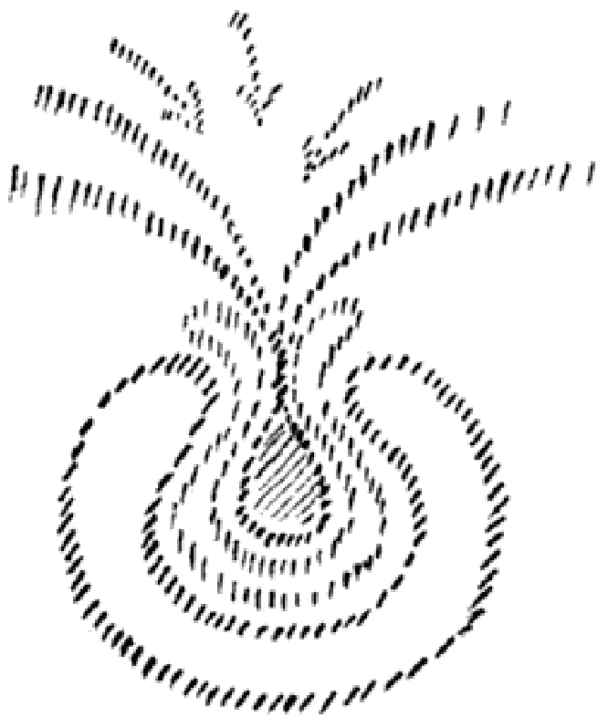

Seit alten Zeiten gibt es hierfür okkulte Sinnbilder. Ein siebeneckiges Zeichen ist das Symbol für den guten Sonnengeist. Die sieben Ecken bezeichnen symbolisch die sieben Planeten. Das Pentagramm ist das Sinnbild für den Menschen. Die Sterne zeichnet der Okkultist in der Gestalt von sieben Augen in die Figur [des Septagramms] hinein. Umgeben von einer Linie sind die Kräfte alle verschlungen. Sie binden alles zusammen. Das ist auch von den Okkultisten aufgezeichnet in den Wochentagen. Verfolgen Sie diese Linie, so haben Sie die Namen der Wochentage in der Richtung der Linie gehend.

In alter Vergangenheit konnte die Zeit noch nicht äußerlich danach bemessen werden, wie die Sonne sich um die Erde dreht. Die alten

---

Okkultisten dachten sich besondere Regenten für den Umlauf der Sonne, und sie dachten sich auch das Richtige. Das ganze System kreist, und so bestimmte man die Zeit entsprechend dem Umkreis durch die zwölf Zeichen des Tierkreises, Widder, Stier, Zwillinge, Krebs, Löwe, Jungfrau, Waage und so weiter. Nun wissen Sie, daß in der Entwicklung eines Weltsystems ein Umlauf ein Manvantara genannt wird, daß diesem jeweils ein Pralaya als Ruhezustand folgt und daß solche Zustände einander ablösen wie Tag und Nacht. Daher hat der Tag zwölf Stunden und die Nacht hat zwölf Stunden. Diese zwölf Stunden entsprechen den großen Zeiträumen des Weltentages, die von den alten Herrschern des Umlaufs des Tierkreises geregelt werden. Vierundzwanzig Herren des Umlaufs müßte ich aufzeichnen um dieses Zeichen herum. Wenn ich Ihnen das aufzeichnen würde, so hätten Sie hier das Septagramm. Sie hätten dann hier die sieben Augen, welche die sieben Sterne bedeuten, und die vierundzwanzig alten Herrscher, zwölf für den Tag und zwölf für die Nacht.

Man nennt den guten Sonnenseist auch das Lamm. Wir sprachen schon vom Pentagramm als Symbol des Menschen. Der schwarze Magier verwendet das Pentagramm so, daß die zwei «Hörner» nach oben gehen und das eine, die Spitze, nach unten. Nach der Vollendung dieser Entwicklung haben die Guten dann sieben «Hörner» entwickelt. Das ist das Zeichen für den Christus-Geist.

Lesen Sie die Stelle, wo Johannes das Buch mit den sieben Siegeln empfängt, mit dieser okkulten Erkenntnis. Lesen wir es, wie das geschildert wird im vierten Kapitel der Offenbarung. «Und alsobald war ich im Geist. Und siehe, ein Stuhl war gesetzt im Himmel und auf dem Stuhl saß einer; und der da saß, war gleich anzusehen wie der Stein Jaspis und Sarder... Und um den Stuhl waren vierundzwanzig Stühle und auf den Stühlen saßen vierundzwanzig Älteste» — die ich Ihnen vorgeführt habe in den vierundzwanzig Stunden des Weltentages — Tag und Nacht. Und dann, was weiter zu finden ist im fünften Kapitel. «Und ich sah, und siehe, mitten zwischen dem Stuhl und den vier Tieren und zwischen den Ältesten stand ein Lamm, wie wenn es erwürgt wäre, und hatte sieben Hörner und sieben Augen, das sind die sieben Geister Gottes, gesandt in alle Lande.» — Dieses

---

okkulte Zeichen Hegt zugrunde, wenn Johannes in der Apokalypse auf die Geheimnisse des Weltendaseins hinweist. Nur wer diese kennt, kann erahnen, ein wie tiefes Buch die Apokalypse ist und was es zu bedeuten hat, wenn der Widersacher des Lammes als das Tier mit den zwei Hörnern geschildert wird. Das Symbol des Sonnendämons wird so gezeichnet:

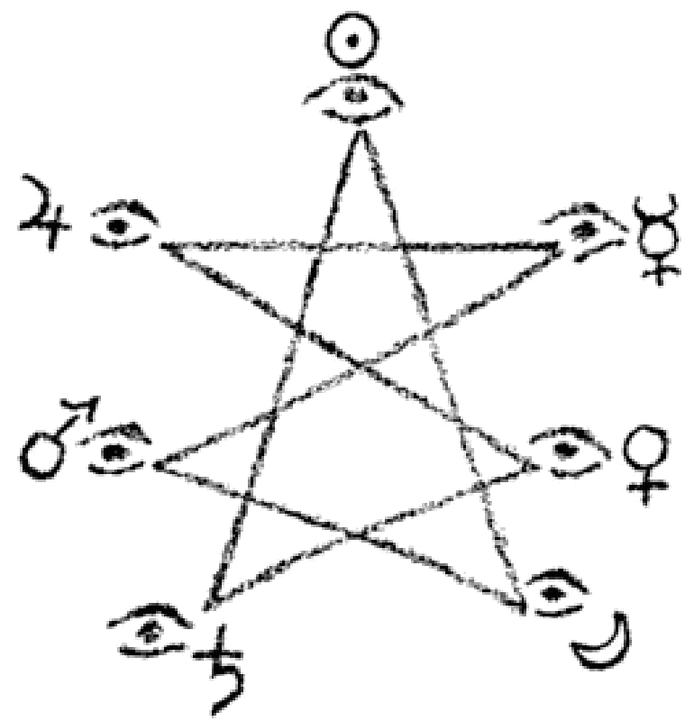

Die Apokalypse ist ganz in okkulter Schrift geschrieben, die durch Worte ausgedrückt ist.

Ein Geheimnis verbirgt sich auch in der Zahl des Tieres 666, von der es zugleich heißt: Es ist eines Menschen Zahl. - Nach der aramäischen Geheimlehre ist diese Zahl so zu lesen: 400, 200, 6, 60. Diesen vier Zahlen entsprechen die hebräischen Buchstaben n (Taw), *) (Resch), "• (Waw) und 0 (Samech). Im Hebräischen liest man von rechts nach links:

|  400 | 200 | 6 | 60  |
| --- | --- | --- | --- |
|  n | i | • | o  |
|  Taw | Resch | Waw | Samech  |

Diese Buchstaben symbolisieren die vier Prinzipien, die den Menschen zur völligen Verhärtung führen, wenn es ihm nicht gelingt, sie umzuwandeln. Durch Samech wird das Prinzip des physischen Leibes ausgedrückt, durch Waw das des Ätherleibes, durch Resch das des Astralleibes, durch Taw das niedere Ich, das sich nicht zum höheren Ich erhoben hat. Das Ganze zusammengelesen, heißt Sorat. Dies ist der okkulte Name des Sonnendämons, des Widersachers des Lammes.

Das ist das Geheimnis, aus dem die neuere Theologie gemacht hat: Es heißt Nero. Man kann wirklich keine größere Fabelei finden. Der, welcher die Sache von Nero erfunden hat, wird als einer der größten Geister der Theologie geschätzt. Dicke Werke sind darüber

---

geschrieben worden. So wird mißverstanden, was in den symbolischen Zeichen liegt. Bücher wie die Apokalypse kann nur der verstehen, der die okkulte Schrift zu lesen vermag.

Daß die geisteswissenschaftliche Bewegung eine wichtige Mission hat, will Ihnen auch die prophetische Bedeutung solcher Wahrzeichen andeuten. Indem wir die sieben Siegel der Apokalypse zum Saalschmuck in München wählen, weisen wir auch äußerlich darauf hin, worauf unser Streben gerichtet ist. Das Geistige soll uns auch in der Außenwelt wieder entgegentreten.

---

# DIE DREI ASPEKTE DES PERSÖNLICHEN, Berlin, 12. Juni 1907

Der Münchner Kongreß, der der vierte ist - nach Amsterdam, London und Paris -, sollte in einer gewissen Beziehung eine Etappe sein in der Entwickelung unserer theosophischen Bewegung. Er wird eine Art Verbindung zwischen den verschiedenen Nationen herstellen auch in bezug auf unsere theosophische Sache innerhalb Europas. Nicht einen eigentlichen Bericht über den Kongreß will ich heute geben, sondern nur ein paar Bemerkungen für diejenigen, welche nicht daran teilnehmen konnten.

Er sollte eines zeigen, was immer und immer wieder von mir betont worden ist in bezug auf unsere theosophische Sache - er sollte zeigen, daß Theosophie nicht nur Gegenstand persönlichen Brütens und In-sich-Hineinlebens sein soll. Die theosophische Sache soll ins praktische Leben eingreifen, soll eine Sache der Bildung sein, eine Sache des Sich-Einlebens in alle Zweige des praktischen Daseins. Nur wer ein tieferes Verständnis und einen tieferen Begriff von den eigentlichen Impulsen der theosophischen Sache hat, weiß schon heute, welche Möglichkeiten diese Theosophie in der Zukunft bieten wird. Sie wird der Einklang sein zwischen dem, was wir [äußerlich] sehen und schauen und dem, was wir innerlich fühlen. Für den, der tiefer schauen kann, liegt ein wichtiger Grund für die Zerfahrenheit [heutiger Menschen] in dieser Disharmonie zwischen dem, was ist, und dem, was die Theosophie will. Nicht bloß Theosophen haben das empfunden, sondern auch andere bedeutende Naturen, wie zum Beispiel Richard Wagner. ...

In früherer Zeit war jedes Türschloß, jedes Haus, jedes Gebilde ein Gebilde der Seele. Seelenstoff war eingeflossen. In den alten Zeiten gehörte das Kunstwerk zum menschlichen Fühlen und Denken. Die Formen der gotischen Kirchen waren in alten Zeiten entsprechend der Stimmung derer, die zu den Kirchen pilgerten. Sie besaßen deren eigene Seelenstimmung. Der zu der Kirche Pilgernde empfand damals die Formen wie ein Händefalten, so wie der alte Germane [beim Betreten eines Haines die Bewegungen der Bäume wie] ein Hande-

---

falten empfand. Alles war in jenen Zeiten den Menschen vertrauter. Das sehen Sie noch bei Michelangelo und Leonardo da Vinci wundervoll ausgedrückt. Das Zusammenstehen des ganzen Dörfchens in der Kirche war nichts anderes als der Ausdruck seines ganzen Seelenlebens. Die ganzen Ätherströme sammelten sich an dem Platze, wo die Kirche stand. Das materialistische Zeitalter hat das alles zerklüftet. Die, welche das Leben nicht betrachten können, wissen das nicht. Der Seher aber weiß, daß es heute, wenn man durch eine Stadt geht, fast nichts zu sehen gibt als Dinge, die den Magen oder die Putzsucht angehen. Wer die geheimen Lebensfäden zu verfolgen versteht, weiß auch, was die materialistische Kultur zu dieser Zerklüftung gebracht hat.

Eine Gesundung der Außenwelt kann dadurch entstehen, daß sie ein Abdruck dessen wird, was unsere innersten Seelenstimmungen sind. Nicht zum Vollkommensten kann man gleich greifen, aber ein Beispiel dafür wurde in München gegeben. Die geisteswissenschaftliche Weltanschauung wurde in dem Raum zum Ausdruck gebracht. Der ganze Saal war in Rot gehalten. Es besteht zwar häufig ein großer Irrtum in bezug auf die rote Farbe, aber das Rot ist in seiner tieferen Bedeutung nicht zu verkennen. Die Entwicklung der Menschheit ist ein Auf- und Absteigen. Sehen Sie sich die ursprünglichen Völker an. Grün haben sie in der Natur. Und was lieben sie am meisten? Rot! Der Okkultist weiß, daß das Rot eine besondere Wirkung auf die gesunde Seele hat. Es löst in der gesunden Seele die aktiven Kräfte aus, diejenigen Kräfte, welche zur Tat anspornen, diejenigen Kräfte, welche die Seele aus der Bequemlichkeit in die Unbequemlichkeit des Tuns versetzen soll. Ein Raum mit Feiertagsstimmung muß rot austapeziert sein. Wer ein Wohnzimmer rot austapeziert, der zeigt, daß er keine Feiertagsstimmung mehr kennt und die rote Farbe profaniert. Goethe hat über solche Dinge die schönsten Worte gesagt, die es gibt: «Die Wirkung dieser Farbe ist so einzig wie ihre Natur. Sie gibt einen Eindruck sowohl von Ernst und Würde als von Huld und Anmut. Jenes leistet sie in ihrem dunklen, verdichteten, dieses in ihrem hellen, verdünnten Zustande. Und so kann sich die Würde des Alters und die Liebenswürdigkeit der Jugend in eine Farbe kleiden.»

---

Das sind die Stimmungen, die durch das Rot ausgelöst werden, Stimmungen, die man auf okkultem Wege nachweisen kann. Schaut euch die Landschaft durch ein rotes Glas an, und ihr habt den Eindruck: So muß es aussehen am Tage des Gerichts. - Rot macht froh darüber, was der Mensch in der Fortentwicklung vollbracht hat. Rot ist Feind gegen retardierende Stimmungen, gegen Sündenstimmungen.

Dann gab es da sieben Säulenmotive für die Zeit, in welcher der Theosophie auch einmal Gebäude gebaut werden können. Die Motive der Säulen sind aus den Lehren der Eingeweihten herausgeholt, aus uralten Zeiten. Die Theosophie wird die Möglichkeit haben, wirklich neue Säulenmotive der Architektonik zu geben. Die alten Säulen sagen eigentlich dem Menschen schon längst nichts mehr. Die neuen haben Bezug auf Saturn, Sonne, Mond, Mars, Merkur, Venus. Die Gesetzmäßigkeit drückte sich in den Kapitellen aus. Zwischen den Säulen hatten wir die sieben apokalyptischen Siegel in Rosenkreuzerart angebracht. Das Gralsiegel ist zum ersten Mal vor der Öffentlichkeit erschienen.

Die Theosophie kann man auch bauen: Man kann sie bauen in der Architektonik, in der Erziehung und in der sozialen Frage. Das Prinzip des Rosenkreuzertums ist, den Geist in die Welt einzuführen, fruchtbare Arbeit für die Seele zu leisten. Es wird auch gelingen, die Kunst zu einer Mysterienkunst zu erheben, nach der Richard Wagner eine so große Sehnsucht hatte. Ein Versuch ist gemacht in *Edouard Schures Mysteriendrama*. Hier hat Schure versucht, den Mysterienspielen nachzuarbeiten. Was dem zugrundelag, war die Absicht, die Theosophie einzukristallisieren in den Aufbau der Welt. Das Programm zeigte die feiertägliche Farbe Rot und trug ein schwarzes Kreuz mit Rosen umwunden im blauen Felde. Das Rosenkreuzertum leitet das, was das Christentum gegeben hat, in die Zukunft weiter. Die Anfangsbuchstaben auf dem Programm geben die Grundgedanken wieder.

Heute möchte ich über einige Fragen sprechen, die man in diesem Zusammenhang stellen könnte. Zunächst: Wie wäre es, wenn die Theosophie in die Rosenkreuzerströmung übergeht und sich in diesen

---

Vorstellungen ausleben wird? - Darüber wollen wir uns einige Vorstellungen in bezug auf theosophische Ethik oder Sittenlehre bilden. Die theosophische Ethik oder Sittenlehre ist keine solche, die sagt: Dies oder jenes sollst du tun oder nicht tun. - Die Theosophie hat es nicht zu tun mit Forderungen und Geboten, sondern mit Tatsachen und Erzählungen. Man braucht nur ein Beispiel einer Tatsache der astralen Welt zu nehmen, woraus man sieht, daß man nicht nötig hat, Moral zu predigen. Übrigens nützt dies auch nichts, denn Ermahnungen und Gebote begründen keine wirkliche Sittlichkeit, sondern dies geschieht durch die Tatsachen des höheren Lebens. Wenn Sie von Okkultisten hören, Lüge ist Mord und Selbstmord, dann wirkt das als Impuls mit einer solchen ethischen Kraft, daß sie sich nicht vergleichen läßt mit der einfachen Ermahnung: Ihr sollt nicht lügen. - Wenn man weiß, was Lüge und was Wahrheit ist, wenn man weiß, daß alles im Geistigen seinen Abdruck hat, dann wird die Sache etwas anders. Die der Wahrheit entsprechende Erzählung bildet die Lebenskräfte für die Fortentwicklung. Die unrichtige Behauptung schlägt an die Wahrheit und schlägt zurück auf den Menschen selbst. Alles, was der Mensch lügt, hat er später selbst zu fühlen. Lügen sind die größten Hemmnisse für die Weiterentwicklung. Nicht umsonst nennt man den Teufel den Geist der Lügen und Hindernisse. Der explosive Stoff der Lüge tötet objektiv und entlädt sich auf den, der sie aussendet.

Drei Vorstellungen von dem Persönlichen kennen wir: das Persönliche, das Unpersönliche und das Überpersönliche. Es gab einstmals einen Menschenvorfahren, welcher höher war als jedes Tier, aber niedriger als der Mensch. Er bestand aus physischem Leib, Ätherleib und Astralleib. Dann kommt das Ich dazu, welches die höheren Teile wieder aus sich heraus bildet, zur siebengliedrigen Menschennatur.

Die Entwicklung von physischem Leib, Ätherleib und Astralleib geht durch lange Zeiträume. Sie haben sich dadurch reif gemacht, das Ich-Bewußtsein in sich aufzunehmen. Die Tendenz der drei niederen Glieder und die Art und Weise, wie sie sich entwickelt haben, soll uns heute interessieren. Immer mehr ist der Mensch fähig geworden, ein selbstbewußtes Wesen zu werden. Das ist nur möglich durch die

---

Kraft des Egoismus, der Selbstsucht. Sie kann göttlich oder teuflisch sein. Diese Worte müssen nicht nur nach der Empfindung, sondern nach ihrem wahren Kern beurteilt werden. Die Selbständigkeit setzt voraus, daß der Mensch ein egoistisches Wesen wurde.

Mit der Entwickelung des Egoismus hängt zusammen die Form des - scheinbaren - Bewußtseinsverlustes, die wir als Tod im jetzigen menschlichen Leben kennen. In demselben Grade wie sich die Selbstsucht entwickelt hat, hat sich auch der Tod entwickelt. In den ersten Zeiten starb der Mensch nicht. Er war wie ein Glied, das vertrocknet und dann wieder nachwächst, etwa so wie der Nagel am Finger abfällt und wieder nachwächst. Unser jetziges Sterben und Wiedergeborenwerden ist gekommen, damit wir unser jetziges Ich-Bewußtsein haben können. Egoismus und Tod sind zwei Seiten derselben Sache. Das Höhere der menschlichen Natur ist so, daß es den Egoismus wieder überwindet, sich zu dem Göttlichen hinaufarbeitet und damit den Tod überwindet. Je mehr ein Mensch den höheren Teil in sich entwickelt, desto mehr entwickelt er das Bewußtsein seiner Unsterblichkeit. In dem Augenblick, wo der Mensch egoistisch geworden ist, ist er auch eine Persönlichkeit geworden. Das Tier ist nicht persönlich, weil es das Ich als Gruppenseele hat, die nicht vom Astralplan heruntersteigt. Die Persönlichkeit ist dasjenige, was die drei Leiber - physischer Leib, Ätherleib und Astralleib - vom Ich durchstrahlt sein läßt. Das kann auch unklar, schattenhaft sein - und wenn dies der Fall ist, so ist der betreffende Mensch eine schwache Persönlichkeit.

Für den Hellseher ist dies durchaus erkennbar. Er sieht den Menschen von einer farbigen Aura umflossen, in der sich seine Stimmungen, Leidenschaften, Gefühle, Empfindungen in Farbströmungen und Farbwolken genau ausdrücken. Versetzen wir uns in die Zeit, in welcher die drei Wesensglieder erst bereit waren, das menschliche Ich aufzunehmen, so würden wir auch bei diesem noch nicht ganz Mensch gewordenen Wesen eine Aura finden. Es würden aber darin die gelben Strömungen fehlen, in denen die höhere Natur des Menschen zum Ausdruck gelangt. Starke Persönlichkeiten haben eine stark gelb strahlende Aura. Nun kann man eine starke Persönlichkeit sein, aber ohne

---

Aktivität, man kann innerlich stark reagieren, ohne ein Tatenmensch zu sein. Dann zeigt die Aura gleichwohl viel Gelb. Ist man aber ein Tatenmensch und wirkt sich die Persönlichkeit in der Außenwelt aus, so geht das Gelb allmählich in ein strahlendes Rot über. Eine rot strahlende Aura ist die eines Tatenmenschen; sie muß aber strahlen.

Doch gibt es eine Klippe, wenn die Persönlichkeit zu Taten drängt. Das ist der Ehrgeiz, die Eitelkeit. Davon können besonders leicht starke Naturen befallen werden. Der Hellseher sieht dies in der Aura. Ohne den Ehrgeiz geht das Gelb unvermittelt in Rot über. Ist der Mensch jedoch ehrgeizig, so hat er viel Orange in der Aura. Diese Schwelle muß man überwinden, um zur objektiven Tat zu gelangen.

Schwache Persönlichkeiten sind solche, die mehr darauf gerichtet sind, daß man ihnen gibt, als daß sie geben und etwas tun. Da sehen Sie dann hauptsächlich blaue Farben, und wenn die Menschen besonders bequem sind, die Indigofarbe. Es bezieht sich dies mehr auf die innerliche Bequemlichkeit als auf die äußere.

Sie sehen, wie sich in der Aura des Menschen die starke oder schwache Persönlichkeit abspiegelt. Der Mensch soll das Persönliche immer mehr überwinden und das Höhere wirken lassen. Daher hören Sie viel reden von der Überwindung der Persönlichkeit und des Egoismus. Nun kommen wir aber auf den Hauptpunkt. Es kommt darauf an, ob wir das Persönliche durch das Unpersönliche oder durch das Überpersönliche überwinden.

Was heißt: sich überwinden durch das Unpersönliche? Das heißt, die starke Kraft abschwächen, die Energie der Persönlichkeit zurückdrängen wollen. Das würde dann unpersönlich sein. Überpersönlich würde in gewisser Beziehung genau das Gegenteil davon sein. Es würde die Erhöhung der Energie der Persönlichkeit sein, die Hervorkehrung der starken Kräfte der Persönlichkeit.

Das Ich finden wir in der Seele, und darin erstens das Mutartige, zweitens aber das Begehrliche und Begierdenhafte der Seele. Auf diese zwei Dinge läßt sich im Grunde genommen alles im Seelenleben zurückführen. Die Dinge erfahren da eine verschiedene Behandlung. Und diese verschiedene Behandlung rührt von folgendem her: Der Mensch gibt sich nicht genügend Mühe, das Höhere aufzunehmen.

---

Er entwickelt sich dann wohl weiter, aber das Niedere entwickelt sich, das Mutartige und Begierdenhafte entwickelt sich im rohen Stil. Wenn er das einfach abschwächen würde, so wäre das eine Kultur des Unpersönlichen. Der Mensch würde das Aktive verlieren. Das Tätige, dasjenige, was den Menschen zu einem Menschen macht, der unter die anderen geht und das tut, wozu er fähig ist, das bringt in gewisser Beziehung einen solchen Menschen immer in Kollision mit anderen. Und er muß in Kollision kommen, wenn er sich zu etwas berufen glaubt.

Man kann auch seine Begierden abtöten. Dadurch wird aber die Persönlichkeit farblos. Man kann indessen auch etwas anderes tun: Man kann sie veredeln. Man braucht sie nicht in ihrer Stärke abzutöten. Man kann sie auf höhere Gegenstände richten. Dann braucht die Persönlichkeit nichts von ihrer Stärke zu verlieren, und dennoch wird sie edler und göttlicher. Man braucht die Begierden nicht abzutöten, sondern nur umzuwandeln in feinere und edlere Begierden, dann können sie mit derselben Vehemenz sich ausleben. Ein Beispiel: Denken Sie sich ein Tingeltangel. Der, welcher nicht hineingeht, braucht deshalb noch kein Asket zu sein. Er hat nur die niederen Begierden in höhere umgebildet, so daß er sich im Tingeltangel nur langweilen würde.

Die Theosophie ist in dieser Beziehung am meisten von den Theosophen mißverstanden worden. Es kann sich ja nicht darum handeln, das Persönliche zu ertöten, sondern ihm einen Aufschwung nach oben, zu einem Höheren zu geben. Dazu ist gerade all das notwendig, was uns durch die Theosophie vermittelt wird. Es handelt sich also vor allem darum, daß höhere Interessen geweckt werden. Solche Interessen ergreifen den Menschen schon. Er braucht seine Gefühle gar nicht herabzudämpfen, sondern er wendet sie dann auf das höhere göttliche Werden an, auf die großen Weltentatsachen. Wenn wir unsere Gefühle darauf hinlenken, verlieren wir zwar das Interesse für die brutale Seite des Lebens, aber unsere Gefühle werden dadurch nicht abgestumpft, sondern sie werden reich, und die ganze Natur des Menschen entzündet sich daran. Hat ein Mensch viel übrig für einen guten Schweinebraten, so geht es nicht darum, sein Gefühl für den

---

Schweinebraten zu ertöten, sondern dieses Gefühl umzuwandeln. Eine Metamorphose des Gefühls muß angestrebt werden. Dieselben Gefühle, die der eine für die Symphonie des Mahles hat, verwendet ein anderer für eine wirkliche Symphonie. Predigen Sie die Überwindung der Begierde und Aktivität, dann predigen Sie das Unpersönliche. Zeigen Sie aber den Weg, der dazu führt, die Begierde auf das Geistige zu richten, dann verweisen Sie auf das Überpersönliche. Und dieses Überpersönliche muß das Ziel der theosophischen Bewegung sein.

Die Geisteswissenschaft soll und will nicht Stubenhocker und Sonderlinge erziehen, sondern sie will Menschen der Tat, wirkende Menschen hervorbringen, die hinaustreten in die Welt. Wie kommen wir aber zum Überpersönlichen? Nicht dadurch, daß wir uns ins Persönliche einfressen, sondern daß wir das Wahre, Große und Umfassende ergreifen. Deshalb ist es nicht unnötig, wenn in der Theosophie der Blick für die großen Zusammenhänge des Daseins gepflegt wird. Wir wachsen dadurch über das Kleine hinaus und lernen die Dinge nicht unpersönlich, sondern überpersönlich nehmen.

Auf einem Gebiet können wir durch eine Art Experimentum crucis den Unterschied zwischen persönlich, unpersönlich und überpersönlich erkennen. Von der Liebe wird man leicht glauben, daß das, was ein Mensch für den anderen fühlt, etwas Unpersönliches sei. Aber das braucht noch lange nicht das zu sein, was mit einem Überpersönlichen zu tun hat. Dem Menschen läuft hier eine merkwürdige Illusion unter: Er verwechselt Eigenliebe mit Liebe zum anderen. Die meisten Menschen glauben einen anderen zu Heben, weil sie sich selber in dem anderen lieben. Das Aufgehen in dem anderen ist doch nur etwas, was den eigenen Egoismus befriedigt. Der Betreffende weiß es nicht, braucht es gar nicht zu wissen, aber es ist im Grunde eben doch ein Umweg zur Befriedigung des Egoismus.

Der Mensch ist eben nicht ein Einzelwesen. Er ist ein Glied an einem Ganzen. Der Finger ist in liebevollem Zusammenhang mit der Hand und dem Organismus. Würde er das nicht sein, so würde er absterben. Der Finger liebt meine Hand und den Organismus, weil er sie braucht. Ebenso könnte der Mensch nie ohne die anderen Menschen sein. Das bewirkt, daß der Mensch die Menschen gern hat. -

---

Manche Liebe entspringt häufig nur aus Seelenarmut, und Seelenarmut entspringt immer einem verstärkten Egoismus. Und wenn jemand behauptet, daß er ohne einen anderen nicht leben könne, so ist seine eigene Persönlichkeit verarmt, und er sucht nach etwas, das ihn ausfüllt. Er verhüllt das Ganze darin, daß er sagt: Ich werde unpersönlich, ich liebe den anderen.

Die schönste, selbstlose Liebe äußert sich darin, daß man den anderen nicht braucht, daß man ihn auch entbehren kann. Der Mensch liebt dann nicht um seiner selbst, sondern um des anderen willen. Er verliert dann auch nichts, wenn er von dem anderen verlassen wird. Dazu ist freilich nötig, daß man den Wert eines Menschen durchschauen kann, und das lernt man nur, wenn man sich in die Welt vertieft. Je mehr Sie Theosoph werden, desto mehr werden Sie lernen, auf das innere Wesen eines anderen einzugehen. Und um so fähiger werden Sie dann, seinen Wert zu empfinden und ihn nicht aus Selbst-sucht zu Heben. Gehen Sie so durch die Welt, dann werden Sie auch sehen, daß die einen diesen, die anderen jenen Egoismus haben, und jeder lebt dem Werte seines Egoismus nach.

Erforderlich ist die Höherentwicklung der Persönlichkeit. Eine unpersönliche Liebe, welche der Schwäche entspringt, wird immer auch mit Leid verknüpft sein. Die überpersönliche Liebe erwächst aus Stärke und gründet sich auf Erkenntnis des anderen. Sie kann ein Quell von Freude und Befriedigung werden. Ein Hinundherpendeln zwischen allen möglichen Stimmungen der Liebe ist immer ein Zeichen dafür, daß diese Liebe ein maskierter Egoismus ist und einer verarmten Persönlichkeit entstammt. So können wir uns am besten an der Liebe den Unterschied zwischen unpersönlich und überpersönlich klarmachen.

Wem die Geisteswissenschaft nicht einen Fonds für das Leben gibt, der hat sie nicht begriffen, denn sie ist ein Quell innerer Lebensbefriedigung für die Zukunft. Wenn der Materialismus immer mehr überhandnehmen würde, und damit auch der Egoismus, der zu ihm gehört, so würde die Menschheit immer mehr in den Pessimismus verfallen, der die Schlacke ausgebrannter Geister ist. Wird die Menschheit die Geisteswissenschaft aufnehmen, so wird ihr die wahre

---

Heiterkeit, die zugleich die Quelle der Gesundheit ist, wiedergegeben werden. Disharmonie ist letzten Endes ein Ausfluß des Egoismus, und heitere, frohe Stimmung entströmt dem höheren Menschen. Je mehr das Höhere, das Göttliche Platz greift, desto seliger wird der Mensch werden. Wir sollten mehr daran denken, wie wir der ganzen Menschheit helfen, als daran, wie die Geisteswissenschaft gerade uns helfen kann. Wir kommen immer mehr zum Erkennen des Quells echter Heiterkeit und Freude, ewiger Jugend, wenn wir uns mit der Ethik des Überpersönlichen bekanntmachen.

Nicht in einer Verneinung liegt das Ziel der Theosophie, sondern in der Bejahung. Das Unpersönliche bedeutet Verneinung, das Überpersönliche Bejahung, selbst wenn es noch so schwach auftreten sollte. Das ist es, was uns zugleich die Aufgabe der Geisteswissenschaft aus dem Wesen der Menschheit heraus zeigt. «An ihren Früchten sollt ihr sie erkennen -», daran, daß sie die Menschen geeignet und tüchtig für das Leben macht, mit Gesichtern, die Ausdruck einer harmonischen Seele sind. Der Geist drückt sich niemals in einem vergrämten Gesicht aus. Selbst was der Mensch an Schmerz durchmachen muß, wandelt sich in dem Antlitz des Denkers um und erscheint veredelt; der Ausdruck des Schmerzes zeigt sich gereinigt in dem harmonischen Denkergesicht. Das vergrämte Gesicht ist der Ausdruck eines noch nicht überwundenen Egoismus. Die Geisteswissenschaft leitet uns an, aus uns herauszugehen, aber uns nicht zu verlieren, sondern uns die Außenwelt zu erhalten. Sie führt uns über das Persönliche hinaus, nicht durch eine Vernichtung der Persönlichkeit ins Unpersönliche, sondern durch eine Steigerung ins Überpersönliche.
