# ERSTER VORTRAG, Berlin, 7. Oktober 1907

## Altnordische Mythen und Sagen

|15| Wir wollen in dieser und in den nächsten Stunden das betrachten, was man nennen könnte: Okkulte oder auch mystische Sinnbilder in ihren Beziehungen zur astralen und geistigen Welt. Immer wieder treten vor Ihnen diese und jene Zeichen, Symbole, Erzählungen auf; und nun kommen diejenigen, die materialistisch gesinnt sind und sagen, das sei alles Dichtung. Es wird als irgendwie aus der Volksphantasie entlehnt angenommen und nur betrachtet als eine leere Phantasterei. Oder es kommen die Gutgesinnten und spekulieren alles mögliche über das, was zum Beispiel das Pentagramm und andere Symbole bedeuten. Bei unserem Kongreß in München haben wir sogar Zeichen und Symbole zur Ausschmückung unseres Saales gebraucht und damit schon angedeutet, daß wir den okkulten Zeichen eine gewisse Bedeutung beimessen. Aber der wahre Okkultist spekuliert nicht darüber, sondern er sucht die wirklichen Tatsachen. Durch eine philosophische Spekulation können Sie nie und nimmer auf die Bedeutung eines okkulten Zeichens kommen, und vieles, was gesagt und geschrieben wird über okkulte Zeichen und ihre Bedeutung, ist vergeblich geschrieben, weil es nur aus der Spekulation, dem mehr oder weniger geistreichen Darüber-Nachdenken heraus geschrieben ist. Doch diese okkulten Zeichen sind für uns wichtig, denn sie sind etwas wie Instrumente, durch die wir hinaufkommen können in die höheren Welten.

Wir haben schon manches über die Bedeutung wichtiger Symbole gehört, so zum Beispiel über das Symbolische, das sich auf die Zahl 666 bezieht, und wir haben da tief in die religiöse Urkunde der Apokalypse eindringen können. Heute soll uns etwas ganz anderes aus der Symbolik beschäftigen. Es sind Symbole, die Ihnen schon öfter vor die Seele getreten sind, die wir nun ihrem Ursprung und ihrem wirklichen Wert nach kennenlernen wollen. Bevor wir zur Bespre |16| chung dieser Symbole übergehen, müssen wir eine Vorbetrachtung über den Menschen anstellen. Sie werden gleich sehen, warum etwas scheinbar ganz und gar Entlegenes angeführt wird, um gewisse Zeichen und Symbole zu erklären.

Wir versetzen uns zurück an den Zeitpunkt unserer Menschheitsentwickelung, den Sie alle aus früheren Vorträgen kennen. Sie wissen, daß unserer jetzigen Zeit vorangegangen ist eine Zeit, die wir die atlantische Zeit nennen. Wo jetzt der Boden des Atlantischen Ozeans ist, zwischen Amerika und Europa, war vor Urzeiten Land, während unsere Gebiete weithin mit Wassermassen bedeckt waren. In diesem Lande wohnten unsere Vorfahren. In Wahrheit stammt der größte Teil der europäischen Bevölkerung nicht etwa aus dem Osten, sondern aus dem Westen und ist die Nachkommenschaft der atlantischen Bevölkerung. Von jenem Lande, der alten Atlantis, wo unsere Vorfahren und wir selbst in früheren Inkarnationen gewohnt haben, wanderten sie weit hinein nach Osten, als die Fluten, die jetzt den Atlantischen Ozean bilden, diesen früheren Erdteil verschlungen hatten.

Im letzten Drittel der atlantischen Zeit gliederte sich im Nordosten - in der Gegend des heutigen Irland - ein kleines Häuflein heraus aus der Bevölkerung, die als die damals vorgeschrittenste sich darstellt. Das ganze atlantische Land war bedeckt mit schweren, dichten Nebelmassen und wird deshalb in der Erinnerung der germanischen Völkerschaften «Niflheim» genannt. In diesen alten Zeiten, als die Luft fortwährend mit dichten Wassermassen geschwängert war, da war das Seelenleben auch ein ganz anderes. Es war immer noch ein altes Hellsehen vorhanden; die Menschen haben damals hineingesehen in die geistige Welt. Wenn sie sich einem Menschen genähert haben, sahen sie vor ihrer Seele gewisse Farbenerscheinungen aufsteigen, die ihnen sagten, ob ihnen dieser Mensch sympathisch oder unsympathisch war. Ebenso war es mit den Tieren; wenn sie sich einem Tiere näherten, konnten sie sehen, ob es ihnen schadete oder nicht. Ein primitives Hellsehen war also in gewisser Beziehung in der atlantischen Zeit vorhanden.

|17| Die Menschheit machte nun verschiedene Entwicklungszustände durch; sie konnte nicht stehenbleiben bei jenem alten dumpfen Hellsehen; es mußte die heutige Art des Wahrnehmens durch die Sinne eintreten. Da mußte für eine gewisse Zeit das Hellsehen zurücktreten, das aber in der Zukunft wieder zu dem heutigen hellen Tagesbewußtsein hinzueroberst werden wird. Was die Menschen heute als Grundlage unserer äußeren Kultur haben, den Gebrauch der Vernunft, den Verstand, das war nicht den alten atlantischen Hellsehern eigen, das mußte erst erobert werden. Der Mensch mußte seine Augen und Ohren, seine Sinneswahrnehmungsorgane nach außen richten; das innere geistige Auge trat für eine Zeit zurück. Als unsere Vorfahren aus der alten Atlantis nach dem Osten hinüberwanderten, da war dieses Ereignis zugleich verknüpft mit dem Verlust des alten Hellsehens und mit dem Erringen der äußeren sinnlichen Wahrnehmung, mit dem Erringen von Fähigkeiten wie Zählen, Rechnen, Urteilen.

Bei jenem kleinen Häuflein in der Nähe des heutigen Irland hatte sich zuerst die Fähigkeit des Rechnens, Zählens und so weiter ausgebildet. Diese Menschen zogen zunächst nach dem Osten hinüber, und mit den hereinbrechenden Fluten des Ozeans zogen ihnen immer andere Völkerschaften nach; sie bevölkerten den Boden des heutigen Europa. So war ein zweifaches Anschauen der Dinge bei diesen Völkerschaften da: die äußere Beobachtung der Sinneswelt, das Zählen, Rechnen, Kombinieren, was dazu führte, daß die heutigen technischen Fortschritte, Maschinen, Verkehrsmittel und so weiter, errungen werden konnten. Im Herzen trugen diese Völker aber noch etwas anderes: die Erinnerung an jene Welten des Geistes, in die sie hineingeschaut hatten, und die Sehnsucht, durch irgendwelche Mittel diese geistigen Welten wieder zu erobern.

Nun stellen wir uns einmal recht lebhaft diese Vorfahren im alten Europa vor. Nicht gleichzeitig haben sie alle mit dem Herüberwandern die Gabe des alten Hellsehens verloren. Viele, ja zahlreiche Leute, die herübergewandert waren, haben noch vollgültige Reste des alten Hellsehens auch nach Europa mitgebracht. Es gab viele unter diesen Vorfahren, die, wenn sie sich in der Dämmerung des |18| Abends oder in der Nacht still hinsetzten, in ein lebhaftes Träumen versanken, das mehr als das heutige Träumen bedeutete; sie sahen noch hinein in die geistige Welt.

Noch hatten sich unzählige Menschen nicht nur die Erinnerung daran bewahrt, sondern sogar die Fähigkeit, in gewissen Ausnahmezuständen des Lebens in die geistigen Welten hineinzublicken. Und die anderen, die diese Fähigkeit verloren hatten, hatten dafür eine Eigenschaft, die im Laufe der Entwicklung viel mehr abhanden gekommen ist, als man gewöhnlich denkt: Es gab in alten Zeiten, namentlich in der Bevölkerung Mittel- und Osteuropas, eine Eigenschaft, die weit verbreitet war, in einer Intensität, von der man sich heute keine Vorstellung macht, und das war das Vertrauen, der treue Glaube. Diejenigen, die etwas über die geistigen Welten zu sagen wußten, die fanden Gehör, sie fanden Glauben, weil Liebe und Vertrauen gerade in jenen europäischen Ländern eine große, eine bedeutsame Kraft hatten. Jenes Kritisieren und Pochen auf die eigene Überzeugung, wie man es heute findet, war etwas, woran damals überhaupt kein Mensch dachte. Diese Dinge aber sind es, die es heute notwendig machen, daß ein jeder selber zur geistigen Welt geführt wird. Das war in jener Zeit wegen des starken, großen Vertrauens nicht notwendig. Wenn wir die alte Bevölkerung Europas überblicken, sehen wir auf dem Grunde der Seelen dieser Leute, daß sie ein volles Bewußtsein hatten von den hinter der sinnlichen Welt stehenden geistigen Welten.

Und nun wollen wir uns einmal das Werden der neuen Anschauung des nun durch seine Sinne zu den Gegenständen hinblickenden Menschen klarmachen. Ich habe schon angedeutet, daß bei jenem kleinen Häuflein im Norden, in der Nähe des heutigen Irland, ein Ereignis eintrat, durch welches das Rechnen, das Zählen und Kombinieren eine Fähigkeit des Menschen geworden ist. Ich habe schon früher angedeutet, daß dazumal des Menschen Ätherkopf hineingerückt ist in den physischen Kopf. Während früher der Teil des Ätherkopfes in der Nähe der Augenbrauen außerhalb des physischen Gehirnes war, rückte er jetzt hinein, und beide wurden eine Einheit. Dadurch erlangte der Mensch die Fähigkeit des Selbstbe |19| wußtseins, des Ichbewußtseins, er erlangte die Fähigkeit, zu urteilen und hinzuschauen zu den Gegenständen. Der Ätherkopf, der heute mit der Form des physischen Kopfes zusammenfällt, stand bei den alten Atlantiern weit vor der Stirn hervor, daher ihr Hineinsehen in die geistige Welt, ihr Hellsehen. Nun versetzen wir uns einmal in die Seele der atlantischen Bevölkerung, versetzen wir uns in jene alten Zeiten, wo die Menschen noch ihren Ätherkopf weit außerhalb ihres physischen Kopfes hatten, und versetzen wir uns dann in jene Zeiten gegen Ende der Atlantis, wo die beiden schon zusammengefallen waren. Der Atlantier konnte schauen, wie der Ätherkopf nach und nach hineinrückte, er war ja noch hellsehend, er sah das. Wie sah er nun dieses Hineinrücken des Ätherkopfes in den physischen Kopf? Als etwas ganz besonderes kam dem Atlantier dieses Hineinrücken des Ätherkopfes vor. Das wollen wir uns einmal vor die Seele rücken; ich will es Ihnen beschreiben.

Woher, fragte sich der Atlantier, kommen denn die Kräfte, die mir jetzt zuteil werden? - Vorher hatte der Mensch um sich herum eine geistige Welt gesehen. Was zeigte ihm diese geistige Welt um ihn herum? Machen Sie sich das einmal ganz klar. Wenn Sie jetzt plötzlich hellsehend werden könnten, bis zu dem Grade, wie es der Atlantier war, was würde da in Ihrer Seele vorgehen? Sie würden geistige Wesenheiten um sich herum sehen. Die physische Welt würde sich bevölkern mit Wesenheiten des astralischen, des geistigen Planes, und die würden Sie sehen. Woher würde das kommen? Durch Ihre eigenen Fähigkeiten, die jetzt in Ihrer Seele schlummern, die Sie dann aber entwickelt hätten. Es würde Ihnen so erscheinen, wie wenn etwas aus Ihnen selbst herausstrahlte. Was heute aus Ihnen herausstrahlt in die Welt, das war ja damals zur Zeit der alten Atlantis erst in Sie hineingestrahlt. Alle Anschauungen, die der Mensch heute sich bilden kann in bloßen Begriffen von der geistigen Welt, das waren zu jener Zeit lebendige Wesenheiten für ihn, und der Atlantier sah, wie etwas hineinzog in ihn und in ihm Fähigkeiten anregte. Er sagte sich: Ich fange an, mit meinen Augen die Dinge zu sehen, mit meinen Ohren Geräusche, Töne zu hören, ich fange an zu sehen, was draußen sinnlich wahrnehmbar ist. - Woher kom |20| men diese Fähigkeiten? Sie strahlten von außen in den Menschen hinein.

Wir wollen die alte Atlantis noch einmal so recht ins Auge fassen. Das Land war bedeckt mit weiten Wassernebelmassen; diese Wassernebelmassen waren von verschiedener Dichte in der ersten und in der letzten atlantischen Zeit, namentlich waren sie in der Nähe des heutigen Irland anders als in den sonstigen Gegenden. Die Wasser- und Nebelmassen waren zuerst warm und heiß. Im südlichen Teil der Atlantis waren sie noch warm, zum Teil heiß, wie warme, heiße Rauchmassen; gegen Norden zu waren sie kälter. Insbesondere gegen das Ende der atlantischen Zeit trat eine mächtige Abkühlung ein. Nun war es gerade diese Abkühlung der Nebelmassen, diese nordische Kälte, welche die neue Anschauung, das neue Seelenleben aus den Menschen herauszauberte. Niemals hätten unter den Gluten der Hitze des Südens der Intellekt, die Urteilskraft zuerst sich in der Menschheit entwickeln können. Der Atlantier in der Nähe Irlands fühlte Fähigkeiten in sich hineinströmen, die ihn so durchdrangen, daß er fähig wurde, mit seinen Sinnesorganen die Dinge draußen zu sehen, zu hören und so weiter. Er empfand das so, daß er es der Abkühlung der Luftmassen zu verdanken hatte.

Zu dem Wahrnehmen äußerer Gegenstände durch Sinnesorgane gehören Nerven. Zu jedem unserer Sinnesorgane gehen Nerven vom Gehirn aus. Augennerven, Geruchs-, Gehörnerven und so weiter haben wir. Diese Nerven, die heute den Menschen fähig machen, die Sinneseindrücke sich zum Bewußtsein zu bringen, waren untätig, bevor die äußere sinnliche Anschauung der Dinge da war. Sie vermittelten nicht das äußere Anschauen, sie hatten eine innere Aufgabe. Der atlantische Mensch sah damals die Kräfte an sich herankommen, die diese Nerven in ihm zu Sinnesorganen machten. Er empfand diese ganze Situation so, wie wenn in den Kopf von außen hineinfluteten die Strömungen, welche dann seine Nerven im Kopf durchsetzten.

Nun gibt es unter den Nerven im Kopfe, die dazumal tätig wurden und die wir heute noch anatomisch nachweisen können, zwölf Paare, und zwar zehn Paare, die vom Kopfe ausgehend sich gliedern, |21| um die einzelnen Sinnesorgane in Tätigkeit zu setzen. Wenn Sie zum Beispiel die Augen bewegen, so sind dazu die Augenmuskelner- ven da und nicht der Sehnerv. Also zehn Paare, die zu den einzelnen Sinnesorganen gehen, und zwei Paare, die tiefer hinuntergehen und die den Verkehr vermitteln zwischen dem sinnlichen Wahrnehmen und der Gehirntätigkeit. Der Atlantier fühlte zwölf Strömungen in sich hineingehen, in sein Gehirn und hinunter in seinen Leib. Das sah er. Was Sie jetzt als Nerven in sich haben, wurde für sein Wahr- nehmen erzeugt durch zwölf in ihn hineingehende Ströme. Wenn nun diesem Umstände, daß die Luft sich abkühlte und das ganze Niflheim ein kaltes Land wurde, die zwölf Nervenstränge verdankt werden, so war doch noch etwas anderes dazu notwendig, um die menschlichen Sinnesorgane zu gestalten. Bevor die menschlichen Sinnesorgane gestaltet waren, hatte auch das Herz noch eine ganz andere Aufgabe. Die Blutzirkulation muß eine andere gewesen sein bei einem Wesen, das sich hellseherisch, geistig die Farben und Töne der Umgebung vor die Seele zaubert, als bei dem atlantischen Menschen, dem die äußere Welt allmählich für die äußeren Sinne wahrnehmbar auftauchte. Diese Umgestaltung des Herzens hat niemals kommen können von den kalten Teilen der Atlantis. Sie mußte dadurch kommen, daß die menschliche Organisation von anderswo- her angefacht wurde. Die Umgestaltung des Herzens hat der wärme- re, südliche Erdstrich der Atlantis bewirkt.

Sie müssen sich das so vorstellen, daß beide Strömungen auf den Atlantier eingewirkt haben, die kalten Ströme des Nordens und die warmen Ströme des Südens. Die warmen Ströme haben in das Herz Feuer hineinkommen lassen, sie haben es auflodern lassen zu Enthusiasmus, während der andere Teil der Menschennatur angefacht wurde vom kalten Norden. Die Strömungen, die von Norden kamen, haben des Menschen Stirn [andere Nachschrift: Hirn] so weit umgebildet, daß der Mensch ein Denker, ein sinnlich Anschauender werden konnte. Der Kopf des Atlantiers war ganz anders gebildet als der Kopf des Menschen von heute. Gerade was diese Kräfte der zwölf Ströme des Nordens bewirkt haben, das hat den Menschen zum Denker gemacht. Und die warme Strömung des Südens hat |22| ihm sein Gefühl, seine Empfindungsart und auch seine heutige Sinnlichkeit gegeben. Das, was das Blut dadurch erhielt, strömte in das Herz ein, das dadurch ein ganz anderes Organ geworden ist. Dadurch, daß das Blut, der den Menschen ernährende Saft, die ganze Blutzirkulation, anders geworden ist, mußte auch die äußere Ernährung des Leibes eine andere werden. So können wir sagen: Von zwei Seiten her ist an dem Menschen gearbeitet worden in jener Zeit. Es ist sein physischer Leib so umgeschaffen worden, daß er auf der einen Seite der Träger des Gehirnes werden konnte, und auf der anderen Seite so, daß der Leib mit dem Blute versorgt worden ist, das dieser umgestaltete Mensch nötig hatte.

Diese Vorgänge stellten sich der Anschauung des Atlantiers im Bilde dar. In der astralen Anschauung stellt sich ja alles im Bilde dar. Das Einfließen der geistigen Strömungen, die unsere Nerven heranbildeten, stellte sich ihm dar als zwölf aus dem kalten Norden herunterkommende Ströme; und das, was das Herz umbildete, stellte sich ihm dar als das Feuer, das von Süden heraufkam. Das, was den physischen Kopf umbildete zu dem des heutigen anschauenden Menschen, stellte sich ihm dar als das Bild des Urmenschen, und das Ernährende im Menschen stellte sich ihm dar als ein anderes Bild, als das Bild des sich ernährenden Tieres.

Wie trat nun derjenige vor das Volk hin, der dies alles gesehen hatte? Wie drückte er sich aus? Er drückte sich in Bildern aus. Denn das, was wir jetzt hier gesagt haben, das würden die Leute dazumal nicht verstanden haben. Aber sie hatten sich ja noch ein altes Hellsehen bewahrt; wenn man zu ihnen in Bildern sprach, so konnten sie die großen bedeutsamen Wahrheiten verstehen. Diese Methode wurde auch an den druidischen Schulen ausgeübt. Die alten Priesterweisen sprachen zu dem Volke auf folgende Weise:

Bevor ihr habt hineinsehen können in diese Welt, die erfüllt ist von Pflanzen und Tieren, von all den Gegenständen, die ihr jetzt draußen unterscheiden könnt, war nichts da als ein finsterer, gähnender Raum, wie ein Abgrund. Ihr säht die Bilder in den Raum hinein. Aber alles das, was jetzt da ist, ging hervor aus diesem Abgrund, aus Ginnungagap, – das ist das alte germanische Chaos. Nun |23| erzählte man weiter: Von Norden her flössen zwölf Ströme, und von Süden her kamen die Feuerfunken. Dadurch, daß die Feuerfunken des Südens sich verbanden mit den zwölf Strömen des Nordens, entstanden zwei Wesen: der Riese Ymir und die Kuh Audhumbla.

Was ist nun der Riese Ymir? Ymir ist der denkende Mensch, der entstanden ist, sich herausgebildet hat aus dem Ghaos - aus Ginnungagap; und die Kuh Audhumbla ist das neue Ernährende und das neue Herz. In der menschlichen Gestalt sind vereinigt der Riese Ymir und die Kuh Audhumbla.

Wie müssen wir uns vorstellen, daß der alte Druide, der Priesterweise zu den Menschen sprach? Er hatte die Weisheit, er wußte von dem, was geschehen war. Er sprach zu solchen Menschen, die sich entweder ein altes Hellsehen in Ausnahmemomenten noch erhalten hatten, oder zu solchen, die Vertrauen hatten. Er wußte, er wird verstanden, wenn er den Vorgang der Menschwerdung so erzählt, wie er sich dem astralen Sehen darbietet. Die zwölf Ströme, die aus dem Norden kommen und die zwölf Nervenpaare bilden, verbinden sich mit den Feuerfunken, die aus dem Süden hervorsprühen, die das Herz und das Ernährungssystem bilden. Das sind die beiden Kräfte, die als Riese Ymir und als Kuh Audhumbla sich darstellen - wie schön wird das erzählt in der germanischen Genesis! Zwei Welten entstanden - so hören wir -: das kalte Niflheim und das heiße, flammensprühende Muspelheim. Niflheim entläßt die zwölf Ströme, Muspelheim entläßt die Feuerfunken.

Und jetzt gehen wir ein Stück weiter. Wir wissen, daß damals, in jenem Moment, wo sich der Ätherleib des Kopfes mit dem physischen Kopf vereinigte, das Ich entstand als ein klares, selbstbewußtes Ich. Vorher konnte der Mensch zu sich nicht «Ich» sagen. Der Mensch fühlte sich zwar schon als ein Ich-Wesen, aber es war ihm noch nicht das Ich-Bewußtsein aufgegangen. Mit diesem Ich-Werden zusammen mußte der Mensch erkennen, was sich da umgestaltet und herausgebildet hatte. Er war im höheren Sinne ein Ich geworden.

Nun betrachten wir das einmal, was alles entstanden war im Menschen. Es war das entstanden, was von den zwölf Strömen kam, das ist das, was seinen Kopf mit den Gehirnnerven durchsetzte. Es war |24| aber auch das entstanden, was seiner Natur nach nicht mit dem Kopf zusammenhängt, dasjenige, was seiner Natur nach abstammt von der Kuh Audhumbla. Diese zwei Naturen haben sich dazumal zusammengefügt; das können Sie förmlich sehen. Versuchen Sie, sich klarzumachen, wie alles, was von den zwölf Strömen des Nordens kam, eingeschlossen ist im Schädel und im Rückenmark. Alles andere ist angesetzt; die Rippen und die darunterliegenden Organe sind das, was von Süden her kam aus den Feuerfunken, die Kuh Audhumbla; es hat sich herausgebildet aus einem ganz anderen Menschheitszustande und angegliedert an das Frühere. Was hat sich da gebildet? Das eine, das sich gebildet hat aus einem ganz anderen Menschheitszustande heraus ist das geschlechtliche Prinzip. Zwar war das Geschlechtsprinzip schon gebildet im alten Lemurien, aber erst mit dem Auftreten des Ich-Bewußtseins ist es dem Menschen auch zum Bewußtsein gekommen. Vor diesem Zeitpunkte war der Mensch mehr oder weniger unbewußt; der Geschlechtsakt ging wie in einem Traumzustande, einem dämmerhaften Zustande vor sich. Das zweite, was dem Menschen gegeben wurde, war die Gestalt des Herzens selber. Und ein drittes, das ihm gegeben wurde, das nach und nach in dieser Zeit sich herausbildete, das war die Sprache. Die Sprache ist auch ein Geschöpf der Atlantis. Ohne die Sprache können Sie sich nicht die Entwicklung des Denkens, der höheren Geistigkeit vorstellen. Und auch ohne das umgestaltete Herz und ohne das veränderte, das bewußte geschlechtliche Prinzip können Sie sich dies nicht vorstellen. So erscheint der Mensch merkwürdig gegliedert. Sein Denken, sein äußeres Anschauen sind eingegliedert worden seinem Kopfe. Beigegeben ist diesem ein dreifaches: das bewußte Geschlechtsprinzip, das bewußte Herzprinzip und die bewußte Sprache, die der Ausdruck seiner inneren Wesenheit ist.

Machen wir uns nun gegenwärtig, wie sich dies der astralen Anschauung darstellt. Der astrale Seher sieht dies wiederum in einem Bilde, wie ein Baum stellt es sich ihm dar, ein Baum, der drei Wurzeln hat. Die eine Wurzel ist die Geschlechtlichkeit, die zweite ist das Herz und die dritte die Sprache. Diese drei Wurzeln sind in Kor|25|respondenz mit dem Geistigen, dem Kopfe. Fortwährend gehen Nervenströmungen hin und her. Der Hellseher kann das so sehen, wie wenn ein Wesen fortwährend von unten nach oben und von oben nach unten läuft. Es erscheint so, wie wenn das Obere, das Geistige, fortwährend bekämpft würde durch das, was von unten kommt. Es widerstreiten sich diese beiden Strömungen. Der Mensch würde niemals in seinen unteren Gliedern leben können, ohne durch die vom Kopf kommenden zwölf Nervenströme befruchtet zu werden. Im Blute tropfen die geistigen Ernährungssäfte von oben nach unten. So sieht der Hellseher im Bilde das Werden des neuen Menschen, wie es sich in der letzten Zeit der atlantischen Epoche vorbereitet hat für die nachatlantische Zeit.

Der alte Druidenweise mußte so sprechen, daß er den Menschen sagte: So sieht man die Sache. - Die Menschen hatten ja noch das astrale Hellsehen, und so konnte er ihnen noch schildern, was er auf dem astralen Plane sah. Daher lehrte er: Was im Menschen entstanden ist und heute in ihm lebt - die Ich-Persönlichkeit -, entspringt aus drei Quellen. Das Ich, das früher schon da war, aber jetzt erst zum Bewußtsein gekommen ist, stammt aus Niflheim. Es ist aber eine Schlange da, die fortwährend an der Wurzel nagt, die aus dieser Quelle stammt, Niddhögr ist ihr Name. Hellseherisch kann man tatsächlich diese Schlange nagen sehen. Die Ausschreitungen des Geschlechtsprinzipes, das nicht im Zaume gehalten wird, nagen an dieser Wurzel des Menschen.

Die zweite Wurzel ist das Herz. Aus ihm stammt das neue Leben des Menschen. Alles, was der Mensch tut, tut er unter dem Antrieb des Herzens. Er fühlt, was ihn glücklich oder unglücklich macht. Er fühlt die Gegenwart, er fühlt aber auch dasjenige, mit dem er in die Zukunft hineinwächst; das eigentliche Schicksal des Menschen wird vom Herzen empfunden. Darum sagten die Priesterweisen: An der Quelle, aus der diese Wurzel stammt, sitzen drei Nornen und spinnen die Fäden des Schicksals. Die Nornen sind Urd, die Herrin des Vergangenen, Verdhandi, die um die Gegenwart, um das Seiende und Werdende weiß, und Skuld, die kennt, was in der Zukunft sein soll. «Skuld» ist dasselbe Wort wie «Schuld». Die Zukunft entsteht |26| dadurch, daß aus der Gegenwart etwas weiter hinausgeht, das abgetragen werden muß.

An der dritten Wurzel ist Mimirs Quelle, Mimir, der den Weisheitstrank trinkt. Das ist dasjenige, was sich als Sprache ausdrückt. Und oben ragen die Wipfel des Baumes ins Geisterland hinein, und aus dem Geistigen herunter kommen Tropfen des befruchtenden Nervenfluidums. Das drückten die Priesterweisen so aus, daß sie sagten: Da oben in den Wipfeln der Weltesche weidet eine Ziege, von deren Geweih es fortwährend heruntertropft. - So wird das Untere fortwährend von dem Oberen befruchtet. Und ein Eichhörnchen läuft von oben nach unten und von unten nach oben und trägt Zankesworte hin und her: der Kampf der niederen gegen die höhere Natur.

So stellt es die germanische Sage dar. Sie sagt: Der neue Mensch in der neuen Welt gleicht einem Baum, einer Esche, die drei Wurzeln hat. Die erste Wurzel geht nach Niflheim, in das eiskalte düstere Urland. Inmitten von Niflheim war der unausschöpfliche Brunnen Hwergelmir; zwölf Ströme entsprangen aus ihm, sie flössen durch die ganze Welt. Die zweite Wurzel ging zum Brunnen der Nornen Urd, Verdhandi und Skuld; sie saßen an seinen Ufern und spannen die Fäden des Schicksals. Die dritte Wurzel ging zu Mimirs Brunnen. Yggdrasil nannte man die Weltesche, in der sich die Weltenkräfte zusammengezogen hatten. Ein Mensch wird abgebildet in dem Moment, wo er sich seines Ich bewußt werden soll, wo aus seinem Innern heraustönen soll das Wort «Ich». «Yggdrasil» ist soviel wie «Ich-Träger». Ich-Träger ist dieser Baum. «Ygg» ist «Ich» und «drasil» ist derselbe Wortstamm wie «tragen».

Nun versuchen Sie einmal, sich zu vergegenwärtigen, was alles für gelehrte und ungelehrte, für geistreiche und ungeistreiche Erklärungen zu dieser germanischen Mythe gegeben worden sind. Alle diese Erklärungen haben für den Okkultismus keinen Wert. Denn für den Okkultisten gilt der Satz, daß alles, was Zeichen sind - und auch eine Erzählung ist Zeichen -, eine reale Wirklichkeit hat in der geistigen Welt; und erst, wenn wir wissen, was einem solchen Zeichen in der geistigen Welt entspricht, erst dann erkennen wir die |27| wahre Bedeutung der Zeichen und Mythen. Niemand kann die Kräfte für die menschliche Entwicklung, die in den alten nordischen Mythen liegen, heben und anwenden, der sich nicht in dieser Weise dem tieferen Sinn dieser Mythen nähert. Gerade durch den Okkultismus erringen wir uns die Erkenntnisse der Welt und des Menschen, die von den alten Druiden hineingelegt worden sind in die Bilder der germanischen Mythe, nicht etwa, weil sie aus einer blühenden Phantasie heraus Bilder erfinden wollten, sondern weil sie diese Bilder schauten. Kein Zeichen hat eine Berechtigung im Okkultismus, das nicht in den höheren Welten geschaut werden kann. Die alten Sagen und Mythen sind Zeichen in der physischen Welt für eine höhere Wirklichkeit. Sie sind eine Schrift, die wunderbar verzeichnet die vergangenen Zeiten. Wenn wir diese Schrift lesen können, dann blicken wir tief hinein in die Vorzeit, und zu gleicher Zeit befruchtet uns die Mythe selber.

Erkennen wir die Mythen in dieser Weise, so erkennen wir viel tiefer als die abstrakte Wissenschaft. Die Wissenschaft kann uns die zwölf Paar Nervenstränge zeigen; der Okkultist macht die Entstehung und den ganzen Weltenzusammenhang erkennbar. Was ist der Mensch? Ein Symbolum des Geistes, denn er ist herausgeboren aus der geistigen Welt. Er ist eine Zusammensetzung geistiger Kräfte. Erkennt sich der Mensch recht, so erkennt er sich selbst als ein Symbolum für das in ihm liegende Ewiges. Dies wollen wir mitnehmen und heute in acht Tagen die Betrachtungen fortsetzen. Wir wollen darüber nachdenken im Sinne des Goetheschen Wortes «Alles Vergängliche ist nur ein Gleichnis». Der Mensch selbst ist ein Gleichnis für das unvergängliche Geistige im Vergänglichen. Wenn der Mensch dies erkennt, geht ihm die Erkenntnis auf für seinen eigenen geistigen unvergänglichen, ewigen Wesenskern.

# ZWEITER VORTRAG, Berlin, 14. Oktober 1907

## Altnordische und persische Mythen

|28| Wir haben vor acht Tagen anhand der germanischen Weltentstehungssage wichtige Zusammenhänge der menschlichen Organisation, des physischen Körperbaues mit der astralen Welt besprochen. Wir haben den interessanten Zusammenhang gesehen zwischen den zwölf Paar Gehirnnerven und den zwölf Strömen, die unsere Vorfahren durch ihre Art von Hellsehen auf dem astralen Plan geschaut haben, und die nichts anderes sind als die Einströmungen dessen, was dann im Menschen die zwölf Gehirnnervenpaare bildet. Wir haben auch gesehen, wie die sozusagen weicheren Organisationsteile des Menschen, das, was zum Kehlkopf, das, was zum Herzen und zu den niederen organischen Teilen gehört, wie das alles zusammenhängt mit den Wurzeln der Weltesche – die ja eine astralische Erscheinung ist –, und wie des Menschen Gehirnbildung zusammenhängt mit dem Wipfel und den Ästen der Weltesche. Da haben wir tief hineingeschaut in den Zusammenhang zwischen dem, was die Mythe erzählt, und dem, was wir durch unsere Erkenntnis uns aneignen können. Wir haben auch gesehen, daß solche Zeichen und Symbole, wie die Mythe sie uns bietet, nicht ausgedachte oder von der Phantasie erfundene Dinge sind, sondern daß sie wirklichen Beobachtungen in der astralen Welt entsprechen. Das muß ja immer wieder betont werden, daß alles Herumreden über Symbole und Zeichen, das aus dem Verstand und aus der Spekulation kommt, wertlos ist. Denn die wirklichen Symbole, die im Okkultismus eine Rolle spielen, sind Wiedergaben von Erlebnissen und Erfahrungen in der geistigen Welt.

Heute werden wir einen noch tieferen Blick in dieses Gebiet hinein tun. Wir werden auf ein Kapitel kommen, welches eigentlich wirklich nur in einer solchen Arbeitsgruppe besprochen werden kann, die sich schon längere Zeit mit diesen Fragen beschäftigt. Nun |29| kommen ja zu solchen Arbeitsgruppen immer noch jüngere Mitglieder hinzu. Diese müssen sich schon da hineinfinden, Dinge zu hören, die unter Umständen für sie noch schockierend sein können. Aber wir würden ja nicht weiterkommen, wenn wir nicht auch solches besprechen wollten, was für Vorgeschrittene gilt. Damit ist jetzt nicht gemeint, vorgeschritten in bezug auf Studium und Erkenntnis, sondern das, was jetzt mit «vorgeschritten» gemeint ist, ist, daß die Mitglieder, die schon längere Zeit hier sind, sich ein gewisses Gefühl dafür angeeignet haben, daß man von geistigen Wesenheiten und von anderen Welten so sprechen kann, wie wenn das Dinge oder Leute wären, die einem auf dem physischen Plan begegnen, und mit denen man unter Umständen ebenso verkehren und familiär sprechen kann, wie mit den Wesen, denen man begegnet, wenn man vor die Tür hinaustritt auf die Straße. In diesem Sinne meine ich «Vorgeschrittene», daß sie nicht davon schockiert werden, wenn von geistigen Welten und ihren Bewohnern in unbefangenem Sinne gesprochen wird. Und die jüngeren Mitglieder mögen wenigstens vorläufig den guten Willen haben, so etwas anzuhören und es so unbefangen hinzunehmen wie eine Erzählung aus der gewöhnlichen Sinneswelt. Es wird sich auch die Komposition des Vortrages heute etwas bunt ausnehmen. Das macht aber nichts. Wir werden einen Überblick erhalten einerseits über ein wichtiges Kapitel der geistigen Welt und auf der anderen Seite den Zusammenhang mit unserer eigenen menschlichen Körperlichkeit bekommen.

Sie wissen ja, daß innerhalb unserer sinnlichen Welt sich eine zweite Welt ausdehnt, die wir die astralische Welt nennen, die sich zunächst als ein flutendes Lichtmeer darstellt, worin Farben und Formen fluten. Für den Forscher in der astralischen Welt ordnen sich diese Farbengebilde zu bestimmten Wesenheiten, die er als astralische Wesenheiten erkennt, die dort ebenso wirklich sind wie hier die Pflanzen und Tiere in der physischen Welt. Dann ist eingegliedert in die astralische und physische Welt die Welt des geistigen Tönens, der Sphärenharmonien, die Welt des Devachan, die man durch das Hellhören erkennen kann. Das wollen wir ein anderes |30| Mal besprechen. Heute wollen wir uns auf die astralische Welt mit einigen Gesichtspunkten beschränken.

Wer die astralische Welt studiert mit den Mitteln, welche diejenigen, die sich näher mit diesen Dingen befassen können, durch ihre eigene Entwickelung allmählich kennenlernen können, der findet, daß diese Welt wirklich viel, viel bevölkerter ist als unsere physische Welt. Denn die astralische Welt hat eine Eigenschaft, welche die physische Welt nicht hat, und diese Eigenschaft bezeichnet man im Okkultismus als «Durchgängigkeit». Die astralen Wesen können nämlich durcheinander hindurchgehen; dazu sind die physischen Wesen nicht imstande. Daraus können Sie schon entnehmen, daß die astrale Welt viel bevölkerter sein kann, viel mehr Wesen enthalten kann als die physische Welt. Dies ist auch der Fall.

Denken Sie einmal an die Zeit, als eine große Anzahl von Menschen noch in der Lage war, auch ohne okkulte Schulung, noch durch ihre natürlichen Anlagen hineinzuschauen in die geistige Welt. Da werden Sie einen etwas anderen Begriff bekommen von manchem alten Bilde, das frühere Maler gemalt haben. Ich erinnere Sie nur an die «Sixtinische Madonna», die sich in Dresden befindet. Auch wenn manche die «Sixtinische Madonna» nicht selbst gesehen haben, so kennen sie jedenfalls die guten Stiche, die es von ihr gibt. Da werden Sie gesehen haben, daß im Hintergrunde die ganze Atmosphäre mit Engelköpfen oder Genienköpfen erfüllt ist. So wie sonst die Naturanschauung aus der Luft Wolkengebilde herauswachsen läßt, so wachsen da Engels- oder Geniengestalten heraus. Das ist nicht etwa bloße Phantasie, sondern etwas, was für den, der die astralische Welt sehen kann, eine volle Wirklichkeit ist. So ist die astralische Welt, die uns als wogendes Lichtmeer umgibt, angefüllt mit Wesenheiten, die gleichsam in einer unendlichen Lebendigkeit an jedem Punkt aus dem Raum hervorsprießen. So nimmt sich in jeder Beziehung der astralische Plan aus; bewegtes geistiges Leben ist in ihm. Nun soll nicht etwa gesagt werden, daß die Maler, die zur Zeit Raffaels gelebt haben, noch im vollen Umfange diese Anschauung gehabt haben. Das wäre zu viel gesagt; aber es waren große Vorgänger dieser Maler da, deren Werke längst nicht mehr vorhanden |31| sind, die in mancher Beziehung wirkliche Hellseher waren, die aus ihrer Hellsichtigkeit heraus die Tradition so angegeben haben, daß ein Maler wie Raffael, auch wenn er nicht Hellseher war, aus der Überlieferung wußte: so ist es, und daher sachgemäß das wiedergeben konnte. Noch viel sachgemäßer sind ältere Bilder aus dem 13. und 14. Jahrhundert. Wenn Sie zurückgehen und zu einer Zeit kommen, die am meisten bekannt ist durch den Maler Cimabue, so werden Sie sehen, wie auf den Bildern Ihnen die merkwürdige Erscheinung des Goldgrundes entgegentritt, und wie aus ihm herauswachsen Engel- oder Geniengestalten. Auch das entspricht in vollem Sinne der Wirklichkeit des astralischen Anschauens. Bis auf den Goldgrund hin entspricht das der Wirklichkeit. Denn tatsächlich, wenn wir in die höheren Partien des astralischen Planes kommen, verwandelt sich das flutende Lichtmeer, das in anderen Farbentönen erglänzt und durchhellt ist, in ein solches flutendes Lichtmeer, das wie von Gold durchglüht erscheint. Das ist sehr schön wiedergegeben auf einem Bilde von Raffael, auf einem Fresko, die «Disputa», vis-a-vis zu einem anderen Bild, das genannt wird «Schule von Athen», ein Name, der eigentlich am besten gestrichen werden sollte. Auf der «Disputa» haben Sie ganz unten die disputierenden Menschen - wie man glaubt: Kirchenväter, Päpste, Kirchenlehrer -, dann beginnt die Region der Apostel und Propheten, und dann gliedert sich daran die Region, die bei Raffael in den Genienköpfen wiedergegeben ist, das ist diejenige Region, die wir den niederen Astralplan nennen können. Weiter oben haben Sie auf demselben Bilde die Region des höheren Astralplanes golddurchglüht richtig wiedergegeben. Daher wirken die Bilder dieser alten Maler so überzeugend, weil der, der diese Dinge weiß, die Wahrheit des inneren Schauens in ihnen wiedergegeben findet. Auch auf den, der das nicht weiß, wirken sie überzeugend, weil er im Unterbewußtsein fühlen kann, aus welch tiefer Wahrheit heraus diese Dinge geschaffen sind. Ich erwähne dies, um darauf aufmerksam zu machen, wie die Menschen in früheren Zeiten sich dieser höheren Wirklichkeiten bewußt waren und sie auch im Bilde wiedergegeben haben.

|32| Von dieser Welt, die wir jetzt versuchten so zu charakterisieren, wie sie die Maler im Bilde wiedergegeben haben, wollen wir heute etwas besprechen. Wir wollen aufmerksam werden heute auf ganz bestimmte Wesenheiten, die der hellsichtige Mensch in der astralischen Welt antrifft, zum Teil in der niederen, zum Teil in der höheren astralischen Welt. Da gibt es solche Wesenheiten, die gestaltet sind wie ein sehr komplizierter Vogelleib, aber von ungeheurer Schönheit, mit mächtigen flügelartigen Organen begabt und mit einem dem Menschenkopf ähnlichen Kopf; so erscheinen sie geformt und gestaltet. Das sind durchaus Wirklichkeiten des astralen Planes. Die großen Lehrer der Religionen, die da hineinschauen konnten, waren wohl bekannt mit dieser Art von Wesenheiten. Und wenn man in den ältesten Zeiten versuchte, diese Wesenheiten darzustellen – die Cherubim, oder die etwas weniger richtigen, aber wenigstens in der Absicht richtig gemeinten Greife –, dann malte man solche merkwürdigen Gestalten, die zwischen Genius und Fabeltier in der Mitte stehen.

Wenn man sich an die alten Sagen erinnert, so hat man darin den Versuch der Menschen, diese höheren genienhaften Wesen nachzubilden. Sie sind in der mannigfaltigsten Weise gestaltet, und diejenigen, die in den Geheimschulen gewirkt und sie gekannt haben, die haben diesen Chor der Wesen gleichsam charakterisiert. Diese Art von Wesenheiten gruppiert sich in sechs Klassen. Wie sechs Regenten, wie sechs Anführer dieser Scharen sind solche sechs Hauptgenien vorhanden. In verschiedener Weise wurden sie benannt, diese sechs Hauptgenien des höheren Astralplanes, der goldenen Region. Die persische Geheimlehre nennt sie «Amshaspands», sie spricht von den sechs Amshaspands.

Eine zweite, in einer etwas niedereren Region vorkommende Art solcher astraler Wesenheiten sieht anders aus; sie sieht gar nicht Gestalten ähnlich, die es hier auf dem physischen Plan gibt. Aber man kann sich wenigstens verständlich machen, wenn man versucht, deren Gestalten durch solche des physischen Planes auszudrücken. Das haben auch die Geheimlehrer getan, die den Völkern ihre Mythologien gegeben haben und diejenige Kunst, von der wir gespro|33|chen haben, die aus der Geheimlehre hervorging. Es gibt keine Gestalten, die genau so ausschauen wie diese Wesen, deshalb können wir sie nur charakterisieren, indem wir sie so darstellen, daß sie eine Art Menschenkörper haben mit allen möglichen verschiedenen Tierköpfen. Die Ägypter, die gerade über dieses Gebiet des Astralplanes gut Bescheid wußten und die geistigen Wesen dieser Sphäre ganz gut kannten, sie haben sich bemüht, in den verschiedenen Gestalten, wie zum Beispiel den Menschengestalten mit dem Sperberkopf oder in der Menschengestalt mit anderen Tierköpfen, gerade diese Kategorie von Geistern des Astralplanes nachzubilden. Auch das sind keine willkürlich ersonnenen Phantasien, sondern Gestalten, mit denen man auf dem Astralplan so verkehren kann wie mit Menschen und Tieren auf dem physischen Plan.

Dann gibt es eine dritte Art von Wesenheiten. Derer sind nun unzählige, die kann man eigentlich nicht mehr gut so charakterisieren, daß man aus der Tier- oder Menschenwelt Vergleiche heranzieht, sondern eher, indem man versucht, das Pflanzenreich oder die niederen Tiere für ihre Körperlichkeit heranzuziehen und den Menschenkopf als ihren Kopf, so daß das Ganze etwa einem Pflanzenleib ähnlich ist, aus dem ein Menschenkopf hervorwächst, oder einem Fischleib mit einem Menschenkopf. Alles das gibt ungefähr ein Bild für die Wesenheiten, die auf dem astralen Plan vorhanden sind.

Es gibt, wie ich Ihnen gesagt habe, sechs Arten solcher Genienwesenheiten, welche die Perser «Amshaspands» nannten. Auch die zweite Art, die am besten charakterisiert wird durch Menschengestalt mit Tierkopf, kennen Sie nun, sie sind in der mannigfaltigsten Weise gestaltet. Wenn man diese Gestalten durchgeht, bekommt man etwa achtundzwanzig bis einunddreißig Gruppen, und eine jede dieser Gruppen wieder ist angeführt von einem Regenten, so daß man achtundzwanzig bis einunddreißig solcher Wesenheiten als Regenten auf dem astralischen Plane hat. Die persischen Geheimlehrer nannten diese Regenten die achtundzwanzig oder einunddreißig «Izards». Diejenigen Wesenheiten, die ich als dritte Kategorie besprochen habe, nannten sie «Farohars». Das sind unzählige, und man würde gar nicht fertig, wenn man sie alle der Zahl nach auch in |34| Klassen gliedern wollte. Uns sollen heute nur interessieren die sechs Amshaspands mit ihren Scharen und die achtundzwanzig bis einunddreißig Izards mit den ihren, denn die haben eine ganz merkwürdige Bedeutung für das ganze menschliche Leben. Wer in die geistige Welt hineinsieht, weiß Antwort zu geben auf die Frage, die jemand aufwerfen könnte: Womit beschäftigen sich denn eigentlich diese Wesen des Astralplanes? Was tun sie denn die ganze Zeit? - Es wäre ganz falsch, wenn man glauben wollte, daß diese Genien und Geister bloß da wären, um Gruppen zu bilden. Man könnte leicht meinen, wenn man gewisse poetische Schilderungen nimmt, daß sie nur in den verschiedenen Sphären eingereiht wären, um Gruppen zu bilden. Das wäre für diese Geister natürlich ein sehr langweiliges Dasein. Um die Bildung von lebenden Gruppen handelt es sich nicht in der geistigen Welt. Alle diese Wesen haben ihre Mission im Weltenplan. Diese Wesenheiten, die die Perser Amshaspands und Izards nannten, haben auch die alten Germanen, die alten Trotten und Druidenpriester gekannt, sie zählen sie nur verschieden auf. Nach manchen Überlieferungen sind es achtundzwanzig, nach manchen dreißig oder einunddreißig. Wir werden gleich hören, warum die Zahl unsicher ist. Diejenigen Wesenheiten, welche die Perser Amshaspands nennen, sind höhere geistige Wesenheiten, die den um uns herum liegenden Naturkräften vorstehen und sie leiten. Die Naturkräfte, das, was bewirkt, daß die Pflanzen wachsen, die Tiere gedeihen, daß der Mensch leben kann, diese Kräfte, die um uns herum sind, die wir Licht, Wärme, Elektrizität, Magnetismus und so weiter nennen, Nervenkraft, Blutskraft, Zeugungskraft - nennen Sie es, wie Sie wollen -, das sind keine bloß ungeistigen Kräfte. Das ist ein Aberglaube, daß das ungeistige Kräfte sind. Diese Kräfte sind der äußere Ausdruck für geistige Wesenheiten. Die großen Kräfte des Daseins, Licht, Luft, Wärme, Elektrizität, auch die großen chemischen Kräfte, die die Welt durchziehen, sie alle sind der äußere Ausdruck für die wirkenden Amshaspands und ihre Scharen. Da wirken sie darin. Wenn ich mich trivial ausdrücken darf: sie «kochen» an der Welt. Für das sinnliche Anschauen sind sie hinter den Kulissen. Aber Sie können sich doch von ihnen eine Vorstellung machen, |35| wenn Sie sich zum Beispiel wie beim Marionettentheater einen Akteur, einen Darsteller denken, der selbst nicht sichtbar wird, aber doch daran zu erkennen ist, wie er durch Drähte und Stränge wirkt. So wie beim Marionettentheater hinter den Figuren der Akteur wirkt, so stehen hinter den Naturkräften die geistigen Wesenheiten. Schlimm ist es für einen materialistischen Aberglauben, wenn er nur die Marionetten sieht und kein Bewußtsein davon hat, daß geistige Wesenheiten dahinter sind. Das ist also das Geschäft der Amshaspands, der sechs großen Genien, die, wie die persische Götterlehre sagt, dem guten Gotte Ahura Mazdao oder Ormuzd als ausführende Genien zur Seite stehen.

Ihnen untergeordnet sind die achtundzwanzig Izards. Was haben diese für eine Bedeutung? Das enthüllt sich der direkten hellseherischen Beobachtung am besten, wenn man sie Tag für Tag beobachtet. Sie werden mich am besten begreifen, wenn ich ganz unverblümt über diese achtundzwanzig Izards spreche. Wenn die sechs Amshaspands mit Licht, Luft, Wärme und so weiter wirken würden ohne die Izards, dann würde dieses unser Weltgefüge nicht so zustande kommen, wie es ist. Es muß, damit diese Welt zustande kommen kann, eine niederere Hilfe da sein. Es müssen untergeordnete, ausführende Geister da sein. Das sind die achtundzwanzig Izards. Und es ist da eine ganz merkwürdige Rangordnung zu beobachten. Wenn man nämlich tageweise hintereinander die Art beobachtet, wie da gearbeitet wird, so sieht man, daß die sechs großen Gruppen-genien, die Amshaspands, dauernd, immerfort, gleichmäßig wirken. Sie sind unermüdlich. Aber die untergeordneten achtundzwanzig Izards haben eine wesentlich verkürzte Arbeitszeit. Sie lösen sich nämlich ab, so daß man an dem einen Tage die eine Kategorie der Izards als Hilfeleister sieht, an dem zweiten Tage die zweite Kategorie und am dritten Tage die dritte und so fort. Dadurch wird es bewirkt, daß überhaupt die Welt vorwärtsrücken kann. Wenn im Frühling eine bestimmte Pflanzengattung hervorkommt, da wirken die Amshaspands. Trotzdem sie immer unermüdlich arbeiten, hat doch durch eine gewisse Zeit hindurch einer die Führung; der ist dann am meisten tätig. Die anderen sind zwar auch tätig, aber sie ha |36| ben nicht die Führung. Nach einiger Zeit übernimmt dann ein anderer die Führung. Wenn nun eine Pflanzenart herauskommt im Frühling, so ist das so, daß die Amshaspands wirken in der Art der großen Naturkräfte, und daß die niedereren Kräfte, die Izards, so arbeiten, daß alles auf einen bestimmten Tag genau paßt und stimmt. Daß das Klima richtig ist zum Beispiel, daß die Temperatur gerade an diesem Tage richtig ist, das bewirkt eine Kategorie der Izards. Das Pflanzenwachstum würde nicht weitergehen können, wenn nicht am anderen Tage eine andere Kategorie der Izards herankäme. Nach achtundzwanzig Tagen kommt aber dann wieder die erste Kategorie heran, und so geht es weiter. Das ist tatsächlich die Einrichtung in der geistigen Ordnung, die hinter der Natur steht. Da sehen wir genau hinein in das Getriebe, wir sehen, wie da gearbeitet wird auf dem astralischen Plan.

Erinnern wir uns jetzt daran, was wir vor acht Tagen gesagt haben. Wir haben gesagt, daß der Teil der germanischen Mythe, den wir damals besprochen haben, anknüpft an jenen Auszug des auserwählten Häufleins in der Nähe des heutigen Irland, das einst ein Teil der Atlantis war, dessen Bevölkerung in der Entwicklung vorgerückt und dann nach Osten ausgezogen war. Das, was man die fortgeschrittenere Rasse der Atlantier nennt, hat die östlichen Kulturen begründet. In der Erzählung von der Weltesche ist das Werden des neuen Menschen ausgedrückt, wie man es in der damaligen Zeit in der astralischen Welt gesehen hat. Man hat gesehen, wie die zwölf Ströme, die wir das letztemal beschrieben haben, von Norden herunterfließen und durch lange Zeiten eingeströmt sind. Diese zwölf Ströme sind wirklich auf dem Astralplan vorhanden, auch heute noch. Wenn Sie nämlich die zwölf Paar Nervenstränge verfolgen, die durch Ihren Kopf gehen, und die Linien weiter hinaus in die Welt ziehen, so vereinigen sie sich alle mit den zwölf Grundströmen, die auf dem Astralplan draußen vorhanden sind. Sie strömen tatsächlich ein durch die sechs Öffnungen des Kopfes, durch zwei Augen, zwei Ohren und zwei Nasenlöcher. Innen werden sie wieder zu zwölf Strömen, je zwei und zwei. Und wer schickt sie da hinein? Nachdem Licht und Luft, die draußen als Naturkräfte wirken, von |37| den sechs Amshaspands dirigiert werden, werden auf der höchsten Stufe der Menschengestaltung diese zwölf Ströme in unseren Kopf hineingeschickt, um unsere Kopfnerven zu bilden. Das haben die Geheimlehrer in den sechs Amshaspands gesehen. Sie haben die sechs dirigierenden Geister gesehen, die die zwölf Ströme in den Kopf hineinschicken, so daß der Mensch die Fähigkeit bekommt, die Welt mit Hilfe seines Nervensystems aufzufassen. So sehen Sie den menschlichen Kopf wie in einer Art telefonischer oder telegrafischer Verbindung angeschlossen an diese sechs Genien. Denen verdanken Sie die Fähigkeit, durch Ihre Sinne wahrnehmen zu können. So steht der Mensch als Mikrokosmos, als eine kleine Welt, im Zusammenhang mit der großen Welt, dem Makrokosmos.

Und was tun die untergeordneten Geister dabei, die achtundzwanzig Izards? Sehen Sie, bevor der Mensch reif war, die hohen Kräfte der Amshaspands selbst in sich aufzunehmen, war er schon richtig reif, die Kräfte der Izards aufzunehmen, die sich ausdrücken in seinen niederen Nerven. So, wie die obenerwähnten Ströme in die Kopfnerven hineinfließen und sie aufbauen, so fließen die Ströme der achtundzwanzig Izards in den menschlichen Rumpf hinein, der früher als der Kopf aufgebaut war. Bevor der Mensch fähig war, die Kräfte der Amshaspands aufzunehmen und den Kopf davon zu formen, war des Menschen Rumpf fähig, die Einströmungen der achtundzwanzig Izards aufzunehmen. Hat er die Kräfte der Izards auch jetzt in sich?

Wenn wir des Menschen Rückenmark untersuchen, so finden wir, daß es in einem Nervenstrang durch das Rückgrat hindurchzieht, der außen eine weißliche und innen eine graue Materie hat, während beim Gehirn das Innere weiß und das Äußere grau ist, also genau umgekehrt. Das hat eine besondere Bedeutung. Interessant ist nun, daß in der ganzen Länge des Rückgrats vom Rückenmark Nervenstränge ausgehen, welche die niederen Funktionen des Leibes versorgen. Von oben gehen sie aus nach unten und verbreiten sich im ganzen Leibe. Wie viele solcher Nervenstränge sind es? Wenn wir verstehen wollen, wie viele es sind, müssen wir uns erst die Frage beantworten: Woher kommen sie? - Das sind nämlich die Stränge, die |38| gebildet worden sind durch die Einströmungen der achtundzwanzig Izards; daher gibt es achtundzwanzig bis einunddreißig Paare solcher nach links und rechts gehender Nervenstränge. Sie wissen, der Mensch hat vor seiner Erdenbildung eine Mondenbildung durchgemacht. Bei der Mondenbildung sind zunächst nur achtundzwanzig solcher Nervenstränge als Anlage gebildet worden. Dann, als der Mond sich zur Erde hinüberentwickelt hat, sind zwei bis drei neue hinzugekommen. Daher ist die Zahl der ursprünglich achtundzwanzig Izards, die schon auf dem Monde den höheren Genien dienten, um drei vermehrt. Weil auf der Erde die höhere Bildung des Menschen vorbereitet werden mußte, mußten drei weitere Izards dazukommen. Diese drei letzteren sind speziell nur auf den Menschen einwirkende Izards, sie haben in der Natur draußen keine Aufgabe. Das ist sehr interessant zu überblicken.

Nun ist es weiter im höchsten Grade interessant, diese ganzen Vorgänge so zu verfolgen, daß wir sie nicht nur im Menschen, sondern draußen in der großen Natur betrachten. Denn der Mensch ist ja nach und nach gebildet worden nach den Konstellationen der großen Natur draußen. Würde unsere Erde nicht in der Umgebung der Sonne sein, um welche sie sich in einem Jahre herumbewegt, würde in ihrer Umgebung nicht der Mond sein, der sich in einem Monat um sie bewegt und sich dabei in vier Phasen zeigt, so würde der Mensch anders sein, denn alle diese Dinge hängen streng zusammen. Anders wirken Licht und Luft, wenn die Sonne von einem bestimmten Punkte des Himmels aus die Erde bescheint, und anders, wenn die Sonne von einem anderen Punkte aus die Erde bescheint. Warum ist das so? Weil mit dem scheinbaren Fortschreiten der Sonne eben zusammenhängt, daß die Amshaspands sich in bezug auf die Führung ablösen. Von Monat zu Monat, durch sechs Monate hindurch, lösen sich die Amshaspands in der Führung ab. Das hängt zusammen mit dem Durchgang der Sonne durch die zwölf Tierkreisbilder. Nach jeweils sechs Monaten kommt ein Amshaspand wieder an die Reihe, so daß wir die eine Regierungszeit der Amshaspands in den Monaten des Sommers haben, die andere in den Monaten des Winters. In jedem Jahr hat ein Amshaspand zweimal einen Monat |39| zu wirken, und innerhalb dieser Herrschaft lösen sich die Izards ab, genau mit der Veränderung des Mondes lösen sie sich ab. Daher braucht der Mond, um durch seine vier Phasen zu seiner ursprünglichen Gestalt wieder zurückzukommen, achtundzwanzig Tage. Der Umlauf des Mondes bedeutet die Regelung der Arbeit der Izards, der Umkreis der Sonne die Regelung der Führung der Amshaspands.

Und so hängt die Bildung des menschlichen Gehirns mit seinen zwölf Nervenpaaren mit dem Jahreslauf der Sonne zusammen und mit den zwölf Monaten. Was draußen in der Natur die zwölf Monate sind, das sind in unserem Innern die zwölf Paar Kopfnerven, und was draußen die achtundzwanzig Mondentage sind, das sind in unserem Innern die achtundzwanzig Nerven des Rückenmarks. Und weil es nötig war, daß beim Neubilden unserer Erde aus der alten Mondengestalt heraus eine neue Ordnung eintrat, traten drei neue Izards hinzu, wodurch jene Ordnung eintrat, in der notwendig variieren müssen die Monate mit dreißig oder einunddreißig Tagen. Die heutige astronomische Einteilung stimmt ja nicht ganz genau, weil die drei überzähligen Izards speziell auf den Menschen einwirken und weniger draußen in der Natur. Wenn ein Monat immer einunddreißig Tage hätte, dann würden tatsächlich alle einunddreißig Izards am Menschen wirken. Sie regeln die Funktionen des organischen Körpers unterhalb des Kopfes, und so hängen tatsächlich diese Funktionen des organischen Körpers mit der verschiedenen Regentschaft der Izards zusammen, wenn sie sich auch beim einzelnen Menschen verschieben. Ursprünglich hängen sie mit der Einteilung der großen Natur zusammen.

Da sehen Sie tief hinein in den Zusammenhang des inneren menschlichen Baues mit der geistigen Welt des Astralplanes. Man spricht in den verschiedenen populären theosophischen Werken von den «Bildnern». Hier sehen Sie sie am Werke, wie sie von außen in Sie hineinwirken und Sie aufbauen; hier sehen Sie auch, was der Mensch für ein kompliziertes Gebilde ist, was da alles für Wesenheiten wirken, damit der Mensch, dieses komplizierte Wesen, aufgebaut werden kann. Sechs Kategorien von Geistern müssen vorhanden sein, damit sein erkennendes Haupt gebaut werden kann; und |40| achtundzwanzig bis einunddreißig niederere Geister müssen vorhanden sein, damit sein Rumpf und alle Funktionen seines Rumpfes zustande kommen. Das ist ein wunderbarer Zusammenhang zwischen dem Menschen und der geistigen Welt. Da werden Sie jetzt begreifen, daß es nicht genügt für die Erkenntnis der Beziehung des Menschen zum Unendlichen, nur darüber zu faseln, daß der Mensch aus der geistigen Welt heraus gebaut ist, sondern daß wir in Geduld studieren müssen, wie das ist. Von jedem Organ, das im Menschen ist, weiß der Okkultismus die Wesenheiten anzugeben, die das Organ von außen zusammengebaut haben. Das ist eine okkulte Anatomie, die Sie von den Wirkungen in der Sinneswelt zu den Ursachen in der geistigen Welt führt. Die Wirkungen sieht, wer mit seinen Sinnen unbefangen die Welt ansieht; die Ursachen kann man nur erkennen lernen durch den Okkultismus. Sie sehen daraus, daß wir uns bemühen, nicht abstrakte Beweise mit allerlei logischen Schlußfolgerungen für das Dasein einer geistigen Welt zu bringen. Denn alles, was bewiesen werden kann, kann auch widerlegt werden. Man kann gegen alles etwas einwenden. Darauf kommt es nicht an. Wenn man aber Stück für Stück die einzelnen Erkenntnisse zusammenträgt, so daß die Dinge zusammenstimmen mit den Wirkungen, die da sind in der sinnlichen Welt, dann kann man dazu kommen, als richtig anzuerkennen, was vom Okkultisten erkannt wird, wie der Mensch herausgebaut ist aus der geistigen Welt. Den Persern ist es nicht eingefallen, die achtundzwanzig Nervenstränge des Rückenmarks zu zählen, sie haben die achtundzwanzig Izards am Werke gesehen. Den ganzen Menschen können Sie in den Mythologien und Sagen finden. Das gibt den großen Reiz des wirklichen okkulten Studiums der Sagenwelt.

Diese Erscheinungen, die wir da studiert haben, Sie finden sie überall in den Geheimschulen von Persien bis herüber nach Mitteleuropa bei den Druiden. Ob man den höchsten Geist, der den Amshaspands vorsteht, Ahura Mazdao, Ormuzd, nennt oder Huu - wie er in den Druidenschulen genannt wurde -, darauf kommt es nicht an. Man kannte die geistigen Wesenheiten, die in den Mythologien den Menschen gegeben wurden. Die einzelnen Götter und Geister |41| figuren sind nicht phantastische Erfindungen einer Volksphantasie. Wer von «Volksphantasie» spricht, hat dazu ein gewisses Recht, aber die Phantasie liegt nicht bei denen, welche die Figuren den Völkern gegeben haben, sondern die Phantasie liegt bei unseren heutigen studierten Gelehrten, welche von einer Volksphantasie sprechen, die gar nicht vorhanden ist. Und vielfach ist Gelehrsamkeit ein viel schlimmerer Aberglaube als das, was die Gelehrsamkeit als Aberglaube bezeichnet. In den Mythen und Sagen ist oft eine viel, viel tiefere Weisheit zu finden, denn sie gehen auf die Ursprünge der Dinge zurück, die hinter dem Sinnlichen im Unsichtbaren waren. Es ist, wenn man eine solche Betrachtung anstellt, wie wenn der Mensch aufhören würde, in seiner Haut eingeschlossen zu sein, und sein Dasein sich von innen nach außen fortsetzte. Er wird vertraut mit den Wesenheiten, die in der geistigen Welt sind; sie haben ihn zusammengesetzt, und er kann wieder mit diesen Wesenheiten in Beziehung kommen. Denn es ist ein wirkliches In-Beziehung-Kommen mit diesen Wesenheiten, was wir durch den Erkenntnispfad, der in die höheren Welten führt, erlangen. Wir steigen von den den Sinnen sichtbaren Wirkungen zu den übersinnlichen, unsichtbaren Ursachen auf. Der Mensch wird durch den Erkenntnispfad wieder eins mit dem Universum.

Wir könnten, in dieser Richtung gehend, vieles, sehr vieles anführen; wir wollen aber diese Betrachtung heute - um sie nicht gar zu lange auszudehnen - durch eine Tatsache der germanischen Mythologie beschließen, die Ihnen zeigen wird, wie auf der einen Seite die Dinge in der Menschheitsentwicklung geschehen, und wie auf der anderen Seite diese Geschehnisse in der Mythe erhalten werden, wie manches im einfachen Volksglauben erhalten wird.

Was heute physisch ist, war früher überhaupt ganz geistig. Bevor sich diese zwölf Gehirnnerven gestalteten, waren eben bloß die astralen Strömungen da, die da hineingingen, und bevor noch die achtundzwanzig Nervenstränge des Rückenmarks ausgebildet waren, waren die entsprechenden astralen Strömungen da. Wie entstehen nun diese Nerveneinlagerungen im Menschen? Auf folgende Art: Denken Sie sich, es wäre ursprünglich eine wäßrige, schlamm|42|ge Flüssigkeit da. Denken Sie sich das Gehirn so. Sie können das heute noch sehen an dem Gehirnteil, der flüssig, wäßrig geblieben ist; wenn er zu stark bleibt, entsteht der sogenannte Wasserkopf. Unser Gehirn ist aus einem solchen wäßrigen Gehirn hervorgegangen und wurde dann gallertartig. Zuerst durchströmten astrale Strömungen, die von außen kamen, diese wäßrige Masse nach allen Seiten, und längs dieser astralen Strömungen gliederte sich die gallertartige Masse und verhärtete sich, und es entstanden die Nerven. Wo heute Nerven laufen, waren ursprünglich astrale Strömungen, dann ätherische Strömungen, und endlich wurden sie physische Nerven. Stellen Sie sich den Menschen vor, wie er sich allmählich verhärtete. Kaum knorpelig war die Masse, als die erste Anlage zum Rückgrat auftrat. Noch weich war die knochige Umhüllung. Rechts und links flössen die astralischen Strömungen ein, die später die Rückenmarksnerven wurden. Wir sehen da auf eine alte Zeit zurück, wo die achtundzwanzig Izards anfingen, ihre Strömungen - zuerst astral - in den Menschen hineinzuschicken.

Auch die achtundzwanzig Izards hatten einen Anführer, einen Beherrscher, der eine Würde hatte zwischen den Izards und den Amshaspands mitten drin; eine Art Werkführer, ein göttlich-geistiges Wesen war dieser Anführer der Izards. Wenn wir in die alten Zeiten zurückschauen, sehen wir ihn so wirken, daß er die achtundzwanzig Izards kommandierte und sie die astralischen Ströme in den Menschen hineindirigierten. Die ganze Erde war umgeben von dieser astralischen Sphäre; und so wie heute die Winde die irdische Atmosphäre durchströmen, so strömten die astralischen Strömungen hinein in die menschlichen Leiber. Die alten Hellseher sahen wirklich diese Strömungen in Köpfe und Rückgrate der Menschen der atlantischen Zeit hineinströmen. Das war ein lebendiges astralisches Bild. Als allmählich die physischen Nerven sich herausbildeten, da verschwand dieses Bild, und das bedeutete: ihr Ursprung wurde vergessen, es wurde vergessen, wie die Strömungen in den Leib hineindirigiert worden waren.

Der Anführer der achtundzwanzig Izards kommandierte zunächst die Naturkräfte, wie sie Tag für Tag wirkten. Im großen Lau |43| fe des Jahres wirkte das alles rhythmisch und harmonisch. Im Tageslaufe wirkte es etwas unregelmäßig. Furchtbare Blitze, Donner, Gewitter durchzuckten jene Luft im Erdenumkreis, die noch ganz das Astralische in sich hatte. Dann wechselte der Gott, der Führer der Izards, der da draußen gewirkt hatte, seinen Schauplatz und wirkte im Innern, in den achtundzwanzig Nervenströmen des Rückenmarks. Er ging aus jenem geistigen Erdenumkreis heraus und entfaltete seine Kräfte zuletzt im Menschen. Die germanische Mythe nennt diesen Gott Thor oder Donar. Er ist derselbe nach germanischer Anschauung, der später nach römischer Anschauung Jupiter genannt wird. Er wird richtig verehrt als Gewittergott, der die Stürme verursacht hat. Er wird auch angesehen als vermählt mit Sif, der astralischen Erdenatmosphäre; diese beiden haben nun eine Tochter, die etwas ganz besonders Charakteristisches ist. Wodurch kommt diese Tochter zustande? Dadurch, daß Thor sich ins Innere des Menschen zurückgezogen hat und durch die achtundzwanzig Nervenstränge wirkt. Durch die achtundzwanzig Nervenstränge nehmen die Menschen das Astrale äußerlich nicht wahr, aber in gewissen Ausnahmezuständen nehmen sie das wahr, zum Beispiel im traumhaften Schlaf zustand. Solche, die besonders veranlagt waren, das wahrzunehmen, die sagten dann nach dem Volksglauben: «Mich drückt die Thrud», - und das ist keine andere Gestalt als die Tochter des Thor. Da haben die Leute noch gewußt, daß die Thrud dort geboren ist, wo Thor mit seiner Gattin wohnt. Daher nannten sie es «Thrudheim».

Sie sehen, so tief hängen die Volkssagen mit den okkulten Wahrheiten zusammen. So kann man nach und nach einen tiefen Blick hineintun in jenes wunderbare Gebäude, das durch so viele Wesenheiten aufgebaut worden ist, in den Menschen. Wie kindlich und klein erscheint uns eine materialistische Wissenschaft, die dieses wunderbare Gebilde in einer so trivialen Weise verstehen möchte. In älteren Zeiten hat man dies auch ganz anders gefühlt. Mit dem Gefühl drückte man das aus, was die heutige Wissenschaft aus Erkenntnis weiß. Und wenn der alte Dichter umherschaute und empfand, wie unter den Wesen, die er auf dem physischen Plan sieht, der |44| Mensch als der wunderbare Schlußaufbau dasteht, als das Werk so unendlich vieler Wesenheiten, da durfte er das schöne große Wort sagen, das gefühlsmäßig eine solche tiefe Wahrheit wiedergibt:

Vieles Gewaltige lebt,
doch nichts ist gewaltiger
(unter dem Sichtbaren)
als der Mensch.

# DRITTER VORTRAG, Berlin, 21. Oktober 1907 vormittags

## Absterbende und aufsteigende Organentwicklungen im menschlichen Leibe. Die Physiognomie des Todes

|45| Aus den verschiedenen Vorträgen, die über Sagen und Mythen gehalten worden sind, können Sie ersehen, daß in solchen im Volke lebenden oder sonst durch den menschlichen Geist sich fortpflanzenden Erzählungen, Zeichen und dergleichen, uralte Erkenntnisse der geistigen Welt fortleben. Wir finden in den Sagen und Mythen einen Zustand des menschlichen Fühlens und Empfindens sozusagen konserviert, durch den die Menschheit im Besitz eines viel, viel höheren Wissens noch war, als dasjenige ist, das der Mensch gewinnen kann mit Hilfe der gewöhnlichen, an die äußeren Sinne gebundenen Beobachtungsgabe. Wer für solche Dinge eine Ahnung hat, dem können aus kurzen sagenhaften Erzählungen manchmal tiefe Weisheiten herausleuchten.

Sie wissen ja aus den verschiedenen Vorträgen, die da und dort von mir gehalten worden sind, daß einstmals ein großer Zug von Westen nach Osten stattgefunden hat, wo ein gewisser Teil der atlantischen Bevölkerung von Westen nach Osten herüberzog, der mitgenommen hat die Erinnerung an Zustände der alten atlantischen Zeit und an noch ältere Zeiten. Wer mit durch Geisteswissenschaft geschärften Blicken die sagenhaften Andeutungen dieser verschiedenen, da und dort seßhaften Völker betrachtet, dem gehen in diesen Sagen tiefe Erkenntnisse alter Zeiten auf. Und dann lebt sich nicht nur unser Denken, nicht nur unser Philosophieren, sondern dann lebt sich auch unser Gefühl, das tief ergriffen werden kann von jenen Weisheiten, in die göttliche Welt Ordnung ein. Denn je mehr die Weisheit nach dem Verstande zueilt, desto kälter, desto gefühlloser wird sie; je mehr die Weisheit hinaufseilt, den höheren Regionen des eigentlichen Geisteslebens zu, desto wärmer, desto gefühldurchtränkter wird sie.

|46| Wer vermöchte wohl eine abstrakte Theorie der materialistischen Naturwissenschaft, sei sie auch noch so sehr durchdrungen von wahren Beobachtungen wie der Darwinismus, wer vermöchte diese Theorien mit warmer Empfindung und warmem Gefühl zu verfolgen? Wem könnte wohl das Herz schneller schlagen, wenn er die Worte Vererbung, Anpassung und dergleichen hört? Er empfindet nichts dabei. Aber wer davon hört, wie die Erde hindurchgegangen ist durch die früheren Formzustände von Saturn-, Sonnen- und Mondenzeit, wer davon hört, wie die Menschheit aufgestiegen ist von der lemurischen zur atlantischen Zeit und so weiter -, wer davon hört und dabei unbewegt bliebe, der muß in einem ungesunden Seelenzustand sein. Wer unbefangen zu empfinden vermag, dem schneiden solche Erzählungen tief in das Herz. Wer solche Sagen und Märchen anhört, der ahnt die Tiefe der darin enthaltenen Weisheit in den Gefühlen, die sie in ihm erregen.

Es gibt eine einfache Erzählung, die unter den Mongolen Asiens lebt, und die auch bis nach dem Osten Europas sich verpflanzt hat, da wo mongolische Sagen und Erzählungen leben. Können wir nicht etwas tief Ergreifendes empfinden, selbst wenn wir noch nicht ahnen, welche Weisheit darin liegt, wenn uns diese mongolische Sage mitgeteilt wird, die da sagt:

Es gibt eine Mutter, die hat ein einziges Auge oben am Kopfe. Diese Mutter eilt trostlos durch die Welt, denn sie hat ihr einziges Kind verloren. Sie eilt durch die Welt, sie hebt jeden Stein auf, führt ihn an ihr Auge oben am Kopfe, und enttäuscht wirft sie ihn wieder von sich auf den Boden, daß er in tausend Stücke zerspringt, denn sie hat sich überzeugen müssen, daß er nicht ihr verlorenes Kind ist. Mit jedem Gegenstand macht sie dasselbe, in jedem Gegenstande glaubt sie ihr verlorenes Kind zu finden; sie greift ihn auf, hält ihn an das Auge und wirft ihn enttäuscht von sich. So eilt sie rastlos durch die Welt, immer wieder diese Prozedur wiederholend.

Diese Erzählung ist nichts anderes als die Erinnerung jenes am meisten nach dem Osten getriebenen Volksstammes, der noch gewußt hat von der alten Atlantis, von dem Urzustände der Menschheit, wo der Mensch noch nähergestanden hat den geistigen |47| Welten und noch selbst in die geistigen Welten hat hineinschauen können.

Sie wissen ja alle, daß beim Kinde nach der Geburt die Knochen hier oben am Kopfe sich nur langsam schließen. Da war in uralten Zeiten beim Menschen noch eine Verbindung mit der Außenwelt vorhanden. Hätte man damals sehen können wie heute, so hätte man an jener Stelle des Kopfes ein Organ hervorragen sehen können wie einen leuchtenden Körper, dessen Strahlen die menschliche Begrenzung durchdrangen und langsam in der Außenwelt verschwanden. Man würde etwas wie eine wundersame Laterne haben sehen können, was man nur mit Unrecht ein Auge nennt, denn ein Auge war jenes Organ nicht. Aber es war ein Empfindungs-, ein Wahrnehmungsorgan der Menschheit in jenen ur-uralten Zeiten, mit dem der Mensch noch frei und offen hinausschauen konnte in das, was wir die astralische Welt nennen, mit dem er nicht nur die Körper, sondern auch die Seelen hat sehen können und das, was in diesen Seelen um ihn herum gelebt hat.

Zusammengeschrumpft zu der sogenannten Zirbeldrüse ist dieses Organ, das von der Decke des Kopfes jetzt bedeckt ist. Der Mensch trägt aber heute als Erbstück dieses alten Organs, mit dem er die geistigen Welten um sich erleben konnte, eines in seiner Seele in sich, und das ist die Sehnsucht nach diesen Welten, für die sich ihm das Tor geschlossen hat, das Tor seines eigenen Kopfes. Die Sehnsucht nach dieser Welt ist geblieben, nicht die Möglichkeit des Hineinschauens. In den Religionen drückt sich diese Sehnsucht aus, die in den Menschenseelen lebt. Sah der Mensch früher in den geistigen Regionen warme, fühlende Wesenheiten um sich, so sieht er sich heute durch seine Augen umgeben von physischen, konturierten Gestalten.

Wirkt nun nicht ergreifend jene Erzählung von der Frau, die die Mutter der Menschheit ist, die suchend durch die Welt geht, die sucht, was ihre Sehnsucht stillt, und es nicht findet in all den äußeren Gegenständen, weil sie das nicht mehr sieht, was sie einst wahrnehmen konnte, als das eine Auge oben am Kopfe noch funktionierte? In all den äußeren Gegenständen, die heute der Menschheit durch |48| die Sinne gegeben sind, kann es nicht mehr gefunden werden. So tief spricht der Mund des Weltengeistes zu uns durch die Sagen und Märchen; und erst dann können wir deren tiefen Sinn verstehen, wenn wir sie vom Standpunkte wahrer Geisteswissenschaft betrachten. Wir könnten glauben, wenn wir eine solche Erzählung hören, diese Erklärung, die anknüpft an die Erinnerung eines wahren Tatbestandes bei der Menschheit, sei tief genug. Doch sie ist noch viel tiefer. Es kommt bei diesen Sagen auch nicht nur darauf an, was gesagt wird, sondern auch wie es gesagt wird. Wenn man wirklich ihren Weisheitskern erforscht, so sieht man, daß ein scheinbarer Widerspruch sich löst. Denn es könnte ja als Widerspruch erscheinen, daß die Frau, die sich dieses Organ bewahrt hat, die äußeren Gegenstände an das eine Auge hält und mit diesem Auge sieht und erkennt, während man doch die Dinge der Außenwelt nur mit den jetzigen zwei Augen sehen kann. Gerade darin liegt aber eine tiefe Mysterienwahrheit, die wir nur tief genug fassen müssen; dann können wir einen Blick hinein tun in das Geschehen, in das die Menschheit mit hineinverflochten ist. Wir werden sehen, wie praktisch und ganz alltäglich anwendbar eine solche Wahrheit ist, die wir herausholen aus den Tiefen der Mysterienweisheit.

Der Wissenschaftler, der mit dem äußeren Blick den Menschen betrachtet, im Seziersaal oder sonst, nach den physiologischen und biologischen Bestandteilen, der hat das Gefühl, daß er an jedes der Organe mit der gleichen Stimmung herangeht; er legt in derselben Weise die Instrumente an, wenn er das Herz, das Hirn, die Leber, den Magen zerfasert. Er meint, es komme einzig darauf an zu begreifen, aus welchen chemischen Bestandteilen diese Organe bestehen und geformt seien. Er ahnt nichts davon, daß diese Organe grundverschieden sind, je nachdem, woraus sie gebildet sind. Die Nerven würden nicht da sein, wenn nicht dem Menschen ein astralischer Leib eingegliedert wäre, und diese innere Wesenheit ist es, die herauspondert das Nervensystem und dadurch die Nervensubstanz zu etwas von den anderen Substanzen Wesens verschiedenem macht. In der astralischen Welt wesen und leben die Bildner und Baumeister der Nervensubstanz, und sie bilden weise, sehr weise.

|49| In gewissen noch höheren Gebieten des geistigen Daseins befinden sich Wesen, die identisch, gleichartig sind dem menschlichen Ich-Wesen selbst, die zuerst Veranlassung gegeben haben zur Bildung des roten Blutes. Sie können das lesen in der Schrift «Blut ist ein ganz besonderer Saft». Ich-Wesen sind die Bildner und Baumeister dieses roten Blutes. Sie wirkten von außen, damit das Ich sich in den Menschen versenken konnte. Die Tiere haben das Ich noch nicht. Wo beim Tier rotes Blut ist, da wirken Wesen von außen; die Tiere sind vom roten Blute «besessen». Der Mensch aber kommt dadurch zur Freiheit, daß er von seinem Ich, von sich selbst «besessen» ist. Er mußte von sich selbst Besitz ergreifen, um die Herrschaft über sein Blut erlangen zu können.

In den Absonderungsorganen, die wir Drüsen nennen, wirkt der Ätherleib, das heißt, es wirken diejenigen Wesen, die im Ätherraum wirken. Um diese Drüsen zu verstehen, müssen wir uns etwas klarmachen. Würde der Mensch nur einen Ätherleib haben und keinen Astralleib, dann würden auch nur Wesen aus der Welt des Äthers im menschlichen Leibe wirken, und es könnten dann keineswegs die Organe entstehen, die wir als Drüsen bezeichnen, sondern nur solche Organe, die ähnlich wären denen, wie sie sich draußen im Pflanzenreich finden. Denn auch da wirkt der Ätherleib, der die Pflanzen durchsetzt und das Unorganische zum Leben aufruft. Jedes neue Prinzip, das dazukommt, wirkt umgestaltend auf alle vorhandenen. Dadurch, daß das Astralische in den Menschenleib eindringt und für sich selbst das Nervensystem konstruiert, wirkt es auch zurück auf die Welt des Äthers und gestaltet die ursprünglichen Pflanzenorgane um, so daß sie zu Drüsen werden.

Es ist nun möglich, die Organe des Menschen zu studieren in ihrer verschiedenen Wertigkeit, wenn man zurückgeht auf die Urgründe, die in den geistigen Welten zu finden sind. Wir finden, daß Leber, Galle, Milz und so weiter etwas ganz anderes sind, wenn man weiß, wie verschiedene Welten an ihrer Gestaltung beteiligt sind, als wenn wir sie bloß mit den gewöhnlichen Instrumenten der Wissenschaft physiologisch zergliedern. Sie sind Erbteile aus der geistigen Welt heraus. Es müssen alle Organe beim Menschen aus ihren geistigen |50| gen Ursprüngen heraus von uns betrachtet werden, wenn wir deren Bedeutung richtig verstehen wollen. Da sehen wir hin auf eine zukünftige Behandlungsweise des menschlichen Leibes, wo man sich dieses geistigen Ursprungs der Organe bewußt sein wird und diese Erkenntnisse anwenden wird in der alltäglichen Medizin. Das ist ein Prozeß, der langsam und geduldig durchgemacht werden muß. Das kann nicht von heute auf morgen geschehen, aber es bereitet sich vor und wird in der Zukunft geschehen.

Namentlich eines ist wichtig zu beachten bei der Betrachtung des menschlichen Leibes. Es gibt in ihm solche Organe, die ihre jetzige Gestalt erst verhältnismäßig spät bekommen haben, und andere, welche schon seit Urzeiten ihre jetzige Gestalt haben. Es gibt solche Organe, die durch ihre jetzige Gestalt dazu berufen sind, immer mehr und mehr zu vertrocknen und abzufallen, wegzufallen vom menschlichen Leibe; und es gibt solche Organe, die jetzt ihre Anfangsgestalt haben, die dazu berufen sind, diese mehr und mehr zu vervollkommnen und in der Zukunft geradezu eine wichtige Rolle zu spielen bei allem, was durch den Menschen geschieht. Zu den Organen, welche in der Zukunft geradezu schöpferisch sein werden, gehört alles, was mit dem menschlichen Herzen und dem menschlichen Kehlkopf zusammenhängt. Diese Organe stehen erst im Anfange ihrer Entwicklung, sie werden in Zukunft Reproduktionsorgane, Fortpflanzungsorgane sein. Sie finden das heute schon leise angedeutet dadurch, daß beim Manne sich die Stimme verändert, wenn die Geschlechtsreife eintritt. Herz und Kehlkopf werden sich verändern, sie werden sich vollkommener und vollkommener gestalten, und später werden ihnen menschliche Wesen entspringen.

Die heutigen Fortpflanzungsorgane dagegen sind auf dem Aussterbeetat; sie werden sich immer mehr verhärten und schnüren sich ab vom menschlichen Leibe. Man versteht den menschlichen Leib nur dann in richtiger Weise, wenn man weiß, daß er zusammengesetzt ist aus einem absterbenden Teil und einem in der Entwicklung fortschreitenden Teil und wie sich der absterbende Teil zu dem fortschreitenden Teil verhält. Der menschliche Leib enthält etwas in sich, was immer mehr in den Tod hineingeht, und etwas, was immer |51| mehr zu neuem Leben aufblüht. Wer den Menschen vom okkulten Standpunkte aus betrachtet, kann bei jedem Organ angeben, ob es ein solches ist, das zur abflutenden Entwicklung gehört, das dem Tode zueilt, das die Menschheit künftig nicht mehr haben wird, oder ob es ein solches ist, das auf der Jugendstufe steht und in Zukunft erst größer und gewaltiger ausgebildet sein wird. Sie können solche Organe im menschlichen Leibe sehen, die in ihrer Natur schon zusammengeschrumpft und in ihrer Tätigkeit abgestumpft sind, die nur noch eine spärliche Tätigkeit haben. Ein solches Organ ist die Zirbeldrüse. Sie hatte einstmals eine mächtige Tätigkeit und ist jetzt herabgesunken zu einem fast bedeutungslosen Organ. Gewisse Organe gehen fast bis zur Stufe des Todes und werden dann wieder neu belebt in anderer Weise. Andere Organe sterben ganz ab, sie verschwinden in ihrer Form vom physischen Plan und treten dann wieder auf in anderer Gestalt.

Nun betrachten wir einmal den menschlichen Leib, da wo er am deutlichsten auf der absteigenden Bahn dem Tode zueilt, und da, wo er in aufsteigender Bahn ein neues, junges Leben entfaltet. Diese beiden Dinge gehen durch einander hindurch. Die wichtigsten Organe sind hineingepreßt in diese Bahn der auf- und absteigenden Entwicklung, so daß sie beides, den Tod und das Leben, in sich haben. Ihre Behandlung ist unter Umständen im menschlichen Leben das Aller wichtigste. So wollen wir sie an einem signifikanten Beispiel anschauen.

Sie wissen alle aus meinen sonstigen Vorträgen die ganz elementare Tatsache, daß der Mensch besteht aus dem physischen Leib, dem Ätherleib, dem Astralleib und dem Ich. Sie wissen, daß das Ich zunächst am Astralleib arbeitet und immerfort einen Teil desselben umgestaltet. Wenn Sie zurückblicken auf jenen Zeitpunkt der Menschheitsentwicklung, wo das Ich sozusagen heruntergestiegen ist aus dem Schöße der Gottheit und zum ersten Male angefangen hat, am astralischen Leibe zu arbeiten, da geht Ihnen doch die Anschauung auf, daß einstmals der astralische Leib ein Geschenk der Gottheit an den Menschen war. Wenn wir uns schematisch diesen Menschen klarmachen wollen in dem Moment, wo eben das Ich ein|52|gepflanzt worden ist in ihn, so können wir sagen: Es war vorhanden sein physischer Leib (es wird gezeichnet), sein Ätherleib und sein astralischer Leib.

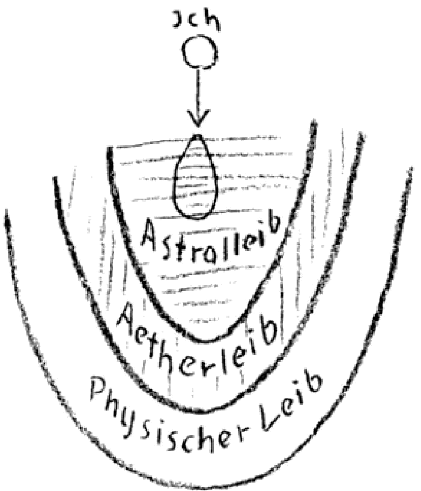

Dann schlägt das Ich von oben ein in den astralischen Leib und beginnt zu arbeiten im Menschen, und wir haben dann einen Teil des astralischen Leibes, der vom Ich selbst geformt ist. Dieser astralische Leib besteht heute aus zwei Gliedern, einem Gliede, das auch das Tier hat, und einem anderen, das nur der Mensch hat, das dadurch entsteht, daß der Mensch durch viele Verkörperungen hindurch mit seinem Ich gearbeitet hat am astralischen Leibe. Nun wirkt im Menschen etwas anderes als im Tier. Das Tier hat diesen Einschlag des Ich in den astralischen Leib nicht. Es hat seinen astralischen Leib nur in einer ganz bestimmten Weise geformt, wie es ihn eben von den äußeren Mächten bekommen hat. Nun wirkt alles, was aus den höheren Welten kommt, wieder auf das Ganze des menschlichen Organismus ein, gestaltet alles in einer gewissen Weise um und bewirkt Neugestaltungen der alten Organe, es wandelt die alten Organe um.

Betrachten wir einmal das Verhältnis dieser drei Leiber von diesem Gesichtspunkte aus. Der physische Leib besteht aus ähnlichen |53| Stoffen und Kräften, wie sie in der mineralischen Welt draußen ausgebreitet sind, aus physischen, aus chemischen Stoffen und Kräften. Würde er nur diese haben, wäre er ein Mineral, wenn auch noch so kunstvoll geformt. Ihn durchsetzt von allen Seiten der Äther- oder Lebensleib. Was tut dieser Lebensleib? Er wirkt in jedem Moment dem Zerfall des physischen Leibes entgegen, er ist der Kämpfer gegen diesen Zerfall des physischen Leibes. Ohne ihn würde der physische Leib, wenn er nur sich selbst überlassen bliebe, den physischen Kräften folgen und nach und nach zerfallen. Während des Lebens sind physischer Leib und Ätherleib verbunden, und der Ätherleib kämpft fortwährend gegen den Zerfall des physischen Leibes.

Was tut nun der astralische Leib? Es ist außerordentlich wichtig, das zu wissen. Der astralische Leib ist in gewisser Beziehung während des bewußten Lebens – nicht während des Schlafes – damit beschäftigt, den Ätherleib fortwährend zu töten, fortwährend die Kräfte, die der Ätherleib entwickelt, herabzusetzen, abzudämpfen. Daher ist der Ausdruck für das Leben des Astralleibes die Ermüdung, die Abmüdung des Körpers während des Tages. Der astralische Leib zerstört fortwährend den Ätherleib. Würde er das nicht tun, dann entstünde kein Bewußtsein, denn Bewußtsein ist nicht möglich, ohne daß das Leben fortwährend wieder stufenweise zerstört wird. Das ist außerordentlich wichtig zu beachten. Diese geistige Tätigkeit – das Leben in der Ätherwelt, das wunderbare Aufflackern des Lebens in der Ätherwelt, das sich in den herrlichsten Bewegungen und Rhythmen auslebt, und die fortwährende Dämpfung dieses Rhythmus des Ätherleibes durch den astralischen Leib – das ist dasjenige, was das Bewußtsein hervorbringt, auch schon das einfachste tierische Bewußtsein. Diese geistigen Vorgänge drücken sich in der physischen Welt nun so aus, daß in dem Augenblick, wo in das bloße Leben Bewußtsein einschießt, Verhärting, Verknöcherung im physischen Leibe eintritt. Es gibt natürlich Übergänge, Weichtiere und so weiter; diese haben auch ein ganz eigentümliches Bewußtsein. Das Bewußtsein wird erst dadurch ein eigenes, es nähert sich um so mehr dem Selbstbewußtsein, je mehr sich die weichen, organischen Lebensmassen mit harten, knöchernen Einschlüssen. |54| sen innerlich durchsetzen. Es ist also der astralische Leib in seiner Wirkung auf den Ätherleib, der - wie bei den Weichtieren, Schnecken, Muscheln und so weiter - nach außen die harten Schalenteile absondert, um in ihnen jenes dumpfe Bewußtsein zu erzeugen, das in diesen Tieren lebt. Bei den höheren Tieren, bei denen das Selbstbewußtsein stärker wird, ist es eine Nebentätigkeit des astralischen Leibes neben der Bildung des Nervensystems, alles Knöcherige, Verhärtende abzusondern. In demselben Maße, in dem das Selbstbewußtsein stärker wird, sondert sich aus der weichen, gallert-artigen Masse das feste Knorpel- und Knochenartige heraus. Bei den höchsten Tieren ist diese Bildung ungefähr fertig; der astralische Leib hat da ein Knochensystem herausgebildet, das in seiner Art beinah abgeschlossen ist.

Beim Menschen geschieht mit dem astralischen Leibe etwas besonderes, da findet ein neuer Einschlag statt. Der Astralleib wird durch das Ich teilweise umgewandelt, und das bewirkt die Umsetzung der Tendenz der Verknöcherung, die früher da war. Hätte der Mensch den Astralleib unverändert gelassen und weiter fortgearbeitet an der Skelettbildung, so gäbe es keine menschliche Kultur auf der Erde. Aller Fortschritt in der menschlichen Entwicklung ist dadurch bedingt, daß Teile des menschlichen Astralleibes herausgesondert und dem Ich unterworfen werden. Dieser abgesonderte Teil des Astralleibes hat eine besondere Aufgabe, er bewirkt eine neue Tendenz; dadurch kommt die Skelettbildung, die Verknöcherung unter die Herrschaft des abgesonderten Teiles des astralischen Leibes.

Wie äußert sich das? Sehr merkwürdig. Während früher die Tendenz des Astralleibes dahin gegangen ist, das Wesen mehr und mehr zu verhärten, gleichsam einen Schlußpunkt in der Entwicklung des Knochensystems zu setzen, behält der Astralleib des Menschen eine Kraft zurück, eine Tendenz, wiederum zu erweichen, so daß ein Fortschreiten der Entwicklung wiederum möglich ist. Gäbe es das nicht, würde alles das, was fest werden kann, in das menschliche Knochensystem einfließen, so gäbe es keinen menschlichen Fortschritt, keine Kultur. Ebenso wie die tierische Art keinen Fortschritt kennt - die Art der Löwen, der Tiger ist fertig, abgeschlossen -, |55| so würde es auch beim Menschen sein. Der Mensch aber kann mit dem abgesonderten Teil des Astralleibes wiederum das zurücknehmen, was sich verhärtet hat. Neben der Tendenz der Verhärting, der Knochenbildung, ist im menschlichen Leibe immer die Tendenz vorhanden, etwas zurückzubehalten, so daß neue Organe gebildet werden können, die weich sind. Das ist außerordentlich wichtig zu beachten. Diese Tendenz ist beim Tiere nicht vorhanden.

Betrachten wir jetzt einmal einen Menschen mitten im Leben drinnen, wie er dasteht auf der einen Seite mit seiner Tendenz zu verhärten, und auf der anderen Seite mit seiner Tendenz, etwas zurückzubehalten. Wir sehen diese beiden Tendenzen sich da scheiden, wo der Mensch um das siebente Jahr herum seine zweiten Zähne bekommt. Die Tendenz, in die Knochenbildung hineinzugehen, sich abzuschließen in der Verhärting, findet ihren Ausdruck in den Zähnen, die das Kind um das siebente Lebensjahr herum bekommt. Der abgesonderte Teil des Astralleibes bewirkt, daß der Mensch - abweichend vom Tier - gewisse Lebenskräfte zurückbehält, so daß er sich weiterbilden kann. Bis zum siebenten Jahre kam beim Menschen nur das Artmäßige, das Gattungsmäßige zum Ausdruck; jetzt tritt der Zeitpunkt ein, wo er sich in den Kulturfortschritt unserer Zeit hineinleben kann. Es beginnt die Schulzeit. Diese zwei Dinge hängen wesenhaft zusammen: die Tendenz zur Verhärting, die sich ausdrückt in der Zahnbildung, und die Tendenz zur Erweichung, die etwas zurückbehalten muß, was der Ätherleib, der im siebenten Jahr frei wird, zu seiner Fortentwicklung braucht. Diese zwei Tendenzen sind aneinandergefesselt, das zeigt sich klar und deutlich im Leben.

Man kann leicht die Beobachtung machen, daß manche Erscheinungen im Leben vorkommen, die man schwer miteinander verbinden kann, wenn man sie nicht vom Standpunkt der Geisteswissenschaft aus betrachtet. Wer zum Beispiel das sogenannte Kindbettfieber beobachtet, kann finden, daß es meistens mit schadhaften Zähnen verbunden ist. Frauen, die Kindbettfieber haben, haben oft schadhafte Zähne. Warum? Weil diese zwei Tendenzen - die Tendenz zur Verhärting, die sich in der Zahnbildung ausdrückt, und |56| die Tendenz, sich fortzuentwickeln, sich aufzuschließen und über sich hinauszuwachsen, die in der Reproduktionskraft, in der Fortpflanzung zum Ausdruck kommt - zusammenhängen. Ist die eine geschädigt, so ist auch die andere mit geschädigt.

Überall im menschlichen Leben tritt uns das entgegen, wie diese zwei Tendenzen, die nach Verhärting und die nach dem Weichbleiben gewisser Organe, zusammenhängen. Es ist wichtig, daß diese zwei Tendenzen sich ausgleichen. Man muß das Leben so einzurichten trachten, daß sie sich die Waage halten, denn durch die Kulturverhältnisse, in die der Mensch hineingestellt ist, kommt es oft zu wesentlichen Veränderungen. Holt man zum Beispiel Landarbeiter vom Land weg, aus einem Leben in der freien Natur, aus einer Umgebung, in der schon ihre Vorfahren lebten, und verpflanzt sie in die Stadt, beschäftigt sie in Fabriken und so weiter, so verlieren sie durch die ganz veränderten Lebensbedingungen das Zusammenstimmen, das Äquilibrium zwischen den verhärtenden und erweichenden Kräften in ihrem Organismus. Und was ist die Folge? Eine der beiden Tendenzen wird dann die Oberhand gewinnen, entweder die verhärtenden oder die erweichenden Kräfte. Das sind die Ursachen in der geistigen Welt; die Wirkungen in der physischen Welt können Sie selbst sehen. Nehmen Sie an, die erweichenden Kräfte nehmen die Oberhand, dann treten Kulturkrankheiten auf wie Rachitis und ähnliche Krankheiten. Wenn dagegen die verhärtenden Tendenzen die Oberhand erlangen, dann werden gewisse Weichteile des Organismus anfangen, sich in ganz merkwürdiger Weise zu verhärten. Wenn der Verhärtungsprozeß in ungeeigneter Weise in den Vordergrund tritt, dann entsteht die Tuberkulose. Bei Tieren, die in der Natur leben, finden Sie solche Krankheiten nicht. Versetzen Sie sie aber aus ihrer gewohnten Umgebung in die unsere, zum Beispiel Affen, und sperren Sie sie auch noch ein, da bekommen sie sehr häufig Tuberkulose und gehen in der Gefangenschaft daran zugrunde. Warum geschieht das? Weil da die Verhärtungstendenzen überwiegen, wenn der Affe in eine Umgebung gestellt ist, in die er nicht hineinpaßt.

So sehen Sie die geistigen Kräfte in unser physisches Leben hineinwirken, und so verstehen wir die äußeren physischen Wirkungen |57| aus ihren geistigen Ursachen. Ich müßte noch viel reden, wenn ich diese Zusammenhänge noch genauer erklären wollte. Da aber die wenigsten von Ihnen Mediziner sind, werden Sie sich damit zufrieden geben können.

Und nun bedenken Sie, wie alles das, was jetzt gesagt wurde, zusammenhängt mit des Menschen Glück oder Leid, wie das Äquilibrium des ganzen menschlichen Lebens davon abhängt, daß seine Organe zur rechten Zeit der Entwicklung die richtige Gestalt angenommen haben. Bleibt ein Organ auf einer früheren Stufe zurück, wird die Erweichung oder Verhärting in unregelmäßiger Weise hervorgerufen, so ist ein unglückliches Leben die Folge. Jedes Organ muß die Ausbildung seiner bestimmten Form auf einer bestimmten Stufe des Lebens erreichen. Wird ein altes Organ auf seiner früheren Stufe erhalten, muß Unglück, Leid kommen. Auch die verborgenen, die nicht ganz sichtbaren Organe des Menschen können in der Entwicklung entweder nachhinken oder vorauseilen. Die Tuberkulose ist etwas, was in der Zukunft den Menschen nicht mehr schaden wird, sie ist nur ein zu frühes Auftreten eines Zustandes, der später selbstverständlich sein wird. Heute ist der Zustand krankhaft, später wird er gesund sein. Von den gewöhnlichen Krankheiten, die auch im Tierleben zu finden sind, unterscheiden sich diese eigentlichen Kulturkrankheiten.

Hören Sie nicht nachklingen diese Wahrheit in dem mongolischen Märchen von der Frau, die vergebens ihr verlorenes Kind sucht? Zur Unzeit hat sie noch das Organ oben am Kopfe. Es bringt ihr Unglück. Rastlos eilt sie durch die Welt, sie findet nicht das, was ihr entspricht, was zu ihr gehört. Welche Weisheit ist da hineingeheimnißt in die einfachen Volkssagen durch die Führer der Menschheit.

Wir können nun noch weitergehen. Betrachten Sie den Menschen, wie er heute ist, wie er besteht aus Organen in aufsteigender und Organen in absteigender Linie der Entwicklung. Nicht immer hat der Mensch den astralischen Leib gehabt; dieser wurde ihm erst nach und nach eingegliedert. Bevor er den astralischen Leib eingegliedert hatte, waren seine Organe pflanzenähnlich, sie waren von pflanzlichem Wesen. Dadurch, daß der Mensch sich eingegliedert |58| hat den astralischen Leib, hat er sich das Fleisch in den ganzen Organismus des Pflanzenleibes hineingegliedert. Dieses Hineinarbeiten des astralischen Leibes in den Pflanzenleib, das ist die Fleischwerdung. Aber dies hat nach und nach stattgefunden, es hat sich nach und nach entwickelt, es hat nicht alle Organe zu gleicher Zeit ergriffen.

Wenn wir zurückgehen in der Menschheitsentwicklung durch die ganze atlantische und Teile der lemurischen Zeit und noch weiter zurück, so würden wir da einen Menschenleib finden, der noch deutlich Pflanzenorgane an sich trug. Teile des menschlichen Leibes waren schon umgewandelt in Fleisch, als andere noch pflanzlicher Natur waren. Alle diejenigen Organe des Menschenleibes, die die Begierden weniger stark in sich tragen, sind am frühesten in Fleisch umgewandelt worden; und die, welche die Begierden am stärksten in sich tragen, die Sexualorgane, sind am spätesten umgewandelt worden. Sie waren lange, lange pflanzlicher Natur, und sie werden auch am frühesten wieder zur pflanzlichen Natur zurückkehren. Erst als in der Entwicklung des Menschen das Ich schon tief in den Astralleib hinuntergestiegen war und die eigensüchtigen Begierden tief eingedrungen waren, da gestalteten sich die ehemals pflanzlichen Organe um und wurden fleischliche Organe.

Auf jene uralte heilige Zeit blickt die Geisteswissenschaft zurück, als der Mensch noch nichts von den sexuellen Kräften wußte. In den alten Mysterien wurde ein Bild verehrt, das den Menschen darstellt, der noch ungeschlechtlich war, bei dem noch nicht umgestaltet war das Geschlechtliche. An der Stelle des Leibes, wo heute die Sexualorgane sind, können wir rankenartige, pflanzliche Organe erblikken, die bloß vom Ätherleib durchzogen sind und noch nichts vom Astralleib in sich tragen. Der Hermaphrodit der antiken Kunst tritt uns so entgegen. Er wurde so abgebildet, wie man den früheren Menschen auch aus der Geistesforschung heraus schildern kann. Er hat Pflanzenorgane an der Stelle der jetzigen Fortpflanzungsorgane, und aus seinem Rücken treiben rankenförmige Pflanzengebilde heraus. Jetzt begreifen wir - in anderer Weise, als es die kindliche Art ist, in der man dies gewöhnlich versteht -, warum die alten Mythen |59| und die biblische Geschichte vom Feigenblatt sprechen: Nicht um etwas zu verdecken, zu verhüllen, sondern um auf eine wirkliche Tatsache in der Menschheitsentwicklung hinzudeuten, auf jenen uralten heiligen Zustand, von dem die Alten noch wußten, daß der Mensch da auf einer höheren Stufe gestanden hatte und die Organe an dieser Stelle noch pflanzlicher Natur gewesen waren.

Aber gehen wir noch weiter. Wir können das Erobern der Verhärungstendenz beim Menschen noch in anderer Weise beobachten. Es ist merkwürdig, daß in den okkulten Schulen in einer ganz eigenartigen Weise darauf Rücksicht genommen ist. Als das Menschen-Ich hinabgestiegen war auf die Erde aus dem Schöße der Gottheit, da mußte diese Verhärungstendenz von ihm erobert werden. Aber es gibt andere Wesen, die viel früher den Abschluß ihrer Entwicklung schon erlangt hatten. Das sind die Vögel. Sie haben auch ein Ich, aber ein solches, das viel mehr in der Außenwelt lebt. Sie haben deshalb auch etwas nicht mitgemacht, was wichtig ist für alle menschliche Höherentwicklung, für die okkulte Entwicklung des Menschen. Sie haben nicht mitgemacht dasjenige, was seinen Ausdruck findet in der Herausbildung gewisser Teile des Knochenbaues, des Knochenmarkes, des innersten Inhaltes der Knochen. Vögel haben viel höhere Knochen als der Mensch und als die anderen Tiere; sie haben einen viel älteren Zustand konserviert. Der Mensch ist über diesen Zustand hinaus-, hinweggeschritten; auch die höheren Tiere sind darüber hinweggeschritten. Es sendet der Mensch die Kräfte des Ich bis in das Knochenmark hinein, und ein guter Teil der okkulten Entwicklung besteht darin, durch Übungen darauf Rücksicht zu nehmen, daß der Mensch jene passive, untätige Art, wie er sich zu seinem Knochenmark verhält, verlebendigt, in eine bewußte umändert. Heute kann er nur wirken auf den Inhalt der Knochenkapsel seines Schädels, auf sein Gehirn. Aber vorbereiten wird sich ein zukünftiger Zustand der Menschheit dadurch, daß er Gewalt bekommen wird über das Element, das als halbflüssiges Element seine Knochen durchsetzt. Die Konstruktion der Knochen hat dem Menschen - und auch den Tieren - auf der Erde die Gestalt gegeben. Daß der Mensch die Knochen so ausgebildet hat, gab ihm die MÖg|60|lichkeit seiner jetzigen Entwickelung. In Zukunft muß der Mensch die Kräfte gewinnen, seine Knochen wieder zu beleben, ihnen die Verhärungstendenz zu nehmen und sie umzuwandeln. Er wird die Herrschaft über sein Blut gewinnen, so daß in viel größerem Maße die Kraft des Ich darin sein wird, und dieses Blut wird dann das Instrument sein, mit dem der Mensch wirken kann bis in die Umgestaltung der Knochensubstanz. Was ist denn die Knochenbildung anderes als eine Vermineralisierung? Wenn der Mensch die Tendenz zur Erweichung, die sich heute zur Unzeit als Rachitis ausdrückt, beherrschen wird, wenn er das Blut so beherrschen wird, daß er wirken kann bis in die Knochensubstanz, dann wächst er über die Mineralisierungstendenz hinaus; er wird sich selbst die Gestalt geben, er wird seinen physischen Leib umgestalten bis zu dem, was wir Atma oder Geistes mensch nennen. Da besiegt der Mensch das Verhärungsprinzip, jenes starke Prinzip, das zum Tode führt, dessen eigentliche Physiognomie ausgedrückt ist im menschlichen Skelett. Es ist eine Intuition richtiger Art, wenn man den Tod im Bilde des Skeletts anschaulich macht. Diese Physiognomie des Todes wird der Mensch unter seine Herrschaft bringen. Er wird sie besiegen, wenn er seine Gestalt, so wie er sie jetzt von außen durch die mechanische Kraft der Muskeln beherrscht, von innen durch die Kraft des Geistes beherrschen und sich selbst die Gestalt geben wird. Heute kann der Mensch erst seine Gedanken bis in seine Knochen schicken; wenn später seine Gefühle in den Knochen wirken werden und noch später der bewußte Wille, dann wird er die Physiognomie des Todes überwunden haben.

Nun denken Sie sich einmal, wie segensreich die Wissenschaften werden wirken können für die Menschen, wenn die, welche dazu berufen sind, die Wissenschaften zu repräsentieren, wieder wissen werden, wie die menschlichen Organe diesem Verhärtungs- und Erweichungsprinzip unterliegen. In diesem Sinne ist es gemeint, daß das, was die Geisteswissenschaft sagt, praktisch anwendbar sei in seiner Wirkung auf das Leben. Wenn diese Dinge Anwendung finden und Wirkung haben im Leben, und wenn man solche Wahrheiten, wie sie angedeutet sind in dem alten mongolischen Märchen, mit |61| geisteswissenschaftlichem Blick durchdringt, dann wird man manches jetzt rätselhaft Erscheinende wieder besser verstehen und seine Wahrheit erkennen können. Man wird mit anderen Sinnen die Welt betrachten und wird zum Beispiel die merkwürdige Erscheinung des Vogelfluges verstehen lernen. Auf wunderbaren Bahnen ziehen die Vögel mit der einbrechenden kalten Herbsteszeit vom äußersten Norden nach dem wärmeren Süden, manchmal Hunderte von Meilen, und gelangen im Frühling zurück auf anderen Wegen. Wir haben gesagt, daß die Vögel ein Geschlecht sind, das auf einer früheren Stufe der Entwicklung stehengeblieben ist. Sie wissen, daß der eigentliche Fortschritt auf der Erde erst begann in dem Zeitpunkt, als sich der Mond von der Erde abtrennte. Früher, als die Erde noch mit dem jetzigen Monde zusammen einen Himmelskörper bildete, den sogenannten Erden-Mond oder die Mond-Erde, da bewegte sich dieser Körper um die Sonne in einer bestimmten Bahn und in einer gewissen Zeit, indem er ihr stets eine Seite zuwendete. In dieser Zeit wanderten alle Lebewesen einmal um den Mond herum, um einmal die Sonneneinwirkung zu empfangen. Jener Zug um den Planeten hat sich heute noch erhalten im Vogelflug, weil die Vögel damals, bevor das Ich in die Erdenentwicklung eintrat, sich abgespalten haben von der fortschreitenden Entwicklung auf der Erde.

Etwas anderes ist noch viel merkwürdiger. Mit der fortschreitenden physischen Entwicklung des Menschen und der höheren Tiere hat sich das Geschlechtliche des einzelnen Leibes bemächtigt. Jene Begierde, die im einzelnen Leibe sitzt, die heute ganz im Geschlechtlichen lebt, war vorher dort nicht vorhanden, sie war eine kosmische Kraft. Dem alten Erden-Monde strömte sie von der Sonne zu. Sie war die Ursache jener Umgänge um den Planeten, mit denen die Art zusammenhing, wie sich die Fortpflanzung vollzog. Der Frühlingszug der Vögel ist in Wirklichkeit nichts anderes als eine Art Brautzug. Bei diesen Wesen ist das Geschlechtliche noch in der Umwelt, und die kosmische Kraft ist die dirigierende Macht, die den Zug von außen lenkt und leitet, während bei den anderen Wesen diese Kraft eingezogen ist in die einzelnen Leiber. Dieselben Kräfte, die im Innern des Menschen, in seinem Leibe wirken, wirken auch |62| im äußeren Makrokosmos. Dieselbe Kraft, die Mensch und Mensch zusammenführt, die im Leibe des Menschen als Geschlechtskraft wirkt, wirkt bei der Vogelspezies nicht im Innern der Wesen, sondern von außen und drückt sich in dem äußeren Zuge der Vögel um den Planeten aus.

So wandern die Kräfte, die außen sind, in das Innere der Wesenheiten hinein, um im Menschen die Möglichkeit zu finden, wiederum hinauszuwirken, wenn er die Fähigkeit erobert haben wird, wieder eins zu werden mit dem ganzen Kosmos, dem Außerirdischen. Was die Menschen an solchen großen Wahrheiten in so ergreifender Weise in den alten Sagen und Märchen ausdrückten – wie in dem mongolischen Märchen von der Frau mit dem einen Auge –, das wird eine zukünftige Menschheit in anderen Formen ausdrücken. Die Kraft des geistigen Schauens wird im Menschen wieder lebendig werden. Jene Kraft des geistigen Schauens, die eine Eigenschaft des Kopfauges ist, sie wird nicht mehr den Menschen sich unbefriedigt fühlen lassen beim Schauen der physischen Dinge der uns umgebenden Welt, wie die Frau in der Legende, die jedes Wesen, das in ihre Nähe gebracht wird, wegwirft. Diese Kraft wird durchdringen des Menschen jetziges Wesen, und er wird dann nicht nur das Äußere, Physische der Dinge sehen, sondern das, was sich in den äußeren Gegenständen an Geistigem ausdrückt. Was heute materiell geworden ist, wird geistig für ihn sein; sein jetzt verhärteter physischer Leib wird dann wiederum vergeistigt sein. Jene Frau aus der mongolischen Legende wird wieder leben und hinausschauen in die Welt. Und während sie heute die Wesen, die ihr nur ihre sinnliche Seite zeigen, wegwirft, weil sie in ihnen nicht findet, was sie sucht, wird der Mensch der Zukunft wieder den Geist in der Materie sehen und in den Wesen das finden, was zu ihm gehört; er kann es ergreifen und liebevoll ans Herz drücken. Er wird an den Wesen das Geistige der Welt finden, dasjenige, was er liebend umfassen kann.

Des Menschen Entwicklung wird eine Entwicklung zu einem langsamen Aufgehen in den Kosmos hinein sein. Sehr langsam muß sie sein, nicht im Fluge kann sie erhascht werden. Würde der Mensch sie nicht in Geduld mitmachen wollen, dann würde die |63| Kraft des Auges, das da sitzt am Kopfe der Alten, nicht sein ganzes Wesen, alle seine Organe durchströmen als Fluidum der Liebe. Diese Kraft würde sich erschöpfen, und der Mensch müßte dann in Lieblosigkeit dem Äußeren sich verschließen und verdorren. Der Mensch ist aber berufen, alles, was auf seinem Planeten ist, liebend zu durchdringen, den Planeten mit sich zu nehmen und zu erlösen. Die Erlösung des Innern kann sich nicht vollziehen ohne die Erlösung dessen, was außer uns ist. Der Mensch muß seinen Planeten zusammen mit sich selbst erlösen. Die Erlösung kann nur sein, wenn der Mensch seine Kräfte in den Kosmos hineingießt, er muß nicht nur werden ein Erlöster, sondern er muß werden ein Erlöser.

# VIERTER VORTRAG, Berlin, 21. Oktober 1907 abends

## Germanische Sagen

|64| An mehreren Montagen wurde hier im Besant-Zweige versucht, die okkulte Grundlage der germanischen Mythen ein wenig zu charakterisieren, und am letzten Montag dann auch mit einer Erweiterung des ganzen Mythenstoffes begonnen, wie er sich in einem breiten geistigen Gürtel herübererstreckt von Persien durch den Osten von Europa und durch Europa selben Es würde heute vielleicht nicht angemessen sein, gerade dort fortzufahren, weil viele derjenigen unserer Freunde, die heute anwesend sind, damals nicht anwesend waren. Und so soll versucht werden, den heutigen Vortrag mehr selbständig zu gestalten; es soll versucht werden, ohne die Voraussetzungen der beiden letzten Vorträge, einiges aus dem Kreise der europäischen Mythen im allgemeinen vorzubringen. Dadurch natürlich sind wir heute bei unserer Betrachtung darauf angewiesen, manches sehr aphoristisch zu behandeln.

Erinnern möchte ich, daß die Zwölfzahl der oberen Götter, die nur die doppelte Sechszahl ist, so wie wir sie das letztemal in den Amshaspands gefunden haben, auch in der germanischen Götterzahl wiederkehrt, jene Götterzahl, die wir vor acht Tagen in ihrer Bedeutung kennengelernt haben. Wir wollen heute nur einzelne Götter, und von diesen nur einzelne Eigenschaften herausheben, um zu zeigen, welches die okkulten Grundlagen solcher Götter und solcher göttlichen Eigenschaften sind. Wir haben die Verwandtschaft der germanischen Mythologie mit der persischen erkannt. Wir haben wiedergefunden, wie in der drüben in Asien entstandenen Mythologie dasselbe dargestellt wird wie in den mitteleuropäischen Mythen. In den Kräften der sechs Amshaspands erkannten wir wieder die zwölf Nervenpaare, die von unserem Haupte ausgehen, und in den achtundzwanzig Izards erkannten wir die Kräfte, die von unserem Rückgrat ausgehen.

|65| Sie alle wissen, daß in diesen germanischen Götterkreis hineingehört Wotan-Odin als eine Art oberster Gott; ferner haben wir Thor und seine Tochter, die Truth, in ihrer okkulten Bedeutung gezeigt; und wir haben Tyr berührt, der eine Art von Schlachtengottheit, ein Kriegsgott, aber ein sonderbarer Kriegsgott war, und der in gewisser Weise dem südlicheren Mars oder Ares entspricht; er entspricht ihm bis zu dem Grade, daß auch der Dienstag als Tyrstag oder Tiustag diesem Gott geweiht ist. Aber es ist sonderbar, es wird uns von anderen Geistwesen erzählt, die eine gewisse Rolle spielen in den Vorgängen, die sich zwischen den germanischen Göttern abspielen, und es wird da ein merkwürdiger Gott, oder sagen wir eine Götterfamilie, die des Loki, in eine bestimmte Beziehung gerade zu dem Tyr gebracht. Sie wissen – und die okkulte Grundlage ist den Mitgliedern des Besant-Zweiges ausgeführt worden –, daß dieser Loki, der dasteht neben den anderen nordischen Göttern, abstammt von jenen Feuermächten, deren südlichen Ursprung wir charakterisiert haben. Während die nordischen Götter abstammen aus der Verbindung des Feuerelementes von Süden und des kalten nebligen Elementes von Norden, haben wir in Loki einen älteren Gott oder wenigstens einen Sprößling einer älteren Gottheit vor uns, eine Art von Feuergott. Wir können also sagen, jener Loki, der soviel Feindschaft gegenüber den anderen Göttern entwickelt, gehört einem älteren Geschlechte geistiger Wesenheiten an, die die Herrschaft für eine Weile abtreten mußten an solche, zu denen Wotan, Tyr und Thor gehören. Daher hat er ihnen Feindschaft angekündigt und lebt im Kriege mit den Äsen, mit jenen Göttern, die erst zur Herrschaft gekommen sind, als die atlantischen Menschen sich herausentwickelten aus den früheren Zuständen und sich herüberentwickelten zu den nachatlantischen Menschen; da haben die Äsen ihre Bedeutung. Aus viel früheren Zeiten stammen diejenigen Geistwesenheiten, zu denen Loki gehört. Unter anderem hat dieser Loki von seiner dem Riesengeschlechte entstammenden Gattin Angrboda drei Nachkommen ganz merkwürdiger Art, den Fenriswolf, die Midgardschlange und Hei, die Göttin der Unterwelt. Diese drei Wesen, die also zurückverfolgt werden können bis in die früheren Zeiten, |66| müssen von den neuen Göttern, den Äsen, erst gebändigt werden, damit sich die neuen Bewußtseinszustände in der Menschheit entwickeln können. Die Midgardschlange wird bekanntlich dadurch gebändigt, daß sie in das Meer hinuntergewiesen und um die Kontinente herumgelegt wird, so daß sie sich in den Schwanz beißt und nichts vermag für die Zeit, während welcher die neuen Götter, die Äsen, herrschen, die die früheren Götter abgelöst haben. Der Fenriswolf wird durch allerlei Mittel gebändigt und gefesselt, aber gerade dadurch kommt eine gewisse Beziehung heraus zwischen dem Gott Tyr, dem herrischen Kriegs- oder Schlachtengott, und seiner Familie und Loki. Der Gott Tyr muß eine Hand dem Fenriswolf in den Rachen hineinstecken, damit dieser sich fesseln läßt, und verliert dadurch seine rechte Hand. Das ist ein sehr bemerkenswerter Zug der germanischen Mythe, der nur aus dem Okkultismus heraus verstanden werden kann. Wir wollen nachher einmal diese Hand des Tyr aufsuchen und wollen sehen, wo sie eigentlich steckt. Die Hei aber wurde in die Unterwelt nach Niflheim oder Nebelheim verwiesen, wo zu ihr kommen müssen alle diejenigen, die nicht auf dem Schlachtfelde gefallen sind. Diejenigen, die auf dem Schlachtfeld fallen, werden mit dem Göttergeschlecht vereinigt; ihnen erscheint mit dem Tode die Walküre und bringt sie hinauf zu den Äsen selbst. Sie haben einen ehrenvollen Tod. Anders geht es denen, die den sogenannten Strohtod gestorben sind, die einer Krankheit oder der Altersschwäche zum Opfer gefallen sind; sie müssen hinunter in das Reich der Hei, bei welcher Sorgen, Entbehrung, Hunger und Qual herrschen. Die Toten also, die den Strohtod gestorben sind, waren nicht zu brauchen für das Reich der Äsen, sie wurden zu Hei verwiesen, damit es Ruhe gibt während der Herrschaft der Äsen. Auf diese Weise sind die Kinder des Loki von der Herrschaft der Äsen abgesperrt worden. Loki selbst aber wurde von den Göttern überlistet und gefangen, als er sich in einen Lachs verwandelt hatte. Er wurde an drei Felsplatten geschmiedet und erlitt große Qualen.

Alle diese Sagen gewinnen eine besondere Färbung dadurch, daß über all dieses Götterdasein der Äsen ein merkwürdiger tragischer |67| Zug ausgegossen ist, von dem wir öfter gesprochen haben. Diejenigen, die die Vorträge über die nordische Mythologie gehört haben, wissen, daß in den Einweihungsstätten der nordischen Mysterien dieser tragische Zug durchaus gewaltet hat. Er wurde auch in die Göttersagen hineinverpflanzt. In steter Sorge vor ihrem Untergang leben die nordischen Götter, die Äsen, denn sie wissen, daß einstmals ihr Reich zu Ende gehen wird. Immer tritt uns da ein tragischer Zug entgegen, der uns sagt, warum dieses Reich zu Ende gehen wird. Dieser tragische Zug ist der, daß seit dem Beginn von Krieg und Unfrieden auf der Erde die Keime gelegt sind zu dem, was einstmals der große verheerende Weltenbrand sein wird, wo sich alles wieder losmachen wird, was die Götter einst gefesselt hatten, wo der Fenriswolf, die Midgardschlange und Loki selbst befreit sein und den Äsen den Untergang bereiten werden. Ein besonders hervorragender Geist aus dem Feuergebiete wird kommen, Sutur, und seiner Macht werden die Äsen weichen müssen. Die Götterdämmerung wird da sein, und aus dem Weltenbrande des Alten wird die neue Welt erstehen. Wiederum ein merkwürdiger Zug ist es, den uns die Sage mitteilt: Wenn der Fenriswolf los sein wird, wird er den Rachen so weit aufsperren, daß der Oberkiefer bis in den Himmel ragt und der Unterkiefer in der Erde stecken wird; sein Hauch wird die ganze Welt verbrennen.

Diese Sagenwelt kennen Sie alle. Und diese Züge, die wir eben angeführt haben, wollen wir jetzt einmal ihrer okkulten Grundlage nach betrachten. Dabei werden wir uns noch einmal erinnern der Tatsache, daß die Äsen, jene Götter also, zu denen Wotan, Tyr und Thor gehören, ihre Herrschaft angetreten haben, weltbeherrschende Mächte geworden sind, nachdem der Mensch in der spätatlantischen Zeit den Übergang gefunden hat von einem früheren hellseherischen Bewußtseinszustand, wo er noch hat hineinsehen können in die geistige Welt, zu dem nachatlantischen Zustand, wo er nur mehr in der Sinnenwelt, in der Welt der äußerlich, physisch sichtbaren Tatsachen war. Wir wissen, daß gerade an dem Punkte der Erde, wo sich Warme und Kälte berührt haben, sich das erste Häuflein Menschen gebildet hat, das nach Osten hinüber gezogen ist und die nach|68|atlantische Kultur begründet hat. Wir wissen, daß die alte Atlantis ein Land war, in welchem die Luft noch ganz erfüllt war von Dunst- und Nebelmassen, von weit ausgebreiteten Wasserdämpfen. Wenn wir die ersten Zeiten der Atlantis durchforschen würden, so würden wir zwei Regionen erkennen: im Norden dichte kühlere Wasserdämpfe und von Süden heraufsteigend heiße Wasserdämpfe. Die Atlantier hatten eine ganz besondere Erinnerung an diese Zeit. Das tritt uns entgegen in dem Teil der Sage, der darauf anspielt, daß das kalte Nordische zusammengestoßen ist mit dem heißen Südlichen. Durch diesen Ausgleich der Kräfte konnte, wie ich gezeigt habe, jene Atmosphäre entstehen, aus der sich herausgehoben hat, dasjenige, was die nachatlantische Geistigkeit wurde. Dasjenige, was die alten Atlantier hatten, die geistige Wahrnehmung, das ist von den Menschen gewichen; es ist zu den Göttern gekommen. Die Götter haben natürlich das alte Hellsehen bewahrt, aber sie können nur mehr von außen zu den Menschen sprechen und auf sie wirken, weil die Menschen selbst ja kein Hellsehen mehr hatten. Was die Menschen früher selbst gehabt haben, das Hellsehen, das schreiben sie jetzt nur noch den Göttern zu, die fern von ihnen, über ihnen wohnen.

Erinnern wir uns nun, wie nach und nach die schweren Nebelmassen der alten Atlantis heruntergezogen sind, wie die Atlantis durch große Wassermassen überflutet worden ist, und wie nach und nach das Physische heraustrat aus der sich reinigenden Luft. Erinnern wir uns, wie nun das entstand, was es vorher niemals gegeben hat, was erst entstehen konnte, als die Regengüsse herunterströmten und allmählich die Luft klar wurde: es erhob sich der Regenbogen. Der Regenbogen war eine Erscheinung, die die Menschen zum ersten Mal sahen mit dem Untergang der Atlantis. Indem dahinschwand das alte Hellsehen der Menschen, sahen sie zum ersten Mal aufsteigen den Regenbogen, der die Brücke bilden mußte zwischen ihnen und den Göttern. Das ist die Brücke Bifröst. Alles das haben die Menschen wirklich gesehen, und in den Sagen ist nur wiedergegeben, was sie gesehen haben.

Was haben die Menschen nun dadurch verloren, daß dies stattgefunden hat? Sie haben dasjenige verloren, was ihnen früher die Was|69|ser der Weisheit ringsherum gegeben haben. Als noch die Wasser die Luft erfüllten, da raunten sie den Menschen Weisheit zu. Das Rieseln der Quellen, das Rauschen des Windes, das Plätschern der Wellen - das alles raunte ihnen Weisheit zu. Das alles verstanden die Menschen, alles war ihnen eine Sprache der geistigen Wesenheiten, und das war jetzt wie hinuntergesunken ins Meer, in die Flüsse. Das war eine andere geistige Welt gewesen als die Welt der Äsen; das war eine Welt, die in sich noch enthalten hatte die letzten Überreste der menschlichen Herkunft aus dem Geistigen. Hinuntergesunken war alles dasjenige, was die Luft erfüllt hatte, ins Meer. Die Weisheit war heruntergesunken mit den Wassern. Das ist eine wirkliche Tatsache. In den Wassern, die um die Kontinente herumgeschlungen waren und die sich berührten, sahen die alten Vorfahren der mittel-europäischen Bevölkerung die Midgardschlange. Sie bewahrte $dk$ heruntergesunkene alte Weisheit, die die Menschen früher besessen hatten, und die sie jetzt nicht mehr besitzen konnten. Die Kraft des Hellsehens mußte bei den Menschen verschwinden. Niemals hätten die Götter von außen regieren können, solange die Menschen selber noch hellsehend waren. Die Midgardschlange, eine Tochter der Feuergewalten, mußte hinuntergestoßen werden ins Meer.

Der letzte Abkömmling dieser Feuergewalten war Loki. Loki war der Feind der Götter. Er hatte den Menschen gegeben, was noch ihr letztes Hellsehen war: die Midgardschlange, die jetzt gefesselt war. Aber noch etwas hat Loki den Menschen gegeben, noch etwas kam von dem alten ursprünglichen Feuer-Anfange des Menschengeschlechtes im Lande der Lemurier, was sich allerdings erst entwickeln konnte im Lande der Atlantier. Was hatte sich da nach und nach entwickelt, als die Menschen sich vom Hellsehen zum Verstande entwickelten? Die Sprache! Wir haben oft darüber gesprochen. Während der Mensch allmählich den aufrechten Gang lernte - das war in der atlantischen Zeit -, da hat sich auch die Sprache entwickelt, nach und nach hat sie sich entwickelt, so daß sie erst am Ende der atlantischen Zeit fertig war. Als die Atlantier mit dem gut entwickelten Verstande nach dem Osten zogen, da war schon die Sprache entwickelt. Aber diese Sprache war, solange sie die |70| Sprache der Atlantier war, eine einheitliche Sprache, die sich gerichtet hat nach den einheitlichen Lauten der Sprache der Natur selbst. Sie war die Nachahmung dessen, was die Atlantier während der Zeit des Hellsehens und Hellhörens herausgehört haben aus den rieselnden Quellen, den brausenden Winden, dem Rauschen der Bäume, dem Rollen des Donners, dem Plätschern der Wellen. Diese Laute haben sie umgesetzt in ihre Sprache, und das war die gemeinsame Sprache der Atlantier. Erst in der nachatlantischen Zeit gliederte und entwickelte sich das, was man den Unterschied nennen kann zwischen den einzelnen Sprachen und Idiomen, den Elementen der verschiedenen Sprachen. Die alte atlantische Sprache, welche aus den Elementen der Natur entnommen war, von jenen Gewalten, mit denen Loki so innig verwoben ist, sie mußte andere Formen annehmen, als jetzt die Äsen Herrscher wurden und die Menschen sich in Völker und Stämme teilten. Durch die Trennung der Menschen nach Völkerstämmen und den Kampf der einzelnen Stämme untereinander kam das, was man den Krieg nennt. Um was wurde dieser Krieg geführt? Warum kam er? Dem Menschen wurde durch die Sprache für seine Entwicklung etwas gegeben, wodurch er seine innersten Gefühle nach außen kehren kann. Vom okkulten Standpunkte aus ist das einer der wichtigsten Fortschritte in der Evolution, wenn die Seele dazu kommt, in Tonen ihre eigenen Schmerzen, ihre Freude und Lust nach außen tönen zu lassen. Die Sprache, wenn sie von innen aus artikuliert wird, wenn sie die Seele erklingen läßt, ist etwas, was dem Menschen eine mächtig wirkende Gewalt gibt. Diese Gewalt mußte niedergezwungen werden von den Äsen, sonst hätten sie nicht herrschen können. Wodurch zwangen die Äsen die alte einheitliche Sprache nieder? Das taten sie dadurch, daß sie die Menschen in verschiedene Stämme und damit in verschiedene Zungen spalteten. Eine gewaltige Macht war die Ungeteiltheit der Sprache - der Fenriswolf. Damit diese Macht sich nicht geltend machen konnte auf dem Schauplatze der Äsen, mußten die Äsen den Fenriswolf bezähmen, das heißt, sie mußten die Sprache zerstückeln, sie mußten die Sprache verschieden machen, damit sie die Menschen beherrschen konnten. Dadurch schufen sie den Krieg. Der Krieg |71| hängt zusammen mit dieser Verschiedenheit der Sprachen. Aber eines war notwendig, damit die Äsen Herrscher werden konnten: Der Kriegsgott mußte seine Hand hineinstecken in den Rachen des Fennswolfes, und er mußte seine Hand dabei lassen. Die Hand des Tyr, des Kriegsgottes, steckt als Zunge im Rachen des Fenriswolfes. Es ist die menschliche Zunge, die die verschiedenen Sprachen bewirkt. Die menschliche Zunge mußte sich so formen, daß die alte Einheit der Sprache verlorenging. Es ist die Individualisierung der Sprache, die in dieser tiefen Mythe vom Fenriswolf angedeutet ist. Jegliches Organ wird in der Mythe in irgendeiner Weise mit den-Einflüssen der Götter von außen zusammengebracht. Hier haben Sie das Organ der Zunge und die Art, wie bildlich ausgedrückt wird die fortschreitende organische Entwicklung der Menschen.

Noch etwas anderes kam, als die Atlantier allmählich vorbereitet wurden für die spätere nachatlantische Epoche. Es waren ja die einzelnen Bewußtseinszustände des Menschen ganz anders zur Zeit der alten Atlantis als heute. Wir haben schon davon gesprochen, daß noch ein gewisser Grad von Hellsehen vorhanden war; das aber bewirkte, daß der Atlantier nicht den Unterschied zwischen Schlafzustand und Wachzustand kannte, wie wir ihn heute kennen. Der große Unterschied zwischen Schlafzustand und Wachzustand ist eigentlich erst in der nachatlantischen Zeit entstanden. Natürlich bereitete sich das langsam vor, aber die Vorbereitung gab nur die Anlage zu dem, was der Wechsel zwischen Wachen und Schlafen in der nachatlantischen Zeit bedeutete.

Der alte Atlantier träumte am Tage und träumte in der Nacht. Die Träume der Nacht entsprachen mehr der Wirklichkeit als die Träume des heutigen Menschen. Und die Träume des Tages waren ein wirkliches Wahrnehmen der geistigen Welt, die um den atlantischen Menschen herum lebte, namentlich in der ersten Zeit der Atlantis. Dadurch aber, daß dieser strenge Wechsel eingetreten ist zwischen dem wachen Tagesbewußtsein und dem vollständig bewußtlosen Schlafzustand, gewann eigentlich erst das seine volle Bedeutung, was zusammenhängt mit der Beziehung des astralischen Leibes zu den anderen Leibern. Die menschlichen Krankheiten in |72| ihrer heutigen Form gewannen erst ihre Bedeutung in der nachatlantischen Zeit. In der ersten atlantischen Zeit gab es diese Krankheiten noch nicht; dann wurde es nach und nach ärger und ärger mit den Krankheiten, die die Menschen bekamen. Sie wissen ja alle, welchen gesundenden Einfluß der astralische Leib ausübt, wenn er während des Schlafes außerhalb des physischen Leibes ist. Nun war zwar der Astralleib während der atlantischen Zeit nicht mehr ganz außerhalb, aber er war doch zum größten Teil mehr draußen als beim heutigen Menschen, daher konnte er auch noch fortwährend seinen gesundenden Einfluß ausüben. Gerade durch das Eindringen des Astralleibes in den Ätherleib und den physischen Leib kamen ganz neue, andere Verhältnisse zwischen dem Astralleib, dem Ätherleib und dem physischen Leib zustande, und dadurch wurden die Krankheiten erzeugt, die wir heute kennen. Die Krankheiten gewannen ihre Bedeutung erst, als der Astralleib nicht mehr auch bei Tage am physischen Leib arbeiten konnte.

Wieder ist das in der Mythe ausgedrückt. Nur wer auf dem Schlachtfelde fällt, stirbt so, daß er nicht den Mächten der Unterwelt verfällt; er ist noch zugehörig den höheren Mächten, er darf hinauf zu den Göttern nach Walhall. Die anderen aber, die den Mächten der Krankheiten unterliegen, sie müssen hinunter zur Hei, die auf der einen Seite schwarz und auf der anderen Seite weiß ist, was ja deutlich den Wechsel zwischen den Bewußtseinszuständen des Tages und der Nacht ausdrückt. Damit retten sich die Äsen, daß sie nur diejenigen mit hinauf nehmen, die durch den Tod auf dem Schlachtfelde sich mit der astralischen Welt vereinigen können, während die anderen hinuntergehen müssen zur Hei, welche sie führt in ihre Reiche. Das ist ein tiefer Zug der nordischen Sage, und auch dieser Zug ist durchaus aus den Tatsachen heraus genommen.

Nun ist in allen Sagen, welchen der Okkultismus zugrundeliegt – und alle wirklich großen Sagen sind ja aus den Geheimschulen hervorgegangen –, immer auch Prophetie enthalten. Wir haben auch hier einen Hinweis auf einen zukünftigen Zustand in der Menschheits- und Erdenentwicklung. Nur eine Zeitlang wird der Mensch damit behaftet sein, daß er nur die äußere Sinneseswelt sieht. Selb |73| ständig wird er wiederum aufsteigen zu derjenigen Anschauung, welche er ursprünglich hatte. Hellsehend war er in ferner Vergangenheit, heruntersteigen mußte er zur physischen Wahrnehmung, um selbstbewußt zu werden, und er wird wieder hinaufsteigen zu hellseherischem Schauen. Merkwürdig stimmt das mit der ganzen Konstitution des Menschen überein. Sie wissen ja - wenigstens diejenigen von Ihnen, welche die früheren Vorträge mitgemacht haben -, Sie wissen, daß die Sage die Begabung mit dem Nervensystem, überhaupt mit der Fähigkeit, die äußeren Dinge so wahrzunehmen, wie sie der heutige Mensch wahrnimmt, zuschreibt dem Einströmen der göttlichen Mächte durch die Tore der Sinne. Sie haben in Ihren Sinnen nun aber einen ganz merkwürdigen Unterschied, der hier in der Sage in grandioser Weise wiederkehrt. Wenn Sie den Sinn des Gehörs nehmen: sein Werkzeug ist ein einzelnes Organ, er ist lokalisiert im Ohr; wenn Sie den Sinn des Gesichtes nehmen: sein Werkzeug, sein Organ ist lokalisiert im Auge; wenn Sie den Sinn des Geruches nehmen: sein Werkzeug ist lokalisiert in den Schleimhäuten der Nase; der Geschmack ist in der Zunge und im Gaumen lokalisiert. Nun nehmen wir aber den Gefühlssinn, den Sinn für Wärme; wo ist denn dieser lokalisiert? Er ist über den ganzen Leib ausgedehnt. Er unterscheidet sich ganz wesentlich von den anderen, lokalisierten Sinnen. Das, wodurch der Mensch die Wärme wahrnimmt, ist merkwürdig unterschieden von den anderen Sinneswerkzeugen.

Nehmen wir diesen Sinn der Sage, daß durch die einzelnen menschlichen Sinnesorgane einziehen die Gewalten der Götter. Da müssen wir uns sagen: Die Gewalten, die leben in der Tonwelt, ziehen ein in den Menschen durch das Ohr; die Gewalten, die leben in der Lichtwelt, ziehen ein durch das Auge, und so weiter. Aber die Gewalten, die in der alles belebenden und durchdringenden Wärme leben, sie erfüllen den ganzen Menschen, sie haben den ganzen Menschen zu ihrem Organ, das sie wahrnimmt. Als der Mensch hervorging aus dem Schöße der Gottheit am Anfange seiner Entwickelung, da war das ganz anders. Da hatte der Mensch noch keine Sinne zum Wahrnehmen der Umwelt. Zuerst bildete sich bei ihm aus jenes eigentümliche Gefühlsorgan, das man zu Unrecht ein Auge nennen |74| wurde, jenes Organ bildete sich aus den Ausstrahlungen und Einströmungen in die oberen Schichten seines Wesens. Dieses Organ war eine Fortsetzung des Menschen nach außen; Sie können heute noch beim Kinde die weiche Stelle in der Schädeldecke fühlen, wo dieses Organ herausragte, gleichsam das Loch, das offen war, wo diese Strömungen einzogen. Dieses Organ war damals der lokalisierte Wärmesinn, der jetzt über den ganzen Körper des Menschen verbreitet ist. Der Mensch hatte dieses Organ im alten Lemurien, dem heißen Feuerlande. Er konnte es benützen, es kündigte ihm an, wohin er gehen konnte, er konnte damit fühlen, ob ihm die Temperatur zuträglich war oder nicht. Heute ist dieses Organ zusammengeschrumpft und zur Zirbeldrüse geworden. In der Zukunft wird das, was heute ausgebreitet ist über den ganzen Leib, auf einer höheren Stufe wiederum umgewandelt erscheinen, es wird lokalisiert sein in einem bestimmten anderen Organ.

Sie sehen das in der Mythe ausgedrückt durch die Herrschaft des Sutur in der Region des Südens, in Lemuria. Die Gewalt des Feuers ist repräsentiert durch Sutur. Sie sehen in der Mythe angedeutet, wie Sutur unter die Herrschaft der anderen Götter, der Äsen, kommt, deren Gewalt in den Menschen einströmt durch die lokalisierten Sinne. Doch Sutur wird wiederkommen und herrschen an der Stelle der Äsen. Der Mensch wird zurückkommen zu den Urgewalten des Feuers, und der Wärmesinn wird nicht mehr ausgebreitet sein über den ganzen Leib, sondern wiederum lokalisiert sein in einem Organ. Wunderbar gibt die Sage das wieder, was auch den Tatsachen entspricht, die wir durch die Geisteswissenschaft kennen. Was der Mensch zurückbehalten hat von jener alten Feuerwelt, von jener Feuer- und Wärmeumgebung, die er mit seinen alten Organen wahrgenommen hat, was ist es? Es ist nicht der Sutur selbst. Denn um dieses Gebiet zu beleben, in dem der Sutur war, brauchte der Mensch sein altes Organ, das Gefühlsorgan, das wie eine Laterne von seinem Kopfe herausragte. Es ist jener «Nachkomme» des alten Gefühlssinnes, der die Schicksale des ganzen menschlichen Leibes erleben muß, der ganz mit dem Schicksal des Menschen verwoben ist, und das ist der Sohn des Sutur, Loki. Loki ist gefesselt an den dreifa |75| chen Felsen des menschlichen Hauptes, des menschlichen Rumpfes und der menschlichen Glieder, so daß er sich nicht rühren kann und deshalb allen menschlichen Qualen und Leiden ausgesetzt ist.

Das führt Sie noch tiefer hinein in diese Welt der germanischen Mythen, die von einer schier undurchdringlichen Tiefe sind. Man muß wirklich sehr tief schürfen, um zu durchschauen, welcher Art zum Beispiel der Enthusiasmus war, der einen Künstler wie Richard Wagner ergriff und zu seinem Schaffen trieb. Niemals soll behauptet werden, daß Richard Wagner etwa die einzelnen Sagen in einer solchen Weise hätte spezifizieren können, wie es durch den Okkultismus geschieht. Aber die geistigen Mächte, die hinter ihm standen und ihn inspirierten, die lenkten und leiteten seine künstlerischen Inspirationen so, daß seine Kunst der schönste Ausdruck wurde für das, was der Mythe zugrundeliegt. Das ist das Große, daß man an dem Kunstwerk nicht sieht, was dahintersteht, alles ist ausgeflossen in Ton und Wort. Ein merkwürdiger Instinkt - wenn man es trivial benennen will, sonst müßte man es künstlerische Inspiration nennen - waltet in Richard Wagner. Es war wie ein geistiges Hören jener alten Sprachweisen, die in ihm aufstiegen. Er empfand jene ältesten Sprachweisen sehr gut und [das veranlaßte ihn], nicht in dem Endreim zu bleiben, denn der gehört einer späteren Stufe, einer Verstandesstufe an, sondern jene Stufe der Sprachentwicklung zu wählen, die ein Nachklang ist der dahinrauschenden Wogen, die herausplätscherten aus dem Nebel der alten Atlantis: das ist die Alliteration, der Stabreim, der für den, der es empfinden kann, wiederholt im Ton, was die Musik der Wellen genannt werden kann.

In der germanischen Sage wird prophezeit, daß die Götterdämmerung heraufkommen muß, weil das entstanden ist, was die Kriege sind. Weil Tyr eine Hand verloren hat im Rachen des Wolfes, entwickelten sich die Keime zum späteren Untergang der Götter. Auf den Zustand, wo die Menschen sich wiederum verstehen werden, wo sie nicht mehr durch Sprachen getrennt sein werden, weist der prophetische Ausblick der germanischen Sage von der Götterdämmerung hin. Es spricht uns die Sage davon, daß, nachdem die atlantische Bevölkerung nach Osten gezogen war, sie sich zerspaltete und |76| zersplitterte. Etwas von der alten Atlantis haben sich nur jene Völkerschaften bewahrt, die von der mongolischen Rasse abstammen, und die unter Etzel oder Attila - Atli, dem Atlantier - herübergekommen sind. Sie haben sich einzig und allein das Lebenselement der Atlantier bewahrt, während die anderen Völkerschaften, die zurückgeblieben waren in Europa, sich durch Spaltung aus der alten Blutsgemeinschaft herausentwickelt haben und in Kriege der einzelnen Stämme untereinander zerfallen sind. So also leben diese Völker im Westen immer in Spaltungen, in Kriegen. Sie können dem Anprall des mongolischen Elementes, das die alten atlantischen Lebensgrundlagen noch bewahrt hat, wenig widerstehen. Der Zug Attilas oder Etzels wird nicht aufgehalten durch die germanischen Stämme, denn die einzelnen Stämme sind etwas, was Attila nicht imponieren kann, der sich seinen alten großen Geist bewahrt hat - eine Art Monotheismus. Das, was sich ihm als einzelne Stämme entgegenstellte, das konnte ihn nicht aufhalten. Ein merkwürdiger Zug in der Sage ist nun, daß Attila sofort zur Umkehr bewogen wird, als ihm dasjenige entgegentrat, was über die Blutsverwandtschaft hinausgeht, als ihm das Christentum entgegentrat, personifiziert in dem damaligen Papste. Da sah Attila die geistigen Gewalten, welche die Menschen wiederum einigen werden, und das ist das, wovor sich der atlantische Eingeweihte beugt. Das Christentum soll vorbereitend sein für jenen Zustand der Menschheit, wo Sutur wieder erscheint und, unabhängig von den Differenzierungen der Menschen in einzelne Stämme, der Welt den Frieden bringen wird. So kam den Menschen der damaligen Zeit das Christentum vor wie eine erste Ankündigung der Götterdämmerung und der Wiederkehr der alten Zeiten, wo die Menschen noch nicht uneinig, nicht durch Kriege gespalten und zerklüftet waren. So empfand man das Christentum insbesondere in den allerersten Jahrhunderten seiner Ausbreitung, als noch nicht das Christentum von Rom her verkündet wurde, sondern als es von Norden und Westen herüberkam durch christliche geheime Gesellschaften, die von England und Irland, später auch von Frankreich ausgingen, und die vollständig unabhängig waren von der äußeren Gewalt Roms. Erst Winfried, Bonifatius war es, der aus der |77| Schar jener westlichen Geheimschüler ausgetreten ist und seinen Frieden mit Rom gemacht hat, wodurch das Christentum dann allmählich die besondere Färbung der römisch-christlichen Kirche hat annehmen können.

So sehen wir, welche Gewalten bei der Ausbreitung des Christentums hereinwirkten aus der Erinnerung an eine alte Zeit und als prophetische Hindeutung auf eine spätere Zukunft. Was zuerst im Christentum in Mitteleuropa auftrat, das waren die Empfindungsgehalte, die damals in jenen Menschen lebten und die Anschauung jener Menschen erfüllten, die zu den Geheimschulen gehörten, und die aus den Geheimschulen heraus belehrt und befruchtet worden sind.

Wir wollen einmal eine Weile stillstehen bei dieser Phase der mitteleuropäischen Geistesentwicklung und wollen uns vergegenwärtigen, wie der Zustand Europas damals war, als die alte Götterwelt – die in den germanischen Sagen geschildert ist – nach und nach unterging in der Dämmerung, welche hervorgerufen wurde durch die religiöse Welt des Christentums. Wie einen Vorboten der großen Götterdämmerung empfand man das Heraufkommen des Christentums, jener Götterdämmerung, die dereinst die Gewalten der alten Götter hinwegfegen wird. Das Verblassen der alten Götterwelt brachte das Christentum, den Untergang der alten Götter selbst wird die große Götterdämmerung bringen, die dann als Realität das bringen wird, was das Christentum nur als Glauben brachte. So empfand man.

Nun versetzen wir uns einmal in diese Stimmung, die da war. Die Stämme der Goten, der Franken und so weiter, sie alle standen einerseits unter dem Eindruck der heranbrausenden Mongolenstämme, des Hunnenkönigs Attila oder Etzel, und auf der anderen Seite unter dem Eindruck des sich allmählich ausbreitenden Christentums. Durch die Ereignisse, die wir charakterisiert haben, waren sie in verschiedene Stämme zerklüftet; sie sprachen in verschiedenen Zungen, sie waren zerfallen untereinander. Im Grunde genommen hat sich von allen diesen Stämmen eigentlich nur einer erhalten, der Frankenstamm; er ist geblieben, dem Namen und der Bedeutung |78| nach. Was erinnert noch an all die Stämme, die da herumgezogen sind, als höchstens die Geschichte: Langobarden, Ost- und Westgoten, Cherusker, Heruler und so weiter? Der Frankenstamm hat eigentlich den Sieg über die anderen Stämme davongetragen. Wie mußte man aber innerhalb derjenigen Stämme empfinden, die dazumal im Aussterben, im Untergang begriffen waren? Gerade in den Geheimschulen und bei den Wissenden dieser aussterbenden Stämme waren diese Empfindungen am allerlebendigsten. Betrachten wir einmal einen solchen Stamm, wie es die Westgoten waren. Im nördlichen Spanien und im südlichen Frankreich hausten sie, wenn sie auch einstmals weit nach Osten hinübergezogen waren - wie Sie wissen, war der Zug nach dem Westen ja nur ein Rückzug. Die Fähigkeiten, die sie hatten, waren noch ein Nachwirken der alten atlantischen Zeit. Als diese Stämme von Osten nach Westen herübergezogen waren, hatten sie während ihrer Wanderschaft die alten Fähigkeiten verloren, aber es lebte noch als ein Nachklingen jener alten Fähigkeiten ein gewisses Hellsehen in den Menschen. Nicht mehr waren diese Menschen durchaus hellsehend, aber in gewissen Zeiten konnten sie noch hineinsehen in die geistigen Welten. Das empfanden sie aber oftmals schon als etwas Unbekanntes, Drückendes, und dafür tauchte der Name «Alp» auf. Alp - was ist das für ein Wesen? Es ist ein astralisches Wesen, das man empfand, aber nicht mehr recht kannte, das man in den atlantischen Zeiten, den Zeiten des alten Schauens und Hellsehens gekannt hatte, und das jetzt wie ein Eindringling in die Welt erschien, wie auch die Truth, die wir das letztemal kennengelernt haben. Dennoch empfanden manche Menschen es als das Hereinblicken einer höheren, der astralischen Welt in die physische. Gerade bei solchen Stämmen, die sich nicht hineinschicken konnten in die neuen Verhältnisse, empfand man, «wenn der Alp kam und drückte», daß man da in die höheren Welten hineinschauen konnte. Bei allen Stämmen, insbesondere bei den Goten, aber auch bei den Burgundern und anderen deutschen Stämmen, gab es immer einzelne - und sie wurden als in Beziehung zu göttlichen Mächten stehend angesehen -, die solchen Ausnahmezuständen standhalten und sie deuten konnten als das |79| Hereinragen der astralischen Welt in die physische. Ein solcher war der Gotenkönig Alphard, der genannt wird in jenen Zeiten, wo die Goten das südliche Frankreich bewohnten. Er war König von Aquitanien und herrschte dort in jener Zeit, als Attila seinen Zug von Osten nach Westen unternahm. Dieses Alphards Sohn war der sagenhafte Walther des Waltheriliedes. Es stellt uns so recht den Übergang dar von jener Zeit, wo die Menschen von ihren Vätern her noch etwas wußten von den alten Fähigkeiten und von dem Zusammenhängen der alten Stämme. Wie Stamm und Stämme zusammengehörten in alter Zeit – die Väter wußten es; daher hatte der Vater des Walther, Alphard, längst besprochen mit dem König des Burgunderlandes, daß dessen Tochter Hildegund die Frau des Walther werden sollte, um die drohende Kluft zwischen den Völkern zu überbrücken. Aber die Stämme waren nicht imstande, dem Anprall der Hunnen zu widerstehen, welche noch die alten Lebenskräfte besaßen, die ihnen selbst abhanden gekommen waren. Daher müssen hinunterwandern als Geiseln an den Hof des Hunnenkönigs Etzel: Walther, der Sohn Alphards, Hildegund, die Tochter des Burgunderkönigs, und als Geisel vom Frankenhofe Hagen von Tronje. Weil Günther, der Sohn des Frankenkönigs Gibich, noch nicht als Geisel gegeben werden konnte, mußte der Sprößling aus dem alten Tronje-Stamm, Hagen, als Geisel gegeben werden. Wir brauchen den Inhalt des Waltheriliedes nicht weiter zu erzählen. Am Hofe des Königs Etzel zeichnen sie sich aus als tüchtige Recken, aber eines können sie nicht: sie konnten sich wohl das erobern, was den Menschen zum Ich erhebt, aber das, was die Icke wieder zum Frieden bringt, das konnten sie sich nicht aneignen, das war ihnen unmöglich. Jeder einzelne war an seinem Platze tüchtig, daher sind sie tüchtige Recken selbst im Feindesland, am Hofe des Etzel oder Attila. Als aber Günther die Herrschaft im Frankenreiche antrat und nicht mehr mit Etzel Freundschaft hielt, da konnten sie nicht mehr standhalten, sie mußten fliehen. Nun tritt etwas höchst Merkwürdiges auf. Es gibt eine ältere Fassung des Waltheriliedes, da kämpft Walther, nachdem er geflohen ist mit Hildegund, gegen die nachteilenden Hunnen. Diese Fassung stammt aus dem Frankenlande.

|80| Wir haben dann noch eine spätere Fassung, von der gestern gesprochen worden ist, die hervorgeht aus rein christlichen Intentionen; sie wurde zuletzt in die Form gebracht im 10. Jahrhundert durch Ekkehard /., Mönch des Klosters von St. Gallen. Beide Fassungen unterscheiden sich wesentlich voneinander. Die ältere Fassung ging hervor aus dem Frankenlande. Sie stammt von solchen, die beeinflußt sind von derjenigen Strömung, in der noch immer als christliche Geheimströmung das ursprüngliche Christentum lebt, das lehren wollte: Wendet euch den neuen Anschauungen zu, und ihr werdet das überwinden, was in euch selbst noch steckt von jenem alten, das euch leibhaftig entgegentritt in den Hunnen. - Dieses Interesse konnte nur einer haben, der aus dem Frankenstamme kam. Dieses Interesse hatte aber derjenige nicht mehr, der die Sage im Kloster von St. Gallen umdeutete zur Unterweisung für Christen. Er hatte ein anderes Ziel; er wollte den Leuten sagen: Wenn ihr bei den alten Zuständen bleibt, dann werdet ihr euch selbst aufzehren. - Er zeigte ihnen anschaulich, wie sie sich selbst aufzehren. Und in der Tat, nicht die Hunnen sind es, die sie aufzehren. Als Walther mit Hildegund zurückkommt in ihr Land, ist es Günther selbst, der ihnen mit Hagen von Tronje entgegentritt. Jetzt sind es die drei Vertreter germanischer Stämme selbst, die sich im Kampfe untereinander zerfleischen, so daß auf dem Schlachtfelde liegenbleiben das Bein des einen, das Auge des anderen und die Hand des dritten. Walther wurde die Hand abgeschlagen, Günther das Bein, und Hagen verlor ein Auge. Wohl wußte der, der die Sage so niedergeschrieben hat, warum er demjenigen, der von Alphard abstammte, gerade die Hand abschlagen läßt. Ihn stellt er hin als den Repräsentanten für den Zwist der Stämme und Völker untereinander. Das Abschlagen der Hand soll an das erinnern, was dem Kriegsgott Tyr selbst passiert ist. Wo Stämme in Streit geraten, büßt der einzelne die Hand ein. Dieses Motiv wirkt fort bis zu Götz von Berlichingen hinunter, der ja auch seine Hand verliert; es ist derselbe Zug, der in der germanischen Mythe sich zeigt. Also wollte Ekkehard seinen Leuten sagen: Bleibt ihr bei diesen alten Anschauungen, dann zerfleischt ihr euch selbst, denn der Zwist ist in euch hineingetragen. Was euch verbinden |81| kann, ist der christliche Geist. - Er stellt ihnen so recht das Bild vor die Seele hin, vor dem sie lernen sollten, Abscheu zu haben. Das war die christliche Intention des Ekkehard.

Gerade diesem Waltharilied gegenüber muß man sich hüten, irgendwie zu spekulieren oder irgend etwas sonst hineinzulegen. Die einzelnen Züge: Ausschlagen des Auges, Abschlagen der Hand, Abschlagen des Beines und ähnliche Züge sind so, daß in ihnen gleichsam etwas fortwirkt vom Typus und der Form der Sage, und das da wiederkehrt, wo es notwendig erscheint. Mit Recht wurde gestern gesagt, daß es sich bei dem, der dieses Waltharilied geschrieben hat, um einen Eingeweihten handelt. Man muß aber auch betonen, daß es ein christlicher Eingeweihter war, der eine ganz bestimmte christliche Lehre vor die Menschen hinstellen wollte.

So sehen wir, wie die Geisteswissenschaft aufhellend wirkt in bezug auf diese Erscheinungen des menschlichen Geisteslebens, und wie wir hineinleuchten können in Gebiete, die die heutige Philologie noch recht wenig beherrscht. Und wenn Sie heute morgen gesehen haben, in welcher Art und Weise die Geisteswissenschaft in das alltägliche Leben eingreifen kann, und dazu nehmen, was jetzt ausgeführt worden ist, dann werden Ihnen das Beweise sein können für die innere Wahrheit der aus den höheren Welten heruntergeholten geistigen Tatsachen. Unsere Welt braucht wieder eine solche Vertiefung. Aber Sie sehen daraus auch die Art und Weise, wie wir arbeiten müssen, und daß eine äußere Agitation gar nicht das sein kann, was wirklich die theosophische Weltbewegung in das richtige Fahrwasser bringen kann. Wenn man bloß mit Dogmen kommt und diese den Leuten erklären will, dann haben sie ein volles Recht, uns zu sagen, das sei alles Phantasterei. Erst der, welcher tief eindringt in das, was die theosophische Strömung bieten kann, und der von allen Seiten in sie eindringt, wird allmählich die theosophischen Wahrheiten einsehen. Nicht zu wundern brauchen wir uns, wenn Anhänger materialistischer Strömungen das töricht finden, was wir sagen. Wie sollten sie es anders finden? Und wie sollten wir uns dem Wahne hingeben können, daß Theosophie etwas sein könnte, das man, wie den landläufigen Monismus, durch äußere Propaganda ausbreiten |82| könnte? - Nur durch positive Arbeit, durch die Verbreitung der Lehren, so gut wir es können, nur dadurch kann die Theosophie sich einleben. Selbst wenn wir noch so viele Mißerfolge haben, darf uns das gar nicht behindern und in keiner Weise beirren. Daher kann auch die Theosophische Gesellschaft nichts anderes sein als eine Stätte, innerhalb welcher theosophisch gewirkt wird. Die Gesellschaft kann nie und nimmer die Hauptsache sein; die Hauptsache muß unsere Geisteswissenschaft selbst sein. Vielleicht wird die Gesellschaft sogar nur - um das Nietzsche-Wort zu brauchen, das Sie wohl schon gehört haben - eine «Brücke» und ein «Übergang zu einem Höheren» sein, zu einer freien theosophischen Strömung in der Welt. Gegenwärtig aber brauchen wir diese Stätte, von der aus wir wirken können, und ohne die wir die Geisteswissenschaft nicht in die Welt hineinströmen lassen können. Aber wir müssen uns die freie Auffassung aneignen, die den Menschen und die Sache unterscheidet, und die die Sache höher stellt als jegliche aus äußerer Einrichtung kommende Institution.

Damit sind wir am Ende des Programms unseres Zusammenseins angekommen.

# FÜNFTER VORTRAG, Berlin, 28. Oktober 1907

## Germanische und persische Mythologie

|83| Wir haben uns an den letzten Abenden unserer Zweigarbeit mit der okkulten Erklärung mitteleuropäischer Sagen und Mythen beschäftigt und haben dabei gesehen, welch tiefe Wahrheiten und Erkenntnisse in diesen Sagen und Mythen enthalten sind. Gerade heute vor vierzehn Tagen, als wir auf die allertiefsten und allerwichtigsten solcher Wahrheiten aufmerksam machen durften, konnten wir einen Blick werfen auf eine verwandte Mythologie, auf die persische, die drüben in Asien entstanden ist, und die durchaus verwandt ist mit dem, was wir auf europäischem Boden als germanische oder ähnliche Mythologien haben. Wir haben gesehen, was sich hinter dem Namen der persischen Amshaspands verbirgt und hinter dem Namen der achtundzwanzig bis einunddreißig Izards. Wir haben die Kräfte, welche von diesen Geistern des astralischen Raumes ausgehen, wiedergefunden in den zwölf Paar Nerven, die von unserem Haupte ausgehen, und in den achtundzwanzig bis einunddreißig Paar Nerven, die von unserem Rückgrat ausgehen.

In der deutschen Mythe und überhaupt der europäischen Mythe wird uns erzählt, daß die drei Götter Wotan, Wili und We – die auch zuweilen unter anderen Namen auftreten – den Menschen erschufen. Als sie einmal am Meeresstrande gingen, fanden sie dort zwei Bäume, und aus diesen Bäumen, Ask und Embla, schufen sie das erste Menschenpaar. Wotan gab diesen ersten Menschen den Geist und das allgemeine seelische Leben, Wili gab die Gestalt, Verstand und Bewegung, und We gab Antlitz, Sprache, Gehör und Gesicht. Wenn wir dies in der europäischen Mythe hören und uns auch bereits überzeugen konnten von dem tiefen Sinn der sonstigen Mythen, so werden wir gewiß auch in dieser Dreizahl und in der Begabung des Menschen mit verschiedenen Eigenschaften durch die Dreizahl der Götter etwas Tieferes suchen dürfen. Wir werden aber |84| gut daran tun, wenn wir die Menschwerdung, wie sie in der mittel-europäischen Mythe erzählt wird, anknüpfen an die Form, wie uns die Menschwerdung in der verwandten persischen Mythologie entgegentritt. Da erscheint sie in einen großen Zusammenhang hineingestellt. Dabei kann uns zu gleicher Zeit über die mythenbildende geistige Kraft der Menschen und über die Wesenheit und die Natur des Menschen und seines Zusammenhanges mit der Erde etwas ganz Besonderes aufgehen. Wir wissen ja, daß Mythen und Sagen nicht durch Spekulationen gedeutet werden dürfen, nicht durch Spekulationen ihr Sinn gesucht werden darf, sondern daß wir versuchen müssen, in dem ursprünglichen schöpferischen Volksgeist auf der einen Seite und in den Gaben der eingeweihten Priester auf der anderen Seite uns die Ursprünge des menschlichen Wissens und Erkennens, wie sie uns in der Sage entgegentreten, klarzulegen.

Sagen und Mythen sind nichts anderes als astralische, geistige Anschauungen. Wir haben gesehen, wie wirklich der alte Germane oder der Angehörige der alten europäischen Bevölkerung die Weltenesche Yggdrasil auf dem astralen Plan gesehen hat, wie er die zwölf Strömungen vernommen hat, die als Kräfte in sein Haupt hineingingen und seine zwölf Hauptsnerven bildeten. Das alles haben wir als astralische Wirkungen kennengelernt und nicht durch irgendeine phantastische, geistreiche Spekulation.

Nun wollen wir uns zuerst einmal die persische Mythe von dem Weltentstehen und dem Menschengeschicke ganz kurz und skizzenhaft vor Augen führen. Dabei wollen wir aber bedenken, daß das urpersische Volk - das alte persische Volk, nicht dasjenige, das Sie in der Geschichte kennengelernt haben, sondern das, von dem eigentlich diese Göttersagen stammen - zu dem vorgeschobensten Bestandteil der Völkermassen gehörte, welche von der alten Atlantis nach dem Osten hingewandert sind. Als die alte Atlantis hinuntergeschwemmt worden ist, da waren es die Völkerschaften, die später nach Indien hinunterzogen und sich mit den dort ansässigen Völkern vermischten, und diejenigen, die auf dem Boden des heutigen Persien, Baktrien, Medien seßhaft wurden, die am weitesten nach |85| Osten zogen; die anderen Völker waren auf dem Boden des heutigen Europa zurückgeblieben.

Bei allen diesen Völkerschaften bildeten sich die Mythen und Sagen in den verschiedensten Arten und Gestaltungen aus, und bei allen war das, was in den Bildern ihre Mythologien erzählten, nichts anderes als das, was einzelne sehen konnten, entweder dauernd oder in besonderen Zuständen, mit ihren schwachen, aber noch immer vorhandenen hellseherischen Fähigkeiten. Gesehen haben die Menschen das, was die Mythen und Sagen erzählen. Aus diesem astralischen Anschauen heraus erzählten die Angehörigen dieses Volksteiles, der sich über die Gegend des heutigen Persien ausdehnte, was sie sahen und was dann der große Religionsstifter Zarathustra in eine gewisse Form kleidete und zur Abrundung brachte. Wir wollen uns das, was die Leute da erzählten, einmal in ganz kurzer Skizze vor Augen führen. Sie führen alles, was existiert, zurück auf einen einheitlichen Weltengrund, den sie nannten «Zaruana Akarana». Dies war ein gemeinschaftlicher Urgrund, aus dem nach dieser Anschauung alles entsprungen ist, alles, was Mineral, Pflanze, Tier und Mensch ist, aber auch alles, was höheres Geistiges ist, soweit es für die Menschen wahrnehmbar ist. Wenn man diesen Ausdruck «Zaruana Akarana» übersetzen wollte, müßte man es tun mit «leuchtender Urgrund» oder «leuchtender Untergrund». Nun ging aus diesem «leuchtenden Urgrund» eine Gottheit hervor mit Eigenschaften der Güte, mit Eigenschaften der intellektuellen geistigen Vollkommenheit, eine weise, gute, geistige Wesenheit, Ormuzd, und eine andere Wesenheit, die diesem guten Geiste Ormuzd widerstrebte. Diese andere geistige Wesenheit wird gewöhnlich genannt Ahriman. So haben wir also innerhalb der persischen Mythen und Sagen diese beiden geistigen Wesenheiten: Ormuzd und Ahriman; eine gute Gottheit und eine böse Widersacher-Gottheit. Ahriman könnte man ins Deutsche übersetzen mit dem Ausdruck «der Widerstand-Leistende» oder «der Gegnerisch-Gesinnte»; das wäre der Sinn dieses Ausdruckes.

Wenn wir nun zu diesen geistigen Wesenheiten in ein Verhältnis bringen wollen die Amshaspands und die Izards, dann müssen wir |86| uns vorstellen, daß von dem Ormuzd ausstrahlten, ausströmten die höheren geistigen Wesenheiten, die wir als Amshaspands und Izards kennengelernt haben. Sie sind die Scharen, durch die Ormuzd wirkt, so daß er der höchste Regent ist, der ihnen die Plätze anweist, sie einteilt nach den zwölf Monaten des Jahres und den achtundzwanzig oder einunddreißig Tagen des Monats, nach denen sie ihre Herrschaft wechseln. Nun erzählt aber die persische Mythe von Ahriman: Er stammt auch von dem allgemeinen «leuchtenden Urgrund» ab, aber er hat sich von Anfang an widerspenstig gezeigt und sich aufgelehnt, er hat entgegengestellt den sechs Amshaspands seine sechs bösen Geister, die Devas oder Devs, niedere und höhere. Sie müssen sich also vorstellen, daß gleichsam jeder der Amshaspands einen Widersacher hat, und so, wie die Amshaspands zu dem Regen ten Ormuzd gehören, so gehören diese Devas, im Sinne der persischen Mythe, zu der Gefolgschaft des Ahriman. Er hat seine Scharen aufgestellt, damit sie in einem lange währenden Kampf immerfort entgegentreten den guten Scharen der Amshaspands. Und ebenso hat er seine zahllosen Scharen der niederen Devas gegen die Scharen der Izards aufgestellt.

Es zeigt uns also diese persische Mythe alle Ereignisse der Welt in gewisser Weise verstrickt in einen lange währenden Kampf. Alles, was sich heute ereignet, ist im Sinne dieser persischen Mythe so anzusehen, daß es der Ausfluß ist dieses Kampfes. Was geschieht, müßte man eigentlich so darstellen, daß bei einem solchen Geschehen in der Welt auf der einen Seite die Kräfte des Guten stehen, die von den Amshaspands und den Izards ausgehen, und auf der anderen Seite die Kräfte des Bösen, die von den Devas ausgehen. Erst wenn wir das Aufeinanderwirken der guten und bösen Kräfte verstehen, werden wir nach der persischen Mythe die Geschehnisse und Tatsachen der gegenwärtigen Welt verstehen.

Wir müssen uns nun fragen: Sind die Erzählungen, die uns in diesen Bildern entgegentreten, auch astralische Anschauungen, sind sie astralische Wahrnehmungen? Wir werden sehen, daß sie es bis ins kleinste hinein sind. Zum Verständnis dieser Tatsache wird Ihnen der Umstand helfen, daß eine gewisse Rolle im alten persischen Kul|87|tus das spielt, was man nennen könnte: die Verehrung des Feuers. Diese Verehrung des Feuers darf man sich aber nicht so vorstellen, daß etwa das physische Feuer angebetet worden wäre; das ist nicht der Fall. Weder ist es angebetet worden, noch knüpft sich an das physische Feuer irgendein besonderer Kultus. Dieses physische Feuer ist für die persische Mythe und für den persischen Kultus nichts anderes als ein Symbolum, ein äußerer Ausdruck für eine gewisse geistige Kraft, die im Feuer waltet. Für den Geist des Feuers ist das äußere, physische Feuer der Ausdruck.

Nun wollen wir einmal sehen, woher diese Feuerverehrung kommt. Sie hat nämlich einen tiefen okkulten Ursprung. Erinnern wir uns daran, wie in unserer theosophischen Weltanschauung der Hergang bei der Weltentstehung erzählt wird. Wir wissen, daß unsere Erde einmal vereinigt war mit dem, was sie heute als Mond begleitet, daß der Mond erst von einer gewissen Zeit an sich von ihr abgetrennt hat; wir wissen, daß in noch früheren Zeiten unsere Erde vereint war mit dem, was heute Sonne ist. Das waren die zwei wichtigen kosmischen Ereignisse, die dem Werden des Menschen vorangegangen sind. Diese drei Weltkörper - Sonne, Mond und Erde - bildeten einstmals nur einen einzigen Körper, was wir uns so vorstellen können, wie wenn wir Sonne, Mond und Erde durcheinander mengten und darauf einen einzigen großen Weltkörper bilden würden. Zuerst trennte sich die Sonne heraus, und während sie früher den Wesen ihr Licht vom Innern der Erde her gegeben hatte, sandte sie es nun von außen auf die Erde und deren Wesen. Das war zu der Zeit, als die Erde noch den Mond in sich hatte. Der Mond war es, der die schlechten Kräfte in sich hatte, und diese schlechten Kräfte mußten heraus. Wäre der Mond darinnengeblieben, so hätte die Erde niemals die Entwickelung durchmachen können, die sie zum Schauplatz der gegenwärtigen Menschheit werden ließ.

Als der Mond sich abgetrennt hatte, war der Mensch noch nicht in seiner heutigen Gestalt auf der Erde; er war noch nicht seelenbegabt, soweit er überhaupt als physisches Wesen da war. Unmittelbar nachdem der Mond sich von der Erde abgetrennt hatte, führte diese menschliche Gestalt noch ein Pflanzendasein. Es war in dieser |88| menschlichen Gestalt, die auf der vom Mond verlassenen Erde vorhanden war, nichts anderes als die Anlage zum heutigen physischen Leib und heutigen Ätherleib. Das, was heute als astralischer Leib im Menschen vorhanden ist, das war dazumal noch nicht vereinigt mit dem Irdischen. So wie heute die Wolken in der Luft schweben, so schwebten dazumal die astralischen Leiber herum, die sich dann später in die physischen Menschenleiber hineinsenkten. Und die Menschenleiber, die als physische Vorfahren des heutigen Menschen herumwandelten, waren in einem immerwährenden Schlafzustande. Wie die Pflanzen in einem immerwährenden Schlafzustande sind, so war der damalige Mensch in einer Art von Schlafzustand, er war erst begabt mit dem physischen und dem ätherischen Leib. Bis zu jenem Zeitpunkt gab es auf der Erde überhaupt noch kein Wesen, das die für die heutige Menschheit und höhere Tierwelt wichtigste Eigenschaft hatte, die Eigenschaft des roten, warmen Blutes: die Innenwärme.

Würden Sie mit mir in der Zeit zurückgehen und die Wesen des alten Mondes untersuchen, so würden Sie finden, daß alle diese Wesen des alten Mondes, auf dem die Vorfahren des heutigen Menschen ja schon vorhanden waren, noch die Wärme ihrer Umgebung hatten, so wie heute noch die niederen Tiere, die diese Stufe beibehalten haben. Sie hatten, wie man sagt, wechselwarme Leibessäfte, sie hatten die Wärme ihrer Umgebung. Das, was als Innenwärme im Menschen und den höheren Tieren auftritt, und das, was dazugehört, das rote Blut, war in den damaligen Wesen noch keineswegs drinnen.

Nun haben wir aber gehört, daß gleichzeitig mit der Trennung der Sonne und des Mondes von der Erde ein anderes Weltereignis stattfand: der Durchgang des Mars durch die Erde. Die Substanzen der beiden Weltkörper Mars und Erde waren dazumal so dünn, daß der Mars seiner Substanz nach durch den Erdenkörper hindurchgehen konnte. Er ließ einen Stoff zurück, den die Erde früher nicht hatte: das Eisen. Das Eisen gliederte sich der Erde erst ein durch den Marsdurchgang, und dieses Eisen war die notwendige Vorbedingung, daß sich rotes Blut bilden konnte. Was war die Folge? Als der |89| Mond von der Erde weggegangen war und die Erde für sich allein zurückblieb, war die Erde in einer Art von feurigem Zustand; sie war umflossen von einer Wärmetmosphäre. Und jetzt kommen wir zu einer Vorstellung, die ich Sie bitte ganz genau zu fassen. Denken Sie sich alle die Wärme, die heute in den Leibern der Millionen von Menschen und Tieren mit warmem Blut, die die Erde bewohnen, drinnen ist, heraus, denken Sie sich, daß sie lebte als Wärmetmosphäre um die Erde herum: dann haben Sie ungefähr den Zustand, in dem die Erde war, unmittelbar nachdem der Mond weggegangen war.

Die Wesen hatten die Innenwärme noch nicht, die Wärme umflöß unmittelbar den ganzen Erdball, sie war noch draußen. Wir können uns also die Erde in dieser Zeit vorstellen als einen noch flüssigen Körper, in dem die Metalle in der verschiedensten Weise aufgelöst waren, und der von diesem Feuer- oder Wärmemeer umgeben war. In dieses Wärmemeer sandte die Sonne, die draußen war, ihre Lichtstrahlen hinein. Für den Okkultisten ist nun Licht keineswegs bloß physisches Licht, sondern dieses physische Licht ist der körperhafte, der leibliche Ausdruck für Geist. So strömte mit den Sonnenstrahlen auf die Erde herein das Wesen der Geister der Sonne. Licht als Ausdruck der Lichtgeistigkeit strömte herein in die Feueratmosphäre, in die Wärmetmosphäre der Erde. Stellen Sie sich das nur ganz lebhaft vor. Sie haben die Erde, sie ist umgeben von der Wärmetmosphäre, und in diese hineinfallend die Sonnenstrahlen, die aber für uns Geistesstrahlen sind. Dadurch, daß diese Sonnengeister in den Sonnenstrahlen in die Erdenwärme hineinfallen, bildete sich zuerst die gemeinschaftliche Seele, der gemeinschaftliche Astralleib der ganzen Menschheit und der höheren Tiere. Unten auf dem Erdboden, da waren diese schlafenden Menschenpflanzen, die einen Atherleib und einen physischen Leib hatten. Und so, wie es heute wäre, wenn Sie, die Sie alle hier sitzen, jetzt plötzlich einschlafen würden - was ja nicht zu wünschen wäre! -, dann alle Ihre Astralleiber aus Ihren physischen Leibern herausgehen und sich vermischen würden miteinander, so war es dazumal; nur vermischen sie sich damals noch stärker, sie waren eine ununterschiedene Masse, als sie die gemeinschaftliche Wärme hatten, in die das Licht |90| der Sonne, das der Ausdruck des Geistes war, hineinschien. Man nennt bekanntlich den Astralleib des heutigen Menschen auch Aura, weil er für den heutigen Seher eine Lichterscheinung darstellt, die den Menschen umflort, etwa so, wie wenn Sie sich eine ovale, eiförmige Lichtgestalt denken würden, die von allen Seiten aus dem Menschen hervorstrahlt. So war dazumal der astralische Leib des Menschen in dieser Wärmeatmosphäre der Erde enthalten, er war noch nicht aufgeteilt in die einzelnen Astralleiber; und in diese strahlte das Licht der Sonne hinein, das der Träger der Geistigkeit der Sonne war.

Nun stellen Sie sich einmal kosmisch-universell Ihr eigenes Werden in der damaligen Zeit vor. Das, was heute Ihr physischer und ätherischer Leib ist, was damals Pflanzendasein hatte, das wuchs gleichsam aus der Erde heraus, es war ureigenstes Erdenerzeugnis. Und was heute als Seele und Geist in Ihnen lebt, das kam aus der die Erde umgebenden Atmosphäre, das sog. Ihr physischer und ätherischer Leib allmählich ein. Und das hatte sich vorbereitet in einer gemeinschaftlichen Aura der Erde, die äußerlich leiblich vorgestellt werden muß als gemeinschaftliche Wärme, die durchleuchtet und durchstrahlt ist von dem geisterfüllten Sonnenlicht. So haben Sie die Wärme, die einstmals die Erde umflorte, aufgenommen. Was heute in Ihrem warmen Blute lebt, ist ein Teil dieses die Erde umfließenden Urfeuers. Würde man heute alle Wärme wieder aus den Tier- und Menschenleibern herausholen können, so würde man den alten Zustand des Urfeuers wieder herholen können. Was heute als Wärme im Innern lebt, ist die aufgeteilte Wärme, die als Wärmemeer die Erde umflößt, und in diesen gemeinschaftlichen Blutkörper flößt hinein das Licht. Auch dieses Licht ist aufgeteilt worden, nach und nach, und hat des Menschen höhere Geistigkeit geschaffen. In den bloß physisch-ätherischen Leibern war natürlich nur dumpfe, niedere Geistigkeit vorhanden. Was heute im Kopfe des Menschen wurzelt, die höhere Geistigkeit, dasjenige, was durch die Einströmungen der Amshaspands gebildet worden ist, das stammt her von den geistigen Kräften der Sonne.

Und jetzt denken Sie sich in das astrale Anschauen des Hellsehers hinein. Was sieht er? Er sieht, wie die Erde entsteht, wie der Mond |91| sich abtrennt; die Erde ist umgeben von Feuernebel, von der gemeinschaftlichen Wärme, in die hineinstrahlt, sie innerlich wunderbar durchleuchtend, die Weltenweisheit. Die Weltenweisheit, die von der Sonne kommt, sie macht die sonnendurchstrahlte Erde zur Erdenaura. Das sieht der astrale Hellseher. Und der alte persische Hellseher nannte das «Aura Mazda», die große Aura, Ahura Mazda, die große Weisheitsaura, aus der die einzelnen Auren der Menschen hervorgegangen sind. Ormuzd ist nur ein verwandelter Ausdruck für Ahura Mazda, die große Aura.

Nun gehen wir ein Stück weiter. Wodurch konnte dieser Zustand herbeigeführt werden, den in so großer, gewaltiger Weise der astralische Hellseher wahrnehmen muß, wenn er sich in diese Zeit zurückversetzt, dieser Zustand, der geschildert ist in der persischen Mythe, die ja eine Nacherzählung der Ergebnisse des astralischen Hellsehens ist? Dadurch wurde dieser Zustand herbeigeführt, daß auch mit der Sonne geistige Wesenheiten verknüpft sind. Für den Materialisten strömen aus der Sonne bloß die physischen Sonnenstrahlen. Für den aber, der die Dinge okkult durchschaut, ist es so, daß mit dem Sonnenlicht die Kräfte der geistigen Bewohner der Sonne auf die Erde herabströmen. Ebenso, wie die Erde von Menschen bewohnt wird, wird auch die Sonne bewohnt von mächtigen Wesenheiten, die sich von den Erdenwesenheiten dadurch unterscheiden, daß sie viel, viel weiter entwickelt sind als die Menschen. Die Genesis, das Alte Testament, nennt diese Sonnenbewohner die Elohim, Lichtwesen. So wahr die Menschen einen Körper aus Fleisch haben, so wahr haben diese Sonnenbewohner einen Körper aus Licht. Sie sind Lichtwesen. Und ihre Kräfte sind nicht begrenzt in engem Raum, sie können herausstrahlen bis herunter auf die Erde. Die Taten der Sonnengeister, der Elohim, strömen allen Erdenwesen zu mit dem Sonnenlicht. In jedem Lichtstrahl, in jedem Sonnenstrahl haben wir die Taten der Sonnenbewohner zu sehen. Die Menschen werden erst dann auf dieser Stufe sein, wenn die Erde den Zustand des Vulkan erreicht haben wird. Sie wissen, die Entwicklung der Erde geht aus von Saturn über Sonne, Mond, Erde, Jupiter, Venus bis zum Vulkan, den wir als die letzte Verkörperung der Erde angeben. Wenn die Erde |92| sich zum Vulkanzustande entwickelt haben wird, dann werden die Menschen auf der Stufe sein, auf welcher die jetzigen Sonnenbewohner in ihrem Entwickelungsgang heute sind. So finden wir auch, wo die Amshaspands heute wohnen. Ihre eigentliche Heimat haben sie in der Sonne, und von dort aus senden sie uns durch das Sonnenlicht ihre Taten zu.

Dadurch konnte gerade das im Menschen entstehen, was ich Ihnen als die Taten der Amshaspands beschrieben habe. Diese schicken ihre zwölf Ströme in das menschliche Haupt hinein und bewirkten dadurch, daß der Mensch das Denken entwickeln konnte, daß er seine Geistigkeit entwickelte. Auf dem Monde hatten erst die Izards an dem Menschen gearbeitet und die achtundzwanzig Rückenmarksnerven ausgebildet. Dann kam dazu die Begabung des Menschen mit den zwölf Kopfnerven, die von den Amshaspands, den Heerscharen des Ahura Mazdao, herrühren. Jedesmal aber blieben beim Entwickelungsgang eines Weltenkörpers gewisse Wesenheiten zurück. Sie kommen nicht mit. Nicht nur Gymnasiasten bleiben sitzen, sondern auch Weltwesen bleiben zurück auf einer Stufe, über welche die anderen schon hinausgelangt sind. Während des Mondendaseins der Erde sind die Elohim, die Sonnen-Lichtgeister, bis zu jener Stufe emporgestiegen, die es ihnen ermöglicht, in der Sonne zu leben und ihre Taten der Erde und der Erdenmenschheit zuzusenden. Andere Geister, die damals schon mit den Elohim auf derselben Stufe waren, sind zurückgeblieben, «sitzengeblieben»; sie vermochten ihre Entwicklung auf dem alten Monde nicht so weit zu bringen, daß sie ein höheres Dasein mit der Sonne als Schauplatz beginnen konnten. Es war diesen zurückgebliebenen Geistern daher zunächst nicht beschieden, in den Sonnenstrahlen zu wirken, von außen herein zu wirken. Sie mußten vielmehr in ihrer Weiterentwicklung das, was sie noch nicht auf dem Mond durchgemacht hatten, in einem niedrigeren Dasein suchen, das mit der Erde selbst, mit dem Erdenschauplatz verbunden war.

Worin bestand der neue Zustand, der nun auf der Erde hervortrat, der den Wesen neue Eigenschaften gab? Er zeigte sich darin, daß die Wärmeatmosphäre, die Wärmeumgebung nun hineinging in |93| das Blut. Es entstand das warme Blut. In diesem Zustand suchten die zurückgebliebenen Geisterscharen in ihrer Entwicklung das nachzuholen, was sie vorher nicht haben erreichen können. Sie suchten die Taten, die sie nicht in die Sonnenstrahlen hineinlegen konnten, nun in die Wärme, die zum Innenleben sich umformte, hineinzutragen.

Stellen wir uns das einmal plastisch vor, wie das die hellseherische Anschauung sehen kann. [Während der folgenden Ausführungen wurde an die Tafel gezeichnet, die Zeichnung ist jedoch von den Mitschreibern nicht festgehalten worden.] Wir sehen, daß in den Menschen Haupt und Rückgrat einströmen die Taten der Amshaspands und der Izards, die von Ahura Mazdao ausgehen, während sich das Innere des Menschen füllt mit dem warmen Blute. Der Menschenleib saugt gleichsam das warme Blut ein, es wird von allen Seiten von außen in das Innere des Leibes hineingeleitet. Und es begleitete, wenn wir die okkulte Anatomie des Menschen untersuchen, einen jeden solchen Strom, der von den Gegenden des Ahura Mazdao, des Ormuzd, hergesandt wurde, ein anderer Strom, der mit der von außen einströmenden Wärme den Nervenstrom begleitete; den Nervenstrom begleitete die Blutbewegung, Mit diesem einströmenden warmen Blut gingen in den Menschen die Kräfte derjenigen Geister hinein, die zurückgeblieben waren; das waren die Scharen des Ahriman, die jetzt mit der Wärme ebenso ihre Kräfte in den Menschen hineinsandten wie die Amshaspands ihre Lichtkraft. Es ist also so, daß wir einem jeden der Ströme der Amshaspands entgegengesandt haben einen Blutstrom. In diesem roten Blutstrom, der den Nervenströmungen parallel fließt, fließen mit die Gegenmächte der Devas. Den Amshaspands fließt in dem roten Blut das entgegen, was von den Gegnern der Amshaspands und Izards kommt, von den Devas, den Scharen des Ahriman. Und jetzt fühlen wir im Blute pulsieren dasjenige, was von den Scharen des Ahriman kam.

Das also, was der Hellseher auf dem astralischen Plan einströmen sehen kann in den physischen Leib, finden wir tief und geistvoll wiedergegeben in der persischen Mythe. Wir sehen das Zusammenwirken des großen Lichtes Ahura Mazdao mit der einströmenden Wär|94|me, die das Blut zu der Kraft im Menschen macht, die es ist. Nun wissen wir, daß das Blut der Ausdruck des Ich ist. Und so sehen wir, wie alles dasjenige, was aus der großen Weisheit, aus Ahura Mazdao herausströmt - dadurch, daß ihm entgegenstehen im Blute die Strömungen des Ahriman -, von dem Egoismus begleitet wird. Es strömt der Egoismus in die ganze geistige Tätigkeit des Menschen hinein. Wir sehen ihn richtig einströmen, wenn wir uns dieser Imagination hingeben. In dieser Weise müssen Sie richtig bildlich sich emporarbeiten zur Anschauung dessen, was auf unserer Erde geschehen ist.

Und jetzt erinnern wir uns, daß ja diese Geister, die zurückgeblieben waren von dem Mondendasein, die es nicht gebracht haben bis zum Sonnendasein, daß diese Geister auf dem Monde ja dieselbe Art von Wesenheiten waren wie die Sonnengeister, die Scharen des Ahura Mazdao, welche über das Mondendasein hinausgelangt sind. Sie hatten auf dem Monde die Ich-Stufe erreicht; sie blieben nur zurück und haben sich gerade diese Stufe bewahrt. Solange sie auf dem Monde waren, waren die Geister des Ahura Mazdao, des Ormuzd, und die Geister des Ahriman auf derselben Stufe, von gleicher Art, sie waren ichartiger Natur. Dieses Ich, das ursprüngliche Ich, Zaruana Akarana, ist das göttliche Ich, das noch nicht eingezogen ist in den Leib, das noch im Schöße der Gottheit ruht. Da, wo dieses Ich sich soweit entwickelt hatte, daß es ein Sonnendasein hat erhalten können, da bildete es einen solchen astralischen Leib, der unter der Herrschaft des Ormuzd steht. Aber diesem ist eine niedrigere Kraft eingegliedert, die Kraft der zurückgebliebenen Scharen des Ahriman.

So haben Sie jetzt entstehen sehen dieses vierte Glied der menschlichen Natur, das Ich, und das dritte Glied des Menschen, den Astralleib, der durchgeistigt ist von zwei Wesenheiten. In ihm sind eingegliedert die guten Kräfte des Ormuzd und die Kräfte der egoistischen Natur, des Ahriman. Das Ich ist hineingestellt in den Kampf, der im eigenen Astralleib wütet, zwischen den guten Kräften und den bösen Kräften; es ist die ursprüngliche Wesenheit Zaruana Akarana, die sich spaltet in die guten, die wahren Kräfte |95| des Astralleibes, und in die entgegengesetzten, die die Kräfte Ahrimans sind. Ahriman oder Angramainyu heißt soviel wie der Widerstand-Leistende oder der Oppositionsgeist. So verstehen wir, wie tatsächlich eine solche Mythe nichts anderes ist als die Wiedererzählung dessen, was die alten astralischen Hellseher gesehen haben.

Nun wollen wir einmal diese von der Sonne auf die Erde wie auch auf den Menschen herunterstrahlenden Kräfte näher ins Auge fassen. Was die persische Mythe Ormuzd oder Ahura Mazdao nennt, ist eigentlich ein Ausdruck für «große Seele», es ist das gleiche wie das, was der Hellene Psyche nennt; und das, was wir unter dem menschlichen Astralleibe verstehen, ist die «kleine Seele». Die menschliche Seele ist zusammengesetzt aus Denken, Fühlen und Wollen. Das sind die drei Grundkräfte der Seele, die für den Okkultisten eigentlich drei selbständige Wesenheiten sind; wir werden das später noch genauer kennenlernen. So, wie sich die menschliche Seele in diese drei Teile gliedert, so gliedert sich die große Seele, die große Aura auch in drei Glieder. Dieser gleiche Zug ist zu finden in der persischen wie in der mitteleuropäischen Mythe. Die mitteleuropäische Mythe nennt nun diese drei Grundkräfte Wotan, Wili und We; wobei Wotan die denkende, Wili die wollende und We die fühlende Kraft darstellt.

Besonders tief können wir uns in das ganze astralische Anschauen dieser alten Zeiten hineinleben, wenn wir sehen, wie uns in der Silbe «We» nachklingt eine ursprüngliche Bezeichnung für die fühlende Kraft. Tatsächlich ist alles höhere Fühlen, auch wenn es lustvolles Fühlen ist, hervorgegangen aus dem Weh, aus dem Schmerz. Und wieso? Stellen Sie sich noch einmal die ursprüngliche Menschengestalt vor, die gleichsam heraussproßte aus der Erde, den Pflanzenmenschen mit physischem Leib und Ätherleib. So wie er damals hervorsproßte, waren die Sinne nur als Anlage da, so wie eine Blüte schon im Pflanzenkeime enthalten ist. Der Mensch konnte noch nicht sehen. Solche Augen, wie wir sie heute haben, entstanden erst in langer, langer Entwickelung. Diese Augen, die heute die Herrlichkeit des Sonnenlichtes sehen, wie sind sie entstanden nach der okkulten Physiologie?

|96| Ursprünglich, als nur der physische Leib und der Ätherleib vorhanden waren, war hier an diesen Stellen, wo jetzt die Augen sind, nichts. Diese Stellen erwiesen sich aber als besonders empfindlich für die der Erde zugesandten Sonnenstrahlen. Und was die Sonne zuerst als Eindruck bewirkte, das war Schmerz. Da entstanden an diesen Stellen zwei leidende Punkte am Menschenleibe, Schmerzstellen, die dauernd verletzt wurden. Es war genau so, wie wenn Sie sich schneiden würden und sich Schorf an jener Stelle bildet. So bildete sich auch an jenen empfindlichen Stellen Schorf, und aus diesem Schorf formte sich nach und nach der herrliche Wunderbau des Auges; allerdings nach langer, langer Entwicklung. Das, was der Schmerz herausgerissen hatte aus dem Leibe, das wurde zum herrlichen Auge.

Gar nichts kann als Genuß, als Lust in der Welt entstehen, was nicht den Schmerz zu seiner Grundlage hat. Genau wie die Sättigung mit ihrem Genuß den Hunger zur Voraussetzung hat, so hat alle Erkenntnis und auch alle Freude den Schmerz zu ihrer Grundlage. Das ist auch der Grund, warum in der Tragödie der Schmerz wie die Ahnung einer erwarteten Erlösung uns befriedigt. Alles, was in der Zukunft eine Vollkommenheit haben wird, macht in der Gegenwart den Schmerz- und Leidenszustand durch. Aber das bietet uns Trost, weil wir wissen, daß dasjenige, was heute Schmerz und Leid ist, in der Zukunft Vollkommenheitszustände sein werden. Überwundener Schmerz wird in der Zukunft Vollkommenheit. Die heutigen vollkommenen Augen verdanken ihr Dasein den früheren schmerzerfüllten Punkten am Menschenleibe; Schmerz, der überwunden wurde. Das meinte der Eingeweihte Paulus, als er das gewaltige Wort aussprach: «Alle Kreatur seufzet unter Schmerzen, der Annahme an Kindesstatt harrend», oder «Alle Kreatur ängstigt sich im Daseinsschmerz und harret der Annahme an Kindesstatt», was nichts anderes ausdrückt als die Sehnsucht nach einem einst wieder zu erreichenden Kindschaftsverhältnis zu Gott. Wer das Dasein begreift, sieht den Schmerz durch das ganze Dasein fluten.

Jetzt stellen wir uns die guten Geister vor, ob wir sie wie in der persischen Mythe Ormuzd oder wie in der germanischen Mythe |97| Wotan, Wili und We nennen, wie sie zuströmen, diese Sonnenkräfte. Als die Wasser der Atlantis sich verloren hatten und die Sonne freigeworden war, da wirkten sie in den Sonnenstrahlen und durchdrangen die Luft. Deshalb sind die Lichtgeister zugleich auch Luftgeister, die man beschrieb als Wotans wildes Heer; man empfand diese Geister in den drei Teilen Wotan, Wili und We. Wir wollen uns davon ein Bild machen, wie es sich dem astralischen Hellseher darstellt. Nehmen Sie den Menschen, als er noch Pflanzenmensch war, aus physischem und Ätherleib bestehend. Die Sonne wirkte mit ihrer Kraft ein: durch Wotan in das Denken, durch Wili, der alles Willensartige gibt, und durch We, der alles Gefühlsartige gibt; alles Gefühlsartige ruht im Weh, das fühlen wir aus dem Namen heraus.

Wie muß das nun erzählt werden, wenn es sachgemäß erzählt werden soll? Wotan, Wili und We gingen am Meeresstrand; sie fanden dort Pflanzen, und sie begabten diese Pflanzen mit ihren Kräften: Wotan mit Geist und dem allgemeinen seelischen Leben, Wili mit Gestalt, Verstand und Bewegung, mit allem, was im Willen wurzelt, We mit Antlitz und Farbe, mit Sprache, Gehör und Gesicht, mit alle dem, was in den Gefühlen wurzelt. So entstanden die ersten Menschen. In diesen Bildern der mitteleuropäischen Mythe vom Gang der drei Götter am Meeresstrande, vom Finden der Bäume und dem Begaben der Bäume mit den göttlichen Kräften und Eigenschaften, erkennen wir, wie diese in der Sonne lebenden Geister aus ihrer großen Aura ihre Kräfte gaben und in die einzelne Menschen-aura einströmen ließen. Durch den Okkultismus können wir die Dinge wieder wörtlich nehmen. Wir sehen, wie den Bildern der Mythologie wirkliche Tatsachen zugrunde liegen; und wir schauen tief hinein in die hellseherischen Schauungen des Weisen, der in den Mysterienstätten lehrte, und der das, was er astralisch wahrnahm, dem bis zu einem gewissen Grade noch hellsehenden Volke in imaginativen Bildern erzählen konnte. Er gab dem Volke Wahrheiten, die er erfuhr in einem halbwachen, hellseherischen Zwischenzustand. Er wußte, bei jenen Menschen, die noch einen gewissen Grad von Hellsehen hatten, konnte er auf Verständnis rechnen. Wenn |98| wir vom Gesichtspunkte des Okkultismus aus uns in die Seele solcher Vorfahren versenken, weitet sich der Blick. Niemals kann dann über uns der Hochmut und Eigendünkel der Aufklärerei kommen, der da sagt: Wie haben wir es so herrlich weit gebracht! - Ist es nicht ein furchtbarer Hochmut, der Dünkel der Menschen des 19. Jahrhunderts, daß gegenüber den Wahrheiten, die das 19. Jahrhundert gefunden hat, alles andere, was die Menschen vorher gewußt haben, nur kindliche Phantasie sei, und daß das, was heute gefunden wird, für alle Zeiten gelten müsse? Ist es nicht ein furchtbarer Hochmut, wenn diejenigen, die heute auf den Kathedern der Universitäten und Gerichtssäle predigen, und jene, die herumkurieren, behaupten, daß die einzige Form der Wahrheit das sei, was die letzten Jahrzehnte hervorgebracht haben? Sie halten sich für demütig, aber es ist der ärgste Hochmut, der in dieser Gesinnung steckt. Über diese Gesinnung hinaus bringt den Geistsucher die Anschauung - die sein Herz, seine Gedanken und seine Seele ergreifen muß -, daß auch andere Zeiten die Wahrheit besessen haben, nur in anderer Form, daß es viele Formen der Wahrheit gibt. Und auch über den andern Hochmut kommt er hinüber, daß für alle Ewigkeit das gelten soll, was von den heutigen Gelehrten gesagt wird. Wie sich seit unseren Vorfahren die Formen des Wissens geändert haben, wie sie in Bildern erzählt haben, was wir heute in anderer Form, in der Form des Okkultismus verkündigen, so werden künftige Zeiten die Wahrheit nicht in unseren Formen verkündigen, sondern in anderen Formen, die weit über die unsrigen hinausgewachsen sein werden. Wir wissen, daß die Wahrheit ewig ist, wir wissen aber auch, daß sie in den verschiedensten Formen durch die Menschenseelen fließt.

Das eine ist, daß unser Blick sich weitet; und das andere ist, wie solche Erkenntnisse in unser Inneres lebendig einfließen müssen. Das werden wir einsehen, wenn wir das Folgende bedenken: Was ist denn eigentlich dieser astralische Leib, den wir in uns tragen? Er ist ein Stück dieser großen Weisheitsaura, ein Stück der Aura Mazda, die der Weisheitskörper der ganzen Erde ist, und der Kräfte von der Sonne zuströmen. So gehen wir herum auf der Erde und fühlen, daß wir Träger sind der Sonnenkräfte, die eingeflossen sind in die Erden|99|aura. Da wächst unser Gefühl für etwas, was wir ausbilden müssen: daß dieser menschliche Leib und diese menschlichen Leiber uns übergeben sind von der großen Weltenweisheit, dem großen Weltengeist. Man nennt im Okkultismus den menschlichen Leib auch einen Tempel. Und wir tragen die Verantwortung dafür, daß wir das wieder zum leuchtenden Urgrund zurückbringen, was wir bekommen haben, zurückbringen in einer entsprechenden Veredelung, Läuterung und Vervollkommnung. So lernen wir uns eins zu fühlen mit dem Weltendasein. Nicht in phantastischer Weise, sondern stückweise lernen wir, ein Ton zu sein in der großen Orchestermusik, die den Kosmos durchklingt und die wir als Sphärenmusik bezeichnen. Da wächst unser Verantwortungsgefühl, zu gleicher Zeit ein gewisses Hochgefühl, verbunden aber mit Demutsgefühlen im richtigen Gleichgewicht. Das gibt uns die Lehre der Theosophie: Sie lehrt uns in genauer Weise, nicht bloß, daß wir Menschen sind und was für Menschen wir sind, sondern sie macht uns zu geistigen Menschen, die wissen, was ihr Anteil ist in dem geistig-kosmischen Dasein. Das ist die Ethik, die Morallehre, die aus der Erkenntnis fließt. Wenn wir das erfassen, dann pulsieren moralische Gefühle durch uns, die nichts haben von Sentimentalität und Philistrosität. Eine natürliche Morallehre geht durch uns, wenn wir die Morallehre als eine unmittelbare Folge der Erkenntnis empfinden. Die Theosophie kann gar nicht anders, wenn sie richtig verstanden wird, als den Menschen die höchsten moralischen Begriffe zu bringen, weil sie das Wissen, die Erkenntnis davon bringt, wie der Mensch hineingestellt ist in den ganzen Weltenzusammenhang. Niemals wird die Theosophie sich herbeilassen zu Ermahnungen und Moralpredigten. Niemand wird besser, wenn man ihn ermahnt: Sei gut! oder: Tue das, denn es ist gut! -, denn das führt den Menschen unter allen Umständen zu Sentimentalität und Philistrosität. Die Theosophie zeigt uns, was der Mensch ist und welches sein Zusammenhang mit der ganzen Welt ist, und sie betrachtet es in gewisser Weise als nicht ganz schamvoll, wenn man an den Menschen heranrückt mit moralischen Grundsätzen, weil der Mensch so geartet ist, daß er aus Erkenntnis - dann, wenn er sich selbst erkennt -, ganz von selbst der |100| richtigen Moral folgt. Nicht im niederen, sondern im höheren Sinne empfindet es der Okkultist wie eine Verletzung des geistigen Schamgefühls, wenn er sich direkt, unmittelbar an die Gefühle der Menschen wenden sollte. Er wendet sich direkt an die Erkenntnis, aber er stellt solche Erkenntnis so hin, daß sich dem Menschen die Gefühle daran angliedern. Er stellt die objektiven Tatsachen vor den Menschen hin, dann kommen schon die Gefühle. Er tritt dem Menschen nicht nahe, weil er den größten Respekt hat vor dem Menschen, und weil er den Sinn dafür hat, daß in jedem Menschen der sich vervollkommende Mensch zu achten und zu schätzen ist. Lernt der Mensch die Wahrheit, dann wird er gut, denn die Seele der Wahrheit ist die Güte. Nimmt der Mensch die Erkenntnis der Wahrheit auf, so nimmt er damit die Güte auf. Aus der niederen Erkenntnis folgt diese Güte nicht, aber aus der höheren Erkenntnis folgt sie. Deshalb sollte im Grunde genommen durch die theosophische Strömung der Wille zum Erkennen in den Menschen fließen, denn das ist der sichere Weg zur Vollkommenheit, zum Guten.

Und damit haben wir zu gleicher Zeit gesehen, wie sich für uns aus solchen Betrachtungen eine unmittelbar praktische Lebensfrage ergibt, und wie sich die spirituellen Weistümer in unsere Kultur und in unser ganzes Leben einleben.

# SECHSTER VORTRAG, Berlin, 13. November 1907

## Die ersten Kapitel der Genesis

|101| In den letzten Stunden sprachen wir von verschiedenen Mythen und Sagen und charakterisierten dabei, wie in diesen Mythen und Sagen der verschiedenen Völker dasjenige zum Vorschein kommt, was wir auch wiederum kennengelernt haben durch die theosophische Weltanschauung, das, was wir als die Erscheinung der astralen und der geistigen Welt ansprechen. Wir haben auch von verschiedenen Zeichen und Symbolen gesprochen, und wir haben immer wieder betont, wie in diesen verschiedenen Zeichen und Symbolen nichts gegeben ist, worüber man in einer beliebigen Weise spekulieren, philosophieren, nachdenken konnte, das man so oder so ausdeuten könnte, sondern man muß von ihnen sagen, sie sind wirkliche Wiedergaben von Vorgängen in den höheren Welten. Nun bitte ich immer wieder, zu berücksichtigen, daß wir durch weite Geistesströmungen der Erdenentwickelung hindurch Zeichen, Märchen, Sagen haben, die nichts anderes ausdrücken als das, was der Seher, was der mit den übersinnlichen Erscheinungen Bekannte in den höheren Welten erleben kann. Ich brauche ja nur auf das einfache Zeichen der sogenannten Swastika, das Hakenkreuz, einzugehen, auf jenes Zeichen, das Sie alle kennen, und über das Sie so viele mehr oder weniger geistreiche Erklärungen kennen. Die meisten Erklärungen sind Unsinn, wenn sie auch noch so geistreich sind. Es kann jemand sehr gescheit sein, viel nachdenken, und doch eine ungeheure Dummheit sagen, wenn er nicht weiß, worauf es ankommt. Dieses Hakenkreuz oder Swastika ist nichts anderes als die Wiedergabe dessen, was man astrale Sinnesorgane nennt – man nennt sie auch Lotusblumen –, die sich zu regen beginnen, wenn der Mensch gewisse Übungen vornimmt; sie beginnen sich zu regen, wenn er eine bestimmte Entwicklung durchmacht. Ich habe immer wieder gesagt, man solle dabei ebensowenig an eine Blume denken, wie man bei dem Wort Lungenflügel |102| an Flügel denkt. Das ist ein Wort; und mehr haben Sie in den Lotusblumen auch nicht gegeben als eine bildhafte Bezeichnung dessen, was sich beim Seher entwickelt, wenn er nach und nach die astralen Sinnesorgane aus seinem Astralorganismus herausholt. Wenn wir dieses Prinzip der Erklärung beherzigen, werden wir nie versucht sein, irgendwelche Spekulationen oder dergleichen anzuwenden auf das, was wir in religiösen und anderen Urkunden finden. Wir werden uns vielmehr bemühen, die wirkliche Geheimwissenschaft oder okkulte Weisheit zu Rate zu ziehen, um im jeweiligen Falle uns von ihr sagen zu lassen, was das eine oder das andere bedeutet. Vieles über die persische und germanische Sage ist uns in den letzten Montagsvorträgen schon klar geworden.

Heute möchte ich Sie auf einiges hinweisen, das Sie in einer Ihnen viel näheren Urkunde finden können, in der Bibel. Ich möchte Sie auf die Bibel heute gerade aus dem Grunde hinweisen, damit Sie sehen, in wie vielfältiger Weise gerade vom Standpunkte der Geisteswissenschaft aus die Bibel übereinstimmt mit den mannigfaltigsten Sagen und Mythen der Völker, und wie tief wir auch in die biblische Urkunde hineinsehen können, wenn wir einfach die okkulte Weisheit um Auskunft über sie fragen. Wir werden heute einiges aus den Anfangskapiteln der Bibel einmal vor unsere Seele stellen.

Sie wissen, da wird erzählt die Entstehung der Erde, der Welt überhaupt, im Zusammenhange mit dem Menschen. Die mannigfaltigsten Erklärungen finden Sie gerade über diese sogenannte Genesis, über die Geheimnisse, die sich hinter den ersten, den Eingangskapiteln der Bibel verbergen. Wir wollen uns vorzugsweise daran erinnern, daß, als der Mensch zum ersten Mal ein Erdenbürger in seiner gegenwärtigen Gestalt wurde, dazumal ganz andere Verhältnisse auf unserer Erde waren als die späteren, die der heutige Mensch kennt. Wir wissen, daß, nachdem die Erde frühere Entwicklungszustände durchlaufen hat – einen Saturnzustand, einen Sonnen- und einen Mondenzustand –, daß sie dann wiederum hervortrat, zunächst in Verbindung mit Sonne und Mond. Was heute als Sonne, als Mond zu uns herüberschaut, bildete damals mit unserer Erde einen Körper. Wir wissen, daß dann die Sonne mit allen ihren Wesenheiten |103| sich abtrennte, daß dann der Mond sich abtrennte, auch mit gewissen Substanzen und Wesenheiten, und daß unsere Erde zurückblieb in einem Zeitraum, den wir gewohnt sind, den lemurischen Zeitraum zu nennen. Damals bestand die Erde aus feurig-flüssigen Substanzen, die ja im Grunde dieselben waren wie die heutigen Substanzen, nur war die Erde ein feuriger, feuernebliger Weltkörper, in dem alle die Metalle und Mineralien, die heute fest sind, aufgelöst waren, und in dem solche Wesen, wie sie heute auf der Erde sind, nicht leben konnten. Dagegen konnten Wesen ganz anderer Natur und Eigenart leben, und dazu gehörte ja damals schon der Mensch, dessen Dasein immer mit der Entwicklung unseres Planeten verbunden war.

Nun wollen wir einmal den Menschen selber betrachten. Wenn Sie sich den Menschen von damals, also zu der Zeit, als Sonne und Mond sich eben abgetrennt hatten von der Erde, so vorstellen würden wie den Menschen von heute, der mit den Ohren hört und mit den Augen sieht, so würden Sie ihn sich ganz falsch vorstellen. Vielmehr müssen Sie sich vorstellen, daß der Mensch in den Anfangszuständen der Erde ein ganz anderes Bewußtsein besaß als es der heutige Mensch hat. Unser heutiges Tagesbewußtsein, das durch die Instrumente der äußeren Sinne wahrnimmt, war noch nicht da. Welche Bewußtseinsarten kennen wir außer dem Tagesbewußtsein? Sie kennen das Bewußtsein, das für die meisten heutigen Menschen ein Unbewußtsein ist, das Bewußtsein im tiefen Schlaf. Sie wissen, dieses Bewußtsein haben außer dem Menschen auch die um den Menschen herum lebenden Pflanzen. Die Pflanzen haben dieses Bewußtsein fortwährend, der Mensch hat es nur, wenn er schläft. Der heutige Mensch, der die Pflanze betrachtet, muß sich also sagen: Die Pflanze stellt ihm jenes Bewußtsein dar, das er selbst hat, wenn er schläft. - Der Mensch ist ja auch ein pflanzenartiges Wesen, könnte man sagen, wenn er schläft. Die Pflanze hat nur physischen Leib und Ätherleib. Auch der Mensch hat physischen Leib und Ätherleib, die liegen im Bett. Nun kommt der Unterschied: Der Mensch, der im Bette liegt, hat einen zu ihm gehörigen Astralleib mit dem Ich; diese sind in gewisser Beziehung vom physischen Leib und Ätherleib getrennt; aber ein einzelner Astralleib gehört zu dem phy |104| sischen und dem Ätherleib, die im Bette liegen. Zu der einzelnen Pflanze gehört jedoch kein einzelner Astralleib, sondern die ganze Erde hat einen Astralleib, und die einzelnen Pflanzen müssen Sie betrachten wie eingebettet, wie eingegliedert in diesen gemeinschaftlichen Astralleib der Erde. Es stimmt durchaus, daß, wenn Sie die einzelne Pflanze verletzen oder irgend etwas der einzelnen Pflanze tun, sie es nicht spürt, sondern die Erde als ganzes in dem gemeinschaftlichen Astralleib spürt es. Ich habe schon einmal darauf aufmerksam gemacht, daß der Seher weiß: Wenn Sie eine Blume pflücken, wenn Sie die Samen der Pflanzen nehmen im Herbst oder auch das Getreide mähen, dann ist es so, wie wenn Sie meinetwillen der Kuh die Milch nehmen, oder wenn das Kalb der Kuh die Milch absäugt. Es ist ein Wohlgefühl für den Astralleib der Erde. Ein Schmerzgefühl tritt nur ein, wenn Sie die Pflanze mit der Wurzel ausreißen; dann ist es ähnlich, wie wenn Sie dem einzelnen Tier ein Stück Fleisch aus dem Leibe reißen. Sie müssen sich auch klar sein darüber, daß es einen ähnlichen Zustand wie den des Schlafens und Wachens auch für die Erde gibt, nicht für die einzelne Pflanze. Die einzelne Pflanze kennt nur den Bewußtseinszustand, den Sie haben, wenn Sie mit Ihrem Ätherleib und physischen Leib im Bette liegen. Zwischen diesen beiden Zuständen des Schlafens und Wachens ist ein anderer Bewußtseinszustand, der dem heutigen Menschen wenig bekannt ist; es ist der Zustand, von dem sozusagen als letzte Erinnerung, wie ein Atavismus, ein Erbstück, das traumerfüllte Schlafen vorhanden ist, wo das Schlafbewußtsein sich anfüllt mit den mannigfaltigsten symbolischen Bildern, die wir oft beschrieben haben. Der größte Teil der Tierwelt hat ein solches Bewußtsein. Jeder, der mit diesen Verhältnissen bekannt ist, kann Ihnen das sagen, daß der größte Teil der Tierwelt eine Art Traumbewußtsein hat; und es ist ein vollständiger Unsinn, wenn die Frage aufgeworfen wird, ob nicht die Tiere ein ähnliches Ich-Bewußtsein hätten, wie es die Menschen haben. Man erlebt es, daß man den Leuten ganz genau beschreibt, wie der Mensch die Zeit zwischen dem Tode und einer neuen Geburt durchzumachen hat, und daß dann jemand kommt und fragt: Konnte denn der Mensch nicht diese Zeit auf einem ganz |105| anderen Planeten durchmachen? -, oder daß jemand fragt: Könnte nicht dies oder jenes sein? - «Sein können» kann alles mögliche in der Welt. Es handelt sich nie darum, was sein könnte, sondern um das, was ist. Das muß man sich vor allem vorhalten. Manche Leute fallen heute darauf herein, wenn zum Beispiel der Pflanze ein Liebesleben zugeschrieben wird. Mit solchen Sachen wird der tollste Humbug getrieben; und wenn die Sache gar «Wissenschaft» genannt wird, da gilt alles, was sonst kein Ansehen hat.

Wir haben als dritten Bewußtseinszustand eine Art Bilderbewußtsein, das im Traume nur schattenhaft vorhanden ist, und dieses Bewußtsein ist mit immer größerer Ausgesprochenheit im Anfange des Erdendaseins für den Menschen vorhanden. Als der Mensch seine Laufbahn als Erdenbürger angetreten hat, hatte er noch keine Augen zum Sehen, und er hätte sich auch nicht solcher Ohren bedienen können wie heute, um die Außenwelt sinnlich wahrzunehmen, obwohl alles in der Anlage vorhanden war. Solche physischen Formen und Farben, wie sie heute durch die Sinne erlebt werden, erlebte der damalige Mensch nicht; sein Bewußtsein war ein Bilderbewußtsein, durch das vor allem geistige Zustände wahrgenommen wurden. Gewiß, es konnten in der Umgebung eines Menschen auch Gegenstände sein ähnlich wie diese Rose. Wenn der Mensch sich diesen Gegenständen genähert hat, nahm er nicht die rote Farbe wahr, nicht diese Formen, nicht diese grünen Blätter, alles das nicht in dieser Weise. Aber wenn er sich dem Gegenstande näherte, stieg in ihm ein Bild auf, das ihm zunächst an dieser Stelle, wo jetzt das Grün ist, ein rotes Gebilde zeigte, und wo jetzt das Rot ist, ein grünlich-bläuliches Gebilde; es zeigte sich in Farben, die überhaupt in der physischen Welt so nicht vorkommen, sondern die nur ausdrückten, daß es sich hier um ein Gebilde handelte, das dem Menschen seelisch-geistig sympathisch war. Näherte sich der Mensch zum Beispiel einem ihm gut gesinnten Wesen aus der Tierwelt, so stiegen gewisse Farben vor ihm auf, die die Sympathie ausdrückten, die das Tier für ihn hatte. Näherte er sich einem Tier, das ihn fressen wollte, so drückte sich das wieder in einem anderen Farbengebilde aus. Freundschaft zweier Wesen drückte sich durch Farben und Formen aus.

|106| Nun denken Sie sich einmal, daß damals der Mensch selbst keineswegs imstande war, seine eigene Körperlichkeit zu sehen, denn die gehört auch zu alle dem, wozu man sinnliche Instrumente braucht, um sich wahrzunehmen. Der Mensch konnte seine Seele selber sehen, er sah die aus ihm herausflutenden Farben. Was heute der Seher sieht, konnte er sehen in einem ursprünglichen, dumpfen dämmerhaften Hellseherbewußtsein. Aber davon war keine Rede, daß er hätte seine eigenen Körperformen sehen können; die waren ihm vollständig verschlossen.

Stellen wir uns jetzt diesen Moment einmal lebendig vor. Der Mensch kommt herunter aus dem Schöße der Gottheit, um einzutauchen in die Erde, die sich eben losgelöst hat von Sonne und Mond. Da kommt der Mensch herunter. Er hat nicht die geringste Fähigkeit, Sonne und Mond und die Erde selber als physische Körper zu sehen. Aber der Moment ist für ihn gekommen, wo das Ich, das heute in Ihnen allen wohnt, das früher vereinigt war mit der göttlichen Substanz, herunterstieg in die drei Leiber. Seit dem Saturndasein der Erde war da der physische Leib, seit dem Sonnendasein der Ätherleib, und seit dem Mondendasein der Astralleib. Der Astralleib, der Ätherleib und der physische Leib waren herübergekommen vom Mondendasein. Das Ich war, als die Erde Saturn war, in der Sphäre der Göttlichkeit. Auch als die Erde Sonne war, auch als sie Mond war, war das Ich in der Sphäre der Göttlichkeit. Stellen wir uns jetzt deutlich den Zustand der eben gewordenen Erde vor. Wir haben den Menschen aus physischem Leib, Ätherleib und Astralleib und, man möchte sagen, einer Höhlung im Astralleib bestehend, einer Einschnürung. In diese tropft förmlich das Ich hinein und verbindet sich zunächst mit dem astralischen Leibe, und es erlangt in diesem astralischen Leibe ein Bilderbewußtsein, wie ich es eben beschrieben habe. Dadurch ist der Mensch ein viergliedriges Wesen geworden. Das Ich hat sich vereinigt mit dem, was sich durch die drei Stadien Saturn, Sonne und Mond vorbereitet hatte, als das Ich des Menschen oben im Schöße der Gottheit war. Während des Saturn-, Sonnen- und Mondenzustandes der Erde war das Ich, das jetzt in Ihnen allen wohnt, vereinigt mit der Gottheit oben, und un|107|ten bildeten sich zur Vorbereitung Ihre Leiber, Ihr physischer Leib auf dem Saturn, Ihr Ätherleib auf der Sonne und Ihr Astralleib auf dem Monde. Das bereitete sich unten vor. Man könnte sagen, die Gottheit sah herunter, wie die Leiber sich dazu vorbereiteten, um dann, wenn die Gottheit diese Tropfen der Ichheit heruntersenkte, reif zu sein, die Ichheit aufzunehmen. Was heute in Ihnen wohnt, wohnte damals in der Gottheit und sah auf die drei Leiber herunter. Hätten damals Ihre Seele, Ihr Ich, ihr Dasein empfinden können wie heute, so hätten sie es empfunden, indem sie ihre Heimat genannt haben würden die «Himmel». Denn sie waren «in den Himmeln»; sie hatten nur ein dumpfes, dämmriges Bewußtsein, aber sie waren in den Himmeln.

Und jetzt war der wichtige Moment eingetreten, wo der gleichmäßig fortgehende frühere Zustand sich gliederte in zwei. Im Anfange des Erdendaseins war ein Zustand für die Menschen, wo sie noch als eigentliche Bewußtseinsmenschen, als Ichheit «in den Himmeln» waren. Nun tropfte das Ich herunter in die Leiber. Da ward geschaffen der Unterschied zwischen dem, wo die Menschen früher waren, und dem, wo sie jetzt sind: Himmel und Erde. Das ist das Erlebnis Ihres Ich beim Herunterziehen. Was steht nun am Anfange der Genesis?

Im Anfange - oder: im Urbeginne - schuf Gott den Himmel und die Erde.

Nichts hatte Ihr Ich, als es noch im Schöße der Gottheit war, sehen können. Jetzt, auf der Erde, ist es bestimmt, zum ersten Mal zu sehen, allerdings zunächst mit dumpfem Bilderbewußtsein. Vorher sah es noch nichts; es mußte sich erst hineinleben in den astralischen Leib, daß es sehen lernte.

Und die Erde war wüst und wirre.

Das ist wiederum ein subjektives Erlebnis Ihrer Seele. Was sie erlebte, wird geschildert. Die Erde für sich war noch «wüst und wirre», und alles war Flüssigkeit, denn in einem feurig-flüssigen Zustand war die Erde.

|108| Und der Geist der Gottheit

den Ihr Ich eben verlassen hatte,

brütete über den Flüssigkeiten, oder: schwebte über den Wassern.

Sie sehen, was geschildert ist in der Genesis, sind die wirklichen Erlebnisse Ihres Ich. Und was schlug jetzt hinein in das ganze? Jetzt kommt der Moment, wo das Ich anfängt, astralisch zu sehen, es wurde gewahr, daß ringsherum andere Wesen sind. Aus der Finsternis sprießt hervor allseitig das astralische Licht.

Und Gott sprach: Es werde Licht! Und es ward Licht.

Damit ist kein physisches Licht gemeint, es ist das astralische Licht gemeint. Auch hier sind Tatsachen geschildert, die das menschliche Ich durchlebte.

Und Gott sah das Licht, daß es schön sei, und Gott schied das Licht von der Finsternis.

Was heißt das? Sie werden im Verlaufe der Vorträge noch weiter ausgeführt erhalten, daß überall da, wo ein astralischer Leib vorhanden ist, Ermüdung eintreten muß. Das Leben eines Astralleibes kann nicht anders verlaufen, als daß Ermüdung eintritt. Daher muß auch eine Ausgleichung für die Ermüdung da sein. Ein Wesen, das ermüdet, muß Zustände durchmachen, in denen diese Ermüdung wieder gutgemacht wird. Stellen Sie sich jetzt nichts Äußerliches vor, sondern nur die Erlebnisse des Ich. Das Ich wird in den Astralleib hineingesenkt, es ermüdet, indem es sein Bilderbewußtsein entfaltet. Es muß wiederum in einen Zustand kommen, in dem es die Ermüdung ausgleichen kann. Zweierlei Bewußtseinszustände haben wir, in die das Ich kommt: einen Zustand, wo das Ich in Bildern lebt, wo die geistigen Erlebnisse in Bildern sich darstellen, und einen anderen, wo alles wieder hinuntertaucht in Finsternis, aus der das Ich herausgeboren ist, und wo die Ermüdung fortgeschafft wird, aber auch wo unterbrochen wird der Lichtzustand, der um das Ich herum ist. Die Gottheit hatte das Leben des Ich in zwei Teile geteilt, |109| in einen, wo Licht war, und in einen anderen, wo Finsternis war. Stellen Sie sich so das Leben der Lichtwesen auf der Erde vor.

Und Gott schied das Licht von der Finsternis und nannte das Licht Tag, und die Finsternis nannte er Nacht.

Das hat nichts zu tun mit dem Sonnenumlauf oder mit dem Mondumlauf, das hat lediglich zu tun mit dem geistigen Unterschied von astralischem Durchleuchtetsein des Bewußtseins und dem finsteren Zustand, wo kein Erleuchtetsein da ist. Sie müssen vollständig ins Auge fassen, daß hier innere Tatsachen, Erlebnisse des Ich geschildert werden. Stellen Sie sich recht lebhaft vor, wie der schlafende Mensch seinem physischen und Ätherleibe nach im Bette liegt, außerhalb des physischen und Ätherleibes sind Astralleib und Ich. So war es im Anfangszustand der Erde fortwährend. Der Astralleib war nie etwa so vollständig im physischen und ätherischen Leibe drinnen wie heute, gar keine Rede davon, sondern nur so, daß er einen Teil des Ätherleibes erfüllte. Etwa so, wie es beim heutigen Menschen im Schlafe ist, wo der Astralleib aus dem physischen Leib, aber noch nicht ganz aus dem Ätherleib heraus ist, so müssen Sie sich vorstellen dieses Ich, das eben heruntergekommen ist aus dem Schöße der Gottheit, mit seinem astralischen Leib zu einem physischen Leib und einem Ätherleib hinzugehörte, aber sie noch nicht vollständig durchdringt. Der heutige Naturforscher würde sagen, solch ein Leben sei überhaupt nicht möglich. Aber es war, unter anderen Gesetzen stehend, durchaus möglich.

An einem Bild wollen wir uns vorstellen, wie das war. Stellen wir uns wiederum diese unsere Erde vor, aber jetzt flutend im Feuernebel, diese Feuernebel in fortwährender Bewegung, die astralischen Leiber mit den Ichs wie Geisteswesen darüberschwebend. Denken Sie sich, es wäre so, daß Sie jetzt plötzlich alle anfangen würden zu schlafen. Dann würden Ihre astralischen Leiber herauskommen. Nur die physischen Leiber sind träge; wenn die astralischen Leiber herauskommen, behalten die physischen Leiber ihre Gestalt. Damals, als die Erde im Feuernebel war, war das anders, alles war in lebhafter Bewegung. Es war ähnlich so, wie wenn Sie heute an |110| einem Gebirgstal stehen und die Nebelmassen hin- und herziehen und die verschiedensten Gestalten annehmen sehen. Jetzt bleibt Ihr physischer Leib träge in seiner festen Form. Damals war alles in Bewegung. Der damalige physische Leib löste sich auf und setzte sich wieder zusammen. Das alles war bedingt durch die Kräfte, die von oben ausgingen. So unterschied sich das damalige Dasein von dem heutigen. Als die Erde noch flüssig war, war alle Form abhängig von den geistigen Kräften, zu denen Sie selbst gehörten. Denken Sie sich einmal, was da unten geschah. Das Feste bereitete sich nach und nach vor. Aus einem vollständig flüssig-wäßrigen Zustand bereiteten sich nach und nach diese festen Körper vor. Es setzten sich immer mehr starre Formen ab. Wie wenn im Gebirge die ziehenden Nebel feste Formen annehmen und sich kristallisieren würden, so bildeten sich nach und nach die ersten menschlichen Gestalten heraus aus den wirbelnden Feuernebelmassen.

Und Gott sprach: Es werde Gestalt - oder: Ausdehnung - inmitten der Wasser, und es scheide sich das Wasser vom Wasser.

Wenn Sie sich das richtig im Bilde vorstellen, haben Sie den Vorgang, den ich eben beschrieben habe.

Und Gott machte die Scheidung der Wasser und schied das Wasser unterhalb der Ausdehnung von dem Wasser oberhalb der Ausdehnung. Und das, was oberhalb war, nannte er Himmel. Das war der zweite Tag.

Darin liegt wieder eine tiefe Weisheit. Was sind das für zwei «Ausdehnungen»? Damit sind die zwei Teile der menschlichen Natur gemeint, die immer ineinander gemischt sind, des Menschen niedere Natur und des Menschen geistige Natur. Die geistige Natur, die ihren Ausdruck findet in dem, was der Sonne zugeneigt ist, und die niedere Natur, die dem Mittelpunkte der Erde zugeneigt ist. Das sind die zwei Naturen, die alle Religionsurkunden bezeichnen als beherrscht von zwei ganz verschiedenen Mächten, von den himmlischen Mächten und den Unterweltsmächten. Die himmlische Ausdehnung und die Erdenausdehnung, die schied Gott voneinander.

|111| Es wurde hier auf der Erde sichtbar, was auf dem Monde noch gar nicht sichtbar war. Eine ungeheuer tiefe Weisheit, die einer völligen Wahrheit entspricht, ist auch darin ausgedrückt. Auf dem alten Monde wandelten noch nicht einzelne Menschengestalten herum wie jetzt auf der Erde, das gab es auf dem Monde nicht. Die Menschenvorfahren, die Vorfahrenkörper der Menschen auf dem alten Monde, bestanden aus physischem Leib, Atherleib, Astralleib, sie hatten nur eine Ausdehnung, die Ausdehnung nach dem Planeten, nicht nach den Himmeln. Sie waren tierähnlich, kein Ich wohnte noch darin. Das Tier ist auf dieser früheren Entwicklungsstufe zurückgeblieben. Das zeigt sich Ihnen noch heute klar daran, wie es mit seinem Antlitz sich nicht erheben kann zur Sonne, wie es in seinen vorderen Gliedmaßen nicht freie Arbeitsorgane hat, um Absichten und Ideen des Geistes zu verwirklichen. Das Tier ist wie ein Balken, der auf vier Säulen steht. Der Mensch hat diesen Balken aus

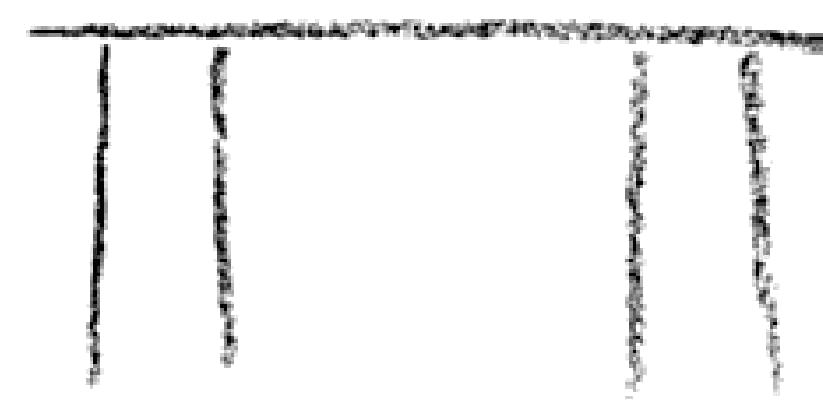

der horizontalen Lage in die vertikale gebracht. Durch das nach oben gerichtete Antlitz ist er nicht nur Erdenbürger, sondern Weltenbürger. Die zwei vorderen Stützen, die zwei vorderen Gliedmaßen sind zu Werkzeugen des Geistes geworden. Das drückt sich aus in der Scheidung des Teiles der menschlichen Gestalt, der zur Erde gehört, von dem Teil, der zu dem Weltenraum gehört.

Und Gott machte eine Ausdehnung zwischen den unteren Wassern und den oberen Wassern.

Diese Verschiedenheit der menschlichen Gestalt ist damit gemeint; es ist wiederum ein Erlebnis des ursprünglichen Menschenwesens.

|112| Nun mußte derjenige Teil der menschlichen Gestalt, welcher dem Ich dienen sollte, einen Mittelpunkt haben, ein Zentrum. Das bekam er in der Tat. Das erste Zentrum dieses noch weichen Menschenleibes kam dadurch zustande, daß in dem nach oben gerichteten Teil alle Strömungen zusammenliefen. Da gehen die verschiedensten Strömungen hindurch, die Sie sich vorzustellen haben als den Beginn von Nerven- und Blutströmungen. Die sammelten sich alle oben in mächtigen Feuerzungen, welche ehemals oben am Kopfe - aber als der Körper noch vollständig weich war - aus dem Menschen herauszüngelten. Jenes Organ, das der Mensch da hatte und von dem der letzte Rest die Zirbeldrüse ist, war das erste Organ, womit der Mensch anfing, physisch wahrzunehmen. Kam er in die Nähe von etwas für ihn Gefährlichem, so nahm das dieses Organ wahr, und dadurch fühlte der Mensch, daß er da nicht hingehen durfte. Durch dieses Organ fand er sich zurecht. Sie dürfen sich dieses Organ nicht als ein ursprüngliches Auge vorstellen - aus einer solchen Vorstellung entspringen alle möglichen Irrtümer -, sondern Sie müssen sich vorstellen, daß es eine Art Wärmeorgan war, durch welches der Mensch, auch auf weite Entfernungen hin, kalte und warme Zustände unterscheiden konnte, und solche, die für ihn schädlich oder nützlich waren. Dieses Organ stand gleichzeitig in einem gewissen Zusammenhang mit denjenigen Organen, die wir die Lymphorgane nennen, welche mit den Strömungen im Menschenleib verwandt sind, die mit den weißen Blutkörperchen in Zusammenhang stehen. Das Wohl und Wehe des Menschen, der vorzugsweise noch weiße Blutkörperchen hatte, hing ab von dem, was dieses Organ wahrnahm. Das war also ein Mittelpunkt, in dem alles das gesammelt war, was als Gestaltung in der Ausdehnung der Himmel da war.

Und Gott sprach: Es sammle sich das Wasser unterhalb der Himmel an einem Orte, daß das Trockene sichtbar werde! Und es geschah so. Und Gott nannte das Trockene Erde, und die Ansammlung der Wasser nannte er Meer. Und Gott sah, daß es schön war.

|113| Sie sehen hier hingewiesen auf eine andere Ansammlung von Strömungen; diese sind in der unteren, in der Erdenatur des Menschen. Sie beziehen sich auf die Reproduktion des Menschen, auf die Fortpflanzung. Aber die Fortpflanzung war in diesen alten Zeiten – das ist sehr wichtig – durchaus bedeckt von der absolutesten Bewußtlosigkeit. Das ist ein tiefes Geheimnis des Weltenwerdens. Man könnte sagen, es ist das ursprüngliche göttliche Gebot, das die Gottheit den Erdenwesen gab: Ihr sollt nicht wissen, wie ihr euch auf der Erde fortpflanzt. – Das ganze Fortpflanzungsgeschäft war gehüllt in tiefe Bewußtlosigkeit. Während der Zeiten, als auf der Erde Bewußtheit auftauchte, wurde keine Fortpflanzung vollzogen. Denken Sie sich, daß also das Wesen des Menschen nach dieser Richtung darin bestand, daß er von einer vollständigen Unschuld oder Bewußtlosigkeit über diesen Vorgang auf der Erde ausgegangen ist. Was hat der Mensch also am Beginn seines Erdendaseins gewußt? Gewußt hat er bloß seine geistige Abstammung, er hat gewußt, daß er heruntergestiegen ist als ein Ich aus dem Schöße der Gottheit. Woher er kommt in physischer Beziehung, woher seine Leiber kommen, das war ihm vollständig verschlossen, davon wußte er nichts, das war übergossen von einem vollständigen Unschuldszustand. Stellen wir uns ganz genau vor, was damals vorging.

Die Menschen entstanden auf die Art, wie wir es eben beschrieben haben. Menschen, die auf dem Monde ihren physischen Leib, ihren Äther- und Astralleib ausgebildet hatten, die empfingen jetzt ihr Ich, Menschen, welche in vollständiger Unschuld waren über alles, was in der physischen Welt vor sich ging. Sie konnten das ja auch nicht sehen; sie sahen ja ihren eigenen physischen Leib nicht. Sie sahen geistige Zustände; sie wußten, sie stammten ab von der Gottheit. Da waren aber andere Wesenheiten, nicht Menschen, sondern Wesenheiten, die zurückgeblieben waren auf dem alten Monde, die nicht haben Götter werden können. Was auf dem Monde eine höhere Stufe erreicht hatte, hatte jetzt seinen Schauplatz auf der Sonne, wo die Elohim sind, welche auf der Sonne so wohnen, wie der Mensch auf der Erde. Nun gab es eine parallele Entwicklung der Wesen auf der Sonne und auf der Erde. Nachdem die Sonne und |114| der Mond herausgegangen waren aus der Erde, war die Erde hineingestellt zwischen Sonne auf der einen und Mond auf der anderen Seite. Das höchste Wesen, das auf der Erde sich entwickelte, war ein Wesen mit physischem Leib, Ätherleib, Astralleib und Ich: der Mensch. Auf der Sonne hatte das höchste Wesen physischen Leib – aber in ganz anderer Form als der menschliche –, Ätherleib, Astralleib, Ich, Geistselbst (Manas), Lebensgeist (Budhi), Geistesmensch (Atma), und dazu einen achten Teil, über Atma hinaus. Also höhere Wesen, die schon ein achtes Glied entwickelt hatten, sind die Elohim, die Sonnengeister, die, als die Erde und die Sonne sich getrennt hatten, einen anderen Weg eingeschlagen haben. Die Menschen hatten den Erdenweg eingeschlagen. Die Sonnengeister hatten ihr Atma schon auf dem Monde ausgebildet, sie waren auf die Sonne gegangen, um sich da höher zu entwickeln. Nun waren auf dem alten Monde aber Wesen darunter, die nicht mitgehen konnten mit der Sonne, weil sie eben «sitzen geblieben» waren. Sie waren natürlich viel höher entwickelt als die Menschen, sie hatten etwas, was die Menschen sich erst erringen sollten, sie hatten schon ein solches Bewußtsein, wodurch man äußere physische Gegenstände sieht. Sie konnten sich schon der Werkzeuge bedienen, die der Mensch noch nicht gebrauchen konnte. Der Mensch hatte noch blinde Augen und taube Ohren. Seine Augen und Ohren waren erst in der Anlage ausgebildet, sie sollten später sehend und hörrend werden. Aber niedere Tiere der damaligen Zeit hatten sich von dem Monde her Gestalten übrig behalten, die sie in gewisser Weise schon eher benutzen konnten als die Menschen ihre Leiber. Und darin verkörperten sich zunächst auf der Erde tatsächlich jene Wesen, die vom Monde herübergekommen waren, und die noch nicht so weit waren, um mit der Sonne mitzugehen, die aber weiter waren als die Menschen. Sie verkörperten sich in Gestalten, die jetzt längst untergegangen sind, in Wesen, die sie fähig machten, hinauszusehen in die physische Umgebung. Es beseelten, durchgeistigten diese Wesen, die zwischen Menschen und Göttern stehend waren, solche niedere Gestalten, denn die höheren menschlichen Leiber waren noch zu ungeschickt, wie ja auch ein Kind viel ungeschickter ist als ein junges Huhn, wenn es |115| geboren wird. Diese niederen Wesen waren Drachen oder Schlangen, die dazumal provisorisch bewohnt wurden von diesen zwischen den Göttern und den Menschen stehenden Wesen. Diese Gestalten waren innig verwandt dem, was im Menschen zur Erde gehört; nichts hatten sie von dem, was im Menschen lebte von dem zur Sonne gerichteten Teil. Aber etwas hatten sie den Menschen voraus, die noch in dumpfem Bilderbewußtsein lebten: Sie konnten die physischen Gegenstände, die auf der Erde waren, schon wahrnehmen. Der Mensch lebte in voller Unschuld über den physischen Vorgang des Geschlechtlichen; das war für ihn in Finsternis gehüllt. Diese Wesen sahen ihn, wie ihn die Götter sahen, deshalb konnten sie an den Menschen herantreten und sagen: Ihr könnt werden wie die Götter, ihr braucht nur eines zu tun, ihr braucht nur eure Begierde bis in die unteren Regionen hineinzuerstrecken; sobald eure Begierde sich in die tiefsten Regionen erstreckt, werdet ihr sehend wie die Götter; wenn ihr das tut, dann werdet ihr eure eigene Gestalt sehen.

Der Unschuldszustand wurde der Menschheit in gewisser Weise dadurch genommen. Das ist die eine Seite. Die andere Seite ist die Freiheit, die der Mensch dadurch erlangt hat. [Lücke in der Nachschrift.] Wesenheiten, die zwischen Sonnenbewohnern und Erdenbewohnern stehend waren, die sich nicht das Anrecht an der Sonne haben erringen können, die wollten den Menschen die Augen öffnen; sie traten als Verführer an die Menschen heran und sagten:

Eure Augen werden aufgetan werden, und ihr werdet wissen, was gut und böse ist.

Ihr werdet sehen, was um euch herum ist, und ihr werdet kennen lernen den Baum der Erkenntnis des Guten und des Bösen und den Baum des Lebens.

So sind die religiösen Urkunden wörtlich wahr. Wir müssen nur lernen, sie wiederum wörtlich zu verstehen. Die heutige Betrachtung wird Ihnen wohl gezeigt haben, daß man über diese Dinge nicht spekulieren darf. Man muß die wirkliche Geheimwissenschaft fragen, dann kommt in wunderbarer Weise Licht in die religiösen Urkunden.

---

# WEISSE UND SCHWARZE MAGIE, Berlin, 21. Oktober 1907 nachmittags

|117| Es ist der Wunsch geäußert worden, daß wir noch über das sprechen, was gewöhnlich «weiße und schwarze Magie» genannt wird, und daß dies mit einigen anderen Begriffen, die die Theosophen kennen, in Zusammenhang gebracht werde.

Nun ist das, was damit berührt werden muß, ein sehr weit verzweigtes, ausgebreitetes Gebiet okkulter und geisteswissenschaftlicher Betrachtungsweise, und es wird daher nur möglich sein, sozusagen einige elementare Dinge auf diesem Gebiete zu berühren. Aber auch diese machen ja schon die Voraussetzung notwendig, das, was wir jetzt betrachten, so aufzunehmen, als sei es durchaus eben nur gemeint für Schüler der Geisteswissenschaft und nicht für irgend jemand anderen, der nicht mit geisteswissenschaftlicher Gesinnung und Denkungsart ausgestattet ist. Man muß gewisse Voraussetzungen machen, wenn man über ein solches Thema sprechen will.

Die Worte «weiße und schwarze Magie» werden oft gerade in theosophischen Kreisen angewendet, und es tritt uns ja unendlich häufig die Bezeichnung des «schwarzen Magiers» entgegen als eine Anschuldigung, auch von solchen, die in der theosophischen Strömung wirken. Manche von Ihnen werden es schon selbst gehört haben, wie man leichten Herzens dies oder jenes als «schwarze Magie» bezeichnet hat. Ja, es ist sogar einmal vorgekommen, daß nach der Lektüre unserer «Mitteilungen» - wie mir scheint, war es das erste Blatt - an einem Orte Leute gesagt haben: Was bei jener Generalversammlung vorgegangen und in den «Mitteilungen» erzählt worden sei, darin stecke schwarze Magie. Es war damals von einigen Menschen geradezu die Behauptung aufgestellt worden, daß in der Führung jener Generalversammlung ein böser Zauber gesteckt haben müsse. Das ist nur ein Beispiel für etwas, was öfter auftritt und |118| was herrührt von einer ziemlich trivialen Auffassung nicht nur des Begriffes «schwarze Magie», sondern des Begriffes «Magie» überhaupt.

Wir müssen uns zunächst klarmachen, was man unter «Magie» versteht, um dann einsehen zu können, was man unter «schwarzer Magie» zu verstehen hat. Viele Leute glauben folgendes: Sie sagen, man könne okkulte Kräfte erwerben, und denken dabei gewöhnlich an recht minderwertige, elementare okkulte Kräfte. Denn gewöhnlich wissen diejenigen, die von solchen Dingen reden, nichts von höheren okkulten Kräften; sie haben gemeinhin gar keine Vorstellung davon, was sie sich unter okkulten Kräften eigentlich denken sollen. Gewöhnlich setzen die Leute dann noch hinzu, derjenige treibe schwarze Magie, der im Dienste des persönlichen Egoismus solche Kräfte anwende. Solch ein Ausspruch ist einer von denen, bei welchen man nicht einmal sagen kann, er sei falsch. Aber es kommt auch nicht viel darauf an, daß man sagt, er sei richtig, denn es ist gar nichts besonderes damit gesagt. Es ist der Ausfluß einer ganz abstrakten Denkweise. Wer von solchen Dingen reden will, muß vor allen Dingen fest auf dem Boden der Wirklichkeit stehen, sei es der physischen, sei es der geistigen Wirklichkeit; er muß wissen, was real ist, dann wird er nicht mehr von allerlei Dingen schwatzen, die mit der Wirklichkeit in keinem Zusammenhang stehen.

Liegt denn in einem solchen Ausspruch, man solle okkulte Kräfte nicht im Dienste des persönlichen Egoismus anwenden, nicht in gewisser Beziehung eine unmögliche Forderung für die Menschen der Gegenwart? Diese Frage müssen wir uns zuerst beantworten. Freilich stellen solche, die das sagen, als erstes Gebot auf: Du sollst nicht egoistisch sein! - Gewiß, das ist ein höchstes Gebot. Aber es handelt sich für den, der real denkt, nicht darum, daß solche Gebote aufgestellt werden, sondern darum, ob solche Gebote überhaupt erfüllt werden können. Und wer glaubt, daß das Gebot, nicht egoistisch zu sein, von den Menschen der Gegenwart so ohne weiteres erfüllt werden kann, der gibt sich einer sehr großen Illusion hin. Derjenige, der es als seine Pflicht erkennt, Illusionen zu zerstreuen, der muß auch jene Illusion zerstreuen, daß ein solches Gebot leicht erfüllt werden könne.

|119| Da tritt vielleicht ein Mensch auf und sagt: Ich will einmal in der Welt in ganz und gar selbstloser Weise wirken! - Zunächst kann er gar nicht wissen, daß unter den Kräften, mit denen er wirkt, eine ganze Menge okkulter Kräfte darunter sind. Von jedem Menschen gehen okkulte Kräfte aus. Wenn nun jemand sagt, er wolle in selbstloser Weise in der Welt wirken, so ist das ein sehr, sehr schönes Ideal. Aber wenn man einmal versucht, weiter zu fragen: Warum willst du selbstlos sein, warum legst du dir dieses Gebot auf, selbstlos zu sein? -, da wird man merkwürdige Antworten erhalten, zum Beispiel: Durch Selbstlosigkeit komme ich allmählich zu höheren Stufen der Vollkommenheit hinauf; ich kann es nicht ertragen, ein wertloser Mensch zu sein; ich will ein Mensch sein, der wertvoll ist in der Welt. - Wenn man dieses Gefühl analysieren würde, so würde man dahinterkommen, daß hinter den Gründen zur Selbstlosigkeit oft der unglaublichste Egoismus steckt, oft ein viel größerer Egoismus, als er bei den Menschen anzutreffen ist, die gar nicht selbstlos sein wollen, sondern sich einfach ihren selbstlichen Instinkten hingeben. Malen Sie sich den Gedanken aus, und Sie werden sehen, wie viel Selbstsucht in dem Drang nach Selbstlosigkeit steckt.

Und wie sollte es auch anders sein? Die Selbstsucht ist eine Kraft, die nicht deshalb von den Göttern in die Menschennatur verpflanzt worden ist, damit der Mensch sie so ohne weiteres verleugne oder verneine. Es gehört sogar die Selbstsucht zu den wesentlichsten Dingen, durch die der Mensch wirkt. Wenn wir den Gründen der Selbstsucht nachforschen, wenn wir uns fragen: Warum haben denn die Götter, die gütigen Götter dem Menschen die Selbstsucht eingepflanzt? -, da diese so etwas Abscheuliches ist nach Ansicht so vieler Leute, da bekommen wir aus dem wirklichen Okkultismus herausgeboren die Antwort, daß die Selbstsucht ein ganz gewaltiger Schutz ist gegenüber dem, was mit dem Menschen in der Welt geschehen würde, wenn er nicht diese Selbstsucht hätte. Wissen Sie, was den Menschen am besten davor schützt, gewisse recht schlimme Kräfte anzuwenden, von denen wir gleich nachher sprechen werden? Es wäre ein Leichtes heute für jemand, der selbst schwarze Magie betreiben wollte, einen Menschen als Schüler zu sich heranzuziehen |120| und diesem Schüler gewisse Handgriffe und Machinationen der wirklichen schwarzen Magie beizubringen; er würde in der entsetzlichsten Weise in der Welt wirken können. Die meisten aber werden das nicht so ohne weiteres tun. Und wissen Sie, warum nicht? Aus dem einfachen Grunde nicht, weil sie sich fürchten, weil sie für ihre Persönlichkeit fürchten. Sie gewahren ein klein wenig von den Folgen im Geist und fürchten sich selbstsüchtig davor. Und das ist ganz gut, daß sie sich fürchten und die Sache deshalb bleiben lassen. Wenn im Beginn der Erdenentwicklung die Menschen alles gleich ausgeliefert erhalten hätten, was es an Kräften gibt, um auf den astralischen, auf den ätherischen und auf den physischen Leib zu wirken, dann würden diese Menschen schlimme Dinge in der Welt angestellt haben. So aber ist ihnen der Egoismus gegeben worden, und der bringt den Menschen dazu, daß er zunächst nur für sich selbst sorgt, und daß die Sorge für sich selbst ihn ganz beschäftigt. Wie eine Schutzwand haben die Götter den Egoismus um die Menschen herum errichtet. Der Egoismus ist es, der den Menschen den Einblick in die Dinge verhüllt, die hinter der Welt der Erscheinungen liegen. Das zu betrachten ist außerordentlich wichtig. Es ist eine von den weisen Bremsvorrichtungen, welche die Götter aufgestellt haben, damit der Mensch nicht zu schnell eindringe in die geistigen Reiche. Das ist also der Egoismus; er ist ein gutes Schutzmittel.

So also soll man mit solchen Worten nicht herumwerfen, denn es ist noch eine lange Strecke bis dahin, wo der Mensch selbstlos werden kann, wo er reif wird zur Selbstlosigkeit. Gar nicht braucht daran erinnert zu werden, wie alles Predigen von Selbstlosigkeit sich gerade in unserem Zeitalter so komisch ausnimmt, im Zeitalter des höchstpotenzierten Egoismus, wo jeder so viel erraffen will von dem, was in der sozialen Ordnung begründet ist. Da führt diese «Selbstlosigkeit» dazu, sich ganz und gar zu umgeben mit einem Wirbel von Illusionen. Sie glauben gar nicht, wenn Sie nicht gründlich darüber nachdenken, wie die Menschen sich heute einhüllen in einen Wirbel von Illusionen, wie sich namentlich durch Theorien unsere Zeitgenossen einhüllen lassen in einen Wirbel von Illusionen. Da werden soziale Theorien geprägt und gepredigt von Professoren |121| und Nichtprofessoren. Aber gerade ein großer Teil der Theorien über die sozialen Heilmittel des Gesellschaftskörpers sind nichts weiter als ein Ausfluß von «Psychopathia professoralis». Sie können es in der Praxis verfolgen, wie die Leute verkehrt denken und verkehrt handeln. Wo können Sie nicht in irgendeiner Gesellschaft oder Kommune erleben, daß die Menschen nachsinnen über dieses und jenes Heilmittel, zum Beispiel gegen die Arbeitslosigkeit. Wenn Arbeitslosigkeit da ist, ist Hunger da. Wie machen wir es aber, daß diesem abgeholfen wird? Da wird dann der Entschluß gefaßt: Man muß den Leuten Arbeit geben. - Und nun erfindet man irgend etwas, um den Leuten Arbeit, Beschäftigung zu geben, damit sie Geld bekommen und sich kaufen können, was sie wollen. Das scheint ein sehr probates Mittel zu sein, um gesellschaftliche Schäden abzuwenden: den Leuten Beschäftigung zu geben. Aber es ist ein sehr gefährliches Mittel, den Leuten Beschäftigung um jeden Preis zu geben, solange man nicht die Art der Beschäftigung in produktive und unproduktive Beschäftigung unterscheidet. Solange man diese Unterscheidung zwischen produktiver und unproduktiver Beschäftigung nicht macht, ist dies sogar ein furchtbares Mittel in seiner Wirkung auf die Gesellschaft. Denken Sie sich den radikalen Fall: Jemand wollte, weil in einer bestimmten Gegend, wo durch Erfindung einer neuen Maschine eine Anzahl Personen brotlos geworden sind, diesen Leuten schnell Arbeit und Brot verschaffen. Er erfindet einen Artikel, wo er wertlose Abfallprodukte für Toilettengegenstände verwendet. Die Leute können dann etwas verdienen und sich Brot kaufen. - Das ist aber nur ein Mittel, um die Armut von einer Seite auf die andere umzulegen, denn es wird gar nichts produziert auf diese Weise, gar nichts hervorgebracht. Jeder kann das an folgendem Falle selbst einmal bedenken: Es setzt sich jemand draußen auf dem Lande in ein Restaurant und sagt: Kellner, geben Sie mir zehn Ansichtskarten! - und schickt sie ab, ohne dabei zu bedenken, wie viele Briefträger dadurch vier oder fünf Stockwerke hinaufgehen müssen, und ohne zu bedenken, daß dadurch nichts an realer Kraft in der Welt in Bewegung gesetzt wird. Gar nicht bedenkt man, daß damit nichts Wirkliches, den Geist und Körper Förderndes erzielt wird. Wenn Sie das |122| dem Betreffenden sagen, so wird er natürlich eine Ausrede haben. Er könnte zum Beispiel sagen, es könnten ja neue Briefträger eingestellt werden, dadurch bekämen mehr Leute Arbeit. Man bedenkt dabei aber gar nicht, daß, wenn man da neue Menschen einstellt, durch deren Arbeit nichts Neues geschaffen wird, sondern daß man nur die Armut anders verteilt hat. Das zeigt, daß die Menschen erst etwas wissen müssen über die Verteilung der Arbeit auf der Erde, bevor sie anfangen können mit dem kleinsten Reformgedanken. Unwissenheit, die reformieren will, ist im Weltzusammenhang etwas Furchtbares. Es ist furchtbar, daß die Menschen oftmals nicht die Geduld haben, abzuwarten, bis sie gelernt haben, etwas Überschau darüber zu haben, wie man helfen kann, sondern Vereinsmeierei treiben, damit dies oder jenes geschehe. Das sind alles Illusionen, mit denen sich die Menschen umhüllen. Und eine solche Illusion ist es auch, wenn in der trivialen Theosophie die Leute von Selbstlosigkeit reden. Wir müssen, wenn wir uns über weiße und schwarze Magie unterrichten wollen, zunächst uns einiges von dem Begriff «Magie» vor die Seele führen, worüber diejenigen, welche die letzten Vorträge gehört haben, schon etwas wissen. Auch öffentlich habe ich das Wesen der Magie schon kurz berührt.

Was ist nun Magie? In allen alten okkulten Schulen gab es drei Arten, hinaufzugelangen zu den höchsten Gebieten des Erkennens. Die erste Art war die des Eingeweihten, des Initiierten, die zweite Art war die des Hellsehers, und die dritte Art war die des Magiers. Das sind drei ursprünglich voneinander grundverschiedene Dinge: Einweihung, Hellsehertum und Magie. Machen wir uns zunächst durch einen einfachen Vergleich klar, was ein Eingeweihter, was ein Hellseher und was ein Magier ist. Denken Sie sich irgendeine Gegend, wo man keine Eisenbahnen, keine Dampfschiffe und so weiter kennt, wo die Menschen ohne Eisenbahnen und ohne Dampfschiffe leben. In einer solchen Gegend ist der Umstand, daß es Eisenbahnen und Dampfschiffe gibt, der reine Okkultismus. Okkult bedeutet so viel wie geheim, etwas, wovon die Leute nichts wissen. Wenn nun einer aus der Gegend, wo es keine Eisenbahnen und so weiter gibt, in eine andere Gegend reist, wo er Eisenbahnen und Dampfschiffe |123| sieht, und er kommt dann wieder in seine Heimat zurück, dann erzählt er seinen Leuten, daß es Eisenbahnen und Dampfschiffe gibt. Er weiß es aus eigener Anschauung, denn er hat in eine Welt hineingesehen, die für die anderen noch ein Geheimnis ist.

Wer durch okkulte Schulung hineingeführt wird in die höheren Welten, der ist in dieser Beziehung ein Hellseher. Er weiß aus eigener Anschauung, daß es geistige Welten und Wesenheiten, geistige Kräfte gibt. Die geistigen Welten haben verschiedene Stufen. Es kann ein Mensch auf der einen Stufe Hellseher sein, einige Erscheinungen sehen, aber andere Erscheinungen nicht sehen. Nun müssen Sie sich etwas vor die Seele rufen, was hier Öfters gesagt worden ist: Zum Auffinden und zum selbständigen Erforschen okkulter Wahrheiten gehört Hellsehertum. Nicht aber gehört Hellsehertum dazu, diese Wahrheiten einzusehen. Dazu reicht der gewöhnliche Menschenverstand aus, wenn er nur in genügend umfassender Weise richtig angewendet wird. Wer sagt, was in okkulten Berichten mitgeteilt wird, das könne er nur begreifen, wenn er ein Hellseher wäre, der benutzt einfach seinen Verstand nicht genügend. Finden kann der Mensch die okkulten Wahrheiten nicht mit dem Verstande, aber einsehen kann er sie. Alles, was aus der Geistesforschung heraus erzählt wird, kann man einsehen, wenn man nur gründlich nachdenken will. Nur finden kann man ohne Hellsehen die okkulten Wahrheiten nicht, dazu gehört Hellsehertum. Was also durch Theosophie verkündigt wird, das könnten die, welche gründlich darüber nachdenken, auch einsehen.

Man kann, bis in die höchsten Gebiete der okkulten Erlebnisse hinauf, die Sachen erzählt erhalten, und man kann sie dann einsehen. So gab es in den okkulten Schulen immer Hellseher, welche durch jene Methoden, die angewendet wurden, hineinschauen lernten in die geistigen Welten. Das waren oftmals sehr langwierige Methoden. Aber neben diesen Hellsehern gab es immer auch Eingeweihte. Das waren diejenigen, die aus ihren umfassenden und willig angewandten Verstandeskräften heraus die Tatsachen und Gesetze der höheren Welten eingesehen hatten. Das waren Eingeweihte. Heute ist dieses Verhältnis von Eingeweihten und Hellsehern kaum |124| mehr gut möglich, weil heute jeder Mensch von dem großen Egoismus befallen ist, selbst sehen zu wollen. Von jener Liebe und jenem Vertrauen, die in den okkulten Schulen der Vorzeit herrschten, machen sich die Menschen heute kaum einen Begriff. Da war der Hellseher, der vielleicht durch Inkarnationen hindurch in entsagender Weise die Methoden anwendete und sich geübt hat, um hineinzuschauen in die höheren Welten, der vieles sehen konnte in diesen höheren Welten, und der sich selbst enthielt, die Gesetze dieser höheren Welten kennenzulernen, um sich nicht aufzuhalten durch Gesetze, sondern um durch eine raschere Entwicklung hellseherischer Fähigkeiten der Menschheit einen größeren Dienst zu erweisen. Dieses Entsagen ist nicht so ohne weiteres leicht zu nehmen. Es ist etwas Großes und Gewaltiges, wenn irgend jemand sich entschließt, Hellseher zu werden, ohne zu gleicher Zeit die ganze Art der Gesetzmäßigkeit in den höheren Welten kennenzulernen; und wenn er darauf wartet – vielleicht Tausende von Jahren –, bis er das erreicht, so kann er das nur unter der Bedingung tun, daß er sich unter die strenge Obhut eines gewählten Gurus oder Lehrers stellt. Denn trät er als bloßer Hellseher an die Dinge der geistigen Welt heran, ohne deren Gesetze zu kennen, so würde er bald auf Irrpfade und in die wüstesten Irrtümer hineinkommen, wenn er nicht in allen wichtigen Dingen den Rat des Guru annehmen würde.

Andere gab es, die verzichteten überhaupt auf die Entwicklung höherer hellseherischer Gaben, weil sie eingeweiht werden wollten in die Gesetze der höheren Welten. Sie vertrauten in Liebe und Hingebung dem, was ihnen die Seher sagten, aber sie kannten die Gesetze. Um das zu erläutern, kann man ein Beispiel anführen aus der gewöhnlichen Welt. Denken Sie sich einen Menschen, der außerordentlich gut sieht, der alle möglichen Phänomene sehen kann mit seinen Augen, der aber von den Gesetzen der Lichterscheinungen nichts versteht. Und denken Sie sich einen anderen Menschen, der sehr kurzsichtig ist und kaum ein paar Zentimeter vor seine Augen hin sieht, der aber die physikalischen Gesetze der Lichterscheinungen gut kennt. Die beiden können gut zusammenwirken und -arbeiten, der eine kennt die Gesetze, der andere kennt sie gar nicht, aber |125| dafür sieht er die Erscheinungen. Und das gilt noch viel mehr für die höheren Gebiete. Es ist möglich, daß einer ein in höhere Grade Eingeweihter wird, ohne Anspruch zu machen auf hellseherische Kräfte. Das war in den alten okkulten Schulen durchaus üblich, daß diese zwei Klassen nebeneinander waren. Willig haben die Hellseher den Ratschlag von gar nicht hellsehenden Eingeweihten angenommen. Insbesondere war dies notwendig für die Fälle, in denen ein hoher Grad des Hellsehens und ein hoher Grad der Einweihung erforderlich war, so zum Beispiel für alles, was sich auf das astrologische Gebiet bezieht. Das war so, daß diejenigen, welche sich die umständlichen Gesetze der Astrologie umfassend aneignen wollten, in der Regel verzichten mußten auf jenes hohe Hellsehen, welches die astralischen Hellseher sich anzueignen hatten. Sie ergänzten sich gegenseitig. Nur in der neueren Zeit, wo der Mensch materialistisch denkt und fühlt, muß man sich klar machen, daß es unmöglich ist, diese beiden Gebiete streng zu trennen, und deshalb wird seit dem 14. Jahrhundert kein Unterschied mehr zwischen den beiden Klassen gemacht, so daß der Lehrer keinem eine Einweihung mehr erteilt, ohne zu gleicher Zeit einen gewissen Grad des Hellsehens zu geben. Das geht nicht anders, weil es mit dem Egoismus und mit der Vertrauenslosigkeit, die heute herrschen, gar nicht anders vereinbar sein würde. Daher wird zwischen den beiden kein Unterschied mehr gemacht, denn die Menschen können heute gar nicht selbstlos sein.

Nun unterscheidet sich aber sowohl vom Hellseher als auch vom Eingeweihten der Magier. Für den, der selbst in die höheren Welten hineinschauen kann, folgt noch lange nicht, daß er die in die sinnliche Welt hineinwirkenden Kräfte auch schon beherrschen und anwenden kann. Oder glauben Sie, daß ein Mensch, der in eine Gegend die Kenntnis von der Lokomotive, dem Dampfschiff und der Dampfmaschine gebracht hat, nun auch gleich eine solche Maschine bauen könnte? Er kann ihnen erzählen, wie solche Dinge ausschauen, aber er wird nicht gleich verstehen, sie zu bauen. Daß der Hellseher selbst hineinsehen kann in die höheren Welten, daraus folgt noch nicht, daß er auch die Kräfte, die hereinwirken in die Sinnes|126|weit, zu beherrschen und anzuwenden versteht. Der erst ist Magier oder Adept, der die höheren Kräfte, von denen alles physische Geschehen ein Ausdruck ist, in der Welt hier anzuwenden versteht, der also imstande ist, nicht nur die physischen Kräfte und die physischen Mächte zu Rate zu ziehen, wenn es sich um irgend etwas bei seinem Tun handelt, sondern der die höheren Kräfte spielen lassen kann. Das ist in unserer Zeit eigentlich keine Kleinigkeit, Magier oder Adept zu sein. Es gibt keine Zeit in der Menschheitsentwicklung, die dem Magiertum oder Adeptentum so durchaus entgegengesetzt war, wie unsere heutige es ist. Und man dient heute der Menschheit unter gewissen Verhältnissen am besten dadurch, daß man sich darauf beschränkt, die Erkenntnisse der höheren Welten zu verbreiten, und selbst - vielleicht mit blutendem Herzen - auch in Fällen, wo die Anwendung magischer Kräfte vielleicht am Platze wäre, darauf verzichtet. Denn das heutige öffentliche Leben ist so fremd dem Begriffe des Magiertums, daß unter Umständen der Einfluß höherer Welten auf diese unsere Welt einen Rückschlag bedeuten würde, wenn unmittelbar magische Kräfte angewendet würden. Wer eine gewisse Übung in der Anwendung der Kräfte hat, und zu den Kenntnissen sich auch den Mechanismus angeeignet hat, der muß in gewissen Fällen sich enthalten, diese Kräfte anzuwenden, aus dem einfachen Grunde, weil es unmöglich ist, heute gegen die Strömung der Zeit in der Welt anzulaufen. Zum Magier gehört nicht nur Hellsehen und Einweihung, zum Magier gehört auch Übung. Das ist es, um was es sich handelt. Der Magier muß entsagungsvoll durch lange Zeiten hindurch gewisse Verrichtungen sich aneignen, er muß sich üben. Denken Sie nur einmal, wieviel Sie wissen können - schon in der physischen Welt -, ohne daß Sie selbst in der Lage waren, auch wirklich das ausführen zu können, wovon Sie erzählen können, wovon Sie etwas wissen. In vieles können Sie eingeweiht sein. Ganz genau können Sie wissen, wie eine Lokomotive konstruiert ist, aber ohne daß Ihnen jemand gleich den Auftrag geben würde, eine Lokomotive zu bauen, da er damit riskieren würde, das Geld zum Fenster hinauszuwerfen. So ist es auch auf den höheren Gebieten. Übung macht den Magier, Wahrnehmen in den |127| höheren Welten macht den Hellseher, Wissen und Erkenntnis der Gesetze in den höheren Welten macht den Eingeweihten.

Es war nun in den verflossenen Zeiten durchaus unstatthaft, irgendeine magische Verrichtung zu vollziehen, ohne im Einklang zu stehen mit den Leitern der Welt, der «Erden-Regierung», die man auch nennt die großen Meister der sogenannten weißen Loge. Alle okkulten Schulen, alle Schulen, die es überhaupt gibt und alles Lehren kann nur die unterste Stufe zur höheren Entwicklung sein; auf ihr müssen sich immer höhere und höhere Stufen aufrichten, bis hinauf zu den eigentlichen Leitern der Erdenentwicklung. Auf der höchsten Stufe sind diejenigen, die die Weisheit nicht nur wissen, sondern welche die Erde in ihrer Entwicklung «regieren», welche die Weisheit einfließen lassen in die Erdenentwicklung. Sie allein sind imstande, bei jeder einzelnen Handlung, der geistige Kräfte zugrundeliegen, anzugeben, ob sie in dem ganzen Zusammenhang stört oder nicht stört. Wenn Sie ein Haus bauen und den Plan zum Haus angeben, so muß jeder einzelne Arbeiter an dem Haus im Einklang mit dem Plane arbeiten. Und wenn jemand kommt und es ihm einfällt, ein Fenster anders zu machen, als es im Plan vorgesehen ist, so kann dieses Fenster noch so schon und großartig sein – das ganze Haus ist gestört. Wenn irgend jemand in der Welt durch geistige Kräfte etwas vollbringen will, so kann dies noch so bedeutungsvoll und noch so grandios sein – wenn es in den ursprünglichen Plan der Erdenentwicklung nicht hineinpaßt, so stört es die Erdenentwicklung und wirft sie zuweilen um lange Zeit zurück. Unmöglich kann der Mensch, der keine geistigen Kräfte anwendet, diesen Plan der Erdenentwicklung stören. Und warum nicht? Weil in bezug auf die geistigen Kräfte dasjenige, was die Menschen ohne Wissen von den höheren Welten tun, sich so verhält wie ein Naturereignis zu einem Haus. Was von der Witterung durch Wärme- und Sonnenverhältnisse an einem Haus ruiniert wird, das muß ruiniert werden, das ist in einer gewissen Weise selbstverständlich. So verhalten sich auch die Absichten derer, die keine Beziehung haben zu der höheren Welt. Die Taten derjenigen aber, die irgendeine Beziehung haben zu den höheren Welten, die verhalten sich, wenn sie etwas |128| tun, was nicht im Einklänge ist mit der geistigen Welt, so, wie wenn jemand mit einem Hammer auf eine Sache einschlägt. Was ist also notwendig, damit der Fortschritt des Menschengeschlechtes sich vollzieht? Wenn okkulte Kräfte angewendet werden, so ist es absolut notwendig, daß der Zusammenhang mit den zentralen geistigen Mächten der Welt aufrechterhalten wird, und es ist absolut notwendig, daß an keinen, der diesen Zusammenhang nicht suchen will, die geistigen Kräfte ausgeliefert werden. Damit hängt es zusammen, daß in allen wirklichen okkulten Schulen über der Mitteilung geistiger Kräfte das Geheimnis waltet, und daß keinem, der sich nicht verpflichtet, den Zusammenhang mit den führenden geistigen Wesenheiten aufrechtzuerhalten, solche Geheimnisse ausgeliefert werden. Nur bei der «zentralen Regierung» der Erde steht die Möglichkeit, zu wissen, um was es sich handelt. Und das muß man wissen, wenn man geistige Kräfte anwenden will. Teilt man irgend etwas einem anderen mit in unbefugter Weise, wodurch dieser andere sich in Gegensatz stellen kann zum großen Plan der Erdenentwickelung, dann begeht man die erste Art von schwarzmagischer Handlung. Daher gilt als Grundsatz: Die erste schwarzmagische Handlung ist der Verrat okkulter Geheimnisse. Das Schwätzen und Ausplaudern von okkulten Geheimnissen ist der erste Fall von schwarzer Magie, denn da liefern Sie die okkulten Geheimnisse aus an diejenigen, welche sich in Gegensatz stellen zu der zentralen Leitung der Erdenentwickelung, weil Sie den Zusammenhang nicht kennen. Wo tritt denn das auf, wo wird das real? Real wird es überall da, wo im Dienste nicht der ganzen Erdenführung, sondern im Dienste irgendeiner begrenzten Körperschaft, die keinen Zusammenhang haben will mit der im Dienste der Menschheit stehenden Erdenführung, okkulte Geheimnisse ins Werk gesetzt werden. Erhalt also zum Beispiel der Mensch diejenigen Dinge, die er nur dann anwenden darf, wenn er über alle nationalen und Rassenvorurteile hinweg ist, früher ausgeliefert, wendet er sie an, bevor er über diese Vorurteile hinweg ist und bevor er eine Ahnung davon hat, was es heißt, ein «heimatloser Mensch» zu sein, dann geht ganz genau dasselbe, was sonst weiße Magie ist, in den Dienst der schwarzen Magie über. Ganz genau dasselbe. Wenn |129| dasjenige, was der Menschheit dienen soll, verwendet wird in dem Dienst einer abgesonderten Rasse, etwa um dieser Rasse die Oberherrschaft über die Erde zu verschaffen, dann ist das im großen Maßstabe schwarze Magie, denn es geschieht nicht im Einklänge mit der Erdenführung. Es ist das erste Erfordernis: hinaus zu sein über das, was uns nur mit einem Teil der Menschheit verbindet. Für einen heutigen weißen Magier gilt das als erster Grundsatz. Nicht Selbstlosigkeit kann der Mensch anstreben, aber Liebe für die ganze Menschheit. Erweitern kann er das Gebiet seiner Liebe. Das kann er, und das ist es auch, worum es sich handelt.

Nun geschieht es aber sehr häufig, daß die Menschen durch irgendwelche Machinationen zu erzwingen suchen, etwas zu erhalten, was ihnen sonst nie mitgeteilt werden kann. Jetzt kommen wir zu den eigentlichen Methoden, zu den Machinationen, die auszuführen notwendig sind, um in den Besitz schwarzmagischer Kräfte zu gelangen. Das ist etwas, was man durchaus ganz im einzelnen beschreiben kann. Sie haben das erste Mittel, den ersten Weg gesehen, um in den Besitz schwarzmagischer Kräfte zu kommen; es ist das, sich die Mittel eben mitteilen zu lassen von den berufenen Kräften und Wesenheiten. Ja, was sind sie denn überhaupt, diese magischen Mittel? Sie sind dasjenige, wodurch wir die geistigen Kräfte benutzen können, um hier in der Sinneswelt zu wirken, um hier Resultate und Erfolge zu erzielen. Das sind solche Mittel. Aber es gibt ja überhaupt keine anderen Wirkungen in der sinnlichen Welt als solche, die von den geistigen Welten ausgehen. Alle Wirkungen, Erfolge und Taten in der sinnlichen Welt gehen von den geistigen Welten aus. Daher kann derjenige, der nicht auf dem rechtmäßigen Wege des langsamen Studiums – durch diejenigen, die Eingeweihte oder Hellseher oder selbst Adepten oder Magier sind – zu diesen Dingen kommen will, auch nur einen anderen Weg wählen, und der besteht darin, daß er sich, statt an die Menschen, welche die Verkörperungen höherer geistiger Wesenheiten sind, an die Natur selbst wendet und der Natur abzulauschen versucht die Art und Weise, wie in sie hineingeflossen sind die geistigen Kräfte. Denn alles, was in der Natur ist, fließt aus den geistigen Welten in sie ein, und wir können der |130| Natur durch gewisse Machinationen und Verrichtungen diese geistigen Kräfte wieder ablauschen. In dem Augenblicke nun, wo wir in bezug auf dasjenige, was wir nicht wissen, nicht die Natur handeln lassen, sondern dasjenige, was wir wollen, selbst ausführen, also da selbst handeln, wo wir nichts wissen, in dem Augenblicke sind wir auch imstande, uns Kräfte aus dem Gebiete der schwarzen Magie zu verschaffen. Wenn wir nicht auf dem Umwege durch Weisheit und Einsicht an die inneren Kräfte der Natur kommen wollen, und wenn wir alles vermeiden, was durch Weisheit und Einsicht auf dem Wege der Entwicklung der inneren Kräfte geschieht, sondern andere Mittel wählen, so sind wir durch diese anderen Mittel immer auf dem Wege zu schwarzmagischen Verrichtungen, zur schwarzen Magie.

Sehen Sie, wer heute ein schwarzer Magier werden wollte, der hätte von vornherein einen großen Fonds für die schwarzmagischen Verrichtungen, wenn er ein furchtbarer Hasenfuß wäre, schauderhafte Furcht hätte vor alledem, was ihm passieren könnte. Eine solche Furcht im Inneren des Menschen ist ein sehr guter Ausgangspunkt für den schwarzen Magier, denn diese Furcht ist nur komprimierter Egoismus. Nehmen Sie einmal an, irgendein Mensch beabsichtige, in größerem Umfange schwarzmagische Künste zu treiben. Da würde er sich zunächst in der Welt umschauen nach möglichst hasenfußartigen Individuen. Denn dieser Fonds von Furcht ist ein gutes Mittel, das man so umbilden, umwandeln kann, daß die betreffenden hasenfüßigen Personen gewisse andere Kräfte und Macht bekommen, ohne Wissen und Einsicht, in viel größerem Umfange, als sie der Mensch sonst haben kann. Was müßte ein solcher Zauberkünstler machen, der solche Künste haben wollte? Er müßte sich zunächst ein Laboratorium einrichten, in dem er diese Hasenfüße dazu abrichtete – ich spreche radikal, aber es wird Ihnen so am besten klar werden –, sich ganz zu verhärten durch das Mittel, sie fortwährend in lebendiges Fleisch schneiden zu lassen und Blut rinnen zu sehen. Was in den Furchtgefühlen, die der Hasenfuß in hohem Maße hat, als eine gewisse Kraft nach außen wirkt, das kann in etwas Entgegengesetztes umgewandelt werden, wenn man den Menschen lehrt, sich durch Schneiden in lebendiges Fleisch abzuhärten.

|131| Bei einem Menschen, der keine Furcht hat, würde diese Prozedur gar nichts nützen.

Das ist sozusagen das Abc, das allererste, was in der schwarzen Magie getan wird. Und wenn das getan würde, würde sich das, was früher als Furcht im Menschen war, umwandeln in Kräfte, durch die er in der Tat einen gewissen Einfluß auf seine Umgebung gewinnen könnte; und wer sich solcher Gehilfen bedienen würde, würde die unglaublichsten Scheußlichkeiten in der Welt verrichten können. Wer aber ohne Gehilfen selbst ein großer schwarzer Magier werden will, der tut manchmal noch etwas ganz anderes. Ein solcher schwarzer Magier wollte einst ein Mensch des 15. Jahrhunderts werden, Gilles de Rats, den die profane Welt «Ritter Blaubart» genannt hat. Dieser Mensch suchte gewaltige okkulte Kräfte in seinen Besitz zu bekommen, nicht auf dem rechtmäßigen Wege des Lernens, sondern dadurch, daß er gewisse tief in ihm liegende egoistische Gefühle umwandelte. Er war zu gleicher Zeit ein ausgezeichneter Beobachter seiner selbst. Verzeihen Sie, wenn ich ein Wort ausspreche, das sonderbar klingen wird. Dieser Mann war das, was man nennen könnte «der radikalste christliche Egoist» oder «egoistische Christ». Solche hat es nämlich auch gegeben und gibt es noch. Es sind solche, die das Christentum vor allen Dingen als eine Brücke betrachten, um für sich selbst möglichst viel zu erlangen, weil es ihnen klar ist, daß ein guter Christ weit kommen kann in der Seligkeit. Durch Selbsterkenntnis bemerkte er dies in seiner Natur, und als er es bei sich bemerkt hatte, kannte er schon das beste Mittel, wodurch man das umwandeln kann in unglaubliche Zauberkräfte. Es ist ihm allerdings früh das Handwerk gelegt worden. Es wurde ihm der Prozeß gemacht, und da zeigte sich, daß der Mann 1432 angefangen hatte, um seine besonderen okkulten Kräfte zu entwickeln, ein Kind nach dem anderen zu morden. Leben zu vernichten, das hat er angesehen als ein besonderes Mittel, um das, was er nicht selbst als Wissen haben konnte, der Natur abzulauschen. Der Mann hat, wie sich in dem Prozeß herausgestellt hat, in kurzer Zeit 800 Kinder ermordet. Jetzt werden einige von Ihnen begreifen, die den Roman von Mabel Collins «Flita. Wahre Geschichte einer schwarzen Magierin» gelesen ha |132| ben, warum da am Anfang ein Mord steht. Der gehört dazu. Der Roman «Flita» ist schon von jemand geschrieben, der das weiß. Was die schwarze Magierin wollte, das konnte nur entwickelt werden unter dem Einflüsse dieses Mordes, der am Ausgangspunkt der Erzählung steht.

Und nun betrachten Sie einmal diese Geschichte ganz ernsthaft, und fragen Sie sich, was die meisten Menschen schützen könnte vor diesen Prozeduren, die ich Ihnen angeführt habe, und durch die der Mensch ganz sicher zur Beherrschung schwarzmagischer Kräfte geführt werden könnte. Der Egoismus, er ist ein sehr gutes Mittel, sich dagegen zu schützen. Es wird nicht jeder sich überwinden können, in lebendiges Fleisch zu schneiden; dabei würden die meisten Menschen in Ohnmacht fallen, und Ohnmacht ist nichts anderes, als ein Ausdruck der Selbstsucht. Das ist also schon in seiner physischen Wirkung ein gutes Mittel, davon abgehalten zu werden, schwarze Magie zu treiben. Es ist auch schwer, ein Ritter Blaubart zu werden, davor behütet die meisten Menschen ihr ganz gesunder Egoismus; er tritt auf wie eine Schranke gegen das Sich-hinein-Versetzen in Mittel zur Erlangung schwarzmagischer Kräfte.

Nun, sehen Sie, das wollte ich nur anführen, um nicht in Phrasen zu reden. Das ist nicht meine Art. Ich rede lieber von wirklichen Tatsachen. Ich wollte Ihnen durch Beispiele zeigen, worin die Aneignung von Machinationen auf dem Gebiete der schwarzen Magie besteht. Der Verrat okkulter Geheimnisse an Profane ist die erste und einfachste Art. Solche Handlungen aber, wie ich sie eben charakterisiert habe, gehören zu den Lehrmethoden der schwarzen Magie, sie sind sozusagen das Abc. Und was nach diesem Abc kommt, woran die schwarzmagischen Schüler unterrichtet werden im «Lesen» - wenn ich Ihnen das erzählen würde, dann würden wahrscheinlich mehrere von Ihnen hier ohnmächtig werden. Daher hören wir lieber bei dieser ersten Stufe auf. Diese Dinge sind durchaus nicht etwas, womit sich spaßen läßt, auch nicht mit Worten, sie sind etwas höchst Ernsthaftes; und sie sind - was die Menschen nicht wissen - leider, leider nur zu sehr verbreitet in der Welt. Die meisten Menschen haben gar nicht den |133| Willen dazu, darauf einzugehen, wie diese Dinge in der Welt verbreitet sind.

Nun steht die Entwicklung solcher Dinge in innigem Zusammenhang, in inniger Beziehung zu der ganzen Erdenentwicklung, überhaupt zu der Entwicklung eines Planeten, und wir verstehen eine solche Sache in der richtigen Weise erst dann, wenn wir eine Ahnung haben von der Tatsache, wie von einem Planeten geistig auf seinen Nachfolger, auf den nächsten Planeten, herübergewirkt wird, wie also zum Beispiel vom Mond auf die Erde herübergewirkt wurde, und wie wiederum von der Erde auf ihren Nachfolger, den Jupiter, hinübergewirkt wird. Sie alle wissen, daß die Erde in einer gewissen Weise von der sogenannten «weißen Loge» geführt wird, in der vereinigt sind gewisse hochentwickelte Menschen-Individualitäten mit Individualitäten noch höherer Art. Was tun sie da? Sie arbeiten, sie führen die Erdenentwicklung. Während der Führung der Erdenentwicklung arbeiten sie einen ganz bestimmten Plan aus. Das ist tatsächlich der Fall, daß während der Entwicklung eines jeden Planeten von den führenden Mächten ein bestimmter Plan ausgearbeitet wird. Während sich die Erde entwickelt, wird in der sogenannten «weißen Loge» der Erde der Plan für das Einzelne dessen aufgestellt, wie der Jupiter sein muß, der die Erde ablöst. Der ganze Plan wird in allen Einzelheiten entwickelt. Und darin besteht der Segen und das Heil der Fortentwicklung, daß im Einklang mit diesem Plan gehandelt wird. Wenn nun eine planetarische Entwicklung zu Ende geht, wenn also unsere Erde am Ende ihrer planetarischen Entwicklung angelangt sein wird, dann werden auch die Meister der Weisheit und des Zusammenklanges der Empfindungen fertig sein mit dem Plane, den sie für den Jupiter ausgearbeitet haben.

Und jetzt, am Ende einer solchen Entwicklung eines Planeten, geschieht etwas höchst Eigentümliches. Dieser Plan wird durch eine Prozedur zu gleicher Zeit unendlich verkleinert und unendlich vervielfältigt, so daß von dem ganzen Jupiterplan unendlich viele Exemplare, aber ganz en miniature, vorhanden sind. So war es auch auf dem Monde. Der Plan der Erdenentwicklung war da, unendlich vervielfältigt und unendlich verkleinert. Und wissen Sie, was das ist, |134| was von den Meistern der Weisheit damals auf dem Monde ausgearbeitet worden ist? Das sind die Atome, die Atome der Erde. Und die Atome der Jupiterentwicklung sind es, deren Plan von der führenden «weißen Loge» auf unserem Planeten ausgearbeitet wird. Das ist das wirkliche Atom, und alles andere Reden über ein Atom ist nichts. Der erst erkennt das Atom eines Planeten, der in ihm den verkleinerten Plan der Entwicklung des Planeten erkennt. Wenn Sie dieses Atom, das der Erde zugrundeliegt, nach und nach erkennen wollen, so werden Ihnen zur Erkenntnis dieses Atoms eben diejenigen Maßregeln entgegentreten, die von den großen Magiern der Welt ausgehen. Nun können wir über diese Dinge natürlich nur andeutungsweise sprechen, aber wir können wenigstens etwas kennenlernen, was uns einen Begriff von dem gibt, worum es sich hier handelt. Die Erde ist in gewisser Weise zusammengesetzt aus diesen ihren Atomen, und ein jedes Wesen, Sie selbst alle, Sie sind in gewisser Weise zusammengesetzt aus solchen Atomen; und Sie stehen dadurch im Einklang mit der ganzen Erdenentwicklung, daß Sie in unendlicher Zahl den verkleinerten Plan des Erdplaneten in sich tragen, der früher ausgearbeitet worden ist. Dieser Erdenplan konnte auf dem vorhergehenden planetarischen Zustande unserer Erde, auf dem Monde, also auf dem Planeten, der unserer Erdenentwicklung vorangegangen ist, nur dadurch ausgearbeitet werden, daß führende Wesenheiten gewirkt haben im Einklänge mit der ganzen planetarischen Entwicklung von Saturn, Sonne, Mond und so weiter. Nun handelt es sich aber darum, den unendlich vielen Atomen dasjenige mitzugeben, was sie in die richtigen Verhältnisse bringt, sie in der richtigen Weise zusammenordnet. Ihnen das mitzugeben, war den führenden Geistern des Mondes nur möglich, wenn sie die Erdenentwicklung in ganz bestimmte Bahnen lenkten. Die Bahnen, in die sie die Erdenentwicklung gelenkt haben, habe ich ja schon öfter beschrieben. Als die Erde nach der Mondentwicklung wieder hervortrat, da war sie eigentlich noch nicht unsere heutige Erde. Da war sie Erde plus Sonne plus Mond. Diese waren ein Körper. Wenn Sie also die heutige Erde zusammenführen würden mit dem Mond und der Sonne und einen einzigen Körper daraus machten, würden |135| Sie das haben, was die Erde im Beginne ihrer Entwicklung war. Zuerst trennte sich die Sonne von der Erde ab, und damit trennten sich auch alle diejenigen Kräfte, die für den Menschen zu dünn, zu geistig waren, unter deren Einfluß er sich zu schnell vergeistigt haben würde. Wenn der Mensch nur unter dem Einfluß der Kräfte gestanden hätte, die in diesem Sonne-Mond-Erdenkörper zusammen enthalten waren, dann würde er sich sehr rasch vergeistigt haben, er würde sich nicht bis in die physische Materialität herunter entwickelt haben, und er hätte dann nicht ein eigenes Selbstbewußtsein, ein Ich-Bewußtsein erlangen können, das er erlangen mußte.

Sie wissen alle, daß es eine imaginative Erkenntnis gibt und okkulte Schriftzeichen, [in denen die imaginative Erkenntnis ausgedrückt ist]. Ich kann Ihnen jetzt nur zwei okkulte Schriftzeichen angeben. Weitere zu besprechen würde uns zu weit führen. Das okkulte Schriftzeichen für diejenigen Kräfte, die gewirkt und der ganzen Erdenentwicklung die Richtung angegeben hätten, wenn die Sonne mit der Erde vereinigt geblieben wäre, das okkulte Schriftzeichen für diejenigen Kräfte also, welche die Erde zu früh vergeistigt hätten, ist dieses:

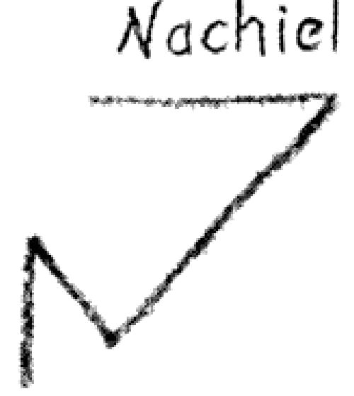

In diesem Schriftzeichen kann derjenige, der okkulter Schüler ist, die die Menschheit schnell zur Geistigkeit führenden Kräfte erkennen. Dagegen würde die Menschheit, wenn sie sich mit der ganzen Erde aus der Sonne herausgetrennt hätte, aber mit dem Monde noch zusammengeblieben wäre, sehr rasch der Verknöcherung und Verhärting anheimgefallen sein. Hätte die Erde den Mond in sich behalten. |136| ten, würden die Menschen sehr bald eine Art von Puppen geworden sein - Marionetten. Sie wären zu tief hinuntergestiegen in die Materie, wie sie auf der anderen Seite zu rasch sich vergeistigt hätten, wenn die Sonne mit der Erde verbunden geblieben wäre. Daher mußte der Mond heraus aus der Erde. Und alle diejenigen Kräfte, welche hinausbefördert worden sind und welche heute vom Monde aus herrschen und von außen hereinwirken auf die Erde, alle diese Kräfte werden zusammengefaßt dargestellt in diesem Zeichen, das wie ein Doppelhaken aussieht. Das ist das Zeichen des Tieres oder des Lammes mit zwei Hörnern aus der Apokalypse.

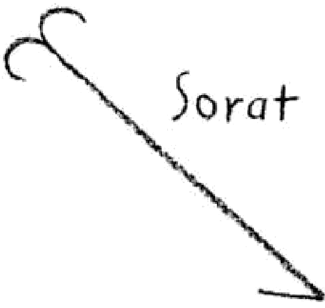

Das eine Zeichen heißt Nachiel, das andere Sorat. Dieses zweite Zeichen nennt man auch das Zeichen für das Erdendämonium. Alle diejenigen Kräfte, welche der schwarze Magier durch die Anwendung so scheußlicher Methoden entwickelt, führen auf okkulte Weise auf der Erde zur Vermehrung der Kräfte, die der dämonischen Natur der Erde angehören und die zur Verhärtung der Erde führen. Wenn viele Menschen schwarze Magier würden, so hätte das zur Folge, daß die Erde immer ähnlicher würde dem Monde, während dagegen durch die Kräfte der weißen Magie die Erde immer ähnlicher werden wird den Sonnenkräften, den Kräften, die in den Sonnenstrahlen sind.

Wozu also würde ein Überhandnehmen der schwarzen Magie auf unserer Erde führen? Es würde führen zur Verhärtung des Erdballes, dazu, daß der Erdball ein Mond würde. Dieselben Kräfte, wie sie mit dem Monde ausgeschieden worden sind, die sich herausent|137|wickelt hatten aus der Substanz der Erde, sie sind als Anlage in den Schichten der Erde noch immer vorhanden. Neben all den Kräften, die die gute Anlage haben, Sonnenkräfte zu werden, sind auch die Kräfte noch vorhanden, welche die Anlage haben, Mondenkräfte zu werden. Durch die weiße Magie wird die Erde immer mehr angenähert der Sonnennatur; durch die Kräfte der schwarzen Magie wird sie angenähert der Mondennatur. Durch die weiße Magie muß alles besiegt werden, was nicht auf dem Wege der Erleuchtung, der Weisheit, zur Beherrschung geistiger Kräfte führt. Denn alle solche Prozeduren, solche Tätigkeiten, wie sie genannt worden sind, führen nicht auf dem Wege der Weisheit, der Einsicht, nicht durch wirkliches Hineinschauen zur Beherrschung geistiger Kräfte, sondern sie sind der Natur abgelauscht, indem man mit ihr Machinationen und Prozeduren unternimmt, durch welche Kräfte ohne Erleuchtung errungen werden sollen. So ist denn tatsächlich das apokalyptische Siegel zu gleicher Zeit das Zeichen für die Überwindung der schwarzen Magie durch die weiße Magie. Durch die menschlichen Kräfte, die sich verwandeln, werden Sonnenkräfte geboren von dem Menschen selbst, so daß die Mondenkräfte zu den Menschen Füßen liegen.

Das ist der Weg, den der Magier nehmen muß auf unserer Erde. Dann werden die Kräfte durch die neun Stufen hindurch, von denen Sie einen Begriff bekommen, wenn Sie meine «Theosophie» lesen, zu den neun Sternen. Was also muß der richtige schwarze Magier zu seinem Schüler sagen? Sehr einfach:

Verachte nur Vernunft und Wissenschaft,
Des Menschen allerhöchste Kraft,
Laß nur in Blend- und Zauberwerken
Dich von dem Lügengeist bestärken,
So hab³ ich dich schon unbedingt! -
Ihm hat das Schicksal einen Geist gegeben,
Der ungebändigt immer vorwärtsdringt
Und dessen übereiltes Streben
Der Erde Freuden überspringt.
Den schlepp* ich durch das wilde Leben, 
|138| Durch flache Unbedeutendheit,
Er soll mir zappeln, starren, kleben,
Und seiner Unersättlichkeit
Soll Speis und Trank vor gierigen Lippen schweben:
Er wird Erquickung sich umsonst erflehn,
Und hätt' er sich auch nicht dem Teufel übergeben,
Er müßte doch zugrunde gehen!

Das ist es, worum es sich handelt: ob man auf dem Wege des Wissens oder ob man auf eine andere Art zur Beherrschung der geistigen Kräfte kommt. Zu den höchsten Stufen geistiger Kräfte zu kommen, ist nun aber gar nicht so einfach. Es wäre leicht, ungeheuer leicht - und da kommen wir zu einem sehr subtilen Kapitel einerseits der Menschheitsentwicklung und andererseits der Magie -, es wäre leicht, einfach zu warten, bis alle Menschen fähig wären, die Dinge richtig einzusehen, die sie eben erst einsehen müssen, bevor sie auf dem Wege magischer Entwicklung weiterkommen. Das wäre unter Umständen ganz leicht. Aber dann würde man den Gang der menschlichen Entwicklung verzögern. Es muß auf irgendeine Weise möglich sein, den Menschen selbständig in die Hand zu geben die Verbreitung okkulter Wahrheiten - und das ist in gewissem Sinne auch immer etwas von der Verbreitung okkulter Kräfte -, und diese so zu verwenden, daß sie in der Welt richtig wirken. Den Menschen müssen okkulte Wahrheiten und Lehren in größerem Umfange zuteil werden, damit sie in gewissem Sinne okkulte Lehrer werden können.

Nun könnte man ja fragen: Aber ist denn nicht jeder, der okkulte Lehren verbreitet, in gewisser Beziehung ein schwarzer Magier? - Es ist durchaus wahr, daß jemand, der heute okkulte Lehren verbreitet, leicht zum schwarzen Magier werden kann. Dann nämlich, wenn er unfähig ist, den vollen Umfang der Wirkungen seiner okkulten Lehren zu ermessen. Daher müssen die okkulten Schulen dafür Sorge tragen, daß niemand wirklich okkulte Lehren verbreitet, der nicht fähig ist durch seine eigene Entwicklung, den Umfang und die Wirkung okkulter Wahrheiten zu ermessen. Es können |139| heute okkulte Lehren verbreitet werden, indem sie ein Schüler dem anderen nachsagt oder von ihm abschreibt. Wenn der Betreffende Schüler oder Jünger sein will, so ist das ganz gut, denn dadurch verbreitet er das Ursprüngliche, von dem er gehört hat. Aber reden wir von dem Fall, wenn jemand selbständig okkulte Lehren verbreiten würde und sogar sein eigenes Urteil hineinmischen würde. Wenn jemand okkulte Wahrheiten in selbständiger Weise verbreiten will, dann muß vor allen Dingen Vorsorge dafür getroffen werden, daß dieser Mensch die Reife habe, selbständig okkulte Wahrheiten zu verbreiten, und das hängt nicht von einer verstandesmäßigen Schulung ab, sondern das machen die okkulten Schulen von etwas ganz anderem abhängig, nämlich davon, wie die einzelnen Glieder der menschlichen Natur sich nach und nach entwickeln.

Sie wissen aus dem Aufsatz über die «Erziehung des Kindes», daß bei der Geburt des Menschen der physische Leib geboren wird, daß bis zum siebenten Jahre der Ätherleib, bis zum vierzehnten Jahre der astralische Leib, und bis zum einundzwanzigsten Jahre das Ich herauskommt. Wir können das weiterverfolgen und würden sehen, daß mit dem fünfunddreißigsten Jahre des Menschen, oder besser gesagt zwischen dem fünfunddreißigsten und vierzigsten Jahre, der Ätherleib und der Astralleib des Menschen so weit frei werden, daß der Mensch erst dann das nötige Verantwortungsgefühl haben kann für die Verbreitung okkulter Wahrheiten. Daher haben alle okkulten Schulen das strenge Gesetz, daß niemand als Lehrer okkulter Wahrheiten auftreten darf, bevor er dieses Alter erreicht hat. Und dieses Gesetz ist es auch, das der große Dichter Dante hingestellt hat, indem er gleich am Anfang seiner Dichtung «Die göttliche Komödie» sagt: «Es war in des Lebens Mitte, daß ich mich verirrte im Walde ...» und so weiter. Wenn Sie nachrechnen: Im Jahre 1300 war Dante fünfunddreißig Jahre alt. Da gingen alle diese großen Dinge an seiner Seele vorüber.

Das ist ein strenges Gesetz. Wenn Sie dieses strenge Gesetz einmal anschauen und manches dabei berücksichtigen, was in der Gegenwart geschieht, dann werden Sie unter diesem Gesichtspunkte einfach wissen, daß vieles, was verbreitet wird, nicht aus okkulten Quellen |140| stammt. Keine okkulte Schule läßt es zu, daß Menschen selbständig okkulte Wahrheiten verbreiten, die dieses Alter nicht erreicht haben. Damit ist selbstverständlich nicht gesagt, daß man nicht früh genug damit anfangen kann, etwas zu lernen. Aber um als Lehrer des Okkultismus aufzutreten, kann man nicht spät genug anfangen. Viel, viel Übles würde vermieden werden, wenn die Leute wirklich den Okkultismus kennen würden und die strengen Gesetze, die da herrschen.

Das sind Dinge, die man im Zusammenhang mit dem Thema «Weiße und schwarze Magie», das nicht so leicht zu behandeln ist, beachten muß, und wovon ich wirklich nur einige Brocken gesagt habe. Wenn Sie manches von dem, was hier nur angedeutet werden konnte, in Ihrer Meditation in ernster Studienarbeit sich weiter ausführen, dann werden Sie sehen, daß schon mit diesen unvollkommenen Andeutungen die Anfangsschritte für mancherlei Wege gegeben sind, um in der Erkenntnis weiterzukommen. Vor allem werden Sie sich davon überzeugt haben, daß man über solche Dinge wie weiße und schwarze Magie nicht mit den gewöhnlichen trivialen Begriffen überhaupt reden kann, daß man sogar erst neue Begriffe formulieren muß, wenn man über solche hohen oder über so scheußliche Dinge reden will. Es ist heute wichtig, solche Dinge zu wissen, denn es ist vieles in der Welt, wovon der gewöhnliche Mensch nichts weiß, was er aber doch wissen sollte, damit er sich retten kann vor den Einflüssen magischer Künste. Manches kennen die Menschen auch, sehen es aber als etwas Harmloses an. Aber es ist gar nicht harmlos.

Wir können, wenn wir ein solches Thema besprechen, nur einen Anfang machen, um dann immer weiter und weiter zu kommen auf diesem Gebiet. Der Anfang ist am besten dann gemacht, wenn ein Gefühl von dem Ernst und der Bedeutung einer solchen Sache erweckt werden konnte. Wenn auch die Darstellungen in der Kürze der Zeit nur unvollkommen sein konnten, so hoffe ich doch, daß dadurch, daß real gesprochen worden ist, einiges davon in Sie übergegangen ist, um Sie zu veranlassen, die Sache mit dem höchsten Ernste zu betrachten.

# OKKULTE ZEICHEN UND SYMBOLE - ERSTER VORTRAG, Stuttgart, 13. September 1907

|143| Diese vier Vorträge, die hier in Stuttgart stattfinden sollen, werden einen etwas intimeren Charakter haben, weil ja der Zuhörerkreis - zum größten Teil wenigstens - sich aus Mitgliedern der Theosophischen Gesellschaft zusammensetzt, die schon mit den theosophischen Grundideen seit langer Zeit bekannt sind und daher wohl auch den Wunsch hegen, eine intimere Materie aus dem Gebiete der Theosophie kennenzulernen. Was in diesen Vorträgen behandelt werden soll, sind die okkulten Sinnbilder und Zeichen mit Beziehung auf die astralische und die geistige Welt. Eine Reihe von okkulten Symbolen und Sinnbildern soll in ihrer tieferen Bedeutung dargelegt werden. Dabei bitte ich Sie darauf Rücksicht zu nehmen, daß in den ersten beiden Vorträgen manches sonderbar klingen und erst im Laufe des dritten und vierten Vortrages seine volle Erklärung finden wird. Das liegt ja in der Natur der Sache, denn theosophische Vorträge können nicht wie andere Vorträge sein, die sich sozusagen in mathematischer Weise aus einfachen Elementen aufbauen. Manches wird im Anfang undeutlich sein müssen, aber nach und nach wird es klar und verständlich hervortreten.

Sinnbilder und Zeichen machen - nicht nur in der profanen, sondern auch in der theosophischen Welt - oftmals den Eindruck von etwas mehr oder weniger Willkürlichem, das nur eine «Bedeutung» hat. Das ist durchaus nicht richtig. Sie alle haben schon von solchen Sinnbildern und Zeichen gehört und wissen wohl, daß zum Beispiel die verschiedenen Planeten des Weltalls durch Zeichen angedeutet werden. Sie wissen, daß ein bekanntes Zeichen in theosophischen Allegorien das sogenannte Pentagramm ist. Ferner ist Ihnen bekannt, daß m verschiedenen Religionen das Licht im Sinne von Weisheit, von geistiger Klarheit angeführt wird. Wenn Sie nun nach der Bedeutung solcher Dinge fragen, dann können Sie hören oder lesen, es bedeute dieses oder jenes; ein Dreieck zum Beispiel bedeute die höhere Dreiheit, und dergleichen mehr. Häufig auch werden in |144| theosophischen Schriften und Vorträgen Mythen und Legenden ausgelegt, «sie bedeuten etwas», sagt man. Hinter den Sinn, hinter das Wesen dieser Bedeutung zu kommen, die Wirklichkeit solcher Sinnbilder zu erkennen, das eben soll die Aufgabe dieser Vorträge sein. Wie das gemeint ist, wollen wir uns an einem Beispiel klarmachen.

Betrachten wir einmal das Pentagramm. Sie wissen, es ist vieles darüber spintisiert und ausgedacht worden; darum kann es sich im Okkultismus nicht handeln. Um zu verstehen, was der Okkultist vom Pentagramm sagt, müssen wir uns zunächst an die sieben Grundteile der menschlichen Wesenheit erinnern. Sie wissen ja, daß es in der menschlichen Wesenheit die sieben Grundteile gibt: Physischer Leib, Ätherleib, Astralleib, Ich, ferner Geistselbst, Lebensgeist und den Geistesmenschen, oder - wie man in der theosophischen Literatur gewohnt ist, die letzteren zu nennen: Manas, Budhi, Atma. Wir wollen vom physischen Leib absehen, der etwas Stoffliches ist, den man mit Händen tasten kann; es ist der Ätherleib, der hier besonders in Betracht kommt. Der Ätherleib gehört schon zu dem für die physischen Sinne Verborgenen, zu dem sogenannten «Okkulten»; mit den gewöhnlichen Augen kann man ihn nicht sehen. Es bedarf der hellseherischen Methode, um ihn wahrzunehmen. Wenn man ihn aber schauen kann, dann ist er freilich etwas ganz, ganz anderes als der physische Leib. Der Ätherleib ist nicht etwa - wie sich die meisten Menschen vorstellen - ein dünner, stofflicher Körper, eine Art feineres Nebelgebilde. Das Charakteristische des Ätherleibes ist, daß er zusammengesetzt ist aus verschiedenen Strömungen, die ihn durchziehen. Er ist ja der Architekt, der Bildner des physischen Leibes. Wie sich das Eis aus dem Wasser herausgestaltet, so gestaltet sich der physische Leib aus dem Ätherleibe heraus; und durchzogen ist dieser Ätherleib nach allen Seiten hin von Strömungen, wie das Meer. Darunter gibt es nun fünf Hauptströmungen. Wenn Sie sich hinstellen mit auseinandergespreizten Beinen und die Hände ausgebreitet halten, dann stellt sich der menschliche Leib so dar, wie hier im Bilde (es wird gezeichnet):

|145| Sie können die Richtungen der fünf Hauptströmungen genau verfolgen; sie bilden ein Pentagramm. Diese fünf Strömungen hat jeder Mensch verborgen in sich. Sie durchströmen den Ätherleib in den durch die Pfeile angegebenen Richtungen (siehe Zeichnung), sie bil-

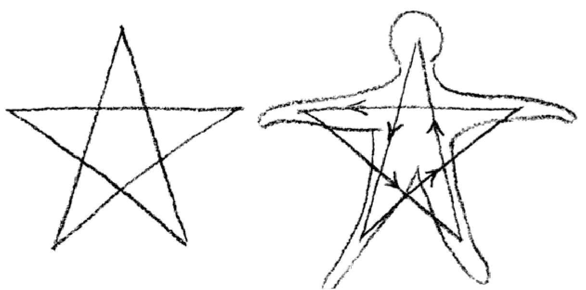

den sozusagen das «Knochengerüst» des menschlichen Ätherleibes. Fortwährend gehen diese Strömungen durch den Ätherleib, und dies bleibt auch der Fall, wenn der Mensch sich bewegt. Wie auch die Körperstellung sein mag, immer geht eine Strömung von der Mitte der Stirn, dem Punkte zwischen den Augenbrauen aus, hinunter zum rechten Fuß, von da nach der linken Hand, von da zur rechten Hand, dann zum linken Fuß und von da wieder zurück zur Stirn. Das, was man das Pentagramm nennt, das ist innerlich so beweglich im Ätherleib, wie es der menschliche physische Leib selbst ist. Und wenn der Okkultist vom Pentagramm als von der Figur des Menschen spricht, dann handelt es sich nicht um etwas Ausgeklügeltes, sondern er spricht davon wie der Anatom vom Knochengerüst. Diese Figur ist wirklich im Ätherleib vorhanden, sie ist eine Tatsache.

Schon aus diesem wenigen sehen wir, wie es sich mit der wirklichen Bedeutung eines Zeichens verhält. Alle Zeichen und Sinnbilder, die Ihnen im Okkultismus entgegentreten, führen zu solchen Wirk|146|lichkeiten hin. Das Pentagramm ist also das bewegliche «Knochen-gerüst» des Ätherleibes, deshalb ist es die Figur des Menschen. Dieses ist die wirkliche Bedeutung eines solchen Zeichens.

Wenn man nach und nach die richtigen Anweisungen bekommt, die Figuren oder Zeichen zu gebrauchen, dann sind sie ein Mittel, durch das der Mensch allmählich in die Erkenntnis der geistigen Welt eingeführt wird und hellsichtig werden kann. Wer sich in der Meditation in das Pentagramm vertieft, für den ist der Weg dieser Strömungen im Ätherleib zu finden. Es hat keinen Zweck, sich willkürliche Bedeutungen dieser Zeichen auszudenken. Wenn man sich dieses Zeichen in der Meditation vorhält – man muß es nur mit Geduld tun –, dann führt das zu okkulten Wirklichkeiten. Und so ist es mit allen Sinnbildern und Zeichen, auch mit denen, die Sie in den verschiedenen religiösen Urkunden finden können, denn diese Sinnbilder sind tief begründet im Okkultismus. Wenn irgendein Prophet oder Religionsstifter vom Lichte spricht und damit die Weisheit bezeichnen will, so müssen Sie nicht denken, daß ihm das nur so einfällt oder daß er diesen Ausdruck gebraucht, weil er vielleicht geistreich sein will. Der Okkultist fußt auf Tatsachen, deshalb liegt ihm nichts daran, geistreich zu sein. Er will nur wahr sein. Man muß als Okkultist sich das regellose Denken abgewöhnen, das heißt, man darf nicht in willkürlicher Weise Schlüsse ziehen und Urteile fällen, man muß Schritt für Schritt an der Hand geistiger Tatsachen das richtige Denken entwickeln.

Dieses Sinnbild vom Licht hat wiederum eine sehr, sehr tiefe Bedeutung, es ist eine geistige Tatsache. Um das zu erkennen, wenden wir uns wieder der menschlichen Wesenheit zu. Wir wissen, daß das dritte Glied der menschlichen Wesenheit der Astralleib ist, der der Träger ist von Lust und Leid, von Freude und Schmerz, von Trieb, Begierde und Leidenschaft, von allem, was der Mensch an inneren seelischen Erlebnissen hat. Die Pflanze hat keinen Astralleib, hat also auch nicht Lust und Leid wie der Mensch und das Tier. Wenn heute der Naturforscher von der Empfindung der Pflanze spricht, so beruht das auf einer vollständigen Verkennung dessen, was eigentlich das Wesen der Empfindung ist. Eine richtige Vorstellung dieses |147| Astralleibes erhalten wir erst, wenn wir seine Entwicklung verfolgen, die er im Laufe der Zeiten erfahren hat. Wir haben schon früher die Entwicklung des Menschen im Zusammenhang mit der Entwicklung im großen Weltall betrachtet und dabei gefunden, daß der physische Leib des Menschen das älteste und komplizierteste Glied der menschlichen Wesenheit ist, daß der Ätherleib weniger alt ist, der Astralleib noch jünger, und daß das Ich endlich das jüngste Glied der menschlichen Wesenheit darstellt. Der Grund hierfür ist, daß der physische Leib in seiner Entwicklung schon durch vier planetarische Zustände der Erde hindurchgegangen ist; er war schon in seiner Anlage vorhanden, als unsere Erde in einer früheren Verkörperung war, die man als den Saturnzustand bezeichnet. Damals, vor langen Zeiträumen, war die Erde noch nicht Erde und der Mensch noch nicht in seiner heutigen Gestalt vorhanden; nur die Anlage zum physischen Leib war auf dem Saturn da; aber es fehlten noch alle seine übrigen Leiber, wie Ätherleib, Astralleib und so weiter. Erst in der zweiten Verkörperung der Erde, auf der Sonne, kam für den Menschen der Ätherleib dazu. Damals hatte dieser menschliche Ätherleib die Gestalt des Pentagramms am ausgesprochensten; später ist das etwas modifiziert worden dadurch, daß auf der dritten Verkörperung unseres Planeten, auf dem Monde, sich der astralische Leib hinzugesellte. Und dann verwandelte sich der Mond in die Erde, und zu den drei Leibern trat das Ich hinzu.

Nun können wir fragen: Wo waren denn nun diese Leiber, bevor sie sich der menschlichen Wesenheit einverleibten? Wo war zum Beispiel das, was auf der Sonne als Ätherleib hineingezogen ist in den physischen Leib, wo war das auf dem alten Saturn? Irgendwoher muß der Ätherleib doch gekommen sein. - Er war im Umkreis des Saturn, geradeso wie heute die Luft im Umkreis der Erde ist. Alles, was später in den Menschen hineingezogen ist, das war im Umkreis, in der Atmosphäre des alten Saturn schon vorhanden. Ebenso war auf der alten Sonne der astralische Leib, der ja erst auf dem Monde hineingezogen ist, im Umkreis vorhanden. Sie können sich die alte Sonne so vorstellen, daß sie nicht aus Felsen, Pflanzen und Tieren bestand, wie heute die Erde, sondern da waren zwei Natur|148|reiche, die es auf der Sonne gab. Die Wesen, die Menschen, die sich auf der Sonne befanden, waren erst menschliche Pflanzen. Daneben gab es auf der alten Sonne eine Art von Mineralien. Sie dürfen aber diese alte Sonne nicht mit der jetzigen Sonne verwechseln. Die alte Sonne war umflossen von einer mächtigen Astralhülle. Gleichsam von einer astralischen Lufthülle war die alte Sonne umgeben, und diese Astralhülle war leuchtend. So war der Schauplatz auf der alten Sonne.

Betrachten wir jetzt wieder den heutigen Menschen, der einen physischen Leib, einen Ätherleib, einen astralischen Leib und ein Ich hat. Wenn das Ich nun hineinarbeitet in den astralischen Leib und ihn immer mehr läutert in intellektueller, moralischer und geistiger Beziehung, dann wird aus diesem Astralleib Geistselbst oder Manas. Wenn in ferner Zukunft das vollendet sein wird, was heute kaum begonnen hat, wenn der Mensch seinen ganzen astralischen Leib umgewandelt haben wird, dann wird dieser astralische Leib «physisch» leuchtend sein. So wie die Pflanze schon den Keim zu neuem Leben in sich trägt, so enthält der astralische Leib schon den Keim eines Lichtes, das dereinst hinausstrahlen wird in den Weltenraum, wenn der Mensch seinen Astralleib immer mehr und mehr gereinigt und geläutert haben wird. Unsere Erde wird sich in andere Planeten verwandeln. Heute ist sie dunkel. Wer sie von außen beobachten könnte, würde sehen, daß sie nur durch das zurückgeworfene Licht der Sonne hell erscheint. Aber einst wird sie selbst leuchtend sein, leuchtend durch die Menschen, die dann ihren ganzen Astralleib umgewandelt haben werden. Die Summe aller Astralleiber wird hinausstrahlen als Licht in den Weltenraum.

So war es auch bei der alten Sonne. Die alte Sonne hatte als Bewohner höhere Wesen, als die heutigen Menschen sind, und diese Wesenheiten hatten leuchtende Astralleiber. Diese Wesenheiten, die die Bibel in sehr richtiger Weise Lichtgeister oder Elohim nennt, strahlten ihre Astralität hinaus in den Weltenraum.

Wenn wir uns nun fragen: Was ist es, was der Mensch in seinen Astralleib hineinarbeitet? -, dann ist die Antwort: Es ist das, was wir das Gute, das Gescheite nennen, durch das der Mensch seinen |149| Astralleib veredelt. Wenn wir einen Wilden betrachten, der noch auf der Stufe des Menschenfressers steht, der allen Leidenschaften blind folgt, und uns fragen, wodurch er sich unterscheidet von höherentwickelten Menschen, so müssen wir sagen: dadurch, daß der Kulturmensch schon gearbeitet hat an seinem Astralleib, der Wilde dagegen noch nicht. Der Mensch, der seine Triebe und Leidenschaften so auffaßt, daß er sich sagt: diesem darf ich folgen, anderem dagegen nicht -, bildet sich moralische Begriffe und Ideale, und das bedeutet Verwandlung und Veredelung des Astralleibes. Dadurch, daß der Mensch von Verkörperung zu Verkörperung an seinem Astralleib arbeitet, veredelt er sich immer mehr und mehr zu jener leuchtenden Wesenheit, von der wir vorhin gesprochen haben. Man nennt das das «Hineinarbeiten der Weisheit». Je mehr Weisheit in dem Astralleibe ist, desto leuchtender wird er sein. Die Elohim, jene Wesenheiten, die auf der Sonne wohnten, waren ganz Weisheitdurchdrungen. So wie unsere Seele sich zum Leibe verhält, so verhält sich die Weisheit zum Licht. Sie sehen, der Zusammenhang zwischen Licht und Weisheit ist nicht ein Bild, das man ausgesonnen hat; er beruht auf einer Tatsache, er ist eine Wahrheit. Das Licht ist tatsächlich der Körper der Weisheit. So lernen wir verstehen, daß die religiösen Urkunden vom Lichte sprechen als einer Versinnbildlichung der Weisheit.

Für den Lernenden, für den sich zu höherer Schaukraft, zu Hellsichtigkeit Entwickelnden ist es von großer Bedeutung, wenn er Übungen macht wie etwa die folgende: Er stellt sich den Raum finster vor, ohne daß ein äußeres Licht auf ihn einwirkt - sei es bei nächtlichem Dunkel oder durch Schließen der Augen - und sucht dann nach und nach vorzudringen durch eigene innere Kraft zu der Vorstellung des Lichts. Wenn der Mensch sich diese Vorstellung intensiv genug bilden kann, so wird es nach und nach heller, und er wird dann ein Licht sehen, das kein physisches Licht ist, sondern ein Licht, das er nun sich selber schafft, das er durch innere Kraft in sich erzeugt. Und das ist ein Licht, das durchstrahlt sein wird von der Weisheit, in dem ihm die schaffende Weisheit erscheint. Das ist das, was man Astrallicht nennt. Durch Meditation kommt der Mensch |150| dazu, durch innere Kraft Licht zu erzeugen. Dieses Licht ist ein Vorbote dessen, was der Mensch dereinst - nicht mit physischen Augen, sondern mit feineren Sinnesorganen - sehen wird. Es wird das Kleid werden für wirklich vorhandene Geistwesen, wie es die Elohim sind. Wenn der Mensch diese Übung m der richtigen Weise macht, ist sie ein Mittel, zu diesen höheren Wesen in Beziehung zu kommen. So haben es diejenigen gemacht, die aus eigener Erfahrung etwas wissen von der geistigen Welt.

Durch gewisse andere Methoden, von denen wir später sprechen werden, kann der Mensch dahin gelangen, daß ihm durch eigene innere Kraft der Raum nicht nur vom Lichte erleuchtet, vom Weisheitslichte durchflössen sein wird, sondern daß der Raum gleichsam zu tönen beginnt. In der alten pythagoreischen Philosophie wurde, wie Sie wissen, von Sphärenmusik gesprochen. Unter «Sphäre» wird dabei der Weltenraum begriffen, der Raum, in dem die Sterne schweben. Das ist kein erdachtes, ausspintisiertes Bild, kein poetischer Vergleich, sondern das ist eine Wirklichkeit. Wenn der Mensch sich genügend nach den Angaben des Geheimlehrers geübt hat, dann lernt er, innerlich nicht nur einen erhellten, durchleuchteten Raum zu schauen, der der Ausdruck der Weisheit ist, sondern er lernt auch zu hören die Sphärenmusik, die den Weltenraum durchflutet. Und wenn der Raum zu erklingen beginnt, dann sagt man, der Mensch sei in der himmlischen Welt, im Devachan. Richtig ist, daß der Raum erklingt, aber es ist nicht ein physischer Ton, sondern dies sind geistige Töne, die nicht in der Luft leben, sondern in einem viel höheren, feineren Stoffe, im Akasha-Stoff. Fortwährend ist der Raum von solcher Musik erfüllt, und es gibt in dieser Sphärenmusik gewisse Grundtöne.

Wir wollen jetzt einmal betrachten, was man unter Sphärenmusik zu verstehen hat. Ich weiß sehr wohl, daß die heutigen mathematischen Astronomen es für hellen Wahnsinn erklären würden, wie man im Okkultismus über die Planeten spricht. Das macht nichts, deshalb ist es doch wahr.

Wir haben davon gesprochen, daß unsere Erde sich nach und nach entwickelt hat; von Erdverkörperungen haben wir gespro|151|chen. Unsere Erde war erst Saturn, wurde dann Sonne, dann Mond, jetzt ist sie Erde, später wird sie Jupiter, Venus, Vulkan werden. Nun können Sie fragen: Es steht doch auch heute ein Saturn am Himmel; hat nun dieser heutige Saturn etwas zu tun mit dem Saturn, der die erste Verkörperung der Erde war? - Wenn wir den gestirnten Himmel betrachten, sehen wir da die uns exoterisch bekannten Planeten. Die Namen dieser Planeten sind nicht willkürlich gewählt, nicht etwa, wie es in neuerer Zeit Brauch geworden ist, nach einem bestimmten Manne, etwa nach ihrem Entdecker, sondern es sind bedeutungsvolle Namen, die aus tiefem Wissen über das Wesen der Sterne heraus gegeben wurden. Heute tut man das ja nicht mehr, und zum Beispiel der Uranus hat nicht einen solchen berechtigten Namen, weil er erst später entdeckt wurde. Das, was Sie heute als Saturn am Himmel sehen, steht auf der Stufe der Entwicklung wie unsere Erde, als sie noch im Zustande des Saturn war. Der exoterische Saturn verhält sich zur Erde etwa so wie ein Knabe zum Greis. So wenig wie der Greis sich aus einem neben ihm stehenden Knaben entwickelt hat - er war selbst einmal ein Knabe -, ebensowenig hat die Erde sich aus dem heutigen Saturn entwickelt. Der Saturn, der heute am Himmel steht, wird auch einmal «Erde» werden; er steht jetzt in einer Art Jugendstadium. Und ähnlich ist es auch mit den anderen Himmelskörpern. Die Sonne ist ein solcher Körper, wie die Erde es einstmals war, nur ist sie sozusagen «avanciert». Und so, wie bei den Menschen verschiedene Altersstufen beisammen sind, wie neben dem Greis der Knabe steht, so stehen am Himmel die verschiedenen Planeten nebeneinander auf verschiedenen Entwicklungsstufen, die unsere Erde, welche sich jetzt in ihrer vierten Verkörperung befindet, zum Teil schon durchgemacht hat, zum Teil noch durchmachen wird. Die Planeten stehen in ganz bestimmten Verhältnissen zueinander. Aber der Okkultist drückt diese Verhältnisse anders aus, als es der heutige Astronom tut.

Sie wissen, die Planeten bewegen sich mit ganz bestimmten Geschwindigkeiten um die Sonne. Aber auch diese bewegt sich, und es ist diese Bewegung, wie auch die der Planeten, welche von den okkulten Astronomen genau erforscht worden sind. Die Forschung |152| hat ergeben, daß die Sonne sich um einen geistigen Mittelpunkt bewegt, und daß die Bahnen der Planeten Spiralen sind, deren Richtlinie die Sonnenbahn ist. Die Geschwindigkeiten, womit die einzelnen Planeten ihre Bahnen vollziehen, stehen zueinander in ganz bestimmten, harmonischen Verhältnissen, und es stellen sich diese Verhältnisse als Töne für den Hörenden zu einer Symphonie zusammen, welche durch die Pythagoreer als Sphärenmusik bezeichnet wurde. Dies Zusammenklingen, diese Musik ist also ein Abbild kosmischer Vorgänge, und was die pythagoreische Schule lehrt, ist nichts Ausgeklügeltes. Die alten okkulten Astronomen sagten sich: Der Sternenhimmel, welcher scheinbar ruhend sich ausnimmt, ist in Wahrheit in Bewegung und dreht sich um den geistigen Mittelpunkt mit solcher Geschwindigkeit, daß er in 100 Jahren um $1^{\circ}$ vorrückt. Es verhalten sich nun die Geschwindigkeiten der Planeten zueinander wie folgt:

Geschwindigkeit des Saturn = 2 1/2 mal die des Jupiter
des Jupiter = 5 mal die des Mars
des Mars = 2 mal die von Sonne, Merkur und Venus
der Sonne = 12 mal die des Mondes

wobei die Geschwindigkeit des Saturn 1200mal größer ist als die des ganzen Sternenhimmels, oder $12^{\circ}$ im Jahre vorrückt.

Wenn physische musikalische Harmonien entstehen, beruht das darauf, daß beispielsweise verschiedene Saiten verschiedenartig schwingen, die eine schneller, die andere langsamer. Je nach der Geschwindigkeit, mit der sich die einzelnen Saiten bewegen, erklingt ein höherer oder tieferer Ton, und das Zusammenklingen dieser verschiedenen Töne ertönt als Musik, ergibt die Harmonie. Genauso wie Sie nun musikalische Eindrücke hier im Physischen von den Bewegungen der Saiten erhalten, so hört derjenige, der zu der Stufe des Hellhörens im Devachan emporgedrungen ist, die Bewegung der Himmelskörper als Sphärenmusik. Und durch das Verhältnis der verschiedenen Schnelligkeiten in der Bewegung der Planeten entsteht |153| hen die Grundtöne der Sphärenharmonie, die durch das ganze Weltall erklingt. In der Pythagoreischen Schule wird also mit Recht von einer Sphärenmusik gesprochen, man kann sie mit geistigen Ohren hören.

Wir können bei diesen Betrachtungen noch auf ein anderes Phänomen hindeuten. Wenn Sie eine dünne Messingplatte nehmen, sie möglichst gleichmäßig mit feinem Staube bestreuen und mit einem Fiedelbogen diese Platte streichen, dann wird nicht nur ein Ton hörbar, sondern es ordnen sich die Staubpartikelchen in ganz bestimmten Linien an. Da bilden sich allerlei Figuren, dem Tone entsprechend. Der Ton bewirkt eine Verteilung der Materie, des Stoffes. Das sind die bekannten Chladnischen Klangfiguren.

Als der geistige Ton durch das Weltall erklang, ordnete er die Planeten in ihren Verhältnissen zueinander zu einer Sphärenharmonie. Was Sie im Weltenräume ausgebreitet sehen, das hat dieser schaffende Ton der Gottheit angeordnet. Dadurch, daß dieser Ton in den Weltenraum hineintönte, gestaltete sich die Materie zu einem System, dem Sonnen- und Planetensystem. So ist auch der Ausdruck «Sphärenharmonie» nicht ein geistreicher Vergleich; er ist Wirklichkeit.

Nun wollen wir zu etwas anderem übergehen. Wir wissen, daß unsere Erde nicht immer so war, wie sie jetzt ist. Wer sich längere Zeit mit Theosophie beschäftigt hat, der weiß, daß unsere Erde in ihrer jetzigen Verkörperung verschiedene Entwickelungsstufen durchgemacht hat. In urferner Vergangenheit war sie in einem feuerflüssigen Zustande. Was unsere heutigen Steine und Metalle sind, war einmal aufgelöst in dieser feuerflüssigen Erde vorhanden. Der Einwand, daß in solcher Glut keine Menschen und keine anderen Wesen leben konnten, muß dahin beantwortet werden: Der menschliche Leib war damals in einem solchen physischen Zustande, der den damaligen Bedingungen angepaßt war; er konnte leben in einer Temperatur, die noch heißer war als die heutigen Schmelzöfen. Diesem Feuerzeitalter der Erde ist ein Wasserzeitalter gefolgt, das wir das atlantische Zeitalter nennen. Betrachten wir einmal dieses atlantische Zeitalter. Der atlantische Kontinent, der zwischen dem heutigen Europa und Amerika in der Mitte des atlantischen |154| Ozeans sich ausbreitete, wurde bewohnt von unseren Vorfahren, welche natürlich ganz anders beschaffen waren als die heutigen Menschen. Ihr Sehen war nicht wie das unsere; sie waren in gewisser Beziehung hellsehend. In der Entwicklung der Atlantier gab es verschiedene Stufen des Sehens. Die letzte Stufe, am Ende der atlantischen Zeit, war wie eine Art Nachklang von viel höheren Stufen. Einen äußeren Gegenstand zum Beispiel konnte der Atlantier erst in der letzten Zeit der Atlantis sehen. Früher war sie so von dichten Wassernebelmassen erfüllt, daß sich die Gegenstände nicht räumlich voneinander abgrenzten. In dieser ersten Zeit der atlantischen Entwicklung war die Art der Wahrnehmung ganz anders. Nicht zuerst den Umriß, die Physiognomie eines Menschen oder eines Gegenstandes sah der alte Atlantier, wenn er sich einem Dinge oder einem Wesen näherte, es stieg viel mehr in ihm ein Farbenbild auf, das nichts mit dem Äußeren zu tun hatte, sondern einen inneren Seelenzustand wiedergab. Farbenbilder sagten ihm, ob ein entgegenkommendes Wesen nützlich oder gefährlich für ihn war. War es zum Beispiel ein Rachegefühl, was der Entgegenkommende für den anderen hatte, so drückte sich ihm dies durch ein entsprechendes Farbenbild aus, und er rannte davon. Nahte sich ein wildes Tier, erkannte er es ebenso, und er konnte sich retten. Die Seelenzustände seiner Umgebung nahm der Atlantier wahr in dieser letzten Phase des Hellsehens. Erst allmählich entwickelt sich daraus das heutige Sehen. Denken Sie sich einen recht nebligen Tag, wie da die Gegenstände verschwimmen. Denken Sie sich an einem solchen Tage die Straßenlaterne, die erst wie ein Punkt auftaucht; dann allmählich unterscheiden Sie die Umrisse. So ganz allmählich lernte der Atlantier sehen. Was der Mensch früher sah, war eine Art astraler Farbe, die er anfänglich noch frei schwebend sah und die sich ihm gleichsam über die Dinge gelegt hat.

Natürlich war diese andere Art der Wahrnehmung damit verbunden, daß der damalige Mensch ganz anders ausschaute als der heutige. In der letzten Zeit der atlantischen Periode hatte der Mensch zum Beispiel eine weit zurückliegende physische Stirn, über welche der Ätherleib wie eine mächtige Kugel herausragte. Der Punkt hinter |155| der Stirn, zwischen den Augen etwas zurückliegend, war bei physischem Leib und Ätherleib noch nicht zusammenfallend. Dann zogen sich physischer Leib und Ätherleib zusammen, und die Vereinigung dieser beiden Punkte in Ätherleib und physischem Leib war ein wichtiger Moment in der Menschheitsentwicklung. Heute paßt in den Ätherkopf der physische Kopf ungefähr gerade hinein. Beim Pferd ist das noch anders. Aber wie sich dieser Kopf verändert hat beim Menschen, so haben sich auch seine Gliedmaßen verändert. Allmählich bildete sich seine jetzige Körpergestalt heran. Denken Sie sich lebhaft hinein in das Ende der atlantischen Zeit. Wie war das eigentlich damals? Der Mensch nahm wahr in einer Art von Hellsehen die Seelenzustände seiner Umgebung. Denken Sie sich noch einmal diese dichte Nebelatmosphäre, die mit schweren Wasserdünsten durchschwängerte Luft. Die Sonne, die Sterne und alle Gegenstände um Sie her hätten Sie damals in dieser dichten wäßrigen Luft nicht sehen können. Den Regenbogen gab es damals noch nicht, denn der Regenbogen konnte sich noch nicht bilden. Alles war in dichte, schwere Nebelmassen gehüllt. Deshalb spricht die Sage von Niflheim, von einem Nebelheim. Allmählich verdichtete sich das Wasser, das mächtig m der Luft ausgedehnt war, «und die Wasser der Sintflut strömten zur Erde nieder». Damit ist nichts anderes gemeint, als daß sich die mächtigen Nebelmassen zu Wasser verdichteten und als Niederschläge, als Regen herunterfielen. Indem das Wasser sich von der Luft schied, wurde die Luft reiner, und mit dem Reinerwerden der Luft bildete sich die heutige Art des Anschauens heraus. Der Mensch hat sich selbst erst sehen können, als er die Gegenstände um sich her sehen konnte.

Nun weist der physische Leib des Menschen viele Regelmäßigkeiten auf, die von tiefer Bedeutung sind. Eine davon ist die folgende: Wenn Sie eine Kiste fabrizieren würden in den Verhältnissen, daß sich Höhe, Breite und Länge verhalten wie drei Teile zu fünf Teilen zu dreißig Teilen, und wenn dabei die Länge der Körperlänge entspricht, dann finden Sie dieselben Maß Verhältnisse im menschlichen Körper. Mit anderen Worten: Es ist damit das Verhältnis einer regelmäßigen Gliederung des menschlichen Leibes angegeben. Damals, |156| als der Mensch den Fluten der Atlantis entstieg, war sein Leib so gebildet, daß er den Maßverhältnissen 3 : 5 : 30 entsprach. In schöner Weise ist das in der Bibel ausgedrückt mit den Worten: «Und Gott befahl Noah, einen Kasten zu bauen von dreihundert Ellen Länge, fünfzig Ellen Breite und dreißig Ellen Höhe.» In diesen Maßen der Arche Noah haben wir genau die Maße der Harmonie des menschlichen Leibes.

Okkulte Zeichen und Sinnbilder sind eben aus dem Wesen der Dinge heraus genommen und zeigen darum, wie wir durch sie in die Verhältnisse der geistigen Welten hineinschauen können.

# OKKULTE ZEICHEN UND SYMBOLE - ZWEITER VORTRAG, Stuttgart, 14. September 1907

|157| Wir blieben gestern bei einem Hinweis auf die Arche Noah stehen, und zwar bemerkten wir, daß in den Maßverhältnissen, die sie in Höhe, Breite und Länge hatte, sich die Maßverhältnisse des menschlichen Leibes ausdrückten. Um nun einzusehen, welche Bedeutung diese Arche der religiösen Urkunde der Bibel hat, müssen wir zweierlei betrachten. Wir müssen uns nicht nur klarmachen, welchen Sinn es hat, daß ein Fahrzeug, durch das der Mensch gerettet werden soll, bestimmte Maße hat, die an die Maße des menschlichen Leibes erinnern, es wird auch notwendig sein, sich in jene Zeit der Menschheitsentwicklung zu vertiefen, in der sich die wirklichen Geschehnisse abspielten, auf die in der Geschichte von Noah hingewiesen wird.

Immer wenn Menschen, die etwas von Okkultismus verstanden haben, in der äußeren Welt irgendeinen Gegenstand schufen, so hatte das einen ganz bestimmten Zweck, eine ganz bestimmte Bedeutung für die menschlichen Seelen. Erinnern Sie sich einmal an die gotischen Kirchen und Dome, an die ganz speziellen Eigentümlichkeiten dieser Bauwerke, die in der ersten Zeit des Mittelalters entstanden sind und sich vom Westen nach Mitteleuropa hin ausgebreitet haben. Diese Kirchen tragen einen ganz bestimmten Baustil, der sich darin ausdrückt, daß die eigenartige Bogenart, die aus zwei oben in eine Spitze auslaufenden Teilen besteht, sich über das Ganze als Stimmung ergießt, daß das Ganze nach oben strebt, daß die Pfeiler eine bestimmte Gestalt haben und so weiter. Ganz unrecht hatte derjenige, der behaupten wollte, solch ein gotischer Dom sei bloß aus äußeren Bedürfnissen hervorgegangen, etwa aus einer gewissen Sehnsucht, ein Gotteshaus zu schaffen, welches dieses oder jenes ausdrücken oder bedeuten soll. Oh nein! Der Gotik liegt etwas viel Tieferes zugrunde. Diejenigen, die die ersten Ideen angaben für das Entstehen der gotischen Bauten in der Welt, waren Kenner des Okkultismus, sie waren bis zu einem gewissen Grade Eingeweihte.

|158| Ganz bestimmte Absichten verbanden die großen Führer der Menschheit mit dem Entstehen solcher Bauten, solcher Baustile. Die Gotik, die gotischen Dome und Kirchen, lösen ganz bestimmte Seeleneindrücke aus bei dem, der sie betritt. Es ist, als trete man in eine Art von Hain in diesem hohen gewölbten Dome mit den aufstrebenden Säulen. Der Aufenthalt dort wirkt ganz anders auf die Seele, als wenn Sie zum Beispiel in ein gewöhnliches Haus gehen oder in ein Bauwerk, das eine Renaissance-Kuppel oder eine Kuppel romanischen Stiles hat. Es gehen ganz bestimmte Wirkungen von den Formen aus. Der gewöhnliche Mensch wird sich dessen nicht bewußt, für ihn lebt dies alles im Unbewußten, in seinem Unterbewußtsein. Verstandesmäßig macht der Mensch sich nicht klar, was in seiner Seele vorgeht, wenn er solche Formen um sich hat. Und was da vorgeht, ist je nach der Beschaffenheit seiner Umgebung sehr verschieden. Viele Menschen glauben, daß der Materialismus unserer modernen Zeit davon herrühre, daß so viele materialistische Schriften gelesen werden. Aber der Okkultist weiß, daß dies nur einen geringen Einfluß hat. Das, was das Auge sieht, ist von weit größerer Wichtigkeit, denn es hat Einfluß auf Vorgänge der Seele, die mehr oder weniger im Unbewußten verlaufen. Das hat eine eminent praktische Bedeutung. Und wenn die Geisteswissenschaft einmal in Wahrheit die Seele ergreifen wird, dann wird diese praktische Wirkung auch im öffentlichen Leben bemerkbar werden. Ich habe öfters schon darauf aufmerksam gemacht, daß es etwas anderes war als heute, wenn man im Mittelalter durch die Straßen ging. Rechts und links, an jeder Häuserfassade trug alles das Gepräge dessen, der es verfertigt hatte. Jeder Gegenstand, alles, was die Menschen umgab, jedes Türschloß, jeder Schlüssel, war aufgebaut aus etwas, worin die Seele des Verfertigers ihre Gefühle verkörperte. Mit Liebe war alles gemacht. Machen Sie sich einmal klar, wie der einzelne Handwerker seine Freude an jedem Stück hatte, wie er seine Seele da hineinarbeitete. In jedem Ding war ein Stück seiner Seele. Und wo in der äußeren Form Seele ist, da strömen auch die Seelenkräfte über auf den, der es sieht und ansieht. Vergleichen Sie das mit einer Stadt von heute. Wo ist heute noch Seele in den Dingen? Da ist ein Schuhwaren-, |159| ein Messergeschäft, ein Metzgerladen, dann ein Bierhaus und so weiter. Nehmen Sie nur unsere Plakatkunst; was für Produkte bringt sie hervor? Eine gräßliche Plakatkunst haben wir! Alt und Jung wandert durch ein Meer solcher scheußlicher Erzeugnisse, die die schlimmsten Kräfte der Seele im Unterbewußtsein auslösen. Die theosophische Erziehungskunst wird darauf aufmerksam machen, daß das, was das Auge sieht, den Menschen tief beeinflußt. Und betrachten Sie gar unsere modernen Witzblätter, was wird da geboten! Das soll keine Kritik sein, sondern nur ein Hinweisen auf Tatsachen. Denn das alles gießt einen Strom von Kräften in die menschliche Seele hinein, die den Menschen hinlenken nach einer gewissen Richtung, die zeitbestimmend sind. Der Geisteswissenschafter weiß, wieviel davon abhängt, ob der Mensch in dieser oder in jener Formenwelt lebt.

Um die Mitte des Mittelalters entstand längs des Rheines jene merkwürdige religiöse Bewegung, welche man die deutsche Mystik nennt. Eine ungeheure Vertiefung und Verinnerlichung ging von den führenden Geistern der christlichen Mystik aus, von Meister Eckhart, Tauler, Suso, Ruysbroek und anderen, die man «Pfaffen» nannte. Im 13. und 14. Jahrhundert hatte der Name «Pfaffe» noch nicht die Bedeutung wie heute, er war noch etwas Verehrungswürdiges. Man nannte den Rhein damals die «große Pfaffengasse Europas». Und wissen Sie, wo diese große Vertiefung und Verinnerlichung des menschlichen Gemütes, diese frommen Gefühle, die eine innige Vereinigung mit den göttlichen Wesenskräften suchten, erzeugt worden sind? Sie sind heranerzogen worden in den gottlichen Domen mit ihren Spitzbogen, Pfeilern und Säulen. Das hat diese Seelen erzogen. So stark wirkt das Gesehene. Was der Mensch sieht, was hineingegossen wird in seine Seele aus seiner Umgebung, das wird in ihm eine Kraft. Danach formt er sich selbst – bis in seine nächste Inkarnation.

Wir wollen uns das hier einmal schematisch aus der Entwicklung des Menschen heraus vor die Seele stellen. Ein Baustil wird nicht erfunden, er wird in einer Zeit herausgeboren aus den großen Gedanken der Eingeweihten; sie lassen ihn einfließen in die Welt.

|160| Die Bauwerke entstehen, sie wirken auf die Menschen; die menschlichen Seelen nehmen in sich etwas auf von der in diesen Formen lebenden spirituellen Kraft. Das, was die Seele aufgenommen hat, durch das Anschauen der Bauformen - zum Beispiel der Gotik -, das tritt hervor in der Stimmung der Seelen: inbrünstige Seelen werden entstehen, die zum Hohen aufblicken. Vor einigen Jahrhunderten haben Menschen das, was in der Gotik lebte, in sich aufgenommen. Und jetzt verfolgen wir diese Menschen einige Jahrhunderte weiter, die in der Seele die Kraft dieser Bauformen aufgenommen haben - sie zeigen nun in ihrer nächsten Inkarnation den Ausdruck dieser inneren Gemütsverfassung in ihrer Physiognomie, in ihren Antlitzen. Die Seelen der Menschen haben die Gesichter gebildet. So erkennt man, warum solche Künste geübt werden. Weit, weit hinaus in ferne Zukunft der Menschheit sehen die Eingeweihten. Deshalb formen sie in einer bestimmten Zeit äußere Kunstformen, äußere Baustile im großen. So wird in die Menschenseele der Keim für zukünftige Menschheitsepochen gelegt.

Wenn Sie sich das so recht vor Augen halten, dann werden Sie auch begreifen, was sich damals am Ende der atlantischen Zeit abspielte. Versetzen wir uns noch einmal in die Zeit hinein, als das Ende, der Untergang der Atlantis hereinbrach. Es gab ja zu jener Zeit noch keine Luft wie heute, die Luft- und Wasserverteilung war noch eine ganz andere; Nebelmassen umgaben die Atlantis. Die Nebel verdichteten sich zu Wolken, und als strömender Regen ergoß sich die Sintflut über das Land. Ganz allmählich muß man sich den Untergang der Atlantis vorstellen. Das spielte sich nicht in kurzen Zeiträumen ab, es war ein Prozeß, welcher Jahrtausende dauerte. Mit der Änderung der äußeren Lebensverhältnisse veränderte sich auch der Mensch selbst. Vorher nahmen die Menschen wahr durch eine Art von Hellsehen. Und als die Regenströme auftraten, mußten die Menschen sich nach und nach an eine ganz neue Lebensweise gewöhnen, an ein neues Anschauen, eine neue Art von Wahrnehmen. Verändern mußten sich die Körper der Menschen. Sie würden staunen, wenn Sie die atlantischen Menschen einmal aufgezeichnet sehen würden, wie verschieden sie von den heutigen Menschen waren.

|161| Aber glauben Sie ja nicht, daß diese Umwandlung von selbst geschah. Der menschliche Leib mit seinen Sinnesorganen hat sich erst nach und nach herausgebildet. Die menschlichen Seelenkräfte mußten durch lange Zeiten hindurch an diesen menschlichen Leibern arbeiten und so wirken, wie ich es vorhin an dem einfachen Beispiel geschildert habe. Erst sieht der Mensch die Bauformen, sie wirken auf sein Gemüt, und das Gemüt wirkt wiederum in einem späteren Leben auf die Physiognomie, auf das Antlitz des Menschen.

Als die atlantische Zeit überging in die nachatlantische Zeit, formte sich erst die Seele des Menschen um und modelte danach seinen Leib um. Wir wollen uns noch weiter dahinein vertiefen. Stellen wir uns einen recht alten Atlantier vor; er hatte noch hellseherisches Bewußtsein, und das hing zusammen mit der Umgebung, in der er lebte, mit der nebelerfüllten Atmosphäre. Dadurch stellten sich ihm die Dinge nicht in fest umrissenen Grenzen dar. Es waren mehr Farbenbilder, die vor ihm auftauchten, Fluten von Farben, die durcheinanderwogten und die ihm die Seelenzustände der Menschen anzeigten. Statt des Gegenstandes, der ihm nahte, nahm der atlantische Mensch eine Lichtform wahr, eine blaue für Liebe, eine rote für Leidenschaft, Zorn und so weiter. Um ihn herum breiteten sich die Seelenkräfte aller Menschen aus. Wenn dieser Zustand fortgedauert hätte, niemals hätte der Mensch seinen jetzigen Leib erlangen können. Als die Luft frei wurde vom Wasser und die Gegenstände immer klarer und deutlicher hervortraten und ihre jetzigen Begrenzungen bekamen, war die Zeit gekommen, wo die Seele des Menschen neue Eindrücke empfangen mußte. Und nach diesen Eindrücken formte sie ihren Leib. Denn nach dem, was Sie denken und fühlen, formen Sie Ihren Leib. Was mußte nun die Menschenseele erleben, als sie sich aus der atlantischen Wasserlandschaft hinausrettete in die neue Luftlandschaft, damit der Leib seine heutige Form bilden konnte? Die Menschenseele mußte von einer solchen Form umgeben sein, die eine bestimmte Länge, eine bestimmte Breite und eine bestimmte Tiefe hatte, damit sich der Leib danach formte. Diese Form wurde ihm tatsächlich gegeben durch das, was die Bibel die Arche Noah nennt. Wie die Stimmung der Mystik sich aus der |162| Form der gotischen Dome gebildet hat und der Hellseher nachweisen könnte, welche Gesichter sich danach gebildet haben, so bildeten sich die Leiber der Menschen der alten Atlantis nach und nach um, weil tatsächlich die Menschen in Fahrzeugen lebten, die sie unter dem Einflüsse von großen Eingeweihten nach den Maßen gebaut hatten, wie die Bibel die Arche Noah beschreibt. Das Leben in der Zeit der alten Atlantis war eine Art von Wasser- oder Seeleben, wo die Menschen zum größten Teile auf Fahrzeugen auf dem Wasser lebten und sich erst allmählich an das Leben auf dem Lande gewöhnten. Denn die alte Atlantis war nicht nur von einer Wassernebelluft umgeben, ein großer Teil der Atlantis war von der See bedeckt. Der Mensch lebte in diesen Fahrzeugen, damit sein Leib so gebaut werden konnte, wie er heute ist. Das ist das tiefe Mysterium der Arche Noah. Wenn man aus der Bibel wiederum die Tiefe ihrer geheimwissenschaftlichen Bedeutung herauszulesen versteht, dann breitet sich über diese Urkunde ein Glanz von Weisheit und unendlicher Erhabenheit aus. Der Mensch lebte auf Fahrzeugen, weil ihm der Eindruck der Abgeschlossenheit in seiner Haut werden mußte. So wirkten die Eingeweihten durch die Jahrtausende auf die Erziehung des Menschen. Was Ihnen in den religiösen Urkunden entgegentritt, ist eben tief herausgeholt aus der okkulten Wirklichkeit.

Ein anderes Sinnbild finden wir im ersten Kapitel der Bibel, in der Genesis: das Sinnbild der Schlange. Und in den römischen Katakomben tritt uns vielfach das Zeichen des Fisches entgegen. Es ist überliefert, daß dieser Fisch, der immer wiederkehrt als Abbildung, das Christliche oder Christus selbst bedeute. Wenn jemand nachdenken wollte über diese Sinnbilder, so konnte er wahrscheinlich viel Geistreiches zutage fördern, aber das wäre nur Spekulation; und wir wollen es nur mit Wirklichkeiten zu tun haben. Auch diese Abbildungen sind aus der geistigen Welt heraus gegeben. Wenn Sie mir ein paar Minuten folgen wollen in der Entwickelungsgeschichte der Menschheit, dann werden Sie sehen, welche Wahrheiten in diesen Symbolen der Schlange und des Fisches enthalten sind.

Erinnern wir uns noch einmal daran, daß die Erde ebenso verschiedene Verkörperungen durchgemacht hat wie der Mensch. Sie |163| wissen, daß sie einstmals Saturn, Sonne, Mond gewesen ist, bevor sie Erde wurde. Der menschliche Leib war schon vorhanden auf den verschiedenen planetarischen Zuständen, sein Ich aber hat der Mensch erst auf der Erde aufgenommen. Wir wollen uns nun ein wenig anschauen, wie diese Erde aussah, als sie noch in ihrer ersten Verkörperung war, als sie noch Saturn war. So etwas wie Felsen und Ackererde gab es damals noch nicht. Der menschliche physische Körper war zwar vorhanden, aber ganz fein; erst nach und nach hat er sich verdichtet zu der heutigen fleischlichen Gestalt.

Wenn wir die heutigen Stoffe um uns herum betrachten, so finden wir, daß sie verschiedene Zustände haben, feste, flüssige, gasförmige. Im Okkultismus nennt man alle festen Körper «Erde», unter «Wasser» versteht man alle flüssigen Stoffe und unter «Luft» alles Luftförmige, Gasförmige. Noch feiner als die anderen Zustände ist das «Feuer», die Wärme. Der heutige Physiker wird das ja freilich nicht gelten lassen. Aber der Okkultist weiß, daß das «Feuer» in der Tat etwas ist, was mit Erde, Wasser, Luft sich vergleichen läßt, es ist nur ein noch feinerer Zustand. Wo Sie Wärme empfinden, da ist etwas vorhanden, was noch feiner ist als die Luft. Von dem, was wir im okkulten Sinne als Erde, Wasser und Luft bezeichnen, war auf dem Saturn gar nichts vorhanden. Diese festen, körperhaften Zustände entstanden erst auf der Sonne, dem Mond und der Erde. Der dichteste Zustand auf dem Saturn war Wärme oder «Feuer». Darin lebte der Menschenkörper, und der Ring, der den Saturn umgab - jeder Saturn hat nämlich einen Ring -, das sind eigentlich zurückgeworfene Spiegelbilder, Aussonderungen vom Feuer. Das näher auszuführen, würde uns heute zu sehr von unserem Thema entfernen.

Gehen wir nun vom Saturn zur Sonne über; da tritt zu dem Feuer die Luft hinzu. Auf der Sonne war der dichteste Zustand Luft. Es war eine Art Luftsonne. Der Mensch war auf der Sonne ein Luftwesen und wurde dazumal imprägniert mit dem Atherleib. Es gab keine anderen als Luftwesen. Man hätte durch diese Luftmenschen hindurchgehen können, denn sie waren «durchdringlich», wie die Luft ist. Man könnte sie mit einer Fata Morgana vergleichen, so leicht, so flüchtig waren sie. Freilich war die Luft auf der alten Sonne dichter |164| als die heutige. - Auf dem alten Monde entstand zuerst der wäßrige Zustand, und alles, was auf diesem Mond lebte, bildete sich durch eine Verdichtung des Wassers. Quallen und Schleimtiere, wie sie auch heute noch zu sehen sind, geben uns eine Vorstellung von diesen Wasserwesen. So waren damals alle physischen Körper beschaffen, und nur physische Körper dieser Art waren imstande, einen Astralleib in sich aufzunehmen. Die Entwicklung ging nun allmählich weiter. So hängen diese Dinge zusammen, der Mensch und die Erde, denn der Mensch gehört zu seinem Planeten. Und nun betrachten wir den Sinn dieser planetarischen Entwicklung. Auf dem Saturn war erst der Keim, die Anlage zum physischen Leibe vorhanden. Auf der Sonne trat der Ätherleib hinzu, auf dem Monde der Astralleib. Auf dem Monde geschah aber noch etwas anderes. Der alte Mond spaltete sich in zwei Körper, in eine Art verfeinerte alte Sonne und den eigentlichen alten Mond. Der Mensch, der damals auf dem alten Monde blieb, war im Grunde genommen ein viel schlechteres Wesen als der heutige Mensch, er war viel niedriger in seiner Entwicklung, denn der Astralleib war auf dem alten Monde voller wütender Leidenschaften. Erst viel später, als das Ich hinzukam, begann die Läuterung des Astralleibes.

Dazu war eine weitere Entwicklung notwendig: Der Mond mußte wiederum zusammenfallen mit der Sonne; die beiden Körper, alter Mond und Sonne, mußten wieder ein Körper werden. [Lücken in den Nachschriften,] Die hohen Wesenheiten, die auf der abgetrennten Sonne lebten, hatten sich vom Monde trennen müssen, um in ihrer eigenen Entwicklung weiterkommen zu können. Nun aber mußten diese auf dem Monde zurückgebliebenen Wesen, die sich dort weiter verfestigt hatten, gerettet werden; deshalb mußte sich die Sonne mit dem Monde wieder vereinigen.

Fragen wir uns nun, was geschehen wäre, wenn Sonne und Mond sich nicht wieder vereinigt hätten, wenn sie sich separat weiterentwickelt hätten. Dann hätte der Mensch niemals seine heutige Gestalt erhalten können. Wäre der alte Mond seinen Weg allein gegangen, hätte er nicht durch seine Wiedervereinigung mit der Sonne neue Kräfte schöpfen können, dann wäre das höchste Wesen, das er je |165| hätte hervorbringen können, etwa wie die heutigen Schlangen gewesen. Die Sonnenwesen dagegen, sie hätten - wenn sie allein geblieben wären - als höchstes die Gestalt des Fisches erreichen können. Die Fischgestalt ist der äußere Ausdruck für Wesen, die viel höher stehen als der Mensch. Die Fischgruppenseele steht tatsächlich auch heute sehr hoch; die äußere Gestalt ist aber etwas ganz anderes als die Seele. Woher ist also jenen Wesen des alten Mondes die Kraft gekommen, sich über die Schlange zu erheben? Von den Wesenheiten der Sonne ist ihnen diese Kraft gekommen. Und die Reinheit des Sonnenzustandes jener hohen Wesen drückt sich materiell in der Fischgestalt aus, denn das ist die höchste materielle Gestalt, die von den Wesenheiten der alten Sonne erlangt werden kann.

Christus, der Sonnenheld, der die ganze Kraft der Sonne auf die Erde verpflanzt hat, wird ja durch das Zeichen des Fisches symbolisiert. Jetzt werden Sie verstehen, mit welch tiefer Intuition das esoterische Christentum die Bedeutung der Fischgestalt erfaßt hat; sie ist ihm das äußere Sinnbild der Sonnenkraft, der Kraft des Christus. Wohl ist der Fisch äußerlich ein unvollkommenes Wesen, aber er ist nicht so tief hinuntergestiegen in die Materie; wenig nur ist er von Ichsucht durchzogen.

Für den Okkultisten ist die Schlange das Symbolum der Erde, wie sie sich aus dem alten Monde entwickelt hat, und der Fisch ist das Symbolum des Geistwesens der alten Sonne. Unsere Erde mit ihren festen Substanzen hat in der Schlange ihr tiefstes Wesen symbolisiert, das Erdenwesen. Das, was sich als wäbrige Substanz abgesondert hat, zeigt sich symbolisiert im Fisch. Dem Okkultisten erscheint der Fisch wie etwas, das aus dem Wasser herausgeboren ist. Was ist nun aus der Luft herausgeboren, was aus dem Feuer? Das sind Gebiete, auf denen schwer zu folgen ist. Einige Andeutungen wenigstens sollen hier gegeben werden.

Wie hat es damals ausgeschaut, als die Erde sich eben aus dem Saturnzustande zu dem Sonnenzustande hinüberentwickelt hatte? Der Mensch war eine Art Luftwesen; Tod und Sterben im heutigen Sinne kannte er nicht. Er wandelte sich um. Machen wir uns einmal in einer schematischen Zeichnung klar, wodurch der Mensch in das |166| heutige Bewußtsein von Tod und Sterben hineingekommen ist. Als die Erde sich vom Saturn- zum Sonnenzustande hinüberentwickelt hatte, lebte die Seele des Menschen noch in der die Sonne umgebenden Atmosphäre, aber sie stand in Beziehung zu dem, was unten als Körper war. Wie heute in der Nacht während des Schlafes der Astralleib des Menschen zum physischen Körper gehört, auch wenn er hinausgeschlüpft ist, so war es auch auf dem alten Saturn und der alten Sonne, nur schlüpfte die Seele dazumal niemals hinein in den physischen Leib. Wohl gehörte zu einem bestimmten Leibe schon eine Seele, die ein geistiges Bewußtsein hatte, aber sie dirigierte den Leib von außen. Sie müssen sich das so vorstellen:

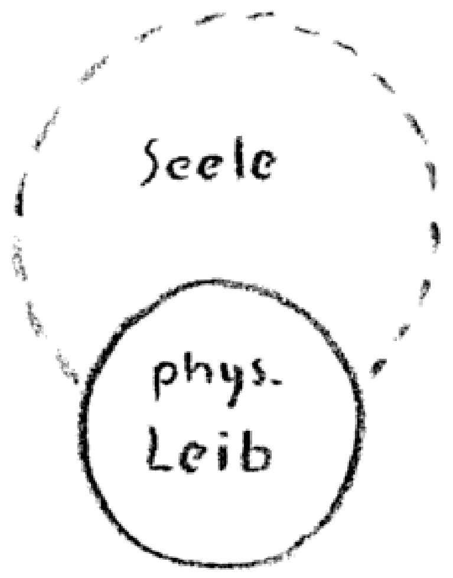

Etwas «Äußeres» war die Seele. Dieser Leib war noch nicht dem Gesetze des Todes unterworfen. Die Menschen wußten noch nichts vom Sterben. Anders vollzog sich Wachstum und Absterben, als das heute der Fall ist. Der Leib verlor gewisse Teile, aber es setzten sich neue Teile wieder an. Etwa so wie heute Hunger und Ernährung zusammenhängen, so spielte sich damals dieses Verhältnis des Zerstörens und Wiederansetzens des physischen Leibes ab. Lange Zeiten hindurch lebte die Seele so fort, während der Leib sich verwandelte. Kein Sterben, keinen Tod gab es damals. Allerdings von einem ge |167| wissen Zeitpunkte des Sonnenzustandes fing es an, daß die Menschenseele sich zuerst einen bestimmten Leib bildete, das heißt, sie bildete ihn in immer andere, verschiedene Formen um. Zuerst wurde ein Leib von bestimmter Form gebildet, dann verwandelte sie diese Form in eine andere, wieder in eine andere und in eine vierte; und darauf kam sie wieder auf den ersten Zustand zurück. Der Mensch behielt solange dasselbe Bewußtsein. Die Formen wechselten; und wenn die Menschenseele wieder in die erste Form zurückkam, nachdem sie die drei anderen Zustände durchlebt hatte, dann fühlte sie sich neu verkörpert. Erhalten sehen Sie diesen Entwicklungsprozeß beim Schmetterling, der sich in vier Formen verwandelt: Ei, Raupe, Puppe, Schmetterling. Der Schmetterling ist die Hieroglyphe, das Zeichen für den Luftzustand des Menschen auf der alten Sonne. Der heutige Schmetterling, der unter ganz veränderten Verhältnissen lebt, ist freilich eine Dekadenzform dieser Zustände. Der Schmetterling ist ein Symbolum für den Luftzustand, über den der Mensch hinausgeschritten ist. Deshalb wird er im Okkultismus als Luftwesen bezeichnet, wie die Schlange als Erdenwesen und der Fisch als Wasserwesen bezeichnet werden. Weshalb die Vögel nicht als Luftwesen bezeichnet werden, soll später einmal dargestellt werden.

Nun gehen wir zurück auf den ersten Saturnzustand, wo der Mensch ein geistig-seelisches Wesen war, das überhaupt immer denselben Leib hatte, das sich unsterblich wußte auf niederer Stufe und seinen Leib fortwährend umwandelte. Dieser Zustand ist uns noch erhalten geblieben bei einem Wesen, das in seinem Gemeinschaftsleben ein ganz eigentümliches ist, und das, wenn man es als Gruppenseele betrachtet, in gewisser Beziehung höher steht als der Mensch. Ich meine die Biene. Der ganze Bienenstock muß anders betrachtet werden als die einzelne Biene. Der Bienenstock – nicht die einzelne Biene – hat ein geistiges Wesen, das in gewisser Beziehung übereinstimmt mit dem Wesen des Menschen auf dem einstigen Saturn auf niederer Stufe, das der Mensch auf höherer Stufe wiederum erreichen wird auf der Venus. Der Bienenleib ist auf der alten Saturnstufe stehengeblieben. Wir müssen wohl unterscheiden: Bienenstock und |168| einzelnene Biene. Die Seele des Bienenstockes ist keine gewöhnliche Gruppenseele, sondern ein besonderes Wesen für sich. Die einzelne Biene hat in der Form dasjenige bewahrt, was der Menschenleib auf dem Saturn durchgemacht hat. Der Geist des Bienenstockes steht höher als der Geist des einzelnen Menschen, er hat heute schon ein Venus-Bewußtsein. Die Biene ist das Symbolum des Geistesmenschen, der nichts von Sterblichkeit weiß. Die Geistigkeit, die der Mensch hatte, als der Planet sich noch in feurigem Zustande befand [Saturn], wird er auf höherer Stufe wiederum erreichen, wenn der Planet als Venus wieder feurig sein wird. Deshalb wird die Biene im Okkultismus als Wärme- oder Feuerwesen bezeichnet.

Es ist sehr interessant, einen Parallelismus zu verfolgen, von dem die physische Wissenschaft nicht viel sagen kann. Was hat denn der heutige Mensch vom Saturnzustand noch in sich? Die Wärme! Die Blutwärme. Was damals im ganzen Saturn verteilt war - die Wärme -, das hat sich herausgelöst und bildet heute das warme Blut des Menschen und der Tiere. Wenn Sie die Temperatur eines Bienenstockes untersuchen, so finden Sie ungefähr dieselbe Temperatur, wie sie das menschliche Blut hat. Der ganze Bienenstock entwickelt also eine Temperatur, die der Bluttemperatur des Menschen entspricht, und die auf dieselbe Entwicklungsstufe zurückgeht wie das menschliche Blut. Daher bezeichnet der Okkultist die Biene als aus der Wärme herausgeboren, als Wärmewesen, wie er den Schmetterling bezeichnet als aus Luft geboren, als Luftwesen, den Fisch als Wasserwesen und die Schlange als Erdenwesen.

Sie sehen auch aus diesen Ausführungen, wie tief das, was okkulte Symbole und Zeichen ausdrücken wollen, zusammenhängt mit der Entwicklungsgeschichte des Planeten und der Menschen.

# OKKULTE ZEICHEN UND SYMBOLE - DRITTER VORTRAG, Stuttgart, 15. September 1907

|169| Das erste, was uns heute beschäftigen soll, ist eine Betrachtung über das, was man Zahlensymbolik nennt. Wenn man über okkulte Zeichen und Sinnbilder spricht, muß man wenigstens auch kurz jene Sinnbilder erwähnen, die sich in den Zahlen ausdrücken. Sie erinnern sich meiner vorgestrigen Ausführungen, wo die Rede war von den Zahlenverhältnissen im Universum, von den Geschwindigkeiten, mit denen sich die einzelnen Planeten bewegen. Wir haben gesehen, daß diese Zahlen und Zahlenverhältnisse sich ausdrücken in der Sphärenharmonie, die den Raum durchwogt, und daß sie eine gewisse Bedeutung haben für das Weltganze und für die Betrachtung der Welt.

Heute soll uns nun eine intimere Zahlensymbolik beschäftigen, eine Symbolik, die wir freilich in ihrer Bedeutung nur streifen können, denn um uns wirklich in sie zu vertiefen, würden noch viele andere Dinge notwendig sein, auf die wir uns genauer einlassen müßten. Immerhin werden Sie wenigstens eine Idee davon erhalten, was damit gemeint ist, wenn zum Beispiel in der alten pythagoreischen Geheimschule gesagt wurde, daß man sich in die Zahlen und ihre Natur vertiefen müsse, um einen Einblick in die Welt zu gewinnen. Es mag manchem trocken und öde erscheinen, daß er über Zahlen nachdenken soll. Vor allem wird es denjenigen Menschen, die von der materialistischen Bildung unserer Zeit angekränkelt sind, wie eine Spielerei erscheinen, wenn man glaubt, durch die Betrachtung der Zahlen etwas über das Wesen der Dinge ergründen zu können. Dennoch ist es tief begründet, daß der große Pythagoras zu seinen Schülern sagte, das Wissen über die Natur der Zahlen führe tief hinein in das Wesen der Dinge. Man darf nur nicht glauben, daß es genüge, über die Zahl 1 oder 3 oder 7 nachzudenken. Der wirklichen Geheimlehre ist nichts von Hexerei und Zauberei eigen, auch nichts von einem Aberglauben über die Bedeutung irgendeiner Zahl; ihr Wissen beruht auf viel tieferen Dingen. Aus der kurzen |170| Skizze, die Sie heute von mir erhalten sollen, werden Sie sehen, daß die Zahl einen gewissen Anhaltspunkt geben kann für das Sichvertiefen, das man auch Meditieren nennt, wenn man den Schlüssel dazu hat, sich richtig in die Zahl zu vertiefen.

Wir müssen ausgehen von der Zahl Eins, von der Einheit. Inwiefern diese Zahl Eins wirklich das versinnbildlicht, was ich sagen werde, wird sich später bei der Betrachtung der anderen Zahlen noch deutlicher ergeben. In allem Okkultismus hat man immer mit der Zahl Eins die unzertrennliche Einheit Gottes in der Welt bezeichnet. Mit der Eins bezeichnet man den Gott. Nun darf man aber nicht glauben, daß man irgend etwas für die Welterkenntnis gewinnt, wenn man sich bloß in die Eins als Zahl vertieft; Sie werden sehen, in welcher Weise diese Vertiefung zu geschehen hat. Aber wir betrachten das weit fruchtbarer, wenn wir zunächst zu den anderen Zahlen übergehen.

Die Zwei nennt man im Okkultismus die Zahl der Offenbarung. Mit der Zahl Zwei bekommen wir sozusagen schon etwas Boden unter die Füße, während wir bei der Zahl Eins noch ziemlich im Bodenlosen herumtappen. Wenn wir sagen: Zwei ist die Zahl der Offenbarung -, dann heißt das nichts anderes als: Alles, was uns in der Welt entgegentritt, was nicht in irgendeiner Beziehung verborgen ist, sondern heraustritt in die Welt, steht irgendwie in der Zweiheit. Sie werden nämlich die Zahl Zwei überall in der Natur verbreitet finden. Es kann sich nichts offenbaren, ohne die Zahl Zwei zu berühren. Licht kann sich niemals für sich allein als Einheit offenbaren. Wenn sich Licht offenbart, muß auch Schatten oder Dunkelheit dabei sein, es muß also eine Zweiheit da sein. Es könnte niemals eine Welt geben, die mit offenbartem Licht erfüllt wäre, wenn es nicht auch dementsprechenden Schatten gäbe. Und so ist es mit allen Dingen. Nie könnte sich das Gute offenbaren, wenn es nicht als Schattenbild das Böse hätte. Die Zweiheit von Gut und Böse ist eine Notwendigkeit in der offenbaren Welt. Solche Zweiheiten gibt es unendlich viele, sie erfüllen die ganze Welt, wir müssen sie nur an der richtigen Stelle aufsuchen.

Eine wichtige Zweiheit, über die der Mensch viel nachdenken |171| kann im Leben, ist folgende: Wir haben gestern die verschiedenen Zustände betrachtet, die der Mensch durchgemacht hat, bevor er ein Bewohner unserer heutigen Erde wurde. Wir sahen, daß er auf dem Saturn und der Sonne eine gewisse Unsterblichkeit dadurch hatte, daß er seinen Leib von außen dirigierte, daß Stücke dieses Leibes abbröckelten und neue sich wieder ansetzten, so daß der Mensch nichts von Tod und Vergehen empfand. Aber sein Bewußtsein war damals nicht so wie sein heutiges Bewußtsein, es war ein dumpfes, dämmerndes Bewußtsein. Erst auf unserer Erde hat sich der Mensch ein Bewußtsein errungen, das mit Selbstbewußtsein verbunden ist. Hier erst wurde er ein Wesen, das von sich selbst etwas wußte und sich von den Gegenständen unterscheiden konnte. Dazu mußte er nicht nur den Leib von außen dirigieren, sondern er mußte hineinschlüpfen in diesen Leib - abwechselnd -, sich in ihm empfinden, «Ich» zu ihm sagen. Nur dadurch, daß der Mensch ganz in seinem Leibe drinnensteckt, hat er sein volles Bewußtsein erringen können. Aber nun teilt er auch das Schicksal dieses Leibes. Früher, als er noch darüberstand, tat er das nicht. Erst dadurch, daß der Mensch diesen Grad des Bewußtseins errungen hat, ist er in Beziehung zu dem Tode getreten. In dem Augenblick, wo sein Leib zerfällt, fühlt er, daß sein Ich aufhört, weil er dieses mit seinem Leibe identifiziert hat. Erst allmählich, durch geistige Entwickelung, wird er sich die alte Unsterblichkeit wieder erringen, und der Leib ist da als Schule, um sie sich bewußt zu erringen. Niemals würde der Mensch auf höherer Stufe die Unsterblichkeit erringen können, wenn er sie nicht erkaufte durch den Tod, wenn er nicht die Zweiheit Leben und Tod erkennen würde. Solange der Mensch nicht Bekanntschaft gemacht hatte mit dem Tode, war ihm die Welt noch nicht offenbar, denn zur offenbaren Welt gehört die Zweiheit Leben und Tod. Und so könnten wir auf Schritt und Tritt Zweiheiten im Leben nachweisen. Sie finden in der Physik positive und negative Elektrizität, im Magnetismus Anziehungs- und Abstoßungskraft, alles erscheint in der Zweiheit. Die Zwei ist die Zahl der Erscheinung, der Offenbarung.

Aber es gibt keine Offenbarung, ohne daß hinter ihr das Göttliche waltet. Daher ist hinter jeder Zweiheit noch eine Einheit ver|172|borgen. Die Zahl Drei ist deshalb nichts anderes als die Zwei und die Eins, nämlich die Offenbarung und die hinter ihr stehende Göttlichkeit. Eins ist die Zahl der Einheit Gottes, Drei ist die Zahl der sich offenbarenden Göttlichkeit. Es gibt einen Satz im Okkultismus, der lautet: Niemals kann die Zwei eine Zahl für die Göttlichkeit sein. - Die Eins ist eine Zahl für das Göttliche, und die Drei ist eine Zahl für das Göttliche, denn wenn es sich offenbart, offenbart es sich in der Zweiheit, und dahinter ist die Einheit. Der Mensch, der die Welt in der Zweiheit sieht, sieht sie nur im Offenbaren. Wer also sagt, in den äußeren Erscheinungen ist eine Zweiheit, der hat Recht. Wer aber sagt, daß diese Zweiheit das Ganze sei, hat immer Unrecht. Wir wollen uns das einmal an einigen wenigen Beispielen klarmachen.

Es wird vielfach, auch da, wo von Theosophie die Rede ist, gegen diesen Satz des wahren Okkultismus gesündigt, daß die Zahl Zwei nur die Zahl der Offenbarung, nicht aber die Zahl der Fülle, der Vollständigkeit sei. So können Sie im populären Okkultismus von Leuten, die ihn nicht wirklich kennen, oft sagen hören, daß alle Entwicklung in Involution und Evolution verlaufe. Wir werden sehen, wie sich das in Wirklichkeit verhält. Aber zunächst wollen wir einmal untersuchen, was Involution und Evolution bedeuten. Betrachten wir einmal eine Pflanze, eine vollentwickelte Pflanze mit Wurzel, Blättern, Stengel, Blüte, Frucht, kurz mit allen Teilen, die eine Pflanze nur haben kann. Das ist das eine. Und nun betrachten Sie das kleine Samenkorn, aus dem die Pflanze wiederum entstehen kann. Wer den Samen anschaut, sieht nur ein kleines Körnchen, aber in diesem kleinen Körnchen ist die ganze Pflanze schon enthalten; sie steckt gewissermaßen eingehüllt darin. Warum steckt sie darin? Weil das Korn genommen ist von der Pflanze, weil die Pflanze alle ihre Kräfte in das Samenkorn hineingelegt hat. Deshalb unterscheidet man im Okkultismus die beiden Vorgänge: Der eine besteht darin, daß sich das Samenkorn aufrollt und zur ganzen Pflanze entfaltet - Evolution; der andere, daß sich die Pflanze zusammenfaltet, so daß ihre Gestalt gewissermaßen hineinkriecht in das Samenkorn - Involution. Wenn also irgendein Wesen, das viele Organe hat, sich so heranbildet, daß von diesen Organen nichts mehr sichtbar |173| ist, daß sie zusammengeschrumpft sind zu einem kleinen Teil, so nennt man das eine Involution, und das Auseinandergehen, das Sichentfalten eine Evolution. Überall im Leben wechselt diese Zweiheit, aber stets nur im Offenbaren. Nicht bloß bei der Pflanze können Sie das verfolgen, auch in den höheren Gebieten des Lebens verhält es sich so.

Verfolgen Sie zum Beispiel einmal in Gedanken die Entwickelung des europäischen Geisteslebens von Augustinus bis Calvin bis über das Mittelalter hinaus. Wenn Sie den Blick schweifen lassen über das Geistesleben dieser Zeit, so werden Sie bei Augustinus selbst eine gewisse mystische Innigkeit sehen. Niemand wird seine Schriften, besonders seine «Bekenntnisse» lesen, ohne zu empfinden, wie tief innig das Gefühlsleben dieses Menschen war. Und wenn wir dann weiter hinaufsteigen in der Zeit, so finden wir eine so wunderbare Erscheinung wie Scotus Erigena, einen Mönch, der aus Schottland stammte und daher auch der schottische Johannes genannt wurde, der am Hofe Karls des Kahlen lebte. In der Kirche hat er schlecht abgeschritten; die Sage erzählt, daß seine Ordensbrüder ihn mit Stecknadeln zu Tode gemartert hätten. Wörtlich ist das freilich nicht zu nehmen; aber wahr ist, daß er zu Tode gemartert wurde. Ein herrliches Buch ist von ihm verfaßt worden: «De devisione naturae» - «Über die Einteilung der Natur» -, das eine ungeheure Tiefe aufweist. Weiter finden wir die Mystiker der sogenannten deutschen Pfaffengasse, wo diese Gefühlsinnigkeit ganze Volksmassen ergriffen hat. Es waren nicht nur die Spitzen der Geistlichkeit, sondern auch das Volk; die Menschen, die auf dem Acker oder in der Schmiede arbeiteten, sie alle wurden von jener Gefühlsinnigkeit ergriffen, die sich als ein Zug der Zeit in dieser Weise auslebte. Weiter hinauf finden wir Nicolaus Cusanus, der 1400-1464 lebte. Und so können wir die Zeit hinauf verfolgen bis zum Ende des Mittelalters; immer finden wir jene Gefühlstiefe, jene Innigkeit, die sich über alle Kreise hin ausbreitete. Wenn wir nun diese Zeit vergleichen mit der späteren, die sie ablöste, mit derjenigen, die im 16. Jahrhundert beginnt und bis zu uns herauf sich erstreckt, dann bemerken wir einen gewaltigen Unterschied. Am Ausgangspunkte sehen wir Kopernikus |174| stehen, der durch einen umfassenden Gedanken eine Erneuerung des Geisteslebens bewirkt; der diesen Gedanken so der Menschheit einverleibt, daß heute für einen Narren gilt, wer etwas anderes glaubt. Wir sehen Galilei, der an den Schwingungen einer Kirchenlampe in Pisa die Pendelgesetze entdeckt. So können wir Schritt für Schritt den Gang der Zeit verfolgen, überall würden wir den strikten Gegensatz zum Mittelalter finden. Das Gefühl nimmt immer mehr und mehr ab, die Innigkeit schwindet; der Verstand, die Intellektualität kommt mehr und mehr heraus, die Menschen werden immer klüger und gescheiter. Da folgen zwei Zeitepochen aufeinander, die genau entgegengesetzten Charakter haben. Die Geisteswissenschaft gibt uns die Erklärung beider Zeitepochen. Es gibt ein okkultes Gesetz, das besagt, daß es so sein muß. In der Zeit von Augustinus bis Calvin war die Epoche mystischer Evolution und intellektueller Involution, und seither leben wir in einer Zeit intellektueller Evolution und mystischer Involution. Was bedeutet das? Von Augustinus bis zum 16. Jahrhundert war eine Zeit der äußeren Entfaltung des mystischen Lebens, da war es draußen. Aber etwas anderes war damals erst keimhaft vorhanden: das intellektuelle Leben. Es war wie ein Same gleichsam in der geistigen Erde verborgen, um sich nach dem 16. Jahrhundert nach und nach zu entfalten. Das intellektuelle Leben war also dazumal in der Involution, so wie die Pflanze im Samen drinnen ist. Nichts in der Welt kann entstehen, wenn es nicht vorher in einer solchen Involution war. Seit dem 16. Jahrhundert ist die Intellektualität in der Evolution, das mystische Leben ist zurückgetreten, es ist in der Involution. Und jetzt ist die Zeit gekommen, wo dieses mystische Leben wieder heraustreten muß, wo es durch die theosophische Bewegung wieder zur Entfaltung, zur Evolution gebracht werden muß.

So wechselt überall im Leben Involution und Evolution ab im Offenbaren. Aber wer dabei stehenbleibt, betrachtet nur die Außenseite. Will man das Ganze betrachten, so muß noch ein Drittes hinzukommen, das hinter diesen beiden steht. Was ist dieses Dritte? Denken Sie sich einmal, Sie stünden einer Erscheinung der Außenwelt gegenüber und Sie denken darüber nach. Sie sind da, die äußere |175| Welt ist da, und in Ihnen entstehen Ihre Gedanken. Diese Gedanken waren früher nicht da. Wenn Sie zum Beispiel den Gedanken der Rose bilden, so entsteht dieser erst in dem Augenblick, wo Sie in Beziehung zu der Rose treten; Sie waren da, die Rose war da; und wenn nun in Ihnen der Gedanke, das Bild der Rose aufsteigt, so entsteht etwas ganz Neues, noch nicht Dagewesenes. Das ist auch auf anderen Gebieten des Lebens der Fall. Stellen Sie sich den schaffenden Michelangelo vor. Michelangelo hat ja beinahe nie nach Modellen gearbeitet. Wir wollen uns aber einmal vorstellen, er habe eine Gruppe von Modellen zusammengestellt. Michelangelo war da, die Modelle waren da. Aber das Bild, das Michelangelo nun von dieser Gruppe in der Seele hat, das ist neu, das ist eine völlig neue Schöpfung. Das hat nichts zu tun mit Involution und Evolution. Das ist ein völlig Neues, das entsteht aus dem Verkehr eines Wesens, das empfangen kann, mit einem Wesen, das geben kann. Solche Neuschöpfungen entstehen immer durch den Verkehr von Wesen mit Wesen. Solche Neuschöpfungen sind ein Anfang. Erinnern Sie sich an das, was wir gestern hier betrachtet haben, wie die Gedanken schöpferisch sind, wie sie die Seele veredeln können, ja später sogar an der Formung des Körpers arbeiten. Dasjenige, was irgendein Wesen einmal denkt, die Gedankenschöpfung, die Vorstellungsschöpfung, die arbeitet, die wirkt weiter. Sie ist eine Neuschöpfung und zugleich ein Anfang, aber sie zieht Folgen nach sich. Wenn Sie heute gute Gedanken haben, so sind diese Gedanken fruchtbar für die fernste Zukunft, denn Ihre Seele geht ihren eigenen Weg in der geistigen Welt. Ihr Leib geht wieder in die Elemente zurück, er zerfällt. Aber wenn auch alles zerfällt, wodurch der Gedanke entstanden ist, die Wirkung des Gedankens bleibt, der Gedanke wirkt fort. Nehmen wir noch einmal das Beispiel von Michelangelo. Seine herrlichen Bilder haben auf Millionen von Menschen erhebend gewirkt. Aber diese Bilder werden einst zu Staub zerfallen, und es wird Generationen geben, die nichts mehr von seinen Schöpfungen sehen werden. Was in Michelangelos Seele gelebt hat, bevor seine Bilder äußere Gestalt angenommen haben, was zuerst als Neuschöpfung in seiner Seele war, das lebt fort, das bleibt, und das wird in künftigen |176| Entwickelungsstufen hervortreten und Form gewinnen. Wissen Sie, weshalb uns heute Wolken und Sterne entgegentreten? Weil es in der Vorzeit Wesen gab, die den Gedanken der Wolken und der Sterne hatten. Alles entsteht aus Gedanken-Schöpfungen, und der Gedanke ist eine Neuschöpfung. Aus Gedanken ist alles entstanden, und die größten Dinge der Welt sind hervorgegangen aus den Gedanken der Gottheit.

Da haben Sie das Dritte. Im Offenbaren wechseln die Dinge zwischen Evolution und Involution. Aber dahinter steht tief verborgen das Dritte, das erst die Fülle gibt, eine Schöpfung, die eine völlige Neuschöpfung ist, die aus dem Nichts hervorgegangen ist. Dreierlei gehört also zusammen: Die Schöpfung aus dem Nichts, und dann, wenn diese offenbar wird und in der Zeit verläuft, nimmt sie die Formen des Offenbaren an: Evolution und Involution.

So ist es gemeint, wenn gewisse religiöse Systeme davon sprechen, daß die Welt aus dem Nichts geschaffen ist. Und wenn man heute darüber spottet, so geschieht das, weil die Menschen nicht verstehen, was in diesen Urkunden steht. Im Offenbaren – um es noch einmal zusammenzufassen – wechselt alles zwischen Involution und Evolution. Dem liegt zugrunde eine verborgene Schöpfung aus dem Nichts, die sich mit dieser Zweiheit zu einer Dreiheit vereinigt. Die Dreiheit ist die Verbindung des Göttlichen mit dem Offenbaren.

So sehen Sie, wie man über die Zahl Drei nachdenken kann, man darf nur nicht pedantisch darüber spintisieren. Man muß hinter der Zweiheit, die einem überall begegnen kann, die Dreiheit aufsuchen. Dann betrachtet man das Zahlensymbol in der richtigen Art im pythagoreischen Sinne, wenn man hinter der Zwei die Drei sucht. Für alle Zweiheiten kann das verborgene Dritte gefunden werden.

Wir kommen jetzt zu der Zahl Vier. Die Vier ist das Zeichen des Kosmos oder der Schöpfung. Sie werden verstehen, warum man Vier die Zahl der Schöpfung nennt, wenn Sie sich daran erinnern, was schon früher gesagt wurde, daß unsere Erde – soweit wir es verfolgen können – sich in ihrer vierten Verkörperung befindet. Alles, was uns auf unserer Erde entgegentritt, auch das vierte Prinzip im |177| Menschen, setzt voraus, daß diese Schöpfung in dem vierten Zustande ihrer planetarischen Entwickelung ist. Das ist nur ein besonderes Beispiel für alle hervortretenden Schöpfungen. Jede Schöpfung steht unter dem Zeichen der Vierheit. Im Okkultismus sagt man: Der Mensch ist heute im Mineralreich. - Was bedeutet das? Der Mensch versteht heute nur das Mineralreich, und er kann auch nur dieses beherrschen. Er kann durch Zusammenfügen von Mineralischem ein Haus bauen, eine Uhr konstruieren und anderes, weil diese Dinge den Gesetzen der mineralischen Welt unterliegen. Aber anderes vermag er noch nicht. Er kann zum Beispiel keine Pflanze aus eigenem Nachdenken heraus heute schon bilden; dazu müßte er selbst im Pflanzenreich stehen. Das wird später einmal der Fall sein. Heute ist der Mensch ein Schöpfer im Mineralreich. Diesem sind drei andere Reiche vorangegangen, man nennt sie die drei Elementarreiche; das Mineralreich ist das vierte. Im ganzen gibt es sieben solcher Naturreiche. So steht der Mensch heute in seinem vierten Reiche; da erlangt er sein eigentliches Bewußtsein nach außen hin. Auf dem Monde wirkte er noch im dritten Elementarreich, auf der Sonne im zweiten und auf dem Saturn im ersten. Auf dem Jupiter wird der Mensch im Pflanzenreich wirken können, er wird Pflanzen schaffen können, so wie er heute eine Uhr machen kann. Alles, was in der Schöpfung sichtbar hervortritt, steht im Zeichen der Vier. Es gibt viele Planeten, die Sie mit physischen Augen nicht sehen können; diejenigen Planeten, die im ersten, zweiten und dritten Elementarreiche stehen, sind für physische Augen nicht sichtbar. Erst wenn ein Planet in das vierte Reich, in das Mineralreich, eintritt, können Sie ihn erblicken. Deshalb ist Vier die Zahl des Kosmos oder der Schöpfung. Mit dem Eintritt in seinen vierten Zustand wird erst ein Wesen voll sichtbar für Augen, die Äußeres sehen können.

Fünf ist die Zahl des Bösen. Das können wir uns am besten klar machen, wenn wir wieder den Menschen betrachten. Der Mensch hat sich zu einer Vierheit entwickelt, zu einem Wesen der Schöpfung, aber auf der Erde tritt zu ihm das fünfte Glied, das Geistselbst. Wäre der Mensch nur eine Vierheit geblieben, dann würde er immer von oben, von den Göttern, zum Guten dirigiert worden sein; zur |178| Selbstständigkeit hätte er sich niemals entwickelt. Er ist dadurch frei geworden, daß er auf der Erde die Keimanlage zu dem fünften Glied, dem Geistselbst, bekommen hat. Dadurch hat er die Möglichkeit erhalten, das Böse zu tun, dadurch aber ist er auch selbständig geworden. Kein Wesen, das nicht in der Fünfheit auftritt, kann das Böse tun, und überall, wo uns ein Böses begegnet, das tatsächlich aus sich selbst verderblich wirken kann, da ist eine Fünfheit im Spiele. Das ist überall, auch draußen in der Welt, der Fall. Der Mensch beobachtet das nur nicht, und die heutige materialistische Weltanschauung hat keinen Begriff davon, daß man die Welt in dieser Weise betrachten kann. An einem Beispiel können wir sehen, wie überall da, wo die Fünf uns entgegentritt, die Berechtigung sich ergibt, von einem Bösen in irgendeinem Sinne zu reden. Wie segensreich würde es sich auswirken, wenn die Medizin sich dies einmal zunutze machen und den Verlauf von Krankheiten danach studieren würde, wie sich eine Krankheit vom Ausbruch an bis zum fünften Tage entwickelt, oder wie an den einzelnen Tagen in der fünften Stunde nach Mitternacht oder in der fünften Woche. Denn immer beherrscht die Zahl Fünf dasjenige, wo der Arzt am fruchtbarsten eingreifen kann. Vorher kann er nicht viel anderes tun, als die Natur ihren Lauf gehen lassen; aber da kann er helfend eingreifen, wenn er das Gesetz der Zahl Fünf beachtet, weil da das Prinzip der Zahl Fünf in die Tatsachenwelt einfließt, das mit Berechtigung schädigend oder böse genannt werden kann. So können wir auf vielen Gebieten zeigen, wie die Zahl Fünf eine große Bedeutung für das äußere Geschehen hat.

Es gibt sieben Perioden im Leben des Menschen: Die erste ist die, bevor er geboren wird, die zweite dauert bis zum Zahnwechsel, die dritte bis zur Geschlechtsreife, die vierte etwa sieben bis acht Jahre weiter, die fünfte etwa bis zum dreißigsten Lebensjahr, und so fort. Wenn die Menschen einmal wissen werden, was für diese Perioden alles in Betracht kommt und was gerade in der fünften Periode am besten herantreten soll an den Menschen oder ihm fernbleiben, dann werden sie auch viel darüber wissen, wie sie sich ein gutes Alter bereiten können. Da kann für das ganze übrige Leben Gutes oder Böses bewirkt werden. Bei den ersten Perioden kann man viel |179| tun durch Erziehung nach diesen Gesetzen. Dann aber tritt ein Wendepunkt ein in der fünften Periode des Menschenlebens, der ausschlaggebend ist für das ganze weitere Leben. Dieser Wendepunkt in der fünften Periode des Menschenlebens muß mindestens überschritten werden, bevor der Mensch sozusagen mit voller Sicherheit auf das Leben losgelassen werden kann. Der heute herrschende Grundsatz, die Menschen schon sehr früh hinauszuschicken ins Leben, ist sehr schlecht. Es ist von großer Bedeutung, solche alten okkulten Grundsätze zu beachten. Deshalb hatte man früher, auf Anordnung solcher, die etwas davon wußten, die sogenannte Lehr- und Wanderzeit zu absolvieren, ehe man als Meister bezeichnet werden konnte.

Die Sieben ist die Zahl der Vollkommenheit. Sie können wiederum sich das am Menschen selbst klarmachen. Er ist in der Vierzahl als Geschöpf, und er ist in der Fünfzahl, insofern er ein gutes oder ein böses Wesen sein kann. Wenn er alles ausgebildet haben wird, was im Keime in ihm enthalten ist, dann wird er ein siebengliedriges, in seiner Art vollkommenes Wesen sein. Die Siebenzahl herrscht in der Welt der Farben, im Regenbogen, sie herrscht in der Welt der Töne, in der Skala. Überall, auf allen Gebieten des Lebens können Sie die Siebenzahl als eine Art von Vollkommenheitszahl darstellen. Es steckt weder Aberglaube noch Zauberei dahinter.

Jetzt wollen wir noch einmal auf die Einheit zurückblicken. Dadurch, daß wir noch andere Zahlen betrachtet haben, wird das, was über die Einheit zu sagen ist, im richtigen Lichte erscheinen. Das Wesentliche der Einheit ist die Unteilbarkeit. In der Wirklichkeit kann man freilich die Einheit auch wieder teilen, zum Beispiel in 1/3 und 2/3. Nun gibt es aber etwas sehr Bedeutsames und Wichtiges, das Sie in Gedanken vollziehen können: In der geistigen Welt bleibt das Drittel, wenn Sie zwei Drittel wegnehmen, dazugehörig. Gott ist ein einheitliches Wesen. Wenn etwas von Gott herausgeteilt wird als Offenbarung, so bleibt der ganze Rest vorhanden als etwas, was dazugehört. Im pythagoreischen Sinne: Teile die Einheit, aber teile die Einheit nie anders, als daß du im Untergedanken den Rest dazu hast.

|180| Was heißt das eigentlich, die Einheit zu teilen? Nehmen Sie zum Beispiel ein Goldplättchen, und schauen Sie hindurch, dann erscheint Ihnen die Welt grün. Das Gold hat nämlich die Eigenschaft, wenn weißes Licht darauf fällt, die gelben Strahlen zurückzuwerfen. Wo aber kommen die anderen Farben hin, die noch im Weiß enthalten sind? Sie gehen in den Gegenstand hinein und durchdringen ihn. Ein roter Gegenstand ist deshalb rot, weil er die roten Strahlen zurückwirft und das übrige in sich aufnimmt. Man kann das Rot nicht aus dem Weißen herausziehen, ohne daß das übrige zurückbleibt. Damit streifen wir den Rand eines großen Weltgeheimnisses. Sie können die Dinge in einer bestimmten Weise anschauen. Wenn zum Beispiel das Licht auf ein rotes Tischtuch fällt, das über einen Tisch ausgebreitet ist, so empfinden wir die Farbe Rot. Die anderen im Sonnenlicht enthaltenen Farben werden «aufgesaugt», die grüne Farbe zum Beispiel wird von dem Tischtuch aufgenommen und nicht wiedergegeben. Wenn wir uns nun bemühen, gleichzeitig mit der Farbe Rot auch die Farbe Grün in unser Bewußtsein aufzunehmen, dann haben wir die Einheit wieder hergestellt. Wir haben im pythagoreischen Sinne die Einheit geteilt, so daß der Rest erhalten bleibt. Wenn man das meditativ durchführt, daß man das Geteilte stets wieder zur Einheit verbindet, so ist das eine bedeutungsvolle Arbeit, durch die man in der Entwicklung hoch aufsteigen kann. Es gibt in der Mathematik einen Ausdruck dafür, der in den okkulten Schulen überall gilt:

$$
1 = (2 + x) - (1 + x)
$$

Das ist eine okkulte Formel, welche ausdrücken soll, wie man die Eins teilt, und wie man die Teile so darstellt, daß sie wieder die Eins ergeben. Der Okkultist soll die Teilung der Einheit so denken, daß er die Teile immer zur Einheit wieder zusammenfügt.

So haben wir heute das, was man Zahlensymbolik nennt, einer Betrachtung unterworfen und daraus gesehen, daß, wenn man die Welt meditativ unter den Gesichtspunkt der Zahlen rückt, man tief in die Weltgeheimnisse eindringen kann.

|181| Zur Ergänzung sei noch einmal gesagt: In der fünften Woche, am fünften Tage oder in der fünften Stunde ist es wichtig, darauf zu achten, daß etwas verfehlt oder gutgemacht werden kann. In der siebenten Woche, am siebenten Tage oder in der siebenten Stunde - oder in einem bestimmten entsprechenden Zahlenverhältnis, zum Beispiel 3 1/2, weil darin auch die Sieben steckt -, da geschieht immer etwas durch die Sache selbst, zum Beispiel wird das Fieber am siebenten Tage einer Krankheit einen bestimmten Charakter annehmen oder auch am vierzehnten Tage. Es liegen immer Zahlenverhältnisse zugrunde, die die Struktur der Welt angeben.

Wer sich in richtiger Weise in dasjenige vertieft, was man im pythagoreischen Sinne heißt: Studiere die Zahl -, der lernt aus dieser Zahlensymbolik heraus das Leben und die Welt verstehen. Davon sollten die heutigen Ausführungen Ihnen einen skizzenhaften Gedanken geben.

# OKKULTE ZEICHEN UND SYMBOLE - VIERTER VORTRAG, Stuttgart, 16. September 1907

|182| Das bedeutsamste der Symbole und Sinnbilder, das wir überhaupt haben und das als solches von allen Okkultisten aller Zeiten anerkannt worden ist, das ist der Mensch selbst. Der Mensch wurde und wird immer genannt ein Mikrokosmos, eine kleine Welt. Und das mit Recht, denn wer den Menschen genau und intim kennenlernt, wird sich immer mehr darüber klar, daß in ihm in einer, man könnte sagen, Verkleinerung alles, alles enthalten ist, was in der übrigen Natur draußen ausgebreitet ist. Das ist zunächst vielleicht schwer zu verstehen, aber wenn Sie darüber nachdenken, werden Sie begreifen, was damit gemeint ist: Es finden sich im Menschen als eine Art Extrakt, Auszug aus der übrigen Natur, alle Stoffe und Kräfte. Wenn Sie irgendeine Pflanze hinsichtlich ihrer Wesenheit studieren und nur genügend tief forschen können, werden Sie finden, daß im Menschenorganismus etwas von dieser selben Wesenheit enthalten ist, wenn auch in noch so kleinem Maße. Und wenn Sie ein Tier draußen nehmen: immer werden Sie im menschlichen Organismus etwas nachweisen können, was sich seiner Wesenheit nach ausnimmt wie etwas, das in einer gewissen Art in den menschlichen Organismus hereingenommen ist.

Es ist freilich notwendig, die Entwicklung der Welt vom okkulten Standpunkt aus zu betrachten, um das recht zu verstehen. So zum Beispiel weiß der Okkultist, daß der Mensch kein so geartetes Herz hätte, wie er es heute hat, wenn es nicht draußen in der Natur einen Löwen gäbe. Wir wollen uns einmal in eine frühere Zeit versetzen, wo es noch keine Löwen gab. Menschen gab es damals schon, denn der Mensch ist das älteste Wesen, aber sie hatten damals ein ganz anders gestaltetes Herz. Nun gibt es in der Natur überall Zusammenhänge, die allerdings nicht immer auf der Hand liegen. Als der Mensch einst in urfernen Zeiten sein Herz heraufentwickelt hat zu der heutigen Gestalt, ist damals der Löwe entstanden: dieselben Kräfte haben beides geformt. Es ist, als ob Sie die Wesenheit des |183| Löwen extrahieren würden und mit göttlicher Kunstfertigkeit das menschliche Herz daraus formten. Vielleicht meinen Sie, daß das Menschenherz nichts Löwenartiges habe, aber für den Okkultisten ist das doch der Fall. Sie dürfen nicht vergessen, daß, wenn ein Ding in einen Zusammenhang, in einen Organismus hineingestellt wird, es ganz anders wirkt, als wenn es frei ist. Man kann auch umgekehrt sagen: Wenn Sie die Essenz des Herzens herausziehen könnten und nun ein Wesen gestalten wollten, das diesem Herzen entspräche, wenn es nicht von den Kräften des Organismus bestimmt würde, dann hätten Sie den Löwen. Alle Eigenschaften des Mutes, der Kühnheit oder, wie der Okkultist sagt, die «königlichen» Eigenschaften des Menschen rühren von dem Zusammenhange mit dem Löwen her, und Plato, der ein Eingeweihter war, hat die königliche Seele in das Herz verlegt.

Für diesen Zusammenhang des Menschen mit der Natur hat Paracelsus einen sehr schönen Vergleich gebraucht. Er sagt: Es ist, als ob die einzelnen Wesen in der Natur die Buchstaben wären, der Mensch aber das Wort, das aus diesen Buchstaben zusammengesetzt ist. - Draußen die große Welt: der Makrokosmos; in uns die kleine Welt: der Mikrokosmos. Draußen existiert jedes für sich, im Menschen ist es durch die Harmonie bestimmt, in die es hineingestellt ist mit den anderen Organen. Und gerade deshalb können wir im Menschen die Entwickelung unseres ganzen Weltalles, sofern es zu uns gehört, veranschaulichen.

Ein Bild dieser Entwicklung des Menschen im Zusammenhange mit der Welt, der er zugehört, haben Sie in den Siegeln, welche während der Kongreßtage in München im Festsaale aufgehängt waren. Sehen wir, was sie darstellen!

Das erste zeigt einen Menschen mit weißen Kleidern angetan, seine Füße wie Metall, wie Erzfluß; aus seinem Munde ragt ein feuriges Schwert hervor; seine Rechte ist umgeben von den Zeichen unseres Planeten: Saturn, Sonne, Mond, Mars, Merkur, Jupiter, Venus. Wer die Apokalypse des Johannes kennt, wird sich erinnern, daß dort eine ziemlich übereinstimmende Beschreibung dieses Bildes zu finden ist, denn Johannes war ein Eingeweihter. Dieses Siegel stellt näm|184|lieh, man könnte sagen, die Idee der ganzen Menschheit dar. Wir werden das begreifen, wenn wir an einige Vorstellungen erinnern, die den Alteren hier schon bekannt sind.

Wenn wir in der Menschenentwicklung zurückgehen, gelangen wir in eine Zeit, wo sich der Mensch noch auf einer sehr unvollkommenen Stufe befand. So zum Beispiel hatte er noch nicht das, was Sie heute auf Ihren Schultern tragen: den Kopf. Es würde recht grotesk klingen, wenn man den damaligen Menschen beschreiben würde. Der Kopf hat sich nämlich erst nach und nach entwickelt und wird sich immer weiter entwickeln. Es gibt heute im Menschen Organe, die sozusagen an ihrem Abschluß angelangt sind; sie werden später nicht mehr im Menschenleib sein. Andere gibt es, die werden sich umbilden, so unser Kehlkopf, der eine gewaltige Zukunft hat, freilich im Zusammenhange mit unserem Herzen. Heute ist der Kehlkopf des Menschen erst im Beginne seiner Entwicklung, er wird dereinst das in das Geistige umgewandelte Fortpflanzungsorgan sein. Sie werden eine Vorstellung von diesem Mysterium bekommen, wenn Sie sich klarmachen, was heute der Mensch mit seinem Kehlkopf bewirkt. Indem ich hier spreche, hören Sie meine Worte. Dadurch, daß dieser Saal von Luft erfüllt ist und in dieser Luft gewisse Schwingungen hervorgerufen werden, werden Ihnen meine Worte zu Ihrem Ohr, zu Ihrer Seele übertragen. Wenn ich ein Wort ausspreche, zum Beispiel «Welt», schwingen Wellen der Luft – das sind Verkörperungen meiner Worte. Das, was der Mensch heute so hervorbringt, nennt man das Hervorbringen im mineralischen Reiche. Die Bewegungen der Luft sind mineralische Bewegungen; durch den Kehlkopf wirkt der Mensch mineralisch auf seine Umgebung. Aber der Mensch wird aufsteigen und einst pflanzlich wirken; nicht nur mineralische, sondern auch pflanzliche Schwingungen wird er alsdann hervorrufen. Er wird Pflanzen sprechen. Die nächste Stufe wird dann sein, daß er empfindende Wesen spricht; und auf der höchsten Stufe der Entwicklung wird er durch seinen Kehlkopf seinesgleichen hervorrufen. Wie er jetzt nur den Inhalt seiner Seele durch das Wort aussprechen kann, wird er dann sich selbst aussprechen. Und wie der Mensch in der Zukunft Wesen sprechen wird, so |185| waren die Vorgänger der Menschheit, die Götter, mit einem Organ begabt, mit dem sie alle Dinge aussprachen, die heute da sind. Sie haben alle Menschen, alle Tiere und alles andere ausgesprochen. Sie alle sind ausgesprochene Götterworte im wörtlichen Sinne.

«Im Anfang war das Wort, und das Wort war bei Gott, und ein Gott war das Wort!» Das ist nicht ein philosophisches Wort im spekulativen Sinne – eine Urtatsache hat Johannes hingestellt, die ganz wörtlich zu nehmen ist.

Und am Ende wird das Wort sein, und die Schöpfung ist eine Verwirklichung des Wortes; und was der Mensch in der Zukunft hervorbringen wird, wird eine Verwirklichung dessen sein, was heute Wort ist. Dann aber wird der Mensch nicht mehr solche physische Gestalt haben wie heute; er wird bis zu jener Gestalt vorgeschritten sein, die auf dem Saturn war, bis zur Feuermaterie. So verbindet sich die schöpferische Kraft im Anfang der Weltenentwicklung mit unserer eigenen Schöpferkraft am Ende der Weltenentwicklung.

Diejenige Wesenheit, welche alles hinausgesprochen hat in die Welt, was heute darinnen ist, sie ist das große Vorbild der Menschen. Sie hat hinausgesprochen in die Welt den Saturn, die Sonne, den Mond, die Erde – in ihren beiden Hälften Mars-Merkur –, den Jupiter, die Venus. Das deuten die sieben Sterne an; sie sind ein Zeichen dafür, bis zu welcher Höhe der Mensch sich entwickeln kann. In der Feuermaterie wird der Planet am Ende wieder sein; und der Mensch wird in dieser Feuermaterie schöpferisch sprechen können: das ist das feurige Schwert, das aus seinem Munde ragt. Alles wird feurig sein, daher die Füße von flüssigem Erz. Wunderbar ergreifend ist der Sinn der Entwicklung in diesem Zeichen dargestellt.

Wenn Sie den heutigen Menschen mit dem Tiere vergleichen, dann stellt sich der Unterschied so dar, daß man sagen muß: Der Mensch hat als Einzelner in sich, was das einzelne Tier nicht in sich hat. Der Mensch hat eine Individualseele, das Tier eine Gruppenseele. Der einzelne Mensch ist für sich eine ganze Tiergattung. Alle Löwen zum Beispiel haben zusammen nur eine Seele. Diese Gruppen-Ichs sind gerade so wie das Menschen-Ich, nur sind sie nicht hinabgestiegen bis in die physische Welt; sie sind nur in der astralischen Welt zu |186| finden. Hier auf der Erde sehen Sie physische Menschen, von denen jeder sein Ich trägt. In der astralischen Welt begegnen Sie in Astral-materie ebensolchen Wesen, wie Sie selbst sind, nur nicht in physischer, sondern in astralischer Hülle. Sie können mit ihnen reden wie mit Ihresgleichen - das sind die tierischen Gruppenseelen.

Auch der Mensch hatte in früheren Zeiten eine Gruppenseele, nach und nach erst hat er sich zu seiner heutigen Selbstständigkeit entwickelt. Diese Gruppenseelen waren ursprünglich in der astralischen Welt und sind dann heruntergestiegen, um im Fleische zu wohnen. Wenn man nun in der astralischen Welt die ursprünglichen Gruppenseelen des Menschen untersucht, so findet man vier Gattungen, von denen der Mensch ausgegangen ist. Wollte man diese vier Arten vergleichen mit den Gruppenseelen, die zu den heutigen Tiergattungen gehören, dann müßte man sagen: Eine von diesen vier Arten läßt sich mit dem Löwen vergleichen, eine andere mit dem Adler, eine dritte mit dem Rinde und die vierte mit dem Menschen der Vorzeit, bevor sein Ich heruntergestiegen ist. So wird uns in dem zweiten Bilde in den apokalyptischen Tieren, dem Löwen, dem Adler, der Kuh und dem Menschen, ein früherer Entwicklungszustand der Menschheit dargestellt. Dann aber gibt es und wird es geben, solange die Erde sein wird, eine Gruppenseele für die höhere Offenbarung des Menschen, die durch das Lamm dargestellt wird, durch das mystische Lamm, das Zeichen für den Erlöser. Diese Gruppierung der fünf Gruppenseelen: die vier des Menschen um die große Gruppenseele, die noch allen Menschen gemeinschaftlich gehört - das stellt das zweite Bild dar.

Wenn wir die Menschenentwicklung weit, weit zurückverfolgen, so daß wir viele Millionen von Jahren zu Hilfe rufen müssen, dann tritt uns noch ein anderes entgegen. Jetzt ist der Mensch physisch auf der Erde; aber es gab eine Zeit, wo das, was hier auf Erden umherwandelte, noch nicht eine menschliche Seele hätte aufnehmen können. Da war diese Seele auf dem astralischen Plan. Und weiter zurück kommen wir zu einer Zeit, wo sie auf dem geistigen Plane, im Devachan, war. Sie wird in der Zukunft wieder hinaufsteigen auf diese hohe Stufe, wenn sie sich auf der Erde gereinigt haben wird.

|187| Vom Geiste durch das Astralische, das Physische und wieder hinauf zum Geiste: das ist eine lange Entwicklung des Menschen. Und doch erscheint sie wie eine kurze Frist, wenn wir sie vergleichen mit der Entwicklungszeit, die der Mensch auf dem Saturn und den anderen Planeten durchgemacht hat. Da ging der Mensch nicht nur durch physische Verwandlungen hindurch, sondern durch geistige, astralische und physische. Und will man diese verfolgen, dann muß man bis in die geistigen Welten hinaufgehen. Dort vernimmt man die Sphärenmusik, Töne, die in dieser geistigen Welt durch den Raum fluten. Und wenn der Mensch sich wieder hineinleben wird in diese geistige Welt, dann wird ihm diese Sphärenharmonie entgegenklingen. Man nennt sie im Okkulten die Posaunentöne der Engel. Daher auf dem dritten Bilde die Posaunen. Aus der geistigen Welt kommen die Offenbarungen, die sich ihm aber erst enthüllen, wenn der Mensch immer weiter vorschreibt. Dann wird ihm geoffenbart werden jenes Buch mit den sieben Siegeln. Diese Siegel sind gerade das, was wir hier betrachten; diese werden sich enträtseln. Daher das Buch in der Mitte und unten vier Phasen der Menschheit; denn die vier Pferde sind nichts anderes, als Entwicklungsstadien der Menschheit durch die Zeiten hindurch.

Aber es gibt noch eine höhere Entwicklung. Der Mensch stammt aus noch höheren Welten, und er wird zu diesen höheren Welten wieder hinaufsteigen. Und seine Gestalt, wie sie der Mensch heute hat, wird in die Welt dann verschwunden sein. Was heute draußen in der Welt ist - die einzelnen Buchstaben, aus denen der Mensch zusammengesetzt ist -, das alles wird er dann wieder aufgenommen haben: seine Gestalt wird sich identifiziert haben mit der Weltengestalt. In einer gewissen trivialen Darstellung der Theosophie lehrt man und redet davon, daß man den Gott in sich selbst suchen solle. Aber wer den Gott finden will, muß ihn in den Werken suchen, die ausgebreitet sind im Weltall. Nichts in der Welt ist bloß Materie - das ist nur scheinbar -, in Wirklichkeit ist alle Materie der Ausdruck von Geistigkeit, eine Kundschaft von der Wirksamkeit Gottes. Und der Mensch wird sein Wesen gleichsam ausdehnen im Laufe kommender Zeiten; mehr und mehr wird er sich identifizie|188|ren mit der Welt, so daß man ihn darstellen kann, indem man statt der Menschengestalt die Gestalt des Kosmos setzt. Das sehen Sie auf dem vierten Siegel mit dem Felsen, dem Meer und den Säulen. Das, was heute als Wolken die Welt durchzieht, wird seine Materie dazu hergeben, um den Leib des Menschen zu gestalten. Die Kräfte, die heute bei den Geistern der Sonne sind, werden in der Zukunft dem Menschen dasjenige liefern, was in einer unendlich viel höheren Art seine geistigen Kräfte ausbilden wird. Diese Sonnenkraft ist es, zu welcher der Mensch hinstrebt. Im Gegensatz zu der Pflanze, die ihren Kopf, die Wurzel, zum Mittelpunkt der Erde hinsenkelt, wendet er seinen Kopf der Sonne zu; und er wird ihn vereinigen mit der Sonne und höhere Kräfte empfangen. Das haben Sie dargestellt in dem Sonnengesicht, das auf dem Wolkenleibe, auf dem Felsen, den Säulen ruht. Selbstschöpferisch wird dann der Mensch geworden sein; und als das Symbol der vollkommenen Schöpfung umgibt den Menschen der farbige Regenbogen. Auch in der Apokalypse des Johannes können Sie ein ähnliches Siegel finden. In der Mitte der Wolken befindet sich ein Buch. Die Apokalypse sagt, daß der Eingeweihte dieses Buch verschlingen muß. Damit ist auf die Zeit hingewiesen, wo der Mensch nicht nur äußerlich die Weisheit empfängt, sondern wo er sich mit ihr wie heute mit der Nahrung durchdringen wird, wo er selbst eine Verkörperung der Weisheit sein wird.

Dann rückt die Zeit heran, wo große Veränderungen im Kosmos vor sich gehen. Wenn der Mensch die Sonnenkraft wird herangezogen haben, dann beginnt jenes Entwicklungsstadium, wo die Sonne mit der Erde wieder vereinigt sein wird. Der Mensch wird ein Sonnenwesen sein. Der Mensch wird durch die Kraft der Sonne eine Sonne gebären. Daher [auf dem fünften Siegel] das Weib, das die Sonne gebiert. Dann wird die Menschheit moralisch, ethisch so weit sein, daß alle verderblichen Mächte, die in der niederen Menschennatur ruhen, überwunden sind. Das ist dargestellt durch das Tier mit den sieben Köpfen und den zehn Hörnern. Zu den Füßen des Sonnenweibes ist der Mond, der alle diejenigen schlechten Substanzen enthält, die die Erde nicht brauchen konnte und die sie nicht hinausgestoßen hatte. Alles, was heute noch der Mond an magischen Kräf |189| ten auf die Erde ausübt, wird dann überwunden sein. Wenn der Mensch mit der Sonne vereint ist, hat er den Mond überwunden.

Dann [in dem sechsten Siegel] wird uns noch dargestellt, wie der also bis zur hohen Vergeistigung hinaufgestiegene Mensch der Gestalt des Michael gleich ist; wie er das, was böse ist auf der Welt, in dem Symbolum des Drachen gefesselt hält.

Wir haben in einer gewissen Weise gesehen, daß im Anfange der Menschheitsentwicklung und am Ende derselben gleiche Zustände der Verwandlung sind. Dargestellt sahen wir diese Zustände in dem Mann mit den feuerflüssigen Füßen und dem Schwert aus dem Munde ragend. In einer tiefsinnigen Symbolik wird uns nun das ganze Sein der Welt enthüllt in dem Symbol des Heiligen Gral. Mit einigen skizzenhaften Worten möchte ich Ihnen dieses siebente Siegel vor die Seele hinstellen.

Derjenige, der als Okkultist unsere Welt kennenlernt, weiß, daß der Raum noch etwas ganz anderes ist für die physische Welt als eine bloße Leerheit. Der Raum ist die Quelle, aus der sich alle Wesen gleichsam physisch herauskristallisiert haben. Denken Sie sich ein gläsernes Gefäß von Würfelform, durch das Sie ganz hindurchsehen können, mit Wasser gefüllt. Und nun stellen Sie sich vor, daß gewisse abkühlende Strömungen durch dieses Wasser hindurchgeleitet werden, so daß sich in mannigfaltigster Weise Eis bildet. So können Sie eine Vorstellung der Weltschöpfung erhalten: den «Raum»; hineingesprochen in den Raum das göttliche Schöpfungswort; herauskristallisiert alle Dinge und Wesen.

Diesen Raum, in den das göttliche Schöpfungswort hineingesprochen wird, stellt der Okkultist dar durch den wasserhellen Würfel. Es entwickeln sich innerhalb dieses Raumes verschiedene Wesenheiten. Diejenigen, die uns am nächsten stehen, kann man am besten so charakterisieren: der Würfel hat drei aufeinander senkrechtstehende Richtungen, drei Achsen: Länge, Höhe, Breite -, die drei Dimensionen des Raumes stellt der Würfel dar. Und nun denken Sie sich zu diesen drei Dimensionen, wie sie draußen in der physischen Welt sind, die Gegendimensionen hinzu. Sie können sich das etwa so vorstellen, daß ein Mensch in einer Richtung geht und ein anderer ihm |190| entgegenkommt und beide zusammenstoßen. In ähnlicher Weise gibt es zu jeder Raumdimension eine Gegendimension, so daß wir im ganzen sechs Strahlen haben. Diese Gegenstrahlen stellen zugleich die Urkeime der höchsten Glieder der menschlichen Wesenheit dar. Der physische Leib, aus dem Raum herauskristallisiert, ist das Niedrigste. Das Geistige, das Höchste, ist das Gegenteil; es wird dargestellt durch die Gegendimensionen. Hier formen sich in der Entwicklung zunächst diese Gegendimensionen zu einer Wesenheit, die man am besten darstellen kann, indem man sie zusammenfließen läßt zu der Welt der Leidenschaften, Begierden, Instinkte. Das ist sie zunächst. Dann später wird sie etwas anderes. Immer mehr und mehr läutert sie sich - wir haben gesehen, bis zu welcher Höhe -, aber ausgegangen ist sie von den niederen Trieben, die symbolisiert sind durch die Schlange. Dieser Vorgang ist symbolisiert durch das Zusammenlaufen der Gegendimensionen in zwei Schlangen, die einander gegenüberstehen.

Indem sich die Menschheit reinigt, steigt sie auf zu dem, was man die «Weltenspirale» nennt. Der gereinigte Leib der Schlange, diese Weltenspirale, hat eine tiefe Bedeutung. Sie können durch folgendes Beispiel einen Begriff davon bekommen: Die moderne Astronomie stützt sich auf zwei Sätze von Kopernikus-, einen dritten hat sie unberücksichtigt gelassen. Er hat gesagt, daß die Sonne sich auch bewegt. Die Sonne rückt vor, und zwar in einer Schraubenlinie, so daß die Erde sich mit der Sonne in einer komplizierten Kurve bewegt. Dasselbe trifft auf den Mond zu, der sich um die Erde bewegt. Diese Bewegungen sind weit komplizierter als man in der elementaren Astronomie annimmt. Sie sehen hier, wie die Spirale ihre Bedeutung hat in den Weltkörpern; und diese Weltkörper stellen eine Gestalt dar, mit der sich der Mensch einst identifizieren wird. In jener Zeit wird des Menschen Hervorbringungskraft gereinigt, geläutert sein; der Kehlkopf wird alsdann das Fortpflanzungsorgan sein. Das, was der Mensch als geläuterten Schlangenleib entwickelt haben wird, wird dann nicht mehr von unten herauf, sondern von oben herab wirken. Der umgewandelte Kehlkopf in uns wird zu dem Kelche werden, den man den Heiligen Gral nennt. Und ebenso wie das eine |191| wird auch das andere geläutert sein, das sich mit diesem hervorbringenden Organ verbindet: es wird eine Essenz der Weltenkraft, der großen Weltenessenz sein. Und diesen Weltengeist in seiner Essenz stellt man dar mit dem Bilde der Taube, die dem Heiligen Gral gegenübersteht. Hier ist sie das Symbolum der vergeistigten Befruchtung, die aus dem Kosmos heraus wirken wird, wenn der Mensch sich mit dem Kosmos dereinst identifiziert hat. Das ganze Schöpferische dieses Vorganges wird dargestellt durch den Regenbogen: das ist das allumfassende Siegel vom Heiligen Gral.

Das ganze gibt den Sinn von dem Zusammenhange zwischen Welt und Mensch in einer wunderbaren Weise wie eine Zusammenfassung des Sinnes der anderen Siegel. Daher steht auch hier das Weltengeheimnis als Umschrift auf dem Außenrand des Siegels. Dieses Weltengeheimnis stellt dar, wie der Mensch im Anfange aus den Urkräften der Welt herausgeboren ist. Jeder Mensch, wenn er zurückblickt, hat im Anfange der Zeit jenen Prozeß durchgemacht, den er heute geistig durchmacht, wenn er aus den Bewußtseinskräften heraus neu geboren wird. Das drückt das Rosenkreuzertum aus [mit den Buchstaben] E.D.N.: Aus Gott bin ich geboren.

Wir haben gesehen, daß innerhalb der Offenbarung ein Zweites hinzutritt: zum Leben der Tod. Aber der Mensch muß, damit er in diesem Tode das Leben wiederfindet, in dem Urquell alles Lebendigen diesen Sinnestod überwinden. Und dieser Urquell ist der Mittelpunkt aller kosmischen Entwicklung; denn wir mußten den Tod finden, um unser Bewußtsein zu erringen. Aber wir werden ihn überwinden dann, wenn wir den Sinn dieses Todes im Erlöser-Geheimnis finden. Ebenso wie wir aus Gott geboren sind, sterben wir im Sinne der esoterischen Weisheit in Christo: I. C. M.

Und weil überall da, wo sich etwas offenbart, sich eine Zweiheit zeigt, der sich das Dritte vereinigen muß, wird der Mensch, wenn er den Tod überwunden hat, sich selbst identifizieren mit dem die Welt durchdringenden Geiste (die Taube). Er wird auferstehen und wieder leben im Geiste: P.S. S.R.

Das ist das theosophische Rosenkreuz. Es leuchtet hinein in jene Zeiten, wo Religion und Wissenschaft sich versöhnen werden.

|192| So sehen Sie, wie in solchen Siegeln sich die ganze Welt darstellt, und weil die Welt in sie hineingelegt ist von den Magiern und Eingeweihten, deshalb wohnt ihnen eine gewaltige Kraft inne. Sie können immer aufs neue zu diesen Siegeln zurückkehren; Sie werden immer wieder finden, daß sie unendliche Weisheit durch Meditation erschließen können. Sie haben einen gewaltigen Einfluß auf die Seele des Menschen, weil sie aus den Weltengeheimnissen heraus geschöpft sind. Hängen Sie sie in einem Zimmer auf, wo solche Dinge besprochen werden, wie wir heute hier sprechen, in denen man sich zu den heiligen Mysterien der Welt erhebt, da wirken sie in höchstem Grade belebend, erleuchtend, ohne daß es die Menschen manchmal wissen. Aber sie sind eben, weil sie diese Bedeutung haben, nicht gleichzeitig dazu angetan, profaniert zu werden. Und so sonderbar es erscheinen mag: Wenn sie in einem Zimmer rundherum hängen, wo nichts Geistiges geredet wird, wo triviale Worte gesprochen werden, da wirken sie auch, aber so, daß sie den physischen Organismus krank machen. So trivial es klingen mag: sie zerstören die Verdauung. Was aus dem Geistigen geboren ist, gehört dem Geistigen an und darf nicht profaniert werden; das zeigt es selbst an durch seine Wirkung. Zeichen von geistigen Dingen gehören dahin, wo geistige Dinge sich abspielen und zur Wirkung gelangen.

# OKKULTE ZEICHEN UND SYMBOLE - FÜNFTER VORTRAG, Köln, 26. Dezember 1907

|193| In diesen Vorträgen sollen einige der okkulten Zeichen und Sinnbilder besprochen werden, und zwar so, daß dabei Sinn und Bedeutung solcher Symbole und Zeichen nicht nur dem Verstande, sondern der Empfindung und dem Gemüte nahetreten.

Sie wissen alle, daß im Okkultismus, in der Theosophie, die mannigfaltigsten Sinnbilder und Zeichen gebraucht werden, und Sie wissen auch, daß manchmal viel Scharfsinn und Spekulation darauf verwendet wird, solche Zeichen und Sinnbilder zu deuten. Diese Vorträge werden uns nun zeigen, daß viel von diesem Scharfsinn und von dieser Spekulation übel angebracht ist, und daß überhaupt die Spekulation und der Scharfsinn gar nicht die Fähigkeiten sind, durch die man der wirklichen Bedeutung okkulter Zeichen und Symbole nahekommt. Für den Okkultisten sind nun keineswegs bloß dasjenige Zeichen und Symbole, was in den gebräuchlichen Handbüchern und Schriften als solche Zeichen oder Symbole angeführt wird, sondern wir finden okkulte Zeichen und Symbole gerade da am häufigsten, wo wir sie gewöhnlich vielleicht am wenigsten vermuten: In Mythen und Erzählungen, die im Volke wurzeln, sind tiefe okkulte Wahrheiten verborgen. Der Fehler, der bei der Ausdeutung solcher Mythen und Sagen gewöhnlich gemacht wird, ist einfach der, daß auch da zu viel Scharfsinn, zu viel Spekulation angewendet wird; fast möchte man sagen, daß viel zu verstandesmäßig, viel zu Vernunft mäßig ein tiefer Sinn gesucht wird. Nun kann ja eine Reihe von vier Vorträgen dieses Thema nicht erschöpfen, sondern nur aphoristisch behandeln. Dennoch aber soll das, was wir behandeln, so dargestellt werden, daß wir uns eine Vorstellung bilden können von der Beziehung der okkulten Zeichen und Symbole zu den höheren Welten, namentlich zu dem, was man die astralische Welt und die devachanische oder geistige Welt nennt.

Sie wissen ja, daß man auch in der gewöhnlichen Sprache sehr häufig, wenn man etwas Höheres andeuten will, sich gewisser bildli|194|eher Gleichnisse bedient. Wenn man zum Beispiel ein Bild gebrauchen will für Erkenntnis oder für Einsicht, sagt man «Licht» oder auch «Licht der Erkenntnis». Hinter diesen einfachen Ausdrücken unserer Sprache steckt zuweilen etwas außerordentlich Tiefes. Diejenigen, welche solche Ausdrücke gebrauchen, sind sich oftmals gar nicht des Ursprungs bewußt und haben deshalb oft keine Ahnung davon, in welcher Art zum Beispiel das Bild vom Licht auf die Erkenntnis, auf die Einsicht bezogen ist. Sie halten es für ein Bild, so wie auch heute die Dichter Bilder gebrauchen. Wir würden ganz fehlgehen, wenn wir im Okkultismus nur an eine solche bildliche Bedeutung denken würden. Die Dinge liegen viel, viel tiefer. Was man in der heutigen Sprache symbolisch nennt, was man bildlich nennt, vielleicht auch mit dem Ausdruck Allegorie bezeichnet, ist in der Regel irreführend. Man meint leicht, ein Zeichen sei willkürlich für irgend etwas gewählt. Im Okkultismus ist nie ein Zeichen willkürlich gewählt. Wenn im Okkultismus ein Zeichen gebraucht wird für eine Sache, ist es immer so, daß ein tieferer Zusammenhang vorliegt.

Wir werden uns aber diesen Zusammenhang der okkulten Zeichen und Sinnbilder mit den höheren Welten nicht wirklich klarmachen können, wenn wir nicht ein wenig darauf eingehen, wie sich der Mensch vom Gesichtspunkte des Okkultismus aus zu seiner Umwelt zu stellen hat. Wenn der Okkultismus oder jener elementare Teil des Okkultismus, der heute als Theosophie verkündet wird, einmal seine Mission in tieferem Sinne in der Welt ausüben wird - damit ist ja erst ein Anfang gemacht -, wenn es einmal dazu kommen wird, daß die verschiedenen Zweige unseres Lebens und unserer Kultur durchdrungen sein werden von den Wahrheiten und den Impulsen des Okkultismus, dann wird das ganze Gefühls- und Empfindungsleben des Menschen, seine ganze Stellung zur Umwelt sich wesentlich ändern. Wollen wir bezeichnen, wie der heutige Mensch zu der Umwelt steht, so müssen wir sagen: Seit einer Reihe von Jahrhunderten hat der Mensch immer mehr und mehr ein Verhältnis zur Umwelt ausgebildet, das ein sehr abstraktes, ein sehr verstandesmäßiges, ein materialistisches ist. Der Mensch, der heute |195| durch die Felder geht, ob im Frühling, im Sommer oder im Herbst, sieht in der Regel das, was den Augen sich darbietet, was die Sinne aufnehmen können, was der Verstand aus den Sinneswahrnehmungen kombinieren kann. Ist der Mensch ästhetisch veranlagt, hat er etwas poetisches Empfinden, so durchdringt er die Wahrnehmungen mit Empfindungen und Gefühlen, er empfindet bei dem einen Naturereignis Traurigkeit und Schmerz und bei einem anderen Erhebung, Freude, Lust.

Aber auch da, wo beim heutigen Menschen die trockene, nüchterne sinnliche Wahrnehmung in das poetische und künstlerische Empfinden übergeht, ist es eigentlich nur ein Anfang zu dem, was durch den Okkultismus, jetzt nicht der Vernunft, nicht dem Verstande, nicht den Köpfen, sondern den Seelen und den Herzen gegeben werden muß. Erst dann wird Theosophie ein bedeutsamer Faktor im Leben werden, wenn sie uns nicht bloß ein gedankenmäßiges Zusammenfassen von allerlei Ereignissen des physischen, des astralischen und des devachanischen Planes gibt, sondern wenn sie sich so in unsere Seelen einlebt, daß unsere Seelen anders empfinden, anders fühlen, anders wollen lernen. Wir müssen uns namentlich klarmachen, daß durch Theosophie und Okkultismus wirklich immer mehr und mehr das eintreten wird, was wir schon bei unserem gestrigen Festesvortrag betont haben: Die Menschheit wird lernen, in dem, was in der Außenwelt, wie sie sich den Sinnen darbietet, zum Ausdruck kommt, die Physiognomie, die Gesten, die Mimik zu sehen, durch die sich das offenbart, was an Seelischem und Geistigem hinter den Dingen steht. Wir werden lernen, auch in dem, was draußen im Umkreis der Erde sich abspielt, in den Bewegungen der Gestirne, ebenso einen Ausdruck für Geistiges und Seelisches zu sehen, wie wir zum Beispiel in den Handbewegungen oder im Blick eines Menschen den Ausdruck für etwas Seelisches sehen. Und so werden wir lernen, zum Beispiel in der sich aufheiternden Luft eine äußere Offenbarung zu sehen für innere Vorgänge geistiger Wesenheiten, die die Luft, das Wasser und die Erde wirklich durchdringen.

Wir wollen einmal versuchen uns vorzustellen, wie die Natur um uns herum erscheint, wenn wir uns zu einem Begriff erheben von |196| dem Seelischen und Geistigen, das um uns lebt. Wenn wir uns erst einmal ideell darauf einlassen, da müssen wir uns fragen: Wie steht es denn mit den Seelen der um uns herum auf dem physischen Plan lebenden Geschöpfe, den Seelen der Tiere, Pflanzen und Mineralien? Was ist in diesen drei Reichen der Natur, außer dem, was sich physisch unseren Sinnen darbietet? Wenn wir das Reich der Tiere betrachten, unterscheidet es sich geistig-seelisch ganz wesentlich vom Menschen. Was wir im einzelnen Menschen eingeschlossen in die Grenzen seiner Haut haben, haben wir nicht ebenso im einzelnen Tier. Das einzelne Tier laßt sich für uns eher vergleichen mit einem einzelnen Glied des Menschen. Wir können alle formal gleichgestalteten Tiere, also meinetwegen alle Löwen, alle Tiger, alle Hechte, alle Fliegen und so weiter, alles was im Tierreiche gleiche Form hat, vergleichen mit einem Glied des Menschen, zum Beispiel mit den Fingern der Hand. Wenn wir die zehn Finger des Menschen nehmen, werden wir uns nicht versucht fühlen, jedem einzelnen der zehn Finger eine Seele zuzuschreiben, die Ich-begabt wäre. Wir wissen, alle die zehn Finger gehören zu einem einzelnen Menschen. Dem einzelnen Menschen schreiben wir die Ich-Seele zu. So wie wir einem einzelnen Menschen die Ich-Seele zuschreiben, so schreiben wir einer ganzen Tierart eine Ich-Seele zu; ob Sie dieselbe Gruppen- oder Artseele nennen, darauf kommt es nicht an. Darauf kommt es an, daß wir uns die Dinge ineinander verfließend, fluktuierend denken. So müssen wir bei einer Gruppe von gleichgeformten Tieren annehmen, daß ihnen das gleiche zugrundeliegt wie dem einzelnen Menschen: die Ich-Seele. Diese Seele der Tiergruppen dürfen wir aber nicht da suchen, wo wir die Ich-Seele des Menschen suchen. Der Ort, wo diese Ich-Seele des Menschen sich zwischen Geburt und Tod befindet, ist der physische Plan. Es ist damit nicht gesagt, daß diese Ich-Seele ihrer Natur und Wesenheit nach nur dem physischen Plan angehört, aber des Menschen Ich-Seele lebt auf dem physischen Plan. So ist es nicht bei den Gruppen-Ichen der Tiere. Bei diesen Gruppen-Ichen der Tiere, zu denen die einzelnen Tiere gehören, die gleichgeartet sind, kommt es nicht auf den Ort an, wo die einzelnen Tiere sind; ob ein Löwe in Afrika ist und ein anderer hier |197| in einer Menagerie, das ist ganz gleich. Die einzelnen Tiere gehören alle zu demselben Gruppen-Ich, und das Gruppen-Ich befindet sich auf dem Astralplan. Wenn wir also von einer Gruppe von gleichgeformten Tieren das Ich finden wollen, so müssen wir hellseherisch nach dem Astralplan gehen; und auf dem Astralplan ist das Gruppen-Ich der betreffenden Tiere eine so abgeschlossene Persönlichkeit wie der Mensch hier auf dem physischen Plan. Wenn der Mensch seine zehn Finger ausstreckt, und Sie errichten hier eine Wand, und der Mensch streckt durch zehn Löcher in der Wand seine zehn Finger hindurch, so sieht jemand, der außerhalb der Wand steht, nur die zehn Finger; will er zu den zehn Fingern das Ich suchen, so muß er hinter die Wand gehen. So müssen Sie sich denken, daß wir im einzelnen Löwen ein Glied sehen müssen des Gruppen-Ichs aller Löwen. Gehen Sie nach dem Astralplan, so finden Sie da eine Löwengattungs-Individualität oder -Persönlichkeit aller Löwen, ebenso wie Sie hinter der Wand die Individualität für die zehn Finger des Menschen finden. Dasselbe gilt für die anderen gleichgeformten Tierarten. Und wenn Sie «Spazierengehen» auf dem Astralplan, finden Sie den Astralplan bevölkert von diesen tierischen Gruppen-Ich, die Ihnen dort ebenso begegnen, wie hier auf dem physischen Plan die einzelnen Menschen, nur daß diese Gruppen-Ich nach dem physischen Plan die separaten tierischen Einzelwesen ausstrecken, so wie Sie durch die Wand die einzelnen zehn Finger durchstrecken.

Es ist aber ein gewaltiger Unterschied zwischen dem Wesen, der inneren Eigenart der Gruppen-Ich der Tiere, und dem, was die Eigenart des einzelnen Menschen ist. Dieser Unterschied wird Ihnen sehr paradox vorkommen, aber er besteht. Es liegt nämlich eine eigenartige Tatsache vor: Wenn man die Intelligenz und Weisheit der Tiergruppen-Ich auf dem Astralplan vergleicht mit der Intelligenz und Weisheit der Menschen hier auf dem physischen Plan, so wird man finden, daß die tierischen Gruppen-Ich wesentlich gescheiter sind. Alles, was sie zu verrichten haben, geschieht mit der größten Selbstverständlichkeit. Der Mensch muß im Laufe der Entwicklung erst sein Ich zu jener Weisheit bringen, welche die tierischen Gruppen-Ich auf dem Astralplan schon haben. Es fehlt diesen tierischen |198| Gruppen-Ichen allerdings eines, das der Mensch hier auf dem physischen Plan während der ganzen Erdenentwickelung auszubilden hat. Dieses spezifische Element ist gar nicht zu finden bei den tierischen Gruppen-Ichen. Das ist das Element der Liebe, alles, was Liebe ist - von der einfachsten Form der Blutsliebe der blutsverwandten Geschöpfe, bis zu der höchsten idealen Liebe einer allgemeinen Menschenbruderschaft. Dieses Element wird gerade durch die Menschheit innerhalb der Erdenentwickelung ausgebildet. Gefühle, Empfindungen, Willensimpulse haben ebenso die tierischen Gruppen-Iche. Liebe zu entwickeln, das ist gerade die Mission des Menschen hier auf der Erde; das fehlt bei den Tieren. Das Grundelement des Gruppen-Ichs der Tiere ist die Weisheit, wie das Grundelement des Menschen-Ichs die Liebe ist.

Wenn wir uns nun hineinfinden wollen, wie wir innerhalb der uns umgebenden Natur selbst die Offenbarungen dieser tierischen Gruppen-Iche empfinden sollen, müssen wir uns nur daran erinnern, daß alles, was hier um uns herum ist, Offenbarungen sind von geistigen Geschehnissen und geistigen Wesenheiten. Wer nicht mit hellseherischen Fähigkeiten ausgestattet ist, kann natürlich nicht jene «Spaziergänge» auf dem Astralplan machen, wodurch er dort der Bevölkerung von tierischen Gruppen-Ichen so begegnet, wie er hier auf dem Erdenrund physischen Menschen-Ichen begegnet. Aber auch wer nicht hellsehend ist, kann die Wirkungen, die Taten dessen, was die Gruppen-Iche tun, hier auf dem physischen Plan wahrnehmen. Er kann wahrnehmen, wie jedes Jahr, wenn es dem Herbste zugeht, die Vögel in der Richtung von Nordost nach Südwest den wärmeren Gegenden zufliegen, und wie sie wiederum in ganz bestimmten Bahnen zurückfliegen, wenn es dem Sommer zugeht. Wenn man die einzelnen Bahnen vergleicht nach ihrer Höhe und Richtung für die einzelnen Vogelgattungen, beginnt man schon zu ahnen, daß Weisheit, tiefe Weisheit in all dem drinnen ist. Wer leitet das alles? Das leiten die tierischen Gruppen-Iche. Alles, was die verschiedenen Tiergattungen hier auf unserem Erdenrund vollbringen, ist Wirkung, ist Tat der tierischen Gruppen-Iche. Und wenn Sie diese Taten der tierischen Gruppen-Iche verfolgen, finden Sie im we |199| sentlichen, daß diese tierischen Gruppen-Iche den Umkreis der Erde umspannen, daß sie im Umkreis der Erde als Kräfte sich entfalten. Die Erde ist umkreist von Kräften der mannigfaltigsten Art, von Kräften, die in den mannigfaltigsten Windungen, in geraden und krummen und schlangenartigen Linien um die Erde herumgehen. Diese Kräfte kann der Mensch hier nur in ihren Wirkungen sehen, in ihren Offenbarungen. Wenn er diese Offenbarungen erfaßt, kann er ahnen, was ihn bei hellseherischem Vermögen heranführt zu den Gruppen-Ichen der Tiere. So können wir lernen, uns hineinzufühlen, in das Weisheitsvolle, das in unserem Tierreiche geschieht. Was die Gattungen, die Arten tun, das verrät uns etwas von den Taten der tierischen Gruppen-Iche.

Anders liegt die Sache für die Pflanzenwelt. Auch für die Pflanzenwelt stellt sich dem okkulten Betrachter eine Reihe von Ichen dar, aber es ist eine sehr viel geringere Anzahl von Ichen für die Pflanzenwelt vorhanden als für die Tierwelt; sie sind beschränkter an Zahl. Es gehören wiederum ganze Gruppen von Pflanzen zu einem gemeinsamen Ich, und diese liegen, wenn wir sie aufsuchen, in einer noch höheren Welt. Während die tierischen Gruppen-Iche auf dem Astralplan liegen und sich ausleben in der Astralität, die unseren Erdkreis umströmt und umgibt, sind die Pflanzengruppen-Iche in den unteren Partien des Devachanplanes zu finden, in dem, was wir in der Theosophie gewohnt sind, die Rupapartien des Devachanplanes zu nennen. Dort leben sie als geschlossene Persönlichkeiten; genauso wie hier die Menschen, wandeln dort die Gruppen-Iche der Pflanzen. Neben anderen Wesen, die gar nicht einen physischen Leib haben, sind die Pflanzen-Iche dort und bilden die Bevölkerung auf dem unteren Devachanplan.

Wie findet sich der Mensch nun hinein in die Wahrnehmung dieser pflanzlichen Gruppen-Iche? Die Wahrnehmung selbst ist letztlich gebunden an die Entwicklung hellseherischer Fähigkeiten. Aber diese Entwicklung führt von unteren Stufen aufwärts, immer höher und höher. Was man zuerst entwickeln muß, um überhaupt zu diesen Fähigkeiten aufzusteigen, ist Gefühl und Empfindung für die Sache. Wirkliche, wahre hellseherische Fähigkeiten fußen immer |200| zunächst auf der Ausbildung von Gefühlen und Empfindungen, aber nicht der trivialen, egoistischen Gefühle, nein, tiefer und hingebender Gefühle. Das ist etwas ganz anderes.

Wenn Sie die Pflanze anschauen, müssen Sie vor allen Dingen Ihre Aufmerksamkeit darauf richten, daß die Pflanze ihre Wurzeln in den Boden hinein entwickelt, daß sie ihren Stengel nach oben treibt, die Blätter nach oben entfaltet, sie allmählich umgestaltet zu Kelchblättern und zur Blütenkrone, in der sich dann die Frucht bildet. Es ist wichtig, daß wir die Pflanze nicht so zum Vergleich nehmen können mit dem Menschen. Der Mensch darf nicht so mit der Pflanze verglichen werden, daß wir das Haupt, den Kopf des Menschen vergleichen mit der Blütenkrone der Pflanze und seine Füße mit der Wurzel. Das ist ganz falsch. In okkulten Schulen wurde immer darauf hingewiesen und gesagt: Ihr müßt vergleichen Pflanze und Mensch. Aber ihr müßt sie so vergleichen, daß ihr den Kopf des Menschen mit der Wurzel der Pflanze vergleicht. - Wie die Pflanze die Wurzel nach dem Mittelpunkt der Erde hinwendet, so wendet der Mensch seinen Kopf in den Weltenraum hinein; und wie die Pflanze der Sonne ihre Blüte und ihre Fruchtorgane keusch zuwendet, wendet der Mensch schamvoll seine Fruchtorgane gerade dorthin, wo die Pflanze die Wurzel hinwendet, nach unten. Daher heißt es im Okkultismus: Der Mensch ist die umgewendete Pflanze. - Die Pflanze erscheint wie ein auf den Kopf gestellter Mensch; das Tier steht dazwischen.

In dem, was man gewöhnlich Pflanze nennt, ist nur der physische Leib und der Ätherleib der Pflanze vorhanden. Aber auch die Pflanze hat ihren Astralleib und ihr Ich. Wo ist nun aber der Astralleib, und wo ist das Ich der Pflanze? Wir können nach diesem Orte fragen, denn es ist nur eine allgemeine Definition der Sache, wenn man sagt, das Gruppen-Ich der Pflanzen sei auf dem unteren Devachanplan. Wir können ganz genau angeben, wo der Astralleib der Pflanzen und wo das Ich der Pflanzen ist. Der Astralleib der Pflanzen, und zwar der Astralleib aller Pflanzen, die auf unserem Erdenrund vorhanden sind, ist derselbe, wie der Astralleib der Erde selbst, so daß also die Pflanze eingetaucht ist in den Astralleib der Erde. Dem Orte nach sind die Pflanzen-Iche im Mittelpunkt der Erde. Wir kön|201|nen die Erde vom okkulten Standpunkt aus auffassen als einen großen Organismus, als ein Lebewesen, das seinen Astralleib hat; und die einzelnen Pflanzen, die auf unserer Erde sind, sind die Glieder. Sie haben individuell, einzeln nur ausgebildet den physischen Leib und den Atherleib. In der einzelnen Pflanze, der einzelnen Lilie, der einzelnen Tulpe und so weiter ist kein Bewußtsein; die Erde hat ihr Bewußtsein, ihren Astralleib und ihr Ich. Nun sind da aber nicht nur Pflanzen-Iche; es sind außerdem auch noch andere geistige Wesenheiten da. Sie dürfen nicht die Frage aufwerfen, ob sie auch alle Platz haben. Sie liegen ineinander, und sie können sich dort auch sehr gut vertragen. Wenn Sie also die einzelne Pflanze betrachten, dürfen Sie ihr nur zuschreiben die Eigenschaften eines physischen Leibes und eines Lebensleibes, nicht aber ein Bewußtsein als Einzelwesen. Aber die Pflanzen haben ein Bewußtsein, und das ist mit dem Bewußtsein der Erde verbunden, es ist ein Teil des Bewußtseins der Erde. Wie wir Menschen ein Bewußtsein haben, das Freudiges und Trauriges umspannt, und dies sich gegenseitig durchdringt, so durchdringen die einzelnen Astralleiber der Pflanzen den Astralleib der Erde, und die Pflanzen-Iche durchdringen den Mittelpunkt der Erde. Die lebende Pflanze nimmt im Organismus unserer Erde dieselbe Stellung ein wie die Milch im tierischen Organismus. Gleichgeartete astralische Kräfte liegen zugrunde, wenn die Pflanze aus der Erde sproßt, grünt und blüht, und wenn die Kuh Milch gibt. Wenn Sie eine Pflanze mit der Blüte abpflücken, so ist das für die Erde kein unangenehmes Gefühl. Die Erde hat ihren Astralleib und hat da ihre Empfindungen, und sie empfindet, wenn Sie eine Pflanze abpflücken, dasselbe, was die Kuh empfindet, wenn das Kalb die Milch saugt, sie hat eine Art Wohlgefühl. Wenn Sie das, was aus dem Erdboden herausgewachsen ist, entfernen, dann hat die Erde - nicht die einzelne Pflanze - ein Wohlgefühl. Wenn Sie dagegen die Pflanze mit der Wurzel herausreißen, dann ist das für die Erde so, wie wenn Sie dem Tiere Fleisch entreißen, sie hat eine Art von Schmerzgefühl.

Wenn wir uns da hinein vertiefen, aber nicht bloß in abstrakten Begriffen von Gruppen-Ichen, sondern so, daß wir die leeren ab|202|strakten Begriffe verwandeln in Gefühle und Empfindungen, dann lernen wir mit den Vorgängen der Natur zu leben; unsere Naturbetrachtung wird lebendige Empfindung. Wenn wir dann im Herbst durch die Felder gehen und den Mann mit der Sense das Getreide mähen sehen, bekommen wir eine Ahnung davon, daß in demselben Maße, wie die Sense durch die Halme fährt und die Halme abschneidet, da über den Acker etwas wie geistige Winde Wohlgefühle hinhauchen. So ist es auch. Was der Hellseher im Astralleib der Erde sieht, ist der geistige Urgrund dessen, was eben geschildert worden ist. Für den, der in diese Dinge hineinsieht, ist das Mähen des Getreides nicht ein gleichgültiger Vorgang. So wie man bei einem Menschen bei dem einen oder anderen Erlebnis fühlt und sieht, daß astrale Gebilde von ganz bestimmter Art aufsteigen, so sieht man im Herbst über die Äcker hinstreichen diese astralen Ausdrücke des Wohlgefühls der Erde. Anders ist es, wenn der Pflug Furchen durch die Erde zieht und die Wurzeln der Pflanzen umarbeitet. Das Durchfurchen mit dem Pflug macht der Erde Schmerz; da sehen wir herausdampfen Schmerzgefühle. Gegen das, was eben gesagt worden ist, könnte man sehr leicht einwenden, daß es doch unter Umständen besser sein würde, die Pflanzen mit der Wurzel aus der Erde herauszunehmen und umzusetzen, als wenn man über eine Wiese geht und aus Nichtsnutzigkeit alle möglichen Blumen abreißt. Ein solcher Einwand mag vom moralischen Standpunkt aus betrachtet durchaus zutreffen, aber hier liegt ein ganz anderer Standpunkt vor. Es könnte ja unter Umständen für einen Menschen, der eben anfängt grau zu werden, besser sein, sich die ersten grauen Haare auszureißen, wenn er dies aus ästhetischen Gründen richtig findet, aber weh tut es ihm darum doch. Es sind ganz andere Gesichtspunkte, wenn wir sagen: Das Abpflücken der Blüten tut der Erde wohl, und wenn wir die Pflanze mit der Wurzel ausgraben, tut es der Erde weh. [Lücke in den Nachschriften.] Das Leben tritt überhaupt durch den Schmerz in die Welt. Das Kind, das geboren wird, bereitet der gebärenden Mutter Schmerzen. Das ist ein Beispiel dafür, wie wir lernen müssen, in der Umwelt nicht nur zu erkennen, sondern uns einzufühlen in die Natur, |203| Das geht bis ins Mineralreich hinein. Auch die Mineralien haben ihr Ich, nur liegt das Ich der Mineralien noch höher; es liegt in den oberen Partien des Devachanplanes, die die theosophische Literatur gewöhnt ist das Arupa-Devachan zu nennen. Diese Gruppen-Ich der Mineralien sind ebenso für sich partiell abgeschlossene Wesenheiten, wie es die Menschen-Ich auf dem physischen Plan sind, wie die Gruppen-Ich der Pflanzen auf dem unteren Devachanplan und wie die Gruppen-Ich der Tiere auf dem Astralplan. Auf dem physischen Plan haben Sie nur einen physischen Leib der Mineralien, aber zu den Mineralien gehört auch ein Astralleib und ein Ätherleib. Der Seher sieht die lebendigen Zusammenhänge; er weiß, wenn er hinausgeht in einen Steinbruch und dort die Arbeiter Steine herausschlagen sieht, daß da ebenso etwas gefühlt wird, wie wenn Sie in das Fleisch eines Organismus eingreifen. Und während die Arbeiter da arbeiten, strömen astrale Ströme durch das Steinreich. Was zum Mineral als Astralleib gehört, ist in den unteren Partien des Devachanplanes zu finden, und das Ich der Minerale ist in den oberen Partien des Devachanplanes zu finden. Das Gruppen-Ich der Steine fühlt Schmerz und Lust. Wenn Sie Steine herunterschlagen, fühlt das mineralische Gruppen-Ich Lust, Wohlgefallen. Das erscheint zunächst paradox, und dennoch ist es so. Wer nur in Analogien denkt, der könnte glauben, daß, wenn man einen Stein zerschlägt, es dem Stein ebenso weh tut, wie wenn man ein lebendiges Wesen verwundet. Aber je mehr Sie den Stein zerschlagen, desto mehr Wohlgefühl hat das mineralische Ich. Nun können Sie fragen: Wann hat denn das mineralische Ich Schmerz? Schmerz für das mineralische Ich können Sie an folgendem Beispiel wahrnehmen. Nehmen Sie ein Glas Wasser, in welchem Kochsalz aufgelöst ist. Nun kühlen Sie das Wasser in dem Glas so weit ab, daß das Salz sich als feste Kristalle herausscheidet, so daß die mineralische Substanz wieder verfestigt wird. In diesem Abscheiden des Festen entsteht Schmerz. Ebenso würde Schmerz entstehen, wenn Sie alle die einzelnen Stücke, in die Sie einen Stein zerschlagen haben, wieder zusammenfügen würden zu einem ganzen Stein. Im Gruppen-Ich der Minerale entsteht immer dann Lustgefühl, wenn das Mineral sich auflöst, und wenn es |204| sich verfestigt, entsteht Schmerzgefühl. Wohlgefühl entsteht, wenn Sie Salz in erhitztem Wasser auflösen, Schmerzgefühl, wenn durch Abkühlung des Wassers eine Kristallisation des Salzes hervorgerufen wird.

Wenn wir uns dies in einem größeren, in einem kosmischen Zusammenhang vorstellen, so können wir finden, wie unsere Erdbildung, die Bildung unserer Mineralien mit einem solchen Prozesse zusammenhängt. Verfolgen wir die Bildung unserer Erde weit rückwärts, so kommen wir zu immer höheren Temperaturen, zu immer größerer Wärme unserer Erde; und wir treffen in der lemurischen Zeit einen Zustand unserer Erde an, wo die einzelnen Steine aufgelöst waren, wo selbst die Mineralien, die jetzt ganz fest sich kristallisiert haben, hinrannen, wie heute das Eisen hinrinnt in den Eisenwerken, wenn es flüssig gemacht wird. Alle unsere Mineralien haben einen solchen Prozeß durchgemacht, wie Sie ihn im kleinen vor sich haben, wenn beim Erkalten des Wassers in einem Glase das aufgelöste Salz sich ablagert. So hat sich auf der Erde alles verfestigt, zusammengezogen. Diese Verfestigung ist so vor sich gegangen, daß sich allmählich in die flüssige Erde feste Kristalle durch Zusammenziehen eingelagert haben. Nur durch diese Verfestigung konnte die Erde der Wohnplatz für die heutige physische Menschheit werden.

Diese Verfestigung ist allerdings so aufzufassen, daß sie in einer bestimmten Zeit einen Höhepunkt erlangt hat. Dieser Höhepunkt ist heute in gewisser Weise schon überschritten, wir haben heute bereits zum Teil mehr oder weniger einen Auflösungsprozeß zu verzeichnen. Wenn die Erde an ihrem Ziel angelangt sein wird, wenn die Menschen sich bis zu dem Grade geläutert und vergeistigt haben werden, daß sie aus der Erde nichts mehr herausziehen können, dann wird die Erde selbst auch wiederum vergeistigt werden. Dann werden alle ihre mineralischen Einschlüsse fein und ätherisch geworden sein, so daß die Erde übergehen kann in einen astralen Zustand, den sie auch hatte, bevor sie physisch wurde. Der physische Auflösungsprozeß ist ein Übergangszustand dazu.

Wenn wir die Erde betrachten, zu der Zeit, als sie sich vorbereitete, der feste Schauplatz, der feste Untergrund zu werden, auf dem |205| wir in unserer heutigen Entwicklungsstufe herumwandeln, so haben wir da einen fortwährenden Leidensprozeß der Erde zu verzeichnen. Indem sie immer fester wird, leidet sie und «seufzt unter Schmerzen». Unser Dasein ist durch ihren Schmerz errungen. Und eine Steigerung desselben finden wir bis in den ersten Teil der sogenannten atlantischen Zeit. Von der Zeit an, wo der Mensch allmählich selbst seine Läuterung erwirkt, gelangt auch die Erde wiederum zur Befreiung von Schmerz und Leid. Dieser Prozeß ist noch nicht weit fortgeschritten. Der größte Teil des festen Grundes, der unter unseren Füßen liegt, leidet heute noch, und wenn wir den hellseherischen Blick dahin wenden, ist uns das Feste eine Offenbarung der Seufzer des Erdenwesens. Wer diese Tatsachen aus dem Okkulten heraus studiert und sie dann wiederfindet in den großen religiösen Schriften, dem offenbart sich, aus welcher Tiefe der geistigen Welt heraus diese Schriften geschrieben sind. Da erwächst uns immer mehr das Gefühl der Verehrung für diese religiösen Urkunden. Durch unsere Erfahrung können wir so, hinblickend auf die Tatsachen der äußeren Welt, empirisch erkennen, welche realen Untergründe dem Ausspruch des Paulus zugrundeliegen: «Alle Natur seufzet unter Schmerzen, der Annahme an Kindesstatt harrend.» Übersetzen Sie sich einmal diesen Ausspruch des Paulus: Alles Erdenwerden ist ein Werden unter Schmerzen, ein Zusammenziehen ins Feste unter Schmerzen, damit nachher für ihre Wesen die «Annahme an Kindesstatt», die Vergeistigung sich vollziehen kann.

In dem, was man wirkliche Geheimschulung nennt, müssen wir mit solchen Bildern unserer Umwelt beginnen, die, wenn sie angeschaut werden, Gefühle in uns erwecken. Man beginnt zunächst, dem Schüler, der eine Schulung durchmachen will, solche Vorstellungen, solche Begriffe zu überliefern, die ihn befähigen, das, was draußen in der Natur geschieht, nicht bloß als einen äußeren Vorgang anzuschauen, sondern als inneres Erlebnis mit ganzer Seele zu empfinden, wie das Werden unserer Erde, das Sichverfestigen, wie ein Schmerz wirkt. Dieses Bild des Schmerzes stellt eine wirkliche geistige Tatsache dar. Im wahren Okkultismus sind Bilder nichts Erdichtetes, sondern sie sind von wirklichen geistigen Tatsachen ab|206|gelesen. Keine Philosophie, keine Spekulation, nicht der größte Scharfsinn kann ein solches Bild enträtseln, allein die Erkenntnis der Tatsachen der höheren Welten führt zum Verständnis. Im Okkultismus sind alle Bilder Ausdruck für geistige Tatsachen.

Ich wollte Ihnen heute nur den Hinweis geben, wie das, was wir uns in der elementaren Theosophie als Ideen, Begriffe und Vorstellungen aneignen, allmählich zu Erlebnissen hinführt; und jedes Bild im Okkultismus ist nur aus Erlebnissen hergenommen. Wenn Sie zum Beispiel das bekannte Bild der Swastika nehmen, so können Sie in den verschiedenen Schriften die scharfsinnigsten Deutungen für dieses Bild finden. Wie ist es ursprünglich in den Okkultismus hineingekommen? Dieses Bild ist nichts anderes als das Abbild dessen, was wir astrale Sinnesorgane nennen. Durch ein gewisses Vorgehen, durch Schulung kann der Mensch astrale Sinnesorgane ausbilden. Diese beiden Linien (es wird gezeichnet) sind eigentlich Bewegungen im astralischen Leibe, die vom Hellseher geschaut werden wie feurige Räder oder wie Blumen. Sie werden Lotosblumen genannt.

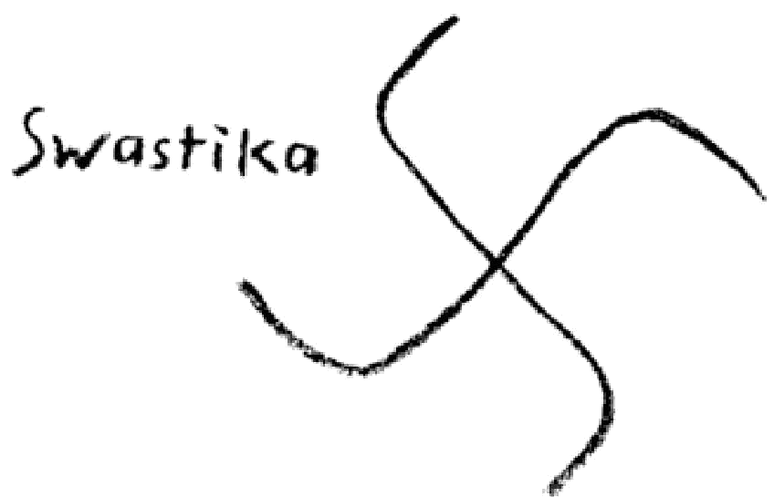

Für diese Räder oder Lotosblumen - von denen zum Beispiel die zweiblättrige in der Gegend der Augen liegt, die sechzehnblättrige in der Gegend des Kehlkopfes -, für diese astralen Sinnesorgane, die als Lichterscheinung auftreten in der astralen Welt, ist das Zeichen, das Bild, die Swastika. Oder nehmen wir ein anderes Zeichen, das so|207|genannte Pentagramm. Nicht durch Spekulieren, nicht durch Philosophieren können Sie die ursprüngliche Bedeutung des Pentagramms finden. Das Pentagramm ist eine Wirklichkeit; es ist ein Bild für das Wirken von Strömungen, von Kräfteströmungen, die im Ätherleib des Menschen sich finden. Es geht eine gewisse Kräfteströmung beim Menschen vom linken Fuß hinauf nach einem bestimmten Punkt des Kopfes, von da zum rechten Fuß, von da zur linken Hand, von da durch den Leib, durch das Herz zur rechten Hand, und von da zurück zum linken Fuß, so daß Sie in den Menschen hineinzeichnen können - in seinen Kopf, seine Arme, Hände, Beine, Füße - das Pentagramm.

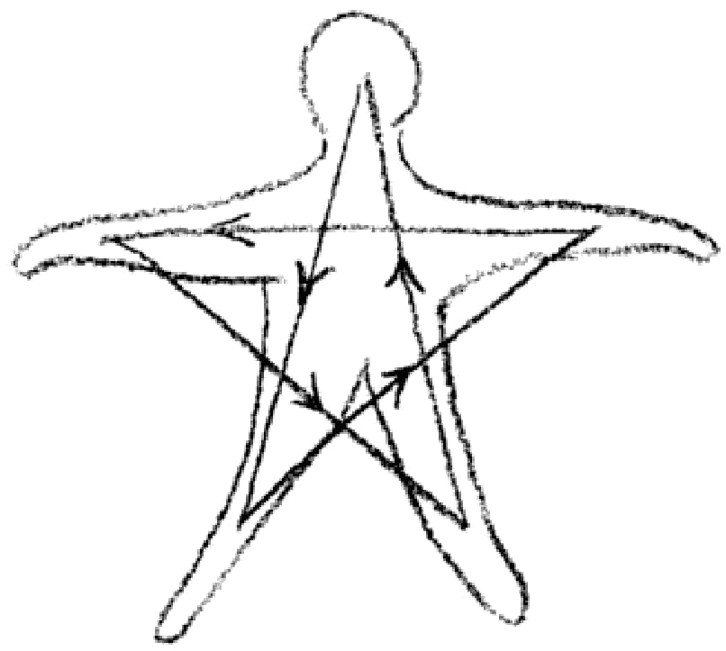

Sie müssen sich das vorstellen als Kräftewirkung, nicht bloß als geometrische Figur. Im Ätherleib des Menschen haben Sie das Pentagramm. Die Kräftewirkungen folgen genau diesen Linien des Pentagramms. Die Linien können die mannigfaltigsten Verrenkungen eingehen, immer aber bleiben sie als Pentagramm dem menschlichen Körper eingezeichnet. Das Pentagramm ist eine ätherische Wirklichkeit, nicht ein Symbol, sondern eine Tatsache.

So ist jedes Symbol im Okkultismus ein Bild für eine Tatsache der geistigen Welt. Erst dann erkennt man seine Bedeutung, wenn man hindeuten kann auf die Welt, in der diese Tatsache wurzelt. Daher |208| kann auch der größte Scharfsinn nicht zur Deutung der okkulten Zeichen führen. Einzig aus der Erfahrung [geistiger Welten] heraus ist die Bedeutung okkulter Zeichen und Symbole zu finden, und erst mit der Erkenntnis ihrer Bedeutung kann der Mensch etwas anfangen. Es ist deshalb keineswegs unnütz, wenn der Mensch etwas mitgeteilt und erzählt bekommt, was zuerst aus dem hellseherischen Vermögen heraus gefunden wurde. Und von der erforschten Tatsache aus kann der Mensch wiederum zurückgeführt werden zu den Ursachen dieser Tatsache selbst.

Wie mit den Zeichen und Symbolen, so ist es auch mit den alten Sagen und Mythen. Es ist eine Theorie vom grünen Tisch der Gelehrsamkeit, daß Sagen und Mythen erfunden seien von der Volksdichtung. Das Volk dichtet nicht. Alle Sagen und Mythen sind Überbleibsel von einer Zeit, wo der Mensch noch bis zu einem gewissen Grade hellseherisch begabt war. Was uns erzählt wird in den europäischen Sagen und Mythen, sind Aufbewahrungen von Tatsachen, die die Menschen früher geschaut haben. Alles in diesen Sagen, Märchen und Mythen ist ursprünglich hellseherisch gesehen worden und ist die Nacherzählung von ursprünglichen hellseherischen Erfahrungen. Das ist überhaupt Mythologie: Die Nacherzählung von hellseherischen Erfahrungen.

Heute noch können wir die ganzen Vorgänge, die in der Mythologie erzählt werden, auf dem Astralplan verfolgen. Wirkliche Geschehnisse sind die Taten von Wotan oder Odin. Wirklichkeiten haben wir zu suchen hinter den okkulten Zeichen, Symbolen und Siegeln. Und je weniger man sich dazu verleiten läßt, aus Spekulation eine Deutung dieser Zeichen zu unternehmen, um so besser ist es.

So soll uns dieser Vortragszyklus in den Tatsachensinn des Okkultismus hineinführen. Kein Zeichen ist erfunden oder erdacht, es ist Abbildung oder Nachbildung eines wirklichen Vorganges in der geistigen Welt. Und alle Erzählungen, die uns in den Mythologien entgegentreten, sind Wiedergabe dessen, was die Menschen gesehen haben, als noch ein großer Teil der Menschen hellseherisch begabt war.

# OKKULTE ZEICHEN UND SYMBOLE - SECHSTER VORTRAG, Köln, 27. Dezember 1907

|209| Nach der Einleitung von gestern wollen wir uns heute gleich darauf einlassen, einige sehr charakteristische Zeichen und Sinnbilder zu besprechen.

Wir haben gestern hervorgehoben, daß nur der Mensch, wie er hier auf dem physischen Plan lebt, eine individuelle Seele, ein Ich hat, und daß die Tiere, die uns umgeben, ein Gruppen-Ich, eine Gruppenseele haben, die auf dem Astralplan lebt und dort als eine abgeschlossene Wesenheit zu finden ist. So stehen sich Tierreich und Menschenreich, wenn wir sie geistig betrachten, gegenüber als Gruppenseele oder Gruppen-Ich und als Individual-Ich. Wir dürfen uns nun das nicht so vorstellen, als ob im Weltenall gar keine Übergänge zwischen den einzelnen Wesenheiten wären. Zwar ist der Spruch, daß die Natur keine Sprünge macht, für den Okkultisten durchaus nicht richtig, aber Übergänge finden Sie überall. Und so finden Sie auch einen Übergang zwischen den Gruppenseelen des Tierreiches und der Individualseele des Menschen. Es wäre unrichtig, sich vorzustellen, daß der Mensch gleich bei seinem Eintritt in das Erdendasein eine vollendete Individualseele gehabt hätte, und diese nun in derselben Art sich immer und immer wieder verkörpere hier auf der Erde. Es ist vielmehr so, daß der heutige Mensch in einem allmählichen Übergang ist von einer Gruppenseele, die er in uralten Zeiten hatte, zu der vollendeten Individualseele, die er heute noch immer nicht hat. Er ist erst auf dem Wege zu der völligen Eingliederung seiner Individualseele in seinen physischen Leib. Er wird diese vollendete Individualseele erst haben, wenn das Erdendasein mehr oder weniger vollendet sein wird. Für die weitaus meisten Menschen ist heute ihr Ich ein Zwischenprodukt zwischen einem Gruppen-Ich und einem individuellen Ich. Je weiter wir in der Vergangenheit zurückgehen, desto mehr ist das Menschen-Ich noch ein Gruppen-Ich. Im Anfange des Erdendaseins, als die Seelen sich erst aus den göttlichen Welten in unseren physischen Plan hinuntersenk|210|ten, waren die Menschenseelen noch Gruppen-Iche. Mehrere Menschen gehörten zusammen zu einer Gruppe, die eine gemeinschaftliche Seele, ein Gruppen-Ich hatte.

Das wollen wir auf der einen Seite festhalten. Auf der anderen Seite wollen wir jetzt einmal die Glieder der menschlichen Natur selbst näher betrachten. Es ist Ihnen ja hinlänglich bekannt, da es immer wieder und wieder gesagt wurde, daß der Mensch zunächst vier Glieder seiner Wesenheit hat: den physischen Leib, den Ather- oder Lebensleib, den Astralleib und das Ich. Und dieses Ich, wenn wir es genauer betrachten, erscheint uns wiederum gegliedert in drei Teile, die wir kennen unter den Namen: Empfindungsseele, Verstandes- oder Gemütsseele und Bewußtseinsseele. In der Empfindungsseele und in der Verstandes- oder Gemütsseele dämmert erst das selbständige Ich auf, und erst in der Bewußtseinsseele haben wir die erste Ankündigung des selbstbewußten Ich. Da erst scheint auch allmählich das in den Menschen hinein, was man den fünften Teil seiner Wesenheit, das Geistselbst oder Manas nennt. Wir haben also beim heutigen Menschen folgende Gliederung: Den physischen Leib, den Äther- oder Lebensleib, den Astralleib; dann mit dem Astralleib innig verbunden die Empfindungsseele, die wie eingebettet ist in ihm; dann die Verstandesseele und die Bewußtseinsseele; und wiederum in der Bewußtseinsseele, die die eigentliche Ich-Seele ist, eingegliedert das Geistselbst oder Manas. So etwa würden wir uns den heutigen Menschen vorzustellen haben.

Nun müssen wir uns klarmachen, welches von diesen menschlichen Gliedern das ausgebauteste, das vollkommenste ist. Einige von Ihnen haben das ja schon von mir auseinandergesetzt bekommen, daß - so wie der Mensch heute entwickelt ist - der physische Leib das ausgebauteste, das am vollkommensten entwickelte Glied ist. Man darf nur nicht verwechseln «ausgebauteste und am vollkommensten entwickelte» mit «höher geartet». Gewiß sind der Atherleib und der Astralleib dem Grade nach höherer Art als der physische Leib, aber die Vollkommenheit ihrer Entwicklung werden Atherleib und Astralleib erst in der Zukunft erringen. In seiner Art ist der physische Leib heute das vollkommenste Glied am Menschen. Wer |211| den physischen Leib studiert, aber nicht bloß anatomisch und physikalisch, sondern sein Gemüt und Herz durchdringend, der wird bewundernd dastehen vor der ungeheuren Weisheit, die in den physischen Leib hineingebaut ist. Unser physischer Leib zeigt uns in jedem kleinsten seiner Glieder den vollkommenen weisen Bau. Wenn Sie von diesem physischen Leib meinetwillen nur ein Stück Oberschenkelknochen nehmen, den obersten Teil des Oberschenkelknochens, so ist das nicht eine massive Masse, das ist ein weiser Bau, wunderbar aus kleinen Balken zusammengefügt. Wenn Sie studieren, wie die feinen Balken zusammengefügt sind, werden Sie finden, daß alles so gebaut ist, daß es mit dem kleinsten Aufwand von Substanz das größte Ausmaß von Kraft hervorbringt, damit durch diese beiden Säulen des Oberschenkelknochens der Oberkörper getragen werden kann. Auch die vollendetste Ingenieurkunst kann heute nicht mit einer solchen Weisheit eine Brücke oder irgendein Gerüst aufbauen, wo mit einem so kleinen Aufwand von Material ein so großes Ausmaß an Kraft entfaltet wird. Die menschliche Weisheit hinkt hinter dieser Weisheit, mit der der menschliche physische Leib auferbaut ist, weit, weit zurück. So ist es mit allen Teilen des physischen Leibes. Wenn Sie das Gehirn mit dem Nervensystem betrachten, es ist ein Wunderbau. Und wenn Sie das menschliche Herz betrachten, das erst auf dem Wege zu seiner Vollendung ist, das viel, viel höhere Grade der Vollendung erreichen wird – es ist etwas Wunderbares! Wenn Sie mit dieser Vollendung des physischen Leibes den Astralleib vergleichen mit seinen Trieben, Instinkten und Leidenschaften, so müssen wir sagen: Obwohl er einstmals höher stehen wird als der physische Leib, befindet er sich heute noch auf einer verhältnismäßig untergeordneten Stufe. In allem, was der Mensch heute an Begierden nach Genüssen entwickelt, liefert er Hunderte und Hunderte von Attacken auf den physischen Leib, Alles, was der Mensch begehrt und befriedigt in Genüssen, die er sich verschafft, wie Alkohol und alle möglichen anderen Dinge, sind im Grunde genommen geradezu Herzgifte, mit denen er fortwährend Attacken ausführt auf den Weisheits- und Wunderbau seines physischen Leibes. Es wird lange Zeit der Entwicklung bedürfen, bis der |212| Astralleib nachgekommen sein wird dem, was der physische Leib heute an Vollkommenheit schon hat.

Aus der Entwicklungslehre, wie sie unsere theosophische Kosmologie gibt, wissen Sie, daß der physische Leib bereits auf dem alten Saturn veranlagt war und weitere Vervollkommenungsgrade durchmachte durch Sonnen-, Monden- und Erdenentwickelung hindurch. Sie wissen, daß auf der zweiten Stufe, auf der alten Sonne, der Ätherleib hinzugekommen ist, der also heute um einen Grad tieferstehend in der Entwicklung ist als der physische Leib. Sie wissen, daß auf dem alten Monde der Astralleib dazugekommen ist; er hat nur die Mondenentwicklung hinter sich und den Teil der Erdenentwickelung, den wir bis jetzt durchgemacht haben. Das Ich ist erst auf der Erde hinzugekommen; es ist das «Baby» unter den vier Gliedern der menschlichen Natur. Eigentlich ist jene Weisheit, von der wir gestern gesprochen haben, welche die Gruppenseelen der Tierheit durchzieht, eingeprägt dem physischen Leib des Menschen; sie ist übergegangen auf den individuellen physischen Leib des Menschen, der weisheitsvoll gebaut ist. Der Ätherleib des Menschen ist erst auf dem Wege zu seiner Vollendung; er wird im Verlaufe seiner Erdenentwickelung alles in sich aufnehmen, was er zu seiner Vollendung braucht.

Wenn die Erde ihr Ziel erreicht haben wird, wird sie in den astralen Zustand und dann in noch höhere Zustände übergehen und sich später verwandeln in einen Planeten, der die Erde ablösen wird und den wir als Jupiter bezeichnen. Dann wird der Ätherleib des Menschen in seiner Art vollendet sein, wie auf der Erde der physische Leib des Menschen in seiner Art vollendet ist. In der nächstfolgenden Verkörperung der Erde, die wir gewohnt sind als die zukünftige Venus zu bezeichnen, wird der Astralleib des Menschen seine Vollendung erreicht haben, er wird dann auf der Stufe stehen, auf der heute der physische Leib steht und auf der in dem nächsten planetarischen Zustand der Ätherleib stehen wird. Und zuletzt, wenn die Erde den Vulkanzustand erreicht haben wird, dann wird unser Ich seine Vollendung erreicht haben. So daß wir eigentlich sagen können: Auf der Erde ist erst der physische Leib des Menschen |213| Mensch, auf dem nächsten planetarischen Zustand unserer Erde wird der Atherleib des Menschen Mensch; dann wird er imprägniert sein mit dem, was die Erde dem Menschen zu geben vermag: mit der Liebe.

Was heute der physische Leib des Menschen als seine charakteristischen Eigenschaften trägt, verdankt er dem alten Monde. Man nennt im Okkultismus den alten Mond den Kosmos der Weisheit. Damals auf dem alten Monde wurde nach und nach das vorbereitet, was Sie jetzt im physischen Leibe des Menschen finden. Und so wie das, was unser physischer Leib ist, auf dem Monde durchdrungen wurde mit Weisheit, so wird durch den Kosmos der Liebe das vorbereitet, was Sie im späteren Jupiterzustand der Erde finden werden: der Atherleib ganz durchdrungen von dem Element der Liebe. Und wie wir heute ein Knochenstück des physischen Leibes bewundern in seiner Weisheit, so werden - wenn wir vergleichsweise reden dürfen - die Jupitermenschen den Atherleib bewundern, weil er von Liebe ebenso durchkraftet ist, wie der physische Leib auf der Erde von Weisheit durchformt ist.

Wenn Sie das festhalten, kommen Sie zu der Anschauung, zu der Erkenntnis der Tatsache, daß erst des Menschen physischer Leib eigentlich wahrer Mensch ist, erst wirklich auf der Menschheitsstufe steht. Der menschliche Atherleib ist noch nicht auf der Menschheitsstufe, er steht noch auf der Stufe der Tierheit, und der menschliche Astralleib steht noch auf der Stufe der Pflanzenheit. Wenn Sie des Nachts schlafen und Ihr Astralleib herausgehoben ist, dann versinken der physische und der Atherleib in den traumlosen Schlaf; das ist der Zustand, den die Pflanze immerfort hat. Der Astralleib des Menschen steht in bezug auf seinen Bewußtseinszustand auf der Stufe der Pflanzenheit. Das Ich steht erst auf der Stufe des Mineralreichs. Der Bewußtseinszustand des Ich-Menschen ist durchaus auf der Stufe des Mineralreichs. Versuchen Sie sich einmal gemäß dieser Wahrheit zu prüfen, was Sie alles an Erkenntnissen haben können; versuchen Sie es richtig zu erkennen. Was kann denn der Mensch verstehen? Er kann die physischen Gesetze des Mineralreichs verstehen, nach denen er Maschinen und Fabriken bauen, Bauwerke auf|214|richten kann und so weiter. Das alles geschieht nach den physischen Gesetzen des Mineralreichs. Schon bei den Pflanzen sagt der Mensch mit Recht, er könne das Leben selbst nicht mit dem Intellekt begreifen. Es wird einmal die Zeit kommen, wo der Mensch ebenso die Pflanzen begreifen wird, wie er heute die Mineralien begreift; dann wird er auch die Pflanze aufbauen können, wie er sich heute seine Dome und Häuser und seine Maschinen nach den Gesetzen des Mineralreiches aufbaut. Es sind alles Gesetze des Mineralreichs, wovon das Ich durchdrungen ist.

Die Wissenschaft wartet darauf, daß sich ihr Ideal erfüllt, einmal lebendige Wesen im Laboratorium herzustellen. Das wird sie nicht können, wenn die Menschheit nicht auf einer gewissen notwendigen Stufe der moralischen Entwicklung angelangt sein wird. Es wäre schlimm, wenn die Menschheit das heute schon können würde. Wie man heute eine Uhr herstellt nach mineralischen Gesetzen, wie man ein Haus baut, so wird der Mensch in der Zukunft das Lebendige nach den Gesetzen des Lebendigen herstellen. Dann wird er aber imstande sein müssen, dem Lebendigen das Leben selbst einzuprägen. Wer dann am Laboratoriumstisch stehen wird, wird imstande sein müssen, von sich aus überzuleiten jene – nennen wir es: Schwingungen, die in seinem eigenen Ätherleibe sind, auf das, was zu beleben ist. Ist er ein guter Mensch, so leitet er das Gute über; ist er ein schlechter Mensch, so leitet er das Schlechte über. Es gibt aber einen Satz im Okkultismus: Nicht eher wird das Wissen der Weißen Loge, das man das Geheimnis der Lebenserzeugung nennt, an die Menschheit ausgeliefert, bevor nicht der Mensch das Geheimnis des Sakramentalismus erlernt hat.

«Sakramentalismus» ist ein Ausdruck dafür, daß die menschliche Handlung von moralischer Vollendung, von Heiligkeit durchglüht sein muß. Erst wenn dem Menschen der Laboratoriumstisch, wo er seine Arbeit vollbringt, ein Altar sein wird und seine Handlung eine heilige, dann wird er dazu reif sein, daß ihm dieses Wissen ausgeliefert werden kann. Man denke sich die heutigen Menschen mit all ihrem Materialismus – wie weit ist ihr Laboratoriumstisch heute entfernt von einem Altar!

|215| Sie sehen, wie das Bewußtsein des Menschen erhöht wird vom Mineralbewußtsein zum Pflanzenbewußtsein. Wiederum ist es ein okkulter Satz: Den Zustand des Pflanzenbewußtseins wird der Mensch erst erlangen, wenn er nicht mehr imstande sein wird, sein eigenes Wohl von dem Wohl aller übrigen Menschen zu trennen. Solange der Einzelne sein Wohl sucht auf Kosten anderer Menschen, solange ist der Zustand nicht eingetreten, daß das Bewußtsein um eine Stufe höher hinaufgehoben werden könnte.

So stehen wir also erst mit dem physischen Leib auf der Stufe des eigentlichen Menschen, mit dem Ätherleib noch auf der Stufe der Tierheit, mit dem Astralleib auf der Stufe der Pflanzenheit und mit dem Ich auf der Stufe des Minerals. Von diesen Wahrheiten wollen wir die eine festhalten: Wir stehen mit unserem Ätherleib auf der Stufe des Tieres. - Der Ätherleib wandelt sich im Laufe des Erdendaseins immer mehr um zu der Stufe des Menschen. Immer mehr und mehr durchdringt er sich mit jener Liebe, die das Wohl des Einzelnen nicht mehr trennen kann von dem Wohl der Anderen. So wie wir zuerst den physischen Leib ausgearbeitet und zur Höhe des Menschen gebracht haben, so wird nun der Ätherleib, und später auch der Astralleib und das Ich, sich zur Menschenstufe erheben. Das Ich steht noch auf der Stufe des Minerals, es ist dem Menschen erst auf der Erde eingegliedert worden.

Lassen Sie uns jetzt das Verhältnis betrachten, in welchem unsere Seele, das heißt unsere Empfindungsseele, unsere Verstandes- oder Gemütsseele, unsere Bewußtseinsseele und das in der Bewußtseinsseele eingeschlossene Geistselbst oder Manas zu unserem Ätherleib stehen. Unser Ätherleib selbst steht ja auf der Höhe des Tieres. Unten (es wird an die Tafel geschrieben - siehe Schema: von unten nach oben) auf der Höhe des Menschen haben wir den physischen Leib. Den Ätherleib lassen wir zunächst aus (siehe Punkte im Schema). Unseren Astralleib, in welchem eingeschlossen ist die Empfindungsseele - das ist das erste Glied unserer Seele -, haben wir auf der Höhe der Pflanze; dann haben wir die Verstandes- oder Gemütsseele. Das alles steht auf der Stufe der Pflanze. Weiter hinauf haben wir dann das Ich oder die Bewußtseinsseele, worin eingeschlossen ist |216| das Geist selbst oder Manas, soweit es beim Menschen heute schon zu finden ist.

|  Mineral |  | Bewußtseinsseele/Ich/Geist selbst oder Manas  |
| --- | --- | --- |
|  Pflanze | Astralleib/Empfindungsseele | Verstandes-seele  |

Mensch Phys. Leib

Wir haben den Ätherleib auf der Stufe des Tieres zunächst ausgelassen. Nun müssen wir uns darüber klar sein, daß in jedem Gliede des Menschen sich in einer gewissen Weise die anderen Glieder ausdrücken. Also der physische Leib des Menschen hat zunächst in sich ausgedrückt die Offenbarung des physischen Leibes selbst. Wir finden das physische Prinzip im physischen Leibe ausgedrückt, wenn wir die Sinnesapparate betrachten. So haben Sie im Auge eine Art photographischer Kamera, im Ohr eine Art Klavier. Kurz, in den Sinneswerkzeugen drückt sich das physische Prinzip selbst aus. Wenn wir die menschlichen Drüsen betrachten, finden wir darin ausgedrückt den Ätherleib, im Nervensystem haben wir den Ausdruck des Astralleibes, und im Blut haben wir den Ausdruck für das Ich. «Blut ist ein ganz besonderer Saft!». Wer das Blut hat, der hat des Menschen Ich. Hat der Teufel des Menschen Blut, so hat er das Ich.

So drückt sich im physischen Leib des Menschen jedes andere Glied aus, insoweit es hineinragt. Das Blut pulsiert unbewußt, weil das Ich, soweit es darin tätig ist, unbewußt ist seiner physischen Vorgänge. Ebenso wie sich im physischen Leibe das Wesen der anderen Glieder ausdrückt, drückt sich auch im Ätherleibe das Wesen der anderen Glieder aus, nur drückt es sich da nicht «menschlich» aus, sondern es drückt sich «tierisch» aus, und zwar in der Form ge|217|wisser Tiere, in einer Form, die eine gewisse Ähnlichkeit hat mit unseren äußeren Tierformen. So drückt sich das, was unter dem Atherleib liegt, der physische Leib, wie ein Schattenbild aus; man nennt diesen Teil des Ätherleibes, in dem sich das physische Glied der menschlichen Wesenheit ausdrückt, den «Menschen» (es wird an die Tafel geschrieben). Man nennt den Astralleib, die Empfindungsseele, die sich ausdrückt im Atherleib, wegen der Ähnlichkeit seiner Ätherform den «Löwen»; die Verstandesseele, die sich ausdrückt im Ätherleib, nennt man den «Stier» oder die Kuh, und die Bewußtseinsseele mit dem Geist selbst wegen der Ähnlichkeit, die sie in ihrer Ätherform für den hellseherischen Blick hat, den «Adler».

|  Mineral |  |  |  | Bewußtseinsseele
Ich/Geistselbst
oder Manas  |
| --- | --- | --- | --- | --- |
|  Püanze |  | Astralleib/
Empfindungsseele | Verstandes-seele |   |
|  Ätherleib
(Tier) | Mensch | Löwe | Stier | Adler  |
|  Mensch | Phys. Leib |  |  |   |

So haben Sie hier (Schema) die vier Zeichen der Apokalypse - Mensch, Löwe, Stier, Adler - als die vier Ausdrücke der Wesensglieder im menschlichen Ätherleibe. Sie können daraus ersehen, daß diejenigen unserer Vorfahren, welche diese tiefen Symbole, diese tierischen Sinnbilder für die menschliche Wesenheit erdacht haben, sie nicht aus ihrer Phantasie, Philosophie oder Spekulation, aus gar keinem Scharfsinn heraus, sondern aus der Tatsachenwelt, aus der okkulten Tatsachenwelt heraus geschaffen haben.

Nun müssen wir uns aber darüber klar sein, daß diese vier Ausdrücke nicht bei jedem Menschen gleich herauskommen; es überwiegt einer der Ausdrücke bei dem einen Menschen, der andere bei dem anderen Menschen. Allerdings müssen wir da die ganze |218| Menschheit in ihrer Entwickelung betrachten. Wenn Sie betrachten, wo der physische Leib selbst sich am stärksten ausdrückt, da finden wir den stärksten Ausdruck bei der untergehenden, der roten Rasse, bei den Indianern, in der besonderen Ausgestaltung des Knochensystems, welches hier vorherrscht. Wollen Sie sehen, wo sich der Atherleib physisch besonders ausdrückt, so müssen Sie das bei einer anderen Menschenrasse suchen: bei der schwarzen Rasse, in der Drüsenbildung. In der Kohlenstoffabsonderung finden Sie einen Ausdruck der Pflanzennatur. [Nachschriften hier lückenhaft.] Die Menschen, bei denen sich besonders stark das Nervensystem auf der physischen Stufe ausdrückt und damit auch das Sensitive, finden Sie in der malaiischen Rasse, und die Rasse, bei der sich besonders das Blutsystem ausdrückt, das ist die mongolische Rasse. Den Teil der Menschen, der anfängt, das Prinzip des Manas auszubilden, finden Sie bei der kaukasischen Rasse. Da haben Sie die Einteilung der Menschenrassen aus den okkulten Wahrheiten heraus geschöpft; so ist das, was im heutigen Menschen sich findet, verteilt auf die ganze Menschheit, indem das eine oder das andere bei der einen Menschen-gattung überwiegt oder zurücktritt.

Solche Unterschiede finden Sie auch beim Atherleib der Menschen. Wenn der hellseherische Blick den Atherleib betrachtet, wie der physische Blick den physischen Leib, so findet er die Menschen geteilt in Menschmenschen, Löwenmenschen, Stiermenschen, Adlermenschen. Ihr Gruppen-Ich ist astraler Natur. Der Hellseher findet auf dem astralen Plan zwischen dem tierischen Gruppen-Ich und dem menschlichen Individual-Ich das menschliche Gruppen-Ich stehen. Je weiter wir zeitlich zurückgehen, desto mehr finden wir die Menschen in bezug auf ihren Atherleib eine dieser vier Gestalten annehmen, und wir schreiben diesen vier Seelengruppen je eine menschliche Gruppenseele zu, der einen eine Mensch-Gruppenseele, der anderen eine Löwen-Gruppenseele, der dritten eine Stier-Gruppenseele und der vierten eine Adler-Gruppenseele. Sie würden nur dann eine falsche Vorstellung davon bekommen, wenn Sie diese Namen, die von physischen Tierformen hergenommen sind, allzu stark pressen würden. Viel ähnlicher ist dieser Ätherkörper der Löwen|219|menschen der Gruppenseele der Löwen, als dem einzelnen Löwen hier auf dem physischen Plan. Das Christentum hat sich von den Evangelisten vorgestellt, daß ihre Seelen nicht so sind wie gewöhnliche Menschenseelen, sondern ganze Gruppen von Menschen umfassen, und hat nach dem inneren Seelencharakter Matthäus verglichen mit dem Menschen, Markus mit dem Löwen, Lukas mit dem Stier und Johannes mit dem Adler. Das rührt von jener Ähnlichkeit her, welche die christliche Esoterik den Seelen der einzelnen Evangelisten zugeschrieben hat. Noch genauer werden wir das verstehen, wenn wir sehen, daß der Mensch auf der einen Seite in einem Abstieg und auf der anderen Seite in einem Aufstieg begriffen ist. Hier auf der Erde im tiefsten Punkte des Materialismus, erlangt der Mensch die Anlage zu der Individualseele. Der Mensch ist heruntergestiegen von den alten Zeiten, wo man genauer unterschied die einzelnen Gruppenseelen: Menschmensch, Löwenmensch, Stiermensch, Adlermensch. Wenn die Menschen in der Zukunft wieder hinaufsteigen werden, werden sie ihre Individualseele beibehalten und auf höherer Stufe mit höherem Bewußtsein wiederum das entwickeln, was sie früher nur in dämmerhaftem Bewußtsein hatten, die vier Gruppenseelen. Daher legt man im Christentum den Evangelisten diese Eigenschaften bei.

Halten wir noch für eine Weile diesen Begriff der Gruppenseelen der Menschen fest. Diese Gruppenseelen lebten sich viel mehr als im Raum, als im Nebeneinander, in der Zeit, im Nacheinander aus. Wenn wir die tierischen Gruppenseelen betrachten, dann sagen wir, wenn wir eine Gruppe von Löwen nehmen oder eine Gruppe von Walfischen: sie haben ihre gemeinschaftliche Gruppenseele auf dem astralen Plan nebeneinander. Wenn wir aber die menschlichen Gruppenseelen betrachten, so müssen wir mehr die Zeit ins Auge fassen. Eine menschliche Gruppenseele ist im Ätherischen sozusagen an der Grenze zwischen dem physischen und dem astralen Plan zu einer gewissen Zeit geboren und verwandelt sich wiederum in einer gewissen Zeit. Diese vier Gruppenseelenarten, die wir besprochen haben, sind nur die vier hauptsächlichsten Typen, es gibt aber unzählige Zwischenstufen. Wir haben nur die charakteristischsten |220| Formen Mensch, Löwe, Stier, Adler angegeben, die in allen möglichen Mischungen auftreten können.

Betrachten wir eine Gruppe von Menschen, sagen wir zum Beispiel einen Stamm; nehmen wir irgendeinen der alten mitteleuropäischen Stämme, meinetwegen den Stamm der Cherusker. Ein solcher Stamm entsteht einmal, und er vergeht. Der materialistische Weltbetrachter sieht in dem, was der Stamm der Cherusker ist, eigentlich nur etwas Abstraktes, einen Begriff, der sie zusammenhält. Das ist aber etwas Unreales. Der Okkultist sieht im Stamm der Cherusker eine Gruppenseele, die entsteht, «geboren wird», in der Zeit, wo der Stamm der Cherusker in die Geschichte eintritt; sie wächst, wie die Macht der Cherusker wächst, und sie «stirbt», wenn die Cherusker aus der Geschichte verschwinden. Hinter dem sich entwickelnden Stamm der Cherusker sieht der Okkultist eine sich entwickelnde Atherwesenheit. Nun gibt es einen Unterschied zwischen einer Ätherwesenheit und einer physischen Wesenheit hier auf der Erde. Eine physische Wesenheit wird auf dem physischen Plan geboren, wächst, erreicht einen Lebenshöhepunkt und stirbt wiederum. Geburt und Tod ist das Charakteristische der Wesenheiten auf dem physischen Plan. So ist es nicht mit den Wesenheiten, die auf den höheren Planen leben. Wenn wir die tierischen Gruppenseelen auf dem Astralplan verfolgen durch Jahrtausende hindurch, so ist ihr Entstehen und Vergehen gar nicht auszudrücken durch die Worte «Geburt» und «Tod». Es liegt da etwas ganz anderes zugrunde. Es liegt Verwandlung, Metamorphose, zugrunde. Wenn Sie mit hellseherischem Vermögen einer tierischen Gruppenseele auf dem Astralplan heute begegnen und sich erinnern an eine ihrer vorhergehenden Verkörperungen, wie es mit dieser tierischen Gruppenseele vor 1500 Jahren war, so wird sie Ihnen nicht so erscheinen, wie wenn Sie einen jüngeren Menschen betrachten. Allerdings sehen Sie die Gruppenseele auch Jugend, mittlere Lebenszeit und Alter durchmachen, aber sie gibt im Alter ihr Bewußtsein nicht auf, sie stirbt nicht. Sie verwandelt sich immerfort, ohne daß sie durch den Tod hindurchgeht. Sie können die tierische Gruppenseele zurückverfolgen bis in ururferne Zeiten – Sie treffen nur Metamorphose an, nicht Geburt und Tod.

|221| Etwas Ähnliches ist der Fall bei solchen Gruppenseelen, wie es die des Cheruskerstammes ist. Wenn der Stamm der Cherusker als eine Anzahl physischer Menschen auf dem physischen Plan erscheint, hat sich die Cheruskerseele eben gebildet; aber sie ist nicht geboren worden, sondern hat sich aus einer anderen Zeit heraus umgebildet, verwandelt. Sie wächst mit der Macht der Cherusker, erlangt ihren Höhepunkt, wenn der Stamm der Cherusker seinen Höhepunkt erlangt, und wenn der Cheruskerstamm in der Geschichte auf dem physischen Plan degeneriert und verschwindet, ersteht die Cheruskerseele aufs neue in Jugend, um die Seele eines anderen Stammes zu werden; sie metamorphosiert sich. Physische Geburt und physischen Tod gibt es nicht, wenn wir die Seelen auf höheren Planen betrachten. Geburt und Tod, wie wir sie kennen, gibt es nur auf dem physischen Plan, nicht auf den höheren Planen. Die okkulte Weisheit hat das wohl verstanden zum Ausdruck gebracht und dabei große Sorgfalt auf Zahlen verwendet. Man hat versucht, eine Durchschnittszahl festzulegen, wann eine Gruppenseele, wie sie zu einer bestimmten menschlichen Gemeinschaft gehört, entsteht, sich aus einer anderen herausmetamorphosiert, wächst und den Höhepunkt erlangt, um wiederum eine absteigende Entwickelung durchzumachen und sich dann zu einer anderen Gruppenseele umzuwandeln. Wenn man das Lebensalter des Menschen auf durchschnittlich 75 Jahre ansetzt – diese Zahl als Mondjahre angenommen – und mit 7 multipliziert, so ergibt sich das Leben einer menschlichen Gruppenseele in ihren vier Typen, bis zu ihrer nächsten Verwandlung. Mit 7 sind hier Generationen gemeint. Wir kommen – wenn wir berücksichtigen, daß wir es dabei mit Mondjahren zu tun haben – auf ungefähr 500 Jahre. Und so sagte man im Okkultismus: Das Leben einer Gruppenseele dauert 500 Jahre; nach 500 Jahren wird sie zu einer anderen, sie gebiert sich selbst neu, ohne daß sie ihr Bewußtsein verliert.

Wenn wir das Ich einer solchen Gruppenseele betrachten und für das Ich äußerlich im Physischen ein Ausdrucksmittel suchen, so ist es ja das Blut. Das Blut ist für den Okkultisten der Ausdruck des Feuers, vom Feuer durchglühte Substanz. Wie der menschliche physische Leib der Ausdruck der Erde ist, der Ätherleib der Ausdruck |222| des Wassers, der Astralleib der Ausdruck der Luft, so ist das Ich, das noch nicht an den Egoismus gekettet ist, der Ausdruck des Feuers. Wir sagen daher - wir werden das noch morgen besprechen -, daß das Blut durch den Egoismus den Tod gefunden hat. Das Ich des Menschen «verzehrt sich in seinem eigenen Feuer», durch sich selbst. Das ist ein okkulter Ausdruck. Nur wenn der Mensch die Ichsucht überwindet, erlangt er die Unsterblichkeit. Das menschliche Gruppen-Ich verzehrt sich in seinem eigenen Feuer. Wenn 500 Jahre herum sind, verbrennt es und erschafft sich aus sich selbst eine neue Form. Das stellte man im Okkultismus so dar, daß das Gruppen-Ich im allgemeinen 500 Jahre lebt, dann verbrennt und aus seinem eigenen Feuer wieder beseelt wird, und man nannte dies den «Vogel Phönix». Die schöne Sage vom Vogel Phönix hat hier ihren tatsächlichen Hintergrund. Der Phönix ist das Gruppen-Ich mit den Eigenschaften der vier Typen, das sich nach sieben Generationen verbrennt und wiederherstellt - eine Generation mit 75 Mondjahren Lebensalter gerechnet.

Dies ist der reale Hintergrund der Phönixsage. Da haben Sie einen neuen Beweis dafür, daß solche alten Sagen wie die vom Phönix aus den tiefsten okkulten Tatsachen heraus geschaffen sind. Es soll hier nicht spekuliert, sondern gezeigt werden, was durch die Jahrhunderte hindurch in den okkulten Schulen gelehrt worden ist, und was eine wirkliche tatsächliche Erfahrung darstellt, für die die okkulten Zeichen und Siegel der Ausdruck sind.

Immer wieder werden wir, wenn wir solche Ausdrücke okkulter Wahrheiten hören und sie vergleichen mit dem, was uns die Menschheit in ihren Zeichen und Symbolen erhalten hat, daran erinnert, wieviel das menschliche Bewußtsein schon geschaffen hat, bevor es ein Verstandesbewußtsein geworden war. Der Mensch hat ja so gerne den Glauben, daß wir es heute schon weit gebracht haben. Aber er hinkt mit seinem Verstande dem schöpferischen Bewußtsein der Vorwelt nach, das allerdings nur die Eingeweihten hatten, und die haben es hineinverborgen in die Sagen. Die Symbole von den vier Tieren sind nicht ausgedacht; nicht der Gedanke ist der Ausgangspunkt, der Ursprung davon, sondern das Schauen.

|223| Wenn ich sage: die Gruppenseele ist im Ätherischen an der Grenze zwischen dem physischen und dem astralen Plan -, so dürfen Sie sich nicht eine Grenzlinie vorstellen. Wenn wir vom physischen Plan ausgehen, so haben wir hier (es wird gezeichnet) sieben Unterabteilungen des physischen Planes; dann kämen sieben Unterabteilungen des Astralplanes. Von diesen fallen die drei untersten mit den drei obersten des physischen Planes zusammen. Wir müssen den Astralplan mit dem physischen Plan so zusammengeschoben betrachten, daß die drei obersten Partien des physischen Planes zugleich die drei untersten Partien des Astralplanes sind. Wir können von einer Randzone sprechen, das ist die, welche unsere Seelen nach dem Tode nicht verlassen können, wenn sie durch Begierden noch an die Erde gefesselt sind. Man nennt sie Kamaloka.

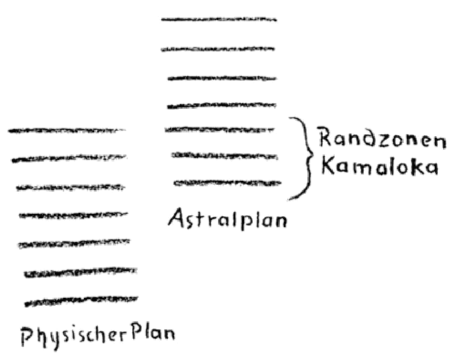

Also wir haben durchaus in den okkulten Zeichen, Symbolen und Siegeln, die wir hier als erste Beispiele gewählt haben, etwas aus der Tiefe der okkulten Tatsachen Gewonnenes zu sehen, und Sie würden ganz fehlgehen, wenn Sie die tiefe Weisheit der Vorzeit in den okkulten Schulen verkennen würden oder sie in irgendeiner |224| Weise durch unsere moderne Weisheit für überwunden halten würden. Wo Ihnen die Weisheit okkulter Lehren entgegentritt in Zeichen oder Symbolen, da zeigt sie sich immer so, daß sie bestätigt wird durch die unmittelbare okkulte Betrachtung. Ein Beispiel dafür, wie die Lehre des Okkultismus in verhältnismäßig wenig zurückliegenden Zeiten gewirkt hat, ist, daß man in Namen und Worte symbolische Bedeutungen hineingeheimnißt hat, aber so, daß diesen eine reale Bedeutung zugrunde lag: Tatsachen der höheren Welt. Wir werden nicht auf den Ursprung der Wortbildung im Sinne der Philologie zurückgehen; was ich jetzt sagen werde, ist nicht etwas, was Sie mit der Philologie prüfen könnten. Selbst wenn die Philologie es falsch finden würde, wäre die Wortsymbolik doch richtig.

Je weiter Sie vom physischen Plan durch die Astralwelt in die Devachanwelt aufsteigen, desto mehr stellt sich Ihnen alles dar als ein Spiegelbild des physischen Planes, das Sie erst lesen lernen müssen. An den Zahlen ist das für den Schüler am leichtesten zu lernen. Angenommen, Sie haben hier auf dem physischen Plan die Zahl 543, so ist diese Zahl auf dem Astralplan als Spiegelbild, also 345 zu lesen. Ebenso sind auch alle anderen Dinge und Ereignisse als Spiegelbilder zu lesen. Ich will gleich ein krasses Beispiel wählen: Hier auf dem physischen Plan verfolgen Sie, wie das alte Huhn das Ei legt und aus dem Ei das junge Huhn sich entwickelt. Betrachten Sie dasselbe Ereignis auf dem Astralplan, so müssen Sie rückwärtsgehen: da haben Sie zuerst das junge Huhn, das Huhn wird immer kleiner und kleiner und geht zuletzt in das Ei hinein. Auch die Zeit geht rückwärts. Sie sehen, wie ungeheuer verwirrend dies beim ersten Anblick für den Schüler sein muß. Die Leidenschaften, die von dem Menschen ausströmen, sehen Sie wie in einem Tableau; sie strahlen vom Mittelpunkte aus. Die widergespiegelten Leidenschaften erscheinen, wie wenn lauter Tiere auf Sie einstürmten. Die niederen Leidenschaften sieht der Mensch als allerlei wildes Getier, als Mäuse, Ratten und so weiter um sich herum. Wenn der Schüler das nicht gelernt hat, und es geht ihm die erste Erfahrung davon auf, wenn er seine eigenen Leidenschaften als Mäuse und Ratten auf sich zustürmen sieht, dann |225| können leicht pathologische Zustände wie Verfolgungswahn und so weiter auftreten.

Was ich Ihnen jetzt als eine Tatsache über das Verhältnis der höheren Welten zu den niederen Welten ausgesprochen habe, versuchte man symbolisch zum Ausdruck zu bringen in der Evolutionslehre in einem Wortspiel. Als die Menschen in ihr Dasein auf der Erde eintraten, traten sie aus einem geistigen Zustand in einen sinnlichen Zustand ein - durch Eva. In Eva sah man jenen Zustand, wo die geistige Menschheit physisch wurde, und daher auch sündhaft. Wenn die Menschheit nun wiederum hinaufgeführt werden soll zum Geistigen, und wenn der Gegensatz ausgedrückt werden soll zu dem Weibe, das das Sterbliche in die Welt gebracht hat, dann muß dasjenige, was das Unsterbliche wieder hineinbringen soll in die Menschheit, umgekehrt ausgedrückt werden; der Name muß umgekehrt werden. Daher redet der Engel Gottes die Maria an mit den Worten «Ave, Maria!» - Aus Eva wird Ave; diese Umkehrung hat symbolischen Charakter. Was auch eine mehr oder weniger verkehrte Philologie dagegen sagt, darauf kommt es nicht an. Es kommt darauf an zu zeigen, wie im Okkultismus das Symbolische in der Wortfügung zu wirken vermag. Man suchte mit dieser Wortfügung zu bewirken, daß der Mensch, indem er die Worte ausspricht, sich der okkulten Tatsache bewußt wird, daß die physische und die geistige Welt in ihren Strömungen umgekehrte Richtungen haben.

Das hat eine sehr tiefe Bedeutung. Sehen Sie dahinter nicht irgend etwas Willkürliches. Das Beste, was Sie dahinter sehen können, ist, daß man den Menschen anleitete, in seiner Sprache die okkulten Gesetzmäßigkeiten zu erkennen. Indem man den Menschen solche Übungen machen läßt, um die okkulten Gesetzmäßigkeiten in der Sprache zu erkennen, arbeitet er bewußt oder unbewußt an seiner okkulten Schulung. Das Prinzip der Symbolik ist zugleich ein Prinzip der Schulung.

# OKKULTE ZEICHEN UND SYMBOLE - SIEBENTER VORTRAG, Köln, 28. Dezember 1907

|226| Was hier gegeben werden kann, sind ja im wesentlichen nur Beispiele aus der reichen Zahl von okkulten Symbolen und Zeichen. Es ist auch weniger darum zu tun, etwa eine vollständige Abhandlung zu geben, die diese oder jene okkulten Zeichen erklären soll, sondern es handelt sich viel mehr darum, die Bedeutung der okkulten Zeichen im allgemeinen und ihr Verhältnis zur astralen und geistigen Welt zu entwickeln. Wenn solche Zeichen nichts wären als eine Art von schematischer Illustration, dann wäre ihr Ziel und ihre Bedeutung wahrhaftig keine große, und mancher könnte glauben, daß es sich nur um eine Art von Versinnbildlichung gewisser Tatsachen der höheren Welten handele. Das ist aber nicht der Fall. Jene Sinnbilder und Zeichen, die der okkulten Weltanschauung entlehnt sind, haben für das Menschen Entwicklung, für seine Vervollkommnung eine große Bedeutung; ja, man darf sagen, daß okkulte Zeichen und Siegel, wenn wir sie nur im weitesten Sinne des Wortes auffassen, in der Erziehung und Entwicklung der ganzen Menschheit eine große Rolle gespielt haben. Sie müssen sich nur darüber klar sein, daß Gedanken, Empfindungen, Vorstellungen, die der Mensch faßt, eine wirkliche Kraft sind, die umbildend, gestaltend, verwandelnd auf den Menschen wirkt.

Wir brauchen uns nur einmal die Tatsache vor die Seele zu rufen, daß das Physische und das Ätherische am Menschen, so wie er heute vor uns steht, Verdichtungen sind des Astralischen. Der Mensch war vorher ein bloß astralischer Mensch, bevor er ein ätherischer Mensch und ein physischer Mensch geworden ist. In Wahrheit ist es so, daß alle die dichteren Substanzen, also die ätherische Substanz und die physische Substanz, sich herausgliedern aus der astralischen Substanz, wie sich das Eis herausgliedert aus dem Wasser. Wie Wasser sich verdichtet und zu Eis wird, so wird die astralische Substanz verdichtet zu ätherischer und dann zu physischer Substanz. In der Zeit, als der Mensch noch ein solches Wesen war, wie Sie es heute |227| sind, wenn Sie schlafen, wo Sie außerhalb Ihres physischen und ätherischen Leibes sind, da waren die Kräfte, die seine astralische Substanz geformt haben, reine Empfindungs- und Vorstellungskräfte. Die astrale Substanz wirkt ja ganz anders als die ätherische oder die physische. Die astrale Substanz ist in fortwährender Bewegung. Jede Leidenschaft, jeder Instinkt, jede Begierde lebt sich sofort in der astralischen Substanz aus, so daß sie im nächsten Moment von ganz anderer Form ist, wenn sie der Ausdruck einer anderen Leidenschaft ist. So leicht wirkt heute auf den dichten physischen Menschenleib das Gedankliche nicht mehr ein. Trotzdem hat auch heute das Gedankliche, das Empfindungsmäßige seine Wirkung auf den physischen Menschenleib. Sie brauchen ja nur einmal zu betrachten, daß der Mensch, wenn er erschrickt oder wenn er Angst vor etwas hat, erbleicht. Das heißt nichts anderes, als daß seine gesamte Blutmasse andere Bewegungen im Körper ausführt als in normalem Zustande. Es drängt die Blutmasse von außen nach innen. Oder nehmen Sie das Erröten durch das Schamgefühl, da wird das Blut von innen nach der Peripherie, nach außen hingetrieben. Das sind nur geringfügige Wirkungen, die heute noch das Seelische auf das Körperliche hat. Aber wenn Sie lange Zeiträume in Betracht ziehen, finden Sie viel bedeutendere Wirkungen des Seelischen und des Gedanklichen auf das Körperliche. Wenn Sie durch Jahrtausende die Menschenformen verfolgen könnten, würden Sie sehen, daß die Gestalt, die ganze Physiognomie, alles am Menschen sich ändert. Das geschieht so, daß zuerst die seelischen, die geistigen Vorgänge da sind. Der Mensch hat bestimmte Vorstellungen, und wie er seine Vorstellungen bildet, danach formt sich im Laufe von Jahrtausenden seine körperliche Gestalt und Physiognomie, wenn dies auch nicht gleich für eine äußere biologische Betrachtungsweise bemerkbar ist. Von innen nach außen formt sich alles. Unsere äußere materialistische Wissenschaft ist heute noch lange nicht soweit einzusehen, wie sich diese Wirkungen im Verlaufe von Jahrtausenden zueinander verhalten. Aber sie sind da.

Um uns klarzumachen, wie solche Zusammenhänge sind, wollen wir uns nur einmal an das erste Auftreten des gotischen Baustiles er|228|innern, wo gewisse Vorgänge in der Menschheitsentwicklung erstmals ausgedrückt wurden in Baustilformen der Gotik. Diejenigen Menschen, die sich der Andacht hingaben in Räumen, die nach gotischem Baustil gebaut waren, die erlebten die Gedanken, die die Anregungen waren zu den gotischen Bauwerken. Diese Gedanken, die da in den Seelen der Menschen tätig waren, formten die Seelen, die inneren Kräfte des Menschen bis in den Atherleib, sie gestalteten die Kräfte des Menschen um. Und nach Jahrhunderten kam als eine Folge dieser Eindrücke, welche die Sinne empfangen hatten, und der Vorstellungen, die nach diesen Sinneseindrücken gebildet wurden, jene mystische Bewegung zum Vorschein, die wir finden in Meister Eckhart, Johannes Tauler und anderen. In dem, was sie ersannen, haben wir die Nachwirkungen dessen, was ihre Vorfahren als Eindrücke durch gotische Bauten empfangen hatten. Und diejenigen höheren Individualitäten, die der Menschheit in ihrer Entwicklung vorangehen, leiten bewußt diesen Gang der Menschheitsentwicklung. Sie sehen bewußt voraus in die Jahrhunderte und Jahrtausende, und es wird der Menschheit zu einer bestimmten Zeit das gegeben, was diese oder jene Eigenschaften ausbilden soll. So sehen wir, wie hier im Verlauf von einigen Jahrhunderten durch das Anschauen der äußeren Formen des gotischen Baustiles, des Spitzbogenstiles, jene nach dem Himmel strebende Mystik zum Ausdruck kommt in Meister Eckhart, Tauler und so weiter. Würden wir Jahrtausende in Betracht ziehen statt Jahrhunderte, so würden wir sehen, wie sich selbst die menschlichen Körperformen bilden nach den Gedanken und Empfindungen und Vorstellungen, die die Menschen vor Jahrtausenden hatten; und die großen Führer der Menschheit geben den Menschen zur rechten Zeit in der Entwicklung die richtigen Vorstellungen, damit selbst die menschliche Gestalt umgebildet werde.

Nun versetzen wir uns einmal in die Zeit des Überganges von der atlantischen zur nachatlantischen Zeit. Wir wissen, daß unsere Vorfahren, ja unsere Seelen selbst in anderen Leibern, in der alten Atlantis gelebt haben. In den letzten Zeiten der Atlantis war dieser Kontinent, namentlich die nördlichen Partien, weithin bedeckt von Nebelmassen, und alles, was auf der Erde lebte, auf diesem Kontinent, |229| war eingehüllt in dichte Nebel. Und wenn wir noch weiter zurückgehen, treffen wir auf Zeiten, wo nicht nur Nebelmassen da waren, sondern da, wo heute unser Luftkreis ist, hinunterrieselnde Wassermassen waren. Der erste atlantische Mensch war noch mehr ein Wasserwesen. Erst allmählich während der atlantischen Zeit gestaltete er sich um zu einem Luftwesen. Damals hatte der Mensch eine ganz andere Verteilung seines ätherischen und physischen Leibes. Heute sind Äther leib und physischer Leib so verteilt, daß sie in den oberen Partien in Form und Größe fast einander gleich sind. Das ist bei anderen Wesen keineswegs der Fall. Wenn Sie den Ätherleib eines Pferdes ansehen, würden Sie weit oben über den physischen Kopf den Ätherkopf des Pferdes hinausleuchten sehen. Auch beim Menschen ragte früher der Ätherleib des Kopfes weit über den physischen Kopf hinaus, und erst gegen Ende der atlantischen Zeit sind beide Teile zusammengefallen. Ein Punkt, der heute innerhalb des Kopfes liegt, war früher draußen vor dem Kopf und zog erst allmählich hinein. Diese beiden Punkte zogen sich immer mehr zusammen, und im letzten Drittel der atlantischen Epoche fielen sie zusammen. Das war die Zeit, als vom Nordosten der Atlantis, aus der Gegend des heutigen Irland, die ursemitische Rasse heruntergezogen ist. Damals erlangte der Mensch die Fähigkeit, durch welche die beiden Punkte zusammenfielen und zur Deckung kamen. Dadurch, daß der Ätherleib seines Kopfes draußen war, hatte der atlantische Mensch eine Art nebelhaften Hellsehens. Der atlantische Mensch konnte nicht rechnen oder zahlen, nicht irgendeine Art Logik des Denkens entfalten. Das ist erst ein Ergebnis der nachatlantischen Zeit. Aber er hatte eine Art ursprünglichen Hellsehens, weil er mit dem Ätherteil des Kopfes viel mehr außer dem Kopfe war als drinnen. Damals, als dieser Ätherteil des Kopfes außerhalb des physischen Kopfes war, hatten auch die Gedanken und Empfindungen des Astralleibes einen viel größeren Einfluß auf diesen Teil des Ätherleibes und damit auf die Bildung des physischen Leibes. Dasjenige, was zuerst im Astralleib als Gefühle, Empfindungen und Gedankenvorstellungen lebte, setzte sich als Bewegungsvorgang in den Ätherleib fort und gestaltete den physischen Leib zu seiner heutigen Form.

|230| Woher ist denn eigentlich die heutige Länge, Breite und Höhe des physischen Leibes entstanden? Es ist eine Wirkung dessen, was zuerst im Astralleib und im Ätherleib vorhanden war. Da waren zuerst die Gedanken, Bilder, Empfindungen und so weiter. Sie werden das besser verstehen können, wenn Sie sich erinnern an den Vorgang, der unmittelbar nach dem physischen Tode eintritt; da wird der physische Leib zunächst vom Ätherleib und dann vom Astralleib verlassen. Beim Schlaf gehen ja nur das Ich und der Astralleib fort, während der Ätherleib und der physische Leib im Bette liegenbleiben. Der Tod unterscheidet sich vom Schlaf dadurch, daß auch der Ätherleib mit dem Astralleib und dem Ich fortgeht. Da tritt eine eigentümliche Erscheinung ein, etwas, was man als eine Empfindung beschreiben konnte, die aber mit einer gewissen Vorstellung verknüpft ist. Der Mensch fühlt, wie wenn er wachsen würde, wie wenn er nach allen Richtungen sich ausdehnen würde; er nimmt nach allen Richtungen Dimensionen an. Diese Vergrößerung des Ätherleibes, die er unmittelbar nach dem Tode annimmt, dieses Sehen des Ätherleibes in großen Dimensionen ist eine sehr wichtige Vorstellung. In dem alten atlantischen Menschen mußte diese Vorstellung erweckt werden, als der Ätherleib noch nicht mit dem physischen Leibe in so enger Verbindung war wie heute. Dadurch, daß sie erweckt wurde, dadurch, daß dem Menschen jene Größe vorgestellt wurde, welche er heute empfindet, wenn er nach dem Tode wächst, dadurch wurde die Ursache, die Gedankenform gebildet, um den physischen Leib in die Form zu bringen, die er heute hat. Indem damals - als physischer Leib und Ätherleib noch mehr getrennt waren - dem Menschen diese Formen, diese Maße vorgehalten wurden, regte das den physischen Leib an, die Form anzunehmen, die er heute hat. Und diese Formen wurden angeregt von denen, welche die Leiter der Menschheitsentwicklung sind. In den verschiedenen Flut-Sagen, vor allem in der biblischen Flut-Sage, sind Spuren genauer Angaben darüber enthalten. Wenn Sie sich den Menschen von denjenigen Formen umschlossen denken, die sein Ätherleib haben muß, damit in der richtigen Weise die Form des physischen Leibes gebildet wird, dann haben Sie die Größe der Ar|231|ehe Noah. Warum wird in der Bibel das Maß der Arche Noah mit 50 Ellen Breite, 30 Ellen Höhe und 300 Ellen Länge angegeben? Weil dies das Maß Verhältnis ist, das der Mensch im Übergang von der atlantischen zur nachatlantischen Zeit um sich haben muß, damit er die richtige Gedankenform bildet, welche die Ursache dafür abgibt, daß der Körper des nachatlantischen Menschen nach Länge, Höhe und Breite in der richtigen Weise gebildet wurde. In der Arche Noah haben Sie ein Symbol für die Maß Verhältnisse Ihres heutigen Leibes. Diese Maße sind Wirkungen jener Gedankenformen, die Noah erlebte, und die er in die Arche so einbauen ließ, daß durch Anschauen derselben die Gedankenwelt entstand, nach welcher der Organismus des nachatlantischen Menschen gebaut werden sollte. Durch wirksame Symbole wurde die Menschheit erzogen. Sie tragen heute in den Maßen des physischen Leibes die Maße der Arche Noah in sich. Wenn der Mensch seine Hände nach oben ausstreckt, haben Sie in den Maßen der Arche Noah die Maße für den heutigen Menschenleib.

So ist der Mensch aus der atlantischen Zeit in die nachatlantische übergegangen. In der Zeit, die die unsrige ablösen wird, in der sechsten Kulturepoche, wird der menschliche Leib wieder ganz anders gestaltet sein. Auch heute muß der Mensch diejenigen Gedankenformen erleben, welche die Ursachen dafür abgeben können, daß der menschliche Körper in der nächsten Kulturepoche die richtigen Maße erhält; das muß dem Menschen vorgeführt werden. Heute ist der Mensch gebildet nach den Maßen von 50 : 30 : 300. Künftig wird er ganz anders gebildet sein. Wie wird nun heute dem Menschen die Gedankenform gegeben, durch die die zukünftige Form des Menschen in der nächsten Rasse gebildet werden wird? Es ist schon gesagt worden, daß das in den Maßen des Salomonischen Tempels gegeben ist. In den Maßen des Salomonischen Tempels ist in tiefer Symbolik dargestellt die ganze Organisation der Form des Menschen, wie er in der nächsten, in der sechsten Rasse sein wird.

Alle die Dinge, die in der Menschheit wirksam sind, geschehen von innen her, nicht von außen. Was in irgendeiner Zeit Gedanke und Empfindung ist, ist in der folgenden Zeit äußere Form. Und die |232| Individualitäten, welche die Menschheitsentwicklung leiten, müssen viele Jahrtausende vorher in die Menschheit die Gedankenformen einpflanzen, die nachher äußere physische Wirklichkeit werden sollen. Da haben Sie die Funktion der Gedankenformen, die angeregt werden durch solche symbolischen Bilder wie die Arche Noah, den Salomonischen Tempel, bis hin zu den vier apokalyptischen Gestalten Mensch, Löwe, Stier, Adler. Sie haben eine sehr reale Bedeutung. Damit haben wir einiges ausgeführt über die Bilder, welche den Menschen führen, wenn er sich ihnen hingibt. Bilder waren es auch, was wir gestern angeführt haben in den vier Gestalten Mensch, Löwe, Stier, Adler; und Bilder sind es, wovon wir heute sprechen. Die Bilder führen den Menschen zur Anteilnahme an der Welt, die unmittelbar an die seinige angrenzt.

Wenn wir in eine noch höhere Welt hinaufkommen, haben wir es nicht mehr mit bloßen Bildern zu tun, sondern mit den inneren Verhältnissen der Dinge, mit dem, was man mit den Worten Sphärenklang, Sphärenmusik, Welt der Töne benennt. Wenn wir den Astralplan durchwandern, haben wir im wesentlichen eine Welt von Bildern, die die Urbilder unserer Dinge hier sind. Je mehr wir uns erheben, desto mehr kommen wir in eine Welt der Klänge und Töne hinein, wobei Sie sich nicht vorstellen dürfen, daß die Welt der Töne eine im äußeren Sinne tönende Klangwelt ist. Nicht mit dem äußeren Ohre hören Sie die Devachanwelt. Nicht mit unseren physischen Tönen, die nur eine äußere Offenbarung der devachanischen Tonwelt sind, können Sie das Wesen der tönenden geistigen Welt vergleichen. Die geistigen Töne sind Substanzen der Devachanwelt, der geistigen Welt, die da beginnt, wo die Welt der Bilder in die Welt der Töne übergeht. Diese Welten spielen durchaus ineinander. Hier, rings um die physische Welt, ist zugleich die astralische und die devachanische Welt; eine durchdringt die andere. Es verhält sich damit so, wie wenn Sie einen Blindgeborenen hier in den erleuchteten Raum hineinführen; um ihn sind die Farben und die brennenden Kerzen, aber er kann sie nicht wahrnehmen; erst wenn er durch eine glückliche Operation sehend wird, kann er das, was schon früher um ihn war, auch wahrnehmen. So wird auch die astra |233| le und die geistige Welt um uns erst wahrgenommen, wenn die Sinne für sie geöffnet werden; dann wird auch wahrgenommen, daß diese Welten nicht aneinandergrenzen, sondern einander durchdringen. Man kann alles, was in der einen Welt ist, in den anderen Welten wahrnehmen.

Was geistige Musik ist in der Devachanwelt, schattet sich ab in der astralen Welt und drückt sich aus durch Zahlen und Figuren. Was man pythagoreische Sphärenmusik nennt, wird gewöhnlich von den abstrakten Philosophen als ein Bild genommen. Es ist aber eine wahre, echte Wirklichkeit. Der Sphärenklang ist da, und derjenige, welcher sein Hören – der Ausdruck ist ja nicht ganz richtig, aber wir müssen ihn gebrauchen – ausbildet, um in den höheren Welten wahrzunehmen, nimmt nicht nur um sich die Bilder und Farben der astralen Welt wahr, sondern auch die Klänge und Harmonien der geistigen Welt. So wie die Dinge um uns herum auf dem physischen Plan Offenbarungen sind der astralischen Welt, so sind sie auch Offenbarungen der geistigen Welt, die sich durch die Vermittlung des Astralischen im Physischen ausdrücken. Es drückt sich in allen unseren physischen Dingen die geistige Welt aus, und je erhebender und bedeutungsvoller die sinnlichen Dinge sind, desto klarer, schöner, großartiger zeigen sie sich auch als Ausdruck der geistigen Welt. Wenn wir ein unbedeutendes Ding unseres physischen Planes nehmen, ist es in der Regel sehr schwer, das auf sein geistiges Urbild zurückzuführen. Dagegen zeigen sich mit großer Schönheit die geistigen Urbilder, wenn wir auf bedeutendere, auf erhebende Dinge der physischen Welt hinsehen. So haben wir zum Beispiel in dem Zusammenwirken der Planeten unseres Planetensystems einen Ausdruck der geistigen Welt gegeben. Was in unserem Planetensystem in der verschiedensten Art vorhanden ist, läßt sich für den, der diese Dinge erkennen kann, zurückführen auf das, was man Sphärenharmonie nennt. Die Bewegungen unserer Planeten sind so, daß derjenige, der das in der geistigen Welt wahrzunehmen vermag, die gegenseitigen Verhältnisse der Bewegungen unserer Planeten «hört». Es bewegt sich zum Beispiel – vom Gesichtspunkt höherer Welten angesehen – Saturn 2 1/2 mal so schnell als der Jupiter. Diese Bewegungen |234| gung des Saturn wird in der geistigen Welt als ein entsprechend höherer Ton wahrgenommen, «mit Geistesohren», wie Goethe sich ausdrückt.

Wir wollen uns einmal die Verhältnisse der Bewegungen der Planeten in unserem Sonnensystem vergegenwärtigen. Wenn Sie die Schnelligkeit der Bewegung des Saturn zum Jupiter nehmen, so bewegt sich der Saturn 2 1/2 mal so schnell wie der Jupiter, also im Verhältnis von 2 1/2:1, und die Schnelligkeit der Bewegung des Jupiter im Verhältnis zum Mars ist 5 : 1. Für das Geistesohr stellt sich also die Jupiterbewegung gegenüber der Marsbewegung als ein viel höherer Ton dar. Wenn Sie die Schnelligkeit der Bewegungen von Sonne, Merkur und Venus nehmen, die ungefähr gleich ist, so steht diese zur Marsbewegung im Verhältnis 2 : 1, sie ist also gerade doppelt so groß. Nehmen Sie die Bewegung von Sonne, Merkur und Venus im Verhältnis zum Mond, so ist dies Verhältnis wie 12 : 1, die Schnelligkeit ist also zwölf mal so groß. Wer vom geistigen Gesichtspunkt die Bewegung der ganzen uns sichtbaren Sterne betrachtet im Verhältnis zu ihrem Hintergrund, für den rückt der Sternenhimmel in einem Jahrhundert um einen Grad vor. Und die Schnelligkeit der Bewegung des Saturn gegenüber dem Sternenhimmel verhält sich wie 1200 : 1.

Wir haben also

|  Saturn : Jupiter | - | 2 1/2 | : 1  |
| --- | --- | --- | --- |
|  Jupiter : Mars | = | 5 : 1 |   |
|  Sonne, Merkur, Venus : Mars | = | 2 : 1 |   |
|  Sonne, Merkur, Venus : Mond | = | 12 : 1 |   |
|  Saturn : Sternenhimmel | = | 1200 : 1 |   |

Diese Verhältniszahlen drücken sich für die geistige Wahrnehmung durch Tone aus, die in der geistigen Welt für die Geistesohren wahrnehmbar sind. Das sind die realen Hintergründe dessen, was man «Sphärenmusik» nennt. Diese Zahlen geben Ihnen tatsächlich in der geistigen Welt real vorhandene Harmonien an. Sie sehen also, ebenso wie der Hellseher in der astralen Welt Bilder und Farben sieht, so |235| hört der Hellhörende in der geistigen oder Devachanwelt die geistigen Harmonien der Dinge. Für den, dessen Geistesohr dafür ausgebildet ist, ergeben sich für alles das, was hier in der physischen Welt sich offenbart, als geistiger Hintergrund Töne. So ergeben für den Okkultisten die vier Elemente Erde, Wasser, Luft, Feuer verschiedene Tonverhältnisse, die der Wahrnehmung des gewöhnlichen Menschen ganz entrückt sind. Die Eingeweihten haben in der physischen Welt Tonverhältnisse nachgebildet, welche sie hören konnten aus dem geistigen Hintergrunde von Erde, Wasser, Luft, Feuer. Und das Ergebnis dieser Tonschwingungen ist festgehalten worden in der ursprünglichen Stimmung eines Musikinstrumentes, der Lyra. Bei der Lyra ist das Schwingungsverhältnis ihrer Saiten nachgebildet den Tönen, welche die Eingeweihten für die vier Elemente kannten. Es entsprach

|  die Baß-Saite | der Erde  |
| --- | --- |
|  die D-Saite | dem Wasser  |
|  die A-Saite | der Luft  |
|  die G-Saite | dem Feuer.  |

So würden wir vielem nachgehen können, wenn wir in weit zurückliegende Zeiten zurückgehen könnten, und wir könnten dann sehen, wie manches, was heute dem Menschen selbstverständlich erscheint in den Kulturdingen, herausgebildet ist aus den Beobachtungen in der geistigen Welt. Die physischen Töne der Lyra sind dem nachgebildet, was zuerst geistig als das Verhältnis der vier Elemente zueinander da war.

Dem liegt als ein großer Gedanke zugrunde, daß alles, was im Menschen, im Mikrokosmos geschieht, dem nachgebildet sein soll, was im Makrokosmos lebt. Wenn alles im Mikrokosmos anklingt an das makrokosmische geistige Geschehen, dann stimmen Welt und Mensch zusammen; und dadurch, daß keine Disharmonie vorhanden ist, kann der Mensch sich wirklich mit der Weltentwicklung verbinden und eins fühlen. Wenn aber der Mensch herauskommt aus dieser Harmonie, wenn er sich den Weltenklängen nicht |236| anschließt, dann wird auch seine äußere Verfassung disharmonisch, und es wird ihm unmöglich, mit dem Weltengange weiterzugehen.

Dies alles soll uns eine Vorstellung davon geben, wie aus den höheren Welten heraus die Symbole geschaffen wurden, die in diesen höheren Welten reale Tatsachen sind. Viele von den Dingen unserer Kultur sind Symbole, zu realisierende Symbole, durch die dafür gesorgt wird, daß der Mensch vorbereitet werden kann, in der Zukunft dasjenige auf dem physischen Plan auszubilden, was heute erst auf den höheren Planen ist. Es ist der Gang der Entwicklung, daß alles, was heute in den höheren Welten ist, heruntersteigt in die physische Welt. Indem der Mensch berufen ist, selbst mitzuschaffen an der äußeren Welt, muß er mit seinen Gedanken heruntersteigen in die physische Welt. Er bildet die Welt rings um sich herum, er bildet auch das, was in seiner eigenen Körperlichkeit ist. Gerade durch die Theosophie muß der Mensch ein Gefühl dafür bekommen, daß alles, was er tut, fühlt und denkt in einer Zeit, fortwirkt in eine andere Zeit, in die Zukunft. Wenn der Mensch Tempel baut, Werke der Schönheit, oder wenn er für das soziale Zusammenleben der Menschen Werke der Staatskunst schafft, so sind das alles Dinge, die für die Zukunft Bedeutung haben. Was der Mensch heute mit Hilfe der Naturkräfte baut, dadurch formt er die Naturprodukte der Zukunft. Wenn der Mensch zum Beispiel einen gotischen Dom aufbaut, so setzt er ihn nach mineralischen Gesetzen zusammen. Es ist wahr, die Substanz, die Stofflichkeit, die Ziegel und Steine, aus denen der Dom zusammengesetzt ist, sie zerfallen. Daß aber die Form einmal da war, ist nicht bedeutungslos. Die Form, die durch die Menschen der Materie eingeprägt wurde, bleibt, sie wird dem Äther- und Astralleib der Erde eingegliedert und entwickelt sich als eine Kraft mit der Erde fort. Und wenn die Erde durch die jetzige Entwicklungsstufe und das Pralaya hindurchgegangen sein wird und wiedererscheinen wird als Jupiter, dann wächst diese Form als eine Art Pflanzenwesen aus der Erde heraus. Wir bauen heute die Werke der Kunst und Schönheit, wir formen die Werke der Weisheit nicht umsonst auf unserer Erde. Wir formen sie, damit sie später als Naturprodukte der Erde aufgehen. Und wie wir heute Dome und Häu |237| ser bauen, deren Formen bleibend sind, die sich mit der Erde verknüpfen und in der Zukunft als eine Art Pflanzen wieder hervorkommen werden, ebenso haben sich unsere heutigen Pflanzen und Kristalle nach dem geformt, was uns vorangegangene Götter und Geister in der Vorwelt auferbaut hatten. Alles, was der Mensch der Erde einverleibt unter dem Gesichtspunkte der Erkenntnis, der Weisheit und Schönheit und des wahren sozialen Lebens, alles, was er an Symbolen in die äußere Welt hineinwirkt, selbst wenn er es nur in Gedanken bildet, wird zu einer großen erfreulichen fortschrittlichen Gewalt für die Fortentwicklung der Erde; es werden reale Kräfte und Formen der Zukunft sein. Unsere Maschinen und unsere Fabriken aber, alles, was wir nur machen, um der äußeren Nützlichkeit zu dienen, dem Utilitätsprinzip, wird in der nächsten Verkörperung unserer Erde ein schädliches Element sein. Wenn wir der Materie Symbole einprägen, die Ausdruck höherer Welten sind, werden sie fortschrittlich wirken; unsere Maschinen und Fabriken dagegen, die nur dem äußeren Nutzen dienen, werden zu einer Art dämonischer, verderblicher Wirkung in der nächsten Verkörperung unserer Erde. Wir formen uns also selbst unsere guten Kräfte und ebenso die dämonischen Gewalten für das nächste Zeitalter der Menschheit.

Heute, in der fünften nachatlantischen Kulturepoche, sind wir am tiefsten in der Materie und schaffen die schlimmsten dämonischen Gewalten für die nächste Zeitepoche. Wo wir Uralt-Heiliges in physisch-mechanische Dinge umgestalten, da arbeiten wir unter den physischen Plan hinunter. Unterwelt wird das sein, was der Mensch so gestaltet. Man muß sich darüber im klaren sein, daß auch die bösen Mächte der Erdentwicklung eingefügt werden müssen. In der Zeit, wo sie überwunden werden müssen, wird der Mensch eine gewaltige Kraft aufzuwenden haben, um das Böse und das Dämonische wiederum in das Gute umzuwandeln. Aber seine Kraft wird dadurch wachsen, denn das Böse ist dazu da, die Kraft des Menschen zu stahlen durch dessen Überwindung. Alles Böse muß wiederum umgeschmolzen werden in das Gute, und es ist geradezu im Blicke der Vorsehung gelegen, damit starke energische Wirkungen im |238| Menschen zu entwickeln, viel höhere, als wenn er niemals Böses in Gutes zu verwandeln hätte.

Alle Dinge, die wir uns in der physischen Welt mit unserem Verstande erdenken, haben einen geistigen Hintergrund, und wir können in der geistigen Welt diese Dinge sehen. Ich möchte nun ein Beispiel anführen, wie etwas, was man sich auf dem physischen Plan ausdenkt, im Geistigen sich als Figur ausdrückt: der Caduceus, der Merkurstab.

Unser Bewußtsein, das wir heute haben, ist das sogenannte helle Tagesbewußtsein, wo wir durch die Sinne wahrnehmen, durch den Verstand kombinieren. Dieses Tagesbewußtsein hat sich zu seiner heutigen Höhe erst entwickelt. Ihm ging ein anderes Bewußtsein voraus, ein traumhaftes Bilderbewußtsein. Zu Beginn der atlantischen Zeit nahm der Mensch die Welt und ihre geistigen und seelischen Wesenheiten noch hellseherisch wahr in astralen und ätherischen Bildern. Der heutige Traum ist noch ein letzter Rest dieses atavistischen Bilderbewußtseins. Zeichnen wir uns das einmal auf. Zuerst haben wir das helle Tagesbewußtsein. Voraus ging das Bewußtsein, das heute nur noch die Pflanzen haben, das wir beim Menschen Schlafbewußtsein nennen können. Dann gibt es ein noch dumpferes, wie es heute unsere physischen Mineralien haben; ein Tieftrancebewußtsein können wir es nennen. (Während dieser Ausführungen wurde an die Tafel geschrieben, von unten nach oben: Tagesbewußtsein, Bilderbewußtsein, Schlafbewußtsein, Tieftrancebewußtsein. Siehe Zeichnung nächste Seite.) Wir können diese vier Bewußtseinsarten durch eine Linie verbinden (es wird gezeichnet: gerade Linie von oben nach unten). So wie diese Linie entwickelt sich der Mensch aber nicht. Wenn der Mensch sich so entwickeln würde, wie die gerade Linie verläuft, würde er ausgehen von einem Tieftrancebewußtsein, stiege dann hinunter zum Schlafbewußtsein, dann zum Bilderbewußtsein und zuletzt zum heutigen Tagesbewußtsein. So einfach ist es dem Menschen aber nicht gemacht, sondern er muß verschiedene Durchgangsstadien durchmachen. Der Mensch hat ein Tieftrancebewußtsein gehabt auf der ersten für uns verfolgbaren Erdenverkörperung, auf dem Saturn; dort hat er dieses |239| Bewußtsein in verschiedenen Graden ausgebildet. Wir zeichnen das hier so, daß wir das Bewußtsein in dieser Linie sich entwickeln lassen.

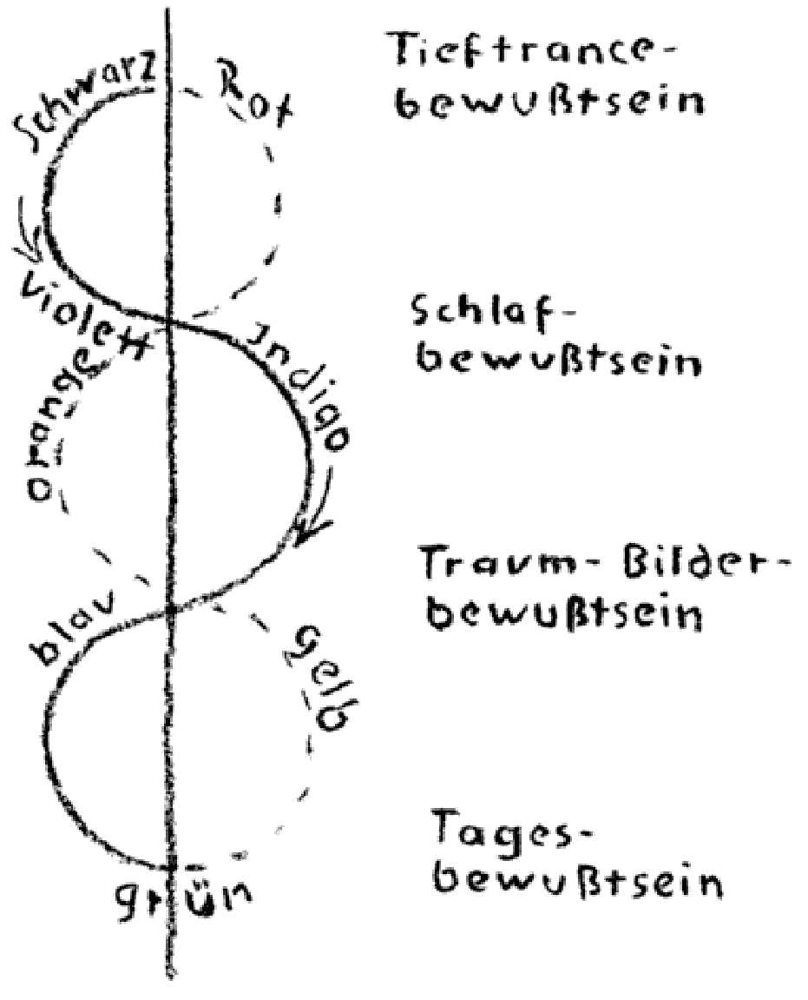

Der Mensch trennt sich von der geraden Linie ab und verbindet sich mit ihr wieder auf der Sonne, wo er das Schlafbewußtsein durchmacht, geht dann weiter wie diese Spirallinie zeigt, um auf dem Monde das Bilderbewußtsein zu erreichen. Und heute steht der Mensch, wiederum nach verschiedenen Wandlungen, auf der Stufe des hellen Tagesbewußtseins. Das helle Tagesbewußtsein behält der Mensch nun für alle folgenden Zeiten bei und erobert sich bewußt jene Bewußtseinszustände hinzu, welche er auf früheren Stufen dumpf gehabt hat. So erobert er sich das Bilderbewußtsein wieder hinzu auf dem Jupiterzustand der Erde; das wird ihn befähigen, wieder um sich herum Seelisches wahrzunehmen. Diese Entwicklung geschieht aber so, daß sein helles Tagesbewußtsein nicht abge|240|schwächt, nicht dumpf wird, sondern daß er auf dem Jupiter zu seinem Tagesbewußtsein das Bilderbewußtsein hinzu haben wird. Man könnte sagen: Das Tagesbewußtsein hellt sich auf zum Bilderbewußtsein (siehe Zeichnung: unterbrochene Linie). Dann bekommt er das Schlafbewußtsein, das er auf der Sonne hatte, wiederum auf dem Venuszustande der Erde; dies wird ihn befähigen, tief hineinzuschauen in die Wesenheiten, wie es heute nur der Eingeweihte kann. Der Eingeweihte macht den geraden Weg durch, er entwickelt sich in gerader Linie, während die normale Entwicklung des Menschen die ist, die in Windungen verläuft. Und aufsteigend erlangt der Mensch dann auf dem Vulkan auch das erste Bewußtsein wieder, das Trancebewußtsein, wobei er aber alle die anderen Bewußtseinszustände behält. So macht der Mensch eine Entwicklung in absteigender und eine in aufsteigender Linie durch. Diese Linie können Sie immer wiederkehren sehen. Es ist dieser Weg des Absteigens und des Aufsteigens eine real vorhandene Linie, die ihren Ausdruck gefunden hat im Caduceus, in dem Merkurstab.

[Der folgende Abschnitt ist in allen Mitschriften nur lückenhaft wiedergegeben.] So sehen wir, wie die Symbole, die wir auf diese Weise bekommen, tief begründet sind in dem ganzen Wesen unseres Weltengeschehens. Und eine solche Linie wie der Caduceus hat auch eine erzieherische Bedeutung für den Menschen, wenn er sich dieser Figur meditativ hingibt. Niemand kann sich diese Figur einprägen, ohne daß sie eine tief innerliche erzieherische Wirkung auf ihn ausübt. Der Seher hat diese Linie herausgeholt aus den geistigen Welten, um den Menschen etwas zu verleihen, das sie zu künftigen Sehern macht. Was man beim Meditieren über diese Linie entwickeln muß, sind bestimmte Empfindungen. Zuerst empfinden Sie dumpfe Finsternis. Sie starren hinein in die Finsternis, nach und nach fängt sie an sich aufzuhellen und nimmt violette Farbe an, dann Indigo, Blau, Grün, Gelb, Orange, Rot, und nun zurück, wobei eine gewisse Spiegelung der Entwicklung stattfindet, bis Sie wiederum zum Violett aufgestiegen sind. Beim Verfolgen dieser abgetönten Linie werden Ihre Empfindungen übergehen vom Qualitativen der Farbnuancen zu moralischen Empfindungen. Wenn Sie |241| diese Linie nicht bloß als Kreide- oder Bleistiftlinie empfinden, sondern, indem Sie ins Schwarze hineinschauen, versuchen, sich das Düstere vor die Seele zu stellen, beim Violetten sich das Hingebende vorstellen, und so weiter durchgehend durch die anderen Farben, das Blau, Grün, Gelb, Orange, sich dann beim Roten das Freudige vor die Seele rufen, dann wird Ihre Seele eine ganze Skala von Empfindungen durchmachen, die zuerst Farbempfindungen sind und dann moralische Empfindungen werden. Dadurch, daß in der Seele sich abspiegelt die Form des Merkurstabes in Empfindungen, gliedert sich ihr etwas ein, was die Seele befähigt, die höheren Organe auszubilden. Durch das reale Symbol wird sie so umgestaltet, daß sie die höheren Organe in sich aufnehmen kann.

Wie einst die Einwirkung des äußeren Lichtes aus gleichgültigen Organen die Augen hervorgezaubert hat, ebenso zaubert die Hingabe an die Symbole der geistigen Welt die Organe für die geistige Welt hervor. Ganz unmöglich ist es zu sagen: Ich sehe ja noch gar nicht, was da entstehen soll. - Das wäre ebenso, wie wenn der Mensch, der noch keine Augen hatte, gesagt hätte: Ich will nicht das Licht auf mich wirken lassen. - Wir müssen erst unterrichtet werden, was zur Entwicklung der inneren Organe führen kann, dann können wir die Geheimnisse der geistigen Welt um uns wahrnehmen.

# OKKULTE ZEICHEN UND SYMBOLE - ACHTER VORTRAG, Köln, 29. Dezember 1907

|242| Ich möchte heute noch einige charakteristische Symbole und Zeichen besprechen, damit wir uns immer klarer und klarer über das eigentliche Grundthema unserer Vorträge werden, das ja darin bestehen soll, zu zeigen, wie Zeichen und Symbole in Beziehung stehen zur astralen und zur geistigen Welt, die man auch die devachanische Welt nennt.

Wir haben gesehen, daß die Symbole und Bilder und die wirklich aus der Natur und Wesenheit der höheren Welten herausgeholten Zahlen- und Formenverhältnisse, wenn die Seele sie aufgenommen hat, in ihr wirkliche Seelenkräfte in Form von Vorstellungen, Gedanken, Ideen und Empfindungen hervorrufen, die gestaltende Wirkung haben. Ja, wir konnten sogar sehen, daß die Arche Noah für den gegenwärtigen physischen Leib des Menschen gestaltend war, und daß der Salomonische Tempel, wenn er in seinen Formen auf die Menschen der Gegenwart wirkt, eine große Bedeutung für die Gestaltung des Menschen in der sechsten Rasse haben wird. Aus diesen Angaben können Sie schon ersehen, daß durch die Führer der Menschheit, die fortwährend am Entwicklungsgange der Menschheit tätig sind, eigentlich ein ähnlicher Weg eingeschlagen wird wie für den einzelnen Menschen in den elementaren Geheimschulen. Auch da haben wir es zu tun mit einer Konzentration von Empfindungen, Gedanken, Vorstellungen und so weiter – es kommt noch manches andere hinzu –, die wirksam und gestaltend sind für den Menschen.

Es herrscht in den verschiedenen okkulten Strömungen der Gegenwart vielfach die Meinung, als ob es in unserer Zeit auch auf anderem Wege als durch die Anwendung imaginativer und symbolischer Vorstellungen, ein Aufsteigen in die höheren Welten geben könne. Und es ist bei den Menschen der Gegenwart mit einer gewissen Furcht, ja sogar Aversion verbunden, in die astrale Welt mit Hilfe symbolischer Zeichen oder sonstiger okkulter Erziehungsmittel |243| aufzusteigen. Wenn man die Frage aufwirft: Sind solche Furchtzustände berechtigt?, so kann man sagen: Ja und Nein. - In einer gewissen Beziehung sind sie berechtigt; in einer anderen Beziehung sind sie ganz und gar nicht am Platze, weil in die höheren Welten niemand wirklich hinaufkommen kann, ohne durch die astrale Welt hindurchzugehen. Es ist eine irrige Annahme, wenn jemand meint, er könne mit verbundenen Augen durch die astrale Welt hindurchgehen. Nur müssen Sie sich darüber klar sein, daß die geistige Welt als solche verschiedene Gebiete hat. Der Mensch ist durch die astrale Welt heruntergestiegen in die physische Welt, und er muß durch die astrale Welt wiederum hinaufsteigen in die geistige Welt. Was vermieden werden muß, ist, daß der Mensch bei seiner Entwicklung in frühere Zustände zurückfällt. Der Mensch darf niemals in frühere Zustände zurückfallen. Jeder mediale Zustand ist ein Zurückfallen in einen früheren Zustand, während wahre Geheimschulung ein Aufsteigen in höhere Zustände ist. Der Mensch muß durch die astrale Welt mit vollem, hellem Tagesbewußtsein hinaufsteigen, um in die höheren Gebiete der geistigen Welt zu gelangen. Was der heutige Mensch an Begierden, Leidenschaften, Instinkten in sich trägt, das ist verankert im Astralleib, deren Träger ist der Astralleib. Der Mensch muß, wenn er aufsteigen will in höhere Welten, allerdings wiederum mit Empfindungen und Gefühlen arbeiten; einen anderen Weg gibt es nicht. Aber es handelt sich darum, daß er niemals versuchen soll, anders als unter voller Aufrechterhaltung der Errungenschaften unserer physischen Welt in die höheren Welten hinaufzukommen, das heißt, niemals mit einer Herabdämpfung des Bewußtseins. Wenn wir Medien betrachten, finden wir immer, daß sie in einen früheren Bewußtseinszustand zurückgeworfen werden. Ihr helles Tagesbewußtsein wird heruntergedämpft, abgeschwächt, und ein früherer Bewußtseinszustand, den der Mensch schon überwunden hat, wird hervorgerufen. Wer in modernem Sinne Hellseher werden will, muß sein gegenwärtiges helles Tagesbewußtsein behalten und mitnehmen. Das kann er nur dadurch, daß er durch den Punkt des «sinnlichkeitsfreien Denkens» hindurchgeht, und niemals kann irgend etwas passieren, wenn der Mensch durch das |244| sinnlichkeitsfreie Denken hindurchgeht. Machen wir uns ganz klar, was das heißt.

Sinnlichkeitserfülltes Denken und Vorstellen ist ein jegliches, das ausgeht von dem sinnlichen Wahrnehmen der uns umgebenden Gegenstände. Wenn Sie Ihre Vorstellungen so bilden, daß Sie zunächst einen Gegenstand ansehen, wahrnehmen, und ihn dann im Gedächtnis behalten, und Ihr Gedankenleben verläuft so, daß Sie angeregt sind durch solche Vorstellungen, dann haben Sie ein sinnlichkeitserfülltes Denken. Dies füllt den weitaus größten Teil der seelischen Erlebnisse des gegenwärtigen Menschen aus. Und wenn der Mensch einmal mit sich zu Rate geht, wieviel ihm bleibt, wenn er alle Vorstellungen aus seiner Seele herauswirft, die durch sinnliche Wahrnehmung veranlaßt sind, dann wird er erst einmal gewahr werden, was da noch an Inhalt in der Seele ist. Wenn die Vorstellungen, die durch Äußeres angeregt wurden, weggebracht sind, dann begreift er, was der griechische Philosoph Plato meinte, als er vor das Tor seiner Schule schrieb, kein mit Geometrie Unbekannter solle eintreten. Das ist so gemeint, daß kein solcher eintreten solle, der sich nicht zu einem sinnlichkeitsfreien Denken erheben konnte. Keine gewöhnliche Geometrie hat er verlangt. Das wird auch heute nicht von denen verlangt, die zu höheren Welten aufsteigen wollen. Es würde auch heute aus inneren sachlichen Gründen nicht notwendig sein. Aber an den geometrischen Vorstellungen kann man sich eine Idee bilden, was sinnlichkeitsfreies Denken ist. Wenn Sie hier drei Bohnen hinlegen, noch drei Bohnen dazulegen, und noch einmal drei Bohnen, dann können Sie an diesem sinnlichen Eindruck lernen, daß 3 mal $3 = 9$ ist. Das Kind oder der primitive Mensch lernt es an den Fingern. Das ist sinnlichkeitserfülltes Denken. Wenn Sie nicht mehr die Finger brauchen oder die Bohnen, sondern wenn Sie dasselbe lernen durch rein geistige Anschauung, dann ist das sinnlichkeitsfreies Denken. Das Kind geht beim Lernen von einer Brücke aus [Bohnen oder Finger], und erhebt sich erst später zu einem sinnlichkeitsfreien Denken. Wenn wir an die Tafel einen Kreis zeichnen, so ergibt dies in Wirklichkeit keinen Kreis; was wir da hinzeichnen, ist eine Anhäufung von kleinen Kreidebergen. Sie wer |245| den mit der sinnlichen Wahrnehmung allein nicht erfassen können, was ein wirklicher Kreis ist. Nur der geistig angeschaute, innerlich konstruierte Kreis ist sinnlichkeitsfrei.

Das beste Mittel für einen größeren Menschenkreis, zu einem sinnlichkeitsfreien Denken zu kommen, ist heute die Theosophie, wenn die Theosophie so aufgefaßt wird, daß der Mensch lernt, die Vorstellungen loszulösen von der Sinnlichkeit. Namentlich auf den Gebieten, die ein wenig über das Allerelementarste hinausgehen, wird der Mensch durch Theosophie zu sinnlichkeitsfreiem Denken geführt. Wenn Sie sich zum Beispiel klarmachen wollen, was der Ätherleib oder der Astralleib ist, so können Sie diese ja äußerlich nicht sehen. Gerade das gibt Ihnen die Theosophie, daß sie Dinge beschreibt, die Sie äußerlich nicht sehen können. Oder wenn wir in der Theosophie den alten Mond beschreiben, dann entwerfen wir von ihm ein Bild, ein möglichst drastisches sogar, in dem wir sinnliche und übersinnliche Vorstellungen zusammenfügen, so daß ein materialistisch gesinnter Mensch sagen würde: Der malt da etwas hin, was gar nicht möglich ist. - Ja, man muß in der Theosophie etwas für heutige Verhältnisse geradezu Unmögliches lehren und den alten Mond so beschreiben, daß auf ihm keine solchen Felsen, Mineralien und Steine waren, wie sie heute auf unserer Erde sind. Der ganze alte Mond bestand aus einer lebendigen Substanz, die man vergleichen könnte in der Dichtigkeit mit einer Art Spinatbrei oder Kochsalat, also ein Körper zwischen Mineralien und Pflanzen mittendrin, ein halb pflanzlicher, halb mineralischer Körper. Wir finden auf dem alten Mond etwas wie ein halb-pflanzliches Leben. Solche Mineralien wie heute gab es damals noch nicht. Wenn Sie die heutigen Torfmoore betrachten, wo auch eine Art halb-pflanzliche Substanz ist, würden Sie ein äußerlich ähnliches Bild bekommen, wie die Substanz des alten Mondes war. Statt Felsen und Berge würden Sie auf dem alten Monde höchstens so etwas gefunden haben, wie es heute die Borke unserer Bäume ist. Nun wird Ihnen jeder Naturforscher heute einwenden, so etwas könne nicht als Planet existieren. - Aber darauf kommt es ja gerade an - und es ist eine Notwendigkeit, um andere Entwickelungsepochen zu verstehen -, daß |246| der Mensch sein Denken losreißt von dem, was heute den Vorstellungen von gewöhnlichem sinnlichen Denken und Empfinden anhaftet, und zu einem sinnlichkeitsfreien Denken kommt. Sinnlichkeitsfreies Denken ist nicht abstraktes Denken, sondern sehr, sehr wirkliches Denken. Wenn wir uns den alten Mond als eine An großen Kochsalat denken mit eingeschlossener Borke und so weiter, so ist das «sinnlich-übersinnlich» gedacht, wie Goethe sagt. Indem Sie Farbe und Form loslösen von der Sinnlichkeit und sie frei in den Raum hinaus; projizieren, haben Sie durch sinnlichkeitsfreies Denken Vorstellungen gewonnen. Wer dies als eine feste Grundlage betrachtet, der wird niemals straucheln können beim Aufsteigen in höhere Welten.

Wir wollen uns einmal eine schematische Zeichnung machen. Manches wird ja durch unrichtiges symbolisches Zeichnen unklar.

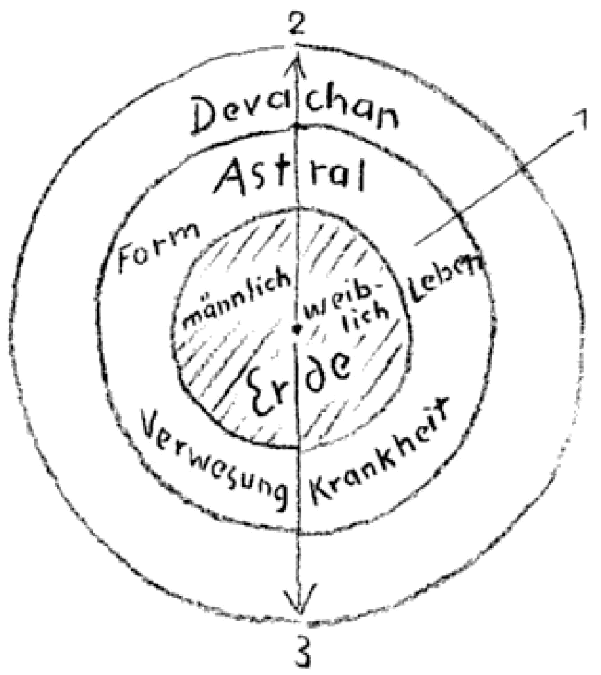

So genügt es zwar für das Verständnis gewisser Verhältnisse, wenn man den physischen Plan, den Astralplan und den Devachanplan übereinander zeichnet; richtiger ist es aber, sich die physische Welt als eine in sich geschlossene Sphäre vorzustellen, wo das Astralische ringsherum ist, und das Devachanische dann wieder um dieses her|247|um. Statt horizontale Schichten zu zeichnen, ist es gut, die Sache so (siehe Zeichnung) zu zeichnen, weil dies eine Möglichkeit bietet, zwei Gebiete des Astralplanes voneinander zu unterscheiden.

Wenn wir in zwei ganz bestimmte Gebiete des Astralplanes hineinschauen, die wir mit dem Pfeil 1 hier bezeichnen, so gibt es in der astralen Welt für das, was wir hier auf der Erde das Männliche und das Weibliche nennen, die beiden Gegensätze «Form» und «Leben». Form und Leben sind Gegensätze auf dem Astralplan. Nun würden wir aber, wenn wir auf dem Astralplan Form und Leben treffen wollen, sie nur treffen, wenn wir in dieser Richtung (von der Mitte nach oben, siehe Pfeil 2) gehen. Gehen wir nach der anderen Seite (Mitte nach unten, siehe Pfeil 3), so treffen wir dort keineswegs den wohltätigen Gegensatz von Form und Leben an, sondern wir treffen den Gegensatz «Verwesung» und «Krankheit» an. Wenn wir also von der physischen Welt ausgehen, treffen wir auf dem Astralplan nach oben den Gegensatz Form und Leben; dem entspricht in der astralen Welt nach unten, also gleichsam unter das Physische hinuntergehend, der Gegensatz von Verwesung und Krankheit. Immer wenn wir nach der einen Seite gehen, wo wir für die physische Welt wohltätige Eigenschaften sehen, entsprechen diesen auf der anderen Seite für die physische Welt zerstörende, schädliche Einflüsse. Da haben wir jetzt eine Möglichkeit, zu unterscheiden zwischen den Teilen des Astralplanes. Auf die menschliche Seele wirken tatsächlich zwei ganz voneinander verschiedene Gebiete des Astralplanes.

Wenn wir uns eine Vorstellung davon bilden wollen, wie diese zwei ganz verschiedenen Gebiete auf die Seele wirken, müssen wir uns denken, daß wir beim Menschen haben: den physischen Leib, den Ätherleib, den Astralleib; und je nach deren Ausbildung, die ja öfter beschrieben worden ist: Manas oder Geistselbst, Budhi oder Lebensgeist, und Atma oder den Geistesmenschen; und zwischen drinnen haben wir, vom Ich erfüllt, das Seelische. So daß wir in gewisser Beziehung unterscheiden können: Leib - der eigentlich die drei Leiber umfaßt -, Seele und Geist. Nun spiegeln sich in der Seele die drei unteren Glieder Astralleib, Ätherleib und physischer Leib. Insofern sich physischer Leib, Ätherleib und Astralleib in ihrer ur|248|sprünglichen Art spiegeln, versetzen sie in die Seele des Menschen niedere, herunterziehende Eigenschaften. Aber es spiegelt sich im Menschen auch das, was das Obere ist: Manas, Budhi, Atma, und dadurch haben wir in der Seele ebenso heraufziehende, läuternde Elemente. Im strengen Christentum wußte man auch von dieser zweifachen Art der Spiegelung in der menschlichen Seele. Man sah, es spiegelt sich die höhere Menschennatur in der Seele, oder es spiegelt sich die untere Natur in der Seele. Das ahnten manche, auch wenn es nicht Esoteriker waren. Deshalb sagte man: Wenn der Mensch zum Tode kommt, nimmt er die Spiegelung der geistigen Welt als die Gesetzessammlung des Moses wahr; und wenn sich das Untere in der Seele spiegelt, wird der Seele im Tode vom Teufel das Sündenregister vorgelesen.

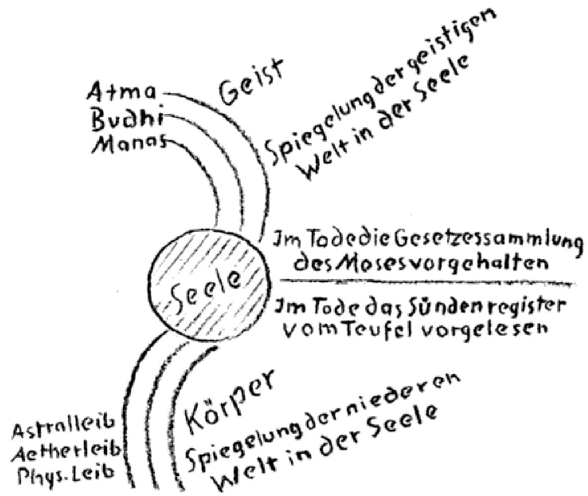

Das bedeutet, es werden der Seele alle Eigenschaften vor das Auge gestellt, die ihr anhaften: Das, was sich von oben spiegelt, wird ihr als Gesetzestafel des Moses vorgehalten; und das Untere, das sich in der Seele spiegelt, wurde beschrieben, indem man sagte: Der Teufel liest der Seele das Sündenregister vor. Wenn der Weg nicht richtig |249| eingeschlagen wird von der Seele, kann die Seele allerdings in ihre niederen Leidenschaften versinken; das kann eintreten. Das darf aber nicht als ein Abschreckungsmittel vor den Menschen hingestellt werden.

Alle auf Imaginationen, auf das Bildliche hinzielenden Vorstellungen erziehen den Menschen, um ihn allmählich zu jenem Punkte der Lebensentwicklung zu bringen, wo er lernt, immer mehr und mehr in die höheren Welten hineinzublicken. Bildhafte Vorstellungen, wie zum Beispiel die Vorstellung vom alten Mond, sind ein mächtiges Erziehungsmittel nach dieser Richtung. Durch solche Vorstellungen bringt man die Entwickelungsidee in richtiger esoterischer Art an den Menschen heran. Wenn man vor den Menschen nur trockene, abstrakte Begriffe hinstellt, bleibt er mit dem Denken auf dem physischen Plan, denn das gewöhnliche Denken als solches kommt niemals vom physischen Plan weg. Es ist zwar eine Herunterspiegelung vom Devachanplan; aber der Gedanke, den der Mensch hegt, ist etwas, was zum physischen Plan gehört, er ist nur wie ein Schattenbild der höheren Vorgänge. Wenn Sie sich noch so feine Vorstellungen davon bilden, wie die Entwicklung vor sich geht, wie ein Wesen auf der ersten Stufe des Daseins sich differenziert, sich herabsenkt und umhüllt, - das sind alles nur Vorstellungen, die Ihnen Begriffe des physischen Planes geben, die Sie aber nicht in der Entwicklung weiterbringen. Erst sinnlich-übersinnliche Vorstellungen und Begriffe können Sie nach und nach wirklich eine Stufe weiterbringen. Zuerst muß man die Begriffe in Bilder, in Imaginationen umwandeln und diesen Vorgang immer und immer wiederholen.

Wenn man dieses Vorgehen, das zum Beispiel in den Rosenkreuzer-Schulen gelehrt wurde, in einen Dialog zwischen Lehrer und Schüler fassen würde, so konnte man das so ausdrücken: - In Wirklichkeit hat ein solcher Dialog nie so stattgefunden, wir können es aber einmal so darstellen, um zu zeigen, was der Schüler in langen, langen Erlebnissen nach und nach durchmachen mußte. - Der Lehrer sagte dem Schüler: Sieh dir einmal die Pflanze an, wie sie ihre Wurzel in die Erde hinein richtet, wie sie mit dem Stengel und der Blüte der Sonne entgegenwächst und ihre Fruchtorgane zur Entfal|250|tung bringt. Und jetzt stelle dir dagegen den Menschen vor. - Der Mensch wird schlecht verglichen mit der Pflanze, wenn man seinen Kopf mit der Blüte und seine Fortpflanzungsorgane mit der Wurzel der Pflanze vergleicht. Selbst Darwin, der große Naturforscher, hat diesen Vergleich richtig gebraucht, indem er den Kopf des Menschen mit der Wurzel der Pflanze verglich, so daß selbst für Darwin die Pflanze der auf den Kopf gestellte Mensch ist. Was die Pflanze keusch dem Sonnenstrahl entgegenhält, ihre Fortpflanzungsorgane, das richtet der Mensch dem Mittelpunkte der Erde zu, so daß wir also im Menschen eine Umkehrung der Pflanze zu denken haben, indem er alle die Kräfte, die bei der Pflanze nach dem Mittelpunkte der Erde gerichtet sind, frei nach dem sonnenerfüllten Kosmos richtet, und jene Organe, die die Pflanze keusch dem Sonnenstrahl entgegenstreckt, schamvoll nach der Erde richtet. Das Tier steht mitten darinnen.

Wenn wir daher die realen, in der Welt vorhandenen Kraftrichtungen zeichnen wollen, können wir das so tun:

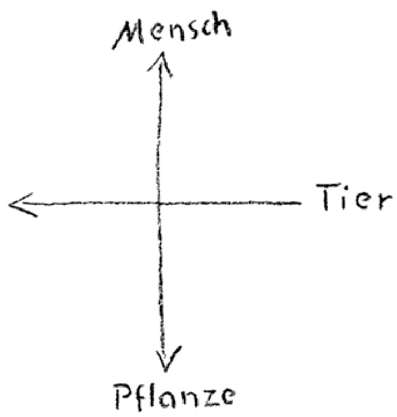

Die wahre esoterische Bedeutung des Kreuzeszeichens ist eine Summe von Kräften. Die eine Kraftrichtung geht nach unten: das Pflanzenwesen wird dirigiert von dieser Kraft. Beim Menschen ist sie |251| nach der entgegengesetzten Seite gerichtet. Das Tier hat sein Rückgrat horizontal gerichtet, bei ihm zeigt sich die Kraft horizontal die Erde umkreisend. Das seelische Prinzip steigt hinauf vom Pflanzendasein zum Tierdasein, zum Menschendasein. Und Plato, der so oft Dinge zum Ausdruck brachte, die der Einweihung entstammen, sprach den schönen Satz aus: Die Weltenseele ist an den Weltenleib gekreuzigt. - Das heißt, die Weltenseele geht durch Pflanze, Tier und Mensch hindurch; sie ist gekreuzigt in den Kräften der drei Reiche: Pflanzenreich, Tierreich und Menschenreich. Und wenn wir so das Kreuz hineinschreiben in die drei Naturreiche, dann wird uns das Kreuz zum Zeichen der Entwicklungsrichtung.

Nun sagte also der Lehrer zum Schüler: Du hast dir vorzustellen, wie die Pflanze ihren Kelch dem Sonnenstrahl entgegenstreckt, wie die Fruchtorgane zur Reife kommen, wenn die Pflanze geküßt wird vom Sonnenstrahl. - Die Entwicklung zum Menschen geschieht dadurch, daß die reine keusche Pflanzensubstanz durchzogen wird von Begierden, Instinkten und Leidenschaften. Dadurch erobert sich der Mensch sein Bewußtsein, dadurch wird er zum Menschen, daß er hindurchgeht durch die Tiernatur. Dadurch, daß der Mensch in die reine Pflanzennatur die niedere Begierdennatur hineinverwoben hat, ist er auf der anderen Seite aufgestiegen vom dumpfen Pflanzenbewußtsein zum hellen Tagesbewußtsein.

Von dieser Stufe des gegenwärtigen Menschen wies der Lehrer den Schüler auf eine höhere Stufe hin. So wie der Mensch sich aus einem Zustand heraufentwickelt hat, wie ihn die Pflanze hat, so wird er auch seine Instinkte und Begierden wiederum läutern zu einer höheren, keuschen Stufe. Der Lehrer zeigte dem Schüler die Anlagen im physischen Leibe des Menschen, durch welche die höheren Stufen des Bewußtseins errungen werden können und die menschliche Substanz wiederum zu einer der Pflanze ähnlichen Substanz werden kann. Ein jegliches Wesen muß einen physischen Leib benutzen, wenn es auf der Erde erscheinen will. Aber der Leib des Menschen wird sich in der Zukunft immer mehr und mehr umgestalten. Wir unterscheiden in bezug auf die menschlichen Organe eine absteigende und eine aufsteigende Entwicklung. Ein Teil der menschlichen |252| Organe ist in absteigender Entwicklung; diese wird der Mensch im Laufe der Zeit, die allerdings nach Jahrtausenden zählt, abwerfen. Andere Organe sind im Werden, sie werden in der Zukunft eine Höherentwicklung haben, zum Beispiel der menschliche Kehlkopf; er ist erst im Anfange seiner Entwicklung. Eine andere Höherentwicklung wird das menschliche Herz nehmen, das in der Zukunft ein ganz anderes Organ werden wird. Während andere Organe ihren Höhepunkt bereits überschritten haben, sich abschnüren von der menschlichen Natur und verdorren, haben wir im Herzen ein Organ, das erst am Anfange seiner Entwicklung ist.

Wir können bei den Muskeln des Menschen quergestreifte und längsgestreifte unterscheiden; das sind willkürliche und unwillkürliche Muskeln. Die willkürlichen Muskeln der Hand zum Beispiel sind quergestreift. Die Muskeln der Gedärme dagegen, welche die Speise unwillkürlich vorwärtstreiben, sind längsgestreift. Das Herz macht hierbei eine Ausnahme, und das ist für die heutigen physiologischen und anatomischen Wissenschaftler eine Crux. Das Herz gehört zwar zu den unwillkürlichen Muskeln, aber es hat quergestreifte Muskulatur. Daher können unsere Anatomen auch das Herz nicht begreifen. Sie betrachten ja alle Organe als gleichartig. Wenn man die Organe geistig betrachtet, können sie durchaus chemisch aus denselben Bestandteilen bestehen, aber doch kann das eine in einer absteigenden und das andere in einer aufsteigenden Entwicklung sich befinden. Das Herz ist auf dem Wege, in der Zukunft ein willkürlicher Muskel zu werden, es trägt in seinem anatomischen Bau schon jetzt die charakteristischen Merkmale dafür. Heute ist davon nur sehr wenig zu merken. Heute trägt es dazu bei, daß seelische Erlebnisse auf das Blut wirken. Sie können sehen, wie, wenn Sie ein Angstgefühl bekommen, die Blutmasse von der Peripherie des Leibes nach dem Innern sich zurückzieht, oder wie bei Auftreten von Schamgefühl das Blut vom Innern des Leibes nach der Peripherie hingetrieben wird. In der Zukunft wird außer der Umgestaltung des Herzens auch eine Umgestaltung unseres Kehlkopfes vor sich gehen. Heute dient der Kehlkopf dazu, meine Gedanken in Worte umzusetzen, indem er die Luft in Schwingungen versetzt. Sie |253| können mit Ihren Ohren meine Worte aufnehmen und hören; das wird durch die Schwingungen der Luft verursacht. Der heutige menschliche Kehlkopf ist imstande, in Luftschwingungen umzusetzen, was in der Seele vorgeht. Der zukünftige Menschenleib wird seinen Kehlkopf zum Befruchtungsorgan umgestalten, und das Wort, das heute nur in der Luft schafft, wird zukünftig in unserer Umgebung schaffend werden. Die Reproduktion wird dann durch den Kehlkopf vor sich gehen, der die Rasse der Zukunft schaffen wird.

So wie der Lehrer den Schüler hinwies auf den keuschen Pflanzenkelch, und wie er hinwies auf den Menschen, der im Herabsteigen seine Pflanzensubstanz durchzogen hat mit der niederen Natur der Leidenschaften, Begierden und Instinkte, dafür aber eingetauscht hat sein heutiges helles Tagesbewußtsein, so zeigte der Lehrer, wie der gegenwärtige Mensch aufsteigen wird zu höheren Bewußtseinszuständen, und wie der zukünftige Mensch die von Begierden erfüllte Substanz wiederum umwandeln wird zu reinen und keuschen Organen. Auf Vergangenheit, Gegenwart und Zukunft wurde der Schüler hingewiesen. Wie der Kelch der Pflanze keusch der Sonne sich entgegenstreckt und ihre Fruchtorgane der Sonne entgegenwachsen, das wird wieder da sein auf einer höheren Stufe, wo der Mensch seinen Kehlkopf als Kelch dem geistigen Sonnenstrahl darbieten wird. Diesen geistigen Kelch, das umgestaltete Sprachorgan, nannte man den Heiligen Gral. Das ist ein reales Ideal. Anfang, Mitte und Ende der Menschheitsentwicklung, hier sehen Sie den Entwicklungsgedanken der Menschheit verwandelt in ein Bild.

Durch die Empfindungen, die wir an diesen Bildern entwickeln, strömen uns die Kräfte zu, die uns wirklich die höheren Welten erschließen. Alles geht ohne Zauberei vor sich. An den Bildern werden die Empfindungen angeregt, die den Menschen hineinführen in die höheren Welten. Gefühle und Empfindungen führen den Menschen in die astrale Welt, wie der Wille ihn in die devachanische oder Geisteswelt führt. Denken entspricht der physischen Welt, Gefühl der astralischen Welt und der geläuterte Wille der Devachanwelt.

|254| Wenn wir die Pflanze in der ursprünglichen keuschen Substanz betrachten, so finden wir das Grün als Farbe im Leben der Pflanze. Die Pflanze ist in denjenigen Teilen, in denen der Ätherleib lebendig tätig ist, durchdrungen vom Blattgrün, von dem, was man das Chlorophyll nennt. Der Ätherleib hat ein Grundgesetz, das ist das Gesetz der Wiederholung. Würde in der Pflanze nur der Ätherleib allein tätig sein, so würde sich immer wieder ein und dieselbe Form wiederholen; Blatt um Blatt setzt sie an. Wenn aber der Astralleib der Erde auf die Pflanze einzuwirken beginnt, schließt sie das Wachstum ab und setzt die Blüte an. Die Wirkung des Ätherleibes offenbart sich in der Wiederholung. Auch beim menschlichen Wachstum macht sich dieses Prinzip geltend. Der Ätherleib zeigt seinen Einfluß in der Bildung der Rückenwirbel, die aber da ihren Abschluß findet, wo der Astralleib zu wirken beginnt und sich die Schädelkapsel wölbt. Wir können daher auf den ätherischen Leib nur einwirken durch das Prinzip der Wiederholung. Wenn Sie denken und begreifen, so wirkt das nur auf den Astralleib. Wenn Sie aber zum Beispiel beten oder meditieren und täglich dasselbe Gebet oder dieselbe Meditation wiederholen, so wirken Sie bis in den Ätherleib hinein. Die Dinge sind so, daß im Kosmos sich zuerst das Prinzip der Wiederholung zeigt in den Taten des Ätherleibes, dann das Prinzip des Abschlusses durch den Astralleib. Wo der Astralleib sich zurückzieht, tritt mit Selbstverständlichkeit wieder das Prinzip der Wiederholung auf. So wachsen Ihre Haare und Nägel, weil sich der Astralleib dort zurückgezogen hat. Es schmerzt ja auch nicht, wenn Sie sich die Haare abschneiden, denn der Schmerz ist ein Ausdruck des Astralleibes.

Wir haben zunächst die reine keusche Pflanzensubstanz, wo die Pflanze, lediglich dem Gesetz des Ätherleibes unterliegend, Blatt für Blatt ansetzt. Jetzt durchdringt diese reine keusche Pflanzensubstanz immer mehr dasjenige, was in der Theosophie das Kama genannt wird, das Instinkt- und Empfindungsmäßige, das Begierdenreich, bis hinauf zu den Vorstellungen. Und nun soll im Menschen dasjenige wieder überwunden werden, was sich in ihm hinauf entwickelt hat, seit er eine Pflanzennatur hatte. Indem der Mensch sich hinaufentwickelte, hat er in sich das rote Blut aufgenommen. Durch |255| das rote Blut wird dasjenige im Menschen bewirkt, was ihn selbstbewußt macht. Es ist das von astralischer Substanz und vom Ich durchzogene Chlorophyll der Pflanze, das sich umgewandelt hat in das rote Blut. Wenn Sie die grüne Pflanzensubstanz durchziehen könnten mit Ich und astralischer Substanz, würden Sie das rote Blut bekommen. Denken Sie nun an das Bild des Kreuzes. Im Bild des Kreuzes haben Sie auch etwas, das auf des Menschen Zukunft hinweist. Wo liegt des Menschen Zukunft? Die Pflanzennatur soll er wieder erringen, aber verbunden mit der höheren Stufe des Bewußtseins, die der heutige Mensch sich schon errungen hat. Die roten Rosen des Rosenkreuzes bezeichnen, was durch das Blut errungen wurde, aber auch, was er als Pflanzennatur hatte und wieder haben soll. Das ist vorgebildet in der Rose. Sie hat Pflanzennatur, und sie hat auch die rote Farbe des Blutes. In den grünen Blättern wirkt der Ätherleib, in der roten Blüte, wo der Abschluß ist, wirkt der Astralleib; die Rosenblüte verdankt das Rot den intensivsten Einwirkungen des Astralleibes der Erde.

Der Astralleib des Menschen wird künftig frei werden und bewußt von außen, von außerhalb des physischen Leibes wirken, so wie jetzt der Astralleib der Erde auf die Rose wirkt. Dann wird das, was jetzt als Pflanzenrose auf niederer Stufe da ist, auf höherer Stufe erscheinen als die Menschenrose. So haben wir in dem Kranz von Rosen, der das schwarze Holz des Kreuzes umgibt, tatsächlich ein Zeichen für die Entwicklung des Menschen. In dem schwarzen Holz blicken wir auf das Absterbende, es ist ein Bild für das, was auch beim Menschen absterben wird. Und in der roten Rose blicken wir auf das, was sich weiter entwickeln wird bis zu jenem Kelch, der sich - wie der Pflanzenkelch der Sonne - den geistigen Sonnenstrahlen entgegenhält. Und das Rosenkreuz, wo die roten Rosen das schwarze Kreuz umgeben, stellt uns diesen Vorgang im Bilde dar.

Das ist das wesentliche bei den Symbolen, daß wir sie nicht bloß denken, sondern daß wir sie fühlen und empfinden. Denn nur, wenn wir an der roten Rose fühlen, daß sie uns sagt: das werdet ihr einstmals sein, das ist das, was euch das Ziel der Menschenentwicklung darstellt -, und wenn uns dabei das Herz aufgeht und unsere |256| Gefühle rein werden, dann werden die Kräfte in uns ausgelöst, die uns hinaufführen in eine höhere Welt. So sind diese Symbole Arbeiter an unserer Seele. Sie durchkraften und durchwirken unsere Seele, sie sind die größten und wirksamsten Erzieher unseres Menschen-geschlechtes.

So wie wir hier Bilder, Imaginationen vor die Seele hinstellen, so stellt man auf noch höheren Gebieten die inneren Kräfte der Zahlen vor den Menschen hin. Der Mensch muß lernen, die inneren Verhältnisse der Zahlen wie eine geistige Musik zu empfinden. Man kann die Verhältnisse des physischen Leibes, Ätherleibes, Astralleibes und Ich zueinander beschreiben, wenn man versucht, Bilder dafür zu geben, wie das Verhältnis dieser vier Glieder der menschlichen Natur zueinander ist. Dadurch erlebt der Mensch eine Art von Imagination. So kann man das Verhältnis von physischem Leib und Ätherleib zueinander beschreiben, indem man sagt: Der physische Leib entsteht dadurch, daß alle Kräfte und Stoffe, die im Mineralreich ausgebreitet sind, durch den Ätherleib verbunden sind; er würde zerfallen, wenn der Ätherleib ihn nicht durchdringen würde; der Ätherleib ist ein innerer Kämpfer gegen den Zerfall des physischen Leibes. Auf diese Weise arbeiten wir uns hinauf zu einer Vorstellung des Ätherleibes.

Und versuchen wir, eine bildhafte Vorstellung vom Astralleib zu gewinnen, so stellen wir uns vor, wie er herausrückt in der Nacht und von außen auf Ätherleib und physischen Leib wirkt, indem er die Ermüdungsstoffe fortschafft. Machen wir uns das bildlich klar. Nun gibt es aber eine noch höhere Art, sich dieses Verhältnis vorzustellen; da muß man sich den inneren Wert gewisser Zahlen vorstellen. Man muß erkennen, daß das Verhältnis von 1:3 etwas ganz anderes ist als das Verhältnis von 1:7. Das ist nicht gleichgültig. Man muß sich bei dem Verhältnis von 1:3 vorstellen, daß die 3 in sich selbst differenziert ist, und man muß sich die Wechselbeziehungen der einzelnen Größen zu den anderen vorstellen.

Worauf es aber ankommt, das ist das Verhältnis von 1:3:7:12. Wenn Sie das Verhältnis dieser Zahlen zueinander als Tonverhältnis auffassen, indem Sie sich vorstellen, daß ein Ton in einer bestimm|257|ten Zeit drei Schwingungen macht, ein anderer in derselben Zeit sieben Schwingungen, und noch ein anderer zwölf Schwingungen, dann haben Sie in diesen Zahlen jenes Verhältnis ausgedrückt, das in geistiger Musik das Verhältnis angibt von Ich, Astralleib, Ätherleib und physischem Leib.

Ich = 1
Astralleib = 3
Ätherleib = 7
physischer Leib = 12

Das hat seinen guten Grund im Weltendasein. Wenn wir die Entwicklung vom ältesten Saturndasein bis zum jetzigen Erdendasein verfolgen würden, könnten wir bald finden, wie dies im Menschen-dasein begründet ist. Die Erde war in ihrer ersten, in der Saturn-Verkörperung, umgeben von den zwölf Zeichen des Tierkreises. Sie gaben die erste Keimanlage zum physischen Leib. Durch die Einwirkung der entsprechenden Zeichen auf den Leib entstand dieses Verhältnis der Zwölfzahl zu den einzelnen Gliedern des physischen Leibes. Auf den Ätherleib wirkten die sieben Planeten. Als die Erde Sonne war, standen um sie die anderen Planeten, und so wirkte die Siebenzahl auf den Ätherleib. Als die Erde in ihrer Monden Verkörperung war, wirkte auf sie zunächst die Sonne. Dann aber entstanden dadurch, daß sich die Sonne und dann der Mond von der Erde abtrennten, aus einem Körper drei Körper, und dadurch wirkte bei der Bildung des Astralleibes die Dreizahl. Und als das Ich aus den höheren Welten herunterkam, drückte sich das aus in der Zahl Eins. Das Verhältnis von 1 : 3 gibt Ihnen das Verhältnis des Ich zum Astralkörper, zu 7 das Verhältnis zum Ätherleib, und zu 12 das Verhältnis zum physischen Leib.

1 : 3 : 7 : 12 bezeichnet also das Verhältnis der vier Wesensglieder des Menschen, das Sie innerlich fühlen müssen. Es ist nicht leicht, die Empfindungen zu erwecken, daß man den physischen Leib als den vollkommensten der vier Teile sich vorzustellen hat, den Ätherleib als den weniger vollkommenen, den Astralleib noch weniger |258| vollkommen, und das Ich als das «Baby» unter den vier Gliedern der Menschennatur. Man muß den physischen Leib zwölf mal so vollkommen denken wie das Ich, den Ätherleib siebenmal so vollkommen, und den Astralleib dreimal so vollkommen. Diese Zahlen geben die Vollkommenheitsgrade für die vier Glieder der Menschennatur an. Es werden uns also in diesen Zahlen tiefe Symbole für die realen Verhältnisse gegeben.

Es gab in den okkulten Schulen Anleitungen, die Zahlenwerte nach und nach kennenzulernen. So lehrte man die Bedeutung der Dreizahl, indem man sagte: Fassen wir einmal die Entwicklung der Pflanze ins Auge, da haben wir auf dreierlei zu achten. Fangen wir zunächst an beim Pflanzenkeim. Sie haben einen unscheinbaren, kleinen Pflanzenkeim, aus diesem entwickelt sich nach und nach die Pflanze. Wir können das zeichnerisch so darstellen, daß wir den

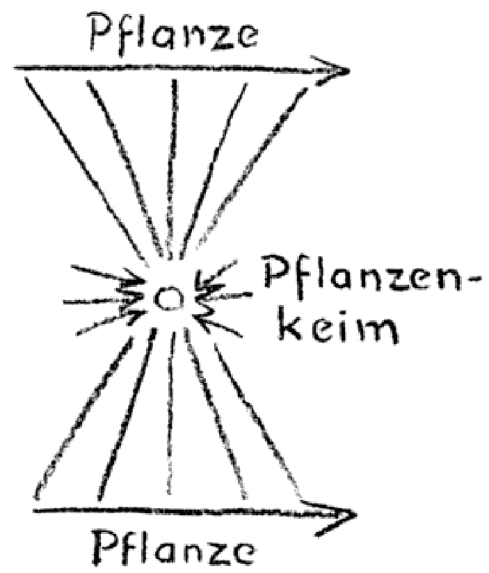

Pflanzenkeim strahlenförmig auseinandergehen lassen, bis zu Blättern, Blüten und Frucht. Nun ist der Keim zur Pflanze und dann aus der Pflanze wiederum der Pflanzenkeim geworden. Was in der Pflanze auseinandergewickelt zu Blättern, Blüte und Frucht geworden ist, das alles ist im Keim zusammengewickelt, es ist gleichsam hineingeschlüpft in den Keim. In einer entwickelten Pflanze ist alles |259| im Sinnlichen offenbart. Dann geht das Sinnliche in ein ganz Kleines hinein, in den Keim. Da haben wir im Keim das Sinnliche so klein wie möglich, das Geistige so groß wie möglich.

Aber noch ein Drittes findet statt. Während aus der Pflanze der Keim sich bildet und aus diesem wiederum die neue Pflanze entsteht, wirken fortwährend von außen elementare Kräfte der Umgebung auf die Pflanze. Der Keim ist da, der aus der Pflanze entstand, und aus ihm entsteht wiederum die neue Pflanze; aber das Dritte kommt aus der ganzen umgebenden Welt; und dieses Dritte ist es, was jede Pflanze wieder etwas verändert. Je höher ein Wesen steht, desto mehr wirkt der Einfluß des Dritten verändernd.

Betrachten wir nun wieder die menschliche Seele, wie sie lebt zwischen Geburt und Tod. Da hat sie ausgebreitet, was sie mitgebracht hat als Früchte einer vorhergehenden Verkörperung. So wie auf das unbewußte Pflanzenleben äußere Einflüsse einwirken, so erfährt der Mensch im Leben zwischen Geburt und Tod bewußt die mannigfachsten Einflüsse von außen. Und alles, was er da erfährt, das war im Keim noch nicht veranlagt; es ist etwas ganz Neues, eine Bereicherung, deren Früchte der Mensch wieder mitnimmt in ein spateres Leben, in eine folgende Inkarnation. Was in der alten Pflanze veranlagt war, wirkt in der neuen Pflanze fort; aber in der Ausgestaltung der neuen Pflanze zeigt sich noch etwas, was in der alten Pflanze nicht gelegen hat.

So haben wir bei allem Werden dreierlei zu beachten: Zuerst die Entfaltung aus einem gleichsam eingewickelten Zustande heraus; wir nennen das Entwickelung oder Evolution. Dann muß, was im Keime liegt, entstehen durch den umgekehrten Prozeß, die Einwickelung oder Involution. Diese beiden Prozesse allein geben aber noch keinen Fortschritt. Einzig und allein dadurch, daß ein Wesen imstande ist, Einflüsse von außen aufzunehmen und zu inneren Erlebnissen zu verarbeiten, kann ein Neues, ein Fortschritt in der Welt entstehen. Das ist das Dritte; man nennt es Schöpfung aus dem Nichts. Fortwährend entwickeln Sie, was in Ihnen von früher her veranlagt ist, fortwährend nehmen Sie etwas aus Ihrer Umwelt auf, das Sie umgestalten zu Erlebnissen, und das tragen Sie dann in eine |260| neue Verkörperung hinein. In allem Leben wirkt die Dreiheit von Evolution, Involution und Schöpfung aus dem Nichts. Beim Menschen haben wir diese Schöpfung aus dem Nichts in der Arbeit seines Bewußtseins. Er erlebt die Vorgänge in seiner Umwelt und verarbeitet sie zu Ideen, Gedanken und Begriffen. Veranlagungen stammen aus früheren Verkörperungen, aber aller Fortschritt im Leben beruht darauf, daß neue Gedanken und neue Ideen produziert werden. Die Verhältnisse der Umgebung werden «konsumiert», und die inneren Erlebnisse führen zu neuen Gedanken und Ideen. Daher ist Drei die Zahl des Lebens, man nennt sie die Zahl der Schöpfung oder des Wirkens.

Dagegen bezeichnet man eine andere Zahl als die Zahl der Offenbarung. Sie können sich leicht denken, welche Zahl man als die der Offenbarung bezeichnet. Wenn Sie sich irgend etwas in der Welt ansehen, muß es sich immer in einer Zweiheit offenbaren. Wie wir Licht nicht ohne Finsternis wahrnehmen können, so tritt uns immer zu jedem realen Begriffe ein Abgeschwächtes oder Entgegengesetztes entgegen. Licht und Finsternis, Gut und Böse und so weiter. In aller geoffenbarten Welt herrscht die Zweiheit. Daher ist die Zwei die Zahl der Offenbarung. Vereint sind die Gegensätze nur im Bereich des Okkulten, dem unter dem Offenbaren liegenden. Daher ist die Zahl Eins die Zahl der Einheit. Evolution und Involution sind keine Gegensätze, weil sie immer auf gleiche Weise sich entfalten würden ohne das Dritte – vom Keim zur Pflanze und von der Pflanze zum Keim. Erst in Verbindung mit dem Dritten, der Schöpfung aus dem Nichts, ergibt sich das Neue, das durch die Dreizahl ausgedrückt ist.

So haben Sie in den ersten drei Zahlen wichtige Symbole der geistigen Welt. Es sollte Ihnen an einzelnen Beispielen angegeben werden, wie das, was man Symbole nennt, sich zu den höheren Welten verhält, und wie zum Beispiel Symbole wie der Heilige Gral oder das Rosenkreuz im Bilde die Höherentwicklung ausdrücken.

Ein weiteres schönes Symbol haben Sie in dem Bilde des Spiegels. Man nennt oft das, was uns umgibt, einen Spiegel des Geistigen, weil in Wahrheit kein Äußeres etwas anderes uns zeigt als die Spiegelung |261| geistigen Wesens. Sie können das selbst im physischen Leben beobachten. Wenn Sie einen physischen Gegenstand wahrnehmen, was sieht denn da Ihr Auge? Ihr Auge würde den Gegenstand gar nicht sehen, wenn nicht Sonnenstrahlen auf ihn fielen und von dem Gegenstand in Ihr Auge zurückgeworfen würden. In Wahrheit sieht Ihr Auge nicht die gewöhnlichen Gegenstände, sondern das von den Gegenständen zurückgeworfene Sonnenlicht, und dadurch erscheint Ihnen ein Gegenstand in einer bestimmten Form. In Wahrheit sehen Sie auch nicht sich selbst, wenn Sie in den Spiegel schauen, denn Ihr geistiger Teil ist außerhalb Ihrer physischen Wesenheit. Was Sie im Spiegel sehen, ist die Reflexion der Strahlen, die aus der geistigen Welt auf Sie fallen. Das, was Sie sehen, reflektiert ebenso das Geisteslicht, wie die gewöhnlichen Gegenstände das Sonnenlicht reflektieren. Der äußere Körper des Menschen ist tatsächlich der Spiegel, in dem sich sein wahres Wesen spiegelt.

In der atlantischen Zeit hat der Mensch gar nicht Gegenstände draußen gesehen. Er hat gewußt, daß er in einer geistigen Substanz darinnen ist und konnte deshalb Geistiges innerlich sehen. Erst ungefähr im letzten Drittel der atlantischen Zeit ist ihm das Geisteslicht erloschen, und der Mensch hat nur noch die zurückgeworfenen Strahlen des Geisteslichtes gesehen. Denken Sie sich, Sie blicken in eine Glasscheibe und haben das Bewußtsein Ihrer eigenen geistigen Eigenschaften. Nun streicht jemand auf die Rückseite der Glasscheibe Spiegelsubstanz; dadurch sehen Sie in der Glasscheibe nicht mehr Ihre eigene Wesenheit, sondern nur das vom Spiegel zurückgeworfene Bild. Der Mensch sieht jetzt sein Bild; und nun entsteht ihm die Illusion, daß das, was er da sieht, sein Ich sei. Diese Illusion ist wunderbar ausgedrückt in der Bibel. Der Mensch verlor das Paradies, als er so in die Sinnlichkeit hineinverschlungen wurde, daß er sich selbst sah. Vorher hatten Adam und Eva nicht «gesehen», jetzt «wurden ihnen die Augen aufgetan, und sie wurden gewahr, daß sie nackt waren». Und weil hier eigentlich eine Täuschung eintrat, schreibt die Sage den Tatbestand des äußeren Sichtbarwerdens der Gegenstände dem luziferischen Prinzip zu.

|262| Im östlichen Europa gibt es eine Volkssage, die erzählt: Einst war einmal ein Mönch, der prüfen wollte, ob der biblische Ausspruch auf Wahrheit beruhe: Diejenigen, die suchen, werden finden, und denen, die bitten, wird gegeben. - Er wollte prüfen, ob das wirklich wahr sei, und da betete er um das, was er sich erflehen wollte. Er wollte nichts Höheres und nicht Geringeres haben als gleich die Königstochter. Er hielt um die Königstochter an. Diese sagte ihm: Ja, sie würde die Seine werden unter einer Bedingung, er müsse ihr ein Instrument bringen, in dem sie sich von oben bis unten besehen könne. Es war in der Zeit, als es noch keine Spiegel gab. Da ging er hin und suchte; dabei begegnete er dem Teufel, der ihm das Geheimnis des Spiegelprinzips mitteilte. Als er damit zurückkam, erhielt er das Jawort der Königstochter; er entsagte ihr allerdings nachher. - Um den Spiegel zu erhalten, mußte er also seine Zuflucht zum Teufel nehmen.

In den mannigfachen Zeichen und Symbolen, die uns in diesen Vorträgen entgegengetreten sind, konnten wir die reale Bedeutung dieser Bilder sehen. Sinnliche Wahrnehmung ist der Inhalt der physischen Welt. Bilder und Imaginationen sind der Ausdruck der astralen Welt. Sphärenharmonie, Sphärenklang ist der Ausdruck der geistigen Welt. Wer aufsteigt zu dieser geistigen Welt, der nimmt ihre innere geistige Klangfülle wahr, sie dringt in ihn ein. Inspiration ist das Lebenselement der geistigen Welt, wie Imagination das Lebenselement der astralen Welt ist. Eine wirklich inspirierte Welt ist aus dem Geiste heraus geschaffen.

# WEIHNACHT - EINE BETRACHTUNG AUS DER LEBENSWEISHEIT (VITAESOPHIA), Berlin, 13. Dezember 1907

|263| Die Geisteswissenschaft wird, wenn sie richtig und tief genug verstanden wird, den Menschen immer mehr und mehr wieder hineinführen in das unmittelbare Leben, dem er durch eine materialistische Denkweise nicht nähergebracht wird, wie man glaubt, sondern dem er sich durch eine solche entfremdet.

Dieser Satz ist oftmals hier und sonst, bei dieser und jener Gelegenheit ausgesprochen worden, um die Mission unserer Bewegung zu charakterisieren. Er wird aber den Menschen der Gegenwart sonderbar anmuten, denn zahlreiche unserer Zeitgenossen haben nun einmal die Meinung, daß wirkliches Leben – das, was sie Leben nennen – ganz woanders zu suchen sei als in dem, was Geisteswissenschaft zu geben vermag; und manche haben wohl auch die Meinung, daß Geist-Erkenntnis am wenigsten berufen sein könne, den Menschen zu einer tatsächlichen Lebenspraxis zu führen. Sie wird es dennoch tun; sie wird es im kleinsten, sie wird es im größten tun! Die Geisteswissenschaft wird imstande sein, wenn sich diejenigen, die sich mit öffentlichen oder sonstigen Angelegenheiten befassen, von ihr durchdringen lassen, alle die großen Fragen der Gegenwart in der Weise zu lösen, wie sie gelöst werden müssen, wenn die Menschheit ein volles Leben führen soll. Alle die mannigfaltigen Verwirrungen, alle die ungesunden Verhältnisse in unserer Zeit, alles, was man Zeitfragen nennt, was man heute in dilettantenhafter Weise von diesem oder jenem Gesichtspunkte aus zu lösen versucht, es wird nur gedeihlich in Angriff genommen werden können, wenn sich unsere Zeitgenossen bequemen werden, sich mit der Wahrheit der Geistes|264|Wissenschaft zu durchdringen. Doch das soll uns heute weniger beschäftigen, es sollte nur berührt werden.

Heute soll uns mehr die Gefühlsseite, die Empfindungsseite der Geist-Erkenntnis beschäftigen. Es soll uns mehr der Gedanke vor die Seele treten, wie bei einer tieferen, gefühlsmäßigen Auffassung des Lebens dem Menschen gerade in einer solchen Zeit wie jetzt unser Dasein abstrakt, öde, verstandesmäßig und begriffsmäßig vorkommen muß. Wir sehen in einer solchen Zeit, wenn eines der großen Feste - das Weihrauchsfest, das Osterfest oder das Pfingstfest - herannaht, wie da die äußeren Formen, gewisse äußere Maßnahmen dieser Feste festgehalten werden. Sehr, sehr wenig ist aber von dem vorhanden, was unsere Vorfahren in einer solchen Zeit lebendig in ihrer Seele fühlten: jener tiefe, die Seele durchhauchende Zug des Gefühls, der unseren Vorfahren eigen war in bezug auf das Verhältnis des Menschen zum ganzen Kosmos und seines göttlichen Untergrundes. Dieser Zug wurde besonders belebt in solchen Festeszeiten. Denn solche Festeszeiten waren etwas Reales für die Seele. Die Seele empfand in solchen Zeiten anders als während des übrigen Teiles des Jahres.

Der heutige Mensch macht sich keine Vorstellung von dem, was durch die Seelen zog in den Vorzeiten, wenn bei immer kürzer werdenden Tagen das Jahresende herannahte und die Geburt des Christus Jesus gefeiert wurde, oder wenn die Auferstehung des Christus Jesus nahte, wenn die Schneedecke allmählich schwand von der Erde und das, was die Erde unter ihr verborgen hatte, wieder an die Oberfläche trat. Scheinbar ist unser Leben konkret. In Wahrheit sind die Gefühle unserer Zeitgenossen abstrakt, verstandesmäßig, leer geworden. Die Menschen gehen durch die Straßen und fühlen von dem Weihnachtsfest in der Regel kaum mehr, als daß es ein Fest der Geschenke ist. Und was sie sonst fühlen, steht nur in geringem Zusammenhang mit jenen tiefen Empfindungen, die unsere Vorfahren in jener Zeit durchzogen. Der Mensch hat eben verloren den Zusammenhang mit dem Leben. Gefühlsmäßig diesen Zusammenhang wieder zu erlangen, das ist etwas, was zu der Mission der Geisteswissenschaft gehört.

|265| Wer sich nur mit den Begriffen und Ideen dessen, was man gewöhnlich die Weltanschauung der Geisteswissenschaft nennt, befaßt, hat das Allerwenigste von der Geisteswissenschaft begriffen. Der erst hat sie begriffen, der da weiß, daß die ganze Gefühlswelt und Empfindungswelt des Menschen eine andere werden muß, wenn die Geist-Erkenntnis sich einlebt in die Herzen und in die Seele. Und was eine Weile abstrakt wurde, was eine Weile in seiner Bedeutung vergessen wurde, der tiefe Sinn unserer Feste, wird wieder lebendig vor die Seele treten, wenn dieses intime Verhältnis zur ganzen umliegenden Welt den Menschen wieder erfassen wird so, wie es ihn erfassen kann durch eine spirituelle Anschauung.

Öfter hat uns bei dieser Gelegenheit der tiefere Sinn des Weihnachtsfestes beschäftigt. Heute soll das noch von einer andern Seite her geschehen. Heute soll es geschehen dadurch, daß wir uns zuerst einmal klarmachen, wie die anthroposophischen Gedanken und Ideen auf unsere Empfindungswelt wirken, wie sie tatsächlich aus dem Menschen etwas ganz anderes machen werden, als er jetzt ist, etwas, wodurch er wiederum wissen wird, was es heißt, den Pulsschlag des geistigen Lebens in der Natur unmittelbar zu empfinden, die Wärme, die durch die Welt geht, als die alle Wesen beseelende Wärme wirklich zu fühlen. Heute ist für den Menschen, wenn er hineinsieht in den Sternenhimmel, durch die abstrakte Astronomie der Sternenhimmel erfüllt mit abstrakten stofflichen Weltenkugeln. Diese Weltenkugeln werden dem Menschen wiederum erscheinen als Körper von Seele und Geist. Der Raum wird für ihn wiederum durchgeistigt und durchseelt sein. Er wird den ganzen Kosmos empfinden, warm, wie er empfindet an dem Busen eines Freundes; nur wird er den Geist des Kosmos selbstverständlich majestätischer und großartiger empfinden.

Wir wissen, daß wir eine solche Seele, wie wir sie im Menschen kennen, eine individuelle Seele, die im einzelnen Leibe wohnt, nur in dem Menschen zu suchen haben. Bei den andern Wesen, die uns umgeben, haben wir die Seele in anderer Art und anderer Form zu suchen. Die Tiere, die um uns herum leben, sind auch beseelt, aber wir werden vergeblich ihre Seele hier auf dem physischen Plan su|266|chen. Das Tier-Ich, das wir ein Gruppen-Ich nennen, ist zu suchen auf dem astralischen Plan, und eine ganze Gruppe verwandter Tiere - meinetwegen die Löwengruppe, die Tigergruppe, alle Katzen -, alle einzelnen Gruppen verwandter Formen haben eine gemeinsame Seele, ein gemeinsames Ich. Die Getrenntheit des Ortes hier auf der Erde tut nichts zur Sache. Ob ein Löwe hier in einer Menagerie und ein anderer in Afrika ist, das ist ganz gleich; alle Löwen gehören zusammen zu demselben Ich, das der Geheimforscher auf dem Astralplan finden kann. Diese Gruppen-Ich sind dort geschlossene Persönlichkeiten; und wie Ihre Persönlichkeit hier auf dem physischen Plan eine geschlossene ist, so ist das Gruppen-Ich eine geschlossene Persönlichkeit auf dem Astralplan. Wie Ihre zehn Finger zu Ihrer geschlossenen Persönlichkeit, so gehören alle Löwen zu dem Gruppen-Ich des Löwen. Und wenn wir die Bekanntschaft machen könnten mit den einzelnen Gruppen-Ichern auf dem Astralplan, so würden wir finden, daß die hervorstechendste Eigenschaft der Gruppen-Ichene die Weisheit ist, wie wenig weise die einzelnen Tiere uns auch auf der Erde erscheinen mögen. Niemand darf von den Eigenschaften der einzelnen Tiere hier schließen auf die Eigenschaft der Gruppen-Ichene, der Tierpersönlichkeit auf dem astralen Plan. Ebensowenig wie Ihre Finger Eigenschaften zeigen eines individuellen Ichs, ebensowenig zeigt das einzelne Tier die Eigenschaften des Gruppen-Ichs.

Weise handeln diese Gruppen-Ichene, und weiser, als Sie es sich denken können, sind diese einzelnen Tierseelen, und was Sie hier als die Verrichtungen der Tiere kennen, wird bewirkt von den Gruppen-Ichern. In unserer Atmosphäre, im Umkreis unserer Erde leben sie, um uns herum sind sie zu finden. Wenn Sie den Flug der Vögel verfolgen, wie sie beim Herannahen des Herbstes fortziehen von Nordosten nach Südwesten, und beim Herannahen des Frühlings wieder zurückziehen in ihre Heimat, von Südwesten nach Nordosten ziehen, und wenn Sie sich fragen: Wer lenkt weise diesen Vogelflug? - dann kommen Sie als okkulter Forscher, wenn Sie die einzelnen Anordner und Regierer suchen, auf die Gruppen-Ichene der einzelnen Gattungen oder Arten. In aller tierischen Bevölkerung lebt das astralische Ich, das für den astralischen Plan ebenso ein Ich ist wie das |267| Menschen-Ich hier, nur ein viel, viel weiteres Ich. Viel gescheiteres! Iche als hier die physischen Menschen sind dort auf dem Astralplan die geschlossenen Gruppenpersönlichkeiten, die die einzelnen Glieder hier auf dem physischen Plan haben, und alles, was bei den einzelnen Tieren weise eingerichtet ist, ist geoffenbarte Weisheit der Gruppen-Ich der Tiere. Wir schreiten anders durch die Welt, wenn wir das wissen, daß wir bei jedem Schritt und Tritt durch Wesen schreiten, deren Taten wir sehen.

Sehen wir das Pflanzenreich vor uns, dann liegt das Ich dieser Pflanzenwelt in einer noch höheren Welt als die Gruppen-Ich der Tiere. In der geistigen Welt oder im Devachan Hegen die Ich der Pflanzen, und im Grunde genommen sind es sehr wenige, diese Ich der Pflanzen; denn alle diese Ich der Pflanzen umfassen viele einzelne Pflanzen, die hier auf der Erde sind, viele Arten. Und wenn wir uns den Ort suchen, wo wir diese Pflanzen-Ich räumlich zu finden haben, dann würden wir zu dem Mittelpunkt der Erde kommen. Alle Pflanzen-Ich sind vereinigt im Mittelpunkt der Erde.

Es wäre ein primitives Sich-Vorstellen von dem Geist der Ich, wenn man fragen wollte, ob diese verschiedenen Ich auch alle Platz haben. Im Geistigen durchdringt sich alles. Wer das nicht versteht, kommt zu der Anschauung, die jetzt in einem Buche enthalten ist, das auch besonders den Theosophen angepriesen wird, das zwar von geistigen Welten spricht, aber doch so davon spricht, daß gefragt wird: Wenn im Laufe eines Jahrtausends dreißig Milliarden Menschen gelebt hätten, deren Seelen nun im Umkreis der Erde sein sollen, so müßte da eine so große Anzahl von Seelen sein, daß da für alle wenig Platz wäre im Umkreis der Erde. - Es ist gut gemeint, dieses Buch, aber es ist ungeheuer trivial.

Im Mittelpunkt der Erde haben wir zu suchen die Pflanzen-Ich, weil die Erde selbst als Planet ein ganzer Organismus ist; und so wie die Haare an Ihrem Organismus sind, so sind die Pflanzen Teile am Organismus unserer Erde, und die Pflanzen, die Teile am Organismus unserer Erde sind, sind für sich nicht selbständige Wesen, sondern sind Glieder des Erdorganismus. Schmerz und Lust bei den Pflanzen sind Schmerz und Lust des Erdorganismus.

|268| Wir brauchen uns nur zu erinnern, was ein paar Wochen vorher schon gesagt worden ist in bezug auf Schmerz und Lust in der Pflanzenwelt. Wer diese Dinge beobachten kann, der weiß, daß, wenn man eine Pflanze - soweit es die oberen Teile betrifft - verletzt, diese Verletzung nicht mit einem Schmerzgefühl unseres Erdorganismus verbunden ist. Es bereitet der Erde ein Wohlgefühl. Das ist dann so, wie wenn das Kalb an der Mutterkuh saugt, was auch mit Wollustgefühl verbunden ist. Denn das, was von der Erde herausproßt von den Pflanzen, wenn es auch fest ist, dieses aus der Erde herausprossende Grün ist für den Erdorganismus zu vergleichen mit der Milch des tierischen Organismus. Und wenn im Herbst der Schnitter mit der Sense durch die Halme schneidet, ist das nicht bloß ein abstrakter Vorgang für den, der die Ideen der Geisteswissenschaft zu Empfindungen der Seele zu vertiefen versteht, sondern der Schnitt der Sense bedeutet einen Hauch von Wollust, der hingeht über den Acker, und das ganze Mähen des Getreides übersät das Feld mit Lustgefühlen.

So lernen wir fühlen mit dem Erdorganismus, wie wir fühlen an dem Busen eines Freundes. Und wir lernen verstehen den Schmerz der Erde, wenn wir wissen, daß die Erde den Schmerz fühlt, sobald wir die Pflanzen ausreißen mit ihrer Wurzel. Das ist für die Erde Schmerz, wenn wir die Pflanze mit den Wurzeln ausreißen. Man darf hier nicht einwenden, daß es unter Umständen besser sein könnte, wenn man eine Pflanze mit der Wurzel versetzt, als wenn man die Blüte pflückt. Solche Umstände haben da keine Bedeutung. Wenn ein Mensch anfängt grau zu werden, und er sich, um schöner zu bleiben, dann die ersten grauen Haare ausreißt, tut es ihm deshalb doch weh.

So lernen wir fühlen mit der umliegenden Natur, und die Natur wird uns immer mehr Seele und Geist. Und wenn wir hinausgehen in einen Steinbruch, und wenn da die Steinarbeiter die Steine abklopfen, so bleibt uns das, wenn wir die Ideen der Geisteswissenschaft vertiefen zu Gefühlen der Seele, nicht etwas Abstraktes. Wir sehen dann nicht bloß die Steine aus dem Felsen herausfliegen. Ja, nicht einmal, wenn ein Felsen gesprengt wird, bleibt uns das etwas |269| Abstraktes, sondern wir lernen mitfühlen, was da draußen die durchseelte, durchgeistigte Natur fühlt. Und wenn wir vor einem Glas Wasser stehen, und wir werfen in die Wassermenge etwas Salz oder ein Stück Zucker hinein und sehen, wie das Salz oder der Zucker sich auflösen, so wird da etwas gefühlt: da ist Seele drinnen. Und wollen wir wissen, was da für Seele drinnen ist, dürfen wir nicht gewöhnliche Analogien anwenden. Denn leicht könnte man glauben: wenn der Steinarbeiter die Steine loshämmert, daß das der Natur Schmerz verursacht; aber das Gegenteil ist gerade der Fall. Was man Zersplittern im Steinreich nennt, verursacht der Natur die größte Freude, innerliches Wohlgefühl, und innerliches Wohlgefühl ist es auch, wenn wir ein Stück Zucker oder Salz im Wasser auflösen. Dadurch durchströmen das Wasser Wohlgefühle der sich auflösenden mineralischen Körper. Anders ist es bei anderen Gelegenheiten.

Erinnern wir uns der Urzeit der Erde, jener Zeit der Erde, wo sie ein feurig-flüssiger Körper war und alles Metall und Mineral in unserer Erde aufgelöst war. So hätte die Erde nicht bleiben können, denn sie mußte werden der Schauplatz, auf dem wir wohnen, der feste Schauplatz, auf dem wir herumgehen können. Die Metalle und Mineralien mußten sich verfestigen aus dem flüssigen Element; fest mußten sie werden, sich zusammenziehen mußten sie. Was aufgelöst war im flüssigen Element, mußte sich zusammenballen, kristallisieren; ein ähnlicher Prozeß also, wie er sich uns in einem Glase Wasser abspielt, worin Sie Salz aufgelöst haben. Kühlen Sie das Wasser ab, dann sehen Sie die Salzkristalle sich ablösen als feste Körper aus der Wassermasse. Wenn Sie verfolgen die Gefühle, die dabei spielen, so sind das Schmerzgefühle im scheinbar toten Steinreich. Alles scheinbare Zerstören und Zersplittern des Steinreichs ist Wollustgefühl der Erde. Alles Konsolidieren, alles Festwerden, alles Kristallisieren geschieht unter Schmerzen, und unter Schmerzen haben sich alle Gesteine gebildet, alle festen Mineralien des Wohnplatzes, auf dem wir herumgehen. Dies ist mehr oder weniger so der Fall gewesen beim Festwerden unseres Erdumkreises.

Wenn wir auf die Zukunft unserer Erdentwickelung hinblicken, müssen wir uns diese so vorstellen, daß das Feste immer mehr flüssig |270| wird, sich auflöst. Die Erde verwandelt sich ja zuletzt in das, was wir die «astralische Erde» nennen, bis die Erdmaterie immer feiner und feiner geworden ist. So daß wir in der ersten Hälfte unseres Erdbildungsprozesses die mineralischen Bestandteile anzusehen haben als das, was unter Schmerz und Leid der feste Schauplatz wird für unser Wohnen; und gegen Ende durchzieht immer mehr seliges Wohlgefühl das Erdenwerden, und die ganze Erde wird in Wohlgefühl getaucht sein, wenn sie sich verwandeln wird in einen himmlischen Planeten, der astral in der Welt sein wird.

Eingeweihte, wenn sie sprechen über die Dinge, sprechen in ihren Sätzen immer tiefe Geheimnisse aus. Sie sprechen solche Geheimnisse aus, daß ihre Sätze sogar in mehrfacher Weise zu verstehen sind, weil viel Sinn in ihnen ist. Paulus, der ein Eingeweihter war, hat solche Sätze ausgesprochen, in denen immer ein mehrfacher Sinn liegt. Je weiter wir selbst kommen im Verständnis des Kosmos, der geistigen Welten, desto tiefer wird uns auch immer ein solcher Ausspruch des Paulus erscheinen. Paulus wußte es, daß die Erdenkörper unter Schmerzen fest geworden sind und entgegenseufzen ihrer Auflösung, ihrem Geistig-Himmlischwerden: «Und die ganze Natur seufzet unter Schmerzen, ihrer Annahme an Kindesstatt harrend!» Diese Schmerzen, unter denen sich die festen Mineralien herausgebildet haben zu dem, worauf wir stehen und gehen, die meint der Eingeweihte Paulus mit diesem tiefen Wort.

So lange wissen wir noch nicht das Rechte von der Geisteswissenschaft, solange sie für uns nur ein System des Denkens ist. Aber das ist das Eigentümliche, daß sich die Ideen in Gefühle umwandeln, und daß wir andere Menschen werden, weil wir auf Schritt und Tritt alles das, was wir außen sehen, fühlen und empfinden lernen! Das meinten die, die wirklich etwas gewußt haben von der esoterischen Lehre des Christentums. Bis in das 18. Jahrhundert hinein können Sie verfolgen die christlichen Schriftsteller, die noch eine Empfindung hatten zu dem Lebenden in der Natur, zu allem Lust und Leid. Daher sagen sie uns in ihren Schriften Worte, die heute für den Menschen nur bloße Worte sind, oder höchstens Allegorien und Bilder, während sie als Wirkliches zu verstehen sind: Ihr sollt |271| nicht bloß denken über die Natur, ihr sollt sie empfinden und schmecken und fühlen! - Das meinten sie, wenn der Sensenmann die Halme abmählt: daß wir das schmecken, die Gefühle empfinden, die über den Acker hinziehen. Und wenn wir sehen, wie der Mann im Steinbruch die Steine heruntersplittert, daß wir dann das Wohlgefühl der Natur mitempfinden. Und wenn wir sehen, wie da, wo ein Fluß ins Meer fließt, sich die Erde ablagert, daß wir empfinden lernen, wie da mit der sich hinlagernden Erde zu gleicher Zeit Schmerzgefühle sich hinlagern.

Ganz durchseelt wird uns so die Natur. So lebt sich die Seele des Menschen aus der Enge heraus. Das Gefühl strömt in die Umwelt ein. Wir werden eins auf diese Weise mit der ganzen umliegenden Natur. Und wenn wir so mit der ganzen umliegenden Natur Stück für Stück eins werden, dann fühlen wir auch die größeren Ereignisse noch in ihrer Geistigkeit, Seelenhaftigkeit. Wir fühlen dann, wenn im Frühling die Tage immer länger werden, wenn immer mehr und mehr Licht auf unsere Erde strömt, wenn aus dem geheimnisvollen Inneren der Erde herauswachsen die Pflanzen, die in ihren Keimen drinnen waren in der Erde, und wenn sich alles wieder mit Grün bedeckt, wir fühlen da herausströmen nicht bloß das, was wir sehen - das herausschimmernde Grün -, wir fühlen, daß da auch seelisch etwas geschieht.

Und wenn gegen den Winter die Tage kürzer werden, immer weniger Licht auf unsere Erde kommt, die Pflanzen sich wieder zurückziehen, das Grün sich verändert, dann fühlen wir etwas ähnliches, wie wir selbst fühlen, wenn wir ermüdet des Abends dem Schlafe entgegengehen. Und ähnliches fühlen wir im Frühling, wenn die Natur aufwacht: daß dann dieser Ausdruck für uns nicht bloße Allegorie ist, sondern wahre Wirklichkeit. Wir fühlen den Wechsel der Natur, den Wechsel der Seele und des Geistes der Natur. Wir fühlen, wie von der Mitte des Sommers an alles nach abwärts geht, wie die Seele unserer Erde sich zuneigt ihrem Schlafzustand. - Dann aber, wenn abends der Mensch sich seinem Schlafzustand zuneigt, haben wir jenen lebendigen Prozeß vor uns, den wir oft beschrieben haben: Allmählich zieht sich der Astralleib mit dem |272| Ich des Menschen heraus, macht sich frei und schwebt sozusagen in seiner eigenen, seiner ureigenen Welt. Und könnte der Mensch im gegenwärtigen Entwicklungszustand der Menschheit das, was er einst konnen wird, so wurde, wenn der Astralleib sich heraushebt aus dem Äther- und physischen Leib, ein geistiges Bewußtsein aufleuchten; geistiges Arbeiten und geistige Welt wäre um den Leib herum. Der Mensch stiege einfach heraus aus seinem physischen Leib, in eine andere Daseinsform eintretend. Das tut er so auch, nur weiß er davon nichts in seinem heutigen Entwicklungszustand.

Das geschieht auch auf unserer Erde. Der Astralleib unseres Erdumkreises macht Verwandlungen durch das Jahr hindurch. Die Verwandlungen sind auf den beiden Halbkugeln der Erde andere; darauf kommt es uns heute nicht an. Der Astralleib unserer Erde ist in derjenigen Zeit, in welcher die Pflanzen und das Leben überhaupt heraussprossen aus der Erde, mit dem natürlichen Dasein unserer Erde beschäftigt. Er besorgt es, wenn Pflanzen wachsen; er besorgt alles das, was auf der Erde geschieht als Grünen und Gedeihen. Und im Herbst, wenn eine Art Schlafzustand über die Erde kommt, geht dieser Astralleib der Erde über zu seinem geistigen Schaffen.

Diejenigen, welche diesen Vorgang der Erde lebendig empfinden, die wissen, daß sie in einer unmittelbaren Weise während des Hochstandes der Sonne, vom Frühling bis in den Herbst hinein, in allem, was draußen sproßt und gedeiht, die äußere Offenbarung des Erdengeistes zu sehen haben. Dann aber, wenn der Herbst herankommt, stehen sie unmittelbar dem freier gewordenen irdischen Astralleib gegenüber; und wenn die Tage am kürzesten sind, das heißt, das äußere physische Leben sich am meisten dem Schlafe nähert, dann wacht das geistige Leben auf. Und was ist es, dieses geistige Leben der Erde? Wer ist der Geist der Erde?

Dieser «Geist der Erde» hat sich selbst als den Geist der Erde bezeichnet, da, als er sprach: «Wer mein Brot isset, tritt mich mit Füßen», und als er hinwies auf das, was die Erde hervorbringt an fester Nahrung für die Menschen, und sagte: «Dies ist mein Leib», und als er hinwies auf das, was als die Säfte das Lebendige durch|273|fließt, und sagte: «Das ist mein Blut.» Damals hat er mit diesen zwei Aussprüchen die Erde selbst als seinen Organismus bezeichnet.

Das alles ist anders gewesen in vorchristlicher Zeit, und das ist anders in der christlichen Zeit. Denn so, wie es in der christlichen Zeit ist, ist es erst geworden in einem bestimmten Augenblick der Erdentwicklung. In den Zeiten der kurzen Tage, wann die heiligen Mysterien des Altertums gespielt haben, wandten sich die, welche eingeweiht wurden, mit all ihrem seelischen Wesen der Sonne zu; und in der tiefen Mitternacht des Tages ungefähr, den wir als den Weihnachtstag kennen, wurden die Einzuweihenden in den heiligen Mysterien dazu gebracht, daß sie die Sonne sehen konnten in der Mitternachtsstunde. Denn da wurden sie zum Hellsehen befördert. Der gegenwärtige Mensch kann dann um Mitternacht nicht die Sonne sehen, denn sie ist jenseits der Erde. Für den Sehenden ist aber die physische Erde kein Hindernis, die Sonne zu sehen. Er sieht die Sonne in ihrer geistigen Wesenheit. Und wenn die Seher in den heiligen Mysterien um die Mitternachtsstunde die Sonne sahen, sahen sie den Regenten der Sonne, den Christus. Denn er war ja für die, die mit ihm in Verbindung treten sollten, damals noch durchaus in der Sonne.

Als auf Golgatha das Blut aus den Wunden floß, war das ein bedeutsames Ereignis für die ganze Erdentwicklung. Niemand versteht dies Ereignis, der nicht verstehen kann, daß das Christentum auf einer mystischen Tatsache beruht. Wenn jemand mit hellsichtigem Gesicht von einem fernen Planeten aus die Entwicklung der Erde hätte verfolgen können durch Jahrtausende, würde er gesehen haben nicht bloß den physischen Leib der Erde, sondern auch den Astralleib der Erde; und dieser Astralleib der Erde hätte gezeigt durch Jahrtausende hindurch bestimmte Lichter, bestimmte Farben und bestimmte Formen. In einem Moment hat sich das geändert. Andere Formen erschienen, andere Lichter und andere Farben leuchteten auf - und das war der Augenblick, da auf Golgatha das Blut aus den Wunden des Erlösers floß. Das war nicht bloß ein menschliches, sondern das war ein kosmisches Ereignis. Dadurch ging das Christus-Ich, das sonst bloß auf der Sonne gesucht werden |274| durfte, über auf die Erde. Es verband sich mit der Erde, und im Geist der Erde finden wir das Christus-Ich, das Sonnen-Ich. Und der Eingeweihte vermag den Sonnengeist, den er in den heiligen Mysterien des Altertums auf der Sonne suchte in der Weihnachts-Mitternachtsstunde, nun in neuer Zeit in dem Christus selbst zu sehen, als in dem Mittelpunktsgeist der Erde.

In dem Sich-lebendig-verbunden-Fühlen mit dem Christus-Geist liegt das christliche Bewußtsein; nicht nur das Bewußtsein des gewöhnlichen Christen, sondern das Bewußtsein des christlichen Eingeweihten.

Dies ist der Prozeß, der in jedem Jahr sich abspielt, wenn die Tage kürzer werden und die natürliche Erde in ihren Schlaf eingeht. Dann ist der Prozeß der, daß wir in unmittelbare Verbindung treten können mit dem Geiste der Erde. Deshalb ist es nicht einer Willkür entsprossen, sondern dem Prinzip der Einweihung, in die Zeit der kürzesten Tage und der längsten Nächte die Geburt des Heilandes zu verlegen. Und wir sehen so etwas unendlich bedeutsames Geistiges mit dem Kürzerwerden der Tage und dem Längerwerden der Nächte verbunden und fühlen auch, daß in diesem Ereignis Seele ist, und zwar die höchste Seele, die wir in der Erdentwicklung fühlen können.

Nicht eine Lehre oder eine Summe von Gedanken empfanden die ersten Christen, wenn sie den Namen des Christus aussprachen. Ihnen wäre es ganz unmöglich erschienen, daß man bloß auf die Sätze hin, die der Christus Jesus ausgesprochen hat als christliche Lehre, jemanden einen Christen genannt hätte. Niemandem wäre eingefallen zu leugnen, daß diese Sätze auch in andern Religionsbekenntnissen zu finden sind, und niemandem wäre es eingefallen, dies als etwas Besonderes anzusehen. Erst heute legt man gerade in den gebildeten Kreisen einen besonderen Wert darauf, daß die Lehre des Christus Jesus übereinstimmte mit andern Religionsbekenntnissen. Es ist richtig: man wird kaum einen Lehrsatz finden können, der nicht auch schon früher gelehrt worden ist, aber darauf kommt es nicht an. Nicht durch die Lehre allein ist der Christ mit dem Christus verbunden. Nicht der ist ein Christ, der an die Worte glaubt, |275| sondern der ist ein Christ, der an den Christusgeist glaubt. Zum Christ sein gehört das Sich-verbunden-Fühlen mit dem tatsächlich auf der Erde wandelnden Christus. Bloß Christi Lehre anerkennen, heißt nicht, das Christentum predigen. Das Christentum predigen heißt, in dem Christus den Geist sehen, den wir eben charakterisiert haben als den Regenten der Sonne, der in dem Moment, als das Blut aus den Wunden floß auf Golgatha, seine Arbeit auf die Erde verlegte und dadurch die Erde miteinbezogen hat in die Arbeit der Sonne.

Deshalb empfanden auch die, die zuerst das Christentum verkündeten, sich am wenigsten gedrängt dazu, bloß die Worte zu verkündigen; sondern sie legten den größten Wert darauf, zu verkündigen die Person des Christus Jesus: «Wir haben Ihn gesehen, als Er mit uns auf dem heiligen Berge war.» Daß er da war, daß sie ihn gesehen haben, darauf legten sie Wert. «Wir haben unsere Hände in Seine Wunden gelegt.» Daß sie ihn berührt haben, darauf legten sie Wert. Von diesem historischen Ereignis aus geht alle zukünftige Menschheitsentwicklung auf unserer Erde. Das hat man damals gefühlt. Deshalb sagten die Jünger: Wir legen großen Wert darauf, daß wir mit Ihm auf dem Berge waren; aber wir fassen es auch als ein Großes auf, daß das Wort der Propheten sich in Ihm erfüllt hat, das aus der Wahrheit und Weisheit selbst stammte! - Und erfüllt hat sich, was die Propheten vorausgewußt haben. Damals meinte man mit den Propheten die Eingeweihten, die den Christus voraussagen konnten, weil sie ihn in den alten heiligen Mysterien gesehen haben um die Weihnachts-Mkternachtsstunde. Als eine Erfüllung dessen, was man immer gewußt hat, stellen die ersten Christus-Jünger das Ereignis von Golgatha hin, und ein großer Umschwung geht in den Gefühlen der Wissenden vor sich.

Wenn wir hinschauen in eine Zeit des Vorchristentums, und immer weiter hinausgehen in diese Zeiten, finden wir immer mehr, wie alle Liebe an die Blutsbande geknüpft ist. Noch in dem jüdischen Volke, aus dem der Christus selbst hervorgegangen ist, sehen wir die Liebe nur in den Blutsverwandtschaften selbst. Wir sehen, daß diejenigen sich lieben, in denen gemeinsames Blut fließt, und auch früher war das immer so, daß auf der Naturgrundlage des |276| gemeinsamen Blutes die Liebe beruhte. Die geistige Liebe, die unabhängig ist von Blut und Fleisch, ist erst mit dem Christus auf die Erde eingezogen. Und in der Zukunft wird es davon abhängen, daß der Spruch sich erfülle: «Wer nicht verläßt Vater und Mutter, Bruder und Schwester, Weib und Kind, der kann nicht mein Jünger sein.» Wer die Liebe abhängig machen wird von der Naturgrundlage, vom Blut, ist nicht in diesem Sinne ein Christ. Die geistige Liebe, die als großes Bruderband die Menschheit durchziehen wird, ist das Ergebnis des Christentums.

Dafür lernt der Mensch aber auch die größte Freiheit, die größte innere Geschlossenheit durch das Christentum. Noch der Psalmist sagte: «Ich erinnere mich der alten Tage, und über die Urzeit sinne ich nach.» Das war eine ständige Empfindung der alten Zeiten: hinaufzuschauen zu den Urahnen. Man fühlte, daß das Blut der Urahnen noch in den eigenen Adern rollt, und man fühlte sein Ich verbunden mit dem Ich der Urahnen. Wollte man so recht das fühlen, selbst noch in dem alten jüdischen Volke, so sprach man den Namen Abraham aus; denn man fühlte sich dadrinnen in dem gemeinsamen Blutstrom, der von Abraham herunterrollte. Der Jude sagte, wenn er sein Höchstes aussprechen wollte: Ich bin mit Abraham eins. - Und seine Seele ging - das hat einen sehr tiefen Hintergrund -, nachdem der Leib gestorben war, in den Schoß Abrahams zurück. Da war noch nicht jene Selbständigkeit vorhanden, die durch den Christus Jesus in des Menschen Bewußtsein eingezogen ist. Durch den Christus Jesus zog die bewußte Erkenntnis des «Ich bin» in den Menschen ein.

Eines aber wurde damals noch nicht gefühlt: die volle Göttlichkeit des innersten göttlichen Wesens des Menschen. Das «Ich bin» fühlten sie, aber sie brachten es in Zusammenhang mit den Urahnen; sie fühlten es in dem gemeinsamen Blut, das herunterflößt seit den Zeiten Abrahams. Da kam der Christus Jesus und brachte das Bewußtsein, daß ein viel Älteres in dem Menschen ist, ein viel Selbständigeres - daß das «Ich bin» nicht nur etwas ist, was dasjenige enthält, was in einem Volke als Gemeinsames lebt, sondern was in der einzelnen Person ist, das daher auch die Liebe wiederum suchen muß in der einzelnen Person, aus sich heraus.

|277| Das Ich, das in Ihnen heute eingeschlossen ist, abgeschlossen nach außen, sucht die geistige Liebe nach außen. Nicht mit dem Vater, der in Abraham war, fühlt sich dieses Ich eins, sondern mit dem geistigen Vater der Welt: «Ich und der Vater sind eins.» Und ein noch tieferer Ausspruch als dieser - obwohl dies der gewichtigste ist, weil er mehr das Verständnis eröffnet - ist der, daß Christus den Menschen klarmachte, daß das nicht das Tiefste ist, wenn sie sagen: Ich war schon in Abraham. - Er machte ihnen klar, daß das «Ich bin» älteren Datums ist, aus Gott selbst entsprossen: «Vor Abraham war <ich bin="">» So heißt der Ausspruch im Urtext, der gewöhnlich so steht, daß niemand etwas sich dabei denken kann, nicht: Ehe denn Abraham war, bin ich: «Vor Abraham war <ich bin="">», das innerste geistige Wesen, das jeder in sich selbst trägt.

Wer diesen Satz versteht, dringt tief in das Wesen der christlichen Anschauung und des christlichen Lebens ein, und er versteht, warum der Christus auch darauf hinweist: «Ich bin bei euch alle Tage bis an das Ende der Welt.» Und deshalb sollen wir auch fühlen den richtig gedeuteten Satz des Weihnachts-Antiphons, der uns jederzeit aufs neue sagt in der christlichen Weihenacht das urewige Geheimnis des Außerzeitlichseins des «Ich bin». Nicht wird gesagt in dem Weihnachtsgesange als Erinnerung: Heute gedenken wir, daß Christus geboren wurde -, sondern jedesmal heißt es: «Heute ist uns Christus geboren!» Denn das Ereignis ist ein außerzeitliches; und das, was einstmals in Palästina geschehen ist, geschieht für den, der die Lehre zu Gefühlen und Empfindungen machen kann, in jeder Weihnachtsnacht immer wieder aufs neue.

Daß der Mensch wieder lebendig empfinden wird, was mit einem solchen Fest gemeint ist, dazu wird eine spirituelle Weltanschauung den Menschen wieder führen. Nicht eine abstrakte Lehre, eine abstrakte Theorie zu sein ist ihre Mission, sondern den Menschen wieder voll hineinzuführen ins Leben, es ihm erscheinen zu lassen nicht als ein Abstraktes, sondern als erfüllt überall mit Seele. Und Seele fühlen wir, wenn wir hinausgehen in den Steinbruch und den Stein zersplittern sehen, Seele fühlen wir, wenn wir den Vogelzug sehen, wenn wir sehen, wie die Sense über die Felder geht, wenn die Sonne |278| auf- und untergeht; und immer tiefere Seelenhaftigkeit fühlen wir, je tiefere Ereignisse wir betrachten. An den großen Wendepunkten des Jahres fühlen wir die wichtigsten seelischen Geschehnisse, und das, was für uns das Wichtigste ist, sollen wir wieder fühlen lernen an den großen Wendepunkten des Jahres, die in unseren Festen abgesteckt sind.

So werden unsere Feste wieder etwas werden, was wie ein lebendiger Hauch die Menschenseelen durchzieht, und der Mensch wird sich wieder einleben in solchen Festesaugenblicken in das ganze Wirken und Weben der vollen geistigen und seelischen Natur. Der Anthroposoph soll zunächst vorfühlen als ein Pionier, was die Feste werden können, wenn die Menschheit wiederum den Geist begreifen wird, erleben wird, was es heißt, den Geist in den Festen wiederum zu begreifen. Es wird gehören zu den Kräften, die den Menschen wiederum herausführen in die Welt, wenn wir schon heute an solchen Festestagen etwas fühlen und empfinden von dem Fühlen und Empfinden der Natur, und uns in diesen wichtigen Augenblicken erinnern, was die Geist-Erkenntnis in dieser Lebenslehre den Menschen wieder bringt. Dann wird Geisteswissenschaft lebendige Tatsache der Seele, wird Vitaesophia sein. Und sie kann es am besten sein in den Zeiten, wo sich die Weltenseele ganz besonders zu uns herunterneigt und sich ganz besonders intim mit uns verbindet.
